## **Department of Energy/EPRI: On-Line Monitoring**

## Technical Specification Instruments

This report describes research sponsored by EPRI and the U.S. Department of Energy under the Nuclear Energy Plant Optimization (NEPO) Program.

*Technical Report*

| 0 |  |  |
|---|--|--|

## **Department of Energy/EPRI: On-Line Monitoring**

Technical Specification Instruments **1007549** 

Interim Report, December 2002

Cosponsor U.S. Department of Energy Washington, D.C.

EPRI Project Manager R. Shankar

#### **DISCLAIMER OF WARRANTIES AND LIMITATION OF LIABILITIES**

THIS DOCUMENT WAS PREPARED BY THE ORGANIZATION(S) NAMED BELOW AS AN ACCOUNT OF WORK SPONSORED OR COSPONSORED BY THE ELECTRIC POWER RESEARCH INSTITUTE, INC. (EPRI). NEITHER EPRI, ANY MEMBER OF EPRI, ANY COSPONSOR, THE ORGANIZATION(S) BELOW, NOR ANY PERSON ACTING ON BEHALF OF ANY OF THEM:

- (A) MAKES ANY WARRANTY OR REPRESENTATION WHATSOEVER, EXPRESS OR IMPLIED, (I) WITH RESPECT TO THE USE OF ANY INFORMATION, APPARATUS, METHOD, PROCESS, OR SIMILAR ITEM DISCLOSED IN THIS DOCUMENT, INCLUDING MERCHANTABILITY AND FITNESS FOR A PARTICULAR PURPOSE, OR (II) THAT SUCH USE DOES NOT INFRINGE ON OR INTERFERE WITH PRIVATELY OWNED RIGHTS, INCLUDING ANY PARTY'S INTELLECTUAL PROPERTY, OR (III) THAT THIS DOCUMENT IS SUITABLE TO ANY PARTICULAR USER'S CIRCUMSTANCE; OR
- (B) ASSUMES RESPONSIBILITY FOR ANY DAMAGES OR OTHER LIABILITY WHATSOEVER (INCLUDING ANY CONSEQUENTIAL DAMAGES, EVEN IF EPRI OR ANY EPRI REPRESENTATIVE HAS BEEN ADVISED OF THE POSSIBILITY OF SUCH DAMAGES) RESULTING FROM YOUR SELECTION OR USE OF THIS DOCUMENT OR ANY INFORMATION, APPARATUS, METHOD, PROCESS, OR SIMILAR ITEM DISCLOSED IN THIS DOCUMENT.

ORGANIZATION THAT PREPARED THIS DOCUMENT

**Edan Engineering Corporation** 

#### **ORDERING INFORMATION**

Requests for copies of this report should be directed to EPRI Orders and Conferences, 1355 Willow Way, Suite 278, Concord, CA 94520, (800) 313-3774, press 2 or internally x5379, (925) 609-9169, (925) 609-1310 (fax).

Electric Power Research Institute and EPRI are registered service marks of the Electric Power Research Institute, Inc. EPRI. ELECTRIFY THE WORLD is a service mark of the Electric Power Research Institute, Inc.

Copyright © 2002 Electric Power Research Institute, Inc. All rights reserved.

### **CITATIONS**

This report was prepared by

Edan Engineering Corporation 900 Washington Street, Suite 830 Vancouver, Washington 98660

Principal Investigator E. Davis

This report describes research sponsored by EPRI and the U.S. Department of Energy under the Nuclear Energy Plant Optimization (NEPO) Program, NEPO Task: FY01 5-113.

The report is a corporate document that should be cited in the literature in the following manner:

*Department of Energy/EPRI: On-Line Monitoring: Technical Specification Instruments,* EPRI, Palo Alto, CA, and the U.S. Department of Energy, Washington, D.C.: 2002. 1007549.

| 0 |  |  |
|---|--|--|

### **REPORT SUMMARY**

#### **Background**

The EPRI/Utility On-Line Monitoring Working Group developed topical report TR-104965, *On-Line Monitoring of Instrument Channel Performance*, as part of an ongoing team effort. Several working group meetings were held during the course of the project, and presentations were made to personnel at the Nuclear Regulatory Commission (NRC) at key points during the development of this topical report. The topical report was approached with the goal of obtaining generic approval of on-line monitoring as a calibration-assessment technique.

The NRC issued its Safety Evaluation (SE) for TR-104965 in July 2000, and the topical report was revised in September 2000 to incorporate the NRC SE. The SE authorizes the application of on-line monitoring to safety-related instruments governed by a plant's Technical Specifications. Various technical issues were identified in the SE that must be addressed as part of the submittal of a Technical Specification change.

This topical report provides guidance regarding the submittal of a Technical Specification change and subsequent implementation of on-line monitoring for safety-related applications.

#### **Objectives**

- To provide guidance for the submittal of a Technical Specification change
- To assist plants with the implementation of on-line monitoring for safety-related instruments
- To address key issues raised in the NRC SE

#### **Approach**

This report provides detailed information regarding the application of on-line monitoring to nuclear plant safety-related instrument systems. Topical report TR-104965-R1 NRC safety evaluation report (SER), *On-Line Monitoring of Instrument Channel Performance*, provides the technical basis for on-line monitoring as approved by the NRC. This topical report supplements the technical information in TR-104965-R1 NRC SER by covering the following:

- Additional information is provided regarding the content and scope of the Technical Specification changes in support of on-line monitoring. This includes plant procedures that support the change to on-line monitoring.
- The uncertainty of the Multivariate State Estimation Technique (MSET) is addressed with respect to safety-related setpoints. Detailed guidance is provided regarding the application of MSET to safety-related instruments while ensuring that allowances for uncertainty about setpoints are not affected.

- The verification and validation of the MSET software is described. A software acceptance test is provided that can also be used as a periodic test.
- Additional technical issues are discussed that are important to the overall implementation process.

#### **Results**

Detailed implementation guidance is provided to assist users with the implementation of on-line monitoring. Extending calibration intervals for safety-related instruments requires changes to each plant's Technical Specifications. Guidance is provided to help standardize the Technical Specification change process.

#### **EPRI Perspective**

EPRI's strategic role in on-line monitoring is to facilitate its implementation and use in numerous applications at power plants. On-line monitoring provides additional information about the condition of the monitored channels through accurate, more frequent evaluation of each channel's performance over time. This type of performance monitoring is a methodology that offers an alternative approach to traditional time-directed calibration. EPRI is committed to the development and implementation of on-line monitoring as a tool for extending calibration intervals and evaluating instrument performance.

#### **Keywords**

Instrumentation and control Nuclear plant operations and maintenance Calibration Maintenance

### **ACKNOWLEDGMENTS**

EPRI and Edan Engineering recognize the following individuals for their contribution to this project. Their time and attention in support of this project are greatly appreciated.

Randy Bickford Expert Microsystems, Inc.

Pat Colgan Exelon Corporation

Jerry Humphreys CANUS Corporation

Dave Hooten Carolina Power and Light

Aaron Hussey EPRI

Vo Lee Expert Microsystems, Inc.

Hubert Ley Argonne National Laboratory

David Lillis British Energy

Edwina Liu Expert Microsystems, Inc.

Connie Love Tennessee Valley Authority

Adrian Miron Argonne National Laboratory

Karl Nesmith Tennessee Valley Authority

Mike Norman Tennessee Valley Authority

Steve Orme British Energy

Richard Rusaw South Carolina Electric and Gas

Larry Straub Exelon Corporation

Bill Turkett South Carolina Electric and Gas

Tom Wei Argonne National Laboratory

Chenggang Yu Argonne National Laboratory

Nela Zavaljevski Argonne National Laboratory

## **CONTENTS**

| 1 INTRODUCTION                                                       | 1-1 |
|----------------------------------------------------------------------|-----|
| 1.1 Report Purpose                                                   | 1-1 |
| 1.2 Implementation Strategy for Technical Specification Applications | 1-1 |
| 1.3 NRC Safety Evaluation for On-Line Monitoring                     | 1-3 |
| 1.4 EPRI's Role in On-Line Monitoring                                | 1-4 |
| 1.5 Terminology Used in This Report                                  | 1-5 |
| 1.5.1 Channel, Sensor, and Signal                                    | 1-5 |
| 1.5.2 Modeling Terms                                                 | 1-6 |
| 2 NRC SAFETY EVALUATION REVIEW CRITERIA                              | 2-1 |
| 2.1 Requirement 1                                                    | 2-1 |
| 2.1.1 Discussion for Requirement 1                                   | 2-1 |
| 2.2 Requirement 2                                                    | 2-2 |
| 2.2.1 Discussion for Requirement 2                                   | 2-2 |
| 2.3 Requirement 3                                                    | 2-2 |
| 2.3.1 Discussion for Requirement 3                                   | 2-2 |
| 2.4 Requirement 4                                                    | 2-2 |
| 2.4.1 Discussion for Requirement 4                                   | 2-3 |
| 2.5 Requirement 5                                                    | 2-3 |
| 2.5.1 Discussion for Requirement 5                                   | 2-3 |
| 2.6 Requirement 6                                                    | 2-3 |
| 2.6.1 Discussion for Requirement 6                                   | 2-4 |
| 2.7 Requirement 7                                                    | 2-4 |
| 2.7.1 Discussion for Requirement 7                                   | 2-4 |
| 2.8 Requirement 8                                                    | 2-4 |
| 2.8.1 Discussion for Requirement 8                                   | 2-5 |
| 2.9 Requirement 9                                                    | 2-5 |
| 2.9.1 Discussion for Requirement 9                                   | 2-5 |

|   | 2.10 Requirement 10                                                           | 2-5  |
|---|-------------------------------------------------------------------------------|------|
|   | 2.10.1 Discussion for Requirement 10                                          | 2-5  |
|   | 2.11 Requirement 11                                                           | 2-6  |
|   | 2.11.1 Discussion for Requirement 11                                          | 2-6  |
|   | 2.12 Requirement 12                                                           | 2-6  |
|   | 2.12.1 Discussion for Requirement 12                                          | 2-7  |
|   | 2.13 Requirement 13                                                           | 2-7  |
|   | 2.13.1 Discussion for Requirement 13                                          | 2-7  |
|   | 2.14 Requirement 14                                                           | 2-7  |
|   | 2.14.1 Discussion for Requirement 14                                          | 2-8  |
| 3 | TYPICAL TECHNICAL SPECIFICATION CHANNELS SUITABLE FOR ON-LINE                 |      |
| V | IONITORING                                                                    | 3-1  |
|   | 3.1 Suitable Applications                                                     | 3-1  |
|   | 3.2 Unsuitable Applications                                                   | 3-4  |
| 4 | TECHNICAL SPECIFICATION CRITERIA                                              | 4-1  |
|   | 4.1 Technical Specification Change Summary                                    | 4-1  |
|   | 4.2 Suggested Technical Specification Wording                                 | 4-2  |
|   | 4.2.1 Definition Changes                                                      | 4-2  |
|   | 4.2.2 Addition of New Surveillance Types                                      | 4-2  |
|   | 4.2.3 Example Change to Reactor Trip System Instrumentation Table             | 4-4  |
|   | 4.2.4 Technical Specification Bases                                           | 4-5  |
|   | 4.2.5 Effect on Trip Setpoint and Allowable Value                             | 4-6  |
|   | 4.3 Checklist for Technical Specification Change Submittal                    | 4-6  |
| 5 | SINGLE-POINT MONITORING                                                       | 5-1  |
|   | 5.1 Summary of Single-Point Monitoring Issue                                  | 5-2  |
|   | 5.2 Drift Types                                                               | 5-3  |
|   | 5.3 Instrument Channel Variation at Power—A Closer Look                       | 5-6  |
|   | 5.4 Establishing an Allowance for Single-Point Monitoring                     | 5-12 |
|   | 5.4.1 Background                                                              |      |
|   | 5.4.2 EPRI Drift Study                                                        | 5-12 |
|   | 5.4.2.1 Data Collection                                                       | 5-12 |
|   | 5.4.2.2 Binomial Pass/Fail Method of Analysis                                 | 5-13 |
|   | 5.4.2.3 Application of Binomial Pass/Fail Analysis to Single-Point Monitoring |      |

| 5.4.3 Single-Point Monitoring Allowance Development                      | 5-15    |
|-----------------------------------------------------------------------------|---------|
| 5.4.3.1 TR-104965-R1 Single-Point Monitoring Allowance                   | 5-15    |
| 5.4.3.2 Additional Comments Regarding TR-104965-R1                       | 5-16    |
| 5.4.3.3 Allowance Based on 95% Minimum Probability                       | 5-17    |
| 5.5 Plant-Specific Confirmation                                             | 5-19    |
| 6 ON-LINE MONITORING UNCERTAINTY ANALYSIS                                | 6-1     |
| 6.1 Traditional Uncertainty Elements Included in On-Line Monitoring      | 6-4     |
| 6.2 Unique Uncertainty Elements Introduced by the Use of On-Line Monitoring |  6-6 |
| 6.2.1 MSET Estimate Uncertainty                                          | 6-6     |
| 6.2.2 Single-Point Monitoring Allowance                                  | 6-7     |
| 6.3 On-Line Monitoring Acceptance Criterion                                 | 6-7     |
| 6.3.1 Establishing the Setpoint Calculation Drift Allowance                 | 6-7     |
| 6.3.1.1 Setpoint Allowances – Westinghouse Plant Example                 | 6-8     |
| 6.3.1.2 On-Line Monitoring Drift Allowance – Westinghouse Plant Example     | 6-9     |
| 6.3.1.3 Possible Analysis Variations for Other Reactor Types             | 6-10    |
| 6.4 Application of Acceptance Criterion to MSET Residuals                | 6-11    |
| 6.5 Actions Upon Detection of a Drifted Channel                          | 6-12    |
| 6.5.1 Acceptable Region                                                  | 6-13    |
| 6.5.2 Schedule Routine Calibration – MAVD                                   | 6-13    |
| 6.5.3 Operability Assessment – ADVOLM                                       | 6-14    |
| 6.6 Ongoing Calibration Monitoring Program                               | 6-14    |
| 7 ON-LINE MONITORING PROCEDURES AND SURVEILLANCES                        | 7-1     |
| 7.1 Impact on Plant Procedures and Documents                             | 7-1     |
| 7.2 Calibration Procedures                                               | 7-2     |
| 7.3 On-Line Monitoring System Operation Procedures                       | 7-2     |
| 7.4 Quarterly Surveillance Procedure                                     | 7-3     |
| 8 SOFTWARE VERIFICATION AND VALIDATION                                      | 8-1     |
| 8.1 General Criteria                                                     | 8-1     |
| 8.2 MSET V&V                                                             | 8-2     |
| 8.2.1 Argonne National Laboratory V&V                                       | 8-2     |
| 8.2.1.1 Background                                                       | 8-2     |
| 8.2.1.2 V&V Documents                                                    | 8-3     |
| 8.2.2 Expert Microsystems SureSense Software V&V                            | 8-4     |

| 8.2.3 EPRI Independent V&V of the SureSense Software                                                  |                                        |
|-------------------------------------------------------------------------------------------------------|----------------------------------------|
| 8.3 Additional V&V Considerations                                                                     | 8-5                                    |
| 8.3.1 Data Acquisition                                                                                | 8-5                                    |
| 8.3.2 Model Configuration Control                                                                     | 8-5                                    |
| 8.4 MSET Software Acceptance Test                                                                     | 8-5                                    |
| 8.5 Redundant Channel Methods V&V                                                                     | 8-6                                    |
| 8.5.1 ICMP V&V                                                                                        | 8-6                                    |
| 9 MISCELLANEOUS TECHNICAL CONSIDERATIONS                                                              | 9-1                                    |
| 9.1 Bases for Reduced Response Time Testing                                                           | 9-1                                    |
| 9.2 Historical Instrument Performance                                                                 | 9-2                                    |
| 9.3 Common-Mode Failures or Common Bias Effects                                                       | 9-3                                    |
| 10 REFERENCES                                                                                         | 10-1                                   |
| 10.1 EPRI References                                                                                  | 10-1                                   |
| 10.2 Miscellaneous References                                                                         | 10-1                                   |
| A GLOSSARY                                                                                            | A-1                                    |
| B NRC SAFETY EVALUATION                                                                               | B-1                                    |
| 1.0 Introduction                                                                                      | B-4                                    |
| 2.0 System Description                                                                                | B-4                                    |
| 3.0 Proposed Changes                                                                                  | B-7                                    |
| 5.6 Troposed Changes                                                                                  |                                        |
| 4.0 Review Method and Criteria                                                                        | B-8                                    |
|                                                                                                       |                                        |
| 4.0 Review Method and Criteria                                                                        | B-9                                    |
| 4.0 Review Method and Criteria                                                                        | B-9 B-10                            |
| 4.0 Review Method and Criteria  5.0 Evaluation  5.1 Traditional Calibration Versus On-Line Monitoring | B-9 B-10 B-10                    |
| 4.0 Review Method and Criteria  5.0 Evaluation  5.1 Traditional Calibration Versus On-Line Monitoring | B-9 B-10 B-10 B-12            |
| 4.0 Review Method and Criteria                                                                        | B-9 B-10 B-10 B-12 B-14    |
| 4.0 Review Method and Criteria                                                                        | B-9B-10B-12B-14B-16                    |
| 4.0 Review Method and Criteria                                                                        | B-9 B-10 B-12 B-14 B-16 B-17           |
| 4.0 Review Method and Criteria                                                                        | B-9B-10B-12B-14B-16B-17B-18            |
| 4.0 Review Method and Criteria                                                                        | B-9 B-10 B-12 B-14 B-16 B-17 B-18 B-19 |
| 4.0 Review Method and Criteria                                                                        | B-9B-10B-12B-14B-16B-17B-18B-19        |

| 5.7 System Algorithms | B-23 |
|-----------------------|------|
| 6.0 Conclusion        | B-23 |
| 7.0 References        | B-24 |

| 0 |  |  |
|---|--|--|

### **LIST OF FIGURES**

| Figure 1-1 Generalized Traditional Calibration Process                              | 1-3  |
|-------------------------------------------------------------------------------------|------|
| Figure 1-2 Generalized Calibration Process With On-Line Monitoring               | 1-3  |
| Figure 1-3 Instrument Channel in Terms of On-Line Monitoring                     | 1-5  |
| Figure 5-1 Steam Generator Level Variation – Westinghouse Plant                  | 5-2  |
| Figure 5-2 Zero Shift Drift                                                         | 5-4  |
| Figure 5-3 Span Shift Drift                                                         | 5-4  |
| Figure 5-4 Combined Zero and Span Shift Drift                                       | 5-5  |
| Figure 5-5 Nonlinear Drift                                                       | 5-5  |
| Figure 5-6 Typical Nuclear Plant Power Variation                                 | 5-7  |
| Figure 5-7 Desired Nuclear Plant Power Variation                                    | 5-7  |
| Figure 5-8 Steam General Level Variation During an Operating Cycle               | 5-8  |
| Figure 5-9 RCS Pressure Variation During an Operating Cycle                         | 5-9  |
| Figure 5-10 Pressurizer Level Variation During an Operating Cycle                | 5-9  |
| Figure 5-11 Steam Flow Variation During an Operating Cycle                          | 5-10 |
| Figure 5-12 Feedwater Flow Variation During an Operating Cycle                   | 5-10 |
| Figure 5-13 Turbine First-Stage Pressure Variation During an Operating Cycle     | 5-11 |
| Figure 5-14 Steam Generator Pressure Variation During an Operating Cycle         | 5-11 |
| Figure 5-15 TR-104965-R1 Recommended Allowance for Single-Point Monitoring          | 5-16 |
| Figure 5-16 Minimum Allowance for Single-Point Monitoring (95% Minimum Probability) | 5-18 |
| Figure 5-17 Plant-Specific Allowance for Single-Point Monitoring                    | 5-19 |
| Figure 6-1 Typical On-Line Monitoring Physical Configuration                        | 6-5  |
| Figure 6-2 Identified Instrument Drift                                           | 6-11 |
| Figure 6-3 Residual Plot Showing On-Line Monitoring Drift Limits                    | 6-12 |
| Figure 6-4 Alarm Monitoring Points                                               | 6-13 |
| Figure B-1 Deviation Zones for Acceptance CriteriaB-18                              |      |

| 0 |  |  |
|---|--|--|

### **LIST OF TABLES**

| Table 3-1 Typical Technical Specification Channels for On-Line Monitoring – Westinghouse Design    | 3-2  |
|-------------------------------------------------------------------------------------------------------|------|
| Table 3-2 Typical Technical Specification Channels for On-Line Monitoring – B&W Design          | 3-3  |
| Table 3-3 Typical Technical Specification Channels for On-Line Monitoring – GE BWR Design       | 3-4  |
| Table 4-1 Example Surveillance Requirements for Westinghouse Standard Technical Specifications  | 4-5  |
| Table 5-1 Standard Normal Distribution Values for Various Confidence Levels                           | 5-14 |
| Table 5-2 Single-Point Monitoring Allowance Data (95% Minimum Probability)                            | 5-18 |
| Table 6-1 Traditional Process Instrument Circuit Uncertainty Sources                               | 6-5  |

| 0 |  |  |
|---|--|--|

## *1* **INTRODUCTION**

#### **1.1 Report Purpose**

This topical report discusses the implementation of on-line monitoring for nuclear plant instrument systems that are covered by the Technical Specifications. The purpose of this report is to accomplish the following:

- Provide an overview of how to extend calibration intervals by the use of on-line monitoring.
- Explain the Nuclear Regulatory Commission (NRC) requirements that are delineated in its Safety Evaluation (SE).
- Provide an overview of the types of Technical Specification instrument channels that are suitable for on-line monitoring.
- Describe the Technical Specification changes that are recommended to extend calibration intervals.
- Address measurement uncertainty and provide guidance regarding on-line monitoring acceptance criterion.
- Discuss typical surveillance procedures.
- Discuss issues associated with the application of on-line monitoring to Technical Specification applications.
- Address software verification and validation criteria for on-line monitoring applied to Technical Specification-related instruments.
- Provide an example software acceptance test that can also be used for the quarterly periodic test specified in the NRC SE.

### **1.2 Implementation Strategy for Technical Specification Applications**

The use of on-line monitoring has been approved to allow calibration extension of safety-related sensors. The following summarizes the basis for implementation:

1. At least one redundant sensor will be calibrated each fuel cycle. Other redundant sensors will also be calibrated if identified by on-line monitoring to be in need of calibration. All *n* redundant safety-related channels for a given parameter will require calibration at least once within *n* fuel cycles. A Technical Specification change is necessary to change the calibration interval to this extended frequency.

#### *Introduction*

- 2. The maximum allowed interval between calibrations is eight years, regardless of the number of redundant channels.
- 3. Some on-line monitoring algorithms allow for analytically derived channels that have a definable relationship to the physical redundant channels. The reason for creating analytical channels is usually to improve the on-line monitoring redundancy for a given parameter. In these cases, the physical channels still have to be calibrated at the *n* fuel cycle frequency, where *n* is the number of physically redundant channels (with analytically derived channels excluded).
- 4. On a quarterly basis, a formal surveillance check will be performed to verify that no channels are outside the prescribed deviation limits. The quarterly frequency was established on the basis of engineering judgment and is consistent with the maintenance rule evaluation frequency.
- 5. Channel checks will continue to be performed by the operators without modification to the Technical Specifications.

As stated above, at least one redundant sensor will be calibrated each fuel cycle. The purpose of this periodic calibration confirmation is as follows:

- To ensure that common-mode failure mechanisms do not exist. Although such mechanisms are not expected, continued periodic calibration will provide an additional level of confidence in the on-line monitoring approach to calibration assessment.
- To ensure that each sensor continues to be periodically calibrated by a method traceable back to a reference standard. Note that this reason does not imply a lack of confidence in on-line monitoring. Instead, this reason is intended to reconcile on-line monitoring with existing NRC requirements for all calibrations to be traceable to an industry-recognized reference standard.

Given the above implementation strategy, the application of on-line monitoring does not constitute a large change from current practices. To illustrate this point, Figure 1-1 shows the current calibration practice in which all redundant sensors are calibrated each fuel cycle and confirmed to perform with the specified as-left tolerance. Figure 1-2 shows one possible result following the approved implementation strategy for on-line monitoring. At least one sensor will be returned to within the as-left tolerance by a formal calibration, while the other sensors might be left untouched, provided that on-line monitoring did not identify any of the other channels as in need of calibration (outside the specified tolerance for on-line monitoring). Unlike the traditional calibration method, on-line monitoring will assess channel calibration more frequently to ensure that none of the channels drifts outside prescribed acceptance limits.

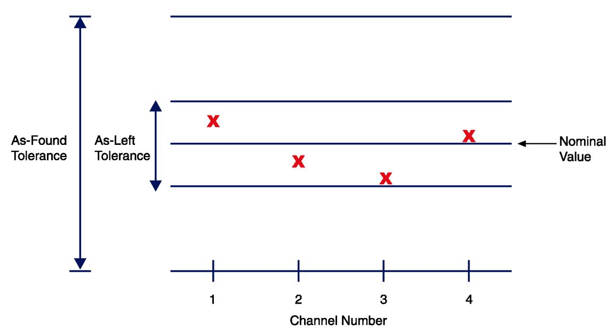

**Figure 1-1 Generalized Traditional Calibration Process** 

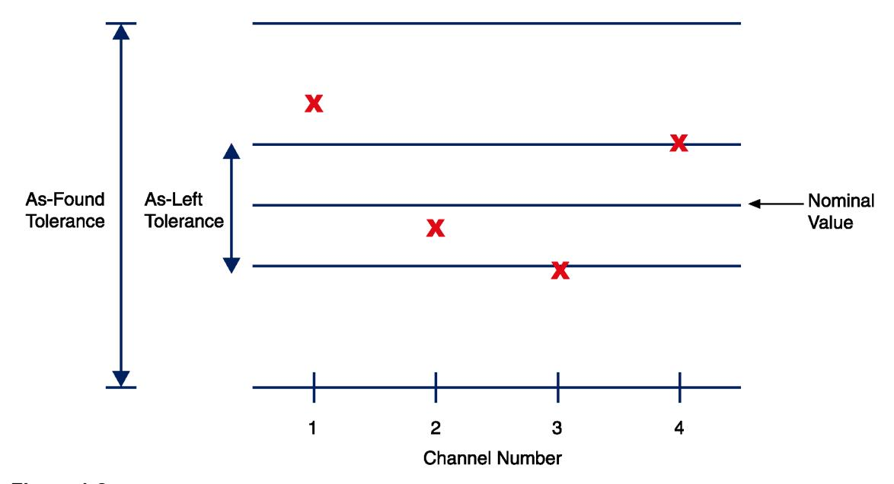

**Figure 1-2 Generalized Calibration Process With On-Line Monitoring** 

### **1.3 NRC Safety Evaluation for On-Line Monitoring**

EPRI formed the EPRI/Utility On-Line Monitoring Working Group in 1994 with the goal of obtaining NRC approval of on-line monitoring as a calibration-reduction tool for safety-related instruments. An initial submittal was made to the NRC in 1995, followed by a detailed submittal in 1998. The NRC Safety Evaluation (SE) was issued in July 2000.

EPRI TR-104965-R1 NRC safety evaluation report (SER), *On-Line Monitoring of Instrument Channel Performance*, was modified in September 2000 to incorporate the NRC SE. With the issuance of the SE, the EPRI/Utility On-Line Monitoring Working Group completed its mission and evolved into the Instrument Monitoring and Calibration (IMC) Users Group.

A copy of the NRC SE is provided in Appendix B. Section 2 of this report discusses the specific requirements specified in the SE.

#### **1.4 EPRI's Role in On-Line Monitoring**

EPRI's strategic role in on-line monitoring is to facilitate its implementation and cost-effective use in numerous applications at power plants. To this end, EPRI has sponsored the On-Line Monitoring Implementation Project at multiple nuclear plants specifically intended to install and use on-line monitoring technology. The purpose of the EPRI On-Line Monitoring Implementation Project is to 1) apply on-line monitoring to all types of power plant applications and 2) document all aspects of the implementation process in a series of EPRI deliverable reports. These reports cover installation, modeling, optimization, and proven cost-benefit. The EPRI reports are:

- EPRI interim report, *SureSense Diagnostic Monitoring Studio Users Guide*, June 2002, provides detailed guidance for the application of SureSense for nuclear plant systems. This report is periodically updated as a result of user feedback and software revisions.
- 1003661, *Plant System Modeling Guidelines to Implement On-Line Monitoring*, May 2002, addresses all aspects of modeling for on-line monitoring applications. This report describes model development, data quality issues, model training requirements, retraining criteria, alarm response, and declaring a model ready for use. The models developed by the project participants are described in the appendices for the benefit of future users of on-line monitoring systems.
- 1003360, *On-Line Monitoring Implementation Guidelines*, November 2002, discusses implementation of on-line monitoring. This report addresses plant procedures for on-line monitoring, software verification and acceptance testing, data management, alarm assessment, and the transition from batch mode to on-line mode of monitoring operation.
- 1003572, *Cost Benefits of On-Line Monitoring*, June 2002, discusses the expected costs and benefits of on-line monitoring. Direct, indirect, and potential benefits are covered. The experience of the participants of the EPRI On-Line Monitoring Implementation Project is included.
- 1007549, *Department of Energy/EPRI: On-Line Monitoring: Technical Specification Instruments*, December 2002 (this report), addresses on-line monitoring for safety-related applications and the NRC Safety Evaluation for on-line monitoring. Topics include Technical Specifications, uncertainty analysis, procedures and surveillances, and miscellaneous technical considerations. Nuclear Energy Plant Optimization (NEPO) projects related to software verification and validation and uncertainty analysis provided input to this report.

EPRI fosters development of on-line monitoring technology and its application via the IMC Users Group. Through the IMC Users Group, on-line monitoring as a key technology will continue to be supported technically as its use grows throughout the industry.

#### **1.5 Terminology Used in This Report**

Appendix A provides a glossary of terms used in this report. But, some terms require additional clarification in support of using this report. The following sections explain key terms.

#### *1.5.1 Channel, Sensor, and Signal*

The terms *channel*, *sensor*, and *signal* are often used almost interchangeably in this report, but there is an important distinction between the three terms. The sensor is the device that measures the process value. The sensor and associated signal-conditioning equipment are referred to as the instrument channel, or channel. The electrical output from the channel or, more commonly, its digitized equivalent value is the signal. Figure 1-3 shows the relationship between the three terms for a safety-related channel; a non-safety-related channel might not have the isolator or bistable as shown.

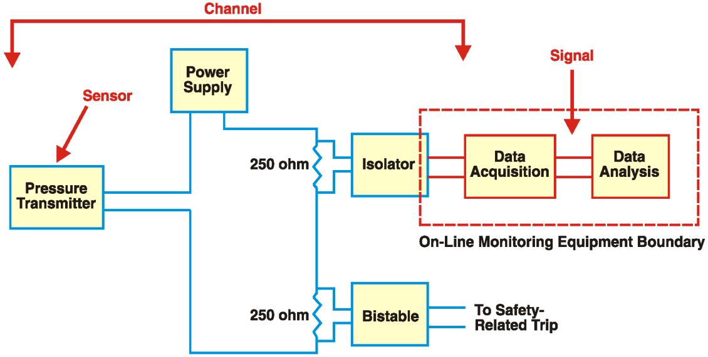

**Figure 1-3 Instrument Channel in Terms of On-Line Monitoring** 

For a non-safety-related channel, there might be little in the way of signal conditioning, with the sensor being the only real monitored device. More complex measurements might contain several signal-conditioning modules. This report will usually refer to the channel rather than the sensor in terms of what is monitored. Although other industry documents and published papers often discuss on-line monitoring using the term *sensor*, it is the *channel* (or some portion of the channel) that is actually monitored. The discussion provided in the following sections will frequently refer to sensor drift because the sensor is usually the most common source of drift, but any portion of the channel might actually be the cause of drift.

#### *Introduction*

The on-line monitoring system does not know the layout of the channel; it only receives a digitized signal from the plant computer, an historical file, or other data-acquisition system. Although the instrument channel is typically producing a milliampere or voltage output, the signal acquired by the on-line monitoring system is usually digitized and scaled into the expected process units, such as pressure, temperature, or percent. When this report refers to *signals*, it means the scaled or unscaled digitized output signals from the monitored channels.

#### *1.5.2 Modeling Terms*

The term *model* is used to describe the group of signals that have been collected together for the purpose of signal validation and analysis. Depending on the context, model might refer just to the selected group of signals, or it might also include the various settings defined by the on-line monitoring system that are necessary to optimize the performance of the signal-validation procedure. In the context of on-line monitoring, *model* does not necessarily refer to some functional relationship between model elements, defined by a set of equations.

The term *observation vector* is used to describe the observed values for all of the signals in the model at a particular instant in time. For example, if the signal data are contained in a spreadsheet, a single row of data representing a particular point in time would be a vector.

The term *state space* is used to describe the operating states that form the basis for training a model. The state space contains the expected range for each signal in the model; it also defines different operating states within that range. For example, a state space for a pressure sensor might cover a range of 800 to 1200 psig (5516 to 8274 kPa); within this range, there might be several distinct operating states associated with different equipment lineups or plant power levels.

The term *estimate* is used to describe the best estimate or prediction of the actual process or signal value. For each observation, the on-line monitoring system produces an estimate of the corresponding expected value for each monitored signal. The term *residual* refers to the mathematical difference between an observed value and the corresponding estimate for that observation. Fault detection is often based on the behavior of the residual.

## *2* **NRC SAFETY EVALUATION REVIEW CRITERIA**

The NRC Safety Evaluation is provided in Appendix B. As part of its acceptance of on-line monitoring, the SE provides 14 requirements that must be addressed in the implementation process. Section 2 provides the roadmap that explains how each SE requirement is addressed by this topical report. The NRC SE provides additional clarification for each requirement that should also be reviewed to ensure a complete understanding of the requirement.

In the following discussion, the identification number of each requirement corresponds to the number assigned by the NRC SE. Each SE requirement is provided in its entirety, followed by a discussion of how this topical report addresses the requirement.

#### **2.1 Requirement 1**

*The submittal for implementation of the on-line monitoring technique shall confirm that the impact on plant safety of the deficiencies inherent in the on-line monitoring technique (inaccuracy in process parameter estimate, single-point monitoring, and untraceability of accuracy to standards), on plant safety will be insignificant, and that all uncertainties associated with the process parameter estimate have been quantitatively bounded and accounted for either in the on-line monitoring acceptance criteria or in the applicable setpoint and uncertainty calculations.* 

#### *2.1.1 Discussion for Requirement 1*

The methodology provided in Section 6 is specifically intended to comply with Requirement 1. Argonne National Laboratory (ANL) is developing the uncertainty analysis for the version of Multivariate State Estimation Technique (MSET) used in the EPRI On-Line Monitoring Implementation Project. The uncertainty analysis project has been funded as part of the U.S. Department of Energy (DOE) NEPO program, and the project is in progress as of the issuance of this interim report. This report will be updated when ANL completes the uncertainty analysis.

Section 5 addresses single-point monitoring in detail, and the results are incorporated into Section 6 as part of the on-line monitoring drift allowance calculation. The intent is to maintain traceability to the allowances provided in the associated setpoint calculation. The approach taken will have no impact on either the trip setpoint or the allowable value in the Technical Specifications.

*NRC Safety Evaluation Review Criteria* 

Traceability of accuracy to reference standards has been maintained by the very nature of the online monitoring implementation approach. The calibration frequency has been extended, not eliminated.

#### **2.2 Requirement 2**

*Unless the licensee can demonstrate otherwise, instrument channels monitoring processes that are always at the low or high end of an instrument's calibrated span during normal plant operation shall be excluded from the on-line monitoring program.* 

#### *2.2.1 Discussion for Requirement 2*

Section 5 provides detailed information that confirms the basis for Requirement 2. Section 3.1 summarizes the applications that are considered suitable candidates for on-line monitoring. Section 3.2 summarizes the types of applications that are not considered suitable for on-line monitoring. The basis for this determination is provided in Section 5.

#### **2.3 Requirement 3**

*The algorithm used for on-line monitoring shall be able to distinguish between the process variable drift (actual process going up or down) and the instrument drift and shall be able to compensate for uncertainties introduced by unstable process, sensor locations, non-simultaneous measurements, and noisy signals. If the implemented algorithm and its associated software cannot meet these requirements, administrative controls, including the guidelines in Section 3 of the topical report for avoiding a penalty for non-simultaneous measurement, could be implemented as an acceptable means to ensure that these requirements are met satisfactorily.* 

#### *2.3.1 Discussion for Requirement 3*

The EPRI On-Line Monitoring Implementation Project has selected MSET as its preferred online monitoring method. MSET is specifically trained to recognize normal behavior as well as specific operating states. It readily distinguishes between a process change and an instrument drift. Noisy signals and measurement lead/lag relationships are accommodated by the model learning procedures used with MSET. EPRI topical report 1003661, *Plant System Modeling Guidelines to Implement On-Line Monitoring*, provides specific guidance for an MSET application.

### **2.4 Requirement 4**

*For instruments that were not included in the EPRI drift study, the value of the allowance or penalty to compensate for single-point monitoring must be determined by using the instrument's historical calibration data and by analyzing the instrument performance over its range for all modes of operation, including startup, shutdown, and plant trips. If the required data for such a determination is not available, an evaluation demonstrating that the instrument's relevant* 

*performance specifications are as good as or better than those of a similar instrument included in the EPRI drift study, will permit a licensee to use the generic penalties for single-point monitoring given in EPRI Topical Report 104965.* 

#### *2.4.1 Discussion for Requirement 4*

Section 5 provides detailed information regarding single-point monitoring. Most plants following the criteria stated in NRC Requirement 4 can use the generic penalties provided in Section 5. Section 5 discusses the EPRI drift study to explain why the results are likely to be more conservative than necessary for most applications. Section 5 also provides detailed information explaining how to perform a plant-specific analysis for a single-point monitoring allowance.

#### **2.5 Requirement 5**

*Calculations for the acceptance criteria defining the proposed three zones of deviation ("acceptable," "needs calibration," and "inoperable") should be done in a manner consistent with the plant-specific safety-related instrumentation setpoint methodology so that using on-line monitoring technique to monitor instrument performance and extend its calibration interval will not invalidate the setpoint calculation assumptions and the safety analysis assumptions. If new or different uncertainties require the recalculation of instrument trip setpoints, it should be demonstrated that relevant safety analyses are unaffected. The licensee should have a documented methodology for calculating acceptance criteria that are compatible with the practice described in Regulatory Guide 1.105 and the methodology described in acceptable industry standards for TSP and uncertainty calculations.* 

#### *2.5.1 Discussion for Requirement 5*

The methodology provided in Section 6 ensures that setpoint calculation and safety analysis assumptions are unchanged. A clear basis for the on-line monitoring drift allowance has been established so that setpoint calculations should not require revision. The Technical Specification trip setpoint and allowable value requirements are also unaffected because the methodology deliberately ensures compliance with the setpoint calculations. Unique uncertainties attributed to on-line monitoring or single-point monitoring specifically reduce the on-line monitoring drift allowance to ensure that the setpoint calculations do not require revision.

#### **2.6 Requirement 6**

*For any algorithm used, the maximum acceptable value of deviation (MAVD) shall be such that accepting the deviation in the monitored value anywhere in the zone between PE and MAVD will provide high confidence (level of 95%/95%) that drift in the sensor-transmitter or any part of an instrument channel that is common to the instrument channel and the on-line monitoring loop is less than or equal to the value used in the setpoint calculations for that instrument channel.* 

#### *2.6.1 Discussion for Requirement 6*

The calculation method described in Section 6 ensures that the MAVD provides a high confidence level that is entirely consistent with the setpoint calculations. The allowance for drift has been conservatively determined without taking credit for non-sensor-related uncertainty terms. The on-line monitoring allowance for drift is further reduced to account for unique uncertainty elements introduced by the use of on-line monitoring.

#### **2.7 Requirement 7**

*The instrument shall meet all requirements of the above requirement 6 for the acceptable band or acceptable region.* 

#### *2.7.1 Discussion for Requirement 7*

The calculation method described in Section 6 ensures that the MAVD provides a high confidence level that is consistent with the setpoint calculations. The allowance for drift has been conservatively determined without taking credit for non-sensor-related uncertainty terms. The on-line monitoring allowance for drift is further reduced to account for unique uncertainty elements introduced by the use of on-line monitoring.

#### **2.8 Requirement 8**

*For any algorithm used, the maximum value of the channel deviation beyond which the instrument is declared "inoperable" shall be listed in the Technical Specifications with a note indicating that this value is to be used for determining the channel operability only when the channel's performance is being monitored using an on-line monitoring technique. It could be called "allowable deviation value for on-line monitoring" (ADVOLM) or whatever name the licensee chooses. The ADVOLM shall be established by the instrument uncertainty analysis. The value of the ADVOLM shall be such to ensure:* 

- *(a) that when the deviation between the monitored value and its PE is less than or equal to the ADVOLM limit, the channel will meet the requirements of the current Technical Specifications, and the assumptions of the setpoint calculations and safety analyses are satisfied; and*
- *(b) that until the instrument channel is recalibrated (at most until the next refueling outage), actual drift in the sensor-transmitter or any part of an instrument channel that is common to the instrument channel and the on-line monitoring loop will be less than or equal to the value used in the setpoint calculations and other limits defined in 10 CFR 50.36 as applicable to the plantspecific design for the monitored process variable are satisfied.*

#### *2.8.1 Discussion for Requirement 8*

Section 6 establishes the methodology for calculating the on-line monitoring drift allowance. The methodology has been defined in a manner that ensures that the associated setpoint calculation allowances remain unchanged. This is an important part of the on-line monitoring implementation process because the intent is to minimize the changes necessary in the Technical Specifications. Accordingly, the on-line monitoring drift allowance ensures that the Technical Specification trip setpoint and allowable value for each parameter remain unchanged.

The on-line monitoring quarterly surveillance ensures that 1) the on-line monitoring system performance is acceptable and 2) each monitored parameter is operating within acceptable limits. The on-line monitoring acceptable criteria, including the MAVD and the ADVOLM, would be provided in a quarterly surveillance procedure. Including this information in the body of the Technical Specifications should not be necessary and is more appropriately assigned to the surveillance procedure. This is no different in concept than providing acceptable as-found settings and as-left settings for instrument calibrations in the associated calibration documents.

#### **2.9 Requirement 9**

*Calculations defining alarm setpoint (if any), acceptable band, the band identifying the monitored instrument as needing to be calibrated earlier than its next scheduled calibration, the maximum value of deviation beyond which the instrument is declared "inoperable," and the criteria for determining the monitored channel to be an "outlier," shall be performed to ensure that all safety analysis assumptions and assumptions of the associated setpoint calculation are satisfied and the calculated limits for the monitored process variables specified by 10 CFR 50.36 are not violated.* 

#### *2.9.1 Discussion for Requirement 9*

Section 6 establishes the methodology for calculating the on-line monitoring drift allowance, and the methodology has been defined in a manner that ensures that the associated setpoint calculation allowances remain unchanged. The methodology ensures compliance with the above requirement.

#### **2.10 Requirement 10**

*The plant specific submittal shall confirm that the proposed on-line monitoring system will be consistent with the plant's licensing basis, and that there continues to be a coordinated defensein-depth against instrument failure.* 

#### *2.10.1 Discussion for Requirement 10*

The application of on-line monitoring for Technical Specification parameters has been specifically designed to ensure consistency with the plant's licensing basis. The on-line monitoring acceptance criterion have been developed in a manner that ensures consistency with the setpoint calculation allowances for drift while also ensuring no change to existing Technical Specification trip setpoints or allowable values. A coordinated defense-in-depth against instrument failure has been improved by the application of on-line monitoring because instrument performance is evaluated more frequently than by traditional methods. An ongoing monitoring program is described in Section 6.6 and is recommended as an additional ongoing method of confirming acceptable instrument performance.

#### **2.11 Requirement 11**

*Adequate isolation and independence, as required by Regulatory Guide 1.75, GDC 21, GDC 22, IEEE Std. 279 or IEEE Std. 603, and IEEE Std. 384, shall be maintained between the on-line monitoring devices and Class 1E instruments being monitored.* 

#### *2.11.1 Discussion for Requirement 11*

The on-line monitoring system does not connect to the safety-related portion of any instrument circuit. The data acquired by the on-line monitoring system is obtained from the downstream side of signal isolators, thereby ensuring compliance with the plant's licensing basis for isolation and independence.

It should be noted that the MSET method used by the participants in the EPRI On-Line Monitoring Implementation Project does not connect to a physical instrument loop. The existing instrument circuit is entirely unchanged by the use of on-line monitoring. Signals are sent to the plant computer and are then stored in a conventional computer data archive. The on-line monitoring system acquires its inputs from the computer data archive as a data file.

#### **2.12 Requirement 12**

- *(a) QA requirements as delineated in 10 CFR Part 50, Appendix B, shall be applicable to all engineering and design activities related to on-line monitoring, including design and implementation of the on line system, calculations for determining process parameter estimates, all three zones of acceptance criteria (including the value of the ADVOLM), evaluation and trending of on-line monitoring results, activities (including drift assessments) for relaxing the current TS-required instrument calibration frequency from "once per refueling cycle" to "once per a maximum period of 8 years," and drift assessments for calculating the allowance or penalty required to compensate for single-point monitoring.*
- *(b) The plant-specific QA requirements shall be applicable to the selected on-line monitoring methodology, its algorithm, and the associated software. In addition, software shall be verified and validated and meet all quality requirements in accordance with NRC guidance and acceptable industry standards.*

#### *2.12.1 Discussion for Requirement 12*

The plant-specific engineering analyses performed in support of on-line monitoring implementation shall be performed in accordance with the applicable plant-specific quality assurance (QA) procedures. The calculation of on-line monitoring acceptance criterion involves the review and interpretation of setpoint calculations and related documents. Accordingly, QA controls over these activities are considered reasonable as stated in the NRC requirement.

Section 8 provides the verification and validation (V&V) documentation produced in support of this project; this documentation specifically supports an MSET implementation because this is the basis for the EPRI On-Line Monitoring Implementation Project. The documentation developed in support of this project includes quality documents and V&V-related documents produced by the software supplier (Expert Microsystems, Inc.), Argonne National Laboratory, and EPRI. Each participating plant must follow its plant-specific procedures for software acceptance.

#### **2.13 Requirement 13**

*All equipment (except software) used for collection, electronic transmission, and analysis of plant data for on-line monitoring purposes shall meet the requirements of 10 CFR Part 50, Appendix B, Criterion XII, "Control of Measuring and Test Equipment." Administrative procedures shall be in place to maintain configuration control of the on-line monitoring software and algorithm.* 

#### *2.13.1 Discussion for Requirement 13*

The signal data evaluated by on-line monitoring is obtained from instrument circuits that are maintained in accordance with plant-specific procedures, including the control of measuring and test equipment. The experience of the EPRI On-Line Monitoring Implementation Project is that unique equipment is not installed onto these instrument circuits; the data are acquired from existing instrumentation without any modification to the circuits of the measuring and test equipment.

Administrative controls are considered necessary to maintain configuration control of the monitoring software and the algorithm, which is an integral part of the software. Section 7 describes plant procedures and surveillance requirements associated with on-line monitoring, which addresses these administrative controls.

#### **2.14 Requirement 14**

*Before declaring the on-line monitoring system operable for the first time, and just before each performance of the scheduled surveillance using an on-line monitoring technique, a full-features functional test, using simulated input signals of known and traceable accuracy, should be conducted to verify that the algorithm and its software perform all required functions within acceptable limits of accuracy. All applicable features shall be tested.* 

#### *2.14.1 Discussion for Requirement 14*

The V&V documents produced in support of this project include a procedure with expected results for an acceptance test and periodic test. The test files referenced in this procedure are provided directly to the software users. As part of the plant-specific software acceptance, these test procedures and test files form the recommended basis for acceptance testing as well as for periodic testing in support of the quarterly on-line monitoring surveillance test. Section 7 provides the recommended input for the quarterly on-line monitoring surveillance test. Section 8 discusses the V&V documentation in support of an MSET application.

## *3* **TYPICAL TECHNICAL SPECIFICATION CHANNELS SUITABLE FOR ON-LINE MONITORING**

Although on-line monitoring techniques can be applied to a large and diverse number of processes, there are some applications that might not be suitable for on-line monitoring. The NRC safety evaluation for on-line monitoring provides the following related requirement:

#### **Requirement 2**

*Unless the licensee can demonstrate otherwise, instrument channels monitoring processes that are always at the low or high end of an instrument's calibrated span during normal plant operation shall be excluded from the on-line monitoring program.* 

#### Discussion for Requirement 2:

Section 5 provides detailed information that confirms the basis for Requirement 2. Section 3.1 summarizes the applications that are considered suitable candidates for on-line monitoring. Section 3.2 summarizes the types of applications that are not considered suitable for on-line monitoring. The basis for this determination is provided in Section 5.

#### **3.1 Suitable Applications**

The following tables list only the Technical Specification instrument channels that typically might be evaluated by an on-line monitoring system. (Note: Experience with the EPRI On-Line Monitoring Implementation Project indicates that several hundred more non-safety-related channels can be evaluated by an on-line monitoring system.) In each table, the column titled "Minimum Number of Required Calibrations" refers to the minimum number of calibrations required to be performed on each parameter during one operating cycle. Plant-specific design variations regarding the number of instruments should be reviewed for each application. Clarifications and notes are provided immediately following each table.

*Typical Technical Specification Channels Suitable for On-Line Monitoring* 

**Table 3-1 Typical Technical Specification Channels for On-Line Monitoring – Westinghouse Design** 

| Application (Note 1)                 | Number of Channels Per Loop | Total Number of Channels | Minimum Number of Required Calibrations |
|--------------------------------------|-----------------------------------|-----------------------------|--------------------------------------------------|
| Feedwater flow                       | 2                                 | 8                           | 4                                                |
| Pressurizer pressure                 | N/A                               | 4                           | 1                                                |
| Pressurizer water level              | N/A                               | 3                           | 1                                                |
| RCS flow                             | 3                                 | 12                          | 4                                                |
| RCS pressure                         | N/A                               | 2                           | (Note 2)                                         |
| Steam generator water level (Note 3) | 4                                 | 16                          | 4                                                |
| Steam flow                           | 2                                 | 8                           | 4                                                |
| Steam pressure                       | 3                                 | 12                          | 4                                                |
| Turbine first stage pressure         | N/A                               | 2                           | 1                                                |
|                                      | Totals:                           | 67                          | 23                                               |

Note 1: This table is based on a four-loop plant. Depending on the calibrated span and demonstrated drift performance, containment pressure and tank level of the refueling water storage might be included. Instrument channels that monitor normally off systems such as auxiliary feedwater flow are not considered appropriate for online monitoring. Plant-specific variations in Technical Specifications might change the total number of channels or might include other instrument channel types.

Note 2: For an MSET application, pressure of the reactor coolant system (RCS) and pressurizer pressure are equivalent and should be combinable parameters in terms of periodic calibration requirements.

Note 3: For an MSET application, steam generator wide range level can usually be combined with the narrow range channels in terms of periodic calibration requirements, although wide range level might not be a Technical Specification parameter.

**Table 3-2 Typical Technical Specification Channels for On-Line Monitoring – B&W Design** 

| Application (Note 1)              | Number of Channels Per Loop | Total Number of Channels | Minimum Number of Required Calibrations |
|-----------------------------------|-----------------------------------|-----------------------------|--------------------------------------------------|
| Pressurizer level                 | N/A                               | 2                           | 1                                                |
| RCS flow                          | 4                                 | 8                           | 2                                                |
| RCS pressure                      | N/A                               | 8                           | 2 (Note 2)                                       |
| RCS temperature                   | 4                                 | 8                           | 2                                                |
| Steam generator level (operating) | 4                                 | 8                           | 2                                                |
| Steam generator level (shutdown)  | 4                                 | 8                           | 2                                                |
| Steam generator pressure          | 4                                 | 8                           | 2                                                |
|                                   | Totals:                           | 50                          | 13                                               |

Note 1: This table is based on a two-loop design. Depending on the calibrated span and demonstrated drift performance, other parameters might be suitable. Instrument channels that monitor normally off systems are not considered appropriate for on-line monitoring. Plant-specific variations in Technical Specifications might change the total number of channels or might include other instrument channel types.

Note 2: All channels require calibration within an eight-year period. It has been assumed here that two channels would be calibrated each fuel cycle, if operating on a 24-month cycle.

*Typical Technical Specification Channels Suitable for On-Line Monitoring* 

**Table 3-3 Typical Technical Specification Channels for On-Line Monitoring – GE BWR Design** 

| Application (Notes 1 and 2)               | Number of Channels Per Loop | Total Number of Channels | Minimum Number of Required Calibrations |
|-------------------------------------------|-----------------------------------|-----------------------------|--------------------------------------------------|
| Drywell pressure                          | N/A                               | 3                           | 1                                                |
| Reactor vessel steam dome pressure        | N/A                               | 4                           | 1                                                |
| Reactor vessel water level (wide range)   | N/A                               | 4                           | 1                                                |
| Reactor vessel water level (narrow range) | N/A                               | 4                           | 1 (Note 3)                                       |
| Recirculation pump flow                   | 4                                 | 8                           | 2                                                |
| Suppression pool level                    | N/A                               | 2                           | 1                                                |
| Suppression pool temperature              | N/A                               | 2                           | 1                                                |
|                                           | Totals:                           | 27                          | 8                                                |

Note 1: This table is based on an older boiling water reactor (BWR) plant with fewer sensor signals made available to the plant computer. Newer BWR plants might have more sensors connected to the plant computer, which would raise the overall totals.

Note 2: Depending on the calibrated span and demonstrated drift performance, other parameters might be suitable. Instrument channels that monitor normally off systems are usually not considered appropriate for on-line monitoring. Plant-specific variations in Technical Specifications might change the total number of channels or might have other instrument channel types.

Note 3: For an MSET application, reactor vessel wide range and narrow range level are equivalent and should be combinable parameters in terms of periodic calibration requirements. But, all channels require calibration within an eight-year period.

### **3.2 Unsuitable Applications**

Section 5 discusses the conclusions reached with respect to detecting instrument drift when the monitored process changes by only a small amount during plant operation (referred to as *singlepoint monitoring)*. To summarize, on-line monitoring is not appropriate for every application. Examples of unsuitable applications include:

- Instrument channels that monitor normally off systems, such as safety injection, auxiliary feedwater, or containment spray flow or pressure.
- Instrument channels that monitor processes normally operating at the extreme low end of the calibrated span. Containment pressure is an example.
- Instrument channels that monitor processes normally operating at the extreme high end of the calibrated span. Refueling water storage tank level is one possible example.

# *4*

### **TECHNICAL SPECIFICATION CRITERIA**

Each parameter covered by the Technical Specifications has specific surveillance requirements that are performed at various frequencies. The surveillance requirements are intended to demonstrate that the associated instrumentation is operable, and actions are specified in the event that an inoperable channel is identified.

The implementation of on-line monitoring for safety-related channels represents a change from current surveillance requirements specified in the Technical Specifications. Accordingly, a Technical Specification change request to the NRC is necessary to obtain approval of the implementation.

Section 4 describes the scope of the recommended Technical Specification changes. Suggested wording is provided using the terminology of the Technical Specifications.

#### **4.1 Technical Specification Change Summary**

The Technical Specification changes necessary to apply on-line monitoring as a means of extending calibration intervals are straightforward in principle:

- For each redundant set of sensors (transmitters), one of the associated sensors must be calibrated each operating cycle.
- Any other channels that are identified as potentially needing calibration must also be calibrated, if necessary.
- The maximum allowed interval between calibrations is eight years, regardless of the number of redundant channels.
- The on-line monitoring system will be evaluated on a quarterly frequency, as a minimum.

Addressing the above involves the following specific changes to the Technical Specifications:

- Add a definition of on-line monitoring to Section 1 of the Technical Specifications.
- Add two new surveillance types—a quarterly surveillance check using on-line monitoring and a calibration at a *staggered test basis* interval, in which one redundant channel is calibrated each fuel cycle. The staggered test basis interval is already defined in the Technical Specifications.
- Specify which parameters will utilize the new surveillance types.

#### **4.2 Suggested Technical Specification Wording**

#### *4.2.1 Definition Changes*

The definition of on-line monitoring should be added to Section 1 of the Technical Specifications. By this approach, on-line monitoring is one more calibration-related function and is defined, just as the Technical Specifications already include definitions for CHANNEL CALIBRATION and CHANNEL CHECK.

The following definition of on-line monitoring is recommended:

ON-LINE MONITORING ON-LINE MONITORING is the assessment of channel performance and calibration while the channel is operating. ON-LINE MONITORING differs from CHANNEL CALIBRATION in that the channel is not adjusted by the process of ON-LINE MONITORING. Instead, ON-LINE MONITORING compares channel performance to established acceptance criterion to determine if a CHANNEL CALIBRATION is necessary.

#### *4.2.2 Addition of New Surveillance Types*

In terms of the Technical Specifications, two surveillance-related activities require new definitions:

- On a quarterly basis, a formal surveillance check will be performed to verify that no channels are outside the prescribed acceptance limits. Section 7 provides guidance regarding this quarterly surveillance check.
- At least one redundant transmitter will be calibrated each fuel cycle. If identified as in need of calibration by on-line monitoring, other redundant transmitters will also be calibrated. All *n* redundant safety-related channels for a given parameter will require calibration at least once within *n* fuel cycles. This concept is already present in the standard Technical Specifications via the existing definition of *staggered test basis*:
  - "A STAGGERED TEST BASIS shall consist of the testing of one of the systems, subsystems, channels, or other designated components during the interval specified by the Surveillance Frequency, so that all systems, subsystems, channels, or other designated components are tested during n Surveillance Frequency intervals, where n is the total number of systems, subsystems, channels, or other designated components in the associated function."

Note: The above definition of *staggered test basis* was obtained from the Standard Technical Specifications. This definition is the same for Westinghouse, Combustion Engineering, Babcock & Wilcox, and General Electric Standard Technical Specifications. However, older plant-specific Technical Specifications might use a different definition. In these cases, the concept still applies, but additional changes to the Technical Specifications might be necessary to accommodate the addition of this definition.

In accordance with the implementation strategy described previously, all redundant channels must be calibrated every *n* fuel cycles in accordance with the above definition, not to exceed a calibration interval of at least once every eight years. Accordingly, it is recommended that the following sentence be added to the end of the existing definition of STAGGERED TEST BASIS:

Furthermore, for systems, subsystems, channels, or other designated components that are tested by ON-LINE MONITORING, all *n* systems, subsystems, channels, or other designated components will be tested at a frequency not to exceed 8 years, regardless of the size of *n*.

The following new surveillance requirement definitions listed below are recommended. The surveillance requirement numbers, 3.3.1.17 and 3.3.1.18, are the next available numbers in the Westinghouse Standard Technical Specifications and are used for the purposes of illustration only; each plant will have to insert the appropriate surveillance numbers for its Technical Specifications.

| Surveillance                                      | Frequency                                |
|---------------------------------------------------|------------------------------------------|
| SR 3.3.1.17 perform ON-LINE MONITORING evaluation | [92] days                                |
| SR 3.3.1.18 perform CHANNEL CALIBRATION           | [18] months on a STAGGERED TEST BASIS |

The frequency of [92] days is intended to match the Technical Specification layout for quarterly checks. The frequency of [18] months is a plant-specific number that depends on the approved fuel cycle duration. Depending on the plant, the frequency in this case might be 12, 18, or 24 months.

The definition of on-line monitoring was provided in the previous section. The channel calibration will rely on the existing Technical Specification definition; a typical definition of channel calibration is as follows:

A CHANNEL CALIBRATION shall be the adjustment, as necessary, of the channel so that it responds within the required range and accuracy to known input. The CHANNEL CALIBRATION shall encompass the entire channel, including the required sensor, alarm, interlock, display, and trip functions. The CHANNEL CALIBRATION may be performed by means of any series of sequential, overlapping calibrations or total channel steps so that the entire channel is calibrated.

*Technical Specification Criteria* 

In summary, one redundant channel will be calibrated each refueling cycle and all redundant channels will be calibrated at an interval not to exceed eight years. The following examples illustrate the interpretation of this Technical Specification:

Example: A plant on an 18-month fuel cycle with three redundant instruments for a given parameter would, as a minimum, calibrate at the following frequency:

First channel: 18 months Second channel: 36 months Third channel: 54 months

Notice that all redundant channels are calibrated within 4½ years in this case.

Example: A plant on a 24-month fuel cycle with five redundant instruments for a given parameter would, as a minimum, calibrate at the following frequency:

First channel: 2 years Second channel: 4 years Third channel: 6 years Fourth channel: 8 years Fifth channel: 8 years

Notice that all redundant channels are calibrated within eight years in this case and the last two channels are calibrated during the fourth fuel cycle to remain within the eight-year limit.

#### *4.2.3 Example Change to Reactor Trip System Instrumentation Table*

The new surveillance requirements would be implemented on a parameter-by-parameter basis, in the same manner as is already in place for other Technical Specification surveillance requirements. Table 4-1 shows The Technical Specification change for a typical parameter. The existing surveillance requirement (SR 3.3.1.10) for a channel calibration each fuel cycle has been deleted, and the two new surveillance requirements (highlighted) have been added.

Table 4-1
Example Surveillance Requirements for Westinghouse Standard Technical Specifications

| Table 3.3.1-1 Reactor Trip System Instrumentation                                                                                                            |      |     |   |                                                                                      |                              |                              |
|-----------------------------------------------------------------------------------------------------------------------------------------------------------------|------|-----|---|--------------------------------------------------------------------------------------|------------------------------|------------------------------|
| Applicable Function  Applicable  Modes or other Required Conditions Surveillance Allowable Nominal tr specified channels requirements value setpoint conditions |      |     |   |                                                                                      |                              |                              |
| Pressurizer pressure low                                                                                                                                  | 1(g) | [4] | М | SR 3.3.1.1 SR 3.3.1.7 SR 3.3.1.10 SR 3.3.1.16 SR 3.3.1.17 SR 3.3.1.18 | ≥[1886] psig (13,000 kPa) | ≥[1900] psig (13,100 kPa) |

For each parameter that will be included in the on-line monitoring program, a similar change to the Technical Specifications would be made.

#### 4.2.4 Technical Specification Bases

The Technical Specifications provide bases for the surveillance requirements. The following bases are recommended for the new surveillance requirements for on-line monitoring:

#### SR 3.3.1.17.

SR 3.3.1.17 verifies that all channels for a given parameter are performing within the acceptance criterion established for on-line monitoring. Refer to EPRI topical reports TR-104965-R1 NRC SER, *On-Line Monitoring of Instrument Channel Performance*, and 1006833, *Implementation of On-Line Monitoring for Technical Specification Instruments*, for further information regarding on-line monitoring.

#### SR 3.3.1.18.

SR 3.3.1.18 performs a CHANNEL CALIBRATION on a STAGGERED TEST BASIS. The performance of SR 3.3.1.17 on a [92] day frequency provides assurance that the monitored channels are performing within specified acceptance criterion and forms the basis for performing a CHANNEL CALIBRATION at an extended calibration interval. For *n* redundant channels, all channels for a given parameter will require a CHANNEL CALIBRATION at least once every *n* fuel cycles, with at least one channel receiving a CHANNEL CALIBRATION each fuel cycle. Furthermore, all *n* channels require calibration at a frequency not to exceed eight years, regardless of the size of *n*. Refer to EPRI topical reports TR-104965-R1 NRC SER, *On-Line Monitoring of Instrument Channel Performance*, and 1006833, *Implementation of On-Line Monitoring for Technical Specification Instruments*, for further information regarding the basis for this calibration frequency.

#### *4.2.5 Effect on Trip Setpoint and Allowable Value*

The application of on-line monitoring is not intended to affect either the trip setpoint or the allowable value. The on-line monitoring acceptance criterion should be established in such a manner that setpoint calculations are not modified and trip setpoints and allowable values remain unchanged. Section 6 provides the recommended approach for establishing the on-line monitoring acceptance limits.

#### **4.3 Checklist for Technical Specification Change Submittal**

This topical report is intended to facilitate the Technical Specification change process. However, each plant must address plant-specific aspects related to the change. The following provides a summary of the items to address in each plant-specific submittal:

- Scope—The safety-related channels covered by the submittal should be clearly identified. The selected channels should be suitable for on-line monitoring in accordance with the criteria provided in Section 3.2 of this report.
- On-line monitoring methodology—The on-line monitoring algorithm, method of data acquisition, data analysis process, and alarm process should be described.
- Deviations from NRC Safety Evaluation Report (SE)/EPRI topical report—Exceptions to or deviations from the SE should be clearly identified and explained. For example, the on-line monitoring algorithm might be different than the types described in this topical report. The differences from any SE discussion should be justified.
- Setpoint and uncertainty analysis verification—The implementation of on-line monitoring has to include acceptance criterion for each parameter that does not invalidate setpoint requirements. The submittal should state either a) that an evaluation has been performed for this purpose or b) that an evaluation is planned and will be completed prior to implementation. Depending on the implementation strategy, setpoint documents might be affected by the on-line monitoring acceptance criterion. The preferred and recommended approach is to establish an on-line monitoring acceptance criterion consistent with setpoint requirements so that the original setpoint calculations are not affected by the implementation of on-line monitoring. The method provided in Section 6 is intended to define the on-line monitoring acceptance criterion without directly affecting the setpoint calculations.
- Plant procedure impact—The submittal should note that a plant-specific procedure impact assessment has been completed. This includes the quarterly surveillance procedure for the assessment of on-line monitoring.
- Quality assurance—Confirm that the plant-specific software QA requirements have been satisfied for the selected on-line monitoring methodology.

## *5* **SINGLE-POINT MONITORING**

This section provides an overview of the single-point monitoring issue and provides specific guidance to ensure compliance with the NRC's safety evaluation requirements. The following sections are provided:

- Section 5.1 provides a brief overview of what is meant by single-point monitoring.
- Section 5.2 describes instrument drift characteristics with respect to single-point monitoring.
- Section 5.3 provides a more detailed review of instrument performance over time.
- Section 5.4 explains how to apply an allowance for single-point monitoring.
- Section 5.5 describes how a nuclear plant can develop a plant-specific allowance.

The NRC safety evaluation for on-line monitoring includes two specific requirements associated with single-point monitoring:

#### **Requirement 2**

*Unless the licensee can demonstrate otherwise, instrument channels monitoring processes that are always at the low or high end of an instrument's calibrated span during normal plant operation shall be excluded from the on-line monitoring program.* 

#### Discussion for Requirement 2:

This section provides detailed information that confirms the basis for the above requirement. Section 3.2 lists typical applications that are considered unsuitable for on-line monitoring.

#### **Requirement 4**

*For instruments that were not included in the EPRI drift study, the value of the allowance or penalty to compensate for single-point monitoring must be determined by using the instrument's historical calibration data and by analyzing the instrument performance over its range for all modes of operation, including startup, shutdown, and plant trips. If the required data for such a determination is not available, an evaluation demonstrating that the instrument's relevant performance specifications are as good as or better than those of a similar instrument included in the EPRI drift study, will permit a licensee to use the generic penalties for single-point monitoring given in EPRI Topical Report 104965.* 

#### Discussion for Requirement 4:

This section provides detailed information regarding single-point monitoring. Most plants following the criteria stated in NRC Requirement 4 can use the generic penalties provided in this section. This section discusses the EPRI drift study to explain why the results are likely to be more conservative than necessary for most applications. This section also provides detailed information explaining how to perform a plant-specific analysis for a single-point monitoring allowance.

#### **5.1 Summary of Single-Point Monitoring Issue**

When a plant operates at nearly constant power for an extended period of time, the process variations for many parameters tend to be relatively small. Figure 5-1 shows an example in which measured steam generator level is virtually constant at 61.5% of span for about 14 months. On-line monitoring can evaluate channel performance more frequently than accomplished by periodic channel calibration, but this evaluation is generally being performed with the plant operating near 100% power with very little process change occurring (on a percent of calibrated span) about the monitored point. Although an instrument might appear to be in calibration at the monitored point, how does the user know that it is still in calibration elsewhere in the span, such as at the high- or low-level trip setpoints, which might not be anywhere near the monitored point? This question is referred to as the *single-point monitoring* issue. The answer to this question is important to determining the on-line monitoring system's ability to detect any type of instrument drift. EPRI report TR-104965-R1 NRC SER, *On-Line Monitoring of Instrument Channel Performance*, September 2000, addresses this issue in detail, and the issue is summarized here.

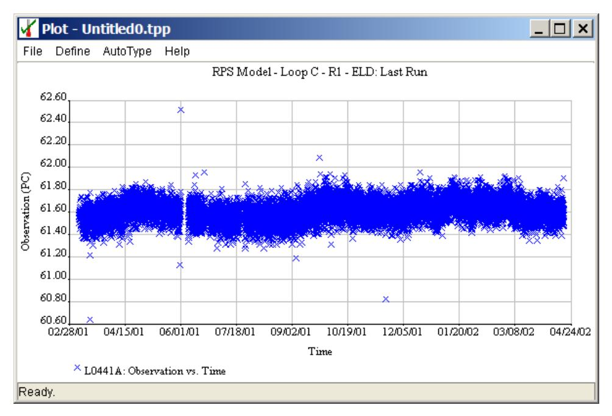

**Figure 5-1 Steam Generator Level Variation – Westinghouse Plant** 

#### **5.2 Drift Types**

Any discussion of an on-line monitoring system's ability to detect drift should start with a review of the types of drift that can occur. The following drift types can be observed:

- Zero shift—a type of instrument drift characterized by a change in the instrument zero point. Typically, the desired calibration curve is shifted from the zero point. Zero shift appears to be the most common drift type for the instrument types of interest and is the sole cause of drift in about 45 to 50% of the EPRI data. Figure 5-2 shows an example of zero shift.
- Span shift—a type of instrument drift characterized by a change in the instrument span as compared to the desired span. Span shift typically results in the instrument being in calibration at some point along the instrument's span and out of calibration at some other point along the instrument's span. Span shift can occur either as forward span shift (the instrument is in calibration at the low end of span and out of calibration higher in the span) or reverse span shift (the instrument is out of calibration at the low end of span and in calibration higher in the span). Span shift commonly occurs for the instrument types of interest and is the sole cause of drift in about 20 to 25% of the EPRI data. Figure 5-3 shows an example of span shift.
- Combination of zero and span shift—a type of drift characterized by a simultaneous change in both the zero and span of the instrument. A combination of zero and span shift occurs in about 15 to 30% of the EPRI data, generally increasing in proportion as the magnitude of drift increases. Figure 5-4 shows an example of combined zero and span shift.
- Nonlinear—a type of instrument drift that is not clearly zero shift, span shift, or a combination of the two types, in which the degree of calibration varies (often with no obvious pattern) along the calibration curve. Nonlinear drift is relatively rare, contributing to drift in about 5% of the EPRI data. Figure 5-5 shows an example of nonlinear drift.

EPRI report TR-104965-R1 NRC SER discusses these drift types and their effect on calibration in considerable detail.

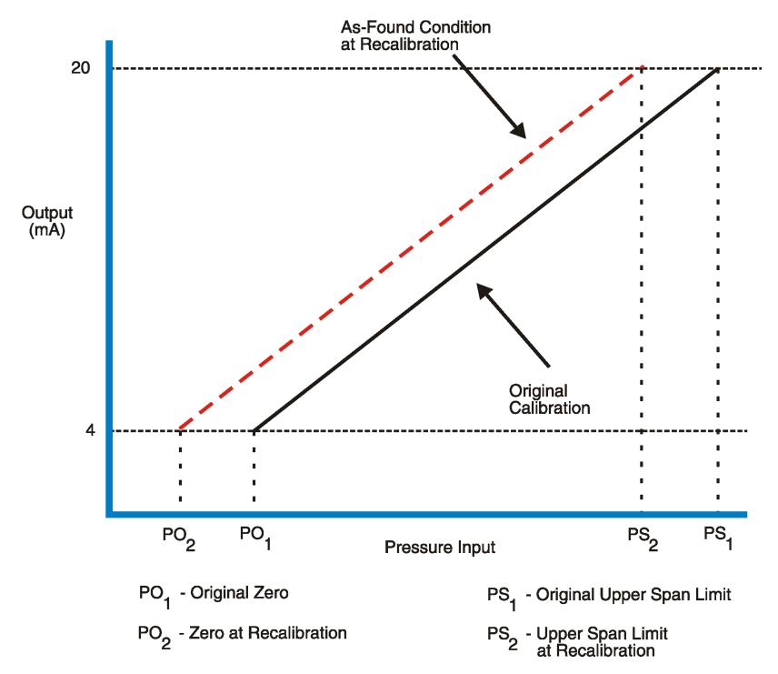

**Figure 5-2 Zero Shift Drift** 

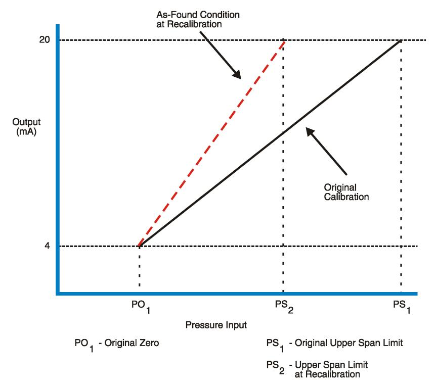

**Figure 5-3 Span Shift Drift** 

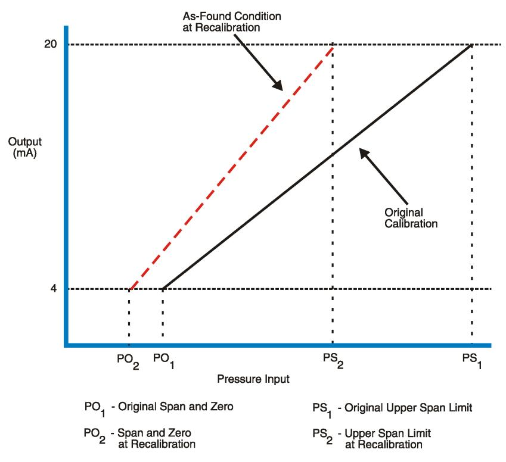

**Figure 5-4 Combined Zero and Span Shift Drift** 

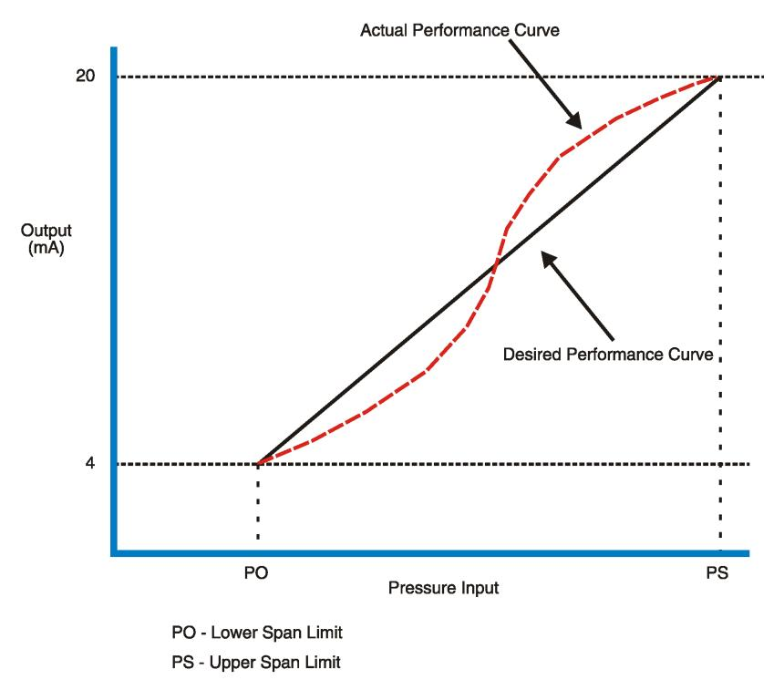

**Figure 5-5 Nonlinear Drift** 

With respect to on-line monitoring, the above drift types affect the ability to detect drift as follows:

- If a sensor drifts only by a change in its zero setting (zero shift), then any drift will be detected regardless of the monitored point.
- If a sensor drifts only by a change in its span (span shift), the drift might or might not be detectable, depending on the nature of the span shift and the monitored point.
- Combinations of zero shift and span shift can also occur. These drift combinations tend to make drift detection more likely regardless of the monitored location.
- Sensors appear to occasionally drift in a nonlinear manner (not obviously zero shift or span shift or a combination of the two), although this is relatively rare. Drift detection depends on the specific instrument performance at the monitored point.

Of all the likely drift types, span shift occurring alone represents the largest concern for singlepoint monitoring because drift might occur near a setpoint yet not be detected at the monitored point. Despite this potential concern, the likelihood of span shift adversely affecting the reliability of the on-line monitoring estimation and failure detection process is low for the following reasons:

- Very few parameters normally operate at the extreme end of the calibrated span (high or low) and have setpoints at the other extreme end of the calibrated span. Most parameters tend to monitor within the 50 to 80% of span during normal operation, with setpoints well above 0% of span or well below 100% of span.
- Each transmitter still requires periodic calibration; the calibration frequency has only been extended, not eliminated, by the use of on-line monitoring. Furthermore, transmitter calibration data at extended intervals does not appear to exhibit increased drift levels (based on instrumentation calibration data obtained in support of this project).
- Instrument calibration data readily shows that if span shift drift has occurred in a manner that might affect on-line monitoring predictions, an ongoing calibration monitoring program is a recommended part of applying on-line monitoring.
- Transmitters are usually found to be in calibration when checked. Note that there would be little likelihood of extending calibration intervals by the use of on-line monitoring if this was not the case.
- Although taking credit for this is not recommended because it is not the intended method of operation, it is possible to evaluate channel performance for some parameters across a larger portion of the calibrated span during transients or down-power events. Section 5.3 provides additional information.

#### **5.3 Instrument Channel Variation at Power—A Closer Look**

Most nuclear plants operate at nearly constant power for an extended period of time, and the process variations for many parameters tend to be relatively small. Figure 5-6 shows an example of power variation at one nuclear plant over a 14-month period; this figure shows the initial

power ascension after a refueling outage, followed by occasional unintended down-power events, and concluding with the final planned power reduction as the plant enters the next refueling outage. If a nuclear plant operates as intended for its entire operating cycle, there might not be any significant down-power events, with a power profile as shown in Figure 5-7.

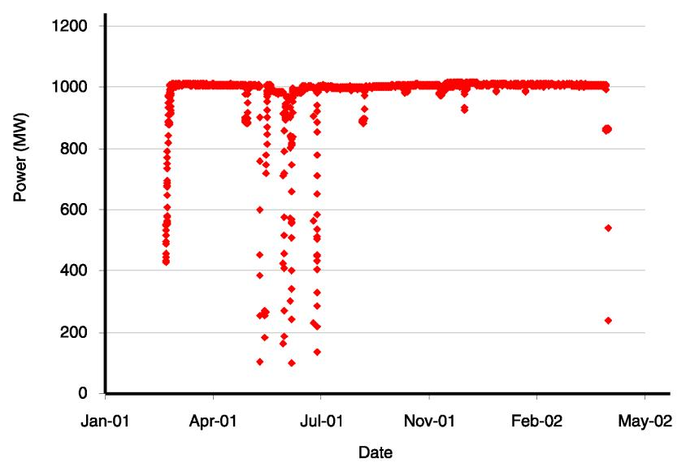

**Figure 5-6 Typical Nuclear Plant Power Variation** 

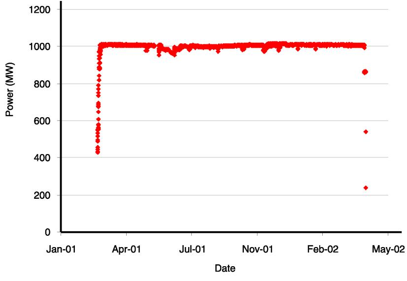

**Figure 5-7 Desired Nuclear Plant Power Variation** 

It has been suggested that periodic plant transients could provide a means of evaluating instrument drift across some larger portion of an instrument's span as one method of addressing the single-point monitoring issue. Although there are instances of down-power events that might offer additional data for some (but not all) of the signals, the acceptance criterion for on-line

monitoring should be established based on the *intended* operation of the plant, which is typically to operate at 100% power for 18 or 24 months continuously. Down-power events that might provide limited on-line monitoring data for other portions of an instrument's span cannot be assumed. This is a particularly important point because it reinforces the validity of the singlepoint monitoring issue.

Some signals in a power plant do not change even if there are occasional transients or downpower events. As an example, Figure 5-8 shows the typical steam generator level variation for a Westinghouse-design plant. Notice that steam generator level is a controlled parameter and is nearly constant at 61% regardless of the power level variations that were shown in Figure 5-6; the total channel variation is only ±1.5% for the entire evaluated period, including plant shutdowns. Throughout the operating cycle, steam generator level is never particularly near the low-low trip setpoint of 27% level or the high-high trip setpoint of 79% level.

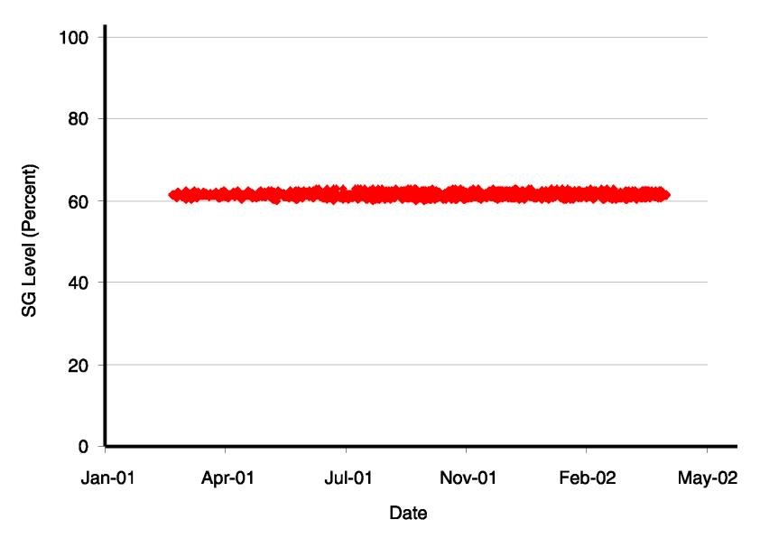

**Figure 5-8 Steam General Level Variation During an Operating Cycle** 

Figure 5-9 shows another example of a controlled parameter: RCS or pressurizer pressure. Pressure remains almost constant at about 2235 psig (15,410 kPa) at this nuclear plant, regardless of power level. The low-pressure trip setpoint is 1850 psig (12,760 kPa), and the high-pressure trip setpoint is 2380 psig (16,410 kPa). The pressurizer pressure channel span is 1700 to 2500 psig (11,720 to 17,240 kPa), or a total of 800-psig (5516-kPa) span. The low-pressure trip occurs at about 20% of span, the high-pressure trip occurs at about 85% of span, and the monitored point is about 67% of span.

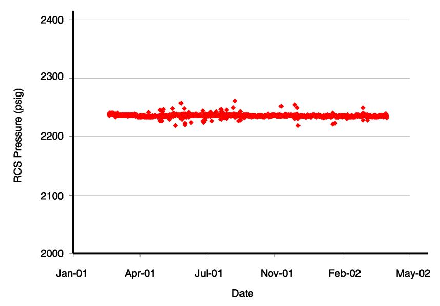

**Figure 5-9 RCS Pressure Variation During an Operating Cycle** 

Using a Westinghouse nuclear plant design as an example, several Technical Specificationrelated parameters have a physical relationship to reactor power. For this example, Figure 5-6 shows the power level variation during the operating cycle. Figure 5-10 shows the pressurizer level variation during this period. Level is programmed to follow average RCS temperature from its low power limit to its full power limit, which effectively means that pressurizer level follows reactor power. Figure 5-11 shows the variation for steam flow, Figure 5-12 shows the variation for feedwater flow, Figure 5-13 shows the variation for turbine first-stage pressure, and Figure 5-14 shows the variation for steam pressure.

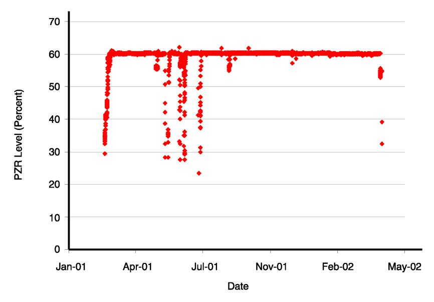

**Figure 5-10 Pressurizer Level Variation During an Operating Cycle** 

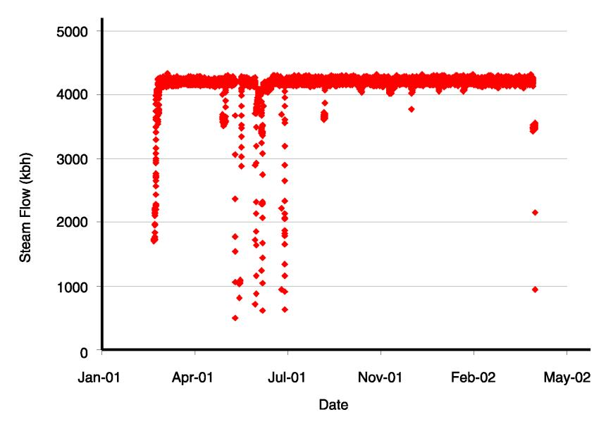

**Figure 5-11 Steam Flow Variation During an Operating Cycle** 

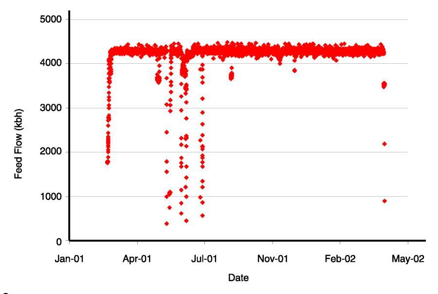

**Figure 5-12 Feedwater Flow Variation During an Operating Cycle** 

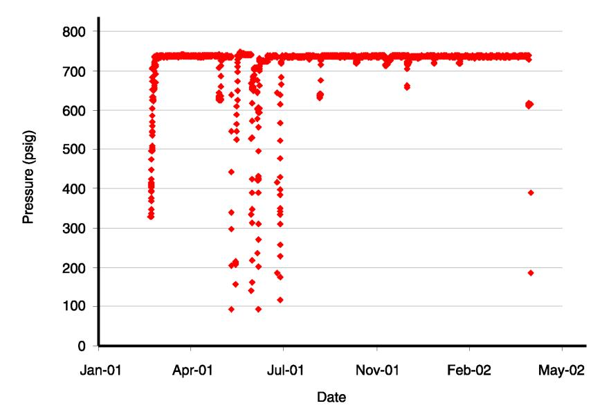

**Figure 5-13 Turbine First-Stage Pressure Variation During an Operating Cycle** 

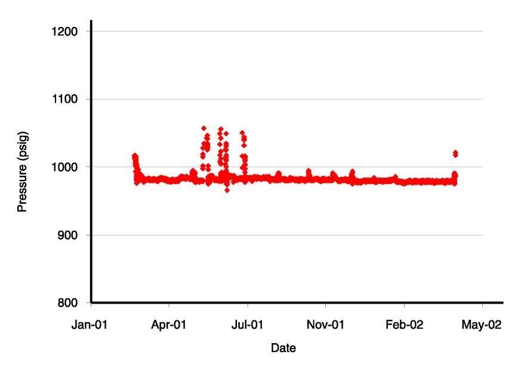

**Figure 5-14 Steam Generator Pressure Variation During an Operating Cycle** 

The above examples show that some parameters might vary during an operating cycle, while other parameters remain essentially constant for the entire operating cycle. Remember that the goal of most nuclear plants is to operate at 100% power for 18 or 24 months continuously. Even for the signals that do show some variation with power, the consideration of single-point monitoring should be established based on the *intended* operation of the plant, which is to remain at full power.

#### **5.4 Establishing an Allowance for Single-Point Monitoring**

#### *5.4.1 Background*

EPRI formed the EPRI/Utility On-Line Monitoring Working Group in 1994 to coordinate the activities associated with obtaining approval of on-line monitoring as a calibration-reduction tool. The working group produced TR-104965, *Calibration Through On-Line Performance Monitoring of Instrument Channels* (Draft—August 2, 1995), and submitted this report to the NRC for consideration. The initial NRC review of TR-104965 was documented in a Request for Additional Information (RAI) dated November 29, 1995. Members of the working group met with the NRC staff on December 13, 1995, to clarify the RAI comments. Subsequently, the NRC issued an updated RAI on February 26, 1996. One of the key issues raised by the RAI was the single-point monitoring issue.

#### *5.4.2 EPRI Drift Study*

#### 5.4.2.1 Data Collection

In response to the NRC RAI, EPRI sponsored a drift study by evaluating calibration data for pressure, level, and flow transmitters. Instrument calibration data were collected from 18 nuclear plants, entered into a database, and analyzed in detail. The final database contained 1139 instruments, 6700 calibrations, and nearly 34,000 individual calibration checkpoint values. Data collection focused on primary sensors (pressure and differential pressure transmitters) as the key devices of interest, and extensive efforts were made to ensure that the assembled data is representative of the U.S. nuclear industry. The project was undertaken to determine if there exists a quantifiable relationship between drift observed at any given point within an instrument's operating range and drift at other points in the range. The problem statement can be summarized as follows:

• Given that an instrument appears to be in calibration at the monitored point, what is the likelihood that it is out of calibration elsewhere in its operating range?

The answer to this question required a statistical analysis of the acquired instrument calibration data. The calibration data were reviewed at each calibration checkpoint along the span. Given that the instrument was in calibration at a given checkpoint, the likelihood of being out of calibration elsewhere along the calibrated span was determined. This process was performed for five checkpoints along the calibrated span: 0, 25, 50, 75, and 100% of span. The final result established a single-point monitoring allowance, which is effectively an additional input to the on-line monitoring drift allowance. EPRI topical report TR-104965-R1 NRC SER provides a complete description of this study. Certain aspects of the study are clarified in the following sections.

#### 5.4.2.2 Binomial Pass/Fail Method of Analysis

A discussion of the single-point monitoring allowance starts with a review of the method of analysis. Well-behaved instruments can be evaluated by a pass/fail type of analysis, referred to here as a *binomial pass/fail analysis*. A pass/fail criterion for performance simply compares the drift data against a pre-defined acceptable value of drift. If the drift value is less than the pass/fail criterion, that data point passes; if it is larger than the pass/fail criterion, it fails. By comparing the total number of passes to the number of failures, a probability can be computed for the expected number of passes in the population.

A binomial distribution can be used to describe a population if each sample point can be separated into a pass or fail, yes or no, go or no-go type of classification. Applying this concept to instrument drift performance, a pass/fail criterion for the drift magnitude is established. If the drift exceeds the specified limit, the drift point fails; otherwise it passes. The failure proportion is then given by:

$$P_f = \frac{x}{n}$$
 Eq. 5-1

where:

*Pf* = Proportion of failures

*x* = Number of values exceeding the pass/fail criterion (failures)

*n* = Total sample size

Note that the failure proportion, as defined, is only the proportion of drift points that failed to pass the acceptance limit; it does not necessarily mean that the instrument actually failed. For analysis purposes, the pass/fail limit might specify a value that is still well within the allowed as-found setting tolerance, or it might specify a value within some pre-determined drift allowance.

The probability that a value will pass can be calculated as 1 minus the fail probability, or:

$$P = 1 - P_f$$
 Eq. 5-2

The above probability is a nominal probability based only on the failure proportion. Confidence limits should also be established for the probability. Generally, a probability computed at the 95% confidence level is considered acceptable for setpoint calculations.

If *n* is large, confidence limits can be calculated based on the normal distribution of probabilities:

$$P_{l} = 1 - \frac{x}{n} - z \times \sqrt{\left(\frac{1}{n}\right) \times \left(\frac{x}{n}\right) \times \left(1 - \frac{x}{n}\right)}$$
 and Eq. 5-3
$$P_{u} = 1 - \frac{x}{n} + z \times \sqrt{\left(\frac{1}{n}\right) \times \left(\frac{x}{n}\right) \times \left(1 - \frac{x}{n}\right)}$$

where:

P1 = Minimum probability that a value will pass the pass/fail criterion

Pu = Maximum probability that a value will pass the pass/fail criterion

z = Standard normal distribution value corresponding to the desired confidence level, such as z = 1.96 for a 95% confidence level

The nominal probability that a value will be within the pass/fail criterion is the probability P. The probabilities  $P_l$  and  $P_u$  represent the lower and upper confidence limits associated with this nominal probability. In particular, the probability  $P_l$  is of interest because it represents the lowest expected probability that a value will be within the pass/fail criterion. Because safety-related setpoints are usually determined at the 95%/95% level, the minimum desired pass probability for  $P_l$  is 95% at the 95% confidence level. The standard normal distribution values for other confidence levels are shown in Table 5-1.

Table 5-1
Standard Normal Distribution Values for Various Confidence Levels

| Z     | Confidence Level |
|-------|------------------|
| 2.575 | 99%              |
| 2.330 | 98%              |
| 1.960 | 95%              |
| 1.645 | 90%              |

The binomial pass/fail method is better suited for large sample sizes (greater than 100 points). Also, this method requires that the proportion of fails to the total sample size, x/n, not be extremely small. For example, the equations for the minimum and maximum pass probabilities do not provide reasonable results if the number of failures equals zero.

#### 5.4.2.3 Application of Binomial Pass/Fail Analysis to Single-Point Monitoring

The instrument calibration data described in Section 5.4.2.1 were evaluated as part of the EPRI drift study to establish the probability of being in calibration at some specified level at the monitored point while being out of calibration at some level elsewhere in the span.

The analysis was set up and conducted as follows:

- 1. Each calibration checkpoint—0, 25, 50, 75, and 100% of span—was evaluated separately. This was done so that trends as a function of span could be evaluated.
- 2. For a given checkpoint, each calibration was checked to confirm that the point was in calibration at a specified level.
- 3. Given that the evaluated checkpoint was in calibration at the specified level, the other calibration checkpoints were evaluated to determine if they were out of calibration at a specified level.
- 4. The level by which the other checkpoints were allowed to be out of calibration was varied as necessary to ensure a 96% nominal pass probability. Stated another way, the binomial pass/fail probability acceptance limit was varied as necessary to ensure that all other calibration checkpoints were in calibration to the specified level for at least 96% of the calibrations. The 96% nominal pass probability was arbitrarily selected to ensure that the minimum probability was always greater than 95%. The sample size was so large for this study that the minimum probability was above 95.5% with a nominal probability of 96%.
- 5. The level at which the other checkpoints were allowed to be out of calibration and still ensure a 96% nominal pass probability was treated as the allowance for single-point monitoring. The potential effect of monitoring an instrument that is in calibration at one point in its span while being out of calibration by some amount elsewhere in its span is considered by including this allowance in the overall drift allowance for on-line monitoring.

The results of the EPRI drift study are described in Section 5.4.3, including a discussion of the conservative nature of the recommended single-point monitoring allowance.

#### *5.4.3 Single-Point Monitoring Allowance Development*

#### 5.4.3.1 TR-104965-R1 Single-Point Monitoring Allowance

TR-104965-R1 provides the recommended allowance to apply for single-point monitoring, and this allowance was referenced in the NRC safety evaluation. Figure 5-15 shows the allowance recommended in TR-104965-R1. As can be seen, the allowance for single-point monitoring varies with the monitored point and the allowed on-line monitoring drift limit.

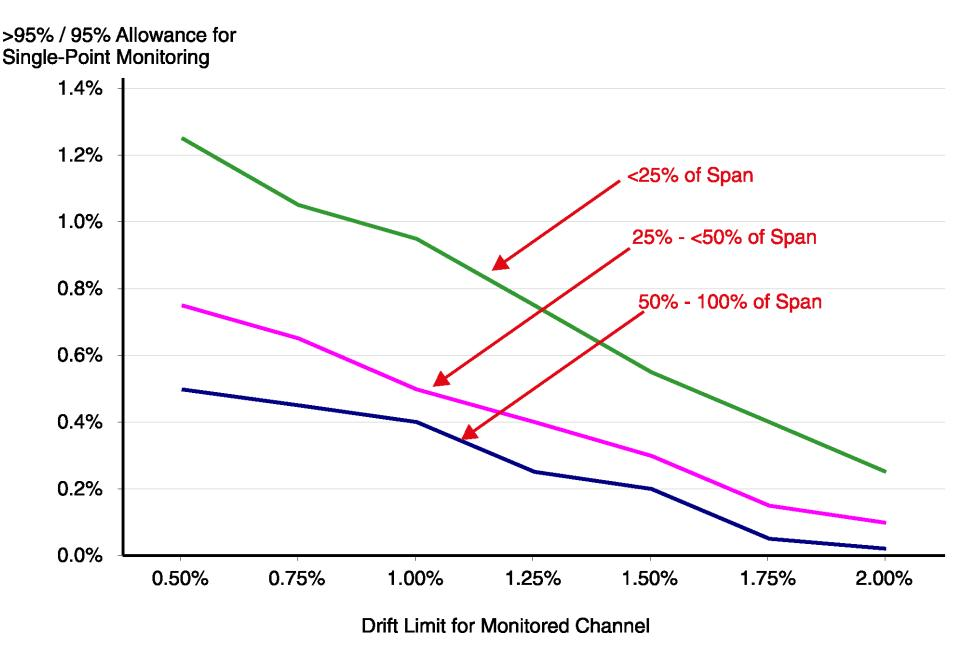

**Figure 5-15 TR-104965-R1 Recommended Allowance for Single-Point Monitoring** 

Figure 5-15 shows that 1) monitoring a process low in the span carries a higher penalty than monitoring high in the span and 2) higher channel drift limits improve the single-point monitoring allowance. Referring to Figure 5-15, the following explanations of the curves are provided:

- The *<25% of Span* curve is based on 0% of span calibration data. The probability improved considerably at the 25% calibration checkpoint.
- The *≥25% <50% of Span* curve is based on 25% of span calibration data.
- The *≥50% 100% of Span* curve is based on the combined 50, 75, and 100% of span calibration data. The probability was sufficiently low that the three points were combined for convenience.

A minimum allowance of 0.25% is recommended even if Figure 5-15 would permit a lower allowance. In the overall uncertainty evaluation for on-line monitoring, this single-point monitoring allowance should be treated as a random uncertainty. The as-found minus as-left (AFAL) calibration data were centered about the mean, and treating the allowance as a bias is not supported by the data. Section 6 provides an example of how this allowance would be applied to the overall drift allowance for on-line monitoring.

#### 5.4.3.2 Additional Comments Regarding TR-104965-R1

The development of the TR-104965-R1 single-point monitoring allowance was based on calibration data provided by 18 nuclear plants. The data included obviously bad data (outlying data likely caused by data-entry errors), but these data were not removed from the analysis. In other words, outliers were not excluded from the analysis. As an example, there were instances in which four of the five evaluated calibration checkpoints were in calibration and the fifth calibration point was identified as out of calibration by over 50%. This behavior is not considered reasonable, and the outlying data point was most likely a data-entry error. But, there was no easy method to confirm or deny each outlier with so much data from so many plants. For this reason, the outliers were retained in the analysis, which resulted in very conservative results. Any plant-specific evaluation will likely obtain considerably lower single-point allowance values.

The chart provided in Figure 5-15 combined the 50, 75, and 100% span points for convenience. Part of the motivation for this combination was to ensure conservative results. Another part of the motivation was to simplify the presentation of the data. The checkpoint for the 50% of span actually demonstrated a lower probability than did the checkpoint for the 75% of span. Rather than present potentially confusing results, in which it appeared that the point for the 50% of span was better for single-point monitoring than the point for the 75% of span, all three higher checkpoints were combined for convenience. The interpretation of the actual results is that monitoring mid-span was somewhat better with respect to the single-point monitoring issue than monitoring at three-quarters of span. Another motivation for combining the three higher checkpoints was to avoid possible confusion in the interpolation between checkpoints.

The analysis was performed to a 96% nominal probability to ensure conservative results. An analysis performed at a 95% minimum probability would have been acceptable and would have remained consistent with the basis for setpoint calculations.

The probability improved (single-point monitoring allowance decreases) as the drift limit increases. Larger drift limits meant that it was more likely that drift was observable across a larger portion, if not all, of the instrument span. Another way of stating this is that it was unlikely for the unmonitored points to drift by a large amount if the monitored point had little or no drift.

#### 5.4.3.3 Allowance Based on 95% Minimum Probability

The previous sections describe the analysis approach to develop the single-point monitoring allowance, including the rationale justifying why this allowance is conservative and probably over-conservative. As part of the development of the guidelines presented in this report, the calibration data were evaluated again with two significant differences from the TR-104965-R1 analysis:

- The analysis was performed at 95% minimum probability rather than at a 96% nominal probability. Note that a 95% minimum probability still ensures a nominal probability close to 96%.
- The curve for each calibration checkpoint is plotted separately; no checkpoints were combined.

As before, all outliers were retained in the analysis. The results of this analysis are shown in Figure 5-16. Notice that the monitoring point for 50% of span continues to carry a lower penalty than the point for 75% of span. The monitoring point for 100% of span also continues to have the lowest single-point monitoring allowance. The data used to create Figure 5-16 are provided in Table 5-2.

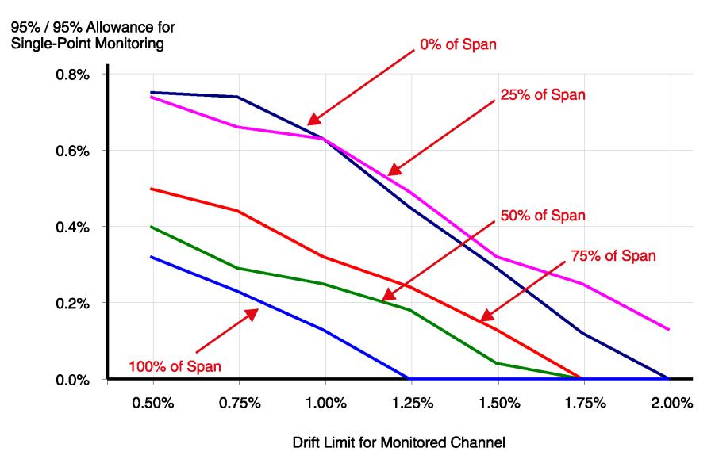

**Figure 5-16 Minimum Allowance for Single-Point Monitoring (95% Minimum Probability)** 

**Table 5-2 Single-Point Monitoring Allowance Data (95% Minimum Probability)** 

|            | Drift Limit for Monitored Channel |       |       |       |       |       |       |
|------------|-----------------------------------|-------|-------|-------|-------|-------|-------|
| Checkpoint | 0.50%                             | 0.75% | 1.00% | 1.25% | 1.50% | 1.75% | 2.00% |
| 0%         | 0.75%                             | 0.74% | 0.63% | 0.45% | 0.29% | 0.12% | 0.00% |
| 25%        | 0.74%                             | 0.66% | 0.63% | 0.49% | 0.32% | 0.25% | 0.13% |
| 50%        | 0.40%                             | 0.29% | 0.25% | 0.18% | 0.04% | 0.00% | 0.00% |
| 75%        | 0.50%                             | 0.44% | 0.32% | 0.24% | 0.13% | 0.00% | 0.00% |
| 100%       | 0.32%                             | 0.23% | 0.13% | 0.00% | 0.00% | 0.00% | 0.00% |

Figure 5-16 provides significantly smaller single-point monitoring allowances than those provided in TR-104965-R1 because of the analysis differences. These differences are considered defensible, and the EPRI drift study data support the allowances shown above. As before, a minimum allowance of 0.25% is recommended even if Figure 5-16 justifies a lower value; the purpose of this minimum value is to ensure a conservative approach.

Note that the EPRI drift study did not exclude outliers even when it was believed that the outlying data were data-entry errors. Once again, it is believed that this approach contributes to a conservative result. A plant-specific single-point monitoring evaluation might well produce significantly smaller allowances than shown in Figure 5-16. Section 5.5 discusses the potential value of such a study.

#### **5.5 Plant-Specific Confirmation**

As discussed in the previous sections, the EPRI drift study was performed in a manner intended to ensure conservative results. For this reason, a plant-specific study will most likely produce a smaller single-point monitoring allowance than did the EPRI drift study. For example, Figure 5-17 shows the results for one plant in which all available calibration data were evaluated for the single-point monitoring effect. Notice that the plant-specific single-point monitoring allowance is considerably smaller than the EPRI drift study. This study was performed at a 95% minimum probability at a 95% confidence.

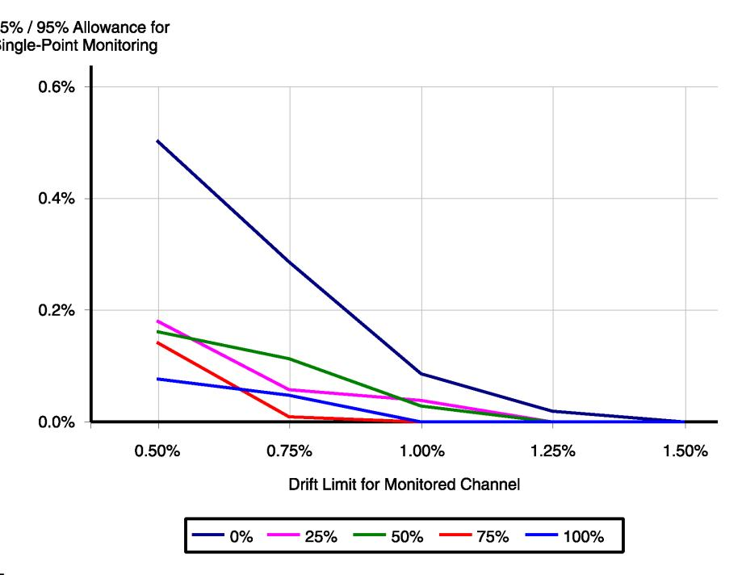

**Figure 5-17 Plant-Specific Allowance for Single-Point Monitoring** 

This plant-specific study was performed following the approach outlined in Section 5.4. Contact the EPRI project manager if additional guidance is needed in support of a plant-specific study.

| 0 |  |  |
|---|--|--|

## *6* **ON-LINE MONITORING UNCERTAINTY ANALYSIS**

Every measurement contains some amount of error or uncertainty. Any on-line monitoring parameter estimate, such as an MSET estimate, also contains some modeling uncertainty relative to the true process value. The parameter estimate represents the best estimate of the true process value. Note that we do not actually know the true process value; however, we expect the parameter estimate to be reasonably close to the true process value. Establishing quantifiable limits for the term *reasonably close* leads to the subject of uncertainty analysis.

This section addresses the uncertainty of on-line monitoring in relation to the possible drift allowance for safety-related channels. The various elements of uncertainty applicable to the instrument channels of interest are described, and a methodology for establishing an on-line monitoring drift allowance is explained. The following NRC SE requirements are addressed in this section.

#### **Requirement 1**

*The submittal for implementation of the on-line monitoring technique shall confirm that the impact on plant safety of the deficiencies inherent in the on-line monitoring technique (inaccuracy in process parameter estimate, single-point monitoring, and untraceability of accuracy to standards), on plant safety will be insignificant, and that all uncertainties associated with the process parameter estimate have been quantitatively bounded and accounted for either in the on-line monitoring acceptance criteria or in the applicable setpoint and uncertainty calculations.* 

#### Discussion for Requirement 1:

The methodology provided in this section is specifically intended to comply with Requirement 1. Argonne National Laboratory is developing the uncertainty analysis for the version of MSET used in the EPRI On-Line Monitoring Implementation Project. The uncertainty analysis project has been funded as part of the DOE NEPO program, and the project is in progress as of the issuance of this interim report. This report will be updated when ANL completes the uncertainty analysis.

Section 5 addresses single-point monitoring in detail and the results are incorporated into this section as part of the on-line monitoring drift allowance calculation. The intent is to maintain traceability to the allowances provided in the associated setpoint calculation. The approach taken will have no impact on either the trip setpoint or the allowable value in the Technical Specifications.

*On-Line Monitoring Uncertainty Analysis* 

Traceability of accuracy to reference standards has been maintained by the very nature of the online monitoring implementation approach. The calibration frequency has been extended, not eliminated.

#### **Requirement 5**

*Calculations for the acceptance criteria defining the proposed three zones of deviation ("acceptable," "needs calibration," and "inoperable") should be done in a manner consistent with the plant-specific safety-related instrumentation setpoint methodology so that using on-line monitoring technique to monitor instrument performance and extend its calibration interval will not invalidate the setpoint calculation assumptions and the safety analysis assumptions. If new or different uncertainties require the recalculation of instrument trip setpoints, it should be demonstrated that relevant safety analyses are unaffected. The licensee should have a documented methodology for calculating acceptance criteria that are compatible with the practice described in Regulatory Guide 1.105 and the methodology described in acceptable industry standards for TSP and uncertainty calculations.* 

#### Discussion for Requirement 5:

The methodology provided in this section ensures that setpoint calculation and safety analysis assumptions are unchanged. A clear basis for the on-line monitoring drift allowance has been established so that setpoint calculations should not require revision. The Technical Specification trip setpoint and allowable value requirements are also unaffected because the methodology deliberately ensures compliance with the setpoint calculations. Unique uncertainties attributed to on-line monitoring or single-point monitoring specifically reduce the on-line monitoring drift allowance to ensure that the setpoint calculations do not require revision.

#### **Requirement 6**

*For any algorithm used, the maximum acceptable value of deviation (MAVD) shall be such that accepting the deviation in the monitored value anywhere in the zone between PE and MAVD will provide high confidence (level of 95%/95%) that drift in the sensor-transmitter or any part of an instrument channel that is common to the instrument channel and the on-line monitoring loop is less than or equal to the value used in the setpoint calculations for that instrument channel.* 

#### Discussion for Requirement 6:

The calculation method described in this section ensures that the MAVD provides a high confidence level that is entirely consistent with the setpoint calculations. The allowance for drift has been conservatively determined without taking credit for non-sensor-related uncertainty terms. The on-line monitoring allowance for drift is further reduced to account for unique uncertainty elements introduced by the use of on-line monitoring.

#### **Requirement 7**

*The instrument shall meet all requirements of the above requirement 6 for the acceptable band or acceptable region.* 

#### Discussion for Requirement 7:

The calculation method described in this section ensures that the MAVD provides a high confidence level that is consistent with the setpoint calculations. The allowance for drift has been conservatively determined without taking credit for non-sensor-related uncertainty terms. The on-line monitoring allowance for drift is further reduced to account for unique uncertainty elements introduced by the use of on-line monitoring.

#### **Requirement 8**

*For any algorithm used, the maximum value of the channel deviation beyond which the instrument is declared "inoperable" shall be listed in the Technical Specifications with a note indicating that this value is to be used for determining the channel operability only when the channel's performance is being monitored using an on-line monitoring technique. It could be called "allowable deviation value for on-line monitoring" (ADVOLM) or whatever name the licensee chooses. The ADVOLM shall be established by the instrument uncertainty analysis. The value of the ADVOLM shall be such to ensure:* 

- *(a) that when the deviation between the monitored value and its PE is less than or equal to the ADVOLM limit, the channel will meet the requirements of the current Technical Specifications, and the assumptions of the setpoint calculations and safety analyses are satisfied; and*
- *(b) that until the instrument channel is recalibrated (at most until the next refueling outage), actual drift in the sensor-transmitter or any part of an instrument channel that is common to the instrument channel and the on-line monitoring loop will be less than or equal to the value used in the setpoint calculations and other limits defined in 10 CFR 50.36 as applicable to the plantspecific design for the monitored process variable are satisfied.*

#### Discussion for Requirement 8:

This section establishes the methodology for calculating the on-line monitoring drift allowance. The methodology has been defined in a manner that ensures that the associated setpoint calculation allowances remain unchanged. This is an important part of the on-line monitoring implementation process because the intent is to minimize the changes necessary in the Technical Specifications. Accordingly, the on-line monitoring drift allowance ensures that the Technical Specification trip setpoint and allowable value for each parameter remain unchanged.

The on-line monitoring quarterly surveillance ensures that 1) the on-line monitoring system performance is acceptable and 2) each monitored parameter is operating within acceptable limits. The on-line monitoring acceptable criteria, including the MAVD and the ADVOLM, would be

*On-Line Monitoring Uncertainty Analysis* 

provided in a quarterly surveillance procedure. Including this information in the body of the Technical Specifications should not be necessary and is more appropriately assigned to the surveillance procedure. This is no different in concept than providing acceptable as-found settings and as-left settings for instrument calibrations in the associated calibration documents.

#### **Requirement 9**

*Calculations defining alarm setpoint (if any), acceptable band, the band identifying the monitored instrument as needing to be calibrated earlier than its next scheduled calibration, the maximum value of deviation beyond which the instrument is declared "inoperable," and the criteria for determining the monitored channel to be an "outlier," shall be performed to ensure that all safety analysis assumptions and assumptions of the associated setpoint calculation are satisfied and the calculated limits for the monitored process variables specified by 10 CFR 50.36 are not violated.* 

#### Discussion for Requirement 9:

This section establishes the methodology for calculating the on-line monitoring drift allowance, and the methodology has been defined in a manner that ensures that the associated setpoint calculation allowances remain unchanged. The methodology ensures compliance with the above requirement.

#### **6.1 Traditional Uncertainty Elements Included in On-Line Monitoring**

Before proceeding with an uncertainty discussion, the typical instrument circuit for on-line monitoring will be described. On-line monitoring is expected to acquire its data from the indication and control portion of an instrument loop, electrically isolated from the safety-related trip portion of the loop. Figure 6-1 shows a simplified layout of the configuration for a safetyrelated instrument loop. The on-line monitoring system might be directly connected to the dataacquisition system, sampling at some specified frequency. Or, it might receive its data from a data historian or data archive and never actually be directly connected to any data-acquisition system. Regardless of the method by which the on-line monitoring system acquires process data, the data source will generally be from data-acquisition cards that transmit signals to the plant computer.

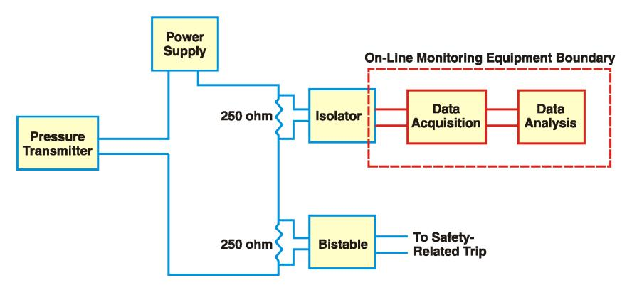

**Figure 6-1 Typical On-Line Monitoring Physical Configuration** 

Notice in Figure 6-1 that the safety-related actuation function performed by the bistable is not part of the on-line monitoring circuit. Also notice that the on-line monitoring circuit contains additional instrumentation that is not part of the safety-related function. The principal overlap between the safety-related and the non-safety-related portions of the instrument channel occurs at the sensor. Table 6-1 summarizes the traditional contributors to measurement uncertainty that are present in each signal path.

**Table 6-1 Traditional Process Instrument Circuit Uncertainty Sources** 

| Uncertainty Term             | Present in On-Line Monitoring Path? | Present in Safety Related Trip Path? | Included in Sensor Calibration? |
|------------------------------|----------------------------------------|-----------------------------------------|------------------------------------|
| Process measurement accuracy | X                                      | X                                       |                                    |
| Process element accuracy     | X                                      | X                                       |                                    |
| Sensor reference accuracy    | X                                      | X                                       | X                                  |
| Sensor drift                 | X                                      | X                                       | X                                  |
| Sensor temperature effect    | X                                      | X                                       | X (partial)                        |
| Sensor pressure effect       | X                                      | X                                       |                                    |
| Sensor vibration             | X                                      | X                                       |                                    |
| Sensor calibration tolerance | X                                      | X                                       | X                                  |
| Sensor M&TE accuracy         | X                                      | X                                       | X                                  |
| Isolator reference accuracy  | X                                      |                                         |                                    |
| Isolator drift               | X                                      |                                         |                                    |
| Isolator temperature effect  | X                                      |                                         |                                    |

| Uncertainty Term               | Present in On-Line Monitoring Path? | Present in Safety Related Trip Path? | Included in Sensor Calibration? |
|--------------------------------|----------------------------------------|-----------------------------------------|------------------------------------|
| Isolator calibration tolerance | X                                      |                                         |                                    |
| Isolator M&TE accuracy         | X                                      |                                         |                                    |
| Computer input A/D accuracy    | X                                      |                                         |                                    |
| Bistable reference accuracy    |                                        | X                                       |                                    |
| Bistable drift                 |                                        | X                                       |                                    |
| Bistable temperature effect    |                                        | X                                       |                                    |
| Bistable calibration tolerance |                                        | X                                       |                                    |
| Bistable M&TE accuracy         |                                        | X                                       |                                    |

As can be seen, the on-line monitoring circuit does not monitor the entire trip circuit portion of the instrument loop; the bistable's uncertainty elements are not included in the monitored path. Bistable performance will continue to be verified through periodic functional checks. On-line monitoring does not change any current practices regarding bistable functional checks.

On-line monitoring includes the process measurement effects, process element accuracy, and various environmental effects, whereas traditional sensor calibration checks do not necessarily include these contributors to uncertainty. Predictable bias effects that influence all sensors equally, such as fluid density effects, would be accounted for in the associated setpoint calculation. Note that on-line monitoring accounts for these various effects, although we are not necessarily trying to distinguish individual terms.

#### **6.2 Unique Uncertainty Elements Introduced by the Use of On-Line Monitoring**

On-line monitoring can detect degrading channels. However, on-line monitoring also introduces other uncertainty elements that must be considered when establishing acceptance criterion. The following uncertainty contributors should be considered:

- On-line monitoring system uncertainty, such as the MSET estimation uncertainty
- Uncertainty allowance associated with single-point monitoring

The following sections discuss each of these uncertainty elements.

#### *6.2.1 MSET Estimate Uncertainty*

The EPRI On-Line Monitoring Implementation Project is applying MSET as the preferential online monitoring method. For this reason, this section addresses the MSET uncertainty.

The MSET on-line monitoring method can produce a highly accurate estimate of the process signal value. The MSET estimate uncertainty depends on its algorithm, the model settings, and the data used for training. The following variables have the largest potential effect on the MSET estimation uncertainty:

- Correlation between signals: Models might contain 1) redundant signals, 2) physically correlated signals, 3) correlated groups of signals, or 4) correlated groups of signals with low cross-correlation between groups.
- Number of signals in model.
- Accuracy and noise content of signals.
- Quality of training set: This includes the quality of the signal vectors selected by the training algorithm.
- Number of vectors selected for the training matrix.
- Range of values in the training set.
- Effect on the estimation process when signal data is outside the training range.

ANL is developing the uncertainty analysis for the version of MSET used in the EPRI On-Line Monitoring Implementation Project. This project has been funded as part of the DOE NEPO program, and the project is in progress as of the issuance of this report. This report will be updated when ANL completes the uncertainty analysis.

#### *6.2.2 Single-Point Monitoring Allowance*

Section 5 explains the single-point monitoring issue and establishes the recommended allowance for use in the development of a channel drift allowance. The EPRI drift study single-point monitoring allowance is provided in Figure 5-16 for a 95% minimum probability (nominal probability near 96%). A minimum allowance of 0.25% is recommended to assure conservative results.

### **6.3 On-Line Monitoring Acceptance Criterion**

#### *6.3.1 Establishing the Setpoint Calculation Drift Allowance*

For an MSET application, the on-line monitoring drift allowance is defined as the allowed difference between the observations and the estimates (referred to as the residuals) before declaring that the instrument channel requires a traditional calibration check. This on-line monitoring drift allowance must be set conservatively so that Technical Specification trip setpoint allowances and allowable values are not exceeded. This section describes the procedure for setting up an on-line monitoring drift allowance. The method used is intended to ensure that the drift allowance maintains a clear link to the allowances used in the associated setpoint calculations without requiring revisions to these setpoint calculations.

#### 6.3.1.1 Setpoint Allowances – Westinghouse Plant Example

For a safety-related channel that performs a safety actuation function, the channel statistical allowance for the trip setpoint is calculated by:

$$CSA = \pm \sqrt{PMA^2 + PEA^2 + (SCA + SMTE + SD)^2 + SPE^2 + STE^2 + (RCA + RMTE + RCSA + RD)^2 + RTE^2}$$
 Eq. 6-1

where:

PMA = Process measurement accuracy

PEA = Primary element accuracy

SCA = Sensor calibration accuracy

SMTE = Sensor measurement and test equipment accuracy

SD = Sensor drift

SPE = Sensor pressure effects

STE = Sensor temperature effects

RCA = Rack calibration accuracy

RMTE = Rack measurement and test equipment accuracy

RCSA = Rack calibration setting accuracy

RD = Rack drift

RTE = Rack temperature effects

The following summarizes the significance of the above terms:

- The *rack* terms listed above relate to the bistable and associated instrumentation, which are not included in the on-line monitoring signal path. Accordingly, these terms are not included within the scope of (or addressed by) an on-line monitoring drift allowance.
- With regard to on-line monitoring, the sensor-related uncertainty terms are the uncertainty elements shared by the setpoint calculation and on-line monitoring. The sensor uncertainty elements can be grouped according to whether they are associated with 1) process or environmental effects or 2) calibration effects:
  - The uncertainty elements associated with process/environmental effects explain why redundant channels might not display exactly the same value even if they are

perfectly calibrated; there are some random variations in the measurements caused by these process/environmental uncertainty elements. These terms are typically not included in the on-line monitoring drift allowance and include process measurement accuracy (PMA), primary element accuracy (PEA), sensor pressure effects (SPE), and sensor temperature effects (STE). It could be argued that STE is partially included in the on-line monitoring process because the ambient temperature around the sensor varies while on-line monitoring assesses the channel's performance. But, this term is typically not included in the on-line monitoring drift allowance because it can be 1) difficult to quantify the actual temperature variation and 2) the temperature variation rarely reaches the specified design limits.

- The uncertainty elements associated with calibration effects are specifically what an on-line monitoring program is evaluating, and it is these terms that should relate directly to the on-line monitoring drift allowance. These terms include the sensor calibration accuracy (SCA), sensor measurement and test equipment accuracy (SMTE), and sensor drift (SD). SCA is often a combination of several effects, including the transmitter reference accuracy, the calibration tolerance, and the static head correction, if applicable. SMTE typically includes the combination of a digital multimeter and test pressure accuracy. SD is often expressed as the design or specification allowance for drift at a stated calibration interval. Some plants have determined plant-specific values for SD based on an analysis of as-found and as-left calibration data.
- Figure 6-1 shows that the on-line monitoring circuit path includes instrumentation not included in the bistable actuation circuit. The isolator and downstream data-acquisition equipment can possibly affect the overall measurement uncertainty, but these devices are not included in the on-line monitoring drift allowance because they have no relevance to the setpoint allowances.

#### 6.3.1.2 On-Line Monitoring Drift Allowance – Westinghouse Plant Example

The typical approach to setpoint calculations is designed to ensure a conservative result. The calculation method often assumes that SCA, SMTE, and SD are dependent parameters, which is why they are summed before squaring in the setpoint allowance calculation. As stated before, these are the terms that are addressed by on-line monitoring. For an MSET on-line monitoring method, two other uncertainty terms subtract from the combined SCA, SMTE, and SD:

- The MSET uncertainty (MSETUnc) is the maximum expected uncertainty of the parameter estimate by the MSET on-line monitoring method.
- The single-point monitoring allowance (SPMA) is the allowance to account for monitoring a small operating space for an extended period.

As an example to illustrate the combined effect of these various terms, suppose the various terms have the following values:

• SCA: ±0.5

• SMTE: ±0.2

*On-Line Monitoring Uncertainty Analysis* 

• SD: ±1.0

• MSETUnc: ±0.25

• SPMA: ±0.25 (assumes that parameter is normally monitored high in the span)

The on-line monitoring drift allowance can be calculated as follows:

$$OLM = \pm \sqrt{(SCA + SMTE + SD)^2 - MSET_{Unc}^2 - SPMA^2}$$
 Eq. 6-2

$$OLM = \pm \sqrt{(0.5 + 0.2 + 1.0)^2 - 0.25^2 - 0.25^2} = 1.66\%$$
 Eq. 6-3

For this channel, threshold limits might be established as follows:

• Allowable: 1.4%

• Maximum: 1.66%

#### 6.3.1.3 Possible Analysis Variations for Other Reactor Types

The analysis approach used to develop the on-line monitoring drift allowance must be consistent with the method used in the associated setpoint calculation. As an example, some setpoint calculation methods might assume that SCA, SMTE, and SD are independent parameters, resulting in the terms being separately squared within the square root equation. The uncertainty calculation would be adjusted as follows:

$$OLM = \pm \sqrt{SA^2 + SD^2 + SMTE^2 - MSET_{Unc}^2 - SPMA^2}$$
 Eq. 6-4

As an example to illustrate the combined effect of these various terms, suppose that the various terms have the same values as in the previous example:

• SCA: ±0.5

• SMTE: ±0.2

• SD: ±1.0

• MSETUnc: ±0.25

• SPMA: ±0.25 (assumes that parameter is normally monitored high in the span)

The on-line monitoring maximum drift allowance is given by:

$$OLM = \pm \sqrt{0.5^2 + 0.2^2 + 1.0^2 - 0.25^2 - 0.25^2} = 1.08\%$$
 Eq. 6-5

For this channel, threshold limits might be established as follows:

• Allowable: 1.0% • Maximum: 1.08%

#### **6.4 Application of Acceptance Criterion to MSET Residuals**

For an MSET application, the on-line monitoring drift allowance is applied to the residual, which is defined as the difference between an observation and its corresponding estimate. Figure 6-2 shows a typical MSET plot showing the observations (blue crosses) and the estimates (red triangles). Notice that the observed values are trending down, whereas MSET continues to produce estimates that are essentially unchanged. This is an example of the MSET response to an instrument drift event.

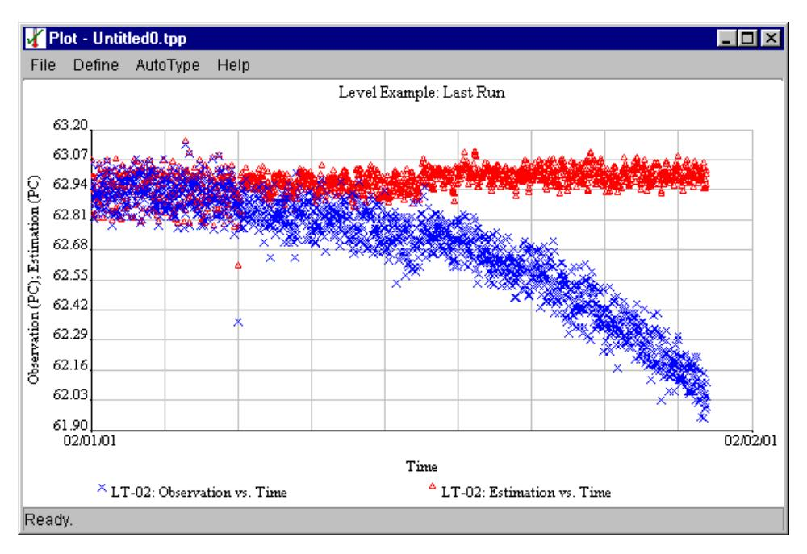

**Figure 6-2 Identified Instrument Drift** 

Figure 6-3 shows the residuals for this example. Notice that the residuals are trending down also because they are the calculated difference between the observations and the estimates. In this example, allowable drift limits have been specified at ±1.0% (inner green horizontal lines), and maximum drift limits have been set at ±1.5% (outer red horizontal lines).

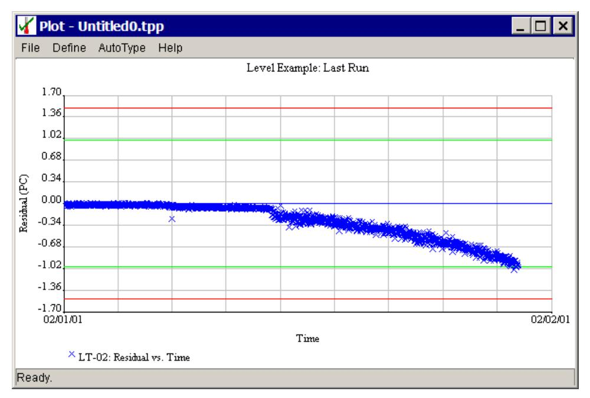

**Figure 6-3 Residual Plot Showing On-Line Monitoring Drift Limits** 

Figure 6-3 shows how the on-line monitoring drift limits are applied during operation, while maintaining a clear link back to the applicable setpoint calculation. As stated before, the goal is to establish drift limits that ensure proper drift detection without exceeding any setpoint allowances and associated Technical Specification requirements.

#### **6.5 Actions Upon Detection of a Drifted Channel**

A three-region calibration assessment has been defined for the on-line monitoring process as shown in Figure 6-4. This approach follows the NRC SE criteria for alarm assessment, showing the MAVD and the ADVOLM. For each monitored parameter, an acceptable deviation from the parameter estimate has to be established. Beyond this acceptable deviation, calibration will be required. The urgency of calibration depends on the magnitude of the deviation; beyond a certain deviation, immediate assessment will be required in accordance with Technical Specification action statements.

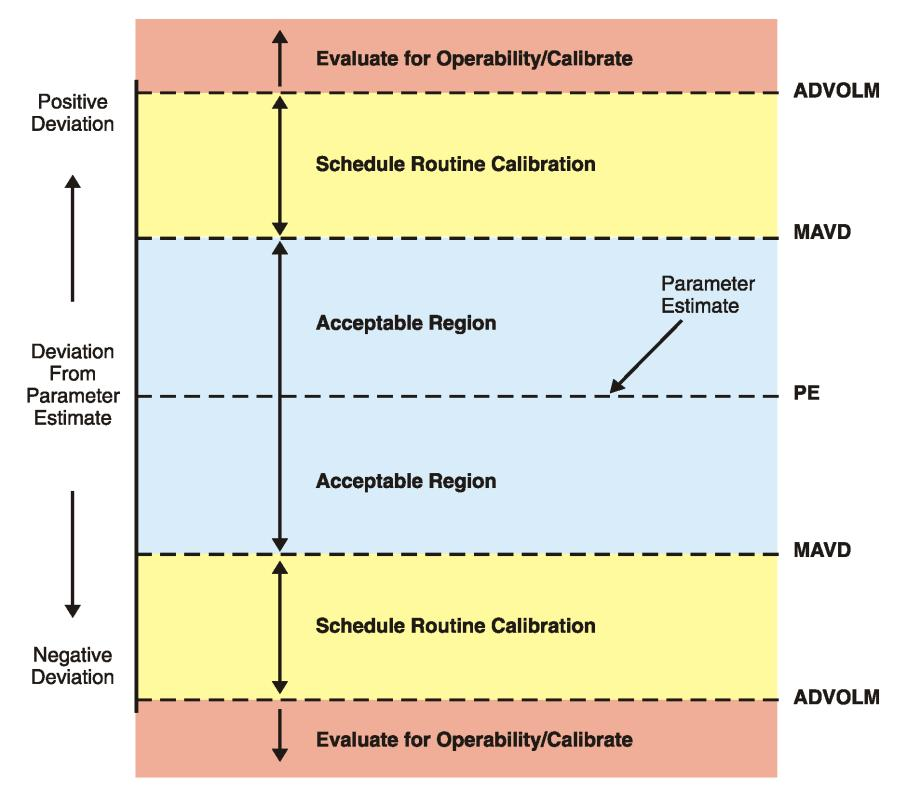

**Figure 6-4 Alarm Monitoring Points** 

The following sections provide additional guidance regarding the performance evaluation process.

#### *6.5.1 Acceptable Region*

An acceptance criterion must be established for each monitored parameter. If a given channel remains within the acceptance band, no calibration action is necessary for the monitored sensor unless that channel is scheduled for its periodic calibration. The acceptable region of operation must be established in accordance with the process described in Section 6.3 with a clear link to the setpoint allowances for drift.

#### *6.5.2 Schedule Routine Calibration – MAVD*

If a channel's deviation exceeds a pre-defined limit, a calibration check will be necessary. If the deviation does not exceed channel operability limits, the urgency of calibration might not be critical and can be scheduled as a routine activity. For example, the channel might be added to the outage work plan or it might be scheduled for a routine calibration if accessibility is not an issue during power operation.

#### *6.5.3 Operability Assessment – ADVOLM*

If a channel's deviation exceeds a pre-defined acceptance limit, the channel must be evaluated for operability and corrective actions taken as directed by the Technical Specifications. The operability assessment should consider the guidance provided in Generic Letter 91-18, Revision 1, *Information to Licensees Regarding NRC Inspection Manual Section on Resolution of Degraded and Nonconforming Conditions*.

As part of any operability assessment, it should be noted that the on-line monitoring signal path includes additional devices besides the sensor that are potentially the source of drift or failure. Consider checking the accessible portions of the instrument loop before checking the sensor.

#### **6.6 Ongoing Calibration Monitoring Program**

In support of the longer calibration intervals, an evaluation process should be established to confirm that instrument performance continues to be acceptable. The concept here is similar, in some respects, to the ongoing monitoring program for two-year fuel cycles as discussed in NRC Generic Letter 91-04, *Changes in Technical Specification Surveillance Intervals to Accommodate a 24-Month Fuel Cycle*.

The aspects of an ongoing monitoring program that are of importance to on-line monitoring include the following:

- Does sensor drift exceed allowable tolerances at the longer calibration interval?
- Are drift magnitudes larger than expected at the longer calibration interval?
- Does the periodic calibration of redundant sensors identify calibration errors that were not detected by on-line monitoring?

Some caution in the above evaluations is also warranted. A direct correlation between the observed performance and the calibration records might not always be observed. Remember that the on-line monitoring system is monitoring the operational status of a parameter, from the process to the display, which is different from the results that might be observed when calibrating a sensor. Key differences between the two are:

- On-line monitoring is evaluating the process signal from the process to the display. The sensor is only part of this loop.
- A sensor calibration does not include process measurement effects and some environmental effects that are included during on-line monitoring operation.
- Sensors are exposed to a different set of environmental and operating conditions as the plant shuts down, cools down, and depressurizes. On-line monitoring might not be functioning during the plant shutdown period and would not observe these changes.

## *7* **ON-LINE MONITORING PROCEDURES AND SURVEILLANCES**

The NRC SE for on-line monitoring provided the following surveillance-related requirement:

#### **Requirement 14**

*Before declaring the on-line monitoring system operable for the first time, and just before each performance of the scheduled surveillance using an on-line monitoring technique, a full-features functional test, using simulated input signals of known and traceable accuracy, should be conducted to verify that the algorithm and its software perform all required functions within acceptable limits of accuracy. All applicable features shall be tested.* 

#### Discussion for Requirement 14:

The V&V documents produced in support of this project include a procedure with expected results for an acceptance test and periodic test. The test files referenced in this procedure are provided directly to the software users. As part of the plant-specific software acceptance, these test procedures and test files form the recommended basis for acceptance testing as well as for periodic testing in support of the quarterly on-line monitoring surveillance test. This section provides the recommended input for the quarterly on-line monitoring surveillance test. Section 8 discusses the V&V documentation in support of an MSET application.

#### **7.1 Impact on Plant Procedures and Documents**

Plant procedures and documents will be affected by the implementation of on-line monitoring. The following procedures, work processes, or documents will generally need to be modified or created:

- Technical Specifications—formal approval will be necessary to allow longer calibration intervals for specified sensors.
- Calibration interval—the routine calibration frequency for redundant channels will be changed from once per fuel cycle to once per *n* fuel cycles, where *n* refers to the number of redundant channels.
- Quarterly surveillance procedure—a formal procedure will be developed for the quarterly surveillance evaluation by on-line monitoring. This procedure should provide guidance to the user regarding how to perform the following tasks:
  - Verify that the on-line monitoring system is functional.

- Verify that no monitored channels are operating outside alarm limits. Required actions, such as notification to operations or an operability evaluation, should be addressed in the event that alarm limits are exceeded.
- Verify that current plant conditions are appropriate for the surveillance. For example, plant conditions should not be outside the on-line monitoring system's validity limits, and process conditions should be stable for the parameters of interest.
- Document completion of the surveillance. Output reports from the on-line monitoring program should be included as part of the documentation.
- On-line monitoring operation—an operating procedure, operating manual, or other type of users' guidance will be needed to ensure that future users will be able to operate the system.
- Miscellaneous—other plant documents might be affected by the existence and implementation of on-line monitoring. The number of documents will vary based on plantspecific document control systems.

#### **7.2 Calibration Procedures**

Calibration procedures can be unchanged by the implementation of on-line monitoring unless the procedures directly specify the calibration frequency. Note that the physical calibration process by which an instrument is checked and adjusted, if necessary, has not changed. Only the calibration frequency has changed.

#### **7.3 On-Line Monitoring System Operation Procedures**

EPRI has developed a series of documents specifically intended to facilitate the on-line monitoring implementation process. These documents were prepared in direct support of the EPRI On-Line Monitoring Implementation Project and include the following:

- EPRI interim report, *SureSense™ Diagnostic Monitoring Studio™ Users Guide*, Version 1.4, June 2002, provides detailed guidance for the application of the SureSense MSET method for nuclear plant systems. This users guide is detailed enough to serve as the plant-specific software operating manual.
- 1003661, *Plant System Modeling Guidelines to Implement On-Line Monitoring*, June 2002, addresses all aspects of modeling for on-line monitoring applications. This report describes model development, data quality issues, model training requirements, retraining criteria, alarm response, and declaring a model ready for use. The models developed by the project participants are described in the appendices for the benefit of future users of on-line monitoring systems.
- 1003360, *On-Line Monitoring Implementation Guidelines*, November 2002, discusses implementation of an on-line monitoring system. This report addresses plant procedures for on-line monitoring, software verification and acceptance testing, data management, alarm assessment, and the transition from batch mode to on-line mode of monitoring operation.

EPRI provides ongoing training in support of the above documents. This training is designed to improve user understanding of on-line monitoring application and evaluation.

#### **7.4 Quarterly Surveillance Procedure**

The quarterly surveillance should include the following:

- Periodic full-features functional test of the software confirms that the software used for online monitoring is performing properly.
- Confirmation that the program and data files used for on-line monitoring are the proper revision and date in accordance with plant-specific configuration control requirements.
- Model-by-model evaluation of all associated Technical Specification parameters to determine if any channels have alarmed or indicate drift beyond acceptable levels.
- Formal confirmation of acceptable channel performance, provided that no channels have exhibited drift beyond acceptable limits.
- Formal identification of any channels that should be scheduled for routine recalibration.
- Formal identification of any channels that require immediate operability assessment.
- Verification that the on-line monitoring model settings, including model training basis, continue to be acceptable, or identification of any potential model changes that should be formally evaluated.

The quarterly surveillance procedure should provide the acceptable drift monitoring limits based on the guidance provided in Section 6. This represents one key difference between the NRC SE and the guidance provided in this report. Requirement 8 in the NRC SE states, in part, that *the maximum value of the channel deviation beyond which the instrument is declared "inoperable" shall be listed in the Technical Specifications*. This report proposes that a clear link be maintained between the on-line monitoring drift limits and the setpoint calculations that form the basis for the Technical Specification trip setpoint and allowable value. Accordingly, these values should remain unchanged in the Technical Specifications, with the on-line monitoring acceptance limits specified only in the quarterly procedure.

| 0 |  |  |
|---|--|--|

# *8*

### **SOFTWARE VERIFICATION AND VALIDATION**

#### **8.1 General Criteria**

On-line monitoring will be used to determine if calibration of safety-related equipment is needed and, because of its ability to identify degraded channels, can initiate the operability assessment process. Although the on-line monitoring software is not considered to be safety-related, it is considered to be quality-related and should require formal evaluation in accordance with plantspecific software acceptance procedures. The required level of validation, verification, testing, and documentation will be determined based upon the software quality assurance class determined by application of plant-specific procedures. Determination of these requirements should also include site acceptance testing requirements.

The EPRI On-Line Monitoring Implementation Project selected MSET as its preferred on-line monitoring method and the SureSense Diagnostic Monitoring Studio software for MSET implementation. For this reason, Section 8.2 provides information regarding the MSET software developed by Argonne National Laboratory as well as the SureSense software developed by Expert Microsystems, which incorporates the ANL MSET base code.

The NRC SE for on-line monitoring provided the following requirements associated with the software used for on-line monitoring:

#### **Requirement 12**

*(b) The plant-specific QA requirements shall be applicable to the selected on-line monitoring methodology, its algorithm, and the associated software. In addition, software shall be verified and validated and meet all quality requirements in accordance with NRC guidance and acceptable industry standards.* 

#### Discussion for Requirement 12:

Section 8 provides the verification and validation documentation produced in support of this project; this documentation specifically supports an MSET implementation because this is the basis for the EPRI On-Line Monitoring Implementation Project. The documentation developed in support of this project includes quality documents and V&V-related documents produced by the software supplier (Expert Microsystems, Inc.), Argonne National Laboratory, and EPRI. Each participating plant must follow its plant-specific procedures for software acceptance.

#### **Requirement 14**

*Before declaring the on-line monitoring system operable for the first time, and just before each performance of the scheduled surveillance using an on-line monitoring technique, a full-features functional test, using simulated input signals of known and traceable accuracy, should be conducted to verify that the algorithm and its software perform all required functions within acceptable limits of accuracy. All applicable features shall be tested.* 

#### Discussion for Requirement 14:

The V&V documents produced in support of this project include a procedure with expected results for an acceptance test and periodic test. The test files referenced in this procedure are provided directly to the software users. As part of the plant-specific software acceptance, these test procedures and test files form the recommended basis for acceptance testing as well as for periodic testing in support of the quarterly on-line monitoring surveillance test. Section 7 provides the recommended input for the quarterly on-line monitoring surveillance test. This section discusses the V&V documentation in support of an MSET application.

#### **8.2 MSET V&V**

Verification and validation of the MSET software has been performed at several levels:

- The MSET base code was developed by Argonne National Laboratory and has been licensed to Expert Microsystems, Inc., and SmartSignal Corporation. The V&V of this base code is described in Section 8.2.1.
- The Expert Microsystems SureSense software has been applied by the EPRI On-Line Monitoring Implementation Project. SureSense uses the MSET base code licensed by ANL and overlays additional features and capabilities for signal validation and monitoring. The SureSense software V&V documents are described in Section 8.2.2.
- EPRI has sponsored an independent V&V of the SureSense software (Version 1.4) in support of the EPRI On-Line Monitoring Implementation Project.

#### *8.2.1 Argonne National Laboratory V&V*

#### 8.2.1.1 Background

The ANL V&V effort was funded by the NEPO program, which is a DOE research and development (R&D) program focused on performance optimization of currently operating U.S. nuclear power plants. The primary research areas for the R&D program are plant aging and optimization of electrical production. The NEPO program is a public-private R&D partnership with equal or greater matching funds coming from industry. The NEPO program was initiated in fiscal year 2000 and is explained in detail on the DOE web site, http://nepo.ne.doe.gov/.

The IMC Users Group coordinated NEPO projects that support the continued development of on-line monitoring and that directly support tasks associated with the EPRI On-Line Monitoring Implementation Project. ANL was awarded the initial scope of work for 2001 to complete the V&V of the MSET kernel software. This task was completed in July 2002 and directly supports the on-site acceptance of the associated software.

#### 8.2.1.2 V&V Documents

In July 2002, the ANL Reactor Analysis and Engineering Division completed the software quality assurance documentation in support of the MSET base code. The purpose of the ANL V&V effort was to develop the documentation necessary for participating nuclear plants to demonstrate that the software analysis modules and state estimation kernels are reliable and of high quality.

As part of the ANL V&V effort, a code Configuration Management Plan (CMP) was implemented, and the code was placed in a location controlled by the CMP. A V&V plan was written, incorporating the required activities and acceptance criterion. Implementation of the V&V plan included a formal test plan. The following ANL documents were produced in support of the V&V effort:

- *Quality Assurance Documentation Package for the Multivariate State Estimation Technique Software System (MSET ) Software System Kernel,* Revision 0, July 25, 2002.
- *Software Quality Assurance Program,* Revision 0, January 23, 2002.
- *Software Configuration Control Procedure for the Multivariate State Estimation Technique Software System (MSET ),* Revision 1, November 26, 2001.
- *Software Requirements and Specifications for the Multivariate State Estimation Technique Software System (MSET),* Revision 2, May 21, 2002.
- *Software Verification and Validation Plan for the Multivariate State Estimation Technique Software System (MSET),* Revision 1, February 15, 2002.
- *Software Test Plan for the Multivariate State Estimation Technique Software System (MSET),* Revision 0, June 25, 2002.
- *Verification of the MSET Base Code Version 3.5,* July 19, 2002.
- *MSET Kernel Validation Report, Version 3.5 of the MSET Base Code,* July 17, 2002.

The above documents were developed and completed as a NEPO project and are available in support of software acceptance and use for any MSET application that employs the ANL base code.

#### *8.2.2 Expert Microsystems SureSense Software V&V*

The Expert Microsystems SureSense software is a commercially supported implementation of the ANL MSET base code. The software is also referred to as the SureSense Diagnostic Monitoring Studio, with Version 1.4 being the most recent release as of the issuance of this report. The following documents describe the quality assurance processes associated with SureSense:

- Expert Microsystems Software Quality Assurance Plan, Document No. 2002 4470, Rev. 1.0 sets forth the process, methods, standards, and procedures used to perform the software quality assurance function for the SureSense software.
- Expert Microsystems Software Configuration Management Plan, Document No. 2001-4471, Rev. 1.0 sets forth the policy, procedures, and processes used to accomplish configuration management for the SureSense software.
- SureSense Diagnostic Monitoring Studio Software Requirements Specification, Document No. 2001-4489, Rev. 1.4 specifies software requirements for version 1.4 of the SureSense Diagnostic Monitoring Studio software.
- SureSense Diagnostic Monitoring Studio Software Verification Test Plan, Document No. 2001-4479, Rev. 1.4 defines test procedures for verifying that the software meets all requirements defined in the Software Requirements Specification. Guidelines are provided for unit testing, integration testing, system testing, regression testing, and acceptance testing. This document provides step-by-step test instructions. Variables and data are specified as well as expected results. A traceability matrix is included in this document to verify that testing of all items listed in the requirements document is performed.

#### *8.2.3 EPRI Independent V&V of the SureSense Software*

EPRI sponsored an independent V&V of the SureSense software as part of its release for Version 1.4. Although Expert Microsystems performed internal V&V testing of its software prior to release, the rationale for an independent V&V included the following considerations:

- An independent V&V could assist nuclear plants participating in the EPRI On-Line Monitoring Implementation Project by ensuring adequate documentation is in place to support plant-specific software acceptance.
- An independent review and documentation of the software functions is generally considered good software engineering practice and was considered a beneficial activity supporting the EPRI On-Line Monitoring Implementation Project.
- The independent V&V testing procedure could form the building block for the plant-specific acceptance test and the periodic full-features test required by the NRC SE (Requirement 14). This independent V&V test was conducted on known simulated data designed to test the various software estimation and fault detection methods. Future periodic software test results will be traceable to the independent V&V documentation.

The term *independent V&V* is used here to indicate that the review was performed by personnel not involved in SureSense software development, including development testing. The EPRI independent V&V was completed in July 2002 and was issued as an unpublished EPRI report to the participants in the EPRI On-Line Monitoring Implementation Project. The supporting documentation for the report included the documents listed in Sections 8.2.1 and 8.2.2.

#### **8.3 Additional V&V Considerations**

#### *8.3.1 Data Acquisition*

The method by which data are acquired for on-line monitoring should be verified and validated. The evaluation should confirm that data obtained from the plant computer or an associated data archive is correct for the application. This evaluation depends on plant-specific data acquisition, archiving, and retrieval procedures.

#### *8.3.2 Model Configuration Control*

In the context of configuration control, the term *model* refers to the following:

- The selected group of signals that have been collected together for the purpose of signal validation and analysis
- The various settings defined by the on-line monitoring method that are necessary to optimize the performance of the signal validation procedure
- The data used for training, including any filtering of the data

As part of developing a model, the above signals, settings, and data are defined. After the model has been tuned for optimal performance, the completed model is placed in service and will be used as the basis for future signal validation. This completed model should be placed under configuration control to ensure the following:

- The correct version of the model is in service.
- Changes have not been made to the model without undergoing a formal revision process.

The method by which a model is placed under configuration control will vary with each plant and its plant-specific document control procedures.

### **8.4 MSET Software Acceptance Test**

The V&V documents described in the previous sections include a procedure with expected results for an acceptance test and periodic test. The test files referenced in this procedure are provided directly to the SureSense software users. As part of the plant-specific software acceptance, these test procedures and test files form the recommended basis for acceptance testing as well as for periodic testing in support of the quarterly on-line monitoring surveillance test.

#### **8.5 Redundant Channel Methods V&V**

#### *8.5.1 ICMP V&V*

The EPRI Instrument Monitoring and Calibration Program has been placed in service at one nuclear plant as a performance monitoring and troubleshooting tool. As part of system acceptance, a team was formed by the plant staff to provide control and oversight of the V&V effort. The team consisted of independent computer/software technicians, technicians and engineers associated with the project, and a QC representative. EPRI contracted with an external company to provide detailed support of the effort, but for purposes of independence, this company was not part of the V&V team.

The V&V activities were conducted as an integral part of the system design and development process. All V&V formal reports and correspondence reporting V&V findings were transmitted directly to the project manager, with copies forwarded to the other participants. The V&V team reviewed all relevant documents and correspondence, and the plant staff performed all V&V activities related to ICMP software. The V&V documentation file is stored at the plant and includes the following elements.

- V&V test plan
- System requirements/functional specification
- ICMP test plan
- Test procedure
- Discrepancy/resolution report

One advantage of a redundant channel approach such as ICMP is the overall analytical simplicity. The algorithm is easy to understand, and its performance as signals drift is straightforward to evaluate. For this reason, the on-site V&V effort should be simpler with respect to the testing aspects of the software implementation.

## *9* **MISCELLANEOUS TECHNICAL CONSIDERATIONS**

This section discusses various technical issues that might have relevance to the implementation of on-line monitoring at some nuclear plants.

#### **9.1 Bases for Reduced Response Time Testing**

Some plants have eliminated periodic response time testing (RTT) requirements based on nuclear steam supply system (NSSS) owners group submittals and the corresponding NRC SE. One NRC SE provided the following evaluation of response time testing requirements:

"RTT is resource intensive and time consuming when properly incorporated into the licensees surveillance test program. Since the utility required RTT tests only for compliance with accident analysis assumptions, and not to the instrument manufacturer design response time, the test tells very little about the general performance of the instrument. The accident analysis times are, in general, much greater (typically an order of magnitude or more) than the manufacturer designed instrument response times, and therefore an instrument could have significant delay in response, and still pass the required test for overall mitigation or trip system actuation response time. For the purpose of showing that the dynamic response of the instrument is within manufacturer's design parameters, the current RTT is not useful.

"The RTT performed by the licensees per TS requirements is not performed often. In the typical system, RTT is required to be checked on only one channel each refueling outage, on a rotating basis. Hence, with a four channel system and an 18 month refueling cycle, any given channel is tested only every 72 months, or 6 years. This test interval is too great for any meaningful trending program, and in most plants, RTT data is not trended.

"In analog systems, response time degradation is generally due to wear or breakage of some internal part of the instrumentation. Since safety systems are single failure proof, failure of one channel to respond within response time criteria will not prevent the safety system as a whole from responding to achieve the required function within the time criteria.

". . . The FMEA described … shows that component degradation will not increase the response time beyond the bounding response time without that degradation being detectable by other periodic surveillance tests, such as channel checks and calibrations. ". . . Based on this information, the staff concurs that RTT is redundant to other periodic surveillance tests and that appropriate surveillance testing alternatives to RTT are in place per the existing requirements of plant specific TSs. The staff concludes that calibration and other TS surveillance testing requirements will adequately ensure that the response time is verified for the components identified. . . ."

As can be seen, the relaxation of RTT requirements is based in part on an expectation that periodic surveillance tests, such as channel checks and calibrations, will continue to be performed. The further extension of some calibrations by the use of on-line monitoring is not considered contrary to the positions taken with respect to RTT elimination. In particular, the elimination of RTT based on the performance of periodic calibrations and the further extension of periodic calibrations by the use of on-line monitoring are not considered mutually exclusive. The rationale for this position with respect to the implementation of on-line monitoring is as follows:

- With respect to on-line monitoring, no changes are proposed to the periodic calibration of rack-mounted devices associated with the trip function of safety-related channels. This includes summators, comparators, bistables, function generators, power supplies, relay modules, multiplier/dividers, mV/I amplifiers, and other associated devices.
- Only field-mounted transmitters (sensors) are potentially affected by the combined effect of RTT elimination and calibration extension at an extended frequency. Calibrations of these transmitters will continue to be performed but potentially at an extended frequency.
- On-line monitoring has been accepted as a method of verifying the calibration of installed instrumentation. The application of on-line monitoring as a calibration assessment tool actually involves more frequent checking of the calibrated state of the channel. Out-ofcalibration conditions will be identified more quickly than by traditional time-directed calibrations.
- With respect to on-line monitoring, no changes are proposed to periodic channel checks. But, the identification of out-of-calibration conditions can occur sooner than standard operatorperformed channel checks because of the improved fault-detection capability provided by online monitoring.

#### **9.2 Historical Instrument Performance**

When on-line monitoring is implemented, historical instrument performance is an important consideration for the following reasons:

• Instrument channels that have historically behaved relatively poorly, in that they were frequently found out of calibration when checked, will probably not exhibit improved performance when checked by on-line monitoring. Instead, these channels might require more frequent calibration because on-line monitoring will identify the presence of drift at levels generally not detectable by traditional channel checks. The likely result should be understood before starting on-line monitoring.

• Section 6.6 describes the ongoing calibration monitoring program and explains why it is recommended as part of the implementation of on-line monitoring. Evaluating the future performance of instrument channels is better performed if the past performance has also been evaluated. By establishing the historical instrument channel performance before the implementation of on-line monitoring, a baseline will be defined against which future performance can be compared.

EPRI TR-103335-R1, *Guidelines for Instrument Calibration Extension/Reduction – Revision 1: Statistical Analysis of Instrument Calibration Data*, provides one method by which historical performance can be evaluated. This type of as-found and as-left calibration data has often already been evaluated at many plants for other purposes, such as two-year fuel cycle extensions or drift magnitude checks in support of setpoint calculations.

#### **9.3 Common-Mode Failures or Common Bias Effects**

Industry experience continues to demonstrate that common mode failure of redundant channels is an unlikely event. EPRI TR-103436-V2, *Instrument Calibration and Monitoring Program, Volume 2: Failure Modes and Effects Analysis*, performed a failure mode and effects analysis (FMEA) for typical sensors and provides a basis for the absence of common-mode sensor bias effects beyond those already included in the setpoint analysis. The EPRI drift study documented in EPRI TR-104965-R1 NRC SER, *On-Line Monitoring of Instrument Channel Performance*, also confirmed that drift tends to occur randomly about a zero-referenced mean with little or no tendency for systematic drift in a preferential direction.

This experience continues to be confirmed with the EPRI On-Line Monitoring Implementation Project. With dozens of models evaluating hundreds of sensors over a two-year period, occasional instrument drift has been observed, but common-mode failures or common bias effects have not been observed.

Other bias effects might exist that influence the sensor output while the plant is operating but might disappear completely as the plant shuts down. An example of this might be fluid density changes on a level measurement—as the plant heats up, water density decreases, thereby causing less differential pressure on level transmitters. These types of predictable bias effects should have no significant impact on on-line monitoring because they are already accounted for in the plant's setpoint analysis. Furthermore, such bias effects, if they exist, would have the same impact on channel performance with current calibration practices.

| 0 |  |  |
|---|--|--|

## *10* **REFERENCES**

#### **10.1 EPRI References**

*Cost Benefits of On-Line Monitoring*, EPRI, Palo Alto, CA: 2002. 1003572.

*Guidelines for Instrument Calibration Extension/Reduction – Revision 1: Statistical Analysis of Instrument Calibration Data,* EPRI, Palo Alto, CA: 1998. TR-103335-R1.

*Instrument Calibration and Monitoring Program, Volume 1: Basis for the Method,* EPRI, Palo Alto, CA: 1993. TR-103436-V1.

*Instrument Calibration and Monitoring Program, Volume 2: Failure Modes and Effects Analysis,* EPRI, Palo Alto, CA: 1993. TR-103436-V2.

*Monte Carlo Simulation and Uncertainty Analysis of the Instrument Calibration and Monitoring Program,* EPRI, Palo Alto, CA: 1995. WO3785-02.

*On-Line Monitoring Implementation Guidelines,* EPRI, Palo Alto, CA: 2002. 1003360.

*On-Line Monitoring of Instrument Channel Performance*, EPRI, Palo Alto, CA: 2000. TR-104965-R1 NRC SER. (Includes NRC correspondence and safety evaluation related to on-line monitoring.)

*Plant System Modeling Guidelines to Implement On-Line Monitoring,* EPRI, Palo Alto, CA: 2002. 1003661.

*SureSense™ Diagnostic Monitoring Studio™ Users Guide, Version 1.4,* EPRI, Palo Alto, CA: 2002. Interim Report.

#### **10.2 Miscellaneous References**

Dupuis, E., "Preventive Maintenance and Degradation Detection of Operation Sensors Using Redundance Analysis," presented at the May 1998 EPRI/Utility On-Line Monitoring Working Group meeting.

Hartman, M., VanAlstine, R., McGettrick, D. J., Hooten, D. P., and J. R. Smith, *Evaluation of Instrumentation Calibration Reduction Methodologies*, B&W Owners Group ICR Working Group Report 47-5001013-00, January 1998.

#### *References*

Hines, J. W., Gribok, A., and B. Rasmussen, "On-Line Sensor Calibration Verification: 'A Survey,'" presented at the 14th International Congress and Exhibition on Condition Monitoring and Diagnostic Engineering Management, Manchester, England, September, 2001.

NRC letter dated October 6, 1998, "Safety Evaluation Related to Topical Report WCAP-14036, Revision 1, Elimination of Periodic Protection Channel Response Time Tests."

NUREG-1430, Revision 2, Standard Technical Specifications – Babcock and Wilcox Plants, NRC.

NUREG-1431, Revision 2, Standard Technical Specifications – Westinghouse Plants, NRC.

NUREG-1432, Revision 2, Standard Technical Specifications – Combustion Engineering Plants, NRC.

NUREG-1433, Revision 2, Standard Technical Specifications – General Electric Plants, BWR/4, NRC.

Rasmussen, B., "Monte Carlo Analysis of ICMP Algorithm," University of Tennessee, December 2001.

Regulatory Guide 1.105, Revision 3, Setpoints for Safety-Related Instrumentation.

## *A* **GLOSSARY**

The definitions provided in this appendix were obtained from the references listed in the report or were created during the course of the project. Abbreviations used in the body of the report are included in the glossary. Not all terms included in the glossary are used in the report, but are included for completeness.

**95%/95%** – Standard statistics term meaning that the results have a 95% probability with a 95% confidence.

#### **A**

**A/E** – Architect/engineer.

**Accuracy (Reference)** – In-process instrumentation, a number or quantity that defines a limit that error should not exceed when a device is used under specified operating conditions. Error represents the difference between the measured value and the standard or ideal value.

**Adjustment** – The activity of physically adjusting a device to leave it in a state in which its performance characteristics are within acceptable limits.

**AFAL** – As-found minus as-left.

**ADVOLM** – Acceptable deviation value for on-line monitoring.

**ANL** – Argonne National Laboratory.

**ANN** – Artificial neural network.

**As-Found** – The condition in which a channel, or portion of a channel, is found after a period of operation and prior to any calibration.

**As-Found Tolerance** – The tolerance allowed in accuracy between calibrations of a device, group of devices, or loop. The as-found tolerance establishes the unit of error that the defined devices can have and still be considered functional.

**As-Left** – The condition in which a channel, or portion of a channel, is left after calibration or surveillance check.

*Glossary* 

**As-Left Tolerance** – The tolerance that establishes the required accuracy band that a device or group of devices must be calibrated to within and remain to avoid recalibration when periodically tested.

#### **B**

**B&W** – Babcock & Wilcox.

**BART** – Bounded angle ratio test.

**Bias** – A shift in the signal zero point by some amount.

**BWR** – Boiling water reactor.

**C** 

**Calibration** – The process of adjustment, as necessary, of the output of a device such that it responds within a specified tolerance to known values of input.

**Calibrated Span** – The maximum calibrated upper range value less the minimum calibrated lower range value.

**Calibration Interval** – The elapsed time between the initiation or successful completion of calibrations or calibration checks on the same instrument, channel, instrument loop, or other specified system or device.

**Calibration (Time-Directed)** – The calibration of an instrument at specified time intervals, without regard of the existing calibrated state of the instrument.

**Channel** – An arrangement of components and modules as required to generate a single protective action signal when required by a generating station condition, a control signal, or an indication function.

**Channel Calibration** (typical Technical Specification definition) – The adjustment, as necessary, of the channel so that it responds within the required range and accuracy to known input. The CHANNEL CALIBRATION shall encompass the entire channel, including the required sensor, alarm, interlock, display, and trip functions. The CHANNEL CALIBRATION may be performed by means of any series of sequential, overlapping calibrations or total channel steps so that the entire channel is calibrated.

**Channel Check** – The qualitative assessment, by operator observation, of channel behavior during operation, which includes, where possible, comparison of the channel indication to other indications from other redundant channels measuring the same parameter.

**Confidence Interval** – An interval that contains the population mean to a given probability.

**Conformity** – The maximum difference, over the range of an instrument, between the indicated value and the true value being measured.

**D** 

**D/P** – Differential pressure.

**D-Matrix** – the matrix of vectors selected by the MSET training process. These vectors represent the model in terms of its recognition of "normal" system behavior. Also referred to as the training matrix or the process memory matrix.

**Dependent** – In statistics, dependent events are those for which the probability of all occurring at once is different than the product of the probabilities of each occurring separately. In setpoint determination, dependent uncertainties are those uncertainties for which the sign or magnitude of one uncertainty affects the sign or magnitude of another uncertainty.

**Desired Value** – A measurement value with no error existing.

**Deviation** – The difference between the parameter estimate and the monitored signal.

**DOE** – U.S. Department of Energy.

**Drift** – An undesired change in output over a period of time that is unrelated to the input, environment, or load.

**E** 

**EdF** – Electricité de France.

**Error** – The undesired algebraic difference between a value that results from measurement and a corresponding true value.

**ESFAS** – Engineered Safeguards Features Actuation System.

**Estimate** – The best estimate of the actual process value; used interchangeably with parameter estimate.

**F** 

**Field Calibration** – Performing the activities of surveillance and adjustment using an external reference source.

*Glossary* 

**Forward Span Shift** – Span shift in which the magnitude of drift increases with increasing span. Forward span shift causes a shift in the 100% of span calibration point.

**Full Scale** – The 100% value of the measured parameter on an instrument. Full scale and span are equivalent for a zero-based instrument.

**Functionally Equivalent** – Instruments with similar design and performance characteristics that can be combined to form a single population for analysis purposes.

**G** 

**GE** – General Electric.

**H** 

**Hysteresis** – The difference between upscale and downscale results in instrument response when subjected to the same input approached from the opposite direction.

**I** 

**ICMP** – Instrument Calibration and Monitoring Program.

**IMC** – Instrument monitoring and calibration.

**Independent** – In statistics, independent events are those in which the probability of all occurring at once is the same as the product of the probabilities of each occurring separately. In setpoint determination, independent uncertainties are those for which the sign or magnitude of one uncertainty does not effect the sign or magnitude of any other uncertainty.

**Initial Training** – see Training.

**Instrument Channel** – An arrangement of components and modules as required to generate a single protective action or indication signal, which is required by a generating station condition. A channel loses its identity where single protective action signals are combined.

**Instrument Range** – The region between the limits within which a quantity is measured, received or transmitted, expressed by stating the lower and upper range values.

**K** 

**Kernel** – An imbedded set of code.

L

**Linear** – A straight-line relationship between one variable and another. When used to describe the output of an instrument, it means that the output is proportional to the input.

**Linearity** – The closeness to which a curve approximates a straight line. Linearity is usually measured as a nonlinearity and expressed as linearity.

**Loop** – A generic name given to a set of instrument devices that perform a specific function.

**Loop Tolerance** – The tolerance allowed on a total loop calibration and defines the basic accuracy of a loop. The loop tolerance is established based on the device tolerance of each device making up the loop.

M

**M&TE** – Measuring (or measurement) and test equipment.

**MAVD** – Maximum acceptable value of deviation.

**Margin** – An additional allowance added to the instrument channel uncertainty to allow for unknown uncertainty components. The addition of margin moves the setpoint further away from the analytical limit or nominal process limits.

**Maximum Span** – The instrument's maximum upper range limit less the maximum lower range limit.

**Mean** – The average value of a random sample or population. For n measurements of  $x_i$ , where i ranges from 1 to n, the mean is given by:

$$\frac{1}{x} = \frac{\sum x_i}{n}$$

**Median** – The value of the middle number in an ordered set of numbers. Half the numbers have values that are greater than the median and half have values that are less than the median. If the data set has an even number, the median is the average of the two middle numbers.

**MinMax** – An algorithm that extracts vectors that bound a vector space defined by training data. (Also see Vector Ordering.)

**Model** – The group of signals that have been collected for an analysis.

**Module** – Any assembly of interconnecting components that constitutes an identifiable device, instrument, or piece of equipment. A module can be removed as a unit and replaced with a spare. It has definable performance characteristics that permit it to be tested as a unit. A module can be

Glossary

a card, a drawout circuit breaker, or other subassembly of a larger device, provided it meets the requirements of this definition.

**Monitoring** – The activity of evaluating instrument channel performance to determine whether it is performing within acceptable performance limits.

**MSET** – Multivariate State Estimation Technique.

N

**Noise** – An unwanted component of a signal or variable. It causes a fluctuation in a signal that tends to obscure its information content.

**Nonlinear** – A relationship between two or more variables that cannot be described as a straight line. When used to describe the output of an instrument, it means that the output is of a different magnitude than the input.

**Normal Distribution** – The density function of the normal random variable X, with mean  $\mu$  and variance  $\sigma^2$  is:

$$n(x; \mu, \sigma) = \frac{1}{\sqrt{2 \pi \sigma}} e^{-\frac{(x-\mu)^2}{2 \sigma^2}}$$

**Normality Test** – A statistics test to determine if a sample is normally distributed.

**Normalized** – A term indicating that the data values for a group of disparate signals have been modified so that all signals have approximately equal weight in an analysis.

**NRC** – Nuclear Regulatory Commission.

**NSSS** – Nuclear Steam Supply System.

 $\mathbf{O}$ 

**OLM** – On-line monitoring.

**OLMS** – On-line monitoring system.

**On-Line Monitoring** – An automated method of monitoring instrument performance and assessing instrument calibration while the plant is operating.

**On-Line Monitoring** (proposed Technical Specification definition) – ON-LINE MONITORING is the assessment of channel performance and calibration while the channel is operating. ON-LINE MONITORING differs from CHANNEL CALIBRATION in that the channel is not adjusted by the process of ON-LINE MONITORING. Instead, ON-LINE MONITORING

compares channel performance to established acceptance criterion to determine if a CHANNEL CALIBRATION is necessary.

**OOC** – Out of calibration.

**Operating Space** – A defined region of operation.

**Operating State** – A defined region of operation, often established by power level or equipment lineup. Often used interchangeably with operating space.

**Overfitting** – The tendency for the estimate to follow a signal disturbance.

**Outlier** – A data point significantly different in value from the rest of the sample.

**Outlier (Alternative Version)** – A data point or points that appear to be inconsistent with the remainder of that set of data.

**P** 

**Parameter Estimate** – The best estimate of the actual process value.

**Pattern Recognition** – The ability of a system to match large amounts of input information simultaneously and generate a categorical or generalized output.

**PDF** – Probability density function.

**Percent of Span** – A method for describing instrument spans or ranges as a simple percentage. The low end of span is the 0% point, and the high end of span is the 100% point.

**Population** – The totality of the observations with which we are concerned.

**Precision** – The repeatability of measurements of the same quantity under the same conditions.

**Probability Density Function** – An expression of the distribution of probability for a continuous function. The probability contained within a given interval can vary from 0 to 1 and is expressed by:

$$P(a < X < b) = \int_b^a f(x) dx$$

**Process Measurement Instrumentation** – An instrument or group of instruments that convert a physical process parameter such as temperature or pressure to a usable, measurable parameter such as current or voltage.

*Glossary* 

**PWR** – Pressurized water reactor.

**R** 

**Random** – Describing a variable whose value at a particular future instant cannot be predicted exactly but can only be estimated by a probability distribution function.

**Range** – The region between the limits within which a quantity is measured, received, or transmitted.

**RCS** – Reactor coolant system.

**Reference Accuracy** – A number or quantity that defines the limit that errors will not exceed when the device is used under reference operating conditions.

**Repeatability** – The closeness of agreement in output for consecutive measurements of the same value for input made under the same operating conditions.

**Residual** – The difference between the observation and the corresponding estimate for that observation. Also known as the residual error.

**Retraining** – Any change made to the set of data originally selected as representative of system normal and expected behavior.

**Retraining for Operating Space** – Retraining caused by modifying the data used for training. If the pool of data made available for training is modified, the vector selection for the training matrix will likely change, even if the model settings are unchanged.

**Retraining for Settings** – Retraining caused by adjusting model settings. Changing estimator settings, changing the number of signals, adjusting data limit filters, or modifying phase determiner definitions for validation will require retraining and optimizes model performance for a given set of training data.

**Reverse Span Shift** – Span shift in which the magnitude of drift increases with decreasing span. Reverse span shift causes a shift in the 0% of span calibration point.

**RPS** – Reactor protection system.

**RTD** – Resistance temperature detector.

**S** 

**S/G** – Steam generator.

**Safety Limit** – A limit on an important process variable that is necessary to reasonably protect the integrity of physical barriers that guard against the uncontrolled release of radioactivity.

**Sample** – A subset of a population.

**Sensor** – The portion of a channel that responds to changes in a plant variable or condition and converts the measured process variable into an electric or pneumatic signal.

**SER** – Safety evaluation report.

**Setpoint** – See Trip Setpoint.

**Signal Conditioning** – One or more modules that perform further signal conversion, buffering, isolation, or mathematical operations on the signal as needed.

**Span** – The region for which a device is calibrated and verified to be operable. If a device is calibrated over its entire range, the span equals its range.

**Span Adjustment** – Means provided in an instrument to change the slope of the input-output curve.

**Span Shift** – A type of instrument drift characterized by a change in the instrument span as compared to the desired span. Span shift can occur either as forward span shift or reverse span shift.

**Spillover** – The tendency for the estimate of one signal to follow a disturbance in a second highly correlated signal.

**SPRT** – Sequential probability ratio test (used with MSET to determine if a process is operating normally or abnormally).

**Staggered Test Basis** – Testing of one of the systems, subsystems, channels, or other designated components during the interval specified by the surveillance frequency so that all systems, subsystems, channels, or other designated components are tested during n surveillance frequency intervals, where n is the total number of systems, subsystems, channels, or other designated components in the associated function.

**Standard Deviation (Population)** – A measure of how widely values are dispersed from the population mean and is given by:

$$\sigma = \sqrt{\frac{n\sum x^2 - (\sum x)^2}{n^2}}$$

*Glossary* 

**Standard Deviation (Sample)** – A measure of how widely values are dispersed from the sample mean and is given by:

$$s = \sqrt{\frac{n\sum x^2 - (\sum x)^2}{n(n-1)}}$$

**State Space** – The operating states that form the basis for training a model.

**Steady-State** – A characteristic of a condition, such as a value, rate, periodicity, or amplitude, exhibiting only a negligible change over an arbitrary long period of time.

**Surveillance** – The activity of checking a device to determine if it is operating within acceptable limits.

**Surveillance Interval** – The elapsed time between the initiation or successful completion of a surveillance or surveillance check on the same instrument, channel, instrument loop, or other specified system or device.

**T** 

**Test Interval** – see Calibration Interval.

**Time-Dependent Drift** – The tendency for the magnitude of instrument drift to vary with time.

**Time-Directed Calibration** – see Calibration (Time-Directed)

**Time-Independent Drift** – The tendency for the magnitude of instrument drift to show no specific trend with time.

**Tolerance** – The allowable variation from a specified or true value.

**Tolerance Interval** – An interval that contains a defined proportion of the population to a given probability.

**Training** – For a pattern-recognition system such as MSET, the selected vectors that describe the operating state for normal and expected behavior.

**Training Matrix** – the matrix of vectors selected by the MSET training process. These vectors represent the model in terms of its recognition of "normal" system behavior. Also referred to as the D-matrix or the process memory matrix.

**Trip Setpoint** – A predetermined value at which a bistable device changes state to indicate that the quantity under surveillance has reached the selected value.

U

**Uncertainty** – The amount to which an instrument channel's output is in doubt (or the allowance made therefore) due to possible errors either random or systematic errors that have not been corrected for. The uncertainty is generally identified within a probability and confidence level.

**Upper Range Limit (URL)** – The maximum upper calibrated span limit for the device.

V

**V&V** – Verification and validation.

**Variance (Population)** – A measure of how widely values are dispersed from the population mean and is given by:

$$\sigma^2 = \frac{n \sum x^2 - (\sum x)^2}{n^2}$$

**Variance (Sample)** – A measure of how widely values are dispersed from the sample mean and is given by:

$$s^2 = \frac{n\sum x^2 - (\sum x)^2}{n(n-1)}$$

**Vector (of Signals)** – All data observations for a single time step. For example, if data are contained in a spreadsheet, a single row of data is a vector.

**Vector Ordering** – An algorithm that adds representative vectors from the inner regions of a vector space to produce a more accurate process model. Vector ordering is differentiated from the MinMax algorithm in that it describes the interior of a space, whereas the MinMax algorithm bounds the vector space.

 $\mathbf{Z}$ 

**Zero Adjustment** – Means provided in an instrument to produce a parallel shift of the inputoutput curve.

**Zero Shift** – A type of instrument drift characterized by a change in the instrument zero point. Typically, the desired calibration curve is shifted from the zero point.

| 0 |  |  |
|---|--|--|

## *B* **NRC SAFETY EVALUATION**

The following is a complete copy of the NRC Safety Evaluation for on-line monitoring.

July 24, 2000

Mr. Gary L. Vine Senior Washington Representative Electric Power Research Institute 2000 L Street, N.W., Suite 805 Washington, DC 20036

SUBJECT: EPRI TOPICAL REPORT (TR) 104965, "ON-LINE MONITORING OF INSTRUMENT CHANNEL PERFORMANCE," FINAL REPORT, NOVEMBER 1998 (TAC NO. M93653)

Dear Mr. Vine:

The staff has completed its review of Topical Report (TR) 104965, "On-Line Monitoring of Instrument channel Performance," dated November 1999. The staff's safety evaluation SE is enclosed. As agreed during a meeting with representatives of the Electric Power Research Institute (EPRI) on February 6 and 17, 2000, staff review of the subject topical report focused on the generic application of the on-line monitoring technique to be used as a tool for assessing instrument performance. The two algorithms included in the topical report were not in the scope of the staff review. The staff has determined that selection of the most suitable algorithm and associated software for calculating and analyzing data obtained during on-line monitoring should be left to the user.

The topical report proposes to relax the frequency of instrument calibrations required by the Technical Specifications (TS) from once every fuel cycle to once in a maximum of eight years, based on the on-line monitoring results. Implementation of the on-line monitoring technique to relax the TS-required calibration frequency will require a license amendment. The staff determined that suggested TS changes in the topical report are incomplete and require further evaluation for determining an acceptable generic model that can be used in plant-specific TS requirements. During the February 16 and 17, 2000, meeting with the staff, EPRI agreed that once the technical issues relating to generic concept of the on-line monitoring technique were resolved and the final SE was issued, EPRI would work with the NRC staff and the

NEI Technical Specification Task Force (TSTF) to develop an appropriate TS structure and TS requirements consistent with the technical requirements described in the final SE. The enclosed SE resolves all technical issues as agreed upon during the February 16 and 17, 2000, meeting.

Pursuant to 10 CFR 2.790, we have determined that the enclosed SE does not contain proprietary information. However, we will delay placing the SE in the public document room for a period of ten (10) working days from the date of this letter to provide you with the opportunity to comment on the proprietary aspects only. If you believe that any information in the enclosure is proprietary, please identify such information line by line and define the basis pursuant to the criteria of 10 CFR 2.790.

We do not intend to repeat our review of the matters described in the report, and found acceptable, when the report appears as a reference in license applications, except to assure that the material presented is applicable to the specific plant involved. Our acceptance applies only to matters described in the report.

In accordance with procedures established in NUREG-0390, "Topical Report Review Status," we request that EPRI publish an accepted version of the topical report within 3 months of receipt of this letter. The accepted version shall incorporate this letter and the enclosed SE between the title page and the abstract. It must be well indexed such that information is readily located. Also, it must contain in appendices historical review information, such as questions and accepted responses, and original report pages that were replaced. The accepted version shall include an "- A" (designating accepted) following the report identification symbol.

Should our criteria or regulations change so that our conclusions as to the acceptability of the report is invalid, EPRI and/or the applicants referencing the topical report will be expected to revise and resubmit their respective documentation, or submit justification for the continued applicability of the topical report without revision of their respective documentation.

Sincerely,

*/RA by Stephen Dembek for/*

Stuart A. Richards, Director Project Directorate IV & Decommissioning Division of Licensing Project Management Office of Nuclear Reactor Regulation

Project No. 669

Enclosure: Safety Evaluation

cc w/encl:

Mr. James Lang Director EPRI 1300 W.T. Harris Boulevard Charlotte, NC 28262

Dr. Theodore U. Marston Vice President and Chief Nuclear Officer EPRI 3412 Hillview Avenue Palo Alto, CA 94304

SAFETY EVALUATION BY THE OFFICE OF NUCLEAR REACTOR REGULATION APPLICATION OF ON-LINE PERFORMANCE MONITORING TO EXTEND CALIBRATION INTERVALS OF INSTRUMENT CHANNEL CALIBRATIONS REQUIRED BY THE TECHNICAL SPECIFICATIONS

#### EPRI TOPICAL REPORT (TR) 104965 "ON-LINE MONITORING OF INSTRUMENT CHANNEL PERFORMANCE"

#### **1.0 Introduction**

In a letter dated September 28, 1998, the Electric Power Research Institute (EPRI) submitted Topical Report (TR)104965, "*On-Line Monitoring of Instrument Channel Performance*" for NRC review and approval. EPRI presented an overview of the topical report on August 31, 1999, and participated in a meeting with the staff on February 16 and 17, 2000, to discuss EPRI's comments on the staff's draft safety evaluation (SE) dated December 13, 1999. The meeting summary is available under ADAMS No. ML003690488. By letter dated March 23, 2000, EPRI submitted its comments on the staff's draft SE.

The topical report proposes a new generic approach for monitoring instrument calibrations during normal plant operation by using an on-line monitoring technique with a calibrate-asrequired approach. The report proposes to allow commercial nuclear power plant licensees to use the on-line monitoring as a calibration assessment tool to extend calibration intervals of instrument channel calibrations that are required by the Technical Specifications (TS).

TR 104965 demonstrates an on-line monitoring technique for obtaining real-time instrument performance data in a non-intrusive manner and incorporating these data with field calibration results to verify whether the monitored instrument channel's performance is within acceptable limits. This technique can help eliminate unnecessary field calibrations, reduce associated labor costs, limit personnel radiation exposures, and limit potential for miscalibration.

The proposed system will not be connected to the plant instrumentation permanently. It will only be temporarily connected to collect instrument data in a batch mode and be disconnected when no longer required. The collected data will later be analyzed by a separate computer to assess instrument performance and operability. Thus, in this mode of application, the on-line monitoring system will be used as measuring and test equipment (M&TE) to monitor calibration and operational status of safety-related instruments.

#### **2.0 System Description**

On-line monitoring of instrument channel performance involves monitoring the steady-state output of each channel and evaluating the monitored value to determine whether the channel is operating outside its acceptable limits. During evaluation, the monitored value is compared to a calculated value of the process variable to assess deviation. The calculated value is defined as the

"process parameter estimate," which represents the instantaneous value of the process at the monitored operating point.

The data acquisition from instrument channels and evaluation of the data could be performed continuously or at discrete intervals, either manually or automatically using microprocessorbased equipment. In the topical report, the proposal to use the on-line monitoring technique as a calibration extension tool is based, in part, on quarterly evaluations (at discrete intervals) using automatic means.

The topical report describes two algorithms that can be independently used to calculate and analyze instrument data obtained during on-line monitoring. The staff did not review either of the algorithms described in the topical report because the staff determined that selection of the most suitable algorithm and software should be left to the user. The staff reviewed only the acceptability of the concept of on-line monitoring as a tool to assess instrument performance and calibration status. The two algorithms are summarized below:

- 1. Instrument Calibration Monitoring Program: The Instrument Calibration Monitoring Program (ICMP) algorithm developed by EPRI compares redundant channels to determine whether one or more channels are operating beyond their specified limits. The ICMP's ability to detect potentially degraded instruments is based on an algorithm that preferentially discriminates against outlying measurements from a set of redundant instruments. The ICMP algorithm calculates the value of the process parameter estimate by averaging channels that are considered to be within expected specifications. Outlier channels are not used for averaging calculations. The monitored value of each instrument channel is compared to the calculated value of the process parameter estimate to determine the channel's performance and its calibration status.
- 2. Multivariate State Estimation Technique: The Multivariate State Estimation Technique (MSET) is a software-based system that uses empirical, statistically-based pattern recognition modules that interact and operate to provide the user with information needed for the safe, reliable, and economical operation of a process by detecting, locating, and identifying subtle changes that could lead to future problems well in advance of significant degradation. Modeling is based entirely on data collected during training. During monitoring, instrument data are read by MSET, an estimate of the current state of the process is determined by comparing the measured sensor data with those obtained during training, and the difference between this estimate and the measurement is calculated. The difference, or estimate error, is then analyzed by a statistically based hypothesis test (the sequential probability ratio test or SPRT) that determines whether the process is operating normally or abnormally. If an abnormal condition is detected, the initial diagnostic step identifies the cause as either a sensor degradation or an operational change in the process. MSET is a highly sensitive and accurate tool for on-line monitoring of any process and could be used for single-channel monitoring. MSET can detect and identify malfunctions that might occur in process sensors, components, or control systems, as well as changes in process operational conditions.

The typical on-line monitoring implementation uses the following building blocks:

- Separate off-line computer hardware on which the system resides.
- Communications hardware and software to electronically obtain data from the plant process computer or other source, if data is acquired automatically. Manual data acquisition can be obtained using the appropriate test equipment.
- The on-line monitoring software, which archives, analyzes and displays the data interactively in graphs and reports.

On-line monitoring collects data from instrument channels, typically via connection to the plant computer for an automated system or at the isolator output or appropriate test point for manual data acquisition. The collected data are processed mathematically by a dedicated off-line, microprocessor-based, data acquisition and processing system. Different on-line monitoring implementations exist on microcomputer platforms, and data are input from the plant to these systems via modem, electronic media, or manual input. Output capabilities typically include graphical display of the individual instrument channel deviation from the process parameter estimate as a function of time. Some automated systems are network operable and allow multiple access to the monitoring information and results.

Regardless of the algorithm employed, the on-line monitoring technique evaluates the deviation of an instrument with reference to its process parameter estimate to determine whether the performance exhibited by the instrument is acceptable or whether the instrument must be scheduled for calibration or the instrument channel is inoperable. In the topical report, EPRI describes the following advantages that could be realized by implementing the proposed on-line monitoring technique for assessing instrument calibration:

- 1. Compared to the current traditional calibration process, the on-line monitoring process is nonintrusive, more frequent, and will result in a reduced number of field calibrations.
- 2. On-line process will monitor instrument performance in place on a continuous basis and will identify calibration problems as they occur. Therefore, it will be able to provide a basis for determining when adjustments are necessary. The on-line technique can detect degradation and failures as they occur in the early stage of an instrument's installed life.
- 3. Elimination of unnecessary field calibrations will reduce associated labor costs, personnel radiation exposures, and the potential for miscalibration since conventional calibration frequency will be reduced.
- 4. On-line monitoring accounts for installation and process condition effects on calibration. Compared to traditional calibration during a refueling outage when a plant is in the shutdown state, on-line monitoring allows evaluation of instrument performance under normal operating conditions, and thus collects data representative of effects associated with several sources of channel uncertainty, including process effects and environmental effects.

- 5. By reducing personnel radiation exposures, plant safety and efficiency will improve. By reducing time spent on conventional calibrations, refueling outages will be shorter, increasing plant availability.
- 6. Long-term trends in instrument performance developed using on-line monitoring could be used for predictive maintenance tests, will enhance instrument troubleshooting capabilities, and will provide additional resources for historical root-cause analyses and post-trip reviews.

#### **3.0 Proposed Changes**

Each parameter covered by the TS has specific surveillance requirements that are performed at various frequencies. The surveillance requirements are intended to demonstrate that the associated instrumentation is operable, and actions are specified in the event that an inoperable channel is identified. The current TS requires that all redundant safety-related instrument channels be calibrated once each refueling cycle and this TS requirement could be termed as "time-directed traditional calibration." The topical report proposes to:

- 1. Establish on-line monitoring as an acceptable calibration monitoring tool for assessing an instrument's performance and its calibration in-place and on-line while the plant is in normal operating mode, and
- 2. Based on results of using on-line monitoring to assess instrument calibration, extend calibration intervals by revising the current once per refueling cycle calibration frequency of each of the TS-related sensors to once in a maximum of eight years by implementing the following process:
  - a) At least one redundant sensor will be calibrated each scheduled fuel cycle. For *n* redundant sensors, all sensors will be calibrated at least once in every *n* outage. (This is the most significant difference from current calibration practices, whereby all redundant sensors, regardless of their calibration status, are calibrated each outage. With four redundant sensors for each function, all sensors will be calibrated in four fuel cycles and this duration could be maximum of eight years. Calibrating at least one redundant sensor each scheduled fuel cycle ensures that common-mode failure mechanisms do not exist. Also, it ensures that each sensor continues to be periodically calibrated by a method traceable back to National Institute of Standards and Technology.)
  - b) In addition to calibrating at least one redundant sensor each scheduled fuel cycle, sensors that are identified as out-of-calibration by the on-line monitoring process will also be calibrated as necessary. (Thus, depending on the performance of monitored channels, anywhere from one to all of the redundant sensors might be field calibrated each refueling outage.)

The topical report proposes to relax the calibration frequency only for the sensor-transmitter, and does not recommend any change in current TS-required surveillance for other devices in an instrument channel. Performance of these instruments will continue to be verified through the

current TS scheduled surveillance activities, e.g., the channel check, the channel functional test, and the logic functional test.

By proposing to change the TS required instrumentation calibration frequency from the current once-per-refueling-cycle to a maximum of "once every 8 years based on the results of performance monitoring using the on-line monitoring technique," the topical report basically proposes to replace the current "time-directed traditional calibration" with the "on-line monitoring and calibrate-as-required approach," with an interval between the two successive calibrations limited to a maximum duration of eight years. The change from calibrating all redundant sensors each outage to calibrating a minimum of one of the redundant sensors each outage will require changes to the TS. The topical report proposed generic changes to TS.

The staff determined that TS changes proposed in the topical report are incomplete and require further evaluation for selecting an acceptable generic model that can be used in plant specific requirements. During the February 16 and 17, 2000, meetings with the staff, EPRI agreed that once the technical issues relating to generic concept of the on-line monitoring technique were resolved and the final SE was issued, EPRI would work with the NRC staff and the NEI Technical Specification Task Force (TSTF), to develop an appropriate TS structure and TS requirements consistent with the technical requirements described in the final SE. This SE resolves all technical issues as agreed upon during the February 16 and 17, 2000, meeting.

#### **4.0 Review Method and Criteria**

The staff reviewed the technical basis presented in the topical report for using the on-line monitoring technique to evaluate instrument performance in place and extend calibration intervals based on the results of performance evaluation. Since the current traditional calibration practice would be replaced by the new calibration assessment method of on-line monitoring, the staff compared the current practice to the proposed new method, analyzed the advantages and disadvantages of each, and attempted to assess the impact on plant safety. For evaluation, the staff followed review guidance contained in Chapter 7 of the Standard Review Plan (SRP) and also considered the guidance provided by the documents included in the reference section of this SE. The staff used the following criteria to evaluate the topical report:

- 1. Section 50.55a(h) of 10 CFR Part 50 endorses Institute of Electrical and Electronic Engineers (IEEE) Std. 603-1991, "IEEE Standard Criteria for Safety Systems for Nuclear Power Generating Stations." IEEE Std. 603 establishes minimum functional design criteria for the power, instrumentation, and control portions of nuclear power generating station safety systems.
- 2. Section 50.36(c)(1)(ii)(A), "Technical Specifications," of 10 CFR Part 50 states, in part, "Where a limiting safety system setting is specified for a variable on which a safety limit has been placed, the setting must be so chosen that automatic protective action will correct the abnormal situation before a safety limit is exceeded." Since reactor instruments are of high quality but still imperfect, conformance to this provision can only be ensured by acceptable evaluation or measurement of instrument performance. The staff's criterion for this provision accepts a statistical evaluation of instrument performance data, based on measurements of

- instrument performance that give reasonable assurance of compliance with 10 CFR 50.36(c)(1)(ii)(A).
- 3. Regulatory Guide 1.153, Revision 1, "Criteria for Safety Systems," establishes conformance with IEEE Std. 603 1991 as an acceptable alternative to compliance with IEEE Std. 279 1971. IEEE Std. 603 1991, Section 6.8.1, states, in part, "The allowance for uncertainties between the process analytical limit documented in Section 4.4 and device setpoint shall be determined using a documented methodology."
- 4. Criterion 13, "Instrumentation and Control," of Appendix A to 10 CFR Part 50 requires, in part, that instrumentation be provided to monitor variables and systems and that controls be provided to maintain these variables and systems within operating ranges.
- 5. Criterion 20, "Protection System Functions," and Criterion 21, "Protection System Reliability and Testability," of Appendix A to 10 CFR Part 50 require that automatic initiation of safety functions to prevent fuel design limits from being exceeded occur with high reliability.
- 6. Section XII of Appendix B to 10 CFR Part 50, "Control of Measuring and Test Equipment," states, "Measures shall be established to assure that tools, gages, instruments and other measuring and testing devices used in activities affecting quality are properly controlled, calibrated and adjusted at specified periods to maintain accuracy within necessary limits."
- 7. NRC Generic Letter 91-04, "Changes in Technical Specification Surveillance Intervals to Accommodate a 24-Month Fuel Cycle."
- 8. Section 50.65 to 10 CFR, "Requirements for Monitoring the Effectiveness of Maintenance at Nuclear Power Plants."

#### **5.0 Evaluation**

The topical report proposes to replace the current time-directed traditional calibration with the new and advantageous calibrate-as-required approach using on-line monitoring. Therefore, the justification for such a replacement should demonstrate either: (1) the proposed on-line monitoring technique can perform all the required designated functions better than, or as good as, the current traditional calibration, with the same or better reliability; or (2) if due to inherent deficiencies in the proposed technique, the proposed technique cannot be demonstrated to be either better than, or at least as good as, the current practice, then the justification should verify that the impact of the proposed technique on plant safety will be insignificant and the advantages of using it will outweigh the deficiencies. Therefore, throughout this SE, the staff has compared various features of the proposed on-line monitoring technique to the current calibration practice, to determine if the proposed on-line monitoring technique can replace the current practice of traditional calibration without affecting the plant safety significantly. If any area was perceived to have weaknesses that could result in safety concerns, the staff has attempted to alleviate the possible concern by recommending remedial actions. The recommended remedial actions have been included in this SE as requirements. There are 14 requirements. A few requirements may be duplicated in more then one paragraph, but for clarity's sake, these requirements were not

combined. A few requirements are taken from the topical report and are included in the SE for completeness. Not all requirements listed in this SE are applicable to every plant-specific implementation of the proposed changes. Only applicable requirements must be addressed by license amendment requests submitted to implement the proposed changes to commercial nuclear power plants. For each requirement considered by the licensee as "not applicable," a case-by-case justification must be provided in the license amendment request.

#### *5.1 Traditional Calibration Versus On-Line Monitoring*

#### 5.1.1 Traditional Calibration

Calibration is a two-step process. The first step determines whether calibration is actually needed (calibration check). This check is normally performed by providing the instrument with a series of known simulated process signal inputs covering its entire operating range, including the trip setpoint (TSP). For each input, the instrument output is compared with the preset acceptance criteria to determine whether the instrument output meets the acceptance criteria. If the instrument output meets the acceptance criteria, the second step is not necessary, and the instrument is declared to be in calibration.

The simulated process signal inputs used in traditional calibration are of known accuracy traceable to the National Institute of Standards and Technology (NIST). Maintaining traceable accuracy has two safety effects. The first is that safety analyses are based on steam tables and material properties developed using instruments traceable to standards. Therefore, having instrument TSPs traceable to standards preserves the correlation between plant operation and the safety analyses in the licensing basis. The second is that post-accident monitoring and accident reconstruction are also based on steam tables and material properties that are traceable to standards, and post-accident response may depend upon accident reconstruction.

If, in the first step, the instrument output does not meet the acceptance criteria, the instrument is calibrated during the second step by providing a series of known inputs covering its entire range. For each input, the instrument is physically adjusted as required so that its output is within the range and accuracy required to conform with a set standard and ensure that the operation of the instrument is within the calculated limits. The calibration process eliminates known bias errors and limits uncertainty to an acceptable level. Therefore, the traditional calibration process gives confidence that instruments will operate on demand in accordance with the established design limits.

Two important concepts are associated with the traditional calibration process: (1) the as-found (AF) condition and (2) the as-left (AL) condition. AF is the condition in which a channel or a portion of it is found in the first step of calibration (calibration check). AL is the condition in which a channel, or a portion of it, is left after the second step of calibration (i.e., after physical adjustment if adjustment is needed). The difference between the AF data obtained during current calibration and the AL data from the last calibration is commonly termed "drift", although, in reality, it is a cumulative effect of various factors, including drift. The value of this drift is an

indication of degradation in instrument TSP during the period between two consecutive calibrations.

For any monitored process variable, the preset acceptance criterion for monitoring instrument performance and calibration is a calculated drift band. The drift value used for the TSP calculation is basically the expected drift between the two consecutive calibrations. If, for the monitored variable, the observed instrument drift (the difference between AL and AF data) is found to be beyond the calculated band, the instrument is declared to be inoperable. The allowable value (AV) is established per requirements of the 10 CFR 50.36 (c)(1)(ii)(A) and is the same as the operability limit for limiting conditions for operation (LCOs). The AV is determined by TSP calculations complying with the requirements of Regulatory Guide (RG) 1.105, "Instrument Setpoints for Safety-Related Systems" and the licensee's TSP calculation methodology.

The values of TSP and AV are selected so that, if an accident or abnormal event occurs, the designated protective actions will be initiated to correct the abnormal situation on a timely basis before the monitored process variable exceeds its analytical limit. Thus, during traditional calibration of the entire instrument loop, if the as-found drift is in the acceptable drift band, it ensures that the designated safety system will be initiated in a timely manner during an accident or abnormal event before the monitored process variable exceeds its analytical limit. In other words, during the traditional calibration, all TSP calculation assumptions (except the channel response time) are verified, including instrument drift at the TSP and the assumptions of the system safety analysis. Instrument drift is an indication of degradation in instrument settings over time, providing a mechanism for assessing instrument performance at any time after its last calibration. Therefore, during traditional calibration, if performance of an instrument (including its drift) is found to be within the acceptable limit, the instrument performance will be acceptable and the instrument will be declared operable.

The traditional calibration encompasses the entire channel, including the required sensortransmitter, signal conditioners, bistable devices for alarm, interlock, and trip functions and displays. The calibration may be done by any series of sequential overlapping calibrations or channel steps so that the entire channel is calibrated. Per current licensing basis, all M&TE equipment used for calibrating safety-related devices meet the requirements of 10 CFR Part 50, Appendix B, Criterion XII, "Control of Measuring and Test Equipment". Additional features of the traditional calibration are: (1) that instruments are physically inspected and their external conditions are known, (2) that the instrument technician can observe instrument output for glitches and excessive noise, and (3) that, by verifying that the AL condition of the instrument is within its acceptable limit, there is reasonable certainty that no instrument will be out of calibration for longer than one calibration interval.

Unlike on-line monitoring, where instrument performance can be monitored continuously, the conventional calibration process does not provide any indication of instrument's performance status between calibration intervals during plant operation. A channel check function that compares redundant channel output combined with results of a channel functional test can identify a faulty sensor-transmitter pair to some extent.

#### 5.1.2 On-Line Monitoring Technique

On-line monitoring of instrument channel calibration involves monitoring the steady-state output of each channel and evaluating the monitored value to determine whether the sensor-transmitter of the channel is within acceptable limits. The monitored value is compared to the calculated value of the process parameter estimate to assess deviation of the monitored value from its process parameter estimate. The process parameter estimate is the best calculated instantaneous value of the process at the monitored operating point. However, as the word "estimate" suggests, it does not represent a true process value, but it does possess uncertainties in response to various factors. Each monitored channel's deviation from its process parameter estimate represents its variation from the estimated value of the process. The amount of this variation indicates instrument performance and instrument operability and identifies those instrument channels that are not functioning properly and that might require adjustment or corrective maintenance. Therefore, in this role, the on-line monitoring technique can perform the first step of the traditional calibration (i.e., the calibration check) to some extent, but not to the level of accuracy inherent in traditional calibration. This is because, unlike traditional calibration, which uses simulated process signal inputs of known accuracy and traceable to NIST as a reference, in online monitoring the process parameter estimate (which is used as reference input) is not traceable to standards and is less accurate.

Uncertainty in the process parameter estimate is derived from individual redundant channel uncertainty and the type of algorithm used for on-line monitoring. Therefore, uncertainty in online monitoring is not static but can vary with the number of redundant channels and the type of algorithm used. In addition, the on-line monitoring cannot perform a calibration check for the entire range of the instrument, including the TSP, but monitors instrument performance only at the point of operation. This is known as "single-point monitoring", and instrument performance at the TSP and at any other points in the range can only be assessed by extrapolating the results of the single-point monitoring to the entire range, including the TSP, using the statistical methods.

In summary, on-line monitoring has the following inherent deficiencies:

- 1. It is not capable of monitoring instrument performance for its full range including TSP.
- 2. It does not have accurate reference, but compares the monitored value to a calculated reference (the process parameter estimate) that itself is less accurate compared to simulated input used in the traditional calibration process.
- 3. It does not provide accuracy traceable to standards.
- 4. It does not allow frequent physical inspection of the instrument or allow technicians to observe instrument anomalies.

Because of these inherent deficiencies, on-line monitoring may be unable to verify an instrument's performance adequately to establish its operability, a deficiency that could degrade plant safety. In response to these staff concerns, EPRI in a letter dated March 23, 2000, stated

that, for assessing the capability of on-line monitoring to perform functions performed by the traditional calibration either better or as well, functions should be evaluated aggregately rather than one function at a time. While little more uncertainty is associated with the process parameter estimate than with a simulated reference input traceable to NIST, the accuracy of the process parameter estimate is sufficient for its proposed purpose, which is to provide a reference value against which subsequent drift can be measured. Furthermore, the uncertainties associated with the process parameter estimate will be quantitatively bounded and accounted for in either the on-line monitoring acceptance criteria or the applicable setpoint and uncertainty calculations. EPRI further added that there were clear tradeoffs between the traditional calibration approach and the on-line monitoring approach proposed by the topical report, so that it cannot be claimed that on-line monitoring is superior in every way. However, EPRI believes that, taken as a whole, the on-line monitoring technique, as proposed in the topical report, is superior to the traditional calibration approach, providing greater assurance of instrument operability throughout a plant's operating cycle.

During a presentation at the NRC headquarters on February 16 and 17, 2000, representatives of EPRI, along with the representatives of Argonne National Laboratory, Carolina Power and Light Company and Analysis and Measurement Services Corporation, stated that the inherent deficiencies of the on-line monitoring technique may introduce an insignificant error which, to a large extent, can be compensated in calculation for "test acceptance criteria." An EPRI representative further stated that the above-described deficiencies in the on-line monitoring might not result in a loss of function or a significant safety degradation, considering that: (a) the error introduced by the additional uncertainty in the process parameter estimate would be accounted for in determining the test acceptance criteria or in related setpoint calculations, (b) an additional penalty would be imposed to account for single-point monitoring, (c) at least one channel would be calibrated during each outage by a method traceable back to standards, (d) instrument performance would be monitored by the on-line monitoring technique more frequently than by the traditional calibration, and (e) redundancy exists in instrument channels. To support this statement, V.C. Summer Nuclear Station representatives stated that they had been using the proposed on-line technique for monitoring instrument performance for the last eight years and had found that the benefits of implementing this new technique were overwhelming and outweighed the insignificant degradation in plant safety due to the abovedescribed deficiencies.

The staff agrees with EPRI's conclusion that considering all the factors listed in (a) through (e) above, the impact of a small additional uncertainty in the process parameter estimate on plant safety will be insignificant, provided the uncertainties associated with the process parameter estimate are quantitatively bounded and accounted for in either the on-line monitoring acceptance criteria or the applicable setpoint and uncertainty calculations. Therefore, the staff requires that:

*The submittal for implementation of the on-line monitoring technique shall confirm that the impact on plant safety of the deficiencies inherent in the on-line monitoring technique (inaccuracy in process parameter estimate, single- point monitoring, and untraceability of accuracy to standards), on plant safety will be insignificant, and that all uncertainties associated with the process parameter estimate have been quantitatively bounded and* 

*accounted for either in the on-line monitoring acceptance criteria or in the applicable setpoint and uncertainty calculations. (Requirement 1)* 

#### *5.2 Drift Evaluation*

EPRI conducted a study to understand instrument performance over time, the nature of drift, and how to predict instrument performance in service. The study analyzed historical calibration data from 18 nuclear power plants on approximately 6700 calibrations. The calibrations covered instruments of various types, makes, and models used to monitor pressure, level, flow, and temperature in safety systems of various plants based on nuclear steam supply systems (NSSSs) supplied by Westinghouse, General Electric, Babcock & Wilcox, and Combustion Engineering. Evaluation of the data focused on determining normal drift characteristics, categorizing types of drift shifts (e.g., zero shift, forward and reverse span-shift, and nonlinear shift), identifying drift trends that could affect TSP monitoring, determining which data indicate abnormal behavior, and quantifying the data to identify specific characteristics of instrument drift.

The EPRI drift evaluation produced several notable findings:

- 1. For the transmitters evaluated, drift was random. Transmitters were as likely to drift up as to drift down. No significant bias effects were observed.
- 2. For plants that performed a 9-point or greater calibration (5 points up and 4 points down), hysteresis was negligible.
- 3. Redundant transmitters associated with a particular parameter did not exhibit a tendency to drift as a group. One transmitter out of calibration did not indicate that the other redundant transmitters were likely to be out of calibration.
- 4. Single-point monitoring does not invalidate the ability of on-line monitoring to detect drift. An allowance (referred to as a "penalty") can be included in the uncertainty analysis to account for single-point monitoring.
- 5. Some applications (mostly at the low end and a few at the high end of instrument span) are likely to be unsuitable for single-point monitoring because of susceptibility to potential spanshift effects.
- 6. The data indicated that no failure modes were found that would be undetectable by on-line monitoring. For example, transmitters did not fail at a fixed level, the as-is type of failure in which the output signal remains constant regardless of the input signal variation.
- 7. Other conclusions were that: (a) AF/AL data exhibited a zero or a near-zero mean, indicating that bias in the drift is not a key concern, (b) data were normally distributed or bounded by the assumption of normality, (c) drift tended to increase with span, (d) zero-shift and spanshift were the predominant types of instrument drift and occurred at all levels of instrument span (with forward span-shift more frequent than reverse span-shift, and nonlinear shift less common than zero-shift and span-shift), (e) it was unlikely for one or more calibration checkpoints to be significantly out-of-calibration when one point (assumed to be the

monitored point) was within calibration to some specified level, and (f) calibration data that was evaluated showed that instrument performance was suitable for on-line monitoring.

The EPRI drift evaluation indicated that on-line monitoring as a performance verification tool may not be appropriate for process parameters that normally are at either the high or the low end of an instrument's calibrated span, because such processes are more susceptible to undetected span-shift. The EPRI drift study also indicated that zero-shift and span-shift were the predominant types of instrument drift and occurred at all levels of an instrument's span. Also, the applications that would not detect any amount of span-shift drift are not suitable for on-line monitoring at a single point*.* Therefore, the staff requires that:

*Unless the licensee can demonstrate otherwise, instrument channels monitoring processes that are always at the low or high end of an instrument's calibrated span during normal plant operation shall be excluded from the on-line monitoring program. (Requirement 2)* 

Values monitored by redundant instruments monitoring the same process variable at different locations may be slightly different because of delays, offset, and superimposed noises. Physical separation in sensors can also increase uncertainty in the process parameter estimate. Referring the sensor readings back to a common point can compensate for effects of physical separation, but this usually requires a reasonably accurate physical model. The topical report concludes that the timing simultaneity of measurements of redundant channels becomes an important factor in determining value for the process parameter estimate and its acceptance criterion, because, depending on the type of algorithm used, the process parameter estimate could be the result of instantaneous measured values of redundant and/or diverse channels. Also, for accurate results, the process must remain stable during monitoring and signals must be free from noise. When monitoring is done during normal plant operation, it is possible the process may not be stable and the monitored variable may be drifting.

The EPRI drift evaluation indicated that instrument drift is random and transmitters are as likely to drift up as to drift down. The staff believes it is possible that while the monitored process variable is drifting, the monitoring instrument could also be drifting, and the combined effect of process and instrument drift could adversely affect accuracy of the monitoring and the calculated value of the process variable estimate. Therefore, it is prudent to acquire redundant channel measurements within a close duration and at relatively stable plant conditions and to use an algorithm that can recognize unstable conditions of the monitored process. If a licensee believes, that in a plant-specific physical configuration, monitored values are susceptible to location difference, process instability, and non simultaneous measurements, the staff requires that:

*The algorithm used for on-line monitoring shall be able to distinguish between the process variable drift (actual process going up or down) and the instrument drift and shall be able to compensate for uncertainties introduced by unstable process, sensor locations, non-simultaneous measurements, and noisy signals. If the implemented algorithm and its associated software cannot meet these requirements, administrative controls, including the guidelines in Section 3 of the topical report for avoiding a penalty* 

*for non-simultaneous measurement, could be implemented as an acceptable means to ensure that these requirements are met satisfactorily. (Requirement 3)* 

#### *5.3 Single-Point Monitoring*

The EPRI drift study noted that zero-shift and span-shift are the predominant types of instrument drift and occur at all levels of instrument span. Forward span-shift occurs more frequently than reverse span-shift, and the nonlinear shift is less common than zero-shift and span-shift.

Zero-shift manifests itself as an offset, the value of which remains constant throughout the span, whereas with forward span-shift, drift tends to increase with the span. Considering this observation, the EPRI drift study concluded that the drift exhibited by an instrument at one operating point could be considered representative of the drift over its calibrated range, provided an allowance (penalty) to compensate for the effects of zero and span-shifts is included in the uncertainty analysis for calculating acceptance criteria for on-line monitoring. Thus, by including a calculated value of penalty for each instrument, the on-line monitoring technique will be able to detect drift at any other point in the calibrated span using single-point monitoring.

Sections 3.4.3.2 and 8 of the topical report includes EPRI-recommended values of compensatory allowance (penalty) for single-point monitoring. EPRI derived these penalty values by analyzing the observed AF/AL data from the drift study using statistical methods. The topical report includes curves with "95%/95% Allowance for Single-Point Monitoring" on the

Y-axis and "Drift Limit for Monitored Channel" on the X-axis, plotted for 0-25%, 25%-50% and 50%-100% values of instrument span. Evaluation of these plots indicated that monitoring a process low in the span carries a higher penalty then monitoring high in the span. The recommended allowance depends on the channel drift limit, which can vary with the monitored parameter. However, the topical report recommends 0.25% as a minimum value for allowance, although the plots would permit a lower value for the penalty. Also, the topical report recommends that the single-point monitoring penalty be treated as a random uncertainty in the overall uncertainty evaluation for on-line monitoring.

EPRI concludes that by using the calculated value of penalty for each instrument, the on-line monitoring technique can detect drift at any other point in the calibrated span using single-point monitoring. The topical report indicates that the basis for this conclusion is that, in most samples, drift was due to zero-shift, forward span-shift, or some combination of the two. The staff believes this may not be true in every case. It is possible that drift could be the result of zeroshift, forward or reverse span-shift, or any form of nonlinear shift, or a combination thereof. Therefore, imposing a penalty based on the general assumption that drift is due to zero-shift, forward span-shift, or some combination of the two may not be correct for all instruments. It is acceptable to use the EPRI recommended values in the topical report, to determine the "allowance or penalty" to compensate for single-point monitoring, provided the monitored instrument is of similar type and make evaluated in the EPRI drift study. If the instrument designated for on-line monitoring was not included in the EPRI study, the topical report's recommended penalty should not be used unless justified by an evaluation.

#### Therefore, the staff requires that:

*For instruments that were not included in the EPRI drift study, the value of the allowance or penalty to compensate for single-point monitoring must be determined by using the instrument's historical calibration data and by analyzing the instrument performance over its range for all modes of operation, including startup, shutdown, and plant trips. If the required data for such a determination is not available, an evaluation demonstrating that the instrument's relevant performance specifications are as good as or better than those of a similar instrument included in the EPRI drift study, will permit a licensee to use the generic penalties for single- point monitoring given in EPRI Topical Report 104965. (Requirement 4)* 

#### *5.4 On-Line Monitoring Acceptance Criteria*

Acceptance criteria depend on the type of algorithm selected for on-line monitoring, but regardless of the algorithm, the steady-state output of each channel is compared with its process parameter estimate (PE) during monitoring to assess deviation of the monitored value from the calculated value of the process variable. This step is similar to the first step in the traditional calibration (the calibration check).

Each channel's deviation from its PE represents its variation from the estimated value of the process. The amount of this variation is compared with preestablished "acceptance criteria" and the instrument performance and its operability status are determined in accordance with three bands described in Sections 5.4.1, 5.4.2 and 5.4.3, and the figure, Deviation Zones for Acceptance Criteria. The acceptance criteria are established by calculating acceptable limits of deviation in these three bands. It is possible that, due to changes in error factors (e.g., test equipment uncertainty, AL tolerance) implementing on-line monitoring may require revisiting the current TSP and uncertainty calculations. The staff requires that:

*Calculations for the acceptance criteria defining the proposed three zones of deviation ("acceptable," "needs calibration," and "inoperable") should be done in a manner consistent with the plant-specific safety-related instrumentation setpoint methodology so that using on-line monitoring technique to monitor instrument performance and extend its calibration interval will not invalidate the setpoint calculation assumptions and the safety analysis assumptions. If new or different uncertainties require the recalculation of instrument trip setpoints, it should be demonstrated that relevant safety analyses are unaffected. The licensee should have a documented methodology for calculating acceptance criteria that are compatible with the practice described in Regulatory Guide 1.105 and the methodology described in acceptable industry standards for TSP and uncertainty calculations. (Requirement 5)* 

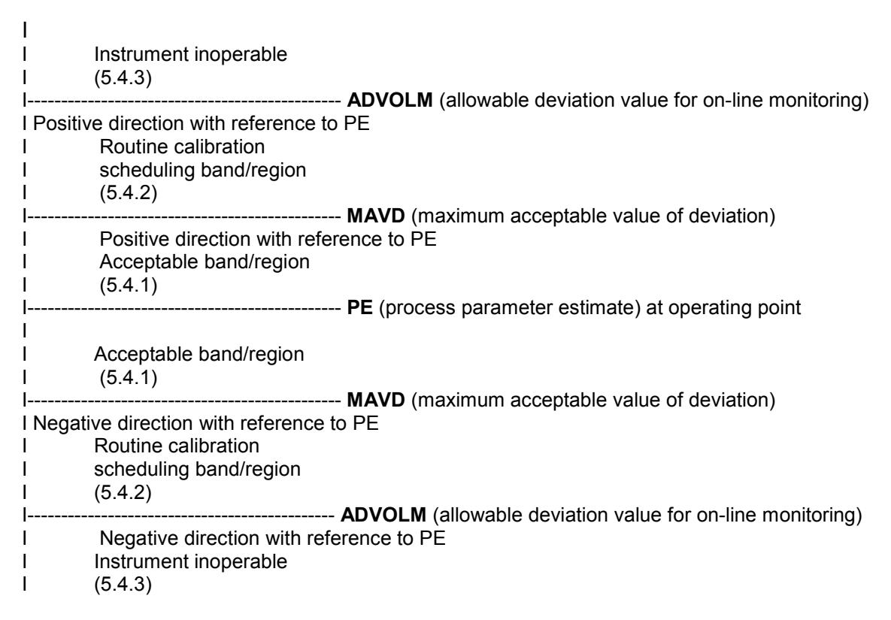

**Figure B-1 Deviation Zones for Acceptance Criteria**

#### 5.4.1 Acceptable Band or Acceptable Region

As described in the topical report, this zone will be between the PE and maximum acceptable value of deviation (MAVD) for the monitored parameter in reference to the PE. Using the online monitoring technique, if the deviation between the monitored value and its PE is found anywhere in this zone, no action is needed and the instrument is considered operable. In accordance with the existing calibration practice, the instrument is considered operable when its observed drift (the difference between AL and AF conditions) is found to be within the value used in the TSP calculations. In other words, when setpoint calculation assumptions are verified by instrument performance, the instrument is considered operable. Considering this current practice, the staff requires that:

*For any algorithm used, the maximum acceptable value of deviation (MAVD) shall be such that accepting the deviation in the monitored value anywhere in the zone between PE and MAVD will provide high confidence (level of 95%/95%) that drift in the sensortransmitter or any part of an instrument channel that is common to the instrument channel and the on-line monitoring loop is less than or equal to the value used in the setpoint calculations for that instrument channel. (Requirement 6)* 

#### 5.4.2 Routine Calibration Scheduling Region or Band

This zone falls between the MAVD and the allowable deviation value for on-line monitoring (ADVOLM). During on-line monitoring, if the deviation between the monitored value and its PE is found anywhere in this zone, the instrument channel will be scheduled for calibration in the next refueling outage. The staff understands that when deviation between the monitored value and its PE is found in this zone, the instrument may need adjustment or maintenance, but will still be considered operable. Therefore, the staff requires that:

*The instrument shall meet all requirements of the above requirement 6 for the acceptable band or acceptable region. (Requirement 7)* 

*For any algorithm used, the maximum value of the channel deviation beyond which the instrument is declared "inoperable" shall be listed in the Technical Specifications with a note indicating that this value is to be used for determining the channel operability only when the channel's performance is being monitored using an on-line monitoring technique. It could be called "allowable deviation value for on-line monitoring" (ADVOLM) or whatever name the licensee chooses. The ADVOLM shall be established by the instrument uncertainty analysis. The value of the ADVOLM shall be such to ensure:* 

- *(a) that when the deviation between the monitored value and its PE is less than or equal to the ADVOLM limit, the channel will meet the requirements of the current Technical Specifications, and the assumptions of the setpoint calculations and safety analyses are satisfied; and*
- (b) that until the instrument channel is recalibrated (at most until the next refueling outage), actual drift in the sensor-transmitter or any part of an instrument channel that is common to the instrument channel and the on-line monitoring loop will be less than or equal to the value used in the setpoint calculations and other limits defined in 10 CFR 50.36 as applicable to the plant-specific design for the monitored process variable are satisfied. (Requirement 8)

#### 5.4.3 Operability Assessment Region or Band

This zone will be beyond the ADVOLM limit for on-line monitoring. During on-line monitoring, if the deviation between the monitored value and its PE is found anywhere in this zone, the instrument channel will be declared inoperable immediately and statements of all required TS actions will become applicable. The staff requires that:

*Calculations defining alarm setpoint (if any), acceptable band, the band identifying the monitored instrument as needing to be calibrated earlier than its next scheduled calibration, the maximum value of deviation beyond which the instrument is declared "inoperable," and the criteria for determining the monitored channel to be an "outlier," shall be performed to ensure that all safety analysis assumptions and assumptions of the* 

*associated setpoint calculation are satisfied and the calculated limits for the monitored process variables specified by 10 CFR 50.36 are not violated. (Requirement 9)* 

#### *5.5 Instrument Failures*

The proposed on-line monitoring system, will allow the instruments to remain unattended for longer periods. Therefore, there could be a possibility that certain types of instrument failures may remain undetectable by the on-line monitoring system while the instrument is being monitored at only one point in its operating range.

An instrument can fail in any one of the three modes: (1) it can fail low, which means, regardless of the value of its input, instrument output is at or near zero; (2) it can fail high, which means, regardless of the value of its input, instrument output is at or near 100%; (3) it can fail as-is, which means, regardless of the input, instrument output remains constant somewhere between 0% and 100%. Failures that cause a large shift (deviation) in the instrument's output signal compared to its PE are not a concern because just as the drift is detectable so is the large shift. But failures where the instrument output compared to its PE does not change much upon instrument failure could be a concern. For example,

- The process parameter is at or near the low end of the span and the instrument fails low.
- The process parameter is near the high end of the span and the instrument fails high.
- The process parameter is somewhere between the low and high span limits and the instrument fails as-is.

The as-is types of failures were not observed in the EPRI drift study, but failing low (loss of signal) was found to be more likely than failing high. The topical report indicated that very few instruments operate near the 100% span point, and even if they operate high in the span, there is generally some room for detecting a high signal failure (fail high) as drift. But the failed-low condition of the instrument could remain undetected in applications where the process parameter is normally at the lower end of the span; therefore, the topical report recommends that such applications should be avoided. The following are three examples of the kinds of cases which are susceptible to loss of signal failures (failed low) and, therefore, are not considered suitable for on-line monitoring.

- Auxiliary feedwater flow: At normal plant operation, there is no flow and the signal is at the bottom of the span.
- Engineered safeguards system actuation equipment: At normal plant operation, the equipment is usually off and the associated pressure or flow indication will be at or near 0% of the span.
- Containment pressure: At normal plant operation, depending on the calibrated span, the signal might be about 0% of the span.

In response to related concerns in the staff's draft SE, EPRI stated that the approach to on-line monitoring outlined in TR-104965 provides greater assurance of sensor operability than is currently provided by calibrations each refueling interval and channel checks each shift. The

channel checks will continue to identify gross failures. Failures where sensors drift only slightly more than their allowances in applicable setpoint or uncertainty calculations will be identified during plant operations by on-line monitoring. EPRI believes that the increased ability to detect these sorts of failures will more than compensate for instrument failures that are undetectable by on-line monitoring while the instrument is being monitored at one point in the operating range. During the February 16 and 17, 2000, presentation, EPRI stated that there was no potential that any type of failure would remain undetected while the instrument was being monitored by an online monitoring technique. EPRI's drift study analyzed all possible failure modes, including fail low, fail high, and fail as-is, and demonstrated that the probability of failure modes in which transmitters failed in ways that would be undetectable by on-line monitoring is extremely low. Also, to verify that no common-mode failure exists, the topical report proposes to calibrate at least one redundant channel during each outage.

The staff believes that in plant-specific situations there could be many more examples of cases like those described above. Therefore, it is prudent that an evaluation for each instrument should be performed, considering all possible types of failure modes and operating point of the process parameter with respect to the instrument's span during normal plant operation, to verify that no possible instrument failure in any condition may remain undetected. If it is suspected that the plant-specific implementation of on-line monitoring could in any way impact the existing plant safety analyses demonstrating a coordinated defense-in-depth against instrument failures, the staff requires that:

*The plant specific submittal shall confirm that the proposed on-line monitoring system will be consistent with the plant's licensing basis, and that there continues to be a coordinated defense-in-depth against instrument failure. (Requirement 10)* 

#### *5.6 On-Line Monitoring Loop*

A typical instrument channel consists of a process sensor-transmitter, the power source, signal conditioners, indicators, and bistable devices. The on-line monitoring will not monitor the entire instrument channel, but only a portion of it. A typical on-line monitoring loop will consist of a sensor-transmitter (and in some cases will also include a portion of the signal processing circuitry), a class 1E to non-1E isolator, non-safety-related data transmitting hardware, and a non-safety-related microprocessor-based data processing device.

On-line monitoring collects data from instrument channels, typically via connection to the plant computer for an automated system or at a qualified class 1E to non-1E isolator output terminal or at an appropriate test point for manual data acquisition. Signals taken from the non-1E terminals of the isolator or at the plant computer are transmitted to a microprocessor-based processing device via communications hardware and software and analyzed to determine the state of the instrument's calibration and its operability status. There are various on-line monitoring implementations on microcomputer platforms. Data are input from the plant to these systems via modem or electronic media or manually. Output capabilities typically include graphical display of the individual instrument channel deviation from the PE as a function of time. Some automated systems are network operable and allow multiple access to the monitoring information and results.

Except for the sensor-transmitter, typically all components of an instrument channel are located on instrument racks. According to the current TS requirements, performance of components on an instrument rack, including bistable units, is monitored through periodic surveillance activities, including functional checks. The topical report does not recommend any change in current practices; therefore, performance of these components will continue to be verified through the current TS scheduled surveillance activities.

Although equipment used for on-line monitoring are non-safety-related, they interface with safety-related instrument channels and therefore, the staff requires that:

*Adequate isolation and independence, as required by Regulatory Guide 1.75, GDC 21, GDC 22, IEEE Std. 279 or IEEE Std. 603, and IEEE Std. 384, shall be maintained between the on-line monitoring devices and Class 1E instruments being monitored. (Requirement 11)* 

Although equipment used for the on-line monitoring technique are non-safety-related, the instruments monitored are safety-related and, based on results of on-line monitoring, the frequency of the current TS-required instrument channel calibrations could be relaxed from "once per refueling cycle" to "once per a maximum period of 8 years" as discussed in section 3.0(2)(a) of this document. These class 1E instruments are set to initiate protective actions to mitigate accidents or abnormal events before the monitored process variable exceeds its analytical limit, and may be required to guide plant operators through emergency operating procedures (EOPs). Because of its important mission, the on-line monitoring system, including its hardware and software, must be designed with quality assurance (QA) requirements compatible with the QA requirements for the Class 1E devices being monitored. Therefore, the staff requires that:

- *(a) QA requirements as delineated in 10 CFR Part 50, Appendix B, shall be applicable to all engineering and design activities related to on-line monitoring, including design and implementation of the on-line system, calculations for determining process parameter estimates, all three zones of acceptance criteria (including the value of the ADVOLM), evaluation and trending of on-line monitoring results, activities (including drift assessments) for relaxing the current TS-required instrument calibration frequency from "once per refueling cycle" to "once per a maximum period of 8 years," and drift assessments for calculating the allowance or penalty required to compensate for single-point monitoring.*
- *(b) The plant-specific QA requirements shall be applicable to the selected on-line monitoring methodology, its algorithm, and the associated software. In addition, software shall be verified and validated and meet all quality requirements in accordance with NRC guidance and acceptable industry standards. (Requirement 12)*

Basically, the equipment associated with the on-line monitoring serves as an M&TE to assess calibration of class 1E instruments; therefore, the staff requires that:

*All equipment (except software) used for collection, electronic transmission, and analysis of plant data for on-line monitoring purposes shall meet the requirements of 10 CFR Part 50, Appendix B, Criterion XII, "Control of Measuring and Test Equipment." Administrative procedures shall be in place to maintain configuration control of the on-line monitoring software and algorithm. (Requirement 13)* 

#### *5.7 System Algorithms*

Although many algorithms could be used in on-line monitoring, this topical report addresses only two. The staff did not review, and does not endorse, either of the two algorithms or the associated software. The staff believes that numerous algorithms and associated software could be suitable, and the choice of which to use should be left to the user. Since the algorithm will be used to monitor calibration and determine operability of safety-related instruments, every user would be prudent to carefully evaluate the algorithm selected to ensure that the assumptions of safety analyses, and of TSP calculations and plant commitments to separation, independence, QA, and conditions of applicable requirements specified in this SE; and that NRC policy statements for TS criteria are not violated by implementation of the selected algorithm and/or its software for on-line monitoring. The staff, therefore, requires that:

*Before declaring the on-line monitoring system operable for the first time, and just before each performance of the scheduled surveillance using an on-line monitoring technique, a full-features functional test, using simulated input signals of known and traceable accuracy, should be conducted to verify that the algorithm and its software perform all required functions within acceptable limits of accuracy. All applicable features shall be tested. (Requirement 14)* 

#### **6.0 Conclusion**

Based on the above evaluation, the staff concludes that the generic concept of an on-line monitoring technique, as presented in the topical report, is acceptable for on-line tracking of instrument performance. The staff agrees with the topical report's conclusion that on-line monitoring has several advantages, including timely detection of degraded instrumentation. The staff believes that on-line monitoring can provide information on the direction which instrument performance is heading and, in that role, it can be useful in determining preventive maintenance activities. As agreed during the February 16 and 17, 2000, meeting with the staff, EPRI would work with the NRC staff and the NEI TSTF to develop an appropriate TS structure and TS requirements consistent with the requirements discussed in this SE.

For establishing instrument operability, verifying the drift to be within an acceptable limit is the most vital function of the conventional calibration. Although the proposed on-line monitoring technique compared to traditional calibration process will render results with less accuracy, the staff finds EPRI's conclusion acceptable that accuracy rendered by the process parameter estimate is sufficient to assess instrument operability; also, compared to traditional calibration once per refueling outage, the on-line monitoring technique when taken as a whole provides higher assurance of instrument operability throughout a plant operating cycle. However, if results of the on-line monitoring technique are being applied to relax the TS-required calibration frequency of the safety-related RPS, ESFAS, and PAM instrumentation, the staff requires that every plant-specific license amendment submittal for implementing on-line monitoring to relax the TS-required calibration frequency of the safety-related instrumentation, address all applicable requirements discussed in this SE.

#### **7.0 References**

- 1. NUREG/CR-6343, "On-Line Testing of Calibration of Process Instrumentation Channels in Nuclear Power Plants," Phase II Final Report, dated November 1995.
- 2. Lawrence Livermore National Laboratory, Report 1, Task 29, "Assessment of On-Line Monitoring Techniques," dated January 17, 1996.
- 3. G. Preckshot of the Fission Energy and Systems Safety Program, Lawrence Livermore National Laboratory, On-Line Calibration System Requirements and Review Guidance, dated December 22, 1998.

Principal Contributor: S. Athavale

Date: July 24, 2000

| 0 |  |  |
|---|--|--|

*Target:* Nuclear Power

#### **About EPRI**

EPRI creates science and technology solutions for the global energy and energy services industry. U.S. electric utilities established the Electric Power Research Institute in 1973 as a nonprofit research consortium for the benefit of utility members, their customers, and society. Now known simply as EPRI, the company provides a wide range of innovative products and services to more than 1000 energyrelated organizations in 40 countries. EPRI's multidisciplinary team of scientists and engineers draws on a worldwide network of technical and business expertise to help solve today's toughest energy and environmental problems.

EPRI. Electrify the World

© 2002 Electric Power Research Institute (EPRI), Inc.All rights reserved. Electric Power Research Institute and EPRI are registered service marks of the Electric Power Research Institute, Inc. EPRI. ELECTRIFY THE WORLD is a service mark of the Electric Power Research Institute, Inc.

*Printed on recycled paper in the United States of America*

1007549