## **On-Line Monitoring of Instrument Channel Performance**

**TR-104965**

Final Report November 1998

Effective December 6, 2006, this report has been made publicly available in accordance with Section 734.3(b)(3) and published in accordance with Section 734.7 of the U.S. Export Administration Regulations. As a result of this publication, this report is subject to only copyright protection and does not require any license agreement from EPRI. This notice supersedes the export control restrictions and any proprietary licensed material notices embedded in the document prior to publication.

> Prepared for **EPRI** 3412 Hillview Avenue Palo Alto, California 94304

EPRI Project Manager R. Shankar

#### **DISCLAIMER OF WARRANTIES AND LIMITATION OF LIABILITIES**

THIS REPORT WAS PREPARED BY THE ORGANIZATION(S) NAMED BELOW AS AN ACCOUNT OF WORK SPONSORED OR COSPONSORED BY THE ELECTRIC POWER RESEARCH INSTITUTE, INC. (EPRI). NEITHER EPRI, ANY MEMBER OF EPRI, ANY COSPONSOR, THE ORGANIZATION(S) NAMED BELOW, NOR ANY PERSON ACTING ON BEHALF OF ANY OF THEM:

- (A) MAKES ANY WARRANTY OR REPRESENTATION WHATSOEVER, EXPRESS OR IMPLIED, (I) WITH RESPECT TO THE USE OF ANY INFORMATION, APPARATUS, METHOD, PROCESS, OR SIMILAR ITEM DISCLOSED IN THIS REPORT, INCLUDING MERCHANTABILITY AND FITNESS FOR A PARTICULAR PURPOSE, OR (II) THAT SUCH USE DOES NOT INFRINGE ON OR INTERFERE WITH PRIVATELY OWNED RIGHTS, INCLUDING ANY PARTY'S INTELLECTUAL PROPERTY, OR (III) THAT THIS REPORT IS SUITABLE TO ANY PARTICULAR USER'S CIRCUMSTANCE; OR
- (B) ASSUMES RESPONSIBILITY FOR ANY DAMAGES OR OTHER LIABILITY WHATSOEVER (INCLUDING ANY CONSEQUENTIAL DAMAGES, EVEN IF EPRI OR ANY EPRI REPRESENTATIVE HAS BEEN ADVISED OF THE POSSIBILITY OF SUCH DAMAGES) RESULTING FROM YOUR SELECTION OR USE OF THIS REPORT OR ANY INFORMATION, APPARATUS, METHOD, PROCESS, OR SIMILAR ITEM DISCLOSED IN THIS REPORT.

ORGANIZATION(S) THAT PREPARED THIS REPORT

**Edan Engineering Corporation**

#### **ORDERING INFORMATION**

Requests for copies of this report should be directed to the EPRI Distribution Center, 207 Coggins Drive, P.O. Box 23205, Pleasant Hill, CA 94523, (925) 934-4212.

Electric Power Research Institute and EPRI are registered service marks of the Electric Power Research Institute, Inc. EPRI. POWERING PROGRESS is a service mark of the Electric Power Research Institute, Inc.

Copyright © 1998 Electric Power Research Institute, Inc. All rights reserved.

### **CITATIONS**

This report was prepared by

Edan Engineering Corporation 900 Washington St., Suite 830 Vancouver, Washington 98660

#### Authors:

Eddie Davis, Edan Engineering Corporation Dan Funk, Edan Engineering Corporation Dave Hooten, Toledo Edison Company Richard Rusaw, South Carolina Electric and Gas Company

This report describes research sponsored by EPRI. The report is a corporate document that should be cited in the literature in the following manner:

*On-Line Monitoring of Instrument Channel Performance,* EPRI, Palo Alto, CA: 1998. TR-104965.

### **REPORT SUMMARY**

This topical report presents an alternate approach to instrument channel surveillance (i.e., monitoring and verifying instrument channel performance) that provides several additional benefits and is more cost-effective. This alternative is *on-line monitoring*, which is based on the assessed in-operation performance of an instrument channel. This report also provides technical information and discusses the licensing aspects of implementing an on-line monitoring program.

#### **Background**

On-line monitoring evaluates instrument channel performance by assessing its consistency with other plant indications. Industry and EPRI experience at several plants has shown this overall approach to be very effective in identifying instrument channels that are exhibiting degrading or inconsistent performance characteristics.

Current calibration processes use intrusive monitoring techniques to periodically determine the as-found performance characteristics, whereas on-line monitoring employs non-intrusive techniques to determine instrument channel performance on a much more frequent basis. On-line monitoring of instrument channels provides information about the condition of the monitored channels through accurate, more frequent monitoring of each channel's performance over time. This type of performance monitoring is a methodology that offers an alternate approach to traditional time-directed calibration. On-line monitoring of these channels can provide an assessment of instrument performance and provide a basis for determining when adjustments are necessary. Elimination or reduction of unnecessary field calibrations can reduce associated labor costs, reduce personnel radiation exposures, and reduce the potential for miscalibration.

#### **Objective**

- To provide the technical basis for on-line monitoring as a calibration extension tool.
- To provide guidance to assist in the implementation of on-line monitoring at nuclear plants.

• To assemble the information into a topical report suitable for evaluation by the NRC for generic approval of the on-line monitoring approach to calibration assessment.

#### **Approach**

The EPRI/Utility On-Line Monitoring Working Group developed this topical report as part of an ongoing team effort. Several working group meetings were held during the course of this project, and presentations were made to NRC staff personnel at key points during this report's development. The report was approached with the eventual goal of obtaining generic approval of on-line monitoring as a calibration assessment technique.

#### **Results**

This topical report provides the technical basis for on-line monitoring as a method for extending calibration intervals. Redundant channel averaging and pattern recognition methodologies are discussed in detail. Detailed implementation guidance is provided to assist users with the implementation of an on-line monitoring method. Extending calibration intervals for safety-related instruments requires changes to each plant's Technical Specifications, and guidance is provided to help standardize the Technical Specification change process. Background information is provided regarding on-line monitoring applications world-wide.

#### **EPRI Perspective**

EPRI is committed to the development and implementation of on-line monitoring as a tool for extending calibration intervals and evaluating instrument performance. Current calibration processes use intrusive monitoring techniques to periodically determine the as-found performance characteristics, whereas on-line monitoring employs non-intrusive techniques to determine the instrument channel performance. On-line monitoring of instrument channels provides increased information about the condition of monitored channels through accurate, more frequent monitoring of each channel's performance over time. This type of performance monitoring is a methodology that offers an alternate approach to traditional time-directed calibration. Refer to TR-103436, *Instrument Calibration and Monitoring Program*, for additional information regarding EPRI's efforts in the area of on-line monitoring.

#### **TR-104965**

#### **Interest Categories**

Instrumentation and control Nuclear plant operations and maintenance

### **ABSTRACT**

Safe and reliable operation of nuclear power plants depends upon the ability to monitor and control plant operations. In turn, this leads to the definition of instrument setpoints that ensure the plant is operated within safe limits defined by plant safety analyses. Calculation of certain safety-related instrument setpoints requires consideration of various sources of instrument uncertainty, e.g., sensor calibration uncertainty. The magnitudes of the different sources of uncertainty and the manner in which they combine to produce the overall channel uncertainty are accounted for in instrument setpoint calculations.

When the instrument channels are important to safety, it is also necessary to verify instrument channel performance through various surveillance, monitoring, and testing activities. These activities sometimes include adjustments to return component performance to within acceptable limits. Collectively, the activities of surveillance and adjustment constitute *calibration*.

The requirements for periodic calibration of the safety-related instrument channels are provided by the plant Technical Specifications. The traditional programmatic approach to meeting this requirement includes performance of calibration to independent reference standards on a fixed frequency. This approach is costly, is labor-intensive, incurs personnel radiation exposure, impacts instrument reliability, and does not take full advantage of instrument performance data.

This topical report presents an alternate approach to instrument channel surveillance (i.e., monitoring and verifying instrument channel performance), which provides several additional benefits and is more cost-effective. In essence, the alternative is *online monitoring*, which is performance directed rather than time directed monitoring. This report also discusses the benefits and licensing aspects of implementing an on-line monitoring program.

### **ACKNOWLEDGMENTS**

This topical report represents the collective effort of a large number of participants. Some of the sections in this report were prepared by individuals who deserve special recognition for their contributions. The following contributors provided detailed input to this report:

 Section 10, Appendix D, *EPRI Experience with On-Line Monitoring*: The information regarding implementation of the EPRI Instrument Calibration Monitoring Program (ICMP) at the V. C. Summer Nuclear Station was provided by Richard Rusaw and Bill Turkett of South Carolina Electric and Gas Co. The information regarding 1998 efforts with ICMP was provided by Rich Fayko, Jr. of SAIC.

 Section 11, Appendix E, *CANDU Owners Group Experience with On-Line Monitoring*: The information presented is based on papers prepared by H. W. (Tony) Hinds and R. MacKay of Atomic Energy Limited of Canada.

 Section 12, Appendix F, *Electricité de France Experience with On-Line Monitoring*: The information presented is based on detailed technical input from Eric Dupuis, Jean Luc Germain, and Francois Loisy of Electricité de France.

 Section 13, Appendix G, *B&W Owners Group Evaluation of On-Line Monitoring Design Approaches*: The information in this appendix is a reprint of the B&W Owners Group ICR Working Group Technical Report 47-5001013-00, *Evaluation of Instrumentation Calibration Reduction Methodologies*, dated January 1998. This report was prepared by A. M. Hartman of Entergy Operations, Inc., R. VanAlstine of Florida Power Corporation, D. J. McGettrick of GPU Nuclear, D. P. Hooten of Toledo Edison Company, and J. R. Smith of Framatome Technologies, Inc.

 Section 14, Appendix H, *Multivariate State Estimation Technique (MSET) Surveillance System*: This information was prepared by J. P. Herzog, K. C. Gross, S. W. Wegerich, and R. M. Singer of Argonne National Laboratory.

 The EPRI/Utility On-Line Monitoring Working Group had the following active membership during the preparation of this topical report, and the following

individuals actively participated in the overall effort. The contributions made by each participant are appreciated gratefully.

Eric Dupuis Electricité de France

Bill Fadden North Atlantic Energy Services Co.

Rich Fayko, Jr. SAIC

Bob Fredricksen Commonwealth Edison

Jean Luc Germain Electricité de France

Kenny Gross Argonne National Laboratory

H. W. Hinds Atomic Energy of Canada, Limited

Dave Hooten Toledo Edison Company

Revis James EPRI

James Laborde South Carolina Electric & Gas Co.

Francois Loisy Electricité de France

Wade Messer Duke Power Company

Jim Riner Analysis & Measurement Services Corp.

Richard Rusaw South Carolina Electric & Gas Co.

Ralph Singer Argonne National Laboratory

Bill Turkett South Carolina Electric & Gas Co.

Phil Rose South Carolina Electric & Gas Co.

Steve Swanson Southern Nuclear

 The drift study portion of this project presented in Section 8, Appendix B, was initiated under Electric Power Research Institute project number WO3785-04. Several organizations and plants contributed to this project, either in the form of document reviews or calibration data. EPRI and Edan Engineering recognize the following persons for their support of the project. The time and assistance provided by each are appreciated.

Lionel Bates Pacific Gas & Electric Company

Dave Crane Consumers Power Company

Samir Chandiwala Southern Company Services

Dinkar Desai Consolidated Edison

Bob Fredricksen New York Power Authority

Dan Head Yankee Atomic Electric Co.

Dave Hooten Toledo Edison Company

 Jim Hughes Houston Lighting and Power Company Bob Levline Washington Public Power Supply System

 John Lewis Yankee Atomic Electric Co. Bob Muzzi Florida Power Corporation Ifti Rana Southern Company Services

Vicram Shah Nebraska Public Power District

 The following individuals comprised the EPRI/Utility On-Line Monitoring Working Group in 1995 and contributed to the content of the 1995 draft document:

Ray Adams TU Electric

 Jeb Blakeley NUS Performance Systems Department William E. Burns Southern Nuclear Operating Company

Tim Cerven Illinois Power

Don Crowe Southern Nuclear Operating Company

Dinkar Desai Consolidated Edison

Raymond DiSandro PECO Energy Company

Paul E. Dojka GPU Nuclear

Mark Doyle Science Applications International Corp.

Robert L. Dungan B&W Nuclear Technology

Roy Dussouy Entergy Operations

Mike Eidson Southern Nuclear Operating Company

Bob Eifler Consolidated Edison

Patrick T. Evers TU Electric

Bill Fadden Yankee Atomic Electric Company

Stan K. Farlow American Electric Power Service Corp.

Mike Fowlkes South Carolina Electric & Gas Company

Kenny C. Gross Argonne National Laboratory

John Guider Rochester Gas & Electric Company

 Riaz Hakeem Entergy Operations Ms. Angie Hartman Entergy Operations

John Henderson TU Electric

Dave Hooten Toledo Edison Company

Jim Hughes Houston Lighting & Power

Lucy Labruzzo New York Power Authority

Donald Lamontagne Arizona Public Service Company

Anthony F. Lexa B&W Nuclear Technology

Dennis McGettrick GPU Nuclear

 Wade H. Messer Duke Power Company Mike Miller Duke Power Company

Phil Myers Union Electric Company

James O'Connor Omaha Public Power District

Lloyd Pentecost Southern California Edison Company

Ken Petersen AMS Corp.

Andrej Petrenko New York Power Authority

 Jon T. Roberts Southern Nuclear Operating Company Richard Rusaw South Carolina Electric & Gas Company

Lee R. Schwartz Entergy Operations, Inc.

Pravin C. Shah TU Electric

Jim Shank Public Service Electric & Gas

Dr. Ralph M. Singer Argonne National Lab.

Russell W. Smith TU Electric

Wes Sparkman Southern Nuclear Operating Company

John Stevens GPU Nuclear Corp.

 Howard H. Stevens B&W Nuclear Technology C. R. Tuley Westinghouse Electric Corp.

 Rick Turner Entergy Operations Rollin VanAlstine Florida Power Corp.

Kim Wells Houston Lighting & Power

Vic Whaley TVA Nuclear

Reed Wiegle CANUS Corp.

### **CONTENTS**

| 1 INTRODUCTION                                                            | 1-1  |
|------------------------------------------------------------------------------|------|
| 1.1 Overview                                                                 | 1-1  |
| 1.2 Current Calibration Practices                                         | 1-2  |
| 1.3 Overview of On-Line Monitoring                                           | 1-2  |
| 1.4 Industry Experience with On-Line Monitoring                           | 1-3  |
| 1.5 Benefits of On-Line Monitoring                                        | 1-4  |
| 1.6 Purpose of Topical Report                                             | 1-6  |
| 1.7 Scope of On-Line Monitoring Methodologies Covered by This Topical Report | 1-7  |
| 2 GENERAL OVERVIEW OF ON-LINE MONITORING METHODOLOGY                      | 2-1  |
| 2.1 Terms, Tolerances, and Relationships Used in Calibration                 | 2-1  |
| 2.1.1 Definition of Terms Regarding Instrument Performance                | 2-2  |
| 2.1.2 As-Found and As-Left Calibration Settings                           | 2-6  |
| 2.1.3 Calibration Tolerances                                              | 2-7  |
| 2.2 Typical Performance of Monitored Instruments                             | 2-10 |
| 2.3 On-Line Monitoring Methodology Overview                               | 2-13 |
| 2.3.1 What Is On-Line Monitoring?                                            | 2-13 |
| 2.3.2 Parameter Estimate Calculation                                         | 2-14 |
| 2.3.3 Evaluation Criteria                                                    | 2-16 |
| 2.3.4 Data Acquisition                                                    | 2-18 |
| 3 TECHNICAL BASIS FOR ON-LINE MONITORING AS A CALIBRATION                    |      |
| ASSESSMENT TOOL                                                           | 3-1  |
| 3.1 Functional Requirements                                                  | 3-1  |
| 3.1.1 On-Line Monitoring Scope                                            | 3-1  |
| 3.1.2 Signal Isolation                                                       | 3-3  |
| 3.1.3 Data Acquisition and Evaluation Frequency                              | 3-3  |

| 3.1.4 Reliability, Testing, and Maintenance                                                                                   | 3-4      |
|-------------------------------------------------------------------------------------------------------------------------------|----------|
| 3.1.5 Software Quality                                                                                                        | 3-4      |
| 3.2 Relationship of Observed Drift at the Operating Point to Potential Drift at the Setpoint                            | 3-4      |
| 3.2.1 Summary of Issue                                                                                                     | 3-4      |
| 3.2.2 Drift Effects That Can Cause a Variation in Drift Magnitude at Different Instrument Span Points                      | 3-5      |
| 3.2.3 Observed Proportions of Each Type of Drift                                                                              | 3-9      |
| 3.2.4 Likelihood of Being in Calibration at the Monitored Point and Out of Calibration Elsewhere in the Instrument's Span  | 3-12     |
| 3.2.5 Applications That Are Most Susceptible to Span Shift Effects                                                         | 3-14     |
| 3.2.6 Summary of Drift Study Observations                                                                                  | 3-16     |
| 3.3 Ability of On-Line Monitoring to Detect Sensor Failures                                                                   | 3-17     |
| 3.4 Uncertainty Analysis                                                                                                   | 3-18     |
| 3.4.1 Basic Questions                                                                                                      | 3-18     |
| 3.4.2 Traditional Uncertainty Elements Included in On-Line Monitoring                                                         | 3-19     |
| 3.4.3 Unique Uncertainty Elements Introduced by On-Line Monitoring                                                            | 3-22     |
| 3.4.3.1 Parameter Estimate Uncertainty                                                                                        | 3-22     |
| 3.4.3.2 Additional Uncertainty Associated with Single Point Monitoring                                                        | 3-24     |
| 3.5 On-Line Monitoring Acceptance Criteria                                                                                 | 3-26     |
| 3.5.1 Absolute Deviation from Process Parameter Estimate                                                                      | 3-26     |
| 3.5.2 Relative Deviation from Process Parameter Estimate                                                                      | 3-28     |
| 3.6 Implementation Strategy                                                                                                   | 3-34     |
| 3.7 Proven Applications of On-Line Monitoring Methods and Principles                                                          | 3-37     |
| 3.7.1 Electricité de France Application of On-Line Monitoring for Calibration Extension                                 | 3-37     |
| 3.7.2 CANDU Owner's Group Experience with On-Line Monitoring                                                                  | 3-40     |
| 3.7.3 EPRI Experience with the Instrument Calibration Monitoring Program                                                   | 3-42     |
| 3.7.4 Multivariate State Estimation Technique (MSET) Experience                                                            | 3-43     |
| 3.7.5 NRC-Funded Research on On-Line Monitoring                                                                            | 3-45     |
| 3.7.6 NRC Guidance on Cross-Calibration of Resistance Temperature Detectors                                                   |  3-45 |
| 3.7.7 Rosemount Transmitter Loss of Oil-Fill Monitoring                                                                       | 3-46     |
| 3.7.8 Generic Letter 91-04, Changes in Technical Specification Surveillance Intervals to Accommodate a 24-Month Fuel Cycle | 3-46     |
| 4 PLANT-SPECIFIC IMPLEMENTATION                                                                                            | 4-1      |
|                                                                                                                               |          |

| 4.1 Overview                                                          | 4-1  |
|-----------------------------------------------------------------------|------|
| 4.2 Evaluation of Past Instrument Performance                         | 4-2  |
| 4.3 Approach to Surveillance and Calibration                          | 4-2  |
| 4.4 Impact on Plant Procedures and Documents                          | 4-3  |
| 4.5 Setpoint Evaluation                                               | 4-4  |
| 4.6 Technical Specifications                                          | 4-5  |
| 4.6.1 Overview of What Is Requested                                   | 4-5  |
| 4.6.2 Suggested Technical Specification Wording                       | 4-5  |
| 4.6.2.1 Definition Changes                                            | 4-5  |
| 4.6.2.2 Addition of New Surveillance Types                            | 4-6  |
| 4.6.2.3 Example Change to Reactor Trip System Instrumentation Table   | 4-8  |
| 4.6.2.4 Technical Specification Bases                                 | 4-9  |
| 4.6.3 Checklist for Technical Specification Change Submittal          | 4-9  |
| 4.7 Actions upon Detection of a Drifted Channel                       | 4-10 |
| 4.7.1 Acceptable Region                                               | 4-11 |
| 4.7.2 Schedule Routine Calibration                                    | 4-11 |
| 4.7.3 Operability Assessment                                          | 4-12 |
| 4.8 Ongoing Calibration Monitoring Program                            | 4-12 |
| 5 CONCLUSIONS                                                         | 5-1  |
| 6 REFERENCES                                                          | 6-1  |
| 6.1 References                                                        | 6-1  |
| 6.2 Bibliography of On-Line Monitoring Reports and Industry Papers    | 6-3  |
| 6.2.1 EPRI Documents                                                  | 6-3  |
| 6.2.2 NUREG Reports                                                   | 6-3  |
| 6.2.3 CANDU Nuclear Plant Related Papers                              | 6-3  |
| 6.2.4 Electricité de France (EDF) Reports                             | 6-3  |
| 6.2.5 B&W Owners Group Reports                                        | 6-4  |
| 6.2.6 Multivariate State Estimation Technique Papers and Publications | 6-4  |
| 6.2.7 Miscellaneous Papers                                            | 6-7  |
| 7 APPENDIX A: GLOSSARY                                                | 7-1  |
| 8 APPENDIX B: INSTRUMENT DRIFT CHARACTERISTICS                        | 8-1  |

| 8.1 Introduction                                                 | 8-1  |
|------------------------------------------------------------------|------|
| 8.2 Research Approach and Methods                                | 8-2  |
| 8.2.1 Data Collection Strategy                                   | 8-5  |
| 8.2.2 Data Coverage                                              | 8-6  |
| 8.2.3 Determination of Nominal Drift Characteristics             | 8-7  |
| 8.2.4 Evaluation of Out-of-Calibration Data                      | 8-7  |
| 8.3 Data Coverage                                                | 8-8  |
| 8.3.1 Overview                                                   | 8-8  |
| 8.3.2 Plant Coverage                                             | 8-9  |
| 8.3.2.1 NSSS Vendor                                              | 8-9  |
| 8.3.2.2 NRC Peer Groups                                          | 8-11 |
| 8.3.2.3 Age                                                      | 8-14 |
| 8.3.2.4 Architect/Engineer and Constructor                       | 8-15 |
| 8.3.3 Instrument and Calibration Data Coverage                   | 8-16 |
| 8.3.3.1 Type of Instrument                                       | 8-16 |
| 8.3.3.2 Plant                                                    | 8-18 |
| 8.3.3.3 Instrument Model                                         | 8-21 |
| 8.3.3.4 Application                                              | 8-24 |
| 8.3.3.5 Time                                                     | 8-27 |
| 8.3.4 Statistical Significance                                   | 8-29 |
| 8.3.4.1 Sample Size Determination Equation                       | 8-29 |
| 8.3.4.2 Estimated Population and Sensitivity to Population Size  | 8-30 |
| 8.3.4.3 Estimated Instrument Drift Standard Deviation            | 8-31 |
| 8.3.4.4 Comparison of Actual Sample Size to Required Sample Size | 8-32 |
| 8.4 Characterization of Nominal Drift Behavior                   | 8-32 |
| 8.4.1 Analysis Methodology                                       | 8-33 |
| 8.4.1.1 Analysis Data Set                                        | 8-33 |
| 8.4.1.2 Tolerance Interval                                       | 8-34 |
| 8.4.1.3 Outlier Analysis                                         | 8-34 |
| 8.4.2 Analysis Groups and Cutsets                                | 8-34 |
| 8.4.3 Analysis Results for Instrument Model Cutsets              | 8-35 |
| 8.4.3.1 Rosemount Transmitters                                   | 8-35 |
| 8.4.3.2 Barton Transmitters                                      | 8-39 |
| 8 4 3 3 Foxboro Transmitters                                     | 8-41 |

| 8.4.3.4 Miscellaneous Transmitters                                             | 8-43     |
|--------------------------------------------------------------------------------|----------|
| 8.4.4 Analysis Results for Application Cutsets                              | 8-45     |
| 8.4.4.1 Level                                                               | 8-45     |
| 8.4.4.2 Flow                                                                   | 8-48     |
| 8.4.4.3 Pressure                                                               | 8-50     |
| 8.5 Characterization of Instrument Drift                                    | 8-54     |
| 8.5.1 Instrument Drift Categories                                           | 8-55     |
| 8.5.1.1 Traditional Drift Types                                             | 8-55     |
| 8.5.1.2 Observed Drift Types                                                | 8-62     |
| 8.5.2 Observed Proportions of Each Type of Drift                               | 8-69     |
| 8.5.3 Single Point Monitoring—Likelihood of Drift Elsewhere in Span            |  8-79 |
| 8.5.4 Additional Observations Regarding Instrument Drift                    | 8-86     |
| 8.5.5 Accounting for Single Point Monitoring in On-line Monitoring Acceptance  |          |
| Criteria                                                                       | 8-90     |
| 9 APPENDIX C: STATISTICAL ANALYSIS CONSIDERATIONS REGARDING                    |          |
| INSTRUMENT PERFORMANCE                                                         | 9-1      |
| 9.1 Clarification of Terms Used in Statistical and Uncertainty Analysis        | 9-1      |
| 9.2 Theoretical Limit of Parameter Estimate Uncertainty                     | 9-2      |
| 9.3 Likelihood of All Channels Randomly Drifting in the Same Direction         |  9-5  |
| 9.4 Likelihood of All Channels Drifting in the Same Direction by a Bias Effect |  9-9  |
| 10 APPENDIX D: EPRI EXPERIENCE WITH ON-LINE MONITORING                         | 10-1     |
| 10.1 Instrument Calibration and Monitoring Program Algorithm                   | 10-1     |
| 10.1.1 Parameter Estimate                                                   | 10-1     |
| 10.1.2 Consistency Check Process                                               | 10-2     |
| 10.1.3 Channel Acceptance Criteria                                             | 10-4     |
| 10.2 ICMP Uncertainty                                                          | 10-4     |
| 10.2.1 Accuracy and Number of Monitored Channels                               | 10-4     |
| 10.2.2 Consistency Check Criteria                                           | 10-5     |
| 10.3 ICMP Implementation at V. C. Summer Nuclear Station                       | 10-10    |
| 10.3.1 System Setup                                                            | 10-10    |
| 10.3.2 Software Verification and Validation                                    | 10-11    |
| 10.3.3 Current Use of ICMP                                                     | 10-12    |
| 10.4 1998 ICMP Implementation With Upgraded ICMP Software                      | 10-13    |

| 11 APPENDIX E: CANDU OWNERS GROUP EXPERIENCE WITH ON-LINE MONITORING           | 11-1  |
|--------------------------------------------------------------------------------|-------|
| 11.1 Background and CANDU Reasons for Considering On-Line Monitoring           | 11-1  |
| 11.2 Data Acquisition                                                          | 11-4  |
| 11.3 Data Analysis and Algorithm Development                                   | 11-6  |
| 11.4 On-Line Calibration Analysis and Operating Experience                     | 11-8  |
| 11.5 Status of the COG Research                                                | 11-9  |
| 11.6 References                                                                | 11-10 |
| 12 APPENDIX F: ELECTRICITE DE FRANCE EXPERIENCE WITH ON-LINE MONITORING        | 12-1  |
| 12.1 Overview of EDF On-Line Monitoring System Design                          | 12-1  |
| 12.1.1 History                                                                 | 12-1  |
| 12.1.2 Sensor Validation Methodology                                           | 12-2  |
| 12.1.3 Monitoring System Setup                                                 | 12-3  |
| 12.2 Regulatory Approval Status                                                | 12-4  |
| 12.3 Operating History and Experience                                          | 12-5  |
| 12.3.1 Validation of Operating Sensors                                         | 12-5  |
| 12.3.2 Sensor Calibration Program Maintenance Costs                            | 12-6  |
| 13 APPENDIX G: B&W OWNERS GROUP EVALUATION OF ON-LINE MONITO DESIGN APPROACHES |       |
| 13.1 Concepts of In-Service Monitoring                                         | 13-1  |
| 13.1.1 Introduction                                                            |       |
| 13.1.2 Methodologies                                                           | 13-2  |
| 13.1.2.1 Redundant Channel                                                     | 13-2  |
| 13.1.2.2 Artificial Neural Networks                                            | 13-2  |
| 13.1.2.3 Physical Modeling                                                     | 13-3  |
| 13.1.2.4 Empirical Modeling                                                    | 13-3  |
| 13.1.2.5 Pattern Recognition                                                   | 13-3  |
| 13.1.3 Global Requirements                                                     | 13-3  |
| 13.1.4 Implementation                                                          | 13-4  |
| 13.2 Evaluation of Technologies                                                | 13-4  |
| 13.2.1 Artificial Neural Networks (ANN)                                        | 13-4  |
| 13.2.1.1 Basis of Technology                                                   | 13-4  |

| 13.2.1.2 Primary Advantages of ANN Technology                      | 13-8      |
|--------------------------------------------------------------------|-----------|
| 13.2.1.3 Weakness/Limitation of ANN Technology                  | 13-8      |
| 13.2.1.4 Applicability                                          | 13-9      |
| 13.2.1.5 Susceptibility to Common Mode Failures                 | 13-9      |
| 13.2.1.6 Commercial Availability                                | 13-9      |
| 13.2.1.7 Training Requirements                                     | 13-9      |
| 13.2.1.8 Complexity of System and Ease of Use                   | 13-10     |
| 13.2.1.9 Engineering Cost to Implement, Use, and Administer System |  13-10 |
| 13.2.2 Pattern Recognition                                         | 13-10     |
| 13.2.2.1 Basis of Technology                                       | 13-10     |
| 13.2.2.2 Primary Advantages of Technology                       | 13-11     |
| 13.2.2.3 Weakness/Limitation of Technology                         | 13-11     |
| 13.2.2.4 Applicability                                          | 13-11     |
| 13.2.2.5 Susceptibility to Common Mode Failures                 | 13-12     |
| 13.2.2.6 Commercial Availability                                | 13-12     |
| 13.2.2.7 Training Requirements                                     | 13-12     |
| 13.2.2.8 Complexity of System and Ease of Use                   | 13-12     |
| 13.2.2.9 Engineering Cost to Implement, Use, and Administer System |  13-12 |
| 13.2.3 Redundant Channel                                        | 13-12     |
| 13.2.3.1 Basis of Technology                                       | 13-12     |
| 13.2.3.2 Primary Advantages of Technology                       | 13-13     |
| 13.2.3.3 Weakness/Limitation of Technology                         | 13-14     |
| 13.2.3.4 Applicability                                          | 13-14     |
| 13.2.3.5 Susceptibility to Common Mode Failures                 | 13-14     |
| 13.2.3.6 Commercial Availability                                | 13-15     |
| 13.2.3.7 Training Requirements                                     | 13-15     |
| 13.2.3.8 Complexity of System and Ease of Use                   | 13-16     |
| 13.2.3.9 Engineering Cost to Implement, Use, and Administer System |  13-16 |
| 13.2.4 Physical Modeling                                        | 13-16     |
| 13.2.4.1 Basis of Technology                                       | 13-16     |
| 13.2.4.2 Primary Advantages of Technology                       | 13-17     |
| 13.2.4.3 Weakness/Limitation of Technology                         | 13-17     |
| 13.2.4.4 Applicability                                          | 13-17     |
| 13.2.4.5 Susceptibility to Common Mode Failures                 | 13-18     |

| 13.2.4.6 Commercial Availability                                | 13-18     |
|--------------------------------------------------------------------|-----------|
| 13.2.4.7 Training Requirements                                     | 13-18     |
| 13.2.4.8 Complexity of System and Ease of Use                   | 13-18     |
| 13.2.4.9 Engineering Cost to Implement, Use, and Administer System |  13-18 |
| 13.2.5 Empirical Modeling                                          | 13-18     |
| 13.2.5.1 Basis of Technology                                       | 13-18     |
| 13.2.5.2 Primary Advantages of Technology                       | 13-19     |
| 13.2.5.3 Weakness/Limitation of Technology                         | 13-20     |
| 13.2.5.4 Applicability                                          | 13-21     |
| 13.2.5.5 Susceptibility to Common Mode Failures                 | 13-21     |
| 13.2.5.6 Commercial Availability                                | 13-21     |
| 13.2.5.7 Training Requirements                                     | 13-22     |
| 13.2.5.8 Complexity of System and Ease of Use                   | 13-22     |
| 13.2.5.9 Engineering Cost to Implement, Use, and Administer System |  13-22 |
| 13.3 Comparison of Technologies/Products                        | 13-23     |
| 13.4 Cost Benefit Analysis                                         | 13-24     |
| 13.4.1 Cost Benefit Analysis Assumptions                           | 13-25     |
| 13.4.1.1 Cost of In-Service Monitoring System                   | 13-25     |
| 13.4.1.2 Cost to Change Procedures                                 | 13-25     |
| 13.4.1.3 Cost of Training                                          | 13-25     |
| 13.4.1.4 Engineering Cost to Analyze Data                       | 13-26     |
| 13.4.1.5 Cost of Technical Specification Change                    | 13-26     |
| 13.4.1.6 Uncertainty Calculation Updates                        | 13-26     |
| 13.4.1.7 Labor Savings                                          | 13-27     |
| 13.4.1.8 ALARA Savings                                             | 13-27     |
| 13.4.1.9 Improved Plant Availability/Efficiency                    | 13-27     |
| 13.4.1.10 Trip Reduction                                           | 13-28     |
| 13.4.2 Cost Benefit Analysis Results                            | 13-28     |
| 13.5 Summary                                                    | 13-29     |
| 13.6 References for B&W Report                                  | 13-30     |

| 14 APPENDIX H: MULTIVARIATE STATE ESTIMATION TECHNIQUE (MSET) SURVEILLANCE SYSTEM  | 14-1  |
|------------------------------------------------------------------------------------------|-------|
| 14.1 System Overview                                                                     | 14-1  |
| 14.2 Description of the MSET Structure and Module Functions                           | 14-2  |
| 14.3 Statistical Fault Detection Technique                                               | 14-5  |
| 14.3.1 Sequential Probability Ratio Test Technique                                    | 14-6  |
| 14.3.2 Statistical Techniques for Data Whitening                                         | 14-10 |
| 14.4 State Estimation Techniques                                                      | 14-10 |
| 14.4.1 Classical Linear Estimation                                                    | 14-12 |
| 14.4.2 Approach for Nonlinear Estimation                                                 | 14-14 |
| 14.4.3 Propagation of Uncertainty Approaches for MSET                                    | 14-16 |
| 14.4.4 Training Algorithms                                                            | 14-18 |
| 14.5 Example Applications of Fault Detection Using MSET                                  | 14-20 |
| 14.5.1 Subtle Degradation of a Centrifugal Pump                                          | 14-20 |
| 14.5.2 Failure of a Pressure Sensor                                                      | 14-22 |
| 14.6 References                                                                       | 14-24 |
| 15 NRC REVIEW QUESTIONS                                                                  | 15-1  |
| 15.1 Past Effort                                                                         | 15-1  |
| 15.2 NRC Review Comments                                                              | 15-1  |

### **LIST OF FIGURES**

| Figure 2-1 Ideal Instrument Input/Output Curve                                                                      | 2-3  |
|------------------------------------------------------------------------------------------------------------------------|------|
| Figure 2-2 Instrument Accuracy Band                                                                                 | 2-3  |
| Figure 2-3 Repeatability                                                                                               | 2-4  |
| Figure 2-4 Linearity                                                                                                   | 2-5  |
| Figure 2-5 Hysteresis                                                                                                  | 2-5  |
| Figure 2-6 Tolerance Relationships Used in Calibration                                                                 | 2-9  |
| Figure 2-7 Example of Main Steam Pressure Variation                                                                 | 2-10 |
| Figure 2-8 Example of Nuclear Instrument Power Variation                                                            | 2-10 |
| Figure 2-9 Example of Containment Pressure Variation                                                                   | 2-11 |
| Figure 2-10 Steam Generator Level Variation                                                                         | 2-12 |
| Figure 2-11 Nuclear Instrument Channel Signal Spike                                                                 | 2-12 |
| Figure 2-12 Channel Starts Deviating from Other Channels                                                               | 2-13 |
| Figure 2-13 Evaluating Redundant Channels for Drift—Simple Average                                                     | 2-17 |
| Figure 2-14 Effect of Excluding the Outlying Channel from the Parameter Estimate                                       | 2-17 |
| Figure 2-15 On-Line Monitoring Circuit Arrangement                                                                  | 2-18 |
| Figure 3-1 On-Line Monitoring Equipment Boundary                                                                       | 3-2  |
| Figure 3-2 Typical Variation in Process Measurement at Constant Power                                               | 3-5  |
| Figure 3-3 Zero Shift Drift                                                                                         | 3-6  |
| Figure 3-4 Span Shift Drift                                                                                         | 3-7  |
| Figure 3-5 Zero and Span Shift Occurring Together                                                                      | 3-8  |
| Figure 3-6 Nonlinear Drift Effects                                                                                     | 3-9  |
| Figure 3-7 Drift Category Proportions for Out-of-Calibrations Between 1%-2%                                            | 3-11 |
| Figure 3-8 Percentage of In-Calibration Transmitters at Specified Level                                                | 3-12 |
| Figure 3-9 Probability That Drift at Other Check Points Is >1.0% Larger Than Drift Allowance at the Specified Point | 3-13 |
| Figure 3-10 Containment Pressure—An Example of a Process Always Near Zero Span                                         | 3-15 |
| Figure 3-11 Containment Pressure—Indicated Values in Relation to Total Span                                            | 3-16 |
| Figure 3-12 Typical On-Line Monitoring Physical Configuration                                                       | 3-20 |
| Figure 3-13 Theoretical Limit of Uncertainty for Redundant Averaged Measurements                                       | 3-23 |
| Figure 3-14 Recommended Allowance for Single-Point Monitoring                                                          | 3-25 |

| Figure 3-15 Evaluating Redundant Channels for Drift—Simple Average                     | 3-27 |
|----------------------------------------------------------------------------------------|------|
| Figure 3-16 Effect of Excluding the Outlying Channel from the Parameter Estimate       | 3-27 |
| Figure 3-17 Block Diagram of Reactor Coolant Flow String                               | 3-28 |
| Figure 3-18 Generalized Traditional Calibration Process                                | 3-36 |
| Figure 3-19 Generalized Calibration Process with On-Line Monitoring                    | 3-36 |
| Figure 3-20 EdF Monitoring System Setup                                                | 3-39 |
| Figure 3-21 Calibration Results Compared to On-Line Monitoring Observed Deviations  | 3-42 |
| Figure 4-1 Alarm Monitoring Points                                                     | 4-11 |
| Figure 8-1 Instrument Drift Study Research Project Flowchart                        | 8-4  |
| Figure 8-2 Plant Sample Set Sorted by NSSS Vendor                                   | 8-10 |
| Figure 8-3 Plant Population Sorted by NSSS Vendor                                      | 8-11 |
| Figure 8-4 Plant Sample Set Sorted by NRC Peer Groups                                  | 8-13 |
| Figure 8-5 Plant Population Sorted by NRC Peer Groups                               | 8-14 |
| Figure 8-6 Instrument Sample Set Sorted by Type of Instrument                          | 8-18 |
| Figure 8-7 Instrument Sample Set Sorted by Plant Number                                | 8-20 |
| Figure 8-8 Calibration Data Sample Set Sorted by Plant Number                       | 8-20 |
| Figure 8-9 Instrument Sample Set Sorted by Model Number                             | 8-23 |
| Figure 8-10 Calibration Data Sample Set Sorted by Model Number                         | 8-23 |
| Figure 8-11 Instrument Sample Set Sorted by Application                             | 8-26 |
| Figure 8-12 Calibration Data Sample Set Sorted by Application                          | 8-27 |
| Figure 8-13 Calibration Data Sample Set Sorted by Year                              | 8-29 |
| Figure 8-14 Required Sample Size as a Function of Population Size                      | 8-31 |
| Figure 8-15 Required Sample Size as a Function of Sample Standard Deviation            | 8-32 |
| Figure 8-16 Rosemount Transmitter Nominal Drift Performance                         | 8-38 |
| Figure 8-17 Barton Transmitter Nominal Drift Performance                               | 8-41 |
| Figure 8-18 Foxboro Transmitter Nominal Drift Performance                           | 8-43 |
| Figure 8-19 Veritrak and Tobar Nominal Drift Performance                               | 8-45 |
| Figure 8-20 Level Transmitter Nominal Drift Performance                                | 8-47 |
| Figure 8-21 Accumulator Level Transmitter Nominal Drift Performance                 | 8-48 |
| Figure 8-22 Flow Transmitter Nominal Drift Performance                              | 8-50 |
| Figure 8-23 Pressure Transmitter Nominal Drift Performance                          | 8-53 |
| Figure 8-24 Pressure Transmitter Nominal Drift Performance                          | 8-54 |
| Figure 8-25 Ideal Instrument Input/Output Curve                                     | 8-55 |
| Figure 8-26 Instrument Accuracy Band                                                | 8-56 |
| Figure 8-27 Repeatability                                                              | 8-57 |
| Figure 8-28 Linearity                                                                  | 8-58 |
| Figure 8-29 Hysteresis                                                                 | 8-59 |

| Figure 8-30 Zero Shift Drift                                                                                          | 8-60    |
|--------------------------------------------------------------------------------------------------------------------------|---------|
| Figure 8-31 Forward Span Shift Drift                                                                                  | 8-61    |
| Figure 8-32 Zero Span Shift Examples                                                                                     | 8-63    |
| Figure 8-33 Forward Span Shift Examples                                                                               | 8-64    |
| Figure 8-34 Reverse Span Shift Examples                                                                                  | 8-65    |
| Figure 8-35 Forward Span Shift with Zero Shift Examples                                                               | 8-66    |
| Figure 8-36 Reverse Span Shift with Zero Shift Examples                                                               | 8-67    |
| Figure 8-37 Nonlinear Behavior Examples                                                                               | 8-68    |
| Figure 8-38 Single Outlier Examples                                                                                   | 8-69    |
| Figure 8-39 Drift Category Proportions for Out-of-Calibrations Between 1%–2%                                             | 8-71    |
| Figure 8-40 Drift Category Proportions for Out-of-Calibrations Between 2%–3%                                             | 8-72    |
| Figure 8-41 Drift Category Proportions for Out-of-Calibrations Between 3%–4%                                             | 8-73    |
| Figure 8-42 Drift Category Proportions for Out-of-Calibrations Between 4%–5%                                             | 8-74    |
| Figure 8-43 Drift Category Proportions for Out-of-Calibrations Between 5%–8%                                             | 8-75    |
| Figure 8-44 Drift Category Proportions for Out-of-Calibrations Between 8%–15%                                            | 8-76    |
| Figure 8-45 Drift Category Proportions for Out-of-Calibrations >15%                                                      | 8-77    |
| Figure 8-46 Number of Out-of-Calibrations within Each Drift Screening Range                                              | 8-78    |
| Figure 8-47 Percentage of In-Calibration Transmitters at Specified Level                                                 | 8-79    |
| Figure 8-48 Probability That Drift at Other Check Points Is >0.5% Larger Than Drift Allowance at the Specified Point  | 8-81    |
| Figure 8-49 Probability That Drift at Other Check Points Is >0.75% Larger Than Drift Allowance at the Specified Point | 8-83    |
| Figure 8-50 Probability That Drift at Other Check Points Is >1.0% Larger Than Drift Allowance at the Specified Point  | 8-84    |
| Figure 8-51 Probability That Drift at Other Check Points Is >1.25% Larger Than Drift Allowance at the Specified Point | 8-85    |
| Figure 8-52 Probability That Drift at Other Check Points Is >1.5% Larger Than                                            |         |
| Specified Point                                                                                                       | 8-86    |
| Figure 8-53 Observed Performance for All Instruments in Calibration by ±2%                                               | 8-88    |
| Figure 8-54 Observed Performance for All Instruments in Calibration by ±1.5%                                             | 8-88    |
| Figure 8-55 Observed Performance for All Instruments in Calibration by ±1.0%                                             | 8-89    |
| Figure 8-56 Observed Performance for All Instruments in Calibration by ±0.75%                                            | 8-89    |
| Figure 8-57 Recommended Allowance for Single-Point Monitoring                                                            | 8-91    |
| Figure 9-1 Probability of a Measurement within ±χσ                                                                       | 9-1     |
| Figure 9-2 Theoretical Process Measurement Uncertainty                                                                | 9-5     |
| Figure 9-3 P(x ) < X < x2 1                                                                                     | 9-6     |
| Figure 9-4 Example 9-2 Area                                                                                              | 9-7     |
| Figure 9-5 Single Channel Probability So That Three Channels Have 1% Probability                                         |  9-9 |
| Figure 10-1 Outlying Channel Allowed to Influence Parameter Estimate                                                  | 10-6    |

| Figure 10-2 Consistency Check Excludes Outlying Channel from Parameter Estimate     | 10-7  |
|----------------------------------------------------------------------------------------|-------|
| Figure 10-3 Observed Performance of Steam Generator Level Transmitters                 | 10-8  |
| Figure 10-4 Example Variation of Parameter Estimate with Consistency Check Factor   | 10-9  |
| Figure 10-5 ICMP Identification of Drifted Channel                                     | 10-10 |
| Figure 10-6 Example ICMP Monitoring of Redundant Channels                           | 10-13 |
| Figure 10-7 Upgraded ICMP Architecture                                                 | 10-14 |
| Figure 10-8 ICMP User Interface                                                     | 10-15 |
| Figure 11-1 Process Trip Test Arrangement                                              | 11-2  |
| Figure 11-2 Data Acquisition System                                                    | 11-5  |
| Figure 11-3 Calibration Results Compared to On-Line Monitoring Observed Deviations  | 11-9  |
| Figure 12-1 EdF Actions as a Function of Channel Deviation                          | 12-3  |
| Figure 12-2 Monitoring System Setup                                                 | 12-4  |
| Figure 13-1 Example of an Artificial Neuron                                         | 13-5  |
| Figure 13-2 Example of Fully Connected Architecture                                    | 13-6  |
| Figure 13-3 Artificial Neural Network Example                                          | 13-7  |
| Figure 14-1 MSET System Architecture                                                   | 14-3  |
| Figure 14-2 Subtle Degradation of a Centrifugal Pump                                | 14-21 |
| Figure 14-3 Detection of Pressure Sensor Failure                                       | 14-23 |

### **LIST OF TABLES**

| Table 3-1 Traditional Process Instrument Circuit Uncertainty Sources                           | 3-21 |
|---------------------------------------------------------------------------------------------------|------|
| Table 3-2 Comparison of On-Line Monitoring Strategy to Traditional Calibration Practices    | 3-37 |
| Table 4-1 Example Surveillance Requirements for Westinghouse Standard Technical Specifications | 4-8  |
| Table 8-1 Plant Coverage by NSSS Vendor                                                           | 8-9  |
| Table 8-2 Plant Coverage by Type of Plant                                                         | 8-9  |
| Table 8-3 Plant Coverage by NRC Peer Groups                                                    | 8-12 |
| Table 8-4 Plant Coverage by Age                                                                   | 8-15 |
| Table 8-5 Plant Coverage by Architect/Engineer and Constructor                                    | 8-16 |
| Table 8-6 Instrument Coverage by Instrument Type                                                  | 8-17 |
| Table 8-7 Instrument and Calibration Data Coverage by Plant                                       | 8-19 |
| Table 8-8 Instrument and Calibration Data Coverage by Model Number                                | 8-22 |
| Table 8-9 Instrument and Calibration Data Coverage by Application                              | 8-25 |
| Table 8-10 Calibration Data Sample Set by Year Performed                                          | 8-28 |
| Table 8-11 Rosemount Transmitter Nominal Drift Performance                                     | 8-37 |
| Table 8-12 Barton Transmitter Nominal Drift Performance                                        | 8-40 |
| Table 8-13 Foxboro Transmitter Nominal Drift Performance                                          | 8-42 |
| Table 8-14 Veritrak Transmitter Nominal Drift Performance                                      | 8-44 |
| Table 8-15 Tobar Transmitter Nominal Drift Performance                                         | 8-44 |
| Table 8-16 Level Transmitter Nominal Drift Performance                                         | 8-46 |
| Table 8-17 Flow Transmitter Nominal Drift Performance                                          | 8-49 |
| Table 8-18 Pressure Transmitter Nominal Drift Performance                                      | 8-52 |
| Table 9-1 Measurement Uncertainty as a Function of the Number of Redundant                        |      |
| Channels                                                                                          | 9-4  |
| Table 10-1 Number of Consistency Checks Performed                                                 | 10-3 |
| Table 12-1 Actual Results Compared to Theoretical Predictions                                     | 12-6 |

# *1*

### **INTRODUCTION**

#### **1.1 Overview**

Periodic calibration of certain safety-related instrument channels is required to help ensure safe, efficient, and economical operation of nuclear plants. Many calibrations are required to be performed at a frequency prescribed by the plant's Technical Specifications to provide assurance that the instruments are performing within their specified limits. As a minimum, these channels include the instrumentation of the Reactor Trip, Engineered Safeguards Features Actuation, and Post-Accident Monitoring systems. Although conducting calibrations at a prescribed frequency, irrespective of instrument performance, satisfies Technical Specification requirements, this type of calibration approach is costly and does not make optimum use of the data collection and analysis capabilities currently available to assess channel performance prior to calibration. Furthermore, time-directed calibration contributes to increased plant operational costs through increased I&C maintenance labor, the potential impact on instrument availability, increased personnel radiation exposures, and increased potential for damage to equipment.

Performance-based regulations, such as the Maintenance Rule, have helped establish the precedence of using performance monitoring as a basis for satisfying regulatory requirements. Performance monitoring is defined as a quantitative assessment of the degree to which a component is fulfilling its required function. Performance monitoring has been used by utilities to improve the economic performance of their nuclear plants while maintaining high levels of safety. Accurate, periodic performance monitoring has the potential to both increase safety and reduce cost.

Current calibration processes use intrusive monitoring techniques to periodically determine the as-found performance characteristics, whereas on-line monitoring employs non-intrusive techniques to determine the instrument channel performance on a much more frequent basis. On-line monitoring of instrument channels provides increased knowledge about the health of the monitored channels through accurate, more frequent monitoring of each channel's performance over time. This type of performance monitoring is a methodology that offers an alternate approach to frequent time-directed calibration. The on-line monitoring process involves non-intrusively obtaining real-time performance data from instrument channels and incorporating this

*Introduction*

data with field calibration results to verify that the monitored instrument channels' performance characteristics are within acceptable limits. On-line monitoring of these channels can provide a more detailed assessment of instrument performance and provide a basis for determining when adjustments are necessary. Elimination of unnecessary field calibrations can reduce associated labor costs, reduce personnel radiation exposures, and reduce the potential for miscalibration.

#### **1.2 Current Calibration Practices**

Safety-related instrument channel performance is verified through a combination of surveillance, and adjustment activities collectively referred to as *calibration*, which is performed on a periodic basis. This periodic verification of instrument channel performance is required by plant Technical Specifications for certain safety-related instruments. In the case of sensors (typically the major source of channel uncertainty), surveillance is performed once per fuel cycle and, at the same time, any necessary adjustment is performed.

During calibration, the *as-found* performance of the sensor or rack is determined by exercising or monitoring the sensor or rack with measurement and test equipment (M&TE). The as-found performance is evaluated for consistency with accuracy requirements, and the sensor or rack is adjusted if necessary. The *as-left* condition of the sensor or rack also is recorded. During normal plant operations, the channels are monitored qualitatively through other activities such as channel checks. Collectively, these activities serve to verify the instrument channel is performing within required limits.

The calibration process also includes functional performance testing, e.g. demonstration of bistable actuation at the trip setpoint. However, functional testing aspects of the calibration process are not included within the scope of the on-line monitoring approaches discussed in this topical report. For this reason, functional testing still is required.

Section 2.1 provides additional information regarding the traditional calibration process.

#### **1.3 Overview of On-Line Monitoring**

On-line monitoring of instrument channels is possible and practical owing to the ease with which data acquisition and analysis of instrument channel data can be performed. In essence, on-line monitoring provides a proactive and beneficial approach to performing periodic instrument surveillance; it accomplishes the surveillance or monitoring aspect of calibration by intercomparison between redundant or correlated instrument channels and with independent estimates of the plant parameter of interest.

It does not replace the process of instrument adjustments; it provides a performance basis for determining when instrument adjustment is necessary.

On-line monitoring has been developed to identify those instrument channels that are not functioning properly and that might require adjustment or corrective maintenance. This determination is achieved through a comparison of individual instrument channels with calculated estimates of the true process parameter being monitored. Both diverse or redundant indications can be used. Where redundant measurements of the parameter of interest are available, some form of averaging algorithm typically is used to develop the parameter estimate.

An additional parameter estimate can be obtained from models that use related plant indications as input. With this approach, on-line monitoring evaluates instrument channel performance by assessing its consistency with other plant indications. Industry and EPRI experience at several plants has shown this overall approach to be very effective in identifying instrument channels exhibiting degrading or inconsistent performance characteristics.

Section 2 provides additional information regarding the typical on-line monitoring methodology. Section 3 provides a detailed discussion of the technical basis for on-line monitoring.

#### **1.4 Industry Experience with On-Line Monitoring**

Several different implementations of on-line monitoring already exist. For example, the enhanced monitoring requirements required by the NRC in response to the Rosemount pressure transmitter oil-loss failure mechanism are in effect a form of on-line monitoring and have proven successful. Some plants currently implement on-line monitoring in addition to their calibration program to provide additional performance assessment, troubleshooting, and maintenance planning capabilities. Electricitè de France (EDF) plants have received approval from the France Safety Authority to use on-line monitoring as a basis for longer calibration intervals.

Several appendices are provided to summarize key industry efforts related to on-line monitoring. The various industry efforts are discussed in the following:

- Section 10, Appendix D—EPRI Experience With On-Line Monitoring
- Section 11, Appendix E—CANDU Owners Group Experience With On-Line Monitoring
- Section 12, Appendix F—Electricitè de France Experience With On-Line Monitoring

*Introduction*

- Section 13, Appendix G—B&W Owners Group Evaluation of On-Line Monitoring Design Approaches
- Section 14, Appendix H—Multivariate State Estimation Technique

Section 3.7 also summarizes industry experience with on-line monitoring.

#### **1.5 Benefits of On-Line Monitoring**

While on-line monitoring can result in a reduced number of field calibrations, channel performance is monitored more frequently compared to current time-directed calibration practices. As such, abnormal, degrading, or otherwise unacceptable channel performance can be identified more rapidly than is currently achieved through traditional time-directed calibration programs. Additionally, several other benefits derive from on-line monitoring:

- Development of long-term trends in instrument performance
- Enhanced instrument troubleshooting capabilities
- Additional resource for historical root-cause analyses and post-trip reviews
- Assessment of instrument health

 The issues summarized below address opportunities for utilities to reduce costs of operations, while maintaining or improving the capability to assess plant performance. Increased and improved knowledge of plant performance enhances and supports the objective of safe plant operations. The following benefits can be realized through the implementation of on-line monitoring:

- Monitoring frequency and trending capabilities are improved substantially. On-line monitoring provides regular and periodic monitoring of instrument channels at a substantially higher frequency than that achieved in current practice. On-line monitoring provides a means to acquire and analyze a tremendous amount of operating data regarding channel performance. This approach substantially increases the quantity of data and the statistical validity of trending analyses.
- Monitoring under normal plant operating conditions leads to improved performance evaluations. Sensor testing and adjustment usually are performed when the instrument channel is off-line and not experiencing environmental conditions representative of those experienced during normal plant operating conditions. The contributions to channel uncertainty resulting from environmental effects are addressed by including environmental allowances in the setpoint uncertainty calculations. On-line monitoring allows evaluation of instrument

performance under normal operating conditions, and thus collects data representative of effects associated with several sources of channel uncertainty, including environmental effects. Consequently, channel performance can be assessed more accurately.

- Enhanced ability to detect infant mortality and degradation. For many electrical components and instruments, especially newer digital and solid state components, many observed failures occur early in installed life. Activities such as channel checks now provide a mechanism to identify the abnormal behavior associated with such failures. On-line monitoring expands and enhances this capability through automated, ongoing comparison of channels. Experience has demonstrated that online monitoring provides a very sensitive method for detecting instrument channel degradation.
- Enhanced maintenance planning capability. Experience with existing on-line monitoring implementations, as well as utility experience in implementing enhanced drift monitoring in response to NRC Bulletin 90-01 on oil-loss in Rosemount pressure transmitters, has shown that on-line monitoring is an effective monitor of instrument degradation and failure. Initial signs of channel performance degradation are seen quickly and contribute more effective preventive and corrective maintenance planning.
- Reduced operations and maintenance costs. On-line monitoring provides a basis for adjusting instruments when merited by observed performance, thereby eliminating unnecessary field adjustment activities. Several cost benefits derive from elimination of unnecessary adjustments:
  - Reduced maintenance labor costs
  - Reduced personnel radiation exposures
  - Reduced equipment damage (such as sensing line damage or inadvertent overranging during calibration)
  - Reduced potential for miscalibration of instruments

In summary, for safety-related plant instrumentation systems, on-line monitoring methods enhance safe operations through improved performance monitoring capability and the elimination of unnecessary field calibrations while also reducing plant operations and maintenance costs. Through the auspices of the EPRI/Utility Working Group on On-Line Monitoring, it is clear that the U.S. nuclear industry strongly supports the application of on-line monitoring for instrumentation systems as a significant cost-beneficial technology. Because quantitative cost savings estimates may

*Introduction*

vary substantially, depending upon plant-specific assumptions, each licensee must apply its own cost-benefit analysis to determine the value of on-line monitoring.

#### **1.6 Purpose of Topical Report**

The purpose of this topical report is to establish on-line monitoring as an accepted calibration monitoring tool. By using on-line monitoring, the goal is to extend calibration intervals for Technical Specification-related sensors. As will be discussed in more detail in subsequent sections, the application of on-line monitoring to extend time-directed calibrations is based on the following implementation process:

- At least one redundant sensor will be calibrated each scheduled fuel cycle. For *n* redundant sensors, all sensors will be calibrated at least once every *n* outages. This is the most significant difference from current calibration practices where all redundant sensors are calibrated each outage, regardless of their calibrated condition.
- Sensors that are identified as out of calibration by on-line monitoring also will be calibrated as necessary. Thus, depending on the performance of monitored channels, anywhere from one to all of the redundant sensors might be field calibrated each outage.
- The change from calibrating all redundant sensors each outage to only calibrating a minimum of one of the redundant sensors each outage will require Technical Specification change approval. The Technical Specification change request will treat on-line monitoring as a method to extend time-directed calibration intervals. This topical report provides guidance regarding what should be submitted by a plant to obtain approval.
- Periodic bistable functional checks will continue to be performed as currently specified by each plant's Technical Specifications. No change to current practices is suggested in this area, because on-line monitoring does not monitor this portion of the instrument loop. Testing in accordance with IEEE 338, *IEEE Standard Criteria for the Periodic Testing of Nuclear Power Generating Station Safety Systems*, will be unchanged by on-line monitoring.
- Periodic channel checks will continue to be performed by the operators as specified by each plant's Technical Specifications.

Any claims regarding the on-line monitoring ability to detect instrument drift should be based on a detailed understanding of how instruments do drift. For this reason, this topical report provides an in-depth discussion of the nature of instrument drift and how the type of observed drift relates to the on-line monitoring's ability to detect the drift.

#### **1.7 Scope of On-Line Monitoring Methodologies Covered by This Topical Report**

Although on-line monitoring is considered a valuable tool, regardless of its method of implementation, the EPRI/Utility Working Group on On-Line Monitoring has elected to address the following types of on-line monitoring with this submittal:

- Redundant channel averaging algorithms—the EPRI Instrument Calibration Monitoring Program (ICMP) is one form of a redundant channel averaging algorithm.
- Multivariate State Estimation Technique (MSET)—this pattern recognition approach to on-line monitoring has demonstrated its ability to detect small deviations from expected behavior and has been selected by the B&W Owner's Group as their preferred approach to on-line monitoring.

Other approaches to on-line monitoring are certainly available; however, these other methods have not been covered in this submittal because of the need to provide specific responses to NRC review questions. Users of these other approaches can still rely on the foundation established by this topical report when proposing their plant-specific implementation.

# *2*

## **GENERAL OVERVIEW OF ON-LINE MONITORING METHODOLOGY**

#### **2.1 Terms, Tolerances, and Relationships Used in Calibration**

Safety-related instrument channel performance is verified through a combination of surveillance and adjustment activities collectively referred to as a "calibration," which is performed on a periodic basis. This periodic verification of instrument channel performance is required by plant Technical Specifications. In the case of sensors (typically the major source of channel uncertainty), surveillance is usually performed once per fuel cycle, and, at the same time, an adjustment is performed, if necessary.

For purposes of this topical report, it is important to distinguish between different activities and nomenclature related to calibration. In general, this topical report uses terminology describing instrument channels and their calibration as they relate to nuclear plants for safety-related instrument setpoints. The following terms are used in this topical report:

- *Surveillance* is the Technical Specification-related activity of checking a device to determine if it is operating within acceptable limits.
- *Adjustment* is the activity of physically adjusting a device to leave it in a state in which its as-left settings are within acceptable limits.
- *Field calibration* refers to performing the activities of surveillance and adjustment using an external reference source.
- *Time-directed calibration* refers to a field calibration performed at a specified frequency regardless of whether the associated instrument is in need of calibration.
- *Monitoring* is the activity of evaluating instrument channel performance to determine that it is performing within acceptable limits.
- *Channel check* is the qualitative assessment, by operator observation, of channel behavior during operation and includes, where possible, comparison of the channel

indication to other indications from other redundant channels measuring the same parameter.

During calibration, the "as-found" performance of the sensor or rack is determined by exercising or monitoring the sensor or rack with measurement and test equipment (M&TE). The *as-found* performance is evaluated for consistency with accuracy requirements, and the sensor or rack is adjusted if necessary. If an adjustment is performed, the *as-left* condition of the sensor or rack also is recorded. During normal plant operations, the channels are monitored through other activities, such as channel checks. Collectively, these activities serve to verify the instrument channel is performing within required limits.

The calibration process eliminates known bias errors and limits uncertainty to an acceptable level. Typically, the acceptable level of uncertainty is defined by examining the objectives of the test program: how can the parameters be measured, what are the safety requirements of the devices in the instrument loops, and how costly is the testing/measurement process? Having decided on a measurement accuracy goal, the calibration achieves that goal by exchanging the larger error of an uncalibrated or poorly calibrated instrument for the smaller combination of the bias error of the measurement and test equipment (M&TE) and the precision error of the comparison. This exchange of errors is fundamental to all calibration processes.

#### **2.1.1 Definition of Terms Regarding Instrument Performance**

Accuracy is a quantity (expressed in engineering units or as a percentage of span) that defines the degree to which a given device conforms to an expected output when used under specified operating conditions. This value is a function of several errors attributable to inherent characteristics of the device, the environment in which it is operating, and the manner in which it is installed and calibrated.

In the ideal case, there would be a perfect correlation between the input and output, such as in the example shown in Figure 2-1. Unfortunately, there is always some amount of error or uncertainty in each process measurement. An instrument's rated accuracy consists of three instrument characteristics: repeatability, hysteresis, and linearity. These characteristics occur simultaneously and their cumulative effects are denoted by a band that surrounds the true output (see Figure 2-2). This band normally is specified by the manufacturer to ensure that their combined effects adequately bound the instrument's performance over its design life. Deadband is another attribute that sometimes is included within the reference accuracy.

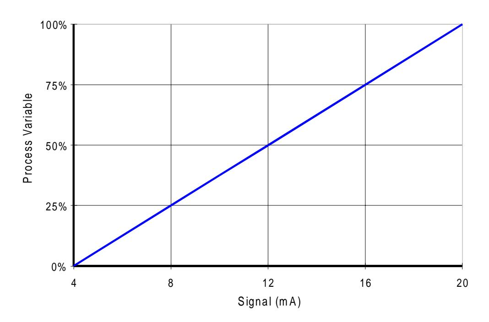

**Figure 2-1 Ideal Instrument Input/Output Curve**

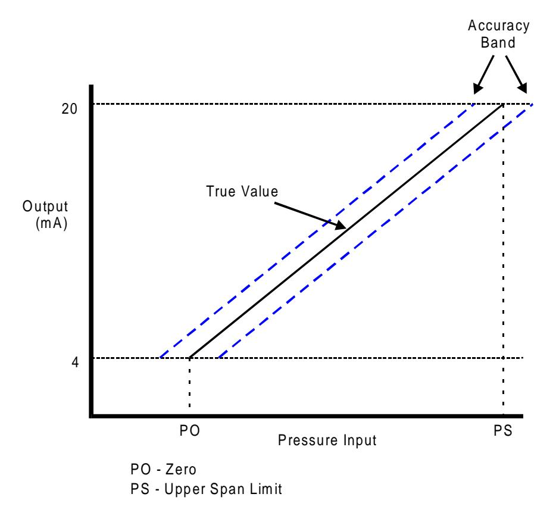

**Figure 2-2 Instrument Accuracy Band**

Repeatability is an indication of an instrument's stability and describes its ability to duplicate a signal output for multiple repetitions of the same input. Repeatability is shown on Figure 2-3 as the amount that signal output varies for the same process input. Instrument repeatability can degrade with age as an instrument is subjected to more cumulative stress, thereby yielding a scatter of output values outside of the repeatability band.

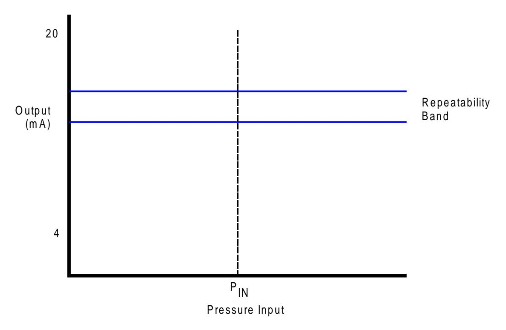

Figure 2-3 Repeatability

Instruments preferably exhibit linear characteristics, i.e., the output signal should be related linearly and proportionately to the input signal. Linearity describes the ability of the instrument to provide a linear output in response to a linear input (see Figure 2-4). The linear response of an instrument can change with time and stress.

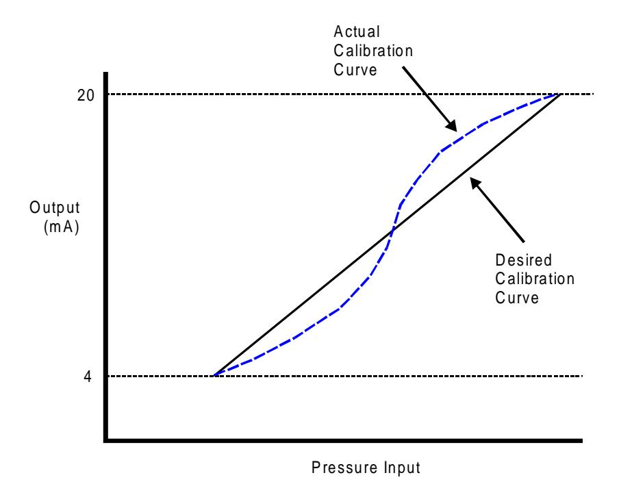

**Figure 2-4 Linearity**

Hysteresis describes an instrument's change in response as the process input signal increases or decreases (see Figure 2-5). The larger the hysteresis, the lower is the corresponding accuracy of the output signal. Stressors can affect the hysteresis of an instrument.

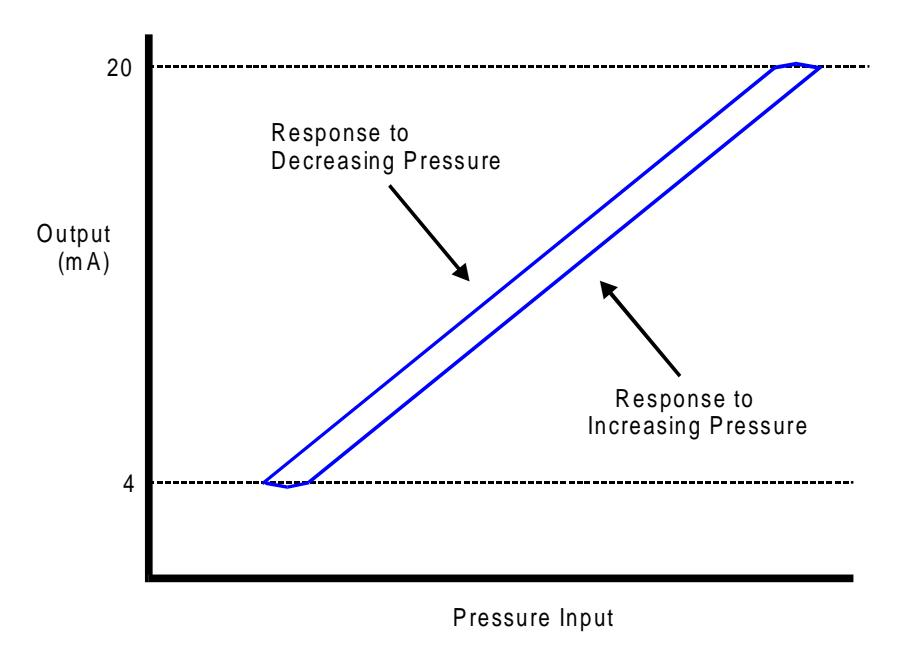

**Figure 2-5 Hysteresis**

Calibration effect is an error introduced into the instrument channel during the calibration process. It is composed of several contributors: M&TE error, error in the reference standard, error in the technician's reading or use of the test equipment, and calibration tolerance.

Drift is an inherent characteristic of a device and is manifested by a shift in the device output over time. The various components and devices that make up an instrument loop might have different drift characteristics. Therefore, drift can be thought of as a measure of the stability of an instrument loop device over time. Drift normally is identified in terms of a limiting value per unit time and is considered random, unless the manufacturer has identified otherwise.

#### **2.1.2 As-Found and As-Left Calibration Settings**

Two important concepts associated with the calibration process are the *as-found* and *asleft* conditions. These terms are defined as follows:

- As-Found: The condition in which a channel, or portion of a channel, is found after a period of operation and before adjustment (if necessary).
- As-Left: The condition in which a channel, or portion of a channel, is left after adjustment or final actuation device setpoint verification.

 These two conditions (along with their associated tolerances, as discussed below) define the required levels of accuracy in a device or set of devices in an instrument loop in order to verify that the performance requirements are satisfied. During the calibration process, as-found data is obtained and recorded. This provides an indication of how the device is performing relative to established limits. The difference existing between the as-found data obtained from the current calibration and the as-left data from the calibration during the previous outage is due to the net cumulative effects of several factors potentially affecting accuracy, including:

- Instrument hysteresis and linearity error present during the previous calibration
- Instrument hysteresis and linearity error present during the current calibration
- Instrument repeatability error present during the previous calibration
- Instrument repeatability error present during the current calibration
- Measurement and test equipment error present during the previous calibration
- Measurement and test equipment error present during the current calibration

- Personnel-induced or human-related error during the previous calibration
- Personnel induced or human-related error during the current calibration
- Instrument temperature effects attributed to an ambient temperature difference between the two calibrations
- Other environmental effects that occur between the two calibrations that cause a shift in instrument output
- Instrument shifts associated with system operational changes (shutdown, cooldown, and depressurization)
- Misapplication, improper installation, or other operating effects
- True instrument drift representing a change, time-dependent or otherwise, in instrument output over the time period between calibrations

The difference between the as-found setting and the as-left setting often is treated conservatively as drift.

#### **2.1.3 Calibration Tolerances**

The calibration process is used to monitor and (if necessary) adjust an instrument to ensure that it functions within an acceptable set of limits. These limits are defined by tolerances that take into account the uncertainties (e.g. accuracy, calibration effect, and drift) associated with a device or group of devices, thereby establishing an acceptable level of performance for the components being calibrated. Tolerances are the limits above and below a desired value within which an instrument or loop signal can vary and be considered acceptable. This prevents the unnecessary adjustment of instruments or devices when they are within acceptable tolerance bands. The following tolerances are important to the calibration process:

- As-Found Tolerance: The tolerance allowed in the required accuracy between calibrations for a device or group of devices. The as-found tolerance establishes the limit of error that the defined devices can have and still be considered functional.
- As-Left Tolerance: The tolerance that establishes the required accuracy band that a device or group of devices must be calibrated to within and remain to avoid recalibration when periodically tested.
- Device Tolerance: The as-left tolerance allowed for a specific component or device within a loop.

• Loop Tolerance: The as-left tolerance allowed for an instrument loop. The loop tolerance is established based on the individual device tolerances of the devices that make up the loop.

These tolerances encompass inherent instrument characteristics and do not account for inaccuracies caused by varying external influences. Figure 2-6 shows the basic relationship between the various uncertainty allowances that relate limits to allowable tolerances and the allowable ranges within which the instrument may be found and left. If the device is found to have exceeded the as-found allowable value, it is considered to be out of calibration and might be considered inoperable. The application of the as-found tolerance thereby provides a mechanism to verify the performance of a device at any time after calibration. The as-left tolerance provides calibration personnel with a measurable band to within which the device must be adjusted. However, due to the inaccuracies associated with the calibration process, the actual accuracy of the newly adjusted device is equal to the as-left tolerance plus the calibration effect. Therefore the as-left tolerance and the calibration effect together define the acceptable performance limits within which the device must be calibrated. Typically, the as-left tolerance requirements are defined to account for the calibration effect, since it cannot be discerned by technicians performing calibration. If the as-found condition of a device is confirmed to be within the as-left tolerance, no adjustment would be required. If the as-found condition of a device is within the as-found tolerance, but outside of the as-left tolerance, drift or some other perturbation on the device may have occurred. In this situation, the device is adjusted such that it again meets the as-left tolerance requirements.

#### S afe ty L imit

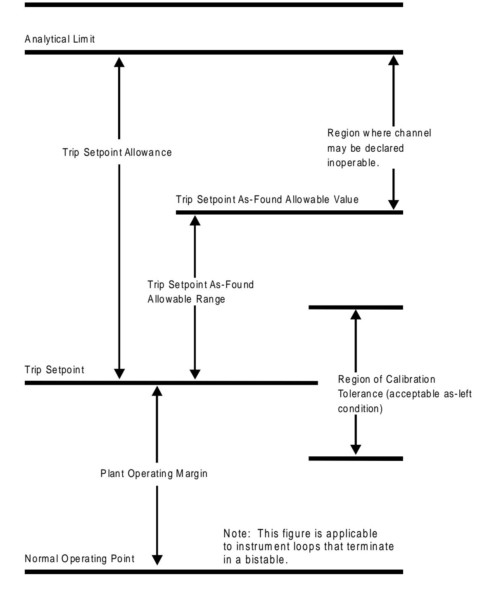

**Figure 2-6 Tolerance Relationships Used in Calibration**

#### **2.2 Typical Performance of Monitored Instruments**

Different processes exhibit different levels of signal variation as measured by the associated sensor. Figure 2-7 shows the typical variation in main steam pressure for a plant operating a full power. By comparison, the nuclear power signals (see Figure 2-8) appear to be much noisier, although the signals stay within a ±1% band.

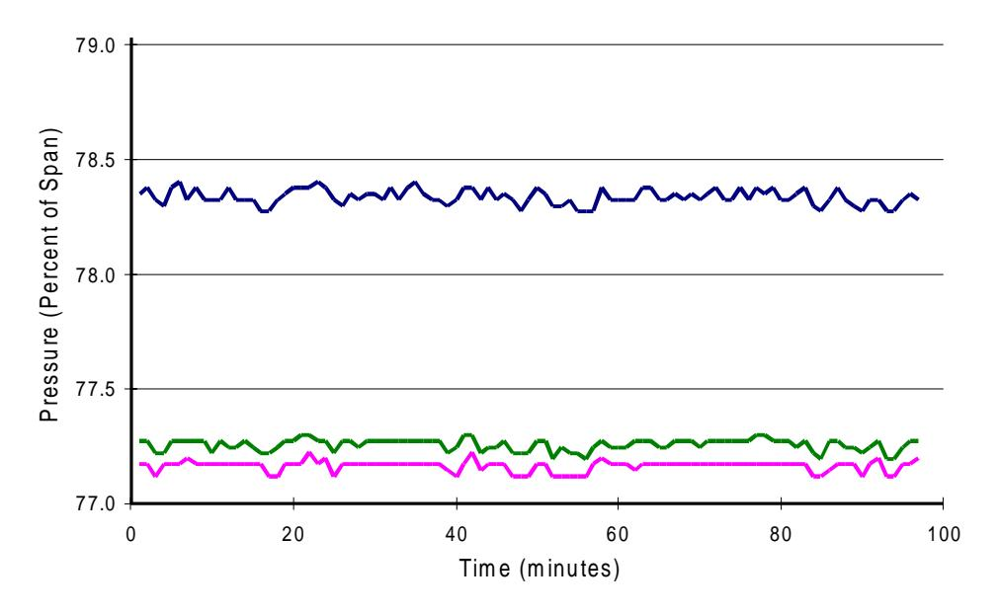

**Figure 2-7 Example of Main Steam Pressure Variation**

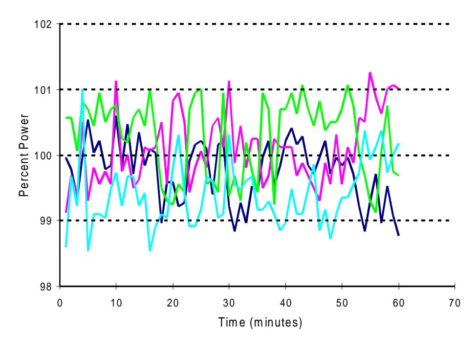

**Figure 2-8 Example of Nuclear Instrument Power Variation**

Figure 2-9 shows the typical containment pressure variation. As can be seen, each transmitter is measuring within a ±0.5% band and the relative variation of each transmitter is very small. This performance is typical of transmitters that are measuring a relatively constant process.

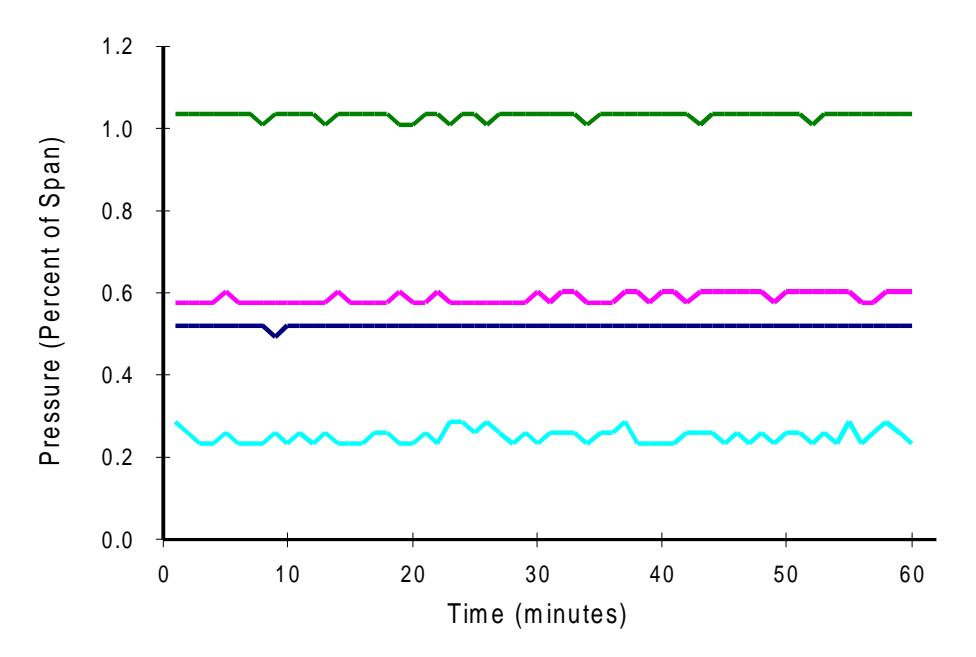

**Figure 2-9 Example of Containment Pressure Variation**

Figure 2-10 shows the typical variation of a steam generator level measurement with four transmitters. In this case, the process is more noisy in that the steam generator level appears to fluctuate within a ±0.5% band; notice that the transmitters tend to fluctuate as a group. It is also typical for each transmitter to have some offset from the average process value that remains fairly constant unless the transmitter is perturbed somehow.

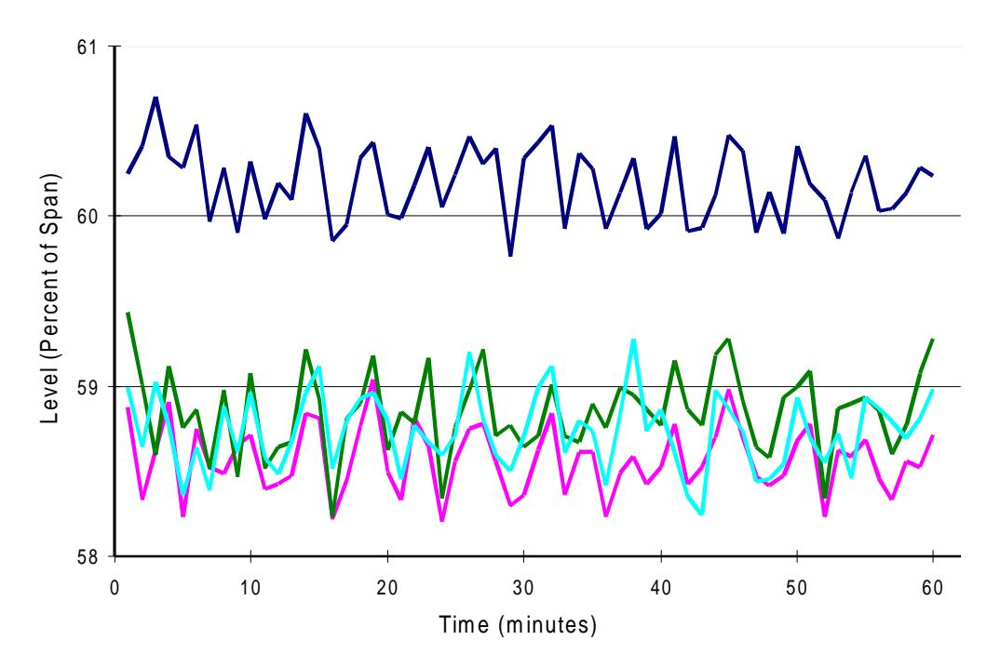

**Figure 2-10 Steam Generator Level Variation**

Figure 2-11 shows an example of a nuclear instrument channel spike that eventually goes away; the reason for the spike and its subsequent disappearance is not known. On-line monitoring should detect and alarm this sort of condition.

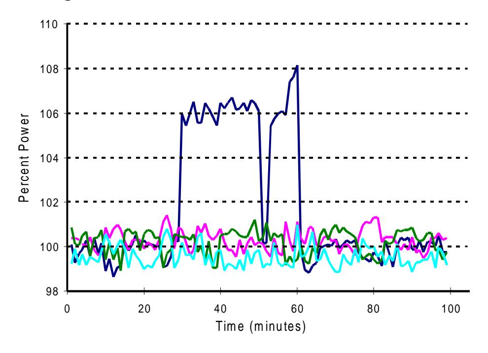

**Figure 2-11 Nuclear Instrument Channel Signal Spike**

As can be seen in the previous graphs, most signals tend to fluctuate within a fairly narrow band. The ideal case for on-line monitoring would be to detect a signal that started drifting from the other channels as shown in Figure 2-12. As the outlying channel deviates from the other channels, it eventually should be identified as potentially out of calibration. This type of sensor behavior has been observed by the EPRI ICMP.

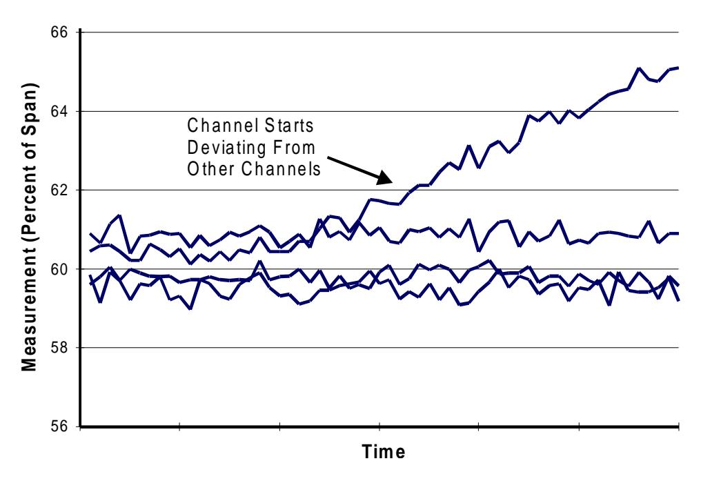

**Figure 2-12 Channel Starts Deviating from Other Channels**

#### **2.3 On-Line Monitoring Methodology Overview**

#### **2.3.1 What Is On-Line Monitoring?**

On-line monitoring is an automated method of monitoring instrument performance and assessing instrument calibration while the plant is operating. In the simplest configuration, redundant channels are monitored by comparing each individual channel's indicated measurement to a calculated best estimate of the actual process value; this best estimate of the actual process value is called the *parameter estimate*. By monitoring each channel's deviation from the parameter estimate, an assessment of each channel's calibration status is made.

Some on-line monitoring algorithms, such as EPRI ICMP, include a provision for discriminating against the drifted channel in the parameter estimate calculation. More sophisticated systems, such as the Multivariate State Estimation Technique (MSET), are capable of assessing the relationship between different non-redundant parameters.

The following sections provide additional background information regarding on-line monitoring. Refer to Section 3 for a more detailed discussion of technical issues.

#### 2.3.2 Parameter Estimate Calculation

The parameter estimate is the calculated best estimate of the actual process value. The simplest approach to calculating the parameter estimate is to take the average of redundant channels in accordance with the following expression:

$$\bar{x} = \frac{\sum_{i=1}^{n} x_i}{n}$$

In the above expression,  $\bar{x}$  is the average of n measurements, in which  $x_i$  refers to the  $i^{th}$  measurement. If the above method is used, each channel, i, would be compared to the parameter estimate to determine its deviation,  $d_p$  as follows:

$$d_i = x_i - \frac{\sum_{i=1}^n x_i}{n}$$

Each channel's deviation from the parameter estimate,  $d_p$ , represents the best estimate of the variation from the actual process value.

Different algorithms can be used. For example, the EPRI Instrument Calibration Monitoring Program (ICMP) includes the capability to discriminate against the outlying channel by the following algorithm (refer to Section 10 for additional information):

$$\hat{x} = \frac{\sum_{i=1}^{n} C_i m_i}{\sum_{i=1}^{n} C_i} \quad (i = 1, 2, ..., n)$$

where,

 $\hat{x}$  – Parameter estimate

*n* – Number of redundant instruments in the group

 $m_i$  – Measured value for the  $i^{th}$  signal

 $C_i$  – A consistency number denoting how many other redundant signal values are consistent with the  $i^{th}$  signal

An on-line monitoring algorithm is not limited to checking only redundant channels of the same process parameter. Two other approaches to on-line monitoring have been considered:

- Correlating a diverse parameter to the parameter of interest
- Pattern recognition of a significant number of redundant and non-redundant channels—the Multivariate State Estimation Technique (MSET)

The following paragraphs discuss the two approaches.

A diverse channel is one that can be correlated to the redundant monitored channels by some defined relationship. A diverse channel(s) might be used to obtain an additional level of redundancy or might correlate non-redundant channels that have a known relationship. When compared to redundant channels, the diverse channel might be given a different weight than the redundant channels in the calculation of the parameter estimate as follows:

$$\hat{x} = \frac{\alpha \sum_{i=1}^{m} x_i + \beta \sum_{j=1}^{n} x_j}{\alpha m + \beta n}$$

where.

 $\hat{x}$  — Parameter estimate

*m, n* — Number of redundant instruments in each group

 $x_i$  — Measured value for the  $i^{th}$  signal of the redundant channels

 $x_i$  — Measured value for the  $j^{th}$  signal of the diverse channels

 $\alpha$ ,  $\beta$  — Weighting constants (and might include a scaling factor)

The deviation of each redundant channel from the parameter estimate would be calculated. The deviation of the diverse channel(s) also can be calculated.

A pattern recognition technique, such as MSET, is based entirely on data and without use of physical laws. In this case, it is not necessary to describe the phenomena or even

to understand it. It is only necessary to choose input signals that are correlated to one another and reasonably represent the process under consideration. This makes the pattern recognition technique easy to implement, in the sense that the relationship between the measured parameters does not have to be defined.

With a pattern recognition approach, data from the different operating conditions of a plant are used to *learn* the interrelationship between plant process variables. Within these relationships exist various states which correspond to specific plant operating conditions. Once the system has *learned* the correlations among the instruments from the plant's operating history and compares these to current instrument readings, discrepancies are identified as an instrument fails or degrades.

Pattern recognition can be used on single channel instruments. Complex modeling techniques such as those needed for physical and empirical modeling are not required. Furthermore, pattern recognition systems will produce repeatable results. If the analysis is repeated twice using the same reference data sets, identical estimated values (output data set) will be produced.

The above examples are intended to illustrate the approaches covered by this topical report that can be taken by on-line monitoring.

#### **2.3.3 Evaluation Criteria**

Regardless of the on-line monitoring algorithm, an estimate of the parameter's *true* value, or the parameter estimate, is generally calculated. Each monitored channel then is compared to the parameter estimate, and its deviation from the parameter estimate represents its variation from our best estimate of the true process value. Figure 2-13 shows an example in which three redundant channels are monitored and the parameter estimate is calculated as the simple average of the three channels. Different algorithms might be used. For example, Figure 2-14 shows the same three signals in which the EPRI ICMP method is applied with Signal #1 found to be inconsistent with Signals #2 and #3, such that it is excluded from the calculation of the parameter estimate.

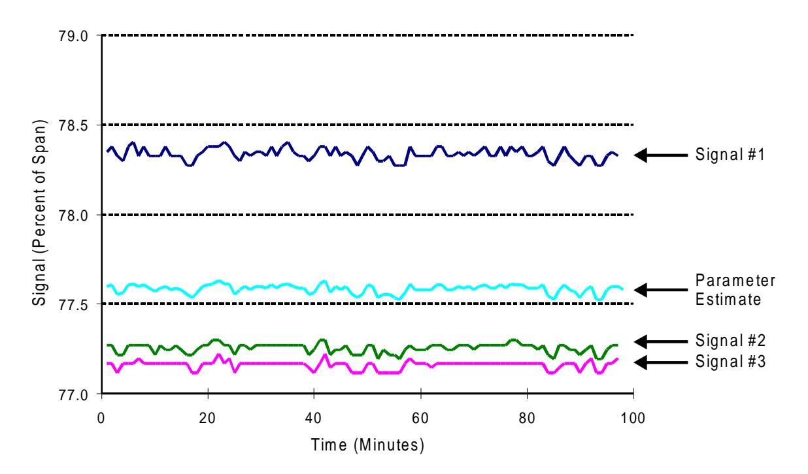

**Figure 2-13 Evaluating Redundant Channels for Drift—Simple Average**

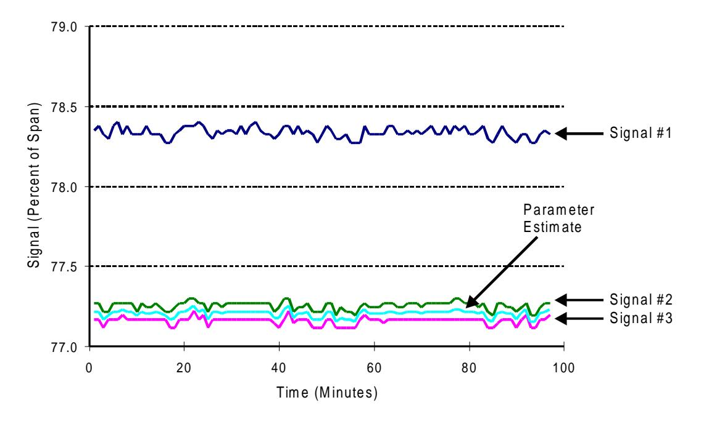

**Figure 2-14 Effect of Excluding the Outlying Channel from the Parameter Estimate**

Referring to Figures 2-13 and 2-14, each signal would then be compared to the parameter estimate. If the signal deviated from the parameter estimate by more than a specified amount (the acceptance criteria), the channel would be identified as either

needing calibration or requiring an operability evaluation. Notice that the acceptance criteria depends on how the parameter estimate is calculated, including its associated uncertainty. Section 3 provides additional technical information regarding the evaluation process for on-line monitoring.

#### **2.3.4 Data Acquisition**

On-line monitoring acquires its signals from isolated outputs of each monitored instrument loop (see Figure 2-15). Typically, the signals are taken from the plant computer. The term *channel* is used in this topical report to indicate the monitored instrument loop consisting of the sensor, the isolator, and intervening components. Typically, the sensor is the instrument loop device that exhibits the greatest drift variation and all observed drift normally will be assigned to the sensor until the actual drifting device is confirmed by investigation.

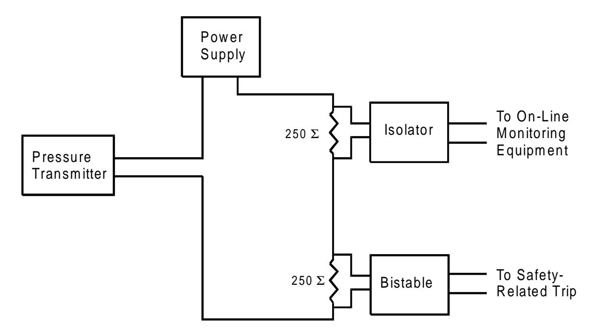

**Figure 2-15 On-Line Monitoring Circuit Arrangement**

# *3*

## **TECHNICAL BASIS FOR ON-LINE MONITORING AS A CALIBRATION ASSESSMENT TOOL**

Section 3 provides the technical basis for on-line monitoring as a method of calibration assessment. Issues related to its technical validity for instrument performance assessment are discussed in detail, so that the potential benefits, as well as limitations, of on-line monitoring can be understood better.

#### **3.1 Functional Requirements**

Regardless of the type of on-line monitoring implementation, certain functional requirements should be the same. The following sections discuss the key functional requirements for on-line monitoring of safety-related channels.

#### **3.1.1 On-Line Monitoring Scope**

Regardless of the methodology used, on-line monitoring normally acquires its signals at the output of an isolator when applied to a safety-related instrument loop. Signal isolation is not a design requirement for non-safety-related instrument loops. Limiting the discussion to safety-related circuits, on-line monitoring starts at the output of an isolator as shown in Figure 3-1.

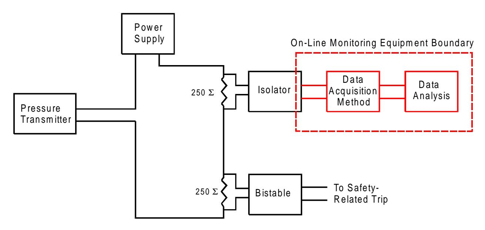

**Figure 3-1 On-Line Monitoring Equipment Boundary**

The method of data acquisition and analysis is shown intentionally in a general manner in Figure 3-1, because the implementation will likely vary among plants. For example, the following options are possible for the type of implementation covered by this topical report:

- An automated system that performs data acquisition and analysis essentially continuously at the system specified sample rate
- An automated system that performs data acquisition and analysis at discrete specified intervals
- An automated system that is normally off and is activated on at least a quarterly interval to perform data acquisition and analysis
- A manual system in which data is acquired manually on at least a quarterly interval and entered manually into a computer program for the purpose of analysis

Each of the above implementations of on-line monitoring is treated as a *system* within the context of this topical report. The differences between each of the above options are primarily the degree of automated signal acquisition and the frequency of data analysis.

#### **3.1.2 Signal Isolation**

For safety-related circuits, signals transmitted to the on-line monitoring equipment must be isolated in accordance with the plant's design basis. Manually-acquired signals will be taken either at the output of the isolator or at suitable test points.

The issues raised by NRC Information Notice 95-13, Supplement 1, *Potential for Data Collection Equipment to Affect Protection System Performance*, should be considered to ensure that adequate isolation and independence is maintained by the data acquisition method.

#### **3.1.3 Data Acquisition and Evaluation Frequency**

Data acquisition and evaluation frequency have two elements for consideration:

- Periodicity of data analysis
- Simultaneity of measurements

 The basis for on-line monitoring as a calibration extension tool is based, in part, on quarterly evaluations as described in this topical report. Although some on-line monitoring implementations might perform data acquisition and analysis more frequently (up to almost continuously), a quarterly acquisition and analysis periodicity is considered acceptable in terms of monitoring channel performance.

 The simultaneity of measurements becomes a consideration for uncertainty analysis if measurements of redundant channels (or of all monitored channels by the MSET pattern recognition method) are taken at non-simultaneous times when the monitored processes are not at stable conditions. To avoid an uncertainty penalty associated with non-simultaneous measurements, the following guidelines are provided:

- Acquire measurements for evaluation during relatively stable plant conditions.
- If signals are noisy or changing during stable plant conditions, average multiple measurements to ensure that a best estimate of the process measurement is obtained. For noisy measurements, at least 20 measurements are recommended. For systems that perform essentially continuous analyses of measurements taken at a defined sample rate, evaluate the channel deviations to ensure that the analysis results are stable.

#### **3.1.4 Reliability, Testing, and Maintenance**

System reliability is achieved in several phases:

- System design and testing
- Site acceptance testing
- Continued monitoring and verification of operation

In general, these activities are conducted on a plant-specific basis such that a level of reliability consistent or better than that obtained with existing plant Technical Specifications requirements is achieved.

Failures of the on-line monitoring-related equipment are monitored in two ways: testing of plant signal processing systems through which on-line data is collected (if data collection is electronic), and implementation of a validation and verification plan for the on-line monitoring software. Synthetic data should be available to test the online monitoring software to a known data set with known results.

#### **3.1.5 Software Quality**

On-line monitoring will be used to determine if calibration of safety-related equipment is needed and, because of its ability to identify degraded channels, can initiate the operability assessment process. Although the on-line monitoring software is not considered safety-related, it is considered quality related and will require formal evaluation in accordance with plant software acceptance procedures. Based upon the software quality assurance class determined by application of plant-specific procedures, the specified level of validation, verification, testing, and documentation will be developed. Determination of these requirements will also include site acceptance testing requirements. Section 10.3 describes the software implementation process for on-line monitoring at one plant.

#### **3.2 Relationship of Observed Drift at the Operating Point to Potential Drift at the Setpoint**

#### **3.2.1 Summary of Issue**

When a plant operates at nearly constant power for an extended period of time, the process variations for many parameters tend to be relatively small as shown in Figure 3-2. Although the monitored instruments appear to be in calibration at the monitored point, how does the user know that the instruments are still in calibration elsewhere in

the span, such as at the high- or low-level trip setpoints? This question is referred to as the *single point monitoring issue*. The answer to this question is important to determining the on-line monitoring ability to detect drift. As will be shown in the following sections, the type of drift and the monitored point in the span are important considerations.

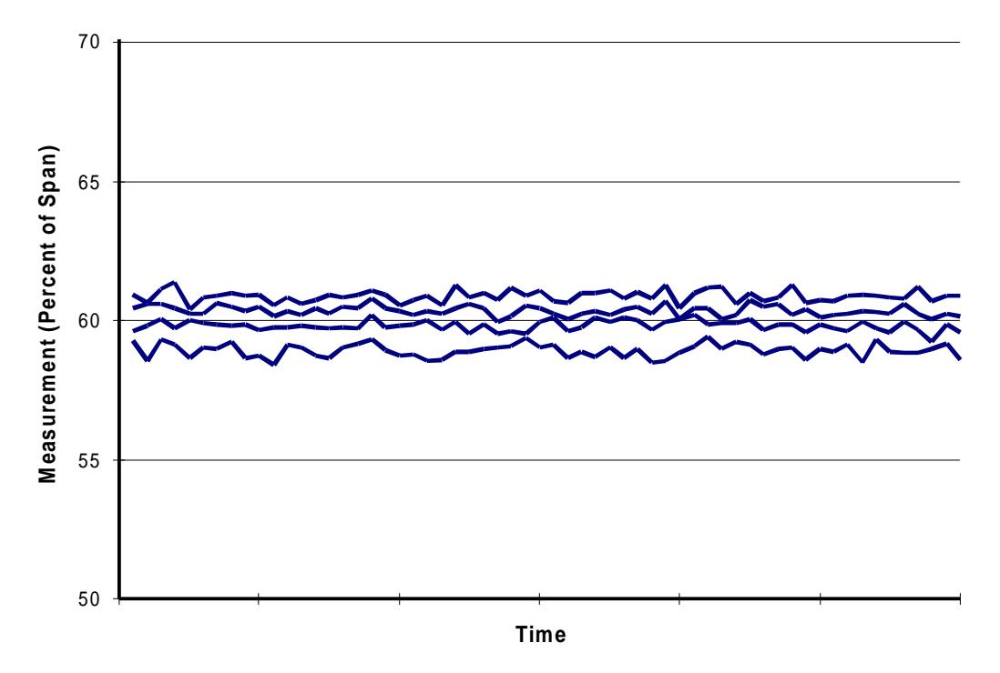

**Figure 3-2 Typical Variation in Process Measurement at Constant Power**

Referring to Figure 3-2, note that four redundant instruments are measuring some process and the four instruments are within a total band of about 1½%. Given that all four instruments are in calibration (to some accepted level) at the monitored point (60% of instrument span in this case), what assurance is there that the instruments are also in calibration elsewhere in the span? EPRI sponsored a detailed study of instrument performance to address this question. This section summarizes the key points of the study; Section 8 provides the study results in greater detail. Section 8 also discusses at length the sources of the evaluated data to show that the study results are likely representative of all generating facilities.

#### **3.2.2 Drift Effects That Can Cause a Variation in Drift Magnitude at Different Instrument Span Points**

After a sensor has been calibrated, it can deviate from its calibrated state in different ways. Note: Regardless of the type of deviation, this topical report will refer to the deviation as *drift*. Each type of possible drift has different implications regarding the

ability of on-line monitoring to detect the drift. The following types of drift have been observed:

- Zero shift
- Span shift
- Nonlinear

Figure 3-3 shows an example of zero shift drift. In terms of on-line monitoring, this is the ideal type of drift in that drift at any point along the span is representative of the expected drift elsewhere along the span. In this case, the observed drift at the monitored point would be indicative of the expected drift at the setpoint. As discussed in Section 8, zero shift contributes to drift in about 75% of the observed cases.

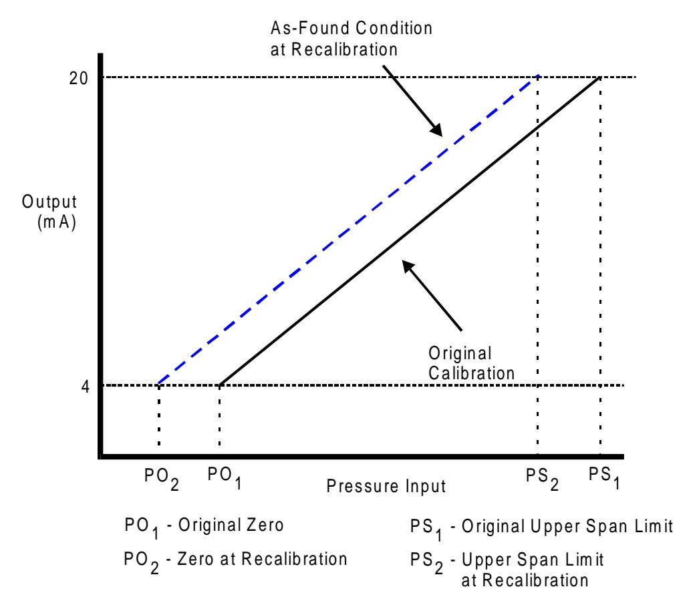

**Figure 3-3 Zero Shift Drift**

Figure 3-4 shows an example of span shift drift. Notice that the instrument is in calibration at one end of the span and out of calibration at the other end of span. Figure 3-4 shows an example of forward span shift in which the magnitude of instrument drift

increases as the measurement goes higher into the instrument's span. Reverse span shift, in which the instrument is in calibration at the 100% span point and out of calibration at the 0% span point can also occur. As discussed in Section 8, span shift contributes to drift in almost 50% of the observed cases.

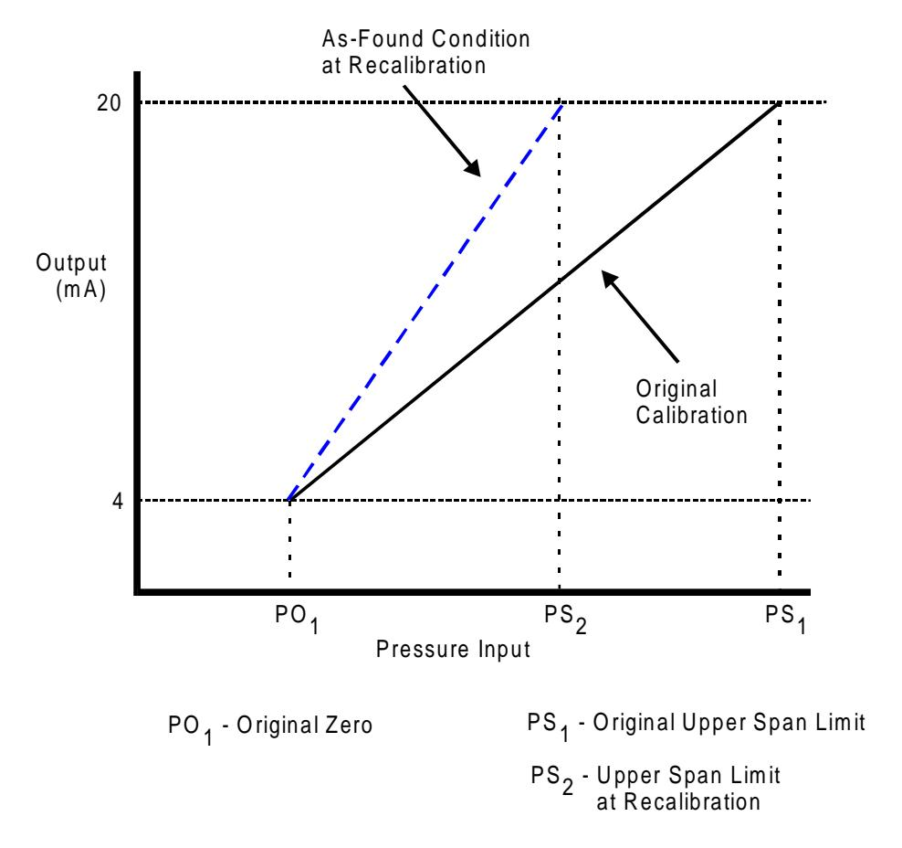

**Figure 3-4 Span Shift Drift**

Zero shift and span shift can occur either alone or together as the observed drift type. Figures 3-3 and 3-4 show zero and span shift, respectively, as the only contributor to drift. Figure 3-5 provides an example of an instrument with both zero and span shift occurring simultaneously. As mentioned previously, zero shift contributed to observed drift in about 75% of the data and span shift contributed in about 50% of the data. Section 8 shows that the two types of drift often occurred simultaneously.

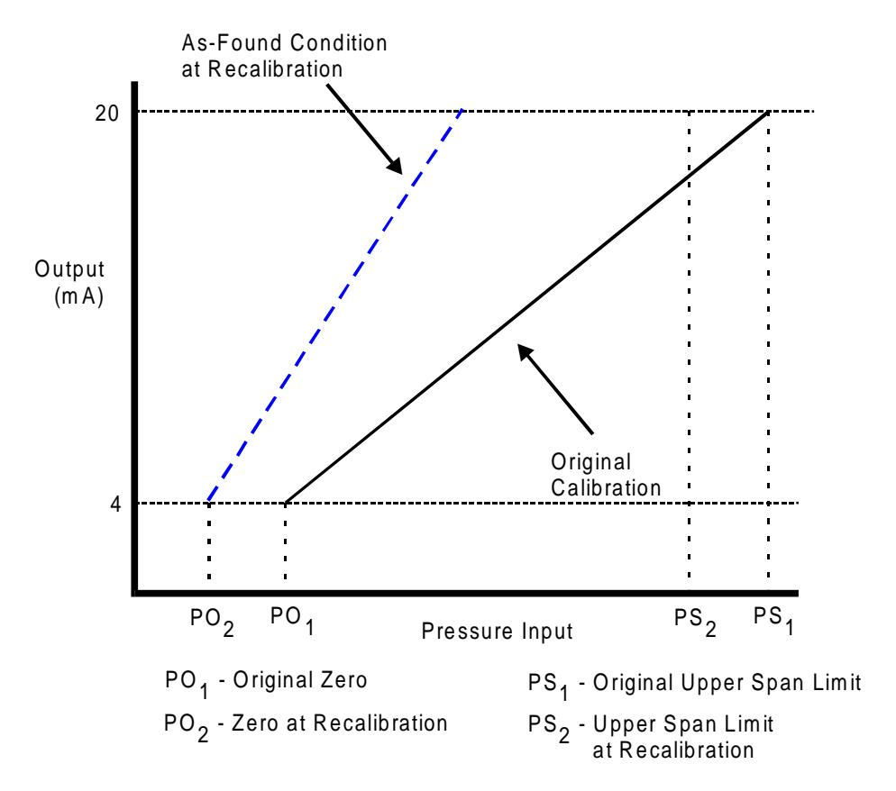

**Figure 3-5 Zero and Span Shift Occurring Together**

Figure 3-6 shows one possible example of nonlinear drift. The term *nonlinear* is used in this topical report to describe any drift characteristic that does not have a recognizable zero shift, span shift, or combined zero and span shift pattern. In the data evaluated, nonlinear drift contributed to drift in about 8% of the observed cases. It is believed that some of the nonlinear drift results, referred to as single outliers in Section 8, are due to data entry errors, but these cases were left in the evaluated database because the errors could not be verified.

**Figure 3-6 Nonlinear Drift Effects**

#### **3.2.3 Observed Proportions of Each Type of Drift**

Transmitter calibration data from 18 nuclear plants was combined into a single data file to evaluate the nature of drift. The as-found minus as-left (AFAL) values for the 0%, 25%, 50%, 75%, and 100% of span points were retained for drift categorization. This file contained data for over 6,000 calibrations with almost 5,000 AFAL data sets. The total number of AFAL data points exceeded 23,000.

The focus of this evaluation was on out-of-calibration data and the nature of the data when a transmitter was out of calibration. The calibrations were screened for the worstcase AFAL data point in each AFAL set of five check points (0% to 100% of span). For purposes of evaluation, the AFAL data was screened into the following drift ranges based upon the worst-case data point:

- 1–2%
- 2–3%
- 3–4%

- 4–5%
- 5–8%
- 8–15%
- >15%

 For each out-of-calibration event, the type of drift observed was evaluated and the calibration was assigned to one of the established drift categories based on the following criteria:

- Zero shift—Most AFAL points tended to have similar magnitudes. Span shift, if present, exhibited less than ~0.5% variation across the span.
- Forward span shift—The AFAL points tended to increase in magnitude from the low end of span to the high end of span. Zero shift, if present, caused less than ~0.5% of span offset.
- Reverse span shift—The AFAL points tended to increase in magnitude from the high end of span to the low end of span. Zero shift, if present, caused less than ~0.5% of span offset.
- Forward span with zero shift—The AFAL points tended to increase in magnitude from the low end of span to the high end of span, but an offset (zero shift) of >0.5% was also present at the 0% of span point.
- Reverse span with zero shift—The AFAL points tended to increase in magnitude from the high end of span to the low end of span, but an offset (zero shift) of >0.5% was also present at the 100% of span point.
- Nonlinear shift—The AFAL values varied widely over the span with no consistent zero or span shift pattern.
- Single outlier—A special case of nonlinear shift in which one point was significantly larger than the other AFAL points.

Figure 3-7 shows the drift results for those calibrations with AFAL magnitudes between 1% and 2% of span at one or more calibration check points. Zero shift alone was the dominant type of drift and it was also a contributor to drift in a significant portion of the span shift cases. For on-line monitoring, zero shift is the preferred type of drift because drift at one point in the span would be indicative of drift elsewhere in the span. In other words, an instrument with zero shift drift alone could not be in calibration at one point and significantly out of calibration at another point. Figure 3-7 shows that span shift was also a major contributor to drift. Span shift is less desirable

than zero shift for on-line monitoring because the instrument might be in calibration at one point, but outside calibration limits at other points. Nonlinear drift and single outlier drift were the least likely drift types.

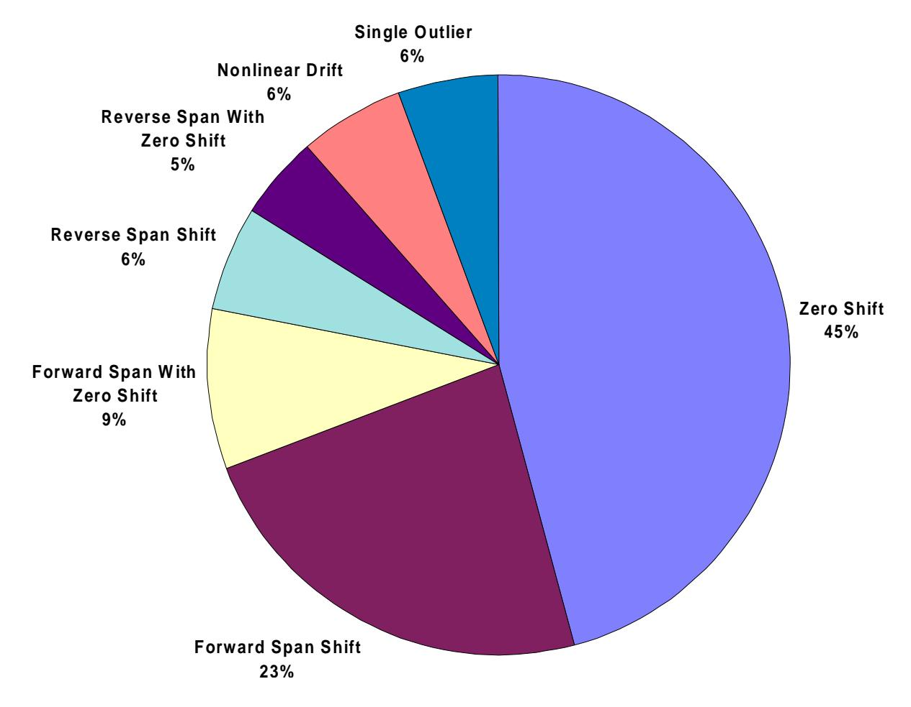

**Figure 3-7 Drift Category Proportions for Out-of-Calibrations Between 1%-2%**

A minimum level of 1% drift was selected for drift categorization. However, a review of the AFAL data below 1% readily shows that zero shift and span shift are present at all levels of drift. Zero shifts can easily range from less than ±0.5% of span with the instrument still in calibration to ±20% or more of span for extreme cases of out-ofcalibration. The same holds true for span shift. But, in most calibrations, the magnitude of zero shift and span shift is small enough that it does not cause an out-of-calibration condition.

When the calibration data is screened at even higher drift levels, the proportions shown in Figure 3-7 varied, but not greatly. Appendix B provides the proportions for out-ofcalibrations at higher screening levels. As the drift magnitude screening level increases, the relative proportions of each type of drift do not change by large amounts. This

behavior is significant because it shows that the types of drift and their relative proportion are relatively independent of the magnitude of drift. For example, span shift and zero shift can be observed at all levels of drift, even in data for in-calibration transmitters.

#### **3.2.4 Likelihood of Being in Calibration at the Monitored Point and Out of Calibration Elsewhere in the Instrument's Span**

Section 8 describes the database that was evaluated for the effect of single point monitoring. In general, transmitters evaluated by this project were usually in calibration. However, more fundamentally, it was unlikely for one or more calibration checkpoints to be significantly out of calibration when one point (assume the monitored point) was within calibration to some specified level. Figure 3-8 shows that the evaluated transmitters generally were found in calibration (this figure was developed from AFAL data in which all calibration check points were within the specified limit).

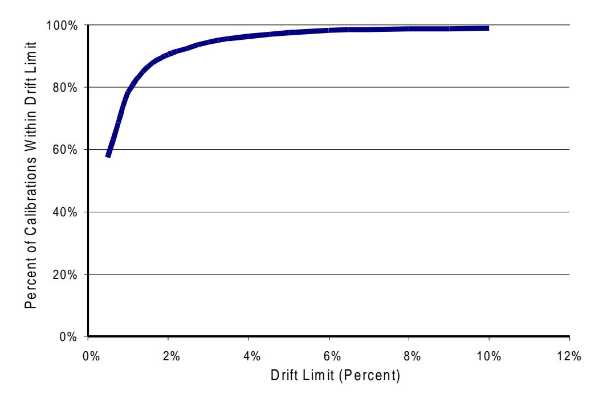

**Figure 3-8 Percentage of In-Calibration Transmitters at Specified Level**

Zero shift was the most common contributor to drift. Whenever zero shift alone influences the instrument output, equivalent performance is expected throughout the calibrated span. Previous studies of AFAL data (EPRI TR-103335) have shown a tendency for the magnitude of predicted drift to increase with span. Section 8 readily explains this observed phenomenon as attributable to forward span shift. Even at low drift levels, span shift effects are often influencing the output. Also, forward span shift alone was observed much more often than reverse span shift. The significance of this

observation is that AFAL values high in the calibrated span are likely to be larger than AFAL values low in the calibrated span.

Answering the single point monitoring question involved evaluating the in-calibration data. The available data was evaluated by treating each calibration check point (0%, 25%, 50%, 75%, and 100% of span) as a separate sample. For each calibration check point, the in-calibration data (at the specified level) was retained; this is equivalent to having the monitored point be in calibration. Then, the data for the other four calibration check points was evaluated to determine the number of instances in which one or more points exceeded the drift limit for the monitored point by some additional amount. Figure 3-9 shows the probabilities that any other AFAL point will be larger than the drift limit for the monitored point by more than an additional 1.0% of span.

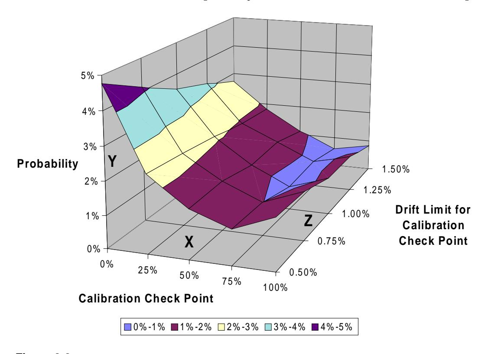

**Figure 3-9 Probability That Drift at Other Check Points Is >1.0% Larger Than Drift Allowance at the Specified Point**

The axes and data presented in the Figure 3-9 surface plot require some explanation as follows:

• The x-axis shows that the calibration check data was evaluated at the 0%, 25%, 50%, 75%, and 100% of span checkpoints.

- The z-axis refers to the drift limit that we allowed for the monitored point. For example, we might be monitoring the 50% of span point and drift limits could be established for this point within which we consider the performance acceptable. For this evaluation, drift limits ranging from 0.5% to 1.5% were considered. As an example, a drift limit of 1.0% means that all calibrations were retained for evaluation in which the 50% of span point was within 49% to 51% of span.
- The y-axis is the probability that another calibration checkpoint exceeds the monitored point's drift limit by an additional specified amount. In the case of Figure 3-9, the specified amount is 1.0%. For example, if the drift limit at the monitored amount is 1%, then the other calibration check points were allowed to vary by 1.0% more, or 2% in this particular example. Referring to the 100% check point line, the probability was always less than 2% that another check point was larger than the specified drift limit by 1%.

The above explanation requires careful consideration; the surface plot is not necessarily intuitive. In summary, the surface plot shows the probability that another point in the span will be larger (by a specified amount) than the allowed drift limit for the monitored point. In order for single-point monitoring to be effective, this probability should be acceptably small.

The probabilities presented in Figure 3-9 represent the calculated failure proportions at each evaluated point. Minimum and maximum failure probabilities at the 95% confidence level also can be computed for each case. Because of the large sample size used in this analysis, the minimum and maximum failure probabilities are always within 1% of the actual pass proportion if computed using a binomial pass/fail approach. In other words, the maximum probability will be approximately 1% more than shown in Figure 3-9. Section 8 provides additional information regarding this study.

The results of this study were encouraging and can be applied directly to on-line monitoring acceptance criteria. Section 3.4.3.2 provides a recommended allowance for inclusion in the on-line monitoring uncertainty analysis to account for single point monitoring.

#### **3.2.5 Applications That Are Most Susceptible to Span Shift Effects**

On-line monitoring as a calibration verification tool may not be appropriate for all parameters. In particular, processes that are essentially always at the high end or low end of an instrument's calibrated span are more susceptible to undetected span shift drift. The previous section and Section 8 show the low probability of excessive drift elsewhere in an instrument's span given that it is in calibration at the monitored point. However, span shift is a clear contributor to drift a significant portion of the time.

Applications that would not detect any amount of span shift drift might not be as suitable for on-line monitoring at a single point.

Containment pressure is an example of a process parameter whose value is usually near zero psig. Figure 3-10 shows a typical situation for containment pressure monitoring. Plant transients and operational mode changes do not cause a significant change in the containment pressure. Thus, the associated transmitters are always monitoring a pressure very near zero and always remain very near zero under normal conditions. Although a zero shift would be readily detectable, a span shift change probably would not be detected. For this reason, containment pressure is not considered to be as well suited for on-line monitoring.

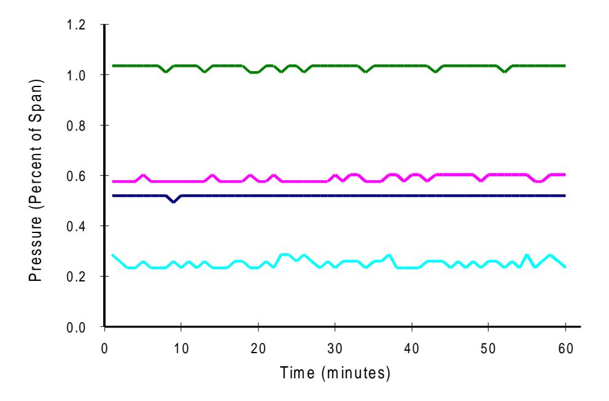

**Figure 3-10 Containment Pressure—An Example of a Process Always Near Zero Span**

The scale in Figure 3-10 can be misleading in that it only shows ~1% of the total span. Figure 3-11 shows the same containment pressure measurements in relation to the entire 100% span. As can be seen, the measurements provide no significant information regarding potential span shift effects.

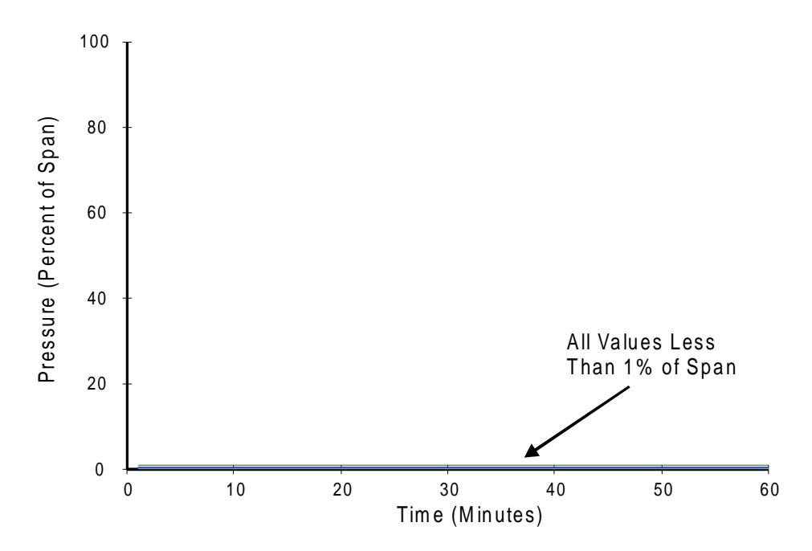

**Figure 3-11 Containment Pressure—Indicated Values in Relation to Total Span**

Other parameters that exhibit process variations across some portion of the calibrated span are not susceptible to the same concern. Plant operational mode changes do cause some variation in the process that allows on-line monitoring to evaluate drift elsewhere in the instrument's span.

On-line monitoring is capable of detecting span shift in sensors that operate near midspan because span shift has already occurred to some level. Finally, sensors that start out low in the span but operate high in the span also can be evaluated by on-line monitoring.

#### **3.2.6 Summary of Drift Study Observations**

Evaluating calibration data in support of the single point monitoring issue helped clarify the role of on-line monitoring as a calibration assessment tool. Simply stated, the nature of instrument drift has to be understood before one can assert that on-line monitoring can detect the drift. The drift study produced several notable findings that relate to drift. Key conclusions are:

- 1. For the transmitters evaluated, drift was a random event. The transmitters were as likely to drift up as they were to drift down. No significant bias effects were observed.
- 2. For those plants that performed a 9-point or greater calibration (5 points up and 4 points down), hysteresis was usually negligible.

- 3. Redundant transmitters associated with a particular parameter did not exhibit a tendency to drift as a group. One transmitter out of calibration did not indicate that the other redundant transmitters were likely to be out of calibration.
- 4. Failure modes were not observed in the data in which transmitters failed in ways that would be undetectable by on-line monitoring. For example, transmitters did not fail at a fixed level in which the output signal remained constant regardless of the input signal variation. Refer to Section 3.3 for additional information.
- 5. Single point monitoring does not invalidate on-line monitoring's ability to detect drift. An allowance can be included in the uncertainty analysis to account for single point monitoring.
- 6. Some applications (mainly at the low end of instrument span) are likely to be unsuitable for single point monitoring because of susceptibility to potential span shift effects. See Sections 3.2.5 and 3.3 for additional information.

#### **3.3 Ability of On-Line Monitoring to Detect Sensor Failures**

EPRI TR-103436-V2, *Instrument Calibration and Monitoring Program, Volume 2: Failure Modes and Effects Analysis*, provides an assessment of sensor failure modes. In terms of on-line monitoring, the reason for the sensor failure is not of particular interest. What is of interest to on-line monitoring is what happens to the sensor output signal when the sensor fails. Next, any failure mode that causes a shift in the sensor's output signal would be detectable just as drift is detectable—the sensor's deviation from the parameter estimate increases. So, the types of failures of concern are those in which the output signal does not significantly change after failure. Three such cases have been identified for consideration:

- The process parameter is at or near the low end of span and the sensor fails low.
- The process parameter is near the high end of span and the sensor fails high.
- The process parameter is somewhere between the low and high span limits and the sensor fails as is.

 Of the above cases, only the first is considered likely. Sensor failure (or failure of another instrument loop device) that causes the output to remain constant somewhere between the 0% and 100% span points regardless of the input was not observed in the calibration data evaluated in Section 8. A failure in which the signal fails high, e.g., 20 mA, regardless of the input, is considered less likely than loss of signal. Even so, few instruments operate at the 100% span point; if they operate high in the span, there is generally some room in which a high signal failure would be detected as drift.

 Given the above considerations, the following examples are considered the types of applications potentially susceptible to loss of signal failures and therefore are not considered suitable for on-line monitoring:

- Auxiliary feedwater flow—there is usually no flow and the signal is at the bottom of span, such as 4 mA, corresponding to no flow.
- Engineered safeguards system actuation equipment—the equipment is usually off and the associated pressure or flow indication will be at or near 0% of span.
- Containment pressure—depending on the calibrated span, the signal might be about 0% of span.

On-line monitoring is proposed as a method to allow calibration extension; it is not proposed here as an unconditional replacement for safety-related calibrations. Therefore, periodic calibrations will continue to validate sensor performance and will also identify any unusual sensor failures. The ongoing calibration monitoring program recommended in Section 4.8 will ensure that sensor performance is evaluated on an ongoing basis.

#### **3.4 Uncertainty Analysis**

#### **3.4.1 Basic Questions**

Every measurement contains some amount of error or uncertainty. An on-line monitoring parameter estimate, based on some average of two or more redundant channels, or the MSET parameter estimate, based on pattern recognition of multiple parameters, also contains uncertainty regarding the true process value. The parameter estimate represents the best estimate of the true process value. Note that we do not actually know the true process value; however, we expect the parameter estimate to be fairly close to the true process value. The meaning of the term *fairly close* opens up the subject of uncertainty analysis.

For a redundant parameter type averaging algorithm, such as the EPRI ICMP, the uncertainty in our knowledge of the true process value depends on several factors, including:

- The accuracy of the redundant channels from which the parameter estimate is determined.
- The nature of drift (span, zero, or nonlinear) of one or more of the redundant channels.

- The on-line monitoring algorithm and the method by which it excludes outlying measurements in its calculation of the parameter estimate.
- The number of redundant channels—uncertainty decreases as the number of channels increases.

In this case, the basic questions to answer are as follows:

- 1. What is the uncertainty of the parameter estimate when a drift allowance for each channel is allowed to influence the parameter estimate?
- 2. Given some uncertainty in the parameter estimate, at what point should a channel's deviation from the parameter estimate be considered an indication that the channel possibly needs calibration?
- 3. How does the nature of drift influence our uncertainty?

For a pattern recognition type algorithm such as MSET, the uncertainty in our knowledge of the true process value depends on different factors, including:

- The accuracy of the measurements used to establish the pattern recognition training set. This accuracy depends on the calibrated state of the various sensors used to make up the training set.
- The coverage of plant operating modes by the training set.

In this case, the basic questions to answer are as follows:

- 1. What is the accuracy and coverage of the training set?
- 2. Given some uncertainty in the parameter estimate, at what point should a channel's deviation from the parameter estimate be considered an out of calibration condition?

The above questions are discussed in more detail in the following sections.

#### **3.4.2 Traditional Uncertainty Elements Included in On-Line Monitoring**

Before proceeding with an uncertainty discussion, the typical measuring circuit for online monitoring should be described. On-line monitoring is expected to be connected to the indication and control portion of each instrument loop, electrically isolated from the safety-related trip portion of the loop, if applicable. Figure 3-12 shows a conceptual layout of the configuration for a safety-related instrument loop.

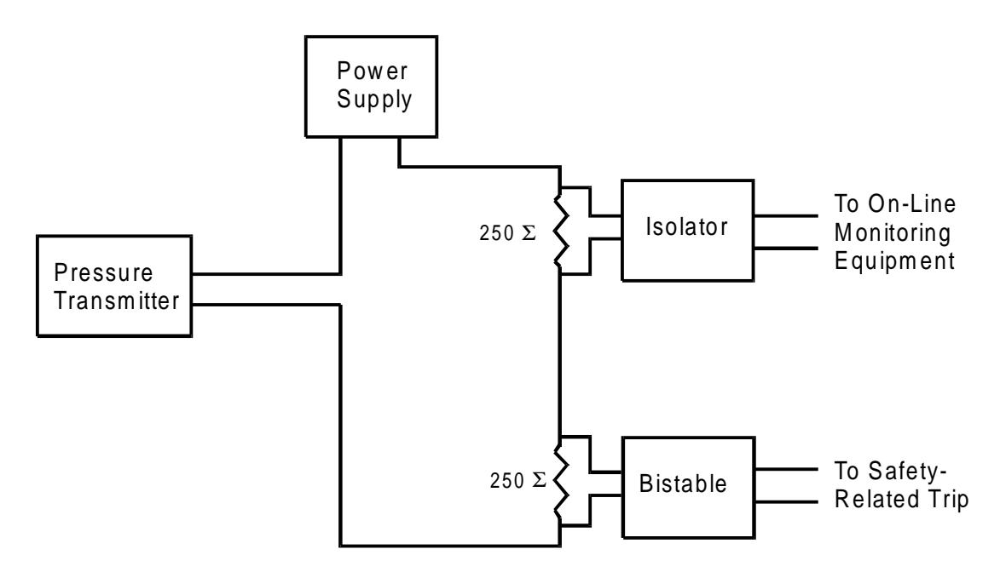

**Figure 3-12 Typical On-Line Monitoring Physical Configuration**

Table 3-1 shows the traditional contributors to measurement uncertainty that are present in each measurement signal flow path.

**Table 3-1 Traditional Process Instrument Circuit Uncertainty Sources**

| Uncertainty Term                                | Present in On-Line Monitoring Path? | Present in Safety Related Trip Path? | Included in Sensor Calibration? |
|-------------------------------------------------|----------------------------------------|-----------------------------------------|------------------------------------|
| Process measurement effect                      | X                                      | X                                       |                                    |
| Process element accuracy                        | X                                      | X                                       |                                    |
| Sensor reference accuracy                       | X                                      | X                                       | X                                  |
| Sensor drift                                    | X                                      | X                                       | X                                  |
| Sensor temperature effect (normal variation) | X                                      | X                                       | X                                  |
| Sensor pressure effect                          | X                                      | X                                       |                                    |
| Sensor vibration                                | X                                      | X                                       |                                    |
| Sensor calibration tolerance                    | X                                      | X                                       | X                                  |
| Sensor M&TE accuracy                            | X                                      | X                                       | X                                  |
| Isolator reference accuracy                     | X                                      |                                         |                                    |
| Isolator drift                                  | X                                      |                                         |                                    |
| Isolator temperature effect                     | X                                      |                                         |                                    |
| Isolator calibration tolerance                  | X                                      |                                         |                                    |
| Isolator M&TE accuracy                          | X                                      |                                         |                                    |
| Computer input A/D accuracy                     | X                                      |                                         |                                    |
| Bistable reference accuracy                     |                                        | X                                       |                                    |
| Bistable drift                                  |                                        | X                                       |                                    |
| Bistable temperature effect                     |                                        | X                                       |                                    |
| Bistable calibration tolerance                  |                                        | X                                       |                                    |
| Bistable M&TE accuracy                          |                                        | X                                       |                                    |

As can be seen, on-line monitoring does not monitor the entire trip circuit portion of the instrument loop; the bistable's uncertainty elements are not included in the monitored path. Bistable performance will continue to be verified through periodic functional checks; no change from current practices is recommended regarding bistable functional checks.

On-line monitoring includes the process measurement effects, process element accuracy, and various environmental effects, whereas traditional sensor calibration checks do not include these contributors to uncertainty. Predictable bias effects that affect all sensors equally, such as fluid density effects, would be accounted for in the setpoint calculation. Note that on-line monitoring includes these various effects, although we are not necessarily trying to distinguish individual terms.

#### **3.4.3 Unique Uncertainty Elements Introduced by On-Line Monitoring**

On-line monitoring can detect degrading channels. However, on-line monitoring also introduces some level of uncertainty that has to be considered when establishing acceptance criteria. The following uncertainty contributors should be considered:

- Parameter estimate uncertainty caused by the drifting channel influencing the calculated parameter estimate
- Uncertainty allowance associated with the single point monitoring issue—given that we often monitor only a small portion of the sensor span during normal operation, how do we allow for drift effects elsewhere in the span?

The following sections discuss each of the above uncertainty elements.

#### 3.4.3.1 Parameter Estimate Uncertainty

The parameter estimate uncertainty is dependent on the number of redundant channels, the uncertainty of the individual channels, and the on-line monitoring algorithm. Each variable has to be evaluated to estimate the overall system uncertainty.

Each redundant channel has an expected uncertainty limit under normal operating conditions. Section 9.2 provides an overview of the theoretical limit of uncertainty, as a function of the individual channel uncertainty, when redundant channels are averaged to estimate the parameter estimate. Figure 3-13 summarizes the estimated uncertainty limits when redundant channels, with equal channel uncertainty, are averaged in accordance with the following expression:

$$\overline{x} = \frac{\sum_{i=1}^{n} x_i}{n}$$

In the above expression,  $\bar{x}$  is the average of n measurements in which  $x_i$  is the  $i^{th}$  measurement. As can be seen in Figure 3-13, the uncertainty of the parameter estimate decreases as the number of redundant channels increases.

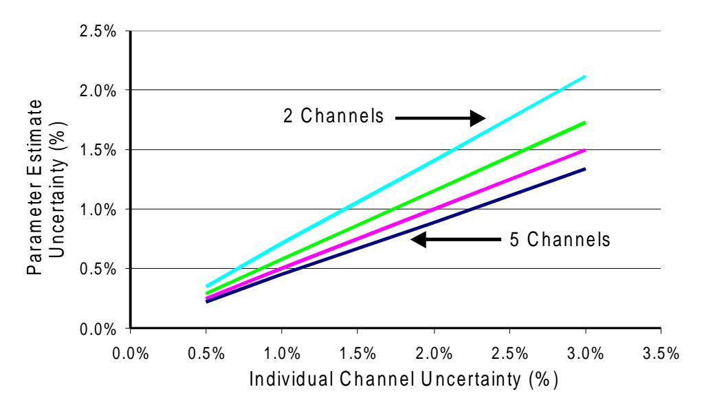

Figure 3-13
Theoretical Limit of Uncertainty for Redundant Averaged Measurements

The above discussion illustrates the variation in uncertainty even before other effects are considered. Thus, an uncertainty analysis of the parameter estimate has to differentiate between the number of redundant instruments for an averaging type of algorithm.

Another factor to consider is the individual channel uncertainty since this is part of the basis for estimating the parameter estimate uncertainty. On-line monitoring is assessing each channel's status. However, during normal plant operation, each channel's uncertainty is influenced simultaneously by the following effects:

- Process measurement effect and process element accuracy, if applicable
- Sensor reference accuracy
- Calibration as-left tolerance, measuring and test equipment (M&TE) uncertainty during the calibration, and any other calibration-related effects
- Sensor drift

- Environmental effects such as temperature variations
- Uncertainty of rack components (isolators and A/D converters)

 Individual channel uncertainties can be bounded by establishing the sensor reference accuracy, including an allowance for the as-left tolerance and M&TE uncertainty. The sensor drift is the parameter of interest during on-line monitoring and its effect can be bounded by specifying a drift limit beyond which the sensor would either require calibration or an operability evaluation.

 The on-line monitoring algorithm requires specific evaluation for an uncertainty analysis. The on-line monitoring uncertainty cannot be calculated as a static uncertainty like a setpoint uncertainty calculation; its uncertainty is dynamic and varies with the algorithm. The uncertainty analysis should consider the following:

- The method by which the parameter estimate is calculated, including the uncertainty of its inputs.
- The method by which the algorithm discriminates against the outlying channel, if applicable. For example, the EPRI Instrument Calibration Monitoring Program performs a consistency check between channels to determine if one channel's input should be excluded (see Appendix D for details). In this case, the uncertainty varies with the magnitude of the consistency check factor used to exclude outlying measurements from the parameter estimate calculation. In the case of a simple averaging algorithm, the parameter estimate is affected continuously by the outlying channel which increases the parameter estimate uncertainty.
- The acceptance criteria used to identify a channel as requiring calibration. As a channel is allowed to deviate further from the parameter estimate, the acceptance criteria uses more of the channel's drift allowance.

#### 3.4.3.2 Additional Uncertainty Associated with Single Point Monitoring

As discussed in detail in Section 3.2 and Section 8, zero shift and span shift are the predominant types of instrument drift. Furthermore, zero shift and span shift occur at all levels of drift, ranging from insignificant levels less than 0.5% of span to extreme out-of-calibration conditions greater than 20% of span. The incidence of nonlinear drift is small compared to zero and span shift. If one had to choose, zero shift is the most desirable drift type because it is readily recognizable anywhere along the instrument's span. Span shift is less desirable because an instrument might be in calibration at one point and out of calibration elsewhere along the its span.

Unfortunately, span shift does occur often enough that it requires consideration in the development of on-line monitoring acceptance criteria. Previous studies of AFAL data

(EPRI TR-103335) have also shown a tendency for instrument drift to increase with span. This effect is explained readily by the number of instances in which span shift contributes to the observed drift.

An on-line monitoring uncertainty allowance should account for the possibility of span shift or nonlinear shift effects, even when an instrument appears to be in calibration to within some specified level. Based on the results of the EPRI instrument drift study, it is recommended that on-line monitoring acceptance criteria include an allowance for single point monitoring. Section 8 describes the study results that determined the recommended allowance for single point monitoring. The results of the study are shown in Figure 3-14. Consistent with the results of Section 8, Figure 3-14 shows that monitoring a process low in the span carries a higher penalty than monitoring high in the span. Figure 3-14 also shows that higher channel drift limits improve the single point monitoring allowance.

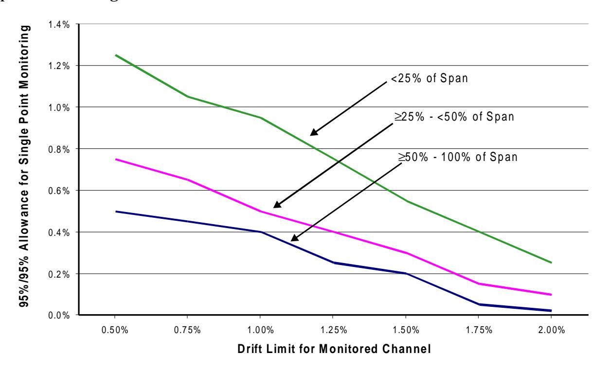

**Figure 3-14 Recommended Allowance for Single-Point Monitoring**

Referring to Figure 3-14, the following explanations of the curves is provided:

- The *<25% of Span* curve is based on 0% of span calibration data. The probability improved considerably at the 25% calibration checkpoint.
- The ≥*25%—<50% of Span* curve is based on 25% of span calibration data.

• The ≥*50%—100% of Span* curve is based on the combined 50%, 75%, and 100% of span calibration data. The probability was sufficiently low that the three points were combined for convenience.

As can be seen in Figure 3-14, the recommended allowance depends on the channel drift limit, which can vary with the monitored parameter. A minimum allowance of 0.25% is recommended even if Figure 3-14 would permit a lower allowance. In the overall uncertainty evaluation for on-line monitoring, this single point monitoring allowance should be treated as a random uncertainty; the AFAL data was centered about the mean and treating the allowance as a bias is not supported by the data.

#### **3.5 On-Line Monitoring Acceptance Criteria**

The development of acceptance criteria depends on the type of on-line monitoring algorithm selected. Section 3.5.1 discusses the typical approach for a redundant channel averaging type of algorithm such as the EPRI ICMP method. Section 3.5.2 discusses the approach for the MSET on-line monitoring method.

#### **3.5.1 Absolute Deviation from Process Parameter Estimate**

Regardless of the type of on-line monitoring redundant channel averaging algorithm, an estimate of the parameter's *true* value, or the *parameter estimate*, is calculated. Each monitored channel then is compared to the parameter estimate and its deviation from the parameter estimate represents its variation from the best estimate of the true process value. Figure 3-15 shows an example in which three redundant channels are monitored and the parameter estimate is calculated as the simple average of the three channels. Different algorithms might be used. For example, Figure 3-16 shows the same three signals in which the EPRI ICMP method is applied with Signal #1 found to be inconsistent with the other channels (and therefore excluded from the parameter estimate calculation—refer to Section 10 for additional information regarding the ICMP algorithm).

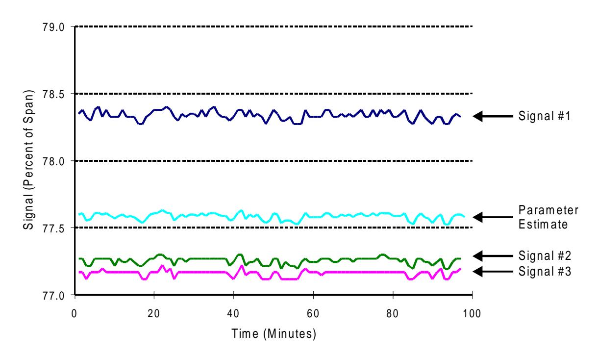

**Figure 3-15 Evaluating Redundant Channels for Drift—Simple Average**

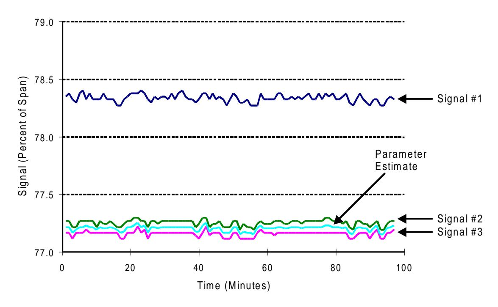

**Figure 3-16 Effect of Excluding the Outlying Channel from the Parameter Estimate**

Referring to Figures 3-15 and 3-16, each signal then would be compared to the parameter estimate. If the signal deviated from the parameter estimate by more than a specified amount (the acceptance criteria), the channel would be identified as either

needing calibration or requiring an operability evaluation. The acceptance criteria for a given parameter depends on how the parameter estimate is calculated, including its associated uncertainty. Notice in Figure 3-16 that Signal #1 varies from the parameter estimate by just over 1%. Depending on the on-line uncertainty and the allowances provided in the associated setpoint uncertainty calculations, this 1% deviation might be sufficient to require corrective action.

Section 3.4 provides additional information regarding on-line monitoring uncertainty and its effect on the recommended acceptance criteria. Refer to Section 10 for additional information regarding the ICMP algorithm.

Section 3.5.2 discusses acceptance criteria in relation to MSET. However, the principles of acceptance criteria development are the same for either MSET or an averaging type of algorithm. Refer to Section 3.5.2 for additional discussion of the acceptance criteria development.

#### **3.5.2 Relative Deviation from Process Parameter Estimate**

The method for determining appropriate acceptance criteria to use for instrument calibration evaluation in a pattern recognition based on-line monitoring implementation, such as MSET/SPRT, is explained best by using an example instrument string to illustrate how each uncertainty measured during on-line monitoring is handled and accounted for. As with redundant channel averaging implementations, the most important goal in the establishment of acceptance criteria is to ensure that it is done in a manner consistent with the plant specific safety-related instrumentation setpoint methodology and all applicable assumptions of the associated calculation(s).

A block diagram for a typical reactor coolant flow string in a B&W-type plant is shown in Figure 3-17. In this example, it is assumed that the data supplied to the MSET/SPRT software is obtained from the plant process computer.

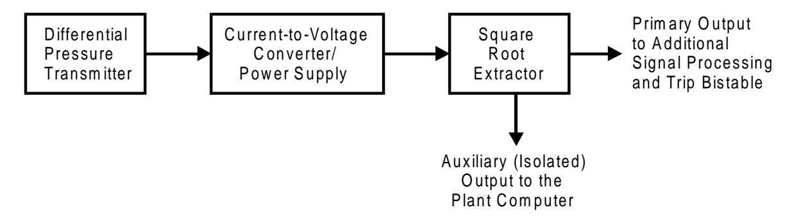

**Figure 3-17 Block Diagram of Reactor Coolant Flow String**

The first step in proper determination of on-line monitoring acceptance criteria is identification of what portion of the instrument string is being tested by the on-line monitor. In this example, since the square root extractor provides separate outputs to the bistable and to the plant computer, the on-line monitor tests from the input to the sensor through the point in the square root extractor where the signal to the computer splits off from the signal to the bistable. The next step is identification of all components not included in the safety-related part of the instrument string that are tested by the on-line monitor. In this example, the square root extractor's isolation amplifier board and the plant computer's analog-to-digital conversion circuitry fall into this category.

Once the scope of instrumentation tested by the on-line monitor has been determined, the associated uncertainties must be evaluated. This involves a review of all string error and setpoint calculations applicable to the identified instrumentation. This should include both in-house and vendor calculations that are part of the current plant design basis. If no such calculations exist, then other design basis documents should be reviewed to see if any performance requirements for the identified instrumentation can be located. If not, then the method described below should be followed using the uncertainty terms and values that would apply if a calculation were to be created.

Each identified uncertainty term associated with that portion of the instrument string being tested by the on-line monitor must be assessed for inclusion in the acceptance criteria determination. The criterion for this assessment is whether or not the methodology being used, MSET/SPRT in this example, will reflect a discrepancy between the observed parameter value and the parameter estimate that is affected by the uncertainty term in question. For instance, since MSET/SPRT depends on training data obtained from already calibrated instruments, no instrument calibration uncertainties (such as those caused by the calibration standard, the calibration equipment, or the calibration method) would be included in the acceptance criteria determination. Even if redundant instrument signals do not have the same nominal means due to differences in calibration uncertainties, they are normalized to the same mean value during initialization, thereby eliminating the impact of the calibration uncertainties on subsequent monitoring results.

Unlike instrument calibration uncertainties, instrument uncertainty during normal operation caused by reference accuracy (consisting of conformity/linearity, hysteresis, dead band, and repeatability) may be included in the acceptance criteria determination, depending on the data used to train MSET/SPRT. For our example, since the training data does not typically include exercising the reactor coolant flow strings over their calibrated span more than once, repeatability error (such as may occur if one reactor coolant pump was shut down and later started up again) would be reflected in the difference between the observed reactor coolant flow value and the reactor coolant flow estimate generated by MSET/SPRT. If evaluations of the other three elements of reference accuracy produce the same conclusion, then it is acceptable to include

uncertainty due to reference accuracy when determining acceptance criteria. It may also be acceptable to do so if the applicable calculation contains a calibration tolerance term that is greater than or equal to that portion of the reference accuracy term not reflected in the difference between the observed parameter value and the parameter estimate, and that same portion of the reference accuracy term is verified in the actual calibration procedure. (See subsection 6.2.6.2 of reference 6.1.8 for further discussion of the relationship between reference accuracy and calibration tolerance in safety-related setpoint determination.)

Instrument uncertainty during normal operation caused by temperature changes would not be included in the acceptance criteria determination unless the following conditions are satisfied:

- The training data is collected at or near the temperature conditions that existed during the most recent calibration
- The training data does not include signals from sensors that monitor the temperature conditions affecting the instrument(s) under consideration
- The range of expected temperatures during subsequent operation is relatively large compared with the difference between the temperature during training data collection and the calibration temperature assumed by the applicable calculation

 It is expected that these conditions will rarely be satisfied. Most in-containment sensors that are calibrated during cold shutdown will provide training data with the reactor at 100% power. The temperature differences between calibration conditions and full power conditions will generally be large compared with the temperature fluctuations that occur due to seasonal changes and/or normal plant operations. This is the case in the reactor coolant flow string example.

 Other instrument uncertainties during normal operation (such as those caused by power supply voltage changes, pressure changes, etc.) may also be assessed for inclusion in the determination of acceptance criteria. Beyond these uncertainty terms, and those evaluated above, instrument drift is the only other one that should be considered when acceptance criteria is determined for an MSET/SPRT on-line monitoring implementation. Drift is always appropriate to include when determining acceptance criteria. In fact, in some cases, it may be the only uncertainty term included. Drift is, by definition (see reference 6.1.6), a "... change in output over a period of time ... unrelated to the input, environment, or load", which makes it ideally suited for detection by MSET/SPRT.

 Returning to our example, the uncertainties to be included in the acceptance criteria are as follows:

- Differential pressure transmitter reference accuracy, 0.25% span
- Differential pressure transmitter drift, 1.34% span
- Current-to-voltage converter reference accuracy, 0.25% span
- Current-to-voltage converter drift, 0.15% span

 The square root extractor's reference accuracy is excluded because its calibration tolerance term cannot be shown to be greater than or equal to that portion of the reference accuracy term not reflected in the difference between the observed reactor coolant flow value and the estimated value (namely, the conformity/linearity portion). An alternate reason for excluding the square root extractor's reference accuracy (and its drift as well) is that less than the entire module is being tested by the on-line monitor. Therefore, the uncertainty terms used in the calculation may be larger than what actually applies to the portion of the module being monitored. Excluding such terms from the acceptance criteria determination is clearly conservative. In this example, the square root extractor's drift is only 0.08% span, so there's little to be gained by using engineering judgment to evaluate the acceptability of including some or all of the drift value in the determination of acceptance criteria. In other cases, however, such a drift term may be large enough to warrant the detailed circuit analysis and/or discussion with the module designer when performing this type of evaluation.

 When combining the uncertainties associated with that portion of the instrument string being tested by the on-line monitor, a method consistent with the one used in the applicable calculation must be employed. For instance, uncertainty terms combined using the square-root-sum-of-squares (SRSS) approach in the calculation may not be combined algebraically when determining on-line monitoring acceptance criteria. When no calculation exists, the guidance in reference 6.1.8 for combining uncertainties should be used. In our example, the four uncertainties involved were all treated as random and independent in the applicable calculation and therefore were combined using the SRSS method. This approach now yields the following:

Differential Pressure (dP) Error = 
$$\sqrt{(0.25)^2 + (1.34)^2 + (0.25)^2 + (0.15)^2}$$
 = 1.39% span

 Because the on-line monitor receives reactor coolant flow signals, not dp signals, the dp error must be converted into a flow error.

Flow (% span) = 
$$10 \times \sqrt{dp}$$
 (% span)

Differentiating flow with respect to dp, we get

$$\frac{d(flow)}{d(dp)} = \frac{10 \times 0.5}{\sqrt{dp \left(\% \ span\right)}} = \frac{5}{\sqrt{dp \left(\% \ span\right)}}$$

Since, in a given reactor coolant loop, operation may occur only with either one or two reactor coolant pumps (RCPs) running, and because the above equation shows that the flow error is span dependent, we will calculate separate flow errors for the two cases.

It is conservative to assume that flow with both RCPs running is 100% span, which corresponds to a dp of 100% span. Similarly, flow with only one RCP running is 50% span, which corresponds to a dp of 25% span. The above equation, when evaluated for dp = 100% span, yields

$$\frac{d(flow)}{d(dp)} = \frac{5}{\sqrt{100}} = 0.5$$

In other words, the flow error equals half the dp error. Similarly, when dp = 25% span, the flow error equals the dp error. In summary,

- Flow error (both RCPs running) = 0.5(1.39% span) = 0.69% span
- Flow error (one RCP running) = 1.39% span

These results, however, do not take into account the uncertainties associated with those components not included in the safety-related part of the instrument string that are also tested by the on-line monitor (the square root extractor's isolation amplifier board and the plant computer's analog-to-digital conversion circuitry, in our example). While it may be tempting to combine these with the uncertainties dealt with above, doing so would be non-conservative. To see this, consider the (albeit, somewhat extreme) case of a 0.5% span sensor being monitored through a 2% span isolation device. Since there is no safety significance associated with monitoring isolator drift, it would clearly be unacceptable to utilize acceptance criteria in excess of 2% span to verify safety-related (i.e., sensor) drift remains less than 0.5% span. It is, therefore, most prudent to conservatively assume these nonsafety-related components make no contribution to the determination of acceptance criteria. If an MSET/SPRT alarm is generated due solely to excessive isolator drift, an operability assessment will be triggered (see Section 4.7.3), and the ensuing evaluation will determine that the safety-related portion of the string is still functioning properly. If isolator performance is so poor that these types of evaluations are required frequently, then a better isolation device might be necessary.

There still remain two uncertainties that must be addressed and which may be accounted for either by reducing the acceptance criteria value previously calculated or by including them, between the analytical limit and the allowable value, in all applicable calculations:

- MSET parameter estimate uncertainty
- Single point monitoring uncertainty

The MSET parameter estimate uncertainty is typically less than 0.1% of the signal magnitude (see section H.4.3). For the reactor coolant flow example with both RCPs running, we can let this equal 0.1% span. Applying Figure 3-16, using a 0.69% span drift limit for the monitored channel and the "≥50% - 100% of span" curve, the recommended single point monitoring allowance is 0.46% span. Both these uncertainties should be treated as random and independent. If we choose to address them by reducing the acceptance criteria value, then we obtain the following for the case of both reactor coolant pumps running:

Reactor Coolant Flow Acceptance Criteria = 
$$\sqrt{(0.69)^2 - (0.1)^2 - (0.46)^2}$$
 = 0.50% span

This result means that applying a 0.50% span acceptance criteria to the reactor coolant flow signals when both RCPs are running provides sufficient assurance that the 0.69% span allowed deviation will not be exceeded in unmonitored parts of the instrument string's span, despite monitoring only at or near 100% of span. (Note: We could choose to account for these uncertainties in the applicable calculations, thereby keeping the acceptance criteria at 0.69% span.)

A similar approach to the case of one RCP running yields:

Reactor Coolant Flow Acceptance Criteria = 
$$\sqrt{(1.39)^2 - (0.05)^2 - (0.35)^2}$$
 = 1.34% span

These example acceptance criteria have been determined for use in the surveillance to be performed quarterly (see Section 4.6.2.2); therefore, they establish trigger points for performing operability assessments (see Section 4.7.3). In addition to these acceptance criteria, other limits must be established to flag sensors needing calibration at a convenient opportunity (e.g., the next scheduled outage). These limits must obviously be tighter than the acceptance criteria and should be established based on past instrument performance, engineering judgment, and experience with MSET/SPRT. A proper balance must be maintained between allowing sensors to drift so much without being calibrated during the next refueling outage that they become inoperable during the following operating cycle, and scheduling calibrations for the next refueling outage that are not actually necessary, thereby losing some of the benefit of on-line monitoring. It is recommended that, to start with, these limits be established in such a way that they err in the direction of scheduling calibrations that may not be necessary, rather than risk unnecessary entry into Technical Specifications Limiting Conditions for Operation. More optimal limits can be determined as experience using MSET/SPRT is gained.

#### **3.6 Implementation Strategy**

The previous sections provided the basis for on-line monitoring as a calibration assessment tool. The implementation strategy provided here is based on the previous technical discussions and is intended to assure that use of on-line monitoring continues to satisfy instrument performance requirements.

The use of on-line monitoring is intended to allow calibration extension of safetyrelated sensors. An unconditional replacement of Technical Specification periodic timedirected calibrations with only on-line monitoring is not proposed by this topical report. The following forms the basis for implementation:

- 1. At least one redundant sensor will be calibrated each fuel cycle. If identified as in need of calibration by on-line monitoring, other redundant sensors will also be calibrated. All *n* redundant safety-related channels for a given parameter will require calibration at least once within *n* fuel cycles. A Technical Specification change (described in Section 4) will be necessary to extend the calibration interval to the above frequency.
- 2. The maximum allowed interval between calibrations is 8 years, regardless of the number of redundant channels.
- 3. Some on-line monitoring algorithms allow for analytically-derived channels that have a definable relationship to the physical redundant channels. The reason for creating analytical channels is usually to improve the on-line monitoring redundancy for a given parameter. In these cases, the physical channels still have to be calibrated at the *n* fuel cycle frequency, where *n* is the number of redundant channels, with analytically-derived channels excluded.
- 4. On a quarterly basis, a formal surveillance check will be performed to verify that no channels are outside the prescribed alarm limits. The quarterly frequency was established on the basis of engineering judgment and is consistent with the Maintenance Rule evaluation frequency.
- 5. Channel checks will continue to be performed by the operators without modification to the Technical Specifications.

As stated above, at least one redundant sensor will be calibrated each fuel cycle. The purpose of this periodic calibration confirmation is as follows:

• To ensure that common-mode failure mechanisms do not exist. Note that this topical report provides confidence that such mechanisms are not expected; however, continued periodic calibration, even at the longer intervals proposed here, will

provide an additional level of confidence in the on-line monitoring approach to calibration assessment.

• To ensure that each sensor continues to be periodically calibrated by a method traceable back to a reference standard. A complete break from previous calibration methods is considered too large a step to take at this time. Note that this reason does not imply a lack of confidence in on-line monitoring. Instead, this reason is intended to reconcile on-line monitoring with existing NRC requirements for all calibrations to be traceable to an industry-recognized reference standard.

Given the above implementation strategy, the approval of on-line monitoring for use does not constitute a large change from current practices. To illustrate this point, Figure 3-18 shows the current calibration practice in which all redundant sensors are calibrated each fuel cycle and confirmed to perform with the specified as-left tolerance. Figure 3-19 shows one possible result following the proposed implementation strategy for on-line monitoring. At least one sensor will be returned to within the as-left tolerance by a formal calibration while the other sensors might be left untouched, provided that on-line monitoring did not identify any of the other channels as in need of calibration (outside the as-found tolerance). Unlike the traditional calibration method, on-line monitoring will assess channel calibration more frequently to ensure that none of the channels drift outside prescribed acceptance limits.

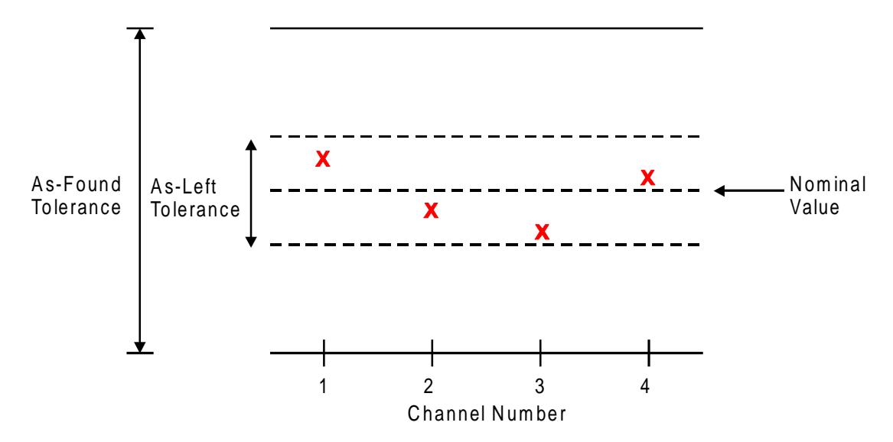

**Figure 3-18 Generalized Traditional Calibration Process**

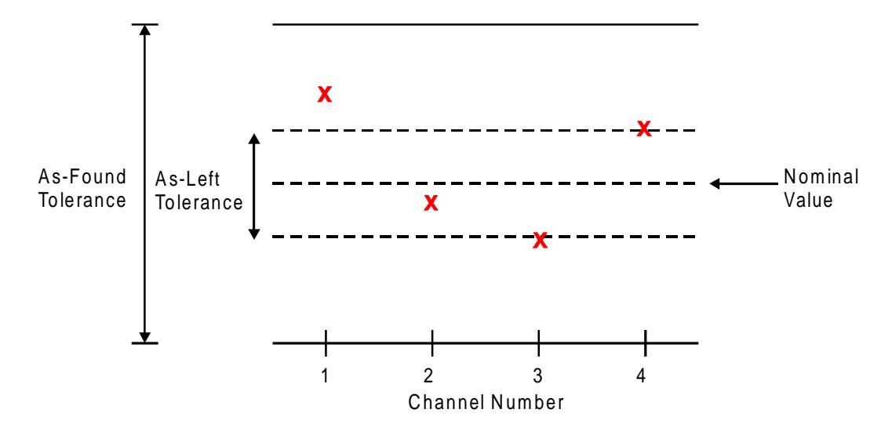

**Figure 3-19 Generalized Calibration Process with On-Line Monitoring**

Table 3-2 provides a summary comparison of the proposed implementation strategy to traditional calibration practices for sensors covered by the Technical Specifications.

**Table 3-2 Comparison of On-Line Monitoring Strategy to Traditional Calibration Practices**

| Attribute                                                            | Traditional Calibration Practice                                                                              | On-Line Monitoring Strategy                                                                                                                              |
|----------------------------------------------------------------------|------------------------------------------------------------------------------------------------------------------|-------------------------------------------------------------------------------------------------------------------------------------------------------------|
| Periodic time-directed traditional calibration of each channel | All redundant channels normally calibrated each outage.                                                    | Calibrate one of the redundant channels each outage. Calibrate any other channels identified as needing a calibration by on line monitoring. |
| Technical Specification channel check                             | Operators perform channel check by visual check of panel instruments or other control room instruments. | Operators perform channel check by visual check of panel instruments or other control room instruments. No change from current practices.    |
| On-line monitoring                                                   | None.                                                                                                            | More frequent monitoring of redundant channels with alarm points programmed for action.                                                            |
| Quarterly surveillance check                                      | None.                                                                                                            | Quarterly formal verification that 1) on-line monitoring is functioning properly and 2) no channels are beyond prescribed acceptance limits.    |

#### **3.7 Proven Applications of On-Line Monitoring Methods and Principles**

Section 3.7 discusses various implementations of on-line monitoring that have been installed or evaluated. International applications of on-line monitoring are included.

#### **3.7.1 Electricité de France Application of On-Line Monitoring for Calibration Extension**

Electricité de France (EdF) has implemented on-line monitoring at all 54 of their nuclear stations as a basis for extending calibration intervals. This implementation has also received regulatory approval by the France Safety Authority.

A 1992 study performed by the EdF Generation and Transmission Division concluded that a different approach to safety-related instrument calibration was warranted. Key findings of the study were:

- Disconnecting and reconnecting instrument tubing during transmitter calibrations had the potential to cause inadvertent damage.
- The associated calibration checks required more than 50 man days per unit per year, which represents a significant expense. For the entire EdF system of nuclear plants, this equates to an annual requirement of approximately 21,600 man hours.
- Because of the location of the transmitters, the calibrations could be performed only
  during refueling outages. However, this tended to contribute to overload of the
  maintenance staff when other maintenance-related activities also needed to be
  performed.
- Few transmitters were found to be out of calibration. About 90% of the transmitters typically were found to be in good condition.

In response to this study, EdF pursued on-line monitoring as a method of calibration extension. The EdF methodology is a form of redundant channel averaging and is applied to sensors used for pressure, level, flow, and temperature measurements.

The monitoring algorithm consists of a comparison of each channel to the average of the remaining redundant channels in accordance with the following expression:

Deviationi = 
$$x_i - \frac{x_1 + ... + x_{i-1} + x_{i+1} + ... + x_n}{n-1}$$

For example, a process that is monitored by three redundant channels would have three evaluations performed as follows:

Deviation 
$$_1 = x_1 - \frac{x_2 + x_3}{2}$$
, Deviation  $_2 = x_2 - \frac{x_1 + x_3}{2}$ , Deviation  $_3 = x_3 - \frac{x_1 + x_2}{2}$ 

Notice that a parameter estimate is not explicitly calculated by this algorithm. Instead, only the deviation of each channel from the average of the other channels is of interest. The deviation of each channel then is evaluated against acceptance criteria based on the expected channel uncertainty. The defined threshold for action was developed based upon the need to detect a drifted channel while minimizing the number of false alarms. Each channel's deviation is used as an assessment of its calibrated state. Two-standard deviation drift estimates have been developed for the monitored channels. If a channel's deviation exceeds one threshold, it is scheduled for recalibration during the

next outage. If the channel's deviation exceeds a second higher threshold, immediate corrective action is required.

The EdF on-line monitoring system is a manually-implemented system. Once per fuel cycle, just before the next outage, the process measurements are acquired by manual voltmeters in the process racks. The EdF plants are now on an 18-month fuel cycle, which means that the on-line monitoring data is acquired once every 18 months on average. The data is then entered manually into an off-line computer where the calibrated state of each channel is evaluated. Figure 3-20 shows the EdF setup for data acquisition and analysis.

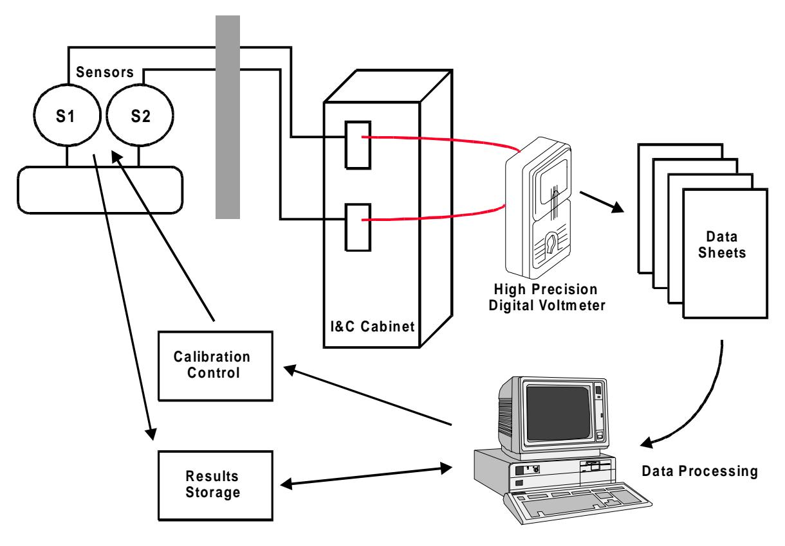

**Figure 3-20 EdF Monitoring System Setup**

The Safety Authority has approved the above on-line monitoring method and it has been implemented since early 1996 for transmitters and since late 1996 for temperature measurement devices.

At least one redundant channel continues to be calibrated each outage. Also, eight fuel cycles or 12 years is the maximum allowed time that a sensor can operate without having a traditional calibration. The calibration of at least one channel each outage is intended to ensure that common-mode drift effects are not present.

The EdF experience with the new approach to calibration has been very positive. Section 12 describes the EdF on-line monitoring system implementation and their experience to date.

#### 3.7.2 CANDU Owner's Group Experience with On-Line Monitoring

The CANDU®¹ Owner's Group (COG) has performed research into on-line monitoring as a calibration monitoring tool for CANDU plants. Although on-line monitoring has not been implemented permanently to date, the research results were very positive.

The COG evaluated on-line monitoring as a calibration assessment tool for the following reasons:

- Continuous transmitter accuracy monitoring can minimize out-of-calibration conditions while also reducing the frequency of calibration.
- On-line monitoring might enable a reduction in the frequency of process trip tests, which are labor intensive and error-prone operations. In the long-term, on-line monitoring might allow the elimination of the process trip tests and associated hardware entirely. (Refer to Section 11 for a description of a process trip test.)

Although calibration reduction and improved performance monitoring are goals of online monitoring in CANDU plants, the principal benefit is the potential reduction and eventual elimination of process trip tests. Nuclear plants in the USA are not designed for process trip testing. So, the goal of using on-line monitoring as a calibration assessment tool is similar for both CANDU and USA plants, but the perceived benefit is different for the two countries.

The COG on-line monitoring methodology uses a form of redundant channel averaging. The statistical estimate of the true process value (the parameter estimate) is obtained by averaging the available independent measurements. Some signals are identified as incorrect and are excluded from the parameter estimate calculation. The remaining channels are called the good channels ( $N_{\rm g}$  is the number of good channels) and the parameter estimate is calculated as follows:

$$\hat{x} = \frac{1}{N_g(t)} \sum_{j=1}^{N} x_j(t)$$

\_

&lt;sup>1 ® CANDU (CANada Deuterium Uranium) is a registered trademark of Atomic Energy of Canada Limited (AECL).

In the above expression, j = 1 to N of the good channels only. A consistency check is used to identify the channels that are most likely incorrect.

Differences (offsets) are obtained by subtracting individual measurements from the parameter estimate at each time step, *t*. By monitoring over time, the offset and the offset standard deviation can be determined. The offset is calculated by:

$$\overline{D}_{j} = \frac{1}{M} \sum_{t=1}^{M} (x_{j}(t) - \hat{x}(t))$$

In the above calculation of the offset, the offset is averaged over M time steps to obtain an average (or mean) offset as a function of time. The offset standard deviation is also calculated as follows:

$$\sigma_{\overline{D}_{j}} = \sqrt{\frac{1}{M} \sum_{t=1}^{M} \left( x_{j}(t) - \hat{x}(t) \right)^{2} - \overline{D}_{j}^{2}}$$

The offset standard deviation represents a statistical estimate of the offset uncertainty. An individual channel is expected to track the following relationship:

$$x_j(t) = \hat{x} - \overline{D}_j \pm \sigma_{\overline{D}_j}$$

In practice, under normal steady-state operation and during fairly severe transients, it has been found that the average offset and the offset standard deviation remain roughly constant. These two statistical parameters do not appear to change significantly with time or with operating conditions.

During the period of evaluation (1½ years), 14 transmitter calibrations were performed that could be compared directly to the predictions of the on-line monitoring system. Figure 3-21 shows the correction made during calibration (as-left minus as-found difference) for each transmitter compared to the deviation observed by the on-line monitoring system. In general, there is good agreement between the two, with the worst case deviation from the expected line of less than 0.5% of span. Perfect agreement is not expected because of the following contributors to error:

- Minor changes in calibration equipment or calibration methods
- Minor changes in conditions (such as ambient temperature changes) between the calibration time and the observations made with the channel in service
- Analog to digital conversion quantization errors in the on-line monitoring system

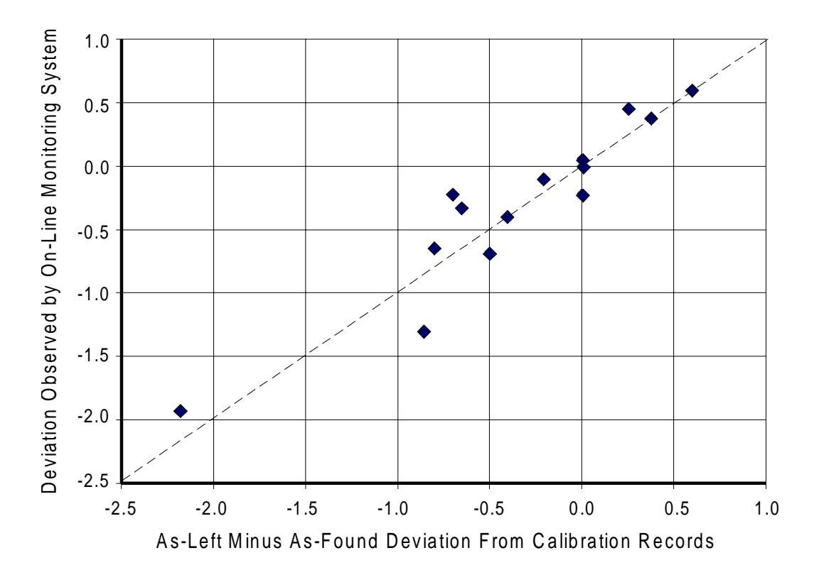

Figure 3-21
Calibration Results Compared to On-Line Monitoring Observed Deviations

Section 11 provides additional information regarding the CANDU experience with online monitoring.

#### 3.7.3 EPRI Experience with the Instrument Calibration Monitoring Program

The Instrument Calibration Monitoring Program (ICMP) is designed to compare redundant channels to determine if one or more channels have drifted beyond specified limits. ICMP's ability to detect potentially degraded instruments is based on an algorithm that preferentially discriminates against outlying measurements from a set of redundant instruments. ICMP calculates an estimate of the actual process value, referred to as the parameter estimate, by the following algorithm:

$$\hat{x} = \frac{\sum_{i=1}^{n} C_i m_i}{\sum_{i=1}^{n} C_i} \quad (i = 1, 2, ..., n)$$

where,

- *x* Parameter estimate
- *n* Number of redundant instruments in the group
- *mi* Measured value for the *i th* signal
- *Ci* A consistency number denoting how many other redundant signal values are consistent with the *i th* signal

Once the parameter estimate is calculated, each instrument's output is compared to the parameter estimate. If the instrument's output deviates from the parameter estimate by more than a user-defined limit, the instrument is identified as requiring further evaluation.

ICMP has been installed at the following nuclear plants:

- Millstone Unit 2
- V. C. Summer
- South Texas Project

In 1998, upgraded ICMP software is scheduled for installation at Catawba and V. C. Summer. Appendix D provides additional information regarding ICMP.

#### **3.7.4 Multivariate State Estimation Technique (MSET) Experience**

The Multivariate State Estimation Technique (MSET) Surveillance System is a softwarebased, highly sensitive, and accurate tool for on-line monitoring of the health of any process that has at least one sensor. MSET can detect and identify any malfunction that might occur in process sensors, components and control systems as well as changes in process operational conditions. MSET uses statistically-based pattern recognition modules that interact and operate to provide the user with information needed for the safe, reliable, and economical operation of a process by detecting, locating, and identifying subtle changes that could lead to future problems well in advance of significant degradation.

To utilize the MSET Surveillance System, all that is necessary for the user to do is collect sensor-generated data from the process under consideration that bounds all normally expected operational states. These data are used by the MSET system to establish the domain of normal process operation (i.e., "train" MSET to recognize normal behavior) and will be used in the monitoring phase to determine malfunction

incipience. During monitoring, sensor data are read by MSET, an estimate of the current state of the process is determined by comparing the measured sensor data with that obtained during training, and the difference between this state estimate and the measurement is calculated. This difference or estimation error then is analyzed by a statistically-based hypothesis test (the sequential probability ratio test or SPRT) that determines if the process is operating normally or abnormally. If an abnormal condition is detected, the initial diagnostic step identifies the cause as either a sensor degradation or an operational change in the process. When a sensor degradation is identified, MSET utilizes the estimated value of the signal from this sensor to provide a highly accurate "virtual sensor" that can be used to fully replace the function of the faulted sensor.

MSET has been used in a variety of applications. The following lists recent notable MSET activities:

- NASA has awarded a grant to adapt MSET for surveillance of instrumentation on space shuttle main launch vehicles. A recent application of MSET to safety-of-flight monitoring for the space shuttle main engine (SSME) demonstrated that MSET can significantly enhance the capabilities of the SSME engine control and monitoring system. Real-time detection of sensor signal anomalies using MSET will prevent mission threatening safety system false alarms and unnecessary engine shutdowns, ensure closed-loop control integrity to optimize engine performance and extend hardware life, and minimize the manpower, schedule, and uncertainty associated with sensor failure identification and remediation.
- A project has been initiated to install a real-time version of MSET for long-term performance valuation at the Crystal River-3 Nuclear Plant.
- A private company (under nondisclosure) licensed MSET for energy optimization of cogeneration technologies.
- A license was granted to the Illinois Institute of Technology for use in a collaborative IIT/MIT project for commercial aircraft engine noise abatement.
- The B&W Owner's Group has selected MSET as the preferred on-line monitoring technology (see Section 13).
- A real-time version of MSET has been installed in Lockheed's Integrated Testing and Equipment Laboratory as part of a demonstration project for long term surveillance of radioactive materials.

R&D Journal recently awarded MSET the 1998 R&D-100 Award for one of the top 100 technological inventions in the world for the past year. Section 14 provides detailed technical information regarding MSET and its operation.

#### **3.7.5 NRC-Funded Research on On-Line Monitoring**

The NRC funded Analysis and Measurement Services Corporation (AMS) to evaluate on-line monitoring methods. The project was conducted over a three-year period and involved both experimental and theoretical work. The experimental work included laboratory and in-plant validation tests on typical nuclear plant instrumentation systems.

The project results are published in NUREG/CR-6343, *On-Line Testing of Calibration of Process Instrumentation Channels in Nuclear Power Plants*. The conclusion of this project was that normal outputs of instrument channels in nuclear plants can be monitored over a fuel cycle while the plant is operating to determine calibration drift in the field sensors and associated signal conversion and signal conditioning equipment. Refer to NUREG/CR-6343 for additional information.

#### **3.7.6 NRC Guidance on Cross-Calibration of Resistance Temperature Detectors**

NRC Branch Technical Position (BTP) HICB-13, *Guidance on Cross-Calibration of Protection System Resistance Temperature Detectors*, provides calibration evaluation guidance that is consistent with the on-line monitoring approach proposed in this topical report. The purpose of the BTP is to identify information and methods acceptable to the NRC staff for using cross-calibration techniques for surveying the performance of resistance temperature detectors (RTDs).

One method that is acceptable to the staff, as stated in the BTP, is to periodically provide an installed reference RTD that has been calibrated recently and response time tested. The remaining similar RTDs are then cross-correlated to the reference RTD to identify any significant degradation in performance. *Similar* RTDs are those that can be shown to be subject to sufficiently similar temperature and flow conditions in the reactor coolant system. While this method does not provide for complete calibration verification of each RTD over its range, the NRC staff has found this method adequate for timely detection of drift or degradation of RTDs.

To monitor for the possibility of systematic drift or degradation, a newly calibrated RTD or a new RTD with recent calibration data should be installed at representative location(s) determined by analysis. The cross-correlation to the reference RTDs should be monitored using as found and as left data records.

The method of on-line monitoring proposed by this topical report is similar in some respects to the BTP's position for RTD cross-correlation. Some of the similarities include:

- A minimum of one RTD is calibrated each fuel cycle. The approach proposed in this topical report includes a commitment to calibrate at least one redundant sensor each fuel cycle.
- The RTDs that are included in the cross-correlation program must be shown "to be subject to sufficiently similar temperature and flow conditions in the reactor coolant system." The proposed on-line monitoring calibration approach will calibrate one redundant sensor for each parameter.
- The cross-correlated RTDs do not require calibration provided that the crosscorrelation results are acceptable. Similarly, on-line monitoring will not require calibration of the remaining redundant transmitters, provided that they meet the on-line monitoring acceptance criteria for proper performance.

There is a key difference between the NRC-approved calibration method for RTDs and on-line monitoring. RTD performance is checked by cross-correlation each refueling outage. The calibration of one redundant channel each fuel cycle as part of on-line monitoring is similar, but this topical report also includes a commitment to check the performance of the monitored channels on a quarterly basis. The on-line monitoring version of the cross-correlation is performed more frequently than specified in the BTP for RTDs.

Although there are other differences between RTD cross-correlation and the on-line monitoring approach, there is still a clear similarity between the NRC-approved method to RTD calibration and the proposed approach to on-line monitoring.

#### **3.7.7 Rosemount Transmitter Loss of Oil-Fill Monitoring**

NRC Bulletin 90-01 and Supplement 1, *Loss of Fill-Oil in Transmitters Manufactured by Rosemount*, imposed enhanced monitoring requirements for selected types of Rosemount pressure transmitters. U.S. nuclear plants responded to the requirements of this bulletin by implementing enhanced monitoring or by replacing transmitters to specifically address this particular failure mechanism. These enhanced monitoring techniques are similar to the concepts used by on-line monitoring.

#### **3.7.8 Generic Letter 91-04, Changes in Technical Specification Surveillance Intervals to Accommodate a 24-Month Fuel Cycle**

NRC Generic Letter (GL) 91-04 provides guidance to licensees on preparation of license amendments to modify surveillance intervals in support of an increased fuel cycle duration. In particular, GL 91-04 provides guidance on how to address several issues relating to quantifying and monitoring instrument drift over longer periods consistent with extended fuel cycles. This guidance provides a means to evaluate instrument drift

*Technical Basis for On-Line Monitoring as a Calibration Assessment Tool*

over longer periods to ensure that safety system setpoint calculation assumptions, with respect to drift remain bounding. On-line monitoring offers the ability to facilitate the ongoing performance monitoring program of GL 91-04.

On-line monitoring provides the capability to perform the two aspects of calibration, i.e. surveillance and adjustment, at different frequencies. Consequently, surveillance monitoring can be performed at a higher frequency that once each fuel cycle, facilitating the implementation of the guidance contained in GL 91-04. While the number of adjustments will generally decrease, the basis of this reduction is a much larger body of surveillance data (obtained through much more frequent monitoring and analysis) provided by on-line monitoring.

*4* 

### **PLANT-SPECIFIC IMPLEMENTATION**

#### **4.1 Overview**

On-line monitoring methods can be applied to any instrument channel application for which performance data is available. Specifically, the safety-related instrumentation channels of the Reactor Trip, the Engineered Safeguards Features Actuation, and Post-Accident Monitoring systems are prime candidates for field calibration reduction efforts based upon implementation of a plant-specific on-line monitoring program.

The typical on-line monitoring implementation consists of the following building blocks:

- Separate off-line computer hardware on which the system resides.
- Communications hardware and software to electronically obtain data from the plant process computer or other source, if the data is acquired automatically. Manual data acquisition can be obtained using the appropriate test equipment.
- The on-line monitoring software, which archives, analyzes, and displays the data interactively in graphs and reports.

On-line monitoring collects data from instrument channels, typically via connection to the plant computer for an automated system, or at the isolator output or appropriate test point for manual data acquisition. The collected data is processed mathematically by a dedicated off-line data acquisition and processing system to obtain estimates for the actual process parameters being measured by the monitored channels. The difference between each instrument channel and the respective process parameter estimate is calculated. This difference describes the consistency of each instrument channel with other redundant channels or other diverse plant indications and provides the means to characterize instrument performance while the plant is on-line. An acceptance criterion for the maximum allowable difference from the process parameter estimate is established, allowing determination of when the channel requires calibration or an operability evaluation.

Different on-line monitoring implementations exist on microcomputer platforms, and data is input from the plant to these systems via modem, electronic media, or manual *Plant-Specific Implementation*

input. Output capabilities typically include graphical display of the individual instrument channel deviation from the process parameter estimate as a function of time. Some automated systems are network operable and allow multiple access to the monitoring information and analysis results. Consequently, different plant staff groups can focus on specific systems of concern related to their particular responsibilities.

#### **4.2 Evaluation of Past Instrument Performance**

On-line monitoring typically will be used for one or both of the following reasons:

- Performance monitoring, including calibration assessment
- Time-directed calibration reduction by periodic calibration assessment

 Time-directed calibration reduction is the specific subject of this topical report. As part of the commissioning process of on-line monitoring, an evaluation of past instrument performance should be performed by a review of past calibration records. The assessment of past instrument performance has the following goals:

- An inherent assumption of on-line monitoring as a calibration tool in support of extending the time-directed calibration frequency is that the evaluated instruments are well behaved and rarely drift out of specified allowances. If the monitored instruments are found routinely to be out of calibration by a significant amount, the potential benefits of time-directed calibration reduction are not likely to be realized. The likely result of an on-line monitoring program should be recognized prior to implementation.
- Confirm that the instruments to be monitored have not historically exhibited a large proportion of span shift or nonlinear drift that might require particular attention during the setup of on-line monitoring. Section 3.2 and Section 8 provide additional information regarding how the nature of drift potentially affects the ability of online monitoring to detect the drift.

The above review of past calibration records does not require a detailed statistical assessment of as-found versus as-left data. Instead, the review can focus on the proportion of out-of-calibration versus in-calibration findings, including an assessment of the magnitude of the out-of-calibration conditions. A review of the calibration records can readily determine the type of drift that tends to dominate each application.

#### **4.3 Approach to Surveillance and Calibration**

On-line monitoring provides a periodic surveillance function. The calibration process, including the actual adjustment methods for instruments, will not change with the

application of on-line monitoring. Overall, on-line monitoring will have the following effects on the present calibration process:

- Periodic time-directed calibration of all safety-related instrument channels can be extended on a per-channel basis because the on-line monitoring methodology identifies specific instruments in need of adjustment. The recommendation in this topical report is for at least one redundant sensor to be calibrated each outage.
- Specific channels can be singled out for earlier-than-scheduled adjustment or maintenance in a number of ways. When a channel exhibits degrading symptoms or excessive drift, on-line monitoring will call for a calibration or an operability evaluation.
- During routine plant operations, on-line monitoring can identify long-term trends in performance, including trends that indicate degradation and eventual failure. Drift is observed as a change in the deviation of a measurement signal from the parameter estimate.

The increased monitoring sensitivity provided by on-line monitoring supports preventive maintenance planning and troubleshooting, which can increase mean time between failures. On-line monitoring also provides an added tool to initiate and support the operability assessment process. The Technical Specifications and existing plant procedures governing operability determination and any associated required actions continue to apply.

#### **4.4 Impact on Plant Procedures and Documents**

Plant procedures and documents will be affected by the implementation of on-line monitoring. The following procedures, work processes, or documents generally will need to be modified or created:

- Technical Specifications—as described in Section 4.6, Technical Specification approval will be necessary to allow longer calibration intervals for specified sensors.
- Calibration interval—the routine calibration frequency for redundant channels will be changed from once per fuel cycle to once per *n* fuel cycles, where *n* refers to the number of redundant channels in accordance with the implementation criteria of Section 3.6.
- Surveillance procedure—a formal procedure will be developed for the quarterly surveillance evaluation by on-line monitoring. This procedure should provide guidance to the user regarding how to perform the following tasks:
  - Verify that on-line monitoring is functional.

#### *Plant-Specific Implementation*

- Verify that no monitored channels are operating outside alarm limits. Required actions, such as notification of operations or an operability evaluation, should be addressed in the event that alarm limits have been exceeded.
- Verify that current plant conditions are appropriate for the surveillance. For example, plant conditions should not be outside the MSET training limits and process conditions should be stable for the parameters of interest.
- Document completion of the surveillance. Output reports from the on-line monitoring program should be included as part of the documentation.
- Setpoint documents—depending on the implementation strategy, setpoint documents might be affected by the on-line monitoring acceptance criteria. Conversely, a new document might be created that confirms the original setpoint requirements are not affected by the on-line monitoring acceptance criteria.
- On-line monitoring operation—an operating procedure, operating manual, or other type of users' guidance will be needed to ensure that future users will be able to operate the system.
- Miscellaneous—other plant documents will be affected by the existence and implementation of on-line monitoring. The number of documents will vary based on plant-specific document control systems.

#### **4.5 Setpoint Evaluation**

Setpoint calculations at nuclear plants typically include allowances for the calibration method, including test equipment uncertainty and as-left tolerance. Drift allowances also are included in the setpoint calculation. The preferred approach is to establish online monitoring acceptance criteria that remain within the existing setpoint calculation allowances for drift, calibration, and other effects. As part of initiating on-line monitoring, the on-line monitoring uncertainty and acceptance criteria will be reviewed against the setpoint calculation allowances. Refer to Sections 3.4 and 3.5 for additional information.

If necessary, provided that adequate margin is available, it might be necessary to modify the setpoint calculation. However, this is the non-preferred approach primarily because of the expense and impact on personnel associated with safety-related calculation revisions.

#### **4.6 Technical Specifications**

#### **4.6.1 Overview of What Is Requested**

Each parameter covered by the Technical Specifications has specific surveillance requirements that are performed at various frequencies. The surveillance requirements are intended to demonstrate that the associated instrumentation is operable, and actions are specified in the event that an inoperable channel is identified.

The implementation of on-line monitoring for safety-related channels within the context of this topical report represents a change from current surveillance requirements specified in the Technical Specifications. Accordingly, a Technical Specification change request to the NRC is necessary to obtain approval of the implementation.

The following changes to the Technical Specifications are anticipated to incorporate the use of on-line monitoring:

- Add a definition of on-line monitoring to Section 1 of the Technical Specifications.
- Add two new surveillance types—a quarterly surveillance check using on-line monitoring and a calibration at a *staggered test basis* interval in which one redundant channel is calibrated each fuel cycle. The staggered test basis interval is defined already in the Technical Specifications.
- Specify which parameters will utilize the new surveillance types.

The following sub-sections describe in greater detail the suggested scope of the Technical Specification change. Suggested wording is provided using the terminology of the Technical Specifications.

#### **4.6.2 Suggested Technical Specification Wording**

#### 4.6.2.1 Definition Changes

The definition of on-line monitoring should be added to Section 1 of the Technical Specifications. By this approach, on-line monitoring is one more calibration-related function and is defined, just as the Technical Specifications already include definitions for CHANNEL CALIBRATION and CHANNEL CHECK.

*Plant-Specific Implementation*

The following definition of on-line monitoring is recommended:

ON-LINE MONITORING ON-LINE MONITORING is the assessment of channel performance and calibration while the channel is operating. ON-LINE MONITORING differs from CHANNEL CALIBRATION in that the channel is not adjusted by the process of ON-LINE MONITORING. Instead, ON-LINE MONITORING compares channel performance to established acceptance criteria to determine if a CHANNEL CALIBRATION is necessary.

#### 4.6.2.2 Addition of New Surveillance Types

In terms of the Technical Specifications, two surveillance-related activities require new definitions:

- On a quarterly basis, a formal surveillance check will be performed to verify that no channels are outside the prescribed acceptance limits.
- At least one redundant transmitter will be calibrated each fuel cycle. If identified as in need of calibration by on-line monitoring, other redundant transmitters also will be calibrated. All *n* redundant safety-related channels for a given parameter will require calibration at least once within *n* fuel cycles. This concept is already present in the Standard Technical Specifications via the existing definition of *staggered test basis*:

 A STAGGERED TEST BASIS shall consist of the testing of one of the systems, subsystems, channels, or other designated components during the interval specified by the Surveillance Frequency, so that all systems, subsystems, channels, or other designated components are tested during *n* Surveillance Frequency intervals, where *n* is the total number of systems, subsystems, channels, or other designated components in the associated function.

 Note: The above definition of *staggered test basis* was obtained from the Standard Technical Specifications. This definition appears to be the same for Westinghouse, Combustion Engineering, Babcock & Wilcox, and General Electric Standard Technical Specifications. However, older Technical Specifications might use a different definition. In these cases, the concept still applies, but additional changes to the Technical Specifications might be necessary to accommodate the addition of this definition.

 In accordance with the implementation strategy described in Section 3.6, it is proposed that all redundant channels be calibrated every *n* fuel cycles in accordance with the above definition, but also that all redundant channels be calibrated at least once every eight years. Accordingly, the following sentence is recommended to be added to the end of the existing definition of STAGGERED TEST BASIS:

 Furthermore, for systems, subsystems, channels, or other designated components that are tested by ON-LINE MONITORING, all *n* systems, subsystems, channels, or other designated components will be tested at a frequency not to exceed eight years, regardless of the size of *n*.

 The following new surveillance requirement definitions listed below are recommended. The surveillance requirement numbers, 3.3.1.17 and 3.3.1.18, are the next available numbers in the Westinghouse Standard Technical Specifications and are used for the purposes of illustration only; each plant will have to insert the appropriate surveillance numbers for their Technical Specifications.

### **SURVEILLANCE FREQUENCY** SR 3.3.1.17 Perform ON-LINE MONITORING evaluation. [92] days SR 3.3.1.18 Perform CHANNEL CALIBRATION [18] months on a STAGGERED TEST BASIS

 The frequency of [92] days is intended to match the Technical Specification layout for quarterly checks. The frequency of [18] months is a plant-specific number that depends on the approved fuel cycle duration. Depending on the plant, the frequency in this case might be 12, 18, or 24 months.

 The definition of on-line monitoring was provided in the previous section. The channel calibration will rely on the existing Technical Specification definition; a typical definition of channel calibration is as follows:

 A CHANNEL CALIBRATION shall be the adjustment, as necessary, of the channel so that it responds within the required range and accuracy to known input. The CHANNEL CALIBRATION shall encompass the entire channel, including the required sensor, alarm, interlock, display, and trip functions. The CHANNEL CALIBRATION may be performed by means of any series of sequential,overlapping calibrations or total channel steps, so that the entire channel is calibrated.

In summary, one redundant channel will be calibrated each refueling cycle and all redundant channels will be calibrated at an interval not to exceed eight years. The following examples illustrate the interpretation of this Technical Specification.

Example: A plant on an 18-month fuel cycle with three redundant instruments for a given parameter would, as a minimum, calibrate at the following frequency:

 First channel: 18 months Second channel: 36 months Third channel: 54 months

*Plant-Specific Implementation*

Note that all redundant channels are calibrated within four years in this case.

Example: A plant on a 24-month fuel cycle with five redundant instruments for a given parameter would, as a minimum, calibrate at the following frequency:

 First channel: two years Second channel: four years Third channel: six years Fourth channel: eight years Fifth channel: eight years

Note that all redundant channels are calibrated within eight years in this case, and the last two channels are calibrated during the fourth fuel cycle to remain within the eightyear limit.

#### 4.6.2.3 Example Change to Reactor Trip System Instrumentation Table

The new surveillance requirements would be implemented on a parameter-byparameter basis, in the same manner as already existing for other Technical Specification surveillance requirements. Table 4-1 shows a typical parameter that could be included in on-line monitoring. The existing surveillance requirement (SR 3.3.1.10) for a channel calibration each fuel cycle has been deleted and the two new surveillance requirements (highlighted) have been added.

**Table 4-1 Example Surveillance Requirements for Westinghouse Standard Technical Specifications**

Table 3.3.1-1 Reactor Trip System Instrumentation

| Function                       | Applicable Modes or Other Specified Conditions | Required Channels | Conditions | Surveillance Requirement s                                                     | Allowable Value | Trip Setpoint |
|--------------------------------|------------------------------------------------------------|----------------------|------------|--------------------------------------------------------------------------------------|--------------------|------------------|
| Pressurizer Pressure Low | 1(g)                                                       | [4]                  | M          | SR 3.3.1.1 SR 3.3.1.7 SR 3.3.1.10 SR 3.3.1.16 SR 3.3.1.17 SR 3.3.1.18 | ≥[1886] psig    | ≥[1900] psig  |

For each parameter that will be included in the on-line monitoring program, a similar change to the Technical Specifications would be made.

#### 4.6.2.4 Technical Specification Bases

The Technical Specifications provide bases for the surveillance requirements. The following bases are recommended for the new surveillance requirements for on-line monitoring.

#### SR 3.3.1.17

SR 3.3.1.17 verifies that all channels for a given parameter are performing within the acceptance criteria established for on-line monitoring. Refer to EPRI Topical Report TR-104965, *On-Line Monitoring of Instrument Channel Performance*, for further information regarding on-line monitoring.

#### SR 3.3.1.18

SR 3.3.1.18 performs a CHANNEL CALIBRATION on a STAGGERED TEST BASIS. The performance of SR 3.3.1.17 on a [92] day frequency provides assurance that the monitored channels are performing within specified acceptance criteria and forms the basis for performing a CHANNEL CALIBRATION at an extended calibration interval. For *n* redundant channels, all channels for a given parameter will require a CHANNEL CALIBRATION at least once every *n* fuel cycles, with at least one channel receiving a CHANNEL CALIBRATION each fuel cycle. Furthermore, all *n* channels require calibration at a frequency not to exceed 8 years, regardless of the size of *n*. Refer to EPRI Topical Report TR-104965, *On-Line Monitoring of Instrument Channel Performance*, for further information regarding the basis for this calibration extension.

#### **4.6.3 Checklist for Technical Specification Change Submittal**

This topical report is intended to facilitate the Technical Specification change process. However, each plant still has to address certain plant-specific aspects related to the change. The following provides a summary of the items to address in each plantspecific submittal:

- Scope—the safety-related channels covered by the submittal should be clearly identified. The selected channels should be suitable for on-line monitoring in accordance with the criteria provided in this report (see Sections 3.2 and 3.3).
- On-line monitoring methodology—the on-line monitoring algorithm, method of data acquisition, data analysis process, and alarm process should be described.
- Deviations from NRC Safety Evaluation Report (SER)/EPRI topical report—this topical report is intended to serve as the vehicle for obtaining an SER for the approval of on-line monitoring. The NRC SER is expected to apply specifically to

#### *Plant-Specific Implementation*

this topical report. Exceptions to or deviations from the SER should be clearly identified and explained. For example, the on-line monitoring algorithm might be different than the types described in this topical report. The differences from any SER discussion should be justified.

- Setpoint and uncertainty analysis verification—the implementation of on-line monitoring has to include acceptance criteria for each parameter that do not invalidate setpoint requirements. The submittal should state that an evaluation has been performed for this purpose.
- Plant procedure impact—the submittal should note that a plant-specific procedure impact assessment has been completed. This includes the quarterly surveillance procedure for the assessment of on-line monitoring.
- Quality assurance—confirm that the plant-specific software quality assurance requirements have been satisfied for the selected on-line monitoring methodology.
- For any plants that have eliminated response time testing based on the periodic performance of calibrations, evaluate the associated commitments in this area with respect to the impact of extended calibration intervals associated with on-line monitoring.

#### **4.7 Actions upon Detection of a Drifted Channel**

A three-region calibration assessment is proposed for the on-line monitoring process as shown in Figure 4-1. For each monitored parameter, an acceptable deviation from the parameter estimate has to be established. Beyond this acceptable deviation, calibration will be required. The urgency of calibration will depend on the amount of deviation; beyond a certain deviation, immediate action will be required in accordance with Technical Specification action statements.

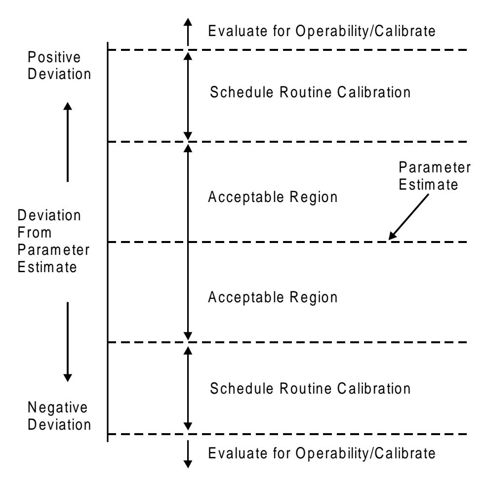

**Figure 4-1 Alarm Monitoring Points**

The following sections provide additional guidance regarding the performance evaluation process.

#### **4.7.1 Acceptable Region**

As discussed in Section 3, acceptance criteria have to be established for each monitored parameter. If a given channel remains within the acceptance band, no calibration action is necessary for the monitored sensor unless that channel was already scheduled for its periodic calibration.

#### **4.7.2 Schedule Routine Calibration**

If a channel's deviation exceeds a certain pre-defined limit, calibration will be necessary. However, provided that the deviation does not exceed channel operability limits, the urgency of calibration might not be critical. In this case, a routine calibration *Plant-Specific Implementation*

can be scheduled. For example, the transmitter might be added to the outage work plan or it might be scheduled for a routine calibration if accessibility is not an issue during power operation.

#### **4.7.3 Operability Assessment**

If a channel's deviation exceeds a pre-defined acceptance limit, the channel has to be evaluated for operability and corrective actions taken as directed by the Technical Specifications. The operability assessment should consider the guidance provided in Generic Letter 91-18, Revision 1, *Information to Licensees Regarding NRC Inspection Manual Section on Resolution of Degraded and Nonconforming Conditions*.

As part of any operability assessment, it should be noted that the on-line monitoring signal path includes additional devices besides the sensor that are also potentially subject to drift or failure; consider checking the accessible portions of the instrument loop before checking the sensor.

#### **4.8 Ongoing Calibration Monitoring Program**

In the context of this topical report, on-line monitoring has been presented as a basis for extending time-directed calibration intervals for safety-related instrumentation. In support of the longer calibration intervals, an evaluation process should be established to confirm that instrument performance continues to be acceptable. The concept here is similar, in some respects, to the ongoing monitoring program for 2-year fuel cycles as discussed in NRC Generic Letter 91-04, *Changes in Technical Specification Surveillance Intervals to Accommodate a 24-Month Fuel Cycle*.

The aspects of an ongoing monitoring program that are of importance to on-line monitoring include the following:

- Does sensor drift exceed allowable tolerances at the longer calibration interval?
- Does the periodic calibration of redundant sensors identify calibration errors that were not detected by on-line monitoring?

 Some caution in the above evaluations is also warranted. A direct correlation between the observed performance and the calibration records might not always be observed. Remember that the on-line monitoring system is monitoring the operational status of a parameter, from the process to the display, which is different from the results that might be observed when calibrating a sensor. Key differences between the two are:

• On-line monitoring is evaluating the process signal from the process to the display. The sensor is only part of this loop.

*Plant-Specific Implementation*

- A sensor calibration does not include process measurement and potentially some environmental effects that are included in on-line monitoring.
- Sensors are exposed to a different set of environmental and operating conditions as the plant shuts down, cools down, and depressurizes. On-line monitoring might not be functioning during the plant shutdown period and would not observe these changes.

# *5*

### **CONCLUSIONS**

This topical report provides a basis for on-line monitoring as a calibration assessment tool and establishes the recommended implementation criteria for safety-related applications.

Section 3 provided the technical basis for on-line monitoring. The appendices to this report further amplify the abilities of on-line monitoring. In particular, the following appendices provide key data in support of on-line monitoring:

- Section 8—Instrument Drift Characteristics
- Section 9—Statistical Analysis Considerations Regarding Instrument Performance
- Section 10—EPRI Experience With On-Line Monitoring
- Section 11—CANDU Owners Group Experience With On-Line Monitoring
- Section 12—Electricitè de France Experience With On-Line Monitoring
- Section 13—B&W Owners Group Evaluation of On-Line Monitoring Design Approaches
- Section 14—Multivariate State Estimation Technique

Also, the references listed in Section 6 provide additional information in support of some the above appendices.

Implementation issues have been considered by this topical report as described in Section 4. The use of on-line monitoring is intended to allow calibration extension of safety-related transmitters. An unconditional replacement of Technical Specification periodic time-directed calibrations with only on-line monitoring is not proposed by this topical report. The following summarizes the topical report's position for implementation:

1. At least one redundant transmitter will be calibrated each fuel cycle. If identified as in need of calibration by on-line monitoring, other redundant transmitters also will be calibrated. All *n* redundant safety-related channels for a given parameter will

#### *Conclusions*

- require calibration at least once within *n* fuel cycles. A Technical Specification change will be necessary to extend the calibration interval to the above frequency.
- 2. The maximum allowed interval between calibrations is eight years, regardless of the number of redundant channels.
- 3. Some on-line monitoring algorithms allow for analytically-derived channels that have a definable relationship to the physical redundant channels. The reason for creating analytical channels is usually to improve the on-line monitoring redundancy for a given parameter. In these cases, the physical channels still have to be calibrated at the *n* fuel cycle frequency, where *n* is the number of redundant channels, with analytically-derived channels excluded.
- 4. On a quarterly basis, a formal surveillance check will be performed to verify that no channels are outside the prescribed alarm limits. The quarterly frequency was established on the basis of engineering judgment and is consistent with the Maintenance Rule evaluation frequency.
- 5. Channel checks will continue to be performed by the operators without modification to the Technical Specifications.

The combination of technical discussion and implementation guidance provided in this topical report forms the basis for on-line monitoring of safety-related channels. Overall, the implementation of on-line monitoring is considered an improvement to plant operation. While on-line monitoring can result in a reduced number of field calibrations, channel performance is monitored far more frequently compared to current time-directed calibration practices. As such, abnormal, degrading, or otherwise unacceptable channel performance can be identified more rapidly than is currently achieved through traditional time-directed calibration programs. Additionally, several other benefits derive from on-line monitoring:

- Development of long-term trends in instrument performance
- Enhanced instrument troubleshooting capabilities
- Additional resource for historical root-cause analyses and post-trip reviews
- Assessment of instrument health

# *6*

### **REFERENCES**

#### **6.1 References**

- 1. *Instrument Calibration Reduction Program.* EPRI, Palo Alto, CA: March 1991. Report NP-7207-CCML.
- 2. *Guidelines for Instrument Calibration Extension/Reduction Programs.* EPRI, Palo Alto, CA: March 1994. Report TR-103335.
- 3. *Instrument Calibration and Monitoring Program, Volume 1: Basis for the Method.* EPRI, Palo Alto, CA: December 1993. Report TR-103436-V1.
- 4. *Instrument Calibration and Monitoring Program, Volume 2: Failure Modes and Effects Analysis.* EPRI, Palo Alto, CA: December 1993. Report TR-103436-V2.
- 5. *IPASS User's Guide, Instrument Performance Analysis Software System.* EPRI, Palo Alto, CA: August 1996. Report AP-106752.
- 6. ANSI/ISA Standard ISA-S51.1-1979. Process Instrumentation Terminology. Approved December 1979.
- 7. ISA Standard ISA-S67.04 Part I. Setpoints for Nuclear Safety-Related Instrumentation. Approved September 1994.
- 8. ISA Recommended Practice ISA-RP67.04 Part II. Methodologies for the Determination of Setpoints for Nuclear Safety-Related Instrumentation. Approved September 1994.
- 9. Regulatory Guide 1.105, Rev. 2. *Instrument Setpoints for Nuclear Safety-Related Systems*. U.S. Nuclear Regulatory Commission, February 1986.
- 10. NRC Branch Technical Position HICB-13. *Guidance on Cross-Calibration of Protection System Resistance Temperature Detectors*.
- 11. NRC Bulletin 90-01. Loss *of Fill-Oil in Transmitters Manufactured by Rosemount*. March 1990. Supplement 1. *Loss of Fill-Oil in Transmitters Manufactured by Rosemount*. December 1992.

- 12. NRC Generic Letter 91-04. *Changes in Technical Specification Surveillance Intervals to Accommodate a 24-Month Fuel Cycle*. April 2, 1991.
- 13. Generic Letter 91-18, Revision 1. *Information to Licensees Regarding NRC Inspection Manual Section on Resolution of Degraded and Nonconforming Conditions*.
- 14. NRC Information Notice 95-13, Supplement 1. *Potential for Data Collection Equipment to Affect Protection System Performance*. November 22, 1995.
- 15. ANSI/IEEE Std. 338-1987. IEEE Standard Criteria for the Periodic Surveillance Testing of Nuclear Power Generating Station Safety Systems. March 1988.
- 16. C. Eisenhart, "Realistic Evaluation of the Precision and Accuracy of Instrument Calibration Systems," *Journal of Research of the National Bureau of Standards - C. Engineering and Instrumentation*, Vol. 67C, No. 2 (1963).
- 17. T. Doiron, "Drift Eliminating Designs for Non-Simultaneous Comparison Calibrations," *Journal of Research of the National Institute of Standards and Technology,* Vol. 98, No. 2 (1993).
- 18. W.J. Youden, "Uncertainties in Calibration," Paper No. 3.1, presented at the 1962 International Conference on Precision Electromagnetic Measurements (August 1962).
- 19. NUMARC 93-01. Industry Guidelines for Monitoring the Effectiveness of Maintenance at Nuclear Power Plants. May 1993.
- 20. "Requirements for Monitoring the Effectiveness of Maintenance at Nuclear Power Plants" (The Maintenance Rule). 10 CFR 50.65.
- 21. Ronald E. Walpole and Raymond H. Myers. *Probability and Statistics for Engineers and Scientists.* MacMillan Publishing Company, 1993.
- 22. Gerald J. Hahn and William Q. Meeker. *Statistical Intervals, A Guide for Practitioners.* John Wiley & Sons, Inc., 1991.
- 23. Harrison M. Wadsworth. *Handbook of Statistical Methods for Engineers and Scientists.* McGraw-Hill Publishing Company, 1990.
- 24. Mary Gibbons Natrella. *Experimental Statistics*. National Bureau of Standards Handbook 91, 1963.

#### **6.2 Bibliography of On-Line Monitoring Reports and Industry Papers**

#### **6.2.1 EPRI Documents**

- 1. *Instrument Calibration and Monitoring Program, Volume 1: Basis for the Method.* TR-103436-V1. Palo Alto, CA: EPRI, December 1993.
- 2. *Instrument Calibration and Monitoring Program, Volume 2: Failure Modes and Effects Analysis.* TR-103436-V2. Palo Alto, CA: EPRI, December 1993.
- 3. *Instrument Calibration Reduction Program.* NP-7207-CCML. Palo Alto, CA: EPRI, March 1991.
- 4. Rusaw, Richard. "V. C. Summer Nuclear Station Instrumentation Calibration and Monitoring Program," presented at the October 1994 EPRI/Utility On-Line Monitoring Working Group meeting.

#### **6.2.2 NUREG Reports**

- 1. NUREG/CR-5903. Validation of Smart Sensor Technologies for Instrument Calibration Reduction in Nuclear Power Plants. January 1993.
- 2. NUREG/CR-6343. On-Line Testing of Calibration of Process Instrumentation Channels in Nuclear Power Plants. November 1995.

#### **6.2.3 CANDU Nuclear Plant Related Papers**

- 1. Hinds, H. W., "On-Line Assessment of Safety-System Transmitter Accuracy," presented at the November 1996 CANDU System and Equipment Surveillance Program Workshop.
- 2. Hinds, H. W. and R. MacKay, "Evaluation of CANDU Safety-System Calibration Accuracy Through Monitoring," presented at the 1995 CANDU Maintenance Conference.

#### **6.2.4 Electricité de France (EDF) Reports**

- 1. *Surveillance of Sensors by Analytical Redundancy; Analysis and Preliminary Results from Cattentom 3* (translated from the French title). EDF Technical Report HP-27/93.04. April 1993.
- 2. *Evaluation of Sensor Surveillance Methods in French Power Plants* (translated from the French title). EDF Technical Report HP-27/93/036. December 1993.

#### *References*

- 3. *Signal Validation for Redundant Instrument Channels* (translated from the French title). EDF Technical Report D4002-42-54/93-5079. March 1994.
- 4. *Detection of Sensor Degradation Through Analytical Redundancy* (translated from the French title). EDF Technical Report HP-27/94/030. November 1994.
- 5. Dorr, Richard, Frederic Kratz, Jose Ragot, Francois Loisy, and Jean-Luc Germain. "Detection, Isolation, and Identification of Sensor Faults in Nuclear Power Plants," *IEEE Transactions on Control Systems Technology,* January 1997.
- 6. Dupuis, Eric "Preventive Maintenance and Degradation Detection of Operation Sensors Using Redundance Analysis." Presented at the May 1998 EPRI/Utility On-Line Monitoring Working Group meeting.
- 7. Loisy, Francois "Preventive Maintenance and Degradation Detection of Operation Sensors Using Redundance Analysis—Principle of the Method." Presented at the May 1998 EPRI/Utility On-Line Monitoring Working Group meeting.

#### **6.2.5 B&W Owners Group Reports**

1. *Evaluation of Instrumentation Calibration Reduction Methodologies*. B&W Owners Group ICR Working Group Report 47-5001013-00. January 1998.

#### **6.2.6 Multivariate State Estimation Technique Papers and Publications**

- 1. Bevington, P. R. *Data Reduction and Error Analysis for the Physical Sciences.* McGraw-Hill Book Co., New York, NY, 1969.
- 2. Cormen, T. H., C. E. Leiserson, and R. L. Rivest. *Introduction to Algorithms.* MIT Press, Cambridge, MA, 1992.
- 3. D'Agostino, R. B. and M. A. Stephans. *Goodness-of-Fit Techniques.* Marcel Dekker, Inc., New York, NY, 1986.
- 4. Dickey, D. A. and J. C. Brocklebank. "Checking for Autocorrelation in Regression Residuals." *Proceedings of 11th SAS Users Group International Conference*, I:959, Atlanta, GA, February 9–12, 1986.
- 5. Fuller, W. A. *Introduction to Statistical Time Series.* John Wiley & Sons, New York, NY, 1976.
- 6. Gross, K. C. and K. K. Hoyer. "Reactor Parameter Signal Simulator." *Fourth International Conference on Simulation Methods in Nuclear Engineering,* Vol. I, Session 3C, Montreal, Canada, June 2–4, 1993.

- 7. Gross, K. C. and K. K. Hoyer. "Spectrum-Transformed Sequential Testing Method for Signal Validation Applications." *Proceedings of 8th Power Plant Dynamics, Control & Testing Symposium*, I:36.01, Knoxville, TN, May 27–29, 1992.
- 8. Gross, K. C., K. K. Hoyer, and K. E. Humenik. "Systems for Monitoring an Industrial Process and Determining Sensor Status." U. S. Patent no. 5,459,675, October 17, 1995.
- 9. Gross, K. C. and K. E. Humenik. "Sequential Probability Ratio Test for Nuclear Plant Component Surveillance." *Nuclear Technology*, 93:131, February 1991.
- 10. Gross, K. C., R. M. Singer, K. E. Humenik, and M. Walsh. "Expert System for Reactor Coolant Pump Surveillance." *Proceedings of 1990 International Fast Reactor Safety Meeting*, III:359, Snowbird, UT, August 12–16, 1990.
- 11. Gross, K. C., R. M. Singer, S. W. Wegerich, J. P. Herzog, R. VanAlstine, and F. Bockhorst. "Application of a Model-Based Fault Detection System to Nuclear Plant Signals." *Proceedings of 9th International Conference on Intelligent Systems Applications to Power Systems,* Seoul, Korea, July 6–10, 1997.
- 12. Gross, K. C. and R. V. Strain. "Sinusoidal Source Perturbation Experiments with a Breached Fuel Subassembly in the Experimental Breeder Reactor II." *Nuclear Technology*, 98:113, April 1992.
- 13. Herzog, J. P., S. W. Wegerich, K. C. Gross, and F. K. Bockhorst. "MSET Modeling of Crystal River-3 Venturi Flow Meters." *Proceedings of 6th ASME/JSME/SFEN International Conference on Nuclear Engineering (ICONE-6),* San Diego, CA, May 10–15, 1998.
- 14. Herzog, J. P., Y. Yue, and R. L. Bickford. "Dynamics Sensor Validation for Reusable Launch Vehicle Propulsion." *Proceedings of 34th AIAA/ASME/SAE/ASEE Joint Propulsion Conference,* Cleveland, OH, July 13–15, 1998.
- 15. Hoyer, K. K. and K. C. Gross. "Spectral Decomposition and Reconstruction of Nuclear Plant Signals." *Proceedings of 18th SAS Users Group International Conference,* pp 1153-1158, New York, NY, May 9–12, 1993.
- 16. Humenik, K. E. and K. C. Gross. "Sequential Probability Ratio Tests for Reactor Signal Validation and Sensor Surveillance Applications." *Nuclear Science and Engineering*, 105:383, August 1990.
- 17. Humenik, K. E. and K. C. Gross. "Using Fourier Series Methods to Reduce Correlation of Nuclear Power Reactor Data." *Nuclear Science and Engineering*, 112:127, October 1992.

- 18. King, R. W. and R. M. Singer. "Development and Application of Diagnostic Systems to Achieve Fault Tolerance." *Proceedings of 7th Power Plant Dynamics, Control & Testing Symposium*, I:35.01, Knoxville, TN, May 15–17, 1989.
- 19. Miron, A., S. W. Wegerich, F. Yue, K. C. Gross, and J. Christenson. "Effects of Parameter Variation on MSET Models of the Crystal River-3 Feedwater Flow System." *Transactions of American Nuclear Society*, Nashville, TN, June 1–6, 1998.
- 20. Miron, A., S. W. Wegerich, F. Yue, K. C. Gross, and J. Christenson. "Fault-Tolerance Improvement for a MSET Model of the Crystal River-3 Feedwater Flow System." *Proceedings of IEEE Nuclear Energy Symposium*, Toronto, Nov. 1998.
- 21. Mott, J. and P. Blanch. "Feedwater Flow Estimation via Sample-Based Modeling." *Proceedings of 8th Power Plant Dynamics, Control & Testing Symposium*, II:85.01, Knoxville, TN, May 27–29, 1992.
- 22. Mott, J., R. King, and W. Radtke. "A Generalized System State Analyzer for Plant Surveillance." *Artificial Intelligence and Other Innovative Computer Applications in the Nuclear Industry*, M. Majumdar et al., eds., Plenum Press, New York, NY, 1988.
- 23. Singer, R. M., K. C. Gross, J. P. Herzog, R. W. King, and S. W. Wegerich. "Model-Based Nuclear Power Plant Monitoring and Fault Detection: Theoretical Foundations." *Proceedings of 9th International Conference on Intelligent Systems Applications to Power Systems,* Seoul, Korea, July 6–10, 1997.
- 24. Singer, R. M., Gross, and K. E. Humenik. "Pumping System Fault Detection and Diagnosis Utilizing Pattern Recognition and Fuzzy Inference Techniques." *Proceedings of 4th International Conference on Industrial and Engineering Applications of AI and Expert Systems*, Kauai, HA, June 2–5, 1991.
- 25. Singer, R. M., K. C. Gross, K. E. Humenik, and M. Walsh. "Reactor Coolant Pump Monitoring and Diagnostic System." *Proceedings of 2nd International Machinery Monitoring and Diagnostic Conference*, I:19, Los Angeles, CA, October 22–25, 1990.
- 26. Singer, R. M., K. C. Gross and R. W. King. "Analytical Enhancement of Automotive Sensory System Reliability." *Proceedings of World Congress on Neural Networks*, San Diego, CA, June 4–9, 1994.
- 27. Singer, R. M., K. C. Gross, R. W. King, and S. Wegerich. "A Pattern-recognitionbased, Fault-tolerant Monitoring and Diagnostic Technique." *Proceedings of 7th Symposium on Nuclear Reactor Surveillance and Diagnostics (SMORN VII),* 2:13, Avignon, France, June 19–23, 1995.

- 28. Singer, R. M., K. C. Gross, and S. Wegerich. "A Fault-Tolerant Sensory System for Intelligent Vehicle Applications." *Proceedings of IEEE Intelligent Vehicles Symposium,* 95 1:176, Detroit, MI, September 25–26, 1995.
- 29. Singer, R. M., K. C. Gross, S. W. Wegerich, J. P. Herzog, R. Van Alstine, and F. K. Bockhorst. "Power Plant Surveillance and Fault Detection: Applications to a Commercial LWR." *Proceedings of IAEA Technical Meeting on Advanced Technology Improving Availability and Reliability of LWRs*, Argonne, IL, Sept 8–12, 1997.
- 30. Wald, A. *Sequential Analysis.* John Wiley & Sons, New York, NY, 1947.

#### **6.2.7 Miscellaneous Papers**

- 1. "The Development of a Signal Validation Scheme for the Redundant Multi-Channel Measurement System." Presented at the 9th Power Plant Dynamic Control and Testing Symposium, 1995.
- 2. Fantoni, F. P. and Mazzola, A. "Transient and Steady State Signal Validation in Nuclear Power Plants Using Autoassociative Neural Networks and Pattern Recognition." Presented at the 7th Symposium on Nuclear Reactor Surveillance and Diagnostics, Avignon, France, June 19–23, 1995.
- 3. Hashemian, H. M. and Riner, J. L. "On-Line Testing of Calibration of Pressure Transmitters in Nuclear Power Plants." Presented at the Third International Joint ISA POWID/EPRI Controls and Instrumentation Conference, 1993.
- 4. Hashemian, H. M. "Minimizing the Cost of Instrument Calibrations in Nuclear Power Plants." Presented at the Fourth International Joint ISA POWID/EPRI Controls and Instrumentation Conference, 1994.
- 5. *Signal Validation of Feedwater Flow Sensors*. OECD Halden Reactor Project Report HWR-328, February 1993.

*7* 

### **APPENDIX A: GLOSSARY**

The definitions provided in this appendix were obtained from the references listed in the report or were created during the course of the project. Abbreviations used in the body of the report are included in the glossary

**95%/95%** – Standard statistics term meaning that the results have a 95 percent probability with a 95 percent confidence.

**A**

**A/E** – Architect/Engineer.

**Accuracy (Reference)** – In-process instrumentation, a number or quantity that defines a limit that error should not exceed when a device is used under specified operating conditions. Error represents the difference between the measured value and the standard or ideal value.

**Adjustment** – The activity of physically adjusting a device to leave it in a state in which its performance characteristics are within acceptable limits.

**AFAL** – As-found minus as-left.

**ANN** – Artificial neural network.

**As-Found** – The condition in which a channel, or portion of a channel, is found after a period of operation and prior to any calibration.

**As-Found Tolerance** – The tolerance allowed in accuracy between calibrations of a device, group of devices, or loop. The as-found tolerance establishes the unit of error the defined devices can have and still be considered functional.

**As-Left** – The condition in which a channel, or portion of a channel, is left after calibration or surveillance check.

**As-Left Tolerance** – The tolerance that establishes the required accuracy band that a device or group of devices must be calibrated to within and remain to avoid recalibration when periodically tested.

**B**

**B&W** – Babcock & Wilcox.

**Bias** – A shift in the signal zero point by some amount.

**BTP** – Branch Technical Position.

**BWR** – Boiling water reactor.

**C**

**Calibration** – The process of adjustment, as necessary, of the output of a device such that it responds within a specified tolerance to known values of input.

**Calibrated Span** – The maximum calibrated upper range value less the minimum calibrated lower range value.

**Calibration Interval** – The elapsed time between the initiation or successful completion of calibrations or calibration checks on the same instrument, channel, instrument loop, or other specified system or device.

**Calibration (Time-Directed)** – The calibration of an instrument at specified time intervals, without regard of the existing calibrated state of the instrument.

**CANDU** – CANada Deuterium Uranium. The type of nuclear reactor design originating in Canada.

**Channel** – An arrangement of components and modules as required to generate a single protective action signal when required by a generating station condition, a control signal, or an indication function.

**Channel Calibration** (typical Technical Specification definition) – The adjustment, as necessary, of the channel so that it responds within the required range and accuracy to known input. The CHANNEL CALIBRATION shall encompass the entire channel, including the required sensor, alarm, interlock, display, and trip functions. The CHANNEL CALIBRATION may be performed by means of any series of sequential, overlapping calibrations or total channel steps so that the entire channel is calibrated.

**Channel Check** – The qualitative assessment, by operator observation, of channel behavior during operation and includes, where possible, comparison of the channel indication to other indications from other redundant channels measuring the same parameter.

**COG** – CANDU Owner's Group.

**Confidence Interval** – An interval that contains the population mean to a given probability.

**Conformity** – The maximum difference, over the range of an instrument, between the indicated value and the true value being measured.

**Coverage Analysis** – An analysis to determine whether the assumption of a normal distribution effectively bounds the data.

**D**

**D/P** – Differential pressure

**Dependent** – In statistics, dependent events are those for which the probability of all occurring at once is different than the product of the probabilities of each occurring separately. In setpoint determination, dependent uncertainties are those uncertainties for which the sign or magnitude of one uncertainty affects the sign or magnitude of another uncertainty.

**Desired Value** – A measurement value with no error existing.

**Deviation** – The difference between the parameter estimate and the monitored signal.

**Drift** – An undesired change in output over a period of time, which is unrelated to the input, environment, or load.

**E**

**EdF** – Electricté de France.

**Error** – The undesired algebraic difference between a value that results from measurement and a corresponding true value.

**ESFAS** – Engineered Safeguards Features Actuation System.

**F**

**Field calibration** – Performing the activities of surveillance and adjustment using an external reference source.

**Forward Span Shift** – Span shift in which the magnitude of drift increases with increasing span. Forward span shift causes a shift in the 100% of span calibration point.

**Full Scale** – The 100% value of the measured parameter on an instrument. Full scale and span are equivalent for a zero-based instrument.

**Functionally Equivalent** – Instruments with similar design and performance characteristics that can be combined to form a single population for analysis purposes.

**G**

**GE** – General Electric.

**GL** – Generic Letter.

**H**

**Histogram** – A graph of a frequency distribution.

**Heuristic Rule Hierarchy** – A conditional branching structure in a software implementation, such as a sequence of if/then statements.

**Hysteresis** – The difference between upscale and downscale results in instrument response when subjected to the same input approached from the opposite direction.

**I**

**ICMP** – Instrument Calibration and Monitoring Program.

**Irrational** – A term used by CANDU plants to indicate that a signal is outside of its calibrated span.

**ISMP** – In-Service Monitoring Program. This term describes the various methodologies used to establish the calibration condition of process parameter instrumentation. This includes, but is not limited to technologies such as pattern recognition and redundant channel analysis.

**Independent** – In statistics, independent events are those in which the probability of all occurring at once is the same as the product of the probabilities of each occurring separately. In setpoint determination, independent uncertainties are those for which the sign or magnitude of one uncertainty does not effect the sign or magnitude of any other uncertainty.

**Instrument Channel** – An arrangement of components and modules as required to generate a single protective action or indication signal which is required by a generating station condition. A channel loses its identity where single protective action signals are combined.

**Instrument Range** – The region between the limits within which a quantity is measured, received or transmitted, expressed by stating the lower and upper range values.

**IPASS** – Instrument Performance Analysis Software System.

**K**

**Kernel** – An imbedded set of code.

**L**

**Linear** – A straight-line relationship between one variable and another. When used to describe the output of an instrument, it means that the output is proportional to the input.

**Linearity** – The closeness to which a curve approximates a straight line. Linearity is usually measured as a nonlinearity and expressed as linearity.

**Loop** – A generic name given to a set of instrument devices that perform a specific function.

**Loop Tolerance** – The tolerance allowed on a total loop calibration and defines the basic accuracy of a loop. The loop tolerance is established based on the device tolerance of each device making up the loop.

**M**

**M&TE** – Measuring (or measurement) and test equipment.

**Margin** – An additional allowance added to the instrument channel uncertainty to allow for unknown uncertainty components. The addition of margin moves the setpoint further away from the analytical limit or nominal process limits.

**Maximum Span** – The instrument's maximum upper range limit less the maximum lower range limit.

**Mean** – The average value of a random sample or population. For n measurements of  $x_p$ , where i ranges from 1 to n, the mean is given by

$$\frac{1}{x} = \frac{\sum x_i}{n}$$

**Median** – The value of the middle number in an ordered set of numbers. Half the numbers have values that are greater than the median and half have values that are less than the median. If the data set has an even number, the median is the average of the two middle numbers.

**Module** – Any assembly of interconnecting components which constitutes an identifiable device, instrument or piece of equipment. A module can be removed as a unit and replaced with a spare. It has definable performance characteristics which permit it to be tested as a unit. A module can be a card, a drawout circuit breaker or other subassembly of a larger device, provided it meets the requirements of this definition.

**Monitoring** – The activity of evaluating instrument channel performance to determine that it is performing within acceptable performance limits.

**MSET** – Multivariate State Estimation Technique.

Ν

**Noise** – An unwanted component of a signal or variable. It causes a fluctuation in a signal that tends to obscure its information content.

**Nonlinear** – A relationship between two or more variables that cannot be described as a straight line. When used to describe the output of an instrument, it means that the output is of a different magnitude than the input.

Normal Distribution – The density function of the normal random variable X, with mean  $\mu$  and variance  $\sigma^2$  is

$$n(x; \mu, \sigma) = \frac{1}{\sqrt{2 \pi \sigma}} e^{-\frac{(x-\mu)^2}{2 \sigma^2}}$$

Normality Test – A statistics test to determine if a sample is distributed normally.

**NRC** – Nuclear Regulatory Commission.

**NSSS** – Nuclear Steam Supply System.

 $\mathbf{O}$ 

**OLM** – On-line monitoring.

**OLMS** – On-line monitoring system.

**On-Line Monitoring** – An automated method of monitoring instrument performance and assessing instrument calibration while the plant is operating.

**On-Line Monitoring** (proposed Technical Specification definition) – ON-LINE MONITORING is the assessment of channel performance and calibration while the channel is operating. ON-LINE MONITORING differs from CHANNEL CALIBRATION in that the channel is not adjusted by the process of ON-LINE MONITORING. Instead, ON-LINE MONITORING compares channel performance to established acceptance criteria to determine if a CHANNEL CALIBRATION is necessary.

**OOC** – Out of calibration.

**Outlier** – A data point significantly different in value from the rest of the sample.

**Outlier (Alternative Version)** – A data point or points that appear to be inconsistent with the remainder of that set of data.

P

**Parameter Estimate** – The best estimate of the actual process value.

**Pattern Recognition** – The ability of a system to match large amounts of input information simultaneously and generate a categorical or generalized output.

**Percent of Span** – A method for describing instrument spans or ranges as a simple percentage. The low end of span is the 0% point and the high end of span is the 100% point.

**Population** – The totality of the observations with which we are concerned.

**Precision** – The repeatability of measurements of the same quantity under the same conditions.

**Probability Density Function** – An expression of the distribution of probability for a continuous function. The probability contained within a given interval can vary from 0 to 1 and is expressed by:

$$P(a < X < b) = \int_b^a f(x) dx$$

**Process Measurement Instrumentation** – An instrument or group of instruments that convert a physical process parameter such as temperature, pressure, etc., to a usable, measurable parameter such as current, voltage, etc.

**PWR** – Pressurized water reactor.

**R**

**Random** – Describing a variable whose value at a particular future instant cannot be predicted exactly, but can only be estimated by a probability distribution function.

**Range** – The region between the limits within which a quantity is measured, received, or transmitted.

**Raw Data** – As-found minus as-left calibration data used to characterize the performance of a functionally equivalent group of instruments.

**RCS** – Reactor coolant system.

**Reference Accuracy** – A number or quantity that defines the limit that errors will not exceed when the device is used under reference operating conditions.

**Repeatability** – The closeness of agreement in output for consecutive measurements of the same value for input made under the same operating conditions.

**Reverse Span Shift** – Span shift in which the magnitude of drift increases with decreasing span. Reverse span shift causes a shift in the 0% of span calibration point.

**RPS** – Reactor Protection System.

**RTD** – Resistance temperature detector.

**S**

**S/G** – Steam generator.

**Safety Limit** – A limit on an important process variable that is necessary to reasonably protect the integrity of physical barriers that guard against the uncontrolled release of radioactivity.

**Sample** – A subset of a population.

**Sensor** – The portion of a channel which responds to changes in a plant variable or condition and converts the measured process variable into an electric or pneumatic signal.

**SER** – Safety Evaluation Report.

**Setpoint** – See Trip Setpoint.

**Signal Conditioning** – One or more modules that perform further signal conversion, buffering, isolation or mathematical operations on the signal as needed.

**Span** – The region for which a device is calibrated and verified to be operable. If a device is calibrated over its entire range, the span equals its range.

**Span Adjustment** – Means provided in an instrument to change the slope of the inputoutput curve.

**Span Shift** – A type of instrument drift characterized by a change in the instrument span as compared to the desired span. Span shift can occur either as forward span shift or reverse span shift.

**SPRT** – Sequential probability ratio test (used with MSET to determine if a process is operating normally or abnormally).

**Staggered Test Basis** – Testing of one of the systems, subsystems, channels, or other designated components during the interval specified by the Surveillance Frequency, so that all systems, subsystems, channels, or other designated components are tested during *n* Surveillance Frequency intervals, where *n* is the total number of systems, subsystems, channels, or other designated components in the associated function.

**Standard Deviation (Population)** – A measure of how widely values are dispersed from the population mean and is given by

$$\sigma = \sqrt{\frac{n\sum x^2 - (\sum x)^2}{n^2}}$$

**Standard Deviation (Sample)** – A measure of how widely values are dispersed from the sample mean and is given by

$$s = \sqrt{\frac{n\sum x^2 - (\sum x)^2}{n(n-1)}}$$

**Steady-State** – A characteristic of a condition, such as a value, rate, periodicity, or amplitude, exhibiting only a negligible change over an arbitrary long period of time.

**Surveillance** – The activity of checking a device to determine if it is operating within acceptable limits.

**Surveillance Interval** – The elapsed time between the initiation or successful completion of a surveillance or surveillance check on the same instrument, channel, instrument loop, or other specified system or device.

Т

**Test Interval** – see Calibration Interval.

**Time-Dependent Drift** – The tendency for the magnitude of instrument drift to vary with time.

**Time-Directed Calibration** – see Calibration (Time-Directed)

**Time-Independent Drift** – The tendency for the magnitude of instrument drift to show no specific trend with time.

**Tolerance** – The allowable variation from a specified or true value.

**Tolerance Interval** – An interval that contains a defined proportion of the population to a given probability.

**Trip Setpoint** – A predetermined value at which a bistable device changes state to indicate that the quantity under surveillance has reached the selected value.

U

**Uncertainty** – The amount to which an instrument channel's output is in doubt (or the allowance made therefore) due to possible errors either random or systematic which

have not been corrected. The uncertainty generally is identified within a probability and confidence level.

**Upper Range Limit (URL)** – The maximum upper calibrated span limit for the device.

V

V&V - Verification and validation.

**Variance (Population)** – A measure of how widely values are dispersed from the population mean and is given by

$$\sigma^2 = \frac{n \sum x^2 - (\sum x)^2}{n^2}$$

**Variance (Sample)** – A measure of how widely values are dispersed from the sample mean and is given by

$$s^2 = \frac{n\sum x^2 - (\sum x)^2}{n(n-1)}$$

Z

**Zero Adjustment** – Means provided in an instrument to produce a parallel shift of the input-output curve.

**Zero shift** – A type of instrument drift characterized by a change in the instrument zero point. Typically, the desired calibration curve is shifted from the zero point.

*8* 

### **APPENDIX B: INSTRUMENT DRIFT**

### **CHARACTERISTICS**

#### **8.1 Introduction**

On-line monitoring (OLM) typically obtains sample data during normal power operation. Thus, the calibration status of an instrument channel is deduced from observations of the channel during steady-state operation and normal plant transients (limited variation in process parameters). The question at hand is whether the performance of an instrument channel at one point is indicative of the channel's performance at other points within its operating range. The practical question becomes: is there a quantifiable relationship between drift observed at any given point within an instrument's operating range and the expected drift at other points in the range? This appendix presents the results of research conducted to resolve the issue of single-point monitoring.

The acceptability of OLM as a viable replacement to periodic calibrations relies on a subtle but critical assumption that the drift exhibited by an instrument at one operating point is representative of the drift over the calibrated range of the instrument. When operating at steady-state full power conditions, the process parameters typically monitored by OLM tend to vary within a narrow band around their normal operating points. Consequently, the question exists as to whether the instrument drift within this narrow operating band is representative of drift over the entire calibrated span. The practical concern is that OLM may not be able to detect a condition requiring attention if the instrument channel exhibits acceptable drift within the monitored range, but is in fact out of calibration at some critical setpoint within its calibrated span.

To answer the question raised, instrument calibration data from 18 nuclear plants was collected, entered into a database, and analyzed in detail. The final database contained 1,139 instruments, 6,700 calibrations, and nearly 34,000 individual calibration checkpoint values. Data collection focused on primary sensors as the key devices of interest. Extensive efforts were made to ensure that the assembled data is representative of the USA nuclear industry. Section 8.2 explains the project approach and the strategy for data collection. Section 8.3 provides a detailed breakdown of the data and the representation, or coverage, obtained.

*Appendix B: Instrument Drift Characteristics*

The analysis was performed in two phases. In Phase 1 the typical, or nominal, behavior of instrument drift was explored. The focus of this phase was to determine the normal variation in drift as a function of instrument span and to identify drift trends that relate to single-point monitoring. Statistical analysis of as-found/as-left (AFAL) calibration data was employed to establish the drift characteristics. EPRI's Instrument Performance Analysis Software System (IPASS) was used to conduct the statistical analysis; IPASS also was used to create and manage the instrument database. Section 8.4 presents the IPASS results characterizing the typical behavior of the evaluated instruments. Results are presented in terms of sensor type/model and application (i.e., process parameter monitored).

Phase 2 of the project involved a more detailed and rigorous analysis of out-of calibration data and data indicative of abnormal behavior. First, the data was categorized as to the type of drift observed (e.g., span shift, zero shift, or nonlinear drift). The process of categorizing and quantifying drift provided new insights into the drift phenomena and helped clarify the specific characteristics and traits of each type of drift. Next, based on the drift characteristics identified, the likelihood of an instrument being in calibration at one point and out of calibration at another point was assessed quantitatively. Finally, the results are applied to OLM from a practical perspective and recommendations are provided regarding the development of system acceptance criteria. Section 8.5 contains the Phase 2 analysis results.

#### **8.2 Research Approach and Methods**

This research project was undertaken to determine if there exists a quantifiable relationship between drift observed at any given point within an instrument's operating range and drift at other points in the range. The problem statement can be summarized as follows:

*Given that an instrument appears to be in calibration at the monitored point, what is the likelihood that it is out of calibration elsewhere in its operating range?*

The functional objectives for the project was as follows:

- 1. Collect a substantial amount of relevant calibration data from a broad cross-section of USA nuclear plants. The data should be statistically significant and provide strong representation for a majority of the instrument models and applications of interest.
- 2. Create a comprehensive instrument database to serve as the platform for analysis.
- 3. Analyze the data to identify functional relationships that express the variation of drift as a function of instrument span. To the degree practical, identify generic or

bounding relationships. The relationships should be conservative and statistically defensible.

- Phase 1 Analysis: Using accepted AFAL analysis techniques, determine the normal drift characteristics of the instruments and identify drift trends that potentially impact single-point monitoring.
- Phase 2 Analysis: Perform a detailed analysis of out-of-calibration (OOC) data and data indicative of abnormal behavior. Categorize and quantify the data to identify specific characteristics and traits of instrument drift.
- 4. Explain the observed drift characteristics in terms of their impact on single-point monitoring and discuss the viability of using OLM as a replacement for periodic calibrations.

The approach to this project was relatively straightforward, consisting of the following steps:

- 1. Collect as much data as is practical.
- 2. Ensure the data is representative of the instruments of interest.
- 3. Evaluate the data using accepted statistical analysis techniques.
- 4. Quantify and bound the drift characteristics to the degree possible.
- 5. Assess the issue of single-point monitoring in light of the analysis results.

A flowchart of the analysis process is shown in Figure 8-1.

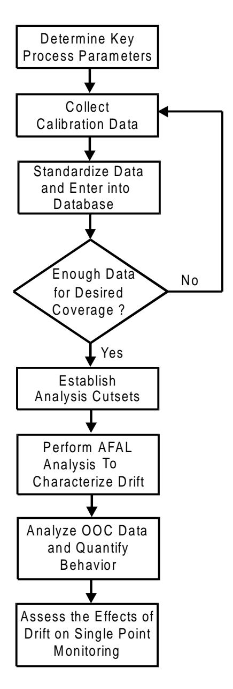

**Figure 8-1 Instrument Drift Study Research Project Flowchart**

The magnitude of drift often is inferred from periodic instrument calibrations. During each surveillance, calibration, or calibration check, the as-found and as-left settings are recorded. The difference between the current as-found setting and the previous as-left setting represents the variation in instrument output between the two calibrations. The as-found minus as-left (AFAL) value is sometimes referred to as the drift between calibrations and has been used as an indicator of instrument performance. Actually, the AFAL value simultaneously contains several sources of error as well as the abovedefined drift. Each of the following sources of error may contribute to the magnitude of the AFAL value.

- Instrument hysteresis and linearity error present during the previous calibration
- Instrument hysteresis and linearity error present during the current calibration
- Instrument repeatability error present during the previous calibration
- Instrument repeatability error present during the current calibration
- Measurement and test equipment error present during the previous calibration
- Measurement and test equipment error present during the current calibration
- Personnel-induced or human-related error during the previous calibration
- Personnel induced or human-related error during the current calibration
- Instrument temperature effects attributed to an ambient temperature difference between the two calibrations
- Other environmental effects that occur between the two calibrations that cause a shift in instrument output
- Instrument shifts associated with system operational changes (shutdown, cooldown, and depressurization)
- Misapplication, improper installation, or other operating effects
- True instrument drift representing a change, time-dependent or otherwise, in instrument output over the time period between calibrations.

Some of the above effects can be negligible while other effects might be significant. For purposes of this evaluation of instrument drift, no attempt was made to separate the above effects; any AFAL variation between calibrations is considered drift. This approach should provide conservative results regarding instrument performance.

#### **8.2.1 Data Collection Strategy**

The first step in data collection was to determine which specific instrument modules within an instrument channel should be evaluated. It was concluded that the analysis should focus on sensors. Other modules in the instrument channel (e.g., power supplies, I/V converters, isolators) typically undergo other surveillance checks. It is not expected that OLM will affect these periodic checks and proper calibration will continue to be confirmed in accordance with plant Technical Specification requirements. Sensors, on the other hand, generally only are calibrated during refueling outages and are the focus of OLM. Additionally, industry experience with

#### *Appendix B: Instrument Drift Characteristics*

instrument drift has shown signal-processing modules to be more stable and predictable than sensors. Another key factor is that sensors often are located in containment or other difficult-to-reach areas. Because of their location, the calibration process for these devices is considerably more involved than that for easily reached signal processing electronics (instrument racks).

The next step in data collection was to identify the instrument channels (process parameters) of interest. Some instrumentation is vitally important to plant operation, but is not a primary concern with respect to the issues being addressed by this study. The following factors were considered in establishing data collection priorities:

- Continuously available process parameters associated with NSSS control and safety systems were given the highest priority
- The sensors for temperature measurement include RTDs and thermocouples. Since these devices are not calibrated in the traditional sense, temperature channels were not a data collection priority.
- The sensors for nuclear instruments and radiation monitors are not calibrated directly; calibration adjustments are accomplished in the electronics. Thus, these instrument channels were not targeted for data collection.
- Safety systems that are normally not in use, and consequently do not have process parameters that can be monitored during normal operation, were given a lower priority. For example, auxiliary feedwater flow is an important safety parameter; however, it is not a good candidate for on-line monitoring because the system normally is not in use and the parameter is not available to monitor.

Given the above considerations, data collection focused on redundant level, flow, and pressure transmitters used in NSSS control and safety-related instrument channels that are covered by Technical Specifications.

#### **8.2.2 Data Coverage**

An important aspect of the study was the degree to which the data sample set is representative of the population of instruments of interest for the industry at large. If the entire sample consisted only of data from one model in one application at one plant for one year, the study results would have limited applicability, and would not meet the goals of the project. Accordingly, one of the key objectives during data collection was to obtain a representative sample consistent with the scope of instruments of interest for OLM. The term *coverage* is used here to describe the degree of representation obtained for the established sample.

Ultimately, the strategy for data collection came down to collecting as much data as possible, within the limits of practicality. Sufficient diversity and coverage must be obtained with regard to plant type, instrument model, and process parameter so as to ensure that analysis results are statistically significant and have industry-wide applicability.

#### **8.2.3 Determination of Nominal Drift Characteristics**

Statistical analysis of historic calibration data using AFAL analysis techniques offers a viable approach for addressing the single-point monitoring issue. AFAL analysis, performed in accordance with the methodology recommended in EPRI TR-103335, *Guidelines for Instrument Calibration Extension/Reduction Programs*, provides one method of determining the drift characteristics of an instrument or group of instruments.

Employing AFAL analysis methods, instrument drift as a function of span can be quantified statistically. First, instruments were grouped logically in a variety of ways to create the analysis cutsets of interest. Using IPASS, AFAL analysis then was performed for each cutset to determine the drift characteristics over the entire calibrated span. The key statistical quantity of interest was the drift tolerance interval.

The focus of this part of the study was to determine the normal variation in drift as a function of instrument span and to identify drift trends that relate to single-point monitoring. For this reason, significantly out-of-calibration data was excluded from the data sets. This arbitrary outlier removal is acceptable in this case because no conclusions were developed from the AFAL analyses. Results of the AFAL analyses were used only to guide and focus additional research into the specific nature of drift. Section 8.5 provides the actual study results in which no outliers were removed.

#### **8.2.4 Evaluation of Out-of-Calibration Data**

Using the AFAL analysis results as a basis, a more detailed and rigorous analysis of out-of calibration data and data indicative of abnormal behavior was performed (see Section 8.5). The goal was to categorize the types of problems that lead to out-ofcalibration conditions and then identify the specific characteristics and traits of each type of problem. This information then can be used to determine the relationship between drift at different points in the span and to assess the likelihood of an instrument being in calibration at one point and out of calibration at another. The final step was to apply the analysis results to OLM and assess the validity of single-point monitoring as it relates to instrument calibration.

*Appendix B: Instrument Drift Characteristics*

#### **8.3 Data Coverage**

It was desirable that the data set be representative of the population of instruments of interest for the industry at large. Section 8.3 discusses the coverage obtained by the data set.

The term *coverage* is used here to describe the degree of representation obtained for the established sample. For example, plant coverage describes how well the plant sample set represents the population of plants and instrument coverage describes how well the instrument sample set represents the population of instruments of interest. The terms *sample set* and *population* are used in their traditional statistical context. Plant population refers to the total number of plants and the plant sample set is the group of plants from which data was obtained.

#### **8.3.1 Overview**

To gain a full understanding of the amount of coverage achieved, the data set was sorted in a variety of ways. For the purposes of determining coverage, three sample sets are considered:

- Plant Sample Set—those plants from which data was obtained
- Instrument Sample Set—all instruments for which calibration data exists
- Calibration Data Sample Set—all calibrations for which AFAL data exists

All data collected for the study was input into a single integrated database. The database commonly is referred to as *the instrument database* throughout this appendix. The instrument database is a Microsoft Access database that is managed by the IPASS software.

The overall coverage exceeded expectations and the compiled data set is the largest of its kind known to exist. The data set has the following general attributes:

Plants: 18

Instruments: 1139

Calibrations: 6700

AFAL data pairs: 33,890

Time frame covered: May 75*—*November 96

#### **8.3.2 Plant Coverage**

Calibration data was collected from 18 of the 109 operating nuclear plants within the USA. This sample set represents a coverage of 16.5% on a plant basis. The plant sample set was sorted by different parameters to characterize the sample and obtain a better understanding of the plant-wide representation provided by the data.

#### 8.3.2.1 NSSS Vendor

Table 8-1 shows the plant sample set sorted by NSSS vendor and Table 8-2 shows the plant sample set sorted by plant type (i.e., PWR or BWR). Both PWR and BWR plants are well represented, with PWR representation somewhat stronger. All NSSS vendors are represented. Coverage for B&W and Westinghouse is particularly good. Coverage for Combustion Engineering is weakest.

Figure 8-2 provides a relative measure of the plant sample set by NSSS vendor. That is, it shows the relative percentage of plants within each group for the 18 plants in the sample set. Figure 8-3 provides the same relative measure for all 109 operating plants. A comparison of the two figures shows that the plant sample set reflects reasonably well the population on the basis of NSSS vendor.

**Table 8-1 Plant Coverage by NSSS Vendor**

| NSSS Vendor            | Sample Size | Plant Population | Percent Coverage |
|------------------------|----------------|---------------------|---------------------|
| Babcock & Wilcox       | 2              | 7                   | 28.6%               |
| Combustion Engineering | 1              | 15                  | 6.7%                |
| General Electric       | 4              | 37                  | 10.8%               |
| Westinghouse           | 11             | 50                  | 22.0%               |
| Total                  | 18             | 109                 | 16.5%               |

**Table 8-2 Plant Coverage by Type of Plant**

| Plant Type | Sample Size | Plant Population | Percent Coverage |
|---------------|----------------|---------------------|---------------------|
| PWR           | 14             | 72                  | 19.4%               |
| BWR           | 4              | 37                  | 10.8%               |
| Total         | 18             | 109                 | 16.5%               |

#### *Appendix B: Instrument Drift Characteristics*

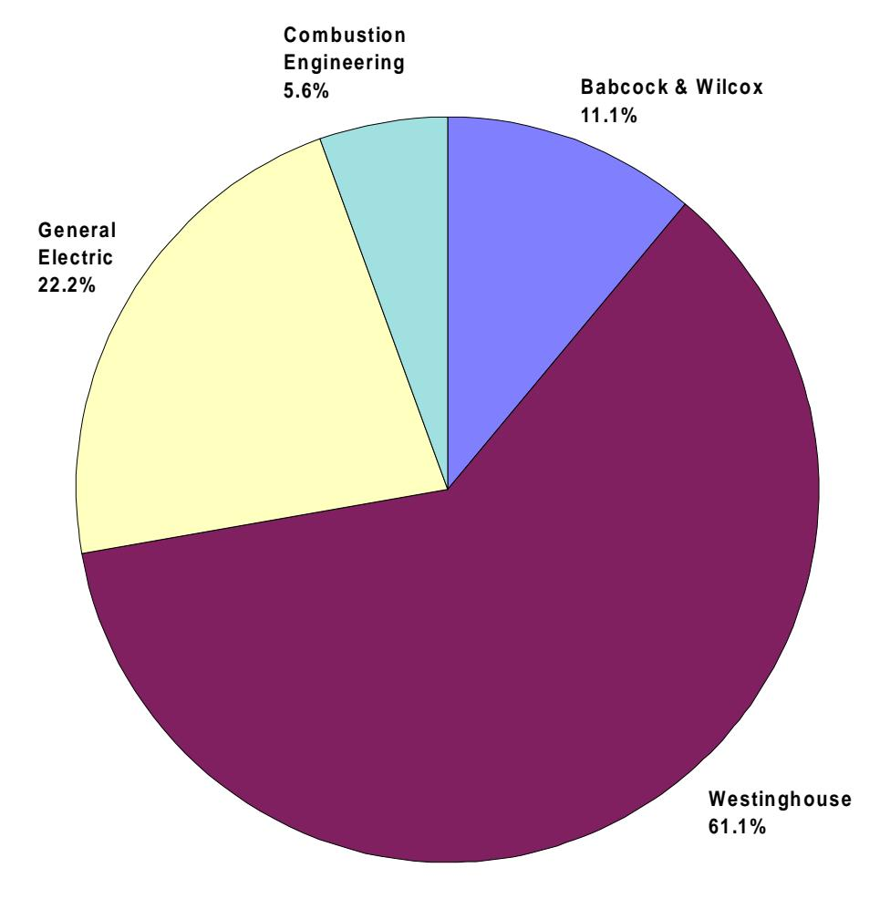

**Figure 8-2 Plant Sample Set Sorted by NSSS Vendor**

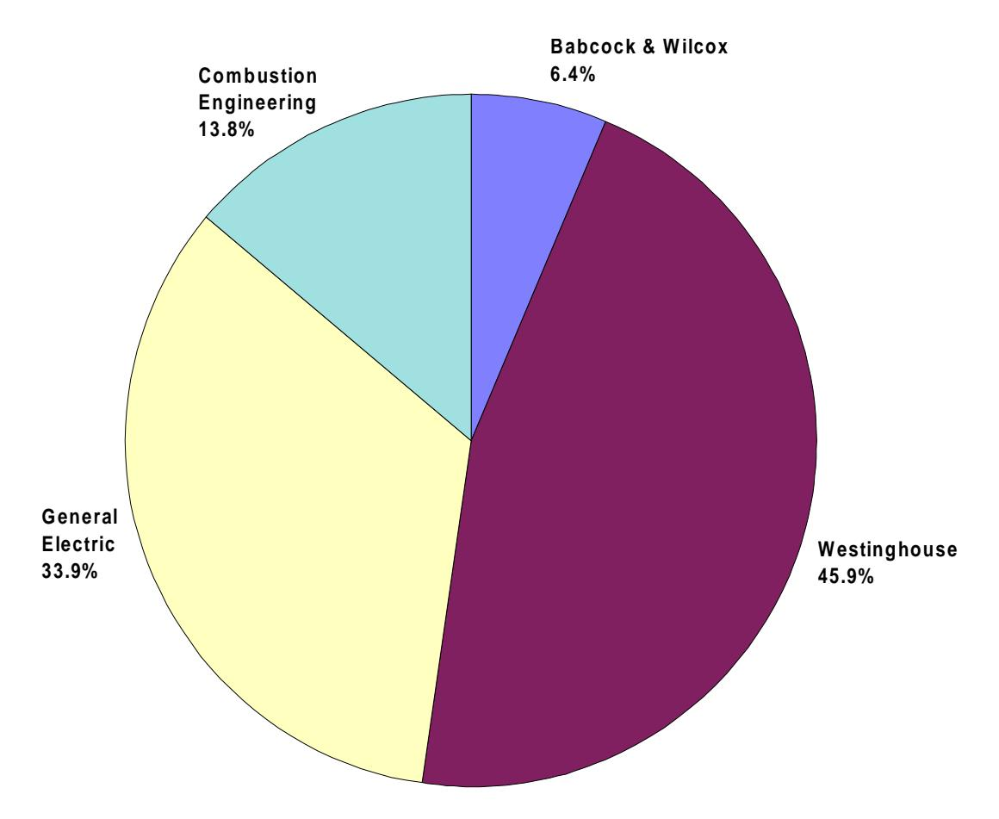

**Figure 8-3 Plant Population Sorted by NSSS Vendor**

#### 8.3.2.2 NRC Peer Groups

The NRC established plant peer groups in order to allow for better comparisons of plant performance indicators. The groupings incorporate important effects of both plant design and regulatory concerns, including: NSSS vendor, age, generating capacity, product line, licensing date, backfit programs, and technical specifications. The NRC considers the peer groups as a viable and appropriate means of comparing overall performance of licensees operating similar plants in a similar regulatory environment. As such, a comparison by peer groups is a particularly useful means of looking at the plant sample set.

Table 8-3 shows the plant sample set sorted by NRC peer groups. Coverage for a majority of the peer groups is quite good. Two groups, however, are not represented small Westinghouse plants and Combustion Engineering plant with core spray. Although the instrument database is considered to be sufficiently diverse with respect to other, more relevant, parameters (e.g., instrument model and application), the analysis results are not as statistically robust for these two groups of plants.

*Appendix B: Instrument Drift Characteristics*

**Table 8-3 Plant Coverage by NRC Peer Groups**

| NRC Plant Peer Group |                    | Sample Size | Plant Population | Percent Coverage |
|----------------------|--------------------|----------------|---------------------|---------------------|
| Babcock & Wilcox     |                    | 2              | 7                   | 28.6%               |
| Westinghouse         | Small Plant        | 0              | 7                   | 0.0%                |
|                      | Older 3-Loop       | 2              | 10                  | 20.0%               |
|                      | Older 4-Loop       | 5              | 8                   | 62.5%               |
|                      | New 4-Loop         | 4              | 25                  | 16.0%               |
| General Electric     | BWR/1,2,3, older 4 | 3              | 23                  | 13.0%               |
|                      | BWR/5,6, newer 4   | 1              | 14                  | 7.1%                |
| Combustion           | Without Core Spray | 1              | 8                   | 12.5%               |
| Engineering          | With Core Spray    | 0              | 7                   | 0.0%                |
| Total                |                    | 18             | 109                 | 16.5%               |

Figure 8-4 provides a relative measure of the plant sample set by NRC peer groups. The figure shows the relative percentage of plants within each peer group for the 18 plants in the sample set. Figure 8-5 provides the same relative measure for all 109 operating plants. A comparison of the two figures shows that the relative proportions of the plant sample set is very much in line with the total population of plants, except for the two plant groups not represented in the database.

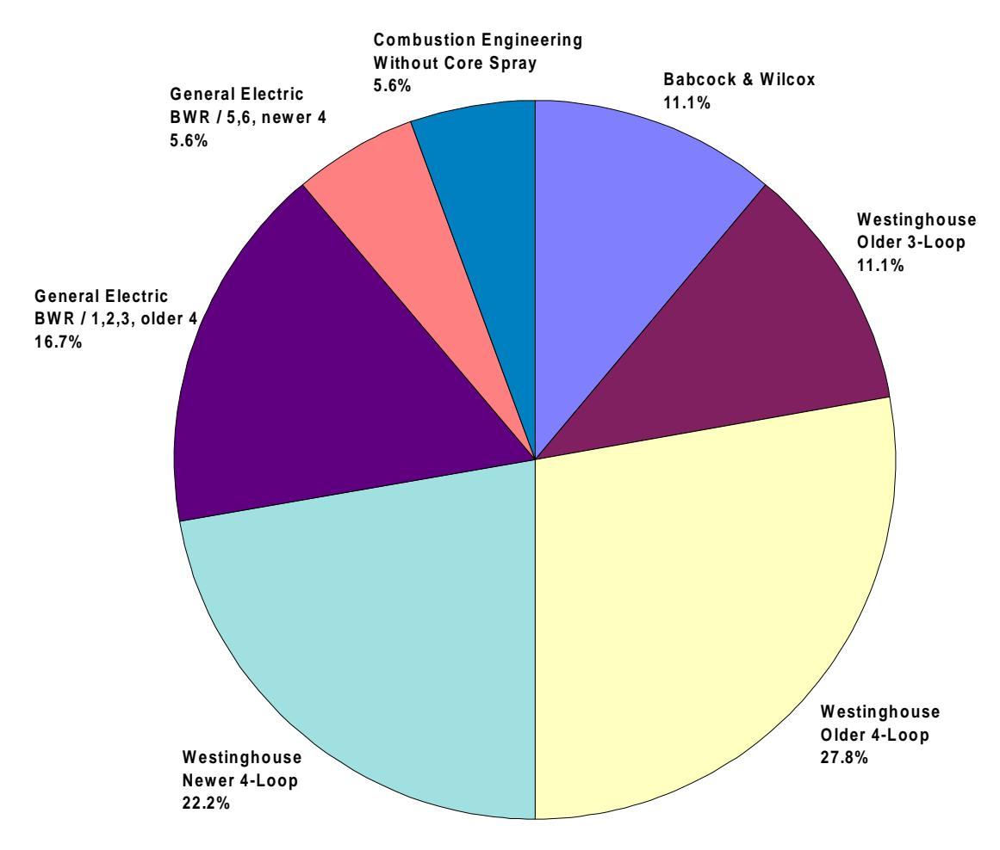

**Figure 8-4 Plant Sample Set Sorted by NRC Peer Groups**

#### *Appendix B: Instrument Drift Characteristics*

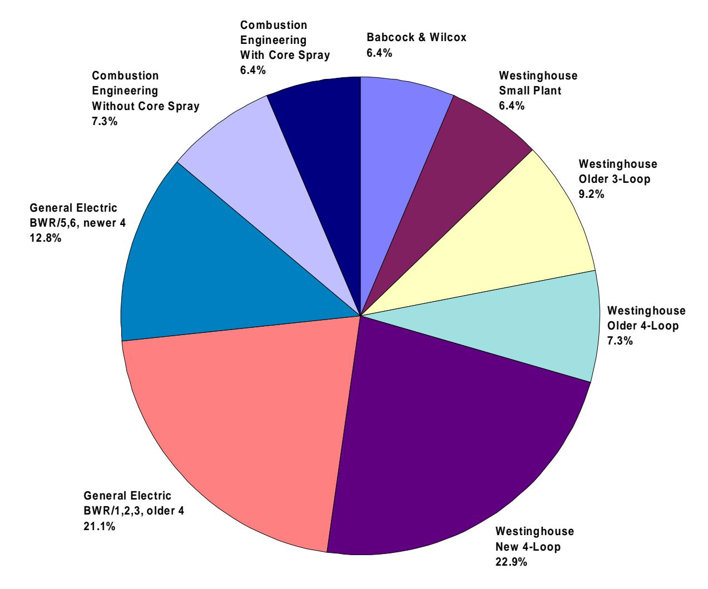

**Figure 8-5 Plant Population Sorted by NRC Peer Groups**

#### 8.3.2.3 Age

The age of plants contributing data to the database is diverse and well balanced. Plant age ranges from 1971 to 1989 (19 years). Table 8-4 shows the plant sample set sorted by date. The sort includes date of criticality, power operation, and commercial operation. As is evident from the table, plant coverage with respect to age is particularly well balanced.

Plant vintage is considered to be an important variable because it ultimately encompasses many key factors that contribute to overall performance. Included are such factors as instrument design configuration, equipment age, in-service exposure, calibration practices, maintenance policies, and upgrades. The good coverage obtained with respect to plant age is not unexpected given the coverage observed for the breakdown by NRC peer groups.

**Table 8-4 Plant Coverage by Age**

| Year  | Criticality | Power Operation | Commercial Operation |
|-------|-------------|--------------------|-------------------------|
| 1971  | 1           | 1                  | 1                       |
| 1972  | 1           | 1                  | 1                       |
| 1973  | 1           | 1                  |                         |
| 1974  | 2           | 1                  | 2                       |
| 1975  | 1           | 2                  | 1                       |
| 1976  | 2           | 2                  | 2                       |
| 1977  | 3           | 3                  | 3                       |
| 1978  |             |                    | 1                       |
| 1979  |             |                    |                         |
| 1980  | 1           |                    |                         |
| 1981  | 1           | 2                  | 2                       |
| 1982  |             |                    |                         |
| 1983  |             |                    |                         |
| 1984  | 2           | 2                  | 1                       |
| 1985  | 1           | 1                  | 1                       |
| 1986  |             |                    | 1                       |
| 1987  |             |                    |                         |
| 1988  | 1           | 1                  | 1                       |
| 1989  | 1           | 1                  | 1                       |
| Total | 18          | 18                 | 18                      |

#### 8.3.2.4 Architect/Engineer and Constructor

Table 8-5 shows the plant sample set broken down by architect/engineer (A/E) and constructor. All major A/Es and constructors are represented at some level. Coverage with respect to A/E is not considered to be a significant evaluation factor; nonetheless, it incrementally bolsters the level of confidence in the overall coverage obtained for the database.

*Appendix B: Instrument Drift Characteristics*

**Table 8-5 Plant Coverage by Architect/Engineer and Constructor**

| Company                        | A/E | Constructor |
|--------------------------------|-----|-------------|
| Bechtel                        | 5   | 5           |
| UE & C                         | 2   | 2           |
| Burns & Roe                    | 2   | 1           |
| Ebasco                         | 1   | 3           |
| Stone & Webster                | 1   | 1           |
| Gilbert Associates             | 1   |             |
| J. A. Jones Construction       |     | 1           |
| Westinghouse Development Corp. |     | 2           |
| Daniel International           |     | 1           |
| Other                          | 6   | 2           |
| Total                          | 18  | 18          |

#### **8.3.3 Instrument and Calibration Data Coverage**

Calibration data was obtained for 1,139 separate instruments, 1,133 of which were either a pressure transmitter or differential pressure transmitter. The number of individual calibrations included in the study was 6,700, ranging in date from May 1975 to November 1996. The resulting number of as found/as left data pairs was 33, 890, a great amount of data by any measure. The database created as part of this study is the largest known in existence for transmitter calibration data.

The instrument and calibration data sample set was sorted by different parameters to characterize the sample and determine the degree of coverage based on key variables.

#### 8.3.3.1 Type of Instrument

Table 8-6 shows the instrument sample set sorted by type of instrument. The results are shown graphically in Figure 3-5. Type, within the context of this study, refers to the basic function performed by the instrument, keeping in mind that virtually all of the devices are pressure transmitters of some sort. These transmitters are used to measure one of three process variables: pressure, flow, or level. A small number of the transmitters, 4.6% are classified only as differential pressure (D/P). Transmitters in this group fall into one of two categories:

1. The transmitter provides a function that is directly based on D/P (e.g., filter D/P).

*Appendix B: Instrument Drift Characteristics*

2. The specific function of the transmitter (flow or level measurement) could not be determined from the available information.

The instrument sample set is well balanced for the types of instruments of interest. A discussion of how the instruments of interest were determined is contained in Section 8.2.

**Table 8-6 Instrument Coverage by Instrument Type**

| Type        | Sample Size |
|-------------|-------------|
| Pressure    | 387         |
| Level       | 331         |
| Flow        | 363         |
| D/P         | 52          |
| Temperature | 6           |
| Total       | 1139        |

*Appendix B: Instrument Drift Characteristics*

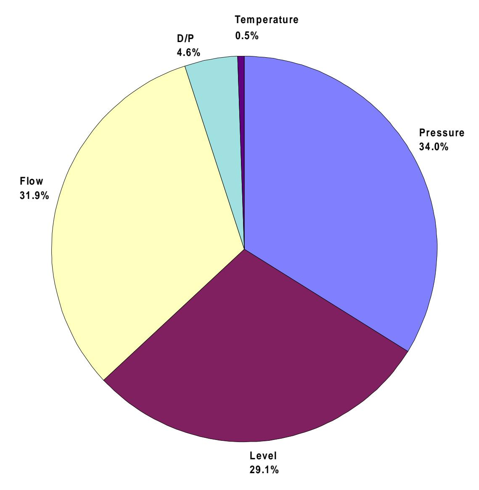

**Figure 8-6 Instrument Sample Set Sorted by Type of Instrument**

#### 8.3.3.2 Plant

Each of the 18 plants providing data for the study was given a unique number for tracking and analysis purposes. Table 8-7 shows the instrument and calibration data sample set sorted by plant number. Stated another way, Table 8-7 shows how much data was collected from each plant. The obvious concern here is that no one plant's data contribution is overwhelmingly large or insignificantly small. The breakdown by plant also is shown graphically in Figures 8-7 and 8-8.

The only plant that is significantly under-represented for both number of instruments and number of calibrations is Plant 15. However, Plant 15 is in the Westinghouse old 4loop peer group, which has the highest level of representation in the database. Thus, the low level of contribution by this plant is not seen as significant to the overall database.

Plant 3 provides a proportionately larger share of data than the other plants. This plant is, however, the only plant in the General Electric/5, 6, newer 4 peer group. Thus, the peer group is well represented; however, diversity within the group is weak.

**Table 8-7 Instrument and Calibration Data Coverage by Plant**

|                 | Instruments    |                         | Calibrations   |                         |  |
|-----------------|----------------|-------------------------|----------------|-------------------------|--|
| Plant Number | Sample Size | Percentage of Sample | Sample Size | Percentage of Sample |  |
| 1               | 95             | 8.3%                    | 501            | 7.5%                    |  |
| 2               | 94             | 8.3%                    | 479            | 7.1%                    |  |
| 3               | 190            | 16.7%                   | 952            | 14.2%                   |  |
| 4               | 106            | 9.3%                    | 750            | 11.2%                   |  |
| 5               | 60             | 5.3%                    | 476            | 7.1%                    |  |
| 6               | 49             | 4.3%                    | 251            | 3.7%                    |  |
| 7               | 49             | 4.3%                    | 261            | 3.9%                    |  |
| 8               | 99             | 8.7%                    | 722            | 10.8%                   |  |
| 9               | 45             | 4.0%                    | 240            | 3.6%                    |  |
| 10              | 33             | 2.9%                    | 91             | 1.4%                    |  |
| 11              | 28             | 2.5%                    | 167            | 2.5%                    |  |
| 12              | 63             | 5.5%                    | 398            | 5.9%                    |  |
| 13              | 57             | 5.0%                    | 306            | 4.6%                    |  |
| 14              | 57             | 5.0%                    | 297            | 4.4%                    |  |
| 15              | 7              | 0.6%                    | 30             | 0.4%                    |  |
| 16              | 11             | 1.0%                    | 281            | 4.2%                    |  |
| 17              | 48             | 4.2%                    | 232            | 3.5%                    |  |
| 18              | 48             | 4.2%                    | 266            | 4.0%                    |  |
| Total           | 1139           | 100.0%                  | 6700           | 100.0%                  |  |

#### *Appendix B: Instrument Drift Characteristics*

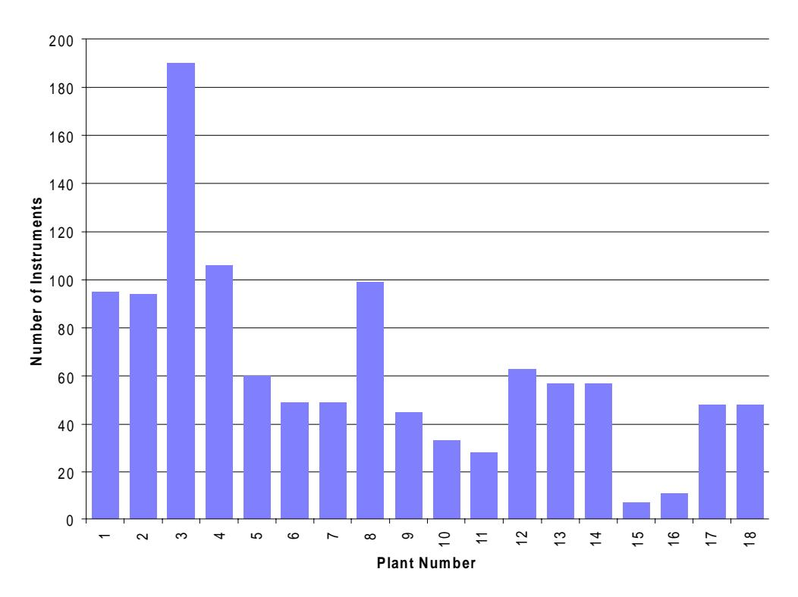

**Figure 8-7 Instrument Sample Set Sorted by Plant Number**

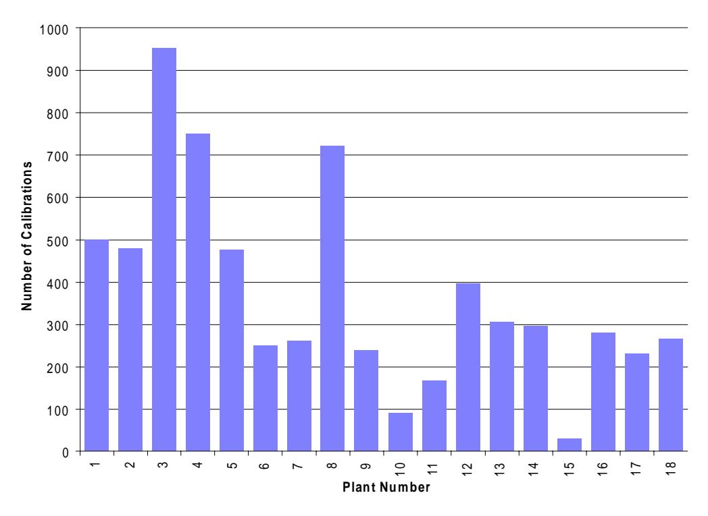

**Figure 8-8 Calibration Data Sample Set Sorted by Plant Number**

#### 8.3.3.3 Instrument Model

Table 8-8 shows the instrument and calibration data sample set sorted by instrument model number. The breakdown is shown graphically in Figures 8-9 and 8-10. As can be seen from the table and figures, the study included a wide range of transmitter models. More importantly, coverage is excellent for models most likely to be found in applications of interest to on-line monitoring. Key models include those from Rosemount, Barton, and Foxboro.

The instrument sample set is dominated by Rosemount 1153 data. This imbalance has both good and bad points. On the positive side, the proportion of Rosemount 1153 transmitters included in the study is judged to be a fairly good approximation of the relative proportion of these transmitters actually in service. From this perspective, the instrument sample set provides a good representation of the total population. On the negative side, analysis observations and conclusions are heavily influenced by Model 1153 data, thereby potentially masking performance trends of the other transmitters. To overcome this potential problem, each model of transmitter was analyzed independently to establish its performance characteristics. In this way, a baseline for comparison was established so that overall performance trends were not applied indiscriminately to all models.

**Table 8-8 Instrument and Calibration Data Coverage by Model Number**

|                      |                                  | Instruments    |                         | Calibrations   |                         |
|----------------------|----------------------------------|----------------|-------------------------|----------------|-------------------------|
|                      | Manufacturer and Model Number | Sample Size | Percentage of Sample | Sample Size | Percentage of Sample |
| Rosemount            | 1151                             | 129            | 11.3%                   | 583            | 8.7%                    |
|                      | 1152                             | 52             | 4.6%                    | 368            | 5.5%                    |
|                      | 1153                             | 466            | 40.9%                   | 2796           | 41.7%                   |
|                      | 1154                             | 62             | 5.4%                    | 316            | 4.7%                    |
| Barton               | 384                              | 30             | 2.6%                    | 245            | 3.7%                    |
|                      | 386                              | 7              | 0.6%                    | 48             | 0.7%                    |
|                      | 752                              | 24             | 2.1%                    | 126            | 1.9%                    |
|                      | 763                              | 27             | 2.4%                    | 194            | 2.9%                    |
|                      | 764                              | 109            | 9.6%                    | 696            | 10.4%                   |
| Foxboro              | NE11                             | 8              | 0.7%                    | 40             | 0.6%                    |
|                      | NE13                             | 41             | 3.6%                    | 209            | 3.1%                    |
|                      | E11                              | 24             | 2.1%                    | 124            | 1.9%                    |
|                      | E13                              | 44             | 3.9%                    | 279            | 4.2%                    |
| Veritrak             | 59PM18                           | 3              | 0.3%                    | 16             | 0.2%                    |
|                      | 76PH2                            | 8              | 0.7%                    | 42             | 0.6%                    |
|                      | 76DP2                            | 39             | 3.4%                    | 201            | 3.0%                    |
| Tobar                | 32DP                             | 1              | 0.1%                    | 6              | 0.1%                    |
|                      | 32P                              | 24             | 2.1%                    | 123            | 1.8%                    |
| GE                   | 555                              | 3              | 0.3%                    | 24             | 0.4%                    |
| Delaval              | XM-54852                         | 2              | 0.2%                    | 16             | 0.2%                    |
| Conax RTD            | 7Q77-10001                       | 2              | 0.2%                    | 13             | 0.2%                    |
| Bailey RTD Bridge | 6623690A2                        | 4              | 0.4%                    | 26             | 0.4%                    |
|                      | Unknown Press Transmitters       | 30             | 2.6%                    | 209            | 3.1%                    |
| Total                |                                  | 1139           | 100%                    | 6700           | 100%                    |

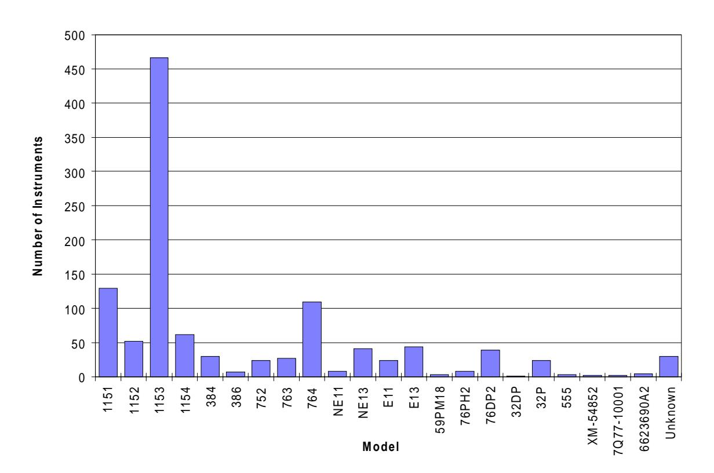

**Figure 8-9 Instrument Sample Set Sorted by Model Number**

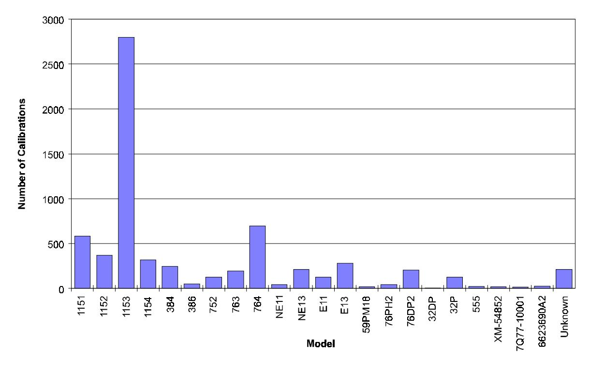

**Figure 8-10 Calibration Data Sample Set Sorted by Model Number**

*Appendix B: Instrument Drift Characteristics*

#### 8.3.3.4 Application

Table 8-9 shows the instrument and calibration data sample set sorted by application. The breakdown is shown graphically in Figures 8-11 and 8-12. Applications best suited for on-line monitoring are well represented. The strong coverage for these applications of interest is not just good fortune; these applications were specifically targeted during the data collection process. Section 8.2 discusses the process by which applications were prioritized.

**Table 8-9 Instrument and Calibration Data Coverage by Application**

|                              | Instruments    |                         | Calibrations   |                         |
|------------------------------|----------------|-------------------------|----------------|-------------------------|
| Application Description   | Sample Size | Percentage of Sample | Sample Size | Percentage of Sample |
| Accumulator Level            | 24             | 2.1%                    | 113            | 1.7%                    |
| Accumulator Pressure         | 20             | 1.8%                    | 92             | 1.4%                    |
| Balance of Plant Flow        | 18             | 1.6%                    | 80             | 1.2%                    |
| Balance of Plant Pressure    | 35             | 3.1%                    | 190            | 2.8%                    |
| Containment Pressure         | 35             | 3.1%                    | 231            | 3.4%                    |
| Drywell Pressure             | 10             | 0.9%                    | 97             | 1.4%                    |
| Main Feedwater Flow          | 36             | 3.2%                    | 215            | 3.2%                    |
| Main Steam Flow              | 73             | 6.4%                    | 447            | 6.7%                    |
| Main Steam and S/G Pressure  | 148            | 13.0%                   | 820            | 12.2%                   |
| NSSS/Safety Related Flow     | 112            | 9.8%                    | 727            | 10.9%                   |
| NSSS/Safety Related Level    | 39             | 3.4%                    | 407            | 6.1%                    |
| NSSS/Safety Related Pressure | 61             | 5.4%                    | 298            | 4.4%                    |
| NSSS/Safety Related Temp     | 2              | 0.2%                    | 13             | 0.2%                    |
| Pressurizer Level            | 42             | 3.7%                    | 236            | 3.5%                    |
| Pressurizer Pressure         | 39             | 3.4%                    | 173            | 2.6%                    |
| RCS Flow                     | 130            | 11.4%                   | 692            | 10.3%                   |
| RCS Pressure                 | 43             | 3.8%                    | 348            | 5.2%                    |
| RCS Temperature              | 4              | 0.4%                    | 26             | 0.4%                    |
| Reactor Feed Pump Flow       | 4              | 0.4%                    | 25             | 0.4%                    |
| Reactor Level                | 40             | 3.5%                    | 338            | 5.0%                    |
| Reactor Feed Pump Pressure   | 5              | 0.4%                    | 20             | 0.3%                    |
| S/G Level                    | 158            | 13.9%                   | 769            | 11.5%                   |
| S/G Wide Range Level         | 22             | 1.9%                    | 100            | 1.5%                    |
| Turbine 1st Stage Pressure   | 13             | 1.1%                    | 69             | 1.0%                    |
| Unknown                      | 26             | 2.3%                    | 174            | 2.6%                    |
| Total                        | 1139           | 100%                    | 6700           | 100%                    |

Appendix B: Instrument Drift Characteristics

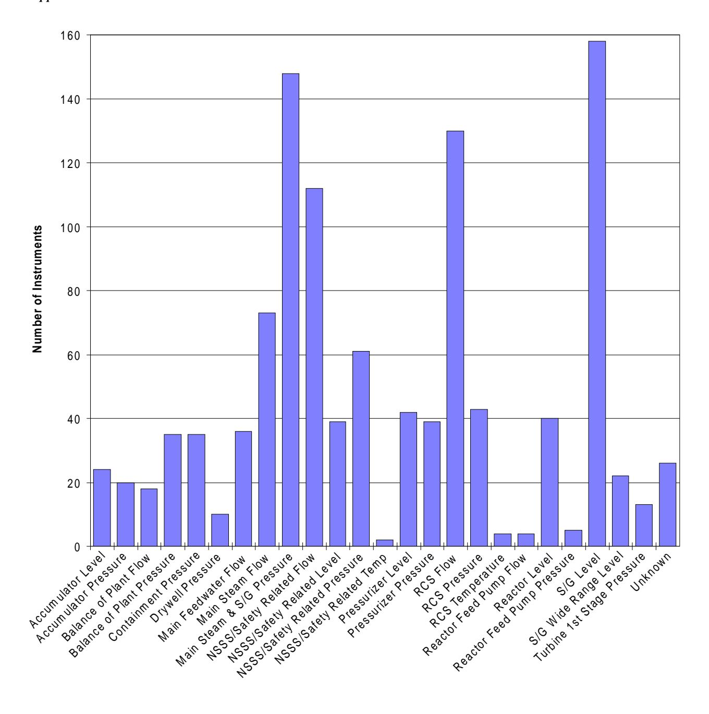

Application

Figure 8-11 Instrument Sample Set Sorted by Application

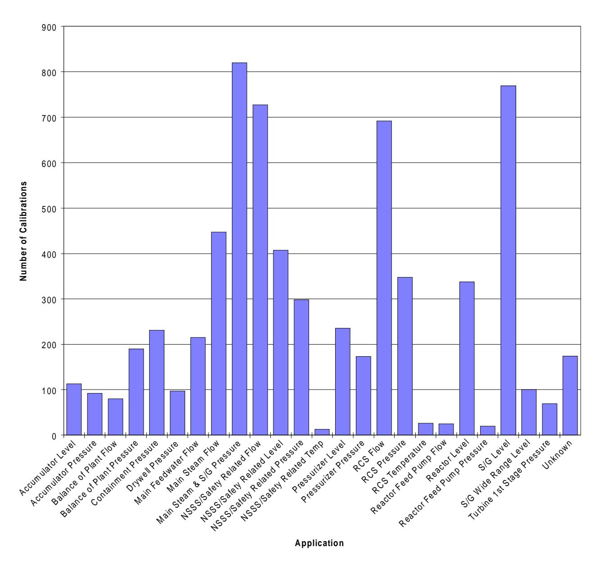

Figure 8-12 Calibration Data Sample Set Sorted by Application

#### 8.3.3.5 Time

Table 8-10 shows the calibration data sample set sorted as a function of time, i.e., when the calibration was performed and recorded. The breakdown is shown graphically in Figure 8-13.

The calibration data covers a period from May 1975 to November 1996, a range of 19 years. A majority of the calibrations, over 90%, were performed between 1986 and 1995. On this basis, the analysis results are heavily skewed by more recent calibrations. This

#### *Appendix B: Instrument Drift Characteristics*

cross-section of data is considered acceptable and germane for addressing the issues at hand for on-line monitoring. However the shortage of data for earlier years might preclude any substantiated observations about long term performance characteristics.

**Table 8-10 Calibration Data Sample Set by Year Performed**

| Year  | Sample Size | Percentage of Sample |
|-------|----------------|-------------------------|
| 1975  | 2              | 0.0%                    |
| 1976  | 0              | 0.0%                    |
| 1977  | 27             | 0.4%                    |
| 1978  | 7              | 0.1%                    |
| 1979  | 27             | 0.4%                    |
| 1980  | 16             | 0.2%                    |
| 1981  | 26             | 0.4%                    |
| 1982  | 31             | 0.5%                    |
| 1983  | 74             | 1.1%                    |
| 1984  | 142            | 2.1%                    |
| 1985  | 214            | 3.2%                    |
| 1986  | 469            | 7.0%                    |
| 1987  | 609            | 9.1%                    |
| 1988  | 685            | 10.2%                   |
| 1989  | 765            | 11.4%                   |
| 1990  | 801            | 12.0%                   |
| 1991  | 722            | 10.8%                   |
| 1992  | 812            | 12.1%                   |
| 1993  | 605            | 9.0%                    |
| 1994  | 290            | 4.3%                    |
| 1995  | 276            | 4.1%                    |
| 1996  | 100            | 1.5%                    |
| Total | 6700           | 100.0%                  |

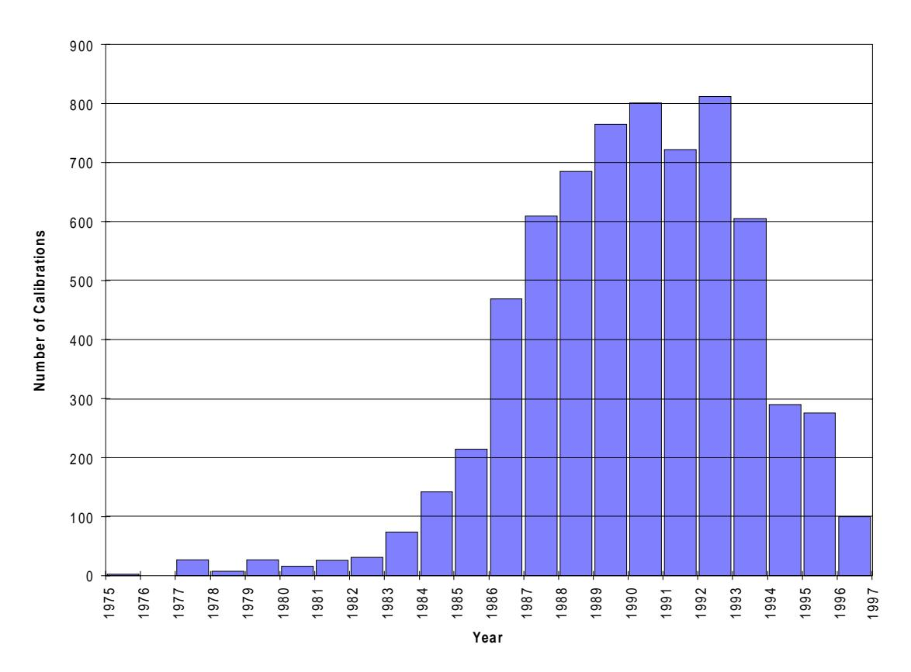

**Figure 8-13 Calibration Data Sample Set Sorted by Year**

#### **8.3.4 Statistical Significance**

Sections 8.3.2 and 8.3.3 show that reasonable sample coverage was obtained in terms of plant types, instruments, and calibration data. Section 8.3.4 provides a basic presentation of the statistical significance of the sample size. The purpose of this section is to further demonstrate that analysis results can be applied generically to all plants with a high level of confidence.

#### 8.3.4.1 Sample Size Determination Equation

How many instruments must be evaluated to be confident that the results are indicative of the population? One expression for determining the required sample size to bound the mean is given by Equation 8-1.

Appendix B: Instrument Drift Characteristics

$$n_o = \left(\frac{t \times S}{\Delta}\right)^2 \tag{8-1}$$

where.

 $n_0$  = Calculated sample size without correction for population size

*t* = The 95% student *t* value (rounded to 2 for this evaluation)

*S* = Assumed sample standard deviation

 $\Lambda = Allowed error$ 

The required sample size is corrected for the estimated population size by the following expression.

$$n = \frac{n_o}{1 + \frac{n_o}{N}} \tag{8-2}$$

where.

n = Required sample size

 $n_a$  = Calculated sample size without correction for population size

N = Estimated population

This approach is used in the following sections to evaluate the degree of coverage in terms of the number of instruments.

#### 8.3.4.2 Estimated Population and Sensitivity to Population Size

The population is defined to be those instruments suitable for on-line monitoring at nuclear plants. The population is limited to nuclear plants in the USA because of the types of instruments evaluated.

The number of operating USA nuclear plants is less than 110. The number of instruments (sensors) at each plant suitable for on-line monitoring that have a calibration frequency governed by the plant's Technical Specifications is estimated to be less than 100. Thus, the total population of potential instruments is estimated to be no more than 11,000.

Actually, the estimate of required sample size is somewhat insensitive to the population size above a certain level. For example, if the assumed sample standard deviation, S, is about 2% and the allowed error, ∆, is 0.25%, Figure 8-14 shows the required sample size as a function of population size. Equations 8-1 and 8-2 were used to develop this chart. For the specified conditions, the required sample size asymptotically approaches 256 as the population size approaches infinity. For purposes of analysis, a population size of 20,000 instruments suitable for on-line monitoring will be used.

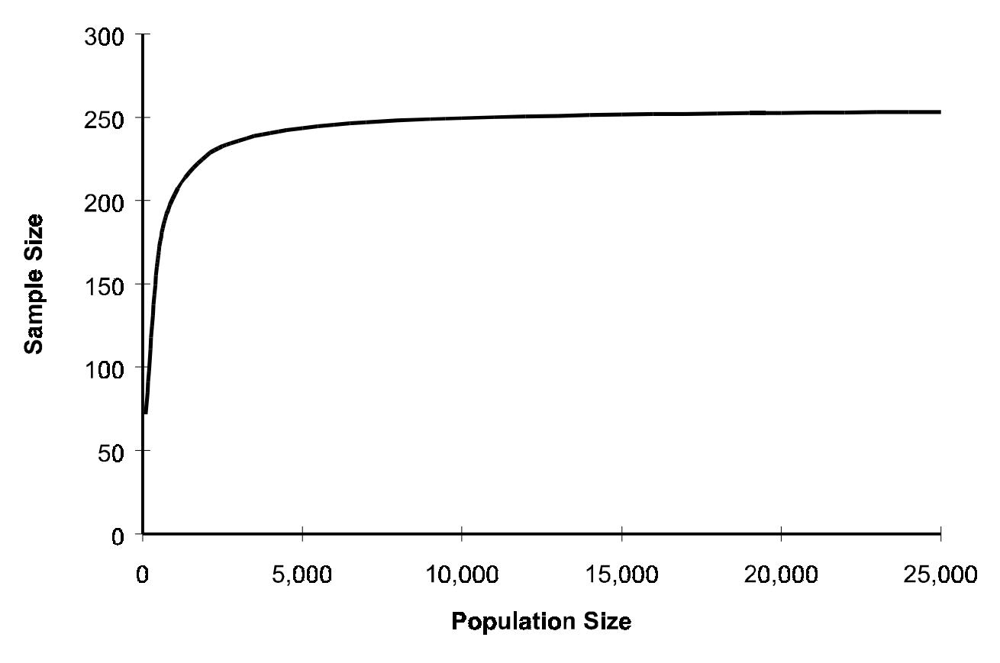

**Figure 8-14 Required Sample Size as a Function of Population Size**

#### 8.3.4.3 Estimated Instrument Drift Standard Deviation

The required sample size varies significantly with the assumed standard deviation. Applying Equations 8-1 and 8-2, assuming a population of 20,000 instruments, and assuming an allowable error of 0.25%, Figure 8-15 shows the sensitivity of the required sample size as a function of sample standard deviation. As shown, a sample size of 1,000 instruments is required for a standard deviation of 4% (tolerance interval of 8%) with an allowed error of 0.25%.

*Appendix B: Instrument Drift Characteristics*

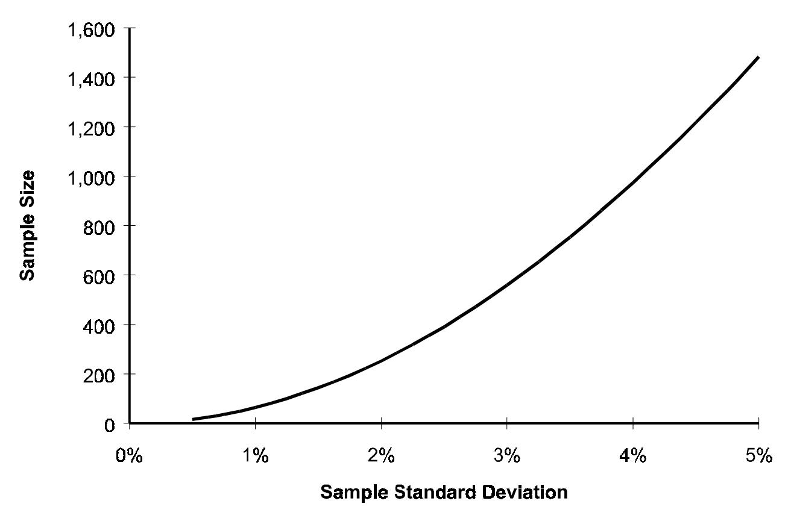

**Figure 8-15 Required Sample Size as a Function of Sample Standard Deviation**

A review readily shows that typical instrument performance is well bounded by a tolerance interval of ±4%, or a standard deviation of approximately 2% (assuming a large sample).

#### 8.3.4.4 Comparison of Actual Sample Size to Required Sample Size

The actual sample size is 1,139 instruments, which more than adequately covers any size population exhibiting tolerance intervals of drift of 8% or less to within a resolution of 0.25%. The sample size obtained by this project is considered adequate to predict performance for the installed population.

#### **8.4 Characterization of Nominal Drift Behavior**

Let's state again the questions of interest. Is performance of an instrument at a specific point in its span indicative of the instrument's performance at other points in the span? If instrument drift is known at one point within the span, can drift at other points be inferred or predicted, and if so, with what degree of confidence? These questions must

be answered in order to objectively address the validity of on-line monitoring as a viable calibration-monitoring tool.

Section 8.4 concerns itself with the overall nature and characteristics of nominal drift. The term, *nominal drift*, as used in this study is the observed drift when grossly uncharacteristic data (i.e., failures) is excluded from consideration. Section 8.4 only attempts to contribute to a greater understanding of drift effects and magnitudes. It does not try to answer the above questions. Instead, Section 8.4 serves as a springboard for the analysis results presented in Section 8.5. Section 8.5 evaluates drift in more detail and explains, in many cases, the bases or fundamental reasons for certain drift characteristics presented in this section.

#### **8.4.1 Analysis Methodology**

AFAL analysis was used to quantify drift for the instruments included in the study. In brief, AFAL analysis is a means of quantifying the overall drift experienced by an instrument or group of instruments. The method involves statistically analyzing drift data from successive calibrations to determine applicable tolerance intervals. A detailed description of AFAL analysis methods is provided in EPRI Report TR-103335, *Guidelines for Instrument Calibration Extension/Reduction Programs*. The AFAL analysis was performed using IPASS, a software program developed by EPRI specifically to perform AFAL analysis for instruments. Refer to AP-106752, *IPASS User's Guide*, for information relating to the use of IPASS.

#### 8.4.1.1 Analysis Data Set

The objective of this part of the study was to gain an understanding of drift as a function of span. Therefore, in combining data to create analysis sets, only data from the same relative location within the span should be combined. Combining data from the 25% calibration check point with data from the 50% point would have been pointless with respect to the goals of this study.

Unfortunately, plants do not perform calibrations in the same exact way. Thus, the number and relative location of the calibration check points vary. This causes an inherent difficulty with respect to combining data. A majority of plants perform a fivepoint calibration check, which includes checkpoints at 0%, 25%, 50%, 75%, and 100% of span. For this reason, all data was standardized to the 5-point check, and the following rules were followed in creating analysis data sets:

• If a calibration involved six or more checkpoints, only data for the five standard checkpoints were included.

*Appendix B: Instrument Drift Characteristics*

- If a calibration involved less than five checkpoints, all available data corresponding to the checkpoints of interest were included.
- For nine-point calibration checks that have both up-scale and downscale readings for the checkpoints of interest, only the upscale points were included in the data set. The redundant downscale readings were omitted.

The checkpoints of some calibrations did not correspond with the checkpoints of interest. In these cases the data was not used unless the checkpoint was within 5% of the cardinal point of interest. For example, data taken at the 5% point was included with the 0% cardinal point, but data taken at the 10% point was omitted. Only a small number of calibrations fell into this category.

#### 8.4.1.2 Tolerance Interval

A 95/95 tolerance interval was used to perform the AFAL analysis. A 95/95 tolerance interval signifies that a 95% probability exists that the established interval contains 95% of the population.

#### 8.4.1.3 Outlier Analysis

Elimination of outlier data is always an issue of concern. Which points are truly nonrepresentative and should be excluded from the data set, and which points are large but still indicative of overall performance? For this study, the absolute magnitude of drift is secondary and less important than the relative change in drift across the span. Thus, a conservative approach to outliers was taken. As a general guideline, calibrations were considered to contain outlier data if one or more of the checkpoints included as found values greater than 5% out of calibration. The 5% threshold was a general guideline and not a firm rule. In a few cases the instruments' nominal performance was such that the outlier threshold was escalated to 10%. And on occasion, the threshold was lowered to 4%. The outlier threshold was never lowered below 4%. This conservative approach to outliers resulted in retaining a majority of data flagged as outliers by the more traditional critical value of T test.

#### **8.4.2 Analysis Groups and Cutsets**

A key question in analyzing such a large and diversified data set is how should the data be grouped to best present the results. Fortunately, the answer is relatively straightforward. For the purposes of on-line monitoring, a breakdown by model and application provides the most useful information. The term *application* simply refers to the process variable to which the transmitters are applied. From here forward, these two groups are called the *instrument model cutset* and the *application cutset*.

To determine the statistical validity of combining data from different plants to create the desired cutsets, each application at each plant was first analyzed separately. With few exceptions, any given application used the same model of transmitter for redundant measurements. Thus, this "first pass" analysis was performed on data sets of the least common denominator. The plant specific analyses confirmed that characteristic drift for each group shared many similarities, statistically speaking. This result was not unexpected based on previous industry experience. Similar traits include:

- AFAL data exhibited a zero or near zero mean, indicating that a bias in the drift is not a key concern for the transmitters of interest.
- Data normally is distributed or is bounded by the assumption of normality.
- Drift tended to increase with span.

From plant to plant, the magnitude of drift did vary, even for the same application with the same model of transmitter. If so, is it still valid to combine the data? The answer here is yes, provided a proper perspective is maintained. When combined, the data forms a new, larger population. The analysis results are by definition statistically valid for this population. The real issue is whether the results are applicable to each of the subsets of data that represent individual plants. Also, remember that this analysis was used only to aid in the understanding of drift; this analysis does not attempt to answer the questions regarding single-point monitoring.

#### **8.4.3 Analysis Results for Instrument Model Cutsets**

#### 8.4.3.1 Rosemount Transmitters

Rosemount transmitters comprise a majority of the pressure and differential pressure transmitters installed at USA nuclear plants. Table 8-8 shows that Rosemount transmitters account for over 60% of the calibration data in the instrument database, with over 41% contributed by Model 1153s alone. Since Rosemount transmitters make up a large percentage of the installed transmitters, their drift characteristics are of particular interest. Table 8-11 shows the nominal drift characteristics for Rosemount transmitters. The tolerance intervals for each model are plotted in Figure 8-16.

Calibration data for the 1152 transmitters includes both three-point and five-point data (i.e., the number of calibration checkpoints for which data was recorded). Tolerance intervals for the three- and five-point data are sufficiently different to warrant maintaining the data as separate groups. A majority of the five-point data is from one plant and one application. Thus, the notably low and stable drift exhibited by this group is not considered representative of Model 1152 transmitters in general. The

*Appendix B: Instrument Drift Characteristics*

Model 1153 transmitters are split into two groups for analysis purposes. The Model 1153 D/P group includes transmitters used in a differential pressure application, i.e., flow or level and the Model 1153 pressure group includes transmitters used to measure pressure.

Figure 8-16 shows that nominal drift for all Rosemount models over their entire span ranges from about 0.7% to 2.5%. In general, the drift characteristics are uniform and do not have significant discontinuities at different locations in the span. Drift tends to be slightly higher at the upper end of the span. The one exception to this observation is the Model 1154s, which have the highest drift at center span. As seen in Table 8-11, the drift variation over the entire span is small for all models. The Model 1153 D/P transmitters exhibited the largest drift variation at 0.56%. Interestingly, the smallest drift variation noted [excluding the 1152 (five point) data] is for the Model 1153 pressure transmitters, which have a variation of 0.09%. A near zero mean was observed for all Rosemount transmitters.

**Table 8-11 Rosemount Transmitter Nominal Drift Performance**

| Model      | Statistical        | Calibration Check Point (% of Span) |        |        |        |        | Drift     |
|------------|--------------------|-------------------------------------|--------|--------|--------|--------|-----------|
| Number     | Quantity           | 0%                                  | 25%    | 50%    | 75%    | 100%   | Variation |
| 1151       | Tolerance Interval | 2.09%                               | 2.10%  | 2.20%  | 2.27%  | 2.50%  |           |
|            | Mean               | 0.02%                               | -0.02% | -0.04% | -0.03% | -0.01% | 0.41%     |
|            | Sample Size        | 443                                 | 435    | 444    | 433    | 442    |           |
| 1152       | Tolerance Interval | 1.35%                               |        | 1.32%  |        | 1.58%  |           |
| (3 points) | Mean               | -0.05%                              |        | -0.09% |        | -0.07% | 0.23%     |
|            | Sample Size        | 234                                 |        | 234    |        | 231    |           |
| 1152       | Tolerance Interval | 0.77%                               | 0.72%  | 0.73%  | 0.75%  | 0.74%  |           |
| (5 points) | Mean               | -0.01%                              | 0.07%  | 0.08%  | 0.09%  | 0.06%  | 0.05%     |
|            | Sample Size        | 49                                  | 49     | 47     | 49     | 32     |           |
| 1153       | Tolerance Interval | 1.91%                               | 2.02%  | 2.08%  | 2.45%  | 2.47%  |           |
| (D/P)      | Mean               | 0.03%                               | -0.02% | -0.02% | -0.04% | -0.02% | 0.56%     |
|            | Sample Size        | 1470                                | 1268   | 1409   | 1246   | 1487   |           |
| 1153       | Tolerance Interval | 1.22%                               | 1.16%  | 1.21%  | 1.26%  | 1.31%  |           |
| (Pressure) | Mean               | 0.00%                               | -0.01% | -0.01% | -0.02% | -0.01% | 0.09%     |
|            | Sample Size        | 619                                 | 615    | 586    | 617    | 620    |           |
| 1154       | Tolerance Interval | 1.84%                               | 1.89%  | 1.97%  | 1.94%  | 1.83%  |           |
|            | Mean               | 0.07%                               | 0.12%  | 0.10%  | 0.10%  | 0.05%  | 0.14%     |
|            | Sample Size        | 200                                 | 175    | 207    | 207    | 201    |           |

*Appendix B: Instrument Drift Characteristics*

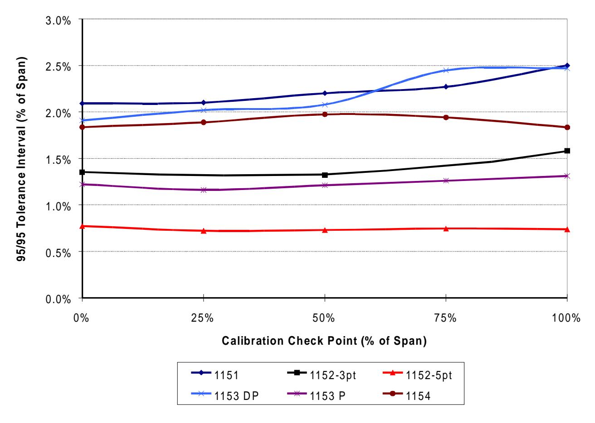

**Figure 8-16 Rosemount Transmitter Nominal Drift Performance**

The term *drift variation* in the above paragraph is used uniquely by this study to describe the observed variation in drift along the instrument span. Remember that this study evaluated calibration data at 5 points: 0%, 25%, 50%, 75%, and 100% of span. Of the five checkpoints, one point will exhibit the largest drift magnitude and another point will have the smallest drift magnitude. The drift variation is defined as the difference between the largest and smallest observed drift magnitudes along the instrument's calibrated span, or:

$$Drift\ Variation = AFAL\ Drift_{max} - AFAL\ Drift_{min}$$

For example, if the drift appears to start at some minimum value at the 0% checkpoint and then continuously increase higher in the span, the drift variation would be given by:

$$Drift\ Variation = AFAL\ Drift_{100\%} - AFAL\ Drift_{0\%}$$

#### 8.4.3.2 Barton Transmitters

Next to Rosemount, Barton transmitters are the most widely used transmitters in the nuclear industry. They account for 19.6% of the calibration data in the instrument database (refer to Table 8-8). Table 8-12 shows the nominal drift characteristics for Barton transmitters. The tolerance intervals for each model are plotted in Figure 8-17.

Figure 8-17 shows that nominal drift for all Barton models over their entire span ranges from 0.64% to 2.45%. Overall, the drift characteristics are uniform and do not have noticeable discontinuities at different locations in the span, with one exception. The tolerance interval at the 100% point for the 386 transmitters (2.45%) is considerably larger than the tolerance interval for the other four calibration check points. The reason for the unusually high drift at the 100% point is attributed to the relatively small quantity of data obtained for the 386 transmitters. With only 30 calibrations available, greater variability in the analysis results is inevitable. The low number of calibrations increases the influence of individual points on the calculated tolerance interval and also increases the size of the tolerance interval factor.

As with Rosemount transmitters, drift generally tends to be higher at the upper end of the span. However, drift for the Model 752 transmitters was very flat across the entire span and the largest drift for Model 764-351 transmitters occurred at the 0% point. The drift variation for each model is shown in Table 8-12. The Model 386 transmitters have a drift variation of 1.05%, the largest of the Barton models. The 1.05% drift variation is primarily due to the 100% point, which, as noted earlier, is considerably larger than the other check points. The Model 752 transmitters exhibited the smallest drift variation, 0.11%. The Model 764-351 transmitters had the lowest overall drift; however, the results for this model are based on relatively few calibrations. Comparatively, the drift characteristics for Barton transmitters appear very similar to that of the Rosemount transmitters. A near zero mean bias was observed for all Barton models except the Model 763 transmitters. The transmitters evaluated in this study appeared to have a slight negative bias.

**Table 8-12 Barton Transmitter Nominal Drift Performance**

| Model   | Statistical        |        | Calibration Check Point (% of Span) |        |        |        | Drift     |
|---------|--------------------|--------|-------------------------------------|--------|--------|--------|-----------|
| Number  | Quantity           | 0%     | 25%                                 | 50%    | 75%    | 100%   | Variation |
| 384     | Tolerance Interval | 1.11%  | 1.23%                               | 1.31%  | 1.58%  | 1.74%  |           |
|         | Mean               | 0.07%  | 0.10%                               | 0.11%  | 0.10%  | 0.10%  | 0.63%     |
|         | Sample Size        | 171    | 171                                 | 170    | 171    | 170    |           |
| 386     | Tolerance Interval | 1.40%  | 1.70%                               | 1.77%  | 1.87%  | 2.45%  |           |
|         | Mean               | 0.04%  | 0.00%                               | -0.05% | -0.07% | 0.05%  | 1.05%     |
|         | Sample Size        | 30     | 30                                  | 30     | 30     | 29     |           |
| 752     | Tolerance Interval | 1.17%  | 1.26%                               | 1.28%  | 1.27%  | 1.26%  |           |
|         | Mean               | 0.03%  | 0.01%                               | 0.03%  | -0.04% | -0.01% | 0.11%     |
|         | Sample Size        | 79     | 79                                  | 79     | 79     | 79     |           |
| 763     | Tolerance Interval | 1.13%  | 1.50%                               | 1.51%  | 1.67%  | 1.83%  |           |
|         | Mean               | -0.16% | -0.24%                              | -0.26% | -0.28% | -0.30% | 0.70%     |
|         | Sample Size        | 159    | 157                                 | 158    | 159    | 159    |           |
| 764     | Tolerance Interval | 1.57%  | 1.74%                               | 1.79%  | 1.88%  | 1.82%  |           |
|         | Mean               | -0.04% | -0.10%                              | -0.07% | -0.10% | -0.11% | 0.31%     |
|         | Sample Size        | 360    | 360                                 | 360    | 359    | 360    |           |
| 764-351 | Tolerance Interval | 0.85%  | 0.83%                               | 0.66%  | 0.68%  | 0.64%  |           |
|         | Mean               | -0.03% | -0.06%                              | -0.06% | -0.04% | -0.01% | 0.21%     |
|         | Sample Size        | 35     | 35                                  | 35     | 35     | 35     |           |

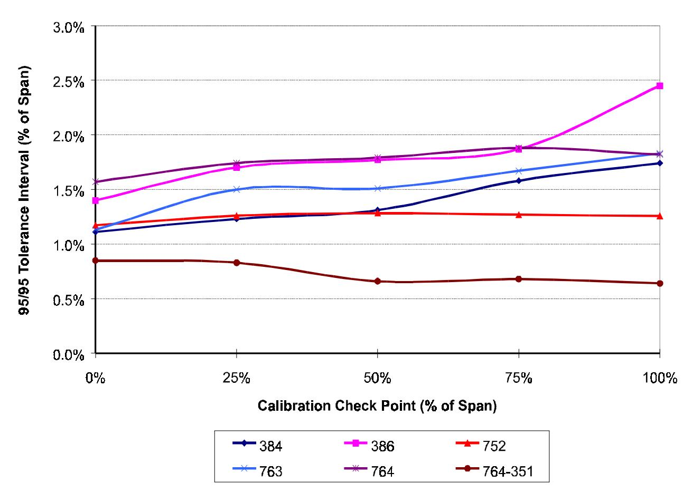

**Figure 8-17 Barton Transmitter Nominal Drift Performance**

#### 8.4.3.3 Foxboro Transmitters

Table 8-13 shows the nominal drift characteristics for Foxboro transmitters. The data for Models E11 and NE11 are combined together and the data for Models E13 and NE13 are combined together. The Model E13 and NE13 data are also plotted separately for comparison. Data for the Model E11 and NE11 are not plotted separately because each set of data is essentially from one plant and one application. The tolerance intervals for each model are plotted in Figure 8-18.

Figure 8-18 shows that nominal drift for Foxboro E11 and NE11 ranges from 1.38% to 3.07% and the nominal drift for Models E13 and NE13 ranges from 1.62% to 3.02%. This amount of drift is somewhat higher, on average, than the drift observed for Rosemount or Barton transmitters. The drift characteristics are, however, very uniform and appear nearly linear over the entire span. Drift increases with span for all models. The E11 and NE11 transmitters exhibit a greater drift variation, 1.69%, than do the E13 and NE13 transmitters, which have drift variations of 0.69% and 0.62% respectively. The

*Appendix B: Instrument Drift Characteristics*

combined E13 and NE13 data set has a drift variation of 0.55%. A near zero mean was observed for all Foxboro transmitters

**Table 8-13 Foxboro Transmitter Nominal Drift Performance**

| Model  | Statistical        |        | Calibration Check Point (% of Span) |        |        |        | Drift     |
|--------|--------------------|--------|-------------------------------------|--------|--------|--------|-----------|
| Number | Quantity           | 0%     | 25%                                 | 50%    | 75%    | 100%   | Variation |
| E11    | Tolerance Interval | 1.38%  | 1.88%                               | 2.17%  | 2.61%  | 3.07%  |           |
| and    | Mean               | 0.01%  | -0.14%                              | -0.09% | -0.08% | -0.07% | 1.69%     |
| NE 11  | Sample Size        | 107    | 107                                 | 107    | 107    | 107    |           |
| E13    | Tolerance Interval | 1.62%  | 1.66%                               | 1.82%  | 2.01%  | 2.31%  |           |
|        | Mean               | -0.12% | -0.06%                              | 0.01%  | 0.05%  | 0.05%  | 0.69%     |
|        | Sample Size        | 207    | 207                                 | 206    | 194    | 207    |           |
| NE13   | Tolerance Interval | 2.40%  | 2.48%                               | 2.68%  | 2.84%  | 3.02%  |           |
|        | Mean               | -0.01% | -0.01%                              | -0.01% | 0.03%  | 0.09%  | 0.62%     |
|        | Sample Size        | 149    | 145                                 | 147    | 142    | 149    |           |
| E13    | Tolerance Interval | 2.03%  | 2.06%                               | 2.20%  | 2.36%  | 2.58%  |           |
| and    | Mean               | -0.14% | -0.10%                              | -0.01% | 0.03%  | 0.06%  | 0.55%     |
| NE13   | Sample Size        | 357    | 353                                 | 354    | 337    | 357    |           |

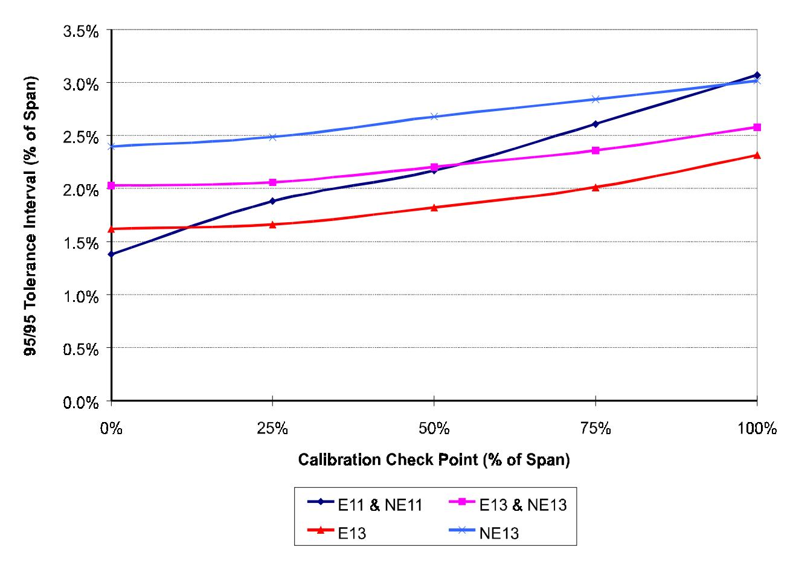

**Figure 8-18 Foxboro Transmitter Nominal Drift Performance**

#### 8.4.3.4 Miscellaneous Transmitters

Table 8-14 shows the nominal drift characteristics for Veritrak transmitters and Table 8- 15 shows the drift characteristics for the Model 32P Tobar transmitter. The amount of data collected for GE, Delaval, Veritrak 59PM18, and Tobar 32DP transmitters was not sufficient to perform a comparable analysis. The small data sets result in a huge penalty in the size of the tolerance interval factor, precluding a reasonable comparison of drift to other transmitter models. The tolerance intervals for the Veritrak and Tobar models analyzed are plotted in Figure 8-19.

From Figure 8-19, the most striking aspect of the drift characteristics for the Veritrak and Tobar models is the extremely low drift variation over the entire span. At a practical level, the drift for each model appears to be independent of span. The magnitude of drift for the 76PH2 transmitters is noticeably higher than that of any of the other models analyzed. Here again, the abnormality appears to be partially due to the small data set (28 calibrations).

#### *Appendix B: Instrument Drift Characteristics*

The Tobar transmitters have a near zero mean bias. The Veritrak transmitters exhibited a perceptible bias in the mean, with a magnitude of up to 0.3%.

**Table 8-14 Veritrak Transmitter Nominal Drift Performance**

| Model  | Statistical        | Calibration Check Point (% of Span) | Drift  |        |        |        |           |
|--------|--------------------|-------------------------------------|--------|--------|--------|--------|-----------|
| Number | Quantity           | 0%                                  | 25%    | 50%    | 75%    | 100%   | Variation |
| 76PH2  | Tolerance Interval | 4.17%                               | 4.22%  | 4.07%  | 4.11%  | 4.08%  |           |
|        | Mean               | 0.17%                               | 0.13%  | 0.15%  | 0.19%  | 0.20%  | 0.15%     |
|        | Sample Size        | 28                                  | 28     | 28     | 28     | 28     |           |
| 76DP2  | Tolerance Interval | 1.94%                               | 2.01%  | 2.07%  | 1.98%  | 1.90%  |           |
|        | Mean               | -0.22%                              | -0.23% | -0.23% | -0.23% | -0.29% | 0.11%     |
|        | Sample Size        | 125                                 | 125    | 125    | 125    | 125    |           |

**Table 8-15 Tobar Transmitter Nominal Drift Performance**

| Model  | Statistical        |       | Calibration Check Point (% of Span) | Drift |       |       |           |
|--------|--------------------|-------|-------------------------------------|-------|-------|-------|-----------|
| Number | Quantity           | 0%    | 25%                                 | 50%   | 75%   | 100%  | Variation |
| 32P    | Tolerance Interval | 1.27% | 1.38%                               | 1.39% | 1.36% | 1.37% |           |
|        | Mean               | 0.02% | 0.03%                               | 0.05% | 0.04% | 0.07% | 0.12%     |
|        | Sample Size        | 65    | 65                                  | 65    | 65    | 65    |           |

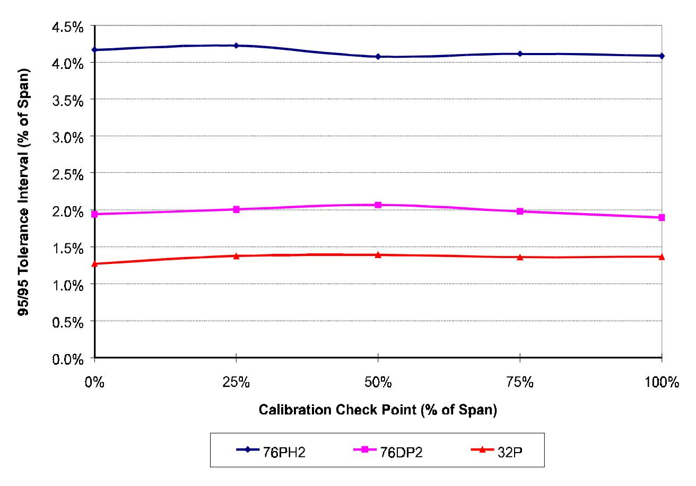

**Figure 8-19 Veritrak and Tobar Nominal Drift Performance**

#### **8.4.4 Analysis Results for Application Cutsets**

#### 8.4.4.1 Level

Table 8-16 shows the nominal drift characteristics for level transmitters. The tolerance intervals for individual applications are plotted in Figure 8-20. Accumulator level is plotted separately in Figure 8-21 because its characteristics are markedly different than the other level applications included in the study.

Figure 8-20 shows that nominal drift ranges from just under 2% to just over 3% for a majority of the applications. Steam generator wide range level exhibits considerably less drift in comparison to the others. Overall, the drift characteristics are uniform and nearly linear over the entire span. A very subtle increase in drift with span is evident for all applications except steam generator level, which has a small decrease in drift with span. Drift variation for each application is shown in Table 8-16. Except for accumulator level, drift variation is quite small, ranging from 0.09% to 0.48%.

#### *Appendix B: Instrument Drift Characteristics*

Accumulator level drift characteristics are in a category by themselves. Drift ranges from 6.56% to 8.82% over the span. The increase in drift with span is almost perfectly linear. The drift variation is 2.26%, over 4.5 times greater than the next closest value of drift variation. The abnormally large drift for accumulator level appears to be caused by the high static pressure of the accumulators in relation to the relatively small differential pressure associated with the level measurement. Although the drift characteristics may not be desirable, they appear to be very linear and predictable. Level applications have a near zero mean bias. Reactor level appears to have a slight negative bias and accumulator level has a slight positive bias.

**Table 8-16 Level Transmitter Nominal Drift Performance**

| Process          | Statistical        |        |        |        | Calibration Check Point (% of Span) |        | Drift     |
|------------------|--------------------|--------|--------|--------|-------------------------------------|--------|-----------|
| Variable         | Quantity           | 0%     | 25%    | 50%    | 75%                                 | 100%   | Variation |
| Pressurizer      | Tolerance Interval | 3.11%  | 3.11%  | 3.08%  | 3.13%                               | 3.21%  |           |
| Level            | Mean               | 0.04%  | 0.04%  | 0.04%  | 0.03%                               | -0.02% | 0.13%     |
|                  | Sample Size        | 172    | 172    | 171    | 170                                 | 172    |           |
| S/G              | Tolerance Interval | 1.90%  | 1.91%  | 1.91%  | 1.87%                               | 1.82%  |           |
| Level            | Mean               | -0.05% | -0.07% | -0.06% | -0.06%                              | -0.07% | 0.09%     |
|                  | Sample Size        | 521    | 522    | 528    | 513                                 | 521    |           |
| S/G              | Tolerance Interval | 0.62%  | 0.73%  | 0.78%  | 0.78%                               | 0.82%  |           |
| Wide Range       | Mean               | 0.00%  | -0.04% | -0.05% | -0.05%                              | -0.05% | 0.20%     |
| Level            | Sample Size        | 63     | 63     | 63     | 62                                  | 63     |           |
| Reactor          | Tolerance Interval | 2.52%  | 2.31%  | 2.63%  | 2.71%                               | 2.79%  |           |
| Level            | Mean               | -0.09% | -0.08% | -0.15% | -0.17%                              | -0.15% | 0.48%     |
|                  | Sample Size        | 250    | 137    | 250    | 137                                 | 250    |           |
| NSSS and         | Tolerance Interval | 2.75%  |        | 2.89%  |                                     | 2.89%  |           |
| Safety           | Mean               | 0.06%  |        | 0.06%  |                                     | 0.07%  | 0.14%     |
| Related Level | Sample Size        | 172    |        | 172    |                                     | 171    |           |
| Accumulator      | Tolerance Interval | 6.56%  | 7.23%  | 7.79%  | 8.16%                               | 8.82%  |           |
| Level            | Mean               | 0.13%  | 0.23%  | 0.20%  | 0.16%                               | 0.18%  | 2.26%     |
|                  | Sample Size        | 80     | 79     | 80     | 80                                  | 80     |           |

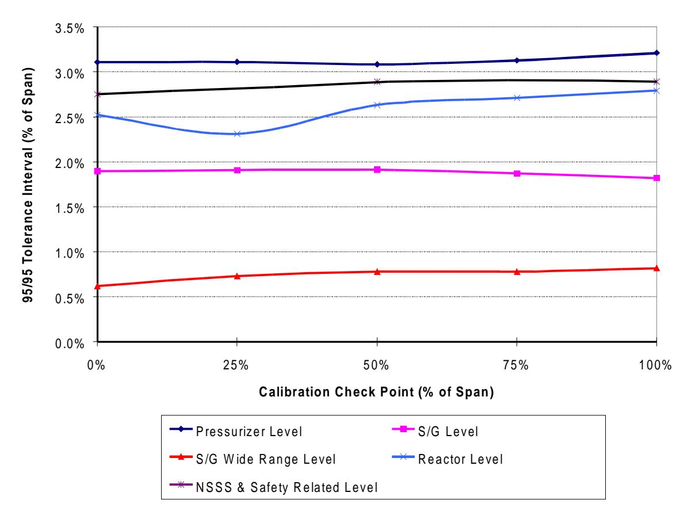

**Figure 8-20 Level Transmitter Nominal Drift Performance**

*Appendix B: Instrument Drift Characteristics*

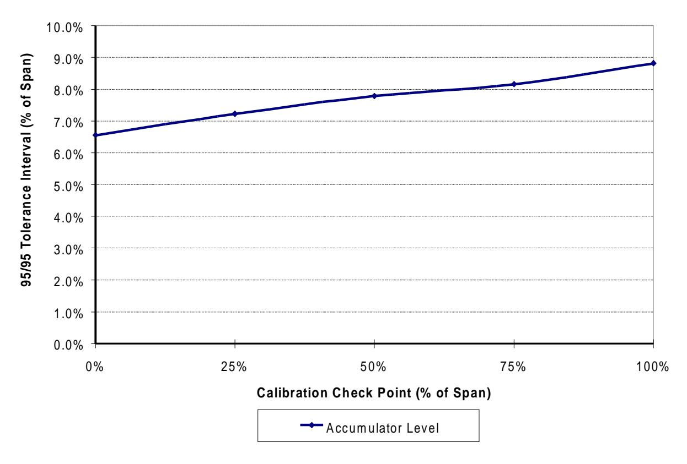

**Figure 8-21 Accumulator Level Transmitter Nominal Drift Performance**

#### 8.4.4.2 Flow

Table 8-17 shows the nominal drift characteristics for flow transmitters. The tolerance intervals for individual applications are plotted in Figure 8-22.

Figure 8-22 shows that nominal drift for reactor coolant system flow, reactor feed pump flow, main steam flow, and main feedwater flow falls within a tight range, 0.76% to 1.81% over the entire span. The generic category for NSSS and safety related flow exhibited greater drift, ranging from 1.93% to 2.52%. And, the generic category for balance of plant flow has a larger drift yet, ranging from 3.17% to 3.76%. All of the flow applications shown in Figure 8-22 have an unmistakable upward trend in drift as a function of span. The drift characteristics are very uniform and appear to be linear across the span. The drift variation ranges from 0.43% to 0.78%, inclusive of all applications. This tight range for drift variation gives the drift curves a parallel appearance because the slope of the curves is nearly equal. A near zero mean bias was observed for all flow transmitters.

Comparing the drift characteristics of flow transmitters to the drift characteristics of level transmitters, it is apparent that both types of transmitters have seemingly linear drift characteristics as a function of span. However, the drift variation for flow

transmitters is clearly greater than the drift variation for level transmitters (i.e., the slope of the drift curves for flow transmitters is steeper than the curves for level transmitters). This difference was not expected and an obvious reason for the difference is not evident.

**Table 8-17 Flow Transmitter Nominal Drift Performance**

| Process         | Statistical        |        |        |        | Calibration Check Point (% of Span) |        | Drift     |
|-----------------|--------------------|--------|--------|--------|-------------------------------------|--------|-----------|
| Variable        | Quantity           | 0%     | 25%    | 50%    | 75%                                 | 100%   | Variation |
| Reactor         | Tolerance Interval | 1.22%  | 1.27%  | 1.44%  | 1.62%                               | 1.81%  |           |
| Coolant         | Mean               | -0.08% | -0.06% | 0.00%  | 0.03%                               | 0.01%  | 0.59%     |
| System Flow  | Sample Size        | 480    | 503    | 490    | 490                                 | 503    |           |
| Reactor         | Tolerance Interval | 1.08%  | 0.91%  | 1.18%  | 1.21%                               | 1.41%  |           |
| Feed Pump       | Mean               | 0.10%  | 0.04%  | 0.01%  | 0.03%                               | 0.04%  | 0.50%     |
| Flow            | Sample Size        | 20     | 20     | 20     | 20                                  | 20     |           |
| Main Steam      | Tolerance Interval | 0.76%  | 1.07%  | 1.14%  | 1.40%                               | 1.54%  |           |
| Flow            | Mean               | -0.02% | -0.06% | -0.05% | -0.08%                              | -0.07% | 0.78%     |
|                 | Sample Size        | 354    | 261    | 291    | 252                                 | 354    |           |
| Main            | Tolerance Interval | 0.93%  | 0.98%  | 1.00%  | 1.19%                               | 1.36%  |           |
| Feedwater       | Mean               | 0.08%  | 0.08%  | 0.08%  | 0.07%                               | 0.08%  | 0.43%     |
| Flow            | Sample Size        | 155    | 155    | 155    | 155                                 | 155    |           |
| NSSS and        | Tolerance Interval | 1.93%  | 2.11%  | 2.20%  | 2.52%                               | 2.36%  |           |
| Safety          | Mean               | 0.04%  | -0.02% | -0.04% | -0.04%                              | -0.02% | 0.43%     |
| Related Flow | Sample Size        | 504    | 455    | 498    | 481                                 | 502    |           |
| Balance         | Tolerance Interval | 3.17%  | 3.30%  | 3.48%  | 3.52%                               | 3.76%  |           |
| of Plant        | Mean               | 0.16%  | 0.06%  | -0.03% | 0.15%                               | 0.05%  | 0.59%     |
| Flow            | Sample Size        | 60     | 60     | 60     | 60                                  | 59     |           |

*Appendix B: Instrument Drift Characteristics*

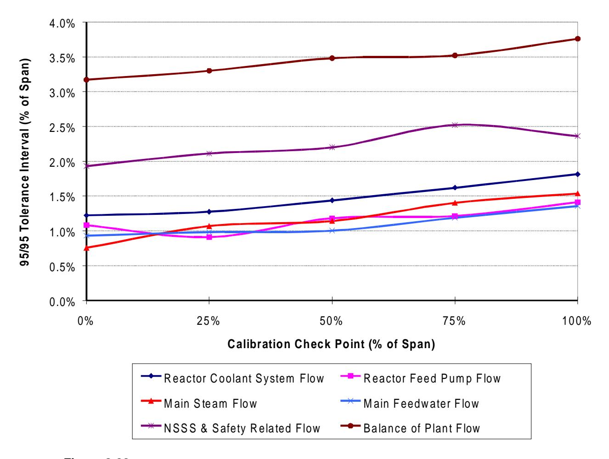

**Figure 8-22 Flow Transmitter Nominal Drift Performance**

#### 8.4.4.3 Pressure

Table 8-18 shows the nominal drift characteristics for pressure transmitters. The tolerance intervals for individual applications are plotted in Figures 8-23 and 8-24. The y-axis for both figures has been scaled the same so that visual comparisons can be made.

Figures 8-23 and 8-24 show that nominal drift ranges from 0.42% to 1.92% for nine of the 10 pressure applications analyzed. Pressurizer pressure is the worst performer of the group with nominal drift ranging from 2.86% to 4.01%. Overall, the drift characteristics are uniform across the span and do not have noticeable discontinuities. The most prominent non-linearity occurs with reactor feed pump pressure at the 75% and 100% checkpoints. As with other observed discontinuities, the reason can be correlated to the small sample size, 15 calibrations in this case. The general drift trend for pressure transmitters is a slight increase with span or constant drift across the span. Pressurizer pressure is an exception with a clear increase in drift with span.

*Appendix B: Instrument Drift Characteristics*

Excluding pressurizer pressure and reactor feed pump pressure, drift variation ranges from 0.14% to 0.61%. The drift variation of 1.21% for reactor feed pump pressure is suspect because of the small sample set. The drift variation for pressurizer pressure is 1.15%, again differentiating this application from the others.

**Table 8-18 Pressure Transmitter Nominal Drift Performance**

| Process             | Statistical        |        |        |        | Calibration Check Point (% of Span) |        | Drift     |
|---------------------|--------------------|--------|--------|--------|-------------------------------------|--------|-----------|
| Variable            | Quantity           | 0%     | 25%    | 50%    | 75%                                 | 100%   | Variation |
| Pressurizer         | Tolerance Interval | 2.86%  | 3.06%  | 3.21%  | 3.51%                               | 4.01%  |           |
| Pressure            | Mean               | -0.02% | -0.06% | 0.01%  | 0.01%                               | 0.03%  | 1.15%     |
|                     | Sample Size        | 103    | 103    | 103    | 103                                 | 103    |           |
| Main Steam          | Tolerance Interval | 0.84%  | 1.04%  | 1.08%  | 1.13%                               | 1.22%  |           |
| Pressure            | Mean               | -0.03% | -0.07% | -0.08% | -0.08%                              | -0.08% | 0.38%     |
|                     | Sample Size        | 613    | 612    | 580    | 612                                 | 612    |           |
| Reactor             | Tolerance Interval | 0.85%  | 0.98%  | 0.84%  | 1.03%                               | 0.96%  |           |
| Coolant             | Mean               | 0.00%  | -0.02% | -0.02% | -0.02%                              | -0.03% | 0.19%     |
| System Pressure  | Sample Size        | 276    | 189    | 274    | 192                                 | 257    |           |
| Turbine             | Tolerance Interval | 0.55%  | 0.57%  | 0.62%  | 0.75%                               | 0.82%  |           |
| 1st Stage           | Mean               | -0.04% | -0.05% | -0.06% | -0.05%                              | -0.03% | 0.27%     |
| Pressure            | Sample Size        | 56     | 56     | 56     | 56                                  | 56     |           |
| Reactor             | Tolerance Interval | 0.62%  | 0.70%  | 1.04%  | 1.72%                               | 1.83%  |           |
| Feed Pump           | Mean               | -0.02% | -0.03% | -0.10% | -0.14%                              | -0.12% | 1.21%     |
| Pressure            | Sample Size        | 15     | 15     | 15     | 15                                  | 15     |           |
| Drywell             | Tolerance Interval | 0.49%  |        | 0.82%  |                                     | 1.10%  |           |
| Pressure            | Mean               | -0.02% |        | -0.10% |                                     | -0.10% | 0.61%     |
|                     | Sample Size        | 86     |        | 86     |                                     | 85     |           |
| Containment         | Tolerance Interval | 1.61%  | 1.59%  | 1.70%  | 1.85%                               | 1.92%  |           |
| Pressure            | Mean               | 0.05%  | -0.02% | -0.03% | -0.03%                              | -0.04% | 0.33%     |
|                     | Sample Size        | 175    | 176    | 176    | 176                                 | 176    |           |
| Accumulator         | Tolerance Interval | 0.42%  | 0.55%  | 0.58%  | 0.57%                               | 0.50%  |           |
| Pressure            | Mean               | 0.01%  | -0.03% | -0.03% | -0.03%                              | -0.04% | 0.16%     |
|                     | Sample Size        | 71     | 71     | 71     | 71                                  | 71     |           |
| NSSS and            | Tolerance Interval | 0.96%  | 0.85%  | 0.99%  | 1.04%                               | 1.21%  |           |
| Safety              | Mean               | 0.00%  | -0.03% | 0.00%  | 0.00%                               | 0.03%  | 0.36%     |
| Related Pressure | Sample Size        | 237    | 237    | 237    | 236                                 | 237    |           |
| Balance             | Tolerance Interval | 1.66%  | 1.61%  | 1.57%  | 1.68%                               | 1.54%  |           |
| of Plant            | Mean               | -0.02% | 0.01%  | 0.00%  | -0.03%                              | -0.03% | 0.14%     |
| Pressure            | Sample Size        | 150    | 151    | 151    | 149                                 | 151    |           |

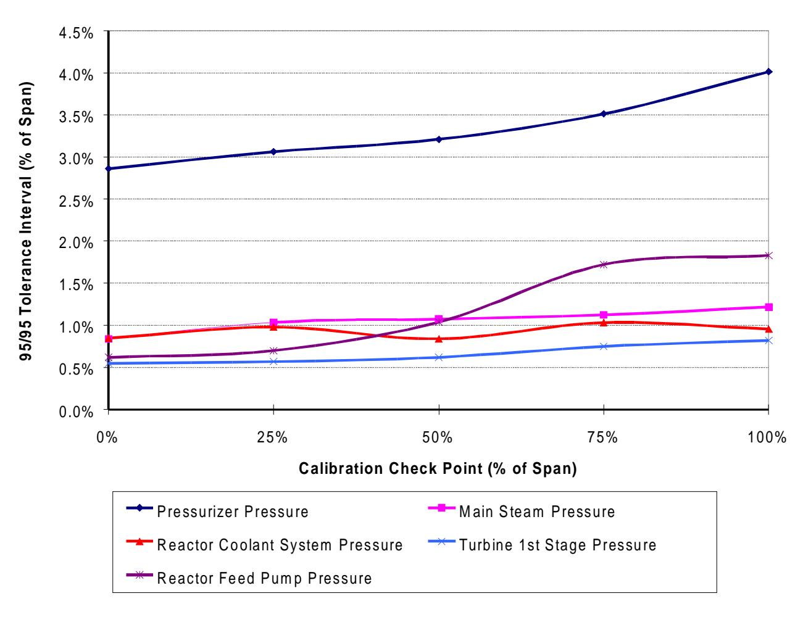

**Figure 8-23 Pressure Transmitter Nominal Drift Performance**

*Appendix B: Instrument Drift Characteristics*

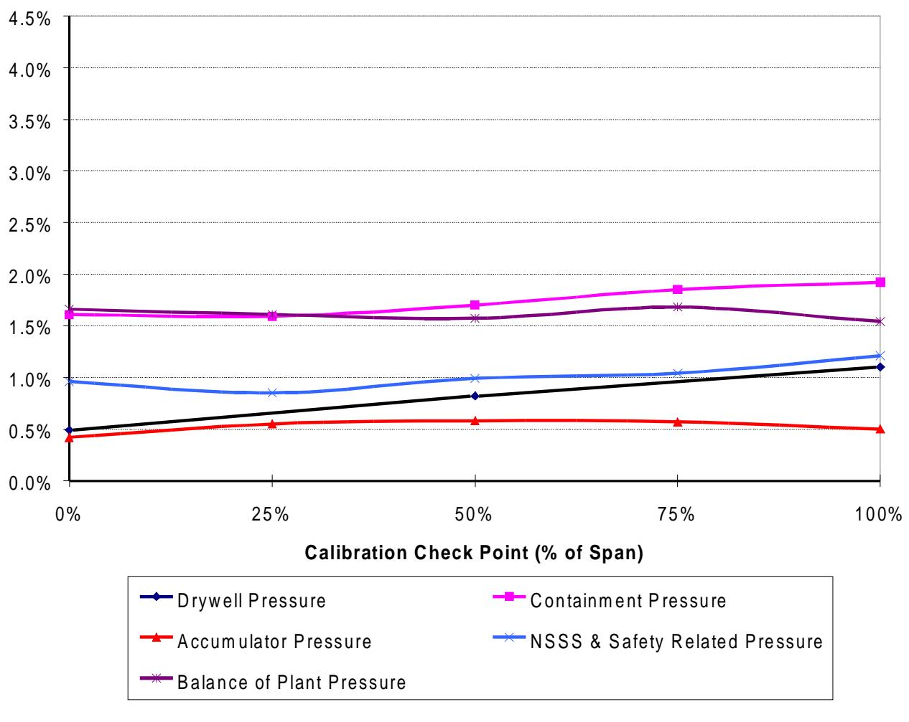

**Figure 8-24 Pressure Transmitter Nominal Drift Performance**

#### **8.5 Characterization of Instrument Drift**

Understanding the nature of drift is an important part of predicting how instruments will perform in service. Before developing this understanding, terms that will be used must first be defined. *Drift* is usually defined as "an undesired change in output over a period of time; this change is unrelated to the input, environment, or load." But, an instrument can drift in different ways, some of which are easily detected by on-line monitoring and some which can be more difficult to detect. Section 8.5.1 defines the various drift types and Section 8.5.2 provides an overview of the proportion of each drift type that was observed in actual calibration data. Section 8.5.3 returns to the issue of single point monitoring and its ramifications, given the observed drift types.

#### **8.5.1 Instrument Drift Categories**

#### 8.5.1.1 Traditional Drift Types

Before discussing traditional drift types, some basic terms regarding instrument accuracy should be explained. The starting point is *reference accuracy*, which defines a limit that error will not exceed when a device is used under reference or specified operating conditions. In the ideal case, there would be a perfect correlation between the input and output as shown in Figure 8-25. Unfortunately, there is always some amount of error in each process measurement. An instrument's rated accuracy consists of three instrument characteristics: repeatability, hysteresis, and linearity. These characteristics occur simultaneously and their cumulative effects are denoted by a band that surrounds the true output (see Figure 8-26). This band is normally specified by the manufacturer to ensure that their combined effects adequately bound the instrument's performance over its design life. Deadband is another attribute that is sometimes included within the reference accuracy.

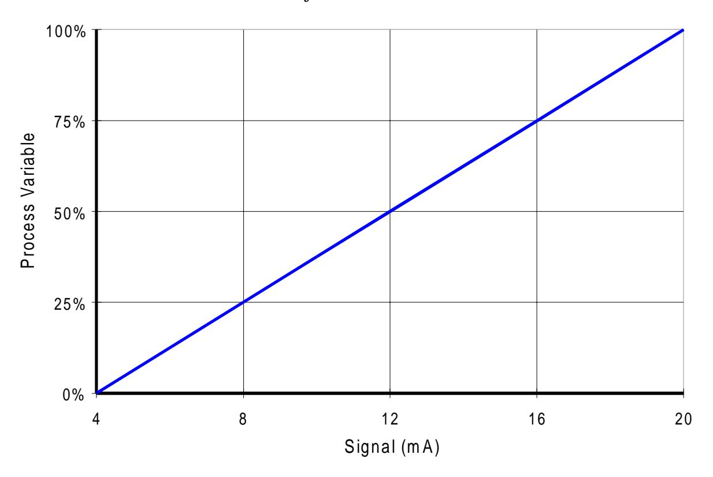

**Figure 8-25 Ideal Instrument Input/Output Curve**

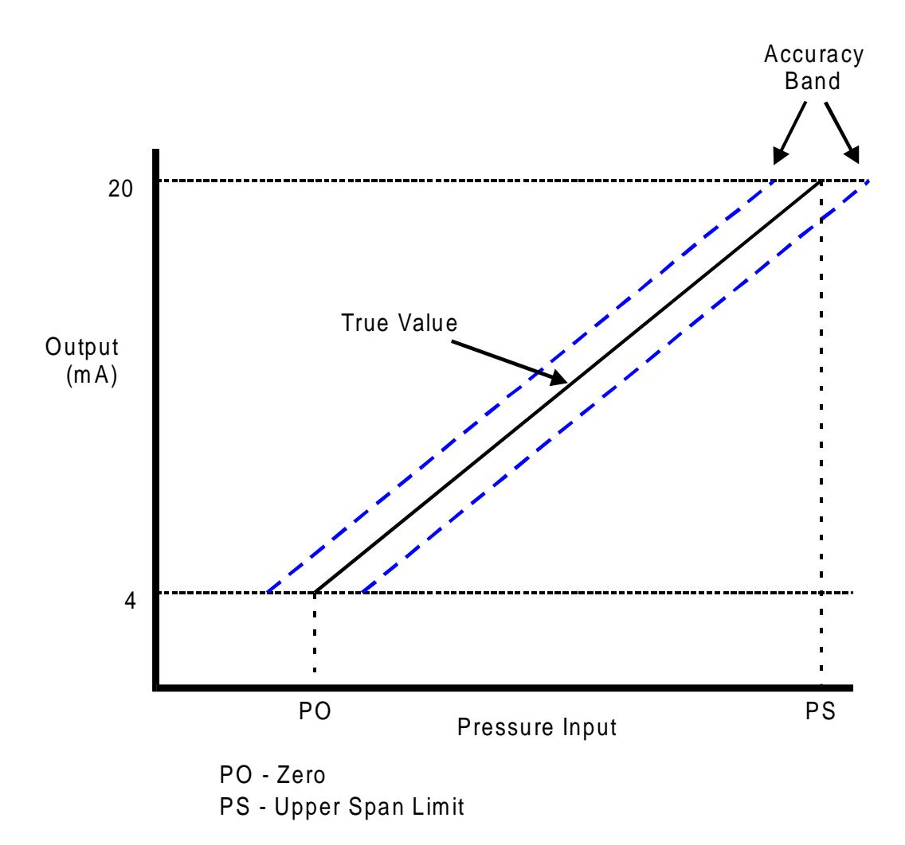

**Figure 8-26 Instrument Accuracy Band**

Repeatability is an indication of an instrument's stability and describes its ability to duplicate a signal output for multiple repetitions of the same input. Repeatability is shown on Figure 8-27 as the degree that signal output varies for the same process input. Instrument repeatability can degrade with age as an instrument is subjected to more cumulative stress, thereby yielding a scatter of output values outside of the repeatability band.

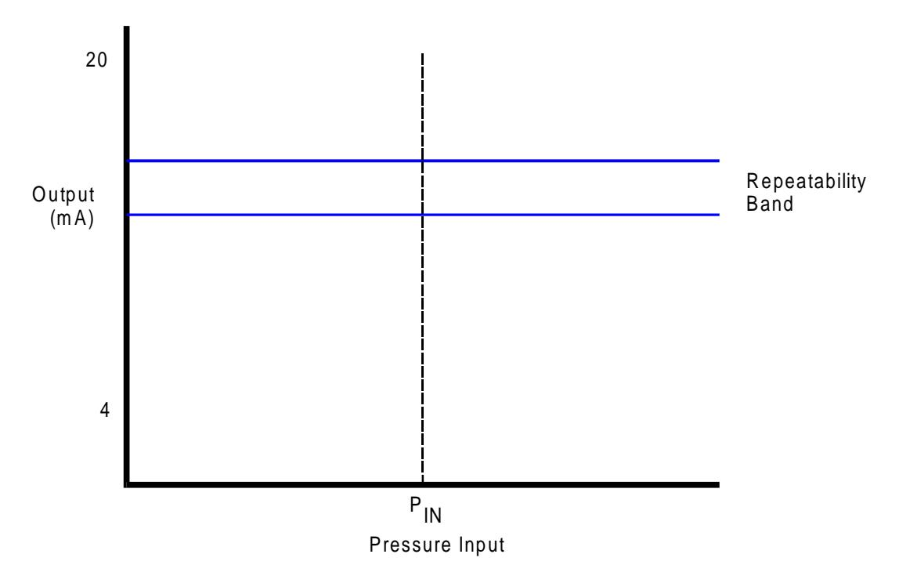

Figure 8-27 Repeatability

Transmitters preferably exhibit linear characteristics, i.e., the output signal should be linearly and proportionately related to the input signal. Linearity describes the ability of the instrument to provide a linear output in response to a linear input (see Figure 8-28). The linear response of an instrument can change with time and stress.

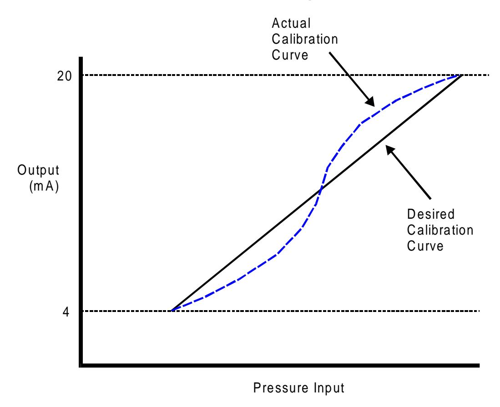

**Figure 8-28 Linearity**

Hysteresis describes an instrument's change in response as the process input signal increases or decreases (see Figure 8-29). The larger the hysteresis, the lower is the corresponding accuracy of the output signal. Stressors can affect the hysteresis of an instrument.

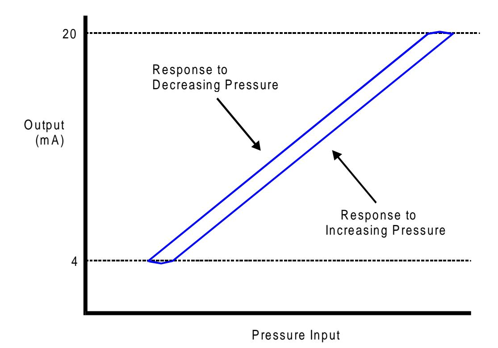

**Figure 8-29 Hysteresis**

Drift is commonly described as an undesired change in output over a period of time; the change is unrelated to the input, environment, or load. With regard to drift as described in this report, drift will be considered any change between calibrations from the ideal calibration curve.

A shift in the zero setting of an instrument is the most common type of drift. This shift can be described as a linear displacement of the instrument output over its operating range as shown in Figure 8-30. Zero shifts can be caused by transmitter aging, an overpressure condition such as water hammer, or sudden changes in the sensed input that might stress or damage sensor components.

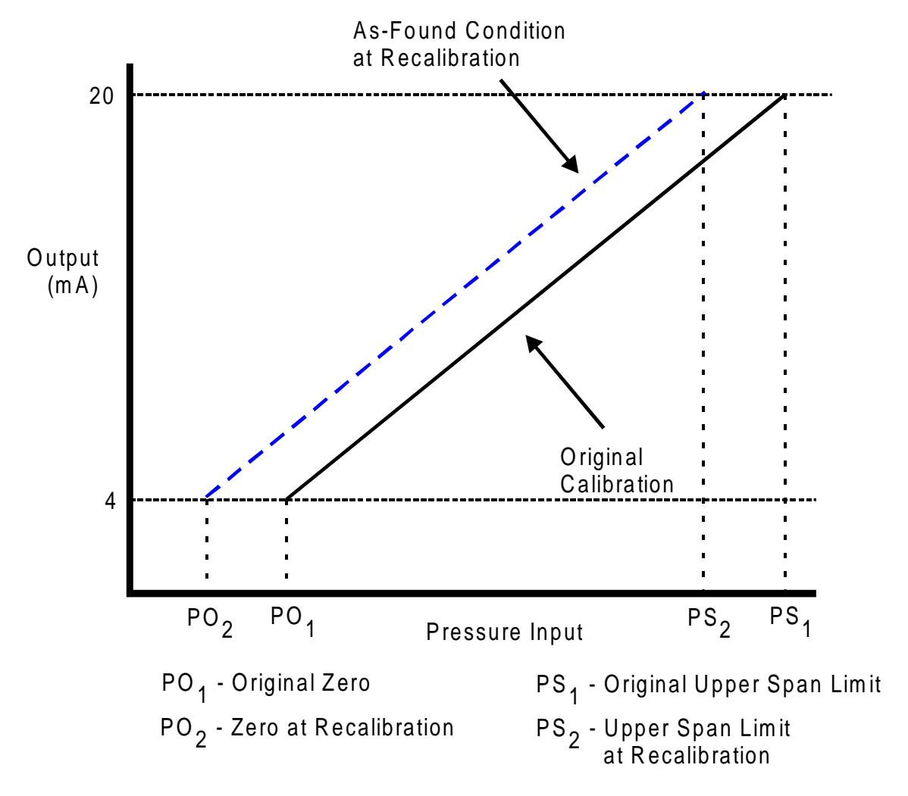

**Figure 8-30 Zero Shift Drift**

Span shifts are detected by comparing the minimum and maximum current outputs to the corresponding maximum and minimum process inputs. Figure 8-31 shows an example of *forward span shift* in which the instrument remains in calibration at the zero point, but has a deviation that increases with span. *Reverse span shift* is also possible in which the deviation increases with decreasing span.

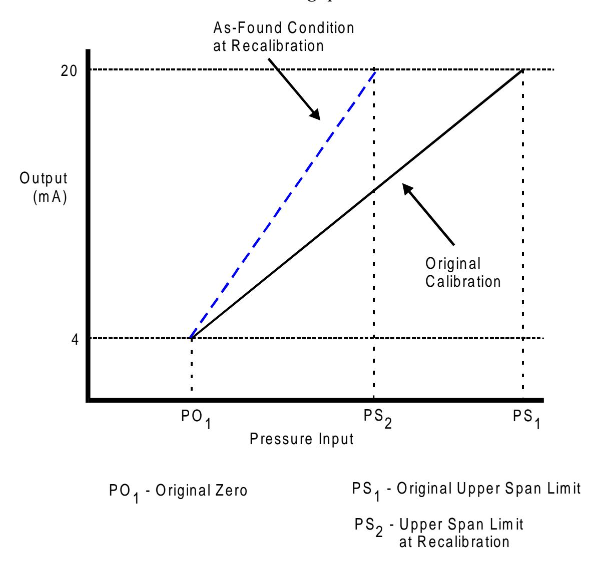

**Figure 8-31 Forward Span Shift Drift**

Nonlinear drift effects can also occur. For purposes of this report, nonlinear drift is any drift that could not be identified as zero shift, span shift, or a combination of zero and span shift.

#### 8.5.1.2 Observed Drift Types

The available AFAL data from the participating plants was combined to evaluate the nature of drift. The purpose of this part of the project was to refine the understanding of drift when it occurs and identify specific attributes that fully characterize the nature of drift. In this case, the AFAL data that was in calibration was of less interest. Instead, the out-of-calibration data was evaluated in more detail. This point will be important to remember in subsequent sections. The 0%, 25%, 50%, 75%, and 100% of span calibration points were used to characterize the drift over the instrument span.

The traditional drift types described in Section 8.5.1.1 were observed in the plant calibration data. However, a clear distinction between drift types was not always possible; in many cases, different drift effects were simultaneously influencing the instrument output. For example, zero shift and span shift were observed separately, but also frequently occurred together. Both forward span shift and reverse span shift were observed. Nonlinear drift was also observed. A special case of nonlinear drift, referred to as *single outlier*, was defined for those calibrations in which only a single calibration point deviated significantly from the desired output. It is believed that some instances of a single outlier are likely due to transcription or data entry errors because the presence of a single outlier is inconsistent with how a transmitter operates.

In summary, the following drift types were observed:

- Zero shift
- Forward span shift
- Reverse span shift
- Forward span shift with zero shift
- Reverse span shift with zero shift
- Nonlinear drift
- Single outlier (special case of nonlinear drift)

Examples of the above drift types are provided below using actual calibration data. Each figure below shows the trend from 0% of span to 100% span by displaying only the deviation from the desired value. For example, if the actual value at the 50% calibration check point correlated to 51% span, that point is displayed as a 1% deviation. This normalized approach was used for the sake of clarity in the data presentation.

Using actual calibration data, Figures 8-32 through 8-34 show typical examples of zero shift, forward span shift, and reverse span shift, respectively. The x-axis of these figures shows the calibration checkpoint in terms of percent of span and the y-axis shows the deviation from the desired value (treated here as drift) expressed as a percent of span. Lines have been drawn between the points only to show the trend. As expected, zero shift shows a relatively constant deviation throughout the calibrated span. Forward and reverse span shifts exhibit a greater deviation on one end of span compared to the other end of span.

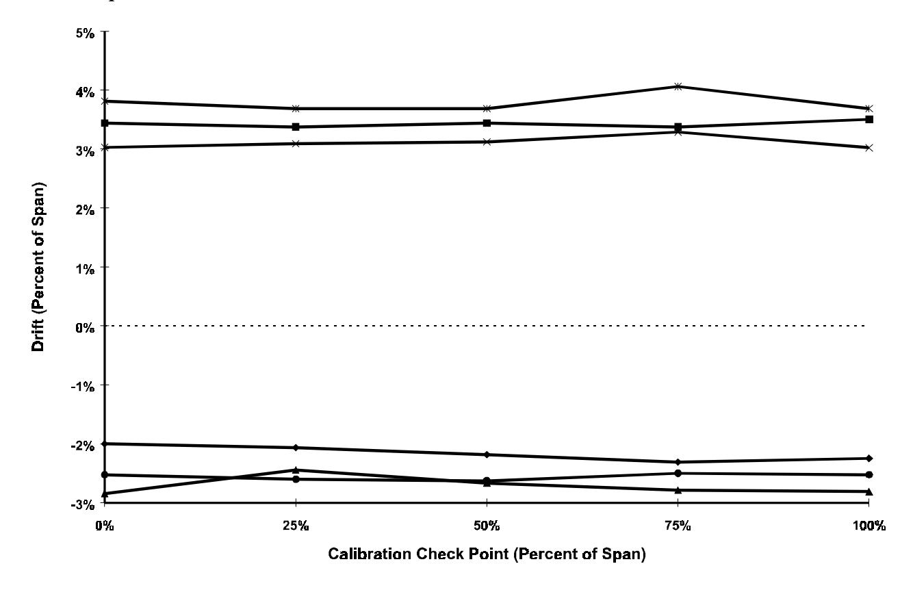

**Figure 8-32 Zero Span Shift Examples**

#### *Appendix B: Instrument Drift Characteristics*

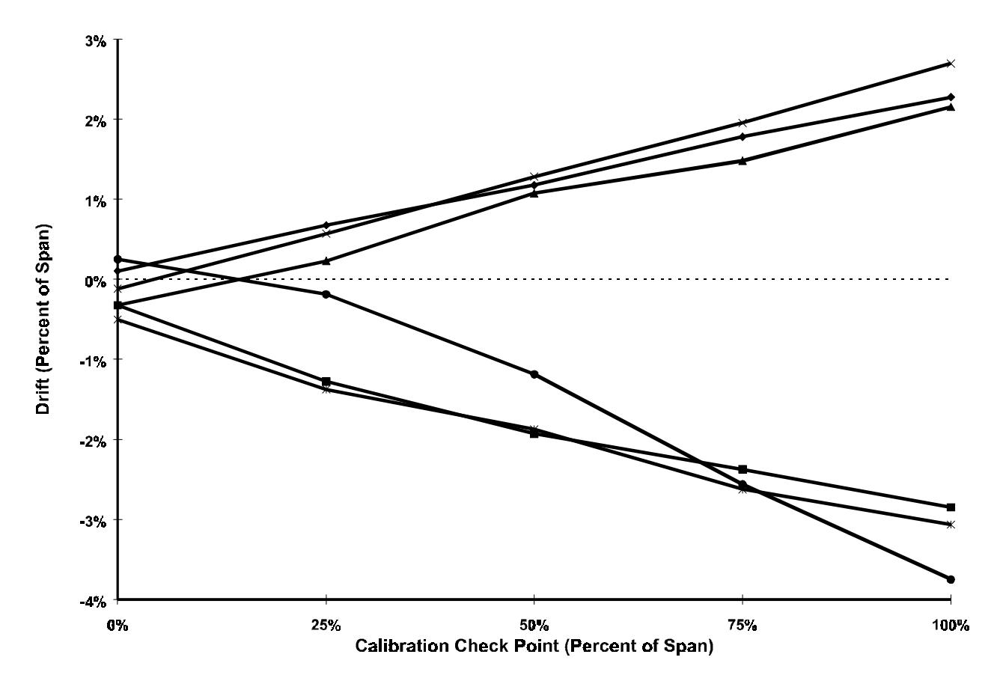

**Figure 8-33 Forward Span Shift Examples**

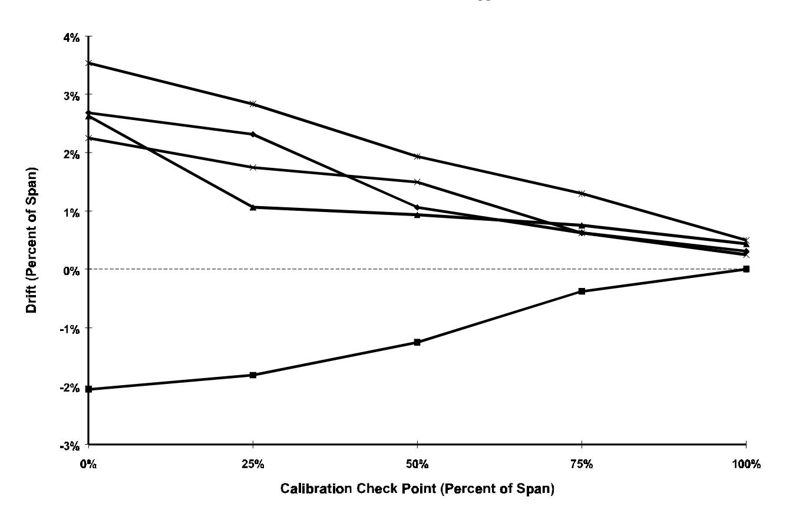

**Figure 8-34 Reverse Span Shift Examples**

Span shift was frequently accompanied by zero shift. For purposes of classification, zero shift was assumed to be present if the span shift was shifted by more than 0.5% from the reference point at the low end of span for forward span shift (the upper end of span for reverse span shift). Figures 8-35 and 8-36 show examples of these two cases. Notice in Figure 8-35 that span shift and zero shift do not always work in the same direction. When they act in opposition, the calibration curve will cross the zero deviation axis at some point.

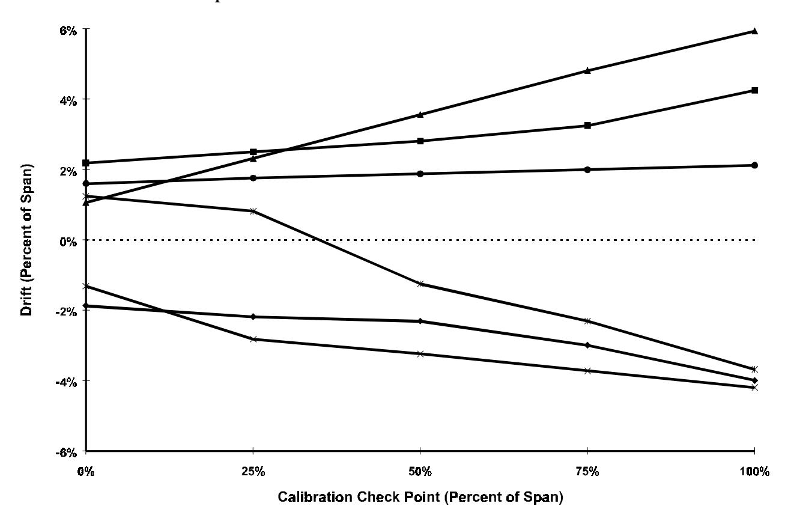

**Figure 8-35 Forward Span Shift with Zero Shift Examples**

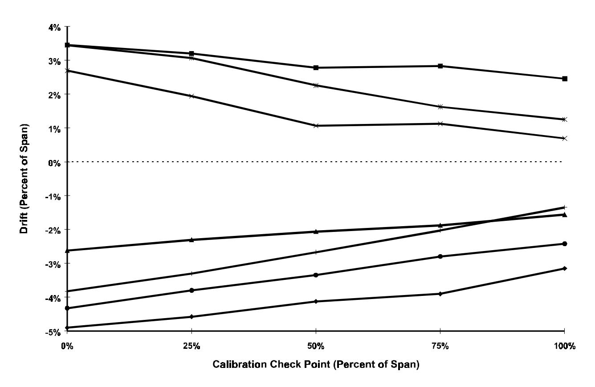

**Figure 8-36 Reverse Span Shift with Zero Shift Examples**

Figure 8-37 shows examples of nonlinear drift behavior. Nonlinear behavior was not common, but it was included as a drift category for completeness. A special category of nonlinear drift – *single outlier* – was created for those few cases in which only a single calibration point was significantly out of calibration. Figure 8-38 shows examples of this drift type. Most of the calibrations with one extreme point likely have transcription or data entry errors. Unfortunately, there was no easy way to confirm a data entry error for these cases.

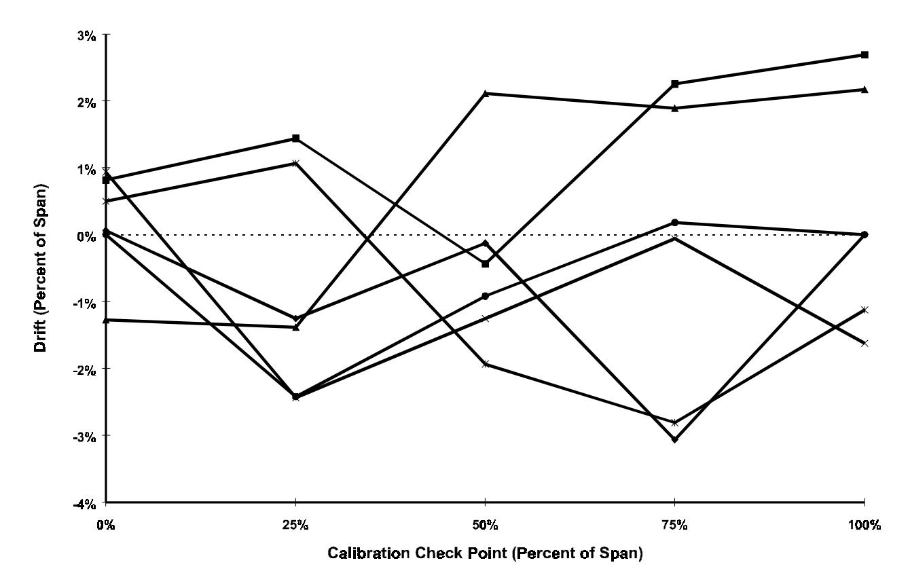

**Figure 8-37 Nonlinear Behavior Examples**

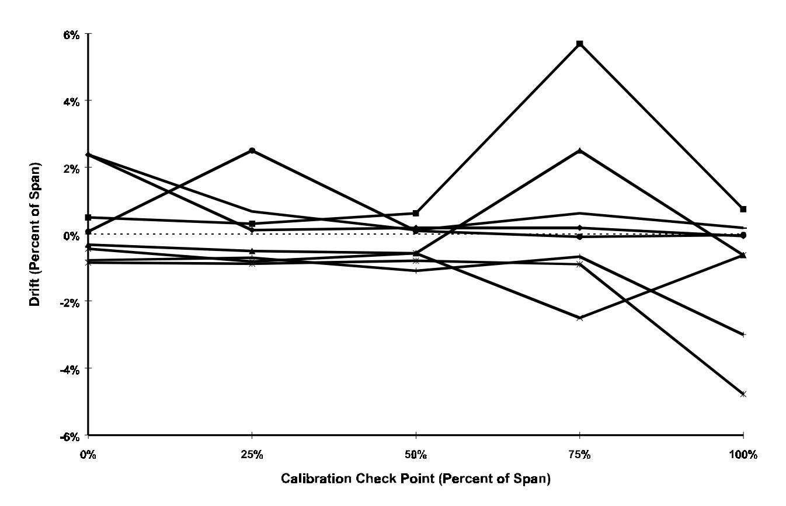

**Figure 8-38 Single Outlier Examples**

#### **8.5.2 Observed Proportions of Each Type of Drift**

Transmitter calibration data from 18 nuclear plants was combined into a single data file to evaluate the nature of drift. The AFAL values for the 0%, 25%, 50%, 75%, and 100% of span points were retained for drift categorization. This file contained data for over 6,000 calibrations with almost 5,000 AFAL data sets. The total number of AFAL data points exceeded 23,000.

The focus of this evaluation was on out-of-calibration data and the nature of the data when a transmitter was out of calibration. The calibrations were screened for the worstcase AFAL data point in each AFAL set of five check points (0% to 100% of span). For purposes of evaluation, the AFAL data was screened into the following drift ranges based upon the worst-case data point:

- 1–2%
- 2–3%
- 3–4%

#### *Appendix B: Instrument Drift Characteristics*

- 4–5%
- 5–8%
- 8–15%
- >15%

 For each out-of-calibration event, the type of drift observed was evaluated and the calibration was assigned to one of the categories established in Section 8.5.1.2. The drift category was assigned based on the following criteria:

- Zero shift—Most AFAL points tended to have similar magnitudes. Span shift, if present, exhibited less than ~0.5% variation across the span.
- Forward span shift—The AFAL points tended to increase in magnitude from the low end of span to the high end of span. Zero shift, if present, caused less than ~0.5% of span offset.
- Reverse span shift—The AFAL points tended to increase in magnitude from the high end of span to the low end of span. Zero shift, if present, caused less than ~0.5% of span offset.
- Forward span with zero shift—The AFAL points tended to increase in magnitude from the low end of span to the high end of span, but an offset (zero shift) of >0.5% was also present at the 0% of span point.
- Reverse span with zero shift—The AFAL points tended to increase in magnitude from the high end of span to the low end of span, but an offset (zero shift) of >0.5% was also present at the 100% of span point.
- Nonlinear shift—The AFAL values varied widely over the span with no consistent zero of span shift pattern.
- Single outlier—A special case of nonlinear shift in which one point was significantly larger than the other AFAL points.

Figure 8-39 shows the drift results for those calibrations with AFAL magnitudes between 1% and 2% of span at one or more calibration check points. Zero shift alone was the dominant type of drift and it was also a contributor to drift in a significant portion of the span shift cases. For on-line monitoring, zero shift is the preferred type of drift because drift at one point in the span would be indicative of drift elsewhere in the span. In other words, an instrument with zero shift drift alone could not be in calibration at one point and significantly out of calibration at another point. Figure 8-39 shows that span shift was also a major contributor to drift. Span shift is less desirable

than zero shift for on-line monitoring because the instrument might be in calibration at one point, but outside calibration limits at other points. Nonlinear drift and single outlier drift were the least likely drift types.

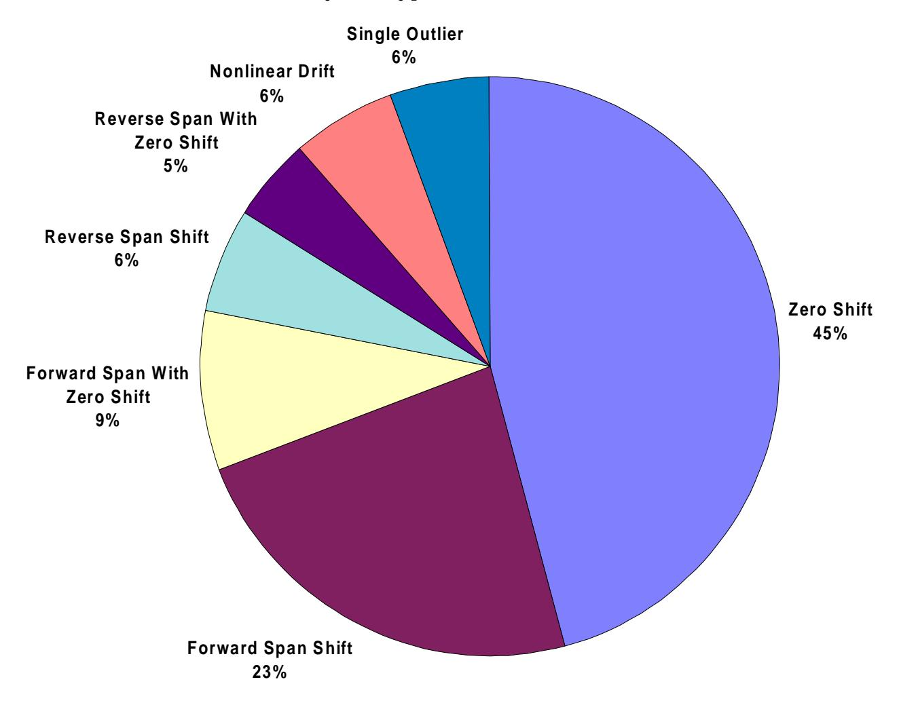

**Figure 8-39 Drift Category Proportions for Out-of-Calibrations Between 1%–2%**

A minimum level of 1% drift was selected for drift categorization. But, a review of the AFAL data below 1% readily shows that zero shift and span shift are present at all levels of drift. Zero shifts can easily range from less than ±0.5% of span with the instrument still in calibration to ±20% or more of span for extreme cases of out-ofcalibration. The same holds true for span shift. But, in most calibrations, the magnitude of zero shift and span shift is small enough that it does not cause an out-of-calibration condition.

When the calibration data is screened at even higher drift levels, the proportions shown in Figure 8-39 varied, but not greatly. Figures 8-40 through 8-45 show the proportions for out-of-calibrations at higher screening levels. As the drift magnitude screening level

increases, the relative proportions of each type of drift do not change by large amounts. This behavior is significant because it shows that the types of drift and their relative proportion are relatively independent of the magnitude of drift. For example, span shift and zero shift can be observed at all levels of drift, even in data for in-calibration transmitters.

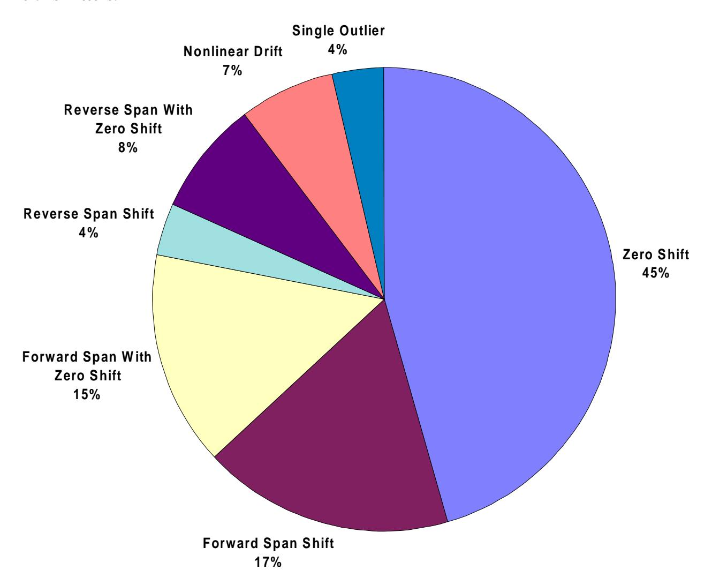

**Figure 8-40 Drift Category Proportions for Out-of-Calibrations Between 2%–3%**

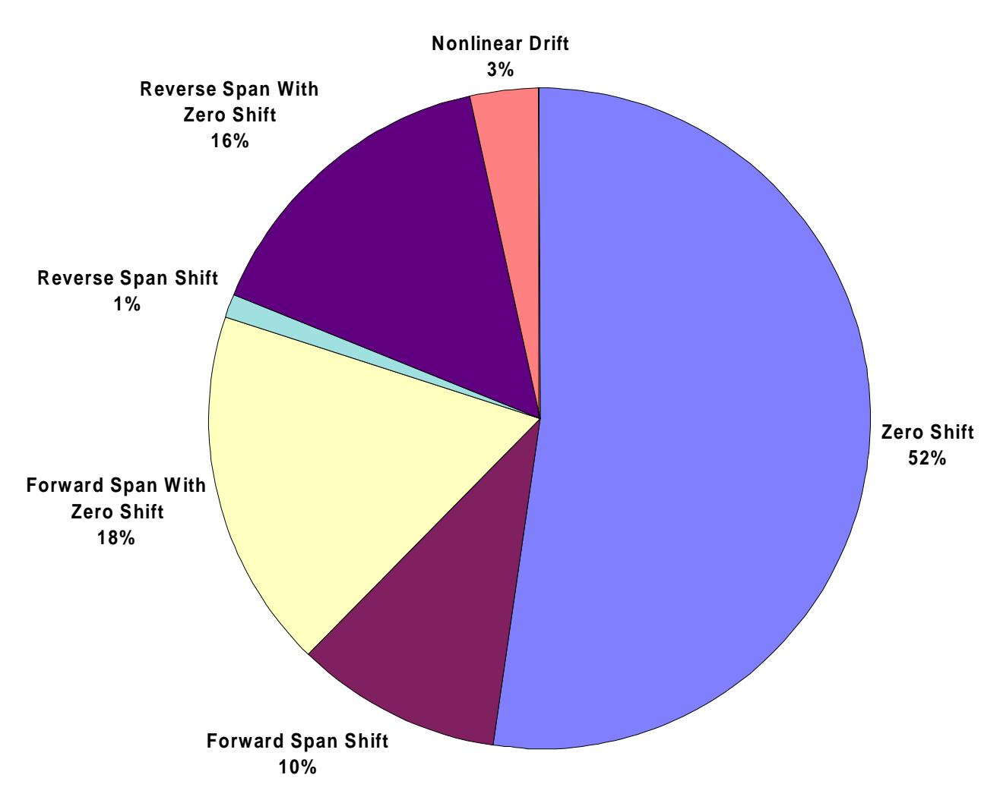

**Figure 8-41 Drift Category Proportions for Out-of-Calibrations Between 3%–4%**

*Appendix B: Instrument Drift Characteristics*

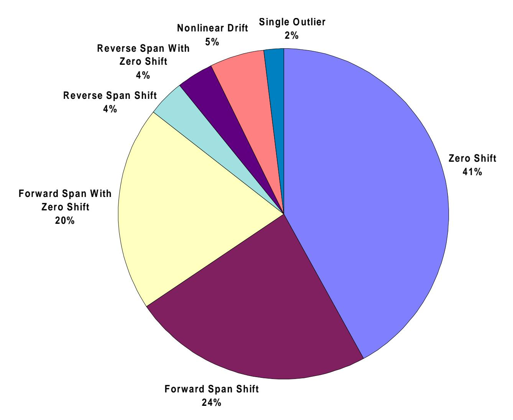

**Figure 8-42 Drift Category Proportions for Out-of-Calibrations Between 4%–5%**

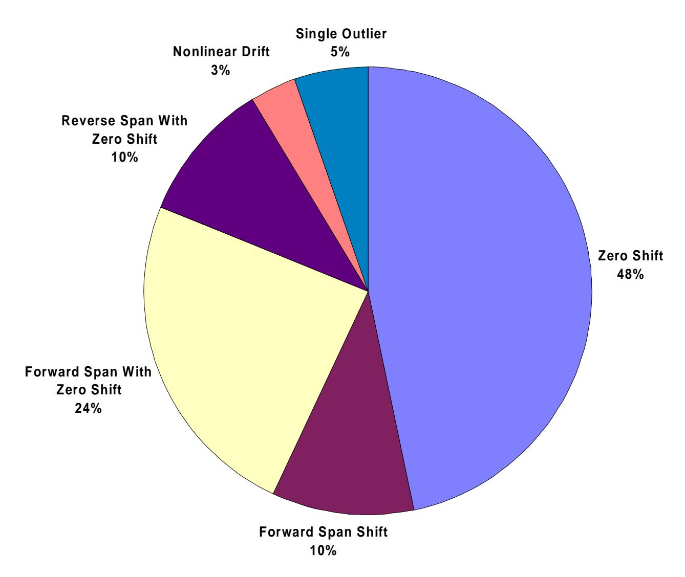

**Figure 8-43 Drift Category Proportions for Out-of-Calibrations Between 5%–8%**

*Appendix B: Instrument Drift Characteristics*

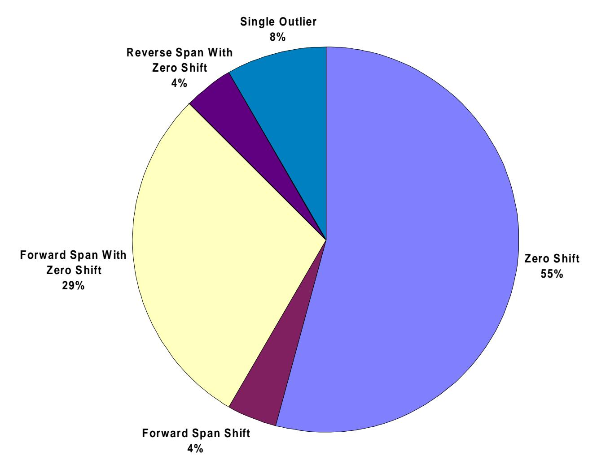

**Figure 8-44 Drift Category Proportions for Out-of-Calibrations Between 8%–15%**

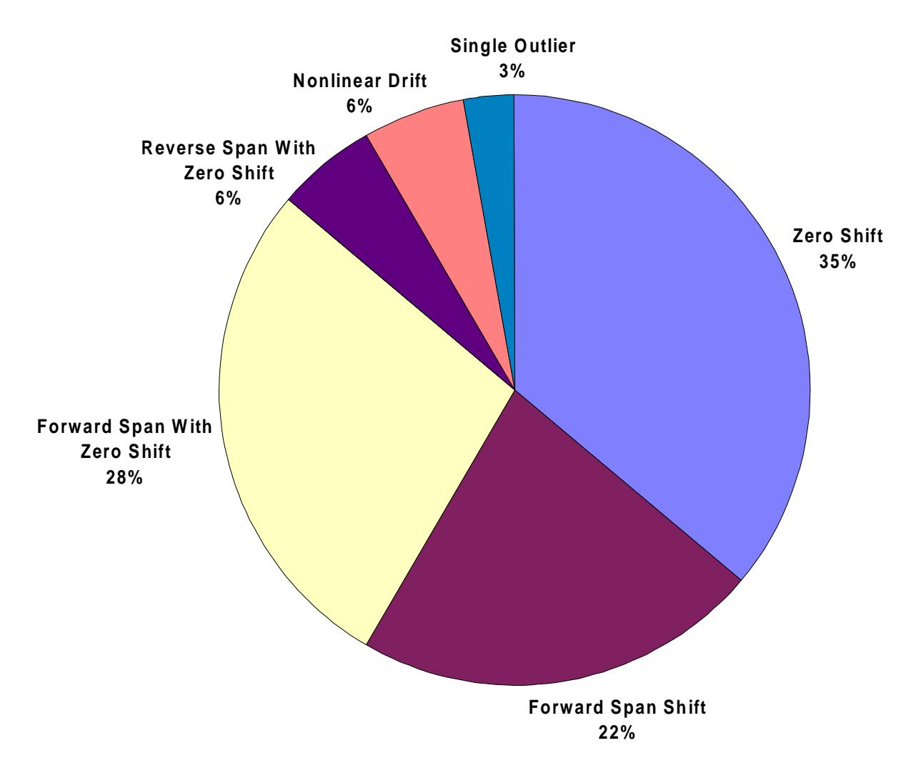

**Figure 8-45 Drift Category Proportions for Out-of-Calibrations >15%**

As would be expected, the number of out-of-calibration events decreases as the drift screening level increases. Between 1% to 2%, there was a much larger number of out-ofcalibrations (536 total) than there were between 8% to 15% (only 24). This makes sense in that we expect the transmitters to be fairly well behaved with relatively few gross out-of-calibration conditions. But, it is important to note in that the higher drift screening levels have a fairly small sample size by comparison.

*Appendix B: Instrument Drift Characteristics*

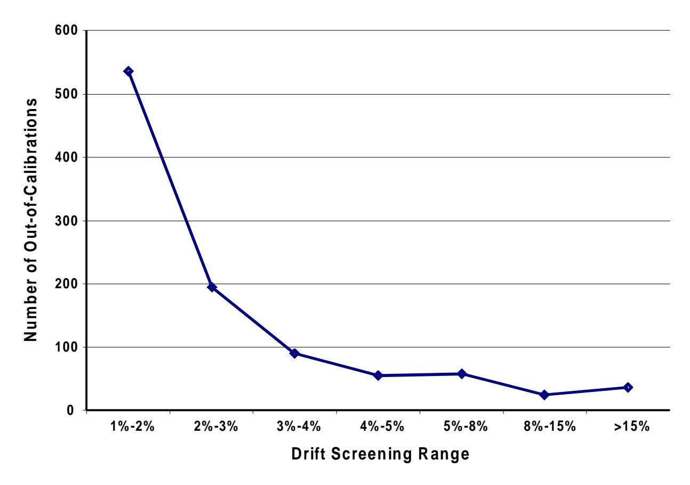

**Figure 8-46 Number of Out-of-Calibrations within Each Drift Screening Range**

The purpose of this section was primarily to categorize the types of drift that were observed in the data and discuss the unique attributes of each category. The drift types are important because on-line monitoring at a single point (or within a fairly small range in the calibrated span) might or might not be capable of detecting instrument drift, depending on the type and magnitude of drift. Zero shift produces a fairly constant deviation throughout the instrument span and, if only zero shift is present, the instrument is likely to be in calibration over the entire span if it is in calibration at any one point. Span shift can either work for or against on-line monitoring of a single point or small portion of the span. For example, monitoring a parameter that is always near or at the low end of span, such as containment pressure or a flow measurement for a normally off pump, would not be capable of detecting a forward span shift. But, other parameters that operate near mid-span would tend to be resistant to span shift effects in that it is unlikely for points in mid-span to be in calibration with other points at either extreme end of span to be significantly out of calibration. Note also that the limitation of detecting span shift drift with on-line monitoring during plant operation is no different than for current surveillance check practices of verifying that redundant meters indicate similar values.

The next section continues the analysis of instrument drift by calculating probabilities that an instrument is out of calibration at some point within its span given that it is in calibration at the monitored point.

#### **8.5.3 Single Point Monitoring—Likelihood of Drift Elsewhere in Span**

The issue of single point monitoring can be expressed in a single problem statement: given that an instrument appears to be in calibration at the monitored point, what is the likelihood that it is out of calibration elsewhere in its calibrated span? An analysis of instrument calibration data is well suited for answering this question. In general, transmitters evaluated by this project were usually in calibration. But, more fundamentally, it was unlikely for one or more calibration checkpoints to be significantly out of calibration when one point (assume the monitored point) was within calibration to some specified level. Figure 8-47 shows that the evaluated transmitters were generally found in calibration (this figure was developed from AFAL data in which all calibration check points were within the specified limit).

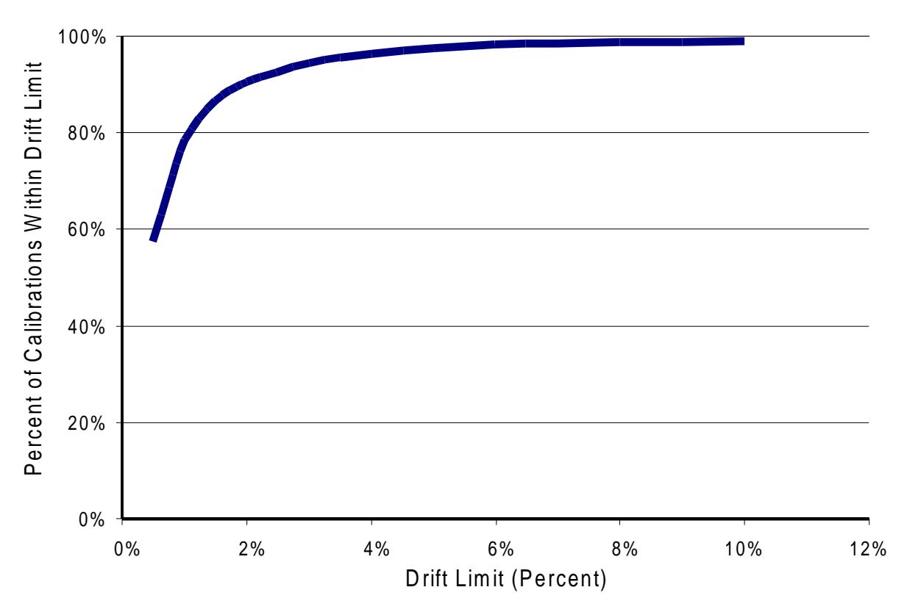

**Figure 8-47 Percentage of In-Calibration Transmitters at Specified Level**

Section 8.5.2 showed that zero shift was the most common contributor to drift. Whenever, zero shift alone influences the instrument output, equivalent performance is expected throughout the calibrated span.

*Appendix B: Instrument Drift Characteristics*

Previous studies of AFAL data have shown a tendency for the magnitude of predicted drift to increase with span. Section 8.5.2 readily explains this observed phenomenon as attributable to forward span shift. Even at low drift levels, span shift is at work. Also, forward span shift alone was observed much more often than reverse span shift. The significance of this observation is that AFAL values high in the calibrated span are likely to be larger than AFAL values low in the calibrated span.

Now, let's return to the problem statement and apply this information. Given that an instrument appears to be in calibration at the monitored point, what is the likelihood that it is out of calibration elsewhere in its calibrated span? This problem statement can be expressed differently as follows: given that an instrument appears to be in calibration (to some defined level) at the monitored point, what is the probability that no other point elsewhere in the calibrated span will be larger than the monitored point by some specified amount?

Section 8.5.2 evaluated out-of-calibration data to determine the types of observed drift. Answering the above question now requires evaluating the in-calibration data. The data was evaluated by treating each calibration check point (0%, 25%, 50%, 75%, and 100% of span) as a separate sample. For each calibration check point, the in-calibration data (at the specified level) was retained. Then, the data for the other four calibration check points was evaluated to determine the number of instances in which one or more points exceeded the drift limit for the monitored point by some additional amount. The easiest way to explain this more clearly is by an example. Figure 8-48 shows the probabilities that any other AFAL point will be larger than the drift limit for the monitored point by more than an additional 0.5% of span.

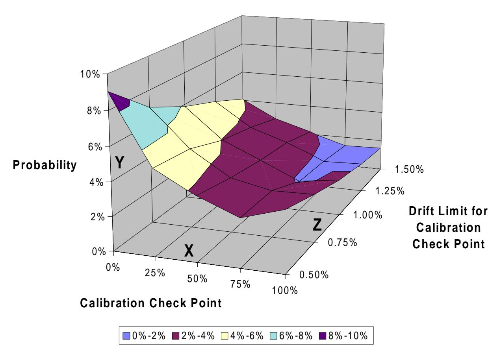

**Figure 8-48 Probability That Drift at Other Check Points Is >0.5% Larger Than Drift Allowance at the Specified Point**

The axes and data presented in the Figure 8-48 surface plot require some explanation as follows.

- The x-axis shows that the calibration check data was evaluated at the 0%, 25%, 50%, 75%, and 100% of span checkpoints.
- The z-axis refers to the drift limit that we allowed for the monitored point. For example, we might be monitoring the 50% of span point and drift limits could be established for this point within which we consider the performance acceptable. For this evaluation, drift limits ranging from 0.5% to 1.5% were considered. As an example, a drift limit of 1.0% means that all calibrations were retained for evaluation in which the 50% of span point was within 49% to 51% of span.
- The y-axis is the probability that another calibration checkpoint exceeds the monitored point's drift limit by an additional specified amount. In the case of Figure 8-48, the specified amount is 0.5%. For example, if the drift limit at the monitored amount is 1%, then the other calibration check points were allowed to vary by 0.5% more, or 1.5% in this particular example. Referring to the 100% check

*Appendix B: Instrument Drift Characteristics*

point line, the probability was always less than 3% that another check point was larger than the specified drift limit by 0.5%.

The above explanation requires careful consideration; the surface plot is not necessarily intuitive. In summary, the surface plot shows the probability that another point in the span will be larger (by a specified amount) than the allowed drift limit for the monitored point. In order for single-point monitoring to be effective, this probability should be acceptably small.

The probabilities presented in Figure 8-48 represent the calculated failure proportions at each evaluated point. Minimum and maximum failure probabilities at the 95% confidence level can also be computed for each case. Because of the large sample size used in this analysis, the minimum and maximum failure probabilities are always within 1% of the actual pass proportion if computed using a binomial pass/fail approach. In other words, the maximum probability will be approximately 1% more than shown in Figure 8-48 and subsequent figures.

Figure 8-48 shows very encouraging results with the other points constrained to within 0.5% of the drift limit for the evaluated point. As one would expect, the probabilities continue to improve as the other points are allowed to deviate even more. Figures 8-49 through 8-52 show that the probabilities continue to improve as the deviation from one point's drift limit is allowed to be 0.75%, 1%, 1.25%, and 1.5%, respectively.

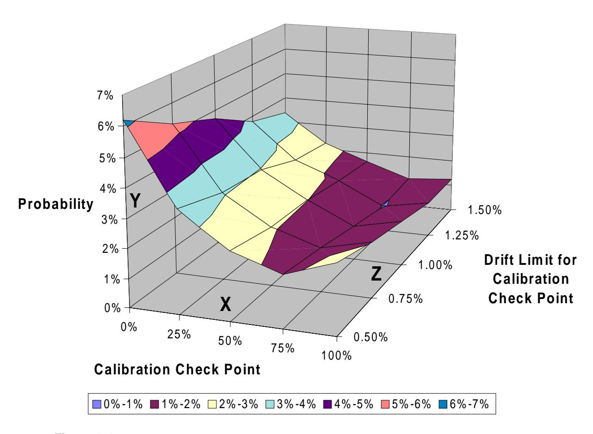

**Figure 8-49 Probability That Drift at Other Check Points Is >0.75% Larger Than Drift Allowance at the Specified Point**

*Appendix B: Instrument Drift Characteristics*

**Figure 8-50 Probability That Drift at Other Check Points Is >1.0% Larger Than Drift Allowance at the Specified Point**

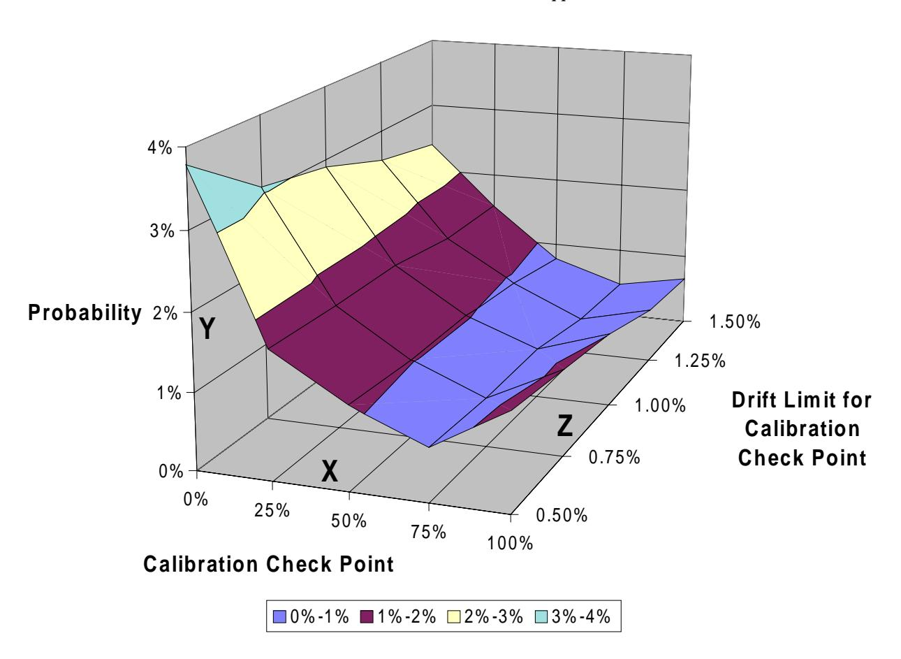

**Figure 8-51 Probability That Drift at Other Check Points Is >1.25% Larger Than Drift Allowance at the Specified Point**

*Appendix B: Instrument Drift Characteristics*

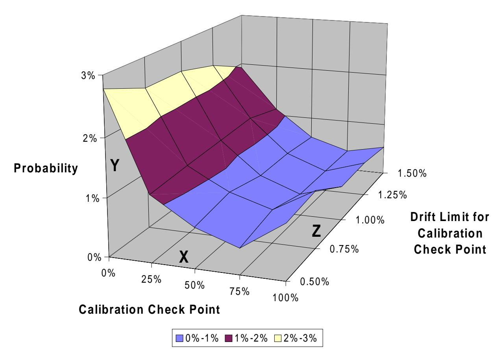

**Figure 8-52 Probability That Drift at Other Check Points Is >1.5% Larger Than Specified Point**

As discussed previously, forward span shift occurs more frequently than reverse span shift. As expected given this knowledge, the largest failure probabilities occur if operation is low in the instrument span. If operation is higher in the span, the probabilities improve considerably. Notice that the 50% of span checkpoint routinely has a probability approaching that of the 100% of span check point. The reason for this effect is believed to be due to the 50% span point responding about the same to either forward or reverse span shift. Because forward span shift dominates compared to reverse span shift, the 100% checkpoint still has the highest probability. The 75% checkpoint has a higher probability than the 25% checkpoint because of the higher incidence of forward span shift.

#### **8.5.4 Additional Observations Regarding Instrument Drift**

The previous sections demonstrate that zero shift and span shift are the predominant types of instrument drift. Furthermore, zero shift and span shift occur at all levels of drift, ranging from insignificant levels less than 0.5% of span to extreme out-ofcalibration conditions greater than 20% of span. The incidence of nonlinear drift is less common than zero and span shift. If one had to choose, zero shift is the most desirable

*Appendix B: Instrument Drift Characteristics*

drift type because it is readily recognizable anywhere along the instrument's span. Span shift is less desirable because an instrument might be in calibration at one point and out of calibration elsewhere along its span. Depending on the monitored point and the type of span shift, this could work either for or against a calibration evaluation.

Unfortunately, span shift does occur often enough that it requires consideration in the development of on-line monitoring acceptance criteria. Previous studies of AFAL data have often shown a tendency for instrument drift to increase with span. This effect is readily explained by the number of instances in which forward span shift contributes to the observed drift. Reverse span shift occurs less often than forward span shift which explains why it does not effectively cancel out the forward span shift in an AFAL analysis. Exceptions can and do occur; however, when a large sample of instruments is evaluated, the greater incidence of forward span shift compared to reverse span shift becomes apparent.

The point of this discussion is that on-line monitoring acceptance criteria should account for the possibility of span shift effects, even when an instrument appears to be in calibration to within some specified level. Figures 8-53 through 8-56 show the tendency for span shift to affect instrument performance even when the instrument is considered to be in calibration. Figure 8-53 was developed by excluding all calibrations with any calibration checkpoint AFAL value greater than ±2%. Thus, this graph represents the expected drift results for all instruments that are in calibration to this level. As can be seen, there is a clear trend for the magnitude of drift to increase with span; the 100% of span check point tolerance interval is about 0.2% of span (25%) larger than the 0% of span check point tolerance interval. Figures 8-54 through 8-56 show similar results for calibration limits set at ±1.5%, ±1%, and ±0.75%, respectively.

*Appendix B: Instrument Drift Characteristics*

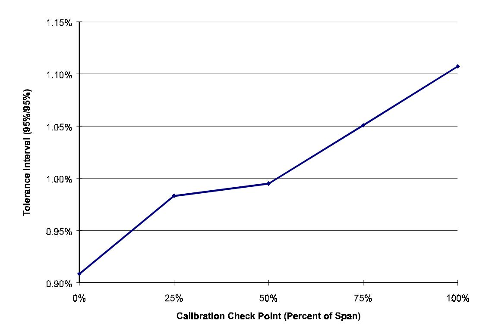

**Figure 8-53 Observed Performance for All Instruments in Calibration by ±2%**

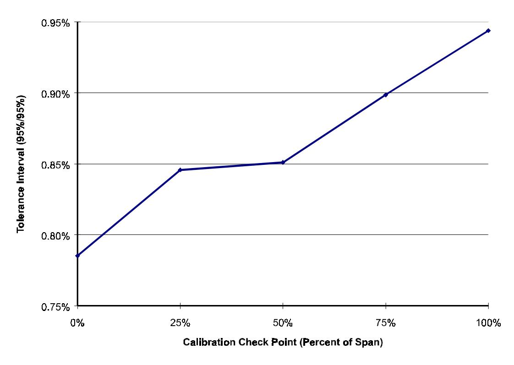

**Figure 8-54 Observed Performance for All Instruments in Calibration by ±1.5%**

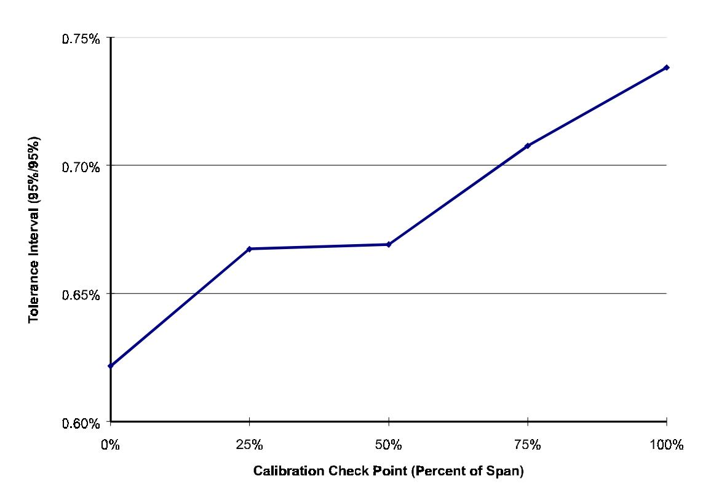

**Figure 8-55 Observed Performance for All Instruments in Calibration by ±1.0%**

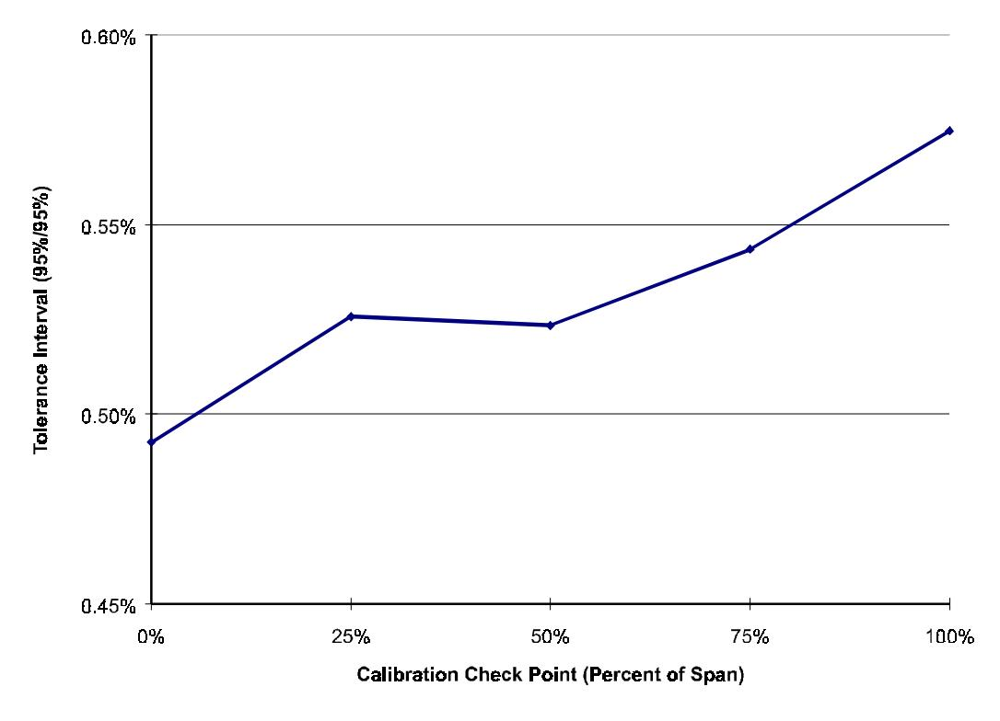

**Figure 8-56 Observed Performance for All Instruments in Calibration by ±0.75%**

#### **8.5.5 Accounting for Single Point Monitoring in On-line Monitoring Acceptance Criteria**

Section 8.5.1 described the drift types observed in plant calibration data and Section 8.5.2 provided the relative proportions of each type. Section 8.5.3 evaluated the AFAL data and demonstrated the low likelihood for one point on the calibration curve to be in calibration while another point was significantly out of calibration. This finding alone offers assurance that long-term monitoring of a single point can produce useful information regarding an instrument's calibration. Additional confidence can be gained by taking advantage of plant transients or mode changes to further evaluate each instrument as its output is perturbed by some amount. In summary, calibration data evaluated by this project shows that instrument performance is suitable for on-line monitoring, despite the various types of observed drift.

The purpose of this section is to develop an allowance for single point monitoring that can be treated as another uncertainty term in the on-line monitoring acceptance criteria. To accomplish this, the study performed in Section 8.5.3 was evaluated from a different perspective. Given that a drift limit will be established for each monitored channel, the AFAL data was analyzed to determine what allowance is necessary to ensure a nominal 96% pass probability. Because of the sample size, the minimum probability will be better than 95% and the maximum probability will be almost 97%. The following variables affect this analysis:

- The monitored point along the instrument span—As shown in Section 8.3, the probability improved if the monitored point was higher in the span.
- The allowed drift limit for the channel—A larger drift limit is more forgiving.
- The desired probability of success—95% was selected for this study.

 The results of the study are shown in Figure 8-57. Consistent with the results of Section 8.5.3, Figure 8-57 shows that monitoring a process low in the span carries a higher penalty than monitoring high in the span. Figure 8-57 also shows that higher channel drift limits improve the single point monitoring allowance.

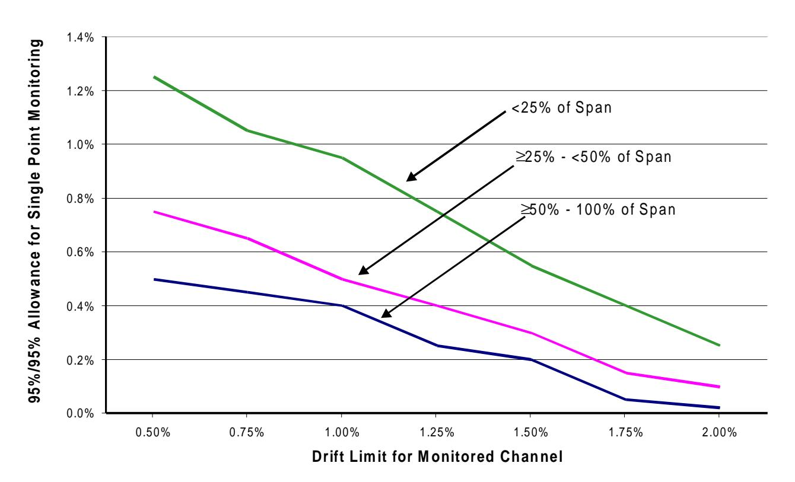

**Figure 8-57 Recommended Allowance for Single-Point Monitoring**

Referring to Figure 8-57, the following explanations of the curves is provided:

- The *<25% of Span* curve is based on 0% of span calibration data. The probability improved considerably at the 25% calibration checkpoint.
- The ≥*25%—<50% of Span* curve is based on 25% of span calibration data.
- The ≥*50%—100% of Span* curve is based on the combined 50%, 75%, and 100% of span calibration data. The probability was sufficiently low that the three points were combined for convenience.

As can be seen in Figure 8-57, the recommended allowance depends on the channel drift limit, which can vary with the monitored parameter. A minimum allowance of 0.25% is recommended even if Figure 8-57 would permit a lower allowance. In the overall uncertainty evaluation for on-line monitoring, this single point monitoring allowance should be treated as a random uncertainty; the AFAL data was centered about the mean and treating the allowance as a bias is not supported by the data.

Finally, on-line monitoring as a calibration verification tool might not be appropriate for all parameters. Containment pressure is an example of a process parameter whose value is usually near zero psig. Plant transients and operational mode changes do not

*Appendix B: Instrument Drift Characteristics*

cause a significant change in the containment pressure. Thus, these transmitters are very near zero and always remain very near zero. Although a zero shift would be readily detectable, a forward span shift would never be detected. Similarly, a transmitter failure that caused loss of signal also might not be detectable. For this reason, containment pressure is not considered to be well suited for on-line monitoring as related to calibration confirmation.

Other parameters that start out at the low end of span, but normally operate at the high end of span are not susceptible to the same concerns. Plant transients and operational mode changes do cause variation in the process that allows on-line monitoring to evaluate drift elsewhere in the instrument's span.

*9* 

## **APPENDIX C: STATISTICAL ANALYSIS CONSIDERATIONS REGARDING INSTRUMENT PERFORMANCE**

#### **9.1 Clarification of Terms Used in Statistical and Uncertainty Analysis**

Measurement uncertainty is often described at the 95%/95% level. This means that a statement of uncertainty is expected to bound the actual process value to a 95% probability with a 95% confidence. For a normally distributed population, approximately 68% of the population is contained within ±1 standard deviation (σ) of the mean. Better than 95% of the population is contained within ±2 σ of the mean. This relationship is shown on Figure 9-1.

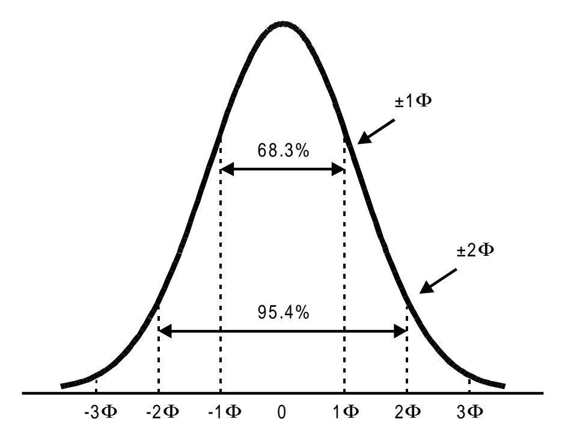

**Figure 9-1 Probability of a Measurement within ±**χσ

#### 9.2 Theoretical Limit of Parameter Estimate Uncertainty

A redundant channel type of on-line monitoring approach typically monitors two to five channels for a given parameter. In the simplest implementation of on-line monitoring, the parameter estimate would be the average of the monitored channels. In the case of a simple average, the uncertainty of the parameter estimate can be calculated given the following assumptions:

- Each instrument loop represents a random and independent measurement of the same process.
- Instrument performance can be modeled as normally distributed.
- Each instrument is initially performing within specification.

The following example is provided to demonstrate the amount of measurement uncertainty that is present after redundant measurements are combined to estimate the process value.

#### Example 9-1

Assume that four channels monitor some process parameter and each channel has a total uncertainty of  $\pm 3\%$ ; no channel exhibits more drift than any other channel. This uncertainty of  $\pm 3\%$  accounts for all of the expected individual contributors to uncertainty for the entire instrument loop from sensor to display or bistable.

The method of uncertainty analysis presented in ANSI/ASME PTC 19.1-1985, *Measurement Uncertainty*, will be used to develop this example. By taking four independent measurements, the true process value will be estimated by taking the average of the individual measurements:

Best Estimate of 
$$X = \frac{x_1 + x_2 + x_3 + x_4}{4}$$

The terms  $x_1$ ,  $x_2$ ,  $x_3$ , and  $x_4$  represent four individual measurements of the process X. The general form of uncertainty analysis, without inclusion of any bias effects, is given by:

$$\omega_R = \pm \sqrt{\left(\frac{\partial R}{\partial x}\omega_x\right)^2 + ... + \left(\frac{\partial R}{\partial z}\omega_z\right)^2}$$

where.

$$R = A \text{ function } R(x, ..., z)$$

$$x, ..., z = Variables$$

$$\omega_x$$
, ...,  $\omega_z$  = Uncertainty of  $x$ , ...,  $z$ 

 $\omega_{R}$  = Uncertainty in the resultant function *R* 

Applying the above expression to our particular case, the uncertainty in our measurement of *X* is given by:

$$\omega_{x} = \pm \sqrt{\left(\frac{\partial X}{\partial x_{1}}\omega_{x_{1}}\right)^{2} + \left(\frac{\partial X}{\partial x_{2}}\omega_{x_{2}}\right)^{2} + \left(\frac{\partial X}{\partial x_{3}}\omega_{x_{3}}\right)^{2} + \left(\frac{\partial X}{\partial x_{4}}\omega_{x_{4}}\right)^{2}}$$

The partial derivative of X with respect to measurement  $x_i$  is given by:

$$\frac{\partial X}{\partial x_1} = \frac{\partial \left[\frac{x_{1+} x_{2+} x_{3+} x_4}{4}\right]}{\partial x_1} = \frac{1}{4}$$

The partial derivatives of  $x_2$ ,  $x_3$ , and  $x_4$  have a similar result, providing the following uncertainty expression:

$$\omega_{x} = \pm \sqrt{\left(\frac{1}{4}\omega_{\chi_{1}}\right)^{2} + \left(\frac{1}{4}\omega_{\chi_{2}}\right)^{2} + \left(\frac{1}{4}\omega_{\chi_{3}}\right)^{2} + \left(\frac{1}{4}\omega_{\chi_{4}}\right)^{2}}$$

The assumed uncertainty of each measurement is  $\pm 3\%$  for this example, yielding the following uncertainty in the actual process value:

$$\omega_x = \pm \sqrt{\left(\frac{1}{4} \times 3\%\right)^2 + \left(\frac{1}{4} \times 3\%\right)^2 + \left(\frac{1}{4} \times 3\%\right)^2 + \left(\frac{1}{4} \times 3\%\right)^2} = \pm 1.5\%$$

By taking four independent and random measurements of the same process using instrument loops that each have a measurement uncertainty of  $\pm 3\%$ , our understanding of the true process value has been improved to an uncertainty of  $\pm 1.5\%$ . Given the original problem statement, our best estimate of the parameter estimate X (including the uncertainty) for this specific case is given by:

Best Estimate of 
$$X = \frac{x_1 + x_2 + x_3 + x_4}{4} \pm 1.5\%$$

The uncertainty of each process parameter depends on the configuration and the number of redundant instruments. Using the same analytical process shown in the

above example, Table 9-1 provides the uncertainty of the process value based on the number of redundant channels and the uncertainty of each channel, assuming that all channels have the same relative uncertainty:

**Table 9-1 Measurement Uncertainty as a Function of the Number of Redundant Channels**

|                                |       |       | Uncertainty (±) |       |
|--------------------------------|-------|-------|-----------------|-------|
| Individual Channel Uncertainty | 0.5%  | 1%    | 2%              | 3%    |
| Process Uncertainty—5 Channels | 0.22% | 0.45% | 0.89%           | 1.34% |
| Process Uncertainty—4 Channels | 0.25% | 0.50% | 1.00%           | 1.5%  |
| Process Uncertainty—3 Channels | 0.29% | 0.58% | 1.15%           | 1.73% |
| Process Uncertainty—2 Channels | 0.35% | 0.71% | 1.41%           | 2.12% |

The results in Table 9-1 are presented graphically below in Figure 9-2. After some thought, the results shown above become more intuitive. If we take an infinite number of measurements, the mean (or average value) must be the actual process value given that the individual measurements are random, normally-distributed, and free of any bias. Using the same reasoning, we expect our knowledge of a parameter to improve as we increase the number of independent measurements taken of that parameter. As a general rule, we would expect the parameter estimate using five redundant channels to be more accurate than a parameter estimate based on only two channels, assuming equal relative accuracy among all channels. Notice that the results presented in Table 9- 1 are directly scaleable; as the channel uncertainty increases (or decreases), the parameter estimate uncertainty increases (or decreases) in direct linear proportion.

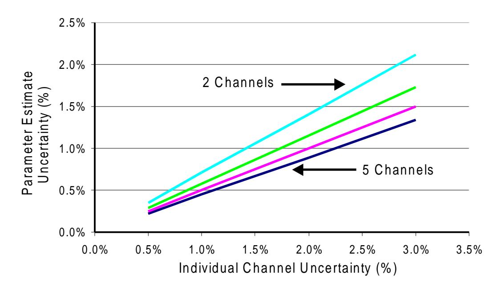

Figure 9-2
Theoretical Process Measurement Uncertainty

#### 9.3 Likelihood of All Channels Randomly Drifting in the Same Direction

A simple averaging-type on-line monitoring algorithm monitors a process by taking measurements from redundant channels. One question that should be considered is the likelihood of all channels randomly drifting in the same direction. The examples provided in this section show that random drift of multiple channels in one direction only is unlikely. These results are readily confirmed by a simple Monte Carlo analysis.

Before providing examples, the analysis methodology has to be described. Given a normal distribution, the probability of obtaining a value X between any two points,  $x_i$  and  $x_i$ , can be determined by calculating the area under the curve defined by these two points. The area is calculated by the following integral:

$$P(x_1 < X < x_2) = \frac{1}{\sqrt{2\pi\sigma}} \int_{x_1}^{x_2} e^{-\frac{(x-\mu)^2}{2\sigma^2}} dx$$

The area under the curve defined by  $x_i$  and  $x_j$  is shown in Figure 9-3.

Appendix C: Statistical Analysis Considerations Regarding Instrument Performance

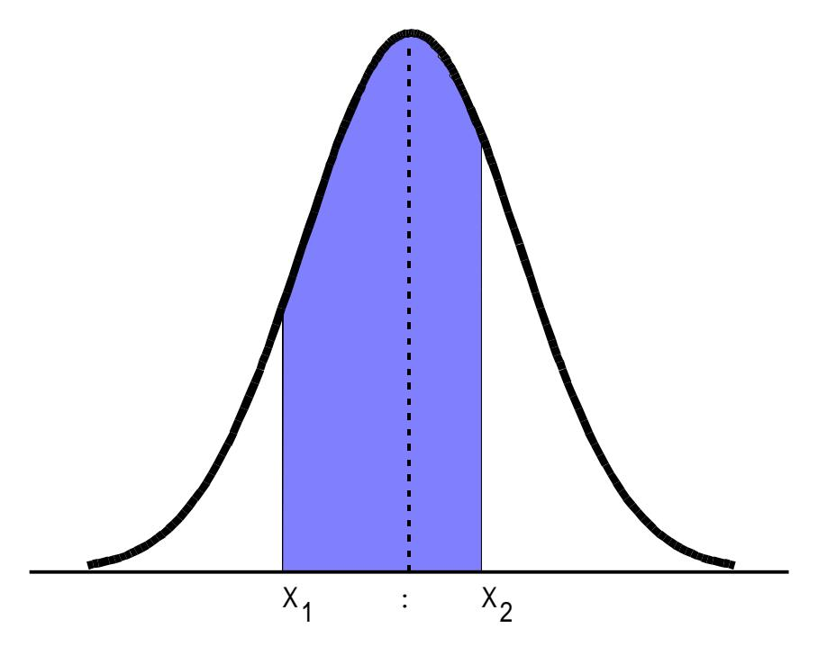

Figure 9-3  $P(x_1 < X < x_2)$ 

In practice, lookup tables are used to determine the probabilities associated with different areas under the curve; evaluating the integral of the normal density function can quickly become tiresome. However, lookup tables are not prepared for every possible combination of mean and standard deviation. Instead, a single standardized table is provided with  $\mu$ =0 and  $\sigma$ =1, where  $\mu$  is the mean and  $\sigma$  is the standard deviation. Any observations of a normal random variable, X, are transformed to a standardized normal random variable Z with  $\mu$ =0 and  $\sigma$ =1 by the following transformation:

$$Z = \frac{X - \mu}{\sigma}$$

The distribution of Z with  $\mu=0$  and  $\sigma=1$  is referred to as the standard normal distribution. If the random variable X assumes a specific value x, the transformed value of Z is given by  $z=(x-\mu)/\sigma$ . Referring to Figure 9-3, if X falls between the values  $x=x_1$  and  $x=x_2$ , the random variable Z will fall between the corresponding values  $z_1=(x_1-\mu)/\sigma$  and  $z_2=(x_2-\mu)/\sigma$ , or

$$P(x_1 < X < x_2) = \frac{1}{\sqrt{2\pi\sigma}} \int_{x_1}^{x_2} e^{-\frac{(x-\mu)^2}{2\sigma^2}} dx$$

$$= \frac{1}{\sqrt{2\pi}} \int_{z_1}^{z_2} e^{-\frac{(z)^2}{2}} dx = P(z_1 < Z < z_2)$$

By transforming any random variable X into the standard normal distribution Z, with  $\mu$ =0 and  $\sigma$ =1, only a single table is required to determine the probability associated with the area under the curve, regardless of the value of  $\mu$  and  $\sigma$  for X. Tables provided in standard statistical texts provide the area under the curve corresponding to P(Z < z). The probability  $P(z_1 < Z < z_2)$  is simply  $P(Z < z_2) - P(Z < z_1)$ .

#### Example 9-2

Given a standard normal distribution, find the probability that an instrument will drift low by  $1\sigma$ . Using a standard normal table from a statistical text, the area to the left of -1 is 0.1587. The interpretation of this result is that there is a 15.87% probability that a single channel will drift low by more than -1 $\sigma$ .

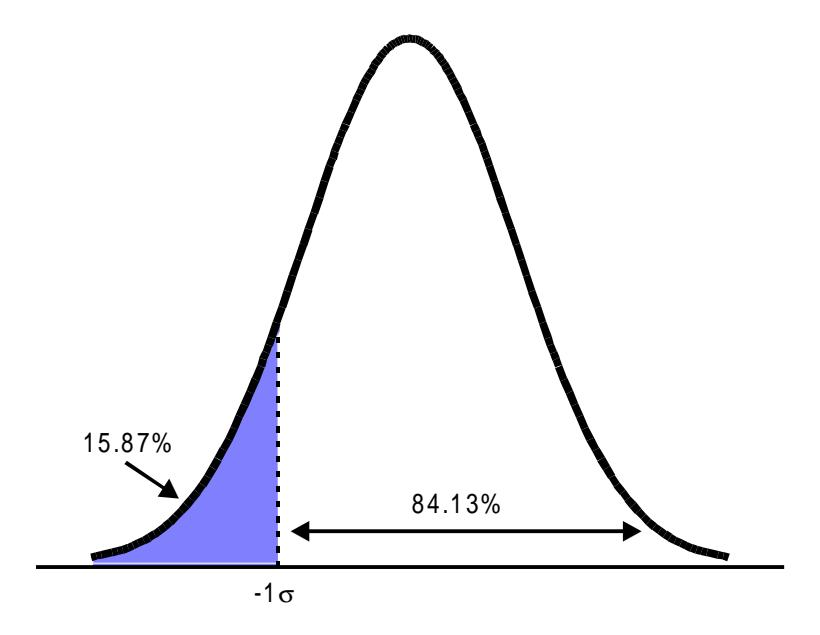

Figure 9-4 Example 9-2 Area

#### **Example 9-3**

Continuing Example 9-2, what is the probability that three channels will simultaneously drift low by more than -1σ? The probability of three channels drifting low by this amount is simply the multiple of the individual probabilities.

$$P_T = P_1 \times P_2 \times P_3 = (0.1587)^3 = 0.003997 \approx 0.4\%$$

#### **Example 9-4**

What amount of drift in the low direction, in terms of number of standard deviations, must three channels drift to correspond to a probability of occurrence of ≤1%?

$$P_T = P_1 \times P_2 \times P_3 = (P_1)^3 = 0.01$$

or

$$P_1 = 0.2155$$

If each channel has a probability of 21.55% of drifting low by some amount, the probability of all three channels simultaneously doing so becomes 1% as shown above. Referring to a standard normal table, the probability of 21.55% per channel corresponds to -0.79σ. As can be seen in Figure 9-5, the individual channel probabilities can be quite high, 21.55% in this case, and yet the combined probability for all channels can still be very small.

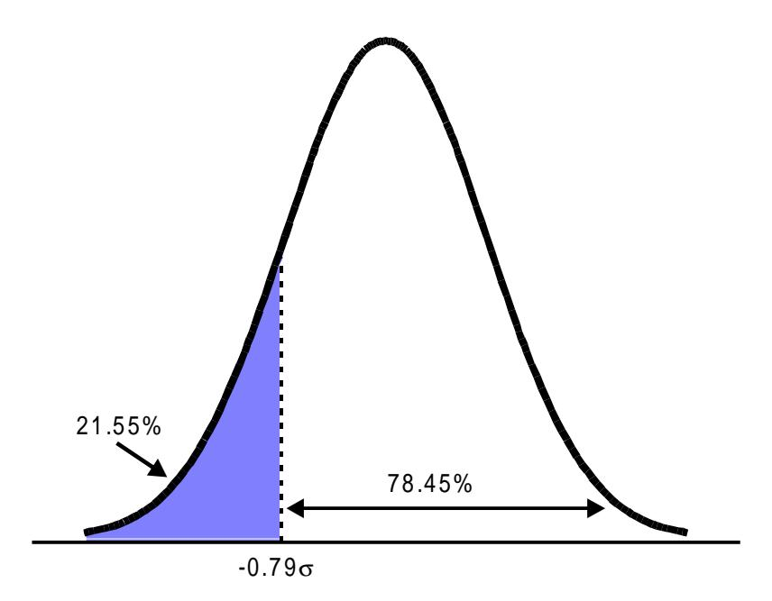

**Figure 9-5 Single Channel Probability So That Three Channels Have 1% Probability**

#### **9.4 Likelihood of All Channels Drifting in the Same Direction by a Bias Effect**

When considering on-line monitoring uncertainty, we must be able to rule out, or bound, the possibility of generic bias effects beyond those already included in the setpoint analysis. A failure mode and effects analysis (FMEA) must demonstrate that the redundant channels are not expected to drift simultaneously beyond allowed limits; instrument drift must remain a random event or expected bias effects must be bounded by the plant's uncertainty calculations. EPRI TR-103436-V2, *Instrument Calibration and Monitoring Program, Volume 2: Failure Modes and Effects Analysis*, has performed a FMEA for typical sensors and provides a basis for the absence of common-mode sensor bias effects beyond those already included in the setpoint analysis. The drift study performed in support of this project also confirmed that drift tends to occur randomly about a zero-referenced mean with little or no tendency for systematic drift in a preferential direction (see Section 8).

Other bias effects might exist that influence the sensor output while the plant is operating, but might disappear completely as the plant shuts down. An example of this might be fluid density changes on a level measurement—as the plant heats up, water density decreases, causing less differential pressure on level transmitters. These types of predictable bias effects should have no significant impact on on-line monitoring because they are already accounted for in the plant's setpoint analysis. Furthermore, such bias effects, if they exist, would have the same impact on channel performance with current calibration practices.

## 10

# APPENDIX D: EPRI EXPERIENCE WITH ON-LINE MONITORING

#### 10.1 Instrument Calibration and Monitoring Program Algorithm

The EPRI Instrument Calibration and Monitoring Program (ICMP) provides an on-line approach to instrument channel surveillance, i.e., monitoring and verifying instrument channel performance. By monitoring performance on-line during normal plant operation, ICMP can identify instrument degradation or drift as it occurs. The ICMP process is described in EPRI TR-103436-V1, *Instrument Calibration and Monitoring Program, Volume 1: Basis for the Method.* 

#### 10.1.1 Parameter Estimate

ICMP is designed to compare redundant channels to determine if one or more channels have drifted beyond specified limits. ICMP's ability to detect potentially degraded instruments is based on an algorithm that preferentially discriminates against outlying measurements from a set of redundant instruments. ICMP calculates an estimate of the actual process value, referred to as the parameter estimate, by the following algorithm:

$$\hat{x} = \frac{\sum_{i=1}^{n} C_i m_i}{\sum_{i=1}^{n} C_i} \quad (i = 1, 2, ..., n)$$

where,

 $\hat{x}$  – Parameter estimate

*n* – Number of redundant instruments in the group

 $m_i$  – Measured value for the  $i^{th}$  signal

Appendix D: EPRI Experience with On-Line Monitoring

 Ci - A consistency number denoting how many other redundant signal values are consistent with the ith signal

Suppose we have a parameter that is monitored by three redundant instruments, all with equal weight functions in the ICMP algorithm. In this case, the expression for the parameter estimate expands as follows:

$$\hat{x} = \frac{C_1 m_1 + C_2 m_2 + C_3 m_3}{C_1 + C_2 + C_3}$$

Once the parameter estimate is calculated, each instrument's output is compared to the parameter estimate. If the instrument's output deviates from the parameter estimate by more than a user-defined limit, the instrument is identified as potentially requiring further evaluation.

#### 10.1.2 Consistency Check Process

Each measurement is given more or less influence on the parameter estimate depending on its corresponding consistency number,  $C_r$ . The consistency number is simply an indication of how many times a particular measurement was judged to be adequately close to other redundant measurements. An outlying measurement might be given less (or no) influence in the parameter estimate while measurements that are close together preferentially determine the value of the parameter estimate. The primary assumption of this consistency check process is that the measurements grouped closely together are more indicative of the actual process value than the outlying measurements, which is a reasonable assumption in that it is unlikely for the closely grouped measurements to have simultaneously drifted away from the actual process value (see Section 9.3 for example probabilities).

The consistency check process is best illustrated by an example. Consider a process measurement with three redundant instruments. The consistency check compares the output of each instrument to the output of the other two instruments. If an instrument's output is sufficiently close to both other instruments' output, its associated consistency number,  $C_p$ , will equal 2. If its output is sufficiently close only to one other instrument, its consistency number will equal 1. And, if it is not sufficiently close to either of the two instruments, it will be considered completely inconsistent with a consistency number equal to 0. Note that a consistency number of 0 for the  $i^{th}$  measurement means that it is excluded from the calculation of the parameter estimate. Each consistency check is performed by the following process:

If 
$$|m_i - m_j| \le \delta_i + \delta_j$$
, then  $m_i$  and  $m_j$  are consistent.

where,

- $m_i$  Output for instrument i
- $\delta_i$  Consistency check allowance to compare instrument *i* to other instruments
- $m_i$  Output for instrument j
- $\delta_i$  Consistency check allowance to compare instrument j to other instruments

The consistency check process is an important feature of ICMP. For a comparison of any two channels,  $m_i$  and  $m_j$ , the allowed variation between the two channels for the consistency check,  $\delta_i + \delta_i$ , is referred to as the consistency check factor,  $\delta_{ii}$ .

As the number of redundant channels increases, the total number of consistency checks also increases. For example, with 2 redundant channels, only one consistency check can be performed—a comparison of Channel #1 to #2. With 3 redundant channels, 3 checks are performed—#1 to #2, #1 to #3, and #2 to #3. Table 10-1 shows the total number of consistency checks performed depending on the number of redundant channels.

Table 10-1
Number of Consistency Checks Performed

| Number of Redundant Channels | Total Number of Consistency Checks | Maximum Possible Value of Consistency Check Number, C i |
|---------------------------------|---------------------------------------|--------------------------------------------------------------------|
| 2                               | 1                                     | 1                                                                  |
| 3                               | 3                                     | 2                                                                  |
| 4                               | 6                                     | 3                                                                  |
| 5                               | 10                                    | 4                                                                  |
| n                               | $\sum_{i=1}^{n-1} i$                  | <i>n</i> -1                                                        |

ICMP will not calculate a parameter estimate if all consistency checks are declared inconsistent. This can happen if the consistency check factor is significantly less than the actual variation between instruments such that no instrument's measurement is sufficiently near that of another instrument.

*Appendix D: EPRI Experience with On-Line Monitoring*

#### **10.1.3 Channel Acceptance Criteria**

Once the parameter estimate has been calculated, the ICMP program evaluates the performance of the individual instruments. Each instrument's output is compared to the parameter estimate. If the difference between the instrument output and the parameter estimate exceeds a user-defined limit, the channel is identified as potentially failed or in need of calibration. This user-defined limit is called the channel acceptance criteria. The relationship is expressed as follows:

*If xˆ m ,thenm has potentially drifted beyond desired limits* − *i* ≥ α*i i*

where,

*mi* - Output for channel *i*

*xˆ* - Parameter estimate

αi - Acceptance criteria for drift of channel *i*

The acceptance criteria is typically selected for a given parameter so that it establishes the need for a calibration. If a channel exceeds the acceptance limit, then it will be identified as needing a calibration.

#### **10.2 ICMP Uncertainty**

ICMP uncertainty depends on several factors, including:

- Accuracy (or uncertainty) of each monitored channel
- Number of redundant channels
- Consistency check criteria

Each of the above factors require consideration as part of setting up ICMP for a given parameter. The following sections discuss these factors in more detail.

#### **10.2.1 Accuracy and Number of Monitored Channels**

The parameter estimate is calculated from a weighted average of the individual monitored channels. Each individual channel has an uncertainty associated with its measurement, which leads to the conclusion that the parameter estimate also must have some amount of error also. In this regard, the parameter estimate represents the best

*Appendix D: EPRI Experience with On-Line Monitoring*

estimate of the true process value, but there is still some uncertainty associated with the actual process value.

Section 9.2 provides a discussion of the theoretical uncertainty of the parameter estimate based on equal channel uncertainties and the number of redundant channels. Table 9-1 and Figure 9-2 apply to normally operating channels in ICMP. As the number of redundant channels increases, the parameter estimate uncertainty decreases, which is somewhat intuitive; more redundant, independent measurements leads one to have more confidence in the measurement of the process.

#### **10.2.2 Consistency Check Criteria**

The consistency check process is a powerful feature of ICMP. The consistency check factor controls the influence of individual channels on the parameter estimate calculation. A channel judged to be consistent with all other redundant channels will have maximum possible influence on the parameter estimate. And, a channel that is declared inconsistent with all other channels will be excluded from the parameter estimate calculation.

If the consistency check factor is large with respective to the variation between channels, all channels tend to be consistent and have equal effect on the parameter estimate. In this case, the outlying (bad) measurement skews the parameter estimate from the true process value. Figure 10-1 shows an example of this effect. Signals #2 and #3 are very close to the true process value, but Signal #3 is out of calibration by almost 1.2%. By having a large consistency check factor, all three signals have equal weight in the parameter estimate calculation, thereby skewing the parameter estimate toward the outlying channel.

*Appendix D: EPRI Experience with On-Line Monitoring*

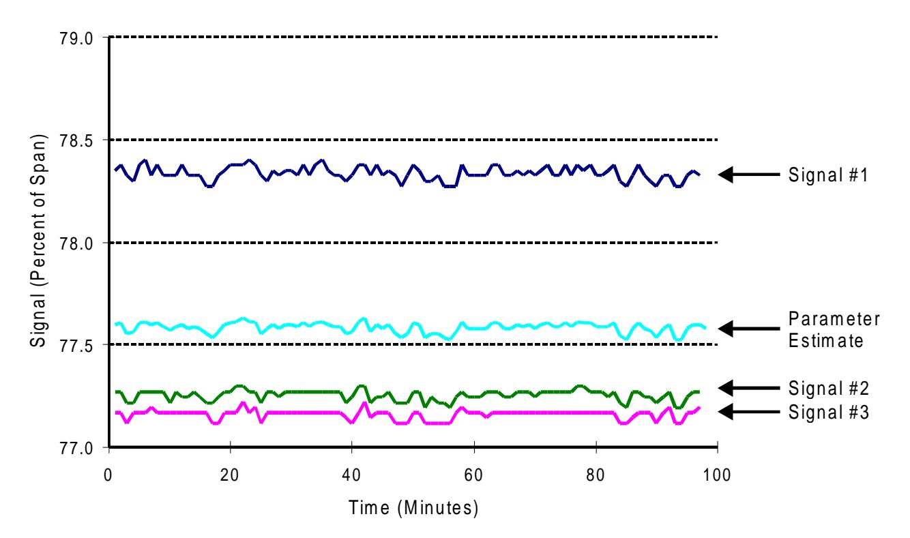

**Figure 10-1 Outlying Channel Allowed to Influence Parameter Estimate**

If the consistency check factor is relatively small with respect to the variation between channels, it is likely that some consistency checks for a particular measurement will be declared inconsistent, resulting in that measurement having less influence on the parameter estimate. Consequently, that measurement will tend to be the furthest from the parameter estimate and is more likely to be declared as abnormal by the acceptance criteria. Figure 10-2 shows the example again in which Signal #1 is an outlying measurement, but by having the consistency check factor kept small enough, it has been excluded from the parameter estimate calculation.

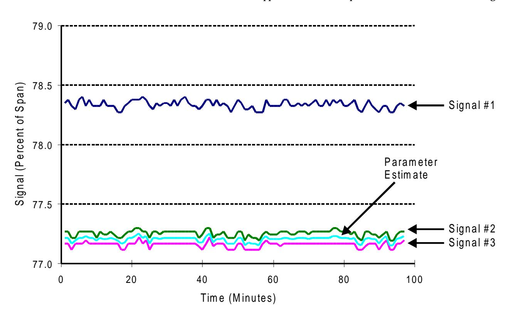

**Figure 10-2 Consistency Check Excludes Outlying Channel from Parameter Estimate**

*Appendix D: EPRI Experience with On-Line Monitoring*

By ensuring that outlying channels have less influence on the parameter estimate, the parameter estimate is closer to the true process value. This provides more assurance that the selected acceptance criteria compares each individual measurement to the best estimate of the actual process value.

The consistency check criteria and the acceptance criteria are related, in that outlying measurements are more likely to pass the acceptance limit test if they are allowed to influence the parameter estimate. Figure 10-3 shows an example of a set of redundant measurements in which the highest measurement (at the top of the graph) will be evaluated. Notice that the other three measurements are all just below 59% of span while the outlying measurement is consistently at or above 60% of span.

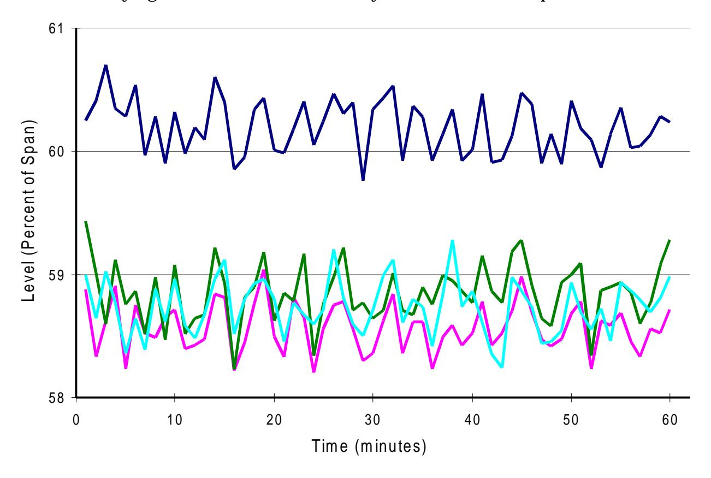

**Figure 10-3 Observed Performance of Steam Generator Level Transmitters**

In an ICMP evaluation, two factors are simultaneously influencing the results. First, the consistency check factor magnitude determines the degree to which the outlying measurement affects the parameter estimate. Second, the magnitude of the acceptance criteria determines if the outlying measurement is identified as in need of calibration. With regard to the consistency check factor effect, Figure 10-4 shows how the parameter estimate varies with the consistency check factor. Notice that small consistency check factors tend to exclude the outlying measurement from the parameter estimate. But, as the consistency check factor is made larger, the outlying measurement eventually is included in the parameter estimate average. As can be seen, the parameter estimate varies by approximately 0.4% as this happens.

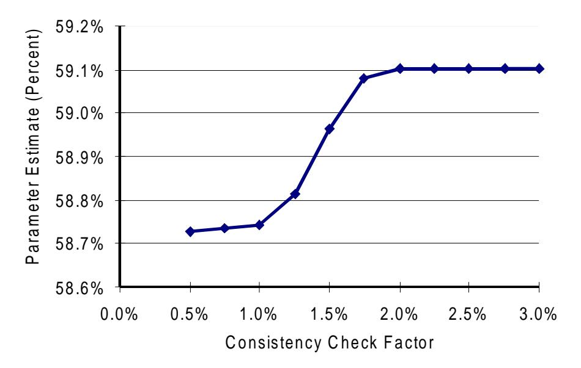

**Figure 10-4 Example Variation of Parameter Estimate with Consistency Check Factor**

The selected acceptance criteria also has an effect on the ICMP evaluation. For example, if the selected acceptance criteria is ±50% of span, then we would never identify a channel in need of calibration. And, if the selected acceptance criteria is ±0.01% of span, then we could expect that ICMP would usually identify the channel as needing calibration. Figure 10-5 shows the actual ICMP results for the data in Figure 10-3 and should be interpreted as follows. The y-axis shows the percent of measurements from the outlying channel that were identified as failing the acceptance criteria. Each line corresponds to a different acceptance limit, ranging from 1% to 2% of span. The x-axis varies the consistency check factor from 0.5% to 3%.

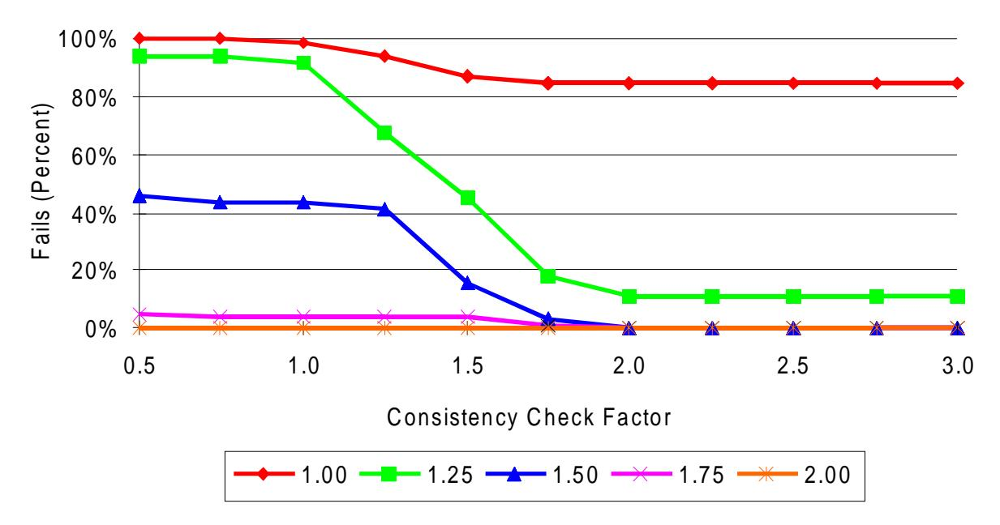

**Figure 10-5 ICMP Identification of Drifted Channel**

Figure 10-5 illustrates best that the consistency check factor and the acceptance criteria provide the optimal detection of the drifted channel when they are kept at sufficiently low values.

#### **10.3 ICMP Implementation at V. C. Summer Nuclear Station**

#### **10.3.1 System Setup**

The Instrument Calibration Monitoring Program at the V. C. Summer Nuclear Station (VCSNS) began in 1991 after the plant Instrument Engineer and a representative of Nuclear Computer Services attended an EPRI presentation on the initial work performed at the Millstone Nuclear Station. The program at Millstone was a PC based system which used a process control application called ONSPEC in conjunction with

some Pascal programs to analyze short term and long term drift based on information from the plant computer.

VCSNS decided to host the ICMP applications in a slightly different way than had been done previously. It was assumed that a large amount of data should be stored, both online and offline, to allow for future verification and/or further analysis. Also, it was intended that ICMP be used as a tool by the System Engineers, not just the Instrument Engineer. For this reason, the ICMP program was installed on the Engineering Computer System which was a DEC VAX 8530 with the VAX/VMS version of the ONSPEC process control software. This allowed the use of 1.2 gigabyte hard drives for historical data and also to make tape backups. The DEC Pathworks networking software was also used, which allowed the use of a PC as a DECWindows display station. ONSPEC also provides a "World Interface" software package which allows reads and writes to the ONSPEC database through either C, Pascal, or Fortran programs.

The VCSNS Engineering Computer has a high speed datalink called QLINK which interfaces with the Integrated Plant Computer System (IPCS). Plant data is copied from the plant process computer to the engineering computer once a minute. This data file contains the raw value and the quality code for many computer points including those needed by the Instrument Engineer for ICMP.

The combination of the VMS version of ONSPEC, the QLINK datalink, and the Pathworks networking software provide the total system. Two Fortran programs, IPCRDVAL and PARAMLOG, perform the signal validation and provide data output files for trending.

The ONSPEC software provides a utility called ONVIEW which allows extraction of data from the ONSPEC database and produces a spreadsheet compatible file. Also, the original output files from PARAMLOG were written to be compatible with LOTUS.

#### **10.3.2 Software Verification and Validation**

A verification and validation (V&V) team was formed by VCSNS staff to provide control and oversight of the V&V effort. The team consisted of independent computer/software technicians, technicians and engineers associated with the project and a QC representative. EPRI contracted SAIC to provide detailed support of the effort, but for purposes of independence, SAIC was not part of the V&V team.

The V&V activities were conducted as an integral part of the system design and development process. All V&V formal reports and correspondence reporting V&V findings were transmitted directly to the SAIC Project Manager, with copies forwarded to the SCE&G and EPRI project managers. The V&V Team reviewed all relevant

*Appendix D: EPRI Experience with On-Line Monitoring*

documents and correspondence. SCE&G performed all V&V activities related to ICMP software.

The V&V documentation file is stored at VCSNS and includes the following elements.

- V&V Test Plan
- System Requirements/Functional Specification
- ICMP Test Plan
- Test Procedure
- Discrepancy/Resolution Report

#### **10.3.3 Current Use of ICMP**

The system is currently used as a performance monitoring and troubleshooting tool. The short term and on-line data functions are primarily used by the System Specialist and the Instrument Engineer. The System Specialist is responsible for maintenance and operation of the associated hardware and software. He also provides periodic review of the instrumentation performance for abnormal behavior and assists in investigation and monitoring of specific instrument channels that are experiencing abnormal behavior.

The long term performance data is provided "on line" to the associated System Engineers for periodic monitoring and reporting as necessary. The Instrument Engineer reviews on a weekly basis all instrument trends and provides performance analysis as needed. The long term drift data is provided to individual PCs via the computer network and is updated on demand from each PC. Figure 10-6 shows a typical data presentation for a parameter.

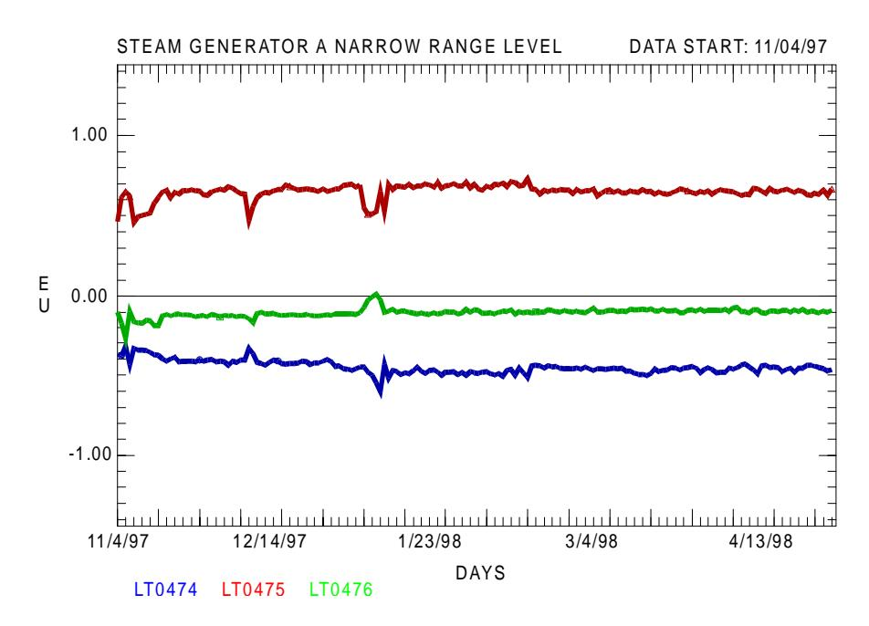

**Figure 10-6 Example ICMP Monitoring of Redundant Channels**

At the end of each operating cycle, the System Specialist records the entire database for the previous cycle and resets the system for the upcoming cycle. The long term data files are cleared and reset. The Instrument Engineer evaluates abnormally-performing instruments against as found/as left calibration data as it is obtained from the field. Performance based recommendations are provided to I&C maintenance prior to the beginning of each refueling outage.

#### **10.4 1998 ICMP Implementation With Upgraded ICMP Software**

The ICMP software is being modified to operate on a personal computers in a Microsoft Windows95™ operating environment. The ICMP functions with the new software are:

- Obtain data from the Plant Process Computer
- Calculate a weighted estimate for the channel group using a channel discriminating algorithm (the consistency check process)
- Using a Windows Graphical User Interface (GUI), display results, and notify, when a channel has indications of degradation.
- Estimates may be compared against a predicted or modeled value to assess common mode failures (optional)

*Appendix D: EPRI Experience with On-Line Monitoring*

 The ICMP architecture has been modified to accommodate the Windows95 environment. The architecture consists of the following:

- Configuration—Instrument Group Database (IGDB)
- Data—Data Acquisition Interface to PPC/ADS
- Result—Parameter Estimate (PE) Generator
- Check—Externally Derived Validator (Opt.)
- Storage—Results Database
- MMI—Windows95 GUI/SAICPerforma

 Figure 10-7 shows the layout of the upgraded ICMP architecture. The final product will have the look and feel of a Windows program. Figure 10-8 shows an example of the displays.

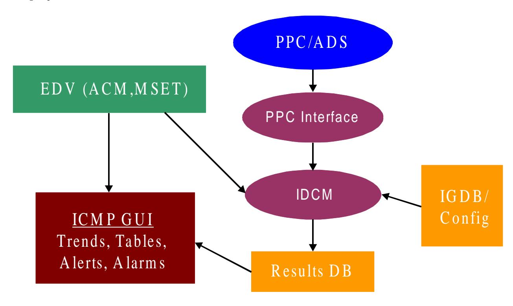

**Figure 10-7 Upgraded ICMP Architecture**

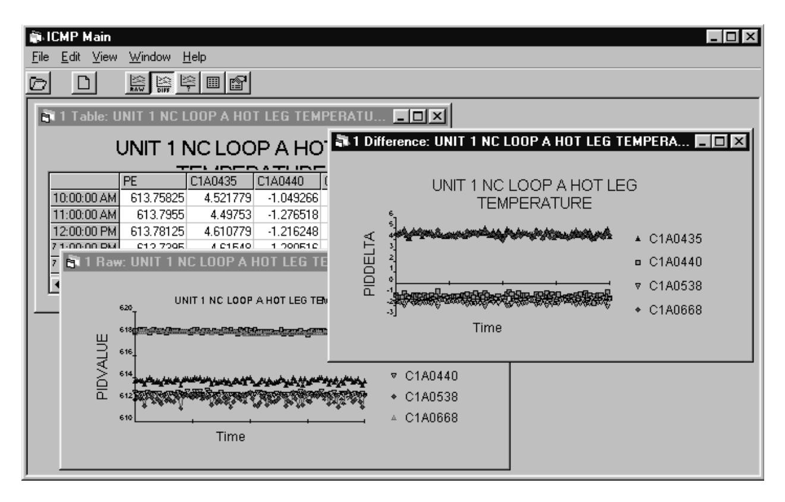

**Figure 10-8 ICMP User Interface**

The following additional features will be included with the new software:

- Copy/Paste—to other Windows applications for presentation and reporting
- Windows Printing—Standard Windows Print Dialog interface
- Data ReCalc—Data can be reevaluated at any time with/without EDV or Failed Channels
- High Performance MMI—SAICPerforma Interface allows powerful data display and manipulation
- Q/A—ICMP will be NQA1 approved

The new software is scheduled for 1998 installation at the Catawba and V. C. Summer Nuclear Stations.

# *11*

## **APPENDIX E: CANDU OWNERS GROUP EXPERIENCE WITH ON-LINE MONITORING**

The CANDU®1 Owner's Group (COG) has performed research into on-line monitoring as a calibration monitoring tool for CANDU plants. This section describes the results of their research.

#### **11.1 Background and CANDU Reasons for Considering On-Line Monitoring**

The CANDU design has two special safety systems—Shutdown System 1 (SDS1) and SDS2. The two special safety systems provide diverse methods of achieving reactor shutdown if predetermined process or nuclear setpoints are exceeded. SDS1 actuates the control rods and SDS2 actuates chemical injection to shut down the reactor. In general, both safety systems monitor the same process parameters, although the associated setpoints might vary.

CANDU operators are increasingly being required to demonstrate that assumed accuracies of the transmitters used to measure process variables are actually met. All transmitters are calibrated periodically at a frequency ranging from one year up to about three years, depending on the application. In addition to periodic calibration, CANDU plants also perform a *process trip test*, which is a full functional test to verify correct operation of all elements of the safety system, including the sensor. For pressure-based instruments (pressure, flow, and level), a process trip test is accomplished by applying a test pressure directly onto the transmitter input by the operation of a series of valves (see Figure 11-1). The actual process signal is isolated and a dummy test pressure is applied directly to the transmitter. This functional test verifies the capability of the trip circuit from the input of the transmitter through the output of the channel trip.

1 ® CANDU (CANada Deuterium Uranium) is a registered trademark of Atomic Energy of Canada Limited (AECL).

The process trip test performs an excellent functional test of the trip circuit from the sensor to the channel trip output. But, the process trip test capability requires additional valves, impulse lines, and valve controls. Process trip testing has resulted in increased maintenance and lost production due to human errors and test equipment failures.

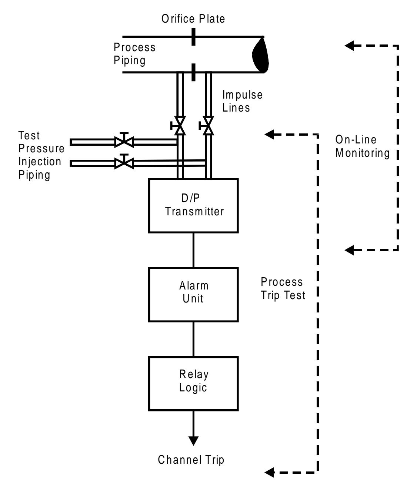

**Figure 11-1 Process Trip Test Arrangement**

In addition to process trip tests, panel checks (channel checks) are performed each shift. Together, the process trip test and the panel checks provide assurance that the

transmitters and related circuits are operational, but they are not always sufficiently sensitive enough to evaluate accuracy.

The COG evaluated on-line monitoring as a calibration assessment tool for the following reasons:

- Continuous transmitter accuracy monitoring can minimize out-of-calibration conditions while also reducing the frequency of calibration.
- On-line monitoring might enable a reduction in the frequency of process trip tests, which are labor intensive and error-prone operations. In the long-term, on-line monitoring might allow the elimination of the process trip tests and associated hardware entirely.

Although calibration reduction and improved performance monitoring are goals of online monitoring in CANDU plants, the principal benefit is the potential reduction and eventual elimination of process trip tests. Nuclear plants in the USA are not designed for process trip testing. So, the goal of using on-line monitoring as a calibration assessment tool is similar for both CANDU and USA plants, but the perceived benefit is different for the two countries.

A CANDU plant incorporates a great amount of redundancy, independence, and diversity in the process measurement design. Whereas USA plants will utilize several process-related functions (safety trips, control, and indication) from the same set of transmitters, the CANDU design typically uses a different set of transmitters for each function. Furthermore, SDS1 and SDS2 are required to be diverse in later designs, which means that a different transmitter manufacturer/model will be used in each special safety system. For example, SDS1 might use Rosemount transmitters and SDS2 use Gould transmitters. If only SDS1 and SDS2 transmitters were to be used for on-line monitoring, six redundant measurements would be available. But, if signals from the reactor regulating, containment, and emergency coolant injection systems are also used, it is possible to obtain up to 13 independent, redundant measurements of many process variables. As can be seen, the CANDU design is an ideal candidate for on-line monitoring because of the high degree of redundancy. The transmitter diversity also helps ensure that there are no common mode errors.

A research and development project was completed by the COG to evaluate on-line monitoring. The COG-developed design was called the Transmitter Accuracy Monitoring System (TAMS). The project progressed through a series a phases as part of the on-line monitoring evaluation:

- 1. Data acquisition
- 2. Data analysis and algorithm development

3. On-line calibration analysis and operational experience

#### **11.2 Data Acquisition**

The data acquisition system was installed at the Bruce Nuclear Generating Station, Unit 6. The data acquisition system is connected to the Safety-System Monitoring Computer (SSMC) as shown in Figure 11-2. Referring to Figure 11-2, a set of front-end units (MP/100s) act as data gatherers for SDS1 and SDS2 (as well as other inputs). The MP/100s contain analog-to-digital converters that sample the analog data every two seconds. Each MP/100 then sends a record, consisting of a start code, the number of bytes, the analog data in scaled engineering units, some other information, and a check sum to its modem for transmission on a fiber-optic line. The record is simply broadcast; there is no handshake check. At the other end of the fiber-optic line is a second set of modems that are connected to the monitor computer (MP/200). The monitor computer presents this data on various control room displays.

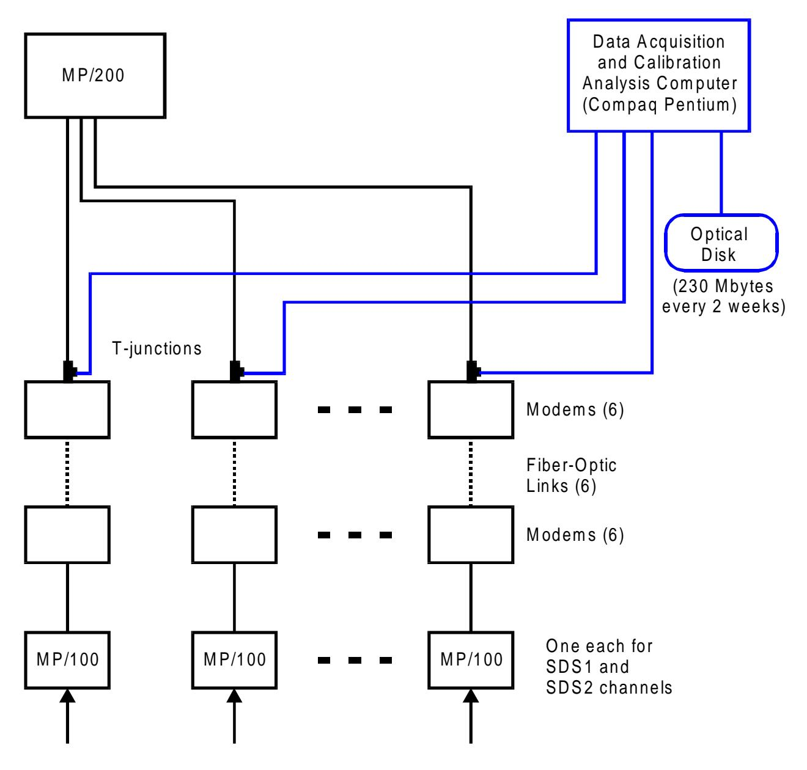

Analog Signals From Transmitters

**Figure 11-2 Data Acquisition System**

The on-line monitoring data was acquired by a separate system connected to the monitor computer as shown in Figure 11-2. The modems and fiber-optic links ensure that the system is isolated from the safety systems. An evaluation also determined that the high impedance connection would not affect the operation of the monitor computer.

The six channels of data are sampled independently and asynchronously from the MP/100s broadcast. The data acquisition computer collects the information from all

channels together into a single 2-second record. The original asynchronous data is artificially synchronized. Thus, the potential timing error in this process is up to two seconds.

By this arrangement, information from the SDS1 and SDS2 channels is acquired every two seconds. The digitized analog values are stored on an optical disk in 1 hour files. About 400 files, covering two weeks of operation fill a 230 MB optical disk.

#### **11.3 Data Analysis and Algorithm Development**

The on-line monitoring algorithm is based on an assumption that calibration errors on independent measurements are uncorrelated; calibration is as likely to drift up as it is down. A estimate of the true process value can be obtained by averaging these independent measurements. And, the greater the number of independent measurements, the better (more accurate) is the estimate of the true value. The assumption of independent random errors was supported by two earlier studies of asfound and as-left calibration data at the Bruce and Pickering Nuclear Generating Stations.

The following reasons were identified as possible reasons for a transmitter's output varying from the true process signal beyond an acceptable level (as observed by the online monitoring system):

- The transmitter is out of service for maintenance.
- The transmitter is being subjected to a process trip test. Remember that the process trip test isolates the transmitter from the actual process signal and applies a test process signal to the transmitter. During the process trip test, the on-line monitoring system observes the affected transmitter as spiking, followed by a return to normal.
- An MP/100 (see Figure 11-2) or another part of the Safety System Monitor Computer is out for maintenance.
- The data acquisition computer fails to synchronize on the data (channel dropout).
- A transmitter is excessively miscalibrated.
- The process variable passes the end of the transmitter linear range and an irrational reading occurs (the MP/100s convert readings outside the normal range of 4 to 20 mA to a hexadecimal FFFF). The term *irrational* is a formal term used by CANDU plants to indicate that a signal is outside of its calibrated span.
- A transmitter has failed.

Of the above sources of anomalies, process trip tests are predictable occurrences and channel dropouts have also happened.

The statistical estimate of the true process value (the parameter estimate) is obtained by averaging the available independent measurements. Some signals are identified as incorrect and are excluded from the parameter estimate calculation. The remaining channels are called the good channels ( $N_{\rm g}$  is the number of good channels) and the parameter estimate is calculated as follows:

$$\hat{x} = \frac{1}{N_g(t)} \sum_{j=1}^{N} x_j(t)$$

In the above expression, j = 1 to N of the good channels only. A consistency check is used to identify the channels that are most likely incorrect. For each signal  $x_i(t)$  of a set of nominally identical signals (i = 1, 2, ..., N), the degree of inconsistency,  $K_j$ , is calculated as follows:

$$K_j(t) = \sum_{i=1}^{N} d_{ji}(t)$$

where

$$d_{ji}(t) = 0 \quad \text{if } \left| x_j(t) - x_i(t) \right| \le \varepsilon_j$$
$$= 1 \quad \text{if } \left| x_j(t) - x_i(t) \right| > \varepsilon_j$$

The degree of inconsistency will be a value ranging from 0 to *N*-1. The channel(s) with the highest degree of inconsistency is(are) declared faulty. Then, the degree of inconsistency of the remaining channels is again computed. This process is repeated until all remaining channels have the same degree of inconsistency, which might or might not be zero. If they are zero, then the remaining channels are consistent; if they are not zero, then there is an unresolvable inconsistency.

The limit  $\varepsilon_j$  was originally selected to be three times the SDS1 reference accuracy as specified in the Safety Analysis Report if the signal was previously good, or two times the SDS1 reference accuracy if the signal was previously not good (later increased to six times the reference accuracy if good and five times if previously not good based on operating experience). This feature adds some hysteresis to the declaration of a good transmitter and prevents it from changing status too frequently.

At this point, the remaining channels are declared non-faulty. If a channel is non-faulty for at least three consecutive time steps, it is declared good and is used in the

subsequent parameter estimate calculation. There are a total of  $N_g$  good channels for each parameter estimate calculation.

In summary, a channel will be excluded from the parameter estimate calculation for any of the following reasons:

- If it is not identified as a good channel
- If it is irrational.
- If it does not have a consistent checksum

Differences (offsets) are obtained by subtracting individual measurements from the parameter estimate at each time step, *t*. By monitoring over time, the offset and the offset standard deviation can be determined. The offset is calculated by:

$$\overline{D}_{j} = \frac{1}{M} \sum_{t=1}^{M} (x_{j}(t) - \hat{x}(t))$$

In the above calculation, the offset is averaged over *M* time steps to obtain an average (or mean) offset as a function of time. The offset standard deviation is also calculated as follows:

$$\sigma_{\overline{D}_j} = \left(\frac{1}{M} \sum_{t=1}^{M} (x_j(t) - \hat{x}(t))^2 - \overline{D}_j^2\right)^{1/2}$$

The offset standard deviation represents a statistical estimate of the offset uncertainty. An individual channel is expected to track the following relationship:

$$x_j(t) = \hat{x} - \overline{D}_j \pm \sigma_{\overline{D}_j}$$

In practice, under normal steady-state operation and during fairly severe transients, it has been found that the average offset and the offset standard deviation remain roughly constant. These two statistical parameters do not appear to change significantly with time or with operating conditions.

#### 11.4 On-Line Calibration Analysis and Operating Experience

During the period of evaluation (one and one-half years), 14 transmitter calibrations were performed that could be compared directly to the predictions of the on-line monitoring system. Figure 11-3 shows the correction made during calibration (as-left minus as-found difference) for each transmitter compared to the deviation observed by

the on-line monitoring system. In general, there is good agreement between the two, with the worst case deviation from the expected line of less than 0.5% of span. Perfect agreement is not expected because of the following contributors to error:

- Minor changes in calibration equipment or calibration methods
- Minor changes in conditions between calibration time and the actual service
- Analog to digital conversion quantization errors in the on-line monitoring system

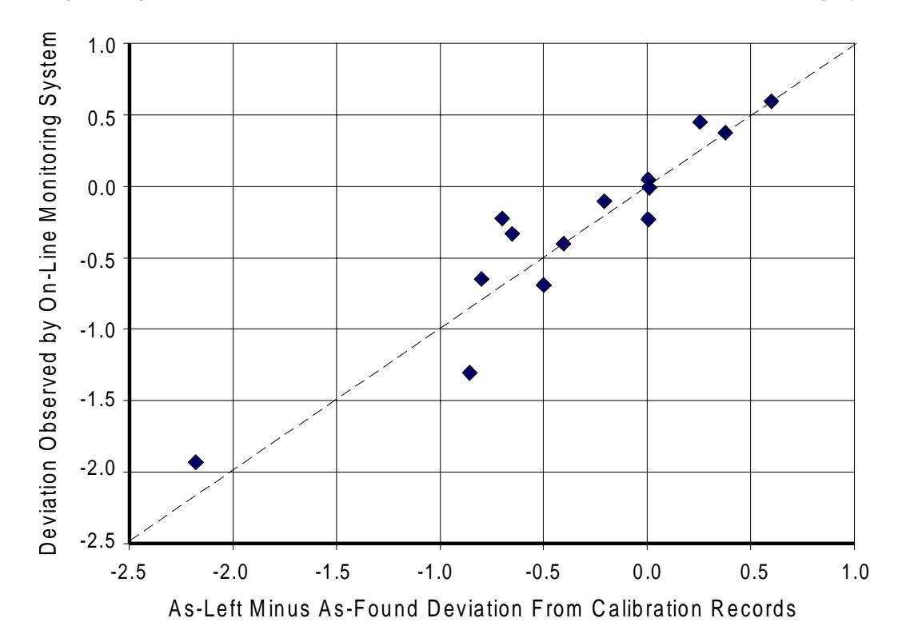

**Figure 11-3 Calibration Results Compared to On-Line Monitoring Observed Deviations**

#### **11.5 Status of the COG Research**

The on-line monitoring system that was installed at the Bruce Nuclear Generating Station was removed from service after the latest research effort was completed. The conclusion reached by the research to date is that on-line monitoring can be used to support a decision to calibrate transmitters sooner than would normally be the case when the offset is observed to be too large.

With the high degree of channel redundancy, on-line monitoring can prove particularly useful to the CANDU design. In the long term, the following goals have been identified:

- 1. Calibrate transmitters as required based on the observed performance by on-line monitoring. A "calibrate as required" approach should lead to improved safety system performance (both for production and safety) because poorly calibrated or malfunctioning transmitters would be detected and corrected sooner. And, an operating and maintenance cost-savings should be realized by performing fewer unnecessary calibrations. It is still felt that at least one of the redundant transmitters should be calibrated periodically to help determine whether any correlated drift is present.
- 2. Reduce the frequency of or eliminate the process trip test. The system design necessary to accomplish the process trip test increases the system cost and complexity, while introducing additional maintenance and potential human error problems. However, the process trip test performs a valuable functional test verification that also tests the transmitter as part of its channel trip verification. For this reason, on-line monitoring will need to demonstrate its ability through additional research and development before the process trip test will be eliminated.

#### **11.6 References**

The information provided in this appendix is based upon the following two papers, with assistance from one of the authors (Tony Hinds).

- 1. H. W Hinds and R.MacKay, "Evaluation of CANDU Safety-System Calibration Accuracy Through Monitoring," presented at the 1995 CANDU Maintenance Conference.
- 2. H. W. Hinds, "On-Line Assessment of Safety-System Transmitter Accuracy," presented at the CANDU System and Equipment Surveillance Program Workshop (November 1996).

# *12*

## **APPENDIX F: ELECTRICITE DE FRANCE EXPERIENCE WITH ON-LINE MONITORING**

Electricité de France (EdF) has implemented on-line monitoring at all 54 of their nuclear stations as a basis for extending calibration intervals. This implementation has also received regulatory approval. Appendix F describes the EdF on-line monitoring implementation and their experience to date.

#### **12.1 Overview of EDF On-Line Monitoring System Design**

#### **12.1.1 History**

A 1992 study performed by the EdF Generation and Transmission Division concluded that a different approach to safety-related instrument calibration was warranted. Key findings of the study were:

- Disconnecting and reconnecting instrument tubing during transmitter calibrations had the potential to cause inadvertent damage,
- The associated calibration checks required more than 50 man days per unit per year, which represents a significant expense. For the entire EdF system of nuclear plants, this equates to an annual requirement of about 21,600 man hours.
- Because of the location of the transmitters, the calibrations could only be performed during refueling outages. However, this tended to contribute to overload of the maintenance staff when other maintenance-related activities were also included.
- Few transmitters were found to be out of calibration. About 90% of the transmitters were always found to be in good condition.

In response to this study, EdF pursued an alternative approach to instrumentation maintenance as discussed in the following section.

Appendix F: Electricite De France Experience with On-Line Monitoring

#### 12.1.2 Sensor Validation Methodology

The EdF methodology is a form of redundant channel averaging and is applied to sensors used for pressure, level, flow, and temperature measurements. The measurement model is based on an allowed measurement variation from the true process value, given by:

$$x_i = \hat{x} + a_i + e_i$$

where,

 $x_i$  – Measurement of the  $i^{th}$  sensor

 $\hat{x}$  – True process value

ai - The sum of expected independent random errors between the *n* sensors of the set

*e*, – The allowed error due to sensor degradation

The monitoring algorithm consists of a comparison of each channel to the average of the remaining redundant channels in accordance with the following expression:

Deviationi = 
$$x_i - \frac{x_1 + ... + x_{i-1} + x_{i+1} + ... + x_n}{n-1}$$

For example, a process that is monitored by 3 redundant channels would have three evaluations performed as follows:

Deviation 
$$_1 = x_1 - \frac{x_2 + x_3}{2}$$
, Deviation  $_2 = x_2 - \frac{x_1 + x_3}{2}$ , Deviation  $_3 = x_3 - \frac{x_1 + x_2}{2}$ 

Notice that a parameter estimate is not explicitly calculated by this algorithm. Instead, only the deviation of each channel from the average of the other channels is of interest. The deviation of each channel is then evaluated against acceptance criteria based on the expected channel uncertainty. The defined threshold for action was developed based upon the need to detect a drifted channel while minimizing the number of false alarms. Each channel's deviation is used as an assessment of its calibrated state. Two-standard deviation drift estimates have been developed for the monitored channels. If a channel's deviation exceeds one threshold, it is scheduled for recalibration during the next outage. If the channel's deviation exceeds a second higher threshold, immediate corrective action is required. Figure 12-1 shows the general process of establishing the need for a channel calibration.

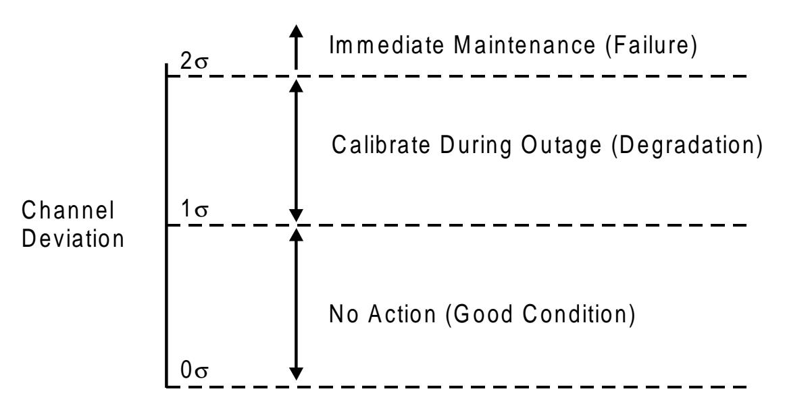

**Figure 12-1 EdF Actions as a Function of Channel Deviation**

As described, the algorithm requires redundant channels of the monitored process. The algorithm also allows for analytical redundancy in which other signals are included in the analysis. So far, analytical redundancy has only been applied to the following cases:

- Redundant sensors with a different rated accuracy to achieve a weighting function
- Redundant sensors with a different range than the other redundant sensors

#### **12.1.3 Monitoring System Setup**

The EdF on-line monitoring system is a manually-implemented system. Once per fuel cycle, just before the next outage, the process measurements are acquired by manual voltmeters in the process racks. The EdF plants are now on an 18-month fuel cycle, which means that the on-line monitoring data is acquired once every 18 months on average. The data is then entered manually into an off-line computer where the calibrated state of each channel is evaluated. Figure 12-2 illustrates the monitoring process.

*Appendix F: Electricite De France Experience with On-Line Monitoring*

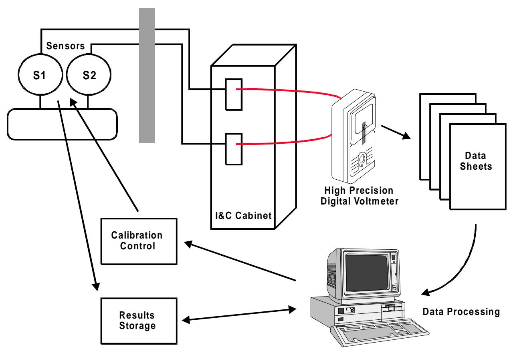

**Figure 12-2 Monitoring System Setup**

The EdF method requires that the plant's operating condition be stable during the period of data acquisition because the measurements are not time-synchronized; they are manually taken by voltmeter. The relative signal noise determines how many measurements are taken at each channel and the average of the measurements for a given channel is used in the calibration assessment. The number of measurements taken is as follows:

- Stable signal—20 measurements with one measurement taken every second
- Slightly noisy signal—100 measurements with five measurements taken every second
- Noisy signal—250 measurements with ten measurements taken every second

#### **12.2 Regulatory Approval Status**

Until 1996, the EdF plants performed time-directed sensor calibrations; all redundant sensors were calibrated each refueling cycle. Their experience was that over 90% of the sensors were found to be in calibration when checked. But, the related activity of disconnecting and reconnecting transmitter sensing lines tended to cause unintended damage that can be avoided by on-line monitoring.

The motivation for shifting to an on-line monitoring method of calibration assessment was two-fold—reduce maintenance costs due to performing unnecessary calibrations and reduce the frequency of inadvertent damage as a consequence of calibration.

In France, the Safety Authority regulates the level of safety in industrial plants as authorized by the government. In nuclear plants, the Safety Authority approves the rules regarding periodic tests designed to verify system functionality. However, it does not approve a specific maintenance program, although maintenance program-type documents are provided to the Safety Authority on an informative basis.

In order to obtain Safety Authority approval of the proposed change to the periodic test program, several meetings were held with the Safety Authority to discuss the planned approach to calibration. Topics presented in these meetings included:

- The Reliability Centered Maintenance approach to a maintenance program
- The mathematical and statistical methodology
- The planned maintenance program
- Difficulties caused by systematic time-directed calibration
- On-line monitoring validation and how it is implemented

The Safety Authority has approved the above on-line monitoring method and it has been implemented since early 1996 for transmitters and since late 1996 for temperature measurement devices.

At least one redundant channel continues to be calibrated each outage. Also, eight fuel cycles or 12 years is the maximum allowed time that a sensor can operate without having a traditional calibration. The calibration of at least one channel each outage is intended to assure that common-mode drift effects are not present.

#### **12.3 Operating History and Experience**

#### **12.3.1 Validation of Operating Sensors**

During the period of 1992 to 1994, two experimental trials were undertaken at the Cattenom Nuclear Station on more than 120 sensors. Calibration results were compared

*Appendix F: Electricite De France Experience with On-Line Monitoring*

to the monitoring system validation criteria. Unfortunately, the measurement conditions, and the time interval between calibration and monitoring caused difficulty in validating the monitoring system.

More detailed validation trials were carried out at the Chinon and Paluel Nuclear Stations in 1995. Based on the monitoring system algorithm, the probabilities of correct detection, non-detection, and false alarms were calculated theoretically. The actual results from the validation trials compared well to the predicted performance as shown in Table 12.1.

**Table 12-1 Actual Results Compared to Theoretical Predictions**

|                                              | No Degradation            | Degradation ~1σ | Degradation >2σ |
|----------------------------------------------|------------------------------|--------------------|--------------------|
| Observed Rate of Degradation Detection    | ~10% (false alarm)        | ~54%               | 100%               |
| Theoretical Rate of Degradation Detection | 8% to 15.7% (false alarm) | 50%                | >97%               |

The study at the Chinon and Paluel Nuclear Stations continued to also confirm that very few sensors showed a deviation of more than 1σ (11%) or of more than 2σ (~3.5%).

#### **12.3.2 Sensor Calibration Program Maintenance Costs**

An analysis of sensor maintenance costs between 1995 to 1997 shows:

- Maintenance program costs have stabilized.
- Preventative maintenance costs increased by about 20% during this period as the condition-based maintenance programs were implemented.
- Corrective maintenance costs decreased by a similar magnitude.

As the maintenance programs are optimized with the new maintenance approach, eventual cost reductions are expected. To date, the new condition-based sensor maintenance has been well received.

# *13*

## **APPENDIX G: B&W OWNERS GROUP EVALUATION OF ON-LINE MONITORING DESIGN APPROACHES**

The B&W Owners Group recently completed an evaluation of different on-line monitoring approaches with the intent of selecting the methodologies that best satisfy the goals of the B&W nuclear plants. The B&W Owners Group Instrumentation Calibration Reduction Working Group (ICRWG) published their conclusions in Report 47-5001013-00, *Evaluation of Instrumentation Calibration Reduction Methodologies*, dated January 1998. This appendix reprints key sections of this report.

#### **13.1 Concepts of In-Service Monitoring**

#### **13.1.1 Introduction**

The ICRWG mission is to evaluate performance based monitoring methodologies that are developed or are in the process of development that will identify out of calibration instruments by analyzing plant data. The basic requirements for a performance based monitoring system are that it utilizes computer software, is a nonintrusive data monitor, and verifies accuracy and performance of monitored instruments. The implementation of any performance based monitoring system should result in reduced labor costs, decreased personnel radiation exposure, and improved plant efficiency/performance.

Based on this criteria, redundant channels, artificial neural networks, pattern recognition, and model based methodologies were evaluated. These methodologies were selected since they were developed or were being actively developed and were also part of the DOE Instrument Surveillance Calibration Verification Project. A brief description of each methodology follows.

#### **13.1.2 Methodologies**

#### 13.1.2.1 Redundant Channel

The redundant channel methodology uses computer software and plant hardware to acquire and process data from redundant plant instrument channels. The data which is collected in a near real-time manner is then analyzed to determine if the monitored channels are providing accurate data.

The instrument data collected is mathematically processed to yield an accurate estimate for the actual process parameters being measured by the monitored groups of redundant instrumentation. Redundant signals are averaged and weighted as necessary to develop an estimate of the parameter of interest. The difference from each instrument channel and the respective process parameter estimate is calculated and recorded. This difference describes the error associated with each instrument channel and provides the means to characterize instrument performance while the plant is online.

#### 13.1.2.2 Artificial Neural Networks

An artificial neural network (ANN) is defined as a computer processing system consisting of many processing elements joined together in a structure inspired by the cerebral cortex of the brain. These processing elements are usually organized in a sequence of layers with connections between the layers. Typically, there are three or more layers: an input layer where data are presented to the network through an input buffer, an output layer with a buffer that holds the output response to a given input, and one or more intermediate layers. The operation of an artificial neural network involves two processes: learning and recall. Learning is the process of adapting layer connection weights in response to external stimuli presented at the input buffer. The network "learns" in accordance with a learning rule governing the adjustment of connection weights in response to learning examples applied at the input and output buffers. Through the various learning algorithms, the network gradually configures itself to achieve the desired input-output relationship. Recall is the process of accepting an input and producing a response determined by the layers and weights of the network.

The characteristics that make ANN different from traditional computing and artificial intelligence are: 1) learning by example, 2) distributed associative memory, 3) fault tolerance, and 4) pattern recognition.

#### 13.1.2.3 Physical Modeling

Model based fault detection techniques consist of a system model and a fault detection device. It is possible to use system models based on an application of the usual laws of conservation of mass, momentum and energy. This "first principles" approach requires an understanding of potentially complex phenomena, but results in relationships involving a number of empirically determined parameters. This necessitates the validation of the model with experimental data from operation of the actual or scaledversion system. The process parameters in the plant can be stated as equations which can be interrelated. These calculated parameters can be compared to direct measurements in order to indicate if process parameters are out of specification.

#### 13.1.2.4 Empirical Modeling

Empirical modeling is similar to physical modeling, but the equations developed are generally less complex and not derived from first principles. Actually, several equations of different orders might be written to describe the same process parameter. The choice of the order of an equation and the coefficients of the independent variables will ultimately be determined by having an idea of how a process functions coupled with the use of regression analysis. As with physical modeling, the calculated parameters are compared to direct measurements of the process parameters to determine if these parameters are out of specification.

#### 13.1.2.5 Pattern Recognition

A pattern recognition technique is based entirely on data and without use of physical laws. In this case, it is not necessary to describe the phenomena nor even to understand it. It is only necessary to choose input signals that are correlated to one another and reasonably represent the process under consideration. This makes the pattern recognition technique easy to implement and easily generalized to many systems.

Data from the different operating conditions of a plant are used to learn the interrelationship between plant process variables. Within these relationships exist various states which correspond to specific plant operating conditions.

Once the system has learned the correlations among the instruments from the plant's operating history and compares these to a current instrument readings, discrepancies are identified as an instrument fails or degrades.

#### **13.1.3 Global Requirements**

Certain technologies require that a plant have more than one instrument monitoring a particular process in order to make use of its software. Note: The use of the term "sensor" can be used to imply the direct sensor output signal or a point in the

*Appendix G: B&W Owners Group Evaluation of On-Line Monitoring Design Approaches*

instrument loop where the in-service monitoring program (ISMP) input signal is picked up. The redundant channel technology from EPRI relies on redundant sensors for comparison of sensor outputs and to be able to calibrate a redundant sensor per refueling outage. The field calibration results are used to verify that the monitored instrument channels performance characteristics are within acceptable limits. It is the desire of the ICRWG that whatever technology is selected can be used on a single channel and that periodic field calibration not be required for verification of ISMP performance. To realize the maximum cost benefit of an in-service monitoring program no calibration should be required unless there is an indication that the channel requires calibration or maintenance. Additionally not all sensors are connected to a plant's process computer. Connecting sensor outputs to the computer would be cost prohibitive.

#### **13.1.4 Implementation**

An in-service monitoring system could consist of the plant's main process computer or a separate off-line computer for which communications hardware and software would be necessary to electronically obtain data from the main process computer. The inservice monitoring system software which stores, analyzes and displays data would reside in either the plant's main process computer or the off-line computer. Manual data input is an option but has not been addressed in this report since it is the goal of the ICRWG to automate the in-service monitoring system. The data from the instrument channels is collected and processed by the computer. The difference between the measured instrument channel value and the estimated process parameter is calculated in order to determine the performance of the instrument. Based on the established acceptance criteria, out of specification readings can be alarmed, displayed, and appropriate action taken.

#### **13.2 Evaluation of Technologies**

#### **13.2.1 Artificial Neural Networks (ANN)**

#### 13.2.1.1 Basis of Technology

An ANN is a computer implemented emulation of a biological brain. This emulation is performed by a type of computing sometimes referred to as connectionist computing. A connectionist computer differs in many ways from the usual microprocessor-based type of computing which is now widely familiar. A microprocessor-based computer can be instructed to perform as a connectionist computer.

Microprocessor-based computing is implemented by a system that contains memory, a central processing unit, instructions about how to perform tasks, and the required

input/output devices. The memory is able to store both data and instructions that tell the microprocessor how to deal with information that is either in memory or being fed into the system via the input devices such as a keyboard or a data acquisition device. In all cases the information must be converted from the real world analog form to a binary format that a computer will use. The microprocessor-based system must have a set of very precise instructions in order to accomplish any task, even the simplest job of adding one number to another.

The microprocessor system cannot deal with problems where explicit rules do not exist or cannot be written. Such problems include recognition of pictures, handwriting, and voices. In these problems the variability of input data is large and explicit instructions to recognize all variations would be impossible to write. In short, the microprocessor based computer cannot generalize.

However, a microprocessor system can be instructed to build within its memory a network of many small processing units called artificial neurons. The neurons can receive many inputs and provide a single value output that has a process applied to the data of the many inputs. In other words, a neuron applies a single transfer function to many inputs and the output will be some predefined function of those inputs. The output of a single neuron can become the input of many other neurons (see Figure 13-1).

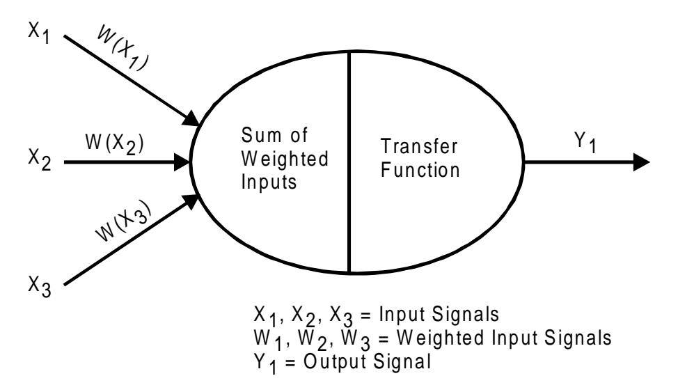

**Figure 13-1 Example of an Artificial Neuron**

A row of neurons is called a layer. The first layer, called the input layer, has only one input to each neuron and as many outputs each as is required to connect to the second layer. The final layer of the network is called the output layer and has many inputs and only one output per neuron. All layers between the input and output layers are called hidden layers. Each neuron in a hidden layer can have as many inputs as the number of

neurons in the preceding layer and as many outputs as in the succeeding layer. ANNs can be designed to be fully connected, which means that each neuron in a layer is connected to each neuron in the succeeding layer, or partially connected, which means that the output of one layer may not be applied to the input of each neuron in the succeeding layer (see Figure 13-2).

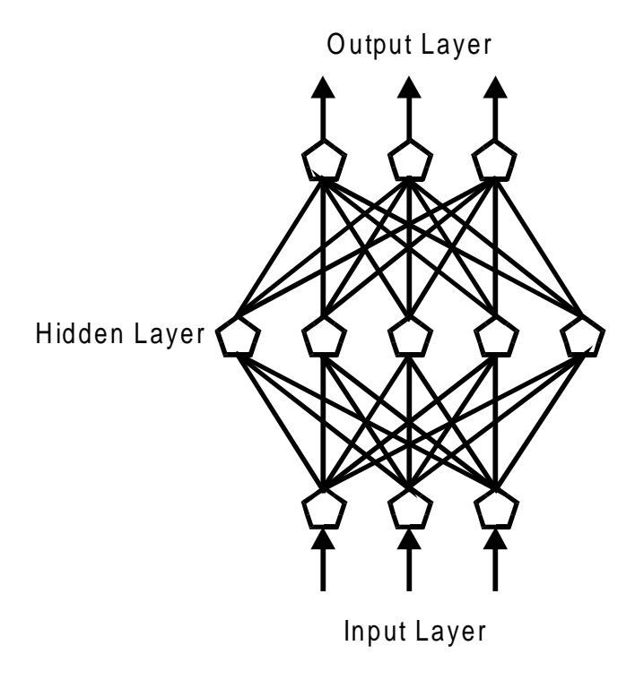

**Figure 13-2 Example of Fully Connected Architecture**

The connectionist computer also acts upon the connections between the neurons. This is done by assigning weights to each input of a processing unit. These weights, typically between zero and one, are a measure of the importance of the input and form the "distributive associative memory" of the ANN. It is this type of memory that provides the fault tolerant nature of an ANN. In a traditional computer system memory damage can render a computer useless. However, damage to some processing units in an ANN may degrade network behavior, but the system does not fail catastrophically. This is possible because the information is not contained in any single memory unit, but is distributed among many connection weights.

The application of an ANN as an instrument calibration monitor is best illustrated by example. Figure 13-3 is a simplified schematic diagram of a thermodynamically open system where both mass and energy are transferred across the boundary of the system. This example is very similar to a home water heater that is instrumented to nuclear standards.

*Appendix G: B&W Owners Group Evaluation of On-Line Monitoring Design Approaches*

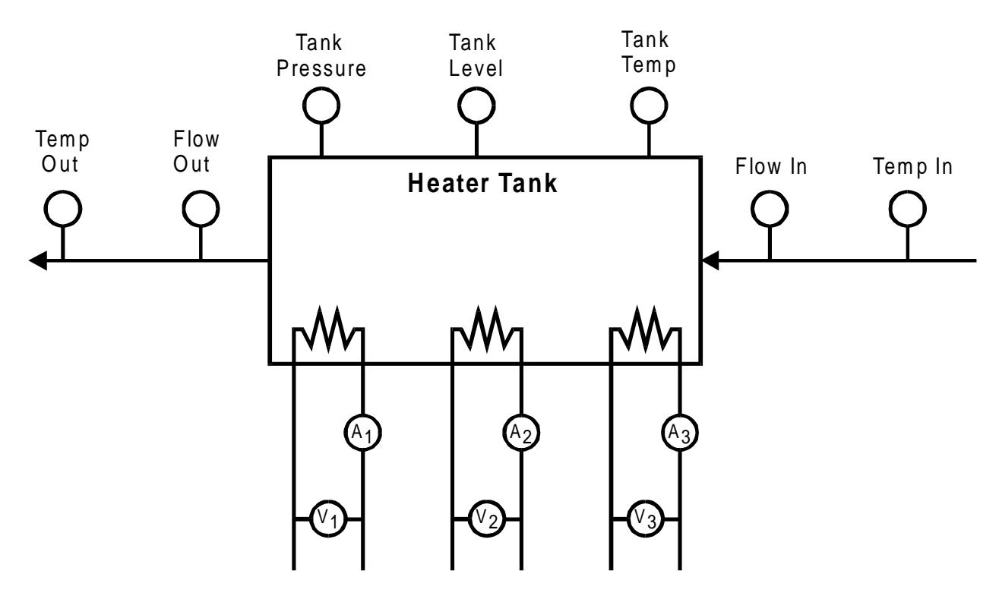

**Figure 13-3 Artificial Neural Network Example**

The function of the system is to maintain a constant output temperature for varying flow rates and input temperatures. The system does this by turning on and off electrical resistance heaters of different power ratings that are in physical contact with the water stream. Each instrument has an analog electrical output that is proportional to the process variable that is being measured. The outputs of the instruments are conditioned to generate the proper electrical levels for use in system operation and monitoring. Each analog signal is also applied to an analog to digital converter (ADC) for processing system information on a microprocessor based computer.

With this system in place, water will flow through the tank and be heated to the proper temperature. If a high flow demand is sensed the system will energize heaters of sufficient power to gain the required temperature increase. The system will respond in the same manner if the inlet temperature decreases, requiring more energy to gain the temperature increase. There may be times when there are high flow demands and low inlet temperatures and the system cannot maintain the required outlet temperature.

With a new or refurbished installation and properly calibrated instruments, the operators of the water heater are very confident in the system's performance, as the heat transfer surfaces have no fouling and the instruments are presenting reliable information. At this time in the life of the heater, performance data is collected and

stored electronically as digital information. This information is then applied to an ANN that has no previous memory of the heater system.

The ANN is placed in a training mode. During training, data from various operational modes is applied to the network. The network reads the patterns of instrument signals and "remembers" the importance of each signal by assigning weights to each connection. It is obvious that the flow, input temperature and heater current will have a greater effect on the outlet temperature than the pressure in the heater. Therefore, ANN will assign greater weights to the former inputs than the latter.

During operation, the trained ANN will generate an estimate for each monitored parameter. This estimate can then be compared to the present actual signal of the instrument.

#### 13.2.1.2 Primary Advantages of ANN Technology

An ANN can use diverse inputs to generate an estimate of the process. This characteristic is the primary advantage of this technology because the ANN can deal with signals that are not redundant. Also it is not susceptible to common mode failure in monitored signals. Finally, an ANN is fault tolerant of damage within itself.

An ANN, if it is trained over the operating range of the monitored processes, can monitor the various modes of the plants (normal power operations). Generally, the ANN can identify what an output should be, it does not simply report what the output is.

#### 13.2.1.3 Weakness/Limitation of ANN Technology

An ANN needs to be retrained periodically after plant or instrument maintenance. This weakness may make the technology too unwieldy to use on a large scale, i.e., monitoring many signals with one network. Several small networks may be required to reduce the retraining impact resulting from the maintenance of any one plant component or instrument.

The accuracy of an ANN is not easily determined. It requires knowledge of the weights of the connections and the accuracies of the instrument strings to the computer. The methodology for determining the accuracy of an ANN is not presently available.

An alternative to traditional Verification & Validation remains to be determined for ANNs because of the architecture of its multiple layers.

#### 13.2.1.4 Applicability

ANNs can be applied to single channels as well as to redundant channels. The architecture of the network is different for application to redundant channels. Because of this, one network for all of the monitoring tasks is not appropriate if redundant signals are to be used.

#### 13.2.1.5 Susceptibility to Common Mode Failures

If the redundant monitor architecture is used and the network is trained on good signals from diverse inputs, then a common mode failure will be detected among redundant signals.

#### 13.2.1.6 Commercial Availability

There are several commercial neural network packages available. These packages need to have their architecture customized to the signal input list. Also, the customized network has to be trained with good data sets. Since there is a considerable amount of work to implement an ANN, this technology should be treated as not commercially available.

There are costs associated with a product not being commercially available. The cost required for implementing an ANN instrument monitor includes the software license and development of a data transfer infrastructure to port data from the plant computer to the ANN. The data transfer infrastructure may be implemented with in-house resources which could reduce this cost. Software packages that could be used range in cost from \$5,000 to \$10,000. The data transfer bridge, depending on the plant computer and resources to implement, may range from \$50,000 to \$100,000.

In addition to the above costs, the network architecture must be adjusted and optimized for the specific plant. A prototype ANN has been developed by the University of Tennessee that required about six man-months. Data transfer from disk to the neural network required 95% of this time. An efficient bridge from the plant computer to the network could reduce the time required for implementation to three or four weeks.

#### 13.2.1.7 Training Requirements

Using an ANN requires very little user training; however, even simple modifications of the network for plant specific customization requires a fairly deep understanding of how an ANN works. For an engineer knowledgeable of plant specific instrumentation, three to four weeks may be required by the ANN developer to train the user to implement an effective monitoring program.

#### 13.2.1.8 Complexity of System and Ease of Use

The use of ANNs is not complex, but many rules need to be kept in mind when using these networks. Familiarity with the architecture and the training will make the interpretation of the results more consistent.

#### 13.2.1.9 Engineering Cost to Implement, Use, and Administer System

It is estimated engineering resources of ½ man-year for the first year would be required for the initial set-up and training of the network. Monitoring and administration of the network subsequently would consume 1/8 man-year.

#### **13.2.2 Pattern Recognition**

#### 13.2.2.1 Basis of Technology

Pattern recognition is a modeling technique that can be used to validate data from a process such as a power plant. The mathematical model can be trained to recognize normal plant behavior and identify any deviations from this normal behavior. Strictly speaking, pattern recognition includes neural networks; however, neural networks are covered in the previous section.

The model for pattern recognition is empirical in nature. Plant data, treated as correlated data, is collected at various instants of time ("snapshots") representing the various operating conditions of the plant and stored in a file that becomes a collection of "reference data sets." Ideally, the reference data only contains signals of calibrated instruments. New input data, taken during plant operation, is then collected to determine the current health of each instrument. This data becomes the "input data set" and is compared with the collection of reference data sets for similarity. A smaller group of similar reference data sets are selected which bound the input data set and these together with the input data set are mathematically manipulated to compute values for each of the monitored points. This new group of estimated monitored points forms the "output data set". It is an accurate representation of how the system should be behaving based on past performance and current operation.

To determine whether the monitored instruments are within the acceptable calibration limits, the output data set is further compared with the input data set. Based on operating experience, a value can be assigned to the difference between the output data set and the input data set. A simple high/low comparison can then be made on this difference value. When the input signal exceeds these thresholds an alarm will be generated. The alarm software can be set-up to compensate for noisy signals, but still be capable of detecting instrument drift. As an alternative, one pattern recognition system uses a statistical approach (Sequential Probability Ratio Test) in analyzing the

difference value to determine the probabilities of incorrect input signals and generate alarming conditions. This method produces a very sensitive way of determining when an instrument is approaching an out of calibration condition.

#### 13.2.2.2 Primary Advantages of Technology

Pattern recognition can be used on single channel instruments. Complex modeling techniques such as those needed for physical and empirical modeling are not required. Furthermore, pattern recognition systems will produce repeatable results. If the analysis is repeated twice using the same reference data sets, identical estimated values (output data set) will be produced. This is an advantage over neural networks which can produce different estimated values for identical input data sets.

The pattern recognition system's capability of producing the same output data set means that it will provide consistent uncertainty values. These values, along with the inherent uncertainty values associated with the calibration errors in the reference data sets (due to drift, calibration temperature shifts, etc.), can be used in determining either the total channel uncertainty values or the reference point uncertainty values associated with the instruments being monitored.

#### 13.2.2.3 Weakness/Limitation of Technology

A pattern recognition system cannot accurately extrapolate a signal when that signal is beyond the range of the reference data sets. Therefore it is important that the reference data sets contain the complete operating plant conditions. In some cases, this may be difficult or nearly impossible to obtain.

A pattern recognition system would need to be retrained when a change (calibration or replacement of transmitter) is made to one of the input signals used in the generation of the estimate. However, input from one vendor indicates that this is not a significant process, even if needed during a plant's operating cycle.

#### 13.2.2.4 Applicability

A pattern recognition system can be applied to any collection of analog signals that are required to be monitored. The system performs with non-redundant and redundant signals. Depending on which vendor's pattern recognition system is used there will be a limit on the number of input signals that can be monitored. The lowest limit appears to be 100 input signals, which should still be sufficient for Technical Specification related instruments at B&W designed plants. Other systems or multiple systems are available for input signal quantities greater than 100.

#### 13.2.2.5 Susceptibility to Common Mode Failures

With the interrelationship of the input signals to a pattern recognition system a common mode failure would be detected.

#### 13.2.2.6 Commercial Availability

Systems specifically designed to monitor process variables are commercially available or becoming available that use pattern recognition technology as the bases of their product. Argonne National Laboratory is in the process of making its Multivariate State Estimation Technique (MSET)/Sequential Probability Ratio Test (SPRT) technology available. Both Performance Consulting Service's Advanced Calibration Monitor and Scientech (NUS)'s System State Analyzer are commercially available.

Other systems that use pattern recognition techniques are available. These systems, along with the three listed above, may require modification for use in a B&W designed plant.

#### 13.2.2.7 Training Requirements

Vendor supplied training would be needed in order to help engineering personnel with the implementation of the system and interpretation of the results.

#### 13.2.2.8 Complexity of System and Ease of Use

Pattern recognition is not a complex system to use for collection of data. As pointed out earlier, engineering training would be required for data interpretation. How the data collection system interfaces with the existing plant computer and to what extent data is maintained (file retention) would determine the complexity of the system.

#### 13.2.2.9 Engineering Cost to Implement, Use, and Administer System

The specific engineering costs to implement an In-service Monitoring System are detailed in Section 13.4. It is anticipated that an ISMP could be part of a System Engineer's responsibilities or that of a dedicated engineer or maintenance personnel.

#### **13.2.3 Redundant Channel**

#### 13.2.3.1 Basis of Technology

The redundant channel methodology involves the collection and evaluation of redundant instrument data for determining instrument drift. Based on data collected

by in-service monitoring of a set of redundant instruments, a software program is used to compute an estimate of the process parameter being measured. The accuracy of the process parameter estimate is dependent on the number of redundant channels. Typically, the software used for determining the process estimate incorporates an algorithm that is weighted to take into account instrument inaccuracies and reliabilities. For instance, the ICMP offered by EPRI utilizes Parity Space Vector Analysis. The ICMP analysis has three features:

- 1. It assigns greater weight to more accurate instruments and instrument data that is grouped closely together. Narrow range instruments would typically be weighted more than comparable wide range instruments due to their greater accuracy.
- 2. The redundant instrument data is screened by the ICMP software for consistency. An instrument providing data outside of an expected error band when compared to the other redundant instruments may be excluded from the parameter estimate calculation.
- 3. Signal noise may result in data points that appear to be outside the expected error band. A counter is used to determine if a signal consistently remains in a faulted condition. Therefore, an instrument will not be determined faulty unless it shows inconsistency with the other redundant instruments for a period exceeding that normally caused by noise. Validated 'faulty' instruments are excluded from the calculation of the parameter estimate.

Once the program determines a parameter estimate, each redundant instrument channel is compared to that estimate. Based on deviations of each instrument to the process parameter estimate, it can be determined if an instrument has drifted outside of predetermined acceptance criteria. The computer software provides graphical displays of the parameter estimate and instrument data to aid engineering analysis. The system can also provide alarms or messages to indicate an instrument has drifted outside of preset values.

The redundant channel methodology is relatively simplistic, consisting of statistical analysis and trending. It could be done simply, such as with an Excel™ worksheet. Existing packages like ICMP are not overly complicated or cumbersome. They can be integrated easily with existing plant equipment and provide statistical analysis tools that have been in operation in pilot nuclear plant programs for several years.

#### 13.2.3.2 Primary Advantages of Technology

ICMP software has the following specific advantages:

1. It is being championed by EPRI and is free to all EPRI members

- 2. It will be tailored by EPRI, if possible, to meet the requirements needed to achieve NRC approval
- 3. It can detect nearly all credible transmitter failures, including all failures that current calibration methodologies identify as determined by the FMEA Analysis performed by EPRI.

Initial setup of the program is easy. The program does not require extensive user training, system modeling, or historical data accumulation.

The accuracy of the additional monitoring equipment used for ICMP can be statistically determined.

The software can be submitted to verification and validation (V&V) methodologies.

#### 13.2.3.3 Weakness/Limitation of Technology

This technology will only work for instruments in redundant channels, and cannot be used for single channel analysis.

To eliminate the possibility of occurrence of a common mode failure, this technology requires the calibration of at least one channel for every group of redundant channels.

For the ICMP product specifically, it is not available (at any cost) to non-EPRI members.

The commercial package identified, ICMP, is currently designed to monitor instrumentation signals connected to the plant process computer; manual entry of data is not available at this time.

#### 13.2.3.4 Applicability

This methodology is only beneficial to channels with redundancy. Single channel systems can not use this technology to determine drift without correlation to an independent diverse parameter.

#### 13.2.3.5 Susceptibility to Common Mode Failures

If all instruments for a specific plant parameter drift in an identical manner, the redundant channel method could not detect it. This is a highly improbable but conceivable scenario. Therefore, to prevent the possible occurrence of a common mode failure, at least one instrument must be field calibrated each outage. For healthy instruments, many utilities will alternate the instrument selected for field calibration. In this way, all channels will be field calibrated over a multi-cycle period. Results from

*Appendix G: B&W Owners Group Evaluation of On-Line Monitoring Design Approaches*

the field calibration of the single channel are used to verify a common mode problem does not exist. The potential cost savings increase with the number of channels of redundancy. For instance, a process parameter with two redundant instrument channels will have a maximum savings of one field calibration per outage (50% savings), whereas a four channel system has a potential savings of three calibrations out of four (75% savings).

For non-safety related systems, utilities may decide to rely on historical and operating data for instruments to determine if a common mode failure is a concern. For instance, a set of instruments that have been in use for several years, have a very accurate calibration history, and are in a non critical function, may rely on the redundant channel monitoring information to determine if any of the instruments require calibration. A common mode failure may not be seen as a real concern for these instruments. One other option may be to calibrate one instrument every two or three cycles instead of each cycle to verify there is no common mode problem.

#### 13.2.3.6 Commercial Availability

The ICMP program referenced previously is commercially available from EPRI. This product was developed by Science Applications International Corporation (SAIC). It is offered to EPRI members for no additional charge. However, it is not available, at any cost, to non-EPRI members. Several utilities have participated in tailored collaboration efforts with EPRI to pilot this program at their sites. V. C. Summer and South Texas Project are two utilities currently running ICMP at their plants. These systems were tailored to fit the pilot utilities; therefore, the hardware and software requirements are not identical. South Texas Project utilizes a personal computer, P90 Pentium with 1 gigabyte hard drive, to run the ICMP program. Data points are picked up from the plant computer using a bridge. South Texas Project personnel developed a simple program using ProComm+ to collect this data. The data is sent once every 24 hours via modem to the ICMP personal computer for data analysis. CC mail messages are automatically sent to the responsible persons by the ICMP computer to identify Alert or out of tolerance conditions. V. C. Summer runs the ICMP program on their VAX. No additional hardware is required for this setup. Personal computers at this utility can pull up the ICMP data via the network. V&V has been performed for the software installed at the above mentioned plants. EPRI intends to incorporate any necessary changes as a result of NRC review into this software.

#### 13.2.3.7 Training Requirements

Training requirements are minimal for an engineer cognizant of instrumentation. Training of an engineer to use the ICMP program and be capable of evaluating long term trending can be accomplished in approximately 40 man hours or less.

13.2.3.8 Complexity of System and Ease of Use

ICMP system is very user friendly. Initial setup and ongoing operation of the program is simple.

13.2.3.9 Engineering Cost to Implement, Use, and Administer System

Estimated engineering cost provided by the pilot utilities is 1/4 man year for first two plant cycles and 1/8 man year for continued system administration.

#### 13.2.4 Physical Modeling

#### 13.2.4.1 Basis of Technology

Certain process parameters in nuclear power plants are analytically redundant to one or more other process parameters. The relationships are based on the laws of physics/thermodynamics, various dimensions and material characteristics of plant structures/components, and known physical constants. If these relationships can be stated as equations that express the value of one process parameter as a function of one or more other process parameters, then an estimate of the one parameter can be calculated based on measurement of the other(s). This provides an analytically redundant, yet independent measure of the parameter of interest that can be compared to direct measurements of that parameter. An example of this approach, for a simple loop of water recirculating through a pump and a heat exchanger, is shown below:

$$mc(T_2-T_1) = (\dot{m}_{hx}c\Delta T_{hx} + \dot{Q}_{nump})\Delta t$$

where

m = total mass of water in the loop

c = specific heat capacity of water

 $T_2$  = final temperature

 $T_1$  = initial temperature

 $\dot{m}_{hx}$  = mass flow rate through the heat exchanger

 $\Delta T_{hx}$  = temperature change of water across the heat exchanger (negative)

 $\dot{Q}_{pump}$  = rate of heat added by the recirculation pump

#### ∆*t* = increment of time

This equation can be solved for T2 and used to calculate ongoing loop temperature once an "initial condition" loop temperature is identified.

Obviously, the physical modeling equations needed to predict nuclear power plant signal behavior would be much more sophisticated than the one shown above.

#### 13.2.4.2 Primary Advantages of Technology

The main advantage of using a physical model to create an analytically redundant estimate of a process parameter is that for a constant set of plant physical characteristics, the relationships among parameters remain fixed over time and can be objectively verified (assuming the necessary plant design information is available). Also, the conceptual approach to determining the uncertainty of the process parameter estimate from a physical model appears to be more straightforward than for some of the other estimation techniques (e.g., neural networks and pattern recognition approaches). If the uncertainties of the various physical constants and the independent process variables are known, then the sensitivity of the dependent process variable to each uncertainty can be computed. These sensitivities can then be statistically combined to produce an overall estimate uncertainty. Granted, execution of these steps may be easier said than done, but the point is that the approach, at least conceptually, appears to be more easily understood and agreed upon than the approach that would need to be taken with some of the other techniques.

#### 13.2.4.3 Weakness/Limitation of Technology

Physical models have two significant drawbacks, either of which is, by itself, enough reason not to pursue using them for instrument calibration monitoring. The first is that physical models are typically very complex. They often involve many dependent process parameters, and they can require numerous partial differential equations to characterize the applicable relationships. The engineering effort needed to develop these models is therefore substantial and would most likely more than cancel out any economic benefit obtained by implementing .a calibration monitoring program. The other big disadvantage is that the uncertainties of physical models tend to be large compared to those involved in a direct measurement of the process parameter of interest. This is akin to using a sun dial to check the calibration of a digital wristwatch.

#### 13.2.4.4 Applicability

Theoretically, physical model generated estimates could be applied to any number of channels of a process parameter, even a single channel.

#### 13.2.4.5 Susceptibility to Common Mode Failures

Since process parameter estimates obtained from physical models are independent of direct measurements of the process parameter of interest, common mode failures and unidirectional drift of instruments could, theoretically, be identified by these estimates.

#### 13.2.4.6 Commercial Availability

No products, either commercially available or under development, that utilize physical models could be identified. This situation is not likely to change due, primarily, to the disadvantages mentioned previously. The development cost and time would be great because of the extensive engineering work that would be required to develop all the equations that characterize the models. This would be compounded by the fact that much of this work would have to be repeated for each plant since designs are not standardized. Therefore, it is unlikely that such a product could ever be sold.

#### 13.2.4.7 Training Requirements

Not applicable

#### 13.2.4.8 Complexity of System and Ease of Use

Not applicable

#### 13.2.4.9 Engineering Cost to Implement, Use, and Administer System

Not applicable

#### **13.2.5 Empirical Modeling**

#### 13.2.5.1 Basis of Technology

As with physical modeling, empirical modeling is based on the fact that certain process parameters in nuclear power plants are analytically redundant to one or more other process parameters. The difference is that the modeling equations are obtained from experience with each process being modeled rather than from first principles. once the form of a given equation has been established (i.e., which process parameters are involved and how they relate to each other and to the process parameter being modeled), its constants are chosen based on fitting actual plant data to the equation. An example of this approach, from a methodology developed at the University of Tennessee, is shown below:

$$y = 0.00254x_2 - 64.5x_1 + 0.0568x_1 - 1.18x_2 + 18178$$

where

| Symbol | Definition                |
|--------|---------------------------|
| y      | reactor power (%)         |
| x1     | cold leg temperature (°F) |
| x2     | hot leg temperature (°F)  |

A number of different empirical modeling equations can be written for a given process parameter, depending on which dependent variables are selected and the desired order of the equation. Like their physical modeling counterparts, empirical modeling equations provide analytically redundant, yet independent measures of various parameters of interest for comparison with direct measurements of those parameters.

#### 13.2.5.2 Primary Advantages of Technology

Empirical modeling is preferable to physical modeling because it requires substantially less detailed knowledge of all the applicable physical/thermodynamic relationships for each process parameter to be modeled. It also doesn't require knowledge of numerous plant dimensions and material characteristics of various plant structures and components. In many cases empirical modeling equations are far less complex than their physical modeling counterparts, both in terms of their development and with regard to their ease of application. To illustrate this, two equations for pressurizer level are shown below, the first created from the University of Tennessee methodology cited earlier, and the other developed by Analysis and Measurement Services Corporation (AMS):

#### Empirical model

$$y = 0.7365x_4 - 0.0685x_1 - 0.0086x_2 + 0.64x_3 - 723$$

where

| Symbol   | Definition                                            |
|----------|-------------------------------------------------------|
| y        | pressurizer level (%) reactor power (%)            |
| x1 x2 | pressurizer pressure (psi)                            |
| x3 x4 | cold leg temperature (°F) hot leg temperature (°F) |
|          |                                                       |

Appendix G: B&W Owners Group Evaluation of On-Line Monitoring Design Approaches

#### Physical model –

$$\frac{dL_{w}}{dt} = \frac{1}{\rho_{s}A_{pr}} \left[ \left( A_{pr}(L - L_{w}) \frac{\partial \rho_{w}}{\partial P_{pr}} - \frac{A_{pr}(L - L_{w}) \frac{\rho_{w}}{\rho_{s}} \frac{\partial \rho_{w}}{\partial P_{pr}} + A_{pr}L_{w} \frac{\partial \rho_{s}}{\partial P_{pr}}}{\frac{\rho_{w}}{\rho_{s}} - 1} \right) \frac{dP_{pr}}{dt} + \frac{W_{sr} + W_{co}}{\frac{\rho_{w}}{\rho_{s}} - 1} \right]$$

where

| <u>Symbol</u>                                                                             | <u>Definition</u>                                                                                       |
|-------------------------------------------------------------------------------------------|---------------------------------------------------------------------------------------------------------|
| $\begin{array}{c} L_{_{\mathrm{w}}} \ \rho_{_{S}} \end{array}$                            | water level in the pressurizer vapor density in the pressurizer                                         |
| $\begin{aligned} \mathbf{A}_{\mathrm{pr}} \ \mathbf{L} \ \mathbf{\rho}_{w} \end{aligned}$ | cross-sectional area of the pressurizer effective pressurizer length water density in the pressurizer   |
| $\begin{array}{c} P_{\rm pr} \ W_{\rm sr} \ W_{\rm co} \end{array}$                       | pressurizer pressure in/out surge flow rate condensation/evaporation flow rate in the pressurizer |

The uncertainties of empirical models can be made much smaller than those of physical models by selecting appropriate forms of the equations and by optimal data fitting techniques. Both empirical and physical modeling can be used to identify common mode failures and unidirectional drift of a set of redundant instrument channels. Additionally, these approaches can be used to produce analytically redundant estimates of process parameters for the purpose of improving the accuracy of overall process parameter estimates.

#### 13.2.5.3 Weakness/Limitation of Technology

Since empirical modeling equations depend, in part, upon a process of fitting plant data to those equations, they often must be validated under numerous sets of operating conditions. This can result in the need for multiple equations to adequately characterize a given process parameter at all operating conditions of interest. Formulation of the equations also requires knowledge of which process parameters are correlated with each parameter of interest. These considerations make empirical modeling more suitable for use in conjunction with other approaches (e.g., redundant channel averaging, neural networks, and pattern recognition) than as a "stand alone" method. It would be unwise to depend upon empirical modeling as the sole factor in establishing a process parameter estimate; however, since it can provide information that is independent of direct measurements, empirical modeling is a valid approach for

strengthening the confidence level of process parameter estimates made using other techniques.

#### 13.2.5.4 Applicability

Theoretically, empirical model generated estimates could be applied to any number of channels of a process parameter, even a single channel.

#### 13.2.5.5 Susceptibility to Common Mode Failures

Since process parameter estimates obtained from empirical models are independent of direct measurements of the process parameter of interest, common mode failures and unidirectional drift of instruments could, theoretically, be identified by these estimates.

#### 13.2.5.6 Commercial Availability

Only one product utilizing empirical models has been identified, Calibration Reduction System/Software (CRS) by AMS. CRS is not commercially available yet, but it has been under development for several years and is nearing completion. It does not rely on empirical modeling exclusively but also uses redundant channel averaging and neural networks to come up with an overall process parameter estimate.

No hardware is required with CRS as long as all the signals of interest are already being monitored (e.g., by the plant computer) and can be sent to a PC that would run CRS. If, however, hardware or computer interface support would be needed to ensure all the necessary signals are available as CRS inputs, then AMS could provide it.

All the software V&V for CRS is performed in accordance with AMS procedures under their 10CFR50 Appendix B and 10CFR21 quality assurance program, which has been successfully audited by NUPIC several times.

CRS is not presently installed at a nuclear power plant. Interest has been expressed by several U.S. plants in using CRS on non-Technical Specification and secondary plant instrumentation to comply with maintenance rule requirements. The strongest interest has come from some plants in Europe. Development work on CRS was done at Duke Power Company's McGuire Unit 2, but it is no longer installed there.

Quantitative cost information was not available since there are too many variables that would influence it. Among them are the extent, if any, of hardware or computer interface support needed, the number of signals to be monitored, and numerous customer choices with regard to the software (i.e., how many ways does the customer want to analyze and evaluate the data?). AMS management has indicated that they would pursue a shared cost approach between themselves and the first utility buyer.

These savings would be offered to the first buyer only because of the strategic importance of getting a new product in use at that first plant. AMS would prefer to work closely with the first customer at each step of the way (e.g., development of empirical modeling equations, establishment of alarm/setpoint values, etc.) since both they and the buyer have a strong interest in the success of the project. In other words, AMS does not plan to market CRS as a product the utilities purchase and then go off and try to use on their own. Pricing of CRS after the first sale would depend on demand, which is hard to predict. For example, if the NRC approves one or more inservice monitoring techniques for use on Technical Specification instrumentation, then demand will obviously rise.

AMS chose to utilize redundant channel averaging, empirical modeling, and neural networks in CRS because they believe having a variety of diverse ways to produce process parameter estimates provides the greatest confidence in the overall estimate. Redundant channel averaging by itself is susceptible to common mode failures. Relying exclusively on neural networks is risky because of the complexities and subtleties involved in properly training them. For that matter, as discussed earlier, sole reliance on empirical modeling is not desirable either.

For its empirical modeling portion, CRS provides a general framework, including a library of equations used as a starting point. These would have to be customized and their constants selected based upon customer needs and evaluation of actual plant data. The equations can be modified to add or delete variables that may be more or less strongly correlated to the process parameters of interest. The number of correlated variables used in the empirical modeling equations is typically far fewer than with pattern recognition or neural network approaches, which use even weakly correlated variables.

13.2.5.7 Training Requirements

Insufficient information available

13.2.5.8 Complexity of System and Ease of Use

Insufficient information available

13.2.5.9 Engineering Cost to Implement, Use, and Administer System

Insufficient information available

#### **13.3 Comparison of Technologies/Products**

The basic requirements of an in-service monitoring program for B&W designed plants were identified previously. It must utilize computer software, be a non-intrusive data monitor, and verify accuracy and performance of monitored instruments. All the technologies and products evaluated in this report satisfy these criteria except for the neural networks, which cannot verify accuracy to a known value. This is because the accuracy of the process parameter estimate generated by a neural network cannot be precisely determined (at least not at present).

Additional requirements of an ISMP include reduced labor costs, decreased personnel radiation exposure, and improved plant efficiency and system performance. To achieve the maximum benefit in reduced labor costs, and to minimize radiation exposure, the ISMP should apply to as many instruments in the plant as possible, while still satisfying all the basic requirements listed above. This means that the technology/product selected must be effective on single channel instruments without requiring periodic field calibration to verify proper ISMP performance. Redundant channel methodologies are, therefore, poorly suited for this. The majority of instruments to which an ISMP could be applied are of the single channel variety.

This leaves pattern recognition and other modeling techniques as the choices that can best satisfy the desired criteria. The remainder of this section will explore the key differences among these technologies/products and provide specific recommendations for their use at B&W designed plants.

Another consideration in evaluating pattern recognition and physical/empirical modeling is the cost, mostly in engineering effort, of developing and maintaining the set of reference data records (for pattern recognition) or the detailed models themselves (for physical/empirical modeling). As discussed previously, the engineering effort needed to develop physical models is substantial and would likely erase all cost savings associated with their implementation in an ISMP. While empirical models are far less difficult to develop than physical models, they nonetheless have to be validated under numerous sets of operating conditions and customized by selecting the constants based upon customer needs and evaluation of plant data. This still involves significant engineering effort, especially in the developmental stage.

Pattern recognition approaches, however, can provide analytical redundancy for nearly all plant measurements with minimal engineering effort. The many complex, nonlinear relationships in nuclear plant systems can be represented with relatively few reference data records. Therefore, changes in process parameter relationships that occur with variations in plant operating conditions are accounted for without having to invest the significant engineering resources needed to determine the coefficients for modeling equations. Also, slow changes in process parameter relationships that can occur as a plant ages are easily handled with pattern recognition approaches simply by creating

*Appendix G: B&W Owners Group Evaluation of On-Line Monitoring Design Approaches*

new reference data records. There would be many times as much effort involved if new constants for the physical/empirical modeling equations had to be determined.

In summary, pattern recognition provides an accurate, reliable method for detecting calibration drift and instrument failure without requiring complicated models of process parameter relationships. The ICRWG has looked at three pattern recognition products; however, further examination of them is necessary to identify which one best suits the needs of the B&W designed plants.

All three pattern recognition products—the Advanced Calibration Monitor, the Multivariate State Estimation Technique (MSET), and the System State Analyzer appear very similar in terms of the basic concepts they utilize. What sets MSET apart from the other two is its combination with the Sequential Probability Ratio Test (SPRT). This was brought out most clearly during the DOE Instrument Surveillance Calibration Verification Project's demonstration of results at Crystal River in February 1996. The MSET/SPRT software performed much better than the other technologies, in large part because the SPRT acceptance criteria could be optimized such that it was neither overly sensitive, resulting in "false alarms," nor so insensitive that it resulted in "missed alarms." This balance is perhaps one of MSET/SPRT's most attractive characteristics for nuclear plant applications. Certainly, missed alarms are not acceptable for nuclear safety-related instruments and "false alarms" on Tech Spec instruments could possibly result in needless action statement entries and manual calibrations. one particularly impressive example from the DOE project was MSET/SPRT's ability to correctly identify a Rosemount transmitter oil loss failure several weeks prior to the instrument displaying any visible symptoms.

Based on these considerations, the ICRWG recommends pattern recognition technologies, in general, and the MSET/SPRT software, in particular, for use in B&W designed nuclear power plant ISMPS. MSET/SPRT can be used on all instruments that provide an input signal to the plant process computer; however, for those instruments with Technical Specification driven calibration requirements, manual calibrations must still be performed because the NRC has not approved the use of ISMPs as an alternative means of satisfying these Technical Specification requirements. The ICRWG nevertheless recommends ISMP implementation to realize the cost savings associated with reducing the number of manual calibrations performed on non-Technical Specification instruments.

#### **13.4 Cost Benefit Analysis**

This section discusses the cost benefit analysis used to evaluate the relative merits of installing an ISMP. This cost benefit analysis is used to quantify, in dollars, the benefit of performing instrument calibrations on a performance based vs. the existing time based calibration criteria. Cash flow where a cost is incurred, such as cost of

procurement, training, procedure changes, etc. is treated as a negative cash flow. Positive cash flow results when cost savings are realized, such as a reduction in labor cost, ALARA improvements, etc.

#### **13.4.1 Cost Benefit Analysis Assumptions**

This section discusses the assumptions and estimates used for performing a cost benefit analysis for an ISMP. Input values are a combination of available data and engineering estimates.

#### 13.4.1.1 Cost of In-Service Monitoring System

The estimated cost of an In-Service Monitoring System ranges from \$25,000 to \$100,000.

Note: This cost is based on primarily discussions with two vendors and should only be considered a conceptual estimate. If and when EPRI's ICMP product is available this cost would be eliminated for EPRI members if they choose to use EPRI's ICMP.

#### 13.4.1.2 Cost to Change Procedures

The estimated cost to change procedures is \$9,000.

Procedure(s) would need to be written to establish a new calibration program. These procedures would cover the implementation, data analysis, and actions required for addressing calibration data.

Existing instrument calibration procedures will need to be reviewed and revised accordingly to assure continued calibration of instrument loop components that are not in the scope of the ISMP.

It is estimated that procedure development time would be approximately 200 manhours at a rate of \$45.00 per hour. Man-hours is based on involvement of Engineering, Technical Analyst, Procedure Specialist, etc. and the man-hour rate is an average cost of these positions.

#### 13.4.1.3 Cost of Training

The estimated cost of training is \$8,240.

System engineers or maintenance personnel would be trained to become familiar with the techniques and procedures for analyzing data and determining the acceptability of instrument channel performance. It is estimated that training would require two (2)

days and include five (5) system engineers and two (2) maintenance personnel. Also included in this cost is an estimated charge of \$3,200 by the ISMP vendor to provide this training.

It is estimated that training would take approximately 112 man-hours at an average rate of \$45.00 per hour.

#### 13.4.1.4 Engineering Cost to Analyze Data

No additional cost is anticipated to analyze data.

A system engineer or maintenance assessor would review the data supplied by an ISMP as part of their normal work responsibilities. This effort is considered normal O&M cost and is therefore not factored into the cost analysis.

As a reference it can be assumed that an engineer would spend an average of 4 to 6 hours per month analyzing ISMP data. The analysis would be to detect sensor calibration drift and monitor system performance. This time would vary based on the size and complexity of the system being evaluated. Out of specification data can be configured to generate alarms and displays, which could reduce the time spent on data analysis.

#### 13.4.1.5 Cost of Technical Specification Change

The estimated cost of a Technical Specification change is \$13,200.

Based on conversations with the NRC, a technical specification change would be required to expand the existing definition of calibration and include a discussion of the ISMP concept. It is estimated that a Technical Specification change would be accomplished in approximately 160 man-hours at a rate of \$45.00 per hour.

Also included in this cost is the NRC charge of \$6,000 for a Technical Specification Change submittal.

#### 13.4.1.6 Uncertainty Calculation Updates

The estimated cost of uncertainty calculation updates is \$67,500 per plant.

Plant setpoint and uncertainty calculations would need to be revised to account for any error contributed by the ISMP. On average 100 man-hours would be required to review and revise a calculation.

Assuming fifteen (15) calculations per plant at 100 man-hours per calculation at a rate of \$45.00 per hour results in cost of \$67,500.

#### 13.4.1.7 Labor Savings

Labor savings is estimated to be \$1,000 per calibration.

The labor cost savings figure includes direct reduction in I&C technician, Operation, Utility support and supervision. The time to perform Tech Spec required calibrations for one operating cycle were counted and averaged to obtain a man-hour per instrument calibration estimate. A labor rate of \$30.00 per hour was assumed. This rate includes all direct and indirect costs and is comparable to industry standards. Supervision costs are also included in overall cost per calibration cost savings.

The more instruments that are in a radiological controlled area or require removal and reinstallation of Appendix R related fire barrier material would increase this cost. Likewise, if more instruments are in clean areas or don't impact fire barriers the cost will be reduced.

#### 13.4.1.8 ALARA Savings

The ALARA savings is estimated to be \$160 per calibration.

ALARA savings includes radwaste and dose rate reductions.

The factors considered in ALAPA improvements are the reduction in anticontamination clothing, disposal cost for any generated radwaste, and man-hours for radcon support.

Based on deferring 50 calibrations per refueling outage a dose rate reduction of approximately 800 mrem would result.

According to EPRI Report TR-104963-Vl, *Upgrade Evaluation Methodology*, cost savings of \$10,000 per man-rem can be assumed. For 800 mrem this would result in a savings of \$8,000 or \$160.00 per calibration.

#### 13.4.1.9 Improved Plant Availability/Efficiency

Plant availability would be increased when the ISMP is installed. In addition to monitoring the performance of individual instrument channels the ISMP provides system performance monitoring capabilities. While a shift in a signal may indicate that a sensor needs calibration, a shift in several interrelated signals may indicate a change in system performance. Heat exchanger tube leaks, flow element fouling, degraded

*Appendix G: B&W Owners Group Evaluation of On-Line Monitoring Design Approaches*

pump performance, and Once Through Steam Generator fouling are a few of the plant conditions that would be detected by the ISMP. The ability to have early detection of these problems will allow for more effective preventive and corrective maintenance planning.

Existing plant efficiency would not be decreased by an ISMP. While the ISMP would not provide a more accurate heat balance calculation its ability to detect instruments drifting out of calibration is a benefit. This early detection will allow for calibration of a heat balance input sensor before it could effect the heat balance calculation thus assuring maximum generation.

#### 13.4.1.10 Trip Reduction

The use of an ISMP would reduce the number of traditional instrument calibrations thus decreasing the potential for plant trips/transients. Human error when performing calibrations has resulted in plant trips or transients. Valving out the incorrect transmitter or bypassing of the wrong instrument channel are a few examples of human error from past experiences.

Based on a review of the Licensee Event Report (LER) database by Analysis and Measurement Services Corporation (AMS) as part of NUREG/CR-5903, *Validation of Smart Sensor Technologies for Instrument Calibration Reduction in Nuclear Power Plants*, about 20 percent of all reactor trips reported in LERs in the years 1980-1992 have been due to instrument testing.

#### **13.4.2 Cost Benefit Analysis Results**

The overall cost savings will vary from plant to plant based on the total number of instruments to be included in the ISMP program.

The costs that the ICRWG agreed would be basically the same for each utility are:

| Cost of ISMP                            | \$25,000—\$100,000      |
|-----------------------------------------|-------------------------|
| Cost to change procedures               | \$9,000                 |
| Cost of training                        | \$8,240                 |
| Cost of Tech Spec change                | \$13,200                |
| Cost of uncertainty calculation updates | \$67,500                |
| Total one time cost                     | \$122,940— \$197,940 |

The savings will naturally vary from utility to utility based upon the total number of instruments to be included in the ISMP program. A saving of \$1,000 per deferred calibration has been assumed. A savings of \$160 per calibration would be realized through ALARA improvements.

Example: For TMI nuclear station it is estimated that 50 Technical Specification related calibrations can be eliminated from a typical operating cycle. It is assumed that one transmitter per measured variable is calibrated per cycle to reaffirm the base-line data for the ISMP. The cost savings per one operating cycle based on labor and ALARA savings would be:

| Calibration savings (50 cal x \$1,000/cal) |  | \$50,000 |
|--------------------------------------------|--|----------|
|--------------------------------------------|--|----------|

ALARA savings (50 cal x \$160/cal) \$ 8,000

Total savings per operating cycle \$58,000

Based on a one time cost of \$197,940 and savings of \$58,000 per operating cycle, it would take 3.4 cycles for pay back. If the savings from avoiding one plant trip is factored in, then the cost of implementing an ISMP is recovered immediately.

While this cost benefit section has focused on Technical Specification related calibrations, the ISMP can be used to reduce the number of non-Technical Specification related instrument calibrations. The labor cost for calibrating a non-Technical Specification instrument would not be significantly less than a Technical Specification required calibration. TMI currently has approximately 500 instruments (non-Technical Specification and Technical Specification) in a performance based monitoring program using the NUS Solid State Analyzer. The use of the Solid State Analyzer has allowed the extension of non-Technical Specification instrument calibrations beyond a three (3) year frequency. The data from Technical Specification instruments is used to help identify potential problems.

#### **13.5 Summary**

Performance based monitoring of instrument channels has the potential to increase plant availability and reliability, and provide increased knowledge of instrument channel performance through accurate and more frequent monitoring of instrument channels over time. Performance monitoring of instrument channels can provide more detailed assessment of instrument performance and a basis for determining when a field calibration is required thus eliminating time based interval calibrations.

The ICRWG has evaluated the current performance based methodologies. The advantages, weaknesses, applicability, complexity and availability of each methodology have been addressed. Through Florida Power Corporation's and DOE's Instrument Surveillance Calibration Verification Project, the ICRWG has been provided technical information to allow for sound evaluation of the available methodologies.

Likewise the ICRWG has actively worked with EPRI as a member of the EPRI Utility On-Line Monitoring Working Group. This effort included working as individual members on the technical areas of EPRI TR-104965, ICMP Topical Report, and also expressing the needs of the B&WOG utilities. The main benefit of the ICRWG involvement with the EPRI working group was to address the licensing issues. The ICRWG supported EPRI in meetings with the NRC and in addressing the NRC questions on a performance based monitoring program.

The ICRWG has recommended the use of pattern recognition, in general, and the MSET/SPRT software, in particular, for use in B&W designed nuclear power plants. The MSET/SPRT can be used on all instruments that provide an input signal to the plant process computer. A cost saving has been documented with the use of this technology whether it is applied to Technical Specification or non-Technical Specification related instruments. For those instruments that have Technical Specification driven calibration requirements, manual calibration must still be performed since the NRC has not approved the use of ISMPs as an alternate means of satisfying the Technical Specification definition of a calibration. However, an ISMP provides useful information on the state of an instrument and the process being monitored regardless of whether it can be used in place of the traditional method of sensor calibration.

#### **13.6 References for B&W Report**

- 1. *Validation of Smart Sensor Technologies for Instrument Calibration Reduction in Nuclear Power Plants.* NUREG/CR-5903. January 1993.
- 2. *Instrument Calibration and Monitoring Program, Volume 1: Basis for the Method.* EPRI, Palo Alto, CA: December 1993. Report TR-103436-Vl.
- 3. *Instrument Calibration and Monitoring Program, Volume 2: Failure Modes and Effects Analysis.* EPRI, Palo Alto, CA: December 1993. Report TR-103436-V2.
- 4. *Calibration Through On-Line Performance Monitoring of Instrument Channels,* DRAFT. EPRI, Palo Alto, CA: August 1995. Report TR-104965.
- 5. *On-Line Testing of Calibration of Process Instrumentation Channels in Nuclear Power Plants.* NUREG/CR-6343. November 1995.

- 6. *Instrumentation and Control Upgrade Evaluation Methodology, Volume 1: Manual.* EPRI Palo Alto, CA: July 1996. Report TR-104963-Vl.
- 7. *Instrumentation and Control Upgrade Evaluation Methodology, Volume 2: Workbook.* EPRI Palo Alto, CA: July 1996. Report TR-104963-V2.
- 8. K.E. Holbert and H.M. Hashemian, "Instrument Calibration Reduction Using Signal Validation," *Proceedings of the American Nuclear Society Winter Meeting.* San Francisco, California (November 1993).
- 9. K.E. Holbert and B.R. Upadhyaya, "An Integrated Signal Validation System for Nuclear Power Plants," *Nuclear Technology.* 92, 411 (1990).
- 10. B.R. Upadhyaya and K.E. Holbert, "Computation of Data-Driven Models with Applications to Power Plant Signal Validation," *Transactions of the American Nuclear Society.* 57, 276 (1988).
- 11. B.R. Upadhyaya, K.E. Holbert, and E. Eryurek, "Automated Generation of Non-Linear System Characterization for Sensor Failure Detection," *Proceedings of the 35th International Instrumentation Symposium,* ISA 89-0026, Instrument Society of America, Orlando, Florida (May 1989).
- 12. B.R. Upadhyaya, K.E. Holbert, and T. W. Kerlin, "Development of an Integrated Signal Validation System and Application to Operating Power Plants," *Proceedings of the 7th Power Plant Dynamics, Control & Testing Symposium, Volume 2.* Knoxville, Tennessee (May 1989).

# *14*

## **APPENDIX H: MULTIVARIATE STATE ESTIMATION TECHNIQUE (MSET) SURVEILLANCE SYSTEM**

The material regarding the Multivariate State Estimation Technique (MSET) surveillance system was contributed by J. P. Herzog, K. C. Gross, S. W. Wegerich, and R. M. Singer of Argonne National Laboratory.

#### **14.1 System Overview**

The Multivariate State Estimation Technique (MSET) Surveillance System is a softwarebased, highly sensitive, and accurate tool for on-line monitoring of the health of any process that has at least one sensor. MSET can detect and identify any malfunction that might occur in process sensors, components and control systems as well as changes in process operational conditions. MSET uses statistically-based pattern recognition modules that interact and operate to provide the user with information needed for the safe, reliable and economical operation of a process by detecting, locating, and identifying subtle changes that could lead to future problems well in advance of significant degradation.

To utilize the MSET Surveillance System, all that is necessary for the user to do is collect sensor-generated data from the process under consideration that bounds all normally expected operational states. These data are used by the MSET system to establish the domain of normal process operation (i.e., "train" MSET to recognize normal behavior) and will be used in the monitoring phase to determine malfunction incipience. During monitoring, sensor data are read by MSET, an estimate of the current state of the process is determined by comparing the measured sensor data with that obtained during training, and the difference between this state estimate and the measurement is calculated. This difference or estimation error is then analyzed by a statistically-based hypothesis test (the sequential probability ratio test or SPRT) that determines if the process is operating normally or abnormally. If an abnormal condition is detected, the initial diagnostic step identifies the cause as either a sensor degradation or an operational change in the process. When a sensor degradation is identified, MSET utilizes the estimated value of the signal from this sensor to provide a highly accurate "virtual sensor" that can be used to fully replace the function of the faulted sensor.

*Appendix H: Multivariate State Estimation Technique (MSET) Surveillance System*

#### **14.2 Description of the MSET Structure and Module Functions**

The basic concept that is used by the MSET pattern recognition system is an integration of a system model that provides analytically derived values of all monitored sensor signals and a statistically-based hypothesis test that compares the analytically estimated signal values with the measured values to detect the development of incipient faults. MSET consists of three essential modules and a number of supporting modules. The essential modules are a training algorithm for collection of representative data from sensors during normal operation of the system, an empirically-based model for system state estimation, and a statistically-based fault detection algorithm. The training module is used to produce a training set whose data ideally encompass all expected normal operating states of the system. The system modeling module is used to estimate the values of all signals that are present in the process that is being monitored. The fault detection module is used to detect disturbances through an examination of the difference between the estimated and measured signal values.

A flow diagram illustrating the architecture of the MSET system is shown in Figure 14- 1. All of the modules located within the large rectangle constitute the MSET base code. These modules are represented by fixed coding, i.e., they are generically applicable to any monitored system and do not require modification for new applications. An executable version of MSET for a particular computing environment requires an input interface that supplies signals from the monitored system and an output interface that displays results of calculations. Additional detailed diagnostics can also be supplied that address specific process issues.

*Appendix H: Multivariate State Estimation Technique (MSET) Surveillance System*

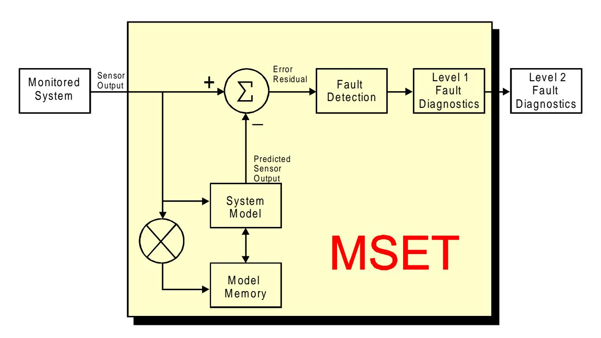

**Figure 14-1 MSET System Architecture**

To enable application of MSET to fault detection and identification, data are first collected from the monitored process when it is known to be operating satisfactorily. It is desirable to operate the process over the full range of conditions that are expected to be seen. During the training phase, data from all sensors are collected and analyzed by the training module. The training module selects an optimized minimum set of the training data that are sufficient to determine the state of the process during the subsequent monitoring phase and stores these data in the *MODEL MEMORY*. Once the training step is completed, monitoring can be started in which signals from the same sensors used in training are fed into the *SYSTEM MODEL*. In this step, the measured data are continuously compared to the data in the model memory to determine the best match between the current process conditions and those learned as normal conditions. From this comparison, which utilizes a pattern recognition algorithm optimized to minimize error, MSET predicts estimated values of all the sensor signals. The difference between these estimated values and those measured is calculated and this error residual is provided to the *FAULT DETECTION* module which contains the SPRT fault detection and identification algorithms. Based upon the statistical characteristics of the error residual, SPRT determines if a fault is starting to develop in any of the sensors or process equipment or if the operating state of the process is starting to deviate from that known to be normal or desired. If no incipient faults are detected, monitoring continues. If incipient faults are detected, logic in the *LEVEL 1 FAULT DIAGNOSIS* module utilizes the output from SPRT to determine the location of the fault; i.e., identifies the specific sensor or component that is indicating probable future

*Appendix H: Multivariate State Estimation Technique (MSET) Surveillance System*

degradation or annunciates the beginning of an abnormal operating state of the process. More detailed diagnostics may be incorporated into the *LEVEL 2 FAULT DIAGNOSTICS* module in which process-specific data, such as flow charts, component design information, FMEA (failure mode and effects analysis) results, etc. are utilized. The *LEVEL 2 FAULT DIAGNOSTICS* module is an optional add-on to MSET for which the heuristic rule hierarchy is custom designed for any given plant subsystem or sensor configuration to which it is applied.

The MSET Surveillance System has a number of important and unique features that provide capabilities beyond those of other monitoring systems, including the following:

- 1. MSET analyzes and preprocesses the signals being monitored to optimize their informational content for use in fault detection.
- 2. MSET is trained to estimate operational conditions with a one step, deterministic calculation.
- 3. The signal value estimate provided by MSET is extremely accurate with errors between estimates and measurements typically ranging between 0.1% to 0.5% [refs. 1, 2] for large configurations comprising loosely coupled sensors, and less than 0.1% for smaller sensor configurations wherein the physical variables are more strongly correlated.
- 4. MSET provides accurate signal estimates even if a large fraction of the sensors are providing erroneous information or are totally failed.
- 5. The MSET state estimation model predicts not only the mean value of the signals but also the "deterministic noise" riding on these signals, which is critical for early fault detection.
- 6. The SPRT fault detection module utilizes the characteristics of the signal noise to identify incipient faults with the theoretically minimum number of observations.
- 7. The SPRT module permits the user to specify false alarm and missed alarm probabilities, allowing the control of the likelihood of missed detection or false alarms.
- 8. Faulted sensors may be replaced with highly accurate virtual sensors generated by the state estimate.
- 9. The kernel of the code is only a few hundred lines and for most practical reactor applications runs in real time on low-cost PC platforms.

#### **14.3 Statistical Fault Detection Technique**

Many industrial processes have embedded diagnostic systems which perform real-time analysis of the data. Most of these systems employ simple tests (e.g., threshold, mean value, etc.) that are sensitive only to gross changes in the process mean, or to high steps or spikes that exceed some threshold limit check to determine whether or not a failure has occurred. These conventional methods suffer from either large false alarm rates (if thresholds are set too close) or high missed (or delayed) alarm rates (if the thresholds are set too wide). These simple methods can fail dramatically, especially in situations where noisy data are present or only slight drift is noted prior to catastrophic failure. In order to detect incipient faults in process equipment at the earliest possible stage of development, it is necessary to analyze the stochastic characteristics of the noise carried by sensor signals monitoring the process rather than the mean values of these signals. This is necessary since small initial disturbances will cause subtle changes in the statistical properties of sensor signals well prior to any measurable changes in the signal mean values.

The Sequential Probability Ratio Test (SPRT) technique provides the basis for detecting these statistical changes in the sensor signals at the earliest possible time and thus provides usable information on the type and location of the disturbance. The SPRT technique provides a dramatic improvement in sensitivity and reliability over conventional tests based, for example, on parity space. The SPRT technique provides a superior surveillance tool because it is sensitive not only to disturbances in signal mean, but also to very subtle changes in the statistical quality (variance, skewness, bias) of the monitored signals. Instead of threshold or control limits, the SPRT technique utilizes user-specified false-alarm and missed-alarm probabilities, allowing the user to control the likelihood of missed or false alarms. For sudden, gross failures of sensors or system components the SPRT would annunciate the disturbance as fast as a conventional threshold limit check. However, for slow degradation that evolves over a long time period (gradual decalibration bias in a sensor, wearout or buildup of a radial rub in rotating machinery, loss-of-time-constant degradation in a pressure transmitter, change-of-gain failure without a change in signal mean etc.), the SPRT can alert the operator of the incipience or onset of the disturbance long before it would be apparent to visual inspection of strip chart or CRT signal traces, and well before conventional threshold limit checks would be tripped. To cope with process variables contaminated by serial correlation, ANL has developed the spectrum transformed sequential testing (ST2) method, which retains the excellent surveillance advantage of SPRT (i.e., extremely high sensitivity for very early annunciation of disturbances in monitored signals) while providing false-alarm and missed-alarm probabilities that are unaffected by the presence of serial correlation in the signal data.

*Appendix H: Multivariate State Estimation Technique (MSET) Surveillance System*

#### **14.3.1 Sequential Probability Ratio Test Technique**

The sequential probability ratio test [ref. 3] is a statistical hypothesis test that differs from the standard fixed sample test in the way in which statistical observations are employed. In the fixed sample test, a given number of observations are used to select one hypothesis from two or more alternatives. The SPRT, however, examines one observation at a time, and at some point makes a decision and selects a hypothesis [refs. 4-6].

The basic approach taken by the SPRT technique is to analyze successive observations of a discrete physical process by a comparison of the stochastic components of signals generated by an actual sensor and a synthesized sensor signal that is generated by MSET. Let *yn* represent the discretized difference sample from the two signals at a given moment *tn* in time. Then the sequence of values {*Yn*} = *y0, y1, ... yn* should adhere to a Gaussian probability density function (pdf) with mean 0 if the system is operating normally. The sequence of values formed by taking the difference between two signals is also known as the residual signal. Note that if the two signals do not have the same nominal means (due, for instance, to differences in calibration of redundant sensors), they are normalized to the same mean value during initialization, thereby ensuring that the difference sequence {*Yn*} has an expected mean 0.

The SPRT is a binary hypothesis test. It analyzes the residual signal to determine whether or not the signal is consistent with normal behavior. When a SPRT reaches a decision about current residual signal behavior, either that the signal is behaving normally or abnormally, the decision is reported and the test continues analyzing the data from the signal.

For any SPRT, normal signal behavior is defined to be that the signal data adheres to a Gaussian probability density function (pdf) with mean 0 and variance σ2 . Normal signal behavior is referred to as the null hypothesis, *H0* . MSET utilizes four specific SPRT hypothesis tests. Each test determines whether current signal behavior is consistent with the null hypothesis or one of four alternative hypotheses. The four tests are known as the positive mean test, the negative mean test, the nominal variance test, and the inverse variance test. For the positive mean test, the corresponding alternative hypothesis, *H1* , is that the signal data adhere to a Gaussian pdf with mean +M and variance σ2 . For the negative mean test, the corresponding alternative hypothesis, *H2* , is that the signal data adheres to a Gaussian pdf with mean -M and variance σ2 . For the nominal variance test, the corresponding alternative hypothesis, *H3* , is that the signal data adheres to a Gaussian pdf with mean 0 and variance *V*σ *2* . For the inverse variance test, the corresponding alternative hypothesis, *H4*, is that signal the data adheres to a Gaussian pdf with mean 0 and variance σ *2 /V*.

The SPRT technique provides a quantitative framework that permits a decision to be made between the null hypothesis and an alternative hypothesis with specified misidentification probabilities. If the SPRT accepts one of the alternative hypotheses, then the signal from which the residual signal is formed is declared to be degraded.

The SPRT technique operates as follows. At each timestep in a calculation, a test index is calculated and compared to two threshold limits A and B (defined below). The test index is equal to the natural logarithm of the likelihood ratio ( $L_n$ ), which for a given SPRT is the ratio of the probability that the alternative hypothesis for the test ( $H_j$ , where j is the appropriate subscript for the SPRT in question) is true, to the probability that the null hypothesis ( $H_n$ ) is true:

$$L_n = \frac{Probability \ of \ observed \ sequence \{Y_n\} \ given \ H_j \ true}{Probability \ of \ observed \ sequence \{Y_n\} \ given \ H_0 \ true}$$
(14.1)

If the logarithm of the likelihood ratio is greater than or equal to the logarithm of the upper threshold limit (i.e.,  $ln(L_n) \ge ln(B)$ ), then it can be concluded that the alternative hypothesis is true. If the logarithm of the likelihood ratio is less than or equal to the logarithm of the lower threshold limit (i.e.,  $ln(L_n) \le ln(A)$ ), then it can be concluded that the null hypothesis is true. If the logarithm of the likelihood ratio falls between the two limits (i.e.,  $ln(A) < ln(L_n) < ln(B)$ ), then neither hypothesis can be concluded to be true.

The threshold limits are related to the misidentification probabilities ( $\alpha$  and  $\beta$ ) by the following expressions:

$$A = \frac{\beta}{1 - \alpha} \quad and \quad B = \frac{1 - \beta}{\alpha} \quad , \tag{14.2}$$

where

 $\alpha$ —the probability of accepting  $H_i$  when  $H_0$  is true (i.e., the false alarm probability)

β—the probability of accepting  $H_0$  when  $H_j$  is true (i.e., the missed alarm probability)

The first two SPRT tests for normal distributions examine the mean of the residual signal. The goal of the mean tests is to declare that the system is degraded if the residual signal exhibits a nonzero mean, e.g., a mean of either +M or -M, where M is the preassigned system disturbance magnitude for the mean test. Assuming that the difference sequence  $\{Y_n\}$  adheres to a Gaussian pdf, then the probability that the null hypothesis  $H_n$  is true (i.e., mean 0 and variance  $\sigma^2$ ) is given by [ref. 5]:

P 
$$(y_1, y_2, ... y_n | H_0) = \frac{1}{(2 \pi \sigma^2)^{n/2}} \exp \left[ -\frac{1}{2 \sigma^2} \sum_{k=1}^n y_k^2 \right].$$
 (14.3)

Similarly, the probability for alternative hypothesis  $H_1$  (i.e., mean M and variance  $\sigma^2$ ) is:

$$P\left(y_{1}, y_{2}, \dots y_{n} | H_{1}\right) = \frac{1}{\left(2\pi\sigma^{2}\right)^{n/2}} \exp\left[-\frac{1}{2\sigma^{2}}\left(\sum_{k=1}^{n} y_{k}^{2} - 2\sum_{k=1}^{n} y_{k} M + \sum_{k=1}^{n} M^{2}\right)\right]. (14.4)$$

The ratio of the probabilities in Equations 14.3 and 14.4 gives the likelihood ratio  $L_n$  for the positive mean test:

$$L_n = \exp \left[ \frac{-1}{2 \sigma^2} \sum_{k=1}^n M (M-2 y_k) \right].$$
 (14.5)

The SPRT index for the positive mean test  $(SPRT_{pos})$  is given by taking the logarithm of the foregoing likelihood ratio

$$SPRT_{pos} = \frac{-1}{2 \sigma^2} \sum_{k=1}^{n} M(M - 2 y_k) = \frac{M}{\sigma^2} \sum_{k=1}^{n} (y_k - \frac{M}{2}).$$
 (14.6)

The SPRT index for the negative mean test ( $SPRT_{neg}$ ) can be derived by substituting -M for each instance of M in Equations 14.4 through 14.6,

$$SPRT_{neg} = \frac{M}{\sigma^2} \sum_{k=1}^{n} \left( -y_k - \frac{M}{2} \right). \tag{14.7}$$

The other two sequential probability ratio tests for normal distributions examine the variance of the sequence. In the variance tests, the system is declared to be degraded if the sequence exhibits a change in variance by a factor of V or 1/V, where V, the preassigned system disturbance magnitude for the variance test, is a positive number. Assuming that the difference sequence  $\{Y_n\}$  adheres to a Gaussian pdf, then the probability that the alternative hypothesis  $H_3$  is true (i.e., mean 0 and variance  $V\sigma^2$ ) is given by Equation 14.3 with  $\sigma^2$  replaced by  $V\sigma^2$ , i.e.,

P 
$$(y_1, y_2, ... y_n | H_2) = \frac{1}{(2 \pi V \sigma^2)^{n/2}} exp \left[ -\frac{1}{2 V \sigma^2} \sum_{k=1}^n y_k^2 \right].$$
 (14.8)

The likelihood ratio for the variance test is given by the ratio of Equation 14.8 to Equation 14.3:

$$L_{n} = V^{-n/2} \exp \left[ -\frac{1}{2 \sigma^{2}} \left( \frac{1-V}{V} \right) \sum_{k=1}^{n} y_{k}^{2} \right].$$
 (14.9)

The SPRT index for the nominal variance test ( $SPRT_{nom}$ ) is given by taking the logarithm of the likelihood ratio given in Equation 14.9:

$$SPRT_{nom} = \frac{1}{2 \sigma^2} \left( \frac{V - I}{V} \right) \sum_{k=1}^{n} y_k^2 - \frac{n}{2} \ln V.$$
 (14.10)

The SPRT index for the inverse variance test  $(SPRT_{inv})$  can be derived by substituting 1/V for each instance of V in Equations 14.8 through 14.10,

$$SPRT_{inv} = \frac{1}{2\sigma^2} (1-V) \sum_{k=1}^{n} y_k^2 + \frac{n}{2} \ln V.$$
 (14.11)

The SPRT module performs both mean and variance tests on a residual signal. To initialize the module for analysis of a residual signal, the user specifies the system disturbance magnitudes for the tests (M and V), the false alarm probability ( $\alpha$ ), and the missed alarm probability ( $\beta$ ). Then, during the training phase, the module calculates the mean and variance of the residual signal. The data for the training phase must be collected during a normal operating period for the system, so that the signals making up the residual are uncontaminated. If it is nonzero, the mean of the residual signal from the training phase is used to normalize the residual signal during the monitoring phase of the module. The system disturbance magnitude for the mean tests specifies the number of standard deviations the distribution must shift in the positive or negative direction to trigger an alarm. The system disturbance magnitude for the variance tests specifies the fractional change of the variance necessary to trigger an alarm. Typical values for both M and V range from 2 to 4.

At the beginning of the monitoring phase, all four SPRT indices are set to 0. Then during each timestep of the calculation, the SPRT indices are updated using Equations 6, 7, 10, and 11. Each SPRT index is then compared to the upper (i.e.,  $\ln((1-\beta)/\alpha)$ ) and lower (i.e.,  $\ln(\beta/(1-\alpha))$ ) threshold limits, with these three possible outcomes: a) the lower limit is reached, in which case the process is declared healthy, the test statistic is reset to zero, and sampling continues; b) the upper limit is reached, in which case the process is declared degraded, an alarm flag is raised indicating a sensor or process fault, the test statistic is reset to zero, and sampling continues; or, c) neither limit has been reached, in which case no decision concerning the process can yet be made and the sampling continues.

*Appendix H: Multivariate State Estimation Technique (MSET) Surveillance System*

#### **14.3.2 Statistical Techniques for Data Whitening**

An assumption that was made in the development of the SPRT statistical tests for sensor and equipment surveillance strategies is that the difference sequence *{Yn}* is "white" noise, independently-distributed random data. In nuclear reactors it is not uncommon to find physical process variables that are contaminated with seriallycorrelated, deterministic noise components [ref. 7]. Serially-correlated noise components are conventionally known to be signal data whose successive time point values are dependent on one another. Even though the physical process variables may be contaminated by serial correlation, MSET models the deterministic components of the signal so well that the serial correlation is almost always removed when the residual signal is formed by subtracting the plant variable from its corresponding MSET estimate. If any cases are identified wherein the residual signals are contaminated by non-white and/or non-Gaussian components, ANL has developed and patented a method for selectively filtering the unwanted statistical artifacts from the signal [ref. 8].

The Spectrum-Transformed Sequential Testing (ST2) method was developed to spectrally filter serial correlation from digitized signals and increase the whiteness of the data [ref. 9]. The ST2 module first decomposes a signal into deterministic and stochastic components by using a Fast Fourier Transform (FFT). A spectral filter is then utilized to filter principal serially-correlated noise components from the data so that the remaining signal can be analyzed by the SPRT module. The filter is designed with an iterative bootstrapping procedure that optimizes and balances the degrees in reduction in both serial correlation and nonnormality. Three statistical tests are applied during the bootstrapping procedure for quantitative assessment of the improvement in whiteness and normality during each test. These tests are the Fisher-Kappa test for whiteness, the D'Agostino-Pearson test for normality, and the Run-of-Signs test for autocorrelation. Algorithmic details of the systematic iterative procedure developed at ANL to selectively filter problematic signals that display non-Gaussian and/or nonwhite noise characteristics may be found in references 7-9.

#### **14.4 State Estimation Techniques**

Very large, dynamic, complex systems such as electrical power plants and oil refineries are instrumented with thousands of sensors and actuators to both determine and control physical parameters. A major problem in operating complex systems is verifying that important process parameters are within their appropriate ranges. A usual solution to this problem is to establish a list of major parameter values, with appropriate upper and lower limits for each mode of operation or for each state of the plant. These parameters are examined regularly and checked against their limits in a process referred to as a polling technique. Often, important parameters have associated alarm annunciators to indicate violation of these limits. The problem with this solution is that it is not very accurate in the dynamic sense. Changes in some parameters are

*Appendix H: Multivariate State Estimation Technique (MSET) Surveillance System*

accompanied by changes in others. This occurs because many of the system parameters are coupled or correlated with each other. Oftentimes, movement in some parameters without movement in corresponding parameters is a precursor to component or system failure. The vast number of correlations and parameters inherent in complex systems makes it difficult to identify the onset of failures using a polling technique [ref. 13].

The data-driven approach to system model development is based entirely upon data without the use of physical laws. In the data-driven approach, it is not necessary to describe the phenomena being modeled nor even to understand it; it is merely necessary to choose input signals that are correlated to one another and that reasonably represent the process under consideration [ref. 1]. The basic idea behind the datadriven approach is to make available to the algorithm data which are related to one or more of the parameters of interest, and let the method automatically derive all the relations, correlations, and dependencies between the parameters of interest and the database. The system model is produced by training the chosen method with appropriate data from the system. When the system model is presented with data similar to that with which it was trained, it can automatically model the parameters of interest. The key points in the application of a data-driven model are the accuracies with which the parameters of interest can be modeled and the model's fault tolerance, i.e. insensitivity of the modeled results to process anomalies or faults, particularly instrument errors [ref. 14].

The data-driven approach has been adopted for system model development in the MSET system because it is far easier to implement and apply to diverse types of systems than the analytical approach [ref. 1]. The data-driven pattern recognition model selected for MSET is known as a state estimation technique. The state estimation techniques are members of the class of artificial intelligence techniques, which includes neural networks, that can be used for pattern recognition and signal processing. These techniques are nonlinear in the sense that their outputs are derived from nonlinear combinations of their inputs.

The state estimation techniques use data representative of the normal operating states of a system to learn the interrelationships that exist among the parameters used to define the state. A new observation of the system can then be used in conjunction with the patterns developed from the normal operating states to estimate the current "true" state of the system. System states are represented by vectors whose elements are chosen by the user and can range from direct values of signals from the sensors to the result of any scalar transformation of the signals. Although the state vector elements do not have to be linearly independent, they do have to represent the physical and/or chemical processes that are occurring and have some level of intercorrelation [ref. 1]. The estimated state is calculated using a weighted combination of learned states, the weighting value being determined by the degree of pattern overlap with each learned state. The estimated state contains new estimated values for every parameter being monitored, including estimated values for sensors that have degraded or failed.

Appendix H: Multivariate State Estimation Technique (MSET) Surveillance System

Because the estimated states are based on actual established relationships with the values of all sensor signals representing the modeled system, the failure or degradation of any sensor has an insignificant effect on the estimated value for that sensor signal [ref. 15]. The state estimation framework is one method to provide the characteristics of intelligence to the process of determining whether the current state of a complex system is consistent with previous observations of the system, and if so, to make quantitative estimates of all parameters of the "true" state of the system [ref. 1].

Section 14.4.1 briefly summarizes some important equations from the method of classical linear estimation. In doing so, the algorithmic structure of the classical linear estimation approach is illustrated and, at the same time, the limitations of this approach for surveillance of complex engineering systems wherein the physical variables may have highly nonlinear interrelationships. Section 14.4.2 introduces the extensions to classical linear estimation theory that were invented at ANL to produce the highly accurate, robust, and fault tolerant pattern recognition method embodied in the MSET code.

#### 14.4.1 Classical Linear Estimation

If data are collected from some process over a range of operating states, these data can be arranged in matrix form, where each column vector (a total of m) in the matrix represents the measurements made at a particular state. Thus, this matrix will have the number of columns equal to the number of states at which observations were made and the number of rows equal to the number of measurements (a total of n sensors) that were available at each observation. Defining the set of measurements taken at a given time  $t_i$  as an observation vector  $\vec{X}(t_i)$ ,

$$\vec{X} \begin{pmatrix} t_i \end{pmatrix} = \begin{bmatrix} x_1 \begin{pmatrix} t_i \end{pmatrix}, x_2 \begin{pmatrix} t_i \end{pmatrix}, \dots, x_n \begin{pmatrix} t_i \end{pmatrix} \end{bmatrix}^T, \qquad (14.12)$$

where  $x_i(t_j)$  is the measurement from sensor i at time  $t_j$ , then we can define the data collection matrix as the process "memory"  $\vec{D}$ 

$$\vec{D} = \begin{bmatrix} d_{1,1} & d_{1,2} & \cdots & d_{1,m} \\ d_{2,1} & d_{2,2} & \cdots & d_{2,m} \\ \vdots & \vdots & & \vdots \\ d_{n,1} & d_{n,2} & \cdots & d_{n,m} \end{bmatrix} \equiv \begin{bmatrix} \vec{X}(t_1), \vec{X}(t_2), \dots, \vec{X}(t_m) \end{bmatrix}$$
(14.13)

Now, if a new observation is made (within the domain of the previously obtained observations contained in the matrix) and the sensor measurements from this process represent correlated phenomena (i.e., are physically inter-related), then one can assume that this observed vector of measurements, rather than being a group of independent

values, can be represented by a linear combination of the column vectors in the data collection matrix. The new observed vector  $\vec{X}_{obs}$  can be related to the process memory  $\vec{D}$  by a weight vector  $\vec{W}$  as follows:

$$\vec{X}_{obs} = \vec{D} \bullet \vec{W} . \tag{14.14}$$

If the observed vector  $\vec{X}_{obs}$  is truly a linear combination of the column vectors in the memory matrix  $\vec{D}$ , then the above equation can be solved for the weight vector  $\vec{W}$ . The elements of  $\vec{W}$  are the relative amplitudes of each of the column vectors in the memory matrix  $\vec{D}$  that are present in the observed vector  $\vec{X}_{obs}$ .

However, suppose that the observed vector  $\vec{X}_{obs}$  is not a linear combination of the column vectors in the memory matrix  $\vec{D}$  but rather is just an arbitrary vector. Then, there is no weight vector  $\vec{W}$  upon which  $\vec{D}$  can operate to yield the observed vector. In this case, let the result of the  $\vec{D} \bullet \vec{W}$  operation (with  $\vec{W}$  unspecified) be defined as an estimation vector  $\vec{X}_{est}$ . Accordingly,

$$\vec{X}_{est} = \vec{D} \bullet \vec{W} \tag{14.15}$$

Now, we are faced with the solution of the above equation for both the weight vector  $\vec{W}$  and the estimation vector  $\vec{X}_{est}$ . This can be accomplished by the imposition of some optimal relationship between the observed vector  $\vec{X}_{obs}$  and the estimated vector  $\vec{X}_{est}$  that minimizes the differences between these two vectors. For example, one possible relationship is the requirement that the Euclidean norm, given in this case by

$$\| \vec{\mathbf{X}}_{\text{obs}} - \vec{\mathbf{D}} \bullet \vec{\mathbf{W}} \| = (\vec{\mathbf{X}}_{\text{obs}}^{\text{T}} - \vec{\mathbf{W}}^{\text{T}} \bullet \vec{\mathbf{D}}^{\text{T}}) \bullet (\vec{\mathbf{X}}_{\text{obs}} - \vec{\mathbf{D}} \bullet \vec{\mathbf{W}})$$
 (14.16)

be minimized with respect to variations in the components of the weight vector  $\vec{W}$ . The solution to this minimization problem is the well known least-squares solution:

$$\vec{W} = (\vec{D}^T \bullet \vec{D})^{-1} \bullet \vec{D}^T \bullet \vec{X}_{obs}. \tag{14.17}$$

Combining this relationship with the expression for  $\vec{X}_{est}$ , Equation 14.15 yields

$$\vec{X}_{est} = \vec{D} \bullet (\vec{D}^{T} \bullet \vec{D})^{-1} \bullet \vec{D}^{T} \bullet \vec{X}_{obs}.$$
 (14.18)

For this solution to exist, it is necessary that the matrix  $\left[ \vec{D}^T \bullet \vec{D} \right]$  be non-singular. For the matrix to be non-singular, it is necessary but not sufficient that the number of column vectors or measured conditions (m) be less than the number of rows or sensors (n).

Appendix H: Multivariate State Estimation Technique (MSET) Surveillance System

Assuming  $\left[\vec{D}^T \bullet \vec{D}\right]$  is nonsingular, the estimated vector,  $\vec{X}_{est}$ , can be considered a model of the observed vector,  $\vec{X}_{obs}$ , based upon the data in the memory matrix,  $\vec{D}$ .

When "real" data are analyzed, the foregoing least-squares approach must accommodate the existence of random uncertainties, non-random defects, and very large databases. These three characteristics of real data strongly influence the applicability of this classical (linear) estimation technique.

The random uncertainties in the data may in general have different magnitudes for each of the components in a column vector of the memory matrix  $\vec{D}$  or the observed vector,  $\vec{X}_{obs}$ . In such a case, the formula for  $\vec{X}_{est}$  biases the estimate towards the observed vector  $\vec{X}_{obs}$  in a manner that is not meaningful. The solution to this is to quantify the uncertainties in the vector components and to include them in a formalism that leads to optimal estimates of  $\vec{W}$  and  $\vec{X}_{est}$ .

Non-random defects in data must be assumed to exist in any unexamined data set. Such defective data can in principle be eliminated or at least minimized in the memory matrix  $\vec{D}$  by careful examination, analysis, and removal of biases. However, this option is generally not available for the observation vector  $\vec{X}_{obs}$ . A non-random defect in the observation vector may strongly influence the estimated vector,  $\vec{X}_{est}$ .

In summary, classical linear methods can be very useful in the estimation or modeling of an observed vector by means of a set of example vectors. However, great care must be employed in their application and considerable data preprocessing is required to avoid the inherent difficulties described above.

#### 14.4.2 Approach for Nonlinear Estimation

Due to the limitations of the classical linear estimation technique described above, it is frequently necessary to employ alternative approaches that are applicable to nonlinear systems and are robust in terms of handling all types of data characteristics. Nevertheless, the formalism of the linear approach, which yields a relationship between an estimate of the system state based on a current measurement and the system history, has several very useful features. For example, the model "memory" can be easily expanded by simply adding new observation column vectors to the matrix  $\vec{D}$ . Moreover, the only aspect of the relationship that might be computationally intensive, namely the matrix inversion, can be performed "off-line" prior to on-line estimations. These features are of sufficient value and utility that, if possible, they should be retained in any new nonlinear approach.

To preserve the useful features of the linear approach, it is assumed that the form of the linear estimation equation derived earlier (i.e., Equation 14.18) can be used, but with a modification of the linear matrix operators to a non-linear form:

$$\vec{X}_{est} = \vec{D} \bullet (\vec{D}^T \otimes \vec{D})^{-1} \bullet (\vec{D}^T \otimes \vec{X}_{obs}) = \vec{D} \bullet \vec{W}.$$
 (14.19)

Here, the non-linear operator  $\otimes$  is at present unspecified and must be chosen so as to preserve the desirable features of the linear operator and, in addition, to have the following properties:

- The matrix  $\left[ \vec{D}^T \otimes \vec{D} \right]$  must be non-singular for all non-zero values of m and n.
- If some elements in the observation vector  $\vec{X}_{obs}$  are not within the ranges of the same elements of the column vectors in the memory matrix  $\vec{D}$ , the estimation vector  $\vec{X}_{est}$  must still represent an optimum estimation.
- If the observation vector  $\vec{X}_{obs}$  is identical to one of the column vectors in  $\vec{D}$ , then the estimation vector  $\vec{X}_{est}$ , must be identical to the observation vector.
- The error vector (difference between the observation and estimation vectors) must be minimized.
- The non-linear operator  $\otimes$  must not introduce unacceptable computational difficulties.

The first feature (the matrix  $\left| \vec{D}^T \otimes \vec{D} \right|$  non-singularity) required of the operator  $\otimes$  permits the use of large data sets in which the number of observations can be greater than the number of sensors (i.e., m > n). Since this is the usual situation that arises in practice, the applicability of the basic approach is considerably enhanced. The second feature, essentially one of permitting non-random defects or new unlearned states in the observation vector elements, provides the critical capability of filtering out "bad" data and still generating an optimal estimate of the system state. The third feature basically requires that the use of the non-linear operator will exactly reproduce an estimate if the observation is identical to an earlier measurement that has been made. The fourth feature requires that the estimate is still optimum, despite the use of an operator that has not been mathematically derived from the basic linear assumptions that were used. Finally, the fifth feature is necessary since many applications of this estimation technique will be used in on-line, real-time applications where computational efficiency is critical.

ANL has developed a number of proprietary nonlinear operators that use the formulation described above and meet all five of the functional requirements

Appendix H: Multivariate State Estimation Technique (MSET) Surveillance System

enumerated above. In each of the state estimation techniques developed by ANL, the elements in the weight vector ( $\vec{W}$ ) are quantitative measures of the "similarity" between the observed state ( $\vec{X}_{obs}$ ) and the states in the process memory matrix  $\vec{D}$  (see Equation 14.19). The state estimation techniques have a number of interesting properties. The following are some of the most important ones.

- The closer an element in the weight vector ( $\vec{W}$ ) is to 1, then the closer the observed state ( $\vec{X}_{obs}$ ) is to the corresponding state in the process memory matrix.
- The similarity matrix  $\ddot{G}$ , where  $\ddot{G} = \ddot{D}^T \otimes \ddot{D}$ , is nonsingular as long as no two column vectors of the process memory matrix are equal (i.e., two column vectors of  $\ddot{D}$  can be linearly dependent as long as the multiplicity factor is not one).
- There are no restrictions on the size of the process memory matrix, except that it contain at least two known states (i.e.,  $m \ge 2$ ).
- In the limiting case where the observed vector  $(\vec{X}_{obs})$  is equal to the *i-th* column vector of the process memory matrix  $\vec{D}$ , the elements of the weight vector  $\vec{W}$ , will take the values:  $W_j = 1$ , for j = i, and  $W_j = 0$ , for  $j \neq i$  where j = 1, 2, ..., n. That is, the state estimate  $\vec{X}_{est}$  will be equal to  $\vec{X}_{obs}$ , as expected.
- If some of the elements of the observed vector  $\vec{X}_{obs}$  are faulty, the weight vector  $\vec{W}$  and the system estimate  $\vec{X}_{est}$  are only mildly affected. This important property is a reflection of the nonlinear operator, and can be shown to hold for both the state estimation techniques because of the following reasons. First, faulty data are diluted due to the generally large dimensionality of the observed vectors (i.e., system models normally contain signals from many sensors). Second, because the process memory matrix bounds a space within which all estimates lie, the estimates for any sensor will be bounded by the maximum and minimum measurements for that sensor in the process memory matrix, regardless of the observed value for that sensor.

#### 14.4.3 Propagation of Uncertainty Approaches for MSET

Extensive application experience at ANL has shown that the observed errors on the estimates coming from MSET are very small [see, for example, refs. 19, 20, 25, and 28]. In many cases the MSET estimate error is less than 0.1 % of the signal magnitude, and in all cases studied for nuclear plant signals the error on the MSET estimate for a signal is a small fraction of the variance for that signal. This means that in all reactor cases studied to date the MSET estimate of the output for a given sensor has been found to be more accurate than the sensor itself. This is because the MSET estimate incorporates

information from numerous related sensors to produce its optimal synthesis of the sensor output.

Experience has shown that the MSET estimates are constrained by the range of data in the process memory matrix. For each column of data in the process memory matrix, which corresponds to all of the memorized data for a given sensor, the minimum and maximum data values define the process memory matrix range for the sensor. Experience has shown that for an observed sensor value that lies within the process memory matrix range for the sensor, the MSET estimate will also lie within the process memory matrix range. For an observed sensor value that lies outside the process memory matrix range for the sensor, the MSET estimate will, in general, lie within the process memory matrix range. Occasionally though, the MSET estimate is slightly greater than the maximum value for the sensor or slightly less than the minimum value for the sensor. The MSET algorithm contains logic that limits the MSET estimates for a sensor to the process memory matrix range for the sensor. If the MSET estimate is greater than the maximum value for a sensor, the algorithm will set the estimate equal to the maximum value for the sensor. If the MSET estimate is less than the minimum value for a sensor, the algorithm will set the estimate equal to the minimum value for the sensor.

Although the foregoing observations drawn from numerous plant applications are comforting, they cannot be used to prove to a regulatory agency that the next application of MSET to some configuration of nuclear plant sensors will not produce signal estimates that somehow "blow up", either systematically or chaotically, under just the right signal conditions to give erroneous information on the true state of the plant.

Fortunately, because of the deterministic and reproducible nature of the MSET computational procedure (as opposed to the stochastic weight-optimization procedures required for neural networks), MSET is amenable to formal, rigorous propagation-ofuncertainty methodology. ANL has adopted a two-pronged approach towards this issue: (1) an analytical propagation-of-uncertainty tool to apply for any given MSET sensor configuration; and (2) a Monte Carlo error-propagation tool that uses a Latin Hypercube Sampling (LHS) perturbation method for quantitative empirical evaluation of the output estimate variances as a function of the input signal variances.

The MSET algorithm contains logic rules that ensure that the estimates for any of the sensors in the system model will be bounded by the minimum and maximum measurements for that sensor in the process memory matrix. Thus the uncertainty in the estimated states of sensor *i*, due to uncertainties in sensor measurements, will be less than or equal to the difference between the maximum and minimum values in row *i* of the process memory matrix. Extensive applications at ANL have shown that the uncertainty for a sensor is likely to be much smaller than the difference between the maximum and minimum data for that sensor in the process memory matrix. Because

Appendix H: Multivariate State Estimation Technique (MSET) Surveillance System

the estimates produced by the state estimation techniques are complicated functions of sensor data only, well-known error propagation techniques [ref. 16] can be used to determine the random uncertainty component in the model's estimates from the uncertainties of the sensor measurements. ANL has developed two general-purpose analysis tools for this purpose. The first approach is a formal analytical propagation-of-uncertainty method that is based upon first order matrix perturbation theory. The second approach evaluates the uncertainties of the weight vector elements with Monte Carlo simulation.

The Monte Carlo approach, which was used previously by the MSET developers to estimate the uncertainty of simulated delayed neutron signals [ref. 17], uses the measured statistical characteristics of the sensors to perturb the process memory matrix. Then for each of the perturbed process memory matrices, the system model is used to calculate a perturbed weight vector. After a sufficient number of perturbed weight vectors have been calculated, the uncertainties for the weight vector elements can be estimated. Note that the Monte Carlo uncertainty analysis approach for the state estimation technique is problem specific; for each application of MSET, a separate Monte Carlo analysis must be performed in order to evaluate the uncertainties in the system model's estimates. The Reactor Analysis Division of ANL has extensive experience with Monte Carlo analysis methodology and would assist end users of MSET (under a Work for Others contract) with a rigorous propagation of uncertainty analysis if needed for any given application. (End users may contact any of the authors of this appendix at ANL for further information).

#### 14.4.4 Training Algorithms

Training of the state estimation techniques is, in principle, straightforward: all that is necessary is the construction a process memory matrix  $(\ddot{D})$  that represents the normal operating states of the modeled system, and the calculation of the similarity  $(\ddot{G})$  matrix. The only requirement of a training algorithm for MSET is that the number of training vectors it chooses be greater than or equal to the number of sensors in the model, because if the number of operating states is less than the number of sensors the similarity matrix will be singular.

Two MSET code modules have been developed to automate the training process, the MinMax module and the VectorOrdering module. Both of these modules are passed a large data matrix which contains n rows and p columns. Each of the column vectors,  $\vec{X}$  is a set of n sensor measurements taken at a given time. The modules select a subset of the column vectors in the input array to be the process memory matrix. In typical usage, the input matrix contains all data collected from the system being modeled during a normal operating period. The first of the training algorithms, the MinMax algorithm, selects training data that represent the extrema of the normal system operating states. For each sensor (i.e., row of data in the input matrix), the MinMax

module finds the minimum and maximum sensor measurements. The column vectors containing these measurements are selected for possible inclusion into the process memory matrix. Before a selected vector is added to the process memory matrix, it is compared to those vectors already in the process memory matrix to ensure that only one copy of the selected vector ends up in the process memory matrix. This step is necessary because a given column vector in the input matrix can have an extrema value for zero, one, or more sensors. The MinMax module will place at most 2n column vectors into the process memory matrix.

The VectorOrdering module employs the MinMax module to extract sensor extrema and includes supplementary code to extract additional column vectors from the input matrix. The supplementary code orders the column vectors by their Euclidean norms and then selects a subset of the vectors from the ordered set according to a spacing criterion. The number of vectors chosen from the ordered set depends upon a spacing parameter F, which is set by the user and which ranges between 0 and 1. The detailed algorithm in the VectorOrdering module is as follows. First, the module calculates a p-element, ordered vector  $\vec{N} = (N_1, N_2, ... N_p)$ . The elements of  $\vec{N}$  are given by the Euclidean norms of column vectors  $\vec{X}$  in the input matrix:

$$\vec{N} = \left[ \left\| \vec{X}_{I} \right\|, \left\| \vec{X}_{2} \right\|, \dots, \left\| \vec{X}_{p} \right\| \right] \text{such that } \forall i < j, \left\| \vec{X}_{i} \right\| \leq \left\| \vec{X}_{j} \right\|. \tag{14.20}$$

The VectorOrdering module begins by selecting the column vector that corresponds to element  $N_i$ . It then loops through each element i in the vector  $\vec{N}$ . The module finds the next vector element  $N_i$  that satisfies the equation

$$N_i - N_{prev} > F\left(N_p - N_1\right), \tag{14.21}$$

where  $N_{prev}$  is the element of the vector  $\vec{N}$  that was previously found; initially  $N_{prev} = N_1$ . The module selects each column vector in the input matrix that corresponds to the elements of  $\vec{N}$  that are identified in this manner. The parameter F controls how many of the input vectors are selected by the module. The smaller the value of the F parameter, the larger the process memory matrix will be. For instance, if F=0, then all of the column vectors in the input matrix will be selected. Conversely, if F=1, only the column vector that corresponds to element  $N_1$  will be selected. All column vectors selected by the VectorOrdering module are compared to those vectors already selected by the MinMax module. Only those column vectors that were not already identified by MinMax are added to the process memory matrix.

In general terms, the MinMax module extracts vectors that bound the vector space defined by the input matrix. The VectorOrdering module adds representative vectors from the inner regions of the vector space with the number of added vectors dictated

Appendix H: Multivariate State Estimation Technique (MSET) Surveillance System

by a user specified spacing criterion. The MinMax module, which extracts on the order of 2n column vectors from the input matrix, returns the smallest process memory matrix that will produce an effective system model. The VectorOrdering module is used to increase the size of the process memory matrix, which can be expected to produce a more accurate system model (i.e., a smaller mean error). The tradeoff for the improved accuracy is increased computation time for the training procedure.

The most computationally costly process in the state estimation techniques is the inversion of the similarity matrix. The similarity matrix is a square matrix of order m, where m is the number of column vectors in the process memory matrix. Increasing the size of the process memory matrix increases the computation time for the matrix inversion on the order of  $m^3$ , which is the order of computational effort growth for the standard Gaussian elimination algorithm. [ref. 18] But because the matrix inversion is performed only once and can be accomplished off line during the training period, the rapid rate of growth of the training effort can be accommodated with little detriment to the application. It should be noted here that the total training computation time for MSET is still smaller by one to two orders of magnitude than the training time for a neural network that is designed for the same number of input sensors. Once MSET's system model has been trained, it can be used on line to calculate a state estimate vector  $\vec{X}_{obs}$  for each observation vector  $\vec{X}_{obs}$ .

#### 14.5 Example Applications of Fault Detection Using MSET

The MSET Surveillance System has been successfully applied for the solution of numerous industrial problems involving issues ranging from product quality control to detection of sensor and process abnormalities. MSET has been used to validate nuclear plant sensor signals [refs. 19-21] and monitor nuclear plant systems, including the reactor coolant pump [refs. 22-24] and the feedwater flow [refs. 25-27] systems. Applications of MSET to other industrial realms include the validation of Space Shuttle sensors [ref. 28] and automobile sensors [refs. 29 and 30]. All of the analyses documented in those references shall not be reproduced here. For illustrative purposes, however, two specific examples of MSET capabilities in detecting abnormal behavior in advance of physical damage will be presented in the following section, including the type of information that is provided to the user.

#### 14.5.1 Subtle Degradation of a Centrifugal Pump

One of the most useful attributes of MSET is its ability to detect subtle changes in the operation of sensors and equipment that are indicative of future degradation well in advance of actual malfunctions. This capability is illustrated in Figure 14-2 by the following example of a long-term monitoring of a liquid centrifugal pump. In this situation, the pump was artificially degraded by reducing its output flow at a rate of 0.2% over 50 days (i.e., 0.004%/day). MSET was trained to recognize the normal

behavior of the pump prior to the imposed degradation and then used to monitor the pump's performance.

After 15 days of normal operation, the degradation was initiated at time zero on the plots shown in Figure 14-2. The upper plot in Figure 14-2 shows the actual measured pump flow rate superimposed upon the estimated flow rate generated by MSET. The center plot shows the difference between the measured and estimated flow rates. In neither case can any deviant behavior be noted—the usual monitoring technique of data trending would predict completely normal operation of this pump. However, as can be seen from the lower plot in Figure 14-2, MSET is able to extract sufficient information from the difference between the measured and estimated flow rates to conclude that a problem is starting to develop as early as 13 days after the start of the degradation when the flow rate has changed only about 0.05%. If maintenance of this pump is required when its flow output drops 1% (which in this example occurs after 250 days), MSET has provided almost 8 months advance notice for planning this work.

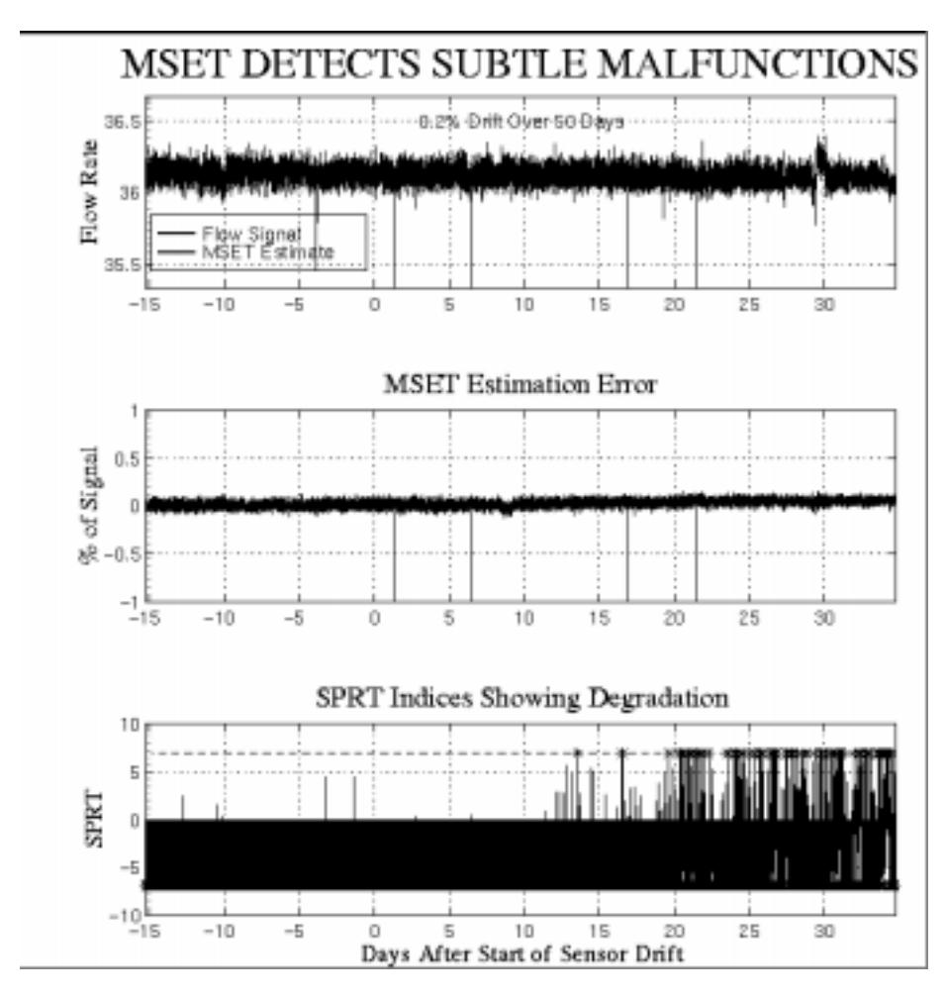

**Figure 14-2 Subtle Degradation of a Centrifugal Pump**

*Appendix H: Multivariate State Estimation Technique (MSET) Surveillance System*

#### **14.5.2 Failure of a Pressure Sensor**

The previous example was one of the detection of a very slow degradation of a coolant pump; this example will be of a more rapidly developing fault. In this case, a pressure sensor, which has been operating normally for an extended period of time, fails (i.e., its output drops by about 5% in several hours). Again, MSET was trained to recognize the normal behavior of the system in which this pressure sensor was located and then used to monitor the system. As shown in the upper plot in Figure 14-3, the measured and estimated pressure level agree quite well for the first 6 or so hours of the monitoring period. This is also indicated by the center plot of Figure 14-3 which shows the difference between the measured and estimated pressure. As can be seen in the upper plot, the measured and estimated pressure values clearly diverge after about 7.5 to 8 hours (a 1.7% difference). If this signal was being closely monitored, the failure would probably be detected. However, at about 6.3 hours, more than a full hour before the fault could have been normally detected, MSET starts to alarm, as shown in the lower plot in Figure 14-3. If this had been a operationally or safety critical sensor, the process could have been shut down prior to the loss of this sensor. However, it would also have been possible to utilize the estimated sensor reading from MSET to replace this faulted sensor and to continue operation of the process.

*Appendix H: Multivariate State Estimation Technique (MSET) Surveillance System*

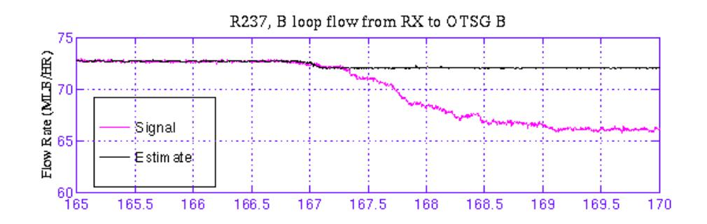

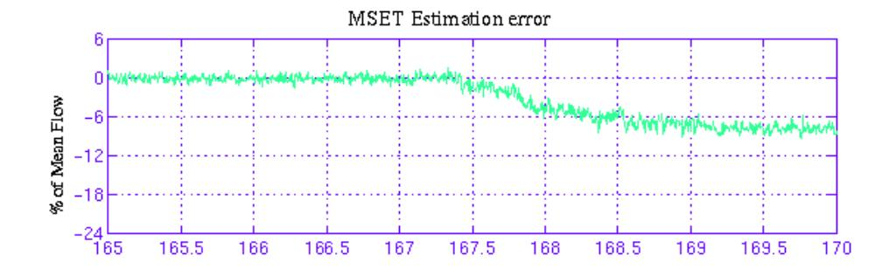

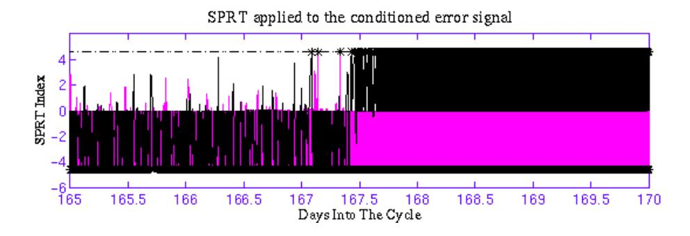

**Figure 14-3 Detection of Pressure Sensor Failure**

#### **14.6 References**

- 1. R. M. Singer, K. C. Gross, R. W. King, and S. Wegerich, "A Pattern-recognitionbased, Fault-tolerant Monitoring and Diagnostic Technique," *Proceedings of 7th Symposium on Nuclear Reactor Surveillance and Diagnostics* (SMORN VII). 2:13, Avignon, France (June 19–23, 1995).
- 2. R. M. Singer, K. C. Gross, J. P. Herzog, R. W. King, and S. W. Wegerich, "Model-Based Nuclear Power Plant Monitoring and Fault Detection: Theoretical Foundations," *Proceedings of 9th International Conference on Intelligent Systems Applications to Power Systems.* Seoul, Korea (July 6–10, 1997).
- 3. A. Wald. *Sequential Analysis*. John Wiley & Sons, New York, NY 1947.
- 4. K. E. Humenik and K. C. Gross, "Using Fourier Series Methods to Reduce Correlation of Nuclear Power Reactor Data," *Nuclear Science and Engineering.* 112:127 (October 1992).
- 5. K. C. Gross and K. E. Humenik, "Sequential Probability Ratio Test for Nuclear Plant Component Surveillance," *Nuclear Technology.* 93:131 (February 1991).
- 6. K. E. Humenik and K. C. Gross, "Sequential Probability Ratio Tests for Reactor Signal Validation and Sensor Surveillance Applications," *Nuclear Science and Engineering.* 105:383 (August 1990).
- 7. K. C. Gross, K. K. Hoyer, and K. E. Humenik, "Systems for Monitoring an Industrial Process and Determining Sensor Status," U. S. Patent no. 5,459,675 (October 17, 1995).
- 8. K. C. Gross and K. K. Hoyer, "Spectrum-Transformed Sequential Testing Method for Signal Validation Applications," *Proceedings of 8th Power Plant Dynamics, Control & Testing Symposium.* I:36.01, Knoxville, TN (May 27–29, 1992).
- 9. K. K. Hoyer and K. C. Gross, "Spectral Decomposition and Reconstruction of Nuclear Plant Signals," *Proceedings of 18th SAS Users Group International Conference.* pp 1153-1158, New York, NY (May 9–12, 1993).
- 10. W. A. Fuller. *Introduction to Statistical Time Series*. John Wiley & Sons, New York, NY 1976.
- 11. R. B. D'Agostino and M. A. Stephans. *Goodness-of-Fit Techniques*. Marcel Dekker, Inc., New York, NY 1986.

- 12. D. A. Dickey and J. C. Brocklebank, "Checking for Autocorrelation in Regression Residuals," *Proceedings of 11th SAS Users Group International Conference.* I:959, Atlanta, GA (February 9–12, 1986).
- 13. J. Mott, R. King, and W. Radtke. "A Generalized System State Analyzer for Plant Surveillance," *Artificial Intelligence and Other Innovative Computer Applications in the Nuclear Industry.* M. Majumdar et al., eds. Plenum Press, New York, NY 1988.
- 14. J. Mott and P. Blanch, "Feedwater Flow Estimation via Sample-Based Modeling," *Proceedings of 8th Power Plant Dynamics, Control & Testing Symposium.* II:85.01, Knoxville, TN (May 27–29, 1992).
- 15. R. W. King and R. M. Singer, "Development and Application of Diagnostic Systems to Achieve Fault Tolerance," *Proceedings of 7th Power Plant Dynamics, Control & Testing Symposium.* I:35.01, Knoxville, TN (May 15–17, 1989).
- 16. P. R. Bevington. *Data Reduction and Error Analysis for the Physical Sciences*. McGraw-Hill Book Co., New York, NY 1969.
- 17. K. C. Gross and R. V. Strain, "Sinusoidal Source Perturbation Experiments with a Breached Fuel Subassembly in the Experimental Breeder Reactor II," *Nuclear Technology.* 98:113 (April 1992).
- 18. T. H. Cormen, C. E. Leiserson, and R. L. Rivest. *Introduction to Algorithms*. MIT Press, Cambridge, MA 1992.
- 19. K. C. Gross, R. M. Singer, S. W. Wegerich, J. P. Herzog, R. VanAlstine, and F. Bockhorst, "Application of a Model-Based Fault Detection System to Nuclear Plant Signals," *Proceedings of 9th International Conference on Intelligent Systems Applications to Power Systems.* Seoul, Korea (July 6–10, 1997).
- 20. R. M. Singer, K. C. Gross, S. W. Wegerich, J. P. Herzog, R. Van Alstine, and F. K. Bockhorst, "Power Plant Surveillance and Fault Detection: Applications to a Commercial LWR," *Proceedings of IAEA Technical Meeting On Advanced Technology Improving Availability and Reliability of LWR's.* Argonne, Ill (Sept 8–12, 1997).
- 21. K. C. Gross and K. K. Hoyer, "Reactor Parameter Signal Simulator," *Fourth International Conference on Simulation Methods in Nuclear Engineering.* Vol. I, Session 3C, Montreal, Canada (June 2–4, 1993).
- 22. K. C. Gross, R. M. Singer, K. E. Humenik, and M. Walsh, "Expert System for Reactor Coolant Pump Surveillance," *Proceedings of 1990 International Fast Reactor Safety Meeting.* III:359, Snowbird, UT (August 12–16, 1990).

- 23. R. M. Singer, K. C. Gross, K. E. Humenik, and M. Walsh, "Reactor Coolant Pump Monitoring and Diagnostic System," *Proceedings of 2nd International Machinery Monitoring and Diagnostic Conference.* I:19, Los Angeles, CA (October 22–25, 1990).
- 24. R. M. Singer, K. C. Gross, and K. E. Humenik, "Pumping System Fault Detection and Diagnosis Utilizing Pattern Recognition and Fuzzy Inference Techniques," *Proceedings of 4th International Conference on Industrial and Engineering Applications of AI and Expert Systems.* Kauai, HA (June 2–5, 1991).
- 25. J. P. Herzog, S. W. Wegerich, K. C. Gross, and F. K. Bockhorst, "MSET Modeling of Crystal River-3 Venturi Flow Meters," *Proceedings of 6th ASME/JSME/SFEN International Conference on Nuclear Engineering (ICONE-6).* San Diego, CA (May 10– 15, 1998).
- 26. A. Miron, S. W. Wegerich, F. Yue, K. C. Gross, and J. Christenson, "Effects of Parameter Variation on MSET Models of the Crystal River-3 Feedwater Flow System," *Transactions of American Nuclear Society.* Nashville, TN (June 1–6, 1998).
- 27. A. Miron, S. W. Wegerich, F. Yue, K. C. Gross, and J. Christenson, "Fault-Tolerance Improvement for a MSET Model of the Crystal River-3 Feedwater Flow System," *Proceedings of IEEE Nuclear Energy Symposium.* Toronto (Nov. 1998).
- 28. J. P. Herzog, Y. Yue, and R. L. Bickford, "Dynamics Sensor Validation for Reusable Launch Vehicle Propulsion," *Proceedings of 34th AIAA/ASME/ SAE/ASEE Joint Propulsion Conference.* Cleveland OH (July 13–15, 1998).
- 29. R. M. Singer, K. C. Gross, and S. Wegerich, "A Fault-Tolerant Sensory System for Intelligent Vehicle Applications," *Proceedings of IEEE Intelligent Vehicles Symposium 95.* 1:176, Detroit, MI (September 25–26, 1995).
- 30. R. M. Singer, K. C. Gross and R. W. King, "Analytical Enhancement of Automotive Sensory System Reliability," *Proceedings of World Congress on Neural Networks.* San Diego, CA (June 4–9, 1994).

# *15*

### **NRC REVIEW QUESTIONS**

#### **15.1 Past Effort**

EPRI formed the EPRI/Utility On-Line Monitoring Working Group in 1994 to coordinate the activities associated with obtaining approval of on-line monitoring as a calibration reduction tool. The working group produced TR-104965 (Draft—August 2, 1995), *Calibration through On-Line Performance Monitoring of Instrument Channels*, and submitted this report to the NRC for consideration.

The initial NRC review of TR-104965 was documented in a Request for Additional Information (RAI) dated November 29, 1995. Working group members met with the NRC staff members on December 13, 1995 to clarify the RAI comments. Subsequently, the NRC issued an updated RAI on February 26, 1996.

In December 1996, NRC staff members were provided a presentation on the EPRI Instrument Calibration Monitoring Program at V. C. Summer.

In March and May 1998, working group members again met with NRC staff members to review progress made since the previous meetings. This report reflects decisions made during the latest review meeting.

#### **15.2 NRC Review Comments**

The following review comments are repeated from the NRC February 26, 1996 Request for Additional Information. The resolution column summarizes the working group response and identifies where to look in this report for additional information.

#### **NRC Review Comments Resolution**

As a result of the December 13, 1995 meeting with the EPRI/Utility on-line monitoring working group the following action items were identified for follow-up by the NRC staff:

1. Provide the working group an evaluation on the definition and aspects of calibration as defined by the technical specifications against the EPRI proposal for on-line monitoring and calibration. In this regard, it was requested by the working group that the staff comment on

#### **NRC Review Comments Resolution**

the feasibility of implementing the EPRI on-line monitoring system proposal under the requirements 10 CFR 50.59 without prior staff approval.

- 2. Provide the working group with comments/questions concerning EPRI report TR-103346 (ICMP) failure modes and effects analysis (FMEA).
- 3. Provide additional comments on the on-line monitoring report TR-104965 including the feasibility that a single point measurement, as proposed by the EPRI on-line monitoring system can provide adequate information to evaluate instrumentation performance over the entire instrument span.

The following discussion addresses the above action items.

#### Item 1

EPRI Technical Report TR-104965, "Calibration through on-line performance monitoring of instrument channels" provides a definition of instrumentation calibration by which EPRI divides calibration into three parts: "monitoring," "adjustment," and "field calibration." The EPRI definition states that:

- 1. Monitoring is the activity of evaluating instrument performance and determine if it is performing within acceptable limits.
- 2. Adjustment is physically adjusting a device to leave it in a state in which its performance characteristics are within acceptable limits.
- 3 . Field calibration refers to performing the activities of surveillance and adjustment using an external reference source.

The EPRI discussion on calibration is not entirely consistent with the definition of calibration as, stated in the technical specifications. The TS requires that surveillance be performed "as necessary" (but in accordance with the TS at defined calibration intervals). The TS states that channel calibration encompasses the entire channel, including the required sensor, alarm interlock, display and trip function. The EPRI on-line proposal may not satisfy the above criteria depending on signal take off and methodology employed. The on-line monitoring methodology, including uncertainties, may be at variance with the setpoint methodology under which the plant was originally licensed. The lack of a

This submittal has been revised so that on-line monitoring is applied as a tool for calibration extension, rather than as an unconditional replacement for calibration. By this approach, an inconsistency does not develop between the definition of calibration and the application of on-line monitoring as a calibration assessment tool.

#### **NRC Review Comments Resolution**

reference standard or adjustment to agreement with an existing standard (including the monitoring phase) discounts on-line monitoring as a conventional "calibration". The EPRI on-line monitoring system may be shown to demonstrate the ability to verify instrument performance/operability within a particular uncertainty envelope. A verification of instrument performance/operability affected by a varied set of uncertainties as compared to the original setpoint development and calibration is inconsistent with industry standards. For example ISA 67.04 states that, "an allowance shall be provided between the trip setpoint and the analytical limit to ensure a trip before the analytical limit is reached. The allowance used shall account for all applicable design basis events and the following process instrument uncertainties unless they were included in the determination of the analytical limit". Among the uncertainties referenced are calibration standard, calibration equipment and calibration method. Additionally, an on-line monitoring system used for verification would require that a channel calibration (by conventional means) be performed on any channel/ instrumentation found outside the allowed uncertainty band. The resulting calibration interval would not necessarily be in conformance with the calibration interval prescribed by the TS. Based on the above, the implementation of an on-line monitoring methodology should be reviewed for possible impact on the TS, including defined calibration intervals, LCOs, and bases, as well as the original setpoint methodology assumptions and uncertainties assumed during plant licensing. Additional revisions regarding plant procedures may also be appropriate. Coordination with industry and the associated standards organizations may be appropriate to incorporate the technologies proposed by EPRI in that current standards provide limited guidance on the implementation of an on-line monitoring system (IEEE Std. 338 for example).

Based on the following current TS definitions of calibration it seems clear that a calibration encompasses the entire instrument channel and the adjustments performed during calibration (to a standard) are designed to bring the channel into correct calibration tolerance. The on-line monitoring system, as proposed, does not encompass the entire channel, and does not

#### **NRC Review Comments Resolution**

provide an opportunity to adjust the channel within calibration tolerance. The staff concludes, therefore that the EPRI on-line system proposal performs a sophisticated channel check that when implemented may provide the ability to verify instrumentation performance on-line and identify the need for channel calibration. However, it does not satisfy the current TS and its implementation would, therefore, necessitate a TS change.

The following calibration definitions were reviewed by the staff:

Calibration is defined in the ITS (Westinghouse) as "the adjustment, as necessary, of the channel so that it responds within the required range and accuracy to known input. The CHANNEL CALIBRATION shall encompass the entire channel, including the required sensor, alarm, interlock, display and trip functions. Additionally, for RTD or thermocouple, calibration is by qualitative assessment which implies cross correlation techniques. "The CHANNEL CALIBRATION may be performed by means of any series of sequential, overlapping calibrations or total channel steps such that the entire channel is calibrated."

Channel checks are defined as "the qualitative assessment, by observation, of channel behavior during operation. This determination shall include, where possible, comparison of the channel indication and status to other indications or status derived from independent instrument channels measuring the same parameter."

Calibration definitions as used by non-nuclear industries and in industry standards are similar to the standard technical specifications definition. For example:

- "A comparison made between an instrument and a reference standard for the purpose of adjusting the instrument characteristics to provide agreement with the standard."
- "A comparison made between an instrument and a reference standard for the purpose of confirming that the instrument performance is consistent with historical data."

#### **NRC Review Comments Resolution**

Calibration as defined by IEEE standard 381-1977 is:

"Adjustment of a device to bring the modules output to a desired value or series of values, within a specified tolerance, for a particular value or series of values of the input or measurement used to establish the input output function of the module."

Calibration as defined by IEEE standard 380-1975 is stated as follows:

"Comparison of an item of measurement and test equipment with a reference standard or with an item of measuring and test equipment of equal or closer tolerance to detect and quantify inaccuracies and to report or eliminate those inaccuracies."

Calibration as defined by IEEE standard 313-1971 is:

The adjustment of a device to have the designed operating characteristics, and the subsequent marking of the positions of the adjusting means, or the making of adjustments necessary to bring operating characteristics into substantial agreement with standardized scales or marking."

The EPRI proposed definition for calibration is not consistent with the above.

#### Item 2

EPRI TR-103436-V2, *Instrumentation Calibration and Monitoring Program, Volume 2: Failure Modes and Effects Analysis* provides failure modes and effects analysis for generic types of transmitters/sensors. Describe the program that a utility will use to confirm that the generic/plant specific analysis provided by TR-103436- V2 is valid for plant specific instrumentation when implementing an on-line monitoring system and instruments not referenced by the EPRI FMEA. Discuss any program that will confirm that future replacement instrumentation will continue to meet the assumptions and findings of the EPRI FMEA.

The EPRI FMEA appears to take credit for transient analysis utilizing a calibrated reference. Is this assumption valid for the various on-line methodologies EPRI TR-103436-V2 provides a general evaluation of failure modes. In addition, Appendix B evaluated an extensive amount of transmitter calibration data and failure modes were not observed that would be undetectable by an on-line monitoring system. Refer to Section 3.3 for additional discussion of how an on-line monitoring system would detect failures other than drift.

Also, periodic calibrations will continue to be performed at the extended frequency proposed in

#### **NRC Review Comments Resolution**

proposed by EPRI? Describe how the assumption of the use of a calibrated standard for extended surveillance intervals will remain valid through out the interval for the EPRI FEMA. For example, is EPRI proposing to use a calibrated reference for each on-line technique? Since the calibrated reference instrument will also be affected by various instrument uncertainties, what calibration schedule is being proposed for this instrument? Describe how the uncertainties of the calibrated reference are integrated into the on-line monitoring methodology including time dependent uncertainties. It appears the calibrated reference is utilized throughout the variable "on-line calibrated interval" to satisfy the requirements of the FMEA. Describe how the on-line monitoring algorithm incorporates this varying uncertainty.

Provide discussion of the standards or guidance that formed the basis for the development of the TR-103436- V2 FMEA.

Provide a comparison of failure modes identified by the EPRI FMEA as detectable by the ICMP process and the ability to identify the same failure modes by conventional calibration. Are both techniques equivalent? Discuss how system reliability is maintained by failure identification through on-line monitoring.

The EPRI FMEA provides a discussion on the ability of the EPRI ICMP methodologies to identify various failure modes. Provide a discussion on the applicability of the EPRI FMEA to the various additional on-line monitoring techniques referenced in the TR-104965.

this report. These periodic calibrations will be evaluated as part of the recommended ongoing calibration monitoring program discussed in Section 4.8.

#### Item 3

The proposed on-line system will essentially monitor a single point within an instruments span. This methodology omits mechanical or electrical failure outside the usual range of operation and seems nonintuitive based on experience with electromechanical instruments. Such instrumentation may develop a zone of operation where process variations keep the instrument mechanicals free and contact surfaces clean while the accumulation of corrosion/debris in the unused portions of the instruments travel make reliable operation outside the usual operational span suspect.

Refer to Section 3.2 for a summary discussion and Appendix B for a detailed discussion of the single point monitoring issue.

Refer to Section 3.3 for additional discussion regarding other failure modes.

#### **NRC Review Comments Resolution**

Extended surveillance intervals with unattended service would only exacerbate the situation. Potentially, at least one instrument in a instrument set (4 channels) would experience 8 years between calibration or service. The EPRI FMEA does not appear to be based on data for instruments with unattended times greater than 2 years. Provide a basis for the failure mode study extending beyond current unattended times of a maximum of 2 years. Discuss how a one point check is sufficient to evaluate an instruments reference accuracy including hysteresis, repeatability, linearity and deadband.

It appears that there is limited means available (transient analysis) to confirm instrument operation over a limited instrument span (an abbreviated single pass only) utilizing the proposed on-line monitoring techniques or compensate for technician observation during defined calibration intervals. Has EPRI explored using PRA techniques and historical data (industry data bases including NPRDS and LERS) to evaluate these effects?

Both the EPRI FMEA and the on-line monitoring proposal take credit for analysis during transients (startup and shutdown) to satisfy the results of the FMEA and calibration requirements. This appears to have limited use in that the test is limited to less than the span of the instrument, is a single pass and the test equipment is significantly removed from a reference standard.

#### Additional Questions:

1. Three modeling approaches are proposed in TR-104965, analytical, empirical, and neural networks. However, no guidance on implementing the approaches is proposed in the technical report. Recommended practices, standards or guidance should be included to simplify the plant specific implementation.

This submittal has reduced its scope to two approaches for on-line monitoring—a redundant channel averaging type approach and the Multivariate State Estimation Technique (MSET). Although other methods might also be acceptable, the scope was limited to the above types to keep this submittal to a manageable level. Implementation guidance has been developed and is provided in Section 4.

2. No methodology is given for setpoint determination when using an on-line monitoring system. Describe what The setpoint methodology is not changed by online monitoring.

instruments.

will replace the existing setpoint methodology.

#### **NRC Review Comments Resolution**

- a) Describe the proposed replacement for the current instrument uncertainty calculations (referenced as ISA 67.04 in TR-104965). In particular, describe the uncertainties of parameter estimates produced by the proposed techniques. The description should address the effects of non-Gaussian, non-zero mean uncertainties due to instrument position and the effects of diverse drift times for individual
- b) Provide a technical basis for the claim that the effects of the individual instrument uncertainties on the uncertainties of the parameter estimates are known for the several parameter estimation techniques proposed, including analytic, empirical and neural networks.
- c) Describe the replacement for the current as-left/asfound scheme for instrument calibration.
- 3. Clarify the parameter estimation technique proposed. If several techniques are proposed, identify the criteria for choosing one or the other.
- a) For the proposed parameter estimation technique(s), describe the engineering methodology precisely. Standards or normative references may be used.
- b) Identify the criteria and methodology for selection of the training sets. Does the proposed parameter estimation technique or techniques give warning in service when sensor values indicate operation outside the training set?
- 4. What actual calibration intervals (including calibrated reference) are being proposed for instruments under an on-line monitoring scheme? Is it a "round-robin" approach?
- 5. Are instrument inspections, without disassembly or calibration proposed (including sensing lines and related

Section 4.5 discusses setpoint issues. Section 3.4 discusses uncertainty analysis issues in detail. Section 10 provides additional uncertainty analysis discussion related to the EPRI Instrument Calibration Monitoring Program (ICMP). Section 14 provides additional uncertainty analysis discussion related to MSET.

The current as-found/as-left scheme for calibration is not changed by on-line monitoring because calibrations are extended rather than replaced unconditionally.

ICMP and MSET are described in detail in this topical report. Section 13 provides an evaluation of the various types of on-line monitoring. By addressing ICMP in detail, other types of redundant channel averaging algorithms can build on the foundation developed by this topical report. Section 14 provides a similar discussion for MSET.

Section 4.6.3 discusses what should be submitted for NRC review if different methods are proposed by specific plants.

A "round robin" approach is proposed. Refer to Section 3.6 for the implementation strategy and Section 4 for plant-specific implementation guidance.

Current calibration practices are still recommended, but an

| NRC Review Comments                                                                                                                                                                                                                                                                                                                                                                            | Resolution                                                                                                                                                                                                                                                                      |
|------------------------------------------------------------------------------------------------------------------------------------------------------------------------------------------------------------------------------------------------------------------------------------------------------------------------------------------------------------------------------------------------|---------------------------------------------------------------------------------------------------------------------------------------------------------------------------------------------------------------------------------------------------------------------------------|
| components)? If so, what intervals are proposed for these inspections?                                                                                                                                                                                                                                                                                                                      | extended frequency of 1 channel per parameter per fuel cycle. Additional inspections of the untouched channels are not proposed by this topical report.                                                                                                             |
| 6. An on-line monitoring scheme, insofar as it replaces fixed calibration intervals with a variable adjustment interval, has a significant potential effect on the integrity of any safety system to which it is applied. What standards of quality (including software), environmental, qualification, separation, independence, and security are proposed?                 | Refer to Section 3.1 for the recommended functional requirements and to Section 4 for plant-specific implementation guidance.                                                                                                                                       |
| 7. Describe the methodology(ies) for computing instrument pass/fail criteria. These may be different depending upon the parameter estimation technique employed.                                                                                                                                                                                                                      | The methodologies for ICMP and MSET are described in detail in this topical report. Section 10 describes ICMP and Section 14 describes MSET. Section 3.4 discusses uncertainty analysis with respect to acceptance criteria.                                  |
| 8. Describe the proposed generic changes to the technical specifications to accommodate the separation of the traditional instrument calibration into a bimodal, two frequency process incorporating on-line monitoring. Identify the specific technical specifications instrumentation and functional units proposed to be incorporated into an on-line monitoring program. | Section 4 provides the specific changes recommended to the Technical Specifications to accommodate the use of on-line monitoring as a calibration extension tool. Actions to be taken upon detection of a drifted channel are also addressed in Section 4. |
| a) What are the decision points in the new methodology that will require a reactor shutdown for instrument calibration because of instrument anomalies identified by on-line monitoring?                                                                                                                                                                                              |                                                                                                                                                                                                                                                                                 |
| b) What will be the criteria that require calibration attention during refueling outages?                                                                                                                                                                                                                                                                                                   |                                                                                                                                                                                                                                                                                 |
| 9. How will the proposed technique maintain traceability to standards? If it does not, what will replace the loss of the direct tie to physical quantities that such lack of traceability will cause?                                                                                                                                                                                 | Traceability is maintained to standards by continuing to calibrate all transmitters, but at an extended frequency.                                                                                                                                                     |
| 10. Describe any provisions to collect and archive on-line monitoring data from several locations (plants) so that it can be used more generally to detect failure trends and                                                                                                                                                                                                            | On-line monitoring data from either ICMP or MSET will be archived as part of the system                                                                                                                                                                                   |

#### **NRC Review Comments Resolution**

enhance safety? Is there a proposed implementation scheme?

function. This data is readily available for review. If a user decides to acquire the data manually, the archived data would be specifically that data that was manually acquired.

EPRI will continue to sponsor an on-line monitoring user's group to facilitate the sharing of this information.

11. Which instrument manufacturers have been contacted as to the acceptability of the various on-line monitoring techniques with regards to calibration/qualification of their equipment? Describe instrument qualification requirements revised/affected by the incorporation of on-line monitoring techniques?

Instrument manufacturers have not been contacted. By continuing periodic calibrations in conjunction with on-line monitoring, acceptable performance will be maintained. Environmental qualification maintenance requirements that might require periodic access to the sensor will require evaluation on a plant-specific basis.

12. Describe how response time testing will be performed once an on-line system is installed. Describe the features or attributes of an on-line system that would allow a licensee to eliminate response time testing by incorporating Topical Report NEDO-32291, "System Analysis for the Elimination of Selected Response Time Testing Requirements" which credits the calibration practices (and defined schedule currently identified in TS) to identify any response time based anomalies.

This topical report does not change response time testing requirements. Section 4.6.3 notes that this issue requires plantspecific consideration as part of a Technical Specification change request.

13. Provide operational data on the EPRI on-line system that evaluates or demonstrates significant correlation between the on-line system and instrumentation calibrations as performed per the technical specifications. Data should include conventional TS calibration results, and corresponding on-line data. Include all channels of one functional unit.

This topical report provides the data that is available. Operating experience from other countries has also been presented. Section 3.7.2 and Section 11 provide a specific comparison of on-line monitoring to plant calibration results.

NUREG/CR-6343, *On-Line Testing of Calibration of Process Instrumentation Channels in Nuclear Power Plants*, Section 16.2,

| NRC Review Comments | Resolution                                                                                                                                                                                                                                                                                                                                                                                                                                                                                                                                     |
|---------------------|------------------------------------------------------------------------------------------------------------------------------------------------------------------------------------------------------------------------------------------------------------------------------------------------------------------------------------------------------------------------------------------------------------------------------------------------------------------------------------------------------------------------------------------------|
|                     | documents the results of a study to compare on-line monitoring with manual calibrations. The drift difference between the two was less than 0.5% in about 80% of the cases and was within 1.5% for all cases. The differences between the two were attributed to environmental differences between the two assessments, with on-line monitoring operating with the plant at power, while the manual calibrations were performed later with the plant shutdown. Refer to NUREG/CR-6343 for additional |
|                     | information.                                                                                                                                                                                                                                                                                                                                                                                                                                                                                                                                   |