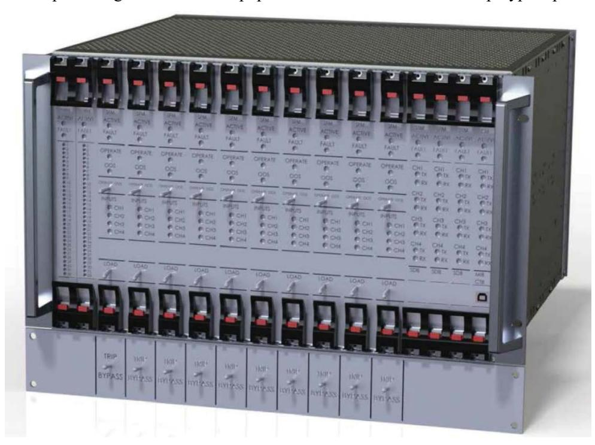
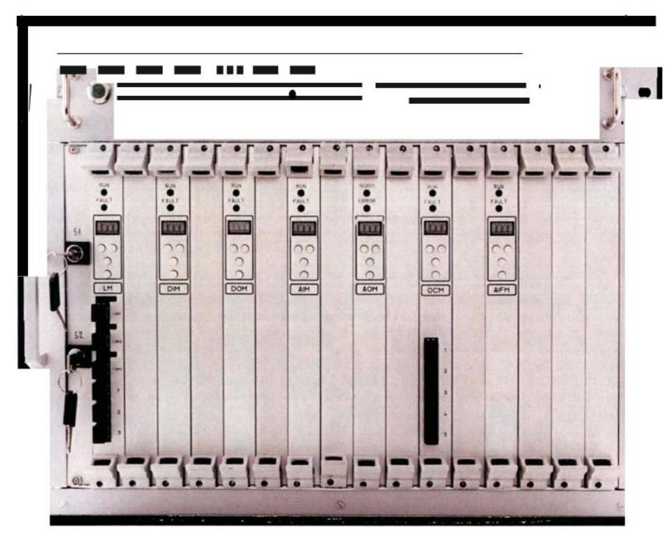

# **Light Water Reactor Sustainability Program**

# **Technical Specification Surveillance Interval Extension of Digital Equipment in Nuclear Power Plants: Review, Research, and Recommendations**

June 2019

U.S. Department of Energy Office of Nuclear Energy

#### **DISCLAIMER**

This information was prepared as an account of work sponsored by an agency of the U.S. Government. Neither the U.S. Government nor any agency thereof, nor any of their employees, makes any warranty, expressed or implied, or assumes any legal liability or responsibility for the accuracy, completeness, or usefulness, of any information, apparatus, product, or process disclosed, or represents that its use would not infringe privately owned rights. References herein to any specific commercial product, process, or service by trade name, trade mark, manufacturer, or otherwise, does not necessarily constitute or imply its endorsement, recommendation, or favoring by the U.S. Government or any agency thereof. The views and opinions of authors expressed herein do not necessarily state or reflect those of the U.S. Government or any agency thereof.

## **Technical Specification Surveillance Interval Extension of Digital Equipment in Nuclear Power Plants: Review, Research, and Recommendations**

**Ted Quinn, Jerry Mauck, Michael Bailey Technology Resources**

**Vivek Agarwal and Shawn St Germain Idaho National Laboratory**

**Pradeep Ramuhalli Oak Ridge National Laboratory**

**Garill Coles Pacific Northwest National Laboratory**

**June 2019**

**http://www.inl.gov**

**Prepared for the U.S. Department of Energy Office of Nuclear Energy Under DOE Idaho Operations Office Contract DE-AC07-05ID14517**

## **ABSTRACT**

One of the major contributors to the total operating costs today is the operations and maintenance (O&M) costs. These include labor-intense preventive maintenance (PM) programs involving manuallyperformed inspection, calibration, testing, and maintenance of plant assets at periodic frequency and timebased replacement of assets at periodic frequency, irrespective of its condition. Among the drivers for increased O&M costs in light water reactors are periodic surveillance test requirements for Technical and non-Technical (e.g., balance of plant) Specification instrumentation. Extending the surveillance test intervals for digital instrumentation is expected to be an important element in helping increase acceptance of digital instrumentation and control systems by licensees and help reduce overall maintenance costs in light water reactors. Digital technologies, which have been widely adopted in other energy industries offer superior performance over analog technologies, as well as many potentially cost-saving benefits such as self-diagnostic and online condition monitoring capabilities. The nuclear industry has been slow to incorporate digital technologies into nuclear plant designs for several reasons.

This research effort is focused to understand the reasons, identify the technical gaps, and to proposes development of an initial methodology to enable the nuclear industry to upgrade their identified systems with digital equipment with self-diagnostic and online monitoring capabilities and evaluate potential Technical Specification surveillance extensions or elimination. The U.S. Department of Energy's Idaho National Laboratory (operated by the Battelle Energy Alliance, LLC) under the Light Water Reactor Sustainability (LWRS) Program is collaborating with Oak Ridge National Laboratory, Pacific Northwest National Laboratory, and Technology Resources on this project.

This report is focused on addressing the challenges of digital equipment self-diagnostics and online monitoring for technical and non-technical (e.g., balance of plant) surveillance in nuclear plants licensed to 10 CFR Part 50. In addition, a status assessment of online monitoring technology as applied to analog instrument channel calibration is also performed, with the intent of identifying recommendations for future research and pilot-scale studies that address any remaining gaps in this area.

### **EXECUTIVE SUMMARY**

Digital technologies, which have been widely adopted in other energy industries offer superior performance over analog technologies, as well as many potentially cost-saving benefits such as selfdiagnostic and online condition monitoring (OLM) capabilities. The nuclear industry has been slow to incorporate digital technologies into nuclear plant designs for several reasons, including:

- The high cost of implementing design modifications versus simply replacing failed components with like-for-like technology.
- Digital technology qualification issues, particularly in safety-related applications that are susceptible to software common cause failures. This is a concern for current operating plants, as well as for new builds.
- General familiarity and comfort with existing analog technologies on the part of the nuclear plant engineering staff, in spite of the superior performance and reduced maintenance costs of the digital replacements.

At the same time, the nuclear industry is under significant cost pressure in the electric marketplace due to the abundance of natural gas generation and renewables. The industry would benefit by investment in new technologies that could lower future operating costs while addressing obsolescence and reliability issues of the current analog technologies.

Among the drivers for increased operating and maintenance costs in light water reactors (LWRs) are periodic surveillance test requirements for Technical and non-Technical (e.g., balance of plant) Specification (TS) instrumentation. Extending the surveillance test intervals for digital instrumentation is expected to be an important element in helping increase acceptance of digital instrumentation and control (I&C) systems by licensees and help reduce overall maintenance costs in LWRs. A related issue that adds to the maintenance burden is the requirement for time-driven calibration (every outage) of analog instrumentation, though operating experience indicates very few instruments will be out of calibration during a single outage cycle (typically 18-24 months) in an LWR.

Methods approved by the regulator exist for extending TS surveillance intervals for analog equipment, but gaps remain in technology and guidance on exploiting the internal self-diagnostics and OLM capabilities of newer digital equipment. Likewise, methods exist for OLM of the calibration of analog channels, making it possible to potentially extend calibration intervals by an outage cycle or more. However, questions remain on the ability of these methods to detect all conditions under which a sensor may have failed, especially in the presence of various sources of uncertainties.

Addressing these gaps will likely result in an opportunity to further reduce maintenance costs for LWRs. The self-diagnostics and OLM capabilities of newer digital equipment being installed in non-safety and safety applications are expected to detect failures, and possibly even provide early warning of potential failures. This could allow plant operators to take appropriate actions and maintain safety margins. There is a need to adapt and apply OLM and diagnostics for condition assessment of digital equipment and subsequently reduce the frequency of surveillance. This requires development of a methodology for analysis of both the hardware and software at a component and system level to ensure that all regulations are met and safety function performance does not degraded.

This report is focused on addressing the challenges of digital equipment self-diagnostics and OLM for technical and non-technical (e.g., balance of plant) surveillance in nuclear plants licensed to 10 CFR Part 50. In addition, a status assessment of OLM technology as applied to analog instrument channel calibration is also performed, with the intent of identifying recommendations for future research and pilot-scale studies that address any remaining gaps in this area.

This study reviewed several documents related to Surveillance Interval Extension, including documents from the U.S. Nuclear Regulatory Commission (NRC), Electric Power Research Institute, the Nuclear Energy Institute (NEI), and other peer-reviewed research. Current industry guidelines for TS equipment surveillance frequency extension are provided in NEI 04 10, Rev. 1. The recommended methodology in this (and associated) documents includes reviewing plant-specific probabilistic risk analysis (PRA), equipment history through a deterministic assessment, and drift monitoring (instrument drift evaluation) if applicable to the particular type of instruments included in the scope.

There are several precedents for digital system surveillance frequency interval extension as well as crediting digital equipment self-diagnostic and OLM capabilities for surveillance extension. Reliability and availability analysis and availability calculations are used by vendors that provide digital reactor protection system/engineered safety features and auxiliary systems replacement solutions to satisfy their failure modes and effects analysis, and to credit the diagnostics and prognostics capacities. This report summarizes these precedents, as well as current methods used by vendors for digital equipment reliability and availability analysis.

The licensing process for digital I&C systems is primarily based on deterministic engineering criteria but is supported by reliability modeling. If the digital I&C system is to be credited in the plant probability risk assessment (PRA) for supporting any number of possible risk-informed decisions, then the quality of the PRA modeling must be established by showing that applicable NRC regulatory requirements are met. Depending on the risk-informed application different NRC approved guidance applies. However, the assessment concluded that challenges remain in modeling digital I&C systems for product reliability models required in license amendment requests to install digital systems and in plant PRAs for use in risk-informed applications. This report discusses in greater detail (1) the challenges of modeling digital I&C systems in a PRA, as documented in NRC sponsored research and other sources; (2) the experience of modeling digital I&C systems, including modeling self-diagnostic and OLM features, as part of product reliability model; and (3) the necessary features of digital I&C systems for use in reliability and PRA modeling that credit for self-diagnostic and OLM features.

A separate assessment was conducted on the applicability of OLM for surveillance extension and reduction or elimination of time-based calibration requirements. Several challenges were also identified in crediting the use of OLM for surveillance extension and reduction as it applies to analog and digital equipment performing TS-defined functions. These challenges include traceability, coverage for normal range and emergency actuation range only, redundancy, and requirements specific to the availability, and reliability of the proposed OLM system.

Based on the information reviewed and presented in this report, a number of recommendations are developed for addressing the challenges identified. These recommendations include:

- Implementation of a pilot program in partnership with a utility that is in the process of upgrading a safety-related system with digital equipment to assist with evaluation of the self-diagnostic and OLM capabilities and identify potential surveillance requirement extensions.
- Application of insights from the review of previous industry precedence to a digital upgrade in progress to evaluate potential TS surveillance extensions or eliminations.
- Evaluation of the surveillance changes under the licensee surveillance frequency control program to develop the technical basis to support a license amendment request (if one is required) at a level of detail that addresses the regulator's expectations.
- Evaluation of approaches to PRA model development based on the digital equipment deployed in the pilot program for the selected digital I&C system upgrade.
- Implementation of approaches to PRA model in a separate pilot study to address the challenges associated with OLM implementation for analog instrumentation. Among the activities this pilot

would address is the assembly and evaluation of detailed plant-specific information necessary for a license amendment requests for implementation of OLM at a nuclear power plant.

The pilot research effort identified as part of recommendations would require collaboration with the pilot plant licensee, digital I&C system vendor, national labs, and research subject matter experts.

## **ACKNOWLEDGMENTS**

This report was made possible through funding by the United States Department of Energy's Light Water Reactor Sustainability Program. We are grateful to Alison Hahn of the United States Department of Energy and Bruce Hallbert and Craig A. Primer at Idaho National Laboratory for championing this effort. We also thank Katie S. Stokes, Jodi L. Vollmer, and Nikki Peterson at Idaho National Laboratory for technical editing and formatting of this report.

## **CONTENTS**

| ABS | ΓRAC                                                                                         | T      |                                                                                                                           | iii  |  |
|-----|----------------------------------------------------------------------------------------------|--------|---------------------------------------------------------------------------------------------------------------------------|------|--|
| EXE | CUTIV                                                                                        | VE SUM | 1MARY                                                                                                                     | iv   |  |
| ACK | NOW:                                                                                         | LEDGM  | MENTS                                                                                                                     | vii  |  |
| ACR | ONYN                                                                                         | ИS     |                                                                                                                           | xiii |  |
| 1.  |                                                                                              |        | TION                                                                                                                      |      |  |
| 2.  |                                                                                              |        | dustry and U.S. Commercial Reactor Experience with Technical Specification Interval Extensions Following NEI 04-10 Rev. 1 | 2    |  |
|     |                                                                                              |        | GL 91-04 18-24 Month Surveillance Interval Extension Guidance                                                             |      |  |
|     |                                                                                              |        | Guidance Provided in Multiple EPRI Reports                                                                                |      |  |
|     | 2.1                                                                                          | Overvi | iew of the NEI 04-10 Rev. 1                                                                                               | 4    |  |
|     | 2.2                                                                                          |        | ts and Impacts Due to Changes in Technical Specification Surveillance Interval                                            | 8    |  |
|     | 2.3                                                                                          |        | w of NRC, EPRI and Industry Related to Surveillance Extensions                                                            |      |  |
|     | 2.4                                                                                          | Hardw  | vare and Software Reliability of Digital Equipment (Including Software Common Failures) and Failure Mechanisms            |      |  |
|     |                                                                                              | 2.4.1  | Hardware Reliability Issues of Digital Equipment                                                                          |      |  |
|     |                                                                                              | 2.4.2  | Software Common Cause Failure (SWCCF)                                                                                     |      |  |
|     | 2.5                                                                                          | Online | Monitoring for Technical Specification Instrument Surveillance Extension Overview                                         |      |  |
|     |                                                                                              | 2.5.1  | OLM Regulatory and Industry Guidance and Experience for Technical Specification Instrument Surveillance Extension         |      |  |
| 3.  | OVERVIEW OF DIGITAL EQUIPMENT GENERIC ATTRIBUTES WITH SELF-DIAGNOSTIC AND OLM CAPABILITIES16 |        |                                                                                                                           |      |  |
|     | 3.1                                                                                          |        | lent on Reliability Methods Approved for STI Extension                                                                    |      |  |
|     |                                                                                              | 3.1.1  | Duke Oconee RPS Replacement Project                                                                                       |      |  |
|     |                                                                                              | 3.1.2  | Vogtle Units 3 & 4 Technical Specification Change                                                                         |      |  |
|     |                                                                                              | 3.1.3  | GE-Hitachi ESBWR DCD SER                                                                                                  |      |  |
|     |                                                                                              | 3.1.4  | NuScale DCD SER Overview                                                                                                  | 22   |  |
|     | 3.2                                                                                          | Vendo  | r Input on Reliability Methods and Crediting These for STI                                                                |      |  |
|     |                                                                                              | 3.2.1  | Westinghouse Common Q Platform                                                                                            | 23   |  |
|     |                                                                                              | 3.2.2  | Framatome TXS Platform                                                                                                    | 2.5  |  |
|     |                                                                                              | 3.2.3  | Framatome TRICON Platform                                                                                                 | 29   |  |
|     |                                                                                              | 3.2.4  | Lockheed Martin FPGA Platform                                                                                             | 31   |  |
|     |                                                                                              | 3.2.5  | Rolls Royce SPINLINE Platform                                                                                             | 32   |  |
|     |                                                                                              | 3.2.6  | Ultra – NuScale Highly Integrated Protection System (HIPS) Platform                                                       | 34   |  |
|     |                                                                                              | 3.2.7  | RADIY FPGA Platform                                                                                                       | 36   |  |
|     | 3.3                                                                                          | Risk-I | nformed Applications in Nuclear Power                                                                                     | 37   |  |
|     |                                                                                              | 3.3.1  | Risk-Informed STI Extension.                                                                                              |      |  |
|     |                                                                                              | 3.3.2  | Risk-Informed AOT Extension                                                                                               | 39   |  |
|     |                                                                                              | 3.3.3  | Risk-Informed SSC Categorization                                                                                          | 41   |  |

| 4.       |     |                                                                                                                                                                            | INITIAL METHODOLOGY FOR INTEGRATION OF DIGITAL EQUIPMENT DIAGNOSTICS AND ONLINE MONITORING TO SUPPORT EXTENSION OF SURVEILLANCE INTERVALS  | 42  |  |  |  |
|----------|-----|----------------------------------------------------------------------------------------------------------------------------------------------------------------------------|-----------------------------------------------------------------------------------------------------------------------------------------------------|-----|--|--|--|
|          | 4.1 |                                                                                                                                                                            | Digital I&C Modeling Challenges                                                                                                                     | 43  |  |  |  |
|          |     | 4.1.1                                                                                                                                                                      | Traditional Modeling Approach                                                                                                                    | 43  |  |  |  |
|          |     | 4.1.2                                                                                                                                                                      | Non-Traditional Modeling Approaches                                                                                                              | 45  |  |  |  |
|          |     | 4.1.3                                                                                                                                                                      | Software Reliability                                                                                                                                | 45  |  |  |  |
|          | 4.2 |                                                                                                                                                                            | Experience with Modeling Digital I&C                                                                                                             | 47  |  |  |  |
|          | 4.3 |                                                                                                                                                                            | Reliability Modeling Lessons for Risk-informed Applications                                                                                      | 49  |  |  |  |
|          | 4.4 |                                                                                                                                                                            | A Proposed Approach to Leveraging Digital I&C Features in Risk-informed Applications                                                                | 50  |  |  |  |
|          |     | 4.4.1                                                                                                                                                                      | Overview                                                                                                                                         | 50  |  |  |  |
|          |     | 4.4.2                                                                                                                                                                      | Case Study: Proposed Methodology for Integration of Digital Equipment Diagnostics to Support STI Extension or Elimination                     | 51  |  |  |  |
|          |     | 4.4.3                                                                                                                                                                      | Sensor Calibration Monitoring                                                                                                                    | 53  |  |  |  |
|          | 4.5 |                                                                                                                                                                            | Recommendations for Technical Specification Instrument Online Monitoring Implementation                                                          | 54  |  |  |  |
| 5.       |     |                                                                                                                                                                            | RECOMMENDATIONS FOR UTILIZATION OF SELF-DIAGNOSTICS FOR TECHNICAL                                                                                   |     |  |  |  |
|          |     |                                                                                                                                                                            | SPECIFICATION SURVEILLANCE INTERVAL EXTENSIONS                                                                                                   | 54  |  |  |  |
|          | 5.1 | Overview                                                                                                                                                                   |                                                                                                                                                     | 54  |  |  |  |
|          | 5.2 |                                                                                                                                                                            | Proposed Pilot to Evaluate Self-Diagnostics and OLM Capabilities                                                                                    | 55  |  |  |  |
|          | 5.3 | Comparison of Technical Specification Surveillances to Self-Diagnostics and OLM 55 Licensing Amendment Request for Technical Specification Surveillance Extension or |                                                                                                                                                     |     |  |  |  |
|          | 5.4 | Elimination                                                                                                                                                                |                                                                                                                                                     | 55  |  |  |  |
|          | 5.5 |                                                                                                                                                                            | Digital I&C Modeling Challenges                                                                                                                     | 56  |  |  |  |
|          |     | 5.5.1                                                                                                                                                                      | Traditional Modeling                                                                                                                                | 56  |  |  |  |
|          |     | 5.5.2                                                                                                                                                                      | Non-Traditional Modeling                                                                                                                            | 56  |  |  |  |
|          |     | 5.5.3                                                                                                                                                                      | Software Reliability                                                                                                                                | 57  |  |  |  |
|          |     | 5.5.4                                                                                                                                                                      | Digital I&C Modeling Needs                                                                                                                       | 57  |  |  |  |
|          |     | 5.5.5                                                                                                                                                                      | Recommendation for Risk Modeling of Digital I&C Equipment                                                                                        | 57  |  |  |  |
|          | 5.6 |                                                                                                                                                                            | Recommendations for OLM Implementation for Technical Specification Instrumentation                                                                  | 58  |  |  |  |
|          | 5.7 |                                                                                                                                                                            | Summary of Recommendations                                                                                                                          | 58  |  |  |  |
| 6.       |     |                                                                                                                                                                            | SUMMARY AND PATH FORWARD                                                                                                                            | 59  |  |  |  |
| 7.       |     |                                                                                                                                                                            | REFERENCES                                                                                                                                          | 59  |  |  |  |
| Appendix |     |                                                                                                                                                                            | A U.S NRC Documents on Technical Specification Surveillance Interval Extension                                                                      | 67  |  |  |  |
| Appendix |     |                                                                                                                                                                            | B EPRI Documents for Technical Specification Surveillance Interval Extension                                                                        | 86  |  |  |  |
| Appendix |     | Interval Extension                                                                                                                                                         | C Industry Standards and DOE Documents on Technical Specification Surveillance                                                                   | 102 |  |  |  |
| Appendix |     |                                                                                                                                                                            | D EPRI Guidance Provided in Multiple EPRI Reports                                                                                                   | 105 |  |  |  |
| Appendix |     |                                                                                                                                                                            | E Hardware and Software Reliability of Digital Equipment (Including Software Common Cause Failures) and Failure Mechanisms                    | 110 |  |  |  |
| Appendix |     |                                                                                                                                                                            | F On-line Monitoring Technical Specification Instrument Surveillance Extension                                                                      | 117 |  |  |  |
| Appendix |     |                                                                                                                                                                            | G GE-Hitachi ESBWR DCD SER                                                                                                                          | 136 |  |  |  |

| Appendix H NuScale DCD SER Overview for STI                                                                                                       | 140 |
|------------------------------------------------------------------------------------------------------------------------------------------------------|-----|
| Appendix I Framatome TRICON Platform                                                                                                              | 142 |
| Appendix J Rolls Royce Spinline 3                                                                                                                 | 148 |
| Appendix K Ultra – NuScale Highly Integrated Protection System (HIPS) Platform                                                                 | 155 |
| Appendix L RADIY FPGA Platform                                                                                                                    | 162 |
| FIGURES                                                                                                                                              |     |
| Figure K-1. Populated HIPS chassis with the trip/bypass plate. 155                                                                             |     |
| Figure L-1. RadICS Platform. 163                                                                                                               |     |
| TABLES                                                                                                                                               |     |
| Table 1. Precedent on reliability methods submitted to NRC related to surveillance elimination or extension based on digital system diagnostics16 |     |
| Table 1. Precedent on reliability methods submitted to NRC related to surveillance elimination or extension based on digital system diagnostics17 |     |
| Table 2. Vendor input on reliability methods and crediting these for STI extension23                                                              |     |
| Table F-1. Evaluation of NRC Requirements for OLM Implementation118                                                                               |     |
| Table K-1. HIPS Module LEDs. 156                                                                                                               |     |
| Table K-2. HIPS Platform Fault Classification157                                                                                                  |     |

## **ACRONYMS**

AAKR Auto Associative Kernel Regression

AAMSET Auto Associative Multivariate State Estimation Technique

AANN Associative Neural Network

ADVOLM Allowable Deviation Value for On-Line Monitoring

AFAL as found and as left AL Analytical Limit

ALARA as low as reasonably achievable AMS Analysis and Measurement Services

AOO anticipated operational occurrence

ASME American Society of Mechanical Engineers

ATWS Anticipated Transient Without Scram

BE British Energy

BPC Basic Processing Cycle BWR Boiling Water Reactor CCF Common Cause Failure CDA Critical Digital Asset CI Confidence Interval

CMF Common Mode Failure

D3 Diversity and Defense-in-Depth

DA deterministic assessment DAS Diverse Actuation System

DBA design basis accident

DCD Design Control Document DCS Digital Control System

DOE U.S. Department of Energy

EdF Electricité de France

EMC Electromagnetic Compatibility

EMI/RFI Electromagnetic and Radio Frequency Interface

EPRI Electric Power Research Institute ESEE Expert State Estimation Engine ESF Engineered Safety Function

ESFAS Engineered Safety Function Actuation System

EULM Error Uncertainty Limit Monitoring

FMEA Failure Modes and Effects Analysis

GT Gamma Thermometer HRP Halden Reactor Project

HVAC Heating, Ventilation, and Air Conditioning

I&C Instrumentation and Control

ICA Independent Component Analysis

ICMP Instrument Calibration Monitoring Program

IDE instrument drift evaluation

IEEE Institute of Electrical and Electronics Engineers INERI International Nuclear Energy Research Initiative

INL Idaho National Laboratory

INPO Institute of Nuclear Power Operations

IPASS Instrument Performance Analysis Software System

ISA International Society of Automation

LAR License Amendment Request LPRM Local Power Range Monitor

LTSP Limiting Trip Set-point

LWR light-water reactor

LWRS Light Water Reactor Sustainability

M&TE Measuring and Test Equipment

MAVD Maximum Acceptable Value of Deviation

MEMS Microelectromechanical Systems

MSET Multivariate State Estimation Technique MSPI Mitigating Systems Performance Index MTBCF Mean-Time-Between-Critical-Failure

MTBF Mean-Time-Between-Failure

MTTF Mean-Time-To-Failure MTTR Mean-Time-To-Repair

NEER Nuclear Engineering Education Research

NEI Nuclear Energy Institute

NEIL Nuclear Electric Insurance Limited NGNP Next Generation Nuclear Power Plant

NIST National Institute of Standards and Technology

NLPLS Non-Linear Partial Least Squares

NMS Neutron Monitoring System

NPP Nuclear Power Plant

NRC U.S. Nuclear Regulatory Commission

NTSP Nominal Trio Set-point

O&M Operation and Maintenance

OLM On-Line Monitoring

ORNL Oak Ridge National Laboratory

PE Parameter Estimate

PEANO Process Evaluation and Analysis by Neural Operators

PEM Process Equipment Monitoring pfd probability of failure on demand

PI Prediction Interval

PIE Postulated Initiating Event

PLC Programmable Logic Controller

PNNL Pacific Northwest National Laboratory

PRA Probabilistic Risk Assessment

PSA Parity Space Averaging PWR Pressurized Water Reactor

QA Quality Assurance RA risk assessment RG Regulatory Guide

RI-SFCP Risk-informed-Surveillance Frequency Control Program

RPS Reactor Protection System

RTD Resistance Temperature Detector

RTS Reactor Trip System SAR Safety Analysis Report

SDOE Secure Development and Operational Environment

SER Safety Evaluation Report

SFCP Surveillance Frequency Control Program

SL Safety Limit

SMR Small Modular Reactor

SOW Scope of Work

SPoF single point of failure

SSC system, structure, and component

SSE Safe Shutdown Earthquake

STARS Strategic Teaming and Resource Sharing

ST surveillance test

STI surveillance test interval

STRIDE surveillance test risk-informed documented evaluation

SWCCF Software Common Cause Failure

TI Test Interval

TIP Traversing In-Core Probe TMR Triple Modular Redundant

TR Topical Report

TS Technical Specification

TSSI Technical Specification Surveillance Interval

TSP Trip Set-point

TSTF Technical Specification Task Force

U.S. United States

UFSAR Updated Final Safety Analysis Report

V&V Verification and Validation VCSNS V.C. Summer Nuclear Station

## **Technical Specification Surveillance Interval Extension of Digital Equipment in Nuclear Power Plants: Review, Research**

### **1. INTRODUCTION**

Continuing to operate nuclear power plants (NPPs) in an electricity market selling wholesale electricity for \$22/MWh becomes unsustainable with current operations and maintenance (O&M) costs accounting for at least 66% of the total operating cost, thereby pushing production costs higher than market price of electricity. As identified, one of the major contributors to the total operating costs today is the O&M costs, which include labor-intense preventive maintenance (PM) programs. PM programs involves manually-performed inspection, calibration, testing, and maintenance of plant assets at periodic frequencies, and time-based replacement of assets, irrespective of equipment condition. This has resulted in a labor-centric business model to achieve high capacity factors. In order to be competitive, the industry must transition from this labor-centric business model to an optimal O&M program. To enable this transition, a reliable method is needed based on available advanced technologies to support assessing the condition and risk of equipment failure. Fortunately, there are technologies (i.e., advanced sensors, data analytics, and risk assessment methodologies) that can enable transition from a labor-centric business model to a technology-centric business model. The technology-centric business model will result in significant reduction of PM activities and, thereby, drive O&M costs down.

Digital technologies, which have been widely adopted in other energy industries offer superior performance over analog technologies, as well as many potentially cost-saving benefits such as selfdiagnostic and online condition monitoring (OLM) capabilities. The nuclear industry has been slow to incorporate digital technologies into nuclear plant designs for several reasons, including

- The high cost of implementing design modifications versus simply replacing failed components with like-for-like technology.
- Digital technology qualification issues, particularly in safety-related applications that are susceptible to software common cause failures. This is a concern for current operating plants, as well as for new builds.
- General familiarity and comfort with existing analog technologies on the part of the nuclear plant engineering staff, in spite of the superior performance and reduced maintenance costs of the digital replacements.

Some of the research activities performed and presented in this report addresses the challenges of crediting digital equipment self-diagnostics/ OLM for performing Technical and non-Technical (e.g. balance of plant) Specification surveillance requirements in nuclear plants licensed to 10 CFR Part 50. While approved methods exist for extending Technical Specification (TS) surveillance intervals for analog equipment, there remain gaps in technologies and guidance for crediting the internal selfdiagnosing and OLM characteristics of newer digital equipment. Addressing these gaps is likely to result in advances that reduce maintenance costs for light water reactors (LWRs).

Specifically, self-diagnostic/OLM capabilities of newer digital equipment being installed in nonsafety and safety applications are expected to detect failures and potentially provide early warning of imminent failures, notifying plant operators to take appropriate action so that safety margins are maintained. There is a need to adapt and apply OLM and diagnostics for condition assessment of digital equipment and subsequent surveillance frequency extension. This requires development of a methodology for analysis of both hardware and software at a component and system level to ensure that all regulations are met and safety function performance is not degraded. The scope of this project spans methodology development for extending TS surveillance frequency intervals for digital equipment to account for OLM

capabilities. This effort is part of the technology-enabled risk-informed maintenance strategy project, as discussed in the Light Water Reactor Sustainability (LWRS) Plant Modernization Pathway Technical Project Plan [1].

The scope of the project includes: (1) developing a methodology for extending technical specification of digital equipment surveillance frequency intervals in order to account for OLM capabilities; (2) creating OLM and diagnostic technologies for selected components and systems; (3) implementing strategy and using metrics to evaluate performance; and (4) cultivating a partnership with one or more nuclear utilities for future pilot-scale deployment of the developed technologies in an operating plant.

The outcomes of the research scope of this project will expedite the implementation of the proposed Technical Specification Surveillance Interval (TSSI) methodology at a pilot nuclear utility in fiscal year 2020 and enable NPPs to accelerate minimization of inefficiencies in the current preventive maintenance strategy and enhance cost savings.

This report summarizes the initial work performed to address the challenges of digital equipment self-diagnostics and OLM for technical and non-technical (e.g., balance of plant) surveillance in nuclear plants licensed to 10 CFR Part 50. Section 2 identifies documents published by U.S. Nuclear Regulatory Commission (NRC), Electric Power Research Institute (EPRI), nuclear industry and utilities, and standards related to TSSI extension, along with a review of Nuclear Energy Institute (NEI)-04-10 Revision 1 [2]. Section 3 identifies digital equipment with self-diagnostic and OLM capabilities that can replace analog plant systems, with a focus on digital equipment that have already been utilized by nuclear utilities to perform TSSI extension by leveraging self-diagnostic capabilities. This section also presents discussion on different vendor-based solutions that are available to date and how they could utilize selfdiagnosis to eliminate manual TS surveillance. Section 4 proposes development of an initial methodology to augment the approach outlined in NEI 04-10 Rev. 1 [2] to support evaluation of digital equipment with the ability to perform self-diagnosis/OLM. Section 5 identifies the technical gaps based on input received by engaging industry vendors and nuclear utilities, and a review of technical documents published by NRC, EPRI, and other research organizations. Recommendations are made to address the identified technical gaps in collaboration with nuclear utilities as part of path forward. Section 6 summarizes the report outcomes and describes potential path forward.

## **2. Review of Industry and U.S. Commercial Reactor Experience with Technical Specification Surveillance Interval Extensions Following NEI 04-10 Rev. 1**

There are a number of approaches and methodologies that have bene implemented to date in achieving TSSI extensions. These include:

- U.S. NRC Generic Letter (GL) 91-04 18-24 Month Surveillance Interval Extension Guidance [3]
- EPRI Guidance provided in their multiple reports as discussed below
- Preparations for and issue of NEI 04-10, Rev. 1, "Risk-Informed Technical Specification Initiative 5B, "Risk-Informed Method for Control of Surveillance Frequencies"

#### **NRC GL 91-04 18-24 Month Surveillance Interval Extension Guidance**

In the early 1990's, a number of utilities, led by Southern California Edison, applied for, by license amendment, an 18-24 month surveillance interval extension following the guidance in NRC GL 91-04 [3]. This methodology included an allowance for changing TS that specify an 18-month surveillance interval to at least once every 24 months. The provision to extend surveillances by 25% of the specified interval would extend the time limit for completing these surveillances from the existing limit of 22.5 months to a maximum of 30 months. As noted in GL-91-04 [3], licensees must address instrument drift when proposing an increase in the surveillance interval for calibrating instruments that perform safety

functions including providing the capability for safe shutdown. The effect of the increased calibration interval on instrument errors must be addressed because instrument errors cause by drift were considered when determining safety system set-points and when performing safety analysis.

Also, for all surveillances, licensees were requested to evaluate the effect on safety of the change in surveillance intervals to accommodate a 24-month cycle. This evaluation should support a conclusion that the effect on safety is small. In addition, licensees should confirm that historical maintenance and surveillance data do not invalidate this conclusion. Licensees should confirm that the performance of surveillances at the bounding surveillance interval limit provided to accommodate a 24-month fuel cycle would not invalidate any assumption in the plant licensing basis.

In the 1990's, multiple utilities submitted license amendment requests (LARs) to the NRC and were approved for these extensions to a nominal 24-months including San Onofre Units 2&3, Diablo Canyon 1&2, and Palo Verde Units 1,2,&3 as well as many other units.

#### **EPRI Guidance Provided in Multiple EPRI Reports**

A significant number of EPRI reports have been issued on the subject of surveillance interval extension and crediting OLM in place of or as a supplement to the current surveillance process. The following is a summary of the most relevant reports issued to date on this. Appendix D provides a more complete listing of all of the identified EPRI reports on this subject.

A common method for TS surveillance interval extension has been the evaluation of instrument drift using as found and as left (AFAL) measurements [4]. In [4], an overview to the most common method of TSSI extension which has been the evaluation of instrument drift using AFAL data. In general, calibration reduction or fuel cycle extension efforts require an analysis of plant-specific instrument performance to demonstrate that the longer calibration interval will not result in larger-than expected drift. The analysis techniques described in this report are based on determining a statistically derived value of drift by analyzing the AFAL measurements recorded during calibration or surveillance of the instruments. This analysis methodology is termed AFAL analysis. In the report, online monitoring data for entire fuel cycles of operation was also obtained and evaluated to ensure that instrument performance is understood. Statistical analysis methods presented in the report are based on the actual behavior of in-service instrumentation and are applied to fuel cycle extension, calibration reduction, and instrument setpoint verification activities.

EPRI developed documents describing application of OLM to extent the calibration intervals of pressure, level, and flow transmitters in an operating NPP in the U.S. and around the world [5]. This report is a comprehensive summary that details the research and findings of three previously published EPRI reports describing the implementation of OLM for transmitter calibration interval extension at the Sizewell B pressurized water reactor (PWR) plant operated by British Energy in the United Kingdom.

### **Need for and Development of NEI 04-10 Rev. 1, "Risk-Informed Technical Specification Initiative 5B, "Risk-Informed Method for Control of Surveillance Frequencies"**

In the early 2000 timeframe, the industry saw an opportunity and a need to develop to provide the technical methodology to support risk-informed technical specifications initiative 5B, which provides a risk-informed method for licensee control of Surveillance Frequencies. The corresponding TSTF 425, Rev. 1 [2] relocates the majority of the TS Surveillance Requirement Frequencies to the licenseecontrolled program. The Surveillance Requirements themselves will remain in the TS, pursuant to 10 CFR 50.36. The intent was for the Administrative Controls section of the TS to specify the requirements for a Surveillance Frequency Control Program (SFCP) that the licensee will use to control Surveillance Frequencies and make future changes to the Surveillance Requirement Frequencies. The resulting document, NEI 04-10, Rev 0 and 1 [2], was intended to provide the approved guidelines on how utilities could perform the specific steps in the extension of surveillance intervals.

### **2.1 Overview of the NEI 04-10 Rev. 1**

On September 19, 2007, the U.S. NRC issued its "Final Safety Evaluation for NEI Topical Report (TR) 04-10, Revision 1, "Risk-Informed Technical Specification Initiative 5B, and "Risk-Informed Method for Control of Surveillance Frequencies" [6] authorizing the application of NEI-04-10 [2] in implementing and maintaining NPP component surveillance test intervals (STIs) within approved Riskinformed-Surveillance Frequency Control Program (RI-SFCP). Since early 2008, program supported surveillance test risk-informed documented evaluation (STRIDE) development for the STP Nuclear Operating Company (STPNOC) RI-SFCP applying [2]. In March 2011, the Strategic Teaming and Resource Sharing (STARS) alliance authorized a major project to implement RI-SFCPs during the 2011-2016 time period at the following seven NPPs: Callaway Nuclear Power Plant, Comanche Peak Nuclear Power Plant, Diablo Canyon Power Plant, Palo Verde Nuclear Generating Station, San Onofre Nuclear Generating Stationa , South Texas Nuclear Generating Station, and Wolf Creek Nuclear Power Plant. These plants and now many others including plants in the Exelon, Duke, and Southern fleets have supported and continue to support STRIDE development for other nuclear power utilities since 2011. The general scope of work associated with STRIDE development includes three major task areas: risk assessment (RA), deterministic assessment (DA), and instrument drift evaluation (IDE). An example of the benefits of implementation of NEI-04-10 is covered in Section 2.2.

#### **Risk Assessment (RA) Process Overview**

NEI 04-10 [2] provides the NRC-endorsed industry guidance for performing probabilistic risk assessment (PRA) risk assessments of proposed STI changes. This procedure provides clarifications and refinements to this guidance, where applicable. However, since PRA capabilities vary across the plants in the U.S., it is expected that plant procedures will need to incorporate the plant-specific PRA attributes to make this generic guidance plant-specific. Regardless of PRA capabilities, the risk assessment is based on evaluation of the following risk hazards: internal events at full power; fire events; seismic events; other external events (such as tornadoes); and shutdown events.

The PRA model must be of sufficient scope and quality to adequately assess potential risk impacts of STI risk changes. In support of this, the PRA model shall have been evaluated against NRC Regulatory Guide (RG) 1.200, Revision 1 [7]. This RG addresses the use of the American Society of Mechanical Engineers (ASME) PRA standard [8] and the NEI PRA peer review process [9] for evaluating PRA technical adequacy. The RG specifically addresses the need to evaluate important assumptions that relate to key modeling uncertainties (such as reactor coolant pump seal models, common cause failure methods, success path determinations, human reliability assumptions, etc.). Further, the RG addresses the need to evaluate parameter uncertainties and demonstrate that calculated risk metrics (e.g., CDF and LERF) represent mean values.

At a minimum, the PRA must model severe accident scenarios resulting from internal initiating events occurring at full power operation. Beyond this, the other risk hazards are addressed by one or more of the following:

- An integrated model that incorporates one or more of these risk hazards.
- A separate model for a particular hazard (e.g., a Fire PRA).
- A qualitative evaluation for any hazard that is not modeled.
- For hazards that are modeled but where the component(s) being evaluated is not explicitly modeled, a bounding analysis or a qualitative evaluation.

For STI quantitative risk evaluations, the overall impact of a specific proposed change to surveillance frequency is assessed and compared to the quantitative risk acceptance guidelines of RG 1.174. Two

a The plant is now closed.

types of effects on CDF and LERF are considered: the first effect involves the total or aggregate risk impact for all PRA events for each individual surveillance frequency change; the second effect involves the cumulative risk impact from previous Surveillance Frequency Control Program (SFCP) surveillance frequency changes plus the current one under consideration.

A 20-step process for risk-informed SFCP implementation and control at NPPs is described in [2]. Refer to [2] for details on each step. This procedure focuses on those portions of the process that are directly related to the PRA risk assessment activities. These are Steps 8 through 12 and 14 of the process in [2] (Step 13 is simply the consideration of a revised STI, which re-initiates the risk evaluation process).

#### **Deterministic Assessment (DA Process Overview**

Several reviews and evaluations are performed in the RI-SFCP DA process, which are summarized as follows:

- Surveillance test history of the components and system associated with the STI change:
  - o Review surveillance test history of affected components and system.
  - o Review sufficient surveillance test (ST) history to include approximately 100 performances. For example, for a two-train quarterly surveillance at a two unit Plant, this is satisfied by a review period of approximately six years.
  - o For STs that do not have at least 100 performances or may not have data reasonably available far enough back, review all retrievable test history.
  - o Identify any pertinent information or insights regarding plant modifications, component changes, or changes in test methods implemented that provide a supporting basis justifying why any prior failures are no longer applicable or cannot recur.
- Performance history of the components and system associated with the STI change:
  - o Review the preventive maintenance (PM) items that are associated with the components listed in the STI change. This review includes documentation of:
    - § The types of PMs performed and their periodicity
    - § PMs that test any of the same characteristics or functions that the surveillance does
    - § PMs that can identify degraded conditions before it affects the surveillance
    - § Adverse trends identified by PMs and, if any, what the impact is on the surveillance. For this aspect, review associated history for the past five years.
    - § A conclusion stating whether or not the PM review imposes any constraints on the extension
  - o Review the corrective maintenance (CM) items that are associated with the components listed in the STI change. Review associated CM history for the past five years at a minimum. Longer periods may be used if significant component history issues exist. This review includes documentation of:
    - § The failure history of the components associated with the surveillance
    - § A conclusion indicating whether the CM history imposes any constraints on the STI change
  - o Identify the current Maintenance Rule status for the associated system and identify any Maintenance Rule (a)(1) performance history for the associated components.
  - o Review the above data for trends of equipment performance issues. The review should focus on the amount and significance of equipment performance issues found.
  - o Past industry and plant-specific experience with the functions affected by the STI change: Search for past industry and site-specific operating plant experience issues relevant to the

- proposed STI change by reviewing data sources such as EPIX, NRC website, documents (Generic Letters, NUREGs, etc.), and other relevant sources.
- o Vendor-specified maintenance frequency: Review vendor recommendations including testing recommendations relevant to the proposed STI change.
- Test intervals specified in applicable industry codes and standards:
  - o Review the committed version of industry codes and/or standards to determine if any specific STI is specified therein.
  - o If a more current code or standard exists compared to the committed revision, review the more current version for additional insights that may pertain to the proposed STI change. However, there is no explicit obligation to comply with the newer code or standard.
  - o Any deviations from STIs specified in applicable industry codes and standards currently committed to in the plant licensing basis are reviewed and documented consistent with the other deterministic considerations within Section 6.5. The basis for any such deviations are documented, up to and including, if applicable, a change to the commitment in accordance with the Station's commitment change process. Any other deviations from applicable industry codes and standards should be documented.
- Impact of a system, structure, and component (SSC) in an adverse or harsh environment:
  - o Consult with the {Environmental Qualification (EQ) coordinator or program manager} to determine if any impacts are created against site EQ reports for the SSCs associated with the proposed STI change.
  - o Identify the environmental conditions under which the SSC is normally exposed. If these conditions are considered harsh, evaluate whether extending the STI would result in an adverse impact (i.e., delay in identifying an SSC failure or degradation).
- Benefits of detection at an early stage of potential mechanisms and degradations that can lead to common cause failures:
  - o Review SSCs associated with the proposed STI change for potential time-based failure mechanisms such that extending the STI may limit the ability to detect a level of degradation. Considerations include:
    - § chemical degradation of lubricating oil.
    - § formation of rust films.
    - § settlement of dust in areas that could increase friction.
    - § unusual wearing patterns.
    - § any data that could only be collected from the surveillance and trended to indicate an imminent failure.
  - o Consult the cognizant {component specialist, system engineer, program manager or a PRA representative} for assistance in identifying possible mechanisms and degradations of SSCs associated with the proposed STI change.
- The degree to which the surveillance provides a conditioning exercise to maintain equipment operability:
  - o Consider the effect of fewer conditioning exercises from the proposed STI change (if proposed interval is an extension from current interval). Some conditioning exercises aid in maintaining equipment functionality. Examples include lubrication of bearings and electrical contact wiping (cleaning) of built up oxidation.

- o Review vendor manuals and recommendations to determine what credit, if any, that periodic testing provides in terms of conditioning.
- o If there is a conditioning benefit, then identify if any PMs, typical plant evolutions, or other testing activities are conducted more frequently than the proposed STI change and provide the same benefit.
- The existence of alternate testing of SSCs affected by the STI change:
  - o Identify any existing alternate testing of SSCs associated with the STI change. Note that alternate testing need not necessarily be other surveillance testing but could include checks or tests such as those that may be performed during PM activities.
  - o If SSCs associated with the proposed STI change are tested as often as or more frequently than the current STI through other methods or tests, this consideration supports the proposed interval change from a qualitative and reliability perspective.
  - o If the only test that exercises the affected SSCs associated with the proposed STI change is the proposed STI itself, then no alternate testing exists, and this aspect does not provide any mitigating justification for the proposed STI change.
- Verify that assumptions in the plant licensing basis would not be invalidated when performing the surveillance at the maximum interval limit for the proposed STI change:
  - o Review the plant licensing basis (e.g., Updated Final Safety Analysis Report, TS Bases, etc.) for any assumptions, including any instrument drift assumptions, related to the STI being proposed for change.
  - o Consider whether or not the assumptions would be invalidated at the maximum STI limit (i.e., the proposed STI plus the grace period, as defined in the Station's Surveillance Program.
  - o Consider impact of STI change on {instrument uncertainty and setpoint methodology calculations} used in the safety analysis.
  - o Consider if the proposed adjustment to the STI will require a change in the acceptance criteria (if proposed interval is an extension from current interval).
  - o The as-left acceptance criteria should factor in the potential for additional drift over any extended interval including any new uncertainties in the new drift value.
  - o If the acceptance criteria review deems that more stringent acceptance criteria is required, document this result and recommend a more conservative acceptance criteria in the STRIDE.
- Unavailability Review:
  - o Perform a review of system/train unavailability associated with the SSCs utilized in the proposed STI change, if supporting Maintenance Rule data exists.
  - o For systems whose actual unavailability is tracked by the Maintenance Rule, compare the actual unavailability performance values for the system/train to established site Maintenance Rule performance criteria values.
- Review the Mitigating Systems Performance Index (MSPI) and consider the impact, if any, of the STI increase on the MSPI.
- Review the Nuclear Electric Insurance Limited (NEIL) requirements contained in the applicable NEIL Loss Control Manual to identify if the proposed STI would result in not meeting a NEIL test interval requirement.
- Other deterministic considerations not specifically detailed above may be performed as applicable to provide additional insight into the evaluation of the proposed STI change.

- For each of the deterministic considerations identified in the DA, the associated assessments, results, and individual conclusions as to the acceptability of the STI change are documented in the STRIDE.
- Document the consolidated deterministic recommendation based on all insights drawn from the DA.

#### **Instrument Drift Evaluation (IDE) Process**

The RI-SFCP STRIDE IDE process is outlined in this section. It is important to note that the tasks described below are to be performed using each station's site-specific empirical data obtained during the performance of surveillance tests for the specified monitoring period (typically five years). The product will be an engineering evaluation that determines whether or not the proposed STI extension will significantly affect the "drift" term used in the associated instrument uncertainty calculations to a 95/95 acceptance criteria. The IDE process is summarized as follows:

- Calculate the instrument drift by subtracting the as-found actuation value from each surveillance test result from the as-left data from the previous surveillance test. This difference is assumed to be the instrument drift.
- Since the drift is considered a random term, the differences are summed using the square-root-sum-of-the-squares methodology for all STs performed in the maximum interval (proposed STI plus the applicable grace period). Standard International Society of Automation (ISA)-67.04 [7] provides guidelines for analyzing instrument calibration data to a 95/95 acceptance criteria. The analysis should be done consistent with the methods described in that standard.
- Repeat this calculation for all maximum intervals starting with the end of the monitoring period and going back to the beginning of the monitoring period. In general, sufficient data should be retrieved to develop approximately 100 data points as found and as left (AFAL) for each device.

Average the results of the above calculations to determine the average drift over the maximum interval for each instrument or channel. Standard ISA-67.04 [10] provides guidelines for analyzing instrument calibration data. The analysis should be done consistent with the methods described in that standard. The methods described in the standard involve more than averaging.

## **2.2 Benefits and Impacts Due to Changes in Technical Specification Surveillance Interval Extensions**

Experience has shown that the Technical Specification Task Force (TSTF)-425 (industry Initiative 5B) [11] SFCP is one of the least complex of the endorsed risk-informed programs to implement at NPPs, and it has significant potential benefit. For example, for the 68 STRIDEs performed for the STARS plants that have completed for the industry to date, the associated power plant staffs have estimated that they will save over 12,110 person-hours of effort per year, or over 178 person-hours per year per STRIDE, on average. Conservatively, this equates to a combined potential savings of over \$605,000.00 per year, or over \$8,900.00 per year per STRIDE, on average. As one can see then, if each of these plants has a significant number of years remaining prior to the end of its license period, the potential total savings is very substantial. Taken collectively, the estimated reactor unit outage critical path time savings associated with the STRIDEs discussed above is 22.7 critical path hours per year. If we conservatively assume an average plant outage hour replacement power cost of approximately \$400,000.00 per day for implementing plants (depends, of course, on a number of complex factors such as load dispatch strategies and specific electricity regional market power pricing and contracts for the implementing plants), the average annual replacement power cost savings is equivalent to \$378,333.33 per year over the remainder of plant life. Therefore, taken together, these two sources of SFCP savings represent a total estimated savings of over \$1,000,000.00 per year over the remainder of plant life. Additionally, experts believe that the above benefits are significantly underestimated, because there are other, as yet un-quantified, benefits associated with implementation of the STRIDEs the associated plant staffs. These benefits include, but are not limited to, the following:

- Reduced Frequency of Surveillance Test-Induced Reactor Trips, Plant Transient Forced Power Reductions, and Safety System Actuations
- Reduced Frequency of Potential Events Leading to Undesirable Steam Generator Chemistry Control
- Reduced Wear and Tear on Standby Safety Systems, Such as Emergency Diesel Generators
- Reduced Unavailability of Safety-Related and Safety-Significant Equipment Associated Directly with Surveillance Testing
- Improved Plant Resource Planning and Scheduling Flexibility, Including Enhanced Outage Planning and Scheduling Management
- Reduction in occupational exposures supporting as low as reasonably achievable (ALARA) programs
- Reduced Frequency of Human Errors Associated with Surveillance Testing
- Reduced Average Annual Material Costs Associated with Surveillance Testing
- Reduced Average Annual Contractor Costs Associated with Surveillance Testing
- Reduced Effort and Resource Requirements Associated with Surveillance Test Planning, Scheduling, Coordination, Documentation, Review, Approval, and Record Archiving.

Experts on this program are confident that rigorous assessment and crediting of these and other additional program benefits could effectively more than double the average annual estimated value of the SFCP to the implementing plants.

## **2.3 Review of NRC, EPRI and Industry Related to Surveillance Extensions**

In developing the report, a listing of available documents related to Surveillance Interval Extension programs and processes, was developed and is included in the following three Appendices to this report:

Appendix A: Reference Table – NRC Documents Relating to Surveillance Interval Extension

Appendix B: Reference Table -- EPRI Documents Relating to Surveillance Interval Extension

Appendix C: Reference Table – NEI and Other Guidelines and Documents Relating to

Surveillance Interval Extension

## **2.4 Hardware and Software Reliability of Digital Equipment (Including Software Common Cause Failures) and Failure Mechanisms**

This section provides an overview of the hardware and software engineering analysis issues and methods that need to be evaluated in order to credit the diagnostics for extending or eliminating TS Surveillances. Appendix E provides more details on these methods and analysis issues.

#### **2.4.1 Hardware Reliability Issues of Digital Equipment**

Failure modes and effects analyses (FMEA) were developed by reliability engineers to enable the predication of equipment reliability. The FMEA emphasizes successful functioning rather than risk and hazards. The goal is to specify the overall probability that the product will operate without failure for a given period or that the product will operate a certain length of time between failures.

Reliability, availability and maintenance activities are limited to reliability prediction analysis and FMEA. The scope of the analysis is limited to the functions performing the safety-related functions.

Calculations are according to the guidelines in IEEE STD-352-1987 [12], using methods described in MIL-HDBK-217F, Notice 2 [13]. A number of sources including manufacturer's data and MIL-HDBK-217F, Notice 2 [13] provide reliability data. The failure rates for the components that make up the product are gathered from this generic data developed from experience and are usually published in varied manuals.

Superior reliability is achieved through stringent derating criteria during design. Reliability assessments are done according to the guidelines in IEEE STD-352-1987 [12] and using the parts count prediction method described in MIL-HDBK-217F, Notice 2 [13].

There are two types of failures: Mission Critical failure causes a loss of a critical module function, and Logistics failure does not affect a critical function but results in a demand for maintenance action or other logistical action. Based on the module schematic, a logistics Mean Time Between Failure (MTBF) is predicted. The Mean Time Between Critical Failure (MTBCF) is also predicted.

The FMEA is based on the module schematic. FMEA calculations are in accordance with MIL-STD-1629 [14], with applicable tailoring. The schematic is evaluated for functional single points of failure (SPoF) (Severity Level A) which would prevent the module from performing its safety function. Functional failure modes (e.g., open, short, loss of or erroneous signal) are considered one at a time at the module level and its resulting effects analyzed. In some cases, a piece part analysis was done particularly when looking for and identifying any common mode failures that could potentially affect both sides of a redundant function or affect multiple legs of the Triple Modular Redundant (TMR) architecture. The severity of each failure mode is assessed based on the Severity Categories Level A through Level D with Level A being functionally the most severe. The FMEAs are documented using a spreadsheet format that should be stored in the configuration management system.

#### **2.4.2 Software Common Cause Failure (SWCCF)**

The installation of digital-based safety systems raises the concern of SWCCFs and potentially increases the vulnerability of the protection system to Common Cause Failures (CCFs) due to software errors. This concern is addressed in the initial system design to meet the below requirements, but also needs to be addressed when considering crediting system design attributes to verify functionality in the operational phase of the digital systems life.

#### **As stated in NUREG/CR-6303 [15]:**

*Common-mode failures (CMFs) are causally related failures of redundant or separate equipment, for example, (1) CMF of identical subsystems across redundant channels, defeating the purpose of redundancy, or (2) CMF of different subsystems or echelons of defense, defeating the use of diversity. CMF embraces all causal relations, including severe environments, design errors, calibration and maintenance errors, and consequential failures.*

#### **The NRC has also stated in Branch Technical Position BTP 7-19 [16]:**

*that software design errors are a credible source of common-mode failures. Software cannot be proven to be error-free, and therefore is considered susceptible to common-mode failures because identical copies of the software are present in redundant channels of safety-related systems.*

By implementing safety systems with digital platforms; a postulated SWCCF of redundant elements within these systems could occur in such a manner that events discussed in the Updated Final Safety Analysis Report (UFSAR) Chapter 15 will not meet the applicable acceptance criteria. For certain beyond design basis failures, such as a SWCCFs, an evaluation of defense-in-depth and diversity (D3) should be performed to demonstrate the ability to safely shutdown the plant using the remaining echelons of defense.

The objective of the D3 evaluation is to determine the vulnerability of the digital safety systems such as the Reactor Protection System (RPS) and Engineered Safety Feature Actuation Systems (ESFAS) to a postulated digital platform SWCCF by performing a systematic assessment of the proposed architecture. If design features are identified that are susceptible to SWCCFs, either 1) the architecture must be modified to remove the design aspects vulnerable to a digital CCF; 2) compensate for the identified vulnerabilities by implementing a Diverse Actuation System (DAS) that includes diverse Anticipated Transient without SCRAM (ATWS) functions or 3) perform a D3 evaluation to demonstrate the resultant plant response to specific anticipated operational occurrences (AOOs) and design basis accidents (DBAs) analyzed in the UFSAR meets the applicable acceptance criteria.

The diversity of the proposed RPS I&C architecture together with existing diverse protection functions, such as ATWS or DAS, will ensure that all UFSAR Chapter 15 analysis acceptance criteria continue to be met in the event of credible safety digital platform SWCCFs. An important point to note is that in most cases, if an accident were to occur, the plant initial conditions would be less severe than those analyzed for the UFSAR and that best-estimate analysis can be used.

The NRC and industry are currently working together to build a newer and updated design standard and process to address the SWCCF concern in a graded approach with a higher level of agreement on the methods and acceptance criteria, depending on how important the system is to overall safety.

## **2.5 Online Monitoring for Technical Specification Instrument Surveillance Extension Overview**

Maintenance and calibration of instrumentation within the NPP is an important part of ensuring safe and reliable operation of the plant. The current method of surveillance of a safety-related sensor instrument loop is through time-based preventive maintenance tasks which calibrate the instrument channel and perform functional testing of the equipment. These time-based surveillances are required by the plant TSs for analog safety-related sensor instrument loops. The performance of time-based calibrations of the safety-related sensor instrument loop is generally setup to be performed during refueling outages which results in a considerable amount of work for the I&C technician teams. In addition, the calibrations result in personnel radiation exposure for the technicians that perform the work. The global benefits for evolving to a performance-based calibration and surveillance frequency include reduced labor costs, personnel radiation exposure, out of service time, and potential to impact equipment reliability.

As part of the efforts to focus on doing the right work at the right time, the nuclear industry and supporting research institutes and laboratories have worked to identify a method to extend the calibration of safety-related sensor instrument loops based on the performance of the instruments channels. The performance would be evaluated by OLM systems to determine when a sensor instrument loop had drifted or deviated from the expected parameters for the channel. Despite the amount of research and industry activities related to on-line performance monitoring extensions of surveillance requirements, no nuclear utilities within the United States have successfully adopted the use of an OLM system to extend their TS surveillance calibration frequencies.

For the U.S. Department of Energy (DOE) INL research project, "Technical Specification Surveillance Interval Extension of Digital Equipment in Nuclear Power Plants: Review and Research," a portion of the project scope includes the review of regulatory, industry and other agency documents on TS surveillance interval extensions related to analog instrumentation sensors. The focus of the review is the identification and documentation of any precedent for the use of an OLM system for surveillance extension and reduction that applies to sensors which perform TS functions. In addition, the challenges with implementation of the existing OLM guidance which has been developed and, in some cases,

approved by the NRC will be documented to allow for further research to address the challenges to allow for full implementation of OLM systems.

### **2.5.1 OLM Regulatory and Industry Guidance and Experience for Technical Specification Instrument Surveillance Extension**

This portion of the research report reviews EPRI documentation of a proposed OLM methodology which was approved by the NRC in a SER. The implementation of the OLM methodology in the United Kingdom by Sizewell B is reviewed since it demonstrates the ability to extend the sensor instrument loop calibration surveillances to an 8-year period on a staggered test basis. In addition, the attempt by V. C. Summer Nuclear Station (VCSNS) to implement the EPRI OLM methodology was examined since the approach was withdrawn from NRC review and not implemented. NRC guidance contained in NUREGs and other documents is included in the OLM research review. A summary writeup for the documentation and conclusions related to the TS instrument surveillance extensions is provided below with additional information captured in Appendix F of this report.

#### *2.5.1.1 Online Monitoring of Instrument Channel Performance Report Review – TR-104965*

In EPRI TR-104965 [17], the basic information for implementation of OLM at NPPs is provided. The information indicates that OLM methods can be applied to any instrument channel application for which performance data is available. Specifically, the safety-related sensor instrument channels of the Reactor Trip, the Engineered Safeguards Features Actuation, and Post-Accident Monitoring systems are prime candidates for field calibration reduction efforts based upon implementation of a plant-specific OLM program.

In the EPRI TR, an implementation strategy is provided based on the technical discussions and is intended to assure that use of OLM continues to satisfy instrument performance requirements. The use of OLM is intended to allow calibration extension of safety-related sensors. An unconditional replacement of TS periodic time-directed calibrations with only OLM is not proposed by the TR. The following specifics form the basis for implementation:

- 1. At least one redundant sensor will be calibrated each fuel cycle. If identified as in need of calibration by OLM, other redundant sensors will also be calibrated. All n redundant safety-related channels for a given parameter will require calibration at least once within n fuel cycles. A TS change will be necessary to extend the calibration interval to the above frequency.
- 2. The maximum allowed interval between calibrations is 8 years, regardless of the number of redundant channels.
- 3. Some OLM algorithms allow for analytically-derived channels that have a definable relationship to the physical redundant channels. The reason for creating analytical channels is usually to improve the OLM redundancy for a given parameter. In these cases, the physical channels still have to be calibrated at the n fuel cycle frequency, where n is the number of redundant channels, with analytically-derived channels excluded.
- 4. On a quarterly basis, a formal surveillance check will be performed to verify that no channels are outside the prescribed alarm limits. The quarterly frequency was established on the basis of engineering judgment and is consistent with the Maintenance Rule evaluation frequency.
- 5. Channel checks will continue to be performed by the operators without modification to the TSs.

#### *2.5.1.2 NRC SER for EPRI TR 104965*

Following the submittal in November 1999 of EPRI TR-104965 [17] to the NRC for review and approval, the NRC staff held several meetings with EPRI and issued an SER on July 24, 2000 [18] to document their review of the topical report. In the NRC SER, it was noted that the staff review of the TR focused on the generic application of the OLM technique to be used as a tool for assessing instrument performance.

The staff reviewed the technical basis presented in the TR for using the OLM technique to evaluate instrument performance in place and extend calibration intervals based on the results of performance evaluation. Since the current traditional calibration practice would be replaced by the new calibration assessment method of OLM, the staff compared the current practice to the proposed new method, analyzed the advantages and disadvantages of each, and attempted to assess the impact on plant safety.

The NRC documented their evaluation by focusing on the following technical areas related to using OLM to determine the adequacy of the instrument performance.

- 1. Traditional calibration versus OLM
- 2. Drift evaluation
- 3. Single point monitoring
- 4. OLM acceptance criteria
- 5. Instrument failures
- 6. OLM Loop
- 7. System algorithms.

As a result of the NRC evaluation, they outlined fourteen requirements which must be addressed by utilities which desire to implement OLM in order to extend the instrument calibration frequencies.

The staff concluded that the generic concept of an OLM technique, as presented in the TR, was acceptable for on-line tracking of instrument performance. The staff agreed with the TR's conclusion that OLM has several advantages, including timely detection of degraded instrumentation. The staff believes that OLM can provide information on the direction which instrument performance is heading, and, in that role, it can be useful in determining preventive maintenance activities.

For establishing instrument operability, verifying the drift to be within an acceptable limit is the most vital function of the conventional calibration. Although the proposed OLM technique compared to traditional calibration process will render results with less accuracy, the staff finds EPRI's conclusion acceptable that accuracy rendered by the process parameter estimate is sufficient to assess instrument operability; also, compared to traditional calibration once per refueling outage, the OLM technique when taken as a whole provides higher assurance of instrument operability throughout a plant operating cycle. However, if results of the OLM technique are being applied to relax the TS-required calibration frequency of the safety-related RPS, Engineered Safeguards System, and Post Accident Monitoring instrumentation, the staff requires that every plant-specific license amendment submittal for implementing OLM to relax the TS-required calibration frequency of the safety-related instrumentation, address all applicable requirements discussed in this SER.

#### *2.5.1.3 Online Monitoring Technical Guidance Reports*

In the NRC SER, the fourteen requirements identified issues that need to be addressed in order to implement OLM as part of a LAR. EPRI developed several technical reports in order to provide more details and justifications for use by licensees that desired to implement OLM to allow for extension of TS surveillance requirements. These EPRI reports include the following technical reports.

- EPRI Technical Report 1006833 Implementation of Online Monitoring for Technical Specification Instruments [19]
- EPRI Technical Report 1003361 Online Monitoring of Instrument Channel Performance Volume 1 - Guidelines for Model Development [20]
- EPRI Technical Report 1003579 Online Monitoring of Instrument Channel Performance Volume 2 - Algorithms and Examples [21]
- EPRI Technical Report 1007930 Online Monitoring of Instrument Channel Performance Volume 3 - Applications to Technical Specification Instrumentation [22]

The NRC has provided additional guidance related to the implementation of OLM for TS instrumentation surveillances through the issuance of NUREG/CR-6895 which consists of three volumes. NUREG/CR-6895 Volume 1, entitled "State of the Art", provides a general overview of sensor calibration monitoring technologies and their uncertainty analysis, a review of the supporting information necessary for assessing these techniques, and a cross-reference between the literature and the requirements listed in the NRC SER for EPRI TR-104965. NUREG/CR-6895, Volume 2 investigates the models being applied for OLM application and their predictive uncertainty in detail. It is believed that quantifying this predictive uncertainty is one of the most challenging steps in gaining regulatory acceptance for OLM. Volume 3 of NUREG/CR-6895 explores assumptions inherent in modeling. This is accomplished by summarizing seven case studies investigating the effects of model development and assumptions on model performance and applying performance metrics that can be used during testing and validation.

#### *2.5.1.4 Online Monitoring Implementation to Extend Transmitter Calibrations at Sizewell B. TR-1019188 and TR-1013486*

EPRI technical report TR-1019188 [11] and TR-1013486 [23] was developed to combine the series of documents which outline the implementation of OLM to extend the surveillance frequencies for the protection system transmitters at Sizewell B and to incorporate insights from the calibration interval extension process. Sizewell B began their implementation of the OLM methodology in 2001 with the evaluation of the calibration history for its pressure, level, and flow transmitters to determine the expected performance at longer calibration frequencies. The historical analysis demonstrated that almost all of the Sizewell B transmitters maintained their calibration far beyond a single operating cycle of 18 months.

The implementation of OLM at Sizewell B focused on reducing maintenance costs and outage duration by extending the calibration of transmitters. The OLM analysis supported an extension of the transmitters to a duration of 8 years based on 24-month operating cycle with one channel being calibrated each cycle on a staggered test basis. Any instruments which were demonstrating significant drift during the operating cycle would also be calibrated during the refueling outage. The OLM does not replace the channel calibrations for the instruments, but it does allow for the determination of when a calibration needs to be scheduled if needed less than the required 8-year frequency. The implementation of the calibration extensions using the OLM methodology allowed Sizewell B to reduce their outage required calibrations for transmitters by 75%, their outage duration by 5 days, their radiation exposure and their operating costs by \$5 million per operating cycle.

The conclusions from the technical report state that the transmitter calibrations performed on transmitters which had gone 6 years without a calibration found the transmitters to show no significant drift. This confirmed the underlying assumption supporting transmitter calibration extension that the transmitters do not drift.

#### *2.5.1.5 V.C. Summer License Amendment Request for Online Monitoring of Instrument Channel Performance*

South Carolina Electric and Gas submitted a license amendment on February 6, 2006 for V.C. Summer to revise the TSs to implement an On-Line Monitoring System which utilized the guidance from EPRI TR-104965 [17]. The TS changes included a definition for OLM, revision to the instrument tables specifying applicable surveillances and changes to the surveillance requirements for channel calibrations.

The V.C. Summer LAR include 12 instruments in the scope of the proposed OLM program. These instruments consisted of:

- Reactor building narrow range pressure
- Pressurizer pressure
- Pressurizer level
- Reactor coolant system flow
- Steam generator narrow range level
- Steam generator pressure
- Feedwater glow
- Steam glow
- Turbine impulse pressure
- Meteorological tower wind speed
- Meteorological tower wind direction
- Meteorological tower delta temperature.

All of the instruments included in the license amendment were previously included in the scope of EPRI TR-104965 with the exception of Reactor Building Pressure and Meteorological Tower instruments.

Following the submittal of the license amendment to the NRC, the NRC and V. C. Summer representatives met on June 19, 2006 to discuss the license amendment for the OLM system implementation. The NRC notice for the meeting was issued on June 5, 2006. The purpose for the meeting was listed as a discussion of concerns which were enclosed in the meeting notice as agenda discussion topics.

The NRC meeting notice agenda stated that the NRC staff views OLM as a viable concept as reflected in the NRC SER for EPRI TR-104965 [18]. In terms of the VCSNS LAR, the NRC noted several areas which would require additional information to support the review of the submittal. Some of the issues cited by the NRC meeting notice included the fact that the application does not include: (a) an adequate description of the particular OLM modeling methodology and algorithms to be implemented at VCSNS, (b) analyses showing that the planned implementation is appropriate for VCSNS, (c) analyses of the uncertainties introduced by the use of OLM and (d) the incorporation of those uncertainties into the individual channel uncertainty calculations and the associated TS limits for VCSNS.

Based on the meeting with the NRC, VCSNS determined that it was prudent to withdraw the OLM license amendment and submitted a withdrawal letter on June 29, 2006. SCE&G did state that they would determine an appropriate amendment method and make a resubmittal at a later date. However, no additional submittal by VCSNS for implementation of OLM was identified by this project.

#### *2.5.1.6 Implementation of Online Monitoring to Satisfy NRC Requirements*

Based on the feedback from the NRC acceptance review of the VCSNS submittal for implementation of OLM for TS analog instruments, it is evident that the NRC is expecting a detailed submittal covering several topics related to OLM methodology development, software verification and validation (V&V), licensee specific acceptance criteria, and explicit analyses of impact on TS set-points. Reference to un-reviewed industry documents as part of the LAR justification in place of licensee specific information is not a viable option.

For the OLM implementation at Sizewell B, a lot of site-specific analyses were performed to justify the implementation of OLM. As mentioned in the earlier discussion of Sizewell B OLM implementation, the process for review of the historical calibration data, development of OLM methodology supporting justification, and phased implementation took an extended period which began in 2001 and ended in 2009.

Another part of the Sizewell B OLM implementation included the development of the OLM acceptance criteria. The acceptance criteria were derived from uncertainties which are used in the plant set-point methodology which is similar to the approach used to determine the manual calibration acceptance criteria. The incorporation of uncertainties with the OLM methods were detailed for the different sources of the uncertainty

In summary, the details for the Sizewell B OLM implementation provided in both volumes of EPRI TR 1013486 [23] combined with the guidance in EPRI TR 1019188 [17] outline a solid approach for developing and justifying an OLM program in a licensee specific LAR.

## **3. OVERVIEW OF DIGITAL EQUIPMENT GENERIC ATTRIBUTES WITH SELF-DIAGNOSTIC AND OLM CAPABILITIES**

The following sections provide an overview of past precedent for digital system surveillance frequency interval extension as well as the digital equipment and self-diagnostic and OLM capabilities that can be credited for surveillance extension. This section also provides input on the current methods of reliability and availability analysis (resultant PFD) and availability calculations (MTBF and MTTF) that are used by the current vendors (to satisfy their FMEA), and to credit the diagnostics and prognostics attributes) that provide digital RPS /Engineered Safety Features and Auxiliary Systems replacement solutions. Identify and document areas of challenge in crediting the use of OLM for surveillance extension and reduction as it applies to sensors performing TS functions. These challenges include traceability, coverage for normal range and emergency actuation range only, redundancy and requirements specific to the availability, and reliability of the proposed OLM system.

## **3.1 Precedent on Reliability Methods Approved for STI Extension**

Table 1. Precedent on reliability methods submitted to NRC related to surveillance elimination or extension based on digital system diagnostics.

provides an overview of the license applications and status for STI extension crediting diagnostics.

#### **3.1.1 Duke Oconee RPS Replacement Project**

#### *3.1.1.1 Overview*

A review of the Oconee digital upgrade project for the RPS and the Engineered Safeguards Protective System (ESPS) was performed.

Due to obsolete equipment issues, Oconee performed a digital upgrade to replace the RPS and ESPS. As part of the upgrade, Duke Energy submitted a LAR to the U.S. NRC on January 31, 2008 [24]. The NRC approved the digital upgrade request by SER on January 28, 2010 [25]. The digital RPS and ESPS

provides online self-testing and diagnostic functions to improve the availability of the system and reduce maintenance burdens.

Table 1. Precedent on reliability methods submitted to NRC related to surveillance elimination or

extension based on digital system diagnostics.

| Licensee Applicant                           | Submitted/Approved and Vendor                               | STI Applied For                                                                                                                                                                                    | Additional Details |
|----------------------------------------------|----------------------------------------------------------------|----------------------------------------------------------------------------------------------------------------------------------------------------------------------------------------------------|-----------------------|
| GE ESBWR Design Control Document (DCD) | Approved GE vendor system of NUMAC/INVENSYS TRICON | No extensions requested on initial licensing                                                                                                                                                    | Appendix G            |
| NuScale DCD                                  | Approved – HIPS Platform (ULTRA)                         | Established basis for existing CFT of 6 months and Channel Calibration of 24 months or as defined in both cases by the SFCP — which leaves this open to change by 50.59 | Appendix H            |

The AREVA TELEPERM XS (TXS) platform, which replaced equipment originally manufactured by Bailey Meter Company, provides the signal processing, signal validation, and protection logic function for the RPS and ESPS. The TXS platform processes the existing sensor inputs associated with the RPS and ESPS. The fail-safe designs of both systems were maintained in that the RPS fails to the tripped state on a loss of power and the ESPS fails to the non-actuated state on a loss of power.

Duke installed a Diverse Low-Pressure Injection Actuation System concurrent with the RPS/ESPS digital upgrade to mitigate a postulated large break loss of coolant accident concurrent with a RPS/ESPS software common mode failure that the diversity and defense in depth (D3) assessment concluded could not be mitigated by manual operator actions. Additionally, Duke installed a Diverse High-Pressure Injection Actuation System concurrent with the RPS/ESPS digital upgrade to eliminate NRC concerns regarding one redundant set of ESPS channels sharing processors with RPS Channels A, B, and C.

#### *3.1.1.2 TSSI Extensions*

The TELEPERM topical report (EMF-2110 [NP)) and the U.S. EPR Surveillance Testing Technical Report (ANP-10315NP) both provided a basis for the automation of the channel check and channel functional test requirements. The digital upgrade to the RPS and ESPS at Oconee Nuclear Station used the basis from EMF-2110 (NP) to modify the TSS Requirements for Channel Checks and Channel Functional Tests. In addition, TS changes were needed to support implementation of the digital upgrade and to take advantage of design features that supported extending the Required Action Completion Times for placing a channel in trip.

#### *3.1.1.3 Channel Check*

The Oconee Nuclear Station LAR [24] for the digital upgrade to the RPS and ESPS systems outlined how the self-test capabilities address the channel check requirements using the features of the TXS System. The RPS/ESPS provides automatic monitoring of each of the input signals in each channel to perform software limit checking (online signal validation) against required acceptance criteria and to provide hardware functional validation for performance of continuous channel checking. The Oconee RPS/ESPS performs automatic online cross channel checks separately for each channel and performs continuous online signal fault detection and validation. The system also performs continual online hardware monitoring.

In the Oconee LAR for the digital RPS/ESPS upgrade, Enclosure 8 provides an evaluation of the proposed TS changes [24]. The TXS-based RPS/ESPS automatically performs Channel Checks many times each second. Analog inputs to TXS are cyclically checked for range violation and deviation from other redundant analog inputs. On the basis of these automatic features, Duke proposed to credit these automatic tests to fulfill the 12-hour channel check of TS SR 3.3.1.1 and SR 3.3.5.1. The TXS automatic method of performing Channel Checks is consistent with the recommended surveillance testing provided in TR EMF-2341(P), Rev. 1 [26]. This recommended surveillance testing was reviewed by the NRC as part of their review and approval of the TXS TR EMF-2110 (NP), Rev. 1 [27].

#### *3.1.1.4 Channel Functional Test Coverage*

From the Oconee LAR [24], the purpose of the Channel Functional test is to ensure the channel is operable. Oconee incorporated the Channel Functional test for the digital RPS/ESPS into the definition of the Channel Calibration which was performed on a refueling frequency. The self-monitoring functions confirm proper function of the safety function processors, the integrity of the installed code, and provide reasonable assurance of operability. The operating history of TXS modules demonstrates high reliability. Credible failure modes of TXS modules that can only be identified by test were evaluated to support the proposed Channel Functional test interval of 18 months. This evaluation considered the operating history and reliability data factors recommended by IEEE STD-338-1987 [28]. The combination of self-testing features and the reliability of the TXS equipment support the proposed Channel Functional test interval of 18 months plus 25%. This recommended surveillance testing was reviewed by the NRC as part of their review and approval of the TXS TR EMF-2110 (NP), Rev. 1 [27].

#### *3.1.1.5 Oconee RPS and ESPS Completion Time Extension for Inoperable Channel*

Oconee proposed an extension of the Required Action (RA) time for placing an inoperable RPS or ESPS channel into the tripped condition as a result of the digital upgrade. The proposed change revised the Completion Time (CT) for the RA to specify 4 hours to place the inoperable channel in the tripped condition for Unit(s) with the RPS/ESPS digital upgrade complete. The justification for increasing the CT from 1 hour to 4 hours was based on the continuous OLM provided by the new digital RPS/ESPS. The digital RPS/ESPS design, which allows continuous automatic Channel Checks and system monitoring, provides the basis for extending the CT to place an inoperable channel in trip from 1 hour to 4 hours. Continuous cyclic self-monitoring features for channel deviations provide prompt notification to the operator. Previous TS requirements required operators to perform a Channel Check once per shift. Since the operator will become immediately aware, based on alarms in the control room of the inoperability of another channel versus becoming aware during channel checks performed every shift, the proposed 4 hours CT is considered appropriate. The additional CT would allow the operator to investigate the trouble alarm and take appropriate action to address the problem.

#### *3.1.1.6 Oconee ESPS Limiting Condition of Operation (LCO) Revision*

The previous analog ESPS consisted of only three redundant channels meaning any failure of the system equipment within the cabinets would require entry into a Required Action for an inoperable ESPS channel. The CT to restore the inoperable channel to service was 72 hours. Given the age of the system, failures of the equipment (particularly board or power supply capacitors) would occur occasionally and result into entry into a 72-hour required action.

With the new digital system, the ESPS functions were implemented using two redundant subsystems each consisting of three channels. The use of two subsystems provides additional redundancy, which did not exist in the analog system. The bases for the ESPS TSs were revised to indicate that one subsystem of ESPS needed to be operable to meet the LCO requirements. This allows for one channel of an ESPS subsystem to be inoperable without entering a Required Action with a 72-hour CT.

#### *3.1.1.7 TSSI Additions*

With the extension of the Channel Functional Test to a refueling frequency of 18 months, there were additional tests added to the Oconee TSs to validate the RPS and ESPS set-points every 92 days and to demonstrate the operability of the ESPS output channel interposing relays.

#### *3.1.1.8 RPS and ESPS Instrumentation Set-point Verification Test*

The TS surveillance for the analog RPS required performance of a CFT on a frequency of 45 days on a staggered test basis. For the analog ESPS, a channel functional test was required every 92 days. As part of the installation of the digital RPS/ESPS, a new surveillance requirement was established to manually verify that the set-points were correct. In addition, a new surveillance requirement was established to manually actuate the output channel interposing relays. Both of the new surveillances were setup to be performed on a 92-day frequency.

#### *3.1.1.9 Oconee RPS and ESPS Replacement Benefits and Impacts*

As a result of the digital upgrade of the RPS and ESPS, the overall operation and maintenance burden was reduced in regard to time spent performing channel checks and channel functional testing. The net benefit of the digital RPS and ESPS in terms of periodic testing and verification work hours is a reduction of 2296 work hours between operations and maintenance activities.

#### **3.1.2 Vogtle Units 3 & 4 Technical Specification Change**

#### *3.1.2.1 Overview*

As part of the design and licensing of Vogtle Units 3 & 4, a LAR has been developed to support changes to the Protection and Safety Monitoring (PMS) TS SR. The LAR was submitted to the NRC on March 25th, 2019 [29]. The scope of the LAR is to reduce the surveillances for the PMS system and is focused on the following changes to the SR.

- 1. The SRs requiring a manual channel check to be performed on PMS components are proposed to be removed from the TS.
- 2. The SRs requiring performance of a manual Channel Operational Test (COT) to be performed on PMS components are proposed to be removed from the TS.
- 3. The SRs requiring a manual Actuation Logic Test (ALT) to be performed on PMS components (excluding the Automatic Depressurization System (ADS) and In-containment Refueling Water Storage Tank (IRWST) injection blocking device) are proposed to be removed from the TS.
- 4. The SRs requiring a manual Actuation Logic Output Test (ALOT) to be performed on PMS components are proposed to be removed from the TS.
- 5. The approach for satisfying the reactor trip and ESFAS response time SRs is changed. The current approach for satisfying the PMS response time surveillance tests is to perform a response time tests on the PMS equipment. The proposed method is to use allocated response times for the PMS equipment in lieu of testing.

The LAR activity credits the PMS self-diagnostic test features already part of the approved PMS design and uses existing self-diagnostic features to justify the removal of redundant manual PMS surveillance tests.

#### *3.1.2.2 TSS Requirement Removal*

As part of the technical evaluation for the removal of Channel Checks, COTs, ALTs, and ALOTs, the manual PMS surveillance tests which are included in the TSs were compared to the PMS self-diagnostic tests which are part of the system design. Most of the SRs associated with PMS Channel Checks, COTs, ALTs, and ALOTs were proposed to be deleted based on the information provided in the comparison of

the manual surveillance tests to the system self-diagnostics. With a few exceptions addressed in the comparison, the LAR demonstrated that the self-diagnostic tests can detect the same failures as would be detected by the channel check, COT ALT, and ALOT surveillance tests but on an automatic and continuous basis. The following information contains the comparison information from the Vogtle Units 3 & 4 LAR for the channel check, COT, ALT and ALOT.

#### *3.1.2.3 Channel Check*

The PMS performs continuous channel comparison on specific sensor values across all four divisions. This includes intra-channel and inter-channel comparison checks. The PMS self-diagnostic test verifies the same information verified by the manual channel check test. Therefore, the PMS Channel Checks can be eliminated.

#### *3.1.2.4 Channel Operational Test*

The PMS self-diagnostic tests have been shown to adequately test the operability of the same PMS components tested as part of the manual COTs in all the SRs listed except SR 3.3.20.3 for the ADS and IRWST injection blocking devices. In addition, the self-diagnostic tests have been shown to put the system into a safe state following the same PMS failures evaluated as part of the PMS FMEA. In all cases, the internal fault detected by the diagnostic initiates the necessary visual and audible annunciation in the main control room so that the operator can take the appropriate action.

The COT for the ADS and IRWST injection blocking device (SR 3.3.20.3) confirms the device is capable of unblocking on low level. The ALT for the blocking device (SR 3.3.20.5) confirms it is capable of unblocking for each of the blocking device inputs (i.e., remote shutdown room transfer switch, block/unblock switch, battery charger under-voltage, and level low). Therefore, the ALT for the blocking device is more comprehensive than the COT and overlaps the COT.

In summary, the PMS self-diagnostics adequately verified the components tested as part of the COT (except for SR 3.3.20.3) and, therefore, the COT can be eliminated. In addition, the COT for the ADS and IRWST injection blocking device (i.e., SR 3.3.20.3) can be eliminated because the ALT performed on the blocking device is adequate.

#### *3.1.2.5 Actuation Logic Test*

The PMS self-diagnostic tests have been shown to adequately test the operability of the same PMS components tested as part of the manual ALTs. Specifically, the PM646A, CI631 Module, BIOB, and High Speed Link (HSL) Common Q Platform diagnostics were evaluated and shown to cover the applicable processor module failure modes. In all cases, the internal fault detected by the diagnostic initiates the necessary visual and audible annunciation in the main control room so that the operator can take the appropriate action. In summary, the PMS self-diagnostics for the components tested as part of the ALT and the existing TADOT associated with SR 3.3.7.1 together provide complete coverage for the components tested as part of the ALT. Therefore, it is concluded that the ALT is unnecessary and can be deleted from the TS with the exception of SR 3.3.20.5 that will remain n the TS to address the ADS and IRWST blocking device testing.

#### *3.1.2.6 TS Required Response Time Test Revision*

Though the Response Time Tests will be retained as a surveillance requirement, it is determined to be unnecessary to periodically test the response time of the PMS equipment. An allocated value for the PMS equipment is proposed to be used in lieu of a test in order to support the overall Response Time Test measurement. There was one exception to the proposed use of an allocated value which was addressed in the LAR evaluation. The LAR provides a proprietary diagram of the response time signal path, along with the other surveillance tests that cover each part of the signal path. Each component in the signal path was evaluated to determine whether the associated self-diagnostics within the equipment could adequately detect failures that impact response times.

The PMS self-diagnostic tests or other surveillance tests (not being removed in this activity) have been shown to adequately test the PMS components within the reactor trip and ESF actuation response time signal paths and identify any failure that could impact equipment response times.

#### *3.1.2.7 TS Required Actuation Logic Operational Test Revision*

The PMS self-diagnostic tests have been shown to adequately test the operability of the same PMS components tested as part of the manual ALOT, except for the CIM output circuitry to various valves. The internal fault detected by the diagnostic initiates the necessary visual and audible annunciation in the main control room so that the operator can take the appropriate action. The coverage of the diagnostics capability to detect failure modes for various components is addressed in the LAR.

In summary, the PMS self-diagnostics for the components tested as part of the ALOT and the existing surveillance requirements provide complete coverage for the components tested as part of the ALOT. Therefore, it is concluded that the ALOT is unnecessary and can be deleted from the TS.

#### *3.1.2.8 Self-Diagnostics Improvement of Reliability, Safety and Operability*

Vogtle Units 3 & 4 provided information related to the benefit of self-diagnostics in digital equipment as part of the LAR [29]. Self-diagnostics are a reliable and superior alternative to manual surveillance tests. The self-diagnostics tests are automatically and continuously executed. This is in contrast to the manual tests which are executed every 92 days or 24 months, per the surveillance test program. Therefore, the self-diagnostics tests are executed more frequently than the manual tests. In addition, the self-diagnostics tests do not reduce the redundancy of the safety system. The PMS remains at full system redundancy during the self-diagnostic tests, unlike the manual surveillance tests which require the system to be at less than full redundancy. Because the surveillance tests are accomplished by the operator, they have a higher probability of a human error adversely impacting the operation of the safety system than the self-diagnostic tests which are inherently less prone to error than a human operator. This is supported by the fact that the self-diagnostics have gone through a rigorous design life-cycle process.

#### **3.1.3 GE-Hitachi ESBWR DCD SER**

The GEH-Hitachi application for a Standard Design Certification for the ESBWR was submitted to the NRC on August 24, 2005 [30]. The NRC issued a final rule certifying the design on October 15, 2014 [31]. This section includes an overview of the GEH design and associated Tech Spec surveillance intervals. Additional details are provided in Appendix G of this report.

In the DCD submittal [32], GE-Hitachi noted that the RPS is designed to provide the capability to automatically or manually initiate a reactor scram while maintaining protection against unnecessary scrams resulting from single failures. The RPS logic will not result in a reactor trip when one entire division of channel sensors is bypassed or when one of the four automatic RPS trip logic systems is out of service (with any three of the four divisions of safety power available). This is accomplished through the combination of fail-safe equipment design, the redundant sensor channel trip decision logic, and the redundant 2/4 trip systems output scram logic. The RPS is classified as a safety system.

#### *3.1.3.1 ESBWR RPS Self-Diagnostics and Online Monitoring*

GE-Hitachi did not provide a direct section in the DCD describing the self-diagnostics and OLM capabilities, because it was not required at the time of DCD approval. Instead, the DCD refers to Codes and Standards compliance including Reference to IEEE-603-1991 [33] Section 5.10 as noted in the NRC ESBWR Chapter 7 DCD SER [34].

The staff evaluated whether IEEE Std 603-1991 [33], Section 5.10, is adequately addressed for the safety systems. This criterion requires the safety systems to be designed to facilitate timely recognition, location, replacement, repair, and adjustment of malfunctioning equipment. SRP Appendix 7.1-C states that digital safety systems may include self-diagnostic capabilities to aid in troubleshooting, but the use of self-diagnostics does not replace the need for the capability for test and calibration systems, as required by IEEE Std 603-1991 [33], Sections 5.7 and 6.5. DCD Tier 2, Revision 9, Section 7.1.6.6.1.11, specifies that the Q-DCIS provide periodic self-diagnostic functions to locate failures to the component level. DCD Tier 2, Section 7.1.6.6.1.11, also specifies that the Q-DCIS provide, through the ability to bypass individual divisions, the capability to repair or replace a failed component online without affecting the safety system protection function.

#### *3.1.3.2 RPS Reliability Analysis*

GE-Hitachi did not provide reference to a specific methodology for performing the reliability analysis of the RPS components, but they did commit in the DCD Chapter 7 to comply with the following requirements from GDC 21 [35], "Protection System Reliability and Testability," as a document in the NRC SER for the GE-Hitachi ESBWR Chapter 7 [33].

#### *3.1.3.3 GE-HITACHI RPS Surveillance Interval*

In the ESBWR DCD Chapter 16 [36], GE-Hitachi committed to complying with the current surveillance intervals for channel check, channel functional test, and channel calibration for the rack equipment, as noted in Appendix G. No interval extension was proposed to take credit for the diagnostic capabilities of the digital instrumentation.

#### **3.1.4 NuScale DCD SER Overview**

The NuScale Small Modular Reactor (SMR) application for a Standard Design Certification for the SMR Design was submitted to the NRC in December 2016. The NRC review of the NuScale DCD is still in process, but the SER [37] of the DCD Chapter 7 [38] was issued on August 16, 2018. This section provides an overview of the NuScale design and additional information is provided in Appendix H.

The design of the safety system architecture for each NuScale module utilizes the Highly Integrated Protection System (HIPS) platform. As documented in the NRC staff's evaluation of the HIPS platform [39] (ADAMS Accession No. ML17116A097), the NRC staff reviewed and approved TR-1015-18653, Revision 2 [40].

#### *3.1.4.1 NuScale RPS Surveillance Interval*

In the NuScale DCD Chapter 16, "Technical Specifications" [41], NuScale committed to comply with the current surveillance intervals for channel check, channel functional test, and channel calibration for the rack equipment, as noted in Table 1, or as defined in the SFCP which is authorized with implementation of NEI 04-10 Rev. 1 [2]. In Revision 2 of the NuScale DCD Chapter 16, both the Channel Functional Test and the Channel Calibration were cited at the established frequencies of 6 months and 24 months, respectively, or as defined in the associated SFCP.

## **3.2 Vendor Input on Reliability Methods and Crediting These for STI**

This is an overview of Digital Equipment Generic Attributes with Self-Diagnostic and OLM Capabilities that can used to replace analog plant systems. Also, here we identify the current methods of reliability and availability analysis (resultant PFD) and availability calculations (MTBF and MTTF) that are used by the current vendors (to satisfy their FMEA analysis), and to credit the diagnostics and prognostics attributes) that provide digital RPS/ESFAS replacement solutions.

Table 2 provides an overview of the vendor's identified capabilities for STI extension based on crediting diagnostics and status of any licensing actions on their platform or applications.

Table 2. Vendor input on reliability methods and crediting these for STI extension.

| Vendor      | Platform             | NRC Application/approval                            | STI Extension Credited                                                                                                                                                                        | Additional Details |
|-------------|----------------------|--------------------------------------------------------|-----------------------------------------------------------------------------------------------------------------------------------------------------------------------------------------------|-----------------------|
| Framatome   | TRICON               | NRC SER dated May 15, 2012 [43]            | NRC staff reviewed self-test capabilities of the TRICON and found suitable and possible to credit for TS STI on a plant specific basis.                                           | Appendix I            |
| Rolls Royce | Spinline-3           | STUK Approval for Loviisa application, 2018 [45] | Spinline-3 has the capability to perform automatic surveillance testing on a plant specific application                                                                              | Appendix J            |
| NuScale     | ULTRA-HIPS (FPGA) | NRC SER dated Dec 23, 2015 [39]               | In response to RAI 3, Question 07.01, NRC staff agreed with the applicant that self-testing features could take the place of TS STI during operation.                       | Appendix K            |
| RADIY       | RadICS (FPGA)     | TR submitted to NRC Sept 20, 2016 [46]     | In [46] documents the automatic capability for the platform to perform channel check and channel operational test automatically — if applied for on a plant specific basis. | Appendix L            |

#### **3.2.1 Westinghouse Common Q Platform**

#### *3.2.1.1 Overview*

As part of this research, the Common Qualified (Common Q) platform was reviewed to determine the available information on self-diagnostics and equipment reliability. Publicly available information on the Common Q platform [47, 48] and the SER [42] were utilized.

Common Q products can be used to replace obsolete components in Post-Accident Monitoring Systems, Core Protection Calculator Systems and Digital Plant Protection Systems. Common Q by definition is Class IE; therefore, all of its building blocks are Class IE.

A key aspect of the Common Q platform is the ability of the system to perform self-diagnostics and OLM for the equipment and safety functions. The submittals provided by Westinghouse to the NRC in topical reports supply a summary of the different features, which are included in the Common Q platform for self-diagnostics and OLM.

In addition, equipment reliability is another key metric for the Common Q system which is designed to exceed the reliability of the existing analog equipment which is currently in service at U.S. NPPs. Westinghouse provided specific analyses to the NRC for their review of the equipment reliability for the Common Q platform.

#### *3.2.1.2 Westinghouse Common Q Platform Self-Diagnostics and Online Monitoring*

The Westinghouse Common Q platform topical reports [48] outlined the self-diagnostic features available for the Common Q equipment and functions. Several revisions of the Westinghouse topical reports were reviewed as part of this project. All of the reports included a focus on self-diagnostics. The following sections provide a summary of the different diagnostics built into the Common Q platform.

#### *3.2.1.3 Watchdog Timer*

The processor module has a built-in watchdog timer module that can be used to annunciate a failure, actuate a divisional trip, or set output states to predefined conditions.

#### *3.2.1.4 Input/Output (I/O) Cards*

The system software in the Advant Controller 160 automatically checks that all I/O modules are operating correctly at system startup and by the application interfacing with the module. Also, the I/O module runs a self-testing routine following power-up and during operation. Diagnostics of I/O and communication modules are executed by interrogating all modules for errors.

#### *3.2.1.5 Interface and Test Processor (ITP)*

The ITP is a testing system which performs continuous passive monitoring of expected outputs based on the current inputs, and manually initiated automatic active testing. Cross divisional data is compared in the ITP for consistency. The status of the other divisions is checked before any divisional test is initiated.

#### *3.2.1.6 PM646A Processor Module Diagnostic Functions*

Advant Controller 160 performs a variety of diagnostic and supervision functions to continuously monitor the correct operation of the whole system. The CPU module monitors the system as a whole by collecting all the diagnostic information and checking the consistency of the hardware configuration and the application software.

#### *3.2.1.7 High Speed Link (HSL)*

HSL diagnostics are executed to detect physical layer failures and failures of the communication link to another PM646A processor module.

#### *3.2.1.8 AF100 Interface*

The AF100 uses bus mastership to continuously monitor the status of the nodes on the bus. The AF 100 communication interface, CI631, monitors the validity of the data sets it is supposed to receive. If no data has been received for four cycles for the data set, or when the communication interface has failed, the database element for the data set will be flagged as failed.

#### *3.2.1.9 Passive Testing*

Passive testing requires the AC 160 processors to periodically transmit sufficient data to the ITP so it can validate the correct operation of the processors and compare its divisional data with corresponding data from other divisions (via other ITPs).

#### *3.2.1.10 Application Watchdog*

The design of the Common Q platform includes a hardware watchdog function within the processor module to override the activation outputs of the safety system should the processor halt. The AC160 internal diagnostics monitoring the activation and execution of each application task eliminates the need for application-level software watchdog counters.

#### *3.2.1.11 NRC Safety Evaluation of Common Q Platform*

The NRC has reviewed several revisions of the Common Q platform topical reports with revision 0 submitted on June 5, 2000, [49] by Combustion Engineering Nuclear Power in CENPD-396-P. Several versions of the Common Q safety evaluation reports were reviewed as part of this project. On the basis of the review in the latest SER [42], the NRC staff concludes the self-testing features of the AC160 system adequately support the self-test issues identified in BTP 7-17.

#### *3.2.1.12 Westinghouse Common Q Platform Reliability and FMEA*

During a conference call with a Westinghouse representative, a non-proprietary version of WCAP-16438 for the AP1000 Protection and Safety Monitoring System FMEA was identified [50]. WCAP-16438-NP Revision 3 [50] indicates that a FMEA was performed for the generic Common Qualified Platform Digital Plant Protection System, of which the AP1000 Protection and Safety Monitoring System (PMS) is an example.

The AP1000 FMEA for the PMS made the following conclusions about the system architecture:

- a. Due to the high degree of redundancy within the reactor trip interface, a single failure of the electronics does not prevent a division from responding to a valid actuation signal for reactor trip.
- b. Single failures may prevent the actuation of an individual ESF component, or may lead to its spurious actuation; however, plant safety is retained through the redundant ESF components actuated from other divisions. The effects of the spurious actuations of the equipment on the plant operation are addressed as DBAs in the DCD.
- c. Single failures may prevent information display through one Safety Display; however, all monitored process variables will remain available through redundant measurements on the displays of other divisions.
- d. Failures affecting protective functions are detectable by either diagnostics or planned periodic surveillance tests.
- e. Several failures that depend on a periodic surveillance test for their detection have been identified. The design of the test facilities and sequence, and the interval at which the testing is performed, takes these failures into account.

A review of the NRC SERs on the different versions of the Common Q topical reports did not provide any additional detail about the methods for determining the reliability, performing FMEAs, or addressing operating histories of the equipment. The NRC did review the proprietary information and provided the following evaluation writeup about the FMEA in its SER

On the basis of its review of the failure modes and effects analyses that Combustion Engineering previously submitted in Appendices 1, 2, and 3, the NRC staff concludes the proposed design approaches are consistent with the requirements of GDC 23 [35]. Plant specific FMEAs will be required for any implementation of the Common Q system.

#### **3.2.2 Framatome TXS Platform**

#### *3.2.2.1 Overview*

Here the TXS system was reviewed to determine the available information on self-diagnostics and equipment reliability. The following three design projects which utilized TXS were reviewed using publicly-available information.

- 1. TXS TR and safety evaluation [42,47,48].
- 2. AREVA U.S. EPR design certification documentation [51–57].
- 3. Oconee Nuclear Station RPS/ESPS digital upgrade [24, 25].

#### *3.2.2.2 TXS Self-Diagnostics and Online Monitoring*

Throughout the different projects which referenced or utilized the TXS equipment, the self-diagnostics and OLM has factored into the design processes, regulatory reviews, and the credited capabilities of the system. The self-diagnostics are highlighted as a benefit of the system to provide continuous system monitoring, to ensure high reliability of the safety functions, and to eliminate some periodic testing. The strategy for surveillance testing was addressed in the TELEPERM XS (TXS) design review as part of the system TR review and mentioned in NRC SER.

The summary from the Oconee Nuclear Station LAR [24] indicates that Table 1.1 of EMF-2341(P) provides a listing of the various surveillance testing and how TXS performs those tests. Functional testing is accomplished by 1) continuous self-monitoring, 2) periodic input channel tests, and 3) periodic output channel tests. Logic System Functional Tests are accomplished by continuous self-monitoring.

The best coverage of the TXS SR is provided in the "U.S. EPR Surveillance Testing and TXS Self-Monitoring Technical Report ANP-10315NP" [51]. The overall surveillance testing philosophy is described with particular emphasis on:

- Describing complete testing coverage of the safety-related I&C systems via overlapping tests, including self-monitoring and periodic surveillance testing.
- Providing detail regarding the self-monitoring features to demonstrate their adequacy.
- Describing compliance with regulatory requirements and conformance to guidance applicable to surveillance testing of the U.S EPR safety-related I&C systems.

The U.S. EPR safety-related I&C systems surveillance testing philosophy consists of both periodic testing and self-monitoring that provide complete coverage from sensor to actuator for reactor trip function and engineered safety features functions. This philosophy takes advantage of self-monitoring features of the TXS platform that render additional periodic testing of some portions of the system unnecessary. Specifically, self-test features replace the traditional channel check and channel functional test surveillances.

Self-monitoring features fall into one of two main categories: inherent self-monitoring and engineered self-monitoring. Inherent self-monitoring features are those contained in the TXS system software and are present in every TXS system. Engineered self-monitoring features are designed on a project-specific basis as part of the application software. The inherent and engineered self-monitoring features together provide exhaustive coverage of detecting failures that could prevent performance of a safety function [51].

#### *3.2.2.3 Inherent Software Based Self-Test*

Extensive self-testing is designed as part of the TXS system software. It consists of one part, which is executed once during every startup (i.e., extended self-test), and another part, which is processed repeatedly during operation of the TXS function processor (i.e., continuous self-test). The continuous self-test performs only those tests which can be performed without affecting the operation of the application software. The continuous self-test is executed repeatedly during the function processor's cyclic processing. It is executed as an operating system task with the lowest priority. Thus, the operating system schedules the continuous self-test only if no other task with higher priority is pending.

#### *3.2.2.4 Inherent Hardware Watchdog Timer*

The function of the watchdog timer (WDT) is to provide indication of the loss of cyclic operation of the run time environment (RTE). At the beginning of the processing cycle of the RTE, the local cycle counter is incremented and the WDT is set to a value that is larger than the activation cycle for the RTEs set in the TXS Operating System Software. The hardware WDT must be re-triggered by the RTE software before its expiration. If the software fails to do so, the watchdog times out and an activation signal is generated.

The hardware WDT is periodically tested by the cyclic self-test. For this test, a trip of the watchdog is triggered by the self-test task, and the trip is verified on the associated interrupt signal. The "normal" response to this watchdog-interrupt is blocked for the duration of the test.

#### *3.2.2.5 Inherent Error Detection by the Runtime Environment*

The runtime environment is the most important task of the function processor because it calls the actual application functions. The functioning of the runtime environment is essential for the TXS communication principle. It triggers and controls all actions during the processing cycle. During runtime, three tasks are defined: Monitoring, Cycle, and Self-Monitoring.

The monitoring task is automatically started by the operating system after each reset. When no more control commands need to be processed, the monitoring task is suspended. It is activated by the cycle task each time a new control message is received.

The cycle task is activated by the RTE initialization after successful completion of the initialization phase. The cycle task handles all communication via messages, the I/O modules, and the cyclic processing of the FDG-modules. It has the highest priority of all three tasks, thus ensuring that the cyclic operation of the FDG-modules always happens with the specified cycle time. If a new control message from the service unit has been received, the cycle task activates the monitoring task to process the control commands.

The self-monitoring task is automatically started by the operating system after each reset. It has the lowest priority of all tasks and is only scheduled when the monitoring and cycle tasks are not active.

#### *3.2.2.6 Communication Monitoring*

Communication in the TXS system is performed cyclically with a fixed communication cycle time. If one of the listed checks fails, the affected data are marked with an error status. These checks are performed by the runtime environment of the function processors. Independently from this, the firmware of the communication module performs additional checks (e.g., destination address check, frame check, sequence check). If these checks fail, the received data packet is discarded by the communication module, resulting in a loss of the data packet.

#### *3.2.2.7 Engineered Self-Monitoring Features*

In addition to the inherent self-monitoring performed by the TXS system software/hardware, additional monitoring is implemented in the application software on a project-specific basis. The engineered monitoring features included in the U.S. EPR design are (1) monitoring runtime environment message flags, (2) monitoring the signal status of input signals, (3) checking the channel, and 4) checking rationality.

#### *3.2.2.8 TXS Surveillance Interval Extensions*

The TELEPERM TR (EMF-2110(NP)) [27] and the U.S. EPR Surveillance Testing Technical Report (ANP-10315NP) [51] both provided a basis for the automation of the channel check and channel functional test requirements. The digital upgrade to the RPS and ESPS at Oconee Nuclear Station used the basis from EMF-2110(NP) to modify the TS SR for Channel Checks and Channel Functional Tests.

#### *3.2.2.9 Channel Check*

Channel Check surveillance is based on the assumption that instrument channels monitoring the same parameter should read approximately the same value. Significant deviations between the two instrument channels could be an indication of excessive instrument drift in one of the channels, or of something even more serious. The TXS platform is designed to automatically perform the channel-check comparisons many times each second.

#### *3.2.2.10 Channel Functional Test Coverage*

The purpose of the channel function test is to confirm that the division is operable. It is a test of the required logic components of each logic path, from as close to the sensor as is practical, up to, but not including, the actuated device. Self-monitoring confirms proper performance of the safety function

processors, the integrity of the installed code, and provides reasonable assurance of operability. These tests are equivalent to a channel function test verifying that the analog bi-stable card works electrically and has the correct set-point.

#### *3.2.2.11 TXS Reliability*

The reliability and availability of the TXS system was a key topic of discussion in the TXS TR, U.S. EPR design certification documentation, and in the Oconee digital RPS/ESPS upgrade LAR. The fundamental quality requirement for a safety I&C system is the reliability with which it performs its assigned safety functions. To assess this reliability, two mutually complementary methods are in standard use in Germany. These two methods are the probabilistic and the deterministic reliability analysis.

For a cyclic TXS safety I&C system, the non-availability calculated from component failure rates and observable in operation is the relevant measure for quantification of system reliability. For assessment of reliability for a cyclic digital I&C system it makes no difference whether this system is a closed-loop control system that acts on the process continuously or a safety I&C system. This is one important difference to a hardwired I&C system in that such a system only performs its function once a year outside of system testing, or possibly not at all.

In the NRC's evaluation of the TXS TR [25], the staff determined that the system reliability would be acceptable based on the following statements in their evaluation report. Reliability has been assessed with both probabilistic and deterministic analyses. The probabilistic analysis has been used to quantify the non-availability on demand. The staff has reviewed these calculations, but they do not use probabilistic and deterministic reliability analyses as the sole means of determining acceptability of a safety system. The calculations are related only to the hardware aspects of the TXS system; however, confirmatory testing performed by Siemens and GRS included the software.

For the system software, the NRC SER included a review to ensure that the software reliability met the requirements of IEEE Std 7-4.3.2-2003 Clause 5.15 [58]. The TXS platform and the digital RPS/ESPS application development software processes were reviewed in accordance with BTP 7-14 to ensure that they will produce reliable software. The impact of SWCCFs was evaluated by the NRC staff in the D3 evaluation. The reliability impact of potential cyber security vulnerabilities was addressed. Based on these evaluations the NRC staff determined that the digital RPS/ESPS conforms to the guidance of Clause 5.15.

#### *3.2.2.12 TXS FMEA*

As part of the design documentation for different TXS licensing review efforts, FMEA was used to address system performance and reliability. In the U.S. EPR Protection System Technical Report ANP-10309NP [57], FMEA information is summarized as part of the design certification process. An FMEA is a systematic procedure used to analyze the protection system in order to identify potential failures and their consequences. A system-level FMEA is performed on the protection system to identify potential single point failures and their consequences. The FMEA for the Oconee RPS/ESPS digital upgrade demonstrates that credible failure modes of TXS hardware are detectable and that the design complies with the single failure criterion. Potential failures have been systematically investigated to determine bounding failure modes for each component, module or portion of the system.

Failures were considered down to the part, module, subsystem and system levels and included evaluation of impacts to the system functional trips and indications. In accordance with the IEEE 379-2000 methodology, once redundancy and separation are confirmed single failures do not have to be further investigated except at points where the separate RPS/ESPS channels come together.

The FMEA concludes critical functions required for performing protective actions, during both normal and abnormal conditions, will continue for all credible single failure modes. Further, the FMEA concludes that the failure modes for the digital RPS/ESPS have been adequately considered and that there are no credible failures that could defeat the ability of RPS/ESPS to perform its safety functions. As such, the RPS/ESPS meets the single-failure criterion.

The NRC staff reviewed the digital RPS/ESPS FMEA documentation and has determined the level of detail is appropriate for a system with this degree of complexity. The FMEA is sufficiently detailed to provide a useful assessment of the potential failures and the effects of those failures. The NRC staff concurs with the licensee's determination that the FMEAs provide reasonable assurance that the single-failure criterion is met for all creditable single failures and all failures caused by the single-failure. Based on the NRC staff review, there is reasonable assurance that all credible FMEAs have been properly identified and evaluated for the Oconee RPS/ESPS system.

### *3.2.2.13 TXS PRA Modeling*

The protection system is modeled to the level of detail of the rack mounted TXS modules. This level of detail is sufficient to resolve dependencies related to shared equipment (e.g., computer processors and I/O modules that perform multiple functions) and also corresponds to the availability of failure data from the worldwide TXS operating experience.

The TXS hardware and software used by the protection system have extensive self-testing features and fault-tolerant design. These features improve the reliability of the system and minimize the need for periodic surveillance testing. However, the PRA model assumes that a portion of the failure modes are not "covered" by the self-testing and fault tolerance. The "non-covered" failure modes, although they present the smaller percentage, are more important to the PRA results, because they have a long mean time to repair (MTTR) relative to the self-revealed failures and a less favorable impact on the (fault tolerant) coincidence logic.

The protection system PRA model includes two categories of SWCCF: CCF of the TXS operating system (OS) software, and CCF of the application software. The OS CCF includes software that is common to the system including the OS itself and support software such as functional blocks. CCF of the OS is a hypothetical failure that is assumed to cause catastrophic failure of all of the protection system computers.

Since there is uncertainty in SWCCF estimates, it is important to understand the design features that influence it. The OS design and the application software development are both significant parts of the TXS platform's defense against CCF. The quality of the software development life-cycle process is significant in preventing defects in the application software.

Also significant for reducing SWCCF are the features of the OS software that reduce failure triggers. Deterministic program execution and strictly cyclic processing are used in the TXS platform so there is only one path through the software instructions, and all of the application code is executed every cycle (i.e., the program always performs the same computations). This provides software execution on each processor that is independent of any input data trajectory or data-triggered interference (processor overload or software exception). These characteristics of the TXS design limit the opportunity for CCF due to untested software paths and datasets and reduce the probability that postulated latent errors may be triggered to cause failure.

As would be expected, the protection system contribution to the PRA results is dominated by CCFs. The results are sensitive to the assumptions made for SWCCF, as well as CCF of computers and key sensors. These sensitivities are tempered somewhat by additional functions, which are incorporated into the DAS for D3.

### **3.2.3 Framatome TRICON Platform**

The TRICON V10 PLC was evaluated as part of this report and is a with a fault-tolerant PLC that uses a TMR architecture in which three parallel control paths are integrated into a single overall system. The system is designed to use two-out-of-three voting with the intent of providing uninterrupted process operation with no single point of random hardware failure. The TRICON was submitted for NRC approval as a safety-system platform, as the "TRICON Topical Report," [59] and approved by NRC on May 12, 2012, [44] and the associated SER. A brief summary is provided here, and additional information are in Appendix I.

In addition, the TRICON was submitted for license approval to the NRC as part of the Diablo Canyon Plant Protection System Replacement Project in a LAR, dated October 26, 2011 [60] and approved by the NRC on December 21, 2016 by a SER [61].

#### *3.2.3.1 TRICON Self-Diagnostics and Online Monitoring*

The TRICON V10 PLC system provides continuous self-testing, including monitoring memory and memory reference integrity, using WDT, monitoring communication channels, monitoring central processing unit status, and checking data integrity. The TRICON V10 PLC system performs self-tests and I/O validation on each module. The TRICON V10 PLC system TMR architecture provides continuous self-testing to detect, tolerate, and alarm on single internal failures. The internal self-test functions are transparent to the application program and are an integral part of the base platform operating software. These diagnostics check each main processor, as well as each I/O module and communication channel. Transient faults are recorded and masked by the hardware majority-voting circuit. Persistent faults are diagnosed, and the faulted module can be replaced or operated in a fault-tolerant manner until replacement is completed.

The NRC staff reviewed these self-test capabilities in [44] and found them to be suitable for a digital system used in safety-related applications in NPPs.

The NRC staff also noted in [43] that it may also be possible to use some of these diagnostic capabilities to modify or eliminate certain TS-required periodic surveillance tests; however, this is a plant-specific, application-dependent issue and, therefore, is was not addressed in [44].

#### *3.2.3.2 TRICON Reliability Analysis*

Invensys performed a reliability and availability analysis of the TRICON V10 platform as specified in Section 4.2.3 of EPRI TR-107330 and documented the results a supporting document to [60]. Calculations were done for periodic test intervals ranging from 6 to 30 months. In all cases, the calculated reliability and availability were greater than 99.9 percent, which exceeds the recommended goal of 99.0 percent from the EPRI TR. For a periodic test interval of 18 months (corresponding to the typical NPP refueling outage cycle), the reliability is 99.9987 percent and the availability is 99.9990 percent.

Both the availability and the safety availability were determined from a Markov model of the TRICON PLC. A Markov model uses a state diagram of various failure states of the system. From this model, the probability to be in any one state at a given time can be predicted. Using the combined probabilities of various failed states, the mean time to failure due to a spurious trip (MTTF) and the probability of failure on demand (PFD) can be calculated for the system. These quantities are directly related to the availability and the safety availability.

#### *3.2.3.3 TRICON FMEA*

Triconex performed a FMEA on the TRICON PLC system platform and documented that analysis in Triconex document noted in [60]. This FMEA was done in accordance with the guidelines of Section 6.4.1 of TR-107330 and the requirements of IEEE 352, Sections 4.1, 4.4, and 4.5. The FMEA reviewed possible failures of the TRICON PLC system components, identified the mechanisms that could cause those failures, and evaluated the consequences of those failures on the operation of the Tricon PLC system. Triconex stated that because of the architecture of the Tricon PLC system, failure mechanisms that affect a single leg of the triple-redundant system generally have no effect on system operation. Therefore, the FMEA also considered (1) failure mechanisms that are recognized as being highly unlikely but could affect multiple components, and (2) the coincident occurrence of otherwise single failures (i.e., multiple failures).

#### *3.2.3.4 Diablo Canyon Process Protection System Replacement Project*

Diablo Canyon Power Plant (DCPP) intended to replace the existing digital Westinghouse Eagle 21 PPS to address maintenance and obsolescence issues. Eagle 21 was installed in 1994 to replace the original analog Westinghouse 7100 PPS. The license amendment for replacement of the Eagle 21 PPS was submitted to NRC on October 26, 2011 [60], and approved by the NRC on December 21, 2016 [61].

#### *3.2.3.5 TRICON Surveillance Interval Extension*

The Pacific Gas and Electric Company submitted the DCPP, Units 1, and 2, proposed changes to TS 1.1, "Definitions." Because the DCPP TSs are common to both units, proposed TSs use notes and qualifiers, as appropriate, to differentiate the TS requirements for operation with the TRICON/ALS PPS and with the Eagle 21 PPS.

No changes to SR or surveillance frequencies were requested and no changes to required action CTs were made as a result of the PPS upgrade. It was intended to perform those later under the SFCP.

#### **3.2.4 Lockheed Martin FPGA Platform**

This section provides a review of the Lockheed Martin Field Programmable Gate Array (FPGA) design, NRC review and any credit taken for diagnostics toward extension and elimination of STI.

By letter dated May 5, 2017, Lockheed Martin Nuclear Systems and Solutions (Lockheed Martin) submitted a TR, NuPAC\_ED610000-47-NP [44] which proposes to use a FPGA based I&C platform to implement safety systems in NPPs. The NuPAC platform was approved by the NRC with certain plant specific action items.

#### *3.2.4.1 FMEA*

A FMEA and failure modes, effects, and criticality analysis (FMECA) have been prepared for the NuPAC platform in accordance with guidance in both EPRI TR-107330 [62] and IEEE STD-352-1987 [12]. The FMEA, NuPAC\_ED610000-049 [63], identifies potential NuPAC platform failure modes and categorizes the effect of each failure on performance in terms of the fault categories in EPRI TR-107330. The FMEA groups NuPAC platform failure modes by circuit card and by a specific fault associated with a function of that circuit card. Items included in the FMEA are the Carrier Card, Logic Mezzanine, I/O mezzanines, backplane, power sources, and external-loop power supplies.

#### *3.2.4.2 Reliability Analysis*

The first step in extending TS surveillance intervals is to use the results of the NuPAC Reliability Prediction Report which are provided to a nuclear plant for an actual application. This was prepared for the NuPAC platform in accordance with the guidance contained in IEEE Standard 352. The reliability analysis provides NuPAC platform reliability predictions to the circuit card level, based on the random hardware failure rate of its components. The failure rate data may represent prediction, test, or observed field failure data. The reliability predictions are performed using the parts stress analysis method. Component stress data, thermal data, and quality data are elements of the reliability prediction and are identified with other component characteristics as the Pi values in the failure rate calculations. The piece part stress level of the electrical components on circuit cards are calculated and recorded. These stress levels are used in the reliability prediction to verify stress level compliance with de-rating criteria. The component failure rates will also be applied to the FMECA.

#### *3.2.4.3 Online Monitoring*

NuPAC has the capability of monitoring its memory, the FPGA, all inputs and outputs, LED display functions/diagnostics, associated components, communication paths, and interfaces. For example,

comparison of readings from sensors in different divisions may provide useful information concerning the behavior of the sensors (for example, OLM). Such a function executed within a safety system, however, could also result in unacceptable influence of one division over another, or could involve functions not directly related to the safety functions. The output of both analog voltages and currents can be monitored by NuPAC software and channel checks performed automatically on a more frequent cycle than currently in the TS. In addition, these same values can be used to perform operational testing.

NuPAC has been designed to support manual actuations of all types and can support the signal/information processing for manual protective actions by monitoring specified discrete inputs and providing discrete outputs. Operator displays are not currently provided with NuPAC.

#### *3.2.4.4 NuPAC Automated Channel Checks, Functional Tests, Response Time Testing, and Calibrations*

NuPAC is designed to support certain TS surveillance intervals automatically. At this time, there has been no documentation established for these automatic surveillance tests due to the lack of a plant specific application. A Nuclear Plant application will initiate more detailed investigations into these areas land. At that time, automatic surveillance design details would be established.

#### **3.2.5 Rolls Royce SPINLINE Platform**

The Rolls Royce SPINLINE 3 digital platform has been implemented in the Finland Loviisa Nuclear Plant. This implementation was the result of a modernization effort to replace an older analog based safety system with a modern digital platform. The discussion highlights the design features of the SPINLINE 3 digital platform that support automatic surveillance testing to aid in meeting TS testing intervals. A brief summary of SPINLINE 3 is presented here and additional information on NRC review are in Appendix J.

The STUK (Finnish Government Regulator) decision is found in a document titled Loviisa 1 and 2 - Automation renewal (ELSA-Project) [45]. This document is only available in Finnish and in English with an unofficial translation.

Furthermore, most of the I&C system testing is performed using the Automatic Test Unit (ATU) as No-Go tests, which can be performed in both plant power operation or during annual maintenance, when the plant is in a shutdown state. Since the ATU is classified as non-safety, STUK has no regulatory requirements and therefore no official decisions or approvals for said unit.

It is evident that the SPINLINE 3 system has the capability to perform automatic surveillance testing such as channel checks, operational testing, portions of calibrations, and response-time testing. Rolls Royce has stated that a combination of surveillance, software diagnostics, and automatic self-tests are necessary to provide comprehensive coverage of all platform failures. The NPP licensee must establish the additional periodic surveillance testing necessary to detect system failures for which automatic detection is not provided and define appropriate surveillance intervals to provide acceptable comprehensive coverage of identifiable system failure modes. Also, the licensee must determine those physical configuration and plant-specific installation conditions that impact safety system maintenance and define any necessary diagnostic, testing, or surveillance functions to be implemented in application software to support maintenance and repair. Additionally, the NRC plant-specific action items must be resolved before automatic surveillance testing is acceptable.

#### *3.2.5.1 FMECA*

Generic board/device-level FMECAs have been prepared in accordance with the guidance in International Electrotechnical Commission (IEC) 60812 [64]. Unless otherwise noted, IEC 62380 [65] provides the distribution of failure modes and failure rates of the components that comprise the board/device being analyzed. These FMECA are consistent with the FMEA guidance of IEEE Standard 352-1987, Sections 4.1, 4.4, and 4.5 [12].

- Each board-level FMECA includes the following information on the device being analyzed:
- General description
- External functional analysis that identifies the device boundaries and the external systems that interact with the device
- Functional block diagram of the device
- Description of the function blocks
- The FMECA is used to identify the effects of the failure modes of each function block in the device and define the potential malfunctions of the device. For each board/device-level malfunction, the FMECA assesses the ability to detect the malfunction
- For each board/device, the FMECA results are presented in table format following the format and content guidance in IEC 60812

#### *3.2.5.2 Reliability*

Three different base methods were used to estimate the reliability of SPINLINE 3 boards/modules as follows:

- For all SPINLINE 3 modules that are installed in a rack, the analyses have been recently updated and are based on IEC 62380, "Reliability Data Handbook, Universal Model for Reliability Prediction of Electronics Components, PCBs and Equipment," instead of MIL HDBK 217F [13], which is recommended in IEEE Standard 352-1987 [12]. The reason for the IEC application was that IEC 62380 provides optimized more current data for modern electronic hardware than that provided by MIL HDBK 217F.
- For all SPINLINE 3 modules (MV16 and the output relay terminal block) that are installed in the cabinet but outside of the rack, the analyses reverted to MIL HDBK 217F.
- For modules from manufacturers other than RR, the analyses are based on MIL HDBK 217F. These items are all installed in the cabinet but outside of the rack.

The diagnostics and self-test capabilities comply with the guidance of EPRI TR-107330 [62] overall. The Rolls Royce position is that surveillance and periodic testing are both necessary, in addition to the diagnostics and self-test capabilities of the SPINLINE 3 platform, to detect all failures.

#### *3.2.5.3 Automated Testing Units*

The ATUs are non-Class 1E automatic devices that provide an aid for systematic testing. The ATU is plugged into the front of the tested cabinet when needed for testing a unit. Once maintenance personnel plug the device into the cabinet and start the tests, they are automatically processed. Test results are provided in a printed report.

The ATUs are dedicated to periodic testing by including the following basic features:

- The ATUs produce signals equivalent to all types of input signals, coming from sensors (analog and digital) or from networks.
- The ATUs receive the output signal from the tested unit by connection to the network.

#### *3.2.5.4 Monitoring and Maintenance Unit*

The Monitoring and Maintenance Unit (MMU) hardware is a non-safety PC-type computer, equipped with interfaces, screen, and keyboard for a non-safety man-machine interface. As designed, it is permanently connected to SPINLINE 3. The purpose for the MMU is to process the self-diagnostics test results, success or failures, either from an I&C unit or by using the communication network. This is accomplished by comparing test results to support the self-diagnostics process and to process the

surveillance functions including the comparison between redundant sensors and computational devices such that a wrong operation can be detected, or a wrong parameter is located within a unit. These tests are received from all units such that the maintenance operator will be able to review this test result information to locate such things as failed or failing boards. In addition, maintenance operators can use the results from the MMU for corrective and preventive maintenance.

#### *3.2.5.5 Testing Strategy*

The main objective of the testing strategy is to ensure, by means of failure detection, that the performance requirements defined in the design basis for automatic actuation and manual control are met. The testing strategy includes the verification of the main parameters, which are accuracy, calibration, setpoint value, and response time. Testability involves all the features implemented to detect all failures that can render the equipment incapable of performing its function.

The testing strategy is based on a combination of the following

- Self-diagnostic tests that run as part of each cycle
- Surveillance functions that are performed by the MMU during plant operation
- Periodic tests that are performed during refueling outages.

#### *3.2.5.6 Testing Conclusion*

It is evident that the SPINLINE 3 system has the capability to perform automatic surveillance testing such as channel checks, operational testing, portions of calibrations, and response time testing. Rolls Royce has stated that a combination of surveillance, software diagnostics and automatic self-tests are necessary to provide comprehensive coverage of all platform failures. The NPP (licensee) must establish the additional periodic surveillance testing that is necessary to detect system failures for which automatic detection is not provided and define appropriate surveillance intervals to provide acceptable comprehensive coverage of identifiable system failure modes. Also, the licensee must determine those physical configuration and plant-specific installation conditions that impact safety system maintenance and define any necessary diagnostic, testing, or surveillance functions to be implemented in application software to support maintenance and repair. Additionally, the NRC plant-specific action items must be resolved before automatic surveillance testing is acceptable.

### **3.2.6 Ultra – NuScale Highly Integrated Protection System (HIPS) Platform**

This section provides an overview of the Ultra FPGA platform, selected by NuScale for its SMR safety system I&C design. Appendix K provides additional details on the engineering and licensing of this platform and the associated STI.

By letter dated December 23, 2015, NuScale Power, LLC (NuScale) submitted a request for the

NRC staff to review TR-1015-18653, "Highly Integrated Protection System Platform," Revision 0 [40]. Specifically, NuScale requested staff review and approval to confirm that the HIPS platform meets the applicable regulatory requirements associated with the fundamental I&C design principles. The NRC accepted the TR for review by letter dated February 19, 2016. As documented in the NRC staff's evaluation of the HIPS platform [39] (ADAMS Accession No. ML17116A097), the NRC staff reviewed and approved TR-1015-18653, Revision 2 [40].

#### *3.2.6.1 HIPS Architecture*

The HIPS platform is a logic-based platform that does not use software or microprocessors for operation. It is composed of logic implemented using discrete components and FPGA technology. The scope of the HIPS platform does not include the cabinet and peripheral devices, such as sensors, external redundant power supplies, breakers, terminal boards, and fuse holders. The maintenance workstation (MWS) is not part of the base platform, so it is not within the scope of the TR [40]. The MWS is only included to support the evaluation on monitoring/indication, testing, and calibration.

#### *3.2.6.2 HIPS Calibration, Testing and Self-Diagnostics Capabilities*

The HIPS platform incorporates self-testing of the individual modules that is designed to continuously verify the operation of the board. These tests are performed in the background continuously. If any of these tests fail, the module transitions to the fault mode, which cannot be cleared without manual interaction. These detected failures would not affect a safety function due to the required redundancy in safety-related I&C systems.

Calibration of the safety function module (SFM) involves the temperature and analog input submodules. The discrete input submodule does not require calibration. In NRC RAI 3, Question 07.01 Draft DSRS-8, the staff asked the applicant to give detailed information on the automatic calibration tests for the input submodules, to provide detection of operability and correction for drift, and to explain how those tests comply with Clause 5.7 of IEEE STD-603-1991. In its response to RAI 3, Question-07.01 Draft DSRS-8, dated August 19, 2016, the applicant described the self-test and calibration tests for the SFM input submodules. It is acknowledged that tests of components not part of the platform itself would have to be covered by manual tests. Therefore, the staff agrees that these self-test and calibration tests can provide detection of operability and correction for drift. Based on its review of the applicant's response to RAI 3, Question 07.01 Draft DSRS-8, the staff found the applicant's response acceptable. The staff also reviewed the markup of TR Section 8.2.1.1, "Input Sub-Module," provided with the response and found it acceptable. The applicant subsequently incorporated the proposed changes into Revision 1 of the TR and the NRC closed RAI 3, Question 07.01.

In NRC RAI 3, Question 07.01 Draft DSRS-6, Item (g), the staff asked the applicant to describe the provisions for the HIPS platform that provide calibration and testing for execute features. In its response to RAI 3, Question 07.01 Draft DSRS-6, Item (g), dated August 19, 2016, the applicant stated that the HIPS platform provides self-testing and auto calibration features for the SFM (including the input sub-module [ISM)) and EIM (i.e., discrete input operation and high-drive output features) that support sense and command functions. Furthermore, the applicant stated that the HIPS platform does not provide any self-testing features for execute functions. The staff agrees with the applicant's position that these test methods and test frequencies are application-specific items.

The HIPS platform has end-to-end self-testing that covers each module from sensor input to the output switching logic. The individual self-tests on the different components of the HIPS platform evaluate whether the entire platform is functioning correctly. For the APL (which contains discrete logic) periodic surveillance testing, as required in TSs determine if the APL is functioning correctly. In the overlap method, the modules check if each is functioning correctly, and the error checking on the communication buses verifies that the transfer of data is correct.

#### *3.2.6.3 NuScale HIPS Surveillance Interval Extension*

In NRC RAI 3, Question 07.01 Draft DSRS-6, Item (f), the NRC staff asked the applicant to discuss the coverage capabilities of the self-testing features. In its response to RAI 3, Question 07.01 Draft DSRS-6, Item (f), dated August 19, 2016, the applicant described the SFM input submodule and EIM self-testing features. In its response, the applicant also described other self-testing features of the HIPS modules to detect failures and faults related to the communication buses and FPGA-related portions of the independent divisions of a system. For the APL, the applicant stated that individual transistors and logic

gates are designed to be tested for functionality by periodic surveillance tests. The individual self-tests on the different components of the HIPS platform ensure that the entire platform is functioning correctly. The applicant also stated that the MIB can be used to transmit channel input data to other plant equipment (e.g., indicators or plant computers) to allow for the performance of manual or automated channel checks. The NRC staff agreed with the applicant's position that these self-testing features could take the place of TS SR (e.g., channel functional tests) that are performed during power operation to verify set-points and the PS actuation capability.

#### **3.2.7 RADIY FPGA Platform**

This section provides an overview of the engineering and licensing of the RADIY FPGA platform, currently under review by U.S. NRC. Additional details are provided in Appendix L.

By letter dated September 20, 2016, RADIY submitted a request for the NRC staff to review RADIY Doc. No. 2016-RPC003-TR-001, Rev. 0, "RadICS Digital I&C Platform TR" [46]. RPC RADIY, acting through RPC RadICS, requested formal review of the RadICS TR, Revision 0, in accordance with the NRC TR program for review and acceptance for reference in regulatory actions. The RadICS design documents submitted in support of the RadICS TR review were noted as cross-referenced to the relevant document item numbers in Enclosure B of D&IC-ISG-06 in RadICS TR Table C-1.

#### *3.2.7.1 RadICS Description and Architecture*

The RadICS Platform is a state-of-the-art digital control system platform specifically designed for safety-related control and protection systems in NPP applications. The RadlCS Platform features a modular and distributed FPGA-based architecture. The RadICS Platform components are functionally similar to legacy analog measurement and trip modules; however, the RadlCS equipment takes advantage of the benefits of digital technology. The FPGA-based architecture supports effective implementation of key nuclear safety design principles: redundancy, independence, predictability and repeatability, and D3. The FPGA-based architecture allows simple programmable logic that avoids the unfavorable aspects of software-based systems.

#### *3.2.7.2 RadICS Diagnostics and Surveillance Interval*

The RadICS Platform has extensive self-diagnostic testing features. These tests can be supplemented with application specific engineered test features and engineered end-point equipment actuation tests that are performed as a series of overlapping tests to satisfy the requirements of IEEE 603-1991 [33].

The self-diagnostic testing is performed continuously during operation of the RadICS Platform. Most other surveillance tests can be engineered to be semi-automated (i.e., features design to assist maintenance or operators in the task) for completion during power operation. The high reliability of the RadICS Platform allows for the remaining tests to be performed during refueling outages rather than during plant operation. These features increase the amount of diagnostic testing performed during operation, simplifying maintenance activities, and minimizing the potential for plant transients caused by maintenance or testing errors.

The testing features for the RadICS Platform are described in the context of the typical surveillance tests required by plant TSs:

- Channel check
- Channel calibration
- Channel operational test
- Actuation logic test
- Response time test.

The RadICS Platform performs a large portion of these tests automatically during operation without the need for human interaction either through inherent platform self-diagnostics or engineered solutions. For testing that must be performed manually or during refueling outages, the RadICS Platform offers solutions that can automate aspects of the testing process to reduce human error and reduce the time required to perform the tests.

#### **Channel Operational Test**

The Channel Operational (or Functional) Test required by plant TSs is a test of all required logic components to verify channel operability, including required alarm, interlock, display, trip functions, and channel failure trips. This test includes verifications, as necessary, such that the setpoints are within the necessary range and accuracy. The Channel Operational Test may be performed by means of any series of sequential, overlapping, or total channel steps so that the entire channel is tested.

For a RadICS Platform-based system, the Channel Operational Test is accomplished by a series of overlapping tests that ensure the operability of the entire system. The overlapping tests include:

- Input operability test
- Continuous self-diagnostic and test features
- Communication monitoring and diagnostics.

The Module self-diagnostic and communication interface testing is performed continuously during operation of the RadICS Platform. Automation of the Channel Operational Tests using the RadICS Platform features can be used to replace the manual Channel Operational Tests performed by plant maintenance technicians. These features simplify the required maintenance support necessary and increase the amount of diagnostic testing performed during operation while minimizing the potential for plant transients caused by maintenance or testing errors during plant operation. The high reliability of the RadICS Platform allows, in most cases, for the remaining required tests to be performed during refueling outages rather than during plant operation. One test that should be completed during a refueling outage is a channel reset. Power should be completely removed from the RadICS Platform and then restored during each refueling outage. This action will clear any accumulation of soft RAM failures in the FPGAs. The maintenance test technician should verify that all Modules display RUN in the 4-character display after repowering.

## **3.3 Risk-Informed Applications in Nuclear Power**

In its 1995 policy statement on PRA, the NRC encouraged the use of PRA technology in regulatory applications if the application could be supported by quality PRA methods and data (Volume 60, page 42622, of the Federal Register) [66]. Since then many activities have been completed in the area of risk-informed regulation. This section explores how the unique attributes of digital I&C to monitor and detect failures might be leveraged in risk-informed applications. This section discusses three common types of risk-informed applications: (1) TS STIs extension, (2) TS allowed outage time (AOT) extension, and (3) 10 CR 50.69 risk-informed categorization of SSCs.

Risk-informed applications are LARs to the NRC for relaxation in prescriptive requirements based on risk-informed arguments. The arguments rely on demonstrating that the risk increase associated with the relaxation in the prescriptive requirement is acceptably small and meets other related regulatory requirements such as PRA quality requirements. The quality requirements for PRA modeling of a digital I&C system is, in general, more demanding than the same digital system reliability models.

#### **3.3.1 Risk-Informed STI Extension**

As discussed in previous sections, plants have been successful in their requests when implementing digital I&C systems for entirely eliminating certain surveillance tests based on the fault detection and self-diagnostics capability of the systems. The general reasoning was that the function of the eliminated surveillance tests was covered by the digital system fault detection and self-diagnostics. Therefore, to the research team there seemed to be a potential for risk-informed STI extension based on the same reasoning.

In one type of risk-informed application, plants who adopt NRC-approved TSTF-425, Rev. 3 [67], can relocate (with some restraints) periodic frequencies of TS surveillances to a licensee managed SFCP. These LARs are performed using guidance in from NEI 04-10, Rev. 1 [2] which has been endorsed with limitations and conditions in a letter from NRC dated September 19, 2007 [3] Guidance in NEI 04-10 provides an acceptable approach for determining risk-informed test intervals for SSCs having TS SR and is consistent with NRC guidance in RG 1.174 [68] and RG 1.177, Rev. 1 [69].

In general, if the STI for the SSC can be modeled in a PRA, then the quantitative risk increase associated with STI extension can be calculated. The STI extension is shown to be acceptable, if the risk increase associated with an individual STI from all PRAs (i.e., internal events, external events, and shutdown events) is less than a risk acceptance criterion of 1.0E-06 per year for CDF and 1E-07 per year for LERF. The cumulative risk increase from all STI changes using the SFCP is 1E-05 per year for CDF and 1E-06 per year for LERF. The guidance in NEI 04-10 also states that if by using bounding analysis the risk increase can be shown to be less than a CDF of 1E-07 per year and less than a LERF of 1E-08 per year, then this can be used by the Independent Decision Making Panel (IDP) to justify the STI extension. In this case, the risk increase would not be added to the cumulative total for the SFCP.

If it is determined that an STI extension cannot be modeled in the plant PRA, then guidance in NEI 04-10 (Step 10) allows the option to either provide a bounding analysis that indicates the impact of the STI extension on risk, or a qualitative evaluation may be performed for consideration by the IDP. However, qualitative assessments are not normally performed for systems or components whose failure directly impact plant risk, because in that case the system or component would be modeled in some manner in the PRA. Also, qualitative assessments must be sufficiently comprehensive and cover, at a minimum, a list of considerations identified in Step 7 of NEI 04-10. However, a bounding analysis could be provided to represent the risk increase associated with the STI extension. This might be accomplished by either failing the associated channel (i.e., the channel for which the STI extension is being sought) or failing the function that the channel supports.

In general, the probabilities of failures of interest used in a PRA consist of a demand-related contribution (i.e., the demand-stress failure probability) which result from electrical and mechanical stresses occurring when the component is demanded (e.g., a pump is started); and a time-related contribution (i.e., the standby time-related failure rate) which results from causes such as corrosion, erosion, and wear. It is this second failure mode (i.e., the standby time-related failure rate) that is used in the SFCP to quantitatively determine the risk increase associated with an STI extension. The basic formula for computing the average component unavailability (!) of a standby time-related failure for a component that is tested is provided in [70] as follows in *Equation (1)*.

$$q = 1 - 1/\lambda T (1 - e^{-\gamma \lambda T}) \tag{1}$$

*where*

Τ = the surveillance test interval for the component

and

λ = the time related component failure rate per unit time

If λΤ is sufficiently less than 1.0, then the formula above can be approximated by the formula below:

$$q = 1/2(\lambda T) \tag{2}$$

Based on the formula above it is easy to understand that the average component unavailability (!) of a standby time-related failure for a component that is tested is significantly impacted by an increase in the length of the STI (e.g., If the STI of a component were increased from quarterly to semi-annually the unavailability for the component would be approximately doubled).

A goal of this project is to understand whether the self-diagnostic and failure detection capabilities of digital I&C equipment offer advantages for risk-informed applications. Accordingly, we asked industry representatives (i.e., NPP owners and PRA contractors) whether failure detection capabilities of digital I&C equipment can be leveraged in a SFCP based on NEI 04-10). Industry representatives stated that they would not perform the NEI 04-10 process any differently for digital systems versus analog systems. Industry representatives stated that most likely they would employ a conservative approach using a surrogate event (whether assessing a digital or analog I&C system) to fail the entire function associated with the intended action to be executed by the I&C system. Industry representatives stated that a conservative approach can be used because the calculated risk increase is never expected to challenge the risk acceptance criteria for an individual STI extension involving I&C systems. The research team interpreted this to mean that for a system like a digital ESFAS, a surrogate event would be used to fail a given ESFAS function in which a signal is generated and an action initiated (e.g., main feed pumps are tripped, or emergency diesel generators are started). This is conservative because there are redundant channels for each function with separate sensors and actuation logic in each channel.

However, the unique features of digital I&C could assist in meeting one of the qualitative requirements of NEI 04-10. Step of 18 (Monitoring and Feedback) of the NEI 04-10 guidance requires implementation of performance monitoring to fulfill two purposes. The first purpose is to confirm that no failure mechanisms become important enough to alter the failure rates assumed in the change-in-risk calculations on which the extended STIs are based. The second purpose is to ensure that adequate component-operating characteristics, over time, do not result in reaching a point of insufficient margin before the next scheduled test. The self-diagnostic and failure detection associated with digital I&C could play a clear role in performance monitoring process required by NEI 04-10, provided these features are reliable and cover the failure modes of interest.

In summary, there appears to be no practical advantage to crediting the fault-detection and self-diagnostics of digital I&C systems in a NEI 04-10 process, because STI extension for I&C systems can readily be achieved under the NEI 04-10 process as it currently exists. However, the self-diagnostic and failure detection associated with digital I&C could play a real role in performance monitoring function required by the NEI 04-10 process.

### **3.3.2 Risk-Informed AOT Extension**

Besides risk-informed the STI extensions discussed above based on NEI 04-10 guidance, there other risk-informed applications that may benefit from crediting the unique features of digital I&C systems. Another one of these risk-informed applications are risk-informed AOT extension requests. By adopting the approach described in NEI 06-09, Rev. 0-A [71] licensees are allowed to extend selected TS Required Action CTs consistent with the requirements of its approved Risk-informed Completion Time (RICT) program. NEI 06-09, Rev. 0-A includes within its documentation the NRC staff's safety evaluation letter and its approach is consistent with guidance in RG 1.174 and RG 1.177. Guidance for making changes to the TSs are provided Technical Specifications Task Force (TSTF) 505, Rev. 2 [72].

In general, if the AOT for a system or component can be modeled in a PRA and the component or system is in the RMTS program, then the quantitative risk increase associated with AOT extension can be calculated potentially shown to be acceptable. There are a number of steps and requirements in NEI 06-09 that must be followed, to achieve an acceptable AOT extension, but the most basic involves calculating a RICT for the subject system or component. The RICT is plant-specific configuration CT calculated based on maintaining plant operation within allowed risk thresholds or limits by applying a formally approved configuration risk program (CRMP). At a minimum, the internal events, including internal flooding, and the fire PRAs models are explicitly used. The RICT is defined as the time interval from discovery of a (or planned) condition requiring entry into a TS action with the provision to use the RICT until the 1E-05 incremental core damage probability (ICDP) or 1E-06 incremental large early release probability (ILERP) threshold is met or 30 days, whichever is shorter (the 30-day limit is referred as the "back-stop"). Given that the change-in-risk is based on a specific plant configuration in time, opposed to the average configuration, the actual unavailability of systems and components are reflected in the CRMP model (i.e., the PRA model used for RICT calculations).

In addition to the RICT calculations, another calculation is required to determine whether Risk Management Actions (RMAs) must be considered which utilize a more restrictive risk threshold than the threshold used in the RICT calculations. RMAs are operational actions that (1) provide increased risk awareness and control, (2) reduce the duration of maintenance activities, and (3) minimize the magnitude of the risk increase. The Risk Management Action Time (RMAT) is the time interval up until the RMA threshold is exceeded. More specifically, it is the time from the discovery of a (or planned) condition requiring entry into a TS action for a SSC with the provision to use a RICT until the 1E-06 ICDP or 1E-07 ILERP RMA threshold is reached.

Again, a goal of this project is to understand whether the self-diagnostic and failure detection capabilities of digital I&C equipment offer advantages for risk-informed applications. Initially the project team focused on the advantages of digital equipment in STI extensions as explained in the previous section. Therefore, the project team did not ask industry representatives (i.e., NPP owners and PRA contractors) whether the unique capabilities of digital I&C equipment might be leveraged in a RMTS program based on guidance from NEI 06-09. However, the project team identified possible qualitative benefits that might be gained by crediting self-diagnostic and failure detection capabilities of digital I&C equipment in the RMTS process.

As explained above for a RICT calculation, the change-in-risk is based on a specific plant configuration, opposed to the average configuration, so the unavailability of the SCC for which an AOT extension is sought is set to a probability 1.0. Therefore, for an AOT extension the fault detection and self-diagnostics of the out-of-service equipment cannot play a role. However, there may be a way to credit these features for digital I&C channels that remain in service. NEI 06-09 states that 30-day backstop was established to limit the time that the plant condition is not consistent with design basis and was selected because certain conventional CT limits are as long as thirty days. For many Reactor Trip System (RTS) and ESFAS functions there are four channels for which the design basis success criteria are two out of four channels. Accordingly, when a channel becomes inoperable a common LCO is restoration of the channel in a specified time frame (e.g., a CT of 48 hours) which in a NEI 06-09 application may be replaced with a RICT. All RICTs have a 30-day backstop, but an argument might be made for extending the RICT beyond 30 days for digital I&C equipment. If the calculated RICT for the digital I&C system exceeds the backstop of 30 days, then it might be argued that removal of 30-day backstop is acceptable because the remaining three channels provide a sufficient degree of reliability and advance warning because of the self-diagnostics and fault-detection.

Another possible benefit of the unique characteristics of digital I&C equipment under the RMTS program is to credit those features as RMAs, given that one of the purposes of RMAs is to provide increased risk awareness and control. The self-diagnostic and fault detection capabilities of the channels remaining after one channel is deemed inoperable automatically provide increased risk awareness and control as it to pertains to the function of the digital I&C system.

In summary, the unique features of a digital I&C system function channel that is TS inoperable, cannot play a role in a RICT calculations to extend AOTs because the unavailability of the channel is set to 1.0. However, the self-diagnostics and fault-detection capabilities of the remaining channels might be leveraged to extend the RICT of digital equipment past the 30-day backstop. Also, failure detection and self-diagnostics might be credited as an RMA to provide increased risk awareness and control.

#### **3.3.3 Risk-Informed SSC Categorization**

Another common risk-informed application is the adoption of Part 10 CFR 50.69 which allows risk-informed categorization adjustment to equipment designated as safety-related and subject to "special treatment" (e.g., quality assurance, testing, inspection, condition monitoring, assessment, and evaluation) to a lower safety designation based on risk information and engineering insights. Guidance in NEI 00-04, "10 CFR 50.69 SSC Categorization" [73] provides a NRC accepted approach to meet the requirements in 10 CFR 50.69 regarding how a licensee should categorize SSCs and adjust the treatment requirements of those SSCs relative with significance of the SSC. However, digital systems, subject to a RICT determination or 10 CFR 50.69 categorization would need to be modeled in enough detail that their impact on the application is captured. All risk-informed applications are subject to the requirements in ASME/ANS PRA standard ASME/ANS RA-Sa-2009, and the qualifications in RG 1.200, Rev. 2 [74].

In general, if the risk importance of an SSC can demonstrate to be low through quantitative and qualitative means then it can be categorized to be of low safety significance. Accordingly, under the risk-informed safety classification (RISC) a safety related SSC would be designated RISC-1 if it is determined to safety significant but could be designated RISC-3 if it is determined to be of low safety significance. The advantage of categorizing a safety related SSC as RISC-3 is, as stated above, that a RISC-3 designated SSC does not require the same level of treatment (i.e., level of quality assurance, testing, inspection, condition monitoring, assessment, and evaluation). The quantitative criteria used to provide the threshold values that are used to determine safety significance are PRA importance values. In general, the importance value threshold values are a Fussell-Vesely (F-V) value of > 0.005 and a risk achievement worth (RAW) value >2. F-V values are calculated as the ratio of the baseline risk (Riskbaseline) minus the risk given the failure probabilities of the component of interest are set to zero (Riskx=0) over the baseline risk a shown in *Equation (3)*.

$$F - V Value = (Risk_{baseline} - Risk_{X=0})/Risk_{baseline}$$
(3)

$$RAW\ Value = Risk_{X=1}/Risk_{baseline} \tag{4}$$

RAW values are calculated as the ratio of risk given the failure probabilities of the component of interest are set to 1.0 over the baseline risk.

Based on the formulas above it is easy to understand that in order to calculate the importance values of digital I&C systems, complete PRA models including models of the digital I&C system are needed to because the digital I&C modeling is needed to calculate the baseline risk.

Again, a goal of this project is to understand whether the self-diagnostic and failure detection capabilities of digital I&C equipment offer advantages for risk-informed applications. Initially the project team focused on, as stated earlier, the advantages of digital equipment in STI extensions as explained in the previous section. Therefore, the project team did not ask industry representatives (i.e., NPP owners and PRA contractors) whether the unique capabilities of digital I&C equipment might be leveraged in a CFR 50.69 categorization process. However, the project team identified possible benefits that might be

gained by crediting self-diagnostic and failure detection capabilities of digital I&C equipment in the 10 CFR 50.69 process.

The research team notes that in many digital I&C reliability models the concept of "fault coverage" was used. As described earlier, fault coverage is an estimate of the percentage of the failure rate for each module that represents self-monitored versus test-monitored failure modes. Failure modes that are self-monitored, or "covered," are those faults that can be detected and compensated for such as by the components downstream. Fault coverage could play an important role in the PRA model because it drives which mathematical unavailability model (repair-time model, test-interval model, or both) is used for each component. The research team notes that in a number of cases, plants have managed to use LARs to eliminate the surveillance tests required by the TSs for the self-detected failures of installed digital I&C systems. These failures and the fault-detection features of digital I&C can also be modeled in a PRA using recovery and repair models. The capability of digital I&C to self-detect a failure combined with a simple recovery action (e.g., replacement of card or module) could have the effect of significantly reducing the risk associated with that equipment failure because the unavailability caused by the failure is significantly reduced. This in turn could help reduce the safety classification of a safety related digital I&C system. The Human Error Probability (HEP) of plant staff failing to recover the failure and the unavailability of the channel due to the time it takes to perform the repair would need to be considered in the modeling.

Another possible benefit of the unique characteristics of digital I&C equipment that might be leveraged under the 10 CFR 50.69 program is to credit those features as part of performance monitoring. NEI 00-04 cites 10 CFR 50.69 (e) by stating "The licensee shall monitor the performance of RISC-1 and RISC-2 SSCs. The licensee shall make adjustments as necessary to either the categorization or treatment processes so that the categorization process and results are maintained valid." The self-diagnostic and failure detection associated with digital I&C could play a role in performance monitoring function required by the 10 CFR 50.69 risk-informed categorization process laid out in NEI 00-04.

In summary, in order to perform risk-informed categorization of a digital I&C system under 10 CFR 50.69 using the guidance in NE 00-04 complete PRA models including models of the digital I&C system are needed to because the digital I&C modeling is needed to calculate the importance values of the equipment. Accordingly, all the caveats about the challenges of modeling digital I&C systems in a plant PRA discussed in Section 3.3 apply. Those challenges notwithstanding, digital I&C system failures that are self-detected can be modeled in a PRA using recovery and repair models. The capability of digital I&C to self-detect a failure that can be quickly recovered could have the effect of significantly reducing the risk associated with that equipment failure because the unavailability caused by the failure is significantly reduced. This in turn could help reduce the safety classification of a safety related digital I&C system. Also, the self-diagnostic and failure detection associated with digital I&C could play a role in performance monitoring function required by the risk-informed categorization process laid out in NEI 00-04.

## **4. INITIAL METHODOLOGY FOR INTEGRATION OF DIGITAL EQUIPMENT DIAGNOSTICS AND ONLINE MONITORING TO SUPPORT EXTENSION OF SURVEILLANCE INTERVALS**

The licensing process for digital I&C systems is primarily based on deterministic engineering criteria but is supported by reliability modeling. If the digital I&C system is to be credited in the plant PRA for supporting any number of possible risk-informed decisions, then the quality of the PRA modeling must be established by showing that applicable NRC regulatory requirements are met. Depending on the risk-informed application different NRC approved guidance applies (for further discussion see Section 4 of this report). However, in all cases PRA modeling should be consistent with the guidance of RG 1.200, Rev. 2 [74]. In RG 1.200, Revision 2, NRC staff has approved with qualifications the requirements in the ASME/ANS RA-Sa-2009 PRA standard [5] for developing PRA models specifically in support of riskinformed applications. This translates to a higher standard of quality than for a product reliability model. Challenges remain in modeling digital I&C systems for product reliability models required in LARs to install digital systems and in plant PRAs for use in risk-informed applications.

This section discusses (1) the challenges of modeling digital I&C systems in a PRA, as documented in NRC sponsored research and other sources, (2) the experience of modeling digital I&C systems including modeling self-diagnostic and OLM features as part of product reliability models, and (3) the necessary features of digital I&C systems for use in reliability and PRA modeling that credit for self-diagnostic and OLM features.

## **4.1 Digital I&C Modeling Challenges**

The purpose of product reliability modeling is to determine the overall probability that the product will operate without failure for a given period or for a certain length of time between failures. This modeling is somewhat different than modeling the same product (e.g., digital I&C system) in a PRA. In a PRA the, the digital I&C system must respond to some initiating event that trips the plant by performing defined safety functions associated with putting the plant in a safe state in the face of whatever stress or damage was caused by the initiating event. However, even though the quality requirements under riskinformed applications for modeling digital I&C systems in a PRA are different than for product reliability modeling the challenges are similar.

PRA typically considers hardware failures components in terms of their failure probability and the effects that any given component failure has on the systems it supports. Digital I&C systems, which include both hardware and software, bring new modeling challenges with the introduction of new failure modes and relative lack of failure data. Failure probabilities are typically based on industry operating experience on component wear-out. However, there is little U.S. nuclear power experience with digital I&C systems, with most insights from operating experience coming from the deployment of digital I&C systems in plants in other countries particularly for safety related systems. Furthermore, the determination of the failure modes and failure rates for software is a challenge.

In the U.S., the NRC and EPRI have published the results of a number of studies investigating the feasibility of modeling digital I&C systems using traditional PRA methods and non-traditional PRA approaches (dynamic modeling methods). Key findings from these approaches are briefly described below.

### **4.1.1 Traditional Modeling Approach**

Several USNRC-published documents describe the application of the traditional PRA modeling approach to digital I&C such as NUREG/CR-6962 [75] and NUREG/CR-6997 [76]. These studies focus on specific examples of a digital I&C system, such as a digital feedwater control system (DFWCS). While traditional PRA models based on fault trees and event trees are explored, the studies also report on insights gained during the PRA model development process and identify areas for further research that will address gaps identified during these studies.

Broadly, the insights gained from these studies include:

- There was a lack of guidance at the time of the NUREG documents on performing FMEA for digital systems in the public domain. While this is changing with recent studies documenting proposed approaches [77–80], there is still a lack of consensus on their application. There also appears to be a need to better understand whether such methods are the appropriate analysis method for complex systems such as digital I&C (systems containing both hardware and software) [81], and their impact on regulatory assurance.
- There are limited databases and studies on failure experience, partly due to rapid obsolescence of digital equipment and components and partly due to the complexity of quantifying software failure

- modes. Generic databases for digital components based on Reliability Prediction Methods tend to lack accuracy and do not fully account for uncertainty. No relevant databases appear to exist for CCF.
- Related to the issue of limited databases, there also appears to be limited information on standard failure modes for digital systems/components. However, Organization for Economic Cooperation and Development (OECD) and the Nuclear Energy Agency (NEA) has published a taxonomy of failure modes and effects for digital I&C that appears to be useful for use in PRA modeling [77].
- For digital systems, the order in which faults occur can affect the impact failures have on the system. FMEA, in combination with simulation studies, can uncover fault scenarios that may be hidden from conventional hazards analysis. An example of this would be scenarios where the timing and order of the failures plays a role in the failure of the component. The importance of considering plant dynamics may point to the need for unconventional approaches to modeling (covered in the next sub-section). However, it is not clear from the literature if the inclusion of plant dynamics brings any significant gain in quantifying high-consequence failure scenarios relative to the increased complexity of adding the dynamic modeling. This is particularly true for systems like the plant protection systems where there is little impact from the changing plant dynamics on the digital I&C system operation after the actuation by the digital I&C system has occurred.
- It is important that the reliability model capture the fault-tolerance features of the digital system such as those associated with fault detection. This is often accounted for by adjusting the component failure rates probabilities for the covered faults (i.e., the fraction of the faults that are automatically detected and compensated for). If the fault cannot be accounted for in the failure data, then it must be explicitly included in the reliability model. In addition, there may be a need to account for online or self-repair (for instance, through resetting the system).
- The level of detail needed for modeling digital systems depends on how sensitive the decisions being made are to the modeling assumptions and the quantitative results of the modeling [78]. Accordingly, sensitivity studies are suggested as the principal means of determining the necessary level of detail. High level ("black box") methods are only considered adequate when the decisions are not sensitive to how the digital systems are modeled. More detailed methods are appropriate when the overall PRA results and decisions being made based on the modeling or are sensitive to details of the digital I&C system design. When more detailed modeling and parameter estimation is determined to be of value, modeling to the component type or computing unit level is suggested (e.g., sensors, data acquisition and processing, communications, voting logic and actuation devices) as opposed to developing logic down into basic components (e.g., circuit boards, processors, etc.).Guidance on parameter estimation considers the design of the system and identifies several available methods including comparison with consensus standards, statistical testing and taking advantage of published operating experience.
- When modeling digital I&C systems for PRA purposes, certain failures may need to be treated as an initiating event (for example, failure of a digital DFWCS can lead to loss of control of the associated feedwater loop [NUREG/CR-6962, NUREG/CR-6997]). Further, digital I&C systems can perform a normally-operating or standby system function. When operating in a standby mode (for example, the ESFAS), failures in the digital I&C system can lead to loss of a safety function after an initiating event occurs in which they are required to initiate an action. However, spurious actuations associated with standby digital I&C systems could also lead to inadvertent actuation of a safety function causing an initiating event.

The following recommendations for further research based on development of the approach described in NUREG/CR-6962 and on the performance of the DFWCS modeling benchmark study described in NUREG/CR-6997 illustrate technical gaps in being able to comprehensively model digital systems:

• Improved approaches are needed for defining and identifying both hardware and software failure modes of digital systems.

- Software reliability methods for quantifying the likelihood of failures of both application and support software need to be developed. (Many risk analysts believe that software CCFs are the most risk significant failures for digital I&C systems.)
- Methods and parameter data are needed for modeling self-diagnostics, reconfiguration, and surveillance, including using other components to detect failures, e.g., watchdog timers and microprocessors. The data would include the fraction of failures that can be detected, e.g., coverage, and break down the failure rates by failure mode.
- Better data for hardware failures of digital components is needed that includes breakdown of the failure rates by failure modes. This would apply parsing out the appropriate credit for fault-tolerance features.
- Better data for the CCFs of digital components needs to be collected.
- As digital upgrades may introduce human system interfaces that are significantly different from the existing ones, adjustments to traditional human reliability analysis (HRA) or new methods may be needed to model operator actions associated with digital systems.
- Methods for considering modeling uncertainties in modeling of digital systems is needed.

### **4.1.2 Non-Traditional Modeling Approaches**

While traditional PRA methods have been applied to model digital I&C systems, there are concerns about the ability to capture interactions between physical processes and triggered events (NUREG/CR-6901 – [82]). The concern is that potential dependencies among failure events may not be identified.

Ideally, digital I&C system contributions to accident scenarios need to be captured at an appropriate level that allows the rest of the plant-level risk assessment to be performed correctly [82]. A number of additional requirements for such models are described in NUREG/CR-6901 and discuss the need for these models to provide the necessary information on I&C system reliability and its impact on the plant state, while being compatible with existing risk models and techniques.

Past research (NUREG/CR-6901) has proposed a number of potential non-traditional methods of modeling the reliability of digital I&C systems:

- Markov/cell-to-cell mapping technique (M/CCMT) (Ref. Aldemir et al, 2010)
- Dynamic flowgraph (DFG) methodology
- Petri Nets
- Bayesian methods
- Test-based methods.

Some of these methods provide for the inclusion of timing issues in event sequences, while other methods (such as M/CCMT and DFG) require explicit inclusion of timing in the models. Generally, a detailed model of the digital I&C system also results in state-space explosion and the consequent need to evaluate a very large model. The inclusion of SWCCF may further increase the complexity, though it is not clear which approaches to include SWCCF in the risk models are appropriate. However, these methods have been applied to model reliability in other areas (aerospace, defense) and so are expected to be applicable to nuclear with some modifications.

#### **4.1.3 Software Reliability**

Digital I&C systems incorporate software that will need to be included in the reliability and risk assessment process. Among the challenges with software reliability testing to quantify information such as the number of faults are the need to account for both defects that are produced repeatedly as well as those that are complex to generate (example: race conditions, hardware-software interface defects, age-related defects such as improper memory handling, etc.). Testing, while able to identify some faults, is usually insufficient to provide the level of confidence necessary to demonstrate the low failure rates associated with high Safety Integrity Levels (SIL) levels. This is because of limitations in testing methods (usually test the same conditions and execution pathways over and over) and the operation times (several years) needed to demonstrate the low failure rates [83].

Software, especially safety critical software, has therefore been the subject of reliability assessment and reliability growth modeling for a number of years, resulting in software reliability prediction and growth models [84,85]; many of these advances in modeling have been incorporated into recent guidance from standards organizations [86].

A number of metrics are often used to quantify software reliability and include, among others, traditional quantities such as MTBF, MTBCF, mean time between system abort (MTBSA), mean time between essential function failure (MTBEFF), and mean time to software restoration (MTSWR). However, the specific quantities used vary based on models (e.g., exponential vs Duane and AMSAA-PM2 models) that predict when a fault will occur [86].

Studies have examined the concept of software reliability modeling to a limited extent [87–91], with the goal of predicting the reliability of the operational phase of the software. These studies describe the concept of a software Reliability Prediction System (RePS). An RePS is a set of software engineering measures from which software reliability can be predicted. A number of software engineering measures from four phases of software design and development (requirements development, design, implementation, and testing) are identified, ranked, and a subset assessed for their potential as software reliability indicators. The resulting assessments seemed to indicate the potential of this method even when using just six measures ("Mean time to failure," "Defect density," "Test coverage," "Requirements traceability," "Function point analysis," and "Bugs per line of code [Gaffney estimate]") to assess one phase of the software development life cycle. Further studies [89] expanded this to more indicators and provided evidence that these indicators can be used to predict the reliability of safety critical software. Other quantitative software reliability methods (QSRMs) were also identified [90,91] based on a set of desirable characteristics; however, these appear to not have been evaluated. Note that the indicator-based models discussed above are similar to other metric-based models of software reliability growth, many of which use similar metrics [85].

It is clear from these and other studies that the applicability of a specific model to the specific problem needs to be determined prior to its use. Further, as with hardware, there are limited databases available documenting software reliability. There are also challenges in integrating software reliability into a PRA model, though methods for formal inclusion of software reliability into PRA models [83] have been proposed.

In summary, whether modeling software or hardware, use of a traditional PRA approach has the advantage of being a mature approach compared to dynamic PRA and is accepted by the NRC for risk-informed applications. In RG 1.200, Revision 2, NRC has approved with qualifications the requirements in the ASME/ANS RA-Sa-2009 PRA standard for developing a traditional PRA specifically in support of risk-informed applications. For the most part, methods and data exist for modeling reactor system using a traditional PRA. Also, the model needs to have the capability to quantify the likelihood of system failure in a credible manner and the methodology must be compatible with current PRA techniques. This implies that it cannot require highly time-dependent or continuous plant state information and must provide discrete system states which can be directly related to the performance of components or operator actions dependent on the digital l&C system. The data used in the quantification process must be credible to a significant portion of the technical community, and key modeling assumptions that can lead to significantly different results need to be identified and their reasonableness

discussed. A major challenge is that NPP operating data is sparse for digital systems which impacts the ability to identify all applicable failure modes the ability to develop accurate failure rates. Limitations none-with-standing, the authors find that currently the most practical and supported approach for producing reliability and PRA models for digital equipment is use of traditional modeling.

### **4.2 Experience with Modeling Digital I&C**

In general, guidance exists for performing reliability analysis of NPP safety systems in sources such as IEEE Standard 352-1087 [12] and there are sufficient sources of data for I&C system modeling. Also, there are sufficient methods to understand the failure modes that must be modeled in product reliability model using FMEA models built for digital I&C.

As discussed above, however, available data for digital I&C system is limited to generic data in sources such as MIL-HDBK-217F [13] and other generic sources [92] and in some cases vendor compiled failure data. General FMEA guidance certainly exists such as the guidance in MIL-STD-1629A [14]. Moreover, it appears from talking to industry representatives that FMEAs for digital I&C are currently under development. Software reliability modeling also exists but is an evolving domain and has the same issues of limited data. Challenges certainly exist in the area of common cause failures, particularly for SWCCFs.

Incorporation of reliability modeling into a plant PRA for the purposes of supporting risk-informed applications has not been extensively tested, or at least, there appears to be limited information in the public domain about such activities. Questions about data, modeling common cause failures, and demonstrating that a comprehensive set of failure modes have been identified and modeled stand out as challenges to modeling a digital I&C system in plant PRA to be used in a risk-informed application. However, in this regard, Oconee's experience provides some insights.

Oconee was the first NPP in the nation to perform a full-scale upgrade from analog to digital the systems that monitor the reactor and reactor coolant system (the RPS/ESPS). NRC granted approval in 2011 to install the digital RPS/ES system.

The Oconee RPS/ESFAS upgrade, is built on AREVA's TELEPERM® XS (TXS) digital I&C platform [93]. Although AREVA first created the PRA model as a stand-alone product reliability analysis, it was created using familiar PRA methodology and tools with the intent that it could be integrated into the Oconee plant PRA by Duke Energy at a later time. Reliability engineers wanted to create a stand-alone fault tree model that would serve the design assurance intent but could also be integrated into the customer's plant PRA after the system was installed. The modeling addressed emerging PRA issues such as software CCF, which had been the subject of discussion in some industry and regulatory PRA circles. The modeling is based on traditional PRA techniques.

Development of a FMEA was important to identifying failure modes to be modeled in the PRA. A digital system PRA model is different from its analog counterpart because it must deal with multifunction devices such as computer processing units (CPU) and multi-channel input/output (I/O) modules. It is important for the PRA to know which system and plant functions are supported by each hardware device (module or circuit board). The FMEA helped PRA to identify the modules and channels within a module that each RPS/ESFAS function is allocated to, and what impact failure of the module has on system function.

AREVA has accumulated an extensive failure rate data base for the various modules that are used in the TXS platform since TELEPERM® XS installations have been operating for 20 years in over 60 nuclear units around the world. The dataset includes both hardware and software failure data.

Each component or module also has a parameter called "fault coverage." Fault coverage is an estimate of the percentage of the failure rate for each module that represents self-monitored versus non-self-monitored failure modes. Failure modes that are self-monitored, or "covered," are those faults that can be detected and compensated for by the components downstream. Fault coverage could play an important role in the PRA model because it drives which mathematical unavailability model (repair-time model, test-interval model, or both) is used for each component. It determines if the reliability is modeled with a short or long meantime-to-repair (MTTR). In a digital system, known failures can typically be repaired quickly via replacement of a rack-mounted module. Undetected failures on the other hand may stay in the system for a relatively long time, for example until a scheduled surveillance.

Hardware CCF is included for key TXS components such as computer processors and input/output and signal conditioning modules. The MGL (multiple Greek letter) methodology is used to model CCF of the TXS hardware. CCF of field devices (sensors, actuation relays) that are outside of the vendor scope of supply are also included in the integrated PRA model.

Software CCF is included separately for the application software and platform software. For application software, expert judgment was used to compare the features of the digital system with the features of other high-reliability applications. Guidance in IEC standards IEC 61508 [94] and IEC 62340 [95] was used to guide the expert judgment. IEC 61508 provides demand probabilities according to SILs. In general, a CCF probability was applied to individual functions, or groups of software functions that have the same plant parameter inputs, algorithms and/or data trajectories. For a single one-parameter trip signal, a failure probability from the low end of this scale was used (i.e., 1E-05/demand). For more complex trip logic, (e.g., use of two parameters), then then the probability was adjusted up (e.g., 2E-05). For the CCF failure of the platform software a completely different approach was used as the AREVA TXS platform was a mature operating history 250 million hours of service with zero failures (Over the last 20 years, the TELEPERM ® XS systems have been installed in 60 nuclear units world-wide.) This experience was used to generate upper bound failure probabilities using 95%-chi-squared statistics. (The authors note that there are number ways to generate a failure estimate based on zero failures.)

In summary, it appears that modeling of the Oconee's digital system (TELEPERM ® XS) systems was accomplished using traditional PRA methods but heavy reliance on vendor data and expert judgment especially as it pertains to common cause failure.

Another effort worth mention is AREVA's design application. It appears that AREVA in its PRA for the U.S. EPR design application also relied on vendor data and expert judgments to estimate certain failure rates. (It should be noted that in February 25, 2015, AREVA requested that the staff suspend it safety review of the U.S. EPR design certification application). The U.S. EPR design application incorporated the ARVEA TXS as the safety related digital I&C platform for its RPS and ESFAS. The final safety analysis report (FSAR) provides information to support NRC's approval and certification of the U.S. EPR design (https://www.nrc.gov/reactors/new-reactors/design-cert/epr/reports.html). Chapter 19 "Probabilistic Risk Assessment and Severe Accident Evaluation)"of the FSAR states that the failure rates for the TXS components are derived from operating history and stated it has 14 years of operating history in the RPS and ESF actuation system in various European plants (Chapter 19 of the FSAR is dated July 2013) (https://www.nrc.gov/docs/ML1326/ML13262A290.html.) Key system components include computer-processor modules, input/output modules, signal conditioning modules, communication modules, priority modules, subracks, power supplies, and sensors. For application software, the FSAR states that the CCF probabilities are subjective estimates which are said to be necessary because the software is application specific. The FSAR states that diversity is credited by modeling diverse actuation systems and crediting operator actions. The FSAR states that the Protection system risk contribution to the PRA results is dominated by CCF's. However, diversity groups (subsystems A/B) are designed in a fashion that CCF between diversity groups is unlikely because the subsystems are functionally diverse (i.e., the application programs and parameter/sensor inputs are different) and the subsystems are independent.

It should be noted that PRA and reliability models are often considered sensitive information. Therefore, the material that the research team was able to examine was limited to high-level information (with the possible exceptions described above). Yet so, it appears for the reliability modeling there is heavy reliance generic or vendor data and expert judgment as it pertains to common cause failure.

### **4.3 Reliability Modeling Lessons for Risk-informed Applications**

As discussed above, there are open problems related to modeling digital I&C systems that may limit the ability to implement risk-informed surveillance extension for these systems. Analog I&C models in particular are inappropriate to represent digital I&C as the risk significance assessment will not take into account any additional failure modes in digital I&C systems. These failures may: (a) increase the overall risk significance of the I&C system (b) have interactions with other subsystems that also increase their risk significance.

Adequate reliability analysis for digital I&C will likely depend on the level of detail necessary. At a high enough level, traditional PRA modeling may be sufficient. If more details are needed, and there is a need to capture interrelations between modules, then a non-traditional approach may be necessary.

Given the need for appropriate reliability and PRA models of digital I&C systems, it is worth considering the characteristics of such models that would be necessary to support risk-informed applications. Ideally, the modeling method will:

- realistically represent failures that are detectable using self-tests (for example, assumptions of a small probability of failure for certain failure modes, and a low MTBF)
- model failures that are only detectable during a periodic test (usual PRA model)
- capture failures that are not detectable at all except through failure of the system on demand (possibly using a high value for PFD)
- capture failure and the effects of failure under non-operating conditions (aging). This may be equivalent to assuming a failure mode that is only detectable during a periodic test or on demand
- represent software reliability as an integral component of the model, if software components are part of the digital I&C system.

Note that sequencing/timing is important in modeling these systems and therefore approaches that can explicitly include timing/sequencing may be useful (dynamic models). Obviously, data on component failure rates will be a needed and will constitute a challenge. Some sources of data exist [13,92] but the information from these sources is not necessarily applicable to system-level modeling that may be needed accurately representing the reliability of digital I&C systems [85].

Given available information on digital I&C and risk modeling, consider the case of surveillance test interval extension of digital I&C. If only the rack-mounted electronics are considered and the sensor and cabling portions of the channel are ignored, then NEI 04-10 provides an adequate process for STI extension. It is clear that the NEI 04-10 procedure is not specific to whether the equipment is analog or digital, and the requirement for drift analysis. The risk increase calculations due to STI extension remain unchanged. That is an increase in risk is calculated based on the increase in the standby time-related failure rate of the component (to account for the extended STI); or an increase in risk estimated using a bounding approach. With digital equipment comes the possibility of self-diagnostics. In most instances, self-diagnostics will be capable of detecting some subset of fault conditions while incapable of detecting/diagnosing others. This fault coverage will need to be accounted for when crediting self-diagnostics in the context of STI extension. Clearly, given the focus on rack-mounted instrumentation in this section, the impact of self-diagnostics and its fault coverage will be felt most on the risk calculation and therefore on the ability to properly model the digital I&C system. Where self-diagnostics can detect the fault, the only question will be whether the I&C system can correct for the fault (time-to-repair is close to zero) or if a repair is warranted (MTTR will be low). The resulting reliability of the I&C system with respect to these covered faults is expected to be very high, especially if the

self-diagnostic capability can be shown to have a low missed detection and low false call rate. Note that all other faults will need to be considered in the model, and appropriate data sets will be needed to determine the actual failure probabilities under those modes and whether these probabilities are time-dependent. Two other factors come into play when considering digital I&C – SWCCF and the probability of spurious actuation. The first is of clear concern; however, experience has shown [93] that:

- The failure rate under SWCCF is likely to be very small in a properly designed system
- The system design should include adequate protection against SWCCF (for instance, through explicit mechanisms introduced to increase diversity in the platform and limit stochastic code execution).

The second issue, while theoretically possible, is likely to have a very low probability of occurrence because:

- System designs explicitly limit the possibility of spurious actuation caused by software and hardware failures
- System designs for digital I&C also limit susceptibility to electromagnetic interface (EMI) that may be the cause of spurious actuations.

In either case, the problem is one of properly modeling the digital I&C system at the right level of detail and incorporating these factors into the reliability calculations, and incorporating the digital I&C reliability models into the plant risk models (PRA) to correctly assess the incremental risk due to STI extension. Note that, while technical issues exist in selecting the proper modeling procedure for digital I&C, nevertheless several options are known to exist for this purpose. As a result, it is not clear whether any major changes to NEI 04-10 will be needed to properly credit for self-diagnostics in STI extension. Taking a step back and examining the risk-informed regulatory space, it is possible that other applications exist where the risk contribution (increase or decrease) from self-diagnostics in digital I&C will need to be calculated. As discussed in Section 4, there are other risk-informed applications that may benefit from crediting digital I&C systems such AOT extension requests and 10 CFR 50.69 SSC risk categorization. Adoption of Part 10 CFR 50.69 allows adjustment of the scope of equipment originally designated as safety-related and subject to "special treatment" (e.g., quality assurance, testing, inspection, condition monitoring, assessment, and evaluation) to a lower safety designation.

## **4.4 A Proposed Approach to Leveraging Digital I&C Features in Risk-informed Applications**

#### **4.4.1 Overview**

The following is a summary of potential ways to take advantage of digital I&C system failure detection and self-diagnostics in three major types of risk-informed applications discussed in Section 3.3:

- Support of performance monitoring under risk-informed SFCP
- Credit as a RMA under an RMTS program
- Support of performance monitoring under 10 CFR 50.69 risk-informed categorization
- Extension of the RICT past the 30-day backstop under an RMTS program
- Crediting failure detection and self-diagnostics to potentially reduce the safety classification of safety related digital I&C systems under 10 CFR 50.69 risk-informed categorization

For STI extension under a risk-informed SFCP using guidance from NEI 04-01, it appears crediting the fault-detection and self-diagnostics of digital I&C systems can readily be achieved under the NEI 04-10 process as it currently exists. However, the self-diagnostic and failure detection associated with digital I&C could play a role in performance monitoring function required by the NEI 04-10 process.

For AOT extension under an RMTS program using guidance from NEI 06-09, the unique features of a digital I&C system for a function channel that is TS inoperable can play no role in a RICT calculations to extend AOTs because the unavailability of a channel is set to 1.0 in the RICT calculation. However, the self-diagnostics and fault-detection capabilities of the remaining channels might be leveraged to extend the RICT of digital equipment past the 30-day backstop. Also, failure detection and self-diagnostics might be credited as an RMA to provide increased risk awareness and control.

For risk-informed categorization under 10 CFR 50.69, using the guidance in NEI 00-04 complete PRA models including models of the digital I&C system are needed because the digital I&C modeling is needed to calculate the importance values of the equipment. Accordingly, all the caveats about the challenges of modeling digital I&C systems in a plant PRA discussed in Section 4.1 apply. Those challenges notwithstanding, digital I&C system failures that are self-detected can be modelled in a PRA using recovery and repair models. The capability of digital I&C to self-detect a failure that can be quickly recovered could have the effect of significantly reducing the risk associated with that equipment failure because the unavailability caused by the failure is significantly reduced. This in turn could help reduce the safety classification of a safety related digital I&C system. Also, the self-diagnostic and failure detection associated with digital I&C could play a role in performance monitoring function required by the risk-informed categorization process laid out in NEI 00-04.

Regardless of the specific application, the following statements apply to any risk-informed application where we seek to credit self-diagnostics:

- Self-diagnostics, as a function available in digital I&C systems, reduces the human error probability during routine surveillance and maintenance actions, and should increase the overall reliability of the instrument.
- Models for digital I&C (with or without self-diagnostics) will need to address software CCF and spurious actuation.
- Self-diagnostics provides a mechanism for rapid and reliable detection of some faults. The overall impact of these faults on plant risk may be taken to be very small (~zero) if the self-diagnostics function is reliable (low false calls, low missed detection).
- Models of digital I&C that include self-diagnostics should reflect the fault-coverage of the diagnostic system by including faults that are not detectable using the self-diagnostic functionality.
- Models of digital I&C will need to account for SWCCF; interconnections between systems, and systems and processes; and spurious actuation (though the probability of spurious actuation is expected to be low in a well-designed system). Note that the process of analyzing the digital I&C system may require quantification of the actual probability of spurious actuation, though there appears to be limited information on the acceptance criteria for this quantity (i.e., how low does this quantity need to be for regulatory acceptance).
- Instrument channel drift assessment, including drift introduced by a failing sensor, can usually be addressed through self-diagnostics including OLM methods for calibration monitoring. However, it is not clear whether risk-modelling sensor or instrument channel drift is necessary for risk-informed applications given that the importance of computing the risk increase associated with drift is not known.

### **4.4.2 Case Study: Proposed Methodology for Integration of Digital Equipment Diagnostics to Support STI Extension or Elimination**

The information in the earlier sections of this report outline the benefits related to self-diagnostics, the self-diagnostic capabilities of equipment, and their potential use in many risk-informed applications.

Given the specific case study of STI extension or elimination that this report focuses on, we discuss below a proposed approach to leverage self-diagnostics for extending TS SR. To achieve the end result of TS surveillance requirement extensions, the actions needed to credit self-diagnostics and OLM are summarized below.

#### *4.4.2.1 Review and Document the Equipment Self-Diagnostic Capabilities*

The first part requires that the systems covered by TSs are upgraded or being upgraded with equipment that has the capability to perform self-diagnostics. The equipment self-diagnostic features need to be reviewed and documented to satisfy the applicable TS SR.

While the specific diagnostic capabilities vary depending on the function of the digital I&C system (for instance, RPS/ESPS vs DFWCS), most systems will include at least some form of channel function and channel input checks as part of their cyclic functions. The channel functional testing provided in the self-tests for digital I&C systems has the capability to ensure functionality of the system inputs, internal communications, and software performance. These functions are performed many times each second and may be considered to be continuously performed for the purposes of meeting TS requirements for surveillance testing of these functions. Examples of these include the RPS/ESPS upgrade at Oconee Nuclear Station and the digital Protection and Monitoring System at Vogtle (see Section 3.2.1).

#### *4.4.2.2 Perform a Comparison of Self-Diagnostics and SR*

When upgrading the safety-related equipment with digital equipment, a comparison between the embedded diagnostic capabilities and the TS SR is essential to documenting the diagnostic coverage for the system. While designing and constructing Vogtle 3 and 4, a license amendment was developed to support the elimination of the channel check, channel functional test, and ALT for the functions performed by the Protection Monitoring System. One of the main elements of the LAR to support the surveillance requirement eliminations was a comparison of the system self-diagnostic functions against the TS requirements. The LAR for Vogtle 3 and 4 evaluated each Protection Monitoring System function which had a surveillance requirement for a channel check, channel functional test, and ALT. The evaluation compared the self-diagnostic functions against each of the SR. This comparison demonstrated with a few exceptions that the system self-diagnostic test performed the functions outlined by the TS SR.

#### *4.4.2.3 Proposal of TSS Extensions or Eliminations*

As part of the upgrade process, the utility needs to propose TS surveillance changes to credit the self-diagnostic functions to satisfy the SR.

#### **Oconee RPS/ESPS License Amendment Request**

Duke proposed in their LAR to the NRC that the self-diagnostic features could be credited to perform the channel check and channel functional test surveillance required in the TSs. In order to incorporate the benefits from self-diagnostic features of the RPS/ESPS systems, Duke changed the definition of the channel check to include a specific element for digital systems. For the channel functional test, Duke's LAR demonstrated that the self-diagnostics completed the testing requirements and revised the channel calibration surveillance during the outages to incorporate the channel functional test. The two changes proposed by Duke resulted in the credit for the automatic performance of the channel checks by the digital RPS/ESPS systems which eliminated manual verifications and extension of the channel functional test to be included in the channel calibrations during an outage.

#### **Vogtle 3 and 4 License Amendment Request**

As noted in the discussion about the comparison of the self-diagnostic features of the system against the TS requirements, Vogtle 3 and 4 developed a LAR to submit for elimination of the channel check, channel functional test, and ALT for features in the Protection Monitoring System. The LAR addressed the TS definition for each surveillance requirement which was being eliminated and provided an overview of the testing requirements. A comparison of the self-diagnostic capabilities of the system supported the elimination of the SR with only a few exceptions.

#### *4.4.2.4 Quantitative or Qualitative Risk Assessment*

The PRA portion of the assessment for the digital I&C (instrumentation, part of the rack/instrumentation cabinet/logic cabinet) is a technical gap, one which impacts all risk-informed applications. The focus of the discussion below is on STI extension or elimination, but many of the points below cut across the other risk-informed applications.

- Identify key I&C system modules, including software line replaceable units (LRUs), at the level of a replacement unit or higher. This is similar to identifying the basic functions of the system (assuming each replacement unit is equal to a basic function).
- Perform an FMEA (i.e., identify system failure modes and the system effects of those failure modes).
- Divide failure modes into detectable faults (using self-test) and non-detectable faults that can occur during system operation. Ensure that spurious signaling and SWCCFs are included in the failure modes analysis.
- Build a model (We recommend a dynamic model, such as Petri Net or a Markov model) to account for plant operating dynamics and interactions with other plant sub-systems. Modeling of failure modes that are detected during self-tests need to account for delays due to the self-test frequency as well as the time it takes to correct the failure. In addition, the possibility that software/self-check systems can be in error needs to be considered.
- Incorporate the failure modes that are not detected until periodic testing. These include failures due to aging of components (non-operating components). These failures might be accounted for through the reliability modeling using an event that combines probability of failure due to operational stresses and non-operational aging. Also, incorporate software reliability into the model to calculate the overall failure probabilities of the unit/system.
- Integrate digital I&C reliability modeling into the plant PRA models. It is not clear how it will be to accomplish this, so it is an open question. However, it might be done either by explicitly using the I&C reliability model in the plant PRA model, or through modeling the effects of digital I&C unavailability and/or spurious actuations in the plant PRA. The latter might be accomplished using high-level modeling, conservative modeling or surrogate events. The latter may also consider a simulation element to assist in computing the overall increase in risk due to the change in reliability of the digital I&C.

#### *4.4.2.5 License Amendment Request Review*

The final portion of the process is the support of the NRC review of the proposed TS surveillance changes. Upgrades involving digital I&C equipment have licensing guidance provided by the NRC in DI&C Interim Staff Guide 6. The activities include pre-application meetings, LAR submittal, providing design documents, and requests for additional information. The licensee will need a dedicated effort to focus on the NRC review to ensure it addresses open issues or requests in a timely manner.

#### **4.4.3 Sensor Calibration Monitoring**

The sensor itself remains to be included in the analysis. Sensor analysis will likely focus on drift analysis and not PRA. If OLM is included in the drift analysis, then it is easy to demonstrate that drift can be detected fairly early. When coupled with digital I&C, OLM is essentially a self-diagnostic capability for the sensor.

## **4.5 Recommendations for Technical Specification Instrument Online Monitoring Implementation**

As a result of the research into the industry and regulatory documentation related to OLM implementation to extend the TS instrument surveillance frequencies, it is evident that the challenge with implementation of OLM to extend surveillance frequencies is due to the level of plant specific detail which must be provided as part of the LAR for OLM implementation approval. In order to address the challenges of providing detailed information in a LAR for implementation of OLM at a NPP, a research phase is needed working with a plant licensee as part of a pilot effort.

The pilot for OLM implementation would focus on developing the detailed plant specific information to support the LAR submittal. This plant specific information would include:

- Historical drift analyses and instrument performance reviews
- Development of OLM acceptance criteria with supporting uncertainty analyses
- Description of selected OLM methodology, associated algorithms, and model training
- Software qualification and V&V process
- Development of plant specific information to address the fourteen NRC requirements

The pilot research effort would require collaboration with the pilot plant licensee, national labs, and research SMEs.

## **5. RECOMMENDATIONS FOR UTILIZATION OF SELF-DIAGNOSTICS FOR TECHNICAL SPECIFICATION SURVEILLANCE INTERVAL EXTENSIONS**

### **5.1 Overview**

For existing fleet of light water reactors, the focus is on reducing labor intense activities and costs while maintaining safety margins. This report is focused on addressing the challenges of crediting digital equipment self-diagnostics and OLM for extension of TS SR in nuclear plants. While approved methods exist for extending TS surveillance intervals for analog equipment, gaps remain in technology and guidance on crediting internal self-diagnostics and OLM characteristics of digital equipment. Addressing these gaps is likely to result in advances that reduce maintenance costs for light water reactors when implementing digital systems.

Specifically, self-diagnostic and OLM capabilities of newer digital equipment installed in non-safety and safety applications are expected to detect failures and potentially provide early warning of potential failures, notifying plant operators to take appropriate action so safety margins are maintained. This requires development of a methodology for analysis of both the hardware and software equipment at a component and system levels to ensure that all regulations are met and safety function performance is not degraded.

While approved methodologies exist for extension of TSSI for analog equipment, additional reductions in maintenance costs are likely if OLM is implemented to address gaps remaining in calibration-drift assessments in analog I&C systems.

The major areas which factor into the extension of TS SR include:

- Self-diagnostic and OLM capabilities
- Comparison of TS SR to self-diagnostics and OLM
- LAR for TS surveillance extension

- Digital I&C modeling challenges
  - Traditional modeling
  - Non-traditional modeling
  - Software reliability
- Risk Modeling of digital I&C equipment

The sections below provide a discussion of the issues and concerns in these major areas. In addition, recommendations are proposed to resolve the issues and concerns in order to facilitate implementation of TS surveillance extensions for digital systems.

## **5.2 Proposed Pilot to Evaluate Self-Diagnostics and OLM Capabilities**

Several vendors provide safety and non-safety related digital equipment which can be used to replace protection and control systems within nuclear plants. The majority of the digital system upgrades have been with non-safety related systems which control the balance of plant operations. Recently, safetyrelated digital system upgrades have occurred in a few applications.

The capabilities of the digital systems to provide self-diagnostic and OLM features is dependent on the system architecture and vendor equipment. Earlier sections of this report summarized the details surrounding several safety-related digital system implementations and the vendor self-diagnostic and OLM capabilities.

As part of continued development for crediting self-diagnostic and OLM to implement TS surveillance interval extensions, work is needed to expand the surveillance extensions to safety-related equipment. A pilot program is recommended in which the project team partners with a utility that is in the process of upgrading a safety-related system with digital equipment to assist with the evaluation of the self-diagnostic and OLM capabilities to identify potential surveillance requirement extensions.

## **5.3 Comparison of Technical Specification Surveillances to Self-Diagnostics and OLM**

From the digital upgrade examples where utilities have pursued extensions or elimination of TS SR, a key element in the LAR is the evaluation of the self-diagnostics and OLM capabilities of the equipment against the testing required by the SR. The NRC safety evaluations for TS changes at Oconee and for vendor topical reports have demonstrated that a comparison between the embedded diagnostic capabilities and the TS SR is essential to documenting the diagnostic coverage for the system.

Another example is the LAR by Vogtle to eliminate certain TS surveillances for safety-related digital equipment. A license amendment was developed to support the elimination of the channel check, channel functional test, ALT, and actuation logic output test for the functions performed by the Protection Monitoring System. The main portion of the LAR to support the surveillance requirement eliminations was a comparison of the system self-diagnostic functions against the TS requirements.

As part of the pilot project, it is recommended that the insights (Section 4.4) from the review of previous industry precedence be applied to a digital upgrade, which is in progress. These insights will help evaluate potential TS surveillance extensions or eliminations.

## **5.4 Licensing Amendment Request for Technical Specification Surveillance Extension or Elimination**

When pursuing TSS Extension or Elimination, the final portion of the effort is addressed by submittal of the license amendment to the NRC for review of the proposed changes to the TSs. The review of

licensing precedence identified the work performed by Oconee and Vogtle as two examples of license amendments submitted to the NRC for review and approval of surveillance extensions and eliminations.

Based on the information available from NRC safety evaluation reports for the Oconee LAR and the vendor topical reports, the level of detail needed to support the NRC review is a focal point of the LAR. The detail must be sufficient to allow the NRC to determine that the self-diagnostics and OLM capabilities of the digital equipment will equal or surpass the TS requirements.

Depending on the digital system upgrade, which is being performed, an LAR may or may not be required for the utility pilot, which is recommended in section 5.2. If an LAR is required, the project efforts should include support for the development of the appropriate level of detail in the LAR to address NRC expectations. Also, part of the pilot could involve the evaluation of the surveillance changes under the licensee SFCP.

### **5.5 Digital I&C Modeling Challenges**

The review of industry precedence for TS surveillance extensions or eliminations identified examples where utilities and vendors requested changes to the TSs based primarily on deterministic evaluations. The LARs and topical reports focused on the demonstration that existing testing requirements were met by the self-diagnostics and OLM features of the digital equipment.

A detailed review using PRA modeling of the digital equipment and the proposed TS changes were not included in the LARs. If the requested changes had involved analog equipment, a risk evaluation would have been an essential element of the LAR submittal. The lack of the PRA modeling in the LAR indicates that there is not an agreed upon method by industry or NRC for performing PRAs on digital equipment.

In Section 4.1 of this report, several of the challenges related to the modeling of digital equipment within plant PRAs were evaluated. Digital I&C systems, which include both hardware and software, bring new modeling challenges with the introduction of new failure modes and relative lack of failure data. Furthermore, the determination of the failure modes and failure rates for software is a challenge.

A brief summary of these issues and recommendations to address the challenges are provided below.

#### **5.5.1 Traditional Modeling**

Section 4.1.1 outlined the research that was reviewed as part of this project and the insights which were obtained from previous information. The primary references were NRC published documents for PRA modeling of digital I&C in NUREG/CR-6962 and NUREC/CR-6997. The insights from these documents include:

- Lack of consensus on FMEA performance for digital systems
- Limited digital system failure experience
- Limited information on standard failure modes for digital systems
- Level of detail needed for modeling digital systems needs to be understood
- Modeling of failures as initiating events may need to be factored in digital system PRAs

#### **5.5.2 Non-Traditional Modeling**

A concern with traditional PRA methods applied to digital I&C system models is their ability to capture interactions between the physical processes and triggered events. The digital I&C system contributions will need to be captured at the appropriate levels to support a plant-level PRA evaluation of risk. In order to differentiate between plant processes and triggered events, there are a number of potential non-traditional modeling methods which could be evaluated for digital I&C system risk assessments.

#### **5.5.3 Software Reliability**

As mentioned earlier, a unique aspect of digital equipment is that both hardware equipment and software make up the system and need to be modeled to adequately assess the risk of the digital I&C system. In order to better understand the impacts and modeling methods for software failures, research has been performed by industry groups and the NRC with a goal of predicting the reliability of software operations. The research, which was reviewed as part of this project, points to the challenge of limited available data on software reliability and integration of software reliability into PRA models.

#### **5.5.4 Digital I&C Modeling Needs**

The following needs for further research for digital I&C modeling were identified in section 4.1 of this report:

- Improved approaches for defining and identifying both hardware and software failure modes of digital systems
- Software reliability methods for quantifying the likelihood of failures of both application and software
- Methods and parameter data for modeling self-diagnostics, reconfiguration, and surveillances
- Better data for software failures and common cause failures of digital components
- Methods for human reliability analysis associated with digital systems
- Methods for considering uncertainties in modeling digital systems.

#### **5.5.5 Recommendation for Risk Modeling of Digital I&C Equipment**

Based on the information provided in Section 4 and summarized in Section 5.5 concerning PRA modeling of digital I&C systems, it is evident there are challenges with modeling aspects. These modeling challenges may limit the ability to implement risk-informed surveillance extensions, or other risk-informed applications such as completion time extensions, or evaluation of safety classifications.

The research review indicates that the following areas apply for any risk-informed application which credits self-diagnostics or OLM features:

- Self-diagnostics reduces the human error probability during routine surveillance and maintenance actions and should increase the overall reliability of the instrument.
- Models for digital I&C will need to address software CCF and spurious actuation.
- Self-diagnostics provides a mechanism for rapid and reliable detection of some faults and the impact of these faults may be taken to be very small if the self-diagnostics function is reliable.
- Models of digital I&C that include self-diagnostics should reflect the fault-coverage of the diagnostic system by including faults that are not detectable using the self-diagnostic functionality.
- Models of digital I&C will need to account for SWCCF, interconnections between systems, systems and processes, and spurious actuation.

Section 4.4 provides a high-level process for crediting self-diagnostics in a risk-informed application. As part of the pilot program, which is proposed in Section 5.2, it is recommended that digital equipment for the selected digital I&C system upgrade be used in evaluating approaches to PRA model development based on the application of the insights from this research project. The high-level process which is outlined in Section 4.4 would provide a basis for the performance of the modeling efforts.

In addition, development and evaluation of a prototypic modeling approach for estimating the change in risk due to the STI extension or elimination is needed. As described in Section 3.3.1, submission of an

LAR to adapt a risk-informed SFCP based on guidance in NEI 04-10 is one way to get approval from NRC to extend STIs associated with digital equipment. This approach requires the digital system to be modeled in the plant PRA. However, in light of the PRA modeling challenges detailed in Section 4.0 of this report, it may be necessary to use a high level or conservative modeling approach to reflect the impact of failures of the digital I&C system into the plant PRA. As described in Section 3.3.1, discussions with industry representatives indicate that using a conservative approach is practical because the risk associated with the complete failure of any given channel function is believed to be low and certainly low enough to meet the risk acceptance criteria laid out in the NEI 04-10 guidance. The remaining challenge will be to model the digital system in enough detail so that the unique failures associated with a digital I&C system compared to an analog system are reflected such as SWCCF and the potential for spurious actuations.

## **5.6 Recommendations for OLM Implementation for Technical Specification Instrumentation**

As a result of the research into the industry and regulatory documentation related to OLM implementation to extend the TS instrument surveillance frequencies for analog instrumentation described in Section 2.5, it is evident that the challenge with implementation of OLM to extend surveillance frequencies is due to the level of plant-specific detail which must be provided as part of the LAR for OLM implementation approval. In order to address the challenges of providing detailed information in a LAR for implementation of OLM at a NPP, a research phase is needed to work with a plant licensee as part of a pilot effort. This pilot effort should be separate from the digital I&C pilot discussed above since the sensor-related extensions are for currently-installed analog equipment.

- The pilot for OLM implementation would focus on developing the detailed plant-specific information to support the LAR submittal. This plant-specific information would need to include:
- Identification of digital I&C system and function
- Historical drift analyses and instrument performance reviews
- Development of OLM acceptance criteria with supporting uncertainty analyses
- Description of selected OLM methodology, associated algorithms, and model training
- Software qualification and V&V process
- Development of plant specific information to address the fourteen NRC requirements.

## **5.7 Summary of Recommendations**

Based on the information discussed earlier in this report and the discussion above, the following summary of recommendations may be identified:

- A pilot program is recommended in which the project team partners with a utility that is in the process of upgrading a safety-related system with digital equipment to assist with the evaluation of the self-diagnostic and OLM capabilities to identify potential surveillance requirement extensions.
- It is recommended that the insights (Section 4.4) from the review of previous industry precedence are applied to a digital upgrade, in progress, to evaluate potential TS surveillance extensions or eliminations.
- A recommendation for the pilot study is to evaluate the surveillance changes under the licensee SFCP and develop the technical basis to support a LAR (if one is required) at a level of detail that addresses the regulator's expectations.

- As part of a pilot program, it is recommended that digital equipment for the selected digital I&C system upgrade be used in evaluating approaches to PRA-model development based on the application of the insights from this research project. The high-level process which is outlined in Section 4.4 would provide a basis for the performance of the modeling efforts.
- Implementation of approaches to PRA model in a separate pilot study to address the challenges associated with OLM implementation for analog instrumentation. Among the activities this pilot would address is the assembly and evaluation of detailed plant-specific information necessary for a license amendment requests for implementation of OLM at a nuclear power plant.

The pilot research effort would require collaboration with the pilot plant licensee, digital I&C system vendor, national labs, and research SMEs. The pilot research effort would require collaboration with the pilot plant licensee, digital I&C system vendor, national labs, and research SMEs.

### **6. SUMMARY AND PATH FORWARD**

This report summarized the initial work performed to address the challenges of digital equipment self-diagnostics and OLM for technical and non-technical (e.g., balance of plant) surveillance in nuclear plants licensed to 10 CFR Part 50. Identified documents published by NRC, EPRI, NEI, nuclear industry and utilities, and standards related to TSSI extension, along with a review of Nuclear Energy Institute (NEI)-04-10 Revision 1. The report identified digital equipment with self-diagnostic and OLM capabilities that can replace analog plant systems, with a focus on digital equipment that have already been utilized by nuclear utilities to perform TSSI extension by leveraging self-diagnostic capabilities. The report also presents discussion on different vendor-based solutions that are available to date and how they could utilize self-diagnosis to eliminate manual TS surveillance. An initial methodology to augment the approach outlined in NEI 04-10 Rev. 1 to support evaluation of digital equipment with the ability to perform self-diagnosis/OLM was proposed along with set of recommendations.

The identified recommendations encourage detailed development of methodology for an identified digital system with self-diagnostic and OLM capabilities to address the technical gaps identified including hardware and software CCFs. The expectation is to collaborate with a nuclear utility and perform a pilot study to evaluate the TSSI extension or elimination and provide sufficient technical basis to support a LAR at a level of detail that address the regulatory concerns.

### **7. REFERENCES**

- 1. INL, INL/EXT-13-28055, "Light Water Reactor Sustainability Plant Modernization Pathway Technical Program Plan for FY-2019," Revision 8, September 2018.
- 2. NEI, NEI 04-10, "Risk-Informed Technical Specifications Initiative 5b, Risk-Informed Method for Control of Surveillance Frequencies, Industry Guideline," Rev. 1, April 2007.
- 3. NRC Generic Letter 91-04, "Changes in Technical Specification Surveillance Intervals to Accommodate a 24- Month Fuel Cycle (Generic Letter 91-04)," April 2, 1991.
- 4. EPRI Report 3002002556, "Guidelines for Instrument Calibration Extension/Reduction Revision 2: Statistical Analysis of Instrument Calibration Data," January 2014.
- 5. EPRI Report 1019188, "Implementation of On-Line Monitoring to Extend Calibration Intervals of Pressure Transmitters in Nuclear Power Plants," December 2009.
- 6. NRC, "Final Safety Evaluation for NEI TR 04-10, Revision 1, Risk-Informed Technical Specification Initiative 5B, and Risk-Informed Method for Control of Surveillance Frequencies," (TAC NO. MD6111), September 19, 2007.

- 7. NRC, Regulatory Guide 1.200, "An Approach for Determining the Technical Adequacy of Probabilistic Risk Assessment Results for Risk-Informed Activities," Rev. 1, January 2007.
- 8. ASME, ASME RA-S-2002, April 5, 2002; "Addendum A to ASME RA-S-2002," ASME RA-Sa-2003, December 5, 2003; and "Addendum B to ASME RA-S-2002," ASME RA-Sb-2005, December 30, 2005, ASME/ANS RA-Sa-2009, "Standard for Probabilistic Risk Assessment for Nuclear Power Plant Applications," February 2009.
- 9. NEI, NEI 00-02, "PRA Peer Review Process Guidance," Rev. 1, November 2006.
- 10. ISA Standard S67.04, Part 1 and Part 2, "Setpoints for Nuclear Safety-Related Instrumentation," 1994, revalidated through 2018.
- 11. NRC, TSTF-425, "Notice of Availability of Technical Specification Improvement To Relocate Surveillance Frequencies to Licensee Control RITSTF, Initiative 5b," Rev. 3, July 6, 2009.
- 12. IEEE, IEEE-352-1987, "IEEE Guide for General Principles of Reliability Analysis of Nuclear Power Generating Station Systems and Other Nuclear Facilities."
- 13. U.S. Department of Defense, MIL-HDBK-217F, "Military Handbook: Reliability Prediction of Electronic Equipment," December 2, 1991.
- 14. U.S. Department of Defense, MIL-STD-1629, "Military Standard: Procedures for Performing a Failure Mode, Effects, and Criticality Analysis," November 24, 1980.
- 15. NRC, NUREG/CR-6303, "Method for Performing Diversity and Defense-in-Depth Analyses of Reactor Protection Systems," December 1994.
- 16. NRC, NUREG-0800 Branch Technical Position BTP-7-19, "Guidance for Evaluation of Diversity and Defense-In-Depth in Digital Computer-Based Instrumentation and Control Systems," Rev. 7, August 2016.
- 17. EPRI, TR-104965, "On-Line Monitoring of Instrument Channel Performance," November 1998.
- 18. NRC, "Issuance of Safety Evaluation Report Regarding EPRI TR-104965, 'On-Line Monitoring of Instrument Channel Performance,'" July 24, 2000.
- 19. EPRI, 1006833, "Implementation of On-Line Monitoring: Technical Specification Instruments," November 2002
- 20. EPRI, 1003361, "On-Line Monitoring of Instrument Channel Performance Volume 1: Guidelines for Model Development and Implementation," December 2004.
- 21. EPRI, 1003579, "On-Line Monitoring of Instrument Channel Performance Volume 2: Algorithm Descriptions, Model Examples, and Results," December 2004.
- 22. EPRI, 1007930, "On-Line Monitoring of Instrument Channel Performance Volume 3: Applications to Nuclear Power Plant Technical Specification Instrumentation," December 2004.
- 23. EPRI, 1013486, "Plant Application of On-Line Monitoring for Calibration Interval Extension or Safety-Related Instruments: Volume 1 & 2," December 2006.
- 24. Duke Energy, "License Amendment Request for Reactor Protective System/Engineered Safeguards Protective System Digital Upgrade," Technical Specification Change Number 2007-09, January 31, 2008.
- 25. NRC, "Issuance of Amendments Regarding Acceptance of the Reactor Protective System and Engineered Safeguard Protective System (RPS/ESPS) Digital Upgrade," January 28, 2010.
- 26. AREVA Topical Report EMF-2341(P), Revision 1, "Generic Strategy for Periodic Surveillance Testing of TELEPERM XS Systems in U.S. Nuclear Generating Stations," dated March 2000.

- 27. NRC TXS Topical Report EMF-2110 (NP), Revision 1 (Safety Evaluation Report transmitted by letter dated May 5, 2000, from Stuart A. Richards, NRC, to Jim Mallay).
- 28. IEEE, IEEE-338-1987, "IEEE Standard Criteria for the Periodic Surveillance Testing of Nuclear Power Generating Station Safety Systems," September 10, 1987.
- 29. Southern Nuclear Operating Company, "Licensing Amendment Request (LAR) to support changes to the Protection and Safety Monitoring (PMS) Technical Specification (TS) Surveillance Requirements (SR)," dated March 25, 2019.
- 30. GE-Hitachi, "General Electric Company Application for Final Design Approval and Design Certification of ESBWR Standard Plant Design," dated August 24, 2005 (ML052450241).
- 31. NRC, NUREG-1966, "Final Safety Evaluation Report Related to the Certification of the Economic Simplified Boiling-Water Reactor Design," October 15, 2014.
- 32. GE-Hitachi, "ESBWR Design Control Document: Chapter 7, Instrumentation and Control Systems," Rev. 9, December 2010.
- 33. IEEE, IEEE-603-1991, "IEEE Standard Criteria for Safety Systems for Nuclear Power Generating Stations," June 27, 1991.
- 34. NRC, NUREG-1966, Vol. 2, "Final Safety Evaluation Report Related to the Certification of the Economic Simplified Boiling-Water Reactor Standard Design," (Chapters 4-8), 691 page(s), April 30, 2014 (ML14099A522).
- 35. 10 CFR 50, Appendix A, "General Design Criteria for Nuclear Power Plants: No. 21, 'Protection System Reliability and Testability,' and No. 23, 'Protection System Failure Modes,'" Revised August 29, 2017.
- 36. GE-Hitachi, "ESBWR Design Control Document, Tier 2, Chapter 16, 'Technical Specifications,'" ML081820627 - 26A6642BR, Rev. 5, 284 page(s), May 31, 2008.
- 37. NRC SER on NuScale Chapter 7, Instrumentation and Control. (ML18228A692).
- 38. NuScale Chapter 7, Instrumentation and Control. (ML17013A278).
- 39. NRC Staff's Evaluation of the HIPS Platform (ML17116A097).
- 40. NuScale Topical Report, NR 112857-001, dated 12-23-2015. (TR-1015-18653).
- 41. NuScale Chapter 16, Technical Specifications, Rev. 2. (ML18310A338).
- 42. NRC Final Safety Evaluation Report for Topical Report WCAP-16097, Revision 3, "Common Qualified Platform Topical Report" and WCAP-16096-P/NP, "Software Program Manual for Common Q Systems" dated February 7, 2013.
- 43. NRC Approval Letter and SER on the "Triconex Topical Report," dated May 15, 2012 (ML1209000989).
- 44. LM Topical Report (TR) NuPAC\_ED610000-47-NP, Revision A, "Generic Qualification of the NuPAC Platform for Safety-related Applications (Non-Proprietary)," dated May 05, 2017 (ML1715A0245).
- 45. STUK Document 32/A43405 dated 2018, Loviisa 1ja2-Automaatiouudistus (ELSA-projekti) Turvallisuusluokiteltujen laitteidenja jär jestelmien määräaikaiskoestusten suunnitelma-päivitys).
- 46. RADIY Doc. No. 2016-RPC003-TR-001, Rev. 0, "RadICS Digital I&C Platform Topical Report," dated Sept 20, 2016.

- 47. Westinghouse, Common Qualified Platform Topical Report, WCAP-16097-NP, Revision 3, June 2012
- 48. Westinghouse, Common Qualified Platform Digital Plant Protection System, WCAP-16097-NP-A, Appendix 3, Revision 0, May 2003.
- 49. NRC Acceptance for Referencing of Topical Report CENPD-396-P Revision 1, "Common Qualified Platform" and Appendices 1, 2, 3, and 4 Revision 1 dated August 11, 2000.
- 50. Westinghouse, FMEA of AP1000 Protection and Safety Monitoring System, WCAP-16438-NP, Revision 3, February 2011.
- 51. AREVA, US EPR Surveillance Testing and TELEPERM XS Self-Monitoring Technical Report, ANP-10315NP Revision 2, May 2013.
- 52. AREVA, US EPR Proposed Technical Specifications, Section 3.3, March 18, 2013.
- 53. AREVA, US EPR Final Safety Analysis Report, Chapter 7.2 Reactor Trip System, Revision 0.
- 54. AREVA, US EPR Final Safety Analysis Report, Chapter 7.3 Engineered Safety Features Systems, Revision 0.
- 55. AREVA, US EPR Final Safety Analysis Report, Chapter 19 Probabilistic Risk Assessment, Revision 7.
- 56. AREVA, US EPR Digital Protection System Topical Report, ANP-10281NP, Revision 0, March 2007.
- 57. AREVA, US EPR Protection System Technical Report, ANP-10309NP, Revision 5, May 2013.
- 58. IEEE, IEEE 7-4.3.2-2016, "IEEE Standard Criteria for Programmable Digital Devices in Safety Systems of Nuclear Power Generating Stations," January 2016.
- 59. Invensys Topical Report no. 7286-545-1-A, "Triconex Topical Report," dated March 8, 2002.
- 60. Becker, J. R., Pacific Gas and Electric Company, letter to U.S. Nuclear Regulatory Commission, "Diablo Canyon Units 1 and 2, PPS Replacement License Amendment Request," DCL-11-104, dated October 26, 2011 (Agencywide Documents Access and Management System (ADAMS) Package Accession No. ML113070457).
- 61. NRC Safety Evaluation Report, dated December 21, 2016, "Diablo Canyon Power Plant, Units 1 & 2 – Issuance of Amendments RE: Digital Replacement of the Process Protection System Portion of the Reactor Protection System and Engineered Safety Features Actuation System.
- 62. EPRI, EPRI TR-107330, "Requirements Compliance Traceability Matrix," December 2009.
- 63. NuPAC\_ED610000-049 (Proprietary), NuPAC Failure Mode and Effects Analysis Report, Revision C.
- 64. IEC 60812 (2nd edition) 2006-01, "Analysis techniques for system reliability Procedure for Failure Mode and Effects Analysis (FMEA)," International Electrotechnical Commission, 2006.
- 65. IEC TR 62380 (1st edition) 2004-08, "Reliability Data Handbook, Universal Model for Reliability Prediction of Electronics Components, PCBs and Equipment," International Electrotechnical Commission, 2004.
- 66. NRC, 1995, Policy Statement on PRA, (Volume 60, Page 42622).
- 67. TSTF, 2009. Technical Specifications Task Force, "Relocate Surveillance Frequencies to Licensee Control—RITSTF Initiative 5b," TSTF-425, Revision 3 dated March 18, 2009 (ADAMS Accession No. ML090850642).

- 68. RG 1.174, An Approach for Using Probabilistic Risk Assessment in Risk Informed Decisions on Plant Specific Changes to the Licensing Basis" (Ref. NRC, 2002).
- 69. RG 1.177, An Approach for Plant-Specific Risk-Informed Decision Making: Technical Specifications (Ref. NRC, 1998).
- 70. NRC, 1994. Nuclear Regulatory Commission, "Handbook of Methods for Risk-Based Analyses of Technical Specifications," NUREG/CR-6141 dated December 1994.
- 71. NEI, 2012, Nuclear Energy Institute, "Risk Informed Technical Specifications Initiative 4b: Risk Managed Technical Specification (RMTS)," NEI 06-09, Revision 0-A, October 2012. (ADAMS Accession No. ML122860402).
- 72. TSTF, 2018. Technical Specifications Task Force, "Provide Risk-Informed Extended Completion Times – RITSTF Initiative 4b," TSTF 505, Revision 2 dated November 21, 2018 (ADAMS Accession No. ML18267A259).
- 73. NEI, 2005. Nuclear Energy Institute, "10 CFR 50.69 SSC Categorization Guideline," NEI 06-09, July 2005 (ADAMS Accession No. ML052900163).
- 74. NRC, 2009c. Nuclear Regulatory Commission, "An Approach for Determining the Technical Adequacy of Probabilistic Risk Assessment Results for Risk Informed Activities," Regulatory Guide 1.200, Revision 2, March 2009 (ADAMS Accession No. ML090410014).
- 75. NRC, 2008. Nuclear Regulatory Commission, "Traditional Probabilistic Risk Assessment Methods for Digital Systems" NUREG/CR-6962, October 2008 (ADAMS Accession No. ML083110448).
- 76. NRC, 2009a. Nuclear Regulatory Commission, "Modeling a Digital Feedwater Control System Using Traditional Probabilistic Risk Assessment Methods," NUREG/CR-6997 September 2009. (ADAMS Accession No. ML083110448).
- 77. OECD/NEA, 2015. Organization for Economic Co-Operation and Development, Nuclear Energy Agency, "Failure Modes Taxonomy for Reliability Assessment of Digital Instrumentation and Control Systems for Probabilistic Risk Analysis," NEA/CSNI/R(2014)16, dated Feb 2015.
- 78. EPRI, 2013. Electric Power Research Institute, "Hazard Analysis Methods for Digital Instrumentation and Control Systems," EPRI Technical Report 3002000509, dated June 2013.
- 79. Clark et al, 2018, "Hazard and Consequence Analysis for Digital Systems A New Approach to Risk Analysis in the Digital Era for Nuclear Power Plants," by A. J. Clark, Transactions of the American Nuclear Society, Vol. 119, Orlando, Florida, dated November 11-15, 2018.
- 80. IAEA-CN, 2015. International Atomic Energy Agency Publications, "Assessment of the Utility and Efficacy of Hazard Analysis methods for the Prioritization of Critical Digital Assets for Nuclear Power Security," IAEA-CN-228-12 (https://www.osti.gov/servlets/purl/1252915) dated 2015 also Sandia National Laboratory SAND-3576C.
- 81. NRC, 2011c. Nuclear Regulatory Commission International Agreement Report, "Suitability of Fault Modes and Effects Analysis for Regulatory Assurance of Complex Logic in Digital Instrumentation and Control Systems," NURE/IA-0254 dated June 2011 (ADAMS Accession No. ML11201A179).
- 82. NRC, 2006. Nuclear Regulatory Commission, "Current State of Reliability modeling Methodologies for Digital Systems and Their Acceptance Criteria for Nuclear Power Plant Assessments," NUREG/CR-6901, dated February 2006. (ADAMS Accession No. ML060800179).
- 83. Li et al, 2005. "Integrating Software into PRA: A Test-Based Approach," by Bin Li, Ming Li, and Carol Smidts, Risk Analysis, Volume 25, No. 4, 2005.
- 84. Xie, M. (1991). "Software Reliability Modeling." Singapore: World Scientific.

- 85. National Research Council, 2015. National Research Council, "Reliability Growth: Enhancing Defense System Reliability. Washington," DC: The National Academies Press https://doi.org/10.17226/18987.
- 86. IEEE, 2017. Institute of Electrical and Electronics Engineers (IEEE), "Recommended Practice on Software Reliability," IEEE Standard 1633-2016 (Revision of IEEE Std. 1633-2008), p. 1-261, dated 2017.
- 87. NRC, 2000. Nuclear Regulatory Commission, "Software Engineering Measures for Predicting Software Reliability in Safety Critical Digital Systems," NUREG/GR-0019 dated November 2000. (ADAMS Accession No. ML003775310).
- 88. NRC, 2004. Nuclear Regulatory Commission, Preliminary Validation of a Methodology for Assessing Software Quality," NUREG/CR-6848, dated July 2004. (ADAMS Accession No. ML003775310).
- 89. NRC, 2011a. Nuclear Regulatory Commission, "A Large Scale Validation of a Methodology for Assessing Software Reliability," NUREG/CR-7042, dated July 2011. ADAMS Accession No. ML11214A110).
- 90. NRC, 2013. Nuclear Regulatory Commission, "Development of a Quantitative Software Reliability Models for Digital Protection Systems of Nuclear Power Plants," NUREG/CR-7044, dated October 2013. ADAMS Accession No. ML13295A569).
- 91. BNL, 2010. Brookhaven National Laboratory, "Review of Quantitative Software Reliability Methods," BNL-94047-2010 dated September 2010.
- 92. Quanterion Solutions Inc., Handbook of 217Plus™ Reliability Prediction Models, HDBK-217Plus: 2015 Notice 1, 2017.
- 93. ANS, 2015. American Nuclear Society "Oconee Digital Protection System PSA Model," Allen, Jeremy, and Enzinna, Robert. American Nuclear society (ANS) Internal Topical Meeting on Probabilistic Safety Assessment and Analysis (PSA 2016), held at Sun Valley Idaho, April 26-30, 2015.
- 94. IEC, IEC-61508-1:2010, "Functional Safety of Electrical/Electronic/Programmable Electronic Safety-Related Systems – Part 1: General Requirements," International Electrotechnical Commission, 2010.
- 95. IEC, 2010. International Electrotechnical Commission (IEC) 62340, Edition 2.0, "Functional safety of electrical/electronic/programmable electronic safety-related systems," 2010.

## **Appendix A**

## **U.S NRC Documents on Technical Specification Surveillance Interval Extension**

## **Appendix A**

## **U.S NRC Documents on Technical Specification Surveillance Interval Extension**

| No. | Source | Document No.                           | Applicability                                                                                                                                                                                                                                                                                                                                                                                                                                                                                                                                                                                                                                                                                                                                                                                                                                                                                                                                                                                                                                                                                                                                                                                                                                                                                                                                                                                                  |
|-----|--------|----------------------------------------|----------------------------------------------------------------------------------------------------------------------------------------------------------------------------------------------------------------------------------------------------------------------------------------------------------------------------------------------------------------------------------------------------------------------------------------------------------------------------------------------------------------------------------------------------------------------------------------------------------------------------------------------------------------------------------------------------------------------------------------------------------------------------------------------------------------------------------------------------------------------------------------------------------------------------------------------------------------------------------------------------------------------------------------------------------------------------------------------------------------------------------------------------------------------------------------------------------------------------------------------------------------------------------------------------------------------------------------------------------------------------------------------------------------|
| 1   | USNRC  | NUREG/CR-6895                          | The three volume NUREG/CR-6895 series was developed to provide background, technical guidance and explore implementation issues related to the use of OLM for the extension of safety-critical sensor calibration intervals. Volume 1, entitled "State-of-the-Art", provides a general overview of sensor calibration monitoring technologies and their uncertainty analysis, a review of the supporting information necessary for assessing these techniques, and a cross reference between the literature and the requirements listed in the NRC SER: "Application of On-Line Performance Monitoring to Extend Calibration Intervals of Instrument Channel Calibrations Required by the Technical Specifications," which was published in 2000 [NRC Project 669, 2000]. Volume 2, entitled "Theoretical Issues," provides an evaluation of the application of the most commonly employed OLM methods. In empirical, model-based OLM, current measurements are applied to an algorithm that uses historical plant data to predict the plant's current operating parameter values. The deviation between the algorithm's predicted parameter values and the measured plant parameters is used to detect any instrument faults, including instrument drift. Many algorithms can be used to accomplish OLM; however, only auto-associative neural networks, auto |
|     |        |                                        | associative kernel regression, and auto-associative multivariate state estimation technique are presented in that report. Those techniques were chosen because they were either considered by EPRI OLM working group that started in the 1990s, applied in EPRI's OLM Implementation Project, which began in 2001, or are available as commercial products. Volume 3 entitled "Limiting Case Studies," explore assumptions inherent in the model and other special limiting cases. The case studies reported in Volume 3 apply the modeling and uncertainty analysis techniques described in Volume 2 to a wide variety of plant data sets to consider the effects of these modeling assumptions and limitations.                                                                                                                                                                                                                                                                                                                                                                                                                                                                                                                                                                                                                                                                |
| 2   | USNRC  | Generic Letter 93-05 September 1993 | Guidance for implementing line-item TS improvements to reduce testing during power operation. In performing the report discussed in this study, the staff found that while the majority of testing at power is important, safety can be improved, equipment degradation decreased, and an unnecessary burden on personnel resources eliminated by reducing the amount of testing that the TS require during power operation. However, it further stated that only a small fraction of the TS surveillance intervals warrant relaxation, NUREG-1336 provides recommendations for improved standard technical specifications.                                                                                                                                                                                                                                                                                                                                                                                                                                                                                                                                                                                                                                                                                                                                                            |

| No. | Source | Document No.                                  | Applicability                                                                                                                                                                                                                                                                                                                                                                                                                                                                                                                                                                                                                                                                                                                                                                                                                                                                                                                                                                                                                                                                                                                                                                                                                                                                                                                                                                                                                                                                                                                                                                                                                                                                                                                                                                                                                                                                            |
|-----|--------|-----------------------------------------------|------------------------------------------------------------------------------------------------------------------------------------------------------------------------------------------------------------------------------------------------------------------------------------------------------------------------------------------------------------------------------------------------------------------------------------------------------------------------------------------------------------------------------------------------------------------------------------------------------------------------------------------------------------------------------------------------------------------------------------------------------------------------------------------------------------------------------------------------------------------------------------------------------------------------------------------------------------------------------------------------------------------------------------------------------------------------------------------------------------------------------------------------------------------------------------------------------------------------------------------------------------------------------------------------------------------------------------------------------------------------------------------------------------------------------------------------------------------------------------------------------------------------------------------------------------------------------------------------------------------------------------------------------------------------------------------------------------------------------------------------------------------------------------------------------------------------------------------------------------------------------------------|
| 3   | USNRC  | RIC Presentation March 2010                | Exelon gave a presentation on a Surveillance Frequency Control Program. It included a relocation of most time-based surveillance frequencies to a licensee-controlled program. This represented a significant step in applying PRA. Limerick was the pilot for the industry where frequency changes were based on risk input. NEI 04-10 methodology was used. Exelon is in the process of submitting LARs for the remainder of their fleet. Details on the process were provided along with implementation considerations, organizational considerations, implementation insights, challenges, and safety benefits.                                                                                                                                                                                                                                                                                                                                                                                                                                                                                                                                                                                                                                                                                                                                                                                                                                                                                                                                                                                                                                                                                                                                                                                                                                              |
| 4   | USNRC  | NUREG/CR-6992 October 2009 ML093100200  | The primary objective of this report is to inform NRC staff of emerging I&C technologies and applications that are being studied or developed for use in both operating and new NPPs. The focus of this report is the review of eight technology areas: (1) sensors and measurement systems; (2) communications media and networking; (3) microprocessors and other integrated circuits; (4) computational platforms; (5) surveillance, diagnostics, and prognostics as well as probability and reliability impact; (6) human-system interactions; (7) high-integrity software; and (8) I&C architectures in new plants. Several new reactor designs [e.g., the U.S. Evolutionary Pressurized Reactor (US-EPR) by AREVA NP and the Advanced Pressurized Water Reactor by Mitsubishi Heavy Industries] were chosen in reviewing the I&C technologies and applications. This report will provide the NRC staff updated information supporting regulatory work in I&C technology areas.                                                                                                                                                                                                                                                                                                                                                                                                                                                                                                                                                                                                                                                                                                                                                                                                                                |
| 5   | USNRC  | NUREG/CR-XXXX December 2005 ML053480206 | In 1995, the NRC published a summary of the state-of-the-art for the area of OLM prepared by the Analysis and Measurement Services Corporation as NUREG/CR-6343, "On-Line Testing of Calibration of Process Instrumentation Channels in NPPs." The conclusion of this report was that it is possible to monitor calibration drift of field sensor and associated signal electronics and determine performance of the instrument channels in a nonintrusive way. In 1998, the EPRI submitted TR 104965, On-Line Monitoring of Instrument Channel Performance for NRC review and approval. This report demonstrated a non-intrusive method for monitoring the performance of instrument channels and extending calibration intervals required by TSs. A SER was issued in 2000 in which NRC staff concluded that the generic concept of OLM for tracking instrument performance as discussed in the TR is acceptable. However, they also listed 14 requirements that must be addressed by plant-specific license amendments if the TS-required calibration frequency of safety-related instrumentation is to be relaxed. The SER did not review or endorse either of the two methods addressed in the TR. This report, published in two volumes, provides an overview of current technologies being applied in the U.S. for sensor calibration monitoring. Volume I provides a general overview of current sensor calibration monitoring technologies and their uncertainty analysis, a review of the supporting information necessary for assessing these techniques, and a cross reference between the literature and the requirements listed in the SER. Volume II provides an independent evaluation of the application of OLM methods to reduce the TS-required calibration frequency |

| No. | Source | Document No.                                                 | Applicability                                                                                                                                                                                                                                                                                                                                                                                                                                                                                                                                                                             |
|-----|--------|--------------------------------------------------------------|-------------------------------------------------------------------------------------------------------------------------------------------------------------------------------------------------------------------------------------------------------------------------------------------------------------------------------------------------------------------------------------------------------------------------------------------------------------------------------------------------------------------------------------------------------------------------------------------|
| 6   | USNRC  | NUREG/CR-6842 April 2004 ML041910046                   | Information on advanced reactor instrumentation architectures and concerns. However, no information is provided regarding extended surveillances due to the application of digital systems.                                                                                                                                                                                                                                                                                                                                                                                            |
| 7   | USNRC  | GL 91-04 April 1991                                       | Changes in TS surveillance intervals to accommodate 24-month fuel cycles.                                                                                                                                                                                                                                                                                                                                                                                                                                                                                                              |
| 8   | USNRC  | Technical Review of NUREG/CR-6895 Volume 2 May 2008 | This report provides a technical review of NUREG/CR-6895. It provides reasoning for model uncertainty and states it is one of the most critical issues surrounding the acceptance of OLM for calibration extension. Both analytical and Monte Carlo-based uncertainty equations are developed for the three modeling techniques. These models are then compared using both simulated and actual nuclear data. States that while the comparison is theoretically thorough, it may not completely address the practical effects of the modeling assumptions and limitations. |
| 9   | USNRC  | NUREG/CR-6343 November 1995                               | On line testing of calibration of process instrumentation channels in NPPs.                                                                                                                                                                                                                                                                                                                                                                                                                                                                                                               |
| 10  | USNRC  | LLNL Report 1, Task 29 January 1996                       | Assessment of OLM techniques.                                                                                                                                                                                                                                                                                                                                                                                                                                                                                                                                                          |
| 11  | USNRC  | LLNL Guidance December 1998                               | Written by G. Preckshot of the Fission, Energy, and Systems Safety Program, with subject matter of on-line calibration system requirements and review guidance.                                                                                                                                                                                                                                                                                                                                                                                                                  |
| 12  | USNRC  | Regulatory Guide 1.200 March 2009                         | This Regulatory Guide (RG) presents an approach for determining the technical adequacy of PRA results for risk-informed activities. A description of one acceptable approach for determining the technical adequacy of the PRA, which is sufficient to provide confidence in the results such that the PRA can be used in regulatory decision making.                                                                                                                                                                                                                      |
| 13  | USNRC  | RG 1.174                                                     | RG 1.174 is written in the context of one reactor regulatory activity (license amendments), the underlying philosophy and principles are applicable to a broad spectrum of reactor regulatory activities.                                                                                                                                                                                                                                                                                                                                                                           |
| 14  | USNRC  | RG 1.201                                                     | RG 1.201, "Guidelines for Categorizing Structures, Systems, and Components in NPPs According to Their Safety Significance" (Ref. 4), discusses an approach to support the new rule established as Title 10, Section 50.69, "Risk-Informed Categorization and Treatment of Structures, Systems, and Components for Nuclear Power Reactors," of the Code of Federal Regulations (10 CFR 50.69).                                                                                                                                                                           |
| 15  | USNRC  | RG 1.177                                                  | This RG presents an approach for plant-specific, risk-informed decision making.                                                                                                                                                                                                                                                                                                                                                                                                                                                                                                           |

| No. | Source | Document No.                                                                                                                                                                                                                                                     | Applicability                                                                                                                                                                                                                                                                                                                                                                                                                                                                                                                                                                                                                                                                                                                                                                                                                                                                                        |
|-----|--------|------------------------------------------------------------------------------------------------------------------------------------------------------------------------------------------------------------------------------------------------------------------|------------------------------------------------------------------------------------------------------------------------------------------------------------------------------------------------------------------------------------------------------------------------------------------------------------------------------------------------------------------------------------------------------------------------------------------------------------------------------------------------------------------------------------------------------------------------------------------------------------------------------------------------------------------------------------------------------------------------------------------------------------------------------------------------------------------------------------------------------------------------------------------------------|
| 16  | USNRC  | Risk-Informed Assessment of Reactor Trip System (RTS) and Engineered Safety Feature Actuation Systems (ESFAS) Surveillance Test Intervals and Reactor Trip Breaker Test & Completion Times ML 030870542                      | By letter dated November 8, 2000, and its supplemental letters dated June 8, June 25, September 28, 2001, and January 8, 2002, the Westinghouse Owners Group (WOG) submitted WCAP-15376-P, Rev. 0, "Risk-Informed Assessment of the RTS and ESFAS Surveillance Test Intervals and Reactor Trip Breaker Test and Completion Times." WCAP-15376-P, Rev. 0, provides justification for increasing the allowed outage time (AOT) completion time (CT) and bypass times for the reactor trip breaker (RTB), as well as the surveillance test interval (STI) for the RTB, master relays, and logic cabinets.                                                                                                                                                                                                                                                                          |
| 17  | USNRC  | 01/14.08 Notice of Public Meeting of the Digital Instrumentation and Control Working Group with Industry Representatives to Discuss Issues Relevant to Risk-Informing the Digital Instrumentation and Control Systems. ML073540322 |                                                                                                                                                                                                                                                                                                                                                                                                                                                                                                                                                                                                                                                                                                                                                                                                                                                                                                      |
| 18  | USNRC  | Final SER for WOG TR WCAP-15791-P, Revision 2, "Risk Informed Evaluation of Extensions to Containment Isolation Valve CTs". ML080170680                                                                                               | TR WCAP-15791-P, Revision 2 incorporates in TR WCAP-15791-P, Revision 1, the resolution of the issue on how to address separate condition entry of containment isolation valves in the TSTF, TSTF-446. This issue was resolved through an amendment issued to Wolf Creek Generating Station on April 26, 2006. However, the amendment for Wolf Creek Generating Station was issued after approval of Revision 1 of WCAP-15791-P dated March 10, 2006; therefore, the safety evaluation (SE) did not reflect those changes. The NRC staff has found that WCAP-15791-P, Revision 2, is acceptable for referencing in licensing applications for Westinghouse pressurized water reactors to the extent specified and under the limitations delineated in the TR and in the enclosed final SE. The final SE defines the basis for our acceptance of the TR. |
| 19  | USNRC  | Acceptance for referencing of TR WCAP 15376-P, Rev 0, "Risk-Informed Assessment of the RTS                                                                                                                                                           | By letter dated November 8, 2000, as supplemented by letters dated June 8, June 25, and September 28, 2001, and January 8, 2002, the WOG submitted the subject TR prepared by Westinghouse Electric Company, LLC, that revises the TSs for the RTS and ESFAS instrumentation. The proposed changes include increasing the CT and bypass time for the reactor trip breakers, as well as the STIs for the reactor trip breakers, master relays, logic cabinets, and analog channels. The proposed changes                                                                                                                                                                                                                                                                                                                                                       |

| No. | Source | Document No.                                                                                                                                                                                                                         | Applicability                                                                                                                                                                                                                                                                                                                                                                                                                                                                                                                                                                                                                                                                                                                                                                                                                                                                                                                                                                                                                                                                                                                                                                                                                                                                                                                                                                                                                            |
|-----|--------|--------------------------------------------------------------------------------------------------------------------------------------------------------------------------------------------------------------------------------------|------------------------------------------------------------------------------------------------------------------------------------------------------------------------------------------------------------------------------------------------------------------------------------------------------------------------------------------------------------------------------------------------------------------------------------------------------------------------------------------------------------------------------------------------------------------------------------------------------------------------------------------------------------------------------------------------------------------------------------------------------------------------------------------------------------------------------------------------------------------------------------------------------------------------------------------------------------------------------------------------------------------------------------------------------------------------------------------------------------------------------------------------------------------------------------------------------------------------------------------------------------------------------------------------------------------------------------------------------------------------------------------------------------------------------------------|
|     |        | and ESFAS STIs and RTB Test and CTs." ML02354034                                                                                                                                                                         | adopt the staff's approved TSTF Traveler TSTF-411, Rev. 1, "STI Extension for Components of the Reactor Protection System," submitted by letter dated August 9, 2001. The NRC staff has completed its review of the subject TR, which is acceptable for referencing in licensing applications to the extent specified and under the limitations delineated in the report and in the associated NRC SE, which is enclosed. The enclosed SE defines the basis for TR acceptance.                                                                                                                                                                                                                                                                                                                                                                                                                                                                                                                                                                                                                                                                                                                                                                                                                                                                                                                                |
| 20  | USNRC  | 05/15/03 Summary of Meeting with Risk Informed Technical Specification Task Force ML031500700 02/27/02 ML020670620 12/19/01 ML020100054                                                                      | The NRC staff met with the NEI Risk-informed Technical Specification Task Force (RITSTF) on May 15, 2003. Meeting attendees are listed in Enclosure 2. The agenda (Enclosure 3) consists of discussions of the six active RITSTF initiatives. The RITSTF provided a summary of the status of the initiatives (Enclosure 4). Following is a brief description of the status of the initiatives in the order in which they were discussed. The NRC staff met with the NEI RITSTF on February 27, 2002. The meeting attendees are listed in the summary. The agenda consisted of discussions of the seven active Risk-Informed TS initiatives. The RITSTF provided a summary of the status of the initiatives, updated to reflect the meeting's progress. Following is a brief description of the status of the initiatives in the order in which they were discussed. On October 11, 2001, members of the NRC staff and representatives from the NEI, the EPRI, vendors, various licensees, and members of the public participated in a public meeting held at the NRC offices in Rockville, Maryland. The purpose of the meeting was to discuss NEI 01-01 (EPRI TR-102348-R1, Draft E, "Guideline on Licensing Digital Upgrades"). This document was developed by NEI and EPRI to reflect the new 10 CFR 50.59 regulation as well as design standards on digital upgrades. |
| 21  | USNRC  | 12/16/03 Summary of Meeting with NEI, EPRI and industry representatives on Risk Management TSs Guidelines for Initiative 4b with Enclosures 1, 2 & 3 ML033650110 12/15/04 Initiative 4b ML050120120 | The NRC staff met with Industry representatives on December 16, 2003. The meeting attendees are listed in Enclosure 2. The agenda (Enclosure 3) consisted of discussions on the Industry presentation (Enclosure 4) on Risk Management TSs (RMTS) Guidelines for RMTS Initiative 4b, Risk-Informed CTs; and, the Industry response (Enclosure 5) to the NRC Staff review comments to the prior version of the RMTS Guidelines. The current version of the RMTS Guidelines are provided in Enclosure 6. The 12/15/04 meeting consisted of discussions of: the RMTS Guidelines for RMTS Initiative 4b, Risk-Informed CTs (Enclosure 3), staff request for additional information (RAI) and industry responses (Enclosure 4) on the RMTS Guidelines; the staff RAIs and industry responses on South Texas Pilot (STP) RMTS Initiative 4b Pilot Proposal (Enclosure 5), and the staff RAIs and industry responses on CE TSTF-424 RMTS Initiative 4b Pilot Proposal (Enclosure 6). An overview of the discussions is provided. In general, the RAI responses are good and the RMTS Guidelines are better. While significant progress was made, some work remains. A brief sense of the RAI discussion was provided.                                                                                                                                                |

| No. | Source | Document No.                                                                                                                                                                                       | Applicability                                                                                                                                                                                                                                                                                                                                                                                                                                                                                                                                                                                                                                                                                                                        |
|-----|--------|----------------------------------------------------------------------------------------------------------------------------------------------------------------------------------------------------|--------------------------------------------------------------------------------------------------------------------------------------------------------------------------------------------------------------------------------------------------------------------------------------------------------------------------------------------------------------------------------------------------------------------------------------------------------------------------------------------------------------------------------------------------------------------------------------------------------------------------------------------------------------------------------------------------------------------------------------|
| 22  | USNRC  | 02/23/07 Summary of Meeting with Digital I&C Risk Issues Related Project. ML071290476                                                                                                  | On February 23, 2007, the NRC Digital I&C Risk Issues Task Working Group (TWG) and industry representatives of the Digital I&C Project held a Category 2 public meeting at the NRC headquarters. The purpose of the meeting was to discuss risk issues associated with the Digital I&C project.                                                                                                                                                                                                                                                                                                                                                                                                                             |
| 23  | USNRC  | 08/14/07Summary of Digital Instrumentation and Control Risk Informing TWG Meeting with Industry Representatives. ML072350444                                                  | On August 14, 2007, the NRC Digital I&C Risk-Informing TWG and industry representatives held a Category 2 public meeting at the NRC Headquarters in Rockville, MD. The purpose of the meeting was to discuss issues related with risk-informing Digital I&C system reviews. The discussions focused on Problem Statements 1, Modeling Digital Systems in PRA, Problem Statement 2, Risk Insights, and updates to Problem Statement 3, State-of-the-Art.                                                                                                                                                                                                                                                   |
| 24  | USNRC  | 11/06/07 Summary of Public Meeting of DI&C TWG 3, Risk-Informing, and Industry Representatives to Discuss Issues Relevant to Risk-Informing the DI&C System ML073270129 | On November 6, 2007, the NRC DI&C Risk-Informing TWG and industry representatives held a public meeting at NEI Headquarters in Washington, DC. A public meeting notice was issued on October 23, 2007 and was posted on the NRC's external (public) web page (ADAMS Accession No. ML072840170). Agenda items included: A review of previous action items; discussions on Problem Statements 1 and 2; and discussions on work coordination; the NRC's DI&C Research Program; and product research participation between the NEI and the EPRI. Enclosure 1 provides a list of those in attendance and individuals who participated via teleconference. Enclosure 2 is the meeting agenda. |
| 25  | USNRC  | 02/29/08 Notice of Meeting with PWROG to discuss the Start of the PWROG Surveillance Interval Extension Program ML080310187                                                      | The purpose of this meeting will be to discuss the start of the PWROG Surveillance Interval Extension Program. This program will support the development of a TR to justify extending the surveillance interval for the Actuation Logic and Master Relay Tests to 18 months.                                                                                                                                                                                                                                                                                                                                                                                                                                             |
| 26  | USNRC  | 01/19/06 Summary of Meeting with the Risk Informed Technical Specification Task Force ML060300235                                                                                      | The NRC staff met with the NEI RITSTF on January 19, 2006, from 9:00 a.m. to 12:25 p.m. The meeting attendees are listed in Enclosure 2. The agenda (Enclosure 3) consisted of discussions of five of the active RITSTF initiatives, and Initiative 4a generic CT extension submittals. The RITSTF provided a summary of the status of the initiatives (Enclosure 4). Following is a brief description of the status of the initiatives, in the order in which they were discussed.                                                                                                                                                                                                                 |
| 27  | USNRC  | Westinghouse Owner's Group Final SER TR w                                                                                                                                                 | Licensees of NPPs have TSs in accordance with Title 10 of the Code of Federal Regulations (10 CFR), Section 50.36, "Technical Specifications," which govern the operation of the plants. These TSs                                                                                                                                                                                                                                                                                                                                                                                                                                                                                                                 |

| No. | Source | Document No.                                                                                                                                                              | Applicability                                                                                                                                                                                                                                                                                                                                                                                                                                                                                                                                                                                                                                                                                                                                                                                                                                                                                                                                                                                                                                                                                                                                                                                                    |
|-----|--------|---------------------------------------------------------------------------------------------------------------------------------------------------------------------------|------------------------------------------------------------------------------------------------------------------------------------------------------------------------------------------------------------------------------------------------------------------------------------------------------------------------------------------------------------------------------------------------------------------------------------------------------------------------------------------------------------------------------------------------------------------------------------------------------------------------------------------------------------------------------------------------------------------------------------------------------------------------------------------------------------------------------------------------------------------------------------------------------------------------------------------------------------------------------------------------------------------------------------------------------------------------------------------------------------------------------------------------------------------------------------------------------------------|
|     |        | CAP-15791-P "Risk Informed Evaluation of Extensions to Containment Isolation Valve CTs." Revision 1 ML060330350                                         | have limiting conditions for operation (LCOs) that state the primary containment isolation valves (CIVs) must be operable and the applicable reactor modes of operation in which CIVs are required to be operable. If any of the CIVs are inoperable, the TSs specify the required actions to address the inoperability and the CTs. The NRC improved standard TSs (ISTS) for Westinghouse plants are in NUREG-1431, "Standard Technical Specifications Westinghouse Plants," Revision 3, dated June 2004 (NUREG-1431).                                                                                                                                                                                                                                                                                                                                                                                                                                                                                                                                                                                                                                                               |
|     |        |                                                                                                                                                                           | By letter dated June 6, 2002 (ADAMS Accession No. ML021720004) as supplemented by letters dated February 13 and May 6, 2004, and March 10, 2005 (ADAMS Accession Nos. ML052010500, ML051940476, and ML050740020, respectively), the WOG submitted proprietary and non proprietary versions of TR WCAP-15791-P, "Risk-Informed Evaluation of Extensions to Containment Isolation Valve CTs," for NRC staff review. The WOG letters dated February 13, 2004, and March 10, 2005, provided responses to the NRC staff's RAI and other clarifications. The supplemental letter dated May 6, 2004, provided the proprietary and non-proprietary versions of WCAP-15791, Revision 1 (WCAP-15791) that incorporated changes delineated in the WOG RAI responses. It is this version of WCAP-15791 that is addressed in this SE. The TR provides technical justification for extending CIV CTs in ISTS LCO 3.6.3, "Containment Isolation Valves," and would be referenced in plant-specific LARs to extend CIV CTs. The WOG also provided comments on the NRC staff's draft SE in its letter dated October 19, 2005 (ADAMS Accession No. ML052940248). |
| 28  | USNRC  | North Anna Units 1 and 2, License Amendments 235 & 217 regarding extended Inverter AOT. ML041380438                                                           | The NRC has issued the enclosed Amendment Nos. 235 and 217 to Renewed Facility Operating License Nos. NPF-4 and NPF-7, respectively, for the North Anna Power Station, Unit Nos. 1 and 2. The amendments change the TS in response to your letter dated December 13, 2002, as supplemented by letters dated May 8, 2003, December 17, 2003, February 12, 2004, and March 9, 2004. These amendments revise the CT of Required Action A.1 of TS 3.8.7, Inverters Operating," from 24 hours to 7 days for an inoperable instrument bus inverter. A copy of the SE is also enclosed.                                                                                                                                                                                                                                                                                                                                                                                                                                                                                                                                                                                             |
| 29  | USNRC  | Summary of Meeting with Babcock and Wilcox Owners Group to Discuss TR BAW-2461, "Risk-Informed Justification for CIVs AOT Change." ML060320428 | On January 24, 2006, at the request of Babcock & Wilcox Owners Group (B&WOG), the NRC staff met with representatives of B&WOG to discuss the NRC staff draft questions on the review of TR BAW-2461, "Risk-Informed Justification for CIVs AOT Change." The meeting began with discussions of the enclosed NRC staff draft questions, followed by the NRC staff's clarifications and B&WOG's proposed disposition of these questions. It is expected that the NRC staff will provide the final questions to B&WOG by February 15, 2006, and B&WOG will provide its response to the NRC by March 15, 2006. Based on this schedule, it is expected that the draft SE will be issued by June 30, 2006.                                                                                                                                                                                                                                                                                                                                                                                                                                                                       |

| No. | Source | Document No.                                                                                                                                                                                                                  | Applicability                                                                                                                                                                                                                                                                                                                                                                                                                                                                                                                                                                                                                                                                                                                                                                                                                                                                                                                                                                                                                                                                                                                                                                                                                                                                                                                                                                                                                                                                                                                                                                                                                                                                                                                                                                                                                                                                                                                                                                                                                                                                                                                                                                                                                                                                                                                                                                                                                                                                                                                                                                                                               |
|-----|--------|-------------------------------------------------------------------------------------------------------------------------------------------------------------------------------------------------------------------------------|-----------------------------------------------------------------------------------------------------------------------------------------------------------------------------------------------------------------------------------------------------------------------------------------------------------------------------------------------------------------------------------------------------------------------------------------------------------------------------------------------------------------------------------------------------------------------------------------------------------------------------------------------------------------------------------------------------------------------------------------------------------------------------------------------------------------------------------------------------------------------------------------------------------------------------------------------------------------------------------------------------------------------------------------------------------------------------------------------------------------------------------------------------------------------------------------------------------------------------------------------------------------------------------------------------------------------------------------------------------------------------------------------------------------------------------------------------------------------------------------------------------------------------------------------------------------------------------------------------------------------------------------------------------------------------------------------------------------------------------------------------------------------------------------------------------------------------------------------------------------------------------------------------------------------------------------------------------------------------------------------------------------------------------------------------------------------------------------------------------------------------------------------------------------------------------------------------------------------------------------------------------------------------------------------------------------------------------------------------------------------------------------------------------------------------------------------------------------------------------------------------------------------------------------------------------------------------------------------------------------------------|
| 30  | USNRC  | Final SE for WOG TR WCAP-15971-P revision 2, "Risk-Informed Evaluation of Extensions to Containment Isolation Valve CTs." ML080170680                                                                    | The risk impact of the proposed seven-day CT for the CIVs, as estimated by ΔCDF, ΔLERF, ICCDP, and ICLERP, is consistent with the acceptance guidelines specified in RG 1.174, RG 1.177, and staff guidance outlined in Standard Review Plan (SRP) Chapter 16, Section 16.1, Revision 1, March 2007, and Chapter 19, Section 19.2, July 2007, of NUREG-0800. However, to be within these guidelines, some CIV CTs had to be less than seven days. WCAP-15791 shows that shorter than seven-day CTs were justified for certain CIV groupings as listed in WCAP Tables D-1 and D-2. The NRC staff finds that the risk-analysis methodology and approach used by the WOG to estimate the risk impacts were reasonable and of sufficient quality. The Tier 2 evaluation did not identify any risk-significant plant equipment configurations requiring TSs, or procedural, or compensatory measures, on a generic basis, but a plant-specific assessment of Tier 2 considerations must be done by licensees for plants adopting WCAP-15791 to confirm or adjust this aspect of the evaluation, as appropriate. WCAP 15791 references a CRMP for Tier 3 using 10 CFR 50.65(a)(4) to manage plant risk when CIVs are taken out of service. CIV availability will also be monitored and assessed under the maintenance rule (10 CFR 50.65) to confirm that performance continues to be consistent with the analysis assumptions used to justify extended CIVs CTs. Based on the above, and the fact that the licensee demonstrates that PRA quality is adequate as part of the basis of a risk-informed application, the NRC staff finds that the proposed seven-day and shorter CIV CTs are acceptable for the CIVs as described in WCAP 15791 for Westinghouse pressurized water reactors. However, the conditions and additional information needed, as identified in Sections 4 and 5 of this SE, must also be addressed by licensees adopting WCAP-15791 in their plant-specific applications. Although Wolf Creek plant-specific information was presented in Chapter 10 of the TR, the NRC staff did not review that data to draw any conclusion about the acceptability of CIV CTs in WCAP 15791 for the Wolf Creek plant. Also, although TSTF-446 is not addressed in the SE, it is referred to in Sections 3.1 and 3.3.3 of the SE because the WOG referenced the TSTF in its response to an NRC RAI. The acceptability of the TSs in the proposed TSTF will be addressed in a separate evaluation. |
| 31  | USNRC  | 09/17/09 Summary of Meeting with Union Electric Company to Discuss Proposed Risk Informed TS License Amendment for Callaway Plant, Unit 1, and future adoption of Initiative 4b. ML092730275 | On September 17, 2009, a Category 1 public meeting was held between the NRC and representatives of Union Electric Company, the licensee for Callaway Plant, Unit 1, at NRC Headquarters, One White Flint North, 11555 Rockville Pike, Rockville, Maryland. The purpose of the meeting was to discuss the licensee's plan and approach to submit a risk-informed LAR to extend the CT for certain balance of plant ESFAS actuation signals.                                                                                                                                                                                                                                                                                                                                                                                                                                                                                                                                                                                                                                                                                                                                                                                                                                                                                                                                                                                                                                                                                                                                                                                                                                                                                                                                                                                                                                                                                                                                                                                                                                                                                                                                                                                                                                                                                                                                                                                                                                                                                                                                                                   |
| 32  | USNRC  | NRC SER on EPRI TR 104965, "OLM of                                                                                                                                                                                   | The NRC accepted the EPRI TR with major caveats that postponed final acceptance upon a specific LAR.                                                                                                                                                                                                                                                                                                                                                                                                                                                                                                                                                                                                                                                                                                                                                                                                                                                                                                                                                                                                                                                                                                                                                                                                                                                                                                                                                                                                                                                                                                                                                                                                                                                                                                                                                                                                                                                                                                                                                                                                                                                                                                                                                                                                                                                                                                                                                                                                                                                                                                                     |

| No. | Source | Document No.                                                                                                                               | Applicability                                                                                                                                                                                                                                                                                                                                                                                                                                                                                                                                                                                                                                                                                                                                                                                                                                                                                                                                                                                                                                                                                                                                                                                                                       |
|-----|--------|--------------------------------------------------------------------------------------------------------------------------------------------|-------------------------------------------------------------------------------------------------------------------------------------------------------------------------------------------------------------------------------------------------------------------------------------------------------------------------------------------------------------------------------------------------------------------------------------------------------------------------------------------------------------------------------------------------------------------------------------------------------------------------------------------------------------------------------------------------------------------------------------------------------------------------------------------------------------------------------------------------------------------------------------------------------------------------------------------------------------------------------------------------------------------------------------------------------------------------------------------------------------------------------------------------------------------------------------------------------------------------------------|
|     |        | Instrument Channel Performance." November 1998                                                                                       |                                                                                                                                                                                                                                                                                                                                                                                                                                                                                                                                                                                                                                                                                                                                                                                                                                                                                                                                                                                                                                                                                                                                                                                                                                     |
| 33  | EPRI   | EPRI TR (Volume 3) "OLM of Instrument Performance." TR1007930, December 2004                                                | This report, Volume 3: "Applications to NPP Technical Specification Instrumentation," builds on the groundwork presented in the first two volumes and discusses OLM applications specifically for safety-related, TS instrumentation at NPPs. Recommendations suitable for safety-related channels for model deployment are presented along with the related issue of single-point monitoring. A copy of the NRC SE Report covering OLM for nuclear power applications is provided for reference. Also provided in this report are results from a detailed uncertainty analysis performed on the multivariate state estimation technique, additional uncertainty analysis techniques for redundant channel averaging, and the instrument calibration and monitoring program for redundant sensors. V&V studies of both the multivariate state estimation technique and the SureSense OLM software are discussed, along with a software acceptance test procedure for the multivariate state estimation technique. Additional discussions are provided regarding redundant versus non-redundant empirical modeling techniques as applied to safety-related instrumentation. |
| 34  | USNRC  | Line-Item TSS Improvements To Reduce Surveillance Requirements For Testing During Power Operation (Generic Letter 93-05) | The enclosure provides guidance for preparing a LAR to change the TS to reduce testing during power operation. These line-item TS improvements are based on the recommendations of an NRC study that included a comprehensive examination of surveillance requirements and is reported in NUREG-1366, "Improvements to Technical Specifications Surveillance Requirements," December 1992.                                                                                                                                                                                                                                                                                                                                                                                                                                                                                                                                                                                                                                                                                                                                                                                                                  |
| 35  | USNRC  | NUREG-1635, Vol. 4, "Review and Evaluation of the NRC Safety Research Program," May 2001, ML011710324                    | Item 1 of the ACRS presentation deals with PRA research and applications.                                                                                                                                                                                                                                                                                                                                                                                                                                                                                                                                                                                                                                                                                                                                                                                                                                                                                                                                                                                                                                                                                                                                                           |

| No. | Source | Document No.                                                                   | Applicability                                                                                                                                                                                                                                                                                                                                                                                                                                                                                                                                                                                                                                                                                                                                                                                                                                                                                                                                                                                                                                                                                                                                                                                                                                                                                                                                                                                                              |  |
|-----|--------|--------------------------------------------------------------------------------|----------------------------------------------------------------------------------------------------------------------------------------------------------------------------------------------------------------------------------------------------------------------------------------------------------------------------------------------------------------------------------------------------------------------------------------------------------------------------------------------------------------------------------------------------------------------------------------------------------------------------------------------------------------------------------------------------------------------------------------------------------------------------------------------------------------------------------------------------------------------------------------------------------------------------------------------------------------------------------------------------------------------------------------------------------------------------------------------------------------------------------------------------------------------------------------------------------------------------------------------------------------------------------------------------------------------------------------------------------------------------------------------------------------------------|--|
| 36  | USNRC  | GL 93-05                                                                       | The staff of the NRC has completed a comprehensive examination of surveillance requirements in TS that require testing during power operation. This effort is a part of the NRC TS Improvement Program. The results of this work is reported in NUREG-1366, "Improvements to Technical Specifications Surveillance Requirements," December 1992. NUREG-1366 is available for examination in the NRC Public Document Room, 2120 L Street, NW, Lower Level, Washington, D.C. and for purchase from the GPO Sales Program by writing to the Superintendent of Documents, U.S. Government Printing Office, P.O. Box 37082, Washington, DC 20013-7082. In performing this study, the staff found that, while the majority of the testing at power is important, safety can be improved, equipment degradation decreased, and an unnecessary burden on personnel resources eliminated by reducing the amount of testing that the TS require during power operation. However, only a small fraction of the TS surveillance intervals warranted relaxation. The staff has prepared the enclosed guidance to assist licensees in preparing a LAR to implement these recommendations as line-item TS improvements. The NRC issued improved standard TSs in September 1992 that incorporated the recommendations of NUREG-1366. |  |
| 37  | USNRC  | NRC Review of EPRI TR 104965                                                |                                                                                                                                                                                                                                                                                                                                                                                                                                                                                                                                                                                                                                                                                                                                                                                                                                                                                                                                                                                                                                                                                                                                                                                                                                                                                                                                                                                                                            |  |
| 38  | USNRC  | NRC Meeting with Summer regarding OLM                                       | The licensee's application of February 6, 2006, is an incomplete submittal and is, therefore, unacceptable for review. The application does not include adequate VCSNS-specific information to support an evaluation of the particular approach to OLM and the accommodation of OLM in the VCSNS TS. The NRC staff views OLM as a viable concept as reflected in Reference 1. In particular, the application does not include: (a) an adequate description of the particular OLM modeling methodology and algorithms to be implemented at VCSNS; (b) analyses showing that the planned implementation is appropriate for VCSNS; and (c) analyses of the uncertainties introduced by the use of OLM and the incorporation of those uncertainties into the individual channel uncertainty calculations and the associated TS limits for VCSNS.                                                                                                                                                                                                                                                                                                                                                                                                                                                                                                                                     |  |
| 39  | USNRC  | 02/16/2000 Meeting handouts for discussing EPRI TR-104965 ML003689172 | A number of slides is presented for discussing the relevant portions of the EPRI TR-104965.                                                                                                                                                                                                                                                                                                                                                                                                                                                                                                                                                                                                                                                                                                                                                                                                                                                                                                                                                                                                                                                                                                                                                                                                                                                                                                                                |  |
| 40  | USNRC  | 02/16 AND 02/17/2000 Meeting to discuss EPRI TR-104965                   | On February 16 and 17, 2000, representatives of the EPRI met with the staff of the NRC to discuss the staff's draft SE of EPRI Topical Report TR-104965. In addition, EPRI representatives gave a presentation on the MSET (Multivariate State Estimation Technique) algorithm, which is currently being used at three power reactors. Attachment 1 is a list of meeting attendees. Copies of the slides used during the meeting are available under ADAMS accession number ML003689172. EPRI's presentation on the MSET algorithm included its various applications and described the benefits of employing this algorithm for OLM. EPRI and the staff discussed all of "stipulations"                                                                                                                                                                                                                                                                                                                                                                                                                                                                                                                                                                                                                                                                                                      |  |

| No. | Source | Document No.                                                                                                                                                                                  | Applicability                                                                                                                                                                                                                                                                                                                                                                                                                                                                                                                                                                                                                                                                                                                                                                                                                                                                                                                                                                                                             |  |
|-----|--------|-----------------------------------------------------------------------------------------------------------------------------------------------------------------------------------------------|---------------------------------------------------------------------------------------------------------------------------------------------------------------------------------------------------------------------------------------------------------------------------------------------------------------------------------------------------------------------------------------------------------------------------------------------------------------------------------------------------------------------------------------------------------------------------------------------------------------------------------------------------------------------------------------------------------------------------------------------------------------------------------------------------------------------------------------------------------------------------------------------------------------------------------------------------------------------------------------------------------------------------|--|
|     |        |                                                                                                                                                                                               | which were mentioned in the staff's draft SE. EPRI stated that it will issue a written response to each stipulation and will provide additional comments on the draft SE by the first week of March 2000. EPRI informed the staff that the TS portion of the TR will be revised in the future and asked the staff to issue the SE approving the generic concept of OLM excluding the TS portion.                                                                                                                                                                                                                                                                                                                                                                                                                                                                                                                                                                                                        |  |
| 41  | USNRC  | Status Report on Staff Review of EPRI TR 104965 M93653. December 13, 1999                                                                                                            | The staff is currently reviewing EPRI TR-104965 and told EPRI that their report is incomplete at this time and certain stipulations had to be met. EPRI stated that the NRC should record this for transmittal to EPRI.                                                                                                                                                                                                                                                                                                                                                                                                                                                                                                                                                                                                                                                                                                                                                                                          |  |
| 42  | USNRC  | 12/28/2006 STP application for broad-scope TS changes based on risk-informed. ML07004027                                                                                          | The STP Nuclear Operating Company (STPNOC) submitted a LAR for a broad-scope risk-informed set of TS changes and a subsequent revision to that request (References 1 and 6). This submittal revises the LAR for the proposed risk-informed changes to the TS described in those referenced letters with respect to the scope and content of the proposed changes to reflect the results of STPNOC – NRC discussions and incorporate responses to NRC observations and comments made during the NRC audit conducted at the STP site the week of June 19, 2006.                                                                                                                                                                                                                                                                                                                                                                                                                         |  |
| 43  | USNRC  | Final SE for NEI TR NEI 06-09, "Risk Informed TSS Initiative 4b, RMTS Guidelines" (TAC NO. MD4995) ML071200238                                                     | During a December 16, 2003, public meeting, the NEI representatives provided Interim Report 1002965, "RMTS Guidelines," dated October 2003 to the NRC staff. By letter dated November 13, 2006, it was supplemented by a final version, TR NEI 06-09 entitled "Risk-Informed TSs Initiative 4B, RMTS Guidelines," to the NRC staff for review. By letter dated April 12, 2007, an NRC draft SE was provided for your review and comments. By letter dated April 24, 2007, NEI commented on the draft SE. The NRC staff's disposition of NEI's comments on the draft SE are discussed in the attachment to the final SE enclosed with this letter. The NRC staff has found that TR NEI 06-09 is acceptable for referencing by licensees proposing to amend their TSs to implement RMTS to the extent specified and under the limitations delineated in the TR and in the enclosed final SE. The final SE defines the basis for our acceptance of the TR. |  |
| 44  | USNRC  | Letter from NEI to NRC dated 01/05/01 "Technical Justification to Support Risk Informed Modification to Selected Required Action End States for BWR Plan" ML010170541 | This letter transmits a technical report prepared by the BWR Owners Group to facilitate NRC's review of Initiative 1 of the risk-informed TS effort, relative to end states for TS action requirements. The enclosed report, NEDC-32988, Rev 2, "Technical Justification to Support Risk-Informed Modification to Selected Required Action End States for BWR Plants," contains the technical justification for risk-informed end states for the BWR product line.                                                                                                                                                                                                                                                                                                                                                                                                                                                                                                                                   |  |
| 45  | USNRC  | CE NPSD 1208 Justification for Risk Informed Modifications                                                                                                                              | Specifically, this report justifies modifications to various TS Required Action Statements for the conditions that imply a loss of function related to a system or component included within the scope of the plant TSs. It is recommended that the current required action be changed from either a default or                                                                                                                                                                                                                                                                                                                                                                                                                                                                                                                                                                                                                                                                                               |  |

| No. | Source | Document No.                                                                                          | Applicability                                                                                                                                                                                                                                                                                                                                                                                                                                                                                                                                                                                                                                                                                                                                                                                                                                                                                                                                                                                                                                                                                                                                                                      |  |
|-----|--------|-------------------------------------------------------------------------------------------------------|------------------------------------------------------------------------------------------------------------------------------------------------------------------------------------------------------------------------------------------------------------------------------------------------------------------------------------------------------------------------------------------------------------------------------------------------------------------------------------------------------------------------------------------------------------------------------------------------------------------------------------------------------------------------------------------------------------------------------------------------------------------------------------------------------------------------------------------------------------------------------------------------------------------------------------------------------------------------------------------------------------------------------------------------------------------------------------------------------------------------------------------------------------------------------------|--|
|     |        | to Selected TSs for Conditions Leading to Exigent Plant Shutdown ML010580156              | explicit 3.0.3 entry (or equivalent action) to a risk-informed action based on the system's risk significance. In most instances, an extended operating period of 24 hours is recommended. In specific instances, recommendations for shorter or longer action times are made, as appropriate.                                                                                                                                                                                                                                                                                                                                                                                                                                                                                                                                                                                                                                                                                                                                                                                                                                                                            |  |
| 46  | USNRC  | North Anna Power Station Submittal For risk-informed TS ML010439960                          | SECTION 3.3 - Instrumentation Current TSs Markup and Discussion of Changes                                                                                                                                                                                                                                                                                                                                                                                                                                                                                                                                                                                                                                                                                                                                                                                                                                                                                                                                                                                                                                                                                                   |  |
| 47  | USNRC  | MAY 24, 2001: Summary of Meeting (NEI/NRC) with RITSTF ML011560373                        | First on the agenda (enclosure 3) was the NEI white paper presentation on the "Project Description of RITS Improvements" (enclosure 4). The NEI white paper will be submitted formally. Biff Bradley of NEI presented the white paper. The following major issues were discussed: schedule, organization, process, status of initiatives, prioritization of RITS efforts, and management of initiatives. NEI expressed concern that the internal NRC review process is too slow and if it does not improve industry may cease their activities with the proposed initiatives; they cannot get funding if they cannot show results of their efforts. NEI is looking for a "timely" review of their documents.                                                                                                                                                                                                                                                                                                                                                                                                                                               |  |
| 48  | USNRC  | Letter dated 06/08/01 from NEI to NRC RITS Project Description ML011690233                   | Enclosed for NRC's use and information is a paper describing industry's plan to achieve substantive risk-informed improvements to TSs. This effort has been underway for over two years, and the paper has been prepared to facilitate wider understanding of the purpose, benefits, elements, and schedule for this project. The risk-informed TS project provides an opportunity for NRC and industry to achieve tangible safety enhancements and regulatory improvements in a timely manner, without the need for rulemaking. We request NRC's continuing support of this activity.                                                                                                                                                                                                                                                                                                                                                                                                                                                                                                                                                                           |  |
| 49  | USNRC  | DRAFT RG DG-1110 (Proposed Revision 1 to RG 1.174) June 2001 ML011770102               | An approach for using PRA in risk-informed decisions on plant-specific changes to the licensing basis.                                                                                                                                                                                                                                                                                                                                                                                                                                                                                                                                                                                                                                                                                                                                                                                                                                                                                                                                                                                                                                                                       |  |
| 50  | USNRC  | Risk-Informed Regulation Implementation Plan United States NRC August 2001 ML012500436 | In a January 2000 memorandum to the NRC, the staff outlined a strategy for risk-informed regulation. In March 2000, the staff gave the NRC an initial version of the Risk-Informed Regulation Implementation Plan (RIRIP). The NRC reviewed the plan and, after a March briefing by the staff, directed the staff in April 2000 to include in the next update of the implementation plan, an internal communications plan, training requirements for the staff, and a discussion of internal and external factors that may impede risk-informed regulation. The October 2000 version of the implementation plan was the first complete version, the purpose of which was to integrate the NRC risk-informing activities and include the supplementary material the NRC asked for in April 2000. The NRC was briefed by other NRC staff on the RIRIP on November 17, 2000. Subsequently, on January 4, 2001, the NRC requested that the staff more clearly indicate the priorities of the activities; provide a more detailed communication plan; identify resources and tools needed; address how performance-based |  |

| No. | Source | Document No.                                                                                                                                         | Applicability                                                                                                                                                                                                                                                                                                                                                                                                                                                                                                                                                                                                                                                                                                                                                                                                                                                                                                                                   |
|-----|--------|------------------------------------------------------------------------------------------------------------------------------------------------------|-------------------------------------------------------------------------------------------------------------------------------------------------------------------------------------------------------------------------------------------------------------------------------------------------------------------------------------------------------------------------------------------------------------------------------------------------------------------------------------------------------------------------------------------------------------------------------------------------------------------------------------------------------------------------------------------------------------------------------------------------------------------------------------------------------------------------------------------------------------------------------------------------------------------------------------------------|
|     |        |                                                                                                                                                      | regulatory approaches will be integrated into the process of risk-informing regulations; and identify                                                                                                                                                                                                                                                                                                                                                                                                                                                                                                                                                                                                                                                                                                                                                                                                                                           |
|     |        |                                                                                                                                                      | the items that are critical path and have cross-cutting dimensions.                                                                                                                                                                                                                                                                                                                                                                                                                                                                                                                                                                                                                                                                                                                                                                                                                                                                             |
| 51  | USNRC  | Section 19 of                                                                                                                                        | SRP Section on PRA.                                                                                                                                                                                                                                                                                                                                                                                                                                                                                                                                                                                                                                                                                                                                                                                                                                                                                                                             |
|     |        | NUREG-0800                                                                                                                                           |                                                                                                                                                                                                                                                                                                                                                                                                                                                                                                                                                                                                                                                                                                                                                                                                                                                                                                                                                 |
|     |        | 2002                                                                                                                                                 |                                                                                                                                                                                                                                                                                                                                                                                                                                                                                                                                                                                                                                                                                                                                                                                                                                                                                                                                                 |
|     |        | ML021980578                                                                                                                                          |                                                                                                                                                                                                                                                                                                                                                                                                                                                                                                                                                                                                                                                                                                                                                                                                                                                                                                                                                 |
| 52  | USNRC  | NEDC-32988-A                                                                                                                                         | This report provides the technical analysis to support the first of the Industry's RITS improvement                                                                                                                                                                                                                                                                                                                                                                                                                                                                                                                                                                                                                                                                                                                                                                                                                                          |
|     |        | Revision 2 Class I1 DRF                                                                                                                              | initiatives. This initiative is the "flagship" initiative for changing TSs based on risk information. The                                                                                                                                                                                                                                                                                                                                                                                                                                                                                                                                                                                                                                                                                                                                                                                                                                 |
|     |        | A 13-00464 December 2002                                                                                                                          | initiative would allow hot shutdown rather than requiring cold shutdown for selected TS end states. This report is a similar to the report submitted by the CEOG to the NRC, March 2000 (Reference 1),                                                                                                                                                                                                                                                                                                                                                                                                                                                                                                                                                                                                                                                                                                                                    |
|     |        | Technical Justification to                                                                                                                           | relating to the same initiative. This report provides the basis for changes to the BWR-4 and BWR-6                                                                                                                                                                                                                                                                                                                                                                                                                                                                                                                                                                                                                                                                                                                                                                                                                                              |
|     |        | Support Risk-Informed                                                                                                                                | Standard TSs (References 2 and 3).                                                                                                                                                                                                                                                                                                                                                                                                                                                                                                                                                                                                                                                                                                                                                                                                                                                                                                           |
|     |        | Modification to Selected                                                                                                                             | The analysis provides a systematic review of the risks associated with all Required Actions in TSs                                                                                                                                                                                                                                                                                                                                                                                                                                                                                                                                                                                                                                                                                                                                                                                                                                              |
|     |        | Required Action End                                                                                                                                  | ending in placing the unit in cold shutdown (Mode 4).                                                                                                                                                                                                                                                                                                                                                                                                                                                                                                                                                                                                                                                                                                                                                                                                                                                                                           |
|     |        | States for BWR Plants                                                                                                                                |                                                                                                                                                                                                                                                                                                                                                                                                                                                                                                                                                                                                                                                                                                                                                                                                                                                                                                                                                 |
| 53  | USNRC  | Risk-Informed Assessment of the RTS and ESFAS STIs and RTB Test and CTs WCAP-15377-NP-A Revision I March 2003 ML030870542 | By letter dated November 8, 2000, as supplemented by letters dated June 8, June 25, and September 28, 2001, and January 8, 2002, the WOG submitted the subject TR prepared by Westinghouse Electric Company, LLC, that revises the TSs for the RTS and ESFAS instrumentation. The proposed changes include increasing the CT and bypass time for the reactor trip breakers, as well as the STIs for the reactor trip breakers, master relays, logic cabinets, and analog channels. The proposed changes adopt the staff's approved TSTF Traveler TSTF-41 1, Rev. 1, "STI Extension for Components of the Reactor Protection System," submitted by letter dated August 9, 2001. The NRC staff has completed its review of the subject TR. The TR is acceptable for referencing in licensing applications to the extent specified and under the limitations delineated in the report and in |
|     |        |                                                                                                                                                      | the associated NRC SE, which is enclosed. The enclosed SE defines the basis for acceptance of the                                                                                                                                                                                                                                                                                                                                                                                                                                                                                                                                                                                                                                                                                                                                                                                                                                               |
| 54  | USNRC  | NUREG-CR-6813, "Issues And Recommendations for Advancement of PRA Technology in Risk                                                     | TR. Identifies issues and places them into categories.                                                                                                                                                                                                                                                                                                                                                                                                                                                                                                                                                                                                                                                                                                                                                                                                                                                                                       |
|     |        | Informed Decision                                                                                                                                    |                                                                                                                                                                                                                                                                                                                                                                                                                                                                                                                                                                                                                                                                                                                                                                                                                                                                                                                                                 |
|     |        | Making"                                                                                                                                              |                                                                                                                                                                                                                                                                                                                                                                                                                                                                                                                                                                                                                                                                                                                                                                                                                                                                                                                                                 |
|     |        | April 2003                                                                                                                                           |                                                                                                                                                                                                                                                                                                                                                                                                                                                                                                                                                                                                                                                                                                                                                                                                                                                                                                                                                 |
|     |        | ML031220311                                                                                                                                          |                                                                                                                                                                                                                                                                                                                                                                                                                                                                                                                                                                                                                                                                                                                                                                                                                                                                                                                                                 |

| No. | Source | Document No.                                                                                                                                                                                                                                               | Applicability                                                                                                                                                                                                                                                                                                                                                                                                                                                                                                                                                                                                                                                                                                                                                                                                                                                                                                                                                                                                                                                                                                                                                                                                                                                                                                                                                                         |
|-----|--------|------------------------------------------------------------------------------------------------------------------------------------------------------------------------------------------------------------------------------------------------------------|---------------------------------------------------------------------------------------------------------------------------------------------------------------------------------------------------------------------------------------------------------------------------------------------------------------------------------------------------------------------------------------------------------------------------------------------------------------------------------------------------------------------------------------------------------------------------------------------------------------------------------------------------------------------------------------------------------------------------------------------------------------------------------------------------------------------------------------------------------------------------------------------------------------------------------------------------------------------------------------------------------------------------------------------------------------------------------------------------------------------------------------------------------------------------------------------------------------------------------------------------------------------------------------------------------------------------------------------------------------------------------------|
| 55  | USNRC  | Technical Review and Safety Evaluation Input of TR CE NPSD-1208, Justification for Risk Informed Modifications to Selected TSS for Conditions Leading to Exigent Plant Shutdown (TAC# MB1257) Feb. 2001 ML031550767 | The proposed TS changes are typically associated with plant conditions where both trains of a two train redundant system are declared inoperable. At the same time, there is either no specified action in the TS for the condition (requiring a default LCO 3.0.3 entry) or conditions exist where the defined action includes a one hour shutdown requirement (explicit LCO 3.0.3 entry). The intent of the proposed TS changes is to provide a risk-informed alternative to the current LCO 3.0.3 requirements such that plant staff has adequate time to fully evaluate the situation or restore loss of function while the plant remains operating at power, thus avoiding unnecessary unscheduled plant shutdowns and minimizing transition and realignment risks. In addition, several TS changes are proposed to allow a Mode 4 (hot shutdown) end-state, for repair purposes, when the proposed extended time to initiate plant shutdown is not met.                                                                                                                                                                                                                                                                                                                                                                               |
| 56  | USNRC  | RIRIP September 2003 ML032521502                                                                                                                                                                                                                     | The RIRIP consists of two parts: Part 1 provides a general discussion of risk-informed regulation applicable to three of the primary strategic arenas. Part 1 first discusses the relevance of the RIRIP to the Agency's Strategic plan, and provides general guidelines for identifying "candidate" requirements, practices, and process that may be amenable to, and benefit from, an increased use of risk insights. Part 1 then provides a discussion of factors to consider in risk-informing the Agency's activities, including defense-in-depth, safety margins, the ALARA principle, and safety goals. Finally, Part 1 provides a general discussion of communications plans and training programs. Part 2 of the plan describes the staff's activities for risk-informed regulation that are specific to the strategic arenas and is based on the NRC's strategic plan, with chapters on the Nuclear Reactor Safety arena, Nuclear Materials Safety arena, and Nuclear Waste Safety arena. Each chapter is organized around the strategic plan strategies relevant to risk-informed regulation in that arena. Implementation activities for each strategy are described, significant milestones are listed, and milestones schedules are noted. Progress in completing established milestones is also discussed. |
| 57  | USNRC  | RMTS Guidelines 1002965 Interim Report, October 2003                                                                                                                                                                                           | The EPRI has assessed the role of PRA in the regulation of NPP TSs. This report presents nuclear utilities with one example of a technical framework and associated general guidance for implementation of RMTS as a partial replacement of existing conventional plant TSs. This report was prepared by EPRI and the WOG for the nuclear power industry and for potential future reference and application by the NEI. This report is intended for application to both Westinghouse and non Westinghouse reactor plants. Currently, the nuclear power industry is making much progress in developing risk-informed applications technology. In this environment, this report is published as an interim report with the knowledge that it will likely be updated and upgraded in the future.                                                                                                                                                                                                                                                                                                                                                                                                                                                                                                                                   |
| 58  | USNRC  | STP Units 1 and 2 Docket Nos. STN 50498, STN 50499                                                                                                                                                                                                | By using STP's PRA to calculate the risk (i.e., CDF, LERF) from the actual plant configuration and comparing it to pre-determined risk thresholds, the configuration risk management program will be capable of providing both a technical basis and robust calculation of an acceptable configuration-                                                                                                                                                                                                                                                                                                                                                                                                                                                                                                                                                                                                                                                                                                                                                                                                                                                                                                                                                                                                                                                                      |

| No. | Source | Document No.                                                                                                                                                        | Applicability                                                                                                                                                                                                                                                                                                                                                                                                                                                                                                                                                                                                                                                                                                                                                                                                                                                                                                                                                                          |
|-----|--------|---------------------------------------------------------------------------------------------------------------------------------------------------------------------|----------------------------------------------------------------------------------------------------------------------------------------------------------------------------------------------------------------------------------------------------------------------------------------------------------------------------------------------------------------------------------------------------------------------------------------------------------------------------------------------------------------------------------------------------------------------------------------------------------------------------------------------------------------------------------------------------------------------------------------------------------------------------------------------------------------------------------------------------------------------------------------------------------------------------------------------------------------------------------------|
|     |        | Broad-Scope Risk Informed TS Amendment Request August 2004 ML042190366                                                                                  | specific AOT. The CRMP will be the same tool that is currently used to perform the assessment of plant risk required by 10CFR50.65(a)(4).                                                                                                                                                                                                                                                                                                                                                                                                                                                                                                                                                                                                                                                                                                                                                                                                                                           |
| 59  | USNRC  | RMTS Guidelines Technical Update to EPRI Technical Update Report 1009674 August 2005                                                                 | The EPRI has assessed the role of PRA in the regulation of NPP TSs. This report presents nuclear utilities with one example of a technical framework and associated general guidance for implementation of RMTS as a partial replacement of existing conventional plant TSs. This report was prepared by EPRI with extensive technical input and review by the NEI RITSTF, which includes contributions from the Westinghouse Owner's Group. This report is a Technical Update to EPRI Report 1009674, which was published in December 2004 as an Interim Development Report. As this report is used as the basis for RMTS implementation and as it undergoes review by the NRC staff, it will likely be updated and upgraded in the future.                                                                                                                                                                                        |
| 60  | USNRC  | Risk-Informed Regulation Implementation Plan United States Nuclear Regulatory Commission October 2005 ML052620599                                 | The NRC has for many years developed and adapted methods for doing PRAs and performance assessments (PAs) to better understand risks from licensed activities. The NRC has supported development of the science, the calculation tools, the experimental results, and the guidance necessary and sufficient to provide a basis for risk-informed regulation. By the mid-1990s, the NRC had a sufficient basis to support a broad range of regulatory activities. The Commission's 1995 PRA policy statement provides guidance on risk-informing regulatory activities. In this policy statement, the Commission said that "the use of PRA technology should be increased in all regulatory matters to the extent supported by the state-of-the-art in PRA methods and data and in a manner that complements the NRC's deterministic approach and supports the NRC's traditional defense-in-depth philosophy." This plan implements that policy. |
| 61  | USNRC  | Framework for Development of a Risk Informed, Performance Based, Technology Neutral Alternative to 10 CFR 50 DRAFT April 2006 ML06440147 | The purpose of this draft NUREG is to discuss an approach, scope, and acceptance criteria that could be used to develop risk-informed, performance-based requirements for future plant licensing. The NRC is making the latest working draft framework available to stakeholders. This working draft is to inform stakeholders of the NRC staff's consideration of possible changes to its regulations, and to solicit comments on the staff's direction as described in an advance notice of proposed rulemaking published in the Federal Register in April 2006. This version of the framework is a working draft. It does not represent a staff position and is subject to changes and revisions. The framework is expected to be updated in June 2006 as a final draft. The NRC will post the final draft of the framework on Rule forum when it is complete.                                                                            |

| No. | Source | Document No.                                                                                                                                                                                                                      | Applicability                                                                                                                                                                                                                                                                                                                                                                                                                                                                                                                                                                                                                                                                                                                                                                      |
|-----|--------|-----------------------------------------------------------------------------------------------------------------------------------------------------------------------------------------------------------------------------------|------------------------------------------------------------------------------------------------------------------------------------------------------------------------------------------------------------------------------------------------------------------------------------------------------------------------------------------------------------------------------------------------------------------------------------------------------------------------------------------------------------------------------------------------------------------------------------------------------------------------------------------------------------------------------------------------------------------------------------------------------------------------------------|
| 62  | USNRC  | Framework for Development of a Risk Informed, Performance Based, Technology Neutral Alternative to 10 CFR 50 APPENDICES DRAFT April 2006 ML061140174                                                | The purpose of this draft NUREG is to discuss an approach, scope, and acceptance criteria that could be used to develop risk-informed, performance-based requirements for future plant licensing. The NRC is making the latest working draft framework available to stakeholders. This working draft is to inform stakeholders of the NRC staff's consideration of possible changes to its regulations, and to solicit comments on the staff's direction as described in an advance notice of proposed rulemaking published in the Federal Register in April 2006.                                                                                                                                                                                            |
| 63  | USNRC  | South Texas Project Units 1 and 2 Docket Nos. STN 50-498, STN 50-499, "Response to NRC Requests for Additional Information on STPNOC Proposed RITS" April 2006 ML061280591                          | Reference 1 is STPNOC proposed LAR for a broad-scope set of risk-informed changes to the TSs. Reference 2 is a set of NRC RAIs on the STPNOC application. Reference 3 is the partial STPNOC response to the RAIs.                                                                                                                                                                                                                                                                                                                                                                                                                                                                                                                                                   |
| 64  | USNRC  | Pressurized Water Reactor (PWR) Owners Group Transmittal of NRC-Approved Topical Report BAW-2441-A, Revision 2, "Risk Informed Justification for LCO End-State Changes" October 2006 ML062890078 | By letter dated January 19, 2004, the B&WOG, now known as PWR Owners Group, submitted TR BAW-2441, Revision 2, "Risk-Informed Justification for LCO End-State Changes," to NRC staff for review and approval. By letter dated May 11, 2006, an NRC draft SE regarding our approval of TR L BAW-2441, Revision 2, was provided to the PWR Owners Group for review and comments. The PWR Owners Group commented on the draft SE in a letter dated June 28, 2006. The NRC staff agrees with the PWR Owners Group comments and the modifications as discussed in the letter have been made to the enclosed final SE. Therefore, details of the NRC staff's disposition of the PWR Owners Group's comments are not discussed in the final SE. |
| 65  | USNRC  | RIRIP United States NRC October 2006 ML062650365                                                                                                                                                                         | The NRC has for many years developed and adapted methods for doing PRAs and PAs to better understand risks from licensed activities. The NRC has supported development of the science, the calculation tools, the experimental results, and the guidance necessary and sufficient to provide a basis for risk-informed regulation. By the mid-1990s, the NRC had a sufficient basis to support a broad range of regulatory activities. The NRC's 1995 PRA policy statement provides guidance on                                                                                                                                                                                                                                                         |

| No. | Source | Document No.                                                                                                                               | Applicability                                                                                                                                                                                                                                                                                                                                                                                                                                         |  |
|-----|--------|--------------------------------------------------------------------------------------------------------------------------------------------|-------------------------------------------------------------------------------------------------------------------------------------------------------------------------------------------------------------------------------------------------------------------------------------------------------------------------------------------------------------------------------------------------------------------------------------------------------|--|
|     |        |                                                                                                                                            | risk-informing regulatory activities. In this policy statement, the NRC said that "the use of PRA technology should be increased in all regulatory matters to the extent supported by the state-of-the-art in PRA methods and data and in a manner that complements the NRC's deterministic approach and supports the NRC's traditional defense-in-depth philosophy." This plan implements that policy.                                |  |
| 66  | USNRC  | NEI 06-09 (Revision 0) Risk-Informed Technical Specifications Initiative 4b RMTS Guidelines November 2006 ML063390638 | This document provides guidance for implementation of a generic TS improvement that establishes a risk management approach for voluntary extensions of completion times for certain limiting conditions for operation. This document provides the risk management methodology, which will be approved through an NRC Safety Evaluation, and will be referenced through a paragraph added to the administrative controls section. |  |
| 67  | USNRC  | NUREG-1430                                                                                                                                 | Standard Tech Specs – B&W Plants.                                                                                                                                                                                                                                                                                                                                                                                                                  |  |
| 68  | USNRC  | NUREG-1431                                                                                                                                 | Standard Tech Specs – Westinghouse Plants.                                                                                                                                                                                                                                                                                                                                                                                                         |  |
| 69  | USNRC  | NUREG-1432                                                                                                                                 | Standard Tech Specs – CE Plants.                                                                                                                                                                                                                                                                                                                                                                                                                   |  |
| 70  | USNRC  | NUREG-1433                                                                                                                                 | Standard Tech Specs – BWR/4 Plants.                                                                                                                                                                                                                                                                                                                                                                                                                |  |
| 71  | USNRC  | NUREG-1434                                                                                                                                 | Standard Tech Specs – BWR/5 Plants.                                                                                                                                                                                                                                                                                                                                                                                                                |  |
| 72  | USNRC  | Oconee Reactor Protection System SER                                                                                                 | NRC Approval of the Teleperm XS installation with extended surveillances. Oconee Nuclear Station, Units 1,2,3, Issuance of Amendments Regarding Acceptance of the RPS and ESPS (TAC No's MD7999, MD8000 and MD8001) 01/28/2010.                                                                                                                                                                                                        |  |
| 73  | USNRC  | Diablo Canyon Plant Protection System Upgrade SER                                                                                    | NRC Approval of the Tricon installation without extension of surveillances. Diablo Canyon Power Plant, Units 1 and 2 – Issuance of Amendments RE: Digital Replacement of the Process Protection System Portion of the Reactor Protection System and Engineered Safety Features Actuation System (CAC NOS ME7522 and ME 7523) (ML16139A008).                                                                                            |  |

## **Appendix B**

## **EPRI Documents for Technical Specification Surveillance Interval Extension**

## **Appendix B**

## **EPRI Documents for Technical Specification Surveillance Interval Extension**

| No. | Document           | Title and Date                                                                                                                                         | Applicability                                                                                                                                                                                                                                                                                                                                                                                                                                                                                                                                                                                                                                                                                                                                                                                          |
|-----|--------------------|--------------------------------------------------------------------------------------------------------------------------------------------------------|--------------------------------------------------------------------------------------------------------------------------------------------------------------------------------------------------------------------------------------------------------------------------------------------------------------------------------------------------------------------------------------------------------------------------------------------------------------------------------------------------------------------------------------------------------------------------------------------------------------------------------------------------------------------------------------------------------------------------------------------------------------------------------------------------------|
| 1   | EPRI 3002002556 | Guidelines for Instrument Calibration Extension/Reduction - Revision 2: Statistical Analysis of Instrument Calibration Data (January 2014) | This guideline document was originally published in 1994 and has achieved broad acceptance by nuclear utilities. Revision 2 incorporates experience gained since 1994 and addresses key regulatory issues that have surfaced since the original report was issued. Furthermore, it builds on knowledge gained from related EPRI studies pertaining to the nature of instrument drift. Overall, a much clearer picture now exists regarding the nature of instrument drift and how best to analyze available data and apply results. In general, the guidance contained in this new version is more refined and considerably more detailed than that of its predecessor—reflective of the maturing of this analysis methodology as the experience base continues to grow. |
| 2   | EPRI 1021116    | Guideline for Initiating an On-Line Monitoring Program for Nuclear Power Plants (June 2010)                                                   | The report covers all the elements appropriate for a project involving new and challenging technologies such as OLM. It provides guidance on people (Section 5 on staffing), processes (Section 6 on Coordinating with ER and Section 7 on Conducting an OLM Program), and tools (Section 7 on Sensors, Section 9 on Developing APR Models, and Section 10 on Other Monitoring Capabilities). The Guideline also contains a strong implementation section that includes a tested change management plan.                                                                                                                                                                                                                                                                                |
| 3   | EPRI 1019188    | Implementation of On-Line Monitoring to Extend Calibration Intervals of Pressure Transmitters in Nuclear Power Plants (December 2009)   | OLM has been applied successfully to the extension of calibration intervals of pressure, level, and flow transmitters in an operating NPP. This is a comprehensive summary that details the research and findings of three previously published EPRI reports describing the implementation of OLM for transmitter calibration interval extension at the Sizewell B PWR plant operated by British Energy (BE) in the United Kingdom.                                                                                                                                                                                                                                                                                                                                               |
| 4   | EPRI 1016723    | Plant Application of On-Line Monitoring for Calibration Interval Extension of Safety-Related Instruments (December 2008)                   | This report supplements two EPRI reports published in 2006 and 2007 on the implementation of OLM at the Sizewell B plant in the United Kingdom for the purpose of extending the calibration intervals of pressure, level, and flow transmitters. There are two groups of reactor protection transmitters at Sizewell; one group of transmitters monitors for the primary protection system, and the other diverse reactor protection group monitors for the secondary protection system (SPS).                                                                                                                                                                                                                                                                                    |
| 5   | EPRI 1015173    | Plant Application of On-Line Monitoring for Calibration Interval                                                                                    | OLM has proven to be a successful method for extending the calibration intervals of pressure, level, and flow transmitters while the plant is operating, without disturbing the monitored channels. In OLM's simplest implementation, redundant channels are                                                                                                                                                                                                                                                                                                                                                                                                                                                                                                                                  |

| No. | Document        | Title and Date                                                                                                                                        | Applicability                                                                                                                                                                                                                                                                                                                                                                                                                                                                                                                                                                                                                                                                                                                                                                                                                                                                                                                                                                                                                                                                                                                                                     |
|-----|-----------------|-------------------------------------------------------------------------------------------------------------------------------------------------------|-------------------------------------------------------------------------------------------------------------------------------------------------------------------------------------------------------------------------------------------------------------------------------------------------------------------------------------------------------------------------------------------------------------------------------------------------------------------------------------------------------------------------------------------------------------------------------------------------------------------------------------------------------------------------------------------------------------------------------------------------------------------------------------------------------------------------------------------------------------------------------------------------------------------------------------------------------------------------------------------------------------------------------------------------------------------------------------------------------------------------------------------------------------------|
|     |                 | Extension of Safety-Related Instruments (December 2007)                                                                                         | monitored by comparing each channel's indicated measurement to a calculated best estimate of the actual process value. By monitoring each channel's deviation from the process variable estimate, channel calibration status can be assessed. This report supplements EPRI report 1013486 (December 2006) on OLM implementation at British Energy's Sizewell B PWR plant in Suffolk, England.                                                                                                                                                                                                                                                                                                                                                                                                                                                                                                                                                                                                                                                                                                                                                      |
| 6   | EPRI 1013486 | Plant Application of On-Line Monitoring for Calibration Interval Extension of Safety-Related Instruments: Volume 1 and 2 (December 2006)  | Calibrations are typically performed once every fuel cycle (that is, once every 18 to 24 months). Through calibration activities, substantial labor is devoted to isolating the instruments, calibrating them, and returning them to service. In recent years, reviews of calibration histories of process instruments in NPPs have shown that high-quality instruments, such as nuclear-grade pressure transmitters, typically maintain their calibration for more than a fuel cycle of 18 to 24 months and do not, therefore, need to be calibrated as often. The inconsistency in calibration intervals between different instruments motivated the nuclear industry to search for a way to be able to switch from periodic, time-based calibration of transmitters to a condition-based calibration strategy. Over the past decade, OLM techniques have been developed and proven to extend the calibration intervals of instrument channels. This report describes the successful application of OLM to extend the calibration interval of safety-related transmitters at BE's Sizewell B nuclear generating station. |
| 7   | EPRI 1003361 | On-Line Monitoring of Instrument Channel Performance: Volume 1: Guidelines for Model Development and Implementation (December 2004) | This report is the first in a three-volume set. On-Line Monitoring of Instrument Channel Performance, Volume 1: Guidelines for Model Development and Implementation (1003361) presents the various tasks that must be completed to prepare models for an implementation of an OLM System, including data preparation, signal selection, model training and evaluation, model deployment, and model retraining. Related issues—data quality, data quantity, fault detection techniques, and alarm response mechanisms—are also described. An extensive glossary of OLM terms is also provided.                                                                                                                                                                                                                                                                                                                                                                                                                                                                                                                                                   |
| 8   | EPRI 1003579 | On-Line Monitoring of Instrument Channel Performance: Volume 2: Algorithm Descriptions, Model Examples and Results (December 2004)     | This report is the second in a three-volume set of EPRI reports. On-Line Monitoring of Instrument Channel Performance, Volume 2: Model Examples, Algorithm Details, and Reference Information contains more detailed descriptions of the empirical modeling algorithms, specific examples and results of developed models, and further evaluations of the software used in this project.                                                                                                                                                                                                                                                                                                                                                                                                                                                                                                                                                                                                                                                                                                                                                        |

| No. | Document        | Title and Date                                                                                                                                                             | Applicability                                                                                                                                                                                                                                                                                                                                                                                                                                                                                                                                                                             |
|-----|-----------------|----------------------------------------------------------------------------------------------------------------------------------------------------------------------------|-------------------------------------------------------------------------------------------------------------------------------------------------------------------------------------------------------------------------------------------------------------------------------------------------------------------------------------------------------------------------------------------------------------------------------------------------------------------------------------------------------------------------------------------------------------------------------------------|
| 9   | EPRI 1007930 | On-Line Monitoring of Instrument Channel Performance, Volume 3: Applications to Nuclear Power Plant Technical Specification Instrumentation (December 2004) | This report is the third in a three-volume set of EPRI reports. On-Line Monitoring of Instrument Channel Performance, Volume 3: Applications to NPP TS Instrumentation provides an overview of how to extend calibration intervals by the use of OLM, describes the TS changes that are recommended to extend calibration intervals, addresses measurement and estimation uncertainty, provides guidance regarding OLM acceptance criteria, and addresses software verification and validation criteria for OLM applied to TS related instruments. |
| 10  | EPRI 1006833 | Implementation of On-Line Monitoring: Technical Specification Instruments (November 2002)                                                                         | The NRC issued its SE for TR-104965 in July 2000, and the topical report was revised in September 2000 to incorporate the NRC SE. The SE authorizes the application of OLM to safety-related instruments governed by a plant's TS. Various technical issues were identified in the SE that must be addressed as part of the submittal of a TS change. This topical report provides guidance regarding the submittal of a TS change and subsequent implementation of OLM for safety-related applications.                                                 |
| 11  | EPRI 1007549 | Department of Energy / EPRI: On Line Monitoring: Technical Specification Instruments (November 2002)                                                              | The NRC issued its SE for TR-104965 in July 2000, and the topical report was revised in September 2000 to incorporate the NRC SE. The SE authorizes the application of OLM to safety-related instruments governed by a plant's TS. Various technical issues were identified in the SE that must be addressed as part of the submittal of a TS change. This topical report provides guidance regarding the submittal of a TS change and subsequent implementation of OLM for safety-related applications.                                                       |
| 12  | EPRI 1000604 | On-Line Monitoring of Instrument Channel Performance: TR-104965- R1 NRC SER (October 2000)                                                                        | This topical report presents an alternate approach to instrument channel surveillance (i.e., monitoring and verifying instrument channel performance) that provides several additional benefits and is more cost-effective. This alternative is OLM, which is based on the assessed in operation performance of an instrument channel. This report also provides technical information and discusses the licensing aspects of implementing an OLM program. This report has been revised to incorporate the NRC Nuclear Safety Evaluation Report dated July 24, 2000. |

| No. | Document           | Title and Date                                                                                                                                                                             | Applicability                                                                                                                                                                                                                                                                                                                                                                                                                                                                                                                                                                                                                                                                                                                                                                                                                                                                                                                                                                                                  |
|-----|--------------------|--------------------------------------------------------------------------------------------------------------------------------------------------------------------------------------------|----------------------------------------------------------------------------------------------------------------------------------------------------------------------------------------------------------------------------------------------------------------------------------------------------------------------------------------------------------------------------------------------------------------------------------------------------------------------------------------------------------------------------------------------------------------------------------------------------------------------------------------------------------------------------------------------------------------------------------------------------------------------------------------------------------------------------------------------------------------------------------------------------------------------------------------------------------------------------------------------------------------|
| 13  | EPRI 103436-V1  | Instrument Calibration and Monitoring Program: Volume 1: Basis for the Method (December 1993)                                                                                  | EPRI's Instrument Calibration and Monitoring Program (ICMP) features many advantages over current calibration practices, including increased pressure and temperature instrument reliability and reduced radiation exposure and labor costs. The ICMP method uses easily implemented computer software to non-intrusively monitor important redundant instrument channels.                                                                                                                                                                                                                                                                                                                                                                                                                                                                                                                                                                                                                         |
| 14  | EPRI 103436-V2  | Instrument Calibration and Monitoring Program: Volume 2: Failure Modes and Effects Analysis (December 1993)                                                                       | The ICMP features many advantages over current calibration practices, including increased pressure and temperature instrument reliability and reduced radiation exposure and labor costs. The instrument failure modes and effects analysis documents how the ICMP method can detect failures through changes in instrument characteristics.                                                                                                                                                                                                                                                                                                                                                                                                                                                                                                                                                                                                                                                       |
| 15  | EPRI 103457     | Non-Process Instrumentation Surveillance and Test Reduction (December 1993)                                                                                                          | Analysis of operating experience, instrument failure modes, and degraded instrument performance has led to a reduction in TS surveillance and test requirements for NPP process instrumentation. These changes have resulted in lower plant operations and maintenance (O&M) labor costs. This report explores the possibility of realizing similar savings by reducing requirements for non-process instrumentation.                                                                                                                                                                                                                                                                                                                                                                                                                                                                                                                                                                        |
| 16  | EPRI 3002005236 | Advanced Nuclear Technology: Guideline for On-line Monitoring Requirements to Support TSTF-425 Instrumentation and Control Surveillance Management Programs (March 2015) | The EPRI is committed to developing and implementing OLM technologies as an effective tool for extending I&C systems surveillance intervals based on measured performance and evaluation of instrumentation behavior. With report 1022988, Guideline for On-line Monitoring of NPP Instrument Channel Performance, EPRI has achieved several of these goals. However, NRC expectations for performance monitoring for traditional surveillance activities have changed, and these changes could be applied to OLM implementation. Under the current requirements of the TSTF-425 program, surveillance intervals are established on the basis of probabilistic risk-analysis. Monitoring of performance is required to validate the assumptions used as the basis for surveillance. Under the risk-informed methodology of surveillance management, rigorous analysis of individual channel uncertainty and evaluation of operability are not required or justified. |
| 17  | EPRI 1023031    | Guideline for On-line Monitoring of Nuclear Power Plants: Volume 2 (December 2011)                                                                                                   | The report provides a summary overview of the methods, technical bases, and licensing process underlying one of these pilot applications, namely, the safety-related application of OLM to instrument channel surveillances. The overview describes the underlying technical basis for this OLM application, including the extensive operating experience analyses and failure modes and effects analysis as well as new techniques for quantitatively evaluating uncertainty in the predictions of OLM technology and models. The approach, described in more detail in EPRI report 1022988, serves as example for the possibility of changes to other calibration or testing requirements, standards, and practices. Although OLM has been viewed primarily as an additional condition-based maintenance technique, this application demonstrates that with the right technical                                                                                                   |

| No. | Document        | Title and Date                                                                                                                | Applicability                                                                                                                                                                                                                                                                                                                                                                                                                                                                                                                                                                                                                                                                                                                                                                                                                                                                                                                                                                                                                                                                                                                                                                                |
|-----|-----------------|-------------------------------------------------------------------------------------------------------------------------------|----------------------------------------------------------------------------------------------------------------------------------------------------------------------------------------------------------------------------------------------------------------------------------------------------------------------------------------------------------------------------------------------------------------------------------------------------------------------------------------------------------------------------------------------------------------------------------------------------------------------------------------------------------------------------------------------------------------------------------------------------------------------------------------------------------------------------------------------------------------------------------------------------------------------------------------------------------------------------------------------------------------------------------------------------------------------------------------------------------------------------------------------------------------------------------------------|
|     |                 |                                                                                                                               | foundation, OLM can serve as a potentially more effective primary method of evaluating and confirming reliability and safety.                                                                                                                                                                                                                                                                                                                                                                                                                                                                                                                                                                                                                                                                                                                                                                                                                                                                                                                                                                                                                                                             |
| 18  | EPRI 1022988 | Guideline for On-Line Monitoring of Nuclear Power Plant Instrument Channel Performance (November 2011)               | This report will help NPPs operators develop and implement an OLM program that meets the 14 NRC SER requirements. It contains process flow diagrams for the overall development and implementation process and that addresses the 14 requirements. As such, the report links the development and execution of an OLM program with meeting NRC requirements for such a program. It contains guidance from 34 EPRI reports that focus on instrument channel calibration and monitoring, including TR-104965, and also draws on insights from the recently published Guideline for Initiating an On-Line Monitoring Program for NPPs (1021116). Finally, the report draws applicable insights from NRC's SER as well as research described in NUREG/CR-6895, Technical Review of On-Line Monitoring Techniques for Performance Assessment (2006). NRC intended NUREG/CR-6895 to provide the technical details necessary to conduct an accurate evaluation of on-line instrument calibration monitoring techniques.                                                                                                                                       |
| 19  | EPRI 1025278 | Modeling of Digital Instrumentation and Control in Nuclear Power Plant Probabilistic Risk Assessments (July 2012) | This report describes a practical approach for incorporating digital I&C system models in NPP PRAs. It addresses level of detail questions and proposes a method for estimating digital system failure rates. The guidance in the report focuses on recognizing the context of the I&C within the overall plant design, in particular with respect to failure modes of the electrical and mechanical equipment that it actuates and controls, as well as on accounting for common design practices and processes implemented by designers and owners that are intended to ensure the reliability of critical digital systems in the form of defensive measures.                                                                                                                                                                                                                                                                                                                                                                                                                                                                                                |
| 20  | EPRI 1021077 | Estimating Failure Rates in Highly Reliable Digital Systems (December 2010)                                             | The question of how to treat software-based systems in risk-analysis remains an evolving and technically challenging issue. PRA typically models hardware components in terms of their failure probability and effects of component failure on the system it resides in. Failure probabilities are based on operating experience with component aging and wear out, and small variations in the failure mechanisms introduce randomness in failure timing, even with nearly identical operating conditions mechanisms. For digital systems, risk models also must address systematic failure mechanisms. These differ from those of mechanical systems in that they are systematic and deterministic with respect to operating conditions—a set of operating conditions that triggers a fault to cause a failure will cause the same failure every time those conditions occur. Randomness may affect the existence of triggering conditions and susceptibility of the system to them, but not the digital system response. As a result, traditional methods for estimating hardware failure probabilities are difficult to apply to digital systems. |
| 21  | EPRI 1021078 | Enhanced Integrated Empirical Modeling (May 2010)                                                                       | Currently, two monitoring techniques exist at different levels of development: (1) empirical modeling in centralized OLM centers; and (2) physics-based modeling used by                                                                                                                                                                                                                                                                                                                                                                                                                                                                                                                                                                                                                                                                                                                                                                                                                                                                                                                                                                                                            |

| No. | Document        | Title and Date                                                                                                                            | Applicability                                                                                                                                                                                                                                                                                                                                                                                                                                                                                                                                                                                                                                                                                                                                                                          |  |
|-----|-----------------|-------------------------------------------------------------------------------------------------------------------------------------------|----------------------------------------------------------------------------------------------------------------------------------------------------------------------------------------------------------------------------------------------------------------------------------------------------------------------------------------------------------------------------------------------------------------------------------------------------------------------------------------------------------------------------------------------------------------------------------------------------------------------------------------------------------------------------------------------------------------------------------------------------------------------------------------|--|
|     |                 |                                                                                                                                           | thermal performance engineers to assess plant performance. To achieve more complete and efficient plant monitoring, empirical modeling and physics-based modeling seem complementary: empirical models are well suited to performing on-line continuous monitoring, and physics-based models are well suited to performing in-depth physical analyses of abnormal behavior for SSCs. Some valuable tools to provide better monitoring capability in terms of both condition and performance monitoring could result from the combination of these two modeling techniques. This increase in monitoring accuracy and capability could result in lower operation and maintenance costs for the utilities, as well as better allocation of engineering resources. |  |
| 22  | EPRI 1019182 | Protecting Against Digital Common-Cause Failure: Combining Defensive Measures and Diversity Attributes (November 2010)     | Software common-cause failure (CCF) remains an unsettled technical and regulatory issue, both for new plants and digital upgrades at operating plants. The concern is the potential for CCFs to disable multiple equipment trains or systems that use identical software-based components. This report will help utilities ensure that plants have adequate protection against digital CCF.                                                                                                                                                                                                                                                                                                                                                                                |  |
| 23  | EPRI 1019183 | Effects of Digital Instrumentation and Control Defense-in-Depth and Diversity on Risk in Nuclear Power Plants (December 2009) | As a part of the design of digital safety systems, utilities and vendors perform defense-in depth and diversity (D3) evaluations to better understand potential CCF vulnerabilities and implement countermeasures when appropriate. Traditional deterministic approaches for D3 evaluation can overlook some accident sequences that are important to overall plant risk and at the same time direct resources toward accident sequences that do not drive risk. This report documents the results of risk-informed evaluations performed to generate insights on the levels of D3 in I&C systems that are beneficial from an overall plant safety perspective.                                                                                                   |  |
| 24  | EPRI 1016721 | Benefits and Risks Associated with Expanding Automated Diverse Actuation System Functions (December 2008)                        | Preventing or mitigating the effects of software CCF remains an open technical and regulatory issue for both new plants and operating plants undergoing digital upgrades. The concern is the potential for CCFs to disable multiple equipment trains or systems that use identical software-based components. Recent interim staff guidance from the NRC suggests that credit for operator action during postulated digital I&C CCFs should be limited to those actions for which more than 30 minutes are available. When less time is available, they suggest independent and diverse automation to assure adequate protection against CCF. This report documents a risk-informed evaluation of the proposed automated diverse actuation system (DAS). |  |
| 25  | EPRI 1016731 | Operating Experience Insights on Common-Cause Failures in Digital Instrumentation and Control Systems (December 2008)         | Software CCF remains an unsettled technical and regulatory issue for both new plants and for digital upgrades at operating plants. The concern is the potential for CCFs to disable multiple equipment trains or systems that use identical software-based components. Utilities need to ensure that plants have adequate protection against digital CCF.                                                                                                                                                                                                                                                                                                                                                                                                                  |  |
| 26  | EPRI 1002835 | Guideline for Performing Defense In-Depth and Diversity                                                                                | To continue meeting safety and reliability requirements while controlling operating costs, operators of NPPs must be able to replace and upgrade equipment in a cost-effective                                                                                                                                                                                                                                                                                                                                                                                                                                                                                                                                                                                                      |  |

| No. | Document           | Title and Date                                                                                                                                                                                                       | Applicability                                                                                                                                                                                                                                                                                                                                                                                                                                                                                                                                                                                            |
|-----|--------------------|----------------------------------------------------------------------------------------------------------------------------------------------------------------------------------------------------------------------|----------------------------------------------------------------------------------------------------------------------------------------------------------------------------------------------------------------------------------------------------------------------------------------------------------------------------------------------------------------------------------------------------------------------------------------------------------------------------------------------------------------------------------------------------------------------------------------------------------|
|     |                    | Assessments for Digital Upgrades: Applying Risk-Informed and Deterministic Methods (December 2004)                                                                                                       | manner. Instrumentation and control upgrades typically involve either replacement of analog devices with more modern digital technology or updating existing digital equipment. The use of digital technology raises the issue of potential software-related common-cause failure in multiple trains or systems that are safety significant, and the need to ensure that the plant has adequate defense-in-depth and diversity (D3) to cope with such failures. This guide will help nuclear plant operators address D3 issues in a consistent, comprehensive manner.                  |
| 27  | EPRI 107980     | I&C Upgrades for Nuclear Plants Desk Reference 1997                                                                                                                                                               | To assist utilities in designing, implementing, and managing digital upgrades of instrumentation and control systems, EPRI has produced a set of documents that address the key technical and regulatory issues. However, the aggregate now comprises several thousand pages of printed materials, and it is simply not practical for a utility engineer to become familiar with all of it. This document provides brief descriptions of the available documents, along with navigation aides to quickly steer the user to the most useful materials for his/her specific application. |
| 28  | EPRI 104595     | Abnormal Conditions and Events Analysis for Instrumentation and Control Systems, Vol. 1: Methodology for Nuclear Power Plant Digital Upgrades; Vol. 2: Survey and Evaluation of Industry Practices | Continued successful operation of NPPs depends on the ability to upgrade aging, obsolete I&C systems. I&C equipment and systems currently available from suppliers are generally based on digital technology. This two-volume guideline document will help utilities address hazard and abnormal condition issues for digital upgrades in a systematic, cost-effective manner.                                                                                                                                                                                                               |
| 29  | EPRI 3002000502 | Preventive Maintenance Practices for Digital Instrumentation and Control Systems (August 2013)                                                                                                              | Data from the NRC, the Institute of Nuclear Power Operations (INPO), and EPRI were used to establish the types of failures that occur with digital I&C equipment and any trends with those failures. Information from the various interviews was used to collect the current state of preventive maintenance activities as well as best practices to be shared with the nuclear I&C community.                                                                                                                                                                                            |

| No. | Document           | Title and Date                                                                                                                       | Applicability                                                                                                                                                                                                                                                                                                                                                                                                                                                                                                                                                                                                                                                                                                                                                                                                                                                                                       |
|-----|--------------------|--------------------------------------------------------------------------------------------------------------------------------------|-----------------------------------------------------------------------------------------------------------------------------------------------------------------------------------------------------------------------------------------------------------------------------------------------------------------------------------------------------------------------------------------------------------------------------------------------------------------------------------------------------------------------------------------------------------------------------------------------------------------------------------------------------------------------------------------------------------------------------------------------------------------------------------------------------------------------------------------------------------------------------------------------------|
| 30  | EPRI 1022713    | Digital Control Systems: Survey of Current Preventive Maintenance Practices and Experience (March 2011)                  | Nuclear plants are installing digital components and I&C systems, principally for non safety-related applications (for example, turbine generator control, feedwater level control, seismic monitoring). These installations have preventive maintenance tasks established by equipment vendors or suppliers. However, these systems include new technology and components and are very different from the analog or early digital systems. Current PM tasks for digital systems have been dependent on the equipment manufacturer. Some in the industry are concerned that PM tasks, as recommended by the manufacturer, may be insufficient or overly conservative. This project surveyed nuclear plant I&C maintenance personnel regarding their experience with digital systems. This report documents the survey results and provides information on the following: |
| 31  | EPRI 3002002989 | Digital Instrumentation and Control Design Guide (October 2014)                                                                | This report provides guidance for implementing design control in plant modifications involving digital I&C equipment and systems. It is intended to complement existing policies and procedures used by owner/operators in controlling engineering changes to their facilities. The report focuses on issues specific to digital technology, presenting guidance on key technical topics within the framework of a generic modification process.                                                                                                                                                                                                                                                                                                                                                                                                                                     |
| 32  | EPRI 3002011816 | Digital Engineering Guide: Decision Making Using Systems Engineering (October 2018)                                         | Nuclear power facilities have extensive requirements for design and configuration control that guide facility owners in maintaining a safe and efficient facility. Existing engineering processes, which have historically focused on fluid and mechanical systems, have proven to be inadequate to address the integration of new digital and software-based technologies into existing facilities. A modern engineering process based on the Systems Engineering discipline was identified and developed to enable the effective engineering of modern systems.                                                                                                                                                                                                                                                                                                                 |
| 33  | EPRI 1025279    | Identification of Critical-to-Power Production Instrumentation and Control Systems in Nuclear Power Plants (August 2012) | This report from the EPRI documents an investigation of methods for identifying critical to-production systems and components, with the intent of finding opportunities to enhance I&C dependability and/or implement new I&C capabilities in order to improve the dependability of non-I&C equipment. Several existing industry programs were reviewed, and available operating experience and information regarding the determination of equipment criticality were assessed. This phase of the study focused primarily on digital I&C, but the same methods can be used for other types of equipment. The next phase of the project will extend the scope accordingly and will provide more specific guidance for utility engineers.                                                                                                                                  |

| No. | Document           | Title and Date                                                                                                                                                                                            | Applicability                                                                                                                                                                                                                                                                                                                                                                                                                                                                                                                                                                                                                                                                                                                                                                                                                                                                                                                                                                                                                                                                                         |  |
|-----|--------------------|-----------------------------------------------------------------------------------------------------------------------------------------------------------------------------------------------------------|-------------------------------------------------------------------------------------------------------------------------------------------------------------------------------------------------------------------------------------------------------------------------------------------------------------------------------------------------------------------------------------------------------------------------------------------------------------------------------------------------------------------------------------------------------------------------------------------------------------------------------------------------------------------------------------------------------------------------------------------------------------------------------------------------------------------------------------------------------------------------------------------------------------------------------------------------------------------------------------------------------------------------------------------------------------------------------------------------------|--|
| 34  | EPRI 3002012755 | HAZCADS: Hazards and Consequences Analysis for Digital Systems (December 2018)                                                                                                                   | This report completes Phase III of a four phase R&D effort that has investigated qualitative approaches to determine the contributions digital systems play in overall plant risk via a variety of causal factors, including cyber-attacks, software failures, design flaws, and implementation errors. Prior research indicates there is no realistic method for determining the probability of systematic misbehaviors in digital I&C systems, often resulting in significant conservatism in the application of technical and administrative control methods that are believed to reduce the risk of such events to an acceptable level.                                                                                                                                                                                                                                                                                                                                                                                                                                         |  |
| 35  | EPRI 3002000509 | Hazard Analysis Methods for Digital Instrumentation and Control Systems (June 2013)                                                                                                              | This report documents an investigation of the use of various hazard and failure analysis methods to reveal potential vulnerabilities in digital I&C systems before they are put into operation. The report looks at six approaches, ranging from well-established practices to novel methods still transitioning from academic demonstrations to practical, realistic applications. It includes step-by-step procedures and worked examples, applying each of the methods to sample problems based on actual cases to assess the methods for effectiveness, range of applicability and practicality of use by nuclear plant engineers and their suppliers.                                                                                                                                                                                                                                                                                                                                                                                                                    |  |
| 36  | EPRI 3002002953 | Principles and Approaches for Developing Overall Instrumentation and Control Architectures that Support Acceptance in Multiple International Regulatory Environments (November 2014) | The EPRI initiated a project to examine the technical bases and underlying standards for different regulatory regimes internationally; to evaluate their impact on I&C architecture; and to identify approaches for developing I&C architectures that could have a higher likelihood of gaining approval in different regulatory environments without compromising the effectiveness of the design. This report summarizes the technical requirements and guidelines contained in various international regulatory documents, standards and guides, as well as other constraints that could impact the overall I&C architecture. It then examines current concepts for defense-in-depth, and adapts them to provide a framework that can be used for defining I&C architectures. Finally, the report provides overall principles, approaches and guidelines for developing I&C architectures that meet safety requirements and other important design constraints, and should have a higher likelihood of gaining acceptance in multiple regulatory environments. |  |
| 37  | EPRI 1009397    | NRC Regulatory Issue Summary on EPRI Digital Licensing Guideline, TR-102348 (NEI 01-01) (January 2004)                                                                                        | The NRC issued this regulatory issue summary to announce that the NRC has reviewed the EPRI / NEI Joint Task Force Report entitled "Guideline on Licensing Digital Upgrades: EPRI TR-102348, Revision 1, NEI 01-01: A Revision of EPRI TR-102348 To Reflect Changes to the 10 CFR 50.59 Rule," and has endorsed the report for use as guidance in designing and implementing digital upgrades to instrumentation and control systems. The attached safety evaluation documents the staff's basis for endorsing the report.                                                                                                                                                                                                                                                                                                                                                                                                                                                                                                                                                 |  |
| 38  | EPRI 1002833    | Guideline on Licensing Digital Upgrades - TR-102348 Revision 1 - NEI 01-01: A Revision of EPRI                                                                                                   | To continue meeting safety and reliability requirements while controlling operating costs, operators of NPPs must be able to replace and upgrade equipment in a cost-effective manner. Upgrades to plant equipment and especially I&C systems typically involve either                                                                                                                                                                                                                                                                                                                                                                                                                                                                                                                                                                                                                                                                                                                                                                                                                          |  |

| No. | Document        | Title and Date                                                                                                                                     | Applicability                                                                                                                                                                                                                                                                                                                                                                                                                                                                                                                                                                                                                                                                                                                                                                                                                                                                                                                                                                                                                                                                                     |  |
|-----|-----------------|----------------------------------------------------------------------------------------------------------------------------------------------------|---------------------------------------------------------------------------------------------------------------------------------------------------------------------------------------------------------------------------------------------------------------------------------------------------------------------------------------------------------------------------------------------------------------------------------------------------------------------------------------------------------------------------------------------------------------------------------------------------------------------------------------------------------------------------------------------------------------------------------------------------------------------------------------------------------------------------------------------------------------------------------------------------------------------------------------------------------------------------------------------------------------------------------------------------------------------------------------------------|--|
|     |                 | TR-102348 to Reflect Changes to the 10 CFR 50.59 Rule (March 2002)                                                                        | replacement of analog devices with more modern digital technology or updating existing digital equipment. However, the use of digital technology has raised new design and licensing issues. This guide will help nuclear plant operators design, license, and implement digital upgrades in a consistent, comprehensive manner.                                                                                                                                                                                                                                                                                                                                                                                                                                                                                                                                                                                                                                                                                                                                                         |  |
| 39  | EPRI 1018109 | Instrumentation and Control Strategies for Plant-Wide and Fleet Wide Cost Reduction: Utility Application Guideline (September 2008) | The report highlights key aspects of I&C modernization planning, including both the potential benefits associated with reducing O&M costs and the reality that digital I&C and information technology (IT) products have shorter life cycles than their analog predecessors. The report includes two endpoint visions that describe functions and features needed to realize the potential benefits and high-level architectural concepts that illustrate how cost-effective solutions can be achieved. Two different strategies are contrasted: 1) an aggressive strategy that seeks to maximize potential long-term O&M benefits by investing in pervasive changes to technology, process, and organization and 2) a resource-constrained strategy that emphasizes management of equipment aging and obsolescence within the limitations of investment capital and the ability of the organization to absorb change.                                                                                                                                        |  |
| 40  | EPRI 1003567 | Qualification of the Framatome ANP TXS Digital Safety I&C System - Revision to EPRI TR 114017 (July 2002)                              | Programmable logic controllers (PLCs), which have already demonstrated increased reliability and availability and decreased O&M costs in other process industries—offer a solution to this obsolescence problem. That solution provides for improved ease of maintenance, increased performance, and significant improvements in reliability and availability. To facilitate cost-effective application of PLC-based applications in NPPs, EPRI established a program to develop generic qualification requirements as the basis for generically qualifying specific platforms for safety-related applications. This report describes qualification of a safety I&C platform, the Framatome ANP TXS Digital Safety I&C System, which was developed especially for nuclear safety applications. TXS contains several modules that were taken from a commercially available PLC platform and qualified for their nuclear application. The system software and configuration tools, however, were specifically developed for nuclear safety I&C applications. |  |
| 41  | EPRI 114017  | Qualification of Siemens Power Corporation TELEPERM XS Safety System (November 1999)                                                      | PLCs, which have already demonstrated increased reliability and availability and decreased O&M costs in other process industries, offer a solution to this obsolescence problem that provides for improved ease of maintenance, increased performance, and significant improvements in reliability and availability. To facilitate the cost-effective application of PLCs in NPPs, EPRI established a program to develop generic qualification requirements and use them as the basis for generically qualifying specific platforms for safety-related applications. This report describes the qualification of one of these platforms, the Siemens Power Corporation TELEPERM XS Safety System.                                                                                                                                                                                                                                                                                                                                                                          |  |
| 42  | EPRI 1003566 | Generic Qualification of the Westinghouse Common Qualified                                                                                      | PLCs, which have already demonstrated increased reliability and availability and decreased O&M costs in other process industries, offer a solution to this obsolescence                                                                                                                                                                                                                                                                                                                                                                                                                                                                                                                                                                                                                                                                                                                                                                                                                                                                                                                     |  |

| No. | Document        | Title and Date                                                                                                                                                                                                      | Applicability                                                                                                                                                                                                                                                                                                                                                                                                                                                                                                                                                                                                                                                                                                                          |  |
|-----|-----------------|---------------------------------------------------------------------------------------------------------------------------------------------------------------------------------------------------------------------|----------------------------------------------------------------------------------------------------------------------------------------------------------------------------------------------------------------------------------------------------------------------------------------------------------------------------------------------------------------------------------------------------------------------------------------------------------------------------------------------------------------------------------------------------------------------------------------------------------------------------------------------------------------------------------------------------------------------------------------|--|
|     |                 | PLC-based Platform for Safety Related Applications: Revision to EPRI Report TR-110045 (July 2002)                                                                                                       | problem that provides for improved ease of maintenance, increased performance, and significant improvements in reliability and availability. To facilitate the cost-effective application of PLC-based applications in NPPs, EPRI established a program to develop generic qualification requirements and use them as the basis for generically qualifying specific platforms for safety-related applications. This report describes the qualifications of one of these platforms, Nuclear Automation, Westinghouse Electric LLC's Common Qualified (Common Q) System. It also describes Westinghouse's design for PAMS and CPCS applications on this platform.                                                   |  |
| 43  | EPRI 1003114 | SER on the Triconex Tricon Platform: Addendum to 1000799 (December 2001)                                                                                                                                   | PLCs, which have already demonstrated increased reliability and availability and decreased operation and maintenance costs in other process industries, offer a solution to this obsolescence problem that provides for improved ease of maintenance, increased performance, and significant improvements in reliability and availability. To facilitate the cost-effective application of PLCs in NPPs, EPRI established a program to develop generic qualification requirements and use them as the basis for generically qualifying specific platforms for safety-related applications. This report describes the qualification of one of these platforms, the Triconex Corporation TRICON TMR PLC System.  |  |
| 44  | EPRI 1000799 | Generic Qualification of the Triconex Corporation TRICON Triple Modular Redundant Programmable Logic Controller System for Safety-Related Applications in Nuclear Power Plants (November 2000) | PLCs, which have already demonstrated increased reliability and availability and decreased operation and maintenance costs in other process industries, offer a solution to this obsolescence problem that provides for improved ease of maintenance, increased performance, and significant improvements in reliability and availability. To facilitate the cost-effective application of PLCs in NPPs, EPRI established a program to develop generic qualification requirements and use them as the basis for generically qualifying specific platforms for safety-related applications. This report describes the qualification of one of these platforms, the Triconex Corporation TRICON TMR PLC System.     |  |
| 45  | EPRI 1006233 | Safety Evaluation Report for the Closeout of Several of the Common Qualified Platform Category 1 Open Items (July 2001)                                                                                 | This SER provides additional information related to EPRI TR-110045, "Generic Qualification of the ABB Common Qualified PLC-Based Platform for Safety-Related Applications." The NRC issued this SER to Westinghouse Electric Company LLC for the closeout of several open items related to the Common Qualified ("Common Q") Platform, a nuclear safety-related I&C platform.                                                                                                                                                                                                                                                                                                                                     |  |
| 46  | EPRI 110045  | Generic Qualification of the ABB Common Qualified PLC-Based Platform for Safety-Related Applications (August 1999)                                                                                      | PLCs, which have already demonstrated increased reliability and availability and decreased O&M costs in other process industries, offer a solution to this obsolescence problem that provides for improved ease of maintenance, increased performance, and significant improvements in reliability and availability. To facilitate the cost-effective application of PLCs in NPPs, EPRI established a program to develop generic qualification requirements and use them as the basis for generically qualifying specific platforms for safety-related applications. This report describes the qualification of one of these platforms, Nuclear Automation, ABB Automation, Inc.'s Common Qualified System. |  |

| No. | Document           | Title and Date                                                                                                                                                                                                 | Applicability                                                                                                                                                                                                                                                                                                                                                                                                                                                                                                                                                                                                                                              |  |
|-----|--------------------|----------------------------------------------------------------------------------------------------------------------------------------------------------------------------------------------------------------|------------------------------------------------------------------------------------------------------------------------------------------------------------------------------------------------------------------------------------------------------------------------------------------------------------------------------------------------------------------------------------------------------------------------------------------------------------------------------------------------------------------------------------------------------------------------------------------------------------------------------------------------------------|--|
| 47  | EPRI 107330     | Generic Requirements Specification for Qualifying a Commercially Available PLC for Safety-Related Applications in Nuclear Power Plants (December 1996)                                       | PLC technology offers a solution to the NPP I&C obsolescence problem and provides for improved ease of maintenance, increased performance, and significant improvements in reliability and availability. The most significant barriers to the widespread, cost-effective application of PLCs in NPPs are the lack of a generally accepted method for qualifying commercially available PLCs for safety grade service and the lack of sufficient industry experience in developing, qualifying, and licensing applications of these PLC platforms such that a critical replacement project could be categorized as a low risk task. |  |
| 48  | EPRI 3002002843 | Requirements Engineering for Digital Instrumentation and Control Systems (November 2014)                                                                                                              | The transition to the new technology has brought new challenges in properly specifying and confirming the correct performance of digital instrumentation and control systems and devices in new plants and operating plants. This guideline describes an approach that utilities can use to refine and improve their processes for developing and verifying requirements for digital upgrades.                                                                                                                                                                                                                                           |  |
| 49  | EPRI 1003563    | CARS Control Anomaly Recognition System: System Concept, Requirements, and Specifications (April 2002)                                                                                             | This report presents results of an initial study aimed at defining the system concept, principal requirements, and functional specification for a CARS software tool. The purpose of the CARS software system is to assist NPP operators in the early detection of faults and anomalies in plant control systems before they cause reactor scrams or component damage. The diagnostic capability technology of CARS can support other process industries' applications besides NPPs.                                                                                                                                            |  |
| 50  | EPRI 1003044    | Generic Requirements Specification for Upgrading the Safety-Related Reactor Trip and Engineered Safety Features Actuation Systems in Westinghouse PWR Nuclear Power Plants (October 2001) | To address obsolescence concerns, a generic requirements specification for digital upgrades to existing reactor trip systems and engineered safety features actuation systems in a Westinghouse PWR was developed. System requirements are based on a 4-loop PWR with a solid-state protection system since this typifies the most advanced capability level. However, the specification is applicable to relay-based 2- and 3-loop plants where some or all of the advances in the newest solid-state protection plants will be incorporated during the upgrade.                                                               |  |
| 51  | EPRI 1000969    | Requirements Specification for Rod Control System Upgrade: A Generic Specification for Westinghouse Pressurized Water Reactors (November 2000)                                                  | This generic requirements specification for a digital upgrade to the rod control logic and power cabinets in Westinghouse PWRs addresses important obsolescence concerns. The specification scope covers hardware, software, and system requirements that define a functional equivalent to the existing rod control system along with additional features to improve availability and reliability. It defines the interface requirements for control rod assembly coils, motor-generator set power, reactor operator panel, and plant local area network.                                                                            |  |
| 52  | EPRI 1001503    | Identification and Description of Instrumentation, Control, Safety, and Information Systems and                                                                                                          | The nuclear power industry throughout the world is currently facing increasing obsolescence issues with original equipment installed for I&C systems. This report, an information base for I&C modernization projects, identifies, describes, and documents                                                                                                                                                                                                                                                                                                                                                                                          |  |

| No. | Document           | Title and Date                                                                                                          | Applicability                                                                                                                                                                                                                                                                                                                                                                                                                                                                                                                                                                                                                                                                                                                                                                                                                                                                                                                                                                                                                                                                                                                                                                                                                                                                                                                                                                                                 |  |
|-----|--------------------|-------------------------------------------------------------------------------------------------------------------------|---------------------------------------------------------------------------------------------------------------------------------------------------------------------------------------------------------------------------------------------------------------------------------------------------------------------------------------------------------------------------------------------------------------------------------------------------------------------------------------------------------------------------------------------------------------------------------------------------------------------------------------------------------------------------------------------------------------------------------------------------------------------------------------------------------------------------------------------------------------------------------------------------------------------------------------------------------------------------------------------------------------------------------------------------------------------------------------------------------------------------------------------------------------------------------------------------------------------------------------------------------------------------------------------------------------------------------------------------------------------------------------------------------------|--|
|     |                    | Components Implemented in Nuclear Power Plants (June 2001)                                                        | some of the systems and components that have been developed and/or implemented for NPP instrumentation, control, safety, and information applications.                                                                                                                                                                                                                                                                                                                                                                                                                                                                                                                                                                                                                                                                                                                                                                                                                                                                                                                                                                                                                                                                                                                                                                                                                                                  |  |
| 53  | EPRI 112673     | Digital Systems Implemented by ABB Atom AB to Modernize Nuclear Instrument and Control Systems (April 1999) | Much of the original equipment in NPPs for instrumentation, control, and safety systems is becoming obsolete or costly to operate, or does not provide the necessary capabilities. Cost-effective replacements are needed and, in some cases, exist in other countries. A database of existing equipment to replace old equipment is needed to allow utilities to be aware of existing replacement options. Information here from one supplier is a first step in the development of that database, which will include information from several suppliers. I&C component, system, and plant architectures are fundamentally important to achieving key objectives for nuclear power, especially those related to safety and high dependability. However, recent reviews of nuclear plant operating experience have demonstrated that there is room for improvement in non-safety architectures to improve fault tolerance and plant dependability. Also, experience with disparate regulatory approaches toward review and acceptance of specific I&C architectures and architectural attributes have demonstrated that there is not a common understanding among NPP operators, equipment suppliers, and regulators with regard to the characteristics that should be considered required, desirable, acceptable, and unacceptable in critical applications. |  |
| 54  | EPRI 3002000537 | Methods and Tools for Evaluating Digital Control System Architectures (July 2013)                              |                                                                                                                                                                                                                                                                                                                                                                                                                                                                                                                                                                                                                                                                                                                                                                                                                                                                                                                                                                                                                                                                                                                                                                                                                                                                                                                                                                                                               |  |
| 55  | EPRI 1003090    | I&C Upgrade – Implementation Experience and Perspective (December 2001)                                        | Most commercial nuclear plants currently in operation in the United States were designed and constructed in the 1970s. Analog instrumentation was used in their design because of its proven capability and availability from diverse sources. Digital instrumentation has been widely used in the process industry since the 1980s. There has been considerable operating experience gained by the process industry related to the application of digital instrumentation. Many NPPs have replaced some of their old analog systems with state of-the-art digital components. However, how to transition from analog-to-digital equipment in an operating facility is a complex set of issues that faces most existing U.S. NPPs.                                                                                                                                                                                                                                                                                                                                                                                                                                                                                                                                                                                                                                                    |  |
| 56  | EPRI 3002002990 | Digital Common-Cause Failure Susceptibility: 2014 Project Status (November 2014)                                  | This technical update provides a status report on an ongoing EPRI project that is developing practical guidance to help utility engineers, equipment suppliers, and system integrators assess and manage a full range of digital I&C failure and CCF susceptibilities. It describes the important technical issues and provides a preliminary description of the overall approach being developed by the project team, including key underlying concepts and principles that form the technical basis of the approach. The final product will be published in 2015.                                                                                                                                                                                                                                                                                                                                                                                                                                                                                                                                                                                                                                                                                                                                                                                                                         |  |
| 57  | EPRI 1025283    | Commercial-Grade Digital Equipment for High-Integrity Applications: Oversight and                                 | Guidance on the evaluation of commercial-grade equipment for critical applications has been available for many years. However, industry experience in both performing and reviewing such evaluations for digital equipment is still relatively limited. Recent                                                                                                                                                                                                                                                                                                                                                                                                                                                                                                                                                                                                                                                                                                                                                                                                                                                                                                                                                                                                                                                                                                                                       |  |

| No. | Document           | Title and Date                                                                                                                                   | Applicability                                                                                                                                                                                                                                                                                                                                                                                                                                                                                                                                                                                                                                                                                                                                                                                                                                                                                                                                                                                                               |  |
|-----|--------------------|--------------------------------------------------------------------------------------------------------------------------------------------------|-----------------------------------------------------------------------------------------------------------------------------------------------------------------------------------------------------------------------------------------------------------------------------------------------------------------------------------------------------------------------------------------------------------------------------------------------------------------------------------------------------------------------------------------------------------------------------------------------------------------------------------------------------------------------------------------------------------------------------------------------------------------------------------------------------------------------------------------------------------------------------------------------------------------------------------------------------------------------------------------------------------------------------|--|
|     |                    | Review of Evaluation and Acceptance Activities (August 2013)                                                                               | experience suggests that owner/operators, suppliers, and third-party evaluators/dedicators do not always do a good job and that some owner/operators are not well prepared to oversee such activities. Inappropriate evaluation practices, conclusions, and documentation can leave the owner/operator vulnerable to potential safety, reliability, and regulatory problems after installation.                                                                                                                                                                                                                                                                                                                                                                                                                                                                                                                                                                                                              |  |
| 58  | EPRI 3002004995 | Program on Technology Innovation: Analysis of Hazard Models for Cyber Security, Phase I (November 2015)                                 | U.S. nuclear power licensees currently identify critical digital assets and apply cyber security controls using a variety of regulatory commitments and expert opinions. As a result, licensees have adopted strategies that may result in the selection of controls that are not aligned with real cyber risk. For example, a nuclear plant might not identify a non safety digital controller as a critical cyber security digital asset, even though this controller, if compromised, could potentially trip the plant. Conversely, a plant might devote an unwarranted amount of resources to applying or justifying cyber security controls for an isolated safety-related system with low risk significance. This report documents research that is identifying and developing methods to accurately determine cyber risks at nuclear facilities. Specifically, this product identifies hazard analysis methods that will lay the foundation for an enhanced cyber risk methodology. |  |
| 59  | EPRI 3002004997 | Program on Technology Innovation: Cyber Hazards Analysis Risk Methodology, Phase II: A Risk-Informed Approach (December 2015)        | U.S. nuclear power licensees currently identify critical digital assets and apply cyber security controls using a variety of regulatory commitments and expert opinions. As a result, licensees have adopted strategies that may result in the selection of controls that are not aligned with real cyber risk. For example, a nuclear plant might not identify a non safety digital controller as a critical cyber security digital asset, even though this controller, if compromised, could potentially trip the plant. Conversely, a plant might devote an unwarranted amount of resources to applying or justifying cyber security controls for an isolated safety-related system with low risk significance. As a follow-up to the Phase I report investigating hazard analysis methods, this report documents a notional consequence-based cyber security analysis and its application to a model digital control system that might be found in a NPP.                              |  |
| 60  | EPRI 3002002852 | Advanced Nuclear Technology: Guidance and Methodologies for Managing Digital Instrumentation and Control Obsolescence (October 2014) | Since I&C equipment typically has a finite useful operating period, managing the obsolescence of this equipment has become an important part of the operating plan, both for existing plants, some of which are operating beyond six decades, as well as for advanced LWRs incorporating I&C technology in all phases of operation. New plant project stakeholders in EPRI's Advanced Nuclear Technology (ANT) Program funded research to identify the common digital I&C obsolescence types, steps that can be taken to address the obsolescence, the risks associated with each of these measures, and other methods to proactively plan for and address digital I&C obsolescence. The ANT Program is a scientific research initiative concentrating on the economic, technical, regulatory, and                                                                                                                                                                                               |  |

| No. | Document           | Title and Date                                                                                                                                                                                                                                                                                                       | Applicability                                                                                                                                                                                                                                                                                                                                                                                                                                                                                                                                                                                                                                                                                                                          |  |
|-----|--------------------|----------------------------------------------------------------------------------------------------------------------------------------------------------------------------------------------------------------------------------------------------------------------------------------------------------------------|----------------------------------------------------------------------------------------------------------------------------------------------------------------------------------------------------------------------------------------------------------------------------------------------------------------------------------------------------------------------------------------------------------------------------------------------------------------------------------------------------------------------------------------------------------------------------------------------------------------------------------------------------------------------------------------------------------------------------------------|--|
|     |                    |                                                                                                                                                                                                                                                                                                                      | social issues that could affect the ability to license, construct, start-up, and operate advanced LWRs.                                                                                                                                                                                                                                                                                                                                                                                                                                                                                                                                                                                                                             |  |
| 61  | EPRI 1008122    | Human Factors Guidance for Control Room and Digital Human System Interface Design and Modification: Guidelines for Planning, Specification, Design, Licensing, Implementation, Training, Operation, and Maintenance (November 2004) (Later versions are available – reference 3002004310) | Operators of NPPs face a significant challenge designing and modifying control rooms that will be produced at various stages of instrumentation and control modernization. This report provides guidance on planning, specifying, designing, implementing, operating, maintaining, and training for modernized control rooms and digital human-system interfaces. Much of the guidance also will support new plant control rooms. This report also presents detailed information and guidelines on specific technologies such as information display systems, soft controls, alarms, and computer-based procedures.                                                                                                  |  |
| 62  | EPRI 103291     | Handbook for Verification and Validation of Digital Systems, Volume 1: Revision 1 (December 1998)                                                                                                                                                                                                           | With the increasing use of digital instrumentation and control systems in power plants, utilities must determine the dependability and predictability of such systems and their software. This updated handbook provides a comprehensive guide to help utilities understand the V&V process. The handbook presents a graded approach to select convenient V&V methods, develop a V&V plan, generate necessary documentation, and conduct appropriate V&V activities.                                                                                                                                                                                                                                                    |  |
| 63  | EPRI 3002000526 | Use of Instrumentation and Control to Improve the Dependability of Critical-to-Production Equipment (June 2013)                                                                                                                                                                                             | This report was prepared to provide assistance to nuclear utilities that would like to improve the dependability of critical-to-production equipment and systems. Guidance is presented on the use of different approaches to identifying such equipment and on using that information to help optimize plant performance and resource allocation. The report describes three general evaluation techniques: (1) qualitative, such as starting with lists of equipment from an existing equipment reliability program; (2) blended, which involves converting qualitative information into quantitative results; and (3) detailed quantitative evaluation, such as a generation risk assessment (RA). |  |

## **Appendix C**

## **Industry Standards and DOE Documents on Technical Specification Surveillance Interval Extension**

## **Appendix C**

## **Industry Standards and DOE Documents on Technical Specification Surveillance Interval Extension**

## **Industry Standards**

| No. | Document     | Title/Date                                                                                                                            | Applicability                                                                                                    |
|-----|--------------|---------------------------------------------------------------------------------------------------------------------------------------|------------------------------------------------------------------------------------------------------------------|
| 1   | ISA S67.06   | Performance Monitoring for Nuclear Safety Related Instrument Channels in Nuclear Power Plants (2002)                            | Requirements for OLM standard.                                                                                |
| 2   | ISA S67.04   | Setpoints for Nuclear Safety-Related Instrumentation (2018)                                                                        | Setpoint standard requirements for all safety systems.                                                     |
| 3   | IEEE-603     | Standard Criteria for Safety Systems for Nuclear Power Generating Stations (1991)                                                  | All requirements for safety systems incorporated by NRC regulation.                                        |
| 4   | IEEE-7-4.3.2 | Standard Criteria for Digital Computers in Safety Systems of Nuclear Power Plants (2003)                                        | Specific requirements for safety systems applicable to digital processors and all associated equipment. |
| 5   | IEEE 323     | IEEE Standard for Qualifying Class 1E Equipment for Nuclear Power Generating Stations (2003)                                    | Qualification requirements for Class 1E safety systems.                                                       |
| 6   | IEEE-308     | Criteria for Class 1E Electrical Systems for Nuclear Power Generating Stations (1980)                                              | Electrical system requirements for Class 1E safety systems.                                                |
| 7   | IEEE-338     | Criteria for Periodic Surveillance Testing of Nuclear Power Generating Station Safety Systems (1987)                            | Surveillance Requirements for class 1E safety systems.                                                        |
| 8   | IEEE-762     | Definitions for Use in Reporting Electrical Generating Unit Reliability, Availability and Productivity (2006)                   | IEEE standard on reliability methods.                                                                         |
| 9   | IEEE-352     | IEEE Guide for General Principles of Reliability Analysis of Nuclear Power Generating Station Safety Systems (1987)             | IEEE standard on reliability methods.                                                                         |
| 10  | IEEE-577     | IEEE Standard Requirements for Reliability Analysis in the Design and Operation of Safety Systems for Nuclear Facilities (2004) | IEEE standard on reliability methods.                                                                         |
| 11  | ASME NQA-1   | Quality Assurance (QA) Requirements for Nuclear Facility Applications (2009)                                                       | QA requirements for safety systems - all aspects from procurement, design thru to operation.         |

| No. | Document                        | Title/Date                                                                                                                                                            | Applicability                                     |
|-----|---------------------------------|-----------------------------------------------------------------------------------------------------------------------------------------------------------------------|---------------------------------------------------|
| 12  | Bellcore Telecordia          | TR-NWT-000332, Reliability Prediction Procedure for Electronic Equipment (1997)                                                                                    | Instrument failure data methods.               |
| 13  | IEC-61513                       | Nuclear Power Plants-Instrumentation and Control for Systems Important to Safety – General Requirements for Systems (2001)                                      | Reference for instrument failure data methods. |
| 14  | IEC-61508                       | Functional Safety of Electrical/Electronic/Programmable Electronic Safety-Related Systems Part 1 thru 6 (2009)                                               | Reference for instrument failure data methods. |
| 15  | MIL-HDBK 217F                | Reliability Prediction of Electronic Equipment (1991)                                                                                                              | Reference for instrument failure data methods. |
| 16  | ANSI S84.01                     | Application of Safety Instrumented Systems for the Process Industries (1996)                                                                                       | Reference for instrument failure data methods. |
| 17  | ANSI/ISA TR84-00.02- 2002 | Safety Instrumented Functions (SIF) – Safety Integrity Level (SIL) Evaluation Techniques Part 1: Determining the SIL of a SIF Via Simplified Equations | Reference for instrument failure data methods. |

### **DOE Documents**

| No. | Document                    | Title/Date                                                                                                                                                                                                      | Applicability                                                                                                |
|-----|-----------------------------|-----------------------------------------------------------------------------------------------------------------------------------------------------------------------------------------------------------------|--------------------------------------------------------------------------------------------------------------|
| 1   | INL/EXT-12- 27205        | Quinn, E., Bockhorst, R., Peterson, C., & Swindlehurst, G., Design to Achieve Fault Tolerance and Resilience (INL/EXT-12- 27205), Idaho National Laboratory, September 2012 | Review of digital logic solver reliability methods and experience in application in nuclear plants. |
| 2   | INL/EXT-13- 29750        | Quinn, E., Mauck, J., Bockhorst, R., & Thomas, K., Digital Sensor Technology (INL/EXT-13-29750), Idaho National Laboratory, July 2013                                 | Review of digital sensor reliability methods and application in nuclear plants.                        |
| 3   | INBL/EXT-14- 33132       | Quinn, E., Mauck, J., Bockhorst, R., & Thomas, K., Digital Actuator Technology (INL/EXT-14-33132), Idaho National Laboratory, September 2014                                                           | Review of digital actuator reliability methods and application in nuclear plants.                      |
| 4   | M2CA-13-OH OSU-0703-0110 | Final Technical Report on Quantifying Dependability Attributes of Software-Based Safety-Critical Instrumentation and Control Systems in Nuclear Power Plants (2016)                                    | R&D Report on potential methods for quantification of software reliability.                            |

## **Appendix D**

## **EPRI Guidance Provided in Multiple EPRI Reports**

## **Appendix D**

## **EPRI Guidance Provided in Multiple EPRI Reports**

A common method for technical specification surveillance interval extension has been the evaluation of instrument drift using as-found and as-left (AFAL) measurements.

## **D-1. EPRI REPORT 3002002556 - GUIDELINES FOR INSTRUMENT CALIBRATION EXTENSION/REDUCTION - REVISION 2: STATISTICAL ANALYSIS OF INSTRUMENT CALIBRATION DATA (JANUARY 2014) [4]**

- Calibration reduction or fuel cycle extension efforts require an analysis of plant-specific instrument performance to demonstrate that the longer calibration interval will not result in larger than expected drift.
- The analysis techniques described here are based on determining a statistically derived value of drift by analyzing the AFAL measurements recorded during calibration or surveillance of the instruments. This analysis methodology is termed AFAL analysis.
- Establishing a firm technical basis for extending calibration and surveillance intervals for instruments covered by plant technical specifications.
- OLM data for entire fuel cycles of operation was also obtained and evaluated to ensure that instrument performance was understood. Statistical analysis methods were developed based on the actual behavior of in-service instrumentation. As part of their development, the analysis methods were applied to fuel cycle extension, calibration reduction, and instrument setpoint verification activities.
- Evaluation of historical instrument calibration data provides a means of characterizing the performance of an instrument or group of instruments. The objective is to gain an understanding of the instruments' expected behavior by evaluating past performance. The performance attribute of interest in this case is instrument drift.
- Sections include Instrument Data Collection, Instrument Data Grouping, Initial Data Analysis, Normality Testing, Time Dependency Analysis, Outlier Analysis, and Fuel Cycle Extension Guidelines for instruments.
- An analysis of historical as-found and as-left instrument data can readily identify instruments or systems that perform well in service and are thus good candidates for a reduction in periodic testing. For safety-related instruments, AFAL analysis can demonstrate that calibration or surveillance intervals may be extended without impacting plant safety or reliability. Similarly, an analysis of selected balance of plant instruments will help identify instruments that can be calibrated less frequently with no foreseen consequences to plant operation. An extension of calibration or surveillance intervals, wherever technically justified, can demonstrate an immediate savings in O&M costs, and also free up valuable resources to tackle other high priority issues.
- Analysis method only uses historical data and does not monitor on-line instrument output.
- Section 9.1 provides information about OLM and how time dependent behavior in drift is not common. The figures in this section do provide information to demonstrate that the performance of the instruments can be monitored and a deviation would be able to be flagged through OLM. The set periodic calibration does not prevent the failure or change in a calibration setting. It is dependent on

the equipment and a failure or deviation can be detected by OLM. A system with redundant capability such as multiple safety channels or triple modular redundancy would be fault-tolerant. Use of OLM in the redundant digital system would allow for detection and mitigation prior to any adverse effect without having to perform periodic surveillances of the equipment. A key element of this process would be automated monitoring so the deviation or failure of the instrument is detected. This could be through a system trouble alarm that is initiated based on a deviation of a redundant signal.

- One of the traditional rules for data analysis is that the analysis results are valid over the analyzed interval and extrapolating beyond the interval containing data carries the risk of making a performance statement without having any real supporting basis.
- Figure 9-7 illustrates well why extrapolation beyond the available data is generally discouraged unless there is other information that supports the linear relationship.
- OLM actually eliminates the concern with drift and time dependence since it actually compares realtime data and performance to determine the need for maintenance and surveillance activities. The real-time data can be compared between redundant channels to determine if any deviation is occurring between the channels. In addition, the real-time data can be compared to an expected value/setpoint to determine if the instruments are drifting from the setpoint. The comparison to an expected value/setpoint can also be used to account for any concerns with a software common-mode failure which could cause the channel inputs to deviate together simultaneously.

## **D-2. EPRI REPORT 1019188 - IMPLEMENTATION OF ON-LINE MONITORING TO EXTEND CALIBRATION INTERVALS OF PRESSURE TRANSMITTERS IN NUCLEAR POWER PLANTS (DECEMBER 2009) [5]**

- OLM has been applied successfully to the extension of calibration intervals of pressure, level, and flow transmitters in an operating nuclear power plant. This report is a comprehensive summary that details the research and findings of three previously published EPRI reports describing the implementation of OLM for transmitter calibration interval extension at the Sizewell B PWR plant operated by BE in the United Kingdom.
- U.S. utilities continue to rely primarily on time-based maintenance practices, and thus have not experienced the benefits that OLM can provide, especially in the area of calibration interval extension.
- This implementation of OLM for calibration interval extension of safety-related transmitters is the first commercial implementation of this technology. Although the instrumentation and control design of the Sizewell B plant differ from those of most PWRs in the United States, the challenges overcome by BE in implementing OLM will be similar to those faced by U.S. utilities.
- OLM of instrument channels provides increased information about the condition of monitored channels through evaluation of each channel's performance over time. This type of performance monitoring is a methodology that offers an alternative approach to traditional time directed calibration.
- The eventual goal of the project is to reduce the frequency of calibration of pressure, level, and flow transmitters in the primary and secondary protection systems of the plant. The first part of the project implemented at Sizewell B involved just the PPS instruments located within containment. The report is focused on transmitters but the research needs to be expanded further to include electronic equipment and functional checks/tests.

- This report is the culmination of the efforts documented in the EPRI reports 1013486 Volumes 1 and 2, Plant Application of On-Line Monitoring for Calibration Interval Extension of Safety-Related Instruments [23], and the two subsequent update reports, 1015173 and 1016723.
- On-line calibration monitoring refers to the monitoring of the normal output of process instruments during plant operation and a comparison of the data with an estimate of the process parameter that the instrument is measuring. For the implementation at Sizewell B, the methods used to obtain process parameter estimates are averaging techniques applied directly to the measured data rather than other types of analysis such as empirical models, neural networks, nonparametric regression, and factorbased techniques.
- Using appropriate process estimation techniques, sensor outputs are monitored and compared with the process estimate during plant operation in order to identify transmitter drift. If drift is identified and is significant, the transmitter is scheduled for calibration during an ensuing outage. On the other hand, if the transmitter drift is insignificant, no calibration is performed for as long as eight years, typically.
- The eight-year period is based on an operating cycle that could be up to 24 months and a redundancy level of four transmitters. This calibration interval has been adopted by Sizewell as the maximum period between manual calibrations of a transmitter. One redundant transmitter is calibrated each cycle on a staggered basis to account for common-mode drift.
- OLM covers the calibration of an entire instrument channel in the same test and includes the sensor or transmitter, the signal conversion equipment, the signal-conditioning modules, and so forth. Although OLM is a generic term for a set of methodologies that can be applied to instrument calibration monitoring and equipment and process condition monitoring, the sole concern of this report is the application of OLM for calibration monitoring of pressure transmitters. In this application, OLM is not a substitute for the traditional calibration of pressure transmitters; rather, it is a means for determining when to schedule a traditional calibration for a pressure transmitter.
- Concerns such as common-mode failure (CMF), reliability issues, difficulties in securing regulatory approval, and modifying plant procedures are among the reasons the nuclear industry has cited for its slow implementation of digital technologies.
- The Sizewell B plant is unique in that it is the world's first PWR with a digital PPS. In addition, this plant has a complete and independent analog backup protection system known as the SPS. Both the PPS and SPS have their own sets of process sensors for measurement of temperature, pressure, level, and flow. As such, Sizewell has more than twice as many process instruments as other PWRs. This redundancy makes Sizewell B an ideal candidate for implementation of on-line calibration monitoring. More specifically, with typically four to eight sensors for each service, averaging techniques can provide a good estimate of each process parameter as the reference for calibration monitoring. The advantage of averaging techniques is that they are simple and, as important, the uncertainty of their results is easily calculated.
- Cost savings information is \$5M operating due to the extension of sensor calibrations to an 8 year frequency. Savings from outage duration reduction, reduced labor hours, radiation exposure and risk of calibration adjustment errors.
- This report summarizes the key findings of the four previously published EPRI reports and provides a foundation for understanding the inherent challenges in implementing OLM and the resulting benefits that other utilities can expect from their applications of these technologies.
- EPRI report includes regulatory aspects of OLM implementation along with OLM methodologies and analysis techniques (Sections 4-6).
- Includes lessons learned from the Sizewell B implementation.

## **D-3. EQUIPMENT FEATURES WHICH ALLOW FOR SURVEILLANCE EXTENSION**

- OLM using real-time data from the plant computer (approach used by Sizewell B plant to extend the plant protection system transmitters which were located within the containment).
- OLM using real-time data from the digital system. The monitoring can be built into the digital I&C system in order to compare redundant signals or performed external to the digital I&C system by a modeling software. Provide alarms for channel deviation or channel failure.
- Cross channel communication to compare for faulted signals.
- In addition to extending transmitter calibrations and surveillances, need a method to extend or even eliminate items such as channel checks performed by operators, channel calibrations, functional tests, etc.

## **Appendix E**

## **Hardware and Software Reliability of Digital Equipment (Including Software Common-Cause Failures) and Failure Mechanisms**

## **Appendix E**

## **Hardware and Software Reliability of Digital Equipment (Including Software Common-Cause Failures) and Failure Mechanisms**

This Section provides more details to Section 2.4 and overview of the hardware and software engineering analysis issues and methods that need to be evaluated in order to credit the diagnostics for extending or eliminating technical specification surveillances.

### **E-1. HARDWARE RELIABILITY ISSUES OF DIGITAL EQUIPMENT**

Failure modes and effects analyses were developed by reliability engineers to enable the predication of equipment reliability. The Failure Modes and Effects Analysis (FMEA) emphasizes successful functioning rather than risk and hazards. The goal is to specify the overall probability that the product will operate without failure for a given period or that the product will operate a certain length of time between failures. Reliability, Availability, and Maintenance activities are limited to reliability prediction analysis and FMEA. The scope of the analysis is limited to the functions performing the safety-related functions. Calculations are according to the guidelines in IEEE STD-352-1987 [12], using methods described in MIL-HDBK-217F [13]. A number of sources including manufacturer's data and MIL-HDBK-217F provide reliability data. The failure rates for the components that make up the product are gathered from this generic data developed from experience and are usually published in varied manuals.

However, the operating environment needs to be compared to that used in gathering the data. These results are documented in a table which shows a failure probability for each component. These are added to obtain the failure probability for the entire system.

The final report of analysis and data is in accordance with IEEE STD-352-1987. Superior reliability is achieved through stringent derating criteria during design. Reliability assessments are done according to the guidelines in IEEE 352-1987 and using the parts count prediction method described in MIL-HDBK-217F, Notice 2.

There are two types of failures: Mission Critical failure causes a loss of a critical module function, and Logistics failure does not affect a critical function but results in a demand for maintenance action or other logistical action. Based on the module schematic, a Logistics Mean Time between Failure (MTBF) is predicted. The Mean Time between Critical Failure (MTBCF) is also predicted.

A FMEA is based on the module schematic. FMEA calculations are in accordance with MIL-STD-1629 [14], with applicable tailoring. The schematic is evaluated for functional single-points-offailure (Severity Level A) which would prevent the module from performing its safety function. Functional failure modes (open, short, loss of or erroneous signal) are considered one at a time at the module level and its resulting effects analyzed. In some cases, a piece part analysis was done particularly when looking for and identifying any common-mode failures that could potentially affect both sides of a redundant function or affect multiple legs of the Triple Modular Redundant (TMR) architecture. The severity of each failure mode is assessed based on the Severity Categories Level A through Level D with Level A being functionally the most severe. The FMEAs are documented using a spreadsheet format that should be stored in the configuration management system.

The following assumptions are usually made in conducting the analysis:

- 4. This analysis extends to single failures only. Multiple failures are beyond the scope of a FMEA.
- 5. Passive components such as cables are not included within the analysis.
- 6. Failures external to the system are considered by others.
- 7. This hardware FMEA report does not directly identify failure modes of the entirety of the software, such as a lockup, or a loss of data. However, functionality is addressed at the control level via the loss of a single channel.

The FMEA is bounded within the following limits:

- Extent From total system to the individual active field-replaceable module.
- Identified Criticality Operability of the system requires operability of the component or module. Faults that affect complete operation of the system or of other plant systems without affecting system automatic functionality are identified as degraded operation.
- Active (Critical) Components/Modules Operability of the system requires that active (Critical) functions be performed. Active (Critical) components are required to support system operation to meet functional requirements. Passive (Non-critical) components/modules/equipment are covered in this analysis to the extent that they are required to support the active (Critical) components. For example, failure of signal wiring (passive equipment) is covered by failure of the I/O channel's active components.
- Identification of Single Failures Identification of single-points of failure within the system that can defeat the system fulfilling its critical functions, that is, that would prevent the system from meeting its automatic functional requirements.
- References to Standard Documentation References are provided to standard documentation versus duplicating that documentation. Thus, the dual modular redundancy features inherent in the I/A Series system are not analyzed further.

There are noted differences between determining hardware and software reliability.

First, over time, hardware faults tend to replicate the failure characteristics of the bathtub curve. That is, the burn-in phase and the end-of-life phase produce the highest failure rates. The bottom of the curve is much lower and is considered the useful life of the hardware component. Software reliability does not replicate this curve at all as the software does not change (wear out) over its life span unless changes are introduced to the code.

Second, software common-cause failures must be considered where hardware common-cause failures are not.

Third, manufactured hardware components are for the most part testable and the failure rates can be determined unlike software where failure rates are not readily available since determinations are usually made based on the design process.

There are no known significant issues with the performance of hardware FMEAs. They are somewhat difficult to perform, and it takes a certain knowledge base to be able to successfully complete a FMEA. Sometime the gathering of the failure and repair data for every component can prove to be difficult but not impossible.

## **E-2. SOFTWARE COMMON-CAUSE FAILURE (SWCCF)**

The installation of digital-based safety systems raises the concern of SWCCFs and potentially increases the vulnerability of the protection system to CCFs due to software errors. As stated in NUREG/CR-6303 [15]:

> *CMFs are causally related failures of redundant or separate equipment, for example, (1) CMF of identical subsystems across redundant channels, defeating the purpose of redundancy, or (2) CMF of different subsystems or echelons of defense, defeating the use of diversity. CMF embraces all causal relations, including severe environments, design errors, calibration and maintenance errors, and consequential failures.*

The NRC has also stated in BTP 7-19 [16]:

*…that software design errors are a credible source of common-mode failures. Software cannot be proven to be error-free, and therefore is considered susceptible to common-mode failures because identical copies of the software are present in redundant channels of safety-related systems.*

By implementing safety systems with digital platforms; a postulated SWCCF of redundant elements within these systems could occur in such a manner that events discussed in the Updated Final Safety Analysis Report (UFSAR) Chapter 15 will not meet the applicable acceptance criteria. For certain beyond design basis failures, such as a software common-cause failure, an evaluation of defense-in-depth and diversity (D3) should be performed to demonstrate the ability to safely shutdown the plant using the remaining echelons of defense.

The process summarized below highlights the evaluation process for investigating digital safety system architecture vulnerability to postulated SWCCFs.

## **E-2.1 Objectives**

The objective of the D3 evaluation is to determine the vulnerability of the digital safety systems such as the RPS and ESFAS to a postulated digital platform SWCCF by performing a systematic assessment of the proposed architecture. If design features are identified that are susceptible to SWCCFs, either 1) the architecture must be modified to remove the design aspects vulnerable to a digital CCF; 2) compensate for the identified vulnerabilities by implementing a DAS that includes diverse Anticipated Transient without SCRAM (ATWS) functions or 3) perform a D3 evaluation to demonstrate the resultant plant response to specific anticipated operational occurrences (AOOs) and design basis accidents (DBAs) analyzed in the UFSAR meets the applicable acceptance criteria. This evaluation uses both 2) and 3) above.

## **E-2.2 Regulatory Position**

The NRC has established a methodology and acceptance criteria for D3 evaluations that are to be used when digital-based systems are implemented in the RPS and ESFAS at operating nuclear power plants and for new plants. The BTP 7-19 and NUREG/CR-6303 [15] document the methodology and acceptance criteria. Points 1, 2, 3, and 4 of BTP 7-19 apply to digital system modifications to operating and new plants. These positions are as follows:

8. The applicant/licensee should assess the diversity and defense-in-depth of the proposed instrumentation and control system to demonstrate that vulnerabilities to common-mode failures have been adequately addressed.

- 9. In performing the assessment, the vendor or applicant/licensee shall analyze each postulated common-mode failure for each event that is evaluated in the accident analysis section of the safety analysis report using realistic assumption methods. The vendor or applicant/licensee shall demonstrate adequate diversity within the design for each of these events.
- 10. If a postulated common-mode failure could disable a safety function, then a diverse means, with a documented basis that the diverse means is unlikely to be subject to the same common-mode failure shall be required to perform either the same function or a different function. The diverse or different function may be performed by a non-safety system if the system is of sufficient quality to perform the necessary function under the associated event conditions.
- 11. A set of displays and controls located in the main control room shall be provided for manual, systemlevel actuation of critical safety functions and monitoring of parameters that support the safety functions. The displays and controls shall be independent and diverse from the safety computer system identified in Items 1 and 3 above.

### **E-2.3 Architecture Review and Block Selection**

To assist in performing a D3 evaluation, a description of the plant I&C architecture is provided and reviewed by the evaluators. The purpose of this review is to gain insight into the four echelons of defense as discussed in NUREG-6303. These four echelons of defense are the:

- 12. control systems
- 13. reactor trip system
- 14. engineered safety features actuation systems
- 15. manual and indication systems.

After the I&C architecture evaluation is performed each I&C system is placed into one of the above four echelons. The next step in the D3 evaluation process is the selection of diverse blocks and the placement of the I&C systems into these blocks. Diversity is a principle in instrumentation of sensing different variables, using different technology, using different logic or algorithms, or using different actuation means to provide different ways of responding to a postulated event. Types of diversity have been segregated into six areas (NUREG-6303):

- 16. functional
- 17. signal
- 18. design
- 19. equipment
- 20. software
- 21. human.

These diversity features are intended to be applied to the four different instrumentation and control echelons within the overall nuclear plant I&C architecture. The digital systems being used for an upgrade or new plant designs are usually evaluated for diversity with other I&C products installed in the plant. This evaluation is performed for both safety and non-safety systems.

Usually the subject digital system is designated as Block 1 since it is the one under evaluation and its software should, by design, be diverse from other plant software. If not, then all non-diverse software systems are placed into Block 1. The remaining diverse plant systems, both safety and non-safety-related, are designated as Block 2. Block 2 also includes manual actuations and the related display features as long as these actuations and displays are diverse from the software residing in Block 1. It should be noted that Position 4 requires the manual actuations and displays be both safety qualified and diverse from the safety computer system. Block 1 will be postulated to fail due to the SWCCF and Block 2 will remain operable to aid in mitigating the event concurrent with the Block 1 failure.

The conservative and best approach for this evaluation is to assume that all output functions from the Block 1 digital platforms are corrupted by a postulated SWCCF in the processor and that the actuators can either fail to energize when needed, energize when not needed (spurious actuation) or fail-as-is.

## **E-2.4 Event Analyses**

After the postulated SWCCF is assumed to the systems in Block 1, each of the Chapter 15 events will be evaluated for the plant capability to reach safe shutdown (hot) and eventual cold shutdown. The Chapter 15 events represent the full set of events that need to be considered in assessing the impact of the Block 1 SWCCF on the accidents and transients of UFSAR Chapter 15. Credit for safe hot shutdown condition will be given to systems in diverse Blocks which consists of those systems not impacted by the SWCCF.

It should be noted that in accordance with relevant guidance, coincident events are not part of the D3 evaluations due to the low probability of their occurrence at the same time coupled with the postulated SWCCF.

For the D3 evaluation of a nuclear plant's UFSAR events, the acceptance criteria are specified by BTP 7-19:

- For realistic assumption analysis of anticipated operational occurrences (ANS Condition II and III events), the resultant dose must be maintained within 10 percent of the 10 CFR 100 limits and violation of the primary coolant pressure boundary is precluded.
- For realistic assumption analysis of postulated accidents (ANS Condition IV events), the 10 CFR 100 limits must not be exceeded, the primary coolant pressure boundary cannot be violated and the containment integrity (exceeding containment design limits) cannot be violated.

For events that are determined not to require protective action (either automatic or manual) or for events that are bounded by other events, direct comparison to the acceptance criteria is not required. However, for the events that require a realistic assumption evaluation to be performed, specific criteria must be developed to demonstrate that requirements of BTP 7-19, above, are met.

In this evaluation, each of the AOOs and DBAs analyzed in the safety analysis report is examined. If the postulated SWCCF could disable a safety function that is required to respond to the event being evaluated, then a diverse means of effective response is necessary. The diverse means may be a safety or non-safety system, automatic or manual, if the system is of sufficient quality to perform the necessary function under the associated event conditions.

Credit may be taken for any diverse system that performs the safety function or operator action; however, sufficient time must be available for the operator to diagnose the event and initiate action to protect the safety function. In addition, the operator must have adequate indications to take manual action within the required time

Section 3.5 of BTP 7-19 states in part if manual operator actions are used as the diverse means or as part of the diverse means to accomplish a safety function, a suitable HFE analysis should be performed by the applicant to demonstrate that plant conditions can be maintained within recommended acceptance criteria for the particular AOO or postulated accident. The acceptability of such actions is to be reviewed by the NRC staff in accordance with Appendix 18-A of SRP Chapter 18, "Crediting Manual Operator Actions in Diversity and Defense-in-Depth (D3) Analyses."

**NOTE:** *As the difference between time available and time required for operator action is a measure of the safety margin and as it decreases, uncertainty in the estimate of the difference between these times should be appropriately considered. This uncertainty could reduce the level of assurance and potentially invalidate a conclusion that operators can perform the action reliably within the time available. For complex situations and for actions with limited margin, such as less than 30 minutes between time available and time required, a more focused staff review will be performed.*

The event results are then categorized based on the plant ability to cope with the SWCCF. This categorization is first evaluated on a qualitatively basis whose purpose is to reduce the number of problematic events by using engineering judgment as much as possible. This results in a smaller listing of events that are problematic. These remaining problematic events will be quantitatively evaluated by Safety Analyses engineers where final conclusions can be reached based on the best estimate guidance.

If a postulated SWCCF disables a safety function, BTP 7-19 of the Standard Review Plan Point 3 requires a diverse means of actuation (usually designated as Category 1), not subject to the same CCF to perform the same function or an equivalent diverse function.

Category 1 is reserved for those events where a DAS is required to be installed. DAS does not have to be qualified for safety use, but proof must be offered that the DAS will function for the events in which it is required. Qualification for DAS follows the guidance presented in GL 85-06. Response times are determined based on the D3 and Chapter 15 analysis.

The diversity of the proposed RPS I&C architecture together with existing diverse protection functions, such as ATWS or DAS, will ensure that all UFSAR Chapter 15 analysis acceptance criteria continue to be met in the event of credible safety digital platform SWCCFs. An important point to note is that in most cases, if an accident were to occur, the plant initial conditions would be less severe than those analyzed for the UFSAR and that best estimate analysis can be used.

### **E-2.5 Comments**

First, this entire D3 process is very time consuming and expensive to complete. It is difficult for plants to make determinations on length of time allowed and the amount of money to be budgeted. As a result, very few plants have opted to replace antiquated analog systems with new digital technology.

Second, this is concern that is in search of a PRA solution. Coupling the probability of large break loss of coolant accident event with the probability of a simultaneous SWCCF should yield results that show it is so unlikely that it need not be part of a D3 analysis.

## **Appendix F**

## **Online Monitoring Technical Specification Instrument Surveillance Extension**

## **Appendix F**

## **On-line Monitoring Technical Specification Instrument Surveillance Extension**

## **F-1. ON-LINE MONITORING PRECEDENT FOR TECHNICAL SPECIFICATION INSTRUMENT SURVEILLANCE EXTENSION**

Section 2.5.1.2 provided a discussion of the NRC Safety Evaluation Report which accepted the OLM methodology described in EPRI TR-104965. The NRC SER discussion mentions fourteen requirements which were included in the SER. These fourteen requirements cover the following topic areas:

- OLM technique (Requirement 1)
- Drift evaluation (Requirements 2 and 3)
- Single point monitoring (Requirement 4)
- OLM acceptance criteria (Requirement 5)
- Acceptable band or region (Requirement 6)
- Routine calibration scheduling (Requirement 7 and 8)
- Operability assessment (Requirement 9)
- Instrument failures (Requirement 10)
- OLM loop (Requirements 11, 12 and 13)
- System algorithms (Requirement 14)

The fourteen requirements are subsequently addressed in EPRI technical report 1006833, VC Summer License Amendment Request and NUREG/CR-6895. Table H.1 below lists the fourteen requirements from the NRC SER along with the information provided in the industry documents to address the NRC requirements.

Table F-1. Evaluation of NRC Requirements for OLM Implementation.

| NRC Requirements                                                                                                                                                                                                                                                                                                                                                                                                                                                                                                                                                                                                                                            | V.C. Summer Evaluation of NRC Requirements                                                                                                                                                                                                                                                                                                                                                                                                                                                                                                                                                                                                                                                                                                                                                                                                                                                                                                                                                                                                                                       | EPRI Technical Report 1006833 Evaluation of NRC Requirements                                                                                                                                                                                                                                                                                                                                                                                                                                                                                                                                                                                                                                                                                                                                                                                                                          | NUREG/CR-6895 Volume 1 Evaluation of NRC Requirements                                                                                                                                                                                                                                                                                                                                                                                                                                                              |
|-------------------------------------------------------------------------------------------------------------------------------------------------------------------------------------------------------------------------------------------------------------------------------------------------------------------------------------------------------------------------------------------------------------------------------------------------------------------------------------------------------------------------------------------------------------------------------------------------------------------------------------------------------------|-------------------------------------------------------------------------------------------------------------------------------------------------------------------------------------------------------------------------------------------------------------------------------------------------------------------------------------------------------------------------------------------------------------------------------------------------------------------------------------------------------------------------------------------------------------------------------------------------------------------------------------------------------------------------------------------------------------------------------------------------------------------------------------------------------------------------------------------------------------------------------------------------------------------------------------------------------------------------------------------------------------------------------------------------------------------------------------------|------------------------------------------------------------------------------------------------------------------------------------------------------------------------------------------------------------------------------------------------------------------------------------------------------------------------------------------------------------------------------------------------------------------------------------------------------------------------------------------------------------------------------------------------------------------------------------------------------------------------------------------------------------------------------------------------------------------------------------------------------------------------------------------------------------------------------------------------------------------------------------------------|--------------------------------------------------------------------------------------------------------------------------------------------------------------------------------------------------------------------------------------------------------------------------------------------------------------------------------------------------------------------------------------------------------------------------------------------------------------------------------------------------------------------------|
| Requirement 1 - The submittal for implementation of the OLM technique shall confirm that the impact on plant safety of the deficiencies inherent in the OLM technique (inaccuracy in process parameter estimate, single- point monitoring, and untraceability of accuracy to standards), on plant safety will be insignificant, and that all uncertainties associated with the process parameter estimate have been quantitatively bounded and accounted for either in the OLM acceptance criteria or in the applicable setpoint and uncertainty calculations. | The methodology provided in Section 6 of EPRI technical report 1007930 is intended specifically to comply with Requirement 1. The uncertainties associated with the process parameter estimate and the single point monitoring issue, have been quantified to a high degree of confidence. Argonne National Laboratory (ANL), Expert Microsystems, the University of Tennessee, and others have developed uncertainty analysis tools to quantify the uncertainty of the process parameter estimate. These tools and techniques are applicable broadly to parameter estimation models developed for OLM applications. These tools have been embedded in the OLM System software used at V.C. Summer. The numerical analysis methodology for the uncertainty tool is derived in part from the original Plant-Specific Uncertainty Analysis conducted by ANL specifically for V.C. Summer. A description and discussion of the ANL methodology can | The OLM uncertainty analysis methodology provided in Section 6 of EPRI 1006833 was specifically intended to comply with Requirement 1. Single-point monitoring was addressed in detail as part of Section 5 of the topical report, and the results are incorporated into Section 6 as part of the OLM drift allowance calculation. The approach taken will have no impact on either the trip setpoint or the allowable value in the technical specifications. The intent was to maintain traceability to the allowances provided in the associated setpoint calculation. Traceability of accuracy to reference standards has been maintained by the very nature of the OLM implementation approach. The calibration frequency has been extended, not eliminated. | Much research has been conducted on quantifying the uncertainty associated with the process parameter estimate. Argonne National Laboratory, Expert Microsystems, SmartSignal, the University of Tennessee, and others have developed uncertainty analysis tools to quantify the uncertainty of the process parameter estimate. Each of the Volumes in NUREG/CG-6895 have devoted chapters describing methods to estimate OLM modeling uncertainty. |

Table F-1. (continued).

| NRC Requirements                                                                                                                                                                                                                                                                               | V.C. Summer Evaluation of NRC Requirements                                                                                                                                                                                                                                                                                                                                                                                                                                                                                                                                                | EPRI Technical Report 1006833 Evaluation of NRC Requirements                                                                                                                                                                                                                                                                                                                    | NUREG/CR-6895 Volume 1 Evaluation of NRC Requirements                                                                                                                                                                                                                                                                                                                                                      |
|------------------------------------------------------------------------------------------------------------------------------------------------------------------------------------------------------------------------------------------------------------------------------------------------|----------------------------------------------------------------------------------------------------------------------------------------------------------------------------------------------------------------------------------------------------------------------------------------------------------------------------------------------------------------------------------------------------------------------------------------------------------------------------------------------------------------------------------------------------------------------------------------------------|------------------------------------------------------------------------------------------------------------------------------------------------------------------------------------------------------------------------------------------------------------------------------------------------------------------------------------------------------------------------------------------|------------------------------------------------------------------------------------------------------------------------------------------------------------------------------------------------------------------------------------------------------------------------------------------------------------------------------------------------------------------------------------------------------------------|
|                                                                                                                                                                                                                                                                                                | be found in Appendix E of EPRI technical report 1007930.                                                                                                                                                                                                                                                                                                                                                                                                                                                                                                                                  |                                                                                                                                                                                                                                                                                                                                                                                          |                                                                                                                                                                                                                                                                                                                                                                                                                  |
|                                                                                                                                                                                                                                                                                                | EPRI technical report 1007930 addresses single-point monitoring in detail and the results are incorporated into the OLM drift allowance calculation. The intent is to maintain traceability to the allowances provided in the associated setpoint calculation. All uncertainties are quantified and bounded by the on-line acceptance criteria that are derived from the setpoint calculations. The approach taken will have no impact on either the trip setpoint or the allowable value in the Technical Specifications. |                                                                                                                                                                                                                                                                                                                                                                                          |                                                                                                                                                                                                                                                                                                                                                                                                                  |
| Requirement 2 - Unless the licensee can demonstrate otherwise, instrument channels monitoring processes that are always at the low or high end of an instrument's calibrated span during normal plant operation shall be excluded from the OLM program. | V.C. Summer will not be including any instrument channels that normally indicate at either extreme of span into the OLM population. In the EPRI topical report, the Reactor Building Pressure indication is not typically considered suitable for OLM. However, V.C. Summer utilizes narrow range pressure transmitters for the Reactor Building pressure protection                                                                                                                                                                               | Section 5 of EPRI 1006833 provides detailed information that confirms the basis for Requirement 2. Section 3.1 summarizes the applications that are considered suitable candidates for OLM based on technical aspects of requirement 2. The types of applications that are not considered suitable for OLM are summarized in | Transmitters that monitor unstable systems, such as auxiliary feedwater flow and safety injection, should be excluded from OLM. Also excluded are transmitters, such as containment pressure, that monitor systems that operate at the low end or high end of the operating range. EPRI Final Report 1007930 lists typical Technical Specification instrument |

|                                                                                                                                                                                                                                                                                                                                                                                             | V.C. Summer Evaluation of NRC                                                                                                                                                                                                                                                                                                                                                               | EPRI Technical Report 1006833 Evaluation of NRC                                                                                                                                                                                                                                                                                                               | NUREG/CR-6895 Volume 1 Evaluation                                                                                                                                                                                                                                                                                                                                                                                                                                                                                                                                                                                                                                             |
|---------------------------------------------------------------------------------------------------------------------------------------------------------------------------------------------------------------------------------------------------------------------------------------------------------------------------------------------------------------------------------------------|---------------------------------------------------------------------------------------------------------------------------------------------------------------------------------------------------------------------------------------------------------------------------------------------------------------------------------------------------------------------------------------------------|---------------------------------------------------------------------------------------------------------------------------------------------------------------------------------------------------------------------------------------------------------------------------------------------------------------------------------------------------------------------|----------------------------------------------------------------------------------------------------------------------------------------------------------------------------------------------------------------------------------------------------------------------------------------------------------------------------------------------------------------------------------------------------------------------------------------------------------------------------------------------------------------------------------------------------------------------------------------------------------------------------------------------------------------------------------|
| NRC Requirements                                                                                                                                                                                                                                                                                                                                                                            | Requirements channels. These narrow range instruments are set such that at normal operating conditions, the indication is approximately 25 percent of span. This value is sufficiently far enough from the extreme low or high end of the instruments calibrated span that it is suitable for OLM.                                                      | Requirements Section 3.2 of the topical report.                                                                                                                                                                                                                                                                                                            | of NRC Requirements channels that are both suitable and unsuitable for OLM. However, in some instances, the use of narrow range transmitters makes some channels that were originally considered unsuitable for OLM acceptable. Transmitters instrument channels monitoring processes that are always at the low or high end of an instrument's calibrated span can still be monitored using OLM but must be excluded from the calibration extension program unless it can demonstrate that the setpoints are sufficiently close to the operating point to obtain confidence in the results. |
| Requirement 3 – The algorithm used for OLM shall be able to distinguish between the process variable drift (actual process going up or down) and the instrument drift and shall be able to compensate for uncertainties introduced by unstable process, sensor locations, non-simultaneous measurements, and noisy signals. If the | V.C. Summer has selected ExpertMicro Systems "SureSense Diagnostic Monitoring Studio" software as its preferred OLM method. SureSense is capable of utilizing several types of algorithms that are menu selectable in order to optimize individual model performance. For example, redundant sensor averaging methods and multivariable kernel | The EPRI OLM Implementation Project has selected MSET as its preferred OLM method. MSET is specifically trained to recognize normal behavior as well as specific operating states. It readily distinguishes between a process change and an instrument drift. Noisy signals and measurement lead/lag relationships are | All the algorithms currently being considered for OLM were designed with the intent that they distinguish between the process variable drift and the instrument drift. Kernel based algorithms, such as AAMSET and AAKR, use the correlation of the instrument channels to differentiate the instrument drift from process changes. These                                                                                                                                                                                                                                                                                        |

|                                                    |                                      | EPRI Technical                   |                                                 |
|----------------------------------------------------|--------------------------------------|----------------------------------|-------------------------------------------------|
|                                                    | V.C. Summer                       | Report 1006833                   | NUREG/CR-6895                                   |
|                                                    | Evaluation of NRC                    | Evaluation of NRC                | Volume 1 Evaluation                             |
| NRC Requirements                                   | Requirements                         | Requirements                     | of NRC Requirements                             |
| implemented algorithm                              | regression methods are               | accommodated by the              | algorithms are not                              |
| and its associated                                 | provided. The EPRI TR                | model learning                   | susceptible to common                           |
| software cannot meet                               | specifically addressed               | procedures used with             | mode drift because the                          |
| these requirements,                                | parameter estimation                 | MSET. EPRI topical               | correlation values for                          |
| administrative controls,                           | algorithms of these two              | report 1003661, Plant         | process drifts will be                          |
| including the guidelines in Section 3 of the | types. SureSense implements other | System Modeling Guidelines to | different than those for multiple instrument |
| topical report for                                 | parameter estimation                 | Implement OLM,                   | drifts.                                         |
| avoiding a penalty for                             | methods, such as first               | provides specific                |                                                 |
| non-simultaneous                                   | principle models;                    | guidance for an MSET             | The redundant                                   |
| measurement, could be                              | however, redundant                   | application.                     | algorithms (such as                             |
| implemented as an                                  | sensor averaging                     |                                  | parity space or other                           |
| acceptable means to                                | methods and                          |                                  | averaging techniques)                           |
| ensure that these                                  | multivariable kernel                 |                                  | rely on the instrument's                        |
| requirements are met                               | regression methods are               |                                  | redundancy to distinguish between            |
| satisfactorily.                                    | the primary techniques               |                                  | process changes and                             |
|                                                    | that will be used by                 |                                  | instrument drift. For the                       |
|                                                    | V.C. Summer.                      |                                  | redundant techniques,                           |
|                                                    | Each parameter                       |                                  | multiple instrument                             |
|                                                    | estimation model is                  |                                  | channels are measuring                          |
|                                                    | specifically trained to              |                                  | the same value. Thus,                           |
|                                                    | recognize normal                     |                                  | the techniques assume                           |
|                                                    | behavior as well as                  |                                  | that a process drift will                       |
|                                                    | specific operating states            |                                  | result in changes in                            |
|                                                    | regardless of the                    |                                  | more than one                                   |
|                                                    | algorithm selected. The              |                                  | instrument channel,                             |
|                                                    | program distinguishes                |                                  | whereas an instrument                           |
|                                                    | readily between a                    |                                  | drift will occur in a                           |
|                                                    | process change and an                |                                  | single channel without                          |
|                                                    | instrument drift. Noisy              |                                  | corresponding changes                           |
|                                                    | signals and measurement lead/lag  |                                  | in the remaining redundant channels.         |
|                                                    | relationships are                    |                                  | While common-mode                               |
|                                                    | accommodated by the                  |                                  | drift may occur, the                            |
|                                                    | model training                       |                                  | probability of this is                          |
|                                                    | procedures provided                  |                                  | slight and decreases                            |
|                                                    | within SureSense.                    |                                  | further when there are                          |
|                                                    | Detailed EPRI                        |                                  | more redundant                                  |
|                                                    | Technical                            |                                  | channels.                                       |
|                                                    | Report 1003661, "Plant            |                                  |                                                 |
|                                                    | System Modeling                      |                                  |                                                 |
|                                                    | Guidelines to                        |                                  |                                                 |
|                                                    | Implement On-Line                    |                                  |                                                 |
|                                                    | Monitoring," provides             |                                  |                                                 |
|                                                    | specific guidance for a              |                                  |                                                 |

| NRC Requirements application. V.C.                                                                                                                                                                                                                                                                                                                                                                                                                                                                                                                                                                                                                                                                                                                                                                                                                                                                                                                    | V.C. Summer Evaluation of NRC Requirements SureSense type Summer Nuclear Station (VCSNS) will be using the guidance provided in EPRI Technical Report 1003661 and updated user manuals provided                                                                                                                                                                                                                                                                                                                                                                                                                                                             | EPRI Technical Report 1006833 Evaluation of NRC Requirements                                                                                                                                                                                                                                                                                                                                                                                                                                                                                                  | NUREG/CR-6895 Volume 1 Evaluation of NRC Requirements                                                                                                                                                                                                                                                                                                                                                                                                                                                                                                                                                                                                                                                                                                                                                                                                                    |
|-------------------------------------------------------------------------------------------------------------------------------------------------------------------------------------------------------------------------------------------------------------------------------------------------------------------------------------------------------------------------------------------------------------------------------------------------------------------------------------------------------------------------------------------------------------------------------------------------------------------------------------------------------------------------------------------------------------------------------------------------------------------------------------------------------------------------------------------------------------------------------------------------------------------------------------------------------------|----------------------------------------------------------------------------------------------------------------------------------------------------------------------------------------------------------------------------------------------------------------------------------------------------------------------------------------------------------------------------------------------------------------------------------------------------------------------------------------------------------------------------------------------------------------------------------------------------------------------------------------------------------------------------------------------|------------------------------------------------------------------------------------------------------------------------------------------------------------------------------------------------------------------------------------------------------------------------------------------------------------------------------------------------------------------------------------------------------------------------------------------------------------------------------------------------------------------------------------------------------------------------|--------------------------------------------------------------------------------------------------------------------------------------------------------------------------------------------------------------------------------------------------------------------------------------------------------------------------------------------------------------------------------------------------------------------------------------------------------------------------------------------------------------------------------------------------------------------------------------------------------------------------------------------------------------------------------------------------------------------------------------------------------------------------------------------------------------------------------------------------------------------------------|
|                                                                                                                                                                                                                                                                                                                                                                                                                                                                                                                                                                                                                                                                                                                                                                                                                                                                                                                                                             |                                                                                                                                                                                                                                                                                                                                                                                                                                                                                                                                                                                                                                                                                              |                                                                                                                                                                                                                                                                                                                                                                                                                                                                                                                                                                        |                                                                                                                                                                                                                                                                                                                                                                                                                                                                                                                                                                                                                                                                                                                                                                                                                                                                                |
|                                                                                                                                                                                                                                                                                                                                                                                                                                                                                                                                                                                                                                                                                                                                                                                                                                                                                                                                                             | by the software vendor.                                                                                                                                                                                                                                                                                                                                                                                                                                                                                                                                                                                                                                                                      |                                                                                                                                                                                                                                                                                                                                                                                                                                                                                                                                                                        |                                                                                                                                                                                                                                                                                                                                                                                                                                                                                                                                                                                                                                                                                                                                                                                                                                                                                |
| Requirement 4 - For instruments that were not included in the Requirement EPRI drift study, the V.C. value of the allowance or penalty to compensate for single point monitoring must be determined by using technical the instrument's report historical calibration data and by analyzing the instrument performance over its range for all modes of operation, including startup, shutdown, and plant trips. If the V.C. required data for such a determination is not available, an evaluation demonstrating that the V.C. instrument's relevant safety-related performance specifications are as good as or better than instrument those of a similar instrument included in the EPRI drift study, will permit a licensee to use the generic penalties for single-point that V.C. monitoring given in EPRI Topical | In order to satisfy the criteria stated in NRC 4, Summer will use the generic penalties provided in EPRI technical report 1007930. Also, EPRI 1007930 discussed the EPRI drift study to explain why the results are likely to be more conservative than necessary for most applications. All applicable safety-related Summer instrumentation is enveloped by this technical report. All Summer instrumentation is fully represented by manufacturer, model number, configuration, and ranges as those utilized in the EPRI drift study. In the event Summer would choose in the future to utilize | Section 5 of the EPRI 1006833 provides detailed information regarding single-point monitoring. Most plants following the criteria stated in NRC Requirement 4 can use the generic penalties provided in Section 5 since the EPRI drift study explains why the results are likely to be more conservative than necessary for most applications. Section 5 also provides detailed information explaining how to perform a plant-specific analysis for a single-point monitoring allowance. | If OLM is using the transmitter's data throughout its calibrated range, then the single point monitoring penalty is unnecessary. Some plants may include startup and shutdown data in their OLM System analysis. Although this data does not monitor the entire instrument range (especially near the trip setpoints), it is enough data to ensure that the instrument has not exhibited a span shift. A span shift occurs when a sensor may be in calibration at its operating point, but its slope has shifted so that it is out of calibration at other operating points. However, many plants that implement OLM will not be monitoring instruments over an extended range and should be able to use the generic penalties for single-point monitoring given in EPRI |

Table F-1. (continued).

| NRC Requirements                                                                                                                                                                                                                                                                                     | V.C. Summer Evaluation of NRC Requirements                                                                                                                                                                                                                           | EPRI Technical Report 1006833 Evaluation of NRC Requirements                                                                                                                                                                                                                            | NUREG/CR-6895 Volume 1 Evaluation of NRC Requirements                                                                                                                                                                                                                                                                                                                                                                                                                                                                                                                                                                                                                                                                                                                                                          |
|------------------------------------------------------------------------------------------------------------------------------------------------------------------------------------------------------------------------------------------------------------------------------------------------------|-------------------------------------------------------------------------------------------------------------------------------------------------------------------------------------------------------------------------------------------------------------------------------|--------------------------------------------------------------------------------------------------------------------------------------------------------------------------------------------------------------------------------------------------------------------------------------------------|----------------------------------------------------------------------------------------------------------------------------------------------------------------------------------------------------------------------------------------------------------------------------------------------------------------------------------------------------------------------------------------------------------------------------------------------------------------------------------------------------------------------------------------------------------------------------------------------------------------------------------------------------------------------------------------------------------------------------------------------------------------------------------------------------------------------|
|                                                                                                                                                                                                                                                                                                      | the single-point monitoring allowance a formal design basis engineering calculation would be performed utilizing the EPRI guidance.                                                                                                                         |                                                                                                                                                                                                                                                                                                  | penalties were conservatively calculated using data from over 6,000 calibrations. The EPRI drift study explains why these penalties are overly conservative for most applications. However, to use the generic penalty, the instrumentation must be fully represented by instrument manufacturer, model number, configuration, and ranges as those utilized in the EPRI drift study. If the plant chooses not to use the generic penalty, or the penalties do not apply, a formal design basis engineering calculation must be performed to calculate the penalty. EPRI TR-104965-R1 and EPRI Final Report 1007930 present the method for calculating a single-point monitoring allowance using plant specific data. |
| Requirement 5 - Calculations for the acceptance criteria defining the proposed three zones of deviation ("acceptable," "needs calibration," and "inoperable") should be done in a manner consistent with the plant-specific safety related instrumentation | V.C. Summer will establish the acceptance criteria for each instrument through the application of formal design calculations. Each calculation will be based on the methodology established in the EPRI technical report 1007930 and will | The methodology provided in Section 6 of EPRI 1006833 ensures that setpoint calculation and safety analysis assumptions are unchanged. A clear basis for the OLM drift allowance has been established so that setpoint calculations should not require | The acceptance criteria for each instrument must be established through the application of formal design calculations. EPRI Final Report 1007930 provides the methodology for these drift allowance calculations. The only notable change to this                                                                                                                                                                                                                                                                                                                                                                                                                                                                                                                                |

Table F-1. (continued).

| NRC Requirements setpoint methodology so that using OLM technique to monitor instrument performance and extend its                                                                                                                                                                                                                                                                                                                                                                                                                                                                                                       | V.C. Summer Evaluation of NRC Requirements incorporate the applicable values for uncertainties and utilize the licensed setpoint methodology currently                                                                                                                                                                                                                                                                                                                                                                                                                                                                                                                                                                                  | EPRI Technical Report 1006833 Evaluation of NRC Requirements revision. The Technical Specification trip setpoint and allowable value requirements are also unaffected because                                                                                                  | NUREG/CR-6895 Volume 1 Evaluation of NRC Requirements methodology is that model detectability also needs to be accounted for in the drift allowance calculations.                                                                                                                                                                                                                                                                                                                                                                                                                                                                                                                                                                                                                                                                                        |
|-----------------------------------------------------------------------------------------------------------------------------------------------------------------------------------------------------------------------------------------------------------------------------------------------------------------------------------------------------------------------------------------------------------------------------------------------------------------------------------------------------------------------------------------------------------------------------------------------------------------------------------------|-----------------------------------------------------------------------------------------------------------------------------------------------------------------------------------------------------------------------------------------------------------------------------------------------------------------------------------------------------------------------------------------------------------------------------------------------------------------------------------------------------------------------------------------------------------------------------------------------------------------------------------------------------------------------------------------------------------------------------------------------------------------|--------------------------------------------------------------------------------------------------------------------------------------------------------------------------------------------------------------------------------------------------------------------------------------------------------|-------------------------------------------------------------------------------------------------------------------------------------------------------------------------------------------------------------------------------------------------------------------------------------------------------------------------------------------------------------------------------------------------------------------------------------------------------------------------------------------------------------------------------------------------------------------------------------------------------------------------------------------------------------------------------------------------------------------------------------------------------------------------------------------------------------------------------------------------------------------------------|
| calibration interval will not invalidate the setpoint calculation assumptions and the safety analysis assumptions. If new or different uncertainties require the recalculation of instrument trip setpoints, it should be demonstrated that relevant safety analyses are unaffected. The licensee should have a documented methodology for calculating acceptance criteria that are compatible with the practice described in Regulatory Guide 1.105 and the methodology described in acceptable industry standards for TSP and uncertainty calculations. | in use. The methodology provided in the EPRI topical report ensures that setpoint calculation and safety analysis assumptions are unchanged. A clear basis for the OLM drift allowance has been established so that setpoint calculations at V.C. Summer will not require revision. The Technical Specification trip setpoint and allowable value requirements are also unaffected because the methodology deliberately ensures compliance with the setpoint calculations. Unique uncertainties attributed to OLM or single-point monitoring are used to reduce the OLM drift allowance to ensure that the setpoint calculations do not require revision. | the methodology deliberately ensures compliance with the setpoint calculations. Unique uncertainties attributed to OLM or single-point monitoring specifically reduce the OLM drift allowance to ensure that the setpoint calculations do not require revision. | Still, using EPRIs calculation methods (with an added factor to account for drift) ensures that the Technical Specification trip setpoint and allowable value requirements do not require revision. In fact, the OLM allowance and uncertainties do not affect the setpoint calculations. The setpoint calculations do, however, effect the OLM allowances. The uncertainties unique to OLM, such as the process parameter estimate uncertainty and single point monitoring uncertainty, reduce only the OLM drift allowance. However, a concern could be that if a plant changes the method it uses to compute a setpoint, and the setpoint changes, the OLM allowances will also change. A procedure needs to be in place to make sure that these items are always |
| Requirement 6 - For any algorithm used, the MAVD shall be such that accepting the                                                                                                                                                                                                                                                                                                                                                                                                                                                                                                                                        | The calculation method described in EPRI technical report 1007930 ensures                                                                                                                                                                                                                                                                                                                                                                                                                                                                                                                                                                                                                                                                           | The calculation method described in Section 6 of EPRI 1006833 ensures that the MAVD                                                                                                                                                                                                           | consistent. EPRI Final Report 1007930 explains the basis for the calculations that ensure                                                                                                                                                                                                                                                                                                                                                                                                                                                                                                                                                                                                                                                                                                                                                                         |

|                              |                                                  | EPRI Technical           |                                     |
|------------------------------|--------------------------------------------------|--------------------------|-------------------------------------|
|                              | V.C. Summer                                   | Report 1006833           | NUREG/CR-6895                       |
|                              | Evaluation of NRC                                | Evaluation of NRC        | Volume 1 Evaluation                 |
| NRC Requirements             | Requirements                                     | Requirements             | of NRC Requirements                 |
| deviation in the             | the MAVD provides a                              | provides a high          | that MAVD provides a                |
| monitored value              | high confidence level                            | confidence level that is | high confidence level.              |
| anywhere in the zone         | that is entirely                                 | entirely consistent with | These calculations                  |
| between PE and MAVD          | consistent with the                              | the setpoint             | conform to all setpoint             |
| will provide high            | setpoint calculations.                           | calculations. The        | calculations standards.             |
| confidence (level of         | The allowance for drift                          | allowance for drift has  | However, to truly meet              |
| 95%/95%) that drift in       | has been conservatively                          | been conservatively      | this requirement, model             |
| the sensor transmitter or | determined without                               | determined without       | detectability must also             |
| any part of an               | taking credit for non                            | taking credit for non    | be considered.                      |
| instrument channel that      | sensor related                                   | sensor-related           | Detectability metrics               |
| is common to the             | uncertainty terms. The                           | uncertainty terms. The   | measure the smallest                |
| instrument channel and       | OLM allowance for                             | OLM allowance for     | fault that can be                   |
| the OLM loop is less      | drift is further reduced                         | drift is further reduced | detected by an empirical         |
| than or equal to the         | to account for unique                            | to account for unique    | model. The metrics                  |
| value used in the            | uncertainty elements                             | uncertainty elements     | quantify a model's                  |
| setpoint calculations for    | introduced by the use of                         | introduced by the use of | ability to make correct             |
| that instrument channel.  | OLM. In the approach                             | OLM.                     | sensor predictions when             |
|                              | taken each of these                              |                          | an input sensor's value             |
|                              | elements are both                                |                          | is incorrect due to some            |
|                              | independent from each                            |                          | sort of fault.                      |
|                              | other and from the                               |                          | Detectability can either            |
|                              | specific parameter                               |                          | be encompassed in the               |
|                              | estimation algorithm                             |                          | process parameter                   |
|                              | used. The single-point                           |                          | uncertainty estimate or             |
|                              | monitoring values have                           |                          | can be added to the drift        |
|                              | been established in                              |                          | limits as its own term.             |
|                              | EPRI technical report                            |                          | Researchers at the                  |
|                              | 1007930. The                                     |                          | University of Tennessee             |
|                              | uncertainty values for the parameter estimate |                          | recently created a EULM fault |
|                              | are established by a                             |                          | detectability measure               |
|                              | numerical analysis                               |                          | (which is discussed in              |
|                              | program specifically                             |                          | Volume 2 and                     |
|                              | designed to analyze                              |                          | Volume 3 of                      |
|                              | each parameter                                   |                          | NUREG/CR-6895) that                 |
|                              | estimation model. The                            |                          | is a method for                     |
|                              | numerical analysis                               |                          | modifying the drift                 |
|                              | methodology for the                              |                          | limits taking into                  |
|                              | uncertainty tool is                              |                          | consideration prediction            |
|                              | derived from the                                 |                          | uncertainty and                     |
|                              | original Plant-Specific                          |                          | auto-sensitivity. The               |
|                              | Uncertainty Analysis                             |                          | EULM program is                     |
|                              | conducted by Argonne                             |                          | certainly not the only              |
|                              | National Lab                                     |                          | viable method to                    |
|                              |                                                  |                          | account for                         |

| NRC Requirements                                                                                                                                                                                                                                                                                                                                                                                           | V.C. Summer Evaluation of NRC Requirements                                                                                                                                                                                                                                                                                                                                  | EPRI Technical Report 1006833 Evaluation of NRC Requirements                                                                                                                                                                                                                                                                                                                     | NUREG/CR-6895 Volume 1 Evaluation of NRC Requirements                                                                                                                                                                                                                                                                                                                                                                                 |
|------------------------------------------------------------------------------------------------------------------------------------------------------------------------------------------------------------------------------------------------------------------------------------------------------------------------------------------------------------------------------------------------------------|--------------------------------------------------------------------------------------------------------------------------------------------------------------------------------------------------------------------------------------------------------------------------------------------------------------------------------------------------------------------------------------|-------------------------------------------------------------------------------------------------------------------------------------------------------------------------------------------------------------------------------------------------------------------------------------------------------------------------------------------------------------------------------------------|---------------------------------------------------------------------------------------------------------------------------------------------------------------------------------------------------------------------------------------------------------------------------------------------------------------------------------------------------------------------------------------------------------------------------------------------|
|                                                                                                                                                                                                                                                                                                                                                                                                            | specifically for V.C. Summer.                                                                                                                                                                                                                                                                                                                                                  |                                                                                                                                                                                                                                                                                                                                                                                           | detectability. There may be numerous ways that this can be done. An OLM System should use the calculation methodology described in EPRI Final Report 1007930, while also including a factor which accounts for model detectability. The drift limits should be reestablished each time operating conditions change, because this change will affect model detectability and uncertainty. |
| Requirement 7 - The instrument shall meet all requirements of the above requirement 6 for the acceptable band or acceptable region.                                                                                                                                                                                                                                                | The same basis for Requirement 6 applies to this region.                                                                                                                                                                                                                                                                                                                    | The discussion for requirement 6 in the topical report applies to requirement 7 as well.                                                                                                                                                                                                                                                                                      | The same basis for Requirement 6 applies to this region. As previously mentioned, the plant must ensure that the methods used in calculating the setpoint and the OLM allowances are consistent.                                                                                                                                                                                                              |
| Requirement 8 - For any algorithm used, the maximum value of the channel deviation beyond which the instrument is declared "inoperable" shall be listed in the technical specifications with a note indicating that this value is to be used for determining the channel operability only when the channel's performance is being monitored using an | The EPRI technical report 1007930 establishes the methodology for calculating the OLM drift allowance limits. The methodology has been defined in a manner that ensures the associated setpoint calculation allowances remain unchanged. This is an important part of the OLM System implementation process because the intent is to | Section 6 of the EPRI 1006833 establishes the methodology for calculating the OLM drift allowance. The methodology has been defined in a manner that ensures that the associated setpoint calculation allowances remain unchanged. This is an important part of the OLM implementation process because the intent is to minimize the changes | This requirement hinges on the fact that plants are correctly calculating the OLM drift limits. By following the calculations described in EPRI Final Report 1007930 and including a factor which accounts for model detectability, this requirement may be met. However, it is unnecessary to include the OLM drift limits in the Technical Specifications. EPRI                              |

|                              |                          | EPRI Technical              |                           |
|------------------------------|--------------------------|-----------------------------|---------------------------|
|                              | V.C. Summer           | Report 1006833              | NUREG/CR-6895             |
|                              | Evaluation of NRC        | Evaluation of NRC           | Volume 1 Evaluation       |
| NRC Requirements             | Requirements             | Requirements                | of NRC Requirements       |
| OLM technique. It         | ensure negligible risk   | necessary in the            | Final Report 1007930   |
| could be called              | and to minimize the      | Technical                   | and the VCSNS License     |
| "allowable deviation         | changes necessary to the | Specifications.             | Amendment Request         |
| value for OLM"               | Technical                | Accordingly, the OLM        | argue that the OLM        |
| (ADVOLM) or                  | Specifications.          | drift allowance ensures     | acceptable criteria,      |
| whatever name the            | Accordingly, the OLM     | that the Technical          | including the MAVD        |
| licensee chooses. The        | drift allowance ensures  | Specification trip          | and the ADVOLM, be        |
| ADVOLM shall be              | that the Technical       | setpoint and allowable      | included in a quarterly   |
| established by the           | Specification trip       | value for each              | surveillance procedure    |
| instrument uncertainty       | setpoint and allowable   | parameter remain            | and design basis          |
| analysis. The value of       | value for each           | unchanged.                  | documents, and not in     |
| the ADVOLM shall be          | parameter remain         |                             | the Technical             |
| such to ensure:              | unchanged. The OLM       | The OLM quarterly        | Specifications. The       |
|                              | quarterly surveillance   | surveillance ensures        | references contend that   |
| (a) that when the            | ensures that 1) the OLM  | that: (1) the OLM        | OLM acceptance            |
| deviation between the        | System performance is    | system performance is       | criteria can be included  |
| monitored value and its      | acceptable and 2) each   | acceptable; and (2) each | in quarterly surveillance |
| PE is less than or equal     | monitored parameter is   | monitored parameter is      | procedures since the      |
| to the ADVOLM limit,         | operating within the     | operating within            | acceptable as-found       |
| the channel will meet        | acceptable limits of the | acceptable limits. The      | settings and as-left      |
| the requirements of the      | current setpoint values. | OLM acceptable           | settings for instrument   |
| current technical            | The OLM acceptance    | criteria, including the     | calibrations are kept in  |
| specifications, and the      | criteria, including the  | MAVD and the                | the associated            |
| assumptions of the           | MAVD and the             | ADVOLM, would be            | calibration documents,    |
| setpoint calculations        | ADVOLM, will be          | provided in a quarterly     | and not in the Technical  |
| and safety analyses are      | provided in a quarterly  | surveillance procedure.     | Specifications. EPRI      |
| satisfied; and               |                          | Including this              |                           |
|                              | surveillance procedure   | information in the body     | TR-104695-R1 outlines     |
|                              | and formally             | of the Technical            | the prescribed quarterly  |
| (b) that until the           | documented in design     | Specifications should       | surveillance tests that   |
| instrument channel is        | basis engineering        | not be necessary and is     | accompany the             |
| recalibrated (at most        | calculations. Including  | more appropriately          | implementation of         |
| until the next refueling     | this information in the  | assigned to the             | OLM. Since the drift      |
| outage), actual drift in     | body of the Technical | surveillance procedure.     | limits should be          |
| the sensor transmitter or | Specifications should    | This is no different in     | recalculated each time    |
| any part of an               | not be necessary; this   | concept than providing      | operating conditions      |
| instrument channel that      | information is more      | acceptable as-found         | change, including the  |
| is common to the             | appropriately assigned   | settings and as-left        | actual values for them    |
| instrument channel and       | to the surveillance      | settings for instrument     | in the quarterly          |
| the OLM loop will be      | procedures and design    | calibrations in the         | surveillance procedures   |
| less than or equal to the    | basis documents. This is | associated calibration      | and design basis          |
| value used in the            | no different in concept  | documents.                  | documents is logical.     |
| setpoint calculations        | than providing           |                             |                           |
| and other limits defined     | acceptable as-found      |                             |                           |
| in 10 CFR 50.36 as     | settings and as-left     |                             |                           |
| applicable to the            | settings for instrument  |                             |                           |

|                                                                                                                                                                                                                                                                                                                                                                                                                                                                                                                                                                                                                                                                                                                         | V.C. Summer                                                                                                                                                                                                                                                                                                                                                                                                                                                                                                                                                                                                                                                                                                                                                                                              | EPRI Technical Report 1006833                                                                                                                                                                                                                                                                                                          | NUREG/CR-6895                                                                                                                                                                                                                                                                                                                                                                                                                                                                                                                                                                                                                                                                                                                                                                                                                                                                                                                                                                                                                                            |
|-------------------------------------------------------------------------------------------------------------------------------------------------------------------------------------------------------------------------------------------------------------------------------------------------------------------------------------------------------------------------------------------------------------------------------------------------------------------------------------------------------------------------------------------------------------------------------------------------------------------------------------------------------------------------------------------------------------------------|-------------------------------------------------------------------------------------------------------------------------------------------------------------------------------------------------------------------------------------------------------------------------------------------------------------------------------------------------------------------------------------------------------------------------------------------------------------------------------------------------------------------------------------------------------------------------------------------------------------------------------------------------------------------------------------------------------------------------------------------------------------------------------------------------------------|-------------------------------------------------------------------------------------------------------------------------------------------------------------------------------------------------------------------------------------------------------------------------------------------------------------------------------------------|----------------------------------------------------------------------------------------------------------------------------------------------------------------------------------------------------------------------------------------------------------------------------------------------------------------------------------------------------------------------------------------------------------------------------------------------------------------------------------------------------------------------------------------------------------------------------------------------------------------------------------------------------------------------------------------------------------------------------------------------------------------------------------------------------------------------------------------------------------------------------------------------------------------------------------------------------------------------------------------------------------------------------------------------------------|
| NRC Requirements                                                                                                                                                                                                                                                                                                                                                                                                                                                                                                                                                                                                                                                                                                        | Evaluation of NRC Requirements                                                                                                                                                                                                                                                                                                                                                                                                                                                                                                                                                                                                                                                                                                                                                                           | Evaluation of NRC Requirements                                                                                                                                                                                                                                                                                                         | Volume 1 Evaluation of NRC Requirements                                                                                                                                                                                                                                                                                                                                                                                                                                                                                                                                                                                                                                                                                                                                                                                                                                                                                                                                                                                                               |
| plant-specific design for the monitored process variable are satisfied.                                                                                                                                                                                                                                                                                                                                                                                                                                                                                                                                                                                                                                           | calibrations in the associated calibration documents.                                                                                                                                                                                                                                                                                                                                                                                                                                                                                                                                                                                                                                                                                                                                                 |                                                                                                                                                                                                                                                                                                                                           |                                                                                                                                                                                                                                                                                                                                                                                                                                                                                                                                                                                                                                                                                                                                                                                                                                                                                                                                                                                                                                                          |
| Requirement 9 - Calculations defining alarm setpoint (if any), acceptable band, the band identifying the monitored instrument as needing to be calibrated earlier than its next scheduled calibration, the maximum value of deviation beyond which the instrument is declared "inoperable," and the criteria for determining the monitored channel to be an "outlier," shall be performed to ensure that all safety analysis assumptions and assumptions of the associated setpoint calculation are satisfied and the calculated limits for the monitored process variables specified by 10 CFR 50.36 are not violated. | EPRI technical report 1007930 establishes the methodology for calculating the OLM drift allowance criteria for each instrument. Formal design calculations will determine the values for the "maximum acceptable value of deviation" and the "allowable deviation for on-line-monitoring" for each instrument. The methodology has been defined in a manner that ensures the associated setpoint calculation allowances remain unchanged and that all assumptions of the associated setpoint calculation are satisfied and the calculated limits for the monitored process variables specified by 10 CFR 50.36 are not violated. The methodology ensures compliance with the above requirement. | Section 6 the EPRI 1006833 establishes the methodology for calculating the OLM drift allowance, and the methodology has been defined in a manner that ensures that the associated setpoint calculation allowances remain unchanged. The methodology ensures compliance with the above requirement. | The regulation referred to in this requirement, 10 CFR 50.36, defines the safety limits and limiting safety system settings that must be included in a plant's Technical Specifications. EPRI TR-104965-R1 helps to clarify the terminology used in this requirement, as it explains the possible operating points of an OLM channel. Again, formal design calculation should be used to determine the MAVD and ADVOLM values for each instrument. EPRI Final Report 1007930 provides a methodology for these calculations, which ensures the associated setpoint calculation allowances remain unchanged and that all assumptions of the associated setpoint calculation are satisfied and the calculated limits for the monitored process variables specified by 10 CFR 50.36 are not violated. However, the calculation methods described in EPRI Final Report 1007930 do not take into consideration |

| NRC Requirements                                                                                                                                                                                                                                                                  | V.C. Summer Evaluation of NRC Requirements                                                                                                                                                                                                                                                                                                                                                                                                                                                                                                                                                                                                                                                                                                                                                          | EPRI Technical Report 1006833 Evaluation of NRC Requirements                                                                                                                                                                                                                                                                                                                                                                                                                                                                                                                                                                                                                                                                                           | NUREG/CR-6895 Volume 1 Evaluation of NRC Requirements                                                                                                                                                                                                                                                                                                                                                                                                                                                                                                                                                                                                                                                                                                                                                              |
|-----------------------------------------------------------------------------------------------------------------------------------------------------------------------------------------------------------------------------------------------------------------------------------|--------------------------------------------------------------------------------------------------------------------------------------------------------------------------------------------------------------------------------------------------------------------------------------------------------------------------------------------------------------------------------------------------------------------------------------------------------------------------------------------------------------------------------------------------------------------------------------------------------------------------------------------------------------------------------------------------------------------------------------------------------------------------------------------------------------|-----------------------------------------------------------------------------------------------------------------------------------------------------------------------------------------------------------------------------------------------------------------------------------------------------------------------------------------------------------------------------------------------------------------------------------------------------------------------------------------------------------------------------------------------------------------------------------------------------------------------------------------------------------------------------------------------------------------------------------------------------------------|--------------------------------------------------------------------------------------------------------------------------------------------------------------------------------------------------------------------------------------------------------------------------------------------------------------------------------------------------------------------------------------------------------------------------------------------------------------------------------------------------------------------------------------------------------------------------------------------------------------------------------------------------------------------------------------------------------------------------------------------------------------------------------------------------------------------------|
|                                                                                                                                                                                                                                                                                   |                                                                                                                                                                                                                                                                                                                                                                                                                                                                                                                                                                                                                                                                                                                                                                                                              |                                                                                                                                                                                                                                                                                                                                                                                                                                                                                                                                                                                                                                                                                                                                                                 | model detectability. The calculations must be slightly modified to account for the OLM model's detectability. However, including a detectability factor in the drift limit calculations will still conform to all setpoint calculations standards and ensure that this requirement is met.                                                                                                                                                                                                                                                                                                                                                                                                                                                                                           |
| Requirement 10 - The plant-specific submittal shall confirm that the proposed OLM system will be consistent with the plant's licensing basis, and that there continues to be a coordinated defense-in depth against instrument failure. | The V.C. Summer OLM System is in full compliance with this requirement. The application of OLM for Technical Specification parameters has been specifically designed to ensure consistency with V.C. Summer licensing basis. The OLM acceptance criteria have been developed in a manner that assures consistency with the setpoint calculation allowances for drift, while also ensuring no change to existing Technical Specification trip setpoints or allowable values. An improved, coordinated defense-in-depth against instrument failure has been established by the application of OLM. First, the OLM System has been shown not to have a contributing failure mechanism applicable to plant | The application of OLM for Technical Specification parameters has been specifically designed to ensure consistency with the plant's licensing basis. The OLM acceptance criterion have been developed in a manner that ensures consistency with the setpoint calculation allowances for drift while also ensuring no change to existing Technical Specification trip setpoints or allowable values. A coordinated defense-in depth against instrument failure has been improved by the application of OLM because instrument performance is evaluated more frequently than by traditional methods. An ongoing monitoring program is described in Section 6.6 of | In theory, OLM systems provide a continued defense-in-depth against instrument failure by its frequent evaluation of instrument performance. Unlike the traditional calibration schemes, which only evaluate instrument performance at each fuel outage, plants employing OLM technologies are required to perform calibration monitoring quarterly. However, these plants may elect to perform their calibration monitoring at even more frequent intervals. Furthermore, the continued calibration checks of the instrument channels (as OLM simply extends the frequency of manual calibration and does not eliminate them) provide added protection against instrument failure. However, a safety analysis should be |

| NRC Requirements                                                                                                                                                                                                                                                                               | V.C. Summer Evaluation of NRC Requirements                                                                                                                                                                                                                                                                                                                                                                                                                                                                                                                                                                                                                                                                                                                 | EPRI Technical Report 1006833 Evaluation of NRC Requirements                                                                                                                                                                                                                                                                                                                                                                                                                                                                                                                                                                                                                                                                                               | NUREG/CR-6895 Volume 1 Evaluation of NRC Requirements                                                                                                                                                                                                                                                                                                                                                                                                                                                                                                                                                                                                                                                                                                             |
|------------------------------------------------------------------------------------------------------------------------------------------------------------------------------------------------------------------------------------------------------------------------------------------------|---------------------------------------------------------------------------------------------------------------------------------------------------------------------------------------------------------------------------------------------------------------------------------------------------------------------------------------------------------------------------------------------------------------------------------------------------------------------------------------------------------------------------------------------------------------------------------------------------------------------------------------------------------------------------------------------------------------------------------------------------------------------|---------------------------------------------------------------------------------------------------------------------------------------------------------------------------------------------------------------------------------------------------------------------------------------------------------------------------------------------------------------------------------------------------------------------------------------------------------------------------------------------------------------------------------------------------------------------------------------------------------------------------------------------------------------------------------------------------------------------------------------------------------------------|-------------------------------------------------------------------------------------------------------------------------------------------------------------------------------------------------------------------------------------------------------------------------------------------------------------------------------------------------------------------------------------------------------------------------------------------------------------------------------------------------------------------------------------------------------------------------------------------------------------------------------------------------------------------------------------------------------------------------------------------------------------------------|
|                                                                                                                                                                                                                                                                                                | instrumentation. Second, because instrument performance and all the associated failure mechanisms are evaluated more frequently than by traditional methods, additional layers of defense against instrument failures have been introduced through the application of OLM.                                                                                                                                                                                                                                                                                                                                                                                                                                                      | EPRI 1006833 and is recommended as an additional ongoing method of confirming acceptable instrument performance.                                                                                                                                                                                                                                                                                                                                                                                                                                                                                                                                                                                                                                  | performed to verify that the OLM System does not have a contributing failure mechanism applicable to plant instrumentation. With the proper isolation and independence (as discussed in Requirement 11) it is unlikely that any OLM System could introduce a new failure mechanism.                                                                                                                                                                                                                                                                                                                                                                                                                                        |
| Requirement 11 - Adequate isolation and independence, as required by Regulatory Guide 1.75, GDC 21, GDC 22, IEEE STD 279 or IEEE STD 603, and IEEE STD 384, shall be maintained between the OLM devices and Class 1E instruments being monitored. | The V.C. Summer OLM program is in full compliance with this requirement. The V.C. Summer OLM System does not connect to the safety-related portion of any instrument circuit. The data acquired for the OLM System is obtained from the plant computer historical data files. The plant computer acquires the instrument values from the downstream side of signal isolators for each instrument loop, thereby ensuring compliance with VCSNS licensing basis for isolation and independence. The analytical software utilized by the OLM System does not connect to a physical instrument loop. The existing instrument circuits are entirely unchanged by the use of | The OLM system does not connect to the safety-related portion of any instrument circuit. The data acquired by the OLM system is obtained from the downstream side of signal isolators, thereby ensuring compliance with the plant's licensing basis for isolation and independence. It should be noted that the MSET method used by the participants in the EPRI OLM Implementation Project does not connect to a physical instrument loop. The existing instrument circuit is entirely unchanged by the use of OLM. Signals are sent to the plant computer and are then stored in a conventional computer data archive. The OLM system acquires its inputs from | It is anticipated that most OLM systems will have little trouble meeting this requirement. Both EPRI TR- 104695-R1 and NUREG/CR-5903 discuss and diagram the OLM System's position relative to the rest of the instrument channel. These diagrams show that the OLM equipment boundary begins at the output of an isolator. In most cases, data obtained from the plant computer system is used for the OLM program. Since plant computers are already adequately isolated and OLM requires no additional hardware to be attached to the plant, this requirement is satisfied. This setup ensures that the isolation and independence between the OLM devices and |

| NRC Requirements                                                                                                                                                                                                                                                                                                                                                                                                                                                                                                                                                                                                                                                                                                                                                                     | V.C. Summer Evaluation of NRC Requirements OLM at V.C. Summer. Signals are normally sent to the plant computer and are then stored in a conventional computer data archive. The V.C. Summer OLM System acquires its inputs from the plant computer via the computer data archive.                                                                                                                                                                                                                                                                                                                                                                                                                                                     | EPRI Technical Report 1006833 Evaluation of NRC Requirements the computer data archive as a data file.                                                                                                                                                                                                                                                                                                                                                                                                                                                                                                                                                                                                                                                                          | NUREG/CR-6895 Volume 1 Evaluation of NRC Requirements class 1E instruments meet all NRC Regulations.                                                                                                                                                                                                                                                                                                                                                                                                                                                                                                                                                                                                                                                        |
|--------------------------------------------------------------------------------------------------------------------------------------------------------------------------------------------------------------------------------------------------------------------------------------------------------------------------------------------------------------------------------------------------------------------------------------------------------------------------------------------------------------------------------------------------------------------------------------------------------------------------------------------------------------------------------------------------------------------------------------------------------------------------------------|---------------------------------------------------------------------------------------------------------------------------------------------------------------------------------------------------------------------------------------------------------------------------------------------------------------------------------------------------------------------------------------------------------------------------------------------------------------------------------------------------------------------------------------------------------------------------------------------------------------------------------------------------------------------------------------------------------------------------------------------------------------------------------------|------------------------------------------------------------------------------------------------------------------------------------------------------------------------------------------------------------------------------------------------------------------------------------------------------------------------------------------------------------------------------------------------------------------------------------------------------------------------------------------------------------------------------------------------------------------------------------------------------------------------------------------------------------------------------------------------------------------------------------------------------------------------------------------------|----------------------------------------------------------------------------------------------------------------------------------------------------------------------------------------------------------------------------------------------------------------------------------------------------------------------------------------------------------------------------------------------------------------------------------------------------------------------------------------------------------------------------------------------------------------------------------------------------------------------------------------------------------------------------------------------------------------------------------------------------------------------------|
| Requirement 12 - (a) QA requirements as delineated in 10 CFRPart 50, Appendix B, shall be applicable to all engineering and design activities related to OLM, including design and implementation of the on-line system, calculations for determining process parameter estimates, all three zones of acceptance criteria (including the value of the ADVOLM), evaluation and trending of OLM results, activities (including drift assessments) for relaxing the current TS required instrument calibration frequency from "once per refueling cycle" to "once per a maximum period of 8 years," and drift assessments for calculating the allowance or penalty | a) The plant-specific engineering analyses performed in support of OLM implementation shall be performed in accordance with the applicable V.C. Summer engineering requirements which are in accordance with 10 CFR 50, Appendix B quality assurance requirements. The calculations of OLM acceptance criteria involve the review and interpretation of setpoint calculations and related documents. Accordingly, quality assurance controls over these activities will be performed as stated in the NRC requirement. b) The EPRI technical report 1007930 provides the verification and validation (V&V) documentation produced in support of the EPRI project; this | The plant-specific engineering analyses performed in support of OLM implementation shall be performed in accordance with the applicable plant-specific QA procedures. The calculation of OLM acceptance criterion involves the review and interpretation of setpoint calculations and related documents. Accordingly, QA controls over these activities are considered reasonable as stated in the NRC requirement. Section 8 of EPRI 1006833 provides the V&V documentation produced in support of this project; this documentation specifically supports an MSET implementation because this is the basis for the EPRI OLM Implementation Project. The documentation developed in support of | All software modules used for acquisition and analysis of OLM data must be developed under a formal QA program to include software V&V and formal procedures for handling of the OLM data and the results. Plants should be able to meet part A of the requirement by following the applicable plant-specific quality assurance procedures when performing an engineering analysis in support of OLM implementation. In the analysis, the historical calibration data for plant pressure transmitters being included in the OLM calibration extension program should be used to verify that the transmitters have a history of stability. The V&V methodologies must |

| NRC Requirements                                                                                                                                                                                                                                                                                                                                                             | V.C. Summer Evaluation of NRC Requirements                                                                                                                                                                                                                                                                                                                                                                                                                                                                                                                                                                                                                                                                                                                                                                                                            | EPRI Technical Report 1006833 Evaluation of NRC Requirements                                                                                                                                                                                                       | NUREG/CR-6895 Volume 1 Evaluation of NRC Requirements                                                                                                                                                                                                                                                                                                                                                                                                                                                                                                                                                                       |
|------------------------------------------------------------------------------------------------------------------------------------------------------------------------------------------------------------------------------------------------------------------------------------------------------------------------------------------------------------------------------|----------------------------------------------------------------------------------------------------------------------------------------------------------------------------------------------------------------------------------------------------------------------------------------------------------------------------------------------------------------------------------------------------------------------------------------------------------------------------------------------------------------------------------------------------------------------------------------------------------------------------------------------------------------------------------------------------------------------------------------------------------------------------------------------------------------------------------------------------------------|-----------------------------------------------------------------------------------------------------------------------------------------------------------------------------------------------------------------------------------------------------------------------------|-----------------------------------------------------------------------------------------------------------------------------------------------------------------------------------------------------------------------------------------------------------------------------------------------------------------------------------------------------------------------------------------------------------------------------------------------------------------------------------------------------------------------------------------------------------------------------------------------------------------------------------|
| for single-point monitoring. (b) The plant-specific QA requirements shall be applicable to the selected OLM methodology, its algorithm, and the associated software. In addition, software shall be verified and validated and meet all quality requirements in accordance with NRC guidance and acceptable industry standards. | specifically describes an Argonne National Laboratory Multivariate State Estimation Technique (MSET) implementation for parameter estimation because this was the initial basis technique used in the EPRI OLM Implementation Project. The documentation developed in support of this project included quality documents and V&V-related documents produced by the software supplier (Expert Microsystems, Inc.), Argonne National Laboratory, and EPRI. The software and its associated algorithms utilized by the V.C. Summer OLM program have qualified V&V documentation provided by Expert Microsystems, Inc. that meet or exceed industry standards. This documentation is integrated into the VCSNS plant-specific QA requirements for V&V. | quality documents and V&V-related documents produced by the software supplier (Expert Microsystems, Inc.), Argonne National Laboratory, and EPRI. Each participating plant must follow its plant specific procedures for software acceptance. | guidelines. When filing a license amendment, the plant should be able to demonstrate that the necessary V&V activities have been performed to support the current version of the plant's OLM software. Chapter 6 of NUREG/CR Volume 1 discusses the V&V process. The V&V documentation for the SureSense Diagnostic Monitoring Studio, Version 1.4, MSET software is provided as an appendix in "On-Line Monitoring of Instrument Channel Performance Volume 3: Applications to Nuclear Power Plant Technical Specification Instrumentation". |
| Requirement 13 - All equipment (except software) used for collection, electronic transmission, and analysis of plant data for OLM purposes shall meet the requirements of 10 CFR Part 50,                                                                                                                                                | The OLM System at V.C. Summer is in full compliance with this requirement. The signal data evaluated by the OLM System is obtained from instrument circuits that are maintained in                                                                                                                                                                                                                                                                                                                                                                                                                                                                                                                                                                                                                                               | The signal data evaluated by OLM is obtained from instrument circuits that are maintained in accordance with plant specific procedures, including the control of measuring and test                                                              | OLM equipment should include an isolated data collection system. The data for an OLM System should be acquired completely from existing channels without altering any instrument circuits.                                                                                                                                                                                                                                                                                                                                                                                                                |

Table F-1. (continued).

| NRC Requirements Appendix B, Criterion XII, "Control of Measuring and Test Equipment." Administrative procedures shall be in place to maintain configuration control of the OLM software and algorithm.                                          | V.C. Summer Evaluation of NRC Requirements accordance with V.C. Summer specific procedures. All equipment used in the collection, storage, transmission, analysis, and associated activities for the OLM System are controlled under formal plant processes and procedures that establish quality controls to maintain the system accuracy within the stated design requirements. No unique equipment is required or installed into these instrument loops; the data is acquired from the plant computer without any interaction with installed plant instrumentation. | EPRI Technical Report 1006833 Evaluation of NRC Requirements equipment. The experience of the EPRI OLM Implementation Project is that unique equipment is not installed onto these instrument circuits; the data are acquired from existing instrumentation without any modification to the circuits of the measuring and test equipment. Administrative controls are considered necessary to maintain configuration control of the monitoring software and the algorithm, which is an integral part of the software. Section 7 of EPRI | NUREG/CR-6895 Volume 1 Evaluation of NRC Requirements These instrument circuits already should meet all NRC regulations, including the control of measuring and test equipment. If an OLM System does require alteration of instrument circuits, it may be more difficult for the system to receive regulatory approval. In this case, it is recommended that the system's design is changed so that isolation of the instrument channel remains. |  |
|-----------------------------------------------------------------------------------------------------------------------------------------------------------------------------------------------------------------------------------------------------------------------------------------|---------------------------------------------------------------------------------------------------------------------------------------------------------------------------------------------------------------------------------------------------------------------------------------------------------------------------------------------------------------------------------------------------------------------------------------------------------------------------------------------------------------------------------------------------------------------------------------------------------------------------------------------------------------|--------------------------------------------------------------------------------------------------------------------------------------------------------------------------------------------------------------------------------------------------------------------------------------------------------------------------------------------------------------------------------------------------------------------------------------------------------------------------------------------------------------------------------------------------------------------------------------------------------------------------------|------------------------------------------------------------------------------------------------------------------------------------------------------------------------------------------------------------------------------------------------------------------------------------------------------------------------------------------------------------------------------------------------------------------------------------------------------------------------------------------------------------------|--|
|                                                                                                                                                                                                                                                                                         | Administrative controls are considered necessary to maintain configuration control of the monitoring software and its associated algorithms, which are an integral part of the software.                                                                                                                                                                                                                                                                                                                                                                                                                                              | 1006833 describes plant procedures and surveillance requirements associated with OLM, which addresses these administrative controls.                                                                                                                                                                                                                                                                                                                                                                                                                                                                         |                                                                                                                                                                                                                                                                                                                                                                                                                                                                                                                  |  |
| Requirement 14 - Before declaring the OLM system operable for the first time, and just before each performance of the scheduled surveillance using an OLM technique, a full features functional test, using simulated input signals of known and | The V&V documents produced in support of the SureSense software include a procedure with expected results for an acceptance test and periodic testing. The basis or example for this test is provided in EPRI technical report 1007930 V&V report specifically for a                                                                                                                                                                                                                                                                                                                                                         | The V&V documents produced in support of this project include a procedure with expected results for an acceptance test and periodic test. This test is provided in Appendix E specifically for a SureSense Diagnostic Monitoring Studio MSET application and can be                                                                                                                                                                                                                                                                                                                        | The software modules used to carry out these tests must be included in the verification and validation program. The procedure for an acceptance test and periodic test is included in EPRI Final Report 1007930. Although this procedure is designed specifically for the                                                                                                                                                                                                       |  |

Table F-1. (continued).

| NRC Requirements Requirements                                                                                                                                                                                                                                | SureSense Diagnostic                                                                                                                                                                                                                                                                                                                                                                                                                                                                                                 | Requirements                                                                                                                                                                                                                                                                                                                                                                                                                                                                                                                                                                                                                  | of NRC Requirements                                                                                                                                                                                                                                                                                                                                                         |
|-----------------------------------------------------------------------------------------------------------------------------------------------------------------------------------------------------------------------------------------------------------------|----------------------------------------------------------------------------------------------------------------------------------------------------------------------------------------------------------------------------------------------------------------------------------------------------------------------------------------------------------------------------------------------------------------------------------------------------------------------------------------------------------------------|-------------------------------------------------------------------------------------------------------------------------------------------------------------------------------------------------------------------------------------------------------------------------------------------------------------------------------------------------------------------------------------------------------------------------------------------------------------------------------------------------------------------------------------------------------------------------------------------------------------------------------|-----------------------------------------------------------------------------------------------------------------------------------------------------------------------------------------------------------------------------------------------------------------------------------------------------------------------------------------------------------------------------|
| traceable accuracy, should be conducted to verify that the algorithm and its software perform all required functions for other within acceptable limits of accuracy. All applicable features shall be tested. provided to V.C. | Monitoring Studio implementation which can be used as a guide software/algorithm applications. In support of the V.C. Summer V&V program and QA requirements, the test files referenced in this procedure have been Summer. As part of the plant-specific software acceptance, these test procedures and test files form the recommended basis for acceptance testing as well as for periodic testing in support of the quarterly OLM surveillance test. | used as a guide for other software applications. The test files referenced in this procedure are provided directly to the software users. As part of the plant-specific software acceptance, these test procedures and test files form the recommended basis for acceptance testing as well as for periodic testing in support of the quarterly OLM surveillance test. Section 7 of EPRI 1006833 provides the recommended input for the quarterly OLM surveillance test. Section 8 discusses the V&V documentation in support of an MSET application. | SureSense software, it is still a very useful reference to plants using other OLM techniques. This report also discusses the full features functional test, and even describes its recommended input. The results of all tests should be documented and kept in records so that they can be used as a baseline for comparison. |

# **Appendix G GE-Hitachi ESBWR DCD SER**

## **Appendix G**

## **GE-Hitachi ESBWR DCD SER**

The GE-Hitachi application for a Standard Design Certification for the ESBWR was submitted on August 24, 2005 to the NRC [30]. The NRC issued a final rule certifying the design on October 15, 2014 [31].

In the DCD submittal included in [32], GEH-Hitachi noted that the RPS is designed to provide the capability to automatically or manually initiate a reactor scram while maintaining protection against unnecessary scrams resulting from single failures.

The RPS logic design will be such that it initiates reactor trip signals within individual sensor channels when any one or more of the conditions listed below exists during reactor operation. A reactor scram results if system logic is satisfied. The following is a list of the process conditions and, in parentheses, the systems monitoring the process conditions:

- High drywell pressure (CMS)
- Turbine stop valve closure (RPS)
- Turbine control valve fast closure (RPS)
- NMS monitored SRNM and APRM conditions exceed acceptable limits (NMS)
- Reactor vessel pressure high (NBS)
- RPV water level low (Level 3) decreasing (NBS)
- RPV water level high (Level 8) increasing (NBS)
- MSIVs closure (run mode only) (NBS)
- Low-low CRD hydraulic control unit accumulator charging header pressure (CRD)
- Suppression pool temperature high (CMS)
- High condenser pressure (RPS)
- Power generator bus loss (loss of feedwater flow) (run mode only) (RPS)
- High simulated thermal power (feedwater temperature biased) (NBS and NMS)
- Feedwater temperature exceeding allowable simulated thermal power versusfeedwater temperature domain (NBS)
- Operator-initiated manual scram (RPS)
- Reactor mode switch in "shutdown" position (RPS).

## **G-1. REACTOR PROTECTION SYSTEM ARCHITECTURE**

Four instrument channels are provided for each process variable being monitored, one for each RPS division. When more than four sensors are required to monitor a variable, the output of the sensors are combined into only four instrument channels. The logic in each division is asynchronous with respect to the other divisions. The RPS is implemented with two communication methodologies: "point-to-point" optical fiber inter-divisional communication and a shared memory data communication ring network. Point-to-point communication is limited to trip and bypass information. Point-to-point fiber is also used for functional trip logic units (TLUs) to output logic units (OLUs), RPS to NMS and RPS to SSLC/ESF communication. The shared memory data communication ring network can read the entire shared memory on the CIMs card and write only to a designated portion of the CIMs card. The data on a data communication ring are actively transported between one chassis transmitter and another's receiver until all nodes are updated. Two "counter rotating" data communication rings are within each division; therefore, no single failure will prevent data transmission.

Equipment within a sensor channel consists of sensors (transducers or switches), the DTM, and multiplexers. The sensors within each channel detect abnormal operating conditions and send analog (or discrete) output either directly to the RPS cabinets or to the RMUs within the associated division of the Q-DCIS. The RMUs within each division perform analog-to-digital conversion and signal processing and then send the digital or digitized analog output values of the monitored variables to the DTM for trip determinations within the associated RPS sensor channel in the same division. The DTM in each sensor channel compares individual monitored variable values with trip setpoint values and, for each variable, sends a separate trip/no trip output signal to the TLUs in the four divisions of trip logic.

Equipment within an RPS division of trip logic consists of TLUs, manual switches, bypass units (BPUs), and OLUs. The TLUs perform the automatic scram initiation logic, checking for 2/4 coincidence of trip conditions in any set of instrument channel signals coming from the four divisions of DTMs or when an NMS isolated digital trip signal (voted 2/4 in the NMS TLU) is received. The automatic scram initiation logic for any trip is based on the reactor operating mode switch status, channel trip conditions, NMS trip input, and bypass conditions. Each TLU, besides receiving the signals described above, also receives digital input signals from the BPUs and other control interfaces in the same division. The BPUs perform bypass and interlock logic for the division of channel sensors bypass and the division TLU bypass. Each BPU sends a separate bypass signal for the four channels to the TLU in the same division for channel sensors bypass. Each RPS BPU also sends the TLU bypass signal to the OLU in the same division.

### **G-2. RPS RELIABILITY ANALYSIS**

GDC 21 requires that protection systems be designed for high functional reliability and in-service testability commensurate with the safety functions to be performed. The staff evaluated whether GDC 21 is adequately addressed for the DCIS. SRP Table 7-1 identifies that GDC 21 applies to the RTS and ESF systems and to the supporting systems (DCD Sections 7.2 and 7.3). SRP Appendix 7.1-A states that GDC 21 is addressed for protection systems by conformance to IEEE STD-603 criteria, except Sections 5.4, 6.1, and 7.1. DCD Tier 2, Table 7.1- 1, identifies that the guidelines for periodic testing in RGs 1.22 and 1.118 apply to the protection systems. DCD Tier 2, Section 7.2.1, describes the conformance of the RPS to IEEE STD-603, which is evaluated in Section 7.2.3.1. DCD Tier 2, Section 7.3, describes the conformance of ESF actuation and control systems, VBIF, and all subsystems to IEEE STD-603, which is evaluated in Section 7.3.3.1. DCD Tier 1, Table 2.2.15-2, includes the DAC/ITAAC for verifying that the protection systems' design is completed in compliance with IEEE STD-603. In particular, DCD Tier 1, Table 2.2.15-2, includes the DAC/ITAAC for verifying that IEEE STD-603, Sections 5.7 and 6.5 are met. DCD Tier 1, Section 3.2, includes the DAC/ITAAC to verify the implementation of the software development process. In response to RAI 14.3-265 S01, which was

incorporated in DCD Revision 6, the applicant updated DCD Tier 1, Tables 2.2.15-1 and 2.2.15-2, to cover applicable requirements of IEEE STD-603 [33]. As explained in Section 7.1.1.3.10 of, DCD Tier 1, Revision 9, Section 2.2.15, design description identifies that some IEEE STD-603 criteria do not appear in Table 2.2.15-1 (and therefore do not appear in Table 2.2.15-2) because some IEEE STD-603 criteria do not require ITAAC consistent with NRC guidance or because the criteria are covered by other non-system ITAAC. Based on the applicant's identification of the necessary protection safety actuation in the design bases for the protection and control systems, and their verification in the DCD Tier 1, Revision 9, DAC/ITAAC, the staff finds that the requirements of GDC 21 are adequately addressed for the DCIS.

### **G-3. GE-HITACHI ESBWR FMEA**

At the DCD Level, GE-Hitachi was not required to provide a description of the RPS platform FMEA. This is performed as part of the platform deliverable verified by ITAAC.

# **Appendix H NuScale DCD SER Overview for STI**

## **Appendix H**

## **NuScale DCD SER Overview for STI**

## **H-1. NUSCALE RTS ARCHITECTURE**

The RTS uses four redundant trip determination signals, one from each separation group, to complete the logic decisions necessary to automatically open the reactor trip breakers.

The safety function module (SFM) for each separation group generates a trip signal that is sent through an SBM to a schedule and voting module (SVM) in both RTS divisions. The SVM performs twoout-of-four coincident logic voting on the trip determination status. If two or more trip determination signals generate a reactor trip, a trip signal is generated in the SVM and sent to the associated equipment interface modules (EIMs) to open the RTBs.

Each EIM in the RTS receives redundant trip signals from outputs created in the SFM and provides a trip signal based on two-out-of-three voting from the incoming signals. Two divisions of RTS circuitry and RTBs are provided to ensure that a single failure does not cause the loss of an RTS function.

An EIM is included for each RTB in both RTS divisions that are actuated by the MPS. Each RTB EIM has two separate logic paths. The primary coil is connected to the undervoltage trip circuit, and the secondary coil is connected to the shunt trip circuit for each RTB. Each RTS division controls one RTB in each parallel path. This configuration allows for either division to accomplish a reactor trip.

The RTS also provides manual trip capability. Manual switches in the MCR allow the operator to manually initiate a reactor trip. Two manual switches, one per division, are provided to manually initiate a reactor trip. The manual switches are input into the actuation and priority logic (APL) associated with the reactor trip system EIM via the hard-wired module (HWM).

The APL accepts commands from three sources: (1) digital trip signal from the SFM, (2) nondigital manual trip signal from its associated RTS division, and (3) nondigital manual control signals from the Main Control System (MCS).

The nondigital signals are diverse from the digital portion of the MPS. Discrete logic is used by the APL for actuating a single device based on the highest priority. Regardless of the state of the digital system, manual initiation can be performed at the division level at any time. If the enable non-safety-related control permissive is active and there are no automatic or manual actuation signals present, the MCS is capable of operating the RTBs.

The result from the APL is used to actuate equipment connected to the EIM. RTB status is transmitted to the EIM. Breaker status information is sent to the MIB, along with the status of the SDB signals.

## **Appendix I**

## **Framatome TRICON Platform**

## **Appendix I**

## **Framatome TRICON Platform**

The TRICON is designed to meet all safety-related I&C requirements in nuclear power plants. Typical applications include reactor protection system (RPS) and engineered safety features actuation system (ESFAS) functions. The TRICON has been qualified to meet the requirements of the highest safety category to perform all of these tasks.

### **I-1. TRICON SELF-DIAGNOSTICS AND OLM**

IEEE STD-603-1991 Clause 5.7 states that the safety system shall have the capability for test and calibration while retaining the capability to accomplish its safety function, and that this capability be provided during power operation, and shall duplicate, as closely as practicable, performance of the safety function. Exceptions to testing and calibration during power operation are allowed where this capability cannot be provided without adversely affecting the safety or operability of the generating station; however, appropriate justification must be provided; acceptable reliability of equipment operation must be demonstrated; and the capability shall be provided while the generating station is shut down. SRP, Chapter 7, Appendix 7.1-C, Section 5.7, "Capability for Test and Calibration," provides acceptance criteria for IEEE STD-603-1991, Clause 5.7. Capability should be provided to permit testing during power operation and that when this capability can only be achieved by overlapping tests, the test scheme must be such that the tests do, in fact, overlap from one test segment to another. Section 5.7 further states that test procedures that require disconnecting wires, installing jumpers, or other similar modifications of the installed equipment are not acceptable test procedures for use during power operation. Section 5.7 further states that for digital computer-based systems, test provisions should address the increased potential for subtle system failures such as data errors and computer lockup.

SRP BTP 7-17, "Guidance on Self-Test and Surveillance Test Provisions," states that automatic diagnostics and self-test features should preserve channel independence, maintain system integrity, and meet the single-failure criterion during testing. Additionally, the benefits of diagnostics and self-test features should not be compromised by the additional complexity that may result from their implementation. In particular, the scope and extent of interfaces between safety software and diagnostic software such as self-test routines should be designed to minimize the complexity of the integrated software.

EPRI TR-107330 specifies that the PLC platform must provide sufficient diagnostics and test capability so that a combination of self-diagnostics and surveillance testing will detect all failures that could prevent the PLC from performing its intended safety function. The range of conditions for which diagnostics or test capabilities must be provided includes processor stall, executive program error, application program error, variable memory error, module communications error, module loss of configuration, excess scan time detection, application not executing, and field device (e.g., sensor, actuator) degradation or fault. The means of detection include watchdog timer, checksum for firmware and program integrity, read/write memory tests, communications monitoring, configuration validation, heartbeat, and self-diagnostics or surveillance test support features. Both on-line and power-up diagnostics are specified.

The IOM Planning and Installation Guide, a commercial manual with IOM part number of 9700077-012, provides detailed descriptions of each diagnostic test and flag.

The Tricon V10 PLC system provides continuous self-testing, including monitoring memory and memory reference integrity, using watchdog timers, monitoring communication channels, monitoring central processing unit status, and checking data integrity. The Tricon V10 PLC system performs

self-tests and I/O validation on each module. The Tricon V10 PLC system TMR architecture provides continuous self-testing to detect, tolerate, and alarm on single internal failures. The internal self-test functions are transparent to the application program and are an integral part of the base platform operating software. These diagnostics check each main processor, as well as each I/O module and communication channel. Transient faults are recorded and masked by the hardware majority-voting circuit. Persistent faults are diagnosed, and the faulted module can be replaced or operated in a fault-tolerant manner until replacement is completed.

System diagnostics monitor the health of each main processor module as well as each I/O module and communication channel. The main processor modules process diagnostic data recorded locally and data received from the input module level diagnostics in order to make decisions about the health of the input modules in the system. All discrepancies are flagged and used by the built-in fault analyzer routine to diagnose faults. The main processor diagnostics perform the following:

- Verification of fixed-program memory
- Verification of the static portion of RAM
- Verification of the dual-port RAM interface with each IOCCOM
- Checking of each IOCCOM's ROM, dual-port RAM access and RS-485 loopback
- Verification of the TriTime interface
- Verification of the TriBUS interface.

All input modules include self-diagnostic features designed to detect single failures within the module. Fault detection capabilities built into various types of input modules include the following:

- The input data from the three legs is compared at the main processor, and persistent differences generate a diagnostic alarm.
- Digital input modules test for a stuck-on condition by momentarily driving the input for one leg low in order to verify proper operation of the signal conditioning circuitry. A diagnostic alarm is generated if the input module does not respond appropriately.
- Analog input modules include high accuracy reference voltage sources which are used to continuously self-calibrate the analog-to-digital converters. If a converter is found to be out of tolerance, a diagnostic alarm is generated.
- Several input modules also include diagnostics to detect field device failures.

All output modules include self-diagnostic features designed to detect single failures within the module. The major fault detection capabilities built into output modules include the following:

- Digital output modules include output voter diagnostics that toggle the state of one leg at a time to verify that the output switches are not stuck on or off.
- Supervised digital output modules include a voltage and current loopback circuit that checks for open circuits (e.g., blown fuse) and short circuits in the field wiring.
- AO modules include a voltage and current loopback circuit. On these modules, one of the three legs drives the field load, and the other two legs monitor the loopback current to verify the module output current is correct.

The NRC staff reviewed these self-test capabilities and found them to be suitable for a digital system used in safety-related applications in nuclear power plants.

The NRC staff also noted that it may also be possible to use some of these diagnostic capabilities to modify or eliminate certain TS-required periodic surveillance tests; however, this is a plant-specific, application-dependent issue and, therefore, is was not addressed.

The NRC staff determined that the Tricon V10 meets the criteria of RG 1.22, RG 1.118, and IEEE STD-338-1987.

## **I-2. TRICON RELIABILITY ANALYSIS**

Both the availability and the safety availability were determined from a Markov model of the TRJCON PLC. A Markov model uses a state diagram of various failure states of the system. From this model, the probability to be in any one state at a given time can be predicted. Using the combined probabilities of various failed states the mean time to failure due to a spurious trip (MTTF) and the probability of failure on demand can be calculated for the system. These quantities are directly related to the availability and the safety availability.

Failures can be generally classified into two categories: safe and dangerous. Safe failures are failures that result in the safety system failing into a safe configuration. For example, most safety systems including the TRJCON TMR are designed to actuate upon complete failure of both power supplies. Dangerous failures are failures that result in the system failing to perform its intended safety function. Each category of failure can be further classified into dangerous detected and undetected failures. Detected failures can be repaired on-line. Undetected failures are only detected and repaired during off-line periodic testing.

The NRC staff reviewed this report and determined that the results of the Tricon V10 reliability and availability analysis met the criteria of EPRI TR-107330, Section 4.2.3.

### **I-3. TRICON FMEA**

The staff reviewed this FMEA and concurred with the analysis. The results of the FMEA showed that, in general, failure modes that could prevent a Tricon PLC system from performing its safety function are detected by the built-in system diagnostics, or by periodic testing. The staff concluded that the FMEA shows that the Tricon PLC system is suitable for use in safety-related applications in a nuclear power plant. The analysis and results in the Triconex FMEA are also suitable for reference by licensees and for incorporation into plant-specific FMEA analyses.

## **I-3.1 Reliability Analysis**

Reliability of the Tricon programmable logic controller computer system is addressed in the Reliability/Availability Study for the Tricon Version 10 Programmable Logic Controller. The NRC staff also reviewed the "Tricon v10 Software Qualification Report," which determines the extent to which software is considered as proof for meeting system reliability goals. The NRC staff concluded that system platform and application software was adequately factored into the reliability analyses for the Tricon portion of the PPS. Invensys processes provide a means by which software errors are identified, analyzed, and corrected during software development. Field performance data was also factored into the reliability of the system.

### **I-4. TRICON SURVEILLANCE INTERVAL EXTENSION**

No changes to surveillance requirements or surveillance frequencies were requested and no changes to required action completion times were made as a result of the PPS upgrade. It was intended to perform those later under the SFCP.

Each of the PPS replacement subsystems differ in methods for detecting functional failures. Each of the replacement PPS subsystems uses self-contained diagnostic testing, which can be credited for surveillance testing of PPS functions. These diagnostics features have been evaluated as part of the safety evaluations for the Triconex Approved Topical Report and a separate Advanced Loci System Topical Report. Additionally, PPS setpoints are stored in digital memory and are therefore not subject to drift as are setpoints in analog systems. The licensee noted that they intended to revise the PPS testing and calibration procedures to accommodate technical specification requirements that PPS channels must be periodically tested during facility operation and calibrated from sensor to final actuation device during facility outages.

The PPS digital protective channels are divided into the following three portions:

- 22. The portion of the channel unique to each sensor input, which would include the sensor and input circuitry.
- 23. The digital portion of the channel which is common to multiple protective action signals.
- 24. The output of actuation signals to the solid-state protection system.

Consideration of the overall channel in this manner allows for a number of considerations regarding failures and testing methods. The failure of a sensor causes an entire channel within a protection set to be out of service.

Another type of failure to consider is the failure of the digital portion of the channel. For the DCPP PPS Tricon subsystem, input consolidation and signal processing is performed by a set of three safety function processors for each protection set. The failure of all signal processors in a protection set affects all of the Tricon safety functions being processed within that protection set. If a hardware or software failure causes the Tricon portion of the overall protection set to stop functioning, then one redundancy is lost for every Tricon protective function provided by this protection set.

Several activities are performed to verify proper and accurate functionality of individual input portions of each protection set. These are channel calibration, channel operational tests, channel functional tests, and channel checks. The requirement to calibrate the sensors is not being revised because the PPS sensors are not being changed as a part of this modification. The channel functional test to verify channel operability was also not being changed so the replacement PPS would be functionally tested in the same manner in which the existing Eagle 21 system is currently being tested.

The NRC guidance on self-test and surveillance test provisions is contained in SRP, Chapter 7, BTP 7-17, "Guidance on Self-Test and Surveillance Test Provisions" These guidelines are based on reviews of applicant/licensee submittals and vendor topical submittals describing self-test and surveillance test assumptions, terminology, methodology, and experience gained from NRC inspections of operating plants.

Continuous self-monitoring and on-line diagnostics (which are implemented as a continuous test process in each Tricon processor and input/output module) provide a means of detecting hardware and software faults. Tricon system module self-diagnostic features are designed to detect single failures within the associated modules. The cyclic self-monitoring task checks the functions of the Tricon processors and the connected components during operation while retaining the capability to accomplish its safety functions.

In the safety evaluation for the Triconex Approved Topical Report, the NRC staff determined that the Tricon V10 meets the criteria of RG 1.22, "Periodic Testing of Protection System Actuation Functions," 1972, RG 1.118, "Periodic Testing of Electric Power and Protection Systems," Revision 3, April 1995, and IEEE STD-338-1987, "Standard Criteria for the Periodic Surveillance Testing of Nuclear Power Generating Station Safety Systems."

The NRC staff determined that the DCPP PPS is designed for in-service testability commensurate with the safety functions to be performed through all modes of plant operation. The staff also determined that the positive aspects of the PPS self-test features are not compromised by the additional complexity that has been added to the safety system. The revised PPS hardware and software design will continue to support required periodic testing of the system. The Failure Modes and Effects Analyses performed for the PPS, as evaluated in the NRC Safety Evaluation, adequately identifies the means of detecting assumed failure modes within the PPS.

The NRC staff determined that the revised technical specification definition of "Channel Operability Test (COT)," satisfies 10 CFR 50.36(c)(3) because this definition assures that the necessary quality of systems and components is maintained, that the facility will be operated within safety limits, and that the limiting conditions for operation will be met. Furthermore, the NRC staff determined that the self-test features of the revised PPS satisfy the criteria of BTP 7-17. Based on the above, the NRC staff concluded that the proposed revision to the definition of Channel Operability Test is acceptable.

# **Appendix J Rolls Royce Spinline 3**

## **Appendix J**

## **Rolls Royce Spinline 3**

The Spinline 3 testing plan describes the changes to the periodic testing caused by Loviisa ELSA project. The update of the plan handles all the automation after the three phases of automation implementation concerning the functions in safety classes 2, 3 and NNS/STUK.

### **J-1. VENDOR RELIABILITY AND LAR BASED METHODS**

The SPINLINE 3 Licensing Topical Report (LTR) presents design, performance, and qualification information for the SPINLINE 3 digital safety I&C platform developed by Rolls Royce. SPINLINE 3 is a digital safety I&C platform designed specifically to implement safety I&C functions. SPINLINE 3 builds on the digital safety I&C systems developed by Rolls-Royce for the Electricité de France (EdF) P4 and N4 pressurized water reactor (PWR) fleet. It should be noted that the SPINELINE 3 digital platform has provisions for automatic testing in lieu of manual testing to satisfy required surveillance interval testing. Below are SPINLINE 3 design details to support this automatic testing and descriptions of the varied automatic testing features

## **J-2. APPROACH FOR THE FMECA**

Each board level FMECA includes the following information on the device being analyzed:

- General description
- External functional analysis that identifies the device boundaries and the external systems that interact with the device
- Functional block diagram of the device
- Description of the function blocks
- The FMECA is used to identify the effects of the failure modes of each function block in the device and define the potential malfunctions of the device. For each board/device-level malfunction, the FMECA assesses the ability to detect the malfunction
- For each board/device, the FMECA results are presented in table format following the format and content guidance in IEC 60812.

The FMECA is used to identify the effects of the failure modes of each function block in the device and define the potential malfunctions of the device. For each board/device-level malfunction, the FMECA assesses the ability to detect the malfunction. For each board/device, the FMECA results are presented in table format following the format and content guidance in IEC 60812, However, the results of the board level FMECAs are documented in proprietary documents and, therefore, not available.

### **J-3. RELIABILITY**

Three different reliability base methods were used for Spinline 3 as follows:

• For all SPINLINE 3 modules that are installed in a rack, the analyses have been recently updated and are based on IEC 62380, "Reliability Data Handbook, Universal Model for Reliability Prediction of Electronics Components, PCBs and Equipment," instead of MIL-HDBK 217F, which is recommended in IEEE Standard 352-1987. The reason for the IEC application was that IEC 62380

provides optimized more current data for modern electronic hardware than that provided by MIL-HDBK 217F.

- For all SPINLINE 3 modules (MV16 and the output relay terminal block) that are installed in the cabinet but outside of the rack, the analyses reverted to MIL-HDBK 217F.
- For modules from manufacturers other than RR, the analyses are based on MIL-HDBK 217F. These items are all installed in the cabinet but outside of the rack.

The diagnostics and self-test capabilities comply with the guidance of EPRI TR-107330 overall. It should be noted that it is the Rolls Royce position that surveillance and periodic testing are both necessary, in addition to the diagnostics and self-test capabilities of the SPINLINE 3 platform, to detect all failures.

### **J-4. ATUs**

According to the SPINLINE 3 self-diagnostic test analysis, no periodic tests need be performed for the actuation interface boards.

The operator connects the ATU to the Operator Panel and starts automatic periodic testing. The ATU injects signals to the system and then receive the output signal from the tested unit, so it can identify hardware malfunctions. Upon test completion, the ATU switches test inputs back to the normal inputs from the process. The channel in test will be inhibited by the operator prior to the start of the periodic test.

### **J-5. MONITORING AND MAINTENANCE UNIT**

The Monitoring and Maintenance Unit (MMU) hardware is a non-safety personal (PC)-type computer, equipped with interfaces and screen and keyboard for a non-safety man-machine interface. As designed, it is permanently connected to SPINLINE 3. To meet regulations, the non-safety MMUs are connected to safety systems using qualified one-way networks. The Topical Report briefly describes how one-way communication can be implemented through the PCI NERVIA+ board. The NRC staff did not evaluate the PCI NERVIA+ board.

The purpose for the MMU is to process the self-diagnostics test results, success or failures, either from an I&C unit or using the communication network. This is accomplished by comparing test results to support the self-diagnostics process and to process the surveillance functions including the comparison between redundant sensors and computational devices such that a wrong operation can be detected, or a wrong parameter is located within a unit. These tests are received from all units such that the maintenance operator will be able to review this test result information to locate such things as failed or failing boards. In addition, maintenance operators can use the results from the MMU for corrective and preventive maintenance.

In each I&C cabinet, the data are read by the MMU via network links and could be read by hardwired outputs/inputs. The design of the SPINLINE 3 has the network data of the Channel 1 duplicated on two data diodes going to the processing unit of both test units. The same principle is applied to the Channel 2 network. The hardwired data (whether it is acquired as digital or analog) are acquired by a HW input module within the monitoring system cabinet and distributed to both processing units via network links. This data is read cyclically every 100ms.

Each monitoring system processing unit has full visibility on the network and hardwired data from both I&C channels. Data are processed the same exact way by both monitoring units. At the plant bus level, the processing units deliver the data to MCS and to Supervisory Control and Data Acquisition servers. In normal condition the data comes from processing unit 1. In case of a faulty component or communication failure, the system automatically switches to processing unit 2 to maintain the data flow.

The monitoring unit reads live data coming from the sensor and within and from I&C systems themselves. The monitoring unit cross-checks this data and any anomaly or fault is stored and reported. Warnings and alarms are given in real-time to the operator via the man-machine-interface. Every signal change is recorded and saved in a long-term history.

The monitoring unit provides automatic plant status surveillance and drastically simplifies and reduces the need for periodic testing. Sensors measures, and actuator states are compared and cross-checked to detect drifts or state discrepancies. Data are cross-checked between redundant channels inside one system, and between the different I&C systems. The information computed by I&C systems and the state of the cabinets are traced in an event log book and saved in a history database. The drift and discrepancies views present the detail of the signal crosschecking with history trends.

### **J-6. TESTING STRATEGY**

A concern is that the principles and the methodology used to perform tests must be adequate to verify the capability of safety systems to perform their functions in accordance with the design and safety requirements.

The main objective of the testing strategy is to ensure, by means of failure detection, that the performance requirements defined in the design basis for automatic actuation and manual control are met. The testing strategy includes the verification of the main parameters, which are accuracy, calibration, setpoint value, and response time. Testability involves all the features implemented to detect all failures that can render the equipment incapable of performing its function.

The testing strategy is based on a combination of the following:

- Self-diagnostic tests that run as part of each cycle,
- Surveillance functions that are performed by the MMU during plant operation, and
- Periodic tests that are performed during refueling outages.

A combination of tests is required to reduce the time when the unit is out of operation during the periodic tests. The strategy for testing arises from considerations associated with the safety objectives of optimizing failure detection, avoidance of spurious trips and/or actuations, reducing maintenance cost and optimizing the testing period and duration.

Based on a typical engineered safety feature with the NERVIA architecture implemented, a single, complete test of one division may not be possible. In such case, a series of overlapping tests will be performed which will result in acceptable demonstration of the operation of the system.

## **Periodic Testing**

The periodic tests are applied to each safety unit by using an ATU and are performed in one division at a time. They are initiated manually, and then performed automatically.

The periodic testing concept is based on the following considerations:

- The periodic tests require manual intervention on the equipment. It is desirable to limit the number of periodic tests and their duration.
- The periodic tests are dedicated to detecting the possible residual faults not detected by self-diagnostic tests.
- The periods between tests are defined after a dependability analysis that considers the efficiency of self-diagnostic tests and surveillance functions. These periods may be different for each system.

- Prior to performance of the periodic tests on a unit, the unit shall be placed in a bypass mode by the maintenance operator, to avoid any spurious actuation during the periodic test. The bypassed status is signaled to the operator in Control Room.
- The bypassed status of a unit is considered by other units as appropriate.
- The periodic tests are performed with ATUs, manually plugged on the system to be tested and manually started. This is described in Section 4.6. 10 of the LTR.
- The ATU produces a printed report.
- The ATU is equipped with signal generators, signal generating boards to simulate analog and discrete inputs, and network interfaces to simulate the data coming from the networks.
- After the periodic test, the correct operation of the tested unit is verified.

The periodic tests are performed in steps, with overlap between each step such that non-test gaps cannot exist. This testing completely verifies all the hardware paths used by safety functions for both signals and actuations. The periodic tests are applied to each safety unit by using the ATU. The initiation is manually by maintenance personnel, and then, once initiated performed automatically.

The periodic tests have two main objectives:

- 25. To demonstrate that the equipment can operate correctly when needed. Therefore, periodic tests ensure that inputs and outputs are active and that each assembly can produce the right actuation control when required. The time between periodic tests is validated by the dependability assessment.
- 26. To detect hardware latent faults in safety classified units, which are not detectable by self-diagnostic tests and by the self-supervision functions provided by the MMU. Generally, inputs and outputs of these units are usually in the same state. During periodic tests, inputs are changed to cause expected changes in the output and thus to verify the capability of the system to operate.

For a redundant architecture, periodic testing itself induces a risk for abnormal operation, due to the operation of the tested unit. Some features are fundamental for periodic test purposes considering the design bases of the architecture:

- The architecture is based on redundancy with three or four independent divisions.
- During the periodic test of a unit, the tested unit is bypassed, and the bypassed status is reported as required by plant-specific TSs.
- The periodic test of a unit is possible during operation of the plant.
- One unit is tested at a time, based on requirements in administrative procedures. For testability, the adequate interface devices are typically provided in the front of the cabinet:
- Plug-in sockets are provided for connecting the ATU and in some case switches are also provided to set the unit into test position.
- Alarming functions related to the testing of equipment are implemented directly on the chassis or on the cabinets. The opening of the cabinet doors is alarmed, to inform operators of possible changes in the safety systems status. The position of the test switches is alarmed, to inform operators of testing in progress on safety systems.
- A connecting socket is available in front of each CPU board to give the operator the possibility to read or modify internal parameters by using the Local Display Unit. This feature is mainly used during validation tests and periodic verification of the internal parameter settings.

Correct operation of the safety system supposes a correct connection of all wiring to sensors, actuators, power supplies, manual controls, as well as network links. Some of these connections are directly self-tested, for instance when a signal is delivered (sensor or power supply). Verifying the signal itself is enough to test the connection. The network links are permanently self-tested through exchange of messages. Some connections to actuators are permanently verified, using a short pulse test. For example, the wiring to safety actuators can be tested up to the coil of the relay which controls the actuator. This is valid only if only one coil is connected. Connections which cannot be permanently tested are verified during periodic tests.

### **Self-Diagnostic Tests**

The SPINLINE 3 digital platform has the capability to perform self-diagnostic tests which can detect failures of components early to prevent possible spurious operation or failure of the safety system. For this testing to be successful it requires the digital platform to perform permanent and automated surveillance functions performed. Both hardware and software are subject to the self-diagnostic tests implemented. The hardware self-diagnostic tests are permanent monitoring functions and are based on standard analog/hardware techniques. The software self-diagnostic tests are used to verify the correct operation of hardware components, including memories and processors. The software self-diagnostic tests are automatically performed at each cycle by each safety classified unit. These self-diagnostic tests evaluate the CPU board, microprocessor-based stations, and communication networks.

The self-diagnostic testing concept is based on the following considerations:

- The self-diagnostic tests and self-supervision functions cover a wide range of potential failures. These tests support lengthening the interval between periodic tests.
- Tests and surveillance functions are considered at the very beginning of the design, from the level of the module up to the level of the whole system.
- Self-diagnostic tests and self-supervision functions are implemented for early fault detection.
- The self-diagnostic tests and self-supervision functions are defined and refined after a safety analysis.
- When a fault is detected by self-diagnostic test, the output of the affected function is automatically set in a safe position.
- The results of self-diagnostic tests are permanently processed by a diagnostic system to help operators to identify the faulty module. The time to restore functional operation is thus minimized.

However, some self-diagnostic tests, called slow self-diagnostic tests, are executed across several cycles. This is because the testing sequence needs a specific time to be completed. The time allotted to detect these failures across cycles is used in the safety analysis.

The surveillance functions provide the following indications to the operators:

- 27. Failures of safety equipment not detected by self-diagnostic tests.
- 28. Discrepancies between same parameters within and between divisions.

### **Surveillance Functions**

The surveillance functions provide the following indications to the operators:

- 29. Some failures of safety equipment not detected by self-diagnostic tests.
- 30. Discrepancies between functional parameters within and between divisions, which can result from a failure.

### **Software Testing**

Software contributes to testability through the following:

- 31. Self-diagnostic tests with failure detection performed by the OSS.
- 32. The results of self-tests are processed by the MMU to help maintenance operators identify the faulty module.
- 33. Automated tests performed by the ATU during periodic tests.

The SPINLINE 3 digital technology gives a considerable advantage for the surveillance of the correct system operation. One of the major features of digital systems is cyclic self-tests for functional verification.

RR calculated the reliability values for the boards and devices within the SPINELINE 3 digital platform. The objectives of these calculations were to provide FMECA and reliability data for the SPINLINE 3 hardware boards/devices.

## **Appendix K**

## **Ultra – NuScale Highly Integrated Protection System (HIPS) Platform**

## **Appendix K**

## **Ultra – NuScale Highly Integrated Protection System (HIPS) Platform**

This section provides an overview of the Ultra FPGA platform, selected by NuScale for their Small Modular Reactor (SMR) safety system I&C design with more details to those provided in Section 3.2.6.

## **K-1. HIPS ARCHITECTURE**

The HIPS platform is a logic-based platform that does not use software or microprocessors for operation. It is composed of logic implemented using discrete components and FPGA technology.

Unlike microprocessor-based computer systems, FPGA technology does not rely on an operating system, software drivers for peripheral devices, or an executable software program. However, the MWS contains software maintenance tools that are used to retrieve/confirm the configuration of the installed equipment. In addition, the MWS contains software maintenance tools that are used to update setpoints and tunable parameters in the nonvolatile memory when the safety function module is out of service (OOS) (i.e., the OOS switch is activated).

The HIPS chassis is an industry standard 48.26 centimeters (cm) (19 inches (in.)) wide cabinet-mountable card frame. The HIPS chassis is 26.67 cm (10.5 in.) tall and 40.01 cm (15.75 n.) deep. The individual HIPS modules slide in from the front, and all permanent cabling and connectors are made on the HIPS back panel. Figure R.1 shows a populated HIPS chassis with the trip/bypass plate.

Figure K-1. Populated HIPS chassis with the trip/bypass plate.

## **K-2. HIPS CALIBRATION, TESTING AND SELF-DIAGNOSTICS CAPABILITIES**

The HIPS platform incorporates self-testing of the individual modules that is designed to continuously verify the operation of the board. These tests are performed in the background continuously. If any of these tests fail, the module transitions to the fault mode, which cannot be cleared without manual interaction.

These detected failures would not affect a safety function due to the required redundancy in safety-related l&C systems.

The MWS can be used to retrieve identification information from the NVMs. For modules using an SRAM-based FPGA, file identification and CRC information can be retrieved for both the setpoint and tunable parameter file, and the FPGA configuration file. For modules using an OTP or flash-based FPGA, file identification and CRC information can be retrieved for the setpoint and tunable parameters file. The MWS can also be used to retrieve build version identification information from the FPGAs.

All HIPS modules include two LEDs that are used to determine the state of the module latches, the operational state of the module, and the presence of any faults. Table K-1 shows the LED indications and function that each status represents.

Table K-1. HIPS Module LEDs.

| LED Name | Indication type                | Green                                                                 | Red               | Off               |
|----------|--------------------------------|-----------------------------------------------------------------------|-------------------|-------------------|
| ACTIVE   | Board power                    | Board powered                                                         | Board powered One | Board is OFF      |
|          | indicator                      | Latches closed                                                        | latch open        | Both latches open |
| FAULT    | HIPS module fault indicator | Solid – module not in FAULT Flashing – non-vital fault | Module in FAULT   | Module in FAULT   |

The classification of HIPS faults and how the two LEDs for status indication indicate each type of fault are shown in Table K-2.

Table K-2. HIPS Platform Fault Classification.

| Class of Failure | Description                                                                                                                                                                                                                                                                                                                                                                                                                                                        | Active LED | Fault LED           |
|------------------|--------------------------------------------------------------------------------------------------------------------------------------------------------------------------------------------------------------------------------------------------------------------------------------------------------------------------------------------------------------------------------------------------------------------------------------------------------------------|------------|---------------------|
| Fatal            | Fatal faults refer to a severe type of fault that compromises the control function of the HIPS module. The most obvious fatal fault is the complete loss of input power to the HIPS chassis. The result is a loss of all HIPS module functionality and status indication.                                                                                                                                                                           | Off        | Off                 |
| Vital            | Vital faults refer to the class of errors that compromise the HIPS module and cause it to become inoperable for the performance of one or more safety functions. The occurrence of a vital fault requires immediate maintenance.                                                                                                                                                                                                                       | Green      | Red                 |
| Non-vital        | Non-vital faults refer to the class of errors that do not affect the overall HIPS module performance or integrity. Following one or more non-vital faults, the HIPS module is still operable and its integrity has not been compromised. Maintenance is required and is performed by the station in accordance with the work management system. For example, the loss of one redundant power source is regarded as a non-vital failure. | Green      | Green (flashing) |

In the NRC review documented in IEEE STD-603-1991, Clause 5.7, "Capability for Test and Calibration," states that the safety system shall have the capability for testing and calibration while retaining the capability to accomplish its safety functions. It further states this capability shall be provided during power operation and shall duplicate, as closely as practicable, performance of the safety function.

Exceptions to testing and calibration during power operation are allowed where this capability cannot be provided without adversely affecting the safety or operability of the generating station. Appropriate justification must be provided, acceptable reliability of equipment operation must be demonstrated, and the capability shall be provided while the generating station is shut down. DSRS Section 7.2.15, "Capability for Test and Calibration," provides acceptance criteria for IEEE STD-603-1991, Clause 5.7.

Section 8, "Calibration, Testing, and Diagnostics," of the NuScale TR describes the diagnostics and maintenance features provided by the HIPS platform and directly addresses IEEE STD-603-1991, Clause 5.7. These features include the use of BIST, CRC checks, periodic surveillance testing, and other tests in each type of module, as appropriate, to verify normal operation.

In-chassis calibration of the defined setpoints and tunable parameters can be performed for the SFM. Other modules are only capable of maintenance changes when taken out of the chassis. The calibration uses the MWS as the primary interface. The CMs do not require calibration. There are no setpoints and tunable parameters in the CM that need monitoring.

Calibration of the SFM involves the temperature and analog input submodules. The discrete input submodule does not require calibration. In NRC RAI 3, Question 07.01 Draft DSRS-8, the staff asked the applicant to give detailed information on the automatic calibration tests for the input submodules, to provide detection of operability and correction for drift, and to explain how those tests comply with

Clause 5.7 of IEEE STD-603-1991. In its response to RAI 3, Question-07.01 Draft DSRS-8, dated August 19, 2016, the applicant described the self-test and calibration tests for the SFM input submodules. It is acknowledged that tests of components not part of the platform itself would have to be covered by manual tests. Therefore, the staff agrees that these self-test and calibration tests can provide detection of operability and correction for drift. Based on its review of the applicant's response to RAI 3, Question 07.01 Draft DSRS-8, the staff found the applicant's response acceptable. The staff also reviewed the markup of TR Section 8.2.1.1, "Input Sub-Module," provided with the response and found it acceptable. The applicant subsequently incorporated the proposed changes into Revision 1 of the TR and the NRC closed RAI 3, Question 07.01.

## **K-3. NUSCALE HIPS RELIABILITY ANALYSIS**

The determination of the reliability of a digital safety system is an application-specific activity that requires an assessment of a full system design, its application and system software, and the software life-cycle processes. The TR does not address a specific application, establish a definitive safety system design, nor identify any plant I&C architectures; the evaluation against this requirement is limited to considering the reliability characteristics of the digital platform and the quality of its system software. In addition, the TR cannot fully address Clause 5.15 of IEEE STD-7-4.3.2-2003, because the IEEE STD-603 reliability goals are application-specific.

As a result, the NRC SE, does not address the evaluation against the requirement of Clause 5.15 of IEEE STD-603-1991. ASAI-37 is necessary to establish full compliance with this regulatory requirement.

### **K-4. NUSCALE HIPS FMEA**

The TR states that application-specific system-level requirements are necessary to define a safe state and the conditions required to enter a fail-safe state. The TR also requires an applicant or licensee referencing this SE to identify system-level failure modes, methods of detection, and system responses and document these characteristics in an application-specific FMEA. Therefore, the determination of system integrity is an application-specific activity that requires an assessment of a full system design. A platform-level assessment can only address those characteristics that can support fulfillment by a system design based on the HIPS platform. Since the TR does not address a specific application or establish a definitive safety system design, the evaluation against this requirement is limited to considering the integrity demonstrated by the platform and its features to ensure that a safe state can be achieved in the presence of failures. As a result, while the evaluation indicates the suitability of the platform to contribute to satisfying this requirement, an application-specific evaluation is necessary to establish full compliance with Clause 5.5 of IEEE STD-603-1991 with an NRC Safety Evaluation. This is ASAI-18.

The HIPS platform describes the capabilities of equipment fail-safe behavior in response to detectable failures. Section 3.5 of the NRC SER discusses the staff evaluation of these capabilities. These platformlevel capabilities contribute to meeting Clause 5.5 of IEEE STD-603-1991 by providing the means to ensure that a safe state can be achieved in the presence of failure.

The redundancy provided by the HIPS platform provides fail-safe behavior in response to detectable failures, and alarms the condition through status information that is displayedlocally (i.e., HIPS module LEDs) and can be transmitted for display. The staff determined that the redundancy features of the HIPS platform provide fault tolerance and allow a safe state to be maintained through continued operation (see Section 3.3 of the NRC SER). The diagnostics and self-test capabilities of the HIPS platform, discussed in Section 3.1.9 of the NRC SER, provide an acceptable means for placing the system in a safe state and alarming the failure condition for those failures detected by diagnostics.

The provision of surveillance testing and operator monitoring of failures that are not automatically detected by diagnostics or a self-test depends on an application-specific system design, which can include application-level diagnostics and status indications to operators. An application-specific FMEA is needed

to identify specific surveillance provisions to detect system failures for which automatic detection through diagnostics and self-tests are not provided. ASAI-12 establishes full compliance with this regulatory requirement.

Based on the review items discussed above, the HIPS platform features and characteristics support an NRC staff determination that the HIPS platform is suitable to satisfy Clause 5.5 of IEEE STD-603-1991. ASAI-12, ASAI-18, and ASAI-19 are necessary to establish full compliance with this regulatory requirement.

## **K-5. NUSCALE HIPS SURVEILLANCE INTERVAL EXTENSION**

The HIPS platform testing and calibration features can be integrated in the typical set of technical specification surveillance requirements.

The MIB can be used to transmit channel input data to other plant equipment (e.g., indictors or plant computers) for performance of manual or automated channel checks.

The HIPS platform self-testing features can take the place of technical specification surveillance requirements (e.g., channel functional tests) that are performed during power operation to verify setpoints and protection systems actuation capability. The MWS can also be used to retrieve identification information from the NVMs and FPGAs to verify that the electronic designs and setpoints are the correct versions. The associated CRC checks verify the files have not been corrupted.

Periodic surveillance testing of the equipment interface module APL would need to be integrated with other actuation logic tests.

The self-testing features of the EIM supplement the typical channel operational tests.

The self-testing features of the SFM analog and temperature input sub-modules supplement the typical channel calibration surveillance requirement by continuously testing performing calibration checks. The channel calibration surveillance requirement of the entire instrument loops would be supported by the MWS interface.

In NRC RAI 3, Question 07.01 Draft DSRS-6, Item (e), the NRC staff asked the applicant to describe the influence that self-tests and other surveillance tests have on the safety function and describe any mechanisms that support the conclusions. In its response to NRC RAI 3, Question 07.01 Draft DSRS-6, Item (e), dated August 19, 2016, the applicant stated that surveillance testing of a system using the HIPS platform is performed with the system inoperable, OOS, or not required, as specified in plant technical specifications. The staff agrees with the applicant in that these controls and the self-testing feature of the SFM provide reasonable assurance that the surveillance tests have no adverse impact on the safe operation of the plant and ensure that the HIPS platform equipment is performing correctly before the system is declared operable and put in service. The applicant also described the use of the MWS to support surveillance testing. The MWS support OLM using the MIB-CM through one-way isolated communication ports over point-to-point fiber-optic cables, to make the operational status of the HIPS platform-based system, including diagnostic results, available to plant personnel. The MIB logic function also obtains trip determination information, status information, and diagnostic information from each of the three redundant core logic functions. In addition, the HIPS platform provides a communication path from the MWS to the SFMs through the CTB to allow for calibration and parameter updates to each safety function.

In NRC RAI 3, Question 07.01 Draft DSRS-6, Item (f), the NRC staff asked the applicant to discuss the coverage capabilities of the self-testing features. In its response to RAI 3, Question 07.01 Draft DSRS-6, Item (f), dated August 19, 2016, the applicant described the SFM input submodule and EIM self-testing features. In its response, the applicant also described other self-testing features of the HIPS modules to detect failures and faults related to the communication buses and FPGA-related portions of the independent divisions of a system. For the APL, the applicant stated that individual transistors and logic gates are designed to be tested for functionality by periodic surveillance tests. The individual self-tests on the different components of the HIPS platform ensure that the entire platform is functioning correctly. The applicant also stated that the MIB can be used to transmit channel input data to other plant equipment (e.g., indicators or plant computers) to allow for the performance of manual or automated channel checks. The NRC staff agreed with the applicant's position that these self-testing features could take the place of TS surveillance requirements (e.g., channel functional tests) that are performed during power operation to verify setpoints and the PS actuation capability.

In NRC RAI 3, Question 07.01 Draft DSRS-6, Item (c), the NRC staff asked the applicant to discuss the surveillance periodic testing of the actuation and priority logic. In its response to RAI 3, Question 07.01 Draft DSRS-6, Item (c), dated August 19, 2016, the applicant stated that the individual transistors and logic gates in the EIM APL are simple discrete components that are designed to be tested for functionality by periodic surveillance tests. In addition, the applicant stated that the test method and test frequency are application-specific items. The individual transistors and logic gates in the EIM APL are simple enough to be tested for functionality by periodic surveillance tests. In addition, these surveillance tests have no adverse impact on the safe operation of the plant and ensure that the HIPS platform equipment is performing correctly before the system is declared operable and put in service.

In NRC RAI 3, Question 07.01 Draft DSRS-6, Item (d), the NRC staff asked the applicant to describewhich failures have been identified through analysis but cannot be detected through equipment or diagnostics and to explain how those undetectable failures are addressed. In its response to RAI 3, Question 07.01 Draft DSRS-6, Item (d), dated August 19, 2016, the applicant described the use of BIST, CRC checks, periodic surveillance testing, and other tests in each type of module to verify normal operation. The applicant further stated that it is expected that a system using the HIPS platform will have additional surveillance tests performed for the entire circuit (i.e., from sensor to actuated component) to check channel calibration, logic actuation, and response times. These tests would demonstrate the functional performance of analog portions of the circuit not tested by the HIPS self-testing features and would be proposed by an applicant or licensee referencing this SE.

All HIPS modules include two LEDs that are used to determine the state of the module latches, the operational state of the module, and the presence of any faults. The HIPS platform self-testing features and the associated front panel LEDs allow for the timely identification of certain malfunctions within the HIPS equipment.

The NRC staff reviewed the diagnostics and self-test capabilities for the HIPS platform and finds them to be suitable for a digital system used in safety-related applications in NPPs. The diagnostics capabilities are found to be adequate to provide the detection capabilities for a representative system configuration based on the HIPS platform. In addition, the staff determined that the self-testing features of the HIPS modules do not affect the ability of any module to perform its safety function. Nevertheless, successful demonstration of all applicable ASAIs identified in Section 4.0, together with the successful evaluation of the other fundamental design principles, such as independence (see Section 3.2), redundancy (see Section 3.3), diversity (see Section 3.4), and predictability and repeatability (see Section 3.5), provide an adequate description of how the diagnostics and self-test capabilities could be achieved for an application referencing the Safety Evaluation.

# **Appendix L RADIY FPGA Platform**

## **Appendix L**

## **RADIY FPGA Platform**

This section provides an overview of the engineering and licensing of the RADIY FPGA platform, currently under review by the NRC as additional information to Section 3.2.7 of this report.

## **L-1. RADICS DESCRIPTION AND ARCHITECTURE**

The RadICS Platform is a state-of-the-art digital control system platform specifically designed for safety-related control and protection systems in NPP applications. The RadlCS Platform features a modular and distributed FPGA-based architecture. The RadlCS Platform components are functionally similar to legacy analog measurement and trip modules; however, the RadlCS equipment takes advantage of the benefits of digital technology. The FPGA-based architecture supports effective implementation of key nuclear safety design principles: redundancy; independence; predictability and repeatability; and diversity and defense-in-depth (D3). The FPGA-based architecture allows simple programmable logic that avoids the unfavorable aspects of software-based systems.

RadlCS is seeking NRC generic approval for use of the RadlCS Platform in nuclear safety l&C systems in any U.S. nuclear power plant. The RadlCS Platform was originally designed, qualified, and manufactured to meet European nuclear safety and quality standards. In addition, RadlCS Platform has been demonstrated to comply with the IEC 61508 SIL 3 certification requirements. RadlCS is now managed under a quality assurance (QA) program that complies with 10 CFR Part 50 Appendix B. The purpose of the RadICS Topical Report is to demonstrate that the RadlCS Platform and the associated quality and programmable logic life cycle process comply with NRC requirements.

Compliance is demonstrated via the following licensing approach:

- Dedicate the generic RadlCS Platform, which was not originally developed under a 10 CFR Part 50 Appendix B QA program, in accordance with the basic requirements for commercial dedication as defined in 10 CFR Part 21. RadlCS is employing the commercial dedication processes described in EPRI Topical Report (TR) 106439 and TR-107330 and approved by the NRC.
- Qualify RadlCS hardware to meet U.S. standards. The RadlCS hardware will be qualified and maintained under the RadlCS 10 CFR Part 50 Appendix B quality program. If new boards are developed or existing boards modified for obsolescence or other reasons, the new or modified hardware will be appropriately tested and/or analyzed to maintain equipment qualification to U.S. standards.
- Develop project-specific programmable logic in accordance with software life cycle plans that are compliant with NRC BTP 7-14.
- The RadlCS toolset, which issued as design aids and not as. a replacement for V&V, are not dedicated but continue to be subject to a configuration management program.

The RadlCS Platform (see Figure L-1) consists mostly of a set of general -purpose building blocks that can be configured and used to implement project-specific functions and systems. The RadlCS Platform is composed of various standardized modules, each based on the use of FPGA chips as computational engines.

The basic architecture of the RadICS Platform consists of an instrument chassis containing a logic module, as well as up to 14 other I/O and fiber-optic communication modules. Logic modules gather input data from input modules, execute user-specific logic, and update the value driving the output module s. They are also responsible for gathering diagnostic and general health information from all I/O modules. The I/O modules provide interfaces with field devices (e.g., sensors, transmitters, and actuators). The functionality of each module is defined by the logic implemented in the FPGA(s) that are part of the above modules.

In addition to the above-described general purpose I/O modules, there is a fiber-optic communication module that can be used to expand the I&C system to multiple chassis. It is also possible to provide interchannel communications via fiber-optic based connections between logic modules.

Figure L-1. RadICS Platform.

### **L-2. RADICS-BASED APPLICATIONS**

FPGA-based platforms produced by RPC Radiy are used in the most critical and high-reliability demanding NPP applications such as RTS, ESFAS, and RCS. The following sub-sections provide a description of these systems to provide examples of how the RadlCS Platform can be used for specific projects; however, no NRC approval is sought for any specific system architecture or design as part of the RadlCS Topical Report review.

### **L-2.1 Reactor Trip System**

RPC Radiy has developed RTSs that have been used to continuously monitor various process variables and generates reactor shutdown signals in case these variables reach their setpoints. These systems have been designed to transmit all the information necessary for surveillance and monitoring of the plant (e.g., the status of command execution, plant conditions, and diagnostic data) to the control room, and on customer's request, to other safety and non-safety systems. The RadlCS Platform technology can be used for 3 or 4 redundant channel systems using 2-out-of-3 or 2-out-of-4 voting logic.

Systems designed with RadlCS Platform technology can be designed to correct voting logic when faults are detected, so that system availability is optimized without compromising safety. The RadlCS self-diagnostic subsystem includes troubleshooting assistance functions that can be used to support maintenance work for easy localization of faults. In case of failure detection (i.e., failure in a RadlCS Module), a system designed with RadlCS Platform technology can put itself in the safe state by generating a reactor shutdown signal and the corresponding annunciation signals. RadlCS Platform technology has been used to design systems that included manual actuation of shutdown logic from the Main Control Room or Remote Shutdown Station. The RadlCS Platform can be adapted to perform equivalent functions in all the major reactor types.

## **L-3. RADICS FMEA AND RELIABILITY ANALYSIS**

The objectives of the board/device-level predictive reliability and safety analyses are to provide generic Failure Mode Effect and Diagnostic Analysis (FMEDA) and reliability data for the RadlCS hardware boards/devices. These generic results are intended to be used as input data to support a systemlevel FMEA and reliability analysis for an NPP-specific RadlCS Platform system.

### **L-3.1 Approach for the FMEDA**

An FMEA is a systematic way to identify and evaluate the effects of different component failure modes, to determine what could eliminate or reduce the chance of failure, and to document the system in consideration. A FMEDA is an FMEA extension. It combines standard FMEA techniques with the extension to identify automatic diagnostic techniques and the failure modes relevant to safety instrumented system design. It is a technique recommended to generate failure rates for each important category (safe detected, safe undetected, dangerous detected, dangerous undetected, fail high, fail low, etc.) in the safety models. The format for the FMEDA is an extension of the standard FMEA format from MIL-STD 1629A. The FMEDAs are consistent the FMEA guidance of IEEE STD-352-1987, Sections 4.1, 4.4, and 4.5.

The failure rate data used for the FMEDAs are from the Electrical and Mechanical Component Reliability Handbook, which was derived using over ten billion-unit operational hours of field failure data from multiple sources and failure data from various databases. The rates were chosen in a way that is appropriate for safety integrity level verification calculations. It is expected that the actual number of field failures due to random events will be less than the number predicted by these failure rates. For hardware assessment according to IEC 61508, only random equipment failures are of interest.

It is assumed that the equipment has been properly selected for the application and is adequately commissioned such that early life failures (infant mortality) may be excluded from the analysis. The methods used to estimate the reliability of RadlCS Modules that are installed in a rack are based on the Electrical and Mechanical Component Reliability Handbook instead of MIL-HDBK 217F, which is recommended in IEEE STD-352-1987. The Electrical and Mechanical Component Reliability Handbook provides more current data for modern electronic hardware than MIL-HDBK 217F.

The FMEDA for each RadICS Module considered the different groups of components that affected module functionality. The following groupings were evaluated:

- Common The portion of the RadlCS Module that is always used.
- Input The portion of the RadlCS Module used by one on-board input channel {designated DI and Al, respectively, for discrete and analog channels).
- Output The portion of the RadlCS Module used by one on-board output channel (designated DO and AO, respectively, for discrete and analog channels).
- LVDS The portion of the LM providing communication to one 1/0 Module.

The following definitions for the failure of the device were considered to judge the failure behavior of the RadICS Modules.

- Fail-Safe State State where all discrete outputs are de-energized.
- Fail-Safe Failure that causes the device to go to the defined fail-safe state without a demand from the process (abbreviation: S).
- Fail-Safe-Detected Failure that is detected by automatic self-diagnostics, which causes the output signal to go to the predefined fail-safe state (i.e., AOMs and/or DOMs de-energized) (abbreviation: SD).
- Fail-Safe Undetected Failure that is safe and that is not diagnosed by automatic self-diagnostics (abbreviation: SU).
- Fail Dangerous Failure that does not respond to a demand from the process (i.e., being unable to go to the defined fail-safe state).
- Analog Input Failure that deviates the measured input value by more than 2% of span and leaves the value within active scale.
- Fail Dangerous Detected Failure that is dangerous but is detected by automatic diagnostics (abbreviation: DD).
- Fail Dangerous Undetected Failure that is dangerous and that is not being diagnosed by automatic diagnostics (abbreviation: DU).
- Annunciation Detected Failure that does not directly impact safety but does impact the ability to detect a future fault (e.g., a fault in a diagnostic circuit) and that is detected by internal diagnostics. A Fail Annunciation Detected failure leads to a false diagnostic alarm. This condition leads to maintenance, and if the safety channel is not shut down (put into the safe state) during this maintenance, the time must be accounted for in any system level reliability calculation (abbreviation: AD).
- Annunciation Undetected Failure that does not directly impact safety but does impact the ability to detect a future fault (e.g., a fault in a diagnostic circuit) and that is not detected by internal diagnostics. AU failures are treated as no effect failures for Safe Failure Fraction calculation (abbreviation: AU).
- After Surveillance Test Failure that is dangerous and that is not being diagnosed by either automatic diagnostics or the periodic surveillance test (abbreviation: DUPT).

The failure categories listed above expand on the categories listed in IEC 61508:2010 (**Reference 116**), which are only safe and dangerous, both detected and undetected. Under IEC 61508, Edition 2010, the no effect failures cannot contribute to the failure rate of the safety function.

## **L-4. RADICS DIAGNOSTICS AND SURVEILLANCE INTERVAL**

The RadICS Platform has extensive self-diagnostic testing features. These tests can be supplemented with application-specific engineered test features and engineered end-point equipment actuation tests that are performed as a series of overlapping tests to satisfy the requirements of IEEE 603-1991.

The self-diagnostic testing is performed continuously during operation of the RadICS Platform. Most other surveillance tests can be engineered to be semi-automated (i.e., features design to assist maintenance or operators in the task) for completion during power operation. The high reliability of the RadICS Platform allows for the remaining tests to be performed during refueling outages rather than during plant operation. These features increase the amount of diagnostic testing performed during operation, simplifying maintenance activities, and minimizing the potential for plant transients caused by maintenance or testing errors.

## **L-4.1 Continuous Self-Diagnostic Tests**

The RadICS Platform self-diagnostic and test features continuously perform the surveillance activities that are required during power operation to verify setpoints and the protection system trip actuation capability. The RadICS Platform self-testing features are an integral part of each Module design. The self-testing features of the FPGA Unit, EEPROM Unit, Input Units, Output Units, and PSWD Unit, are most relevant to verifying channel operability and setpoint integrity.

## **L-4.2 Communication Monitoring and Diagnostics**

Communication Monitoring and Diagnostics are a subset of the overall module self-diagnostic and test features. Much like the continuous self-testing of the ED trip functions, communications within channels and between channels are continuously monitored during operation to detect incorrect behavior and unsafe conditions. The communication monitoring and diagnostics features are also relevant to verifying channel operability.

## **L-4.3 Actuation Logic Test**

Actuation Logic Test required by plant TSs is the application of various simulated or actual input combinations in conjunction with each possible interlock logic state required for operability of a logic circuit and the verification of the required logic output. The Actuation Logic Test, includes a check of output devices.

The automated tests can be engineered to be overlapping to the extent required by plant surveillance requirements, required surveillance times, and impact on plant status while the plant is operational. The Actuation Logic Test can be completed in two overlapping segments:

- Output Circuit Test The application of various simulated or actual input combinations to determine the operability of an output logic circuit pathway (the output module, interposing relays, and check-back circuits as applicable) without actuating the end component.
- End Component Test Verification of the operability by actuation of the end devices.

## **L-4.4 Output Circuit Testing**

Tests of the RadICS Platform-based system output logic pathways may be determined to be necessary during plant operations to support surveillance timeframes. In some cases, the end devices must not be actuated during power operation of the plant. Either through simulated inputs or designed output test logic, the RadICS Platform-based safety system can support or even automate a test of these output circuit pathways, while ensuring the end component is not actuated. Typically, this involves test up to the

interposing relay between the RadICS Platform equipment and the end component actuation circuits. These output circuits can include checkback logic to help to automate the Output Circuit Testing.

The very fast cycling capability of the DOs in the DOM Module support partial valve stroke testing. Valves are tested to move off their full open or full closed parked position and this action is timed. The operation is terminated fast enough to not disturb the process.

### **L-4.5 End Component Testing**

To complete the testing of any system, it is necessary to actuate and verify the operability of the end components. This test may be completed on-line if plant conditions allow for the test to be completed without causing an unsafe condition in the plant. These tests are performed in accordance with plant technical specifications.