# **IAEA Nuclear Energy Series**

**No. NP-T-3.14**

**Basic Principles**

**Objectives**

**Guides**

**Technical Reports** **Advanced Surveillance, Diagnostic and Prognostic Techniques in Monitoring Structures, Systems and Components in Nuclear Power Plants**

# **IAEA NUCLEAR ENERGY SERIES PUBLICATIONS**

## STRUCTURE OF THE IAEA NUCLEAR ENERGY SERIES

Under the terms of Articles III.A and VIII.C of its Statute, the IAEA is authorized to foster the exchange of scientific and technical information on the peaceful uses of atomic energy. The publications in the **IAEA Nuclear Energy Series** provide information in the areas of nuclear power, nuclear fuel cycle, radioactive waste management and decommissioning, and on general issues that are relevant to all of the above mentioned areas. The structure of the IAEA Nuclear Energy Series comprises three levels: **1 — Basic Principles and Objectives; 2 — Guides; and 3 — Technical Reports.**

The **Nuclear Energy Basic Principles** publication describes the rationale and vision for the peaceful uses of nuclear energy.

**Nuclear Energy Series Objectives** publications explain the expectations to be met in various areas at different stages of implementation.

**Nuclear Energy Series Guides** provide high level guidance on how to achieve the objectives related to the various topics and areas involving the peaceful uses of nuclear energy.

**Nuclear Energy Series Technical Reports** provide additional, more detailed, information on activities related to the various areas dealt with in the IAEA Nuclear Energy Series.

The IAEA Nuclear Energy Series publications are coded as follows: **NG** — general; **NP** — nuclear power; **NF** — nuclear fuel; **NW** — radioactive waste management and decommissioning. In addition, the publications are available in English on the IAEA's Internet site:

# http://www.iaea.org/Publications/index.html

For further information, please contact the IAEA at PO Box 100, Vienna International Centre, 1400 Vienna, Austria.

All users of the IAEA Nuclear Energy Series publications are invited to inform the IAEA of experience in their use for the purpose of ensuring that they continue to meet user needs. Information may be provided via the IAEA Internet site, by post, at the address given above, or by email to Official.Mail@iaea.org.

ADVANCED SURVEILLANCE, DIAGNOSTIC AND PROGNOSTIC TECHNIQUES IN MONITORING STRUCTURES, SYSTEMS AND COMPONENTS IN NUCLEAR POWER PLANTS

The following States are Members of the International Atomic Energy Agency:

AFGHANISTAN GUATEMALA PANAMA

ALBANIA HAITI PAPUA NEW GUINEA

ALGERIA HOLY SEE **PARAGUAY** ANGOLA **HONDURAS ARGENTINA** HUNGARY **PHILIPPINES ARMENIA ICELAND POLAND** AUSTRALIA **INDIA** PORTUGAL **INDONESIA AUSTRIA** OATAR

AZERBAIJAN IRAN, ISLAMIC REPUBLIC OF QATAR
BAHRAIN IRAO REPUBLIC OF MOLDOVA

BANGLADESH IRELAND ROMANIA

BELARUS ISRAEL RUSSIAN FEDERATION

**BELGIUM ITALY RWANDA JAMAICA** BELIZE SAUDI ARABIA **JAPAN** BENIN SENEGAL BOLIVIA IORDAN **SERBIA** BOSNIA AND HERZEGOVINA KAZAKHSTAN **SEYCHELLES** KENYA BOTSWANA SIERRA LEONE KOREA, REPUBLIC OF **BRAZIL** SINGAPORE **BULGARIA KUWAIT** SLOVAKIA **BURKINA FASO** KYRGYZSTAN **SLOVENIA** LAO PEOPLE'S DEMOCRATIC BURUNDI

SOUTH AFRICA CAMBODIA REPUBLIC CAMEROON LATVIA SPAIN CANADA LEBANON SRI LANKA CENTRAL AFRICAN LESOTHO **SUDAN** REPUBLIC LIBERIA **SWAZILAND CHAD** LIBYA **SWEDEN CHILE** LIECHTENSTEIN

CHINA LITHUANIA SWITZERLAND

COLOMBIA LUXEMBOURG SYRIAN ARAB REPUBLIC CONGO MADAGASCAR TAJIKISTAN

CONGO MADAGASCAR IAJIKISTAN
COSTA RICA MALAWI THAILAND

CÔTE D'IVOIRE MALAYSIA THE FORMER YUGOSLAV CROATIA MALI REPUBLIC OF MACEDONIA

CUBA MALTA TOGO

CYPRUS MARSHALL ISLANDS TRINIDAD AND TOBAGO

CZECH REPUBLIC MAURITANIA TUNISIA
DEMOCRATIC REPUBLIC MAURITIUS TURKEY
OF THE CONGO MEXICO UGANDA
DENMARK MONACO UKRAINE
DOMINICA MONGOLIA

UNITED ARAB EMIRATES DOMINICAN REPUBLIC MONTENEGRO UNITED KINGDOM OF **ECUADOR** MOROCCO GREAT BRITAIN AND **FGYPT** MOZAMBIOUE EL SALVADOR **MYANMAR** NORTHERN IRELAND **ERITREA** NAMIBIA UNITED REPUBLIC **ESTONIA NEPAL** OF TANZANIA

ETHIOPIA NETHERLANDS UNITED STATES OF AMERICA

NEW ZEALAND FIII URUGUAY **FINLAND NICARAGUA UZBEKISTAN** FRANCE **NIGER VENEZUELA** GARON **NIGERIA VIETNAM** GEORGIA **NORWAY** YEMEN **GERMANY** OMAN ZAMBIA **GHANA PAKISTAN** GREECE PALAU ZIMBABWE

The Agency's Statute was approved on 23 October 1956 by the Conference on the Statute of the IAEA held at United Nations Headquarters, New York; it entered into force on 29 July 1957. The Headquarters of the Agency are situated in Vienna. Its principal objective is "to accelerate and enlarge the contribution of atomic energy to peace, health and prosperity throughout the world".

# ADVANCED SURVEILLANCE, DIAGNOSTIC AND PROGNOSTIC TECHNIQUES IN MONITORING STRUCTURES, SYSTEMS AND COMPONENTS IN NUCLEAR POWER PLANTS

### **CoPYrIGHt notICE**

All IAEA scientific and technical publications are protected by the terms of the Universal Copyright Convention as adopted in 1952 (Berne) and as revised in 1972 (Paris). The copyright has since been extended by the World Intellectual Property Organization (Geneva) to include electronic and virtual intellectual property. Permission to use whole or parts of texts contained in IAEA publications in printed or electronic form must be obtained and is usually subject to royalty agreements. Proposals for non-commercial reproductions and translations are welcomed and considered on a case-by-case basis. Enquiries should be addressed to the IAEA Publishing Section at:

Marketing and Sales Unit, Publishing Section International Atomic Energy Agency Vienna International Centre PO Box 100 1400 Vienna, Austria

fax: +43 1 2600 29302 tel.: +43 1 2600 22417

email: sales.publications@iaea.org

http://www.iaea.org/books

© IAEA, 2013

Printed by the IAEA in Austria September 2013 STI/PUB/1599

#### **IAEA Library Cataloguing in Publication Data**

Advanced surveillance, diagnostic and prognostic techniques in monitoring structures, systems and components in nuclear power plants. — Vienna : International Atomic Energy Agency, 2013.

p. ; 29 cm. — (IAEA nuclear energy series, ISSN 1995–7807 ; no. NP-T-3.14) STI/PUB/1599

ISBN 978–92–0–140510–4

Includes bibliographical references.

- 1. Nuclear facilities Management. 2. Nuclear power plants Safety measures.
- 3. Nuclear reactors Materials Testing. I. International Atomic Energy Agency. II. Series.

IAEAL 13–00840

# **forEworD**

One of the IAEA's statutory objectives is to "seek to accelerate and enlarge the contribution of atomic energy to peace, health and prosperity throughout the world". One way this objective is achieved is through the publication of a range of technical series. Two of these are the IAEA Nuclear Energy Series and the IAEA Safety Standards Series.

According to Article III.A.6 of the IAEA Statute, the safety standards establish "standards of safety for protection of health and minimization of danger to life and property." The safety standards include the Safety Fundamentals, Safety Requirements and Safety Guides. These standards are written primarily in a regulatory style, and are binding on the IAEA for its own programmes. The principal users are the regulatory bodies in Member States and other national authorities.

The IAEA Nuclear Energy Series comprises reports designed to encourage and assist R&D on, and application of, nuclear energy for peaceful uses. This includes practical examples to be used by owners and operators of utilities in Member States, implementing organizations, academia, and government officials, among others. This information is presented in guides, reports on technology status and advances, and best practices for peaceful uses of nuclear energy based on inputs from international experts. The IAEA Nuclear Energy Series complements the IAEA Safety Standards Series.

This report was produced by a diverse group of international experts over a period of four years from 2007 to February 2011. The group consisted of twelve chief scientific investigators (CSIs) and many observers. The CSIs and observers contributed equally to the production of this report. Their names are listed at the end of the report.

This report was written with the target audience in mind as being utility engineers, end users, researchers, managers and executives, making decisions on implementation of the subject technologies in nuclear facilities or determining the future direction of research, development and demonstration in this area. The technologies discussed in this project are intended to establish the state of the art in surveillance, diagnostics and prognostics (SDP) technologies for equipment and process health monitoring in nuclear facilities. It is also intended to identify technology gaps and research needs of the nuclear industry in the area of SDP. The report draws on the conventional SDP technologies, as well as the latest tools, algorithms and techniques that have emerged over the last few years, especially in enabling technologies including fast data acquisition, data storage, data qualification and data analysis algorithms, such as empirical and physical modelling techniques. These new tools have made it possible to identify problems earlier and with better resolution.

The significance of the material presented in this report is that it contributes not only to the current needs of the nuclear industry but also to the design improvements of the next generation of reactors. For example, the nuclear industry is currently striving to operate the plants for up to 80 years or more, as the value of nuclear assets has risen in recent years, resulting partly from environmental concerns with fossil energy production, as well as increased future demand for base load electricity. This long term operation (LTO) or life extension goal of the nuclear industry has stimulated renewed interest in more frequent monitoring of equipment to guard against ageing effects, not to mention the economic benefits that SDP implementation can produce, and contributions to radiation exposure that is as low as reasonably achievable, reduction of human errors, and optimized maintenance. Together with capabilities that enhance situational awareness, the technologies described in this report will enable more holistic management of plant structures, systems and components (SSCs), maintain high capacity factor in LTO and enable higher levels of safe operation during LTO. It should be pointed out here that LTO has different meanings in different countries. For example, in the United States of America, LTO refers to operation beyond the original 40 year licence period. That is, a nuclear plant in the USA can add 20 years to its licensed length of operation, extending the plant life to 60, 80, or more years in 20 year increments. In other countries such as Japan, LTO refers to operations beyond 30 years; while advanced gas cooled reactors (AGRs) in the United Kingdom may extend their licensed life by five years at a time beyond the original 30 years of licensed length.

One may divide the SSCs of a nuclear plant into two general classes: those that are active components, such as pumps, motors, turbogenerators, valves, compressors, sensors and actuators, and those that are passive components, such as the reactor vessel, piping, reactor internals, containment structure, cables and the like. For active components (e.g. rotating machinery), there are plenty of SDP techniques, with the exception of prognostics, that are proven and routinely used. The advances in this area have occurred in the ability to see the degradation more quickly and more clearly through the use of high resolution data and improved data processing and visualization techniques. The same is not true for passive components. For passive components, periodic in-service inspections (ISIs) are implemented in accordance with ageing management plans, using non-destructive examination (NDE) techniques, such as eddy current testing and ultrasonic wave measurements. These measurements are defined in numerous codes and standards that have been available and used for years, not only in the nuclear industry but also in aerospace and other fields. While effective, the NDE techniques do not normally provide in situ, continuous on-line, or remote testing capabilities. Furthermore, to be effective, ISI programmes must know where to look to detect and then to verify a problem such as wall thinning, microcracks or material degradation.

This report discusses the state of the art in NDE for nuclear power plants and assesses the various methods with potential to support sustainability of the existing generation of reactors. For example, the advanced ultrasonic technique, which detects cracking in metallic structures, promises to provide an effective means for material testing. To this end, advanced data acquisition and data processing techniques will enable the end user to hear and see degradation better, more clearly and sooner. In this report, new contributions provided by experts from Japan and the USA offer novel approaches that, for example, can help amplify the signs of degradation in metallic material, by magnetizing the metal and measuring temperature distribution to identify hot regions or degraded material.

In addition to collecting, compiling and streamlining the state of the art in SDP in this report, a benchmarking or demonstration effort was conducted in parallel with a number of objectives. Firstly, the benchmarks/demonstrations served to illustrate that the SDP techniques in this report can produce objective results, and secondly, the report aims provide the SDP community with a repository of data that can be used to test new SDP algorithms and provide proof of principle.

Based on the Coordinated Research Project (CRP) title, four topic area groups (TAGs) were formed from the CSIs and observers who participated in the CRP. Each group was tasked with writing an independent report on its subject area, as follows:

- TAG 1: Reactor and signal noise analysis;
- TAG 2: Acoustic and vibration monitoring;
- TAG 3: Prognostics and structural material integrity;
- TAG 4: Instrument and equipment condition monitoring and enabling technologies.

This report contains the work of each TAG that was tasked to provide the key material in each area in the CRP main report, and includes the supporting information, details and data in the Appendix. The CRP main report (this document) is a printed report, while the Appendix is attached to this report on a DVD. Both raw data and the results of their analysis are provided. The CRP main report also contains the key results of the benchmarking/ demonstration efforts, with additional details documented in the Appendix on DVD.

The contributions of CRP participants are gratefully acknowledged, especially those who attended a majority of the CRP meetings, wrote the material contained here, or provided data for the benchmark or demonstration experiments. The delegation from Japan, who were responsible for TAG 3, consistently and collectively attended all but one of the CRP meetings and are therefore singled out here for special recognition. Special recognition is also due for those organizations and individuals who hosted the CRP meetings that were held outside of IAEA Headquarters in Vienna. In particular, Analysis and Measurement Services Corporation (AMS) hosted the April 2009 meeting of the CRP in the USA, the Korea Atomic Energy Research Institute hosted the October 2009 meeting of the CRP in the Republic of Korea, the College of Dunaujvaros hosted the February 2010 meeting of the CRP in Hungary, and Pacific Northwest National Laboratory hosted the June 2010 meeting of the CRP in the USA. The chairman of the CRP was H.M. Hashemian of AMS (USA) and the IAEA Scientific Secretaries responsible for this project were O. Glöckler and J. Eiler of the Nuclear Power Division. B. Shumaker of AMS (USA) served as the technical lead in charge of integrating the results from the four TAGs.

#### *EDITORIAL NOTE*

*This report has been edited by the editorial staff of the IAEA to the extent considered necessary for the reader's assistance. Although great care has been taken to maintain the accuracy of information contained in this publication, neither the IAEA nor its Member States assume any responsibility for consequences which may arise from its use.*

*The use of particular designations of countries or territories does not imply any judgment by the publisher, the IAEA, as to the legal status of such countries or territories, of their authorities and institutions or of the delimitation of their boundaries.*

*The mention of names of specific companies or products (whether or not indicated as registered) does not imply any intention to infringe proprietary rights, nor should it be construed as an endorsement or recommendation on the part of the IAEA.*

# **ContEnts**

| 1. |      |        | INTRODUCTION                                                                    | 1  |
|----|------|--------|---------------------------------------------------------------------------------|----|
|    | 1.1. |        | Background of surveillance, diagnostics and prognostics                         | 1  |
|    | 1.2. |        | Research areas                                                                  | 2  |
|    |      | 1.2.1. | Reactor and signal noise analysis                                               | 2  |
|    |      | 1.2.2. | Acoustic and vibration monitoring                                               | 3  |
|    |      | 1.2.3. | Prognostics and structural material integrity                                   | 3  |
|    |      | 1.2.4. | Instrument and equipment condition monitoring and enabling technologies         | 3  |
|    | 1.3. |        | Benchmark testing                                                               | 4  |
|    | 1.4. |        | Organization of this report                                                     | 4  |
|    | 1.5. |        | Previous IAEA publications                                                      | 5  |
| 2. |      |        | REACTOR AND SIGNAL NOISE ANALYSIS                                               | 6  |
|    | 2.1. |        | Introduction                                                                    | 6  |
|    | 2.2. |        | Chapter objectives                                                              | 7  |
|    | 2.3. |        | Background                                                                      | 7  |
|    |      | 2.3.1. | Motivation for the different techniques                                         | 8  |
|    |      | 2.3.2. | Data collection                                                                 | 9  |
|    |      | 2.3.3. | Interpretation of noise measurements                                            | 10 |
|    |      | 2.3.4. | Presentation of results to end users                                            | 15 |
|    | 2.4. |        | Benchmark data and evaluation results                                           | 19 |
|    |      | 2.4.1. | Benchmark data for pressure transmitters                                        | 19 |
|    |      | 2.4.2. | Benchmark data for transit time estimation                                      | 22 |
|    |      | 2.4.3. | Demonstration of the reactor transfer function estimation                       | 23 |
|    |      | 2.4.4. | Benchmark data for moderator temperature coefficient                            | 24 |
|    | 2.5. |        | Related R&D                                                                     | 25 |
|    |      | 2.5.1. | Response time estimation                                                        | 25 |
|    |      | 2.5.2. | On-line determination of physics parameters in PHWRs                            | 26 |
|    |      | 2.5.3. | Neutron diffusion wave imaging                                                  | 26 |
|    |      | 2.5.4. | Reactor transfer function determination                                         | 27 |
|    |      | 2.5.5. | MTC estimation                                                                  | 27 |
|    | 2.6. |        | Applications in NPPs                                                            | 28 |
|    |      | 2.6.1. | Neutron noise diagnostics of vibrations of reactor internals                    | 28 |
|    |      | 2.6.2. | Analysis of fuel or control assembly vibrations using in-core neutron detectors | 28 |
|    |      | 2.6.3. | Analysis of core barrel vibrations using ex-core neutron detectors              | 28 |
|    |      | 2.6.4. | Investigation of coolant velocity trends                                        | 29 |
|    |      | 2.6.5. | Evaluation of long term noise trends                                            | 30 |
|    |      | 2.6.6. | Evaluation of long noise measurements                                           | 30 |
|    |      | 2.6.7. | Reactor transfer function determination                                         | 32 |
|    | 2.7. |        | Impact on plant safety and economy                                              | 32 |
|    |      | 2.7.1. | Response time estimation                                                        | 32 |
|    |      | 2.7.2. | Flow velocity estimation                                                        | 32 |
|    |      | 2.7.3. | Transfer function estimation                                                    | 32 |
|    | 2.8. |        | Conclusions and recommendations                                                 | 33 |

| 3.1. | Introduction                                                                             |
|------|------------------------------------------------------------------------------------------|
| 3.2. | Chapter objectives                                                                       |
|      | 3.2.1. Loose parts monitoring                                                         |
|      | 3.2.2. Leakage monitoring                                                             |
|      | 3.2.3. Vibration monitoring of rotating machinery                                     |
| 3.3. | Background                                                                               |
|      | 3.3.1. Importance of loose parts monitoring in NPPs and R&D areas                     |
|      | 3.3.2. Importance of leakage monitoring in NPPs and R&D areas                         |
|      | 3.3.3. Importance of vibration monitoring of rotating machinery in NPPs and           |
|      | in R&D areas                                                                             |
| 3.4. | Description of r&d in loose parts monitoring                                             |
|      | 3.4.1. Background and operational noise reduction techniques                          |
|      | 3.4.2. Discrimination techniques for detecting signal features created by loose parts |
|      | 3.4.3. Improved localization methods using new algorithms                             |
|      | 3.4.4. Improved mass estimation method                                                |
|      | 3.4.5. Examples of new LPMSs                                                          |
|      | 3.4.6. Safety evaluation database                                                     |
|      | 3.4.7. Safety display oriented approach for LPMSs                                     |
| 3.5. | Results of R&D in leakage monitoring                                                     |
|      | 3.5.1. Acoustic monitoring on the reactor vessel head                                 |
|      | 3.5.2. Leakage monitoring in the primary pressure boundary (pipeline) using           |
|      | a conventional approach                                                                  |
|      | 3.5.3. Valve leakage monitoring                                                       |
| 3.6. | Vibration monitoring of rotating machinery                                               |
|      | 3.6.1. Causes of vibration                                                            |
|      | 3.6.2. Vibration measurement                                                          |
|      | 3.6.3. Approaches for information extraction from vibration measurements              |
|      | 3.6.4. Information extraction from transient or non-stationary signals                |
|      | 3.6.5. Periodic vibration monitoring using handheld data collectors                   |
|      | 3.6.6. Continuous on-line vibration monitoring                                        |
|      |                                                                                          |
|      | 3.6.7. Vibration surveillance and protection systems for turbogenerators and          |
|      | reactor coolant pumps                                                                    |
| 3.7. | Benchmark test data analysis                                                             |
|      | 3.7.1. Results of loose parts benchmark data analysis                                 |
|      | 3.7.2. Loose parts monitoring in a laboratory loop in Hungary                         |
|      | 3.7.3. Loose parts monitoring benchmark from Yonggwang NPP in                         |
|      | the Republic of Korea                                                                    |
| 3.8. | Impact on plant safety and economy                                                       |
| 3.9. | Conclusions and recommendations                                                          |
|      | PROGNOSTICS AND STRUCTURAL MATERIAL INTEGRITY                                            |
| 4.1. | Introduction                                                                             |
| 4.2. | Chapter objectives                                                                       |
| 4.3. | Background                                                                               |
|      | 4.3.1. Prognostics                                                                    |
|      | 4.3.2. Prognostics in industry                                                        |
| 4.4. | Technical approach                                                                       |

|    | 4.5. | Description of research: ageing and degradation                                    | 62  |
|----|------|------------------------------------------------------------------------------------|-----|
|    |      | 4.5.1. Target phenomenon                                                        | 62  |
|    |      | 4.5.2. Modelling degradation phenomena                                          | 62  |
|    |      | 4.5.3. Selection of materials                                                   | 62  |
|    |      | 4.5.4. Specimen materials                                                       | 62  |
|    |      | 4.5.5. Test specimens                                                           | 62  |
|    |      | 4.5.6. Experimental methods                                                     | 63  |
|    |      | 4.5.7. Experimental results                                                     | 65  |
|    |      | 4.5.8. Discussion of results                                                    | 73  |
|    |      | 4.5.9. Initial assessment of the applicability of NDE methods                   | 73  |
|    |      | 4.5.10. Integration of NDE data into prognostics                                   | 74  |
|    | 4.6. | Potential for applications of prognostics to passive structures in NPPs            | 75  |
|    | 4.7. | Conclusions and recommendations                                                    | 76  |
|    |      |                                                                                    |     |
| 5. |      | INSTRUMENT AND EQUIPMENT CONDITION MONITORING                                      | 77  |
|    | 5.1. | Introduction                                                                       | 77  |
|    | 5.2. | Chapter objectives                                                                 | 77  |
|    | 5.3. | Background                                                                         | 78  |
|    | 5.4. | Scope of the OLM systems                                                           | 79  |
|    | 5.5. | Motivation for development of the OLM systems                                      | 79  |
|    | 5.6. | Strategies of the OLM systems                                                      | 80  |
|    |      | 5.6.1. Asset management/maintenance and OLM                                     | 80  |
|    |      | 5.6.2. Condition monitoring, fault detection and diagnosis                      | 81  |
|    |      | 5.6.3. Plant component ageing management                                        | 84  |
|    |      | 5.6.4. OLM methods for instrumentation channels diagnostic                      | 86  |
|    |      | 5.6.5. Early fault detection based on running decoupled distributed unit models | 89  |
|    |      | 5.6.6. Plant control loops diagnostic                                           | 90  |
|    |      | 5.6.7. Overview of data processing techniques                                   | 91  |
|    | 5.7. | Examples of stand-alone M&D systems                                                | 95  |
|    |      | 5.7.1. Line resonance analysis                                                  | 95  |
|    |      | 5.7.2. Condition monitoring of transformers                                     | 96  |
|    |      | 5.7.3. ALLY™                                                                    | 97  |
|    |      | 5.7.4. WESTEMS                                                                  | 98  |
|    |      | 5.7.5. IMAPS                                                                    | 99  |
|    |      | 5.7.6. BETA: British Energy Trace Analysis 100                                  |     |
|    | 5.8. | Integration of monitoring and diagnosis hardware and software 101                  |     |
|    |      | 5.8.1. MIMIR 102                                                                |     |
|    |      | 5.8.2. MAS for transformer condition monitoring 102                             |     |
|    | 5.9. | Licensing and regulatory concerns 103                                              |     |
|    |      | 5.10. Benchmark and demonstration analyses 104                                     |     |
|    |      | 5.10.1. OLM of pressure transmitters 104                                           |     |
|    |      | 5.10.2. Demonstration of in situ cable testing 106                                 |     |
|    |      | 5.11. Conclusions, recommendations and future research                             | 110 |
| 6. |      | ENABLING TECHNOLOGIES                                                              | 112 |
|    |      |                                                                                    |     |
|    | 6.1. | Wireless technology for data communication                                         | 112 |
|    |      | 6.1.1. Wireless standards enable adoption                                       | 115 |

| 6.2. |        | Application of data fusion technique to redundant sensors processing | 115 |
|------|--------|----------------------------------------------------------------------|-----|
|      | 6.2.1. | Motivation for data fusion                                           | 117 |
|      | 6.2.2. | Overview of the sensor fusion architectures                          | 118 |
|      | 6.2.3. | Practical examples 120                                               |     |
|      | 6.2.4. | Summary of the data fusion architecture implementation 120           |     |
| 6.3. |        | Fieldbus technology and smart instruments 121                        |     |
|      | 6.3.1. | Sensors and actuators 121                                            |     |
|      | 6.3.2. | Smart transducer interfaces 121                                      |     |
| 6.4. |        | Data transmission via electrical power lines 122                     |     |
| 6.5. |        | Conclusions 123                                                      |     |
|      |        | REFERENCES 125                                                       |     |
|      |        | ABBREVIATIONS 131                                                    |     |
|      |        | CONTRIBUTORS TO DRAFTING AND REVIEW 135                              |     |
|      |        | STRUCTURE OF THE IAEA NUCLEAR ENERGY SERIES 139                      |     |

# **1. IntroDUCtIon**

#### 1.1. BACKGROUND OF SURVEILLANCE, DIAGNOSTICS AND PROGNOSTICS

Surveillance, diagnostics and prognostics (SDP) include the methods used to perform on-line, continuous or periodic health monitoring of structures, systems and components (SSCs). SDP systems are made up of several modules that solve specific tasks. As shown in Fig. 1, data collected from the SSC of interest are used for surveillance purposes. Surveillance usually consists of analysing collected data to detect small changes that are related to SSC degradation. The onset of degradation manifests itself as a fault, defined as an abnormal deviation in the condition of at least one piece of equipment or at least one process variable. When a fault is detected, a diagnostic module is activated to identify and characterize the fault. This is important because different faults progress to failure in different ways and therefore require different prognostic models. Once the fault is identified, a prognostic model is activated, which uses information such as current and past environmental and usage conditions, past and current operational sensor data, and historical failure data for similar components, to predict an item specific probability of failure distribution.

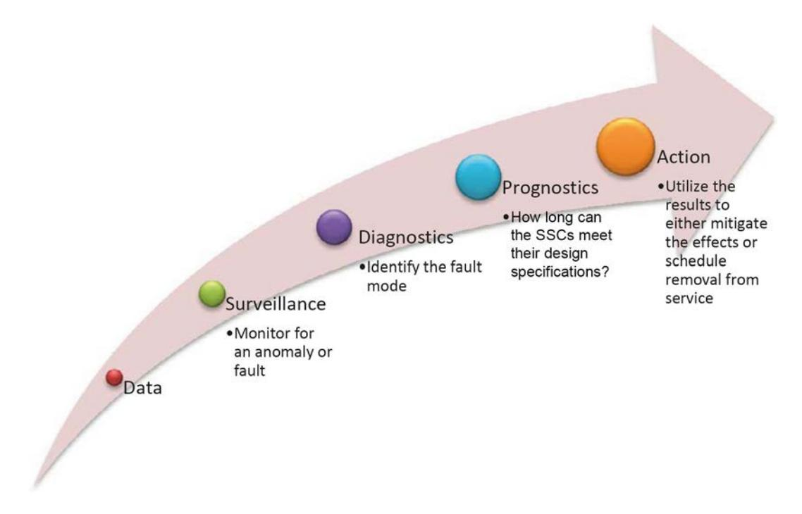

*FIG. 1. Typical SSC SDP system.*

As existing nuclear power plants (NPPs) strive to improve safety, maintain availability and reduce operations and maintenance costs, there is an increasing need for advanced SDP techniques to continuously monitor and assess the health of SSCs. The implementation of power uprates and life extensions increases the need for research and development (R&D) in these areas, owing to more probable occurrence of material degradation and failure of power plant systems and components as the load on equipment is increased. At the same time, a renewed interest in nuclear power as a safe, reliable, and carbon free energy source has prompted many countries to accelerate plans to design and construct new nuclear power facilities. As many new plants are currently in their design stages, it is important for utilities and plant designers to appreciate the benefits that built-in SDP capabilities can provide.

Significant research efforts in developing and implementing SDP technologies are being made in several countries by a number of research organizations, universities and commercial institutions. However, the dissemination of research findings, implementation experiences and best practices regarding the use of SDP in NPPs has traditionally been restricted to means such as journal articles, conference proceedings, technical publications and the like. While these traditional forms of information sharing are necessary and important, they are, at the same time, limited in their effectiveness in providing an objective means of assessment by potential adopters of the technologies.

This report documents the work of a Coordinated Research Project (CRP) conducted under the auspices of the IAEA, the primary purpose of which is to facilitate the collaboration of international experts performing research on SDP techniques, and provide a forum for the sharing and publication of the results and findings of the research. The overall objectives of the CRP are twofold:

- To develop and demonstrate the use of advanced SDP techniques that can be installed and used for health monitoring of SSCs in NPPs;
- To strengthen Member States' capabilities for optimization of NPPs' performance and service life, by means of improved understanding of the related engineering and management areas.

Although the research reported herein is similar to other publications in the IAEA Nuclear Energy series, in that it is a compilation of the state of the art in SDP technologies in several different areas of nuclear plant operation, it differs in its emphasis on active collaboration between participants in the project. This collaboration was primarily assisted by the use of benchmark data assembled specifically for this project, shared by project participants and used to compare results from the various SDP algorithms and methods evaluated in this CRP.

#### 1.2. RESEARCH AREAS

The research conducted for this CRP was divided into four main topic areas:

- Reactor and signal noise analysis;
- Acoustic and vibration monitoring;
- Prognostics and structural material integrity;
- Instrument and equipment condition monitoring and enabling technologies.

Accordingly, the participants in the project were separated into four topic area groups (TAGs) based on their area(s) of expertise. Each TAG was responsible for conducting research, performing benchmark testing and reporting the research results in their own areas. A brief description of each of the four topic areas covered in this report follows.

#### **1.2.1. reactor and signal noise analysis**

Fluctuations in the outputs of NPP sensors measured at steady state operation can be used for a number of applications in NPPs, including process and instrumentation diagnostics and dynamic core parameter estimation. This CRP involves addressing three topics in the reactor signal noise analysis area:

- Noise data collection at operating NPPs, including noise data acquisition and analysis;
- Interpretation of noise measurements, including the development and testing of specific noise analysis methods;
- Presentation of noise analysis results.

The details on the work conducted in reactor signal noise analysis for this CRP can be found in Chapter 2 of this report.

#### **1.2.2. Acoustic and vibration monitoring**

Vibration and acoustic monitoring in NPPs can alert operators and engineers to impending equipment failures or leakages and/or detect detached objects in the reactor coolant that may damage other equipment or piping. This CRP involves the following research areas in acoustic and vibration monitoring:

- Enhanced loose parts monitoring;
- Leakage monitoring using acoustic methods;
- Acceleration and displacement based vibration monitoring.

The details of the research conducted in these areas can be found in Chapter 3 of this report.

#### **1.2.3. Prognostics and structural material integrity**

To support life extension of the existing fleet of NPPs, there is a need to provide new technologies to anticipate and manage degradation of materials. This will provide new data for both advanced light water reactors (LWRs) and other classes of new reactor designs. Developing advanced material degradation diagnostics and prognostics for NPPs involves the following topics that are covered in this CRP:

- Assessment of the state of the art in advanced diagnostics/prognostics, and sensors for on-line measurements, particularly applied to detection of early damage;
- Application of diagnostic techniques to sample materials;
- Evaluation of early degradation detection techniques and integration into a prognostic model.

The area of prognostics, applied in the nuclear industry, is relatively new compared to the other topic areas in this report. Its inclusion in this CRP is intended to introduce NPPs to new technologies and ideas that can be applied to both sensor and process prognostics, as well as on-line diagnostics and prognostics of material degradation.

The details of the prognostics research conducted for this CRP can be found in Chapter 4 of this report. Three terms, referred to as in service inspection (ISI), non-destructive testing (NDT) and non-destructive examination (NDE) will be emphasized here:

- In-service inspections are mandatory tests that are defined in management of plant ageing;
- Non-destructive tests are a family of inspection methods that are implemented in ISI (commonly eddy current and ultrasonic methods);
- NDE is the inspection and evaluation. Therefore, NDE encompasses NDT.

The work of TAG 3 is unique and different from other TAGs, as it breaks new ground on a number of advanced techniques for monitoring, detection and identification of material degradation in NPPs. In particular, TAG 3 focuses mainly on passive components (e.g. reactor vessel and piping), while the rest of the CRP work was on active components. There are other IAEA activities currently under way to address the physics of material degradation (see IAEA Safety Standards Series No. NS-G-2.12, IAEA-TECDOC-1556, IAEA-TECDOC-1557, IAEA-TECDOC-1470, IAEA-TECDOC-1471 and IAEA Technical Reports Series No. 448). Here, we are focused on diagnosis of material degradation, determining the onset of problems in passive components, and development of sensors for on-line or in situ testing to provide data for diagnostics and prognostics of material defects (e.g. cracks, inhomogeneities). There are eddy current, ultrasonic and acoustic emission (AE) techniques for ISI (see IAEA-TECDOC-1400). This CRP goes far beyond these.

#### **1.2.4. Instrument and equipment condition monitoring and enabling technologies**

Instrument and equipment condition monitoring in NPPs includes the detection and diagnosis of anomalies via long term surveillance of process signals while the plant is in operation. The research in instrument and equipment condition monitoring for this CRP is focused on the following areas:

- On-line instrumentation channel calibration monitoring.
- Process/plant component degradation monitoring.
- Electrical component degradation monitoring, to include:
  - Cable condition monitoring;
  - Electrical transformer monitoring.
- Enabling technologies, to include:
  - Data transmission methods (use of the data fusion techniques to improve the accuracy of redundant and diverse data processing algorithms);
  - Use of modern software technologies for implementation of the SDP techniques.

In addition to these areas of instrument and equipment condition monitoring, enabling technologies such as wireless sensors are covered in this CRP. The details of the research conducted for this topic area can be found in Chapter 5 of this report, with the enabling technologies described in Chapter 6.

#### 1.3. BENCHMARK TESTING

As previously described, an important part of the research being performed for this CRP is the emphasis on the use of benchmarking data. Many of the participants in this CRP conduct research in overlapping areas; therefore, it is beneficial to have standard datasets on which to test different algorithms, techniques, etc. This provides a more objective means to evaluate the performance of various SDP techniques. For this CRP, benchmark data are used for the following in each topic area.

- (i) Reactor and signal noise analysis:
  - Dynamic response determination of pressure, level, and flow transmitters;
  - Moderator temperature coefficient (MTC) calculation;
  - Transit time estimation;
  - Reactor transfer function determination.
- (ii) Acoustic and vibration monitoring:
  - Loose parts monitoring.
- (iii) Prognostics and structural material integrity:
  - Assessment of various NDE and prognostic techniques on sample materials.
- (iv) Instrument and equipment condition monitoring and enabling technologies:
  - Evaluation of transmitter drift detection techniques;
  - Evaluation of cable degradation detection techniques.

Details on the benchmark data and methods used for testing the data can be found in the respective topic area sections. It is important to note that all of the data collected during the course of the CRP are compiled into a database that can serve as a source of information for future research, development and benchmarking.

#### 1.4. ORGANIzATION OF THIS REPORT

The report of the work conducted for this CRP is organized into two parts. The body of the main report (this document), contains six main sections — an introduction and one section for each of the four topic areas researched for this CRP. Each of the four topic area sections is intended to be a stand-alone report. However, a similar outline has been used for each of the four topic areas. There is also a sixth chapter in this report that includes discussion of enabling technologies that can support SDP efforts.

The Appendix on DVD to this CRP report contains a compilation of related materials (white papers, in-depth theoretical descriptions, details of benchmark data and results, etc.) that further enhance or describe in detail the research included in the CRP main report. This Appendix is provided electronically on the DVD carrying the benchmark data.

#### 1.5. PREVIOUS IAEA PUBLICATIONS

This document relates to a number of earlier IAEA publications in this area. A few examples are listed below:

- (1) INTERNATIONAL ATOMIC ENERGY AGENCY, Managing Modernization of Nuclear Power Plant Instrumentation and Control Systems, IAEA-TECDOC-1389, IAEA, Vienna (2004).
- (2) INTERNATIONAL ATOMIC ENERGY AGENCY, On-line Monitoring for Improving Performance of Nuclear Power Plants Part 1: Instrument Channel Monitoring, IAEA Nuclear Energy Series No. NP-T-1.1, IAEA, Vienna (2008).
- (3) INTERNATIONAL ATOMIC ENERGY AGENCY, On-line Monitoring for Improving Performance of Nuclear Power Plants Part 2: Process and Component Condition Monitoring and Diagnostics, IAEA Nuclear Energy Series No. NP-T-1.2, IAEA, Vienna (2008).
- (4) INTERNATIONAL ATOMIC ENERGY AGENCY, Core Knowledge on Instrumentation and Control Systems in Nuclear Power Plants, IAEA Nuclear Energy Series No. NP-T-3.12, IAEA, Vienna (2011).
- (5) INTERNATIONAL ATOMIC ENERGY AGENCY, Management of Ageing of I&C Equipment in NPPs, IAEA-TECDOC-1147, IAEA, Vienna (2000).
- (6) INTERNATIONAL ATOMIC ENERGY AGENCY, Assessment and Management of Ageing of Major Nuclear Power Plant Components Important to Safety: In-containment Instrumentation Cables, IAEA-TECDOC-1188, IAEA, Vienna (2000).
- (7) INTERNATIONAL ATOMIC ENERGY AGENCY, Implementation Strategies and Tools for Condition Based Maintenance at Nuclear Power Plants, IAEA-TECDOC-1551, IAEA, Vienna (2007).
- (8) INTERNATIONAL ATOMIC ENERGY AGENCY, Assessing and Managing Cable Ageing in Nuclear Power Plants, IAEA Nuclear Energy Series No. D-NP-T-3.6, IAEA, Vienna (2012).

Of course, other organizations, such as the Electric Power Research Institute (EPRI), the Organisation for Economic Co-operation and Development's (OECD's)'s Halden Reactor Project (HRP), the United States Nuclear Regulatory Commission (NRC), US Department of Energy (DOE) and the International Electrotechnical Commission (IEC) have spent substantial efforts in development of SDP technologies and their implementation in nuclear plants. The following are examples of related publications:

- (1) INTERNATIONAL ELECTROTECHNICAL COMMISSION, IEC Standard 62385, Nuclear Power Plants — Instrumentation and Control Important to Safety — Methods for Assessing the Performance of Safety System Instrument Channels, IEC, Geneva (2007).
- (2) INTERNATIONAL ELECTROTECHNICAL COMMISSION, IEC Standard 62342, Nuclear Power Plants — Instrumentation and Control Systems Important to Safety — Management of Ageing, IEC, Geneva (2007).
- (3) UNITED STATES NUCLEAR REGULATORY COMMISSION OFFICE OF NUCLEAR REGULATORY RESEARCH, Technical Review of On-Line Monitoring Techniques for Performance Assessment, NUREG/CR-6895, USNRC, Washington, DC (2006).
- (4) HASHEMIAN, H.M. et al., Requirements for On-Line Monitoring in Nuclear Power Plants, EPRI Report Number 1016725, EPRI, Paolo Alto, CA (2008).
- (5) DOE Phase II Report, On-Line Monitoring of Accuracy and Reliability of Instrumentation and Health in Nuclear Power Plants, Work performed by AMS Corporation (2010).

# **2. rEACtor AnD sIGnAL noIsE AnALYsIs**

#### 2.1. INTRODUCTION

NPPs are equipped with numerous sensors to provide data for control, assurance of safety, and plant operations. Normally, while the plant is operating, the outputs of these sensors will have a steady state value, or static component, corresponding to the process parameter being measured. In addition to the static component, a small fluctuating signal is also naturally present on most NPP sensors. The fluctuating signal, or noise component, stems from inherent fluctuations in the process parameter caused by turbulence, random flux, random heat transfer, mechanical vibration, electrical interference and other effects, as illustrated in Fig. 2.

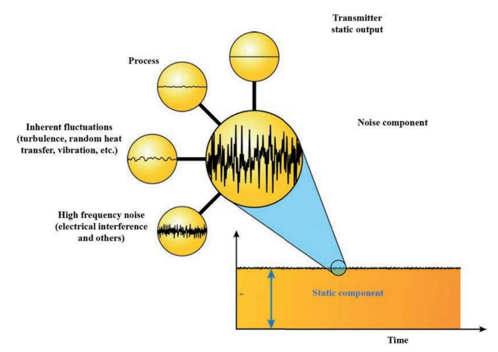

*FIG. 2. S tatic and noise components of a sensor output.*

Analysis of the noise component can be used for a number of applications in NPPs, including process and instrumentation diagnostics, as well as dynamic core parameter estimation. Some of the most common applications of noise analysis in NPPs are [1–4]:

- Sensor surveillance, including estimation of sensor response times;
- Detection of flow blockages in fuel channels;
- Diagnostics of core barrel vibrations;
- Determination of global dynamic core parameters such as the decay ratio in boiling water reactors (BWRs) and the MTC of reactivity in pressurized water reactors (PWRs).

Noise analysis techniques are advantageous in that they can be used on-line without disturbing reactor operation. Such monitoring techniques are of particular relevance when considering the power uprating of an NPP. The main issues related to the operation of the plants at the uprated power level are reduction of the safety margins, such as the margins to instability for BWRs, and increased vibrations such as flow induced vibrations.

#### 2.2. CHAPTER OBJECTIVES

The purpose of this chapter is to consolidate the knowledge of researchers and other industry experts, in an effort to facilitate the application of noise analysis techniques in NPPs. The topics covered in this chapter represent the state of the art in noise analysis, including up to date specifications for noise data acquisition in nuclear plants, new methodologies for well known noise analysis applications, and results from research into new technologies being developed. Particular emphasis is placed on real plant applications and on the possible impacts on plant safety and economy.

This chapter also includes results from benchmark tests and demonstrations on several noise analysis applications. The data and results from these benchmark tests are available to Member States, to be used in comparison with future noise analysis research.

#### 2.3. BACKGROUND

Power reactor noise deals with neutron fluctuations that are induced by perturbations or oscillations of the reactor properties, i.e. displacement of core components, temperature or density variations, etc. Any change in the reactor composition manifests itself as fluctuations of the corresponding macroscopic nuclear cross-sections. The time dependence of the cross-sections naturally leads to a time dependence of the neutron flux. Most often, the changes in the cross-sections are induced by processes that are themselves random in character: turbulent one- or two-phase flow, boiling, flow induced random vibrations, etc. Hence, the induced neutron flux variations become random processes in time, with a deterministic or sometimes random space dependence (when the perturbation is random in space).

Developing noise analysis methods for NPPs involves addressing three main categories of subjects, as shown in Fig. 3.

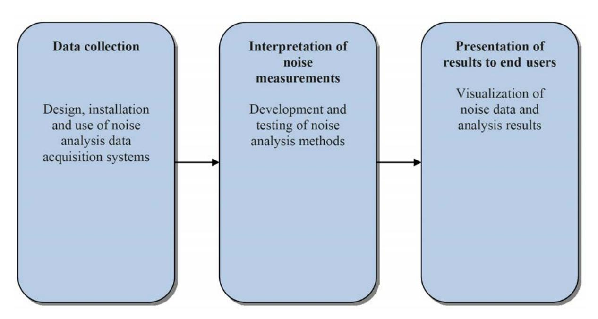

*FIG. 3. Three categories of noise analysis research addressed by TAG 1.*

For the interpretation of the noise measurements category, four benchmark or demonstration cases will be considered in this report:

- The response time estimation;
- The coolant velocity (assembly coolant flow) estimation;

- The reactor transfer function determination;
- The MTC estimation.

#### 2.3.1. Motivation for the different techniques

#### 2.3.1.1. Response time estimation

Pressure transmitters and differential pressure transmitters are extensively used in NPPs to monitor numerous process parameters such as primary and secondary coolant pressures, flow rates and pressurizer and boiler liquid levels. These parameters are used for both reactor control and reactor protection and therefore it is necessary and important to verify that the pressure transmitter response time satisfies the technical specification that is used in the design and safety analyses. Noise analysis of the pressure transmitter signal during reactor steady state operation can be used to measure the transmitter response times in situ, and is therefore significantly less invasive and less costly than the alternative of removing the transmitter for bench testing. In situ noise analysis is also more representative of the transmitter response time as installed, and may be used to diagnose malfunctions in the pressure monitoring system, such as clogged impulse lines.

#### 2.3.1.2. Coolant velocity estimation

Normally in the core of reactors, there is no sensor measuring the coolant flow velocity. This velocity is generally estimated with indirect methods (using mass flow, cross-sectional area and temperature profiles). However, this traditional method provides good results only for normal operation (e.g. in the case of crud deposition in some fuel assemblies, cross-sectional areas are changing). Noise diagnostics provide a method to estimate flow velocities (e.g. in those fuel assemblies that are equipped with self-powered neutron detector (SPND) chains). Results can then be used not only for coolant velocity estimation but also for detection of flow anomalies and flow blockages.

#### 2.3.1.3. Reactor transfer function determination

The transfer function of a reactor gives the spatial and energy dependence of the neutron noise induced by a localized perturbation in the core. Once the transfer function has been determined, the neutron noise induced by any perturbation can be estimated as a spatial convolution of the noise source, i.e. the cross-section fluctuations, with the frequency dependent transfer function of the core. The transfer function is only dependent on the parameters of the unperturbed core; hence, it can be calculated in advance, irrespective of the (unknown) perturbation. In possession of the measured neutron noise and the calculated transfer function, the unknown noise source can be determined by an inversion of the convolution integral. This process is therefore often called spatial unfolding. In practice, the inversion is not possible for arbitrary unknown noise sources, since the noise is only measured in a few discrete spatial locations. Therefore, a simple analytical model of the noise source is constructed, which only contains a few unknown parameters (noise source modelling) and can then be determined by unfolding. Most of the noise diagnostics tasks involve some kind of unfolding, i.e. trying to determine from the measured neutron noise throughout the system the cause of the observed fluctuations. This unfolding is only possible if the reactor transfer function can be determined. Another incentive for determining the reactor transfer function is when new noise measurement techniques and methods need to be tested. With a proper model of the noise source, the reactor transfer function allows determination of the induced neutron noise throughout the system. Based on this calculated neutron noise, the new techniques and methods can be tested, and possibly refined.

#### 2.3.1.4. MTC determination

The MTC is an important safety parameter of PWRs. According to a US standard [5], the MTC is defined as the partial derivative of the reactivity,  $\rho$ , with respect to the core averaged moderator temperature,  $T_{\rm m}^{\rm ave}$ :

$$MTC = \frac{\delta \rho}{\delta T_{m}^{\text{ave}}} \tag{1}$$

The MTC plays a major role in the feedback mechanism, as any external change of the reactivity of the system will induce a change in power and temperature, which, via the MTC effect, will influence the reactivity itself. In some countries, the safety authorities require the MTC to be measured twice during each fuel cycle. The first measurement is performed at hot zero power and at the beginning of cycle, to verify that the MTC is negative (preventing the consequences of a power increase). The second measurement is performed at hot full power and near the end of cycle, to check that the magnitude of the (negative) MTC is not larger than some prescribed limit (preventing the consequences of a large reactivity increase due to a cooldown event, such as a main steam line break). Since the MTC magnitude increases with burnup due to the decrease of the boron content, the second measurement is actually performed a few months before the end of cycle, to determine whether the reactor can be operated until its expected end of cycle.

Regarding the beginning-of-cycle MTC estimation, which is based on a change of the inlet temperature of the core, the measurement is considered to be accurate and relatively easy to carry out, since the reactivity change induced by the moderator temperature change is measured by a reactivity meter and since the temperature is homogeneous throughout the core. On the other hand, the end-of-cycle MTC measurement has proved to be difficult to perform and rather inaccurate. The at-power measurement techniques all rely on a perturbation of the inlet temperature of the core that the operator tries to compensate for by other means (change of the boron concentration or modification of the control rod insertion in most cases) in order to keep the reactor at full and steady power. These measurement techniques have a relatively large uncertainty. More generally, the main reason for the inaccuracy of the at-power measurement procedures relying on a perturbation of the core is that these techniques are time consuming, and therefore many parameters that cannot be measured but only estimated by core calculations are changing. The other main drawback of these techniques is that they disturb the plant operation and induce a plant transient that the operator has to monitor for 12–24 h. Since core calculations are believed to estimate the MTC accurately, the current trend for power utilities is to perform the beginning-of-cycle measurement and then rely completely on core calculations for the determination of the MTC variation through the fuel cycle. Nevertheless, the at-power MTC calculations have never been benchmarked. Only the zero-power isothermal temperature coefficient calculations have been benchmarked against measurements. The at-power MTC cannot be benchmarked, since the same calculation tools are used in both the measurement and the calculation; i.e. comparing the results of the measurements to the MTC calculation might hide some inaccuracy in the computational scheme. In such a context, the development of a noise based MTC measurement technique is of prime interest. The inherent fluctuations of the neutron flux and the moderator temperature around their mean values can be used via the use of a proper noise estimator, without perturbing reactor operation.

#### **2.3.2. Data collection**

As previously described, noise analysis techniques depend on being able to acquire and analyse the small fluctuations that are often present on signals from instrumentation in NPPs. These small fluctuations contain valuable information about the health of the sensors, equipment and processes from which they originate, and therefore must be properly acquired and stored prior to performing analysis.

Although noise analysis can be performed for a number of different applications and can involve many different types of sensor, the process of acquiring noise data is similar from application to application. In general, the collection of noise data involves the following steps, listed here and illustrated in Fig. 4.

- (1) *Isolate the plant signal:* One of the key benefits of noise analysis techniques is that they can be performed on-line while the plant is operating. Since noise data are acquired while the plant is operating, it is important that noise data collection systems are electrically isolated from the sensors they are measuring, so as not to affect the operation of the plant. It is also important to have high input impedance in the noise collection system so that it does not load the systems in the plant while data are being acquired.
- (2) *Separate the static and noise component:* As noise analysis focuses on the fluctuating noise component of an NPP signal, it is important to obtain signals with as much resolution as possible. This is typically accomplished by amplifying the noise signal. However, before the noise signal can be amplified, the static component is typically removed so that the amplification process does not saturate the data acquisition equipment.

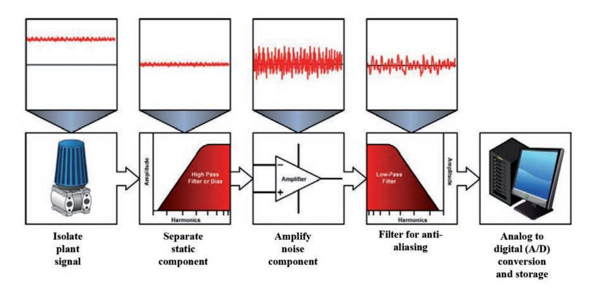

*FIG. 4. Noi se data acquisition process.*

- (3) *Amplify the noise component:* Once separated from the static component of the signal, the noise component should be amplified sufficiently so that the relevant information in the signal is appropriately captured.
- (4) *Filter for anti-aliasing:* As previously shown in Fig. 2, the noise component of a signal typically contains high frequency electrical noise and other extraneous effects that must be removed from the signal before noise analysis is performed. If not removed, the effects of the high frequency noise could be 'aliased' in to the relevant portion of the signal's frequency domain and affect the noise analysis results. Removal of this type of interference is typically accomplished using a low pass filter.
- (5) *Analogue to digital (A/D) conversion and storage:* Once the signal has been preprocessed and filtered, it must be converted from analogue to digital and stored. Typically, an A/D resolution of at least 12–16 bits is recommended, in order to provide enough resolution for noise analysis applications.

Table 1 lists typical data acquisition rates and storage requirements for the noise analysis applications that are covered in this report. More detailed examples of data collection requirements can be found in the Appendix on DVD for the PAzAR autonomous noise data acquisition system from Paks NPP and for the high speed noise analysis data logger system from the Atomic Energy of Canada Limited (AECL), as well as in Ref. [6].

TABLE 1. TYP ICAL CHARACTERISTICS OF NOISE ANALYSIS SYSTEMS DEPENDING ON THE APPLICATION (THE FIGURES ARE TYPICAL FOR WATER–WATER ENERGETIC REACTORS — WWERs)

| Noise analysis technique | Sample rate | Length stored (minimum) (min) | Number of sensors (typical) | Required storage |
|--------------------------|-------------|----------------------------------|--------------------------------|------------------|
| Dynamic response time    | 1 kHz       | 30                               | 200                            | 3.0 GB           |
| MTC estimation           | 100 Hz      | 60                               | 300                            | 220 MB           |
| Flow velocity estimation | 100 Hz      | 20                               | 252                            | 60 MB            |

#### **2.3.3. Interpretation of noise measurements**

One of the features of reactor noise diagnostics — and also a difficulty — is that the procedure of investigation is mainly based on the operational detectors (ionization chambers, self-powered neutron detectors, thermocouples, etc.) of the reactor instrumentation, because the extreme conditions — high temperature and intensive radiation — dominating inside the reactor can be permanently withstood by specially built detectors. The main disadvantage of using operational detectors is that they are designed to measure slow, steady state processes; thus, their frequency response is not optimal for measuring fluctuating signals. Generally, there are no calibration or transfer characteristics presented for the frequency range used in noise diagnostics applications — i.e. measurement and analysis of fluctuating signals. Although the resulting problems can be solved, the possibilities and results of the quantitative analysis are made worse and more difficult. One of the most important devices used in the diagnosis of the reactor core is an in-core neutron detector. Knowledge of the transfer characteristics of the sensors and of the measurement process is essential for analysis of the noise signals and other quantities calculated from the noise signals. For example, the current produced by the cable of neutron detectors is added to the detector signal and it may significantly modify the characteristics of the measured signal. Signal characteristics can be radically influenced by the geometric properties of the detector and the cable and by the measuring arrangement [7].

The first step in the evaluation of noise measurements has to be validation of the measured data, in order to find out whether they show the real processes and do not contain electronic or other unwanted disturbances that falsify the measured values. Such a data validation is especially important prior to the MTC estimation, because the method is rather sensitive to the quality of the signals, owing to the low correlation between temperature and neutron signals. In order to filter the faulty signals out, a simplified signal validation should be performed: it is based on the direct current (DC) value and the statistical properties such as autopower spectral density (APSD), coherence and phase of the alternating current (AC) part of the signals. The signal properties need to be displayed in a clearly arranged scheme (see Fig. 5 for such an example, showing a typical detector chain), so that possible faulty signals can be eliminated. The noise diagnostics signal validation process is further detailed in a separate paper [8].

Once the signals have been validated, noise analysis techniques can be applied. The bulk of the research performed in the area of noise analysis and presented in this report is related to the interpretation of noise measurements, i.e. the development and testing of methods and tools allowing characterization of the status of the plant. Several research areas were treated in detail and these areas are described next.

#### *2.3.3.1. Sensor response time testing*

Validation and verification of control and safety system sensors and signals (e.g. for pressure, flow, temperature and neutron flux) is an important SDP activity in NPPs. In many cases, the response time of safety critical sensors is part of the safety analysis of NPPs, and therefore periodic measurement of sensor response times is required to show compliance with the safety case. On-line measurement of the time response of many types of sensor can be carried out using the process noise from the reactor as input, and by analysing the output of the sensor in the frequency domain, to derive the sensor transfer function. The spectral characteristics of the process noise can either be computed, and verified separately by well characterized detectors, or measured simultaneously with the response of the sensor under test. Such procedures are routinely used for pressure, differential pressure (flow and level) and temperature (thermocouple and resistance temperature detector (RTD), strap on or thermowell mounted) sensors.

One of the most important types of sensor that require response time verification, especially in pressurized heavy water reactors (PHWRs), are in-core flux detectors (ICFDs), also called SPNDs. Currently, the response time verification of such detectors is routinely carried out by analysing step response data, obtained by tripping the reactor. Obviously, such a methodology can only be used sporadically, and is strenuous for the reactor. Response time verification of SPNDs via neutron noise analysis has been previously proposed, and some work has been done by assuming point-kinetic reactor dynamics. This methodology could be verified in detail by using the reactor transfer function model to obtain the noise input signal for the flux detectors, and to verify the response time thus obtained against the response measured by step tests.

#### *2.3.3.2. Coolant velocity (assembly coolant flow) measurements*

Inherent coolant temperature fluctuations travelling with the flow inside a fuel assembly offer the possibility of determining the in-core coolant flow, since such perturbations will be detected by temperature or neutron detectors located within the same fuel assemblies at different axial positions with a time delay. Noise based methods offer the possibility of monitoring the in-core coolant flow and detecting possible flow blockage or crud formation.

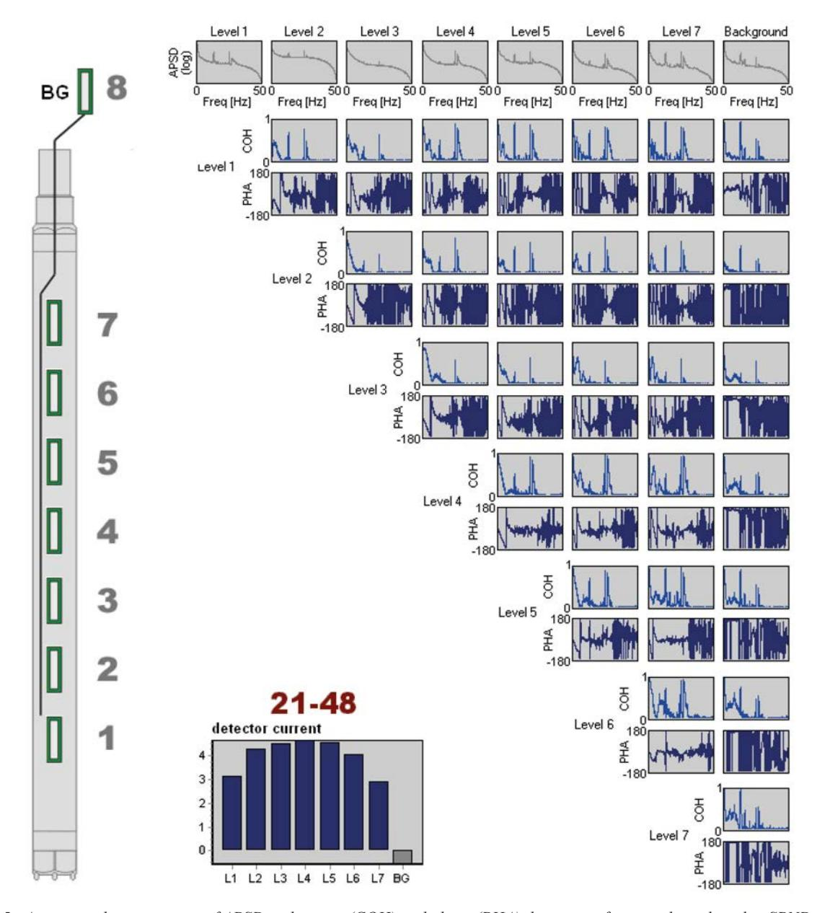

*FIG. 5. A suggested arrangement of APSD, coherence (COH) and phase (PHA) diagrams of a typical good quality SPND chain.*

Nevertheless, noise based methods, such as examining the linear behaviour of the phase of the cross-power spectral density (CPSD) between two axially distant detectors, or using the impulse response function, usually require expert knowledge and expert opinion, which prevents application of these methods in an automated manner. The research aims at investigating the reliability of such methods and proposing improvements and automation of these methods.

Inhomogeneities in the coolant flowing through the reactor core induce perturbations in the neutron flux via changes in the macroscopic cross-section. In the fuel assemblies furnished with SPNDs, any perturbation moving along the detectors will cause a small transient in the detector signals. This transient, characterized as a small peak or a dip in the detector's current, is sensed by all detectors, with a time delay between the recordings of the perturbation by two consecutive detectors that is proportional to the distance between the two detectors (see the illustration in Fig. 6).

By determining the transit time between the detectors, the coolant velocity in the assembly can be obtained. In principle, the mass flow (coolant velocity) of an individual fuel assembly is a calculated quantity; it can be determined from the total core flow by using the thermohydraulic characteristics of the given assembly. However,

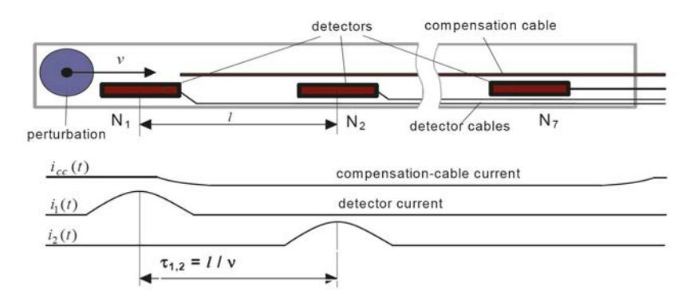

*FIG. 6. Transit time (τ1,2 ) of a propagating perturbation estimated from SPND time signals.*

in certain situations, checking the individual assembly coolant flows can be very important and this measurement method provides a straightforward solution.

The theoretical background of the coolant velocity determination is outlined in the Appendix on DVD, as well as in Refs [7] and [9]. The method requires very accurate and stable measuring equipment: the ratio of the signal component carrying information about the traversing perturbations to the DC value of the signal (≈10–6 A) is between 10–4 and 10–5; i.e. the amplitude of the signal component amplitude is ≈10–11 A.

Determination of the transit time can be realized either by determining the gradient of the linear phase in the cross-spectra between the signals caused by propagating perturbations, or by identifying the peak corresponding to the transit time in the cross-correlation function between the signals. However, the so-called global noise is also sensed by the detector; therefore, both local and global noise fields influence the detector signal. As a consequence of these effects, the real shapes of the phase functions of the cross-spectra can be complicated and the linear phases may be damped. As it turns out in practice, the phases are rarely applicable to estimate the coolant flow velocity.

The method of velocity estimation by correlation functions is based on the determination of the local maximum which corresponds to the transport time. However, the signals of the in-core neutron detectors are strongly correlated, owing to the always observable global fluctuations of the reactor. The global fluctuation masks the peak originating from the transport time in the correlation function.

A more sensitive method can be obtained by investigating the impulse response function. In this function, the global and local peaks are better separated and the masking is less disturbing. Consequently, the peak originating from the transport time can be more easily identified; this can be seen in the upper and the lower graphs in Fig. 7. The peak at 0 s is due to the global effect and the peak at 0.4 s originates from the time delay due to the coolant flow velocity between the detectors at two different levels.

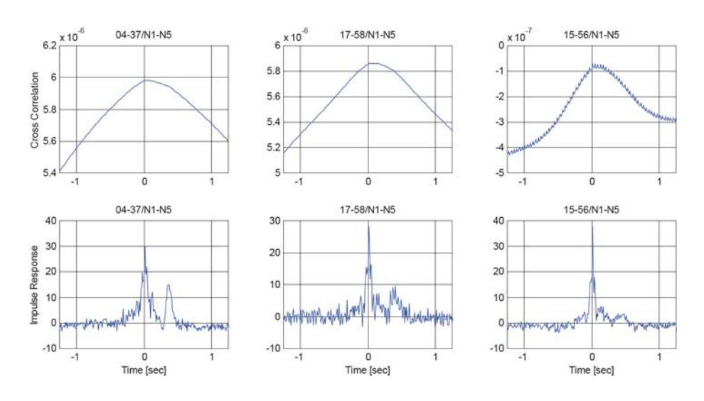

*FIG. 7. Cross-correlation (above) and impulse response functions (below) with 0.4 s transport time.*

#### *2.3.3.3. Reactor transfer function determination*

When analysing neutron noise measurements, knowledge of the reactor transfer function is of prime importance. This transfer function allows estimation of the space dependent response of the reactor to perturbations that might be localized or spatially distributed. Most of the diagnostic tasks require prior determination of the reactor transfer function, since the original perturbation has to be estimated from the detector reading (noise source unfolding, which, mathematically, can be considered as performing an inversion of the reactor transfer function).

A computational tool, CORE SIM, has been developed for determining the open-loop reactor transfer function. This includes determining the spatial and energy distribution of the static neutron flux, of any higher eigenfunction of the neutron flux, as well as the spatial and energy distribution of the neutron noise in the frequency domain. Using the frequency domain avoids performing lengthy calculations in the time domain. Furthermore, the problem of properly choosing a time discretization step is eliminated, and the convergence and stability of the calculations are thus automatically guaranteed. Once the frequency of interest (i.e. the frequency of the perturbation) is known, the induced neutron noise can be estimated at that frequency. It is also possible to perform the calculations at several frequencies, in order to determine the space dependent spectrum of the neutron flux, from which the space and time dependence of the neutron flux can be determined by inverse Fourier transform.

This computational tool performs its calculations in neutron diffusion theory in both three dimensions and cartesian geometries. It uses as input two-group macroscopic cross-sections and kinetic parameters, as well as geometrical details from other core simulators such as the commercial core simulator, SIMULATE-3 [10]. The tool can, furthermore, handle both critical systems and subcritical systems with an external neutron source. The neutron noise and its adjoin, as well as the static neutron flux distributions for any eigenmode and their adjoins, can be visualized using the accompanying plotting tool.

A more detailed description of the theory and algorithms used in CORE SIM is provided in Ref. [11].

#### *2.3.3.4. Moderator temperature reactivity coefficient estimation*

It was previously demonstrated that the MTC of reactivity can be determined by noise analysis if the spatial distribution of the moderator temperature noise and the neutron noise can be measured inside the reactor core. Such a noise based method does not require any disturbance of reactor operation, and is thus of high interest compared to the classical (intrusive) boron dilution technique [12]. The proposed non-intrusive MTC determination method uses the noise of the coolant temperature at the core inlet to calculate moderator temperature noise, and background detectors of the SPND chains to determine the neutron noise over the reactor core. The method was successfully tested by using measured data originating from a WWWR-440 type plant [13, 14].

The test of new algorithms and methods aimed at estimating the MTC by noise analysis can be easily performed assuming a given distribution of the moderator temperature noise inside the system and using the reactor transfer function numerically estimated by CORE SIM. Such an example is presented in Fig. 8, where radially loosely coupled temperature fluctuations were assumed. The neutron noise was then estimated by CORE SIM, and the MTC was estimated in two different ways (using either the local temperature noise, or a core averaged temperature noise). On the left plot, each radial point represents where both the neutron noise and the temperature noise are measured, whereas on the right plot, each radial point represents where the neutron noise is measured, with the temperature noise being estimated as a radially averaged quantity. This investigation demonstrated that a core averaged temperature noise needs to be used, if the correct MTC value is to be recovered by using noise

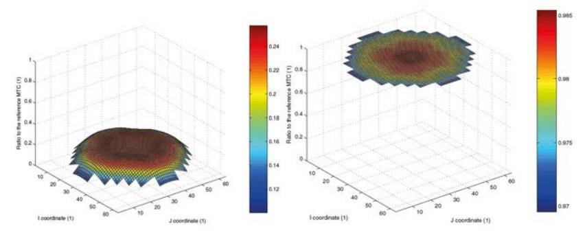

*FIG. 8. Ratio between the MTC noise estimate and its actual value as calculated by CORE SIM.*

analysis. The interested reader is referred to Ref. [15] for further details about this investigation.A more detailed text describing the underlying theory for the MTC estimation by noise analysis is provided in the Appendix on DVD.

#### **2.3.4. Presentation of results to end users**

One of the main issues with SDP information, including methods based on noise analysis, is how to present the results of the implemented techniques and algorithms to the plant operators/engineers, so that the information provided by noise analysis can be utilized in a reliable and timely manner. The research reported here was aimed at investigating the needs and possible means of presenting this information in an easily understandable manner to operators and plant SDP engineers, as well as expert analysts. The following items were investigated:

- Information presentation methods and technologies;
- Integration of the SDP system with other plant data;
- Demonstration of the usefulness of noise analysis methods (support to lifetime extensions, power uprates, and higher capacity factors for new designs).

#### *2.3.4.1. Analysis of noise measurements*

The main problem when analysing noise data, and more specifically in-core vibrations, is the visualization of large volumes of spectra and how to help the user overview them. A possible way is to extract some specific information from the spectra and display their distribution over the core and let the user select any of the spectra through a core map.

As an illustrative example, Figs 9–12 show the user interface and results screen examples from the PAzAR system [16]. These screens and results are described below.

The visualization tool shown in Fig. 9 lets the user investigate the distribution of the amplitude of a specific frequency peak over the core. For those assembly positions where there is no detector chain installed, the values are calculated by interpolation (assemblies equipped with a detector chain are marked with red '+' symbols). The user has several methods of interaction for investigating the distribution:

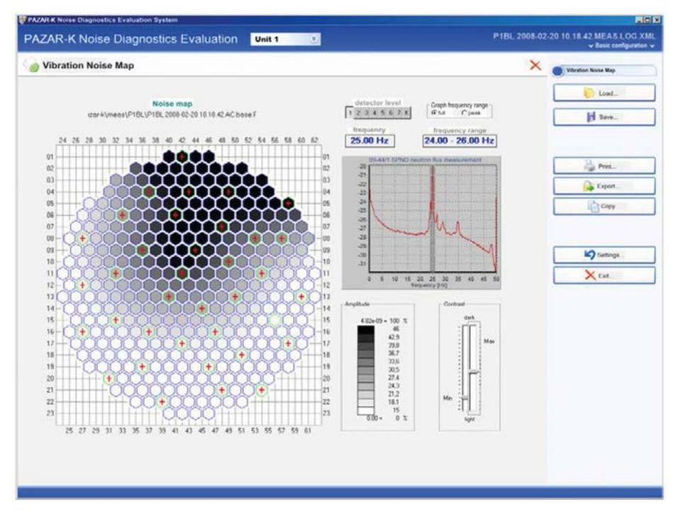

*FIG. 9. Display format for visualization of in-core vibration peaks.*

- Different detector levels can be chosen;
- Any of the SPNDs of the chosen detector level can be displayed;
- The contrast of the map can be changed.

Velocity estimation through measurements of transit time can be performed using cross-correlation functions or impulse response functions (Fig. 10) by using pairs of neutron detectors.

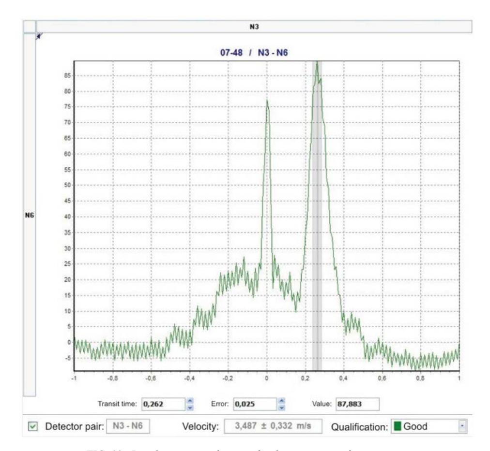

*FIG. 10. Impulse response function for the estimation of transit time.*

In Fig. 11, a cross-section of the reactor core is displayed, with the estimated coolant velocity values written into the hexagon of the corresponding SPND chains. A map of the coolant flow velocity distribution can be obtained by interpolation. A similar map to the map of the peak amplitude distribution of Fig. 9 can be used to visualize it. The estimated coolant flow velocities among the individual SPND chains are displayed with their error bars in Fig. 12. The (otherwise two dimensional — 2-D) positions of the assemblies, where the measurements and calculations are made, are placed along the *x* axis of the graph.

#### *2.3.4.2. MTC estimation*

For the MTC estimation, there are primarily three important results of the MTC evaluation to be looked at. Since the MTC evaluation is carried out in the frequency domain, both the frequency dependence of the phase and the magnitude of the MTC noise estimator need to be plotted. The phase should approach –180° when the MTC is negative, whereas the phase should approach 0° when the MTC is positive. In addition to these two quantities to be plotted, the frequency dependence of the coherence between the temperature fluctuations and the neutron noise need to be carefully looked at. Only frequencies at which the coherence is high enough lead to reliable results in terms of the MTC estimation. Figure 13 illustrates the different quantities to be plotted in order to get a reliable MTC noise estimation [14].

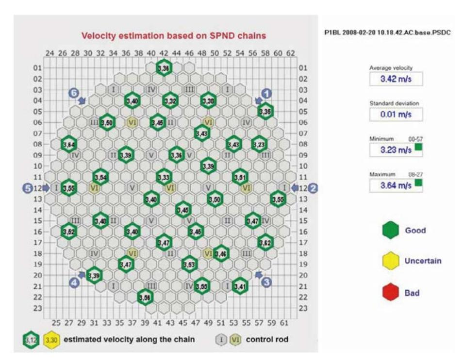

*FIG. 11. Display format for visualization of estimated velocity distributions from benchmark PAZAR measurements.*

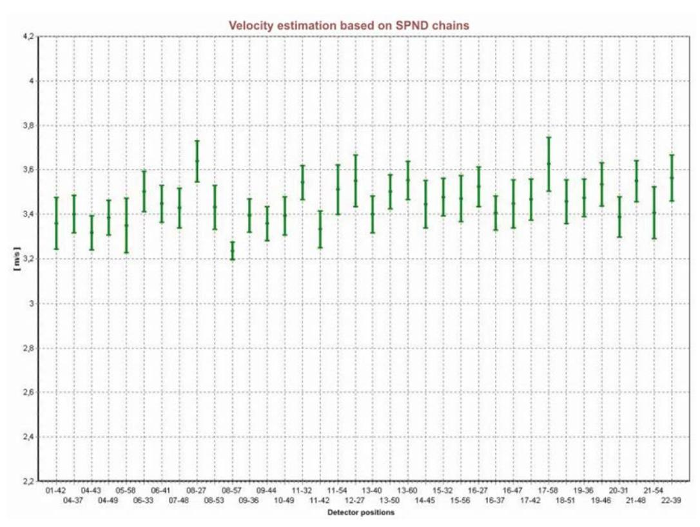

*FIG. 12. Flow velocities among individual SPND chains, with error bars.*

#### *2.3.4.3. Reactor transfer function determination*

Concerning the reactor transfer function estimation, the user is interested in visualizing both the input data and the output data. The input data include the two-group macroscopic cross-sections and the noise source, defined

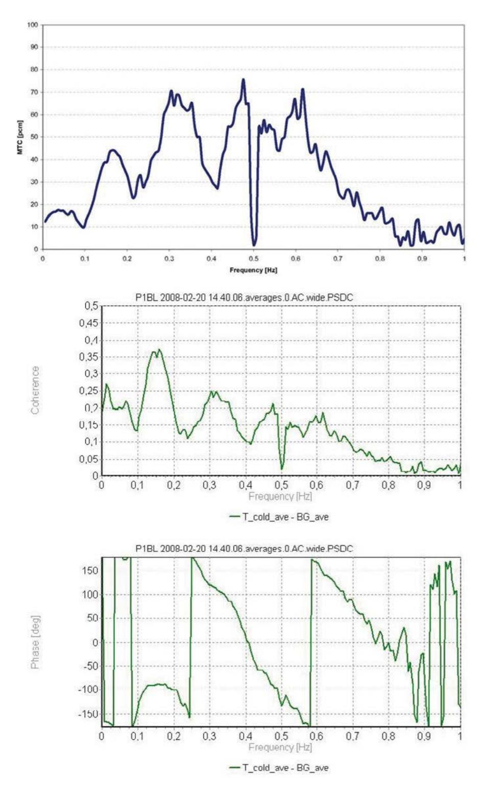

*FIG. 13. Amplitude of the MTC noise estimate (upper figure), coherence (middle figure) and phase (lower figure).*

as perturbations of these cross-sections. Although the primary focus is on the estimation of the reactor transfer function, the output data should also include the induced neutron noise, as well as the static neutron flux, since the estimation of the reactor transfer function actually relies on the prior estimation of the static neutron flux throughout the system. As the neutron noise is estimated in the frequency domain, both the magnitude and phase of the neutron noise need to be visualized. Owing to the 3-D nature of the system, the visualization of the input and output data has to be very flexible, so that the input and output data can be visualized at different locations through the system.

As an illustrative example, a MATLAB-based graphical user interface (GUI) was developed in connection with CORE SIM. The GUI allows visualization of both input and output variables of CORE SIM in a rather intuitive manner. A snapshot of the GUI is presented in Fig. 14. Owing to the 3-D nature of the calculations, the plotting panel allows the user to choose the row, column and level at which cross-sections of the chosen input and output variable will be plotted. Furthermore, since some of the quantities might be complex, the user has to choose whether the magnitude or the phase has to be plotted. An automatic sweep through the whole system can also be performed, in order to find possible local effects corresponding to the computed case. Three plots are given: a 3-D plot (with planar cross-sectional cuts at the chosen row, column and level), a 2-D plot (at the chosen level) and a 1-D plot (at the chosen row and column).

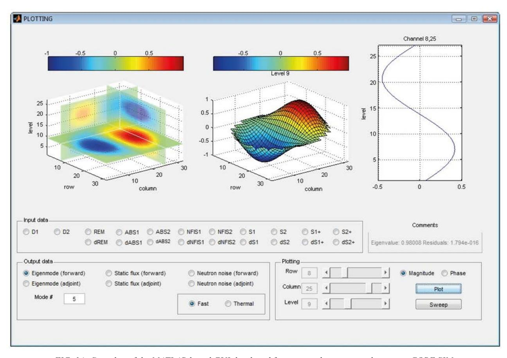

*FIG. 14. Snapshot of the MATLAB based GUI developed for input and output visualization in CORE SIM.*

### 2.4. BENCHMARK DATA AND EVALUATION RESULTS

#### **2.4.1. Benchmark data for pressure transmitters**

One of the most familiar applications of noise analysis in the nuclear industry is the determination of the dynamic response of pressure sensing systems. TAG 1 produced benchmark data and shared them amongst the researchers, to evaluate methods for determining the response time of pressure transmitters. Actual data from nine pressure transmitters sampled at 200 Hz were given to the TAG members to determine the response time of the transmitters.

Table 2 describes the types of transmitter data made available to the TAG members. Figure 15 shows an example of the raw data used for the benchmark test.

TABLE 2. PRESSURE TRANSMITTERS IN BENCHMARK DATA

| No. | Sensor name | Service                               |  |
|-----|-------------|---------------------------------------|--|
| 1   | FEED FLOW   | Feedwater flow                        |  |
| 2   | PzR LVL     | Pressurizer level                     |  |
| 3   | PzR PSR     | Pressurizer pressure                  |  |
| 4   | STM FLOW    | Steam flow                            |  |
| 5   | SG LVL NR 1 | Steam generator level narrow range    |  |
| 6   | SG LVL NR 2 | Steam generator level narrow range    |  |
| 7   | SG LVL WR 1 | Steam generator level wide range      |  |
| 8   | STM PSR     | Steam pressure                        |  |
| 9   | RCS PSR     | Reactor coolant system (RCS) pressure |  |

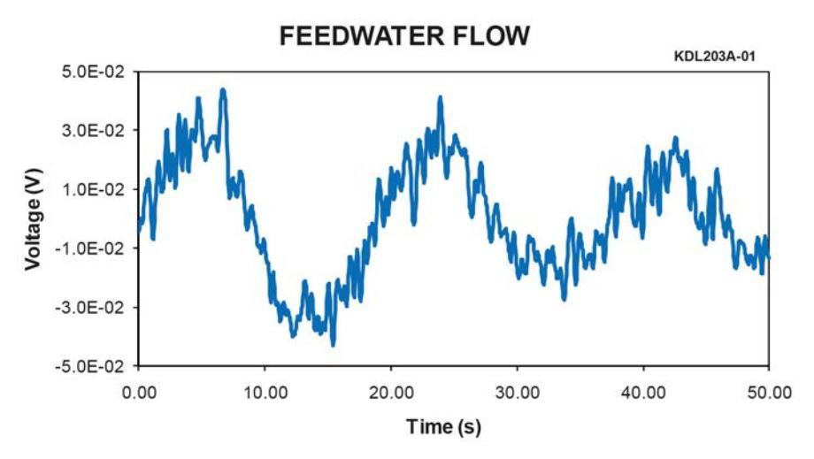

*FIG. 15. Example of raw data used for benchmark test of pressure transmitter response times.*

For the benchmark tests, the raw data from the nine pressure transmitters were analysed by examining their frequency and time domain characteristics. The power spectral densities (PSDs) of each pressure transmitter were analysed, and transfer functions were created to fit each PSD. Figure 16 shows examples of PSD fits for one of the transmitters analysed.

Included in the benchmark data was an example of a pressure transmitter that had a blocked sensing line. Figure 17 shows a comparison of three of the transmitters used in the benchmark test, with SG LVL NR 2 having a blocked sensing line.

The results for all nine transmitters were compiled as shown in Table 3.

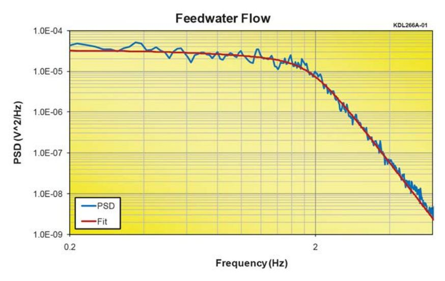

*FIG. 16. PSD and fit for feedwater flow transmitter.*

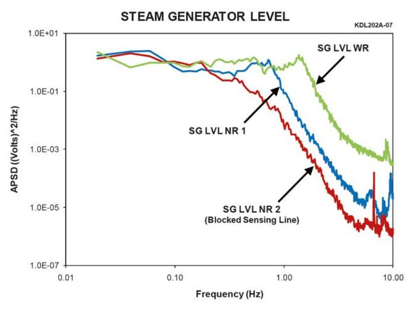

*FIG. 17. Comparison of steam generator level (SG LVL) transmitters in the benchmark data.*

TABLE 3. PRESSURE TRANSMITTERS IN BENCHMARK DATA (cont.)

| No. | Sensor name | Service                            | Approx. response time (s) |
|-----|-------------|------------------------------------|---------------------------|
| 1   | FEED FLOW   | Feedwater flow                     | 0.26                      |
| 2   | PzR LVL     | Pressurizer level                  | 0.22                      |
| 3   | PzR PSR     | Pressurizer pressure               | 0.37                      |
| 4   | STM FLOW    | Steam flow                         | 0.18                      |
| 5   | SG LVL NR 1 | Steam generator level narrow range | 0.32                      |

TABLE 3. PRESSURE TRANSMITTERS IN BENCHMARK DATA (cont.)

| No. | Sensor name | Service                            | Approx. response time (s) |
|-----|-------------|------------------------------------|---------------------------|
| 6   | SG LVL NR 2 | Steam generator level narrow range | 1.44                      |
| 7   | SG LVL WR 1 | Steam generator level wide range   | 0.18                      |
| 8   | STM PSR     | Steam pressure                     | 0.03                      |
| 9   | RCS PSR     | RCS pressure                       | 0.28                      |

#### 2.4.2. Benchmark data for transit time estimation

This section presents the estimation of the coolant flow velocity inside a nuclear core. The average coolant velocity can be quantified through the estimation of the transit time between two neighbouring detectors. Having no flow instrumentation installed in the individual fuel assemblies, this is the only available method to estimate the distribution of the coolant flow velocity in the core.

The WWWR-440/213 type reactors of the Paks NPP have extensive in-core instrumentation: 210 fuel assembly outlet thermocouples are installed and 36 assemblies are measured with SPN detectors. One SPND string consists of seven rhodium detectors; their axial positions are distributed evenly. Altogether, there are 349 fuel assemblies in the core; 37 positions are used for the control assemblies.

The impulse response function method was used to determine transit times. A description of the method is provided in the Appendix on DVD. A weighted average of the pairwise velocity estimations in each string was used to estimate the flow velocities. The weights are a function of the quality and the standard deviation. An explanation of the weights is given in Ref. [9]. Figure 11 and Table 4 show velocity estimations from the PAZAR analysis of the benchmark data. In Fig. 11, the estimated velocity values for the individual assemblies are placed into the green-bordered hexagons (green means that the estimation was qualified as good); the values given in the right side of the figure from the top are: core average velocity, its standard deviation and the coordinate of the assembly with the smallest and the largest velocities (with the velocity values inside the boxes); below these values, the legend of the hexagon bordering colour code is given: green — good, yellow — uncertain, red — bad.

TABLE 4. RESULTS OF THE FLOW VELOCITY BENCHMARK TEST

| Coordinate | Velocity (m/s) | Error (m/s) | Coordinate | Velocity (m/s) | Error (m/s) | Coordinate | Velocity (m/s) | Error (m/s) |
|------------|----------------|-------------|------------|----------------|-------------|------------|----------------|-------------|
| 01–42      | 3.36           | ±0.12       | 09–44      | 3.36           | ±0.08       | 16–27      | 3.52           | ±0.09       |
| 04–37      | 3.40           | ±0.08       | 10–49      | 3.39           | ±0.09       | 16–37      | 3.40           | ±0.07       |
| 04–43      | 3.32           | ±0.07       | 11–32      | 3.54           | ±0.07       | 16–47      | 3.45           | ±0.11       |
| 04–49      | 3.38           | ±0.08       | 11–42      | 3.33           | ±0.08       | 17–42      | 3.47           | ±0.09       |
| 05–58      | 3.35           | ±0.12       | 11–54      | 3.51           | ±0.11       | 17–58      | 3.62           | ±0.12       |
| 06–33      | 3.50           | ±0.09       | 12–27      | 3.55           | ±0.12       | 18–51      | 3.46           | ±0.10       |
| 06–41      | 3.45           | ±0.08       | 13–40      | 3.40           | ±0.08       | 19–36      | 3.47           | ±0.08       |
| 07–48      | 3.43           | ±0.09       | 13–50      | 3.50           | ±0.07       | 19–46      | 3.53           | ±0.10       |

TABLE 4. RESULTS OF THE FLOW VELOCITY BENCHMARK TEST (cont.)

| Coordinate | Velocity (m/s) | Error (m/s) | Coordinate | Velocity (m/s) | Error (m/s) | Coordinate | Velocity (m/s) | Error (m/s) |
|------------|----------------|-------------|------------|----------------|-------------|------------|----------------|----------------|
| 08–27      | 3.64           | ±0.09       | 13–60      | 3.55           | ±0.08       | 20–31      | 3.39           | ±0.09          |
| 08–53      | 3.43           | ±0.10       | 14–45      | 3.45           | ±0.11       | 21–48      | 3.55           | ±0.09          |
| 08–57      | 3.23           | ±0.04       | 15–32      | 3.48           | ±0.08       | 21–54      | 3.41           | ±0.11          |
| 09–36      | 3.39           | ±0.07       | 15–56      | 3.47           | ±0.10       | 22–39      | 3.56           | ±0.10          |

#### 2.4.3. Demonstration of the reactor transfer function estimation

This section presents the estimation of the reactor transfer function for a homogeneous reactor core. As previously mentioned, estimation of the static neutron flux is required prior to estimating the neutron noise, and the result of such estimation is also given. The results presented hereafter correspond to one of the examples available in the CORE SIM package.

A brief description of the input data corresponding to the considered homogeneous reactor core is given in Table 5. Four main types of data are necessary: the 3-D distributions of the macroscopic cross-sections and diffusion coefficients throughout the system, some geometrical data defining the system size and the elementary size of a node on which all quantities are spatially averaged, some kinetic data for the noise calculations, and finally the definition of the noise source.

The spatial distribution of the calculated thermal static neutron flux and of the calculated magnitude of the thermal neutron noise is given in Fig. 18 and Fig. 19, respectively. For each of these figures, three plots are given. The plot on the left hand side gives the spatial distributions on three slices taken at a given x, y and z position,

TABLE 5. REQUIRED INPUT DATA

| Description of input variables                                                                  | Value of the variable(s)                                                                                                                                                                                                                                                                                                                       |
|-------------------------------------------------------------------------------------------------|------------------------------------------------------------------------------------------------------------------------------------------------------------------------------------------------------------------------------------------------------------------------------------------------------------------------------------------------|
| 3-D distributions of macroscopic cross-sections and diffusion coefficients in two-energy groups | Homogeneous core with:  • fast diffusion coefficient = 1.8002 cm  • thermal diffusion coefficient = 0.4338 cm  • removal cross-section = 0.0131/cm  • fast absorption cross-section = 0.0073/cm  • thermal absorption cross-section = 0.0574/cm  • v × fast fission cross-section = 0.0038/cm  • v × thermal fission cross-section = 0.0748/cm |
| Elementary size of a node on which the quantities are spatially averaged                        | 15.375 cm in the x and y directions 14.720 cm in the z direction                                                                                                                                                                                                                                                                            |
| Frequency at which the noise is calculated                                                      | 1 Hz                                                                                                                                                                                                                                                                                                                                           |
| Effective fraction of delayed neutrons                                                          | 564 pcm                                                                                                                                                                                                                                                                                                                                        |
| Neutron precursor decay constant                                                                | 0.0847/s                                                                                                                                                                                                                                                                                                                                       |
| Average neutron velocities                                                                      | In the fast group: 1.78E7 cm/s In the thermal group: 3.90E5 cm/s                                                                                                                                                                                                                                                                               |
| 3-D distribution of the noise source                                                            | Noise source is defined as fluctuations of the macroscopic thermal absorption cross-section and located radially at the centre of the core, and axially on the 7th plane from the core bottom.                                                                                                                                                 |

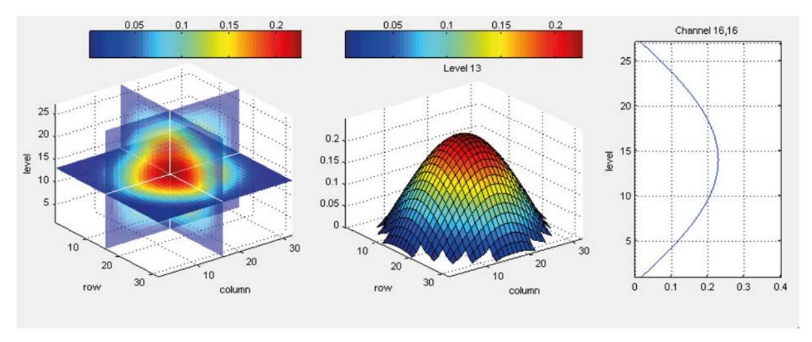

*FIG. 18. Spatial distribution of the calculated static thermal neutron flux.*

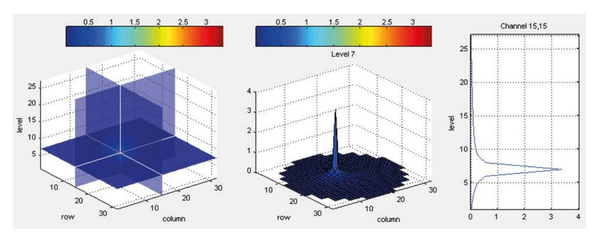

*FIG. 19. Spatial distribution of the calculated magnitude of the thermal neutron noise.*

respectively. The plot in the middle gives the 3-D distribution on the slice taken at the *z* position. The plot on the right hand side gives the axial variation along the intersection defined by the slices taken at the *x* and *y* positions.

As can be seen in Fig. 18, the static neutron flux has a cosine shape, which is typical for homogeneous systems. For the neutron noise (Fig. 19), two spatial relaxation lengths can be noticed: a short relaxation length (the local component of the neutron noise), and a long relaxation length (the global component of the neutron noise). These two relaxation lengths are typical of a two-energy group treatment of the problem, and correspond to theoretical expectations.

#### **2.4.4. Benchmark data for moderator temperature coefficient**

The measurement selected for the MTC estimation benchmark was performed by the PAzAR noise data acquisition system of the Paks NPP, Hungary, as a regular measurement (thus it contains all signals, even signals of some failed sensors). The same signals as the ones used for the transit time estimation were used (see the section on the transit time for a description of the detectors).

In the measurement selected for the MTC estimation, all of the SPND signals are included; there are 27 selected fuel assembly outlet thermocouple signals, and also at least one temperature signal from the cold leg thermocouples of all loops and from the hot leg thermocouples of all loops. The benchmark dataset contains the time series of both AC and DC components of all input sensors plugged in.

The basic idea behind the estimation method is the application of cold leg temperature noise signals and the neutron noise obtained from the background (cable) detectors of SPNDs. In the evaluations, a modified MTC estimator was applied: the traditional estimator was extended to take into account the effects of measurement geometry, coolant velocity and the relatively long time constant of the utilized cold leg thermocouples. For more details about the method, the reader is referred to the Appendix on DVD, as well as to Ref. [13].

The calculated MTC from the core design code is –43.5 pcm/°C, and the estimated MTC from the benchmark data from the PAzAR measurement is –46.5 pcm/°C as an average over a selected frequency region, as shown in Fig. 20.

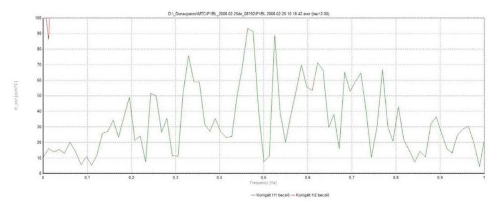

*FIG. 20. Results of MTC estimation from benchmark PAZAR measurements.*

#### 2.5. RELATED R&D

#### **2.5.1. response time estimation**

In the field of response time testing, the R&D needs primarily lie with the estimation of the response time of neutron sensitive detectors. This is of particular importance when such detectors are part of the safety system of the plant. For pressure transmitter response time testing and for other sensors, R&D efforts have been undertaken by many in industry and academia, and the issue has been thoroughly researched.

ICFDs (also known as SPNDs) are extensively used in both LWRs and PHWRs to monitor the flux and power distribution inside the core. Owing to their relatively large dimensions and constantly changing fuel burnup distributions, on-power fuelled CANDU and Indian PHWRs use ICFDs for reactor control and reactor protection systems. It is therefore crucial, as the ICFDs age, to verify that their dynamic response satisfies the technical specification used in the design and safety analyses. Since ICFDs cannot be removed for bench testing, ICFD dynamic responses are traditionally measured by infrequent and stressful reactor rundown or trip tests preceding station outages. Noise analysis has been proposed [17, 18] as an on-power technique to estimate the prompt component or prompt fraction of the ICFD dynamic response. Preliminary successful results, based on an empirical assumption of constant reactorwide fractional neutron noise fluctuations, were demonstrated in Ref. [17], whereas the use of a reactor transfer function model with liquid zone controller levels as reactivity inputs was proposed by Ref. [18] to obtain a better estimate of the neutron noise fluctuations throughout the reactor.

The second approach assumes that a known perturbation is applied to the reactor. If the reactor transfer function can be determined, the induced neutron noise can also be estimated from the knowledge of the perturbation. Performing such calculations in a given frequency range and comparing them to the measured neutron noise allows estimation of the transfer function of the neutron detectors. For the case of CANDU reactors, measurable fluctuations of the light water levels in the water compartments occur at a frequency of roughly 0.25 Hz. These fluctuations are due to the control cycle of the regulating system of the reactor, and are equivalent to a spatially distributed noise source. The induced neutron noise can be monitored by the in-core neutron detectors, but only the prompt component of these detectors is able to follow these fluctuations at 0.25 Hz. Comparing the measured detector signals to the neutron noise estimated by core calculations allows determination of the prompt fraction of the detectors. For further details about the description of this method, the reader is referred to Ref. [18].

Further investigation to validate these approaches will be extremely valuable for incorporating the noise analysis based technique for routine surveillance and diagnostics of these important in-core sensors.

#### **2.5.2. on-line determination of physics parameters in PHwrs**

Several reactor physics parameters of particular interest to PHWRs are amenable to noise analysis techniques. These include measurements of moderator and coolant temperature coefficients of reactivity, and the reactivity worth of light water filled reactor control elements, known as liquid zone controllers.

In CANDU and other pressure tube-type PHWRs, the high temperature, high pressure coolant is confined in pressure tubes, surrounded by low pressure, low temperature moderator. About 5% of the total power generated by fissions is deposited in the moderator. The flux shape in the reactor is controlled by neutron absorption in 14 variable height, light water filled, columns, known as liquid zone controllers and shown in Fig. 21.

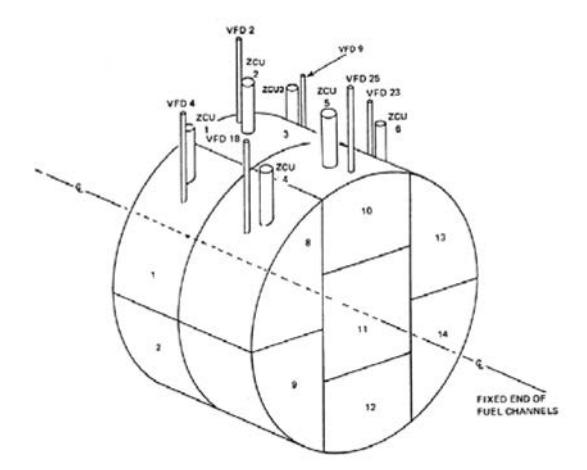

*FIG. 21. Liquid zone controllers.*

As these reactors are refuelled on a daily basis, it is desirable to continually monitor the reactor physics parameters, including the temperature coefficients of reactivity of the moderator and coolant, separately, and the reactivity worth of the liquid zone controllers. Currently, these measurements are carried out infrequently and nearly always as critical path activities during reactor startup following a maintenance outage. Clearly, development and application of on-line noise analysis techniques similar to those used for MTC measurements in LWRs, will be more cost effective, and may provide more reliable and accurate estimates of these critical reactor physics parameters.

#### **2.5.3. neutron diffusion wave imaging**

Movements of fuel elements or neutron absorbers inside a critical reactor cause perturbations in neutron density, which propagate through the core as damped travelling 'diffusion waves'. Diffusion waves have long been used for imaging in diverse diffusive media, e.g. light transmission in human tissue and propagation of temperature fluctuations in thermal conductors. The goal of this research is to use wavefront reconstruction techniques to image the sources of neutron diffusion waves, i.e. movements of fuel or absorbers, from high frequency neutron noise signals in in-core flux detectors. Clearly this technique, if successful, will result in a powerful tool for monitoring the internal structure of a nuclear reactor in real time, using, for the most part, existing sensors and detection systems.

Preliminary work on understanding the dispersion relation, i.e. the relationship between wavelength and frequency, and visualizing neutron diffusion wave propagation inside large CANDU reactors has been carried out at Chalk River National Labs [19], using extensions of the existing lattice physics codes, WIMS-AECL, and a high frequency implementation of the reactor transfer technique pioneered at Chalmers University of Technology [20]. These simulations indicate that high frequency neutron diffusion waves (100–1000 Hz) may be detected over relatively short distances (0.1 m to several metres) characteristic of the diffusion wavelength. Detector electronics and high frequency data acquisition systems are being prepared for measurements to validate these simulations in Chalk River's National Research Universal (NRU) reactor.

#### 2.5.4. Reactor transfer function determination

The flexibility of CORE SIM in defining the perturbations as fluctuations of the macroscopic cross-sections is also one of the main limitations of the simulator, since it requires expert knowledge and sometimes arbitrariness in the definition of the noise sources. While preserving the possibility of defining the perturbations as fluctuations of the macroscopic cross-sections, work is ongoing to extend CORE SIM so that the perturbations can be directly defined in terms of temperature fluctuations, void content fluctuations (in the case of BWRs), and so forth.

Furthermore, CORE SIM calculates the so-called open loop reactor transfer function, since the neutron noise induced by the fluctuations of the macroscopic cross-sections has no impact itself on the cross-sections, i.e. there is no feedback. Such an assumption usually holds for a restricted frequency range. The extension of CORE SIM to the estimation of the closed loop reactor transfer function is under way, with the development of a thermohydraulic model for the noise corresponding to the thermohydraulic parameters.

Finally, the extension of CORE SIM to fast systems and to thermal and fast systems with hexagonal geometries is planned.

#### 2.5.5. MTC estimation

For the MTC estimation, several items are subject to enhancements.

For a more exact evaluation, a more accurate estimation of the time constant of the thermocouples (inserted into the guide tube) is required. The quality of the measuring equipment, including the electronic chains of the thermocouples, is also crucial for the MTC estimations. Finally, ex-core neutron detectors could be used in the generation of the core average of the neutron flux.

In addition, it is also important to take the coolant velocity, core height and measurement geometry into consideration when estimating the different time averaged quantities required by the MTC noise technique [13, 14].

Another point of further investigation is the achievable accuracy of the noise based measurement technique. So far, the MTC has never been experimentally estimated with the required precision and accuracy, for example, with an accuracy better than 5%. Even though the bias between the traditional MTC noise estimators was understood and attributed to the use of a small number of temperature sensors, discussion of the precision of the estimate is as important. In Ref. [21], the authors showed that MTC measurements generally suffer from low coherence between neutron and temperature signals and that feedback may be non-negligible. Both result in a poor accuracy for the MTC measurement.

The most frequently used estimator is based on the division of the cross-power and auto-power spectral densities (APSD) [22]:

$$MTC = \frac{1}{G_0} \frac{CPSD_{\delta\phi/\phi_0, \delta T_{\rm m}^{\rm ave}}}{APSD_{\delta T_{\rm m}^{\rm ave}}}$$
(2)

In this equation, CPSD denotes the cross-power spectral density, APSD denotes the auto-power spectral density,  $G_0$  denotes the open loop transfer function,  $\delta \varphi$  denotes the neutron flux variations and  $\varphi_0$  denotes the static flux. Several variables influence the precision, namely: the coherence, the requested frequency resolution and the measurement time. A low coherence results in a large standard deviation. The standard deviation can be decreased by increasing the measurement time. For example, in practice one expects a coherence of 0.1 at a frequency lower than 0.1 Hz. This results in a measurement time of more than 9 d to achieve a standard deviation of 1%. A standard

deviation of 5% can be achieved with a measurement time larger than 11 h. This indicates that low coherences can result in unrealistic measurement times during which the reactor has to stay stationary. For further details about the study of the precision on the MTC estimate by noise analysis, the reader is referred to Ref. [21].

The MTC estimations can also be enhanced with a more exact description of the power feedback of the reactor and with better understanding of the structure of the frequency dependence of the noise estimator. Until now, feedback was considered to be negligible in the frequency band of interest for the MTC estimation. However, measurements at a Belgian NPP indicated that this is not the case. This makes the analysis difficult, since all non-parametric estimation methods will result in a biased estimate without the availability of the external reference signal or without the use of periodic excitations. That is why Ref. [23] advises using the external temperature variations as a reference signal. For further details about the influence of feedback on the MTC estimate by noise analysis, the reader is referred to Ref. [23].

#### 2.6. APPLICATIONS IN NPPS

Several applications of noise analysis are briefly described. Noise analysis can be used for more applications than those illustrated in the benchmark/demonstration cases in Section 2.4.

#### **2.6.1. neutron noise diagnostics of vibrations of reactor internals**

One of the most challenging tasks in noise analysis is the so-called unfolding, i.e. reconstructing from the detector readings, the perturbation (its location, strength, and type) causing the measured neutron noise. Usually, finding an appropriate unfolding procedure is a very complicated task, owing to the limited number of in-core neutron detectors. New algorithms and empirical procedures were developed and tested for performing such a task. The primary focus is on the diagnostics of core barrel vibrations and of fuel or control assembly vibrations [24].

#### **2.6.2. Analysis of fuel or control assembly vibrations using in-core neutron detectors**

Vibration of a control rod induces well observable fluctuations in the signals of the surrounding neutron detectors, even at distances of 3–4 fuel assemblies. For example, in the WWWR-440 type reactors, 36 SPND chains are available for noise measurements. Based on these 36 chains, a simple method of control rod vibration monitoring can be elaborated and regularly applied. After the 36 positions have been measured, the observed detector signal magnitudes can be plotted on a core map. Magnitudes are visualized in the frequency range characterizing possible control rod vibrations. When a visible asymmetry is present on this map, the possible location of the vibration source can easily be determined by visual inspection (Fig. 22). A planar spline extrapolation scheme is applied to obtain a core map of vibration peak magnitudes. The core map is used for a better visualization of the vibration peak distribution. The suspected vibration source is indicated on this core map as the darkest area (see the lower core part in Fig. 22).

#### **2.6.3. Analysis of core barrel vibrations using ex-core neutron detectors**

The reactor core inserted into the core barrel is suspended in the reactor vessel. This construction allows a pendular motion of the core. This movement is mechanically inhibited by using guide lags, but in the case of guide lag damage, a pendular motion with significant amplitudes can develop (Fig. 23). The pendular movement of the core can be detected in the signals of the ex-core neutron detectors, owing to an attenuation noise caused by the changing distance between the core and the surrounding detectors. By using signals from several detectors located around the core, the amplitude and the direction of the motion can be estimated.

One of the most widely used methods is a cross-spectrum decomposition, which was introduced by Ref. [25]. This method concentrates on pendular motions; other types of motion are neglected. Owing to the arrangement of ex-core neutron detectors available for potential diagnostic use, it is highly recommended to use all the ex-core detectors (six in the case of WWWRs), because for a smaller number of detectors, errors increase too much in the spectrum decomposition method (see Ref. [26] for further details).

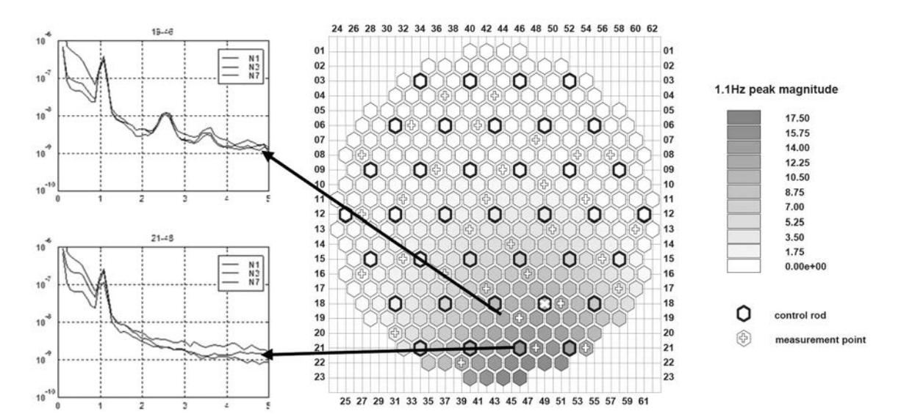

*FIG. 22. Noise map of a control rod vibration at 1.1 Hz.*

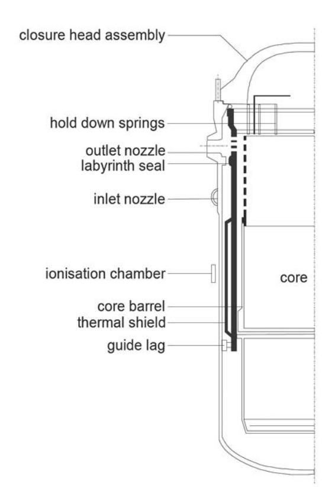

*FIG. 23. Reactor vessel internals and ionization chambers.*

#### **2.6.4. Investigation of coolant velocity trends**

The noise analysis technique described earlier is a direct measurement method to determine the absolute coolant velocity through the assemblies furnished with SPNDs. This method offers the possibility to map the coolant flow velocity throughout the core. As an illustrative example, a map of the coolant flow within the core for Unit 2 of Paks is given in Fig. 24.

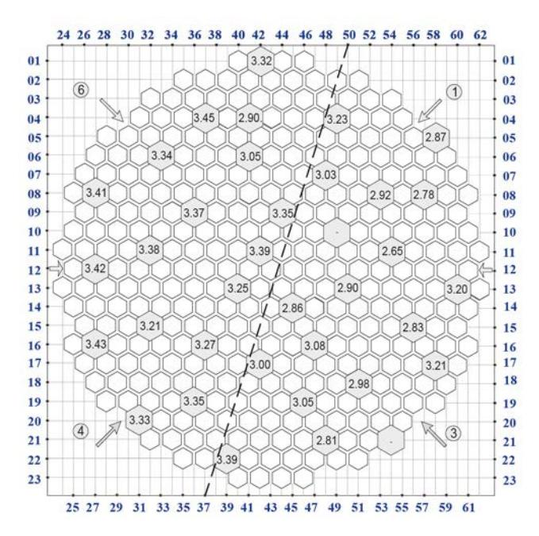

*FIG. 24. Measured velocity results averaged over all the measurements.*

#### **2.6.5. Evaluation of long term noise trends**

Neutron noise measurements can be performed regularly (e.g. once every 3 weeks). This allows comprehensive noise libraries for advanced noise trend monitoring to be established. Figure 25 illustrates such a long term trend for Unit 4 of Paks NPP. Any change in long term noise trends indicates a change either in the operation of the plant or in the technology used in the plant. Any abnormal change requires the attention of the plant personnel. As an illustrative example, the average coolant velocity trend for Unit 4 of Paks during 8 years is given in Fig. 25.

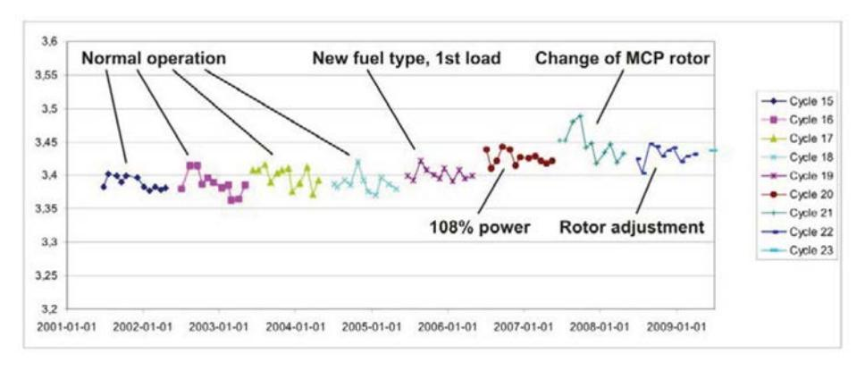

*FIG. 25. Average coolant velocity trend for Unit 4 of Paks NPP (during 8 years).*

#### **2.6.6. Evaluation of long noise measurements**

Evaluation of several day long measurement sets gives new information in the frequency domain on the processes taking place in the core during stationary reactor states. A long measurement allows the use of averages calculated from a very large number of measured points. The larger the number of individual measurements in the average, the more the background random noises disappear, and even very small effects can be detected (even between detectors at larger distances). In the following, some examples of these evaluations will be demonstrated.

Having long term measurements allows the use of a larger block size in the Fourier transform algorithm; this yields larger resolution in the frequency domain. This is especially important at low frequencies below 5 Hz.

In this frequency range, the neutron detectors also work in a slightly different way than anticipated at higher frequencies. In the noise diagnostics, the statistical quantities of the prompt signal content of the SPNDs are used. The signal of a rhodium SPND consists of two parts: a prompt and a delayed part. The prompt part of the signal DC component is about 7%, but it gradually exceeds the delayed part below approximately 0.05 Hz. However, the signal of the background detector is almost fully prompt. Owing to its length of approximately 2 m, the background detector acts as low pass filter with 0.5–1.0 Hz break frequencies on perturbations propagating along its full length. Thus, the diagnostically useful frequency range of the SPNDs is above 0.1 Hz.

As an illustrative example, the low frequency content of SPND signals was investigated by using an approximately 45 h long data series of the DC part at the Unit 2 of Paks. These measurements were made at nominal, stationary reactor state. The steep increase towards the lowest frequencies in the APSD functions plotted in Fig. 26 is caused by the delayed signal content of the detector. These spectra are not usable for diagnostic purposes below 0.1 Hz. Similar spectra are shown in Fig. 27 for the SPND background detectors. Owing to the mainly prompt signal content of the background detectors, they can be used down to 0.01 Hz (below 0.01 Hz, deterministic effects dominate).

Further details about these investigations can be found in Ref. [27].

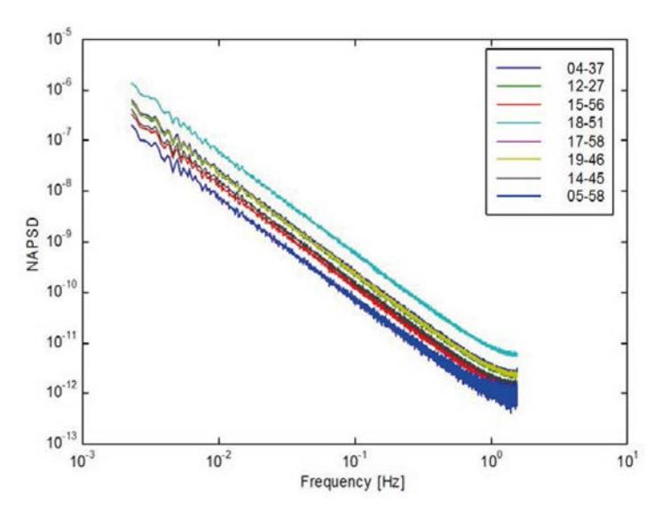

*FIG. 26. Normalized APSD functions of some SPND signals from the 7th (highest) level of the chain.*

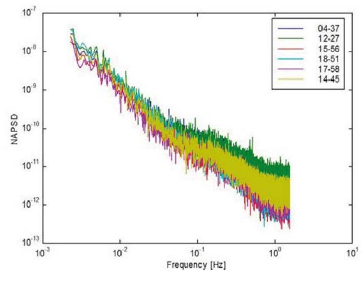

*FIG. 27. Normalized APSD functions of some SPND background detector signals.*

#### **2.6.7. reactor transfer function determination**

Regarding the estimation of the reactor transfer function for noise applications, the CORE SIM tool developed within this project has already been successfully applied in numerous applications, some of which are based on a simpler version of the numerical tool existing today. Some applications are:

- The unfolding of the noise source from the readings of the neutron detectors (in order to locate an unseated fuel assembly in a commercial BWR) [28];
- The explanation of the space dependence of the decay ratio observed in a commercial BWR [29];
- The development of a new MTC noise estimator (giving the correct MTC value without calibration) and its experimental verification in a commercial PWR [15];
- The diagnostics and modelling of beam/shell mode core barrel vibrations in PWRs [30];
- The investigation of the validity of the point kinetic approximation in subcritical systems with application to subcriticality monitoring [31];
- The development of a reduced order model for BWR instabilities, including possible unseated fuel assemblies driving self-sustained density wave oscillations [32].

All the applications mentioned above are further described in the corresponding papers, as well as in a review paper [30].

#### 2.7. IMPACT ON PLANT SAFETY AND ECONOMY

#### **2.7.1. response time estimation**

As previously mentioned, the response time of safety critical sensors is part of the safety analysis of NPPs, and therefore periodic measurement of sensor response time is required to show compliance with the safety usage. Often, a transmitter's dynamic response determination using noise analysis detects problems not only with pressure transmitters, but with the entire sensing system. Capabilities for early detection of voids, blockages and leaks are other benefits for implementing noise analysis techniques for plant health monitoring.

#### **2.7.2. flow velocity estimation**

Noise analysis is the only technique that determines the distribution of the in-core flow velocities. Such information is extremely valuable to check that there is adequate cooling of the fuel assemblies, and thus to guarantee a safe operation of the reactor. Reduced flows in some parts of the core might lead to fuel damage.

The first real application of the coolant flow velocity estimation method was carried out when an asymmetry of the distribution of the flow was detected in Paks Unit 2 during the 1997–1998 fuel cycle. This asymmetry detected by the noise analysis technique was later attributed to crud. It was then decided to study the sensitivity of the noise based method to crud. As a first step, trial measurements were carried out in order to check whether the noise diagnostics method was sensitive enough to show differences between the crudded and clean parts of the core. As the sensitivity was good enough, periodic measurements were carried out to monitor the long term behaviour of the core. According to these regular measurements, the situation was stable, i.e. there was no further detectable deterioration during the cycle. The noise measurements were continued during the first months of the next fuel cycle, in order to confirm that the core flow asymmetry disappeared in the new core load.

#### **2.7.3. transfer function estimation**

As mentioned earlier, knowledge of the reactor transfer is of prime importance when one wants to develop or improve a noise based measurement technique. For a given noise source, the induced neutron noise can be calculated, and this calculated neutron noise can be then used as an artificial signal to test the measurement technique. Being able to test a measurement technique prior to buying expensive data acquisition systems and without any need to perform an in situ measurement is a definite advantage. An example of the derivation of a new MTC noise estimator has already been presented in Section 2.3.3.

Another main area of application is for the interpretation of noise measurements themselves. Most of the diagnostics tasks involve some kind of unfolding, i.e. trying to determine from, usually very few, in-core neutron detectors the characteristics of the noise source responsible for the measured neutron noise. Without the knowledge of the reactor transfer function, performing this unfolding is very difficult. As an illustrative example of what the knowledge of the reactor transfer function allows, the localization of unseated fuel assemblies in the Forsmark-1 BWR is touched upon. Such an event occurred during the 1996–1997 fuel cycle. At reduced power and core flow, instabilities were detected, whereas the stability calculations had predicted a stable core. Further detailed analysis showed that in this event, an unseated fuel assembly was driving a local (channel type) thermohydraulic instability. From the neutronic point of view, the neutron noise corresponding to such instability could be modelled using the calculated reactor transfer function. Comparing the calculated neutron noise to the measured one for different locations of the noise source allowed determination of the region of the core where an unseated fuel assembly was located. The results of this localization procedure are represented in Fig. 28. In this figure, the unseated fuel element is marked with a square, and the noise source identified by the localization algorithm with a circle. The detectors used and not used by the algorithm are represented by white and black crosses, respectively. Further details about this analysis can be found in Ref. [28].

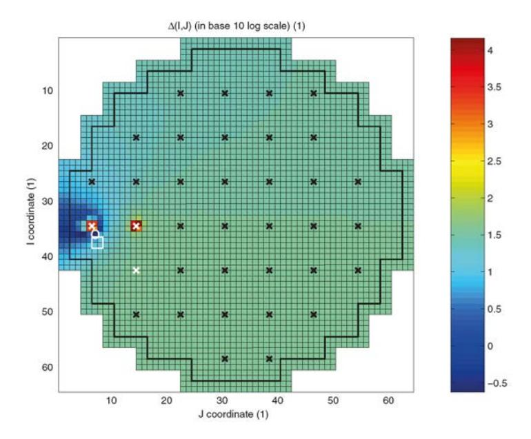

*FIG. 28. Result of the localization algorithm in the Forsmark-1 case.*

### 2.8. CONCLUSIONS AND RECOMMENDATIONS

This chapter has presented some of the main possibilities offered by the application of noise analysis. The neutron noise allows determination of the important parameters and operational state of the core. The neutron noise can be used for diagnostic purposes, when an abnormal situation is suspected, for estimating a dynamic core parameter, when the reactor is at steady state conditions, or for determining the dynamics of given detectors. Examples of the first category are the detection of flow blockage in fuel assemblies by estimating the flow velocity in the corresponding fuel channel by cross-correlation between two neutron detectors; the estimation of core barrel vibrations; or the detection of the appearance and localization of a noise source such as an unseated fuel assembly or an excessively vibrating control rod. For the second category, namely the determination of global dynamic core parameters, the decay ratio in BWRs and the MTC of reactivity in PWRs are probably the two most significant applications. Noise diagnostics has the obvious advantage that it can be used on-line without disturbing reactor operation. For the third category, estimation of the response time of in-core neutron detectors represents one of the major applications of noise analysis.

It is noteworthy that the process signals of nuclear reactors have fluctuating components that could be used for noise analysis. The power utilities can gain valuable information by making use of the noise signals. For that purpose, no new core instrumentation is required. The only additional equipment required is a proper data acquisition system, for which the specifications are detailed in the present report. The additional costs for such equipment are minimal, compared to the added benefits for the utilities of using noise analysis. Implementing noise based techniques is thus a very cost effective way of improving the plant safety and availability. In order to properly use the extra information provided by noise analysis, special attention has to be paid to presentation of the obtained results to end users. Depending on the type of application, such end users could be the plant operators, the safety engineers or noise specialists.

Noise analysis has received further attention in the past few years, owing to the extensive programme of power uprates worldwide. Power uprating projects have demonstrated that some of the main issues and concerns related to the operation of the plant at the uprated power level are the reduction of the safety margins, such as the margins to instability for BWRs, and increased vibrations (flow induced vibrations). Being able to quantify any such changes is of high safety importance. This implies performing systematic noise measurements before the power uprate and after it, in order to get a fingerprint of the status of the plant at the uprated power level. The utilities thus have to implement noise analysis techniques prior to the planned power uprates, if they want to make full use of all the possibilities offered by noise analysis.

In the framework of lifetime extension, noise analysis also represents a technique with potential, since it will become increasingly important to monitor the effects of ageing on the different components of the plant, as well as the potentially degrading core characteristics.

# **3. ACoUstIC AnD VIBrAtIon MonItorInG**

#### 3.1. INTRODUCTION

Acoustic and vibration monitoring is a traditional area of condition monitoring and malfunction detection. Even though the technology has been used since the early days of commercial nuclear power, it is a rapidly developing area, owing to applications of modern data acquisition and digital signal processing (DSP) capabilities. The following three main topics are presented under this technology area:

- Loose parts monitoring;
- Leakage monitoring;
- Vibration monitoring of rotating machinery.

The measurements associated with the above methods are performed using piezoelectric transducers that are designed to withstand high temperature and radiation environments. The overall frequency range of analysis is incorporated in the transducer bandwidth and the signal analysis techniques somewhat overlap for the above three monitoring areas. Piezodetectors for vibration monitoring have a bandwidth of 20 kHz and the acoustic monitoring transducers have a maximum bandwidth of approximately 200 kHz. The frequency ranges of vibration and acoustic signals may overlap in reactor applications.

There are other acoustic methods and applications that are in use today and continue to be developed. Examples are ultrasonic techniques, piezosensor arrays for detection and location, contact free vibration measurements, and AE measurements used for detecting material degradation. Vibration sensors with wireless signal transmission are being developed and implemented for monitoring rotating machinery in nuclear plants and in experimental reactors. Caution must be exercised in establishing electromagnetic compatibility of transmitted signals in the plant environment. In addition, manufacturers of rotating machinery provide built-in vibration sensing instrumentation and on-board processing devices for continuous surveillance.

The vibration of reactor internals in PWRs and BWRs is routinely monitored with neutron noise analysis. Both in-core and ex-vessel neutron detectors are used to extract this information. The components that are routinely monitored for vibration using neutron noise in PWRs include the core support barrel, instrument tubes, control rod assemblies, fuel assemblies and thermal shield. The details of this analysis are given in the Appendix on DVD of this report.

#### 3.2. CHAPTER OBJECTIVES

The objective of this chapter is to describe the research, development and demonstration of in-service monitoring methods in NPPs, with a focus on loose parts monitoring, leak detection using AE, and vibration monitoring of rotating machinery. This information was gathered from the work of research laboratories and other institutions that are involved in the development and enhancement of these technologies. Emphasis is placed on applications to operating NPPs and the impact on timely maintenance and repair/replacement of equipment and devices to minimize forced outages. The experience to date indicates that implementing these technologies results in improvements in plant safety and economy.

Topics of research performed for this project include the three technical areas presented next.

#### **3.2.1. Loose parts monitoring**

- Background and operational noise reduction techniques;
- Discrimination techniques for detecting the signal features created by loose parts;
- Improved localization methods;
- Improved mass estimation methods;
- Development of an implementable loose parts monitoring system (LPMS);
- Safety evaluation database;
- Control room display of information about the loose parts.

#### **3.2.2. Leakage monitoring**

- Acoustic monitoring on the reactor vessel head;
- Leakage monitoring on the primary pressure boundary;
- Leakage monitoring at valves.

#### **3.2.3. Vibration monitoring of rotating machinery**

- Plant components and causes of vibration;
- Vibration measurement;
- Approaches for information extraction from vibration measurements;
- Information extraction from transient or non-stationary signals;
- Periodic vibration monitoring using handheld devices;
- Continuous on-line vibration monitoring;
- Vibration surveillance and protection systems for turbogenerators and reactor coolant pumps (RCPs);
- Wireless vibration sensors and signal transmission.

Results of applications to benchmark test data are also presented in this chapter. The benchmark data are available in the Appendix on DVD of this report, and could be used for evaluation of development of future methods.

#### 3.3. BACKGROUND

#### **3.3.1. Importance of loose parts monitoring in nPPs and r&D areas**

The primary purpose of an LPMS is to detect the presence of loose parts within the pressure boundary system using the acoustic sensors installed on the outer surface of the system. The LPMS provides information to determine the impact location, estimate the mass of the loose part, and minimize false alarms (Fig. 29).

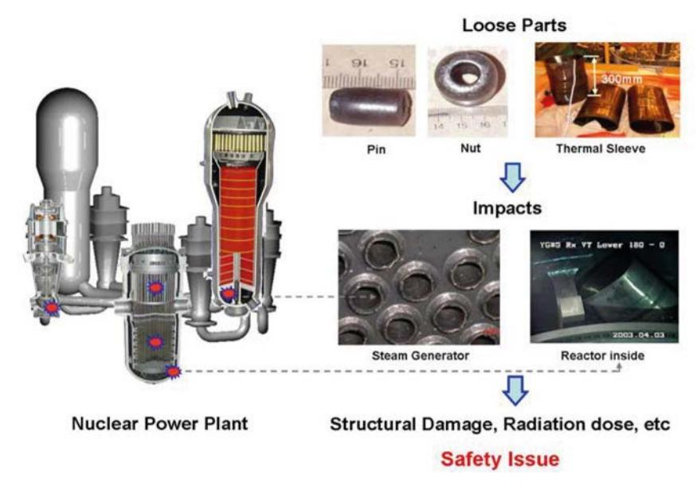

*FIG. 29. Primary system pressure boundaries of a PWR and examples of loose parts.*

The presence of a metallic loose part in the primary pressure boundary system can cause degradation of the reactor system's structural integrity and also act as an indicator of impacting. A loose part not only results in mechanical damage and material wear by repeated impacting with other components in the system, but can also cause a partial flow blockage inside a fuel channel, fuel pin failure owing to debris caught in fuel assembly grids, a potential for control rod jamming, accumulation of radioactive substances in the primary system, and primary to secondary (steam generator) tube leakage. Additional indirect consequences of loose parts have been experienced in NPPs. For example, in a Hungarian reactor, the process of cleaning small loose part fragments initiated chemical crystallization of ferromagnetic oxide materials. This crystallization reduced the cross-section of the coolant channel and therefore affected the flow rate. The implementation of an effective LPMS can reduce or avoid many near term and long term consequences to plant operation.

LPMSs are designed to detect audible sounds from the impact of foreign materials on the inner walls of primary system components. These impacts are typically metal to metal and are observed as burst signals on a relatively large background of rotating machinery and flow noise (Fig. 30). In addition to detecting and locating loose part events within this background noise, signals can also be monitored for impacting of one component against another; for example, an instrument rod impacting on fuel assemblies.

Metal to metal impacts may occur from other sources within the primary loop or from connections to the primary loops. One example is the vibration of valve stems or actuators attached to primary loops. Other sources of non-loose-part metal impact signals may include charging pump valves and control rod drive mechanisms. Objects such as thermal sleeves and pipe supports may also have potential for metal to metal impact, which can be picked up by some or all accelerometers used in LPMSs.

Metal impact signals that are not caused by loose parts are a type of background interference and a potential source of false alarms. Additional discrimination techniques may use methods including amplitude and/or waveform discrimination, rule based expert systems, and direct manual examination of signals and waveforms.

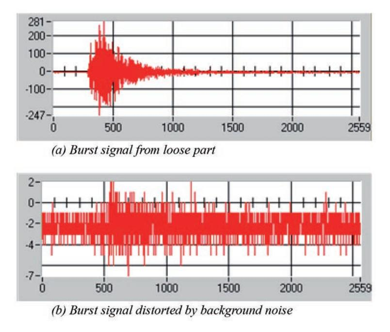

*FIG. 30. B urst signals of metal to metal impact (a) as registered by a nearby acoustic sensor (accelerometer), and (b) distorted by background noise.*

More effective discrimination methods have been developed recently and make use of autoregressive (AR) filtering and the statistical sequential probability ratio test (SPRT) to detect abnormal events in high background machine noise. It has been demonstrated that the method is very powerful and it can be used to locate other acoustic sources [33, 34]. Such an approach can be used as part of an integrated acoustic monitoring system, which has been demonstrated by the acoustic loose parts system (ALPS) developed by APANDSD in Hungary [35].

#### **3.3.2. Importance of leakage monitoring in nPPs and r&D areas**

The primary purpose of an acoustic leak monitoring system is to monitor coolant leakage at potential leak regions (primary system pressure boundaries including piping, valves, etc.). Leak detection in the pressure boundary of a nuclear plant is important, since the leakage could be a precursor to a resulting design basis accident. Leakage caused by corrosion, such as at the interface between the reactor pressure vessel and primary piping, or leakage at other vessel penetration locations is also of high importance. This has taken on added importance because of issues related to reactor ageing and life extension. In order to address the issue of primary coolant leakage, the principle of 'leak before break' was developed [36].

The US NRC Regulatory Guide 1.45 (2008) recommends the use of at least three different methods to detect leakage in reactors, that leak rates from identified and unidentified sources should be monitored separately to an accuracy of 3.79 L/min (1 gallon/min), and that indicators and alarms for leak detection be provided in the main control room [37]. In response, acoustic leak monitoring systems that have a sensitivity of at least 0.379 L/min (0.1 gallon/min) were developed using AE techniques, as illustrated in Fig. 31.

Similar systems have been developed and/or used in several countries. For example, ALMOS, developed by the Central Research Institute for Physics was used in Hungarian NPPs, and ALÜS, was developed by Siemens. New systems, which apply more advanced data analysis methods, are described in this report. High frequency signal analysis is performed to detect the location of leakage and estimate the magnitude of leak rates. Applications include penetrations of valve bodies, cable seals from the reactor vessel or thermowells, and locations of other pressure boundary penetrations such as instrument tubes or control rod drive tubes.

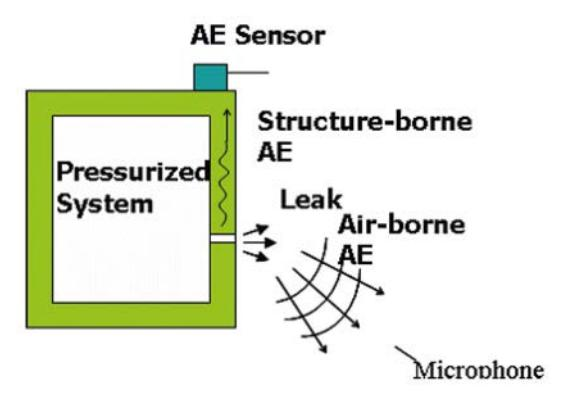

*FIG. 31. AE technique for leak detection.*

#### **3.3.3. Importance of vibration monitoring of rotating machinery in nPPs and in r&D areas**

Rotating machinery is monitored for vibration caused by shaft imbalance, misalignment, looseness, gear degradation, bearing faults and others. Vibration may be induced by causes that are internal or external to the equipment. Excess movement caused in the machinery components by these sources can be detected and quantified using accelerometers that are placed on the bearings, generally in three perpendicular directions. The measurements acquired from these detectors are processed in the time domain and frequency domain; the information is extracted over a period of time; and, if necessary, the signatures are trended to identify incipient anomalies.

Many critical rotating machines are monitored by continuous or periodic vibration measurements. For example, the primary function of the Korean reactor coolant pump vibration monitoring system (RCPVMS), as shown in Fig. 32, is to monitor the displacement and the rotational speed of a reactor coolant pump shaft and to monitor the vibration level of the RCP frame. The RCPVMS is designed to provide an alarm signal to the main control room when the vibration level exceeds the allowable limit. The system can provide warnings and alarms about bearing degradation, shaft imbalance, shaft misalignment and other problems. The vibration monitor can also provide advice as to the need for lubrication and bearing repair/replacement.

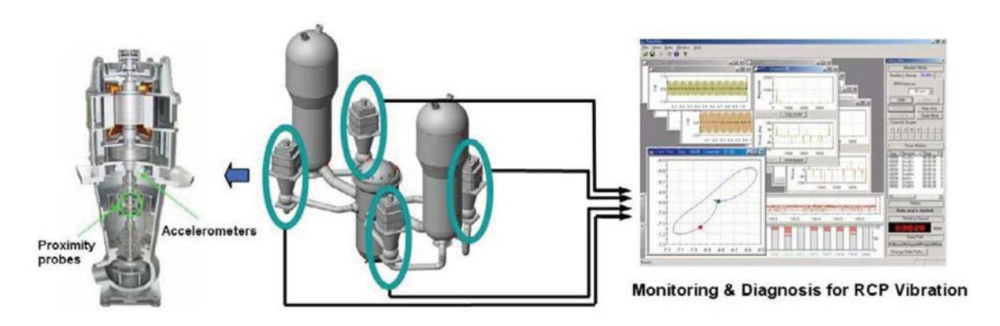

*FIG. 32. Schematic of the RCPVMS.*

#### 3.4. DESCRIPTION OF R&D IN LOOSE PARTS MONITORING

This section describes the details of research performed in the area of loose parts monitoring, with emphasis on technology development and applications to operational nuclear plants. The specific topics in this section include the following:

- Operational noise reduction techniques;
- Loose parts feature discrimination techniques;
- Improved loose parts localization methods;
- Improved mass estimation methods;
- Current LPMSs in NPPs;
- Safety evaluation database;
- Safety display for LPMSs.

The uses of some of these techniques listed above are demonstrated under the loose parts benchmark data analysis that was performed as part of this project.

#### 3.4.1. Background and operational noise reduction techniques

To reduce the background noise caused by rotating machines and flow in the primary loops of an NPP, it is necessary to implement noise reduction methods. A standard basic method is simple bandpass filtering. Substantial improvements are provided by more advanced filters. One of the best filter techniques demonstrated during the CRP was the adaptive filter method based on AR modelling [33]. In the first step of the adaptive filter, signals from acoustic sensors without loose parts are characterized using the autoregressive model of the form shown in Eq. (3):

$$x_k = y_k - \sum_{i=1}^{P} a_i x_{k-i} + w_k \tag{3}$$

where  $x_k$  are samples of the continuous background signal,  $w_k$  represents white noise,  $a_i$  are the autoregressive coefficients, and P is the model order. Typically, the model order, P, is in the range 14–50. Such a high model order allows the description of strong sinusoidal components that are present in the background signal, due to rotating machinery. The actual measurement y(t) is then filtered by the one step prediction using the same AR model.

$$z_k = y_k - \sum_{i=1}^{P} a_i y_{k-i} \tag{4}$$

where  $z_{k}$  is the filtered loose parts signal.

#### 3.4.2. Discrimination techniques for detecting signal features created by loose parts

A simple discrimination level used on filtered signals leads to a high number of missed alarms or false alarms. This was the primary weakness with early LPMSs. Later, an improvement was made using the crest factor, defined as the ratio of the peak value to the root mean squared (RMS) value. Several systems use different ratios of the moments (standard deviation to average or RMS value to selected peak values) of prefiltered signals. An advanced technique, often used for isolating an anomaly case from the normal case, is the SPRT [34].

The discrimination algorithm developed by the Korea Atomic Energy Research Institute (KAERI) consists of seven steps. If the discrimination indicates the 'true' impact, it returns an alarm signal to the alarm unit. All of the triggering functions are operated continuously and simultaneously on a real time basis for each channel. The main features that drive the discrimination software are illustrated in Fig. 33.

The Hungarian approach uses the SPRT, which is proven to be one of the most effective decision making methods for choosing between two hypotheses, with a variable number of samples. The decision function for SPRT is the log likelihood ratio (LLR),  $\lambda_n$ , given by:

$$\lambda_n = \ln \frac{P_n(z_1, z_2, \dots z_n \mid \sigma_1)}{P_n(z_1, z_2, \dots z_n \mid \sigma_0)}$$
(5)

- 1. RMS ratio comparison test
- 2. Ringing frequency test
- Collection zones test
- 4. Waveform ringdown (Impact duration) test
- Interchannel delays
- 6. Amplitude ratio test
- Event period test

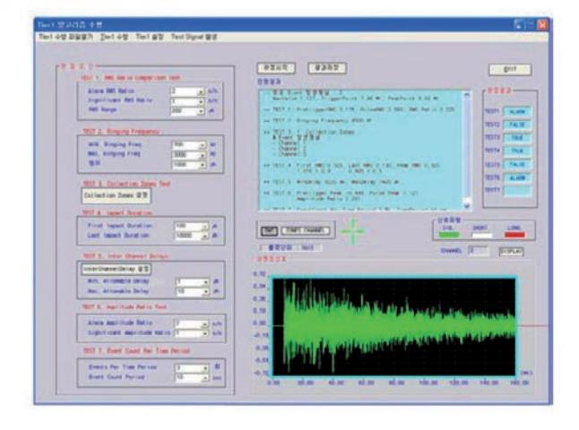

FIG. 33. Example of discrimination in the KAERI monitoring system.

where  $\{z_i, i = 1, 2, ..., n\}$  is a set of random variables;  $\sigma_0$  is the standard deviation for the normal case, and  $\sigma_1$  is the standard deviation defining the anomaly case. For a Gaussian distribution, the LLR can be computed recursively, as shown in Eq. (6):

$$\lambda_{n+1} = \lambda_n + \frac{\sigma_1^2 - \sigma_0^2}{2\sigma_1^2 \sigma_0^2} z_n^2 + \ln \frac{\sigma_0}{\sigma_1}, \ \lambda_0 = 0$$
 (6)

The SPRT distinguishes between two hypotheses (characterized by standard deviation, but any other moments or combination of moments could also be used). As shown in Fig. 34, when the LLR reaches the lower threshold, one can conclude that there is no event at the given level of uncertainty. When the LLR crosses the upper level, a conclusion on existence of the event is made with the given level of uncertainty. The actual impacting signals for an operating NPP are shown in Fig. 35.

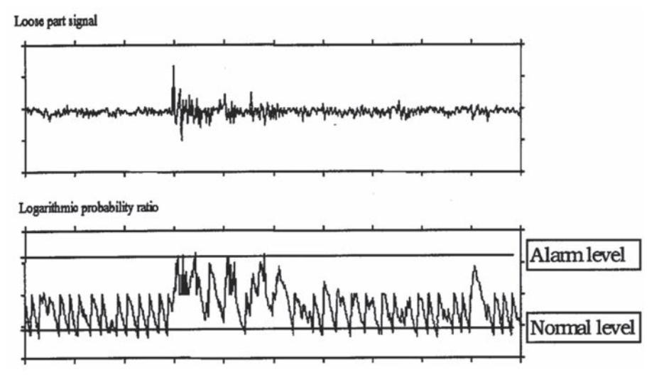

FIG. 34. Event in time signal (upper plot) and its indication by the LLR.

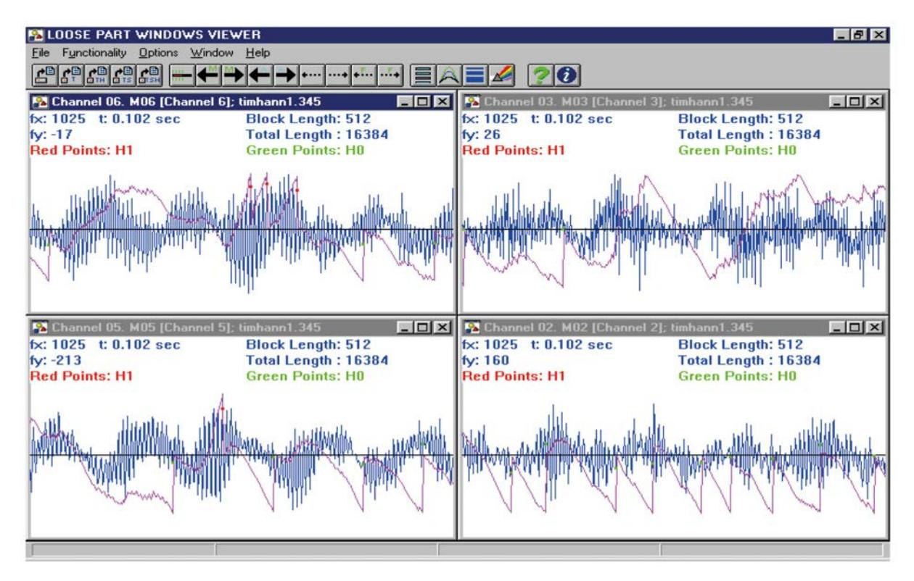

FIG. 35. Time signals indicating loose parts and the LLR functions.

The high frequency plot in Fig. 35 indicates the noise signal, and the slowly varying graph is the plot of the likelihood ratio from the SPRT. The effectiveness of this approach is demonstrated by a case study in Section 3.7. A description of the Hungarian LPMS system is given in the Appendix on DVD of this report.

#### 3.4.3. Improved localization methods using new algorithms

A new source localization and mass estimation algorithm was presented by KAERI. It makes use of Wigner–Ville distribution in the time–frequency plane. As described in Fig. 36, time signals are transferred to Wigner–Ville distribution (which is a time dependent decomposition of the signal into frequency components). After smoothing

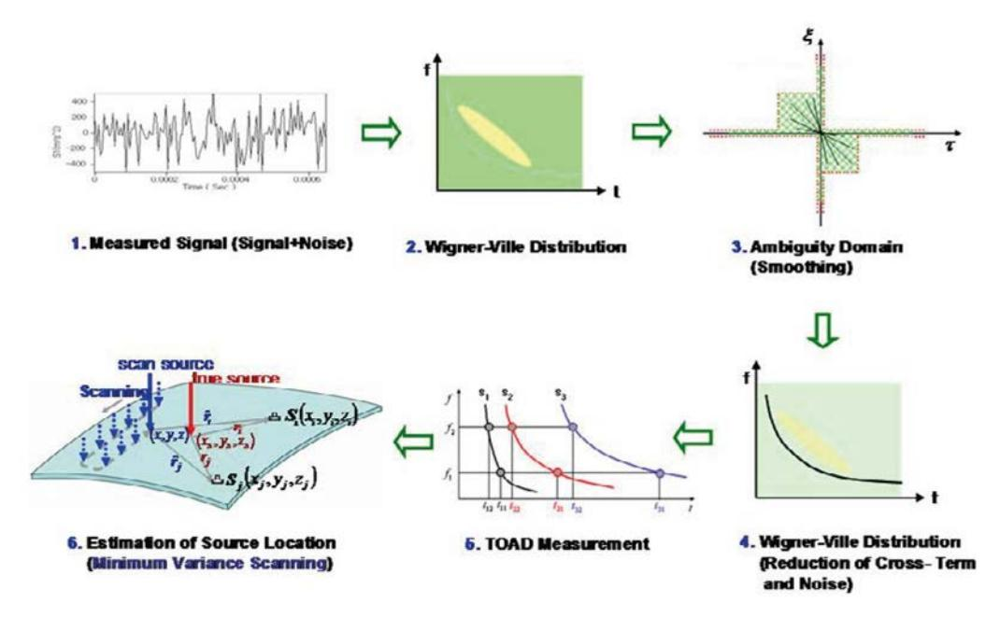

FIG. 36. A new source localization procedure developed by KAERI.

in the ambiguity domain, a reduction of the cross-term is possible. This enhances the source localization. The procedure is described in more detail in Ref. [38].

Another localization method was presented by the College of Dunaujvaros in Hungary. This uses cross-correlation, impulse response and artificial intelligence methods to localize the impacts.

#### **3.4.4. Improved mass estimation method**

Loose part mass estimation may be improved using the Wigner–Ville distribution [38]. Figure 37 shows how this can be used for finding the centre frequency. The first steps of the method are very similar to those used in localization procedure. The time signals have to be transferred to Wigner–Ville distribution, smoothing it in ambiguity domain and using it for noise reduction to get a good estimate of the centre frequency. A mass versus centre frequency map (function) then provides a precise mass estimation.

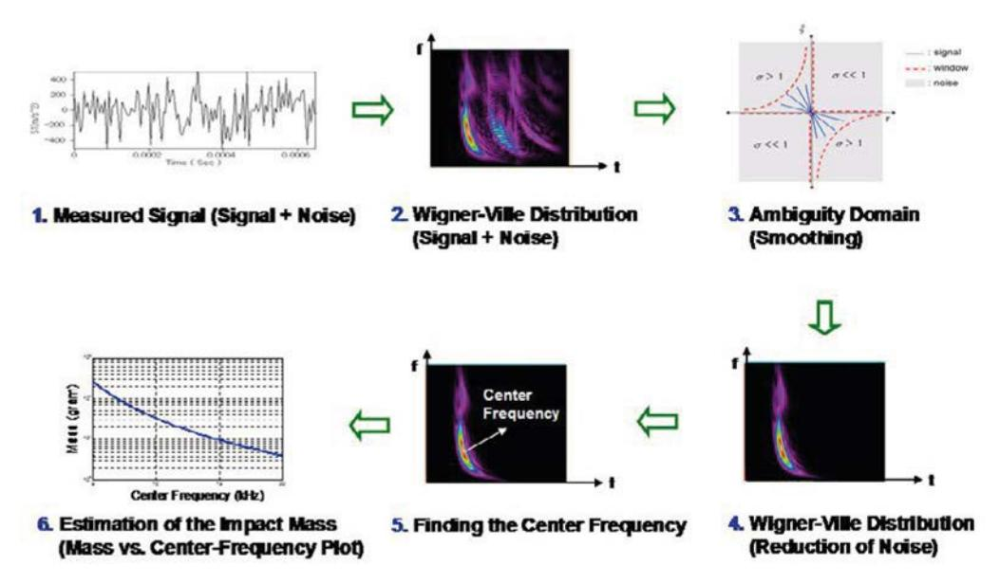

*FIG. 37. A new mass estimation procedure.*

It is important to note that additional work is needed to establish similar techniques for applications in operating nuclear plants.

#### **3.4.5. Examples of new LPMss**

#### *3.4.5.1. KIR: loose parts and vibration monitoring system used in PWRs in China*

The KIR system has two main functions: the LPMS and the vessel vibration monitoring system (VMS). This LPMS has a new feature. It generates two alarms (loose part detected and system failed) directly in the control room. However, KIR is not part of a safety system. The sensitivity of the system is such as to detect a loose part that weighs between 0.1 kg and 15 kg and impacts with a kinetic energy greater than 0.7 J on the wall, within 1 m of a sensor when one pump is on duty. Loose part detection uses accelerometers in the 1–10 kHz bandwidth. The KIR system computer screen shows the following: alarms and evolution of the detection criteria; detected faults; location of the alarms; signal visualization.

Figure 38 shows the location of accelerometers mounted on the reactor vessel. These high bandwidth devices are capable of measuring both vibration and acoustic signals caused by the impacting.

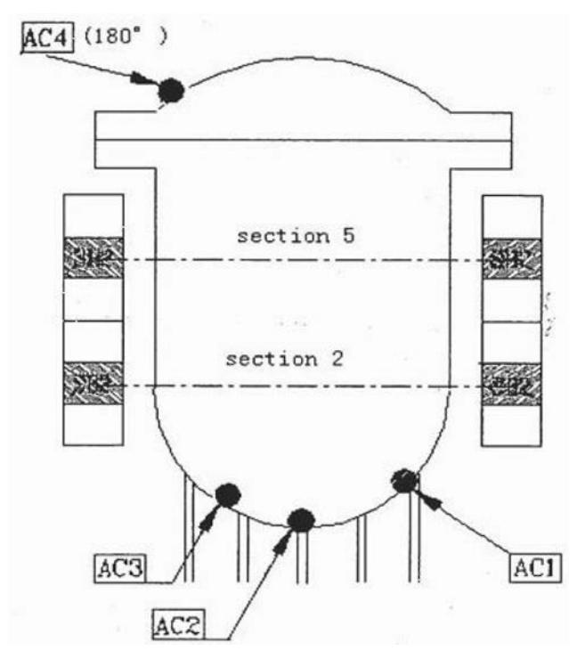

FIG. 38. Accelerometer (AC) locations on the reactor pressure vessel at the Lingao Units 3 and 4 in China.

#### 3.4.5.2. ALPS: LPMS in Hungary

It is necessary to distinguish between metal to metal contacting and loose parts impacting. Pure metal to metal impacts were registered and recorded in the Hungarian NPP. The sources of these impacts include the main isolation valve shaft, feedwater valves, control rod drive mechanisms, and pressure sensing tubes. These are installed either inside or outside of the main pipeline and the impacting is generally caused by improper installation.

Therefore, an expert system that can provide indication of the possible origin of the event is needed. The mathematical basis of the expert system uses the closest neighbour method.

The closest neighbour for the  $\zeta$  incoming event will be one of the  $\zeta_1, \zeta_2, \ldots, \zeta_n$  events, noted as  $\Xi$ , for which:

$$d(\zeta) = \{ \rho(\zeta, \Xi) \le \rho(\zeta, \zeta_i), i = 1, 2, \dots n \}$$
(7)

The metric function,  $\rho$ , in the event space is defined as:

$$\rho(\zeta,\zeta_i) = \left(\sum_{j=1}^n \left(\frac{\zeta_j - \zeta_{i,j}}{\zeta_{i,j}}\right)^2\right)^{\frac{1}{2}} \tag{8}$$

It was shown that if the incoming event belongs to one of the already defined M classes, then the distance function, d(-), fulfils the conditions of Bayes' theorem. The risk of the decision decreases as the number (n) of known events is much larger than the number of existing classes: n >> M.

It is necessary to develop a library of possible events; this can be established during normal operation of the system. The method gives an indication to the operator as to the extent to which the new event is similar to some earlier events. The operator should make his/her own decision either to accept or to reject the suggestion.

#### 3.4.6. Safety evaluation database

The plant operators are not interested only in finding a loose part. They need assistance in answering the next important question: how harmful is the given loose part? (This is also true if the LPMS found other metal to metal

impacts). A typical result of a stress analysis, using a finite element method, is illustrated in Fig. 39. Finite element simulation can estimate those parts of a steam generator where the stresses are higher; thus impacts in those regions are more dangerous than in those regions where stresses are rather low. If the estimated impact location falls to a safe region, the loose part can be regarded as non-dangerous in the given equipment. Such a stress analysis can aid in dividing the decision space into 'alarm region' and 'safe operation region'; however, the velocity, mass and number of impacts also have to be taken into account.

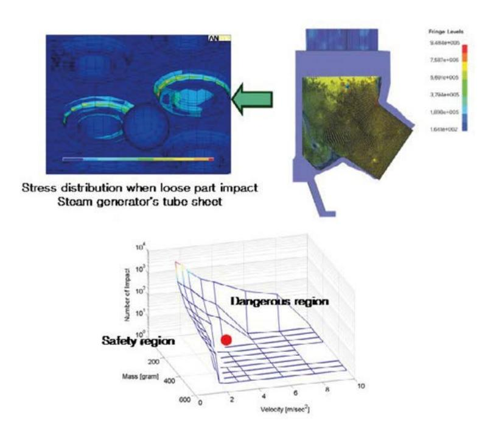

*FIG. 39. Example of a safety evaluation case study.*

#### **3.4.7. safety display oriented approach for LPMss**

There is no system currently available that provides information to the operator safety display. This is because the early LPMSs had too many false alarms. Today, the number of false alarms has been reduced to the extent that it is timely to bring this information directly to the operator safety display. Research and development in this area has been initiated in both the Republic of Korea and Hungary. In order to take the next step of in-plant implementation, utilities have to satisfy the regulatory safety requirements. This step forward is expensive. Also, regulatory issues, regarding the operational steps to be taken in case of a serious alarm (such as RED alert), from the LPMS, must be resolved.

#### 3.5. RESULTS OF R&D IN LEAKAGE MONITORING

This section describes the details of research and development in leakage monitoring, with emphasis on technology development and applications to operational nuclear plants. The specific topics in this section include the following:

- Acoustic monitoring on the reactor vessel head;
- Leakage monitoring in the primary pressure boundary (pipeline);
- Valve leakage monitoring.

Two examples of the implementation of leakage monitoring are described in this section.

#### **3.5.1. Acoustic monitoring on the reactor vessel head**

Learning from past experience, the Hungarian researchers proposed an integrated acoustic monitoring system for the reactor vessel head and nozzle junctions. Reactor pressure vessel issues are presented in a fact sheet by the NRC [39]. This document lists the major issues as embrittlement, primary water stress corrosion cracking of upper and lower reactor vessel head penetration nozzles in PWRs, vessel head cracking, and others. The vessel steel embrittlement is primarily caused by neutron irradiation that reduces the strength of the materials, causing crack propagation and cavities in the vessel head near leaking nozzles. Vessel head penetration nozzles are often subjected to primary water stress corrosion cracking. The propagation of the crack can cause a break of the nozzle, and thus compromise the integrity of the RCS pressure boundary. Vessel head cavities/cracking at Davis–Besse Nuclear Power Station, and nozzle cracking at Oconee Unit 1 and Millstone Unit 2, were also observed. Other examples of pressure vessel anomalies include:

- Instrument penetrations of in-core neutron detector and core-exit thermocouple assemblies;
- Control rod drive mechanism penetrations.

A single system was proposed to detect and analyse the anomalies using an integrated acoustic system. Figure 40 shows a conceptual design of an integrated sensor system.

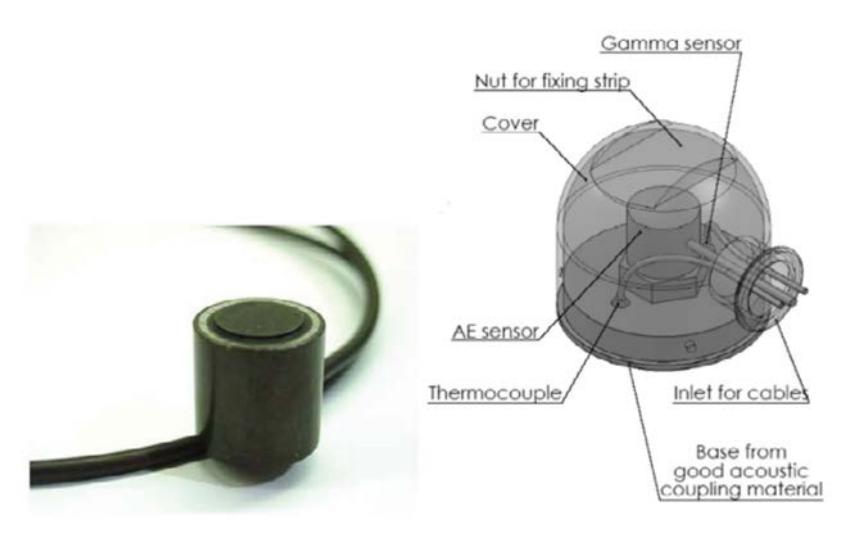

*FIG. 40. Conceptual design of a radiation hardened AE sensor (D9215) and the combined sensor containing gamma detector and thermocouple.*

This system consists of a radiation hardened acoustic sensor (Physical Acoustic Corporation), together with a gamma detector and thermocouple to enhance the leakage detection at the reactor vessel head. All data acquisition, event recognition and data evaluation is performed in the embedded system, and the results are transferred to a central processor via direct USB cable connection.

#### **3.5.2. Leakage monitoring in the primary pressure boundary (pipeline) using a conventional approach**

In conventional systems, acoustic or moisture detection is being used for leakage monitoring. An enhanced method, which uses longitudinal acoustic propagation waves, is shown in Fig. 41. The figure shows the low frequency and high frequency spectra of the propagating acoustic waves. The acoustic signals are measured by accelerometers placed at different locations along the pipe. An active interrogation approach using piezosensor arrays for detecting flaws in the steam generator and heat exchanger tubes is described in Ref. [40].

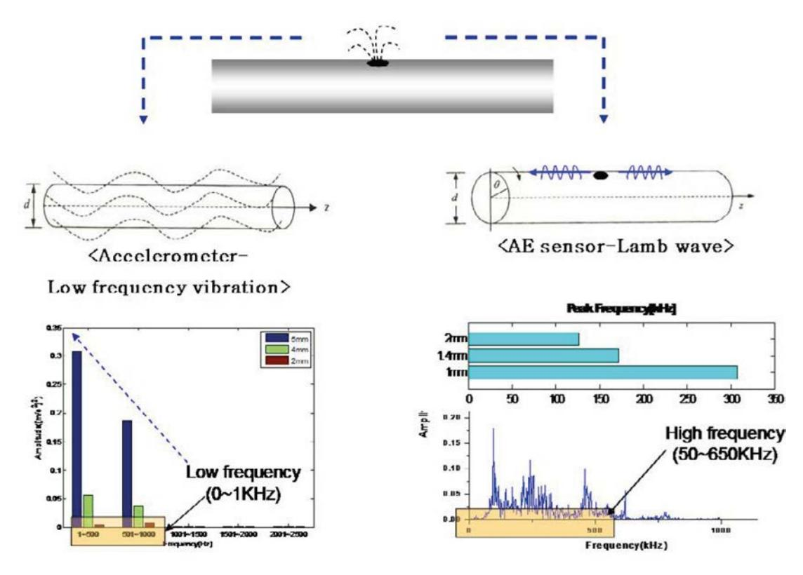

*FIG. 41. A new approach for leakage monitoring.*

#### **3.5.3. Valve leakage monitoring**

Ultrasonic testing allows the detection of valve anomalies for the purpose of planning equipment repair/ replacement actions at early stages of anomaly occurrence. During operation, the ultrasonic signal is compared with the baseline data to detect a leakage anomaly. Valve tightness is monitored by measuring the RMS level of the ultrasonic signals at four locations (A, B, C, D) as a function of valve tightness, as illustrated in Fig. 42. The leakage past the valve is detected by analysis of the sequential measurements at these locations and by comparing the intensity of the ultrasonic probe measurements.

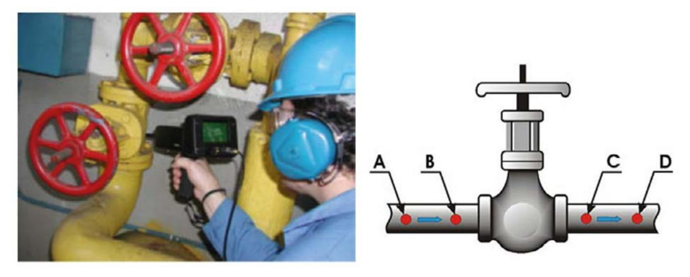

*FIG. 42. Ultrasonic measurement (left) and monitoring points relative to a medium stream (right).*

As shown in Fig. 43, the intensity of the ultrasonic testing signal spectrum increases with increasing leakage rate in the frequency range 0–6 kHz.

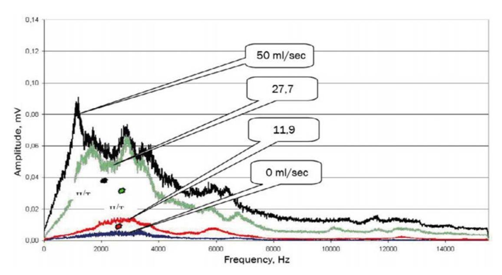

*FIG. 43. Plots of ultrasonic signal spectra for different rates of leakage volume.*

An empirical relationship between the leakage volume and the level of ultrasonic signal intensity has an exponential relationship and is given by:

$$P = 0.43 + 0.646(1 - e^{-0.077L}) \tag{9}$$

where *P* is the parameter that is equal to the ratio of the normed quantity of an ultrasonic signal level to the centroid of points and *L* is the leakage rate in mL/s. The general form of this relationship is given by:

$$P = A + B(1 - e^{-CL}) \tag{10}$$

This relationship may be used to estimate the leakage volume during an operational condition. Figure 44 shows the ultrasonic measurements of a motor operated valve (MOV) integrity test at a Hungarian NPP.

*C-CLAMP: measuring forces VTS: gauge*

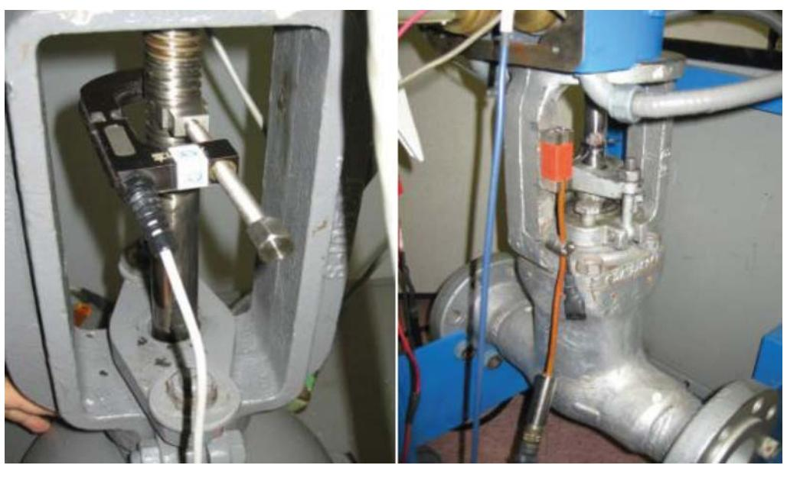

*FIG. 44. Ultrasonic measurement of MOV integrity at a Hungarian nuclear plant.*

#### 3.6. VIBRATION MONITORING OF ROTATING MACHINERY

This section summarizes the approaches for vibration measurement and analysis, and applications to plant components.

#### **3.6.1. Causes of vibration**

There are a number of rotating machines in a power plant, both small and large size, which may require continuous vibration monitoring. Examples of such machinery include reactor coolant pumps, feedwater pumps, turbines, motors, generators, compressors, fans, emergency diesel generators and other devices. These items of equipment are the active components in the plant. Vibration of these items of equipment is caused by many sources, including shaft imbalance (improper mass distribution), misalignment (parallel and offset), looseness, gear drive anomalies, bearing defects, defects in belt and chain drives, and others. Often these defects can be detected and quantified by transforming the measurements to the frequency domain and calculating frequency variations and energy variations at different frequency bands of the signal spectra.

#### **3.6.2. Vibration measurement**

Vibration measurements are performed using accelerometers that are generally manufactured from piezoelectric devices. Accelerometers are mounted using a stud mounting method, to ensure reliable vibration detection. Both continuous on-line monitoring (OLM) and portable data collectors (periodic monitoring) are used in process systems. The choice of one approach over the other depends on the critical nature of the equipment. Accelerometers are selected based on their frequency bandwidth and the need for appropriate size. The typical frequency band of piezoelectric accelerometers has a range of up to 20 kHz. The accelerometers must be carefully mounted on bearing surfaces in three mutually perpendicular directions. Proximity or displacement probes are used when the bearings are of the sleeve (or journal) type, since the displacement of the shaft or the journal is of interest in this case. In some applications, it is advised to combine vibration analysis with motor electrical signatures, temperature, pressure, etc., and lubrication oil analysis, for a reliable detection and isolation of the problem. This approach is often referred to as data fusion. For completeness, the frequency band of signals must span about 50–100 times the main drive shaft rotational speed. For repeatability of measurements, barcode based data collection is recommended, in order to minimize the errors due to improper measurement locations and allocation of data to incorrect databases.

#### **3.6.3. Approaches for information extraction from vibration measurements**

Data from accelerometers, proximity probes and process sensors are analysed in both time and frequency domains. These methods broadly fall under the topic of DSP. Methods for information extraction using DSP may be categorized as classical or non-parametric methods, and data-driven empirical modelling methods.

Classical time domain techniques include the following:

- RMS value, skewness, kurtosis or flatness;
- Time waveform analysis for periodic behaviour and peak values in the signal;
- Signal demodulation and envelope detection;
- Crest factor (ratio of peak value to RMS value);
- Amplitude probability density (APD) function;
- Auto- and cross-correlation functions.

Classical non-parametric frequency-domain techniques include the following:

- Auto- and cross-power spectral density functions;
- Coherence functions;
- Transfer functions and phase angle relationships.

Stationarity of signals is assumed in computing these signatures. In many applications, it is advantageous to develop discrete time models for extraction of information from plant data. Stationary signals may be characterized using time series models — either univariate (for one measurement) or multivariate (for two or more measurements). A popular approach is to fit an autoregression model to a finite data sample. These linear models may be used to extract either time domain or frequency domain signatures that are reflective of the system or device performance. Multivariate signal analysis is also useful for determining the cause and effect relationship among the state variables.

#### **3.6.4. Information extraction from transient or non-stationary signals**

Equipment and plant operational data are not always stationary in a statistical sense. Various operational conditions result in violation of the assumption of stationarity. These include pump/motor start up and coast down, interrogation of plant components for certain diagnostic tests, and the identification of unanticipated events due to impacting, sudden changes in signals levels, and other causes. Several computationally efficient techniques are available for processing transient signals. The following is a short list of these techniques:

- Short term Fourier transform;
- Wavelet transform;
- Hilbert–Huang transform (HHT);
- Time dependent discrete time models.

The details of HHT, with application to transient acoustic signal processing for structural integrity monitoring, are given in Ref. [40].

#### **3.6.5. Periodic vibration monitoring using handheld data collectors**

Some rotating equipment in an NPP does not need continuous vibration monitoring. This includes auxiliary equipment, emergency diesel generators and other standby equipment. These items of equipment may be monitored for vibration using portable data collectors. These are lightweight and user friendly devices that do not require a high level of expertise to use and interpret. Such systems can be preloaded with test routes for ongoing monitoring programmes, or may use embedded software that allows service personnel to define tests and troubleshoot machines in the field. The information from these devices can be easily integrated into on-line VMSs. These devices have the following general features:

- On-screen user assistance;
- Spectrum, waveform, envelope demodulation;
- Time synchronous averaging;
- Harmonic cursor for in-field data analysis;
- Power spectral plots for accurate troubleshooting;
- Interfaces to host software;
- Time frequency analysis for some class of transient data.

#### **3.6.6. Continuous on-line vibration monitoring**

On-line vibration monitoring is performed by acquiring data from accelerometers mounted on all bearing cases of interest for the equipment under surveillance. The acquired data may be stored on devices at the machinery or transported to a central computer via cabling or wireless data transmission. In some applications, the data are transferred via networks to a service centre for analysis and diagnostics. The processed information may be used to send alarms to appropriate personnel or, if normal, may be archived for future use. Expert systems are often used to analyse the signatures and provide decision making information to the operator. In some instances, fault diagnosis and repair/replacement recommendations are made to the plant personnel.

Periodic and continuous vibration monitoring is performed on various items of equipment in NPPs. Examples of rotating machinery surveillance include: reactor coolant pumps, secondary feed pumps, turbogenerators, various motors, and drives. Accelerometers are also mounted on the reactor pressure vessel head, vessel bottom area and steam generator sections. These transmitters are used for both vibration monitoring and loose parts monitoring.

#### **3.6.7. Vibration surveillance and protection systems for turbogenerators and reactor coolant pumps**

Turbogenerators and reactor coolant pumps are the most important and critical rotating machinery in nuclear plants. Vibration monitoring, diagnostics, vibration protection and data handling are essential parts of their integrated surveillance procedure.

Turbine supervisory instruments for monitoring are specific in their monitoring approach. Because of the large impact of turbine or other critical equipment such as the main coolant pumps, make-up water pumps in the primary circuit, water intake pumps, and component cooling system pumps in power plants, it is necessary to have a comprehensive vibration monitoring programme for these components. Because of the structural and operational issues related to large machinery, the measurements are focused on four major issues:

- *Vibration measurements:* Vibration detection, using non-contact (eddy current) displacement probes, case mounted velocity (seismic) transducers, shaft riders and/or accelerometers.
- *Position measurements:* Monitoring of the turbine shaft and casing position. This monitoring will provide information on thrust bearing wear, rotor position, shell expansion, differential expansion and valve position monitoring.
- *Speed, acceleration and phase measurements:* These are detected by the use of electromagnetic probes, or displacement probes. They include measurement of the main turbine speed and acceleration, speed monitoring of boiler feed pumps, induced draught fans and forced draught fans.
- *Process measurements:* Temperature measurements in process systems are made using thermocouples and RTDs for the measurement of metal temperature, bearing temperature and lube oil temperature. Oil pressure and pressures at other locations are measured using piezoelectric transducers.

#### 3.7. BENCHMARK TEST DATA ANALYSIS

This section presents the results of two benchmark data analysis tests, with primary focus on loose parts monitoring. The objective of the benchmark tests was to advance the evaluation and development of sensitive, accurate and reliable loose parts detection and evaluation methods for improved performance in detection, diagnostics, protection and automation.

#### **3.7.1. results of loose parts benchmark data analysis**

Several datasets were provided for demonstration and/or for benchmark testing in the field of loose parts monitoring. The first dataset was from a laboratory test loop, specifically carried out for this CRP at the College of Dunaujvaros, Hungary. The measurements were conducted with a relatively small diameter coolant pipe (70 mm average) in a coolant loop of about 40 m long, with a pump and a heat exchanger. The location, size and material of the loose part are defined, and the task was to use the measurements to compare estimation methods.

The second dataset for benchmark testing was acquired in part at a Korean NPP (Yonggwang NPP with the help of KAERI) using LPMS signals. This dataset contains loose part data measured in the NPP, thermal shock data, and laboratory test data from the mock-up of a PWR vessel.

The following sections provide a short description of the benchmark tests. More details are provided in the Appendix on DVD. All materials, including measured data, detailed description of the set-up, sensors and evaluation results that were used for this benchmark, can be found at and downloaded from http://diag.duf.hu/. The benchmark data are available in the Appendix on DVD of this report.

#### **3.7.2. Loose parts monitoring in a laboratory loop in Hungary**

A set of experiments was performed to acquire data for testing the LPMS methods with sensors, noise sources and other conditions that occur during flow induced vibration in the laboratory test loop.

The test loop is an operating coolant loop used for a vibration shaker. Water was pumped from a tank to a heat exchanger, through relatively long piping with a few bends and a straight tube exceeding 50 m in length. The pump can pick up water from the pool and send it via relatively long tubes. Four sensors were installed along the straight portion of the loop.

The pipeline, after four more bends (not shown in the figure), was interfaced with a real heat exchanger with a filter just in front of the heat exchanger to catch the loose part if the fishing line were broken. The water was then returned via a parallel hot leg to the water tank and played no role in actual measurements. This arrangement is shown in Fig. 45. Two sizes of bolts and a piece of bakelite were used as loose parts, and are shown in Fig. 46.

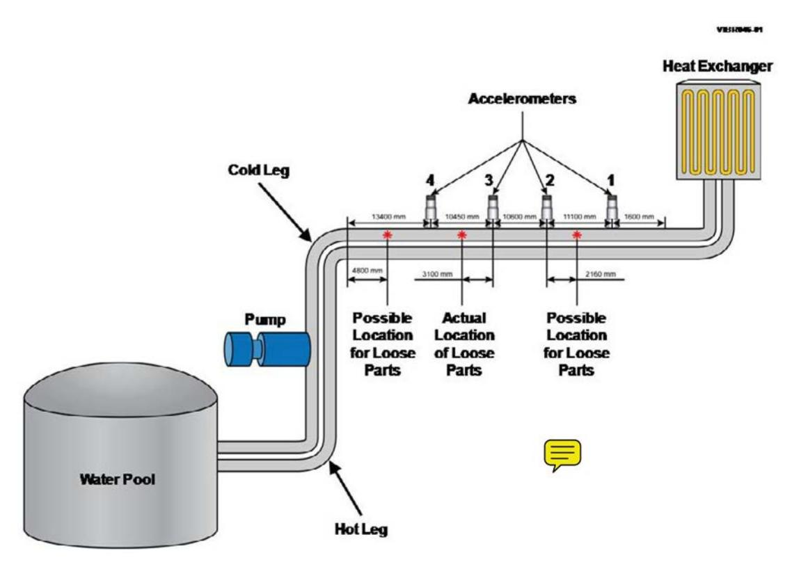

*FIG. 45. Schematic of the test loop for loose parts benchmark, showing the placement of sensors and possible loose parts.*

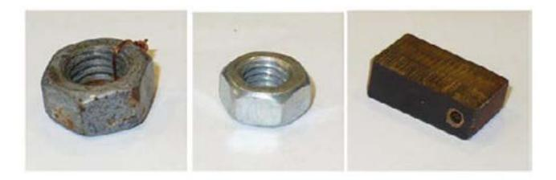

*FIG. 46. Loose parts used in the experiment.*

The loose parts were hung from a flexible plastic (fishing) line. When there was no flow, the loose parts were lying at the bottom of the tube. When a water flow was started, the loose parts were lifted by the water stream and impacted on the inner wall of the tube.

Measurements were made at different sampling frequencies: 1, 5, 10, 25 and 50 kHz for all three loose parts. To facilitate the localization of the impacts, impact test measurements were performed by hitting the outer wall of the tube (without flow) with a metal rod at specific places; these included locations between each pair of sensors at half distance and at quarter distance.

The details are given in the Appendix on DVD of this report in the section on "Results of evaluation of benchmark data measured in Dunaujvaros". Some typical results are shown. Averaged spectrum estimates were made by collecting data segments where no impact was found by SPRT, and at time blocks where the SPRT method indicated loose part impacts. Figure 47 shows an example of these spectra.

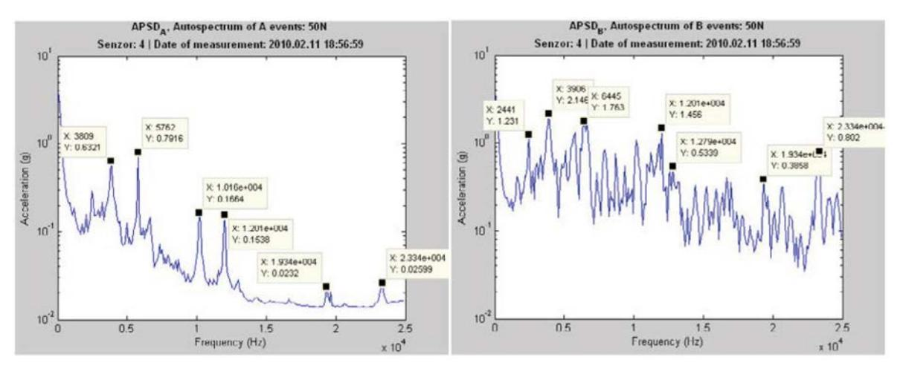

*FIG. 47. Autospectra of background and the impacts.*

Detailed data evaluation shows that different objects have different spectral components. The important tasks are listed as follows:

- To show the sensitivity of a selected method for detecting flow induced impact signals in the time records for all four sensors.
- To localize the impacts and to demonstrate that the method can determine the locations. Any method can be used, including learning algorithms.
- To demonstrate that the method can distinguish different sizes of metal objects and different materials of the impacting objects.

#### **3.7.3. Loose parts monitoring benchmark from Yonggwang nPP in the republic of Korea**

Loose part tests were performed for the CRP benchmark in the Republic of Korea (by KAERI). There are three different tasks and data records. The benchmark analysis includes data from three different tests:

- The first test was a steel ball test at the Yonggwang plant steam generator as shown in Fig. 48:
  - Three LPMSs were fixed on the vertical steam generator: one near the inlet, one near the outlet, and the third above the inlet LPMS. The fourth sensor was an acoustic leakage monitoring sensor (ALMS in Fig. 48), which was fixed at the same vertical level as the first two LPMSs. Only these four sensors take part in actual benchmark task.
  - The impact location was selected between the first and third LPMS.
  - Figure 48 also shows all four signals recorded by the sensors mentioned above.
  - The benchmark data are available in the Appendix on DVD of this report.

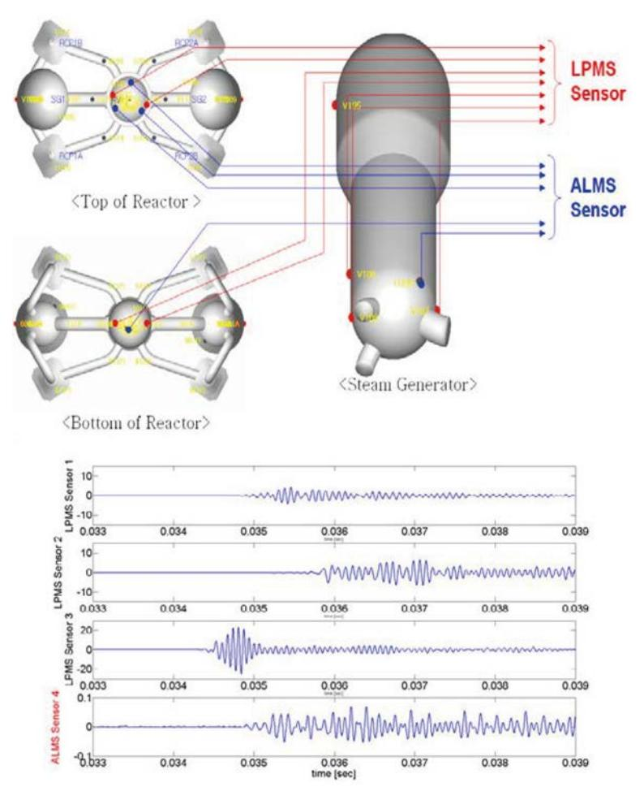

*FIG. 48. Steel ball test at Yonggwang NPP.*

- The second test was a laboratory test on a reactor mock up system; the arrangement and an example measurement are shown in Fig. 49.
  - A mock-up of a reactor vessel with a height of 1765 mm and a diameter of 566 mm was set up in the laboratories at KAERI.
  - Sensors were attached at the bottom hemisphere at polar coordinates: (283, –120°, –140°); (283, 0°, –140°); (283, 120°, –140°) and (283, 0°, –55°).
  - The impact point was at (283, 0o , –206o );
  - The task is to find the impact point from the recorded data.
- The third test was a thermal shock test. The results of data evaluation made by KAERI are shown in Fig. 50. Thermal shocks may produce AE in the material, and having acoustic or loose parts monitoring sensors enables the estimation of time delays, and thus the location of the thermal shock. This was the task in the given benchmark test. Data from six sensors (three positioned on the top of the reactor vessel and three on the bottom of the reactor vessel) are provided in the Appendix on DVD of this report. The impact location was at the flange of the reactor vessel, where leakage may typically occur.

#### 3.8. IMPACT ON PLANT SAFETY AND ECONOMY

Loose parts monitoring is not regulated as a requirement for protecting public health and safety with reference to design basis events. However, these events represent a degraded condition that is internal to the reactor system. Loose part events in PWRs have caused primary to secondary tube end damage and leaks and can produce debris that may get trapped in fuel pin spacer grid assemblies and cause fuel pin failure increasing coolant activity; and can

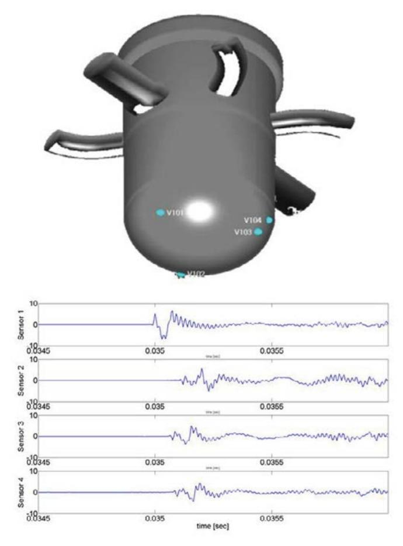

*FIG. 49. Laboratory test on a reactor mock-up system.*

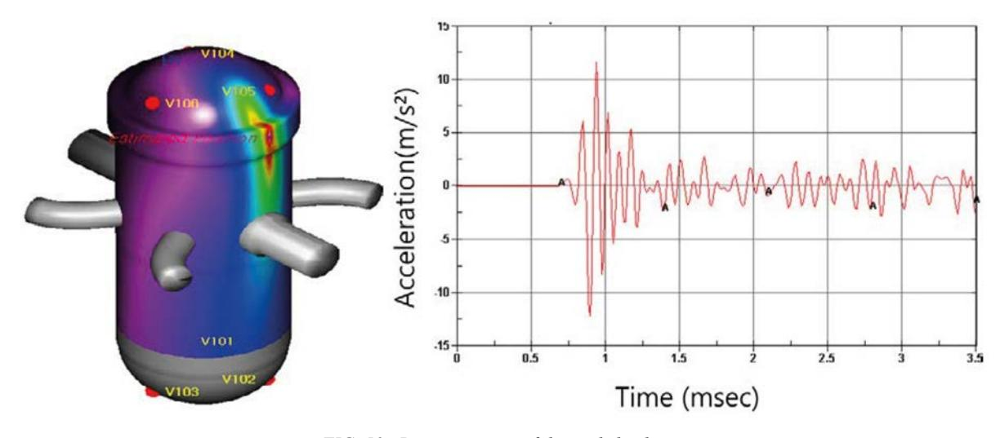

*FIG. 50. Demonstration of thermal shock test.*

cause concern about reduced fuel assembly flow due to core inlet flow blockage. Loose parts debris also increases coolant purification filter activity, the associated personnel radiation exposure and control during refuelling and maintenance operations. Large scale impact damage can be quickly accumulated on heat exchanger tube end welds, with high outage times and repair costs.

Leakage monitoring is another important aspect of OLM that requires high frequency measurements. As stated in the section on acoustic monitoring, leakage is often caused in primary system boundaries that include penetrations and metal to metal joints. Leakage at the pressure boundaries of PWRs and BWRs has safety consequences. Therefore, considerable effort must be given to timely detection of both small and large fluid leaks in these plants.

Vibration monitoring is a routine task for major rotating machinery such as turbine generator systems, reactor coolant pumps, feed pumps and others. Both portable devices and on-line vibration monitors are being used for vibration monitoring and possible incipient fault detection. Added costs may include the associated increases in outage and maintenance task requirements and time, extended fuel inspection period, and specific repair tasks internal to the primary coolant system.

#### 3.9. CONCLUSIONS AND RECOMMENDATIONS

Modern data acquisition, digital signal processing capabilities and information extraction methods provide powerful means to advance the detection, diagnostics, prognostics and automation capabilities of loose parts, leakage and vibration monitoring and diagnostics systems. Substantial improvements in loose parts monitoring system performance can be obtained with attendant improvements in the quality, depth, detail, clarity and presentation of information for operator guidance and engineering use. These outcomes contribute directly to reliable and economic plant operating decisions when unknown metal impacts, loose parts, leakage and vibration are present during plant operation.

Future advances in vibration monitoring and leak detection would incorporate developing technologies such as wireless sensors, non-contact sensors, and smart on-board sensors. These provide measurements with limited cabling and have the capability of on-board processing of sensor data for quick status review. A good review of wireless sensor applications is given in Refs [41, 42]. The implementation of these technologies in NPPs must take into consideration the effects of electromagnetic interference and radiofrequency interference. It is recommended that further R&D for the effective implementation of the technologies described in this chapter be continued and reported in workshops and technical meetings.

# **4. ProGnostICs AnD strUCtUrAL MAtErIAL IntEGrItY**

#### 4.1. INTRODUCTION

This TAG is focused on investigating the feasibility and demonstrating the potential for application of advanced diagnostics and prognostics in NPPs. The activity sought to test, and if successful demonstrate, the feasibility of providing a prediction of remaining useful life (RUL) for a structure material used in a system or component in an NPP, degraded under the effect of a stressor. The work described here specifically addresses ageing and degradation in metallic passive components in NPPs, such as the pressure vessel and primary piping. The project investigated methods for early detection of degradation: testing them with fatigued samples as the model system. It then investigated techniques to integrate and process data to give a prognostic or remaining life prediction. Issues relating to OLM for active components are considered to be within the scope of TAG 4, and are described in Chapter 5 of this report.

#### 4.2. CHAPTER OBJECTIVES

There has been a growing recognition that nuclear plant condition assessment based on NDT at the time of fabrication, followed by intense ISIs, defined within ageing management plans (AMPs), and performed during outages, requires adoption of conservative assumptions with regard to addressing detected defect indications, required responses, interventions and specified mitigation. With ageing plants, particularly as periods of long term operation (LTO) are entered, there is the risk of unplanned shutdowns or 'surprises' at an outage, when defects are discovered, which can cause extended downtime. Understanding the effects of stressors on systems and early damage detection in structural materials within NPPs has therefore become essential, particularly as there are moves for LTO and licence extension. To support licence extension, it is necessary to demonstrate an AMP, potentially including an integrated approach that predicts components' remaining safe or useful life. Such approaches take data for early degradation characterization and work through a process to a prediction of remaining safe or useful life, which employs a prognostic algorithm.

Developing advanced diagnostics and prognostics for NPPs involves addressing several key topics. These are illustrated in Fig. 51. Diagnostic tools measure quantities that are related to the degradation of materials in a component or structure. The measured data are then analysed to solve an inverse problem, which gives the assessment of the material state. The result from the analysis is an estimate of the current degradation state of the structure or material. The material state or defect population is then considered further as a part of a structural safety assessment, which, in the case of cracks, will commonly involve fracture mechanics methods. These data, together with information about the stressor history, future estimates of stressor levels, and models predicting the rate of degradation evolution and defect significance that start from the current material state estimate, can potentially be used to predict (estimate) the state and rate of degradation at future times. Given the uncertainties associated with all of these quantities, predictive models are likely to require a probabilistic prognosis approach to estimate the evolution of degradation over time. In turn, this can be used to calculate failure probabilities for time horizons of interest, and these insights can be used to inform maintenance and replacement decisions. Within this context, activities that were performed as part of this CRP to address four tasks are reported:

- Assessment of the state of the art in advanced diagnostics/prognostics and sensors for on-line measurements, particularly applied to early degradation/damage detection;
- An experimental plan (including sample preparation);
- An evaluation of early degradation;
- Demonstration of data integration into a prognostic model.

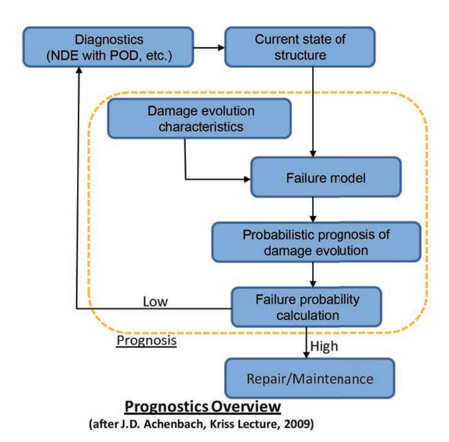

*FIG. 51. Schematic showing technical approach.*

#### 4.3. BACKGROUND

#### **4.3.1. Prognostics**

Prognostics is the prediction of a remaining useful, safe or service life, based on an analysis of system or material condition, stressors and degradation phenomena. Moving from diagnostics, based on observed data that describe the current state of material, to prediction of remaining life and technologies for structural health monitoring (SHM)/management, based on predicted future behaviour, requires development of new approaches [43]. The various types of prognostic approache are identified in schematic form in Fig. 52. These range from generic statistical life estimates to specific physics based models that can be applied to data for an individual component. For the most effective prognostics, physical or physics based models with knowledge of stressor intensity, applied to a specified and instrumented component, provide the capability to provide the best prediction of remaining life [44].

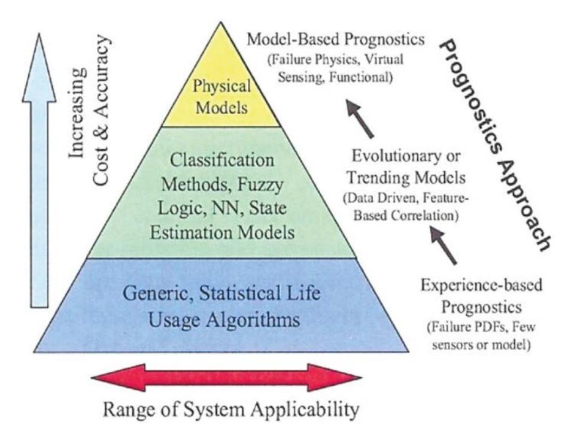

*FIG. 52. Range of prognostic approaches.*

Prognostics methods have also been categorized by their architecture, how they operate, the results format they produce and several other means. An approach that may be most instructive is to categorize them by the type of information they use to make RUL estimates, which results in a categorization into three prognostic types. Figure 53 provides a graphical representation of these three categories and the information each uses. The most common type is type I, statistical life based methods, which is the topic considered in most reliability engineering texts [45]. Type II and type III prognostics use material condition and operational data to provide more accurate and reliable RUL predictions. These methods are briefly discussed below.

#### *4.3.1.1. Type I: Reliability data based prognostics*

These methods consider historical data on time to failure, which are then used to model the expected failure distribution. They estimate the life of an average component under average usage conditions. The most common method is Weibull analysis [45], which has been studied for several decades.

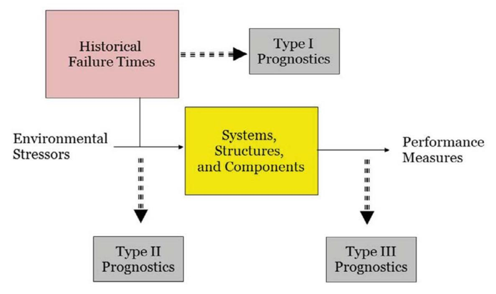

*FIG. 53. Prognostic method types.*

A readily apparent disadvantage of reliability data based prognostic models (type I) is that they do not consider the operating condition of the specific component. Components operating under more severe/harsh conditions would be expected to fail sooner, and components operating under less stressful/milder conditions to last longer than the life predicted for the 'average' failure time.

A prognostic method that takes the operating conditions into consideration can be expected to give better life estimates and these are aptly named stress based prognostics.

#### *4.3.1.2. Type II: Stress based prognostics*

The simplest class of methods for stress based prognostics are linear regression models of failure time. These models use prior observations of explanatory variables such as stress, temperature or voltage and the response variable, which is usually the failure time, to predict the estimated life of a specific component. Examples of this approach include the proportional hazards model and shock models [45].

#### *4.3.1.3. Type III: Effects based prognostics*

Effects based prognostic models use measurements of degradation and stressor to form a prognostic prediction. A degradation measure is typically a scalar or vector quantity that numerically reflects the degradation and the current ability of the system to properly perform its designated functions. It is a quantity that is correlated with the probability of failure. A degradation path is a trajectory along which the degradation measure evolves, under a stressor, in time towards the critical level corresponding to a failure event.

The degradation measure does not have to be a directly measured parameter. It can be a function that combines several measured variables, which then provides a quantitative metric that then correlates with the state of degradation. It can also be derived from an empirical model prediction of the degradation that cannot be directly measured. For example, pipe wall thickness may be an appropriate degradation parameter but there may not be a non-invasive or unobtrusive method to directly measure the required data at a specific location. However, there may be related measurable variables that can be used to estimate and predict the local wall thickness in a region of interest. In this case, the degradation parameter is not a directly measurable parameter but a function of several measurable parameters, and may require use of a model for interpolation.

Many effects based prognostics models track the degradation (damage) as a function of usage and predict when the total damage will exceed a predefined threshold that defines the end of usable life, which may or may not be the time at which a component failure or leak occurs. Cumulative damage is the irreversible accumulation of degradation or damage in components under some form of periodic or cyclical loading. In making predictions of future state, there are several mathematical approaches to model cumulative damage, such as Markov chain based models, shock models, general path models and particle filter models [45].

#### **4.3.2. Prognostics in industry**

The goal of monitoring the integrity of structural materials and using state information in prognosis is being widely pursued in a variety of industries, including defence, aerospace and civil infrastructure for evaluation [46]. A common goal is to avoid the costs of detailed, fixed interval inspections which, in accordance with the governing philosophy for assuring structural integrity, are expected to find few flaws, but those found must be evaluated and mitigated. In essence, the goal is to establish some form of condition based maintenance (CBM), in which continuous OLM is used to provide an indication of changes in the state of the unit or material that require some response or corrective action. The action can be either in the form of additional inspections to better quantify the degradation, inspections at additional similar locations to where defects are found, or maintenance/repair if the degradation or change in performance is considered to be significant.

Various industries are developing prognostics to meet their specific and unique needs. A good example is seen in the area of civil infrastructure with SHM applied to bridges. In the United States of America, attention was strongly focused on this problem by the collapse of the Interstate-35 bridge in Minneapolis in 2007. Popovics et al. (2009) [47] provide a good summary of civil structure SHM, with an international discussion of various approaches ranging from implementing a large number of sensors and mining the data to determine the most relevant information, to an approach based on conducting a structural analysis leading to identification of a much smaller number of critical locations at which data are to be obtained. There are also various demonstrated applications in the defence community. The aerospace industry developed various programmes for ageing aircraft, starting in the mid-1990s. The US Air Force definition of SHM implies that some sort of reasoning is required to make decisions based on the information sensed regarding the state of the system or material. There are at least two issues that have been considered in developing actionable strategies: should these be based on a deterministic or stochastic analysis, or should the basis of the decision be based on empirical or physical reasoning? It can be argued that a physics based, stochastic approach should be the basis of this decision. Because of both variability in part geometry and the absence of a single value relationship between the signal observed and the material engineering property of interest, there is great value to be obtained from the use of models and simulation tools, both of the NDE/SHM measurements [48] and of failure processes, to avoid the need for, and potential errors in, a purely empirical approach. An example of the use of models to design SHM approaches for next generation NPPs has been provided by Nakagawa et al. (2006) [49]. These same sources of signal variability (state uncertainty) call for a stochastic approach. A scenario has been proposed that makes use of Bayesian approaches to integrate the necessary information into a decision process [50, 51].

Although a significant number of examples of successful application of prognostics methodologies to active systems do exist [52], the application of prognostics to passive structures is an evolving area of research and application. Factors constraining the maturation of prognostics include:

- In many practical applications, sparseness of available data;
- The ill posed nature of the data processing or prediction of remaining or safe life;
- Issues relating to solutions being inadequately constrained and inherently ill posed;
- The need for quantification of measurement noise, errors or uncertainty in both measurements and data processing, and its impact on the accuracy or reliability of predictions.

For passive structures, there is growing interest in the sensors and technology, particularly OLM for the detection of early damage in structural materials [53–55]. An assessment that relates technology to various phases in degradation development for proactive management of material degradation (PMMD) was recently prepared [56]. Figure 54 provides a summary in schematic form for the relationships between crack growth, the degradation regimes, nature of degradation, and some of the methods being used to make measurements. Early detection of

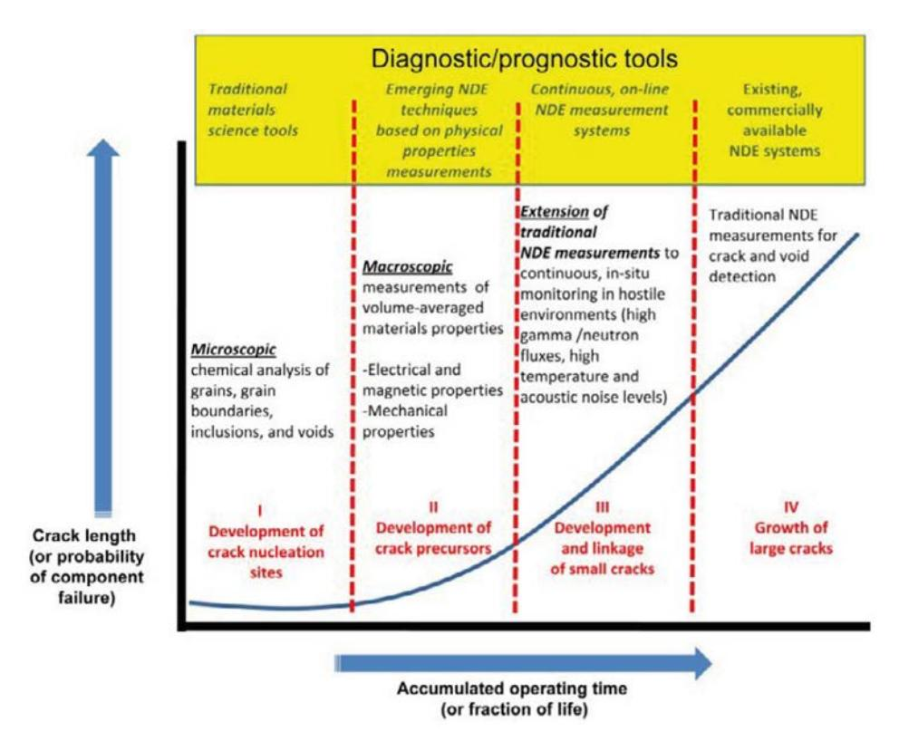

*FIG. 54. Strategy for development of a PMMD system.*

degradation is a key element in both system management and prognostics, i.e. estimates for the remaining life of the SSCs found in NPPs. For early detection of degradation (in particular phase II and III identified in Fig. 54), new tools are required, and these are the subject of subsequent sections of this chapter and in related materials provided in the Appendix on DVD of this report.

New degradation processes have appeared in the current LWR fleet, on average at a rate of one new form of degradation every 7 years [57]. In the USA, many activities have addressed the issues of ageing in the current fleet of NPPs. Early insights were summarized in a 1992 report [58] and there are ongoing NRC meetings that address water reactor safety/ageing issues [59]. Degradation and ageing issues were most recently reviewed by an expert panel and the insights gained are summarized in an NRC Contract Report (NUREG/CR-6923) [60]. This material complements that given in the NRC Generic Aging Lessons Learned (GALL) Reports [61–63], as well as extensive literature that goes back over many years [64, 65].

The pattern of national and international activities that is developing to meet the needs of life extension for the global NPP fleets is complex, and in many cases there are numerous interconnections and overlapping relationships between participants in programmes. There are various international and multinational activities that overlay national activities. To date, discussion has divided the identified technical gaps into categories: the technical gaps that need to be addressed by basic science, those technical gaps in engineering, and those that need to be addressed from a regulatory/codes and standards point of view. The full scope of these needs is still being defined [44].

#### 4.4. TECHNICAL APPROACH

Standards for implementing responses, and countermeasures to address ageing phenomena in NPPs, are being studied all over the world [44]. Such studies have shown a need for certain areas to be considered in management of plant life and ageing. Examples of materials ageing mechanisms in BWRs are used as an illustration and these are considered in terms of the four stages of ageing degradation development as shown in Table 6. The various technologies that have been considered for assessment of early degradation in passive NPP components were recently reviewed and reported [55, 56]. Table 6 also shows whether inspection tools are considered to be available

TABLE 6. EXAMPLES OF MATERIAL AGEING MECHANISMS IN BWRs

|                    |                                                   |   | Phase |     |     |
|--------------------|---------------------------------------------------|---|-------|-----|-----|
| Material           | Degradation mechanism                             | I | II    | III | IVa |
|                    | Irradiation embrittlement                         |   |       |     | ×   |
| Low alloy steel    | Environmental fatigue                             | × | ×     | ×   | ×   |
|                    | Erosion corrosion                                 | × | ×     | ×   | ×   |
| Carbon steel       | Thermal fatigue                                   | × | ×     | ×   |     |
|                    | Environmental fatigue                             | × | ×     | ×   | ×   |
|                    | Stress corrosion cracking                         | × | ×     | ×   | ×   |
|                    | Irradiation assisted stress corrosion cracking | × | ×     | ×   | ×   |
| Stainless steel    | Thermal fatigue                                   | × | ×     | ×   |     |
|                    | Environmental fatigue                             | × | ×     | ×   | ×   |
|                    | Irradiation embrittlement                         |   |       |     | ×   |
|                    | Thermal ageing                                    |   |       |     | ×   |
|                    | Stress corrosion cracking                         | × | ×     | ×   | ×   |
| Nickel based alloy | Environmental fatigue                             | × | ×     | ×   | ×   |

a Including fracture (deterioration of fracture toughness).

Shading indicates an inspection tool is available.

Phase I: Development of crack nucleation sites.

Phase II: Development of crack precursors.

Phase III: Development and linkage of small cracks.

Phase IV: Growth of large cracks.

for characterization of the effects of the ageing mechanisms. It is clear from Table 6 that for detecting the effects of early degradation, new measurement tools are required.

The overall approach for assessing degradation levels and estimating the remaining life of the passive component or material consists of three generic stages. Firstly, non-destructive techniques need to be evaluated to assess their sensitivity to the degradation mechanism (and if necessary, new techniques must be developed). Secondly, models of the evolution of degradation over time need to be developed. Such models are typically semi-empirical and need to account for stressor information to improve the accuracy of prediction. Thirdly, approaches to integrate measured material degradation levels, stressor information and degradation evolution models for prediction of remaining safe or useful life require development.

Fatigue is an important form of ageing and degradation in NPPs, and it was selected as the basis for a demonstration of the feasibility of the prognostic approach by the participants in TAG 3. The three steps described above are detailed for fatigue damage in this report. However, the approach to measurement and analysis described in this report is general, and is potentially applicable to other degradation mechanisms (although some of the specifics may require changes or developments).

In this activity, materials commonly used in pipes in NPPs are subjected to cyclic loading in the laboratory to produce different degrees of fatigue damage. The samples were then inspected with selected methods to find indications of material degradation, in particular early degradation, which in this case was fatigue damage produced by cyclic loading. The methods include different magnetic methods, eddy current, acoustic methods, Barkhausen emission and electrical and thermal methods. A summary of inspection results is included in this report and more detailed information and results can be found in the Appendix on DVD of this report.

#### 4.5. DESCRIPTION OF RESEARCH: AGEING AND DEGRADATION

#### **4.5.1. target phenomenon**

A series of activities have been undertaken in Japan and the USA that seek to identify materials issues that are currently of potential concern, and also those that may develop longer term, to 60 years and then potentially 80 years. The Atomic Energy Society of Japan conducted a review of NPP ageing in 2008 and highlighted the following critical issues: low cycle fatigue, brittleness caused by neutron irradiation, radiation induced stress corrosion cracking, and high cycle thermal fatigue [66]. Many of the current insights have also been tabulated by EPRI in the expanded materials issues tables [67], and the US NRC GALL (NUREG-1801, Rev. 2) [63]. To address issues of potential concern with ageing NPPs, guidelines, and even standards, for measurement and mitigation activities are being considered. One outcome of the various programmes has been the development of a 'short list' of issues that are expected to need consideration in the evaluation of plant ageing. In the various reviews, it has been shown that fatigue is the most prevalently encountered issue and therefore this form of degradation is the focus of the TAG 3 committee's consideration of ageing degradation.

#### **4.5.2. Modelling degradation phenomena**

Fatigue damage to NPP materials was simulated in the laboratory by subjecting test specimens to an accelerated schedule of loadings. Multiple loading conditions were tested to simulate various levels of ageing.

#### **4.5.3. selection of materials**

Fatigue damage has been most frequently observed in NPP pipes [68, 69]. Pipes of concern in BWRs are generally fabricated from austenitic stainless steel or ferritic carbon steel. Since these metals have different properties, it was assumed that they could exhibit different behaviour when under stress. Thus, test specimens were prepared for each type of material.

#### **4.5.4. specimen materials**

Austenitic samples were prepared from 304 and 316NG stainless steels. Carbon steel samples were prepared from JIS STS410, as this material is used in feedwater pipes.

#### **4.5.5. test specimens**

Samples are in the form of 'dog-bones'. For samples prepared from smooth plates, it is assumed that a fracture will originate from a corner of the gauge length. To provide consistency in the location of damage development, a minute dimple (non-penetrating hole notch) was introduced at the centre of the gauge length. The test specimens for type 304 stainless steel and STS410 carbon steel were larger than the specimens of 316NG stainless steel, but of similar general shape. The larger sample size was selected so as to provide a larger area for application of the various non-destructive testing methods. For these metals, both unaltered smooth specimens and dimpled specimens were tested to obtain the correlation data with fatigue degree and to identify the fatigued regions for examination by each NDE technique. In what follows, type 316NG and type 304 stainless steels are denoted by SUS316NG and SUS304, respectively.

#### **4.5.6. Experimental methods**

#### *4.5.6.1. Fatigue test*

Fatigue tests were performed to introduce damage into the materials to be used for the NDE tests. The fatigue test conditions are listed in Table 7.

TABLE 7. FATIGUE TEST CONDITIONS

|                | Austenitic stainless steel |           |           |                          |  |  |
|----------------|----------------------------|-----------|-----------|--------------------------|--|--|
| Material       | 316NG                      | 316L      | 304       | JIS STS410               |  |  |
| Control        | Load                       | Load      | Load      | Load                     |  |  |
| Stress ratio   | –1                         | –1        | –1        | –1                       |  |  |
| Frequency (Hz) | 20                         | 20        | 10        | 10                       |  |  |
| Environment    | RT in air                  | RT in air | RT in air | RT in air                |  |  |
| Specimen       | Thin plate (t = 6 mm)      |           |           | ASTM E466-96 (t = 10 mm) |  |  |

RT: Room temperature.

#### *4.5.6.2. Non-destructive test (NDT)*

#### Acoustic impedance method

The use of acoustic impedance to characterize materials has been investigated by several researchers. The acoustic impedance is the product of the mass density and the ultrasonic wave speed. If there is a damage or degradation of the material, there may be local changes in the material properties, including the acoustic impedance, which can be observed as an acoustic inhomogeneity. A conventional ultrasonic flaw inspection uses reflected pulses to obtain the location of reflectors and the strength of the reflections. In the case of early material degradation, the geometrical reflectors, commonly in the form of cracks, cannot be expected. There may, however, be graduated variation of the material properties. In general for early degradation, the received waveform includes small disturbances in the signal that can be considered as a convolution. By deconvolution of the received signal with respect to the incident wave, the layered distribution of the reflection coefficients as a function of depth (time) is produced [70]. Matsuo et al. (2008) [71] presented the algorithm to obtain the 2-D distribution of the acoustic impedance by applying the aperture synthesis to the deconvolution of the received waveform. By applying the algorithm developed by Ebisui et al. (2010) [72] using a phased array system, the inhomogeneity induced by stress concentration can be evaluated, and hence the degree of early fatigue damage.

#### Magnetic leakage flux method

New magnetic sensors with high sensitivity can detect the weak leakage flux that results from the magnetic inhomogeneity (gradient magnetic permeability) when a sample is magnetized. Scanning the magnetic probe with high spatial resolution [73] enables a precise distribution of the leakage flux density to be obtained. In the case of austenite stainless steels, the austenite phase is considered as non-magnetic, but the ferromagnetic martensite phase is generated from the stress induced phase transformation. In fact, such an induced martensite phase can be observed around a fatigue crack. It is expected that the stress and the plastic deformation change in the magnetic permeability will also be seen in the austenite phase. To apply the leakage flux method to estimation of early material degradation, the distribution of the magnetic permeability from the leakage flux density is obtained and a correlation between the magnetic permeability and the material degradation established.

#### Magneto-acoustoelasticity

Magnetoelastic coupling is the interaction between the magnetic and the mechanical fields in ferromagnetic materials; for example, magnetostriction, stress magnetization effect, and the dependences of the stress strain and the magnetization–magnetic field (*M*–*H*) curves on the magnetic and the stress fields, respectively. It is known that such an interaction is sensitive to the microstructure and the applied magnetic and stress fields. Magnetoacoustoelasticity has been applied to residual stress evaluation by measuring the velocity change of an ultrasonic wave due to the stress and the magnetic field [74, 75]. It is assumed that the effects of early degradation on the ultrasonic response will be similar to the case of the residual stress: the microstructural change in a metal introduced by fatigue will change the wave velocity under the magnetic field. The measured changes in velocity will be used to estimate material degradation in both austenite stainless and carbon steels.

#### Magnetic AE

AE is the NDE technique that detects the acoustic signals generated during the crack initiation or growth. To apply AE to some structural element, transducers are used to continuously monitor and detect signals due to crack growth. However, in early degradation, before a crack develops, AE signals will be absent. In this regime it is possible that Barkhausen noise, which is the electromagnetic waves emitted during the magnetization process of a ferromagnetic material, will be present [76–78]. In general, the magnetization of the material causes increased intermittent domain wall movement due to the pinning site, which gives rise to a rapid rotation of the magnetic spin and emission of electromagnetic waves. In addition, each domain has a spontaneous strain along the spin direction, so that the local strain rapidly changes and acoustic waves are emitted during the magnetization process. The pinning site for domain wall movement depends on the bias stress and the microstructure, which implies that Barkhausen noise and magnetic AE may depend on material degradation. Because the emission of such noises is a probabilistic process in time and spatial domains to generate such signals, a defined volume region of the material should be magnetized by a low frequency magnetic field.

## Piezoelectric thin film

Matsumoto and coworkers (2000, 2001) [79, 80] proposed an NDE technique using piezoelectric thin films attached to a material surface. If a defect is located on the surface or in the interior of the element, when subjected to the stress, the stress or the strain distribution appears even on the smooth surface. By measuring the electric potential distribution on the piezoelectric film, the location, the aperture shape and the depth of the defect can be estimated. If the local mechanical property changes due to material degradation, the induced strain distribution given by applied stress may be determined from the electric potential distribution on the piezoelectric thin film [81]. Similar techniques can be realized by other functional thin layers on the material, which transform the strain distribution into other measurable or visible quantities.

#### Thermal method

If a material undergoing a cooling process has a surface defect, the temperature distribution is affected by the difference in the heat transfer to the air between the defect region and the smooth surface. Such a temperature distribution can be visualized by an infrared thermography [82]. If the material has inhomogeneities in the heat conductivity, because of material degradation, the degraded region may be visualized by a similar technique. On the other hand, if the material exhibits a heating process, the degraded region may be selectively heated because of the increased dissipation or hysteresis in the physical response. For example, high frequency magnetic induction heats the degradation region with larger electrical resistance; the magnetic field, applied with lower frequency, heats the region with larger magnetic hysteresis; and mechanical vibration heats the region with larger mechanical dissipation. By use of such selective heating, the degraded region may be visualized and seen as an infrared image.

#### Electrical conductivity

Almost all metallic materials are electrically conductive, and measurement of the change in electric conductivity may be employed as an NDE technique. In the case of early material degradation, the DC conductivity may depend on material degradation due to phenomena including distributed microvoids, small cracks, induced phase and slip lines. The AC conductivity depends also on the magnetic permeability, so that there is a potential for this to be applicable to characterization of early material degradation using change in magnetic properties. Measurements of electric potential and the electrical impedance have similar potential. As an NDE technique for material degradation, Kinoshita (2005) [83] proposed a method to measure variation of the AC conductivity under the DC (ex. 2A, greater than a few MHz) magnetic fields due to the fatigue.

#### Eddy current

In an eddy current measurement system, a coil is excited with an AC at a specific frequency. When this coil is placed on a conducting specimen, eddy currents are induced in the specimen under test in accordance with Lenz's law [84]. The corresponding induced magnetic flux density changes the net flux linked with the coil, resulting in a change in its inductance. At the same time, losses due to the induced currents in the specimen manifest themselves as an increase in the resistance of the coil. Thus, an eddy current coil will present a change in electric impedance (relative to its impedance in air) when placed near a conducting specimen. The change in coil impedance is affected by several factors, including the electrical conductivity and magnetic permeability of the specimen, probe lift off (i.e. the distance between the coil and the specimen surface), and the AC frequency employed [84]. Like all electromagnetic methods, the eddy current method is predominantly a surface (or near surface) measurement, with the standard depth of penetration of the eddy currents (defined as the distance into the material where the eddy current density decreases to 37% of its value at the surface) decreasing as the frequency increases. For non-ferritic steel (such as 316L stainless steel), the skin depth at 1 kHz is about 13.1 mm (0.52 in.) [85].

#### Magnetic Barkhausen noise (MBN)

The magnetic Barkhausen effect is a phenomenon that is the result of the magnetic hysteresis of ferromagnetic materials. The magnetic flux density in ferromagnetic materials placed in an external applied magnetic field is a function of the applied magnetic field, with larger numbers of magnetic domains within the material aligning with the applied field direction, which increases with increasing applied field strengths. This realignment is, however, not a continuous process, with the presence of dislocations or other damage precursors resulting in domain wall pinning. Increasing the applied field strength will result in an abrupt realignment of some of the domains, accompanied by a release of energy. The energy release may be detected magnetically or acoustically, with the corresponding measurement methods referred to as magnetic Barkhausen emission and acoustic Barkhausen emission, respectively [86].

#### **4.5.7. Experimental results**

A series of NDTs were performed in Kyoto University and Pacific Northwest National Laboratory, and samples were exchanged.

Specimens were initially inspected by NDE methods, and then some were selected for destructive examination and further microscopy of the degraded regions. In this subsection, the correlations between the observed physical quantities and the degree of fatigue were investigated. The relation that exists between these properties was used to determine the potential applicability of the various NDE techniques considered in the previous subsection. Fatigued regions or fatigue cracks around the notch can be visualized by some of the techniques.

#### *4.5.7.1. Acoustic impedance determination*

This technique was used to obtain the vertical distribution, through the sample, of the acoustic impedance by the use of a phased array ultrasonic transducer and data processing. This technique was applied to all of the SUS304 and STS410 specimens described in Section 4.5.5. The linear distribution of the acoustic impedance on the specimen surface was also measured by comparing the amplitudes of the incident and the received pulses reflected from the specimen surface. Averaging the acoustic impedances near the introduced notch for each fatigue phase was used to obtain the data shown in Fig. 55(a) and (c), which imply that the acoustic impedance decreases with fatigue for both SUS304 and STS410. The data in Fig. 55(b) and (d) show the vertical images of the acoustic impedance near the notch, where the lower end of each image corresponds to the opposite surface of the specimen and the bottom of the notch can be seen. The layered texture observed in the data in both figures may be related to inhomogeneity induced by rolling for plate processing. The fatigue cracks observed around the notches cannot be visualized in these figures from the resolution and the location among the crack, the notch and the arrayed transducers. However, the vertical images that were obtained do have higher resolution than is seen in conventional ultrasonic phased array images.

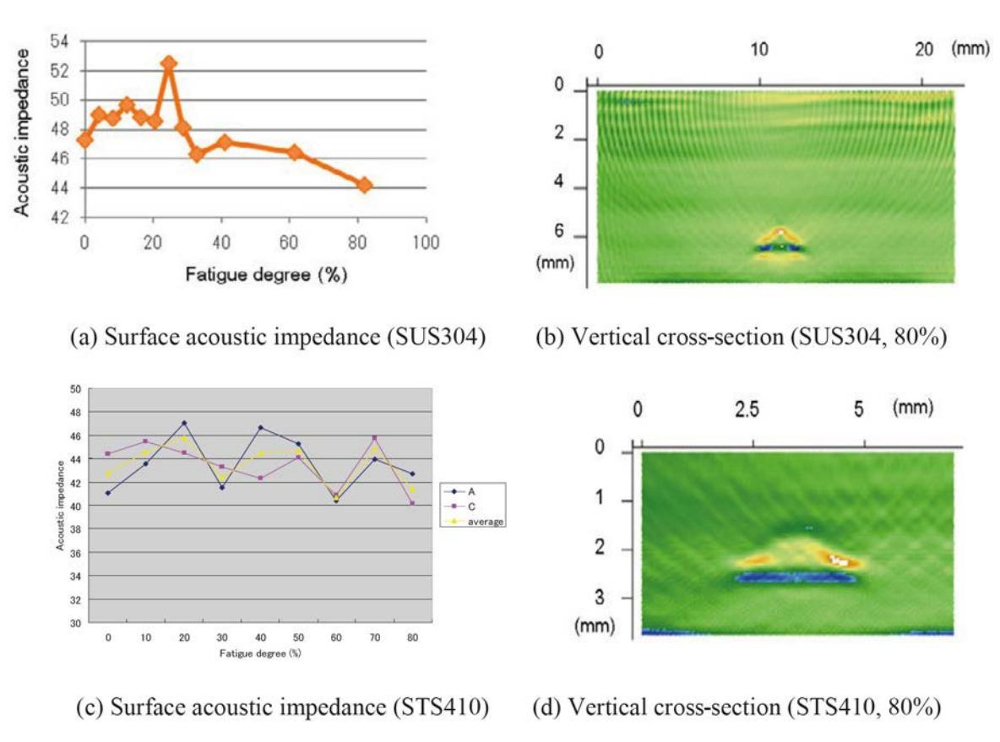

*FIG. 55. Acoustic impedance at each fatigue phase.*

#### *4.5.7.2. Magnetic leakage flux method*

Scanning a small sensitive magnetic sensor on the specimen surface with a fixed lift off, gave the distribution of the magnetic leakage flux density. The maximum value of the tangential magnetic leakage flux from the residual magnetization for each level of fatigue damage is shown in Fig. 56(a)–(c). It is seen that the measured leakage flux increases with the level of fatigue damage for SUS316 and SUS304 specimens. This response may be caused by the increase in the volume fraction of the martensite phase. The tangential leakage flux from STS410 also increases for the later fatigue phase, which indicates the increase of the residual magnetization or the magnetic hysteresis due to the increase of pinning sites of domain wall movement. The variation of the leakage flux for the earlier fatigue phase may come from the change of domain structure by the magnetoelastic couplings, but this needs further investigation to verify this hypothesis.

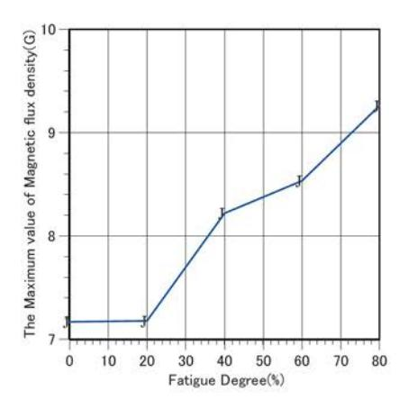

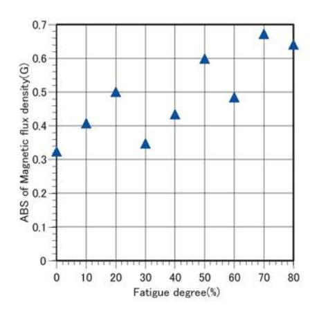

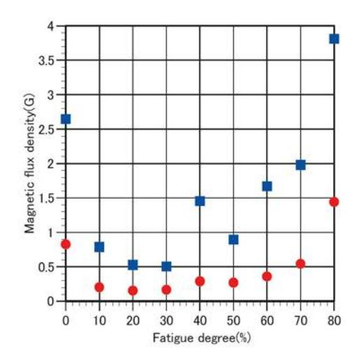

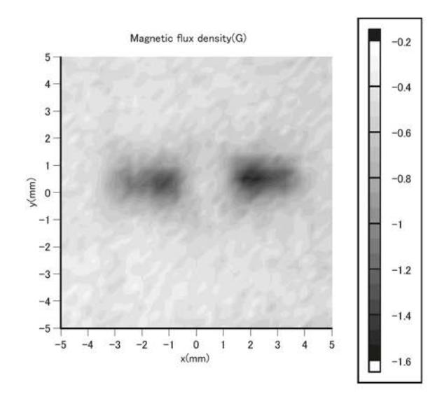

*FIG. 56. Magnetic leakage flux from residual magnetization.*

An example of the distribution of the normal component of the magnetic leakage flux around the notch of SUS304 specimen with 80% fatigue phase is shown as Fig. 56(d). Two fatigued regions are seen, and these are located on both sides of the notch, where the martensite phase is expected to be induced. This is in agreement with the stress concentration obtained by FEM stress analysis.

#### *4.5.7.3. Magneto-acoustoelasticity*

The acoustoelastic effect causes the stress dependence of ultrasonic wave speeds, owing to the mechanical non-linearity, which can be detected by a high accuracy velocity measuring system like the singaround technique. This approach has been applied to residual stress evaluation when the propagation distance of the wave or the plate thickness can be measured to high accuracy. A similar technique has potential to be applicable to fatigue estimation in the laboratory. When a transverse wave propagates in the depth (thickness) direction of the specimen, it is known that the transverse oscillation is polarized either parallel or normal to the direction to the axis. Figure 57(a) and (b) shows the speeds of transverse waves propagating and oscillating in the direction normal to the specimen axis. Although there is scatter in the data, the wave speeds for both SUS304 and STS410 in general do to increase with the degree of fatigue. The observed scatter in the data may relate to inhomogeneity in the plate from which samples were prepared.

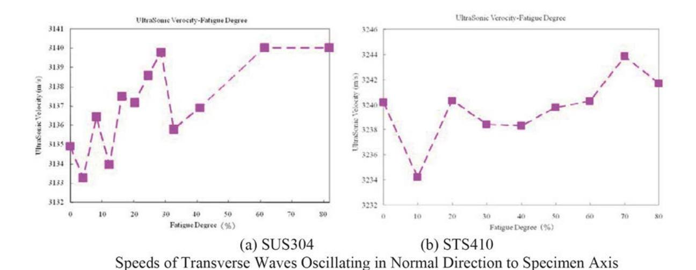

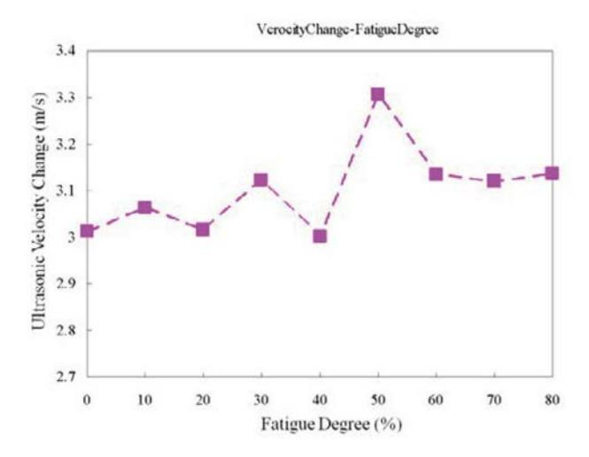

*FIG. 57. Speeds of transverse waves and magnetoacoustic effect at each fatigue phase.*

The magneto-acoustoelasticity phenomenon, which does not require highly accurate depth measurement, has also been used to evaluate the residual stress more precisely for ferromagnetic materials. In order to apply magneto-acoustoelasticity to fatigue estimation, the speed change of ultrasonic waves caused by magnetization was measured. Figure 57(c) indicates the speed change of the transverse wave oscillating in the normal direction to the specimen axis and hence the magnetic field for STS410. The figure implies that the speed change of the transverse wave increases with fatigue.

#### *4.5.7.4. Magnetic AE*

In the case of SUS304 and STS410, the specimens were sufficiently large for the purpose of observing the magnetic AE. A cyclic magnetic field with a frequency of 0.1 Hz was applied along the specimen axis and the acoustic signals were measured using a conventional AE measuring unit. Figure 58 shows the peak counts and the total counts of the AEs during one cycle of the magnetic field. The peak count indicates the maximum number of signals measured for each 0.1 s during one cycle, which is known to be sensitive to the applied stress in ferromagnetic materials. The resulting data for the peak counts do not have any apparent trend, but the total counts do seem to increase with fatigue. The variation of the total counts for STS410 at early levels of fatigue does exhibit a trend that is similar to the case of the magnetic leakage flux as shown in Fig. 56(c).

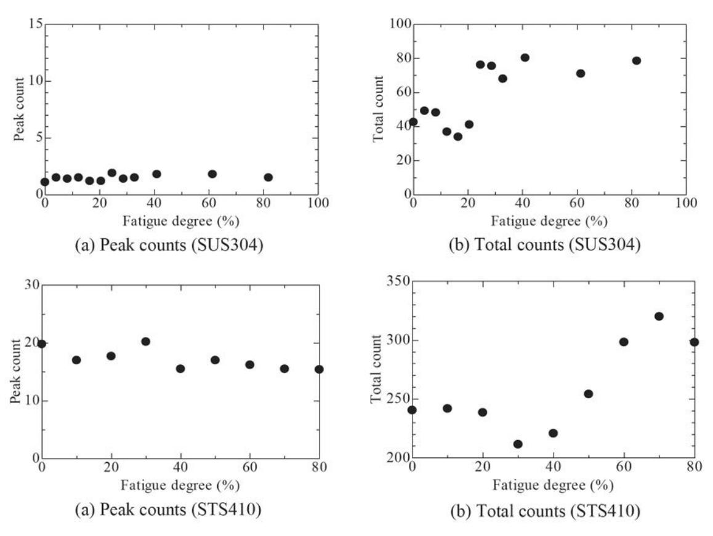

*FIG. 58. Magnetic AE at each fatigue phase.*

#### *4.5.7.5. Piezoelectric thin film*

To apply this technique, a piezoelectric thin film is attached to the specimen surface after applying the stress. A laminated polyvinylidene fluoride (PVDF) film was used as the piezoelectric film and a surface potentiometer used as the sensor. Figure 59 shows the measured potential distribution on the PVDF film for a SUS316NG specimen under axial stress. It is seen that the potential distribution becomes smaller in the region around the

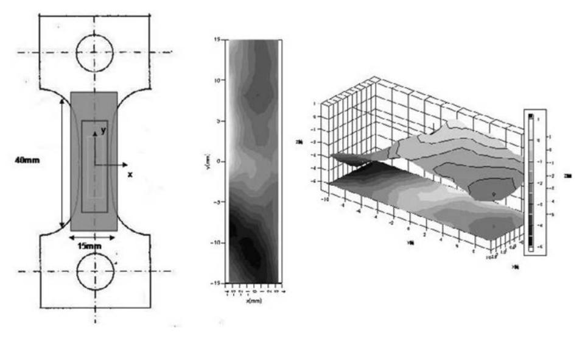

*FIG. 59. Electrical potential distribution on PVDF thin film attached onto a specimen with 80% fatigue phase (SUS316NG).*

notch, which implies that the strain decreases and hence the elastic constants increase in the fatigued region. The potential for application of this technique to actual plants will be limited, but it may be useful for obtaining the distribution of the exact surface strain, giving data as if the specimen surface is covered with an infinite number of infinitesimal strain gauges. This approach has been used to obtain reference data that can be compared with estimations, predictions and simulations and results of other measurements.

#### *4.5.7.6. Thermal method*

A cyclic magnetic field with a frequency of 60 Hz was applied for 40 s to all SUS316NG, SUS304 and STS410 specimens at each fatigue phase. The resulting temperature distribution on the specimen surface near the notch during the magnetic heating was measured by infrared thermography. Figure 60(a)–(c) indicates the increase in the average temperature seen near the notch during the heating period. It is found that the temperature increase for all the metals becomes larger with increases in the degree of the fatigue. Figure 60(d) shows the distribution of the temperature increase near the notch of the STS410 specimen at 80% fatigue phase. The temperature increase interior to the notch is scaled out to emphasize the one outside the notch. It is seen from the temperature increase that small fatigue cracks are developing from the edge of the notch and that the highest level of fatigue is located near the notch.

#### *4.5.7.7. Electrical conductivity*

In the case of an oscillating electric field near a surface, measurement of the electric impedance may give more information for the material properties near the surface. When the material is magnetic, the impedance depends on the bias magnetic field, and this gives the electromagnetic impedance. This technique measures the change of the electromagnetic impedance using a coil sensor, close to, but without electrical contact with, the material. In this test, the variation of the electromagnetic impedance for each degree of fatigue is measured. That is, the impedance coil sensor is placed at a centre position on the smooth specimen surface, the DC magnetic field is applied by an electromagnet excited with a 2 A triangular current, and the AC impedance is measured at every 0.02 A in the excitation current. Since the electromagnetic impedance also depends on the magnetic permeability as well as the electric conductivity, its variation may come from the change of these electromagnetic material properties, which are due to fatigue (Fig. 61).

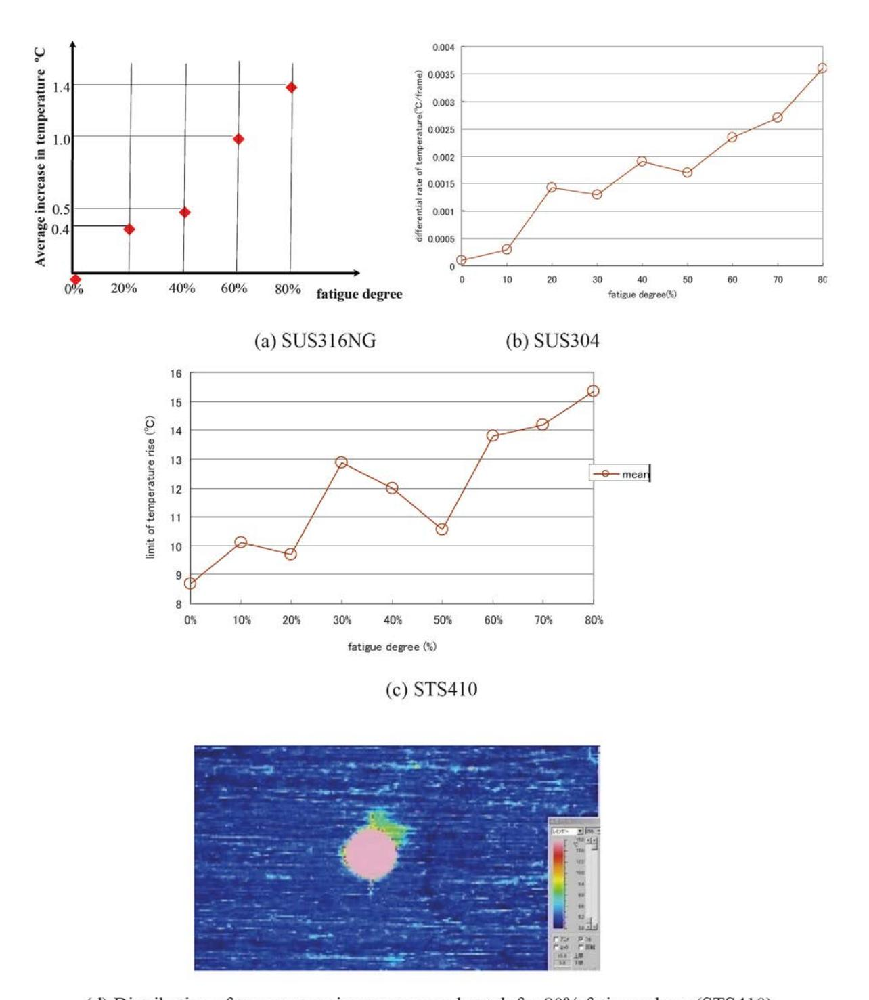

*FIG. 60. Temperature increase with 40 s magnetic heating at each fatigue phase.*

#### *4.5.7.8. Eddy current*

The eddy current measurements were made using an absolute shielded probe (1 mm in diameter) and a Nortec 500d instrument, at 12, 100, 250 and 500 kHz. An *x*–*y* scanner with computer controlled software was used to map the specimens and record the complex probe impedance measurements as a function of frequency and spatial location. Figure 62 summarizes the eddy current measurements for the SS316L and SS304 mechanically fatigued specimens. Measurements were not conducted on STS410 specimens, owing to the need for a saturation

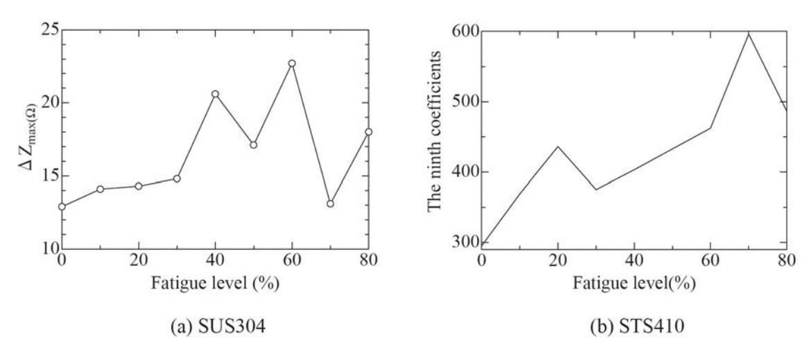

*FIG. 63. MBN energy as a function of accumulated fatigue level. FIG. 61. Electromagnetic impedance at each fatigue phase.*

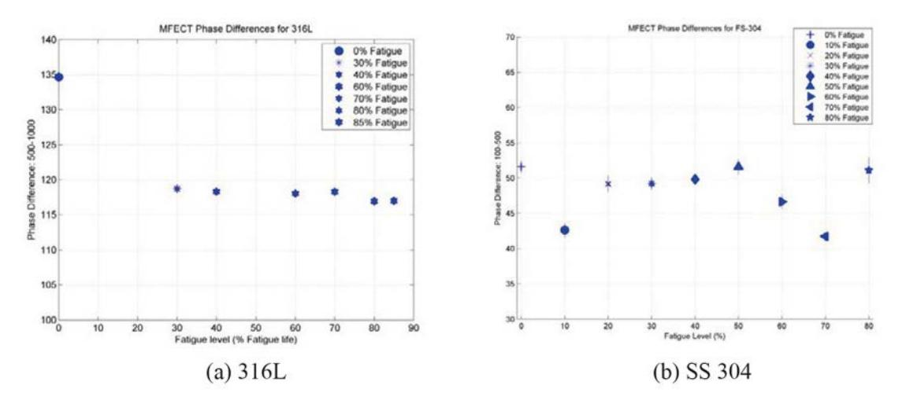

*FIG. 62. Difference in eddy current phase at two frequencies.*

probe. The data presented are the difference in the phase between responses measured at two different frequencies, averaged over the scan region. As seen from the data, the change in the measured probe impedance as a function of fatigue is small, though a measurable correlation appears to exist between the measured data and the level of accumulated fatigue damage.

### *4.5.7.9. MBN*

The MBN measurements were made using an electromagnet with input current control capability to generate the external field. A coil wrapped around the specimens was used to record the MBN data. The applied field strength was sinusoidally varied by controlling the magnet current using a sinusoidal voltage source, with data recorded as a function of peak voltage. The MBN energy was computed from the measurements and is plotted as a function of nominal accumulated fatigue level (in per cent) in Fig. 63. Figure 63(a) shows the MBN energy for the 316L specimens, while Fig. 63(b) shows the same quantity for the STS410 specimens. Each plot shows the results of three independent measurements on the same specimen, to quantify the effect of uncontrollable experimental factors. Again, a likely correlation is observed between the measurements and the accumulated fatigue damage in the specimen, but there is scatter, which may relate to inhomogeneity in material properties in the parent plate. Measurements need be performed on single samples, as a function of fatigue, to confirm this issue. The recorded MBN energy is seen to be higher in the STS410 specimens, owing to their higher ferritic content.

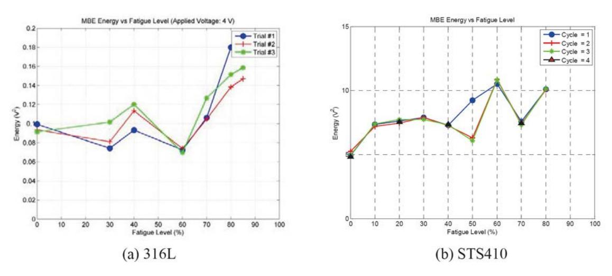

*FIG. 63. MBN energy as a function of accumulated fatigue level.*

#### **4.5.8. Discussion of results**

In the case of 316L and SS304 specimens, microcracking was not observed in the specimens at the highest fatigue level used (80%). Thus, it may be concluded that, for the most part, the accumulated fatigue damage in these specimens is still in the precursor stage and, therefore, the measurements are an indication of the sensitivity of the different measurement methods to fatigue damage precursors in these specimens. As seen from the data presented, in most cases, some degree of correlation with accumulated fatigue damage may be deduced. However, some of the electromagnetic measurement methods (such as eddy currents) appear to have lower sensitivities to fatigue precursors in the materials tested. At the same time, the variability in the measurements may also be indicative of inherent microstructural differences between the various specimens tested. This becomes more important for the STS410 specimens that were tested, since several of these specimens had cracks initiated even at nominally low accumulated fatigue levels. Therefore, these results, while showing promise in the detection of precursors, also point to the need for continuous OLM of passive structural components, to enable variations in response due to local inherent microstructure differences to be addressed.

#### **4.5.9. Initial assessment of the applicability of nDE methods**

In the present work, and other studies, several NDE methods have been identified as having potential for detection and characterization of early damage [56]. The applicability of the NDE techniques examined in the previous subsections is summarized in Table 8. Here 'applicable' means that the measured data given by the NDE technique have a monotone correlation with the degree of fatigue damage in the full or a partial range, when scatter and small variation or fluctuations are neglected. Since the specimens used for each degree of fatigue were different from each other, there may be variations in material properties, owing to the inherent microstructural variability in the parent plate, as well as further variability introduced in specimen preparation and the fatigue test condition.

The various techniques were not examined and used to detect very small changes in the material properties introduced by fatigue. In order to obtain reference data (curves) for realistic fatigue conditions, it will be necessary to develop normalized results, such that the correlations are applicable to different shapes and sizes of objects, in different conditions of stress and various measurement schemes. Furthermore, it should be noted that there will be issues to be addressed to enable these techniques to be applied to actual plants. Also in the present study, only mechanical fatigue for three types of metal were considered. While the proposed techniques and procedures will sense changes in acoustic, electromagnetic or thermal properties due to other forms of material degradation, sensitivity will need to be demonstrated.

TABLE 8. APPLICABILITY OF THE NDE METHODS

|        |                           | Effect of material | SUS316L(NG)                | SUS304       | STS410       |
|--------|---------------------------|--------------------|----------------------------|--------------|--------------|
| Method |                           | properties on NDE  | Thin plate                 | Thick plate  | Thick plate  |
| 1      | Barkhausen noise          | M                  | Difficult                  | Applicable   | Applicable   |
| 2      | Magnetic leakage flux     | M                  | Applicable                 | Applicable   | Applicable   |
| 3      | Magnetic AE               | M and A            | Not examined               | Difficult    | Applicable   |
| 4      | Magneto-acoustoelasticity | M and A            | Not examined               | Applicable   | Applicable   |
| 5      | Eddy current              | M and E            | Applicable                 | Applicable   | Not examined |
| 6      | Thermal method            | M and T            | Applicable                 | Applicable   | Applicable   |
| 7      | Electrical conductivity   | E(M)               | Not examined               | Applicable   | Applicable   |
| 8      | Piezoelectric thin film   | E                  | Applicable (in laboratory) | Not examined | Not examined |
| 9      | Acoustic impedance method | A                  | Applicable                 | Applicable   | Applicable   |

A: acoustic properties; E: electrical properties; M: magnetic properties; T: thermal properties.

#### **4.5.10. Integration of nDE data into prognostics**

A model based Bayesian prognostic algorithm that integrates experimental measurements with a model of damage progression in the material was used in this work. The damage progression model used is a stressor based physical model. For early fatigue damage, a model given by Kulkarni et al. [87] was used in this study. The accumulated fatigue damage is represented by a normalized damage index (DI) that ranges between 0 and 1, with 1 corresponding to the appearance of a visible crack. Models relating the state of the material and the measurement are also necessary, so that the current level of damage can be determined from the NDE measurements. To evaluate the prototype Bayesian prognostic algorithm, the example of previously published fatigue data described by Kulkarni et al. [87] was used. The predicted DI at all time instants, together with the 95% confidence limits, is shown in Fig. 64. The algorithm assumes that measurements are available periodically (shown on the horizontal or time axis as blue diamonds). The availability of measurements results in an update to the predicted damage index using the Bayesian update mechanism, and a corresponding increase in the confidence (indicated by the reduction in the confidence interval). As the time horizon increases and no additional measurements become available, the confidence in the prediction decreases (evidenced by the broadening of the confidence interval). Figure 65 shows the time to failure (TTF) estimated from this prognostic. The TTF was calculated as the time to reach a DI of 0.9 or greater, assuming that no future measurements become available. A more sophisticated approach that also takes into account the probability of failure given the DI may also be used [88] for this purpose. The corresponding DI confidence interval was used to estimate the confidence bounds for the TTF. As seen from Fig. 65, the TTF estimate becomes closer to the true end of life (defined in this study as an observable crack) as more measurements are accumulated. The results indicate the feasibility of TTF prediction using a probabilistic model based prognostic algorithm. However, the algorithm needs further validation using additional datasets, and refinement through use of improved damage models. Further, the semi-empirical model described in Ref. [87] is based on the DI as calculated using non-linear acoustics data. Similar models of fatigue evolution based on the DI computed from electromagnetic data need to be developed, to enable the prognostics technique to use electromagnetic measurements. Further, the Bayesian approach used in this work can be easily adapted [89] to use data from multiple measurement modes, which may help to improve the accuracy and reduce the uncertainty associated with the prediction.

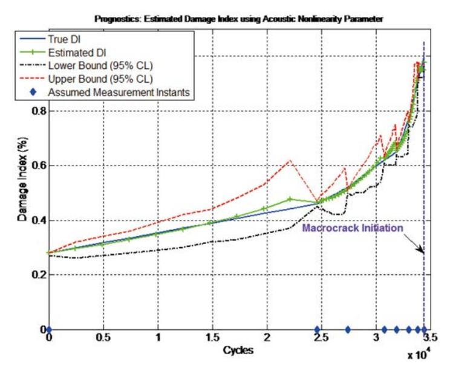

*FIG. 64. Prediction of the DI from acoustic non-linearity measurements, to demonstrate the feasibility of the prototype Bayesian algorithm.*

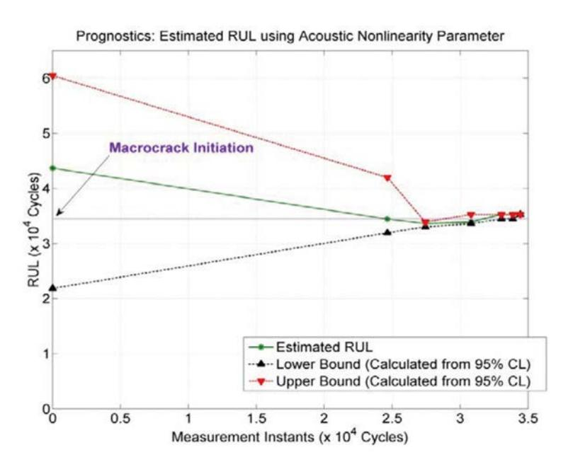

*FIG. 65. Estimate of time to failure (RUL), with confidence limits (CL), from the predicted DI in Fig. 64.*

#### 4.6. POTENTIAL FOR APPLICATIONS OF PROGNOSTICS TO PASSIVE STRUCTURES IN NPPs

The impact of the LTO of NPPs has been discussed elsewhere in this publication. Such LTO has the potential to produce an economically attractive source of electrical power with a low carbon footprint for an extended period of time. The need for such approaches is well documented, and further highlighted by recent problems with the BP deep water drilling in the Gulf of Mexico in 2010. There are many components in an NPP, and prognosis of the structural materials integrity in this study was directed at the demonstration of this capability for potential use on passive components such as the pressure vessel, piping and steam generator.

There are several advantages available from the use of a prognosis system based on continuous monitoring with in situ sensors. The use of OLM is not envisaged to completely eliminate in-service inspection at the periodic refuelling intervals, but there is potential that such methods can highlight possible issues and problem areas, and avoid (or at least reduce) the potential for surprises at an ISI. A combination of OLM and periodic ISI has the potential to provide early identification of issues, and reduce the time and effort devoted to inspections, which are most likely to find nothing. An important advantage of the combined ISI–on-line approach is that it provides information that will anticipate problems, avoid surprises at ISI and enable enhanced planning. With sufficient forewarning, a great number of the components of an NPP can be replaced. The costs of such replacement parts can be significant, but are orders of magnitude less than those associated with building replacement plants. However, if such replacement parts are needed and the requirement is unanticipated until an issue is detected at a periodic ISI, the economic consequences can be huge. Included in developing replacement parts are both the costs and risks associated with an accelerated process being used to manufacture and install replacement components. In addition, there are the costs of providing replacement power during any extended downtime of the NPP. Finally, a less tangible benefit is in public perception. There will clearly be a component of the population that expresses concern over the extension of the useful life of NPPs beyond the initial design life, from 40–60 years and then on from 60–80 years. The existence of a reliable and qualified continuous OLM and prognosis using in situ sensors would play an important role in allaying at least some concerns.

To realize these significant advantages of SHM and prognostics, there are technical challenges that must be overcome. These are not unique to the NPP field, as was mentioned previously in the discussion of SHM activities in other industries (Section 4.3.2.). As noted there, these include developing sensors that can sense the state quantities of interest with the least ambiguity within the geometrical and environmental constraints of the structure, minimizing the number of false calls (a necessary condition for acceptance), assuring the reliable operation of the sensors throughout the intended service life without the need for tear down, gathering the information into a central processor (potentially by wireless technology), and making the appropriate decisions regarding future service based on the sensor data and any other relevant data that might be available.

An important consideration in the application of prognostics to legacy NPPs is the point in the evolution of damage at which that process can be reliably sensed. Here, the key issue is the time interval between when the damage of interest can be sensed and the time at which a failure or end of service life, such as a leak, would occur. A good description of the trade offs has been provided by Selby (2009) [90]. As he articulates, a problem is that current NDT/NDE technology is sufficient to detect damage during only its final stages (phase IV in Table 6), which leads to the need for capability for earlier detection of damage in plant components. This defines the requirements of techniques for both (a) early detection of damage progression (with new techniques by measuring the changes of acoustic, electromagnetic and thermal properties due to the degradation) and (b) detection of the susceptibility of materials to that damage (before significant defects have formed).

A number of challenges/opportunities result from deploying prognostics. There would be tremendous economic advantage to detecting damage earlier in its progression, if reliable prediction of remaining life can be provided. However, this requires sensing techniques that sense smaller flaws or their microstructural precursors. These sensors must be small, sensitive and reliable, so that the information can be gathered reliably for an extended period of time. It is likely that the development of such sensors will require an interdisciplinary team involving electrical engineers, materials scientists and applied physicists, who can relate the measured data to the material state. The payoff of success is immense.

### 4.7. CONCLUSIONS AND RECOMMENDATIONS

A more proactive philosophy to managing degradation in NPP ageing is gaining acceptance worldwide, so as to mitigate the potential safety and economic consequences of SSC failures and to address the perceived expectation that there is an increased probability of failure as plants age. This would replace the current approach to AMPs, which manage passive components through periodic inspection with a fundamentally more rational approach in which maintenance decisions are based on the actual condition of SSCs. This approach requires the integration of fault detection and characterization systems (diagnostics) with methods of predicting RUL (prognostics). Several methods are available for flaw detection in passive components and these were outlined in Section 4.5. Such methods are generally useful for detecting macroscopic defects, and new technologies must be developed that are capable of sensing degradation at earlier stages. With respect to active components, mature prognostic systems exist, and examples of widespread deployment can be found in the aerospace and defence industries. For passive structures in NPPs, however, SHM and prognostic systems are at an early stage in development: the material reported in this section, supplemented by that given in the Appendix on DVD of this report, demonstrates the concept together with some sensing and data integration approaches. Further development is ongoing: if successful, there are significant advantages to be gained if these methods mature and are deployed to supplement and potentially replace some aspects of ISI as defined in current AMPs.

# **5. InstrUMEnt AnD EQUIPMEnt ConDItIon MonItorInG**

#### 5.1. INTRODUCTION

The target of the SDP R&D in this report, and this chapter in particular, is to improve NPP operations in support of the plant technical specifications and to improve plant performance through better monitoring and earlier indications of potential problems. Effective monitoring systems can also support life extension plans by providing a more comprehensive monitoring and diagnostic system to offset the increased probability of failure due to ageing. Effective implementation of these techniques will allow CBM for improvements to plant maintenance, through optimization of maintenance schedules and reductions in maintenance costs.

Instrumentation and control (I&C) system performance is important to the operation of nuclear power generating plants because these systems provide the intelligence for the control of plant equipment and information to optimize plant operation and maintenance [91]. Certain power plants are known to be operating at reduced power generation levels as limited by the ageing plant I&C equipment [92, 93]. There are reasons to believe that these plants are not operating at optimum levels with respect to the capabilities of the installed plant equipment. Monitoring and diagnostic (M&D) systems, and especially OLM systems, allow for provisions of the CBM of the I&C and equipment, and so for optimization of the plant operation from the I&C perspective [94–97].

This chapter of the report summarizes several methodologies for instrument and equipment condition monitoring. The results of several benchmark tests and diagnostic methods demonstration from different international research groups are also presented. The final chapter, which follows, describes several new enabling technologies that facilitate on-line condition monitoring.

## 5.2. CHAPTER OBJECTIVES

The objectives of this and the next sections are to:

- Describe the existing on-line condition monitoring, performance, and fault diagnosis techniques applied to nuclear plant (1) instrumentation and (2) equipment:
  - Define the role of 'intelligent' condition monitoring moving from an individual performing raw data analysis to using computers to support some of the analysis;
  - Define the role of M&D for plant equipment health assessment and optimization of respective maintenance strategies.
- Describe the enabling technologies used in on-line equipment performance monitoring, including:
  - Wireless technologies;
  - Power line data carrier;
  - Smart instruments;
  - Fieldbus technology;
  - Data fusion.
- Demonstrate results of implementation of the above technology for plant instrument and equipment monitoring.

#### 5.3. BACKGROUND

To effectively manage faults in NPPs for safe and efficient operation, M&D methods are developed to monitor equipment, detect anomalies and identify the root causes that may have led to the fault. OLM is commonly considered to be monitoring the plant or equipment during operations [92, 93]. In addition, some M&D methods may also be useful in producing high quality estimations for system variables, which is useful for plant surveillance [98]. Over the past four decades, M&D methods have been used in NPPs for various important applications, such as sensor validation, equipment monitoring and reactor core surveillance [98]. They make significant contributions to the consistent performance improvement of NPPs. From the plant economics point of view, M&D contributes to reduce plant downtime, implement optimal maintenance, and increase plant efficiency, to name a few. From the safety viewpoint, M&D contributes to enhanced safety, through reduced staff radiation exposure, improved accuracy of the measurement channels and eliminating potential operator errors [91, 99–101].

The nuclear industry has an increasing interest in applying advanced M&D technologies to NPPs. Both M&D theories and NPP I&C technologies have progressed considerably, resulting in improved and novel M&D methods being developed. Digital instrument and control systems, plant information systems and advanced motor control centres are increasingly being implemented in NPPs. The contemporary I&C systems make the historical and current plant-wide measurements readily available for analysis and trending using up to date M&D methods. As the level of automation increases in NPPs, M&D will play increasingly important roles in the NPP operations.

The Institute for Nuclear Power Operations regularly identifies the most frequent reasons for unplanned reactor trips, those reasons are analysed, and a summary report is prepared showing the percentage of general initiating events contributing to the total number of the reactor trips or safety systems actuation. Monitoring and diagnostic systems might significantly influence the above percentage by providing intelligent monitoring and alarming of those systems. Table 9 shows examples of plant challenges and possible solutions for those. This table was prepared as a result of the customer workshop conducted by Westinghouse, with representatives from several US utilities [102].

TABLE 9. CHALLENGES IN NPPs AND POTENTIAL SOLUTIONS THROUGH OLM

| Challenges                                         | Examples                                                                                                  | Impact on NPP                                                                                                                                                                                                   |
|----------------------------------------------------|-----------------------------------------------------------------------------------------------------------|-----------------------------------------------------------------------------------------------------------------------------------------------------------------------------------------------------------------|
| Instrument steady state performance degradation | Feedwater flow sensor fouling Calibration drift                                                        | Reduced reactor power output Substantial operation and maintenance cost Increased outage duration Affects instrument reliability                                                                       |
| Instrument dynamic performance degradation      | Pressure sensing line blockage SPND prompt fraction reduction Degradation of sensors' response time | Challenges system reliability Technical specifications not met                                                                                                                                               |
| Faults in equipment and processes                  | Reactor internal vibrations Motor and valve failure Leakage on pressure boundary                    | Risk system integrity Operation interruption Initiate transients                                                                                                                                          |
| Electrical components degradation                  | Ageing cable, transformers, switchgear, substations                                                    | Operation interruption, replacement strategy, safety issues related to the cable ageing during, for instance, loss of coolant accident (LOCA) events (cable qualification monitoring); Impacts LTOs |
| Life extension                                     | Extension beyond original licence                                                                         | Demonstration of effective ageing management                                                                                                                                                                    |
| Power uprating                                     | Measurement uncertainty for potential power upgrading                                                  | Reduced measurement uncertainties required Better monitoring and diagnostics required                                                                                                                        |
| Diagnostics of the control systems                 | Failures, tuning problems                                                                                 | Optimize control systems to improve plant safety and performance                                                                                                                                             |

#### 5.4. SCOPE OF THE OLM SYSTEMS

The overall architecture for an on-line condition monitoring system is shown in Fig. 66. An OLM system consists of the following key components:

- *Plant:* The item/component of plant being monitored.
- *Sensors:* Transducers, measuring some property of the plant, which can be used to provide information about the current health of the plant. Traditionally, these sensors would be 'dumb', passing the data directly back to the monitoring and control system. Recently, developments in smart sensor technology permit some processing of the raw signal to be carried out at the sensor level.
- *Cables:* These transmit the sensor data from the sensor to the monitoring system, and also provide power to both sensors and equipment. Traditionally, these would be physical cables, which may require monitoring themselves as they can degrade over time, which is explored in Section 5.7.1. Recent work has investigated the use of wireless sensor technologies, which is discussed further in Chapter 6.
- *Data storage and analysis:* The raw data are stored, processed and analysed by some systems. Traditionally, this would be manually interpreted by an expert, though advances in computing technology have promoted the use of automated intelligent analysis techniques to support the manual analysis. These techniques are summarized in Section 5.6.7.
- *Output:* The output from the OLM is to either provide guidance as to an appropriate course of action, such as making an operational change to the plant, or to inform longer term health monitoring and maintenance strategies, either at the plant level or fleetwide.

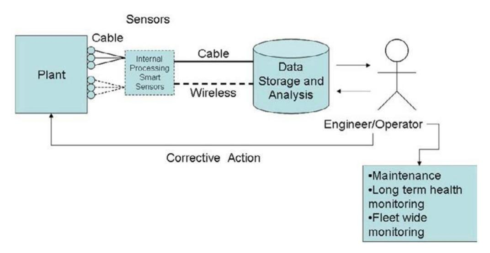

*FIG. 66. Overall architecture of an OLM system.*

This architecture can be applied to a single component of the plant such as a turbine, heat exchanger or boiler, or to multiple interrelated components and systems. Often systems are installed to monitor a single specific item of plant, though in the future there may be a desire to move towards plantwide monitoring, where the results of multiple OLMs are combined to provide a holistic view of fleetwide plant performance and health.

#### 5.5. MOTIVATION FOR DEVELOPMENT OF THE OLM SYSTEMS

When the first few generations of NPPs were built, computer technology was still in its infancy. I&C was predominantly analogue, with little ability to record and store large volumes of data. These data were mainly stored with pen and plotter type arrangements. In the modern era, electronic data capture and storage have become very cheap and relatively easy to implement, making it possible to capture and store vast volumes of condition monitoring data. With this increase in the volume of data, there is a need to analyse and assess the data for the purposes of gathering useful information relating to the health of the plant item being monitored.

OLM can provide a number of benefits, including [92, 93, 101, 102]:

- Improved capacity factor by reducing unplanned outages, improved efficiency and waste reduction through more accurate measurement equipment.
- Improved safety through fewer failures and less repairs.
- Optimized equipment reliability and maintenance through early identification of faults, taking preventative actions and optimal scheduling of maintenance by having a greater understanding of current plant equipment health.
- Improved fault diagnostics through increased availability of data relating to faults and shared knowledge of fault behaviour based on case studies and expertise. These repositories of knowledge are useful for training new monitoring experts, as well as preserving the expertise of experts approaching retirement. This expertise can be shared across a fleet, rather than restricted to an individual.
- Lifetime extension of existing NPPs by having an increased understanding of the current health of the plant components and residual life estimation.

Developing and implementing an on-line condition monitoring system may be expensive, owing to the following potential costs:

- Retrofitting new sensors to an existing plant item, particularly where installation of new equipment may impact existing safety critical systems;
- The time required to develop understanding of possible fault mechanisms within plant components and the potential consequences of failures;
- Compliance with regulatory requirements, which may place a significant overhead in development and approval.

The decision to implement an OLM system will result in a trade off between all these factors.

#### 5.6. STRATEGIES OF THE OLM SYSTEMS

This section describes areas of strategy for the OLM systems implementation. Integration of the diagnostic systems with different plant maintenance approaches is probably the most important focal point of the M&D systems development.

#### **5.6.1. Asset management/maintenance and oLM**

Utilities employ several different maintenance strategies to keep their fixed assets and equipment operating reliably and at peak performance. One of the features of the discipline of reliability centred maintenance is that organizations should employ an appropriate maintenance strategy for each asset, depending on its importance to the operation, the cost of maintaining it, and its failure modes and failure frequencies. There are four common maintenance strategies: corrective maintenance, preventive or periodic maintenance, predictive or CBM, and proactive maintenance [94–96].

Corrective or reactive maintenance is a strategy under which equipment is repaired or replaced only after it has failed or suffered serious performance degradation. This 'run to failure' strategy is still largely appropriate for assets whose failure will not compromise operations, that can be returned to service quickly and easily, or whose failure modes and timing do not show a statistically significant pattern.

Some asset failures have expensive and far reaching consequences. These critical failures can shut down the plant or may even cause injuries or fatalities. Other maintenance strategies such as preventive actions are required when reliability is a concern. Preventive maintenance is based on the failure history of an asset or item of equipment and maintenance is periodically scheduled accordingly, to improve its reliability [94].

As preventive maintenance is expensive and optimized for the population of components rather than the individual component, organizations tend to implement a CBM strategy under which the condition of the asset is monitored regularly until it begins to give evidence of deteriorating performance or incipient failure. Maintenance is then performed 'just in time' to prevent asset failure.

CBM can be less expensive than preventive maintenance, while providing the same benefit of high asset availability and reliability [95]. By its very nature, preventive maintenance means that maintenance is being performed more often than is necessary. Since maintenance consumes both labour and parts, this strategy has a measurable cost of 'over maintenance'. Additionally, preventive maintenance often requires that assets be taken off-line unnecessarily during servicing, incurring a cost to the organization for this downtime and lost capacity. Finally, more frequent maintenance involves more frequent intrusions into the equipment, which itself increases the chance of asset or system failures. CBM avoids these penalties of over maintenance.

The last maintenance strategy is proactive maintenance. Under this strategy, root causes of failure are designed out of the system. This strategy can only be implemented in cases in which the benefits of new technologies outweigh the costs of redesign and replacement.

A number of factors have limited the adoption of CBM. Most of the equipment that could be subject to CBM is not currently instrumented with sensors. Data on equipment condition cannot be collected without installing new sensors on the equipment, along with a means of collecting the sensor data. In those cases when equipment is already instrumented, it is done for control and automation and may not track the operating parameters that could be used to identify equipment condition and incipient failure.

Even well instrumented equipment is often not connected into a data collection network that allows OLM. These instruments or sensors usually provide local displays or store readings in data loggers for manual collection. Implementing a CBM programme usually requires retrofitting additional sensors and a data collection network. This is a primary impediment to the broader adoption of CBM strategies such as those presented in this section. One possible solution in this situation is use of the wireless technology (see Chapter 6 for details).

#### **5.6.2. Condition monitoring, fault detection and diagnosis**

Description of the primary tasks involved in condition monitoring, fault detection and diagnosis relies on the two concepts of condition and fault. Condition is defined here as the collection of characteristic properties of the monitored system. Examples of characteristic properties would include pump characteristics, heat exchanger efficiencies, expansion lines for turbines, etc. Process variables that define these characteristic properties are temperatures, pressures and flows.

A well known definition of a fault is 'an abnormal deviation in at least one characteristic property or variable of the monitored system' [94, 95]. To rephrase this definition, it might therefore be said that a fault is an abnormal deviation in the condition of at least one piece of equipment or at least one process variable.

The primary tasks to be dealt with here may then be stated as:

- *Condition monitoring:* To continuously or at least periodically assess the condition of the monitored system; that is, to quantify its characteristic properties. Typically, condition monitoring relies on calculated values for the characteristic properties.
- *Fault detection:* To determine whether there are any faults present in the system. Faults may be uncovered by condition monitoring, or they may be detected by noting that process variables, such as temperatures and flows, are out of bounds. Thus, a fault may be detected by noting an efficiency reduction of equipment, or in another case it may be detected by discovering that the power production is less than what the thermal power of the boiler and the cooling water temperature and flow dictate it to be.
- *Fault identification:* To identify the observation variables most relevant to diagnosing the fault. In complex plants with large process variations, this may not be straightforward, since the operator would have to assess a large number of combinations of process variables.
- *Fault diagnosis:* To determine which fault occurred. Fault diagnosis implies determining the location, type, magnitude and time of the fault. Fault diagnosis might be aided by evaluating the condition of equipment in the vicinity of the variables identified in the fault identification step.

— *Process recovery (or intervention):* To design a strategy for removing the effects of the fault. Intervention may be required in the short term, for example to avoid accidents or shutdowns, or in the longer term, for example by scheduling a feedwater heater for maintenance during the planned shutdown.

Although there appears to be no standard terminology in this field, the four latter tasks are frequently referred to in the literature as process monitoring. Whenever a fault is detected, the fault identification, fault diagnosis and process recovery tasks are performed in sequence, as illustrated in Fig. 67 [101].

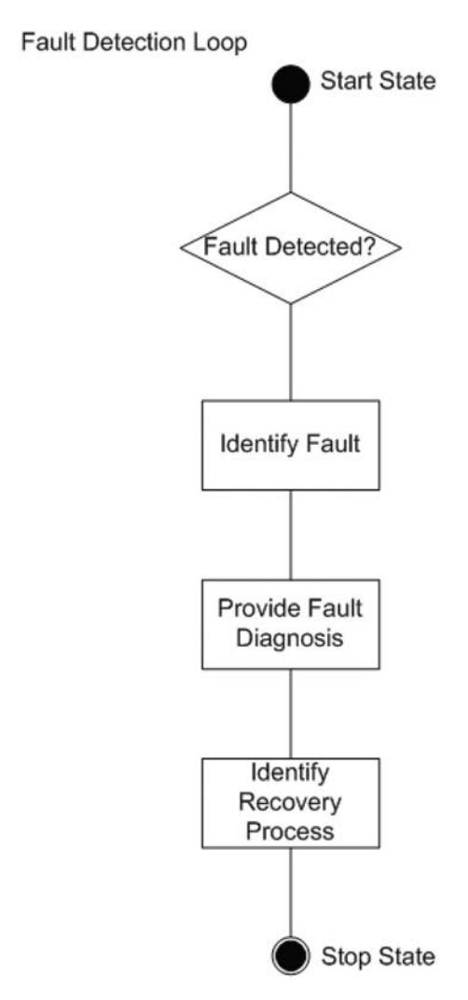

*FIG. 67. Activities executed in the fault detection loop.*

As indicated below, condition monitoring may enter the diagram in several places, for example as input to the fault detection step or as input to the fault diagnosis step. The cognitive load and complexity associated with the steps in Fig. 67 may be expected to increase from top to bottom.

In addition to the four classes of tasks defined above, the concept of *fault isolation* [103, 104] is frequently encountered, which is the task of locating the faulty component. Fault isolation differs from fault identification in that it not only identifies the variables associated with the detected fault, but also specifies its exact location. Fault isolation differs from fault diagnosis in that fault diagnosis also determines the type of fault, not only its location. Fault isolation may therefore somewhat loosely be defined as being at a level in between fault identification and fault diagnosis.

To give an example of the process monitoring loop [105], an operator notices that the electric output of the plant is less than what is expected and thus has detected a fault. All process variables in the high pressure part of the turbine cycle appear normal, whereas the extraction pressures of the low pressure turbines and the associated temperatures in the feedwater heater train (fault identification) lead the operator to infer that something is wrong with the state of the condenser (fault isolation). The operator notices that the temperature of the condenser shell is lower than what the shell pressure measurement and the saturation properties of water would dictate. The operator therefore infers that there is a problem with the ejectors or that there are larger amounts of non-condensable gases in the condenser than what the ejectors can handle (fault diagnosis). Further investigation might result in determination of the exact location of the problem, in which case the operator has succeeded in diagnosing the fault.

In order to be useful in reducing the cognitive load of the users, process monitoring systems typically contain one or a few measures derived from the on-line data [105]. The idea is to assist the users by condensing the information contained in the entire datasets, i.e. transforming high dimensional data to a lower dimensional space. For example, the principal components analysis (PCA) technique [106, 107] transforms all the process measurements to a set of compound, orthogonal variables. Often, some of these principal components (PCs) may be ignored, resulting in a PC model of smaller dimension than the original data. A test statistic can be applied to this lower dimensional space, setting the limits for fault detection. The measures serve as indicators of the process status, and a fault is detected whenever a measure is outside the defined limits. Measures may be useful in fault identification, and also fault diagnosis if measures have been developed that accurately represent the faults in the process.

Process monitoring measures may be classified according to the approaches employed to generate them. There are three such approaches: data driven, analytical and knowledge based.

Data driven techniques (also called empirical methods) derive, as the name implies, directly from process data. A major advantage of data driven techniques is that they are able to handle large complex systems, and can be implemented without a detailed knowledge of the underlying system. They easily provide fault detection and fault identification; however, example data from faults must be available. This is the main drawback of data driven techniques: that their proficiency depends crucially on the quantity and quality of the available data. Some data driven techniques are, in addition to PCA, Fisher discriminant analysis and partial least square (PLS) [106]. Artificial neural networks (ANNs) are also related to data driven techniques.

Analytical techniques (also called model based techniques) are based on consistency checks between plant (on-line) data and mathematical models. Frequently, residuals are defined such that these will be large when faults are present and small when absent. Analytical methods may be based on parameter estimation, observers, parity relations and data reconciliation [106].

Efficient process monitoring systems based on analytical techniques require accurate quantitative models, typically based on first principles. This may render them unsuitable for large complex systems, for which their development may be too costly and time consuming. In such cases, knowledge based methods may offer an alternative. These are based on qualitative models obtained through, for example, causal modelling or expert knowledge [91, 99–101].

Condition monitoring, fault detection and diagnosis are provided by equipment M&D systems, defined as digital systems using information from sensors mounted within plant systems, and on plant equipment. Until recently, M&D systems have been segmented with a particular focus on monitoring individual issues: plant and systems chemistry, rotating equipment performance, system corrosion, equipment wear, fluid leak detection, valve performance, etc. Engineers have in-depth training and experience in evaluation of such M&D information to define and improve optimum plant and equipment performance, predict system performance degradation and schedule equipment maintenance or replacement.

Over the past decade, two significant advancements in this area have occurred. One is the introduction of artificial intelligence (AI) into the M&D system for automation of the traditional human functions of information evaluation [106]. Another example is the use of the advanced techniques for data processing, including neural networks and fuzzy logic techniques. Another evolution is the integration of the individual M&D systems (like chemistry monitoring or leak detection) into an integrated set of M&D systems sharing information and automated diagnostic functions across the spectrum of an entire plant's systems and equipment. Sharing of this information, with composite plantwide smart data evaluation, has compounded the benefits that were attainable by each individual M&D system. For example, chemistry degradation can be automatically attributed to the need to replace a poorly performing valve whose root cause of failure is determined to be a corrosion of its parts. These recent advancements in equipment M&D systems have been the enabling technologies to significantly reduce the burden of engineering evaluations and improve plant operations.

#### **5.6.3. Plant component ageing management**

In any industrial plant, material properties are deteriorating during operation, owing to the loads the components are subjected to [108]. The IAEA defines ageing as a continuous time dependent loss of quality of materials, caused by the operating conditions [109].

Ageing processes are difficult to detect because they usually occur on the microscopic level of the inner structure of materials. They frequently become apparent only after a component failure, for example, if a break of a pipe has occurred.

Failure rates are generally high after startup of a plant, when construction errors or design shortcomings become evident. In this phase, considerable efforts are usually undertaken to correct all problems, since there is a high economic incentive to achieve smooth plant operation as soon as possible.

During the 'middle age' of a plant, problems tend to be at a minimum. Later, as ageing processes demand their due, there will be a gradual increase of failure rates. This is a process that is not always easy to recognize and to follow, and that increases plant risk considerably. Experience shows that for an NPP, the ageing phase can begin after about 15 or 20 years of operation. However, these are average numbers only and ageing phenomena can begin earlier.

As the world's NPP population gets older, there are efforts to play down the role of ageing. Those efforts include convenient narrowing of the definition of ageing [108]. In recent studies, ageing related damage is limited to damage caused by unforeseen loads during operation, in spite of design and operation being in accordance with the requirements. Damage occurring after longer operation because design, manufacturing, commissioning or operations are not in accordance with requirements is not regarded as ageing related.

Thus, ageing will be understood in a comprehensive manner here, according to the IAEA definition quoted above. There is also a certain lack of clarity regarding the definition of plant life extension.

Plant component ageing is multifaceted and has been discussed in a vast set of related publications [108–110]. This section provides only few examples of plant component ageing.

#### *5.6.3.1. Cable ageing*

The interest in safety aspects of wire systems ageing is increasing worldwide because of their impact on several industrial fields such as power generation, transportation and defence. Although the environment conditions and degradation mechanisms of installed cables can be different from application to application, the negative consequences of wire failures, from both a safety and performance standpoint, are so important that several countries in the industrialized world have a research project in progress in this area.

In the nuclear field, where cables are normally qualified before installation for an expected life, there are a number of issues that are not completely solved today. These issues include:

- The effect of the particular adverse environment conditions (high radiation, humidity and temperature), especially during and after a design basis accident (DBA).
- Extending the plant life after 40 years involves the requirement to assess and qualify the cable conditions for a longer time.
- Many cable condition monitoring techniques do exist today, but none of them is considered accurate and reliable enough for all the cable materials in use and all conditions. In addition to that, only few of them are non-destructive techniques and are applicable in situ.
- Accelerated ageing techniques, for qualification purposes under DBA conditions, are often not conservative and should be complemented with reliable condition monitoring methods.

The US White House National Science and Technology Council Committee on Technology issued a report in 2000 [111] where safety issues relating to wire systems were addressed. The conclusions of this report are important, to understand the weak points of the current status and which topics should be addressed in future research. The recommendations of the committee can be summarized as follows:

- Increase cooperation between industry and research institutes domestically and internationally;
- Improve the design and functionality of wire systems;
- Develop advanced wire system maintenance and testing techniques (including condition monitoring).

The IAEA [112] and the OECD Nuclear Energy Agency [113] had similar conclusions, among others.

Again in the USA, the NRC published the Regulatory Issue Summary 2003–2009 [114], where it reported the conclusions of qualification tests on I&C cables. Here particular concern was raised on cable status assessment needs for plant life extension and the need to have reliable qualification methods for LOCA and post-LOCA conditions. Basically, the NRC concluded that current I&C wire system qualification methods provide a high level of confidence that the installed cables will perform adequately during design basis events, as required by 10 CFR 50.49. However, some LOCA test failures indicate that in certain conditions, the accepted conservatisms in the qualification tests are less than expected. Moreover, no single monitoring technique was found to be adequate for reliably detecting I&C cable failures. Two recommendations stand out among others:

- During plant operation, environment conditions should be monitored to ensure that they do not exceed those applied for the qualification tests.
- To overcome the limits existing in each single cable monitoring method, a combination of condition monitoring techniques should be implemented.

#### *5.6.3.2. Cable materials and structure*

NPP wire systems may have different structure and composition, so that they react differently to ageing mechanisms applicable to the environments in the containment. The efficiency and reliability of the existing condition monitoring techniques depend heavily on the material used for the insulations and jackets. In the older plants, which were constructed in the 1970s, the insulation was mostly cross-linked polyethylene (XLPE), propylene ethylene or polyvinyl chloride (PVC) and the jacket material was mainly chlorosulphonated polyethylene (CSPE) and PVC. Newer plants are typically insulated with ethylene propylene diene monomer (EPDM) or XLPE and jacketed with CSPE. Fire retardant variants like flame retardant cross-linked polyethylene (FR-XLPE) or EPDM are also more commonly used.

#### *5.6.3.3. Environment qualification of safety related cables*

Cable ageing programmes require management of the effects of ageing so that the cables and connections can perform their intended function during the period of operation. Qualification tests include the verification that wire systems connected to safety systems required during and after a DBA can maintain the electrical and mechanical properties needed to maintain the systems operable during and after the accident. These requirements have evolved as operating experience accumulated and the ageing process was better understood. Initially, qualification was based on the 'high industrial quality' of electrical components. For plants constructed after 1971, a more formal approach was adopted: qualification was performed according to the Institute of Electrical and Electronics Engineers (IEEE) Standard 323-1971, "IEEE Trial-Use Standard: General Guide for Qualifying Class 1E Electrical Equipment for Nuclear Power Generating Stations" [115].

#### *5.6.3.4. Ageing process of high voltage electrical equipment*

A major area of ageing in gas insulated switchgear (GIS) is electrical breakdown of the dielectric. As a precursor to full breakdown, localized breakdowns occur and produce partial discharges. Causes of partial discharges can include small cracks within solid dielectrics, or they can occur at the interface between the conductor and dielectric, particularly with liquid and gas dielectrics. Partial discharges cause progressive deterioration of the insulating materials and, if left unchecked, can result in full electrical breakdown. Monitoring partial discharge activity has been shown to be an effective way of detecting potential faults during both commissioning of high voltage (HV) equipment and routine operation.

In transformers, the main categories of faults that can occur are both full and partial electrical breakdown of the dielectric and overheating, either localized in a hotspot, or generally due to inadequate cooling. The traditional approach to monitoring transformers is to perform dissolved gas analysis (DGA) on a sample of the oil from the transformer. The presence of certain gases in certain ratios can indicate electrical breakdown [116, 117]. DGA is a relatively cheap method of monitoring, but is not normally on-line, instead requiring analysis to be undertaken at set time periods. Additionally, it cannot be used to localize the fault and the question arises as to what to do if a fault is identified. To address this issue, OLM has been implemented. Monitoring of partial discharge has been undertaken using both acoustic and ultra high frequency (UHF) techniques, and temperature sensors can provide information relating to developing hotspots [116]. Partial discharge detection techniques offer the advantage that the location of the partial discharge can be identified. Torness NPP in Scotland was the first to have its GIS equipped for UHF monitoring in 1986 [116, 117].

#### **5.6.4. oLM methods for instrumentation channels diagnostic**

One of the major challenges in instrumentation is to identify invalid sensor data or, in other words, perform signal validation. Data from process sensors, even those that are screened and sent to the plant computer, can be faulty and sometimes invalid. Therefore, in development of SDP systems a data qualification module that looks for gaps in the data, zero readings, missing information, jump, pulse, noise and other artefacts should be included. In addition, sensor anomalies, such as drift and slow response, should be accounted for in validating an array of raw data if they are to be used for equipment and process M&D.

An instrumentation channel, as well as its interfaces, is considered to be composed of primary sensor elements, transmitters, signal conversion, signal condition and actuation elements.

#### *5.6.4.1. Sources of data uncertainties*

The uncertainty in instrument channels can affect both the performance and accuracy of any associated condition monitoring techniques that utilize the data gathered using the instrument channels. It is therefore desirable to define and determine the uncertainty in a quantifiable manner [118]. The channel statistical allowance (CSA) is an overall measure of uncertainty, based on all types of quantifiable uncertainties that can occur in an instrument channel [119]. The CSA is calculated using the following equation (see Table 10 for details):

$$CSA = \sqrt{PMA^{2} + PEA^{2} + (SCA + SD)^{2} + SPE^{2} + STE^{2} + (RCA + RD)^{2} + RTE^{2} + (FEA + FED)^{2} + FETE^{2}}$$
(11)

There are different methods to deal with uncertainties identified above. All of the uncertainty components should be accounted for during the identification of the instrumentation channels' failure. This is especially important for identification of the licensing requirements for different methods of the I&C systems monitoring techniques (see Section 5.9).

#### *5.6.4.2. Single sensor behaviour in time domain*

The performance of non-redundant sensors (single sensors) is measured in terms of calibration stability and dynamic response time. Analytical modelling (empirical or physical) is often necessary to establish a reference for detecting calibration changes, while noise analysis is used for response time testing. The noise analysis technique involves sampling the AC output of a sensor at a high sampling rate (100–1000 Hz) for a short period of time (e.g. 1 h) and analysing the data using the AR modelling technique [106]. The results are presented in terms of a response time value for the sensor. Unlike calibration problems, response time problems cannot be resolved except when the underlying cause of the sluggish response is outside the sensor (e.g. in the sensing lines). Pressure transmitter sensing lines can become blocked, making the response time of the sensor slow. This problem can be resolved by flushing the line to restore the dynamic response of the pressure sensing system.

TABLE 10. COMPONENTS OF CSA

| Acronym | Uncertainty                      | Description                                                     |
|---------|----------------------------------|-----------------------------------------------------------------|
| PMA     | Process measurement accuracy     | The inherent noise in the process                               |
| PEA     | Primary element accuracy         | Error due to the use of a metering device                       |
| SCA     | Sensor calibration accuracy      | The inherent accuracy of the sensor at the reference conditions |
| SD      | Sensor drift                     | The observed change in sensor accuracy as a function of time    |
| SPE     | Sensor pressure effects          | Difference between calibration and in-service pressures         |
| STE     | Sensor temperature effects       | Difference between calibration and in-service temperatures      |
| RCA     | Rack calibration accuracy        | Rack uncertainty                                                |
| RD      | Rack drift                       | Rack uncertainty                                                |
| RTE     | Rack temperature effects         | Rack uncertainty                                                |
| FEA     | Final element accuracy           | Actuation uncertainty                                           |
| FED     | Final element drift              | Actuation uncertainty                                           |
| FETE    | Final element temperature effect | Actuation uncertainty                                           |

The presence of the blockage in the sensing line can be detected based on the noise analysis techniques discussed in the earlier sections of this document.

#### *5.6.4.3. Single sensor behaviour in frequency domain*

In frequency domain, the fast Fourier transform (FFT) technique can be used to determine the dynamic response of the sensor [106]. The results will be the same as the time domain analysis using the AR modelling. Figure 68 shows the results of FFT analysis of the response of a pressure sensor in an NPP, as measured using the noise analysis technique.

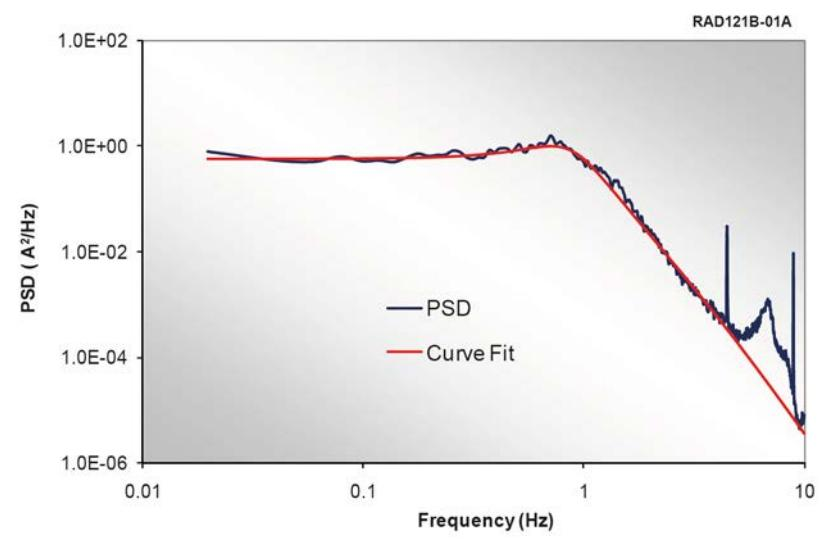

*FIG. 68. FFT analysis of response of pressure sensor.*

This plot is referred to as the power spectral density (PSD). A PSD is actually a plot of the variance of the noise signal in a narrow band frequency plotted against frequency.

#### *5.6.4.4. Multiple sensors — redundancy in sensors*

Process instrument sensors in NPP safety systems are designed with a degree of redundancy. The level of redundancy varies, with the majority of systems involving three or four sensors. The redundancy of sensors provides an opportunity to perform calibration monitoring, consistency checking and signal validation [101, 106]. There is a vast number of data processing techniques related to the redundant sensors treatment (see Section 5.6.7), including the whole new paradigm of data fusion methods, described in Section 6.2 of this document.

#### *5.6.4.5. Holistic approach and analytical redundancy*

Analytical redundancy diagnostic techniques use physical redundancy based on first principle relationships, such as plant mass and energy balances, to detect both sensor and plant equipment faults during the earlier stages of the fault development when compared to conventional methods.

This method is based on a software system for on-line process monitoring. It provides system operators with timely and reliable information regarding the conformance of process behaviour, as inferred from sensor readings, with the expected behaviour based on past observation or first principle models. It uses empirical or physical models in combination with the statistical methods of fault diagnostic techniques to: (1) generate an analytical estimate of sensor signals on the basis of actual sensor readings and previously learned correlations among them; and (2) analyse the statistical characteristics of the time series obtained by taking the difference between each measured signal and its numerically generated counterpart to determine, at the earliest possible time, whether the process is behaving as expected or anomalously.

By providing a timely and reliable indication of the health of a process, this method can reduce the need to replace or recalibrate instruments and components, thereby increasing system availability and lowering maintenance costs. Moreover, the ability of the programme to detect and annunciate incipient faults at an early stage enables the operator to optimize the scheduling of corrective actions so that the adverse consequences of the malfunction are minimized. Finally, for cases where it can be established that a sensor failure (and not a component malfunction) is responsible for the anomalous behaviour, this programme may analytically generate an estimate of what the sensor indication should be, which can be used as a substitute for the erroneous signal, and counterproductive tampering with the process itself can be avoided.

It can be demonstrated analytically that the described technique possesses significant advantages over many alternative process surveillance approaches currently available, in terms of sensitivity, reliability, flexibility and computational efficiency. Such alternatives include simple threshold limits, parity space methods and techniques employing other state estimates methods such as Kalman filter (see Section 5.6.7).

Such programmes usually consist of the following two major components:

- A state estimation model, which is designed to (a) use examples of the sensor readings and calculated parameters characterizing the normal operating state of the system to learn, during a training stage, the correlations among these signals, and (b) generate an accurate estimate, during the OLM stage, of what each signal and/or parameter 'should be', based on the latest cycles and the previously learned correlations among them.
- A fault detection model which employs a method such as the SPRT or cumulative sum (CUSUM) methods to analyse the residual time series obtained by subtracting each measured or calculated signal from its numerically generated counterpart. By performing statistical hypothesis tests on these residual time series, a fault detection method determines, at the earliest possible time, whether the process is behaving as expected or anomalously. This determination may be made subject to user specified probabilities for false alarms and missed alarms.

The training procedure for the programme requires the user to collect sensor readings for a set of operating conditions that encompass the normal operating states of the system being monitored. It is necessary that the measured sensors have some degree of mutual correlation. To reduce the training effort, the programme employs the sensor readings corresponding to an optimal subset of the operating states, to learn the normal correlations, including lead–lag dependencies, among these readings. The model development process is performed (for a specified range of normal operating states) in advance of the OLM phase. Retraining may be necessary if plant configurations or operating ranges change.

Using the trained model, the proposed programme analyses newly acquired process data. For each monitoring time step, it estimates the fault free data as a combination of the training data that optimally explain the current set of measured data. This analytically derived predicted measurement vector is then subtracted from the measured vectors to generate a 'residual signal' for each parameter (sensor). Taken collectively, the residual norm indicates the current deviation of the system from its normal operating configuration. Moreover, the residual for each individual parameter may indicate an anomaly in the involved sensors in the piece of equipment being monitored.

To provide the earliest possible indication of process anomalies, this method employs the aforementioned fault detection technique to detect changes over time in the statistical characteristics of the residual signals. Instead of a simple threshold limit that signal. a fault when the residual exceeds some threshold values, the proposed methods perform statistical hypothesis tests on the mean and variance of the residuals. These tests are conducted on the basis of user specified false alarm and missed alarm probabilities, allowing the user to control the likelihood of missed fault detection or false alarms. It has been demonstrated theoretically that the decision test based on the SPRT or CUSUM has an optimality property, namely that there is no other procedure with a lower error probability or a shorter time to annunciation for subtle anomalies, provided the noise carried by the monitored signal is white and Gaussian. For residual signals exhibiting serial correlation, this method may employ a filtering method to remove the serially correlated component of the signal and ensure that the data analysed by the fault diagnostic methods are more nearly random and Gaussian.

#### **5.6.5. Early fault detection based on running decoupled distributed unit models**

Another example of the overall approach for the instruments diagnostic is demonstrated in PEANO (process evaluation and analysis by neural operators) system. PEANO is a system for on-line calibration monitoring developed in the years 1995–2001 at the Institutt for energiteknikk, Norway, which makes use of AI techniques and fuzzy logic for its purpose [120]. The system has been tested successfully in Europe in off-line tests with Electricité de France, Tecnatom (Spain) and ENEA (National Agency for New Technologies, Energy and Sustainable Economic Development, Italy), and in the USA in cooperation with EPRI. PEANO is currently installed and used for OLM at the Halden Boiling Water Reactor.

ANNs and fuzzy logic can be combined to exploit the learning and generalization capability of the first technique, with the approximate reasoning embedded in the second approach. Real time process signal validation is an application field where the use of this technique can improve the diagnosis of faulty sensors and the identification of outliers in a robust and reliable way.

PEANO implements a fuzzy possibilistic [120, 121] clustering algorithm to classify the operating region in which the validation process has to be performed. The possibilistic approach (rather than probabilistic) allows a 'don't know' classification that results in fast detection of unforeseen plant conditions or outliers.

During the operation, while the input point moved in an *n*-dimensional world (because of process state changes or transients), the classifier provided an automatic switching mechanism to allow the best tuned ANN to do the job. The results were satisfactory, but the following two drawbacks were identified:

- The model did not properly consider the transition area among clusters, where the input pattern could be considered a member of two or even three clusters at the same time. As a consequence of that, the switching mechanism changed the working ANN abruptly, when the input pattern moved in ambiguous areas, resulting in unexpected changes in performance.
- The crisp classifier always attempted to find a reasonable membership cluster, even when the input pattern was far away from all the identified clusters. In turn, the activated ANN always gave a response, so that there was no way to have a reliability measure for the output. This is a very well-known problem of every black box approach, which could justify the very few industrial ANN applications currently existing in the world, in the nuclear field.

The two problems above were solved by introducing a *possibilistic fuzzy clustering technique* coupled to a set of concurrent specialized ANNs and a fuzzy model for reliability estimation. There are two main advantages in using this architecture: the accuracy and generalization capability is increased compared to the case of a single network working in the entire operating region, and the ability to identify abnormal conditions, where the system is not capable of operating with a satisfactory accuracy, is improved.

#### **5.6.6. Plant control loops diagnostic**

It has now been well recognized that continuous performance assessment is essential for maintaining the advanced process control assets in the process industry. The commissioning of elaborate control system platforms, e.g. distributed control systems; advanced control applications, e.g. model based predictive control; and information management systems, e.g. historians and databases, etc., have become commonplace in the process industry. Incidentally, these investments have led to the accumulation of tremendous amounts of process data with several new data mining tools and control relevant techniques for extracting information relevant to controller performance monitoring.

The implementation of an advanced control strategy is not an end in itself. Continuous improvement in process performance must be ensured by constantly monitoring and assessing the performance of the basic control loops. Recent study shows that significant improvements in performance, with up to 30% reduction in variance, can be realized by retuning most of the basic control loops in the process industry. This same study also notes that only 30% of the control loops perform the control task satisfactorily, i.e. reduce the process variability. This means that there is a significant opportunity for improving the operation of a plant.

A common benchmark for assessment of control loop performance is minimum variance control. This benchmarking yields a performance index that is defined as the ratio of the minimum output variance (or minimum mean square error) and the actual output variance (or actual output mean square error). The performance index lies between zero and one. An index of one suggests that the controller is at the minimum variance condition. In this case, further reduction in the output variance is not possible by retuning the controller. However, the output variance can be reduced by process re-engineering (e.g. reducing process delay, adding more sensors, implementing feed forward control etc.). A performance index close to zero implies that there is a high potential for reducing the output variance by retuning the existing controller.

For those loops that have been identified to have poor performance, detailed time domain and frequency domain analyses are performed. These analyses provide an insight into the sources of poor performance and lead to tuning guidelines for performance improvement, e.g. whether the problem is due to poor tuning, disturbance upset or loop oscillations.

The most attractive feature of performance assessment using minimum variance control as a benchmark is that the performance index can be calculated by using only routine operating data with a priori knowledge of time delay. It was shown in Refs [122–124] that a lower bound of process variance (or the minimum variance) under feedback control could be estimated from routine operating data. This lower bound (or minimum variance) can then be used as a reference point to assess current control loop performance.

Prioritizing loop maintenance on a plantwide scale is based on various policies, four of which are [122]:

- Loop static priority criteria;
- Loop fault severity criteria;
- Contribution to unit fluctuations cost model;
- Contribution to pseudo-fluctuations cost model.

The first step in the control systems diagnostics would be implementation of simple Harris criteria (or modified Harris) as part of the control algorithms.

When a control loop is first commissioned, its performance is usually very good. Over time, however, performance tends to degrade for different reasons. There is no doubt that loop tuning improves operations. Yet, how often is it done? As previously noted, loop performance ideally would be managed by the trained staff of the I&C group. In some cases, a member of the plant I&C staff actually has the time to regularly consider control loop performance. Occasionally, a control specialist is assigned from elsewhere within the company, or one is brought in from a vendor to manage loop performance.

Too often, however, loop maintenance goes undone, and operators must compensate for any control loop deficiencies. In the meantime, production suffers because of reduced quality, yield or throughput. An automated approach to this problem is warranted.

With the availability of historical and real time plant data, statistical and other computational modelling techniques are being used increasingly to track the performance of plant assets. For example, spectral analysis has been used for a number of years to detect vibration in rotating equipment.

The use of statistical process control tools is well known as a key component for maintaining production quality levels in a number of process operations. This combination of plant data and analysis tools has evolved into asset optimization or asset management programmes. The objective of these programmes is to optimize overall equipment effectiveness by focusing on maximizing asset availability while minimizing operating and maintenance costs over the life of the asset.

The theoretical basis for many of the benchmarks used for loop monitoring comes from statistical models. Relatively simple statistics, such as on-stream time and the standard deviation of the controlled variable about its setpoint, provide indicators of control loop performance.

In a well performing controller, the controlled variable should track the setpoint and the deviation between the two should be minimal — ideally consisting of only small random noise. However, process dynamics are characterized by some amount of dead time. Noting that controller action can take place no sooner than the process dead time, a minimum variance controller is defined simply as that which restores control as soon as possible once the dead time has elapsed. That is, it minimizes the variance of the output.

Using the benchmark that a minimum variance controller is best, then the ratio of the output variance, or of a minimum variance controller to the output variance of the actual controller, can be used to define a loop quality index (LQI). If  $\sigma_{\mu}^2$  is the output variance of the minimum controller and  $\sigma_{\nu}^2$  is a variance of the actual controller,  $u_{\nu}^2$  is a mean deviation of the actual output to its setpoint, then the LQI is defined as follows [122]:

$$LQI = 1 - \sigma_u^2 / (\sigma_v^2 + u_v^2)$$
 (12)

This index is used by a number of industrial and commercial control loop performance monitors. An important aspect of the index is that it provides numerical bounds for controller performance benchmarking. The lower bound for the index is zero, When LQI = 0, the controller is indicating good performance. If the LQI is near zero, yet the output variance is unacceptable, changes such as process modifications or new control design will be necessary to improve performance. The upper bound is LQI = 1. When LQI is not zero, there may be opportunities to reduce the output variance using the existing controller design by improving the loop tuning or the control valve performance. LQI is relatively simple to implement and to use, since only normal operating data are required, along with a fairly accurate estimate of the loop dead time. It can be a useful means for tracking controller performance over time.

There is no information in the known literature related to the cost–benefit evaluation of the control loop performance monitoring, even though the advantages are obvious from the CBM perspective.

#### 5.6.7. Overview of data processing techniques

The purpose of this section is to review the existing OLM techniques in terms of core principles. This section classifies the technical aspects of OLM into several categories, as defined in Section 5.6.4, and briefly explains those methodologies.

As explained in the NRC publication NUREG/CR-6343 [118], all of the OLM techniques basically estimate the anticipated states of a system (referred to as state estimation) and note the difference between the estimated state and the current measured state (referred state monitoring) using the information from relevant instrumentation channels, thus detecting deviations from normality.

#### 5.6.7.1. State estimation

NUREG/CR-6343 [118] shows that there are three state estimation techniques: those using redundant signals, those using reference signals and those using diverse signals. Depending on how the anticipated state of a system

is estimated, the methods using diverse signals can be divided into approaches based on (1) physical models; and (2) empirical models.

#### Physical models

The physical model based approach estimates the state of a system using an analytical model that includes the mechanical, electrical, material and any other operational characteristics of a system. The benefit of the physical model based approach is that it can predict the behaviour of a system before the system is initially operated. It also facilitates the diagnosis of a malfunction because physical models explicitly show the correlations between the system parameters.

#### Empirical models

The empirical model based approach uses collected process data to develop a model that can be used to estimate its behaviour. Since it is based on data, the process must be operated in all future expected states and fault free data collected. This method usually requires less engineering time to construct because the physical characteristics do not need to be modelled. They are useful when the measured characteristics have significant correlations. Most types of empirical modelling use some sort of regression such as linear or non-linear regression, kernel regression or neural network gradient descent learning.

#### Kalman filter

The original Kalman filter estimates the states of a linear system at discrete points in time. Recently, an extended Kalman filter has been developed that has a robust noise distribution assumption and is available for non-linear systems [106]. The Kalman filter assumes the true state at a time, k, and evolves from the state at (k-1), according to:

$$\mathbf{x}_{k} = \mathbf{F}_{k} \mathbf{x}_{k-1} + \mathbf{B}_{k} \mathbf{u}_{k} + \mathbf{w}_{k} \tag{13}$$

where  $\mathbf{F}_k$  is the state transition model applied to the previous state  $(\mathbf{x}_{k-1})$ ,  $\mathbf{B}_k$  is the control input model applied to the control vector  $(\mathbf{u}_k)$ , and  $\mathbf{w}_k$  is the process noise, which is assumed to be drawn from a zero mean and multivariate normal distribution with a covariance  $\mathbf{Q}_k$ .

At time k, an observation,  $\mathbf{z}_k$  in a visible or observable state and  $\mathbf{x}_k$  in a hidden or true state, is made, according to:

$$\mathbf{z}_{k} = \mathbf{H}_{k} \mathbf{x}_{k} + \mathbf{v}_{k} \tag{14}$$

where  $\mathbf{H}_k$  is the observational model that maps the true state space into the observed space and  $\mathbf{v}_k$  is the observational noise, which is assumed to be a multivariate normal distribution with a mean of zero and covariance  $\mathbf{R}_k$ .

All of the system matrices except the noise terms can be developed using first principles or sometimes using process data empirically. At each discrete time increment, a linear operator is applied to the current state to generate the new state, so it ultimately provides an anticipated state governed by the system matrices.

#### Parametric regression

Parametric regression models optimize parameters in a model to match the input—output relationship to that of training data. Linear regression using single or multi-explanatory variables is represented by the following vectors and matrix, with the associated errors:

$$\mathbf{v} = \mathbf{X}\boldsymbol{\beta} + \boldsymbol{\varepsilon} \tag{15}$$

In this equation, the response variable (y) is considered to be a linear combination of the input signals (X). The term  $\varepsilon$  represents the unexplained variation in the response variable and is assumed to be independent of the

explanatory variables. A least squares method is used to obtain the coefficient vector,  $\beta$ , which optimizes the linear combination of the inputs to predict the response. The prediction of the multivariate regression model at  $\mathbf{x} = \mathbf{x}_0$  is given by:

$$\hat{\mathbf{y}} = \mathbf{x}_0 (\mathbf{X}^T \mathbf{X})^{-1} \mathbf{X}^T \mathbf{y} \tag{16}$$

There are also various ways to modify the least squares analysis to obtain better results, including the weighted least squares method, which is a generalization of the least squares method; polynomial fitting, which involves fitting a polynomial to the given data; and robust regression or ridge regression, which can reduce the possibility of multicollinearity between variables.

Principal component analysis/partial least squares

PCA and PLS are data driven modelling techniques that transform a set of correlated variables into another coordinate system. Generally, the dimension of the transformed coordinate can be significantly reduced. This dimensional reduction can reduce the model complexity and improve the predictive robustness.

In case of PCA, a smaller set of new variables called principal components is created that are uncorrelated and retain most of the original information. PCA can also be thought of as a method of preprocessing data to extract uncorrelated features from the data in terms of linear operations. The method makes the transformed vectors orthogonal and uncorrelated. These transformed vectors can be used by regression techniques without having the problems of collinearity. Thus, a reduced dimension with a few PCs can be used to detect and diagnose abnormalities in the original system in a robust way.

PLS, initially developed by Wold [106], is a linear technique in which the data are transformed to alternate coordinate systems. Both the input data and output data are transformed to non-identical coordinate systems based on the covariance between input and output data, which is often referred to as the outer relation. In PLS, an inner relationship is then determined between the transformed input and output data, within their respective coordinate systems, using linear regression. The PLS algorithm can be found in Geladi [106]. In order to model the non-linear relationships among data, PLS can be merged into a neural network model, which is referred to non-linear PLS (NLPLS). More information about NLPLS as a nuclear application can be found in Hines and Seibert [106].

#### Artificial neural networks

The ANN, or neural network, is a non-linear regression technique that can be used to model complex relationships between inputs and outputs. In terms of mathematics, a function,  $f(\mathbf{x})$  that is assigned to a specific node, is defined as a composition of other functions,  $g_j(\mathbf{x})$ , which can further be defined as the composition of other functions or input variables. A widely used composition is the non-linear weighted sum presented in Eq. (17) [106]:

$$f(\mathbf{x}) = K' \left( \sum_{j} w'_{j} g_{j}(\mathbf{x}) \right), \quad g_{j}(\mathbf{x}) = K \left( \sum_{i} w_{ij} x_{i} \right)$$

$$(17)$$

where K and K' are predefined functions such as a logistic function or a hyperbolic tangent function, and  $w_{ij}$  is the weight given to the arrow between two nodes.

One of the specific types of neural network, auto-associative neural network architecture, consisting of an input layer, three hidden layers and an output layer, is recommended for state monitoring. A more detailed description can be found in Ref. [125].

#### Non-parametric regression

While the parametric regression mentioned above is based on an assumption regarding the distribution of explanatory variables, a characteristic of non-parametric regressions is that the model does not have a predetermined form but is constructed according to the information derived from observations. The state of the system is determined by comparing the closest existing data with a new observation.

Kernel regression, one of the representative non-parametric regressions, is a superset of local weighted regression methods such as K-nearest neighbour, radial basis function neural networks and support vector machines [126]. To perform a kernel regression, a set of weighted functions called 'kernels' are placed locally at each observational point. The kernel assigns a weight to each location, based on its distance from the observational point. The prediction of the kernel regression model at  $\mathbf{x} = \mathbf{x_0}$ , using a kernel function  $K_{\mu\nu}$  is given by:

$$\hat{\mathbf{y}} = \mathbf{x}_0 (\mathbf{X}^T \mathbf{W} \mathbf{X})^{-1} \mathbf{X}^T \mathbf{W} \mathbf{y} \tag{18}$$

where 
$$\mathbf{W} = \begin{cases} K_H(x - X_1) & \cdots & 0 \\ \vdots & \ddots & \vdots \\ 0 & \cdots & K_H(x - X_n) \end{cases}$$

One of the specific kernel regressions, namely multivariate state estimation technique, has been used for the state estimation. More detailed information can be found in Ref. [106].

#### 5.6.7.2. Anomaly detection

The purpose of state monitoring and detection methods is primarily to inform users if there is any potential problem in the processes or sensors. Therefore, the typical interest is the residual, which is the difference between the system state predicted by the state estimation model and the current measurement. Since all of the state estimation techniques have uncertainties associated with their results, the state change detection methods usually adopt statistical techniques.

#### The SPRT

The advantage of the SPRT is that the number of samples to reach a conclusion can be reduced, and the number of samples need not be fixed. Because the SPRT does not use a fixed number of samples, it has a stopping rule and a terminal decision rule to determine which hypothesis to use with the samples already collected or to continue collecting samples.

The basic principle of the SPRT is the hypothesis tests given the type I and type II error probabilities. Under normal operation, the residual mean should be a random value with mean of zero, which corresponds to the null hypothesis. If the residual mean exceeds a certain set point, then it is suspected that there is a failure in the process, which corresponds to the alternative hypothesis. If the observed residual is in the exponential family of distributions, then the stopping rules and the likelihoods can be derived analytically [127].

#### Control charts

The control chart is intended to be a heuristic, that is, it is not a hypothesis test [128]. The control chart, also known as the 'Shewhart chart', is a tool used to determine whether an engineering process is statistically 'in control' or 'out of control'. In contrast to the SPRT, if a control chart indicates that the process is out of control, the variation pattern can help to determine the source of the variation that must be eliminated to bring the process back into control. A control chart consists of the following three elements: (1) points representing the sampled values of a process characteristic; (2) a centre line that usually represents a process mean; and (3) upper and lower control limits (UCL and LCL) that indicate the threshold at which the process output is considered statistically out of control. These limits are usually set at  $\pm 3\sigma$  (three standard deviations) from the centre line.

The  $\overline{X}-S$  control chart (a mean-standard deviation control chart) is used to analyse the mean or standard deviation. Since the  $\overline{X}-S$  chart monitors levels that exceed  $\pm 3\sigma$  from the normal value, the usual UCL or LCL Shewhart charts are good at detecting large changes in the process mean or variance, but they do not detect small changes well. Other types of control chart, such as the CUSUM chart, can be good supplementary tools to detect smaller changes. CUSUM charts make use of information gleaned from observations collected prior to the most recent data. When a small, slow evolving change in the process mean within  $2\sigma$  or less needs to be detected, the

CUSUM chart is known to be better than the Shewhart chart. In addition, the CUSUM chart is of great advantage in detecting a one side increase or decrease. However, it should be noted that Shewhart charts are preferable to CUSUM charts for detecting large changes.

An example of a control chart can be seen in Fig. 69.

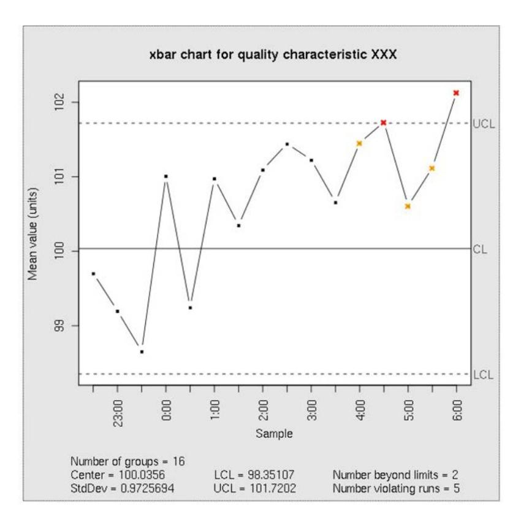

*FIG. 69. Example control chart. StdDev: standard deviation.*

#### 5.7. EXAMPLES OF STAND-ALONE M&D SYSTEMS

Integration of condition monitoring systems into plant I&C systems is problematic, owing to regulatory constraints and expense, so instead they are often deployed as stand-alone systems that provide decision support to plant engineers, rather than being integrated directly into station systems. In addition, it is also beneficial to monitor large items of plant, such as transformers, which interface the NPP to the electric grid, as faults in these items can have direct impact on plant operation, known as losses of offsite power (LOOPs). This section briefly introduces a number of stand-alone systems, which have been developed to provide support to NPP condition monitoring.

#### **5.7.1. Line resonance analysis**

The line resonance analysis (LIRA) method was developed by the HRP in 2003–2006 [129–133] and is based on transmission line theory. A transmission line is the part of an electrical circuit providing a link between a generator and a load. The behaviour of a transmission line depends on its length in comparison with the wavelength of the electric signal travelling into it.

When the transmission line length is much lower than the wavelength, as happens when the cable is short and the signal frequency is low, the line has no influence on the circuit behaviour, and the circuit impedance, as seen from the generator side, is equal to the load impedance at any time.

However, if the line length is comparable to the signal wavelength, the line characteristics take an important role and the circuit impedance seen from the generator does not match the load, except for some very particular cases. LIRA includes a proprietary algorithm to evaluate an accurate line impedance spectrum from noise measurements.

Line impedance estimation is the basis for local and global degradation assessment. Tests performed with LIRA show that thermal degradation of the cable insulation and mechanical damage on the jacket and/or the insulation do have an impact on the dielectric capacitance (*C*) and, to a lesser degree, on the wire inductance (*L*). Direct measurement of *C* (and *L*) would not be effective because the required sensitivity has the same magnitude as the achievable accuracy, owing to the environment noise normally present in installed cables (especially for unshielded twisted pair cables). LIRA monitors variations of *C* through its impact on the complex line impedance, taking advantage of the strong amplification factor on some properties of the phase and amplitude of the impedance figure.

In a programme performed in conjunction with the EPRI, Charlotte, NC from 2006 to January 2007 [131], a limited number of XLPE insulated and ethylene propylene rubber (EPR) insulated cables were thermally aged, along one short segment to allow evaluation of the ability of LIRA to discriminate between the degrees of ageing. A typical LIRA response to a hot spot is shown in Fig. 70.

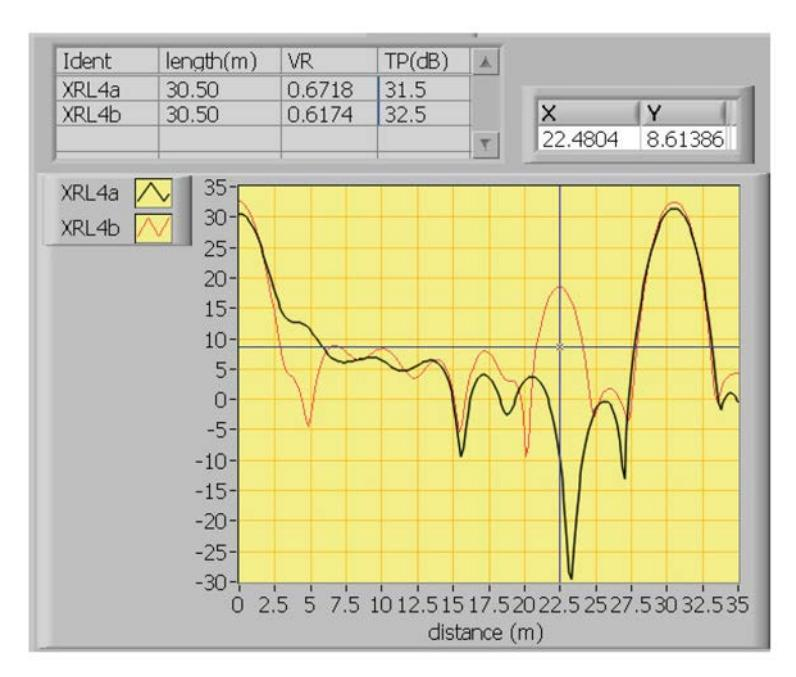

*FIG. 70. LIRA measurement on XLPE before (black line) and after (red line) local thermal ageing at 22.5 m.*

These experiments resulted in the development of a condition indicator that can be used to assess local degradation severity, regardless of the cable length and attenuation, for both thermal and mechanical degradation/ damage. Later, some additional experiments were performed with TECNATOM SA, Spain, and within a research programme (PETROMAKS) funded by the Norwegian Research Council.

#### **5.7.2. Condition monitoring of transformers**

Although transformers are not considered to be part of the primary plant, it is very important that these pieces of equipment are adequately monitored. In 2010, one quarter of all reactor SCRAMS were a direct result of faults attributable to LOOPs caused by transformers. A key approach to monitoring power transformers is the detection and analysis of UHF signals produced by partial discharges (PDs), which occur when the insulation within the HV equipment begins to break down. When PDs occur, they generate electromagnetic radiation, which propagates radially from the point of creation. UHF detection equipment, which operates in the range of 300–3000 MHz, can be used to detect this radiation. Developments in test equipment, and particularly in the increased ability to capture much more information at a higher bandwidth, has made this a feasible technique, which, 30 years ago, would have been prohibitively expensive, if indeed technically possible.

#### *5.7.2.1. Analysis of signals*

The phase resolved PD patterns produced by UHF monitoring equipment need to be analysed and interpreted to provide the details of the cause and location of the PD. Analysis of these data has been tackled using many different techniques, ranging from neural networks, clustering and classification techniques to applying expert knowledge built up from examining known PD events, both in the field and simulated in the laboratory. References [115–117] provide further information relating to the analysis of PD signals. Furthermore, multi-agent system (MAS) techniques have been applied to transformer condition monitoring to combine a variety of different analysis techniques to provide a better overall diagnostic conclusion. MASs are described in further detail in Section 5.8.

#### *5.7.2.2. Key challenges*

The major challenges of PD monitoring include:

- *Large volumes of data:* Typically the root cause of a PD, such as a floating electrode or a loose particle, will generate thousands of PD events. Manual analysis of such large volumes of data is very time consuming.
- *Co-occurrence of events:* Sometimes there may be more than one source of PD occurring concurrently. Identifying and isolating each separate event can be challenging.
- *Limited range of faulty events:* Data and case studies for every cause of PD at every location are not available. In addition, the monitoring systems usually need to be tuned to each individual plant item.
- *PD monitoring is usually retrofitted to existing equipment:* This equipment will already have had several years' operation and recognizing what stage of the operational lifetime it is at, and therefore the remaining lifetime of the equipment, can be difficult.

Although these are stated as challenges related to condition monitoring of transformers, similar challenges are present in the application of condition monitoring of critical NPP equipment. As such, successful implementation of transformer condition monitoring systems should be seen as a supporting argument for the increased implementation of OLM within NPPs.

#### **5.7.3. ALLY™**

One example of the M&D products in diagnostics information processing that use all available data sources is the ALLY™ system (Fig. 71), produced by Westinghouse. Its first application at a plant in the Czech Republic includes over 20 equipment condition subsystems (leak detection, water chemistry, turbine/generator performance, erosion/corrosion, etc.) with an AI baseline of information ensuring optimum preservation of the plant's equipment through preventative and predictive maintenance guidance. The system provides actionable information on the plant's equipment diagnostic condition. Its database also provides automatic documentation of compliance to systems and equipment operating umbrellas, the basis for reduced equipment surveillance intervals, and a thorough database for future equipment and plant life extension. The result is reduced cost for engineering evaluations, easier improvement of plant operation and more effective use of equipment maintenance budgets.

ALLY™ is the integrator and evaluator of plant performance information to:

- Improve availability (maximize kW/\$);
- Expedite compliance with regulation/code requirements;
- Reduce operation and maintenance costs;
- Improve plant operations;
- Maximize utilization of plant systems and components.

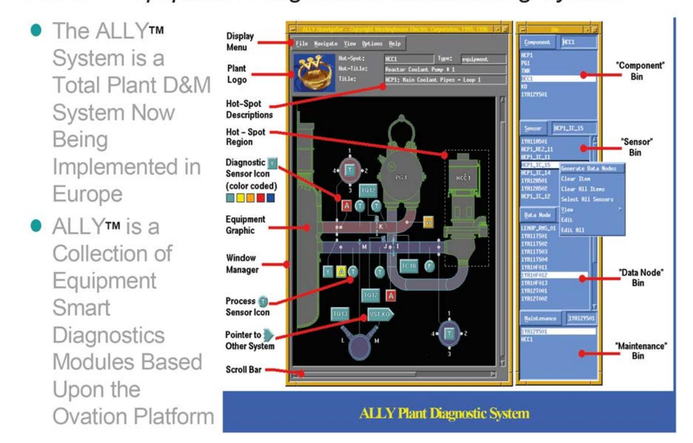

*FIG. 71. ALLY™ diagnostic systems family.*

The ALLY™ based system uses existing diagnostic systems:

- Metal impact monitoring system;
- Radiation monitoring system;
- Rotating equipment monitoring system;
- On-line chemistry monitoring system;
- Thermal event monitoring system;
- Turbine generator vibration monitoring system.

To combine acquired information in one rule based engine for decision making on the plant process status, the ALLY™ inference engine has been developed. The software and functional architecture of that engine is shown in Fig. 72.

#### **5.7.4. wEstEMs**

WESTEMS is the Westinghouse Thermal Event Monitoring System [101].

WESTEMS is a cost effective solution to system and component fatigue monitoring and usage factor utilization requirements. It automates structural integrity surveillance and also:

- Reduces the costs of complying with monitoring procedures and requirements;
- Reduces the costs of evaluating/analysing plant transient events;
- Reduces the critical path time to respond to action statements;
- Reduces unnecessary conservation in component fatigue allocations;
- Provides input to inspection, maintenance and life cycle management decisions.

A typical WESTEMS application is shown in Fig. 73. It uses a combination of model based and rule based techniques for a failure diagnostic.

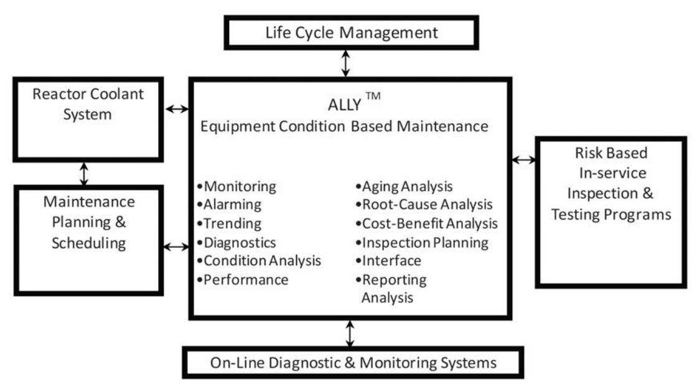

*FIG. 72. Integrated M&D system solution with ALLY™.*

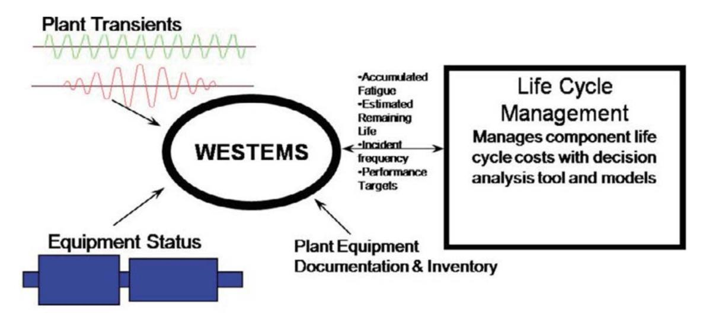

*FIG. 73. Typical solution with a WESTEMS monitoring and diagnostic system.*

### **5.7.5. IMAPs**

The Intelligent Monitoring Assessment Panel System (IMAPS), developed by University of Strathclyde, supports British Energy's monitoring assessment panels (MAPs) for its fleet of advanced gas cooled reactor (AGR) NPPs. As part of the licensing requirements for lifetime extension of the AGR stations, there is an increased requirement for monitoring. A significant life limiting factor of the AGR stations is the condition of the graphite reactor core, which cannot be replaced. The MAP process consists of quarterly meetings where representatives from across the station meet to discuss observations related to routine analyses. The aim of these meetings is to assess whether various measurable parameters show abnormal data, which could be a result of distortion of the graphite moderator.

IMAPS allows individual observations to be stored, versioned, linked to other electronic resources (principally documents within the British Energy document management systems) and managed throughout their life cycle at an escalated quality assurance grade. The system can then provide very flexible reactor core maps, rendered in the user's browser, onto which monitoring and inspection data overlaid. Users can then 'drill down' to see more history on a channel or of the particular MAP meeting dealing with the observation. A key feature of this is the auditability of the information — an 'on date' view allows users to see exactly the state of the information on any given date, allowing for future dissection of decisions based on the data in the system, by being able to view exactly the information engineers had available to them on a particular date. Figure 74 shows a screenshot of the IMAPS system populated with testing data. The colours of each channel in the core map indicate the presence of monitoring event data and results of analyses on the data.

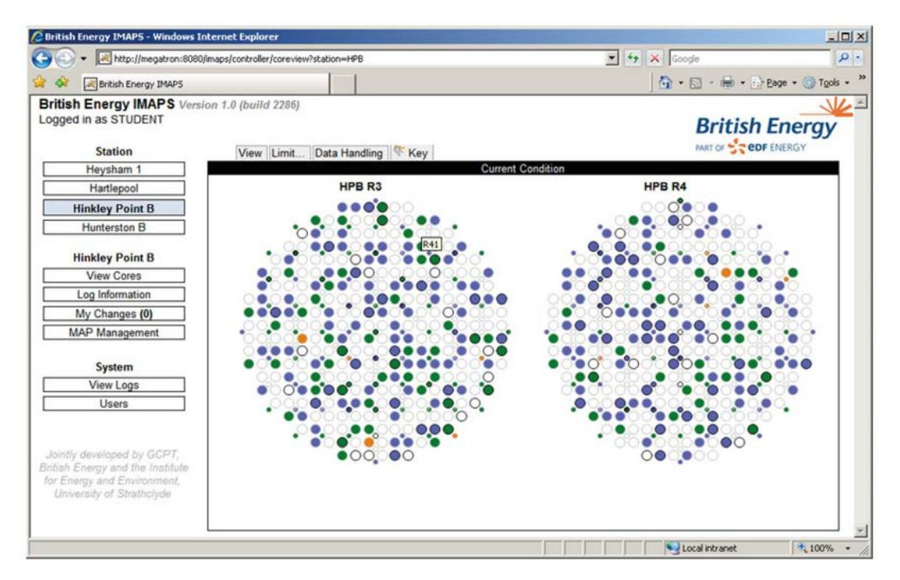

*FIG. 74. Screenshot of the IMAPS system.*

#### **5.7.6. BEtA: British Energy trace Analysis**

BETA is used by engineers in the graphite core team to automatically assess fuel grab load trace (FGLT) data. The results of the analysis inform the graphite team as to the condition of the graphite core bricks that comprise the core of the AGR reactors in the United Kingdom of Great Britain and Northern Ireland (UK). Increased monitoring of the cores is vital to ensure the cores are still fit for purpose, particularly in light of proposed and granted operational extensions to the nuclear power stations. The volume of data, and the paucity of expertise, is such that the application of intelligent system techniques to the analysis of the raw data provides benefits in terms of a reliable, repeatable and auditable decision support.

The BETA system consists of the following components:

- A database containing raw FGLT data and the results of automated analysis results;
- A web based front end for accessing the information contained within the database, for defining benchmark behaviour and for requesting the analysis of refuelling event data;
- An automated intelligent system, which analyses FGLT data for the presence of abnormal behaviour.

The BETA system allows the following functions to be performed:

- Uploading and verifying new refuelling event data, to maintain an up to date database of all FGLT data;
- Searching and visualizing multiple FGLTs and associated trending parameters together;
- Defining benchmarks of normal behaviour against which new events can be assessed;
- Automatically assessing new refuelling events for the presence of anomalous behaviour.

Figure 75 shows a screenshot from the BETA system populated with testing data. In this example, the distribution of values for a single parameter (in this case brick height) is displayed in three ways; as a colour coded core map (top left), as a population distribution (top right) and as a time line (bottom). These can be used to identify both outlying events, as well as temporal and spatial trends within the data.

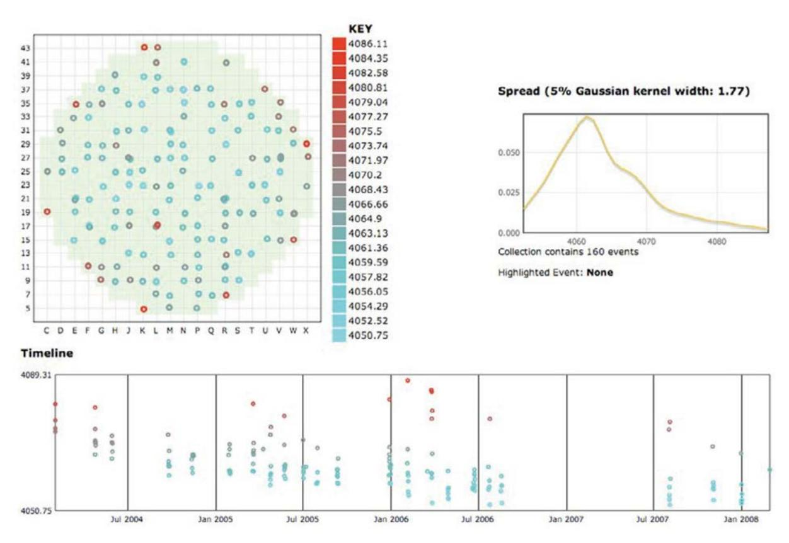

*FIG. 75. Screenshot of the BETA system.*

#### 5.8. INTEGRATION OF MONITORING AND DIAGNOSIS HARDWARE AND SOFTWARE

In recent years, huge advances have been made in the ability to capture and store condition monitoring data. When the majority of NPPs were built and commissioned, the availability of mass data capture and storage was minimal. However, there have been programmes of modernization where new sensors and data storage have been retrofitted to existing plant.

The traditional approach to condition monitoring is shown in Fig. 76.

The approach is split into three levels. Level 1 is at the plant sensors' level, which is concerned with the collection of plant data. At level 2, there is some elementary signal processing, typically done at the sensor level. At level 3, there is display storage and basic interpretation of the signals. The interpretation was often undertaken by a plant expert with years of experience in condition monitoring. Advances in data capture and storage techniques have meant the volumes of data to be analysed have increased significantly. In addition, the number of engineers with the necessary expertise has reduced (owing to their age profile). This has driven the need for intelligent data processing techniques, which can undertake some of the routine analysis and offer decision support to the engineer. To support this, new condition monitoring architectures are required that support the integration and sharing of data from multiple sources. Techniques such as multi-agent systems can offer a platform by which information can be shared between different monitoring and analysis systems. In addition, existing legacy systems can be wrapped as an agent and readily integrated into the overall monitoring system.

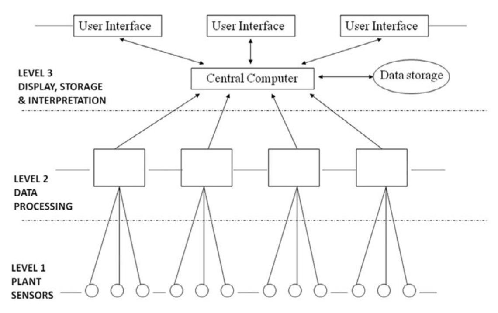

*FIG. 76. Traditional approach to condition monitoring.*

Two examples illustrating the integration concept of hardware and software are MIMIR (see below), which aims to develop a platform for integrating condition monitoring systems in the HRP, and a multi-agent approach to condition monitoring of power transformers.

#### **5.8.1. MIMIr**

The MIMIR project has the goal of developing a modular open platform for advanced condition monitoring. The development of the MIMIR platform started as an effort to fully modularize the code of existing HRP condition monitoring tools, primarily PEANO and Aladdin [132, 134], to make the different techniques currently embedded into the systems available as independent, reusable modules. The aim is to then have a complete condition monitoring and diagnostics platform that facilitates the study, implementation and testing of recombination of predeveloped modules into new configurations, which would then be optimally designed to solve specific condition monitoring and diagnosis tasks. MIMIR can also support the ISO 13374 standard (Condition monitoring and diagnostics of machines) by implementing the communication protocol described in the Mimosa implementation specification Open Systems Architecture for Condition Based Maintenance. The MIMIR platform will be developed in Java, but will need to support calling Matlab commands, since Matlab is commonly used to develop computationally intensive applications, and has been used to develop most of the condition monitoring tools at the HRP. While the MIMIR platform is being developed as an open source project, maximizing cooperation and exchange; the actual technology modules can be developed as either proprietary modules supporting the protection of intellectual property rights for vendor implementations, or open source modules supporting scientific/academic research and cooperation.

#### **5.8.2. MAs for transformer condition monitoring**

MASs have been applied to a number of areas within the electric power industry, as described in publications arising from the IEEE Power and Energy Society Multi-Agent Working Group [116, 117]. One that is of particular interest is the application of MAS to condition monitoring of power transformers. The Condition Monitoring Multi-Agent System (COMMAS) is a system that uses an agent architecture to analyse partial discharge data generated using the UHF monitoring system described in Section 5.7.2. The extensibility of the COMMAS architecture has been demonstrated, showing how new analysis techniques, based on DGA, can be integrated into existing condition monitoring systems. Full details can be found in Refs [116, 117].

The multi-agent platform allowed the monitoring system to be defined on four levels, namely:

- The data monitoring layer;
- An interpretation layer;
- A corroboration or diagnostic layer;
- An information layer.

Based on the functional requirements, the MAS technology was seen as an essential technology to underpin this condition monitoring system.

MASs offer a flexible and extensible framework for integrating the necessary data capture systems, monitoring systems and interpretation functions. Nevertheless, they do not provide systems integration capabilities only. This technology permits the development of more intelligent and automated diagnostic and monitoring functions. MASs comprise a number of independent software modules (agents), which exhibit four key characteristics: autonomy, social ability, reactivity and proactiveness.

In engineering terms, autonomy means that each agent will operate in an unsupervised mode, continually performing its diagnostic function while altering its behaviour as required. Social ability means that each agent can cooperate and communicate with other agents, supporting data exchange and information exchange for condition monitoring functions. Reactivity and proactiveness suggest that the agents are imbued with the ability to react to their surroundings and proactively take action to solve problems and ensure that they deliver the correct information or initiate the required control activity. Therefore, agents and MASs encompass all of the attributes required to automate diagnostic and condition monitoring applications. Based upon this technology, the transformer COMMAS was designed [117]. Though relatively new, MASs have demonstrated extensibility and may be suited to applications within the nuclear industry, particularly where the integration of information from a large number of distributed legacy systems is required.

#### 5.9. LICENSING AND REGULATORY CONCERNS

While some of the techniques and applications presented in this document are already in widespread use and demanded by several nuclear power regulatory bodies around the world (an example is monitoring of loose parts, which is implemented in many plants, especially those sites with PWR and WWER designs), there are many systems and M&D strategies that have not yet received regulatory approval for use on safety critical equipment, although the scope for improvement in safety, resource management and targeted maintenance may, on the face of it, appear obvious.

Generally, the requirements for safety class equipment are well defined by the various regulatory authorities, and processes agreed by the licensee are based on diverse factors, such as design basis faults and post faults, whether the equipment is required to operate during normal power operation, etc. These requirements and processes apply to permanently installed and well established equipment (e.g. pumps, motors, protection systems). However, the introduction of the techniques discussed in this report typically introduces the use of non-safety equipment and processes on which diagnosis of the condition and operability of safety equipment depends. Hence, there is an inferred claim on the reliability of the results provided by the monitoring systems, as continued operation may be determined by these results and false confidence provided if the software 'gets it wrong'.

The issues surrounding reliability, uncertainty and the use of this 'non-safety' qualified software (for example, commercial off the shelf (COTS) and general purpose operating systems) are not well defined, and hence there is a natural resistance from regulatory bodies regarding their use in safety related applications. Even though most of the techniques presented in this document have only a minor, or no, influence on the plant processes, the validity of the signals and analysis techniques poses a significant problem, especially if the licensee wishes to replace well established and proven methods. This situation is exacerbated where the proposed techniques require significant expert knowledge in order to interpret the results.

Where the techniques are to be applied to safety class equipment or processes, it is likely that a change to the plant technical specifications or operating rules will be required for its use, and hence a submittal to the regulator will be required. Where those changes impact uncertainty calculations and/or acceptance criteria, it is probable that the software reliability will have to be proven and thereby render some applications non-viable as the V&V burden may be cost prohibitive or non-achievable (the latter is particularly applicable to COTS applications).

Hence, the decision as to whether to use COTS software or a custom built package will very much depend on the equipment the application is intended to be used on, who will use the application, and what plant decisions will be made on the basis of the results. Table 11 is intended to provide a guide to the potential impact on safety documentation and/or regulatory impact, on the basis of the intended use of the application.

TABLE 11. POTENTIAL IMPACT OF OLM

| Question                                                                                                                                                                              | Potential impact                                                                                                                                                                                                                                              |
|---------------------------------------------------------------------------------------------------------------------------------------------------------------------------------------|---------------------------------------------------------------------------------------------------------------------------------------------------------------------------------------------------------------------------------------------------------------|
| Does the proposed application support existing maintenance processes or is it a replacement?                                                                                       | Low — if support, since the existing system becomes the 'fall back' and failure of OLM is not significant Medium — if replacement, since it may result in unnecessary or delayed maintenance, or, in the worst case, a loss of plant availability |
| Will the proposed OLM be used in the determination of plant operability as required by the technical specification/ operating rules governing compliance with the site licence? | Medium — since failure of the system may cause an inability to determine operability and subsequent entry into controlled shutdown                                                                                                                      |
| Could failure of the proposed OLM cause failure of a safety system?                                                                                                                | High — since OLM could be a threat to installed safety equipment and will incur higher levels of verification and validation                                                                                                                            |
| Is there a reliability claim for the proposed OLM?                                                                                                                                    | High — since OLM is moving toward safety classification, which will incur formal verification and validation commensurate with modern standards for the use of software on safety critical systems                                                   |

While there are significant regulatory challenges with respect to the techniques and applications, they are resolvable.

#### 5.10. BENCHMARK AND DEMONSTRATION ANALYSES

Benchmarking exercises were conducted using data provided by the project participants. The data themselves are available in the Appendix on DVD of this report.

#### **5.10.1. oLM of pressure transmitters**

In order to compare various approaches to instrumentation and equipment condition monitoring, a benchmarking exercise was carried out. The purpose of this benchmarking exercise was to compare and contrast different approaches to analysing transmitter data for the presence of sensor drift. To this end, one set of case study data representing a real world situation was analysed using disparate OLM techniques. Pressure transmitters were chosen because the NRC [99] only included pressure and differential pressure transmitters. No supporting knowledge of the plant parameters and physical interactions was provided, necessitating the use of statistical techniques for this evaluation. An overview of each applied approach is provided in the following sections. The results are compared against the as is/as left actions undertaken at the station. Finally, the methodologies are compared and contrasted.

The dataset used in this benchmark is from a four-loop PWR reactor and consists of 29 transmitter measurements from various services in one loop of the plant. The transmitters measure parameters such as steam generator pressures and levels, as well as flow rates. There is redundancy built into the monitoring system, with two to four sensors measuring each parameter. The data have been obtained over approximately one year of operation and are presented in six blocks of 12 h, sampled every 10 s. The objective is to determine which sensors have drifted from the expected values and therefore require calibration.

Several approaches to analysing the transmitter data are summarized here.

#### *5.10.1.1. Average deviation from the mean approach*

Deviation from the holistic mean among groups of transmitters can be monitored on-line, and upper/lower limits can be set to trigger alarms if a deviation matches or exceeds that expected for drift candidacy. The signals are subject to preset limits of operation. If a value were to exceed these limits, an alarm would be raised, thus indicating the drift. A similar technique is the EPRI Instrument Calibration and Monitoring Program (ICMP) algorithm [135].

#### *5.10.1.2. Skewness and kurtosis analysis approach*

In addition to examining the holistic mean among groups of transmitters, the change in skewness and kurtosis of the transmitter values over time is considered. Changes in these values could indicate a whole manner of different scenarios: step changes in signal, degradation of transmitter accuracy and, importantly, the presence of subtly drifting signals. Taking the distributions of entire periods of data (i.e. the full 12 h period taken for each transmitter each month) allows the kurtosis and skewness of these to be compared month to month. A notable change in one of these between sets can be thought of as a change in sample behaviour, which is useful knowledge to acquire when diagnosing the steady state drift status from month to month.

#### *5.10.1.3. Auto-associative kernel regression approach*

Auto-associative kernel regression (AAKR) is used to provide an empirical approach to drift detection. AAKR is primarily an error correction method; when presented with a new observation, it attempts to determine the 'correct' sensor readings based on previous experience. Additionally, it is a non-parametric, memory based model, which means that the model consists primarily of a matrix of exemplar memory vectors, **X**. When a new observation is presented to the model, its 'correct' value is determined as a weighted sum of the most similar exemplar vectors. A sensor drift may be detected by comparing the observed sensor values to the expected values, to identify disparities. Since AAKR methods can differ based on the data included in the memory matrix and other features of the methodology, several competing AAKR routines are included in the benchmark comparison.

#### *5.10.1.4. Kernel principal components analysis approach*

Kernel PCA is a non-linear generalization of the PCA procedures. Kernel PCA attempts to account for non-linearities in data by first mapping the data to a new feature space in which data relationships are linear or nearly linear, and then performing traditional PCA. Kernel PCA suffers in practice from the difficulty of identifying this non-linear mapping function. However, if an appropriate mapping function is known, the technique is straightforward.

#### *5.10.1.5. Joint Directors of Laboratories data fusion technique*

The Joint Directors of Laboratories (JDL) data fusion model, which is described in more detail in Chapter 6 and in the Appendix on DVD of this report, uses redundant sensor inputs to determine a best representative output value. This algorithm is called the redundant sensor algorithm and can use analytical redundancy as well as raw data from the redundant sensors. The RSA is provided to reduce the likelihood of plant upsets caused by single failures in instrumentation. The RSA class of function minimizes the effects of erroneous data on the most probable value calculated as an output of this processing method.

#### *5.10.1.6. PEANO technique*

The PEANO technique is described in Section 5.6.5 of this document and in the Appendix on DVD.

#### *5.10.1.7. Concept of the evolving cluster method*

The evolving cluster method is a fast, one pass algorithm for dynamic clustering of an input stream of data. It is a distance based clustering method where the cluster centres are represented by evolved nodes in an on-line mode. The clustering process starts with an empty set of clusters. The datastream, i.e. the training samples, is used to generate a number of multidimensional clusters identified by their position in the sample space and their width. Given a maximum allowed cluster width, during the training process, the position and width of the clusters are continuously updated and a near optimal cluster distribution is eventually obtained. Based on these clusters, the model is expected to generalize by associating to an unseen sample the (multidimensional) value of the centre of the closest cluster.

#### *5.10.1.8. Station benchmark — 'as left/as found'*

During routine calibration of the transmitters during a maintenance outage at the end of the one year data collection period, two sensors were identified as showing drift characteristics. These are the steam generator level wide range measurement taken by transmitter SG LVL WR 2, which is one of two redundant transmitters, and the reactor cooling system pressure wide range measurement taken by RCS PSR WR 4, which is one of four redundant transmitters.

#### *5.10.1.9. Comparison of results*

Table 12 provides a summary of the results from each approach. The table lists all of the sensors, the results of actual station as left/as found, and the results of each individual technique. Based on the result of the maintenance inspection, two sensors were in need of calibration. Four of the five results identified both drifted sensors; however, in each case additional sensors were identified as faulted or suspected of fault.

#### *5.10.1.10. Discussion of results*

The sensor calibration monitoring methodologies investigated here represent a subset of the available methods. The benchmark results presented here are used to give a comparison of the results of selected techniques, but are not to be considered all inclusive. The 'no free lunch' theorem tells us that no one monitoring system is the best for all situations; each methodology has its own advantages, drawback and areas of applicability. Analysing statistical changes in the data, such as the average deviation from the mean or the skewness/kurtosis methods, can be slow in detecting erroneous changes in sensor values. AAKR methods can detect very small changes in sensor relationships from nominal conditions, but they require large amounts of nominal operating data covering the entire range of operation for proper model development. As noted above, kernel PCA requires some domain knowledge for determining the correct non-linear mapping function. The JDL/RSA methodology requires groups of redundant sensors with separate models for each group.

Each of these methods is useful for calibration monitoring of NPP sensors, and no one method can be declared superior to the others. Determining which methodology is most appropriate for a specific task or situation is left to the system developer.

#### **5.10.2. Demonstration of in situ cable testing**

#### *5.10.2.1. Cable ageing benchmark*

Three Belden 8102 multiconductor low capacitance cables were subjected to various types of damage and tested using a CHAR system and the LIRA cable assessment tool (the CHAR system is a product of CHAR

TABLE 12. SUMMARY OF OLM BENCHMARK RESULTS (cont.)

|    |                  |                                    |                  |       |                            |                          | Analysis results |                          |            |         |
|----|------------------|------------------------------------|------------------|-------|----------------------------|--------------------------|------------------|--------------------------|------------|---------|
|    | Transmitter name | Service                            | As left/as found | PEANO | from the mean Deviation | and kurtosis Skewness | ECM              | (Korean version) AAKR | Kernel PCA | JDL/RSA |
| 1  | STM PSR 1        | Steam pressure                     |                  |       |                            |                          |                  |                          |            |         |
| 2  | STM PSR 2        | Steam pressure                     |                  |       |                            |                          |                  |                          |            |         |
| 3  | STM PSR 3        | Steam pressure                     |                  | ?     |                            |                          |                  |                          |            |         |
| 4  | STM PSR 4        | Steam pressure                     |                  |       |                            |                          |                  |                          |            |         |
| 5  | SG LVL WR 1      | Steam generator level wide range   | Bad              | Bad   | Bad                        |                          | Bad              | Bad                      | Bad        | Bad     |
| 6  | SG LVL WR 2      | Steam generator level wide range   |                  |       | Bad                        |                          |                  |                          |            | ?       |
| 7  | SG LVL NR 1      | Steam generator level narrow range |                  |       |                            |                          |                  |                          |            |         |
| 8  | SG LVL NR 2      | Steam generator level narrow range |                  |       |                            |                          |                  |                          |            |         |
| 9  | SG LVL NR 3      | Steam generator level narrow range |                  |       |                            |                          |                  |                          |            |         |
| 10 | SG LVL NR 4      | Steam generator level narrow range |                  |       |                            |                          |                  |                          |            |         |
| 11 | W 1 FEED FLO  | Feedwater flow                     |                  |       |                            |                          |                  |                          | ?          |         |
| 12 | W 2 FEED FLO  | Feedwater flow                     |                  |       |                            |                          |                  |                          | ?          |         |
| 13 | W 3 FEED FLO  | Feedwater flow                     |                  |       |                            |                          |                  |                          | ?          |         |
| 14 | W 4 FEED FLO  | Feedwater flow                     |                  |       |                            | Bad                      |                  |                          | ?          |         |
| 15 | PzR PSR 1        | Pressurizer pressure               |                  |       |                            |                          |                  | ?                        |            | ?       |
| 16 | PzR PSR 2        | Pressurizer pressure               |                  |       |                            |                          |                  | ?                        |            |         |
| 17 | PzR PSR 3        | Pressurizer pressure               |                  |       |                            |                          |                  | ?                        |            |         |
|    |                  |                                    |                  |       |                            |                          |                  |                          |            |         |

2108TABLE 12. SUMMARY OF OLM BENCHMARK RESULTS (cont.)

|    |                  |                         |                  |       |                            |                          | Analysis results |                          |            |         |
|----|------------------|-------------------------|------------------|-------|----------------------------|--------------------------|------------------|--------------------------|------------|---------|
|    | Transmitter name | Service                 | As left/as found | PEANO | from the mean Deviation | and kurtosis Skewness | ECM              | (Korean version) AAKR | Kernel PCA | JDL/RSA |
| 18 | PzR PSR 4        | Pressurizer pressure    |                  |       |                            |                          |                  | ?                        |            |         |
| 19 | PzR LVL 1        | Pressurizer level       |                  |       |                            |                          |                  |                          |            |         |
| 20 | PzR LVL 2        | Pressurizer level       |                  |       |                            |                          |                  |                          |            |         |
| 21 | PzR LVL 3        | Pressurizer level       |                  |       |                            |                          |                  |                          |            |         |
| 22 | PzR LVL 4        | Pressurizer level       |                  |       |                            |                          |                  |                          |            |         |
| 23 | RCS PSR WR 1     | RCS pressure wide range |                  |       |                            |                          |                  | ?                        |            |         |
| 24 | RCS PSR WR 2     | RCS pressure wide range |                  |       |                            |                          |                  | ?                        |            |         |
| 25 | RCS PSR WR 3     | RCS pressure wide range |                  | ?     |                            |                          |                  | ?                        |            |         |
| 26 | RCS PSR WR 4     | RCS pressure wide range |                  | Bad   | Bad                        | Bad                      | Bad              | ?                        | Bad        | Bad     |
| 27 | W 1 STM FLO   | Steam flow              |                  |       |                            |                          |                  |                          | ?          |         |
| 28 | W 2 STM FLO   | Steam flow              |                  |       |                            |                          |                  |                          | ?          |         |
| 29 | W 3 STM FLO   | Steam flow              |                  |       |                            |                          |                  |                          | ?          |         |

'?' indicates a suspicious sensor that cannot be definitively declared 'Bad'.

Services Inc. Pennsylvania, USA, which is a subsidiary of Analysis and Measurement Services Corporation (AMS) of Knoxville, Tennessee, USA). Each fault was simulated and tested in the laboratory at AMS and then shipped to Wirescan AS in Norway to compare results using the LIRA equipment. The LIRA equipment that was utilized for these tests included the following devices:

- LIRA system 2.5R13;
- Signal generator and digitizer, 200 MS/s (80 Hz bandwidth);
- Wirescan modulator WS-M002.

Since the cables were tested at two different locations, they were tested in a coiled layout to recreate similar tests.

Time domain reflectometry (TDR) analysis was performed with reference to a baseline measurement before damaging the cables.

The cables before damage were not available for LIRA baseline measurements, so the LIRA analysis and results are based on one shot measurements on the damaged cables.

Table 13 shows a summary of the achieved results with both methods.

TABLE 13. CABLE FAULT DETECTION BENCHMARK SUMMARY RESULTS

| Fault type                 | TDR          | LIRA         |
|----------------------------|--------------|--------------|
| Smash with hammer, cable 7 | Detected     | Detected     |
| Butt splice, cable 7       | Not detected | Detected     |
| Extreme bending, cable 7   | Detected     | Detected     |
| Vice grip squeeze, cable 7 | Not detected | Not detected |
| Jacket burn, cable 8       | Detected     | Not detected |
| Shield burn, cable 8       | Detected     | Detected     |
| Butt splice, cable 8       | Not detected | Detected     |
| Jacket cut, cable 9        | Not detected | Detected     |
| Butt splice, cable 9       | Not detected | Detected     |

#### *5.10.2.2. Discussion of the results*

The insulation resistance measurements made using the CHAR equipment were unable to detect the faults that were created on any of the three cables. However, the TDR traces and TDR difference plots were able to pinpoint the location of several of the faults created on the cables. The portion of cable 7 that was hit with a hammer was detected, along with the section that experienced an extreme bend. The shield and jacket burn were both detected on cable 8. Also, an unknown anomaly was discovered in the TDR difference plot. TDR was unable to detect the jacket cut that was made in cable 9.

LIRA was able to detect the point that experienced the smash with a hammer, the butt splice and the extreme bend. Neither cable testing technique was able to detect the vice grip squeeze. LIRA is unable to detect the vice grip squeeze, owing to the termination shadow it produces. Detection of features close to the termination would require higher bandwidth using LIRA. The LIRA system discovered both of the burns created on cable 8, along with the unknown anomaly, just as the CHAR equipment. However, LIRA was able to detect the butt splice in cable 8, whereas the CHAR equipment did not. The jacket cut and the butt splice were detected in cable 9 by the LIRA equipment.

#### 5.11. CONCLUSIONS, RECOMMENDATIONS AND FUTURE RESEARCH

Instrument and equipment monitoring has been described through the application of OLM techniques. The motivations for developing and deploying OLM systems for NPPs have been described, along with the need to monitor not just the equipment itself, but also the associated cabling. The key techniques used to support the analysis of condition monitoring data have been outlined; these are techniques that aim to alleviate the potential of overloading the human expert with large volumes of data. A few example systems have been discussed that describe the implementation of these OLM techniques within operational NPPs worldwide. These examples represent the exception, rather than the rule, without widespread adoption of these techniques. The main reason for this is that retrofitting such systems to existing plant is expensive and time consuming, coupled with the lack of a regulatory drive in some regions to achieve this. With pressures to continue to operate stations past their initial planned lifetimes, such as 'Life beyond 60' in the USA, and the granted lifetime extensions of two of the AGR stations in the UK, the case for increased OLM becomes stronger.

In the area of cable monitoring, although many promising results have been achieved in the last few years, there are still some unresolved issues that will be a major challenge during the coming years in this area.

The most challenging issue is probably the development of reliable methods for residual life estimation of installed cables. Two factors largely contribute to the difficulty of this estimation:

- The extension of a cable and the different environment conditions suggest that its condition is not the same along its length, but it will eventually fail at its weakest point. This results in additional uncertainties for on-line condition monitoring techniques, when most of the cable length is not easily accessible.
- The end of life of an in-containment, safety related cable, EQ (environment qualification) qualified, does not correspond to the time of failure during normal operation, but to the time when the cable would not survive a DBA.

These challenges are being investigated through recently planned research efforts, such as the ADVANCE project, an EC-EURATOM funded project, and a new CRP project being planned by IAEA for 2012–2015 on cable condition monitoring and ageing management.

Moving forward, there is a significant opportunity to install OLM from the design of the next generation of plants. This would provide the opportunity to develop models of behaviour based on start of life data, something that is not possible when retrofitting monitoring systems to existing plant. Whether this happens will depend on a number of factors, such as whether there is a strong regulatory requirement for this and whether investment now can be economically justified, for payback in the future when these new plants reach the latter stages of their operating lives.

Summarizing the key trends deduced from the above analysis, we should expect to see:

- The development of smart sensors, and other low cost OLM systems that will permit cost effective continuous monitoring of key equipment items;
- Increasing provision of built in vibration sensors as standard features in large motors, pumps, turbines and other large equipment items;
- Increasingly sophisticated condition monitoring software, with rapidly developing 'expert' diagnosis capabilities;
- The acceptance of condition monitoring within the 'mainstream' of operations and maintenance, with production operators increasingly utilizing condition monitoring technologies as part of their day to day duties;

- Increasing integration and acceptance of common standards for interfacing condition monitoring software with process control software;
- An increasing focus on the business implications and applications of condition monitoring technologies, leading to the utilization of condition monitoring technologies to improve equipment reliability and performance, rather than merely predicting component failure;
- A reduction in the cost per point of applying condition monitoring technologies possibly leading to more widespread use of these technologies.

It is likely that the trend towards integration of condition monitoring hardware and software with other business systems will lead to enforced compliance with industry wide standards. While these standards have been in place for some time, compliance with these standards has, by at least some manufacturers, been limited.

Given that the market for process control hardware and software is much larger than that for condition monitoring hardware and software, it is likely that over the next decade, we will see either:

- Process control equipment vendors developing their own condition monitoring hardware/software capability; or
- Process control equipment vendors acquiring the existing players in the condition monitoring equipment market.

While the focus of R&D at most of the major condition monitoring vendors has been on the hardware side (particularly in the area of smart sensors), the key to the successful application of these sensors lies in the area of software. Currently, none of the major vendors has a credible capability in this area. The first vendor to develop robust, reliable 'expert' software based on open standards has the potential to gain significant market share.

The following factors are likely to lead to a significant reduction in the demand for 'traditional' condition monitoring contract services:

- Increasing integration of condition monitoring hardware/software with process control hardware and software;
- Increasingly sophisticated 'expert' software allowing less skilled personnel to conduct 'first pass' condition assessment;
- A reduction in the cost of condition monitoring technology, allowing smaller organizations to cost effectively perform their own condition monitoring activities.

Balanced against this are the following factors that are likely to lead to increased demand for condition monitoring services:

- An increase in the number of equipment items being monitored, as it becomes more cost effective to do so;
- Demands for increasing sophistication in the application of condition monitoring technologies, with a particular focus on applying the technology in a manner that maximizes the business benefits of the technology.

The primary implications of this for condition monitoring contractors are that:

- There will be less 'hands on' data collection.
- There will be less, but more sophisticated, data analysis, often using data that have been collected on-site and then transmitted electronically to the contractor for analysis.
- Condition monitoring contractors will need to adopt a 'consultant' mind set, rather than a traditional contractor mind set if they are to survive. In particular, they will need to understand their clients' business context and their production processes, and think in terms of how they can best add value to their clients' businesses, rather than having technology issues as their prime consideration.

For those organizations that use condition monitoring as part of their maintenance strategy mix, the following are the likely implications of the previously mentioned trends:

- Condition monitoring will be considered less and less as a 'black art' requiring specialists in order to perform routine data collection and analysis, although specialists will still be required to perform more complex or unusual analysis.
- Production operators will increasingly use condition monitoring techniques to highlight potential equipment problems — using either handheld equipment, or permanently installed monitors that are integrated with process control systems.
- Mechanical people will increasingly use condition monitoring techniques to check the quality of their own workmanship (for example to check alignments, balancing, etc.).
- There will be reduced focus on using condition monitoring techniques to predict equipment failure, and an increased focus on using these techniques to improve equipment and component life, and improve equipment performance.

It will become increasingly economical, and increasingly strategically important, to perform routine condition monitoring tasks in-house, rather than contract out these services.

# **6. EnABLInG tECHnoLoGIEs**

Enabling technologies are typically concerned with the transfer of data and information from one location to another, or with combining data and information from multiple different sources. Some of these technologies have yet to be implemented in NPP, or have limited implementation, though they have seen application in other fields. Advances in data capture and data storage allow more complex models and algorithms to be developed, at the expense of having to manage a far greater volume of data. Advances in data communication also mean that diagnostic information can be shared much more easily between systems, allowing wider processwide and plantwide monitoring to be undertaken. Five emerging areas have been selected, which may find implementation in NPPs in the near future. These are:

- Wireless technology;
- Data fusion;
- Fieldbus technology;
- Smart instruments;
- Power line data carrier.

#### 6.1. WIRELESS TECHNOLOGY FOR DATA COMMUNICATION

Wireless sensors and networks, in which communication between devices is enabled without the use of cables, have become popular in the last 10 years for equipment condition monitoring in NPPs [136]. In particular, wireless sensors may be deployed in nuclear facilities to measure rotating equipment vibration, temperature, and other parameters, to enable the plant engineers to predict the failure of the equipment. There are fully contained wireless sensors that include both the sensor and the transmitter in the same module. These sensors are available from a number of manufacturers**.** A more prevalent practice for wireless sensor deployment is to use a wireless hub. With a wireless hub, existing conventional sensors are connected to the hub, where the data are transmitted wirelessly [137].

Typically, the wireless hub sends the data through the plant network to either the plant computers or a workstation, where the data may be retrieved and analysed (Fig. 77).

The cost of wiring in NPPs [138] is normally high, owing to the documentation requirements, space limitations and other factors. A rough estimate of the cost of normal wiring in an NPP is around US \$2000 per 0.3 m

*FIG. 77. Wireless sensors in a plant network.*

(US \$2000 per foot) [139]. This compares with a value of less than US \$20 per 0.3 m (US \$20 per foot) when using wireless technology for the same application. Note that even with wireless sensors, some wiring is still needed, hence the US \$20 per foot.

A major concern with using wireless sensors in NPPs is cybersecurity. This problem has contributed to the slow migration of wireless technology into NPPs. However, experts believe that the cybersecurity problems are overstated and that there should be little or no problem with incorporating wireless sensors in an NPP to collect data for equipment condition monitoring. In fact, those NPPs that have implemented wireless technologies have reported that they have encountered little or no problems with cybersecurity. Cybersecurity would be a huge issue if wireless technology were to be used for process control. As for equipment and process condition monitoring, a hacker is believed to pose no potential risk to the plant.

Previously, a number of concerns have kept wireless technologies from being used in the type of data collection needed for CBM. These concerns are rooted in the understanding that wireless connections are not exactly equivalent to wired connections. The foremost issue is the perception that wireless connections are unreliable, since they can be interrupted by excessive distance, signal blockage or interference from nearby RF emitters. Other concerns have been the limited range of the wireless connections, as well as lower throughput and higher latency than wired connections. Security is often raised as an issue, since wireless signals can be received across a broad area.

Continuing advances in wireless technology over the last decade have overcome most of the traditional concerns about using wireless based connections. Improved radio designs have made significant advances in the range and reliability of wireless links. Wireless networks in use today include wireless personal area networks (WPANs), wireless local area networks (WLANs), wireless metropolitan area networks (WMANs) and wireless wide area networks (WWANs), which can provide communication for various devices from computer mice to cellular telephones, at ranges from a few metres (WPANs) to large geographic areas (WWANs) [139].

In addition, more sophisticated networking protocols have been incorporated into the designs of these radios to further improve the reliability and performance of the wireless networks. Most of these modern wireless networks also incorporate encryption, authentication processes and other security features to allay the concerns about eavesdropping and other security issues. Finally, the high manufacturing volumes provided by the cellular and Wi-Fi markets have driven costs down significantly, so that wireless connections are often much less expensive than other alternatives.

Wireless connectivity is poised for broad adoption in the industrial and commercial automation market, similar to the situation with Ethernet 25 years ago. At that time, Ethernet was moving from defence and educational applications into broader commercial and office use. There was significant resistance to the use of Ethernet in industrial applications, however, since it was perceived that the shared nature of Ethernet did not provide exactly the same, deterministic reliability as direct wired connections. The increasing familiarity with Ethernet, together with the development of distributed control system architectures, has led to widespread adoption of Ethernet in industrial environments for several aspects of monitoring and control applications. Wireless connectivity is also starting to be adopted more broadly as its capabilities are better understood.

There are a number of wireless technologies that are available for continuously monitoring equipment condition. Cellular telephone networks are being used to monitor equipment, particularly in remote locations or when the equipment is frequently mobile (i.e. vehicles, construction equipment). Equipment is even being monitored over satellite communication networks for those areas beyond cellular coverage.

The major advance in using wireless technology for equipment monitoring, however, is using low cost, low powered, unlicensed wireless technology. Most wireless communication requires each transmitter to be licensed by government regulators, including cellular telephones, radio and TV broadcasting, and microwave links. There are certain parts of the radio spectrum, such as the Industry, Science and Medicine (ISM) band, in which any low power wireless device is allowed to operate without requiring a government licence [140]. The most familiar example is Wi-Fi, the wireless local area networking technology also referred to as 802.11, that uses the ISM band of 2.4 GHz. Originally developed for connecting computers, Wi-Fi can monitor equipment in situations where Wi-Fi networks already exist and where the radio can be connected to power. Related wireless technologies have been used to develop wireless connections specifically for industrial applications. These industrial wireless networks are usually proprietary and are available for a variety of frequencies and network configurations (i.e. point to point, point to multipoint.) The variety and specialization of these wireless industrial networks are similar to the variety of fieldbus wired networks for the same connectivity applications.

Wireless sensor networks, which consist of spatially distributed sensors that communicate using radio frequencies, can be configured in a variety of topologies including star, mesh and hybrid networks (Fig. 77). For example, in star networks, the wireless sensors communicate only with a central access point. Mesh networks, on the other hand, can be configured so that the data from one sensor are relayed to their final destination through several other wireless sensors [140]. Mesh networks often incorporate sophisticated intelligence that allows them to configure themselves automatically, and to develop the routing schemes so that the fewest number of radios are involved in conveying the data while also routing around interference and obstacles. These wireless sensor networks provide broader aggregate coverage than simpler point to point wireless technologies, while also achieving more reliable operation. Wireless sensor networks greatly expand the number of monitoring and control applications that can be served by wireless connections.

The challenge of using wireless connections for monitoring equipment condition is that no single one of the different wireless technologies is the most cost effective solution for all applications, so each application must be analysed to select the appropriate wireless technology. In general, the broader the area in which the monitored equipment is located, the more expensive is the wireless technology that must be employed. Also, the distance between the individual pieces of equipment will determine whether a wireless sensor network can be used cost effectively, or whether another wireless technology is needed. Different wireless networks are also optimized for the volume of data to be transmitted, although moving larger volumes of data generally requires a more expensive solution. Some wireless technologies operate on frequencies that provide better coverage in buildings, but these frequencies are only available in certain countries. Some wireless networks enable their radios to operate for extended periods on battery power, while other wireless networks cannot be used practically without connection to a power source. Choosing the appropriate wireless technology for monitoring equipment involves making a number of choices and trade offs.

The cost of wireless connections is an important consideration in using this technology, although costs have improved dramatically in recent years. For industrial wireless networks that only communicate over relatively short distances, including wireless sensor networks, the cost of a complete radio has generally dropped to under US \$300, and sometimes under US \$100. Wireless industrial radios that communicate over somewhat longer distances can cost between US \$300 and US \$800. For communicating over distances measured in miles, radios can be bought for US \$500 to US \$1000. These wireless costs compete favourably against retrofitting wiring.

#### **6.1.1. wireless standards enable adoption**

Just as wireless local area networking became more attractive and cost effective after the development of the family of IEEE 802 standards including 802.11 (Wi-Fi) and 802.15.1 (Bluetooth), emerging standards in wireless sensor networks will make them more acceptable and attractive [137]. Major standards initiatives that use IEEE 802.15.4 and are guiding the maturation of wireless sensor networks include zigBee™, WirelessHART and ISA100 [139].

zigBee is the most mature of the standards, with the first version of the standard released several years ago, and there are several manufacturers that provide zigBee based products. zigBee is a general worldwide standard for low power wireless mesh networks that is defined by an open standards organization called the zigBee Alliance. The zigBee standard has been designed to serve a wide range of applications from industrial automation, to building automation, to advanced metering, to home automation. The most current implemented version of the zigBee standard is the second major release, called zigBee 2006. There are already multiple manufacturers shipping chip level implementations of zigBee 2006, and a number of products incorporating these chips are also currently shipping. The next version of the zigBee standard, zigBee 2007, continues to add more functionality and has already been ratified. Chip level products that implement zigBee 2007 are just starting to be announced. zigBee is a well established standard that has been adopted by a number of manufacturers and is continuing to evolve.

WirelessHART is the counterpart to the HART intelligent sensor standard that has been in existence for wired industrial automation and control applications for over a decade. WirelessHART is targeted specifically at monitoring and open loop control applications in industrial environments. WirelessHART is part of the overall HART Version 7.0 specification that was released in the autumn of 2007. Products using the WirelessHART protocol have been announced and began shipping in 2008. Products using WirelessHART may be especially useful for retrofitting condition based monitoring for maintenance purposes.

A third important wireless sensor networking standard is ISA100, which is being developed by the International Society of Automation (ISA). The first iteration of this standard, ISA100.11a was ratified in December 2010. ISA100.11a is targeted at monitoring and open loop control applications in process manufacturing industries, such as oil refineries, power plants and paper mills. Products employing this first version of the standard began shipping in 2009. ISA is continuing to develop future versions of this standard for discrete manufacturing and for asset identification and management, and is also working to enable interoperation with WirelessHART devices. ISA has developed a number of important standards for industrial automation, and ISA100 will probably have a significant impact on the industry.

Wireless technology, including the development of industry standards, has evolved over the past few years so that it is a practical and affordable option for connecting equipment to implement CBM. Table 14 provides examples of wireless standards available today.

#### 6.2. APPLICATION OF DATA FUSION TECHNIQUE TO REDUNDANT SENSORS PROCESSING

As was defined in the Chapter 5, there is a need for more accurate processing of redundant sensors. Using a holistic approach for processing redundant sensors would allow [141]:

- Licensing of the instrumentation channels diagnostic techniques, since this issue is related in some cases to the calculations of set points for the channels that are important to safety;
- Definition of the confidence intervals for the resultant values;
- Definition of the confidence intervals and degradation of the input signals.

TABLE 14. WIRELESS STANDARDS USING IEEE 802.15.4

|                              | zigBee                                                                                      | WirelessHART                                                                     | ISA100                                                                                 |
|------------------------------|---------------------------------------------------------------------------------------------|----------------------------------------------------------------------------------|----------------------------------------------------------------------------------------|
| Standards organization       | zigBee Alliance                                                                             | HART Communication Foundation                                                    | International Society of Automation                                                 |
| Type of communications       | Wireless sensor networks with ultra low power consumption                             | Wireless networks with low power consumption                                  | Wireless networks with low power consumption                                        |
| Commercial applications      | Industrial automation; building automation; advanced metering                         | Monitoring open loop control applications in heavy industrial environments | Monitoring open loop control applications in process manufacturing industries |
| Consumer applications        | Home automation                                                                             | n.a.                                                                             | n.a.                                                                                   |
| Maturity                     | Most mature of all standards; first standard ratified in 2005                            | Protocol released in 2007; became an IEC standard in March 2010            | New standard, ratified December 2010                                                |
| Most recent standard version | zigBee 2006 zigBee 2007                                                                  | IEC WirelessHART 62591                                                           | ISA100.11a                                                                             |
| Timeframe products available | zigBee 2006 products being shipped now zigBee 2007 products began shipping in 2008 | Products began shipping in 2008                                               | Products began shipping in 2009                                                     |

a n.a.: not applicable.

To satisfy the above considerations, the data fusion notion is used for the redundant sensor treatment.

There is some confusion in the terminology for fusion systems. The terms 'sensor fusion', 'data fusion', 'information fusion', 'multisensor data fusion' and 'multisensor integration' have been widely used in the technical literature to refer to a variety of techniques, technologies, systems and applications that use data derived from multiple information sources. Fusion applications range from real time sensor fusion for the navigation of mobile robots to the off-line fusion of human or technical strategic intelligence data.

There are classic books on fusion that propose an extended term, 'multisensor data fusion' [142]. It is defined there as the technology concerned with the combination of how to combine data from multiple (and possible diverse) sensors, in order to make inferences about a physical event, activity or situation. However, in both books, the term 'data fusion' is also mentioned as being equal with 'multisensor data fusion'.

To avoid confusion about the meaning, some researchers decided to use the term 'information fusion' as the overall term for fusion of any kind of data. The term 'information fusion' had not been used extensively before and thus had no likelihood of being associated with any single aspect of the fusion domain. The fact that 'information fusion' is also applicable in the context of data mining and database integration is not necessarily a negative one, as the effective meaning is unaltered: information fusion is an all encompassing term covering all aspects of the fusion field.

A literal definition of information fusion can be found at the homepage of the International Society of Information Fusion [143]:

Information Fusion encompasses theory, techniques and tools conceived and employed for exploiting the synergy in the information acquired from multiple sources (sensor, databases, information gathered by human, etc.) such that the resulting decision or action is in some sense better (qualitatively or quantitatively, in terms of accuracy, robustness, etc.) than would be possible if any of these sources were used individually without such synergy exploitation.

By defining a subset of information fusion, the term sensor fusion is introduced as:

Sensor Fusion is the combining of sensory data or data derived from sensory data such that the resulting information is in some sense better than would be possible when these sources were used individually.

The data sources for a fusion process are not specified to originate from identical sensors. There are distinctions between direct fusion, indirect fusion and fusion of the outputs of the former two. Direct fusion means the fusion of sensor data from a set of heterogeneous or homogeneous sensors, soft sensors and historic values of sensor data, while indirect fusion uses information sources like a priori knowledge about the environment and human input. Therefore, sensor fusion describes direct fusion systems, while information fusion also encompasses indirect fusion processes.

In this report, we use the terms 'sensor fusion' and 'information fusion' according to the definitions stated before.

The sensor fusion definition above does not require that inputs are produced by multiple sensors; it only says that sensor data or data derived from sensor data have to be combined. For example, the definition also encompasses sensor fusion systems with a single sensor, which take multiple measurements subsequently at different instants, which are then combined.

#### **6.2.1. Motivation for data fusion**

Systems that employ sensor fusion methods expect a number of benefits over single sensor systems. A physical sensor measurement generally suffers from the following problems:

- *Sensor deprivation:* The breakdown of a sensor element causes a loss of perception on the desired object.
- *Limited spatial coverage:* Usually an individual sensor only covers a restricted region. For example, a reading from a thermometer just provides an estimation of the temperature near the thermometer and may fail to correctly render the average water temperature in the object under consideration.
- *Limited temporal coverage:* Some sensors need a particular set-up time to perform and to transmit a measurement, thus limiting the maximum frequency of measurements.
- *Imprecision:* Measurements from individual sensors are limited to the precision of the employed sensing element.
- *Uncertainty:* Uncertainty, in contrast to imprecision, depends on the object being observed rather than the observing device. Uncertainty arises when features are missing, when the sensor cannot measure all relevant attributes of the percept, or when the observation is ambiguous. A single sensor system is unable to reduce uncertainty in its perception because of its limited view of the object.

The standard approach to compensate for sensor deprivation is to build a fault tolerant unit of at least three identical units with a voter or at least two units showing fail silent behaviour. Fail silent means that a component produces either correct results or, in case of failure, no results at all. In a sensor fusion system, robust behaviour against sensor deprivation can be achieved by using sensors with overlapping views of the desired object. This works with a set of sensors of the same type, as well as with a suite of heterogeneous sensors.

The following advantages can be expected from the fusion of sensor data from a set of heterogeneous or homogeneous sensors:

- *Robustness and reliability:* Multiple sensor suites have an inherent redundancy, which enables the system to provide information even in the case of partial failure.
- *Extended spatial and temporal coverage:* One sensor can 'look' where others cannot, and correspondingly can perform a measurement while others cannot.
- *Increased confidence:* A measurement of one sensor is confirmed by measurements of other sensors covering the same domain.
- *Reduced ambiguity and uncertainty:* Joint information reduces the set of ambiguous interpretations of the measured value.

- *Robustness against interference:* By increasing the dimensionality of the measurement space (e.g. measuring the desired quantity with optical sensors and ultrasonic sensors), the system becomes less vulnerable against interference.
- *Improved resolution:* When multiple independent measurements of the same property are fused, the resolution of the resulting value is better than measurement from a single sensor.

A further advantage of sensor fusion is the possibility to reduce system complexity. In a traditionally designed system, the sensor measurements are fed into the application, which has to cope with a large number of imprecise, ambiguous and incomplete datastreams. In a system where sensor data is preprocessed by fusion methods, the input to the controlling application can be standardized independently of the employed sensor types, thus facilitating application implementation and providing the possibility of modifications in the sensor system regarding the number and type of employed sensors without modifications of the application software.

#### **6.2.2. overview of the sensor fusion architectures**

Owing to the fact that sensor fusion models heavily depend on the application, no generally accepted model of sensor fusion exists. It is unlikely that one technique or one architecture will provide a uniformly superior solution. In this overview, we focus on architectures that have been known for a relatively long period of time.

A fusion model that is frequently referred to originates from the US JDL [142]. It was proposed in 1985 under the guidance of the Department of Defense. The JDL model comprises five levels of data processing and a database, which are all interconnected by a bus. The five levels are not meant to be processed in a strict order and can also be executed concurrently.

The JDL data fusion model is shown in Fig. 78 and defines several levels of fusion processing. The JDL model utilizes military terminology, since it was first design for military target recognition. This terminology has been adapted for use by automation industry experts. The fusion process defined in Fig. 78 contains the following:

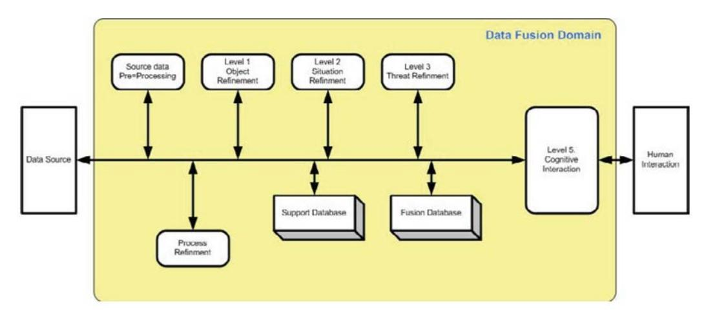

*FIG. 78. The JDL data fusion process model.*

- *Source* (data source module in Fig. 78) *data preprocessing*: It essentially identifies the data transformations necessary to represent it in the system in appropriate physical units; it may include periodic calibration of the measurement channels as well.
- *Level 1 processing* (object refinement): Fusion of multiple sensors to identify a parameter based on the measured data.
- *Level 2 processing* (situation refinement): Automated reasoning to refine the estimate, for instance, clustering and consecutive refinement of the input data.
- *Level 3 processing* (threat refinement): Projection of the current situation into the future.
- *Level 4 processing* (process refinement): This is a meta process that monitors the ongoing fusion process to improve processing accuracy using models and historical information from the supplement databases.

— *Level 5 processing* (cognitive interaction): Interaction between the data fusion system and a human decision maker to improve the interpretation of the results and decision making process. This level of the data fusion process is not discussed in this paper and is presented here only for completeness of the data fusion class model.

The Appendix on DVD of this report presents an instance of the RSA that complies with the JDL model presented above. We describe a simplified version of the algorithm that can be easily implemented on the level of distributed control and information system controllers using IEC 61131 software languages: Function Diagram and Structured Text.

The waterfall model emphasizes the processing functions on the lower levels. Figure 79 depicts the processing stages of the waterfall model. The stages relate to the levels 0, 1, 2 and 3 of the JDL model as follows:

- Sensing and signal processing correspond to source data preprocessing (level 0).
- Feature extraction and pattern processing match object refinement (level 1).
- Situation assessment is similar to situation refinement (level 2).
- Decision making corresponds to threat refinement (level 3).

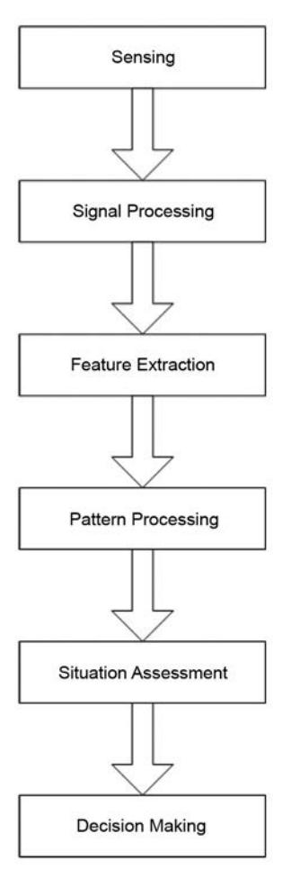

*FIG. 79. Waterfall data fusion architecture.*

Being thus very similar to the JDL model, the waterfall model suffers from the same drawbacks. While being more exact in analysing the fusion process than other models, the major limitation of the waterfall model is the omission of any feedback data flow. The waterfall model has been used in the defence data fusion community in the UK, but has not been significantly adopted elsewhere.

Another data fusion architecture model is called the 'Boyd model' [142]. This model proposes a cycle containing four stages. This Boyd control cycle represents the classic decision support mechanism in military information operations. Because decision support systems for situational awareness are tightly coupled with fusion systems, the Boyd loop/model has also been used for sensor fusion.

The Boyd loop can be mapped to the JDL model as follows:

- *Observe:* This stage is broadly comparable to source preprocessing in the JDL model.
- *Orientate:* This stage corresponds to functions of the levels 1, 2 and 3 of the JDL model.
- *Decide:* This stage is comparable to level 4 of the JDL model (process refinement).
- *Act:* Since the JDL model does not close the loop by taking the actuating part of the interaction into account, this stage has no direct counterpart in the JDL model.

The Boyd model represents the stages of a closed control system and gives an overview on the overall task of a system, but the model lacks an appropriate structure for identifying and separating different sensor fusion tasks.

There are several other data fusion architectures that should be mentioned. The LAAS (Laboratoire d'Analyse et d'Architecture des Systèmes) architecture was developed as an integrated architecture for the design and implementation of mobile robots with respect to real time and code reuse.

The omnibus model was presented in 1999 [142]. Unlike the JDL model, the omnibus model defines the ordering of processes and makes the cyclic nature explicit. It uses a general terminology that does not assume that the applications are defence oriented. The model shows a cyclic structure that is comparable to the Boyd loop, but provides a much more fine grained structuring of the processing levels. The model is intended to be used multiple times in the same application recursively, at two different levels of abstraction. Firstly, the model is used to characterize and structure the overall system. Secondly, the same structures are used to model the single subtasks of the system. Examples of the Boyd model used in the data fusion techniques related to NPPs are hybrid measurement — component models of balance of plant. Models like PEPSE, EnergiTool, VALI [144], and others, use this approach to one or other degrees.

Although the hierarchical separation of the sensor fusion tasks is very sophisticated in the omnibus model, it does not support a horizontal partitioning into tasks that reflect distributed sensing and data processing. Thus, the model does not support decomposition into modules that can be separately implemented, separately tested and reused for different applications.

#### **6.2.3. Practical examples**

The Appendix on DVD of this report contains a demonstration of the data fusion technology for identification of faulty channels. It is based on the JDL data fusion architecture. This methodology is used by Westinghouse Electric Company for [141]:

- Data reconciliation processing to restore missing data in an ensemble of inputs to a processing algorithms (implemented at South Ukraine NPP to support the BEACON in-core monitoring system);
- Redundant sensor processing in important safety and non-safety systems (implemented in the existing plants, AP1000, and South Texas Plant ABWR projects);
- Performance evaluation and diagnostics of the BOP equipment using EnergiTool™.

This method is based on a combination of statistical processing of the data and physical modelling of the equipment under consideration.

#### **6.2.4. summary of the data fusion architecture implementation**

Different methods and approaches have advantages and disadvantages that have to be evaluated for a specific application, using the following criteria:

- Robustness;
- Types of error to be detected, field of application;

- Stability;
- Plausibility, V&V, ability to be licensed;
- Time consumption for developing and commissioning;
- Requirements for expert knowledge;
- Requirements for power plant documentation and plant staff cooperation;
- Requirement for process (steady state, transient) modes and ranges of normal operating states (during which the method is able to work correctly);
- Necessity to have historical process data;
- Necessity to have error free training process data;
- Requirements for operating and maintenance (time consumption of plant staff and/or supporting engineering company staff).

#### 6.3. FIELDBUS TECHNOLOGY AND SMART INSTRUMENTS

With the advent of cheap and small embedded microcontrollers, it became possible to build a distributed system out of a set of sensors, actuators and control nodes, each equipped with a microcontroller unit and a network interface [144].

#### **6.3.1. sensors and actuators**

A sensor is a device that perceives a physical property (such as heat, light, sound, pressure, magnetism or motion) and transmits the result into a measurement that can be interpreted by the computer system. Thus, a sensor maps the value of some environmental attribute to a quantitative measurement. An actuator is a device for moving or controlling some environmental attribute. Since sensors and actuators are both located at the same level of abstraction (at the instrumentation interface), they are often subsumed by the term transducer.

In 1982, the term 'intelligent transducer' was introduced. An intelligent or smart transducer is the integration of an analogue or digital sensor or actuator element, a processing unit and a communication interface.

In the case of a sensor, the smart transducer transforms the raw sensor signal to a standardized digital representation, checks and calibrates the signal, and transmits this digital signal to its users via a standardized communication protocol.

In the case of an actuator, the smart transducer accepts standardized commands and transforms these into control signals. In many cases, the smart transducer is able to locally verify the control action and provide a feedback at the transducer interface.

Smart transducer technology supports the development of transducer networks that allow monitoring, plug and play configuration, and the communication of digitized transducer data over the same bus line. Such a smart transducer network provides a framework that helps to reduce the complexity and cost of large distributed real time systems.

### **6.3.2. smart transducer interfaces**

The design of the network interface for a smart transducer is of great importance. Transducers come in a great variety, with different capabilities, from different vendors. Thus, a smart transducer interface must be very generic to support all present and future types of transducer. However, it must provide some standard functionality to transmit data in a temporally deterministic manner, support a standard data format, encompass means for fault tolerance and provide means for smooth integration into a transducer network and its application.

A smart transducer interface should conform to a worldwide standard. Such a standard for a real time communication network has been sought for a long time, but efforts to find a single agreed standard have been hampered by vendors, which were reluctant to support such a single common standard for fear of losing some of their competitive advantages. Hence, several different fieldbus solutions have been developed and promoted. Some of these existing solutions have been combined and standardized. In 1994, the two large fieldbus groups, Interoperable Systems Project (supported by Fisher-Rosemount, Siemens, Yokogawa, and others) and the WorldFIP (Flux Information Processes or Factory Instrumentation Protocol, supported by Honeywell, Bailey, and others) joined to form the Fieldbus Foundation (FF). It is the stated objective of the FF to develop a single interoperable fieldbus standard in cooperation with the IEC and ISA.

The IEC worked out the IEC 61158 standard. It is based on eight existing fieldbus solutions. However, the IEC fieldbus draft standard was not ratified at the final approval vote, following a set of controversies. The IEC 61158 has the great disadvantage that it still keeps a diversity of eight different solutions.

The ISA, which developed the SP50 standard, and IEC committees jointly met to make the development of an international standard possible. ISA SP50 was the same committee that introduced the 4–20 mA standard back in the 1970s. Meanwhile, other standards for smart transducers were developed.

The IEEE 1451.2 standard deals with the specification of interfaces for smart transducers. An idea proposed by this standard is the specification of electronic datasheets to describe the hardware interface and communication protocols of the smart transducer interface model.

In December 2000, the Object Management Group (OMG) called for a proposal of a smart transducer interface (STI). In response, a new standard has been proposed that comprises a time triggered transport service within the distributed smart transducer subsystem and a well defined interface to a Common Object Request Broker Architecture (CORBA) environment.

The key feature of the STI is the concept of an interface file system (IFS) that contains all relevant transducer data. This IFS allows different views of a system, namely a real time service view, a diagnostic and management view and a configuration and planning view. The interface concept encompasses a communication model for transparent time triggered communication. This STI standard was adopted by the OMG in January 2002.

#### 6.4. DATA TRANSMISSION VIA ELECTRICAL POWER LINES

Power line communication (PLC) is a technique transmitting voice or data at a rapid speed through a power line in a house, an office, a building, or a factory, etc. Power line communication systems have become increasingly viewed as an attractive alternative to conventional hard wired communication systems, which require dedicated communication wiring, and wireless systems, which involve complex and costly transmitter and receiver circuits.

In PLC, the existing AC power wires serve as a transmission medium by which information is relayed from a transmitter or control station to one or more receivers or loads connected downstream from an AC source.

There is a significant advantage to the use of AC power lines for the purpose of communication between electronic devices using a PLC system. Since no new wires are required to implement the function of communication, PLC systems greatly reduce the complexity and effort of installation, particularly in building retrofit applications in which it is highly desirable to be able to install an energy control system with little or no alteration of the existing electrical wiring.

The PLC technology utilizes a power line as a signal transmission channel. This technology makes it possible to perform communication between a plurality of communication devices, by connecting each of those devices to a receptacle installed in each compartment/room in an industrial plant/house. Use of existing power lines as a communication medium eliminates installation costs for adding dedicated communication wiring to existing structures. Such a PLC system can be used for monitoring and controlling basic functions, including energy management, security and safety control in applications including homes, factories, offices, automobiles and aircraft. Electric utility companies utilize PLC systems to provide a means for a central station to communicate command signals to remote receivers that are located at the sites of electric energy consumers.

The infrastructure for providing broadband internet access is currently insufficient to meet demand. With some modification, the infrastructure of the existing power distribution systems can be used to provide data communication in addition to power delivery, thereby forming a PLC system. Development of a PLC system would therefore provide more users with high speed telecommunications access. The PLC communication may be applied to various fields such as super high speed internet communication, internet phone, a home networking system, a home automation and remote metering system, just by connecting a plug of a computer to a power source without using a local area network or a telephone.

The usual power distribution system in a building is a system of wires, electric outlet receptacles, fuses and/or circuit breakers, switches and controls and permanently wired fixtures and appliances, installed for the purpose of distributing low frequency AC power in the building. In the PLC system, a radiofrequency communication signal of a few hundred hertz to a few tens of megahertz is transmitted together with an alternating power to a power line supplying the alternating power with frequencies of 50–60 Hz to houses, and a private access device receives only the communication signal for communicating.

A PLC system typically operates by superimposing a modulated carrier frequency on the AC signal carried on a power line. A basic PLC system consists of a transmitter unit capable of adding the communication signal to the AC power line signal, and a receiver unit capable of separating the communication signal from the AC power component signal. In a PLC system, a transmitter generates modulated radiofrequency carrier signals at one location in the building, which are coupled to the existing power distribution system via an appropriate coupling network, and a receiver at another location receives and demodulates the radiofrequency carrier, providing the desired transmission of voice and/or data signals from the one location to the other. A PLC modem is a device that makes it possible to use these power lines as a communication line. The PLC modem converts digital data from an information processing unit, such as a personal computer, to analogue line data, overlaps the analogue line data with a power line of a commercial power source, or converts the analogue line data inputted through the power line to digital signals and transfers them to the information processing unit. Power line modems have a wide range of uses, including allowing personal computers to communicate with each other, or with other household devices, without the need for separate data cables. A PLC system comprises a plurality of communication stations connected to a single communication network. Each of the communication stations comprises a PLC for exchanging rapid data through the single communication network.

#### 6.5. CONCLUSIONS

This final chapter of the report has detailed some enabling technologies that may change the current view of OLM systems. The development of wireless communication protocols may allow condition monitoring data to be sent wirelessly inside a plant. The advantage of this technology is that there are no physical cables that may age and degrade, but this needs to be balanced against issues such as security of communication and maturity of the technology. Alternatively, transmitting information via power cables is also a possibility. Another area that is seeing growth is the field of smart sensors. Moving some of the processing to the sensor is attractive as, rather than large volumes of raw data being transmitted, more meaningful information, at lower volumes, can be sent. Finally, as more and more data become available, techniques for fusing together data and information for a number of different and disparate sources have been examined.

### **rEfErEnCEs**

- [1] HASHEMIAN, H.M., JIANG, J., A practical review of methods for measuring the dynamic characteristics of industrial pressure transmitters, ISA T. **49** (2010) 2–9.
- [2] GLÖCKLER, O., Reactor noise measurements in the safety and regulating systems of CANDU stations, Prog. Nucl. Energ. **43** (2003) 75–82.
- [3] ARzHANOV, V., PÁzSIT, I., Diagnostics of core barrel vibrations by in-core and ex-core neutron noise, Prog. Nucl. Energ. **43** (2003) 151–158.
- [4] DEMAzIÈRE, C., PÁzSIT, I., Numerical tools applied to power reactor noise analysis, Prog. Nucl. Energ. **51** (2009) 67–81.
- [5] AMERICAN NUCLEAR SOCIETY, Calculation and measurement of the moderator temperature coefficient of reactivity for water moderated power reactors, an American National Standard, ANSI/ANS-19.11–1997, ANS, La Grange Park, IL (1997).
- [6] LIPCSEI, S., KISS, S., CZIBÓK, T., DEZSŐ, Z., HORVÁTH, C.S., Autonomous data acquisition system for Paks NPP process noise signals, Int. J. of Nuclear Energy Science and Technology **1** (2005) 324–333.
- [7] KISS, S., LIPCSEI, S., HÁzI, G., Effect of uncompensated SPND cables on noise signals measured in VVER-440 reactors, Nucl. Eng. Des. **220** (2003) 179–192.
- [8] KISS, S., LIPCSEI, S., Combined validation of noise signals measured in NPPs, Ann. Nucl. Energy **26** (1999) 327–346.
- [9] ADORJÁN, F., CzIBÓK, T., KISS, S., KRINIzS, K., VÉGH, J., Core asymmetry evaluation using static measurements and neutron noise analysis, Ann. Nucl. Energy **27** (2000) 649–658.
- [10] COVINGTON, L.J., SIMULATE-3: Advanced Three-dimensional Two-group Reactor Analysis Code User's Manual. Studsvik/SOA-95/15 report, Studsvik of America, Inc., Atlanta, GA (1995).
- [11] DEMAzIÈRE, C., CORE SIM: A Multi-purpose Neutronic Tool for Research and Education, Ann. Nucl. Energy **38** (2011) 2698–2718.
- [12] BORLAND, R.J., Evaluation of end-of-cycle moderator temperature coefficient measurement for Davis-Besse Unit 1, Nucl. Sci. Eng. **121** (1995) 162–171.
- [13] KISS, S., LIPCSEI, S., VÉGH, J., MTC estimation based on neutron noise and propagating temperature perturbation in VVER-440 reactors, Ann. Nucl. Energy **37** (2010) 166–174.
- [14] KISS, S., LIPCSEI, S., VÉGH, J., Monitoring MTC using cold leg thermocouple and background neutron detector noise signals in a VVER-440 reactor during a whole fuel cycle, Ann. Nucl. Energy **37** (2010) 827–834.
- [15] DEMAzIERE, C., PÁzSIT, I., Development of a method for measuring the MTC by noise analysis and its experimental verification in Ringhals-2, Nucl. Sci. Eng. **148** (2004) 1–29.
- [16] LIPCSEI, S., KISS, S., HORVÁTH, C.S., DEZSŐ, Z., LÁZ, J., Development and application of a new signal evaluation software and human-machine interface for a reactor noise diagnostics system (Proc. 6th Int. Topical Meeting on Nuclear Plant Instrumentation, Control, and Human–Machine Interface Technologies (NPIC & HMIT), 5–9 April 2009, Knoxville, TN) (2009).
- [17] SUR, B., KUMLI, P., JOHNSTON, J.P., TONNER, P.D., Determining prompt fractions of in-core flux detectors during full-power operation in CANDU (Proc. 20th Ann. Conf. of the Canadian Nuclear Society, Montreal, 1999).
- [18] DEMAzIÈRE, C., GLÖCKLER, O., On-line determination of the prompt fraction of in-core neutron detectors in CANDU reactors (Proc. Int. Meeting on The Physics of Fuel Cycles and Advanced Nuclear Systems: Global Developments (PHYSOR2004), American Nuclear Society, 25–29 April 2004, Chicago, Illinois).
- [19] ANGHEL, V., ALTIPARMAKOR, D., SANKMANS, G., SUR, B., Neutron diffusion waves in CANDU reactors (Proc. 31st Ann. Conf. Canadian Nuclear Society, 23–27 May 2010, Montreal).
- [20] DEMAzIÈRE, C., Development of a 2-D 2-group neutron noise simulator, Ann. Nucl. Energy **31** (2004) 647–680.
- [21] MONTEYNE, G., BAETEN, P., SCHOUKENS, J., Study of the precision of the MTC estimate by noise analysis (Proc. 7th Int.Topical Meeting on Nuclear Plant Instrumentation, Controls, and Human Machine Interface Technology (Proc. 7th Int. Topical Meeting on Nuclear Plant Instrumentation, Control, and Human–Machine Interface Technologies (NPIC & HMIT), 7–11 November 2010, Las Vegas, NV).
- [22] BENDAT, J., PIERSOL, A., Engineering Applications of Correlation and Spectral Analysis, Wiley-Interscience, New York (1980).
- [23] MONTEYNE, G., BAETEN, P., SCHOUKENS, J., Influence of feedback on the MTC estimate by noise analysis (Proc. 7th Int. Topical Meeting on Nuclear Plant Instrumentation, Control, and Human–Machine Interface Technologies (NPIC & HMIT), 7–11 November 2010, Las Vegas, NV).
- [24] VÉGH, J., KISS, S., LIPCSEI, S., HORVÁTH, C.S., PÓS, I., KISS, G., Implementation of new reactivity measurement system and new reactor noise analysis equipment in a VVER-440 nuclear power plant, IEEE T. Nucl. Sci. **57** (2010) 2689–2696.
- [25] DRAGT, J.B., TÜRKCAN, E., Borselle PWR noise: measurements, analysis and interpretation, Prog. Nucl. Energ. **1** (1977) 293–307.

- [26] LIPCSEI, S., KISS, S., Investigation and enhancements of some models describing core barrel motion in VVER-440 type reactors. Proceedings of the 28th Informal Meeting on Reactor Noise (IMORN-28), NCSR 'Demokritos', 11–13 October 2000, Athens (2000).
- [27] LIPCSEI, S., KISS, S., KISS, G., Evaluation of long-term neutron noise measurements (Proc. 5th ANS International Topical Meeting on Nuclear Power Plant Instrumentation, Controls and Human–Machine Interface Technologies (Proc. 3rd Int. Topical Meeting on Nuclear Plant Instrumentation, Control, and Human–Machine Interface Technologies (NPIC & HMIT), 12–16 November 2006, Albuquerque, NM).
- [28] DEMAzIÈRE, C., Analysis methods for the determination of possible unseated fuel assemblies in BWRs, Int. J. of Nuclear Energy Science and Technology **2** (2006) 167–188.
- [29] DEMAzIÈRE, C., PÁzSIT, I., On the possibility of the space-dependence of the stability indicator (Decay Ratio) of a BWR, Ann. Nucl. Energy **32** (2005) 1305–1322.
- [30] DEMAzIÈRE, C., PÁzSIT, I., Numerical tools applied to power reactor noise analysis, Prog. Nucl. Energ. **51** (2009) 67–81.
- [31] DEMAzIÈRE, C., PÁzSIT, I., WRIGHT, J., Investigation of the validity of the point-kinetic approximation for subcritical heterogeneous systems in 2-group diffusion theory for measurement of the reactivity in ADS (Proc. Int. Conf. on Nuclear Energy Systems for Future Generation and Global Sustainability (GLOBAL2005), Atomic Energy Society of Japan, 9–13 October 2005, Tsukuba).
- [32] DYKIN, V., DEMAzIÈRE, C., LANGE, C., HENNIG, D., Simulation of local instabilities with the use of reduced order models, Submitted to International Conference on Mathematics and Computational Methods Applied to Nuclear Science and Engineering (M&C 2011), Latin American Section/American Nuclear Society, 8–12 May 2011, Rio de Janeiro, RJ (2005).
- [33] SzAPPANOS, G., POR, G., Improvements in the theory of identification of burst shaped events for fault diagnosis, Nucl. Sci. Eng. **13** (1999) 261–267.
- [34] UPADHYAYA, B.R., WOLVAARDT, F.P., GLOCKLER, O., An integrated approach for signal validation in dynamic systems, Proceedings of SMORN-V, Prog. Nucl. Energ. **21** (1988) 605–611.
- [35] POR, G., Acoustic loose parts systems for malfunction detection (Proc. 4th American Nuclear Society International Topical Meeting on Nuclear Plant Instrumentation, Controls and Human–Machine Interface Technologies (Proc. Int. Topical Meeting on Nuclear Plant Instrumentation, Control, and Human–Machine Interface Technologies (NPIC & HMIT), 2004, Columbus, OH).
- [36] UNITED STATES NUCLEAR REGULATORY COMMISSION, "Design of structures, components, equipment, and systems"; Section 3.6.3, "Leak-before-break evaluation procedures", Standard Review Plan for the Review of Safety Analysis Reports for Nuclear Power Plants (LWR Edition), NUREG-0800, US Nuclear Regulatory Commission, Washington, DC (2007).
- [37] UNITED STATES NUCLEAR REGULATORY COMMISSION, Guidance on Monitoring and Responding to Reactor Coolant System Leakage, Rev. 1, Regulatory Guide 1.45, US Nuclear Regulatory Commission, Washington, DC (2008).
- [38] YOON, D.-B., PARK, J.-H., CHOI, Y.-C., KWAN, H.-S., LEE, J.-H., Enhancement of impact mass estimation algorithm for a plate type structure, Mater. Trans. **48** (2007) 1249–1253.
- [39] UNITED STATES NUCLEAR REGULATORY COMMISSION, Davis-Besse Reactor Vessel Head Degradation, NUREG/BR-0353, US Nuclear Regulatory Commission, Washington, DC (2008).
- [40] LU, B., UPADHYAYA, B.R., PEREz, R.B., Structural integrity monitoring of steam generator tubing using transient acoustic signal analysis, IEEE T. Nucl. Sci. **52** (2005), 484–493.
- [41] HASHEMIAN, H.M., KIGER, C.J., MORTON, G.W., SHUMAKER, B.D., Wireless sensor applications in nuclear power plants, Nucl. Technol. **173** (2011) 8–16.
- [42] HASHEMIAN, H.M., Wireless sensors for predictive maintenance of rotating equipment in research reactors, Ann. Nucl. Energy, **38** (2011) 665–680.
- [43] BOND, L.J., DOCTOR, S.R., JARRELL, D.B., BOND, J.W.D., Improved economics of nuclear plant life management (2nd Int. Symposium on Nuclear Power Plant Life Management, Shanghai, China, International Atomic Energy Agency, 2008, IAEA Paper IAEA-CN-155-008KS), IAEA, Vienna (2008).
- [44] BOND, L.J., DOCTOR, S.R., TAYLOR, T.T., Proactive Management of Materials Degradation A Review of Principles and Programs, PNNL-17779, Pacific Northwest National Laboratory, Richland, WA (2008).
- [45] HINES, J.W., Empirical methods for process and equipment prognostics (tutorial notes) (Proc. Annual Reliability and Maintainability Symposium (RAMS), 26–29 January 2009, Fort Worth, Texas, Advanced Tutorial 13A).
- [46] JARDINE, A.K.S., LIN, D., BANJEVIC, D., A review on machinery diagnostic and prognostics implementing condition based maintenance. Mech. Syst. Signal Pr. **20** (2006) 1483–1510.
- [47] POPOVICS, J., et al., "International needs for infrastructure NDE", Review of Progress in Quantitative Nondestructive Evaluation (THOMPSON, D.O., CHIMENTI, D.E., Eds), AIP, New York, NY (2009) 1980–1997.
- [48] THOMPSON, R.B., Simulation models: critical tools in NDT engineering, Mater. Eval. **63** (2005) 300–308.
- [49] NAKAGAWA, N., et al., On-Line NDE and structural health monitoring for advanced reactors, key engineering materials, Key Eng. Mat. **321–323** (2006) 234–239.
- [50] THOMPSON, R.B., "NDE simulations: critical tools in the integration of NDE and SHM", Nondestructive Characterization for Composite Materials, Aerospace Engineering, Civil Infrastructure, and Homeland Security (WU, H.F., DIAz, A.A., SHULL, P.J., VOGEL, D.W., Eds) Proc. SPIE **729401** (2009), http://dx.doi.org/10.1117/12.832197

- [51] THOMPSON, R.B., "A Bayesian approach to the inversion of NDE and SHM data", Review of Progress in Quantitative Nondestructive Evaluation (THOMPSON, D.O., CHIMENTI, D.E., Eds), American Institute of Physics, College Park, MD (2010) 679–686.
- [52] PUSEY, S.C., HOBBS, W.R., Essential Technologies for Successful Prognostics (Proc. 59th MFPT Soc., 18–21 April 2005), MFPT Publication, Virginia Beach, VA (2005).
- [53] INMAN, D.I., FARRAR, C.R., LOPES, V., STEFFEN, V., Damage Prognosis. Wiley, Chichester (2005).
- [54] BOND, L.J., DOCTOR, S.R., TAYLOR, T.T., Proactive Management of Materials Degradation A Review of Principles and Programs, PNNL-17779, Pacific Northwest National Laboratory, Richland, WA (2008).
- [55] BOND, L.J., DOCTOR, S.R., GRIFFIN, J.W., HULL, A.B., MALIK, S.N., Damage Assessment Technologies for Prognostics and Proactive Management of Materials Degradation (PMMD) (Proc. 6th Int. Topical Meeting on Nuclear Plant Instrumentation, Control, and Human–Machine Interface Technologies, 5–9 April 2009), American Nuclear Society, La Grange Park, IL (2009).
- [56] BOND, L.J., DOCTOR, S.R., GRIFFIN, J.W., HULL, A., MALIK, S., Damage assessment technologies for prognostics and proactive management of materials degradation (PMMD), Nucl. Technol. **173** (2011) 46–55.
- [57] WILKOWSKI, G., TREGONING, R., SCOTT, P., RUDLAND, D., Status of Efforts to Evaluate LOCA Frequency Estimates Using Combined PRA and PFM Approaches, 28th MPA Seminar, Universitaet Stuttgart, Materials Testing Institute (2002).
- [58] BROOKHAVEN NATIONAL LABORATORY, Insights Gained from Aging Research. NUREG/CR-5643, BNL-NUREG-52323, US Nuclear Regulatory Commission, Washington, DC (1992).
- [59] UNITED STATES NUCLEAR REGULATORY COMMISSION, Proc. 25th Water Reactor Safety Information Meeting, NUREG/CP-0162, Vol. 1–3, US Nuclear Regulatory Commission, Washington, DC (1998).
- [60] BROOKHAVEN NATIONAL LABORATORY, Expert Panel Report on Proactive Materials Degradation Assessment, NUREG/ CR-6923, BNL-NUREG-77111–2006, US Nuclear Regulatory Commission, Washington, DC (2007).
- [61] UNITED STATES NUCLEAR REGULATORY COMMISSION, Generic Aging Lessons Learned (GALL) Report Summary, 2005a, NUREG-1801, Vol. 1, Rev. 1, Office of Nuclear Reactor Regulations, US Nuclear Regulatory Commission, Washington, DC (2005).
- [62] UNITED STATES NUCLEAR REGULATORY COMMISSION, Generic Aging Lessons Learned (GALL) Report Tabulation of Results, 2005b, NUREG-1801, Vol. 2, Rev. 1, Office of Nuclear Reactor Regulations, US Nuclear Regulatory Commission, Washington, DC (2005).
- [63] UNITED STATES NUCLEAR REGULATORY COMMISSION, Generic Aging Lessons Learned (GALL) Report Summary, NUREG-1801, Rev. 2, Office of Nuclear Reactor Regulations, US Nuclear Regulatory Commission, Washington, DC (2010).
- [64] LIVINGSTON, J.V., et al., A Review of Information for Managing Aging in Nuclear Power Plants, PNL-10717, Part 2 of 2, Pacific Northwest Laboratory, Richland, WA (1995).
- [65] MORGAN, W.C., LIVINGSTON, J.V., A Review of Information for Managing Aging in Nuclear Power Plants, PNL-10717, Part 1 of 2, Pacific Northwest Laboratory, Richland, WA (1995).
- [66] ATOMIC ENERGY SOCIETY OF JAPAN STANDARDS, 2008 overview of Atomic Power Standards for Generation Plant Aging Countermeasures, AESJ-SC-P005 2009, Atomic Energy Society of Japan Standards Committee, Subcommittee on System Safety PLM, Subcommittee meeting (2009).
- [67] LAIN, T., Primary System Corrosion Research Program: EPRI Materials Degradation Matrix, Revision 2, EPRI No. 1020987, Electric Power Research Institute, Palo Alto, CA (2010).
- [68] JAPAN WELDING ENGINEERING SOCIETY, Proc. Symposium on Fatigue Design for Atomic Power Plants [in Japanese], Atomic Power Research Committee (2009).
- [69] LYDELL, B., OLSSON, A., Reliability Data for Piping Components in Nordic Nuclear Power Plants 'R-Book' Project Phase 1, Rev. 1, SKI Report 2008:01, Swedish Nuclear Power Inspectorate, Stockholm (2008).
- [70] IzUMIYA, T., MATSUMOTO, E., SHIBATA, T., Non-destructive Measurement of Inhomogeneity of Functional Gradient Materials by Using Elastic Wave Analysis [in Japanese], Trans JSME, **A**-**61** 591 (1995) 2421–2428.
- [71] MATSUO, K., MATSUMOTO, E., BIWA, S., Evaluation of inhomogeneity by phased array ultrasonic transducer (in Japanese) (Proc. 20th Symposium on Electromagnetics and Dynamics (SEAD20)) (2008) 51–54.
- [72] EBISUI, D., TATEMATSU, N., MATSUMOTO, E., Non-destructive evaluation of fatigue degree of metal by ultrasonic phased array system [in Japanese] (Proc. 19th Conf. Electromagnetic Phenomena and Dynamics) (2010) 261–164.
- [73] ABE, M., BIWA, S., MATSUMOTO, E., 3D shape identification of parallelepiped flaw by means of biaxial MFLT using neural network, International Journal of Nuclear Safety and Simulation, **1** 1 (2009) 63–71.
- [74] MIzOKAMI, M., YUN, K., BIWA, S., MATSUMOTO, E., Measure of Orthotropic Elastic Coefficient of Ferromagnetic Materials Using Ultrasonic Wave Speed and Magnetostriction [in Japanese] (Proc. 19th Conf. Electromagnetic Phenomena and Dynamics (2008).
- [75] MATUMOTO, E., MIKI, K., SHIBATA, T., Measurement of stress and magnetization by ultrasonic transverse waves, J. Electr. Eng. **48**, 8/S (1997) 46–49.
- [76] MATSUMOTO, E., "Magnetostriction and magnetoacoustic emission of ferromagnetic material under stress", Interdisciplinary Applied Electromagnetics (GOTTVALD, A., zEMANEK, I., Eds), Czech Society of Applied Electromagnetics, Brno, Czech Republic (1996) 120–129.

- [77] TANIMURA, Y., MATSUMOTO, E., Nondestructive evaluation of material properties of nickel by magnetoacoustic emission, Stud. Appl. Electromag. **9** (2001) 599–600.
- [78] ABE, M., MATSUMOTO, E., Degradation Detection of Metallic Material by Magneto-acoustic Emission [in Japanese] (Proc. 18th Conf. Electromagnetic Phenomena and Dynamics) (2009) 254–257.
- [79] MATSUMOTO, E., OMOTO, Y., IGUCHI, K., SHIBATA, T., Visualization of strain distribution by piezoelectric thin film, Stud. Appl. Electromag. **18** (2000) 305–308.
- [80] KOMAGOME, Y., MATSUMOTO, E., Visualization of buck-surface defects by piezoelectric film, International Journal of Applied Electromagnetics and Mechanics, **14** 1–4 (2001) 425–428.
- [81] TAKAHASHI, T., MATSUMOTO, E., Measurement and Simulation of Detection of Defects on Inner Wall of Cylindrical Pipe by Piezoelectric High-Polymer Film [in Japanese] (Proc. 6th Ann. Conf. Japan Society of Maintenology) (2009) 409–412.
- [82] YAMADA, S., MATSUMOTO, E., BIWA, S., Visualization of Surface Defects of Steel Using Iron Loss and Infrared Thermography (5th Ann. Conf. Japan Society of Maintenology) (2008) 231–236.
- [83] KINOSHITA, K., Stress Measurement under plastic deformation using the electromagnetic ac impedance wave method, J. Magn. Soc. Jpn. **29** 11 (2005) 1004–1009.
- [84] UDPA, S.S., MOORE, P.O. (Eds), Nondestructive Testing Handbook, Third Edition: Volume 5, Electromagnetic Testing, American Society For Nondestructive Testing, Columbus, OH (2004).
- [85] HAYT, W.R., Engineering Electromagnetics, 2nd edn, McGraw Hill, New York (1989).
- [86] JILES, D.C., Dynamics of domain magnetization and the Barkhausen effect, Czech. J. Phys. **50** 8 (2000) 893–924.
- [87] KULKARNI, S.S., ACHENBACH, J.D., Structural health monitoring and damage prognosis in fatigue, struct. Health Monit. **7** (2008) 37–49.
- [88] RAMUHALLI, P., et al., A Bayesian prognostic algorithm for assessing remaining useful life of nuclear power components (Proc. 7th Int. Topical Meeting on Nuclear Plant Instrumentation, Control, and Human–Machine Interface Technologies (NPIC & HMIT), 7–11 November, Las Vegas, NV) 875–886.
- [89] KHAN, T., RAMUHALLI, P., DASS, S., Sequential Monte Carlo methods for multisensor data fusion in inverse problems, IEEE T. Instrum. Meas. (2011).
- [90] SELBY, G., Paper presented at World Federation of NDE Centers Workshop on Power Plant Life Extension, EPRI (2009).
- [91] BOGARD, T., et al., Impact of Digital Information and Control System on Nuclear Power Generating Plant Operating Costs, Westinghouse/Utility paper prepared for the 1998 PBNC conference (October 1997).
- [92] UNITED STATES NUCLEAR REGULATORY COMMISSION, Advanced Instrumentation and Maintenance Technologies for Nuclear Power Plants, NUREG/CR-5501, US Nuclear Regulatory Commission, Washington, DC (1998).
- [93] ELECTRIC POWER RESEARCH INSTITUTE, On-Line Monitoring of Instrument Channel Performance, EPRI TR-104965-R1, Electric Power Research Institute, Palo Alto, CA (2000).
- [94] KOELSCH, J.R., In Condition Monitoring, Early is Better, On-line Publication (2006), http://www.automationworld.com
- [95] KOELSCH, J.R., Profit from Condition Monitoring, On-line Publication (2006), http://www.automationworld.com
- [96] PAUL, L.G., A New Schedule for Asset Monitoring, On-line Publication (2007), http://managingautomation.com
- [97] AID CORPORATION, On-line Early Detection, Product Brochure (2007).
- [98] HASHEMIAN, H.M., Sensor Performance and Reliability, International Society of Automation, Research triangle Park, NC (2005).
- [99] UNITED STATES NUCLEAR REGULATORY COMMISSION, On-Line Testing of Calibration of Process Instrumentation Channels in Nuclear Power Plants, NUREG/CR-6343, US Nuclear Regulatory Commission, Washington, DC (1995).
- [100] UNITED STATES NUCLEAR REGULATORY COMMISSION, Long Term Performance and Ageing Characteristics of Nuclear Plant Pressure Transmitters, NUREG/CR-5851, US Nuclear Regulatory Commission, Washington, DC (1993).
- [101] ANIKANOV, S., Impact of the Advanced Monitoring and Diagnostics technology on the NPP Plant Computer Scope of Supply, American Nuclear Society, Nuclear Plant Instrumentation and Control and Human–Machine Interface Technologies, (Proc. 6th Int. Topical Meeting on Nuclear Plant Instrumentation, Control, and Human–Machine Interface Technologies (NPIC & HMIT), 5–9 April 2009, Knoxville, TN) (2009).
- [102] COOK, B., Determining the Value of Monitoring and Diagnostics, ICONE 16-48915 (2008).
- [103] INTERNATIONAL ATOMIC ENERGY AGENCY, Implementation Strategies and Tools for Condition Based Monitoring at Nuclear Power Plants, IAEA-TECDOC-1551, Vienna (2007).
- [104] INTERNATIONAL ATOMIC ENERGY AGENCY, On-Line Monitoring for Improving Performance of Nuclear Power Plants, Part 1: Instrument Channel Monitoring, IAEA Nuclear Energy Series NP-T-1.1, IAEA, Vienna (2007).
- [105] ANIKANOV, S., STOLYETNIY, I., General Class of the Data Fusion Methods for NPP Control and Information Systems, (Proc. 6th Int. Topical Meeting on Nuclear Plant Instrumentation, Control, and Human–Machine Interface Technologies (NPIC & HMIT), 5–9 April 2009, Knoxville, TN).

- [106] HINES, J.W., SEIBERT, R., Technical review of on-line monitoring techniques for performance assessment Volumes 1–3: State-of-the-art, NUREG/CR-6895, US Nuclear Regulatory Commission, Washington, DC (2006–2009).
- [107] MA, J., JIANG, J., Fault Detection and Identification in NPP Instruments Using Kernel Principal Component Analysis, ICONE18-28777 (2010).
- [108] HIRSCH, H., Preparatory Study: Nuclear Power Plant Ageing and Plant Life Extension (PLEX) (Report to Global2000, Hanover, February 2001).
- [109] INTERNATIONAL ATOMIC ENERGY AGENCY, Safety Aspects of Nuclear Power Plant Ageing, IAEA-TECDOC-540, IAEA, Vienna (1990).
- [110] INTERNATIONAL ATOMIC ENERGY AGENCY, Management of Life Cycle and Ageing at Nuclear Power Plants: Improved I&C Maintenance, IAEA-TECDOC-1402, IAEA, Vienna (2004).
- [111] NATIONAL SCIENCE AND TECHNOLOGY COUNCIL COMMITTEE ON TECHNOLOGY, Review of Federal Programs for Wire System Safety, US White House, Washington, DC (2000).
- [112] INTERNATIONAL ATOMIC ENERGY AGENCY, Assessment and Management of Ageing of Major NPP Components Important to Safety, IAEA-TECDOC-1188, IAEA, Vienna (2000).
- [113] OECD-NEA, Research Efforts Related to Wire System Ageing in Member States (2002).
- [114] UNITED STATES NUCLEAR REGULATORY COMMISSION, Environmental Qualification of Low-Voltage Instrumentation and Control Cables, USNRC, RIS 2003-09, US Nuclear regulatory Commission (2003).
- [115] INSTITUTE OF ELECTRICAL AND ELECTRONICS ENGINEERS (IEEE), IEEE Trial-Use Standard: General Guide for Qualifying Class 1E Electrical Equipment for Nuclear Power Generating Stations, Standard 323-1971, IEEE, New York, NY (1971).
- [116] MCARTHUR, S.D.J., et al., Multi-agent systems for power engineering applications part i: concepts, approaches and technical challenges, IEEE T. Power Syst. **22** 4 (2007) 1743–1752.
- [117] MCARTHUR, S.D.J., et al., Multi-agent systems for power engineering applications part ii: technologies, standards and tools for building multi-agent systems, IEEE T. Power Syst. **22** 4 (2007) 1753–1759.
- [118] HASHEMIAN, H.M., On-line Testing of Calibration of Process Instrumentation Channels in Nuclear Power Plants, NUREG/CR-6343, US Nuclear Regulatory Commission, Washington, DC (1995).
- [119] INTERNATIONAL SOCIETY OF AUTOMATION, Methodologies for the Determination of Setpoints for Nuclear Safety-Related Instrumentation, ISA-RP67.04.02, ISA, Research Triangle Park, NC (2000).
- [120] FANTONI, P.F., A neuro-fuzzy model applied to full range signal validation of pwr nuclear power plant data, Int. J. Gen. Syst. **29** (2000) 305–320.
- [121] KRISHNAPURAM, R., KELLER, J., A possibilistic approach to clustering, IEEE T. Fuzzy Syst. **1** 2 (1993) 98–100.
- [122] ANIKANOV, S., STOLYETNIY, I., General Class of the Data Fusion Methods for NPP Control and Information Systems, (Proc. 6th Int. Topical Meeting on Nuclear Plant Instrumentation, Control, and Human–Machine Interface Technologies (NPIC & HMIT), 5–9 April 2009, Knoxville, TN).
- [123] HAJI-VALIzADEH, A., PARVEz, S., Prioritize Loop Maintenance, These Strategies can Simplify Process Improvement, Plant Services, Itasca, IL (2006), www.PlantServices.com
- [124] RALSTON, J., Improving Plant Production with Wireless Condition Monitoring, ProSoft Technology White Paper, ProSoft, Bakersfield, CA (2007), http://www.prosoft-technology.com/training/whitepapers/Improving-Plant-Production-with-Wireless-Condition-Monitoring.pdf
- [125] HINES, J.W., UHRIG, R.E., WREST, D.J., Use of autoassociative neural networks for signal validation, J. Intell. Robot. Syst. **21** (1998) 243–254.
- [126] CHERKASSKY, V., MULIER, F., Learning from Data, Concept, Theory and Methods, 2nd edn, John Wiley and Sons, Hoboken (2007).
- [127] WALD, A., Sequential tests of statistical hypothesis, Ann. Stat. **16** (1945) 117–186.
- [128] WALD, A., Sequential Analysis, John Wiley and Sons, New York (1947).
- [129] FANTONI, P.F., NPP Wire System Ageing Assessment and Condition Monitoring: State-Of-the-Art Report, Halden Reactor Project (HWR-746) (2004).
- [130] FANTONI, P.F., Wire System Ageing Assessment and Condition Monitoring: The Line Resonance Analysis Method (LIRA), Halden Reactor Project (HWR-788) (2005).
- [131] FANTONI, P.F., TOMAN, G.J., Wire System Ageing Assessment and Condition Monitoring Using Line Resonance Analysis (LIRA) (Proc. 3rd Int. Topical Meeting on Nuclear Plant Instrumentation, Control, and Human–Machine Interface Technologies (NPIC & HMIT), 12–16 November 2006, Albuquerque, NM).
- [132] FANTONI, P.F., HOFFMANN, M., SHANKAR, R., DAVIS, E., On-line Monitoring of Instrument Channel Performance in Nuclear Power Plant Using PEANO (Proc. 10th Int. Conf. on Nuclear Engineering, 14–18 April 2002, Arlington, VA) (2002).
- [133] FANTONI, P.F., MAzzOLA, A., A pattern recognition-artificial neural networks based model for signal validation in nuclear power plants, Ann. Nucl. Energy, **23** 13 (1996) 1069–1076.
- [134] ROVERSO, D., Aladdin Enhancing Applicability and Scalability, HWR-640 (2001).

- [135] ELECTRIC POWER RESEARCH INSTITUTE, On-Line Monitoring of Instrument Channel Performance, Topical Report (TR) 104965, EPRI, Palo Alto, CA (1999).
- [136] CARO, R., Wireless Networks for Industrial Automation, 3rd edn (2008).
- [137] ISA, The ISA 100 Standards: Overview and Status, ISA, Research Triangle Park, NC (2008).
- [138] FORTUNA, C., MOHORCIC, M., Dynamic composition of services for end-to-end information transport, Wireless Communications, IEEE, **16** (2009) 56–62.
- [139] ELECTRIC POWER RESEARCH INSTITUTE, Implementation Guideline for Wireless Networks and Wireless Equipment Condition Monitoring, Product ID: 1019186, EPRI, Palo Alto, CA (2009).
- [140] UNITED STATES NUCLEAR REGULATORY COMMISSION, Assessment of Wireless Technologies and Their Application at Nuclear Facilities, NUREG/CR-6882, US Nuclear Regulatory Commission, Washington, DC (2006).
- [141] ANIKANOV, S., STOLYETNIY, I.V., SEMENOVSKIY, Y.P., Primary Plant Performance Evaluation and Signals, Validation, Lessons Learned (Proc. ANS Winter Meeting, November 2006).
- [142] HALL, D.L., MCMULLEN, S.A.H., Mathematical Techniques in Multisensor Data Fusion, Artech House, Norwood MA (2004).
- [143] International Society of Information Fusion, http://www.isif.org/ website
- [144] ANCION, P.V., BASTIEN, R., RINGDAHL, K., On-Line Performance monitoring Experience at Comanche Peak (Proc. ICONE 8, 8th International Conference on Nuclear Engineering, 2–6 April 2000, Baltimore, MD) (2000).

### **ABBrEVIAtIons**

AAKR auto-associative kernel regression

AC alternating current A/D analogue to digital AE acoustic emission

AECL Atomic Energy of Canada Limited AGR advanced gas cooled reactor

AI artificial intelligence ALPS acoustic loose parts system AMP ageing management plan

AMS Analysis and Measurement Services Corporation

ANN artificial neural network APD amplitude probability density APSD autopower spectral density

AR autoregressive

BETA British Energy Trace Analysis

BWR boiling water reactor

CANDU Canada Deuterium Uranium reactor CBM condition based maintenance

COMMAS Condition Monitoring Multi-Agent System

COTS commercial off the shelf CPSD cross-power spectral density

CRP Coordinated Research Project (IAEA)

CSA channel statistical allowance CSI chief scientific investigator CSPE chlorosulphonated polyethylene

CUSUM cumulative sum 1-D one dimensional 2-D two dimensional 3-D three dimensional DBA design basis accident

DC direct current

DGA dissolved gas analysis

DI damage index

DOE Department of Energy DSP digital signal processing

EPDM ethylene propylene diene monomer

EPR ethylene propylene rubber

EPRI Electric Power Research Institute

FEA final element accuracy FED final element drift

FETE final element temperature effect

FF Fieldbus Foundation FFT fast Fourier transform FGLT fuel grab load trace

FR-XLPE flame retardant cross-linked polyethylene

GALL Generic Aging Lessons Learned

GIS gas insulated switchgear GUI graphical user interface HHT Hilbert–Huang transform HRP Halden Reactor Project (OECD) HSDL high speed noise analysis data logger HV high voltage

I&C instrumentation and control

ICFD in-core flux detector

ICMP Instrument Calibration and Monitoring Program IEC International Electrotechnical Commission IEEE Institute of Electrical and Electronics Engineers

IFS interface file system

IMAPS Intelligent Monitoring Assessment Panel System

ISA International Society of Automation

ISI in-service inspection

ISM Industry, Science, and Medicine JDL Joint Directors of Laboratories

KAERI Korea Atomic Energy Research Institute

LCL lower control limit LIRA line resonance analysis LLR log likelihood ratio LOOP loss of off-site power

LPMS loose parts monitoring system

LQI loop quality index LTO long term operation LWR light water reactor

MAP monitoring assessment panel

MAS multi-agent system

MBN magnetic Barkhausen noise M&D monitoring and diagnostic

M–H magnetization–magnetic field (curve)

MOV motor operated valve

MTC moderator temperature coefficient NDE non-destructive examination NDT non-destructive testing NLPLS non-linear partial least square

NPP nuclear power plant

NRC Nuclear Regulatory Commission

NRU National Research Universal (Chalk River)

OECD Organisation for Economic Co-operation and Development

OLM on-line monitoring

OMG Object Management Group

PAzAR Paks autonomous noise data acquisition system

PC principal component

PCA principal components analysis

PD partial discharge

PEA primary element accuracy

PEANO process evaluation and analysis by neural operators

PHWR pressurized heavy water reactor PLC power line communication

PLS partial least square

PMA process measurement accuracy

PMMD proactive management of material degradation

PSD power spectral density PVC polyvinyl chloride PVDF polyvinylidene fluoride PWR pressurized water reactor RCA rack calibration accuracy RCP reactor coolant pump

RCPVMS reactor coolant pump vibration monitoring system

RCS reactor coolant system

RD rack drift

R&D research and development

RMS root mean squared

RSA redundant sensor algorithm RTD resistance temperature detector

RTE rack temperature effects RUL remaining useful life SCA sensor calibration accuracy

SD sensor drift

SDP surveillance, diagnostics and prognostics

SHM structural health monitoring SPE sensor pressure effects SPND self-powered neutron detector SPRT sequential probability ratio test

SS stainless steel

SSCs systems, structures and components

STE sensor temperature effects STI smart transducer interface

TAG topic area group

TDR time domain reflectometry

TTF time to failure UCL upper control limit UHF ultra high frequency

UK United Kingdom of Great Britain and Northern Ireland

US United States

USA United States of America VMS vibration monitoring system

WESTEMS Westinghouse Thermal Event Monitoring System

WLAN wireless local area network

WMAN wireless metropolitan area network WPAN wireless personal area network WWAN wireless wide area network WWER water–water energetic reactor XLPE cross-linked polyethylene

### **ContrIBUtors to DrAftInG AnD rEVIEw**

Anghel, V. Atomic Energy of Canada Limited, Canada

Anikanov, S. Westinghouse Electric Co., United States of America

Arita, S. Hitachi, Ltd, Japan

Bond, L.J. Pacific Northwest National Laboratory, United States of America

Bruggeman, M. SCK-CEN Belgian Nuclear Research Centre, Belgium

Carpenter, G. US Nuclear Regulatory Commission, United States of America

Coble, J. University of Tennessee, United States of America

Demazière, C. Chalmers University of Technology, Sweden

Eiler, J. Paks NPP, Hungary

Fantoni, P. OECD Halden Reactor Project, Norway

Glöckler, O. International Atomic Energy Agency

Griffin, J. Pacific Northwest National Laboratory, United States of America

Hanaki, H. Hitachi-GE Nuclear Energy, Ltd, Japan

Hashemian, H.M. Analysis and Measurement Services Co., United States of America

Heo, G. Kyung Hee University, Republic of Korea

Hines, W. University of Tennessee, United States of America

Hirano, A. Hitachi, Ltd, Japan

Holcomb, D. Oak Ridge National Laboratory, United States of America

Jiang, J. University of Western Ontario, Canada

Jung-Woon, L. Korea Atomic Energy Research Institute, Republic of Korea

Kannberg, L. Battelle-Korea, Republic of Korea

Kim, K.H. Doosan Heavy Industry, Republic of Korea

Kiss, S. KFKI Atomic Energy Research Institute, Hungary

Koskinen, A. VTT Technical Research Center of Finland, Finland

Kuruganti, T. Oak Ridge National Laboratory, United States of America

Larsson, V. Chalmers University of Technology, Sweden

Lee, J.W. Korea Atomic Energy Research Institute, Republic of Korea

Lillis, D. British Energy, United Kingdom

Lipcsei, S. KFKI Atomic Energy Research Institute, Hungary

Matsumoto, E. Kyoto University, Japan

Mayo, C. Consultant, United States of America

McArthur, S. The University of Strathclyde, United Kingdom

Meyer, R. Pacific Northwest National Laboratory, United States of America

Mishima, T. Tokyo Electric Power Company, Japan

Monteyne, G.T. SCK-CEN Belgian Nuclear Research Centre, Belgium

Morris, C. ANSTO, Australia

Nagashima, Y. Hitachi, Ltd, Japan

Nagy, I. College of Dunaujvaros, Hungary

Okido, S. Hitachi-GE Nuclear Energy Ltd, Japan

Park, J. Korea Atomic Energy Research Institute, Republic of Korea

Pliska, J. I & C Energo Ltd, Czech Republic

Por, G. College of Dunaujvaros, Hungary

Ramuhalli, P. Pacific Northwest National Laboratory, United States of America

Rasmussen, B. Bechtel-Jacobs, United States of America

Rusaw, R. Electric Power Research Institute, United States of America

Schildt, G. Automation, Technical University, Austria

Seong, P.H. Korea Advanced Institute of Science and Technology, Republic of Korea

Shi, J. China Nuclear Power Design Co., China

Shumaker, B. Analysis and Measurement Services Co., United States of America

Sivokon, V. Scientific & Engineering Center "SNIIP", Russian Federation

Sur, B. Atomic Energy of Canada Limited, Canada

Takatsu, M. Japan Nuclear Technology Institute, Japan

Tanaka, T. Japan Nuclear Technology Institute, Japan

Tawfik, M. Idaho National Laboratory, United States of America

Upadhyaya, B. University of Tennessee, United States of America

Usanov, A. VNIIAES, Russian Federation

Végh, J. KFKI Atomic Energy Research Institute, Hungary

West, G. The University of Strathclyde, United Kingdom

Yudate, T. Hitachi-GE Nuclear Energy, Ltd, Japan

#### **research Coordination Meetings**

Vienna, Austria: 27–30 May 2008 Daejeon, Republic of Korea: 6–9 October 2009 Washington, United States of America: 7–10 June 2010

#### **Consultants Meetings**

Knoxville, United States of America: 1–3 April 2009 Dunaujvaros, Hungary: 9–12 February 2010 Vienna, Austria: 7–10 February 2011

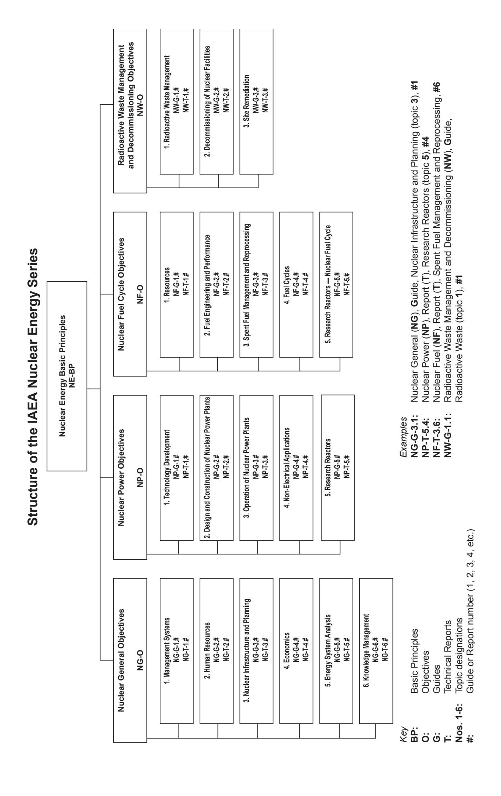

# Where to order IAEA publications

In the following countries IAEA publications may be purchased from the sources listed below, or from major local booksellers. Payment may be made in local currency or with UNESCO coupons.

DA Information Services, 648 Whitehorse Road, MITCHAM 3132

Telephone: +61 3 9210 7777 • Fax: +61 3 9210 7788

Email: service@dadirect.com.au • Web site: http://www.dadirect.com.au

Jean de Lannoy, avenue du Roi 202, B-1190 Brussels Telephone: +32 2 538 43 08 • Fax: +32 2 538 08 41

Email: jean.de.lannoy@infoboard.be • Web site: http://www.jean-de-lannoy.be

Bernan Associates, 4501 Forbes Blvd, Suite 200, Lanham, MD 20706-4346, USA

Telephone: 1-800-865-3457 • Fax: 1-800-865-3450

Email: customercare@bernan.com • Web site: http://www.bernan.com

Renouf Publishing Company Ltd., 1-5369 Canotek Rd., Ottawa, Ontario, K1J 9J3

Telephone: +613 745 2665 • Fax: +613 745 7660

Email: order.dept@renoufbooks.com • Web site: http://www.renoufbooks.com

#### CHINA

IAEA Publications in Chinese: China Nuclear Energy Industry Corporation, Translation Section, P.O. Box 2103, Beijing

#### CZECH REPUBLIC

Suweco CZ, S.R.O., Klecakova 347, 180 21 Praha 9 Telephone: +420 26603 5364 • Fax: +420 28482 1646 Email: nakup@suweco.cz • Web site: http://www.suweco.cz

Akateeminen Kirjakauppa, PO BOX 128 (Keskuskatu 1), FIN-00101 Helsinki

Telephone: +358 9 121 41 • Fax: +358 9 121 4450

Email: akatilaus@akateeminen.com • Web site: http://www.akateeminen.com

Form-Edit. 5. rue Janssen. P.O. Box 25. F-75921 Paris Cedex 19

Telephone: +33 1 42 01 49 49 • Fax: +33 1 42 01 90 90 Email: formedit@formedit.fr • Web site: http://www.formedit.fr

Lavoisier SAS, 145 rue de Provigny, 94236 Cachan Cedex Telephone: + 33 1 47 40 67 02 • Fax +33 1 47 40 67 02

Email: romuald.verrier@lavoisier.fr • Web site: http://www.lavoisier.fr

#### **GFRMANY**

UNO-Verlag, Vertriebs- und Verlags GmbH, Am Hofgarten 10, D-53113 Bonn Telephone: + 49 228 94 90 20 • Fax: +49 228 94 90 20 or +49 228 94 90 222 Email: bestellung@uno-verlag.de • Web site: http://www.uno-verlag.de

Librotrade Ltd., Book Import, P.O. Box 126, H-1656 Budapest

Telephone: +36 1 257 7777 • Fax: +36 1 257 7472 • Email: books@librotrade.hu

Allied Publishers Group, 1st Floor, Dubash House, 15, J. N. Heredia Marg, Ballard Estate, Mumbai 400 001,

Telephone: +91 22 22617926/27 • Fax: +91 22 22617928

Email: alliedpl@vsnl.com • Web site: http://www.alliedpublishers.com

Bookwell, 2/72, Nirankari Colony, Delhi 110009

Telephone: +91 11 23268786, +91 11 23257264 • Fax: +91 11 23281315

Email: bookwell@vsnl.net

Libreria Scientifica Dott. Lucio di Biasio "AEIOU", Via Coronelli 6, I-20146 Milan

Telephone: +39 02 48 95 45 52 or 48 95 45 62 • Fax: +39 02 48 95 45 48

Email: info@libreriaaeiou.eu • Website: www.libreriaaeiou.eu

#### **JAPAN**

Maruzen Company Ltd, 1-9-18, Kaigan, Minato-ku, Tokyo, 105-0022

Telephone: +81 3 6367 6079 • Fax: +81 3 6367 6207

Email: journal@maruzen.co.jp • Web site: http://www.maruzen.co.jp

#### **REPUBLIC OF KOREA**

KINS Inc., Information Business Dept. Samho Bldg. 2nd Floor, 275-1 Yang Jae-dong SeoCho-G, Seoul 137-130

Telephone: +02 589 1740 • Fax: +02 589 1746 • Web site: http://www.kins.re.kr

#### **NETHERLANDS**

De Lindeboom Internationale Publicaties B.V., M.A. de Ruyterstraat 20A, NL-7482 BZ Haaksbergen

Telephone: +31 (0) 53 5740004 • Fax: +31 (0) 53 5729296

Email: books@delindeboom.com • Web site: http://www.delindeboom.com

Martinus Nijhoff International, Koraalrood 50, P.O. Box 1853, 2700 CZ Zoetermeer

Telephone: +31 793 684 400 • Fax: +31 793 615 698 Email: info@nijhoff.nl • Web site: http://www.nijhoff.nl Swets and Zeitlinger b.v., P.O. Box 830, 2160 SZ Lisse Telephone: +31 252 435 111 • Fax: +31 252 415 888 Email: infoho@swets.nl • Web site: http://www.swets.nl

#### **NEW ZEALAND**

DA Information Services, 648 Whitehorse Road, MITCHAM 3132, Australia

Telephone: +61 3 9210 7777 • Fax: +61 3 9210 7788

Email: service@dadirect.com.au • Web site: http://www.dadirect.com.au

#### **SLOVENIA**

Cankarjeva Zalozba d.d., Kopitarjeva 2, SI-1512 Ljubljana Telephone: +386 1 432 31 44 • Fax: +386 1 230 14 35

Email: import.books@cankarjeva-z.si • Web site: http://www.cankarjeva-z.si/uvoz

#### **SPAIN**

Díaz de Santos, S.A., c/ Juan Bravo, 3A, E-28006 Madrid Telephone: +34 91 781 94 80 • Fax: +34 91 575 55 63

Email: compras@diazdesantos.es, carmela@diazdesantos.es, barcelona@diazdesantos.es, julio@diazdesantos.es

Web site: http://www.diazdesantos.es

#### **UNITED KINGDOM**

The Stationery Office Ltd, International Sales Agency, PO Box 29, Norwich, NR3 1 GN

Telephone (orders): +44 870 600 5552 • (enquiries): +44 207 873 8372 • Fax: +44 207 873 8203

Email (orders): book.orders@tso.co.uk • (enquiries): book.enquiries@tso.co.uk • Web site: http://www.tso.co.uk

#### On-line orders

DELTA Int. Book Wholesalers Ltd., 39 Alexandra Road, Addlestone, Surrey, KT15 2PQ

Email: info@profbooks.com • Web site: http://www.profbooks.com

Books on the Environment

Earthprint Ltd., P.O. Box 119, Stevenage SG1 4TP Telephone: +44 1438748111 • Fax: +44 1438748844

Email: orders@earthprint.com • Web site: http://www.earthprint.com

#### **UNITED NATIONS**

Dept. I004, Room DC2-0853, First Avenue at 46th Street, New York, N.Y. 10017, USA

(UN) Telephone: +800 253-9646 or +212 963-8302 • Fax: +212 963-3489

Email: publications@un.org • Web site: http://www.un.org

#### **UNITED STATES OF AMERICA**

Bernan Associates, 4501 Forbes Blvd., Suite 200, Lanham, MD 20706-4346

Telephone: 1-800-865-3457 • Fax: 1-800-865-3450

Email: customercare@bernan.com · Web site: http://www.bernan.com

Renouf Publishing Company Ltd., 812 Proctor Ave., Ogdensburg, NY, 13669

Telephone: +888 551 7470 (toll-free) • Fax: +888 568 8546 (toll-free)

Email: order.dept@renoufbooks.com • Web site: http://www.renoufbooks.com

### **Orders and requests for information** may also be addressed directly to:

#### **Marketing and Sales Unit, International Atomic Energy Agency**

Vienna International Centre, PO Box 100, 1400 Vienna, Austria Telephone: +43 1 2600 22529 (or 22530) • Fax: +43 1 2600 29302

Email: sales.publications@iaea.org • Web site: http://www.iaea.org/books