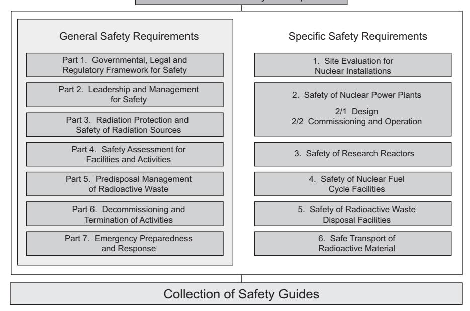
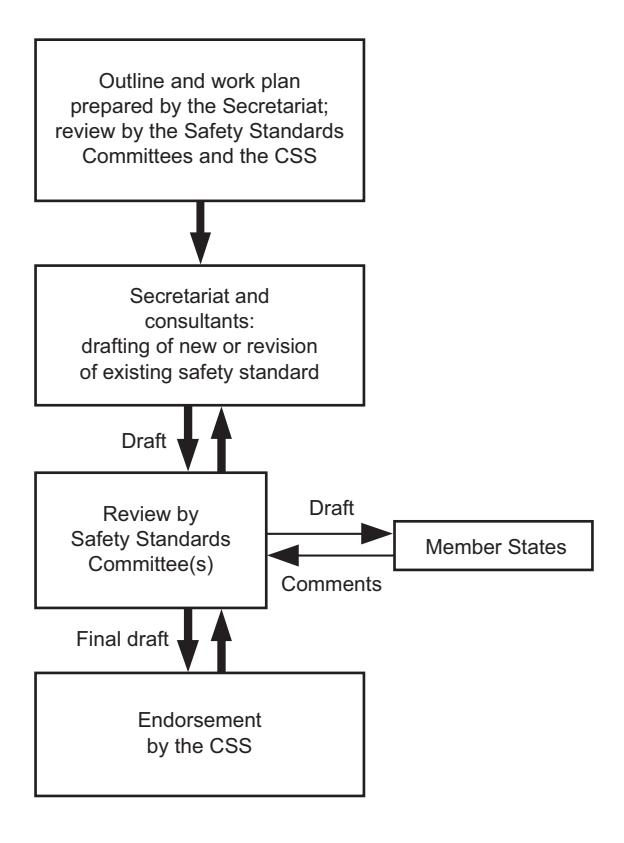
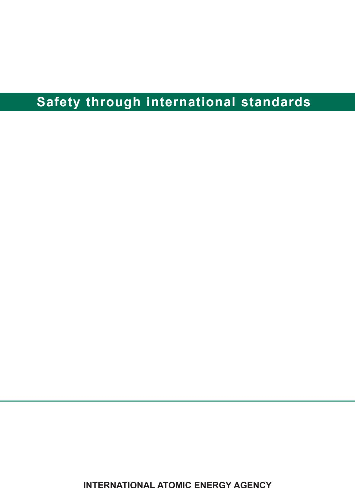

# IAEA Safety Standards

**for protecting people and the environment**

# Conduct of Operations at Nuclear Power Plants

Specific Safety Guide

No. SSG‑76

#### **IAEA SAFETY STANDARDS AND RELATED PUBLICATIONS**

#### IAEA SAFETY STANDARDS

Under the terms of Article III of its Statute, the IAEA is authorized to establish or adopt standards of safety for protection of health and minimization of danger to life and property, and to provide for the application of these standards.

The publications by means of which the IAEA establishes standards are issued in the **IAEA Safety Standards Series**. This series covers nuclear safety, radiation safety, transport safety and waste safety. The publication categories in the series are **Safety Fundamentals**, **Safety Requirements** and **Safety Guides**.

Information on the IAEA's safety standards programme is available on the IAEA Internet site

https://www.iaea.org/resources/safety-standards

The site provides the texts in English of published and draft safety standards. The texts of safety standards issued in Arabic, Chinese, French, Russian and Spanish, the IAEA Safety Glossary and a status report for safety standards under development are also available. For further information, please contact the IAEA at: Vienna International Centre, PO Box 100, 1400 Vienna, Austria.

All users of IAEA safety standards are invited to inform the IAEA of experience in their use (e.g. as a basis for national regulations, for safety reviews and for training courses) for the purpose of ensuring that they continue to meet users' needs. Information may be provided via the IAEA Internet site or by post, as above, or by email to Official.Mail@iaea.org.

#### RELATED PUBLICATIONS

The IAEA provides for the application of the standards and, under the terms of Articles III and VIII.C of its Statute, makes available and fosters the exchange of information relating to peaceful nuclear activities and serves as an intermediary among its Member States for this purpose.

Reports on safety in nuclear activities are issued as **Safety Reports**, which provide practical examples and detailed methods that can be used in support of the safety standards.

Other safety related IAEA publications are issued as **Emergency Preparedness and Response** publications, **Radiological Assessment Reports**, the International Nuclear Safety Group's **INSAG Reports**, **Technical Reports** and **TECDOCs**. The IAEA also issues reports on radiological accidents, training manuals and practical manuals, and other special safety related publications.

Security related publications are issued in the **IAEA Nuclear Security Series**.

The **IAEA Nuclear Energy Series** comprises informational publications to encourage and assist research on, and the development and practical application of, nuclear energy for peaceful purposes. It includes reports and guides on the status of and advances in technology, and on experience, good practices and practical examples in the areas of nuclear power, the nuclear fuel cycle, radioactive waste management and decommissioning.

## CONDUCT OF OPERATIONS AT NUCLEAR POWER PLANTS

#### The following States are Members of the International Atomic Energy Agency:

| AFGHANISTAN            | GERMANY                   | PALAU                    |
|------------------------|---------------------------|--------------------------|
| ALBANIA                | GHANA                     | PANAMA                   |
| ALGERIA                | GREECE                    | PAPUA NEW GUINEA         |
| ANGOLA                 | GRENADA                   | PARAGUAY                 |
| ANTIGUA AND BARBUDA    | GUATEMALA                 |                          |
|                        |                           | PERU                     |
| ARGENTINA              | GUYANA                    | PHILIPPINES              |
| ARMENIA                | HAITI                     | POLAND                   |
| AUSTRALIA              | HOLY SEE                  | PORTUGAL                 |
| AUSTRIA                | HONDURAS                  | QATAR                    |
| AZERBAIJAN             | HUNGARY                   |                          |
| BAHAMAS                | ICELAND                   | REPUBLIC OF MOLDOVA      |
| BAHRAIN                | INDIA                     | ROMANIA                  |
|                        |                           | RUSSIAN FEDERATION       |
| BANGLADESH             | INDONESIA                 | RWANDA                   |
| BARBADOS               | IRAN, ISLAMIC REPUBLIC OF | SAINT KITTS AND NEVIS    |
| BELARUS                | IRAQ                      | SAINT LUCIA              |
| BELGIUM                | IRELAND                   |                          |
| BELIZE                 | ISRAEL                    | SAINT VINCENT AND        |
| BENIN                  | ITALY                     | THE GRENADINES           |
|                        | JAMAICA                   | SAMOA                    |
| BOLIVIA, PLURINATIONAL |                           | SAN MARINO               |
| STATE OF               | JAPAN                     | SAUDI ARABIA             |
| BOSNIA AND HERZEGOVINA | JORDAN                    |                          |
| BOTSWANA               | KAZAKHSTAN                | SENEGAL                  |
| BRAZIL                 | KENYA                     | SERBIA                   |
| BRUNEI DARUSSALAM      | KOREA, REPUBLIC OF        | SEYCHELLES               |
| BULGARIA               | KUWAIT                    | SIERRA LEONE             |
|                        |                           | SINGAPORE                |
| BURKINA FASO           | KYRGYZSTAN                | SLOVAKIA                 |
| BURUNDI                | LAO PEOPLE'S DEMOCRATIC   |                          |
| CAMBODIA               | REPUBLIC                  | SLOVENIA                 |
| CAMEROON               | LATVIA                    | SOUTH AFRICA             |
| CANADA                 | LEBANON                   | SPAIN                    |
| CENTRAL AFRICAN        | LESOTHO                   | SRI LANKA                |
| REPUBLIC               | LIBERIA                   | SUDAN                    |
| CHAD                   | LIBYA                     |                          |
|                        |                           | SWEDEN                   |
| CHILE                  | LIECHTENSTEIN             | SWITZERLAND              |
| CHINA                  | LITHUANIA                 | SYRIAN ARAB REPUBLIC     |
| COLOMBIA               | LUXEMBOURG                | TAJIKISTAN               |
| COMOROS                | MADAGASCAR                | THAILAND                 |
| CONGO                  | MALAWI                    | TOGO                     |
| COSTA RICA             | MALAYSIA                  |                          |
| CÔTE D'IVOIRE          | MALI                      | TONGA                    |
|                        |                           | TRINIDAD AND TOBAGO      |
| CROATIA                | MALTA                     | TUNISIA                  |
| CUBA                   | MARSHALL ISLANDS          | TÜRKİYE                  |
| CYPRUS                 | MAURITANIA                | TURKMENISTAN             |
| CZECH REPUBLIC         | MAURITIUS                 | UGANDA                   |
| DEMOCRATIC REPUBLIC    | MEXICO                    |                          |
| OF THE CONGO           | MONACO                    | UKRAINE                  |
| DENMARK                | MONGOLIA                  | UNITED ARAB EMIRATES     |
|                        |                           | UNITED KINGDOM OF        |
| DJIBOUTI               | MONTENEGRO                | GREAT BRITAIN AND        |
| DOMINICA               | MOROCCO                   | NORTHERN IRELAND         |
| DOMINICAN REPUBLIC     | MOZAMBIQUE                |                          |
| ECUADOR                | MYANMAR                   | UNITED REPUBLIC          |
| EGYPT                  | NAMIBIA                   | OF TANZANIA              |
| EL SALVADOR            | NEPAL                     | UNITED STATES OF AMERICA |
| ERITREA                | NETHERLANDS               | URUGUAY                  |
| ESTONIA                | NEW ZEALAND               | UZBEKISTAN               |
|                        |                           | VANUATU                  |
| ESWATINI               | NICARAGUA                 |                          |
| ETHIOPIA               | NIGER                     | VENEZUELA, BOLIVARIAN    |
| FIJI                   | NIGERIA                   | REPUBLIC OF              |
| FINLAND                | NORTH MACEDONIA           | VIET NAM                 |
| FRANCE                 | NORWAY                    | YEMEN                    |
| GABON                  | OMAN                      | ZAMBIA                   |
|                        |                           | ZIMBABWE                 |
| GEORGIA                | PAKISTAN                  | ZIMDAD W E               |
|                        |                           |                          |

The Agency's Statute was approved on 23 October 1956 by the Conference on the Statute of the IAEA held at United Nations Headquarters, New York; it entered into force on 29 July 1957. The Headquarters of the Agency are situated in Vienna. Its principal objective is "to accelerate and enlarge the contribution of atomic energy to peace, health and prosperity throughout the world".

## IAEA SAFETY STANDARDS SERIES No. SSG‑76

# CONDUCT OF OPERATIONS AT NUCLEAR POWER PLANTS

SPECIFIC SAFETY GUIDE

## **COPYRIGHT NOTICE**

All IAEA scientific and technical publications are protected by the terms of the Universal Copyright Convention as adopted in 1952 (Berne) and as revised in 1972 (Paris). The copyright has since been extended by the World Intellectual Property Organization (Geneva) to include electronic and virtual intellectual property. Permission to use whole or parts of texts contained in IAEA publications in printed or electronic form must be obtained and is usually subject to royalty agreements. Proposals for non-commercial reproductions and translations are welcomed and considered on a case-by-case basis. Enquiries should be addressed to the IAEA Publishing Section at:

Marketing and Sales Unit, Publishing Section International Atomic Energy Agency Vienna International Centre PO Box 100 1400 Vienna, Austria

fax: +43 1 26007 22529 tel.: +43 1 2600 22417

email: sales.publications@iaea.org

www.iaea.org/publications

© IAEA, 2022

Printed by the IAEA in Austria October 2022 STI/PUB/2032

#### **IAEA Library Cataloguing in Publication Data**

Names: International Atomic Energy Agency.

Title: Conduct of operations at nuclear power plants / International Atomic Energy Agency.

Description: Vienna : International Atomic Energy Agency, 2022. | Series: IAEA safety standards series, ISSN 1020–525X ; no. SSG-76 | Includes bibliographical references.

Identifiers: IAEAL 22-01538 | ISBN 978–92–0–140222–6 (paperback : alk. paper) | ISBN 978–92–0–140322–3 (pdf) | ISBN 978–92–0–140422–0 (epub)

Subjects: LCSH: Nuclear power plants — Safety measures. | Nuclear power plants — Management. | Nuclear power plants — Monitoring.

Classification: UDC 621.039.58 | STI/PUB/2032

## **FOREWORD**

## **by Rafael Mariano Grossi Director General**

The IAEA's Statute authorizes it to "establish…standards of safety for protection of health and minimization of danger to life and property". These are standards that the IAEA must apply to its own operations, and that States can apply through their national regulations.

The IAEA started its safety standards programme in 1958 and there have been many developments since. As Director General, I am committed to ensuring that the IAEA maintains and improves upon this integrated, comprehensive and consistent set of up to date, user friendly and fit for purpose safety standards of high quality. Their proper application in the use of nuclear science and technology should offer a high level of protection for people and the environment across the world and provide the confidence necessary to allow for the ongoing use of nuclear technology for the benefit of all.

Safety is a national responsibility underpinned by a number of international conventions. The IAEA safety standards form a basis for these legal instruments and serve as a global reference to help parties meet their obligations. While safety standards are not legally binding on Member States, they are widely applied. They have become an indispensable reference point and a common denominator for the vast majority of Member States that have adopted these standards for use in national regulations to enhance safety in nuclear power generation, research reactors and fuel cycle facilities as well as in nuclear applications in medicine, industry, agriculture and research.

The IAEA safety standards are based on the practical experience of its Member States and produced through international consensus. The involvement of the members of the Safety Standards Committees, the Nuclear Security Guidance Committee and the Commission on Safety Standards is particularly important, and I am grateful to all those who contribute their knowledge and expertise to this endeavour.

The IAEA also uses these safety standards when it assists Member States through its review missions and advisory services. This helps Member States in the application of the standards and enables valuable experience and insight to be shared. Feedback from these missions and services, and lessons identified from events and experience in the use and application of the safety standards, are taken into account during their periodic revision.

I believe the IAEA safety standards and their application make an invaluable contribution to ensuring a high level of safety in the use of nuclear technology. I encourage all Member States to promote and apply these standards, and to work with the IAEA to uphold their quality now and in the future.

## **THE IAEA SAFETY STANDARDS**

#### BACKGROUND

Radioactivity is a natural phenomenon and natural sources of radiation are features of the environment. Radiation and radioactive substances have many beneficial applications, ranging from power generation to uses in medicine, industry and agriculture. The radiation risks to workers and the public and to the environment that may arise from these applications have to be assessed and, if necessary, controlled.

Activities such as the medical uses of radiation, the operation of nuclear installations, the production, transport and use of radioactive material, and the management of radioactive waste must therefore be subject to standards of safety.

Regulating safety is a national responsibility. However, radiation risks may transcend national borders, and international cooperation serves to promote and enhance safety globally by exchanging experience and by improving capabilities to control hazards, to prevent accidents, to respond to emergencies and to mitigate any harmful consequences.

States have an obligation of diligence and duty of care, and are expected to fulfil their national and international undertakings and obligations.

International safety standards provide support for States in meeting their obligations under general principles of international law, such as those relating to environmental protection. International safety standards also promote and assure confidence in safety and facilitate international commerce and trade.

A global nuclear safety regime is in place and is being continuously improved. IAEA safety standards, which support the implementation of binding international instruments and national safety infrastructures, are a cornerstone of this global regime. The IAEA safety standards constitute a useful tool for contracting parties to assess their performance under these international conventions.

#### THE IAEA SAFETY STANDARDS

The status of the IAEA safety standards derives from the IAEA's Statute, which authorizes the IAEA to establish or adopt, in consultation and, where appropriate, in collaboration with the competent organs of the United Nations and with the specialized agencies concerned, standards of safety for protection of health and minimization of danger to life and property, and to provide for their application.

With a view to ensuring the protection of people and the environment from harmful effects of ionizing radiation, the IAEA safety standards establish fundamental safety principles, requirements and measures to control the radiation exposure of people and the release of radioactive material to the environment, to restrict the likelihood of events that might lead to a loss of control over a nuclear reactor core, nuclear chain reaction, radioactive source or any other source of radiation, and to mitigate the consequences of such events if they were to occur. The standards apply to facilities and activities that give rise to radiation risks, including nuclear installations, the use of radiation and radioactive sources, the transport of radioactive material and the management of radioactive waste.

Safety measures and security measures1 have in common the aim of protecting human life and health and the environment. Safety measures and security measures must be designed and implemented in an integrated manner so that security measures do not compromise safety and safety measures do not compromise security.

The IAEA safety standards reflect an international consensus on what constitutes a high level of safety for protecting people and the environment from harmful effects of ionizing radiation. They are issued in the IAEA Safety Standards Series, which has three categories (see Fig. 1).

#### **Safety Fundamentals**

Safety Fundamentals present the fundamental safety objective and principles of protection and safety, and provide the basis for the safety requirements.

#### **Safety Requirements**

An integrated and consistent set of Safety Requirements establishes the requirements that must be met to ensure the protection of people and the environment, both now and in the future. The requirements are governed by the objective and principles of the Safety Fundamentals. If the requirements are not met, measures must be taken to reach or restore the required level of safety. The format and style of the requirements facilitate their use for the establishment, in a harmonized manner, of a national regulatory framework. Requirements, including numbered 'overarching' requirements, are expressed as 'shall' statements. Many requirements are not addressed to a specific party, the implication being that the appropriate parties are responsible for fulfilling them.

#### **Safety Guides**

Safety Guides provide recommendations and guidance on how to comply with the safety requirements, indicating an international consensus that it

1 See also publications issued in the IAEA Nuclear Security Series.

#### Safety Fundamentals Fundamental Safety Principles

*FIG. 1. The long term structure of the IAEA Safety Standards Series.*

is necessary to take the measures recommended (or equivalent alternative measures). The Safety Guides present international good practices, and increasingly they reflect best practices, to help users striving to achieve high levels of safety. The recommendations provided in Safety Guides are expressed as 'should' statements.

#### APPLICATION OF THE IAEA SAFETY STANDARDS

The principal users of safety standards in IAEA Member States are regulatory bodies and other relevant national authorities. The IAEA safety standards are also used by co‑sponsoring organizations and by many organizations that design, construct and operate nuclear facilities, as well as organizations involved in the use of radiation and radioactive sources.

The IAEA safety standards are applicable, as relevant, throughout the entire lifetime of all facilities and activities — existing and new — utilized for peaceful purposes and to protective actions to reduce existing radiation risks. They can be used by States as a reference for their national regulations in respect of facilities and activities.

The IAEA's Statute makes the safety standards binding on the IAEA in relation to its own operations and also on States in relation to IAEA assisted operations.

The IAEA safety standards also form the basis for the IAEA's safety review services, and they are used by the IAEA in support of competence building, including the development of educational curricula and training courses.

International conventions contain requirements similar to those in the IAEA safety standards and make them binding on contracting parties. The IAEA safety standards, supplemented by international conventions, industry standards and detailed national requirements, establish a consistent basis for protecting people and the environment. There will also be some special aspects of safety that need to be assessed at the national level. For example, many of the IAEA safety standards, in particular those addressing aspects of safety in planning or design, are intended to apply primarily to new facilities and activities. The requirements established in the IAEA safety standards might not be fully met at some existing facilities that were built to earlier standards. The way in which IAEA safety standards are to be applied to such facilities is a decision for individual States.

The scientific considerations underlying the IAEA safety standards provide an objective basis for decisions concerning safety; however, decision makers must also make informed judgements and must determine how best to balance the benefits of an action or an activity against the associated radiation risks and any other detrimental impacts to which it gives rise.

#### DEVELOPMENT PROCESS FOR THE IAEA SAFETY STANDARDS

The preparation and review of the safety standards involves the IAEA Secretariat and five Safety Standards Committees, for emergency preparedness and response (EPReSC) (as of 2016), nuclear safety (NUSSC), radiation safety (RASSC), the safety of radioactive waste (WASSC) and the safe transport of radioactive material (TRANSSC), and a Commission on Safety Standards (CSS) which oversees the IAEA safety standards programme (see Fig. 2).

All IAEA Member States may nominate experts for the Safety Standards Committees and may provide comments on draft standards. The membership of the Commission on Safety Standards is appointed by the Director General and includes senior governmental officials having responsibility for establishing national standards.

A management system has been established for the processes of planning, developing, reviewing, revising and establishing the IAEA safety standards.

*FIG. 2. The process for developing a new safety standard or revising an existing standard.*

It articulates the mandate of the IAEA, the vision for the future application of the safety standards, policies and strategies, and corresponding functions and responsibilities.

#### INTERACTION WITH OTHER INTERNATIONAL ORGANIZATIONS

The findings of the United Nations Scientific Committee on the Effects of Atomic Radiation (UNSCEAR) and the recommendations of international expert bodies, notably the International Commission on Radiological Protection (ICRP), are taken into account in developing the IAEA safety standards. Some safety standards are developed in cooperation with other bodies in the United Nations system or other specialized agencies, including the Food and Agriculture Organization of the United Nations, the United Nations Environment Programme, the International Labour Organization, the OECD Nuclear Energy Agency, the Pan American Health Organization and the World Health Organization.

#### INTERPRETATION OF THE TEXT

Safety related terms are to be understood as defined in the IAEA Safety Glossary (see https://www.iaea.org/resources/safety‑standards/safety‑glossary). Otherwise, words are used with the spellings and meanings assigned to them in the latest edition of The Concise Oxford Dictionary. For Safety Guides, the English version of the text is the authoritative version.

The background and context of each standard in the IAEA Safety Standards Series and its objective, scope and structure are explained in Section 1, Introduction, of each publication.

Material for which there is no appropriate place in the body text (e.g. material that is subsidiary to or separate from the body text, is included in support of statements in the body text, or describes methods of calculation, procedures or limits and conditions) may be presented in appendices or annexes.

An appendix, if included, is considered to form an integral part of the safety standard. Material in an appendix has the same status as the body text, and the IAEA assumes authorship of it. Annexes and footnotes to the main text, if included, are used to provide practical examples or additional information or explanation. Annexes and footnotes are not integral parts of the main text. Annex material published by the IAEA is not necessarily issued under its authorship; material under other authorship may be presented in annexes to the safety standards. Extraneous material presented in annexes is excerpted and adapted as necessary to be generally useful.

## **CONTENTS**

| 1. | INTRODUCTION .                                                                                                                                                                                                                                                                                                                                         | 1                                                  |
|----|--------------------------------------------------------------------------------------------------------------------------------------------------------------------------------------------------------------------------------------------------------------------------------------------------------------------------------------------------------|----------------------------------------------------|
|    | Background (1.1–1.5) . Objective (1.6, 1.7) . Scope (1.8, 1.9) . Structure (1.10) .                                                                                                                                                                                                                                                           | 1 2 2 3                                   |
| 2. | MANAGEMENT AND ORGANIZATION OF PLANT OPERATIONS .                                                                                                                                                                                                                                                                                                   | 3                                                  |
|    | Functions and organization of plant operations (2.1–2.6) . Operating policy (2.7–2.16) . Human resources and qualification of personnel (2.17–2.25) . Performance standards and objectives (2.26–2.33) . Interfaces with other groups of personnel (2.34–2.41) .                                                                           | 3 6 7 9 11                             |
| 3. | SHIFT COMPLEMENT AND FUNCTIONS .                                                                                                                                                                                                                                                                                                                       | 13                                                 |
|    | Shift supervisor (3.1–3.3) Operators (3.4–3.8) . Safety engineer or technical adviser on duty (3.9, 3.10) . Shift technical support personnel (3.11) .                                                                                                                                                                                        | 13 14 16 16                               |
| 4. | SHIFT ROUTINES AND OPERATING PRACTICES .                                                                                                                                                                                                                                                                                                               | 17                                                 |
|    | Shift arrangements (4.1–4.7) . Shift operations (4.8–4.14) Shift turnovers (4.15–4.22) . Availability and use of operating procedures (4.23–4.29) . Pre‑job briefings (4.30, 4.31) . Conduct in the control room (4.32–4.37) Shift rounds (4.38–4.47) . Communications (4.48–4.53) Shift records and log keeping (4.54–4.62) . | 17 18 19 21 22 23 25 27 28 |
| 5. | CONTROL OF EQUIPMENT AND PLANT STATUS .                                                                                                                                                                                                                                                                                                                | 30                                                 |
|    | Labelling of plant equipment (5.1–5.4) .                                                                                                                                                                                                                                                                                                               | 30                                                 |

|    | System alignment (5.5–5.8) .                                      | 31 |
|----|-------------------------------------------------------------------|----|
|    | Release of equipment from service and return of equipment to      |    |
|    | service (5.9–5.17) .                                              | 32 |
|    | Foreign material exclusion programme (5.18, 5.19) .               | 34 |
|    | Surveillance of equipment status (5.20–5.25) .                    | 34 |
|    | Control of reactivity related operations (5.26–5.32) .            | 35 |
|    | Control of core cooling and fuel storage cooling (5.33) .         | 37 |
|    | Control of alarms (5.34–5.39) .                                   | 37 |
|    | Accident management (5.40–5.47) .                                 | 38 |
|    | Recovery from abnormal situations (5.48–5.52) .                   | 39 |
|    | Temporary modifications (5.53–5.59) .                             | 40 |
|    | Control of plant chemistry (5.60–5.64) .                          | 42 |
|    | Handling of equipment deficiencies (5.65–5.69)                    | 43 |
|    | Tools for preventing human error (5.70–5.72)                      | 44 |
| 6. | OPERATIONS EQUIPMENT AND OPERATOR AIDS .                          | 45 |
|    | Condition of control rooms and panels (6.1–6.8) .                 | 45 |
|    | Communication equipment (6.9–6.13) .                              | 47 |
|    | Operator aids and supporting tools (6.14–6.18)                    | 48 |
|    | Housekeeping and material conditions (6.19–6.29)                  | 49 |
| 7. | WORK CONTROL AND AUTHORIZATION .                                  | 51 |
|    | Work control procedures (7.1–7.9) .                               | 51 |
|    | Work planning and scheduling (7.10–7.14) .                        | 53 |
|    | Control of special tests and non‑routine activities (7.15–7.19) . | 54 |
|    | Control of outages (7.20–7.22) .                                  | 55 |
|    | Routines for isolation of equipment (7.23–7.34) .                 | 56 |
|    | Non‑radiation‑related safety (7.35–7.41)                          | 58 |
|    | REFERENCES .                                                      | 59 |
|    |                                                                   |    |

CONTRIBUTORS TO DRAFTING AND REVIEW . 63

## **1. INTRODUCTION**

#### BACKGROUND

- 1.1. Requirements for the operation of nuclear power plants are established in IAEA Safety Standards Series No. SSR‑2/2 (Rev. 1), Safety of Nuclear Power Plants: Commissioning and Operation [1], while requirements for the design of nuclear power plants are established in IAEA Safety Standards Series No. SSR‑2/1 (Rev. 1), Safety of Nuclear Power Plants: Design [2].
- 1.2. This Safety Guide provides specific recommendations to ensure that operations in nuclear power plants are conducted in a safe, effective, thorough and professional manner.
- 1.3. This Safety Guide was developed in parallel with six other Safety Guides on the operation of nuclear power plants, as follows:
  - IAEA Safety Standards Series No. SSG‑70, Operational Limits and Conditions and Operating Procedures for Nuclear Power Plants [3];
  - IAEA Safety Standards Series No. SSG‑71, Modifications to Nuclear Power Plants [4];
  - IAEA Safety Standards Series No. SSG‑72, The Operating Organization for Nuclear Power Plants [5];
  - IAEA Safety Standards Series No. SSG‑73, Core Management and Fuel Handling for Nuclear Power Plants [6];
  - IAEA Safety Standards Series No. SSG‑74, Maintenance, Testing, Surveillance and Inspection in Nuclear Power Plants [7];
  - IAEA Safety Standards Series No. SSG‑75, Recruitment, Qualification and Training of Personnel for Nuclear Power Plants [8].

A collective aim of this set of Safety Guides is to support the fostering of a strong safety culture in nuclear power plants.

1.4. The terms used in this Safety Guide are to be understood as defined in the IAEA Safety Glossary [9].

1.5. This Safety Guide supersedes IAEA Safety Standards Series No. NS‑G‑2.14, Conduct of Operations at Nuclear Power Plants1 .

#### OBJECTIVE

- 1.6. The purpose of this Safety Guide is to provide recommendations to ensure that operations in nuclear power plants are conducted in accordance with the requirements established in SSR‑2/2 (Rev. 1) [1].
- 1.7. The recommendations provided in this Safety Guide are aimed primarily at operating organizations of nuclear power plants and regulatory bodies.

#### SCOPE

- 1.8. It is expected that this Safety Guide will be used primarily for land based stationary nuclear power plants with water cooled reactors designed for electricity generation or for other production applications (such as district heating or desalination).
- 1.9. This Safety Guide identifies the main responsibilities and operating practices in relation to the safe operation of a nuclear power plant, and addresses the following:
- (a) The structure of the operations department2 of a nuclear power plant;
- (b) Setting high standards of performance and making safety related decisions in an effective manner;
- (c) Conducting control room activities in a thorough and professional manner;
- (d) Maintaining a nuclear power plant within the established operational limits and conditions (OLCs).

1 INTERNATIONAL ATOMIC ENERGY AGENCY, Conduct of Operations at Nuclear Power Plants, IAEA Safety Standards Series No. NS‑G‑2.14, IAEA, Vienna (2008).

2 The operations department is the part of the operating organization responsible for the conduct of operations.

#### STRUCTURE

1.10. Section 2 provides recommendations on the organizational and administrative aspects of the operations department. Section 3 provides recommendations relating to the shift complement of operators and their duties. Section 4 provides recommendations on shift routines and on good operating practices. Section 5 provides recommendations on the control of plant equipment and of the plant status. Section 6 provides recommendations on the use and maintenance of operations equipment and operator aids, and Section 7 provides recommendations on work control and authorization.

# **2. MANAGEMENT AND ORGANIZATION OF PLANT OPERATIONS**

#### FUNCTIONS AND ORGANIZATION OF PLANT OPERATIONS

- 2.1. Requirements for the management of facilities and activities, including nuclear power plants, are established in IAEA Safety Standards Series No. GSR Part 2, Leadership and Management for Safety [10]. Further recommendations for nuclear power plants are provided in IAEA Safety Standards Series No. GS‑G‑3.5, The Management System for Nuclear Installations [11].
- 2.2. The management and organization of a nuclear power plant should ensure a high level of safety performance in the conduct of operations within the plant. This should be achieved through the effective implementation and control of operations activities.
- 2.3. A clear understanding by operating personnel3 of their authorities, responsibilities and accountabilities, and the associated interfaces, is essential for the proper and safe functioning of a nuclear power plant. To achieve this, the organizational structure in relation to plant operations should be clearly

3 'Operating personnel' are the individual workers engaged in the operation of an authorized facility or the conduct of an authorized activity [9]. Within the context of this Safety Guide, operating personnel are those workers involved in the day to day operation of the reactor and who are part of the operations department at the nuclear power plant.

defined, and the administrative controls for implementing the structure should be formally documented.

- 2.4. The structure of the operations department will differ depending on the specific plant; however, this structure is normally composed of personnel who perform shift work and additional personnel who are present during normal working hours. The following tasks, functions and responsibilities should be taken into account in determining the structure for the operations department:
- (a) Planning of the overall activities and work of the operations department in cooperation with other departments at the plant, to develop an integrated programme for plant operations;
- (b) Human resources planning and staff development;
- (c) Direct operation of the plant by monitoring and controlling plant systems in accordance with operating procedures, OLCs and administrative procedures;
- (d) Supervision of shift operations by the shift supervisor, and periodic evaluation of shift operations by the management of the operations department;
- (e) Organization and supervision of refuelling and shutdown activities;
- (f) Development of operating procedures, and coordination of their preparation to ensure the safe and reliable operation of the plant;
- (g) Coordination of the development and implementation of programmes and policies to ensure that plant operations are performed in a safe and reliable manner;
- (h) Involvement in the development of surveillance programmes for structures, systems and components important to safety, and coordination of the implementation of such programmes;
- (i) Development and implementation of work management processes to ensure that shift personnel are aware of the work undertaken in the plant and maintain the correct plant configuration;
- (j) Maintenance of proper plant configuration by the correct handling of changes in the plant status caused by maintenance, modifications and testing activities;
- (k) Identification of deficiencies in equipment and in the plant to ensure that maintenance activities can be structured effectively;
- (l) Support of outage activities through the involvement of knowledgeable plant operating personnel in schedule development, testing, special projects,

- alignment of systems4 , tracking of system operability and the return to service of systems;
- (m) Establishment and implementation of a system to prevent unauthorized access to, or interference with, items important to safety;
- (n) Identification of training needs, involvement in the development of training programmes and in the monitoring of training sessions, and evaluation of training programmes;
- (o) Verification of good housekeeping and material conditions in the areas of the plant for which the operations department is responsible;
- (p) Establishment of operating goals and objectives in accordance with the overall goals and objectives for the plant;
- (q) Reporting on abnormal events, including near misses and low level events, participating in the investigation of such events and deciding on measures to be taken to reduce the probability of a similar situation reoccurring;
- (r) Dissemination of operating experience to operating personnel to learn from events at the nuclear power plant and at other nuclear installations;
- (s) Production of reports on the conduct of operations for management and other groups and authorities as necessary;
- (t) Arrangements and responsibilities for accident management;
- (u) Arrangements and responsibilities for emergency preparedness and response.
- 2.5. For the safe operation of the plant, administrative controls should be established that include OLCs and operating instructions and procedures. These controls constitute the operations programme and should be established before the commencement of operation. The overall responsibility for establishing and implementing the operations programme and for managing the operations department should normally rest with the operations manager. The operations manager has responsibility for the day to day running of the operations department.
- 2.6. The operations department should be involved in prioritizing all work that might affect the safe operation of the plant and should be assigned the responsibility for overseeing the planning and scheduling of such work.

4 The alignment of a system or equipment is the configuration of the system or equipment that is created by operating switches, valves or breakers to ensure the appropriate functioning of the system or equipment for a given purpose.

#### OPERATING POLICY

- 2.7. An operating policy is required to be established in which safety has an overriding priority in all aspects of plant operations, including challenges resulting from production demands and project schedules (see para. 4.1 of SSR‑2/2 (Rev. 1) [1]). The policy is also required to promote a strong safety culture, including a questioning attitude, and should encourage a 'no blame' culture and a rigorous and prudent approach to all safety related activities.
- 2.8. The operating policy should be based on maintaining the independence of each level of defence in depth and an adequate reliability of each level, as part of the conduct of operations. The influence of human and organizational factors on one or more levels of defence in depth should be taken into account in all operational activities.
- 2.9. A defence in depth approach should be generally applied to safety related activities in plant operations. These activities should be carefully planned, appropriately authorized by the operations department and performed by competent operating personnel in accordance with approved procedures.
- 2.10. Adequate independent safety assessments and verifications should be performed for different operational activities to ensure that such activities can be completed without affecting the safety of the plant.
- 2.11. Plant operations important to safety are required to be undertaken by suitably qualified and competent operating personnel, which may require the formal authorization of personnel (see para. 4.16 of SSR‑2/2 (Rev. 1) [1]). Further recommendations on the recruitment, qualification and training of personnel for nuclear power plants are provided in SSG‑75 [8].
- 2.12. The assignment of plant personnel to operate control room keys or other safety related equipment should be specified in administrative procedures. Only personnel who are physically and mentally fit for operational duties should be allowed to perform activities in relation to plant operation in the main control room or safety related activities elsewhere in the plant.
- 2.13. Operating personnel should maintain the reactor and its supporting systems within the bounds of approved equipment alignments. As stated in para. 4.26 of SSR‑2/2 (Rev. 1) [1], "All activities important to safety shall be carried out in accordance with written procedures to ensure that the plant is operated within the established operational limits and conditions."

- 2.14. The nuclear power plant should be maintained in a safe condition by deliberate monitoring and control to ensure that fundamental safety functions (e.g. control of reactivity, removal of heat from the reactor and from the fuel store, confinement of radioactive material) are fulfilled at all stages of the lifetime of the nuclear power plant, including decommissioning. Requirements on decommissioning are established in IAEA Safety Standards Series No. GSR Part 6, Decommissioning of Facilities [12]. Further recommendations are provided in IAEA Safety Standards Series No. SSG‑47, Decommissioning of Nuclear Power Plants, Research Reactors and Other Nuclear Fuel Cycle Facilities [13].
- 2.15. The operating organization should ensure the safe operation at all units at a multiple unit site, taking in consideration the evolution of work at one or more of the units. This should be achieved by appropriate procedures, work planning, training and the allocation of appropriate resources.

#### 2.16. Paragraph 5.11 of SSR‑2/2 (Rev. 1) [1] states:

"The radiation protection programme shall ensure that for all operational states, doses due to exposure to ionizing radiation at the plant or doses due to any planned radioactive releases (discharges) from the plant are kept below authorized limits and are as low as reasonably achievable."

Requirements for protection against exposure to ionizing radiation are established in IAEA Safety Standards Series No. GSR Part 3, Radiation Protection and Safety of Radiation Sources: International Basic Safety Standards [14].

#### HUMAN RESOURCES AND QUALIFICATION OF PERSONNEL

#### 2.17. Paragraph 3.11 of SSR‑2/2 (Rev. 1) [1] states:

"The organization, qualifications and number of operating personnel shall be adequate for the safe and reliable operation of the plant in all operational states and in accident conditions. Succession planning shall be an established practice for the operating personnel. The recruitment and selection policy of the operating organization shall be directed at retaining competent personnel to cover all aspects of safe operation. A long term staffing plan aligned to the long term objectives of the operating organization shall be developed in anticipation of the future needs of the operating organization for personnel and skills."

- 2.18. The operations manager should ensure that an adequate number of competent and qualified operating personnel are available at all times to operate the plant safely. There should be sufficient numbers of operating personnel to allow individuals to be periodically released for training and development. The long term staffing plan for operating personnel should be supported by reviews of career development, associated action plans and recruitment plans. These reviews should aim to foster continuous improvement and learning.
- 2.19. The long term staffing plan should consider potential changes in technical capabilities throughout the lifetime of the plant. Further recommendations are provided in IAEA Safety Standards Series No. SSG‑48, Ageing Management and Development of a Programme for Long Term Operation of Nuclear Power Plants [15].
- 2.20. The shift teams should be staffed in such a way that a sufficient number of authorized operators5 and other personnel are available for the reliable accomplishment of assigned tasks in all operational states and accident conditions, as well as for the purposes of fire protection. Special attention should be paid to ensuring that staffing levels provide adequate redundancy and diversity in terms of the competences needed for all operational states and accident conditions.
- 2.21. During particularly busy periods for example, during reactor outages — line managers should ensure that sufficient operating personnel are provided to enable rest periods (see also para. 3.13 of SSR‑2/2 (Rev. 1) [1] in relation to the staff health policy). Line managers should be particularly vigilant in order to identify any signs of fatigue or reduction in fitness for duty in operating personnel (see also para. 4.29 of SSR‑2/2 (Rev. 1) [1]).

#### 2.22. Paragraph 4.19 of SSR‑2/2 (Rev. 1) [1] states:

"A suitable training programme shall be established and maintained for the training of personnel before their assignment to safety related duties. The training programme shall include provision for periodic confirmation of the competence of personnel and for refresher training on a regular basis. The refresher training shall also include retraining provision for personnel who have had extended absences from their authorized duties. The training shall emphasize the importance of safety in all aspects of plant operation and shall promote safety culture."

5 In some States, certain operating positions in the shift teams are subject to a licensing process.

Additional training or briefings should be provided for operations important to safety or for infrequent operations (including operations that are performed less frequently because of improved operational performance, such as startup of the plant). Changes to regulations and procedures, modifications to plant equipment and changes to the organizational structure should be addressed in continuing training. Special training should be provided on internal events and external events relevant to the safety of the plant.

- 2.23. All operating personnel and technical support personnel associated with the shift teams should be trained in the safety analysis aspects of activities that they are responsible for.
- 2.24. Support for the training department should be provided through the involvement of members of the operations department in the analysis of training needs and the development of training materials and training tools. Operating personnel should also be involved as training instructors for subjects on which they have expertise.
- 2.25. More detailed recommendations on the training and qualification of operating personnel for nuclear power plants, including a systematic approach to training, are provided in SSG‑75 [8].

#### PERFORMANCE STANDARDS AND OBJECTIVES

- 2.26. Paragraph 4.2 of SSR‑2/2 (Rev. 1) [1] states that "Safety performance standards shall be developed for all operational activities and shall be applied by all site personnel."
- 2.27. Realistic, measurable and challenging goals and objectives for the operation of the nuclear power plant should be established by the operations department to support the goals and objectives of the operating organization. These goals and objectives should address areas where high standards of performance are expected. High standards of performance and the expectations of management should be reflected in the operating policy and operating procedures.
- 2.28. Requirement 9 of SSR‑2/2 (Rev. 1) [1] states that "**The operating organization shall establish a system for continuous monitoring and periodic review of the safety of the plant and of the performance of the operating organization.**" Performance objectives and associated criteria should be

established and used to routinely monitor the performance of the plant and of operating personnel.

#### 2.29. Paragraph 4.35 of SSR‑2/2 (Rev. 1) [1] states:

"Monitoring of safety performance shall include the monitoring of: personnel performance; attitudes to safety; response to infringements of safety; and violations of operational limits and conditions, operating procedures, regulations and licence conditions."

Recommendations on OLCs and operating procedures are provided in SSG‑70 [3]. The performance of operating personnel should be appraised regularly, and the results should be used for enhancing individual performance and preventing complacency, and for the systematic collection of data for the training of operating personnel.

- 2.30. The managers of the operations department are required to demonstrate their commitment to safety (see Requirement 2 of GSR Part 2 [10]). This commitment should be clearly communicated to operating personnel and should be supported by the frequent presence of managers in the workplaces of such personnel. Managers are also required to demonstrate leadership for safety (see Requirement 2 of GSR Part 2 [10]). Safety performance should also be improved through coaching programmes.
- 2.31. The managers and supervisors of the operations department should, through consistent words and actions, develop a working environment that fosters adherence to the operating policy and reflects high standards of performance. In addition, para. 4.30 of SSR‑2/2 (Rev. 1) states that "The operating organization shall encourage plant personnel to have a questioning attitude and to make appropriate and conservative decisions[6] , so as to minimize risk and to maintain the plant in a safe condition."

6 Conservative decision making in operational safety management means making decisions that maintain all levels of defence in depth at all times. In practice, a conservative approach means that decisions that take equipment out of service, alter plant line‑ups, reschedule equipment testing or extend the out of service time of equipment are evaluated for their effects on safety, and that the final configuration meets the provisions of the safety analysis report and remains within established OLCs.

#### 2.32. Paragraph 4.34 of SSR‑2/2 (Rev. 1) [1] states:

"Self‑assessment by the operating organization shall be an integral part of the monitoring and review system. The operating organization shall perform systematic self‑assessments to identify achievements and to address any degradation in safety performance."

Corrective measures are required to be developed and implemented in a timely manner, on the basis of the results of the self‑assessments (see para. 4.37 of SSR‑2/2 (Rev. 1) [1]).

2.33. The managers of the operations department should support shift operations by ensuring that all necessary personnel requirements for each shift position such as qualifications, job descriptions, training and licences — are sufficient to establish and maintain comfortable working conditions for each shift. Good and regular communication should be established between the management of the operations department and control room operators.

#### INTERFACES WITH OTHER GROUPS OF PERSONNEL

- 2.34. The managers of the plant should ensure that procedures are put in place to cover, in an unambiguous manner, the interfaces between the operations department and other groups of personnel within the operating organization. One of the purposes of such procedures should be to enable support to be provided, as necessary, to the operations department.
- 2.35. Adequate provision should be made for providing prompt support to shift supervisors during normal working hours and outside normal working hours in the event of a problem arising in a particular subject, such as maintenance, reactor physics, radiation protection, environment protection or water chemistry.
- 2.36. There should be effective interfaces between the shift teams (including control room operators and field operators), the technical support group and maintenance groups, including contractors. After completing work, the shift team, technical support group and maintenance groups should ensure that structures, systems and components affected by the work are tested and returned to their original state or to a satisfactory operational state that complies with OLCs. Operating personnel should not tolerate equipment failures or defects, and should request the maintenance department to resolve all such failures and defects within a reasonable time frame.

- 2.37. Operating personnel should not normally interchange components or perform maintenance.7 If something needs to be repaired, the operating personnel should complete a written request for maintenance work and should allow maintenance personnel to complete the task in accordance with approved procedures. Maintenance personnel should be requested to perform urgent maintenance, as necessary.
- 2.38. The interface between the operations department and the maintenance department during an outage should be clearly defined to ensure that risk from an outage is managed properly and the effectiveness of an outage is maximized. This should be achieved by thorough planning and scheduling, effective coordination and the timely return of systems and components to safe operational status (for recommendations on the control of outages, see paras 7.20–7.22).
- 2.39. The activities of the operations department should be coordinated with those of the plant chemistry department to ensure proper chemistry control of the liquid and gas systems in the plant. In addition, the operations department should inform the plant chemistry department before commencing any changes to the plant that might have the potential to affect plant chemistry, or that might otherwise necessitate action from plant chemistry personnel. When problems relating to chemistry arise, operating personnel and plant chemistry personnel should work closely with one another to promptly implement corrective actions (for recommendations on chemistry control, see paras 5.60–5.64).
- 2.40. Effective coordination should be implemented between the operations department and the radiation protection department. The operations department should inform the radiation protection department before commencing plant changes that might have the potential to affect radiation levels in the plant, or that might otherwise necessitate action from radiation protection personnel. Radiation protection personnel should inform operating personnel of the radiation hazards present in different areas of the plant. Requirements on radiation protection are established in GSR Part 3 [14]. Recommendations on the protection of workers are provided in IAEA Safety Standards Series No. GSG‑7, Occupational Radiation Protection [16].

7 Personnel in the operations department may carry out some minor repairs or replacements that they are competent to undertake, such as replacing light bulbs that indicate the status of equipment, replacing chart paper and ink cartridges, connecting portable sump pumps, adding oil to components and connecting steam generator sluice hoses. All such minor maintenance activities need to be clearly listed in the job descriptions of the appropriate operating personnel.

2.41. The operations department should coordinate relevant activities with the department responsible for security at the plant and for developing measures to reduce the vulnerability of the plant to malicious acts (see also para. 5.1 of SSR‑2/2 (Rev. 1) [1]). Further recommendations are provided in SSG‑72 [5].

## **3. SHIFT COMPLEMENT AND FUNCTIONS**

#### SHIFT SUPERVISOR

- 3.1. The shift supervisor should manage plant operations on each shift and should be responsible for the protection and safety of personnel, the coordination of plant activities and the performance of the assigned shift. The responsibilities typically should include supervision of the shift personnel and the direct control of plant operations in accordance with OLCs and operating procedures.
- 3.2. The duties of the shift supervisor should normally include the following:
- (a) To take on the responsibilities of the plant manager outside normal working hours. The shift supervisor should be given the authority to resolve any problem that might affect the safe operation of the plant.
- (b) To ensure that the shift is properly staffed, to request or initiate a call‑out of personnel if necessary, and to verify the qualifications and the physical and mental condition of the operating personnel on shift.
- (c) To coordinate the conduct of operations, chemistry, radiation protection, maintenance, reactor physics and technical support groups to accomplish the objectives of the shift.
- (d) To closely oversee tasks that support complex and infrequently performed plant changes, such as plant heat‑up, startup and shutdown; physical tests; cooldown; and refuelling.
- (e) To perform plant inspections to identify and correct problems involving policies and procedures, housekeeping, material conditions, hazards to personnel and the performance of personnel, and to ensure that deficiencies are identified and corrective actions are implemented.
- (f) To initiate an assessment of the nature and extent of any unusual occurrence and take the first steps necessary to mitigate the consequences, to ensure the protection and safety of personnel, and to initiate the emergency operating procedures.

- (g) To initiate the preparation of reports of abnormal occurrences and reportable events.
- (h) To authorize temporary alterations and the use of electrical jumper wires and lifted leads8 and to initiate appropriate engineering reviews of such items when necessary.
- (i) To authorize the tagging of plant equipment and systems to ensure the radiation protection of personnel, the protection of equipment and the status control of the tagging boundary and all components within the boundary.
- (j) To authorize the removal from service of systems and components for maintenance, testing and/or operational activities and their subsequent return to service.
- (k) To authorize the issue of permits to conduct work or to perform tests on systems and components important to safety.
- (l) To direct or assume the duties of a control room operator to ensure the safe operation of the plant if such action is considered necessary and is in accordance with the operating procedures and the requirements of the regulatory body.
- (m) To review the shift records for accuracy, completeness and trends and to maintain the shift supervisor's log.
- (n) To oversee the qualification, requalification and training of shift personnel to ensure that they are properly trained and qualified to perform their assigned duties.
- 3.3. At multiple unit plants where one shift supervisor is responsible for all units, other persons, designated as unit supervisors, should be made responsible to the shift supervisor for the operation of each unit.

#### OPERATORS

3.4. Operators are those operating personnel responsible for direct operation of the plant. Under the authority of the shift supervisor (or the unit supervisor, see

8 'Lifted leads' refers to a modification that involves the disconnection of electronic component leads. Leads may be permanently disconnected due to engineering changes or reconnected if done for testing purposes.

- para. 3.3) the control room operators9 are responsible for monitoring and control of the plant systems in accordance with the relevant operating procedures. Field operators are responsible for the control of operational activities outside the control room; such activities should be performed under the general direction of the control room operators and in accordance with relevant operating procedures.
- 3.5. Paragraph 3.12 of SSR‑2/2 (Rev. 1) [1] states that "The shift team shall be staffed to ensure that sufficient authorized operators are present to operate the plant in accordance with the operational limits and conditions." The number of operators on each shift and their responsibilities should be determined on the basis of the complexity of the plant, the level of automation and the organizational structure. Irrespective of the reactor type and organizational structure, at least one authorized reactor operator should be present at the controls in the main control room at all times.
- 3.6. The main responsibilities of the control room operators are to operate the plant and the plant systems in accordance with the design intent and operating procedures, and to maintain the reactor and other plant systems within OLCs. The duties of control room operators should include the following:
- (a) Operation, control and monitoring of plant systems in accordance with relevant operating procedures and administrative procedures;
- (b) Reporting of anomalies or uncertainties in the plant state to the shift supervisor and documenting any changes in the plant or plant operation and any significant events at the plant;
- (c) Initiating and performing actions in accordance with operating procedures, alarm procedures, emergency operating procedures and severe accident management guidelines;
- (d) Initiating a reactor trip if the automatic reactor trip fails or in other cases as stipulated in the operating procedures;
- (e) Initiating the actuation of the plant systems, in particular safety systems and safety related systems, in accordance with the operating procedures, if automatic initiation fails;
- (f) Maintaining relevant documentation, including the operators' log.

9 The common practice is to have one or two reactor operators (of whom one, usually, has the position of senior reactor operator) in the control room and several field operators, who report to the control room operators. In some States, in addition to the reactor operators in the control room, a turbine operator is responsible for monitoring and control of the turbine equipment and its associated systems. The turbine operator usually reports directly to the shift supervisor.

- 3.7. Field operators should be made responsible for monitoring the performance and status of equipment outside the control room and for recognizing any deviations from limits and conditions for normal operation. They should also respond to abnormal plant conditions with the goal of preventing unanticipated transient operational states or at least mitigating their consequences.
- 3.8. For core alterations for reactors that are refuelled in the off‑load state, a reactor operator or other qualified person should be designated as the fuel handling supervisor. The responsibility of the fuel handling supervisor should be to directly supervise alterations to the core and the handling of fuel outside the core. The fuel handling supervisor should not be given any other concurrent duties while acting in this position, but should maintain an overview of the fuel handling process and should not act as an equipment operator.

#### SAFETY ENGINEER OR TECHNICAL ADVISER ON DUTY

- 3.9. A safety engineer or technical adviser on duty should be appointed to independently oversee the safety of the plant operations. The responsibilities, lines of authority and duration of duty of the safety engineer or technical adviser on duty should be clearly established in writing.
- 3.10. The main functions of the safety engineer or technical adviser on duty should be to evaluate the plant conditions and to provide technical expertise and analytical assistance to the shift supervisor for normal operation, anticipated operational occurrences and accident conditions. In transient operational states and accident conditions, the safety engineer or technical adviser on duty should analyse the adherence of important plant parameters to those predicted in the safety analysis to verify that the plant is responding adequately.

#### SHIFT TECHNICAL SUPPORT PERSONNEL

3.11. The shift team may include personnel for radiation protection, plant water chemistry and other categories of technical support for the operation of the plant. The number of personnel necessary for technical support on each shift should be determined on the basis of the organizational structure, the design characteristics of the plant and the personnel needed during accident conditions. The functions, responsibilities and lines of reporting and accountability of such technical support personnel should be clearly specified in writing and should be understandable to all personnel involved.

## **4. SHIFT ROUTINES AND OPERATING PRACTICES**

#### SHIFT ARRANGEMENTS

4.1. Paragraph 3.12 of SSR‑2/2 (Rev. 1)[1] states that "The shift staffing patterns, shift cycles and controls on working hours shall provide sufficient time for the training of shift personnel." Shift staffing patterns and shift cycles and controls on working hours should also be designed to minimize fatigue in shift personnel. Consideration should be given to undertaking safety sensitive operations during a part of the shift when personnel are not heavily loaded with other duties, when personnel are at their most alert and when supporting services are available.

#### 4.2. Paragraph 3.12 of SSR‑2/2 (Rev. 1) [1] states:

"Distractions to control room operators shall be minimized. To avoid overburdening control room operators and to allow them to focus on their responsibilities for safety, activities shall be scheduled to reduce simultaneous activities as far as possible."

The workload in the control room should be arranged in order to avoid stress as well as boredom, both of which can impact on situational awareness, vigilance and safety culture.10

4.3. With regard to the control room, para. 7.9 of SSR‑2/2 (Rev. 1) [1] states:

"The plant information system shall be such that off‑normal conditions are easily recognizable by the operators. Control room alarms shall be clearly prioritized. The number of alarms, including alarm messages from process computers, shall be minimized for any analysed operational state, outage or accident condition of the plant."

4.4. The management of the operating organization should ensure the effective involvement of shift personnel to the extent necessary in the authorization and performance of all regular or special activities that affect plant operation. Such activities may be associated with surveillance testing, maintenance work,

10 Examples of such distractions are excessive administrative burdens and excessive numbers of people allowed entry to the main control room. The need to minimize such burdens is especially important in shift arrangements for accident conditions.

permanent and temporary modifications and special operating procedures for tests or particular plant changes.

#### 4.5. Paragraph 3.13 of SSR‑2/2 (Rev. 1) [1] states:

"A staff health policy shall be instituted and maintained by the operating organization to ensure the fitness for duty of personnel. Attention shall be paid to minimizing conditions causing stress, and to setting restrictions on overtime and setting requirements for rest breaks. The health policy shall cover the prohibition of alcohol consumption and drug abuse."

Procedures should be established to allow the fitness for duty of shift personnel to be observed, verified and controlled. These should include provisions to ensure active engagement and responsible attitudes of shift supervisors. Supervisors should routinely evaluate their shift team members as early as possible at the beginning of each shift or period of work.

- 4.6. Procedures should be put in place to ensure that adequate and prompt support is provided to shift teams outside normal working hours, and that reporting procedures do not place an excessive burden on the shift supervisor and do not affect the supervision of the shift team and their activities.
- 4.7. At multiple unit plants, procedures should be established for the transfer of operating personnel between units. With regard to accident conditions, operating personnel from one unit can be transferred to another unit provided they have the necessary qualification and training, and they are familiar with the specific unit and its status (e.g. including changes, modifications, special conditions).

#### SHIFT OPERATIONS

- 4.8. While on duty, the shift team should have as their primary responsibility the monitoring and control of plant systems and components. The team should ensure that the plant and its supporting systems are operated in accordance with approved equipment alignments, within OLCs and in accordance with operating procedures.
- 4.9. The information systems in the control room should be closely observed. Operators should check important parameters periodically (e.g. hourly or at another frequency derived from the safety analysis), irrespective of whether these parameters are also recorded electronically. An analysis of trends should be conducted if the parameters demonstrate drifting. Supervisors should ensure

that other duties (e.g. log keeping) that might distract the operators from the monitoring of panels are limited to short periods of time.

- 4.10. Operating procedures and training should be provided on the operation of the plant (including on load following mode if applicable). Operators should carefully check parameters during power changes and make appropriate records.
- 4.11. When a task is performed remotely by a control room operator, the operator should verify, by checking relevant indicators, that the task has indeed been performed correctly. For example, if a valve is closed remotely to stop a flow, then the operator should check not only that the indicators show the valve position as closed, but also that indicators show that the flow has indeed stopped.
- 4.12. Operating activities involving equipment and systems important to safety (e.g. equipment line‑ups; positioning of components such as valves, switches and circuit breakers; removal of electrical ground straps) should be independently verified, as appropriate.
- 4.13. During abnormal events or transient operational states, supervisors should ensure that parameters that are not expected to be affected are not neglected by the operators. For plants with multiple unit control rooms, operating personnel on units that are unaffected by the event or the transient operational state should continue to routinely monitor their units and should not allow themselves to become distracted. The staffing of multiple unit control rooms should specifically consider and mitigate the risk of distraction from events or transients on individual units.
- 4.14. Before performing a task, operating personnel should consider the level of complexity of the task and their level of familiarity with the task. In the case of complex or infrequently performed tasks, the shift supervisor should ensure that an adequate pre‑job briefing is conducted. If, after the pre‑job briefing, the operating personnel do not feel confident that the task can be conducted safely and efficiently, it should not be commenced and other options should be sought, in consultation with the management of the operations department.

#### SHIFT TURNOVERS

4.15. Shift turnovers should be conducted in accordance with a formal procedure. The procedure should identify the persons involved and their responsibilities, the locations, times and conduct of shift turnovers and the methods of reporting the plant status, and should include provisions for special circumstances such as abnormal plant status and unavailability of staff. The procedure should involve a clear declaration of acceptance of duty from incoming operating personnel before outgoing operating personnel are released. Sufficient overlap at shift turnovers should be provided to ensure that there is time to perform an effective transfer of information and responsibilities.

- 4.16. A shift turnover should not take place during key changes to the plant operating mode (e.g. at the same time as the reactor approaches criticality) or during transients. The need to perform the shift turnover in stable plant conditions should be included in the plant procedures describing the turnover together with provisions for controlling the process in the event of deviations in either plant conditions or the staffing arrangements for the shift teams.
- 4.17. Non‑routine operating activities should be prohibited in the main control room during shift turnover. Access of non‑shift personnel to the main control room during the shift turnover should be prohibited or minimized. Telephone calls to the main control room during the shift turnover should be minimized.
- 4.18. All important information about the plant status, the work in progress and any changes at the plant during the previous shift should be documented properly and transferred in the course of the shift turnover. This should include a joint check of systems, in which the incoming and outgoing operating personnel walk down the control panels and jointly read checklists, logbooks, records and messages to familiarize themselves adequately with the status of systems and equipment.
- 4.19. Shift briefings should be conducted in such a way as to ensure that the expectations and objectives of the shift supervisor are effectively communicated to, and understood by, all personnel under supervision. The level and number of shift briefings might vary depending on the composition of the shift teams and the available communication tools. Briefings for control room operators should be conducted in the control room and should include the communication of information between the equivalent individual members of the two shift teams and between the two shift teams as a whole.
- 4.20. Incoming operating personnel should not assume their duties unless they are physically and mentally fit for duty, and until they and the outgoing shift team are fully convinced that an appropriate transfer of information has taken place.
- 4.21. Arrangements should be put in place for dealing with a situation in which there are difficulties for the outgoing shift team in leaving the site and/or difficulties

for the incoming shift personnel in arriving at the site (e.g. because of severe weather conditions or in case of a pandemic situation). Such arrangements should include preparedness for the use of all practicable means of transporting operating personnel — in particular, the incoming shift — to the site. Rest facilities should be provided for any delayed outgoing shift personnel, and all reasonable steps should be taken to ensure that, if it is necessary for them to remain at work, they are not expected to undertake heavy duties.

4.22. Shift personnel who expect to be late or who are unable to report for shift duty at the scheduled time should inform the shift supervisor as soon as possible. The shift supervisor should make the necessary arrangements for obtaining replacement personnel.

#### AVAILABILITY AND USE OF OPERATING PROCEDURES

- 4.23. Operating procedures are a key element for ensuring compliance with the OLCs. The policy at the plant for the use of operating procedures by the operators should be clearly established and communicated.
- 4.24. Operating procedures should be categorized in accordance with their safety significance and the manner in which they are applied. Different categories should be established for operating procedures that are applied continuously in a step by step manner, procedures that are used as references to confirm the correctness of actions and procedures for informational use. Step by step procedures should involve signing of the steps after they have been performed. Procedures should contain hold points at which certain tasks are to be performed and independently checked, as appropriate. Recommendations for the development, content and implementation of OLCs and operating procedures for nuclear power plants (including emergency operating procedures and severe accident management guidelines) are provided in SSG‑70 [3].
- 4.25. The issue and updating of procedures, drawings and any other documentation used by the personnel in the operations department (in the main control room or elsewhere in the plant) is required to be controlled (see para. 7.4 of SSR‑2/2 (Rev. 1) [1]). Such documentation is also required to be regularly reviewed and updated promptly if updating is necessary, and it should be kept in good condition. The configuration management of the plant should ensure that the operating procedures and other documentation used in the main control room are up to date before the startup of the plant after maintenance outages. Emergency operating procedures should be clearly distinguished from other operating procedures.

- 4.26. The procedures should be compatible with the environment in which they are to be used. The procedures should be validated in the form in which they will be used in practice. Values prescribed in the OLCs and operating procedures should be in the same quantities and units as those used on the associated instrumentation in the main control room and in other control rooms and on local control panels or equipment in the plant.
- 4.27. A controlled copy of all operating procedures should be available in the main control room. Controlled copies of selected procedures should be located at other locations within the plant where these procedures are used (or will be used in appropriate situations), for example in the supplementary control room. Administrative controls should be put in place to ensure that only valid operating procedures are in use and that outdated procedures are not used by mistake. The plant procedures should be kept in such a way as to ensure their immediate availability. Operating personnel should take special care when new procedures are introduced and used for the first time.
- 4.28. Alarm response procedures (see para. 7.7 of SSG‑70 [3]) should be established for all alarm panels. These procedures should guide operators in verifying abnormal conditions or changes in plant status and should specify the appropriate subsequent action or procedures. Alarm response procedures should be available for use by operating personnel at each alarm panel (for the response to alarms, see paras 5.34–5.39).
- 4.29. Administrative controls should be put in place to ensure that operating personnel carefully prepare for a task by reviewing the relevant operating procedures, in order to fully understand the steps to be taken for the correct performance of the task. Special attention should be paid to independent checks and hold points in the procedure at which certain key tasks are to be performed (see para. 7.6 of SSG‑70 [3]). When preparing to undertake a specific task, the relevant emergency operating procedures should also be considered by the operating personnel.

#### PRE‑JOB BRIEFINGS

4.30. Pre‑job briefings should be used as a means of preventing errors by operating personnel, and of avoiding misunderstandings and difficulties in communication. The shift teams in the operations department should use pre‑job briefings for all operations other than daily, routine shift activities. A procedure for pre‑job briefings should be put in place that includes the following aspects:

- (a) The conduct of a typical briefing;
- (b) The expected results of the job;
- (c) The risks associated with the job, including potential exposures as a result of accidents;
- (d) The provisions to optimize protection and safety, and to mitigate the consequences of accidents;
- (e) Non‑radiation safety;
- (f) Relevant operating experience;
- (g) Identification of the operating personnel that are to attend the pre‑job briefing;
- (h) The responsibilities of the leader of the pre‑job briefing, and a checklist to assist the leader in the conduct of the briefing;
- (i) A verification that the job to be performed is clearly understood by the operators.
- 4.31. For frequent activities and testing, pre‑job briefing checklists should be prepared in advance to ensure that important aspects will be discussed each time before the work is performed. Such checklists should identify the purpose of the work, the expected results, the applicable operating procedures, the potential hazards associated with the work, the arrangements for communication during the work, the approximate time necessary to perform the work, possible factors that could disrupt the work, appropriate corrective actions and emergency operating procedures, plant changes to be avoided, and parameters to be monitored during the work.

#### CONDUCT IN THE CONTROL ROOM

- 4.32. The expectations of the operating organization with regard to performance in the control room should be established, and operating personnel should be trained to meet these expectations. Managers should continually monitor the performance of operators in fulfilling these expectations.
- 4.33. Operators should stop work and seek advice from the shift supervisor or shift safety engineer whenever there is uncertainty or lack of clarity. Conservative decision making (see para. 2.31) should be emphasized where conditions outside the normal operating conditions are encountered. Operating personnel should be able to reduce power or trip the reactor without fear of blame when faced with

unexpected or uncertain conditions. Hasty decisions and hurried acts should be avoided. When time does not allow a full understanding of the conditions of the plant to be gained, risks should be minimized, and the plant should be placed in a known safe condition11.

- 4.34. Control room operators should maintain serious and attentive behaviour at all times. Operators should adhere strictly to plant policies with regard to the use of operating procedures, communication protocols, response to alarms and the use of methods to prevent or minimize human error. The managers and supervisors in the operations department should make themselves aware of the behaviour of operating personnel and should ensure that high standards of performance are enforced at all times.
- 4.35. The operating organization should establish rules and processes to ensure good working conditions for control room operators. Consideration should be given to the following:
- (a) Conversations not relating to plant operations and their support should be minimized.
- (b) Discussions not relating directly to the operation of equipment should be conducted in subdued tones.
- (c) Telephone calls to and from the control room should be limited to topics relating to current plant operations.
- (d) The use of public address systems at the plant should be closely controlled by personnel in the main control room and should usually be limited to conveying information on the status of the plant.
- (e) Communications by handheld radio between field operators and operators in the main control room should be short and concise. For example, radios should be used for the initial call‑up and the call should then be switched to telephones, where possible.
- (f) If possible, portable phones or headphones should be used by the operators in the main control room after assessing the influence of their electromagnetic interference or radio frequency interference emissions to safety related digital systems.

11 A 'known safe condition' for a plant means an operational status for which the main plant parameters (i.e. power level, coolant temperature, pressure and flow) are stabilized at the values prescribed in the procedures for normal operation and the reactor core is fully under the control of the operating personnel.

- (g) The use of radio receivers, computers and other electronic devices for anything other than plant operations (e.g. for entertainment) should be limited or prohibited.
- 4.36. Controllers and items of equipment that are designed to operate in automatic mode should be routinely operated in this mode, with transfer to manual mode permitted only for a limited period when there is a need for special testing, plant changes or repair.
- 4.37. Operators should be particularly alert to plant indicators and signs of unexpected plant behaviour and should quickly alert shift supervisors to any abnormalities. Operators should perform their activities in a manner that avoids haste. If a mistake is made, it should be reported immediately. The shift supervisor and operator should then proceed carefully to recover the situation. To encourage the reporting of errors, managers and supervisors should demonstrate a 'no blame' attitude to errors made by operating personnel.

#### SHIFT ROUNDS

- 4.38. Shift rounds should be conducted regularly by operating personnel to identify actual and potential problems and conditions that could affect the functioning of equipment. The frequency of equipment inspections should be determined on the basis of the safety significance of the failure of the item of equipment, and this frequency should be adjusted when operating conditions or maintenance conditions change. Shift rounds should also cover remote areas of the plant and items of equipment that are difficult to access.
- 4.39. Arrangements should be made to either visit or monitor areas with limited access, for example areas that cannot be entered during power operation.
- 4.40. Operating personnel who are assigned the task of conducting shift rounds should be made responsible for verifying that operating equipment and standby equipment operate within normal parameters. They should take note of any equipment that is deteriorating and of factors that might affect environmental conditions, such as water leaks, oil leaks, broken light bulbs and changes in building temperature or the quality of the air.

- 4.41. Any problems with equipment that is observed during shift rounds should be promptly reported to the control room personnel and corrective action should be initiated. Factors that should typically be noted and reported include the following:
- (a) Deterioration of material conditions of any kind, including corrosion, leakage from components, accumulation of boric acid, excessive vibration, unfamiliar noise, inadequate labelling, foreign bodies and deficiencies necessitating maintenance or other action;
- (b) Any issues associated with the operability and calibration status of measurement and recording devices and alarms on local panels throughout the plant, and their readiness for actuating or recording;
- (c) Any issues associated with the authorization for, and the condition and labelling of, temporary modifications in the field (e.g. the presence of blind flanges12, temporary hoses, electrical jumper wires and lifted leads in the back panels);
- (d) Indications of deviations from good housekeeping, for example the condition of components, sumps, thermal insulation and painting; obstructions; unusual smells, posting of signs and directions in rooms; posting of routes and lighting; and posting and status of doors;
- (e) Deviations from the rules for working in safety related areas such as those relating to welding, the wearing of personal protective equipment, radiation work permits or other safety matters;
- (f) Any issues associated with the arrangements for fire protection (e.g. deterioration in fire protection systems or in the status of fire doors and dampers; deterioration of fire rated barrier penetration seals; accumulations of materials posing fire hazards such as wood, paper, refuse and oil), or with non‑radiation‑related safety problems (e.g. leakages of fire resistant hydraulic fluid13, hazardous equipment, trip hazards);
- (g) Deviations in other safety protection devices, such as flooding protection, seismic constraints and unsecured components that might be inadvertently moved;
- (h) Deviations from the foreign material exclusion programme.

12 A blind flange is a piece of metal sheet mounted between two flanges to block flow.

13 Fire resistant hydraulic fluid is used in electrohydraulic control systems in nuclear power plants to reduce fire risk. Fire resistant hydraulic fluid is usually a toxic and environmentally hazardous material that needs to be handled with adequate safety precautions and controls.

- 4.42. Operating personnel should assume that instrument readings are accurate unless there is evidence to question the reliability of the information. Ignoring an unusual reading can lead to abnormal conditions going undetected.
- 4.43. Operating personnel should check other indications, if possible, when unexpected readings are observed. Prompt action should be taken to investigate the causes of abnormal or unexpected indications so that prompt corrective action can be undertaken.
- 4.44. To ensure best practice in identifying and reporting deviations, specific training should be provided to the operating personnel undertaking shift rounds. In addition, supervisors should coach shift teams and individual operating personnel in achieving a consistent standard in identifying and reporting plant deficiencies.
- 4.45. Adequate means should be used to log data from field operator rounds on log sheets and in computerized databases. Log sheets should specify the list of measurements and associated reference values to assist field operators in assessing the readings taken.
- 4.46. The timely and proper conduct of shift rounds should be controlled by the control room operators. The control room operators should be aware of the activities performed by field operators and should stay in close communication with them. The results of the shift rounds should be reported in a timely manner, and the control room operators should review the log sheets periodically. An analysis of trends should be conducted when important parameters show deviations from the expected values.
- 4.47. The shift supervisor and control room operators, when properly relieved of their normal duties, should walk through the plant and observe field operators conducting the shift rounds. These observations should be appropriately documented and should include giving feedback to the field operator; if necessary, corrective actions should be developed, prioritized, implemented and tracked.

#### COMMUNICATIONS

4.48. Simple and clear lines of communication and reporting within the shift team should be established to ensure that the control room operators retain full control over the plant.

- 4.49. All verbal communications within the shift team or between the shift team and other groups of personnel should be clear and concise and should include both the provision and the receipt of correct information. In all communications, the sender has the responsibility for ensuring that the information is fully understood.
- 4.50. In communications, the full description of any plant item should be given, and the phonetic alphabet should be used where appropriate. To reduce the likelihood of error in verbal communication, both in the plant and in control rooms, training should be provided in the use of three‑way communications14 between the sender and recipient. This method should be used as widely as practicable, especially in abnormal situations.
- 4.51. Recipients of verbal instructions should proceed only when they fully understand the task to be undertaken. Where appropriate, they should check that the action that they have taken delivers the expected results.
- 4.52. When verbal or written instructions or orders are used in the conduct of operations at a nuclear power plant, administrative procedures should be put in place to ensure that the verbal or written orders do not diverge from operating procedures and do not compromise OLCs.
- 4.53. Administrative controls should be established to specify the process of preparation, approval, authorization and distribution of shift orders that have an impact on the safety and reliability of the plant. Shift orders should be written clearly and should be marked with the date from which they are effective and the date on which they will expire, and they should be maintained in the control room. The duration of shift orders should be limited, and it should be regularly checked whether they continue to be necessary.

#### SHIFT RECORDS AND LOG KEEPING

4.54. The shift teams should routinely monitor the conditions of systems and components and should record appropriately the plant status and parameters and all automatic or manual actions. Every change in the status of systems or

14 The following three steps establish three‑way communication: (i) clear delivery of the message by the sender; (ii) acknowledgement that the message has been clearly understood and repeating back by the receiver; and (iii) confirmation of the acknowledgement by the sender. This final step is also the final command to proceed to the action stated in the message.

components should be appropriately documented and should be communicated to the main control room in a timely manner.

- 4.55. Operational logbooks (electronic or hard copies) should be provided for the main shift positions. They should contain a narrative of the plant status and any relevant events and should record the data necessary to maintain an accurate account of plant operation. Logbooks should typically contain information on the following:
- (a) The plant processes and the general status of the plant at the time of shift turnover;
- (b) Changes in the operating mode of the reactor and of major plant systems and equipment;
- (c) Abnormal plant configurations, and equipment and systems that are out of service;
- (d) Events leading to deviations from the established OLCs and the time frame for recovering from these events;
- (e) Surveillance and post‑maintenance testing that has been performed;
- (f) Deviations that were identified and corrective actions that were taken;
- (g) Transients and events.
- 4.56. The arrangements for recording shift information and for collecting and archiving shift records should be such as to ensure that information can be located easily and can be accessed in a reliable manner if subsequent evaluation is necessary. Logs should be legible, and entries should be made in a narrative manner so that they can be easily read and understood.
- 4.57. Special attention should be paid to establishing and communicating clear and understandable rules about the quality and content of shift records and to providing operating personnel with the appropriate logbooks, control sheets and checklists for their work.
- 4.58. Feedback from operating experience should be used to determine the amount of data or records that need to be available for later analysis. Recommendations on the feedback of operating experience are provided in IAEA Safety Standards Series No. SSG‑50, Operating Experience Feedback for Nuclear Installations[17].
- 4.59. To aid in the reconstruction of events, as much significant information as possible should be logged during abnormal or unexpected events. However, log keeping should not take precedence over the control and monitoring of the plant.

- 4.60. Compliance with OLCs should be documented. This includes entries into action statements in OLCs for events where deviations from OLCs occur (see para. 4.10 of SSR‑2/2 (Rev. 1) [1]). Every entry into an action statement (see para. 4.14 of SSR‑2/2 (Rev. 1) [1]) should be recorded in the appropriate shift documentation (e.g. logs, status sheets, checklists). These records should include the conditions for which the entry into the action statement took place, the date and time of entry and the date and time of the expiry of the action statement, and the action taken to return the plant to normal operating conditions.
- 4.61. Shift supervisors should be made aware of all entries into action statements and should ensure that appropriate action is taken within the allowed time to correct or mitigate any possible undesired consequences of making entries into the action statement. Information on limiting conditions should be provided daily to the managers of the operations department and of the plant to ensure that the necessary action is taken in a timely manner.
- 4.62. To allow the timely elimination of any deficiencies, shift supervisors and operating personnel should regularly review the logbooks of those working under them. The reviewers should ensure that records are accurate and appropriate and should make recommendations for improving the performance of personnel who demonstrate deficiencies in keeping logs. In addition, reviews of control room logs should be performed regularly by managers who are not part of the shift teams.

## **5. CONTROL OF EQUIPMENT AND PLANT STATUS**

#### LABELLING OF PLANT EQUIPMENT

#### 5.1. Paragraph 7.12 of SSR‑2/2 (Rev. 1) [1] states:

"The operating organization shall be responsible for ensuring that the identification and labelling of safety equipment and safety related equipment, rooms, piping and instruments are accurate, legible and well maintained, and that they do not introduce any degradation."

A consistent labelling system for the plant should be established, implemented and continuously maintained throughout the lifetime of the plant. It should be ensured that the system is well known by the operating and maintenance personnel. The system should permit the unambiguous identification of every individual component in the plant. In addition to the labelling of plant components, the labelling of the doors and compartments of the plant should be regarded as part of the same system.

- 5.2. The labelling system used should be such as to ensure that the labels are suitable for the environmental conditions in the location in which they are to be mounted and that the equipment can be unambiguously identified. The format and placement of labels should allow the operators to identify the component quickly and easily and should prevent the easy or inadvertent removal or misplacement of labels.
- 5.3. The plant management should ensure that all valves, switches, breakers and components are labelled using the same labelling nomenclature as that prescribed in current design documents. Furthermore, operating procedures and other documents should also reflect the same nomenclature. When discrepancies are found, they should be reported and corrected in accordance with an established procedure. To assist in the management of the labelling programme, the number of discrepancies awaiting correction should be tracked and monitored.
- 5.4. The labelling system should encourage the identification of missing, damaged or illegible labelling by operating personnel and include a process to ensure that the corresponding corrective action is taken in a timely manner.

#### SYSTEM ALIGNMENT

- 5.5. For each plant system, the valve, switch and breaker alignment should be documented. Before the initial operation of a system, a complete alignment check should be performed. Clear guidance should be established in advance on the conditions that might necessitate equipment and system alignment, including conditions in plant startup, outages, major modifications and mode changes.
- 5.6. Specific measures should be developed and maintained to prevent unauthorized access to systems and equipment important to safety. These measures should include controlled access to relevant rooms or compartments and an effective key control system or other measures to prevent an unauthorized change in the position of (or an unauthorized intervention affecting) valves, transmitters, breakers or other specified equipment important to safety. The access control system should not prevent shift teams from effectively controlling the readiness of the safety systems and should allow them to carry out prompt and timely operation of the equipment in normal and abnormal plant conditions.

- 5.7. The parts of a system that might be affected by a modification should be considered before initial operation and a check of the alignment in those parts of the system should be performed. If the valve, switch or breaker alignment in those parts of the system is found to be incorrect, a full adjustment of the alignment of the system should be performed.
- 5.8. Valves, switches and breakers that are not in their proper position for current operations can pose a significant threat to safe operation. On a periodic basis (e.g. monthly), the number of items found to be out of position or to have been operated improperly should be recorded and reported, and an evaluation of the severity of the discrepancy and its probable cause should be made. This periodic surveillance should also enable unwanted trends to be identified and controlled.

## RELEASE OF EQUIPMENT FROM SERVICE AND RETURN OF EQUIPMENT TO SERVICE

#### 5.9. Paragraph 8.10 of SSR‑2/2 (Rev. 1) [1] states:

"The work control system shall ensure that plant equipment is released from service for maintenance, testing, surveillance or inspection only with the authorization of designated operations department staff and in compliance with the operational limits and conditions. The work control system shall also ensure that permission to return equipment to service following maintenance, testing, surveillance and inspection is given by the operating personnel. Such permission shall be given only after the completion of a documented check that the new plant configuration is within the established operational limits and conditions and, where appropriate, after functional tests have been performed."

- 5.10. The shift supervisor should conduct a thorough review before equipment is removed from service. This review should address, at a minimum, the reasons for release from service and the related OLCs. The review should also consider the effects of temporary modifications on the availability of the system and the capability of the modified system to fulfil its intended safety functions. The shift supervisor should consider the combined impact of all modifications on the systems and components. In conducting this review, the shift supervisor should be supported by appropriate competent personnel.
- 5.11. Clear communication should be established and written guidance should be provided for cases in which more than one train of any safety system or

supporting system is simultaneously unavailable, potentially resulting in a high risk (the single failure criterion should be taken into consideration). Appropriate information should be posted in the control centre for maintenance work and in the main control room, and the trains that remain operable should be communicated to the plant personnel.

- 5.12. Compensatory measures should be implemented, as necessary, for on‑line maintenance or for other activities that necessitate the removal of equipment from service. The operations manager and operating personnel should ensure that such compensatory measures are established and clearly specified, and that only measures that are approved in accordance with plant procedures are implemented. Examples of compensatory measures are the use of alternative power sources, the provision of temporary equipment and the implementation of temporary modifications.
- 5.13. Before equipment is released from service, consideration should be given to testing the redundant trains or single components that remain in service. The need for additional testing to verify availability should be evaluated on the basis of the number of redundancies, the importance to safety of each redundant train or component and the interval since the last test. Operating personnel should evaluate the results of such tests before commencing the process of tagging. Before initiating the tagging process for trains or components, the shift supervisor should conduct a pre‑job briefing, which should also cover the status of the plant and redundant components or trains. Additionally, procedures should be established to provide for warning barriers and signs located close to redundant systems to alert operating personnel to their special protected status.
- 5.14. Plans should be developed to restore equipment to service if redundant or backup equipment becomes unavailable or if problems arise during the performance of work.
- 5.15. In testing the functions of a system before returning it to service, operating personnel should consider the operability and intended function of the entire system and should not merely focus on the operability of individual components. Operating personnel engaged in reviewing the results of post‑maintenance testing should be trained in the functionality and operability requirements that apply to the system.
- 5.16. The risk associated with on‑line work activities should be evaluated on the basis of the safety analysis of the plant, including, as appropriate, consideration of

single failures and a risk informed approach based on a living probabilistic safety assessment specific to the plant.

5.17. The amount of time that items important to safety are unavailable to perform their design functions should be periodically reviewed (e.g. monthly, quarterly, yearly). The reasons for periods of unavailability (e.g. breakages, planned maintenance) should be noted to enable identification of long term equipment problems or work inefficiencies.

#### FOREIGN MATERIAL EXCLUSION PROGRAMME

5.18. Paragraph 7.11 of SSR‑2/2 (Rev. 1) [1] states:

"An exclusion programme for foreign objects shall be implemented and monitored, and suitable arrangements shall be made for locking, tagging or otherwise securing isolation points for systems or components to ensure safety."

Operating personnel should ensure that the provisions of this foreign material exclusion programme are followed and that appropriate procedures are used.

5.19. Operating personnel should be trained in the foreign material exclusion programme. Observation and reporting of foreign materials should be part of the plant walkdowns conducted by field operators and managers. Further recommendations are provided in SSG‑73 [6] and SSG‑74 [7].

#### SURVEILLANCE OF EQUIPMENT STATUS

- 5.20. Requirement 31 of SSR‑2/2 (Rev. 1) [1] states that "**The operating organization shall ensure that effective programmes for maintenance, testing, surveillance and inspection are established and implemented.**" Recommendations on meeting the requirements for such programmes are provided in SSG‑74 [7].
- 5.21. The surveillance programme should ensure that items important to safety continue to perform in accordance with their intended design functions in all operational states and in accident conditions. The surveillance programme should include monitoring, checks and calibration, testing and inspections; it should be complementary to the plant's in‑service inspection programme and equipment

qualification programme. Surveillance test results should be reviewed for long term trends that might indicate any deterioration (see also para. 8.4 of SSR‑2/2 (Rev. 1) [1]). Additional recommendations on equipment qualification are provided in SSG‑71 [4], SSG‑72 [5] and SSG‑74 [7].

- 5.22. Initiation of a surveillance test should be subject to prior authorization by the shift supervisor, and the results of the test should be reported to the operating personnel in a timely manner. The shift supervisor should review any observed deviations or malfunctions and verify continued compliance with OLCs. Any deviations discovered in the course of surveillance tests should be evaluated against the success criteria for the surveillance test.
- 5.23. Departments other than the operations department should be assigned responsibilities by the operating organization to develop and implement individual surveillance test procedures, to specify the appropriate frequency of testing, to complete some of the testing and to identify acceptance criteria. The operations department should retain responsibility for the scheduling and conduct of tests that involve equipment operation, for the review of completed test reports to ensure the test's completeness and for verification that the test results meet the approved acceptance criteria.
- 5.24. Surveillance activities should be scheduled so as to eliminate the potential for common mode failures. For example, if one single team were to complete the testing of all redundant trains of a system, the team might cause a common mode failure by making the same mistake on all the redundant trains.
- 5.25. Surveillance activities should also cover safety related non‑permanent equipment used to provide power or to remove residual heat (see also para. 8.14A of SSR‑2/2 (Rev. 1) [1]).

#### CONTROL OF REACTIVITY RELATED OPERATIONS

5.26. The management of the operations department should be involved in the planning, evaluation and conduct of all operations affecting the fuel while the fuel is under the supervision of the department (i.e. not only during operation of the reactor). The level of involvement of the management should correspond to the degree of responsibility that the operations department has for the safe operation of the plant and to the degree of responsibility assigned to shift personnel under the supervision of the shift supervisor. Further recommendations on operations relating to reactivity are provided in SSG‑73 [6].

- 5.27. Decisions on operations that might result in changes of reactivity should be such that the reactor is maintained within the core operational limits with adequate margins. This should also provide the basis for safety in anticipated transient operational conditions. The importance of maintaining margins to core operational limits should be a part of the management's expectations for operating within established limits.
- 5.28. Paragraph 7.22 of SSR‑2/2 (Rev. 1) [1] states that "Reactivity manipulations shall be made in a deliberate and carefully controlled manner to ensure that the reactor is maintained within prescribed operational limits and conditions and that the desired response is achieved." These manipulations should include appropriate time intervals between reactivity changes during which time the reactor is monitored to verify the response.
- 5.29. Planned reactivity changes are required to be performed in accordance with approved procedures (see para. 7.20 of SSR‑2/2 (Rev. 1) [1]). Reactivity manipulations should only be performed with the explicit permission of the shift supervisor. The shift supervisor should monitor the reactivity and the plant evolution, and the reactor operators should be free from other duties and free from distractions while planned reactivity changes are performed.
- 5.30. Any planned major changes to the reactor power or to any other operations relating to reactivity should be initiated only after a pre‑job briefing on the expected effects of the change. Before any major change is made, any conflicts in procedures should be resolved and possible distractions from work or contingency action should be discussed.
- 5.31. Self‑assessment and error prevention tools such as the 'stop, think, act, review' methodology and peer checking (see also paras 5.70 and 5.71) — should be used during reactivity manipulations. Effective and appropriate control should be established over activities performed by other plant personnel (e.g. chemistry technicians; instrumentation and control technicians) that could affect reactivity or the removal of residual heat.
- 5.32. The operations department should be in strict control of core discharge, reloading, shuffling or on‑load refuelling, and all other core alterations. All fuel movements are required to be undertaken in accordance with approved procedures, and core reactivity is required to be monitored to prevent an inadvertent criticality (see paras 7.20 and 7.21 of SSR‑2/2 (Rev. 1) [1]).

#### CONTROL OF CORE COOLING AND FUEL STORAGE COOLING

5.33. The operations department should ensure that the status of the core cooling and the fuel storage cooling is clearly understood at all times. All plant configuration changes should be controlled by the operations department to ensure that cooling is provided continuously to the core and to irradiated fuel in storage. If, for any reason, there is concern or uncertainty about the cooling of the core or the fuel in storage, direct and timely measures should be taken to establish the circumstances and then take actions to ensure adequate cooling is maintained.

#### CONTROL OF ALARMS

- 5.34. Operators should respond promptly to alarm conditions, in accordance with alarm response procedures (see para. 4.28). Unexpected alarms should be clearly announced to make all the personnel in the control room aware and should be logged. All alarms should be treated as correct and valid unless proven otherwise on the basis of the assessment of other plant indications. Alarms that are spurious or that occur frequently should be discussed and reported to the management of the operations department for timely corrective action.
- 5.35. Information on the status of alarms on the control boards or the panels in the plant should be made available to the shift personnel. Such information should cover alarms that have been totally disabled, alarms with disabled individual inputs, computerized alarms that have been taken out of service and alarms with temporarily changed set points. Tools or aids (e.g. specific standardized tags, information screens or boards) should be developed to enhance the awareness of operators of the alarm status.
- 5.36. Inoperable alarms, irrespective of whether they were rendered inoperable through failure or deliberate suppression, should be recorded and their number should be minimized. The status of such alarms should be clearly determined and should be made known to the operating personnel who operate the systems or components that are affected. A procedure should be developed that describes the process by which alarms are removed from service and returned to service.
- 5.37. Alternative means should be available to operating personnel to enable them to verify the compliance of systems and components affected by inoperable alarms with OLCs, and to monitor equipment parameters for abnormal conditions that could be masked by deficient or altered alarms.

- 5.38. Whenever an alarm is acknowledged, even if it is expected, a scan of all the control board and panel indicators should be performed to ensure that no other alarms that occur simultaneously go unnoticed.
- 5.39. In situations that result in the occurrence of multiple alarms, a detailed alarm analysis to identify alarms that are unexpected or inconsistent with the known plant problem should be performed once the plant has been stabilized. During the implementation of an emergency operating procedure, the assessment of safety functions should be given a higher priority than the assessment of the alarm status.

#### ACCIDENT MANAGEMENT

5.40. Paragraph 5.8 of SSR‑2/2 (Rev. 1) [1] states:

"An accident management programme shall be established that covers the preparatory measures, procedures and guidelines, and equipment that are necessary for preventing the progression of accidents, including accidents more severe than design basis accidents, and for mitigating their consequences if they do occur. The accident management programme shall be documented and shall be periodically reviewed and as necessary revised."

Recommendations on accident management, including severe accident management, are provided in IAEA Safety Standards Series No. SSG‑54, Accident Management Programmes for Nuclear Power Plants [18].

- 5.41. Guidance should be provided for operating personnel on how to make a diagnosis of an accident situation, how to decide to transition from emergency operating procedures to severe accident management guidelines and how to use appropriate tools and instruments for that purpose (e.g. a monitoring system for critical safety).
- 5.42. Emergency operating procedures should be used for accident management in the preventive domain (see para. 1.7(a) of SSG‑54 [18]), and these procedures should address design basis accidents and design extension conditions without significant fuel degradation.
- 5.43. Severe accident management guidelines should be used for accident management in the mitigatory domain (see para. 1.7(b) of SSG‑54 [18]).

- 5.44. Operating personnel should have primary and alternative methods available for monitoring important plant parameters and the implementation of emergency response functions. Drills and exercises should be conducted to ensure that operating personnel and emergency response organizations are able to use the available monitoring tools and methods.
- 5.45. Paragraph 5.8E of SSR‑2/2 (Rev. 1) [1] states that "The accident management programme shall include training necessary for implementation of the programme."
- 5.46. Paragraph 5.8A of SSR‑2/2 (Rev. 1) [1] states:

"For a multi‑unit nuclear power plant site, concurrent accidents affecting all units shall be considered in the accident management programme. Trained and experienced personnel, equipment, supplies and external support shall be made available for coping with concurrent accidents. Potential interactions between units shall be considered in the accident management programme."

Operating personnel should use any available and interconnectable means between units to mitigate accidents without compromising the safe operation of intact units.

5.47. Requirements on preparedness and response to a nuclear or radiological emergency are established in IAEA Safety Standards Series No. GSR Part 7, Preparedness and Response for a Nuclear or Radiological Emergency [19].

#### RECOVERY FROM ABNORMAL SITUATIONS

- 5.48. Control room operators should notify their shift supervisor of any unexpected or abnormal situations. The shift supervisor should determine whether the plant status warrants the notification of off‑site personnel or the regulatory body. The shift supervisor should be authorized to activate the emergency plan if necessary.
- 5.49. If the plant does not respond as expected in an abnormal situation, all efforts should be directed by the shift personnel to putting the plant in a safe state.
- 5.50. Paragraph 4.31 of SSR‑2/2 (Rev. 1) [1] states:

"The responsibilities and authorities for restarting a reactor after an event leading to an unplanned shutdown, scram or major transient…shall be clearly established in writing. An investigation shall be carried out to determine the cause of the event (by means of root cause analysis wherever necessary) and corrective actions shall be taken to make its recurrence less likely. Prior to the restart or the resumption of full power of the affected plant, the operating organization shall carry out necessary remedial actions, including inspection, testing and repair of damaged structures, systems and components, and shall revalidate the safety functions that might be challenged by the event. Restart conditions and criteria shall be established and followed after the timely implementation of the necessary corrective actions."

- 5.51. After each actuation of a reactor trip, the control room operators should verify, in accordance with an approved procedure, that the plant has reacted as intended and that its status is safe, in order to detect any detrimental effects of the reactor trip.
- 5.52. Restarting the plant should be allowed only after independent verification of the safety status of the plant and identification of the cause of the reactor trip. A senior manager in the operations department, a shift safety engineer or a shift technical adviser should conduct the independent verification with the assistance of the shift supervisor. The shift supervisor should never be given the authority to take the decision to restart the reactor after a reactor trip has occurred without the mentioned verification.

#### TEMPORARY MODIFICATIONS

- 5.53. Paragraph 4.39 of SSR‑2/2 (Rev. 1) [1] states that "A modification programme shall be established and implemented to ensure that all modifications are properly identified, specified, screened, designed, evaluated, authorized, implemented and recorded." Temporary modifications in the operation of a nuclear power plant should be managed in accordance with the recommendations provided in SSG‑71 [4]. The operations department should have basic responsibilities with respect to temporary modifications, and these are discussed in paras 5.54–5.59.
- 5.54. The operations department should participate in evaluations and reviews of temporary modifications before they are implemented. Reviews should verify that the temporary modifications will not cause approved operational limits to be exceeded and are appropriate for the current plant configuration. After other necessary approvals have been obtained, temporary modifications should be made subject to the approval of the operations department before they are implemented. The shift supervisor should be given the authority to veto any

temporary modification on the basis of their own judgement. The actions to be taken after such a veto by the shift supervisor should be defined in the plant operating procedures.

#### 5.55. Paragraph 4.41 of SSR‑2/2 (Rev. 1) [1] states:

"Temporary modifications shall be limited in time and number to minimize the cumulative safety significance. Temporary modifications shall be clearly identified at their location and at any relevant control position. The operating organization shall establish a formal system for informing relevant personnel in good time of temporary modifications and of their consequences for the operation and safety of the plant."

The applicability, safety and necessity of the modifications in the current plant conditions should be justified if a temporary modification persists longer than its agreed duration. An approval process similar to the initial approval process should be carried out if the temporary modification is to remain in effect and a new time limit should be specified.

- 5.56. Tagging should be used to clearly designate that the temporary modification is approved for use. A tagging programme should be maintained by the operations department. Each approved modification should be assigned a unique number.
- 5.57. Control room operators should maintain a record of the temporary modifications that have been made. The record should identify each modification by its number and should include a description of the modification and of its reviews and approvals.
- 5.58. The operations department should periodically review all temporary modifications for their continued applicability and proper implementation.
- 5.59. All operating personnel should be trained to look for temporary modifications during their rounds of the plant. The training should include how to identify unauthorized temporary modifications as well as the action to be taken if such a modification is found.

#### CONTROL OF PLANT CHEMISTRY

- 5.60. Requirement 29 of SSR‑2/2 (Rev. 1) [1] states that "**The operating organization shall establish and implement a chemistry programme to provide the necessary support for chemistry and radiochemistry.**"
- 5.61. Paragraph 7.14 of SSR‑2/2 (Rev. 1) [1] states:

"Chemistry surveillance shall be conducted at the plant to verify the effectiveness of chemistry control in plant systems and to verify that structures, systems and components important to safety are operated within the specified chemical limit values."

The specific responsibilities of operating personnel with respect to chemistry control should be clearly defined and should be communicated to the operations department.

- 5.62. Personnel in the operations department should be capable of correctly interpreting the chemistry parameters being monitored and taking timely corrective action if necessary. This includes expertise in the recognition of conditions that do not meet the specifications for the plant chemistry and identification of adverse trends associated with the inadequate maintenance of chemistry regimes. These personnel should also be trained in the use of proper corrective measures to deal with problems of plant chemistry. Operating personnel should report to the chemistry department any adverse trends in chemistry parameters and the corrective action taken. The chemistry department should analyse the data and advise the operations department on any further corrective action to be taken.
- 5.63. Control of oil, grease and chemical waste should be undertaken by operating personnel to prevent the ingress of such materials into the system for radioactive waste management and to minimize operational problems that might adversely affect the quality of make‑up water.
- 5.64. If water treatment equipment such as clarifiers, charcoal filters and demineralizers is operated or monitored by personnel of the operations department (and not by personnel of the chemistry department), these personnel should be trained in its use. Further recommendations are provided in IAEA Safety Standards Series No. SSG‑13, Chemistry Programme for Water Cooled Nuclear Power Plants [20].

#### HANDLING OF EQUIPMENT DEFICIENCIES

#### 5.65. Paragraph 8.12 of SSR‑2/2 (Rev. 1) [1] states:

"A management system for managing and correcting deficiencies shall be established and shall be used to ensure that operating personnel are not overly burdened. This system shall also ensure that safety at the plant is not compromised by the cumulative effects of these deficiencies."

This system should specify the expectations of the plant management and the responsibilities for the identification and documentation of deficiencies, equipment failures and other defects. Deficiencies that are identified should be recorded and prioritized by the shift supervisor or the operations manager to ensure that issues are resolved in a timely manner, in compliance with OLCs and in such a way that the impact of any such deficiencies on safety is minimized.

#### 5.66. Paragraph 4.14 of SSR‑2/2 (Rev. 1) [1] states:

"A process shall be established to ensure that deviations from operational limits and conditions are documented and reported in an appropriate manner and that appropriate actions are taken in response. Responsibilities and lines of communication for responding to such deviations shall be clearly specified in writing."

A system for documenting such deviations, including an evaluation of their impact on the operability of the plant, system or item of equipment, should be clearly established.

5.67. Deficiencies in equipment should be clearly identified to make them readily apparent to operating personnel who conduct plant rounds and make observations. A system of tagging to identify and provide cautions for deficiencies in equipment should be implemented. Deficiencies that are identified should be characterized on the basis of their safety significance and should be prioritized accordingly for correction.

5.68. The operating organization should establish a policy that provides for the identification and tracking of temporary measures that are implemented to operate a deficient item of equipment. The policy should assign a high priority to the correction of deficiencies that give rise to the need for such temporary measures. Where applicable, such measures should be treated as temporary modifications.

5.69. Deficiencies and temporary measures should be periodically reviewed for their aggregate impact on the performance of shift personnel. Any necessary compensatory measures should be undertaken, including the deployment of additional operating personnel.

#### TOOLS FOR PREVENTING HUMAN ERROR

- 5.70. Appropriate training that focuses on anticipating and preventing human errors before they become the cause of events should be provided for the conduct of operations at nuclear power plants. The types of tool that should be used include the following:
  - Task previews.
  - Job‑site reviews (i.e. walkdowns to assess physical aspects of the job).
  - Questioning attitude.
  - Self‑checking and peer checking.
  - Stop when unsure.
  - The 'stop, think, act, review' methodology.
  - Procedure use and adherence.
  - Effective communication, for example the following:
    - Three‑way communication;
    - Use of the phonetic alphabet.
- 5.71. Other human performance tools should be used depending on the work situation:
  - Pre‑job briefing;
  - Verification practices, including concurrent verification (i.e. performed in parallel by the individuals who perform the task and by those who verify the task), independent verification and peer checking;
  - Flagging (i.e. highlighting the components that are to be worked on);
  - Keeping track in step by step procedures (place keeping);
  - Visualization (using, for example, charts, specific displays, drawings);
  - Working through 'what if' scenarios during periods of low workload;
  - Post‑job review.

Further recommendations are provided in SSG‑72 [5].

5.72. The operations department should ensure that the planning and the performance of activities (including testing, repair, maintenance and calibration) is conducted in such a way as to avoid human induced equipment faults. Particularly important are activities that have the potential to result in the simultaneous unavailability of multiple trains of safety systems (known as human induced common cause failures).

## **6. OPERATIONS EQUIPMENT AND OPERATOR AIDS**

#### CONDITION OF CONTROL ROOMS AND PANELS

6.1. Requirement 27 of SSR‑2/2 (Rev. 1) [1] states that "**The operating organization shall ensure that the operation control rooms and control equipment are maintained in a suitable condition.**" Overall plant cleanness, good lighting and good environmental conditions are important attributes of the operation of a plant and efforts should be made to maintain these.

#### 6.2. Paragraph 7.7 of SSR‑2/2 (Rev. 1) [1] states:

"The habitability and good condition of control rooms shall be maintained. Where the design of the plant foresees additional or local control rooms that are dedicated to the control of processes that could affect plant conditions, clear communication lines shall be developed for ensuring an adequate transfer of information to the operators in the main control room."

The lighting, noise level and temperature in the control room should provide suitable conditions for work and communications.

6.3. All dusting and cleaning of control consoles, instrument panels and computer consoles should be performed by shift personnel or under their close supervision, and only approved materials and techniques should be used. Necessary replacements of light bulbs and repairs to ventilation systems should receive high priority.

#### 6.4. Paragraph 7.8 of SSR‑2/2 (Rev. 1) [1] states:

"The supplementary control room (sometimes known as a remote shutdown panel) and all other safety related operational panels outside the control room shall be kept operable and free from obstructions, as well as from non‑essential material that would prevent their immediate operation. The operating organization shall periodically confirm that the supplementary control room and all other safety related operational panels are in the proper state of operational readiness, including proper documentation, communications, alarm systems and habitability."

Operating personnel should periodically verify on their rounds that the supplementary control room and associated panels, including the associated communication and alarm systems, are in the proper state of operational readiness.

- 6.5. Operability requirements should be established for the control board instrumentation and control. These operability requirements should address the timeliness of repairs as well as the number of instruments and controls that are unavailable. The unavailability of instruments and controls should be reported in a timely manner, in accordance with their importance to safety, to the management of the operations department, and also reported to plant managers to raise their awareness of these conditions.
- 6.6. The control room desk and panels as well as any local control panels should clearly display the availability of systems and equipment. Instrument displays and annunciators should be clearly readable and understandable to operating personnel and should be kept clear of obstructions. The layout of the control room and the plant should facilitate adequate control and oversight of documents and tools, and should provide enough space for the proper placement and use of procedures in the main control room and in other work areas.
- 6.7. In normal plant operation, the number of lit annunciators in the control rooms and on local control panels elsewhere in the plant should be minimized to the extent practicable to allow operators to readily recognize any deviation in the status of the plant and its equipment. Only those annunciators that are necessary to support the provision of information on the plant status should be lit. The system of identification of the annunciators should enable their importance to be easily differentiated.
- 6.8. The main control room, supplementary control room and other working places should be equipped with the documentation necessary for operating personnel to fulfil their duties. For multiple unit plants, the documentation should be specific for each unit in accordance with the configuration status and other specific characteristics of the unit.

#### COMMUNICATION EQUIPMENT

#### 6.9. Requirement 37 of SSR‑2/1 (Rev. 1) [2] states:

"**Effective means of communication shall be provided throughout the nuclear power plant to facilitate safe operation in all modes of normal operation and to be available for use following all postulated initiating events and in accident conditions.**"

Communication and coordination between control rooms and technical support centres, between control rooms and field operators, and between on‑site and off‑site support facilities should be ensured by means of available, reliable, redundant and diverse communication tools and real‑time information systems.

- 6.10. Reliable communication equipment should be available to support the conduct of operations in the control room and in the plant. The types and number of devices used should allow for quick and effective audible communication with all plant personnel involved in important activities, particularly communication with and within the shift team.
- 6.11. The communication devices to be used should be thoroughly assessed, both in terms of possible adverse effects on plant equipment (especially digital control equipment) due to electromagnetic interference from portable radios or telephones and in terms of the ability to communicate in the conditions (e.g. noise, vibration) expected in the workplace. Measures should be taken to mark the areas in the plant where special restrictions on the use of communication equipment apply.
- 6.12. The adequacy of the communication system should be periodically evaluated with regard to its use in the notification of an emergency. Public address systems and other emergency notification devices are required to be maintained in good operational condition and tested periodically (see para. 5.7 of SSR‑2/2 (Rev. 1) [1]).
- 6.13. The rules for accessing and using the communication system should be clearly established and disseminated to all plant staff to ensure that unnecessary use of the public address system for making announcements is avoided and does not detract from important notifications.

#### OPERATOR AIDS AND SUPPORTING TOOLS

6.14. Operator aids15 may be used to supplement, but not replace, approved procedures or procedural changes. Operator aids should not be used as a replacement for danger tags or caution tags. A clear operating policy to minimize the use of, and reliance on, operator aids should be developed.

#### 6.15. Paragraph 7.5 of SSR‑2/2 (Rev. 1) [1] states:

"A system shall be established to administer and control an effective operator aids programme. The control system for operator aids shall prevent the use of non‑authorized operator aids and of any other non‑authorized materials such as instructions or labels of any kind on the equipment, local panels, boards and measurement devices within the work areas. The control system for operator aids shall be used to ensure that operator aids contain correct information and that they are updated, periodically reviewed and approved."

An administrative control system should be established at the plant to provide instructions on how to administer and control the operator aids programme. The administrative control system for operator aids should cover, at a minimum, the following:

- (a) The types of operator aid used at the plant;
- (b) The responsibilities for reviewing and approving operator aids before their use;
- (c) The procedures for verifying that operator aids include the latest valid information.

6.16. Operator aids should be placed in close proximity to where they are expected to be used, and posted operator aids should not obscure instruments or controls.

#### 6.17. Paragraph 7.6 of SSR‑2/2 (Rev. 1) [1] states:

"A clear operating policy shall be maintained to minimize the use of, and reliance on, temporary operator aids. Where appropriate, temporary operator aids shall be made into permanent plant features or shall be incorporated into plant procedures."

15 Operator aids include sketches, handwritten notes, curves and graphs, instructions, copies of procedures, prints, drawings, information tags and other information sources that are used by operators to assist them in performing their assigned duties.

6.18. If the rules of operation foresee the use of additional devices (e.g. measuring devices) or tools (e.g. ladders), arrangements should be put in place to ensure that only properly tested or calibrated and authorized tools are used. In addition, operators should be provided with adequate tools (e.g. portable torches, personal protective equipment) to be able to observe equipment effectively in normal operation, anticipated operational occurrences and accident conditions.

#### HOUSEKEEPING AND MATERIAL CONDITIONS

6.19. Requirement 28 of SSR‑2/2 (Rev. 1) [1] states that "**The operating organization shall develop and implement programmes to maintain a high standard of material conditions, housekeeping and cleanliness in all working areas.**" Plant housekeeping16 should maintain good conditions for operation in all working areas.

#### 6.20. Paragraph 7.10 of SSR‑2/2 (Rev. 1) [1] states:

"Administrative controls shall be established to ensure that operational premises and equipment are maintained, well lit and accessible, and that temporary storage is controlled and limited. Equipment that is degraded (owing to leaks, corrosion spots, loose parts or damaged thermal insulation, for example) shall be identified and reported and deficiencies shall be corrected in a timely manner."

6.21. Working areas should be kept free of debris and leakages (e.g. lubricants, chemicals), and an environment should be created in which all deviations from normal conditions are easily identifiable.

#### 6.22. Paragraph 7.11 of SSR‑2/2 (Rev. 1) [1] states:

"An exclusion programme for foreign objects shall be implemented and monitored, and suitable arrangements shall be made for locking, tagging or otherwise securing isolation points for systems or components to ensure safety."

The effects of the intrusion of foreign objects and the long term effects of environmental conditions (i.e. temperature effects or corrosion effects or

16 Housekeeping concerns the degree to which the plant is safely accessible and operable, and to which unnecessary parts or equipment either are not present or are properly located.

other degradations in the plant that might affect the long term reliability of plant equipment or structures) should be evaluated as part of the plant housekeeping programme.

- 6.23. Administrative procedures should be put in place to establish and clearly communicate the roles and responsibilities for plant housekeeping in normal operating conditions, post‑maintenance conditions and outage conditions. For all areas of the plant, it should be made clear who is responsible for ensuring that an area is kept clean and tidy. The operations department should periodically monitor housekeeping and material conditions17 in all areas of the plant and should initiate corrective action when problems are identified.
- 6.24. Means of radiation protection, non‑radiation‑related safety, emergency first aid and fire protection should be available to support all modes of plant operation. Such equipment should be clearly marked and should be adequately distributed throughout the plant.

#### 6.25. Requirement 36 of SSR‑2/1 (Rev. 1) [1] states:

"**A nuclear power plant shall be provided with a sufficient number of escape routes, clearly and durably marked, with reliable emergency lighting, ventilation and other services essential to the safe use of these escape routes.**"

Plant escape routes should not be obstructed by material or equipment of any kind. Normally, escape routes should be provided with luminescent signs, direction lines and arrows to maintain visibility in the absence of normal lighting.

6.26. Plant equipment should, where practicable, be easily accessible to field operators. In the provision of access to the equipment, account should be taken of non‑radiation‑related safety concerns such as trip hazards. Adequate means (e.g. the use of remote controls, platforms or permanent stairs) should be provided to enable operating personnel to control (without undue effort) items of equipment that have limited access. Display instruments (e.g. gauges) should be suitably placed for ease of observation without the need for special additional efforts by field operators. This applies both to the identification of the instrument and to the taking of readings. When necessary, additional platforms or other means of access should be provided.

17 The material conditions concern the degree to which structures and systems and equipment are kept in a well maintained state.

- 6.27. Plant areas and plant systems and their associated components should be clearly and accurately marked, allowing operating personnel to easily identify the equipment and its status. This includes, for example, the marking of isolations, the positions of valves, trains of protection systems and the electrical supply to different systems.
- 6.28. Temporary tags, such as those marking deficiencies, temporary modifications or temporary warnings, are important sources of information for operating personnel. The use of such tags should be governed by a policy that is consistent with the overall labelling policy at the plant (see paras 5.1–5.4). The temporary tagging system adopted should enable easy checking of compliance with the procedures for authorization and validity, thus allowing operating personnel to distinguish between new and old deficiencies and control the proper use of the tagging system (see also paras 7.23–7.34).
- 6.29. The management of the operations department should give due consideration to any disused equipment and to the possible detrimental effects of such items on the behaviour of operating personnel and the overall material condition of the plant. Disused equipment should be removed from areas where equipment important to safety is located. When it is the practice at the plant to retain such equipment in work areas, the item of equipment should be clearly marked and should be included in the plant housekeeping programme. Such disused equipment should not affect the safety of the plant or the ability of operating personnel to maintain the necessary operational conditions.

#### **7. WORK CONTROL AND AUTHORIZATION**

#### WORK CONTROL PROCEDURES

7.1. Paragraph 4.25 of SSR‑2/2 (Rev. 1) [1] states that "All routine and non‑routine operational activities shall be assessed for potential risks associated with harmful effects of ionizing radiation. The level of assessment and control shall depend on the safety significance of the task." The purpose of risk assessment is to verify the acceptability of the proposed activity and to determine the appropriate control measures necessary to ensure the optimization of protection and safety. The results of the risk assessment should be incorporated into the work procedures or control documentation associated with the activity, for example the documentation for the system for issuing work permits.

#### 7.2. Paragraph 8.9 of SSR‑2/2 (Rev. 1) [1] states:

"An adequate work control system shall be established for the protection and safety of personnel and for the protection of equipment during maintenance, testing, surveillance and inspection. Pertinent information shall be transferred at shift turnovers and at pre‑job and post‑job briefings on maintenance, testing, surveillance and inspection."

- 7.3. A comprehensive work control system should cover any authorizations, permits and certificates necessary for ensuring safety in the work area and for preventing work activities from having undue effects on safety. The following should be considered in the work control system:
- (a) Compliance with OLCs;
- (b) Maintaining defence in depth;
- (c) Authorizations for work orders;
- (d) The process for managing equipment isolation, including work permits and tagging;
- (e) Permits for radiation work;
- (f) Precautions for non‑radiation‑related safety, including working at height, working in confined spaces, lifting and rigging, and interfaces with other work;
- (g) Draining, refilling and venting of process systems;
- (h) Drainage facilities and ventilation of workplaces;
- (i) Control of fire hazards;
- (j) The technical procedures for electrical and mechanical isolation of equipment;
- (k) Control of plant modifications.

Recommendations on work authorizations, permits and certificates are provided in SSG‑74 [7]. Paragraphs 3.94–3.96 of GSG‑7 [16] also provide recommendations on the use of radiation work permits.

7.4. Paragraph 8.11 of SSR‑2/2 (Rev. 1) [1] states that "Coordination shall also be maintained between maintenance groups, and operations groups and support groups (e.g. groups for fire protection, radiation protection, physical protection and non‑radiation‑related safety)." The work control process should address the interfaces between all work groups. The operations department should assist the maintenance department in the planning and execution of work on plant systems and components to ensure that the reliability and availability of equipment are optimized.

- 7.5. The work control process should be used to ensure that operating personnel, in particular the operators in the main control room, are aware of and have approved the work in the plant and are maintaining correct control of the plant configuration (see Requirement 10 of SSR‑2/2 (Rev. 1) [1]). The process should further be used to ensure that operating personnel are aware of the expected effects of the work performed, including alarms and changes to the functioning of systems.
- 7.6. The work control process should cover the release of equipment from service and return of equipment to service (see paras 5.9–5.17). Responsibilities and authorities relating to the isolation of equipment, post‑maintenance testing, the return of systems to service and the related independent verifications should be clearly defined in the procedures for the authorization of work.
- 7.7. Non‑routine work (e.g. erection of scaffolding, installation of temporary lead shielding) performed in the vicinity of items important to safety should also be made subject to authorization by the operations department. Cleaning and painting in the plant, and any work outside the plant (e.g. construction, excavation or dredging near the coolant water intake) that might affect safety should also be subject to authorization by the operations department. Shift personnel should be notified of the commencement of such work activities.
- 7.8. At multiple unit plants, a work control process should be established to ensure that work activities in progress in one unit do not affect the safe operation of other units.
- 7.9. Work orders that are not fulfilled within the planned time period may be given a formal extension on the basis of a reassessment by the shift supervisor. The planned time period should only be extended if this reassessment provides evidence that out of service equipment has no adverse impact on the safe operation of the plant or on compliance with OLCs. The number of extended work orders should be minimized, and the causes of deviations from the planned schedule should be analysed to identify any necessary changes to the planning and performance of work activities.

#### WORK PLANNING AND SCHEDULING

7.10. The planning of work on plant systems and equipment important to safety should be coordinated to ensure that the plant remains in a safe condition at all times and in compliance with OLCs. Scheduling and planning should be used to prioritize the work so as to minimize the risk to safety. Where a living probabilistic safety assessment is available, it should be used for optimizing work planning in operations and in shutdown and outage conditions to minimize the overall risk at the plant. Operating personnel should be encouraged to challenge assumptions and to ensure that safety always has a higher priority than the work schedule when confronted with unanticipated situations.

- 7.11. Sufficient resources should be provided for the operations department to guide and assist in the planning and scheduling of major work sequences. The management of the operations department should be actively involved in the process of planning and scheduling work. Additional support should be provided to personnel in the operations department for outages and other periods of high workload.
- 7.12. Work to be undertaken in controlled areas should be planned so that doses are kept as low as reasonably achievable. The radiation protection group should take part in the planning of any activities that might entail significant occupational exposures and should advise on the conditions under which work may be undertaken in controlled areas [16].
- 7.13. The shift supervisor and the shift team should be made familiar with the details of the schedule for maintenance work. Unscheduled work should be refused except under exceptional circumstances, and maintenance personnel should be made accountable for working in accordance with the approved schedule.
- 7.14. The operations department should review plans for post‑maintenance testing. This review can be conducted when maintenance is being planned and scheduled, and should be repeated by control room personnel before the testing.

#### CONTROL OF SPECIAL TESTS AND NON‑ROUTINE ACTIVITIES

7.15. The operations department should adequately control special tests18 and non‑routine activities that have no previously defined procedures. Provision should be made to ensure that the plant is brought back to normal operating conditions as soon as the test is completed.

18 A special test in this context is any test that is not included in the surveillance programme or which is not performed frequently.

#### 7.16. Paragraph 4.27 of SSR‑2/2 (Rev. 1) [1] states:

"No experiments shall be conducted without adequate justification. If there is a need to conduct a non‑routine operation or test that is not covered by existing operating procedures, a specific safety review shall be performed and a special procedure shall be developed and subject to approval in accordance with national or other relevant regulations."

- 7.17. The procedure for a special test or non‑routine activity should clearly specify any special precautions that should be observed, possible risks that should be analysed and the actions that should be taken if a problem arises in the course of the test. The procedure for a special test should include the need to instruct operating personnel involved in the test on the risks of the test before it is performed. The procedure should include criteria for halting tests when unexpected situations arise.
- 7.18. The manager of the operations department and the safety engineer or the technical adviser on duty (see paras 3.9 and 3.10) should maintain oversight and awareness of the plant status during special tests or non‑routine activities.
- 7.19. Recommendations on the performance of tests are provided in SSG‑74 [7].

#### CONTROL OF OUTAGES

- 7.20. Requirement 32 of SSR‑2/2 (Rev. 1) [1] states that "**The operating organization shall establish and implement arrangements to ensure the effective performance, planning and control of work activities during outages.**" The operations department should be involved in all aspects of activities in outages to ensure that the risks during outages are managed properly and that the effectiveness of outages is optimized by thorough planning and scheduling, effective coordination and implementation and the timely return of systems and components to operational status.
- 7.21. The operations department should be involved in the coordination of outage activities to ensure that the proper configuration of the plant is maintained and that the plant status is known and is communicated to each incoming shift.
- 7.22. Control should be maintained over the systems and redundant systems that are necessary to maintain the plant in a safe shutdown state. Special attention should be paid to redundant power sources, core cooling systems, the capability

to ensure the integrity of the containment, cooling of the spent fuel pool, fuel handling activities, the interdependence of systems important to safety, and auxiliary systems. Further recommendations are provided in SSG‑74 [7].

## ROUTINES FOR ISOLATION OF EQUIPMENT

- 7.23. Procedures for the isolation and tagging of equipment should be established to ensure the protection of personnel and equipment, as well as to control the status of the tagging boundary and all components within the boundary. All operating personnel involved in the tagging and isolation of equipment should be trained and regularly retrained in these processes.
- 7.24. Suitable arrangements should be made for locking, tagging or otherwise securing isolation points to ensure safety. Locking devices for breakers and switches should be adequate to prevent the inadvertent startup or incorrect positioning of equipment. Out of service systems and components should be identified by means of appropriate signs and tags, both in the plant and in the control room. If it is impossible to de‑energize all equipment or components within an isolation boundary, the management should ensure that supervisors and operating personnel fully understand which equipment is energized and where it is located.
- 7.25. The rules for performing electrical and mechanical isolations and issuing radiation work permits should be established and followed. A qualified person from the operations department should verify the isolation procedures and checklists. Tags should be periodically reviewed for their accuracy and continued applicability.
- 7.26. Procedures should be established for work under live voltage on non‑isolated equipment, including the authorization of such work. Lifted leads and electrical jumper wires should be controlled and tagged.
- 7.27. In multiple unit plants, arrangements should be put in place to prevent the isolation of equipment in the wrong unit.
- 7.28. Tags used for the protection of personnel or equipment should be unambiguously identifiable and should be different in appearance from other plant tags. All personnel should understand the meaning of the tags used for the protection of personnel or equipment. Miniature tags should be used if a full sized tag could obscure switches, indicators or other controls or informational devices.

- 7.29. Caution tags should be used to identify short term conditions specific to a tagged component. Such caution tags should be used in situations in which a system or component is functional but where some precautions are temporarily necessary before it is put into operation.
- 7.30. Tags should be prepared by operating personnel who are qualified in the tagging process and aware of the scope of the work to be performed. The scope of the work should be described in sufficient detail by the department responsible for performing the job. Prepared tags should be reviewed independently for their accuracy and adequacy. Either the person preparing the tags or the person reviewing them should be the operator responsible for the affected unit. Tags indicating the status of equipment important to safety should be approved by the shift supervisor or the control room operator who supervises the affected unit.
- 7.31. Tags should be placed by qualified operating personnel who are knowledgeable about the components and systems being tagged. For components that need independent or concurrent verification, a second qualified person should verify the position of tags and components. Such a second verification should be supplementary to that performed by operating personnel or the supervisor before the commencement of a job. The job should only begin after it has been verified that all tags are in place and that the system or component has been isolated.
- 7.32. A record of all active tagging requests and the positions of all tagged components should be made available to the control room operators to allow them to readily determine how the tagging will affect operations. Requests for tags to be placed in the plant should be reviewed periodically by the management of the operations department to verify the need for each request.
- 7.33. The removal of tags should be subject to authorization by the shift supervisor or another responsible person in the operations department. Authorization for the removal of tags should be subject to approval by all groups working within the isolation boundary. The person who authorizes the removal of tags should ensure that the final position of the components and the sequence in which they are to be installed have been correctly specified. In addition, the alignment of other, untagged components inside the isolation boundary should be determined at this point, and it should be verified that they comply with normal alignment requirements.
- 7.34. Procedures for the temporary removal of isolation tags should be established, as necessary. It should be specified when the temporary removal of tags is appropriate. The roles and responsibilities of operating personnel involved in the temporary removal of tags should be specified. Tags that are temporarily removed

and replaced should be controlled in a similar manner to those that are placed or removed normally. All instances of the removal and replacement of tags should be subject to approval, review, documentation and verification.

#### NON‑RADIATION‑RELATED SAFETY

#### 7.35. Requirement 23 of SSR‑2/2 (Rev. 1) [1] states:

"**The operating organization shall establish and implement a programme to ensure that safety related risks associated with non‑radiation‑related hazards to personnel involved in activities at the plant are kept as low as reasonably achievable.**"

7.36. The tagging procedures described in paras 7.23–7.34 should also address non‑radiation‑related safety. Non‑radiation‑related safety precautions for taking components and equipment out of service, switching off breakers in the electrical cabinets or switchyard, draining a system and bringing back into service a system or component should be specified. Procedures should be established to specify the manner in which hazardous materials (e.g. hot water, steam, chemicals, gases under pressure) are to be treated to avoid any harmful impacts on operating personnel, the plant and the environment.

7.37. The shift supervisor and the management of the operations department should conduct periodic walkdowns in the plant to observe the tagging process and the process for bringing equipment back into service, and in particular the process for filling and venting a drained system or component in a manner that ensures the safety of field operators. If any non‑compliance with the programme for non‑radiation‑related safety is identified, it should be corrected immediately.

#### 7.38. Paragraph 5.26 of SSR‑2/2 (Rev. 1) [1] states:

"All personnel, suppliers, contractors and visitors (where appropriate) shall be trained and shall possess the necessary knowledge of the non‑radiation‑related safety programme and its interface with the nuclear and radiation safety programme, and shall comply with its safety rules and practices. The operating organization shall provide support, guidance and assistance for plant personnel in the area of non‑radiation‑related hazards."

7.39. Non‑radiation‑related safety events are required to be investigated (see para. 5.28 of SSR‑2/2 (Rev. 1) [1]). The operations department should determine the direct causes and root causes of such events, analyse trends in their occurrence and take action to reduce the number of such events.

7.40. Procedures should be established for the use of personal protective equipment for non‑radiation‑related safety hazards. This includes the use of hard hats, safety glasses, safety belts, hearing protection, appropriate footwear, and protective equipment and clothing for working on energized equipment or with hazardous chemicals. Rules for the routine use of safety equipment should be clearly posted at the locations where they apply and should specify the non‑radiation‑related safety procedures to be followed at that location.

7.41. All operating personnel should know whom to contact if non‑radiation‑related specialist emergency personnel are needed, for example for the evacuation of casualties from height or from confined spaces. These on‑site emergency personnel should have well developed rescue plans and suitable equipment for all reasonably foreseeable rescue scenarios and should be trained to reliably implement these plans. The rescue plans should be up to date to reflect plant configuration changes and operating experience. Joint non‑radiation‑related exercises involving operating personnel and emergency personnel should be periodically performed to ensure that these plans can be implemented effectively.

#### **REFERENCES**

- [1] INTERNATIONAL ATOMIC ENERGY AGENCY, Safety of Nuclear Power Plants: Commissioning and Operation, IAEA Safety Standards Series No. SSR‑2/2 (Rev. 1), IAEA, Vienna (2016).
- [2] INTERNATIONAL ATOMIC ENERGY AGENCY, Safety of Nuclear Power Plants: Design, IAEA Safety Standards Series No. SSR‑2/1 (Rev. 1), IAEA, Vienna (2016).
- [3] INTERNATIONAL ATOMIC ENERGY AGENCY, Operational Limits and Conditions and Operating Procedures for Nuclear Power Plants, IAEA Safety Standards Series No. SSG‑70, IAEA, Vienna (2022).
- [4] INTERNATIONAL ATOMIC ENERGY AGENCY, Modifications to Nuclear Power Plants, IAEA Safety Standards Series No. SSG‑71, IAEA, Vienna (2022).
- [5] INTERNATIONAL ATOMIC ENERGY AGENCY, The Operating Organization for Nuclear Power Plants, IAEA Safety Standards Series No. SSG‑72, IAEA, Vienna (2022).
- [6] INTERNATIONAL ATOMIC ENERGY AGENCY, Core Management and Fuel Handling for Nuclear Power Plants, IAEA Safety Standards Series No. SSG‑73, IAEA, Vienna (2022).

- [7] INTERNATIONAL ATOMIC ENERGY AGENCY, Maintenance, Testing, Surveillance and Inspection in Nuclear Power Plants, IAEA Safety Standards Series No. SSG‑74, IAEA, Vienna (2022).
- [8] INTERNATIONAL ATOMIC ENERGY AGENCY, Recruitment, Qualification and Training of Personnel for Nuclear Power Plants, IAEA Safety Standards Series No. SSG‑75, IAEA, Vienna (2022).
- [9] INTERNATIONAL ATOMIC ENERGY AGENCY, IAEA Safety Glossary: Terminology Used in Nuclear Safety and Radiation Protection, 2018 Edition, IAEA, Vienna (2019).
- [10] INTERNATIONAL ATOMIC ENERGY AGENCY, Leadership and Management for Safety, IAEA Safety Standards Series No. GSR Part 2, IAEA, Vienna (2016).
- [11] INTERNATIONAL ATOMIC ENERGY AGENCY, The Management System for Nuclear Installations, IAEA Safety Standards Series No. GS‑G‑3.5, IAEA, Vienna (2009).
- [12] INTERNATIONAL ATOMIC ENERGY AGENCY, Decommissioning of Facilities, IAEA Safety Standards Series No. GSR Part 6, IAEA, Vienna (2014).
- [13] INTERNATIONAL ATOMIC ENERGY AGENCY, Decommissioning of Nuclear Power Plants, Research Reactors and Other Nuclear Fuel Cycle Facilities, IAEA Safety Standards Series No. SSG‑47, IAEA, Vienna (2018).
- [14] EUROPEAN COMMISSION, FOOD AND AGRICULTURE ORGANIZATION OF THE UNITED NATIONS, INTERNATIONAL ATOMIC ENERGY AGENCY, INTERNATIONAL LABOUR ORGANIZATION, OECD NUCLEAR ENERGY AGENCY, PAN AMERICAN HEALTH ORGANIZATION, UNITED NATIONS ENVIRONMENT PROGRAMME, WORLD HEALTH ORGANIZATION, Radiation Protection and Safety of Radiation Sources: International Basic Safety Standards, IAEA Safety Standards Series No. GSR Part 3, IAEA, Vienna (2014).
- [15] INTERNATIONAL ATOMIC ENERGY AGENCY, Ageing Management and Development of a Programme for Long Term Operation of Nuclear Power Plants, IAEA Safety Standards Series No. SSG‑48, IAEA, Vienna (2018).
- [16] INTERNATIONAL ATOMIC ENERGY AGENCY, INTERNATIONAL LABOUR OFFICE, Occupational Radiation Protection, IAEA Safety Standards Series No. GSG‑7, IAEA, Vienna (2018).
- [17] INTERNATIONAL ATOMIC ENERGY AGENCY, Operating Experience Feedback for Nuclear Installations, IAEA Safety Standards Series No. SSG‑50, IAEA, Vienna (2018).
- [18] INTERNATIONAL ATOMIC ENERGY AGENCY, Accident Management Programmes for Nuclear Power Plants, IAEA Safety Standards Series No. SSG‑54, IAEA, Vienna (2019).

- [19] FOOD AND AGRICULTURE ORGANIZATION OF THE UNITED NATIONS, INTERNATIONAL ATOMIC ENERGY AGENCY, INTERNATIONAL CIVIL AVIATION ORGANIZATION, INTERNATIONAL LABOUR ORGANIZATION, INTERNATIONAL MARITIME ORGANIZATION, INTERPOL, OECD NUCLEAR ENERGY AGENCY, PAN AMERICAN HEALTH ORGANIZATION, PREPARATORY COMMISSION FOR THE COMPREHENSIVE NUCLEAR‑TEST‑BAN TREATY ORGANIZATION, UNITED NATIONS ENVIRONMENT PROGRAMME, UNITED NATIONS OFFICE FOR THE COORDINATION OF HUMANITARIAN AFFAIRS, WORLD HEALTH ORGANIZATION, WORLD METEOROLOGICAL ORGANIZATION, Preparedness and Response for a Nuclear or Radiological Emergency, IAEA Safety Standards Series No. GSR Part 7, IAEA, Vienna (2015).
- [20] INTERNATIONAL ATOMIC ENERGY AGENCY, Chemistry Programme for Water Cooled Nuclear Power Plants, IAEA Safety Standards Series No. SSG‑13, IAEA, Vienna (2011).

## **CONTRIBUTORS TO DRAFTING AND REVIEW**

Andersson, O. Consultant, Sweden

Asfaw, K. International Atomic Energy Agency

Bassing, G. Consultant, Germany

Cavellec, R. International Atomic Energy Agency

Depas, V. Engie Electrabel, Belgium

Lipar, M. Consultant, Slovakia

Nikolaki, M. International Atomic Energy Agency

Noël, M. European Commission Joint Research Centre,

Belgium

Ranguelova, V. International Atomic Energy Agency

Shaw, P. International Atomic Energy Agency

Tararin, A. Rosenergoatom, Russian Federation

Vaišnys, P. Consultant, Austria

# **ORDERING LOCALLY**

IAEA priced publications may be purchased from the sources listed below or from major local booksellers.

Orders for unpriced publications should be made directly to the IAEA. The contact details are given at the end of this list.

#### **NORTH AMERICA**

#### *Bernan / Rowman & Littlefield*

15250 NBN Way, Blue Ridge Summit, PA 17214, USA Telephone: +1 800 462 6420 • Fax: +1 800 338 4550

Email: orders@rowman.com • Web site: www.rowman.com/bernan

#### **REST OF WORLD**

Please contact your preferred local supplier, or our lead distributor:

#### *Eurospan Group*

Gray's Inn House 127 Clerkenwell Road London EC1R 5DB United Kingdom

#### *Trade orders and enquiries:*

Telephone: +44 (0)176 760 4972 • Fax: +44 (0)176 760 1640

Email: eurospan@turpin-distribution.com

#### *Individual orders:*

www.eurospanbookstore.com/iaea

#### *For further information:*

Telephone: +44 (0)207 240 0856 • Fax: +44 (0)207 379 0609

Email: info@eurospangroup.com • Web site: www.eurospangroup.com

#### **Orders for both priced and unpriced publications may be addressed directly to:**

Marketing and Sales Unit

International Atomic Energy Agency

Vienna International Centre, PO Box 100, 1400 Vienna, Austria

Telephone: +43 1 2600 22529 or 22530 • Fax: +43 1 26007 22529

Email: sales.publications@iaea.org • Web site: www.iaea.org/publications

# RELATED PUBLICATIONS

## **FUNDAMENTAL SAFETY PRINCIPLES**

**IAEA Safety Standards Series No. SF-1**

STI/PUB/1273 (21 pp.; 2006)

ISBN 92–0–110706–4 Price: €25.00

## **GOVERNMENTAL, LEGAL AND REGULATORY FRAMEWORK FOR SAFETY**

**IAEA Safety Standards Series No. GSR Part 1 (Rev. 1)**

STI/PUB/1713 (42 pp.; 2016) ISBN 978–92–0–108815–4 Price: €48.00

## **LEADERSHIP AND MANAGEMENT FOR SAFETY IAEA Safety Standards Series No. GSR Part 2**

STI/PUB/1750 (26 pp.; 2016)

ISBN 978–92–0–104516–4 Price: €30.00

## **RADIATION PROTECTION AND SAFETY OF RADIATION SOURCES: INTERNATIONAL BASIC SAFETY STANDARDS**

**IAEA Safety Standards Series No. GSR Part 3**

STI/PUB/1578 (436 pp.; 2014) ISBN 978–92–0–135310–8 Price: €68.00

# **SAFETY ASSESSMENT FOR FACILITIES AND ACTIVITIES**

**IAEA Safety Standards Series No. GSR Part 4 (Rev. 1)** STI/PUB/1714 (38 pp.; 2016)

ISBN 978–92–0–109115–4 Price: €49.00

# **PREDISPOSAL MANAGEMENT OF RADIOACTIVE WASTE**

**IAEA Safety Standards Series No. GSR Part 5**

STI/PUB/1368 (38 pp.; 2009)

ISBN 978–92–0–111508–9 Price: €45.00

#### **DECOMMISSIONING OF FACILITIES**

**IAEA Safety Standards Series No. GSR Part 6**

STI/PUB/1652 (23 pp.; 2014)

ISBN 978–92–0–102614–9 Price: €25.00

## **PREPAREDNESS AND RESPONSE FOR A NUCLEAR OR RADIOLOGICAL EMERGENCY**

**IAEA Safety Standards Series No. GSR Part 7**

STI/PUB/1708 (102 pp.; 2015)

ISBN 978–92–0–105715–0 Price: €45.00

## **REGULATIONS FOR THE SAFE TRANSPORT OF RADIOACTIVE MATERIAL, 2018 EDITION**

**IAEA Safety Standards Series No. SSR-6 (Rev. 1)**

STI/PUB/1798 (165 pp.; 2018)

ISBN 978–92–0–107917–6 Price: €49.00

