# **IAEA Nuclear Energy Series**

**No. NP-T-3.12**

**Basic Principles**

**Objectives**

**Guides**

**Technical Reports** **Core Knowledge on Instrumentation and Control Systems in Nuclear Power Plants**


# **IAEA NUCLEAR ENERGY SERIES PUBLICATIONS**

# STRUCTURE OF THE IAEA NUCLEAR ENERGY SERIES

Under the terms of Articles III.A and VIII.C of its Statute, the IAEA is authorized to foster the exchange of scientific and technical information on the peaceful uses of atomic energy. The publications in the **IAEA Nuclear Energy Series** provide information in the areas of nuclear power, nuclear fuel cycle, radioactive waste management and decommissioning, and on general issues that are relevant to all of the above mentioned areas. The structure of the IAEA Nuclear Energy Series comprises three levels: **1 — Basic Principles and Objectives; 2 — Guides; and 3 — Technical Reports.**

The **Nuclear Energy Basic Principles** publication describes the rationale and vision for the peaceful uses of nuclear energy.

**Nuclear Energy Series Objectives** publications explain the expectations to be met in various areas at different stages of implementation.

**Nuclear Energy Series Guides** provide high level guidance on how to achieve the objectives related to the various topics and areas involving the peaceful uses of nuclear energy.

**Nuclear Energy Series Technical Reports** provide additional, more detailed, information on activities related to the various areas dealt with in the IAEA Nuclear Energy Series.

The IAEA Nuclear Energy Series publications are coded as follows: **NG** — general; **NP** — nuclear power; **NF** — nuclear fuel; **NW** — radioactive waste management and decommissioning. In addition, the publications are available in English on the IAEA's Internet site:

# http://www.iaea.org/Publications/index.html

For further information, please contact the IAEA at PO Box 100, Vienna International Centre, 1400 Vienna, Austria.

All users of the IAEA Nuclear Energy Series publications are invited to inform the IAEA of experience in their use for the purpose of ensuring that they continue to meet user needs. Information may be provided via the IAEA Internet site, by post, at the address given above, or by email to Official.Mail@iaea.org.

# CORE KNOWLEDGE ON INSTRUMENTATION AND CONTROL SYSTEMS IN NUCLEAR POWER PLANTS

The following States are Members of the International Atomic Energy Agency:

AFGHANISTAN ALBANIA ALGERIA ANGOLA ARGENTINA ARMENIA AUSTRALIA AUSTRIA AZERBAIJAN BAHRAIN BANGLADESH BELARUS BELGIUM GHANA GREECE GUATEMALA HAITI HOLY SEE HONDURAS HUNGARY ICELAND INDIA INDONESIA IRAN, ISLAMIC REPUBLIC OF IRAQ IRELAND NIGER NIGERIA NORWAY OMAN PAKISTAN PALAU PANAMA PARAGUAY PERU PHILIPPINES POLAND PORTUGAL

BELIZE ISRAEL REPUBLIC OF MOLDOVA

QATAR

BENIN ITALY ROMANIA

BOLIVIA JAMAICA RUSSIAN FEDERATION

BOSNIA AND HERZEGOVINA BOTSWANA BRAZIL BULGARIA BURKINA FASO BURUNDI CAMBODIA CAMEROON CANADA JAPAN JORDAN KAZAKHSTAN KENYA KOREA, REPUBLIC OF KUWAIT KYRGYZSTAN LAO PEOPLES DEMOCRATIC REPUBLIC SAUDI ARABIA SENEGAL SERBIA SEYCHELLES SIERRA LEONE SINGAPORE SLOVAKIA SLOVENIA SOUTH AFRICA

CENTRAL AFRICAN REPUBLIC CHAD CHILE CHINA LATVIA LEBANON LESOTHO LIBERIA LIBYA SPAIN SRI LANKA SUDAN SWEDEN SWITZERLAND

COLOMBIA LIECHTENSTEIN SYRIAN ARAB REPUBLIC

CONGO COSTA RICA LITHUANIA LUXEMBOURG TAJIKISTAN THAILAND

CÔTE DIVOIRE CROATIA MADAGASCAR MALAWI THE FORMER YUGOSLAV REPUBLIC OF MACEDONIA

CUBA CYPRUS CZECH REPUBLIC DEMOCRATIC REPUBLIC MALAYSIA MALI MALTA MARSHALL ISLANDS TUNISIA TURKEY UGANDA UKRAINE

 OF THE CONGO DENMARK DOMINICAN REPUBLIC ECUADOR EGYPT EL SALVADOR MAURITANIA MAURITIUS MEXICO MONACO MONGOLIA MONTENEGRO UNITED ARAB EMIRATES UNITED KINGDOM OF GREAT BRITAIN AND NORTHERN IRELAND UNITED REPUBLIC OF TANZANIA

ERITREA MOROCCO UNITED STATES OF AMERICA

ESTONIA ETHIOPIA FINLAND FRANCE GABON GEORGIA GERMANY MOZAMBIQUE MYANMAR NAMIBIA NEPAL NETHERLANDS NEW ZEALAND NICARAGUA URUGUAY UZBEKISTAN VENEZUELA VIETNAM YEMEN ZAMBIA ZIMBABWE

The Agency's Statute was approved on 23 October 1956 by the Conference on the Statute of the IAEA held at United Nations Headquarters, New York; it entered into force on 29 July 1957. The Headquarters of the Agency are situated in Vienna. Its principal objective is "to accelerate and enlarge the contribution of atomic energy to peace, health and prosperity throughout the world''.

# CORE KNOWLEDGE ON INSTRUMENTATION AND CONTROL SYSTEMS IN NUCLEAR POWER PLANTS

## **COPYRIGHT NOTICE**

All IAEA scientific and technical publications are protected by the terms of the Universal Copyright Convention as adopted in 1952 (Berne) and as revised in 1972 (Paris). The copyright has since been extended by the World Intellectual Property Organization (Geneva) to include electronic and virtual intellectual property. Permission to use whole or parts of texts contained in IAEA publications in printed or electronic form must be obtained and is usually subject to royalty agreements. Proposals for non-commercial reproductions and translations are welcomed and considered on a case-by-case basis. Enquiries should be addressed to the IAEA Publishing Section at:

Marketing and Sales Unit, Publishing Section International Atomic Energy Agency Vienna International Centre PO Box 100 1400 Vienna, Austria

fax: +43 1 2600 29302 tel.: +43 1 2600 22417

email: sales.publications@iaea.org

http://www.iaea.org/books

© IAEA, 2011 Printed by the IAEA in Austria December 2011

STI/PUB/1495

#### **IAEA Library Cataloguing in Publication Data**

```
Core knowledge on instrumentation and control systems in nuclear power 
  plants. — Vienna : International Atomic Energy Agency, 2011.
      p. ; 30 cm. — (IAEA nuclear energy series, ISSN 1995–7807 ; 
no. NP-T-3.12)
  STI/PUB/1495
  ISBN 978–92–0–113710–4
  Includes bibliographical references.
  1. Nuclear power plants — Safety measures. 2. Control systems. 
3. Reactor instrumentation. I. International Atomic Energy Agency. 
II. Series.
```

IAEAL 11–00711

# **FOREWORD**

One of the IAEA's statutory objectives is to "seek to accelerate and enlarge the contribution of atomic energy to peace, health and prosperity throughout the world". One way this objective is achieved is through the publication of a range of technical series. Two of these are the IAEA Nuclear Energy Series and the IAEA Safety Standards Series.

According to Article III.A.6 of the IAEA Statute, the IAEA Safety Standards establish "standards of safety for protection of health and minimization of danger to life and property". The safety standards include the Safety Fundamentals, Safety Requirements, and Safety Guides. These standards are written primarily in a regulatory style, and are binding on the IAEA for its own programmes. The principal users are the regulatory bodies in Member States and other national authorities.

The IAEA Nuclear Energy Series comprises reports designed to encourage and assist R&D on, and practical application of, nuclear energy for peaceful uses. This includes examples to be used by Member State owners and operators of utilities, implementing organizations, academia, and government officials, among others. This information is presented in the form of guides, reports on technology status and advances, and compilations of best practices for the peaceful uses of nuclear energy based on inputs from international experts. The IAEA Nuclear Energy Series complements the IAEA Safety Standards Series.

The present report was prepared on the basis of a recommendation of the IAEA Technical Working Group on Nuclear Power Plant Instrumentation and Control (TWG-NPPIC). The recommendation came from the recognition that the IAEA had issued numerous technical publications describing specific aspects of the nuclear instrumentation and control (I&C) field; however, a more basic, comprehensive, introduction of I&C systems, components and functions that highlights the most important features and issues of this area was still missing. The goal of this report is to provide a basic overview of I&C systems and functions in the nuclear power industry as well as to identify current challenges and key I&C issues. Another important goal for this report is to serve as an integrating reference resource linking existing IAEA publications on I&C related to selected areas of the overall description provided in this report. It is not the intention in this report to repeat the information previously published by the IAEA. However, some overlap may have occurred due to the comprehensive coverage provided here.

The present report is written in sufficiently general terms to target a broad audience. Interested non-experts with an engineering or managerial background may gain general knowledge of the I&C area from the introductory level material, which is presented as a summary of I&C systems and functions. At the same time, more experienced readers may benefit from: (1) the more detailed introduction of some specific I&C areas and issues; and (2) the comprehensive collection of the most relevant references in the field of I&C in nuclear power plants. Licensing authorities are also concerned with nuclear I&C safety challenges, particularly those arising from the transition to modern, digital technologies. The report emphasizes the concerns of regulators and focuses also on selected, licensing related aspects of I&C applications. It is also intended for persons interested in finding comprehensive lists of references, guides, codes and standards in the nuclear I&C field.

The overview provided in this report is not directly linked to any specific type of nuclear power installation. The contents are general enough to be applicable to PWRs, BWRs, graphite moderated, pressurized heavy water cooled reactors (PHWRs), e.g. CANDU type, and other nuclear power generation facilities. It is recognized, however, that IAEA Member States have their own unique infrastructures and, therefore, may have evolved individual solutions to a variety of I&C specific issues. This report endeavours to cover the most general solutions and must be interpreted at a high level with general applicability for all nuclear power installations.

This report was produced by a committee of international experts and advisors from numerous countries. The IAEA wishes to thank all participants and their Member States for their valuable contributions. The chairpersons of the report preparation meetings were R. Wood (USA) and J. Eiler (Hungary).

The IAEA officer responsible for this publication was O. Glöckler of the Division of Nuclear Power.

## *EDITORIAL NOTE*

*This report has been edited by the editorial staff of the IAEA to the extent considered necessary for the reader's assistance. It does not address questions of responsibility, legal or otherwise, for acts or omissions on the part of any person.*

*Although great care has been taken to maintain the accuracy of information contained in this publication, neither the IAEA nor its Member States assume any responsibility for consequences which may arise from its use.* 

*The use of particular designations of countries or territories does not imply any judgement by the publisher, the IAEA, as to the legal status of such countries or territories, of their authorities and institutions or of the delimitation of their boundaries.* 

*The mention of names of specific companies or products (whether or not indicated as registered) does not imply any intention to infringe proprietary rights, nor should it be construed as an endorsement or recommendation on the part of the IAEA.*

# **CONTENTS**

| 1. |      | INTRODUCTION                                                               |
|----|------|----------------------------------------------------------------------------|
|    | 1.1. | Background                                                                 |
|    | 1.2. | Objectives                                                                 |
|    | 1.3. | Scope                                                                      |
|    | 1.4. | Structure                                                                  |
|    |      |                                                                            |
| 2. |      | OVERVIEW OF INSTRUMENTATION AND CONTROL SYSTEMS FOR NUCLEAR                |
|    |      | POWER PLANTS                                                               |
|    |      |                                                                            |
|    | 2.1. | Significance of I&C systems                                                |
|    |      | 2.1.1.<br>Safety                                                           |
|    |      | 2.1.2.<br>Economics                                                        |
|    |      | 2.1.3.<br>Overall impact                                                   |
|    | 2.2. | Challenges posed by I&C technology                                         |
|    | 2.3. | Functional approach                                                        |
|    |      | 2.3.1.<br>Functional view on I&C                                           |
|    |      | 2.3.2.<br>Specifics of NPP I&C stemming from nuclear safety considerations |
|    |      | 2.3.3.<br>I&C design                                                       |
|    | 2.4. | Physical approach                                                          |
|    |      | 2.4.1.<br>Process interfaces                                               |
|    |      | 2.4.2.<br>Field communication                                              |
|    |      | 2.4.3.<br>Cabling, penetrations, junction boxes                            |
|    |      | 2.4.4.<br>Process monitoring and control systems                           |
|    |      | 2.4.5.<br>High level communication                                         |
|    |      | 2.4.6.<br>Human interaction elements                                       |
|    |      | 2.4.7.<br>Simulators                                                       |
|    | 2.5. | Life cycle approach                                                        |
|    |      | 2.5.1.<br>Project preparation phase<br>                                    |
|    |      | 2.5.2.<br>I&C design phase                                                 |
|    |      | 2.5.3.<br>Qualification of I&C equipment                                   |
|    |      | 2.5.4.<br>Managing the manufacturer or supplier scope                      |
|    |      | 2.5.5.<br>I&C systems on-site                                              |
|    |      | 2.5.6.<br>Training                                                         |
|    |      | 2.5.7.<br>Operations and maintenance                                       |
|    |      | 2.5.8.<br>I&C modifications                                                |
|    |      |                                                                            |
| 3. |      | CURRENT CHALLENGES                                                         |
|    | 3.1. | Introduction                                                               |
|    | 3.2. | Introduction of new technologies                                           |
|    |      | 3.2.1.<br>Transition from analog to digital technology                     |
|    |      | 3.2.2.<br>Rapid evolution of digital technologies                          |
|    |      | 3.2.3.<br>Human interaction issues and hybrid control rooms                |
|    |      | 3.2.4.<br>Qualification of new technologies and components                 |
|    | 3.3. | Safety, security and licensing-driven issues                               |
|    |      | 3.3.1.<br>The defence in depth principle                                   |
|    |      | 3.3.2.<br>Protection against common cause failures                         |
|    |      | 3.3.3.<br>Verification and validation of software                          |
|    |      | 3.3.4.<br>Digital communications and networks                              |
|    |      |                                                                            |

|    |      | 3.3.5.<br>Cyber security                                          | 78  |
|----|------|-------------------------------------------------------------------|-----|
|    |      | 3.3.6.<br>Configuration management                                | 79  |
|    | 3.4. | Harmonization of standards and licensing practices                | 80  |
|    |      | 3.4.1.<br>Harmonization of standards                              | 80  |
|    |      | 3.4.2.<br>Harmonization of the licensing practices                | 81  |
|    | 3.5. | Economic driven issues                                            | 82  |
|    |      | 3.5.1.<br>On-line monitoring                                      | 82  |
|    |      | 3.5.2.<br>Power uprating                                          | 84  |
|    |      | 3.5.3.<br>Obsolescence                                            | 85  |
|    |      | 3.5.4.<br>Impact of I&C systems on plant operational performance  | 87  |
|    | 3.6. | Ageing                                                            | 88  |
|    |      | 3.6.1.<br>The need for ageing management                          | 88  |
|    |      | 3.6.2.<br>Plant cabling                                           | 88  |
|    | 3.7. | Knowledge management                                              | 91  |
|    |      | 3.7.1.<br>Knowledge management and knowledge preservation         | 91  |
|    |      | 3.7.2.<br>Knowledge management related to I&C for NPPs            | 91  |
|    | 3.8. | Infrastructure development for new nuclear power programmes       | 92  |
|    |      | 3.8.1.<br>General aspects                                         | 92  |
|    |      | 3.8.2.<br>Interfacing nuclear power plants with the electric grid | 93  |
|    |      | 3.8.3.<br>I&C infrastructure                                      | 94  |
| 4. |      | CONCLUSIONS                                                       | 95  |
|    |      | REFERENCES                                                        | 97  |
|    |      | GLOSSARY                                                          | 99  |
|    |      | ANNEX: GUIDES, CODES, AND STANDARDS                               | 109 |
|    |      | ABBREVIATIONS                                                     | 137 |
|    |      | CONTRIBUTORS TO DRAFTING AND REVIEW                               | 139 |
|    |      | STRUCTURE OF THE IAEA NUCLEAR ENERGY SERIES                       | 141 |

# **1. INTRODUCTION**

#### 1.1. BACKGROUND

The preparation of this report was driven by a need to have an introductory description of instrumentation and control (I&C) systems and their life cycle. It compiles the necessary basic information to understand I&C systems in nuclear power plants (NPPs). Numerous IAEA technical working groups have prepared technical documents (TECDOCs) describing in detail some of the more important issues with respect to NPP I&C systems; however, there was a need to have a more elementary base document, which presents an overview of I&C systems, highlights the primary technical issues and points to the appropriate IAEA and other technical dodcuments that have been prepared so far to address these issues. In addition, the significance of I&C systems is emphasized to present an understanding of their importance in almost all aspects of the safe and economical operation of NPPs.

#### 1.2. OBJECTIVES

The objectives of this report are to present (1) a basic overview of I&C systems in NPPs, (2) a reference guide to IAEA and related literature on the subject, and (3) an explanation of the significant role I&C systems have in maintaining and improving safety, plant performance, and economic returns of nuclear power plants. In addition, the primary issues and topics related to NPP I&C systems are presented. Numerous IAEA publications have been prepared to address these issues and this report intends to place those technical documents within the context of a global view of NPP I&C systems and their life cycles. Moreover, relevant documents related to the I&C area but published by organizations other than the IAEA are listed and referenced in this report to provide a comprehensive collection of references for the reader.

The primary objectives of this report are:

- To provide knowledge transfer at an introductory level on the topic of NPP I&C systems, their functions and their life cycles;
- To highlight the significant role I&C systems play in the safe, productive, and economical operation of NPPs;
- To present current challenges, most significant I&C and Human System Interface (HSI) issues today;
- To present a unifying document that sets the stage for and references all IAEA publications in the field of NPP I&C systems. Additional, related publications are also referenced in the appropriate sections;
- To present the primary issues and technical topics for NPP I&C systems, and refer to further documentation for those issues.

### 1.3. SCOPE

This report has been prepared for a general audience with engineering or managerial background who is interested in learning more about NPP I&C, as well as for I&C experts who can benefit from the comprehensive collection of the most relevant references in the NPP I&C field. The introductory-level material presents a summary of I&C systems and functions that will be useful to non-experts, while also presenting a concise overview which may be a useful reference for more experienced I&C specialists. There are numerous differences which make NPP I&C systems unique with respect to I&C systems in other processes (e.g., fossil power plants, industrial plants). These differences are mentioned in this document and may present useful information to persons just starting a career in the nuclear industry, or migrating from another process industry to the nuclear field.

All readers not familiar with IAEA publications in the I&C field may find the literature guide useful not only to learn of the available documents but also how those documents fit into a broad view of I&C systems, their life cycle, maintenance, and management.

Highlighting the significant role of I&C systems in NPP operation may enlighten non-experts as well as provide justification to experienced I&C engineers seeking support to implement or modernize an I&C system.

In summary, the primary target audiences are:

- Research and development organizations;
- Vendors (including new companies and subcontractors in the I&C field);
- Utility technicians (not necessarily I&C only);
- New users (freshmen in the I&C area, developing countries, etc.);
- Decision makers (authorities and utilities).

#### 1.4. STRUCTURE

This report contains four main sections, followed by additional material such as references and glossary items.

Section 1 introduces the topic by addressing the motivation for this report within the IAEA Nuclear Energy Series, as well as the objective and the intended audience.

A comprehensive description of many aspects of modern nuclear instrumentation and control can be found in Section 2. This large chapter is subdivided into five major areas. Initially, the significance of I&C systems in nuclear power plants is explained, followed by the challenges posed by the I&C technology. Further in Section 2, I&C technology is described from three different viewpoints. Functional approach outlines the basic tasks nuclear I&C systems have to perform. Physical approach describes the main features of a wide variety of I&C systems and components. Life cycle approach delineates the different phases of an I&C project starting from the preparation phase and finishing with disassembling.

Section 3 describes current challenges and the most significant I&C and HSI issues at the compilation time of this report. The majority of these issues are grouped around the introduction of new, digital technologies. It also includes a range of connected topics, such as safety, security, licensing, harmonization, knowledge preservation and economic-driven problems. Additionally, this section briefly outlines the possible I&C infrastructure development for new nuclear plants and new countries.

Section 4 gives conclusions based on the body of the report.

A large number of technical reports and other guides, codes and standards on various aspects of NPP I&C applications and management are available to the interested reader. These cover broad technical areas such as I&C system improvement, upgrade, integration, modernization and configuration management. The references of this report provide links to the important I&C related publications published over the last 25 years.

The Glossary provides definitions of terminology in use within the nuclear I&C area, based mainly on the IAEA Nuclear Safety Glossary and the publications of other international organizations, such as the International Electrotechnical Committee (IEC) and the Institute of Electrical and Electronic Engineers (IEEE).

These organizations and other standards bodies, regulatory bodies, industry and research and development (R&D) organizations, universities and several other national and international organizations have also developed their own technical documents and guidance for the application of I&C. An extensive list of these important guides, codes and standards is provided in the Annex, at the end of the report.

# **2. OVERVIEW OF INSTRUMENTATION AND CONTROL SYSTEMS FOR NUCLEAR POWER PLANTS**

The instrumentation and control system architecture, together with plant operations personnel, serves as the 'central nervous system' of a nuclear power plant. Through its various constituent elements (e.g. equipment, modules, subsystems, redundancies, systems, etc.), the plant I&C system senses basic parameters, monitors performance, integrates information, and makes automatic adjustments to plant operations as necessary. It also responds to failures and off-normal events, thus ensuring goals of efficient power production and safety. Essentially, the purpose of I&C systems at an NPP is to enable and support safe and reliable power generation.

To accomplish the power production objective, hundreds of plant parameters, such as power, power-density, temperatures, pressures and flow rates, have to be kept within the design limits and the energy flow from the reactor core to the generator has to be controlled. For this reason, a NPP contains thousands of electromechanical components like motors, pumps or valves that have to be operated in a well coordinated way. This coordination is performed by the I&C systems. To accomplish this mission, I&C systems sense thousands of process parameters and plant condition indicators, calculate deviation of these parameters and conditions from the design set points or control demands, and issue corrective actuation commands to the related field devices to bring the parameters back in line with the set points or to achieve control objectives. In parallel, I&C systems display key information about the plant parameters and deviations from set points through the human-system interface to inform the operator about the status of the plant. Basically, I&C systems monitor all aspects of the plant status and provide the operational capabilities to manage power production through the necessary actions and adjustments.

To fulfill its role as the NPP central nervous system, the I&C system architecture has three primary functions. One relates to measurement and sensing and the other two relate to regulation and protection. The first function is to provide the sensory (e.g., measurement and surveillance) capabilities to support functions such as monitoring or control and to enable plant personnel to assess status. Thus, I&C systems, such as sensors and detectors are the direct interfaces with the physical processes in the NPP and their signals are sent through communication systems to the operator, as well as to the decision-making applications (analog or computer-based). If properly planned, designed, implemented, and maintained, these measurement and display systems provide accurate and appropriate information to permit judicious action during both normal and abnormal operation. This function of the I&C system architecture is essential for continuously assessing and monitoring plant status.

The other two functions of the I&C system architecture involve actions to regulate plant processes (i.e. keeping process parameters within acceptable limits) and to protect against abnormal conditions. The second function is to provide automatic control, both of the main plant and of many ancillary systems. Automation of plant control reduces the workload on the operations staff to allow time for the plant operator to observe plant behaviour and monitor evolving conditions. Consequently, manual action can be reserved for unusual occurrence with appropriate corrective action being taken, as required, based on well-informed operational personnel. The third function is assumed by the safety systems to protect the plant from the consequences of any malfunction or deficiency of plant systems or as a result of errors in manual action. Under abnormal conditions, these safety systems provide rapid automatic action to protect both the plant and the environment.

The variety of technological elements that constitute the I&C system architecture of a NPP can be difficult to address as a whole because of the depth and breadth of the discipline. Additionally, I&C also includes technical fields, such as human factors, information management, simulation, software engineering, system integration, prognostics, and cyber security. Within the context of this high-level role and associated responsibilities, it is important to characterize the I&C systems of a NPP from several viewpoints so that the full scope of the technical discipline is captured. Thus, three viewpoints (i.e., functional, physical, and life cycle) are presented to illustrate the purpose of the I&C systems, the embodiment of those systems, and the means by which those systems are realized and maintained. However, before giving a full description of typical NPP I&C systems, their significance and importance in NPP operation and safety is addressed.

### 2.1. SIGNIFICANCE OF I&C SYSTEMS

Instrumentation systems enable a precise monitoring of plant performance, thus providing appropriate data to plant control systems. The I&C system enables plant personnel to more effectively monitor the health of the plant, identify opportunities to improve the performance of equipment and systems, and anticipate, understand, and respond to potential problems. Improved control provides the basis to operate more closely to performance margins, and the improved integration of automatic and human response enables them to work cooperatively in the accomplishment of production and safety goals. The I&C systems also monitor the plant processes and various barriers that prevent release of radioactive material to the public. The use of advanced I&C systems directly improves the performance of the entire plant and, consequently, the economics and safety of both present generation and future nuclear power plant designs. Similarly, modern digital measurement and monitoring systems can contribute to the physical and cyber security of the plant, if designed with security as a core requirement.

#### **2.1.1. Safety**

The I&C system architecture of a NPP provides the functionality to control or limit plant conditions for normal or abnormal operation and to achieve a safe shutdown state in response to adverse operational events (e.g., incidents or accidents). The consequence is that I&C systems serve to protect the various barriers to any harmful release of radioactive emissions that pose harm to the public or environment. Thus, I&C systems are a critical element within the defence in depth approach for a NPP and are designed to ensure plant safety. (See Ref [1] for general safety guidance.)

#### **2.1.2. Economics**

A dominating goal associated with the economics of a power plant is to maintain the reliability and availability of the power production at costs that are competitive with other energy generation sources over many years of expected service. Managing NPPs to economically and safely produce electricity throughout the plant lifetime is the chief function of the nuclear power industry. In many countries the net "levelized cost" of power from present-generation NPPs is competitive with (or lower than) that from other generation sources [2]. I&C system characteristics can significantly impact cost competitiveness through enhanced power production combined with lower day-to-day costs and I&C-specific lifetime costs. Power uprates enabled by better, more accurate digital instrumentation can be mentioned as a typical example of improved cost effectiveness. The potential for reduced maintenance costs due to I&C self-testing and on-line equipment condition monitoring is a second example. (See Refs [3–5] for further details.)

With power production providing the main mechanism for NPP revenue generation, highly efficient operation (e.g., high availability and optimized performance) contributes to maximized cost benefits. Basically, the goal of maintaining the desired production profile while managing costs requires optimized operational performance, minimized unplanned and preventive maintenance, and effective human performance. Thus, I&C systems, including human-system interfaces (HSIs), are essential enabling technologies that address these objectives and strongly influence NPP performance and operational costs.

The largest component of the day-to-day cost of nuclear power generation relates to operations and maintenance (O&M) activities, which drive plant staffing demands. This contrasts dramatically with fossil-fuelled plants where the daily costs are principally related to fuel [2]. O&M activities are strongly affected by the costs associated with I&C technology usage and system design. Operational efficiencies that are dependent on I&C systems, including areas such as maintenance and safety, are thus proportionally more important to the nuclear power industry than for the fossil power industry.

I&C systems at NPPs affect O&M costs and return on investment through optimized performance and effective resource utilization. In the former case, enhanced capabilities and functionality enable increased efficiency in operational performance. In the latter case, reliability, condition estimation (e.g., prognostics enabling proactive, "just-in-time" maintenance), and automation facilitate a reduction in demands on plant personnel. These can be made possible by applying advance digital technologies deployed in areas such as on-line condition monitoring, operator interface, diagnostics and self-testing.

Regarding capital costs, I&C does not constitute a major contributor to up front costs at a NPP (i.e., procurement and construction). However, I&C does have an impact on plant lifetime costs given the need to modernize plant I&C systems several times during a 40 to 60 year lifetime. Key considerations that affect those costs are licenseability and the sustainability of I&C infrastructure (e.g., addressing obsolescence).

The primary impact of I&C technology on operational cost can be realized by enabling members of the plant staff to work more effectively and by operating systems and equipment in an optimized way. Maintenance reductions arise largely through more intelligent instrumentation supporting widespread plant prognostics and online component health monitoring, information networking, and optimized human-system interactions that enable maintenance staff to proactively address equipment maintenance issues before they impact plant operations.

#### **2.1.3. Overall impact**

The relevance of adequately designed I&C systems toward enhancing the competitiveness of the nuclear option of energy generation involves the following considerations:

- Reduce construction costs (reduce cable runs and accelerate acceptance of 'as-built' implementation);
- Decrease life cycle costs (allow for modernization/obsolescence management and standardization);
- Enable optimized operations by bringing improved technologies to commercial maturity;
- Provide investment protection (ensure limitation of adverse conditions and protection against accidents).

In summary, the key contributions from the I&C system of an NPP relate to safety and economics. First, protection of the public and plant investment is a primary I&C objective through the provision of safety systems. Next, ensuring economic performance is an essential benefit of I&C systems arising from optimized control, enhanced monitoring, and effective utilization of human resources. Finally, managing costs associated with technology obsolescence and an evolving market represent a challenge for I&C system engineers.

#### 2.2. CHALLENGES POSED BY I&C TECHNOLOGY

The situation regarding I&C systems in NPPs at the turn of the 21st century was described in Ref. [6]. The conditions, which remain valid today, are expressed in the following excerpt: "The majority of the I&C systems which monitor and control today's NPPs are largely based on process technology from the 1950s and 1960s. Since that period, dramatic advances in electronics and computer technology have occurred and have resulted in significant increases in functionality and performance. The reduction in cost has been equally spectacular. This combined effect of increased performance and reduced cost has made it possible for the I&C industry quickly to assimilate the rapid technological change. As a result, I&C technology has advanced more rapidly and more radically than any other discipline important to NPPs. Unfortunately, while most industries have been able to apply the new technology in order to improve the reliability and efficiency of production, the nuclear industry has been relatively slow to do so. This is changing, however, and more NPPs are beginning to apply advanced I&C technology in all aspects of operation and maintenance."

The heritage of power plant I&C system architectures has established de facto conventions that are more amenable to hardwired, stove-piped systems with limited interface structures rather than functionally integrated, interlinked system architectures. As such, modern digital architectures, which are already in wide use outside the nuclear power community, represent a radical departure from traditional nuclear power plant I&C architectures. Introducing I&C technological advances through upgrades at existing nuclear power plants has been slow due to a variety of factors, which include regulatory concerns, cost justification and recovery, piecemeal system upgrades, lack of field workforce knowledge, organizational inertia, etc. Thus, nuclear plant I&C is not evolving systematically nor utilizing the full capabilities and characteristics of the available technologies, which are rapidly evolving to satisfy the demands of other industries. Consequently, the nuclear power industry has not entirely realized the benefits that these technologies afford.

Many of the challenges that relate to I&C systems at NPPs arise from characteristics of both the technology and the application domain. In particular, I&C technology and its usage evolve much more rapidly and more radically than is found in any other NPP discipline. At the same time, the nuclear power industry is inherently slow to apply new technologies due to the need for safety assurance. For example, safety systems and high consequence control systems generally only employ mature, well proven technologies. Nevertheless, I&C systems have much shorter life cycles than NPPs. Thus, I&C systems must be designed for incremental upgrades several times during a plant's life

Due to the obsolescence of traditional analog-based I&C technologies and the enhanced performance of computing and communications technologies that now dominate the non-nuclear I&C market, new nuclear power plants will use fully digital I&C systems. Operating nuclear power plants are currently engaged in a transition from traditional analog-based I&C systems to fully (apart from the transducer element) digital systems. This transition has primarily occurred in an ad hoc fashion through individual system upgrades at existing plants and has been constrained by licenseability concerns. Although recent implementation of evolutionary reactors and the expectation of new plants globally have spurred design of more fully digital plant-wide I&C systems, the experience base in the nuclear power application domain is limited.

(See Section 3 of this report and Refs [7–10] for more information on current challenges in the I&C area.)

#### 2.3. FUNCTIONAL APPROACH

A functional approach to characterizing the I&C system architecture of a NPP provides a high-level view that focuses on plant-wide system objectives and the means of achieving those objectives. Such a function-based representation addresses the sensory, communications, monitoring, display, control and command systems interposed between the process (the reactor, heat transport, and energy conversion systems) and the plant personnel (operations and maintenance staff) as outlined in Fig. 1 below.

#### **2.3.1. Functional view on I&C**

To keep a plant parameter within design limits, accurate and reliable information about the parameter is needed. This information is provided by measurements using sensors. Depending on the type of parameter, e.g., temperature, pressure, flow rate, level, and on the requirements and constraints, e.g., accuracy, response time, and environmental conditions, a broad variety of sensors may be used. The measurement of the plant parameter is compared with the design set point and, based on the deviation from this set point, corrective actions are taken by controlling suitable actuators.

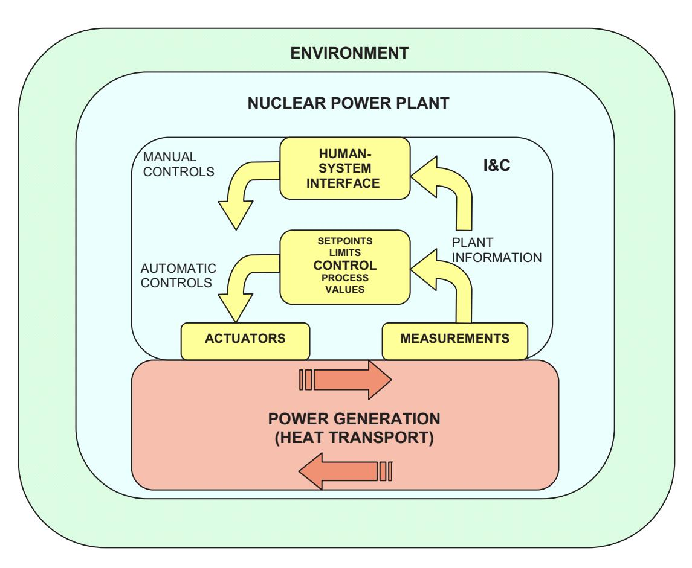

*FIG. 1. High level overview of I&C main functions.*

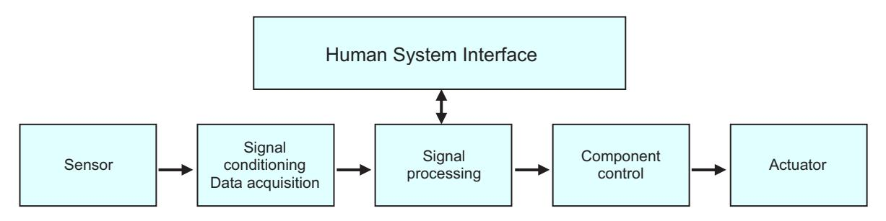

FIG. 2. Block diagram of a typical I&C function.

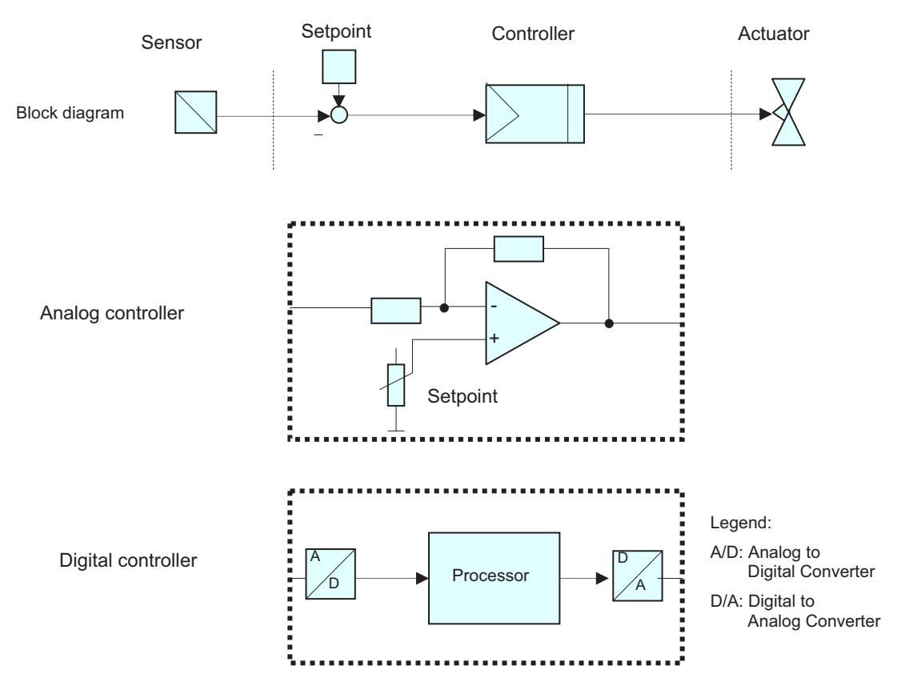

FIG. 3. Analog versus digital I&C systems.

Figure 2 shows the block diagram of an I&C function. The value of a plant parameter is measured by means of a sensor. Signals from sensors may vary significantly depending on the kind of process parameters and the type of selected sensors. To process sensor signals in a uniform way it is necessary to normalize sensor signals. This is done in the signal conditioning and data acquisition block. After conditioning, signals can be processed in a uniform way. Signal processing depends strongly on the plant parameter being controlled and on the underlying plant process. Signal processing may involve, for example, scaling, linearization, or filtering of the measurement and the calculation of the deviation between the pant parameter and the designed set point. The result of the signal processing is used to control an actuator.

Figure 3 shows an I&C function from the physical point of view. Analog and digital I&C systems are distinguished by the way in which signal processing and actuator control is performed. Analog I&C systems use analog voltages or currents and analog electronics to process the signals and to control the actuator. Digital I&C systems do the signal processing and the actuator control by means of computer processors, using a binary representation of the measured and controlled parameters. From the functional point of view both solutions are similar but from the physical point of view, the differences are significant.

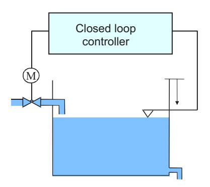

*FIG. 4. Level control: An elementary I&C function.*

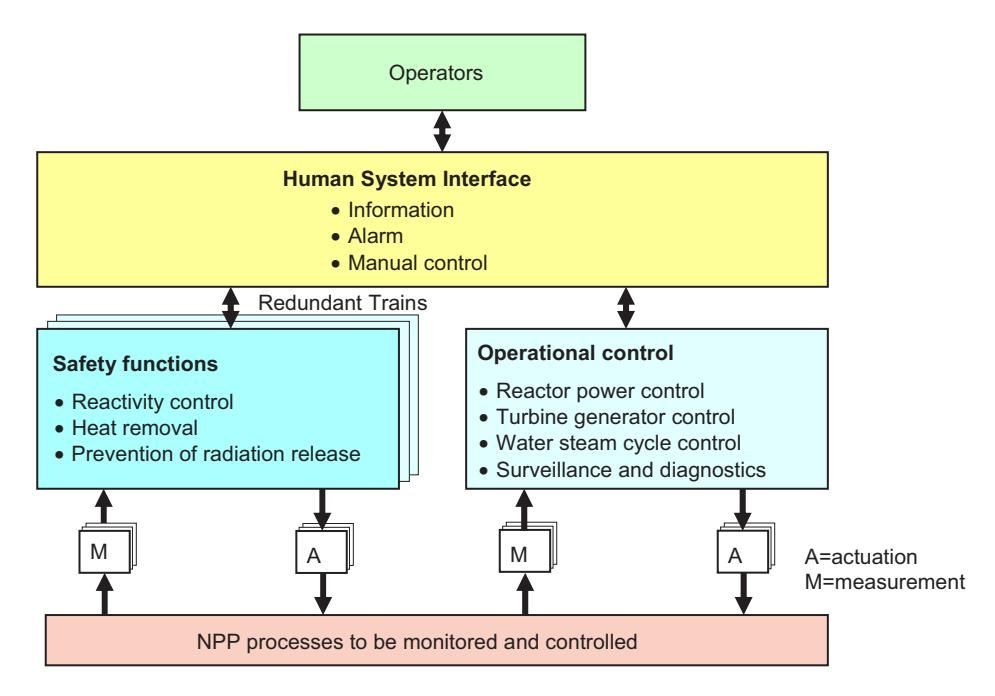

*FIG. 5. Functional overview of NPP I&C.*

Figure 4 shows an elementary I&C function in the context of the related process elements. The water level in the tank is controlled by changing inlet flow into the tank. In this simple example the water level is measured by a level sensor and the deviation between the measured level and the designed set point is calculated by the closed loop controller. The actuator of this simple I&C function is a valve in the inlet pipe. If the deviation is negative (level is high) the valve will be closed by the controller so that the inlet flow will decrease. In the opposite direction, if the deviation is positive the valve will be opened so that the inlet flow will increase. If the controller is well designed the water level in the tank will always be kept very close to the designed set point.

Figure 5 shows a simplified functional overview of the I&C in a NPP.

To ensure a safe and reliable plant operation under all plant conditions, I&C systems have to monitor and control hundreds or thousands of plant parameters. Thus, nuclear power plant I&C systems are complex. Subdividing the plant I&C according to its functions facilitates understanding of the entire system.

The most common way to subdivide I&C by functional groups is the following:

- Sensors: to interface with the physical processes within a plant and to continuously take measurements of plant variables such as neutron flux, temperature, pressure, flow, etc.;
- Operational control, regulation and monitoring systems: to process measurement data, to manage plant operation, and to optimize plant performance. Surveillance and diagnostic systems that monitor sensor signals for abnormalities are important parts of operational monitoring systems;

- Safety systems: to keep the plant in a safe operating envelope in case of any postulated initiating event (design basis accident);
- Communication systems: to provide data and information transfer through wires, fibre optics, wireless networks or digital data protocols;
- Human-system interfaces (HSIs): to provide information to and interaction with plant operating personnel;
- Actuators (e.g., valves and motors): to adjust the plant's physical processes.

In control rooms and at control panels in the field the I&C systems and the plant operators meet at the humansystem interface.

At a fundamentally lower level, the functionality that is embodied in the I&C system architecture can be decomposed into several elements such as:

- Data acquisition;
- Actuator activation;
- Validation;
- Arbitration;
- Control;
- Limitation;
- Checking;
- Monitoring;
- Command;
- Prediction;
- Communication;
- Fault/alarm management;
- Configuration management.

The data acquisition functionality addresses all signals from the control, safety and monitoring systems, while the actuator activation functionality is limited to the control and safety systems. The validation functionality addresses signals, commands, and system performance. The arbitration functionality addresses redundant inputs or outputs, commands from redundant or diverse controllers, and status indicators from various monitoring and diagnostic modules. The control functionality includes direct plant or system control and supervisory control of the NPP control system itself. The limitation functionality involves maintaining plant conditions within an acceptable boundary and inhibiting control system actions when necessary. The checking functionality can address computational results, input and output consistency, and plant/system response. The monitoring functionality includes status, response, and condition or health of the control system, components, and the plant, and it provides diagnostic and prognostic information. The command functionality is directed toward configuration and action of control loops and diagnostic modules. The prediction functionality addresses identification of plant/system state, expected response to prospective actions, remaining useful life of components, and incipient operational events or failures. The communication functionality involves control and measurement signals to and from the field devices, information and commands within the control system, and status and interactions between the NPP automatic control system and operators. The fault management and configuration management functionalities are interrelated and depend on two principal design characteristics. These are the ability of the designer to anticipate a full range of faults and the degree of autonomy enabled by the control system design. Not all of these functionalities are present in the I&C system architecture at every NPP.

#### **2.3.2. Specifics of NPP I&C stemming from nuclear safety considerations**

The nuclear safety role of I&C systems demands that many I&C functions must be highly dependable. Dependability is achieved by the application of design principles given in Section 2.3.3.1. It is both labor intensive and costly to achieve high levels of functional dependability; therefore, to focus resources on the items that have the biggest effect on safety these principles are applied using a graded approach depending on the importance of each function, system, and item of equipment in the I&C system. The first step of this graded approach is to classify I&C functions according to their importance to safety.

#### *2.3.2.1. Safety classification of I&C functions and systems*

The safety classification of I&C functions in paragraphs 2.36-2.45 of Ref [1] is usually performed using a combination of deterministic methods, probabilistic methods and engineering judgment taking the following into consideration:

- The safety function(s) to be performed (to take action in response to some plant event, or to not fail in a way that would cause a hazardous event).
- The probability of, and the safety consequences that could result from, a failure of the function.
- The probability that the function will be needed to provide safety.
- If the function is needed:
  - How quickly the function must respond and for how long the function must be performed;
  - The timeliness and dependability of alternative actions.

Once I&C functions are classified, systems and components are assigned to classes according to the highest level function that they must perform.

There are many specific approaches to classification, but all follow the above concepts and all distribute I&C functions into three or four safety classes. The classification scheme used by the IAEA has three classes: safety, safety-related1 , and not-safety.

Typical nuclear power plant safety functions in which I&C systems have a significant role are:

- Reactor trip;
- Emergency core cooling;
- Decay heat removal;
- Containment/confinement isolation;
- Containment fission product removal;
- Containment heat removal;
- Emergency ventilation;
- Emergency power supply.

Safety related I&C functions are those that are not directly safety functions but are otherwise important to safety such as functions that maintain the plant within a safe operating envelope under normal conditions, support radiation protection for plant workers, or add defence in depth to the plant's response to accidents. Examples of safety related I&C functions are:

- Reactor power control;
- Diverse reactor trip;
- Pressure and temperature control for normal heat removal systems;
- Fire detection;
- Radiation monitoring;
- Personnel access control;
- Display of information for planning emergency response.

Non-safety I&C functions are those that are not necessary to maintain the plant within a safe operating envelope. Examples of non-safety I&C functions are:

- Feedwater reheater control;
- Demineralizer control;
- Intake and discharge screen control.

<sup>1</sup> Note that some Member States use the term safety-related in their classification scheme, but with a very different meaning than that used by the IAEA. When using any classification scheme, it is important to understand the meaning of the terms within the context of that scheme.

The IAEA Safety Guide NS-G-1.3 [1] provides more information on the classification of I&C systems important to safety. There are many other classification schemes in common use as illustrated in Table 1. The Guides, Codes and Standards chapter of this report lists documents that describe these schemes.

## 2.3.3. I&C design

### 2.3.3.1. Main principles of NPP I&C design

In order to make I&C functions highly dependable the nuclear industry applies a common set of design principles for the systems and equipment that perform these functions. These principles are relevant to all I&C systems, but the trade-off between safety importance and cost results in a more rigorous application of these principles in safety systems than in safety-related systems. Many of these same principles are applied as well to achieve dependability levels that are needed for economic operation. These design principles are listed below.

TABLE 1. A COMPARISON OF DIFFERENT CLASSIFICATION SYSTEMS (Note that such a table gives only a qualitative mapping between the various classification systems)

| National or international standard |                                     |         | Classi              | fication of   | the i | importance to safety |                                              |
|------------------------------------|-------------------------------------|---------|---------------------|---------------|-------|----------------------|----------------------------------------------|
| IAEA NS-R-1                        |                                     | S       | ystems Impo         | rtant to Saf  | ety   |                      | Systems Not                                  |
| IALA NS-K-I                        | Safety                              |         |                     | Safety        | / Re  | lated                | Important to Safety                          |
| IEC 61226                          |                                     | S       | ystems Impo         | rtant to Saf  | ety   |                      |                                              |
| Functions<br>Systems               | Cat. A<br>Class 1                   |         | Cat. B<br>Class 2   |               |       | ategory C<br>Class 3 | Unclassified                                 |
| Canada                             | Category 1                          |         | Cate                | gory 2        |       | Category 3           | Category 4                                   |
| France N4                          | 1E                                  |         | 2E                  | SH            |       | Important to Safety  | Systems Not<br>Important to Safety           |
| European Utility<br>Requirements   | F1A (Auto.)                         |         | 3 (Auto.<br>d Man.) |               |       | F2                   | Unclassified                                 |
| Japan                              | PS1/MS1*                            | ķ       | PS2                 | /MS2          |       | PS3/MS3              | Non-nuclear Safety                           |
| Rep. of Korea                      | IC                                  | C-1     |                     |               |       | IC-2                 | IC-3                                         |
| Russian Federation                 | Class 2                             |         |                     | Cl            | ass   | 3                    | Class 4 (Systems Not<br>Important to Safety) |
| Switzerland                        | Category A                          | A       | Cate                | gory B        |       | Category C           | Not important to safety                      |
| UK<br>Functions<br>Systems         | Cat. A<br>Class 1                   | 7       | Cat. B              |               |       | ategory C<br>Class 3 | Unclassified                                 |
|                                    |                                     | S       | ystems Impo         | rtant to Safe | ety   |                      |                                              |
| USA and<br>IEEE                    | Safety Related, S<br>or<br>Class 1E | Safety, |                     | (No nam       | ne as | ssigned)             | Non-nuclear Safety                           |

<sup>\*</sup>PS: prevention system, MS: mitigation system

- (1) *Specification of performance requirements* for I&C actions is necessary to ensure that these functions are achieved over the full range of measured variables to be accommodated, with the characteristics (e.g., accuracy, response time,) to produce the necessary output signal (see paragraphs 4.3-4.7 of Ref [1]).
- (2) *Design for reliability* of I&C systems important to safety is necessary to prevent undue challenges to the integrity of the plant physical barriers provided to limit the release of radiation and to ensure the reliability of engineered protective systems. Important aspects of the design for reliability are as follows:
  - *Compliance with the single failure criterion* is a deterministic approach to ensuring that a necessary redundancy of a system or of a group of equipment items is obtained. This approach ensures that I&C systems can tolerate a random failure of any individual component taking into account both the direct consequences of such a failure and any failures caused by events for which the system must function (see paragraph 4.15 of Ref [1]).
  - *Redundancy* is the provision of multiple means of achieving a given function. It is commonly used in I&C systems important to safety to achieve system reliability goals and/or conformity with the single failure criterion. For redundancy to be fully effective the redundant systems must be independent of each other (see paragraph 4.22 of Ref [1]).
  - *Diversity* in I&C systems is the principle of monitoring different parameters, using different technologies, different logic or algorithms, or different means of actuation in order to provide several ways of achieving an I&C function. Diversity is a special form of redundancy that provides defence against common cause failures (CCF). It is complementary to the plant design principle of defence in depth (see paragraphs 4.23–4.30 of Ref [1]).
  - *Independence* prevents propagation of failures from system to system, between redundant elements within systems, and caused by common internal plant hazards. Independence can be achieved through physical separation, isolation, remote location, etc. (see paragraphs 4.36-4.48 of Ref [1]).
- (3) *Consideration of equipment failure modes* (fail safe principle) is given in the design of I&C systems to make their functions more tolerant of expected failures of systems or components. The design of systems and equipment should strive to ensure that the range of possible failure modes is predictable and that the most likely failures will always place the system in a safe state (see paragraphs 4.49-4.50 of Ref [1]).
- (4) *Control of access* to I&C equipment important to safety must be established to prevent unauthorized operation or changes and to reduce the possibility of errors caused by authorized personnel (see IAEA NS-G-1.3 paragraphs 4.51-4.53 of Ref. [1]).
- (5) *Set point analysis* is performed to ensure that I&C functions that must actuate to ensure safety do so before the related process parameter exceeds its safe value (safety limit). An analysis is necessary to calculate the point at which the I&C system must act to accomplish this. The difference between the safety limit and the set point must account for errors and uncertainties that cause a difference between the measured value acted upon by the I&C system and the actual value of the physical process (see IAEA NS-G-1.3 paragraphs 4.54-4.60 of Ref. [1]).
- (6) *Design for optimal operator performance* is the practice of applying human factors engineering to minimize the potential for operator errors and limit the effects of such errors. Human factors engineering is applied to ensure that operators have the information an controls needed for safe operation and to provide an operator friendly interface for operation, maintenance, and inspection of systems important to safety (see IAEA NS-G-1.3 paragraphs 7.6-7.10 of Ref. [1]).
- (7) *Equipment qualification* is a process for ensuring that the systems and equipment important to safety are capable of performing their safety functions. This process involves the demonstration of the necessary functionality under all service conditions associated with all plant design states (see IAEA NS-G-1.3 paragraphs 4.62-4.73 of Ref. [1]).
- (8) *Quality* in the design and manufacturing of systems and equipment important to safety is necessary to demonstrate that they will perform their assigned safety functions. Quality is one of the main aims of the life cycle processes described in Section 2.5 of this document (see IAEA NS-G-1.3 paragraphs 4.74-4.76 of Ref. [1]).
- (9) *Design for electromagnetic compatibility* is necessary to ensure that installed systems and equipment will withstand the electromagnetic environment in a nuclear power plant. This involves making appropriate provisions for the grounding, shielding and decoupling of interference. The qualification of equipment for operation in the electromagnetic environment is important and is a part of equipment qualification (see IAEA NS-G-1.3 paragraphs 4.77-4.78 of Ref. [1]).

- (10) *Testing and testability* provide assurance that I&C systems and equipment important to safety remain operable and capable of performing their safety tasks. This principle includes both the need to provide a design that facilitates testing, calibration, and maintenance, and the establishment of programs to appropriately schedule, conduct, and learn from these activities (see IAEA NS-G-1.3 paragraphs 4.79-4.96 of Ref. [1]).
- (11) *Maintainability* is the principle of designing I&C systems and equipment important to safety to facilitate timely replacement, repair, and adjustment of malfunctioning equipment. A frequent consequence of design for testability and maintainability of a safety system is the provision of additional redundancy so that the single failure criterion continues to be met while one redundancy is removed for maintenance or testing (see IAEA NS-G-1.3 paragraphs 4.97-4.103 of Ref. [1]).
- (12) *Documentation* of I&C functions, systems, and equipment is necessary to ensure that the plant operating organization has adequate information to ensure safe operation and maintenance of the plant and to safely implement subsequent plant modifications (see IAEA NS-G-1.3 paragraphs 4.104-4.106 of Ref. [1]).
- (13) *Identification* of I&C functions, systems, and equipment important to safety is required to ensure that these items are properly treated during the design, construction, maintenance and operation of the plant. Both the physical items, and documentation of these items should unambiguously identify their safety significance (see IAEA NS-G-1.3 paragraphs 4.107-4.108) of Ref. [1]).

In addition to the design principles listed above, security aspects should be considered during the design phase, to ensure that systems and equipment (hardware and software) are designed and implemented in such a way that they are resistant to cyber threats.

These principles applied to any given system or equipment item and the rigor with which these principles are applied depend on the functions performed, the safety importance of the functions, and the specific characteristics of the systems performing the functions. In general, all of the principles are rigorously applied to systems and equipment performing safety functions. Typically, systems implementing safety related functions make less use of redundancy, diversity, and independence.

Chapter 4 of Ref [1] gives a more detailed discussion of these principles and their application. The Guides, Codes and Standards section of this report lists other documents that describe alternative views or alternative applications of these principles.

#### *2.3.3.2. Typical design approaches*

As a result of the application of the above principles, common design approaches have emerged. Some of the more significant characteristics of these common approaches are summarized below:

- (1) *Functional isolation.* Safety systems are designed in a manner that no influence of safety-related or non-safety I&C functions can prevent safety actions.
- (2) *Redundancy*. Safety systems are typically implemented with multiple redundant channels so that no failure can prevent actuation of a safety function and so that no failure can cause unnecessary actuation of a safety function. As a result of these two criteria, safety systems almost always have at least three redundant channels and at least two must agree to actuate a safety function. The adequacy of redundancy is confirmed by analysis against the single failure criterion. Often additional redundancy is provided so that the single failure criterion continues to be met while one redundancy is removed from service for testing.
- (3) *Physical, electrical, and communications isolation.* Safety systems are isolated from systems of lower class so that failures in the lower class systems cannot cause failures in safety functions.
  - Physical separation between safety systems and lower class systems is provided so that internal hazards such as fires or explosions in lower class components cannot cause a failure of safety systems.
  - Electrical isolation between safety systems and lower class systems is provided so that the failures resulting in high voltages or short circuits in lower class components cannot cause a failure of safety systems.
  - Signal connections (including both analog and network communications) between safety systems and lower class systems are designed such that incorrect information passed between the systems, or improperly operating communications protocols cannot cause a failure of safety systems.

The same strategies are applied to ensure isolation between redundant elements within safety systems. Also the redundant parts of safety systems are separately located so that a local environmental effect (e.g., steam leak, internal flooding, pipe whip) can affect only redundant elements of safety systems.

Following the isolation principle separate plant locations are typically provided for the safety-related and safety systems and for each redundancy within safety systems. This involves providing not only separate rooms, but also separate cable ways, separate auxiliary equipment (e.g., room cooling), and taking special measures (e.g., fire barriers) where sufficient physical separation is not possible.

- (4) *Electrical noise/immunity.* Electromagnetic noise or radio frequency interference (EMI/RFI) in the I&C system can cause I&C functions to fail completely or operate incorrectly. A plant instrument ground network is needed to provide a noise free common reference for electrical signal values. Cables carrying instrument signals must be separated from those carrying electric power to prevent coupling electrical signal noise into the I&C system. Similarly, effective lightning protection is necessary to minimize coupling of environmental electrical noise into the I&C system. These features limit the intensity of but do not completely eliminate EMI/RFI. I&C safety components must then be shown able to withstand the remaining EMI/RFI environment, and all electrical components must be shown not to emit at levels greater than assumed when determining design levels for EMI/RFI immunity.
- (5) *Diversity and defence in depth*. The overall plant safety approach involves a defence in depth strategy such that multiple independent barriers must fail before the public is exposed to radiation. I&C systems are common to all of these barriers; therefore, the I&C design must be carefully considered to ensure that it does not weaken the overall defence in depth concept. This is usually accomplished by an examination of common cause failure vulnerabilities in the I&C system. The application of diversity is an important strategy to cope with common cause failures. Signal and functional diversity are commonly provided within safety systems to deal with the possible design or analytical errors that affect individual functions.
- (6) *Installation, maintenance and design change control.* Installation, maintenance and modification must be rigorously controlled to ensure that no important safety characteristics of I&C systems important to safety are unacceptably changed, whether intentionally (e.g., introduction of malicious code) or unintentionally.

#### 2.4. PHYSICAL APPROACH

The most direct means of presenting NPP I&C systems is a straightforward description of the physical layout of those systems. In this section, the physical approach to viewing I&C systems will be discussed. This entails a description of components most commonly used in I&C systems, and a description of their interrelations in standard representative architectures. The architectural configuration of physical I&C components can be characterized in a similar fashion to that shown in Fig. 2. This representation is illustrated in terms of a simplified instrumentation string with overlaid human-system interface elements. The simplified string extends from the measurement field devices through the computational elements (e.g., electronics, processing platforms) to the actuating field devices. The field devices provide the interface with plant processes and consist of measurement sensors, signal electronics, and actuators. Field communication provides the interconnection between the field devices and the computational elements. The computational elements consist of process monitoring and control systems, which provide data acquisition, control and protection. The computational elements can be implemented in various forms ranging from simple relay-based logic through centralized single or multi-loop control platforms to distributed control processors. High-level communication provides interconnections among systems and to human-system interface (HSI) elements. Finally, the HSIs provide the display and interaction mechanisms to enable plant personnel to monitor and control plant conditions at the component, subsystem, or system level (see Refs [6, 11] for comprehensive information).

#### **2.4.1. Process interfaces**

The US DOE document Fundamentals Handbook, Instrumentation and Control, Volumes 1 and 2 [12], provides very comprehensive information on a wide variety of process interface elements in the instrumentation and control area. A short summary follows on the most important components.

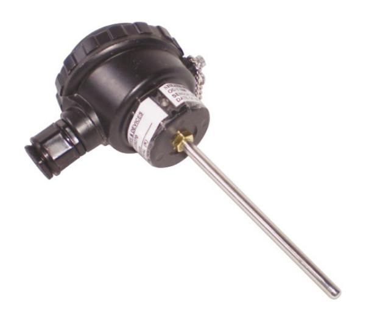

*FIG. 6. Resistance temperature detector.*

#### *2.4.1.1. Measurement sensors*

Measurement sensors measure process variables and provide a signal that is commensurate with the measured variable. This measured value could be represented by voltage, current, pulse code, pulse width, light intensity, digital word, air pressure, or other form. The ultimate goal is to produce signals that be interpreted by the signal processing elements of the I&C system (for more technical details on sensors see Ref. [12]).

#### 2.4.1.1.1. Temperature

There are a variety of temperature sensors in use in I&C systems. The most common ones are thermocouples and resistance temperature detectors (RTDs) (Fig. 6). These devices convert temperature into very small variable electrical voltages (thermocouples) or varying electrical resistance (RTDs). The sensors generally are field mounted devices that may be placed directly in contact with the item to be measured or in thermowells that protrude into a fluid system. During the last several years, fibre optics are also being applied for temperature measurement at NPPs.

# 2.4.1.1.2. Pressure

Pressure measurements generally use transducers that convert the pressure force to either analog signals, such as 4–20 mA varying continuously with pressure, or digital serial bus signals, as in the case of newer smart transmitters (Fig. 7). Transducers can be used for measuring absolute pressure or differential pressure (discussed below).

#### 2.4.1.1.3. Differential pressure

Differential pressure transmitters convert a pressure difference to a useable signal as discussed in the pressure transducer description (Fig. 8). The uses of differential pressure transducers can be for measuring non-absolute pressures (measured variable difference with atmospheric pressure), for measuring levels in pressurized vessels, and for measuring flow rates. These will be discussed further below.

#### 2.4.1.1.4. Level

Level can be measured in a variety of ways, but the most common method in nuclear plants is based on differential pressure measurements. This measurement technique provides a converted signal that is commensurate with the measured pressure difference between the hydrostatic head caused by the height of a fluid column plus the pressure corresponding to the bottom of the vessel and the pressure corresponding to the top of the vessel.

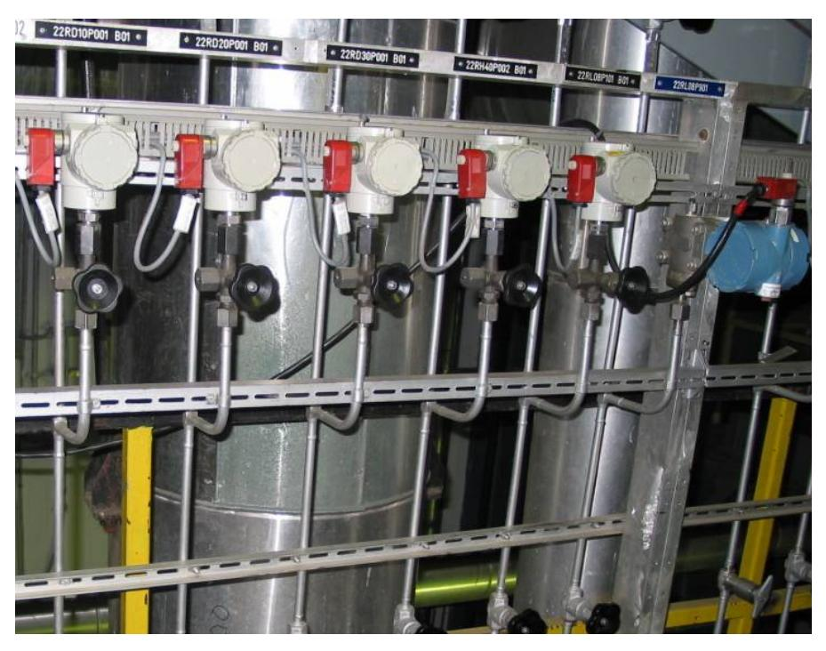

*FIG. 7. Pressure transducers installed on a transmitter rack.*

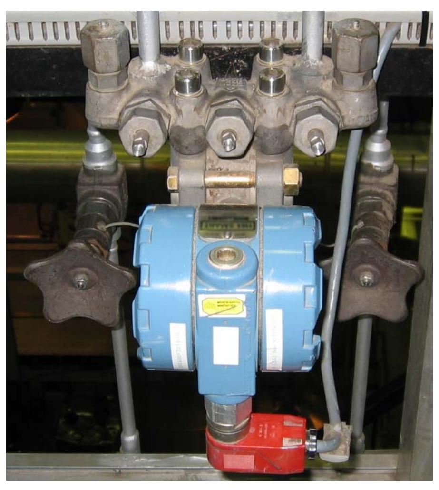

*FIG. 8. Differential pressure transducer with multi-way valve.*

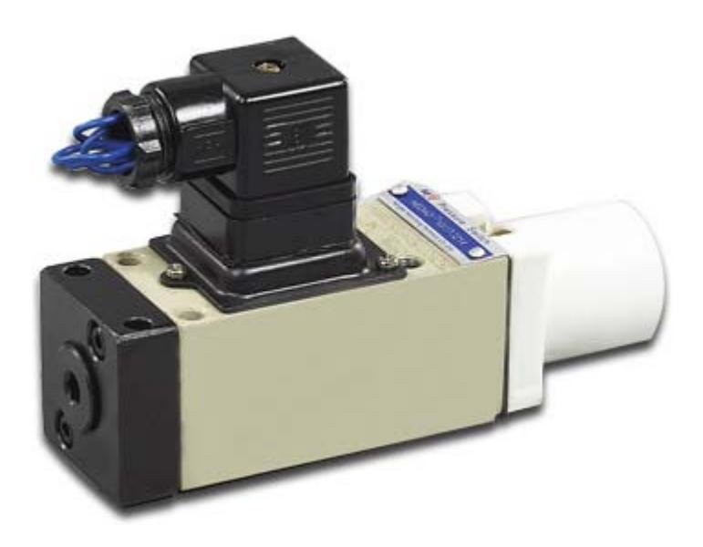

*FIG. 9. Pressure switch.*

Differential pressure measurements involve pressure taps at the top and bottom of the vessel (or fluid volume) for which the level is being measured and a "wet" or filled reference leg.

Other level measurement methods range from capacitive probes, through float systems, to radar systems. These latter measurement mechanisms are not commonly found in nuclear power plant systems. However, in all cases, the end result of the measurement is conversion to a usable signal representing the measured variable that can be read and interpreted in the I&C system.

#### 2.4.1.1.5. Flow

The most common flow measurement device uses a differential pressure transducer to measure the pressure drop across an orifice, Venturi tube, or other types of flow elements in a flow stream. This pressure drop is a square root function of the flow which is then converted to a linear signal either within the transducer or by the signal processing electronics. There are other methods of flow measurements, such as ultrasonics, which may be found in highly accurate feedwater flow measurements, or magnetic flowmeters. One of these methods is based on the calculation of correlations in measurements of radioactivity by two similar detectors physically placed at different positions along the coolant pipeline. Another method is based on measuring the rotation frequency of small eddies induced by the fluid flow in special measuring devices.

## 2.4.1.1.6. Pressure, level, flow, and temperature switches

Field switches are a relatively inexpensive means of measurement by which a device measures a variable in the field and indicates its value by outputting a contact open or close at a predetermined set point. Among the types of these switches are flow, pressure, level, and temperature (Fig. 9). The actual process variable measurement may be available locally, but is not available to the I&C system through these switches.

#### 2.4.1.1.7. Instrumentation tubing (impulse lines)

Impulse lines are the actual connection from the process to the measuring transducers, mostly for pressure, level or flow measurements (Fig. 10). These lines generally consist of tubing that is connected to the piping or vessel of the process system through isolation valves at one end, and connected to the transducers at the other end. The lines are filled with the process fluid, which is the medium by which the pressure that builds up in the process equipment is communicated to the transducer. In this way, the transducer may be installed at a distance from the process to avoid exposure to unfavorable environmental conditions and to provide serviceability. An inadvertent

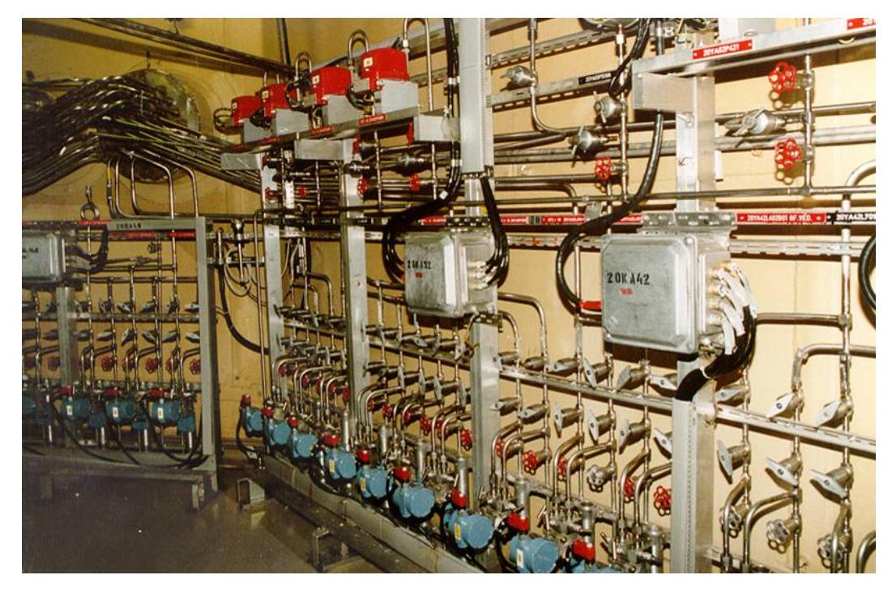

*FIG. 10. Instrumentation tubing (impulse lines) in the containment area.*

effect of these lines can be clogging, gas entrapment, or fouling, which may cause a considerable inaccuracy and/or poor dynamic responses.

#### 2.4.1.1.8. Neutron flux

Neutron flux measurements in nuclear power plants are used for:

- Reactivity measurement and control;
- Reactor power control (integral and three dimensional);
- Reactor emergency shutdown;
- Core diagnostics.

Neutron flux measurements are provided by a variety of detector types, ranging from fission and ion chambers to self-powered neutron detectors. These devices can be external to the reactor pressure vessel or can be internal to the reactor core. Ex-core neutron detectors are used to provide global or regional measurements of neutron flux as a representation of reactor power. In-core detectors are used for localized flux measurements. Measurements from many in-core detectors are also used to calculate overall reactor power either to check the excore detector measurements or, in some designs, to eliminate the need for ex-core detectors. While the sensitivity, range, and response characteristics for these sensors are different, they are employed for monitoring and control functions depending on the type of reactor.

Often, several instrument channels are necessary to cover the entire range of reactor operating conditions. A common arrangement is to have three measurement ranges to span the full scope of operational conditions: source range, intermediate range, and power range. The source range detectors employ high-sensitivity proportional counters. Proportional counters measure the electric charge produced by ionizing radiation; these detectors are used to cover low radiation flux at start-up conditions. The intermediate range detectors make use of compensated ion chambers, which compensate for ionization produced by incident gamma radiation. The power range detectors typically consist of uncompensated ion chambers. There is no need for gamma compensation because of the ratio of neutron to gamma radiation is large. The output of these radiation detection devices may be pulses at low levels of reactor power or steady current, sometimes of very low value.

To work with such small signals, special signal converters and amplifiers are generally applied in the field close to the detectors. These electronics amplify the signals to a sufficiently high level to enable transmission to

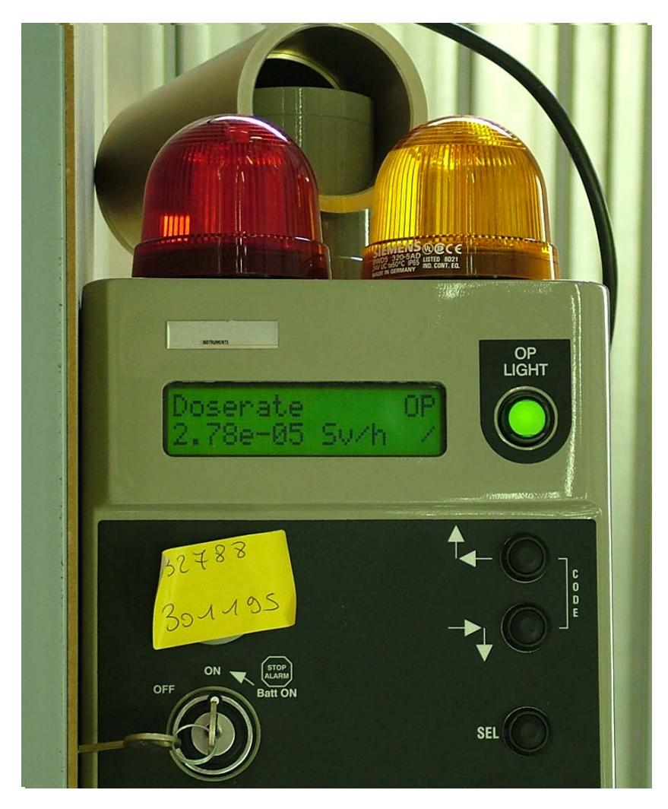

*FIG. 11. Gamma dose-rate monitor.*

remotely located data acquisition equipment without losing so much strength as to be unreadable. The signals from the neutron detectors may be then filtered or smoothened to define an average value of neutron flux density, for example by the mean square voltage method. Also the detector signal may be processed, without filtering, for core diagnostics by reactor noise analysis (see IAEA NP-T-1.2) [4].

#### 2.4.1.1.9. Radiation

To protect workers and the public from radiation and to ensure that dose limits are complied with, it is necessary to monitor radiation levels at selected locations inside the NPP and at external points surrounding the NPP.

All types of radiation must be monitored at the plant: alpha, beta, gamma and neutron. For this purpose, different types of radiation detectors and monitoring devices (e.g., radiation counter tubes, radiometers, dosimeters, spectrometers and multi-purpose devices) are available and the appropriate instrument must be chosen, depending on the type of radiation to be detected.

Radiation levels within the NPP must be monitored inside reactor containment, inside specific facilities and in areas to which workers have access. Radiation levels must be also monitored around the plant, both inside and outside the site boundary (Fig. 11).

Radiation monitoring programmes provide information on the radioactivity of:

- Solid materials (spent fuel, solid radioactive wastes, removed filters, etc.);
- Liquids (primary coolant, feedwater, liquid radioactive wastes, etc);

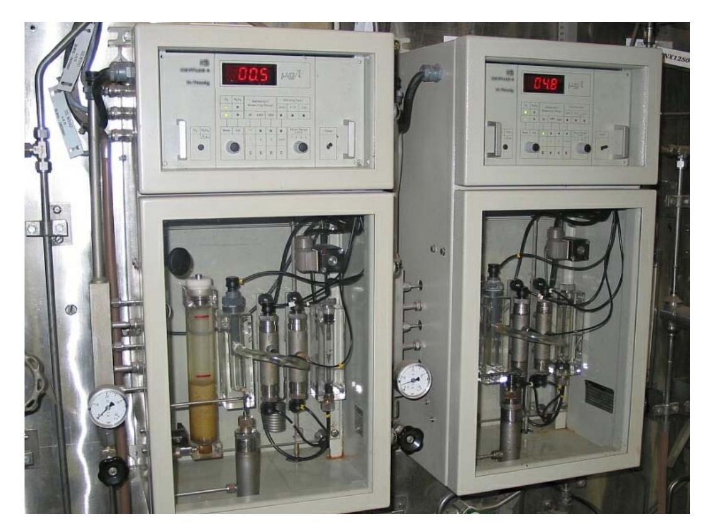

*FIG. 12. Chemical parameter measurements.*

— Aerosols and gases (atmospheric air, gases released through the stack, etc).

With the use of radiation monitoring systems it is possible to:

- Give an early warning of a plant malfunction that could result in increased exposure of workers or an unplanned discharge of radioactivity to the environment;
- Allow the activation of emergency plans to protect workers and the local population from radiation;
- Initiate automatic protective functions;
- Collect data on radiation levels useful for maintenance planning, and required for reporting to regulatory authorities.

#### 2.4.1.1.10. Chemical parameters

There are numerous methodologies and equipment types that measure chemical properties, such as pH, conductivity, concentration, etc. Because of the extensive variety of measurement types, they will not be listed for discussion in this report. Nevertheless, as with other measurements, the end result is conversion to a standard signal type (digital or 4–20 mA, for instance) commensurate with the varying chemical properties that are being measured. One of the most important chemical measurements at PWRs is the measurement of boron acid concentration in the primary coolant as this parameter has a direct influence on core reactivity and void reactivity feedback coefficient (Fig. 12).

#### 2.4.1.1.11. Position, rotation

The position of the most important actuators (e.g., control rods, valves, dampers, etc.) is monitored at all NPPs. For control rods or valves, the most common types of position measurements are limit switches, reed switches, potentiometers, and linear variable differential transformers (LVDTs). Solenoids, synchros or selsyns (self-synchronized motors) and calculation of drive revolutions are usually applied for intermediate position monitoring. Rotation speed of machinery shafts is usually measured by means of a protruding piece or toothed wheel attached to the shaft and an optical or proximity sensor detecting the movement of it. A counter then processes the signal from these sensors and indicates the number of rotations within a given time period. An alternative way of rotation speed measurement is to attach a tachometer to the shaft, which then generates voltages proportional to the speed of the rotating element.

### 2.4.1.1.12. Diagnostic measurements

Many diagnostic measurement devices exist for the purpose of monitoring the states of plant equipment. Among these are vibration monitoring devices, which are generally used for monitoring the condition of pumps, fans, and motors, to loose-parts monitoring, which are mostly acoustic devices used for "listening" to systems to detect the movement of internal components that may have become unattached from the desired location (see Refs [3, 4]).

#### *2.4.1.2. Transmitters, signal processing electronics*

As mentioned above, field sensors measure a process variable, and then an electronic component called a transmitter or transducer converts this variable to a predetermined output signal of a standardized type. It is very common to have the transmitter electronics built together with the corresponding sensor, but in some sensor categories (e.g., temperature sensors, chemical parameter sensors) the transmitter electronics may come in a separate casing. Another reason for this separation may be a harsh environment, where the passive sensor will withstand the harsh conditions, but the more sensitive electronic part must be installed in milder environments.

#### 2.4.1.2.1. Conventional (analog) transmitters

While there are other standard voltage and current signals in use in the instrumentation area, the most common transmitter output signal is the 4-20 mA analog signal. This gives a precise current output that has been calibrated to a given span for a given process variable range. Starting the span from 4 mA instead of 0 mA is called 'suppressed zero', which is used to detect any open circuit in the measurement wiring system even when the actual value of the measured parameter is zero (or equals the minimum value of the parameter measurement range).

#### 2.4.1.2.2. Smart transmitters

Smart transmitters are called so because they offer a variety of capabilities within a single transmitter (e.g., self-diagnosis, signal validation, etc.), and may then convert this information to a digital signal for transmission to the computational elements of the I&C system. A smart transmitter may measure flow, temperature, level, pressure, etc., and also be able to report on its own condition or health. It also may allow for parameter resetting, recalibration or calibration check from a remote location. The output signal of a smart transmitter is not necessarily, or not only, the conventional analog signal, but rather generally provides digital communication signals, which may provide for a two-way dataflow.

Simplified examples of typical conventional analog and binary input circuits can be seen in Fig. 13, while the typical use of conventional analog and binary input signals is shown in Fig. 14.

### *2.4.1.3. Actuation*

Actuation devices manipulate the physical, controllable elements of the plant process systems (e.g., valves, dampers, electric heaters, pumps, control rod drive motors, etc.) and, along with sensing elements, serve as the direct link between the I&C system and the plant. Neutron-absorbing control rods regulate power by controlling neutron flux. Valves regulate flow of a liquid while dampers regulate flow of air and gases. Pumps control flow of a fluid. Heaters control temperature.

Actuation of most of these devices provides 'on-off' control such as opening and shutting valves or dampers or energizing and de-energizing pumps or heaters. However, some of these devices can also provide proportional

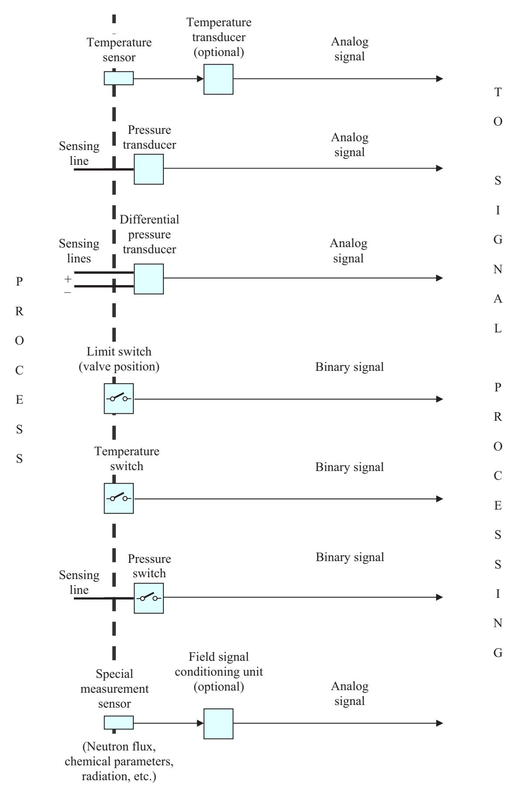

FIG. 13. Conventional analog and binary input signals.

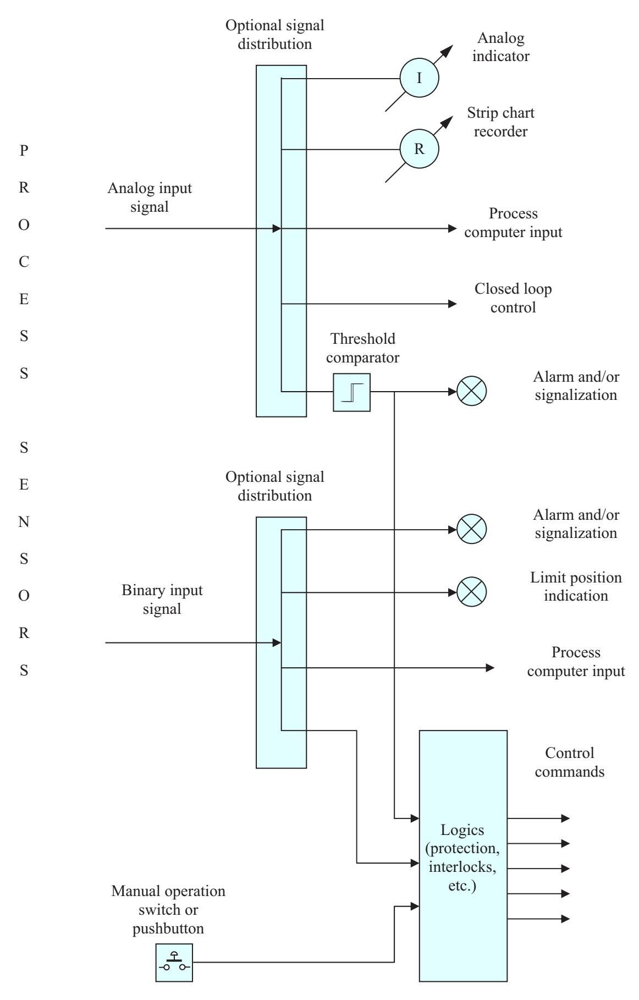

*FIG. 14. Typical use of conventional analog and binary input signals.* 

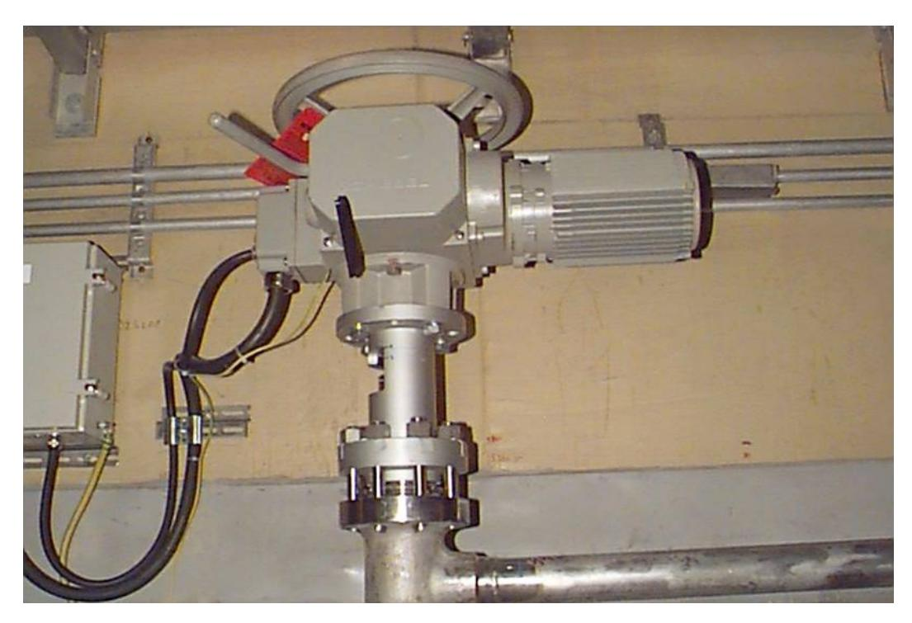

*FIG. 15. Motor operated valve with local junction box.*

control through modulation over a given operating band. Examples include positioning valves or dampers, varying the speed of a pump, or regulating the current through electric heater.

This section provides a limited discussion of control valves, which are the most common actuation devices.

#### 2.4.1.3.1. Motor operated valves (MOVs)

These devices are installed in process pipelines to allow, prohibit, or regulate flow of the process fluid (Fig. 15). For these devices, the valve is driven (open or closed) by an electrical motor, which is part of an integrated assembly. The motor is controlled through a switchgear or a motor control center. The MOV may be equipped with position and torque limit switches to monitor the end position or to limit torque during its run. State of the art actuation devices may contain smart, programmable electronics, which may allow for parameter readout, position calibration, and health checking from a remote location. Motor operated valves typically do not change position when motive power is lost.

#### 2.4.1.3.2. Solenoid and air-operated valves

Air-operated (or pneumatic) valves move the valve stem through a combination air and spring force. These devices are typically used to control processes requiring accurate, rapid response. For applications that require a large amount of motive force, such as a main steam valve, hydraulic actuators are typically used. The principles of operation for these types of valves are similar, with the motive force being controlled by either air or hydraulic fluid flow.

Solenoid valves are electrical devices using an electromagnetic field generated by a coil to open or close process or instrumentation pipes (Fig. 16). They are often used to supply air to control air-operated valves, or are used for trip devices by draining oil from a turbine trip system, or for reactor trip purpose (such as for BWRs). These are low current operating devices that are controlled directly from the I&C system or from manual buttons. The solenoid valves may also be equipped with position switches.

Solenoid valves will typically fail either open or closed with motive power (e.g., air or hydraulic pressure), or when the electric control power is lost. It is not necessary that the failure mode be the same for both loss of motive power and loss of control power.

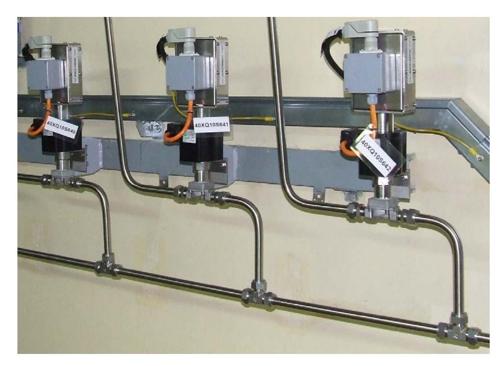

*FIG. 16. Solenoid valves controlling air sampling.*

#### 2.4.1.3.3. Variable closed-loop control

Variable control includes devices that have variable signals supplied to them usually to finish a closed loop feedback type control. These include devices such as motor or air operated or hydraulic control valves. These variable control devices have a conversion capability to convert a standard I&C system variable output (such as a 4- 20 mA signal) to a physical movement or force calibrated and commensurate with the I&C system output signal.

### 2.4.1.3.4. Switchgears, motor control centers

These are the main electrical devices that interrupt or restore power to major devices, such as motors, reactor trip devices, etc. Motor control centers are the devices that start and stop motors and have control and protective devices within. The general interface from an I&C system is to provide a start or stop signal, or in the case of a motor operated valve, an open or close signal.

Typical controls in an I&C system are depicted in Fig. 17.

#### **2.4.2. Field communication**

#### *2.4.2.1. Analog*

The most common field communication protocol is still an analog signal. In most cases this is a 4-20 mA DC signal, but other older standards are still found in use, such as 0-5 mA, 10-50 mA DC, or analog voltages in other cases.

#### *2.4.2.2. HART (Highway Addressable Remote Transducer Protocol)*

HART is a protocol in which a type of digital signal is superimposed on top of an analog signal. While keeping the former analog output signal still available, this protocol provides for digital data communication between the transmitter and the signal processing electronics.

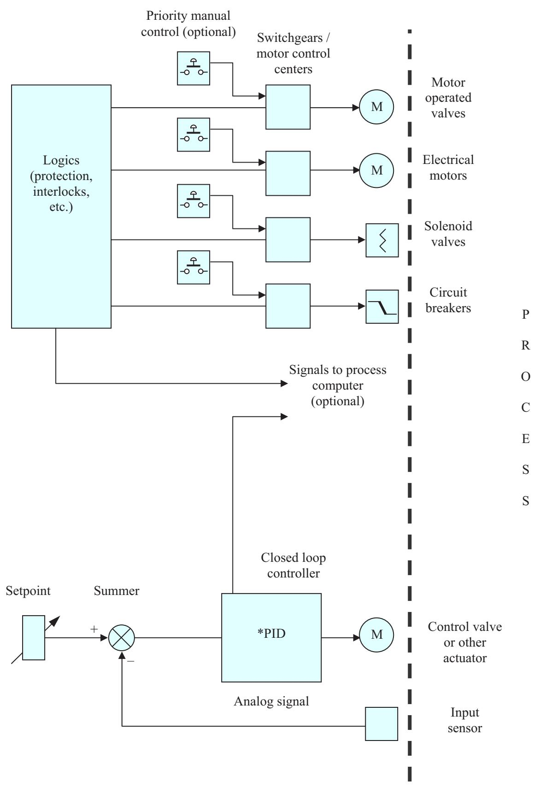

\*NOTE: PID is Proportional-Integral-Derivative control

*FIG. 17. Typical controls in an I&C system.*

#### *2.4.2.3. Digital fieldbus (wired)*

The next phase of wired communication protocols is digital signals. The first commonly used was the HART system (as described above), which is still widely used in digital bus systems. Numerous other protocols are now in use, such as Profibus and Foundation Fieldbus. These protocols can be used on a bussed serial communication line and have the potential to simplify new construction by limiting the amount of field cabling to be installed.

#### *2.4.2.4. Digital (wireless)*

Digital, wireless I&C devices use specific, standardized wireless communication protocols for transmission of the field signals via radio waves (Fig. 18). At the present time, these are rarely seen in nuclear power plants for any purpose other than transmission of plant equipment diagnostics signals. In addition, the wireless I&C devices are most convenient to monitor the parameters outside NPP premises and, essentially, outside the NPP site. In the latter case, they can be used to evaluate the radiation situation (gamma radiation fields, airborne radioactivity concentrations and radioactivity fallout) and meteorological parameters.

#### **2.4.3. Cabling, penetrations, junction boxes**

These are physical means by which signals or commands are transmitted to and from the field devices or between any data transmission (i.e., input and output) devices, such as system networks, company enterprise networks, and operator interfaces. Cabling may be multi-wire cables, shielded twisted pairs, fibre optics, or a variety of other types (Fig. 19). They are generally routed through conduits or cable trays, and may need to be cut and spliced or terminated at various locations for penetration into certain physical areas, such as the containment.

Cables may need to be laid in areas where harsh environments may develop under certain plant conditions. Some sections of cables may be exposed during normal operation to high temperatures, which accelerate cable ageing. In heavy current cables, self heating caused by the current flowing in the conductors must also be taken into account.

Termination points are normally encased in cable junction boxes (Fig. 20). These boxes also play a significant role in the plant wiring system; therefore their design requires equal attention as that provided to the cables themselves.

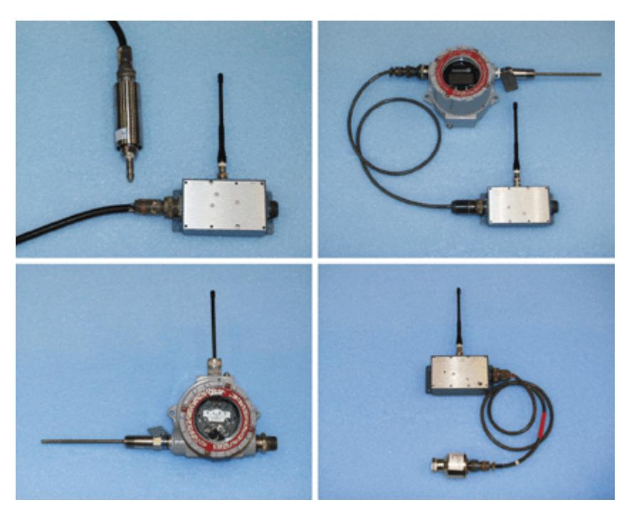

*FIG. 18. Different types of wireless sensors.*

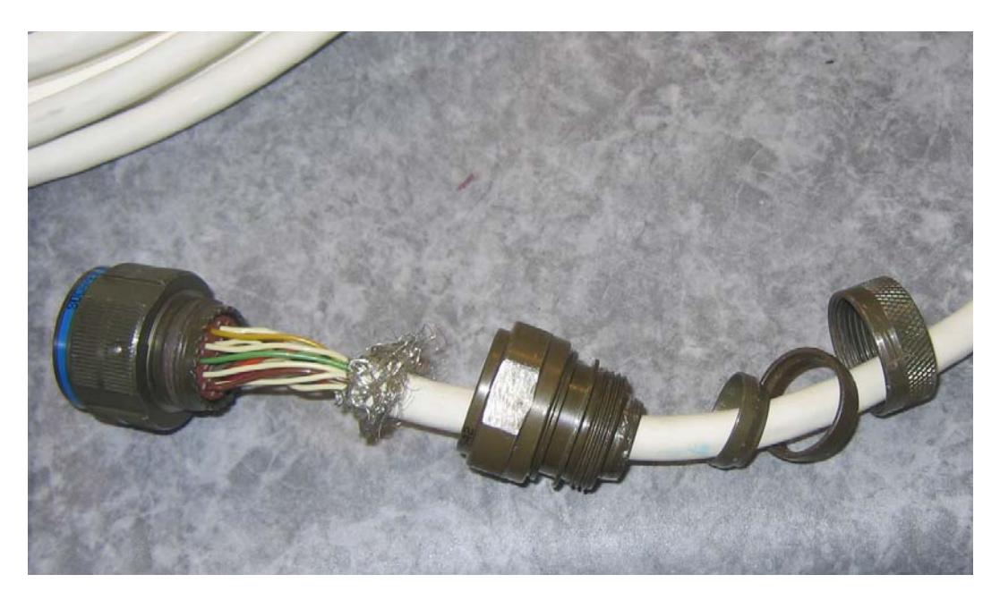

*FIG. 19. Cable connector components.*

Containment wall penetrations are provided to conduct electric signals and electric power through the containment wall while preserving the hermetic integrity of the containment (Fig. 21). These penetrations constitute very critical devices from multiple points of view. Firstly, they (and their installation) must provide the necessary physical tightness to prevent leakage from the containment to the outside area. At the same time, they must provide good electrical conduction for the signals fed through them and good electrical isolation between the internal wires.

Typical cabling system components and their connections can be seen in Fig. 22.

#### **2.4.4. Process monitoring and control systems**

#### *2.4.4.1. Data acquisition systems*

Data acquisition systems (DAQs or DAS) are used ubiquitously to condition, acquire, archive, process and display signals in the control, monitoring, and safety systems, as well as in the operations, maintenance and administration activities of NPPs. In their widest sense they include:

- Systems for capturing manually entered time-stamped data such as instrument readings, laboratory measurements, and status checks;
- Analog pen and paper devices such as chart recorders attached to individual or small groups of instruments;
- Digital data-loggers used as "paperless" chart displays, often as replacements for obsolete pen and paper chart recorders;
- Centrally located (and often multiplexed) groups of analog-to-digital converters (ADCs) to simultaneously digitize large numbers, typically several hundreds, of analog signals for digital control, safety, and monitoring systems. Such data acquisition systems are often designed or are retrofitted with secure communications capability for data transmission over a local area network for archival, display and diagnostic purposes;
- Add-on, and sometimes temporarily installed, special purpose data acquisition systems for surveillance, diagnostics, and prognostics (e.g., for neutronic noise analysis or for loose parts monitoring systems);
- Networked "smart" sensors and computing nodes feeding a plant-wide data display and data historian system in a modern distributed control system application.

 Analog data recording devices such as paper chart recorders are becoming obsolete; therefore the remainder of this section addresses digital data acquisition or data-logging systems only. The central element of a digital DAS

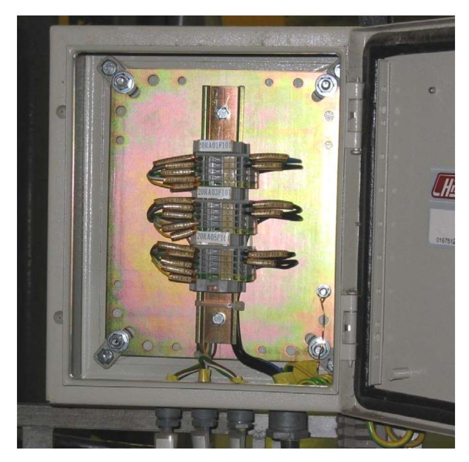

*FIG. 20. Junction box with terminal block.*

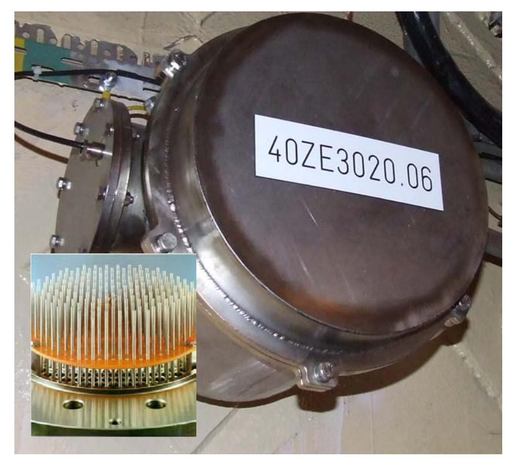

*FIG. 21. Containment wall cable penetration (with the internal part in the small photo).*

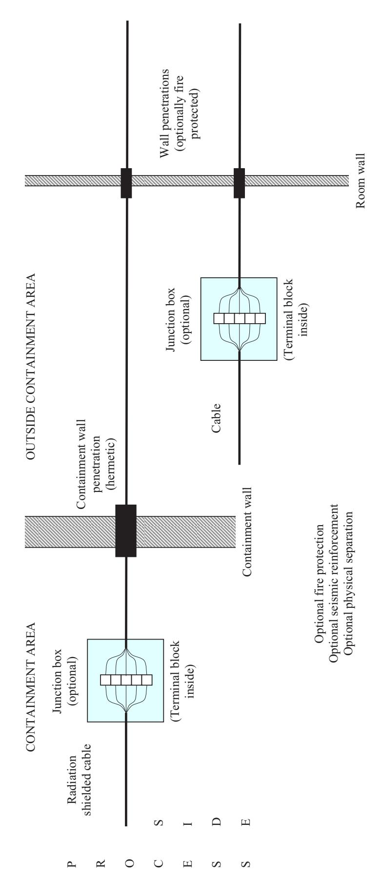

*FIG. 22. Typical cabling system components.*

is an ADC. In addition, a DAS may typically have one or more of several functional elements including an analog input signal conditioning stage, a multiplexer, a controller, a digital signal processor, a data and status display, and a data storage device (see Fig. 27 for additional details). These elements should be carefully selected or specified according to the signal characteristics and the type and category of function that the DAS is required to perform.

The first stage of a DAS is often an input signal conditioning stage. This may range from a precision resistor, which converts a current loop signal to a voltage input for the ADC, to a variable gain amplifier, which matches the amplitude range of the input signal to that of the ADC. A unity gain signal isolation or "buffer" amplifier is often used when it is particularly important to ensure that a failure of the DAS will not affect the input signal (e.g., when the signal originates in a safety or safety-related system and where the DAS under consideration provides a nonsafety function such as non-critical monitoring or diagnostics). Another important function of the input signal conditioning stage arises in noise analysis applications. These applications require analysis of small signal fluctuations around a mean or DC value, where it is often desirable to eliminate the DC part of the input signal either by using a summing amplifier to subtract a constant value from the signal or by using a band-pass filter. In noise analysis applications where the signal is Fourier analysed, it is also essential to use an anti-aliasing (high order low-pass) filter to ensure that signal frequencies greater than the Nyquist critical frequency for the sampling period of the DAS do not contaminate the analysis. Finally, sometimes specialized filters may be used to eliminate unwanted or spurious signal components (e.g., a notch filter may be employed to filter out 50 or 60 Hz line noise).

In older DAS, many of which are still in service in NPPs, multiple input signals are fed into a multiplexer unit or into a multiplexed ADC to be digitized. The multiplexer presents multiple signals serially to the ADC, in some cases after a "sample and hold" step following a trigger. Depending on the multiplexer type and settings, signals digitized during a single "scan" of the multiplexer may therefore be phase shifted with respect to each other, which can sometimes be a cause for concern for analysts. Use of a multiplexer obviously decreases the sampling frequency of individual signals, which dictates the use of an appropriate anti-aliasing filter. With decreasing costs for ADC chips, and with increasing speed of digital communications, the multiplexed approach to digitizing multiple signals is no longer necessary; thus, most modern DASs use separate, simultaneously triggered ADCs for each signal.

The ADC itself usually follows the input signal conditioning stage. Three types of ADC technology have been employed, and these are known in historical order as Wilkinson, successive approximation, and delta-sigma ADCs. Wilkinson ADCs are relatively slow — conversion time is on the order 10s to 100s of s — but very accurate. The conversion time of Wilkinson ADCs depends on the signal amplitude. Successive approximation ADCs are the most widely deployed type of ADC in existing DASs. The conversion time of successive approximation ADCs is independent of signal amplitude but scales with the number of bits (also known as conversion gain). Delta-sigma ADCs are extremely fast, accurate and have some advantageous filtering capabilities. As a result, these ADCs are increasingly used for high speed (i.e., up to 50 kHz), high resolution (i.e., typically 24 bits) applications such as neutronics noise analysis, vibration surveillance, and loose parts monitoring.

The control module of the DAS typically provides a master clock for the DAS ADCs, sets up parameters for the analog signal processor, the multiplexer (if used) and ADCs, and provides a trigger to start and stop the DAS either through automatic analysis of signals (e.g., a plant transient) or via manual commands (e.g., for a diagnostic "run"). The control module also routes the digitized data from the ADCs to appropriate clients for display, status annunciation, (digital) signal analysis and, most importantly, archival. Prioritization and sequencing of tasks in the control module is of utmost importance, so that data is not lost or corrupted. The control module must also be designed to have secure lines of communication to ensure data integrity and to protect against malicious or inadvertent cyber attacks.

An important consideration for designers and operators of new or replacement DASs in NPPs is the functional categorization. The safety category of a proposed DAS places enormous constraints on its performance characteristics. To achieve the required degree of reliability, commercially available Safety Integrity Level 3 (SIL-3) or Category B/C (as defined in IEC 61226 [13]) DASs perform self-diagnostics on every single digitization cycle and for every input channel. These requirements can significantly reduce the sampling speed. In addition, DAS channels for such systems are duplicated and sometimes triplicated, allowing hot-swapping of faulty modules, but requiring further and costly error detection and error resolution mechanisms, such as watchdog timers.

The historical data from DASs in NPPs are often stored for, and sometimes analysed after, many tens of years. Sometimes historical station data are required long after the original storage media and even data formats have become obsolete. Historical data storage and retrieval from NPP DASs constitute a special type of obsolescence

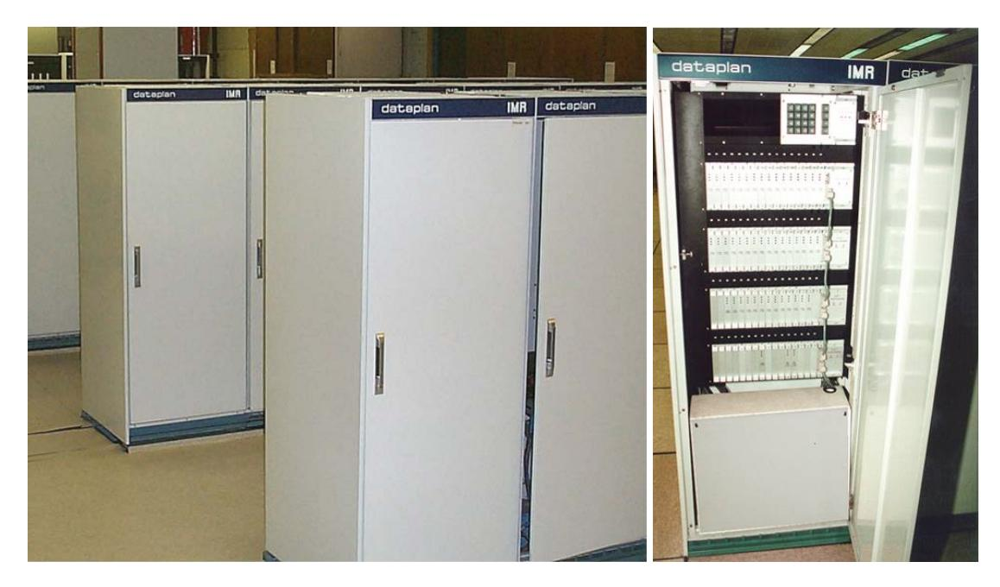

*FIG. 23. Centralized data acquisition cabinets.*

challenge because of the need to maintain accessibility over extended time periods in the face of radically evolving technology.

Finally, it should be mentioned that installation of modern digital DASs in working NPPs, either as a permanent system or temporary diagnostic add-on capability, must ensure that access to safety signals is properly isolated to avoid inadvertent corruption of critical parameters. Thus, retrofits or new installations must be properly planned and executed with the potential safety impact in mind (Fig. 23).

#### *2.4.4.2. Control systems*

There are many types of controllers which can be categorized according to functions and characteristics of the control systems. In the classical control theory, there are two basic types of controllers, which are open-loop and closed-loop controllers. They can also be called feed-forward and feedback controllers, respectively.

An open-loop controller is a type of controller that computes its input into a system using only the current state and its model of the system. One characteristic of the open-loop controller is that it does not use feedback to determine if its output has achieved the desired goal. This means that the system does not monitor the output of the processes that it is controlling. Consequently, a true open-loop system can not engage in process learning and also cannot correct any errors or deviations that may result. It may also not compensate for disturbances in the system. Therefore, drawbacks of the open-loop controller are that it requires perfect knowledge of the system (i.e., one knows exactly what inputs to give in order to get the desired output), and it also assumes there are no disturbances to the system. Open-loop control is useful for well-defined systems where the relationship between the input and resultant state can be modeled by a mathematical formula. An open-loop controller is often used in simple processes because of its simplicity and low-cost, especially in systems where feedback is not critical.

In order to obtain a more accurate control of less well-defined system behaviour, it is necessary to feed the output of the system back to the inputs of the controller. This type of control system is called a closed-loop feedback control system. To avoid the limitations of open-loop control, control theory introduces feedback. The closed-loop feedback control system measures the process, compares it to a set point, and then manipulates the output in the direction that should move the process toward the set point. The set point is the target value that an automatic control system will aim to reach. The name of the closed-loop feedback control comes from the information path in the system: process inputs have an effect on the process outputs, which are measured with sensors and processed by the controller; the result (the control signal) is used as an input to the process, closing the loop. Closed-loop

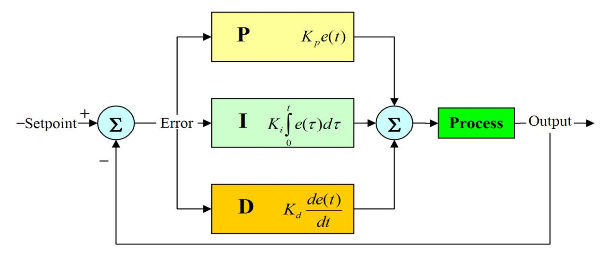

*FIG. 24. Block diagram of a typical single-loop and set point controller.*

controllers have the following advantages over open-loop controllers: disturbance rejection, good control performance, reduced sensitivity to parameter variations, and improved reference tracking performance.

In some control systems, closed-loop and open-loop control are used simultaneously. In such systems, the open-loop control is termed feed-forward and serves to further improve reference tracking performance of the feedback control.

The control system can also be classified into other two basic types of controllers: single-loop versus multiloop. The single-loop control system involves a single input and single output (SISO) while a multi-loop control system has multiple inputs and multiple outputs (MIMO). Often process control strategies require the use of multiple loops to perform a control task. Cascade, ratio, and override are some typical examples of multi-loop controllers. Cascade control uses a primary and a secondary (or inner loop) variable, each with its own controller, to manipulate one variable for the purpose of maintaining the primary variable at its set point. Ratio control is used to ensure that two or more process variables are kept at the same ratio even if the two variables are changing. Override control is used to take control of an output from one loop to allow a more important loop to manipulate the output.

There are other classifications of control systems, such as linear versus non-linear, on-off versus continuous. In modern control theory, there are many other types of advanced controllers, such as optimal controller, robust controller, adaptive controller, neural network controller, fuzzy logic controller, etc. However, the single-loop and set point controller is the focus of discussion in this section.

The typical single-loop and set point controller is often called proportional-integral-derivative (PID) controller, which is a generic closed-loop feedback controller widely used in nuclear power plants and other industries. A PID controller attempts to correct the error between a measured process output variable and a desired set point by calculating and then sending out a corrective action that can adjust the process accordingly and rapidly, to keep the error minimal. Figure 24 shows a typical single-loop PID control system.

The PID control algorithm involves three separate parameters: the proportional, integral and derivative values. The proportional value (Kp) determines the reaction to the current process variable error, the integral value (Ki ) determines the reaction based on the sum of recent errors, and the derivative value (Kd) determines the reaction based on the rate at which the error has been changing. Basically, proportional control responds to error amplitude, integral control addresses offset error, and derivative control provides additional stability by managing the rate of change. The weighted sum of these three actions is used to adjust the process via a field control element such as the position of a control valve or the power supply of a heating element.

In order for control loops to work properly, the PID loop must be properly tuned. By tuning the three constants in the PID controller algorithm, the controller can provide control action designed for specific process requirements. Standard methods for tuning loops and criteria for judging the loop tuning have been used for many years, but should be re-evaluated for use on modern digital control systems. The response of the controller can be described in terms of the responsiveness of the controller to an error, the degree to which the controller overshoots

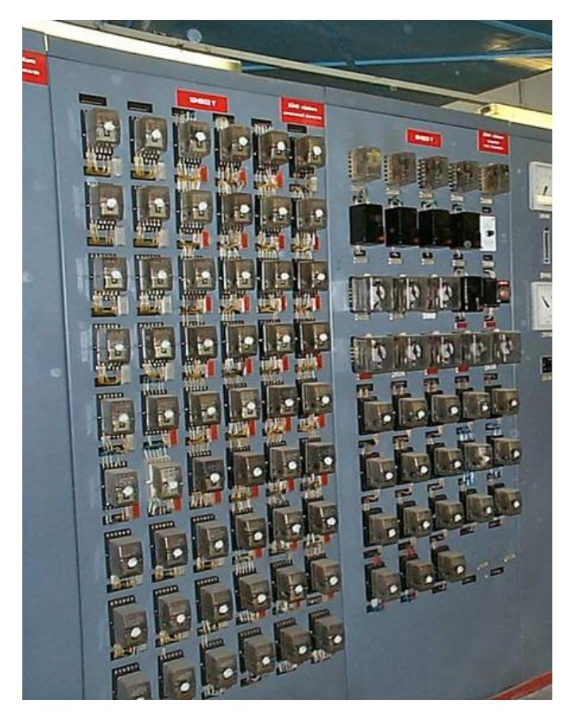

*FIG. 25. Relay-based, centralized control logic.*

the set point and the degree of system oscillation. The drawback of using the PID algorithm for control is that it does not guarantee optimal control of the system or system stability.

Some applications may require using only one or two control modes to provide the appropriate system control function. Hence, a PID controller will be called a PI, PD, P, or I controller in the absence of the respective other control functions. This kind of change to the control functions can be easily achieved by setting the gain of undesired control mode outputs to zero. PI controllers are particularly common, since derivative action is very sensitive to measurement noise, and the absence of an integral value may prevent the system from reaching its target value due to the control action.

The above classic PID control algorithm is used for the control of almost all continuous processes in the nuclear power plants and other industrial systems, and is also the basis for many advanced control algorithms and strategies.

The following sections describe implementation approaches for the control algorithm types discussed above.

#### 2.4.4.2.1. Relay-based, centralized control systems

Standardized logic or interlock circuits in older systems use relays to build the logic. These could be, for example, the two out of four trip signals (2004) for reactor trip, or simple logic interlocks for pump cutoff at a tank low level. These systems are fed from outputs of control systems (usually analog systems), or from direct operator interface through control switches on main control boards or local panels (Fig. 25).

Relays use a coil to generate a magnetic field when they are energized, and this field then moves electrical contacts to close or open circuits. Due to the low level of integration in the relay-based logics, these circuits may apply a very large number of individual relays and may become extensively complex. As a result, single failure rate (including undetected or hidden failures) may be relatively high in these systems. Because relays inherently contain some moving components, they may become susceptible to mechanical problems arising from vibration or seismic events. Also, oxidation, corrosion and/or dirt, dust and humidity may build up on the relay contacts causing insufficient conduction of electrical signals.

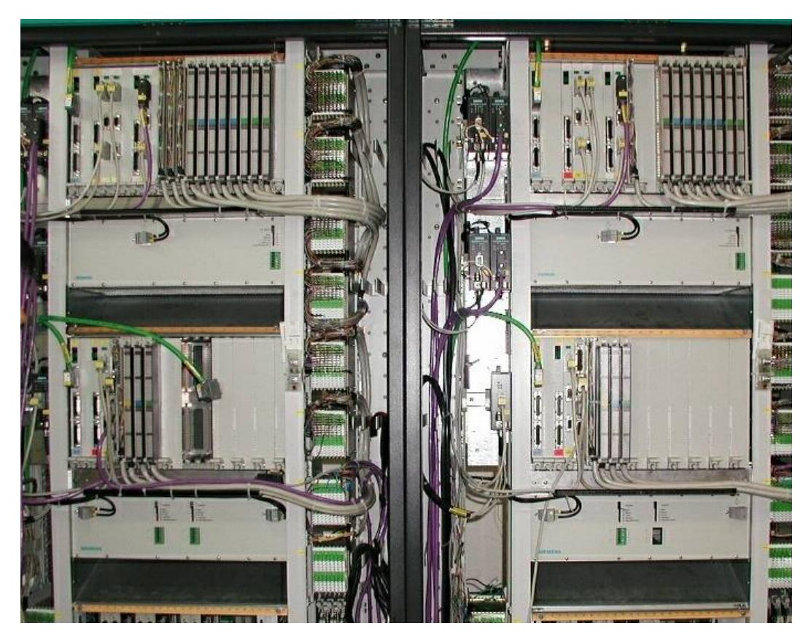

*FIG. 26. Digital safety I&C system detail.*

#### 2.4.4.2.2. Electronic-based, centralized control systems

Electronic-based systems generally are discrete function units put together in an architecture that satisfies the requirements of the control system. These would be analog input cards, analog output cards, binary output cards, and then the cards that are used to perform the logic functions or the special needs. Examples are threshold (alarm or trip) cards, cards for proportioning, cards for converting square root or logarithmic signals to linear signals for processing, etc. Often the analog modules feed into relay based logic systems for final outputs, or they have analog variable outputs for variable control purposes.

Centralized electronic-based digital control systems have all of their processing capabilities and system database at centralized locations. Input/output (I/O) cards convert the signals from the field devices to digital signals to be processed by the main processing units, which have been programmed with the appropriate algorithms and instructions to perform the desired control or protective functions. The results are then output as digital or analog signals to actuators, operator interfaces, plant computers for data acquisition, and are used for interlocks, trips, alarms, variable control (valve positions, speed signals, etc.) or analog indications (Fig. 26).

The typical layout of a centralized hybrid signal processing and control system can be seen in Fig. 27.

#### 2.4.4.2.3. Distributed control systems

Distributed control systems are digital systems that perform the same functionality as listed above for centralized systems but in this case they use decentralized elements or subsystems to control distributed processes or plant systems. Hence the processing capabilities are shared between distributed processors, and the system database is also distributed amongst the various processing units. Some manufacturers call their proprietary systems as DCS (distributed control system). These types of digital systems are broadly used for systems with high amounts of data to be processed, and large input and output needs. A typical DCS consists of functionally and/or geographically distributed digital controllers. The I/O devices can be integral with the controller or located remotely via a field network.

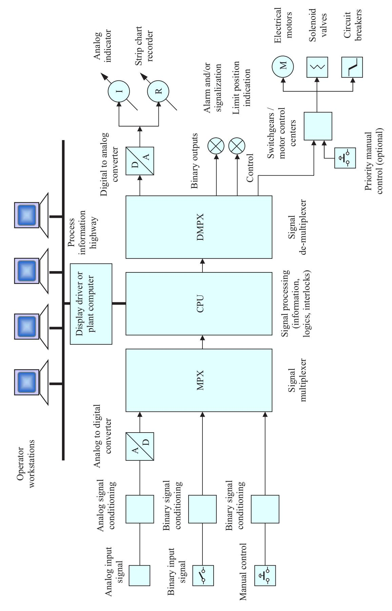

*FIG. 27. Hybrid signal processing and control.*

They are already often used for non-safety, general I&C systems in NPPs. As a result of distribution, some of their components can be installed in the field near the input and actuation devices connected to them. This will yield the possibility of reducing field cable lengths significantly.

Other major advantages of DCS's functional hardware distribution are flexibility in system design, ease of expansion, reliability, and ease of maintenance. Also in this type of distributed architecture a loss of data highway communications will not cause complete loss of system capability.

General purpose, low level digital processing units are widely called programmable logic controllers (PLCs) in the I&C industry. An example for a distributed digital control systems is a SCADA (Supervisory Control and Data Acquisition) system often used for medium complex control systems. In a SCADA system data acquisition devices and actuator control devices (such as PLCs), the higher level logic devices and the human-system interface are connected via information highways and/or communication busses.

A simplified structure of a typical distributed control system with intelligent field devices is depicted in Fig. 28. Basically, various parts of the plant processes and several parts of the DCS network elements are connected to each other via one or more levels of data highway. For safety and security reasons it is essential to ensure that only necessary and carefully controlled data transmission is allowed to cross between the different network segments. Additionally, servers and/or application processors may be included in the system for extra computational, data collection, and reporting capability. Many DCS manufacturers use proprietary communication protocols for their internal data transfers between I/O and distributed control modules, and allow for one or more varieties of open or commercially available protocols for data transmission to and from HSI's and enterprise networks.

#### **2.4.5. High level communication**

High level communications are the digital communications protocols used for transmission of information at a level above and internal to the I&C system (Fig. 29). This includes transmission of data to the enterprise network, technical support centre (TSC), emergency response facility (ERF), as well as transmission of data to and from an operator interface for purposes of monitoring and control input. (See also Ref. [14] for more details on information communication and integration.)

#### **2.4.6. Human interaction elements**

The human system interface (HSI), also known as man-machine interface (MMI) or human-machine interface (HMI) is a very important part of the plant, since it forms the interface between the operating staff and the process to be monitored and controlled as well as between the engineering and maintenance personnel and the systems and equipment. HSIs for operations include resources such as alarms, displays, and controls that are located in the main control room and numerous local control stations situated throughout the plant. HSIs are also located in support facilities such as the technical support centre, and in other locations as necessary for operations, maintenance and administration.

HSIs provide operation personnel with information about the plant status, equipment conditions, etc., and enable the operators to actively intervene with the process for example by starting and stopping components such as pumps and fans or by opening and closing valves and dampers, as well as changing set points and target values in a control loop.

Other categories of HSIs provide engineering and maintenance staff with information about the status and the health of the plant systems and equipment, and may provide the means to perform design changes, maintenance, analyses, etc.

HSIs can have different characteristics depending on the technology installed in the plant, the operational requirements, and the operational environment or ergonomics. Safety and availability requirements may also determine the capabilities and configuration of an HSI.

The interface between the operators and the I&C system can range from devices as simple as valve open/close hand switches and position indicator lights to digital touch screens showing the entire system information in a graphical format. These interfaces can be located centrally, such as in a main control room, or remotely, for local control of devices or systems (Fig. 30).

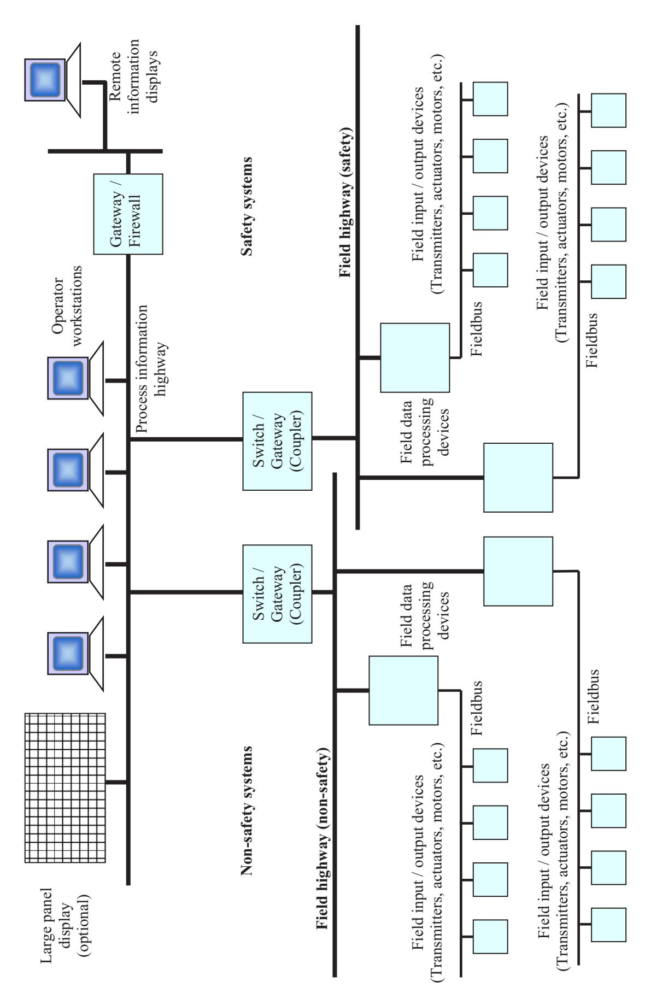

FIG. 28. Distributed signal processing and control with intelligent field devices.

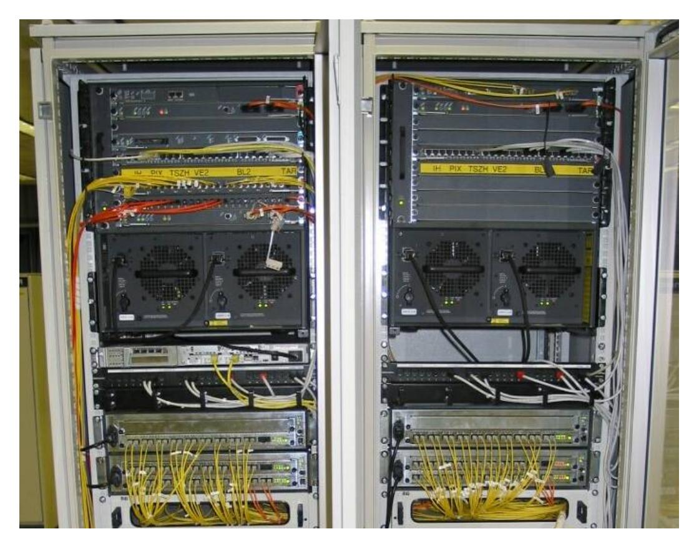

*FIG. 29. High-level network components.*

Based on the different safety and availability requirements for "normal" operation of the plant from the main control room (MCR) and "operation" under "abnormal condition from the remote shut down (RSD) or emergency control rooms (ECR) the design of the HSI must or will be different or diverse.

In the RSD or ECR, a safe and reliable shut down of the NPP is of primary importance while in the MCR, a safe and efficient operation under all plant operating modes and conditions is the main goal.

Examples of some of the types of interfaces are described in the following sections. (See also Refs [10, 14] for more information on human interaction issues.)

#### *2.4.6.1. Hard-wired HSIs*

The main characteristic of these conventional HSIs is that all information is permanently presented in parallel and in fixed positions. The operators became used to cognitive patterns, e.g., the operators recognize the meaning of an indicator's reading or an alarm by the position of the pin, or an annunciator tile lighting up without reading the actual value or the text on the tiles. Pattern recognition plays a major role in getting a quick overview of the plant status (Fig. 31).

A hard wired or "conventional" HSI can be an interface for either an analog or a digital I&C system, or a mixture of both. This is often the case if only parts of an analog I&C-system are replaced by digital technology or during a transition period leading to comprehensive I&C modernizations.

## 2.4.6.1.1. Indicators

Individual indicators can range from moving pointer types to single digital indicators. In most cases, they receive a standardized signal from the field device, from the analog control systems, or from a digital control system. They mostly display a single variable, but some are designed to show more than one variable. Another function of indicators is the formulation of threshold signals to initiate alarms or control/protection actions.

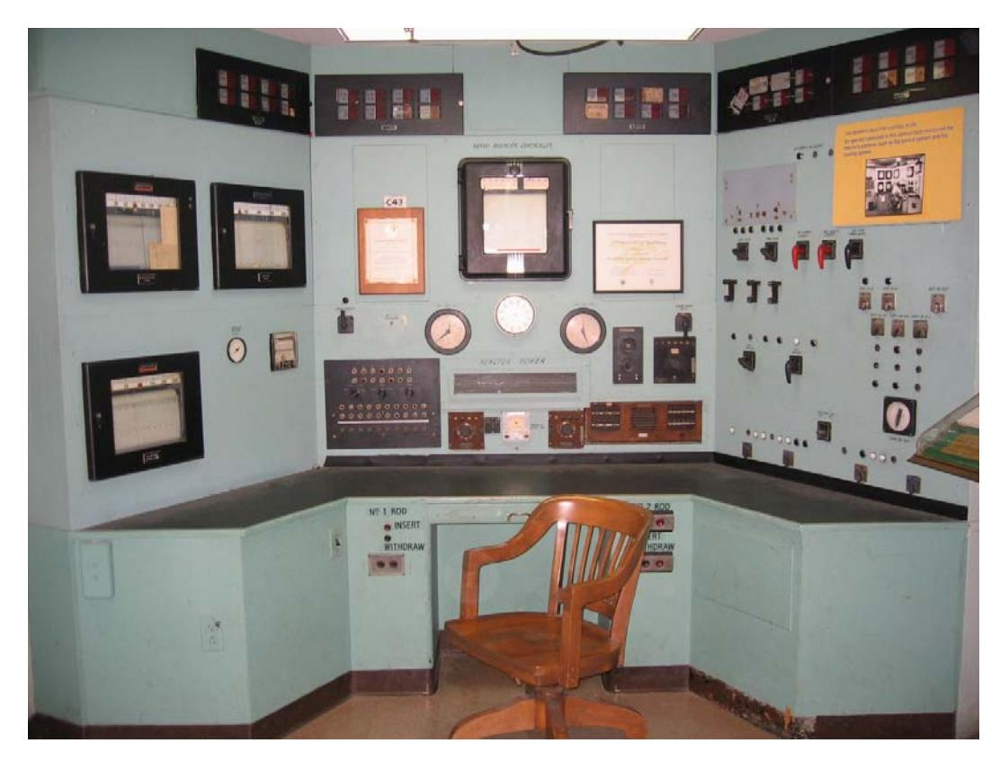

*FIG. 30. The world's first nuclear control room from 1943.*

From the human factors engineering (HFE) aspect a "shape coding" for indicators of analog process values should be considered to support the cognitive ability of the operators. For example, a general practice is that indicators for pressure or level values have a vertically elongated shape and indicators for flow values have a horizontally elongated shape.

Also, "colour coding" with respect to the measured medium is advisable, e.g., red for live steam and green for condensate. These conventions may depend on local or country-specific standards.

### 2.4.6.1.2. Recorders

Recorders are storage devices for display and trending of field variables. Older devices used paper and ink pens, newer devices use digital displays that mimic the old paper and ink displays, but have all of the data stored in digital memory.

#### 2.4.6.1.3. Pushbuttons, switches

Pushbuttons and switches are the most basic devices for interfacing between an individual and a process. These components — when actuated — close or open electrical contacts to start / stop motors, or to open / close motor operated or solenoid valves. They can be hard-wired directly to the controlling device, such as a solenoid valve or a motor control center, or can be wired as an input to a control system, either analog or digital (Fig. 32).

# 2.4.6.1.4. Alarms and other alerts

A very important part of the HSI is the annunciation system with dedicated "tiles" for each individual alarm or a group of alarms. All these components are arranged in panels and desks in a more or less process-related manner, sometimes also featuring synoptical representations of the processes. These are basic binary type devices that alert or inform the operator of changes to the process by means of lights and/or sound. They range from valve

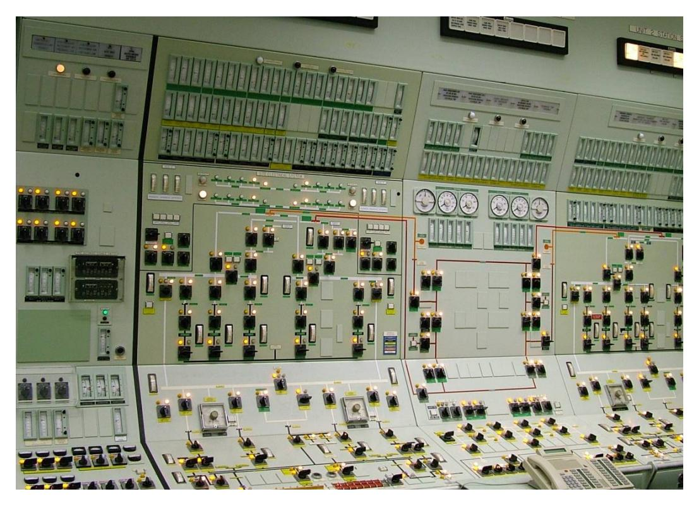

*FIG. 31. Conventional human-system interaction elements in a main control room.*

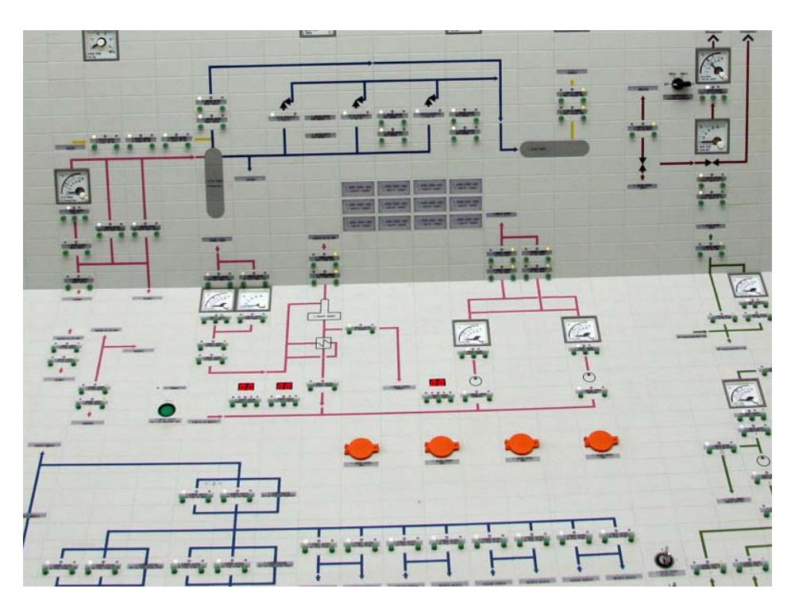

*FIG. 32. Pushbuttons, switches and gauges on the operator panel.*

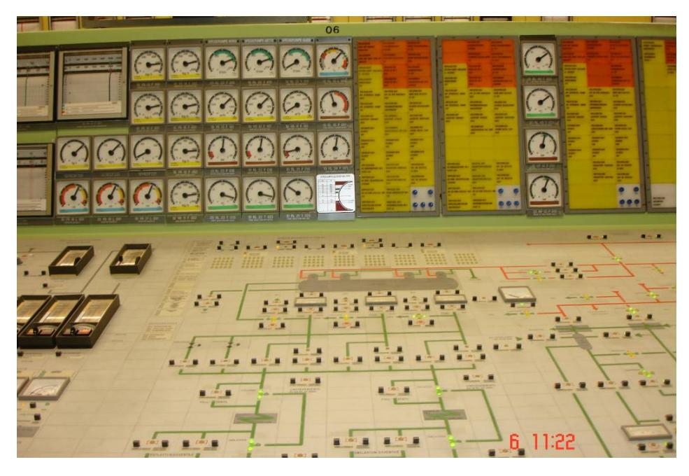

*FIG. 33. Conventional indications and status lights in a control room.*

position lights showing an operator that a valve has changed position, to alarm windows warning of process states outside normal conditions (see Fig. 33).

These devices can receive signals directly from field devices, or, in the case of most modern digital control systems, they receive signals from the control system digital processing unit.

Alarm tiles are normally colour coded according to their priority as defined by the required reaction or intervention time of the operator. A commonly used colour scheme is red for the highest priority, orange for the second-highest, and yellow for the third-highest priority. Sometimes status values of components are considered to be alarms and displayed on alarm tiles. Such tiles are usually white. The colour coding may depend on local or country specific standards.

Figure 33 shows a desk section of a typical NPP control room designed in the 1970s with mosaic type components. In the horizontal area (foreground) the operating elements such as push buttons, indicating lights and Auto/Manual switches are arranged in a synoptic picture of the related process. In the vertical area (background), indicators, alarm tiles and, as an exception, some very important recorders are located. The alarm tiles are colour coded according to priority and the indicators are colour coded (bar at the bottom) according to the process medium.

Recorders are usually arranged in panels or walls behind the desks.

#### 2.4.6.1.5. Single-loop and set point controllers

Depending on the type of controls or control systems, single loop and set point controllers can be built in to a desk or panel. They mostly feature a combined display and operating interface, consisting of buttons and indicating lights for mode selection and indication including bar indicators for the display e.g. of the control variable and the actual process value.

Such controllers are more commonly used in steel plate desks and panels and less commonly in mosaic type environments.

### *2.4.6.2. Computer based HSIs*

Computer based HSIs for process and component control are installed only with digital I&C systems. In plants with analog I&C systems, computer-based HSIs are usually limited to plant information systems.

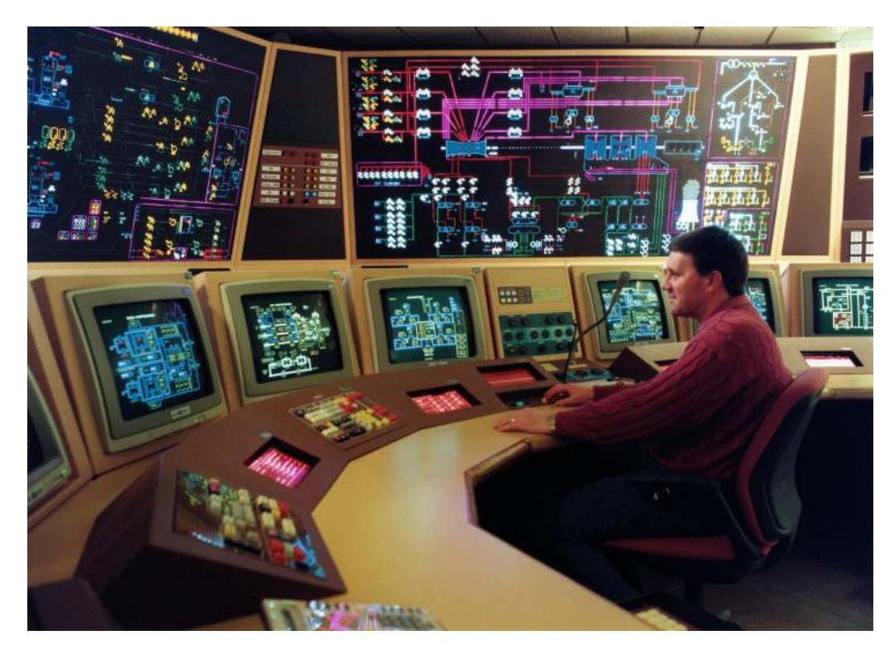

*FIG. 34. Fully computerized human-system interface.*

The introduction of plant computers has brought a new kind of interface into the control room, namely the video display unit (VDU). Historically, VDUs had rather limited tasks, e.g., display alarm and event lists, show simple trend curves and results of on-line calculations.

With today's digital I&C systems, the HSIs are computer based and form an integral part of the I&C platform featuring workstations with VDUs (Fig. 34).

This new kind of interface brings a paradigm change by not having all information presented and not having all control interaction elements available in parallel at all times. This change from parallel to serial information display and component control puts stringent requirements on the HSI with regard to efficient and safe navigation, fast access to the required information and to the means of control.

This new type of HSI puts specific requirements on the training of the operating and the maintenance staff. One substantial change from the hard-wired HSI is that the overview by pattern recognition is lost since the information is distributed on workstations and on screens that are not always up on the workstation. Therefore, other means have to be considered for getting an overview at a glance. One of these means is large overview displays, indicating the main parameters of the plant, and readily visible to all staff members present in the control room. (See Section 2.4.6.2.3)

Another possible method is presenting "compound" functional alarms on every VDU. These functional alarms may represent the safety state of a plant subsystem or of the whole plant, e.g., alarms generated by a critical safety functions monitoring system.

#### 2.4.6.2.1. Operator and supervisor workstations

Operator and supervisor workstations are the modern standard for operator and supervisor interfaces. These consist of VDUs that are used either for information only, or for two way communications between the operator and the system. They can be programmed to show lists of information, can show trending of field variables, or may show system mnemonics with addressable components (Fig. 35).

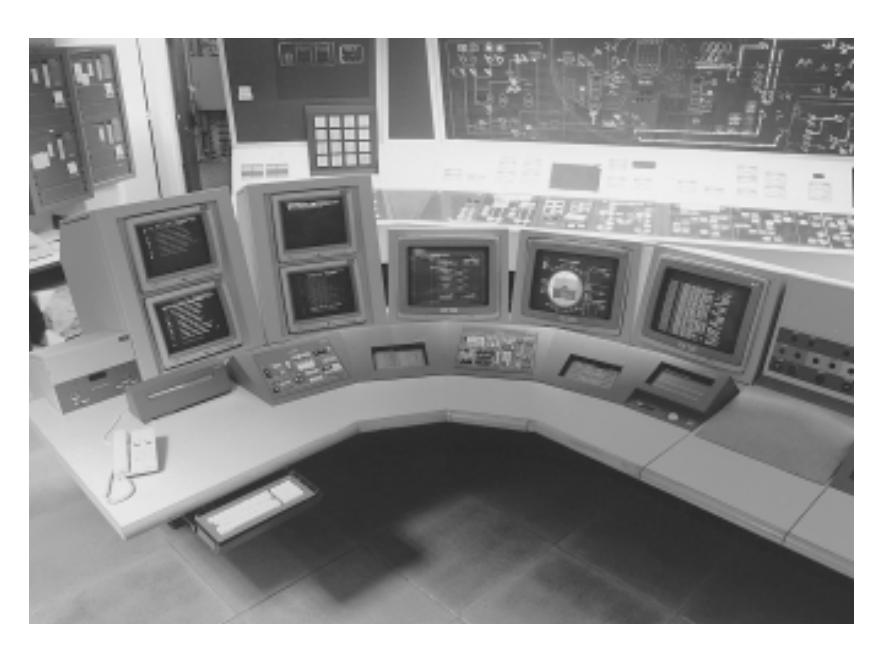

*FIG. 35. Computerized operator workstation.*

These devices communicate directly with the digital control systems. Control may also be initiated from operator workstations with the use of various interface devices including keyboards, mice, track-balls, joysticks, or touch screens (i.e., soft control)<sup>2</sup>

#### 2.4.6.2.2. Maintenance and engineering workstations

Maintenance and Engineering workstations also provide interfaces directly with the digital control systems, but generally do not allow any commands to be sent to the control system. They also show information in specific formats suited to the interests of maintenance or engineering personnel, such as health status, or diagnostics trending of equipment variables. In many modern digital systems, these HSI screens are also used to allow maintenance personnel to troubleshoot systems from a remote location.

#### 2.4.6.2.3. Large panel displays (LPDs)

Large panel displays are normally installed in the main control room, where the operating staff is composed of several operators responsible for various systems of the NPP. The LPD presents the overall plant status in a large size arrangement, and is useable in all plant states by all members of the operating crew simultaneously to help team work, to facilitate a common understanding of the actual plant state, and to aid the co-ordination of the operating team tasks (Fig. 36).

<sup>2</sup> Essential features of soft control are that the operator interacts with HSI elements to modify data items in a computer database, and control of the plant involves the translation of this data into control actions by the control software.

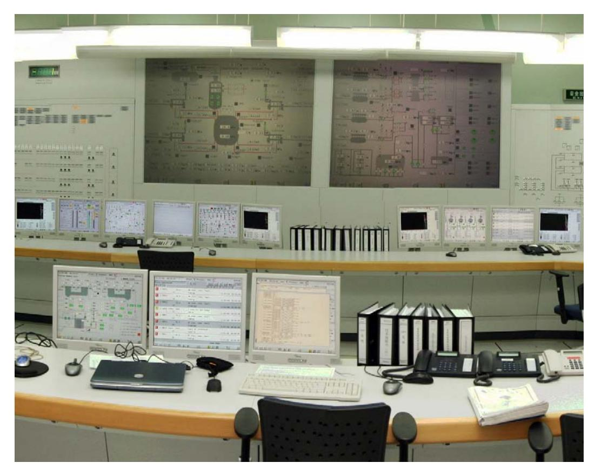

*FIG. 36. Large panel displays in a main control room.*

#### *2.4.6.3. Main features of computer-based HSIs*

Computer based HSIs provide all the necessary means to control and monitor the respective plant systems and components. The main features are process graphic displays, curve displays, characteristic diagram displays (e.g. operating field of a reactor or generator), alarm and event list displays, diagnostic information displays (process as well as I&C-system diagnostics information), and log book functions.

More advanced features encompass operator support systems, e.g. computerized procedures, and maintenance management information.

The operating and display philosophies, as well as the means of navigation vary between various I&C platforms. The following are examples of a typical platform.

#### 2.4.6.3.1. Process graphics (mimic diagrams)

Process graphics resemble mostly process and instrument (P&I) diagrams and are synoptic representations of the plant processes such as shown in Fig. 37. Process graphics are normally the main means to control and monitor the plant. Components to be operated can be selected in the displays and controlled via individual faceplates or common soft keys. Navigation means of many different kinds (menus, context menus, jump tags for short cuts, etc.) are built into the graphics.

Alarms and other information and messages can be displayed in the process graphics, e.g., as a symbol or as a pop-up window.

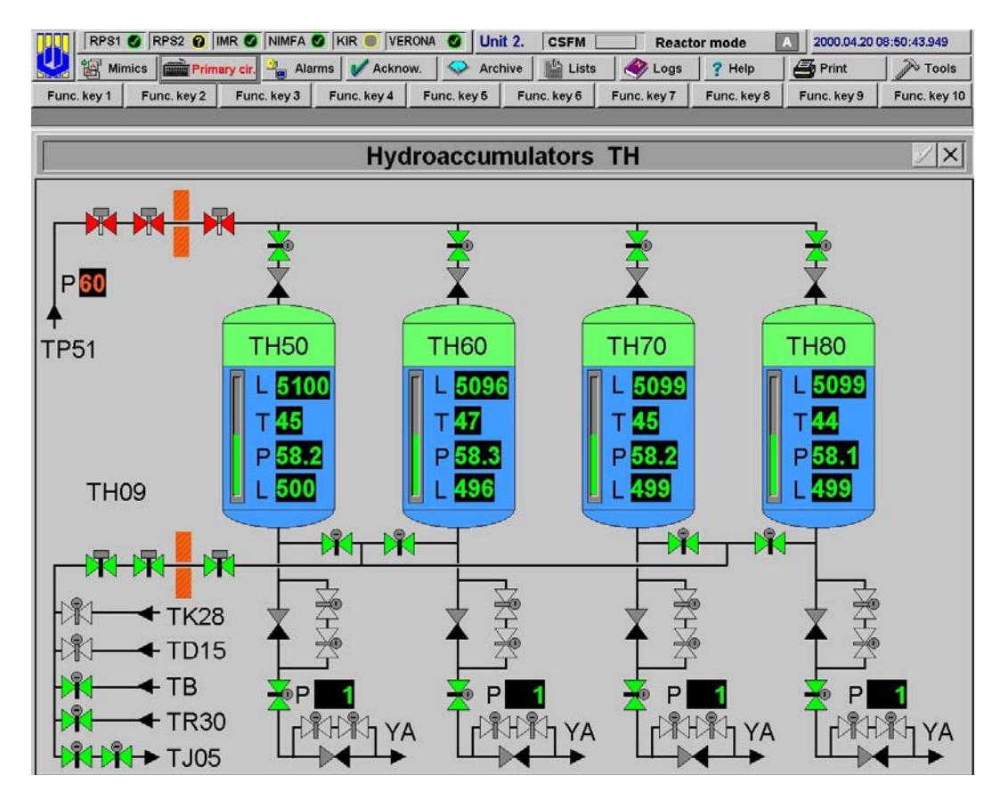

*FIG. 37. Process mimic diagram of the passive cooling system.*

#### 2.4.6.3.2. Faceplates for specific I&C functions

Additional information on specific values or alarms displayed in a process mimic diagram can be obtained in faceplates opened by clicking on the respective symbols. Such faceplates may also contain means to change parameters of the respective value or alarm. Faceplates may indicate details of various parameters. They can also be used for manual operation of a component, sequence or control loop. Such faceplates are called up by clicking on the symbol of the object to be operated.

Faceplates can also incorporate additional information and features, e.g., an information field which shows if there is a tagging procedure pending.

Some platforms feature individual faceplates for operating each component, others feature a common set of buttons with which the selected component is operated.

#### 2.4.6.3.3. Curve displays

Curve displays show trends of process or calculated values in a convenient grouping over a time period. As some of the many features, the time scale can be varied (expanded or compressed), sections of the curve displays can be zoomed and rulers can be used to obtain the exact reading of a value at a specific point on the time scale.

#### 2.4.6.3.4. XY-plots

XY-plots are typically used to display characteristic diagrams or operating fields of values or components. They show the actual working point, the trail of the previous values of the working point and the boundaries or limits of the permitted working area.

Systems normally generate an alarm if the working point violates the permitted values, i.e., crosses a boundary.

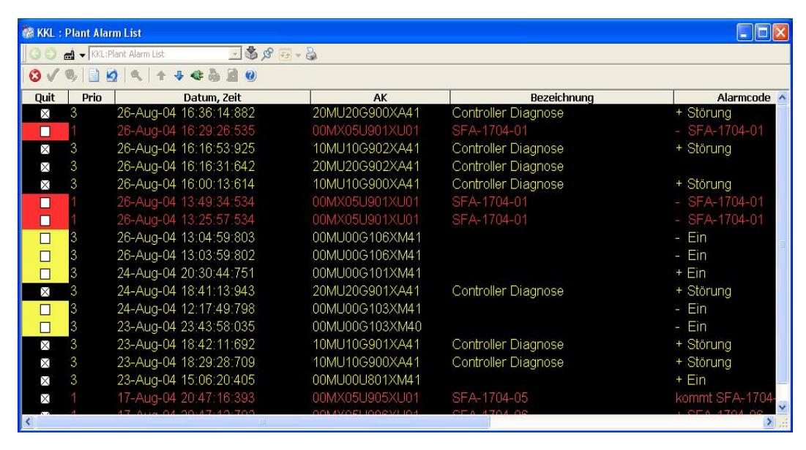

*FIG. 38. Alarm list with colour coded alerts (yellow) and alarms (red).*

#### 2.4.6.3.5. Alarm bands, alarm and event lists

A very important aspect of monitoring is the overview of pending alarms in different plant areas. Therefore, alarm bands for the different plant areas should form part of the standard display format of all displays.

For the different plant areas, the number of pending alarms with the colour of the alarm with the highest priority should be displayed. It should be possible to call up the respective alarm list display or the top process mimic diagram of the respective area from the plant area button in the overview display.

Alarm and event lists show the time tagged alarms and events in chronological sequence with priority, date and time, tag number, designation and alarm code. The alarm status is also displayed.

These lists can be sorted or grouped according to priority, plant area, or other criteria.

From the alarm or event line it should be possible to open additional information or to call up procedures, the related process mimic diagram, or curve display.

Figure 38 gives an example of computerized representation of alarm lists.

#### *2.4.6.4. Hybrid HSIs*

A digital system can be combined with a conventional HSI by connecting conventional indication and control means via input/output devices to the system. This results in increased cost, since additional hardware becomes necessary. Where safety or availability requirements demand an alternate, workstation independent access to indications, alarms and controls, this approach is a viable solution. Control rooms featuring both kinds of HSI are regarded as hybrid control rooms. (See Fig. 39)

One area that often uses conventional indication and means of control in NPPs is the dedicated safety panels when used as a back up to the HSI in the main control room as well as in remote shut down areas.

### *2.4.6.5. Other supplemental HSIs*

Other supplemental HSIs are needed in addition to the non-safety, selectable computer-based HSIs normally used by the operators to monitor and control the plant. These supplemental HSIs provide capabilities not supported by the Distributed Control System (DCS) workstations, and may be required in a modern control room design to respond to regulatory and operational needs. An example of an operational need is to be able to continue to operate the plant for some limited period when the normally used computer-based displays are partially or completely unavailable. Such supplemental HSIs include the following types:

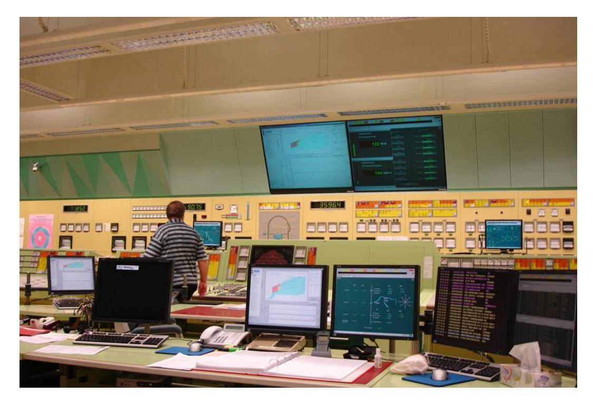

*FIG. 39. Computerized workstations and large overview displays along with conventional indications in a hybrid control room.*

- (1) Spatially dedicated, continuously visible displays driven by the DCS; such as a flat panel display that shows alarms in fixed positions and provides large group-view displays, visible to the entire operating crew,
- (2) Qualified HSIs which could be qualified hard controls and indicators, or qualified computer-based HSIs, and
- (3) Non-qualified HSIs that are independent of the DCS which may include hard controls and indicators and/or computer-based HSIs.

#### *2.4.6.6. Operator support systems and functions*

The implementation of computers in NPP I&C has given rise to new possibilities to support the operator's perceptions and actions [15].

Examples of useful functions for operator support systems include:

- Safety Parameter Display Systems (SPDS);
- Core behaviour surveillance and prediction, monitoring limit violations;
- Alarm filtering;
- Electronic procedures presentation;
- I&C equipment and process performance monitoring;
- Various diagnostics systems (e.g., vibration or loose part monitoring);
- Monitoring primary circuit radioactivity levels (e.g., iodine isotopes);
- Normal transient and/or steady state process supervision and coordination;
- Electronic documentation presentation;
- On-line risk analysis (generally not for control room use);
- Event cause analysis (generally not for control room use).

The following sections outline some commonly used operator support systems.

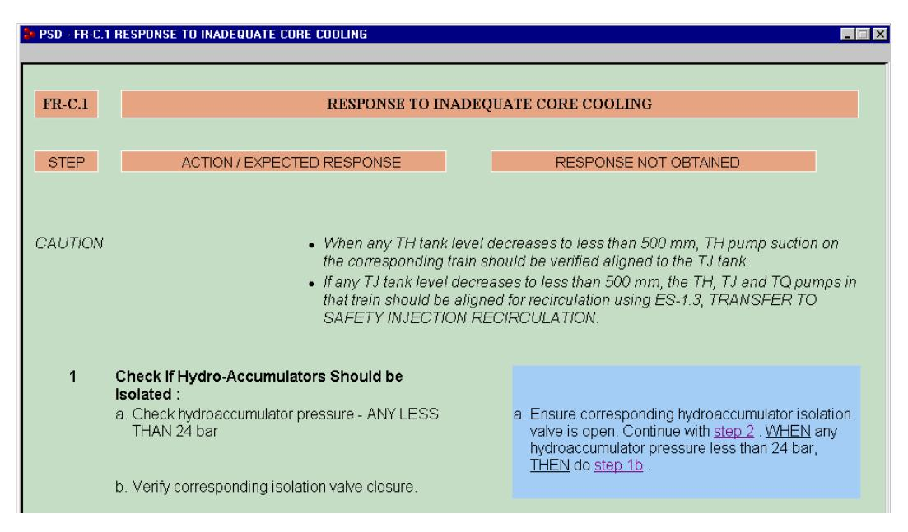

*FIG. 40. Computerized emergency operating procedure presentation.*

#### 2.4.6.6.1. Safety parameter display systems

The most typical and well-known example of a computerized operator support system is the safety parameter Display System (SPDS). The main task of this system is to calculate the current status of the Critical Safety Functions and to present it to operators in the form of simple diagrams with well presented safety margins. Operator's perception from such visual representations is much better than perception from a list of digital values.

SPDS types of systems may also show initial deviation and progression of an event enabling an operator to take advance action to control the event.

### 2.4.6.6.2. Computerized procedures

Computerized procedures can provide different levels of functionality, including varying levels of automation. Different categories can be defined according to the functionality provided. Electronic procedures are computerized procedures that are presented on a computer-driven VDU in text or graphical form that are essentially replicas of paper based procedures. Electronic procedure systems may include the ability to call up a relevant procedure from a link on another display, or links between related procedures, but in each case the procedure that is presented is the same as or similar to an equivalent paper based procedure. Electronic procedure systems may also include links from a procedure to another display page where relevant indications and/or controls are located.

Computer-based procedures are computerized procedures that incorporate additional functionality not found in paper based or electronic procedures, such as: 1) automatic retrieval and display of the specific information needed to perform a procedure step, 2) display of relevant indications either directly in the procedure itself or on another display page or section of the display, 3) processing of step logic and display of the results, 4) automatic checking of prerequisites or preconditions, 5) tracking of preconditions over multiple steps, 6) automatic retrieval and display of a soft control needed to carry out the action(s) called for by a procedure step, 7) context-sensitive aids for making branching decisions, and/or cautions or warnings based on current plant conditions.

Computer-based procedures with procedure-based automation are computer-based procedures that include the ability for the procedure system to automatically carry out multiple procedure steps when directed to do so by the operator.

Figure 40 shows an example presentation of a computerized emergency operating procedure.

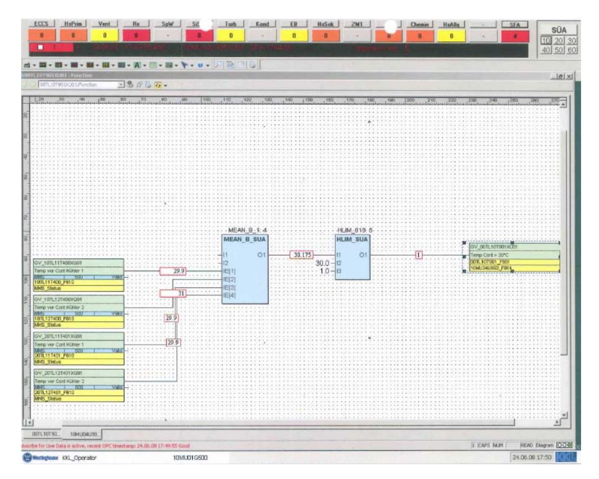

*FIG. 41. Computerized I&C system documentation representing a logic function.*

#### 2.4.6.6.3. I&C system documentation

In these systems it is possible to display the documentation of the plant specific control application, the functional control diagrams (FCDs) on assigned operator workstations of the I&C system. It may also be possible to display the real time binary and analog values in these displays and to call up or to open the respective documentation for a component (e.g. pump, MOV) or to look up the measured or calculated value by means of the context menu of the respective object.

Depending on the platform, other I&C system documents like IO-signal flow diagrams (electrical diagrams), connection diagrams, component data sheets etc. can be called up in this way and displayed on the workstations for operators and the maintenance staff. The computerized documentation could also contain live data.

Figure 41 gives an example of a representation of computerized I&C system documentation.

#### 2.4.6.6.4. Process performance monitoring

Comparisons of measured and modeled or calculated values of plant parameters can be used for diagnostic and prognostic purposes, and in particular to monitor and to improve the performance of specific plant functions or systems. An example of this is the improvement in thermal efficiency of a plant, often referred to as "Megawatt hunting". In this solution the representation of a comparison of measured and calculated thermal performance is provided for the operators.

#### *2.4.6.7. HSI design requirements*

A good and ergonomic design of the HSI requires extended experience about how to operate and monitor the plant as well as the knowledge of the respective workflows during all normal and abnormal operation modes and conditions of the plant.

This is of special importance in I&C and control room modernization projects where the operating staff has to adjust to a new front end with the change from a "parallel" to a more "serial" kind of monitoring and operating.

Standardization is a very important issue and necessary for a good HSI design to support the human cognitive capabilities. It consists not only of the general design or layout of display formats but also of colour and shape coding for the process media and components (e.g. colour of steam lines and shape of a pump).

The standardization should be supported by generic or plant specific libraries, such as display, control and other libraries.

#### 2.4.6.7.1. Human factors engineering (HFE)

Displays and especially process displays for plant monitoring must not be overloaded and not use many different colours. The fact that the cognitive ability of the human is limited must be taken in to account.

Under normal plant conditions the displays should be dull and not unnecessarily attract attention, but in abnormal conditions the important information must be emphasized on the display and the staff must be able to absorb and interpret the information in due time.

Information and operation means (e.g. faceplates) which belong to one operator task or work flow sequence should be on one or as few displays as possible, and it should be possible to perform the operator task with as little display changes as possible.

In a hybrid control room environment, the necessity for the operator to change between the working environments (i.e., digital HSI and conventional HSI) while performing a related task or workflow must be eliminated. If such changes cannot be avoided, they should be limited to a minimum.

Therefore, it is very important that prior to the design of the HSI and especially the design of the process displays, an operator task analysis is performed. This analysis must also include the degree of automation of the plant or of the respective system.

The navigation between different displays must be fast, straightforward and unambiguous. Process displays should feature a hierarchical structure with navigation up and down the respective plant area (vertical navigation) as well as a quick change between the branches of different plant areas or between closely related displays (horizontal navigation).

The changeover between displays with correlating information or workflow requirements should be possible by means of direct links (also often called "jump tags").

The access to computer based procedures and other information must be easy and fast, especially under abnormal plant conditions, e.g. in case of an event.

The operation of plant components, i.e., sequences of the automation steps must be designed in such a way that no unintentional operation is possible. This must be at least a two or three step process, e.g., first: selecting the component, second: opening the face plate and third: giving the intended order by clicking on the respective button (soft key) in the face plate. This procedure may vary on different platforms.

#### 2.4.6.7.2. Human and organizational factors

In a conventional control room the staff is more aware of the actions of the other staff members since they can see if one performs operations on a desk or a panel. This may trigger communication between the control room staff.

With workstation-based operator stations it is not so obvious anymore what each operator is doing. Therefore, the communication within the control room staff must be adapted to the working environment. This requires certain procedures (e.g. three way communication) and extended crew training.

A good means for supporting information sharing and staff communication is large screen displays with adequate overview displays and the ability to display process displays of the area where problems are occurring.

#### **2.4.7. Simulators**

A broad use of the simulators at NPPs all over the world started after the accident at the Three Mile Island NPP in the USA and after the issuance of new, strict requirements for NPP staff training by the US NRC. Since that time NPP simulators have undergone significant evolution from the period of childhood (till 1984, simulation for

#### Fidelity of simulators physical description

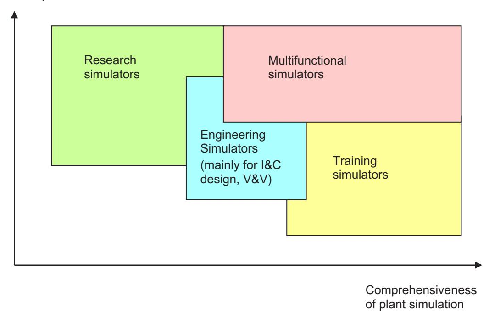

*FIG. 42. Types of NPP simulators based on current practices.*

personnel training only) to recent time of simulation for personnel training, NPP I&C design validation, plant safety analysis, plant performance analysis and optimization, and many other purposes.

The basic types of NPP-related simulators today are:

- Training simulators (for operations and maintenance personnel training);
- Engineering simulators (for I&C systems design and validation, functional/task analysis and HSI optimization);
- Research simulators (with best estimate codes for safety analysis/justification, codes validation, etc.);
- Multifunctional simulators (combine several of above listed objectives).

Engineering simulators or plant analysers represent tools used in plant design, control philosophy development, process or equipment modification and optimisation. In cases where the plant does not yet exist, the engineering simulator is the only tool available to predict its behaviour. In the case of existing plants the simulator can be used to design, test, commission and justify changes to the process and process control. The mathematical models are the most important part of these simulators and they are usually very accurate.

Current trends of NPP simulators development today are as follows:

- Transition of the simulators from mono-purpose to multi-purpose simulation systems. In many countries the NPP simulators that have been originally oriented to personnel training only, are now successfully used for facilitating new I&C systems design, validation, testing, commissioning, and safety analysis (see Fig. 42);
- Evolution of research simulators from one specific research task orientation to powerful simulation systems, or modeling complexes, for facilitating research in broader, more comprehensive areas;
- International cooperation in the research simulators design and use;
- Standardization for computer aided processes.

Plant specific training simulators with a high fidelity process model constitute a very good means for testing new or modified applications for correctness of operation in a real time environment and in conjunction with the process model.

They are also very useful and important to train the operating staff on the new working environment when introducing a computer-based HSI in an existing plant [16].

In modernization projects simulators could also be used to derive information for the factory testing of complex functions such as SPDS logics and displays. This possibility depends on the design of the training simulator and the basic functionality of the I&C platform for the modernization.

#### 2.5. LIFE CYCLE APPROACH

Compared to most of the other industrial areas, one of the main characteristics of the nuclear industry is the long lifetime of the installation. The impact of this characteristic can be seen in the life cycle of the I&C (see Fig. 43), which is a W form instead of a classic V form, in order to include modernization processes of I&C systems during the life time of the NPP (more than once in many cases). Current tendencies of plant license renewal and lifetime extension strengthen this approach further more.

Hence, the life cycle of the I&C system, can be divided into 3 major steps:

- The first I&C installation (New I&C project management in Fig. 43);
- I&C modernization (I&C modernization project management in Fig. 43);
- Decommissioning.

The following paragraphs describe the main phases of an I&C project for NPPs, from the first implementation of an I&C system to the decommissioning. Very few — if any — documents are available for a new I&C project. In fact, most of the documents deal with the I&C modernization phase. Nevertheless, these contain useful, detailed information that can be used during the first phase of an I&C project, and can be referred to in each phase.

In many instances the management of I&C projects is consistent with that of all NPP related projects and hence will not be detailed here; however, those which are I&C specific will be elaborated and applicable references will be identified. The main IAEA publications covering the life cycle of I&C projects are given in Refs [6, 8, 11, 17, 18].

#### **2.5.1. Project preparation phase**

Considering that the decision of a new installation has been made (based on the results of a feasibility study, economic aspects, risks analysis, etc.), the I&C project can be engaged. The objective of this "preparation phase" is to prepare the tender that allows afterwards to contract the I&C system implementation.

#### *2.5.1.1. Project plan and project management*

The most important and perhaps the most decisive aspect for the success of an I&C project is the project management throughout the entire implementation process of the I&C systems. Once the decision of constructing a new NPP has been made, a project leader for I&C systems needs to be appointed, who will be in charge of mediating between the involved parties and ensure that the I&C project will be successfully completed.

A project plan has to be developed to allow the work to be done cost effectively, in a timely manner, and with minimal risks. This project plan includes, in particular:

- The project team organization, in which all the stakeholders (operator, process maintenance team, engineering team, etc.) must be represented;
- The different project phases, from the system specification to the commissioning, and the activities to ensure the acceptance of the system;
- The procurement and contract management arrangements;
- The documentation that has to be delivered during the project, in particular for an I&C project. This should include the items referenced in Section 2.5.2;
- The project planning, which establishes a schedule for the overall I&C project; identifying the approximate human resource needs, evaluating economic/financial resources for I&C;

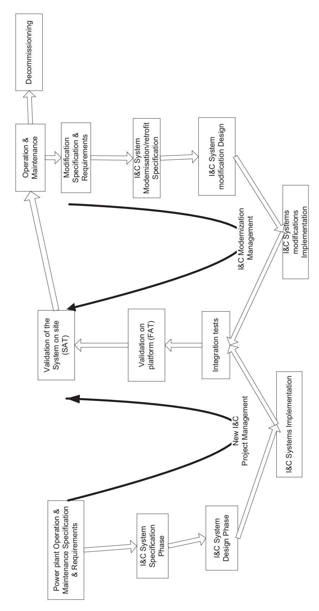

*FIG. 43. I&C project management.*

- The interaction with the licensing bodies. A specific characteristic of a nuclear plant and consequently of the I&C system — is the safety requirements. Therefore, interaction with the safety authority bodies must be identified from the beginning of the project;
- The quality management plan, which defines the quality management measures for the whole I&C life cycle to ensure that the I&C system is planned, manufactured, installed and operated so with adequate quality level. A good quality management requires quality plans describing quality management measures from all parties: the utility, the vendor and the subcontractors. The quality management planning should envelop but not necessarily being limited only to the following quality planning aspects that are especially applicable for digital I&C systems:
  - Software quality assurance plan;
  - Software development plan;
  - Verification and validation (V&V) plan;
  - Integration plan;
  - Software safety plan;
  - Software configuration management plan.

The following IAEA documents — although primarily dealing with modernization projects — are applicable to new I&C projects: Refs [17, 18].

#### *2.5.1.2. Power plant operation and maintenance (O&M) specification and requirements*

The first step of the project is the identification of the requirements specification for the various functions required for operating and maintaining the process. This will contribute to the definition of the I&C functions and associated requirements as identified in the functional view (see Section 2.3.1), in its environment (process, operator and maintenance).

Two main activities are performed:

- (1) Functional analysis: Based on the plant process description, the functional analysis contains the definition of all the needed functions for operation and maintenance in different plant conditions (normal and abnormal). The analysis of the "process-oriented" functions can be done in a top-down approach, where the top level represents the most general or fundamental objectives of the plant (generation of electrical power, protection from radiological hazards). The lowest level represents very detailed functions, which will be implemented, among others, in the I&C system or will be performed by an operator.
- (2) Operational specification: Together with the functional analysis, the operational specification gives the basic philosophy of how the plant is intended to function in different conditions. At this stage, a task analysis is performed and the assignment of functions between human and system is done [19].

With new digital technologies used for HSIs, particular attention has to be paid to human factors acceptance by the operators [10].

The appropriate maintenance aspects of the I&C system have to be anticipated in the early stage of system design in order to ensure the following maintenance-related functionality:

- I&C system accessibility (especially during plant operation);
- On-line monitoring, alarming and event logging related to the I&C system performance, data networking and I&C system functionality;
- On-line maintainability;
- On-line software changes implementation;
- Configuration control;
- System administration;
- Sufficient scope of manuals, procedures and instructions for I&C system maintenance and administration;
- Maintenance requirements, such as hardware calibration, software backup, disaster recovery (in the event of total system failure), etc.

#### *2.5.1.3. System specification*

The system specification describing what is expected from the I&C system, as a basis for the collaboration with the I&C supplier, can be split into two parts. The first one is the detailed functional specification, which is the description of all the functions that must be implemented in the I&C system in order to comply with the O&M functional specifications. As a minimum requirement the detailed functional specification should define the following:

- Scope of input signals for each functionality (inputs from the process, signals from the process data base);
- Definition of algorithms/logic using input signals, constants and manually entered values;
- Scope of output signals (algorithm outputs, calculated values, output signals to the process);
- Basic HSI specification related to the HSI features associated with subject functionality;
- Functionality acceptance criteria requirements to be validated during the factory and site acceptance testing;
- The second one is the requirements specification, which covers:
- The I&C requirements in response to the O&M functional requirements (response time, accuracy, uncertainty, set points, etc.);
- The requirements for the development process from the basic design to the validation phases. Special attention should be paid in an early stage to identifying the rules, regulations, codes and standards to be followed during the implementation, as well as to the documentation provided and needed by different parties during the whole I&C life cycle. Particular attention has to be paid to qualification and validation;
- The requirements for environmental endurance (EMI, seismic, etc), and its operability and maintainability according to the safety importance or category of a given item. (Fault-tolerance, separation, redundancy, diversity, reliability, availability, testability, etc.).

Developing the requirement specification has proven to be the most important phase in all I&C projects. Therefore, care should be taken to ensure that the specification is as complete, sufficiently detailed and comprehensive as possible, covering all plant states and assumed abnormal conditions.

Although focusing more on upgrades using digital instrumentation and control systems, Ref [20] contains detailed information on the requirements specification covering all the phases of a project, and so can be referred to also for new installations.

#### *2.5.1.4. Simulator specification*

Together with the specification of the I&C system, the specification of a simulator is highly recommended to be used for staff training before final commissioning of the plant (operator and maintenance teams) and for validation phases. Due to different environmental and technical circumstances the requirements for the simulator can be defined as a separate document.

#### *2.5.1.5. Bidding and contracting*

The recommendations presented in Ref [18] for a modernization of an I&C system are also applicable here for a first installation.

#### **2.5.2. I&C design phase**

The main principle in the design of I&C systems is to apply a top down approach with continuous refinements. It is advised to proceed as long as possible with a system independent functional design, where the HW platform and SW are selected after the design has stabilized. Typical I&C platforms offer now considerable flexibility but still have their own unique functionality, which may require additional considerations in the design phase.

The system design defines civil, mechanical, electrical and I&C characteristics of the plant system(s) enveloped by the subject system design and gives the design inputs for the detailed design activities of the I&C system. The system design should provide the detailed consideration of design inputs or detailed design requirements, and two types of design analyses documents: engineering design impact analyses and design analyses specific for digital I&C systems.

Design analyses that are especially specific for digital I&C systems as found to be applicable are as follows:

- I&C system redundancy analysis;
- I&C system defence in depth and diversity analysis;
- EMC design analysis including grounding and shielding concept;
- Software safety/risk hazard engineering analysis;
- Analysis of the CMF (common mode failure) potential;
- I&C system credible failure mode analysis (single failures, CMF, failures associated with interfacing systems, abnormal conditions, double failures, etc.);
- FMEA (failure mode and effect analysis) and FTA (fault tree analysis) related to the SSC and/or monitored by the I&C system;
- HSI (human system interface) and HFE (human factors engineering) analysis;
- Analysis of the I&C system software design & development process (from the QA point of view);
- Analysis of the I&C system security features/requirements and administrative control;
- Analysis of the I&C system configuration control;
- I&C system signal accuracy analysis.

The system design should be fixed, written in the format of reports or engineering analyses and then passed through the necessary review and verification phases. If necessary, a revision phase shall follow. After this iteration, the system design should be frozen and released for the next project phase. With regard to I&C design issues see Refs [19–21].

#### *2.5.2.1. Detailed design*

The system design is the basis of the next step in the project design phase and for that reason the elaboration of the detailed I&C system design should not be started until the system design is finished and released. I&C system design should envelope preparation of drawings, preparation of software documentation (detailed software functional specification, software design specification, software programming — algorithms and HSI), installation and commissioning instructions and test plan including preparation of test procedures for software V&V and system/plant start-up testing [8].

#### *2.5.2.2. As-built documentation*

During the I&C installation and commissioning phases, appropriate design change procedures and configuration management should control any modification to the original, detailed design. After closing the commissioning phase, all these modifications should be re-traced and the detailed design documentation should be updated to reflect the actual as-built plant conditions.

#### **2.5.3. Qualification of I&C equipment**

Qualification is the acceptance process of assessing and determining the suitability of a pre-developed or preexisting equipment (i.e. product or component) or a final realized I&C system design for a specific nuclear application or use.

Product (or pre-developed component) qualification is typically done very early in the I&C development process.

System qualification on the other hand is a confirmatory process that supports the licensing process and establishes (with summary evidence from the various phases of the development process) that the integrated I&C system, which may include qualified commercial off-the-shelf (COTS) products, fully meets its requirements and is ready to go into service.

The qualification process determines (based on tangible evidence) whether or not a piece of equipment meets a set of qualification requirements for a specific application by:

- Establishing the qualification requirements in the intended application/use, including specific suitability requirements that should be met;
- Assessing the ability of the equipment to meet these requirements by applying appropriate methods for qualification, i.e., for screening, selection, evaluation, and acceptance. This may include the review of the design documentation for compliance with suitable requirements, type testing, or analysis. This will include a documented and defensible assessment, supported by evidence, that the design is correct, and will reliably meet (or can be made to meet) the identified qualification requirements.

#### *2.5.3.1. Programmable electronic system (PES) product qualification*

Qualification of equipment that is or contains a programmable electronic system (PES) must address the particular failure modes and vulnerabilities of digital electronic equipment, including the effects of both systematic and random faults on the products ability to perform any functions important to safety that are allocated to it. Such equipment may be vulnerable to temperature, vibration, accelerated ageing, life-limiting components, humidity, dust, or electromagnetic emissions/immunity. There may also be common mode failure considerations, human factor considerations, maintainability considerations, performance (e.g., determinism) considerations, or the need to fail safe or fail detected. The qualification of PES products (including pre-developed COTS products) must cover both hardware and software, and consider the system effects of their interaction (e.g., the response of the software given a random hardware fault):

- Hardware qualification is based on functional and environmental testing as further detailed in Section 3.2.4. Environmental qualification is required for safety system instruments that are subject to harsh conditions. Seismic qualification may also be required in given situations;
- Software qualification is based on a qualitative evaluation of the confidence in the software quality; it is based on the analysis of the design, development, verification and validation and QA of the software.

International nuclear I&C standards are used to develop the reference requirements for qualification. In particular, the International Electrotechnical Commission (IEC) has issued a family of standards, which provide comprehensive guidance and specific requirements for the design of safety-related I&C systems using the fundamental principle of graded requirements based on the safety significance of the functions being performed. The following are the primary reference standards to be considered:

- IEC 61513: 2001, Nuclear Power Plants Instrumentation and Control for Systems Important to Safety General Requirements for systems [22] ;
- IEC 62138: 2004, Nuclear Power Plants Instrumentation and Control Important for Safety Software Aspects for Computer-based Systems Performing Category B or C Functions [23];
- IEC 60880: 2006, Nuclear Power Plants Instrumentation and Control Systems Important to Safety Software Aspects for Computer-based Systems Performing Category A Functions [24];
- IEC 61508: 2005, Functional Safety of Electrical/Electronic/Programmable Electronic Safety-Related Systems [25];
- IEC 61226: 2005, Nuclear Power Plants Instrumentation and Control Systems Important for Safety Classification of Instrumentation and Control Functions [26];
- IEC 61000-6-5: 2001, Electromagnetic Compatibility (EMC) Part 6-5: Generic Standards Immunity for Power Station and Substation Environments [27];
- IEC 62003 Ed. 1: 2009, Nuclear power plants Instrumentation and Control Important to Safety Requirements for Electromagnetic Compatibility Testing [28].

In the USA, two guidelines are available to assist with the qualification process:

- EPRI TR-106439: 1996, Guideline on Evaluation and Acceptance of Commercial Grade Digital Equipment for Nuclear Safety Applications [29];
- EPRI TR-107330: 1996, Generic Requirements Specification for Qualifying a Commercially Available PLC for Safety-Related Applications in Nuclear Power Plants [30].

Commercial grade COTS products that were not developed to an appropriate life cycle functional safety standard may still be used; however, it becomes increasingly more difficult to qualify them for classes of higher importance to safety. In such cases, more qualification effort must be put into establishing development standard "equivalency" arguments, detailed assessment of the design, additional (complementary) testing, proven-in-use (operating history) evidence, and in some cases, product modifications.

Analysis and feed-back of in-service usage experience (referred to as "proven-in-use" or "operating history" evidence) can also be very helpful for increasing the confidence in the product or system and establishing that it operates correctly as specified and in a manner that meets the qualification requirements. Statistical testing may also be used to gain confidence with COTS applications, although for systems with significant reliability claims the number of unique tests will be significant. (See Ref [10] for more detailed requirements.)

#### **2.5.4. Managing the manufacturer or supplier scope**

#### *2.5.4.1. Procurement process*

It is highly recommended that during the preparation of the request for proposal, specific requirements be included for the vendor to support the qualification of any pre-developed COTS products (particularly programmable electronic system components) that are to be included in the scope of supply. This may be in the form of requirements to provide access to product certification reports, product design specifications, test reports, information on the development, QA process, product operating history data, or access to the product development team etc., as needed to ensure a successful qualification. The qualification process and requirements should also be clarified at this time.

#### *2.5.4.2. Factory acceptance testing*

The purpose of the factory acceptance test (FAT) is to assure that the system complies with all requirements as defined in the contract document prior to shipment to the plant. A completely assembled system should be operationally and functionally tested at the supplier's factory in the presence of the buyer's representative. This test should demonstrate that the hardware and software perform the intended functions in accordance with the specification requirements. FAT is one of the most important phases of the project. It is the last chance to solve any problem in an environment more favorable than on site.

#### **2.5.5. I&C systems on-site**

#### *2.5.5.1. Site acceptance testing*

The purpose of the site acceptance test (SAT) is to verify that all I&C systems operate properly under the field environment and have not been damaged during shipment. The initial SAT should be done using simulated inputs and without impact on the process (no connection to valves, pumps) but all output functions should be monitored to ensure correct responses and that no unexpected actuations occur.

Typically the SAT includes many of the tests performed during the FAT to ensure nothing has failed during transit to site, but should primarily be directed to those functions not testable under FAT. For example, with large, multi-train systems practical constraints may limit the FAT to module or single train testing and the SAT is the first opportunity for full integration and/or connection to other vendors equipment.

The SAT should also include tests that demonstrate compliance with equipment specification and or failure modes; for example, that the system performs correctly at its lowest specified operating voltage, that no unexpected output actuations occur during or post power supply application or loss.

#### *2.5.5.2. Commissioning tests*

The purpose of the commissioning tests is to verify that all I&C systems operate properly when connected to the process. It includes final operational testing, and validation of long-term performance of the I&C.

At the end of the implementation, as-built documentation, reflecting the "as commissioned" state of the I&C system has to be provided. This final documentation should contain sufficiently detailed information to permit contracting with third party for the system maintenance if needed.

#### **2.5.6. Training**

For the success of the project, it is important that the operators and the maintenance team get familiar with the I&C system in time.

A preliminary review of the I&C platform by station staff is very useful for training the operators and getting their feedback early in the design phase so that their opinion can be taken into consideration in the final design if needed.

Training of maintenance staff should be initiated in sufficient time to allow effective participation during the FAT; their training should be fully completed well before the SAT and commissioning.

Reference [16] proposes some training considerations related to I&C modifications, but are also applicable for a first installation.

#### **2.5.7. Operations and maintenance**

#### *2.5.7.1. Calibration, repair, replacement*

The I&C of a power plant is a system, which is needed throughout the plant's life in all possible operating modes. This includes the periodic cycles of plant start-up, plant operation, shut-down, and maintenance/refueling outages. These various phases may require the adjustment of parameters, set points, and limit values in order to set new values for the group of parameters appropriate for the given phase and to make necessary re-calibrations (i.e. calibration of reactor power during the start-up phase). These adjustments are normally executed either by shift personnel/operator or by automatic functions. For these operational actions, modern digital I&C platforms show significant advantages as compared with conventional analog systems. Special aspects are:

- Simple and safe handling by use of screen masks easily comprehendible;
- Possibility of automatic generation of records.

Modern I&C systems are not generally amenable to the traditional time based maintenance regimes used in the mechanical systems of the plant, where there are known degradation mechanisms. For example, motor/pump bearings can be replaced prior to expiry of anticipated running hours. However, digital I&C systems are typically subject to random failure and hence their normal running regime would be "run to failure" (i.e., operate them until they fail). Therefore, it is not appropriate to just replace electronic components in anticipation of failure, because the replacement process itself may induce failures (possibility of "infant mortality" of the new components and/or maintenance induced faults). These may have an overall detrimental effect on the I&C system's availability, as compared with "leave as is".

Because of the random failure nature of modern I&C systems, they are normally designed highly redundant and therefore fault tolerant. However, it will still be necessary to rectify/replace a defective component in a timely fashion to ensure that overall reliability is maintained. It is therefore very important that a good spares inventory is maintained at all times. Typically, the required inventory would initially be based on the following information:

- Number of each component type installed in the plant;
- Number of each component type currently held in stock;

- Design value of "mean time to failure";
- Assumed value of "mean time to repair".

These values would be modified over station's lifetime based on the comparison of actual failure rate statistics obtained during the operation versus the original design values.

During plant operation, the occurrence of hardware faults and defective modules must be taken into consideration too. Modern digital I&C systems often have built-in self testing routines and so module-faults can be automatically identified in most cases through special annunciations or alarms. If the hardware failures are not "self-announcing", they will be detected during periodic tests by the operator or maintenance personnel. If a defective module is detected and identified, necessary corrective actions must be taken.

The repair or replacement of defective modules normally has to be executed by the manufacturer. After repair, the module has to be tested again for correct functioning. It is imperative that the repair report identifies the detail of the fault found, and lists items replaced together with the tests completed to demonstrate functionality. It is particularly important that the replacement is done on a "like–for-like" basis, that is, the manufacturer must not take the opportunity of upgrading components or introducing new product lines, unknown to the utility, as this would invalidate the qualification of the module and in the worst case may not perform its desired safety functions or may introduce security vulnerabilities. Particularly for digital systems, planned firmware and software upgrades may also unintentionally introduce vulnerabilities/attacks [19].

#### *2.5.7.2. Ageing and obsolescence management*

The I&C systems have the potential to cause deterioration of operability and maintainability because of ageing and obsolescence, two root causes that have different characteristics but are closely related. The obsolescence risk is also critical with new I&C systems because of the shorter and shorter lifetime of new digital technology.

As the I&C systems provide the vital support for the safe and economic operation of NPPs' and their functions have to be sustained throughout plant life, an ageing and obsolescence management program must be developed at the start of the project.

The basic management process involves:

- Understanding the ageing and obsolescence phenomena and identifying the (potential) effects on I&C;
- Addressing the specific impact of these effects on the plant taking into account operational profiles and analyzing the risks;
- Carrying out necessary mitigating actions to counteract the effects of ageing and obsolescence.

Based on the above listed activities the ageing and obsolescence management program needs to be an iterative process.

See Refs [31–33] for more details on this subject.

#### **2.5.8. I&C modifications**

#### *2.5.8.1. Strategic plan*

During the lifetime of a nuclear power plant, I&C systems and components will most likely need to be modernized or replaced one or more times, due to the relatively rapid obsolescence of these parts. Refs [17] give good guidance on the modernization of nuclear power plant instrumentation and control systems. Ref [10] provides guidance on control room modernizations involving hybrid control rooms.

Utilities will consider what strategy is the most efficient for the I&C modification project. Two main approaches may influence this decision:

- The "defensive" approach is guided by the constraints, such as:
  - evolution of industrial or licensing environment,
  - increase in I&C maintenance costs,

- obsolescence or ageing,
- loss of knowledge or design basis on existing systems.
- The "offensive" approach is set up by the advantage of new systems, such as:
  - functional improvements (advance design feature, new technology, etc.),
  - performance enhancement (accuracy, power output, availability, etc.),
  - O&M costs reduction (on-line monitoring, diagnostic, standardization, etc.).

Both defensive and offensive strategies can also be considered together to optimize the overall investment necessary for I&C modifications.

Whatever the strategy is, the utility has to consider two aspects:

- The *risks* introduced by the modification (installation environment, existing data availability, new system characteristics, licensing efforts, etc.);
- The *cost* of the modification for the remaining lifetime (costs of the new system, production unavailability, human resources, maintenance, etc.).

For selecting the best approach, a feasibility study has to be set up in order to establish the strategic plan optimized to specific plant conditions. Once the decision is made, the utility enters a real project process with main steps similar to the first system installation. The main difference is in taking existing systems and power production needs into account.

#### *2.5.8.2. Project execution*

The project team should recognize the current conditions of existing I&C systems, and structure a concrete justification for I&C systems that need to be modified in order to evaluate existing I&C systems and prioritize the systems needed to be modified.

The review of the current plant state should where possible involve the original equipment manufacturer (OEM) to establish which modules/components are obsolete. All obsolete items should be graded to establish which are the most sensitive, based on difficulty to replace and/or plant impact if unavailable.

There needs to be a life-of-plant plan for each system that should consider the following:

- How many times each system will be replaced/modernized over the anticipated life of the NPP;
- The strategy for modernizing, for example total replacement versus module based re-engineering. It may be beneficial, practically or financially desirable to opt for the latter in the short to mid-term;
- The plant state that is required to allow implementation, e.g. at power or during an outage;
- How long the installation will take (if it is outage dependent it may become a critical path activity).

Once a life of plant plan has been established for each plant system, it will be necessary to consider how the system upgrades will interact with each other, which ones can be carried out in parallel, which ones are serial, and the resource requirements for each. (See Refs [8, 17, 18, 20])

# **3. CURRENT CHALLENGES**

#### 3.1. INTRODUCTION

A Technical Working Group on Nuclear Power Plant Instrumentation and Control (TWG–NPPIC) operates within the framework of the IAEA's Nuclear Power Engineering specialty. One of the roles of the TWG-NPPCI is to assist the IAEA in identifying areas in the I&C field that are of common interest for the majority of the Member States. The TWG-NPPIC holds periodic meetings and elaborates a list of recommendations with items to be considered in future IAEA activities.

The current section identifies and discusses the issues that were considered the most significant ones by the TWG-NPPIC and the contributors to drafting of this document at its compilation time. This list is not exhaustive and will further evolve as technology and other factors change. The term "significance" here includes plant safety significance as well as economic significance, although they are sometimes closely interrelated. Throughout the section appropriate reference documents for additional details are identified.

The intent of this section is to increase awareness of the most important I&C issues of today by those who are involved in planning, managing, and making decisions on modern I&C projects.

There have been many successful projects which clearly demonstrated that state-of-the-art technologies are mature enough for use in high-integrity applications. The benefits of the new technologies are widely recognized. The issues discussed in this section may tend to become risks when they are not taken seriously and addressed proactively. Many of the issues here are not necessarily new. They have been discussed in various literature, and much guidance has been developed.

Most of the issues discussed below pertain to digital technology. There are unique aspects specific to digital technology such as software design errors as a potential for common cause failures, the effect of concentrating many functions into a single computer on plant design for defence in depth, cyber security, software quality and reliability, and hybrid control rooms. However, as other industries have demonstrated, the benefits of digital technology would be much greater than the cost of addressing the issues listed below when they are understood at the early stage of the project and dealt with in a systematic manner.

### 3.2. INTRODUCTION OF NEW TECHNOLOGIES

#### **3.2.1. Transition from analog to digital technology**

The specific benefits of digital technology include, but are not restricted to, improved accuracy, absence of drift, ease of implementing complex functions, data correlation from multiple distributed sources, high capacity date storage, diagnostics and fault correction, improved HSI, flexibility and many other capabilities arising from the unique features of digital I&C systems. A successful deployment of digital I&C technology would result in both safety and economic benefits. (See also Ref. [20].)

#### *3.2.1.1. Fundamental differences between analog and digital technologies*

There are many characteristic differences between digital and analog I&C systems. At a fundamental level, the implementation of functionality is generally very distinct between the two technologies. For digital I&C systems, signals are sampled and digitized, and the data is then transmitted and typically processed sequentially as part of aggregated functions within computational modules. Conversely, analog I&C systems respond to instantaneous values of continuously varying signals, and the information is propagated and processed in parallel as part of separate functions embodied in discrete, dedicated components.

Whereas simple functionality can be realized in simple analog components based on fundamental physical response characteristics, implementation in digital processing components tends to be through abstraction of the desired physical relationships between inputs and outputs. The instantiation of functions using digital technology is typically accomplished through software representations or embedded logic within a gate structure. The functional density and flexibility of implementation that can be achieved can result in a high degree of complexity. A small software module can exhibit enough complexity to make a full verification of its correctness practically impossible. The implication of this is that for large, complex, software-based systems there is some probability that an unforeseen error, not discovered during the V&V process, may disrupt its function in a crucial situation. Furthermore, large, complex, software-based systems may contain unidentified vulnerabilities that make the system subject to possible attack and compromise. These potential unreliability and security concerns cannot be remedied by the use of redundancy, as the software is perfectly replicated in each of the redundant channels. Even the use of software diversity cannot be considered as providing sufficient protection because the requirement specification may be the ultimate cause of a software error.

A typical characteristic of digital I&C systems is that important functionality is integrated into single processors or modules, which means that certain performance parameters such as transmission speed and response times may deteriorate with a growing size of the I&C system due to higher processing loads. This characteristic can, if not controlled properly, have negative effects on important plant or I&C functions such as the quality of closed loop control and reaction times of the HSI.

Another important characteristic of digital I&C is timing sequences. Very small differences in the timing can cause different behaviour in a digital I&C system due to the execution paths of the software. This characteristic makes it very difficult to predict exactly how a system composed of several computers or processor modules will behave in a certain sequence of input conditions and execution profiles. This difficulty applies both to internal transients such as start-up, voltage transients and internal failures and to external transients triggered by process events.

An additional characteristic of digital I&C systems that should be taken into account early in an I&C project is the testability of modules and functions. Due to the inherent complexity of the digital I&C systems, it may be impossible to test all aspects of the system. This implies that confidence in the system has to be built from the beginning of a new system development or modernization project through extensive V&V activities in which testing (modules and functions) is an important part of quality assurance.

#### *3.2.1.2. Approach to implementation*

The specific benefits that may be realized in a digital upgrade project depend on the project scope, which may range from a simple component-by-component replacement of analog sensors, controllers and actuators with digital devices having similar core functionality, possibly to address issues of obsolescence, to a more complex project involving migration to a partly or fully computerized control room that incorporates added functionality and a modern HSI utilizing overview panels and seated operator work stations based on video display units (VDUs) implementing high density information displays and soft controls.

The use of a higher level of computerization provides the possibility for inclusion of new functionality, such as data validation and integrity identification, alarm reduction/prioritization, automated safety system monitoring/testing, process performance evaluation (e.g., heat exchangers, chemistry), computerized I&C system documentation, computerized procedures and outage management. In modern designs, system behaviour is largely configured via data specifications. This reduces the risk and cost associated with the development of custom software and allows the user to have greater control of behavioural attributes of the system, including data features, and the configuration of system health checks.

For implementation, the methodology most widely used is a phased approach to changing the control room and the associated I&C systems. Among the methods used are phased I&C upgrades using existing operator interfaces, followed by changes to upgrade the operator interfaces, and also the phased approach using system level changes to both the I&C equipment and associated operator interfaces at the same time.

Although this phased approach causes numerous intermediary stages of overall system architecture with subsequent performance, and also makes for more effort involved in the human factors implementation (multiple stages of digital and analog operator interfaces), it allows for the overall work to be performed in manageable sections. This allows for the maximum effort to be applied to each upgrade to ensure proper design and implementation, and also allows for learning phases to guide towards the final stages of full I&C change out and full systems integration.

#### **3.2.2. Rapid evolution of digital technologies**

#### *3.2.2.1. Increasing chip density*

The use of deep sub-micrometre technologies can have a negative impact on long term reliability of electronic equipment. They tend to be more susceptible to single event effects (i.e., changes of state caused by ions or electromagnetic radiation striking a sensitive node). There are different categories of single event effects. A single event upset does not permanently damage a transistor's or circuit's functionality, unlike the case of single event latchups, single event gate ruptures, or single event burnouts. A single event upset would only toggle the state of one or multiple transistors. Incorrect data values could arise from this toggle, and that could lead to immediate or delayed failure. However, the hardware would not be permanently damaged; re-initializing the system would erase all deleterious effects of the single event upset. In contrast, single event latchups, single event gate ruptures, and single event burnouts may lead to a permanent failure of the hardware.

Considering problems related to electromagnetic compatibility (EMC), the level of integration at the chip level has an impact in two areas:

- Increased electromagnetic emissions by the device itself, due to the increased operating frequencies and transient currents, as well as decreased switching times;
- Increased electromagnetic susceptibility: supply voltage reduction; reduced noise and delay margins.

As a consequence, the use or integration of new technologies shall be practiced with particular care and with attention to the above described phenomena.

#### *3.2.2.2. New platforms*

In order to extend the lifetime of their nuclear power plants, most utilities are facing difficulties in maintaining the existing I&C systems and are seeking means to implement modernization in a cost effective way, such as by avoiding a total replacement of the I&C system, if possible (e.g., replacement of only obsolete components, replacement of only a module or set of modules within a rack, etc.).

For the time being, systems proposed by I&C suppliers are mainly commercial-off-the-shelf (COTS) systems and microprocessor-based products. These digital products provide advantages (e.g., capacity to support as many functions as needed in a standardized hardware), but some drawbacks must be considered. Among those is the fact that the development of microprocessors is not driven by the nuclear industry but by the consumer goods (such as personal computers) and other high-tech products markets. This condition introduces some disadvantages for nuclear utilities (e.g., more complex components and system software layers, unused functionalities, components more and more difficult to qualify, and very short lifetime). In the context of an ever increasing rate of change and innovation in digital technology, I&C suppliers for critical applications in NPPs must address this concern.

As a result, utilities and I&C suppliers are now more often considering other technologies, such as field programmable gate array (FPGA), complex programmable logic device (CPLD) or application specific integrated circuit (ASIC) technology that is already used in other, high-integrity industries (aeronautic, aerospace, etc.). There are successful examples of the use of such technology today in Class 1E nuclear safety systems. At present, there are a few nuclear qualified FPGA-based Class 1E safety system digital platforms. The use of such standardized hardware components dedicated through the hardware configuration description, instead of the microprocessor and system software layer, provides the advantages of both dedicated hardware-based and software-based systems without their respective main drawbacks.

The achievable properties of these programmable logic components are the following:

- Reliability of integrated circuits for design and manufacturing processes of the I&C components;
- Long term availability based on a limited set of components (family) that can be used to implement a large variety of electronic functions;
- Ability to move functions to the new technology, if necessary, with less effort (as a result of the use of standard hardware languages such as Verilog or Very High Speed Integrated Circuit (VHSIC) Hardware Description Language (VHDL));
- The current capacity (number of cells) can accommodate large functions as well as robust design architectures;
- Only the necessary functions have to be implemented in the hardware component, making the qualification effort easier.

From the utility point of view, a strategy of partial renovation (with limited performance upgrading, but with no impact on operation, or cabling) can be used to:

- Refurbish existing, first generation electronic I&C boards, where application functions are embedded in the hardware design. This takes advantage of the ability to pack existing designs in simplified hardware while implementing the same functions;
- Refurbish existing, second generation, microprocessor-based I&C boards, where an IP (intellectual property) core for popular 8-bit and 16-bit microprocessors can be implemented, for example, in an FPGA.

From the I&C supplier's view, these programmable logic components can be considered as a feasible and proven technology to design new safety-related I&C systems, especially considering the fact that many computerbased product components (e.g., those containing microprocessors) are typically not intended for critical industrial I&C applications, and are therefore harder to qualify.

These new hardware based technologies can now be independent of the rate of change in digital technology, thanks to the portability due to the standard hardware languages (e.g., VHDL or Verilog).

Despite the attractive features, the use of such programmable logic devices in safety-critical systems for nuclear power plants is relatively new in many countries and the regulatory background may not yet exist. Recent examples of this technology being licensed in safety-related systems (including Class 1E trip systems) can be found in the USA, Ukraine, Russian Federation, France, Bulgaria, China, Canada, Republic of Korea and Japan.

The International Electrotechnical Commission (IEC) is preparing a standard dedicated to complex electronic components (CEC). The draft standard proposes to address:

- A general approach to CEC selection and/or development to assure the production of the highly reliable components required, including hardware and software interdependencies;
- Guidance for the analysis, selection, and use of pre-developed CEC;
- Rules for the design phases (e.g., with hardware description language);
- A general approach to CEC verification and to the corresponding aspects of the I&C system integration and validation;
- Procedures for CEC modification and configuration control;
- Guidance for the selection and use of software tools used to design and verify CEC.

At the same time, some issues still remain open, such as:

- The development of hardware and software qualification methods for ASIC/CPLD/FPGA;
- The use of formal methods for complex designs;
- How far is reverse engineering an option and how to find criteria for a repeated design.

#### **3.2.3. Human interaction issues and hybrid control rooms**

Modifications to the I&C systems may change the allocation of functions between human and machine. These types of changes can have broad effects on crew coordination, procedures, training, and the amount of information needed at the work posts. Any change to the HSI should therefore be handled with care, particularly if new functionality is involved. An endpoint vision is needed to define the functionality and "look and feel" for the control room, and to provide a unifying idea for the preparation of operation and maintenance requirements and design specification documents, as well as to direct incremental changes.

During the planning for a modification, some level of function analysis and allocation should be performed to define the performance requirements for new equipment, such as response times and information availability. The scope of the analysis should include all functions for which the existing equipment is used and functions for which the new equipment will be used.

The design of the control room and HSI is a result of an iterative process of the assignment and analysis of functions and tasks. Functions are defined first, and may be implemented by automation, humans or a mix of the two. Operator tasks needed to accomplish each function are then defined. Opportunities exist to use differing levels of automation in an effort to combine human and automated system capabilities in a complementary manner. Historically, such decisions were mainly based on available technologies. That is, a function that could be costeffectively automated was automated. Tasks that could not be automated were performed by personnel.

However, increased automation is not always the best approach from the standpoint of human performance and can lead to deteriorated performance due to any of the following:

- Change in roles, responsibilities, workload and skills required from personnel;
- Deterioration in operator understanding of automation, making it difficult for operators to properly monitor and supervise plant operation;
- Deterioration in operator awareness of overall plant operations;
- New types of human errors (e.g., mode error, where operator actions are based on an incorrect assumption regarding the operating mode of the system).

A further complication is that, when modernizing or replacing obsolete equipment, it is easy to concentrate only on the mere "functionality" of the equipment and therefore fail to take into account consequential effects of the change. This impact can include different behaviour characteristics arising from the loss of inherent properties of the old equipment that the new equipment may lack, or changes in perception and cognitive load for the NPP operators caused by new demands and altered responsibilities associated with the new equipment. A true one-toone replacement is rarely achieved.

The list below mentions some important issues concerning modifications to the HSI, especially in relation to hybrid control rooms:

- HFE evaluation of risk-important operator actions or tasks (e.g., assessing the status of the critical safety functions, operator actions credited in the licensing basis, and those identified as risk-significant in the probabilistic safety analysis) should be performed to identify transitions between interface technologies, to evaluate the risks and to recommend appropriate HSI design modifications;
- Proper planning of the project, involving all stakeholders from the utility, design organization and regulatory authorities is needed;
- Development of an endpoint vision for the control room is essential based on appropriate levels of operator philosophies that define functionalities and "look and feel" for the control room;
- Development of a migration strategy should be performed to ensure that the plant continues to operate safely and effectively at each step of the modernization project;
- Increased training burden may occur when ensuring operators remain proficient with old interfaces that are retained, while gaining proficiency in the use of new interfaces;
- Ensuring vital information is easily accessed or always presented should be provided;
- Inconsistency in design or operation between different systems (e.g., one system still analog, the other system converted to digital) or between different sections of the interface may occur when these must be used together to complete a task;
- Compromises may emerge in the design to accommodate old and new technologies. (For example, attempts to set lighting levels high enough to make remaining analog gauges readable but not too high for recently installed VDU displays);
- Deactivated controls and/or indications (i.e., controls/indications left in place but non-functional) may cause operator confusion;
- System / functional groupings of controls and indications may change in hybrid designs;
- There may be differences in the level of automation between analog and digital implementations and operator support for the human-automation interaction;
- Hybrid alarm systems or different implementations of alarms between analog and digital systems may cause additional cognitive load;
- Hybrid procedure implementations, where some procedures are converted to a computer-based format but others are not, may cause difficulties;
- Differences in failure modes between analog and digital HSIs will occur;
- Operator training is needed to ensure adequate operator understanding of increasingly complex automated systems and inconsistencies between conventional and new HSI (hard and soft controls);

- Situational awareness, workload, crew communications are important;
- Automated system design features should be applied to combat crew error.

Further discussion of the possible scope, benefits and risks, as well as the planning and execution of digital upgrades is provided in Ref. [10].

#### **3.2.4. Qualification of new technologies and components**

Qualification is the state of a component or product being capable of meeting its intended purpose, particularly from a functional safety perspective of its service under specific environmental conditions over a specified lifetime. Certainly I&C products and components important to safety that are used in nuclear applications must be qualified for their specific safety functions and context of use. Qualification of I&C equipment must be considered as an ongoing part of its life cycle requirements as mentioned in Section 2.5.3. (See also Ref. [8].) Within a known life cycle, qualification is confirmatory, and consists of three basic steps:

- (1) Confirming a product or component is suitable for use in a given application (i.e., suitability qualification).
- (2) Confirming there is adequate evidence of correctness (i.e., assurance the product or component will do what it is specified to do for its expected life and service conditions and with adequate reliability). This evidence is usually provided by "proven-in-use" operating history data or, if this data is not available or is insufficient, complementary testing.
- (3) Ensuring the conditions necessary for proper in-service use are clearly documented (i.e. related to configuration, operation, test, and/or maintenance issues). This is sometimes referred to as "documentation for safety".

With regard to the first of these steps, often suitability qualification must address two different issues:

- Will the item perform the needed functions (i.e. is it functionally suitable for use in a given application)?
- Will it perform these functions over the full range of environmental conditions that may exist when the functions are needed?

The above mentioned two types of functional suitability qualification are called "functional qualification" and "environmental qualification".

#### *3.2.4.1. Functional qualification*

For traditional technologies the functional qualification strategy is to design the item for the function, confirm the design using physics-based or logic-based models, and to demonstrate that an actual item (i.e., a representative sample) functions properly under the conditions that are most likely to cause failures. This final step is sometimes called a qualification test. It is easy to imagine how this strategy works for a hardware amplifier, or a boiler pressure vessel.

This strategy is less effective for highly complex items, or items that rely on logical components (e.g., software). Consequently, life cycle process quality is an important consideration in the qualification of modern technology. This paradigm shift creates new difficulties, many of which relate to the subjective nature of the assessment of the link between process compliance and product quality. As a result, research into more effective strategies and controversy about the need to and means of evaluating life cycle process continue.

The use of new technologies in safety applications depends on the existence of an agreed-upon functional qualification strategy. New strategies must sometimes be developed to allow the use of a new technology. One example where this need is being discussed is the functional qualification of complex electronic devices, such as FPGAs. These are hardware devices so some believe that the traditional strategy is suitable. Others note that FPGAs must be configured for their purpose by using complex software and are not necessarily amenable to a comprehensive demonstration of qualification based on testing. As a result, functional qualification of the configuring or generating software is a new issue that must be addressed. Similar debates exist about other new technologies, such as wireless networks and smart transmitters.

Functional qualification methods must be known to work for real components as used in real applications. Thus it is unlikely that a new technology will be considered acceptable for nuclear safety usage before that technology and its qualification methods are demonstrated in less critical applications. Non-nuclear process control already widely uses many new technologies that are of interest to the nuclear industry. The nuclear industry should examine the industrial experience with these technologies when developing functional qualification methods while considering means to satisfy the requirements for establishing a safety basis for their use.

The regulatory approach to qualification of safety I&C components is similar in most Member States. For safety-related components, however, some Member States require specific qualification while others accept manufacturer's claims for functionality and performance. Where safety-related equipment is selected from an extensive set of well-established vendors with sound, documented experience, and from a market where information about problems is widely shared and where there are significant market penalties for poor performance, the later approach is reasonable (see paragraphs 4.74-4.76 and Chapter 7 of Ref. [1]).

### 3.2.4.1.1. Commercial-off-the-shelf (COTS) products

There may be significant cost and availability advantages to using commercial products in NPP I&C systems, instead of products specially developed for nuclear applications. The development cost of commercial products may be amortized over tens-of-thousands of users rather than tens of units. This may reduce cost or allow more effort to be applied to product development, verification, and testing. Commercial products and the companies that make them have known track records that indicate the confidence that may be placed in the quality of both the product and the developer. Often there is extensive field experience that has driven design improvement. All other things being equal, the functional quality of a mature commercial product is often better than that of a one-of-a-kind system; even one built under the strictest quality assurance (QA) procedures.

Functional qualification of commercial products may, however, be more difficult because commercial development processes may be less well controlled or less transparent than those described in Section 2.5.3. If so, functional qualification of a COTS item must address these shortcomings.

In some Member States, functional qualification of COTS items is a significant element of the process known as "commercial dedication." Normally, this term also encompasses the concept that the organization that qualified an item must also notify regulatory authorities of any defects or non-compliances identified after that item is in nuclear safety service.

The typical approach to functional qualification of COTS items involves first identifying the critical characteristics required by its safety function, then using some combination of special tests, inspections, supplier evaluations, verification during fabrication, supplier history, and operating history to demonstrate that both the functions and the quality of the item are suitable for the intended service.

Qualification of relatively simple items may be heavily based on testing or inspection. For software-based items, a thorough evaluation of the development life cycle is often needed. Further tests, inspections, or operating history evaluation might also be needed to address gaps in the record of the development process. This may be expensive, but a new development is expensive too, and may not produce a better quality product. Functional qualification of complex items is often impossible without full cooperation from the vendor and sometimes necessitates that they disclose commercially sensitive information to the users. Many vendors are reluctant to invest the effort and time or risk disclosure of proprietary information. This often inhibits the use of COTS items for I&C safety functions.

A key consideration in the use of COTS for safety applications involves the potential impact of unintended functions and unnecessary functionality. There is a significant potential for unintended functions due to the complexity of the digital I&C system, especially when COTS equipment is used. A key element of an assessment process for high-integrity systems is the verification that system safety analyses have been performed and that the functions and characteristics important to safety that are applicable to a COTS component have been determined. It is possible to gain confidence from testing, examination of vendor testing records, and consideration of documented operating experience that these intended functions will be accomplished by the COTS component. Unfortunately, software too often behaves in unexpected ways, i.e., performs unexpected functions. Unexpected functions can be either unused functions or unintended functions.

Compared to a custom developed product, the COTS product is more likely to have extra features that may surface as unused or unintended functions in a safety system. It may be acceptable to use post-development testing to compensate for a major lack of product development documentation. However, testing (unless it is exhaustive) cannot confirm the absence of faults in software. Consequently, it is difficult to use testing to detect unintended functions given that the typical scope of software testing is insufficient to cover all possible states that the softwarebased system can assume. Nevertheless, testing can demonstrate that intended functions are implemented and that anticipated error conditions are handled properly.

While there are many challenges for accepting COTS products in safety application, it should be noted that COTS products may actually be of higher quality and reliability than products specifically developed for nuclear applications. Since the development cost of a COTS product is spread over a very large number of sales, the developer can afford to give more attention to improving functionality and to quality assurance. The difficulty with accepting COTS may, in many cases, not be with the quality and reliability of the product itself, but with the availability of the information necessary to demonstrate the quality and reliability.

Finally, COTS qualification might benefit from consideration of work in other industries that must also control significant hazards. After the Bhopal accident, the chemical process industry spent great effort to improve design safety and to formalize their safety processes. One outgrowth of this was a standard, IEC 61508 [25], "Functional safety of electrical/electronic/programmable electronic safety-related systems." This standard outlines design and life cycle requirements for systems important to safety. These are meant to apply to any industry, and are graded according to the safety significance of the intended function. Manufacturers design and build to this standard and third party organizations functionally qualify equipment to this standard. It is possible to use existing IEC 61508 [25] compliance evidence (e.g., certification to simplify qualification for nuclear power plant applications). In some countries, this is already a well-accepted practice.

#### 3.2.4.1.2. Reuse of nuclear qualified software

Software reuse, also called code reuse, is the use of existing software, or software knowledge, to build new software for similar or new systems. It may also be cost effective to reuse qualified software for a purpose different from the original intent. The qualification process in this case is similar to that for commercial-off-the-shelf (COTS) equipment, except that the product quality is already known.

For reused software it is vital to confirm that an item's functionality is completely consistent with, and has been qualified for, the needs of the new application. History and experience illustrate that software reuse has had challenges and issues for safety applications. A classic and well-documented example of the consequences of failing to qualify reused software is the loss of the first Ariane-5 launch vehicle ("Ariane 5 Flight 501 Failure, Ariane 501 Inquiry Board, European Space Agency, 19 July 1996 [34]). This launch vehicle was destroyed because a high-quality software module from Ariane-4 was reused without fully confirming that the software would properly respond to the input values in the new Ariane-5 application. Another often-quoted example of safety problems that arose from the reuse of software is the Therac-25 medical device. First, the Therac-25 medical device reused parts from the Therac-20. An unknown error existed in the Therac-20 software. The error had no serious consequences on the Therac-20 operation, except that it would occasionally blow a fuse. However, on the Therac-25, the error led to massive radiation overdoses and led to the death of at least two people. Software reuse was not the sole reason for the Therac-25 incident; however, it was a major contributing factor. (See Ref. [35] for more details.)

The above two cases provide representative examples where software reuse was not carefully evaluated, qualified, and implemented. As software becomes more complex and more widely used, the concerns of software reuse in safety-critical systems increase. Reuse is a viable option in many cases; however, it must be evaluated, qualified, and implemented with caution, although software reuse offers many benefits such as achieving rapid system development, saving resources and time, and so on.

### *3.2.4.2. Environmental qualification*

The objective of environmental qualification is to demonstrate the actual ability of an item designed to perform its safety functions at the end of its intended life without the potential for common-cause failures during, and after applicable accident conditions. Environments that must be considered include:

- Ageing due to thermal and radiation effects, and operational cycling;
- Vibration, both process and seismic induced;

- Atmospheric extremes caused by accidents including extremes of temperature, humidity, pressure, chemicals, condensation, and submergence;
- Radiation exposure caused by accident conditions;
- Electrical loading and signals;
- Electromagnetic and /or radio frequency interference (EMI/RFI) and power surges;
- Effect of smoke on digital equipment due to fire accidents.

Items may be qualified by type testing, operating experience, or analysis. The methods and complexity of the qualification process depend upon the environments, complexity of equipment, and importance to safety. In some Member States, the full range of qualification testing is not necessarily required for safety-related equipment, depending on the expected service environment. On the other hand, qualification of safety equipment for use in harsh environments usually involves both type testing and analysis. Often safety equipment undergo three different qualification programs: seismic, electrical (including EMI/RFI), and atmospheric / radiation. Ageing to simulate end of life conditions before environmental testing may be needed in any of these programs, and is almost always needed as part of qualification of safety items for harsh atmospheric extremes.

Design and qualification for harsh environments is expensive and the market for such equipment is small. Consequently, environmentally qualified equipment is expensive and many vendors consider the market too small to be of interest. New technologies that are more robust, or new plant architectures or I&C approaches that allow location of electronic components away from severe environments might significantly reduce environmental qualification costs.

Costs could also be reduced if the different regulatory authorities used the same criteria for evaluating environmental qualification. The use of different standards sometimes necessitates additional tests to qualify for use in different markets.

There has been some progress towards harmonizing environmental qualification approaches. For example, in 2005 the US NRC revised Regulatory Guide 1.180 [36] to accept either IEEE or IEC tests in qualification for certain EMI hazards.

Two sets of standards dominate the criteria for atmospheric and seismic environmental qualification: IEEE Std 323 [37] and 344 [38] and IEC Std 60780 [39] and 60980 [40]. IEEE and IEC have recently agreed to allow the possibility of merging related IEC and IEEE standards under a joint IEC/IEEE logo. The technical committees responsible for the environmental qualification standards are already working to harmonize these standards.

Most Member States do not require atmospheric qualification testing for safety equipment that sees essentially the same environment during normal and accident conditions.

#### *3.2.4.3. Maintenance of qualification*

Qualification activities do not end when qualification testing and analyses are complete. Continued attention is necessary during the plant's life to ensure qualification is maintained. Important activities include:

- Ensuring that the design of the installed item is traceable to that of the qualified item. This implies the need for the vendor to have configuration management during manufacture of the original item, replacement items, and spare parts used to refurbish the item;
- Ensuring that the item is installed in a manner consistent with the qualified configuration. Installers must be careful that field mounting is consistent with seismic testing and that electrical and process connections are consistent with the atmospheric testing. For some items proper orientation, installation of drains, or environmental sealing may be necessary;
- Ensuring that maintenance is performed as necessary to maintain the integrity of the installed item. This may involve required maintenance such as replacing items or internal parts before the end of their qualified life. It may also involve not reusing certain parts after they are disturbed during maintenance or surveillance, e.g., o-rings on electronic housing closures;
- Being always alert to new information that could affect the validity of previous qualification or that may require changes to the item or procedures for the item to ensure that it continues to be qualified in the future;

— Monitoring the condition of equipment using one or more condition indicators to determine whether the equipment remains in a qualified condition.

```
(See Refs [1, 31].)
```

#### 3.3. SAFETY, SECURITY AND LICENSING-DRIVEN ISSUES

The digital I&C related technology has found its way very rapidly and widely in other industries, but it has been adopted relatively slowly in the nuclear industry, especially in safety applications. This occurred generally due to the lack of confidence in the reliability of programmable devices, licensing uncertainty and the lack of welldefined licensing practices, cost and schedule, workforce knowledge, management and employee acceptance, and so on. Recently, however, many applications of the new, digital I&C technology can be found in the nuclear industry both for modifications and new construction. These systems are intended to improve functionality, reliability, and performance. However, the applications of digital I&C technologies raise unique or additional issues to which analog-based I&C systems used in the existing power plants are not subjected. These applications generate some key safety and security issues. The following are some major issues associated with the application of the digital I&C technologies in the nuclear industry:

- The defence in depth principle and protection against common cause failures;
- Verification and validation of software;
- Digital communication and networks;
- Cyber security;
- Safety assessment in the licensing process;
- Configuration management.

(See Refs [1, 41].)

#### **3.3.1. The defence in depth principle**

The primary means of preventing and mitigating the consequences of accidents is "defence in depth". Defence in depth (D-in-D) is implemented primarily through the combination of a number of consecutive and independent levels of protection that would have to fail before harmful effects could be caused to people or to the environment. IAEA NS-R-1 [42] *Safety of Nuclear Power Plants: Design* identifies five lines of defence in depth that must be included in an NPP design:

- (1) Prevent system failures and deviations from normal operations.
- (2) Detect and intercept deviations from normal operating states to prevent anticipated operational occurrences from escalating to accident conditions.
- (3) Control the consequences of accident conditions.
- (4) Confine radioactive material in the event of severe accidents.
- (5) Mitigate the consequences of radioactive release.

The design of a nuclear power plant also provides a series of physical barriers to confine the radioactive material. The number and type of physical barriers provided depends on the reactor design. For typical water cooled reactors the barriers are the fuel matrix, the fuel cladding, the reactor coolant system pressure boundary, and the containment. The fifth barrier is support for emergency response in the event of a significant radioactive release.

I&C systems support each of the above levels of defence in depth and each of the barriers identified above. In traditional I&C designs, different systems often supported each of the lines of defence (see Fig. 44). Strong independence was provided between safety systems and safety-related systems. There was some commonality among safety systems, but individual signals were processed by separate equipment. Engineered safety features actuation systems and reactor trip systems used different actuation logics, predominant failure modes of equipment

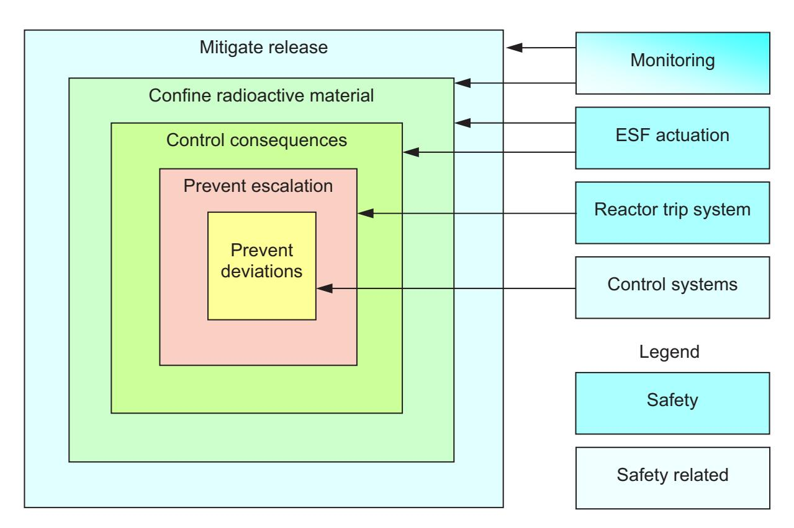

*FIG. 44. Typical I&C system relationship to plant defence in depth.*

were understood, and functions were designed to fail-safe when these types of failures happened. In addition, signal and functional diversity were provided so that shared data would not jeopardize multiple lines of defence.

The design of computer-based I&C systems must face new issues which, if not properly dealt with, may jeopardize independence between lines of defence or independence between redundant elements within a line of defence. The architecture of most computer-based I&C systems is fundamentally different from that of traditional I&C. Figure 45 shows typical plant protection system architectures to illustrate these differences.

In a traditional I&C system most components only support one line of defence. Therefore, the single failures generally affect only one line of defence. Exceptions to this are usually limited to measurement channels where the failure of one measurement channel might affect multiple lines of defence. For these cases extra redundancy, data validation methods, and functional diversity are usually provided, so such a single failure will not disable the ability of even one of several redundant divisions to respond appropriately to anticipated transients or accident conditions.

In computer-based systems one or a few computers sometimes process all signals for one channel of both reactor trip and engineered safety features actuation functions. Furthermore, these components must process not only one signal that could induce a failure, but many. Therefore, a failure of an individual component affects not one, but many functions and may degrade operation of the I&C supporting two or more lines of defence. The scope of failures in computer-based systems may therefore be greater than in traditional systems unless the computer based system is carefully designed to avoid this and analysed to identify potential vulnerabilities and confirm that they have been appropriately addressed.

If such failures are limited to one of multiple redundant channels, each line of defence remains intact. However, the possibility of common cause failures that affect components of the same design in multiple channels cannot be discounted. This concern is amplified somewhat for computer-based systems where the elements that are vulnerable to CCF may be either software or hardware. Even where multiple computers are used, some software elements within these computers are usually identical so there is a possibility that failures are simultaneously triggered in different computers. There are reasons to suspect that CCF of software may be more likely than CCF of hardware. For example, the means for ensuring the correct functionality of hardware are more robust than those for software. One of many reasons for this is that the behaviour of hardware must obey the laws of physics. Therefore,

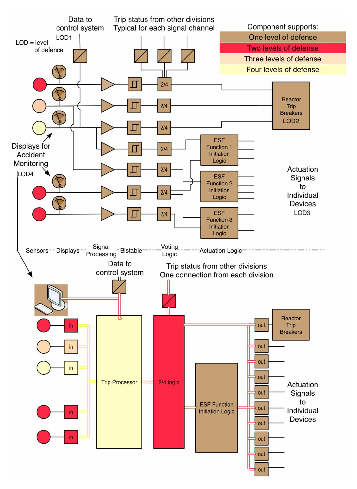

*FIG. 45. Comparison of traditional and computer based protection system architectures.*

there are constraints to the way in which even the most ill-designed hardware product may fail. No such limits exist for software. The scope of error that may be introduced during the design and implementation is therefore much greater in software based systems and it becomes increasingly difficult (or impossible) to test functionality over all possible range of inputs and combinations of inputs.

Consequently, when computers are employed in safety functions, extra attention is usually needed to ensure that the I&C system design does not introduce a source of common cause failure that jeopardizes the defence in depth concept at the plant level, or the functional reliability of any line of defence. (See Ref. [9].)

#### **3.3.2. Protection against common cause failures**

The use of defensive design measures and diversity is the general response to protect against common cause failures<sup>3</sup> in I&C systems. Defensive design measures attempt to avoid systematic faults or preclude concurrent triggering conditions. Diversity uses dissimilarities in technology, function, implementation, and so forth to diminish the potential for common faults. However, a comprehensive guidance and objective acceptance criteria have not been established to resolve the effectiveness of defensive design measures, or specific types or combinations of diversity. Therefore, there is considerable room for developers and regulators to hold different opinions in a given circumstance. The resulting regulatory uncertainty has been one factor discouraging the introduction of computer based I&C safety systems.

With regard to I&C systems, common cause failure results from:

- (1) the triggering of a single systematic fault, or
- (2) causally related faults by a single specific event.

A systematic fault affects all components of a specific type (hardware or software). A triggering mechanism is a specific event or operating condition that activates a faulted state and causes a system or component failure. The triggering mechanism may be related to environment, time, data, or hardware. Thus, a systematic failure is related in a deterministic way to a certain cause. The failure will always occur when the fault is challenged by the triggering mechanism.

Both traditional analog-based and modern digital-based I&C systems are subject to latent systematic faults resulting from design errors or requirements deficiencies. However, because of the complexity of software-based systems and associated inability to execute exhaustive testing, there is an increased concern that the potential for latent systematic faults is greater.

In redundant systems, latent faults (such as software defects) are systematically incorporated in all redundant channels or divisions. Once triggered, the latent faults can become software failures that lead to common cause failure. Such failures can cause one of two possible conditions:

- (1) outputs that change states (or values),
- (2) outputs that fail "as-is".

The first condition involves a spurious actuation of a safety function and is readily apparent. An "as-is" common cause failure is not revealed until there is a demand for a safety action. Thus, the safety function would not occur when it is expected or required to mitigate the accident or event of concern.

For a potentially unsafe common cause failure to occur due to a systematic fault, a number of conditions must be met as shown in Fig. 46.

- The system contains one or more latent faults that can cause functional failure;
- A triggering event, usually an unanticipated or untested operational condition is present to activate the fault;

<sup>3</sup> Sometimes the term common mode failure (CMF) is used as synonymous with CCF. Technically CMF is a type of common cause failure in which the failure mode is both common and in the same mode. When the term CMF is encountered it is important to understand if it is being used in the strict sense or as a synonym for CCF.

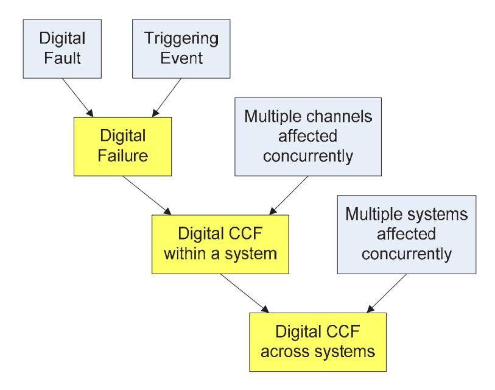

*FIG. 46. Conditions required to create a digital CCF.*

- Multiple channels are affected concurrently;
- The affected function is needed to respond to an unsafe plant condition;

To adversely affect multiple systems, those systems must share the same fault(s) and be susceptible to the same trigger concurrently.

To reduce the potential for common cause failure in I&C systems, defensive design measures can be employed to avoid systematic faults or preclude the concurrent triggering conditions. Diversity is a complementary approach. The diversity may be implemented within (or among) a protection system(s) or between multiple lines of defence. For example, diverse subsystems within redundancies of a protection system can initiate a protective function based on alternate parameters providing different indication of the same event. The challenge for digital systems is to determine what combinations of defensive measures and/or diversity are effective and sufficient to adequately address common cause failure vulnerability.

For digital I&C systems in NPPs, a diversity and defence in depth (D3) analysis should be conducted to demonstrate that vulnerabilities to CCFs are adequately addressed. Quality assurance during all phases of software development, control, and validation and verification is critical to minimize the possibility of CCFs [9].

#### **3.3.3. Verification and validation of software**

Software in NPPs can be used to execute relatively simple combinational logic, such as that used for reactor trip functions, or more elaborate sequential logic, such as that used for actuating engineered safety features or for process control and monitoring. In either case, it must be ensured that required actions are taken and unnecessary actions are avoided.

Digital I&C software shall therefore be developed, modified, or accepted in accordance with an approved software quality assurance (QA) program consistent with the requirements in the industrial standards and regulatory guidelines. The software QA program shall address all software that is resident on the digital I&C system for the NPPs at run time.

The software verification and validation (V&V) process is an extension of the programme management and system engineering team activities. The V&V process is used to determine whether the requirements for a digital I&C system or its component are complete and correct.

The V&V process is also used to identify objective data and conclusions about digital I&C system quality, performance, and development process compliance throughout the software life cycle. Feedback consists of anomaly reports, performance improvements, and quality improvements regarding the expected operating conditions across the full spectrum of the system and its interfaces. The V&V process is used to determine whether the development products of an activity conform to the requirements of that activity, and whether the system performs according to its intended use and user needs. This determination of suitability includes assessment, analysis, evaluation, review, inspection, and testing of products and processes.

Assuring software quality typically involves examining and approving the process used to produce it, examining verification and validation documents produced during process implementation, and examining the design outputs produced by the process. The first two steps give confidence that a high quality process was defined and used. The assumption behind assessing the process by which software is produced is that high-quality software development processes will produce software products with similar qualities. Examining design outputs entails consideration of design documents, the results of tests, and sometimes the conduct of independent tests. These validate the assumption that high-processes produced high-quality software.

Software is defined as correct if it behaves according to its requirements. Assurance of software correctness is sought both via programme testing and analytically through formal verification techniques. If there are flaws in software requirements or assurance techniques, software may still not perform as intended, even after it is correctly implemented. (This possibility of flaws in system requirements or assurance techniques is not unique to software. This is the reason why diversity has been required in protection systems even since the early days of nuclear power plant deployment.)

Safety analysis and assurance techniques have been developed for all stages of the structured software life cycle process (i.e., systems analysis, requirements, design, and code verification). Improved confidence in software reliability can be demonstrated by thorough testing and the use of industry operating experiences.

Appropriate methods for assessing safety and reliability characteristics of software are the key to establishing the acceptability of digital I&C systems in nuclear power plants. Methods must be available to support evaluation of reliability, assessments of safety margins, comparisons of performance with regulatory criteria such as quantitative safety goals, and overall assessments of safety in which trade-offs are made on the basis of the relative importance of disparate effects such as improved self-checking acquired at the cost of increased complexity. These methods must be sufficiently robust, justified, and understandable. (See also Refs [7, 21–24, 41].)

#### **3.3.4. Digital communications and networks**

Often there is a need to share information between safety-related systems and safety systems, between systems supporting different plant lines of defence (for example where control and protection functions need information on the same parameter), or between redundancies within safety systems (for example, to vote redundant channels in making trip decisions). When this is done, precautions are needed to prevent failures from propagating via the connections. In traditional I&C systems these connections were simple, point-to-point connections carrying individual signals. Electrical isolation and consideration of functional dependencies caused by the connections were sufficient to protect the independence of the connected systems.

The use of computers in nuclear power plants has provided the opportunity for a high level of digital communication via a network between computers within a single safety channel, between safety channels, and between safety and non-safety computer systems. However, the digital communication network raises issues such as independence for inter-channel communication, and communication between non-safety and safety systems. Improper design of this communication ability could result in the loss of redundant or diverse computers' ability to perform one or more safety functions and thereby inhibit the safety system from performing its function. Methods must be employed to allow the greatest use of communication without negatively affecting the safety system.

Provisions for interdivisional communication should explicitly preclude the ability to send external software instructions to a safety function processor unless all safety functions associated with that processor are either bypassed or otherwise not in service. The progress of a safety function processor through its instruction sequence should not be affected by any message from outside its division. For example, a received message should not be able to direct the processor to execute a subroutine or branch to a new instruction sequence. The main purpose of interdivisional communications should be the transmission of minimal messages, such as packed trip data words. Data that do not enhance the safety of the system should not be transmitted or received inter-divisionally. Communications architectures should have buffering systems to ensure there is no direct communications to the main safety processors, to enhance the ability of the safety processors to perform their safety functions without undue interference.

In computer-based systems a single connection may pass many signals, may involve handshaking between systems, and may send data via a communications network rather than point-to-point connections. These features introduce new ways for failures to propagate between connected systems or for failures in the connection itself causing failure of both connected systems. Consequently, electrical isolation and consideration of functional dependencies are not sufficient to assure independence when a computer-to-computer communication is involved. Communication faults should not adversely affect the performance of required safety functions in any way. Examples of credible communication faults include, but are not limited to, the following:

- Messages may be corrupted due to errors in communications processors, errors introduced in buffer interfaces, errors introduced in the transmission media, or from interference or electrical noise;
- Messages may be repeated at an incorrect point in time;
- Messages or data may be sent in the incorrect sequence;
- Messages may be lost, which includes both failures to receive an uncorrupted message or to acknowledge receipt of a message;
- Messages may be delayed beyond their permitted arrival time window for several reasons, including errors in the transmission medium, congested transmission lines, interference, or by delay in sending buffered messages;
- Messages may be inserted into the communication medium from unexpected or unknown sources;
- Messages may be sent to the wrong destination, which could treat the message as a valid message;
- Messages may be longer than the receiving buffer, resulting in buffer overflow and memory corruption;
- Messages may contain data that are outside the expected range;
- Messages may appear valid, but data may be placed in incorrect locations within the message;
- Messages may occur at a high rate that degrades or causes the system to fail (i.e., broadcast storm);
- Message headers or addresses may be corrupted.

In addition, many of the above examples could potentially occur as the result of a malicious/intentional cyber attack and not just as a result of a communication fault. These concerns are typically addressed by a combination of the following methodologies (many of these can be designed into the safety system, the architecture, or are within a safety layer on top of the standard communication protocol):

- Sequence number;
- Time stamp;
- Time expectation;
- Connection authentication;
- Feedback message;
- Data integrity assurance;
- Redundancy with cross-checking;
- Use of a priority logic to ensure safety actuations always override non-safety demands.

At the moment the nuclear industry has little operating or regulatory experience with the specific means of accomplishing the above mentioned issues. Therefore, the details of communications independence measures are a frequent source of discussion and debate between regulators and developers.

For proper independence of the safety system from non-safety equipment, physical, electrical and communication isolation should be ensured. It should be noted that physical points of isolation may be different for each of the types of isolation (see Ref. [10].)

### **3.3.5. Cyber security**

The increasing prevalence of digital I&C systems and general IT-technology (not only in administrative IT-systems) offers several benefits but also introduces new vulnerabilities and may open up facilities to security threats. The issue of cyber vulnerability and cyber security therefore needs more attention throughout the I&C system life cycle. Several national and international initiatives have come into place, aimed at securing critical infrastructure such as the distribution of electricity and drinking water. One common factor between different businesses of this kind is the use of digital process control systems such as SCADA-systems (supervisory, control and data acquisition).

Cyber attacks could be associated with espionage, technology theft, a disgruntled employee, a recreational hacker, a cyber activist, organized crime, a nation state, or a terrorist organization. Attacks may lead to loss of confidentiality (e.g. unauthorized access to information), loss of integrity (e.g., modification of information, software, hardware), or loss of availability (e.g., preventing data transmission and/or shutting down systems). Well intended, but unauthorized and ill-considered action by employees or contractors should also be taken into account as it can result in similar undesired consequences.

The digital I&C development process should address potential security vulnerabilities systematically at each stage of the digital I&C system life cycle. It has to be recognized that I&C systems may be potential targets of malicious attacks. Cyber security should be a fundamental component of I&C design and specification. Especially computers used in safety and safety-related systems must be well protected. Computers used to control access to sensitive areas are needed both to prevent unauthorized access that might be part of an attack, and to ensure authorized access both for safety and security reasons. Computers that store important and sensitive data have to be protected to ensure that those data are not erased, stolen, or otherwise manipulated with a malicious purpose.

Cyber security is built from the consideration of possible threats, vulnerabilities, and consequences. Development of a design basis threat that includes cyber security capabilities can assist in this effort. The tools for protecting against threats and building barriers include both technical tools, such as intrusion detection, virus scanners, firewalls, encryption and access control, (e.g. passwords and biometric identification) as well as administrative tools such as the application of a well-designed security policy, security zones, security management systems, periodic awareness training, and the development of a security culture. As with safety, security benefits from a defence in depth approach with multiple protective measures in place.

Cyber security should now be a part of the overall security programme at a plant. It is therefore important that it is well coordinated with all relevant internal and external organizations, and that clear roles and responsibilities for cyber security are identified. Both cyber attacks and security protection have been evolving with time, so success requires continuous vigilance and continuous improvement.

The development of regulations, guidance, and standards to maintain cyber security is evolving. Among others the IAEA is developing a reference manual on computer security at nuclear facilities. As stated above, experience gained from fields such as the military, national security, banking, electricity distribution and air-traffic control is valuable for improving cyber security at NPPs with digital I&C systems. A document entitled Guide to Increased Security in Process Control Systems for Critical Societal Functions was developed for this wider audience, but provides several recommendations and references that would be beneficial for the nuclear industry as well [43–44].

Apart from the specific guidance mentioned above, there are current regulations, guidance, and standards for I&C safety system design that have a close relationship with cyber security. Cyber security vulnerability might be significantly reduced if such regulations, guidance and standards are followed rigorously. For example, if an I&C design prevents any non-safety systems from impacting the functions of safety systems (e.g., by limiting communication between safety and non-safety systems), a significant cyber security concern regarding the I&C safety system is also reduced. Nevertheless, a systematic approach to cyber security should be adopted, covering all stages of the I&C life cycle. This should include a well-defined security plan and be based on a comprehensive assessment of the threats and risks.

#### **3.3.6. Configuration management**

Some nuclear power plants, particularly older facilities, have still not fully consolidated design bases and other relevant documentation. Older facilities may have some of the following characteristics:

- Documentation is dispersed, including documents containing information on safety-critical systems;
- The main design principles are not readily available and sometimes have been lost, although functionality of the plant was approved;
- The original "know-why" is not readily available for use by plant personnel;
- Many plant changes have been made, but the cumulative effects of these changes have not been considered;
- After several years of plant operation, modification, and maintenance, the plant management does not have a high degree of assurance that the facility documentation reflects actual plant status.

Such situations present serious obstacles to the introduction of digital I&C as complete information on plant design bases and interfacing equipment is necessary to correctly design and implement I&C replacement. References [33, 45] present information on improving configuration management and obtaining or developing configuration information for legacy systems. This is a tedious and expensive process. There is a need for better technical approaches and for improved sharing of information between plants of similar design. The plant configuration control management should establish processes, procedures and information flow links in order to ensure continuous information consistency among three main aspects of configuration control:

- Plant design basis and design requirements, as well as plant licensing documents;
- Plant physical configuration;
- Transparent information on plant configuration or plant design data provided in drawings, manuals, data bases, specifications, analysis, reports, operating data, maintenance data, training data, procurement data, etc.

#### 3.4. HARMONIZATION OF STANDARDS AND LICENSING PRACTICES

Changes in world markets and technology are having an impact on the nuclear industry and on regulators as never before. Both the nuclear industry and regulators have traditionally been rather conservative when it comes to embracing changes and a key challenge for the future is to properly assess and address the safety implications of these changes. With the globalization of the nuclear business and the consequent implications for supply, ownership and operational management of nuclear power plants, there is greater need for international consistency and harmonization of standards and their application by Member States.

#### **3.4.1. Harmonization of standards**

An important part of the path to increased harmonization is through the creation of a consensus among standards that are applied to I&C systems. Incremental improvement is possible in this area and certain standards bodies (e.g., IEEE and IEC) are undertaking efforts to make their standards more consistent and even to jointly issue standards in some cases. Still, consensus standards must be responsive to the regulatory frameworks that they support.

In an effort to promote harmonization, the Multinational Design Evaluation Program (MDEP) has been organized by the OECD Nuclear Energy Agency (OECD/NEA) to develop innovative approaches to leverage the resources and knowledge of the national regulatory authorities. Participation in the MDEP, including the IAEA, is intended for interested countries that already have commitments or strong expectations for new builds or new reactor designs. The key objective is to more closely align differing national regulatory frameworks in consideration of new reactor designs. Digital I&C is one of the several areas and the specific activities include exchanging information on regulatory practices and seeking, where practical, convergence on reference regulatory practices.

The benefits realized by the use of international standards can be summarized in terms of tangible and intangible benefits in the following table.

The need for the existence of a single, global standard for all the technologies is a desirable objective for all the economic partners. The harmonization of standards removes the barriers of trade and help the manufacturers to use the facilities all over the world and the customers in turn get quality goods and services at lowest costs.

However, this global standardization is not an easy process. Every country or region follows some form of standard for all its activities but they differ from each other in some respect. For technologies where there is no globally harmonized standard, the national standards and/or regional standards are followed. The differences between standards can be small or very large and cause difficulties in adapting to a different standard.

The cooperation among the various economic partners and the customer demands will help in achieving the global harmonization of standards. It may take several years, but the inevitable fact is that the industry will progressively move towards globally harmonized standard for technologies. The participation in standardization technical committee activities will enable companies to review their internal standardization process and the feedback received from them would make the transformation from a standard to the one developing into a globally harmonized standard gradually.

TABLE 2. COMPARISON OF THE REGULATORY FRAMEWORK OF THE IAEA AND THE NRC

| Characteristic                              | IAEA framework                                                                        | US NRC framework               |
|---------------------------------------------|---------------------------------------------------------------------------------------|--------------------------------|
| Fundamental design requirements             | NS-R-1                                                                                | 10 CFR 50                      |
| Legal standing of design requirements       | Only advice                                                                           | Legal requirement              |
| Technology focus                            | Any technology                                                                        | Primarily light water reactors |
| System focus                                | Systems important to safety                                                           | Safety systems                 |
| Characteristics of target regulatory agency |                                                                                       |                                |
| Target regulatory authority                 | Regulator in any member state                                                         | US NRC                         |
| Maturity of organization                    | Might be an emerging organization —<br>assumed to meet minimum requirements of GS-R-1 | Very established               |
| Authority                                   | Might be authority to license or advisory role<br>to licensing authority              | Authority to license           |
| Technical support infrastructure            | Might not exist                                                                       | Extensive                      |
| Surrounding legal framework                 | Might be minimal — assumed consistent with<br>Handbook of nuclear law                 | US legal system                |
| Characteristics of target industry users    |                                                                                       |                                |
| Target industry                             | Industry of any member state                                                          | Primarily US                   |
| Engineering and scientific infrastructure   | Might be under development                                                            | Very established               |
| Supporting commercial standards             | Might not exist                                                                       | Extensive                      |
| Equipment market                            | Might be controlled or competitive                                                    | Competitive                    |

TABLE 3. BENEFITS FROM THE USE OF INTERNATIONAL STANDARDS

| Tangible Benefits                                                                                  | Intangible Benefits                                                 |
|----------------------------------------------------------------------------------------------------|---------------------------------------------------------------------|
| • Reduce cost of specifying parts, materials, processes,                                           | • Reduce time required to get a new design into production.         |
| and recurring technical requirements.                                                              | • Reduce frequency of technical errors of judgment.                 |
| • Reduce paperwork and record keeping in purchasing,<br>quality assurance, inventory control, etc. | • Provide a common language between end users<br>and suppliers.     |
| • Eliminate the need for multiple qualification testing<br>of product.                             | • Increase productivity and efficiency in manufacturing.            |
| • Reduce warehouse-operating costs.                                                                | • Improve quality based on accepted and explicit<br>specifications. |
| • Develop cost estimates more economically.                                                        | • Improve reliability through consistency from process              |
| • Reduce the time required to train the persons or vendors                                         | rationalization and repetition.                                     |
| using the standards.                                                                               | • Improve user and customer confidence.                             |

#### **3.4.2. Harmonization of the licensing practices**

Harmonization of the licensing process is the process of making two or more sets of codes and standards or licensing processes more similar to each other. The harmonization is also to yield a better understanding for differences in the licensing requirements or the licensing processes.

Harmonization provides benefits in national regulatory processes and for those using the regulatory processes. Harmonization will:

— Allow for increased effectiveness and efficiency of regulatory design reviews (sharing methods and data, mutual acceptance of safety reviews for a standardized design, etc.);

- Yield mutual sharing and efficiency for quality inspections (harmonized requirements in construction and manufacturing, involvement of contractors worldwide, etc.);
- Facilitate knowledge transfer on regulatory issues and practices;
- Result in increased international cooperation among regulators, leading to a better understanding of different regulatory options and to a common choice of the most convincing and reasonable solutions;
- Allow for dissolution of some of the uncertainties in the licensing process, which presently discourage adopting new systems and technology;
- Simplify reuse of previously licensed technical solutions for a large spectrum of application and thereby make them more competitive;
- Contribute to the overall plant safety by reducing the resources needed for I&C licensing, freeing them to concentrate on more significant safety issues;
- Reduce the complexity and risks of licensing for modernization and new installation of digital I&C in both existing and new plants, eventually improving safety and at the same time achieving a lower level of costs and efforts in the licensing process;
- Facilitate the development of competency on a global basis; thus, supports the resolution of the most complex licensing issues;
- Make it commercially viable for the industry to develop specialized tools for the design and verification of nuclear power plant I&C software.

Ideally, a set of licensing practices would cover both technical and administrative requirements. Typical technical requirements are for instance requirements on separation, isolation, redundancy, and diversity. Administrative requirements are usually placed on the quality system and on procedures for change management. A separation between technical and administrative requirements is related to a separation between requirements set on the product and on the work processes.

To initiate and promote the harmonization, the IAEA has prepared general and high level recommendations to assist the licensing of digital I&C and published Harmonization of the Licensing Process for Digital Instrumentation and Control Systems in Nuclear Power Plants [46]. The report contains chapters on "Overview of approaches for design, implementation, and licensing of I&C systems", "Challenges in the licensing", "A vision for a harmonized approach to licensing requirements" and "A basis for harmonized requirements". The report provides guidance in resolving unnecessary differences and inconsistencies in existing licensing and safety assessment processes. It is also suggested in the publication to resolve various issues of a technical and engineering nature, which are presently creating controversies in the licensing of digital I&C.

Efforts towards harmonization should also strive for a greater commonality with other industries that use I&C to manage significant hazards. Such a commonality would make the nuclear I&C equipment market more competitive, improve the experience base for equipment, and encourage investment in improved functionality and quality, and broaden the talent pool available for nuclear I&C staff. An example of this is Ref. [25], which is used within the nuclear industry and by the process industry for safety system development, and implemented by Ref. [22] for the nuclear industry and IEC 61511 for the chemical, oil, and gas process industries.

Efforts are being made in the area of licensing harmonization through the generation of EUR documentation (European Utility Requirements) and by WENRA (Western European Nuclear Regulators Association) towards harmonization of licensing processes throughout European countries.

### 3.5. ECONOMIC DRIVEN ISSUES

#### **3.5.1. On-line monitoring**

On-line condition monitoring of plant equipment (including I&C equipment), systems, and processes involves the detection and diagnostics of abnormalities via surveillance of process signals while the plant is in operation. The term on-line condition monitoring of nuclear power plants refers to the following:

The equipment or system being monitored is in service, active, and available (on-line);

- The plant is operating, including start-up, normal steady-state and transient operation, and shutdown transient;
- Testing is done in-situ in a non-intrusive, passive way.

In doing so, OLM will allow the timely repair/maintenance to be planned and undertaken so as not to compromise the safety and production of the plant. OLM can be used to identify equipment degradation between the standard maintenance periods, which allows the rectification to occur at the earliest opportunity and hence ensure that the plant remains within the safety analysis assumptions. This targeted maintenance regime will yield additional benefits such as more efficient use of the maintenance staff, reduction in unnecessary radiation dose, reduction in maintenance induced errors, etc.

One of the primary goals of OLM is to extract additional information from the data made available by the I&C system. OLM systems may include physically or empirically derived models of instruments, equipment, and plant systems. These models capture the expected or observed operating profile of a component and monitor this profile for deviations as time progresses. While an I&C system is designed to inform or act upon specific data, the intent of an OLM system is to mine the recorded data for underlying changes in the relationships between measured process parameters. These underlying relationships are not normally included in the indicators (or actionable parameters) for a typical I&C system. In other cases OLM systems make use of data using different analysis techniques to glean some indication of the health or status of the related process instrument or component. OLM systems rely on the information coming from the I&C system, in some cases requiring additional data, and intend to complement the information available to plant operators to assess the current and future health of the process overall and of the individual plant components.

For example, the use of OLM to demonstrate that a sensor has not drifted since the last time it was calibrated can be used to extend the standard time based calibration period and hence not subject the equipment to unnecessary intrusive maintenance. Not only does this reduce maintenance workload but it also removes one of the most common modes of failure, maintenance induced faults through mis-calibration or failure to return the sensor to service properly.

#### *3.5.1.1. OLM applications*

The options for the implementation of an OLM strategy will vary considerably from plant to plant and will depend very much on the user's specific end requirements, existing data extraction capability, and the prevailing monetary restraints.

The following are typical examples of where an OLM implementation may be considered:

- On-line monitoring of instrument channel calibration status;
- On-line validation of process measurements used for the plant control;
- On-line monitoring to derive status of equipment as a decision tool for maintenance planning;
- Improving diagnostics and inspection capabilities (e.g., primary to secondary circuit leakage detection);
- Prediction of the onset of failure (detection of off-normal plant operation);
- Plant optimization (thermal performance monitoring of steam turbine thermal cycle);
- Reduce radiological dose (move from time dependent to condition based maintenance);
- Shorten outage time (extended maintenance periods and move from time dependent to condition based maintenance).

Plant I&C and/or digital upgrades are an ideal opportunity for the consideration of OLM, since a key issue in the determination of the feasibility is the availability and suitability of data. For example, the additional overhead for obtaining data extraction/capture facilities to support an OLM implementation is relatively low at the design stage compared to that required as a retro-fit.

Where the plant I&C upgrade is not an option, it will be necessary to conduct a review of the data already available (or in archive) to ascertain whether it is suitable for the intended OLM application. For example, vibration or acoustic noise based applications will require a fast sample rate and historically have been restricted to dedicated standalone data acquisition and analysis systems. Trend applications such as the monitoring of sensor drift only require a sample every few seconds and the installed plant data processing systems may already provide sufficient resolution; hence, the problems of implementation of OLM may be restricted to that of extracting the data without compromising the plant data processing systems.

With OLM applications, it will be the historical trends and the early detection of off-normal operation which will yield future success. It is therefore paramount that baseline measurements are accurately documented to ensure that when OLM applications are run at a later date, true comparisons are possible.

The following IAEA publications provide very detailed information on the basics and the various technical realizations of OLM:

- IAEA Nuclear Energy Series No. NP-T-1.1 [3] On-line Monitoring for Improving Performance of Nuclear Power Plants Part 1: Instrument Channel Monitoring;
- IAEA Nuclear Energy Series No. NP-T-1.2 [4] On-line Monitoring for Improving Performance of Nuclear Power Plants Part 2: Process and Component Condition Monitoring and Diagnostics.

#### **3.5.2. Power uprating**

#### *3.5.2.1. Power uprating and I&C in general*

The greater demand for electricity, and the available capacity and safety margins in some of the operating NPPs are prompting the utilities to request a license modification to enable operation at a higher power level, beyond the original license provisions.

In addition to mechanical and process equipment changes, parts of the electrical and I&C systems and components may also need to be altered to accommodate the new operating conditions and safety limits. The power uprating may, for example, require more precise and more accurate instrumentation, faster data processing, modification of the protection system set points, and/or more sophisticated in-core monitoring systems.

Instrumentation uncertainties are key contributors to the calculation of necessary operating parameter safety margins in an NPP. Measurement and controller ranges and tolerances have a significant effect on the identification of these necessary margins to various parameter limits. The introduction of more accurate instrumentation and data processing may provide the opportunity to lessening these existing margins and, in turn, providing room for enhanced process operations at increased power levels.

A typical example is the calculation of reactor thermal power in a more accurate manner. The reactor core thermal power is validated by a nuclear steam supply system (NSSS) energy balance calculation. The reliability of this calculation depends primarily on the accuracy of feedwater flow, temperature and pressure measurements. Because the measuring instruments have measurement uncertainties, margins are included to ensure that the reactor core thermal power does not exceed safe operating levels. Instrumentation enhancement may involve the use of state of the art feedwater flow or other measurement devices that reduce the degree of uncertainty associated with the process parameter measurements. Performing regular calibration and maintenance of instrumentation will also improve measurement reliability. These activities will, in turn, provide for a more accurate calculation of reactor thermal power. With this more accurate value, the corresponding margins may be narrowed and the extra space gained this way can be used for the safe increase of reactor thermal power.

### *3.5.2.2. Impact of power uprating on plant instrumentation and control*

The I&C system functions in an NPP comprise protection functions, limitation functions, control functions, monitoring/display functions (including alarms), and testing/diagnostic functions. All of these function types are potentially affected by a power uprating project.

Modifications in the instrumentation and control systems in relation to power uprating are, however, not necessarily very substantial. The following parameters must be verified acceptable or changed accordingly for the operation at the increased power level:

- Measurement ranges;
- Calculation algorithms to indicate credible reactor thermal power;

- Accuracy of process parameter measurements;
- Possibilities for setting new limits in the reactor protection system, limitation system and other control system set points.

I&C can feature in power uprating projects in various ways. Several I&C capabilities and activities may be needed in order that a power uprate project can be implemented. By way of example, these may include the following:

- Modification of specific control systems to enable operation under different primary or secondary circuit conditions (e.g., higher primary circuit temperatures and flow rates) with the analytical justification to make the changes;
- Faster and more accurate three dimensional core analysis software program for the new fuel and to provide adequate representation of the core power in a timely manner for operational decisions;
- Changes in the pressurizer pressure control system to provide finer control under reduced operating margins;
- More accurate temperature control or monitoring, permitting "stable" operation closer to the temperature limits for the fuel;
- Optimized calculation of the measurement uncertainties, permitting a reduction in the margin applied to the measurement of reactor thermal power;
- Modification of the reactor protection system set points to permit operation under the new primary or secondary circuit conditions resulting from control system changes;
- Changes in alarm set points to reflect the new conditions resulting from the power uprate;
- Changes in the appropriate HSIs to accurately assess the current state of the plant and to take appropriate manual control actions under the new conditions resulting from the power uprate;
- Changes in the instrument calibration procedures to accurately measure process variables in the appropriate ranges after the power uprate.

There are I&C solutions also to help better understand the current state of the plant and equipment. Among others, but not limited to the list below, the following changes may be foreseen in a specific plant:

- Inclusion of vibration sensors;
- Increase in the frequency of vibration and other dynamic monitoring;
- Inclusion of additional process sensors;
- Replacement of sensors by ones with improved accuracy/reliability;
- Provision of additional information and tools (controls, displays and alarms, model-based diagnostics and prediction) to the operator to help ensure that power limits are not exceeded even during transients;
- Adjustment of the plant computer and safety parameter display system (SPDS) software for the new operating conditions (higher power level, steam flow, etc.);
- Inclusion of a scaling adjustment for ex-core and in-core neutron flux detector circuits to ensure that they read correctly at the uprated power level;
- Development of additional instrument validation processes.

The following IAEA publication provides detailed information on the significance of I&C systems in power uprating at nuclear power plants:

— IAEA Nuclear Energy Series No. NP-T-1.3 [5] The Role of I&C Systems in Power Uprating Projects in Nuclear Power Plants.

#### **3.5.3. Obsolescence**

Many currently operating NPPs use programmable electronic systems and equipment. Future NPP and retrofit projects will use these types of devices to an even greater extent. They are the state of the art solution for I&C. The life cycle of such equipment has to be considered taking account of the specific characteristics of IT and not be limited to the aspect of ageing of components (hardware). Some aspects of this are:

- Rapid evolutions in the technology lead to a shortened life cycle for the commercial availability of processors, memories and peripheral devices, and subsequently to the systems built with these devices;
- The state of the art I&C design moves rapidly compared to the NPP global life, particularly on the IT side (e.g., software tools, operating systems (OS), engineering tools, HSI software);
- Specific problems can and have arisen due to disappearance and mergers of I&C equipment and component manufacturers;
- Human resource difficulties may also appear in the software technology areas, as the technology is based on permanent updating, while NPP operation prefers a freezing of technologies for compliance with the safety regulation and operational cost reduction. Therefore, obsolescence is more of a problem in the nuclear industry than in other industries.

For a new plant design or for a major retrofit of control systems the recommended practices would include the:

- Selection of system manufacturers involved in power plant control with a policy of long term obsolescence management and backward compatibility of components into existing systems;
- Audit of the existing organizational procedures (state of the art) for long term;
- Maintenance contracts from the equipment/system manufacturer;
- Selection of IT tools based on the most industrially widespread basic tools;
- Storage of components to constitute a strategic spare part fund;
- Porting of engineering tools into new software environments;
- Identification of several levels of abstraction in system designs and architectures so that lower levels close to the implementation layer can be more easily modernized by swapping obsolete HW and SW components with modern ones without affecting the overall system.

Based on the above listed activities the obsolescence management program will be an iterative process.

However, because of the specifics of NPP operation and design change implementation, where the primary goals are always related to the long term safe, and reliable plant operation with high plant availability and optimized cost of operation, the operating NPPs cannot always have, nor is it necessary that they always have the latest version of I&C hardware and software. Not all 'old' I&C system should be classified as obsolete systems.

An I&C system should be classified as an obsolete system when at least some of the following problems occur:

- I&C system equipment, parts and components (software and hardware, same or original or one-to-one replaceable equipment, parts and components to be used for expansion of the installed system or as a spare) are no longer manufactured and they cannot be procured;
- There is no appropriate expert support in the world market for the existing I&C system maintenance services (troubleshooting, repair, replacement, testing of equipment, parts and components) or for system design changes;
- The appropriate training for I&C system maintenance, design changes implementation and administration cannot be procured;
- No design changes (adding new I/O signals, change or addition of new algorithms, improvement of HSI features, adding new data-links, etc.) to the existing I&C system can be implemented because of the limited system resources.

The following IAEA publications provide more detailed information on the obsolescence processes of I&C systems at nuclear power plants and on activities to cope with this phenomenon:

- IAEA-TECDOC-1016 [17], Modernization of instrumentation and control in nuclear power plants;
- IAEA-TECDOC-1389 [18], Managing modernization of nuclear power plant instrumentation and control systems;
- IAEA-TECDOC-1402 [33], Management of life cycle and ageing at nuclear power plants: Improved I&C maintenance.

#### **3.5.4. Impact of I&C systems on plant operational performance**

#### *3.5.4.1. Operating and maintenance experience*

The I&C system failure rates at some plants, which were mostly equipped with analog I&C, were among the main contributors to unit power reductions and trips. For example, I&C failures formed dominant parts of the events affecting power generation of some WWER-1000 units during the first period of their operation. Such failures were mainly caused by:

- Low reliability of modulating control equipment (steam generator, turbine generator);
- Low reliability of some detectors, including control rod position measurement;
- Unsound adjustment of the set points of protection and interlock systems;
- Lack of I&C systems self-diagnostics; and others.

Such failures frequently led to power reductions and shutdowns, so they had a direct negative impact on the plant capacity factor and its overall operational performance.

Figure 47 shows the contribution of I&C failures at some selected plants, as an example. I&C contributed to 15 to 22% of the total number of failures at two selected plants. The presented data have been identified by an IAEA ASSET mission in designated WWER-1000 units, but similar situations could have been revealed at other plants with relatively obsolete I&C.

Implementation of digital I&C as demonstrated by recent experience is an effective way to increasing the reliability of plant control and monitoring, and consequently to enhancing plant operation efficiency. The added benefit of modern digital systems having integral redundancies, self diagnostics and self testing allows for lengthened test cycles, thereby reducing the probabilities of technician or operator induced errors during test cycles. It also reduces the strain on mechanical equipment (terminations, switches, etc.) thereby reducing fatigue failures.

However, the high complexity of digital systems may introduce new failure modes and new challenges to the operation and maintenance staff, which needs to be considered in the decision making process.

The impact of I&C systems on plant operational performance, and related issues are also discussed in the following IAEA publications:

- IAEA-TECDOC-1016 [17], Modernization of instrumentation and control in nuclear power plants;
- IAEA-TECDOC-1389 [18], Managing modernization of nuclear power plant instrumentation and control systems.

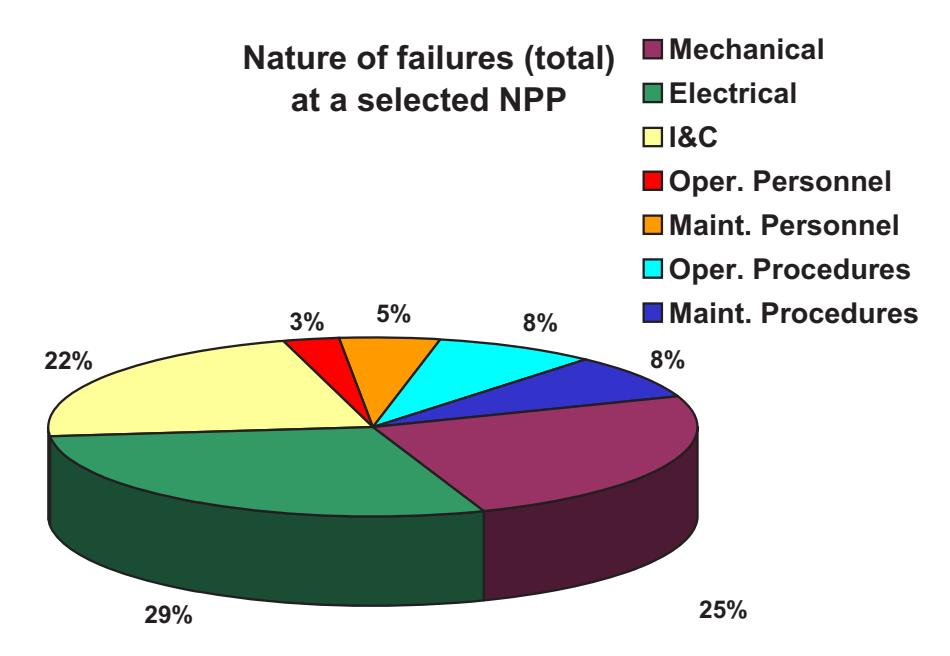

*FIG. 47. Nature of failures at a selected NPP.*

- IAEA-TECDOC-1147 [31], Management of ageing of I&C equipment in nuclear power plants;
- IAEA-TECDOC-1125 [47], Self-assessment of operational safety for nuclear power plants;
- IAEA-TECDOC-1141 [48], Operational safety performance indicators for nuclear power plants;

#### *3.5.4.2. Integrated operations*

A concept originally developed in the offshore oil industry to facilitate operation of remote installations minimizing staffing offshore may be an area for consideration in the nuclear industry. The approach advocates the centralization and integration of information, work teams, and work practices to better support reduced-staff operations. Collaboration rooms can remotely gather information from a fleet of units (or modules in a modular design), control room staff, utility headquarters, maintenance departments, vendors, expert support teams, regulators, etc.

I&C, information, and telecommunication technologies shall support the elaboration of the integrated operation approach where necessary. Some areas are:

- New work processes;
- Collaborative virtual environments (collaboration rooms);
- Data integration / service oriented architectures;
- Extended teamwork in integrated operations settings;
- Decision making processes in integrated operations settings.

Integration of fleet-wide information is a key issue in the successful implementation of integrated operations. The following IAEA publication provides useful information on the different approaches of information integration and presentation at nuclear power plants:

— IAEA-TECDOC-1252 [14] Information integration in control rooms and technical offices in nuclear power plants.

#### 3.6. AGEING

#### **3.6.1. The need for ageing management**

The need for ageing management is effectively two-fold; first, to ensure that the assumptions for plant safety are not compromised by age-related degradation, and second, to support long term maintenance strategies and plant life extension including equipment replacement to overcome obsolescence, and to take benefit of technology advancement.

At NPPs, I&C systems are intended to be replaced or substantially upgraded one or more times during the traditional 40-year license period. A longer plant lifetime would add to the total number of I&C system replacement projects but the ageing I&C systems are not likely to create obstacles that could compromise long term operation (LTO). Essentially, life limitations for I&C systems do not generally constitute significant impediments to the extension of operational lifetime for a plant.

Although most plant components are replaceable given sufficient economic incentive, some are very difficult to replace. An example of this is the power and signal cabling for I&C and electrical systems at NPPs.

Several IAEA publications are dedicated to the ageing phenomenon in the I&C area. (See Refs [31–33, 47–49] for further guidance.)

#### **3.6.2. Plant cabling**

The dominant ageing degradation mechanisms for I&C are those which change the properties of insulation materials, e.g., embrittlement. Cable degradation can result in increased leakage currents that cause errors in process variable readings. Ultimately, an aged and embrittled cable may completely fail under serious plant upsets such as a loss of coolant accident (LOCA).

Plant cabling is identified as a major focus area of ageing management programs established to support license extension. Substantial research activities have been conducted for utilities and regulators over the recent years to characterize cable ageing and establish the basis for on-going qualification. Nevertheless, there are limitations on in situ health assessment (particularly for medium voltage cables), logistical and economic complications with large-scale cable replacement and rerouting, and concerns about viability beyond 60 years, which warrant further development. Many cables are hard to access, difficult to characterize and evaluate, and costly and complicated to replace, so any improvements in measurement, condition assessment, and residual life determination would be valuable. Additionally, the use of new types of cabling as part of upgrade projects would potentially introduce materials (e.g., optical fibres, low-smoke, zero halogen insulations) whose long-term degradation mechanisms are not well understood.

#### *3.6.2.1. Cable ageing management*

Cable ageing represents the most significant age-related issue for NPP I&C systems. There has been significant attention directed toward cable ageing as a consequence of plant license extension efforts. While in situ assessment methods for low-voltage cables may be sufficiently developed and demonstrated (e.g., line resonance analysis), assessment of medium voltage cables poses a more difficult problem. The likelihood of introducing new insulation and jacket materials as well as increasing the use of fibre optics during cable replacement, suggests that additional data on ageing mechanisms and environmental robustness are needed.

#### *3.6.2.2. Standards and practices*

Current nuclear industry standards reflect practices associated with establishing a qualified life for Class 1E equipment commensurate with a 40-year license. Current trends within standards bodies such as the International Electrotechnical Commission (IEC) and Institute of Electrical and Electronics Engineers (IEEE) involve consideration of on-going qualification and condition-based qualification. Additionally, standards regarding qualification of new technologies (e.g., fibre optic cables) are being developed. The IEC and the IEEE are also jointly developing a standard addressing condition monitoring techniques.

Methods exist for in situ, non-destructive determination of cable degradation such as visual inspection, infrared spectroscopic analysis, compressive modulus measurement, dielectric loss, and resistance. Other methods exist for off-line analysis. Innovative communications methods are necessary that (1) allow for multiplex signals on existing wiring without compromising reliability, (2) permit installation of hard wiring (e.g., fibre optics) in remaining spaces to allow multiplexed signal transmission, or (3) implement wireless transmission of data.

#### *3.6.2.3. Cable condition monitoring and inspection methods*

Condition monitoring and inspection refers to test activities performed to assess the functional capability and operational readiness of cables. Condition monitoring provides information on the status of the cable in terms of the value of selected condition indicators, which are representative of the degree of degradation of the cable materials. The objectives of cable condition monitoring can be listed as follows:

- To assess the current cable degradation state by performing mechanical or chemical tests (in-situ or laboratory-based) and to link the resulting test parameters to the degradation of the electrical properties of the cable. Correlations between mechanical/chemical test results and the desired electric parameters are not always straightforward.
- To predict the remaining cable life assuming qualified operating conditions. This is a challenging task, because the relationship between the chemical properties of the insulation and the temperature and radiation environmental stressors is not a simple linear relationship.
- To demonstrate cable survivability after DBA events, based on selected measurable condition indicator parameters. Cables subjected to accelerated ageing in laboratory (e.g. 40 years of simulated ageing) have to demonstrate acceptable performance after subsequent DBA events (e.g. LOCA test).

Table 4 below lists the available condition monitoring techniques and their applicability to various types of cable insulation materials

TABLE 4. MONITORING METHODS FOR CABLE CONDITION

| Testing method                      | Monitored<br>property | In situ<br>vs lab. | Destructive?<br>Disconnection?<br>Sampling required? | Local testing<br>vs full<br>length testing | Applicable to<br>insulation material |
|-------------------------------------|-----------------------|--------------------|------------------------------------------------------|--------------------------------------------|--------------------------------------|
| Indenter Modulus                    | Physical              | Both               | Non-destructive                                      | L                                          | Elastomers, PVC                      |
| OIT/OITP                            | Chemical              | Lab                | Micro-sampling required                              | L                                          | EPR, PE, XLPE                        |
| TGA                                 | Chemical              | Lab                | Micro-sampling required                              | L                                          | PVC, CSPE, EPR                       |
| Dielectric Loss                     | Electrical            | Both               | Non-destructive, but<br>disconnection required       | F                                          | EPR, XLPE                            |
| FTIR                                | Chemical              | Both               | Micro-sampling required                              | L                                          | EPR, PE                              |
| Light Reflective<br>Absorbance      | Chemical              | Both               | Micro-sampling required                              | L                                          | XLPE (FR-XLPE), EPR                  |
| TDR                                 | Electrical            | Both               | Non-destructive, but<br>disconnection required       | F                                          | EPR, XLPE                            |
| LIRA                                | Electrical            | Both               | Non-destructive                                      | F                                          | All                                  |
| Ultrasound Methods                  | Chemical              | Both               | Non-destructive                                      | L                                          | PVC, PE, EPR                         |
| Elongation at Break<br>(EaB)        | Mechanical            | Lab                | Destructive                                          | L                                          | All                                  |
| Visual insp.<br>Tactile             | Visual                | Field              | Non-destructive                                      | L                                          | All                                  |
| Microwave absorption                | Electrical            | Both               | Non-destructive                                      | L                                          | Elastomer, XLPE                      |
| Partial Discharge                   | Electrical            | Both               | Non-destructive, but<br>disconnection required       | F                                          | All                                  |
| Torque                              | Mechanical            | Both               | Non-destructive                                      | L                                          | All                                  |
| Insulation resistance               | Electrical            | Both               | Non-destructive, but<br>disconnection required       | F                                          | All                                  |
| Nuclear Magnetic<br>Resonance (NMR) | Physico<br>Chemical   | Lab                | Micro-sampling required                              | L                                          | All                                  |
| Gel Fraction                        | Chemical              | Lab                | Micro-sampling required                              | L                                          | All                                  |
| Density                             | Chemical              | Lab                | Micro-sampling required                              | L                                          | XLPE, PVC, EPR                       |
| Thermography                        | Physical              | Field              | Non-destructive                                      | L                                          | All                                  |

CSPE chlorosulphonated polyethylene

DBE design basis event (e.g. LOCA or MSLB) EPR/EPDM ethylene propylene based materials FTIR fourier transform infrared spectroscopy

LIRA line resonance analysis MSLB main steam link break

OIT/OITP oxidation induction time/temperature

PVC polyvinyl chloride PE polyethylene

TDR time domain reflectometry TGA thermo-gravimetric analysis XLPE cross-linked polyethylene XLPO cross-linked polyolefin

Together with an understanding of the cable ageing mechanisms, environmental monitoring records, and the results of cable inspections, condition monitoring and ongoing qualification provide a basis for decisions regarding the timing of potential cable replacement.

#### *3.6.2.4. Future approach*

Various companies market testing equipment for high-voltage and signal-level cabling. The limitation is that this type of testing requires that the cabling be taken out-of-service or that the system is inoperative. On-line diagnostics are needed that can analyse cable characteristics and degradation without removing the cable from service or rendering the system inoperative. In addition, prognostic functions are needed to predict impending failure. Spread-spectrum techniques are capable of performing time domain reflectometry without disturbing the true signals in the instrumentation cable. This technique is relatively new, but can possibly be embedded as part of the instrumentation system.

It is suggested that cable choices be determined based on known characteristics and known degradation mechanisms that can be quantified and qualified to be able to ascertain values to be used for I&C system analysis.

#### 3.7. KNOWLEDGE MANAGEMENT

Knowledge management (KM) is the active and strategic application of a range of KM practices to enhance knowledge processes in an organization. Knowledge processes include knowledge acquisition, knowledge creation, knowledge transfer or sharing, knowledge retention (including storage) and preservation, and knowledge utilization. Over the last two decades, the importance of KM became increasingly more apparent across the nuclear-power industry, not only for the maintenance of I&C core competencies, but as a general response to rising rates of attrition of key personnel (mostly due to age), and the subsequent loss of critical expertise and experience. The generation of nuclear workers which commissioned and started the operation of NPPs all around the world in the 70's and 80's has been reaching retirement age at a time when the supply of new and qualified nuclear engineering and science grads is at an all-time low, and the demand for technical resources and core competencies is increasing due to the need for refurbishments and new builds. Methods and tools to improve knowledge management, particularly those focused on the retention of knowledge of departing senior specialists and the effective transfer of this knowledge to the young generation of new staff, have become very important. It is now obvious that the problem of keeping the core knowledge necessary for the design, the construction, the commissioning, and the maintenance of new or refurbished NPP units, particularly with respect to its I&C systems, is extremely important all around the world.

#### **3.7.1. Knowledge management and knowledge preservation**

Reference [50] is a useful overall reference for NPPs on the subject of knowledge management (KM). It defines knowledge management as an integrated, systematic approach to the process of determination, collection, transformation, development, propagation, application, communication and preservation of knowledge connected with the achievement of definite purposes. Knowledge management unites the three main components: people, processes and technologies. Knowledge management concentrates on people and the organizational culture in order to stimulate and to train people for communication and the use of knowledge; on processes and methods helping to find, to form and to communicate the knowledge; and on technologies helping to preserve and to make accessible the knowledge as well as helping people to work together, even if they are physically separated. People are undoubtedly the most important component of knowledge management, since knowledge flow and transfer depends on the desire of people to share their knowledge and to use it repeatedly.

#### **3.7.2. Knowledge management related to I&C for NPPs**

There are many KM related challenges faced by NPPs today that are quite specific to I&C. Many examples exist, but a most pressing and recurring example would be the maintenance and/or eventual replacement of older computer-based systems. Many NPPs have had plant computer systems in their units since start-up, which support the operator in monitoring and test functions. Still other plants have had digital control and safety systems (e.g., CANDU's) from day one. These systems are typically custom-designed legacy systems that may be two or in some cases 3 decades old and long since obsolete. Spare parts are becoming a critical problem and in many cases component replacements by reverse engineering or form-fit-function equivalency is necessitated. Many of these systems have undergone significant incremental modifications over time, often adding or evolving functionality to accommodate plant design or equipment configuration changes. Depending on the plant, the level (completeness and quality) of documentation of these configuration changes, or of the original design in some cases, is lacking. Most of the technical and historical knowledge base needed to safely and reliably maintain or modify these systems is in the form of individual or group non-recorded knowledge. As an example, a fact as simple as the underlying reason for a previous minor design change is lost if not fully recorded. The change itself can be very well documented, with documented test results to show that it performs according to design, with no description of why the change was made. As these stations age, key staff continue to retire, and this knowledge is often lost. At the same time, there is an increasing need for equipment or entire system replacements, and the detailed technical design basis information needed to migrate, replicate, replace, or port these systems to modern I&C platform equivalents is often lacking.

The problem is compounded by the following additional factors:

- The frequently encountered problem that new or recent graduate electrical and/or computer engineers hired to work in the I&C field typically lack the necessary knowledge needed to easily understand such legacy (and sometimes custom in-house designed) systems. Also, most do not understand the plant processes that are being monitored and controlled, and it may take as many as 5 years of on-the-job training to develop the levels of expertise and technical system-specific knowledge needed to effectively deal with the many more difficult issues that arise;
- The appearance of demanding technical standards such as Ref. [25] and the increasingly more stringent regulatory requirements for digital I&C systems now demands a deep knowledge of the technology and of reactor processes to be able to effectively design, implement, and license I&C systems upgrades;
- The increasing complexity of digital I&C products, including smart transmitters, safety PLCs, DCS equipment, plant display systems, digital panel instrumentation, etc. and the resulting challenges and complexity of digital COTS equipment qualification.

In summary, KM has become a critical issue for most I&C groups in operating NPPs. A holistic strategy is needed to ensure core technical expertise is retained, new skills are developed, and the design basis of the existing systems is re-captured and maintained going forward in time.

#### 3.8. INFRASTRUCTURE DEVELOPMENT FOR NEW NUCLEAR POWER PROGRAMMES

#### **3.8.1. General aspects**

Launching a project to construct a new NPP unit needs careful and timely planning in many areas. For a country that does not yet use nuclear power, the introduction and development of nuclear power is a major undertaking. It requires the country to build the necessary infrastructure so it can construct and operate a nuclear power plant in a safe, secure and technically sound manner. (See Refs [1, 41, 51] for high level safety guidance for infrastructure development.)

A key asset for success is the availability of sufficient national knowledge and an education infrastructure to be able to host and safely use the advanced technology represented by today's Gen-III and Gen-III+ nuclear power plants. The IAEA has been very active to create guides and technical documents in connection with building up a suitable nuclear power infrastructure. The most important recent IAEA documents are as follows:

- Basic Infrastructure for a Nuclear Power Project, IAEA-TECDOC-1513 (2006) [52];
- Potential for Sharing Nuclear Power Infrastructure between Countries, IAEA-TECDOC-1522 (2006) [53];
- Managing the First Nuclear Power Plant Project, IAEA-TECDOC-1555 (2007) [54];
- Milestones in the Development of a National Infrastructure for Nuclear Power, IAEA Nuclear Energy Series No. NG-G-3.1 (2007) [55];
- Evaluation of the Status of National Nuclear Infrastructure Development, IAEA Nuclear Energy Series No. NG-T-3.2 (2008) [56];
- Nuclear Safety Infrastructure for a National Nuclear Power Programme Supported by the IAEA Fundamental Safety Principles, INSAG-22 (2008) [57].

Without going into the details of the above publications, some key findings for the national nuclear power knowledge infrastructure in general are quoted here.

The availability of knowledge and resources, in the field of nuclear safety and radiological protection, in government, industry, education and research institutions, is essential for the design, licensing and construction process. Due to the long years of stagnation of world nuclear energy, until recently the nuclear knowledge has gradually declined in many countries. The workforce in both the nuclear industry and the regulatory bodies is rather aged despite the recent serious efforts to attract large numbers of young employees.

The application of nuclear energy in countries starting new nuclear programmes sets serious requirements for the knowledge and capabilities of governmental bodies, industry, education and research institutions. The government of such a country must be able to evaluate the nuclear and environmental safety of a new plant independently of the nuclear industry. Governmental tasks include establishing safety requirements, implementing licensing rules and regulations, and enforcing them. This government must produce up-to-date legislation and ensure that there is sufficient domestic and international expertise to fulfill the requirements of the nuclear energy programme.

Domestic knowledge and education centers play an important role in the establishment of a nuclear energy programme. The government and the industry need highly educated people with sufficient experience and it would be advantageous to make use of foreign institutions for the completion of certain dedicated tasks. However, a certain minimum level of expertise must be available in the host ("outsourcing") country in order to be able to co-operate with the nuclear suppliers at the required technical level.

At the national level it is the government which primarily contributes to maintaining knowledge in the nuclear energy field. Important governmental measures include support for engineering study and training programmes in nuclear energy and related technologies, and for nuclear-related R&D. Novel R&D financing schemes have been set up in some countries where research funds to support specific research related to the application of nuclear energy receive contributions from both the government and the nuclear industry. This arrangement has the potential to ensure that sufficient expertise is available in both private and public organizations to enable the safe use of nuclear technology.

#### **3.8.2. Interfacing nuclear power plants with the electric grid**

A major part of the necessary infrastructure is the electric grid to which the NPP will connect. While most countries already have an electric grid system, it may require significant development to be suitable for the connection to an NPP. The safe, secure and reliable operation of the NPP requires that the grid to which it connects is also safe, secure and reliable.

Countries expanding or introducing nuclear power programmes are advised to consider their electric grids as part of their planning process, particularly as the grid impacts the size and type of reactor that can be deployed. Specific issues that should be considered in the early phases of a nuclear power programme include grid capacity and future growth, historical stability and reliability, and the potential for local and regional interconnections. Assessment of the current grid and plans for improving the grid should therefore be developed to be consistent with plans for nuclear power.

The application of modern digital I&C and computer systems plays a key role in the effective and safe operation, maintenance, monitoring and control of the electric grid and its interaction with NPPs. Recommendations are given in the following list:

- The electric grid should provide reliable off-site power to NPPs with a stable frequency and voltage;
- Any potential lack of reliability in off-site power from the grid must be compensated for by increased reliability of on-site power sources;
- Enough reserve generating capacity should be available to ensure grid stability to replace NPP generation during planned NPP outages;
- The grid should have a sufficient "spinning reserve" and standby generation capacity that can be quickly brought online in case the NPP were to be disconnected unexpectedly from the grid;
- The off-peak electricity demand should preferably be large enough for the NPP to be operated in a baseload mode at constant full power;

- If there is any possibility of the NPP being operated in a load following mode, any additional design requirements to ensure safe load following operation should be discussed in advance with the NPP designer or vendor company;
- If baseload operation will not be possible, the NPP should have additional design margins to compensate for the increased exposure to thermal stress cycles, and more sophisticated instrumentation and control systems;
- The national grid should have enough interconnections with neighboring grids to enable the transfer of large amounts of electricity in case it is needed to offset unexpected imbalances of generation and demand;
- In preparation for the introduction of an NPP, if grid reliability and the frequency and voltage stability of the existing grid are insufficient, they should be made sufficient before the NPP is brought online. Any improvements will not only allow the grid to incorporate the new NPP but will have additional benefits for all customers and other generators;
- Communication is critical, in this case between the NPP operators and grid dispatchers. Effective communication protocols will need to be developed.

#### **3.8.3. I&C infrastructure**

Many aspects of the I&C infrastructure development for new plants can be handled in the general nuclear power infrastructure development framework: here the keywords are also "capability for licensing", "education & training", and "research & development". However, I&C has some additional special features worth mentioning. First, most modern plants are equipped with fully digital I&C systems. Fully digital safety systems need special expertise, different from the one required when dealing with conventional I&C systems, during the licensing, construction, operation and maintenance phases. Building up a domestic knowledge infrastructure in this field needs special attention in all of the above-mentioned knowledge areas (i.e., licensing authority, education, research, etc.). A second important issue is the role of the vendor in the construction, commissioning and maintenance of modern I&C systems. The vendor must play a key role in these activities because it has the deepest design, manufacturing, maintenance and testing knowledge of its own product. The appropriate role and involvement of the vendor in the training of the operation and maintenance personnel must be ensured early in the bidding phase and followed through later in the resulting contract.

While the NPP supplier or integrating I&C vendor will provide the necessary expertise and infrastructure support through the design and implementation of the I&C system, access to this expertise is not typically retained by the utility following commissioning of the plant (unless a long-term service contract is established). Thus, there are indigenous infrastructure needs related to I&C that should be addressed by the utility or host country.

Three key aspects of the infrastructure issues identified above that are specific for NPP I&C systems relate to the regulatory assessment of I&C systems important to safety (specifically, reactor protection and engineered safety feature actuation systems), the operations and maintenance (O&M) activities associated with plant and system health monitoring, and the management of I&C systems over the lifetime of the plant (which may be 60 years or longer). Regarding regulatory infrastructure, the safety case for I&C systems is generally based on qualitative or process-oriented evidence. Thus, the level of expertise demanded of a regulatory reviewer is quite high to ensure effective oversight. Consequently, it is imperative that indigenous regulatory expertise be developed. Shared knowledge from experienced regulatory organization can assist in establishing this infrastructure element.

Effectively utilizing the information available from plant process surveillance systems, component health monitoring modules, and other embedded diagnostic capabilities may require resident (i.e., on site) or easily accessible experts to determine appropriate O&M responses to detected (possibly degrading) conditions for which rigid procedures may not have been developed. Since the responsibility of plant designers and suppliers generally does not extend to day-to-day or event-driven operational decision-making, it may prove necessary for a country that is new to the nuclear power community to develop in-country resources that can respond in near-real-time to evolving plant conditions and events. This infrastructure element requires the capability to integrate expert knowledge regarding I&C, plant operations, and dynamic behaviour for nuclear and process systems.

Finally, the owners of new NPP may not wish to be tied to a single vendor or limited subset of suppliers over the long life of a plant. This becomes particularly important if the owner wants to diversify sources of parts and systems to ensure long-term sustainability of suppliers or wants to enable some measure of freedom in choice among suppliers. Thus, the infrastructure to support the maintenance and modernization of I&C systems over the long term should be developed within the utility or host country.

# **4. CONCLUSIONS**

In conclusion, this report fulfils a role in the recording of core knowledge on nuclear instrumentation and controls. This can now be to be used as a base knowledge source for both new users in the nuclear field, as well as a reference document to be used by others. As the nuclear industry expands worldwide, new countries join the field of nuclear power, and the existing field of experienced personnel retire, it is imperative that sources of information to provide a baseline for nuclear I&C exist. This document takes a first step towards that goal.

The primary objectives of this report are as follows:

- To provide knowledge transfer at an introductory level on the topic of NPP I&C systems, their functions and their life cycles;
- To highlight the significant role I&C systems play in the safe, productive, and economical operation of NPPs;
- To present current challenges, most significant I&C and HSI issues today;
- To provide a list of guides, standards of I&C related publications from the most prominent organizations within the nuclear industry;
- To present a unifying document that sets the stage for and references all IAEA publications in the field of NPP I&C systems. Additional, related publications are also referenced in the appropriate sections.

It was determined that with the vast amount of information that could be included in this document, there was a need to focus on just the basics and also constrain the scope of the content to those topics of high importance and most significant challenges facing the industry in the I&C and HSI field. This increases the effectiveness of the document in meetings the needs as prescribed above.

Finally, the information provided herein serves as a resource that can enable new technical participants and newly engaged countries to become aware of the scope, range of technologies, and key benefits and challenges arising from this important discipline within nuclear power. The transfer of this knowledge and the identification of relevant references should facilitate the continued safe implementation of nuclear power and support the transition within the nuclear power community to modern I&C systems.

# **REFERENCES**

- [1] INTERNATIONAL ATOMIC ENERGY AGENCY, Instrumentation and Control Systems Important to Safety in Nuclear Power Plants, IAEA Safety Standards Series No. NS-G-1.3, IAEA, Vienna (2002).
- [2] INTERNATIONAL ENERGY AGENCY, Projected Costs of Generating Electricity: 2010 Edition, OECD, Paris (2010).
- [3] INTERNATIONAL ATOMIC ENERGY AGENCY, On-line Monitoring for Improving Performance of Nuclear Power Plants, Part 1: Instrument Channel Monitoring, IAEA Nuclear Energy Series No. NP-T-1.1, IAEA, Vienna (2008).
- [4] INTERNATIONAL ATOMIC ENERGY AGENCY, On-line Monitoring for Improving Performance of Nuclear Power Plants, Part 2: Process and Component Condition Monitoring and Diagnostics, IAEA Nuclear Energy Series No. NP-T-1.2, IAEA, Vienna (2008).
- [5] INTERNATIONAL ATOMIC ENERGY AGENCY, Role of I&C Systems in Power Uprating Projects in Nuclear Power Plants, IAEA Nuclear Energy Series No. NP-T-1.3, IAEA, Vienna (2008).
- [6] INTERNATIONAL ATOMIC ENERGY AGENCY, Modern Instrumentation and Control for Nuclear Power Plants: A Guidebook, Technical Reports Series No. 387, IAEA, Vienna (1999).
- [7] INTERNATIONAL ATOMIC ENERGY AGENCY, Solutions for Cost Effective Assessment of Software Based Instrumentation and Control Systems in Nuclear Power Plants, IAEA-TECDOC-1328, IAEA, Vienna (2003).
- [8] INTERNATIONAL ATOMIC ENERGY AGENCY, Implementing Digital I&C Systems in Modernization of Nuclear Power Plants, IAEA Nuclear Energy Series No. NP-T-1.4, IAEA, Vienna (2009).
- [9] INTERNATIONAL ATOMIC ENERGY AGENCY, Protecting Against Common Cause Failures in Digital I&C Systems, IAEA Nuclear Energy Series No. NP-T-1.5, IAEA, Vienna (2009).
- [10] INTERNATIONAL ATOMIC ENERGY AGENCY, Integration of Analog and Digital Instrumentation and Control Systems in Hybrid Control Rooms, IAEA Nuclear Energy Series No. NP-T-3.10, IAEA, Vienna (2010).
- [11] INTERNATIONAL ATOMIC ENERGY AGENCY, Nuclear Power Plant Instrumentation and Control: A Guidebook, Technical Reports Series No. 239, IAEA, Vienna (1984).
- [12] UNITED STATES DEPARTMENT OF ENERGY, Fundamentals Handbook, Instrumentation and Control, Vols 1 and 2, Rep. USDOE-HDBK-1013/1-92, USDOE, Washington, DC (1992).
- [13] INTERNATIONAL ELECTROTECHNICAL COMMISSION, Nuclear Power Plants: Instrumentation and Control Systems Important to Safety — Classification of Instrumentation and Control Functions, Rep. IEC 61226 Ed.2, IEC, Geneva.
- [14] INTERNATIONAL ATOMIC ENERGY AGENCY, Information Integration in Control Rooms and Technical Offices in Nuclear Power Plants, IAEA-TECDOC-1252, IAEA, Vienna (2001).
- [15] INTERNATIONAL ATOMIC ENERGY AGENCY, Computer Based Aids for Operator Support in Nuclear Power Plants, IAEA-TECDOC-549, IAEA, Vienna (1990).
- [16] INTERNATIONAL ATOMIC ENERGY AGENCY, Guidelines for Upgrade and Modernization of Nuclear Power Plant Training Simulators, IAEA-TECDOC-1500, IAEA, Vienna (2006).
- [17] INTERNATIONAL ATOMIC ENERGY AGENCY, Modernization of Instrumentation and Control in Nuclear Power Plants, IAEA-TECDOC-1016, IAEA, Vienna (1998).
- [18] INTERNATIONAL ATOMIC ENERGY AGENCY, Managing Modernization of Nuclear Power Plant Instrumentation and Control Systems, IAEA-TECDOC-1389, IAEA, Vienna (2004).
- [19] INTERNATIONAL ATOMIC ENERGY AGENCY, The Role of Automation and Humans in Nuclear Power Plants, IAEA-TECDOC-668, IAEA, Vienna (1992).
- [20] INTERNATIONAL ATOMIC ENERGY AGENCY, Specification of Requirements for Upgrades Using Digital Instrument and Control Systems, IAEA-TECDOC-1066, IAEA, Vienna (1999).
- [21] INTERNATIONAL ATOMIC ENERGY AGENCY, Verification and Validation of Software Related to Nuclear Power Plant Instrumentation and Control, Technical Reports Series No. 384, IAEA, Vienna (1999).
- [22] INTERNATIONAL ELECTROTECHNICAL COMMISSION, Nuclear Power Plants: Instrumentation and Control for Systems Important to Safety — General Requirements for Systems, Rep. IEC 61513, IEC, Geneva (2001).
- [23] INTERNATIONAL ELECTROTECHNICAL COMMISSION, Nuclear Power Plants: Instrumentation and Control Important for Safety — Software Aspects for Computer Based Systems Performing Category B or C Functions, Rep. IEC 62138, IEC, Geneva (2004).
- [24] INTERNATIONAL ELECTROTECHNICAL COMMISSION, Nuclear Power Plants: Instrumentation and Control Systems Important to Safety — Software Aspects for Computer Based Systems Performing Category A Functions, Rep. IEC 60880, IEC, Geneva (2006).
- [25] INTERNATIONAL ELECTROTECHNICAL COMMISSION, Functional Safety of Electrical/Electronic/Programmable Electronic Safety Related Systems, Rep. IEC 61508, IEC, Geneva (2005).
- [26] INTERNATIONAL ELECTROTECHNICAL COMMISSION, Nuclear Power Plants: Instrumentation and Control Systems Important for Safety — Classification of Instrumentation and Control Functions, Rep. IEC 61226, IEC, Geneva (2005).
- [27] INTERNATIONAL ELECTROTECHNICAL COMMISSION, Electromagnetic Compatibility (EMC), Part 6–5: Generic Standards — Immunity for Power Station and Substation Environments, Rep. IEC 61000-6-5, IEC, Geneva (2001).

- [28] INTERNATIONAL ELECTROTECHNICAL COMMISSION, Nuclear Power Plants: Instrumentation and Control Important to Safety — Requirements for Electromagnetic Compatibility Testing, Rep. IEC 62003 Ed. 1, IEC, Geneva (2009).
- [29] ELECTRIC POWER RESEARCH INSTITUTE, Guideline on Evaluation and Acceptance of Commercial Grade Digital Equipment for Nuclear Safety Applications, Rep. EPRI TR-106439, EPRI, Palo Alto (1996).
- [30] ELECTRIC POWER RESEARCH INSTITUTE, Generic Requirements Specification for Qualifying a Commercially Available PLC for Safety Related Applications in Nuclear Power Plants, Rep. EPRI TR-107330, EPRI, Palo Alto (1996).
- [31] INTERNATIONAL ATOMIC ENERGY AGENCY, Management of Ageing of I&C Equipment in Nuclear Power Plants, IAEA-TECDOC-1147, IAEA, Vienna (2000).
- [32] INTERNATIONAL ATOMIC ENERGY AGENCY, Assessment and Management of Ageing of Major Nuclear Power Plant Components Important to Safety: In-Containment Instrumentation and Control Cables, Vols 1 and 2, IAEA-TECDOC-1188, IAEA, Vienna (2000).
- [33] INTERNATIONAL ATOMIC ENERGY AGENCY, Management of Life Cycle and Ageing at Nuclear Power Plants: Improved I&C Maintenance, IAEA-TECDOC-1402, IAEA, Vienna (2004).
- [34] EUROPEAN SPACE AGENCY, Ariane 5 Flight 501 Failure, Ariane 501 Inquiry Board (1996).
- [35] LEVESON, N.G., CLARK S.T., An Investigation of the Therac-25 Accidents, Computer 18–41 (1993).
- [36] NUCLEAR REGULATORY COMMISSION, Guidelines for Evaluating Electromagnetic and Radio Frequency Interference in Safety Related Instrumentation and Control Systems, Regulatory Guide 1.180, Revision 1, NRC, Washington, DC (2003).
- [37] INSTITUTE OF ELECTRICAL AND ELECTRONICS ENGINEERS, Standard for Qualifying Class 1E Equipment for Nuclear Power Generating Stations, Standard No. 323, IEEE, New York.
- [38] INSTITUTE OF ELECTRICAL AND ELECTRONICS ENGINEERS, Recommended Practice for Seismic Qualification of Class 1E Equipment for Nuclear Power Generating Stations, Standard No. 344, IEEE, New York.
- [39] INTERNATIONAL ELECTROTECHNICAL COMMISSION, Nuclear Power Plants: Electrical Equipment of the Safety System: Qualification, Rep. IEC 60780 Ed. 2, IEC, Geneva.
- [40] INTERNATIONAL ELECTROTECHNICAL COMMISSION, Recommended Practices for Seismic Qualification of Electrical Equipment of the Safety System for Nuclear Generating Stations, Rep. IEC 60980 Ed.1, IEC, Geneva.
- [41] INTERNATIONAL ATOMIC ENERGY AGENCY, Software for Computer Based Systems Important to Safety in Nuclear Power Plants; Safety Guide, IAEA Safety Standards Series No. NS-G-1.1, IAEA, Vienna (2000).
- [42] INTERNATIONAL ATOMIC ENERGY AGENCY, Safety of Nuclear Power Plants: Design, IAEA Safety Standards Series No. NS-R-1, IAEA, Vienna (2000).
- [43] INTERNATIONAL ELECTROTECHNICAL COMMISSION, Digital Data Communications for Measurement and Control, Part 3: Profiles for Functional Safety Communications in Industrial Networks, Rep. IEC 61784-3, IEC, Geneva.
- [44] SEMA 0451-2008, Guide to Increased Security in Process Control Systems for Critical Societal Functions (2008).
- [45] INTERNATIONAL ATOMIC ENERGY AGENCY, Configuration Management in Nuclear Power Plants, IAEA-TECDOC-1335, IAEA, Vienna (2003).
- [46] INTERNATIONAL ATOMIC ENERGY AGENCY, Harmonization of the Licensing Process for Digital Instrumentation and Control Systems in Nuclear Power Plants, IAEA-TECDOC-1327, IAEA, Vienna (2002).
- [47] INTERNATIONAL ATOMIC ENERGY AGENCY, Self-Assessment of Operational Safety for Nuclear Power Plants, IAEA-TECDOC-1125, IAEA, Vienna (1999).
- [48] INTERNATIONAL ATOMIC ENERGY AGENCY, Operational Safety Performance Indicators for Nuclear Power Plants, IAEA-TECDOC-1141, IAEA, Vienna (2000).
- [49] INTERNATIONAL ATOMIC ENERGY AGENCY, Pilot Study on the Management of Ageing of Instrumentation and Control Cables, IAEA-TECDOC-932, IAEA, Vienna (1997).
- [50] INTERNATIONAL ATOMIC ENERGY AGENCY, Knowledge Management for Nuclear Industry Operating Organizations, IAEA-TECDOC-1510, IAEA, Vienna (2006).
- [51] INTERNATIONAL ATOMIC ENERGY AGENCY, Design of Emergency Power Systems for Nuclear Power Plants, IAEA Safety Standards Series No. NS-G-1.8, IAEA, Vienna (2004).
- [52] INTERNATIONAL ATOMIC ENERGY AGENCY, Basic Infrastructure for a Nuclear Power Project, IAEA-TECDOC-1513, IAEA, Vienna (2006).
- [53] INTERNATIONAL ATOMIC ENERGY AGENCY, Potential for Sharing Nuclear Power Infrastructure between Countries, IAEA-TECDOC-1522, IAEA, Vienna (2006).
- [54] INTERNATIONAL ATOMIC ENERGY AGENCY, Managing the First Nuclear Power Plant Project, IAEA-TECDOC-1555, IAEA, Vienna (2007).
- [55] INTERNATIONAL ATOMIC ENERGY AGENCY, Milestones in the Development of a National Infrastructure for Nuclear Power, IAEA Nuclear Energy Series No. NG-G-3.1, IAEA, Vienna (2007).
- [56] INTERNATIONAL ATOMIC ENERGY AGENCY, Evaluation of the Status of National Nuclear Infrastructure Development, IAEA Nuclear Energy Series No. NG-T-3.2, IAEA, Vienna (2008).
- [57] INTERNATIONAL NUCLEAR SAFETY GROUP, Nuclear Safety Infrastructure for a National Nuclear Power Programme Supported by the IAEA Fundamental Safety Principles, INSAG-22, IAEA, Vienna (2008).

# **GLOSSARY**

*This glossary provides definitions for a wide range of technical terms used in the nuclear I&C area. The origin of each term is indicated at the end of the definition in parentheses.*

- **accelerated ageing.** Process designed to simulate an advanced life condition in a short period of time (IEV-395).
- **accident.** Any unintended event, including operating errors, equipment failures and other mishaps, the consequences or potential consequences of which are not negligible from the point of view of protection or safety. (IAEA Safety Glossary)
- **accident conditions.** Deviations from normal operation more severe than anticipated operational occurrences, including design basis accidents and severe accidents. Examples of such deviations include a major fuel failure or a loss of coolant accident. (IAEA Safety Glosssary)
- **active component.** A component whose functioning depends on an external input such as actuation, mechanical movement or supply of power. (i.e. any component that is not a passive component.) Examples of active components are pumps, fans, relays and transistors. It is emphasized that this definition is necessarily general in nature, as is the corresponding definition of passive component. Certain components, such as rupture discs, check valves, safety valves, injectors and some solid state electronic devices have characteristics that require special consideration before designation as an active or passive component. (Contrasting term: passive component.) (IAEA Safety Glossary)
- **actuated equipment.** An assembly of prime movers and driven equipment used to accomplish one or more safety tasks. (IAEA Safety Glossary)
- **actuation device.** A component that directly controls the motive power for actuated equipment. Examples of actuation devices include circuit breakers and relays that control the distribution and use of electric power and pilot valves controlling hydraulic or pneumatic fluids. (IAEA Safety Glossary)
- **ageing.** General process in which characteristics of a structure, system or component gradually change with time or use. Although the term ageing is defined in a neutral sense — the changes involved in ageing may have no effect on protection or safety, or could even have a beneficial effect — it is most commonly used with a connotation of changes that are (or could be) detrimental to protection and safety (i.e. as a synonym of ageing degradation). (IAEA Safety Glossary)
- **ageing degradation.** Ageing effects that could impair the ability of a structure, system or component to function within its acceptance criteria. Examples include reduction in diameter due to wear of a rotating shaft, loss in material toughness due to radiation embrittlement or thermal ageing, and cracking of a material due to fatigue or stress corrosion cracking. (IAEA Safety Glossary)
- **anticipated operational occurrence.** An operational process deviating from normal operation which is expected to occur at least once during the operating lifetime of a facility but which, in view of appropriate design provisions, does not cause any significant damage to items important to safety or lead to accident conditions. Examples of anticipated operational occurrences are loss of normal electrical power and faults such as a turbine trip, malfunction of individual items of a normally running plant, failure to function of individual items of control equipment, and loss of power to the main coolant pump. Some Member States and organizations use the term abnormal operation (for contrast with normal operation) for this concept. (IAEA Safety Glossary)

- **anticipated transient without scram. (ATWS)** For a nuclear reactor, an accident for which the initiating event is an anticipated operational occurrence and in which the fast shutdown system of the reactor fails to function. (IAEA Safety Glossary)
- **associated circuit.** A circuit of a lower safety category that is not physically separated or is not electrically isolated from the circuit(s) of the higher category by acceptable separation distances, safety class structures, barriers, or electrical isolation devices. (IEV-395)
- **availability.** The fraction of time for which a system is capable of fulfilling its intended purpose. Reliability represents essentially the same information, but in a different form. (IAEA Safety Glossary)
- **beyond design basis accident.** Accident conditions more severe than a design basis accident. (IAEA Safety Glossary)
- **bypass.** A device to inhibit, deliberately but temporarily, the functioning of a circuit or system by, for example, short circuiting the contacts of a relay. (IAEA Safety Glossary)
- **calibration.** A measurement of, or adjustment to, an instrument, component or system to ensure that its accuracy or response is acceptable. (IAEA Safety Glossary)
- **channel.** An arrangement of interconnected components within a system that initiates a single output. A channel loses its identity where single output signals are combined with signals from other channels (e.g., from a monitoring channel or a safety actuation channel). (IAEA Safety Glossary)
- **channel check.** Process by which a plant operator compares the reading of redundant instrument channels on a regular basis to verify that these are in good agreement according to a pre-defined criteria. (IEV-395)
- **common cause failure.** Failure of two or more structures, systems and components due to a single specific event or cause. For example, a design deficiency, a manufacturing deficiency, operation and maintenance errors, a natural phenomenon, a human induced event, saturation of signals, or an unintended cascading effect from any other operation or failure within the plant or from a change in ambient conditions. (IAEA Safety Glossary)
- **computer (digital).** A programmable functional unit that consists of one or more associated processing units and peripheral equipment, that is controlled by internally stored programs and that can perform substantial computation including arithmetic and logic operations without human intervention during a run (1) Digital Computer is any device that includes digital computer hardware, software (including firmware), and interfaces. (2) (IEC 60880, IEC 60987, IEEE 7-4.3.2)
- **computer program.** (See also software.) A set of ordered instructions and data that specify operations in a form suitable for execution by a digital computer. (1) A combination of computer instructions and data definitions that enable computer hardware to perform computational or control functions. (2) (IEC 60880, IEEE 610.12)
- **configuration management.** The process of identifying and documenting the characteristics of a facility's structures, systems and components (including computer systems and software), and of ensuring that changes to these characteristics are properly developed, assessed, approved, issued, implemented, verified, recorded and incorporated into the facility documentation. "Configuration" is used in the sense of the physical, functional and operational characteristics of the structures, systems and components and parts of a facility. (IAEA Safety Glossary)
- **corrective maintenance.** Actions that restore, by repair, overhaul or replacement, the capability of a failed structure, system or component to function within acceptance criteria. (IAEA Safety Glossary)

- **correctness.** The degree to which a design output is free from faults in its specification, design, and implementation. There is a considerable overlapping between correctness properties and other characteristics such as accuracy and completeness. (NUREG-0800)
- **defence in depth.** A hierarchical deployment of different levels of diverse equipment and procedures to prevent the escalation of anticipated operational occurrences and to maintain the effectiveness of physical barriers placed between a radiation source or radioactive material and workers, members of the public or the environment, in operational states and, for some barriers, in accident conditions. (IAEA Safety Glossary)
- **dependability.** A general term describing the overall trustworthiness of a system; i.e. the extent to which reliance can justifiably be placed on this system. Reliability, availability and safety are attributes of dependability. (IAEA Safety Glossary)
- **design.** The range of conditions and events taken explicitly into account in the design of a facility, according to established criteria, such that the facility can withstand them without exceeding authorized limits by the planned operation of safety systems. Used as a noun, with the definition above. Also often used as an adjective, applied to specific categories of conditions or events to mean "included in the design basis"; as, for example, in design basis accident, design basis external events and design basis earthquake. (IAEA Safety Glossary)
- **design basis accident.** Accident conditions against which a facility is designed according to established design criteria, and for which the damage to the fuel and the release of radioactive material are kept within authorized limits. (IAEA Safety Glossary)
- **design life.** The period of time during which a facility or component is expected to perform according to the technical specifications to which it was produced. (IAEA Safety Glossary)
- **design output.** Documents, such as drawings and specifications that define technical requirements of structures, systems, and components (ASME Std NQA-1, "Quality Assurance Requirements for Nuclear Facility Applications"). (1) For software, design outputs are the products of the development process that describe the end product that will be installed in the plant. The design outputs of a software development process include software requirements specifications, software design specifications, hardware and software architecture designs, code listings, system build documents, installation configuration tables, operations manuals, maintenance manuals, and training manuals. (2) (ASME NQA-1, NUREG-0800)
- **diversity.** The presence of two or more redundant systems or components to perform an identified function, where the different systems or components have different attributes so as to reduce the possibility of common cause failure, including common mode failure. Examples of such attributes are: different operating conditions, different working principles or different design teams (which provide functional diversity), and different sizes of equipment, different manufacturers, and types of equipment that use different physical methods (which provide physical diversity). (IAEA Safety Glossary)
- **electric penetration assembly.** Assembly of insulated electric conductors, conductor seals and opening seals that provides the passage for the electric conductors through an opening in the nuclear containment structure, while providing a pressure barrier between the inside and the outside of the containment structure. (IEV-395)
- **electromagnetic compatibility. (EMC)** The ability of an equipment or system to function satisfactorily in its electromagnetic environment without introducing intolerable electromagnetic disturbances to anything in that environment. (IEV 161-01-07)
- **embedded software.** (See also firmware below.) Software (stored in read-only memory) that is built into a computer dedicated to a pre-defined task. Normally, embedded software cannot be modified by the computer that contains it, nor will power failure erase it; some computers may contain embedded software stored in

- electrically erasable programmable read-only memory (EEPROM), but changing this memory typically requires a special sequence of actions by maintenance personnel. (NUREG-0800)
- **equipment qualification.** Generation and maintenance of evidence to ensure that equipment will operate on demand, under specified service conditions, to meet system performance requirements. (IAEA Safety Glossary)
- **error.** A human action or process that produces an unintended result. (TECDOC-952)
- **failure.** The structure, system or component is considered to fail when it becomes incapable of functioning, whether or not this is needed at that time. (IAEA Safety Glossary)
- **fault.** A defect in a hardware, software, or system component. (IEC 62340) Failures result when some condition, e.g., signal trajectory, triggers a fault.
- **fault tolerance.** The attribute of an item that makes it able to perform a required function in the presence of certain given sub-item faults. (IEV-395)
- **firmware.** (See also embedded software above.) Firmware is a program intended for use in a programmable digital device. Firmware is kept in semi-permanent storage such as various types of read-only memory. Firmware is used in conjunction with hardware and software, sharing the characteristics of both.
- **formal methods.** Mathematically based methods for the specification, design, and production of software. Also includes a logical inference system for formal proofs of correctness and a methodological framework for software development in a formally verifiable way. (NUREG-0800)
- **functional characteristic.** A characteristic or property of a design output that implements a functional requirement, a portion of a functional requirement, or a combination of functional requirements. For software, functional characteristics include accuracy, functionality, reliability, robustness, safety, security, and timing. (NUREG-0800)
- **functional isolation.** Prevention of influences from the mode of operation or failure of one circuit or system on another. (IAEA Safety Glossary)
- **functional requirement.** A requirement that specifies a function that a system or system component must be capable of performing. (Note: Software Functional Requirements are usually defined in the SRS — Software Requirements Specification document, see IEEE 830-1993). (NUREG-0800)
- **functionality.** (As a software functional characteristic.) Those operations which must be carried out by the software. Functions generally transform input information into output information in order to affect the reactor operation. Inputs may be obtained from sensors, operators, other equipment, or other software. Outputs may be directed to actuators, operators, other equipment, or other software. (NUREG-0800)
- **handshake.** A four-step process of linked acknowledgments between a sender and a receiver used to transmit data or signals reliability. A handshake involves a signal that (1) initiates the transaction (from the initiating member of a pair), (2) accepts the transaction (from the passive member), (3) terminates the transaction (from the initiator), and (4) acknowledges the termination and readiness for another transaction (from the passive member). (NUREG-0800)
- **hardware. (HW)** Physical equipment used to process, store, or transmit computer programs or data. (IEEE 610.12)
- **human system interface. (HSI)** Interface between operating staff and the I&C systems or computer systems linked with the plant. The interface includes displays, controls, and the Operator Support System interface. (IEV-395)

- **interface.** shared boundary between two functional units, defined by functional characteristics, signal characteristics, or other characteristics as appropriate. (Note: the concept includes the specification of the connection of two devices having different functions.) (IEV 351-21-35)
- **interlock functions.** Functions implemented as part of the instrumentation and control system of the plant, which prevent unsafe operating conditions, protect personnel, protect equipment, or prevent hazards. (IEV-395)
- **interrupt.** A suspension of a process, such as the execution of a computer program, caused by an event external to that process and performed in such a way that the process can be resumed. (IEV 714-22-10)
- **isolation device.** A device in a circuit that prevents malfunctions in one section of a circuit from causing unacceptable influences in other sections of the circuit or other circuits. (IEV-395)
- **item important to safety.** An item that is part of a safety group and/or whose malfunction or failure could lead to radiation exposure of the site personnel or members of the public. (IAEA Safety Glossary) Items important to safety include:
  - (a) Those structures, systems and components whose malfunction or failure could lead to undue radiation exposure of site personnel or members of the public;
  - (b) Those structures, systems and components that prevent anticipated operational occurrences from leading to accident conditions;
  - (c) Those features that are provided to mitigate the consequences of malfunction or failure of structures, systems and components.

**local operator.** Operating staff member who performs tasks outside the control room. (IEV-395)

- **logic.** The generation of a required binary output signal from a number of binary input signals according to predetermined rules, or the equipment used for generating this signal. (IAEA Safety Glossary)
- **maintenance bypass.** A bypass of safety system equipment during maintenance, testing or repair. (IAEA Safety Glossary)
- **malfunction.** Loss of capability of the equipment to initiate or sustain a required function, or the initiation of undesired spurious action which might result in adverse consequences.

**microprocessor.** (See computer above.)

**noise diagnostic system.** System designed to monitor and analyse the fluctuation of parameters during steady-state operation of the reactor, such as neutron fluence fluctuations, coolant pressure fluctuations and mechanical vibrations, for the purpose of early detection of process anomalies or latent defects in reactor core components. (IEV-395)

**normal operation.** Operation within specified operational limits and conditions. (IAEA Safety Glossary)

- **nuclear reactor instrumentation.** Electronic and electric equipment or instruments, including all control and instrumentation systems important for safety, ensuring the proper control and monitoring of a nuclear reactor. (IEV-395)
- **operable.** A system, subsystem, train, component, or device is operable when it is capable of performing its specified safety function(s) and when all necessary attendant instrumentation, controls, normal or emergency electrical power, cooling and seal water, lubrication, and other auxiliary equipment that are required for the system, subsystem, train, component, or device to perform its specified safety function(s) are also capable of performing their related support function(s). (NUREG-0800)

- **operational bypass.** A bypass of certain protective actions when they are not necessary in a particular mode of plant operation. An operational bypass may be used when the protective action prevents, or might prevent, reliable operation in the required mode. (IAEA Safety Glossary)
- **operational limits and conditions.** A set of rules setting forth parameter limits, the functional capability and the performance levels of equipment and personnel approved by the regulatory body for safe operation of an authorized facility. (IAEA Safety Glossary)
- **operator support system. (OSS)** System(s) supporting the high-level mental information processing tasks assigned to the control room staff. (IEV-395)
- **passive component.** A component whose functioning does not depend on an external input such as actuation, mechanical movement or supply of power. A passive component has no moving part, and, for example, only experiences a change in pressure, in temperature or in fluid flow in performing its functions. In addition, certain components that function with very high reliability based on irreversible action or change may be assigned to this category. Examples of passive components are heat exchangers, pipes, vessels, electrical cables and structures. It is emphasized that this definition is necessarily general in nature, as is the corresponding definition of active component. Certain components, such as rupture discs, check valves, safety valves, injectors and some solid state electronic devices, have characteristics which require special consideration before designation as an active or passive component. Any component that is not a passive component is an active component. (IAEA Safety Glossary)
- **periodic maintenance.** Form of preventive maintenance consisting of servicing, parts replacement, surveillance or testing at predetermined intervals of calendar time, operating time or number of cycles. (IAEA Safety Glossary)
- **physical separation.** Separation by geometry (distance, orientation, etc.), by appropriate barriers, or by a combination thereof. (IEV-395)
- **postulated initiating event.** (PIE) An event identified during design as capable of leading to anticipated operational occurrences or accident conditions. (IAEA Safety Glossary)
- **pre-developed software. (PDS)** Software that already exists, is available as a commercial or proprietary product, and is being considered for use in a computer-based function. Commercial off-the-shelf (COTS) software is a subset of PDS. (IEC 60880)
- **predictive maintenance.** Form of preventive maintenance performed continuously or at intervals governed by observed condition to monitor, diagnose or trend a structure, system or component's condition indicators; results indicate present and future functional ability or the nature of and schedule for planned maintenance. (IAEA Safety Glossary)
- **preventive maintenance.** Actions that detect, preclude or mitigate degradation of a functional structure, system or component to sustain or extend its useful life by controlling degradation and failures to an acceptable level. (IAEA Safety Glossary)
- **probabilistic safety assessment. (PSA)** A comprehensive, structured approach to identifying failure scenarios, constituting a conceptual and mathematical tool for deriving numerical estimates of risk. (IAEA Safety Glossary)
- **programmable logic controller. (PLC)** Programmable Logic Controller is a digital device designed and used for automatic process control on the basis of predefined, pre-programmed and preloaded control algorithm which functions on the basis of a very strictly defined sequential logic scheme.

- **protection system.** System that monitors the operation of a reactor and which, on sensing an abnormal condition, automatically initiates actions to prevent an unsafe or potentially unsafe condition. (IAEA Safety Glossary)
- **protective action.** An intervention intended to avoid or reduce doses to members of the public in emergencies or situations of chronic exposure. (IAEA Safety Glossary)
- **qualified life.** Period for which a structure, system or component has been demonstrated, through testing, analysis or experience, to be capable of functioning within acceptance criteria during specific operating conditions while retaining the ability to perform its safety functions in a design basis accident or earthquake. (IAEA Safety Glossary)
- **radio frequency interference. (RFI)** Loss of capability of the equipment to initiate or sustain a required function, or the initiation of undesired spurious action which might result in adverse consequences. (OEV 161-01-14)
- **redundancy.** Provision of alternative (identical or diverse) structures, systems and components, so that any one can perform the required function regardless of the state of operation or failure of any other. (IAEA Safety Glossary)
- **reliability.** The ability of an item to perform a required function under given conditions for a given time interval. Note 1: It is generally assumed that the item is in a state to perform this required function at the beginning of the time interval. Note 2: Generally, reliability performance is quantified using appropriate measures. In some applications, these measures include an expression of reliability performance as a probability, which is also called reliability. (IEV-191)
- **response time.** The period of time necessary for a component to achieve a specified output state from the time that it receives a signal requiring it to assume that output state. (IAEA Safety Glossary)
- **robustness.** (As a software functional characteristic.) The ability of software or a component to function correctly in the presence of invalid inputs or stressful environmental conditions. This includes the ability to function correctly despite some violation of the assumptions in its specification. (NUREG-0800)
- **safety.** The achievement of proper operating conditions, prevention of accidents or mitigation of accident consequences, resulting in protection of workers, the public and the environment from undue radiation hazards. (IAEA Safety Glossary)
- **safety action.** A single action taken by a safety actuation system. For example, insertion of a control rod, closing of containment valves or operation of the safety injection pumps. (IAEA Safety Glossary)
- **safety actuation system.** The collection of equipment required to accomplish the necessary safety actions when initiated by the protection system. (IAEA Safety Glossary)
- **safety function.** A specific purpose that must be accomplished for safety. (IAEA Safety Glossary)
- **safety group.** The assembly of equipment designated to perform all actions required for a particular postulated initiating event to ensure that the limits specified in the design basis for anticipated operational occurrences and design basis accidents are not exceeded. (IAEA Safety Glossary)
- **safety parameter display system. (SPDS)** System used to display the main parameters associated with the critical safety functions of nuclear reactors. (IEV-395)
- **safety related system.** A system important to safety that is not part of a safety system. A safety related instrumentation and control system, for example, is an instrumentation and control system that is important to safety but is not part of a safety system. (IAEA Safety Glossary)

- **safety system.** A system important to safety, provided to ensure the safe shutdown of the reactor or the residual heat removal from the core, or to limit the consequences of anticipated operational occurrences and design basis accidents. Safety systems consist of the protection system, the safety actuation systems and the safety system support features. Components of safety systems may be provided solely to perform safety functions, or may perform safety functions in some plant operational states and non-safety functions in other operational states. (IAEA Safety Glossary)
- **safety system settings.** The levels at which protective devices are automatically actuated in the event of anticipated operational occurrences or accident conditions, to prevent safety limits from being exceeded. (IAEA Safety Glossary)
- **safety system support features.** The collection of equipment that provides services such as cooling, lubrication and energy supply required by the protection system and the safety actuation systems. After a postulated initiating event, some required safety system support features may be initiated by the protection system and others may be initiated by the safety actuation systems they serve; other required safety system support features may not need to be initiated if they are in operation at the time of the postulated initiating event. (IAEA Safety Glossary)
- **scalability.** The ability to increase the level of redundancy, capacity or performance of a system by replication of the modules in that system. (TECDOC-952)
- **security.** The prevention and detection of, and response to, theft, sabotage, unauthorized access, illegal transfer or other malicious acts involving nuclear material, other radioactive substances or their associated facilities. (IAEA Safety Glossary)
- **self-test.** A test or series of tests, performed by a device upon itself. Self-test includes on-line continuous selfdiagnostic, equipment-initiated self-diagnostics, and operator-initiated self-diagnostics. (NUREG-0800)
- **severe accident.** Accident conditions more severe than a design basis accident and involving significant core degradation. (IAEA Safety Glossary)
- **signal trajectory.** Time histories of all equipment conditions, internal states, input signals, and operator inputs. (IEC 60880)
- **single failure criterion.** A requirement that the safety function of a safety group can be accomplished in the presence of a single failure in any element of the safety group in combination with
  - (a) all consequential failures resulting from the single failure,
  - (b) any potentially harmful consequences of the PIE to which the safety group must respond, and
  - (c) the worst permissible configuration of safety systems performing the necessary safety function, with account taken of maintenance, testing, inspection and repair, and allowable equipment outage times. (IAEA NS-R-1)
- **software.** Programs (i.e. sets of ordered instructions), data, rules and any associated documentation pertaining to the operation of a computer-based I&C system. (IEC 60880)
- **software executable code.** (Also used as machine code.) Computer file that contains software or computer program in an executable version or ready-to-go version.
- **software life cycle.** Necessary activities involved in the development and operation of software during a period of time that starts at a concept phase with the software requirements specification and finishes when the software is withdrawn from use. (IEC 60880)

- **software safety.** (As a software functional characteristic.) Those characteristics of the software system that directly affect or interact with system safety considerations. The safety characteristic is primarily concerned with the effect of the software system on system hazards and the measures taken to control those hazards. (NUREG-0800)
- **software source code. (SWSC)** Computer file or hardcopy document that contains software or computer program written by a programmer in the phase of program development. (NEK)
- **structures, systems and components. (SSCs)** A general term encompassing all of the elements (items) of a facility or activity, which contribute to protection and safety, except human factors. (IAEA Safety Glossary)
- **surveillance testing.** Periodic testing to verify that structures, systems and components continue to function or are capable of performing their functions when called upon to do so. (IAEA Safety Glossary)
- **systematic failure.** Failure related in a deterministic way to a certain cause, which can only be eliminated by a modification of the design or of the manufacturing process, operational procedures, documentation or other relevant factors (IEC 61508-4)
- **timing.** (As a software functional characteristic.) The ability of the software to achieve its timing objectives within the hardware constraints imposed by the computing system being used. (NUREG-0800)
- **tracebility.** The degree to which each element of one life cycle product can be traced forward to one or more elements of a successor life cycle product, and can be traced backward to one or more elements of a predecessor life cycle product. (NUREG-0800)
- **validation.** The process of determining whether a product or service is adequate to perform its intended function satisfactorily. (IAEA Safety Glossary)
- **verifiability.** (As a software functional characteristic.) The degree to which a software design output is stated or provided in such a way as to facilitate the establishment of verification criteria and the performance of analyses, reviews, or tests to determine whether those criteria have been met. (NUREG-0800)
- **verification.** The process of ensuring that a phase in the system life cycle meets the requirements imposed on it by the previous phase. (IAEA Safety Glossary)
- **watchdog timer.** A form of interval timer that is used to detect a possible malfunction and is typically arranged to cause a hardware restart if not reset periodically by software. (NUREG-0800)

#### **Annex**

#### **GUIDES, CODES, AND STANDARDS**

The publishers of the guides, codes and standards listed in the table below are as follows:

- ANS American Nuclear Society, a not-for-profit, international, scientific and educational organization.
- ANSI American National Standards Institute, the Institute oversees the creation, promulgation and use of norms and guidelines that directly impact businesses and is also actively engaged in accrediting programs that assess conformance to standards, e.g. ISO 9000 (quality) and ISO 14000 (environmental) management systems.
- ASME American Society of Mechanical Engineers is a professional body, focused on mechanical engineering, known for setting codes and standards for mechanical devices.
- EPRI Electric Power Research Institute is an American based independent, non-profit company performing research, development and design in the electricity sector.
- ESA European Space Agency, established in 1975, is an intergovernmental organization dedicated to the exploration of space.
- IAEA International Atomic Energy Agency.
- IEC International Electrotechnical Commission is the international standards and conformity assessment body for all fields of electrotechnology.
- IEEE Institute of Electrical and Electronics Engineers, is a non-profit organization for the advancement of technology.
- ISA International Society of Automation is a nonprofit organization that sets the standard for automation; it develops standards, certifies industry professionals, provides education and training, publishes books and technical articles.
- ISO International Organization for Standardization is a network of the national standards institutes of 162 countries, one member per country, with a Central Secretariat in Geneva, Switzerland, that coordinates the system.
- NEMA National Electrical Manufacturers Association, is the leading trade association in the USA representing the interests of electroindustry manufacturers of products used in the generation, transmission and distribution, control, and end-use of electricity.
- NFPA National Fire Protection Association develops, publishes, and disseminates more than 300 consensus codes and standards intended to minimize the possibility and effects of fire and other risks.
- SEMA Swedish Emergency Management Agency, coordinates the work to develop the preparedness of the Swedish society to manage serious crises.
- UK HSE United Kingdom Health and Safety Executive, covers a range of activities from shaping and reviewing regulations through producing research and statistics to enforcing the law.
- UL Underwriters Laboratories, provides safety certification and compliance solutions.
- US DOD US Department of Defence.
- US DOE US Department of Energy.
- US NRC US Nuclear Regulatory Commission.
- NUREG Reports or brochures on regulatory decisions, results of research, results of incident investigations, and other technical and administrative information.
- Regulatory Guide Provides guidance to licensees and applicants on implementing specific parts of the NRC's regulations, techniques used by the NRC staff in evaluating specific problems or postulated accidents, and data needed by the staff in its review of applications for permits or licenses.
- WENRA Western European Nuclear Regulator's Association, a non-governmental organization comprising the heads and senior staff members of Nuclear Regulatory Authorities of European Countries with Nuclear Power Plants.

| Guideline for the Utilization of Commercial Grade Items in Nuclear Safety Related Applications (NCIG-07)<br>Generic Qualification of the ABB Common Qualified PLC Based Platform for Safety-Related Applications<br>Digital Systems Implemented by ABB Atom AB to Modernize Nuclear Instrument and Control Systems<br>—Voltage Ratings (60 Hz)<br>Nuclear Safety Criteria for the Design of Stationary Pressurized Water Reactor Plants<br>Nuclear Safety Criteria for the Design of Stationary Boiling Water Reactor Plants<br>Qualification of Siemens Power Corporation TELEPERM XS Safety System<br>Water- Cooled Reactors<br>Standard for Control, Thermocouple Extension, and Instrumentation Cables<br>American National Standard for Electric Power Systems and Equipment<br>Handbook of Verification and Validation for Digital Systems, Revision I<br>Measurement Of Fluid Flow In Pipes Using Orifice, Nozzle & Venturi<br>Glossary of Terms used in the Measurement of Fluid Flow in Pipes<br>Measurement Uncertainty for Fluid Flow in Closed Conduits<br>Method for Establishing Installation Effects on Flow Meters<br>Electronic Equipment in the Range of 10 kHz to 1 GHz<br>Integrated Instrumentation and Control Upgrade Plan<br>Criteria for Accident Monitoring Functions in Light-<br>Racks, Panels, and Associated Equipment<br>Alarm Processing and Diagnostic System<br>Control Room Alarm System Upgrades<br>National Electrical Safety Code<br>in Nuclear Power Plants<br>EPRI CD-103291-CD<br>EPRI AD-107330<br>EPRI AD-I14017<br>EPRI TR-100584<br>EPRI TR-101566<br>EPRI AD-I10045<br>EPRI TR-100838<br>EIA 310-D-1992<br>(EPRI-1000761)<br>EPRI TP-I12673<br>EPRI NP-5652<br>EPRI NP-7343<br>CEA S73-532<br>ANS Std 4.5<br>ANSI C63.4<br>ANSI C84.1<br>MFC-10M<br>Revision 3<br>ANS 51.1<br>ANS 52.1<br>M<br>MFC-2M<br>M<br>MFC-4M<br>ANSI C2<br>MFC-3<br>MFC-1<br>ASME<br>ASME<br>ASME<br>ASME<br>ASME<br>ANSI<br>ANSI<br>ANSI<br>ANSI<br>ANSI<br>EPRI<br>EPRI<br>EPRI<br>EPRI<br>EPRI<br>EPRI<br>EPRI<br>EPRI<br>EPRI<br>EPRI<br>ANS<br>ANS<br>ANS<br>1.<br>2.<br>3.<br>4.<br>5.<br>6.<br>7.<br>8.<br>9.<br>10.<br>11.<br>12.<br>13.<br>14.<br>15.<br>16.<br>17.<br>18.<br>19.<br>20.<br>21.<br>22.<br>23. | No.<br>110 | Publisher | Document Number | Title                                                                                                            | Date          |
|----------------------------------------------------------------------------------------------------------------------------------------------------------------------------------------------------------------------------------------------------------------------------------------------------------------------------------------------------------------------------------------------------------------------------------------------------------------------------------------------------------------------------------------------------------------------------------------------------------------------------------------------------------------------------------------------------------------------------------------------------------------------------------------------------------------------------------------------------------------------------------------------------------------------------------------------------------------------------------------------------------------------------------------------------------------------------------------------------------------------------------------------------------------------------------------------------------------------------------------------------------------------------------------------------------------------------------------------------------------------------------------------------------------------------------------------------------------------------------------------------------------------------------------------------------------------------------------------------------------------------------------------------------------------------------------------------------------------------------------------------------------------------------------------------------------------------------------------------------------------------------------------------------------------------------------------------------------------------------------------------------------------------------------------------------------------------------------------------------------------------------------------------------------------------------------------------------------------------------------------|------------|-----------|-----------------|------------------------------------------------------------------------------------------------------------------|---------------|
|                                                                                                                                                                                                                                                                                                                                                                                                                                                                                                                                                                                                                                                                                                                                                                                                                                                                                                                                                                                                                                                                                                                                                                                                                                                                                                                                                                                                                                                                                                                                                                                                                                                                                                                                                                                                                                                                                                                                                                                                                                                                                                                                                                                                                                              |            |           |                 |                                                                                                                  |               |
|                                                                                                                                                                                                                                                                                                                                                                                                                                                                                                                                                                                                                                                                                                                                                                                                                                                                                                                                                                                                                                                                                                                                                                                                                                                                                                                                                                                                                                                                                                                                                                                                                                                                                                                                                                                                                                                                                                                                                                                                                                                                                                                                                                                                                                              |            |           |                 |                                                                                                                  |               |
|                                                                                                                                                                                                                                                                                                                                                                                                                                                                                                                                                                                                                                                                                                                                                                                                                                                                                                                                                                                                                                                                                                                                                                                                                                                                                                                                                                                                                                                                                                                                                                                                                                                                                                                                                                                                                                                                                                                                                                                                                                                                                                                                                                                                                                              |            |           |                 |                                                                                                                  |               |
|                                                                                                                                                                                                                                                                                                                                                                                                                                                                                                                                                                                                                                                                                                                                                                                                                                                                                                                                                                                                                                                                                                                                                                                                                                                                                                                                                                                                                                                                                                                                                                                                                                                                                                                                                                                                                                                                                                                                                                                                                                                                                                                                                                                                                                              |            |           |                 |                                                                                                                  |               |
|                                                                                                                                                                                                                                                                                                                                                                                                                                                                                                                                                                                                                                                                                                                                                                                                                                                                                                                                                                                                                                                                                                                                                                                                                                                                                                                                                                                                                                                                                                                                                                                                                                                                                                                                                                                                                                                                                                                                                                                                                                                                                                                                                                                                                                              |            |           |                 | American National Standard Methods of Measurement of Radio-Noise Emissions from Low- Voltage Electrical and      |               |
|                                                                                                                                                                                                                                                                                                                                                                                                                                                                                                                                                                                                                                                                                                                                                                                                                                                                                                                                                                                                                                                                                                                                                                                                                                                                                                                                                                                                                                                                                                                                                                                                                                                                                                                                                                                                                                                                                                                                                                                                                                                                                                                                                                                                                                              |            |           |                 |                                                                                                                  |               |
|                                                                                                                                                                                                                                                                                                                                                                                                                                                                                                                                                                                                                                                                                                                                                                                                                                                                                                                                                                                                                                                                                                                                                                                                                                                                                                                                                                                                                                                                                                                                                                                                                                                                                                                                                                                                                                                                                                                                                                                                                                                                                                                                                                                                                                              |            |           |                 |                                                                                                                  |               |
|                                                                                                                                                                                                                                                                                                                                                                                                                                                                                                                                                                                                                                                                                                                                                                                                                                                                                                                                                                                                                                                                                                                                                                                                                                                                                                                                                                                                                                                                                                                                                                                                                                                                                                                                                                                                                                                                                                                                                                                                                                                                                                                                                                                                                                              |            |           |                 |                                                                                                                  |               |
|                                                                                                                                                                                                                                                                                                                                                                                                                                                                                                                                                                                                                                                                                                                                                                                                                                                                                                                                                                                                                                                                                                                                                                                                                                                                                                                                                                                                                                                                                                                                                                                                                                                                                                                                                                                                                                                                                                                                                                                                                                                                                                                                                                                                                                              |            |           |                 |                                                                                                                  |               |
|                                                                                                                                                                                                                                                                                                                                                                                                                                                                                                                                                                                                                                                                                                                                                                                                                                                                                                                                                                                                                                                                                                                                                                                                                                                                                                                                                                                                                                                                                                                                                                                                                                                                                                                                                                                                                                                                                                                                                                                                                                                                                                                                                                                                                                              |            |           |                 |                                                                                                                  |               |
|                                                                                                                                                                                                                                                                                                                                                                                                                                                                                                                                                                                                                                                                                                                                                                                                                                                                                                                                                                                                                                                                                                                                                                                                                                                                                                                                                                                                                                                                                                                                                                                                                                                                                                                                                                                                                                                                                                                                                                                                                                                                                                                                                                                                                                              |            |           |                 |                                                                                                                  |               |
|                                                                                                                                                                                                                                                                                                                                                                                                                                                                                                                                                                                                                                                                                                                                                                                                                                                                                                                                                                                                                                                                                                                                                                                                                                                                                                                                                                                                                                                                                                                                                                                                                                                                                                                                                                                                                                                                                                                                                                                                                                                                                                                                                                                                                                              |            |           |                 |                                                                                                                  |               |
|                                                                                                                                                                                                                                                                                                                                                                                                                                                                                                                                                                                                                                                                                                                                                                                                                                                                                                                                                                                                                                                                                                                                                                                                                                                                                                                                                                                                                                                                                                                                                                                                                                                                                                                                                                                                                                                                                                                                                                                                                                                                                                                                                                                                                                              |            |           |                 | Fluid Flow in Closed Conduits: Connections for Pressure Signal Transmissions Between Primary & Secondary Devices |               |
|                                                                                                                                                                                                                                                                                                                                                                                                                                                                                                                                                                                                                                                                                                                                                                                                                                                                                                                                                                                                                                                                                                                                                                                                                                                                                                                                                                                                                                                                                                                                                                                                                                                                                                                                                                                                                                                                                                                                                                                                                                                                                                                                                                                                                                              |            |           |                 | Generic Requirements Specification for Qualifying a Commercially Available PLC for Safety Related Applications   | August 1998   |
|                                                                                                                                                                                                                                                                                                                                                                                                                                                                                                                                                                                                                                                                                                                                                                                                                                                                                                                                                                                                                                                                                                                                                                                                                                                                                                                                                                                                                                                                                                                                                                                                                                                                                                                                                                                                                                                                                                                                                                                                                                                                                                                                                                                                                                              |            |           |                 |                                                                                                                  | August 2000   |
|                                                                                                                                                                                                                                                                                                                                                                                                                                                                                                                                                                                                                                                                                                                                                                                                                                                                                                                                                                                                                                                                                                                                                                                                                                                                                                                                                                                                                                                                                                                                                                                                                                                                                                                                                                                                                                                                                                                                                                                                                                                                                                                                                                                                                                              |            |           |                 |                                                                                                                  | July 2000     |
|                                                                                                                                                                                                                                                                                                                                                                                                                                                                                                                                                                                                                                                                                                                                                                                                                                                                                                                                                                                                                                                                                                                                                                                                                                                                                                                                                                                                                                                                                                                                                                                                                                                                                                                                                                                                                                                                                                                                                                                                                                                                                                                                                                                                                                              |            |           |                 |                                                                                                                  | December 1998 |
|                                                                                                                                                                                                                                                                                                                                                                                                                                                                                                                                                                                                                                                                                                                                                                                                                                                                                                                                                                                                                                                                                                                                                                                                                                                                                                                                                                                                                                                                                                                                                                                                                                                                                                                                                                                                                                                                                                                                                                                                                                                                                                                                                                                                                                              |            |           |                 |                                                                                                                  | June 1988     |
|                                                                                                                                                                                                                                                                                                                                                                                                                                                                                                                                                                                                                                                                                                                                                                                                                                                                                                                                                                                                                                                                                                                                                                                                                                                                                                                                                                                                                                                                                                                                                                                                                                                                                                                                                                                                                                                                                                                                                                                                                                                                                                                                                                                                                                              |            |           |                 |                                                                                                                  | December 1992 |
|                                                                                                                                                                                                                                                                                                                                                                                                                                                                                                                                                                                                                                                                                                                                                                                                                                                                                                                                                                                                                                                                                                                                                                                                                                                                                                                                                                                                                                                                                                                                                                                                                                                                                                                                                                                                                                                                                                                                                                                                                                                                                                                                                                                                                                              |            |           |                 |                                                                                                                  | April 1999    |
|                                                                                                                                                                                                                                                                                                                                                                                                                                                                                                                                                                                                                                                                                                                                                                                                                                                                                                                                                                                                                                                                                                                                                                                                                                                                                                                                                                                                                                                                                                                                                                                                                                                                                                                                                                                                                                                                                                                                                                                                                                                                                                                                                                                                                                              |            |           |                 |                                                                                                                  | April 1992    |
|                                                                                                                                                                                                                                                                                                                                                                                                                                                                                                                                                                                                                                                                                                                                                                                                                                                                                                                                                                                                                                                                                                                                                                                                                                                                                                                                                                                                                                                                                                                                                                                                                                                                                                                                                                                                                                                                                                                                                                                                                                                                                                                                                                                                                                              |            |           |                 |                                                                                                                  | June 1992     |
|                                                                                                                                                                                                                                                                                                                                                                                                                                                                                                                                                                                                                                                                                                                                                                                                                                                                                                                                                                                                                                                                                                                                                                                                                                                                                                                                                                                                                                                                                                                                                                                                                                                                                                                                                                                                                                                                                                                                                                                                                                                                                                                                                                                                                                              |            |           |                 | Plant Process Computer Upgrade Guidelines                                                                        | December 1992 |

| RCM Implementation)<br>EPRI TR-103335_R1<br>EPRI TR-102323-RI<br>EPRI TR-101984<br>EPRI TR-102260<br>EPRI TR-102306<br>EPRI TR-102400<br>EPRI TR-102644<br>EPRI TR-101963<br>EPRI TR-102287<br>EPRI TR-102323<br>EPRI TR-102348<br>EPRI TR-102872<br>EPRI TR-102908<br>EPRI TR-103099<br>EPRI TR-103147<br>EPRI TR-103335<br>EPRI TR-103436<br>EPRI TR-103457<br>EPRI TR-103590<br>EPRI TR-103699<br>EPRI TR-103291<br>EPRI TR-103331<br>EPRI<br>EPRI<br>EPRI<br>EPRI<br>EPRI<br>EPRI<br>EPRI<br>EPRI<br>EPRI<br>EPRI<br>EPRI<br>EPRI<br>EPRI<br>EPRI<br>EPRI<br>EPRI<br>EPRI<br>EPRI<br>EPRI<br>EPRI<br>EPRI<br>EPRI<br>24.<br>25.<br>26.<br>27.<br>28.<br>29.<br>30.<br>31.<br>32.<br>33.<br>34.<br>35.<br>36.<br>37.<br>38.<br>39.<br>40.<br>41.<br>42.<br>43.<br>44.<br>45. | Browns Ferry Instrumentation and Control Upgrade Methodology                                              |                |
|---------------------------------------------------------------------------------------------------------------------------------------------------------------------------------------------------------------------------------------------------------------------------------------------------------------------------------------------------------------------------------------------------------------------------------------------------------------------------------------------------------------------------------------------------------------------------------------------------------------------------------------------------------------------------------------------------------------------------------------------------------------------------------|-----------------------------------------------------------------------------------------------------------|----------------|
|                                                                                                                                                                                                                                                                                                                                                                                                                                                                                                                                                                                                                                                                                                                                                                                 |                                                                                                           | December1992   |
|                                                                                                                                                                                                                                                                                                                                                                                                                                                                                                                                                                                                                                                                                                                                                                                 | Application of a Cost-Benefit Analysis Methodology to Nuclear I&C System Upgrades                         | December 1992  |
|                                                                                                                                                                                                                                                                                                                                                                                                                                                                                                                                                                                                                                                                                                                                                                                 | Supplemental Guidance for the Application of EPRT NP-5652 on the Utilization of Commercial Grade Items    | Match 1994     |
|                                                                                                                                                                                                                                                                                                                                                                                                                                                                                                                                                                                                                                                                                                                                                                                 | System Specification for the Wireless Programmable Process Monitoring System                              | April 1993     |
|                                                                                                                                                                                                                                                                                                                                                                                                                                                                                                                                                                                                                                                                                                                                                                                 | Plant Communications and Computing Architecture Plan Methodology                                          | November 1993  |
|                                                                                                                                                                                                                                                                                                                                                                                                                                                                                                                                                                                                                                                                                                                                                                                 | Guidelines for Electromagnetic Interference Testing in Power Plants                                       | September 1994 |
|                                                                                                                                                                                                                                                                                                                                                                                                                                                                                                                                                                                                                                                                                                                                                                                 | Guidelines for Electromagnetic Interference Testing in Power Plants                                       | December 1996  |
|                                                                                                                                                                                                                                                                                                                                                                                                                                                                                                                                                                                                                                                                                                                                                                                 | Guideline on Licensing Digital Upgrades                                                                   | December 1993  |
|                                                                                                                                                                                                                                                                                                                                                                                                                                                                                                                                                                                                                                                                                                                                                                                 | Handbook for Electromagnetic Compatibility of Digital Equipment in Power Plants                           | June 1994      |
|                                                                                                                                                                                                                                                                                                                                                                                                                                                                                                                                                                                                                                                                                                                                                                                 | Calibration of Radiation Monitors at Nuclear Power Plants                                                 | April 199      |
|                                                                                                                                                                                                                                                                                                                                                                                                                                                                                                                                                                                                                                                                                                                                                                                 | Functional Specification Requirements for a Microprocessor-Based Annunciator System                       | April 1994     |
|                                                                                                                                                                                                                                                                                                                                                                                                                                                                                                                                                                                                                                                                                                                                                                                 | Review of Technical Issues Related to the Failure of Rosemount Pressure Transmitters Due to Fill Oil Loss | August 1994    |
|                                                                                                                                                                                                                                                                                                                                                                                                                                                                                                                                                                                                                                                                                                                                                                                 | Effects of Resistance Temperature Detector Aging on Cross-Calibration Techniques                          | June 1994      |
|                                                                                                                                                                                                                                                                                                                                                                                                                                                                                                                                                                                                                                                                                                                                                                                 | Guide for Determining Preventive Maintenance Task Intervals                                               | December 1993  |
|                                                                                                                                                                                                                                                                                                                                                                                                                                                                                                                                                                                                                                                                                                                                                                                 | Handbook of Verification and Validation for Digital Systems                                               | December 1994  |
|                                                                                                                                                                                                                                                                                                                                                                                                                                                                                                                                                                                                                                                                                                                                                                                 | Guidelines for the Verification and Validation of Expert System Software and Conventional Software        | December 1994  |
|                                                                                                                                                                                                                                                                                                                                                                                                                                                                                                                                                                                                                                                                                                                                                                                 | Guidelines for Instrument Calibration Extension Reduction Programs                                        | March 1994     |
|                                                                                                                                                                                                                                                                                                                                                                                                                                                                                                                                                                                                                                                                                                                                                                                 | —Revision I<br>Guidelines for Instrument Calibration Extension/Reduction Programs                         | October 1998   |
|                                                                                                                                                                                                                                                                                                                                                                                                                                                                                                                                                                                                                                                                                                                                                                                 | Instrument Calibration and Monitoring Program                                                             | December 1993  |
|                                                                                                                                                                                                                                                                                                                                                                                                                                                                                                                                                                                                                                                                                                                                                                                 | Non-Process Instrumentation Surveillance and Test Reduction                                               | December 1993  |
|                                                                                                                                                                                                                                                                                                                                                                                                                                                                                                                                                                                                                                                                                                                                                                                 | Reliability Centered Maintenance (implementation in the Nuclear Power industry: Guidelines for Successful | April 1994     |
|                                                                                                                                                                                                                                                                                                                                                                                                                                                                                                                                                                                                                                                                                                                                                                                 | Programmable Logic Controller Qualification Guidelines for Nuclear Applications                           | October 1994   |
| EPRI TR-103734<br>EPRI<br>46.                                                                                                                                                                                                                                                                                                                                                                                                                                                                                                                                                                                                                                                                                                                                                   | WRs'<br>Programmable Logic Controller Requirements and Evaluation Guidelines for B                        | November 1994  |
| EPRI TR-103916<br>EPRI<br>47.                                                                                                                                                                                                                                                                                                                                                                                                                                                                                                                                                                                                                                                                                                                                                   | Verification and Validation Guidelines for High Integrity Systems                                         | December 1995  |
| EPRI TR-104081<br>EPRI<br>48.                                                                                                                                                                                                                                                                                                                                                                                                                                                                                                                                                                                                                                                                                                                                                   | Utility Experience with Major Radiation Monitoring System Upgrades                                        | November 1994  |

| No. | Publisher | Document Number              | Title                                                                                                                                      | Date          |
|-----|-----------|------------------------------|--------------------------------------------------------------------------------------------------------------------------------------------|---------------|
| 49. | EPRI      | EPRI TR-104129               | Plant Communications and Computing Architecture Plan Methodology Revision 1                                                                | December 1994 |
| 50. | EPRI      | EPRI TR-104159               | Experience with the Use of Programmable Logic Controllers in Nuclear Safety Applications                                                   | March 1995    |
| 51. | EPRI      | EPRI TR-104378               | Development of Process Control Capability through the Browns Ferry Integrated Computer System                                              | December 1995 |
| 52. | EPRI      | EPRI TR-104595               | Abnormal Conditions and Events Analysis for Instrumentation and Control Systems                                                            | January 1996  |
| 53. | EPRI      | EPRI TR-104756               | Window) System Functional Requirements<br>Wide Integrated Environment Distributed on Workstations (Plant-<br>Plant-                        | August 1996   |
| 54. | EPRI      | EPRI TR-104913               | Proceedings: Distributed Digital Systems, Plant Process Computers, and Networks                                                            | March 1995    |
| 55. | EPRI      | EPRI TR-104963               | Instrumentation and Control Upgrade Evaluation Methodology                                                                                 | July 1996     |
| 56. | EPRI      | EPRI TR-104965               | Calibration Through On-Line Performance Monitoring of Instrument Channels                                                                  | November 1992 |
| 57. | EPRI      | EPRI TR-105555               | Instrumentation and Control Life Cycle Management Plan Methodology                                                                         | August 1995   |
| 58. | EPRI      | EPRI TR-105989               | Software Fault Reduction Using Computer-Aided Software Engineering (CASE) Tools                                                            | June 1995     |
| 59. | EPRI      | EPRI TR-106029               | Instrumentation and Control System Maintenance Planning Methodology                                                                        | December 1996 |
| 60. | EPRI      | EPRI TR-106392               | Generic Testability and Test Methods Guidelines for ASIC Devices                                                                           | April 1996    |
| 61. | EPRI      | EPRI TR-106439               | Guideline on Evaluation and Acceptance of Commercial Grade Digital Equipment for Nuclear Safety Applications                               | October 1996  |
| 62. | EPRI      | EPRI TR-106820               | Environmental Testing of Fibre Optic Components                                                                                            | December 1997 |
| 63. | EPRI      | EPRI TR-106821               | WR Primary Coolant Temperature/Flow Measurement System (RCSM)<br>Development of an Ultrasonic P                                            | December 1996 |
| 64. | EPRI      | EPRI TR-107326-V1            | Fibre Optic Sensors in Nuclear Power Plant Radiation Environments, Phase I                                                                 | February 1999 |
| 65. | EPRI      | EPRI TR-107327               | Pipe Flow Modeling for Ultrasonic Flow Measurement Instrumentation                                                                         | February 1998 |
| 66. | EPRI      | EPRI TR-107330               | Generic Requirements Specifications for Qualifying a Commercially Available PLC for Safety Related Applications<br>in Nuclear Power Plants | December 1996 |
| 67. | EPRI      | EPRI TR-107339               | Evaluating Commercial Digital Equipment for High-Integrity Applications: A Supplement to EPRI Report TR-106439                             | December 1997 |
| 68. | EPRI      | EPRI TR-107967               | Dynamic Safety Systems for RPS Replacement Phase I-Cost Benefit Analysis                                                                   | April 1997    |
| 69. | EPRI      | EPRI TR-107980               | 1&C Upgrades for Nuclear Plants Desk Reference 1997                                                                                        | December 1997 |
| 70. | EPRI      | EPRI TR-108831               | Requirements Engineering for Digital Upgrades                                                                                              | December 1997 |
| 71. | EPRI      | EPRI TR-109181-<br>Vols. 1-4 | Experimental Development of Power Reactor Intelligent Control                                                                              | November 1997 |
|     |           |                              |                                                                                                                                            |               |

| No. | Publisher | Document Number | Title                                                                                                                                                                             | Date           |
|-----|-----------|-----------------|-----------------------------------------------------------------------------------------------------------------------------------------------------------------------------------|----------------|
| 72. | EPRI      | EPRI TR-109390  | Design Description of a Prototype Implementation of Three Reactor Protection System Channels Using Field<br>Programmable Gate Arrays                                              | December 1997  |
| 73. | EPRI      | EPRI TR-109811. | Dynamic Safety Systems Technology                                                                                                                                                 | April 1998     |
| 74. | EPRI      | EPRI TR-110044  | Design and Testing Description of an Application-Specific Integrated Circuit for Reactor Protection and Control                                                                   | April 1999     |
| 75. | EPRI      | EPRI TR-110045  | Generic Qualification of the ABB Common Qualified PLC Based Platform for Safety-Related Applications                                                                              | August 1998    |
| 76. | EPRI      | EPRI TR-112118  | Nuclear Feedwater Flow Measurement Application Guide                                                                                                                              | August 1999    |
| 77. | EPRI      | EPRI TR-112612  | Generic Qualification of the Honeywell UDC 3300 Single Loop Controller for Nuclear Safety Applications                                                                            | November 2000  |
| 78. | EPRI      | EPRI TR-114017  | Qualification of Siemens Power Corporation TELEPERM XS Safety System                                                                                                              | December 1999  |
| 79. | EPRI      | EPRI-1000603    | Guidelines for Electromagnetic Interference Testing of Power Plant Equipment: Revision 2 to TR-102323                                                                             | November 2000  |
| 80. | EPRI      | EPRI-1000604    | On-Line Monitoring of Instrument Channel Performance: TR-104965-RI NRC SER                                                                                                        | July2000       |
| 81. | EPRI      | EPRI-1000607    | Small Power Uprates Under Appendix K: Benefits and Considerations                                                                                                                 | November 2000  |
| 82. | EPRI      | EPRI-1000796    | Instrument Monitoring and Calibration Product Guide                                                                                                                               | October 2001   |
| 83. | EPRI      | EPRI-1000799    | Generic Qualification of the Triconex Corporation TRICON Triple Modular Redundant Programmable Logic Controller<br>System for Safety-Related Applications in Nuclear Power Plants | November 2000  |
| 84. | EPRI      | EPRI-1000804    | Plant Process Computer Replacement to Support Distributed Process Control: Joint STPNOC-EPRI Distributed Plant<br>Process Computer System Project                                 | November 2001  |
| 85. | EPRI      | EPRI-1000969    | Westinghouse Pressurized<br>Requirements Specification for Rod Control System Upgrade: A Generic Specification for<br>Water Reactors                                              | December 2000  |
| 86. | EPRI      | EPRI-1001045    | Guideline on the Use of Pre-Qualified Digital Platforms for Safety and Non-Safety Applications in Nuclear Power Plants                                                            | December 2000  |
| 87. | EPRI      | EPRI-1001066    | Human Factors Guidance for Digital l&C Systems and Hybrid Control Rooms: Scoping and Planning Study                                                                               | November 2000  |
| 88. | EPRI      | EPRI-1001413    | Safety System Obsolescence and Maintainability                                                                                                                                    | May 2001       |
| 89. | EPRI      | EPRI-1001452    | Generic Qualification of Commercial Grade Digital Devices: Lessons Learned from Initial Pilots                                                                                    | September 2001 |
| 90. | EPRI      | EPRI-1001468    | Generic Qualification of the Rosemount 3051N Pressure Transmitter                                                                                                                 | June2001       |
| 91. | EPRI      | EPRI-1001469    | Generic Qualification of the Bailey-Fischer & Porter 53s16000 Single Loop Controller for Nuclear Applications                                                                     | June 2001      |
| 92. | EPRI      | EPRI-1001470    | Improving Pressurized Water Reactor Performance through Instrumentation: Application Case of Reducing Uncertainties<br>on Thermal Power                                           | April 2001     |
| 93. | EPRI      | EPRI-1001503    | Identification and Description of Instrumentation, Control, Safety, and Information Systems and Components Implemented<br>in Nuclear Power Plants                                 | June 2001      |

| Guideline on Licensing Digital Upgrades TR-102348 Revision 1<br>On-Line Monitoring Plant Application Guide: Interim Progress<br>Nuclear Power Plant Control Room Modernization Planning<br>Device Generic Qualification Activities<br>Actuation Systems in Westinghouse P<br>Applications in Nuclear Power Plants<br>Revision to EPRI Report TR-110045<br>Instrumentation and Control<br>Deterministic Methods<br>Systems<br>EPRI-1002830<br>EPRI-1003040<br>EPRI-1003044<br>EPRI-1003360<br>EPRI-1003564<br>EPRI-1003566<br>EPRI-1003569<br>EPRI-1002833<br>EPRI-1002835<br>EPRI-1003043<br>EPRI-1003103<br>EPRI-1003110<br>EPRI-1003114<br>EPRI-1003298<br>EPRI-1003567<br>EPRI-1003568<br>EPRI-1003361<br>EPRI<br>EPRI<br>EPRI<br>EPRI<br>EPRI<br>EPRI<br>EPRI<br>EPRI<br>EPRI<br>EPRI<br>EPRI<br>EPRI<br>EPRI<br>EPRI<br>EPRI<br>EPRI<br>EPRI<br>94.<br>95.<br>96.<br>97.<br>98.<br>99.<br>100.<br>101.<br>102.<br>103.<br>104.<br>105.<br>106.<br>107.<br>108.<br>109.<br>110. | Guidelines for Performing defence in depth and Diversity Assessments for Digital Upgrades: Applying Risk Informed and<br>Constant Temperature Power Sensor: Analysis and Testing of a New Concept in Reactor In-Core Power Management<br>Generic Requirements Specification for Upgrading the Safety-Related Reactor Trip and Engineered Safety Features<br>Information Display Considerations for Designing Modem Computer-Based Display Systems<br>Applications of Orifice Plates for Feedwater Flow Measurement: EdF Experience<br>EPRI-lite: An Equipment Reliability and Obsolescence Evaluation Tool<br>WR Nuclear Power Plants | December 2004<br>December 2001<br>December 2001<br>December 2001<br>December2001<br>October 2003<br>October 2001<br>March 2002 |
|-------------------------------------------------------------------------------------------------------------------------------------------------------------------------------------------------------------------------------------------------------------------------------------------------------------------------------------------------------------------------------------------------------------------------------------------------------------------------------------------------------------------------------------------------------------------------------------------------------------------------------------------------------------------------------------------------------------------------------------------------------------------------------------------------------------------------------------------------------------------------------------------------------------------------------------------------------------------------------------|---------------------------------------------------------------------------------------------------------------------------------------------------------------------------------------------------------------------------------------------------------------------------------------------------------------------------------------------------------------------------------------------------------------------------------------------------------------------------------------------------------------------------------------------------------------------------------------------------------------------------------------|--------------------------------------------------------------------------------------------------------------------------------|
|                                                                                                                                                                                                                                                                                                                                                                                                                                                                                                                                                                                                                                                                                                                                                                                                                                                                                                                                                                                     |                                                                                                                                                                                                                                                                                                                                                                                                                                                                                                                                                                                                                                       |                                                                                                                                |
|                                                                                                                                                                                                                                                                                                                                                                                                                                                                                                                                                                                                                                                                                                                                                                                                                                                                                                                                                                                     |                                                                                                                                                                                                                                                                                                                                                                                                                                                                                                                                                                                                                                       |                                                                                                                                |
|                                                                                                                                                                                                                                                                                                                                                                                                                                                                                                                                                                                                                                                                                                                                                                                                                                                                                                                                                                                     |                                                                                                                                                                                                                                                                                                                                                                                                                                                                                                                                                                                                                                       |                                                                                                                                |
|                                                                                                                                                                                                                                                                                                                                                                                                                                                                                                                                                                                                                                                                                                                                                                                                                                                                                                                                                                                     |                                                                                                                                                                                                                                                                                                                                                                                                                                                                                                                                                                                                                                       |                                                                                                                                |
|                                                                                                                                                                                                                                                                                                                                                                                                                                                                                                                                                                                                                                                                                                                                                                                                                                                                                                                                                                                     |                                                                                                                                                                                                                                                                                                                                                                                                                                                                                                                                                                                                                                       |                                                                                                                                |
|                                                                                                                                                                                                                                                                                                                                                                                                                                                                                                                                                                                                                                                                                                                                                                                                                                                                                                                                                                                     |                                                                                                                                                                                                                                                                                                                                                                                                                                                                                                                                                                                                                                       |                                                                                                                                |
|                                                                                                                                                                                                                                                                                                                                                                                                                                                                                                                                                                                                                                                                                                                                                                                                                                                                                                                                                                                     |                                                                                                                                                                                                                                                                                                                                                                                                                                                                                                                                                                                                                                       |                                                                                                                                |
|                                                                                                                                                                                                                                                                                                                                                                                                                                                                                                                                                                                                                                                                                                                                                                                                                                                                                                                                                                                     |                                                                                                                                                                                                                                                                                                                                                                                                                                                                                                                                                                                                                                       |                                                                                                                                |
|                                                                                                                                                                                                                                                                                                                                                                                                                                                                                                                                                                                                                                                                                                                                                                                                                                                                                                                                                                                     | Safety Evaluation Report (SER) on the Triconex Tricon Platform: Addendum to 1000799                                                                                                                                                                                                                                                                                                                                                                                                                                                                                                                                                   | December 2001                                                                                                                  |
|                                                                                                                                                                                                                                                                                                                                                                                                                                                                                                                                                                                                                                                                                                                                                                                                                                                                                                                                                                                     | Generic Qualification I Dedication of Digital Components 2003: Digital Valve Positioner and Breaker Over-Current Trip                                                                                                                                                                                                                                                                                                                                                                                                                                                                                                                 | December 2003                                                                                                                  |
|                                                                                                                                                                                                                                                                                                                                                                                                                                                                                                                                                                                                                                                                                                                                                                                                                                                                                                                                                                                     | On-Line Monitoring Implementation Guidelines: Use of Multivariate State Estimation Technique (MSET)                                                                                                                                                                                                                                                                                                                                                                                                                                                                                                                                   | December 2002                                                                                                                  |
|                                                                                                                                                                                                                                                                                                                                                                                                                                                                                                                                                                                                                                                                                                                                                                                                                                                                                                                                                                                     | On-line Monitoring of Instrument Channels: Volume I: Guidelines for Model Development and Implementation                                                                                                                                                                                                                                                                                                                                                                                                                                                                                                                              | December 2004                                                                                                                  |
|                                                                                                                                                                                                                                                                                                                                                                                                                                                                                                                                                                                                                                                                                                                                                                                                                                                                                                                                                                                     | Smart Sensors and Digital Fieldbus: Market/Product Surveys and EdF's Experience Feedback                                                                                                                                                                                                                                                                                                                                                                                                                                                                                                                                              | July 2002                                                                                                                      |
|                                                                                                                                                                                                                                                                                                                                                                                                                                                                                                                                                                                                                                                                                                                                                                                                                                                                                                                                                                                     | Generic Qualification of the Westinghouse Common Qualified PLC-Based Platform for Safety-Related Applications:                                                                                                                                                                                                                                                                                                                                                                                                                                                                                                                        | July 2002                                                                                                                      |
|                                                                                                                                                                                                                                                                                                                                                                                                                                                                                                                                                                                                                                                                                                                                                                                                                                                                                                                                                                                     | EPRI TR-107330 Generic Requirements Specification for Qualifying a Commercially Available PLC for Safety-Related<br>Qualification of the Framatome ANP TXS Digital Safety I&C System-Revision to EPRI TR-114017: Compliance with                                                                                                                                                                                                                                                                                                                                                                                                      | July 2002                                                                                                                      |
|                                                                                                                                                                                                                                                                                                                                                                                                                                                                                                                                                                                                                                                                                                                                                                                                                                                                                                                                                                                     | Collected Field Data on Electronic Part Failures and Aging in Nuclear Power Plant Instrumentation and Control (I&C)                                                                                                                                                                                                                                                                                                                                                                                                                                                                                                                   | September 2002                                                                                                                 |
|                                                                                                                                                                                                                                                                                                                                                                                                                                                                                                                                                                                                                                                                                                                                                                                                                                                                                                                                                                                     |                                                                                                                                                                                                                                                                                                                                                                                                                                                                                                                                                                                                                                       | September 2002                                                                                                                 |
| Cost Benefits of On-Line Monitoring: Interim Report<br>EPRI-1003572<br>EPRI<br>111.                                                                                                                                                                                                                                                                                                                                                                                                                                                                                                                                                                                                                                                                                                                                                                                                                                                                                                 |                                                                                                                                                                                                                                                                                                                                                                                                                                                                                                                                                                                                                                       | June 2002                                                                                                                      |
| On-Line Monitoring of Instrument Channel Performance<br>EPRI-1003579<br>EPRI<br>112.                                                                                                                                                                                                                                                                                                                                                                                                                                                                                                                                                                                                                                                                                                                                                                                                                                                                                                |                                                                                                                                                                                                                                                                                                                                                                                                                                                                                                                                                                                                                                       | December 2004                                                                                                                  |
| EPRI-1003585<br>EPRI<br>113.                                                                                                                                                                                                                                                                                                                                                                                                                                                                                                                                                                                                                                                                                                                                                                                                                                                                                                                                                        | Generic Qualification & Dedication of Digital Components: Lessons Learned Beyond Initial Pilots                                                                                                                                                                                                                                                                                                                                                                                                                                                                                                                                       | March 2004                                                                                                                     |

| No.  | Publisher | Document Number | Title                                                                                                                                                                                                    | Date          |
|------|-----------|-----------------|----------------------------------------------------------------------------------------------------------------------------------------------------------------------------------------------------------|---------------|
| 114. | EPRI      | EPRI-1003661    | Plant Systems Modeling Guidelines to Implement On-Line Monitoring                                                                                                                                        | May2002       |
| 115. | EPRI      | EPRI-1003662    | Alarm Processing Methods: Improving Alarm Management in Nuclear Power Plant Control Rooms                                                                                                                | November2003  |
| 116. | EPRI      | EPRI-1003695    | Equipment Condition Assessment: Application of On-Line Monitoring Technology                                                                                                                             | December 2004 |
| 117. | EPRI      | EPRI-1003696    | Interim Human Factors Guidance for Hybrid Control Rooms and Digital 18cC Systems                                                                                                                         | September2003 |
| 118. | EPRI      | EPRI-1003697    | Guidelines for Electromagnetic Interference Testing of Power Plant Equipment: Revision 3 to TR-102323                                                                                                    | November 2004 |
| 119. | EPRI      | EPRI-1005384    | Wireless Technology in Power Plants: Volume 1: Benefits and Considerations<br>Guidelines for                                                                                                             | December 2002 |
| 120. | EPRI      | EPRI-1006233    | SER for Close Out of Common Qualified Platform Open Items                                                                                                                                                | July 2001     |
| 121. | EPRI      | EPRI-1006777    | On-Line Monitoring Cost-Benefit Guide                                                                                                                                                                    | November 2003 |
| 122. | EPRI      | EPRI-1006833    | Implementation of On-Line Monitoring: Technical Specification Instruments                                                                                                                                | November 2002 |
| 123. | EPRI      | EPRI-1006834    | On-Line Monitoring                                                                                                                                                                                       | August 2002   |
| 124. | EPRI      | EPRI-1006842    | Generic Qualification / Dedication of Digital Components                                                                                                                                                 | December 2002 |
| 125. | EPRI      | EPRI-1006958    | Generic Qualification of Digital Components for Nuclear Applications                                                                                                                                     | April 2002    |
| 126. | EPRI      | EPRI-1007448    | Wireless Technology in Power Plants: Volume 2: Implementation and Regulatory Issues<br>Guidelines for                                                                                                    | December 2002 |
| 127. | EPRI      | EPRI-1007549    | Department of Energy/EPRI: On-Line Monitoring: Technical Specification Instruments                                                                                                                       | November 2002 |
| 128. | EPRI      | EPRI-1007622    | DOE-EPRI Online Monitoring Implementation Guidelines                                                                                                                                                     | January 2003  |
| 129. | EPRI      | EPRI-1007794    | Critical Human Factors Technology Needs for Digital I&C and Control Room Modernization                                                                                                                   | March 2003    |
| 130. | EPRI      | EPRI-1007917    | Westinghouse 7300A ASIC-Based Replacement Module Licensing Summary Report<br>Safety Evaluation Report on the                                                                                             | April 2003    |
| 131. | EPRI      | EPRI-1007930    | On-Line Monitoring of Instrument Channel Performance                                                                                                                                                     | December 2004 |
| 132. | EPRI      | EPRI-1007998    | Review of High Frequency Conducted Susceptibility Limits: Assessment of CS114 Test Limits in TR-102323                                                                                                   | December 2003 |
| 133. | EPRI      | EPRI-1008122    | Human Factors Guidance for Control Room and Digital Human-System Interface Design and Modification: Guidelines<br>for Planning, Specification, Design Licensing, Implementation, Training, and Operation | November 2004 |
| 134. | EPRI      | EPRI-1008124    | Practical Maintenance of Digital Systems; Guidance to Maximize the Benefits of Digital Technology for the Maintenance<br>of Digital Systems and Plant Equipment                                          | October 2004  |
| 135. | EPRI      | EPRI-1008166    | Guidelines for the Monitoring of Aging of I&C Electronic Boards and Components                                                                                                                           | October 2004  |
| 136. | EPRI      | EPRI-1008232    | Application of Modem Visualization Techniques to Improve Human Decision Making                                                                                                                           | June 2004     |
| 137. | EPRI      | EPRI-1008233    | With Enterprise Systems: A Case Study for Nuclear Asset Management<br>Integration of EPRI Products                                                                                                       | December 2004 |

| No.  | Publisher | Document Number | Title                                                                                                                               | Date          |
|------|-----------|-----------------|-------------------------------------------------------------------------------------------------------------------------------------|---------------|
| 138. | EPRI      | EPRI-1009332    | Wireless<br>EPRI Advanced Condition Assessment Technology for Power Plants Symposium: On-line Monitoring and<br>Technology          | December 2003 |
| 139. | EPRI      | EPRI-1009397    | NRC Regulatory Issue Summary on EPRI Digital Licensing Guideline, TR-102348 (NEl 01-01)                                             | January 2004  |
| 140. | EPRI      | EPRI-1009601    | Equipment Condition Assessment                                                                                                      | December 2004 |
| 141. | EPRI      | EPRI-1009603    | Instrument Drift Study: Sizewell B Nuclear Generating Station                                                                       | July 2005     |
| 142. | EPRI      | EPRI-1009611    | Full Plant I&C Modernization in 30 Days or Less: A Feasibility Study                                                                | December 2004 |
| 143. | EPRI      | EPRI-1009612    | Optimization of Auxiliaries Consumption in Nuclear Power Plants                                                                     | February 2005 |
| 144. | EPRI      | EPRI-1009617    | Wide Cost Reduction Framework for Developing Modernization Strategies<br>I&C Modernization for Plant-                               | December2004  |
| 145. | EPRI      | EPRI-1009659    | Generic Qualification and Dedication of Digital Components: Project Status and Lessons Learned                                      | March 2005    |
| 146. | EPRI      | EPRI-1010034    | Application of On-Line Monitoring Techniques to Equipment Condition Assessment                                                      | December 2005 |
| 147. | EPRI      | EPRI-1010038    | Equipment Condition Assessment Modeling Guidelines                                                                                  | December 2005 |
| 148. | EPRI      | EPRI-1010041    | Wide Cost Reduction<br>Wide and Fleet-<br>Instrumentation and Control Strategies for Plant-                                         | December 2005 |
| 149. | EPRI      | EPRI-1010042    | Human Factors Guidance for Control Room and Digital Human-System Interface Design and Modification:<br>Guidelines for Planning      | December 2005 |
| 150. | EPRI      | EPRI-1010045    | Guidelines for Electromagnetic Interference Testing                                                                                 | February 2006 |
| 151. | EPRI      | EPRI-1010076    | Advanced Control Room Alarm System: Requirements and Implementation Guidance                                                        | December2005  |
| 152. | EPRI      | EPRI-1011303    | Visualization to Support Human Decision-Making and Other Activities Technology Demonstrations and Applications                      | November 2005 |
| 153. | EPRI      | EPRI-1011383    | Generic Qualification & Dedication of Digital Components: Summary of 2004 Generic Qualification Activities                          | December 2004 |
| 154. | EPRI      | EPRI-1011709    | Evaluating the Effects of Aging on Electronic Instrument and Control Circuit Boards and Components in Nuclear Power Plants          | May 2008      |
| 155. | EPRI      | EPRI-1011710    | Handbook for Evaluating Critical Digital Equipment and Systems                                                                      | November 2005 |
| 156. | EPRI      | EPRI-1011711    | Network Management Technology Applied to Power Plant Instrumentation                                                                | July 2005     |
| 157. | EPRI      | EPRI-1011824    | Equipment Condition Assessment Cost Benefit Methodology                                                                             | December 2005 |
| 158. | EPRI      | EPRI-1011826    | Demonstration of Wireless Technology for Equipment Condition Assessment: Application at TXU Comanche Peak Steam<br>Electric Station | November 2005 |
| 159. | EPRI      | EPRI-1011851    | Guidance for the Design and Use of Automation in Nuclear Power Plants                                                               | November 2005 |
| 160. | EPRI      | EPRI-1011934    | Task Evaluations for Nuclear Plant I&C Modernization Strategies                                                                     | December2005  |

| No.  | Publisher | Document Number    | Title                                                                                                                                                                                                       | Date           |
|------|-----------|--------------------|-------------------------------------------------------------------------------------------------------------------------------------------------------------------------------------------------------------|----------------|
| 161. | EPRI      | EPRI-1012574       | Assessment of Nuclear Qualification for Data Systems & Solutions SPINLINE3 Digital Safety Instrumentation and<br>Control Platform                                                                           | September 2005 |
| 162. | EPRI      | EPRI-1013482       | Wide Cost Reduction: Abridged Version<br>Wide and Fleet-<br>Instrumentation and Control Strategies for Plant-                                                                                               | May 2006       |
| 163. | EPRI      | EPRI-1013483       | Alarm Management Requirements Based on Electricité de France's Experience                                                                                                                                   | September 2006 |
| 164. | EPRI      | EPRI-1013484       | Program on Technology Innovation: Guidance for Selecting, Designing and Implementing 5-D and 3-D Visualization<br>Systems that Benefit Utility Applications                                                 | October 2006   |
| 165. | EPRI      | EPRI-E209842       | PLC Qualification Product: Assembled Package: 1000582                                                                                                                                                       | September 2001 |
| 166. | EPRI      | EPRI-I003563       | CARS-Control Anomaly Recognition System: System Concept, Requirements, and Specifications                                                                                                                   | April 2002     |
| 167. | ESA       |                    | Ariane 5, Flight 501 Failure                                                                                                                                                                                | July1996       |
| 168. | IAEA      |                    | IAEA SAFETY GLOSSARY                                                                                                                                                                                        |                |
| 169. | IAEA      | D-NP-T-3.10        | Integration of Analog and Digital Instrumentation and Control Systems in Hybrid Control Rooms<br>(draft, to be published in 2010)                                                                           |                |
| 170. | IAEA      | INSAG-10           | Defence in Depth in Nuclear Safety                                                                                                                                                                          | June 1996      |
| 171. | IAEA      | INSAG-12           | Basic Safety Principles for Nuclear Power Plants                                                                                                                                                            | October 1999   |
| 172. | IAEA      | INSAG-14           | Safe Management of Operating Lifetimes of Nuclear Power Plants                                                                                                                                              | November 1999  |
| 173. | IAEA      | INSAG-19           | Maintaining the Design Integrity of Nuclear Installations throughout Their Operating Life                                                                                                                   | December 2003  |
| 174. | IAEA      | INSAG-22           | Nuclear Safety Infrastructure for a National Nuclear Power Programme Supported by the IAEA                                                                                                                  | 2008           |
| 175. | IAEA      | INSAG-4            | Safety Culture                                                                                                                                                                                              | February 1991  |
| 176. | IAEA      | INSAG-5            | The Safety of Nuclear Power                                                                                                                                                                                 | January 1992   |
| 177. | IAEA      | INSAG-6            | Probabilistic Safety Assessment                                                                                                                                                                             | July 1992      |
| 178. | IAEA      | KAERI/TR-1456/2000 | Human-Machine Interface for Off Normal and Emergency Situations in Nuclear Power Plants. Proceedings of IAEA<br>Specialists Meeting, Taejon, Korea, 26-28 October 1999, KAERI/TR-1456/2000, IAEA-J4-SP-1123 | 2000           |
| 179. | IAEA      | NG-G-3.1           | Milestones in the Development of a National Infrastructure for Nuclear Power                                                                                                                                |                |
| 180. | IAEA      | NG-T-3.2           | Evaluation of the Status of National Nuclear Infrastructure Development                                                                                                                                     |                |
| 181. | IAEA      | NP-T-1.1           | On-line Monitoring for Improving Performance of Nuclear Power Plants, Part 1: Instrument Channel Monitoring                                                                                                 | 2008           |
| 182. | IAEA      | NP-T-1.2           | On-line Monitoring for Improving Performance of Nuclear Power Plants, Part 2: Process and Component Condition<br>Monitoring and Diagnostics                                                                 | 2008           |

| 2008<br>2009<br>2009<br>2000<br>2005<br>2002<br>2004<br>2000<br>2008<br>1998<br>2003<br>2003<br>2001<br>Assessment and Management of Ageing of Major Nuclear Power Plant Components Important to Safety: In-Containment<br>Safety Issues for Advanced Protection, Control and Human-Machine Interface Systems in Operating Nuclear Power Plants.<br>Protection against Internal Hazards other than Fires and Explosions in the Design of Nuclear Power Plants Safety Guide<br>The Role of Instrumentation and Control Systems in Power Uprating Projects for Nuclear Power Plants<br>Protection Against Internal Fires and Explosions in the Design of Nuclear Power Plants Safety Guide<br>Operational Limits and Conditions and Operating Procedures for Nuclear Power Plants Safety Guide<br>Effective Handling of Software Anomalies in Computer Based Systems at Nuclear Power Plants<br>Instrumentation and Control Systems Important to Safety in Nuclear Power Plants Safety Guide<br>Software for Computer Based Systems Important to Safety in Nuclear Power Plants<br>Implementing Digital I&C Systems in the Modernization of Nuclear Power Plants<br>Maintenance, Periodic Testing and Inspection of Research Reactors Safety Guide<br>Integrated Information Presentation in Control Rooms and Technical Offices<br>Safety Assessment and Verification for Nuclear Power Plants Safety Guide<br>Computerization of Operation and Maintenance for Nuclear Power Plants<br>Seismic Design and Qualification for Nuclear Power Plants Safety Guide<br>Modernization of Instrumentation and Control in Nuclear Power Plants<br>Control Rooms and Man-Machine Interface in Nuclear Power Plants<br>Operational Safety Performance Indicators for Nuclear Power Plants<br>Protecting Against Common-Cause Failures in Digital I&C Systems<br>Management of Ageing of I&C Equipment in Nuclear Power Plants<br>Fire Safety in the Operation of Nuclear Power Plants Safety Guide<br>Self-assessment of Operational Safety for Nuclear Power Plant<br>Specification Requirements for Upgrades Using Digital I&C<br>Safety of Nuclear Power Plants: Design<br>Instrumentation and Control Cables<br>Fundamental Safety Principles<br>TECDOC-1066<br>TECDOC-1252<br>TECDOC-1016<br>TECDOC-1140<br>TECDOC-1147<br>TECDOC-1118<br>TECDOC-1125<br>TECDOC-1141<br>TECDOC-565<br>TECDOC-808<br>SRS No. 6<br>NS-G-1.11<br>NS-G-1.2<br>NS-G-1.6<br>NS-G-1.7<br>NS-G-2.2<br>NS-G-4.2<br>NS-G-1.1<br>NS-G-1.3<br>NS-G-2.1<br>NP-T-1.3<br>NP-T-1.4<br>NP-T-1.5<br>NS-R-1<br>SF-1<br>IAEA<br>IAEA<br>IAEA<br>IAEA<br>IAEA<br>IAEA<br>IAEA<br>IAEA<br>IAEA<br>IAEA<br>IAEA<br>IAEA<br>IAEA<br>IAEA<br>IAEA<br>IAEA<br>IAEA<br>IAEA<br>IAEA<br>IAEA<br>IAEA<br>IAEA<br>IAEA<br>IAEA<br>IAEA<br>183.<br>184.<br>186.<br>187.<br>188.<br>189.<br>190.<br>191.<br>192.<br>193.<br>194.<br>195.<br>196.<br>197.<br>198.<br>199.<br>200.<br>201.<br>206.<br>207.<br>185.<br>202.<br>203.<br>204.<br>205. | No. | Publisher | Document Number | Title | Date          |
|--------------------------------------------------------------------------------------------------------------------------------------------------------------------------------------------------------------------------------------------------------------------------------------------------------------------------------------------------------------------------------------------------------------------------------------------------------------------------------------------------------------------------------------------------------------------------------------------------------------------------------------------------------------------------------------------------------------------------------------------------------------------------------------------------------------------------------------------------------------------------------------------------------------------------------------------------------------------------------------------------------------------------------------------------------------------------------------------------------------------------------------------------------------------------------------------------------------------------------------------------------------------------------------------------------------------------------------------------------------------------------------------------------------------------------------------------------------------------------------------------------------------------------------------------------------------------------------------------------------------------------------------------------------------------------------------------------------------------------------------------------------------------------------------------------------------------------------------------------------------------------------------------------------------------------------------------------------------------------------------------------------------------------------------------------------------------------------------------------------------------------------------------------------------------------------------------------------------------------------------------------------------------------------------------------------------------------------------------------------------------------------------------------------------------------------------------------------------------------------------------------------------------------------------------------------------------------------------------------------------------------------------------------------------------------------------------------------------------------------------------------------------------------------------------------------------------------------------------------------------------------------------------------------------------------------------------------------------------------------------|-----|-----------|-----------------|-------|---------------|
|                                                                                                                                                                                                                                                                                                                                                                                                                                                                                                                                                                                                                                                                                                                                                                                                                                                                                                                                                                                                                                                                                                                                                                                                                                                                                                                                                                                                                                                                                                                                                                                                                                                                                                                                                                                                                                                                                                                                                                                                                                                                                                                                                                                                                                                                                                                                                                                                                                                                                                                                                                                                                                                                                                                                                                                                                                                                                                                                                                                            |     |           |                 |       |               |
|                                                                                                                                                                                                                                                                                                                                                                                                                                                                                                                                                                                                                                                                                                                                                                                                                                                                                                                                                                                                                                                                                                                                                                                                                                                                                                                                                                                                                                                                                                                                                                                                                                                                                                                                                                                                                                                                                                                                                                                                                                                                                                                                                                                                                                                                                                                                                                                                                                                                                                                                                                                                                                                                                                                                                                                                                                                                                                                                                                                            |     |           |                 |       |               |
|                                                                                                                                                                                                                                                                                                                                                                                                                                                                                                                                                                                                                                                                                                                                                                                                                                                                                                                                                                                                                                                                                                                                                                                                                                                                                                                                                                                                                                                                                                                                                                                                                                                                                                                                                                                                                                                                                                                                                                                                                                                                                                                                                                                                                                                                                                                                                                                                                                                                                                                                                                                                                                                                                                                                                                                                                                                                                                                                                                                            |     |           |                 |       |               |
|                                                                                                                                                                                                                                                                                                                                                                                                                                                                                                                                                                                                                                                                                                                                                                                                                                                                                                                                                                                                                                                                                                                                                                                                                                                                                                                                                                                                                                                                                                                                                                                                                                                                                                                                                                                                                                                                                                                                                                                                                                                                                                                                                                                                                                                                                                                                                                                                                                                                                                                                                                                                                                                                                                                                                                                                                                                                                                                                                                                            |     |           |                 |       |               |
|                                                                                                                                                                                                                                                                                                                                                                                                                                                                                                                                                                                                                                                                                                                                                                                                                                                                                                                                                                                                                                                                                                                                                                                                                                                                                                                                                                                                                                                                                                                                                                                                                                                                                                                                                                                                                                                                                                                                                                                                                                                                                                                                                                                                                                                                                                                                                                                                                                                                                                                                                                                                                                                                                                                                                                                                                                                                                                                                                                                            |     |           |                 |       |               |
|                                                                                                                                                                                                                                                                                                                                                                                                                                                                                                                                                                                                                                                                                                                                                                                                                                                                                                                                                                                                                                                                                                                                                                                                                                                                                                                                                                                                                                                                                                                                                                                                                                                                                                                                                                                                                                                                                                                                                                                                                                                                                                                                                                                                                                                                                                                                                                                                                                                                                                                                                                                                                                                                                                                                                                                                                                                                                                                                                                                            |     |           |                 |       |               |
|                                                                                                                                                                                                                                                                                                                                                                                                                                                                                                                                                                                                                                                                                                                                                                                                                                                                                                                                                                                                                                                                                                                                                                                                                                                                                                                                                                                                                                                                                                                                                                                                                                                                                                                                                                                                                                                                                                                                                                                                                                                                                                                                                                                                                                                                                                                                                                                                                                                                                                                                                                                                                                                                                                                                                                                                                                                                                                                                                                                            |     |           |                 |       |               |
|                                                                                                                                                                                                                                                                                                                                                                                                                                                                                                                                                                                                                                                                                                                                                                                                                                                                                                                                                                                                                                                                                                                                                                                                                                                                                                                                                                                                                                                                                                                                                                                                                                                                                                                                                                                                                                                                                                                                                                                                                                                                                                                                                                                                                                                                                                                                                                                                                                                                                                                                                                                                                                                                                                                                                                                                                                                                                                                                                                                            |     |           |                 |       |               |
|                                                                                                                                                                                                                                                                                                                                                                                                                                                                                                                                                                                                                                                                                                                                                                                                                                                                                                                                                                                                                                                                                                                                                                                                                                                                                                                                                                                                                                                                                                                                                                                                                                                                                                                                                                                                                                                                                                                                                                                                                                                                                                                                                                                                                                                                                                                                                                                                                                                                                                                                                                                                                                                                                                                                                                                                                                                                                                                                                                                            |     |           |                 |       |               |
|                                                                                                                                                                                                                                                                                                                                                                                                                                                                                                                                                                                                                                                                                                                                                                                                                                                                                                                                                                                                                                                                                                                                                                                                                                                                                                                                                                                                                                                                                                                                                                                                                                                                                                                                                                                                                                                                                                                                                                                                                                                                                                                                                                                                                                                                                                                                                                                                                                                                                                                                                                                                                                                                                                                                                                                                                                                                                                                                                                                            |     |           |                 |       |               |
|                                                                                                                                                                                                                                                                                                                                                                                                                                                                                                                                                                                                                                                                                                                                                                                                                                                                                                                                                                                                                                                                                                                                                                                                                                                                                                                                                                                                                                                                                                                                                                                                                                                                                                                                                                                                                                                                                                                                                                                                                                                                                                                                                                                                                                                                                                                                                                                                                                                                                                                                                                                                                                                                                                                                                                                                                                                                                                                                                                                            |     |           |                 |       |               |
|                                                                                                                                                                                                                                                                                                                                                                                                                                                                                                                                                                                                                                                                                                                                                                                                                                                                                                                                                                                                                                                                                                                                                                                                                                                                                                                                                                                                                                                                                                                                                                                                                                                                                                                                                                                                                                                                                                                                                                                                                                                                                                                                                                                                                                                                                                                                                                                                                                                                                                                                                                                                                                                                                                                                                                                                                                                                                                                                                                                            |     |           |                 |       |               |
|                                                                                                                                                                                                                                                                                                                                                                                                                                                                                                                                                                                                                                                                                                                                                                                                                                                                                                                                                                                                                                                                                                                                                                                                                                                                                                                                                                                                                                                                                                                                                                                                                                                                                                                                                                                                                                                                                                                                                                                                                                                                                                                                                                                                                                                                                                                                                                                                                                                                                                                                                                                                                                                                                                                                                                                                                                                                                                                                                                                            |     |           |                 |       |               |
|                                                                                                                                                                                                                                                                                                                                                                                                                                                                                                                                                                                                                                                                                                                                                                                                                                                                                                                                                                                                                                                                                                                                                                                                                                                                                                                                                                                                                                                                                                                                                                                                                                                                                                                                                                                                                                                                                                                                                                                                                                                                                                                                                                                                                                                                                                                                                                                                                                                                                                                                                                                                                                                                                                                                                                                                                                                                                                                                                                                            |     |           |                 |       |               |
|                                                                                                                                                                                                                                                                                                                                                                                                                                                                                                                                                                                                                                                                                                                                                                                                                                                                                                                                                                                                                                                                                                                                                                                                                                                                                                                                                                                                                                                                                                                                                                                                                                                                                                                                                                                                                                                                                                                                                                                                                                                                                                                                                                                                                                                                                                                                                                                                                                                                                                                                                                                                                                                                                                                                                                                                                                                                                                                                                                                            |     |           |                 |       |               |
|                                                                                                                                                                                                                                                                                                                                                                                                                                                                                                                                                                                                                                                                                                                                                                                                                                                                                                                                                                                                                                                                                                                                                                                                                                                                                                                                                                                                                                                                                                                                                                                                                                                                                                                                                                                                                                                                                                                                                                                                                                                                                                                                                                                                                                                                                                                                                                                                                                                                                                                                                                                                                                                                                                                                                                                                                                                                                                                                                                                            |     |           |                 |       |               |
|                                                                                                                                                                                                                                                                                                                                                                                                                                                                                                                                                                                                                                                                                                                                                                                                                                                                                                                                                                                                                                                                                                                                                                                                                                                                                                                                                                                                                                                                                                                                                                                                                                                                                                                                                                                                                                                                                                                                                                                                                                                                                                                                                                                                                                                                                                                                                                                                                                                                                                                                                                                                                                                                                                                                                                                                                                                                                                                                                                                            |     |           |                 |       |               |
|                                                                                                                                                                                                                                                                                                                                                                                                                                                                                                                                                                                                                                                                                                                                                                                                                                                                                                                                                                                                                                                                                                                                                                                                                                                                                                                                                                                                                                                                                                                                                                                                                                                                                                                                                                                                                                                                                                                                                                                                                                                                                                                                                                                                                                                                                                                                                                                                                                                                                                                                                                                                                                                                                                                                                                                                                                                                                                                                                                                            |     |           |                 |       |               |
|                                                                                                                                                                                                                                                                                                                                                                                                                                                                                                                                                                                                                                                                                                                                                                                                                                                                                                                                                                                                                                                                                                                                                                                                                                                                                                                                                                                                                                                                                                                                                                                                                                                                                                                                                                                                                                                                                                                                                                                                                                                                                                                                                                                                                                                                                                                                                                                                                                                                                                                                                                                                                                                                                                                                                                                                                                                                                                                                                                                            |     |           |                 |       | January 1999  |
|                                                                                                                                                                                                                                                                                                                                                                                                                                                                                                                                                                                                                                                                                                                                                                                                                                                                                                                                                                                                                                                                                                                                                                                                                                                                                                                                                                                                                                                                                                                                                                                                                                                                                                                                                                                                                                                                                                                                                                                                                                                                                                                                                                                                                                                                                                                                                                                                                                                                                                                                                                                                                                                                                                                                                                                                                                                                                                                                                                                            |     |           |                 |       |               |
|                                                                                                                                                                                                                                                                                                                                                                                                                                                                                                                                                                                                                                                                                                                                                                                                                                                                                                                                                                                                                                                                                                                                                                                                                                                                                                                                                                                                                                                                                                                                                                                                                                                                                                                                                                                                                                                                                                                                                                                                                                                                                                                                                                                                                                                                                                                                                                                                                                                                                                                                                                                                                                                                                                                                                                                                                                                                                                                                                                                            |     |           |                 |       |               |
|                                                                                                                                                                                                                                                                                                                                                                                                                                                                                                                                                                                                                                                                                                                                                                                                                                                                                                                                                                                                                                                                                                                                                                                                                                                                                                                                                                                                                                                                                                                                                                                                                                                                                                                                                                                                                                                                                                                                                                                                                                                                                                                                                                                                                                                                                                                                                                                                                                                                                                                                                                                                                                                                                                                                                                                                                                                                                                                                                                                            |     |           |                 |       |               |
|                                                                                                                                                                                                                                                                                                                                                                                                                                                                                                                                                                                                                                                                                                                                                                                                                                                                                                                                                                                                                                                                                                                                                                                                                                                                                                                                                                                                                                                                                                                                                                                                                                                                                                                                                                                                                                                                                                                                                                                                                                                                                                                                                                                                                                                                                                                                                                                                                                                                                                                                                                                                                                                                                                                                                                                                                                                                                                                                                                                            |     |           |                 |       |               |
|                                                                                                                                                                                                                                                                                                                                                                                                                                                                                                                                                                                                                                                                                                                                                                                                                                                                                                                                                                                                                                                                                                                                                                                                                                                                                                                                                                                                                                                                                                                                                                                                                                                                                                                                                                                                                                                                                                                                                                                                                                                                                                                                                                                                                                                                                                                                                                                                                                                                                                                                                                                                                                                                                                                                                                                                                                                                                                                                                                                            |     |           |                 |       |               |
|                                                                                                                                                                                                                                                                                                                                                                                                                                                                                                                                                                                                                                                                                                                                                                                                                                                                                                                                                                                                                                                                                                                                                                                                                                                                                                                                                                                                                                                                                                                                                                                                                                                                                                                                                                                                                                                                                                                                                                                                                                                                                                                                                                                                                                                                                                                                                                                                                                                                                                                                                                                                                                                                                                                                                                                                                                                                                                                                                                                            |     |           |                 |       | November 2001 |

| No.  | Publisher | Document Number       | Title                                                                                                                                                       | Date |
|------|-----------|-----------------------|-------------------------------------------------------------------------------------------------------------------------------------------------------------|------|
| 208. | IAEA      | TECDOC-1327           | Harmonization of the Licensing Process for Digital Instrumentation and Control Systems in Nuclear Power Plants                                              |      |
| 209. | IAEA      | TECDOC-1328           | Solutions for Cost Effective Assessment of Software Based Instrumentation and Control Systems in Nuclear Power Plants                                       |      |
| 210. | IAEA      | TECDOC-1335           | Configuration Management in Nuclear Power Plants                                                                                                            |      |
| 211. | IAEA      | TECDOC-1389           | Managing Modernization of Nuclear Power Plant Instrumentation and Control Systems                                                                           |      |
| 212. | IAEA      | TECDOC-1402           | Management of Life Cycle and Ageing at Nuclear Power Plants: Improved I&C Maintenance                                                                       |      |
| 213. | IAEA      | TECDOC-1500           | Guidelines for Upgrade and Modernization of Nuclear Power Plant Training Simulators                                                                         |      |
| 214. | IAEA      | TECDOC-1510           | Knowledge Management for Nuclear Industry Operating Organizations                                                                                           |      |
| 215. | IAEA      | TECDOC-1513           | Basic Infrastructure for a Nuclear Power Project                                                                                                            |      |
| 216. | IAEA      | TECDOC-1522           | Potential for Sharing Nuclear Power Infrastructure between Countries                                                                                        |      |
| 217. | IAEA      | TECDOC-1555           | Managing the First Nuclear Power Plant Project                                                                                                              |      |
| 218. | IAEA      | TECDOC-549            | Computer Based Aids for Operator Support in Nuclear Power Plants                                                                                            |      |
| 219. | IAEA      | TECDOC-780            | Safety Assessment of Computerized Control and Protection Systems                                                                                            |      |
| 220. | IAEA      | TECDOC-812            | Control Room Systems Design for Nuclear Power Plants                                                                                                        |      |
| 221. | IAEA      | TECDOC-952            | Advanced Control Systems to Improve Nuclear Power Plant Reliability and Efficiency                                                                          |      |
| 222. | IAEA      | TRS-239               | Nuclear Power Plant Instrumentation and Control, A Guidebook                                                                                                | 1984 |
| 223. | IAEA      | TRS-282               | Manual on Quality Assurance for Computer Software Related to the Safety of Nuclear Power Plants                                                             |      |
| 224. | IAEA      | TRS-301               | Manual on Quality Assurance for Installation and Commissioning of Instrumentation, Control, and Electrical Equipment<br>in Nuclear Power Plants             |      |
| 225. | IAEA      | TRS-384               | Verification and Validation of Software Related to Nuclear Power Plant Instrumentation and Control                                                          |      |
| 226. | IAEA      | TRS-387               | Modern Instrumentation and Control for Nuclear Power Plants: A Guidebook                                                                                    |      |
| 227. | IAEA      | TRS-397               | Quality Assurance for Software Important to Safety                                                                                                          | 2000 |
| 228. | IEC       | IEC 12207             | — Software Life Cycle Processes.<br>Standard for Information Technology                                                                                     |      |
| 229. | IEC       | IEC 60068-2           | — Part 2<br>Environmental Testing                                                                                                                           |      |
| 230. | IEC       | IEC 60169-2           | —<br>— Evaluation of System Properties for The purpose of system Assessment<br>Industrial-Process Measurement and Control<br>Part 2: Assessment Methodology |      |
| 231. | IEC       | IEC 60417 (all parts) | Graphical Symbols for use on Equipment                                                                                                                      |      |

| 1997<br>2001<br>— Part 3: Profiles For Functional Safety Communications<br>— Monitoring adequate cooling within the<br>— Immunity for Power Station and Substation<br>— Part 6-4: Generic Standards, Section 4: Emission Standard for Industrial<br>— Part 1: General<br>— Measurements in the reactor vessel<br>— Procedure for Failure Mode and Effects Analysis (FMEA)<br>Functional Safety of Electrical/Electronic/Programmable Electronic Safety-Related Systems (E/E/PES)<br>Measurements for monitoring adequate cooling within the core of pressurized light water reactors<br>Safety Requirements for Electrical Equipment For Measurement, Control, and Laboratory Use<br>— Reliability Block Diagram and Boolean Methods<br>Industrial Platinum Resistance Thermometers and Platinum Temperature Sensors<br>— Guide to Use<br>— Part 4: Testing and Measurement Techniques<br>WRs)<br>WRs)<br>— Part 6-5: Generic Standards<br>— Application Guide<br>— Pressurized light water reactors (P<br>— Boiling light water reactors (B<br>Electric Cables with a Rated Voltage not Exceeding 450/750 V<br>Digital Data Communications For Measurement And Control<br>Degrees of Protection Provided by Enclosures (IP Code)<br>Environments, International Electrotechnical Committee<br>Guidance on System Dependability Specifications<br>— Application Guide<br>Hazard and Operability Studies (Hazop studies)<br>— Part 3<br>for monitoring adequate cooling within the core<br>Analysis Techniques for System Reliability<br>High Availability Automation Networks<br>Analysis Techniques for Dependability<br>Electromagnetic Compatibility (EMC)<br>Electromagnetic Compatibility (EMC)<br>Electromagnetic Compatibility (EMC)<br>Nuclear reactor instrumentation<br>Nuclear reactor instrumentation<br>Electromagnetic Compatibility<br>Obsolescence Management<br>core during cold shutdown<br>Programmable Controllers<br>Fault Tree Analysis (FTA)<br>in Industrial Networks<br>Requirements<br>Environments<br>IEC 62117 Ed. 1<br>IEC 61343 Ed.1<br>IEC 61000-6-4<br>IEC 61000-6-5<br>IEC 61000-4<br>IEC 61000-3<br>IEC 61784-3<br>IEC 61010-1<br>IEC 60529<br>IEC 60812<br>IEC 61882<br>IEC 62347<br>IEC 62402<br>IEC 62439<br>IEC 62440<br>IEC 61025<br>IEC 61078<br>IEC 61508<br>IEC 60751<br>IEC 60911<br>IEC 61131<br>IEC<br>IEC<br>IEC<br>IEC<br>IEC<br>IEC<br>IEC<br>IEC<br>IEC<br>IEC<br>IEC<br>IEC<br>IEC<br>IEC<br>IEC<br>IEC<br>IEC<br>IEC<br>IEC<br>IEC<br>IEC<br>232.<br>233.<br>234.<br>235.<br>236.<br>237.<br>238.<br>239.<br>240.<br>241.<br>242.<br>243.<br>244.<br>245.<br>246.<br>247.<br>248.<br>249.<br>250.<br>251.<br>252. | No. | Publisher | Document Number | Title | Date |
|----------------------------------------------------------------------------------------------------------------------------------------------------------------------------------------------------------------------------------------------------------------------------------------------------------------------------------------------------------------------------------------------------------------------------------------------------------------------------------------------------------------------------------------------------------------------------------------------------------------------------------------------------------------------------------------------------------------------------------------------------------------------------------------------------------------------------------------------------------------------------------------------------------------------------------------------------------------------------------------------------------------------------------------------------------------------------------------------------------------------------------------------------------------------------------------------------------------------------------------------------------------------------------------------------------------------------------------------------------------------------------------------------------------------------------------------------------------------------------------------------------------------------------------------------------------------------------------------------------------------------------------------------------------------------------------------------------------------------------------------------------------------------------------------------------------------------------------------------------------------------------------------------------------------------------------------------------------------------------------------------------------------------------------------------------------------------------------------------------------------------------------------------------------------------------------------------------------------------------------------------------------------------------------------------------------------------------------------------------------------------------------------------------------------------------------------------------------------------------------------------------------------------------------------------------------------------------------------------------------------------------------------------------------------|-----|-----------|-----------------|-------|------|
|                                                                                                                                                                                                                                                                                                                                                                                                                                                                                                                                                                                                                                                                                                                                                                                                                                                                                                                                                                                                                                                                                                                                                                                                                                                                                                                                                                                                                                                                                                                                                                                                                                                                                                                                                                                                                                                                                                                                                                                                                                                                                                                                                                                                                                                                                                                                                                                                                                                                                                                                                                                                                                                                      |     |           |                 |       |      |
|                                                                                                                                                                                                                                                                                                                                                                                                                                                                                                                                                                                                                                                                                                                                                                                                                                                                                                                                                                                                                                                                                                                                                                                                                                                                                                                                                                                                                                                                                                                                                                                                                                                                                                                                                                                                                                                                                                                                                                                                                                                                                                                                                                                                                                                                                                                                                                                                                                                                                                                                                                                                                                                                      |     |           |                 |       |      |
|                                                                                                                                                                                                                                                                                                                                                                                                                                                                                                                                                                                                                                                                                                                                                                                                                                                                                                                                                                                                                                                                                                                                                                                                                                                                                                                                                                                                                                                                                                                                                                                                                                                                                                                                                                                                                                                                                                                                                                                                                                                                                                                                                                                                                                                                                                                                                                                                                                                                                                                                                                                                                                                                      |     |           |                 |       |      |
|                                                                                                                                                                                                                                                                                                                                                                                                                                                                                                                                                                                                                                                                                                                                                                                                                                                                                                                                                                                                                                                                                                                                                                                                                                                                                                                                                                                                                                                                                                                                                                                                                                                                                                                                                                                                                                                                                                                                                                                                                                                                                                                                                                                                                                                                                                                                                                                                                                                                                                                                                                                                                                                                      |     |           |                 |       |      |
|                                                                                                                                                                                                                                                                                                                                                                                                                                                                                                                                                                                                                                                                                                                                                                                                                                                                                                                                                                                                                                                                                                                                                                                                                                                                                                                                                                                                                                                                                                                                                                                                                                                                                                                                                                                                                                                                                                                                                                                                                                                                                                                                                                                                                                                                                                                                                                                                                                                                                                                                                                                                                                                                      |     |           |                 |       |      |
|                                                                                                                                                                                                                                                                                                                                                                                                                                                                                                                                                                                                                                                                                                                                                                                                                                                                                                                                                                                                                                                                                                                                                                                                                                                                                                                                                                                                                                                                                                                                                                                                                                                                                                                                                                                                                                                                                                                                                                                                                                                                                                                                                                                                                                                                                                                                                                                                                                                                                                                                                                                                                                                                      |     |           |                 |       |      |
|                                                                                                                                                                                                                                                                                                                                                                                                                                                                                                                                                                                                                                                                                                                                                                                                                                                                                                                                                                                                                                                                                                                                                                                                                                                                                                                                                                                                                                                                                                                                                                                                                                                                                                                                                                                                                                                                                                                                                                                                                                                                                                                                                                                                                                                                                                                                                                                                                                                                                                                                                                                                                                                                      |     |           |                 |       |      |
|                                                                                                                                                                                                                                                                                                                                                                                                                                                                                                                                                                                                                                                                                                                                                                                                                                                                                                                                                                                                                                                                                                                                                                                                                                                                                                                                                                                                                                                                                                                                                                                                                                                                                                                                                                                                                                                                                                                                                                                                                                                                                                                                                                                                                                                                                                                                                                                                                                                                                                                                                                                                                                                                      |     |           |                 |       |      |
|                                                                                                                                                                                                                                                                                                                                                                                                                                                                                                                                                                                                                                                                                                                                                                                                                                                                                                                                                                                                                                                                                                                                                                                                                                                                                                                                                                                                                                                                                                                                                                                                                                                                                                                                                                                                                                                                                                                                                                                                                                                                                                                                                                                                                                                                                                                                                                                                                                                                                                                                                                                                                                                                      |     |           |                 |       |      |
|                                                                                                                                                                                                                                                                                                                                                                                                                                                                                                                                                                                                                                                                                                                                                                                                                                                                                                                                                                                                                                                                                                                                                                                                                                                                                                                                                                                                                                                                                                                                                                                                                                                                                                                                                                                                                                                                                                                                                                                                                                                                                                                                                                                                                                                                                                                                                                                                                                                                                                                                                                                                                                                                      |     |           |                 |       |      |
|                                                                                                                                                                                                                                                                                                                                                                                                                                                                                                                                                                                                                                                                                                                                                                                                                                                                                                                                                                                                                                                                                                                                                                                                                                                                                                                                                                                                                                                                                                                                                                                                                                                                                                                                                                                                                                                                                                                                                                                                                                                                                                                                                                                                                                                                                                                                                                                                                                                                                                                                                                                                                                                                      |     |           |                 |       |      |
|                                                                                                                                                                                                                                                                                                                                                                                                                                                                                                                                                                                                                                                                                                                                                                                                                                                                                                                                                                                                                                                                                                                                                                                                                                                                                                                                                                                                                                                                                                                                                                                                                                                                                                                                                                                                                                                                                                                                                                                                                                                                                                                                                                                                                                                                                                                                                                                                                                                                                                                                                                                                                                                                      |     |           |                 |       |      |
|                                                                                                                                                                                                                                                                                                                                                                                                                                                                                                                                                                                                                                                                                                                                                                                                                                                                                                                                                                                                                                                                                                                                                                                                                                                                                                                                                                                                                                                                                                                                                                                                                                                                                                                                                                                                                                                                                                                                                                                                                                                                                                                                                                                                                                                                                                                                                                                                                                                                                                                                                                                                                                                                      |     |           |                 |       |      |
|                                                                                                                                                                                                                                                                                                                                                                                                                                                                                                                                                                                                                                                                                                                                                                                                                                                                                                                                                                                                                                                                                                                                                                                                                                                                                                                                                                                                                                                                                                                                                                                                                                                                                                                                                                                                                                                                                                                                                                                                                                                                                                                                                                                                                                                                                                                                                                                                                                                                                                                                                                                                                                                                      |     |           |                 |       |      |
|                                                                                                                                                                                                                                                                                                                                                                                                                                                                                                                                                                                                                                                                                                                                                                                                                                                                                                                                                                                                                                                                                                                                                                                                                                                                                                                                                                                                                                                                                                                                                                                                                                                                                                                                                                                                                                                                                                                                                                                                                                                                                                                                                                                                                                                                                                                                                                                                                                                                                                                                                                                                                                                                      |     |           |                 |       |      |
|                                                                                                                                                                                                                                                                                                                                                                                                                                                                                                                                                                                                                                                                                                                                                                                                                                                                                                                                                                                                                                                                                                                                                                                                                                                                                                                                                                                                                                                                                                                                                                                                                                                                                                                                                                                                                                                                                                                                                                                                                                                                                                                                                                                                                                                                                                                                                                                                                                                                                                                                                                                                                                                                      |     |           |                 |       |      |
|                                                                                                                                                                                                                                                                                                                                                                                                                                                                                                                                                                                                                                                                                                                                                                                                                                                                                                                                                                                                                                                                                                                                                                                                                                                                                                                                                                                                                                                                                                                                                                                                                                                                                                                                                                                                                                                                                                                                                                                                                                                                                                                                                                                                                                                                                                                                                                                                                                                                                                                                                                                                                                                                      |     |           |                 |       |      |
|                                                                                                                                                                                                                                                                                                                                                                                                                                                                                                                                                                                                                                                                                                                                                                                                                                                                                                                                                                                                                                                                                                                                                                                                                                                                                                                                                                                                                                                                                                                                                                                                                                                                                                                                                                                                                                                                                                                                                                                                                                                                                                                                                                                                                                                                                                                                                                                                                                                                                                                                                                                                                                                                      |     |           |                 |       |      |
|                                                                                                                                                                                                                                                                                                                                                                                                                                                                                                                                                                                                                                                                                                                                                                                                                                                                                                                                                                                                                                                                                                                                                                                                                                                                                                                                                                                                                                                                                                                                                                                                                                                                                                                                                                                                                                                                                                                                                                                                                                                                                                                                                                                                                                                                                                                                                                                                                                                                                                                                                                                                                                                                      |     |           |                 |       |      |
|                                                                                                                                                                                                                                                                                                                                                                                                                                                                                                                                                                                                                                                                                                                                                                                                                                                                                                                                                                                                                                                                                                                                                                                                                                                                                                                                                                                                                                                                                                                                                                                                                                                                                                                                                                                                                                                                                                                                                                                                                                                                                                                                                                                                                                                                                                                                                                                                                                                                                                                                                                                                                                                                      |     |           |                 |       |      |
|                                                                                                                                                                                                                                                                                                                                                                                                                                                                                                                                                                                                                                                                                                                                                                                                                                                                                                                                                                                                                                                                                                                                                                                                                                                                                                                                                                                                                                                                                                                                                                                                                                                                                                                                                                                                                                                                                                                                                                                                                                                                                                                                                                                                                                                                                                                                                                                                                                                                                                                                                                                                                                                                      |     |           |                 |       |      |

| No.  | Publisher | Document Number               | Title                                                                                                                                                                                                          | Date |
|------|-----------|-------------------------------|----------------------------------------------------------------------------------------------------------------------------------------------------------------------------------------------------------------|------|
| 253. | IEC       | parts A–G, Ed.1<br>IEC 60231, | General Principles of Nuclear Reactor Instrumentation                                                                                                                                                          |      |
| 254. | IEC       | IEC 60515 Ed.2                | — Characteristics and Test Methods<br>— Radiation Detectors<br>— Instrumentation Important to Safety<br>Nuclear power plants                                                                                   |      |
| 255. | IEC       | IEC 60568 Ed.2                | — In-core instrumentation for neutron fluence rate (flux)<br>— Instrumentation important to safety<br>measurements in power reactors<br>Nuclear Power Plants                                                   |      |
| 256. | IEC       | IEC 60671 Ed.2                | — Surveillance testing<br>— Instrumentation and control systems important to safety<br>Nuclear power plants                                                                                                    |      |
| 257. | IEC       | IEC 60709 Ed.2                | — Separation<br>— Instrumentation and control systems important to safety<br>Nuclear power plants                                                                                                              |      |
| 258. | IEC       | IEC 60737 Ed.1                | In-core temperature or primary envelope temperature measurements in nuclear power reactors. Characteristics and test<br>methods                                                                                |      |
| 259. | IEC       | IEC 60744 Ed.1                | — Characteristics and test methods<br>Safety logic assemblies of nuclear power plants                                                                                                                          |      |
| 260. | IEC       | IEC 60768 Ed.1                | Process stream radiation monitoring equipment in light water nuclear reactors for normal operating and incident conditions                                                                                     |      |
| 261. | IEC       | IEC 60772 Ed.1                | Electrical penetration assemblies in containment structures for nuclear power generating stations                                                                                                              |      |
| 262. | IEC       | IEC 60780 Ed.2                | — Qualification<br>— Electrical equipment of the safety system<br>Nuclear power plants                                                                                                                         |      |
| 263. | IEC       | IEC 60880 Ed.2                | — Software aspects for computer-based<br>— Instrumentation and control systems important to safety<br>systems performing category A functions<br>Nuclear power plants                                          |      |
| 264. | IEC       | IEC 60910 Ed.1                | Containment monitoring instrumentation for early detection of developing deviations from normal operation<br>in light water reactors                                                                           |      |
| 265. | IEC       | IEC 60951 Ed.1,<br>Parts 1–5  | Radiation monitoring equipment for accident and post-accident conditions in nuclear power plants.<br>Part 1: General requirements                                                                              |      |
| 266. | IEC       | IEC 60960 Ed.1                | Functional design criteria for a safety parameter display system for nuclear power stations                                                                                                                    |      |
| 267. | IEC       | IEC 60964 Ed.1                | Design for control rooms of nuclear power plants                                                                                                                                                               |      |
| 268. | IEC       | IEC 60965 Ed.1                | Supplementary control points for reactor shutdown without access to the main control room                                                                                                                      |      |
| 269. | IEC       | IEC 60980 Ed.1                | Recommended practices for seismic qualification of electrical equipment of the safety system for nuclear generating<br>stations                                                                                |      |
| 270. | IEC       | IEC 60987 Ed.2                | — Hardware design requirements<br>— Instrumentation and control important to safety<br>for computer-based systems<br>Nuclear power plants                                                                      |      |
| 271. | IEC       | IEC 60988 Ed.1                | — Characteristics, design criteria and operational procedures<br>Acoustic monitoring systems for loose parts detection                                                                                         |      |
| 272. | IEC       | IEC 61031 Ed.1                | Design, location and application criteria for installed area gamma radiation dose rate monitoring equipment for use in<br>nuclear power plants during normal operation and anticipated operational occurrences |      |

| No.  | Publisher | Document Number | Title                                                                                                                                                                         | Date |
|------|-----------|-----------------|-------------------------------------------------------------------------------------------------------------------------------------------------------------------------------|------|
| 273. | IEC       | IEC 61225 Ed.2  | — Requirements for electrical supplies<br>— Instrumentation and control systems important to safety<br>Nuclear power plants                                                   |      |
| 274. | IEC       | IEC 61226 Ed.2  | — Classification of instrumentation<br>— Instrumentation and control systems important to safety<br>Nuclear power plants<br>and control functions                             |      |
| 275. | IEC       | IEC 61227 Ed.1  | Nuclear power plants. Control rooms Operator controls                                                                                                                         |      |
| 276. | IEC       | IEC 61250 Ed.1  | — Detection of leakage in coolant systems<br>— Instrumentation and control systems important for safety<br>Nuclear reactors                                                   |      |
| 277. | IEC       | IEC 61468 Ed.1  | — Characteristics and test methods of self-powered neutron detectors<br>— In-core instrumentation<br>Nuclear power plants                                                     |      |
| 278. | IEC       | IEC 61497 Ed.1  | — Recommendations for design and<br>— Electrical interlocks for functions important to safety<br>Nuclear power plants<br>implementation                                       |      |
| 279. | IEC       | IEC 61500 Ed.1  | — Functional requirements for<br>— Instrumentation and control systems important to safety<br>multiplexed data transmission<br>Nuclear power plants                           |      |
| 280. | IEC       | IEC 61501 Ed.1  | — Mean square voltage method<br>— Wide range neutron fluence rate meter<br>Nuclear reactor instrumentation                                                                    |      |
| 281. | IEC       | IEC 61502 Ed.1  | — Vibration monitoring of internal structures<br>— Pressurized water reactors<br>Nuclear power plants                                                                         |      |
| 282. | IEC       | IEC 61504 Ed.1  | — Plant-wide radiation monitoring<br>— Instrumentation and control systems important to safety<br>Nuclear power plants                                                        |      |
| 283. | IEC       | IEC 61513 Ed.1  | — General requirements for systems<br>— Instrumentation and control for systems important to safety<br>Nuclear power plants                                                   |      |
| 284. | IEC       | IEC 61771 Ed.1  | Nuclear power plants. Main control room. Verification and validation of design                                                                                                |      |
| 285. | IEC       | IEC 61772 Ed.2  | — Application of visual display units (VDU)<br>— Control rooms<br>Nuclear power plants                                                                                        |      |
| 286. | IEC       | IEC 61839 Ed.1  | Nuclear power plants. Design of control rooms. Functional analysis and assignment                                                                                             |      |
| 287. | IEC       | IEC 62003 Ed.1  | — Requirements for electromagnetic<br>— Instrumentation and control important to safety<br>Nuclear power plants<br>compatibility testing                                      |      |
| 288. | IEC       | IEC 62138 Ed.1  | — Software aspects for computer-based<br>— Instrumentation and control systems important to safety<br>systems performing categories B and C functions<br>Nuclear power plants |      |
| 289. | IEC       | IEC 62241 Ed.1  | Nuclear power plants. Main control room. Alarm functions and presentation                                                                                                     |      |
| 290. | IEC       | IEC 62340 Ed.1  | — Requirements for coping with<br>— Instrumentation and control systems important to safety<br>common cause failure (CCF)<br>Nuclear power plants                             |      |
| 291. | IEC       | IEC 62342 Ed.1  | — Management of ageing<br>— Instrumentation and control systems important to safety<br>Nuclear power plants                                                                   |      |
| 292. | IEC       | IEC 62385 Ed.1  | — Methods for assessing the performance of<br>— Instrumentation and control important to safety<br>safety system instrument channels<br>Nuclear power plants                  |      |
| 293. | IEC       | IEC 62397 Ed.1  | — Resistance temperature detectors<br>— Instrumentation and control important to safety<br>Nuclear power plants                                                               |      |

| No.  | Publisher | Document Number   | Title                                                                                                                                                             | Date |
|------|-----------|-------------------|-------------------------------------------------------------------------------------------------------------------------------------------------------------------|------|
| 294. | IEC       | IEC/ТО 61838 Ed.1 | — Use of probabilistic safety<br>— Instrumentation and control functions important for safety<br>assessment for the classification<br>Nuclear power plants        |      |
| 295. | IEC       | IEC/ТО 61963 Ed.1 | Comparison of IEC 60964 to similar standards on control room design                                                                                               |      |
| 296. | IEC       | IEC/ТО 62096 Ed.1 | — Instrumentation and control. Guidance for the decision on modernization<br>Nuclear power plants                                                                 |      |
| 297. | IEC       | IEC/ТО 62235 Ed.1 | — Systems of interim storage and final<br>— Instrumentation and control systems important to safety<br>repository of nuclear fuel and waste<br>Nuclear facilities |      |
| 298. | IEC       | IEC/ТО 62247 Ed.1 | A review of the application of IEC 60964 (1989): Technical report. (Nuclear power plants. Main control room design)                                               |      |
| 299. | IEEE      | IEEE C37.90.1     | WC) Tests for Protective Relays and Relay Systems<br>IEEE Standard Surge Withstand Capability (S                                                                  |      |
| 300. | IEEE      | IEEE C62.45       | — Voltage AC Power Circuits<br>IEEE Guide on Surge Testing for Equipment Connected to Low                                                                         |      |
| 301. | IEEE      | IEEE Std 1        | IEEE Standard General Principles for Temperature Limits in the Rating of Electric Equipment and for the Evaluation of<br>Electrical Insulation (ANSI)             |      |
| 302. | IEEE      | IEEE Std 100      | IEEE Standard Dictionary of Electrical and Electronics Terms.4                                                                                                    |      |
| 303. | IEEE      | IEEE Std 1008     | IEEE Standard for Software Unit Testing                                                                                                                           |      |
| 304. | IEEE      | IEEE Std 1012     | IEEE Standard for Software Verification and Validation                                                                                                            |      |
| 305. | IEEE      | IEEE Std 1023     | IEEE Guide for the Application of Human Factors Engineering to Systems, Equipment, and Facilities of Nuclear Power<br>Generating Stations                         |      |
| 306. | IEEE      | IEEE Std 1028     | IEEE Standard for Software Reviews.                                                                                                                               |      |
| 307. | IEEE      | IEEE Std 1050     | IEEE Guide for Instrumentation and Control Equipment Grounding in Generating Stations, Institute of Electrical and<br>Electronics Engineers                       | 1996 |
| 308. | IEEE      | IEEE Std 1058     | IEEE Standard for Software Project Management Plans                                                                                                               |      |
| 309. | IEEE      | IEEE Std 1058a    | IEEE Standard for Software Project Management Plans: Content Map to IEEE/EIA 12207.1-1997                                                                         | 1997 |
| 310. | IEEE      | IEEE Std 1063     | IEEE Standard for Software User Documentation                                                                                                                     |      |
| 311. | IEEE      | IEEE Std 1069     | IEEE Guide for Software Verification & Validation Plans                                                                                                           |      |
| 312. | IEEE      | IEEE Std 1074     | IEEE Standard for Developing Software Life Cycle Processes                                                                                                        |      |
| 313. | IEEE      | IEEE Std 1082     | IEEE Guide for Incorporating Human Action Reliability Analysis for Nuclear Power Generating Stations                                                              |      |
| 314. | IEEE      | IEEE Std 1100     | IEEE Recommended Practice for Powering and Grounding Electronic Equipment (IEEE Emerald Book)                                                                     |      |
| 315. | IEEE      | IEEE Std 1106     | IEEE Recommended Practice for Maintenance, Testing, and Replacement of Nickel Cadmium Storage Batteries<br>for Generating Stations                                |      |

| No.  | Publisher | Document Number | Title                                                                                                                                 | Date |
|------|-----------|-----------------|---------------------------------------------------------------------------------------------------------------------------------------|------|
| 316. | IEEE      | IEEE Std 1143   | IEEE Guide on Shielding Practice for Low Voltage Cables                                                                               |      |
| 317. | IEEE      | IEEE Std 1205   | IEEE Guide for Assessing, Monitoring, and Mitigating Aging Effects on Class 1E Equipment Used in Nuclear Power<br>Generating          |      |
| 318. | IEEE      | IEEE Std 1220   | IEEE Standard for Application and Management of the Systems Engineering Process                                                       |      |
| 319. | IEEE      | IEEE Std 12207  | — Software Life Cycle Processes<br>IEEE Standard for Systems and software engineering                                                 |      |
| 320. | IEEE      | IEEE Std 1228   | IEEE Standard for Software Safety Plans                                                                                               |      |
| 321. | IEEE      | IEEE Std 1233   | IEEE Guide to Developing System Requirements Specifications                                                                           |      |
| 322. | IEEE      | IEEE Std 1289   | IEEE Guide for the Application of Human Factors Engineering in the Design of Computer Based Monitoring<br>and Control Displays        |      |
| 323. | IEEE      | IEEE Std 1290   | IEEE Guide for Motor Operated Valve (MOV) Motor Application, Protection, Control, and Testing in Nuclear Power<br>Generating Stations |      |
| 324. | IEEE      | IEEE Std 142    | IEEE Recommended Practice for Grounding of Industrial and Commercial Power Systems (IEEE Green Book) ANSI                             |      |
| 325. | IEEE      | IEEE Std 1540   | — Risk Management<br>IEEE Standard for Software Life Cycle Processes                                                                  |      |
| 326. | IEEE      | IEEE Std 279    | Criteria for Protection Systems for Nuclear Power Generating Stations                                                                 |      |
| 327. | IEEE      | IEEE Std 308    | IEEE Standard Criteria for Class 1E Power Systems for Nuclear Power Generating Stations                                               |      |
| 328. | IEEE      | IEEE Std 315    | IEEE Standard Graphic Symbols for Electrical and Electronics Diagrams (ANSI)                                                          |      |
| 329. | IEEE      | IEEE Std 315A   | IEEE Standard Graphic Symbols for Electrical and Electronics Diagrams (Supplement to IEEE Std 315-1975) (ANSI).                       |      |
| 330. | IEEE      | IEEE Std 317    | IEEE Standard for Electric Penetration Assemblies in Containment Structures for Nuclear Power Generating Stations                     |      |
| 331. | IEEE      | IEEE Std 323    | IEEE Standard for Qualifying Class 1E Equipment for Nuclear Power Generating Stations                                                 |      |
| 332. | IEEE      | IEEE Std 334    | IEEE Standard for Qualifying Continuous Duty Class 1E Motors for Nuclear Power Generating Stations                                    |      |
| 333. | IEEE      | IEEE Std 338    | IEEE Standard Criteria for the Periodic Testing of Nuclear Power Generating Station Safety Systems                                    |      |
| 334. | IEEE      | IEEE Std 338    | IEEE Standard Criteria for the Periodic Surveillance Testing of Nuclear Power Generating Station Safety Systems                       |      |
| 335. | IEEE      | IEEE Std 344    | IEEE Recommended Practice for Seismic Qualification of Class 1E Equipment for Nuclear Power Generating Stations                       |      |
| 336. | IEEE      | IEEE Std 352    | IEEE Guide for General Principles of Reliability Analysis of Nuclear Power Generating Station Safety Systems                          |      |
| 337. | IEEE      | IEEE Std 367    | IEEE Recommended Practice for Determining the Electric Power Station Ground Potential Rise and Induced Voltage<br>from a Power Fault  |      |
| 338. | IEEE      | IEEE Std 379    | IEEE Standard Application of the Single-Failure Criterion to Nuclear Power Generating Station Safety Systems                          |      |
|      |           |                 |                                                                                                                                       |      |

| Publisher | Document Number | Title                                                                                                                                                                                                                                                       | Date |
|-----------|-----------------|-------------------------------------------------------------------------------------------------------------------------------------------------------------------------------------------------------------------------------------------------------------|------|
| IEEE      | IEEE Std 382    | IEEE Standard for Qualification of Actuators for Power Operated Valve Assemblies with Safety-Related Functions for<br>Nuclear Power Plants. MIL-S 901C-1963, Requirements for Shock Test H. I. (High Impact) Shipboard Machinery,<br>Equipment, and Systems |      |
| IEEE      | IEEE Std 383    | IEEE Standard for Type Test of Class 1E Electric Cables, Field Splices, and Connections for Nuclear Power Generating<br>Stations                                                                                                                            |      |
| IEEE      | IEEE Std 384    | IEEE Standard Criteria for Independence of Class 1E Equipment and Circuits                                                                                                                                                                                  |      |
| IEEE      | IEEE Std 387    | IEEE Standard Criteria for Diesel Generator Units Applied as Standby Power Supplies for Nuclear Power<br>Generating Stations                                                                                                                                |      |
| IEEE      | IEEE Std 420    | IEEE Standard Design and Qualification of Class 1E Control Boards, Panels, and Racks Used in Nuclear Power<br>Generating Station                                                                                                                            |      |
| IEEE      | IEEE Std 422    | IEEE Guide for the Design and Installation of Cable Systems in Power Generating Stations (ANSI)                                                                                                                                                             |      |
| IEEE      | IEEE Std 450    | IEEE Recommended Practice for Maintenance, Testing, and Replacement of Vented Lead Acid Batteries for Stationary<br>Applications                                                                                                                            |      |
| IEEE      | IEEE Std 473    | IEEE Recommended Practice for an Electromagnetic Site Survey (10 kHz to 10 GHz)                                                                                                                                                                             | 1985 |
| IEEE      | IEEE Std 484    | IEEE Recommended Practice for Installation Design and Installation of Vented Lead Acid Batteries for Stationary<br>Applications                                                                                                                             |      |
| IEEE      | IEEE Std 485    | IEEE Recommended Practice for Sizing Lead Acid Batteries for Stationary Applications                                                                                                                                                                        |      |
| IEEE      | IEEE Std 487    | IEEE Recommended Practice for the Protection of Wire-Line Communication Facilities Serving Electric Supply Locations                                                                                                                                        |      |
| IEEE      | IEEE Std 488    | IEEE Standard Digital Interface for Programmable Instrumentation                                                                                                                                                                                            |      |
| IEEE      | IEEE Std 494    | IEEE Standard Method for Identification of Documents Related to Class 1E Equipment and Systems for Nuclear Power<br>Generating Stations (ANSI)                                                                                                              |      |
| IEEE      | IEEE Std 497    | IEEE Standard Criteria for Accident Monitoring Instrumentation for Nuclear Power Generating Stations                                                                                                                                                        |      |
| IEEE      | IEEE Std 518    | IEEE Guide for the Installation of Electrical Equipment to Minimize Noise Inputs to Controllers from External Sources                                                                                                                                       |      |
| IEEE      | IEEE Std 535    | IEEE Standard Qualification of Class 1E Lead Storage Batteries for Nuclear power Generating Stations                                                                                                                                                        |      |
| IEEE      | IEEE Std 572    | IEEE Standard for Qualification of Class 1E Connection Assemblies for Nuclear Power Generating Stations                                                                                                                                                     |      |
| IEEE      | IEEE Std 577    | IEEE Standard Requirements for Reliability Analysis in the Design and Operation of Safety Systems for Nuclear Power<br>Generating Stations                                                                                                                  |      |
| IEEE      | IEEE Std 603    | IEEE Standard Criteria for Safety Systems for Nuclear Power Generating Stations                                                                                                                                                                             |      |

| IEEE Std 622     | IEEE Recommended Practice for the Design and Installation of Heat Tracing Systems for Nuclear Power Generating                                                   |                           |
|------------------|------------------------------------------------------------------------------------------------------------------------------------------------------------------|---------------------------|
|                  | Stations                                                                                                                                                         |                           |
| IEEE Std 627     | IEEE Standard for Design Qualification of Safety Systems Equipment Used in Nuclear Power Generating Stations                                                     |                           |
| IEEE Std 628     | IEEE Standard Criteria for the Design, Installation, and Qualification of Raceway Systems for Class 1E Circuits for<br>Nuclear Power Generating Stations (ANSI). |                           |
| IEEE Std 650     | IEEE Standard for Qualification of Class 1E Static Battery Charges and Inverters for Nuclear Power Generating Stations                                           |                           |
| IEEE Std 665     | IEEE Guide for Generating Station Grounding                                                                                                                      | 1995                      |
| IEEE Std 666     | IEEE Design Guide for Electrical Power Service Systems for Generating Stations                                                                                   | (reaffirmed 1996)<br>1991 |
| IEEE Std 690     | IEEE Standard for the Design and Installation of Cable Systems for Class 1E Circuits in Nuclear Power Generating Stations                                        |                           |
| IEEE Std 692     | IEEE Standard Criteria For Security Systems for Nuclear Power Generating Stations                                                                                |                           |
| IEEE Std 7-4.3.2 | IEEE Standard Criteria for Digital Computers in Safety Systems of Nuclear Power Generating Stations                                                              |                           |
| IEEE Std 730     | IEEE Standard for Software Quality Assurance Plans                                                                                                               |                           |
| IEEE Std 741     | IEEE Standard Criteria for the Protection of Class IE Power Systems and Equipment in Nuclear Power Generating Stations                                           |                           |
| IEEE Std 765     | IEEE Standard for Preferred Power Supply (PPS) for Nuclear Power Generating Stations                                                                             |                           |
| IEEE Std 80      | IEEE Guide for Safety in AC Substation Grounding                                                                                                                 |                           |
| IEEE Std 805     | IEEE Recommended Practice for System Identification in Nuclear Power Plants and Related Facilities                                                               |                           |
| IEEE Std 828     | IEEE Standard for Software Configuration Management Plans                                                                                                        |                           |
| IEEE Std 829     | IEEE Standard for Software Test Documentation                                                                                                                    |                           |
| IEEE Std 830     | IEEE Recommended Practice for Software Requirements Specifications                                                                                               |                           |
| IEEE Std 833     | IEEE Recommended Practice for the Protection of Electric Equipment in Nuclear Power Generating Stations<br>Water Hazards<br>from                                 |                           |
| IEEE Std 845     | IEEE Guide to Evaluation of Human System Performance in Nuclear Power Generating Stations                                                                        |                           |
| IEEE Std 91      | IEEE Standard Graphic Symbols for Logic Functions (ANSI). 5                                                                                                      |                           |
| IEEE Std 91a     | Supplement to IEEE Standard Graphic Symbols for Logic Functions (ANSI)                                                                                           |                           |
| IEEE Std 933     | IEEE Guide for the Definition of Reliability Programs Plans                                                                                                      |                           |
| IEEE Std 934     | IEEE Standard Requirements for Replacement Parts for Class 1E Equipment in Nuclear Power Generating Stations                                                     |                           |

| No.  | Publisher                   | Document Number      | Title                                                                                                                            | Date                      |
|------|-----------------------------|----------------------|----------------------------------------------------------------------------------------------------------------------------------|---------------------------|
| 381. | IEEE                        | IEEE Std 944         | IEEE Application and Testing of Uninterruptible Power Supplies for Power Generating Stations                                     |                           |
| 382. | IEEE                        | IEEE Std 982.1       | IEEE Standard Dictionary of Measures to Produce Reliable Software (ANSI)                                                         |                           |
| 383. | IEEE                        | IEEE Std 982.2       | IEEE Guide for the Use of Standard Dictionary of Measures to Produce Reliable Software                                           |                           |
| 384. | IEEE                        | IEEE Std 983         | IEEE Guide for Software Quality Assurance Planning (ANSI)                                                                        |                           |
| 385. | IEEE                        | IEEE Std C37.101     | IEEE Guide for Generator Ground Protection                                                                                       |                           |
| 386. | IEEE                        | IEEE Std C37.105     | IEEE Standard for Qualifying Class 1E Protective Relays and Auxiliaries for Nuclear Power Generating Stations                    |                           |
| 387. | IEEE                        | IEEE Std C37.2       | IEEE Standard Electrical Power System Device Function Numbers and Contact Designations                                           |                           |
| 388. | IEEE                        | IEEE Std C37.82      | IEEE Standard for the Qualification of Switchgear Assemblies for Class 1E Applications in Nuclear Power<br>Generating Station    |                           |
| 389. | IEEE                        | IEEE Std C37.98      | IEEE Standard for Seismic Testing of Relays                                                                                      |                           |
| 390. | IEEE                        | IEEE Std C57.13.3    | IEEE Guide for the Grounding of Instrument Transformer Secondary Circuits and Cases                                              | (reaffirmed 1990)         |
| 391. | IEEE                        | IEEE Std C62.41      | IEEE Recommended Practice on Surge Voltages in Low-Voltage AC Power Circuits                                                     | (reaffirmed 1995)<br>1991 |
| 392. | IEEE                        | IEEE Std C62.41.1    | IEEE Guide on the Surge Environment in Low-Voltage (1000 V and Less) AC Power Circuits                                           |                           |
| 393. | IEEE                        | IEEE Std C62.41.2    | IEEE Recommended Practice on Characterization of Surges in Low-Voltage (1000 V and Less) AC Power Circuits                       |                           |
| 394. | IEEE                        | IEEE Std C62.45      | IEEE Recommended Practice on Surge Testing for Equipment Connected to Low-Voltage (1000 V and less)<br>AC Power Circuits         | (reaffirmed 1997)<br>1992 |
| 395. | IEEE                        | IEEE Std C62.92.3    | —<br>IEEE Guide for the Application of Neutral Grounding in Electrical Utility Systems, Part III<br>Generator Auxiliary Systems  | (reaffirmed 2000)         |
| 396. | IEEE                        | IEEE Std N320        | American National Standard Performance Specifications for Reactor Emergency Radiological Monitoring Instrumentation              |                           |
| 397. | IEEE                        | IEEE Std N42.18      | American National Standard Specification and Performance of On-Site Instrumentation for Continuously Monitoring<br>Radioactivity |                           |
| 398. | IEEE                        | IEEE/EIA 12207.1     | — Life cycle data<br>— Software life cycle processes<br>Guide for Information Technology                                         |                           |
| 399. | IEEE                        | IEEE/EIA Std 12207.0 | — Industry Implementation of International Standard ISO<br>IEEE/EIA Standard                                                     |                           |
| 400. | Computer<br>Society<br>IEEE |                      | Guide to the Software Engineering Body of Knowledge                                                                              | 2004                      |
| 401. | ISA                         | ISA 67.01.01         | Transducer and Transmitter Installation for Nuclear Safety Applications                                                          |                           |

| No.  | Publisher | Document Number                 | Title                                                                                                           | Date |
|------|-----------|---------------------------------|-----------------------------------------------------------------------------------------------------------------|------|
| 402. | ISA       | ISA 67.03                       | Water Reactor Coolant Pressure Boundary Leak Detection<br>Standard for Light                                    |      |
| 403. | ISA       | ISA 67.06.01                    | Performance Monitoring for Nuclear Safety-Related Instrument Channels in Nuclear Power Plants                   |      |
| 404. | ISA       | ISA S67.02                      | Nuclear-Safety-Related Instrument Sensing Line Piping and Tubing Standards for Use in Nuclear Power Plants      |      |
| 405. | ISA       | ISA S67.04                      | Set points for Nuclear Safety-Related Instrumentation                                                           |      |
| 406. | ISA       | ISA TR67.04.08                  | Set points for Sequenced Actions                                                                                |      |
| 407. | ISO       | ISO 9001                        | Guidelines for quality and/or environmental management systems auditing                                         |      |
| 408. | ISO       | ISO/IEC 90003                   | — Guidelines for the application of ISO 9001:2000 to Computer Software<br>Software engineering                  |      |
| 409. | NEMA      | NEMA 250                        | Enclosures for Electrical Equipment (1000 V maximum)                                                            |      |
| 410. | NEMA      | NEMA IA 2                       | Programmable controllers                                                                                        |      |
| 411. | NEMA      | NEMA ICS                        | Enclosures for Industrial Control and Systems                                                                   |      |
| 412. | NEMA      | NEMA ICS 1                      | Industrial Controls and Systems: General Requirements                                                           |      |
| 413. | NEMA      | NEMA ICS 1.3                    | Industrial Control and Systems: Preventive Maintenance of Industrial Control and Systems Equipment              |      |
| 414. | NEMA      | NEMA ICS 1-1993                 | General Standards for Industrial Control and Systems                                                            |      |
| 415. | NEMA      | NEMA ICS 16                     | Industrial Control and Systems: Motion/Position Control Motors, Controls and Feedback Devices                   |      |
| 416. | NEMA      | NEMA ICS 3-1993                 | Factory Built Assemblies                                                                                        |      |
| 417. | NEMA      | NEMA ICS 4                      | Terminal Blocks                                                                                                 |      |
| 418. | NEMA      | NEMA ICS 5                      | Industrial Control and Systems: Control Circuit and Pilot Devices                                               |      |
| 419. | NEMA      | Part 3, Clause 9<br>NEMA ICS 5, | Application Information for Limit Switches                                                                      |      |
| 420. | NEMA      | NEMA ICS 6                      | Industrial Control and Systems: Enclosures                                                                      |      |
| 421. | NEMA      | NEMA ICS Package                | Standards on Industrial Controls and Systems                                                                    |      |
| 422. | NEMA      | NEMA PB1                        | Panelboards                                                                                                     |      |
| 423. | NEMA      | NEMA PB1.1                      | General Instructions for Proper Installation, Operation, and Maintenance of Panelboards Rated 600 Volts or Less |      |
| 424. | NEMA      | NEMA VE 1                       | Metallic Cable Tray Systems                                                                                     |      |
| 425. | NEMA      | WC 51<br>NEMA                   | Ampacities of Cables in Open-Top Cable Trays (ICEA P-54-440 Third Edition)                                      |      |
| 426. | NFPA      | NFPA 70                         | National Electrical Code (NEC)                                                                                  |      |
|      |           |                                 |                                                                                                                 |      |

| No.  | Publisher | Document Number | Title                                                                                           | Date |
|------|-----------|-----------------|-------------------------------------------------------------------------------------------------|------|
| 427. | NFPA      | NFPA 77         | Static Electricity                                                                              |      |
| 428. | NFPA      | NFPA 780        | Lightning Protection Code                                                                       |      |
| 429. | NFPA      | NFPA 803        | Fire Protection for Light Water Nuclear Power Plants                                            |      |
| 430. | SEMA      | 0451-2008       | Guide to Increased Security in Process Control Systems for Critical Societal Functions          | 2008 |
| 431. | UK HSE    | T/AST/003       | Safety Systems                                                                                  |      |
| 432. | UK HSE    | T/AST/004       | Fundamental principles                                                                          |      |
| 433. | UK HSE    | T/AST/006       | Deterministic safety analysis and the use of engineering principles in safety assessment        |      |
| 434. | UK HSE    | T/AST/008       | Safety categorisation and equipment qualification                                               |      |
| 435. | UK HSE    | T/AST/009       | Maintenance, inspection and testing of safety systems, safety related structures and components |      |
| 436. | UK HSE    | T/AST/010       | Early initiation of safety systems                                                              |      |
| 437. | UK HSE    | T/AST/011       | The single failure criterion                                                                    |      |
| 438. | UK HSE    | T/AST/015       | Electromagnetic compatibility                                                                   |      |
| 439. | UK HSE    | T/AST/023       | Control of processes involving nuclear matter                                                   |      |
| 440. | UK HSE    | T/AST/027       | Assessment of licensees' arrangements for training and assuring personnel competence            |      |
| 441. | UK HSE    | T/AST/028       | Control and instrumentation aspects of nuclear plant commissioning                              |      |
| 442. | UK HSE    | T/AST/030       | Probabilistic Safety Analysis                                                                   |      |
| 443. | UK HSE    | T/AST/035       | The Limits and Conditions for Nuclear Plant Safety                                              |      |
| 444. | UK HSE    | T/AST/036       | Diversity, redundancy, segregation and layout of mechanical plan                                |      |
| 445. | UK HSE    | T/AST/044       | Fault analysis                                                                                  |      |
| 446. | UK HSE    | T/AST/046       | Computer based safety systems                                                                   |      |
| 447. | UK HSE    | T/AST/051       | Guidance on the purpose, scope and content of nuclear safety cases                              |      |
| 448. | UK HSE    | T/AST/057       | Design safety assurance                                                                         |      |
| 449. | UK HSE    | T/AST/065       | Function and content of the Nuclear Baseline                                                    |      |
| 450. | UL        | UL 1437         | — Panel Board Types<br>Standard for Electrical Analog Instruments                               |      |
| 451. | UL        | UL 1998         | Standard for Software in Programmable Components                                                |      |

| No.  | Publisher | Document Number    | Title                                                                                                                                                                                                                                                                                                                         | Date           |
|------|-----------|--------------------|-------------------------------------------------------------------------------------------------------------------------------------------------------------------------------------------------------------------------------------------------------------------------------------------------------------------------------|----------------|
| 452. | UL        | UL 2250            | Standard for Instrumentation Tray Cable                                                                                                                                                                                                                                                                                       |                |
| 453. | UL        | UL 50              | Enclosures for Electrical Equipment, Non-Environmental Considerations                                                                                                                                                                                                                                                         |                |
| 454. | UL        | UL 50E             | Enclosures for Electrical Equipment, Environmental Considerations                                                                                                                                                                                                                                                             |                |
| 455. | UL        | UL 514B            | Conduit, Tubing, and Cable Fittings                                                                                                                                                                                                                                                                                           |                |
| 456. | USDOD     |                    | Systems Engineering Fundamentals                                                                                                                                                                                                                                                                                              | January 2001   |
| 457. | USDOD     | MIL-Hdbk-217       | Reliability Prediction of Electronic Equipment                                                                                                                                                                                                                                                                                |                |
| 458. | USDOD     | MIL-Std-461        | Requirements for the Control of Electromagnetic Interference Characteristics of Subsystems and Equipment                                                                                                                                                                                                                      | August 1999    |
| 459. | USDOD     | MIL-Std-462        | Measurement of Electromagnetic Interference Characteristics                                                                                                                                                                                                                                                                   | January 1993   |
| 460. | USDOE     | DOE-HDBK-1013/1-92 | DOE Fundamentals Handbook, Instrumentation and Control, Volume 1 and 2                                                                                                                                                                                                                                                        | 1992           |
| 461. | USNRC     | 10 CFR             | Energy. Chapter I, Nuclear Regulatory Commission                                                                                                                                                                                                                                                                              |                |
| 462. | USNRC     | BAW-1564           | Integrated Control System Reliability Analysis                                                                                                                                                                                                                                                                                |                |
| 463. | USNRC     | DI&C-ISG-01        | Interim Staff Guidance on Digital Instrumentation and Control, Cyber Security                                                                                                                                                                                                                                                 | December 2007  |
| 464. | USNRC     | DI&C-ISG-02        | Interim Staff Guidance on Diversity and Defence in Depth Issues                                                                                                                                                                                                                                                               | September 2007 |
| 465. | USNRC     | DI&C-ISG-03        | Interim Staff Guidance on Review of New Reactor Digital Instrumentation and Control Probabilistic Risk Assessments                                                                                                                                                                                                            | August 2008    |
| 466. | USNRC     | DI&C-ISG-04        | — Communications Issues<br>Interim Staff Guidance on Highly-Integrated Control Rooms                                                                                                                                                                                                                                          | September 2007 |
| 467. | USNRC     | DI&C-ISG-05        | — Human Factors Issues<br>Revision 1 to Interim Staff Guidance on Highly Integrated Control Rooms                                                                                                                                                                                                                             | November 2008  |
| 468. | USNRC     | EMF-2110           | Safety Evaluation Report of Topical Report EMF-2110 (Teleperm XS)                                                                                                                                                                                                                                                             |                |
| 469. | USNRC     | ML003740165        | Acceptance for Referencing of Topical Report CENPD-396-P, REV. 01, Common Qualified Platform and<br>Appendices 1, 2, 3 and 4, REV. 01                                                                                                                                                                                         |                |
| 470. | USNRC     | ML013479433        | Review of Triconex Corporation Topical Reports 7286-545, Qualification Summary Report and 7286-546, Amendment 1<br>to Qualification Summary Report, Revision 1                                                                                                                                                                |                |
| 471. | USNRC     | ML033030363        | Review of Triconex Corporation Topical Reports 7286-545, Qualification Summary Report and 7286-546, Amendment 1<br>to Qualification Summary Report, Revision 1 Review Of Triconex Corporation Topical Reports 7286-545, Qualification<br>Summary Report and 7286-546, Amendment 1 to Qualification Summary Report, Revision 1 | 2003           |
| 472. | USNRC     | NUREG/GR-0020      | Embedded Digital System Reliability and Safety Analyses                                                                                                                                                                                                                                                                       |                |
| 473. | USNRC     | NUREG/CP-0145      | Workshop on Developing Safe Software: Final Report                                                                                                                                                                                                                                                                            |                |
| 474. | USNRC     | NUREG/CR-0152      | Development and Verification of Fire Tests for Cable Systems and System Components                                                                                                                                                                                                                                            |                |
|      |           |                    |                                                                                                                                                                                                                                                                                                                               |                |

| No.  | Publisher | Document Number | Title                                                                                                               | Date |
|------|-----------|-----------------|---------------------------------------------------------------------------------------------------------------------|------|
| 475. | USNRC     | NUREG/CR-0381   | A Preliminary Report on Fire Protection Research Program Fire Barriers and Fire Retardant Coatings Tests            |      |
| 476. | USNRC     | NUREG/CR-1552   | Development and Verification of Fire Tests for Cable Systems and System Components                                  |      |
| 477. | USNRC     | NUREG/CR-1682   | Electrical Insulators in a Reactor Accident Environment                                                             |      |
| 478. | USNRC     | NUREG/CR-2377   | Test and Criteria for Fire Protection of Cable Penetrations Electrical Materials                                    |      |
| 479. | USNRC     | NUREG/CR-2431   | Burn Mode Analysis of Horizontal Cable Tray Fires                                                                   |      |
| 480. | USNRC     | NUREG/CR-2927   | Nuclear Power Plant Electrical Cable Damageability Experiments                                                      |      |
| 481. | USNRC     | NUREG/CR-3263   | Status Report: Correlation of Electrical Cable Failure with Mechanical Degradation                                  |      |
| 482. | USNRC     | NUREG/CR-3532   | Response of Rubber Insulation Materials to Monoenergetic Electron Irradiations                                      |      |
| 483. | USNRC     | NUREG/CR-3629   | The Effect of Thermal and Irradiation Aging Simulation Procedures on Polymer Properties                             |      |
| 484. | USNRC     | NUREG/CR-4112   | Investigation of Cable and Cable System Fire Test Parameters                                                        |      |
| 485. | USNRC     | NUREG/CR-4527   | An Experimental Investigation of Internally Ignited Fires in Nuclear Power Plant Control Cabinets                   |      |
| 486. | USNRC     | NUREG/CR-4596   | Screening Tests of Representative Nuclear Power Plant Components Exposed to Secondary Environments Created by Fires |      |
| 487. | USNRC     | NUREG/CR-4638   | Transient Fire Environment Cable Damageability Test Results                                                         |      |
| 488. | USNRC     | NUREG/CR-4660   | Handbook of Software Quality Assurance Techniques Applicable to the Nuclear Industry                                |      |
| 489. | USNRC     | NUREG/CR-5500   | Reliability Study (of plant protection systems)                                                                     |      |
| 490. | USNRC     | NUREG/CR-5546   | An Investigation of the Effects of Thermal Aging on the Fire Damageability of Electric Cables                       |      |
| 491. | USNRC     | NUREG/CR-5609   | Electromagnetic Compatibility Testing for Conducted Susceptibility Along Interconnecting Signal Lines               |      |
| 492. | USNRC     | NUREG/CR-5619   | The Impact of Thermal Aging on the Flammability of Electric Cables                                                  |      |
| 493. | USNRC     | NUREG/CR-6082   | Data Communications                                                                                                 |      |
| 494. | USNRC     | NUREG/CR-6083   | Reviewing Real-Time Performance of Nuclear Reactor Safety Systems                                                   |      |
| 495. | USNRC     | NUREG/CR-6090   | The Programmable Logic Controller and Its Application in Nuclear Reactor Systems                                    |      |
| 496. | USNRC     | NUREG/CR-6095   | Aging, Loss-of-Coolant Accident (LOCA), and High Potential Testing of Damaged Cables                                |      |
| 497. | USNRC     | NUREG/CR-6101   | Software Reliability and Safety in Nuclear Reactor Protection Systems                                               |      |
| 498. | USNRC     | NUREG/CR-6220   | An Assessment of Fire Vulnerability for Aged Electrical Relays                                                      |      |
| 499. | USNRC     | NUREG/CR-6268   | Common-Cause Failure Database and Analysis System: Event Data Collection, Classification, and Coding                |      |

| Publisher | Document Number | Title                                                                                                                                        | Date |
|-----------|-----------------|----------------------------------------------------------------------------------------------------------------------------------------------|------|
| USNRC     | NUREG/CR-6276   | Workshop on Developing Safe Software<br>Survey of Industry Methods                                                                           |      |
| USNRC     | NUREG/CR-6294   | Design Factors for Safety-Critical Software                                                                                                  |      |
| USNRC     | NUREG/CR-6303   | Method for Performing Diversity and Defence in Depth Analyses of Reactor Protection Systems                                                  |      |
| USNRC     | NUREG/CR-6421   | A Proposed Acceptance Process for Commercial Off-the-Shelf (COTS) Software in Reactor Applications                                           |      |
| USNRC     | NUREG/CR-6430   | Software Safety Hazard Analysis                                                                                                              |      |
| USNRC     | NUREG/CR-6431   | Recommended Eletromagnetic Operating Enelopes for Safety-Related I&C in Nuclear Power Plants                                                 |      |
| USNRC     | NUREG/CR-6476   | Circuit Bridging of Components by Smoke                                                                                                      |      |
| USNRC     | NUREG/CR-6479   | Technical Basis for Environmental Qualification of Microprocessor-Based Safety-Related Equipment in Nuclear Power Plants                     |      |
| USNRC     | NUREG/CR-6597   | Impact of Smoke on Digital Instrumentation and Control                                                                                       |      |
| USNRC     | NUREG/CR-6734   | Digital Systems Software Requirements Guidelines                                                                                             |      |
| USNRC     | NUREG/CR-6749   | Integrating Digital and Conventional Human-System Interfaces: Lessons Learned from a Control Room Modernization<br>Program                   |      |
| USNRC     | NUREG/CR-6751   | The Human Performance Evaluation Process: A Resource for Reviewing the Identification and Resolution of Human<br>Performance Problems        |      |
| USNRC     | NUREG/CR-6776   | Cable Insulation Resistance Measurements Made During Cable Fire Tests                                                                        |      |
| USNRC     | NUREG/CR-6782   | Comparison of U.S. Military and International Electromagnetic Compatibility Guidance                                                         |      |
| USNRC     | NUREG/CR-6812   | Emerging Technologies in Instrumentation and Controls                                                                                        |      |
| USNRC     | NUREG/CR-6819   | Common-Cause Failure Event Insights                                                                                                          |      |
| USNRC     | NUREG/CR-6834   | — Failure Mode and Likelihood Analysis<br>Circuit Analysis                                                                                   |      |
| USNRC     | NUREG/CR-6848   | Preliminary Validation of a Methodology for Assessing Software Quality                                                                       |      |
| USNRC     | NUREG/CR-6882   | Assessment of Wireless Technologies and Their Application at Nuclear Facilities                                                              |      |
| USNRC     | NUREG/CR-6883   | The SPAR-H Human Reliability Analysis Method                                                                                                 |      |
| USNRC     | NUREG/CR-6888   | Emerging Technologies in Instrumentation and Controls: An Update                                                                             |      |
| USNRC     | NUREG/CR-6895   | Technical Review of On-Line Monitoring Techniques for Performance Assessment                                                                 |      |
| USNRC     | NUREG/CR-6901   | Current State of Reliability Modeling Methodologies for Digital Systems and Their Acceptance Criteria for Nuclear<br>Power Plant Assessments |      |

| No.  | Publisher | Document Number          | Date<br>Title                                                                                                                          |  |
|------|-----------|--------------------------|----------------------------------------------------------------------------------------------------------------------------------------|--|
| 523. | USNRC     | NUREG/CR-6904            | Evaluation of the Broadband Impedance Spectroscopy Prognostic/Diagnostic Technique for Electric Cables Used<br>in Nuclear Power Plants |  |
| 524. | USNRC     | NUREG/CR-6942            | Dynamic Reliability Modeling of Digital Instrumentation and Control Systems for Nuclear Reactor Probabilistic<br>Risk Assessments      |  |
| 525. | USNRC     | NUREG/CR-6947            | Human Factors Considerations with Respect to Emerging Technology in Nuclear Power Plants                                               |  |
| 526. | USNRC     | NUREG/CR-6949            | The Employment of Empirical Data and Bayesian Methods in Human Reliability Analysis: A Feasibility Study                               |  |
| 527. | USNRC     | NUREG/CR-6962            | Traditional Probabilistic Risk Assessment Methods for Digital Systems                                                                  |  |
| 528. | USNRC     | NUREG/GR-0019            | Software Engineering Measures for Predicting Software Reliability in Safety Critical Digital Systems                                   |  |
| 529. | USNRC     | NUREG-0050               | Recommendations Related to Browns Ferry Fire                                                                                           |  |
| 530. | USNRC     | NUREG-0492               | Fault Tree Handbook                                                                                                                    |  |
| 531. | USNRC     | NUREG-0700               | Human-System Interface Design Review Guidelines                                                                                        |  |
| 532. | USNRC     | NUREG-0711               | Human Factors Engineering Program Review Model                                                                                         |  |
| 533. | USNRC     | NUREG-0800,<br>Chapter 7 | Standard Review Plan for Light Water Reactors: Chapter 7, Instrumentation and Control                                                  |  |
| 534. | USNRC     | NUREG-1430               | Standard Technical Specifications Babcock and Wilcox Plants                                                                            |  |
| 535. | USNRC     | NUREG-1431               | Standard Technical Specifications Westinghouse Plants                                                                                  |  |
| 536. | USNRC     | NUREG-1432               | Standard Technical Specifications Combustion Engineering Plants                                                                        |  |
| 537. | USNRC     | NUREG-1433               | WR/4<br>Standard Technical Specifications General Electric Plants, B                                                                   |  |
| 538. | USNRC     | NUREG-1434               | WR/6<br>Standard Technical Specifications General Electric Plants, B                                                                   |  |
| 539. | USNRC     | NUREG-1709               | Wordlength in Digital Instrumentation and Control Systems<br>Selection of Sample Rate and Computer                                     |  |
| 540. | USNRC     | NUREG-1778               | Knowledge Base for Post-Fire Safe-Shutdown Analysis                                                                                    |  |
| 541. | USNRC     | NUREG-1792               | Good Practices for Implementing Human Reliability Analysis (HRA)                                                                       |  |
| 542. | USNRC     | NUREG-1800               | Standard Review Plan for Review of License Renewal Applications for Nuclear Power Plants                                               |  |
| 543. | USNRC     | NUREG-1801               | Generic Aging Lessons Learned (GALL) Report                                                                                            |  |
| 544. | USNRC     | NUREG-1842               | Evaluation of Human Reliability Analysis Methods Against Good Practices                                                                |  |
| 545. | USNRC     | NUREG-1852               | Demonstrating the Feasibility and Reliability of Operator Manual Actions in Response to Fire                                           |  |

| USNRC<br>USNRC<br>USNRC<br>USNRC<br>USNRC<br>USNRC<br>USNRC<br>USNRC<br>USNRC<br>USNRC<br>USNRC<br>USNRC<br>USNRC<br>546.<br>547.<br>548.<br>549.<br>550.<br>551.<br>552.<br>553.<br>554.<br>555.<br>556.<br>557.<br>558. | Regulatory Guide 1.105 | Set points for Safety-Related Instrumentation                                                                                                  |               |
|---------------------------------------------------------------------------------------------------------------------------------------------------------------------------------------------------------------------------|------------------------|------------------------------------------------------------------------------------------------------------------------------------------------|---------------|
|                                                                                                                                                                                                                           |                        |                                                                                                                                                | 1999          |
|                                                                                                                                                                                                                           | Regulatory Guide 1.118 | Periodic Testing of Electric Power and Protection Systems                                                                                      | 1995          |
|                                                                                                                                                                                                                           | Regulatory Guide 1.151 | Instrument Sensing Lines                                                                                                                       | 1983          |
|                                                                                                                                                                                                                           | Regulatory Guide 1.152 | Criteria for Digital Computers in Safety Systems of Nuclear Power Plants                                                                       | January 2006  |
|                                                                                                                                                                                                                           | Regulatory Guide 1.168 | Verification, Validation, Reviews and Audits for Digital Computer Software Used in Safety Systems of Nuclear Power Plants                      | 2004          |
|                                                                                                                                                                                                                           | Regulatory Guide 1.169 | Configuration Management Plans for Digital Computer Software Used in Safety Systems of Nuclear Power Plants                                    | 1997          |
|                                                                                                                                                                                                                           | Regulatory Guide 1.170 | Software Test Documentation for Digital Computer Software Used in Safety Systems of Nuclear Power Plants                                       | 1997          |
|                                                                                                                                                                                                                           | Regulatory Guide 1.171 | Software Unit Testing for Digital Computer Software Used in Safety Systems of Nuclear Power Plants                                             | 1997          |
|                                                                                                                                                                                                                           | Regulatory Guide 1.172 | Software Requirements Specifications for Digital Computer Software Used in Safety Systems of Nuclear Power Plants                              | 1997          |
|                                                                                                                                                                                                                           | Regulatory Guide 1.173 | Developing Software Life Cycle Processes for Digital Computer Software Used in Safety Systems of Nuclear Power Plants                          | 1997          |
|                                                                                                                                                                                                                           | Regulatory Guide 1.174 | Revision 1,An Approach for Use Probabilistic Risk Assessment in Risk-Informed Decisions on Plant-Specific Changes<br>to the Licensing Basis,   |               |
|                                                                                                                                                                                                                           | Regulatory Guide 1.177 | An Approach for Plant-Specific, Risk-Informed Decision Making: Technical Specifications                                                        |               |
|                                                                                                                                                                                                                           | Regulatory Guide 1.180 | Revision 1,Guidelines for Evaluating Electromagnetic and Radio-Frequency Interference in Safety-Related<br>Instrumentation and Control Systems |               |
| USNRC<br>559.                                                                                                                                                                                                             | Regulatory Guide 1.189 | Revision 1,Fire Protection for Operating Nuclear Power Plants                                                                                  | 2007          |
| USNRC<br>560.                                                                                                                                                                                                             | Regulatory Guide 1.200 | Revision 1,An Approach for Determining the Technical Adequacy of Probabilistic Risk Assessment Results<br>for Risk-Informed Activities         |               |
| USNRC<br>561.                                                                                                                                                                                                             | Regulatory Guide 1.204 | Guidelines for Lightning Protection of Nuclear Power Plants, Office of Nuclear Reactor Research                                                | November 2005 |
| USNRC<br>562.                                                                                                                                                                                                             | Regulatory Guide 1.206 | Combined License Applications for Nuclear Power Plants (LWR Edition)                                                                           | 2007          |
| USNRC<br>563.                                                                                                                                                                                                             | Regulatory Guide 1.209 | Guidelines for Environmental Qualification of Safety-Related Computer-Based Instrumentation and Control Systems<br>in Nuclear Power Plants     |               |
| USNRC<br>564.                                                                                                                                                                                                             | Regulatory Guide 1.22  | Periodic Testing of Protection System Actuation Functions                                                                                      | 1972          |
| USNRC<br>565.                                                                                                                                                                                                             | Regulatory Guide 1.47  | Bypassed and Inoperable Status Indication for Nuclear Power Plant Safety Systems                                                               | 1973          |
| USNRC<br>566.                                                                                                                                                                                                             | Regulatory Guide 1.53  | Application of the Single-Failure Criterion to Nuclear Power Plant Protection Systems, 2003.AAppendix 7.1-A-40<br>Second Revision 5            | March 2007    |
| USNRC<br>567.                                                                                                                                                                                                             | Regulatory Guide 1.62  | Manual Initiation of Protection Action Office of Nuclear Regulatory Research                                                                   | 1973          |

| No.  | Publisher | Document Number                      | Title                                                                                                                                                                                                                                                                   | Date          |
|------|-----------|--------------------------------------|-------------------------------------------------------------------------------------------------------------------------------------------------------------------------------------------------------------------------------------------------------------------------|---------------|
| 568. | USNRC     | Regulatory Guide 1.70                | Standard Format and Content of Safety Analysis Reports for Nuclear Power Plants, Office of Standards Development                                                                                                                                                        | November 1978 |
| 569. | USNRC     | Regulatory Guide 1.75                | Criteria for Independence of Electrical Safety Systems                                                                                                                                                                                                                  | 2005          |
| 570. | USNRC     | Regulatory Guide 1.89                | Environmental Qualification of Certain Electric Equipment Important to Safety for Nuclear Power Plants                                                                                                                                                                  | June 1984     |
| 571. | USNRC     | Regulatory Guide 1.97,<br>Revision 3 | Water-Cooled Nuclear Power Plants to Assess Plant and Environs Conditions During and<br>Instrumentation for Light-<br>Following an Accident                                                                                                                             |               |
| 572. | USNRC     | Regulatory Guide 1.97,<br>Revision 4 | Criteria for Accident Monitoring Instrumentation for Nuclear Power Plants                                                                                                                                                                                               | 2006          |
| 573. | USNRC     | TR-106439                            | Safety Evaluation by the Office of Nuclear Reactor Regulation Electric Power Research Institute Topical Report, TR<br>106439, Guideline on Evaluation and Acceptance of Commercial Grade Digital Equipment for Nuclear Safety<br>Applications                           |               |
| 574. | USNRC     | TR-107330                            | Safety Evaluation by the Office of Nuclear Reactor Regulation Electric Power Research Institute Topical Report, TR<br>107330, Generic Requirements Specification for Qualifying a Commercially Available PLC for Safety-Related<br>Applications in Nuclear Power Plants |               |
| 575. | WENRA     |                                      | WENRA Countries<br>Harmonization of Reactor Safety in                                                                                                                                                                                                                   | 2006          |

# **ABBREVIATIONS**

1E classification of safety equipment

2oo4 two out of four

ADC analog to digital converter

ASIC application specific integrated circuit

ASSET Assessment of Safety Significant Events Team

BWR boiling water reactor

CANDU CANada Deuterium Uranium (PHWR of Canadian design)

CCF common cause failure

CEC complex electronic component

CMF common mode failure COTS commercial off the shelf

CPLD complex programmable logic device

CPU central processing unit D/A digital to analog

D3 diversity, defence in depth DAQ/DAS data acquisition system DBA design basis accident

DC direct current

DCS distributed control system

D-in-D defence in depth DMPX de-multiplexer

ECR emergency control room EdF Electricité de France

EMC electromagnetic compatibility EMI electromagnetic interference EPRI Electric Power Research Institute ERF emergency response facility EUR European Utility Requirements FAT factory acceptance testing FDC functional control diagrams FMEA failure mode and effect analysis FPGA field programmable gate array

FTA fault tree analysis

Gen-III Generation III (type of reactor)

HART highway addressable remote transducer protocol

HB heat balance

HFE human factors engineering HMI human–machine interface HSI human–system interface

HW hardware

I&C instrumentation and control

I/O input/output

IEC International Electrotechnical Commission IEEE Institute of Electrical and Electronics Engineers

INPO Institute of Nuclear Power Operators INSAG International Nuclear Safety Group

ISO International Organization for Standardization

IT informatics technology KM knowledge management LOCA loss of coolant accident

LPD large panel display

LVDT linear variable differential transformer

mA milli-amperes MCR main control room

MDEP multinational design evaluation program MIMO multiple inputs and multiple outputs

MMI man-machine interface MOV motor operated valve

MPX multiplexer N/A not applicable

NES Nuclear Energy Series (IAEA)

NPP nuclear power plant

NRC U.S. Nuclear Regulatory Commission

NSSS nuclear steam supply system O&M operation and maintenance

OECD NEA Organisation for Economic Co-operation and Development

Nuclear Energy Agency

OEM original equipment manufacturer

OLM on-line monitoring OS operating system

P&I process and instrument (diagram) PD proportional-derivative control PES programmable electronic system PHWR pressurized heavy water reactor PI proportional-integral control

PID proportional-integral-derivative control

PLC programmable logic controller PWR pressurized water reactor

QA quality assurance

R&D research and development RFI radio frequency interference

RSD remote shut down

RTD resistance temperature detector

SAT site acceptance test

SCADA supervisory control and data acquisition

SIL safety integrity level

SISO single input and single output SPDS safety parameter display systems SSC systems, structures and components

SW software

TECDOC Technical Document (IAEA) TRS Technical Report Series (IAEA)

TSC technical support centre

TWG-NPPIC Technical Working Group on NPP Instrumentation and Control (IAEA)

US NRC U.S. Nuclear Regulatory Commission

USA United States of America V&V verification and validation

VDU video display unit

VHDL hardware description language VHSIC very high speed integrated circuit

WENRA Western European Nuclear Regulators Association

WWER PWR of Russian design

# **CONTRIBUTORS TO DRAFTING AND REVIEW**

Altkind, F. Eidgenössisches Nuklearsicherheitsinspektorat, Switzerland

Cavina, A. International Atomic Energy Agency

Chandra, A.K. Nuclear Power Corporation of India Limited, India

Colgan, T. International Atomic Energy Agency

Drexler. J.E. Australian Nuclear Science and Technology Organization, Australia

Eiler, J. Paks Nuclear Power Plant, Hungary

Friedl, M. Areva, Germany

Glöckler, O. International Atomic Energy Agency

Graf, A. Areva, Germany

de Grosbois, J. Atomic Energy of Canada Limited, Canada

Hashemian, H. Analysis and Measurement Services (AMS) Corp, USA

Hoikkala, O. Teollisuuden Voima Oyj, Finland

Jiang, H. China Nuclear Power Engineering Co., Ltd., China

Johansson, K. Swedish Defence Research Agency, Sweden

Johnson, G. International Atomic Energy Agency

Jung, I. U.S. Nuclear Regulatory Commission, USA

Kalechstein, W. Atomic Energy of Canada Limited, Chalk River Laboratory, Canada

Kang, K. S. International Atomic Energy Agency

Kim, H.B. Korea Power Engineering Company Inc., Republic of Korea

Lillis, D. Sizewell B Nuclear Power Plant, United Kingdom

Lindner, A. Industrielle Software-Technik GmbH, Germany

Lu, D.B. China Nuclear Power Engineering Co., Ltd., China

Ma, X. China Nuclear Power Engineering Co., Ltd., China

Mandic, D. Krsko Nuclear Power Plant, Slovenia

Märzendorfer, M. Kernkraftwerk Leibstadt AG, Switzerland

Mishima, T. Tokyo Electric Power Company, Japan

Murray, J.G. Lockheed Martin, USA

Naser, J. Electric Power Research Institute, USA

Pliska, J. I&C Energo, Czech Republic

Quinn, E. Technology Resources, USA

Rasmussen, B. Bechtel Jacobs Company, USA

Roverso, D. Institute for Energy Technology, Norway

Ruscio, L. International Atomic Energy Agency

Salaun, P. Electricité de France, France

Sepielli, M. Italian National Agency for New Technologies, Energy and Sustainable Economic

Development, Italy

Sivokon, V. Joint Stock Company 'Scientific and Engineering Center', Russian Federation

Sur, B. Atomic Energy of Canada Limited, Chalk River Laboratory, Canada

Thuy, N. Electricité de France, France

Végh, J. KFKI Atomic Energy Research Institute, Hungary

Wood, R.T. Oak Ridge National Laboratory, USA

Yastrebenetsky, M. Scientific Technical Centre on Nuclear and Radiation Safety, Ukraine

Zhao, J.Y. U.S. Nuclear Regulatory Commission, USA

#### **Consultants Meetings**

Vienna, Austria: 11–13 March 2008, 01–05 December 2008, 08–11 September 2009

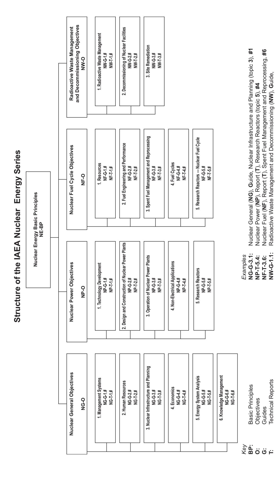

**Nos. 1-6:** Topic designations Radioactive Waste (topic **1**), **#1**

**#:** Guide or Report number (1, 2, 3, 4, etc.)


# Where to order IAEA publications

**In the following countries** IAEA publications may be purchased from the sources listed below, or from major local booksellers. Payment may be made in local currency or with UNESCO coupons.

#### ΔUSTRALIA

DA Information Services, 648 Whitehorse Road, MITCHAM 3132

Telephone: +61 3 9210 7777 • Fax: +61 3 9210 7788

Email: service@dadirect.com.au • Web site: http://www.dadirect.com.au

#### **BELGIUM**

Jean de Lannoy, avenue du Roi 202, B-1190 Brussels Telephone: +32 2 538 43 08 • Fax: +32 2 538 08 41

Email: jean.de.lannoy@infoboard.be • Web site: http://www.jean-de-lannoy.be

#### CANADA

Bernan Associates, 4501 Forbes Blvd, Suite 200, Lanham, MD 20706-4346, USA

Telephone: 1-800-865-3457 • Fax: 1-800-865-3450

Email: customercare@bernan.com • Web site: http://www.bernan.com

Renouf Publishing Company Ltd., 1-5369 Canotek Rd., Ottawa, Ontario, K1J 9J3

Telephone: +613 745 2665 • Fax: +613 745 7660

Email: order.dept@renoufbooks.com • Web site: http://www.renoufbooks.com

#### CHINA

IAEA Publications in Chinese: China Nuclear Energy Industry Corporation, Translation Section, P.O. Box 2103, Beijing

#### **CZECH REPUBLIC**

Suweco CZ, S.R.O., Klecakova 347, 180 21 Praha 9 Telephone: +420 26603 5364 • Fax: +420 28482 1646 Email: nakup@suweco.cz • Web site: http://www.suweco.cz

#### FINLAND

Akateeminen Kirjakauppa, PO BOX 128 (Keskuskatu 1), FIN-00101 Helsinki

Telephone: +358 9 121 41 • Fax: +358 9 121 4450

Email: akatilaus@akateeminen.com • Web site: http://www.akateeminen.com

#### FRANCE

Form-Edit, 5, rue Janssen, P.O. Box 25, F-75921 Paris Cedex 19 Telephone: +33 1 42 01 49 49 • Fax: +33 1 42 01 90 90

Email: formedit@formedit.fr • Web site: http://www.formedit.fr

Lavoisier SAS, 145 rue de Provigny, 94236 Cachan Cedex Telephone: + 33 1 47 40 67 02 • Fax +33 1 47 40 67 02

Email: romuald.verrier@lavoisier.fr • Web site: http://www.lavoisier.fr

#### **GERMANY**

UNO-Verlag, Vertriebs- und Verlags GmbH, Am Hofgarten 10, D-53113 Bonn Telephone: + 49 228 94 90 20 • Fax: +49 228 94 90 20 or +49 228 94 90 222 Email: bestellung@uno-verlag.de • Web site: http://www.uno-verlag.de

#### HUNGARY

Librotrade Ltd., Book Import, P.O. Box 126, H-1656 Budapest

Telephone: +36 1 257 7777 • Fax: +36 1 257 7472 • Email: books@librotrade.hu

#### INDIA

Allied Publishers Group, 1st Floor, Dubash House, 15, J. N. Heredia Marg, Ballard Estate, Mumbai 400 001,

Telephone: +91 22 22617926/27 • Fax: +91 22 22617928

Email: alliedpl@vsnl.com • Web site: http://www.alliedpublishers.com

Bookwell, 2/72, Nirankari Colony, Delhi 110009

Telephone: +91 11 23268786, +91 11 23257264 • Fax: +91 11 23281315

Email: bookwell@vsnl.net

#### ITAI Y

Libreria Scientifica Dott. Lucio di Biasio "AEIOU", Via Coronelli 6, I-20146 Milan

Telephone: +39 02 48 95 45 52 or 48 95 45 62 • Fax: +39 02 48 95 45 48

Email: info@libreriaaeiou.eu • Website: www.libreriaaeiou.eu

#### **JAPAN**

Maruzen Company, Ltd., 13-6 Nihonbashi, 3 chome, Chuo-ku, Tokyo 103-0027

Telephone: +81 3 3275 8582 • Fax: +81 3 3275 9072

Email: journal@maruzen.co.jp • Web site: http://www.maruzen.co.jp

#### REPUBLIC OF KOREA

KINS Inc., Information Business Dept. Samho Bldg. 2nd Floor, 275-1 Yang Jae-dong SeoCho-G, Seoul 137-130 Telephone: +02 589 1740 • Fax: +02 589 1746 • Web site: http://www.kins.re.kr

#### **NETHERLANDS**

De Lindeboom Internationale Publicaties B.V., M.A. de Ruyterstraat 20A, NL-7482 BZ Haaksbergen

Telephone: +31 (0) 53 5740004 • Fax: +31 (0) 53 5729296

Email: books@delindeboom.com • Web site: http://www.delindeboom.com

Martinus Nijhoff International, Koraalrood 50, P.O. Box 1853, 2700 CZ Zoetermeer

Telephone: +31 793 684 400 • Fax: +31 793 615 698 Email: info@nijhoff.nl • Web site: http://www.nijhoff.nl Swets and Zeitlinger b.v., P.O. Box 830, 2160 SZ Lisse Telephone: +31 252 435 111 • Fax: +31 252 415 888 Email: infoho@swets.nl • Web site: http://www.swets.nl

#### **NEW ZEALAND**

DA Information Services, 648 Whitehorse Road, MITCHAM 3132, Australia

Telephone: +61 3 9210 7777 • Fax: +61 3 9210 7788

Email: service@dadirect.com.au • Web site: http://www.dadirect.com.au

#### SLOVENIA

Cankarjeva Zalozba d.d., Kopitarjeva 2, SI-1512 Ljubljana Telephone: +386 1 432 31 44 • Fax: +386 1 230 14 35

Email: import.books@cankarjeva-z.si • Web site: http://www.cankarjeva-z.si/uvoz

#### **SPAIN**

Díaz de Santos, S.A., c/ Juan Bravo, 3A, E-28006 Madrid Telephone: +34 91 781 94 80 • Fax: +34 91 575 55 63

Email: compras@diazdesantos.es, carmela@diazdesantos.es, barcelona@diazdesantos.es, julio@diazdesantos.es

Web site: http://www.diazdesantos.es

#### **UNITED KINGDOM**

The Stationery Office Ltd, International Sales Agency, PO Box 29, Norwich, NR3 1 GN

Telephone (orders): +44 870 600 5552 • (enquiries): +44 207 873 8372 • Fax: +44 207 873 8203

Email (orders): book.orders@tso.co.uk • (enquiries): book.enquiries@tso.co.uk • Web site: http://www.tso.co.uk

#### On-line orders

DELTA Int. Book Wholesalers Ltd., 39 Alexandra Road, Addlestone, Surrey, KT15 2PQ

Email: info@profbooks.com • Web site: http://www.profbooks.com

Books on the Environment

Earthprint Ltd., P.O. Box 119, Stevenage SG1 4TP Telephone: +44 1438748111 • Fax: +44 1438748844

Email: orders@earthprint.com • Web site: http://www.earthprint.com

#### UNITED NATIONS

Dept. 1004, Room DC2-0853, First Avenue at 46th Street, New York, N.Y. 10017, USA

(UN) Telephone: +800 253-9646 or +212 963-8302 • Fax: +212 963-3489

Email: publications@un.org • Web site: http://www.un.org

#### **UNITED STATES OF AMERICA**

Bernan Associates, 4501 Forbes Blvd., Suite 200, Lanham, MD 20706-4346

Telephone: 1-800-865-3457 • Fax: 1-800-865-3450

Email: customercare@bernan.com · Web site: http://www.bernan.com

Renouf Publishing Company Ltd., 812 Proctor Ave., Ogdensburg, NY, 13669

Telephone: +888 551 7470 (toll-free) • Fax: +888 568 8546 (toll-free)

Email: order.dept@renoufbooks.com • Web site: http://www.renoufbooks.com

#### **Orders and requests for information** may also be addressed directly to:

#### Marketing and Sales Unit, International Atomic Energy Agency

Vienna International Centre, PO Box 100, 1400 Vienna, Austria

Telephone: +43 1 2600 22529 (or 22530) • Fax: +43 1 2600 29302

Email: sales.publications@iaea.org • Web site: http://www.iaea.org/books

**INTERNATIONAL ATOMIC ENERGY AGENCY VIENNA ISBN 978–92–0–113710–4 ISSN 1995–7807**