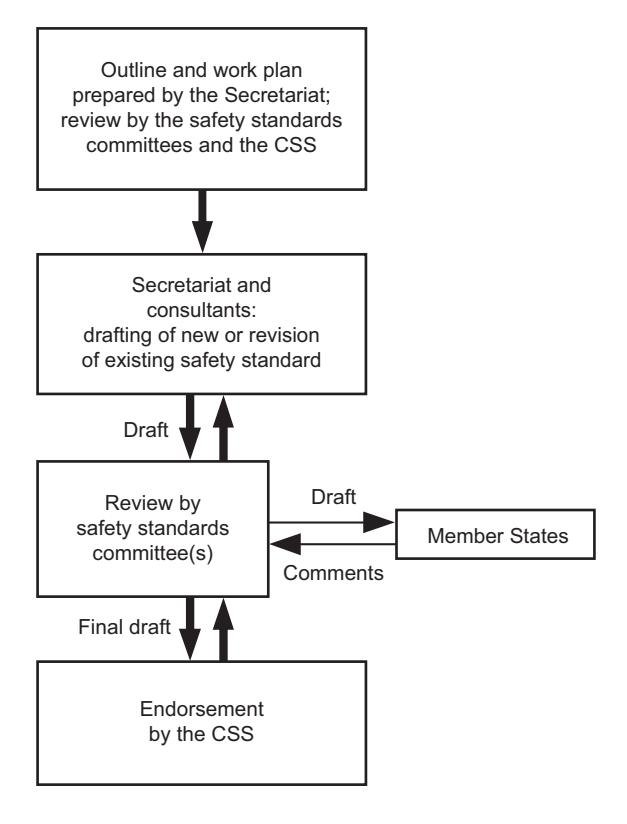
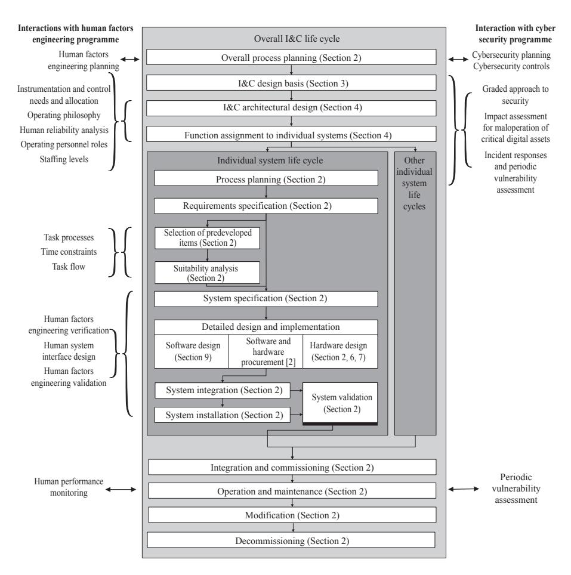
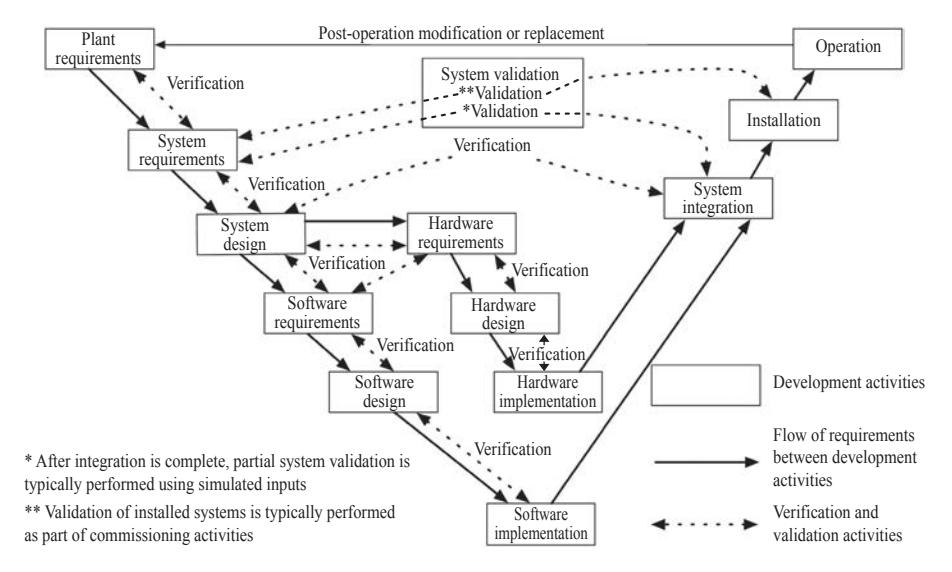
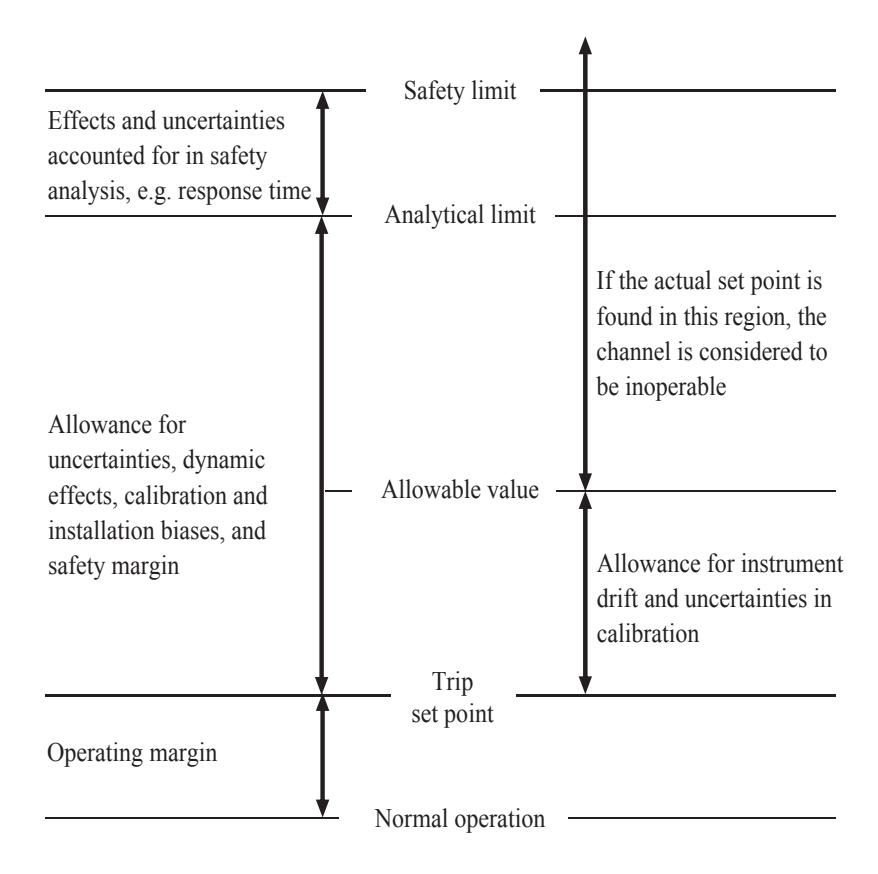

# IAEA Safety Standards

**for protecting people and the environment**

# Design of Instrumentation and Control Systems for Nuclear Power Plants

Specific Safety Guide

No. SSG-39

## **IAEA SAFETY STANDARDS AND RELATED PUBLICATIONS**

#### IAEA SAFETY STANDARDS

Under the terms of Article III of its Statute, the IAEA is authorized to establish or adopt standards of safety for protection of health and minimization of danger to life and property, and to provide for the application of these standards.

The publications by means of which the IAEA establishes standards are issued in the **IAEA Safety Standards Series**. This series covers nuclear safety, radiation safety, transport safety and waste safety. The publication categories in the series are **Safety Fundamentals**, **Safety Requirements** and **Safety Guides**.

Information on the IAEA's safety standards programme is available on the IAEA Internet site

#### http://www-ns.iaea.org/standards/

The site provides the texts in English of published and draft safety standards. The texts of safety standards issued in Arabic, Chinese, French, Russian and Spanish, the IAEA Safety Glossary and a status report for safety standards under development are also available. For further information, please contact the IAEA at: Vienna International Centre, PO Box 100, 1400 Vienna, Austria.

All users of IAEA safety standards are invited to inform the IAEA of experience in their use (e.g. as a basis for national regulations, for safety reviews and for training courses) for the purpose of ensuring that they continue to meet users' needs. Information may be provided via the IAEA Internet site or by post, as above, or by email to Offi cial.Mail@iaea.org.

#### RELATED PUBLICATIONS

The IAEA provides for the application of the standards and, under the terms of Articles III and VIII.C of its Statute, makes available and fosters the exchange of information relating to peaceful nuclear activities and serves as an intermediary among its Member States for this purpose.

Reports on safety in nuclear activities are issued as **Safety Reports**, which provide practical examples and detailed methods that can be used in support of the safety standards.

Other safety related IAEA publications are issued as **Emergency Preparedness and Response** publications, **Radiological Assessment Reports**, the International Nuclear Safety Group's **INSAG Reports**, **Technical Reports** and **TECDOCs**. The IAEA also issues reports on radiological accidents, training manuals and practical manuals, and other special safety related publications.

Security related publications are issued in the **IAEA Nuclear Security Series**.

The **IAEA Nuclear Energy Series** comprises informational publications to encourage and assist research on, and the development and practical application of, nuclear energy for peaceful purposes. It includes reports and guides on the status of and advances in technology, and on experience, good practices and practical examples in the areas of nuclear power, the nuclear fuel cycle, radioactive waste management and decommissioning.

## DESIGN OF INSTRUMENTATION AND CONTROL SYSTEMS FOR NUCLEAR POWER PLANTS

#### The following States are Members of the International Atomic Energy Agency:

| AFGHANISTAN            | GEORGIA                   | OMAN                     |
|------------------------|---------------------------|--------------------------|
| ALBANIA                | GERMANY                   | PAKISTAN                 |
| ALGERIA                | GHANA                     | PALAU                    |
| ANGOLA                 | GREECE                    | PANAMA                   |
| ANTIGUA AND BARBUDA    | GUATEMALA                 | PAPUA NEW GUINEA         |
| ARGENTINA              | GUYANA                    | PARAGUAY                 |
| ARMENIA                | HAITI                     | PERU                     |
| AUSTRALIA              | HOLY SEE                  | PHILIPPINES              |
| AUSTRIA                | HONDURAS                  | POLAND                   |
| AZERBAIJAN             | HUNGARY                   | PORTUGAL                 |
| BAHAMAS                | ICELAND                   | OATAR                    |
| BAHRAIN                | INDIA                     | REPUBLIC OF MOLDOVA      |
| BANGLADESH             | INDONESIA                 | ROMANIA                  |
| BARBADOS               | IRAN, ISLAMIC REPUBLIC OF | RUSSIAN FEDERATION       |
| BELARUS                | IRAO                      | RWANDA                   |
| BELGIUM                | IRELAND                   | SAN MARINO               |
| BELIZE                 | ISRAEL                    | SAUDI ARABIA             |
| BENIN                  | ITALY                     | SENEGAL                  |
| BOLIVIA, PLURINATIONAL | JAMAICA                   | SERBIA                   |
| STATE OF               | JAPAN                     | SEYCHELLES               |
| BOSNIA AND HERZEGOVINA | JORDAN                    | SIERRA LEONE             |
| BOTSWANA               | KAZAKHSTAN                | SINGAPORE                |
| BRAZIL                 | KENYA                     | SLOVAKIA                 |
| BRUNEI DARUSSALAM      | KOREA, REPUBLIC OF        | SLOVENIA                 |
| BULGARIA               | KUWAIT                    | SOUTH AFRICA             |
| BURKINA FASO           | KYRGYZSTAN                | SPAIN                    |
| BURUNDI                | LAO PEOPLE'S DEMOCRATIC   | SRI LANKA                |
| CAMBODIA               | REPUBLIC                  | SUDAN                    |
| CAMEROON               | LATVIA                    |                          |
| CANADA                 | LEBANON                   | SWAZILAND SWEDEN      |
| CENTRAL AFRICAN        |                           | SWITZERLAND              |
|                        | LESOTHO                   |                          |
| REPUBLIC CHAD       | LIBERIA LIBYA          | SYRIAN ARAB REPUBLIC     |
| CHAD                   |                           | TAJIKISTAN               |
| CHINA                  | LIECHTENSTEIN             | THAILAND                 |
|                        | LITHUANIA                 | THE FORMER YUGOSLAV      |
| COLOMBIA               | LUXEMBOURG                | REPUBLIC OF MACEDONIA    |
| CONGO                  | MADAGASCAR                | TOGO                     |
| COSTA RICA             | MALAWI                    | TRINIDAD AND TOBAGO      |
| CÔTE D'IVOIRE          | MALAYSIA                  | TUNISIA                  |
| CROATIA                | MALI                      | TURKEY                   |
| CUBA                   | MALTA                     | TURKMENISTAN             |
| CYPRUS                 | MARSHALL ISLANDS          | UGANDA                   |
| CZECH REPUBLIC         | MAURITANIA                | UKRAINE                  |
| DEMOCRATIC REPUBLIC    | MAURITIUS                 | UNITED ARAB EMIRATES     |
| OF THE CONGO           | MEXICO                    | UNITED KINGDOM OF        |
| DENMARK                | MONACO                    | GREAT BRITAIN AND        |
| DJIBOUTI               | MONGOLIA                  | NORTHERN IRELAND         |
| DOMINICA               | MONTENEGRO                | UNITED REPUBLIC          |
| DOMINICAN REPUBLIC     | MOROCCO                   | OF TANZANIA              |
| ECUADOR                | MOZAMBIQUE                | UNITED STATES OF AMERICA |
| EGYPT                  | MYANMAR                   | URUGUAY                  |
| EL SALVADOR            | NAMIBIA                   | UZBEKISTAN               |
| ERITREA                | NEPAL                     | VANUATU                  |
| ESTONIA                | NETHERLANDS               | VENEZUELA, BOLIVARIAN    |
| ETHIOPIA               | NEW ZEALAND               | REPUBLIC OF              |
| FIJI                   | NICARAGUA                 | VIET NAM                 |
| FINLAND                | NIGER                     | YEMEN                    |
| FRANCE                 | NIGERIA                   | ZAMBIA                   |
| GABON                  | NORWAY                    | ZIMBABWE                 |

The Agency's Statute was approved on 23 October 1956 by the Conference on the Statute of the IAEA held at United Nations Headquarters, New York; it entered into force on 29 July 1957. The Headquarters of the Agency are situated in Vienna. Its principal objective is "to accelerate and enlarge the contribution of atomic energy to peace, health and prosperity throughout the world".

## IAEA SAFETY STANDARDS SERIES No. SSG-39

# DESIGN OF INSTRUMENTATION AND CONTROL SYSTEMS FOR NUCLEAR POWER PLANTS

SPECIFIC SAFETY GUIDE

INTERNATIONAL ATOMIC ENERGY AGENCY VIENNA, 2016

## **COPYRIGHT NOTICE**

All IAEA scientific and technical publications are protected by the terms of the Universal Copyright Convention as adopted in 1952 (Berne) and as revised in 1972 (Paris). The copyright has since been extended by the World Intellectual Property Organization (Geneva) to include electronic and virtual intellectual property. Permission to use whole or parts of texts contained in IAEA publications in printed or electronic form must be obtained and is usually subject to royalty agreements. Proposals for non-commercial reproductions and translations are welcomed and considered on a case-by-case basis. Enquiries should be addressed to the IAEA Publishing Section at:

Marketing and Sales Unit, Publishing Section International Atomic Energy Agency Vienna International Centre PO Box 100 1400 Vienna, Austria

fax: +43 1 2600 29302 tel.: +43 1 2600 22417

email: sales.publications@iaea.org

http://www.iaea.org/books

© IAEA, 2016

Printed by the IAEA in Austria April 2016 STI/PUB/1694

#### **IAEA Library Cataloguing in Publication Data**

Design of instrumentation and control systems for nuclear power plants : specific safety guide. — Vienna : International Atomic Energy Agency, 2016.

p. ; 24 cm. — (IAEA safety standards series, ISSN 1020–525X ; no. SSG-39)

STI/PUB/1694

ISBN 978–92–0–102815–0

Includes bibliographical references.

- 1. Nuclear power plants Design and construction Safety measures.
- 2. Nuclear power plants Instruments 3. Nuclear power plants Control rooms. I. International Atomic Energy Agency. II. Series.

IAEAL 15–00999

## **FOREWORD**

## **by Yukiya Amano Director General**

The IAEA's Statute authorizes the Agency to "establish or adopt… standards of safety for protection of health and minimization of danger to life and property" — standards that the IAEA must use in its own operations, and which States can apply by means of their regulatory provisions for nuclear and radiation safety. The IAEA does this in consultation with the competent organs of the United Nations and with the specialized agencies concerned. A comprehensive set of high quality standards under regular review is a key element of a stable and sustainable global safety regime, as is the IAEA's assistance in their application.

The IAEA commenced its safety standards programme in 1958. The emphasis placed on quality, fitness for purpose and continuous improvement has led to the widespread use of the IAEA standards throughout the world. The Safety Standards Series now includes unified Fundamental Safety Principles, which represent an international consensus on what must constitute a high level of protection and safety. With the strong support of the Commission on Safety Standards, the IAEA is working to promote the global acceptance and use of its standards.

Standards are only effective if they are properly applied in practice. The IAEA's safety services encompass design, siting and engineering safety, operational safety, radiation safety, safe transport of radioactive material and safe management of radioactive waste, as well as governmental organization, regulatory matters and safety culture in organizations. These safety services assist Member States in the application of the standards and enable valuable experience and insights to be shared.

Regulating safety is a national responsibility, and many States have decided to adopt the IAEA's standards for use in their national regulations. For parties to the various international safety conventions, IAEA standards provide a consistent, reliable means of ensuring the effective fulfilment of obligations under the conventions. The standards are also applied by regulatory bodies and operators around the world to enhance safety in nuclear power generation and in nuclear applications in medicine, industry, agriculture and research.

Safety is not an end in itself but a prerequisite for the purpose of the protection of people in all States and of the environment — now and in the future. The risks associated with ionizing radiation must be assessed and controlled without unduly limiting the contribution of nuclear energy to equitable and sustainable development. Governments, regulatory bodies and operators everywhere must ensure that nuclear material and radiation sources are used beneficially, safely and ethically. The IAEA safety standards are designed to facilitate this, and I encourage all Member States to make use of them.

## **THE IAEA SAFETY STANDARDS**

#### BACKGROUND

Radioactivity is a natural phenomenon and natural sources of radiation are features of the environment. Radiation and radioactive substances have many beneficial applications, ranging from power generation to uses in medicine, industry and agriculture. The radiation risks to workers and the public and to the environment that may arise from these applications have to be assessed and, if necessary, controlled.

Activities such as the medical uses of radiation, the operation of nuclear installations, the production, transport and use of radioactive material, and the management of radioactive waste must therefore be subject to standards of safety.

Regulating safety is a national responsibility. However, radiation risks may transcend national borders, and international cooperation serves to promote and enhance safety globally by exchanging experience and by improving capabilities to control hazards, to prevent accidents, to respond to emergencies and to mitigate any harmful consequences.

States have an obligation of diligence and duty of care, and are expected to fulfil their national and international undertakings and obligations.

International safety standards provide support for States in meeting their obligations under general principles of international law, such as those relating to environmental protection. International safety standards also promote and assure confidence in safety and facilitate international commerce and trade.

A global nuclear safety regime is in place and is being continuously improved. IAEA safety standards, which support the implementation of binding international instruments and national safety infrastructures, are a cornerstone of this global regime. The IAEA safety standards constitute a useful tool for contracting parties to assess their performance under these international conventions.

#### THE IAEA SAFETY STANDARDS

The status of the IAEA safety standards derives from the IAEA's Statute, which authorizes the IAEA to establish or adopt, in consultation and, where appropriate, in collaboration with the competent organs of the United Nations and with the specialized agencies concerned, standards of safety for protection of health and minimization of danger to life and property, and to provide for their application.

With a view to ensuring the protection of people and the environment from harmful effects of ionizing radiation, the IAEA safety standards establish fundamental safety principles, requirements and measures to control the radiation exposure of people and the release of radioactive material to the environment, to restrict the likelihood of events that might lead to a loss of control over a nuclear reactor core, nuclear chain reaction, radioactive source or any other source of radiation, and to mitigate the consequences of such events if they were to occur. The standards apply to facilities and activities that give rise to radiation risks, including nuclear installations, the use of radiation and radioactive sources, the transport of radioactive material and the management of radioactive waste.

Safety measures and security measures1 have in common the aim of protecting human life and health and the environment. Safety measures and security measures must be designed and implemented in an integrated manner so that security measures do not compromise safety and safety measures do not compromise security.

The IAEA safety standards reflect an international consensus on what constitutes a high level of safety for protecting people and the environment from harmful effects of ionizing radiation. They are issued in the IAEA Safety Standards Series, which has three categories (see Fig. 1).

#### **Safety Fundamentals**

Safety Fundamentals present the fundamental safety objective and principles of protection and safety, and provide the basis for the safety requirements.

#### **Safety Requirements**

An integrated and consistent set of Safety Requirements establishes the requirements that must be met to ensure the protection of people and the environment, both now and in the future. The requirements are governed by the objective and principles of the Safety Fundamentals. If the requirements are not met, measures must be taken to reach or restore the required level of safety. The format and style of the requirements facilitate their use for the establishment, in a harmonized manner, of a national regulatory framework. Requirements, including numbered 'overarching' requirements, are expressed as 'shall' statements. Many requirements are not addressed to a specific party, the implication being that the appropriate parties are responsible for fulfilling them.

1 See also publications issued in the IAEA Nuclear Security Series.

#### Part 1. Governmental, Legal and Regulatory Framework for Safety Part 2. Leadership and Management for Safety Part 3. Radiation Protection and Safety of Radiation Sources Part 4. Safety Assessment for Facilities and Activities Part 5. Predisposal Management of Radioactive Waste Part 6. Decommissioning and Termination of Activities Part 7. Emergency Preparedness and Response 1. Site Evaluation for Nuclear Installations 2. Safety of Nuclear Power Plants 2/1 Design 2/2 Commissioning and Operation 3. Safety of Research Reactors 4. Safety of Nuclear Fuel Cycle Facilities 5. Safety of Radioactive Waste Disposal Facilities 6. Safe Transport of Radioactive Material General Safety Requirements Specific Safety Requirements Fundamental Safety Principles Collection of Safety Guides

Safety Fundamentals

*FIG. 1. The long term structure of the IAEA Safety Standards Series.*

#### **Safety Guides**

Safety Guides provide recommendations and guidance on how to comply with the safety requirements, indicating an international consensus that it is necessary to take the measures recommended (or equivalent alternative measures). The Safety Guides present international good practices, and increasingly they reflect best practices, to help users striving to achieve high levels of safety. The recommendations provided in Safety Guides are expressed as 'should' statements.

#### APPLICATION OF THE IAEA SAFETY STANDARDS

The principal users of safety standards in IAEA Member States are regulatory bodies and other relevant national authorities. The IAEA safety standards are also used by co-sponsoring organizations and by many organizations that design, construct and operate nuclear facilities, as well as organizations involved in the use of radiation and radioactive sources.

The IAEA safety standards are applicable, as relevant, throughout the entire lifetime of all facilities and activities — existing and new — utilized for peaceful purposes and to protective actions to reduce existing radiation risks. They can be used by States as a reference for their national regulations in respect of facilities and activities.

The IAEA's Statute makes the safety standards binding on the IAEA in relation to its own operations and also on States in relation to IAEA assisted operations.

The IAEA safety standards also form the basis for the IAEA's safety review services, and they are used by the IAEA in support of competence building, including the development of educational curricula and training courses.

International conventions contain requirements similar to those in the IAEA safety standards and make them binding on contracting parties. The IAEA safety standards, supplemented by international conventions, industry standards and detailed national requirements, establish a consistent basis for protecting people and the environment. There will also be some special aspects of safety that need to be assessed at the national level. For example, many of the IAEA safety standards, in particular those addressing aspects of safety in planning or design, are intended to apply primarily to new facilities and activities. The requirements established in the IAEA safety standards might not be fully met at some existing facilities that were built to earlier standards. The way in which IAEA safety standards are to be applied to such facilities is a decision for individual States.

The scientific considerations underlying the IAEA safety standards provide an objective basis for decisions concerning safety; however, decision makers must also make informed judgements and must determine how best to balance the benefits of an action or an activity against the associated radiation risks and any other detrimental impacts to which it gives rise.

#### DEVELOPMENT PROCESS FOR THE IAEA SAFETY STANDARDS

The preparation and review of the safety standards involves the IAEA Secretariat and four safety standards committees, for nuclear safety (NUSSC), radiation safety (RASSC), the safety of radioactive waste (WASSC) and the safe transport of radioactive material (TRANSSC), and a Commission on Safety Standards (CSS) which oversees the IAEA safety standards programme (see Fig. 2).

All IAEA Member States may nominate experts for the safety standards committees and may provide comments on draft standards. The membership of the Commission on Safety Standards is appointed by the Director General and

*FIG. 2. The process for developing a new safety standard or revising an existing standard.*

includes senior governmental officials having responsibility for establishing national standards.

A management system has been established for the processes of planning, developing, reviewing, revising and establishing the IAEA safety standards. It articulates the mandate of the IAEA, the vision for the future application of the safety standards, policies and strategies, and corresponding functions and responsibilities.

#### INTERACTION WITH OTHER INTERNATIONAL ORGANIZATIONS

The findings of the United Nations Scientific Committee on the Effects of Atomic Radiation (UNSCEAR) and the recommendations of international expert bodies, notably the International Commission on Radiological Protection (ICRP), are taken into account in developing the IAEA safety standards. Some safety standards are developed in cooperation with other bodies in the United Nations system or other specialized agencies, including the Food and Agriculture Organization of the United Nations, the United Nations Environment Programme, the International Labour Organization, the OECD Nuclear Energy Agency, the Pan American Health Organization and the World Health Organization.

#### INTERPRETATION OF THE TEXT

Safety related terms are to be understood as defined in the IAEA Safety Glossary (see http://www-ns.iaea.org/standards/safety-glossary.htm). Otherwise, words are used with the spellings and meanings assigned to them in the latest edition of The Concise Oxford Dictionary. For Safety Guides, the English version of the text is the authoritative version.

The background and context of each standard in the IAEA Safety Standards Series and its objective, scope and structure are explained in Section 1, Introduction, of each publication.

Material for which there is no appropriate place in the body text (e.g. material that is subsidiary to or separate from the body text, is included in support of statements in the body text, or describes methods of calculation, procedures or limits and conditions) may be presented in appendices or annexes.

An appendix, if included, is considered to form an integral part of the safety standard. Material in an appendix has the same status as the body text, and the IAEA assumes authorship of it. Annexes and footnotes to the main text, if included, are used to provide practical examples or additional information or explanation. Annexes and footnotes are not integral parts of the main text. Annex material published by the IAEA is not necessarily issued under its authorship; material under other authorship may be presented in annexes to the safety standards. Extraneous material presented in annexes is excerpted and adapted as necessary to be generally useful.

## safety standards are developed in cooperation with other bodies in the United **CONTENTS**

| 1. | INTRODUCTION .                                                                                                                                                    | 1                  |
|----|-------------------------------------------------------------------------------------------------------------------------------------------------------------------|--------------------|
|    | Background (1.1–1.6) . Objective (1.7–1.8) . Scope (1.9–1.17) . Structure (1.18–1.27) .                                                               | 1 3 3 5   |
| 2. | THE MANAGEMENT SYSTEM FOR INSTRUMENTATION AND CONTROL DESIGN .                                                                                                 | 6                  |
|    | General (2.1–2.9) . Use of life cycle models (2.10–2.37) . Activities common to all life cycle phases (2.38–2.91) . Life cycle activities (2.92–2.167) . | 6 9 16 26 |
| 3. | DESIGN BASIS FOR INSTRUMENTATION AND CONTROL SYSTEMS .                                                                                                         | 36                 |
|    | Identification of instrumentation and control functions (3.1–3.6) . Content of design basis for instrumentation and control systems (3.7–3.16) .            | 36 37           |
| 4. | INSTRUMENTATION AND CONTROL ARCHITECTURE .                                                                                                                        | 41                 |
|    | Architectural design (4.1–4.10) . Content of the overall instrumentation and                                                                                   | 41                 |
|    | control architecture (4.11–4.12) . Content of individual instrumentation and control system                                                                    | 43                 |
|    | architectures (4.13) . Independence (4.14–4.24) . Consideration of common cause failure (4.25–4.40) .                                                       | 44 44 46     |
| 5. | SAFETY CLASSIFICATION OF INSTRUMENTATION AND CONTROL FUNCTIONS, SYSTEMS AND EQUIPMENT                                                                          | 48                 |
|    | (5.1–5.13) .                                                                                                                                                      |                    |

| 6. | GENERAL RECOMMENDATIONS FOR ALL INSTRUMENTATION AND CONTROL SYSTEMS IMPORTANT TO SAFETY | 50       |
|----|-----------------------------------------------------------------------------------------------|----------|
|    |                                                                                               |          |
|    | General (6.1–6.5) .                                                                           | 50       |
|    | Design for reliability (6.6–6.76) .                                                           | 51       |
|    | Equipment qualification (6.77–6.134) .                                                        | 62       |
|    | Design to cope with ageing and obsolescence (6.135–6.152) .                                   | 69       |
|    | Control of access to systems important to safety (6.153–6.158) .                              | 72       |
|    | Testing and testability during operation (6.159–6.191) . Maintainability (6.192–6.197) .   | 72 79 |
|    | Provisions for removal from service for testing or                                            |          |
|    | maintenance (6.198–6.204) .                                                                   | 80       |
|    | Set points (6.205–6.212) .                                                                    | 81       |
|    | Marking and identification of items important to safety                                       |          |
|    | (6.213–6.219) .                                                                               | 82       |
|    |                                                                                               |          |
| 7. | DESIGN GUIDELINES FOR SPECIFIC INSTRUMENTATION                                                |          |
|    | AND CONTROL SYSTEMS, AND EQUIPMENT .                                                          | 84       |
|    |                                                                                               |          |
|    | Sensing devices (7.1–7.9) .                                                                   | 84       |
|    | Control systems (7.10–7.14) .                                                                 | 85       |
|    | Protection system (7.15–7.59) .                                                               | 86       |
|    | Power supplies (7.60–7.65) .                                                                  | 92       |
|    | Digital systems (7.66–7.147) .                                                                | 93       |
|    | Software tools (7.148–7.164)                                                                  | 103      |
|    | Qualification of industrial digital devices of limited functionality                          |          |
|    | for safety applications (7.165–7.175) .                                                       | 106      |
|    |                                                                                               |          |
| 8. | CONSIDERATIONS RELATING TO THE HUMAN–MACHINE                                                  |          |
|    | INTERFACE .                                                                                   | 108      |
|    |                                                                                               |          |
|    | Control rooms (8.1–8.18)                                                                      | 108      |
|    | Accident monitoring (8.19–8.35)                                                               | 111      |
|    | Operator communications systems (8.36–8.46)                                                   | 113      |
|    | General principles relating to human factors engineering for                                  |          |
|    | instrumentation and control systems (8.47–8.93)                                               | 115      |
|    | Recording of historical data (8.94) .                                                         | 121      |

| 9. SOFTWARE . |                                                  | 121 |
|------------------|--------------------------------------------------|-----|
|                  | General (9.1–9.5) .                              | 121 |
|                  | Software requirements (9.6–9.15) .               | 122 |
|                  | Software design (9.16–9.43) .                    | 124 |
|                  | Software implementation (9.44–9.63) .            | 127 |
|                  | Software verification and analysis (9.64–9.95) . | 129 |
|                  | Predeveloped software (9.96–9.98) .              | 132 |
|                  | Software tools (9.99) .                          | 133 |
|                  | Third party assessment (9.100–9.103) .           | 133 |
| REFERENCES .     |                                                  | 135 |
| ANNEX I:         | BIBLIOGRAPHY OF INTERNATIONAL                    |     |
|                  | INSTRUMENTATION AND CONTROL STANDARDS .          | 139 |
| ANNEX II:        | CORRELATION BETWEEN THIS SAFETY GUIDE            |     |
|                  | AND IAEA SAFETY STANDARDS SERIES                 |     |
|                  | Nos NS-G-1.1 AND NS-G-1.3 .                      | 146 |
| ANNEX III:       | AREAS WHERE PRACTICES OF MEMBER STATES           |     |
|                  | DIFFER .                                         | 150 |
| DEFINITIONS .    |                                                  | 155 |
|                  | CONTRIBUTORS TO DRAFTING AND REVIEW .            | 159 |

## **1. INTRODUCTION**

#### BACKGROUND

- 1.1. This Safety Guide provides recommendations on the design of instrumentation and control (I&C) systems to meet the requirements established in IAEA Safety Standards Series No. SSR-2/1 (Rev. 1), Safety of Nuclear Power Plants: Design [1].
- 1.2. This publication is a revision and combination of two Safety Guides, namely IAEA Safety Standards Series Nos NS-G-1.11 and NS-G-1.32 , which it supersedes. The revision takes into account developments in I&C systems since the publication of these earlier Safety Guides in 2000 and 2002, respectively. The main changes relate to the continuing development of computer applications and the evolution of the methods necessary for their safe, secure and practical use. In addition, account is taken of developments in human factors engineering and the need for computer security. This Safety Guide references and takes into account other IAEA Safety Standards and Nuclear Security Series publications that provide guidance relating to I&C design. Most notable among these are the IAEA Safety Standards Series Nos GS-R-3, The Management System for Facilities and Activities [2], GS-G-3.1, Application of the Management System for Facilities and Activities [3], GS-G-3.5, The Management System for Nuclear Installations [4], and GSR Part 4 (Rev. 1), Safety Assessment for Facilities and Activities [5].
- 1.3. The main topical areas for which this Safety Guide provides new or updated guidance are the following:
  - Considerations specific to I&C for achieving compliance with the requirements established in GS-R-3 [2];
  - Design inputs to be considered when developing the design basis for I&C systems;

1 INTERNATIONAL ATOMIC ENERGY AGENCY, Software for Computer Based Systems Important to Safety in Nuclear Power Plants, IAEA Safety Standards Series No. NS-G-1.1, IAEA, Vienna (2000).

2 INTERNATIONAL ATOMIC ENERGY AGENCY, Instrumentation and Control Systems Important to Safety in Nuclear Power Plants, IAEA Safety Standards Series No. NS-G-1.3, IAEA, Vienna (2002).

- The interdependent nature of life cycles for the design and implementation of I&C systems, and in particular the life cycle for the overall I&C for the facility as a whole, for individual I&C systems and for software, and the need for integration of human factors engineering inputs and computer security inputs into those life cycles;
- The use of computers, devices programmed with hardware description languages and industrial devices of limited functionality, and means of gaining assurance of their correct performance;
- The overall I&C architecture in support of the concept of defence in depth applied in the design of the plant systems and in establishing defence in depth for the I&C system itself as protection against common cause failure;
- Data transport between systems important to safety, with special consideration for cases where the system receiving data is in a higher safety class than the system sending data;
- Provisions for ensuring the security of digital safety systems;
- Activities relating to the development of computer software, including design, verification and validation, derived from principles given in this Safety Guide or implicit in the previous Safety Guide, NS-G-1.13 .
- 1.4. Throughout this Safety Guide, the term 'I&C system' refers to any I&C system important to safety as defined by the IAEA Safety Glossary [6]. The term 'important to safety' is not repeated again except for emphasis. In cases where recommendations or explanations are applicable to both I&C systems important to safety and I&C systems that are not important to safety, this is explicitly stated.
- 1.5. This Safety Guide is closely related to IAEA Safety Standards Series No. SSG-34, Design of Electrical Power Systems for Nuclear Power Plants [7], which provides recommendations for power supply, cable systems, protection against electromagnetic interference, equipment and signal grounds, and other topics that are necessary for the satisfactory operation of I&C systems.
- 1.6. Additional guidance on the design and development of I&C systems, equipment and software is available from States and from other organizations that develop standards. Such publications give much greater detail than is appropriate for IAEA safety standards. It is expected that this Safety Guide will be used in conjunction with detailed industrial standards.

3 See footnote 1.

#### OBJECTIVE

- 1.7. The objective of this Safety Guide is to provide guidance on the overall I&C architecture and on the I&C systems important to safety in nuclear power plants for meeting the safety goals of the plant.
- 1.8. This Safety Guide identifies the input information needed by I&C designers to define the I&C design basis from the mechanical, electrical, nuclear and civil engineering design of the plant, from the plant layout process and from safety analysis. The I&C design basis will, for example, provide the functional requirements to be achieved by the I&C, the extremes of environmental temperature in which equipment is required to operate, the external events that I&C equipment is required to withstand, and the conditions for which an automatic shutdown is required to take place.

#### SCOPE

- 1.9. This Safety Guide provides guidance on the design, implementation, qualification and documentation of I&C systems important to safety in nuclear power plants to meet the requirements of SSR-2/1 (Rev. 1) [1]. This Safety Guide also describes certain I&C specific issues that are relevant to implementing the recommendations of certain other Safety Guides, such as those that cover the management system, commissioning, installation, operation, and operating limits and conditions. For such cases, this Safety Guide identifies relevant sections of these other Safety Guides.
- 1.10. The guidance applies to all I&C equipment, from sensors to the devices that actuate and control mechanical equipment. It covers, for example:
  - Sensors;
  - Actuator controls;
  - Equipment for automatic and manual control of plant equipment;
  - Operator interfaces.
- 1.11. This Safety Guide also applies to the means for implementing I&C equipment, such as:
  - Computer systems and associated communication systems;
  - Software;

- Devices that are programmed using hardware description languages (e.g. field programmable gate arrays);
- Industrial digital devices of limited functionality.
- 1.12. This Safety Guide does not provide recommendations for support features for I&C systems, such as cooling, lubrication and energy supply. Recommendations for electrical power supply are provided in SSG-34 [7].4
- 1.13. Although this Safety Guide covers certain aspects of human factors and computer security as they relate to I&C, it does not provide comprehensive guidance on these domains. The intent in this Safety Guide is to identify major interfaces with the human factors and computer security activities, and to give recommendations on I&C design features that affect these topics. Examples of human factors and computer security topics not covered in this guide include computerized operating procedures and information technology security. More detailed information on computer security is provided in Ref. [8].
- 1.14. The guidance applies to the design of I&C systems for new plants, to modifications of existing plants and to the modernization of the I&C of existing plants. IAEA Safety Standards Series No. NS-G-2.3, Modifications to Nuclear Power Plants [9] deals with plant modification, and the overlap of this Safety Guide with NS-G-2.3 [9] has been kept to a minimum.
- 1.15. The IAEA Safety Glossary [6] defines I&C systems important to safety as those I&C systems that are part of a safety group and also those I&C systems whose malfunction or failure could lead to radiation exposure of site personnel or members of the public. Section 5 of this Safety Guide further discusses the term 'important to safety' and other terminology relating to safety classification. Examples of I&C systems to which this Safety Guide may apply include:
  - Reactor protection systems;
  - Reactor control systems and reactivity control systems and their monitoring systems;
  - Systems for monitoring and controlling reactor cooling;
  - Systems for monitoring and controlling emergency power supplies;
  - Systems for monitoring and controlling containment isolation;
  - Instrumentation for accident monitoring;

4 A draft Safety Guide on the topic of auxiliary systems that will provide recommendations for other support features is currently under development.

- Systems for monitoring of effluents;
- I&C systems for fuel handling.
- 1.16. This Safety Guide provides recommendations for the development of computer software for use in I&C systems important to safety as well as for digital data communication. This Safety Guide also defines measures needed for I&C functions that are programmed into integrated circuits using hardware description language.
- 1.17. References [10, 11] present overviews of concepts that underlie this Safety Guide and give examples of systems addressed in it. These references may provide useful background material for some users, although they do not provide IAEA guidance.

#### STRUCTURE

- 1.18. Section 2 provides guidance for the application of the requirements in GS-R-3 [2] and the recommendations of GS-G-3.1 [3] and GS-G-3.5 [4] as they relate specifically to the development of I&C systems. It also addresses the use of life cycle models to describe management system processes for the development of I&C, provides guidance on generic processes for I&C design and provides guidance on the conduct of specific I&C development activities.
- 1.19. Section 3 identifies the necessary inputs to the design and provides recommendations on the design basis for I&C systems.
- 1.20. Section 4 provides guidance on the architecture of the overall I&C for the plant.
- 1.21. Section 5 describes the safety classification scheme that is used to grade the application of the recommendations of this Safety Guide in accordance with the safety significance of items to which they apply.
- 1.22. Section 6 provides general guidance applicable to all I&C systems important to safety.
- 1.23. Section 7 provides recommendations that are specific to certain systems such as the reactor protection system, certain types of equipment such as sensors, and certain technologies such as digital systems and integrated circuits configured

with hardware description languages. The recommendations of Sections 2–6 and Sections 8 and 9 also apply to the specific systems discussed in Section 7.

- 1.24. Section 8 provides recommendations on the human–machine interface. It includes guidance on the application of human factors principles to I&C and the characteristics that the human–machine interface should have.
- 1.25. Section 9 provides guidance on the development of software for computer based I&C systems important to safety.
- 1.26. This Safety Guide should be applied as a whole, not as a series of stand-alone sections. For example, the guidance on software provided in Section 9 is to be applied in conjunction with the guidance on the management system and on life cycles given in Section 2.
- 1.27. The annexes include a listing of industrial standards that provide more detailed guidance on the topical areas of this Safety Guide, information relating this Safety Guide to the two Safety Guides (NS-G-1.15 and NS-G-1.36 ) it supersedes, and a summary of areas where practices of States differ. A list of definitions specific to this Safety Guide is also provided.

## **2. THE MANAGEMENT SYSTEM FOR INSTRUMENTATION AND CONTROL DESIGN**

#### GENERAL

2.1. Requirement 6 of SSR-2/1 (Rev. 1) [1] states that:

"The design for a nuclear power plant shall ensure that the plant and items important to safety have the appropriate characteristics to ensure that safety functions can be performed with the necessary reliability, that the plant can be operated safely within the operational limits and conditions for the full duration of its design life and can be safely decommissioned, and that impacts on the environment are minimized."

5 See footnote 1.

6 See footnote 2.

## 2.2. Requirement 2 of SSR-2/1 (Rev. 1) [1] states that:

"The design organization shall establish and implement a management system for ensuring that all safety requirements established for the design of the plant are considered and implemented in all phases of the design process and that they are met in the final design."

2.3. GS-R-3 [2] establishes requirements for the management system for facilities and activities.

#### 2.4. Paragraph 2.1 of GS-R-3 [2] states that:

"A management system shall be established, implemented, assessed and continually improved. It shall be aligned with the goals of the organization and shall contribute to their achievement. The main aim of the management system shall be to achieve and enhance safety by:

- Bringing together in a coherent manner all the requirements for managing the organization;
- Describing the planned and systematic actions necessary to provide adequate confidence that all these requirements are satisfied;
- Ensuring that health, environmental, security, quality and economic requirements are not considered separately from safety requirements, to help preclude their possible negative impact on safety."

Paragraph 4.2 of GS-R-3 [2] further states: "The information and knowledge of the organization shall be managed as a resource."

2.5. In order to ensure safety, documentation on the design basis and related information or records relating to I&C systems important to safety should be controlled by suitable processes, such that they are complete, clear, concise, correct and consistent over the entire life cycle for the I&C system. The management system should ensure that design basis documents and related or derived information or records are sufficient and adequate, and are maintained over time to reflect design changes or changing conditions at the plant. This includes documents and information that may be derived from the design basis documentation and that may have an impact on safety, such as procedures or manuals relating to operation, maintenance or modification of such systems.

- 2.6. The management system includes the organizational structure, the organizational culture, policies and processes, including those to identify and allocate resources (e.g. personnel, equipment, infrastructure and the working environment) for developing I&C systems that meet safety requirements.
- 2.7. Each organization involved in I&C development activities should have a management system that is consistent with the expectations of the management system of the operating organization.
- 2.8. GS-G-3.1 [3] and GS-G-3.5 [4] provide guidance on the application of the requirements established in GS-R-3 [2] for facilities and activities, and for nuclear installations.
- 2.9. The management system for the development of I&C systems should meet the requirements of GS-R-3 [2] and be in accordance with the recommendations provided in GS-G-3.1 [3] and GS-G-3.5 [4], which apply broadly for the development of all structures, systems and components in a nuclear power plant. This Safety Guide, which addresses the specific development processes needed for I&C systems, should be used in conjunction with these publications.

The topics of GS-R-3 [2] that are of particular interest in the development of I&C systems are:

- The management system;
- Safety culture;
- Management commitment;
- Compliance with statutory and regulatory requirements;
- Organizational policies;
- Planning;
- Responsibilities and authority;
- Provision of resources;
- Human resources;
- Development of management system processes;
- Process management;
- Control of documents, products (including tools) and records;
- Purchasing;
- Communication;
- Management of organizational change;
- Monitoring and measurement;
- Self-assessment;
- Independent assessment;

- Non-conformances and corrective and preventative actions;
- Improvement.

#### USE OF LIFE CYCLE MODELS

#### 2.10. Paragraph 5.1 of GS-R-3 [2] states:

"The processes of the management system that are needed to achieve the goals, provide the means to meet all requirements and deliver the products of the organization shall be identified, and their development shall be planned, implemented, assessed and continually improved."

- 2.11. Modern I&C systems in nuclear power plants are complex entities for which different approaches to design and qualification are necessary beyond those that were typically applied to older systems. Frequently, the functional characteristics and performance of previous generations of I&C systems were characterized by models based on physics principles and testing that validated these models.
- 2.12. Modern I&C systems, in particular digital systems whose functionality depends on software or a hardware definition language, are fundamentally different from older systems in that their behaviour is determined by logic and is not prescribed by external physical laws. Consequently, minor errors in design and implementation can cause digital systems to exhibit unexpected behaviour.
- 2.13. In digital I&C systems, demonstration that the final product is fit for its purpose depends greatly, but not exclusively, on the use of a high quality development process that provides for disciplined specification and implementation of design requirements. Verification and validation activities are necessary for ensuring that the final product is suitable for use. However, correct performance of digital I&C systems over the full range of conditions cannot be inferred from a combination of testing and physics models to the same extent that this can be done for systems that rely only on hardware. Consequently, confidence in the correctness of modern systems derives more from the discipline of the development process than was the case for systems implemented purely with hardware.
- 2.14. In response to this situation, in the nuclear power domain as well as in other safety-critical domains such as aerospace, development processes have been applied that are commonly represented as life cycle models, which describe the

activities for the development of electronic systems and the relationships between these activities. These commonly accepted practices have been formalized in nuclear standards that provide extensive guidance regarding processes for developing I&C systems. Normally, activities relating to a given development step are grouped into the same phase of the life cycle.

- 2.15. A well documented development process will also produce evidence that can allow independent reviewers and the regulatory body to gain confidence in the fitness for purpose of the final product.
- 2.16. The recommendations for life cycle processes provided in this section also apply to the life cycle activities described in Section 9. The guidance on life cycle processes in this section supplements the requirements of GS-R-3 [2] and the recommendations of GS-G-3.1 [3] and GS-G-3.5 [4] as they apply to the development of I&C systems.
- 2.17. Three fundamental levels of life cycles are needed to describe the development of I&C systems:
- (a) An overall I&C architecture life cycle;
- (b) One or more individual I&C system life cycles;
- (c) One or more individual component life cycles: Component life cycles are typically managed in the framework of platform development and are independent of the overall architecture level and the individual system level life cycles. Component life cycles for digital systems are typically divided into separate life cycles for the development of hardware and software.
- 2.18. Other activities sometimes outside of the development of I&C systems will have an important influence on the requirements for, and the design of, I&C systems. Human factors engineering and computer security are examples of such activities. Such activities have a broader purpose than the support of I&C system design, but they will have a strong influence on I&C development. Furthermore, it is easier and more cost efficient to take account of human factors and security features in the design phase. After the design phase, changes can be very difficult or even impossible to implement.
- 2.19. Figure 1 shows an example of an I&C development life cycle and the main inputs received from the human factors engineering and computer security programmes.

*FIG. 1. Typical I&C development life cycle activities and interfaces with human factors engineering and computer security programmes.*

- 2.20. The 'V-model' shown in Fig. 2 is a useful alternative view of a sample development life cycle. This model illustrates the relationship between requirements specification, design, integration and system validation, and how verification and validation activities relate to development activities. Figure 2 applies to both digital and analogue systems. Of course, if there is no software, the software activities are unnecessary.
- 2.21. At any point in the life cycle, experience gained might result in a need to revise work done in a previous phase. These changes will then flow through and affect work from the intervening phases. For simplicity, Figs 1 and 2 do not show such iteration paths.

*FIG. 2. Typical relationship between I&C development life cycle processes and verification and validation activities.*

- 2.22. All activities associated with development, implementation and operation of the overall I&C architecture, individual I&C systems and I&C components7 should be carried out in the framework of a documented development life cycle.
- 2.23. The life cycle of each I&C system and component should cover a period that starts with the derivation of its requirements and ends when the I&C system or component is no longer required for the safety of the plant.

#### **Process planning**

- 2.24. Before the initiation of any technical activity, a plan identifying the necessary inputs and the products and processes of that activity, and the relationship of the activity with other activities, should be prepared and approved in accordance with the requirements for the management system.
- 2.25. Plans for the development of I&C systems deal with topics that are specific to I&C and with topics for which I&C development may need specialized

7 I&C components include hardware, software, such as application software and firmware, and hardware description language.

treatment. Typically, plans specific to I&C development will be prepared to deal with the topics given in the following:

- Life cycle models;
- Configuration management;
- Identification, control and resolution of non-conformances;
- Hazard analysis;
- Verification and validation;
- Use of insights from probabilistic safety assessment;
- Safety analysis specific to I&C systems;
- Requirements engineering;
- Architectural design;
- Selection and acceptance of predeveloped items;
- Design;
- Implementation (e.g. hardware manufacture and coding of software or coding and synthesis using a hardware description language);
- Integration;
- System validation;
- Installation;
- Commissioning;
- Equipment qualification;
- Qualification and use of tools;
- Maintainability;
- Mitigation of obsolescence;
- Operation;
- Training;
- Software maintenance.
- 2.26. The plans for several of these topics may be combined into a single plan.
- 2.27. The development of I&C systems also depends on plans for activities that are not specific to I&C development, such as:
  - Quality assurance;
  - Classification of items important to safety;
  - Purchasing;
  - Manufacturing;
  - Production and maintenance of documentation.
- 2.28. All I&C development activities should be performed in accordance with the applicable approved plans.

## **Coordination with human factors engineering activities and computer security activities**

- 2.29. Although life cycle models relating to human factors engineering and computer security are not covered by this Safety Guide, such processes provide information that is required for I&C development. Figure 1 illustrates the relationships and interfaces between these processes. These include: activities that produce requirements specific to human factors engineering; outputs of verification and validation activities relating to human factors engineering; technical security measures; and computer security requirements.
- 2.30. The development of I&C systems should be coordinated with human factors engineering activities and computer security activities.
- 2.31. In the development of I&C systems, requirements arising out of the human factors engineering programme should be taken into account, including:
  - The specification of roles and responsibilities of operating personnel and other staffing requirements;
  - Safety classification of the structures, systems and components of the human–machine interface;
  - The specification of information needs, including considerations for defining a subset of indications and controls required to address accident conditions and post-accident conditions;
  - The specification of control needs, automatic and manual control functionality, and the allocation of controls to suitable locations;
  - Requirements relating to task processes, time constraints and the flow of operating personnel and information as identified by analyses (i.e. task analysis; see para. 8.78);
  - Strategies for context based annunciation; context based annunciation avoids 'flooding' of messages, for example, during startup and during transients;
  - Requirements for the reporting of I&C system faults;
  - Provisions in support of I&C maintainability;
  - Insights resulting from the consideration of the potential for human error in safety analysis (i.e. human reliability analysis).

- 2.32. Verification and validation activities relating to human factors engineering:
  - Should verify the resolution of recommendations relating to human factors engineering and deficiencies identified during analyses of the design of the human–machine interface;
  - Should verify that the I&C systems conform to applicable design guidelines relating to human factors engineering;
  - Should verify that the design provides I&C systems, other equipment and operator aids that are adequate for supporting operating personnel in the performance of their assigned tasks;
  - Should verify that the human factors design elicits proper operator response to annunciation messages, including allowing adequate time for credited operator actions;
  - Should validate, using performance based measures, that operating personnel can carry out their functions using the I&C system under all conditions in which the system is expected to function, including when some parts of the I&C system are out of service for authorized reasons, for example, for purposes of maintenance or testing.
- 2.33. The development of human factors engineering requirements and the verification and validation of human factors engineering activities are normally performed as part of the human factors engineering programme. The human factors engineering programme is not described in any further detail within this Safety Guide, with the exception of interfaces to the I&C life cycle process.
- 2.34. The overall I&C for the plant should implement the security measures that are assigned to it by the computer security plan.
- 2.35. The computer security plan should be updated, as necessary, to take into account the overall I&C architecture and individual I&C systems.
- 2.36. Development of I&C should be conducted through dialogue between personnel responsible for safety and for nuclear security or by a mixed team of safety and nuclear security personnel in a development environment that meets the technical, procedural and administrative requirements of the computer security plan.
- 2.37. Additional information on the implementation of computer security at nuclear facilities is provided in Ref. [8].

#### ACTIVITIES COMMON TO ALL LIFE CYCLE PHASES

#### **Configuration management**

- 2.38. Paragraphs 5.12, 5.13, 5.18 and 5.19 of GS-R-3 [2] state:
  - "5.12. Documents…shall be controlled…It shall be ensured that document users are aware of and use appropriate and correct documents.
  - "5.13. Changes to documents shall be reviewed and recorded and shall be subject to the same level of approval as the documents themselves.

…….

- "5.18. Controls shall be used to ensure that products do not bypass the required verification activities.
- "5.19. Products shall be identified to ensure their proper use. Where traceability is a requirement, the organization shall control and record the unique identification of the product."
- 2.39. In GS-R-3 [2], these topics are addressed under the heading of control of documents, control of products and control of records. For engineering activities, the control of documents and of products is more commonly grouped under the heading of configuration management. The requirements of GS-R-3 [2] for control of records also apply to documents under configuration management, although some records may be controlled separately from the configuration management systems (e.g. by a separate records management system). GS-G-3.1 [3] and GS-G-3.5 [4] provide additional recommendations on the four topics indicated in para. 2.38.
- 2.40. The objectives of configuration management during the life cycle for I&C systems include:
  - Identification of all items for which configuration management is required, i.e. documents, I&C products and associated records;
  - Provision for secure storage and retrieval of configuration items;
  - Identification of dependencies and relationships between items under configuration management;
  - Identification of all changes of items under configuration management;

- Prevention of the inadvertent and unauthorized modification of items under configuration management;
- Ensuring continued conformance with the design basis;
- Specification of baselines for configuration, i.e. the configuration of mutually compatible and consistent components for an item at every hierarchical level of configuration under configuration management;8
- Ensuring consistency between the physical plant and the technical documentation;
- Specification of the current status of items under configuration management (e.g. their review or approval, or validation status).
- 2.41. Configuration management should include techniques and procedures for analysing the effects of changes, approving changes, ensuring versions are combined correctly, releasing design documents and software for use, and establishing and maintaining a chronological record (e.g. what versions of tools are to be used at a particular point in design).
- 2.42. All I&C items and their associated documents should be designated, given a unique identifier and placed under configuration management.
- 2.43. I&C items include the delivered I&C system, any separately installed items that support the system or are necessary for the system to operate as intended, the documents and files that define all of these items, and the software tools that might affect their quality.
- 2.44. I&C items typically include, for example:
  - Procured items, reused items and newly developed items;
  - Software components, such as source code and executable code, hardware description language, field programmable gate array configuration data (known as 'bit stream') and software that is installed in plant equipment, including applications software, operating systems and support software;
  - Hardware components and replaceable elements of such components;
  - Firmware;

8 Items for which a configuration baseline is established may include individual components, systems or the overall I&C system. The baseline for any item will cover all of the systems and components that comprise the item.

- Development documents such as specifications, design documents, fabrication drawings and instructions, installation drawings and instructions, software and hardware description language;
- Equipment configuration data and configuration files (e.g. safe operating limits, warning or alert limits, set points and calibration constants);
- Physical tools and software tools that are used to produce, control, configure, verify or validate I&C components, including the parameter settings used when employing such tools.
- 2.45. Configuration management data should be used to verify that I&C items are assembled correctly and installed in the correct physical and topological location, and that the intended software version is installed correctly.
- 2.46. Paragraph 5.21 of GS-R-3 [2] states that: "Records shall be specified in the process documentation and shall be controlled. All records shall be readable, complete, identifiable and easily retrievable."
- 2.47. Life cycle process records should be placed under configuration management.
- 2.48. The configuration management programme for life cycle records may be different from that used for I&C products.
- 2.49. Life cycle records to be placed under configuration control include any information on which the system safety analysis depends or which could affect safety during operation or maintenance, for example:
  - Plans and procedures for life cycle activities;
  - The safety demonstration plan;
  - Analysis documents;
  - Artefacts or records that document the safety demonstration and its supporting evidence, for example, artefacts or records of assurance, verification (including analysis and testing), validation (including validation of requirements), process assessment and audit, authenticity, integrity and traceability;
  - Records of verification and validation activities;
  - Test specifications, procedures, plans and results;
  - Limiting settings of safety systems and the methodology for establishing limiting settings of safety systems;
  - Procedures, plans and results relating to system integration;
  - Documents relating to review and audit of processes;

- Matrices providing traceability of requirements;
- Maintenance and operating procedures;
- Technical aspects of purchasing specifications for equipment and spares;
- Qualification records;
- Documentation of I&C systems and components (see para. 2.90).
- 2.50. The identification of items under configuration management should include the revision number.
- 2.51. Configuration control should be applied to the initial development of I&C systems, changes made during development and modifications after they have been placed in service.
- 2.52. The configuration management process should maintain relevant information for each item under configuration management.
- 2.53. Information that might be recorded includes: when the item was first considered to be complete; what changes were incorporated in the various versions including difference reports where appropriate; the dependencies on other items under configuration management; the item's current approval status; and the persons responsible for creating, reviewing and approving it.
- 2.54. The identity of software installed in I&C equipment and the values of configuration data should be retrievable from the I&C equipment itself.
- 2.55. The ability to retrieve the identity of installed items and the values of configuration data will support verification that the devices are properly configured. The installation of automatic checking features or software tools may assist in this verification.

#### **Hazard analysis for instrumentation and control systems**

- 2.56. For the overall I&C architecture, a hazard analysis should be performed to identify conditions that might compromise the defence in depth or the strategy for diversity of the plant design.
- 2.57. For each safety system, a hazard analysis should be performed to identify conditions that might degrade the performance of its safety function.

- 2.58. Hazards that should be considered include internal hazards and external hazards, failures of plant equipment and I&C failures or spurious operation due to hardware failure or software errors. Contributory hazards due to unwanted interactions should also be considered.
- 2.59. The hazard analysis for I&C systems should consider all plant states and operating modes, including transitions between different operating modes. Degraded states should also be included.
- 2.60. The initial results of the I&C system hazard analysis should be available before the design basis for the overall I&C is completed.
- 2.61. The hazard analysis should be updated at every phase of the development life cycle, including (but not limited to) the design of the overall I&C architecture, and the specification of requirements for and the design, implementation, installation and modification of safety systems.
- 2.62. The intent of updating the hazard analysis is to identify hazards that may be caused by specific characteristics of I&C safety systems, by interaction between I&C safety systems and the plant, and by interaction of I&C safety systems with other I&C systems, irrespective of their safety classification.
- 2.63. Measures should be taken to eliminate, avoid or mitigate the consequences of identified hazards that could degrade the performance of system functions.
- 2.64. Measures to eliminate, avoid or mitigate the consequences of hazards might, for example, take the form of changes to the requirements, design or implementation of I&C systems, or changes to the plant design.
- 2.65. The methods selected for hazard analysis should be appropriate for the item being analysed.

#### **Verification and validation**

- 2.66. Each phase of the life cycle for an I&C system uses information developed in earlier phases, and provides results to be used as the input for later phases.
- 2.67. The results of each phase in the life cycle should be verified against the requirements set by the previous phases.

- 2.68. A requirements traceability matrix can be used to document confirmation that requirements are satisfactorily met in each phase of the life cycle or that appropriate action was taken where requirements were not satisfactorily met.
- 2.69. The overall I&C, each I&C system and each I&C component should be verified to confirm that all of the requirements (both functional requirements and non-functional requirements) have been met, and to determine whether any undesirable behaviour exists (see paras 2.128–2.142). The requirements defining the overall I&C, each I&C system and each I&C component should be validated to confirm that they are fulfilled as intended.
- 2.70. Verification and validation should be carried out by individuals, teams or organizational groups that are independent of the designers and developers.
- 2.71. Establishment of the independence of verification and validation normally involves ensuring that the teams, individuals or organizational groups carrying out verification and validation:
  - Have adequate technical competence and knowledge;
  - Can set their own scope;
  - Are not subject to pressure from the developers;
  - Are not subject to reductions in budget or to constraints in schedules that would prevent them from completing the full scope of their review;
  - Are allowed to submit their findings to management without adverse pressure from the development group.
- 2.72. The extent and type of independence of the verification and validation should be suitable for the safety class of the system or component involved. Verification and validation may occur in parallel at different levels of independence (e.g. verification and validation carried out by testers independent of developers in the original development organization, and additional independent verification and validation carried out by a separate organization).
- 2.73. Verification and validation activities, including records of detected anomalies and their disposition, should be documented. If anomalies are detected at the verification and validation stage, the resulting design modifications and their implementation should be subject to the same verification and validation process performed previously.

2.74. Technical communications between the verification and validation teams, system integration teams, commissioning teams, and the system designers and developers should be documented.

#### **Use of insights from probabilistic safety analysis**

2.75. Paragraph 5.76 of SSR-2/1 (Rev. 1) [1] states:

"The design shall take due account of the probabilistic safety analysis of the plant for all modes of operation and for all plant states, including shutdown, with particular reference to:

- (a) Establishing that a balanced design has been achieved such that no particular feature or postulated initiating event makes a disproportionately large or significantly uncertain contribution to the overall risks, and that, to the extent practicable, the levels of defence in depth are independent;
- (b) Providing assurance that situations in which small deviations in plant parameters could give rise to large variations in plant conditions (cliff edge effects) will be prevented; [footnote omitted]
- (c) Comparing the results of the analysis with the acceptance criteria for risk where these have been specified."
- 2.76. Insights gained from probabilistic safety assessment should be considered in the design of I&C systems.
- 2.77. Detailed information on probabilistic safety assessment and the use of results from probabilistic safety assessment during design can be found in the relevant IAEA Safety Standards [12, 13].

#### **Safety assessment**

- 2.78. Safety assessment of I&C should be conducted in accordance with the requirements of GSR Part 4 (Rev. 1) [5] and the recommendations of IAEA Safety Standards Series Nos SSG-3, Development and Application of Level 1 Probabilistic Safety Assessment for Nuclear Power Plants [12] and SSG-2, Deterministic Safety Analysis for Nuclear Power Plants [14].
- 2.79. Design analyses and verification and validation should be performed to confirm that all design basis requirements of the overall I&C architecture and each individual I&C system are met.

2.80. Paragraph 3.14 recommends topics to be considered in the design basis requirements for the overall I&C architecture and all I&C systems. Paragraph 3.15 recommends additional topics to be considered in the design basis requirements for safety systems.

## 2.81. Typical design analysis, verification and validation techniques include:

- Traceability analysis: Traceability analysis is typically used to confirm implementation and validation of requirements.
- Failure mode and effects analysis: Failure mode and effects analysis is often used to confirm compliance with the single failure criterion and to confirm that all known failure modes are either self-revealing or detectable by planned testing.
- Analysis of defence in depth and diversity: Analysis of defence in depth and diversity is one of the means of investigating the vulnerability of safety systems to common cause failure (see Ref. [11], which provides additional information on this topic).
- Reliability analysis: Reliability analysis uses statistical methods to predict the reliability of systems or components. Commonly used reliability analysis techniques include parts count analysis, parts stress analysis, life data analysis (e.g. Weibull analysis), reliability block diagrams and fault tree analysis.
- Validation: Validation testing involves deterministic techniques and may include statistical techniques.
- Security testing: Security testing usually requires input from a vulnerability assessment and is used to confirm the use of good practice in security.
- Analysis to confirm that items have been designed for reliability: Such analysis is used to confirm that a design incorporates features that are known to promote high reliability, such as redundancy, compliance with the single failure criterion, testability, fail-safe design and rigorous qualification.9
- Confirmation of functional requirements for various operating modes of the I&C system: This includes analysis of correct system behaviour during and after power interruptions, restart or reboot, and other transition points. Calendar time changes (e.g. daylight saving time and leap years) are examples of other transition points.

9 For I&C systems, a combination of qualitative analysis, quantitative analysis and testing is usually needed to verify compliance with reliability requirements.

- 2.82. Each assumption used in an analysis should be stated and use of the assumption should be justified.
- 2.83. The methodology for any analysis conducted should be thoroughly defined and documented together with inputs into the analysis, results from the analysis and the analysis itself.
- 2.84. Given the current state of the art for an individual system that is specified and designed in accordance with the highest quality criteria, a figure of the order of 10–4 to 10–5 failure/demand may be an appropriate overall limit to place on the reliability that may be claimed in the probabilistic safety analysis, when all of the potential sources of failure (excluding cybersecurity related sources of failure) associated with the specification, design, manufacture, installation, operating environment and maintenance practices are taken into account. This figure may need to include the risk of common mode failure in the redundant channels of the system, and applies to the whole of the system, from sensors, through processing to the outputs, to the actuated equipment. Claims for better reliabilities than this are not precluded but will need special justification with account taken of all of the factors mentioned.
- 2.85. Any reliability claims for I&C systems should be substantiated and should be within justifiable limits (Annex III describes limits accepted in some States).
- 2.86. During the design and implementation process, the interaction of each I&C system with the plant should be reviewed regularly against the plant safety requirements and against the requirements of SSR-2/1 (Rev. 1) [1].
- 2.87. Where any conflict with these requirements is found, the design and implementation should be corrected appropriately.

## **Documentation**

#### 2.88. I&C documentation:

- Should provide a means of communicating information between the various phases of, and the various parties involved in, the design process;
- Should provide a record showing that all of the requirements have been correctly interpreted and fulfilled in the installed system;
- Should communicate operationally essential information and safety design related information to the plant operating personnel;

- Should provide a foundation for maintenance of the plant and I&C systems, and for potential future revisions to the design;
- Should be traceable throughout the I&C life cycle phases;
- Should be controlled under a configuration management system;
- Should be unambiguous, complete, consistent, well structured, readable, understandable to the target audience (e.g. domain experts, safety engineers and software designers), verifiable and maintainable.
- 2.89. Adequate documentation will facilitate operation, surveillance, troubleshooting, maintenance, future modification or modernization of the system, as well as training of plant and technical support staff.
- 2.90. The operating organization should establish or be provided with documentation for I&C systems and components that, as a minimum, cover the following topics:
  - Design requirements;
  - Functions and functional design;
  - Principles of operation;
  - The role of the system in the overall plant concept;
  - Design features, including identification of features that are important to safety;
  - As-built design and configuration documentation;
  - As-built location of systems and their main components, including sensors and actuators;
  - Interfaces with, and dependencies on, other plant systems;
  - Facilities and requirements for surveillance, testing, diagnostics, maintenance and operation;
  - Test procedures and results;
  - Equipment qualification;
  - The design and development process, and quality requirements followed in the design;
  - Strategies for all phases of testing, including commissioning;
  - Design and development of verification and validation methods and results;
  - Operating procedures for all normal operation states and modes;
  - Emergency operating procedures, and severe accident guidelines, to cover postulated accident scenarios and design extension conditions;

- Recommendations and purchasing specifications for provision of spare parts and components;
- Security design features and their application.10
- 2.91. Documentation of processes and requirements for acquisition and supply, design, fabrication activities, software code, and verification and validation should be available for assessment by the operating organization, regulatory body or independent third parties acting for these organizations (see paras 9.100–9.103).

## LIFE CYCLE ACTIVITIES

#### **Requirements specification**

- 2.92. The requirements for the overall I&C, each individual I&C system and I&C components should be documented in an appropriate form.
- 2.93. The combination of requirements of the full set of individual I&C systems should fulfil the design basis established for the overall I&C.
- 2.94. The requirements for the overall I&C and each individual I&C system should be derived from the I&C design basis.
- 2.95. Section 3 discusses the derivation and content of the overall I&C design basis.
- 2.96. The system and component requirements should specify, as applicable, the following:
  - What each individual I&C system or component is to do;
  - The relations between inputs and outputs for each function in each plant state and each plant operating mode;
  - The minimum precision and accuracy and the maximum time response for measurements, control functions and displays;

10 If the design makes use of assumptions about the operating organization's operational security policies and practices (including policies and practices relating to computer security), these are to be communicated to the user. It might be appropriate to include elements of such descriptions in separate documents, so that their distribution can be more restricted than other system information.

- The system interfaces (e.g. between the system and the operator, and with other systems);
- Self-supervision features, including their required timing performance (including fault detection times and recovery times);
- The actions to be taken by the I&C system upon detection of faults by means of self-supervision;
- Security features (such as validity checks, specific computer security controls and features that allow systems to inherit the security controls in their environments and to inherit access privileges);
- The level of reliability and availability to be achieved and any supporting requirements necessary to ensure that this is achieved;11
- Facilities and features required for maintenance;
- Design constraints;12
- Safe response to particular failure modes;
- Robustness to the full range of operating environments associated with normal conditions and accident conditions on the plant and foreseeable internal and external hazards.
- 2.97. Where design constraints are necessary, they should be specified, justified and traceable.
- 2.98. Security design requirements for digital systems should take account of the results of a security risk assessment and should be consistent with the characteristics of the operating organization's security policies.
- 2.99. Specific processes should be used to manage requirements throughout the life cycle and to ensure that all requirements are fulfilled, verified, validated and implemented.
- 2.100. Requirements engineering is a specific process for ensuring that the safety goals of I&C systems are addressed by the design.

11 The level of reliability and availability might be defined quantitatively or qualitatively, for example, in terms of the supporting requirements referred to above, such as requirements for implementation of specific reliability strategies, requirements for characteristics of the

development process or requirements for compliance with specified standards. 12 Examples of design constraints include constraints to support independence or diversity requirements.

- 2.101. Requirements should be established and documented using a predetermined combination of techniques commensurate with the system's importance to safety.
- 2.102. Techniques for establishing and documenting requirements might include the use of specification languages that have well defined syntax and semantics, models, analysis and review.
- 2.103. As far as possible, requirements should be written in terms of what needs to be achieved rather than how the requirements are to be designed and implemented.
- 2.104. Requirements should be described in terms understandable to all of the parties concerned (e.g. the licensee, suppliers and designers).
- 2.105. Documentation of requirements should refer to, include or be complemented by additional information, for example, background information for specific requirements, risk considerations, recommendations for the design of functions or safety features, to the extent necessary to ensure that the requirements are fully understood by their target audience.
- 2.106. Requirements that have a potential impact on safety should be identified as such.
- 2.107. The origin of, and rationale for, every requirement should be defined to facilitate verification, validation, traceability to higher-level documents and demonstration that all relevant design basis requirements have been taken into account.

#### **Selection of predeveloped items**

- 2.108. Predeveloped items should be appropriately qualified in accordance with the guidance given in paras 6.78–6.134.
- 2.109. Predeveloped items include hardware devices, predeveloped software, commercial off the shelf devices, digital devices composed of both hardware and software, hardware devices configured with hardware definition language or predeveloped functional blocks usable in hardware description language.
- 2.110. Reference [11] provides more detail about the use of commercial off the shelf devices.

- 2.111. Any functions of a predeveloped item that are not used in implementing an I&C safety system should be shown not to interfere unacceptably with the system's safety functions.
- 2.112. Where feasible, predeveloped items should be configured such that unused functions are disabled.
- 2.113. Often, predeveloped items selected are commercial off the shelf devices. Use of commercial off the shelf devices might reduce costs and design effort. Furthermore, there may be no device specific for nuclear power plants available and use of a well proven commercial product could be more effective or safer than development of a new item.
- 2.114. Commercial off the shelf devices tend to be more complex, may have unintended functionalities and often become obsolete in a shorter time. They will often have functions that are not needed in the nuclear power plant application. Qualification of a commercial off the shelf device could be more difficult because commercial development processes may be less transparent and controlled than those described in this Safety Guide. Often, qualification is impossible without cooperation from the vendor. The difficulty associated with acceptance of a commercial off the shelf device may often lie with the unavailability of the information to demonstrate quality and reliability.
- 2.115. In the process of deciding whether to use commercial off the shelf devices or not, the licensee should consider the maintenance of their qualification during the lifetime of the plant.
- 2.116. For example, there might be frequent design changes of the product line, such as changes to subcomponents, new firmware versions, new manufacturing processes or new software versions. This may pose challenges to the vendor as well as the plant configuration management in properly identifying such modifications, especially with regard to I&C maintenance and management of spare parts. In some cases, operating organizations have purchased a 'lifetime supply' of spares of a specific version to avoid the possibility that a specific component or version becomes unavailable for purchase.
- 2.117. Predeveloped items should have documentation that gives the information necessary for their use in the I&C system.

#### **Design and implementation of instrumentation and control systems**

- 2.118. The design of the overall I&C architecture and the individual I&C systems should result from a systematic, stepwise decomposition of the required functionality plus other requirements.
- 2.119. The system requirements that are to be satisfied by an I&C system should be allocated to an appropriate combination of hardware, devices configured with hardware description language, and software (if present).
- 2.120. Hardware might include integrated circuits specific to certain applications. Software might include pre-existing software and firmware, such as the operating system, software to be developed or software to be produced by configuring predeveloped software. The refined requirements might also have to take into account lower level design decisions made in respect of parts outside of the I&C system, for example, the type and performance of actuated devices.
- 2.121. The implementation of requirements that are not important to safety should be shown not to interfere with functions important to safety.
- 2.122. Design rules should be established to ensure that the internal logic of each I&C system is amenable to verification and validation.
- 2.123. The design should take into account I&C parameters that need to be configurable or verified and validated during operation, and should provide the means to do so (e.g. trip settings for the reactor protection system, calibration constants and software configuration settings).

#### **System integration**

#### 2.124. System integration:

- Should address all interfaces between the components being integrated, such as between the hardware and software or between software modules;
- Should confirm that requirements for the interfaces between the various components of the system are met;
- Should confirm that the components, subassemblies and subsystems operate as designed in the integrated system to enable the system to meet its specified requirements, including requirements covering out-of-range values, exception handling and timing.

- 2.125. A consistent configuration of verified modules (hardware and software) should be available prior to the beginning of system integration.
- 2.126. Software tools are typically used to control the issue of modules for assembly into system components and to control the software build used for system validation. Software tools are also used on-site in operation to facilitate configuration control and traceability between installed components and validated components.
- 2.127. A documented traceability analysis should be used to demonstrate that the system integration is complete with respect to the system design specification and that the objectives of para. 2.124 have been met.

#### **System validation**

- 2.128. System validation should be performed for each individual I&C system and for the integrated set of I&C systems.
- 2.129. For the purpose of this Safety Guide, system validation ends when installation of the system into the plant is complete. If some additional elements of system validation need to be performed after the system is installed in the plant, these may be included in commissioning tests, provided that the results are included in validation test records and that independence, as defined in paras 2.71 and 2.72, is maintained between the design team and the validation team.
- 2.130. The system that is subjected to testing for the purposes of validation should be representative of the final configuration of the I&C system at the site.
- 2.131. The software that is subjected to system validation should be identical to the software that will be used in operation.
- 2.132. System validation should demonstrate that the system meets all of the requirements under all possible interface conditions and all possible load conditions.
- 2.133. Modes of operation and interactions between I&C systems and the plant that could not be readily tested during system validation should be tested during commissioning, or should be validated through supplementary analysis.

#### 2.134. System validation should cover:

- All parts of the system;
- The full ranges of interface signals13, including out-of-range values;
- Exceptions handling;
- Set point accuracy and hysteresis;
- All modes of plant and system operation, including transitions between modes;
- Recovery after power failure;
- Timing;
- Robustness and fault tolerance.
- 2.135. The system validation tests should involve variation of all inputs, i.e. dynamic testing should be used.
- 2.136. The dynamic tests should use realistic scenarios that are representative of plant parameter variations that would place demands on the I&C system and that are based on an analysis of the possible plant scenarios.
- 2.137. The functional tests should be designed to cover all behaviours allowed by the functional requirements. The structural coverage of functional tests should be justified taking account of the functional requirements.
- 2.138. Validation testing using statistical techniques should be considered.
- 2.139. The use of simulators for system validation should be considered.
- 2.140. The system operation manuals and appropriate parts of the maintenance manuals should be validated during system validation to the maximum extent possible.
- 2.141. A documented traceability analysis should demonstrate that the system validation is complete with respect to the specification of system requirements and that the objectives of paras 2.132 and 2.134 have been met.

13 Interface signals include, for example, inputs and outputs to or from other systems, sensors, actuators and operator interfaces.

2.142. The complete set of test documentation should be sufficient to enable the testing process to be repeated with confidence that consistent satisfactory results will be achieved for any repeated and previously satisfactory test.

## **Installation, overall instrumentation and control integration, and commissioning**

- 2.143. The I&C system should be installed in the plant in accordance with the approved design.
- 2.144. Equipment should be inspected on receipt, or commissioning tests should be carried out, to verify that the systems and components have not suffered damage during transport.
- 2.145. The following paragraphs set out considerations in implementing the guidance of IAEA Safety Standards Series No. SSG-28, Commissioning for Nuclear Power Plants [15] for I&C systems.
- 2.146. Commissioning should progressively integrate the I&C system with the other components and other plant items, and should verify that they are in accordance with design assumptions and that they meet the functional criteria and performance criteria.
- 2.147. Testing within the plant environment is an important part of commissioning.
- 2.148. Commissioning should give particular attention to verification of interfaces with external systems and to confirmation of the correct performance with the interfacing equipment.
- 2.149. In the commissioning period, all I&C systems should be operated for an extended time under operating, testing and maintenance conditions that are as representative of the in-service conditions as possible.
- 2.150. The validation of operation manuals and appropriate parts of the maintenance manuals should be completed before commissioning is completed.
- 2.151. Before I&C systems are declared operable, relevant life cycle planned activities should be completed, traceability should be established from requirements to installed systems, and their build and design documentation should be complete and reflect the as-built configuration.

#### **Operation and maintenance**

- 2.152. Maintenance and surveillance of I&C systems should be performed in accordance with the guidance of IAEA Safety Standards Series No. NS-G-2.6, Maintenance, Surveillance and In-service Inspection in Nuclear Power Plants [16], which provides guidance on planning, organizational aspects and implementation of maintenance and surveillance, including calibration, of I&C systems.
- 2.153. The following paragraphs (2.154–2.156) set out considerations in implementing the guidance of NS-G-2.6 [16] for I&C systems.
- 2.154. Changes to I&C system parameters should be undertaken using appropriate means.
- 2.155. Human performance in the operation and maintenance of the I&C system should be monitored to document operating experience that may indicate a need for modifications to reduce human error.
- 2.156. Adequate quantities of spare parts should be available for operation and maintenance throughout the intended service life (e.g. based on I&C design, component reliability and future availability of replacement components and vendor support).

#### **Modifications**

- 2.157. The following paragraphs set out considerations in implementing the guidance of NS-G-2.3 [9] for I&C systems.
- 2.158. The design of upgrades and modifications to I&C should consider:
  - Limitations resulting from the physical characteristics of the installed plant that effectively restrict the design options for I&C systems;
  - The possible need to maintain consistency between the design of replacement equipment and existing I&C equipment in order to, for example, reduce the complexity of the overall operator interface and maintenance tasks of the plant;
  - Practical considerations with respect to the equipment or technology that is commercially available and the prospects for securing support of such

- equipment and technology by manufacturers or third parties for the installed lifetime of the equipment;
- The need to update existing design documentation14.
- 2.159. When an I&C system is modified or is part of an upgrade, the level of rigour to be applied in justifying and executing the change should be established beforehand.
- 2.160. The level of rigour should be based on the role and function of the affected systems in ensuring the safety of the nuclear power plant, in association with the existing systems that will remain in operation after the work. This also applies to changes to software tools.
- 2.161. The development of the modification or upgrade of I&C systems should follow a specified life cycle.
- 2.162. The complexity of the life cycle process needed for modifications is related to the complexity and safety significance of the modification.
- 2.163. The life cycle for even the simplest changes should include at least the phases of the individual system life cycle shown in Fig. 2, including verification and validation after each I&C modification.
- 2.164. Interim configurations of the human–machine interface that represent a transition between new and existing I&C might need further analysis from a human factors engineering perspective to accommodate the use of temporary equipment or procedures. Enhancements to the interface with the operator might lead to an increase in errors by operations personnel and maintenance personnel for some time after the change. In some cases, modifications to training might be necessary.
- 2.165. When an I&C system is replaced, consideration should be given to running the new I&C system in parallel with the old system for a probationary period, i.e. until sufficient confidence has been gained in the adequacy of the new system. The equivalent of parallel operation might be possible by installing new redundant equipment in one train at a time.

14 The design documentation for older systems might be incomplete or inaccurate. Consequently, major modifications to, or replacement of, such systems might require some degree of 'reverse engineering' to recreate the original design bases and specifications.

- 2.166. When considering the parallel operation of I&C systems, the disadvantages of operational problems and complexity should be weighed against the gain in confidence, and the risks should be evaluated.
- 2.167. The consequences of an update or change in software tools between the time of initial development and the modification may be significant and should be assessed for their impact (e.g. a compiler upgrade could invalidate previous results of analysis or verification concerning the adequacy of the compiler).

## **3. DESIGN BASIS FOR INSTRUMENTATION AND CONTROL SYSTEMS**

#### IDENTIFICATION OF INSTRUMENTATION AND CONTROL FUNCTIONS

3.1. Requirement 4 of SSR-2/1 (Rev. 1) [1] states:

"Fulfilment of the following fundamental safety functions for a nuclear power plant shall be ensured for all plant states: (i) control of reactivity; (ii) removal of heat from the reactor and from the fuel store; and (iii) confinement of radioactive material, shielding against radiation and control of planned radioactive releases, as well as limitation of accidental radioactive releases."

3.2. Paragraph 4.1 of SSR-2/1 (Rev. 1) [1] states:

"A systematic approach shall be taken to identifying those items important to safety that are necessary to fulfil the fundamental safety functions and to identifying the inherent features that are contributing to fulfilling, or that are affecting, the fundamental safety functions for all plant states."

- 3.3. Paragraph 4.2 of SSR-2/1 (Rev. 1) [1] states: "Means of monitoring the status of the plant shall be provided for ensuring that the required safety functions are fulfilled."
- 3.4. The required safety functions are derived from the nuclear power plant design process (see section 4 of SSR-2/1 (Rev. 1) [1]) and a systematic approach is required to be followed to allocate these functions to plant structures, systems and components.

- 3.5. The required functions (and corresponding non-functional requirements for properties such as safety, security and timing constraints) of the I&C systems should be determined as part of the design process for the nuclear power plant.
- 3.6. The functions allocated to the I&C systems include those functions that provide information and control capabilities relevant to operation of the plant in the various modes of operational states and in accident conditions. The objectives of these functions, corresponding to the concept of defence in depth, are to:
  - Prevent deviations from normal operation;
  - Detect failures and control abnormal operations;
  - Control accidents that are within the plant design basis;
  - Control consequences in design extension conditions;
  - Mitigate the radiological consequences of accidents.

## CONTENT OF DESIGN BASIS FOR INSTRUMENTATION AND CONTROL SYSTEMS

3.7. Requirement 14 of SSR-2/1 (Rev. 1) [1] states:

"The design basis for items important to safety shall specify the necessary capability, reliability and functionality for the relevant operational states, for accident conditions and for conditions arising from internal and external hazards, to meet the specific acceptance criteria over the lifetime of the nuclear power plant."

3.8. Paragraph 5.3 of SSR-2/1 (Rev. 1) [1] states:

"The design basis for each item important to safety shall be systematically justified and documented. The documentation shall provide the necessary information for the operating organization to operate the plant safely."

- 3.9. The overall I&C architecture and each I&C system should have a documented design basis.
- 3.10. The overall I&C architecture is the organizational structure of the plant I&C systems. The overall I&C architecture of a nuclear power plant includes multiple I&C systems, each playing specific roles.

- 3.11. The design basis identifies functions, conditions and requirements for the overall I&C and each individual I&C system. This information is then used to categorize the functions and assign them to systems of the appropriate safety class [17].
- 3.12. In some instances I&C system requirements will be identified as the design and design basis for the nuclear power plant are developed. Thus, the complete content of the I&C design basis might not be available at the beginning of the project.
- 3.13. The development of the I&C design basis should be derived from the plant safety design basis documents, and should provide the following information:
  - The defence in depth concepts of the plant;
  - The safety functions to be provided (see para. 3.11);
  - The safety categorization, and the functional and performance requirements of the plant functions important to safety;
  - The principles concerning priority between automatically and manually initiated actions, and between automatic actions where more than one system can actuate a device or function;
  - National requirements for licensing of I&C systems;
  - National requirements for safety classification of I&C;
  - National requirements with respect to operational requirements;
  - The analysis and identification of digital I&C systems critical to safety and security functions at the plant;
  - Risk assessments and impact analyses for computer security;
  - Information and control needs and allocation;
  - The operating philosophy at the plant;
  - Human reliability analysis;
  - Roles of operating personnel;
  - Staffing levels.
- 3.14. The design basis for I&C systems should specify the necessary capability, reliability and functionality for the overall I&C and for each individual I&C system, including:
  - All functional requirements, for example:
    - The plant operational states in which each I&C system is required;
    - The various plant configurations for which each I&C system is to be operational;

- The functional requirements15 for each plant state, for each plant operational mode and for extended shutdown;
- The safety significance of each required I&C function;
- The postulated initiating events to which the system is to respond;
- The role of each individual I&C system in the defence in depth concept of the overall I&C architecture;
- The variables, or combination of variables, to be monitored;
- The control and protection functions required, including specification of actions that are to be performed automatically, manually, or both, and the location for the controls;
- The required ranges, rates of change, accuracy, quantization of digital representations, precision in calculation, and response times for each I&C safety function.
- All requirements imposed to achieve the necessary level of reliability and availability, for example:
  - The requirements for independence of safety functions;
  - The requirements for periodic testing, self-diagnostics and maintenance;
  - The qualitative or quantitative reliability and availability16 goals;
  - The requirements for behaviour on failure of the process.
- All requirements imposed to achieve the necessary level of security, for example:
  - The security and operational constraints that are to be observed in the design;
  - The security measures to be implemented.
- All requirements that are necessary to ensure equipment is appropriately qualified, for example:
  - The design criteria, including specification of standards with which the I&C systems should comply;
  - The plant conditions with the potential to degrade the performance of systems in carrying out their functions and the provisions to be made to retain the necessary capability;
  - The range of internal and external hazards (including natural phenomena) under which the system is required to perform functions important to safety;

15 Functional requirements define, for example, the transformations of inputs to outputs

and the actions to be taken. 16 Reliability and availability limits for systems and components may be specified using probabilistic criteria, deterministic criteria (e.g. compliance with the single failure criterion or specific procedures and verification methods for software) or both.

- The range of plant environmental conditions17 under which the system is required to perform functions important to safety;
- The limitations on materials to be used;
- The constraints imposed by the physical plant design and layout, including constraints on equipment location, cable access and power sources;
- The physical location of, and interfaces between, equipment.
- 3.15. In addition to the recommendations given in para. 3.14, the design basis for the safety systems should specify:
  - The limiting values of parameters required to actuate safety systems (analytical limits; see para. 6.209 and Fig. 3 on p. 83).
  - Variables and states that are to be displayed, so that operators can confirm the operation of protective functions of the systems.
  - The justification for any safety actions that are not automatically initiated, including:
    - The occasions, incidents, time durations and plant conditions for which manual control is allowed;
    - The justification for permitting initiation, or control after initiation, solely by manual means;
    - The range of environmental conditions of the operators' environment when they are expected to take manual action in operational states and in accident conditions;
    - Confirmation that information that the operators are to take into account when performing manual actions will be displayed in appropriate locations and will have the performance characteristics necessary to support the operator actions.
  - The conditions under which bypass of I&C safety functions are to be permitted.
  - The conditions that must be satisfied before an actuated protective system can be reset.
  - The requirements for diverse functions to mitigate the consequences of common cause failure.

17 Plant environmental conditions of concern include the normal conditions, abnormal conditions and the extreme conditions that I&C equipment might experience during design basis accidents, internal events or external events. Any interactions across I&C systems, and particularly between components qualified to different degrees, may compromise the requirements for defence in depth if not fully taken into account.

3.16. The items above may be specified in either the overall I&C design basis or the design basis for individual systems. For some items, it might be appropriate to specify generic requirements in the overall I&C design basis and to provide more detail in the design basis for individual systems. In any case, the design bases for the overall I&C and for the individual systems should be consistent with each other, and the relationship and interfaces between the different design bases should be readily understandable.

## **4. INSTRUMENTATION AND CONTROL ARCHITECTURE**

#### ARCHITECTURAL DESIGN

- 4.1. The architectural design for the overall I&C establishes:
  - The I&C systems that comprise the overall architecture;
  - The organization of these systems;
  - The allocation of I&C functions to these systems;
  - The interconnections across the I&C systems and the respective interactions allocated and prohibited;
  - The design constraints (including prohibited interactions and behaviours) allocated to the overall architecture;
  - The definition of the boundaries among the various I&C systems.
- 4.2. The architectural design for individual I&C systems establishes:
  - The composition–decomposition relationships through all levels of integration down to the indivisible, individual item;
  - The allocation of I&C functions, behaviours, constraints and (derived) quality requirements to each item at each level of integration;
  - Rules of composability and composition to provide assurance that the composition of behaviours at one level of integration satisfies the behaviours required at the next higher level of integration and does not introduce other behaviours;
  - The interconnections across items at each level of integration and across levels of integration, and the respective interactions allocated and prohibited;
  - The design constraints (including prohibited interactions and behaviours) allocated to each individual I&C system.

- 4.3. Modern I&C systems are more interconnected and more difficult to analyse (and, thus, safety assurance is more difficult than was the case for earlier generations of I&C systems). A well designed I&C system architecture will ensure defence in depth and diversity, and will localize and contain difficult to analyse features in systems, so that these features do not make assurance of plant safety too difficult.
- 4.4. The overall I&C architecture and the individual I&C system architectures should satisfy the plant requirements, including requirements for system interfaces and requirements for properties such as safety, security, verifiability, analysability and timing constraints.
- 4.5. Requirement 7 of SSR-2/1 (Rev. 1) [1] states: "The design of a nuclear power plant shall incorporate defence in depth. The levels of defence in depth shall be independent as far as is practicable."
- 4.6. References [18, 19] explain the concept of defence in depth and describe the levels of defence in depth.
- 4.7. The overall I&C architecture should not compromise the concept of defence in depth and the diversity strategies of the design of the plant.
- 4.8. The overall I&C architecture should define the concept of defence in depth and the diversity strategies to be applied within the overall I&C.
- 4.9. The overall I&C architectural design also establishes the level of independence between the I&C systems that support the different levels of the plant's concepts of defence in depth and diversity.
- 4.10. Defence in depth within the overall I&C architecture is achieved by means of independent lines of defence, so that the failure of one line of defence is compensated for by the following one.

## CONTENT OF THE OVERALL INSTRUMENTATION AND CONTROL ARCHITECTURE

## 4.11. The overall I&C architecture:

- Should include all I&C functions necessary to fulfil the plant design basis.
- Should identify topics that are to be dealt with consistently across all I&C systems.18
- Should identify the individual I&C systems that will be included in the overall I&C architecture in order to:
  - Support the concepts of defence in depth and diversity applied at the plant;
  - Support the design basis requirements for independence for the overall I&C;
  - Adequately separate systems of different safety classes and functions of different safety categories.
- Should define the interfaces and means of communications between the individual I&C systems.
- Should establish the design strategies to be applied to fulfil the reliability requirements of each safety function allocated to the overall I&C architecture.19
- Should support the compliance of safety groups with the single failure criterion.
- Should provide information that is necessary in the main control room, the supplementary control room and other areas where information is needed for operation or for managing an accident.
- Should provide the necessary operator controls in the main control room, the supplementary control room and other areas where controls are needed for operation or for managing an accident.
- Should provide the automatic controls necessary to maintain and limit the process variables within the specified operational ranges and to limit the consequences of failures and deviations from normal operation, so that they do not exceed the capability of safety systems.

18 Topics to be considered consistently across all I&C systems include, for example, the application of the operational concept of the plant, the application of design standards for the human–machine interface, the constraints on cable routing, grounding practices and the philosophy of alarm management.

19 Strategies for determining reliability requirements might include compliance with the single failure criterion, redundancy, independence between redundant functions, fail-safe design, diversity and verifiability (including analysability and testability). Section 6 describes considerations in implementing strategies to achieve reliability.

4.12. The characteristics of I&C platforms used to implement I&C systems may interact with the design of the overall I&C architecture, and the overall I&C architecture will impose functional and qualification requirements on I&C platforms. Therefore, it is generally advisable that the I&C platforms be selected in conjunction with the definition of the overall I&C architecture. The functional and qualification requirements for safety systems usually differ from those of control systems. Because of this and for reasons of diversity, the overall I&C will normally involve two or more platforms.

## CONTENT OF INDIVIDUAL INSTRUMENTATION AND CONTROL SYSTEM ARCHITECTURES

#### 4.13. The architectural design of each I&C system:

- Should provide all I&C functions necessary to fulfil the role assigned to it in the overall I&C architectural design;
- Should, where appropriate, partition the system into redundant divisions and should specify the required degree of independence between such divisions;20
- Should specify the I&C items to be included in each redundant division;
- Should describe the allocation of I&C functions and other system requirements to each I&C item;
- Should define the interfaces and means of communications between the I&C items within the system;
- Should define the main design features to be applied to the main items and the data links.

#### INDEPENDENCE

4.14. Independence within the overall I&C architecture is intended to prevent the propagation of failures between systems, and to avoid, where practical, exposure of multiple systems to the same sources of common cause failure. Examples of such sources of common cause failure include internal events, external events and failure of common support service systems.

20 Typically, safety systems will be organized into redundant divisions in order to comply with the single failure criterion. Systems in a lower safety class might not need to have redundant elements for reasons of safety, but might be redundant to improve their reliability in normal operation.

- 4.15. The overall I&C architecture should neither compromise the independence of safety system divisions, nor the independence of the different levels of the defence in depth applied at the plant.
- 4.16. I&C functions that are required to be fully independent should be assigned to independent hardware systems or items.
- 4.17. Safety systems should be independent of systems of a lower safety class.
- 4.18. Redundant divisions within safety systems should be independent of each other to the extent necessary to ensure that all safety functions can be accomplished when required. Where communication between redundant divisions is necessary, for example for the purpose of voting or to enable partial trip, there should be sufficient measures to ensure electrical and physical separation, and independence of communication. Communication for the purpose of voting can limit spurious actuation caused by random failure, which could jeopardize safety.
- 4.19. Operator interfaces should not suppress the safety function of more than one redundant division at the same time.
- 4.20. A safety control station may operate an item of safety equipment outside its own division by way of a priority function that complies with the recommendations of para. 6.55.
- 4.21. Safety systems or components may also be operated from operator controls in a lower safety class only if demands by the safety system have priority to operate the device.
- 4.22. Information from safety systems may be presented on control stations in a lower safety class if the recommendations of paras 6.25–6.56 are met.
- 4.23. Safety systems and components should remain capable of performing their safety functions when exposed to the effects of accident conditions or conditions arising from internal or external hazards in which their response is necessary.
- 4.24. Failure or spurious operation of a support feature for an I&C safety system should not compromise the independence between redundant portions of safety systems, between safety systems and systems of a lower safety class, or between different levels of the concept of defence in depth applied at the plant.

#### CONSIDERATION OF COMMON CAUSE FAILURE

4.25. Requirement 24 of SSR-2/1 (Rev. 1) [1] states:

"The design of equipment shall take due account of the potential for common cause failures of items important to safety, to determine how the concepts of diversity, redundancy, physical separation and functional independence have to be applied to achieve the necessary reliability."

- 4.26. The IAEA Safety Glossary [6] defines a 'common cause failure' as "Failure of two or more structures, systems and components due to a single specific event or cause."
- 4.27. Common cause failure might happen because of human errors, errors in the development or manufacturing process, errors in maintenance, errors in software tools used in development, propagation of failures between systems or components, or inadequate specification of, qualification for, or protection against, internal or external hazards.
- 4.28. The overall I&C architecture should define the architectural concepts to be employed in order to make the levels of the defence in depth at the plant as independent as is practical.
- 4.29. In order to preserve the independence between levels of the defence in depth at the plant, I&C should be designed with defences against common cause failure within and between systems. To achieve this, the allocation of functions to the various systems and system elements should be well considered, appropriate levels of independence between systems should be provided, and the strategies to protect against common cause failure within the safety systems should be specified.
- 4.30. The potential of common cause failure within the overall I&C to compromise one or more fundamental safety functions should be assessed.
- 4.31. Justification should be provided for any identified common cause failures that are not considered in this assessment.
- 4.32. An analysis should be done of the consequences of each postulated initiating event within the scope of safety analysis in combination with the common cause failures that would prevent a protection system from performing the necessary safety functions.

- 4.33. Analysis of the concepts of defence in depth and diversity is one method of performing the analysis described in para. 4.32. See para. 2.81.
- 4.34. If the analysis described in para. 4.32 determines that a postulated initiating event in combination with a common cause failure of a protection system results in unacceptable consequences, the design should be modified.
- 4.35. Complete elimination of all vulnerabilities of I&C systems and architecture to common cause failure is not achievable, but justification should be provided for the acceptance of any vulnerabilities identified.

## *Diversity*

- 4.36. The IAEA Safety Glossary [6] defines 'diversity' as "The presence of two or more redundant systems or components to perform an identified function, where the different systems or components have different attributes so as to reduce the possibility of common cause failure, including common mode failure."
- 4.37. Diversity is a way of reducing vulnerability to common cause failures resulting from errors in requirements, design, manufacturing or maintenance, and of including conservatism to compensate for the difficulty of demonstrating the specified level of reliability.
- 4.38. Where diversity is credited as mitigating the effects of common cause failure in the protection system, justification should be provided that the diverse features actually achieve the mitigation of the effects of the common cause failure that is claimed.
- 4.39. When diverse I&C systems are provided, the diverse systems should not be subject to the same errors in specification, design, fabrication or maintenance.
- 4.40. Probabilistic studies21 should not treat I&C items important to safety as fully independent22 unless they are diverse and meet the recommendations for functional independence, electrical isolation, communications independence, environmental qualification, seismic qualification, electromagnetic qualification,

21 Probabilistic studies include, for example, reliability analysis and probabilistic safety assessment.

22 In probabilistic studies, systems are treated as fully independent by simply taking the product of their individual failure probabilities.

physical separation and protection against internal events as provided in this Safety Guide.

## **5. SAFETY CLASSIFICATION OF INSTRUMENTATION AND CONTROL FUNCTIONS, SYSTEMS AND EQUIPMENT**

5.1. Requirement 18 of SSR-2/1 (Rev. 1) [1] states:

"The engineering design rules for items important to safety at a nuclear power plant shall be specified and shall comply with the relevant national or international codes and standards and with proven engineering practices, with due account taken of their relevance to nuclear power technology."

- 5.2. Requirement 22 of SSR-2/1 (Rev. 1) [1] states: "All items important to safety shall be identified and shall be classified on the basis of their function and their safety significance."
- 5.3. Paragraph 5.34 of SSR-2/1 (Rev. 1) [1] states:

"The method for classifying the safety significance of items important to safety shall be based primarily on deterministic methods complemented, where appropriate, by probabilistic methods, with due account taken of factors such as:

- (a) The safety function(s) to be performed by the item;
- (b) The consequences of failure to perform a safety function;
- (c) The frequency with which the item will be called upon to perform a safety function;
- (d) The time following a postulated initiating event at which, or the period for which, the item will be called upon to perform a safety function."
- 5.4. Paragraph 5.36 of SSR-2/1 (Rev. 1) [1] states: "Equipment that performs multiple functions shall be classified in a safety class that is consistent with the most important function performed by the equipment."

- 5.5. IAEA Safety Standards Series No. SSG-30, Safety Classification of Structures, Systems and Components in Nulear Power Plants [17] provides recommendations and guidance on how to meet the requirements established in SSR-2/1 (Rev. 1) [1] and GSR Part 4 (Rev. 1) [5] for the identification of structures, systems and components important to safety and for their classification on the basis of their function and safety significance.
- 5.6. The safety classification process recommended in SSG-30 [17] is consistent with the concept of defence in depth set out in SSR-2/1 (Rev. 1) [1]. The functions performed at the different levels of defence in depth are considered.
- 5.7. For a specific nuclear power plant, the classification process should primarily consider:
  - The design basis for the plant and its inherent safety features.
  - The list of all postulated initiating events, as required in Requirement 16 of SSR-2/1 (Rev. 1) [1]. The frequency of occurrence of the postulated initiating events, as considered in the design basis for the plant, should be taken into account.
- 5.8. The possibility that the failure or spurious operation of an item important to safety may directly cause a postulated initiating event, or that the failure on demand of an item important to safety may make the consequences of a postulated initiating event worse, should be considered when the list of postulated initiating events is established.
- 5.9. All I&C system functions and design provisions necessary to achieve the main safety functions, as defined in Requirement 4 of SSR-2/1 (Rev. 1) [1], for the different plant states, including all modes of normal operation, should be identified.
- 5.10. All I&C system functions should then be categorized on the basis of their safety significance, with account taken of the three following factors:
- (a) The consequences of failure to perform the function;
- (b) The frequency of occurrence of the postulated initiating event for which the function will be called upon;
- (c) The time following a postulated initiating event at which, or the period of time during which, the function will be required to be performed.

- 5.11. The I&C systems and components performing each function assigned in a safety category should be identified and classified. They should be primarily classified according to the category assigned to the function that they perform.
- 5.12. When assigning the safety classification, the timeliness and reliability with which alternative actions can be taken and the timeliness and reliability with which any failure in the I&C system can be detected and remedied should be considered.
- 5.13. In SSG-30 [17], three safety categories for functions and three safety classes for structures, systems and components are recommended, based on the experience of Member States. However, a larger or smaller number of categories and classes may be used, provided that they are aligned with the guidance provided in paras 2.12 and 2.15 of SSG-30 [17].

## **6. GENERAL RECOMMENDATIONS FOR ALL INSTRUMENTATION AND CONTROL SYSTEMS IMPORTANT TO SAFETY**

## GENERAL

- 6.1. I&C systems should fully meet the requirements of their design basis.
- 6.2. Unnecessary complexity should be avoided in the design of I&C safety systems.
- 6.3. All features of I&C safety systems should be beneficial to their safety functions.
- 6.4. Complexity in the design of I&C safety systems should not lead to violation of other design principles (e.g. independence, redundancy or diversity).
- 6.5. The intent of avoiding complexity is to keep the I&C system as simple as possible but still fully meet its safety requirements. Examples of complexity to be avoided are the inclusion of functions that do not contribute to the I&S systems safety functions or do not contribute to its reliability, the use of design and implementation features not amenable to sufficient analysis or verification, and the use of platforms for implementation that are too complex to facilitate

adequate demonstration of safety. Therefore, the architecture employed should have simple interactions and simple communication links. Careful documentation and review of the rationale for each requirement is one effective means for avoiding unnecessary complexity.

#### DESIGN FOR RELIABILITY

- 6.6. Requirement 23 of SSR-2/1 (Rev. 1) [1] states: "The reliability of items important to safety shall be commensurate with their safety significance."
- 6.7. Requirement 62 of SSR-2/1 (Rev. 1) [1] states:

"Instrumentation and control systems for items important to safety at the nuclear power plant shall be designed for high functional reliability and periodic testability commensurate with the safety function(s) to be performed."

6.8. Paragraph 6.34 of SSR-2/1 (Rev. 1) [1] states:

"Design techniques such as testability, including a self-checking capability where necessary, fail-safe characteristics, functional diversity and diversity in component design and in concepts of operation shall be used to the extent practicable to prevent the loss of a safety function."

6.9. In the design of I&C systems, examples of features used to provide functional reliability include: the ability to tolerate random failure, independence of equipment and systems, redundancy, diversity, tolerance of common cause failures, testability and maintainability, fail-safe design and selection of high quality equipment.

#### **Single failure criterion**

- 6.10. Requirement 25 of SSR-2/1 (Rev. 1) [1] states: "The single failure criterion shall be applied to each safety group incorporated in the plant design."
- 6.11. Paragraph 5.39 of SSR-2/1 (Rev. 1) [1] states: "Spurious action shall be considered to be one mode of failure when applying the single failure criterion [footnote omitted] to a safety group or safety system."

- 6.12. Normally, concepts such as redundancy, independence, testability, continuous monitoring, environmental qualification and maintainability are employed to achieve compliance with the single failure criterion.
- 6.13. Each safety group should perform all actions required to respond to a postulated initiating event in the presence of any single detectable failure within the safety system, in combination with:
  - Any undetectable failures, i.e. any failure that cannot be detected by periodic testing, alarm or anomalous indication;
  - All failures caused by the single detectable failure and the undetectable failures;
  - All failures and spurious system actions that cause, or are caused by, the postulated initiating event that could affect the safety group;
  - The removal from service or the bypassing of part of the safety system for testing or maintenance that is allowed by plant operating limits and conditions.
- 6.14. Failures resulting from errors in design, maintenance, operations or manufacturing are not included in the analysis of compliance with the single failure criterion. Known errors should be properly addressed by means of the management system. The effects of unknown errors cannot be predicted and, thus, the single failure criterion is not a useful tool for understanding the effects of such errors on a safety group. Analysis to assess the potential consequences of common cause failure due to such errors is discussed in Section 4.
- 6.15. Non-compliance with the single failure criterion should be in exceptional cases only, and should be identified in design documents and be clearly justified in the safety analysis.
- 6.16. Great care is necessary in the analysis of low frequency events, such as external hazards, to justify non-compliance with the single failure criterion. Particular consideration should be given to ensuring the long term availability of the electrical systems and other support systems that are necessary for the operation and monitoring of safety systems.
- 6.17. Reliability analysis, probabilistic assessment, operating experience, engineering judgement or a combination of these may be used to establish a basis for excluding a particular failure from consideration when applying the single failure criterion.

- 6.18. Maintenance, repair and testing activities should be consistent with the operating limits and conditions at the plant, even in situations in which the single failure criterion is not met.
- 6.19. Where compliance with the single failure criterion is not sufficient to meet reliability requirements, additional design features should be provided, or modifications to the design should be made, to ensure that the system meets reliability requirements.

#### **Redundancy**

- 6.20. I&C systems should be redundant to the degree necessary to meet the requirements for I&C reliability and the single failure criterion.
- 6.21. Redundancy is commonly used in I&C systems to achieve reliability goals for systems, including conformity with the single failure criterion. Redundancy is not fully effective unless the redundant elements are also independent. In general, redundancy increases the reliability, but it also increases the probability of spurious operation. Coincidence of redundant signals ('voting logic') or a rejection scheme for spurious signals is commonly used to obtain an appropriate balance of reliability and freedom from spurious operation.

## **Independence**

6.22. Requirement 21 of SSR-2/1 (Rev. 1) [1] states:

"Interference between safety systems or between redundant elements of a system shall be prevented by means such as physical separation, electrical isolation, functional independence and independence of communication (data transfer), as appropriate."

6.23. Paragraph 5.35 of SSR-2/1 (Rev. 1) [1] states:

"The design shall be such as to ensure that any interference between items important to safety will be prevented, and in particular that any failure of items important to safety in a system in a lower safety class will not propagate to a system in a higher safety class."

6.24. The IAEA Safety Glossary [6] defines independent equipment as:

"Equipment that possesses both of the following characteristics:

- (a) The ability to perform its required function is unaffected by the operation or failure of other equipment;
- (b) The ability to perform its function is unaffected by the occurrence of the effects resulting from the postulated initiating event for which it is required to function."
- 6.25. Independence is established to prevent a failure, an internal hazard or an external hazard from affecting redundant elements of safety systems. It is also established to prevent a failure or hazard from affecting systems that provide different levels of defence in depth. Failure processes that should be considered include: failures resulting from design basis accidents, exposure to the same hazards, electrical connections between systems or between redundant divisions, data exchange between systems or between redundant divisions, and common errors in design, manufacturing, operations or maintenance.
- 6.26. Means for providing independence include the following features: physical separation, electrical isolation, functional independence and independence from the effects of communications errors (see Section 7). Equipment qualification and diversity may also support independence. These topics are discussed later in this section (paras 6.77–6.134). Generally, combinations of these features should be employed to achieve independence goals.
- 6.27. When devices for ensuring isolation are used between systems of different safety classes, they should be a part of the system of the higher safety class.
- 6.28. Measures for isolation from various physical effects, electrical faults and communications errors do not necessarily need to be incorporated within the devices being protected. Features for isolating systems from the various different kinds of threats do not need to be incorporated within the same physical device or be positioned at the same location in a circuit. Isolation functions for a single effect may also be shared by more than one device. For example, isolation against errors in data communications might be provided by a buffer memory to prevent data from being directly written by one division to another, with validity checking provided by a processor in a different device, to ensure that data are not read from the buffer unless they meet the criteria for validity, correctness and authenticity.
- 6.29. The adequacy of design features provided to meet independence requirements should be justified.

#### *Physical separation*

- 6.30. Uses of physical separation are listed in the following:
  - Physical separation protects against common cause failure due to the effects of internal hazards. Internal hazards of concern include fire, missiles, steam jets, pipe whip, chemical explosions, flooding and failure of adjacent equipment.
  - Physical separation may be used to protect against common cause failure in normal, abnormal or accident conditions, the effects of accidents (including all design basis accidents), or the effects of internal and external hazards.23
  - Physical separation may reduce the likelihood of common cause failure as a result of external events that have localized effects (e.g. aircraft crash, tornado or tsunami).
  - Physical separation reduces the likelihood of inadvertent errors during operation of, or maintenance on, redundant equipment.
- 6.31. Items that are part of safety systems should be physically separated from items in systems of a lower safety class.
- 6.32. Redundant portions of safety groups should be physically separated from each other.
- 6.33. Complete physical separation between redundant items may be impractical when sensors or actuators are placed close together, such as may be the case for control rod drives or in-vessel instrumentation.
- 6.34. Some areas that might present difficulties due to convergence of equipment or wiring are the following:
  - Containment penetrations;
  - Motor control centres;
  - Switchgear areas;

23 Examples include space to attenuate the effects of electromagnetic interference and separation between systems and components qualified to different levels. Environmental qualification, seismic qualification and electromagnetic qualification may also be used by themselves, or in conjunction with physical separation, to protect against the effects of accidents, internal hazards or external hazards.

- Cable spreading rooms;
- Equipment rooms;
- The main control room and other control rooms;
- The plant process computer.
- 6.35. Where adequate physical separation is not possible, separation should be provided as far as is practicably achievable and the exceptions should be justified (see para. 6.43).
- 6.36. Physical separation is achieved by distance, barriers or a combination of the two.
- 6.37. IAEA Safety Standards Series Nos NS-G-1.7, Protection against Internal Fires and Explosions in the Design of Nuclear Power Plants [20] and NS-G-1.11, Protection against Internal Hazards other than Fires and Explosions in the Design of Nuclear Power Plants [21] provide additional guidance on protection against fires and other internal hazards.

#### *Electrical isolation*

- 6.38. Electrical isolation is used to prevent electrical failures in one system from affecting connected systems or redundant elements within a system.
- 6.39. Safety systems and components should be electrically isolated from systems and components in a lower safety class.
- 6.40. Redundant portions of safety groups should be electrically isolated from each other.
- 6.41. Devices providing electrical isolation should prevent maximum credible voltage or current transients, grounds, open circuits and short circuits applied to one side of the device from unacceptably degrading the operation of the connected safety circuits.
- 6.42. Examples of provisions for electrical isolation include the following: the absence of electronic connections, electronic devices providing isolation, devices providing optical isolation (including optical fibres), relays, a separation distance and internal mechanical structures, or combinations of these features.

#### *Associated circuits*

- 6.43. When it is impractical to provide adequate physical separation or electrical isolation between a safety circuit and a circuit of a lower safety class, the circuit of the lower safety class (referred to here as an 'associated circuit'):
  - Should be analysed or tested to demonstrate that the association does not unacceptably degrade the safety class circuits with which it is associated;24
  - Should be specified as being part of the safety division with which it is associated;
  - Should be physically separated from other components to the same extent as the circuits of the safety division with which it is associated.

#### *Functional independence*

- 6.44. Functional independence is a condition that exists when successful completion of a system's required functions is not dependent upon any behaviour, including failures or normal operation, of another system, or upon any signals, data or information derived from the other system. Functional independence is a means of achieving isolation of a system from another system. Functional independence can also be used as a means of achieving isolation between redundant equipment.
- 6.45. Functional independence is supported by the architectural design and careful treatment of data that are shared between functions. The architectural considerations are described in Section 4. The treatment of shared data is discussed in the following.
- 6.46. Inputs from I&C systems of a lower safety class should not adversely affect the ability of safety systems to perform their safety functions.
- 6.47. Safety systems may, however, depend upon inputs from maintenance systems that are not safety classified, for example, systems for performing maintenance, software updates, testing or for setting configuration data. Such inputs are typically made with the affected division off-line and are verified after data are entered.

24 For example, the analysis or test may consider the maximum voltages within the associated circuit, in comparison with the voltages that the safety circuit can tolerate.

- 6.48. Monitoring systems of a lower safety class may be connected to safety systems provided that it is demonstrated that the monitoring systems cannot disturb the safety systems. When safety systems are to be connected to maintenance systems of a lower safety class, the connection should be made only when the affected division or channel is off-line, the use of data from the maintenance system is restricted to a specific purpose, and the connection of the maintenance system complies with the computer security programme.
- 6.49. In circumstances in which maintenance is to be allowed at the channel level, sufficient isolation should be provided between channels that are common to a single division.
- 6.50. The plant operational modes in which the maintenance system may be connected should be specified.
- 6.51. The transfer of data between safety systems and systems of a lower safety class should be designed so that no credible failures in the systems of the lower safety class will prevent any connected safety system from accomplishing its safety functions.
- 6.52. The communications of data between redundant elements of a safety group should be designed so that no credible failures in the sending element will prevent the connected elements from meeting their requirements.
- 6.53. In computer systems, one directional, broadcast data communication is often used where computer based systems of a higher safety class provide data to systems of a lower safety class. Hardware characteristics that enforce the one directional feature should be considered as a means of ensuring such one directional communication, for example, the use of a link that is connected only to a transmitter in the system of a higher safety class and only to a receiver in the system of the lower safety class.
- 6.54. In justified cases, signals may be sent from systems of a lower safety class to systems of a higher safety class via individual analogue or binary signal lines, provided that:
  - The recommendation in para. 6.51 is still satisfied;
  - The potential for failures in the system of the lower safety class that could cause spurious actuation of safety classified components is assessed and is shown to be acceptable.

- 6.55. When safety systems actuators act on information from other systems, including those of a lower safety class, provision should be made to ensure that incorrect data from the other system cannot inhibit safety functions. Often, this is achieved through the use of priority logic that gives precedence to data and commands from within the safety system.
- 6.56. Paragraphs 7.52–7.59 provide additional recommendations for cases where systems for protection and for control use common signal inputs.

#### **Diversity**

- 6.57. Difficulties might arise in demonstrating the reliability of computer based systems or systems that use complex hardware functions, complex hardware logic or complex electronic components. If it is not possible to demonstrate adequate reliability for a function being performed by I&C, then diverse I&C equipment may be used to increase confidence that the fundamental safety functions will be achieved. There are significant differences in the types of diversity expected in different States.
- 6.58. The decision to use diversity or not to use diversity in accomplishing the fundamental safety functions under design basis accident conditions should be justified.
- 6.59. Where diversity is provided to cope with the potential for common cause failure, the use of more than one type of diversity should be considered.
- 6.60. Examples of different types of diversity include:
  - Design diversity: Achieved by the use of different design approaches to solve the same problem or a similar problem.
  - Signal diversity: Achieved by systems in which a safety action may be initiated based upon the value of different plant parameters.
  - Equipment diversity: Achieved by hardware that employs different technology (e.g. analogue equipment versus digital equipment, solid state equipment versus electromagnetic equipment, or computer based equipment versus equipment based on field programmable gate arrays).
  - Functional diversity: Achieved by systems that take different actions to achieve the same safety outcome.
  - Diversity in the development process: Achieved by using different design organizations, different management teams, different design and development teams, and different implementation and testing teams.

- Logic diversity: Achieved by use of different software or hardware description languages, different algorithms, different timings of logical functions and different sequencing of logical functions.
- 6.61. Where diversity is provided, it should be demonstrated that the choice of the types of diversity used achieves the common cause mitigation that is claimed.
- 6.62. It is not always necessary to apply diversity in separate systems. For example, functional diversity and signal diversity might be applied within a single system.
- 6.63. The provision of diversity also involves the avoidance of areas of potential commonality in the application of diversity, such as similar materials, similar components, similar manufacturing processes, similar logic, subtle similarities in operating principles, or common support features. For example, different manufacturers might use the same processor or license the same operating system, thereby potentially incorporating common failure modes. It is insufficient to base claims for diversity on a difference in manufacturers' names or model numbers without consideration of this possibility.

#### **Failure modes**

- 6.64. Requirement 26 of SSR-2/1 (Rev. 1) [1] states: "The concept of fail-safe design shall be incorporated, as appropriate, into the design of systems and components important to safety."
- 6.65. A loss of power to any I&C component or a failure of an I&C component in any of its known and documented failure modes should place the system in a predetermined condition that has been demonstrated to be acceptable for safety.
- 6.66. Methods for ensuring that failures place a system in a safe condition include design such that systems go to a safe condition when de-energized, or the use of 'watchdog timers' to detect that equipment is no longer performing its design function and to place the system in a safe condition.
- 6.67. Where such practices are applied, failures of the fail-safe design features themselves should be considered when applying the guidance of para. 6.65.
- 6.68. The non-systematic failure modes of I&C components and systems should be known and documented.

- 6.69. Knowledge of the failure modes of components is important in the application of the fail-safe concept to systems. It is also important in confirming that control system failures do not cause events that are outside of the bounds of the safety analysis.
- 6.70. The failures that might result from software errors are difficult to predict. Nevertheless, it is not necessary to know how the software fails in order to determine the possible failure states as seen at device terminals. An option is to identify and group possible failure modes into a manageable set of possibilities (e.g. wrong output, delayed output and frozen output).
- 6.71. The failure modes that are most likely to result from systematic causes in the design of hardware or software are essentially unpredictable. Consequently, the concept of fail-safe design is not effective for dealing with failures resulting from such causes. Disciplined development processes (see Section 2), hazard analysis (paras 2.56–2.65), application of the concept of defence in depth (see Section 4) and the application of diversity (see paras 6.57–6.63) are more effective tools for reducing the number of such causes and for coping with the effects of such causes that remain.
- 6.72. Failures of I&C components should be detectable by periodic testing or self-diagnostics, or should be self-revealed by alarm or anomalous indication.
- 6.73. It is preferred that failures be self-revealing. The mechanism by which faults are self-revealing should not put the system in an unsafe state or result in spurious activation of safety systems.
- 6.74. Any identified failures that cannot be detected by periodic testing, alarm or anomalous indication should be assumed to exist in conjunction with single failures when evaluating conformance with the single failure criterion. Failure of self-test features, self-diagnostic features or self-alarm features themselves should be detected and revealed.
- 6.75. As far as practicable, the failure of a component should not cause spurious actuation of any safety system.
- 6.76. On restart or on restoration of power to I&C safety systems or components, the outputs should be initialized in a predefined safe condition, except in response to valid safety signals.

#### EQUIPMENT QUALIFICATION

- 6.77. Requirement 30 of SSR-2/1 (Rev. 1) [1] states:
  - "A qualification programme for items important to safety shall be implemented to verify that items important to safety at a nuclear power plant are capable of performing their intended functions when necessary, and in the prevailing environmental conditions, throughout their design life, with due account taken of plant conditions during maintenance and testing."
- 6.78. I&C systems and components should be qualified for their intended function during their service life.
- 6.79. The qualification of I&C components should include their software, hardware description language and process interfaces, if any.
- 6.80. The qualification should provide a degree of confidence commensurate with the importance to safety of the system or component.
- 6.81. The qualification programmes should address all topics affecting the suitability of each system or component for its intended functions, including:
  - Suitability and correctness of functions and performance;
  - Environmental qualification;
  - Qualification for the effects of internal and external hazards;
  - Electromagnetic qualification.
- 6.82. Equipment qualification should be based on a selection of the following methods:
  - Use of engineering and manufacturing processes in compliance with recognized standards;
  - Reliability demonstration;
  - Past experience in similar applications;
  - Type tests;
  - Testing of supplied equipment;
  - Analysis for extrapolating test results or operating experience under relevant conditions;
  - Evaluation of manufacturer production processes;
  - Inspection of components during manufacture.

- 6.83. It is generally not necessary to apply all of the methods mentioned. The specific combination of methods selected will depend upon the system or component under consideration. For example, in the qualification of pre-existing items, more emphasis might be placed on past experience and analysis, so as to compensate for a lack of completely documented verification and validation during engineering and manufacturing.
- 6.84. The method or combination of methods used for equipment qualification should be justified.
- 6.85. Where operating experience is used to support equipment qualification, it should be shown to be relevant to the proposed use and environment of the target application.
- 6.86. For safety systems, evidence of qualification on the basis of operating experience is insufficient and should, therefore, be combined with type testing and testing of supplied equipment, as well as with evaluation of the production processes of manufacturers or inspection of components during manufacture.
- 6.87. Analysis that is part of the evidence of equipment qualification should include a justification of the methods, theories and assumptions used.
- 6.88. For example, the validity of the mathematical models used for equipment qualification might be justified on the basis of experimental data, test data or operating experience.
- 6.89. Traceability should be established between each installed system and component important to safety and the applicable evidence of qualification.
- 6.90. This includes traceability not only to the component itself, but traceability between the qualified configuration and the installed configuration.

#### **Suitability and correctness**

6.91. The equipment qualification programme should demonstrate that the design of I&C systems and components meets all functional requirements, performance requirements and reliability requirements contained in the design bases and equipment specifications of the I&C systems and components.

- 6.92. Examples of functional requirements include functionality required by the application, functionality required to support the operability of systems or equipment, requirements on the operator interface and requirements relating to input/output ranges.
- 6.93. Examples of performance requirements include requirements on accuracy, resolution, range, sample rate and response time.
- 6.94. Examples of reliability requirements include requirements for a minimum mean time between failures and requirements on fail-safe behaviour, independence, failure detection, testability, maintainability and service life.
- 6.95. The equipment qualification programme should demonstrate that the actual design and the as-built I&C systems and installed components correctly implement the qualified design.

## **Environmental qualification**

- 6.96. In this Safety Guide, environmental qualification is qualification for temperature, pressure, humidity, chemical exposure, radiation, submergence, electromagnetic phenomena and ageing mechanisms that affect the proper functioning of components under those conditions.
- 6.97. Systems and components should be designed to accommodate the effects of, and be compatible with, the environmental conditions associated with normal operation, anticipated operational occurrences and postulated accidents during which they are required to function.
- 6.98. Components should be shown to meet all requirements when subjected to the range of specified environmental conditions.
- 6.99. Details of equipment qualification requirements, processes and methods are given in Ref. [22].

#### *Components exposed only to mild environments*

6.100. Environmental qualification of I&C components whose environmental service conditions during accidents are at no time significantly more severe than conditions during normal operation (so-called 'mild environments') may be based upon a clear specification of functional requirements for the specific environmental conditions associated with operational states of the plant together with certification from suppliers or a separate evaluation that the components will perform their required functions under the stated environmental conditions.

#### *Components exposed to harsh environments*

- 6.101. Environmental qualification of components that are required to function in environmental service conditions that are at any time significantly more severe than the conditions during normal operation (so-called 'harsh environments') should demonstrate that the component is, at the end of its qualified life, capable of performing its safety functions under the full range of specified service conditions.
- 6.102. Demonstration that components can function as required at the end of their qualified life involves addressing significant ageing effects (e.g. radiation and thermal ageing) to show that the required functionality is maintained at the end of qualified life. Normally, this includes further conservatism, where appropriate, to allow for unanticipated ageing mechanisms.
- 6.103. In the specification of the equipment qualification programme, the worst credible combinations of environmental service conditions, including synergistic effects between service conditions, should be addressed.
- 6.104. If it is necessary to test separately for different environmental conditions (e.g. separate tests for radiation effects and temperature effects), the sequence in which these tests are conducted should be justified as one that appropriately simulates the degradation caused by the combined environments.
- 6.105. The most rigorous methods for environmental qualification may need to be applied only to safety classified components.
- 6.106. The environmental qualification of safety classified components that are required to operate in harsh environments should include type tests.
- 6.107. When protective barriers are provided for isolating equipment from possible environmental effects, the barriers themselves should be subject to a qualification programme to validate their adequacy.

#### **Internal and external hazards**

6.108. The plant design basis and the plant's safety analysis will identify internal and external hazards, such as fire, flooding and seismic events, which the plant is required to tolerate for operation or which the plant is required to withstand safely, and for which protection or system qualification is needed. The plant design basis and the plant's safety analysis will also identify hazards contributed through systemic causes, such as an engineering decision or deficiency, that could result in the degradation of a safety function; commensurate system constraints should be identified to prevent the degradation of a safety function.

- 6.109. I&C systems and components should be protected against the effects of fire and explosion in accordance with the guidance of NS-G-1.7 [20].
- 6.110. I&C systems and components should be protected against the effects of other internal hazards in accordance with the guidance of NS-G-1.11 [21].
- 6.111. I&C systems and components should be designed and qualified to withstand seismic hazards in accordance with the guidance of IAEA Safety Standards Series No. NS-G-1.6, Seismic Design and Qualification for Nuclear Power Plants [23].
- 6.112. I&C systems and components should be protected against or designed and qualified to withstand other external hazards in accordance with the guidance of IAEA Safety Standards Series No. NS-G-1.5, External Events Excluding Earthquakes in the Design of Nuclear Power Plants [24].

#### *Electromagnetic qualification*

- 6.113. Electromagnetic compatibility is the ability of a system or component to function satisfactorily in its electromagnetic environment without the introduction of intolerable electromagnetic disturbances to anything in that environment. The susceptibility of an item to electromagnetic interference and the contribution of electromagnetic interference to the electromagnetic environment (emissions) are both part of electromagnetic compatibility.
- 6.114. Electromagnetic interference includes radiofrequency interference and, as used in this Safety Guide, includes electrical surges, for example, voltage spikes resulting from switching transients.
- 6.115. The undisturbed operation of electrical and electronic systems and components depends upon the electromagnetic compatibility of components with their operating environment, i.e. the capability of a component to withstand the disturbances caused by the components around it or connected to it.

- 6.116. Significant sources of electromagnetic interference include fault current clearance from the operation of switchgears, circuit breakers or fuses; electric fields caused by radio transmitters; natural sources such as lightning strike or solar storms; and other human induced sources internal or external to the plant.
- 6.117. Electromagnetic qualification of I&C systems and components depends upon a combination of system and component design to minimize the coupling of electromagnetic noise to I&C components, testing to demonstrate that components can withstand the expected levels of electromagnetic radiation, and testing to demonstrate that electromagnetic emissions are within tolerable levels.
- 6.118. Techniques for minimizing the generation and coupling of electromagnetic noise include:
  - Suppression of electromagnetic noise at the source;
  - Separation and isolation of I&C signal cables from power cables;
  - Shielding of equipment and cables from external sources of magnetic and electromagnetic radiation;
  - Filtering of electromagnetic noise before it can couple to sensitive electronic circuits;
  - Neutralization or isolation of electronic equipment from ground potential differences;
  - Proper grounding of electrical and I&C equipment, raceways, cabinets, components and cable shields.
- 6.119. Appropriate installation and maintenance practices are essential for the proper application and continued effectiveness of these provisions.
- 6.120. Detailed requirements for electromagnetic compatibility should be determined for safety systems and components, and their compliance with the requirements should be demonstrated.
- 6.121. International standards for electromagnetic compatibility for industrial environments may serve as the basis for the requirements, provided that they are supplemented, where necessary, to cover the electromagnetic compatibility needs specific to the plant that might be more demanding. Determination of requirements for electromagnetic compatibility involves consideration of the possibility that I&C components will be exposed to repetitive transients (e.g. switching-off of inductive loads and ringing of relays) and high-energy surges (e.g. power faults and lightning).

- 6.122. Establishing the electromagnetic environment of I&C components at each nuclear power plant unit generally involves specific analyses of each unit. These analyses are used to judge the adequacy of each I&C component's electromagnetic compatibility.
- 6.123. Equipment and systems important to safety, including associated cables, should be designed and installed to withstand the electromagnetic environment in which they are located.
- 6.124. The aspects of electromagnetic interference to be considered in the design of I&C systems and components include:
  - Emission of, and immunity to, electromagnetic disturbances;
  - Emission and conduction of electromagnetic disturbances via cables;
  - Electrostatic discharge;
  - Switching transients and surges;
  - The emission characteristics of wireless systems and devices25 used at the plant, as well as those of repair, maintenance and measuring devices.
- 6.125. In the vicinity of certain sensitive equipment, exclusion zones should be established in which operation of wireless devices and other portable sources of electromagnetic interference (e.g. welding devices) is restricted.
- 6.126. The equipment qualification programme should demonstrate that safety classified I&C components are capable of performing their safety functions when exposed to the limits defined by the operating envelopes for electromagnetic interference and for the capacity to withstand surges.
- 6.127. Limits on radiated and conducted electromagnetic emissions should be established for all plant equipment.
- 6.128. Any electrical or electronic equipment in the plant will contribute to the electromagnetic environment. Therefore, the need to limit electromagnetic emissions should apply to all plant equipment, not just equipment that is classified as important to safety.

25 Wireless systems and devices include, for example, mobile telephones, radio transceivers and wireless data communication networks.

- 6.129. Emission constraints placed on individual components should be such that the resultant emission in the operating environment is within the safe (hazard-free) envelope for electromagnetic interference of every component, in all modes or states of the system and the components, including transitions across modes or states and including degraded conditions.
- 6.130. The equipment qualification programme should demonstrate that electromagnetic emissions of all plant equipment are within the defined limits.
- 6.131. Equipment and systems, including associated cables and power supplies, should be designed and installed to appropriately limit the propagation (by both radiation and conduction) of electromagnetic interference among plant equipment.
- 6.132. When several I&C systems are connected to the same power supply, the electromagnetic qualification should evaluate transmission paths for electromagnetic interference.
- 6.133. Instrumentation cables should be twisted pairs and should be shielded to minimize electromagnetic and electrostatic interference.
- 6.134. SSG-34 [7] provides recommendations for grounding, cable selection and cable routing to reduce generation and propagation of electromagnetic interference.

#### DESIGN TO COPE WITH AGEING AND OBSOLESCENCE

#### 6.135. Requirement 31 of SSR-2/1 (Rev. 1) [1] states:

"The design life of items important to safety at a nuclear power plant shall be determined. Appropriate margins shall be provided in the design to take due account of relevant mechanisms of ageing, neutron embrittlement and wear out and of the potential for age related degradation, to ensure the capability of items important to safety to perform their necessary safety functions throughout their design life."

## 6.136. Paragraph 5.51 of SSR-2/1 (Rev. 1) [1] states:

"The design for a nuclear power plant shall take due account of ageing and wear out effects in all operational states for which a component is credited, including testing, maintenance, maintenance outages, plant states during a postulated initiating event and plant states following a postulated initiating event."

## 6.137. Paragraph 5.52 of SSR-2/1 (Rev. 1) [1] states:

"Provision shall be made for monitoring, testing, sampling and inspection to assess ageing mechanisms predicted at the design stage and to help to identify unanticipated behaviour of the plant or degradation that might occur in service."

- 6.138. The qualified service life of electrical and electronic systems and components might be considerably less than the lifetime of the plant.
- 6.139. Age related degradation that impairs the ability of a component to function under harsh environmental conditions might arise well before the functional capabilities of the component under normal conditions are noticeably affected.
- 6.140. Ageing mechanisms that could significantly affect I&C components and the means for following the effects of these mechanisms should be identified during design.
- 6.141. The identification of the potential impacts of ageing first involves an understanding of the relevant ageing phenomena for the various I&C components.
- 6.142. Ageing of I&C components most commonly results from exposure to heat or radiation. Nevertheless, the possibility that other phenomena (e.g. electromigration in microcircuits, formation of 'tin whiskers', mechanical vibration or chemical degradation) might be relevant to a specific component is to be considered when applying the guidance of para. 6.140.
- 6.143. Maintenance programmes should include activities for the identification of any trend towards degradation (ageing), including the detection of precursors that could cause equipment to become incapable of performing its safety function.

- 6.144. Examples of monitoring techniques include:
  - Testing of representative plant components or a representative unit subject to ageing for degradation of performance, at suitable intervals;
  - Visual inspections;
  - Analysis of operating experience.
- 6.145. Examples of means to address ageing impacts include:
  - Replacement of components before the end of their qualified life;
  - Adjustment of functional characteristics (e.g. recalibration) to account for ageing effects;
  - Changes to maintenance procedures or environmental conditions that have the effect of slowing the ageing process.
- 6.146. The qualified life of safety classified components that are required to perform their safety function in harsh environments should be determined.
- 6.147. Safety classified components should be replaced before the end of their qualified life.
- 6.148. Ongoing qualification might show that the qualified life of a component is validated or is indicated to be different from the qualified life that was determined through testing, analysis or experience. Information from ongoing qualification may be used to increase or decrease the qualified life of a component.
- 6.149. The anticipated service life and the anticipated obsolescence of I&C systems and components should be identified during design and should be communicated to the operating organization.
- 6.150. Estimation of service life and the expected date of obsolescence of I&C systems and components provides the operating organization with information that it needs to make long term agreements with suppliers, to plan the acquisition of extra spare parts and to plan for timely replacement of obsolete items.
- 6.151. It is expected that ageing or obsolescence may cause the service life of some I&C systems to be significantly shorter than the lifetime of the plant. Therefore, it might be appropriate to provide features that will facilitate the installation of and switchover to replacement systems. Such facilities might include space reserved for the installation of new equipment and associated cables.

6.152. IAEA Safety Standards Series No. NS-G-2.12, Ageing Management for Nuclear Power Plants [25] provides additional guidance on ageing management and obsolescence management. It includes a description of the interface between the equipment qualification programme and the ageing management programme.

#### CONTROL OF ACCESS TO SYSTEMS IMPORTANT TO SAFETY

- 6.153. Requirement 39 of SSR-2/1 (Rev. 1) [1] states: "Unauthorized access to, or interference with, items important to safety, including computer hardware and software, shall be prevented."
- 6.154. References [26–28] provide guidance on security for nuclear power plants and the coordination of safety and nuclear security.
- 6.155. Access to equipment in I&C systems should be limited to prevent unauthorized access and to reduce the possibility of error.
- 6.156. Effective methods include appropriate combinations of administrative measures and physical security (e.g. locked enclosures, locked rooms and alarms on enclosure doors).
- 6.157. Areas of particular concern are access to set point adjustments, calibration adjustments and configuration data, because of their importance to preventing degraded performance of systems due to errors in operation or maintenance.
- 6.158. Paragraphs 7.103–7.130 provide additional guidance for the control of electronic access to digital systems.

## TESTING AND TESTABILITY DURING OPERATION

6.159. Requirement 29 of SSR-2/1 (Rev. 1) [1] states:

"Items important to safety for a nuclear power plant shall be designed to be calibrated, tested, maintained, repaired or replaced, inspected and monitored as required to ensure their capability of performing their functions and to maintain their integrity in all conditions specified in their design basis."

#### 6.160. Paragraph 6.35 of SSR-2/1 (Rev. 1) [1] states:

"Safety systems shall be designed to permit periodic testing of their functionality when the plant is in operation, including the possibility of testing channels independently for the detection of failures and losses of redundancy. The design shall permit all aspects of functionality testing for the sensor, the input signal, the final actuator and the display."

#### **Test provisions**

- 6.161. I&C systems should include provisions for testing.
- 6.162. Test provisions that are permanently connected to safety systems are themselves safety systems unless they meet the recommendations relating to independence provided in paras 6.25–6.56.
- 6.163. Testing and calibration of safety system equipment should be possible in all modes of normal operation, including power operation, while the capability of the safety systems to accomplish their safety functions is retained.
- 6.164. Periodic tests during plant operation will normally be necessary to achieve the reliability required of safety systems; however, it is sometimes desirable to avoid testing during power operation if this would put the safety of the plant at risk. The benefits of testing and calibration during power operation should be balanced with the adverse effects they may cause on the safety of the plant.
- 6.165. Where the ability to test a safety system or component during power operation is not provided, the following should be ensured:
  - The reliability of the functions affected should be shown to be acceptable over the interval between tests;
  - The accuracy and stability of the untested components should be shown to meet requirements over the interval between tests;
  - Consideration should be given to the provision of means for comparing measurements of untested instrument channels with other devices (e.g. to compare neutron power with thermal power);
  - The capability to test the untested system or components during shutdown should be provided.

*Automatic testing, self-supervision and monitoring*

- 6.166. I&C systems should have features for self-supervision or monitoring that allow regular confirmation of their continued correct operation.
- 6.167. Such features should include means for checking the rationality of inputs.
- 6.168. Digital safety systems should include safe-state features such as watchdog timers.
- 6.169. Design of systems or components so that their failure would be self-revealing is one means of accomplishing the recommendation of para. 6.166.
- 6.170. Test facilities include hardware and software provided to perform testing and the associated test sequences irrespective of whether they are initiated manually or automatically.
- 6.171. Alarms should be provided for indicating loss of redundancy in safety systems.
- 6.172. When a fault in a system or equipment is detected by self-supervision, a predefined action should be taken.

*Preserving instrumentation and control functions during testing*

#### 6.173. Paragraph 5.46 of SSR-2/1 (Rev. 1) [1] states:

"Where items important to safety are planned to be calibrated, tested or maintained during power operation, the respective systems shall be designed for performing such tasks with no significant reduction in the reliability of performance of the safety functions. Provisions for calibration, testing, maintenance, repair, replacement or inspection of items important to safety during shutdown shall be included in the design so that such tasks can be performed with no significant reduction in the reliability of performance of the safety functions."

- 6.174. The test provisions for I&C systems (both manual provisions and automatic provisions) should be designed to ensure that testing will not adversely affect the ability of I&C systems to perform their safety functions and to minimize the possibility of spurious initiation of safety actions and other adverse effects of the tests on the availability of the plant.
- 6.175. Arrangements for testing should neither compromise the independence of safety systems nor introduce the potential for common cause failures.
- 6.176. Arrangements for testing include procedures, test interfaces, installed test equipment and built-in test facilities.

#### *Test interfaces*

#### 6.177. Paragraph 5.45 of SSR-2/1 (Rev. 1) [1] states:

"The plant layout shall be such that activities for calibration, testing, maintenance, repair or replacement, inspection and monitoring are facilitated and can be performed to relevant national and international codes and standards. Such activities shall be commensurate with the importance of the safety functions to be performed, and shall be performed without undue exposure of workers."

- 6.178. Provisions for testing I&C systems and components should have the following characteristics:
  - They should have appropriate test interfaces26 and means for status indication;
  - They should operate such that faults in the equipment are readily detectable;
  - They should have features to prevent unauthorized access;
  - They should be readily accessible to testing staff and test equipment;

26 For example, test interfaces with the capability of introducing simulated process conditions or electrical signals.

- They should have the necessary communications facilities to support the tests;
- They should be located such that neither testing nor access to the testing location expose operating personnel to hazardous environments.27
- 6.179. Where equipment to be tested is located in hazardous areas, provision should be made to allow testing to be controlled from outside the hazardous area.

#### **Test programme**

6.180. The design of I&C systems should include the specification of a testing and calibration programme that supports the application of the recommendations provided in the relevant IAEA Safety Guides [16, 29–31].

6.181. An I&C test programme will normally include:

- A description of programme objectives;
- Specification of systems and channels to be tested;
- The frequency and sequence of individual tests;
- The reasons and justification for the tests to be conducted and the test intervals;
- A description of required documentation and reports;
- Criteria for passing or failing the test, and a process for handling non-conformance to these criteria;
- A requirement for periodic review of the effectiveness of the testing programme;
- Specification of the individual test procedures that will be used to control the conduct of tests.

6.182. The scope and frequency of testing and calibration should be justified as consistent with functional requirements and availability requirements.

27 Example considerations in determining the location of provisions for testing include:

— Location of sensors such that testing and calibration can be performed at their location;

— Location of test devices and test equipment in areas convenient for the equipment to be tested;

— Plant or administrative features that could make it difficult to bring test equipment to the location of components to be tested, for example, the necessity to move equipment along narrow paths, or in and out of contaminated areas;

— Convenience of the status indication of components and test connections.

- 6.183. The test programme should confirm that the following conditions are met, during and after completion of the tests:
  - The overall functional capabilities of the systems are not degraded;
  - The I&C safety systems continue to meet their functional requirements and performance requirements.
- 6.184. In the test programme, the tests should be arranged into a sequence such that the overall condition of the system or component undergoing testing can be immediately assessed without further testing of other components or systems.
- 6.185. The conduct of the test programme should not cause deterioration of any plant component beyond that provided for in the design.
- 6.186. In the conduct of the test programme and in reaching a decision about when the end of qualified life for a component has been reached, it may, for example, be necessary to consider wear and ageing due to the testing.
- 6.187. The test programme should provide:
  - Objective information on the status of the system or component;
  - Assessment of component degradation;
  - Data on trends to assist in detecting degradation;
  - Indications of incipient failure within the system;
  - Requirements for evaluations that are to be conducted before a repetition of the failed test can be credited as establishing operability.28
- 6.188. The test programme should define processes for periodic tests and calibration that:
  - Specify overall checks of safety functions from the sensors to the actuators;
  - Can be performed in situ;

28 Evaluation and documentation of the reasons for, root causes of, and actions taken after a failed test are normally necessary before the results of a repeated test can be used to demonstrate operability of the system or component involved. Corrective actions may include maintenance or repair of components, or changes to test procedures. If corrective actions are determined to be unnecessary, the reasons are to be documented.

- Confirm that functional requirements and performance requirements of the equipment are met;
- Test input and output functions, such as alarms, indicators, control actions and operation of actuation devices to the extent necessary to satisfy requirements on system reliability and functional requirements;
- Define the expected results of each test;
- Ensure the safety of the plant during testing;
- Minimize the possibility of spurious initiation of any safety action and any other adverse effect of the tests on the availability of the plant;
- Forbid the use of makeshift test set-ups, temporary jumpers or temporary modification of computer code;29
- Forbid modification of configuration parameters for plant components unless these have been previously identified as service parameters;
- Minimize the time interval during which equipment is removed from service;
- Individually test each sensor, to the extent practicable.

6.189. In addition to the recommendations of para. 6.188, the processes defined for periodic tests and calibration of safety systems:

- Should be a single on-line test30;
- Should independently confirm the functional requirements and performance requirements of each channel of sensing, command, execute and support functions;
- Should include as much of the function under test as practical (including sensors and actuators) without jeopardizing continued normal plant operation;
- Should, wherever possible, be accomplished under actual or simulated operating conditions, including sequence of operations;

29 Test equipment may be temporarily connected to plant equipment if the equipment to be tested has facilities specifically designed for the connection of this test equipment. Where temporary connections are required for periodic testing or calibration, the connection and use of such equipment are to be subject to appropriate administrative controls.

30 Such an on-line test will be able to identify specific defects directly when initiated, without the need for making test connections or disturbing the on-line equipment or its operation for more than a limited time.

- Should test and calibrate all variables used, where combinations of variables are used to generate a particular signal for a safety system;
- Should be capable of detecting faults in redundant equipment31.
- 6.190. When a single on-line test is not practicable, the test programme may combine overlapping tests to achieve the test objectives. Where a single on-line test is not provided for a safety system channel, documented justification should be provided for the use of overlapping tests.
- 6.191. Typically, the justification will demonstrate that the overlapping tests provide complete coverage, that reliability of the equipment is acceptable given the longer test interval, and that any components not tested on-line will be tested during plant shutdown.

#### MAINTAINABILITY

- 6.192. The design of I&C systems should include maintenance plans for all systems and components.
- 6.193. I&C systems and components should be designed, located and erected so as to minimize risks to operating personnel and to facilitate necessary preventive maintenance, troubleshooting and timely repair.
- 6.194. Design to facilitate maintenance, troubleshooting and repair includes:
  - Avoiding locating equipment in areas where conditions of extreme temperature or humidity are expected during normal plant operation;
  - Avoiding locating equipment in areas where there is a risk of high radiation levels (see IAEA Safety Standards Series No. NS-G-1.13, Radiation Protection Aspects of Design for Nuclear Power Plants [32]);
  - Taking into account human capabilities and limitations in performing maintenance activities;
  - Leaving sufficient room around the equipment to ensure that maintenance staff can perform their tasks under normal working conditions.

31 Redundant equipment might be equipment in redundant divisions or redundant equipment within a single division.

- 6.195. If components are located in inaccessible areas, examples of other strategies for coping with failure include:
  - Installation of spare redundant devices;
  - Facilities for remote maintenance;
  - Planning for plant operation at reduced power if the equipment fails and cannot be quickly and easily repaired or replaced.
- 6.196. Means provided for the maintenance of I&C systems should be designed such that any effects on the safety of the plant are acceptable.
- 6.197. Typical examples for such means are the disconnection of one division in a system with several redundant divisions, or provisions for carrying out alternative manual actions.

## PROVISIONS FOR REMOVAL FROM SERVICE FOR TESTING OR MAINTENANCE

- 6.198. If use of a facility for testing or maintenance can impair an I&C function, the interfaces should be subject to hardware interlocking to ensure that interaction with the test or maintenance system is not possible without deliberate manual intervention.
- 6.199. The design should ensure that systems cannot unknowingly be left in a test or maintenance configuration.
- 6.200. Removal from service of any single component of a safety system or any redundant division should not result in loss of the required minimum redundancy, unless system operation with acceptable reliability can be adequately demonstrated.
- 6.201. Paragraph 6.36 of SSR-2/1 (Rev. 1) [1] states:
  - "When a safety system, or part of a safety system, has to be taken out of service for testing, adequate provision shall be made for the clear indication of any protection system bypasses that are necessary for the duration of the testing or maintenance activities."
- 6.202. Inoperability or bypass of components of a safety system or of divisions should be indicated in the control room.

6.203. For items that are frequently bypassed or frequently rendered inoperable, these indications should be automatic.

6.204. NS-G-2.6 [16] provides guidance for returning systems and equipment to service after testing and maintenance.

#### SET POINTS

6.205. Paragraph 5.44(b) of SSR-2/1 (Rev. 1) [1] states: "The requirements and operational limits and conditions established in the design for the nuclear power plant shall include…Limiting settings for safety systems…"

6.206. The operational limits and conditions for safe operation include I&C set points for safety systems.

6.207. Determination of I&C set points for safety systems usually considers the following values:

- Safety limits: Limits on certain operational parameters within which the operation of the plant has been shown to be safe.32
- Analytical limit (of set point): The limit of a measured or calculated variable established by the safety analysis to ensure that a safety limit is not exceeded.33
- The trip set point: A predetermined value for actuation of the final set point device to initiate a protective action.
- Allowable value: The limiting value that a set point may have when tested periodically, beyond which appropriate action is necessary. Finding a set point beyond its allowable value may mean that the channel has not performed within the assumptions of the set point analysis. In this case, it is necessary to determine whether the operational limits and conditions have been violated and what, if any, action is needed to restore the channel to operability.

32 The safety limits are sometimes given in terms of parameters that are not directly measurable by the I&C system.

33 The margin between the analytical limit and the safety limit takes into account the response time of the instrument channel and the range of transients due to the accident considered.

- Limiting settings for safety systems: The levels at which protective devices are to be automatically actuated, in the event of anticipated operational occurrences or accident conditions, to prevent safety limits from being exceeded.34
- 6.208. Set points measured during periodic testing should be evaluated to confirm that deviation from the previous setting is consistent with the expectations used in the uncertainty analysis. Excessive deviation that does not result in violation of the allowable value (for instance, deviation in the conservative direction) might still be an indication that the channel is not behaving as expected, and that either the equipment needs to be repaired or the analysis needs to be revised.
- 6.209. Figure 3 illustrates the relationship between these terms and the types of measurement uncertainties and biases that are normally considered in establishing the basis for trip set points and allowable values.
- 6.210. Set points may be either a fixed value or a variable value that depends upon some other plant parameter or condition.
- 6.211. Trip set points used to initiate safety actions should be selected to ensure that required mitigating actions occur before the monitored variable reaches its analytical limit.
- 6.212. Limiting settings for safety systems should be calculated using a documented methodology that provides sufficient allowance between the trip set point and the analytical limit to take into account measurement biases, channel biases, uncertainties and any changes to these values that occur over time.

#### MARKING AND IDENTIFICATION OF ITEMS IMPORTANT TO SAFETY

6.213. A consistent, coherent and easily understood method of naming and identifying all I&C components, and for use as descriptive titles for the human– machine interface, should be determined and followed throughout the design, installation and operation stages in the lifetime of the plant.

34 'Limiting settings for safety systems', also called 'safety system settings' or 'limiting safety system settings', is a legal term in some States. These might be expressed as trip set points, allowable values, or both. IAEA Safety Standards Series No. NS-G-2.2, Operational Limits and Conditions and Operating Procedures for Nuclear Power Plants [29] provides additional guidance on establishing and implementing safety system settings.

*FIG. 3. Set point terminology and errors to be considered in the determination of set points.*

- 6.214. A suitable identification scheme should not require frequent reference to drawings, manuals or other material.
- 6.215. Coherent and easily understood naming and identification of systems and components is important for engineering staff, maintenance staff and construction staff, as well as for use in labelling controls, displays and indications.
- 6.216. I&C components in the plant should generally be marked with their identifying information. Components or modules mounted in equipment or assemblies do not need their own identification. Configuration management is generally sufficient for maintaining the identification of such components, modules and computer software.

- 6.217. The components of different safety divisions should be easily distinguishable from each other and from components in a lower safety class.
- 6.218. Clear identification of components reduces the likelihood of the inadvertent performance of maintenance, tests, repair or calibration on an incorrect channel.
- 6.219. Identification may take the form of tagging or colour coding.

## **7. DESIGN GUIDELINES FOR SPECIFIC INSTRUMENTATION AND CONTROL SYSTEMS, AND EQUIPMENT**

#### SENSING DEVICES

- 7.1. Measurement of plant variables should be consistent with the requirements of the design bases for the I&C systems and the plant.
- 7.2. Measurement of plant variables includes both measurement of the present value of a variable within a range and detection of discrete states such as are detected by limit switches, auxiliary relay contacts and temperature, pressure, flow or level switches.
- 7.3. Measurement of plant variables may be made by direct measurement or indirect measurement, such as a calculation based upon multiple measurements or determination of the value of a variable based upon measurement of other data with a known relationship to the desired variable.
- 7.4. To the extent practicable, plant conditions should be monitored by direct measurement rather than being inferred from indirect measurements.
- 7.5. The sensor for each monitored variable and its range should be selected on the basis of the accuracy, response time, operational environment and range necessary to monitor the variable in all plant states during which the information from the sensor is needed. In the design of sensors and actuators, design margins should be considered.
- 7.6. The consequences of common cause failure in sensors should be included in the analysis described in paras 4.30–4.34.

- 7.7. No identified vulnerability to common cause failure of sensing devices should have the potential of denying operators the information and parameters that they need to control accidents and mitigate their consequences.
- 7.8. If more than one sensor is necessary to cover the entire range of a monitored variable, a reasonable amount of overlap from one sensor to another should be provided at each transition point to ensure that signal saturation or fold-over effects in the signal response curve do not prevent the required function from being performed.
- 7.9. If spatial dependence in the measurement of a variable (i.e. the measured value of the variable depends upon the location of the sensor) is important to an I&C function, the minimum number and locations of sensors should be identified.

#### CONTROL SYSTEMS

- 7.10. Requirement 60 of SSR-2/1 (Rev. 1) [1] states: "Appropriate and reliable control systems shall be provided at the nuclear power plant to maintain and limit the relevant process variables within the specified operational ranges."
- 7.11. The automatic control that maintains the main process variables within operational limits is part of the defence in depth of the plant and, therefore, the control systems concerned will normally be important to safety.
- 7.12. The control systems should provide for bumpless transfer between automatic control mode and manual control mode, and where switchover occurs between an on-line processor and a standby processor in automatic mode.
- 7.13. Loss of power to control functions should result in bumpless transfer to standby equipment or a freeze of the actuators with an alarm and transfer to operator manual control.
- 7.14. The effects of a failure of an automatic control system should not create a condition that exceeds the acceptance criteria or assumptions established for design basis accidents. Failure modes, such as multiple spurious actions of a control system, should also be considered when the potential for such failures exists for a specified system design. Appropriate design measures such as segmentation can be used as a means to eliminate the plausibility of multiple spurious control system actions or reduce the likelihood of their occurrence to an acceptable level.

#### PROTECTION SYSTEM

## 7.15. Requirement 61 of SSR-2/1 (Rev. 1) [1] states:

"A protection system shall be provided at the nuclear power plant that has the capability to detect unsafe plant conditions and to initiate safety actions automatically to actuate the safety systems necessary for achieving and maintaining safe plant conditions."

- 7.16. The protection system should monitor plant variables and detect deviations from their specified limits so that the protection system will maintain plant parameters within the limits established for each design basis accident.
- 7.17. The protection system as a whole may include several systems.

#### **Automatic safety actions and manual safety actions**

7.18. Paragraph 6.33(b) of SSR-2/1 (Rev. 1) [1] states:

"The design [of the protection system]…Shall automate various safety actions to actuate safety systems so that operator action is not necessary within a justified period of time from the onset of anticipated operational occurrences or accident conditions..."

- 7.19. Means should be provided to automatically initiate and control all safety actions of the protection system except those for which manual action alone has been justified.
- 7.20. Typically, automatic initiation will be provided for most functions of the protection system.
- 7.21. Examples of situations in which manual action alone might be justified include the following:
  - Initiation of certain safety tasks after completion of automatic sequences;
  - Control actions to bring the plant to a safe state in the long term after an accident;
  - Initiation of safety actions that are not required until a considerable time after the postulated initiating event.

- 7.22. In order to justify that manual action alone is acceptable, the following requirements apply and should be demonstrated to have been met:
  - Safety systems should provide the operators with information that is clearly presented and sufficient to enable them to make reasoned judgements on the need to initiate the required safety actions.
  - The operator should be provided with written procedures and training for the safety tasks.
  - The operator should be provided with sufficient means of plant control to perform the required actions.
  - The communication links between operators carrying out the actions should be adequate to ensure the correct accomplishment of these actions.
  - A suitable human factors engineering analysis should be performed to ensure that plant conditions can be maintained within recommended acceptance criteria for each postulated initiating event.
  - The operator should be allowed sufficient time to evaluate the status of the plant and to complete the required actions.35 The associated timing analysis should take into account the time available and time required for each operator action necessary. The timing analysis determines the safety margin and as the safety margin decreases, the uncertainty in estimating the difference between these times should be appropriately considered.
- 7.23. Means should be provided to manually initiate the mechanical safety systems and the individual components that are necessary to initiate and control performance of their safety functions.
- 7.24. The manual signal to initiate the safety function of a mechanical safety system should be injected as close as practicable to the final actuation device.
- 7.25. Manual initiation of safety actions provides a form of defence in depth for anticipated operational occurrences and accident conditions, and supports long term operation of the plant following an accident.
- 7.26. Mechanical safety systems are, for example, the individual divisions of control rods, the emergency feedwater, the emergency core cooling, or containment isolation.

35 For new designs or significant modifications, it is advisable to design the plant such that during the first 30 min of a design basis accident, operator actions are not necessary to maintain plant parameters within the established limits.

#### **Information display**

- 7.27. Paragraph 6.33(c) of SSR-2/1 (Rev. 1) [1] states: "The design [of the protection system]…Shall make relevant information available to the operator for monitoring the effects of automatic actions."
- 7.28. The protection system should make available to plant operators the measured value of each input parameter used in functions of the protection system, the state of each trip function and actuation function in each division, and the state of initiation of each system.

#### **Sensors and settings of the protection system**

- 7.29. The sensors that provide signals to the protection system should feed other systems only through appropriate buffering and isolation devices.
- 7.30. Design techniques, such as functional diversity, redundancy and signal diversity, should be used, to the extent practicable, to prevent loss of protection system functions.
- 7.31. Where multiple set points are needed for a protection system function (e.g. to allow for power increase or decrease), the design should ensure that the more restrictive set point is used automatically or imposed by administrative means when plant conditions are no longer appropriate for use of the less restrictive set point.
- 7.32. It might sometimes be desirable to provide multiple set points to achieve adequate protection for a particular mode of operation or set of operating conditions.
- 7.33. If the design provides variable set points or provides for the ability to change a set point when the protection system is required to be operable, the devices used to vary or change the set point should be part of the protection system.
- 7.34. The protection system should provide a means for determining the set point values for each channel of the protection system.

#### **Operational bypasses**

- 7.35. Operational bypasses or trip-conditioning logic might be necessary to inhibit the actuation of protection system functions during specific plant conditions. For example, it is an operational necessity that the trips that limit reactor power during startup be bypassed at some point to allow power increase past the set point for a low power trip.
- 7.36. Where an operational bypass is necessary, the operator should be provided with suitable warnings or alarms when the plant is approaching a state where the operational bypass needs to be operated.
- 7.37. Indication of the states of operational bypasses should be provided in the control room.
- 7.38. The protection system should automatically accomplish one of the following actions if the conditions for an activated operational bypass are not met:
  - Removal of the activated operational bypass;
  - Placing of the plant in a condition where the operational bypass is permissible; or
  - Initiation of appropriate protective actions.

#### **Latching of protection system functions**

7.39. Paragraph 6.33(a) of SSR-2/1 (Rev. 1) [1] states:

"The design [of the protection system]…Shall prevent operator actions that could compromise the effectiveness of the protection system in operational states and in accident conditions, but shall not counteract correct operator actions in accident conditions…"

- 7.40. Actions initiated by the protection system should be latched, so that once an action is started, it will continue although the initiating state might have ceased to be present.
- 7.41. Latching of actions initiated by the protection system is normally implemented at the level of actuation signals to plant equipment. 'Seal-in' of individual measurement channels is not necessary.

- 7.42. Once a protection system function has been initiated, all actions performed by that function should be completed.
- 7.43. The guidance of para. 7.42 is not meant to restrict the action of devices that are provided to electrically protect safety equipment activated by the protection system. SSG-34 [7] provides recommendations on electrical protection of items important to safety.
- 7.44. When a protection system function is reset, the actuated equipment should not return to the normal state except by a specific and deliberate operator action.
- 7.45. Provisions to reset the safety function should be part of the safety system.

#### **Spurious initiation**

- 7.46. The design of the protection system should, to the extent practicable, minimize the potential for spurious initiation or action of the protection system.
- 7.47. Spurious initiation of protection system functions could lead to:
  - Unnecessary stress on equipment and reduction of the lifetime of the plant;
  - The need for other safety actions;
  - Erosion of the confidence of operators in equipment, potentially leading to them subsequently disregarding valid signals;
  - Loss of capability for production at the plant.
- 7.48. Spurious initiation of the protection system should not place the plant in an unsafe condition.
- 7.49. If spurious initiation or action of the protection system could result in a plant state in which protective functions are still required, then safe conditions should be maintained through actions that are initiated and carried out by parts of the protection system or by other safety systems that were not responsible for, and not affected by, the spurious actuation.

#### **Interaction between the protection system and other systems**

7.50. Requirement 64 of SSR-2/1 (Rev. 1) [1] states: "Interference between protection systems and control systems at the nuclear power plant shall be prevented by means of separation, by avoiding interconnections or by suitable functional independence."

- 7.51. Paragraph 6.38 of SSR-2/1 (Rev. 1) [1] states:
  - "If signals are used in common by both a protection system and any control system, separation (such as by adequate decoupling) shall be ensured and the signal system shall be classified as part of the protection system."
- 7.52. The protection system should satisfy all requirements for reliability, redundancy and independence in the presence of a failure of any component or signal used in common by the protection system and the control system.
- 7.53. Paragraph 6.32(a) of SSR-2/1 (Rev. 1) [1] states: "The protection system shall be designed…To be capable of overriding unsafe actions of the control system…"
- 7.54. If a postulated initiating event can cause an action of the control system that results in a plant condition requiring initiation of a protection system function, then the same postulated initiating event should not prevent proper action of the safety systems providing the necessary protection system function.
- 7.55. The possibility that a failure in the protection system may be itself a postulated initiating event that triggers an action of a control system for which the protection system is necessary should not be disregarded.
- 7.56. Examples of measures that have been used to prevent interference between control systems and protection systems causing incorrect operation include:
  - The provision of separate instrument channels for protection and for control;
  - Additional equipment in the safety group to deal with the potential interference;
  - The provision of barriers or alternative arrangements in the plant to limit the damage resulting from the postulated initiating event; or
  - Combinations of these elements such that the safety group and the plant design are sufficient to maintain the plant conditions within acceptable limits.
- 7.57. The recommendations provided in paras 7.52, 7.54 and 7.55 aim to ensure that in the event of such failures, the protection system will still fully meet its requirements. The reliability requirements to be satisfied include compliance with the single failure criterion.

- 7.58. When a device may be actuated by either the protection system or a system of a lower safety class, any demand by the protection system for initiation of its protection function should have priority to actuate the device.
- 7.59. For example, actuation signals may be sent from the control system for normal operation or to allow operating personnel to control normal operation of all system elements from the same interface if any demand by the protection system overrides commands from the control system.

#### POWER SUPPLIES

- 7.60. Power supplies for I&C systems, irrespective of their type (e.g. electrical power supplies, pneumatic power supplies and hydraulic power supplies), should have requirements on their safety class, reliability provisions, qualification, isolation, testability, maintainability and indication of removal from service that are consistent with the reliability requirements of the I&C systems they serve.
- 7.61. I&C systems that are required to be available for use at all times in operational states or design basis accident conditions should be connected to non-interruptible power supplies that provide the systems with power within the tolerances specified by the design basis for the I&C systems.
- 7.62. I&C systems may be transferred by manual action or by automatic switching action to a standby power supply instead of the normal power supply when necessitated by operating circumstances, provided that the functions of the I&C systems can tolerate the associated interruption in power supply. Normally, the transfer system should be treated as part of the power supply system and will be of the same safety class as the I&C system that it supports.
- 7.63. Some modern I&C systems can be powered directly from DC power sources. This is advantageous for systems that need non-interruptible power because it eliminates the need for inverters, motor generators or power transfer devices in the electrical power system.
- 7.64. Power supplies can provide a transmission path for electromagnetic interference that might originate outside the I&C systems or might arise from other I&C systems that are connected directly or indirectly to the same power supply (see para. 6.132).

7.65. SSG-34 [7] provides recommendations for electrical power supplies and associated distribution systems. Recommendations for other forms of power supply (e.g. pneumatic power supplies, hydraulic power supplies and mechanical power supplies) are provided in IAEA Safety Standards Series No. NS-G-1.8, Design of Emergency Power Systems for Nuclear Power Plants [33].36

#### DIGITAL SYSTEMS

7.66. Digital systems include, for example, computer based systems and systems programmed with hardware description languages.

#### 7.67. Requirement 63 of SSR-2/1 (Rev. 1) [1] states:

"If a system important to safety at the nuclear power plant is dependent upon computer based equipment, appropriate standards and practices for the development and testing of computer hardware and software shall be established and implemented throughout the service life of the system, and in particular throughout the software development cycle. The entire development shall be subject to a quality management system."

#### **Digital system functions**

7.68. The use of digital systems for I&C functions provides advantages that include the flexibility to provide complex functions, improved plant monitoring and improved interfaces with operators, capability for self-test and self-diagnostics, a better environment to facilitate the feedback of operating experience based on tremendous capabilities for data recording, low physical size and low cabling needs. Digital systems can have test and self-check functions that improve reliability.

7.69. I&C functions are implemented differently in digital systems from how they are implemented in analogue systems. In digital technology, functions are combined in one or more processing units. Combined functions in a processing unit could lead to conditions that are very difficult to analyse and the failure of a processing unit will result in the simultaneous failure of several functions. Also,

36 A Safety Guide on design of auxiliary and supporting systems in nuclear power plants is also in preparation.

one function may degrade the performance of another (without any identifiable 'failure') through unwanted interactions.

- 7.70. Full verification and validation of such complex components could be very difficult or even practically impossible if they are not designed correctly. Unidentified errors might exist, and these might be replicated in all redundant components or spread to other systems that are based on the same platform, because software modules, programmed devices or libraries could be common to all.
- 7.71. In digital systems, inputs are sampled at discrete points in time. Signals are periodically transmitted between system elements and outputs are also produced periodically. Consequently, changes in the processing load or communication load of a digital system could affect transmission speed and response time if such systems are not designed correctly. Changes to the processing load or communications load might result from changes in plant parameters, operation in different systems or plant states, or equipment failures.
- 7.72. Reference [11] provides further detailed information on the special nature of digital systems.
- 7.73. The design of digital I&C systems should ensure that the system will perform its safety functions in accordance with the requirements for response time and accuracy in all specified operating conditions and all possible conditions of data loading.
- 7.74. I&C safety systems should be designed to have deterministic behaviour, in that any given input sequence that is within the specification of the item will always produce the same outputs and response times, i.e. the time delay between stimulus and response has a guaranteed maximum and minimum.
- 7.75. Ensuring deterministic response times might involve:
  - Avoidance of process-related interruptions so that no plant condition can directly affect the rate of interruptions that the I&C system will have to handle;
  - Allocation of resources statically at design time;
  - Bounding iterations of loops that are set by predefined limits.

- 7.76. The response time and accuracy of digital systems functionally depend on the sample rate and on the processing cycle time. In systems that have not been correctly designed, these parameters could also depend on the processor speed.
- 7.77. The design and analysis of digital systems should be such that failures of individual components (e.g. computer processors) result in a predictable range of accepted system behaviour.
- 7.78. Loss of power to, or restart of, a digital system should not result in undesirable modification of configuration data or software.

#### **Digital data communication**

- 7.79. The data communication for safety systems should be designed to have deterministic transmission times.
- 7.80. A means of ensuring deterministic transmission times might involve:
  - Predetermined, time-based behaviour, i.e. the actions of the data communication system are not determined by its client nodes, but are predetermined by design, based on a time schedule;
  - Predetermined data communication load, i.e. the size of the message to be transmitted at any given time is predetermined by design, so that the communication load is always consistent with the transmission capacity of the data communication system;
  - Predetermined data communication pattern, i.e. the sender and addressees of the message to be transmitted at any given time are predetermined by design.
- 7.81. Digital data communication should comply with the recommendations of paras 6.25–6.56.
- 7.82. Each message sent and received via digital data communication should be automatically checked and flagged if errors are identified.
- 7.83. Errors might include corrupted data, invalid data (unplanned messages) or inauthentic messages (messages from unexpected sources).
- 7.84. If communications systems encrypt data or use proprietary protocols, these features should not prevent detection of errors.

- 7.85. The actions to be taken when errors are detected in data communications should be defined in advance.
- 7.86. Actions that might be taken when errors are detected include the automatic rejection of invalid or inauthentic data, the correction of corrupted data, where possible, or the rejection of corrupted data.
- 7.87. The design should ensure that failures of data transmission and of the data communication equipment are detected, that suitable alarms are provided to the operators and that records are made for analysis of performance.
- 7.88. The existence of certain types of error in digital data communication does not by itself constitute a failure in the system as such errors are expected and communication protocols are designed to deal with certain types of error and a range of occurrence rates of errors. Consequently, the application of the guidance in para. 7.87 will involve specification of what constitutes a failure of data transmission. The criteria might, for example, specify a maximum allowable time interval between successful transmissions or a maximum error rate.
- 7.89. Features for the detection and correction of errors improve the reliability of signal transmission.
- 7.90. The extent of methods used for dealing with errors and detection of communications failures should be appropriate for the use of the data, appropriate for the frequency of demand for the functions that use the data, and balanced against the complexity that is introduced.

#### *Communications features in safety systems*

- 7.91. If the communication of safety related data malfunctions in any way, the safety system should continue to perform its safety function or go to a safe state.
- 7.92. Often, this recommendation is accomplished by using two processors that share data via carefully controlled access to shared memory. One processor is dedicated to performing the safety function and the other is dedicated to data communications tasks. Separation of calculation and logic functions from communications and interrupt functions prevents errors in these latter functions from disrupting the deterministic behaviour and timing of safety calculations or logic functions. This separation, sometimes called buffering, seeks to prevent faults and failures of the communication originating outside the division from propagating to the processors that implement safety functions.

- 7.93. Only predefined messages should be processed by a receiving safety system.
- 7.94. The specific elements of messages to be predefined include the message protocol, the message format and the set of valid messages.

## **Independence of data communications**

7.95. This section supplements the guidance of paras 6.25–6.56 with guidance that is specific to data communications in digital systems.

*Avoidance of common cause failure*

7.96. The topology of the data communication network and access control to media should be designed and implemented to avoid common cause failure of safety systems.

*Communications between safety divisions*

- 7.97. Communications, including communications errors or failures, in a safety division should not prevent connected safety divisions from performing their safety function.
- 7.98. The intent of the recommendation in para. 7.97 is to prevent the propagation of failures between divisions. Typically, a combination of data validation (see paras 7.82–7.94) and buffering is employed.
- 7.99. Architectures using a central hub or router in which communications from multiple safety divisions are transmitted across a single link should not be used.

*Communications between systems of different safety classes*

7.100. Data communications between digital systems and devices of different safety classes should conform to the guidance of paras 6.25–6.56. Demand for initiation of a protection system function should have a priority to actuate the device.

#### **Computer security**

7.101. Reference [8] provides guidance on concerns, requirements and strategies for implementing computer security programmes at nuclear facilities. This section supplements the guidance of Ref. [8].

## 7.102. Requirement 8 of SSR-2/1 (Rev. 1) [1] states:

"Safety measures, nuclear security measures and arrangements for the State system of accounting for, and control of, nuclear material for a nuclear power plant shall be designed and implemented in an integrated manner so that they do not compromise one another."

- 7.103. Neither the operation nor the failure of any computer security feature should adversely affect the ability of a system to perform its safety function. If there is a conflict between safety and security, then design considerations taken to ensure safety should be maintained provided that a solution addressing the security risks is pursued. The acceptance of the absence of a security solution is strongly discouraged and may only be considered on a strict case by case basis and if supported by a complete justification and security risk analysis.
- 7.104. The failure modes of computer security features and the effects of these failure modes on I&C functions should be known, documented and considered in system hazard analyses.
- 7.105. If computer security features are implemented in the human–machine interface, they should not adversely affect the ability of operators to maintain the safety of the plant.
- 7.106. Where practicable, security measures that do not also provide a safety benefit should be implemented in devices that are separate from I&C systems.
- 7.107. The addition of security functions to an I&C system increases the complexity of that system and might introduce potential failure modes to the system that would challenge its ability to reliably perform its safety function, or increase the potential for spurious operation.
- 7.108. Computer security features included in I&C systems should be developed in accordance with the recommendations in Section 2 of this Safety Guide and should be qualified to the same level of qualification as the system in which the features are located.
- 7.109. The development process, operation and maintenance of digital systems or components should be conducted in accordance with a computer security plan that specifies and details the means for achieving computer security.

- 7.110. The computer security plan should include appropriate physical, logical and administrative controls to be implemented during the development of I&C systems.
- 7.111. The development environment for digital systems and the subsequent installation, operation and maintenance of digital systems should have suitable measures for preventing the intentional or unintentional intrusion or corruption of the software or data, the introduction of malicious code, incorrect connection to external networks and hacking attacks.

*Control of access to digital systems important to safety*

- 7.112. All data connections for systems and components should be placed within enclosures for which both access to the enclosure and access to the inside of the enclosure are controlled in accordance with para. 6.156.
- 7.113. Data connections include network connections, connections for external memory and access to portable media such as memory sticks, flash cards and data disks.
- 7.114. Unused data connections should be disabled.
- 7.115. Connections needed for temporary use, for example for the connection of maintenance computers, should be disabled when not in use.
- 7.116. Forms of disabling unused connections include removal, physical measures or logical measures.
- 7.117. If logical measures are used as a means of disabling data connections, additional measures should be provided to ensure that the connection remains disabled or that any change in connection configuration or status will be detected and evaluated for its impact on the operability of the system.
- 7.118. Access to functions that allow changes to software or configuration data and the changes themselves should be monitored and logged.
- 7.119. Monitoring and logging may be performed automatically or manually by administrative procedures.
- 7.120. The method used should be justified as providing the necessary security without interfering with the performance of safety functions.

7.121. Paragraphs 7.118–7.120 do not apply to changes in configuration data that can, by design, be made by control room operators.

*Security of communication with emergency facilities*

- 7.122. Data from I&C systems in the plant may be transmitted to other locations on the plant site (e.g. a technical support centre) and to locations beyond the plant site (e.g. an emergency response organization) in support of emergency response, provided that I&C systems are not adversely affected by these connections.
- 7.123. Communication links between the plant and the technical support centre and between the plant and the emergency response organization, including those that are used for human communications, should be dedicated for the purpose and protected from tampering.
- 7.124. Data communication might include information about the status of the fundamental safety functions and other information to support emergency management.

*Features for operational security*

- 7.125. The use of active computer security features should be considered for detecting computer security threats and mitigating their effects.
- 7.126. Active computer security features for I&C systems should not adversely affect functions that are important to safety.
- 7.127. Active computer security features might increase the complexity of a system, compete for use of system resources, increase the potential for spurious operation or introduce new failure modes. Consideration should be given to the application of passive computer security features at all times.
- 7.128. It is desirable to apply active security features only when the system is off-line. For I&C systems, it is preferable to perform scanning functions off-line.
- 7.129. Computer systems should include provisions for periodic verification and post-maintenance verification that computer security features are properly configured and are properly operating.

7.130. Procedures should be established for reviewing and acting upon the results obtained from computer security monitoring.

#### **Devices configured with hardware description languages**

- 7.131. Devices configured with hardware description languages are programmable electronic modules providing logic structures (e.g. arrays of gates and switches) that are customized by the I&C developer to provide specific functions. Field programmable gate arrays are a common example of devices in this class.
- 7.132. This customization involves special software tools to formally describe the requirements to implement these functions.
- 7.133. The guidance of this section relating to devices configured with hardware description languages should be applied in conjunction with the life cycle guidance of Section 2, the guidance for digital systems provided in this section and the guidance for software provided in Section 9. It is applicable to devices that directly implement safety functions.
- 7.134. The development of applications using hardware programmed devices should follow a previously defined life cycle that fulfils the recommendations of Section 2.
- 7.135. Development plans should call for the justification of each technical decision in a manner that is understandable to third parties.
- 7.136. The implementation plan for hardware programmed devices should specify the means to ensure that each produced part complies with the design.
- 7.137. Design requirements for hardware programmed devices should include timing requirements, such as requirements on gate delays and set-up times.
- 7.138. The selection of hardware programmed devices and associated items, such as libraries, intellectual property cores to be included in the final product and hardware definition languages, should follow a defined and documented process to ensure their suitability.
- 7.139. Intellectual property cores should be used only if the following conditions are satisfied:

- The intellectual property core used should be obtained from qualified vendors, who followed a high quality development process for the intellectual property core, including a rigorous engineering process, well defined and useful documentation, and ease of integration.
- Evaluations should be performed to ensure that there is no introduction of hazards.
- 7.140. If modifications of the predeveloped item are necessary to achieve acceptance, they should be specified, designed, implemented and verified before review for acceptance.
- 7.141. If the selected hardware programmed device includes auxiliary features (e.g. a built-in self-test), the suitability of such devices in contributing to the performance of a safety function should be determined by the evaluation of various elements including their development process (as well as the verification process) and their design.
- 7.142. Standardized hardware description languages with qualified and compatible software tools should be selected for programming the hardware programmed devices.

#### 7.143. The design of hardware programmed devices:

- Should ensure that the behaviour of the hardware programmed devices is deterministic. Deterministic design may be achieved, for example, by using internal synchronous design. Synchronous design favours correctness (avoidance of metastability issues) and testability, and allows for the best use of software tools for design and verification.
- Should use only hardware programmed device structures having well defined implementation and behavioural properties. Methods for achieving well defined implementation and behaviour include the development of a formalized description of the device, such as a register–transfer level description, use of strict semantic and syntax rules, use of a 'safety' subset of the hardware description language, and use of predefined language and coding rules.
- Should, to the extent feasible, support the use of verification techniques based on proving of mathematical theorems.
- Should explicitly handle all possible cases of logic and all operating modes of the hardware programmed device, such as reset, power-on and normal operation.

- Should be correct for all possible timing cases resulting from bounding variations in supply voltage, temperature and microelectronic processes.
- Should ensure that each function that is implemented in the hardware programmed device is testable.
- 7.144. Post-route analysis should be used to demonstrate the compliance of the design and implementation of the device with the technology rules defined by the supplier of the design and with software tools for implementation.
- 7.145. The process of designing the hardware programmed device should be integrated into the overall development process of the I&C system.

#### 7.146. Verification and validation:

- Should be used to confirm that no unspecified function has been programmed that will affect the functioning of the hardware programmed device;
- Should include testing of all signal paths in the hardware programmed device;
- Should address the aspects of the system that are particular to hardware programmed devices;
- Should include analysis and simulation of timings.
- 7.147. Environmental qualification and analyses should be used to demonstrate that the inclusion of predeveloped items or auxiliary features does not degrade the ability of systems important to safety to perform their safety functions.

#### SOFTWARE TOOLS

- 7.148. Software tools should be used to support all aspects of the I&C development life cycle where benefits result through their use and where such software tools are available.
- 7.149. The use of appropriate software tools can reduce the risk of introducing faults during I&C development and can improve the probability that faults will be found during checking, verification and validation. Consequently, the use of software tools can increase the integrity of the I&C development process, and, hence, increase component reliability. The use of software tools can also have economic benefits as they can reduce the time and human effort required to produce systems, components and software. Software tools can be used to check automatically for adherence to rules of construction and standards, to generate proper records and consistent documentation in standard formats, and to support

change control. Software tools can also reduce the effort required for testing and can maintain automated logs. Some specific development methodologies require the use of software tools.

#### 7.150. Software tools used in the development of I&C systems include:

- Software tools providing infrastructure and development support systems such as requirements management systems or integrated development environments;
- Automated circuit and raceway scheduling software;
- Transformational software tools, such as code generators, compilers, logic synthesizers and tools that transform text or diagrams at one level of abstraction into another, usually lower, level of abstraction;
- Software tools automating electronic design;
- Software tools for verification and validation, such as static code analysers, automated circuit testers, monitors of test coverage, theorem proving assistants, electronic circuit simulators and plant system simulators;
- Software tools for preparing system configuration data;
- Software tools for configuration management and control;
- Software tools for security testing for detecting known and unknown vulnerabilities.
- 7.151. A key element of integrated project support environments is to ensure proper control and consistency. If software tools are not available, consideration should be given to the development of new software tools.
- 7.152. The benefits and risks of using a software tool should be balanced against the benefits and risks of not using a software tool.
- 7.153. The important approach is to select software tools that limit the opportunity for making errors and introducing faults, but maximize the opportunity for avoiding or detecting faults. System development might be adversely affected by the use of software tools in several ways. For example, software tools for design might introduce faults by producing corrupted outputs, or verification tools might fail to reveal certain faults or types of fault.
- 7.154. Software tools should be selected to remain available throughout the service life of the system and should be compatible with other software tools used during system development.

- 7.155. The functionality and limits of applicability of all software tools should be identified and documented.
- 7.156. Software tools and their output should not be used outside their declared functionality or limits of application without prior justification.
- 7.157. For example, software tools cannot replace humans when judgement is required. In some cases, software tool support is more appropriate than complete automation of a process.
- 7.158. Software tools should be verified and assessed in accordance with the requirements on reliability of the software tool, the type of software tool, the potential for the software tool to introduce faults or fail to make the user aware of existing faults, and the extent to which the software tool may affect redundant elements of a system or diverse systems.
- 7.159. Examples of situations that can affect the degree of verification and assessment necessary are listed in the following:
  - Software tools that have the ability to introduce faults should be verified to a greater degree than software tools that are demonstrated not to have that capability.
  - Software tools that can fail to make the user aware of existing faults should be verified to a greater degree than software tools that do not have that capability.
  - Verification is not necessary for software tools when the output of the software tool is systematically and independently verified.
  - Less rigour in the verification of software tools may be acceptable if provision has been made for mitigation of the consequences of any potential software tool faults (e.g. by process diversity or system design).
- 7.160. The verification and assessment of software tools should take into account experience from prior use, including experience of the developers and experience gained from the processes in which the software tools are used.
- 7.161. The choice, verification and assessment of software tools should be justified and documented.
- 7.162. All software tools should be placed under appropriate configuration management.

- 7.163. Software tool settings used during the development, verification or validation of baseline equipment, software and hardware description language configured devices should be documented in the development records.
- 7.164. Such documentation is useful not only for ensuring consistency in the final software; it also helps in assessing the origin of a fault, which might lie in the source code, in the software tool or in the software tool settings. Information about the tool settings used may be critical in assessing the potential for common cause failures due to software tools.

## QUALIFICATION OF INDUSTRIAL DIGITAL DEVICES OF LIMITED FUNCTIONALITY FOR SAFETY APPLICATIONS

- 7.165. This section provides guidance on the qualification of industrial digital devices of limited functionality that are to be used in nuclear power plant safety systems, but that have not been developed specifically for use in such applications. This guidance describes an approach to fulfilling the qualification recommendations of paras 6.78–6.134 for devices in this category.
- 7.166. A device of limited functionality has the following characteristics:
  - It contains predeveloped software or programmed logic;
  - It is autonomous and performs only one conceptually simple principal function, which is defined by the manufacturer and which is not modifiable by the user;
  - It is not designed to be reprogrammable;
  - If it is reconfigurable, the configurability is limited to parameters relating to compatibility with the process being monitored or controlled, or interfaces with connected equipment.
- 7.167. All other devices are not 'industrial digital devices of limited functionality', i.e. they have the following characteristics:
  - They use commercial computers (such as personal computers, industrial computers or programmable logic controllers);
  - They are developed for an I&C platform; or
  - They are specifically developed for the nuclear industry.

- 7.168. Confirmation of the suitability and correctness of industrial digital devices of limited functionality for their intended functions should produce evidence for the following:
  - The principal functions of the device meet the functional requirements for the application.
  - Neither operation nor failure of functions other than the principal functions37 can result in unsafe operation of the principal functions.
  - The device is free from systematic faults that could credibly cause near simultaneous common cause failure where similar devices are installed in elements of I&C systems that are redundant or diverse to each other.
  - The development process was systematic and followed the general principles outlined in Section 2 of this Safety Guide.
  - Quality assurance for manufacturing is sufficient to provide a basis for accepting the same or similar models of the device that are manufactured at a later time.
- 7.169. Information developed during certification for safety purposes in other industries may be used as evidence to support device qualification. A certificate alone is not sufficient; rather, it is the information developed by the certification process that may provide value.
- 7.170. If one or more of the recommendations above are not met, compensatory evidence should be provided that directly addresses the weaknesses in the evidence of suitability and correctness.
- 7.171. Such compensatory evidence:
  - Should directly address the requirements that it is intended to substantiate;
  - Should be shown to be applicable to the device in question.
- 7.172. Examples of techniques to provide compensatory evidence include the following:
  - Complementary tasks specific to the device that are appropriate to the intended application and other elements of evidence of correctness;
  - Evaluation of applicable and credible operational experience;

37 Functions other than principal functions include, for example, functions used to maintain or configure the device and functions that are not needed for the intended application.

- Verification of design outputs;
- Statistical testing.
- 7.173. Users may configure devices to make them suitable for the intended application. Such modifications should meet the criteria of this Safety Guide for design correctness and documentation, and should not invalidate previous operating experience or testing that is credited in the qualification.
- 7.174. Restrictions that are to be observed for the safe use of the device in the intended application should be identified.
- 7.175. Such restrictions include, for example:
  - Restrictions on the applications for which the device is qualified;
  - Specific options and unused functions that are to be enabled or disabled;
  - Limits on operating environments and operating life;
  - Measures that are to be observed during operation, testing and maintenance.

## **8. CONSIDERATIONS RELATING TO THE HUMAN–MACHINE INTERFACE**

#### CONTROL ROOMS

#### **Main control room**

- 8.1. Requirement 65 of SSR-2/1 (Rev. 1) [1] states:
  - "A control room shall be provided at the nuclear power plant from which the plant can be safely operated in all operational states, either automatically or manually, and from which measures can be taken to maintain the plant in a safe state or to bring it back into a safe state after anticipated operational occurrences and accident conditions."
- 8.2. Requirement 59 of SSR-2/1 (Rev. 1) [1] states:
  - "Instrumentation shall be provided for determining the values of all the main variables that can affect the fission process, the integrity of the reactor core, the reactor coolant systems and the containment at the nuclear power

plant; for obtaining essential information on the plant that is necessary for its safe and reliable operation; for determining the status of the plant in accident conditions; and for making decisions for the purposes of accident management."

#### 8.3. Paragraph 5.57 of SSR-2/1 (Rev. 1) [1] states:

"The operator shall be provided with the necessary information:

- (a) To assess the general state of the plant in any condition;
- (b) To operate the plant within the specified limits on parameters associated with plant systems and equipment (operational limits and conditions);
- (c) To confirm that safety actions for the actuation of safety systems are automatically initiated when needed and that the relevant systems perform as intended;
- (d) To determine both the need for and the time for manual initiation of the specified safety actions."
- 8.4. The I&C should allow operators in the control room to initiate or take manual control of each function necessary to control the plant and maintain safety.
- 8.5. There should be sufficient displays in the control room to monitor all functions important to safety, including the status of the plant, its safety status and trends in key plant parameters.
- 8.6. Safety classified indications and controls should be provided to implement emergency operating procedures and severe accident management guidelines.
- 8.7. The guidance of para. 8.6 is not intended to preclude the option to use other means appropriate to satisfy the goals of the emergency operating procedures and severe accident management guidelines.
- 8.8. If a system or part of a system that is required to control the plant and maintain safety has failed or been intentionally made inoperative, this condition should be displayed in the control room and in locations where this information needs to be communicated to operators.
- 8.9. Changes in the status of safety systems should be annunciated, and the status should be indicated where this information is needed by operators.

- 8.10. Changes in the status of systems that necessitate an alarm might include deviations from normal operational limits, loss of availability of safety systems, or unavailability of standby equipment due to failure, maintenance or testing.
- 8.11. Advances in the functionality of alarm systems have enabled desirable features to be implemented, such as alarm processing, alarm prioritization and alarm control and management, which help the operator to monitor effectively and to respond to events at the plant.
- 8.12. The design of the main control room and supplementary control room should be such that no fire, internal hazard or postulated initiating event can prevent operators from fulfilling the fundamental safety functions.

#### **Supplementary control room**

8.13. Requirement 66 of SSR-2/1 (Rev. 1) [1] states:

"Instrumentation and control equipment shall be kept available, preferably at a single location (a supplementary control room) that is physically, electrically and functionally separate from the control room at the nuclear power plant. The supplementary control room shall be so equipped that the reactor can be placed and maintained in a shutdown state, residual heat can be removed, and essential plant variables can be monitored if there is a loss of ability to perform these essential safety functions in the control room."

- 8.14. Some plant designs may have more than one supplementary control room or may have supplementary control points that are not in a supplementary control room.
- 8.15. The supplementary control room should contain information displays for monitoring plant conditions as necessary to support the response to events that may result from situations that necessitate evacuation of the main control room.
- 8.16. The supplementary control rooms should contain controls, indications, alarms and displays that are sufficient for the operator to bring the plant to a safe state, confirm that a safe state has been reached and is maintained, and to monitor the status of the plant and the trends in key plant parameters.
- 8.17. Where it is impractical to provide in the supplementary control room all controls needed to fulfil the recommendation of para. 8.16, controls at local control points may be used.

8.18. Suitable provision outside the main control room should be made for transferring priority control to a new location whenever the main control room is abandoned.

## ACCIDENT MONITORING

8.19. Paragraph 6.31 of SSR-2/1 (Rev. 1) [1] states:

"Instrumentation and recording equipment shall be provided to ensure that essential information is available for monitoring the status of essential equipment and the course of accidents, for predicting the locations of releases and the amounts of radioactive material that could be released from the locations that are so intended in the design, and for post-accident analysis."

- 8.20. Information displays for monitoring accident conditions in the plant should be provided and displayed where appropriate (i.e. in the main control room and in supplementary control rooms) and in accordance with the roles and responsibilities of operating personnel.
- 8.21. The set of displays for monitoring accident conditions is usually called an 'accident monitoring system' or a 'post-accident monitoring system'. Such displays may be provided as part of another system or may be a collection of individual instrument channels.
- 8.22. The accident monitoring system should indicate the values of variables needed by plant operators in accident conditions, to enable them:
- (a) To take preplanned manual actions to bring the plant to a safe state;
- (b) To determine whether the fundamental safety functions are being fulfilled;
- (c) To determine the potential for a breach or the presence of an actual breach of the barriers preventing release of fission products (e.g. the fuel cladding, the reactor coolant pressure boundary and the containment);
- (d) To determine the status and performance of plant systems necessary to mitigate consequences in design basis accidents and design extension conditions, and bring the plant to a safe state;
- (e) To determine the need to initiate action to protect the public from a release of radioactive material;
- (f) To implement the severe accident management guidelines at the plant.

- 8.23. Instrumentation performing the indication functions listed in items (a)–(d) of para. 8.22 should be classified as safety and should be provided by I&C equipment capable of performing under design basis accident conditions and design extension conditions.
- 8.24. Classification as a 'safety system' results in the need to fully apply the criteria of Section 6, including compliance with the single failure criterion for safety groups.
- 8.25. Instrumentation for severe accident monitoring should be designed and qualified for the full range of expected environmental conditions.
- 8.26. It may not always be feasible to type test fully the instrumentation for severe accident monitoring for the worst credible conditions that might be experienced. In such cases, testing may be supplemented by other methods including, but not limited to, those described in para. 6.82.
- 8.27. Accident monitoring functions that support implementation of the severe accident management guidelines:
- (a) Should not be disabled by the operation, failure or mal-operation of I&C equipment that is not part of the severe accident monitoring instrumentation;
- (b) Should either not depend upon external power, or should have a designed capability to be powered from sources other than the electrical power system of the plant.
- 8.28. Where failure of a single display channel of instrumentation performing the functions listed in items (a)–(c) and (f) of para. 8.22 could result in ambiguous indication, means should be provided that allow operators to resolve the ambiguity.
- 8.29. Failure of a display channel might cause a pair of redundant displays to disagree. Means for resolving ambiguity include the provision of an additional channel or procedures for comparing the ambiguous reading to a different variable of known relationship to the reading in question.
- 8.30. The instrumentation provided for accident monitoring should cover the full range of parameter values that may be reached under accident conditions.

- 8.31. Displays of accident monitoring variables should be readily recognizable as such.
- 8.32. Electronic operator aids (e.g. a 'safety parameter display system') should be provided to assist operators in rapidly determining the status of the plant, in confirming operation of accident monitoring channels, in validating their readings, and in determining the value of indirectly measured variables from direct measurements.
- 8.33. Computer guidance may enhance safety and provide greater certainty that correct actions are being taken.
- 8.34. In the design of modern control rooms, the safety parameter display system and functions of the accident monitoring system are often integrated into the normal operator human–machine interface. Advice may be limited to specific operations, or to accident scenarios, or it may cover all operations including startup and normal power situations.
- 8.35. Operator aids that are not dependent upon a power source should also be available for instrumentation performing the indication functions given in items (a)–(c) and (f) of para. 8.22.

#### OPERATOR COMMUNICATIONS SYSTEMS

8.36. Requirement 37 of SSR-2/1 (Rev. 1) [1] states:

"Effective means of communication shall be provided throughout the nuclear power plant to facilitate safe operation in all modes of normal operation and to be available for use following all postulated initiating events and in accident conditions."

8.37. Paragraph 5.66 of SSR-2/1 (Rev. 1) [1] states:

"Suitable alarm systems and means of communication shall be provided so that all persons present at the nuclear power plant and on the site can be given warnings and instructions, in operational states and in accident conditions."

#### 8.38. Paragraph 5.67 of SSR-2/1 (Rev. 1) [1] states:

"Suitable and diverse means of communication necessary for safety within the nuclear power plant and in the immediate vicinity, and for communication with relevant off-site agencies, shall be provided."

- 8.39. Communications systems should be provided for operating personnel to interface securely with locations internally within the plant and externally, without them having to leave the I&C systems that they are expected to monitor and control.
- 8.40. Systems provided for the operating personnel to communicate with each other and with off-site emergency services should not be made ineffective by any personal protective equipment, postulated initiating event or single malicious act.
- 8.41. The characteristics of I&C equipment should not preclude communications among operating personnel.
- 8.42. For example, if I&C equipment interferes with communication radios, communication radios interfere with the I&C equipment, or personal protective equipment precludes the use of telephones, other forms of communications may be necessary.
- 8.43. The main control room, the supplementary control room and the technical support centre should have at least two diverse methods for communications with the following:
- (a) Areas where communications are needed during anticipated operational occurrences or accident conditions;
- (b) Emergency response facilities, such as the technical support centre, and the emergency response organization;
- (c) Associated facilities38.
- 8.44. Examples of diverse communications methods include email, data transfer, fax, video links, landline, satellite and cell telephones, and portable radios.

38 Associated facilities include other facilities that might be affected by the operation of units of the nuclear power plant (e.g. other units on the same site).

- 8.45. The diverse communications links identified in paras 8.43 and 8.44:
- (a) Should be designed such that they will not both be affected by the same failure, internal hazard, external hazard or postulated initiating event;
- (b) Should be capable of operating independently of both the plant power systems and off-site power systems.
- 8.46. Communications systems should be provided for making announcements that can be heard by all personnel on the site and in the plant.

## GENERAL PRINCIPLES RELATING TO HUMAN FACTORS ENGINEERING FOR INSTRUMENTATION AND CONTROL SYSTEMS

## 8.47. Requirement 32 of SSR-2/1 (Rev. 1) [1] states:

"Systematic consideration of human factors, including the human–machine interface, shall be included at an early stage in the design process for a nuclear power plant and shall be continued throughout the entire design process."

#### 8.48. Paragraph 5.55 of SSR-2/1 (Rev. 1) [1] states:

"The design shall support operating personnel in the fulfilment of their responsibilities and in the performance of their tasks, and shall limit the likelihood and the effects of operating errors on safety. The design process shall give due consideration to plant layout and equipment layout, and to procedures, including procedures for maintenance and inspection, to facilitate interaction between the operating personnel and the plant, in all plant states."

#### 8.49. Paragraph 5.56 of SSR-2/1 (Rev. 1) [1] states:

"The human–machine interface shall be designed to provide the operators with comprehensive but easily manageable information, in accordance with the necessary decision times and action times. The information necessary for the operator to make decisions to act shall be simply and unambiguously presented."

8.50. The design of the human–machine interface should retain positive features associated with reference designs and should avoid problems that have resulted in poor operational experience.

- 8.51. The design of the human–machine interface required for the supervisory control of safety systems should apply the principles of defence in depth.
- 8.52. The I&C system should provide operators with the information necessary to detect changes in system status, to diagnose the situation, to operate the system (when necessary) and to verify manual or automatic actions.
- 8.53. A satisfactory design will take into account the cognitive processing capabilities of operators as well as process-related time constraints.
- 8.54. The design should ensure that the longest time from operating any control to when the input is acknowledged by the control system is acceptable to the operators.
- 8.55. The I&C system design should ensure that operator tasks can be performed within the time specified by system requirements.
- 8.56. Information flow rates and control performance that are too fast or too slow could diminish the performance of operators.
- 8.57. Where possible, the I&C system should be designed to prevent and detect operator errors, where an action might be taken in an incorrect context, or with an inappropriate plant configuration. This includes the validation of set point changes to control systems, monitoring systems and protection systems.
- 8.58. The I&C system should provide simple, comprehensible notification of detectable operator errors, and should make available simple, effective methods for recovery.
- 8.59. No single operator error should result in loss of reactor control.
- 8.60. The human–machine interface:
- (a) Should, as far as practicable, accommodate the different roles and responsibilities of the many types of operating personnel expected to interact with the systems;
- (b) Should be designed with primary attention given to the role of the operator who is responsible for the safe operation of the equipment;
- (c) Should support the development of a common situational awareness on the part of the control room crew, e.g. via large, wall-mounted plant status displays.

- (d) Should provide an effective overview of the plant status;
- (e) Should, as far as practicable, apply the simplest design consistent with function and task requirements;
- (f) Should be designed to minimize reliance on operator training;
- (g) Should present information such that it can be rapidly recognized and understood by operators;39
- (h) Should accommodate failure of analogue and video displays without significant interruption of control actions;
- (i) Should reflect consideration of human physiological characteristics40, characteristics of human motor control and anthropometry.
- 8.61. The human–machine interface, procedures, training systems and training should be consistent with each other.
- 8.62. The presentation of information should be integrated into a harmonized arrangement that optimizes the understanding of operators of the status of the plant and the activities necessary to control the plant.
- 8.63. The operation and appearance of the human–machine interface should be consistent across information and control locations and platforms, and should reflect a high degree of standardization.
- 8.64. The use of a single language and compatible script for all descriptive identification and labels should be considered.
- 8.65. All aspects of the I&C system (including controls and display arrangements) should be consistent with the mental models used by operators and with established conventions.
- 8.66. Mental models incorporate the understanding of operators and expectations about how the system behaves. Such models are developed through training, use of procedures and experience.

39 Display of information in an easily understood form reduces operator cognitive workload. Designs of the human–machine interface that meet this guidance will, for example, minimize the need for operators to make mental calculations and transformations and use recall memory.

40 Human physiological characteristics include, for example, visual/auditory perception and biomechanics (reach and motion).

8.67. The conventions for each type of control and display are determined in design and are then followed fully in the identification, layout and arrangement of the controls, and of the displays of plant conditions.

#### **Considerations for human–automation interaction**

- 8.68. The methodology for determining the appropriate allocation of I&C functions to humans and I&C systems should be systematic and consistently applied.
- 8.69. Factors that might affect the allocation of functions to humans versus machines include:
  - Potential human workload under all operating modes;
  - Requirements for accuracy and repeatability;
  - Time factors;
  - Types and complexities of decision making and action logic needed;
  - Environmental factors;
  - Human physiology and anthropometry.
- 8.70. Paragraph 5.59 of SSR-2/1 (Rev. 1) [1] states:

"The need for intervention by the operator on a short time scale shall be kept to a minimum, and it shall be demonstrated that the operator has sufficient time to make a decision and sufficient time to act."

- 8.71. The I&C should provide automatic actions when operators are not capable of reliable and timely manual action, or when reliance on manual control would place an unreasonable burden on the operator.
- 8.72. The I&C should provide operators with the information necessary to monitor each automatic function.
- 8.73. The I&C should give the operators multiple means to verify automatic actions.
- 8.74. The information provided to monitor automatic functions should be displayed at a rate and level of detail (e.g. identification of targets or goals, or opportunities for verification) that the operator can monitor effectively.

8.75. The I&C should allow the operators to manually initiate or control each function necessary to control the plant and maintain safety.

#### **Considerations for task design in instrumentation and control systems**

- 8.76. The role of the operator should consist of purposeful and meaningful tasks that enable personnel to maintain familiarity with the plant and maintain a level of workload that is not so high as to affect performance negatively, but sufficient to maintain vigilance.
- 8.77. The I&C should have all of the characteristics that have been identified as necessary by a task analysis.
- 8.78. The task analysis should consider all plant states, all plant operating modes and all groups of operating personnel, for example, reactor operator, turbine operator, shift supervisor, field operator, safety engineer, and operation and maintenance staff. Task analysis should provide design input for the characteristics of I&C such as the accuracy and precision of display information; system response time; physical layout; type of controls, displays and alarms; and the integration of soft controls within information displays.
- 8.79. The human–machine interface should permit displays and controls on video display units to be formatted in a configuration that is most convenient for the task, where this offers advantages in the performance of tasks.
- 8.80. Examples of where such configurability is advantageous include where different configurations might better accommodate different levels of operator experience, or where different configurations might be more effective in different operating modes.
- 8.81. All aspects of the human–machine interface (formats, terminology, sequencing, grouping and decision-support aids for the operator) should reflect an obvious logic based on task requirements or some other non-arbitrary rationale.
- 8.82. The relationship of each display, control and data-processing aid to the associated tasks and functions should be clear.
- 8.83. The human–machine interface should present information to operators in forms and formats that are consistent with the results of the task analysis.

- 8.84. The I&C should provide control options that cover the range of potential operator actions identified by the task analysis.
- 8.85. The I&C should give operators multiple means to carry out actions.
- 8.86. The I&C should permit operators to complete tasks with a minimum number of actions.

#### **Considerations for accessibility and the working environment**

- 8.87. Paragraph 5.61 of SSR-2/1 (Rev. 1) [1] states: "The design of workplaces and the working environment of the operating personnel shall be in accordance with ergonomic concepts."
- 8.88. In areas where operating personnel are expected to monitor and control plant systems, the necessary provisions should be made to ensure suitable conditions in the working environment and to protect against hazardous conditions.
- 8.89. Normal aspects of the working environment to be considered include lighting, temperature, humidity, noise, vibration, and in cases where continuous monitoring is required, facilities such as rest areas and washrooms.
- 8.90. Hazards to be considered include radiation, smoke and toxic substances in the atmosphere.
- 8.91. Paragraph 5.60 of SSR-2/1 (Rev. 1) [1] states:

"The design shall be such as to ensure that, following an event affecting the plant, environmental conditions in the control room or the supplementary control room and in locations on the access route to the supplementary control room do not compromise the protection and safety of the operating personnel."

8.92. When human–machine interface stations are distributed41, operating personnel should have a means to access these different locations in a safe and timely manner.

41 Examples of distributed human–machine interface stations include the supplementary control room and other field locations where operator actions are expected to occur.

8.93. One way of establishing suitable means of access is to provide a qualified route, with provisions to protect against potential internal hazards or external hazards, to supplementary control points and other field locations where operator actions are expected to occur.

#### RECORDING OF HISTORICAL DATA

8.94. The human–machine interface should provide the capability to record, store and display historical information where such displays will help operating personnel to identify patterns and trends, understand the past or current state of the system, perform post-incident analysis or predict future progressions.

## **9. SOFTWARE**

#### GENERAL

- 9.1. The recommendations in this section apply to all types of software for application in, or to, I&C equipment important to safety, for example, operating systems, predeveloped software or firmware, software to be specifically developed for the project, or software to be developed from an existing predeveloped family of hardware or software modules.
- 9.2. Digital systems require different approaches to the assessment of reliability than analogue systems. Reliability is inferred from the assessment of the quality of production activities and the results of verification and validation. Software, by its nature and intent, allows for a much larger design space than (electrical or mechanical) hardware. If not systematically constrained, it can become defect prone and unverifiable. Complexity in software implementation can generate additional faults in design, increase the difficulty in detecting and correcting faults, introduce failure modes and effects that are not present in simpler designs, and reduce confidence in any demonstration of conformance to safety system design criteria, such as independence, testability and reliability.
- 9.3. The guidance on management systems and life cycle processes provided in Section 2 is particularly relevant to software, since the activities covered are integral to effective software development.

9.4. Requirement 63 of SSR-2/1 (Rev. 1) [1] states:

"If a system important to safety at the nuclear power plant is dependent upon computer based equipment, appropriate standards and practices for the development and testing of computer hardware and software shall be established and implemented throughout the service life of the system, and in particular throughout the software development cycle. The entire development shall be subject to a quality management system."

9.5. Development of software for systems should follow a predefined life cycle, be duly planned and documented, and include thorough verification and validation (see Section 2).

## SOFTWARE REQUIREMENTS

- 9.6. All software necessary to satisfy the I&C system requirements, including reused or automatically generated code, should have documented requirements in an appropriate form complying with the recommendations in this section.
- 9.7. Software requirements should be established using a predetermined combination of techniques commensurate with the importance to safety of the system.
- 9.8. Techniques for establishing requirements might include the use of specification languages with well defined syntax and semantics, models, analysis and review.
- 9.9. The developers of software requirements should have an appropriate understanding of the underlying design basis for the system as described in Section 3.
- 9.10. Understanding the system design basis is necessary to ensure that software requirements properly satisfy the essential properties of the system. Relevant issues include:
  - Potential failure conditions;
  - Operating modes;
  - Monitoring for safety purposes;
  - Self-supervision;
  - Failure detection;

- Safe conditions to be attained in the event of a detected but unrecoverable failure;
- Other fail-safe behaviour;
- Input and output relationships relevant to safety.

## 9.11. The specification of software requirements:

- (a) Should define what each individual software item is required to do and how it will interact with other items of the system;
- (b) Should originate from the relevant processes of the I&C life cycle (including consideration of system hazards identified in previous analyses) and from processes that interface with the I&C life cycle, e.g. human factors engineering and computer security activities (see Fig. 2 on p. 12);
- (c) Should be written, as far as possible, in terms of what needs to be achieved rather than how they are to be designed for and implemented;
- (d) Should be complete, unambiguous, consistent, readable, understandable to their target audience (e.g. domain experts, safety engineers and software designers), verifiable and traceable;
- (e) Should satisfy the system requirements allocated to the software items, including the quality requirements;
- (f) Should specify, as necessary, the required minimum precision, numerical accuracy, a description of the interfaces42, independence of execution threads, self-supervision, timing performance43 and security44;
- (g) Should include the necessary level of reliability and availability45 to be achieved;
- (h) Should allow for the capabilities of the computers, software tools and similar existing systems to ensure that the software requirements are feasible;
- (i) Should refer to, include or be complemented by additional information applicable to the target audience, for example, background information for specific requirements, risk considerations or recommendations for the design of functions or safety features to the extent necessary to ensure it is understandable by the target audience;

42 Interface examples include those between the software and the operator, between sensors and actuators, between computer hardware and other software, and between systems. 43 Timing performance includes failure detection and recovery times. 44 Examples of security are validity checks and access privileges.

45 The level of reliability and availability might be defined quantitatively or qualitatively, for example in terms of the supporting software requirements referred to in items (a)–(f) of para. 9.11 and the development processes (e.g. compliance with standards).

- (j) Should define any function, behaviour or interaction that it is particularly important the software does not do.
- 9.12. Where design constraints are necessary, these should be specified, justified and traceable.
- 9.13. The origin of every software requirement should be documented sufficiently to facilitate verification, validation, traceability to higher-level documents and demonstration that all relevant requirements have been addressed.
- 9.14. A requirements tracking system should be used so that the software requirements can be traced through the design, implementation, integration and validation phases of the development project.
- 9.15. Software requirements important to safety should be identified as such.

#### SOFTWARE DESIGN

- 9.16. The completed software design should be unambiguous, correct and demonstrably complete with respect to the software requirements, consistent, well structured, readable, understandable to the target audience (e.g. domain experts, safety engineers and software designers), verifiable, able to be validated, traceable, maintainable and documented.
- 9.17. The software design should be established and kept current using a predetermined combination of techniques commensurate with the importance to safety of the system.
- 9.18. Such techniques might include descriptions, logic diagrams and graphical representations with well defined syntax and semantics, models, analysis and review.
- 9.19. The software design should be developed with an understanding of the origin of the safety requirements.
- 9.20. Parts of the software design should be distinguished sufficiently to enable useful traceability of requirements through the design.

- 9.21. The design of software for safety systems should maximize simplicity at all levels, including overall architecture, external interfaces, internal interfaces between modules and detailed design.
- 9.22. Simplicity in design is a key means for achieving and demonstrating safety, but will always involve trade-offs, for example with functionality, flexibility and cost. Whereas the recommendation of para. 9.21 applies only to safety systems, simplicity is a worthwhile goal for software in a system of a lower safety class. For systems of a lower safety class, the balance between safety and complexity is different and higher levels of complexity may be accepted.
- 9.23. The software design architecture should be structured to allow for future modification, maintenance and upgrades.
- 9.24. The software architecture should be hierarchical to provide graded levels of abstraction.
- 9.25. Use of information hiding, where possible, is encouraged to enable piecewise review and verification and to aid modification.
- 9.26. The software design should include the interfaces between the software and its external environment.
- 9.27. The software design should include the detailed design of all software modules.
- 9.28. The description of a software module should completely define its function, its interface with other modules and the context of its function in the overall software.
- 9.29. Software modules performing similar functions should have a consistent structure.
- 9.30. Module interfaces should be consistent.
- 9.31. Both sides of each interface between modules should match, there should be a consistent use of variable names between module input and output interfaces, and, as far as possible, recursive calls should be avoided.

- 9.32. If the system includes multiple processors and the software is distributed among them, the software design should define which software process runs on which processor and where data and displays are located.
- 9.33. The software design should support deterministic behaviour and timing of safety systems.
- 9.34. Communication protocols should comply with the recommendations of paras 7.79–7.94.
- 9.35. As the design is refined, the need for additional features for fault detection and self-supervision should be considered and included in the software design (see paras 6.166–6.172).
- 9.36. On detection of a failure, appropriate action should be taken to meet the software requirements in terms of recovery, halting procedures, and error messages and logs, to ensure that the system is maintained in a safe condition.
- 9.37. The software design documentation should include those constraints on implementation that need to be observed during the design phase.
- 9.38. Such constraints on implementation may include any need to ensure diversity, and particular attributes of the programming languages, compilers, subroutine libraries and other supporting software tools.
- 9.39. Such constraints should be justified or be traceable to higher-level requirements or constraints.
- 9.40. For systems other than safety systems, it may be sufficient for constraints on implementation for a proprietary system to be traceable to the standard documentation provided by the supplier.
- 9.41. The software design architecture should account for constraints on modules and interfaces that might result from the decision to apply diversity.
- 9.42. The software design should take into account best practices in terms of information security, in order to avoid the creation of vulnerabilities by design that are easy to exploit by malware or hackers, and are difficult to fix.
- 9.43. Where appropriate, software design should be peer reviewed.

#### SOFTWARE IMPLEMENTATION

#### 9.44. The software implementation:

- Should be correct and complete with respect to the software requirements and complete with respect to design, well structured, readable, verifiable, traceable, maintainable and documented appropriately;
- Should be established using a predetermined combination of techniques commensurate with the importance to safety of the system, covering languages, software tools, coding practices, analysis, review and testing;
- Should demonstrably address all software requirements and the software design;
- Should be simple and readily understandable, with readability and maintainability taking precedence over ease of programming;
- Should include readable forms of the source code and executable code, the results of unit interface tests and module interface tests, and sufficient contextual information to verify the correctness of the code with respect to its specification.
- 9.45. All code should be adequately documented.
- 9.46. For safety systems, the availability of documentation for all parts of the code (including runtime support code and fault supervision functions) will enable the testing guidance of this Safety Guide to be met.
- 9.47. Coding rules should be prescribed before coding commences and adherence to the rules should be verified.
- 9.48. Data structures and naming conventions should be consistently applied.
- 9.49. The software implementation should be subject to:
  - Defined procedures for change control (including impact analysis);
  - Configuration management;
  - Ensuring appropriate test coverage for the results of all changes.
- 9.50. The programming language (or language subset) used should be adequate in terms of expressive power, avoidance of insecurities, level of abstraction, support for modularization and information hiding, compilation and runtime checking, and error handling.

- 9.51. The programming language used for safety systems should support simple implementation.
- 9.52. The choice of programming languages and functional definition methods used (such as logic diagrams or graphical representations) should be based on a systematic assessment of the requirements on functionality and integrity for the processes involved.
- 9.53. For safety systems, the choice of programming language should be justified and documented.
- 9.54. For safety systems, the language syntax and semantics should be complete, available and rigorously defined.
- 9.55. Software functions are programming elements that perform a specific task. They might be intrinsic to the programming language, contained in libraries or otherwise predeveloped.
- 9.56. Software functions should be used with the aim of maximizing simplicity and should be identified, have well defined interfaces and always be called in accordance with the relevant restrictions on their use.
- 9.57. If an operating system is used, it should be or have been thoroughly and satisfactorily tested and its suitability for the target application should be justified.
- 9.58. For safety systems, any operating system software should comply with the full recommendations of this Safety Guide.
- 9.59. A suitable set of software tools for implementation should be selected with the aim of minimizing error. See paras 7.148–7.164 for relevant recommendations.
- 9.60. The recommendations in this section apply to all possible combinations of the use of code generation and classical software development.
- 9.61. Software diversity (i.e. the use of independent development teams and/or different methods, languages, timing, order of functions or algorithms) may be considered as a means of reducing the likelihood and effect of common cause failures in software. However, software diversity can introduce design constraints that could themselves lead to new failures.

- 9.62. Precautions should be taken to ensure that the independence between systems supporting different levels of defence in depth is not jeopardized by the use of identical software, such as the operating system, network communication or other running support software.
- 9.63. Teams implementing software should be trained on secure development techniques.

#### SOFTWARE VERIFICATION AND ANALYSIS

- 9.64. Software requirements, design and implementation should be verified against the specification of the I&C system requirements.
- 9.65. Verification of traceability should be an ongoing activity to ensure that shortfalls are addressed as early as possible and, hence, necessary changes remain practicable.
- 9.66. The results of each phase in the software life cycle should be verified against the requirements set by the previous phases.
- 9.67. A software verification plan should be produced that documents:
- (a) The verification techniques to be used;
- (b) Details of, or references to, the procedures to be used in applying each technique, including its scope and depth;
- (c) How non-functional requirements and constraints will be demonstrated to be met;
- (d) Criteria for determining when sufficient verification has taken place, including targets for completeness with respect to the outputs of the previous phase and for structural coverage of the functional tests, and how these will be demonstrated;
- (e) The means by which results will be recorded;
- (f) The means by which non-compliances and faults will be recorded and resolved;
- (g) The team or teams performing the verification and their independence from the designers of the software;
- (h) The functionality of any software tool for verification, including expectations and limitations on how it is to be used (e.g. domain, language and process);

- (i) The rationale for each of the elements listed in items (a)–(h) above, and justification that the verification will be sufficient for software in the system of the safety class to which it is applied.
- 9.68. Verification should include the following techniques:
  - Manual examinations such as reviews, walk-throughs, inspections and audits;
  - Static analysis of the source code;
  - Dynamic analysis.
- 9.69. Static analysis should be performed on the final version of the software.
- 9.70. The static analysis techniques used will differ according to the importance to safety of the system. Static analysis includes techniques such as verification of compliance with design and coding standards, analysis of control, data and information flow, symbolic execution, and formal code verification.
- 9.71. All non-functional requirements implemented in software should be verified.
- 9.72. Relevant operating experience should be used to identify anomalies for correction and to provide further confidence in the dependability of the software.
- 9.73. Relevant operating experience can supplement, but cannot replace, other verification techniques.
- 9.74. Paragraphs 7.148–7.164 provide guidance relevant to the use of tools for software verification and analysis.
- 9.75. A test strategy (e.g. a bottom-up strategy or a top-down strategy) should be determined for verification and validation of the software implementation.
- 9.76. The specifications of the test cases should ensure adequate testing of:
  - Interfaces (such as module–module interfaces, software–hardware interfaces, system boundary interfaces);
  - Data passing mechanisms and interface protocols;
  - Exception conditions;

- The full range of each input variable (using techniques such as equivalence class partitioning and boundary value analysis);
- All modes of system operation.
- 9.77. To facilitate regression testing, test plans should ensure that tests are repeatable and that the test results are recorded.
- 9.78. It is also desirable to minimize the human intervention required for repeated tests.
- 9.79. GS-G-3.1 [3] provides guidance for ensuring the suitability of the measuring and test equipment used for testing.
- 9.80. The specifications of the test cases and their effectiveness should be reviewed, and any shortfalls against the targets in the verification plan should be resolved or justified.
- 9.81. Verification should be carried out by teams, individuals or organizational groups that are independent of the designers and developers.
- 9.82. The code should be reviewed to check for software security vulnerabilities, using automated software tools, and complemented by manual review of the critical sections of the code (e.g. input/output handling and exception handling).
- 9.83. All outputs of the I&C system should be monitored during the verification and any deviation from the expected results should be investigated and documented.
- 9.84. Any shortfall in the verification results against the verification plan (e.g. in terms of the test coverage achieved) should be resolved or justified.
- 9.85. Any errors detected should be analysed for cause and should be corrected by means of agreed modification procedures, and regression tested as appropriate.
- 9.86. The error analysis should include an evaluation of applicability to other parts of the I&C systems.
- 9.87. Records of the numbers and types of anomalies discovered should be maintained, reviewed for their insight into the development process, and used to implement appropriate process improvements for the benefit of current and

- future projects. (See paras 6.50–6.77 of GS-G-3.1 [3] and paras 6.42–6.69 of GS-G-3.5 [4].)
- 9.88. Verification and analysis documentation should provide a coherent set of evidence that the products of the development process are complete, correct and consistent.
- 9.89. The verification results, including test records, should be documented, maintained and kept available for quality assurance audits and third party assessments.
- 9.90. Traceability of design documents should include the sequential links between the documentation of each life cycle phase and the functional requirements.
- 9.91. The documentation of the test results should be traceable to and from the specifications of the test cases and should indicate which results failed to meet expectations and how these were resolved.
- 9.92. The test coverage should be clearly documented.
- 9.93. For safety systems, it should be possible to trace each of the test cases using a traceability matrix showing the linkage between software requirements, design, implementation and testing.
- 9.94. For safety systems, the resulting application should be submitted to testing to ensure computer security (such as penetration testing), to confirm that common security vulnerabilities are not easy to detect, and to allow for continuous improvement of the design and implementation of the software.
- 9.95. Test documentation should be sufficient to enable the testing process to be repeated with confidence that the same results will be achieved.

#### PREDEVELOPED SOFTWARE

- 9.96. For safety systems, predeveloped software used in I&C safety systems should have the same level of qualification as for software that is written specifically for the application.
- 9.97. Predeveloped software functions should comply with the recommendations of paras 2.108–2.117.

- 9.98. For systems important to safety that are not safety systems, the predeveloped software should have user documentation that describes:
- (a) The functions provided;
- (b) The interfaces, including the roles, types, formats, ranges and imposed constraints of inputs, outputs, exception signals, parameters and configuration data;
- (c) The different modes of behaviour and the corresponding conditions of transition, if applicable;
- (d) Any constraint to be satisfied when using the predeveloped software;
- (e) A justification that the predeveloped software is correct with respect to the user documentation's description of items (a)–(d) above;
- (f) A justification that the functions are suitable for the I&C system.

#### SOFTWARE TOOLS

9.99. Recommendations for software tools are provided in paras 7.148–7.164.

#### THIRD PARTY ASSESSMENT

- 9.100. A third party assessment of safety system software should be conducted concurrently with the software development process.
- 9.101. The objective of such a third party assessment is to provide a view on the adequacy of the system and its software that is independent of both the supplier of the system and/or software and the operating organization. Such an assessment may be undertaken by the regulatory body or by a body acceptable to the regulatory body.
- 9.102. It is important that proper arrangements are made with the software originator to permit third party assessment.
- 9.103. The assessment should involve an examination of the following:
  - The development process (e.g. through quality assurance audits and technical inspections, including examination of life cycle documents, such as plans, software specifications and the full scope of test activities);
  - The final software (e.g. through static analysis, inspection, audit and testing), including any subsequent modifications.

## **REFERENCES**

- [1] INTERNATIONAL ATOMIC ENERGY AGENCY, Safety of Nuclear Power Plants: Design, IAEA Safety Standards Series No. SSR-2/1 (Rev. 1), IAEA, Vienna (2016).
- [2] INTERNATIONAL ATOMIC ENERGY AGENCY, The Management System for Facilities and Activities, IAEA Safety Standards Series No. GS-R-3, IAEA, Vienna (2006). (A revision of this publication is in preparation, to be issued as GSR Part 2.)
- [3] INTERNATIONAL ATOMIC ENERGY AGENCY, Application of the Management System for Facilities and Activities, IAEA Safety Standards Series No. GS-G-3.1, IAEA, Vienna (2006).
- [4] INTERNATIONAL ATOMIC ENERGY AGENCY, The Management System for Nuclear Installations, IAEA Safety Standards Series No. GS-G-3.5, IAEA, Vienna (2009).
- [5] INTERNATIONAL ATOMIC ENERGY AGENCY, Safety Assessment for Facilities and Activities, IAEA Safety Standards Series No. GSR Part 4 (Rev. 1), IAEA, Vienna (2016).
- [6] INTERNATIONAL ATOMIC ENERGY AGENCY, IAEA Safety Glossary: Terminology Used in Nuclear Safety and Radiation Protection (2007 Edition), IAEA, Vienna (2007).
- [7] INTERNATIONAL ATOMIC ENERGY AGENCY, Design of Electrical Power Systems for Nuclear Power Plants, IAEA Safety Standards Series No. SSG-34, IAEA, Vienna (2016).
- [8] INTERNATIONAL ATOMIC ENERGY AGENCY, Computer Security at Nuclear Facilities, IAEA Nuclear Security Series No. 17, IAEA, Vienna (2011).
- [9] INTERNATIONAL ATOMIC ENERGY AGENCY, Modifications to Nuclear Power Plants, IAEA Safety Standards Series No. NS-G-2.3, IAEA, Vienna (2001).
- [10] INTERNATIONAL ATOMIC ENERGY AGENCY, Modern Instrumentation and Control for Nuclear Power Plants: A Guidebook, Technical Reports Series No. 387, IAEA, Vienna (1999).
- [11] INTERNATIONAL ATOMIC ENERGY AGENCY, Core Knowledge on Instrumentation and Control Systems in Nuclear Power Plants, IAEA Nuclear Energy Series No. NP-T-3.12, IAEA, Vienna (2011).
- [12] INTERNATIONAL ATOMIC ENERGY AGENCY, Development and Application of Level 1 Probabilistic Safety Assessment for Nuclear Power Plants, IAEA Safety Standards Series No. SSG-3, IAEA, Vienna (2010).
- [13] INTERNATIONAL ATOMIC ENERGY AGENCY, Development and Application of Level 2 Probabilistic Safety Assessment for Nuclear Power Plants, IAEA Safety Standards Series No. SSG-4, IAEA, Vienna (2010).
- [14] INTERNATIONAL ATOMIC ENERGY AGENCY, Deterministic Safety Analysis for Nuclear Power Plants, IAEA Safety Standards Series No. SSG-2, IAEA, Vienna (2009).
- [15] INTERNATIONAL ATOMIC ENERGY AGENCY, Commissioning for Nuclear Power Plants, IAEA Safety Standards Series No. SSG-28, IAEA, Vienna (2014).

- [16] INTERNATIONAL ATOMIC ENERGY AGENCY, Maintenance, Surveillance and In-service Inspection in Nuclear Power Plants, IAEA Safety Standards Series No. NS-G-2.6, IAEA, Vienna (2002).
- [17] INTERNATIONAL ATOMIC ENERGY AGENCY, Safety Classification of Structures, Systems and Components in Nuclear Power Plants, IAEA Safety Standards Series No. SSG-30, IAEA, Vienna (2014).
- [18] INTERNATIONAL NUCLEAR SAFETY ADVISORY GROUP, Defence in Depth in Nuclear Safety, INSAG-10, IAEA, Vienna (1996).
- [19] INTERNATIONAL NUCLEAR SAFETY ADVISORY GROUP, Basic Safety Principles for Nuclear Power Plants 75-INSAG-3 Rev. 1, INSAG-12, IAEA, Vienna (1999).
- [20] INTERNATIONAL ATOMIC ENERGY AGENCY, Protection against Internal Fires and Explosions in the Design of Nuclear Power Plants, IAEA Safety Standards Series No. NS-G-1.7, IAEA, Vienna (2004).
- [21] INTERNATIONAL ATOMIC ENERGY AGENCY, Protection against Internal Hazards other than Fires and Explosions in the Design of Nuclear Power Plants, IAEA Safety Standards Series No. NS-G-1.11, IAEA, Vienna (2004).
- [22] INTERNATIONAL ATOMIC ENERGY AGENCY, Equipment Qualification in Operational Nuclear Power Plants: Upgrading, Preserving and Reviewing, Safety Reports Series No. 3, IAEA, Vienna (1998).
- [23] INTERNATIONAL ATOMIC ENERGY AGENCY, Seismic Design and Qualification for Nuclear Power Plants, IAEA Safety Standards Series No. NS-G-1.6, IAEA, Vienna (2003).
- [24] INTERNATIONAL ATOMIC ENERGY AGENCY, External Events Excluding Earthquakes in the Design of Nuclear Power Plants, IAEA Safety Standards Series No. NS-G-1.5, IAEA, Vienna (2003).
- [25] INTERNATIONAL ATOMIC ENERGY AGENCY, Ageing Management for Nuclear Power Plants, IAEA Safety Standards Series No. NS-G-2.12, IAEA, Vienna (2009).
- [26] INTERNATIONAL ATOMIC ENERGY AGENCY, Engineering Safety Aspects of the Protection of Nuclear Power Plants against Sabotage, IAEA Nuclear Security Series No. 4, IAEA, Vienna (2007).
- [27] INTERNATIONAL ATOMIC ENERGY AGENCY, Preventive and Protective Measures against Insider Threats, IAEA Nuclear Security Series No. 8, IAEA, Vienna (2008).
- [28] INTERNATIONAL ATOMIC ENERGY AGENCY, Nuclear Security Recommendations on Physical Protection of Nuclear Material and Nuclear Facilities (INFCIRC/225/Revision 5), IAEA Nuclear Security Series No. 13, IAEA, Vienna (2011).
- [29] INTERNATIONAL ATOMIC ENERGY AGENCY, Operational Limits and Conditions and Operating Procedures for Nuclear Power Plants, IAEA Safety Standards Series No. NS-G-2.2, IAEA, Vienna (2000).
- [30] INTERNATIONAL ATOMIC ENERGY AGENCY, The Operating Organization for Nuclear Power Plants, IAEA Safety Standards Series No. NS-G-2.4, IAEA, Vienna (2001).
- [31] INTERNATIONAL ATOMIC ENERGY AGENCY, Conduct of Operations at Nuclear Power Plants, IAEA Safety Standards Series No. NS-G-2.14, IAEA, Vienna (2008).

- [32] INTERNATIONAL ATOMIC ENERGY AGENCY, Radiation Protection Aspects of Design for Nuclear Power Plants, IAEA Safety Standards Series No. NS-G-1.13, IAEA, Vienna (2005).
- [33] INTERNATIONAL ATOMIC ENERGY AGENCY, Design of Emergency Power Systems for Nuclear Power Plants, IAEA Safety Standards Series No. NS-G-1.8, IAEA, Vienna (2004).

## **Annex I**

## **BIBLIOGRAPHY OF INTERNATIONAL INSTRUMENTATION AND CONTROL STANDARDS**

- I–1. Requirement 9 of SSR-2/1 (Rev. 1) [I–1] states: "Items important to safety for a nuclear power plant shall be designed in accordance with the relevant national and international codes and standards."
- I–2. This Safety Guide provides high level recommendations that are widely accepted among the IAEA Member States. Beyond the guidance provided by the IAEA, there exists a large body of national and international standards that give more detailed recommendations about design methodologies and system characteristics that support compliance with SSR-2/1 (Rev. 1) [I–1]. It is expected that designers, users and regulatory bodies will take advantage of the information in these standards.
- I–3. Two standards development organizations are responsible for most of the internationally used standards for instrumentation and control (I&C) in nuclear power plants: (a) the International Electrotechnical Commission (IEC), Subcommittee 45, and (b) the Institute of Electrical and Electronics Engineers (IEEE), Nuclear Power Engineering Committee. Each organization has developed a large number of standards. Both organizations produce standards that respond to the common principles underlying the requirements of SSR-2/1 (Rev. 1) [I–1] and the recommendations of this Safety Guide. Consequently, either set of standards can be used to further interpret the recommendations of this Safety Guide.
- I–4. This annex is intended to help readers understand the relationship between this Safety Guide and the IEC and IEEE standards. Table I–1 lists the IEC and IEEE standards that have a strong relationship with the recommendations of this Safety Guide. Table I–1 is not a complete list of either set of standards, but it identifies the entry points into the sets of IEC and IEEE standards.
- I–5. Table I–2 shows how these entry standards relate to the major topic areas of this Safety Guide.

## TABLE I–1. INTERNATIONAL STANDARDS THAT HAVE A STRONG RELATIONSHIP TO THIS SAFETY GUIDE (cont.)

| IEC          | Nuclear power plants — Instrumentation important to safety —                                                                                                       |
|--------------|--------------------------------------------------------------------------------------------------------------------------------------------------------------------|
| 60515        | Radiation detectors — Characteristics and test methods                                                                                                             |
| IEC 60568 | Nuclear power plants — Instrumentation important to safety — In-core instrumentation for neutron fluence rate (flux) measurements in power reactors          |
| IEC          | Nuclear power plants — Instrumentation and control systems                                                                                                         |
| 60671        | important to safety — Surveillance testing                                                                                                                         |
| IEC          | Nuclear power plants — Instrumentation and control systems                                                                                                         |
| 60709        | important to safety — Separation                                                                                                                                   |
| IEC 60737 | Nuclear power plants — Instrumentation important to safety — Temperature sensors (in-core and primary coolant circuit) — Characteristics and test methods    |
| IEC          | Nuclear facilities — Electrical equipment important to safety —                                                                                                    |
| 60780        | Qualification                                                                                                                                                      |
| IEC 60880 | Nuclear power plants — Instrumentation and control systems important to safety — Software aspects for computer-based systems performing category A functions |
| IEC 60964 | Nuclear power plants — Control rooms — Design                                                                                                                      |
| IEC          | Recommended practices for seismic qualification of electrical                                                                                                      |
| 60980        | equipment of the safety system for nuclear generating stations                                                                                                     |
| IEC          | Nuclear power plants — Instrumentation and control important                                                                                                       |
| 61226        | to safety — Classification of instrumentation and control functions                                                                                                |
| IEC          | Nuclear power plants — In-core instrumentation — Characteristics                                                                                                   |
| 61468        | and test methods of self-powered neutron detectors                                                                                                                 |
| IEC 61500 | Nuclear power plants — Instrumentation and control important to safety — Data communication in systems performing category A functions                       |
|              |                                                                                                                                                                    |

## TABLE I–1. INTERNATIONAL STANDARDS THAT HAVE A STRONG RELATIONSHIP TO THIS SAFETY GUIDE (cont.)

| IEC          | Nuclear reactor instrumentation — Wide range neutron fluence rate                                                                                                            |
|--------------|------------------------------------------------------------------------------------------------------------------------------------------------------------------------------|
| 61501        | meter — Mean square voltage method                                                                                                                                           |
| IEC          | Nuclear power plants — Instrumentation and control important to                                                                                                              |
| 61513        | safety — General requirements for systems                                                                                                                                    |
| IEC          | Nuclear power plants — Control rooms — Application of visual                                                                                                                 |
| 61772        | display units (VDUs)                                                                                                                                                         |
| IEC          | Nuclear power plants — Design of control rooms — Functional                                                                                                                  |
| 61839        | analysis and assignment                                                                                                                                                      |
| IEC 61888    | Nuclear power plants — Instrumentation important to safety — Determination and maintenance of trip setpoints                                                              |
| IEC          | Nuclear power plants — Instrumentation and control important to                                                                                                              |
| 62003        | safety — Requirements for electromagnetic compatibility testing                                                                                                              |
| IEC 62138 | Nuclear power plants — Instrumentation and control important for safety — Software aspects for computer-based systems performing categories B or C functions           |
| IEC          | Nuclear power plants — Main control room — Alarm functions and                                                                                                               |
| 62241        | presentation                                                                                                                                                                 |
| IEC 62340 | Nuclear power plants — Instrumentation and control systems important to safety — Requirements for coping with common cause failure (CCF)                               |
| IEC          | Nuclear power plants — Instrumentation and control important to                                                                                                              |
| 62397        | safety — Resistance temperature detectors                                                                                                                                    |
| IEC 62566    | Nuclear power plants — Instrumentation and control important to safety — Development of HDL-programmed integrated circuits for systems performing category A functions |
| IEC 62671    | Nuclear power plants — Instrumentation and control important to safety — Selection and use of industrial digital devices of limited functionality                      |

TABLE I–1. INTERNATIONAL STANDARDS THAT HAVE A STRONG RELATIONSHIP TO THIS SAFETY GUIDE (cont.)

| IEEE Std. 1023    | IEEE Recommended Practice for the Application of Human Factors Engineering to Systems, Equipment, and Facilities of Nuclear Power Generating Stations and Other Nuclear Facilities |
|-------------------|------------------------------------------------------------------------------------------------------------------------------------------------------------------------------------------|
| IEEE Std. 308     | IEEE Standard Criteria for Class 1E Power Systems for Nuclear Power Generating Stations                                                                                               |
| IEEE Std. 323     | IEEE Standard for Qualifying Class 1E Equipment for Nuclear Power Generating Stations                                                                                                 |
| IEEE Std. 338     | IEEE Standard for Criteria for the Periodic Surveillance Testing of Nuclear Power Generating Station Safety Systems                                                                   |
| IEEE Std. 344     | IEEE Standard for Seismic Qualification of Equipment for Nuclear Power Generating Stations                                                                                            |
| IEEE Std. 379     | IEEE Standard for Application of the Single-Failure Criterion to Nuclear Power Generating Station Safety Systems                                                                      |
| IEEE Std. 384     | IEEE Standard Criteria for Independence of Class 1E Equipment and Circuits                                                                                                            |
| IEEE Std. 497     | IEEE Standard Criteria for Accident Monitoring Instrumentation for Nuclear Power Generating Stations                                                                                  |
| IEEE Std. 603     | IEEE Standard Criteria for Safety Systems for Nuclear Power Generating Stations                                                                                                       |
| IEEE Std. 7-4.3.2 | IEEE Standard Criteria for Digital Computers in Safety Systems of Nuclear Power Generating Stations                                                                                   |
| IEEE Std. 1012    | IEEE Standard for Software Verification and Validation                                                                                                                                   |
| IEEE Std. 1074    | IEEE Standard for Developing Software Life Cycle Processes                                                                                                                               |
| ISO/IEC 15288     | Systems and software engineering — System life cycle processes                                                                                                                           |
| ISO/IEC 12207     | Systems and software engineering — Software life cycle processes                                                                                                                         |

**Note:** ISO: International Organization for Standardization.

TABLE I–2. RELATIONSHIP BETWEEN THE TOPIC AREAS OF THIS SAFETY GUIDE AND INTERNATIONAL STANDARDS (cont.)

| This Safety Guide                                                                                                           | Internationally used instrumentation and control standards        |
|-----------------------------------------------------------------------------------------------------------------------------|----------------------------------------------------------------------|
| 1. Introduction                                                                                                          |                                                                      |
| 2. The management system for I&C design: — Use of life cycle models                                                | IEC 61513, IEEE 7-4.3.2 IEC 61513, IEEE 7-4.3.2, ISO/IEC 15288 |
| 3. Design basis for I&C systems: — Identification of I&C functions — Content of design basis for I&C systems | IEC 61513, IEEE 603 IEC 61226 IEC 61513                        |
| 4. I&C architecture                                                                                                      | IEC 61513, IEC 62340                                                 |
| 5. Safety classification of I&C functions, systems and equipment                                                      | IEC 61226                                                            |
| 6. General recommendations for all I&C systems important to safety:                                                   |                                                                      |
| — General — Design for reliability                                                                                 | IEC 61513, IEC 60709, IEEE 379, IEEE 384                          |
| — Equipment qualification                                                                                                | IEC 60780, IEC 980, IEC 62342, IEEE 344, IEEE 323, IEC 2003       |
| — Design to cope with ageing and obsolescence                                                                            |                                                                      |
| — Control of access to systems important to safety                                                                    | IEC 61513                                                            |
| — Testing and testability during operation                                                                               | IEC 60671, IEEE 338                                                  |
| — Maintainability                                                                                                        | IEC 61513                                                            |
| — Provisions for removal from service for testing or maintenance                                                      | IEC 61513                                                            |
| — Set points                                                                                                             | IEC 61888                                                            |
| — Marking and identification of items important to safety                                                             |                                                                      |

TABLE I–2. RELATIONSHIP BETWEEN THE TOPIC AREAS OF THIS SAFETY GUIDE AND INTERNATIONAL STANDARDS (cont.)

|    | This Safety Guide                                                                | Internationally used instrumentation and control standards                         |  |
|----|----------------------------------------------------------------------------------|---------------------------------------------------------------------------------------|--|
| 7. | Design guidelines for specific I&C systems, and equipment:                    |                                                                                       |  |
|    | — Sensing devices                                                             | IEC 60515, IEC 61501, IEC 60568, IEC 61468, IEC 60737                              |  |
|    | — Control systems                                                             |                                                                                       |  |
|    | — Protection system                                                           | IEEE 603                                                                              |  |
|    | — Power supplies                                                              | IEC 61225, IEEE 308                                                                   |  |
|    | — Digital systems                                                             | IEC 61513, IEEE 7-4.3.2, IEC 61500, IEC 62671                                      |  |
|    | — Devices configured with hardware description languages                   | IEC 62566                                                                             |  |
|    | — Software tools                                                              | IEC 60880, IEC 62138                                                                  |  |
| 8. | Human–machine interface considerations:                                          |                                                                                       |  |
|    | — Control rooms                                                               | IEC 60964, IEC 61772, IEC 62241, IEEE 576                                          |  |
|    | — Supplementary control rooms                                                 | IEC 60965                                                                             |  |
|    | — Accident monitoring                                                         | IEEE 497                                                                              |  |
|    | — Operator communications systems                                             |                                                                                       |  |
|    | — General principles relating to human factors engineering for I&C systems | IEC 61839, IEC 61772, IEEE 1023, IEEE 1082                                         |  |
|    | — Recording of historical data                                                |                                                                                       |  |
| 9. | Software                                                                         | IEC 60880, IEC 62138, IEEE 7-4.3.2, IEEE 1012, IEEE Std. 1074, ISO/IEC 12207 |  |

- I–6. A concerted effort was made to avoid conflicts between the recommendations of this Safety Guide and the standards of the IEC and IEEE. Members of both the IEC and IEEE standards committees participated in the development of this Safety Guide, and both standards organizations reviewed drafts to help identify and eliminate conflicts.
- I–7. Nevertheless, users need to recognize and take account of the fact that there are important differences between the IEC and IEEE standards.
- I–8. The IEC standards take the IAEA Safety Requirements and Safety Guides as fundamental inputs for the development of their standards. As a result, the IEC standards deal with items important to safety and take the guidance on I&C systems provided by the IAEA as the source of general recommendations.
- I–9. The IEEE standards focus largely on safety items and, therefore, their guidance directly applies to a smaller set of functions, systems and equipment than this Safety Guide does. Nevertheless, the guidance of the IEEE can be applied to safety related items (items important to safety that are not safety systems) using a graded approach.
- I–10. The IEEE standards do not take this Safety Guide as a reference. IEEE Std. 603 (see Table I–1) is the equivalent of this Safety Guide in the IEEE framework of standards. Nevertheless, this Safety Guide and the IEEE standards respond to the same set of principles for the design of I&C systems. It should be noted that IEEE standards often use the terms 'safety', 'safety related' and '1E' as equivalent to the IAEA term 'safety'. The IEEE does not have a term that is equivalent to 'safety related' as it is used by the IAEA.
- I–11. Reference [I–2] contains a more extensive bibliography of standards for the design of I&C systems.

#### **REFERENCES TO ANNEX I**

- [I–1] INTERNATIONAL ATOMIC ENERGY AGENCY, Safety of Nuclear Power Plants: Design, IAEA Safety Standards Series No. SSR-2/1 (Rev. 1), IAEA, Vienna (2016).
- [I–2] INTERNATIONAL ATOMIC ENERGY AGENCY, Core Knowledge on Instrumentation and Control Systems in Nuclear Power Plants, IAEA Nuclear Energy Series No. NP-T-3.12, IAEA, Vienna (2011).

#### **Annex II**

## **CORRELATION BETWEEN THIS SAFETY GUIDE AND IAEA SAFETY STANDARDS SERIES Nos NS-G-1.1 AND NS-G-1.3**

II–1. This annex presents tables that show where the topics covered in the two predecessor Safety Guides, NS-G-1.11 and NS-G-1.32 , are located in this Safety Guide.

TABLE II–1. CORRESPONDENCE BETWEEN IAEA SAFETY STANDARDS SERIES No. NS-G-1.1 AND THIS SAFETY GUIDE (cont.)

| IAEA Safety Standards Series No. NS-G-1.1 |                                                                                      | This Safety Guide    |                                                                                                                                                                                                                                          |
|----------------------------------------------|--------------------------------------------------------------------------------------|----------------------|------------------------------------------------------------------------------------------------------------------------------------------------------------------------------------------------------------------------------------------|
| 1.                                           | Introduction                                                                         | 1.                   | Introduction                                                                                                                                                                                                                             |
| 2.                                           | Technical considerations for computer based systems                               | 2. 9.             | The management system for I&C design Software: General                                                                                                                                                                                |
| 3.                                           | Application of requirements for management of safety to computer based systems | 2. 9.             | The management system for I&C design Software: Third party assessment                                                                                                                                                                 |
| 4.                                           | Project planning                                                                     | 2.                   | The management system for I&C design                                                                                                                                                                                                     |
| 5.                                           | Computer system requirements                                                         | 2.                   | The management system for I&C design                                                                                                                                                                                                     |
| 6.                                           | Computer system design                                                               | 2. 6. 7. 8. | The management system for I&C design General recommendations for all I&C systems important to safety Design guidelines for specific I&C systems, and equipment Considerations relating to the human– machine interface |

1 INTERNATIONAL ATOMIC ENERGY AGENCY, Software for Computer Based Systems Important to Safety in Nuclear Power Plants, IAEA Safety Standards Series No. NS-G-1.1, IAEA, Vienna (2000).

2 INTERNATIONAL ATOMIC ENERGY AGENCY, Instrumentation and Control Systems Important to Safety in Nuclear Power Plants, IAEA Safety Standards Series No. NS-G-1.3, IAEA, Vienna (2002).

TABLE II–1. CORRESPONDENCE BETWEEN IAEA SAFETY STANDARDS SERIES No. NS-G-1.1 AND THIS SAFETY GUIDE (cont.)

| IAEA Safety Standards Series No. NS-G-1.1 |                                                          |          | This Safety Guide                                                       |  |  |
|----------------------------------------------|----------------------------------------------------------|----------|-------------------------------------------------------------------------|--|--|
| 7.                                           | Software requirements                                    | 9.       | Software: Software requirements                                         |  |  |
| 8.                                           | Software design                                          | 9.       | Software: Software design                                               |  |  |
| 9.                                           | Software implementation                                  | 9.       | Software: Software implementation                                       |  |  |
| 10.                                          | Verification and analysis                                | 9.       | Software: Software verification and analysis                         |  |  |
| 11.                                          | Computer system integration                              | 2.       | The management system for I&C design                                    |  |  |
| 12. Validation of computer systems        |                                                          | 2.       | The management system for I&C design                                    |  |  |
| 13. Installation and commissioning        |                                                          | 2.       | The management system for I&C design                                    |  |  |
| 14. Operation                             |                                                          | 2.       | The management system for I&C design                                    |  |  |
| 15. Post-delivery modifications           |                                                          | 2.       | The management system for I&C design                                    |  |  |
|                                              | Annex: Use and validation of pre-existing software | 2. 9. | The management system for I&C design Software: Predeveloped software |  |  |

**Note:** I&C: instrumentation and control.

TABLE II–2. CORRESPONDENCE BETWEEN IAEA SAFETY STANDARDS SERIES No. NS-G-1.3 AND THIS SAFETY GUIDE (cont.)

| IAEA Safety Standards Series No. NS-G-1.3 | This Safety Guide                                                      |  |  |
|----------------------------------------------|------------------------------------------------------------------------|--|--|
| 1. Introduction                           | 1. Introduction                                                     |  |  |
| 2. I&C systems important to safety:       | See Ref. [II–1]                                                        |  |  |
| — Identification of I&C systems           | 3. Design basis for I&C systems                                     |  |  |
| — Classification of I&C systems           | 5. Safety classification of I&C functions, systems and equipment |  |  |

TABLE II–2. CORRESPONDENCE BETWEEN IAEA SAFETY STANDARDS SERIES No. NS-G-1.3 AND THIS SAFETY GUIDE (cont.)

| IAEA Safety Standards Series No. NS-G-1.3 |                                                  |          | This Safety Guide                                                                                                                                                                                                              |  |  |
|----------------------------------------------|--------------------------------------------------|----------|--------------------------------------------------------------------------------------------------------------------------------------------------------------------------------------------------------------------------------|--|--|
| 3.                                           | The design basis                                 | 3.       | Design basis for I&C systems                                                                                                                                                                                                   |  |  |
| 4.                                           | General design guidelines:                       |          |                                                                                                                                                                                                                                |  |  |
|                                              | — Performance requirements                    | 2.       | The management system for I&C design: Life cycle activities: Requirements specification                                                                                                                                  |  |  |
|                                              | — Design for reliability                      | 6.       | General recommendations for all I&C systems important to safety: Design for reliability                                                                                                                                  |  |  |
|                                              | — Independence                                | 4. 6. | I&C architecture: Independence General recommendations for all I&C systems important to safety: Design for reliability: Independence                                                                                  |  |  |
|                                              | — Failure modes                               | 6.       | General recommendations for all I&C systems important to safety: Design for reliability: Failure modes                                                                                                                   |  |  |
|                                              | — Control of access to equipment              | 6. 7. | General recommendations for all I&C systems important to safety: Control of access to systems important to safety Design guidelines for specific I&C systems, and equipment: Digital systems: Computer security |  |  |
|                                              | — Set points                                  | 6.       | General recommendations for all I&C systems important to safety: Set points                                                                                                                                                 |  |  |
|                                              | — Human–machine interface                     | 8.       | Considerations relating to the human– machine interface                                                                                                                                                                     |  |  |
|                                              | — Equipment qualification                     | 6.       | General recommendations for all I&C systems important to safety: Equipment qualification                                                                                                                                 |  |  |
|                                              | — Quality                                     | 2.       | The management system for I&C design                                                                                                                                                                                           |  |  |
|                                              | — Design for electromagnetic compatibility | 6.       | General recommendations for all I&C systems important to safety: Equipment qualification: Internal and external hazards: Electromagnetic qualification                                                                |  |  |

TABLE II–2. CORRESPONDENCE BETWEEN IAEA SAFETY STANDARDS SERIES No. NS-G-1.3 AND THIS SAFETY GUIDE (cont.)

| IAEA Safety Standards Series No. NS-G-1.3 |                                                       |    | This Safety Guide                                                                                                              |  |  |
|----------------------------------------------|-------------------------------------------------------|----|--------------------------------------------------------------------------------------------------------------------------------|--|--|
|                                              | — Testing and testability                          | 6. | General recommendations for all I&C systems important to safety: Testing and testability during operation                |  |  |
|                                              | — Maintainability                                  | 6. | General recommendations for all I&C systems important to safety: Maintainability                                         |  |  |
|                                              | — Documentation                                    | 2. | The management system for I&C design: Activities common to all life cycle phases: Documentation                          |  |  |
|                                              | — Identification of items important to safety   | 6. | General recommendations for all I&C systems important to safety: Marking and identification of items important to safety |  |  |
| 5.                                           | System specific design guidelines:                    |    |                                                                                                                                |  |  |
|                                              | — Safety systems — Protection systems        | 7. | Design guidelines for specific I&C systems, and equipment: Protection systems                                            |  |  |
|                                              | — Power supplies                                   | 7. | Design guidelines for specific I&C systems, and equipment: Power supplies                                                   |  |  |
|                                              | — Digital computer systems                         | 7. | Design guidelines for specific I&C systems, and equipment: Digital systems                                                  |  |  |
| 6.                                           | Human–machine interface                               | 8. | Considerations relating to the human– machine interface                                                                     |  |  |
| 7.                                           | Design process for I&C systems important to safety | 2. | The management system for I&C design: Life cycle activities: Modifications                                                  |  |  |

#### **REFERENCE TO ANNEX II**

[II–1] INTERNATIONAL ATOMIC ENERGY AGENCY, Core Knowledge on Instrumentation and Control Systems in Nuclear Power Plants, IAEA Nuclear Energy Series No. NP-T-3.12, IAEA, Vienna (2011).

#### **Annex III**

## **AREAS WHERE PRACTICES OF MEMBER STATES DIFFER**

#### INTRODUCTION

III–1. There are a number of areas where the academic bases or engineering practice supporting the design criteria for instrumentation and control (I&C) safety are not widely accepted by all Member States. This annex discusses areas where such differences were identified during the development of this Safety Guide. It may be expected that the practices of Member States will evolve over time.

#### RELIABILITY DETERMINATION FOR DIGITAL SYSTEMS

- III–2. Software errors may lead to common cause failure in redundant digital systems if the same software is used in multiple redundancies. Thus, to estimate digital system reliability, it is necessary to estimate the probability of system failure due to hardware failure and, for some Member States, software error. For other Member States, design errors (including software errors) and their consequences are adequately treated only by qualitative analyses of the architecture and of the design.
- III–3. Some Member States, when developing the I&C design basis, ensure consistency between the reliability requirements of the I&C systems and the probabilistic safety analysis by maintaining an explicit numerical reliability target for each I&C system important to safety. Consequently, these Member States consider numerical estimates of digital system reliability to be a necessary element for demonstration of reliability.
- III–4. For Member States that apply numerical reliability to software, claims of high software reliability are not demonstrable at the present time. Hence, designs requiring a single computer based system to achieve a probability of failure on demand (pfd) lower than 10–4 for software need to be treated with caution.
- III–5. Some regulatory bodies that make use of numerical reliability estimates for digital systems have established limits on the reliability levels that they consider to be justifiable for I&C systems. For example, reliability claims for any

I&C system that is based upon a common platform, irrespective of the technology used, are limited to 10–5 pfd, and reliability claims for any individual I&C system that is based upon a common computer based platform are limited to 10–4 pfd, irrespective of the extent to which the strategies described in this Safety Guide (e.g. redundancy) are employed.

III–6. Some Member States use a qualitative approach for determining software reliability. Such a qualitative approach is typically based on strong requirements on the deterministic behaviour of the software to allow full verification and validation. This combination of strong design requirements that allow full verification and validation gives a high confidence in the reliability of the software.

## ASSESSMENT OF COMMON CAUSE VULNERABILITIES IN SAFETY SYSTEMS

#### III–7. Paragraph 4.32 of this Safety Guide recommends that:

"An analysis should be done of the consequences of each postulated initiating event within the scope of safety analysis in combination with the common cause failures that would prevent a protection system from performing the necessary safety functions."

On this point, there is general agreement, but there is not general agreement on the scope of the analysis, the radiological consequences that are accepted in the event of a postulated initiating event together with a common cause failure within a safety system, or the type of analytical methods to be used when establishing the radiological consequences.

#### **Scope of analysis**

III–8. The scope that regulatory bodies expect for the analysis described in para. 4.32 includes the following examples:

- Analysis of a common cause failure in a safety system in conjunction with postulated initiating events that are considered to be anticipated operational occurrences and design basis accident conditions;
- Analysis of a common cause failure in a safety system in conjunction with a postulated initiating event with an occurrence frequency greater than 10–3 per year.

#### **Accepted consequences**

III–9. Examples of the consequences that regulatory bodies may accept in the event that a postulated initiating event occurs in conjunction with a common cause failure in safety systems include:

- The consequences of an anticipated operational occurrence occurring in conjunction with a common cause failure in the reactor protection system that do not result in:
  - Any individual located at any point on the exclusion area boundary for 2 h following the beginning of fission product release, or at the low population zone boundary for the full duration of fission product release, receiving a whole body dose exceeding 25 mSv or a dose exceeding 300 mSv to the thyroid from iodine; or
  - Exceeding the design limits of the primary coolant system.
- The consequences of a design basis accident occurring in conjunction with a common cause failure in the reactor protection system that do not result in:
  - An individual located at any point on the exclusion area boundary for 2 h following the beginning of fission product release, or at the low population zone boundary for the full duration of fission product release, receiving a whole body dose exceeding 0.25 Sv or a dose exceeding 3 Sv to the thyroid from iodine; or
  - Exceeding the design limits of the primary coolant system or the containment.
- Following a design basis accident occurring in conjunction with a common cause failure in the reactor protection system, the remaining safety systems are to be capable of:
  - Ensuring dose limits agreed between the regulatory body and the licensee are met;
  - Preventing failure of the primary heat transport system due to overpressure;
  - Preventing excessive fuel temperatures;
  - Preventing fuel breakup;
  - Limiting the rate of energy production and the total energy production to the extent that containment integrity is not jeopardized;
  - Maintaining the reactor subcritical for a period long enough to provide alternative means to ensure subcriticality.
- The diversity and other means provided to prevent or mitigate the consequences of a common cause failure ensure a sufficiently high reliability of system function.

— The consequences of a design basis accident do not exceed acceptable dose limits if a safety system fails.

#### **Analytical approaches**

III–10. In making determinations on consequences as part of the analysis described in para. 4.32, some regulatory bodies expect the use of conservative methods; others allow the use of best estimate methods. IAEA Safety Standards Series No. SSG-2, Deterministic Safety Analysis for Nuclear Power Plants [III–1] discusses conservative methods and best estimate analysis methods.

#### DIVERSE ACTUATION SYSTEMS

III–11. When digital systems are used to implement protection system functions, it is not uncommon for the analysis described in para. 4.32 to find that common cause failures within the digital protection system might result in unacceptable consequences for certain combinations of common cause failures and postulated initiating events. When this situation is encountered, a diverse actuation system is often provided to backup the protection system.

III–12. There is general agreement that a diverse actuation system may effectively mitigate the consequences of specific postulated initiating events in conjunction with a postulated common cause failure of a protection system. There are, however, different approaches to the safety classification, the use of digital diverse actuation systems to backup a digital protection system, and the use of manual actuation to mitigate the consequences of a common cause failure of the protection system.

#### **Safety classification**

III–13. Some regulatory bodies expect that diverse actuation systems will be classified as safety systems. Some regulatory bodies allow them to be systems in a lower safety class. Some regulatory bodies base the expected safety class upon the reliability claims made for the diverse actuation system.

#### **Technology of the diverse actuation system**

III–14. Some regulatory bodies expect that diverse actuation systems will be hardwired systems. Some regulatory bodies discourage, but do not prohibit, the use of digital systems. Some regulatory bodies allow the use of digital systems if adequate diversity is demonstrated.

#### **Use of manual actions for diverse actuation**

III–15. Generally, manual actuation may be accepted as a diverse backup for the protection system but the conditions under which manual actuation may be credited vary. The range of accepted practices include the following:

- Manual action may be credited if the action is not needed in less than 30 min and human factors analysis has confirmed that a proper decision can be taken and implemented within that time;
- Manual action may be credited if the action is not needed in less than 20 min;
- Manual action may be credited for actuation of engineered safety features, but not for reactor trip;
- Manual action may be credited without restriction.

III–16. While the above illustrates the range of practices among regulatory bodies, a regulatory body may take a different approach based upon the specific situation proposed.

#### **REFERENCE TO ANNEX III**

[III–1] INTERNATIONAL ATOMIC ENERGY AGENCY, Deterministic Safety Analysis for Nuclear Power Plants, IAEA Safety Standards Series No. SSG-2, IAEA, Vienna (2009).

## **DEFINITIONS**

*The following definitions are specific to this publication and are either not provided in, or are different from, those provided in the IAEA Safety Glossary: Terminology Used in Nuclear Safety and Radiation Protection (2007 Edition), IAEA, Vienna (2007)*:

*http://www-pub.iaea.org/books/IAEABooks/7648/IAEA-Safety-Glossary*

- *The symbol '\*' denotes a definition that differs from that provided in the IAEA Safety Glossary.*
- **architecture.** Organizational structure of the instrumentation and control systems of the plant that are important to safety.
- **availability\*.** The ability of an item to be in a state to perform a required function under given conditions at a given instant of time or over a given time interval, with the assumption that the necessary external resources are provided.
- **calibration\*.** Set of operations that establish, under specified conditions, the relationship between values of quantities indicated by a measuring instrument or measuring system, or values represented by a material measure or a reference material, and the corresponding values realized by standards.
- **component\*.** One of the parts that make up a system. A component may be hardware or software and may be subdivided into other components.
  - Note: The terms 'equipment', 'component' and 'module' are often used interchangeably. The relationship of these terms is not yet standardized.
- **configuration baseline.** A set of configuration items formally designated and fixed at a specific time during an item's life cycle.
- **deterministic behaviour.** Characteristic of a system or component, such that any given input sequence that is within the specifications of the item always produces the same outputs.

- **deterministic timing.** Characteristic of a system or component, such that the time delay between the stimulus and response has a guaranteed maximum and minimum value.
- **diversity\*.** The presence of two or more redundant systems or components to perform an identified function, where the different systems or components have different attributes, so as to reduce the possibility of common cause failure, including common mode failure.
  - Note 1: When the term 'diversity' is used with an additional attribute, the term diversity indicates the general meaning 'existence of two or more different ways or means of achieving a specified objective', while the attribute indicates the characteristics of the different ways applied, e.g. functional diversity, equipment diversity, signal diversity.
  - Note 2: See also the entry for 'functional diversity' in the IAEA Safety Glossary.
- **division.** The collection of items, including their interconnections, that form one redundancy of a redundant system or safety group. Divisions may include multiple channels.
- **field programmable gate array.** An integrated circuit that can be programmed in the field by the instrumentation and control manufacturer. It includes programmable logic blocks (combinatorial and sequential), programmable interconnections between them and programmable blocks for input and/or outputs. The function is then defined by the instrumentation and control designer, not by the circuit manufacturer.
- **firmware.** Software which is closely coupled to the hardware characteristics on which it is installed.
- **functional requirements.** Requirements that specify the required functions or behaviours of an item.
- **hardware description language.** Language that allows one to formally describe the functions and/or the structure of an electronic component, for documentation, simulation or synthesis.

**hardware programmed device.** A hardware programmed device can be an integrated circuit configured (for instrumentation and control systems in nuclear power plants), with hardware description languages and related software tools.

**hazard.** A potential for harm.

*contributory hazard***.** Factor contributing to potential for harm.

**hazard analysis.** A process of examining a system throughout its life cycle to identify inherent hazards and contributory hazards, and requirements and constraints to eliminate, prevent or control them.

Note: The scope of hazard analysis extends beyond design basis accidents for the plant by including abnormal events and plant operations with degraded equipment and plant systems.

**human–machine interface.** The interface between operating staff and instrumentation and control systems and computer systems linked with the plant. The interface includes displays, controls and the interface with the operator support system.

**non-functional requirements (also known as quality requirements).** Requirements that specify inherent properties or characteristics of an item other than the required functions and behaviours. Example characteristics include analysability, assurability, auditability, availability, compatibility, documentation, integrity, maintainability, reliability, safety, security, usability and verifiability.

**predeveloped block.** Predeveloped functional block usable in a hardware description language. Predeveloped blocks include, for example, libraries, macros or intellectual property cores. A predeveloped block may need significant work before incorporation in a hardware programmed device.

**predeveloped item.** Item that already exists, is available as a commercial or proprietary product, and is being considered for use in an instrumentation and control system. Predeveloped items include hardware devices, predeveloped software, commercial off the shelf devices, digital devices composed of both hardware and software, or hardware devices configured with hardware definition language or predeveloped blocks.

- **requirements engineering.** An engineering process that includes the activities involved in developing, documenting and maintaining a set of requirements.
- **static analysis.** Analysis of a system or component based upon its form, structure, content or documentation.
- **type test.** Conformity test made on one or more items representative of the production.
- **validation\*.** Confirmation by examination and by provision of other evidence that a system fulfils in its entirety the requirement specifications as intended.
- **verification\*.** Confirmation by examination and by provision of objective evidence that the results of an activity meet the objectives and requirements defined for this activity.

## **CONTRIBUTORS TO DRAFTING AND REVIEW**

Alpeev, A. Scientific and Engineering Centre of Rostechnadzor,

Russian Federation

Alvarado, R. Nuclear Regulatory Commission,

United States of America

Asikainen, S. Teollisuuden Voima Oyj, Finland

Babcock, B. Ontario Power Generation, Canada

Benitez-Read, J. National Institute for Nuclear Research, Mexico

Bicer, C. Turkish Atomic Energy Authority, Turkey

Boeva, T. Kozloduy Nuclear Power Plant, Bulgaria

Bouard, J.-P. Electricité de France, France

Bowell, M. Office for Nuclear Regulation, United Kingdom

Curtis, D. Consultant

Debor, J. Consultant

Duchac, A. International Atomic Energy Agency

Edvinsson, H. Vattenfall, Sweden

Eriksson, K.-E. Oskarshamn Nuclear Power Plant, Sweden

Faya, A. Federal Authority for Nuclear Regulation,

United Arab Emirates

Fichman, R. Ontario Power Generation, Canada

Furieri, E.-B. National Nuclear Energy Commission, Brazil

Gassino, J. Institute for Radiological Protection and

Nuclear Safety, France

Gonchukov, V. Rostechnadzor, Russian Federation

Göring, M. Vattenfall, Germany

Harber, J. Atomic Energy of Canada Limited, Canada

Hohendorf, R. Ontario Power Generation, Canada

Johnson, G. International Atomic Energy Agency

Karasek, A. CEZ, Czech Republic

Kawaguchi, K. Nuclear Regulation Authority, Japan

Kim, B.-Y. Korea Institute of Nuclear Safety, Republic of Korea

Klopkov, V. Rostechnadzor, Russian Federation

Lee, J.-S. Korea Atomic Energy Research Institute,

Republic of Korea

Li, H. Nuclear Regulatory Commission,

United States of America

Lindskog, U. Oskarshamn Nuclear Power Plant, Sweden

Mangi, A. Pakistan Nuclear Regulatory Authority, Pakistan

Ngo, C. Candesco, Canada

Odess-Gillett, W. Westinghouse, United States of America

Park, H.-S. Korea Institute of Nuclear Safety,

Republic of Korea

Parsons, A. AMEC, United Kingdom

Piljugin, E. Gesellschaft für Anlagen- und Reaktorsicherheit

gGmbH, Germany

Poulat, B. International Atomic Energy Agency

Régnier, P. Institute for Radiological Protection and Nuclear

Safety, France

Santos, D. Nuclear Regulatory Commission,

United States of America

Seidel, F. Federal Office for Radiation Protection, Germany

Shumov, S. Specialized Scientific Research Institute for

Instrumentation Engineering, Russian Federation

Sjövall, H. Teollisuuden Voima Oyj, Finland

Stattel, R. Nuclear Regulatory Commission,

United States of America

Svensson, C. Oskarshamn Nuclear Power Plant, Sweden

Takala, H. Radiation and Nuclear Safety Authority, Finland

Takita, M. Nuclear Regulation Authority, Japan

Tate, R. Office for Nuclear Regulation, United Kingdom

Thuy, N. Electricité de France, France

Welbourne, D. Consultant

Yastrebenetsky, M. State Scientific and Technical Centre for Nuclear and

Radiation Safety, Ukraine

Yates, R. Office for Nuclear Regulation, United Kingdom

Zeng, Z.-C. Canadian Nuclear Safety Commission, Canada

## **ORDERING LOCALLY**

In the following countries, IAEA priced publications may be purchased from the sources listed below or from major local booksellers.

Orders for unpriced publications should be made directly to the IAEA. The contact details are given at the end of this list.

## **BELGIUM**

#### *Jean de Lannoy*

Avenue du Roi 202, 1190 Brussels, BELGIUM Telephone: +32 2 5384 308 Fax: +32 2 5380 841

Email: jean.de.lannoy@euronet.be Web site: http://www.jean-de-lannoy.be

#### **CANADA**

#### *Renouf Publishing Co. Ltd.*

22-1010 Polytek Street, Ottawa, ON K1J 9J1, CANADA Telephone: +1 613 745 2665 Fax: +1 643 745 7660

Email: order@renoufbooks.com Web site: http://www.renoufbooks.com

#### *Bernan Associates*

4501 Forbes Blvd., Suite 200, Lanham, MD 20706-4391, USA

Telephone: +1 800 865 3457 Fax: +1 800 865 3450

Email: orders@bernan.com Web site: http://www.bernan.com

#### **CZECH REPUBLIC**

#### *Suweco CZ, s.r.o.*

SESTUPNÁ 153/11, 162 00 Prague 6, CZECH REPUBLIC Telephone: +420 242 459 205 Fax: +420 284 821 646 Email: nakup@suweco.cz Web site: http://www.suweco.cz

## **FRANCE**

#### *Form-Edit*

5 rue Janssen, PO Box 25, 75921 Paris CEDEX, FRANCE Telephone: +33 1 42 01 49 49 Fax: +33 1 42 01 90 90

Email: fabien.boucard@formedit.fr Web site: http://www.formedit.fr

#### *Lavoisier SAS*

14 rue de Provigny, 94236 Cachan CEDEX, FRANCE Telephone: +33 1 47 40 67 00 Fax: +33 1 47 40 67 02 Email: livres@lavoisier.fr Web site: http://www.lavoisier.fr

#### *L'Appel du livre*

99 rue de Charonne, 75011 Paris, FRANCE

Telephone: +33 1 43 07 43 43 Fax: +33 1 43 07 50 80

Email: livres@appeldulivre.fr Web site: http://www.appeldulivre.fr

## **GERMANY**

#### *Goethe Buchhandlung Teubig GmbH*

Schweitzer Fachinformationen

Willstätterstrasse 15, 40549 Düsseldorf, GERMANY

Telephone: +49 (0) 211 49 874 015 Fax: +49 (0) 211 49 874 28

Email: kundenbetreuung.goethe@schweitzer-online.de Web site: http://www.goethebuch.de

## **HUNGARY**

#### *Librotrade Ltd., Book Import*

Pesti ut 237. 1173 Budapest, HUNGARY

Telephone: +36 1 254-0-269 Fax: +36 1 254-0-274

Email: books@librotrade.hu Web site: http://www.librotrade.hu

#### **INDIA**

#### *Allied Publishers*

1st Floor, Dubash House, 15, J.N. Heredi Marg, Ballard Estate, Mumbai 400001, INDIA

Telephone: +91 22 4212 6930/31/69 Fax: +91 22 2261 7928

Email: alliedpl@vsnl.com Web site: http://www.alliedpublishers.com

#### *Bookwell*

3/79 Nirankari, Delhi 110009, INDIA Telephone: +91 11 2760 1283/4536

Email: bkwell@nde.vsnl.net.in Web site: http://www.bookwellindia.com

#### **ITALY**

#### *Libreria Scientifica "AEIOU"*

Via Vincenzo Maria Coronelli 6, 20146 Milan, ITALY Telephone: +39 02 48 95 45 52 Fax: +39 02 48 95 45 48

Email: info@libreriaaeiou.eu Web site: http://www.libreriaaeiou.eu

#### **JAPAN**

#### *Maruzen-Yushodo Co., Ltd.*

10-10, Yotsuyasakamachi, Shinjuku-ku, Tokyo 160-0002, JAPAN

Telephone: +81 3 4335 9312 Fax: +81 3 4335 9364

Email: bookimport@maruzen.co.jp Web site: http://maruzen.co.jp

#### **RUSSIAN FEDERATION**

#### *Scientific and Engineering Centre for Nuclear and Radiation Safety*

107140, Moscow, Malaya Krasnoselskaya st. 2/8, bld. 5, RUSSIAN FEDERATION

Telephone: +7 499 264 00 03 Fax: +7 499 264 28 59 Email: secnrs@secnrs.ru Web site: http://www.secnrs.ru

#### **UNITED STATES OF AMERICA**

#### *Bernan Associates*

4501 Forbes Blvd., Suite 200, Lanham, MD 20706-4391, USA

Telephone: +1 800 865 3457 Fax: +1 800 865 3450

Email: orders@bernan.com Web site: http://www.bernan.com

#### *Renouf Publishing Co. Ltd.*

812 Proctor Avenue, Ogdensburg, NY 13669-2205, USA Telephone: +1 888 551 7470 Fax: +1 888 551 7471

Email: orders@renoufbooks.com Web site: http://www.renoufbooks.com

#### **Orders for both priced and unpriced publications may be addressed directly to:**

IAEA Publishing Section, Marketing and Sales Unit International Atomic Energy Agency

Vienna International Centre, PO Box 100, 1400 Vienna, Austria Telephone: +43 1 2600 22529 or 22530 • Fax: +43 1 2600 29302

Email: sales.publications@iaea.org • Web site: http://www.iaea.org/books

## RELATED PUBLICATIONS

## **FUNDAMENTAL SAFETY PRINCIPLES IAEA Safety Standards Series No. SF-1**

STI/PUB/1273 (21 pp.; 2006)

ISBN 92–0–110706–4 Price: €25.00

## **GOVERNMENTAL, LEGAL AND REGULATORY FRAMEWORK FOR SAFETY**

**IAEA Safety Standards Series No. GSR Part 1 (Rev. 1)**

STI/PUB/1713 (42 pp.; 2016)

ISBN 978–92–0–108815–4 Price: €48.00

## **THE MANAGEMENT SYSTEM FOR FACILITIES AND ACTIVITIES IAEA Safety Standards Series No. GS-R-3**

STI/PUB/1252 (27 pp.; 2006)

ISBN 92–0–106506–X Price: €25.00

## **RADIATION PROTECTION AND SAFETY OF RADIATION SOURCES: INTERNATIONAL BASIC SAFETY STANDARDS**

**IAEA Safety Standards Series No. GSR Part 3**

STI/PUB/1578 (436 pp.; 2014)

ISBN 978–92–0–135310–8 Price: €68.00

## **SAFETY ASSESSMENT FOR FACILITIES AND ACTIVITIES**

**IAEA Safety Standards Series No. GSR Part 4 (Rev. 1)**

STI/PUB/1714 (38 pp.; 2016)

ISBN 978–92–0–109115–4 Price: €49.00

## **PREDISPOSAL MANAGEMENT OF RADIOACTIVE WASTE**

**IAEA Safety Standards Series No. GSR Part 5**

STI/PUB/1368 (38 pp.; 2009)

ISBN 978–92–0–111508–9 Price: €45.00

## **DECOMMISSIONING OF FACILITIES**

**IAEA Safety Standards Series No. GSR Part 6**

STI/PUB/1652 (23 pp.; 2014)

ISBN 978–92–0–102614–9 Price: €25.00

## **PREPAREDNESS AND RESPONSE FOR A NUCLEAR OR RADIOLOGICAL EMERGENCY**

**IAEA Safety Standards Series No. GSR Part 7**

STI/PUB/1708 (102 pp.; 2015)

ISBN 978–92–0–105715–0 Price: €45.00

## **REGULATIONS FOR THE SAFE TRANSPORT OF RADIOACTIVE MATERIAL, 2012 EDITION**

**IAEA Safety Standards Series No. SSR-6**

STI/PUB/1570 (168 pp.; 2012)

ISBN 978–92–0–133310–0 Price: €44.00

# **Safety through international standards**

*"Governments, regulatory bodies and operators everywhere must ensure that nuclear material and radiation sources are used beneficially, safely and ethically. The IAEA safety standards are designed to facilitate this, and I encourage all Member States to make use of them."*

> **Yukiya Amano Director General**

**INTERNATIONAL ATOMIC ENERGY AGENCY VIENNA ISBN 978–92 –0–102815–0 ISSN 1020–525X**