# **IAEA Nuclear Energy Series**

No. NP-T-1.1

Basic Principles

**Objectives** 

**Guides** 

Technical Reports On-line Monitoring for Improving Performance of Nuclear Power Plants Part 1: Instrument Channel Monitoring

# ON-LINE MONITORING FOR IMPROVING PERFORMANCE OF NUCLEAR POWER PLANTS PART 1: INSTRUMENT CHANNEL MONITORING

The following States are Members of the International Atomic Energy Agency:

AFGHANISTAN ALBANIA ALGERIA ANGOLA ARGENTINA ARMENIA GUATEMALA HAITI HOLY SEE HONDURAS HUNGARY ICELAND PAKISTAN PALAU PANAMA PARAGUAY PERU PHILIPPINES

AUSTRALIA AUSTRIA AZERBAIJAN INDIA INDONESIA IRAN, ISLAMIC REPUBLIC OF POLAND PORTUGAL QATAR

BANGLADESH IRAQ REPUBLIC OF MOLDOVA

BELARUS BELGIUM IRELAND ISRAEL ROMANIA

BELIZE BENIN BOLIVIA BOSNIA AND HERZEGOVINA BOTSWANA BRAZIL BULGARIA BURKINA FASO ITALY JAMAICA JAPAN JORDAN KAZAKHSTAN KENYA KOREA, REPUBLIC OF KUWAIT RUSSIAN FEDERATION SAUDI ARABIA SENEGAL SERBIA SEYCHELLES SIERRA LEONE SINGAPORE SLOVAKIA

CAMEROON CANADA CENTRAL AFRICAN REPUBLIC CHAD KYRGYZSTAN LATVIA LEBANON LIBERIA LIBYAN ARAB JAMAHIRIYA SOUTH AFRICA SPAIN SRI LANKA SUDAN

CHILE CHINA LIECHTENSTEIN LITHUANIA SWEDEN SWITZERLAND

COLOMBIA LUXEMBOURG SYRIAN ARAB REPUBLIC

SLOVENIA

COSTA RICA CÔTE D'IVOIRE MADAGASCAR MALAWI TAJIKISTAN THAILAND

CROATIA CUBA MALAYSIA MALI THE FORMER YUGOSLAV REPUBLIC OF MACEDONIA

CYPRUS CZECH REPUBLIC DEMOCRATIC REPUBLIC OF THE CONGO DENMARK MALTA MARSHALL ISLANDS MAURITANIA MAURITIUS MEXICO TUNISIA TURKEY UGANDA UKRAINE

DOMINICAN REPUBLIC ECUADOR EGYPT EL SALVADOR ERITREA MONACO MONGOLIA MONTENEGRO MOROCCO MOZAMBIQUE UNITED ARAB EMIRATES UNITED KINGDOM OF GREAT BRITAIN AND NORTHERN IRELAND UNITED REPUBLIC OF TANZANIA

ESTONIA ETHIOPIA MYANMAR NAMIBIA UNITED STATES OF AMERICA

FINLAND FRANCE GABON GEORGIA GERMANY GHANA GREECE NEPAL NETHERLANDS NEW ZEALAND NICARAGUA NIGER NIGERIA NORWAY URUGUAY UZBEKISTAN VENEZUELA VIETNAM YEMEN ZAMBIA ZIMBABWE

The Agency's Statute was approved on 23 October 1956 by the Conference on the Statute of the IAEA held at United Nations Headquarters, New York; it entered into force on 29 July 1957. The Headquarters of the Agency are situated in Vienna. Its principal objective is "to accelerate and enlarge the contribution of atomic energy to peace, health and prosperity throughout the world''.

# ON-LINE MONITORING FOR IMPROVING PERFORMANCE OF NUCLEAR POWER PLANTS PART 1: INSTRUMENT CHANNEL MONITORING

## **COPYRIGHT NOTICE**

All IAEA scientific and technical publications are protected by the terms of the Universal Copyright Convention as adopted in 1952 (Berne) and as revised in 1972 (Paris). The copyright has since been extended by the World Intellectual Property Organization (Geneva) to include electronic and virtual intellectual property. Permission to use whole or parts of texts contained in IAEA publications in printed or electronic form must be obtained and is usually subject to royalty agreements. Proposals for non-commercial reproductions and translations are welcomed and considered on a case-by-case basis. Enquiries should be addressed to the IAEA Publishing Section at:

Sales and Promotion, Publishing Section International Atomic Energy Agency Wagramer Strasse 5 P.O. Box 100 1400 Vienna, Austria fax: +43 1 2600 29302 tel.: +43 1 2600 22417

email: sales.publications@iaea.org

http://www.iaea.org/books

© IAEA, 2008

Printed by the IAEA in Austria September 2008 STI/PUB/1317

### **IAEA Library Cataloguing in Publication Data**

On-line monitoring for improving performance of nuclear power plants. Part 1, Instrument channel monitoring. — Vienna : International Atomic Energy Agency, 2008.

p. ; 29 cm. — (IAEA nuclear energy series, ISSN 1995–7807 ; no. NP-T-1.1) STI/PUB/1317

ISBN 978–92–0–111707–6

Includes bibliographical references.

1. Nuclear power plants — Management. I. International Atomic Energy Agency. II. Series.

IAEAL 08–00528

## **FOREWORD**

The IAEA's work in the area of nuclear power plant operating performance and life cycle management is aimed at increasing Member State capabilities in utilizing good engineering and management practices developed and transferred by the IAEA. In particular, the IAEA supports activities such as improving nuclear power plant performance, plant life management, training, power uprating, operational licence renewal and the modernization of instrumentation and control (I&C) systems of nuclear power plants in Member States.

The subject of improving the performance of nuclear power plants by utilizing on-line monitoring of instrumentation and control systems in nuclear power plants was suggested by the Technical Working Group on Nuclear Power Plant Control and Instrumentation (TWG-NPPCI) in 2003. The subject was then approved by the IAEA and included in the programmes for 2004–2007.

On-line monitoring techniques have been under development for a variety of applications in process and power industries. These techniques utilize existing on-line data available from existing sensors and data acquisition computers of the plant's standard I&C systems. Signal processing tools include trend monitoring, averaging of redundant signals, comparison with baselines, noise analysis and statistical evaluations. In the nuclear power industry, on-line monitoring techniques have been considered for instrument calibration verification, as well as process and component condition monitoring and diagnostics.

This report is the first in an intended series of reports on on-line monitoring, whose goal is to provide guidelines for the use of on-line monitoring techniques for a variety of applications in nuclear power plants. For this first report in the series, instrument calibration verification of instrument channels measuring process signals, such as flux, temperature, pressure, level, flow and other variables was selected as the main topic. As such, this report covers the background of on-line calibration monitoring developments, the techniques for collection and processing of on-line monitoring data and a review of other applications of on-line monitoring such as sensor response time testing. Also, the economic and safety benefits that can be derived from the implementation of various on-line monitoring techniques are reviewed in this report.

The second report on on-line monitoring, IAEA Nuclear Energy Series No. NP-T-3, covers the area of improving nuclear power plant performance by on-line monitoring and diagnostics of nuclear power plant processes and components.

The objective of this report is to provide guidance and a consistent overview of the prerequisites, underlying principles, good practices and benefits of using on-line monitoring techniques for calibration reduction purposes. A large variety of applications and potential future developments are discussed in this report. This report also provides guidance to engineering project managers and nuclear regulators on the implementation and licensing of new on-line monitoring applications.

The IAEA wishes to thank all participants and their Member States for their valuable contributions. The IAEA officers responsible for this publication were J. Eiler and O. Glöckler of the Division of Nuclear Power, while the Chairman of the report preparation was H. Hashemian, from the United States of America.

## *EDITORIAL NOTE*

*This report has been edited by the editorial staff of the IAEA to the extent considered necessary for the reader's assistance. Although great care has been taken to maintain the accuracy of information contained in this publication, neither the IAEA nor its Member States assume any responsibility for consequences which may arise from its use.*

*The use of particular designations of countries or territories does not imply any judgement by the publisher, the IAEA, as to the legal status of such countries or territories, of their authorities and institutions or of the delimitation of their boundaries.*

*The mention of names of specific companies or products (whether or not indicated as registered) does not imply any intention to infringe proprietary rights, nor should it be construed as an endorsement or recommendation on the part of the IAEA.*

## **CONTENTS**

| 1. |              | INTRODUCTION                                                                 | 1      |
|----|--------------|------------------------------------------------------------------------------|--------|
|    | 1.1. 1.2. | Background Principle of on-line calibration monitoring                    | 1 2 |
|    | 1.3.         | Main benefits of on-line calibration monitoring                              | 2      |
|    | 1.4.         | On-line monitoring applications beyond calibration reduction                 | 3      |
|    | 1.5.         | Organization of this report                                                  | 3      |
| 2. |              | OVERVIEW OF TRADITIONAL PERFORMANCE TESTS                                    | 4      |
|    | 2.1.         | Static and dynamic performance                                               | 5      |
|    | 2.2.         | Static testing of process instruments in nuclear power plants                | 5      |
|    |              | 2.2.1. Daily channel checks                                               | 6      |
|    |              | 2.2.2. Monthly or quarterly surveillance tests (channel trip tests)       | 6      |
|    |              | 2.2.2.1. Surveillance test procedure                                      | 6      |
|    |              | 2.2.2.2. Surveillance test equipment                                      | 7      |
|    |              | 2.2.2.3. Shortcomings of surveillance tests                               | 7      |
|    |              | 2.2.3. Full channel calibrations                                          | 7      |
|    | 2.3.         | Dynamic testing of process instruments in nuclear power plants               | 8      |
|    |              | 2.3.1. Time constant                                                      | 8      |
|    |              | 2.3.2. Response time                                                      | 9      |
|    |              | 2.3.3. Ramp equivalent response time                                      | 9      |
|    |              | 2.3.4. Conventional response time testing methods                         | 9      |
|    | 2.4.         | Lessons learned from traditional performance tests                           | 10     |
| 3. |              | OVERVIEW OF ON-LINE MONITORING                                               | 11     |
|    | 3.1.         | Static methods                                                               | 13     |
|    |              | 3.1.1. Averaging techniques for on-line monitoring                        | 13     |
|    |              | 3.1.2. Empirical modelling techniques for on-line monitoring              | 13     |
|    |              | 3.1.3. Physical modelling techniques for on-line monitoring               | 14     |
|    |              | 3.1.4. Fault detection                                                    | 15     |
|    |              | 3.1.4.1. Recommended response to an identified fault                      | 16     |
|    | 3.2.         | Dynamic methods                                                              | 16     |
|    |              | 3.2.1. Fundamentals of noise analysis                                     | 16     |
|    |              | 3.2.2. Sensor response time testing using noise analysis                  | 18     |
|    |              | 3.2.2.1. Background                                                       | 18     |
|    |              | 3.2.2.2. Applications                                                     | 19     |
|    |              | 3.2.3. Experience with sensor response time testing                       | 19     |
|    |              | 3.2.4. Estimating the time constants and gains of individual components   |        |
|    |              | in instrument channels                                                       | 20     |
|    |              | 3.2.5. Sensor response time differences detected by noise analysis        | 20     |
|    |              | 3.2.6. Estimation of flow transmitter transfer function by noise analysis | 21     |
|    |              |                                                                              |        |
| 4. |              | CHARACTERISTICS OF DATA ACQUISITION SYSTEMS                                  |        |
|    |              | FOR ON-LINE CALIBRATION MONITORING                                           | 23     |
|    | 4.1.         | Applied techniques                                                           | 23     |
|    |              | 4.1.1. Manual methods                                                     | 23     |
|    |              | 4.1.2. Plant computer historian                                           | 24     |
|    |              | 4.1.3. Dedicated data acquisition systems                                 | 24     |

|    |      | 4.1.4. | Isolation requirements for on-line data acquisition systems                          | 24 |
|----|------|--------|--------------------------------------------------------------------------------------|----|
|    |      | 4.1.5. | Analogue signal conditioning                                                         | 24 |
|    | 4.2. |        | Plant conditions for data acquisition                                                | 25 |
|    |      | 4.2.1. | Measurements at high power steady state operation                                    | 25 |
|    |      | 4.2.2. | Measurements at specific off-normal or transient conditions                          | 25 |
|    |      | 4.2.3. | Testing at cold shutdown                                                             | 26 |
|    |      | 4.2.4. | Data on current plant configuration                                                  | 26 |
| 5. |      |        | DATA ANALYSIS FOR ON-LINE MONITORING                                                 | 26 |
|    | 5.1. |        | Static calibration methods                                                           | 28 |
|    |      | 5.1.1. | Data qualification                                                                   | 28 |
|    |      | 5.1.2. | Averaging techniques                                                                 | 29 |
|    |      |        | 5.1.2.1. Simple average                                                           | 29 |
|    |      |        | 5.1.2.2. Weighted average                                                         | 29 |
|    |      |        | 5.1.2.3. Band average                                                             | 30 |
|    |      |        | 5.1.2.4. Parity space                                                             | 30 |
|    |      | 5.1.3. | Empirical modelling techniques                                                       | 30 |
|    |      |        | 5.1.3.1. Parametric modelling                                                     | 30 |
|    |      |        | 5.1.3.2. Non-parametric modelling                                                 | 31 |
|    |      |        | 5.1.3.3. Fuzzy logic                                                              | 31 |
|    |      | 5.1.4. | Physical modelling techniques                                                        | 32 |
|    |      | 5.1.5. | Uncertainty analysis methods                                                         | 32 |
|    |      | 5.1.6. | Sequential probability ratio test                                                    | 32 |
|    |      |        | 5.1.6.1. Mean tests                                                               | 33 |
|    |      |        | 5.1.6.2. Variance tests                                                           | 33 |
|    |      |        | 5.1.6.3. Summary of how failures are determined                                   | 34 |
|    | 5.2. |        | Dynamic analysis techniques                                                          | 34 |
|    |      | 5.2.1. | Data qualification                                                                   | 35 |
|    |      | 5.2.2. | Frequency domain analysis                                                            | 35 |
|    |      | 5.2.3. | Time domain analysis                                                                 | 35 |
|    |      | 5.2.4. | Interpretation of results                                                            | 36 |
| 6. |      |        | INSTRUMENT RELIABILITY AND ACCEPTANCE CRITERIA FOR ON-LINE CALIBRATION MONITORING | 36 |
|    |      |        |                                                                                      |    |
|    | 6.1. |        | Instrument reliability                                                               | 36 |
|    |      | 6.1.1. | Sensor drift                                                                         | 36 |
|    |      | 6.1.2. | Sensor failure modes and risk mitigation                                             | 36 |
|    | 6.2. |        | Common mode failure of on-line monitoring systems                                    | 37 |
|    | 6.3. |        | Static performance criteria                                                          | 37 |
|    |      | 6.3.1. | Instrument channel uncertainties                                                     | 37 |
|    |      | 6.3.2. | CSA band and drift band for on-line monitoring                                       | 39 |
|    | 6.4. |        | Dynamic performance criteria                                                         | 41 |
| 7. |      |        | IMPLEMENTATION GUIDELINES FOR ON-LINE MONITORING SYSTEMS                             | 41 |
|    | 7.1. |        | Feasibility determination                                                            | 41 |
|    |      | 7.1.1. | Monitoring system functions and end user requirements                                | 42 |
|    |      | 7.1.2. | Characteristics of the monitored instruments                                         | 43 |
|    |      | 7.1.3. | Establishing baseline for on-line monitoring                                         | 43 |
|    |      | 7.1.4. | Integration of on-line monitoring systems with plant instrumentation and control     |    |
|    |      |        | and plant computers                                                                  | 44 |

|     | 7.2. | Functional requirements                                         | 45 |
|-----|------|-----------------------------------------------------------------|----|
|     |      | 7.2.1. Primary function                                      | 46 |
|     |      | 7.2.2. Operating range                                       | 46 |
|     |      | 7.2.3. System flexibility                                    | 46 |
|     |      | 7.2.4. Operator interface                                    | 47 |
|     |      | 7.2.5. System output                                         | 47 |
|     | 7.3. | Non-functional requirements                                     | 47 |
|     |      |                                                                 |    |
|     |      | 7.3.1. General design criteria                               | 48 |
|     |      | 7.3.2. Software development                                  | 48 |
|     |      | 7.3.3. System security                                       | 48 |
|     | 7.4. | Quality assurance                                               | 49 |
|     |      | 7.4.1. Equipment qualification                               | 49 |
|     |      | 7.4.2. Software qualification                                | 49 |
|     |      | 7.4.2.1. Configuration control                               | 49 |
|     |      | 7.4.2.2. Verification and validation                         | 50 |
|     |      | 7.4.3. Testing and installation                              | 50 |
|     |      | 7.4.3.1. Software testing                                    | 50 |
|     |      | 7.4.3.2. System testing                                      | 50 |
|     |      |                                                                 |    |
|     |      | 7.4.4. User manual                                           | 51 |
|     |      | 7.4.5. Other documents                                       | 51 |
|     |      | 7.4.6. Training                                              | 51 |
|     | 7.5. | Safety case implications                                        | 51 |
|     |      |                                                                 |    |
| 8.  |      | BENEFITS AND CHALLENGES OF ON-LINE MONITORING                   | 52 |
|     |      |                                                                 |    |
|     | 8.1. | Advantages of on-line monitoring                                | 52 |
|     | 8.2. | Challenges of on-line monitoring implementation                 | 54 |
|     | 8.3. | Personnel issues                                                | 55 |
|     | 8.4. | Cost benefits and plant management acceptance                   | 55 |
|     |      |                                                                 |    |
| 9.  |      | REGULATORY ASPECTS                                              | 56 |
|     |      |                                                                 |    |
|     | 9.1. | Uncertainty                                                     | 56 |
|     | 9.2. | Drift                                                           | 57 |
|     |      | 9.2.1. Process versus sensor drift                           | 57 |
|     |      | 9.2.2. Single point monitoring                               | 57 |
|     |      | 9.2.3. Suitability of application and/or process             | 57 |
|     | 9.3. | Acceptance criteria for channel operability                     | 58 |
|     | 9.4. | Instrument failure                                              | 58 |
|     | 9.5. | Interfaces to safety systems                                    | 58 |
|     | 9.6. | Cyber security                                                  | 59 |
|     |      |                                                                 |    |
|     | 9.7. | Quality assurance                                               | 59 |
|     |      | 9.7.1. Hardware                                              | 59 |
|     |      | 9.7.2. Software                                              | 60 |
|     |      |                                                                 |    |
| 10. |      | STANDARDS AND GUIDELINES                                        | 60 |
|     |      |                                                                 |    |
|     |      | 10.1. Instrumentation, Systems and Automation Society standards | 60 |
|     |      | 10.2. International Electrotechnical Commission standards       | 61 |
|     |      | 10.3. IAEA guidelines                                           | 61 |
|     |      | 10.4. Electric Power Research Institute guidelines              | 61 |
|     |      |                                                                 |    |
| 11. |      | TRENDS AND DIRECTIONS                                           | 61 |
|     |      |                                                                 |    |
| 12. |      | KEY RECOMMENDATIONS                                             | 62 |

| REFERENCES                                                                                | 63                                                                                                                                                                                           |
|-------------------------------------------------------------------------------------------|----------------------------------------------------------------------------------------------------------------------------------------------------------------------------------------------|
|                                                                                           | 64                                                                                                                                                                                           |
|                                                                                           | 67                                                                                                                                                                                           |
| ABBREVIATIONS                                                                             | 71                                                                                                                                                                                           |
| ON-LINE CALIBRATION MONITORING ACTIVITIES AT THE OECD HALDEN REACTOR PROJECT IN NORWAY | 73                                                                                                                                                                                           |
|                                                                                           |                                                                                                                                                                                              |
|                                                                                           |                                                                                                                                                                                              |
| MEASUREMENTS IN WWER-440 REACTORS IN SLOVAKIA                                             | 83                                                                                                                                                                                           |
| CONDITION BASED CALIBRATION/MAINTENANCE OF SAFETY CATEGORY                                |                                                                                                                                                                                              |
| UNITED KINGDOM                                                                            | 91                                                                                                                                                                                           |
| INSTRUMENT CALIBRATION REDUCTION THROUGH ON-LINE MONITORING IN THE USA                 | 101                                                                                                                                                                                          |
| CONTRIBUTORS TO DRAFTING AND REVIEW                                                       | 109                                                                                                                                                                                          |
|                                                                                           | BIBLIOGRAPHY GLOSSARY ON-LINE MONITORING OF ACCURACY AND RELIABILITY CHARACTERISTICS AND IN SITU DIAGNOSTICS OF TEMPERATURE SENSORS AT THE SIZEWELL B NUCLEAR POWER PLANT IN THE |

## **1. INTRODUCTION**

The nuclear power industry currently practices a conservative approach with respect to performance testing of process instruments such as temperature sensors and pressure transmitters. In most plants, the outputs of these instruments are qualitatively checked two or three times a day, surveillance tested every one to three months and fully calibrated at every refuelling outage and whenever a component is replaced. This practice was established in the early days of nuclear plant operations when there was little experience with performance of process instruments. Today there are over 25 years of experience on average with over 400 nuclear power plants around the world. This experience indicates that most nuclear qualified instruments in many nuclear power plants perform well and the conservative practice can be relaxed.

On-line monitoring (OLM) is defined as an automated method of monitoring instrument output signals and assessing instrument calibration while the plant is operating, without disturbing the monitored channels. In the simplest implementation, redundant channels are monitored by comparing each individual channel's indicated measurement to a calculated best estimate of the actual process value; this best estimate of the actual process value is referred to as the process variable estimate or estimate. By monitoring each channel's deviation from the process variable estimate, an assessment of each channel's calibration status can be made. An OLM system can also be referred to as a signal validation system or data validation system.

At the outset of this report, it is important to identify what is being specified by the term sensor. The sensor is the measuring device that interfaces with the physical process and measures the process value. The sensor and associated signal conditioning equipment is referred to as the instrument channel, or channel. The electrical output from the channel is the signal. This report will usually refer to the channel rather than the sensor in terms of what is monitored. Although other industry documents and published papers often discuss OLM using the term 'sensor', it is the channel (or some portion of the channel) that is actually monitored. The discussion provided in the following sections will frequently refer to sensor drift because the sensor is usually the most common source of drift, but any portion of the channel (e.g. electronic amplifiers) might actually be the cause of drift.

The OLM system does not know the layout of the channel; it only receives a digitized signal from the plant computer, a historical file, or from a real time data acquisition system. Although the instrument channel is typically producing a milliamps or voltage output, the signal received by the OLM system is often scaled into the expected process units, such as pressure, temperature or per cent.

To date, an array of technologies, referred to collectively as 'on-line calibration monitoring', has been developed to meet the above objectives. These technologies are based on identifying outlier sensors using techniques that compare a particular sensor's output to a calculated estimate of the actual process that the sensor is measuring. The process is estimated using methods ranging from weighted averages of redundant instrument readings to empirical and physical modelling of plant processes that employ first principle models and neural networks for process estimation, fuzzy logic (FL) for data classification, pattern recognition for instrument fault detection, etc. These techniques have applications far beyond calibration verification. However, this report is concerned mainly with the application of OLM to identify drift in nuclear plant sensors, transmitters and instrument loops as a means of determining if and when a sensor or a loop must be calibrated. (Note that the term 'pressure transmitter' is used in this report to mean both pressure and differential pressure sensors that measure level and flow.)

### 1.1. BACKGROUND

Many nuclear power plants are required to calibrate important instruments once every fuel cycle. This requirement dates back more than 30 years to when commercial nuclear power plants began to operate. Based on calibration data accumulated over this period, it has been determined that the calibration of some instruments, such as pressure transmitters, does not drift enough to warrant calibration as often as once every fuel cycle. This fact combined with human resources limitations and reduced maintenance budgets has provided the motivation for the nuclear industry, associated research organizations, and national and international laboratories to develop new technologies for identifying drifting instruments during plant operation. Implementing these technologies allows calibration efforts to be focused on the instruments that have drifted out of tolerance as opposed to current practice, which calls for calibration verification of important instruments every fuel cycle regardless of their calibration status.

The objective of the nuclear industry in this area is to take advantage of the OLM approach to replace time based calibrations with condition based calibrations (CBCs). This will help reduce personnel radiation exposure (ALARA), save calibration costs, and add to plant safety and reliability as instruments are not physically accessed as often to be manually calibrated. Furthermore, instruments are under continuous monitoring and failures can be detected at an early stage enhancing plant safety. To achieve this goal, techniques for monitoring sensor performance need to be implemented, which present equivalent capabilities to the current maintenance practices.

### 1.2. PRINCIPLE OF ON-LINE CALIBRATION MONITORING

Typically, the conventional calibration of an instrument such as a pressure transmitter involves two steps as follows:

- (1) Establish calibration status of instrument. This step is performed by providing the isolated (disconnected from process) instrument with a series of known inputs covering the operating range of the instrument. The output of the instrument is recorded for each input and compared with the acceptance criteria for the instrument.
- (2) Calibrate if needed. If the instrument does not meet its acceptance criteria, it is calibrated by providing the same series of input signals as in step 1 while adjusting the output to meet the acceptance criteria.

The proposed approach of OLM requires that data be acquired over a long period of time while the reactor is running (but not necessarily running at full power steady state; the data collection may take place during power manoeuvring, or a reactor trip, or reactor startup). Unlike in the traditional calibration evaluation, the instrument must be in-service, on-line (installed, powered up) and providing a signal to its system of application. The entire process of OLM and data collection is passive, non-intrusive and in situ (the instrument is not removed from the process).

The second step of calibration remains the same as in the case of the conventional calibration procedure, though a distinction should be made that the time at which the calibration is scheduled will generally be deferred to an outage period, unless other conditions warrant immediate action.

OLM involves tracking the output of instrument channels over the fuel cycle to identify drift, bias errors, noise and other anomalies. The advantage of this approach is that it identifies calibration problems as they occur, accounts for installation and process condition effects on calibration, and prevents unnecessary calibration of instruments that have maintained their calibrations. Furthermore, it can include most components of an instrument channel in the calibration test as opposed to the conventional procedures, which require some components to be isolated and calibrated individually. The method may be used for pressure, level, flow, temperature, neutron flux and other process instrumentation channels including both safety related and non-safety related channels in the primary and secondary systems of nuclear power plants.

## 1.3. MAIN BENEFITS OF ON-LINE CALIBRATION MONITORING

While the proposed method of OLM will present a methodology maintaining the plant's safety and productivity with respect to the current calibration practices, the methodology will reduce the number of calibrations required during nuclear power plant refuelling outages. The following benefits will be obtained:

- Reduce radiation exposure through elimination of unnecessary calibrations;
- Reduce the possibility of instrument damage during calibration;

- Reduce the time required and the associated costs of important sensor calibration activities during plant outages;
- Assessments of the calibration status of important sensors are continuously available.

Additional benefits from OLM applications that do not directly apply to calibration monitoring of important instrumentation may also be obtained:

- Identification of abnormal plant conditions through monitoring sensor interrelationships;
- Condition assessment of plant components and early warning of sensor or component degradation (including sensor calibration drift) or failure;
- Compression of the information from a multitude of sensors that may need to be reviewed to only those that are currently being identified by the OLM system as needing attention;
- Faster actions in response to abnormal conditions identified due to the above compression of information;
- Continuous, real time performance monitoring of plant sensors, components and systems;
- Validated signals for other computerized tools.

### 1.4. ON-LINE MONITORING APPLICATIONS BEYOND CALIBRATION REDUCTION

The OLM approach can also be used with data acquisition and analysis of dynamic data (transient data and signal noise data) to provide on-line capability to perform reactor diagnostics, measure core barrel vibration frequency and amplitude, estimate fluid flow rates and detect flow blockages and flow anomalies in the reactor coolant system, measure moderator temperature coefficient while the plant is operating, perform vibration and loose parts monitoring, measure sensor response time, and detect sensing line blockages, leaks and voids. It is envisioned that in a decade or two, nuclear power plants, other power generation facilities and most process industries can be equipped or retrofitted with OLM systems to perform static and dynamic performance testing to aid in predictive maintenance of a process and its equipment, verify the performance of instruments and optimize much of the maintenance efforts currently performed by hands-on procedures. This, of course, requires fast data acquisition, large data storage capability and intelligent software packages as well as trained personnel for analysis of the data, and interpretation of results.

In addition to nuclear power plants, the OLM application described in this report is applicable to chemical, petrochemical and other process industries, manufacturing facilities, aviation and aerospace, etc. Mutual benefits and experiences across different industries are envisaged.

### 1.5. ORGANIZATION OF THIS REPORT

The main body of this report contains 12 main chapters. This major part of the report first describes the current calibration techniques. The OLM approach with emphasis on instrument calibration reduction is then detailed, including requirements for data acquisition, data analysis, interpretation of results, instrument reliability and acceptance criteria. Also included in the body of this report are implementation guidelines including quality assurance (QA) aspects and documentation needs — and a summary on economic and safety benefits and challenges of OLM. Regulatory aspects and future trends and directions are then outlined in additional chapters. Finally, the key recommendations are summarized to provide the reader with advice on the implementation of OLM. References and bibliography items provide detailed information on OLM techniques, implementation details, QA aspects, regulatory issues, etc.

Four Member States provided independent reports to describe their country's practices as related to instrument calibration activities in nuclear power plants. These are attached at the end of this report in Annexes I–IV.

## **2. OVERVIEW OF TRADITIONAL PERFORMANCE TESTS**

The nuclear power industry currently practices a conservative approach with respect to performance testing of process instruments such as temperature sensors and pressure transmitters. The performance of the instrument should meet the following main requirements: range, accuracy, and dynamic response. In most plants, the outputs of these instruments are qualitatively checked two or three times a day, surveillance tested every one to three months and fully calibrated at every refuelling outage and whenever a component is replaced. In addition, response time measurements are made on sensors such as resistance temperature detectors (RTDs) and pressure transmitters, filter modules and other components that are susceptible to dynamic degradation. The testing of response times of RTDs and pressure transmitters is typically performed once every fuel cycle.

There are some variations in testing practices throughout the nuclear power industry and some differences in the terminologies used for the tests. For example, the monthly or quarterly surveillance tests are referred to as functional tests in some plants and are performed according to a different set of procedures and acceptance criteria than the surveillance tests. These variations make it difficult to provide a general picture of the nuclear industry's practices. Nevertheless, an attempt is made to present in the following sections a representative overview of the bulk of current practices including the test frequencies and the general test procedures for the calibration and surveillance tests. The overview is completed with a number of figures to show the typical components of an instrument channel.

Figure 1 is a block diagram of possible components of a typical instrument channel. This includes the sensor, signal transmission lines, signal converter and signal conditioning equipment, trip logic and actuation modules. In this report, mainly the static and dynamic performance of sensors is reviewed.

Figure 2 shows some of the specific components of an analogue instrumentation channel. This example is for a pressure transmitter. For other sensors, a similar arrangement applies. This arrangement is not the same in all plants. It, however, represents a widely used set-up. Note that the plant computer in many plants contains the necessary data to verify the performance of the process sensors. For example, the calibration of RTDs and pressure transmitters in nuclear power plants can be verified in many cases using data that can be retrieved from the plant computer. As for response time verification, the plant computer data are not usually adequate because of typically low sampling rates. For response time verification, high frequency data collection is often needed and dedicated data acquisition systems are thus used to collect and analyse the data.

Recently, digital instrumentation channels have been introduced to the nuclear power industry, and a few plants have already installed and are successfully using such instruments in both the safety and non-safety systems of their plants. For example, the Westinghouse's Eagle 21 and Ovation systems, Areva Nuclear Power's Teleperm XS and the Triconix Company's TRICON system. Most of these digital platforms are equipped with features that help to provide data for on-line calibration monitoring of instruments and equipment condition monitoring.

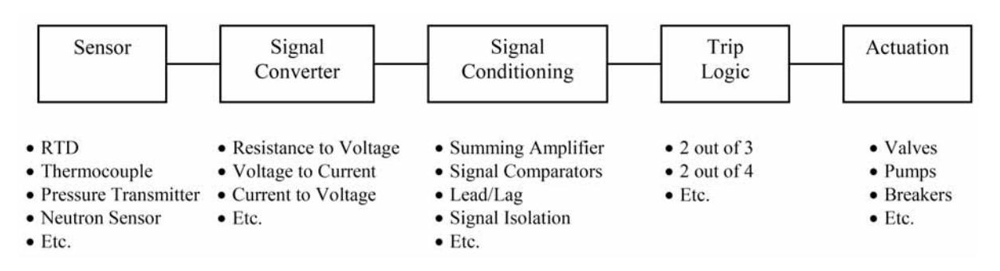

*FIG. 1. Typical components of an instrument channel in a nuclear power plant.*

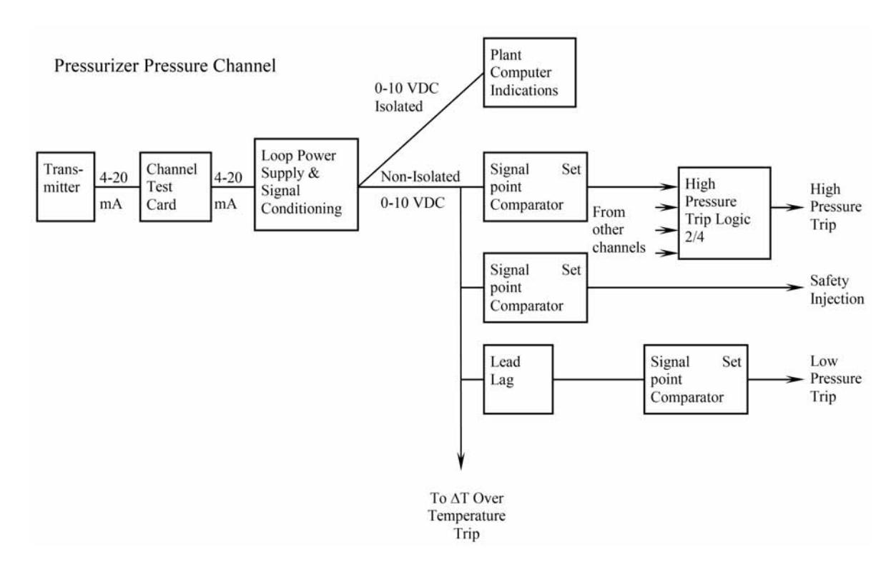

*FIG. 2. Typical components of an analogue instrumentation channel.*

### 2.1. STATIC AND DYNAMIC PERFORMANCE

The performance of process instruments such as temperature and pressure sensors is normally described in terms of accuracy and response time. Accuracy is an objective statement of how well the instrument may measure the value of a process parameter, while response time specifies how quickly the instrument would reveal a sudden change in the value of a process parameter. Accuracy and response time are largely independent and are therefore identified through separate procedures.

The deterioration of accuracy is called calibration drift or calibration shift; the deterioration of response time is referred to as response time degradation. Calibration accuracy can be restored by recalibration, but response time is an intrinsic characteristic that cannot normally be altered once the sensor is manufactured. In the case of thermowell mounted RTDs, however, it is often possible to restore response time degradation caused by displacement of the RTD in its thermowell.

Accuracy, uncertainty and error are used interchangeably to describe the difference that may exist between the actual (true) value of the process and the value that is indicated by the sensor. Since the actual process value is not known, uncertainty is the most appropriate term. However, accuracy and error are more commonly used.

### 2.2. STATIC TESTING OF PROCESS INSTRUMENTS IN NUCLEAR POWER PLANTS

As mentioned before, the nuclear power industry as a whole has been practicing a conservative approach in verifying the static performance of important instruments. That is, many plants verify the calibration of important instruments by daily channel checks, monthly or quarterly surveillance tests, and full channel calibrations at every refuelling outage. This practice was established in the early days of nuclear plant operations when there was little experience with performance of process instruments. Today there are over 25 years of experience with over 400 nuclear power plants around the world. This experience indicates that most nuclear qualified instruments in many nuclear power plants perform well and the conservative practice can be relaxed.

The current practice involving daily channel checks, monthly or quarterly surveillance tests, and full channel calibrations is described below. For more details, see Refs [1–3].

### **2.2.1. Daily channel checks**

The important instrument channels in most plants are qualitatively checked by the plant operators once every shift. The operators look at the indicators in the control room to ensure that the redundant channels agree with one another, and with the operator's experience within a certain tolerance. The resulting information is recorded in the plant's daily logs and any problem to be corrected is reported to the maintenance staff.

### **2.2.2. Monthly or quarterly surveillance tests (channel trip tests)**

Surveillance tests are usually performed on all important instrument channels once every month or once every quarter while the plant is operating. The purpose of the surveillance tests is to either verify the trip set points (TSPs) or to test the functionality of the instrument channels.

The surveillance tests are performed at the instrument racks, and include all the components of the instrument channel except for the sensor. The sensor is located in the field and is not usually tested during plant operation except for in situ response time testing described later. There is some concern as to whether or not it makes sense to test an instrument channel without the sensor. The sensor is the component of the channel that is most susceptible to performance problems because it is located in the harsh environments of the plant as opposed to the rest of the channel, which is located in a mild environment. An OLM system as a substitute for the surveillance tests, as contemplated by the nuclear industry, has the advantage of testing most parts of the channel, including the sensor. In addition, OLM is a completely passive approach in contrast with the surveillance tests, which require physical interactions with the plant equipment.

### *2.2.2.1. Surveillance test procedure*

The following procedure is typical for performing a surveillance test:

- (1) Verify that the plant conditions are suitable for the tests and no other redundant channels are tripped.
- (2) Place the instrument channel in 'Test'.
- (3) Disconnect the sensor from the rest of the channel. In most plants this step is performed using switches or relays on test cards provided for this purpose. There is often no need to lift leads to disconnect the sensor. Figure 3 shows the schematic of a typical test card and the relays that are provided to automatically disconnect the sensor from the rest of the channel.

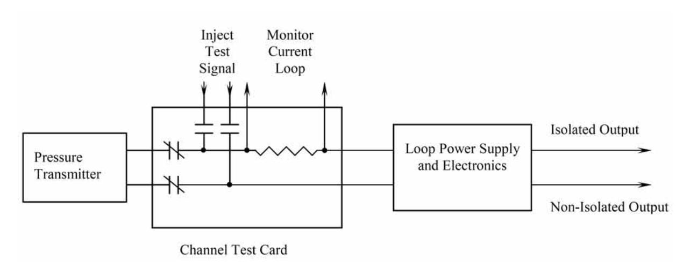

*FIG. 3. A typical pressure transmitter channel showing the channel test card.*

- (4) Input a test signal (voltage, current or resistance) to the instrument channel and verify that the channel will produce a trip signal at the required set point. If the trip does not occur within the expected time, a full calibration or a bi-stable adjustment is usually performed on the channel.
- (5) Return the channel to service.

Performing the surveillance test of an instrument channel requires anywhere between a few minutes to several hours depending on the plant, the channel being tested and the test equipment used.

Although the surveillance tests have traditionally been performed monthly in many plants, there are a growing number of plants which have successfully extended their surveillance intervals to once a quarter through a combination of efforts including a comprehensive trend analysis using archived data, OLM and a documented history of stable performance.

### *2.2.2.2. Surveillance test equipment*

Surveillance test equipment generally consists of a signal generator or a power supply, a variable resistor such as a decade box and a strip chart recorder or equivalent. To facilitate the tests, a number of modern signal generators and microprocessor based test equipment have recently been introduced to the market or developed by utilities. While some of the automated pieces of equipment are generally helpful, they do not significantly reduce the total time spent on performing the surveillance tests. This is because a majority of time spent on a surveillance test is consumed in placing the channels in and out of test, an activity that cannot be readily automated. There has been some work spent on development of equipment that can be used for surveillance tests without having to trip the channel or disconnect the sensors. However, there is not much experience with the use of such equipment in nuclear power plants.

### *2.2.2.3. Shortcomings of surveillance tests*

A major concern of utility technicians about surveillance tests is the increased potential for a reactor trip during the channel tests. When the instrument channel is placed in 'Test' for surveillance, the channel is in a 'tripped' state, which places the reactor at a higher risk for automatic shutdown (scram). Most plants normally scram on the two out of three (or four) logic, meaning that they will scram when any two out of three (or four) safety related channels exceed a set point. When one of the four channels is in Test, the plant will scram if only one of the remaining two (or three) channels exceeds a set point.

### **2.2.3. Full channel calibrations**

Typically, important instrument channels are fully calibrated during refuelling outages. The calibration procedures are almost identical to the surveillance procedures outlined above except that they include the sensor. Furthermore, in executing calibration procedures, all instrument deviations are usually zeroed, if possible, whether or not a channel meets its acceptance criteria.

The full channel calibration practice seems to be uniform throughout the nuclear industry, except for what is done with the sensors. More specifically, the channels (excluding the sensors) are typically calibrated and all problems are resolved at every refuelling outage. In addition, important pressure and differential pressure transmitters (including level and flow transmitters) are typically calibrated in all plants and all problems are resolved at every refuelling outage. Thermocouples and neutron detectors are rarely calibrated, except for comparing neutron channel outputs to heat balance data. As for RTDs, many plants perform cross-calibration at each cycle. In fact, new cross-calibration procedures have been developed to sample data using the plant computer during startup and shutdown periods to verify the calibration of the RTDs over a wide range and to correct the calibration of outliers. This approach amounts to in situ calibration of RTDs.

#### 2.3. DYNAMIC TESTING OF PROCESS INSTRUMENTS IN NUCLEAR POWER PLANTS

Response time testing is performed on temperature sensors and pressure transmitters in nuclear power plants to ensure that the sensor will register a change in temperature or pressure in a timely manner. There are requirements for the speed of response of temperature and pressure sensors that are based on the plant safety analysis. These requirements must be verified to ensure a safe operation. In case of a temperature or pressure transient of any significance, it is obviously necessary for the sensors to respond quickly enough to trigger a safety action as needed.

Both temperature and pressure sensors can suffer response time degradation and become too slow to meet safety requirements. Furthermore, problems such as changes in sensor—thermowell interface in temperature sensors or blockages in sensing lines of pressure sensors can occur and degrade the dynamic response of the measurement system. Temperature sensors have been seen to lose their response time by a factor of two in a matter of one fuel cycle and sensing line blockages have been found to cause the response time of a pressure sensing system to increase by an order of magnitude. Due to these problems, sensor response time testing is performed on process sensors in nuclear power plants.

The results of the response time tests are described in terms of a single value such as the 'time constant' or the 'response time' for the instrument. In many applications, the term 'response time' and 'time response' are used interchangeably. Strictly speaking, this is incorrect, if the system is not a first order linear system. The definitions of time constant and response time are presented below, followed by the descriptions of conventional techniques used for measuring the time constant or response time of an instrument.

#### 2.3.1. Time constant

In practical applications, the term 'time constant' is used to describe the speed of response of a first order system. If a first order system is exposed to a step change in input, its output would be an exponential transient from which the system time constant can be deduced. This is usually done by measuring the time it takes for the output of the system to reach 63.2% of its final steady state value. This single value of time constant completely determines the response of a first order system to any known change on its input.

If a device has a more complex dynamics, its dynamic response can be described only by a higher order system. In the frequency domain, in general, the dynamic response of a higher order linear system is described by its dynamic transfer function, which is a frequency dependent complex function. Its functional form includes n number of constants (or system parameters), which are referred to as the 'time constants' of the system.

In general, the dynamics of most of the devices used in a nuclear power plant can be described by the following transfer function in the frequency domain:

$$G(\omega) = c \frac{\prod_{i=1}^{N} (1 + i\omega\tau_i)}{\prod_{j=1}^{M} (1 + i\omega\tau_j)}$$

$$(1)$$

where the  $\tau$  values are the system's time constants. In specific cases, where information on the dynamics of devices is available from experiments, the above function can be simplified. For example, the dynamic transfer functions of three types of flow transmitters typically used in the nuclear power plant industry, namely Rosemount, Gould and Bailey, can be described by the following functional form, as a special case of Eq. (1)

$$G(\omega) = \frac{(1+i\omega\tau_4)}{(1+i\omega\tau_1)(1+i\omega\tau_2)(1+2i\omega\varsigma\tau_3-\omega^2\tau_3^2)}$$
 (2)

The parameters in the expression are the time constants  $\tau_1$ ,  $\tau_2$ ,  $\tau_3$ ,  $\tau_4$  and damping factor  $\varsigma$  associated with  $\tau_3$ .

### 2.3.2. Response time

For practical reasons, the dynamic response of an instrument of unknown system order is often described (incorrectly) in terms of a single value referred to as the response time. The response time is measured using a test signal such as a step, a ramp, a sinusoidal, a white noise or a pseudo-random binary sequence input. In various applications, the definition of response time may depend on the instrument, its intended application and the type of input test signal that is used to measure the response time. As a consequence, various empirical definitions of response times are used in the industry serving the needs of certain applications or manufacturers. Strictly speaking, the response time of a device should be the attribute of the device's dynamics only. It must be defined and measured in a way that it does not depend on the test input signal or other conditions. Besides the requirement of being measurable, the correctly defined response time of a device must be directly related to the time constants of the device. Both requirements are satisfied if the response time of a device in Eq. (1) is defined by the following function of its time constants:

$$T_{ramp} = \sum_{i=1}^{M} \tau_{j} - \sum_{i=1}^{N} \tau_{i}$$
 (3)

The above definition has a simple interpretation. It can be shown that this test independent definition of response time is measured as the time difference between the two parallel lines of a test ramp input signal and the fully developed (asymptotic) output signal of the device. The time value given by Eq. (3) is called the ramp equivalent response time.

#### 2.3.3. Ramp equivalent response time

Although the time constant is identical to the response time only for a first order system, it is conventionally used to characterize the response time of sensors such as temperature and pressure sensors; although these sensors are not necessarily represented by first order systems.

If a linear system of any order is exposed to a ramp change in its input, after sufficient time, its output would converge to an asymptotic ramp response, which is parallel to the input ramp. The time difference between the two parallel lines is the ramp equivalent response time of the system. This time difference does not depend on the slope of the ramp; however, it can be measured accurately only if sufficient time is given to the system to fully develop its asymptotic output signals.

It can be seen from Eqs (1) and (3), that the ramp equivalent response time of a first order system is identical to the system's time constant.

For the flow transmitters, characterized by Eq. (2), the ramp equivalent response time is

$$T_{ramp} = \tau_1 + \tau_2 + 2\varsigma \tau_3 - \tau_4 \tag{4}$$

For additional information on dynamic response of sensors and the difference between response time, frequency response and time constant, the reader may consult Ref. [4].

## 2.3.4. Conventional response time testing methods

The response time of temperature and pressure sensors can be measured in a laboratory or on the bench using procedures that have been in use for decades. For example, the response time of temperature sensors such as RTDs and thermocouples is measured using a method referred to as the plunge test. It involves exposing the sensor to a step change in temperature that is produced by sudden immersion of the sensor in a flowing liquid with a different temperature than the sensor. The output of the sensor is recorded in this test and used to derive the sensor response time using the definition given above. The details of the plunge test are presented in Standard E644 of the American Society for Testing and Materials (ASTM) [5].

For pressure transmitters, the response time testing is made using a ramp pressure input as opposed to a step input that is used for response time testing of temperature sensors. This is because postulated accidents in

nuclear power plants are believed to result in pressure transients that approximate a ramp (not a step) in pressure. To generate a ramp in pressure, a hydraulic ramp generator is typically used. The ramp signal is provided to the pressure transmitter's input under test and simultaneously to a high speed reference transmitter. The outputs of the two transmitters are recorded during the test and used to identify the response time of the transmitter under test. More specifically, the time difference between the outputs of the test transmitter and the reference transmitter at a given pressure (e.g. set point pressure) is called the ramp time delay. The ramp time delay describes the speed of response of the pressure transmitter for the given set point. The details are presented in ISA (Instrumentation, Systems and Automation Society) Standard 67.06 [6].

The response time of temperature and pressure sensors in nuclear power plants can also be measured in situ using the loop current step response (LCSR) method for temperature sensors and the noise analysis technique for pressure, level and flow sensors. These techniques are reviewed in Section 3.2.2 of this report as a part of OLM of dynamic performance of instruments.

### 2.4. LESSONS LEARNED FROM TRADITIONAL PERFORMANCE TESTS

Searches of the License Event Report (LER) and Nuclear Plant Reliability Data System (NPRDS) databases as well as an informal survey of the nuclear power industry have revealed that less than 10% of pressure transmitters in nuclear power plants have been found in the past to drift out of tolerance. Figures 4 and 5 present the results of searches of the LER and NPRDS databases.

The NPRDS showed 2089 reports of pressure transmitter calibration failures in about 15 years, or 139 per year, while the LER database showed 391 reports in 12 years, or 33 per year. This amounts to about 2.8 failures per plant per fuel cycle from the NPRDS database and 0.66 failures per plant per fuel cycle from the LER database, assuming 100 reactors and two-year fuel cycles. Of course, the actual number of calibration failures is

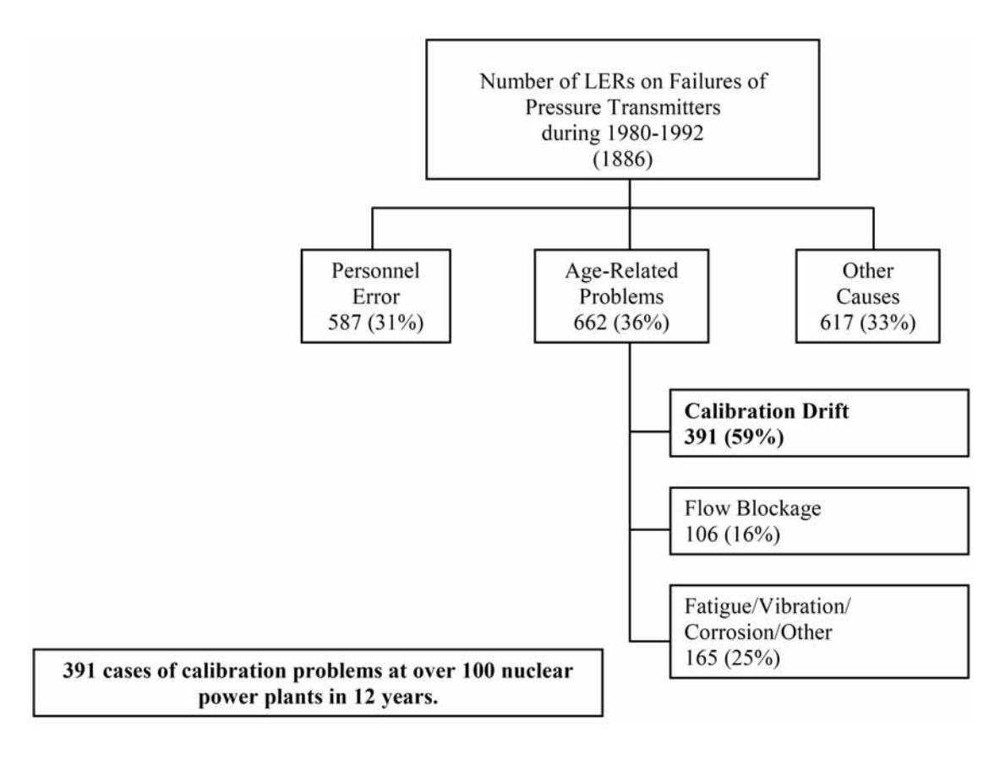

*FIG. 4. Results of search of LER.*

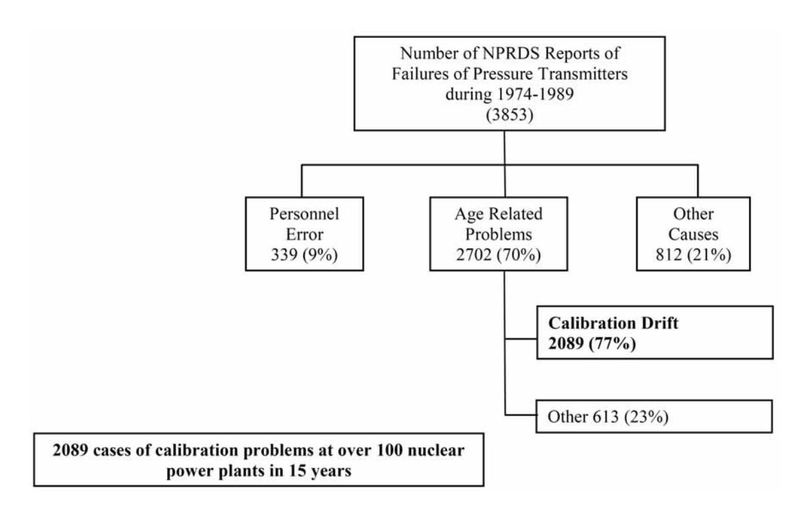

*FIG. 5. Results of search of NPRDS.*

a little higher because the LER and NPRDS databases only include the significant calibration failures as opposed to subtle failures.

The difference between the results of the LER and NPRDS is probably due to the differences in reporting requirements for the two databases. For example, since 1983, when the US Nuclear Regulatory Commission (NRC) changed the LER reporting requirements, single event failures are not reported in LERs. In any case, as shown above, these results have indicated less than 10% failure for pressure transmitters per plant per fuel cycle. Therefore, by identifying the transmitters that have drifted out of tolerance, an OLM system has the potential to save a majority of the efforts that are currently spent on manual calibrations of pressure transmitters in nuclear power plants. This can provide substantial cost savings to utilities, including direct reductions in labour, personnel radiation exposure and material, and indirect savings from increased instrument reliability and plant safety, simplified outage planning and scheduling, etc.

As for response time degradation, RTDs have been found to suffer dynamic degradation more often than pressure transmitters. For pressure transmitters, a dynamic degradation is more of a problem with pressure sensing lines (or impulse lines) than pressure transmitters; although pressure transmitters can also suffer from response time degradation (caused by ageing, oil leak, damaged electrical circuit, etc.). Pressure sensing lines (or impulse lines) are the tubes that bring the pressure information from the process to pressure transmitters. A blockage in pressure sensing lines is a problem that can cause the dynamic response of a pressure sensing system to increase drastically.

## **3. OVERVIEW OF ON-LINE MONITORING**

Various terms have evolved to describe the verification of process data based on historical data using different modelling techniques. These techniques may be referred to as sensor validation, signal validation or OLM. The motivation behind OLM is to provide a means of indicating the calibration status of the corresponding measurement instruments. This can be carried out either continuously or on a time delayed batch mode schedule. Continuous validation on-line will provide the most expedient status identification. OLM is the assessment of channel performance and calibration while the channel is operating. As mentioned earlier, the term channel refers to a sensor, the isolator (if required) and intervening components. OLM signals are received from the output of an isolator. The sensor typically exhibits the greatest variability, and thus it is a common practice to associate observed drift with the sensor, although the true source can only be confirmed through additional investigation.

OLM differs from channel calibration in that the channel is not adjusted by the process of OLM. Instead, OLM compares channel measurements with empirical or physical model estimations to determine if a channel calibration is necessary. The abilities of OLM techniques to indicate calibration status have been well demonstrated. Indications are based on the assumption that the model's estimations are accurate, and by comparing these estimates with the measured values output by the instrument channels their calibration status can be monitored. When the residual difference between the measured and estimated values is considered to be significant by a certain criterion, the channel is suspected to be out of calibration. Figure 6 is provided to illustrate the monitoring capabilities.

From the beginning of the plot (Fig. 6), the channel status is being reported as out of calibration. As indicated in the figure, the channel was recalibrated and the residual difference subsequently reduced. Following the calibration, the channel status reverted back from out of calibration to normal.

Over a fairly short span of time, a suspicion of calibration drift can be verified by the consistent reporting that the channel is out of calibration. The significance of residuals can be determined by a variety of different methods, and the appropriate method to use is often case specific. Simple thresholding is sometimes applied, as well as more sophisticated statistical techniques, such as the sequential probability ratio test (SPRT) for hypothesis testing.

While calibration reduction is one possible benefit from sensor validation technology, other benefits are performance monitoring and information filtering. Performance monitoring is achieved through the continuous

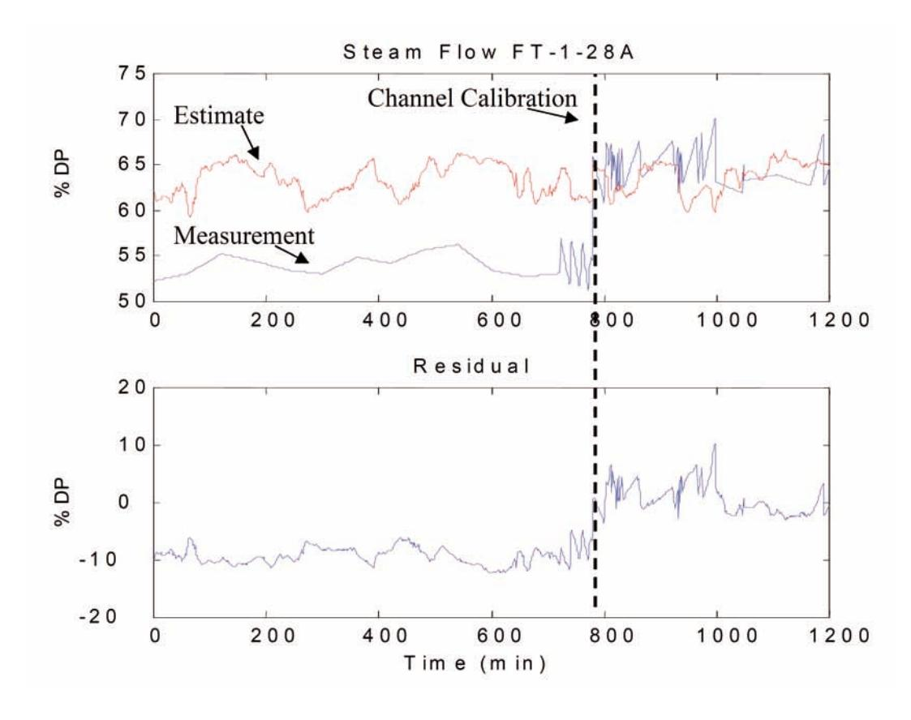

*FIG. 6. OLM example indicating an out of calibration sensor.*

evaluation of the process, whereas information filtering results from the characteristic of an OLM model to highlight specific areas of the process that may need attention. Thus, operators can focus their attention on process variables exhibiting suspect behaviour rather than the entire suite of process variables.

OLM of instrument channels is possible and practical owing to the ease with which data acquisition and analysis of instrument channel data can be performed. In essence, OLM provides a proactive and beneficial alternative to performing periodic instrument surveillances. It accomplishes the surveillance or monitoring aspect of calibration by comparing redundant or correlated instrument channels with independent estimates of the process variable of interest. It does not replace the practice of instrument adjustments; instead, it provides a performance based approach for determining when instrument adjustment is necessary, as compared with a traditional time directed calibration approach.

There are three general categories of static methods for OLM: averaging techniques, empirical modelling techniques and physical modelling (first principles models) techniques. Each of these techniques is discussed in the following sections. The main distinction between these techniques is in their initialization or formulation. Averaging techniques are applied directly to the redundant process data in real time without the use of historical data. Empirical techniques require a large amount of historical data for model development (or training), from which the parameters of the model are derived. Empirical model estimations are then provided through equations that approximate the relationships and patterns observed in the historical process data. Physical models act directly on the data, providing estimations based on known physical laws and mathematical formulations. Further details on the different modelling techniques are available in Section 5. The methods of all three categories apply to static and dynamic plant situations.

Under the subheading of dynamic methods, the noise analysis technique is a powerful tool for investigation of the dynamics of instrument channel signals. The transmitter signal, the signal converter and the signal conditioning unit can be analysed with respect to their gain factors, time constants and other technical characteristics.

### 3.1. STATIC METHODS

### **3.1.1. Averaging techniques for on-line monitoring**

There are a variety of averaging techniques referred to as simple, weighted, band and parity space averaging. In addition, there are some transformation based techniques that fall into this category. Since important instrumentation is the main target of OLM for calibration reduction, it is important to note that safety related process variables are measured by a set of redundant instrument channels. Averaging techniques are simple in concept and in many cases can be successfully applied to redundant instrument channel sets. Both empirical and physical modelling approaches require efforts in model development, whereas averaging techniques can be applied directly to the data.

### **3.1.2. Empirical modelling techniques for on-line monitoring**

There are three essential means required for empirical OLM:

- A training algorithm for selecting and characterizing a subset of representative data from sensors during normal operation of the system that ideally encompasses all expected normal operating states of the system.
- An estimation algorithm to calculate estimates and residuals for the output signals in the model. A value of the residual signal is defined as the difference between the measured and estimated value of a signal.
- A fault detection means to detect calibration drift based on the residual values.

An overview of the development and subsequent utilization of OLM is illustrated in Fig. 7. Data are acquired from the process, from which training data are selected. These training data are then used to develop (or learn) an empirical model of the process. Once the model is developed, it is used during monitoring to provide estimations for all instrument channels included in the model. Residual values are then computed which are the numerical differences between the measured values of the process variables and their corresponding

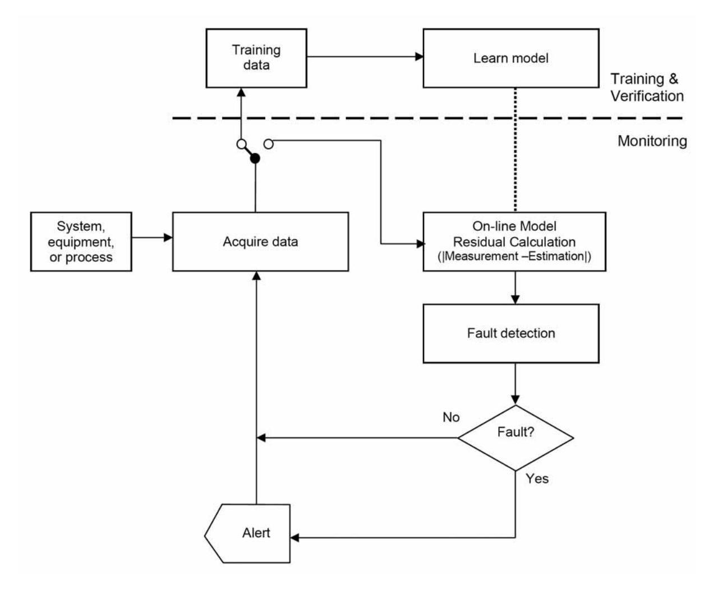

*FIG. 7. Empirical OLM system chart.*

estimations. These residual values are then passed to the fault detection algorithm. Identified faults trigger an alert indicating that the learned conditions of the empirical model are being violated. A calibration drift will be identified by the OLM system as a fault, although declaration of a fault does not necessarily indicate a calibration drift (see Section 3.1.4 for further information).

### **3.1.3. Physical modelling techniques for on-line monitoring**

The main principles of using physical modelling or first principle modelling for data validation are given in Fig. 8.

The steps include the following:

- Model development. This is to establish the mathematical equations describing the physical behaviour of the plant processes, systems and components at a sufficient level of detail. Modern software tools provide modelling tools that facilitate the modelling effort, for example the plant process is drawn as a mimic diagram in a graphical user interface and the associated unit models and mathematical equations are configured automatically by the toolbox. Plant descriptions, component parameters and configuration data are inserted to represent the actual plant behaviour.
- On-line model. When the model has been developed for the particular plant and tested off-line in different plant states it is made available for application in OLM.

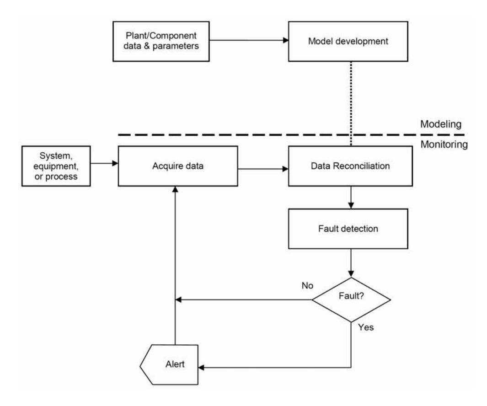

*FIG. 8. Physical modelling system chart.*

— Data reconciliation. The on-line model is connected with live plant data and fitted to these by minimizing a weighted least squares object function. This is done by adjusting selected model parameters to minimize the difference between measurements and the corresponding calculated values of the plant model. Improved precision and corrected values for the process measurements are provided for use in fault detection.

## **3.1.4. Fault detection**

Fault detection is the process of identifying unexpected behaviour in the model residuals, where a residual is the numerical difference between the measured value of the process variable and its estimate. The residuals for each monitored signal are used as the indicator for sensor equipment faults. The term 'anomaly' is used interchangeably with fault when discussing OLM systems, both referring to the onset of unexpected residual behaviour identified by an OLM system. Simple threshold limits, applied to the residual values, may be used to detect fault indications (i.e. declaring a fault when a signal's residual value exceeds a preset threshold). Other fault detection procedures are also available which employ statistical hypothesis tests to determine whether the residual error value is uncharacteristic of the learned model and thereby indicative of a sensor or equipment fault.

The core algorithm used for these purposes is the SPRT. Similar to the threshold limit method, the SPRT is applied directly to the residuals. This technique is a superior surveillance tool because it is sensitive not only to disturbances in the signal mean, but also to very subtle changes in the statistical quality of the residual. While changes in the residual mean, variance, skewness and kurtosis can be monitored in this way, only two are regularly used in OLM applications, the mean and variance tests. For sudden, gross failures of a sensor or item of equipment, the sequential fault detection method will annunciate the disturbance as fast as a conventional threshold limit check. However, for slow degradation, the procedure can detect the incipience or onset of the disturbance long before it would be apparent with conventional threshold limits. The fault detection set-up

allows the user to specify false alarm and missed alarm probabilities, thereby allowing some control over the likelihood of false alarms or missed detection. Further discussions on the SPRT are provided in Section 5.1.6.

### *3.1.4.1. Recommended response to an identified fault*

Based on the experience to date, instruments used in nuclear plants are generally well behaved with only occasional occurrences of unacceptable drift or failure. Accordingly, most failures identified by the OLM system are not failures; instead, they often represent operating states that have not been adequately covered by the training data, or unexpected conditions with respect to the physical model equations. Sometimes, the failure alarms are caused by overly sensitive fault detection settings. The following summarizes the most likely causes of alarms or failure declaration:

- (1) Data acquisition problems resulting in invalid data. (Note: data screening algorithms can be applied, which will eliminate most faults caused by data acquisition errors.)
- (2) Operating outside the empirical training space or the model's physical representation permanent or temporary changes in process values.
- (3) Overly sensitive fault detection.
- (4) Instrument channel drift.

Data acquisition problems often result in an invalid value being reported for the measured value of a process parameter. These invalid values may be very large or very small numeric values with respect to a reasonable value for the process variable. Invalid values may also be zero or negative values if these values are not reasonable for the measured process variable. Data acquisition errors, temporary or permanent, will be identified by the fault detection algorithm. An empirical model's known representation of the monitored process is established in the training phase of model development. If, during monitoring, the process moves to a region that is not adequately represented in the training data, the empirical model is said to be operating outside of the training space, where it has insufficient knowledge to perform estimation. Similarly, a physical model's equations may be violated if the monitored process is operating in a state not adequately defined by the bounding equations of the model. Instrument channel drift (case 4 above) is recognized as a slow or moderate drift over time. Alternatively, an abrupt instrument failure may also be identified, in which case the residual values for the failed sensor will exhibit a step change and be easily identified by the fault detection algorithm.

Even if an instrument channel is drifting, the fault detection method can be very sensitive, often producing failure alarms long before the drift is significant. Figure 9 shows an example of typical drift behaviour (observations shown as blue crosses and estimates as red triangles); it is apparent that this pressure transmitter is slowly drifting low and it has drifted low by about 1.5% over a period of three months. Figure 10 provides the residual plot for this signal; the failure was identified when the drift was about –3.0 psig, or about 0.35% of span.

The first response to a failure declaration is to determine if it is a false alarm. The experience to date is that most identified failures are caused by either data acquisition problems or operation outside the training space. If data acquisition problems are ruled out and the current plant conditions are within the conditions represented in the model training data or by the physical model, then an instrument drift or instrument malfunction can be declared, and maintenance and/or calibration can be scheduled accordingly.

## 3.2. DYNAMIC METHODS

## **3.2.1. Fundamentals of noise analysis**

Process signals measured in a plant during steady state operation appear constant, as shown on the left side of Fig. 11. Their mean values are constant for the given measurement period. However, a closer look at the signals reveals that random-like small fluctuations are riding on the constant mean value. These fluctuations are magnified in the right side of Fig. 11. The signal fluctuations often carry relevant information on the dynamics of the measured process and its instrumentation. These measurable signal fluctuations, called 'noise', contain changes caused by small physical changes in the process and by additional artefacts, such as electrical noise.

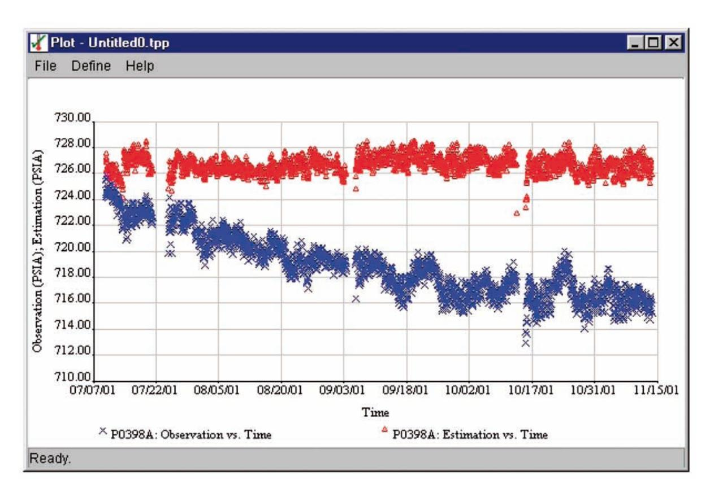

*FIG. 9. Typical drift behaviour.*

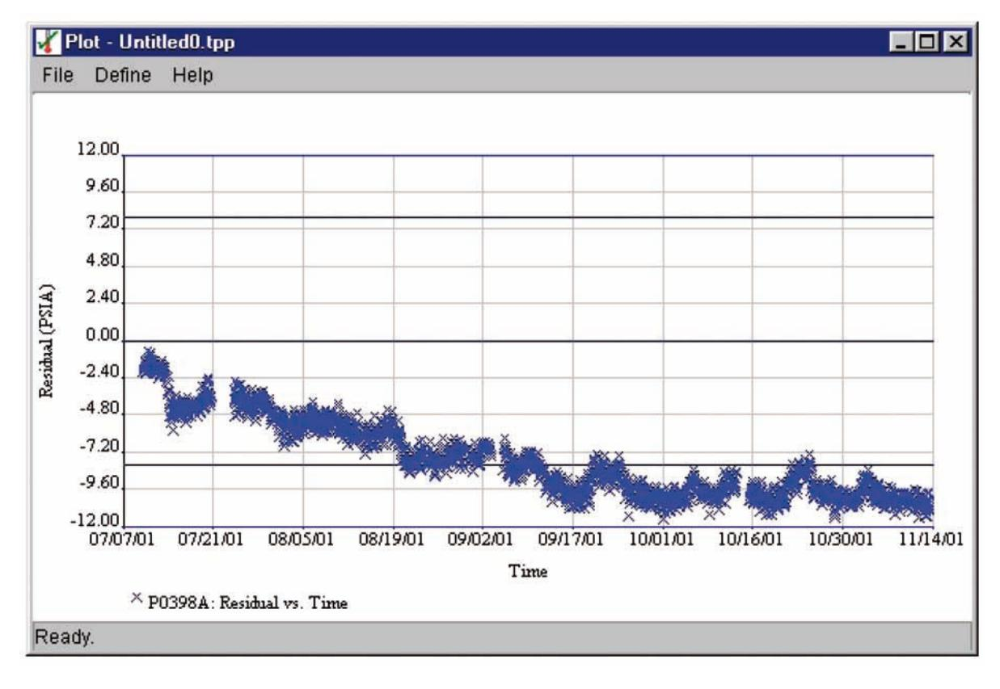

*FIG. 10. Residual plot showing drift significance upon failure alarm.*

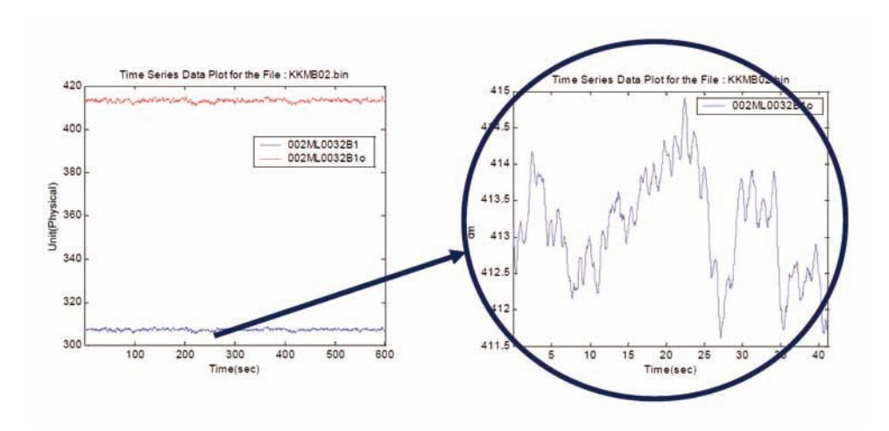

*FIG. 11. Signal fluctuations include information about the dynamics of the process and its instrumentation.*

Noise analysis is a method to investigate signal fluctuations in a statistical way and to extract information on possible process/instrument anomalies that manifest themselves in the measured signal fluctuations. Most signal noise analysis applications involve multichannel measurements and multivariate statistical analysis. The information redundancy given by multichannel noise measurements provide a means to identify the noise signatures of normal (anomaly free) system behaviour at steady state operation. After establishing the baseline of normal noise signatures in a learning phase, process or instrument anomalies can be later identified through the deviation of the measured noise signatures. In most cases, the development of physical models is required to translate the abnormal noise signatures into changes in the dynamic properties of the process or its instrumentation. For example, the following anomalies can be detected and diagnosed based on the measured multichannel noise signatures: excessive vibration of core internals, reduced prompt fractions of in-core flux detectors, partial blockage in a pressure sensing line, increased damping in the mechanical components of a pressure transmitter, incorrect low pass filtering in the transmitter electronics.

Typical noise analysis applications consist of the following steps: (1) time series data acquisition (signal measurements); (2) signal processing; (3) statistical analysis in the time or frequency domain (typically multichannel); (4) establishing data driven empirical models or performing curve fitting for parameter estimation; and (5) interpretation/comparison of the results. To some degree, all these steps require expert knowledge and highly specialized tools (e.g. data acquisition hardware and signal processing algorithms). Especially, the interpretation part requires a good understanding of process/instrument dynamics and their associated noise signatures.

### **3.2.2. Sensor response time testing using noise analysis**

### *3.2.2.1. Background*

At steady state operation of a nuclear power plant, variables of physical processes have a small fluctuating component superimposed on their stationary values (DC or mean values). This can be seen in time series measurements of flux, temperature, pressure, flow and level signals. However, the dynamics of the instrument channel may be limited in response time and cannot reflect all frequency components in the process signal. The instrument channel acts like a low pass filter on the process signals. Fast transients will be attenuated and delayed as the result of the limited response time of the instrument channel. Therefore, it is important for safety reasons to estimate the response time of the instrument channels and their components and to compare it with the technical specification and safety analysis requirements.

### *3.2.2.2. Applications*

The noise analysis techniques are useful tools for response time testing of pressure and differential pressure sensors (to cover level and flow measurements), mainly because the test can be performed nonintrusively on these sensors while the plant is operating at steady state.

Typical steps in measuring the response time of a sensor using the noise analysis technique are as follows:

- (1) Sample about one hour of process noise data at high frequency (100 Hz–1 kHz) from the output of the sensor to be tested. Provide signal conditioning to remove the high frequency noise components to avoid frequency aliasing effects.
- (2) Record the time series data on computer disks or equivalent storage devices.
- (3) Perform data qualification to ensure that the data are suitable for analysis.
- (4) Analyse the time series data in time domain and/or frequency domain to obtain statistical noise signatures, such as auto- and cross-power spectral density functions (APSD, CPSD), coherence and phase functions, and amplitude distribution functions.
- (5) Estimate the sensors' response time by curve fitting or by establishing data driven empirical models.

The details of the noise analysis technique are covered in Ref. [7]. As such, these details are not discussed here.

The response time of temperature sensors (RTDs and thermocouples) can also be tested using the noise analysis techniques; however, a more exact method called the LCSR test has been developed for RTDs and thermocouples. The details of the LCSR technique are presented in Ref. [6].

### **3.2.3. Experience with sensor response time testing**

Sensing lines (also called impulse lines) are small diameter tubes that are used to locate pressure transmitters away from the process to provide protection against heat, radiation and other harsh conditions and to facilitate access to transmitters. These tubes also include isolation and equalizing valves as well as root valves, check valves and other hardware. Experience has shown that during process operation, the sensing line can become partially or totally blocked due to the buildup of dirt, sludge and chemicals in the water. They can also have blockages arising from failure of valves along the sensing lines. Any major blockage in the sensing line can cause the response time of the pressure sensing system to increase, sometimes by as much as an order of magnitude.

Fortunately, sensing line blockages can be detected non-intrusively while the plant is on-line. This is accomplished using the noise analysis technique. More specifically, when the response time of a pressure transmitter is measured using the noise analysis technique, the result of this measurement would include any contribution due to blockages that may be involved within the sensing line. Also, air in pressure sensing lines can be detected by the noise analysis technique.

The response time of RTDs and pressure transmitters (including level and flow transmitters) is measured in many nuclear power plants periodically. For RTDs (and thermocouples), the measurements are made using the LCSR test and for pressure, level and flow transmitters the noise analysis technique is used. The reason for the continued use of the LCSR and noise analysis techniques is that both RTDs and pressure transmitters can suffer response time degradation and assurance must, therefore, be provided that the safe limits for dynamic response of these sensors are not exceeded.

In some countries, response time testing is mandatory in some plants, especially for RTDs. For this reason, the LCSR method has been used in nearly a hundred plants to meet the plant technical specification requirements, regulatory requirements or ageing management programmes. The noise analysis has also been used for essentially the same purposes in tens of plants. There are many publications (listed in the Bibliography of this report) on the use of the LCSR and noise analysis techniques in the nuclear industry. As such, the details are not provided here.

### **3.2.4. Estimating the time constants and gains of individual components in instrument channels**

Besides estimating the response time of a transmitter, noise analysis can also be used to estimate the dynamics (time constants and gain) of other components in the instrument channel, provided that additional 'tie ins' are available for noise measurements. For example, in Fig. 12 signals *x*1, *x*2 and *x*3 denote the input and output noise signals of the signal converter and signal conditioning units measured at steady state stationary operation. Empirical mathematical models can be fitted either to the measured time series noise data or to their frequency dependent statistical functions (such as dynamics transfer functions expressed as a function of measured APSD and CPSD functions) with *x*1 as input and *x*2 as output. In a similar way, empirical models of the signal conditioning unit with *x*2 as input and *x*3 as output can be established. The noise based models then are used to determine the gain and time constants of the signal converter and signal conditioning units. In addition to the estimation of the gains and time constants, the models can also be used to calculate the impulse response, step response, ramp response, etc., of the units by feeding these input signals into the mathematical models. Note that the above response functions are estimated without injecting a test signal or disturbing the instrument channel (apart from the measurement tie ins). All models and estimates are derived from the measured natural fluctuations of the signals. For further information see Refs [8, 9].

### **3.2.5. Sensor response time differences detected by noise analysis**

Consider two pressure signals *x*a, and *x*b, whose transmitters are connected to the same sensing lines. These redundant signals are expected to have the same dynamic characteristics (noise signatures), if the transmitters are of the same type (see Fig. 13).

It is expected, therefore, that the APSD functions of pressure signals *x*a and *x*b are close to identical. If the APSD functions of signals *x*a and *x*b are significantly different, for example the APSD function of signal *x*b has a narrower frequency content (as illustrated in Fig. 14), then it is an indication that an 'extra' filtering or dampening effect has taken place in the sensing line to sensor b, or in its transmitter.

In the given example, the anomaly of increased signal attenuation and delay can be caused by the blockage of sensing lines or by the degradation of the mechanical or electrical components of the pressure transmitters. The timely detection of increased signal attenuation and delay is especially important if the signals are connected to the reactor protection system.

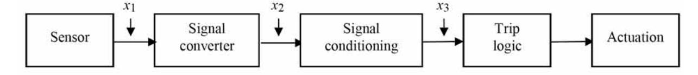

*FIG. 12. The instrument channel with its sensor, signal converter, signal conditioning unit, trip logic and actuation.*

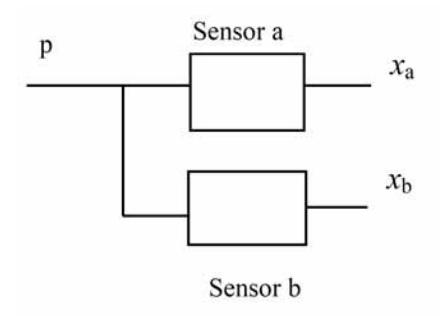

*FIG. 13. Two transmitters 'a' and 'b' connected to the same sensing line recording pressure 'p'.*

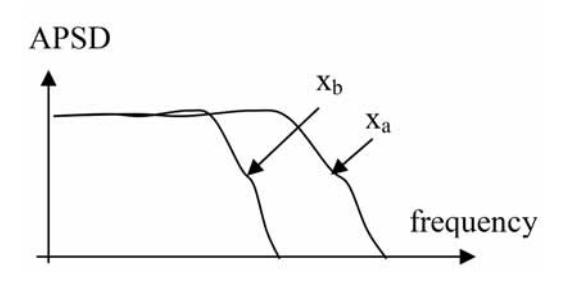

*FIG. 14. APSD functions of noise signals from redundant transmitters xa and xb.*

### **3.2.6. Estimation of flow transmitter transfer function by noise analysis**

The response times of safety system flow transmitters and their sensing lines can be estimated using in situ signal noise measurements at full power operating conditions. The response time estimation involves the measurement based calculations of the dynamic transfer function of the flow transmitter and the APSD function of the transmitter's output noise signal [10].

In CANDU stations, the primary heat transport flow (coolant) is monitored on the core inlet side in several feeder pipes connecting the reactor's inlet header tanks to the individual fuel channels. The flow measurements are based on the differential pressure drops measured across orifices in selected feeder pipes. Twenty-four of the 480 feeder pipes are equipped with orifice based flow measurements in the Darlington units, and 12 feeder pipes in the Pickering B and Bruce B units.

The upstream and downstream taps of the orifice plate are connected to the flow transmitter by a 40–50 m long sensing line pair (often called impulse lines). The sensing line pair channels the coolant pressure information away from the high radiation fields at the orifice to the flow transmitter, which is located outside the reactor vault in a serviceable room. The transmitter comprises the differential pressure cell and its 4–20 mA current transmitter.

The noise signatures of flow signals depend on the sensing line geometry and the type of flow transmitters. In CANDU units the typically used flow transmitters are Rosemount model 1152DP, Gould model PDH3000 and Bailey model 8D. The dynamic characteristics of these three transmitter types are significantly different and they strongly affect the dynamic response of flow signals.

The dynamic transfer functions and the response times of flow transmitters can be measured in situ (without removing them from the process) by temporarily installing high frequency, high sensitivity pressure sensors (or transducers) at the end of the high pressure leg and the low pressure leg sensing lines, close to the differential pressure transmitter's input nozzles (at the drain lines of the differential pressure transmitters). The installed fast responding piezoelectric pressure transducers have high sensitivity to pressure fluctuations while still being capable of withstanding the high static pressure (approximately 10 MPa) present in the sensing lines. They are sensitive only to high frequency pressure fluctuations (a high pass filter response with a time constant of 50 s); therefore, their steady state DC output signal is arbitrary (an adjustable voltage signal). However, they respond accurately to high frequency fluctuations (0.01 Hz < *f* < 100 kHz). The temporarily installed pressure sensors record the natural pressure fluctuations in the two sensing lines, which are the differential pressure input fluctuations to the transmitter. In addition to the two pressure transducer signals, the standard voltage signal from the differential pressure flow transmitter is produced by installing a 225 Ω resistor in the 4–20 mA loop to convert it to a voltage signal.

During the station measurements the signal fluctuations of the transmitter output were recorded along with the signal fluctuations of the pressure transducer (input) at steady state full flow conditions by the noise data acquisition system. The recorded noise signals were processed off-line, and the transmitter's transfer function was calculated from the APSD and coherence functions of the measured input and output noise signals. Typical transfer functions of flow transmitters, derived from in situ noise measurements, are shown in Fig 15. The time constants of the transfer function were determined by fitting a functional form with unknown time constants (such as in Eq. (2)) to the magnitude of the measurement based transfer function. The overall

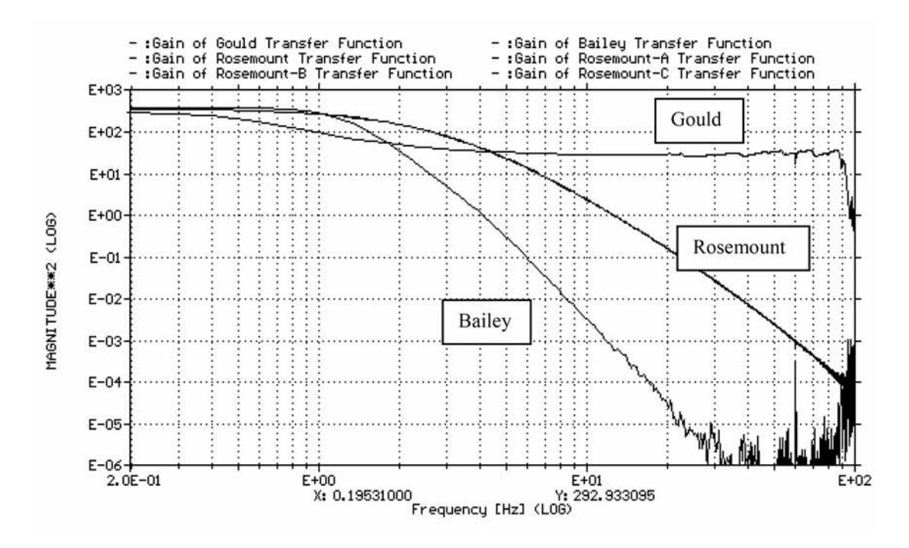

*FIG. 15. Magnitude of the dynamic transfer functions of Rosemount, Gould and Bailey flow transmitters, derived from in situ pressure sensor noise measurements in shutdown system flow loop FT-3J in Darlington Unit 3.*

response time (ramp equivalent) of the flow transmitter is calculated as a function of the individual time constants. In addition, the response time of the sensing line pair can also be estimated from the roll-off of the APSD function of the pressure noise measured at the end of the sensing lines (inputs to the flow transmitter).

The dynamic response of a transmitter can be completely characterized with its frequency dependent complex transfer function. In practical applications, this is only achievable when both the input and output signals are available for analysis. Since the measurement of the input pressure signals (described above) entailed the cumbersome installation of high frequency response pressure transducers on the sensing line pairs, the possibility of obtaining the response times only from the transmitters' output noise APSD was investigated. This simplification would ease the need for extensive measurement preparations and would reduce the probability of safety instrumentation malfunction caused by the measurement installation activities. Moreover, the output noise signals of several flow transmitters can be recorded relatively easily in serviceable instrument rooms, without any 'pluming work' on the flow instrument loop.

It was successfully demonstrated in several test measurements at various CANDU sites that the estimation of in situ response times of the transmitter and sensing line pair system can be based on the transmitter output noise measurement only, without the measurement of input pressure noise signals. The response time estimation is based on: (1) the measured APSD function of the flow transmitter output fluctuations; and (2) the measurement based fact that the differential pressure noise (input to the transmitter) is white over the frequency domain of interest (0–1.0 Hz).

The APSD functions of the output noise of the three different types of flow transmitters are shown in Fig. 16. The response time is derived by fitting a functional form with unknown time constants to the measured APSD functions over certain frequency ranges (excluding peaks caused by sensing line resonances).

Noise analysis also provides a non-intrusive in situ method for monitoring and estimating the dynamic response of RTDs installed in the process, and for isolating the cause of RTD signals anomalies, such as slow response and signal spikes induced by electrical effects and ground fault detectors [10]. Similarly to the flow transmitter application, the response time of the RTD is estimated by fitting a functional form of a low order low pass filter to the RTD's measured noise APSD function. The overall response time is the sum of the time constants estimated from the magnitude of the RTD's dynamic transfer function by curve fitting. In the

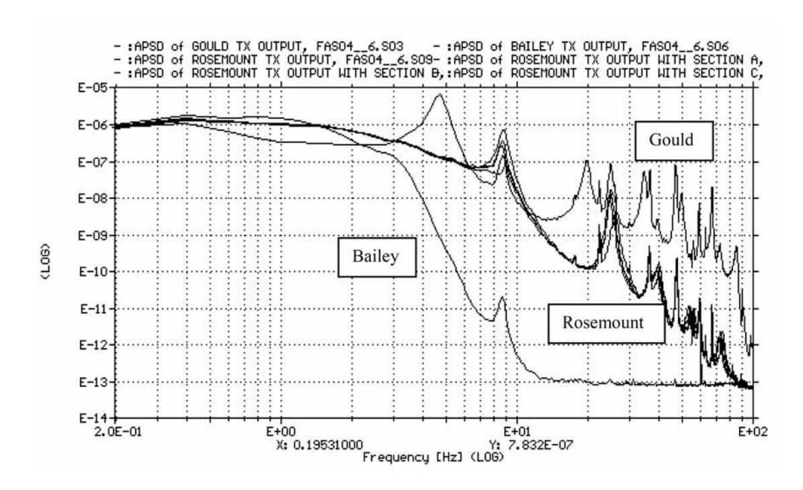

*FIG. 16. Comparing the normalized APSD functions of output flow noise signals of Rosemount, Gould and Bailey flow transmitters installed on the shutdown system flow loop FT-3J in Darlington Unit 3.*

frequency domain of interest (0–0.01 Hz), the magnitude of the RTD's dynamic transfer function is identical with the RTD's output signal's noise APSD spectrum since the low frequency temperature fluctuations (input to the RTD device) have a band limited 'white' frequency spectrum. The noise based estimation technique was used in several baseline and troubleshooting measurements.

## **4. CHARACTERISTICS OF DATA ACQUISITION SYSTEMS FOR ON-LINE CALIBRATION MONITORING**

The condition of the monitored instrument is assessed based on the plant data recorded over a certain period of time under specific plant conditions. The output signals of the monitored instruments may include the output signals of like sensors, as well as reference sensors. Depending on the function of the monitored instrument and the goal of the monitoring, the length of the data recording period may vary from a few hours to several months.

## 4.1. APPLIED TECHNIQUES

## **4.1.1. Manual methods**

The simplest means of collecting OLM data is to use a digital multimeter to measure the data and use a data sheet to record the result. This method is adequate when there are redundant sensors for comparison and the plant is holding steady at a temperature plateau.

With the manual method, the data may be collected at steady state during normal plant operation as often as necessary and inspected visually or plotted to identify any significant drift and other discrepancies. This is similar to channel checks that are performed in most nuclear power plants one or more times a day. The advantage of manual data acquisition is that each measurement is simple. The disadvantages are that it is time consuming to gather the data, the data are not simultaneous so it can be difficult to intercompare the data and it is difficult to use the data in an empirical model. In addition, data recording errors may occur.

### **4.1.2. Plant computer historian**

A plant computer historian (data archiving computer) is a data management system that interfaces with the plant computer to monitor and store instrument outputs. A plant computer historian simultaneously samples the plant computer data from a variety of instruments and stores the data along with its corresponding time stamp. In an effort to manage data storage space, historians typically employ compression algorithms that only store qualifying events. For example, the plant historian could be configured to only store data from a particular instrument if the instrument's value changes by 0.1% of its range. Alternatively, every sample from the plant computer can be stored in the historian, requiring considerably more data storage space. Data quality issues are further discussed in Section 5.1.1.

To retrieve OLM data from a plant historian, a software package is used to interface with the plant historian and provide data for on-line calibration monitoring and other purposes on a client computer. This link can be used by many users simultaneously to access the plant computer historian. An advantage is that data retrieval can be scheduled for automatic retrieval on a regular basis.

OLM using data from the plant computer has many advantages and few disadvantages. The main advantage is that the data are readily available and can be retrieved and used with little effort. Another advantage is that the data are sampled simultaneously, which is necessary for modelling algorithms to perform properly. One disadvantage is limited sampling frequency and limited dynamic range. As such, plant computer data cannot normally be used for high frequency dynamic analysis.

### **4.1.3. Dedicated data acquisition systems**

A dedicated data acquisition system can be installed to obtain data for OLM purposes. The advantage of a dedicated data acquisition system is that it can be designed and programmed to acquire the data in any format, sampling frequency and sampling time that is desired, with a higher accuracy than the typical plant computer. The disadvantage of a dedicated data acquisition system is that, firstly, it requires isolation from the plant equipment. Secondly, hardware access to plant data is often difficult except in a new plant where the OLM system can be designed as part of the plant instrumentation systems. Thirdly, it can be expensive to implement and maintain a dedicated data acquisition system.

### **4.1.4. Isolation requirements for on-line data acquisition systems**

OLM data that are retrieved from the plant computer through a historian is typically isolated from the instrument outputs used for safety related functions. If data are to be extracted by other means, the isolation is critical and must be done using special hardware, without affecting the plant instrumentation and safety related functions. There are varieties of isolators, such as high impedance optical isolators, that can be used for this purpose. The isolation specification is important and must be selected based on the characteristics of the plant equipment that is monitored.

## **4.1.5. Analogue signal conditioning**

For dedicated data acquisition systems the station instrument signals to be used may be available in the following forms:

— Analogue current signal as a direct output of the measurement sensor (e.g. a self-powered flux detector as a current generator in the µA range or a flow transmitter in a 4–20 mA current loop).

— Analogue voltage signal already transformed into a standard voltage range.

In case of current signals, an additional component is needed to transfer the signals into measurable voltage signals. This component could be as simple as a sampling resistor in a 4–20 mA current loop, or a current to voltage converter in the flux detector's amplifier. If the station signals are available in analogue voltage form, they can be directly connected to the isolation amplifiers of the data acquisition systems.

The isolation amplifiers separate the station instrument from the data acquisition hardware by preventing any feedback from its output to its input side. The isolation amplifiers have a gain of one and a low pass cut-off frequency in the 10–100 kHz range. Their function is to isolate the signals, not to filter or amplify the signals. Depending on the level of required independence, the isolation amplifiers may be physically separated from the rest of the data acquisition system.

The actual filtering and amplification of analogue signals are performed after the isolation by separate conditioning units including the following functions:

- Anti-aliasing low pass filtering, usually needed to remove the high frequency components. The low pass frequency is typically set below 40% of the sampling frequency. If anti-aliasing is not provided, the user must make sure data used for OLM is not corrupted.
- Removal of the mean value or the DC component of the signal for noise analysis by subtracting a constant voltage value from the analogue signal, or by applying an analogue high pass filter to the signal.
- Amplification of the signal or the DC compensated signal.

After the analogue signal conditioning steps, the signals are fed into the multichannel analogue to digital converter where the simultaneous sampling takes place.

### 4.2. PLANT CONDITIONS FOR DATA ACQUISITION

Depending on the nature of the measurement, certain conditions and restrictions may be placed on the plant for the duration of the data collection. Most of the measurements have to be made at steady state high power operation, with no operator induced changes in the system. Other measurements may take advantage of specific changes in the plant operating mode (e.g. pump trip or startup, reactor trip or startup, power stepback, pump changeover).

### **4.2.1. Measurements at high power steady state operation**

There are two distinct measurement techniques that require steady state operating modes:

- (1) Reactor noise measurements for estimating response times and testing the dynamic performance of instruments.
- (2) Consistency checking of the static readings of redundant sensors for detecting span miscalibration.

The consistency checking of redundant sensors require that the reactor processes be in an equilibrium state. The purpose of this measurement is to compare the static readings of similar sensors by checking their mutual consistency. Sensors found with high inconsistency indexes may have a miscalibrated span. Redundant signals with consistent readings at steady state may still have inconsistent (diverging) responses during a transient, due to potential differences in their dynamics (the latter can be checked in noise measurements). Therefore, the consistency checking measurements must be carried out under steady state conditions.

### **4.2.2. Measurements at specific off-normal or transient conditions**

Plant operational condition changes that occasionally occur can provide the opportunity for measurements aimed at recording the dynamic response of instrumentation. Such changes may include:

- A complete reactor trip from power operation at the beginning of a scheduled outage;
- Incremental power steps during reactor startup;
- Tripping and starting-up of main coolant pumps;
- Changeover of the in-service pump in moderator loops;
- Stepback in reactor power.

Dynamic parameters, such as response times and promptness of instruments, can be directly derived from the recorded signals responding to the transient.

### **4.2.3. Testing at cold shutdown**

The response time of pressure transmitters can be measured during plant operation using the noise analysis techniques or at cold shutdown using the ramp test method. Since the response time of a pressure transmitter does not depend on process operating conditions, measuring the response time at cold shutdown or at normal operating conditions should yield the same results.

For temperature sensors such as RTDs, the process operating conditions (especially the temperature and flow) can affect the response time significantly. As such, the in-service response time of temperature sensors can only be identified by in situ testing at or near plant operating conditions. The LCSR method as described in ISA Standard 67.06 is used for measurement of in-service response time of nuclear plant RTDs [6].

The LCSR method can also be used at cold shutdown to verify proper RTD installation for an optimum response time. That is, at cold shutdown, the LCSR is used to measure the response time of the RTDs to reveal any installation problems (e.g. inadequate seating of the sensor in its thermowell). This is accomplished by measuring the response time of the RTDs and comparing them with baseline or expected values or among themselves to identify any outliers. The outliers are then reseated, cleaned or replaced to resolve response time problems. Referred to as cold shutdown testing, these measurements have proven very useful in pre-operational testing of RTDs to ensure that satisfactory in-service response times will be achieved at plant operating conditions.

### **4.2.4. Data on current plant configuration**

OLM systems based on physical models or first principles modelling need access to information about the current plant configuration to provide accurate and reliable results. Although generic physical models are adapted to various reactor components, certain assumptions are made about the process/plant behaviour, for example the components connected and actual flow paths.

Therefore, on-line access to information about the actual operational state, for example changes in process flows, component operational regimes and equipment line-up, must be provided.

Also changes and modifications made during outage or maintenance work should be made available to the system, for example plugged tubes in heat exchangers/steam generators and replaced valves that have impact on the process behaviour. Known process failures like internal leakages in heat exchangers and leaking valves are relevant input to physical models unless the models are capable of detecting and calculating these parameters themselves.

Empirical models do not require this type of information as long as they are solely applied for instrument calibration monitoring. However, equipment condition monitoring models based on empirical techniques can use plant configuration data.

## **5. DATA ANALYSIS FOR ON-LINE MONITORING**

Data analysis for OLM is here divided into two categories: (1) static calibration methods; and (2) dynamic calibration methods. The former methods deal with analysis and detection of sensor failures, for example sensor drifts during normal plant operation at different plant states. The latter methods focus on detecting changes in the dynamic characteristics of instrument channels, for example time response. Figure 17 shows the overall structure of the different data analysis techniques.

The discussions of static calibration methods provide reviews of averaging techniques, empirical, and physical modelling strategies applied for OLM tasks. Additional information regarding related issues is also presented, including data qualification, FL clustering, model performance metrics and model uncertainty analysis. The section on static methods intends to introduce all of the important techniques and related issues and to provide specific references for more information.

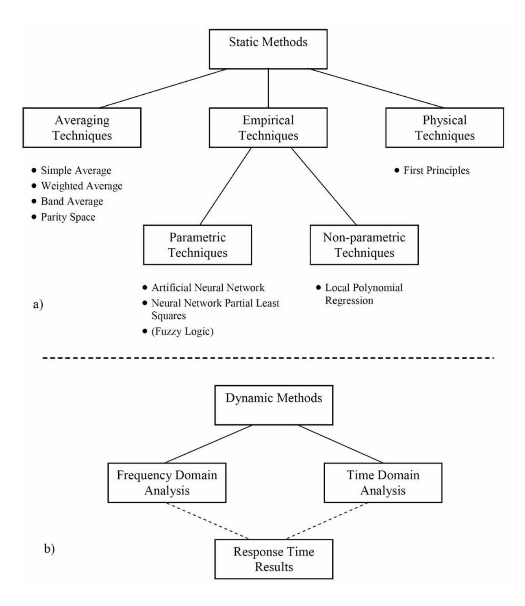

*FIG. 17. Categorization of static and dynamic calibration methods.*

The static methods, empirical and physical modelling, require a model development or training phase. The averaging techniques and the dynamic methods can be applied directly to the data without requiring a model development phase.

## 5.1. STATIC CALIBRATION METHODS

Modelling techniques that can be used for the analysis of on-line data are divided into two general classifications: empirical (or data driven) models and physical models. The empirical modelling techniques make use of correlations inherent in the historical data to make future predictions, while physical models are analytical equations derived from physics based relationships. Empirical techniques estimate the value of a process parameter based on the measurement of other process parameters. Physical models are based on first principles and involve an understanding of the system under analysis, material properties, geometries and other plant specific data. Because of the necessary development time and engineering effort, the use of physical modelling is not favoured over empirical modelling when it comes to on-line calibration monitoring.

The modelling systems usually involve several other modules, such as the use of FL for data clustering, the development of automatic error correction techniques and the use of cross-correlation analysis to determine time delays. Additionally, techniques must be integrated that can identify when a sensor has reached a drift limit. Simple limit checking can be used or more complex tools such as the SPRT can be applied.

### **5.1.1. Data qualification**

In order to build a robust empirical model for OLM, one must first collect data covering all the operating conditions in which the system is expected to operate.

The first problem usually encountered in using historical data for model training is that it is usually not actual data, but instead data resulting from compression routines normally implemented in data archival programmes. For example, in some applications the software creates a data archive that is a time series database. However, all of the data are not stored at each collection time. Only data values that have changed by more than a tolerance are stored along with their time stamp. This method requires much less storage but results in a loss of data fidelity. When data are extracted from the historian, data values between logged data points are calculated through a simple linear interpolation. The resulting data appears to be a saw tooth time series and the correlations between sensors may be severely changed (see Fig. 18).

Figure 18 is a plot of data output by a data historian. The plot shows a perfectly linear increase in power between 6 April and 7 April, although this was not the actual operation. Data collected for model training should be actual data and tolerances should be set as small as possible or not used.

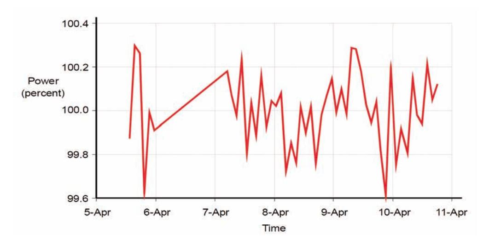

*FIG. 18. Data interpolation.*

Several data quality issues are common. These cases include:

- Lost or missing data points;
- Single or multiple outliers in one sensor or several;
- Stuck data in which the data value does not update;
- Random data values;
- Unreasonable data values;
- Loss of significant digits;
- Dead band.

Most of these data problems can be visually identified or can be detected by a data cleanup software. The software should remove bad data or replace it with the most probable data value using an appropriate algorithm. It is most common to delete all bad data observations from the training data set. Most OLM software systems include automated tools for data cleanup; these tools identify extreme outlying data, but are typically insensitive to data errors that occur within the expected region of operation. The addition of bad data points in a training set can invalidate an empirical model.

### **5.1.2. Averaging techniques**

There are a variety of averaging techniques referred to as simple, weighted, band and parity space averaging. With redundant sensors, the OLM system can be based on relatively simple to understand averaging techniques. The technique chosen is based very much on the consistency of a signal with respect to its peers. The averaging techniques use simple arithmetic calculations to establish an estimate of the process variable and then to compare each of the parameters composing the average with the calculated average.

The various techniques primarily differ in their ability to check the consistency of the signals that form the average and assign some sort of quality or consistency index to each of the constituent signals. Because all the averaging techniques are based on arithmetic calculations, uncertainty calculations can be formed in a relatively straightforward manner.

### *5.1.2.1. Simple average*

The simplest averaging technique is the arithmetic average, which has been applied to redundant sensor calibration monitoring. The algorithm calculates a deviation for each channel as the difference between the measured value and the simple average of the remaining redundant channels. A σ value (tolerance) is determined for each redundant channel, and the deviations for each channel are compared with the specified σ. If a channel's deviation exceeds 1σ, calibration is scheduled during the upcoming refuelling outage. If a channel's deviation exceeds 2σ, a corrective action may be needed.

A shortcoming of simple averaging is that bias and/or large errors in a sensor will affect the parameter estimate (PE) (simple average).

### *5.1.2.2. Weighted average*

A more robust technique employs a weighted average of the redundant sensor measurements. An error in a sensor does not affect the PE. Several methods can be used to determine the weightings. One of these methods is described in the parity space approach of Section 5.1.2.4. Other weighting techniques calculate the weight as a function of the distance a sensor reading is from the simple average or from all the other readings. As a sensor drifts away from the average or from the other redundant signal readings, its weight decreases and it has a smaller effect on the average.

### *5.1.2.3. Band average*

Band averaging uses a band to reject outliers and averages the values of the remaining signals at each instance of time. Figure 19 shows the concept of band averaging along with that of simple and weighted averaging as well as parity space.

### *5.1.2.4. Parity space*

The parity space approach is a very popular fault detection and isolation technique for use with redundant sensors. The parity space technique models the redundant measurements as the true value combined with a measurements error term. Measurement inconsistencies are obtained by eliminating the underlying measured quantity from the data by creating linearly independent relationships between the measurements known as the parity equations. The magnitude of the parity vector represents the inconsistency between the redundant measurements, and the direction of the parity vector indicates the faulty signal. The parity space method is a two stage process: (1) residual generation; and (2) decision making.

### **5.1.3. Empirical modelling techniques**

Empirical modelling techniques derive models directly from process data. A major advantage of data driven techniques is that they are able to model large, complex systems, with moderate development costs. Because these techniques are based on plant data, one must define the model architecture, select relevant inputs, select relevant operating regions and select relevant training data. There are two general categories for empirical models: parametric and non-parametric ones. Under each category, the empirical modelling strategies most commonly applied to OLM are presented. Additional concepts and issues are also discussed, including: FL clustering, the SPRT for fault detection, model performance metrics and model uncertainty.

### *5.1.3.1. Parametric modelling*

Parametric modelling techniques are those in which the correlations in historical data are embedded into models as parameters. For example, linear regression or autoregressive (AR) models embed the relationships as regression coefficients. Neural networks embed the cause and effect relationships as weights and biases. An

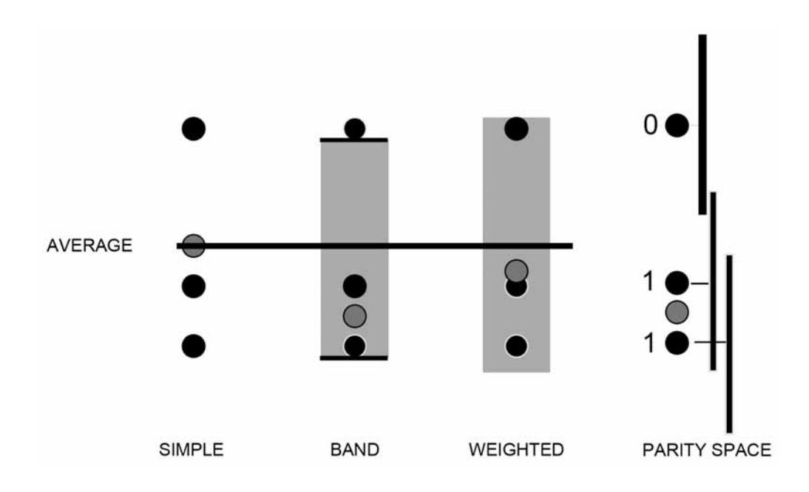

*FIG. 19. Typical averaging techniques.*

example of a parametric modelling technique that has been investigated for OLM applications is artificial neural networks (ANNs).

ANN models, inspired by biological neurons, contain layers of simple computing nodes that operate as non-linear summing devices. These nodes are highly interconnected with weighted connection lines, and these weights are adjusted when training data are presented to the ANN during the training process. In a broad sense, this is an emulation of the learning process of the highly interconnected set of neurons of the human brain. Although the magnitude and complexity of the human system is unattainable through computational methods, it is a model by which complex problems can be solved in limited form. Additionally, the training process often identifies underlying relationships between environmental variables that were previously unknown. Successfully trained ANNs can perform a variety of tasks, the most common of which are: prediction of an output value, classification, function approximation and pattern recognition [11].

### *5.1.3.2. Non-parametric modelling*

Non-parametric techniques, commonly called memory based techniques, store past data exemplars in memory and process them when a new query is made. For instance, rather than modelling a whole input space with a parametric model such as a neural network or linear regression, these local techniques construct a local model in the immediate region of the query. These models are constructed 'on the fly', not beforehand. When the query is made, the algorithm locates training exemplars in its vicinity and performs a weighted regression with the nearby observations. The observations are weighted with respect to their proximity to the query point. In order to construct a robust local model, one must define a distance function to measure what is considered to be local to the query, implement a locally weighted regression and consider smoothing techniques such as regularization.

Local polynomial regression (LPR) models are often referred to as lazy learning methods. Lazy learning comprises a set of methods in which data processing is deferred until a prediction at a query point needs to be made. These methods are also referred to as memory based methods, due to the approach of storing the training data and recalling relevant training data when a query is made. A training data set is comprised of a known set of input vectors and a corresponding set of output values. A query point is an input vector for which an output is to be determined. The query point input vector may or may not be in the training set. Relevant data are identified by the use of a distance function where maximum relevance occurs when a query point matches a point in the training set; relevance diminishes from this maximum as the distance between a query point and the training points increases. Non-parametric regression using data in a neighbourhood of the present query point is generally referred to as a local model. Local models attempt to fit the data in a region surrounding the query point with a polynomial.

The local modelling approach generally used is LPR [12]. LPR is also called kernel regression when the degree of the fitted polynomials is 0, and is called local linear regression when the degree of the fitted polynomials is 1.

### *5.1.3.3. Fuzzy logic*

FL and fuzzy systems are rather new computing techniques that are tolerant to imprecision and uncertainty in data. These techniques have been used directly as an empirical model for calibration monitoring, but more commonly it is used to develop modular systems. Modular systems combine ANNs and FL to exploit the learning and generalization capability of ANNs with the approximate reasoning embedded in FL (see Annex I). Real time process signal validation is an application field where the use of these combined techniques can improve the diagnosis of faulty sensors and the identification of outliers in a robust and reliable way. For example, an FL clustering algorithm can be used to classify the operating region in which the signal validation shall be performed. The fuzzy classifier identifies the incoming signal pattern (a set of nuclear power plant signals) as a member of one of the clusters. Each cluster is associated with one ANN that has been previously trained only with data belonging to that cluster. During the operation, the classifier provides an automatic switching mechanism to allow the best tuned ANN to be applied. The advantage in using this architecture is that the accuracy and generalization capability is increased compared with the case of a single ANN working in the entire operating region.

### **5.1.4. Physical modelling techniques**

Data reconciliation techniques refer to methods which employ a mathematical model of the plant based on physical principles for calculation of process states and parameters (see Annex I). A quantitative calculation of the degree of compliance with the mathematical model and of a certain measurement thus enables the determination of the calibration need of the instrument under observation. These methods use physical relationships to reduce the uncertainty inherent in process measurements.

One of the benefits of data validation techniques based on mathematical models (i.e. of analytical redundancy based methods) is that an improved precision over that of the raw data is possible even in the absence of physical redundancy (i.e. multiple measurements of the same process variable). For nuclear power plants this may be a significant asset, since frequently the instrumentation is too scarce to actually warrant the use of methods assuming physical redundancy.

In contrast with the analytical redundancy provided by empirical methods, such as neuro-fuzzy models, the use of first principles models has the benefits that they do not require a large amount of measured data for their establishment, and they can, with some caution, be used for extrapolation and the possibility of calculating unmeasured quantities. The major drawback of first principles models is that they are costly to build and require customization for the process at hand. However, recently new tools have been developed to reduce the modelling and implementation efforts required for plantwide application of first principles models in data reconciliation.

### **5.1.5. Uncertainty analysis methods**

The major function of an on-line sensor monitoring system is to report when an empirical model's estimations are significantly deviating from the measured values of the monitored process. While the ability to detect these significant deviations has been proven, the quantification of the uncertainty associated with the empirical model estimates has only recently been addressed. To verify that the observed deviations are significant in that they exceed all observed effects of modelling uncertainty, prediction interval estimation techniques are necessary. Further information and references regarding the uncertainty estimation for OLM models can be obtained in Ref. [13].

### **5.1.6. Sequential probability ratio test**

While fault detection of a process signal can be achieved using a simple threshold function applied to the OLM system's residual time series, a more statistically rigorous approach to fault detection can also be applied, namely the SPRT [14, 15]. In general, the fault detection procedure is accomplished by first establishing the expected statistical distribution of the residual time series values when the trained model is operating normally. This step is accomplished during the model training procedure. First, a model is trained on a subset of training data, then the remaining (unselected) training data observations are processed through the model to characterize the expected distribution (or scattering) of the residual time series values (residual = estimated – measured values). The SPRT requires certain assumptions about the time series data, namely that the residual samples are independent, and that the samples are from one of two known distributions related to normal or abnormal process signal conditions. Moderate violations of these assumptions can usually be tolerated by the SPRT algorithm.

Having characterized the expected distribution of the residual values when the process and its trained model are operating normally, fault detection identifies those conditions that deviate from the learned model. In operation, a time series of the residual values from an OLM system are evaluated by calculating its logarithmic likelihood ratio (LLR) to determine whether the series of values is characteristic of the expected (normal) distribution (the null hypothesis) or alternatively of some other pre-specified (abnormal) distribution. Four possible fault types are considered:

- The residual mean has shifted high (positive mean test);
- The residual mean has shifted low (negative mean test);
- The residual variance has increased (nominal variance test);
- The residual variance has decreased (inverse variance test).

Each of the four fault detection tests is a binary hypothesis test. Each hypothesis test assumes that one of the parameters, either the residual mean or the residual variance, is held constant. The LLR time series of the residual time series is compared with thresholds to determine whether or not the signal is consistent with normal behaviour for each test. The LLR thresholds for normal and abnormal statuses are calculated from the user selected missed alarm and false alarm rates. When the LLR time series hits one of the thresholds (normal or abnormal) a decision about current residual signal behaviour is reached (either that the signal is behaving normally or abnormally). The decision is reported, the LLR is reset to zero and the test continues analysing the data from the measured time series signal.

### *5.1.6.1. Mean tests*

The positive mean test and the negative mean test detect changes in the signal average value and are most commonly used for drift and calibration error types of problem, as well as complete failures (open or short circuit). The system disturbance magnitude setting controls the point at which a deviation in the signal mean value will be deemed abnormal. Figure 20 illustrates the change (M) in the mean value μ0 required to produce a fault detection event using the positive mean test and the negative mean test. The hypothesis test for mean degradation assumes that the residual variance did not change.

### *5.1.6.2. Variance tests*

The nominal variance test detects an increase in the signal's variance and is useful for detecting cable damage or loose connectors that can cause signal spiking in an otherwise normal signal. The inverse variance test detects a reduction in the signal's variance, which might be caused by a loss of response type failure with a nonresponsive signal remaining in the normal expected range. In addition, stuck data occurring during monitoring will trip an inverse variance test. The system disturbance magnitude setting controls the point at which a deviation in the signal variance value will be deemed abnormal. Figure 21 illustrates the change (M) in the variance value σ0 required to produce a fault detection event using the nominal variance test and the inverse variance test. The hypothesis test for variance degradation assumes that the residual mean did not change.

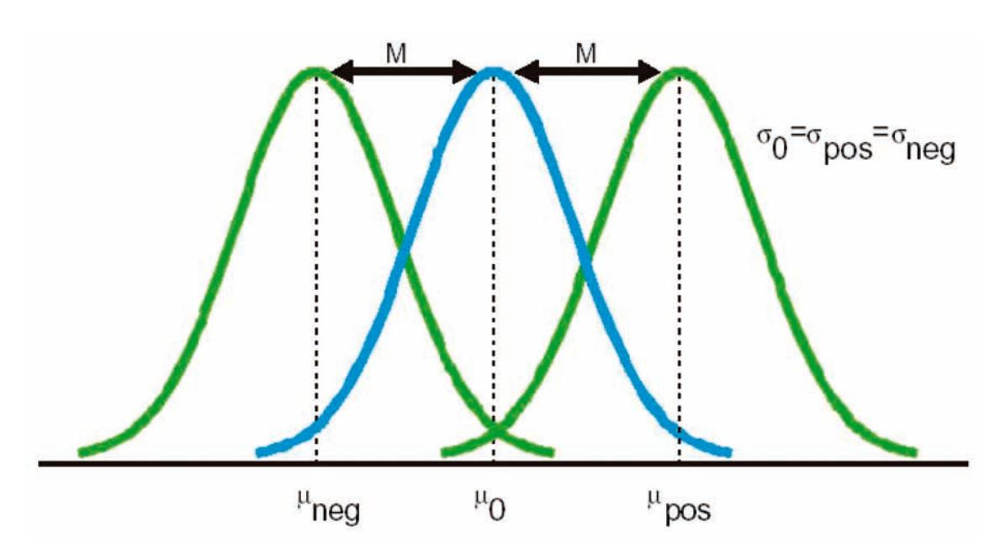

*FIG. 20. Mean disturbance magnitude tests.*

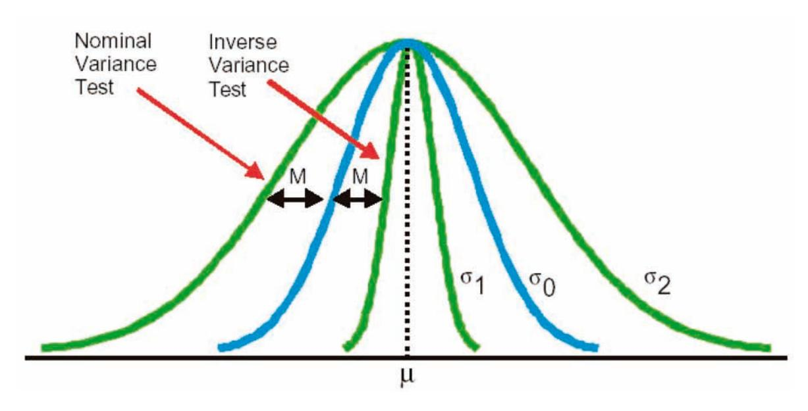

*FIG. 21. Variance disturbance magnitude tests.*

### *5.1.6.3. Summary of how failures are determined*

As data observations are processed through a model, estimates for the observations are calculated. Each residual is then evaluated by a series of statistical tests, and if appropriate an alarm is generated. But an alarm is only the first part of a failure determination. Failure declaration is a two step procedure:

- If a series of residuals present a probability ratio which trips one of the statistical tests, an alarm will be generated for that signal;
- Depending on the model settings, a failure declaration will be made based on the number of alarms generated within a sequence of observations.

Even if everything works fine, occasional alarms will occur because of random variations in the data or minor process variations. This is why a single alarm is not considered a failure; it takes a certain number of alarms within a short sequence before a failure will be declared. The logic implemented between alarm identification and failure declaration depends on the specific application being used and is usually user adjustable.

## 5.2. DYNAMIC ANALYSIS TECHNIQUES

In many cases, the dynamic characteristics of process instruments can be determined in situ using noise analysis techniques. For dynamic calibration (i.e. response time determination), well developed models and methods can be used to derive response times in the instrument channels. The analysis takes place both in the time and the frequency domain. Time domain models present analysis results, such as time constants, overall response time and gain factors, while frequency domain power spectral density (PSD) functions indicate low pass filter cut-off (or corner) frequencies, attenuation slopes and damping factors. The combined use of these methods is the most powerful to support the interpretation of the results.

The most commonly used methods for dynamic analysis of sensor signals are the fast Fourier transform (FFT) based spectral analysis (that yields PSD and transfer functions) and AR modelling, as described earlier in this report. For FFT/PSD, a dynamic model of the instrument (in terms of a mathematical function in the Laplace domain) is needed and must be first developed by the analyst. For an AR time series analysis, a model to fit to the measured time series data is not needed, but the AR algorithm should identify the optimum AR model order for data analysis.

In this section, the steps that are followed to obtain the response time of an instrument (e.g. a pressure or flow transmitter) from the noise data are outlined.

### **5.2.1. Data qualification**

The noise data collected for dynamic testing of sensors and transmitters must first be screened using statistical techniques such as plotting of the amplitude probability density (APD) function. The APD is used to identify any skewness in the noise signal that can arise from sensor non-linearity or process problems. Other descriptors of noise data quality are the block mean, variance and other moments of the noise signal. These should be determined and evaluated before each data analysis. Also, the noise data should be screened for anomalies, bad blocks and other problems (e.g. signal saturation, corrupted records, spikes, missing data) prior to proceeding with any analysis.

### **5.2.2. Frequency domain analysis**

In frequency domain analysis, the noise data are Fourier transformed using an FFT algorithm. Then, the APSD, CPSD, coherence and phase difference functions of the noise data are generated and a frequency domain model of pre-selected model order and with unknown model parameters is fitted to these spectral functions to identify the model parameters from which the dynamic response time of the sensor is calculated.

The spectral functions of process sensors often contain resonances and artefacts that are not related to sensor dynamics. As such, much experience is used in interpretation of the spectral function results to separate anomalies and artefacts from useful information. Usually, these effects cover separate domains in frequency; therefore the above curve fitting can be performed over pre-selected frequency intervals.

### **5.2.3. Time domain analysis**

For time domain analysis of noise data, AR modelling or multivariate autoregressive (MAR) modelling is used. The model parameters and the optimum model order are identified by fitting the noise time series data to the model. The fitted model is equivalent with the real measured system in terms of having the same auto- and cross-correlation functions up to a time lag equal to the model order times the sampling time (it is assumed in the model calculation that the input signal to the AR model is a white noise). These fitted model parameters are then used to create the output time signal of the AR model responding to an impulse input signal. The calculated impulse response signal is then used to calculate the step or ramp response and a value for response time is deduced.

There are two apparent problems with the AR model based response time estimation:

- (1) Since the model fitting is done in the time (or correlation function) domain, the frequency domain separation of artefacts and system dynamics, mentioned in the above subsection, cannot be done prior to the AR model fitting. Therefore the AR model tries to model the effects of all noise sources in the signal, including signal and measurement anomalies and line frequencies.
- (2) The AR model is set up in a way that its input driving signal is a white noise signal. Therefore the AR model represents all the effects that make its output signal non-white, including all the effects upstream from the tested sensor. In reality, the input signal to the sensor is not white; rather it contains information on the physical processes taking place upstream from the sensor. As a consequence, the response time given by the AR model is the response time of an upstream hypothetical system, giving the same auto- and cross-correlation functions as the real measurement (up to the correlation lag of the AR model order times the sampling time). Therefore the response time given by the AR model cannot be solely attributed to the sensor, unless there is reasonable measurement evidence on the whiteness of the input noise signal driving the sensor.

### **5.2.4. Interpretation of results**

Sensor response time results from the noise analysis technique may be determined with either frequency domain analysis or time domain analysis or both. The frequency domain and time domain analysis methods have the same foundation, although different algorithms are used to implement them. Typically, the noise data are analysed in both frequency domain and time domain and the results are averaged after excluding any outliers.

## **6. INSTRUMENT RELIABILITY AND ACCEPTANCE CRITERIA FOR ON-LINE CALIBRATION MONITORING**

OLM can identify drift in sensors such as a pressure transmitter or an entire instrument channel (excluding the actuation system), depending on where the OLM system is connected to the instrument channel. After identifying the drift, the next step is to determine if the drift is acceptable and to set alert and alarm limits for corrective action as necessary to remedy the drift problem or mitigate its consequences. The same step is actually followed in conventional calibration when the as found and as left data are compared for acceptability.

An alert limit is a conservative band that may be used to identify the onset of a potential drift problem, and an alarm limit is a band that may be used to identify the point at which a corrective action should be initiated to prevent a channel from exceeding its drift allowance. The allowance for drift of sensors is usually found in the surveillance requirements of the plant technical specifications or in the set point analysis.

## 6.1. INSTRUMENT RELIABILITY

### **6.1.1. Sensor drift**

Sensor drift occurs when the sensor readings deviate from the calibrated value. Plant engineers define a range of acceptable drift values (depending on the plant application) and defined tolerance regions. For safety systems these regions are defined by set points defined in the technical basis.

After each fuel cycle, plant instruments are typically calibrated to operate reliably over the entire span. However, the performance of the instrument is not measured to determine if the instrument indeed requires to be recalibrated. The basis of this report is to tie the performance of the instrument with the requirement for recalibration.

Before an attempt is made to extend the calibration period of a particular sensor, there needs to be some confidence that the sensor is not subject to systematic drift. Studies carried out indicate that most modern sensors do not exhibit a time dependant systematic drift.

### **6.1.2. Sensor failure modes and risk mitigation**

Many failure mechanisms will be detectable during normal plant operation by gross failures in indicated values or failures to meet at power surveillance checks such as channel checks. There will be some failure modes that are only detectable through manual calibration, for example hysteresis and non-linearity failure to reach the set point on demand.

While these failure modes are pre-existing and not impacted by the introduction of OLM, there is a potential for these faults to remain undetected for a long time, sometimes over the entire fuel cycle. If such a situation occurred on multiple redundant channels of protection, plant safety would be compromised.

It is therefore appropriate to understand the various failure modes addressed in the original safety design calculations, whether assumptions are overconservative or may be detectable by alternative means. Table 1

TABLE 1. SENSOR FAILURE MODES AND RISK MITIGATION

| Sensor failure mode                                                              | Risk mitigation                                                                                                                                                                                       |
|----------------------------------------------------------------------------------|-------------------------------------------------------------------------------------------------------------------------------------------------------------------------------------------------------|
| The sensor is responding to changes but not with the required accuracy        | Twice daily channel checks remain unchanged                                                                                                                                                           |
| The sensor is responding to changes but not within the required response time | Time response testing remains at refuelling frequency                                                                                                                                                 |
| The sensor is responding but not in relation to the process parameter         | Twice daily channel checks remain unchanged                                                                                                                                                           |
| The sensor is stuck or fails to reach low set point                              | One safety train tested every two years by existing calibration (following full implementation) Other three trains detectable via channel checks during plant manoeuvres (maximum two years) |
| The sensor response appears normal but fails to reach the required set point  | Checked by calibration, therefore potential increase in detection period from two to eight years (following full implementation)                                                                   |

provides an overview of the various failure modes examined in support of the OLM at the Sizewell B nuclear power plant together with the risk mitigation.

It can be seen from the table that the 'pinch' point of any reliability claims is the failure to reach the high set point. For safety critical applications it would need to be shown that the probability of this failure mode was so low that it was either already bounded by assumptions within the current safety case, for example by failure modes and effect analysis, or that it was detectable by some alternative means.

## 6.2. COMMON MODE FAILURE OF ON-LINE MONITORING SYSTEMS

As already stated, OLM should not impact upon the reliability of the sensor; however, it could be the source of a common mode failure with regard to the detection of a sensor problem, for example a software or operator error which masks a failing sensor.

With regard to the OLM software, there are two key issues that must be addressed: first, that of an error in software functionality; and second, the acceptance criteria for the determination of the sensor's operability. The first will typically be achieved as part of the CBC software verification and validation (see Sections 7.4.2.2 and 7.4.3.1), the second by examination of the uncertainty calculations with respect to the instrument channel together with that of the process estimate against which the sensors will be judged as good or bad.

## 6.3. STATIC PERFORMANCE CRITERIA

### **6.3.1. Instrument channel uncertainties**

Table 2 shows typical sources of uncertainties and their corresponding values for the services that were monitored at the McGuire nuclear power plant during a research project that was conducted to establish the feasibility of OLM for instrument calibration reduction. Some columns in Table 2 are left blank because they do not apply to the McGuire signals that were monitored for the on-line calibration monitoring project. They were, nevertheless, included in the table because they generally play a role in arriving at instrument channel uncertainties.

The uncertainties listed in Table 2 are defined in Table 3. These uncertainties are combined in a manner that depends on whether they are random or systematic, dependent or independent. (The random uncertainties are also referred to as accidental errors, and the systematic uncertainties are also referred to as bias errors.)

If the uncertainties are random, they are squared and the square root of the sum of the squares (called RSS error) is calculated and added to the sum of the biases to yield the total uncertainty for the channel as shown in

TABLE 2. TYPICAL SOURCES OF UNCERTAINTIES FOR PROCESS INSTRUMENTATION CHANNELS IN PRESSURIZED WATER REACTOR PLANTS AND CORRESPONDING VALUES THAT APPLY TO THE MCGUIRE PLANT (PER CENT OF SPAN)

|                          | Service |       |          |       |      |      |      |               |      |       |            |
|--------------------------|---------|-------|----------|-------|------|------|------|---------------|------|-------|------------|
|                          | PMA     | PEA   | SCA SMTE | SD    | SPE  | STE  |      | RCA RMTE RCSA | RD   | RTE   | EA BIAS |
| Feedwater flow           | 0.00    | 0.25a | 0.10     | 0.30  | 0.56 | 0.10 | 1.50 | 0.00          | 1.00 | 0.50  | 0.00       |
| Steam generator level    | 2.00b   |       | 0.50     | 1.00  | 0.30 | 0.50 | 0.50 | 0.48          | 1.00 | 0.50  | 0.00       |
| Reactor coolant flow     | 1.40c   |       | 0.00     | 0.60  | 0.00 | 0.00 | 0.30 | 0.17          | 0.60 | 0.30  | 0.05d      |
| Pressurizer level        | 2.00b   |       | 0.50     | 1.00  | 0.50 | 0.50 | 0.50 | 0.35          | 1.00 | 0.50  | 0.00       |
| Wide range pressure      | 0.00    |       | 0.50     | 1.50  | 0.00 | 0.50 | 0.50 | 0.35          | 1.00 | 0.50  | 0.00       |
| Pressurizer pressure     | 0.00    |       | 0.50     | 1.00  | 0.00 | 0.50 | 0.50 | 0.35          | 1.00 | 0.50  | 1.50e      |
| Containment pressure     | 0.00    |       | 0.50     | 1.00  | 0.00 | 0.80 | 0.50 | 0.35          | 1.00 | 0.50  | 0.00       |
| Steam pressure           | 0.20f   |       | 0.50     | 1.73  | 0.00 | 1.12 | 0.50 | 0.35          | 1.50 | 0.50  | 0.00       |
| Turbine impulse pressure | 0.00    |       | 0.50     | 0.63  | 0.00 | 0.72 | 0.50 | 0.00          | 1.00 | 0.50  | 0.00       |
| Power range              | 4.17    |       | 4.17     | 0.00  | 0.00 | 0.00 | 0.50 | 0.25          | 1.00 | 0.50  | 0.00       |
| In-core thermocouples    | 0.00    |       | 7.20     | 10.00 | 0.00 | 2.30 | 6.90 | 0.00          | 2.30 | 11.50 | 0.00       |

a 0.25% represents uncertainty in flow measurements due to flow orifice.

Above are bias terms that are common to redundant sensors. Thus, they were not included in calculating the process estimation uncertainties presented in this chapter for the McGuire instruments.

TABLE 3. DESCRIPTION OF SOURCES OF INSTRUMENT CHANNEL UNCERTAINTIES

| PMA  | Process measurement accuracy. Inherent noise in the process. PMA sources are listed as water leg correction, elbow tap error, streaming and thermal mismatch (power range detectors). For the RC flow channel, PMA is a RSS combination of 0.33 for density, 0.30 for noise, and 1.33 for calorimetric uncertainties. This RSS combination |
|------|--------------------------------------------------------------------------------------------------------------------------------------------------------------------------------------------------------------------------------------------------------------------------------------------------------------------------------------------------|
|      | equals to 1.4%.                                                                                                                                                                                                                                                                                                                                  |
| PEA  | Primary element accuracy. Represents the error due to the use of a metering device like a flow orifice, etc.                                                                                                                                                                                                                                     |
| SCA  | Sensor calibration accuracy. Inherent accuracy of the sensor at reference conditions; typically vendor supplied.                                                                                                                                                                                                                                 |
| SMTE | Sensor measurement and test equipment. McGuire calculation assumes 0.0 for SMTE because equipment used in this plant meets 4:1 accuracy ratio.                                                                                                                                                                                                |
| SD   | Sensor drift. Observed change in sensor accuracy as a function of time; typically supplied by the vendor.                                                                                                                                                                                                                                        |
| SPE  | Sensor pressure effects                                                                                                                                                                                                                                                                                                                          |
| STE  | Sensor temperature effects                                                                                                                                                                                                                                                                                                                       |
| RCA  | Rack calibration accuracy                                                                                                                                                                                                                                                                                                                        |
| RMTE | Rack measurement and test equipment. McGuire calculation assumes 0.0 for SMTE because equipment used meets 4:1 accuracy ratio.                                                                                                                                                                                                                |
| RCSA | Rack comparator setting accuracy                                                                                                                                                                                                                                                                                                                 |
| RD   | Rack drift                                                                                                                                                                                                                                                                                                                                       |
| RTE  | Rack temperature effects                                                                                                                                                                                                                                                                                                                         |
| EA   | Environmental allowance. Represents the change in the instrument channel's response due to accident environmental conditions. McGuire calculation uses 0.0 for EA because these are normal CSAs rather than accident CSAs.                                                                                                                 |
| BIAS | For the RC flow channel. This represents the flow measurement error for the elbow taps.                                                                                                                                                                                                                                                          |

b 2.00% represents uncertainty in level measurements due to the density of water.

c 0.33 of this 1.4 is uncertainty in flow measurements due to the density of water.

d 0.05% is bias due to tap location.

e 1.50% bias represents thermal non-repeatability.

f 0.20% is due to water leg compensation.

Eq. (5). Note in this equation that the errors that are dependent are first added together and then squared in calculating the RSS error.

$$CSA = \sqrt{PMA^{2} + PEA^{2} + (SCA + SMTE + SD)^{2} + SPE^{2} + STE^{2} + (RCA + RMTE + RCSA + RD)^{2} + RTE^{2}} + EA + BIAS$$
(5)

The total channel uncertainty calculated from Eq. (5) is often referred to as the channel statistical accuracy or channel statistical allowance (CSA). The CSA is a parameter of interest in determining the TSPs for the plant. A larger CSA means that there is more room for instrument drift, but a smaller margin for trips, and vice versa. Therefore, a plant would normally desire as small a CSA as possible to allow operation with as much margin as possible.

Note that in this report a general view of set point information is provided using some of the McGuire instrument specifications as an example to illustrate how the uncertainties of individual components of a channel may be combined to determine the acceptance criteria for OLM results. This example may or may not represent the common practice of the nuclear industry. Each plant implementing on-line calibration monitoring should produce its own procedure to establish acceptance criteria for the results of OLM.

### **6.3.2. CSA band and drift band for on-line monitoring**

An instrument channel is said to be in calibration if the difference between its input and output is less than the CSA or if its drift is contained within the drift allowance for the channel. For on-line calibration monitoring, the channel output is subtracted from the best estimate of the process input and the results are plotted over the entire fuel cycle to check for drift and other problems. Figure 22 shows the results of this exercise for two services at the McGuire plant. The results in this figure are shown in terms of the deviation of each signal from the average of the redundant signals. Also shown in Fig. 22 are the CSA bands. A discussion on how the CSA band may be determined is given later in this section.

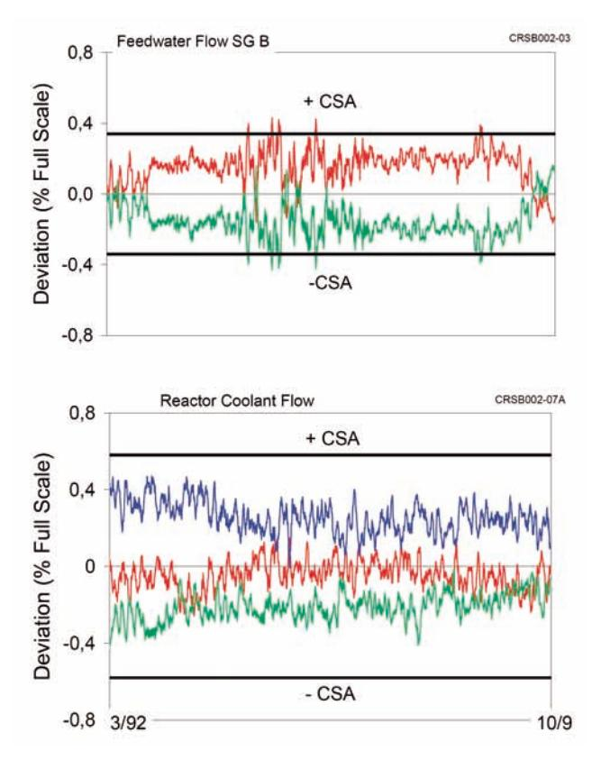

*FIG. 22. Deviation plot and CSA bands for McGuire signals.*

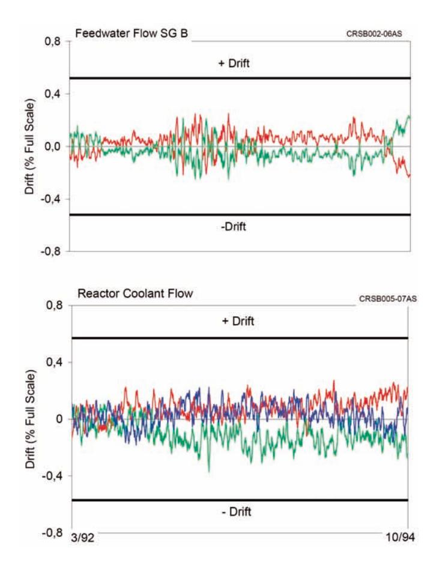

*FIG. 23. Drift plots and drift bands for McGuire signals.*

Figure 23 shows the same data as in Fig. 22, except that in this case the signals are biased as necessary to start them at zero on the vertical axis. Appropriate drift bands for these signals are also shown on the figure. The drift band is calculated by squaring the sensor drift (SD) and rack drift (RD) terms, adding the two results, and calculating the square root of the sum. The result is then multiplied by (*n* – 1)/*n* to account for the number of redundant signals that are intercompared on the same plot. Following is an example of the equation for the drift band (note: the terms drift allowance and drift band are synonymous):

$$DRIFT\ BAND = \sqrt{SD^2 + RD^2} \ \frac{(n-1)}{n} \tag{6}$$

where *n* is the number of redundant signals that are intercompared on the same plot. If analytical methods are used for process estimation instead of averaging methods, then the above equation for drift band does not need the (*n* – 1)/*n* term.

Drift band is a simpler means than the CSA band for determining the calibration acceptability of instrument channels. In using the drift band, one assumes that all channels agree with each other when the plant starts from a refuelling outage. If they do not agree, however, it could be due to inherent uncertainties involved in the calibrations. These uncertainties only affect where the signals may start on the OLM plot and have no bearing on how much the signals may drift from the beginning to the end of a fuel cycle. Ideally, after a full channel calibration which is performed during a refuelling outage, and when the plant is at full power, there should be no deviation between a process estimate and the corresponding instrument channel output. If there is, the difference represents a bias. This bias can be subtracted from the deviation plot and the residual deviation attributed to drift. With this approach, the acceptance criteria can be defined in terms of an allowable drift.

Furthermore, drift is the only component of CSA that drives the requirement for manual calibrations. As such, it is reasonable to monitor for drift to determine if an instrument channel needs a manual calibration.

- Alert limits of a potential drift for the OLM decided by the specific plant are a conservative band that may be used to identify the onset of a potential drift problem;
- Alarm limits of the drift band for the OLM decided by the specific plant may be used to identify the point at which a corrective action should be initiated to prevent a channel from exceeding its drift allowance;
- Allowable values of drift band of the technical specifications are approved by the regulatory authority.

### 6.4. DYNAMIC PERFORMANCE CRITERIA

The dynamic performance limits for process instruments in nuclear power plants are typically stated in the plant technical specification requirements in terms of response time values and other pertinent parameters. Typically, these requirements are further enforced by regulatory requirements. An example of a dynamic performance requirement is that of the response times of pressure transmitters. For a pressure sensing channel, the response time requirement is often one or two seconds to include the sensing lines, the sensor, the electronics, but not the actuation system response time. The actuation system response time is treated separately.

Important components of a pressure sensing channel response time are the response times or delays associated with sensing (or impulse) lines and the sensor (i.e. the pressure transmitter and its DP cell). These components are in the field and exposed to harsh environments as opposed to the rest of the channel, which is located in air conditioned areas in instrument cabinets in the control room or cable spreading room areas. As such, response time testing is performed on pressure transmitters and sensing lines to ensure that the harsh environments and process operating conditions are not causing unacceptable degradation.

In most Western pressurized water reactors (PWRs), the primary coolant RTDs are typically also subject to strict limits on response time. For example, plant technical specifications sometimes specify RTD response time requirements of 4.0 seconds. This is for an RTD that is mounted in a thermowell. Most thermowell mounted RTDs have response times that are not much faster than 4.0 seconds. Therefore, there is little room for degradation. For this reason, great effort is often spent in nuclear power plants to ensure that RTDs are properly installed in their thermowells, thermowells are cleaned and optimum response times are achieved. The cold shutdown testing of RTDs described in Section 4.2.3 is an example of a means that is used in some plants to ensure proper RTD performance from a dynamic point of view.

It should be pointed out that on-line testing of the response time of process instruments measured using noise analysis yields comparable results with conventional response time testing methods, provided that the noise data are properly acquired and correctly analysed.

## **7. IMPLEMENTATION GUIDELINES FOR ON-LINE MONITORING SYSTEMS**

### 7.1. FEASIBILITY DETERMINATION

The determination of the feasibility of OLM at a nuclear power plant should include an examination of the following key areas.

The availability and suitability of source data, for example does the plant already have a plant computer that can store the data or is a new data acquisition system required. Clearly the latter is a significant cost which may not be financially viable. Although if the nuclear power plant is considering an I&C upgrade the inclusion of extra facilities to permit OLM is likely to be a very small on-cost that could significantly improve the return on investment through reduced maintenance activities.

The ultimate goal of OLM must be to ensure that maintenance activities are carried out in the safest and most effective way possible. In this context 'effective' can mean the extension of the calibration interval, the reduction of dose rates to operators, reduction in potential maintenance induced errors and improved early diagnosis of instrument problems. There are other additional potential benefits of the use of these techniques, such as the ability to increase the qualified life of installed instruments in older plants. In this case the life extension of the sensors may be justified on the basis of monitoring their performance on a continuous basis using OLM techniques.

Having established that the data are available, the next key issue is to establish the duty of the sensors to be examined, for example are they safety or non-safety. If the former, there are potentially some significant challenges to overcome with respect to any claims that may have been made within the nuclear power plant's safety case, in particular with respect to instrument reliability and calibration accuracy. It may require thorough engineering analyses and regulatory approval to ensure safety is not compromised. For non-safety applications, where no such regulatory approval is required, huge gains in productivity may result.

### **7.1.1. Monitoring system functions and end user requirements**

The introduction of new decision support systems such as CBC for the control room staff and maintenance personnel should be based on the following activities and analysis:

- (1) Define the top level functional requirements for the system. This should include the operational requirements and any regulatory requirements.
- (2) Function analysis (i.e. the functions to be performed by plant personnel in the control room, adjacent rooms and auxiliary rooms, engineering and maintenance offices).
- (3) Role of the end users: control room operators, maintenance personnel, engineers and other users of CBC.
- (4) Function allocation between the machine (HW and SW) and plant personnel considering the different user categories (i.e. what part of the functions should be automated and what part should be left to the end user).
- (5) Task analysis identifying the various tasks that the end user has to attend to. A consequence of this analysis may be that certain tasks should be moved from the end user to a computer system. Some of the reasons may be:
  - Time pressure, for example especially relevant for situations where time pressure on maintenance staff could lead to potential maintenance induced errors.
  - Cognitive overload, for example the task or several tasks in parallel make the load on the operator demanding to the extent that human performance is reduced.
  - Task complexity and difficult analysis needed to carry out the task, for example the task requires a very detailed and comprehensive analysis of plant state calculations. Such calculations are better performed by a CBC system and give much better accuracy and reliability.
  - Routine tasks that do not require the attendance of the end user, thus freeing the plant personnel for more high level tasks.
  - Safety criteria requiring that operators need support in performing a given task.

In moving a task from the operator to a computer, it must always be considered how this influences the operator's situation awareness. Too high automation moves the operator out of the loop, while too little automation makes it uncertain if the operator recognizes important information.

It is important that the CBC system design is sufficiently flexible so that its functions can be adapted to match the user needs. If the CBC does not meet the usability requirements of the plant personnel, user acceptance will be low and the introduction of CBCs may not succeed.

Training of the personnel is an important topic, which must be covered carefully when introducing new regimes such as CBC with the associated methodologies, techniques, computer systems, documentation and procedures. This issue is covered in more detail in Section 7.4.6.

### **7.1.2. Characteristics of the monitored instruments**

The instrument characteristics should provide an input into the functional allocation. In addition, when implementing CBC systems, there are a number of basic data and information required in order to configure and install the system. This information must be provided by the plant personnel and may come from several sources, for example plant vendors, I&C suppliers, instrument companies, available instrument databases and design documents.

The characteristics of all the monitored instruments should be collected in one database for common access and be maintained by the plant staff as plant life develops; that is, instruments are replaced and new instruments are introduced.

The instrument database should at least include as-built data on:

- Vendor information/data sheet of each particular instrument;
- Type of sensor, what it measures, units, operating range;
- Data processing available/required, conversion, algorithms used;
- Time response, dynamic characteristics;
- Accuracy/uncertainty claimed by the vendor.

In addition, the experiences should be captured on:

- Instrument history at the plant, for example when put into operation;
- Initial test data;
- Commissioning data;
- Operational data (e.g. any drift observed);
- Calibration history, etc.

### **7.1.3. Establishing baseline for on-line monitoring**

Part of the process of determining the functional allocation is the inclusion of operating and maintenance data. Given that the basic characteristic information of the monitored signal is provided, one must establish the necessary baseline information required for the OLM systems. This baseline information will partly depend on the type of instrument considered and the actual methods and techniques applied for CBC.

The basic data required will comprise:

- Flow sheets and system diagrams describing the exact location of instruments and how they are connected to the plant equipment;
- Plant operational data from initial plant tests, during the commissioning period to establish the baseline covering different operating steady states and dynamic test data;
- Historical development, trending through a cycle, covering effects such as burnup dependency, fouling, wearing, ageing, etc.;
- Cross-cycle data for comparison and trending.

For averaging methods:

— Access is needed to redundant process data and simultaneous samples.

For empirical methods:

— Access is needed to as much operational data as possible, such as simultaneous measurements recorded with an adequate sampling rate to capture the dynamic behaviour of the monitored instruments and plant processes in different operational regimes.

For physical modelling methods:

- Access is needed to a limited set of operational data, such as simultaneous measurements recorded in different operational states.
- Access is needed to information about plant equipment/components at a sufficient level of detail to be able to adequately model the plant. The level of detail may vary, but typically similar data are needed as those used for design/training simulators.
- Access is needed to actual equipment operational status, for example flow sheets, changes in process flows, equipment line-up, plugged tubes in heat exchangers/steam generators, known process failures such as internal leakages in heat exchangers, leaking valves, etc.

## **7.1.4. Integration of on-line monitoring systems with plant instrumentation and control and plant computers**

Integration of new systems such as CBC should be considered both with respect to usability and cost savings. Plant staff often report on auxiliary systems being brought into the control room as an add on to their existing set of support systems. The intentions are possibly good. However, the plant management often fails to contemplate how the use of the system could be fitted to whatever tasks, working procedures or other support systems that the operators are actually using. One typical mistake is that the auxiliary system is in the wrong place (often one finds it in a corner of the control room). Another mistake is that it needs a lot of extra input from the operator (due to lack of data being fed from systems that could provide these data). A third potential mistake is that the human–system interface (HSI) of the auxiliary system is not fitted to the tasks of the user, for example resulting in excessive navigation finding the needed information. Even though the system in itself is well designed and implemented, the lack of integration results in low usability.

Integration should be achieved with respect to many different aspects:

- (1) Integration across control room systems and their displays. The plant personnel must be able to use the CBC as a natural element of the tasks to be performed. It is important that information (e.g. CBC specific displays) is presented consistently with other information presentation systems available. The dialogue should also use the same principles as applied elsewhere. In general, the design should include the existing human factors guidelines provided by the utility.
- (2) Integration with plant operation. One should contemplate if the integration with the maintenance systems of the plant is good enough. The CBC may contribute valuable information with respect to the planning of the operation of the plant. Some CBCs may have this as their sole purpose (such as preventive maintenance systems), while other systems may have extra features to provide for this. As an example, an automatic diagnostic system may have logging functionality influencing the urgency of planned maintenance (possibly combined with operator's annotations). In addition, it is required to review and modify the existing operating procedures to incorporate the use of OLM systems.
- (3) Integration with the development of plant systems. Plant life cycle management must be considered. Often management of the individual software systems is expected from plant life management. Nonetheless, it is obvious that CBCs must be easily maintainable. The initial design of a CBC must be adequately documented. In particular, dependency relationships between CBCs and other information management systems must be taken care of.
- (4) Integration with the plant computer system. If data for OLM is to be retrieved from the plant computer, a software application (usually referred to as a bridge) shall be developed, tested and validated to ensure data are properly acquired, screened and stored. Plant computer data could have gaps, spikes, zeroes, letters and other problems. The bridge must identify and isolate these problems before the data are stored. Furthermore, for steady state analysis (i.e. calibration monitoring) digital filtering and averaging techniques are usually needed to remove noise and extraneous effects. OLM data do not normally have to be analysed in real time. They can be stored and analysed at a convenient time. Functions in the existing plant computer system are analysed. The performance and the inputs that are processed in the existing plant computer system should be considered. Specific design parameters (such as the sampling rates of the existing data acquisition system), which are met with the hardware requirements of the OLM being

- designed, should be analysed. The OLM may be a standalone system. The OLM may be installed with its own displays, which the existing human factors guidelines of a utility are applied to.
- (5) Interface with existing I&C systems. If a dedicated data acquisition system is implemented to obtain OLM data, this system must interface with the plant I&C systems through an isolation device. The level of isolation depends on the I&C system involved. In addition, any direct interface with plant I&C would normally require analogue signal conditioning. Furthermore, any dedicated data acquisition system should have built-in reference signals that should be monitored along with the plant's I&C signals to ensure that the drift of the OLM equipment is distinguished from the drift of the plant I&C equipment. The OLM shall not be designed to impact upon the existing instrumentation, in principle. The OLM shall be installed with its own separate isolation device in the case of sharing the existing sensors and/or instruments. Any additional signal conditioning equipment should be minimized.
- (6) Information from the CBC for maintenance personnel. The requirements for the information to be provided by the OLM will be determined by how the system is implemented within the plant. For example, a standalone system provided as an operator diagnostics tool will have different requirements to a system fully integrated into the plant computer system providing information to the plant operators. A system provided as a diagnostic tool should provide sufficient information to allow the maintenance staff to determine if an instrument requires calibration or maintenance (such as instrument replacement). A system integrated into the plant computer system should provide the operators with sufficient information to determine whether there is a problem with an instrument and hence determine its status (operable or not operable) and to alert maintenance staff to the fact that there is a potential calibration or maintenance requirement.

Human factors aspects of the design of the HSI should be considered for the implementation of OLM, whether the implementation results in a maintenance diagnostics tool or is integrated into the plant computer system to provide information to the plant operators.

The following more specific guidelines should thus be considered:

- Overall integration with plant control systems and operator interfaces, maintenance and planned refurbishment of other parts of the plant should be considered when including a CBC.
- The CBC should be fully integrated and consistent with the rest of the HSI, for example utilize the same nomenclature, abbreviations, acronyms, symbols, iconic representations and coding techniques as obtained from plant standards across different information systems.
- The plant personnel should be able to use the CBC as a natural element of the tasks to be performed.
- The CBC should be able to import information that is needed and available in other information systems, minimizing the need for the plant personnel to manually input information.
- If the CBC makes use of a physical modelling technique, the model representations should be graphical and to the extent possible represent the physical processes themselves. That is, the use of information flows and other abstraction should be minimized.
- Documentation of the CBC should be provided to the degree that subsequent operations and maintenance are made possible.

## 7.2. FUNCTIONAL REQUIREMENTS

The functional requirements of a software based OLM system should precisely describe what the software is expected to perform. In particular, it should specify how data are transformed by the software into the required information outputs. It should also describe the interfaces between the system and the users of the system.

Identified below are typical examples of functional requirements for a data analysis package 'system' to perform OLM of sensors, in this instance to extend the calibration period from once per cycle to every fourth cycle using averaging techniques.

### **7.2.1. Primary function**

A definition of the software's primary role together with any expectations with respect to limitations should be clearly specified; for example the software shall:

- Identify the level of drift in a sensor from the average of its peers at any point in time (i.e. identify sensor drift from the average generated by the comparison of redundant signals), against a set of acceptance criteria.
- Identify the level of drift in a sensor over a defined period of time against a defined set of acceptance criteria. For example, identifying how much a sensor has drifted over the cycle to indicate sensors that may pass but have drifted from one extreme to the other (i.e. sensors that are likely to fail before the next evaluation period).

Where a term such as averaging is used, it should be clearly defined, for example parity space, together with its appropriateness/limitations and when alternatives should be used. For example, where four redundant signals are being compared and their distribution is two signals in each of two distinct groups, then parity space will not work and the simple average may be the better option.

Drift limits/acceptance criteria will have to be either provided by the customer or supplied by the vendor and care must be taken to ensure that the limits are applicable to the technique being used.

### **7.2.2. Operating range**

The operational range over which the system should perform should be clearly specified; for example:

- The system shall be able to evaluate sensor drift based on steady state plant operation up to 100% reactor full power.
- The system shall also be able to evaluate sensor drift performance during startup and shutdown (i.e. from 0% RFP to 100% RFP and 100% RFP to 0% RFP) to assess sensor dynamic drift over the sensor's full range (where practicable).

Obtaining data during start up and/or shutdown provides a significant improvement in confidence with respect to the sensor performance compared with observation at a single point (see Section 9.2.2). The use of shutdown and startup data also enables the assessment of those sensors that remain mostly static throughout the cycle, for example in a PWR the refuelling water storage tank level will only transition during the refuelling period.

The sample rate of data supplied to the system and/or gathered by the system should be specified. Data may need to be 'screened' prior to performing analysis, for example spikes due to abnormal plant manoeuvres and calibrations. The criteria for removing such data should be specified.

The anticipated usage period of the system should be specified (e.g. the NRC safety evaluation report (SER) suggests every 90 days; in this instance what constitutes the start and finish of a period would need to be specified).

### **7.2.3. System flexibility**

Where possible, consideration should be given to likely changes in the future, as this may impact upon the overall architecture. Catering for it in the initial design may only represent a marginal cost. Some of the specific requirements are:

- The system shall be capable of being amended to add new sensors as and when required.
- The system shall be capable of being amended to change the number of sensors used in the generation of the process estimate.
- The system shall be capable of handling known defective sensors by being able to remove them from the average calculation.

- Sensors measuring the same parameter but with differing ranges (e.g. wide and narrow range pressures) should be capable of being combined into a single group by the use of a span and/or offset correction where this is justified and practicable. There will be some circumstances were the combination of the measurement of similar parameters is not desirable due to differences in the set-up of the measurement channels.
- Sensor drift limits/acceptance criteria shall be modifiable (note: multiple limits may be required to support the different averaging techniques).

## **7.2.4. Operator interface**

The following provides typical issues to consider for the HSI:

- A user friendly/intuitive interface; for example, a hierarchical set of screens navigable from a main introductory screen.
- Displays for the operators to be able to select the separate functions (loading of data, sorting of data, analysis and printing of results as a minimum).

The data displayed on the screen should include:

- The raw sensor data to allow the operator to assess the suitability of the data for use in the analysis.
- The deviation/drift of the sensors from the process estimate.
- The drift of the sensor over the review period.

### **7.2.5. System output**

It is likely that the system shall be able to provide a printed hard copy of the drift analysis for inclusion into the station records. Points to consider are:

- Date and time of the data analysed;
- The sensors analysed, sensor tag identification, sensor group, last calibration dates, etc.;
- A trended output of the sensor drift from the process estimate with time;
- The process estimation method employed, for example parity space averaging;
- The acceptance criteria limits against which they were checked;
- The date and time of the printout;
- The engineer or employee identifier who performed the analysis.

### 7.3. NON-FUNCTIONAL REQUIREMENTS

The non-functional requirements of a software based OLM system can be considered to be the major constraints on the system. For example, response times, reliability requirements, system availability and security would be considered to be non-functional requirements.

The non-functional requirements can also include process constraints, specific operating systems (PC or workstation (i.e. preferred platforms)), and development cost and timescale. The process constraints can also include compliance with standards (including life cycle requirements), the use of specific programming languages and/or software packages.

The following identifies the key areas for consideration when establishing the non-functional requirements for an OLM software application (i.e. those areas of the specification which ensure a quality product from inception to completion, but which do not include the functionality of the application).

### **7.3.1. General design criteria**

This section should provide an overview of the application; for example: "The system shall be a PC based analysis package including software and hardware to facilitate OLM of sensors".

The operating system and commercial off the shelf (COTS) software should be identified within this section. Consideration should also include any known expectations for the future, as they may significantly alter the designer's approach; for example, while the initial design may be for a standalone PC based application, consideration could be given to migration to a network or perhaps UNIX, as this may influence the choice of COTS applications. For the example given the COTS would need to be configurable to be operating system independent.

A critical part of the design of the system will be the development of the software. However, the hardware design aspects must also be considered. This should also include hardware qualification requirements where necessary.

The standards, which the system is to be designed, built and tested against, should be identified in the generic design. Particular attention should be given to the issue of reliability if the system is used to establish or infer the operability of safety related equipment.

The overall requirements for the detection and reporting of hardware and/or software failures should be identified.

### **7.3.2. Software development**

The specification for the software development should ensure that:

- The supplier has an acceptable software QA programme, including software life cycle maintenance procedures.
- The software shall be designed using structured programming techniques where technically practicable.
- Any tools used for the development of the software shall have an acceptable pedigree.
- As a minimum, the quality of the software to be provided by the supplier shall be ensured by the application of a requirements capture process followed by the use of an established development process and by implementing the supplier's quality management system.
- The supplier's procedure for software development shall be documented in the supplier's QA plan.
- All developed software will be subjected to an independent verification.
- The software development will be performed under the supplier's QA programme in compliance with the applicable standards.
- All software code (including source code) together with the software tools shall be made available to the customer.

The last point is often contentious, as the supplier will regard any code as proprietary and will resist disclosure. However, it is important that the customer does not become over-reliant on a supplier who may cease to trade or support 'old' software. Arrangements such as escrow are available to protect both parties in this issue.

### **7.3.3. System security**

Cyber security is now a significant issue and its impact on systems used in safety critical applications should not be underestimated. For applications such as OLM applications security is not normally an issue of confidentiality but more of ensuring software integrity.

It is unlikely that any of the raw data and/or the resultant output in the use of OLM is an issue with respect to who can look at it, but that the software/and or results have not been tampered with either deliberately or accidentally must be assured at all times. For example, items (such as acceptance criteria) that affect the determination of acceptable drift should be subject to stringent configuration control.

In addition to the standard checks such as file size, date, CRC, etc., that can be monitored, consideration should be given to the use of standard test data with known and validated results that can be run to demonstrate that the software functionality has not changed. It is important that such a test file exercises as many of the system features as possible.

Access to the system should be monitored, for example by the use of password control, and regular audits should be carried out to ensure that only authorized users are able to use the system.

The following provides some guidance for consideration:

- System configuration data that affect determination of a sensor's calibration health shall be suitably protected (e.g. modification requires password access).
- System configuration data shall be monitored (e.g. file status shall be checked/monitored during software initialization).
- Initial screens should provide software version identification and configuration files in use.
- User identification to be requested, authenticated and logged.

### 7.4. QUALITY ASSURANCE

As already stated, the supplier is expected to have an acceptable life cycle and its own QA arrangements; however, it is important that these are assessed by the customer to ensure that they meet their expectations and are compatible with their own in house QA documentation with respect to software delivery and/or the transfer of data if the supplier is only providing a service.

Where differences between supplier and customer QA arrangements exist, appropriate interface documentation should be developed.

The supplier's QA arrangements shall cover the software development process and identify any associated procedures used within the development process. As part of the QA arrangements a nominated QA representative should be identified. Any audit arrangement and the results of external audits should be identified.

The QA arrangements shall include a QA plan which should detail the extent of subordinate documentation together with responsibilities between the utility and the supplier. These shall include items such as verification and validation (factory and site acceptance testing) requirements, together with the review/audit activities.

### **7.4.1. Equipment qualification**

Although unlikely for this type of a project, any equipment qualification requirements should be identified as part of the non-functional requirements.

### **7.4.2. Software qualification**

Although OLM is a non-safety system since it is not to perform direct plant safety functions, it is a tool to support decisions that affect safety issues. Therefore, special QA is needed. The software shall be developed and maintained under the QA process of the supplier and/or utility (configuration control, verification and validation, etc.). Detailed descriptions of software QA can be found in Ref. [16].

### *7.4.2.1. Configuration control*

The existing administrative procedures for the software shall be applied to control the transfer of new or modified software into a controlled configuration in an orderly manner. The purpose of configuration control is the preservation of the integrity of the OLM software in the controlled system environment through such means as:

- Prevention of accidental or unauthorized modification or deletion of a module;
- Prevention of simultaneous modification to a module;
- Coordination of changes to the system.

The controlled environment, including the hardware configuration and the development supporting tools, shall be maintained by dedicated software engineers through the full software development life cycle, which contains feasibility study, requirement analysis, design, coding, testing, installation, maintenance and decommissioning stages.

## *7.4.2.2. Verification and validation*

Verification and validation is the method to systematically assure that the OLM software is correctly implemented and met with the system functional requirements. These activities shall cover the following objectives:

- Ensure that a complete and accurate system documentation exists;
- Ensure that the system performs according to functional, performance and user interface requirements;
- Ensure that the system hardware and software design achieves the functional, performance and user interface requirements and that continuity of this design is maintained through each documentation level;
- Describe discrepancies, inconsistencies and incompleteness that may exist in the documentation and procedures;
- Describe design and implementation flaws that may exist in the system hardware and software;
- Define corrective measures that should be taken to resolve identified problems;
- Identify system hardware and software enhancement that may improve system performance;
- Meet regulatory and user requirements;
- Ensure that software changes in a certified software system are controlled in an adequate software change procedure.

### **7.4.3. Testing and installation**

The testing of OLM systems should be commensurate with their role in the plant. All systems should be developed against an accepted life cycle model and hence the required testing should reflect the needs of this life cycle model. Two aspects of this testing can be considered: the testing of the software and the testing of the system.

### *7.4.3.1. Software testing*

The testing of the software should focus on the different elements of the software production life cycle. For example, where the approach to the production of the software is module based, testing at the module level would be appropriate (unit testing) followed by integration testing when the modules have been integrated into the final software product.

The testing strategy should be agreed between the supplier and the user of the system. The strategy should decide on issues such as the best approach to testing (e.g. top–down or bottom–up integration testing or if there is a need to do an element of structural testing). The overall testing strategy should include the system testing as described below.

## *7.4.3.2. System testing*

The basic objective of system testing is to demonstrate that the system meets its requirements. These requirements include the functional and non-functional requirements defined and agreed for the system. A further element of such testing is 'acceptance testing'. This testing is used to convince the customer that the system meets its requirements and can be performed by the customer or by the supplier in the presence of the customer.

For example, factory acceptance testing (FAT) of the system should be carried out in the presence of the customer (or its representative) to verify and validate the correct performance of the system prior to delivery. The FAT should include a mixture of synthetic and actual historical data to ensure that the software works over its expected range.

The customer may wish to carry out an independent validation to ensure correct implementation of the requirements specification. This may include additional test cases to ensure that the system integrity is commensurate with any claimed reliability assessments.

It is anticipated that the site acceptance test (SAT) will include portions of both the FAT and the customer validation testing to ensure that software integrity is preserved during transportation and site installation. Where the delivered system is wholly software, it would be anticipated that demonstrable evidence that the software has not changed will enable the SAT to be kept to a minimum.

### **7.4.4. User manual**

It is required that a user manual be produced by the supplier to provide guidance to the system users. The content of the manual should be specified in the non-functional requirements.

As the use of OLM is not yet a fully automated process and currently requires a significant input from an 'intelligent' operator's consideration, it is anticipated that any user manual would consist of at least two distinct sections. The first would detail the operation of the software and the second the interpretation of the results. Other important issues to be addressed within the user manual will include system security and the means of confirming that the correct software is loaded.

It is expected that the latter will develop in the light of experience and will include the settings used in ascertaining the good and bad sensors. Typically, this part of the manual would be organized by sensor service and will detail the averaging method to be used, filter settings and 'fingerprints' of previous results. This section would be a living document to be updated as additional experience is gathered.

### **7.4.5. Other documents**

The non-functional requirements should identify the expectations with regard to meeting minutes, correspondence and progress reports which form parts of the scope of work.

Other key documents required to support the operation of the system will be the procedures for operating the system on the plant. These procedures will identify the means of confirming that the correct software configuration is being used for the analysis. The procedures for operating the system will be based on the user manual described above.

### **7.4.6. Training**

The non-functional requirements should include the training necessary for both the operation of the system and the interpretation of results. The latter may require the transfer of expertise from supplier to customer as that experience is gathered.

Training in the use of these systems is considered to be of particular importance. The systems should be designed to address human factor issues, but these do not replace the need for comprehensive training. This is especially important when there is a need for expertise in the use of the system (i.e. to interpret the results from the system). Such training could include the use of historical data prior to training on the actual plant. The achievement of the required level of skill in using these systems should be recorded in formal training records.

## 7.5. SAFETY CASE IMPLICATIONS

The safety case implications of the implementation of OLM will depend on the role of the system. If the use of OLM is linked to the plant technical specifications, there will be a specified, fixed monitoring frequency. The suggested frequency is quarterly. The use of such systems — as part of the technical specification surveillance requirements (and hence part of the formal plant safety case) — may have further licensing implications depending on the regulator. These may include formal proof of software quality and even an assessment of the system reliability. The need for an assessment of the system reliability will be determined by the role of the system. For example, if it is believed that the system is effectively replacing a manual process, proof that the system reliability matches the probability of human error may be required.

When the system is not claimed as part of the technical specification surveillance requirements, the need for formal proof of quality will be less, and it can generally be assumed that a good quality software process will be adequate to meet the needs of most regulators.

## **8. BENEFITS AND CHALLENGES OF ON-LINE MONITORING**

OLM for instrument calibration verification and other applications in nuclear power plants has many advantages, such as reduction of human resource requirements to perform calibration and maintenance of equipment, reduction of radiation exposure to maintenance personnel and reduction of risk associated with miscalibration of instruments and maintenance induced reactor trips. However, there are also challenges in using OLM, such as the effort that may be required to obtain regulatory approval to implement OLM, uncertainties in data analysis methodologies and cost of implementation, especially for plants in which data are not readily available from the plant computer. In the final analysis, however, it is believed that the benefits of OLM for such applications as instrument calibration reduction largely exceed the pitfalls of the approach.

### 8.1. ADVANTAGES OF ON-LINE MONITORING

Recent studies carried out internationally have demonstrated that modern sensors are not subject to significant or systematic drift over a typical operating cycle of one or two years. The last known problem in the nuclear power industry was the oil loss issue that occurred in certain models and batches of pressure transmitters. This problem was discovered in the late 1980s and was quickly resolved and nearly eliminated by the early 1990s. Hence, the generally adopted practice of calibration of safety related sensors at refuelling cycle frequency is overconservative and incurs unnecessary risk to the sensors and the plant (in terms of intrusive maintenance). It also exposes operators to radiation doses during calibration. Because of these and other considerations, the NRC issued a SER in July 2000 which permits a change in frequency of calibration of pressure transmitters from every refuelling cycle to every *n*th refuelling cycle where *n* is the number of redundant channels. This does not, however, provide unlimited time between calibrations. Rather, regardless of the redundancy, each instrument must be calibrated no less than once every eight years. In spite of this limitation, which is reasonable, there is a great benefit in implementation of the OLM approach for instrument calibration reduction. Note that while the NRC has approved the use of OLM to reduce the calibration burden, acceptance of technical specification changes, which dictate the calibration requirements for nuclear power plants, have not yet been applied for or granted.

The extension of the calibration period has both safety and commercial benefits. A change from every cycle to every *n*th cycle will have the potential to reduce the direct maintenance workload by up to (*n* – 1)/*n* (i.e. for four trains a potential reduction of 75% is possible).

International experience indicates that human induced errors are one of the most common failure modes, either due to miscalibration or the failure to return to service; a reduction in these human induced errors will be directly proportioned to the reduction in calibrations. Providing the revised maintenance regime is on a staggered basis, the chance of detecting a maintenance induced error will be significantly increased, as the redundant sensors will remain untouched. Furthermore, radiological exposure of maintenance staff will reduce in direct proportion to the reduction in sensor calibrations. Also, control 'nuisance' alarms will similarly reduce in proportion to the reduction in sensor calibrations. There are indirect gains within other groups, such as planning and health physics.

Longer term issues also need to be considered, such as sensor life extension. In many plants a sensor's 'qualified' life is limited to about 20 years, not necessarily based on any known ageing mechanisms but more from a lack of experience at the time the sensor was qualified and/or installed. When this qualified life has been reached, then there are typically two alternatives: replace the sensor or carry out maintenance checks more frequently. The former will represent a significant cost and the latter may not be practical if the sensor is one that can only be accessed at plant shutdown. The use of CBC should be considered an extremely important tool in extending a sensor's 'qualified' life by providing the ability to monitor a sensor's health on demand, while minimizing risks of sensor damage during calibration.

A further benefit of OLM is that of performance monitoring. The performance of a process instrument in a nuclear power plant is defined in terms of its accuracy and response time. However, the reliability of an instrument is also important and must, therefore, be assessed in addition to accuracy and response time. Typically, instrument reliability is not objectively assessed and instruments are often seen to have excellent calibration stability (high accuracy) and good response time, but poor reliability. Furthermore, the residual life of sensors is traditionally not estimated or tracked in nuclear power plants. With the implementation of OLM, the performance of instruments can be tracked on a frequent (or continuous) basis, not only to ensure good accuracy and acceptable response times, but also to assess the reliability of the instrument, potential failure scenarios and residual life. In particular, experience with OLM projects that have been performed in nuclear power plants has shown precursors to instrument failures. Figure 24 is an example of this observation for an RTD that was included in the OLM research programme at the Duke Energy's McGuire nuclear power plant.

The plot shows that RTD number NCRD5870 is behaving radically and that the other three RTDs in the same service have normal data. This particular RTD later failed. There are other examples of this type, which may be found in the publications listed in the References and Bibliography sections of this report.

An important attribute of CBC to mention is that — as opposed to manual calibration — it is performed under in situ conditions. This may turn to be of great significance for, for example, thermocouples in which the inhomogeneities play a crucial role in calibration uncertainties. Similarly, this holds also for the pressure (differential) transducers, for which the best way is to calibrate them under real operation conditions (temperatures, static pressure, etc.). This requirement may not be easy to fulfil, or different corrective calibration parameters must be applied.

The other benefit that arises from the implementation of OLM techniques is that the user simultaneously acquires the data from a group of sensors placed in the process. The sensor readings give the user insight on the

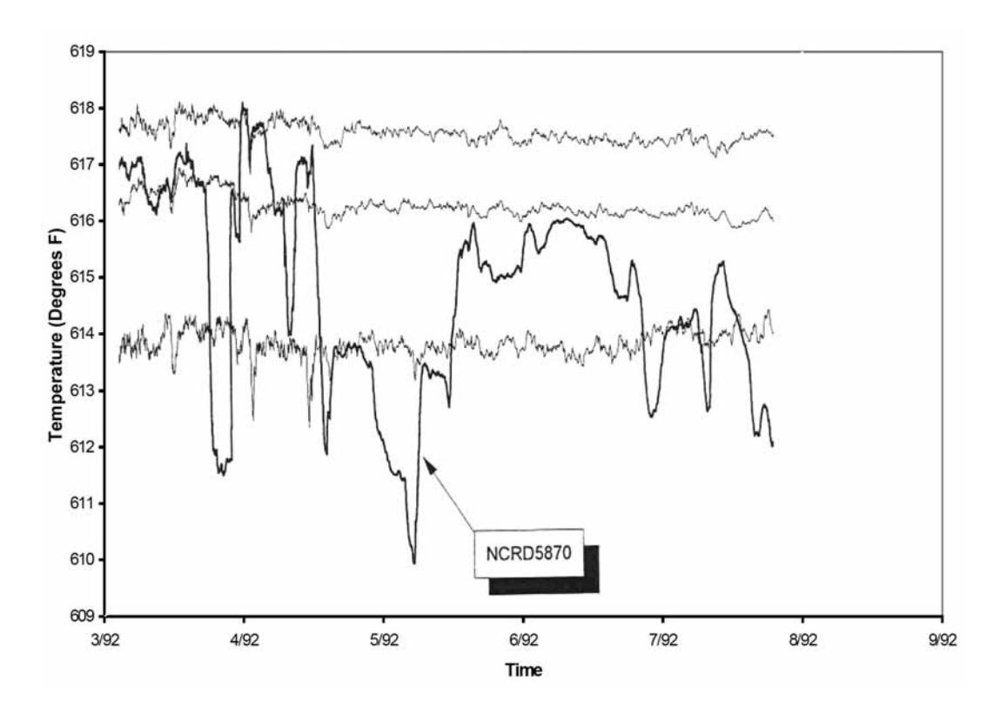

*FIG. 24. OLM data showing an erratic RTD.*

process. When the readings start to deviate from their expected values, it can be either a token of sensor failures or incipient degradation of the process. In this way, OLM serves as a condition monitoring technique. The feedwater flow meters OLM can be an example. The fouling of the orifice can thus be revealed in its starting phase, or on the contrary, in the event of no fouling the OLM can reduce the unnecessary maintenance performed on a prescriptive basis.

Added benefits of on-line calibration monitoring are listed in Table 4 in comparison with the current calibrations. The current calibrations are performed manually on pressure, level and flow transmitters in nuclear power plants.

In addition to calibration reduction, OLM can provide benefits in other applications. A partial list of these applications is given below:

- Equipment and process condition monitoring;
- Environmental monitoring to extend the life of electronics and other equipment;
- Incipient failure detection;
- Plant safety enhancements;
- Plant life extension;
- On-line detection of Venturi fouling;
- Rod control system troubleshooting;
- Can help comply with the 'maintenance rule'.

As for calibration reduction, the benefits depend on the plant and the number of instruments that are included in the on-line calibration monitoring process. For example, at the Sizewell B nuclear power plant in the UK, the benefits of on-line calibration monitoring may be much more than in some other plants, as Sizewell B has many more pressure, level and flow transmitters than other typical PWRs.

### 8.2. CHALLENGES OF ON-LINE MONITORING IMPLEMENTATION

The first area of concern is that CBC is typically only performed at a single operating point versus that of a calibration, which exercises the sensor throughout its range. The Electric Power Research Institute (EPRI) approach is to add a penalty to the acceptance criteria to introduce a degree of conservatism in the judgement in the determination of whether or not a sensor needs calibration. Alternatively, if OLM data are collected during plant startups and shutdowns as well as normal operating conditions, then the calibration of instruments can be verified over a wide operating range. Because sensors work properly in one part of the range but may have calibration problems in another part, CBC can reveal the sensor span shift.

It can be seen from Table 1; the one exception is that of failure to meet a high set point (i.e. the one above the normal operating range). This is likely to be the 'pinch' in any safety arguments.

This postulated failure to meet a high set point needs to be examined to ensure that its occurrence is an acceptably low frequency event and can be bounded within any safety case assumptions. This is typically termed

TABLE 4. BENEFITS OF ON-LINE CALIBRATION MONITORING OVER MANUAL CALIBRATION

| Current calibration                                                            | On-line calibration verification                                           |
|--------------------------------------------------------------------------------|----------------------------------------------------------------------------|
| Performed manually                                                             | Automated                                                                  |
| Requires physical access to each instrument                                    | Performed remotely and hands-off                                           |
| Performed once a fuel cycle                                                    | Performed continuously (or periodically)                                   |
| Identifies calibration drift only                                              | Identifies calibration drift plus other instrument anomalies               |
| Detects calibration problems after they have occurred                          | Detects calibration problems as they occur                                 |
| Some transmitters can be calibrated only when the plant is at cold shutdown | Calibration of most transmitters can be verified during plant operation |
| Environmental and process condition effects not included                       | Environmental and process condition effects included                       |

a 'fail danger' event and the use of a manual calibration is the usual defence in sweeping out this fault, thereby limiting the chance of such an unrevealed event to the fuel cycle duration.

Not only is the event unusual, especially as set points are typically within 10% of the normal operating point, it is very likely that such a fault would be revealed by other testing. For example, a 'stuck' transmitter would be revealed during response time testing.

If CBC becomes a surveillance requirement within the operating rules of the plant, an acceptance pass/fail criterion will have to be required. It may be difficult to establish the acceptance criteria within acceptable bounds of uncertainty, especially when using expert CBCs, which require to be trained. The question that has to be asked is the uncertainty of the data and the method (i.e. what if some of the training data are bad or the methodology fails).

The question arises as to what action should be taken if an instrument exceeds the allowable limits for calibration during the cycle. The answer depends on the plant and its evaluation of allowable instrument calibration performance.

There is a potential for an existing time dependant fault to emerge that is currently 'swept' out by the manual calibration process. Although such a fault would not be significant if a staggered regime of calibrations were adopted, it is still a point to consider.

There is also a need to consider the introduction of failure modes not previously considered, for example the flagging of transmitters as good by the new software when in fact they were bad, leading to an erosion of the safety margins to an unacceptable level.

Increasing the calibration interval will also have the disadvantage of reducing the opportunity of examining a sensor's installation material condition; for example, if there is an indication of corrosion, leaks, etc.

### 8.3. PERSONNEL ISSUES

There are potential personnel based disadvantages, such as the loss of key skills due to the work reduction or less experience in calibrating sensors. There is also an industrial relations issue, where technicians may see their jobs threatened by the reduction in workload as manual calibrations are largely eliminated.

The other obstacle to overcome when introducing CBC may be the conservatism of the technicians. The technicians may resist the use of advanced techniques, especially those based on computational intelligence (FL, ANN, etc.). In this respect, the role of education is very important.

The CBC techniques need to be 'sold' to the plant personnel as a means of freeing up their time to allow them to liquidate other work previously neglected or carried out by external resources. It is also important to recognize that even if a move to CBC is achieved, there is still a significant workload in operating the CBC system and ensuring that its output is correctly interpreted.

### 8.4. COST BENEFITS AND PLANT MANAGEMENT ACCEPTANCE

The saving is not only in human resources and related aspects but also in a lowered possibility of calibration induced plant trips, damage to plant equipment, reduced radiation exposure and days of savings in outage time.

A simple approach to determining the gross savings due to calibration reductions is to multiply the cost of calibration by 50% of the total number of instruments being monitored. The maximum reduction in the number of calibrations is greater than 50%; however, conservatively 50% is attainable.

An additional significant consideration is that the requirement to calibrate all sensors is a huge burden during a plant outage with respect to maintenance personnel required, scheduling logistics and the time required to complete all calibrations. As outage periods are further reduced, requiring that all important sensors be calibrated may become the limiting factor in outage duration. The implementation of OLM of sensor performance for calibration reduction may allow for the reduction in outage duration of one or more days.

There is a broad range of cost savings values that have been proposed to result from the implementation of OLM for calibration reduction. It is recommended that all interested plants assess this information and derive a value suitable for their site (see Ref. [17]).

## **9. REGULATORY ASPECTS**

Regulatory authorities concentrate on the safety aspects of the particular OLM system implementation. The NRC, for example, reviewed and accepted the concept of OLM as a tool to assess instrument performance and calibration status independent of any particular algorithm. The situation is different depending on the licensing environment within individual countries. For example, the licensing processes applicable to the UK is included as part of the UK country report. The UK regulatory approach is considered to be different from that in the USA, as it is not prescriptive in that the regulator (the Nuclear Installations Inspectorate) does not accept concepts prior to the proposal for implementation. This approach has resulted in an 'incremental' acceptance of the implementation of OLM (i.e. spreading the risk of implementation over a number of operational cycles).

However, there are fundamental safety issues that the regulators would expect to be addressed, irrespective of the particular licensing environment. This section is devoted to discussing the regulatory aspects of using OLM technologies with safety related instrumentation.

### 9.1. UNCERTAINTY

OLM of instrument channel calibration involves monitoring the steady state output of each channel and evaluating the monitored value to determine whether the sensor transmitter of the channel is within acceptable limits. The monitored value is compared with the calculated value of the process PE to assess deviation of the monitored value from its process PE. The process PE is the best calculated instantaneous value of the process at the monitored operating point. However, as the word 'estimate' suggests, it does not represent a true process value, but it does possess uncertainties in response to various factors. Each channel's deviation from its process PE represents its variation from the estimated value of the process.

The amount of this variation indicates instrument performance and instrument operability and identifies those instrument channels that are not functioning properly and that might require adjustment or corrective maintenance. Therefore, in this role, the OLM technique can perform the first step of the traditional calibration (i.e. the calibration check) to some extent, but not to the level of accuracy inherent in traditional calibration. This is because traditional calibration uses simulated process signal input of known accuracy, whereas OLM techniques depend on the process PE as the reference input, which is less accurate.

Uncertainty in the process PE is derived from individual redundant channel uncertainty and the type of algorithm used by the OLM system. Therefore, uncertainty in OLM is not static but can vary with the number of redundant channels and the type of algorithm used. In addition, OLM cannot perform a calibration check for the entire range of the instrument, including the TSP. Rather, OLM monitors instrument performance only at the point of operation, known as single point monitoring. Thus, instrument performance at the TSP and at any other points in the range can only be assessed by extrapolating the results of the single point monitoring to the entire range, including the TSP, using statistical methods.

If OLM is improperly implemented for safety related instrumentation, each of the above inherent deviations from traditional calibration means that, under certain conditions, OLM may be unable to verify an instrument's performance adequately to establish its operability, which could degrade plant safety. Therefore, to adequately demonstrate that the OLM system is at least as good as traditional calibration, the OLM technique should confirm that the impact on plant safety of the deficiencies inherent in the OLM technique (inaccuracy in process PE, single point monitoring, and lack of traceability to standards) will be insignificant, and that all uncertainties associated with the process PE have been quantitatively bounded and accounted for either in the OLM acceptance criteria or in the applicable TSP and uncertainty calculations.

### **9.2.1. Process versus sensor drift**

Redundant instruments monitoring the same process variable at different physical locations in the plant may yield slightly different values because of delays, offsets and superimposed noises. Physical separation in sensors could also increase uncertainty in the process PE. Referring the sensor readings back to a common point can compensate for effects of physical separation, but this usually requires a reasonably accurate physical model. In some cases, the actual time delay between 'simultaneous' measurements of redundant channels may be an important factor in determining the process PE and its acceptance criterion if the type of algorithm used to determine the process PE depends on the result of instantaneous measured values of redundant and/or diverse channels. Also the process must remain stable during monitoring and signals must be free from noise to ensure accurate results. When monitoring is done during normal plant operation, it is possible the process may not be stable and the monitored variable may be drifting.

Although research has shown that instrument drift is random and transmitters are as likely to drift up as to drift down, it may also be possible that while the monitored process variable is drifting, the monitoring instrument could also be drifting, with the combined effect of process and instrument drift potentially adversely affecting the accuracy of the monitoring and the calculated value of the process variable estimate. Therefore, it is prudent to: (1) acquire redundant channel measurements within a close duration and at relatively stable plant conditions; and (2) to use an algorithm that can recognize unstable conditions of the monitored process.

For plant specific physical configurations where monitored values are susceptible to differences in physical location, process instability and non-simultaneous measurements, the algorithm used for OLM should be able to distinguish between the process variable drift (actual process going up or down) and the instrument drift, and should also be able to compensate for uncertainties introduced by unstable process, sensor locations, non-simultaneous measurements and noisy signals. If the implemented algorithm and its associated software cannot meet these requirements, compensatory measures should be taken, such as, for example, a penalty factor for nonsimultaneous measurement.

### **9.2.2. Single point monitoring**

Instrumentation measurement drift can occur across the full range of instrument span. Types of drift include zero shift, span shift, non-linear shift or some combination. Zero shift manifests itself as an offset, the value of which remains constant throughout the span, whereas with forward span shift, drift tends to increase with the span. Because of possible combinatorial effects of the types of drift on instrument measurement over its span, any compensatory measures (e.g. a calculated penalty factor) should account for total drift effects for each type of instrument. This will provide some assurance that the OLM technique can detect drift for a particular instrument type at any other point in the calibrated span using single point monitoring, even if drift is due to zero shift, forward span shift or some combination of the two. The value of the compensatory measure for single point monitoring could be determined, for example, by using the instrument's historical calibration data and by analysing the instrument performance over its range for all modes of operation, including startup, shutdown and plant trips. If the required data for such a determination is not available, an evaluation demonstrating that the instrument's relevant performance specifications are as good as or better than those of a similar instrument's known operating history could be used as an alternative.

### **9.2.3. Suitability of application and/or process**

Although single point monitoring does not prevent OLM from detecting instrument channel drift (with adequate compensation), some processes are not suitable for single point monitoring due to the potential for span shift effects. For those applications where the process parameters are either at the high end or low end of an instrument's calibration span, OLM as a performance verification tool may not be appropriate because such processes are more susceptible to undetected span shift. This is true for those cases where zero shift and/or span shift is/are the predominant source of instrument drift. Also, applications that would not detect any amount of span shift drift are not suitable for OLM at a single point. Therefore, unless demonstrated otherwise, OLM

should not be used on instrument channels monitoring processes that are always at the low or high end of an instrument's calibrated span during normal plant operation.

### 9.3. ACCEPTANCE CRITERIA FOR CHANNEL OPERABILITY

OLM, regardless of the algorithm used, involves comparing the steady state output of each channel with its process PE during monitoring to assess deviation of the monitored value from the calculated value of the process variable. This is similar to the first step in traditional calibration (i.e. the calibration check). Each channel's deviation from its PE represents its variation from the estimated value of the process. The amount of this variation is compared with pre-established 'acceptance criteria', which do take into consideration the type of the OLM algorithm. The acceptance criteria are used to determine instrument performance and operability. Calculations for the acceptance criteria should be done in a manner consistent with the plant specific safety related instrumentation set point methodology so that using OLM to monitor instrument performance and extend the calibration interval will not invalidate the set point calculation assumptions and the safety analysis assumptions. If new or different uncertainties require the recalculation of instrument TSPs, it should be demonstrated that relevant safety analyses are unaffected. The set point methodology should be documented, and it should be compatible with the accepted practices for TSP and uncertainty calculations.

### 9.4. INSTRUMENT FAILURE

Some implementations of OLM could allow the instruments to remain unattended for longer periods than with traditional calibration methods. Therefore, the possibility exists that certain types of instrument failures may remain undetectable by the OLM system while the instrument is being monitored at only one point in its operating range. In theory, an instrument could fail: (1) low, thus instrument output is at or near zero regardless of the input value; (2) high, thus instrument output is at or near 100% regardless of the input value; and (3) fail as is, which means, regardless of the input, instrument output remains constant somewhere between 0% and 100%. Failures that cause a large shift (or deviation) in the instrument's output signal compared with its PE would be detectable by the OLM, therefore these types of failure are not as great a concern as the other three failure modes. But failures where the instrument output compared with its PE does not change much upon instrument failure could be a concern, such as when the process parameter is at or near the high end of the span and the instrument fails high, or, conversely, when the process parameter is near the low end of the span and the instrument fails low. In the former case, the fail high condition could be detected as drift, but in the latter case the fail low condition may not be detectable by the OLM technique. Examples of such applications include:

- (1) Auxiliary feedwater flow there is no flow during normal plant operation, thus there is no flow and the signal is at the bottom of the span;
- (2) Engineered safeguards system actuation equipment the equipment is usually off during normal plant operation, thus the associated pressure or flow indication will be at or near 0% of the span.

In plant specific situations there could be many more examples of cases like those described above. Therefore, it is prudent that each instrument be evaluated for all possible types of failure modes at normal plant operating points of the process parameter with respect to the instrument's span. The evaluation should verify that no possible instrument failure in any condition could remain undetected to confirm that the proposed OLM system will be consistent with the plant's licensing basis, and that the coordinated defence in depth against instrument failure will not be adversely impacted.

### 9.5. INTERFACES TO SAFETY SYSTEMS

A typical instrument channel consists of a process sensor transmitter, the power source, signal conditioners, indicators and bistable devices. The OLM will not monitor the entire instrument channel, but only a portion of it. A typical OLM loop will consist of a sensor transmitter (and in some cases will also include a portion of the signal processing circuitry), a class 1E to non-1E isolator, non-safety related data transmitting hardware and a non-safety related, microprocessor based data processing device.

OLM collects data from instrument channels, typically via connection to the plant computer for an automated system or at a qualified class 1E to non-1E isolator output terminal or at an appropriate test point for manual data acquisition. Signals taken from the non-1E terminals of the isolator or at the plant computer are transmitted to a microprocessor based processing device via communications hardware and software and analysed to determine the state of the instrument's calibration and its operability status. There are various OLM implementations on microcomputer platforms. Data are input from the plant to these systems via modem or electronic media or manually. Output capabilities typically include graphical display of the individual instrument channel deviation from the PE as a function of time.

Some OLM implementations will not be connected to the plant instrumentation permanently. It will only be temporarily connected to collect instrument data in a batch mode and be disconnected when no longer required. A separate computer would then be used to analyse the collected data to assess instrument performance and operability. Thus, in this mode of application, the OLM system will be used as measuring and test equipment (M&TE) to monitor calibration and the operational status of safety related instruments.

Although pieces of equipment used for OLM are non-safety related, they interface with safety related instrument channels and therefore adequate isolation and independence, as required by applicable regulatory requirements or accepted industry practices (e.g. consensus standards), should be maintained between the OLM devices and class 1E instruments being monitored. Furthermore, the OLM systems that operate in batch mode for off-line analysis should also be maintained according to applicable regulatory requirements and/or guidance for M&TE, including provisions for the OLM software contained in the M&TE.

### 9.6. CYBER SECURITY

Some OLM implementations use data acquisition and communications hardware and software to automatically acquire and electronically transmit process PE data from the plant process computer or other source, which then archives, analyses and displays the data interactively in graphs and reports. Some automated OLM systems could be network operable and allow multiple access to the monitoring information and results. For network operable OLM implementations involving safety related instrumentation, appropriate safeguards should be emplaced to ensure only authorized persons are allowed access to the displays, data storage/archiving devices and OLM processing devices so that undetected modifications to the data or the OLM algorithm cannot occur. Such provisions will provide assurance that the proposed OLM system will be consistent with the plant's licensing basis, and that the coordinated defence in depth against instrument failure will not be adversely impacted.

### 9.7. QUALITY ASSURANCE

## **9.7.1. Hardware**

Although equipment used for OLM is non-safety related, the instruments monitored may be safety related. Additionally, OLM could lead to the reduction in the frequency of safety related instrument channel calibrations. The economic benefit to this is clear. However, these safety related instruments are vital to proper initiation of protective actions to mitigate accidents or abnormal events before the monitored process variables exceed their safety related limits (e.g. analytical limits and/or safety limits), and may be required to guide plant operators through emergency operating procedures. Because of their important function, the OLM system, including its hardware and software, should be designed according to QA requirements commensurate with the safety importance of the devices being monitored. In fact, QA requirements for the safety related devices being monitored should also be applicable to all engineering and design activities related to OLM, including design and implementation of the OLM system, calculations for determining process PEs, acceptance criteria, evaluation and trending of OLM results, activities (including drift assessments) for relaxing existing instrument

calibration frequencies and drift assessments for calculating the allowance or penalty required to compensate for single point monitoring. Software QA is another important QA concern, and is addressed in the next section.

All equipment used for collection, electronic transmission and analysis of plant data for OLM purposes, including OLM implementations that operate in batch mode, should also be maintained according to applicable regulatory requirements and/or guidance for M&TE, including provisions for the OLM software contained in the M&TE. Administrative procedures shall be in place to maintain configuration control of the OLM software and algorithm.

## **9.7.2. Software**

Many algorithms and associated software are suitable for OLM, and the choice of which to use should be left to the user. Since the algorithm will be used to monitor calibration and determine operability of safety related instruments, it would be prudent to carefully evaluate the algorithm selected to ensure that the assumptions of the safety analyses, TSP calculations and plant commitments to separation, independence, software QA and applicable regulatory criteria are not violated by implementation of the selected algorithm and/or its software for OLM. Plant specific software QA requirements should be applicable to the selected OLM methodology, the algorithm and the associated software. Verification and validation should be performed on the OLM software and should meet all quality requirements in accordance with accepted best practices in software engineering. Before declaring the OLM system operable for the first time, and just before each performance of the scheduled surveillance using an OLM technique, a full features functional test, using simulated input signals of known and traceable accuracy, should be conducted to verify that the algorithm and its software perform all required functions within acceptable limits of accuracy. All applicable features should be tested.

## **10. STANDARDS AND GUIDELINES**

A number of organizations have prepared standards on testing the performance of sensors for industrial applications, including nuclear power plant applications. An example is the ASTM Standard E644 for testing of RTDs that was mentioned earlier. The ASTM standard is concerned mostly with industrial RTDs and not specifically with nuclear plant RTDs. For nuclear power plants, there are ISA and International Electrotechnical Commission (IEC) standards as well as IAEA guidelines in addition to Institute of Electrical and Electronics Engineers (IEEE) standards such as IEEE Standards 323 and 338 for equipment qualification.

A review of some of the key standards on performance of nuclear plant instruments is presented below.

### 10.1. INSTRUMENTATION, SYSTEMS AND AUTOMATION SOCIETY STANDARDS

Since OLM for instrument calibration reduction or other applications has seen little commercial adaptation in nuclear power plants, there are only a couple of formal documents on their use. The rest of the documents present research results and are concerned with other activities surrounding OLM.

There are two specific standards addressing the OLM subject. The first standard is that of the ISA and is identified as ISA Standard 67.06. The title of this standard is Performance Monitoring for Nuclear Safety-related Instrument Channels in Nuclear Power Plants; it was published in 2002 by the American National Standard Institute under ANSI/ISA-67.06 01 — 2002 designation. The earlier version of this standard was published by the ISA in 1984 with the title Response Time Testing of Nuclear Safety-related Instruments in Nuclear Power Plants. This 1984 draft was updated to include not only sensor response time measurements using the in situ LCSR and noise analysis techniques, but also to cover instrument calibration verification by OLM.

### 10.2. INTERNATIONAL ELECTROTECHNICAL COMMISSION STANDARDS

A standard is under development by the IEC (IEC 62385). This standard was originally launched at an IEC meeting in Houston in 1998. Since then, the standard has been discussed at IEC meetings in Helsinki, Toulouse, Beijing and Montreal. It is due for publication in 2006 after a final IEC meeting in the Republic of Korea.

IEC Standard 62385 is similar to ISA 67.06 mentioned above and covers both the dynamic and static aspects of instrument performance in nuclear power plants. The IEC is also preparing a standard on ageing of nuclear plant sensors. This standard (IEC 62342) is also due for publication in 2006.

### 10.3. IAEA GUIDELINES

The IAEA has published two report reports (IAEA-TECDOC-1147 and IAEA-TECDOC-1402) in which the OLM approach is mentioned. However, the IAEA does not have a comprehensive set of reports or any guideline document on the subject of OLM. This report is the first in an intended series of IAEA reports that are planned to be developed on this subject. It is expected that the IAEA will develop new documents over the period 2005–2007 on this subject.

## 10.4. ELECTRIC POWER RESEARCH INSTITUTE GUIDELINES

The EPRI has numerous publications and guidelines on all aspects of on-line calibration monitoring in nuclear power plants. The EPRI published 1000604, On-line Monitoring for Instrument Channel Performance, in September 2000, for which the NRC had issued a favourable SER. On the basis of this report, the EPRI supported the plant implementation of OLM at several US nuclear plants during the period 2001–2004. The reports of interest that resulted are listed in the Bibliography under the EPRI items.

## **11. TRENDS AND DIRECTIONS**

The extensions from OLM for instrument calibration reduction to equipment diagnostics and prognostics hold promise for much larger cost benefits. In a study conducted by the EPRI [17], the cost benefits were estimated to be at least an order of magnitude larger than for instrument calibration reduction. A large contribution to this was the replacement electricity costs of unplanned shutdowns due to critical equipment malfunctions and/or failures.

OLM for equipment condition assessment (ECA) has the capability to provide early warning before failure, which allows maintenance staff to proactively schedule maintenance during more ideal conditions than when reacting to a failure. ECA technologies require the addition of an anomaly interpreter to condense the information output from an OLM system (anomalies) into a usable prognosis, if early warning can be provided. ECA technology presents an attractive alternative to post-failure reactive maintenance. By proactively scheduling and performing maintenance on components forewarned to fail, repairs can be completed efficiently and at the most optimal time given the current state of the plant. In recent years, ECA technology has been successfully implemented in other industries with exceptional results. Similar results are expected with power plant systems; although because of the more complex nature and individual characteristics of different plants, successful implementations will require significant initial oversight. As experience is gained, this initial investment will be reduced. While the capabilities are scalable from individual component monitoring to whole plant monitoring, the greatest benefits would be realized for fleetwide based applications, whereby the benefits of the technology could be exploited on a fleet level and the majority of the detailed analyses required could be conducted at a centralized location by trained personnel.

ECA software solutions are currently available. Their application to specific plant sites requires significant oversight and operations experience to produce accurate and reliable diagnostic and prognostic tools. It is in these areas that significant guidance and expertise are required. As ECA technology achieves more widespread use, the availability of model templates will simplify the implementation process. As many utilities look forward to centralized monitoring and diagnostic centres, the integration of ECA tools with existing monitoring and maintenance technologies will lead to an intelligent top–down approach to plant maintenance and scheduling. Beyond this will be the integration of these technologies into risk based and cost based assessments, allowing maintenance to be completed to achieve the optimal balance between plant safety and reliability.

However, significant research and implementation gaps remain. The need for an integrated data set that combines process information and predictive maintenance data (e.g. vibration signals, infrared thermography), surveillance information and qualitative based operator rounds data all need to be utilized for reliable ECA.

## **12. KEY RECOMMENDATIONS**

OLM techniques provide a passive means to verify the performance and reliability of nuclear power plant instrumentation systems and other equipment as well as the plant itself. As such, it is important to promote the use of these techniques in nuclear power plants, as they can enhance both the safety and efficiency of the plant. For example, verifying the calibration of process sensors can easily be automated using the OLM technology. This will help to reduce the efforts and radiation exposure that plant technicians currently endure to verify the calibration of process instruments manually. With OLM techniques, the performance of instruments can be monitored in real time or in approximately real time and problems can be detected as they occur. This enhances the safety of nuclear power plants.

The following is a list of specific recommendations in addition to those given in the body of this report.

- (1) Monitor instrument performance to improve plant reliability and detect the onset of instrument performance degradation.
- (2) The design of future I&C systems for nuclear power plants should consider the advantages of building OLM into the plant design.
- (3) OLM performance of process instruments as described in this report can be easily realized in plants that have the necessary data in the plant computer. The nuclear power industry is advised to build into new plants the capability to acquire and store process data for long term performance monitoring and instrument diagnostics. For example, a new plant should include optically isolated patch panels to provide raw signals.
- (4) Establish procedures and implementation strategies integrated into the existing plant information technology for on-line maintenance.
- (5) In planning for the implementation of OLM, plants are advised to evaluate the impact of OLM on the plant maintenance practices to ensure that the benefits of OLM implementation are not overshadowed by the challenges that it may present.
- (6) On-line calibration monitoring has been successfully implemented at the Sizewell B nuclear power plant in the UK, and the V.C. Summer plant in the USA is in the planning process to submit a technical specification change package to the NRC in an attempt to implement CBC. Lessons learned from the implementation of CBC may stimulate other plants to follow suit in the next few years.
- (7) Plants that are planning to implement CBC are advised to discuss the issue with the regulatory authority early in the implementation process to expedite approval.
- (8) There are plenty of sources of information and guidelines for implementation of OLM techniques, such as EPRI reports, NRC NUREG CR reports, and others.
- (9) Utilities implementing CBC are advised to train in-house personnel on the fundamentals of CBC.
- (10) When selecting modelling techniques, it is recommended not to apply overly sophisticated models but choose a method adequate for the problem domain and instrumentation level of the plant.

## **REFERENCES**

- [1] NUCLEAR REGULATORY COMMISSION, Advanced Instrumentation and Maintenance Technologies for Nuclear Power Plants, Rep. NUREG/CR-5501, NRC, Washington, DC (1998).
- [2] ELECTRIC POWER RESEARCH INSTITUTE, On-Line Monitoring of Instrument Channel Performance, Rep. EPRI TR-104965-R1, EPRI, Palo Alto, CA (2000).
- [3] NUCLEAR REGULATORY COMMISSION, On-Line Testing of Calibration of Process Instrumentation Channels in Nuclear Power Plants, Rep. NUREG/CR-6343, NRC, Washington, DC (1995).
- [4] HASHEMIAN, H.M., Sensor Performance and Reliability, Instrumentation, Systems and Automation Society, Research Triangle Park, NC (2005).
- [5] AMERICAN SOCIETY FOR TESTING AND MATERIALS, Test Methods for Testing Industrial Resistance Thermometers, Standard E-644, American Society for Testing and Materials, West Conshohocken, PA (2002).
- [6] AMERICAN NATIONAL STANDARDS INSTITUTE, INSTRUMENTATION, SYSTEMS AND AUTOMATION SOCIETY, Performance Monitoring for Nuclear Safety Related Instrument Channels in Nuclear Power Plants, Rep. ANSI/ISA-67.06.01-2002, Instrumentation, Systems and Automation Society, Research Triangle Park, NC (2002).
- [7] NUCLEAR REGULATORY COMMISSION, Long Term Performance and Aging Characteristics of Nuclear Plant Pressure Transmitters, Rep. NUREG/CR-5851, NRC, Washington, DC (1993).
- [8] BERGDAHL B.G., et al., Experiences from Sensor Tests and the Evaluation of Long-term Sensor Performance Using SensBase™, NPIC & HMIT, Washington, DC (2000).
- [9] BERGDAHL B.G., Investigation of Sensors and Instrument Components in Boiling Water Reactors, SKI Report 98:22, Swedish Nuclear Power Inspectorate, Stockholm (1998).
- [10] GLÖCKLER, O., "Measurement-based estimation of response time parameters used in safety analysis of CANDU reactors", paper presented at Nuclear Mathematical and Computational Sciences Conf., Gatlinburg, TN, 2003.
- [11] HINES, J.W., UHRIG, R.E., Use of autoassociative neural networks for signal validation, J. Intelligent Robotic Syst. **21** (1998) 143–154.
- [12] FAN, J., GIJBELS, I., Local Polynomial Modelling and its Applications, Chapman and Hall, London (1996).
- [13] RASMUSSEN, B., Prediction Interval Estimation Techniques for Empirical Modelling Strategies and their Applications to Signal Validation Tasks, PhD Dissertation, Univ. of Tennessee (2003).
- [14] WALD, A., Sequential tests of statistical hypothesis, Ann. Stat. **16** (1945) 117–186.
- [15] WALD, A., Sequential Analysis, John Wiley and Sons, New York (1947).
- [16] INTERNATIONAL ATOMIC ENERGY AGENCY, Manual on Quality Assurance for Computer Software Related to the Safety of Nuclear Power Plants, Technical Reports Series No. 282, IAEA, Vienna (1988); and Quality Assurance for Software Important to Safety, Technical Reports Series No. 397, IAEA, Vienna (2000).
- [17] ELECTRIC POWER RESEARCH INSTITUTE, Cost Benefits of On-line Monitoring, Rep. EPRI TR-1003572, Palo Alto, CA (2003).

## **BIBLIOGRAPHY**

Numerous publications dating back to the mid-1980s exist about OLM techniques and their application in nuclear power plants. This Bibliography identifies the most useful of these publications. They include textbooks, research reports, industry reports, magazine articles, government reports, national standards and international standards.

- DAVIS, E., FUNK, D.L., Monte Carlo Simulation and Uncertainty Analysis of the Instrument Calibration and Monitoring Program, Rep. EPRI WO3785-02, EPRI, Palo Alto, CA (1995).
- DING, J., GRIBOK, A.V., HINES, J.W., RASMUSSEN, B., Redundant sensor calibration monitoring using ICA and PCA for real time systems, Real-Time Syst. **27** (2004) 27–47.

#### ELECTRIC POWER RESEARCH INSTITUTE (Palo Alto, CA)

- —Instrument Drift Study, Sizewell B Nuclear Generating Station, Rep. EPRI 1009603 (2005).
- —Equipment Condition Assessment: Vol. 1: Application of On-Line Monitoring Technology, Rep. EPRI 1003695 (2004).
- —Equipment Condition Assessment: Vol. 2, Technology Integration and Evaluation, Rep. EPRI 1009601 (2004).
- —On-line Monitoring of Instrument Channel Performance, Vol. 1: Guidelines for Model Development and Implementation, Rep. EPRI 1003361 (2004).
- —On-line Monitoring of Instrument Channel Performance, Vol. 2: Model Examples, Algorithm Details and Reference Information, Rep. EPRI 1003579 (2004).
- —On-line Monitoring of Instrument Channel Performance, Vol. 3: Applications to Nuclear Power Plant Technical Specification Instrumentation, Rep. EPRI 1007930 (2004).
- —Collected Field Data on Electronic Part Failures and Aging in Nuclear Power Plant Instrumentation and Control (I&C) Systems, Rep. EPRI 1003568 (2002).
- —Plant Systems Modelling Guidelines to Implement On-Line Monitoring, Rep. EPRI 1003661 (2002).
- FANTONI, P., FIGEDY, S., RACZ, A., "A neuro-fuzzy model applied to full range signal validation of PWR nuclear power plant data", Fuzzy Logic and Intelligent Technologies in Nuclear Science: FLINS-98 (Proc. Int. Workshop, Antwerp, 1998), World Scientific, Singapore (1998).
- FANTONI, P., FIGEDY, S., PAPIN, B., "A neuro-fuzzy model applied to full range signal validation of PWR nuclear power plant data," paper presented at the Second OECD Specialist Meeting on Operator Aids for Severe Accident Management, Lyon, 1997.
- FAVENNEC, J.M., SZALENIEC, S., VIETTE, A., SIROS, F., "Improving NPP performance with process data reconciliation", paper presented at the IAEA Technical Mtg on Increasing Instrument Calibration Interval through On-line Calibration Technology, Halden, Norway, 2004.
- GLÖCKLER, O., UPADHYAYA, B.R., "Results and interpretation of multivariate autoregressive analysis applied to lossof-fluid test reactor process noise data", SMORN-V, Progress in Nuclear Energy, Vol. 21, Pergamon Press, Oxford and New York (1988) 447–456.
- GRIBOK, A.V., HINES, J.W., URMANOV, A.M., Uncertainty analysis of memory based sensor validation techniques, Real-Time Syst. **27** (2004) 7–26.
- GROSS, K.S., HUMENIK, K.E., Sequential probability ratio test for nuclear plant component surveillance, Nucl. Technol. **93** (1991) 131–137.
- HASHEMIAN, H.M., "Safety instrumentation and justification of its costs", Instrument Engineers' Handbook Process Software and Digital Networks, 3rd edn, CRC Press (2002) 268–277.
- HASHEMIAN, H.M., Verifying the performance of RTDs in nuclear power plants, AIP Conf. Proc. **684** (2003) 1057–1062.
- HINES, J.W., DING, J., "Merging inferential models and independent component analysis for 2-channel redundant sensor monitoring", paper presented at the 4th Int. Top. Mtg on Nuclear Plant Instrumentation, Control and Human Machine Interface Technology, Columbus, OH, 2004.
- MADRON, F., "Benefits of process data validation by reconciliation and related methods", paper presented at the IAEA Technical Mtg on Increasing Instrument Calibration Interval through On-line Calibration Technology, Halden, Norway, 2004.

- RASMUSSEN, B., HINES, J.W., "Uncertainty estimation for empirical signal validation modelling", paper presented at the 4th Int. Top. Mtg on Nuclear Plant Instrumentation, Control and Human Machine Interface Technology, Columbus, OH, 2004.
- SINGER, R.M., et al., "Model-based nuclear power plant monitoring and fault detection: Theoretical foundations", paper presented at the 9th Intl. Conf. on Intelligent Systems Applications to Power Systems, Seoul, 1996.
- SLANINA, M., STANC, S., "Experience with the replacements and checks of thermocouples during reconstruction of incore temperature measurements at Bohunice Units 1 and 2", paper presented at the 1st Int. Symp. on Safety Related Measurements in PWRs, Smolenice, Slovakia, 2001.
- SUNDE, S., BERG, Ø., Data reconciliation and fault detection by means of plant-wide mass and energy balances, Progr. Nucl. Energy **41** (2003) 97–104.
- SUNDE, S., BERG, Ø., DAHLBERG, L., FRIDQUIST, N.-O., Data reconciliation in the steam turbine cycle of a boiling water reactor, Nucl. Technol. **143** (2003) 103.
- UPADHYAYA, B.R., GLÖCKLER, O., EKLUND, J., Multivariate statistical signal processing technique for fault detection and diagnostics, ISA Trans. **29** 4 (1990) 79-95.
- ZAVALJEVSKI, N., MIRON, A., YU, C., DAVIS, E., "Uncertainty analysis for the multivariate state estimation technique (MSET) based on Latin Hypercube sampling and wavelet de-noising", paper presented at Trans. of the American Nuclear Society, New Orleans, LA, 2003.

## **GLOSSARY**

This glossary provides definitions for technical terms used in the report or otherwise applied to OLM.

- **accuracy (reference).** In process instrumentation, a number or quantity that defines a limit that error should not exceed when a device is used under specified operating conditions. Error represents the difference between the measured value and the standard or ideal value.
- **adjustment.** The activity of physically adjusting a device to leave it in a state in which its performance characteristics are within acceptable limits.
- **as-found.** The condition in which a channel, or portion of a channel, is found after a period of operation and prior to any calibration.
- **as-left.** The condition in which a channel, or portion of a channel, is left after calibration or a surveillance check.
- **calibration.** The process of adjustment, as necessary, of the output of a device such that it responds within a specified tolerance to known values of input.
- **calibration interval.** The elapsed time between successful completions of calibrations or calibration checks on the same instrument, channel, instrument loop or other specified system or device.

**channel.** See instrument channel.

- **channel calibration.** The adjustment, as necessary, of the channel so that it responds within the required range and accuracy to known input. The channel calibration shall encompass the entire channel, including the required sensor, alarm, interlock, display and trip functions. The channel calibration might be performed by means of any series of sequential, overlapping calibrations or total channel steps so that the entire channel is calibrated.
- **channel check.** The qualitative assessment, by operator observation, of channel behaviour during operation including, where possible, comparison of the channel indication to other indications from other redundant channels measuring the same parameter.
- **confidence interval.** An interval that contains the population mean to a given probability.
- **data reconciliation.** A mathematical technique that matches the observed process value with an estimate based on a physical model of the underlying process.

**deviation.** See residual.

- **drift.** An undesired change in output of a device over a period of time, which is unrelated to the input, environment or load.
- **error.** The undesired algebraic difference between a value that results from measurement and a corresponding true value.
- **estimate.** An approximation of the actual process value; used interchangeably with process variable estimate.

**first principle (modelling).** Modelling based on the laws of physics and thermodynamics.

**instrument channel.** An arrangement of components and modules as required to generate a single protective action or indication signal that is required by a generating station condition. A channel loses its identity where single protective action signals are combined.

loop. See channel.

**margin.** An additional allowance added to the instrument channel uncertainty to allow for unknown uncertainty components. The addition of margin moves the set point further away from the analytical limit or nominal process limits.

**mean (sample mean).** In statistics, the measure of central tendency calculated by adding all the values and dividing the sum by the number of values. (Often referred to as the average.) For n measurements of  $x_i$ , where i ranges from 1 to n, the mean is given by:

$$\bar{x} = \frac{\sum x_i}{n}$$

The sample mean is an approximation to the 'true' mean (often depicted by the symbol  $\mu$ ).

**median.** The value of the middle number in an ordered set of numbers. Half the numbers have values that are greater than the median and half have values that are less than the median. If the data set has an even number, the median is the average of the two middle numbers.

**model.** A mathematical representation of a process, usually derived from a group of signals that has been collected for an analysis.

**monitoring.** The activity of evaluating instrument channel performance to determine that it is performing within acceptable performance limits.

noise. See signal noise.

noise analysis. See signal noise analysis.

**non-parametric model.** A mathematical equation that defines empirically the relationship between a set of inputs and a desired output.

**normal distribution.** The density function of the normal random variable X, with mean  $\mu$  and variance  $\sigma^2$  is:

$$n(x; \mu, \sigma) = \frac{1}{\sqrt{2\pi}\sigma} e^{-\frac{(x-\mu)^2}{2\sigma^2}}$$

**normalized.** A term indicating that the data values for a group of disparate signals have been modified so that all signals have approximately equal weight in an analysis.

**on-line monitoring (OLM).** An automated method of monitoring instrument performance and assessing instrument calibration while the plant is operating.

**physical model.** A mathematical relationship derived from physical principles defining the underlying process. For example, Ohm's law, which ties the voltage drop across a resistance as the product of the resistance and the current.

**population.** The totality of the observations with which one is concerned.

**process estimate.** The best estimate of the actual process value.

**random.** Describing a variable whose value at a particular future instant cannot be predicted exactly, but can only be estimated by a probability distribution function.

**reference accuracy.** A number or quantity that defines the limit that errors will not exceed when the device is used under reference operating conditions.

**residual.** The difference between the observation and the corresponding estimate for that observation. Also known as the residual error.

**retraining.** Any change made to the set of data originally selected as representative of system normal and expected behaviour.

**safety limit.** A limit on an important process variable that is necessary to reasonably protect the integrity of physical barriers that guard against the uncontrolled release of radioactivity.

sample. A subset of a population.

**sensor.** The portion of an instrument channel that interfaces with the physical process and converts a measured process variable into an electric or pneumatic signal.

set point. See trip set point.

signal. The output data from a channel.

**signal conditioning.** One or more modules that perform further signal conversion, buffering, isolation or mathematical operations on the signal as needed.

**signal noise.** A small natural fluctuation around the steady state value of a stationary process signal. The signal fluctuations are the results of the combined effects of various sources, such as physical process changes, vibrations, flow and temperature oscillations, and electrical noise.

**signal noise analysis.** A signal processing technique that extracts information on system or component dynamics by performing statistical time series analysis (in time or frequency domain) on the measured fluctuations of process signal.

**span.** The region for which a device is calibrated and verified to be operable.

standard deviation (sample). A measure of how widely values are dispersed from the sample mean, and is given by:

$$s = \sqrt{\frac{n\sum x^2 - (\sum x)^2}{n(n-1)}}$$

**steady state.** A characteristic of a condition, such as a value, rate, periodicity or amplitude, exhibiting only a negligible change over an arbitrary long period of time.

surveillance. The activity of checking a device to determine if it is operating within acceptable limits.

**surveillance interval.** The elapsed time between the successful completions of a surveillance check or test on the same instrument, channel, instrument loop or other specified system or device.

test interval. See calibration interval.

training. The process of learning or embedding of knowledge for an empirical model.

**trip set point (TSP).** A predetermined value at which a bistable device changes state to indicate that the quantity under surveillance has reached the selected value.

**uncertainty.** The amount to which an instrument channel's output is in doubt (or the allowance made therefore) due to possible errors either random or systematic that have not been corrected for. The uncertainty is generally identified within a probability and confidence level.

variance (sample). A measure of how widely values are dispersed from the sample mean; is given by:

$$s^{2} = \frac{n\sum x^{2} - (\sum x)^{2}}{n(n-1)}$$

## **ABBREVIATIONS**

1E classification of safety equipment

ALARA as low as reasonable achievable ANN artificial neural network APD amplitude probability density APSD autopower spectral density AR autoregressive (modelling)

ASTM American Society for Testing and Materials

CBC condition based calibration COTS commercial off the shelf CSA channel statistical allowance

ECA equipment condition assessment EPRI Electric Power Research Institute

FAT factory acceptance testing FFT fast Fourier transform

FL fuzzy logic

HSI human–system interface

I&C instrumentation and control ICA independent component analysis

IEC International Electrotechnical Commission IEEE Institute of Electrical and Electronics Engineers ISA Instrumentation, Systems and Automation Society

LCSR loop current step response LER License Event Report LLR logarithmic likelihood ratio LPR local polynomial regression

M&TE measuring and test equipment

MAR multivariate autoregressive (modelling) MSET multivariate state estimation technique

NPRDS Nuclear Plant Reliability Data System NRC Nuclear Regulatory Commission

OLM on-line monitoring OS operating system

PC personal computer

PCA principal component analysis

PE parameter estimate PSD power spectral density PWR pressurized water reactor QA quality assurance

R&D research and development

RSS root sum of squares

RTD resistance temperature detector

SAT site acceptance test SER safety evaluation report

SPRT sequential probability ratio test

TC time constant TSP trip set point

### **Annex I**

## **ON-LINE CALIBRATION MONITORING ACTIVITIES AT THE OECD HALDEN REACTOR PROJECT IN NORWAY**

Ø. BERG

OECD Halden Reactor Project, Institute for Energy Technology, Halden, Norway

### **Abstract**

The Halden Reactor Project has for several years developed different surveillance and monitoring systems for application in nuclear power plants. These systems were first installed in HAMMLAB (Halden Man–Machine Laboratory) to evaluate the user aspects of new technology in a simulated environment. The next step was to carry out feasibility studies on recorded plant data to test the systems' performance and robustness on realistic data at different plant states. After this qualification process, several systems were installed permanently in nuclear power plants. The two systems, PEANO (Process Evaluation and Analysis by Neural Operators) and TEMPO (Thermal Performance and Optimization), have been developed for application in on-line calibration monitoring. PEANO is based on empirical modelling techniques and combines artificial neural networks and fuzzy logic for real time signal validation. Two modules have been added to enhance the PEANO system for use as a calibration reduction tool: (1) the HRP Prox module performs preprocessing and statistical analysis of data; and (2) the BMM module for off-line batch monitoring and reporting. TEMPO relies on plantwide first principle models which are assembled from a menu of standard components. The models are configured by a click and drop procedure in a configuration screen, allowing for complete customization. TEMPO provides several functions associated with efficiency monitoring, fault detection, diagnosis, 'what if' analysis and optimization of steam turbine cycles. A module for data reconciliation is included which support on-line calibration monitoring of plant measurements. The Halden On-Line Monitoring User Group has been established with the purpose to disseminate the latest news and development regarding online monitoring, for example methods, available systems, results achieved, regulatory aspects as well as feedback from utilities, research institutes, universities and vendors.

## I–1. PEANO

PEANO is a complete system for on-line calibration monitoring and real time sensor validation [I–1–I–3]. The system comprises several modules, for example the preprocessing module, HRP Prox, the PEANO Modelling Tool, the PEANO Server and the Batch Monitoring Module (BMM). A short description of the various modules is given, indicating the purpose and functionality.

### **I–1.1. Preprocessing module: HRP Prox**

The preprocessing module is a user friendly tool to process and analyse data files to be used in empirical systems for OLM, such as PEANO. PEANO uses neural networks to learn what constitutes 'normal' conditions in a process, and requires a sizeable amount of data during the learning phase. Reliable learning (modelling) can more easily be achieved when the training data are 'clean'; that is, it does not contain outliers and/or an excessive amount of noise or bad data (e.g. data that are considered unreliable, such as stuck data or data abnormally set to zero for a long period of time). Also, reducing the amount of data by down sampling excessive information and performing cross-correlation analysis may help minimizing the duration of the learning phase.

The HRP Prox suite displays different kinds of statistics, including:

- The cross-correlation between the signals;
- The signal to noise ratio for each signal;
- Simple statistics for each signal (maximum, minimum, average, standard deviation, maximum step change).

The cross-correlation is displayed both as an image and as a floating point value. In the image, as shown in Fig. I–1, the signals are arranged in a symmetric matrix with increasing signal numbers from left to right and from top to bottom. The degree of yellow colour indicates the cross-correlation value (in a black and white copy the lighter colour indicates a stronger correlation).

The program detects bad data and will either remove them automatically or lets the user select which data to remove. Bad data are defined as groups of data that appear to be stuck at a certain value for a long period of time.

Also, outliers can be detected and either removed automatically, or the user can have manual control over which samples to remove. Outliers are defined as data that deviate from the average of the signal samples value, within a specified time window, by more than a given value given as a multiple of the standard deviation within the same time window.

The data can also be down sampled if the sample interval is too short and results in an excessive amount of data. For example, the user may wish to retain only every third data point, in which case the number of sampling points is reduced by 67%.

The program can denoise the data for one signal or for all signals using the same wavelet denoising module as in the original PEANO system. The user may choose which signal to view in the included graph. This can be used to check how well the denoising is performing. The user must choose which wavelet basis to use (Daubechies, Symlets, Battle-Lemariè or Spline) and the parameter values accompanying it, as well as the denoise method (hard thresholding or multiresolution).

### **I–1.2. Modelling and real time monitoring**

The PEANO system was originally developed as a real time sensor validation system. However, the techniques and methods used in PEANO can be used to support the task of sensor calibration monitoring. The PEANO system already consisted of a PEANO Modelling Tool and a PEANO Server and PEANO Monitor. The latter two are used for the purpose of real time sensor validation. These are not needed when the system is applied for calibration monitoring, but can still be applied in parallel and provide additional benefits, for

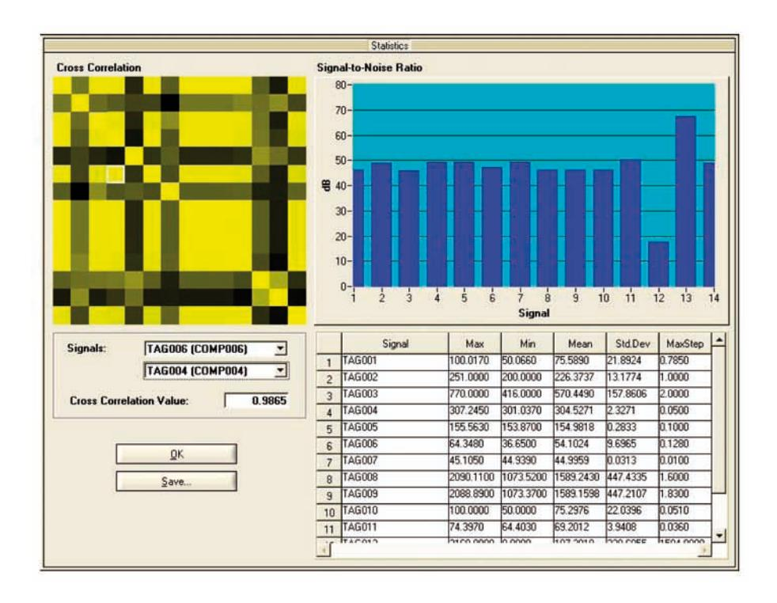

*FIG. I–1. HRP Prox: statistics window.*

example help to make better operational decisions and provide better input data for other computerized operation support systems, such as alarm systems and diagnosis systems.

PEANO combines artificial neural networks (ANN) and fuzzy logic to exploit the learning and generalization capability of the first technique with the approximate reasoning embedded in the second approach. Real time process signal validation is an application field where the use of this technique can improve the diagnosis of faulty sensors and the identification of outliers in a robust and reliable way.

PEANO implements a fuzzy possibilistic clustering algorithm to classify the operating region in which the validation process has to be performed. The possibilistic approach (rather than probabilistic) allows a 'don't know' classification that results in a fast detection of unforeseen plant conditions or outliers.

The fuzzy classifier identifies the incoming signal pattern (a set of reactor process signals) as a member of one of the clusters covering the entire universe of discourse represented by the possible combinations of steady state and transient values of the input set in the *n* dimensional input world. Each cluster is associated with one ANN that was previously trained only with data belonging to that cluster, for the input set validation process. During the operation, while the input point moved in an *n* dimensional world (because of process state changes or transients), the classifier provides an automatic switching mechanism to allow the best tuned ANN to do the job.

There are two main advantages in using this architecture: the accuracy and generalization capability are increased compared with the case of a single network working in the entire operating region, and the ability to identify abnormal conditions, where the system is not capable of operating with a satisfactory accuracy, is improved.

PEANO has a client–server architecture. The server is connected to the process through a TCP/IP communication protocol and the results of the validation activity are transferred to the client programs, also using TCP/IP.

Figure I–2 shows the display of a PEANO client during an on-line validation test. The error bands in the mismatch plots are calculated by PEANO during the training according to the expected error of prediction for each particular cluster and signal.

Figure I–3 is an interesting example of span drift of a steam flow sensor. Span drifts are difficult to detect because they show up only at some location of the instrument range. In this real life example, the instrument was

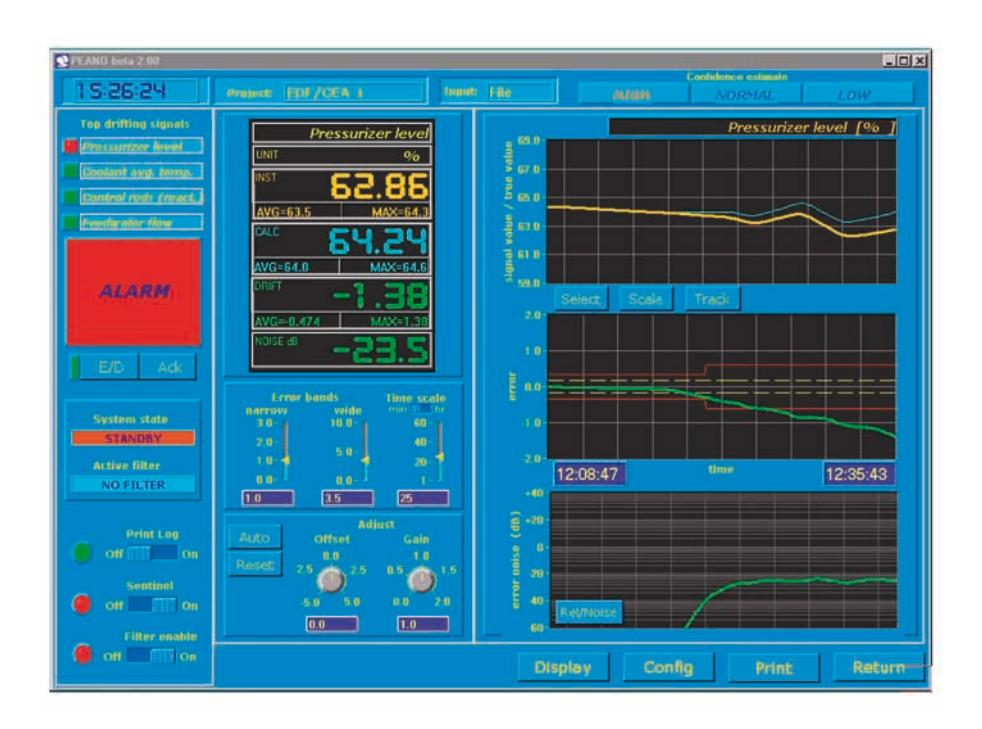

*FIG. I–2. User interface for the monitoring display.*

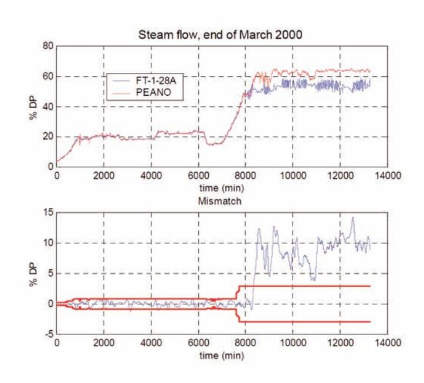

*FIG. I–3. Span drift detection.*

perfectly inside the calibration range until the power level came close to the rated level (high end of the instrument range). At this point the instrument started to drift and eventually finished outside the allowed tolerance band.

### **I–1.3. Batch Monitoring Module**

The BMM is a specific tool for processing large amounts of data stored during plant operation, in order to monitor these data in a batch mode for the calibration reduction purpose. Figure I–4 shows the user interface and a typical result window for one sensor. BMM uses the same monitoring methods and algorithms as the PEANO Server.

BMM makes use of PEANO models that have been developed with the PEANO Modelling Tool. These are the same models that can be used by the PEANO Server for a real time application of the system. If a PEANO expert has developed a model for a plant's process, any user can apply BMM in order to monitor data for the calibration reduction purpose.

BMM will, on request, provide a calibration report in the form of a printable document. This report presents an overview over the calibration state of all sensors, and points out those in need of calibration. This information can be very valuable during the planning stages of a maintenance period and can ensure that calibration efforts are targeted to those sensors that are in need of maintenance. A typical graph included in the report is the average calibration error for each sensor, as shown in Fig. I–5. A sensor with a calibration problem can quickly be identified from this graph.

### **I–1.4. On-line calibration monitoring scheme**

With the addition of the preprocessing module (HRP Prox) and the BMM, the PEANO system fits very well into the overall scheme of on-line calibration monitoring, as shown in Fig. I–6. When a timeline is considered over the horizontal axis, the time can typically be divided into plant operation and a maintenance period. Before the actual maintenance period, some time will be spent on the maintenance planning, while the plant is still in operation.

When the maintenance planning is conducted properly and with the correct information, for example from a calibration monitoring system, the maintenance period can be shortened, without a compromise on quality and

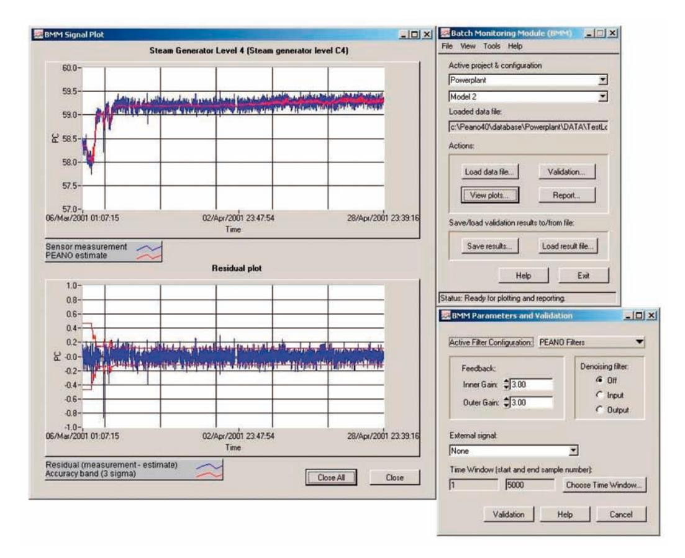

*FIG. I–4. PEANO BMM.*

safety. The figure further indicates at what time the various PEANO modules are applied to fit in this overall strategy.

To develop a PEANO model, one needs access to recorded historical plant data that represents correct measurements of the sensors in the plant states of operation that one wants to have monitored by the system. Rarely can the data retrieved from the plant computer be used directly, since it often exhibits gaps in the data, noise and outliers. The HPR Prox is used to prepare these data for the modelling task at hand. Additionally, by

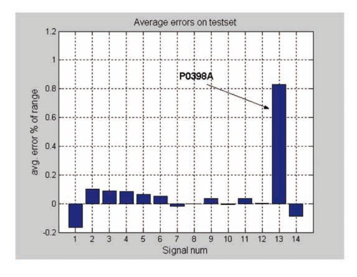

*FIG. I–5. Average validation error graph.*

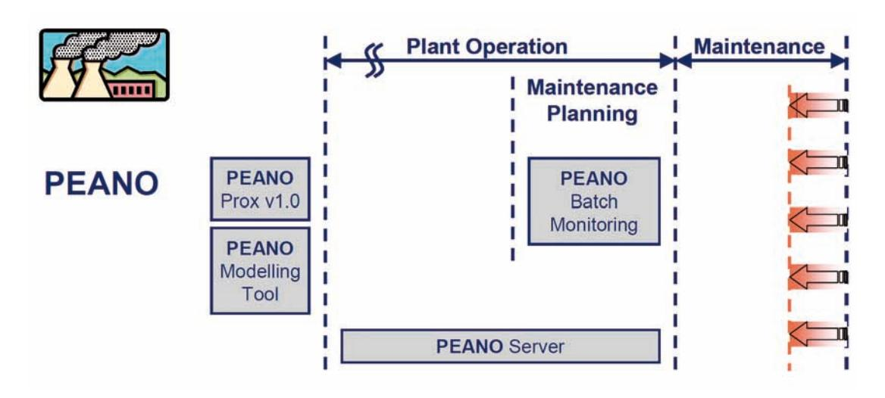

*FIG. I–6. PEANO in an on-line calibration strategy.*

analysing the statistical properties of the data, groups of sensors can be selected that are well suited to be applied in one model, since the model performance is based on the correlation between the sensors.

Once the data are prepared, a model can be developed with the PEANO Modelling Tool. This application guides the user through the model development process, without the need for any thorough knowledge of the underlying fuzzy logic and neural network techniques. The model can then be applied in either the PEANO Server or the BMM.

The BMM is applied during the maintenance planning to get better knowledge about the state of the sensors in the process. The sensor measurements of a whole fuel cycle can be analysed in a matter of minutes, and the results provide a valuable insight in a sensor's state and help to decide if a recalibration should be performed.

If the PEANO system is applied for real time signal validation, the PEANO Server is typically connected to the process computer and the validation results need to be fed into the process computer and shown in the human system interface that the operator uses to control and monitor the process.

## I–2. TEMPO THERMAL PERFORMANCE AND OPTIMIZATION

TEMPO is a computer system developed in response to the challenge of improving the economic performance of power plants. TEMPO thus aims at satisfying information needs associated with efficiency monitoring, fault detection and diagnosis, 'what if' analysis, and optimization of operational modes and maintenance.

The data reconciliation module is relevant for on-line calibration monitoring and validation of plant measurements.

### **I–2.1. Configuration and modelling**

The core of the system is a flexible modelling system that enables the user to easily configure and deploy steady state mathematical models of the plant (or subsystem) by drawing its flow sheet in a graphical user interface. A data acquisition module is included to provide the model with live plant data for use in the calculations.

TEMPO contains various monitoring features, such as process mimic diagrams and trending of measured and calculated variables. TEMPO will also be useful in applications other than power cycles, for example for surveillance of residual heat removal systems. TEMPO supports simultaneous surveillance of several such systems.

TEMPO creates steady state mathematical models of thermal systems based on water and steam. The models are made by drawing a process mimic in a graphical user interface (see Fig. I–7), and TEMPO automatically generates a computer representation of the equation set representing the process. The system does, therefore, not require any knowledge on the hands of the user as far as mathematical modelling is concerned. A good knowledge of the process to be modelled is an advantage, though.

### **I–2.2. Data reconciliation**

In the data reconciliation mode, TEMPO adjusts user selected parameters of components in order to minimize the difference between measured values of user selected temperatures, flows and pressures and the corresponding calculated values of the plant model. Usually, also the input states to the system are varied if these are not known with high accuracy.

What emerges from the fit in the data reconciliation mode are:

- An overall value for the probability that the process is free of (unknown) faults, the so called goodness of fit *Q*.
- Corrected values for the process measurements.
- Process states for all streams included in the model.
- Estimates for user selected, variable component parameters (e.g. heat transfer numbers and efficiencies).
- A list of sensitivity of goodness of fit with respect to fixed parameters in the model. High sensitivity of *Q* with respect to a parameter implies that a small change in this parameter has a large influence on the fit.

The goodness of fit represents an overall assessment of whether there are faults or not in the process, and is usually the most important single number for fault detection and alarms. For tracking down the cause of an assumed fault, the values of the component parameters, process states and the parameter sensitivities will be of significant diagnostic value. In addition to values themselves, TEMPO estimates the uncertainty in all its estimates, based on a linearization of the non-linear model equations.

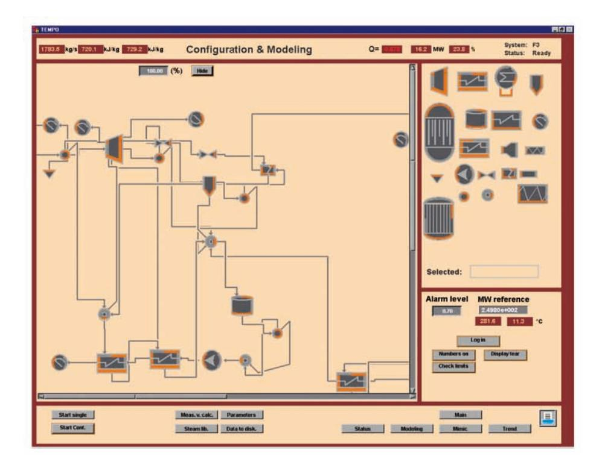

*FIG. I–7. The modelling graphical user interface of TEMPO.*

The parameters chosen for fitting of the model to process data are normally others than those that would be chosen in the optimization mode. Details of the models employed, the equations constituting a model, solution techniques, etc., can be found in Refs [I–4–I–6].

### **I–2.3. Results**

Tests at a BWR yield an overall root mean square deviation from measured values of a few tenths of a per cent, and giving goodness of fits *Q* of the order of 95%. Also, TEMPO had no difficulties detecting a known case of a faulty sensor.

The *Q* values close to zero (Fig. I–8) at the beginning of the test period were due to a faulty pump being disconnected without an accompanying change in the TEMPO model, the disconnection thus appearing to TEMPO as a process fault.

Figure I–9 shows the calculated and measured feedwater flow (nearly overlapping curves). The typical deviation in these was 1–2 kg/s, corresponding to 0.05–0.1%.

### I–3. CONCLUSIONS

PEANO is a neuro-fuzzy system for OLM of instrument performance. With the addition of HRP Prox and the BMM to PEANO, the system supports the industry with the task of OLM for calibration reduction. The ability to detect sensor calibration problems with the techniques applied in the PEANO system has been proven in the past through many pilot tests and applications. With the latest PEANO system, utilities can easily benefit from these advanced techniques and improve their maintenance strategy with calibration reduction through OLM.

One benefit of data validation techniques based on mathematical models (i.e. of analytical redundancy based methods), is that an improved precision over those of raw data is possible even in the absence of physical redundancy (i.e. multiple measurements of the same quantity). For nuclear plants this may be a significant asset, since frequently the instrumentation is too scarce to actually warrant the use of methods assuming such physical redundancy.

In contrast with the analytical redundancy provided by empirical methods such as neuro-fuzzy models, the use of first principles models has the benefit that they do not require large amounts of data for their establishment, that they can, with some caution, be used for extrapolation and the possibility of calculating

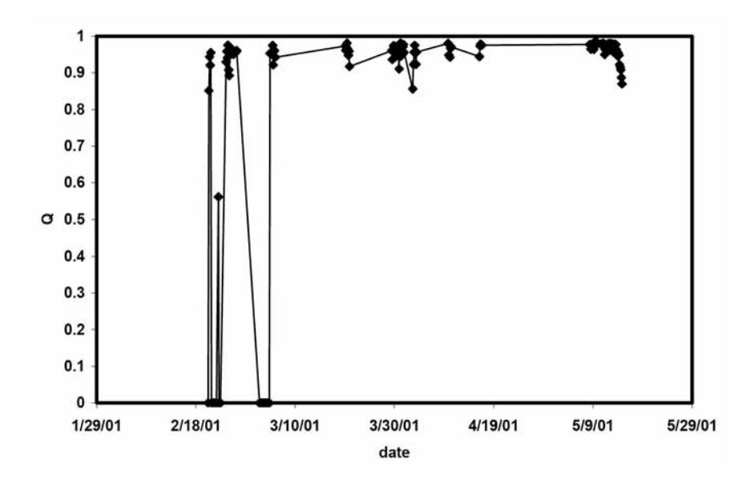

*FIG. I–8. Goodness of fit Q.*

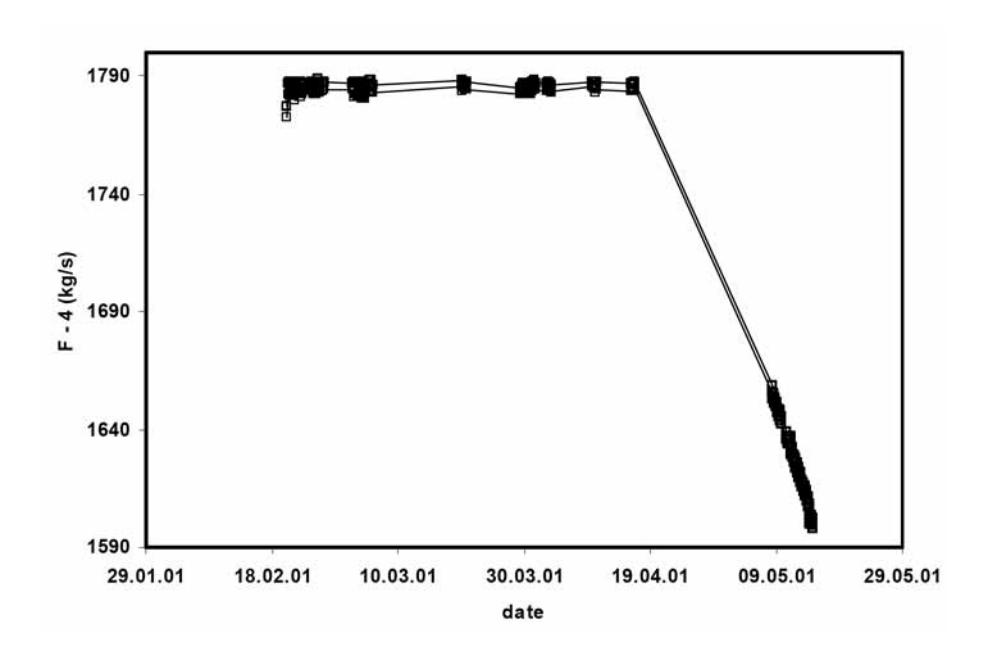

*FIG. I–9. Feedwater flow: (* ▲ *) measured and (* ❐ *) calculated.*

unmeasured quantities. The major drawback of first principles models is that they are costly to build and require customization for the process at hand. These two problems can, however, to a major extent be circumvented by the design of tools that allow for the rapid assembly of process models from a library of component models as done in TEMPO.

## **REFERENCES**

- [I–1] FANTONI, P., A neuro-fuzzy model applied to full range signal validation of PWR nuclear power plant data, Int. J. Gen. Syst. **29** (2000) 305–320.
- [I–2] HOFFMANN, M., "PEANO a tool for on-line calibration monitoring", paper presented at the IAEA Technical Mtg on Increasing Instrument Calibration Interval through On-line Calibration Technology, Halden, Norway, 2004.
- [I–3] FANTONI, P., "Experiences and applications of PEANO for on-line monitoring in power plants", paper presented at the IAEA Technical Mtg on Increasing Instrument Calibration Interval through On-line Calibration Technology, Halden, Norway, 2004.
- [I–4] SUNDE, S., BERG, Ø., DAHLBERG, L., FRIDQVIST, N.-O., Data reconciliation in the steam-turbine cycle of a BWR, Nucl. Technol. **143** (2003) 103.
- [I–5] SUNDE, S., BERG, Ø., "Data reconciliation and fault detection by means of plant-wide mass and energy balances, Progr. Nucl. Energy **43** (2003) 97.
- [I–6] SUNDE, S., BANATI, J., "Improved identification of gross errors in a residual-heat removal system by robust datareconciliation", paper presented at the IAEA Technical Mtg on Increasing Instrument Calibration Interval through On-line Calibration Technology", Halden, Norway, 2004.

### **Annex II**

## **ON-LINE MONITORING OF ACCURACY AND RELIABILITY CHARACTERISTICS AND IN SITU DIAGNOSTICS OF TEMPERATURE MEASUREMENTS IN WWER-440 REACTORS IN SLOVAKIA**

M. SLANINA VUJE, Trnava, Slovakia

### **Abstract**

The accuracy and reliability of design temperature measurements in WWER-440 reactors — i.e. temperature measurements of the fuel assembly outlet coolant and of coolant loops connected to the SVRK (Slovak abbreviation for System of In-core Control) system — are important factors for the safe and economic exploitation of these units. The level of design temperature measurement accuracy and reliability has been continually increased during the operation of the WWER-440 reactors. In the early 1980s, VUJE research in this area resulted in the design and application of coolant temperature increase measurement with a higher accuracy — a temperature etalon. Its purpose was to provide accurate and reliable coolant temperature data for calibration performance and metrological assurance of design temperature measurements during startup and power operation of the units. Later, together with advances in digital equipment, VUJE integrated the functions of on-line monitoring of the accuracy and reliability characteristics of design temperature measurements and systems of post-accident monitoring into the temperature etalon. The system designated as SPAS (Slovak abbreviation for Monitoring of Accuracy And Reliability) was complemented with functions of dialogue analysis for the monitoring of temperature measurement channel characteristics, conditions of temperature sensors during operation, recording of technical sensor data and thermocouple thermal contact quality in situ diagnostics in the dry channels of the fuel assembly outlets.

### II–1. FUNCTIONS AND UTILIZATION

The SPAS system is designated for design temperature measurements in WWER-440 reactors. SPAS performs the following functions:

- Calibration of design temperature measurements during quasi-isothermal states;
- Verification of design reactor temperature measurement accuracy during power operation in each measurement cycle (accuracy characteristics);
- Monitoring of the temperature detectors' condition during power operation (reliability characteristics);
- Data collection for evaluation of the accuracy and reliability of equipment;
- Dialogue analysis of accuracy and reliability;
- Thermocouple thermal contact quality in situ diagnostics in the dry channels of fuel assembly outlets.

## II–2. DESCRIPTION OF THE SPAS SYSTEM AND ITS MOST IMPORTANT OUTPUTS

Calibration and observation of the accuracy characteristics of reactor design temperature measurements is based on the use of a reactor temperature etalon measuring the temperatures of the coolant on the legs [II–1]. It ensures a temperature measurement accuracy of 0.18°C and a measurement accuracy of the coolant temperature increase in the reactor of 0.14°C at a probability of 0.95 [II–2–II–5]. Its measurement accuracy is verified at each measurement cycle. The measurement system enables calibration of the whole in-core measurement circuits at real conditions during the quasi-isothermal and operational states of the reactor, with an uncertainty of ±1°C. The system utilizes combined temperature sensors, including two resistance thermometers and three thermocouples. The results of long term research and comparison of couples of measuring resistance thermometers and thermocouples placed at the same points and the characteristics of the thermocouples serve as a proof of this statement.

The use of the combined temperature sensors and a special apparatus for data evaluation enables, besides measurement and registration of the temperature, checking of the uncertainty of the obtained data as well as performing diagnostics verification/supervision. Multiple temperature measurements are performed by two independent physical methods using analogue–digital conversion equipment. The system can measure the resistance of measuring circuits as well as the resistance of insulation. An automatic verification of the random uncertainty of the measurement and verification of the systematic uncertainty rise is performed in each measuring cycle. The used method of measurement of the measuring channel resistances and of insulation resistances enables determination of the rise and the place of a failure.

Temperature measurement by using resistance thermometers with individual static characteristics (calibrated), using the four conductor connection system and microprocessor technique, gives broad possibilities to minimize the systematic and random uncertainty of the temperature measurement.

The measuring system verifies its accuracy of measured temperature at each measuring cycle. The concept of 'checking the accuracy of temperature measurement' means checking a random component of the uncertainty and of a systematic component of the uncertainty.

If it is found during the automatic verification that the measurement accuracy is not satisfactory, then it is possible to identify the rise and the place of a failure by using diagnostics verification. The algorithm of the diagnostics verification is based on comparison of known and measured values of resistance at various switching of the measuring circuits.

The measuring computer ensures measurement of data and their filing. The format of displayed output data of measured temperatures together with accuracy parameters (random uncertainty of the temperature measurement ∗1, systematic uncertainty of the temperature measurement ∗2, systematic uncertainty of the coolant temperature increase in the reactor ∗3) and with the statement about satisfactory (or not satisfactory) accuracy of the measurement is shown in Fig. II–1.

The accuracy of the measurement system has been verified under real conditions in the following ways:

| _00p                                                    |                                                                                                                                                                                                                                                                                                                                                                                                                                                                                                                                                                                                                                                                                                                                                                                                                                                                                                                                                                                                                                                                                                                                                                                                                                                                                                                                                                                                                                                                                                                                                                                                                                                                                                                                                                                                                                                                                                                                                                                                                                                                                                                                | Temper                      | ature             | ΔΤ                   | Temper | ature              | δT                        | ΔΤ    | ΔΤ                        | δΔΤ         | Temperature | Main        |       |
|---------------------------------------------------------|--------------------------------------------------------------------------------------------------------------------------------------------------------------------------------------------------------------------------------------------------------------------------------------------------------------------------------------------------------------------------------------------------------------------------------------------------------------------------------------------------------------------------------------------------------------------------------------------------------------------------------------------------------------------------------------------------------------------------------------------------------------------------------------------------------------------------------------------------------------------------------------------------------------------------------------------------------------------------------------------------------------------------------------------------------------------------------------------------------------------------------------------------------------------------------------------------------------------------------------------------------------------------------------------------------------------------------------------------------------------------------------------------------------------------------------------------------------------------------------------------------------------------------------------------------------------------------------------------------------------------------------------------------------------------------------------------------------------------------------------------------------------------------------------------------------------------------------------------------------------------------------------------------------------------------------------------------------------------------------------------------------------------------------------------------------------------------------------------------------------------------|-----------------------------|-------------------|----------------------|--------|--------------------|---------------------------|-------|---------------------------|-------------|-------------|-------------|-------|
|                                                         | Leg                                                                                                                                                                                                                                                                                                                                                                                                                                                                                                                                                                                                                                                                                                                                                                                                                                                                                                                                                                                                                                                                                                                                                                                                                                                                                                                                                                                                                                                                                                                                                                                                                                                                                                                                                                                                                                                                                                                                                                                                                                                                                                                            | RTI                         | RTII              | 1-11                 | RT     | TC                 | TC - RT                   | RT    | TC                        | TC-RT       | CJ          | circulating |       |
|                                                         | Н                                                                                                                                                                                                                                                                                                                                                                                                                                                                                                                                                                                                                                                                                                                                                                                                                                                                                                                                                                                                                                                                                                                                                                                                                                                                                                                                                                                                                                                                                                                                                                                                                                                                                                                                                                                                                                                                                                                                                                                                                                                                                                                              | 295,61                      | 295,60            | 0,010                | 295,61 | 296,31             | 0,70                      |       | PAR 24                    | 2000        | 2000000     | 5-0707      |       |
| L1                                                      | С                                                                                                                                                                                                                                                                                                                                                                                                                                                                                                                                                                                                                                                                                                                                                                                                                                                                                                                                                                                                                                                                                                                                                                                                                                                                                                                                                                                                                                                                                                                                                                                                                                                                                                                                                                                                                                                                                                                                                                                                                                                                                                                              | 266,79                      | 266,79            | 0,000                | 266,79 | 267,14             | 0,35                      | 28,81 | 29,17                     | 0,36        | 50,20       | ON          |       |
| 2020                                                    | н                                                                                                                                                                                                                                                                                                                                                                                                                                                                                                                                                                                                                                                                                                                                                                                                                                                                                                                                                                                                                                                                                                                                                                                                                                                                                                                                                                                                                                                                                                                                                                                                                                                                                                                                                                                                                                                                                                                                                                                                                                                                                                                              | 295,71                      | 295,72            | -0,010               | 295,72 | 296,50             | 0,78                      | 20.40 | 20.75                     | 0.00        | 46,87       | ONE         |       |
| L2                                                      | С                                                                                                                                                                                                                                                                                                                                                                                                                                                                                                                                                                                                                                                                                                                                                                                                                                                                                                                                                                                                                                                                                                                                                                                                                                                                                                                                                                                                                                                                                                                                                                                                                                                                                                                                                                                                                                                                                                                                                                                                                                                                                                                              | 267,24                      | 267,28            | -0,040               | 267,26 | 267,75             | 0,49                      | 28,46 | 28,75                     | 0,29        |             | ON          |       |
| L3                                                      | Н                                                                                                                                                                                                                                                                                                                                                                                                                                                                                                                                                                                                                                                                                                                                                                                                                                                                                                                                                                                                                                                                                                                                                                                                                                                                                                                                                                                                                                                                                                                                                                                                                                                                                                                                                                                                                                                                                                                                                                                                                                                                                                                              | 296,45                      | 296,47            | -0,020               | 296,46 | 297,07             | 0,61                      | 29,16 | 29,16                     | 20.24       | 0.00        | 47.07       | ON    |
|                                                         | С                                                                                                                                                                                                                                                                                                                                                                                                                                                                                                                                                                                                                                                                                                                                                                                                                                                                                                                                                                                                                                                                                                                                                                                                                                                                                                                                                                                                                                                                                                                                                                                                                                                                                                                                                                                                                                                                                                                                                                                                                                                                                                                              | 267,31                      | 267,29            | 0,020                | 267,30 | 267,83             | 0,53                      |       |                           | 29,16       | 29,24       | 0,08        | 47,67 |
| L4                                                      | н                                                                                                                                                                                                                                                                                                                                                                                                                                                                                                                                                                                                                                                                                                                                                                                                                                                                                                                                                                                                                                                                                                                                                                                                                                                                                                                                                                                                                                                                                                                                                                                                                                                                                                                                                                                                                                                                                                                                                                                                                                                                                                                              | 296,07                      | 296,07            | 0,000                | 296,07 | 296,81             | 0,74                      | 28,86 | 20.00                     | 20.04       | 0.18        | 40.40       | ON    |
|                                                         | С                                                                                                                                                                                                                                                                                                                                                                                                                                                                                                                                                                                                                                                                                                                                                                                                                                                                                                                                                                                                                                                                                                                                                                                                                                                                                                                                                                                                                                                                                                                                                                                                                                                                                                                                                                                                                                                                                                                                                                                                                                                                                                                              | 267,20                      | 267,22            | -0,020               | 267,21 | 267,77             | 0,56                      |       | 28,86 29,04               | 0,10        | 46,16       | ON          |       |
|                                                         | Н                                                                                                                                                                                                                                                                                                                                                                                                                                                                                                                                                                                                                                                                                                                                                                                                                                                                                                                                                                                                                                                                                                                                                                                                                                                                                                                                                                                                                                                                                                                                                                                                                                                                                                                                                                                                                                                                                                                                                                                                                                                                                                                              | 296,28                      | 296,25            | 0,030                | 296,27 | 296,65             | 0,38                      | 28,84 | 28,50                     | 0.04        | 10.05       | ON          |       |
| L5                                                      | С                                                                                                                                                                                                                                                                                                                                                                                                                                                                                                                                                                                                                                                                                                                                                                                                                                                                                                                                                                                                                                                                                                                                                                                                                                                                                                                                                                                                                                                                                                                                                                                                                                                                                                                                                                                                                                                                                                                                                                                                                                                                                                                              | 267,42                      | 267,43            | -0,010               | 267,43 | 268,15             | 0,72                      |       | 20,04                     | 20,04 20,00 | -0,34       | 49,65       | ON    |
| 202                                                     | Н                                                                                                                                                                                                                                                                                                                                                                                                                                                                                                                                                                                                                                                                                                                                                                                                                                                                                                                                                                                                                                                                                                                                                                                                                                                                                                                                                                                                                                                                                                                                                                                                                                                                                                                                                                                                                                                                                                                                                                                                                                                                                                                              | 296,11                      | 296,07            | 0,040                | 296,09 | 296,64             | 0,55                      | 20.70 | 07.74                     | 1.07        | 40.0F       | 011         |       |
| L6                                                      |                                                                                                                                                                                                                                                                                                                                                                                                                                                                                                                                                                                                                                                                                                                                                                                                                                                                                                                                                                                                                                                                                                                                                                                                                                                                                                                                                                                                                                                                                                                                                                                                                                                                                                                                                                                                                                                                                                                                                                                                                                                                                                                                | 267,30                      | 267,32            | -0,020               | 267,31 | 268,93             | 1,62                      | 28,78 | 27,71                     | -1,07       | 48,65       | ON          |       |
| Mean coolant temperature increase in the reactor [deg]: |                                                                                                                                                                                                                                                                                                                                                                                                                                                                                                                                                                                                                                                                                                                                                                                                                                                                                                                                                                                                                                                                                                                                                                                                                                                                                                                                                                                                                                                                                                                                                                                                                                                                                                                                                                                                                                                                                                                                                                                                                                                                                                                                |                             |                   | RT 28,82 28,76 | 2      | TC 8,74 8,68 | TC - RT -0,08 -0,08 | Эy    | s. uncertainty 0,08 *3 |             |             |             |       |
| ean te                                                  | emperatur                                                                                                                                                                                                                                                                                                                                                                                                                                                                                                                                                                                                                                                                                                                                                                                                                                                                                                                                                                                                                                                                                                                                                                                                                                                                                                                                                                                                                                                                                                                                                                                                                                                                                                                                                                                                                                                                                                                                                                                                                                                                                                                      | e in the cold leg           | 5                 | [de                  | al:    | 267,22             | 26                        | 7,93  | 0,71                      |             | 1000        |             |       |
| lean re                                                 | eactor tem                                                                                                                                                                                                                                                                                                                                                                                                                                                                                                                                                                                                                                                                                                                                                                                                                                                                                                                                                                                                                                                                                                                                                                                                                                                                                                                                                                                                                                                                                                                                                                                                                                                                                                                                                                                                                                                                                                                                                                                                                                                                                                                     | perature                    |                   | [de                  | a):    | 281,63             | 28                        | 2,30  | 0,67                      |             | 0,05 *2     |             |       |
| tandar                                                  | A STATE OF THE PARTY OF THE PARTY OF THE PARTY OF THE PARTY OF THE PARTY OF THE PARTY OF THE PARTY OF THE PARTY OF THE PARTY OF THE PARTY OF THE PARTY OF THE PARTY OF THE PARTY OF THE PARTY OF THE PARTY OF THE PARTY OF THE PARTY OF THE PARTY OF THE PARTY OF THE PARTY OF THE PARTY OF THE PARTY OF THE PARTY OF THE PARTY OF THE PARTY OF THE PARTY OF THE PARTY OF THE PARTY OF THE PARTY OF THE PARTY OF THE PARTY OF THE PARTY OF THE PARTY OF THE PARTY OF THE PARTY OF THE PARTY OF THE PARTY OF THE PARTY OF THE PARTY OF THE PARTY OF THE PARTY OF THE PARTY OF THE PARTY OF THE PARTY OF THE PARTY OF THE PARTY OF THE PARTY OF THE PARTY OF THE PARTY OF THE PARTY OF THE PARTY OF THE PARTY OF THE PARTY OF THE PARTY OF THE PARTY OF THE PARTY OF THE PARTY OF THE PARTY OF THE PARTY OF THE PARTY OF THE PARTY OF THE PARTY OF THE PARTY OF THE PARTY OF THE PARTY OF THE PARTY OF THE PARTY OF THE PARTY OF THE PARTY OF THE PARTY OF THE PARTY OF THE PARTY OF THE PARTY OF THE PARTY OF THE PARTY OF THE PARTY OF THE PARTY OF THE PARTY OF THE PARTY OF THE PARTY OF THE PARTY OF THE PARTY OF THE PARTY OF THE PARTY OF THE PARTY OF THE PARTY OF THE PARTY OF THE PARTY OF THE PARTY OF THE PARTY OF THE PARTY OF THE PARTY OF THE PARTY OF THE PARTY OF THE PARTY OF THE PARTY OF THE PARTY OF THE PARTY OF THE PARTY OF THE PARTY OF THE PARTY OF THE PARTY OF THE PARTY OF THE PARTY OF THE PARTY OF THE PARTY OF THE PARTY OF THE PARTY OF THE PARTY OF THE PARTY OF THE PARTY OF THE PARTY OF THE PARTY OF THE PARTY OF THE PARTY OF THE PARTY OF THE PARTY OF THE PARTY OF THE PARTY OF THE PARTY OF THE PARTY OF THE PARTY OF THE PARTY OF THE PARTY OF THE PARTY OF THE PARTY OF THE PARTY OF THE PARTY OF THE PARTY OF THE PARTY OF THE PARTY OF THE PARTY OF THE PARTY OF THE PARTY OF THE PARTY OF THE PARTY OF THE PARTY OF THE PARTY OF THE PARTY OF THE PARTY OF THE PARTY OF THE PARTY OF THE PARTY OF THE PARTY OF THE PARTY OF THE PARTY OF THE PARTY OF THE PARTY OF THE PARTY OF THE PARTY OF THE PARTY OF THE PARTY OF THE PARTY OF THE PARTY OF THE PARTY OF THE PARTY OF THE PAR | indard deviation of tempera |                   | s [de                | 9      | 0,31               |                           | 0,26  | 100007                    | I[KK] =     | 0,49905 mA  |             |       |
| tandar                                                  | d deviatio                                                                                                                                                                                                                                                                                                                                                                                                                                                                                                                                                                                                                                                                                                                                                                                                                                                                                                                                                                                                                                                                                                                                                                                                                                                                                                                                                                                                                                                                                                                                                                                                                                                                                                                                                                                                                                                                                                                                                                                                                                                                                                                     | on of temperatur            | es in the cold le | gs [de               | 9):    | 0,21               | 1000                      | 0,59  |                           | I[DT] =     | 0,50039 mA  |             |       |
| Standard deviation for measuring cycle [deg]            |                                                                                                                                                                                                                                                                                                                                                                                                                                                                                                                                                                                                                                                                                                                                                                                                                                                                                                                                                                                                                                                                                                                                                                                                                                                                                                                                                                                                                                                                                                                                                                                                                                                                                                                                                                                                                                                                                                                                                                                                                                                                                                                                | 0,023                       | *1                | 0,33                 |        | F[Hz] =            | 49,900 Hz                 |       |                           |             |             |             |       |

*FIG. II–1. Format of the temperature measurement data at Mochovce Unit 2.*

- By a long term checking of the accuracy of temperature measurement under the real conditions of the reactor [II–6–II–10];
- By expert evaluation of the measurement system at Bohunice Unit 4 by the Czechoslovak Metrological Institute with the aim to evaluate the combined temperature sensors, measuring lines, feeding current, resistances and the measuring and processing apparatus [II–11];
- By comparison of the measured temperature with the temperature obtained by indirect methods according to the measurement of saturated steam pressure in the secondary circuit during a quasi-isothermal operational status [II–8, II–9];
- By comparison of the measured temperature with the temperature obtained by an absolutely accurate method of noise thermometry for both the cold and hot legs of the first primary circulation loop at Bohunice Unit 2 [II–10].

All these methods showed the unanimous conclusion that the real accuracy of the temperature measurement is higher than the design one.

The verification of the measurement system under real conditions after the rise of failures confirmed that the used three parameters of accuracy are representative and that the system assures a reliable automatic checking of the accuracy of temperature measurement.

The monitoring of reliability characteristics of the reactor temperature etalon is based on the monitoring of the loop and isolation resistances of their complete measurement circuits. The principles for monitoring of reliability of measurement circuits by means of measurement of the loop and isolation resistances are described in Refs [II–12, II–13].

The SPAS system uses measured data both from the SVRK system and from the reactor temperature etalon for the monitoring of accuracy and reliability characteristics. In principle, the SPAS system can be then realized by software:

- (1) Directly in SVRK as already implemented at the V-230 reactors in Bohunice.
- (2) By a reactor temperature etalon as already implemented at the Mochovce reactors. In this variant, merging of the reactor temperature etalon and the SPAS system was done by means of the control system of reactor temperature measurement (CSRTM). The function of determining corrective constants during calibration is carried out by the software–hardware complex for operational control (PTK OK) by means of a supporting temperature found by the reactor temperature etalon. The assessment of quality level of the correction constants is done in CSRTM.
- (3) In other computer systems.

The schematic outline of relations between the SPAS system and reactor temperature measurements is shown in Fig. II–2.

The most significant outputs of the SPAS system are as follows:

- (1) Accuracy characteristics of the reactor temperature etalon obtained during each measurement cycle. In Fig. II–3, three parameters of the accuracy of the reactor temperature etalon at Mochovce Unit 1 during the whole fuel cycle are shown.
- (2) Corrective constants of the design temperature measurements obtained during quasi-isothermal conditions, including the evaluation of their quality.
- (3) Accuracy characteristics of design temperature measurements obtained during power conditions in each measurement cycle:
  - Temperatures at fuel assembly outlets (TVPK). A parameter containing systematic error and a parameter containing random error at Bohunice Unit 1 is shown in Fig. II–4 [II–14].
  - Temperatures in the loops.
  - Reactor coolant temperature increase.
- (4) Reliability characteristics (curves of loop and of isolation resistance of measurement channels).
- (5) Thermocouple thermal contact quality in situ diagnostics in the dry channels of the fuel assembly outlets.

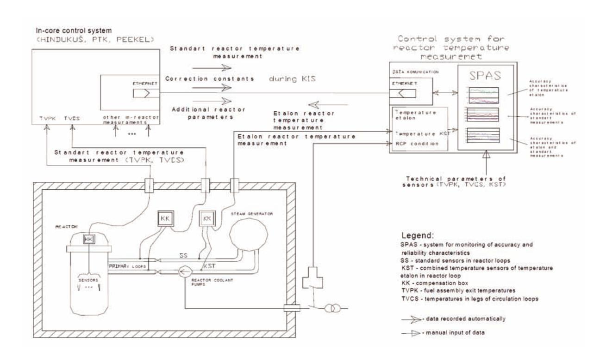

*FIG. II–2. Schematic diagram of the binding between the SPAS system and the reactor temperature measurements.*

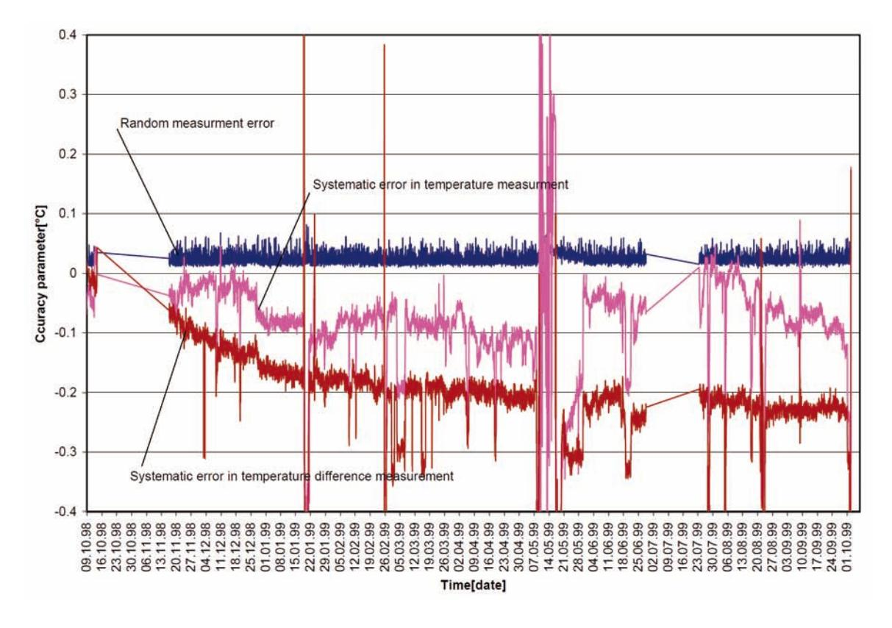

*FIG. II–3. Time history of accuracy parameters of the reactor temperature etalon during the fuel cycle at Mochovce Unit 1.*

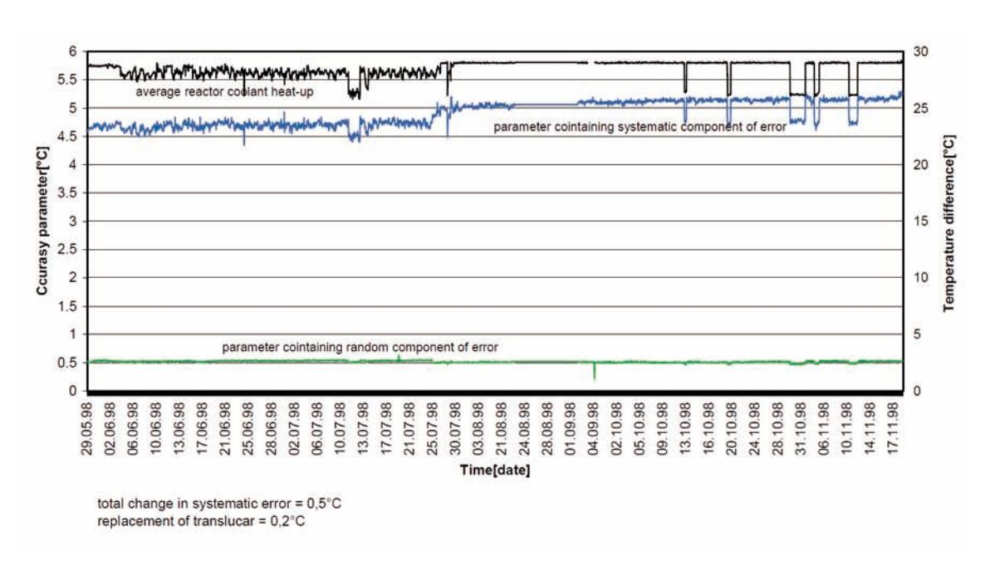

*FIG. II–4. Accuracy characteristics of temperatures at fuel assembly outlets at Bohunice Unit 1.*

Besides the most significant outputs mentioned above, there are a lot of other partial outputs that may be obtained from the SPAS system for analysis of measured data [II–15].

### II–3. BENEFITS OF SPAS

The benefits of SPAS are:

- It provides metrological assurance;
- It provides automatic monitoring of accuracy and reliability of measurement circuits during the fuel cycle;
- It makes it possible to clarify anomalous conditions occurring during the reactor fuel cycle;
- It makes it possible to monitor long term changes (within a few years) of the characteristics of sensors and measurement channels;
- Thermocouple thermal contact quality in situ diagnostics.

### **II–3.1. Metrological assurance**

Temperatures from resistance thermometers and from thermocouples (both in loops and fuel assemblies) are related metrologically in real conditions at reactor quasi-isothermal conditions, prior to each plant startup following refuelling, to combined temperature sensors (of the reactor temperature etalon), which are the measurement devices specified in Refs [II–5, II–16]. It is obvious that during each calibration in the course of quasi-isothermal conditions, the measurement devices specified — the combined sensors of temperature — have a calibration certificate. The combined sensors can obtain a valid calibration certificate in two ways: either by their calibration under laboratory conditions according to Ref. [II–4], or by extending the validity of laboratory calibration constants under real conditions in the reactor according to Ref. [II–3]. Such extension of validity can be done subsequently following laboratory calibration only twice [II–16].

In reality during quasi-isothermal condition calibration, not only resistance thermometers and thermocouples are calibrated by the combined sensors, but also complete measurement channels are calibrated by the reactor temperature etalon. This, thus, means that the reactor temperature etalon must have a valid calibration certificate.

For the reactor temperature etalon to have a valid calibration certificate, also the combined temperature sensor [II–3, II–4], the normal resistance and the analogue–digital transducer have to have calibration certificates based on accuracy analysis of the temperature etalon [II–6]. A report about the results of regular checks of components of the temperature etalon — combined temperature sensors, normal resistance and analogue– digital converter [II–17] — is thus developed prior to each plant startup after refuelling.

For the calibration procedure of the design temperature measurement by means of the temperature etalon during quasi-isothermal conditions, a methodology [II–18] was developed.

### **II–3.2. Automatic quality monitoring of measurement circuits during the fuel cycle**

The monitoring has major benefits mainly for the instrumentation and control personnel. Specifically:

- Information about conditions of measurement systems is obtained in real time (measurement personnel obtain free information about the measurement conditions that they could, in other ways, obtain only by other supporting measurements, or by comparing various measurements).
- Immediate finding of errors makes it possible to respond immediately with repair (if repair is possible).
- Knowledge of error history in measurement channels during the fuel cycle makes it possible to prepare a correct restoration during unit outage.

### **II–3.3. Clarification of anomalous conditions during the reactor fuel cycle**

Anomalous conditions are when the data measured do not comply (in certain boundaries) with the data calculated, or expected. The most typical anomalous conditions are as follows:

- Non-compliance in reactor core power distribution (a number of such events are known, reactor power level has to be limited frequently);
- Non-expected values of core bypass flow rates;
- Non-compliance in the maintained and actual reactor thermal output;
- Non-expected temperature values obtained from thermocouples during transient conditions.

The above mentioned anomalous conditions occur frequently during operation. In such cases it is not easy to find an answer to the question of whether the anomaly was caused by technology or by inaccuracy in measurement.

### **II–3.4. Monitoring of long term changes in the characteristics of sensors and routes**

The monitoring of long term changes (of the order of years and tens of years) in the characteristics of sensors, and of complete measurement circuits, is important, mainly for the measurement of temperatures at fuel assembly outlets. In such measurements, thermocouples are exposed to severe conditions, mainly with regard to reactor radiation. Opinions on the magnitude of such changes of thermocouple characteristics by irradiation differ. A set of non-uniform references as regards the magnitude of this effect is shown in Refs [II–19, II–20]. One of the reasons for the non-uniformity of opinions on the magnitude of the effect of radiation on thermocouple characteristics is the absence of metrology assurances at the observed reactors.

The understanding of long term changes in thermocouple characteristics is one of the important parameters for the assessment of the life of thermocouples used at fuel assembly outlets.

## **II–3.5. Thermocouple thermal contact quality in situ diagnostics**

Diagnostics of thermocouple thermal contact quality in dry channels at fuel assembly outlets in the WWER-440 reactor at Mochovce Unit 1 was done by active (LCSR) and passive (in the case of sufficiently rapid and large changes of reactor power) methods.

Measurements of transient characteristics were done for the original type TXA-1590 and TXA-2076 thermocouples and the double type TE-1787 thermocouples, which were installed at the unit during the implementation of the PAMS systems at the Mochovce units [II–16]. The measurements of transient characteristics were done not only at the block of protective tubes in the course of the installation process but also in the PTK rooms following the total installation of measurement channels with thermocouples.

For passive in situ diagnostics measured values from the design unit system, PTK was used. The results from the use of separate in situ diagnostics methods for finding thermocouple thermal contact quality at Mochovce Unit 1 — active and passive — confirmed their equivalence. It would be thus possible to use these independent in situ diagnostics methods as a tool for standard monitoring of thermocouple thermal contact quality for the measurement of temperature at fuel assembly outlets. By integrating the above mentioned diagnostics methods into the SPAS system, it would be possible to create a tool for in situ monitoring of thermocouple thermal contact quality and of the effect of thermal contact quality on the methodology error in temperature measurements at fuel assembly outlets.

### II–4. CONCLUSION

The SPAS system was implemented at two V-230 reactors in Bohunice during the reconstruction of design temperature measurements at fuel assembly outlets [II–21]. It has been also implemented partially at four V-213 reactors, two of them in Mochovce [II–22] and two in Bohunice. The level of these systems at the particular reactors has been and will be different. The difference is given mainly by different SVRK systems (HINDUKUSH, PEEKEL, PTK) and by different temperature sensors.

The results from the use of the implemented and partially implemented SPAS systems obtained up to now are positive. These systems make it possible to obtain maximum parameters of accuracy and reliability of design reactor temperature measurements, to monitor and record these measurements in real time during a fuel cycle; they help to clarify anomalous conditions occurring at plants [II–14, II–23, II–24].

The described systems were designed and implemented in close cooperation with instrumentation and control personnel and physicians at the particular plants.

## **REFERENCES**

- [II–1] ŠTANC, S., Technical Documentation to Measurement System of Temperature and Temperature Difference of Reactor Coolant in VVER-440 with Automatic Control of Accuracy, Rep. 153/90, VUJE, Trnava, Slovakia (1990).
- [II–2] Combined Sensors of Temperature Designed for Nuclear Power Plants with VVER 440 Reactors: Technical Requirements, Rep. STN 25 8321.
- [II–3] Combined Sensors Temperature Designed for Nuclear Power Plants with VVER 440 Reactors: Test Methods for Operational Control, Rep. STN 25 8322.
- [II–4] Combined Sensors of Temperature Designed for Nuclear Power Plants with VVER 440 Reactors: Test Methods, Rep. STN 25 8323.
- [II–5] Public Notice of the Authority for Standards, Metrology and Testing of the Slovak Republic from 16 June 2000, Measurements and Metrology Verification, Coll. of Laws No. 210/2000.
- [II–6] STANC, S., About an Improvement of Design Temperature Measurements at Reactors PWR/VVER 440, Dissertation, IIIT SAN (1987).
- [II–7] TOMIK, J., STANC, S., "Use of the subsystem for precision measurement of temperature and of the coolant temperature increase in the reactor loop legs", paper presented at Teplofizika 90, Obninsk, 1990.
- [II–8] DESHCHENYA, N.T., PYTKIN, J.N., Qualification method of measuring channels of the information and evaluation systems, Electrical Stations **11** (1984).
- [II–9] VOJTEK, S., LISKA, P., Determination of the Primary Circuit Coolant Temperature by Measurement of the Saturated Steam Pressure in the Secondary Circuit, Rep. No.18/87, VUJE, Trnava, Slovakia (1987).
- [II–10] BRIXY, C., "Noise thermometry for industrial and metrological use in KTA Julich", paper presented at the 7th Int. Symp. on Temperature, Toronto, 1992.
- [II–11] DEMIAN, J., CHUDOBA, L., KOZOVA, L., Accuracy Verification of Temperature Measurement and of Temperature Difference Measurement by Means of the Precision Measurement System of the Coolant Temperature Increase, Results of the Expert Evaluation Performed by the Czechoslovak Metrological Institute, Working Paper 08770 (1986).

- [II–12] ŠTANC, S., TOMIK, J., GESE, A., Operational diagnostics of thermo-electrical chains of the inner reactor control system, Atomnaya Energija **52** 4 (1982).
- [II–13] BARZATNY, J., HAUS, P., Technical Measurements, No. 6 (1979) 239.
- [II–14] REPA, M., VANCO, P., Monitoring Accuracy and Reliability of In-reactor Temperature Measurement System at Mochovce Unit 1, Fuel Cycle 1, Rep. Project No. 2622, VUJE, Trnava, Slovakia (2000).
- [II–15] Project Change for Monitoring of Accuracy and Reliability Characteristics of In-core Temperature Measurement at Mochovce Units, Rep. VUJE 2000, VUJE, Trnava, Slovakia (2000).
- [II–16] Combined Temperature Detectors Assigned for NPPs of PWR/VVER 440 Reactor Type, Supplement No. 54 to the Public Notice of Coll. of Laws No. 210/2000.
- [II–17] REPA, M., Results of a Regular Check of CSRTM Components Before Start-up of 2nd Fuel Cycle at Mochovce Unit 1 (1999).
- [II–18] REPA, M., Methodics Description of Temperature Measurement Channels Calibration in Reactor during QIS at Mochovce Units, Rep. VUJE 2001, VUJE, Trnava, Slovakia (2001).
- [II–19] Kulak: Assessment of the Impact of Radiation Heating at Exit Temperature from Fuel Assemblies, Rep. 33/88, VUJE, Trnava, Slovakia (1988).
- [II–20] LISIKOV, B.V., PROZOROV, V.K., Reactor thermometry, Atomizdat (1980).
- [II–21] Design for Monitoring of Accuracy and Reliability of In-core Temperature Measurement, Rep. REKOV1/SKR/ ST/ 6031/V240/To, VUJE, Trnava, Slovakia (1997).
- [II–22] REPA, M., System for Monitoring Accuracy and Reliability Characteristics of Reactor Temperature Measurement at Mochovce, Rep. 162/2000, VUJE, Trnava, Slovakia (2000).
- [II–23] TOMIK, J., Monitoring Accuracy and Reliability of In-reactor Temperature Measurement System at Bohunice Unit 2 following Reconstruction, Rep. REKOV1/SKR/TB/6053/V240/To, VUJE, Trnava, Slovakia (1988).
- [II–24] STANC, S., Monitoring Accuracy and Reliability of In-reactor Temperature Measurement System at Bohunice V1 Unit 1 following Reconstruction, Rep. REKOV1/SKR/TB/6062/V240/To, VUJE, Trnava, Slovakia (1998).

### **Annex III**

## **CONDITION BASED CALIBRATION/MAINTENANCE OF SAFETY CATEGORY SENSORS AT THE SIZEWELL B NUCLEAR POWER PLANT IN THE UNITED KINGDOM**

D. LILLIS, S. ORME British Energy, United Kingdom

### **Abstract**

Sizewell B is the United Kingdom's only pressurized water reactor, and although based on a generic Westinghouse four-loop plant is significantly more instrumented and has considerably fewer maintenance employees than its US counterparts. For example, the plant has two reactor protection systems: the primary protection system and the secondary protection system. The large amount of equipment plus the small number of maintenance staff has been a key factor in the drive to the consideration of techniques which either automate or remove unnecessary labour intensive control and instrumentation activities. These activities are collectively termed condition based calibration techniques. This paper provides an overview of those control and instrumentation condition based calibration techniques either already in use at Sizewell B or those that are in the process of being validated for the future. The development of condition based maintenance regimes invariably requires the acquisition, screening and processing of large amounts of data over time, necessitating the use of software based analytical packages. The simple act of introducing computer based applications introduces unique challenges to the user in establishing that such applications perform as expected. Such challenges can be significantly exasperated when used to support maintenance regimes involving safety critical equipment. The testing and validation of software based systems is closely scrutinized by the UK regulator and represents a significant burden for the introduction of any new systems and may be so significant an on cost as to make the introduction prohibitively expensive, even though the benefits of the introduction of such are obvious. This paper provides an overview of several condition based maintenance regimes either already in use at Sizewell B or currently undergoing validation for implementation in the near future. These topics include the use of noise analysis for time response testing, dynamic calibration of temperature sensors and the reduction of intrusive transmitter calibration via the use of on-line monitoring. This paper also provides an overview of some of the problems encountered in the use of Windows based operating systems and commercial off the shelf software together with how they have been resolved at Sizewell B.

## III–1. INTRODUCTION

Sizewell B is the United Kingdom's only pressurized water reactor; it is owned and operated by British Energy and is based on the generic SNUPPS (Standardized Nuclear Power Plant System) design used for Wolf Creek (Kansas) and Calloway (Missouri).

Although based on a generic Westinghouse four-loop plant, Sizewell B is significantly more instrumented and has considerably fewer maintenance employees than its US counterparts. This has been a key factor in the drive to the consideration of techniques which either automate or remove unnecessary labour intensive control and instrumentation activities. These activities are collectively termed condition based calibration/maintenance techniques.

The development of condition based maintenance regimes invariably requires the acquisition, screening and processing of large amounts of data over time, necessitating the use of software based analytical packages. The simple act of introducing computer based applications introduces unique challenges to the user in establishing that such applications perform as expected. These challenges can be significantly exasperated when used to support maintenance regimes involving safety critical equipment.

The testing and validation of software based systems is closely scrutinized by the UK regulator and represents a significant burden for the introduction of any new systems and may be so significant an on cost as to make the introduction prohibitively expensive, even though the benefits of the introduction of such are obvious.

This paper provides an overview of several condition based maintenance regimes either already in use at Sizewell B or currently undergoing validation for implementation in the near future. These topics include the use of noise analysis for time response testing, dynamic calibration of temperature sensors and the reduction of intrusive transmitter calibration via the use of on-line monitoring (OLM).

For the purpose of this paper the techniques described are directly toward safety category instrumentation associated with the reactor protection system (RPS) and post-fault monitoring (PFM), although the principles in general are equally applicable to non-safety equipment.

## III–2. LESSONS LEARNED FROM CURRENT CALIBRATION PRACTICES

All RPS and PFM sensors are subject to routine calibration to ensure that readings have not drifted beyond defined tolerance bands and that the requirements of the station safety case are met.

The calibration requirements for all these sensors are defined in the Sizewell B Technical Specifications (Tech Specs). Currently these requirements specify a frequency of once per fuel cycle for all sensors. (Typically this is every 18 months, although the safety case allows up to a maximum of 24 months.)

At Sizewell there are approximately 330 sensors, which are subject to these Tech Spec calibrations, of which about 50% reside within the reactor building and are only accessible during a refuelling outage. Many of the remainder are within a radiological controlled area.

At present, a significant amount of time is spent each fuel cycle (approximately 5000 person-hours) checking the calibration of these sensors, and it has been found that in most cases no significant drift has occurred and no adjustment is required. Hence, it can be argued that the requirement for calibrating the sensors at refuelling frequency is unnecessary and it incurs increased risk to the sensors (in terms of intrusive maintenance) and involves operators taking up unnecessary dose.

Several instances have been observed where sensors that were performing correctly immediately prior to an outage have been returned to service incorrectly, for example bad valve alignment, or that the new calibration merely introduced a different bias caused by the operator and/or the calibration equipment used (i.e. the sensor is no better or worse than before it was checked).

There is also evidence that subjecting maintenance staff to time pressure from outage duration or radiological exposure results in calibration errors, perhaps not outside acceptable limits, but sufficient to be observable.

### III–3. SENSOR TIME RESPONSE TESTING

Sensor time response testing is performed at refuelling frequency on sensors for which specific claims have been made in the safety case for the overall time to detect and provide mitigating actions against specified faults. This requirement is applicable to sensors associated with the reactor protection system, and is typically 1 s for reactor trip functions and 2 s for engineered safeguards.

These times include all items within a protection channel from the sensor through the set point bistables, up to and including the demand for a plant actuation. The signal transit time through the protection system is known and deducted from the overall time to give a time budget for each sensor and its impulse tubing. Each sensor is then checked every 18 months to ensure that it does not exceed its time budget.

At the time of Sizewell B's startup in the early 1990s, the only approved method of measuring the time response of pressure (and differential pressure) transmitters was by the injection of a hydraulic ramp at the transmitter. The transmitter under test response is then compared against a high speed reference sensor as described in Section 4.l.

This method had some significant shortcomings, namely:

- It can only be performed once the sensor has been isolated, and in many instances it is a refuelling activity due to access limitations.
- The test does not include one of the most likely sources of degraded performance, the impulse piping.
- The test is labour intensive; significant effort is needed to ensure that the test equipment is properly coupled to the sensor so that entrained air does not cause anomalous results.

Although not approved at the time of startup, a methodology had been developed for measuring sensor time response by examining its dynamic performance while in service, using noise analysis techniques. Owing to the potential human resources savings, all sensors were subjected to this new methodology during initial hot functional testing and when the reactor was taken to 100% power for the first time. These results were compared with the ramp results already performed as part of the standard startup tests and for those sensors amenable to the new technique shown to exhibit the same or a more conservative response time thereby validating the technique and establishing its pedigree for subsequent use.

A brief description of the method is provided in Section 4.2, where it can be seen that the new methodology produces a more conservative (slower time response) result because it includes the impulse tubing as part of the test.

This method has revealed several degradations in sensor response time, including partially blocked lines, stuck or broken valves and even a sensor with a response that was too fast. It should be noted that it was only the last fault (which turned out to be a missing filtering component) which could have been detected via the old ramp method.

The main disadvantage of the time response measurement via noise analysis is that it requires the presence of process noise to make it viable, and hence cannot currently be used on processes such as tank levels and reactor building pressures. However, Sizewell B is currently looking at a proposal to use pink noise injection to facilitate the extension of this technique to these services.

This use of noise analysis to monitor the time response of sensors is really the first use of on-line maintenance/calibration techniques at Sizewell B. Interestingly several US plants have discontinued time response testing as they had seen no evidence of degradation, although these plants were only using the ramp method and would not have seen the mechanisms highlighted at Sizewell.

### **III–3.1. Hydraulic ramp injection for pressure transmitter time response testing**

This method uses a hydraulic ramp generator to produce a ramp pressure signal, which is applied to the sensor under test and simultaneously to a fast response reference sensor. The transient outputs of the two sensors are recorded on a strip chart recorder. This record is then used to measure the delay between the response of the sensor under test and the response of the reference sensor as they pass through a set point. This delay then reflects the response time of the sensor under test.

This test can only be carried out once the sensor has been isolated from the process.

### **III–3.2. Noise analysis for pressure transmitter time response testing**

The noise analysis technique is based on monitoring the natural fluctuations (noise) that exist at the output of pressure sensors while the plant is operating. These fluctuations are due to turbulence induced by the flow of water in the system, spatial variation heat transfer in the core and other naturally occurring phenomena. The noise is extracted from the sensor output and provides a 'fingerprint' or 'signature' for each sensor. This fingerprint can then be analysed to produce a measurement of time response of the sensor.

Essentially the higher the frequency of the noise measurable at the sensor output, the faster the sensor. The results obtained from this technique also allow sensor degradation to be detected.

The test is performed where the sensor field wires reach their signal conversion and signal conditioning equipment (i.e. at the PPS or SPS cubicles). The test is performed 'at power' and does not require any access to the sensors or any wires to be disconnected and can be performed on several sensors at once.

### **III–3.3. Noise analysis for temperature sensor time response testing**

Following on from the success of the pressure transmitter time response testing via noise analysis described above, Sizewell B has also validated the technique for primary circuit coolant resistance temperature detectors (RTDs).

The noise analysis process is almost identical to that employed for the pressure transmitter and again it was validated against a well established standard, in this instance that of loop current step response (LCSR), which is described below.

Although the LCSR testing must be performed while the plant is at power and could be construed as online maintenance, it is necessary to remove the sensor from service for the performance of the test and hence is labour intensive. The noise analysis technique is faster, non-intrusive and can be performed on several sensors simultaneously.

### **III–3.4. Loop current step response for temperature sensor time response testing**

The LCSR test is performed by connecting the RTD to one arm of a Wheatstone bridge and then 'step' changing the bridge current from a few milliamperes to about 60 mA.

The step change in current produces heating in the RTD and causes its resistance to change in proportion to the RTD's ability to dissipate heat to the environment. This transient change can be measured and analysed to provide a response time for the RTD. This test can only be carried out once the sensor has been isolated from the process.

### III–4. DYNAMIC TEMPERATURE SENSOR CALIBRATION

The reactor protection system uses RTDs to monitor primary reactor coolant system (RCS) hot and cold leg temperatures. There are a total of 48 RTDs installed in the RCS (including spares). Multiple set points provide reactor trip and actuation of engineered safety features. There are 50 core exit thermocouples (CETs) which monitor coolant temperature at the exit of the core and are used for PFM.

The primary circuit temperature sensors are calibrated each fuel cycle by a cross-calibration process, which is performed 48 h after the RCS reaches normal operating temperature.

Cross-calibration is an in situ method of testing the accuracy of the RTDs and CETs. The original method employed at Sizewell B was that traditionally used at PWRs, which is to manually take readings from all the sensors while the RCS is maintained at a constant and uniform temperature (an 'isothermal plateau'). Since there are a large number of sensors measuring the same temperature, the mean of the readings can be assumed to be a very close approximation of the true temperature.

The deviation in the reading of an individual sensor from the mean gives the measurement error for that sensor. These deviations are compared with specified acceptance criteria and faulty sensors are identified.

As stated, the original cross-calibration was performed during isothermal conditions, at which time the temperature data for the surveillance is gathered manually via 'screen prints' from the plant computer.

These data were then entered into the surveillance procedure and manual calculations were carried out to establish the mean indicated temperature. The deviation from this mean for each temperature sensor was then checked against the acceptance criteria within the surveillance. These calculations include quality checks to ensure that sensors that deviate beyond acceptable limits from the mean are removed from that calculation to ensure that 'outliers' do not bias the mean calculation.

Not only was this activity labour intensive and hence prone to operator error (some 5000 key strokes were required in the computation of the average and deviations), it was also a critical path activity which was performed during the return from a refuelling outage. It typically required 8 h of inactivity on the primary circuit to establish and maintain the isothermal plateau.

The 8 h identified above is the best that can be achieved; if a sensor is found to be outside its acceptance limits it will either require replacement or recalibration, the former requiring the plant to be taken to cold shutdown, while the latter can be performed at two additional isothermal plateaus located within the range of the temperature sensors. This is estimated to represent an additional 36 h minimum of critical path activity.

Sizewell received approval from the regulator for an alternative automated dynamic technique of calibration for the last outage. This involved gathering of temperature sensor data (RTD and CET) continuously while the plant transitioned between normal operating temperature to cold shutdown prior to refuelling and also during heatup post-refuelling. In effect, multiple cross-calibration snapshots were obtained during cooldown and heatup and stored on the plant computer (at 1 s intervals). The data were captured on the existing plant computer and then transferred to an analysis application running on a standalone PC for the calculation of the mean and deviations together with the checks against the acceptance criteria in order to produce a simple report of temperature sensors pass or fail. This methodology is termed dynamic cross-calibration to distinguish it from the old isothermal technique, but can equally well be defined as condition based monitoring since it is based on the automatic extraction and analysis of on-line data.

This dynamic calibration technique provides significant improvements over the isothermal method both from a safety and a commercial perspective as follows:

- If during the cooldown a faulty sensor is identified, the sensor can be changed more readily during the refuelling outage when the RCS is cool.
- The 'hold time' during which the cross-calibration is performed at startup following calibration can be eliminated.
- If any results of the calibration are suspect or marginal, then the time available during the outage gives scope for a more thorough consideration and the involvement of outside specialists if necessary to analyse the results. This removes the inevitable pressure on operating staff, which must exist when the crosscalibration is performed at startup and is an in-line delay to power raise.
- When the reactor is cooling down or heating up, it is possible to obtain cross-calibration results at more than one temperature. Having results at different temperatures gives more confidence that any suspect sensors can be identified.
- Because the cross-calibration can be performed at different temperatures it is possible to generate a new calibration for an RTD that has gone out of calibration. Hence an RTD can be recalibrated and replacement avoided. This is not possible when the cross-calibration is performed at a single temperature. (Currently at least three isothermal plateau would be required to recalibrate a sensor in situ.)
- Although ALARA improvements are subtlety different dependent on whether the surveillance is performed during cooldown or heatup, benefits arise from reduction in consequence and exposure to reactivity and shutdown faults because of the removal of the no-load plateau and reduction in plant manoeuvres required in the event of a sensor requiring recalibration.

Although the improvements are apparent, there are some disadvantages that had to be addressed as part of the overall safety case, such as:

- The current regime of performing the cross-calibration at the end of the refuelling ensures that no damage has occurred during the outage; this will need to be taken into account with the new methodology.
- The move from an isothermal to dynamic performance condition may increase the number of uncertainties in these calculations because the RCS will not be as stable and additional compensations for temperature fluctuations may be required.
- The proposal involves a change in testing technique to both protection systems and is a potential cause of common mode failure.

Although this last issue is believed to have a very low probability of occurrence as an unrevealed fault (i.e. a problem is more likely to fail-safe and result in surveillance failure), it cannot be discounted and the consequences are such that the change in technique received the highest level of scrutiny from the regulator.

The dynamic calibration technique was approved and successfully implemented in time for the last refuelling outage (October 2003). During the cooldown the technique identified three problem RTDs, two related to a channel input conditioning printed circuit board and one recalibration requirement. All issues were resolved prior to heatup, resulting in the removal of the 8 h isothermal plateau together with the threat of a 36 h outage extension for recalibration.

## III–5. CALIBRATION PERIOD EXTENSION FOR TECH SPEC RELATED SENSORS

Nuclear power plants are required to calibrate important instruments once every fuel cycle. This requirement dates back more than 30 years, when commercial nuclear power plants began to operate. Based on calibration data accumulated over this period, it has been determined that the calibration of some instruments, such as pressure transmitters, does not drift enough to warrant calibration as often as once every fuel cycle. This fact combined with human resources limitations and reduced maintenance budgets has provided the motivation for the nuclear industry to develop new technologies for identifying drifting instruments during plant operation. Implementing these technologies allows calibration efforts to be focused on the instruments that have drifted

out of tolerance as opposed to current practice, which calls for calibration verification of almost all instruments every fuel cycle.

### **III–5.1. Background**

As stated above, the case for the extension of the calibration period is based upon the arguments that the level of drift is acceptable over the extended period, that the reliability claims assumed in the safety case are not compromised and that international experience underpins the proposal. In addition, it is proposed to implement OLM to provide an additional level of sensor performance monitoring to provide further confidence in detecting sensor drift.

The interest in calibration period extension and implementation of 'on-line' monitoring techniques for instrument calibration testing in nuclear power plants peaked in the late 1980s in the USA following nearly a decade of research and development efforts in the area of signal validation.

These efforts were sponsored by the Electric Power Research Institute (EPRI), the Department of Energy (DOE) and nuclear utilities. The EPRI efforts were carried out by various contractors, and the DOE efforts were carried out mostly by the Argonne National Laboratory and the University of Tennessee.

Since 1987, several utilities have tested a number of OLM systems for instrument calibration verification in nuclear power plants. These include V.C. Summer and South Texas Project, which are Westinghouse PWRs, also San Onofre Units 2 and 3 and Millstone Unit 2, which are Combustion Engineering PWRs.

In addition to sponsoring R&D efforts in this area, the EPRI has taken a leading role in seeking Nuclear Regulatory Commission (NRC) approval for nuclear utilities to use on-line drift monitoring as a basis for deciding which instrument channels should be manually calibrated. In a draft report released for NRC review in August 1995, the EPRI addressed the technical and regulatory issues for the implementation of on-line performance monitoring of techniques in nuclear power plants.

In September 2000 a final report was issued by the EPRI [III–1], which provided an alternative approach to manual calibration by the use of OLM techniques. This final report also included an NRC safety evaluation report (SER) which endorsed the technique and in effect gave the 'green light' for implementation in the USA.

Reference [III–1] also provides an insight into European experience with OLM, in particular that of the French, who have extended their calibration periods of safety related instruments, in some cases up to 12 years.

The report also outlines an implementation strategy for the extension of the calibration period based on the use of an OLM system. The approach in the report is to identify what must be in place to complement the use of such a system.

It should be noted that the initial intention in the USA was to replace all manual calibration with OLM. However, the EPRI Technical Report and NRC SER state that this is inappropriate and must be complemented by manual calibration. The approach taken for Sizewell has been that the case for extending the calibration period will, therefore, be in line with Ref. [III–1].

The intention for OLM for Sizewell is that it will be based on well tried techniques and will be specifically geared to provide monitoring with a frequency greater than the standard calibration. The algorithms used to determine the performance of the sensors will be constrained to simple averaging techniques and with the added benefit of allowing comparisons between diverse sensors measuring the same parameters within the RPS.

### **III–5.2. Current proposal at Sizewell**

The issue of the SER by the NRC described above was the initiator for the latest proposal at Sizewell for the use of OLM techniques to extend the calibration period of Tech Spec related sensors from once every cycle to once every fourth cycle. Although Sizewell B currently operates under an 18 month cycle, the overall safety case allows for a 24 month cycle and hence represents a change in calibration period from two years to eight years.

This fourfold increase in calibration period has attracted significant interest from the UK's Nuclear Installations Inspectorate (NII), especially when they have only recently given permission for the advanced gas reactors to move from a three month to six month calibration frequency. Some of the regulator problems encountered and their resolutions are described in more detail in Section III–7.

All sensors that support RPS and PFM are subject to routine calibration to ensure that readings have not drifted beyond defined tolerance bands and that assumptions made in the station safety report are not compromised.

The calibration requirements for all these sensors are defined in the Sizewell B Tech Specs. Currently, these requirements specify a frequency of once per fuel cycle for all sensors. (Typically this is every 18 months, although the safety case allows up to a maximum of 24 months.)

At Sizewell there are approximately 330 sensors that are subject to these Tech Spec calibrations, of which about 50% reside within the reactor building and are only accessible during a refuelling outage. Many of the remainder are within a radiological controlled area.

At present, a significant amount of time is spent each fuel cycle (approximately 5000 person-hours) checking the calibration of these sensors, and it has been found that in most cases no significant drift has occurred and no adjustment is required. Hence, it can be argued that the case for calibrating the sensors at refuelling frequency is weak and it incurs increased risk to the sensors (in terms of intrusive maintenance) and involves operators taking up unnecessary dose.

It is therefore proposed to increase the period between calibrations from one cycle to four cycles (i.e. from a current maximum of two years to a maximum of eight years) for all RPS and PFM sensors that are amenable to such.

The proposal also includes the provision of additional 'on-line' monitoring facilities of all the sensors at a frequency of greater than the once a cycle, in line with the recommendations of the recent EPRI report [III–1]. Not only does such a system help to make the case for extending the calibration period, but it also has other benefits such as the potential for detecting other measurement problems and incorrectly calibrated transmitters.

## III–6. DATA ACQUISITION METHOD

The acquisition of plant data is a key element of the overall design of the systems described above. Ensuring that the data are sampled at a rate corresponding to the requirements of the system and that the data are in the correct format for subsequent analysis was of particular importance.

### III–7. REGULATORY ASPECTS

In the UK the responsibility for the safety of a nuclear installation, and the production of the safety case for how safety is to be achieved, is the responsibility of the licensee. The safety case is used by the licensee (in this case British Energy) to convince the regulator (the NII, part of the Nuclear Safety Directorate of the UK's Health and Safety Executive) that the plant can be operated safely. If convinced, the Health and Safety Executive issues a licence to operate, and this licence is reviewed every ten years. The licensee will design the plant and produce the safety case based on its own internal standards, many of which will be based on international standards. The regulator assesses the safety case against its own safety assessment principles (SAPs) and international standards.

Modifications to the safety case are managed by the licensee using its own internal processes. Part of this process includes an independent review by British Energy's internal regulator to determine if the modification has been categorized to the right level, the adequacy of the case being submitted and the evidence to support the case. A formal review by the NII is only required for the highest category of modifications (those which could lead to a serious increase in risk or changes to the principles of the safety case), and those modifications of a lower category that they wish to call in and review.

As stated above, the safety case (and changes to the safety case) is reviewed by the regulator against its own SAPs. Previous versions of the SAPs did not address issues relating to computer based technology (especially where it was being used for protection systems) and hence the principle of a 'special case procedure' was introduced into the licensing process. In effect this allows the regulator to examine the details of the production, analysis and testing of a system to determine if each 'leg' is of acceptable quality for the role of the system and to ensure 'production excellence' and confidence building.

In principle this process still applies to any modification applied to a computer based system deemed to be part of or supporting a protection system. When the regulator reviews a submission, the initial focus is to determine the system's role. If there is a difference in the interpretation of the system's role between the regulator and the licensee, then a way forward has to be agreed, but this can be a difficult process.

An example of this is a monitoring system that replaces an existing operator action (such as calibration). This can become difficult in terms of whether there is an implicit reliability claim on the monitoring system. If it is agreed that there is an implicit reliability claim, then the regulator will insist that the safety case includes evidence that the system can meet this claim. For modern, complex computer based systems involving complex operating systems this can represent a challenge that sometimes cannot be met.

The regulator may also require proof of compliance with modern standards such as IEC 601508 and for software protection systems (IEC 60880). By requesting this, the regulator ensures that the licensee is addressing the issue of quality for the production life cycle of the delivered system. However, as stated above, the detailed requirements are dependent on the system roles and claims on the system, which is often an area of considerable debate between the regulator and the licensee.

### III–8. COST EVALUATION

The main reason for implementing such systems at Sizewell is to improve safety at the plant. However, the reduction in calibration of transmitters does reduce the overall workload, which has particular benefits during a refuelling outage. The ultimate goal for Sizewell is to reduce the outage time down to around 20 days (currently it is around 30 days). In order to achieve this, calibration reduction is required to ensure that transmitter calibrations do not threaten the target outage period. A secondary benefit of the calibration reduction is to release maintenance staff to carry out other work that could be on the critical path for the outage.

The cost of lost generation time (such as an extension to an outage) is complex in the UK because of the way the electricity supply industry is managed. If a plant does not meet its supply commitments, then the utility is required to purchase the shortfall in generation on the open market. This means, in economic terms, that the utility would lose the revenue from the lost generation and have to pay a premium rate for the shortfall in order to meet its commitments. Hence, the economic benefits of reducing the risk of lost generation can be considerably higher than just a reduction in outage time.

### III–9. FURTHER DEVELOPMENTS AND TRENDS

The current position in the UK is that the prime goal is the reduction in the resource commitment required for the calibration of transmitters. However, there are other longer term goals that could result from the further development of these systems. As stated above, the cost benefits of reducing outages can be significant, due to the way the UK supply industry is managed. This argument is equally applicable to unplanned plant trips. Hence, the ability to predict equipment problems before they lead to an unplanned trip is of great value to the utility. Therefore, it is believed that condition monitoring of equipment, especially equipment that could lead directly to a plant outage, has a significant role to play in improving plant performance in the future.

The use of condition monitoring on systems where the level of equipment redundancy is not as high as on the reactor plant (such as the steam supply systems) will have a potentially significant effect on plant availability, especially as the plant becomes older. More advanced systems, using internal models and learning techniques, are seen as providing the condition monitoring in these areas. Since the plant areas are not directly related to the reactor, the implementation of the monitoring systems will not be subjected to the same level of regulator scrutiny as for systems supporting nuclear safety systems.

### III–10. CONCLUSION

The use of OLM described above has already yielded several successes and has saved significant plant time. Unfortunately these savings are not always visible to the plant management since the early identification and subsequent resolution of a problem before it becomes significant does not attract the attention that it would if left unchecked.

In most instances the use of condition based maintenance should be viewed as insurance against significant problems and needs to be judged against the outcome should that problem persist. On the face of it the cost of on line monitoring may seem unattractively high as in many instances the accountant may argue: "We haven't had this problem yet".

## **REFERENCE**

[III–1] ELECTRIC POWER RESEARCH INSTITUTE, On-Line Monitoring of Instrument Channel Performance, Rep. EPRI TR-104965-R1, EPRI, Palo Alto, CA (2000).

### **Annex IV**

### **INSTRUMENT CALIBRATION REDUCTION THROUGH ON-LINE MONITORING IN THE USA**

### H.M. HASHEMIAN

Analysis and Measurement Services Corporation, Knoxville, Tennessee, United States of America

### **Abstract**

Nuclear power plants are required to calibrate important instruments once every fuel cycle. This requirement dates back more than 30 years, when commercial nuclear power plants began to operate. Based on calibration data accumulated over this period, it has been determined that the calibration of some instruments, such as pressure transmitters, do not drift enough to warrant calibration as often as once every fuel cycle. This fact, combined with human resources limitations and reduced maintenance budgets, has provided the motivation for the nuclear industry to develop new technologies for identifying drifting instruments during plant operation. Implementing these technologies allows calibration efforts to be focused on the instruments that have drifted out of tolerance, as opposed to current practice, which calls for calibration verification of almost all instruments every fuel cycle. To date, an array of technologies, referred to collectively as 'on-line calibration monitoring', has been developed to meet this objective. These technologies are based on identifying outlier sensors using techniques that compare a particular sensor's output to a calculated estimate of the actual process the sensor is measuring. If on-line monitoring data are collected during plant startup and/or shutdown periods as well as normal operation, the on-line monitoring approach can help verify the calibration of instruments over their entire operating range. Although on-line calibration monitoring is applicable to most sensors and can cover an entire instrument channel, the main application of this approach in nuclear power plants is currently for pressure transmitters (including level and flow transmitters).

### IV–1. DESCRIPTION OF ON-LINE CALIBRATION MONITORING

## **IV–1.1. Background**

The calibration of nuclear power plant instruments such as pressure sensors involves: (1) the decision of whether calibration is needed at all; and (2) the actual calibration, when necessary. The first step can be automated by implementing an on-line drift monitoring system. This system samples the steady state output of process instruments and, if it is found to have drifted, it calls for it to be calibrated. Conversely, if there is no (or very little) drift, the instrument is not calibrated at all (or calibrated less frequently). The accuracy requirements of the sensor involved determines the amount of allowable drift.

The data for on-line calibration monitoring is extracted either from the plant computer or through a dedicated data acquisition system. The analysis of the data depends on whether or not there is redundancy. For redundant sensors, averaging techniques are used, and for non-redundant sensors, modelling techniques are used for data analysis. The averaging or modelling techniques provide an estimate of the process as a reference to identify drift.

### **IV–1.2. Identifying drift by averaging of redundant signals**

In drift evaluations, it is necessary to distinguish the drift that occurs in the process from instrument drift before a reference limit of 'allowable drift' can be defined. If redundant sensors are used to measure the same process parameter, their average reading can be assumed to closely represent the process and be used as the reference. This is done by first sampling and storing the normal operating outputs of the redundant instruments and then averaging these readings for each instant of time. These average values are then subtracted from the corresponding individual readings of the redundant instruments to identify the deviation of each from the average.

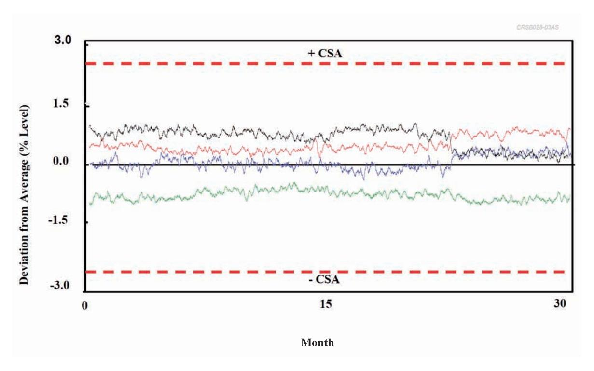

*FIG. IV–1. OLM data for four steam generator level transmitters from an operating nuclear power plant.*

In Fig. IV–1, the results of on-line monitoring (OLM) of four steam generator level transmitters in a nuclear power plant are shown. The difference between the average of the four transmitters and the individual readings are shown on the *y* axis as a function of time in months. The data are shown for a period of about 30 months of operation, and the four signals show no significant drift during this period. Furthermore, the deviation of the transmitters remains well within the allowable drift bands, shown on the figure by dashed lines in terms of channel statistical accuracy (CSA).

Consequently, one can conclude that the calibration of these transmitters did not change and, therefore, they do not need to be recalibrated because there is no drift and the deviation of the transmitters remains within their allowable band. If it is suspected that all four transmitters are drifting in an identical manner (drifting together in one direction), the data for deviation from the average would not reveal the drift. Therefore, to rule out any systematic or common drift, one of the four transmitters can be recalibrated. Alternatively, systematic drift can be ruled out using modelling techniques as described below.

### **IV–1.3. Identifying drift using modelling techniques**

Another approach for detecting systematic drift or determining drift in non-redundant signals is to obtain an independent estimate of the monitored process and track the estimate that can be evaluated from measurement of another variable. In addition, an in-depth knowledge of the process is needed to provide even an estimate of a parameter on the basis of physical models. Therefore, for on-line calibration monitoring, empirical models are often preferred. Such empirical models use empirical equations, neural networks, pattern recognition and sometimes a combination of these, including fuzzy logic for data clustering (see Refs [IV–1–IV–5]).

Before using the empirical model, it is first trained under a variety of operating conditions. As shown in Fig. IV–2, if the output parameter (Y) is to be estimated on the basis of measuring the input parameters X1, X2 and X3, then, during the training period, weighting factors are applied to the input variables. These factors are gradually adjusted until the difference between measured output and the output of the neural network is minimized. Such training can continue while the neural network learns the relationship between the three inputs and the single output, or while additional input and output signals are provided to minimize the error in the

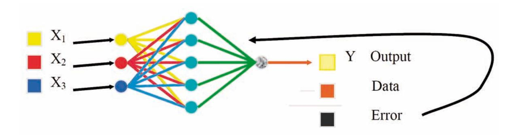

*FIG. IV–2. Illustration of training of a neural network.*

empirical model. Training of the model is complete when the measured output is nearly identical to the estimate generated by the neural network. Once the training is completed, the output of the model can be used for drift evaluation.

### **IV–1.4. On-line calibration monitoring system design**

An on-line calibration monitoring system might use a combination of averaging of redundant signals (averaging can be both straight and weighted), empirical modelling, physical modelling and calibrated reference sensor(s) in a configuration similar to the one shown in Fig. IV–3. In such a system, the raw data are first screened by a data qualification algorithm and then analysed to provide an estimate of the process parameters being monitored. In the case of averaging analysis, a consistency algorithm is used to make sure that a reasonable agreement exists among the redundant signals and that unreasonable readings are either excluded or weighted less than the others before the signals are averaged.

### **IV–1.5. Verifying calibration over the span of instruments**

To verify the calibration of instruments over their entire range, OLM data shall be collected during plant startup and/or shutdown episodes. With data from these episodes, the instrument calibration can be verified for a wide range. Figure IV–4 shows data for nine main steam pressure transmitters from the Sizewell B plant in the UK. This is a four-loop Westinghouse pressurized water reactor (PWR). In addition to the raw data, the deviation of each transmitter from the average of all nine transmitters is shown in Fig. IV–4. Also shown is the deviation of each transmitter as a function of span. It is apparent that eight of the nine transmitters remain within the allowable calibration bands that are shown in the figure by the dashed lines. The data are in gauge pressure in units of Bar (Barg).

At the Sizewell B plant, the on-line calibration monitoring approach has been used for two cycles with success. At the end of each cycle, a table of results is generated showing each transmitter by tag number, service and whether or not it needs to be calibrated during the outage. If OLM results show any transmitter to exceed its allowable calibration limit, then the transmitter is marked as 'bad' and scheduled for calibration. Otherwise, it is marked as 'good' and not calibrated. There is a time limit of eight years on calibration, meaning that each transmitter must be calibrated no less than once every eight years. Figure IV–5 shows representative results of on-line calibration monitoring. Of the 41 transmitters shown, only one was bad. This statistic is typical for nuclear power plant pressure transmitters.

### IV–2. REGULATORY ACCEPTANCE OF ON-LINE CALIBRATION MONITORING

The OLM approach for extending calibration intervals of pressure transmitters in nuclear power plants has received regulatory approval in both France and the USA [IV–6, IV–7]. The French approval was granted in 1996 and the US Nuclear Regulatory Commission (NRC) approval was granted in 2000. The NRC approval was

granted through a safety evaluation report that was issued in response to a topical report written by the Electric Power Research Institute [IV–8]. Both the NRC approval in the USA and the French regulatory approval are contingent upon a few important stipulations. Some examples of these stipulations are discussed below.

### **IV–2.1. Accounting for common mode drift**

OLM for extending transmitter calibration intervals must include the stipulation that at least one transmitter from each group of redundant transmitters be calibrated at each refuelling outage. Furthermore, this

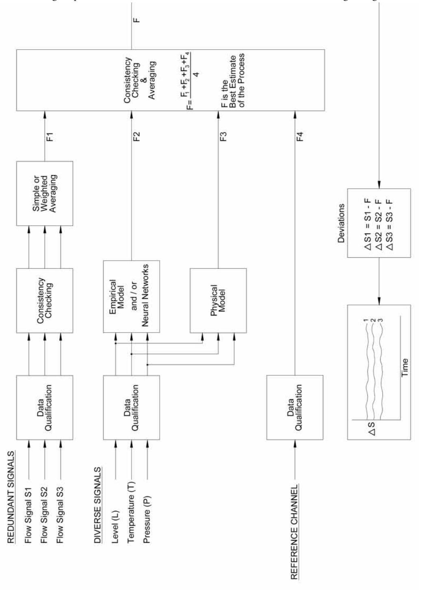

*FIG. IV–3. Conceptual design of an OLM system.*

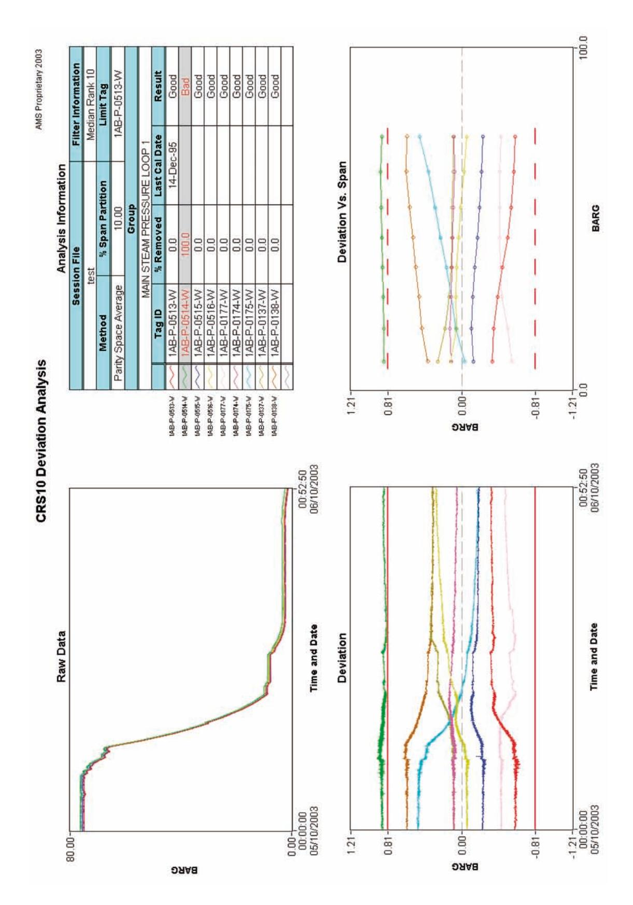

FIG. IV-4. Results of OLM analysis of shutdown data.

| Item | Group Name                                                                                                                                                                                                                                                                                                                                                                                                                                                                                                                                                                                                                                                                                                                                                                                                                                                                                                                                                                                                                                                                                                                                                                                                                                                                                                                                                                                                                                                                                                                                                                                                                                                                                                                                                                                                                                                                                                                                                                                                                                                                                                                    | Tag Name     | Result    | Max Deviation Bar    | Test Enginee  |
|------|-------------------------------------------------------------------------------------------------------------------------------------------------------------------------------------------------------------------------------------------------------------------------------------------------------------------------------------------------------------------------------------------------------------------------------------------------------------------------------------------------------------------------------------------------------------------------------------------------------------------------------------------------------------------------------------------------------------------------------------------------------------------------------------------------------------------------------------------------------------------------------------------------------------------------------------------------------------------------------------------------------------------------------------------------------------------------------------------------------------------------------------------------------------------------------------------------------------------------------------------------------------------------------------------------------------------------------------------------------------------------------------------------------------------------------------------------------------------------------------------------------------------------------------------------------------------------------------------------------------------------------------------------------------------------------------------------------------------------------------------------------------------------------------------------------------------------------------------------------------------------------------------------------------------------------------------------------------------------------------------------------------------------------------------------------------------------------------------------------------------------------|--------------|-----------|----------------------|---------------|
| 1    | MAIN STEAM PRESSURE LOOP 1                                                                                                                                                                                                                                                                                                                                                                                                                                                                                                                                                                                                                                                                                                                                                                                                                                                                                                                                                                                                                                                                                                                                                                                                                                                                                                                                                                                                                                                                                                                                                                                                                                                                                                                                                                                                                                                                                                                                                                                                                                                                                                    | 1AB-P-0513-W | Good      |                      | administrator |
| 2    | MAIN STEAM PRESSURE LOOP 1                                                                                                                                                                                                                                                                                                                                                                                                                                                                                                                                                                                                                                                                                                                                                                                                                                                                                                                                                                                                                                                                                                                                                                                                                                                                                                                                                                                                                                                                                                                                                                                                                                                                                                                                                                                                                                                                                                                                                                                                                                                                                                    | 1AB-P-0514-W | Bad       |                      | administrator |
| 3    | MAIN STEAM PRESSURE LOOP 1                                                                                                                                                                                                                                                                                                                                                                                                                                                                                                                                                                                                                                                                                                                                                                                                                                                                                                                                                                                                                                                                                                                                                                                                                                                                                                                                                                                                                                                                                                                                                                                                                                                                                                                                                                                                                                                                                                                                                                                                                                                                                                    | 1AB-P-0515-W | Good      |                      | administrator |
| 4    | MAIN STEAM PRESSURE LOOP 1                                                                                                                                                                                                                                                                                                                                                                                                                                                                                                                                                                                                                                                                                                                                                                                                                                                                                                                                                                                                                                                                                                                                                                                                                                                                                                                                                                                                                                                                                                                                                                                                                                                                                                                                                                                                                                                                                                                                                                                                                                                                                                    | 1AB-P-0516-W | Good      |                      | administrator |
| 5    | MAIN STEAM PRESSURE LOOP 1                                                                                                                                                                                                                                                                                                                                                                                                                                                                                                                                                                                                                                                                                                                                                                                                                                                                                                                                                                                                                                                                                                                                                                                                                                                                                                                                                                                                                                                                                                                                                                                                                                                                                                                                                                                                                                                                                                                                                                                                                                                                                                    | 1AB-P-0177-W | Good      |                      | administrator |
| 6    | MAIN STEAM PRESSURE LOOP 1                                                                                                                                                                                                                                                                                                                                                                                                                                                                                                                                                                                                                                                                                                                                                                                                                                                                                                                                                                                                                                                                                                                                                                                                                                                                                                                                                                                                                                                                                                                                                                                                                                                                                                                                                                                                                                                                                                                                                                                                                                                                                                    | 1AB-P-0174-W | Good      |                      | administrator |
| 7    | MAIN STEAM PRESSURE LOOP 1                                                                                                                                                                                                                                                                                                                                                                                                                                                                                                                                                                                                                                                                                                                                                                                                                                                                                                                                                                                                                                                                                                                                                                                                                                                                                                                                                                                                                                                                                                                                                                                                                                                                                                                                                                                                                                                                                                                                                                                                                                                                                                    | 1AB-P-0175-W | Good      |                      | administrator |
| 8    | MAIN STEAM PRESSURE LOOP 1                                                                                                                                                                                                                                                                                                                                                                                                                                                                                                                                                                                                                                                                                                                                                                                                                                                                                                                                                                                                                                                                                                                                                                                                                                                                                                                                                                                                                                                                                                                                                                                                                                                                                                                                                                                                                                                                                                                                                                                                                                                                                                    | 1AB-P-0137-W | Good      |                      | administrato  |
| 9    | MAIN STEAM PRESSURE LOOP 1                                                                                                                                                                                                                                                                                                                                                                                                                                                                                                                                                                                                                                                                                                                                                                                                                                                                                                                                                                                                                                                                                                                                                                                                                                                                                                                                                                                                                                                                                                                                                                                                                                                                                                                                                                                                                                                                                                                                                                                                                                                                                                    | 1AB-P-0138-W | Good      |                      | administrator |
| 10   | STEAM GENERATOR A LEVEL NR                                                                                                                                                                                                                                                                                                                                                                                                                                                                                                                                                                                                                                                                                                                                                                                                                                                                                                                                                                                                                                                                                                                                                                                                                                                                                                                                                                                                                                                                                                                                                                                                                                                                                                                                                                                                                                                                                                                                                                                                                                                                                                    | 1AE-L-0517-W | Good      |                      | administrator |
| 11   | STEAM GENERATOR A LEVEL NR                                                                                                                                                                                                                                                                                                                                                                                                                                                                                                                                                                                                                                                                                                                                                                                                                                                                                                                                                                                                                                                                                                                                                                                                                                                                                                                                                                                                                                                                                                                                                                                                                                                                                                                                                                                                                                                                                                                                                                                                                                                                                                    | 1AE-L-0518-W | Good      |                      | administrator |
| 12   | STEAM GENERATOR A LEVEL NR                                                                                                                                                                                                                                                                                                                                                                                                                                                                                                                                                                                                                                                                                                                                                                                                                                                                                                                                                                                                                                                                                                                                                                                                                                                                                                                                                                                                                                                                                                                                                                                                                                                                                                                                                                                                                                                                                                                                                                                                                                                                                                    | 1AE-L-0519-W | Good      |                      | administrator |
| 13   | STEAM GENERATOR A LEVEL NR                                                                                                                                                                                                                                                                                                                                                                                                                                                                                                                                                                                                                                                                                                                                                                                                                                                                                                                                                                                                                                                                                                                                                                                                                                                                                                                                                                                                                                                                                                                                                                                                                                                                                                                                                                                                                                                                                                                                                                                                                                                                                                    | 1AE-L-0551-W | Good      |                      | administrator |
| 14   | STEAM GENERATOR A LEVEL NR                                                                                                                                                                                                                                                                                                                                                                                                                                                                                                                                                                                                                                                                                                                                                                                                                                                                                                                                                                                                                                                                                                                                                                                                                                                                                                                                                                                                                                                                                                                                                                                                                                                                                                                                                                                                                                                                                                                                                                                                                                                                                                    | 1AE-L-0011-W | Good      |                      | administrator |
| 15   | STEAM GENERATOR A LEVEL NR                                                                                                                                                                                                                                                                                                                                                                                                                                                                                                                                                                                                                                                                                                                                                                                                                                                                                                                                                                                                                                                                                                                                                                                                                                                                                                                                                                                                                                                                                                                                                                                                                                                                                                                                                                                                                                                                                                                                                                                                                                                                                                    | 1AE-L-0012-W | Good      |                      | administrator |
| 16   | STEAM GENERATOR A LEVEL NR                                                                                                                                                                                                                                                                                                                                                                                                                                                                                                                                                                                                                                                                                                                                                                                                                                                                                                                                                                                                                                                                                                                                                                                                                                                                                                                                                                                                                                                                                                                                                                                                                                                                                                                                                                                                                                                                                                                                                                                                                                                                                                    | 1AE-L-0013-W | Good      |                      | administrato  |
| 17   | STEAM GENERATOR A LEVEL NR                                                                                                                                                                                                                                                                                                                                                                                                                                                                                                                                                                                                                                                                                                                                                                                                                                                                                                                                                                                                                                                                                                                                                                                                                                                                                                                                                                                                                                                                                                                                                                                                                                                                                                                                                                                                                                                                                                                                                                                                                                                                                                    | 1AE-L-0014-W | Good      |                      | administrator |
| 18   | STEAM GENERATOR B LEVEL NR                                                                                                                                                                                                                                                                                                                                                                                                                                                                                                                                                                                                                                                                                                                                                                                                                                                                                                                                                                                                                                                                                                                                                                                                                                                                                                                                                                                                                                                                                                                                                                                                                                                                                                                                                                                                                                                                                                                                                                                                                                                                                                    | 1AE-L-0527-W | Good      |                      | administrator |
| 19   | STEAM GENERATOR B LEVEL NR                                                                                                                                                                                                                                                                                                                                                                                                                                                                                                                                                                                                                                                                                                                                                                                                                                                                                                                                                                                                                                                                                                                                                                                                                                                                                                                                                                                                                                                                                                                                                                                                                                                                                                                                                                                                                                                                                                                                                                                                                                                                                                    | 1AE-L-0528-W | Good      |                      | administrato  |
| 20   | STEAM GENERATOR B LEVEL NR                                                                                                                                                                                                                                                                                                                                                                                                                                                                                                                                                                                                                                                                                                                                                                                                                                                                                                                                                                                                                                                                                                                                                                                                                                                                                                                                                                                                                                                                                                                                                                                                                                                                                                                                                                                                                                                                                                                                                                                                                                                                                                    | 1AE-L-0529-W | Good      |                      | administrato  |
| 21   | STEAM GENERATOR B LEVEL NR                                                                                                                                                                                                                                                                                                                                                                                                                                                                                                                                                                                                                                                                                                                                                                                                                                                                                                                                                                                                                                                                                                                                                                                                                                                                                                                                                                                                                                                                                                                                                                                                                                                                                                                                                                                                                                                                                                                                                                                                                                                                                                    | 1AE-L-0552-W | Good      |                      | administrato  |
| 22   | STEAM GENERATOR B LEVEL NR                                                                                                                                                                                                                                                                                                                                                                                                                                                                                                                                                                                                                                                                                                                                                                                                                                                                                                                                                                                                                                                                                                                                                                                                                                                                                                                                                                                                                                                                                                                                                                                                                                                                                                                                                                                                                                                                                                                                                                                                                                                                                                    | 1AE-L-0021-W | Good      |                      | administrato  |
| 23   | STEAM GENERATOR B LEVEL NR                                                                                                                                                                                                                                                                                                                                                                                                                                                                                                                                                                                                                                                                                                                                                                                                                                                                                                                                                                                                                                                                                                                                                                                                                                                                                                                                                                                                                                                                                                                                                                                                                                                                                                                                                                                                                                                                                                                                                                                                                                                                                                    | 1AE-L-0022-W | Good      |                      | administrator |
| 24   | STEAM GENERATOR B LEVEL NR                                                                                                                                                                                                                                                                                                                                                                                                                                                                                                                                                                                                                                                                                                                                                                                                                                                                                                                                                                                                                                                                                                                                                                                                                                                                                                                                                                                                                                                                                                                                                                                                                                                                                                                                                                                                                                                                                                                                                                                                                                                                                                    | 1AE-L-0023-W | Good      |                      | administrator |
| 25   | STEAM GENERATOR B LEVEL NR                                                                                                                                                                                                                                                                                                                                                                                                                                                                                                                                                                                                                                                                                                                                                                                                                                                                                                                                                                                                                                                                                                                                                                                                                                                                                                                                                                                                                                                                                                                                                                                                                                                                                                                                                                                                                                                                                                                                                                                                                                                                                                    | 1AE-L-0024-W | Good      |                      | administrato  |
| 26   | STEAM GENERATOR C LEVEL NR                                                                                                                                                                                                                                                                                                                                                                                                                                                                                                                                                                                                                                                                                                                                                                                                                                                                                                                                                                                                                                                                                                                                                                                                                                                                                                                                                                                                                                                                                                                                                                                                                                                                                                                                                                                                                                                                                                                                                                                                                                                                                                    | 1AE-L-0537-W | Good      |                      | administrato  |
| 27   | STEAM GENERATOR C LEVEL NR                                                                                                                                                                                                                                                                                                                                                                                                                                                                                                                                                                                                                                                                                                                                                                                                                                                                                                                                                                                                                                                                                                                                                                                                                                                                                                                                                                                                                                                                                                                                                                                                                                                                                                                                                                                                                                                                                                                                                                                                                                                                                                    | 1AE-L-0538-W | Good      |                      | administrato  |
| 28   | STEAM GENERATOR C LEVEL NR                                                                                                                                                                                                                                                                                                                                                                                                                                                                                                                                                                                                                                                                                                                                                                                                                                                                                                                                                                                                                                                                                                                                                                                                                                                                                                                                                                                                                                                                                                                                                                                                                                                                                                                                                                                                                                                                                                                                                                                                                                                                                                    | 1AE-L-0539-W | Good      |                      | administrator |
| 29   | STEAM GENERATOR C LEVEL NR                                                                                                                                                                                                                                                                                                                                                                                                                                                                                                                                                                                                                                                                                                                                                                                                                                                                                                                                                                                                                                                                                                                                                                                                                                                                                                                                                                                                                                                                                                                                                                                                                                                                                                                                                                                                                                                                                                                                                                                                                                                                                                    | 1AE-L-0553-W | Good      |                      | administrator |
| 30   | STEAM GENERATOR C LEVEL NR                                                                                                                                                                                                                                                                                                                                                                                                                                                                                                                                                                                                                                                                                                                                                                                                                                                                                                                                                                                                                                                                                                                                                                                                                                                                                                                                                                                                                                                                                                                                                                                                                                                                                                                                                                                                                                                                                                                                                                                                                                                                                                    | 1AE-L-0031-W | Good      |                      | administrato  |
| 31   | STEAM GENERATOR C LEVEL NR                                                                                                                                                                                                                                                                                                                                                                                                                                                                                                                                                                                                                                                                                                                                                                                                                                                                                                                                                                                                                                                                                                                                                                                                                                                                                                                                                                                                                                                                                                                                                                                                                                                                                                                                                                                                                                                                                                                                                                                                                                                                                                    | 1AE-L-0032-W | Good      |                      | administrator |
| 32   | STEAM GENERATOR C LEVEL NR                                                                                                                                                                                                                                                                                                                                                                                                                                                                                                                                                                                                                                                                                                                                                                                                                                                                                                                                                                                                                                                                                                                                                                                                                                                                                                                                                                                                                                                                                                                                                                                                                                                                                                                                                                                                                                                                                                                                                                                                                                                                                                    | 1AE-L-0033-W | Good      |                      | administrato  |
| 33   | STEAM GENERATOR C LEVEL NR                                                                                                                                                                                                                                                                                                                                                                                                                                                                                                                                                                                                                                                                                                                                                                                                                                                                                                                                                                                                                                                                                                                                                                                                                                                                                                                                                                                                                                                                                                                                                                                                                                                                                                                                                                                                                                                                                                                                                                                                                                                                                                    | 1AE-L-0034-W | Good      |                      | administrato  |
| 34   | STEAM GENERATOR D LEVEL NR                                                                                                                                                                                                                                                                                                                                                                                                                                                                                                                                                                                                                                                                                                                                                                                                                                                                                                                                                                                                                                                                                                                                                                                                                                                                                                                                                                                                                                                                                                                                                                                                                                                                                                                                                                                                                                                                                                                                                                                                                                                                                                    | 1AE-L-0547-W | Good      |                      | administrator |
| 35   | STEAM GENERATOR D LEVEL NR                                                                                                                                                                                                                                                                                                                                                                                                                                                                                                                                                                                                                                                                                                                                                                                                                                                                                                                                                                                                                                                                                                                                                                                                                                                                                                                                                                                                                                                                                                                                                                                                                                                                                                                                                                                                                                                                                                                                                                                                                                                                                                    | 1AE-L-0548-W | Good      |                      | administrato  |
| 36   | STEAM GENERATOR D LEVEL NR                                                                                                                                                                                                                                                                                                                                                                                                                                                                                                                                                                                                                                                                                                                                                                                                                                                                                                                                                                                                                                                                                                                                                                                                                                                                                                                                                                                                                                                                                                                                                                                                                                                                                                                                                                                                                                                                                                                                                                                                                                                                                                    | 1AE-L-0549-W | Good      |                      | administrator |
| 37   | STEAM GENERATOR D LEVEL NR                                                                                                                                                                                                                                                                                                                                                                                                                                                                                                                                                                                                                                                                                                                                                                                                                                                                                                                                                                                                                                                                                                                                                                                                                                                                                                                                                                                                                                                                                                                                                                                                                                                                                                                                                                                                                                                                                                                                                                                                                                                                                                    | 1AE-L-0554-W | Good      |                      | administrato  |
| 38   | STEAM GENERATOR D LEVEL NR                                                                                                                                                                                                                                                                                                                                                                                                                                                                                                                                                                                                                                                                                                                                                                                                                                                                                                                                                                                                                                                                                                                                                                                                                                                                                                                                                                                                                                                                                                                                                                                                                                                                                                                                                                                                                                                                                                                                                                                                                                                                                                    | 1AE-L-0041-W | Good      |                      | administrator |
| 39   | STEAM GENERATOR D LEVEL NR                                                                                                                                                                                                                                                                                                                                                                                                                                                                                                                                                                                                                                                                                                                                                                                                                                                                                                                                                                                                                                                                                                                                                                                                                                                                                                                                                                                                                                                                                                                                                                                                                                                                                                                                                                                                                                                                                                                                                                                                                                                                                                    | 1AE-L-0042-W | Good      |                      | administrato  |
| 40   | STEAM GENERATOR D LEVEL NR                                                                                                                                                                                                                                                                                                                                                                                                                                                                                                                                                                                                                                                                                                                                                                                                                                                                                                                                                                                                                                                                                                                                                                                                                                                                                                                                                                                                                                                                                                                                                                                                                                                                                                                                                                                                                                                                                                                                                                                                                                                                                                    | 1AE-L-0043-W | Good      |                      | administrato  |
| 41   | STEAM GENERATOR D LEVEL NR                                                                                                                                                                                                                                                                                                                                                                                                                                                                                                                                                                                                                                                                                                                                                                                                                                                                                                                                                                                                                                                                                                                                                                                                                                                                                                                                                                                                                                                                                                                                                                                                                                                                                                                                                                                                                                                                                                                                                                                                                                                                                                    | 1AE-L-0044-W | Good      |                      | administrator |
|      | to provide the office of the Milliam of Milliam of Milliam of the Milliam of the Milliam of the Milliam of the Milliam of the Milliam of the Milliam of the Milliam of the Milliam of the Milliam of the Milliam of the Milliam of the Milliam of the Milliam of the Milliam of the Milliam of the Milliam of the Milliam of the Milliam of the Milliam of the Milliam of the Milliam of the Milliam of the Milliam of the Milliam of the Milliam of the Milliam of the Milliam of the Milliam of the Milliam of the Milliam of the Milliam of the Milliam of the Milliam of the Milliam of the Milliam of the Milliam of the Milliam of the Milliam of the Milliam of the Milliam of the Milliam of the Milliam of the Milliam of the Milliam of the Milliam of the Milliam of the Milliam of the Milliam of the Milliam of the Milliam of the Milliam of the Milliam of the Milliam of the Milliam of the Milliam of the Milliam of the Milliam of the Milliam of the Milliam of the Milliam of the Milliam of the Milliam of the Milliam of the Milliam of the Milliam of the Milliam of the Milliam of the Milliam of the Milliam of the Milliam of the Milliam of the Milliam of the Milliam of the Milliam of the Milliam of the Milliam of the Milliam of the Milliam of the Milliam of the Milliam of the Milliam of the Milliam of the Milliam of the Milliam of the Milliam of the Milliam of the Milliam of the Milliam of the Milliam of the Milliam of the Milliam of the Milliam of the Milliam of the Milliam of the Milliam of the Milliam of the Milliam of the Milliam of the Milliam of the Milliam of the Milliam of the Milliam of the Milliam of the Milliam of the Milliam of the Milliam of the Milliam of the Milliam of the Milliam of the Milliam of the Milliam of the Milliam of the Milliam of the Milliam of the Milliam of the Milliam of the Milliam of the Milliam of the Milliam of the Milliam of the Milliam of the Milliam of the Milliam of the Milliam of the Milliam of the Milliam of the Milliam of the Milliam of the Milliam of the Milliam of the Milliam of the Milliam of the | # Good       | 40        |                      |               |
|      |                                                                                                                                                                                                                                                                                                                                                                                                                                                                                                                                                                                                                                                                                                                                                                                                                                                                                                                                                                                                                                                                                                                                                                                                                                                                                                                                                                                                                                                                                                                                                                                                                                                                                                                                                                                                                                                                                                                                                                                                                                                                                                                               | # Bad        | 1         |                      |               |
|      |                                                                                                                                                                                                                                                                                                                                                                                                                                                                                                                                                                                                                                                                                                                                                                                                                                                                                                                                                                                                                                                                                                                                                                                                                                                                                                                                                                                                                                                                                                                                                                                                                                                                                                                                                                                                                                                                                                                                                                                                                                                                                                                               |              |           |                      |               |
|      | AMS Proprietary 2003                                                                                                                                                                                                                                                                                                                                                                                                                                                                                                                                                                                                                                                                                                                                                                                                                                                                                                                                                                                                                                                                                                                                                                                                                                                                                                                                                                                                                                                                                                                                                                                                                                                                                                                                                                                                                                                                                                                                                                                                                                                                                                          | **=          | Comment · | 2.00 -1.00 0.00 1.00 | 2.00          |

*FIG. IV–5. Representative results of on-line calibration monitoring of pressure transmitters at the Sizewell B plant.*

calibration shall be performed on a rotational basis so that every transmitter in the redundant group is calibrated at least once every eight years, even if a particular transmitter has shown no calibration problems during the OLM process. This eight-year limit was established based on the fact that a majority of services, at least in US plants, typically have four redundant transmitters and the length of an operating cycle is typically about two years.

### **IV–2.2. Quality assurance requirements**

According to the NRC, all software modules used for acquisition and analysis of OLM data must be developed under a formal quality assurance programme to include software verification and validation and formal procedures for handling of the OLM data and the results. Furthermore, the calibration of OLM equipment that collects the data must be verified using calibration standards that are traceable to a national organization such as the National Institute of Standards and Technology. Also, prior to implementing on-line calibration monitoring, the user must examine the historical calibration data for the plant pressure transmitters and demonstrate that the transmitters have had a good history of stable and acceptable calibrations.

### **IV–2.3. Data collection frequency**

There is no specific requirement for the sampling frequency of OLM data or the type of equipment that may be used. The options range from very infrequent data collection (i.e. once a cycle near the end of the cycle to demonstrate that the transmitters are still within their allowable calibration band) to continuous sampling of the data using the plant computer or a dedicated data acquisition system. However, if any modelling technique is to be used, computer data acquisition at relatively high sampling rates would be required. Furthermore, the signals that are modelled together may have to be sampled simultaneously as the plant operates.

## **REFERENCES**

- [IV–1] HASHEMIAN, H.M., On-Line Testing of Calibration of Process Instrumentation Channels in Nuclear Power Plants, Rep. NUREG/CR-6343, Nuclear Regulatory Commission, US Govt Printing Office, Washington, DC (1995).
- [IV–2] HASHEMIAN, H.M., et al., Advanced Instrumentation and Maintenance Technologies for Nuclear Power Plants, Rep. NUREG/CR-5501, Nuclear Regulatory Commission, US Govt Printing Office, Washington, DC (1998).
- [IV–3] TSOUKALAS, I.H., UHRIG, R.E., Fuzzy and Neural Approaches in Engineering, John Wiley and Sons, New York (1997).
- [IV–4] FANTONI, P.F., FIGEDY, S., PAPIN, B., "A neuro-fuzzy model applied to full range signal validation of PWR nuclear power plant data", paper presented at the Second OFCD Specialist Meeting on Operator Aids for Severe Accident Management, Lyon, 1997.
- [IV–5] UPADHYAYA, B.R., GLOCKER, O., EKLUND, J.J., Multivariate statistical signal processing technique for fault detection and diagnostics, ISA Trans. **29** 4 (1990) 79–95.
- [IV–6] DORR, R., KRATZ, F., RAGOT, J., LOISY, F., GERMAIN, J.-L., Detection, isolation, and identification of sensor faults in nuclear power plants, IEEE Trans. Contr. Syst. Technol., Jan. (1997).
- [IV–7] Application of On-Line Performance Monitoring to Extend Calibration Intervals of Instrument Channel Calibrations Required by the Technical Specifications, Nuclear Regulatory Commission, Office of Nuclear Regulatory Regulation, Washington, DC (2000).
- [IV–8] ELECTRIC POWER RESEARCH INSTITUTE, On-Line Monitoring of Instrument Channel Performance, Rep. EPRI TR-104965-R1, EPRI, Palo Alto, CA (2000).

## **CONTRIBUTORS TO DRAFTING AND REVIEW**

Berg, Ø. Institute for Energy Technology, Norway

Bergdahl, B.G. GSE Power Systems AB, Sweden Eiler, J. Paks nuclear power plant, Hungary Glöckler, O. International Atomic Energy Agency

Hashemian, H.M. Analysis and Measurement Services Corporation, United States of America

Hines, W. University of Tennessee, United States of America

Holcomb, D. Oak Ridge National Laboratory, United States of America Ju, H.W. Korea Hydro & Nuclear Power Company, Republic of Korea Koo, I.S. Korea Atomic Energy Research Institute, Republic of Korea

Lillis, D. Sizewell B nuclear power plant, United Kingdom

Orme, S. British Energy, United Kingdom Patino, A. Zorita nuclear power plant, Spain

Rasmussen, B. Electric Power Research Institute, United States of America Shaffer, R. Nuclear Regulatory Commission, United States of America Shankar, R. Electric Power Research Institute, United States of America

Slanina, M. VUJE, Slovakia

Zhu, O.P. Korea Institute of Nuclear Safety, Republic of Korea

### **Consultants Meetings**

Vienna, Austria: 15–18 March 2004, 14–18 March 2005

### **Technical Meeting**

Halden, Norway: 27–29 September 2004

## **IAEA NUCLEAR ENERGY SERIES PUBLICATIONS**

## STRUCTURE OF THE IAEA NUCLEAR ENERGY SERIES

Under the terms of Article III.A. and VIII.C. of its Statute, the IAEA is authorized to foster the exchange of scientific and technical information on the peaceful uses of atomic energy. The publications in the **IAEA Nuclear Energy Series** provide information in the areas of nuclear power, nuclear fuel cycle, radioactive waste management and decommissioning, and on general issues that are relevant to all of the above mentioned areas. The structure of the IAEA Nuclear Energy Series comprises three levels: **1 — Basic Principles and Objectives; 2 — Guides; and 3 — Technical Reports.**

The **Nuclear Energy Basic Principles** publication describes the rationale and vision for the peaceful uses of nuclear energy.

**Nuclear Energy Series Objectives** publications explain the expectations to be met in various areas at different stages of implementation.

**Nuclear Energy Series Guides** provide high level guidance on how to achieve the objectives related to the various topics and areas involving the peaceful uses of nuclear energy.

**Nuclear Energy Series Technical Reports** provide additional, more detailed, information on activities related to the various areas dealt with in the IAEA Nuclear Energy Series.

The IAEA Nuclear Energy Series publications are coded as follows: **NG** — general; **NP** — nuclear power; **NF** — nuclear fuel; **NW** — radioactive waste management and decommissioning. In addition, the publications are available in English on the IAEA's Internet site:

## http://www.iaea.org/Publications/index.html

For further information, please contact the IAEA at P.O. Box 100, Wagramer Strasse 5, 1400 Vienna, Austria.

All users of the IAEA Nuclear Energy Series publications are invited to inform the IAEA of experience in their use for the purpose of ensuring that they continue to meet user needs. Information may be provided via the IAEA Internet site, by post, at the address given above, or by email to Official.Mail@iaea.org.