# **IAEA Nuclear Energy Series**

No. NP-T-1.2

Basic Principles

**Objectives** 

**Guides** 

Technical Reports On-line Monitoring for Improving Performance of Nuclear Power Plants Part 2: Process and Component Condition Monitoring and Diagnostics


# ON-LINE MONITORING FOR IMPROVING PERFORMANCE OF NUCLEAR POWER PLANTS PART 2: PROCESS AND COMPONENT CONDITION MONITORING AND DIAGNOSTICS

The following States are Members of the International Atomic Energy Agency:

AFGHANISTAN ALBANIA ALGERIA ANGOLA ARGENTINA ARMENIA GUATEMALA HAITI HOLY SEE HONDURAS HUNGARY ICELAND PAKISTAN PALAU PANAMA PARAGUAY PERU PHILIPPINES

AUSTRALIA AUSTRIA AZERBAIJAN INDIA INDONESIA IRAN, ISLAMIC REPUBLIC OF POLAND PORTUGAL QATAR

BANGLADESH IRAQ REPUBLIC OF MOLDOVA

BELARUS BELGIUM IRELAND ISRAEL ROMANIA

BELIZE BENIN BOLIVIA BOSNIA AND HERZEGOVINA BOTSWANA BRAZIL BULGARIA BURKINA FASO ITALY JAMAICA JAPAN JORDAN KAZAKHSTAN KENYA KOREA, REPUBLIC OF KUWAIT RUSSIAN FEDERATION SAUDI ARABIA SENEGAL SERBIA SEYCHELLES SIERRA LEONE SINGAPORE SLOVAKIA

CAMEROON CANADA CENTRAL AFRICAN REPUBLIC CHAD KYRGYZSTAN LATVIA LEBANON LIBERIA LIBYAN ARAB JAMAHIRIYA SOUTH AFRICA SPAIN SRI LANKA SUDAN

CHILE CHINA LIECHTENSTEIN LITHUANIA SWEDEN SWITZERLAND

COLOMBIA LUXEMBOURG SYRIAN ARAB REPUBLIC

SLOVENIA

COSTA RICA CÔTE D'IVOIRE MADAGASCAR MALAWI TAJIKISTAN THAILAND

CROATIA CUBA MALAYSIA MALI THE FORMER YUGOSLAV REPUBLIC OF MACEDONIA

CYPRUS CZECH REPUBLIC DEMOCRATIC REPUBLIC OF THE CONGO DENMARK MALTA MARSHALL ISLANDS MAURITANIA MAURITIUS MEXICO TUNISIA TURKEY UGANDA UKRAINE

DOMINICAN REPUBLIC ECUADOR EGYPT EL SALVADOR ERITREA MONACO MONGOLIA MONTENEGRO MOROCCO MOZAMBIQUE UNITED ARAB EMIRATES UNITED KINGDOM OF GREAT BRITAIN AND NORTHERN IRELAND UNITED REPUBLIC OF TANZANIA

ESTONIA ETHIOPIA MYANMAR NAMIBIA UNITED STATES OF AMERICA

FINLAND FRANCE GABON GEORGIA GERMANY GHANA GREECE NEPAL NETHERLANDS NEW ZEALAND NICARAGUA NIGER NIGERIA NORWAY URUGUAY UZBEKISTAN VENEZUELA VIETNAM YEMEN ZAMBIA ZIMBABWE

The Agency's Statute was approved on 23 October 1956 by the Conference on the Statute of the IAEA held at United Nations Headquarters, New York; it entered into force on 29 July 1957. The Headquarters of the Agency are situated in Vienna. Its principal objective is "to accelerate and enlarge the contribution of atomic energy to peace, health and prosperity throughout the world''.

# ON-LINE MONITORING FOR IMPROVING PERFORMANCE OF NUCLEAR POWER PLANTS PART 2: PROCESS AND COMPONENT CONDITION MONITORING AND DIAGNOSTICS

#### **COPYRIGHT NOTICE**

All IAEA scientific and technical publications are protected by the terms of the Universal Copyright Convention as adopted in 1952 (Berne) and as revised in 1972 (Paris). The copyright has since been extended by the World Intellectual Property Organization (Geneva) to include electronic and virtual intellectual property. Permission to use whole or parts of texts contained in IAEA publications in printed or electronic form must be obtained and is usually subject to royalty agreements. Proposals for non-commercial reproductions and translations are welcomed and considered on a case-by-case basis. Enquiries should be addressed to the IAEA Publishing Section at:

Sales and Promotion, Publishing Section International Atomic Energy Agency Wagramer Strasse 5 P.O. Box 100 1400 Vienna, Austria fax: +43 1 2600 29302 tel.: +43 1 2600 22417

email: sales.publications@iaea.org

http://www.iaea.org/books

© IAEA, 2008

Printed by the IAEA in Austria September 2008 STI/PUB/1323

#### **IAEA Library Cataloguing in Publication Data**

On-line monitoring for improving performance of nuclear power plants. Part 2, Process and component condition monitoring and diagnostics. — Vienna : International Atomic Energy Agency, 2008. p. ; 29 cm. — (IAEA nuclear energy series, ISSN 1995–7807 ; no. NP-T-1.2) STI/PUB/1323 ISBN 978–92–0–101208–1 Includes bibliographical references. 1. Nuclear power plants — Safety measures. 2. Nuclear power plants — Management. I. International Atomic Energy Agency. II. Series.

IAEAL 08–00538

# **FOREWORD**

The IAEA's work in the area of nuclear power plant operating performance and life cycle management is aimed at enhancing the capability of Member States to utilize good engineering and management practices developed and transferred by the IAEA. In particular, the IAEA supports activities such as improving nuclear power plant performance, plant life management, training, power uprating, operational licence renewal, and modernization of the instrumentation and control systems of nuclear power plants in Member States.

The subject of improving the performance of nuclear power plants by utilizing on-line condition monitoring of instrumentation and control systems in plants was suggested by the Technical Working Group on Nuclear Power Plant Control and Instrumentation (TWG-NPPCI) in 2003. It was then approved by the IAEA and included in its work programmes for 2004–2007.

This is the second report on the use of on-line monitoring (OLM) in nuclear power plants. The first report, On-Line Monitoring for Improving Performance of Nuclear Power Plants, Part 1: Instrument Channel Monitoring (IAEA Nuclear Energy Series No. NP-T-1.1), focused on application of OLM to verify the static (calibration) and dynamic (response time) performance of process instruments in nuclear power plants. This second report extends the application of OLM to equipment and process condition monitoring encompassing an array of technologies, including vibration monitoring, acoustic monitoring, loose parts monitoring, motor current signature analysis and noise diagnostics, as well as vibration analysis of the reactor core and the primary circuit.

Furthermore, this report includes the application of modelling technologies for equipment and process condition monitoring. A majority of these technologies depend on existing data from existing sensors and first principles models to estimate equipment and process behaviour using empirical and physical modelling techniques. In doing so, pattern recognition tools such as neural networks, fuzzy classification of data, multivariate state estimation and other means are used. These means are described in this report, and examples of their application and implementation are provided.

It should be pointed out that OLM data are routinely collected in nuclear power plants for a variety of purposes, but that these data are not often trended or used for long term predictive maintenance purposes. This report promotes the idea of trending such data and provides guidance on how this trending may be performed to yield a new maintenance tool for nuclear power plants.

This report was produced by experts and advisors from numerous IAEA Member States. Particular appreciation is due to H.M. Hashemian (United States of America), who served as Chair of the drafting committee and the IAEA committee meetings for this report. J. Eiler (Hungary) was Chair of the consultants meeting where the report was completed in May 2007. The IAEA officer responsible for this publication was O. Glöckler of the Division of Nuclear Power.

#### *EDITORIAL NOTE*

*This report has been edited by the editorial staff of the IAEA to the extent considered necessary for the reader's assistance. Although great care has been taken to maintain the accuracy of information contained in this publication, neither the IAEA nor its Member States assume any responsibility for consequences which may arise from its use.*

*The use of particular designations of countries or territories does not imply any judgement by the publisher, the IAEA, as to the legal status of such countries or territories, of their authorities and institutions or of the delimitation of their boundaries.*

*The mention of names of specific companies or products (whether or not indicated as registered) does not imply any intention to infringe proprietary rights, nor should it be construed as an endorsement or recommendation on the part of the IAEA.*

# **CONTENTS**

| 1. |      | INTRODUCTION<br>1                                                             |  |  |  |
|----|------|-------------------------------------------------------------------------------|--|--|--|
|    | 1.1. | Objective<br>1                                                                |  |  |  |
|    | 1.2. | Historical background<br>1                                                    |  |  |  |
|    | 1.3. | Description of on-line condition monitoring<br>1                              |  |  |  |
|    | 1.4. | Examples of on-line condition monitoring techniques<br>2                      |  |  |  |
|    |      | 1.4.1.<br>Vibration monitoring<br>2                                           |  |  |  |
|    |      | 1.4.2.<br>Acoustic monitoring<br>2                                            |  |  |  |
|    |      | 1.4.3.<br>Loose parts monitoring<br>2                                         |  |  |  |
|    |      | 1.4.4.<br>Reactor noise analysis<br>3                                         |  |  |  |
|    |      | 1.4.5.<br>Motor electrical signature analysis<br>3                            |  |  |  |
|    |      | 1.4.6.<br>Modelling techniques<br>3                                           |  |  |  |
|    |      |                                                                               |  |  |  |
| 2. |      | BENEFITS OF ON-LINE CONDITION MONITORING<br>4                                 |  |  |  |
|    | 2.1. | Plant safety<br>4                                                             |  |  |  |
|    | 2.2. | Plant ageing management<br>5                                                  |  |  |  |
|    | 2.3. | Economic<br>5                                                                 |  |  |  |
|    | 2.4. | Plant availability and performance<br>6                                       |  |  |  |
|    | 2.5. | Maintenance<br>6                                                              |  |  |  |
|    | 2.6. | Knowledge identification and capture<br>6                                     |  |  |  |
| 3. |      | DESCRIPTION OF CONDITION MONITORING TECHNIQUES<br>7                           |  |  |  |
|    | 3.1. | Vibration monitoring<br>7                                                     |  |  |  |
|    | 3.2. | Acoustic monitoring<br>10                                                     |  |  |  |
|    |      | 3.2.1.<br>Acoustic monitoring of processes<br><br>10                          |  |  |  |
|    |      | 3.2.2.<br>Acoustic monitoring of components<br>10                             |  |  |  |
|    |      | 3.2.3.<br>Acoustic emission monitoring<br>11                                  |  |  |  |
|    |      | 3.2.4.<br>Acoustic leakage monitoring<br>11                                   |  |  |  |
|    | 3.3. | Loose parts monitoring<br>13                                                  |  |  |  |
|    |      | 3.3.1.<br>Definitions<br>13                                                   |  |  |  |
|    |      | 3.3.2.<br>Discrimination algorithms<br>14                                     |  |  |  |
|    |      | 3.3.3.<br>Source localization and mass estimation<br>15                       |  |  |  |
|    |      | 3.3.4.<br>Utilization of results<br>16                                        |  |  |  |
|    | 3.4. | Reactor noise analysis technology<br>17                                       |  |  |  |
|    |      | 3.4.1.<br>Spectral methods<br>17                                              |  |  |  |
|    |      | 3.4.2.<br>Surveillance or monitoring<br>18                                    |  |  |  |
|    |      | 3.4.3.<br>Direct diagnostics<br>18                                            |  |  |  |
|    |      | 3.4.4.<br>Implementation of reactor noise analysis applications<br>18         |  |  |  |
|    |      | 3.4.5.<br>Required data acquisition systems<br>19                             |  |  |  |
|    |      | 3.4.5.1.<br>Isolation requirements<br>19                                      |  |  |  |
|    |      | 3.4.5.2.<br>Analogue signal conditioning<br>19                                |  |  |  |
|    |      | 3.4.5.3.<br>Plant conditions for data acquisition<br>20                       |  |  |  |
|    |      | 3.4.6.<br>Core barrel vibration diagnostics in PWRs<br>20                     |  |  |  |
|    |      | 3.4.7.<br>Control rod vibrations in PWRs<br>22                                |  |  |  |
|    |      | 3.4.8.<br>Core flow measurements with neutron noise in PWRs<br>23             |  |  |  |
|    |      | 3.4.9.<br>Measurements of the moderator temperature coefficient in PWRs<br>23 |  |  |  |
|    |      | 3.4.10. Flow measurements in PWRs<br>24                                       |  |  |  |
|    |      | 3.4.11. Data acquisition for noise analysis in PHWRs<br>24                    |  |  |  |
|    |      | 3.4.12. Vibration of fuel channels detected by ICFD noise analysis<br>24      |  |  |  |
|    |      |                                                                               |  |  |  |

|    |      | 3.4.13. Vibration of detector tubes detected by ICFD noise analysis | 27 |  |  |  |
|----|------|---------------------------------------------------------------------|----|--|--|--|
|    |      | 3.4.14. Two-phase flow diagnostics and the local component in BWRs  | 28 |  |  |  |
|    |      | 3.4.15. BWR instability                                             | 28 |  |  |  |
|    |      | 3.4.16. Impacting of detector tubes in BWRs                         | 29 |  |  |  |
|    | 3.5. | Motor electrical signature analysis                                 | 30 |  |  |  |
|    |      | 3.5.1.<br>Motor current signature analysis                          | 30 |  |  |  |
|    |      | 3.5.2.<br>Motor power signature analysis                            | 31 |  |  |  |
|    |      |                                                                     |    |  |  |  |
| 4. |      | MODELLING TECHNIQUES                                                | 32 |  |  |  |
|    | 4.1. | Empirical modelling                                                 | 34 |  |  |  |
|    |      | 4.1.1.<br>Requirements                                              | 34 |  |  |  |
|    |      | 4.1.2.<br>Neural networks                                           | 36 |  |  |  |
|    |      | 4.1.2.1.<br>Strengths and weaknesses                                | 37 |  |  |  |
|    |      | 4.1.2.2.<br>Applications                                            | 37 |  |  |  |
|    |      | 4.1.3.<br>Local polynomial regression                               | 37 |  |  |  |
|    |      | 4.1.3.1.<br>Strengths and weaknesses                                | 38 |  |  |  |
|    |      | 4.1.3.2.<br>Current applications                                    | 38 |  |  |  |
|    |      | 4.1.4.<br>Transformation based techniques                           | 38 |  |  |  |
|    |      | 4.1.4.1.<br>Strengths and weaknesses                                | 39 |  |  |  |
|    |      | 4.1.4.2.<br>Applications                                            | 39 |  |  |  |
|    | 4.2. | Physical modelling                                                  | 39 |  |  |  |
|    |      | 4.2.1.<br>Requirements                                              | 40 |  |  |  |
|    |      |                                                                     |    |  |  |  |
|    |      | 4.2.1.1.<br>Strengths and weaknesses                                | 41 |  |  |  |
|    |      | 4.2.2.<br>Applications                                              | 41 |  |  |  |
|    | 4.3. | Related techniques                                                  | 41 |  |  |  |
|    |      | 4.3.1.<br>Fuzzy logic                                               | 42 |  |  |  |
|    |      | 4.3.2.<br>Multilevel flow modelling                                 | 42 |  |  |  |
| 5. |      | ON-LINE MONITORING IMPLEMENTATION STRATEGY<br>44                    |    |  |  |  |
|    | 5.1. | Collecting plant data                                               | 45 |  |  |  |
|    | 5.2. | Storing plant data                                                  | 46 |  |  |  |
|    | 5.3. | Performing analysis and presenting results                          | 47 |  |  |  |
|    | 5.4. | On-line monitoring software issues                                  | 47 |  |  |  |
|    | 5.5. | Acceptance testing                                                  | 48 |  |  |  |
|    | 5.6. | Life cycle management                                               | 49 |  |  |  |
|    | 5.7. | Establishment and maintenance of OLM expertise                      | 49 |  |  |  |
|    |      |                                                                     |    |  |  |  |
| 6. |      | ENABLING TECHNOLOGIES                                               | 50 |  |  |  |
|    | 6.1. | Introduction                                                        | 50 |  |  |  |
|    | 6.2. | Sensors                                                             | 50 |  |  |  |
|    | 6.3. | Data collection systems                                             | 51 |  |  |  |
|    |      | 6.3.1.<br>Industrial networks                                       | 52 |  |  |  |
|    |      | 6.3.1.1.<br>Initial protocols                                       | 52 |  |  |  |
|    |      |                                                                     |    |  |  |  |
|    |      | 6.3.1.2.<br>Area networking protocols                               | 53 |  |  |  |
|    |      | 6.3.1.3.<br>OPC communication protocol                              | 53 |  |  |  |
|    |      | 6.3.1.4.<br>Internet and Web networks                               | 55 |  |  |  |
|    |      | 6.3.2.<br>Communication equipment                                   | 55 |  |  |  |
|    | 6.4. | Data analysis systems                                               | 55 |  |  |  |
|    |      | 6.4.1.<br>Analysis algorithms                                       | 55 |  |  |  |
|    |      | 6.4.2.<br>Computer platform/operating systems                       | 55 |  |  |  |

|    |      | 6.4.3.<br>Programming languages                                                    | 56 |
|----|------|------------------------------------------------------------------------------------|----|
|    |      | 6.4.4.<br>Software packages                                                        | 56 |
|    | 6.5. | Higher level integration                                                           | 56 |
| 7. |      | FUTURE TRENDS                                                                      | 57 |
|    | 7.1. | Hybrid condition monitoring and diagnostics                                        | 57 |
|    |      | 7.1.1.<br>Requirements                                                             | 58 |
|    |      | 7.1.2.<br>Strengths and weaknesses                                                 | 58 |
|    | 7.2. | Advanced data communication                                                        | 59 |
|    |      | 7.2.1.<br>Wireless networks                                                        | 59 |
|    |      | 7.2.2.<br>Mesh networks                                                            | 60 |
|    | 7.3. | Functional level integration                                                       | 61 |
|    |      | 7.3.1.<br>Integrating signal validation and alarm processing                       | 61 |
|    |      | 7.3.2.<br>Integrating condition monitoring with on-line risk assessment            | 62 |
|    |      | 7.3.3.<br>General integration principles                                           | 62 |
|    |      | 7.3.3.1.<br>Encapsulation                                                          | 62 |
|    |      | 7.3.3.2.<br>Synergism                                                              | 63 |
|    |      | 7.3.3.3.<br>Infrastructure                                                         | 63 |
|    |      | 7.3.3.4.<br>Standards                                                              | 63 |
|    | 7.4. | Fleetwide monitoring                                                               | 63 |
|    | 7.5. | Condition monitoring of electrical cables using the line resonance analysis method | 64 |
| 8. |      | CONCLUSIONS AND RECOMMENDATIONS                                                    | 65 |
|    |      | REFERENCES                                                                         | 67 |
|    |      | CONTRIBUTORS TO DRAFTING AND REVIEW                                                | 69 |

# **1. INTRODUCTION**

#### 1.1. OBJECTIVE

A number of well established techniques are available for on-line monitoring (OLM) of the condition of equipment and systems in nuclear power plants. This report presents a general review of these techniques. Furthermore, it provides an assessment of other emerging or promising technologies that have been conceived or are being developed for on-line condition monitoring but are not in widespread use in nuclear power plants.

#### 1.2. HISTORICAL BACKGROUND

In the early 1970s, numerous efforts were initiated to develop on-line diagnostics to identify problems specifically, to detect and identify anomalies, and to provide an alternative way of measuring certain operating and process parameters in nuclear power plants. In particular, the reactor noise analysis technique was developed to use existing signals from existing sensors in nuclear power plants to provide incipient failure detection, measure sensor response time, monitor primary coolant flow behaviour through the reactor system, identify blockages in pressure sensing lines, measure the vibration of reactor internals, etc. These developments spread beyond research and development and found their way into the nuclear industry. For example, the noise analysis technique is now routinely used in many plants for response time testing of pressure, level and flow transmitters, and for detection of pressure sensing line blockages. However, the use of these techniques in nuclear power plants for diagnostics and surveillance of processes and components was not yet widespread at that time.

In the early 1980s, in the aftermath of the Three Mile Island accident, the use of signal validation techniques found its way into the nuclear power industry in some specific applications such as the safety parameter display system (SPDS). The work continued into the 1990s, leading to applications of data-driven empirical and physical modelling techniques for sensor and process performance monitoring. In particular, methods were developed for on-line calibration monitoring of pressure transmitters and detection of equipment anomalies [1, 2]. These methods are now used to extend the calibration intervals of sensors and have been approved by the regulatory authorities of the United States of America and the United Kingdom. While the US Nuclear Regulatory Commission (NRC) has granted generic approval, there are numerous requirements that must be met in a request for a licence amendment to change the calibration schedule of safety related transmitters.

Since the 1990s, OLM techniques have been explored by the nuclear industry for equipment condition monitoring beyond sensors. For example, OLM data are used to track the vibration of reactor internals, measure core stability margins, verify plant thermal performance, detect leaks, anticipate failures of rotating equipment, verify proper operation of valves, and identify and locate loose parts within the reactor system.

#### 1.3. DESCRIPTION OF ON-LINE CONDITION MONITORING

On-line condition monitoring of plant equipment, systems and processes includes the detection and diagnosis of abnormalities via long term surveillance of process signals while the plant is in operation. The term 'on-line condition monitoring' of nuclear power plants refers to the following:

- The equipment or system being monitored is in service, active and available (on-line).
- The plant is operating, including startup, normal steady-state operation and shutdown transient.
- Testing is done in situ in a non-intrusive, passive way.

As the above description shows, in this respect 'on-line' is not synonymous with 'real-time', i.e. the processing of the measurement data is not necessarily performed simultaneously with the measurement. Realtime methods are an important class of OLM methods, but some OLM applications involve off-line signal processing, modelling, interpretation and decision making. Figure 1 illustrates the essence of what this report intends to convey.

#### 1.4. EXAMPLES OF ON-LINE CONDITION MONITORING TECHNIQUES

A summary of representative on-line condition monitoring technologies and some of their applications is presented here briefly. More details are given in the body of this report.

#### 1.4.1. Vibration monitoring

In the past 20 years, predictive maintenance through vibration analysis has become one of the most prevalent practices in industrial processes. Using accelerometers and similar sensors, the vibration of operating machinery is measured and trended to identify deviations from expected, normal or historical behaviour. This practice has been proved to successfully identify the onset of many problems with industrial equipment, especially rotating machinery.

#### 1.4.2. Acoustic monitoring

Acoustic monitoring is a form of noise analysis whereby signals from listening sensors (accelerometers) are monitored for amplitude and frequency content to provide diagnostics through comparison with user established baseline signatures. Acoustic monitoring for leak detection and valve monitoring is used in nuclear power plants on a routine basis, and extensive experience exists in this area that can be integrated into a plantwide monitoring programme.

#### 1.4.3. Loose parts monitoring

Loose parts monitoring is performed in many nuclear power plants on a continuous basis. This work involves accelerometers installed at several locations in the plant such as the reactor vessel (top and bottom), steam generators and reactor coolant pumps.

Both audio signals and noise data records are used in loose parts monitoring. The audio signals are used to produce alarms if any part of the system is significantly loose. The alarm set points are selected on the basis of the plant and the sensitivity of the loose parts monitoring equipment. If a loose parts alarm is activated, accelerometer output data are analysed to confirm the loose part and identify its size and location. The size of a loose part is estimated using baseline measurements that are made with known masses on calibrated hammers used to

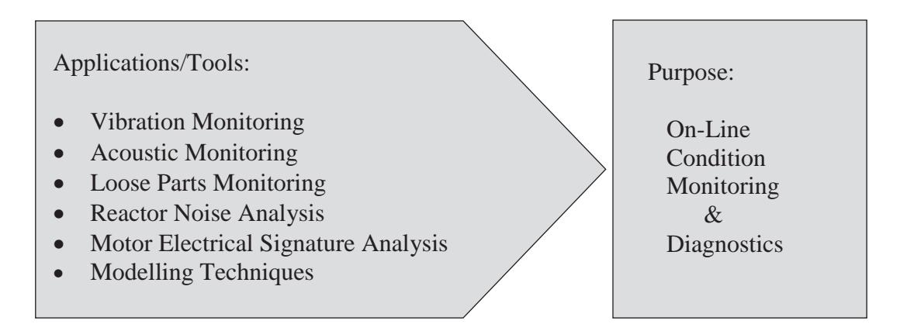

FIG. 1. On-line condition monitoring of equipment, systems and processes in nuclear power plants.

intentionally hit the plant piping and vessel from the outside to calibrate the loose parts monitoring system. Localization of a loose part is achieved by comparing signals from accelerometers in various locations by identifying signal transmission times.

#### **1.4.4. Reactor noise analysis**

Power reactors are equipped with both in-core flux detectors (self-powered neutron detectors (SPNDs)) and ex-core ionization chambers, as well as a number of other sensors (e.g. thermocouples, pressure and flow sensors, ex-vessel accelerometers). The primary purpose of in-core flux detectors is to measure the neutron flux distribution and reactor power. The detectors are used for flux mapping for in-core fuel management (ICFM) purposes, for control actions and for initiating reactor protection (trip) functions in the case of an abnormal event. To accomplish this, the direct current (DC) output of the detectors' current signal is measured and calibrated to indicate the neutron flux or the reactor power. The same output also contains small fluctuations (noise) that can be analysed to collect information on the various processes taking place in the core. For example, the noise components of ex-core neutron detectors in pressurized water reactors (PWRs) can measure the vibration of the reactor vessel and the reactor vessel internals. Furthermore, through cross-correlation of neutron signals and other existing sensors such as the core exit thermocouples or the reactor vessel level sensors, the flow through the reactor can be characterized to detect flow anomalies. In boiling water reactors (BWRs), average power range monitors (APRMs) and local power range monitors (LPRMs) are used to perform reactor diagnostics and to estimate the flow through the core. The APRM and LPRM signals are also used to measure the stability margin for the core in terms of a decay ratio.

There are other applications based on reactor noise analysis. For example, the response times of safety system flow transmitters and their sensing lines can be estimated using in situ signal noise measurements at fullpower operating conditions. The response time estimation involves the measurement based calculations of the dynamic transfer function of the flow transmitter and the auto power spectral density (APSD) function of the transmitter's output noise signal [3]. A more detailed description of this method can be found in Ref. [4].

#### **1.4.5. Motor electrical signature analysis**

Motor current signature analysis (MCSA) was conceived more than 20 years ago and quickly found its way into nuclear power plants. As its name implies, MCSA uses the signals from clamp-on current sensors to monitor the electrical currents going to a motor. Analysis of the current signals may result in the identification of a variety of problems (e.g. a stuck valve). The techniques of MCSA are used in numerous nuclear power plants for many types of equipment. A similar technique based on power signals and called motor power signature analysis (MPSA) is also available. Motor current changes at reduced load levels (50% of total load or below) are not easily detectable by routine techniques. MPSA has been found to be more responsive to load variations such as during valve cycling; as such, it may be a possible replacement for valve stroke testing.

#### **1.4.6. Modelling techniques**

OLM modelling techniques have the capability of providing early warning of impending failure or degradation of plant equipment, in addition to indications of changes in expected process performance and efficiency. This capability results from the identification of unusual or unexpected behaviour (anomalies) in the process model outputs.

OLM techniques are based on qualitative interpretation of measured process signals and on quantitative conclusions drawn from the evaluation of the signal content. Neither part is possible without some basic, a priori knowledge of the processes associated with the measured signals. For instance, in order to evaluate reactivity coefficients of temperature, void, etc., one has to build a functional relationship between these parameters and the neutron flux variations on the basis of the physics of the process. The reactivity can then be determined by parameter fitting from the measured temperature/void and neutron flux values. This is the case of physical modelling. In some other cases, a physical model can give quantitative relationships between signal values in different parts of the core (amplitude ratios, phase delays) that would prevail in normal conditions. Deviations from these relationships can indicate an incipient failure. Other types of modelling (empirical modelling) are not based on an actual physical description of the process. Empirical models establish baseline relationships (through statistical descriptors) by characterizing the normal state of the process (on the basis of historical measurement data) and then monitor for deviations from these established relationships in order to indicate incipient failures. A related approach is to utilize empirical models to classify observed patterns into one of a series of fault signatures.

While the use of physical models for monitoring process and equipment performance is well established in the nuclear industry, the use of empirical models to monitor the condition of plant systems and equipment is a recent development. A number of organizations have had direct involvement in bringing this about. These organizations include research institutes and utilities that have developed and/or introduced the application of model based monitoring techniques. Examples of such organizations are the Electric Power Research Institute (EPRI) in the United States of America, the Halden Reactor Project (HRP) in Norway, the Korea Atomic Energy Research Institute (KAERI) in the Republic of Korea, Analysis and Measurement Services (AMS) Corporation in the United States of America, and Ontario Power Generation (OPG) in Canada. In particular, a variety of equipment and process modelling techniques have been adapted to provide a baseline for detection of equipment and process anomalies. Both empirical and physical modelling techniques are used in this endeavour. The physical modelling techniques are mostly based on first principle equations, while the empirical modelling techniques are mostly data driven and involve such tools as neural networks, pattern recognition, and fuzzy logic for data classification and preprocessing.

# **2. BENEFITS OF ON-LINE CONDITION MONITORING**

The purpose of on-line condition monitoring is to monitor and assess the status of plant equipment and processes while the plant is in operation. In doing so, OLM allows timely repair and maintenance to be planned and undertaken so as not to compromise the safety and production of the plant.

The implementation of OLM also provides a framework to enable the optimization of plant maintenance intervals, using reliability information from operational history such that more targeted maintenance can be introduced.

This targeted maintenance regime will yield additional benefits such as more efficient use of the maintenance staff, reduction of unnecessary radiation dose and reduction of maintenance induced errors. Subsequent benefits, such as reduction of spurious control room alarm activity and reduced need for health physics support, are much more difficult to quantify but do exist.

#### 2.1. PLANT SAFETY

The use of OLM can contribute significantly to overall plant safety by enabling maintenance activities to be condition based rather than relying on time dependent schedules, which often result in intrusive maintenance of equipment that is in proper condition.

OLM can be used to identify equipment degradation between the standard maintenance periods, which allows the rectification to occur at the earliest opportunity and hence ensures that the plant remains within the safety analysis assumptions.

In some instances, early identification of the onset of equipment degradation will prevent potentially catastrophic failures. Typically, such failures result in potential or actual loss of generation and present a potential threat to personnel safety. In addition, recovery plans used to resolve the situation often place undue time pressure on staff, which is not conducive to safety. Moreover, the plant impact is not limited to the actual incident, since recovery plans often threaten the work planned for the period, delaying and/or prolonging these activities.

Reduction of radiation exposure of plant staff may also be achievable, since the required maintenance can be forecast such that an efficient plan for repair can be carried out, minimizing the repair time. Elimination of unnecessary maintenance will also reduce radiation exposure of staff, and prior knowledge of a future failure event may allow for maintenance to be scheduled during an outage period.

#### 2.2. PLANT AGEING MANAGEMENT

The need for ageing management is twofold: first, to ensure that the assumptions for plant safety are not compromised by age related degradation, and, second, to support long term maintenance strategies to address equipment replacement and plant life extension.

Equipment qualification is a good example of both of the above. Equipment in nuclear power plants is qualified or rated to operate for a certain length of time on the basis of the environment to which the equipment is exposed; that is, information such as ambient temperature, pressure, humidity, radiation and other effects is used to identify the qualified life of equipment. Often, equipment is rated on the basis of conservative values of environmental parameters (e.g. high environmental temperatures are assumed in arriving at the qualified life of equipment). Demonstrable evidence that the equipment has been operated in milder conditions than assumed will often allow its life to be extended significantly. On the other hand, evidence that the operating environment is harsher than expected may lead to a reduction in the recommended life, or appropriate modifications to the environment can be made such that the assumed operating environment is established and maintained.

With OLM, one can measure and monitor the environment around the equipment and establish the actual conditions to which it is exposed, as opposed to making conservative assumptions. This is an important application of OLM in nuclear power plants, as equipment often is prematurely replaced on the basis of assumed conditions instead of actual and objective assessments of the environmental conditions.

As plants begin to move into their extended lifetime periods, additional monitoring and diagnostics will increase the likelihood of continuous safe and efficient operation. Degradation may become more common as a substantial number of nuclear units move into this extended period. Having additional tools for equipment condition monitoring may reduce the risk of increased plant downtime in the future as the plants continue to age. Similar arguments can be made for plants that have completed power uprates, as many systems and pieces of equipment operate closer to the margins of their design specifications.

A different example of the use of OLM for extension of equipment life is safety category pressure and differential pressure sensors used in PWRs, where the lifetime of qualified equipment is typically 20 years. While the safety analysis may allow extension beyond 20 years, this typically requires the calibration frequency to be increased, which may not be an option if the sensor is only accessible during an outage. The increase in calibration frequency is based on the assumption that as a sensor ages it tends to drift more. However, studies show that modern sensors do not suffer from systematic drift. With recent advances in OLM techniques that allow the drift to be monitored by alternative means, the need to change the sensor just because it has reached the end of its 20 year lifetime will be diminished.

Such applications have indeed been used successfully in nuclear power plants, providing substantial savings to utilities by reducing equipment replacement costs.

#### 2.3. ECONOMIC

It is often difficult to justify the use of OLM on economic grounds, as many of the benefits are indirect and in many respects are viewed only as insurance against an event that may or may not happen, i.e. it would be difficult to prove whether or not the incident would have occurred if OLM tools and techniques had been available.

It is likely, therefore, that the introduction of OLM at a nuclear power plant will require significant education of the staff about the techniques available and the long term and hidden benefits. A gradual implementation is likely to be the most effective methodology to adopt. For example, prior to making significant financial investments in new data acquisition systems, one should consider what can be done with data that already exist. Many nuclear power plants already have a plant computer holding significant amounts of data, much of which may never have been examined from the OLM point of view. Many of the techniques described in this report can be applied using existing plant data systems.

The primary economic benefits from the implementation of OLM techniques are a reduction of unplanned outages or downtime and a reduction of operations and maintenance expenses.

#### 2.4. PLANT AVAILABILITY AND PERFORMANCE

The addition of OLM tools for monitoring and diagnosis may increase the performance and availability of a power plant by forewarning of failure events and identifying deviations from expected behaviour that reduce the performance and efficiency of the plant. Forewarning of a degradation or failure may lead to the planning of additional maintenance activities during an upcoming outage to reduce the chance that the forewarned failure event will occur during the subsequent fuel cycle.

#### 2.5. MAINTENANCE

OLM techniques can provide various types of information that can be used to better plan and schedule maintenance activities. Planned activities can be carried out in a much more efficient and safe manner than activities carried out in response to an unknown failure event. Unforeseen failures and their unscheduled repair place significant stress on plant staff and have the potential to adversely affect related plant equipment and plant safety.

Knowledge of poor equipment condition may be used to reduce the load on that equipment such that the risk of further damage is minimized until the next maintenance opportunity, and the consequent maintenance time and direct costs are reduced.

While OLM techniques are generally promoted for identifying degradation or failures, it is equally important to identify normal conditions. Indications of the proper equipment condition can be combined with other information to plan maintenance activities only when they are necessary. Thus, indications of proper condition can reduce the possibility of performing unnecessary maintenance.

Improved knowledge of equipment, system and plant condition can be exploited to reduce maintenance costs by:

- Eliminating unnecessary maintenance or replacement of equipment;
- Reducing the damage to equipment by reducing its load when a problem is identified;
- Reducing the possibility of damage to related equipment through remediation of a failure event, as opposed to operating at full load until failure;
- Properly planning and scheduling maintenance activities (during outages, when possible).

#### 2.6. KNOWLEDGE IDENTIFICATION AND CAPTURE

After an instance of component degradation or failure, a review of the available data, either measured or processed through a monitoring application, frequently reveals that an early warning indicator was available. In some cases, the precursor event identified results from monitoring system output that was not previously available, and hence the information was not properly utilized. In such cases, the precursor knowledge has been identified, and, assuming the degradation mechanism is consistent and repeatable, this new knowledge can be embedded in a logic scheme associated with the OLM system, effectively capturing and updating knowledge. Additionally, there is the potential to capture existing knowledge from the operations and maintenance staff by creating new, logic based interpretations using as inputs direct measurements or data processed through OLM applications, or a combination of both. Once the appropriate knowledge is captured and embedded in the OLM system, automatic identification of the degradation or failure should be available.

# **3. DESCRIPTION OF CONDITION MONITORING TECHNIQUES**

This section presents current technologies for condition monitoring, with a brief description of their principles and examples of applications.

#### 3.1. VIBRATION MONITORING

Modern maintenance methods (e.g. predictive maintenance) are based on the determination of a machine's condition while in operation. The technique is dependent on the fact that most machine components exhibit symptoms prior to a failure event. Identification of these symptoms requires several types of nondestructive testing such as oil analysis, wear particle analysis, thermography and vibration analysis. The last of these is applied most frequently to rotating machinery.

The collection of vibration measurements is an essential part of the commissioning period for a nuclear power plant. Vibration characteristics of the main components are collected during the initial startup period, typically by the vendor [5]. Accelerometers mounted on different components usually remain installed after the startup period; therefore, it is typical for the utilities to continue to monitor the vibration modes and eigenfrequencies of the main components. A typical distribution of sensor locations in the primary loop is shown in Fig. 2.

Off-line measurements have been replaced by OLM systems, as computer systems and digital signal processing techniques have improved. Databases of resonance frequencies have been established for individual reactors and reactor types.

Accelerometers mounted on main components, such as main coolant pumps (MCPs), have characteristic autospectra (see Fig. 3), where peaks can be identified by different methods on the basis of monitoring experience, design information and model calculations (e.g. finite element modelling). Abnormal vibration

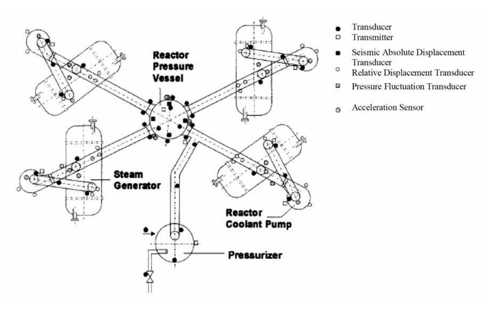

*FIG. 2. Typical arrangement of vibration sensors in a WWER-1000 unit [6].*

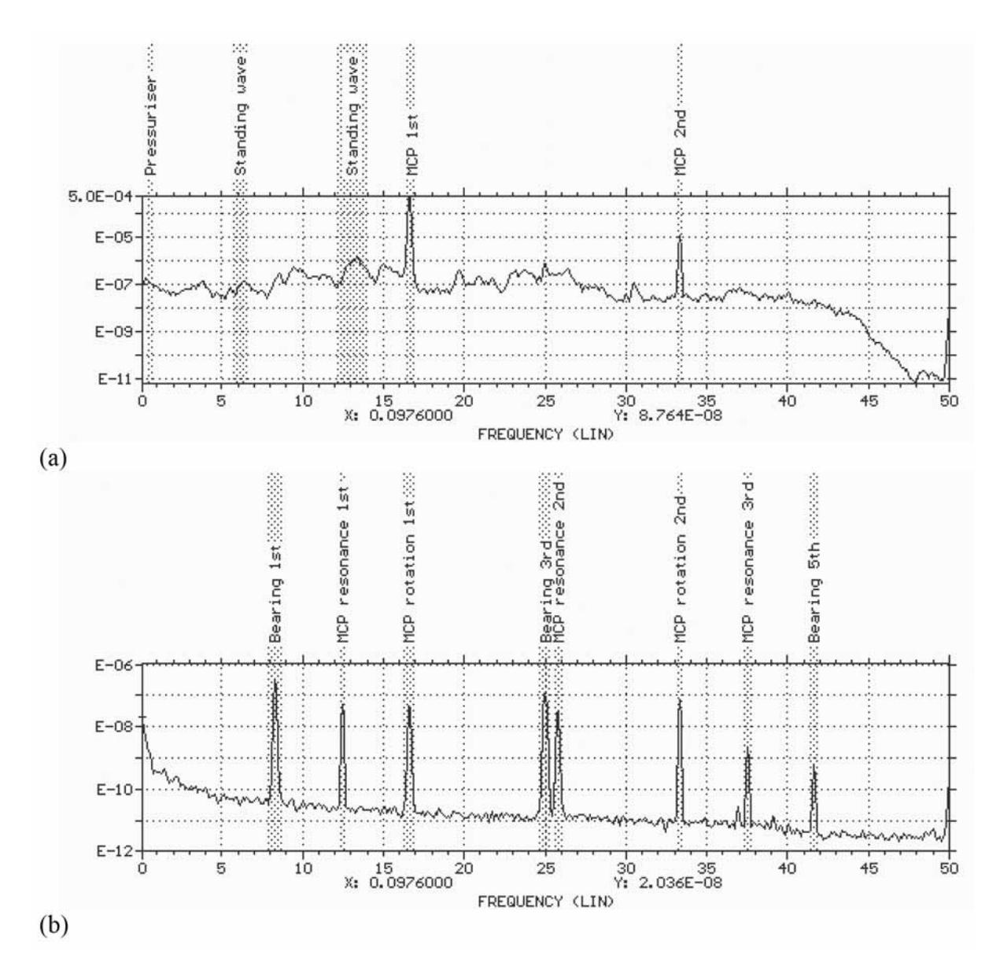

*FIG. 3. Vibration spectra of an MCP of a WWER-1000 reactor in the original normal condition (a) and with bearing degradation (b) [7].*

modes are identified when the locations of vibration peaks deviate from their baseline locations. Newly emerging vibration peaks can also be identified.

Databases and libraries of vibration spectra, as well as of typical signatures for the malfunction of bearings, misalignment and similar problems, have been compiled for rotating machinery. This information has been included in ready-made expert systems for several power plant and reactor types. Both German and French PWRs have developed and continue to use such systems. Over the past two decades, these plant specific databases have been gradually replaced with general purpose rotating machinery expert systems adjusted to a given task. The typical diagnostic features of an abnormal vibration spectrum are very similar for all rotating machinery, i.e. bearing problems, shaft problems, misalignments. They are recognizable by today's expert systems. In some cases, OLM systems have been extended to portable devices, which are used to periodically collect data and either analyse them directly or download them to a database for later analysis. Portable systems have been used in cases where the cost of cabling was prohibitive. With the continuous advances in wireless data transfer, it may soon be cost effective to replace these portable periodic analysis routes with permanent wireless enabled sensors for automatic data collection and analysis.

In the past two decades, advanced expert systems have become available — mainly for rotating machinery — that can automatically provide diagnostic information on common malfunctions. For example, the Paks nuclear power plant in Hungary has been using a rule based, automated vibration diagnostic system since 1996, which provides critical information on machinery condition by rapidly screening and analysing vibration measurements. The system applies over 4500 unique rules to identify individual faults in a wide variety of machine types. The measurement points on the monitored machines are typically located at the top of the bearing housing or on some mechanically rigid surface (e.g. cooling flange of the electric motor). Figure 4 provides the locations of the vibration transducers for a typical configuration.

In such an expert system, the rotating machines are modelled in terms of their characteristics important to vibration diagnostics. Typical features are:

- Bearing class and type (journal bearing or rolling element bearing);
- Number of rotating vanes or blades;
- Coupling type, number of coupling elements;
- Gearing (number of teeth, stages);
- Number of electrical motor rotor bars, poles, vanes of the motor cooling fan;
- Turbine stage blade numbers, etc.

These features (representing possible fault frequencies) establish the basis of the frequency analysis. The expert system measures and stores baseline vibration spectra for each machine type, representing normal operating conditions. In the test period, the expert system compares the actual spectrum with the baseline vibration spectrum, providing an assessment of the machine's condition. Based on predetermined inference rules, a test report is prepared on the nature and severity of possible anomalies (see Fig. 5).

When a moderate, serious or extreme fault is detected, human experts analyse the data with conventional frequency analysis methods and decide on follow-up actions. The long term measurement trends are utilized in both predictive maintenance programmes and lifetime management of the plant.

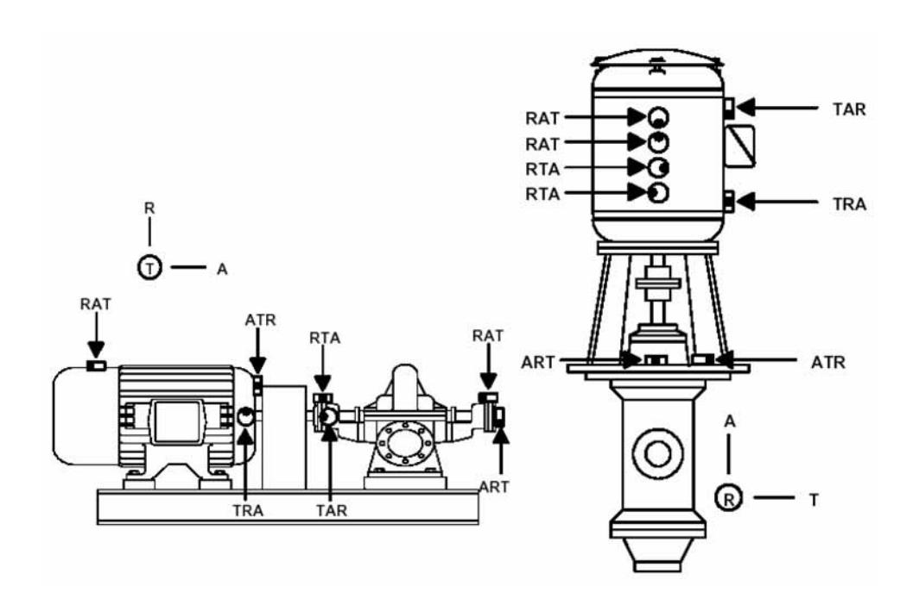

*FIG. 4. The orientation of the vibration transducers.*

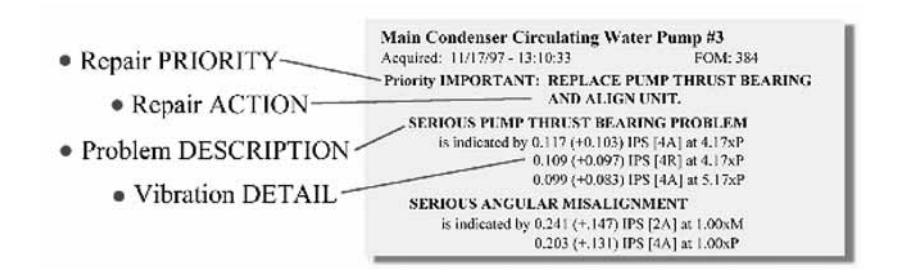

*FIG. 5. Expert system report with indication of problem severity.*

#### 3.2. ACOUSTIC MONITORING

The term 'acoustic monitoring' in nuclear installations covers a collection of methods that measure the acoustic emissions and/or reflections of different processes and components. Leakage monitoring is also a type of acoustic monitoring, since most of the applied leakage monitoring systems identify leakage through changes in the measured response from audible and ultrasonic sensors. More recently, other techniques have emerged that detect leakage through measuring an increase in moisture resulting from evaporation from the leakage.

Acoustic monitoring can be roughly divided into three categories:

- Simple observation of acoustic signals in order to monitor the functioning of the main components of the primary and secondary loops;
- Acoustic emission (mainly in the ultra-high-frequency range);
- Acoustic leakage monitoring.

Loose parts monitoring by acoustic methods is discussed separately in Section 3.3 of this report.

#### **3.2.1. Acoustic monitoring of processes**

The audible spectra obtained through acoustic monitoring of reactor components can be utilized directly, without any signal processing. Observed changes in the audible spectra indicate a potential problem in the monitored system. An example is the monitoring of motor operated valves (MOVs), where the concern is to detect a valve that is nearly, but not completely, closed (or not completely open). If a valve is completely open or closed, or half open, there is no observable acoustic signal above the background noise. In a nearly closed or nearly open state, the valve blade vibrates with impacting on the valve house. This condition generates an acoustic signal above the background that can be easily detected. The vibration and impacting of the blades leads to material degradation and ageing of the valve.

Cavitation noise can also be observed with acoustic methods. Cavitation typically occurs in pumps but may also occur in long sections of pipes with rather high flow rates. Observation of the acoustic signal to detect cavitation may prevent eventual ruptures due to fatigue.

#### **3.2.2. Acoustic monitoring of components**

Most components that possess some dynamics (movement, vibrations, etc.) emit sound that is uniquely characteristic of the given equipment and its environment. This fact is used in everyday life, e.g. assessing the condition of an automobile engine from its sound. One particular and well developed application area for acoustic monitoring is rotating machinery. The principle of noise diagnostics is based on establishing a baseline signature for the normal condition as well as signatures for each of the different anomalous states. These signatures are collected into a library and used to classify later measurements as normal or as falling into one of the anomalous categories using some suitable expert system or algorithm. Such classification can also be made by a noise analysis expert. Automatic recognition is based, in most cases, on power spectra estimated using fast flux testing techniques; however, other techniques are also available, such as autoregressive analysis, wavelet decomposition, calculations of various moments estimated from the recorded noise, or a combination of these. For larger components in nuclear power plants, permanently installed, on-line and sometimes real-time acoustic monitoring systems are common. For smaller components (e.g. small pumps, secondary rotating equipment), manual data collection with portable devices is completed on a periodic basis, for example, once a week. The collected data are then transferred to a computer for further analysis.

Acoustic monitoring based condition assessment seeks to identify changes in the acoustic response at the component's eigenfrequencies, rotating frequency and higher harmonic frequency. The responses at the rotating and higher harmonic frequencies usually appear in the measured spectrum as narrow band, high amplitude peaks. Deviations of these peaks from their baseline location, shape or magnitude give a warning of changing conditions. These changes are well classified. For example, one of the classes consists of the shifting of standing wave frequencies due to temperature changes; another class for rotating machines is due to changes in the rotation speed. In the latter case, all higher harmonics will also be shifted. There is a considerable amount of experience regarding bearing failures, depending on the bearing type, lubrication, material of the axes, etc. This knowledge is built into typical expert systems (e.g. Pulse from B&K, DLI) widely used in many plants today. The use of the eigenfrequencies for monitoring requires structural calculation (by finite element methods) of the vibration eigenmodes that define the mechanical behaviour of the system.

#### **3.2.3. Acoustic emission monitoring**

Traditionally, the term 'acoustic emission' was used to describe the process of sound emission due to changing pressure or stress applied to metallic components. Transient elastic waves can be generated in a region of a material that experiences abrupt changes in stress or strain. This phenomenon is known as acoustic emission and is generally detected by means of ultrasonic transducers coupled to the material. Growth of microcracks, interfacial bond failure in materials and delamination of layers are typical examples of events that produce acoustic emission. When crystal domains are moving in relation to each other and their surfaces are worn, or when dislocation or microcracks occur in a material, a sound is emitted.

Acoustic emission frequencies are usually in the range of 50–300 kHz, which is well above the frequency of audible sound, such that ambient noise can be easily filtered out.

Acoustic emission techniques have been successfully applied in nuclear power plants on:

- Reactor vessels;
- Primary main coolant pipes (PWRs) or main steam lines (BWRs);
- Control rod housings.

The final goal of such measurements is to prevent material degradation. Microcracks can lead to larger ruptures or at least to fatigue of the material. The acoustic emission technique can give information on this process at an early stage of its progression. Typically, data are recorded when stress changes occur, such as in periods of heating up and cooling down of the reactor system (vessel), or in the event of changing pressure in the primary system. Acoustic emission pulses are counted; their number and dynamics are then evaluated using statistical methods. This gives some qualitative indication of material degradation. Finite element modelling or experimental observation of test samples or materials of similar structures is carried out to create a reference for comparison of the recorded data. However, there is no universal solution or procedure for accurately determining the severity of the condition on the basis of the statistics of the acoustic emission pulses. Each case and method has its own history and its own unique advantages and disadvantages.

#### **3.2.4. Acoustic leakage monitoring**

Compressed gas or high pressure fluid leaking from a crack or the improper fitting of components (e.g. pipes) produces a very strong ultrasonic noise (in some cases, even an audible noise). Today, several inexpensive portable devices exist to measure such noise signals. Although in some cases it is possible to calibrate the equipment in order to quantify the size of the leak (or the mass flow from the leakage), the most important result from the use of these devices is detection of the leak. Acoustic leakage monitoring is primarily used in the secondary side of nuclear power plants, where it is easier to detect and localize a leak.

Historically, leakage monitoring in nuclear power plants was developed using acoustic emission sensors; hence, it was also performed by specialists dealing with acoustic emission. Acoustic emission sensors make use of the resonance frequency in accelerometers, thus the weak noise produced due to a leak is amplified in the sensors. This allows for the observance of the amplified signal above the acoustic background (sufficient signal to noise ratio), which exists over the entire frequency range in nuclear power plants, but is predominant at low frequencies.

The leakage monitoring methods described above are typically deployed on-line with specially designed detectors and amplifiers. One issue to consider is that acoustic emission sensors of the ultrasound region cannot withstand the radiation and heat in the vicinity of the reactor vessel where leakage detection is most important. In the vicinity of the reactor vessel, waveguides are applied to attach the sensors (see Fig. 6). The signals are usually integrated, and in most cases only short time root mean square (RMS) values are used for data analysis. The quality of the waveguides and the attachment methods of the guides and sensors have a significant effect on the sensitivity and accuracy of the leak detection system.

In general, the leakage monitoring technique is rather straightforward. The detectors are placed in the vicinity of anticipated leakages. The RMS of the total signal of the acoustic emission detector is typically generated by the hardware and is recorded continuously. If the recorded value becomes larger than the previously established RMS background level, a warning or an alarm is issued. In several cases, small leakages (less than 5 kg/s) have been identified and reported using the technology. An example of a leakage monitoring system interface is shown in Fig. 7.

Leakage monitoring has been successfully applied to:

- Reactor vessel heads, a typical leakage place at the intrusion of control rods;
- Steam generator inlet/outlet pipes and fittings of closing holes;
- Feedwater heater tubes;
- Valves and fittings of valves.

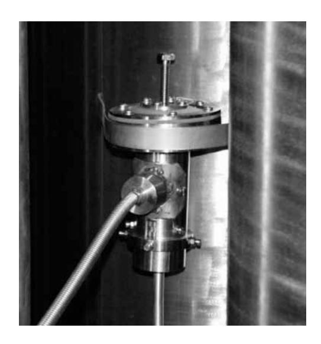

*FIG. 6. Acoustic leakage detector with waveguide.*

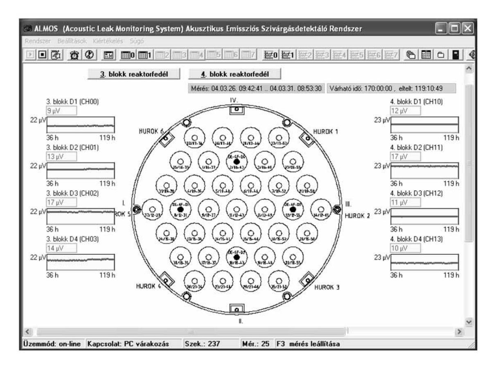

*FIG. 7. A leakage detection display showing positions of the sensors on the head of the reactor vessel in the vicinity of the control rods, and leakage noises (RMS) from the sensors.*

#### 3.3. LOOSE PARTS MONITORING

#### **3.3.1. Definitions**

'Loose parts' is a common term for loosened, detached and drifting objects, found mainly in the primary coolant loop of the nuclear steam supply system. Owing to high coolant mass flow rate, loose parts can be carried away and have an impact on the inner walls of the primary system (the fuel boxes, fuel pin cladding and primary piping walls). Loose parts and their impacts can cause material damage and malfunction of safety components, and can lead to leakage. If the loose part becomes stuck or disintegrates, it is referred to as being disarmed. Disarmed loose parts no longer constitute a direct hazard from impacting, but may still have secondary effects.

The purpose of a loose parts monitoring system (LPMS) is to detect (i.e. discriminate against the background) and localize the moving loose parts and to estimate their size and damage potential. Loose parts constitute a hazard to safety and integrity, can result in material ageing and may lead to significant economic consequences.

Most PWRs have an LPMS installed, and according to US regulations [8] it is required that the LPMS be used during the startup period of the PWR. The German KTA standard and the European IEC standard [9] also recommend the use of an LPMS as a standard procedure during startup.

Monitoring of impacts caused by loose parts is based on the detection of acoustic events. Both the audible frequency range and the ultrasonic frequency range can be monitored for detection. Today, almost all systems apply accelerometers (in the audible range) and so-called acoustic emission detectors (in the ultrasonic range). Impacts on the wall are manifested as bursts in the time signal embedded in the background noise, when measured in the vicinity of the impact (Fig. 8). They appear with different time delays depending on the distance of the sensor from the location of the impacting. However, if the structureborne sound has travelled a long

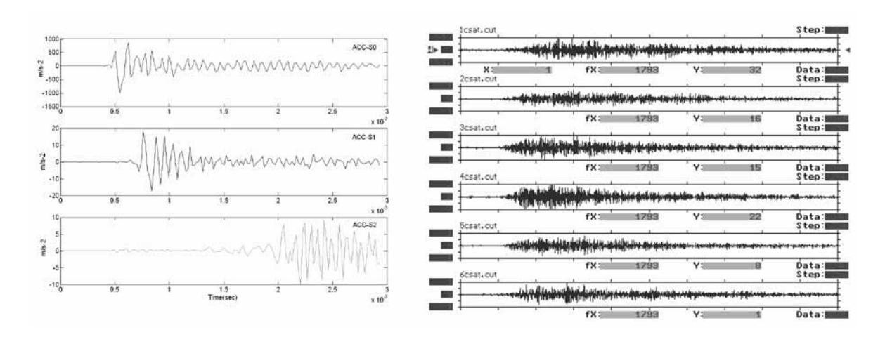

*FIG. 8. Burst in time signals from sensors in two different time scales.*

distance owing to the large spatial separation between the impact location and the detector, then the shape of the burst, due to different group velocities, will be smeared out and its amplitude will attenuate rapidly with increasing distance. Hence, considering also the high acoustic background noise present in the primary loop of a nuclear power plant, the detection, identification and localization of loose parts is a difficult task.

A typical LPMS consists of the following components:

- Detectors and preamplifiers;
- Signal conditioning and automated data acquisition module;
- Main evaluation computer for discrimination, mass estimation event localization algorithms;
- Reporting or Web server module.

To reduce costs and maintenance burdens, detectors and preamplifiers are typically shared between the LPMS and the vibration detection system in the primary loops. There are typically at least three sensors per loop, and additional sensors are needed for the reactor pressure vessel. For startup measurements of the MCPs, it is also recommended that phase sensors mounted on the shaft of the MCPs be used.

Signal conditioning modules should ensure the undistorted transmission of the signal over relatively long distances, with minimal electrical interference, in the frequency range of interest (typically up to 20 kHz). Data acquisition should ensure simultaneous sampling for all channels in the same frequency range. For optimal performance, data should be continuously sampled and buffered in a local memory, and only the regions of signals that have been preselected by different triggering methods should be transferred. Research is currently under way to establish robust preselection methods to minimize false alarms. Only loose parts that impact repeatedly on the inner wall of the primary system are typically analysed, since it is only these parts that represent a hazard and can be detected with minimum uncertainty.

#### **3.3.2. Discrimination algorithms**

The most significant problems of traditional LPMSs are the high missed alarm and false alarm rates. In the case of high false alarm rates, operators tend to neglect the warnings given by LPMSs. In early applications, the main cause of high false alarm rates was that event recognition was based mainly on the RMS value or on the amplitudes of the signals of loose part sensors. In these applications, only the RMS value of the signal with a shorter or longer time constant was used. This value was then compared with the previously estimated background RMS. Experimentally estimated alarm levels were used for signalization. In such systems, even localization was based on the principle of descending intensity with increased distance.

The most developed systems today use significantly more sophisticated methods for event identification. Autoregressive (AR) modelling and the sequential probability ratio test (SPRT) are two of the most sensitive methods to distinguish between background events and loose parts (Fig. 9). With these more sophisticated systems, false alarm rates (and missed alarm rates) can be reduced well below 1%. In addition to better discrimination, these newer LPMSs typically do not rely on alarms from a single signal, but rather on redundant indications from more than one signal. It has been observed that, in the case of the potentially most harmful (i.e. relatively large) loose parts, events have always been detected by more than one sensor [10].

Even though the current LPMS false alarm and missed alarm rates are below 1%, work continues on compiling databases of different occurrences and on constructing artificial intelligence and expert system classification methods. The goal is to develop learning methods that can discriminate between signatures that are not related to loose parts events and those that are, thus reducing the false alarm rate. Current expert systems can identify signatures of acoustic bursts (movement of control rods results in the emission of acoustic bursts) that are not related to loose parts.

#### **3.3.3. Source localization and mass estimation**

LPMSs can provide information on the location of the impact of loose parts on the inner surface of the primary pressure boundary. The estimation of the location is based on the difference in the time delay of the signals of several sensors (triangulation). In addition, the time delay due to the difference in the velocities of the transversal and longitudinal components can be utilized individually in each sensor. However, there are significant uncertainties associated with this approach owing to the applied data evaluation methods [11]. To overcome this problem, new technologies have been proposed that use short time Fourier transforms, continuous wavelet transforms or the smoothed Wigner–Ville distribution. The reliability of the location estimation has been improved with the introduction of the proposed time–frequency methods into the LPM system.

The methods for mass estimation (and, partly, localization) of loose parts are not sufficiently accurate. After detecting a loose part, additional observations are often needed for more precise localization and mass

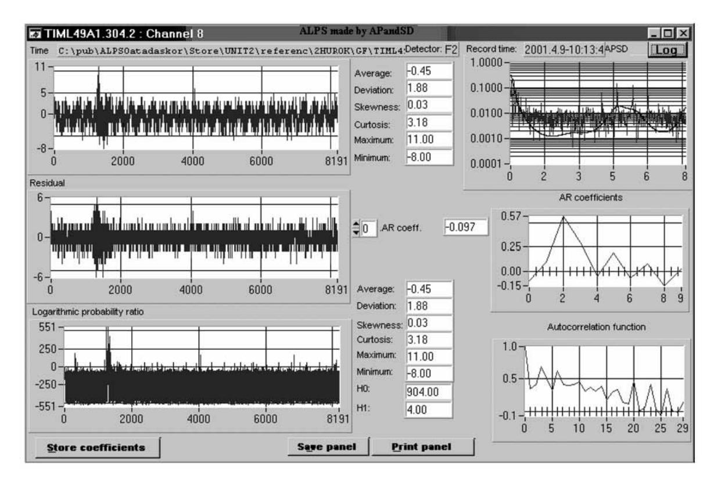

*FIG. 9. Loose parts event buried in noise, cleaned and distinguished using SPRT and its spectra for detailed analysis. Such an approach reduces the false alarm rate below 1%.*

estimation, in which ad hoc additional sensors may be required. Utilizing the different components of burst, namely longitudinal and transversal components, allows for a localization precision of about 10 cm (e.g. on the surface of the steam generator). Earlier methods of localization, based on the transport time of the structureborne sound in the metal and on the distances of detectors from the place of the impact, allowed localization of the loose parts with a precision of 1 m. Promising new methods based on time–frequency analysis could provide further improvements in the automated localization and mass estimation procedure [12].

Additional mass and energy estimation techniques are:

- Frequency ratio;
- Wigner–Ville distribution in the time–frequency domain;
- Mass–velocity map;
- Neural network technique;
- Finite element analysis for modelling the possible impact, to populate the knowledge base.

#### **3.3.4. Utilization of results**

The purpose of LPMS is to detect loose parts and assess their potential hazard to the reactor system components. The uncertainty of earlier systems was too high for the information to be transferred directly to the reactor operator. Since, in current systems, the false alarm rate has been reduced well below 1%, there is an increasing trend of sending information about larger loose parts directly to the reactor operator display, with smaller occurrences remaining in the stand-alone LPMS for further analysis.

Reports from acoustic events recorded by LPMSs can also be valuable for maintenance work and ageing estimation, even if the size or origin of the loose part does not necessitate that direct action be taken by the operators. Therefore, it is advisable to have a reporting and distribution system associated with the LPMS. Audio monitoring of recorded signals is the most effective form of distribution, since complicated functions such as Fourier analysis or time–frequency analysis require a certain level of expertise to interpret.

Plant managers are typically interested in the level of severity, the impact on safety and the ageing effects of the loose parts. It is difficult to accurately define this information for loose parts, since almost all events are unique. In addition, the consequences caused by loose parts are highly variable depending on where the loose parts were locked, on the mass, on the loose parts material, and on the number and energy of impacts. Most loose parts are observed during the initial startup of the main coolant pumps after refuelling. Therefore, most regulatory agencies, including the NRC, request the use of LPMS only during initial startup. Most loose parts detected during startup disintegrate rapidly as a result of impacting with rotating parts (pump blades) or walls. Experience shows that the majority of the small and medium-sized loose parts disintegrate or become lodged somewhere within the first 30 s after the startup of the given loop. Loose parts that have disintegrated to the size of sand grains are filtered out by water filters, leading to a need to change the filter earlier than expected. Small particles or grains in the filters are referred to by utilities as debris and not loose parts, and are neglected as not being dangerous to integrity. However, small parts and the sand itself may be carried into the reactor core, where they can corrode the surface of the fuel cladding. Furthermore, cases where small particles are lodged somewhere between the moving elements in the reactor core (control rod, or assemblies) have been reported.

One can conclude from the history of known events that loose parts carry a rather small hazard with respect to the integrity of the first and second barriers. Material damage in the sense of ageing and other effects is the most common consequence of loose parts, especially if they are observed too late (or not at all). Such losses are rather significant (expensive). A properly installed and managed LPMS has the potential to quickly provide a significant return on investment if a large loose part is identified and actions are taken before significant damage is incurred. In a study based on several LPMSs in similar PWRs, it was found that loose parts occur once every three years on average, and the consequences, if not observed in time, are about five times higher than the cost of an LPMS. The economics of an LPMS can be improved further if it is used for additional acoustic monitoring tasks.

#### 3.4. REACTOR NOISE ANALYSIS TECHNOLOGY

Noise analysis refers to methods that utilize the fluctuations in process signals to extract important information concerning the system [13–15]. Examples of such process signals are neutron detector signals, temperature, pressure, flow and accelerometer signals. The application of such techniques in nuclear power plants started with neutron noise analysis in zero power systems and research reactors. The objective was to determine nuclear parameters, primarily the reactivity, or the effective delayed neutron fraction. These methods use some second moment of the neutron detector count, either the variance-to-mean (Feynman alpha) or the correlations (Rossi alpha), or some related method. It is interesting to note that these methods have recently received some renewed interest in connection with plans for developing subcritical, accelerator driven systems. Later applications concerned detecting structural vibrations, such as control rod vibrations, in research reactors such as that at the Oak Ridge National Laboratory (ORNL) and the High Flux Isotope Reactor. Gradually, neutron noise methods found applications in commercial power reactors as well. At the same time, the information content in the fluctuating part of other signals (temperature, pressure, etc.) was utilized, either alone or in combination with neutron detectors or other signals. The field of power reactor noise diagnostics is, by now, a very broad field with many applications. A description of the principles and a list of the main applications follows.

#### **3.4.1. Spectral methods**

In noise applications, usually the auto- and cross-spectra (APSD and CPSD, respectively) or auto- and cross-correlation functions (ACF and CCF, respectively) of the fluctuating part (alternating current (AC) component) of the measured process signals are generated and used in the analysis. Apart from a few cases, such as BWR instability, which is discussed later in this report, it is assumed that the fluctuating signals are small (typically less than 0.1% of the signal's DC component) and the linear systems theory can be used. In this example, the fluctuations in the measured signal (noise) are caused by the fluctuations of another signal (noise source or perturbation) whose effect on the noise is exerted through a physical process, described by the transfer of the unperturbed system. Often, but not exclusively, the perturbations in the noise spectra (peak in the power spectra) can be identified as anomalies (excessive vibrations, boiling, flow irregularities, etc.). However, all process signals have inherent fluctuations in the normal state, which influence the fluctuations of many other signals with which they have a cause and effect relationship. The relationship between the various processes and parameters is shown schematically in Fig. 10.

Two of the three ingredients in process noise generation — i.e. noise source, transfer function and, particularly, induced noise (neutron noise) — must be known (measured or calculated) such that the third can be determined by the physical relationship among the three, which is known from theory. In practice, there are two main categories: surveillance (monitoring) and direct diagnostics.

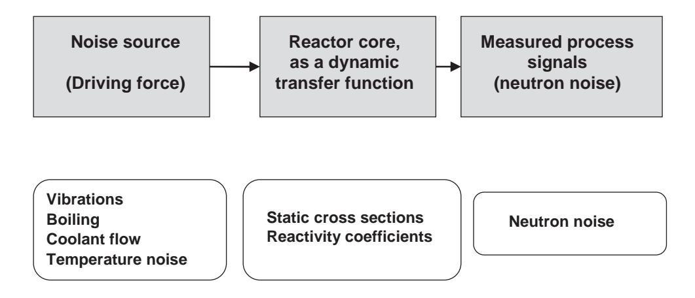

*FIG. 10. Schematic of the generation of neutron noise.*

#### **3.4.2. Surveillance or monitoring**

Surveillance or monitoring consists of measuring the induced (output) noise, typically the neutron noise, and identifying anomalies in the measured data. To detect an anomaly and to identify its type, it is sufficient to know the signature of the anomaly in the affected spectra (broadband, sink structure, peaks, etc.). For quantification, such as locating the position or determining the strength (e.g. vibration amplitude), one needs to measure the output noise and know the corresponding transfer function (e.g. by dynamic core calculations or from models).

Parameter estimation refers mostly to the determination of some parameter of the core, such as reactivity coefficients, heat capacity or core flow transit time. Such parameters are therefore included in the transfer function of the core; thus, both the input (noise source) and the output (induced noise) signals need to be measured. In addition, a physical model needs to be established that describes the transfer between the two. Often this physical model is in the form of a frequency dependent complex transfer function with unknown parameters that need to be determined.

#### **3.4.3. Direct diagnostics**

Direct diagnostics is a third type of noise analysis technique where a process signal (time series) is measured directly, with the aim being simply to classify whether it reflects normal or abnormal behaviour, without trying to identify the cause of the anomaly or the underlying physical process. Relevant examples are impacting of detector tubes, BWR instability and, to some extent, core barrel vibration diagnostics.

#### **3.4.4. Implementation of reactor noise analysis applications**

The implementation of reactor noise analysis applications in an operating nuclear power plant for diagnostic and inspection purposes may require careful planning and gradual introduction. Most of the required data acquisition systems, connection points, electronics, measurement procedures, licensing requirements and analysis/interpretation procedures are not part of the original nuclear power plant design or the operating instructions delivered by the vendor. Large-scale applications of reactor noise analysis require the development of the following essential components:

- Multichannel data acquisition systems for digitizing and storing detector signals. These systems can be either general purpose portable data acquisition systems, or permanently installed systems dedicated to monitoring a fixed set of signals.
- Multichannel optical isolation amplifiers separating the data acquisition systems from the station hardware (e.g. shutdown system test points).
- Maintenance procedures to connect and disconnect the data acquisition hardware systems to/from station hardware without disturbing the normal operation of the reactor.
- Dedicated station engineers responsible for the planning, preparation and execution of the fieldwork for recording measurement signal data.
- Digital signal processing techniques to operate off-line on the recorded detector signals (multichannel, digitized and prescreened) to produce multichannel statistical functions in the frequency and time domains for noise analysis.
- Physical models of processes in the reactor to be used in the interpretation of noise signatures measured in specific applications (e.g. fuel channel vibration, coolant boiling, moderator circulation, water level oscillations).
- Dedicated experts to plan and execute field measurements, to process and interpret measurements, to analyse patterns, to develop models and software tools for new applications, and to solve previously unseen problems.
- Involvement of the nuclear regulator (i) to license and approve the data acquisition systems that temporarily become part of the station's safety system hardware during the measurements, and (ii) to have the validity of the analysis techniques and their results accepted.

In the initial development phase, management approval is likely to be given only for a limited and welldefined application of noise analysis. Applications from the early startup phase of noise analysis projects may expand rapidly to other applications if the results of the measurements can be used in (i) meeting licensing requirements, (ii) justifying continued operation of ageing instrumentation, (iii) successfully trouble-shooting unusual conditions and (iv) satisfying required inspection and testing activities.

#### **3.4.5. Required data acquisition systems**

In practical applications of reactor noise analysis, computer based data acquisition systems are needed to obtain high quality high frequency data. Usually, the requirements for sampling rates, amplitude resolution, signal conditioning, system isolation, simultaneous sampling and synchronization are more stringent than those in a typical plant computer; therefore, digital data provided by plant computers (data loggers, plant historian, etc.) cannot be used for noise analysis purposes.

In many applications, portable multipurpose data acquisition systems are applied to collect measurement data (multichannel time series). There are some disadvantages to using these systems. First, isolation from the plant equipment is required. Second, hardware access to plant analogue signals ('hook-up points') is often difficult in existing nuclear power plants where provisions for these measurements were not designed. Third, it can be expensive to design, build, operate and maintain a sufficiently large fleet of portable multipurpose acquisition systems. In a new plant, where the use of an OLM system can be designed as part of the plant instrumentation systems, the measurements can be carried out readily in a more systematic and routine way.

#### *3.4.5.1. Isolation requirements*

If analogue process signals are to be accessed by directly connecting the noise data acquisition systems to station systems (control systems, reactor protection systems), the isolation is critical and must be accomplished through applying special isolation hardware, which needs to be connected without affecting the plant instrumentation and safety related functions. There are varieties of isolators or buffer amplifiers, such as high impedance optical isolators, that can be used for this purpose. The isolation specification (e.g. input impedance, low-pass filter cut-off frequencies) is an important part of planning, and it must be selected on the basis of the characteristics of the plant equipment or system that is being monitored.

The isolation amplifiers separate the station instrument from the data acquisition hardware by preventing any feedback from the isolation amplifier's output to its input side. The isolation amplifiers usually have a gain of one and a low-pass cut-off frequency in the 10–100 kHz range. Their function is only to isolate the signals, not to filter or amplify them. Depending on the level of required independence, the isolation amplifiers may be physically separated from the rest of the data acquisition system.

The independence and separation of multichannel isolation amplifiers must be tested and demonstrated before the signal connections are made. Similarly, the input impedance of the isolation amplifiers must be checked in both power-on and power-off conditions. An additional requirement is the measurement of the isolation amplifier output with zero (or shorted) input. These zero-offset values are also used in the calibration correction calculations when the recorded voltage signals are converted into physical units.

#### *3.4.5.2. Analogue signal conditioning*

For dedicated data acquisition systems, the station instrument signals to be accessed may be in the following forms:

- Analogue current signal as a direct output of the measurement sensor (e.g. a self-powered flux detector as a current generator in the µA range, or a flow transmitter in a 4–20 mA current loop);
- Analogue voltage signal already transformed into a standard voltage range (e.g. 1.0–5.0 V).

In the case of current signals, an additional component is needed to convert the current signals into measurable voltage signals. This component could be as simple as a sampling resistor in a 4–20 mA current loop, or a current-to-voltage converter in the flux detector's amplifier. If the station signals are available in an analogue voltage form, they can be directly connected to the isolation amplifiers of the noise data acquisition systems.

The actual filtering and amplification of analogue signals are performed after the isolation by separate signal conditioning units including the following functions:

- Anti-aliasing low-pass filtering, usually needed to remove the high frequency components. The low-pass frequency is typically set below 40% of the sampling frequency for all recording channels. If anti-aliasing filtering is not performed before sampling, the user must make sure that the sampling rate is at least twice the maximum frequency contained in the analogue noise signals to be recorded.
- Removal of the mean value or the DC component of the signal by subtracting a constant voltage value from the analogue signal, or by applying an analogue high-pass filter to the signal. The DC compensation is performed either automatically or by the user individually for all recording channels.
- Amplification of the signal or the DC compensated signal. The signal amplification is performed either automatically or by the user individually for all recording channels.
- After the analogue signal conditioning steps, the signals are fed into the multichannel analogue-to-digital converter (ADC) where the simultaneous sampling for all channels takes place.

#### *3.4.5.3. Plant conditions for data acquisition*

Depending on the purpose of the signal noise measurement, certain conditions and restrictions may be placed on the plant for the duration of the data collection. Most of the measurements have to be made at steadystate high-power operation, with no operator-induced changes in the reactor system (such as testing, or on-line fuelling in CANDU reactors). The duration of noise signal recording sessions may vary from half an hour to twelve hours. The actual length depends on the sampling rate and the purpose of the noise measurement (e.g. establishing accurate noise signature baselines, or anomaly detection), and on the type of signal monitored. Noise measurements of slowly changing temperature signals require long recording times, while measurements of high frequency vibration signals need short 'snapshots' of time series data.

Other measurements may take advantage of specific changes in the plant operating mode (e.g. pump trip or startup, reactor trip or startup, power step-back, pump changeover). Although these transient response measurements can be recorded by the noise data acquisition systems, they are not noise measurements in the traditional sense.

#### **3.4.6. Core barrel vibration diagnostics in PWRs**

Diagnostics of the motion of the core barrel and the core barrel support assembly are one of the earliest applications of noise analysis in nuclear power plants. Core barrel motion is a significant safety related issue, since if the core barrel undergoes a pendulum type movement it may touch the reactor vessel, leading to fatigue and wear. Another possible point of concern is the presence of instrument tubes inserted from the bottom of the reactor vessel. Even a small amplitude of core barrel motion is sufficient to damage such tubes.

In addition, increased vibration amplitudes are a sign of fatigue in the mechanical structure of the core internals. Fatigue of the secondary core barrel support resulted in increased vibration amplitudes in the Stade nuclear power plant in Germany; loosening of the hold-down spring resulted in increased vibration amplitudes in several reactors, including Russian-made reactors such as Energiewerke Nord in the former German Democratic Republic, as well as several Westinghouse type PWRs.

Vibrations of the core barrel with respect to the core barrel secondary support and the vibrations of the pressure vessel can be detected from in-core pressure fluctuations and external displacement sensors (piezoelectric accelerometers), and from ex-core neutron noise. The pressure and displacement sensors have been used during startup tests at many reactors. At most plants, the analysis is based on ex-core neutron noise signals. The methodology is based on spectral analysis of the neutron noise. Usually, ex-core neutron detectors are used (see Fig. 11), which are part of the safety channels, though other sensors may also be involved (such as in-core neutron detectors or accelerometers positioned on the reactor vessel). The main purpose of the ex-core neutron noise analysis is to monitor the incipient changes of the mechanical conditions of the components and to help judge the integrity of the system.

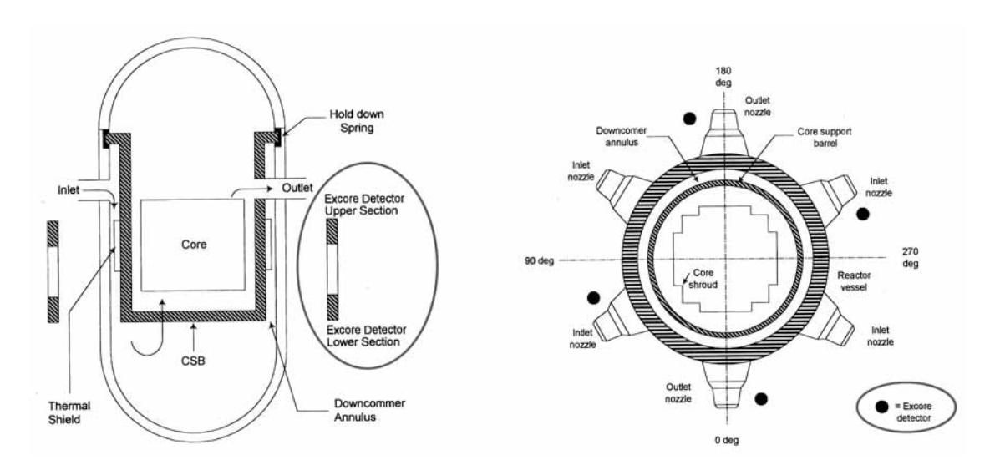

*FIG. 11. Typical locations of ex-core neutron detectors in a PWR.*

The noise signals are measured and processed in different combinations of the signals simultaneously through a data acquisition system. For OLM of reactor internals, the fast Fourier transform (FFT) technique is applied and averaged to calculate the auto-power spectral density (APSD), cross-power spectral density (CPSD), coherence function and phase. The APSD represents the relatively strong periodic components within the stochastic time domain signal, and the coherence function of two simultaneously measured signals reveals the degree of commonality between the periodic components of the two signals. An example of noise spectra is shown in Fig. 12.

Such measurements can reveal material degradation (such as loosening of the core barrel secondary support, or wear of the hold-down springs) through increasing amplitudes and decreasing frequencies. Both beam mode (pendulum) and shell mode vibrations are monitored. The analysis methods have been developed in order to make the method suitable for a consistent trend analysis. Core barrel vibration analysis and monitoring is performed in many countries, and it constitutes a basis for judging the material integrity and for planning maintenance (such as change of the hold-down springs) [16].

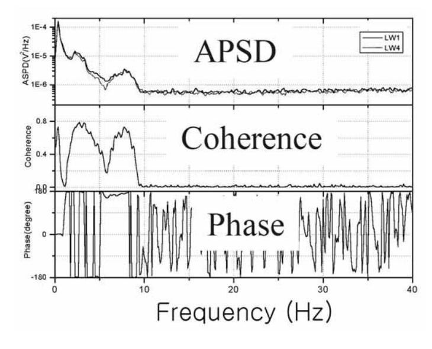

*FIG. 12. Noise signal analysis using two ex-core neutron detectors at opposite positions.*

The performance of the analysis of core barrel vibrations is greatly enhanced if a mechanical model of the vibration modes of the whole internal structure of the pressure vessel, core barrel and core barrel support is available. Such a model serves partly to identify the eigenmodes and eigenfrequencies of the system, and partly to perform a sensitivity analysis of how the degradation of various components affects the vibration amplitudes and frequencies. This helps the interpretation of any changes in the vibration parameters determined by noise analysis [17]. Such calculations are performed by finite element methods. Figure 13 shows a typical reactor internal structure and the finite element model for the vibration analysis.

The simulated vibration characteristics are illustrated in Fig. 14.

#### **3.4.7. Control rod vibrations in PWRs**

After the first pioneering measurements in the ORNL research reactors, excessive control rod vibrations were observed in several PWRs. These vibrations are due to material degradation problems. Owing to obvious structural differences, control rods are more vulnerable to flow induced vibrations than are fuel assemblies. Usually, excessive vibrations can occur and lead to serious consequences only in reactor constructions with large massive control rods that replace a whole fuel assembly. The result of excessive vibrations can be damage to the control rod and/or to the neighbouring fuel assembly; in the worst case, the control rod can break and drop into the core.

Both detection of excessive control rod vibrations and identification of the excessively vibrating rod (localization) are possible from the signals of a few (at least three) in-core neutron detectors at different radial

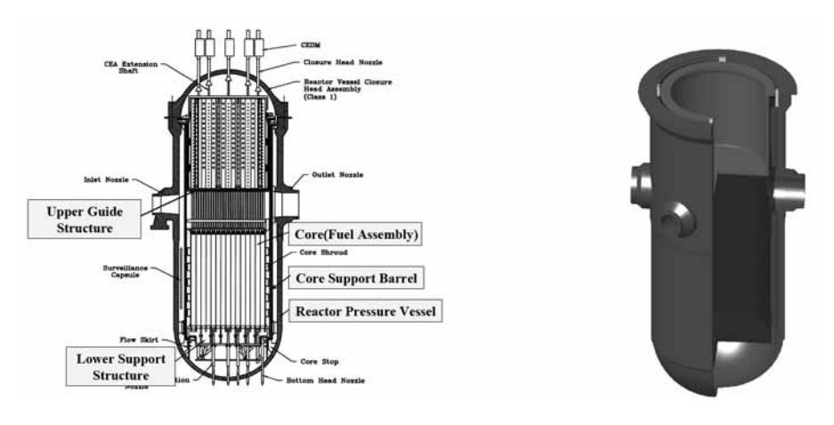

*FIG. 13. Reactor internal structure and its simplified model for a finite element analysis in a PWR.*

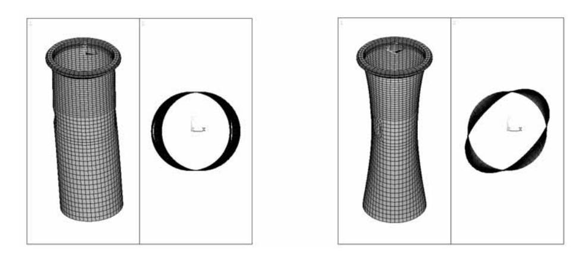

*FIG. 14. Typical vibration modes of reactor internal structures in a PWR.*

(horizontal) locations. The localization is based on knowledge of the spatial attenuation of the neutron noise out from the vibrating control rod and an inversion method to unfold the source position from the measured signals.

A methodology for locating excessively vibrating rods from in-core neutron noise measurements has been refined over the years [18]. A theory describing the induced neutron noise as a function of the vibration properties and the core transfer properties was elaborated first. Then an inversion method was necessary, which determined the vibration properties and the position of the vibrating rod from the measured neutron noise and the core transfer properties. Both parametric (localization curves) and empirical (neural networks) inversion or unfolding methods were used. A notable case of control rod vibrations occurred in a WWER-440 type PWR in Hungary in 1985, where the localization was performed successfully during operation [19]. It is interesting to note that the methodology of localization was developed further to determine the position of local (channel type) thermohydraulic instabilities in BWRs.

The most extensive work with monitoring and identifying core internal vibrations was performed by EDF in France, in collaboration with the University of Tennessee. On-line control rod vibration monitoring is performed today in several countries.

#### **3.4.8. Core flow measurements with neutron noise in PWRs**

In-core LPRMs of fission chambers can detect the effect of propagating temperature fluctuations on the neutron field. By cross-correlating detectors from two different axial levels in the same channel, and applying advanced signal analysis techniques, the local coolant velocity in a PWR can be determined. In the Paks-2 PWR in Hungary, such measurements clarified that the reason for core power asymmetry lay in the asymmetric flow velocities in the core due to crud buildup on the surface of the fuel pins. A graphical representation of the velocity distribution over a horizontal cross-section of the core of Paks-2 is shown in Fig. 15. Such measurements are occasionally performed at other plants.

#### **3.4.9. Measurements of the moderator temperature coefficient in PWRs**

The moderator temperature coefficient (MTC) is an important safety parameter whose measurement with traditional methods is slow and costly. It has long been suggested that it could be measured by noise methods in a non-intrusive way, by cross-correlating the inlet (or outlet) temperature fluctuations with in-core neutron

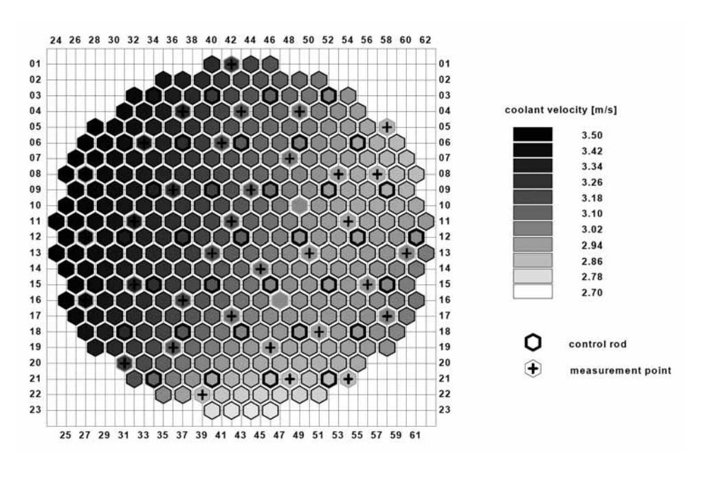

*FIG. 15. Asymmetric velocity profile in the core of Paks-2 (from Ref. [20]).*

noise. In its originally proposed form, the method used local temperature and neutron signals and resulted in, as an absolute method without calibrations, quantitatively very inaccurate results with a systematic underestimation by a factor of 2–5. It could therefore only be used as a relative method, after calibration. Some recent work, however, pointed out that using a radial weighted average of the temperature noise instead of a local thermocouple signal yields much more accurate results that agree with predicted or calculated MTC values very well. The method has been demonstrated in the Swedish Ringhals-2 PWR [21].

This method requires the measurement of the in-core temperature noise at several radial positions. In the Ringhals-2 plant, this was achieved by using so-called gamma thermometers at nine different radial positions inside the core. These gamma thermometers are installed for measuring the local static gamma flux (as an alternative to the neutron flux), but in the frequency range of interest for the determination of the MTC, i.e. between 0.5 and 1 Hz, the gamma thermometers act as thermocouples. In some other plants, core exit thermocouples can be used for the same purpose.

#### **3.4.10. Flow measurements in PWRs**

Several correlation based flow measurement methods were developed in the early 1970s to measure flow, i.e. mass flow of water in a pipe in nuclear power plants. Feedwater flow measurements are part of the thermal power calibration methods, which use calorimetric principles. One early method was based on the crosscorrelation between axially displaced thermocouples, measuring the temperature fluctuations propagating with the flow. Later, in primary circuits the fluctuations of the generated 16N activity were used in cross-correlation flow meters. There exist permanent installations of this type. Yet another method is the cross-correlation of ultrasonic signals, transmitted diagonally in the flow. The periodic signals are randomly modulated by the turbulent eddies travelling with the flow.

#### **3.4.11. Data acquisition for noise analysis in PHWRs**

The CANDU reactors' two independent shutdown systems (SDS1 and SDS2) and the reactor regulating system (RRS) are equipped with:

- Fast responding in-core flux detectors (ICFDs) and ex-core ion chambers;
- Flow, level and pressure transmitters;
- Resistance temperature detectors (RTDs).

These safety and regulating signals are divided into six safety channels (D, E, F for SDS1 and G, H, J for SDS2) and three regulating channels (A, B, C), and are available for multichannel noise signal recording in an analogue format at the output of the station amplifiers. Temporary connections to the noise data acquisition systems are made through optically isolated buffer amplifiers. The analogue multichannel signal conditioning (low-pass anti-aliasing filtering, DC removal and amplification) and the analogue-to-digital conversion of signals are carried out in the computer controlled data acquisition systems. The digital recording of the separate data acquisition systems assigned to the above nine independent safety/regulating channels may be synchronized through sending data acquisition computer clock signals via isolated wire connections. Typically, noise signal recording is carried out for a duration of 30 min–12 h at steady-state high-power operation. The recorded noise signals may be analysed off-line in the frequency and time domain [22, 23].

#### **3.4.12. Vibration of fuel channels detected by ICFD noise analysis**

The noise signals of the horizontal and vertical in-core flux detectors contain information on the characteristics of flow-induced vibration of fuel channels and detector tubes. Experience has shown that abnormalities in the integrity of these structures can be detected and diagnosed at an early stage by analysing the frequency spectra of the ICFD noise signals.

Reactor noise analysis was introduced as a powerful inspection technique in the early 1990s at the CANDU units of Ontario Hydro [24]. Several applications have been developed and are applied on a routine basis. The analysis of regularly performed ICFD noise measurements showed the effect of flow-induced vibration of (horizontal) fuel channels on the ICFD noise spectra at frequencies around 4.5–6 Hz and at 15 Hz in the Darlington, Pickering B and Bruce B units. In-core flux detectors lined up along the same group of fuel channels showed common vibration peaks with high coherence. At these frequencies, the phase difference between the ICFD noise signals was either 0 or 180 degrees, depending on whether the detectors were on the same side or on different sides of the vibrating fuel channel(s). In many cases, multiple vibration peaks at slightly different frequencies were seen in the coherence functions, indicating that there were several vibrating fuel channels among the common neighbouring channels of the two in-core flux detectors.

A typical result of ICFD noise measurements performed in Darlington unit 2 is shown in Fig. 16. There are five distinct in-phase vibration peaks in the coherence function over the frequency range of 4–6 Hz, indicating that five of the six neighbouring fuel channels vibrate and affect the signals of the two ICFDs in phase.

Figure 17 shows typical vibration modes of a fuel channel, which can be linked to the vibration peaks in the spectral and coherence functions of ICFD noise signals.

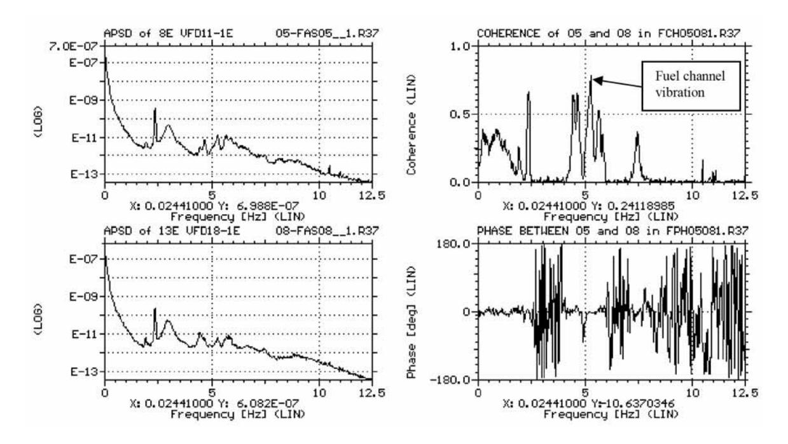

*FIG. 16. APSD spectra, coherence and phase functions of noise signals of two ICFDs lined up along the same set of fuel channels in Darlington unit 2.*

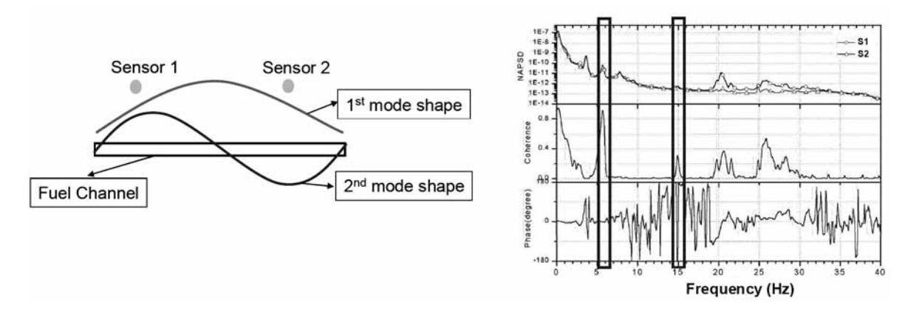

*FIG. 17. Fuel channel vibration modes in a CANDU reactor.*

The primary and secondary bending modes of the fuel channel vibration affect the ICFD noise spectra at the same frequencies. The major components of the fuel channel assembly are the calandria tube, pressure tube, fuel bundles, two end fittings and four garter springs, as shown in Fig. 18. Figure 19 shows an example of the comparison between normal and abnormal vibration (displacement) spectra of a fuel channel obtained from the finite element modelling.

Finite element vibration analyses of CANDU fuel channels have been used to create a database of vibration modes and frequencies for various abnormal conditions of the end fitting support and the garter springs.

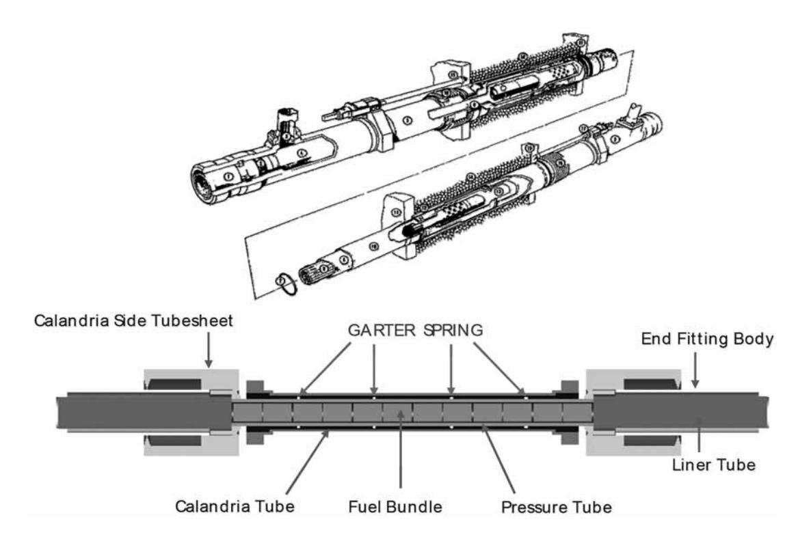

*FIG. 18. A typical CANDU fuel channel and its simplified model used in finite element analysis.*

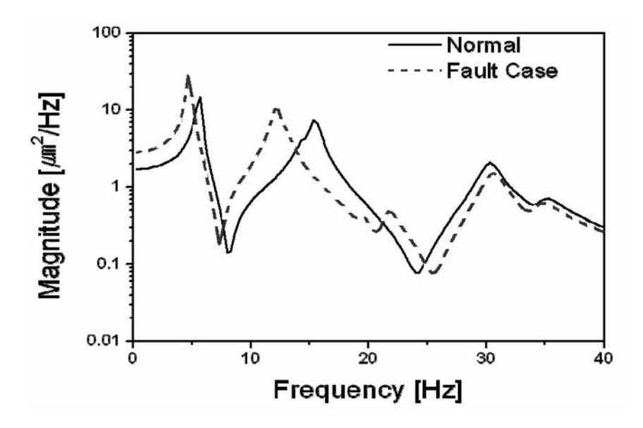

*FIG. 19. An example of the simulated vibration spectra of a CANDU fuel channel based on finite element analysis.*

#### **3.4.13. Vibration of detector tubes detected by ICFD noise analysis**

Evidence of flow-induced mechanical vibrations of both horizontal and vertical detector guide tubes in CANDU reactors has been found in the spectral functions of ICFD noise signals. A detector vibrating in an inhomogeneous static flux senses virtual flux changes and produces a small oscillating current component at the vibration frequency via its prompt response channel. In this way, the movement of the detector in a non-zero flux gradient is directly mapped into detector current fluctuations. An increase in the vibration amplitude or possible impacting with surrounding structures can be detected indirectly by ICFD noise analysis.

The vibration of detector tubes induced by the moderator flow results in strong peaks in the spectra and coherence functions of noise signals of ICFDs in the frequency range of 2–5 Hz. Noise signals of detectors located in the same vibrating detector tube have high coherence and zero phase differences at the fundamental frequency of tube vibration. Depending on the locations of the ICFDs inside the guide tube, the detectors may have zero or 180 degree phase differences at the frequencies of the higher harmonics, with high coherence.

A typical pattern, measured between ICFDs located in the same horizontal detector tube in Pickering B unit 5, can be seen in Fig. 20. It shows the APSD, coherence and phase functions between the signal fluctuations with a detector vibration frequency of 3.8 Hz.

The strong and sharp vibration peak in the coherence function and the zero phase difference at the vibration frequency indicate that the oscillation is monochromatic and stationary; that is, the detectors in the horizontal tubes vibrate freely at a constant frequency.

By monitoring the trend of vibration peaks in the noise spectral functions of the measured ICFD signals, the mechanical condition of the detector tube can be assessed on the basis of the following simple principles:

- An increase in the magnitude of the peak in the noise spectra of the ICFD indicates detector tube vibration with increasing amplitude.
- A shift in the frequency location of the spectral peak indicates changes in the mechanical conditions/ support of the detector tube.
- A widening of the spectral peak and the occurrence of higher harmonics in the ICFD noise spectra indicate increasing impacting with the surrounding reactor internals.

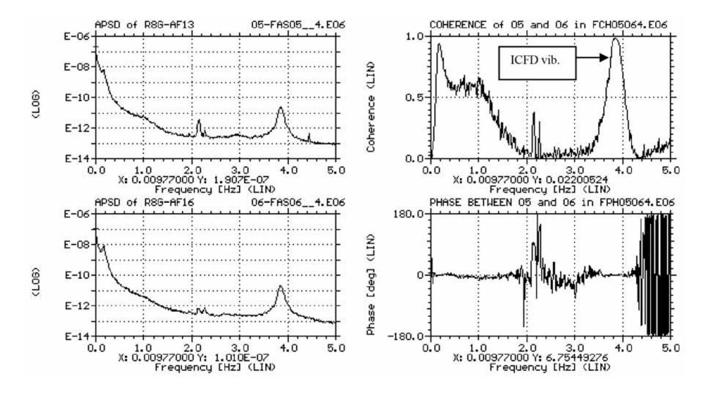

*FIG. 20. APSD spectra, coherence and phase functions of noise signals of two SDS2-G ICFDs located in the same horizontal detector tube, HFD8, measured in Pickering B unit 5.*

The long term trend monitoring of these vibration peaks is useful for early detection of mechanical degradation in the reactor core caused by vibrations. Also, excessive detector tube vibration may lead to mechanical failures compromising the integrity of the ICFD signals (e.g. fatigue of lead cable and detector junction, and loss of cover helium pressure).

#### **3.4.14. Two-phase flow diagnostics and the local component in BWRs**

It was observed in the mid-1980s that the cross-correlation between in-core neutron detectors in the same instrument tube could indicate the bubble transit time, and hence give an indication of flow velocity. The physical reason for this was explained by the existence of a so-called local component of the two-group neutron noise, which had already been observed in early measurements at the Oak Ridge Graphite Reactor (X-10 or the 'Clinton Pile'). Methods were developed to assess steam velocity and void fraction from in-core BWR noise measurements. Even a so-called second transit time (co-existence of two distinct velocities in one channel) was observed in several measurements. Despite convincing results and a sufficient methodology, surveillance of twophase flow properties by neutron noise methods has not found routine application. Measurements of the local steam velocity at several plants have been conducted.

#### **3.4.15. BWR instability**

It is well known that during startup conditions, i.e. medium/high power level and low/moderate core flow, BWRs can experience unstable power oscillations and regional (out-of-phase) or local neutron flux oscillations. The possibility of such power oscillations, which are to some extent analogous to xenon oscillations in a PWR, was predicted theoretically [15]. Calculations are thus performed before startup via coupled neutronic– thermohydraulic codes to verify the conditions under which the reactor becomes unstable. This defines an exclusion zone, i.e. a set of operating conditions that the reactor operator should avoid.

During the startup tests of the reactor, measurements of the in-core neutron noise are usually performed. This is achieved by the use of in-core detectors. For instance, in the Swedish ABB BWRs there are 36 in-core detector strings with 4 detectors in each. The individual detectors are called local power range monitors (LPRMs). There are also four groups, each consisting of the arithmetic mean or the sum of nine detector strings distributed over the core, which are called average power range monitors (APRMs). Both the LPRMs and the APRMs are used for stability monitoring, although the latter cannot detect regional or local instabilities.

There exist three different types of unstable oscillation: global or core-wide (in-phase), regional or out-ofphase, and local or channel type (pure density wave oscillation (DWO) type) oscillations. The first two are coupled core physics–thermohydraulics phenomena, whereas the channel type instability is purely thermohydraulic.

For the global or in-phase instability, the flux oscillates over the whole core at a typical frequency of 0.5 Hz, and the space dependence of the flux follows the first neutronic mode, i.e. the fundamental mode. Since the eigenvalue of the fundamental mode is the only one that might be larger than unity, the neutronics might amplify any perturbation of the core. The mechanism driving this kind of oscillation is mainly the time delay between a given power perturbation and the corresponding reactivity response due to the void/pressure coefficient. In some cases, the initial perturbation can be reinforced by the void/pressure feedback if the phase of this delayed response coincides with the phase of the power perturbation. Although the thermohydraulics also plays some role in this kind of instability, it is a stabilizing effect, i.e. the flow oscillations induced by the void/pressure oscillations are damped by the friction in the recirculation loop.

For the out-of-phase oscillation, there is a positive flow rate perturbation in one half of the core and a negative flow rate perturbation in the other half of the core. The recirculation loop does not play a role in this case, since the core-averaged flow rate perturbation is roughly equal to zero. The mechanism driving the oscillation is thermohydraulic, whereas the neutron kinetics has a damping effect. This behaviour is precisely the opposite of the case of global or in-phase oscillations. Namely, a power perturbation will induce a change of void/ pressure, which itself will create a perturbation of the flow rate. Depending on the operating conditions, the time delay between the power perturbation and the corresponding flow rate response can either reinforce or damp the initial perturbation. One characteristic of the regional oscillation is that several higher modes can be excited, compared with the in-phase oscillation. Typically, the second and third modes, i.e. first and second azimuthal modes, respectively, are excited. Even if these modes are subcritical, the thermohydraulics might self-sustain the oscillations. The oscillation frequency of these two modes, although typically close to 0.5 Hz, might be slightly different from each other. Thus, the resulting oscillation, which is the sum of these two modes, might exhibit a rotating neutral line, with the neutral line being defined as the line separating the positive and the negative lobes of the oscillation. Very often, a fourth mode, i.e. the first axial mode, can also be excited. The regional or out-ofphase oscillation is thus a complicated oscillation owing to its spatial intermittence, i.e. the neutral line might be stable in some cases or might rotate. Clearly, conventional frequency-domain analysis methods will fail to recognize this type of oscillation if it is non-stationary (time- and frequency-domain analysis methods, such as wavelets, should be used instead).

The last type of possible instability in a forced convection BWR is a local oscillation or DWO. This type of oscillation typically occurs when a fuel assembly is unseated, i.e. does not sit properly on the lower fuel tie plate of the core. Since each fuel assembly in a BWR is contained in a fuel box, the fuel channels are independent of each other. If there is an unseated fuel assembly, some of the coolant bypasses the fuel channel. The inlet flow perturbation will create a modification of the single-phase pressure drop in the single-phase region of the heated channel. This perturbation will travel upward with the flow and generate a modification of the two-phase pressure drop in the two-phase region of the heated channel. Since the perturbation only affects one fuel channel, and since the core is large, the total pressure drop between the core upper plenum and the core lower plenum remains constant. Owing to this imposed boundary condition, the two-phase pressure drop in the perturbed fuel channel will create a feedback pressure perturbation of the opposite sign in the single-phase region, either reinforcing or damping the initial perturbation.

In addition to the above described 'pure' (single type) instabilities, there have been cases where two of the above described modes have occurred simultaneously, such as global and regional (Ringhals Plant (Sweden), 1992) and global and local (Forsmark Plant (Sweden), 1997/1998). Since the two oscillations occur at the same frequency (inverse of the core flow transit time), they cannot be separated in the power spectra. The problem with the mixed modes is that the less stable component may have smaller oscillation amplitudes, and hence a simple determination of the decay ratio (DR) using a detector signal that contains the sum of the two oscillations will be dominated by the more stable component, leading to an overly optimistic estimation of the stability margin. However, methods have been elaborated to eliminate the various modes such that the stability properties of each mode can be determined separately and hence a margin of instability can be re-established.

Despite the awareness of BWR instability and the preparatory measures, unexpected instabilities have occurred in the past in different BWRs. In Sweden, one of the most spectacular events was the Oskarshamn 3 inphase instability event in February 1998, where very large power oscillations (more than 40% of the nominal power from peak to peak) were undetected by the reactor operator before the plant protection system automatically shut the reactor down.

#### **3.4.16. Impacting of detector tubes in BWRs**

Flow induced vibrations of the detector tubes have in several instances led to impacting, which in some cases caused significant damage to both the detectors and the fuel assembly walls. The vibrations of the detector in a flux gradient can be identified from the detector signal itself through the peaks of the detector signal APSDs. To determine whether or not impacting is occurring is straightforward; however, to quantify the severity of the impacting is much more difficult, and there is no significantly reliable method. There are many qualitative indicators, including increased amplitude or width of the peak (requiring access to baseline data from before impacting); distortion of the linear phase between two detectors at different axial positions in the same tube; and occurrence of higher harmonics (peaks at double or triple frequencies). Recently, more objective methods have been developed that do not require comparison with baseline data (non-impacting conditions). These methods are based on wavelet analysis and detecting short transients in the signals that follow each detector impact.

#### 3.5. MOTOR ELECTRICAL SIGNATURE ANALYSIS

Condition monitoring of electrical systems includes both stationary components (such as cables, instrument channels, electric circuits) and rotating or more dynamic components (such as motors, generators, actuators). Short term operational as well as long term ageing of electrical components and their maintenance are very important issues in both power and process industries. Some of these are addressed by the NRC's Nuclear Plant Aging Research (NPAR) programme. The sections below address only those monitoring methods based on electrical signature analysis of motors that operate pumps or valves in a power plant.

#### 3.5.1. Motor current signature analysis

As the mechanical load on an induction motor varies, the current drawn by the motor changes, increasing with increasing load. Thus, a motor acts as a transducer, and the variations in the mechanical loads are reflected in the variations of motor current. Motor current can be measured non-intrusively using a clamp-on current probe. The technology of drawing diagnostic information from the analysis of such measurements is called motor current signature analysis (MCSA). MCSA systems can also include a signal conditioning device, which makes a sensitive and selective analysis of the current variations possible. The output of this device is processed further using standard signal processing techniques. Various anomalies can be seen as changes in the pattern of the motor current during e.g. a valve stroke [25–27].

The change in the mechanical load (apart from a normal variation of the external load) can also be due to a malfunction of either the motor itself or of the component operated by the valve (MOV). These two cases are considered below.

Motor current variations corresponding to motor malfunctions are generally due to:

- Rotor imbalance, eccentricity with respect to the stator;
- Thermal bowing of the rotor;
- Broken or cracked rotor bars:
- Shaft or stator resonances;
- Mechanical and electrical misalignment;
- Loose rotor on the rotor shaft.

Information about these anomalies is obtained by monitoring various frequencies of an induction motor operation, which are defined as follows:

```
f_{\rm L} = line frequency (Hz); 

f_{\rm SN} = synchronous frequency of the motor = \frac{2 \times f_{\rm L}}{P} (Hz), P = No. of poles; 

f_{\rm R} = rotational frequency (rotational speed) of the motor (Hz); 

Slip frequency, f_{\rm SL} = f_{\rm SN} - f_{\rm R}; 

f_{\rm SB} = sideband frequency = slip frequency × No. of poles = f_{\rm SL} \times P (Hz).
```

Both the sideband frequency location and spectral magnitudes are indicative of rotor bar problems. Continuous monitoring of motor current spectra at various frequency bands provides predictive maintenance information during normal operation. The changes in the spectral magnitudes of the motor current, at slip frequency sidebands of the line frequency, are indicative of rotor related anomalies.

MOVs are subjected to loads and stresses from the control systems and power systems that serve them, as well as from the fluid systems in which they operate. They may be subjected to partial damage or degradation that will leave them operable for normal or no-load situations, but may cause failure at design basis demand pressure or flows.

The following basic failure modes of MOVs were identified by the NPAR programme: failure to open; failure to close; failure to operate as required; plugging (failure to remain open); internal leakage; external leakage. Various anomalies can be seen as changes in the pattern of the motor current during the valve stroke.

The diagnostic information that can be extracted from the motor current spectrum is:

- Identified spectral peaks, such as worm gear teeth meshing frequency, stem nut rotation, shaft speed and motor slip frequency;
- Unidentified peaks that may be related to loads resulting from bearings, imbalance, etc.;
- Harmonics of fundamental peaks and sidebands (usually indicative of wear and/or eccentricity).

The following abnormalities could be detected by MCSA:

- Valve stem taper;
- Stem nut wear;
- Degraded voltage;
- Degraded valve stem lubrication;
- Worm gear tooth wear;
- Obstruction in the valve seat area;
- Motor pinion disengagement;
- Degraded worm and worm gear lubrication;
- Changes in stem packing adjustments;
- Improper torque switch settings.

MCSA was developed at ORNL. An expert system using the pattern recognition technique and diagnostics rules for a given motor operator was developed at the University of Tennessee.

#### **3.5.2. Motor power signature analysis**

Motor power signature analysis (MPSA), such as that developed by Duke Power Company [28], consists of monitoring the three phase induction motor power during valve operation (open-to-close and close-to-open strokes). For a balanced Y – Δ connected motor, the power is given by:

Motor power = 
$$3\sqrt{3}$$
  $V_{\text{phase}}$   $I_{\text{phase}} \cos \Phi$ 

where:

cosF = power factor;

*V*phase = voltage across each phase;

*I*phase = current across each phase.

In actual MPSA tests, the three phase voltages and the three phase currents are measured, and the total power is calculated as:

Power = 
$$\sqrt{3} (V_1 I_1 + V_2 I_2 + V_3 I_3) \cos \Phi$$

Changes in the power signature are sensitive to operation anomalies and can be effectively diagnosed by this signature analysis.

# **4. MODELLING TECHNIQUES**

This chapter describes common modelling techniques that have been applied for equipment condition monitoring in nuclear power plants. Modelling techniques applied to equipment condition monitoring are distinctly different from the measurement based techniques described in the previous chapter. Two general categories of modelling types are described in the following sections, namely empirical and physical:

- Empirical modelling techniques construct models from historical operating data or simulated data.
- Physical modelling techniques, on the other hand, construct models based on sets of equations grounded on first principles and physical laws.

A final section describes some less common but related techniques such as fuzzy logic and multilevel flow monitoring. Before going into details, the discussion that follows describes a generalized development and implementation process for a modelling technique.

In general, the modelling techniques described here are applied to the components and systems that are critical to continuous, safe operation of the plant. Modelling of noise sources and other processes, as well as transfer functions, is also used in reactor noise analysis, but is not described here. A list of the primary equipment and subsystems that modelling techniques would address in an OLM system for a nuclear power plant is provided below. Depending on the needs of a specific plant, this list could be modified:

- Main steam turbine: High pressure, intermediate pressure and low pressure turbine, thrust bearing, gland steam;
- Reactor coolant system: Flow, pump motor and pump seal;
- Feedwater system: Flow, pump and turbine performance and mechanics, heaters;
- Condenser (performance): Pump, turbine;
- Generator: Rotor cooling, stator cooling, exciter, transformer.

The application of modelling techniques to nuclear power plant equipment and systems can typically be completed without the need for additional instrumentation and data acquisition systems. Most nuclear power plants have a dedicated data historian, which is a suitable interface for modelling system software. Data historians typically store data whenever the difference between the current measured value and the previously stored value exceeds a predefined threshold. In most cases these thresholds, or deadbands, are set such that changes of significant magnitude are recorded. Furthermore, in cases where the deadband may be set too large, it is a simple task to reduce this value such that the data historian archives data on a more regular basis. While modelling techniques can be applied to existing equipment using the available instrumentation, in some cases the instrumentation may be too limited for the modelling technique to produce sufficiently accurate results. Most critical plant equipment is instrumented well enough to develop and deploy modelling techniques. The addition of new instrumentation can assist in cases where more instrumentation is necessary, but the need for additional instrumentation would be determined on a case-by-case basis.

In developing an empirical model, the preliminary tasks are to identify the component of interest and to select an initial set of input variables. The initial set of variables usually consists of those parameters that directly measure the physical conditions of the equipment, as well as other, more global parameters and parameters from related equipment:

- A set of variables;
- A historical period of time (beginning and end date);
- A sampling rate.

This historical data set can then be imported into the modelling software either automatically, if a direct communications link is available with the plant historian, or manually. Additional information on data and signal selection is provided in Section 4.1.1.

After the data are imported, a variety of steps are required to build an empirical model. The first step reduces the data set to a much smaller set of representative samples of data that fully characterize the model. As a rule of thumb, the set of historical data will contain 1–5 min samples of data for a 12 month period, resulting in a tremendous volume of data. These data will often be reduced initially through a manual selection process. This manual process is based on engineering judgement that seeks to identify expected operating conditions in the data set, while removing outliers and abnormal conditions. The data included in this reduced data set will define the empirical model's knowledge of the system or equipment, and thus any included operating conditions (normal or abnormal) in the data will be recognized as normal in the future. A further reduction is then achieved using automated data selection algorithms, which are designed to select samples of data that are equally spaced across the region of interest, or some other sampling criterion. A typical final set of representative data samples to be used to train or develop the final model will contain no more than ~1000 data samples. The remainder of the model development steps will vary from one modelling architecture or software product to the next, but in general will require the setting and adjustment of model parameters to optimize model performance. Once an empirical model has been developed, it will be directly linked to the data historian so that the data can be sampled on a regular basis from the historian without user intervention or the need for manual batch processing. Common sampling rates are 5 or 15 min. Typically, model outputs are written back to the plant historian, or in some cases dedicated servers are set up to record modelling system outputs.

In developing a physical model, the requirements for collection of a large quantity of historical data, and the subsequent reduction of the historical data set into a smaller *training* data set, would be omitted. In some cases, the collection of some data to verify the performance of the physical model will be necessary. As was the case for the empirical model, there will most likely be some adjustable parameters necessary within the physical modelling framework that must be defined. Note that in this discussion it is assumed that a complete physical model of the plant is already available.

The output of a model (empirical or physical) is typically a set of calculated or predicted values that can be compared with either measured values or expected values to identify deviations from normal or expected conditions. The process of automatic comparison of observed deviations to threshold (user specified) values is referred to as anomaly detection. Both physical and empirical models are capable of performing anomaly detection. When considering the goal of identifying the onset of equipment degradation or failure, there is another higher level of analysis that attempts to automate the process of interpreting the anomalies output from modelling systems. Most modelling software systems include a framework for embedding anomaly interpretation logic into a model; however, the knowledge required to interpret all anomaly patterns is not commonly available.

The developer and end user of modelling systems are typically the same person, or group of persons. Usually the engineering staff would be responsible for modelling systems and, owing to the significant level of oversight and maintenance required to keep a full modelling system operational, staff resources should be dedicated to this effort. During use, when an engineer or system analyst detects a potential degradation based on a modelling system, it is his or her responsibility to contact the appropriate person at the site who is responsible for the maintenance of that particular system or component. Most modelling systems implemented in nuclear power plants are stand-alone systems that require manual expertise and intervention by the end user to initiate actions based on the information provided from the modelling system.

The primary feature of model based equipment and process condition monitoring implementation is the potential for early warning of equipment degradation and failure. Properly developed models can be highly accurate in producing estimations and highly sensitive to process variable changes. Unexpected process variable changes can be identified as anomalies, and experience has shown that early onset of equipment degradation can often be observed in the process variable measurements. Thus, the identification of anomalies acts as an early warning system for equipment degradation if these anomalies are properly interpreted.

Current implementations often rely on manual interpretation by equipment specialists or other end users of the empirical equipment condition monitoring system. While this is a valid approach, the interpretation is a tedious and time consuming task that may be automated if it is a repeatable process. In other words, if a failure's diagnosis consistently has the same precursor indications, then to automatically link the occurrence of this precursor to the event diagnosis is a logical next step.

#### 4.1. EMPIRICAL MODELLING

As early onset of equipment degradation can often be observed in the process variable measurements, the identification of anomalies acts as an early warning system for equipment degradation, provided these anomalies are properly interpreted. Current implementations rely on manual interpretation by equipment specialists or other end users of the empirical equipment condition monitoring system.

When a nuclear power plant is operating normally, the readings of the instruments form a pattern (or unique set) of readings that represents a normal state of the plant or system. When a disturbance occurs, the instrument readings undergo a transition to a different pattern, representing a different state that may be normal or abnormal, depending upon the nature of the disturbance. The fact that the pattern of instrument readings undergoes a transition to a different state may be sufficient to provide a basis for identifying the transient or the change of state of the system. When a transient occurs starting from steady state operation, instrument readings develop a time dependent pattern. These patterns are unique with respect to the type of accident, severity of accident and initial conditions. A technique particularly suited to the task of recognizing patterns in instrument readings is empirical modelling.

Empirical modelling, also known as data based modelling, is a popular technique to analyse the condition and predict the evolution of the process from operational data that does not require a detailed physical understanding of the process or knowledge of the material properties, geometry and other characteristics of the plant and its components, both of which are often lacking in real, practical cases.

The underlying process model is identified by fitting the measured or simulated plant data to a generic linear or non-linear model through a procedure that is often referred to as 'learning'. This learning process may be active or passive, and involves the identification and embedding of the relationships between the process variables into the model. An active learning process involves an iterative process of minimizing an error function through gradient based parameter adjustments. A passive learning process does not require mathematical iterations and consists only of compiling representative data vectors into a training matrix.

One way that empirical models can be constructed is around a set of input process variables to produce estimations for all or some of the input process variables based on the embedded relationships learned from the training data (see Fig. 21). Residual values are computed as the numerical differences between the measured process variables and their estimations. These residual values are analysed to identify deviations from expected behaviour, i.e. anomalies. Expected behaviour of residual values is nominally a zero mean value with some fixed variance; however, other characteristic nominal residual distributions may also be used.

Another way empirical models can be constructed is around a set of input process variables to directly detect anomalies and make diagnostic hypotheses (see Fig. 22). In this case, a set of input process measurements is analysed by the model and related to predefined fault hypotheses in an inverse mapping process. This scenario is a typical classification problem for which artificial neural networks, among other techniques, are well suited [29, 30].

#### **4.1.1. Requirements**

An extremely important consideration in designing empirical models is that the training data must provide examples of all conditions for which accurate predictions will be queried. This is not to say that all possible conditions must exist in the training data, but rather that the training data should provide adequate coverage of these conditions. Empirical models will provide interpolative predictions, but the training data must provide adequate coverage above and below the interpolation site for this prediction to be sufficiently accurate. Accurate extrapolation, i.e. providing estimations for data residing outside the training data, is either not possible or not reliable for most empirical models.

Empirical models are reliably accurate only when applied to the same, or similar, operating conditions under which the data used to develop the model were collected. When plant conditions or operations change significantly, the model is forced to extrapolate outside the learned space, and the results will be of low reliability. This observation is particularly true for non-linear empirical models, since, unlike linear models, which extrapolate in a known linear fashion, non-linear models extrapolate in an unknown manner. Artificial

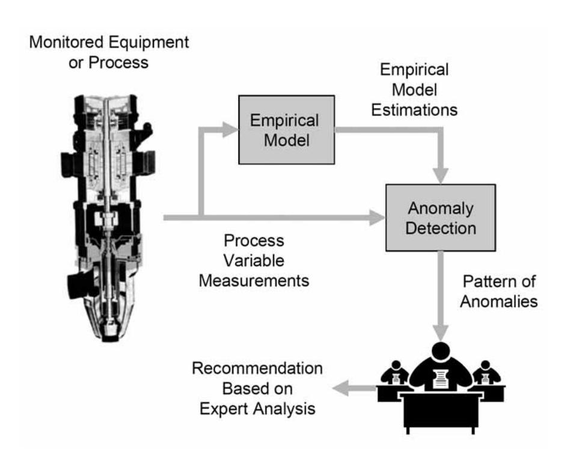

*FIG. 21. Information flow and interpretation of equipment condition monitoring system based on empirical variable estimation models.*

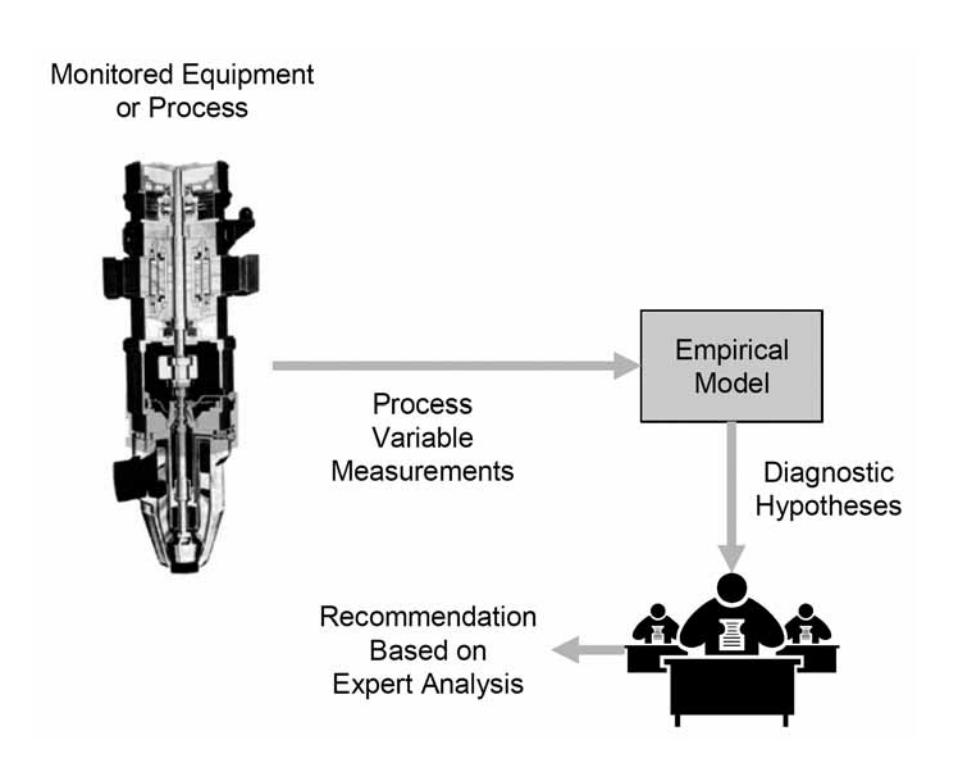

*FIG. 22. Information flow and interpretation of equipment condition monitoring system based on empirical diagnostic models.*

neural network (ANN) and local polynomial regression models are both non-linear, whereas the transformation based techniques discussed herein are linear techniques. Extrapolation, even if using a linear model, is not recommended for empirical models, since the existence of pure linear relationships between measured process variables is not expected. Furthermore, the linear approximations to the process are less valid during extrapolation because the density of training data in these extreme regions is either very low or non-existent.

The choice of input process variables to include in an empirical model can significantly affect the fidelity of the model. The fidelity and accuracy of a model may be compromised when irrelevant variables are included in the overall model. A similar effect will occur if not all of the necessary signals are included in a given model. The task of input variable selection and grouping is typically based on engineering decisions, correlation analyses and physical reasoning. In-depth studies of optimal channel groupings based on uncertainty analyses and/or model performance will provide parsimonious and efficient models, though the standard procedure is a more loose methodology based on engineering judgement and physical or mathematical correlations.

One of the major obstacles to the implementation of empirical modelling techniques for equipment condition monitoring is that of data availability with respect to past examples of failures. While there is typically an ample number of instrument channel measurements to construct and employ an empirical model for anomaly detection, the automated interpretation of the observed anomaly patterns is much more difficult. There are normally not enough data available to train models to recognize the sensor patterns for a wide range of failures. Also, not all possible faults can be simulated or even pre-enumerated. Most applications of empirical modelling will therefore focus on a limited number of faults and/or components that are of particular interest.

Other scenarios for the implementation of empirical modelling for equipment condition monitoring on a larger scale include the case where the empirical system would only be used to detect the failures with human experts performing the diagnostics, and the case where a database of fault signatures obtained from past failures as well as from simulations is gradually built to form a growing platform that supports empirical modelling. Currently, the latter approach is being implemented fleetwide in fossil fuel power plants, resulting in a faster growing fault signature database.

#### **4.1.2. Neural networks**

ANN models contain layers of simple computing nodes that operate as non-linear summing devices. These nodes are highly interconnected with weighted connection lines, and these weights are adjusted when training data are presented to the ANN during the training process. Successfully trained ANNs can perform a variety of tasks [31], the most common of which are: prediction of an output value, classification, function approximation and pattern recognition.

Only those layers of a neural network that have an associated set of connection weights will be recognized as legitimate processing layers. The input layer of a neural network is not a true processing layer because it does not have an associated set of weights. The output layer, on the other hand, does have a set of associated weights. Thus, the most efficient terminology for describing the number of layers in a neural network uses the term 'hidden layer'. A hidden layer is a legitimate layer exclusive of the output layer.

A neural network structure consists of a number of hidden layers and an output layer, as depicted in Fig. 23. The computational capabilities of neural networks were proven by the general function approximation theorem, which states that a neural network, with a single non-linear hidden layer, can approximate any arbitrary non-linear function given a sufficient number of hidden nodes.

The neural network training process begins with the initialization of its weights to small random numbers. The network is then presented with the training data, which consist of a set of input vectors and corresponding desired outputs, often referred to as targets. The neural network training process is an iterative adjustment of the internal weights to bring the network's outputs closer to the desired values, given a specified set of input vector/ target pairs. Weights are adjusted to increase the likelihood that the network will compute the desired output. The training process attempts to minimize the mean squared error (MSE) between the network's output values and the desired output values. While minimization of the MSE function is by far the most common approach, other error functions are available.

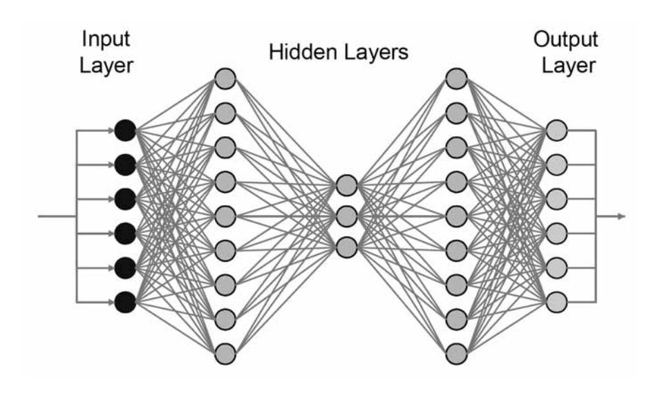

*FIG. 23. A typical ANN structure.*

#### *4.1.2.1. Strengths and weaknesses*

ANNs are powerful tools that can be applied to pattern recognition problems for monitoring process data from power plant equipment. They are well suited for monitoring non-linear systems and for recognizing fault patterns in complex data sets. Owing to the iterative training process, the computational effort required to develop ANN models is greater than that for other types of empirical model. Accordingly, the computational requirements lead to an upper limit on model size that is typically more limiting than that for other empirical model types.

#### *4.1.2.2. Applications*

ANNs have been applied successfully in prediction, classification, function estimation, pattern recognition and pattern completion problems in many disciplines. Many applications have been presented for signal validation in the power industry [32–36], though the number of applications currently operating in commercial nuclear power plants is very limited. ANNs have also been applied for transient identification and for optimization.

#### **4.1.3. Local polynomial regression**

Nonparametric regression using data in a neighbourhood of the present query point is generally referred to as a local model, and the general class of techniques is referred to as local polynomial regression (LPR). Local fitting in the context of regression analysis was introduced by Watson [37], Stone [38] and Cleveland [39].

LPR models are often referred to as 'lazy learning' methods, since they are a set of methods in which data processing is deferred until a prediction at a query point needs to be made. They are also known as memory based methods owing to the approach of storing the training data and recalling relevant training data when a query is made.

A training data set comprises a set of input vectors and a corresponding set of output values. A query point is an input vector for which an output is to be determined. An output value is calculated as a weighted estimate of relevant points in the training data set. Relevance is quantified through the use of a kernel function centred at the query point. A kernel function will assign maximum relevance when a query point matches a point in the training set and diminishing relevance from this maximum as the distance between a query point and the training point increases. The kernel's influence can be adjusted via the so-called kernel bandwidth.

Kernel regression and local polynomial regression are covered extensively in various textbooks [40, 41].

#### *4.1.3.1. Strengths and weaknesses*

One of the major benefits of local polynomial regression is that it does not require a formal learning algorithm whereby the model iteratively converges to its final form. Local polynomial regression models are primarily defined by the data comprising the training data set and therefore require a limited modelling effort.

#### *4.1.3.2. Current applications*

In the nuclear power industry, the primary form of local polynomial regression applied is a zero-order polynomial regression — fitting a local region of data with a constant value. A variant of this methodology was developed at Argonne National Laboratory (multivariate state estimation technique) [42] and is one of the most commonly tested and applied algorithms in the US nuclear power industry.

#### **4.1.4. Transformation based techniques**

Transformation based techniques are more traditional statistical models. The most often applied techniques of this type for equipment condition monitoring in nuclear power plants are principal component analysis (PCA) [43] and partial least squares (PLS) [44, 45].

In general, transformation based techniques decompose a data matrix **X** (*m* samples, *n* variables) as the sum of the outer product of vectors *ti* and *pi* plus a residual matrix:

$$\mathbf{X} = t_1 \mathbf{p}_1^{\mathrm{T}} + t_2 \mathbf{p}_2^{\mathrm{T}} + \dots + t_k \mathbf{p}_k^{\mathrm{T}} + \mathbf{E} = \mathbf{T}_k \mathbf{P}_k^{\mathrm{T}} + \mathbf{E}$$

The vectors *pi* are orthonormal, and the vectors *ti* are orthogonal, that is:

$$\boldsymbol{p_i}^{\mathrm{T}} \boldsymbol{p_j} = 1, \quad \text{if } i = j$$

$$\boldsymbol{p}_i^{\mathrm{T}} \boldsymbol{p}_j = 0, \quad \text{if } i \neq j$$

$$\mathbf{t_i}^{\mathrm{T}} \mathbf{t_j} = 0, \quad \text{if } i \neq j$$

A set of transformed variables can be computed from:

$$t_i = \mathbf{X} \boldsymbol{p}_i$$

The primary computational difference between PCA and PLS, with respect to matrix decomposition, is in determining the vector *p* (the loading or weight vector). In PCA the weight vectors are determined to maximize the variance of **X** contained in the first transformed vector *t*1. On the other hand, PLS is designed primarily for prediction of a response variable *y*, such that the weight vectors are determined to maximize the covariance between **X** and *y* contained in the first transformed vector, *t*1. PLS can also accommodate multiple response variables in a matrix **Y**, and there exists a complimentary transformation for the response variable matrix; however, applications of this type are rare in power plant monitoring. For both PCA and PLS, the subsequent transformed vectors are defined to be orthogonal to the first and capture the maximum remaining variance (PCA) or covariance (PLS).

One of the primary features of transformation based techniques is dimensionality reduction. If variance (or covariance) is considered to be the information in the data, then the first few transformed variables will contain most of the information in the data set. If the remaining information is considered uninformative, then the dimensionality reduction can be significant. Another feature of transformation based techniques is that they are well suited to large sets of collinear variables, which are extremely common in designing power plant models owing to the large number of instrument channels and the strong relationships between their measurements.

Transformation based techniques can be applied to OLM in a variety of ways; however, there will always be the need to gather historical data to establish a baseline model for comparison with the future computations based on new data. The transformed variables can be regressed onto a response variable to form a predicted variable. The regression parameters can then be applied to new data and the predicted values monitored for deviation from the measured or expected value. In addition, the statistical properties of the transformed vectors can be monitored by applying the established weight vectors and monitoring the distance of the transformed point from the previously established transformation vector.

Typically, transformation based techniques utilize numerous input variables and output a single response variable or deviation parameter, which represents the closeness of fit of the established transformation based model to the currently observed (measured) conditions. This architecture is different from the more common approach utilizing an auto-associative architecture, which provides predicted values for each input variable. There are no theoretical limitations for PCA and PLS that prohibit establishing an auto-associative regression model using these techniques, though in practice it is not done. The single output feature changes the way in which diagnostics are performed with a transformation based technique. In an auto-associative framework, when a pattern of anomalies is identified, it is clear from a review of the residual differences between the measurements and estimations which input signals are deviating from their measured values. For the case of a transformation based model, the single output will exceed its threshold value, indicating an anomaly. The driving force behind that anomaly must then be extracted by reviewing the transformation scores to identify the leading contributing signals, which were the root cause of the anomaly.

#### *4.1.4.1. Strengths and weaknesses*

The transformation based techniques eliminate numerical issues related to collinear data. In addition, these techniques allow for dimensionality reduction, resulting in compact and efficient models. However, both PCA and PLS are linear modelling techniques generally applied globally, that is across the entire operating space for the given equipment model. It is important to note that even though these are linear models, localized versions of these methods can be devised, which will effectively result in a non-linear global model.

#### *4.1.4.2. Applications*

Transformation based techniques have been embedded in several commercial empirical modelling software packages. Very few examples of applications to nuclear power plants are available; however, the use of these empirical models for anomaly detection in the power industry is increasing, and it is likely that additional applications will arise in nuclear power plants.

#### 4.2. PHYSICAL MODELLING

Provided that the structure and design of a system are known, modelling techniques can be used that start from a set of well-defined model components and connect them in a network structure to build a complete physical model. This is similar to the design of a process simulator, the primary difference being the application. For a simulator, a set of process variable values is defined on the basis of a prescribed operating point for the process. For the case of physical modelling of a process, the physical relationships between parameters are defined and specific output variables are calculated on the basis of measured input variables to the physical model. Thus, for the case of the simulator, calculated values are determined on the basis of the expected operation of the process, whereas for physical modelling, calculated values are determined on the basis of process variables measured directly. Comparing the calculated values with the expected results provides a means for monitoring the system's deviation from normal.

The complexity of a physical model, in terms of both the level of detail of the component models and their interconnections, depends on the final purpose of the modelling. Two broad classes of models can be identified which account for different degrees of required detail and accuracy:

- Qualitative models;
- Quantitative models.

Qualitative models are reasonably straightforward to derive from the physical principles governing the system of interest. The simplicity of the modelling is, however, often associated with difficulties in processing and reasoning in qualitative terms owing to the insurgence of possible ambiguities in the results. When the model resolution required for system monitoring is relatively low, qualitative models can be very well suited for fault detection and diagnosis. One of the biggest advantages of qualitative modelling applied to condition monitoring is the facilitated human–system interaction deriving from the fact that qualitative representations often correspond to the natural descriptions and mental models of operators and designers. Owing to the limited application to date of this type of a physical model, the rest of this section will focus on quantitative physical models.

Quantitative physical models are also based on component models and a network structure that describes their interconnection. Quantitative models use mathematical models constructed from first principles such as physical balance equations for the conservation of mass, energy and momentum, and phenomenological laws for describing potentials, gradients and flows. The resultant model behaviour can be determined in detail by solving the balance equations that are associated with the network structure and model components. The balance equations normally take the form of algebraic or differential equations and generally can be solved either analytically or by simulation.

The most common way of using physical models for equipment condition monitoring and diagnosis is through the implementation of some form of analytical redundancy and the generation of residuals, which are then analysed to detect anomalies, as shown in Fig. 24.

The residuals are the outcomes of consistency checks between the plant observations and the mathematical models used. The residuals will be non-zero when in the presence of faults, disturbances, noise and modelling errors.

#### **4.2.1. Requirements**

The main requirement for physical modelling is that the structure, design and function of the modelled process or component are well known and can be accurately described in rigorous mathematical terms. The availability of efficient computational methods for solving the particular type of equation employed in the modelling is also a primary requirement for the applicability of this class of modelling techniques.

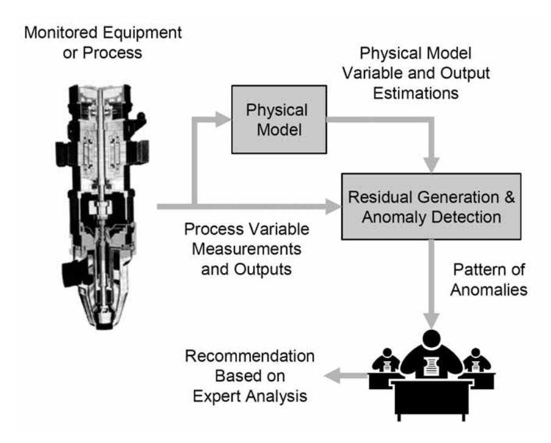

*FIG. 24. Information flow and interpretation of the equipment condition monitoring system based on physical models.*

#### *4.2.1.1. Strengths and weaknesses*

The strength of applying quantitative physical modelling for condition monitoring is the ability to calculate the 'as-built' reference plant behaviour without degradation or failures. Once a physical model exists, it can be applied for various purposes, e.g. for studying effects of different degradation mechanisms and performing 'what if' analysis by varying parameters or simulating changes made in the process or equipment. In addition to providing analytical redundancy to measurements, non-measured quantities about the process state can be provided when needed.

The main weakness of these techniques is that the analytical approach involved in physical modelling requires accurate quantitative mathematical models in order to be effective. For large-scale systems, such information may not be available or may be too costly and time consuming to compile. Also, if changes are made to the plant, engineering work is needed to update and modify the physical models. Although modelling tools are available to support such model building and maintenance activities, process experts are needed for keeping plant models up-to-date.

#### **4.2.2. Applications**

Quantitative physical models can be applied to a range of condition monitoring and diagnostic tasks, including the following:

- —*Thermal performance optimization*. Monitoring and optimization of the thermal efficiency of nuclear power plants is becoming increasingly important as liberalization of the energy market exposes plants to increasing availability requirements and fiercer competition. The general goal in thermal performance monitoring is to maximize the production to cost under the constraints of safe operation. This goal is to be pursued in two ways, one oriented toward fault detection and cost-optimal predictive maintenance, and the other toward optimizing target values of plant parameters in response to any component degradation detected, changes in ambient conditions, or the like. A number of computer systems for thermal performance monitoring exist, either as prototypes or commercially available. The system characteristics and needs of power plants may vary widely. However, several power plants look for enhancements of their thermal performance management systems, providing extended functionality, higher accuracy and integration with other decision support tools.
- —*Data reconciliation*. Process measurement errors inevitably occur during the measurement, processing and transmission of the measured signal, and hinder process improvement activities such as process monitoring, fault detection and optimization. Typically, process measurements are related to each other through physical constraints such as mass and energy conservation laws. However, owing to the omnipresent instrument errors, the process measurements are in general in conflict with mass and energy balances. Data reconciliation resolves this conflict by correcting each process measurement so that the total set is consistent with the balance equations.
- —*Fault detection and identification*. Typical problems are fouling and leakages in heat exchangers, leaking valves, degradation of pumps and compressors, and drift in sensors, in particular flow meters. These faults may not be severe enough to cause major operational problems, but will affect the economic performance of the plant if not identified and rectified at an early stage. Using a reference physical model to compare normal fault-free calculated behaviour with actual plant measurements can reveal failures at an early stage. Various techniques exist for using the physical model to isolate and diagnose types of failure, and to evaluate the magnitude and severity of different failures.

#### 4.3. RELATED TECHNIQUES

Outside the primary categories of empirical and physical modelling, there are related techniques that either contribute to an overall modelling system or can independently conduct monitoring and diagnostic tasks. In this section, discussions will be limited to two selected techniques that have recently found application in the nuclear industry, namely fuzzy logic and multilevel flow modelling. A discussion of more 'historical' techniques, such as expert systems, which have seen a constant decrease of interest and actual applications in recent years, is not included.

#### **4.3.1. Fuzzy logic**

Fuzzy modelling covers a range of modelling techniques in which model variables take on quantitative values that correspond to continuous grades of membership to categorical or qualitative values such as cold– normal–hot, or very low–low–normal–high–very high. Fuzzy models partition the input/output (I/O) spaces into several, typically overlapping regions, whose shapes are established by so-called membership functions and whose mapping relationships are governed by simple if-then rules. Fuzzy models are therefore usually coded in the form of a knowledge base of fuzzy rules.

On the basis of the principles of fuzzy set theory, fuzzy modelling provides a formal mathematical framework for dealing with the vagueness of everyday reasoning. In contrast to binary reasoning based on ordinary set theory, fuzzy modelling allows for classification into multiple classes with different degrees of membership. Further, measurement uncertainty and estimation imprecision can be properly accommodated within the fuzzy modelling framework.

Fuzzy models deal primarily with linguistic variables (e.g. temperature or pressure) whose values are words, also called fuzzy values (e.g. negative, approximately zero, positive, low, high). Each of these words refers to a subset of the variable range, and the degree of membership of actual values within the subset is analytically specified by the defined membership function. While membership functions of classical set theory can be thought of as being rectangular in shape and disjoint (i.e. either a value is a member of a set or it is not), the membership functions associated with fuzzy sets have subjective shapes (typically triangular or bell shaped) that may overlap to describe a continuous transition from one set to another, thus providing for the possibility that a given observed value simultaneously belongs to several sets with different degrees of membership.

A fuzzy model aims at reproducing the knowledge and experience supporting the actions or reasoning of skilled human operators using fuzzy rules. The set of fuzzy rules constitutes the heart of the I/O mapping system provided by the fuzzy model. When the experience of the skilled human operators is unavailable or insufficient (e.g. because of the complexity of the system), empirical I/O data can be used to generate automatically a set of fuzzy rules representative of the mapping from the input space into the output one. This phase of rule construction is often referred to as 'learning', analogous with the procedure for determining the weights of neural network models.

The largest proportion of fuzzy modelling applications in the nuclear industry has undoubtedly been in the area of process control. Current trends point in the direction of more integration of fuzzy modelling concepts with other modelling techniques, especially with neural networks. Various so-called neuro-fuzzy techniques have been proposed [46], and will possibly be applied in the area of process and component condition monitoring in nuclear power plants.

#### **4.3.2. Multilevel flow modelling**

Multilevel flow models (MFMs) use a formal modelling language in which the intentional properties of a technical system are described [47]. MFMs are graphical models of technical systems *goals* (typically production goals, safety goals or economy goals) and *functions*. The goals describe the purpose of a system or component, while the functions describe the capabilities of the system in terms of mass flows, energy flows and information flows. MFMs also describe the relations between the goals and the functions to achieve those goals, and are organized into functional networks. The main functions are *sources*, *transports*, *storages*, *balances*, *barriers* and *sinks*. Additionally, the *manager* function describes control systems.

Flow networks can be connected to one or several goals via *achieve* relations, meaning that the functions in the network achieve the goal. A goal can be connected to one or several functions via *condition* relations, meaning that the goal is a precondition for the function. An overview of the symbols used to graphically construct MFMs is given in Fig. 25.

A simple example of an MFM for a combustion engine is shown in Fig. 26. In the example, the engine runs on gasoline and oxygen. The cooling system consists of two heat exchangers, one internal (connected to the engine) and one external (connected to the outside environment). A circulation pump moves water through the

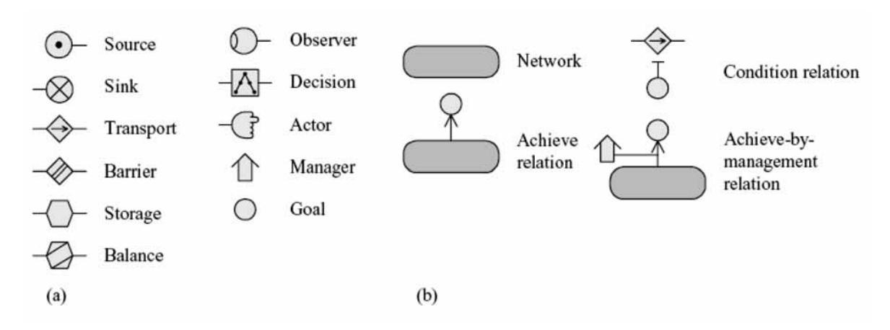

*FIG. 25. MFM symbols: (a) Goals and functions; (b) networks and relations.*

heat exchangers, transferring heat from the engine to the environment. The pump runs on electricity and must be lubricated to run.

To create an MFM of this system, one has to identify the system's goals and then its functions. In this case, the top-level goal is to 'keep the engine running'. The system also has several subgoals, such as to 'supply gasoline to the engine', 'cool the engine', 'lubricate the pump', and 'supply power to the pump'. The functions in this model include 'gasoline storage', 'gasoline transport', 'water transport', 'lubricant source' and 'heat sink'.

Once developed, MFMs can be used with specially developed algorithms for a number of condition monitoring tasks. The following algorithms have been reported in the literature:

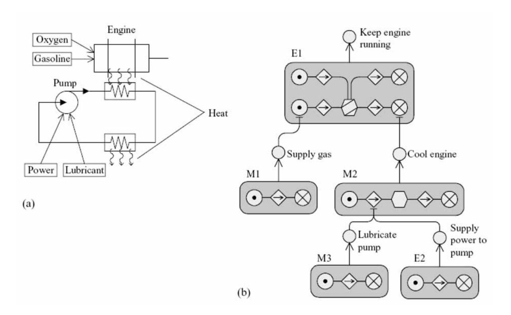

*FIG. 26. A simple MFM (b) for a combustion engine (a). The networks marked 'E' represent energy flows; the networks marked 'M' represent mass flows.*

- —*Signal validation* checks the consistency between redundant sensor values and can detect flow leaks, sensor failures and other measurement errors.
- —*Alarm analysis* identifies which faults are primary and which faults may be consequences of the primary ones.
- —*Fault diagnosis* uses sensor values and queries to the operator to discover the faults of the target system.
- —*Explanation generation* uses the states discovered by the fault diagnosis algorithm to produce explanations and remedies in pseudo-natural language.
- —*Failure mode analysis* uses MFM with added timing information to predict the consequences of failures. It can be used during both design and operation.
- —*Fuzzy alarm analysis* similar to the alarm analysis algorithm but uses fuzzy concepts to achieve a more robust behaviour when faced with noisy signals close to decision boundaries.

All the described algorithms are based on discrete logic (with the exception of the fuzzy alarm analysis algorithm) where the sensor values are low, normal or high, and the resulting values are consistent or inconsistent, working or failed, primary or consequential, etc. Multilevel flow modelling uses a linguistic interpretation of variables, and MFM algorithms work by operating searches in the defined MFM graphs.

Known applications in the nuclear industry include alarm analysis for the realization of a decision support tool for operators to be used in complex fault situations. Other reported applications are in failure mode analysis and fault diagnosis in industrial processes.

The MFM technology has recently been commercialized, and additional practical applications are expected.

# **5. ON-LINE MONITORING IMPLEMENTATION STRATEGY**

The options for the implementation of an OLM strategy will vary considerably from plant to plant and will depend very much on the user's specific end requirements, the existing data extraction capability and the prevailing monetary restraints.

The following are typical examples of where an OLM implementation should be considered:

- To predict onset of failure (detection of off-normal plant operation);
- To reduce maintenance activities (extension of sensor and equipment calibration period);
- To extend EQ life (environmental monitoring of temperature, humidity, etc.);
- For plant optimization (thermal performance monitoring of turbo-generators);
- To reduce radiological dose (move from time dependent to condition based maintenance);
- To shorten outage time (extended maintenance periods) to move from time dependent to condition based maintenance.

Plant instrumentation and control (I&C) and/or digital upgrades are an ideal opportunity for the consideration of OLM, since a key issue in the determination of the feasibility is the availability and suitability of data. For example, the additional overhead for obtaining data extraction/capture facilities to support an OLM implementation is relatively low at the design stage compared with that required as a retro-fit.

Where an upgrade is not an option, it will be necessary to conduct a review of the data already available (or archived) to ascertain whether they are suitable for the intended OLM application. For example, vibration or acoustic noise based applications require a fast sample rate (up to 100 kHz) and historically have been restricted to dedicated stand-alone data acquisition and analysis systems. In contrast, trend applications such as the monitoring of sensor drift only require a sample every few seconds, and the installed plant data processing systems may already provide sufficient resolution, hence the problems of implementation of OLM may be restricted to that of extracting the data without compromising the plant data processing systems.

On the basis of data availability, the following issues need to be considered as part of the OLM implementation strategy:

- Provision of additional sensors to supplement existing data.
- Methods of extracting the data, e.g. isolation, hardware, storage.
- Suitability of existing data, e.g. accuracy, 'historizing' limitations of archived data.
- OLM application, e.g. commercial off the shelf (COTS) versus custom built packages.
- Data users, e.g. maintenance engineers, plant managers, operations engineers.
- What the analysis results will be used for, e.g. maintenance scheduling, determination of plant compliance with technical specifications (i.e. safety versus non-safety application).
- Acceptance testing, e.g. determining whether the application meets the functional design specification and/ or fulfils the requirements of any activity it may replace (e.g. accuracy (uncertainty) and reliability would be particular concerns for safety related applications).
- Life cycle management, e.g. configuration and security control of the OLM application and maintenance of support systems (i.e. management of hardware and operating system obsolescence).
- Establishment and maintenance of OLM expertise. Although OLM applications may reduce intrusive plant based activities, there will be a need to establish an office based expert(s) who can perform the role of 'intelligent operator', in particular, for the final determination of how the OLM analysis and results should be used to determine changes to plant operation/configuration and maintenance activities.

As already indicated, in an ideal situation, the implementation of an OLM application would be part of the installed data processing capability, and this should be the intent for new build or I&C upgrade. However, at the present time, most OLM applications are a backfit, and there will be some significant issues with respect to the introduction and integration of new software and hardware to facilitate interfaces with the installed plant.

All OLM applications will involve the following key processes:

- Collecting plant data;
- Storing plant data;
- Performing analysis;
- Outputting results.

In addition to the key processes identified above, the initial implementation of an OLM application will require acceptance testing to ensure that the analysis techniques are sound.

Once installed, the OLM system will then require maintenance and support by an 'expert' operator who understands the operation of the plant being monitored and the intent and limitations of the OLM application.

#### 5.1. COLLECTING PLANT DATA

All OLM applications require significant amounts of plant data, and the success of the implementation will be highly dependent on the quality, accuracy and resolution of those data.

The significance of the data properties will vary with respect to OLM application and will need to be considered on a case-by-case basis.

For example, noise analysis based applications are highly dependent on sampling rate but are not significantly affected by loop accuracy. However, for sensor calibration monitoring, the loop accuracy is the most important property.

The installed plant data processing systems will need to be considered with respect to their influence on data collection (see Fig. 27). For example, in an analogue based system, it is normal to use isolation amplifiers between the protection/control circuits and the data processing computer. These isolation amplifiers will introduce a scaling uncertainty between the signals presented to the operator/OLM and the protection/control circuits. In a digital system, the data will typically be passed by optical data link and are identical in value to those presented to the protection/control circuits, but are likely to have a time skew owing to differing processing times.

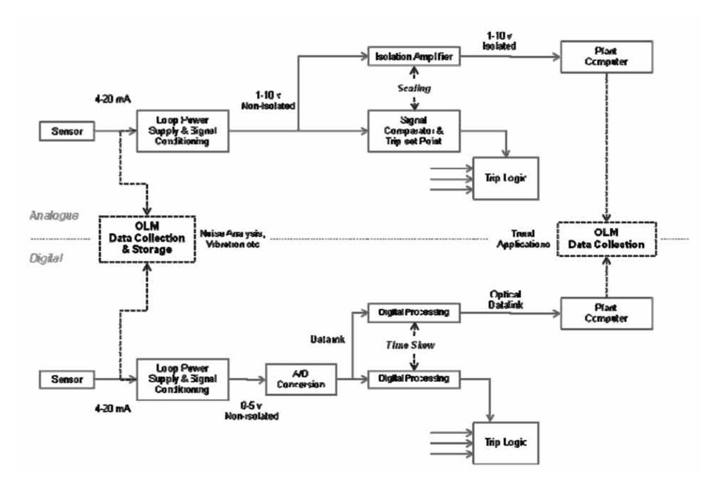

*FIG. 27. OLM data collection.*

Where it is not possible to collect plant data via existing isolated interfaces, or where the isolation introduces unacceptable uncertainties, it will be necessary to connect a dedicated data acquisition system to existing sensors or to provide additional OLM application specific sensors. Where connection to existing sensors is used, appropriate isolation precautions will be required to ensure that the plant signal is not degraded by the OLM hardware application and that the signal is not interrupted during connections or reconnection.

#### 5.2. STORING PLANT DATA

All OLM applications require significant amounts of data. Although media storage is now relatively inexpensive and is unlikely to be a problem for the introduction of new stand-alone systems, it may present problems where the OLM is reliant on existing data processing hardware.

The issue of storage capacity is easy to understand and should be relatively easy to resolve. More significant is the issue of how the data have been archived and/or saved. In order to maximize storage, the plant data processing system often 'historizes' the data either by reducing the sample rate (e.g. only stores every tenth record), or by reducing the resolution (e.g. only stores a new data point if a change of signal greater than 1% is detected). Both these techniques will have the effect of filtering the original signal and important characteristics may be lost. Although these 'historizing' techniques may render old data unusable, it is normally possible to have the properties switched off or reduced to a limit that does not impact the data.

#### 5.3. PERFORMING ANALYSIS AND PRESENTING RESULTS

Having captured and stored the data, the next stage of implementation is identifying where the analysis will be performed, and how and to whom the results will be presented. While use of the installed data processing systems is the preferred option, this will pose several problems.

- The installed data processing systems software and/or hardware may not support the new application;
- New applications may pose a threat to existing data processing systems either from interaction with existing applications or from a cyber security standpoint;
- The end user of the results of the OLM application may not have access to the plant computer.

Consideration could be given to transferring the data to a 'business' computer environment such as a corporate local area network (LAN) and performing the analysis on a more easily accessible system. The disadvantage of this approach is that the threat from loss of configuration control and cyber security will be significantly increased. It is therefore unlikely that an OLM application that might ultimately impact decisions about safety equipment could be justified.

The alternative currently adopted for many OLM applications is that the analysis is performed on a standalone computer. The main problem with this approach is the lack of consistency between the various applications and multiple databases of plant data that cannot be shared.

The preferred solution therefore is to establish a secure 'engineering' computer environment to act as a depository for both OLM data and OLM applications. The Sizewell B plant in the United Kingdom has implemented this by providing an 'engineering' LAN (ELAN) using an OSI plant information data historian. This ELAN runs in parallel but is not connected to either the 'business' LAN or the Internet. ELAN is treated as a plant system, and is maintained and operated by dedicated plant engineers rather than the site IT group. Hence ELAN is subject to the same stringent configuration and cyber security controls that are used on other plant computer systems, i.e. the emphasis is on system integrity rather than on confidentiality usually employed by IT practitioners (e.g. it does not matter who can see the data, provided that the data cannot be changed).

Some 20 000 signals are continuously downloaded at fixed scan rates (1, 2, 10 or 30 s) via a unidirectional datalink from the plant data processing system. Additional plant signals can be transferred via an ELAN dedicated data logging system at variable scan rates from 100 ms upward. These inputs are hardwired as either a temporary or a permanent measure. Other data can be transferred to the system via OLE for process control (OPC) protocol or a dedicated link.

An applications server is available and may be used for running OLM packages directly, or the data can be exported for running on stand-alone machines. An off-line test environment is also available that has access to real plant data.

Access to ELAN is via dedicated client personal computers, which are primarily used by engineering support staff but may be made available to any section.

#### 5.4. ON-LINE MONITORING SOFTWARE ISSUES

The techniques and applications presented in this document are already in widespread use and are demanded by several nuclear power regulatory bodies around the world. One example is monitoring of loose parts, which is implemented in many plants, especially those sites with PWR and WWER designs. Increased interest in OLM for safety related equipment is anticipated, partly because of developments in sensor technology, but most importantly because of the development of computer based signal analysis tools and data acquisition techniques.

Licensees around the world are continually trying to improve their profitability and management of resources, and often prolong the original licensed operational lifetime. OLM provides a very powerful tool in all these areas. However, the issues surrounding reliability, uncertainty and the use of COTS and general purpose operating systems software are not well defined, and hence there is a natural resistance from regulatory bodies regarding their use in safety related applications. A graded and pragmatic approach is needed to the use of OLM and commensurate with its intended use and safety significance by both the licensee and the regulatory body.

Generally, the requirements for safety class equipment are well defined by the various regulatory authorities, and agreed processes by the licensee are based on diverse factors, such as design bases faults and post faults, and on whether the equipment is required to operate during normal power operation. These requirements and processes apply to permanently installed and well established equipment (e.g. pumps, motors, protection systems). However, the introduction of OLM typically introduces the use of non-safety equipment and processes on which diagnosis of the condition and operability of safety equipment depends.

Most of the techniques presented in this document have only a minor or no influence on the plant processes, although this would have to be proved as part of any implementation. The validity of the signals and analysis techniques poses a significant problem, especially if the licensee wishes to replace well established and proven methods. This situation is exacerbated when the proposed OLM makes use of techniques that require significant expert knowledge.

Where OLM is to be applied to safety class equipment or processes, it is likely that a change to the plant tech specifications or operating rules will be required for its use, and hence a submittal to the regulator will be required. Even though the OLM equipment may not itself be safety category classified, if the output and/or results of the proposed OLM processes are used for the determination of the operability of safety class equipment, then it may present a significant risk if ill-conceived. In some instances, the additional validation and verification burden may be cost prohibitive for the benefits realized in the mitigation of such a risk. For example, an OLM proposal that replaces an existing surveillance method with a method that is totally reliant on the use of a COTS software application is unlikely to be realizable, as it would be difficult to perform sufficient validation and verification owing to the unavailability of source code for third party verification.

Therefore, the decision of whether to use COTS software or a custom-built package will very much depend on the equipment the OLM application is intended to be used on, who will use the application and what plant decisions will be made on the basis of the OLM results.

Table 1 is intended to provide a guide to the potential impact on safety documentation and/or regulatory impact on the basis of the intended use of the OLM application.

#### 5.5. ACCEPTANCE TESTING

The assessment of software presents unique difficulties, mainly because of its peculiar characteristics and complexities. For example, software failure usually arises from design and/or specification errors rather than

TABLE 1. QUESTIONS TO BE CONSIDERED IN THE DETERMINATION OF SAFETY IMPLICATIONS

| Question                                                                                                                                                                             | Potential impact                                                                                                                                                                                                                                                  |
|--------------------------------------------------------------------------------------------------------------------------------------------------------------------------------------|-------------------------------------------------------------------------------------------------------------------------------------------------------------------------------------------------------------------------------------------------------------------|
| Does the proposed OLM support existing maintenance<br>processes or is it a replacement?                                                                                              | Low — if support, since the existing system becomes the<br>'fallback' and failure of OLM is not significant<br>Medium — if replacement, since it may result in<br>unnecessary or delayed maintenance, or, in the worst case, a<br>loss of safe plant availability |
| Will the proposed OLM be used in the determination of plant<br>operability as required by the technical specification/operating<br>rules governing compliance with the site licence? | Medium — since failure of the system may cause an<br>inability to determine operability and subsequent entry into<br>controlled shutdown                                                                                                                          |
| Could failure of the proposed OLM cause failure of a safety<br>system?                                                                                                               | High — since OLM could be a threat to installed safety<br>equipment and will incur higher levels of verification and<br>validation                                                                                                                                |
| Is there a reliability claim for the proposed OLM?                                                                                                                                   | High — since OLM is moving toward safety classification,<br>which will incur formal verification and validation<br>commensurate with modern standards for the use of<br>software on safety critical systems<br>(Ref IEC 601508 & 60880)                           |

from software ageing. Another unique characteristic is software's vulnerability to accidental/inadvertent changes and/or malevolent attacks, both of which could remain undetected. The impact of this latter point depends on the nature of the accidental/malevolent change and the process to which the OLM is applied. An example would be a change in acceptance criteria used to determine the operability status of equipment, which could cause it to operate beyond its safety limits and, in the worst case, fail to perform its safety duty when required.

When a software fault does exist, it will most probably manifest itself in a predictable manner when a particular set of conditions presents itself. Thus, in a software system composed of redundant but identical components, all components will fail at once. In contrast, the parts of a hardware system comprising identical components rarely will fail all at once due to ageing.

Validation of the complete system should be performed to confirm that it is compliant with the specification and that no extraneous functionality has been introduced. Evidence of commissioning tests should be preserved with sufficient detail to permit a check on functionality at a later date. Where modifications have been undertaken and subsequent tests were not completely rerun, the justification for limited testing should be preserved.

Verification of the software code will be dependent on the specific OLM application but, as indicated above, will be primarily governed by practicality, i.e. the availability of the source code and the impact that any resultant decision making will have on plant configuration. At its highest level, it may be necessary to demonstrate that the software performs with a particular reliability by the use of statistical testing. While it may appear very onerous, it is unlikely that reliability figures greater than that claimed for 'operator action' in safety analysis reports would be necessary. This is typically between 10–1 and 10–2, and hence a relatively small number of statistical tests could be used to gain that confidence.

#### 5.6. LIFE CYCLE MANAGEMENT

There should be effective, documented and approved procedures to cover use, maintenance, security defect analysis and change control. In addition, there should be a defined method of ensuring that the functional integrity of the software is maintained. This requirement should include the following characteristics:

- The system (and spares) should be stored and used in conditions that limit physical, accidental and malevolent damage.
- Adequate means to ensure that the hardware configuration is correct.
- Adequate means to ensure that the installed software is the correct version (including operating systems) and has not been accidentally or malevolently damaged; e.g. routine examination of check sums and standard tests (a subset of the commissioning tests for example) prior to use.
- Adequate means to ensure that the end users of the software are suitably qualified and trained.
- Adequate means to ensure that security measures are in place commensurate with the functionality, claim and use of the software.

#### 5.7. ESTABLISHMENT AND MAINTENANCE OF OLM EXPERTISE

OLM applications are clearly intended to reduce intrusive and unnecessary plant based activities, and hence maintenance and operator workload; however, there will be an 'expert operator' burden to establish and maintain an OLM service.

It is unlikely that any OLM application will produce a simple pass/fail result. Especially during its inception, it will be highly reliant on the user's understanding of the normal plant processes, typical degradation and failure mechanisms. Also, the results of many OLM applications are not absolute; hence their first use may be of limited value. It will be the historical trends and the early detection of off-normal operation that will yield future success. It is therefore paramount that baseline measurements are accurately documented (e.g. calibration records, amplifier gain settings, reactor power levels, acceptance criteria) to ensure that, when OLM applications are run at a later date, true comparisons are possible.

Historical plant data just prior to plant failure are very useful for training or seeing how an OLM application will flag off-normal conditions; however, care should be exercised when such data are retrieved from a plant historian, as important data may have already been lost during archiving, or falsely created due to extrapolation when retrieved (see also Section 5.2).

The use of an 'expert operator' is also imperative when the OLM is to be used to judge or support the judgement of safety equipment performance. In effect this is a 'sanity check' to ensure that the OLM results do not just meet acceptance criteria, but are also realistic; e.g. the time response of a pressure level sensor given by an OLM application as 2 ms may easily pass the technical specification acceptance criterion of faster than 250 ms, but if the norm is 200 ms, then it is necessary to establish what changed. In this case, it is unlikely that the sensor became faster, but more likely the OLM was presented with the wrong data, either through plant or software misconfiguration, or, in the worst case, a software error.

Since it is very difficult to develop an OLM application with a human–system interface (HSI) that is suitable for all interested users of the results, the 'expert operator' is also the obvious candidate to act as the interface with the less familiar, i.e. to assist in the presentation of results tables, performance graphs, etc., to, say, the plant manager.

# **6. ENABLING TECHNOLOGIES**

#### 6.1. INTRODUCTION

To optimize OLM and its potential derivatives at nuclear power plants, an IT infrastructure needs to be developed that can support data acquisition, central data storage and analysis tools. While such optimization may not be realizable at nuclear power plants that are currently operating, it is useful to examine the various enabling technologies that could be used should the opportunity arise, e.g. a digital upgrade.

This section briefly discusses a number of these enabling technologies. In particular, the following discussion is divided into three categories: sensors, data collection systems and data analysis systems. Sensors are those devices used to generate information about the monitored process. This process information is then collected and communicated to the data analysis systems by the data collection systems. Finally, data analysis systems represent those methods used to interpret the collected process information and possibly provide operational suggestions and issue actions. Information about the monitored system/plant flows from the sensors to the data collection systems and then to the data analysis systems, as illustrated in Fig. 28.

#### 6.2. SENSORS

New sensor technologies are constantly being developed and deployed, providing an enormous range of options for process monitoring under broad environmental conditions. While the generation of sensory data is fairly direct (assuming that an appropriate sensor is available to measure the variable of interest), transmission of these data to a monitoring system is still a challenge owing to the cost, security, reliability and complexity usually associated with the operation of communication networks. As a result, besides ongoing advances in measuring technology, sensor devices are being provided with network capabilities in order to significantly


*FIG. 28. Key elements for implementing on-line condition monitoring.*

improve their deployment within modern industrial IT infrastructures. These capabilities often lead to, for example, the reduction of wiring, the minimization of communication complexity, the promotion of system modularity and the facilitation of interconnecting multiple devices. In addition, networked devices can be more easily monitored for anomalies and promptly reconfigured (in software as opposed to being physically changed), and their information can be made more broadly accessible. Owing to their increased networking capabilities, sensors are experiencing a paradigm shift from being information devices to communication devices. The impact of such a shift for the management of security and configuration control should not be underestimated, and the application of these new technologies to safety equipment or decisions that affect safety equipment or processes will require significant justification.

Information can be passed from the instrumentation to the data collection systems using different media, including wireless media, UTP/wire media and fibre media. While 'wireless' reduces the expense of physical wiring (local power supplies are still required), it is also the least secure of the physical layers. Limiting power, implementing built-in wireless security and utilizing a hybrid wireless/wired solution can in theory minimize most security issues. In practice, this may be difficult to prove in a running nuclear power plant, although the utilization of previously tested frequencies does mitigate this concern somewhat. However, this may be a very limited resource, as most new technologies operate a long way from those that may have been tested during initial plant startup. In addition, the range and fidelity of the signals can be influenced by implementation issues such as multipath and signal attenuation due to proximity to metallic structures, which can limit deployment. On the other hand, wired media utilizing traditional IT Ethernet provides good performance while enabling the use of inexpensive, state of the art networking equipment. Finally, using fibre for communication has the advantages of speed (gigabit or better), bandwidth (ability to use multiple colours in a single fibre) and electrical isolation (ability to co-locate fibre with high voltage cables).

#### 6.3. DATA COLLECTION SYSTEMS

The most basic level of integration, and a prerequisite for the realization of actual 'on-line' monitoring, as opposed to 'off-line' or batch monitoring, is integration at the *data level*. This involves, as a minimum, the ability of an OLM system to communicate with the plant process computers in order to acquire the live plant data necessary for the particular condition monitoring function implemented. Additionally, communication with other support systems, such as control systems, alarm systems, computerized procedure systems and diagnostic systems, might be required.

Modern data collection systems often consist of several subsystems, starting with the actual collection of information from the instrumentation to the delivery of that data to the end business user. Typically, data collection systems may consist of four subsystems: the supervisory, control, and data acquisition (SCADA), the demilitarized zone (DMZ), the Intranet or business network, and the Internet or external network. In particular, the SCADA is the portion of the system that physically interfaces with the equipment via sensors and actuators, and has the capability to securely deliver that information to HSIs and data collection equipment.

While the above layered approach may be acceptable for non-safety critical applications, the use of a business network, Internet and external networks will pose significant security challenges when applied to safety equipment or decisions that affect safety equipment, in particular with respect to data and application integrity (i.e. configuration control together with protection against accidental or malevolent attack). It may therefore be necessary to consider the use of a secure engineering network.

The layered nature of the information collection network discussed above provides the desired on-line information needed to operate a facility while providing a safe method of delivering data to make business decisions for maximizing productivity and reducing downtime for maintenance and/or breakdown. Proper configuration control of computer systems, such as desktops, servers, firewalls and routers, is vital to the continued health of the entire system. In addition to the initial costs of installation, testing and operation, an annual maintenance budget and resources to implement that maintenance is required to repair IT equipment, replace ageing obsolete equipment and respond to changing cyber security threats that may not have been anticipated during the initial design.

#### **6.3.1. Industrial networks**

An industrial network, or fieldbus, links sensors, actuators, discrete/analogue I/O and smart devices. For example, networking allows multiple devices to communicate over a single trunk line instead of using numerous individual wires. Depending on the types of devices that are interconnected, four hierarchical levels of functionality and associated buses may be present in a typical installation, namely, the sensor bus, device bus, control bus and enterprise bus. When interconnecting these levels, industrial networks can thus exhibit different topologies and utilize numerous protocols and communication media (e.g. fibre optics or wireless). A network topology is the logical configuration of a network, defining how the nodes are logically connected to one another and how they communicate. Numerous topologies exist to interconnect devices, including the star, ring, mesh, cluster tree, trunk/drop and daisy chain. In a star topology, for example, all nodes are connected to a network host or coordinator. This topology is appropriate for relatively simple and low-power applications. Instrumentation topologies can also be classified as point-to-point, point-to-multipoint and multipoint-to-multipoint networks. A point-topoint network is the simplest configuration, establishing a dedicated session or connection between two networked devices using their own direct communication link. The connection is symmetrical and provides the same bandwidth performance for sending or receiving. Point-to-point networks often exhibit high reliability because there is only one potential single point of failure in the topology, i.e. the host. However, they suffer from high cost and low adaptability, as they do not scale adequately to accommodate more than one pair of end points. Point-to-point links are ideally suited for high performance, dedicated connections, high speed Internet links or backup applications. On the other hand, point-to-multipoint networks provide a path from one location to two or more specified locations (from one to many). These networks are often connected in a star topology, often consisting of a base station or access point at a central or hub site and multiple clients located at distributed sites. Multipoint-to-multipoint services are provided to interconnect multiple locations. While point-tomultipoint networks can accommodate more end points, they exhibit low adaptability and reliability, as reliability is highly determined by the placement of the access and end points. Multidrop networks reduce wiring requirements but also introduce a single point of failure (i.e. the cable).

Besides a given topology, it is also necessary to define how devices communicate. A network protocol is a formal set of rules, conventions and data structure that governs how networked devices may exchange information. There are numerous methods for sending data over communication media. Transport control protocol (TCP) and IP (Internet protocol) are the most important protocols for industrial automation today. TCP is inherently peer-to-peer and full duplex, which means that bidirectional communication between two devices can occur concurrently. Based on their communication scheme, they can be classified as either serial data transmission or local area networking. There are several serial data communication hardware standards, such as RS-232 and RS-485. RS-232 is a single-ended (unbalanced) interconnection scheme for serial data communication and transmission between modules. Similarly, RS-485 is a robust scheme for serial communication among multiple devices, sharing a common set of serial data communication lines. RS-485 allows multidrop networking on a single line. On the other hand, there are several LAN protocols, within which Ethernet is one of the most common wiring and networking scheme. A brief discussion on LAN and traditional protocols is provided in the subsections that follow.

#### *6.3.1.1. Initial protocols*

Early industrial networks used shielded twisted pair implementations for each I/O device. Data subsequently were transmitted over serial buses using proprietary, layered protocols. Numerous protocols were introduced for industrial automation, including Modbus, Profibus, and ControlNet. Most of these industrial protocols are vendor specific, lacking interoperability and limited in the number of nodes, topology, distances and data rates that they can accommodate. Among these protocols, Modbus is the oldest network communication standard and probably the most popular serial protocol in process monitoring and control. While very useful with serial devices, Modbus does not adequately accommodate complex devices such as mass flow and motion controllers. On the other hand, Profibus is probably the most widely accepted international networking standard. Similar to Ethernet, this standard has a high overhead-to-message ratio for small amounts of data and carries no power on the bus. Supporting several topologies, ControlNet, a precursor to DeviceNet, is a peer-topeer highly deterministic and repeatable controller-to-controller network. DeviceNet is an application layer protocol, emphasizing connection as opposed to being message oriented. Both of these protocols are object based, meaning that every device on the network is represented as a series of objects with attributes and values.

#### *6.3.1.2. Area networking protocols*

Traditionally, there has been no single, universal open networking architecture. In fact, protocols used at each of the common four levels of functionality (i.e., sensor, device, control and enterprise) often differ. Typical protocol choices are: (i) CAN, ASI and Seriplex for the sensor bus; (ii) H1 Fieldbus, Profibus PA and DeviceNet for the device bus; (iii) Foundation Fieldbus High Speed Ethernet (HSE), Profinet, Profibus DP and ControlNet for the control bus; (iv) Ethernet for the enterprise bus. However, the automation industry is actively engaged in implementing more open networking architectures. Supporting all four of the above network levels, Ethernet based protocols are expected to dominate industrial applications, offering also Web server capabilities at no additional cost. Ethernet is a full duplex connection and LAN protocol/standard for hardware, communication and wiring, being the most common physical layer in distributed process control systems and with a packet switching technology inherently superior in cost and complexity to circuit switching. In fact, Ethernet may be the best compromise between cost and performance, providing the most flexibility when compared with traditional protocols such as Modbus and DeviceNet. Benefits of Ethernet include the following:

- Easily scalable from 10 and 100 Mbps to 1 and 10 Gbps;
- Cost effective with multiple vendors;
- Fully standards based with product interoperability among vendors;
- One of the most widely used networking architectures;
- Easy integration among plant instrumentation and control, business and IT systems.

Numerous companies are already embracing Ethernet over traditional, proprietary bus topologies, as Fieldbus, Interbus and Profibus. A significant characteristic of this protocol is that it is free. However, Ethernet's drawbacks include a high overhead-to-message ratio for small amounts of data and an industrial weak (nonindustrial-strength) connector (i.e. RJ-45), in addition to carrying no power on the bus. Ethernet typically requires a star or a bus (daisy chain) topology. Popular industrial Ethernet protocols/standards include EtherNet/IP, Foundation Fieldbus HSE and Profinet. Based on the TCP/IP suite, the peer-to-peer capabilities provided by these standards make them very effective networks for linking local clusters of sensors, transducers, controllers, actuators and DA systems. Among current Ethernet based protocols, EtherNet/IP Foundation Fieldbus is expected to become the future standard for process industry networking.

#### *6.3.1.3. OPC communication protocol*

OPC communication protocol is a set of standard specifications, created with the collaboration of a number of leading worldwide automation hardware and software suppliers working in cooperation with Microsoft to support open connectivity in industrial automation. The organization that manages this standard is the OPC Foundation, which has over 150 members from around the world, including nearly all of the world's major providers of instrumentation and process control systems. The objective of the OPC Foundation is to develop an open, flexible, plug-and-play standard that allows end users to enjoy a greater choice of solutions, as well as sharply reducing development and maintenance costs for hardware and software suppliers.

In the absence of any standard, vendors have developed proprietary hardware and software solutions. All process control and information systems on the market today have proprietary techniques, interfaces and APIs in order to access the information that they contain. The cost of integrating the different systems and the long term maintenance and support of an integrated environment can be significant. This situation is clearly depicted in Fig. 29.

Custom drivers and interfaces can be written, but the variety increases rapidly because of the thousands of different types of control devices and software packages that need to communicate. This proliferation of drivers exacerbates certain problems, such as inconsistencies among different vendors' drivers, hardware features that are not universally supported, hardware upgrades that can wreck an existing driver and access conflicts. OPC standards offer an open platform solution that provides real plug-and-play software technology for process

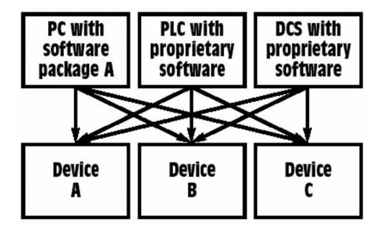

*FIG. 29. Complexity of integration in the absence of standards.*

control and factory automation where every system, every device, and every driver can freely connect and communicate, as shown in Fig. 30.

There currently are seven standard specifications completed or in development, as follows:

- —*OPC Data Access.* Used to move real-time data from PLCs, DCSs and other control devices to HSIs and other display clients.
- —*OPC Alarms and Events.* Provides alarm and event notifications on demand (in contrast to the continuous data flow of Data Access). These include process alarms, operator actions, informational messages and tracking/auditing messages.
- —*OPC Batch.* This specification carries the OPC philosophy to the specialized needs of batch processes. It provides interfaces for the exchange of equipment capabilities (corresponding to the S88.01 Physical Model) and current operating conditions.
- —*OPC Data eXchange.* This specification extends from client/server to server-to-server with communication across Ethernet Fieldbus networks providing multivendor interoperability.
- —*OPC Historical Data Access.* While OPC Data Access provides access to real-time, continually changing data, OPC Historical Data Access provides access to data already stored. From a simple serial data logging system to a complex SCADA system, historical archives can be retrieved in a uniform manner.

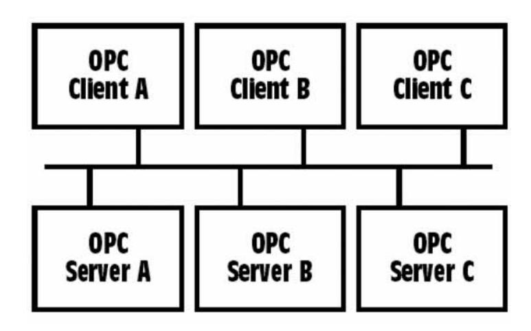

*FIG. 30. OPC supported connectivity.*

- —*OPC Security.* All the OPC servers provide information that is valuable to the enterprise and that, if improperly updated, could have significant consequences to plant processes. OPC Security specifies how to control client access to these servers in order to protect this sensitive information and to guard against unauthorized modification of process parameters.
- —*OPC XML-DA.* Provides flexible, consistent rules and formats for exposing plant floor data using XML (eXtensible Markup Language), leveraging the work done by Microsoft and others on SOAP and Web services.

#### *6.3.1.4. Internet and Web networks*

The Internet has become a ubiquitous force that is redefining industrial automation. In a web topology, all nodes can in principle be connected to each other at all times. This massive interconnectivity feature facilitates the migration of intelligence to lower devices such as sensors. Decision making tasks may more easily be conducted locally at the sensors and actuators. However, network security and routing may be serious concerns.

#### **6.3.2. Communication equipment**

In traditional wireline networks, hardwired sensors are connected to multiplexers, which often are networked to main computer hosts. As industrial networks become more complex and greater capabilities are required, this approach is losing favour among practitioners. To reduce connection needs and implement complex communication networks, a variety of communication equipment is now available including hubs, switches, routers, bridges and gateways. For example, a hub distributes/broadcasts each packet to all directions (i.e. one packet in is forwarded to every port). Therefore, it shares its bandwidth over all its ports. On the other hand, switches, routers and bridges pass packets only to their intended destinations (i.e. one packet in is forwarded only to the appropriate port). These latter devices can then be used to segment a given network and create deterministic segments within it. Similarly, gateways can be used to link devices that have limited communication capabilities (e.g. having only RS-232 and RS-485 ports) to a modern industrial network.

#### 6.4. DATA ANALYSIS SYSTEMS

#### **6.4.1. Analysis algorithms**

Given that sensor data have been collected, the task is to analyse these data to determine the condition of the monitored machine, process or system. The analysis can be conducted locally or centrally, or in a combination of the two, and can be completed in the time or frequency domain, for example. On-line condition monitoring algorithms, which include those described in this report, are conducted at the monitoring computer systems and used to monitor different machine conditions such as vibration, structural damage, process anomalies (e.g. cavitations), and wear and frictional behaviours. For example, a vibration analysis monitor system may measure and record all forms of machine vibrations, bearing conditions, as well as process and inspection data. For the diagnosis of complex vibrational behaviours, these systems may provide comprehensive analysis functions such as order spectrum, orbit, phase, cross-phase analysis and coast down measurement. In addition to spectral and frequency analysis (e.g. FFT and wavelet transform), a monitor system may provide time series and finite elements based interpretations. Different techniques can also be combined to derive more comprehensive diagnostics. For example, vibration and acoustic emission techniques can be integrated to detect early stage damage of bearings. Numerous hardware and software capabilities are available for realizing the specified on-line condition monitoring tasks, with some briefly mentioned below.

#### **6.4.2. Computer platform/operating systems**

Numerous operating systems (OS) are available for DA and OLM applications, including Microsoft Windows, VxWorks and Linux. Windows based OS include Windows 95, 98, 2000, NT and XP. Similarly, Windows CE.NET is a popular embedded hard real-time OS often built in internal non-volatile memory to provide fast boot up, determinism and system crash avoidance. This OS provides not only stable, recoverable and robust features of an embedded real time OS, but also powerful OS capabilities, rich functionality and diversified application development support.

#### **6.4.3. Programming languages**

Numerous programming languages are available to develop or improve on-line DA and OLM capabilities. The most popular programming languages for these purposes include Basic, Pascal, C/C++, Java and Delphi. Programming tools such as editors, debuggers, ActiveX controls, Common Object Model (COM) objects, Visual Component Libraries (VCL), Application Programming Interfaces (API) and WebMasters are also available to facilitate product development. Under object based open architecture models, objects not only avoid the need to write drivers for a variety of hardware, but also allow the replacement of many lines of code for common functions. Advanced Windows programming languages such as Visual C++, Visual Basic .NET and Visual C .NET are also available for complex applications.

#### **6.4.4. Software packages**

A large number of DA and OLM software packages are available from numerous vendors. Prior to the introduction of the Windows environment, DA and OLM software was either open or closed. Open packages were supplied with drivers and libraries, allowing the user to access, modify and/or expand them in order to include or develop new capabilities and tools. On the other hand, closed packages had limited programming and control options available to the user and were intended to be configured through fixed mechanisms, such as pulldown menus and fill-in-the-blank forms. Currently, the majority of software packages are Windows applications, providing significant programming options for the user. These packages include not only freeware but also proprietary packages (e.g. LabView and Windows CVI from National Instruments, TestPoint from Capital Equipment, and VEE from Agilent). There are also diversified software supports such as ATL, ActiveX, DCOM, ADO .NET and Win32 SDK that can greatly increase the maintainability and productivity of application software development. For enabling connectivity with legacy and business systems, and implementing Web enabled applications, numerous tools are available such as XML, TCP/IP sockets, wed, FTP and Telnet servers. Ample SCADA software, such as InduSoft, is also available.

#### 6.5. HIGHER LEVEL INTEGRATION

The importance of integration becomes evident when one analyses the shortcomings associated with the lack of integration that is typical of a large portion of condition monitoring applications to date. Control room staff often report condition monitoring systems being brought into the control room as an add-on to their existing set of support systems. Introduction of these systems often fails to take into account how the use of the systems could be fitted to whatever tasks, working procedures or other support systems the operators are actually using. One typical mistake is that the condition monitoring system is located in the wrong place in the control room (often relegated to some corner of the room). Another possible mistake is that it might require considerable extra input from the operator due to a lack of communication with other systems already possessing this information. A third potential mistake is that the HSI of the auxiliary system is not fitted to the tasks of the operator, resulting, for example, in excessive navigation and unnecessary focus on secondary tasks. Even though the system itself is well designed and implemented, the lack of integration often results in interface proliferation, workspace clutter, low usability, gradual fading of interest on the part of the operators, and higher operation and maintenance costs.

Once data level integration has been implemented, integration of condition monitoring systems at the *operational level* must be considered. The access to the functionality provided by condition monitoring systems, control systems, alarm systems, computerized procedure systems and diagnostic support systems should be integrated in a unified HSI to better support, from a human factors perspective, the operator while performing his or her surveillance and control tasks.

The proliferation of interfaces that is often associated with the introduction of additional support systems, such as condition monitoring systems, in the control room can have negative effects on the performance of the operator. The possible negative effects include information overload, navigation problems, increased HSI complexity and increased cognitive workload.

A unified HSI limits information overload by minimizing duplication of information. Furthermore, it facilitates navigation among the different information displays and permits HSI complexity to be kept to a minimum. Cognitive workload is also reduced thanks to the minimization of secondary tasks, i.e. tasks that operators perform when interacting with the HSI that are not directed to the primary task. Typical examples of secondary tasks include interface management, navigation through displays and retrieval of information.

# **7. FUTURE TRENDS**

#### 7.1. HYBRID CONDITION MONITORING AND DIAGNOSTICS

This report describes a wide variety of condition monitoring techniques that perform diagnostics on the basis of direct measurements or through a model based approach. To satisfy the requirements for each of these techniques, the appropriate data sources must be available. Assuming that the appropriate sources are available, one could deploy all of the diagnostic techniques described herein. This would result in a new challenge of managing the multitude of new models, monitoring tools and diagnostic results. Undoubtedly, some of the diagnostics from one application (or technique) will overlap with those from other applications. This situation points to the need for integrated, hybrid condition monitoring systems.

There are two approaches to this problem that can assist in reducing the burden on the end user and have the potential to present better, more precise diagnostic information. The first approach is to combine data sources and transform them into a common sampling basis without reducing the information content relevant to the end goal of diagnostics. To achieve this, signal processing methods may be required to extract the appropriate information from the high frequency signals.

The second approach is a hybrid condition monitoring technique, which essentially combines two or more condition monitoring methods. Some hybrid modelling applications have been described in the literature [48]; however, there are no commonly known hybrid condition monitoring applications in the nuclear power industry. The most typical approach to hybrid modelling is to combine some form of physical modelling with empirical modelling for capturing un-modelled physics. In these designs, first principles models are developed and improved with empirical models as data become available. These methods provide the robustness of first principles models with the sensitivity of data based models. A statistical estimation procedure is often used in combination for quantifying and addressing any remaining process uncertainty.

Other approaches to hybrid modelling focus on creating decision logic to combine the diagnostic outputs from multiple systems into a single diagnostic result that has the potential to be more informative than the independent diagnostics from the contributing systems. As an example, one may consider combining an empirical model with a first principles model. It may be assumed that a kernel based regression method is used and that prior (functional relationship) knowledge of the monitored process is available (derived from expert knowledge and first principles). Given this function, a memory matrix is constructed, which stores the input and the output correction (residual) information (i.e. measured minus computed output values). The mathematical framework is then composed of three basic steps. First, the distance between a query vector (of input and output correction measurements) and each of the memory vectors is computed, which results in a matrix of distances (typically Euclidean). Second, these distances are transformed into similarity measures used to determine weights by evaluating the Gaussian kernel. Finally, these weights are combined with the memory vectors to make estimations. The output correction is computed, which is then used to compute the corrected output. Figure 31 illustrates the procedure described above.

After determining the difference between the true plant and the physical model, stochastic parameters representing remaining model uncertainty need to be estimated by a statistical method, as errors and

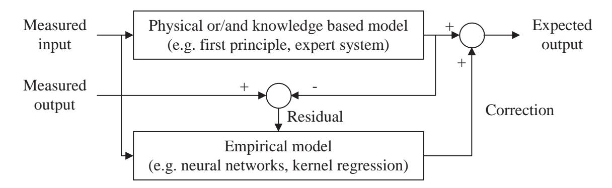

*FIG. 31. Output estimation with hybrid monitoring.*

uncertainties enter the model in different ways. For example, process dynamics may have been excited during data collection, and there may be un-modelled process state variables. Likewise, input and output signals are often measured with some additive measurement noises. A stochastic model is then formulated and used to detect when the process is no longer consistent with the model (incipient failure detection); to estimate the value of an unmeasured process state (process monitoring); and to predict with a given confidence how closely operating limits will be approached for a proposed control action (process control and prediction). Finally, to implement the decision module, a test statistic, such as the sequential probability ratio test (SPRT), may be used. The SPRT procedure consists of testing whether the monitored system is more likely to be in a normal mode or in a degraded mode. The general procedure for the SPRT is to first calculate the likelihood ratio of the observations collected. The likelihood ratio is then compared with the lower and upper bound defined by the false alarm probability and missed alarm probability. A normal condition is declared if the likelihood ratio is less than the lower bound. An abnormal condition is declared if the likelihood ratio is greater than the upper bound. Otherwise, no conclusion is made regarding the condition of the system. Basically, SPRT determines whether the residual sequence is more probably generated from the normal or the faulted distributions.

Several useful overview papers on hybrid modelling include Thompson and Kramer [49], Wilson and Zorsetto [50], ter Braake and van Can [51], and Garcia and Vilim [52].

#### **7.1.1. Requirements**

When considering a hybrid physical–empirical model, prior knowledge is required to establish the first principle or expert based relationships, which may include mass and energy balances and enforce physical constraints. The approach assumes that the contribution of the un-modelled physics to the process behaviour is observable in the I/O measurements. If so, then one discovers a fitted function that takes as its inputs the system forcing functions and state vector and returns a value that, when added to the known model equations, reproduces the measured behaviour of the system.

Considering other alternate hybrid structures, the general requirement is that the integrated approach can successfully complete the diagnostic tasks of the individual techniques. Furthermore, there is an assumption that having a greater level of information upon which to base a decision provides the potential for improved decision making.

Depending on the approach taken, some additional signal processing may be required to manipulate multiple data types into the appropriate reference for the applied model or condition monitoring tool.

#### **7.1.2. Strengths and weaknesses**

This hybrid framework, although more complicated, has a very important advantage. Purely data based systems are not reliable when the system moves into new operating conditions that may result from configuration changes, new operating practices or external factors such as unusually cold cooling water temperatures in condensers. Through proper application of hybrid systems, the predictions can be forced to revert to the first principles model when new operating conditions are encountered and will use the data based models when in familiar operating conditions.

In physical and knowledge based modelling, a complete model consists of a set of relationships that describe, for example, the transfer of mass, energy and momentum, and may also include correlated data from expert knowledge. Often, however, obtaining a good model is complicated by non-linearities and system parameter variations related to manufacturing tolerances. It is also possible that a complete model is not available because the complexity of the system does not allow for timely and cost effective model development. Hybrid model methods may be used to obtain a model when a complete set of equations is not available. While the first principles or knowledge based models control the extrapolation of the hybrid model in the regions of the input space that lack training data, the instance based learning techniques compensate for inaccuracy in the first principles or knowledge based models. In addition, the inclusion of un-modelled physics and a statistical representation of uncertainties results in lower false alarm and missed detection rates than other methods.

The expected benefits include:

- Improved generalization capabilities.
- Fewer data to produce accurate estimations and more reliable extrapolation.
- Quicker detection of system anomaly with comparable decision quality.
- As more information is used, uncertainty in the estimation is reduced.

The main drawback of hybrid modelling might reside in the increased complexity of the approach and in the fact that some of the drawbacks of the techniques that are integrated in a hybrid model might transfer to the integrated solution. Care should be taken to avoid these pitfalls and instead maximize the benefits that come from the integration.

#### 7.2. ADVANCED DATA COMMUNICATION

#### **7.2.1. Wireless networks**

Wireline protocols such as Modbus, Profibus, DeviceNet, Foundation Fieldbus HSE and Profinet typically provide adequate levels of reliability and security for integrating I&C devices within a monitored and controlled process. These networks are most suitable whenever time or mission critical data and closed-loop control are required. However, wireline networks usually impose high cabling and installation costs, which can exceed \$1000 per linear foot in regulated environments such as typical nuclear power plants. Recently, wireless solutions have increasingly been considered and implemented in actual industrial installations owing to their cost and flexibility advantages. In fact, on-line condition monitoring is emerging as the first opportunity for wireless technology to prove itself in industry.

Currently, the largest installation of wireless sensors in the world is at the TXU Comanche Peak nuclear power plant, where a \$14 million wireless network continues to be deployed. Even though the original justification for the network was voice communications, the benefit seen from condition monitoring is inspiring deployments in other sites in the nuclear power industry. The cost, however, of \$1000 per point per year is well above the level where application to less than the most critical assets is viable. This installation has otherwise shown that the wireless sensor networks can be cost efficient, reliable and secure. In general, a wireless system provides the lowest overall cost for large scale condition monitoring applications, without the need of requiring sophisticated planning and site mapping to achieve reliable communications. Wireless is also immediately available, with no right-of-way limitations, and can often be installed and operational within a short time period. These systems often offer a return on investment of several months, versus the years it may take for wired solutions. However, reliability is an issue in wireless communication. In industrial applications, most interference results from intermittent bursts of narrow-band signals, random electromagnetic interference (EMI) (e.g. background noise) and deterministic EMI (e.g. radio stations).

On the other hand, security in wireless is no different from security in wired infrastructure. Wireless can be made more secure than wired by including security in the physical layer, thus providing no access to record or tap into the bit stream. With condition monitoring as an economic driver, ubiquitous deployment will follow as issues of reliability and security arise. Current requirements are being addressed, for example, through the assurance that all measured telemetry over wireless links is independently verified before active deployment. As confidence grows, this assurance will no longer be necessary. In this regard, condition monitoring has the significant advantage of being fault tolerant and latency tolerant, since independent verification of faulty equipment can be included in the strategy without undue costs, and delays in reporting as long as several minutes are not significant to these applications, as most of this equipment previously was monitored daily at best. Emerging technologies detailed in this document hold promise for extending the applicability of wireless to less fault tolerant scenarios and reducing the cost to the point where equipment monitoring with wireless sensors becomes the standard without further justification.

Similarly, non-nuclear industries, including heavy industrial markets, are moving torward wireless deployment spearheaded by a programme at DOE prompted by the NRC study theorizing a 10% improvement in energy efficiency and a 15% reduction in emissions. DOE generated a document titled "Industrial Wireless Technology for the 21st Century", December 2002, which highlights the hurdles that need to be overcome for deployment of wireless technology in an industrial environment. Companies involved in that programme include the industrial instrumentation leaders Eaton, Honeywell and General Electric. Their first generation products for condition monitoring, commercially available in 2007, will establish a new standard for reliability and security in industrial wireless applications. These mesh networked sensors rely on redundant signal paths, ultra-low-power electronics and emerging standards (IEEE 802.15.4, SP100) to set the stage for requirements associated with interoperability and coexistence. The current justification in the nuclear industry includes the assertion that no data will be acted upon unless independently verified by human intervention. This appears to be an artefact of perceived weaknesses in security in identification and privacy. The new wireless sensors from Eaton, Honeywell, General Electric and others are expected to demonstrate in other industries their reliability, robustness and security in real-time or near-real-time condition monitoring. Ultimately, these demonstrations will open applications for true real-time monitoring and perhaps even control. Wireless sensors for these applications are already available, with costs dropping from thousands to tens of dollars. Applying these sensors in a nuclear environment is at least feasible, so future deployments in the nuclear industries will likely focus on the more ubiquitous sensing models embraced by DOE and NRC. Future applications of wireless technologies will include more than just replacing the wire. Clearly, distributed intelligence available in the network will reduce the need for high data rates over the wireless links. Reductions in size and power requirements associated with emerging technologies will further drive down costs as well. The convergence of sensing, computation and communication currently driving the consumer market will ultimately impact the industrial markets as well. This new infrastructure will allow the development of intelligent agents, application driven architecture and real-time resource allocation, further improving performance and enhancing security.

#### **7.2.2. Mesh networks**

Recently, there has been an increasing interest in mesh networks owing to their scalable, self-configuring and self-healing characteristics. Mesh networks use a decentralized, multihop architecture with each node in direct communication with its neighbours. Each networked device may be a communication node (i.e. it can resend and receive messages), assisting other devices in transmitting packets through the network and cooperating to relay a message to its destination. Data packets find their ways to their destinations following communication links that are identified on-line as reliable instead of following a pre-established topology or being forced through predetermined control points. Messages can thus be automatically routed along one or more alternate paths. If one link is identified as inadequate, the network automatically routes packets through alternate links. In this manner, mesh networks offer multiple redundant communication paths throughout the network, while simplifying routing and network deployment. This automatic reconfiguration feature makes mesh networks self-healing, as human intervention is not necessary for maintaining a desired quality of service. Network reliability is essentially a function of node density due to the duality of nodes and its 'ad hoc' executing topology. Thus, increasing node density would in general increase network reliability. Mesh networks have found many applications, such as in the area of modular and distributed control systems. The highly unstructured dynamic topology with powerful nodes and self-configuring capabilities facilitates the implementation of distributed intelligence and localized decision making, as information does not need to be sent to central points. Clusters of devices, such as sensors and actuators, can more easily communicate directly with each other, effectively implement local decisions and promptly isolate problems. Using wireless technologies, wireless mesh networks can also be deployed to connect devices distributed around the plant.

#### 7.3. FUNCTIONAL LEVEL INTEGRATION

The highest level of condition monitoring integration considered here is integration at the functional level. The functionality offered by condition monitoring systems should be integrated with the functionality offered by other support systems, with the aim of exploiting synergistic effects and achieving new functions.

Taking the example of condition monitoring systems for signal validation, their functionality becomes most valuable when integrated in the overall process control system. The control system itself and additional operator support systems, such as the alarm system, can be improved by applying the sensor validation system as a frontend to resolve their vulnerability to corrupted or missing input data. One example that is discussed in the following is the use of signal validation to improve the alarm suppression logic of a computerized alarm system.

#### **7.3.1. Integrating signal validation and alarm processing**

One of the main characteristics of an effective alarm system is the alarm suppression capability, which is the possibility to suppress all non-important alarms from the overview display, so that at all times the displayed alarms are only those that carry the necessary information concerning an ongoing disturbance.

The suppression logic is usually a function of:

- Other alarms previously triggered;
- Related systems or component status;
- Related process variables value (in relation to predefined thresholds).

This mechanism relies heavily on the plant instrumentation: a failed or out of calibration sensor can have a negative impact on the suppression logic, because of the possibility of unwanted and dangerous suppression of alarms. Integration of signal validation can help to build more robust and functional alarm systems.

An advanced alarm system can, for example, generate new alarms and logics according to the following rules:

- Generate a low reliability alarm whenever the confidence value is negative and the validation module is enabled. This is a low priority alarm which, however, indicates that either the process is currently experiencing an event that was not anticipated or that the sensor validation module is not correctly tuned.
- Generate a sensor drift or failure alarm whenever the sensor mismatch exceeds the tolerance value for that sensor, the confidence value is positive and the validation module is enabled.
- Whenever the previous condition is true (sensor drift alarm), any alarm suppression conditioned by the alarmed sensor is disabled.

Utilizing a signal validation module before alarm processing leads to the following additional functionality, which is not present when considering each system in isolation:

- Generation of sensor fault alarms;
- Suppression of alarms raised by faulty sensor readings;
- Avoided suppression of alarms where the suppression logic is based on faulty readings;
- Avoided oscillating alarms generated by noisy sensors.

The suppression logics in the alarm system therefore become more reliable and conservative, problems caused by noisy signals are reduced, and new alarms warning about incorrect measurements may be issued.

#### **7.3.2. Integrating condition monitoring with on-line risk assessment**

Another example of functional level integration is the development of a methodology to use condition monitoring data and information to improve probability of failure (POF) calculations. POF data can then be integrated into a probabilistic risk assessment (PRA) for improved risk based decisions and can also be used to optimize condition based maintenance decisions.

PRAs have been increasingly incorporated into risk monitors, which are used to assist decision making in the control room. The term risk monitor is defined in the IAEA Safety Glossary as follows:

"A plant specific real time analysis tool used to determine the instantaneous risk based on the actual status of the systems and components. At any given time, the risk monitor reflects the current plant configuration in terms of the known status of the various systems and/or components, e.g. whether there are any components out of service for maintenance or tests."

The risk monitor is used by the plant staff in support of operational decisions.

A basic PRA uses initiating event frequencies and basic event probabilities to calculate risk. In a basic PRA, these frequencies and probabilities are constant values. In a living PRA, these values can change due to configuration changes, or other environmental factors such as a strong storm could change the probability of a loss of off-site power. It is known that the probabilities of the basic events are not constant. They are currently allowed to change in limited instances, which include the following cases:

- The common cause failure probability of a safety system would change if the level of redundancy were reduced.
- The human error probability for a specific human action would change if associated instrumentation channels were removed from service.
- The probability of an undeveloped event would change as a result of activities being carried out on that system.

Current risk monitors do not take into consideration the normal, and sometimes abnormal, degradation of plant equipment. The risk monitor considers plant equipment to have a failure probability that is equal to one if the equipment has been taken out of service or to its nominal failure probability if it is in service. In reality, the failure probability of a piece of equipment changes over time as the component degrades through usage. Future research should develop techniques to calculate equipment failure probabilities using equipment condition assessment data gathered through plantwide OLM systems.

Many different types of risk monitor exist, and their usage varies from plant to plant. Some can be accessed throughout a plant's distributed computer network, allowing access by the operations department (shift supervisors, control room operators), the nuclear safety department and the maintenance planning department. Therefore, decisions made with incomplete or incorrect data can affect reactor operations, safety and maintenance. The economic consequences of these ill-conceived decisions could be devastating to the industry.

#### **7.3.3. General integration principles**

In this section, four general guiding principles for the integration of condition monitoring systems in nuclear power plants are presented. These principles are largely applicable to and facilitate the realization of all three levels of integration previously discussed, namely the data, operational and functional levels. The identified integration principles are encapsulation, synergism, infrastructure and standards.

#### *7.3.3.1. Encapsulation*

The principle of encapsulation, largely adopted in object oriented programming, consists in the ability to provide a well defined interface to a set of functions in a way that hides their internal workings. This principle can be effectively used to facilitate integration, since it keeps the implementation of the condition monitoring technology separate from the implementation of its interface.

Through encapsulation, one can preserve a healthy degree of independence between the technology employed and the specific means of delivery that might be chosen, i.e. its deployment. To achieve this, one should avoid mixing the implementation of the technology with the implementation of its interfaces, and make the basic shift from thinking in terms of *application* to thinking in terms of *component*.

#### *7.3.3.2. Synergism*

Synergism is the coming together of two or more systems or functionalities to create an effect that is greater than the sum of the effects each is able to create independently. By its nature, synergism applies mostly at the functional level, and the case described in Section 7.3.1 is a good example of new functionality emerging from the combination of the functionalities of independent systems. In the case of condition monitoring systems, other synergistic effects could be envisioned in the integration of condition monitoring systems for calibration reduction or equipment condition monitoring with computerized maintenance management systems (CMMSs).

#### *7.3.3.3. Infrastructure*

Infrastructure is the set of interconnected structural elements that provide the framework for supporting integration. The typical example is the data communication infrastructure that has to be present before any kind of integration can take place. While being fundamentally applied at the data level of integration, the repercussions of infrastructure are also significant at the operational and functional levels owing to its fundamental enabling property.

The initial investment costs of designing and implementing an integration infrastructure have been far outweighed by the obtained benefits, which include:

- Fast prototyping of integration solutions;
- Reduced costs of integration of new support systems;
- Reduced system maintenance costs (due to the absence of ad hoc interfaces between communicating systems);
- Flexibility for implementing new system configurations.

#### *7.3.3.4. Standards*

Standards have an important role to play in integration projects, especially if the ability to integrate systems and solutions from different vendors is considered a strategic advantage. The adoption of standards is particularly relevant in the implementation of a data communication infrastructure, as described in Section 7.3.3.3, with strong repercussions also at the operational and functional levels of integration owing to the inherent facilitation properties of standards. In this respect, the most relevant is perhaps the OPC standards suite described in Section 6.3.1.3.

#### 7.4. FLEETWIDE MONITORING

As a result of mergers and acquisitions within the nuclear power industry, utilities are becoming owners of multiple plants — sometimes more than 15 plant units. Therefore, there is substantial incentive for the utilities to take advantage of OLM technologies, applying them throughout their fleet of plants. Essentially the same set of technologies can be used over a wide spectrum of plants (potentially including not only nuclear plants, but also fossil plants). This will provide substantial savings to the plants in the implementation of OLM and in the reduction of maintenance costs. Another advantage of the fleetwide approach is the relative ease with which information may be shared between plants. This allows condition monitoring databases to be constructed, from which the collective condition monitoring knowledge of all the plants in the fleet can be stored and retrieved.

From a centralized location, the expertise of particular individuals can be applied across all plants in the fleet. In addition, having many systems of the same type allows for monitoring results to be compared with similar results from other plants in the fleet. The interpretive abilities of the analysts (OLM system users) will improve with a greater number of examples. Similarly, a potential repository of indicative patterns and signatures can be compiled and easily recalled when a similar condition is observed in the future for the same or a different plant. The benefits of OLM of equipment condition are scalable across a fleet of plants, and through a centralized facility additional comparative and benchmarking benefits become available.

EPRI is at the forefront of the fleetwide monitoring effort and is keeping the power generation industry abreast of the latest information in the area. In fact, EPRI has established a fleetwide monitoring interest group with nearly twenty active utilities.

#### 7.5. CONDITION MONITORING OF ELECTRICAL CABLES USING THE LINE RESONANCE ANALYSIS METHOD

On-line techniques can also be used to monitor the condition of the jacket, insulation and conductor of I&C cables and power supply cables. Condition monitoring of cable systems installed in nuclear power plants is an important part of ageing monitoring and licence renewal programmes.

A new on-line technique for cable ageing in nuclear power plants, named line resonance analysis (LIRA) has recently been developed [53, 54] and is being tested in field experiments [55]. The technique is based on transmission line theory, like the time domain reflectometry (TDR) method. However, LIRA enhances the diagnosis performance by including a proprietary algorithm to evaluate an accurate line impedance spectrum from noise measurements. The technique detects global and localized changes in the cable electrical parameters as a consequence of insulation faults or degradation.

Noise based estimation of line impedance is the basis for local and global degradation assessment. Tests performed with LIRA show that thermal degradation of the wire insulation and mechanical damage on the jacket and/or the insulation do have an impact on the insulation capacitance C and, to a lesser degree, on the conductor inductance L. LIRA monitors variations in insulation capacitance C through its impact on the complex line impedance.

Hot spots due to localized high temperature conditions and local mechanical damage to the insulation are detectable by LIRA through an algorithm starting from the line impedance spectra (see Fig. 32).

The LIRA system is composed of several software and hardware modules, as depicted in Fig. 33.

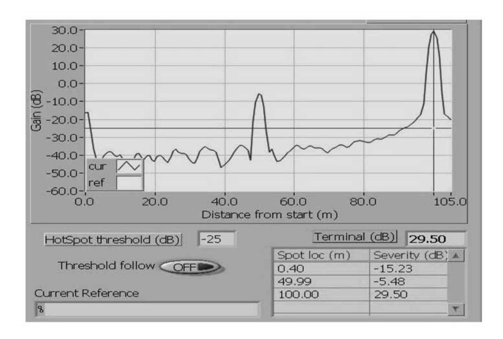

*FIG. 32. Hot spot detection in LIRA.*

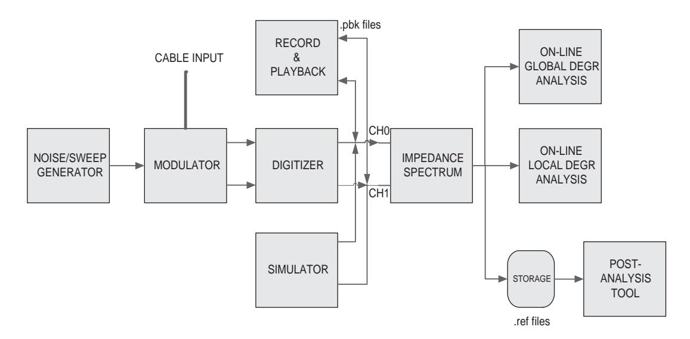

FIG. 33. LIRA block diagram.

The hardware modules are:

- The LIRA modulator, where the cable under test is connected.
- The LIRA generator, which controls the arbitrary waveform generator (AWG), currently a National Instruments PXI-5422, 200 Ms/s. It supplies a low voltage (1–3 V) white noise signal or signal sweep as test input to the system.
- The LIRA DSO (Digital Storage Oscilloscope), currently a National Instruments PXI-5124, 200 Ms/s digitizer. It is a two channel digitizer for the two signals coming from the modulator, i.e. the reference signal (CH0 input) and the signal modulated by the cable impedance (CH1 output).

#### 8. CONCLUSIONS AND RECOMMENDATIONS

This report provides an overview of techniques for on-line equipment and process condition monitoring, focusing on monitoring techniques to ascertain the current and future condition of plant equipment. In particular, it focuses only on techniques that can be performed while the plant is operating (on-line). Two general categories of techniques are presented herein. The first is a set of techniques using direct measurement to infer the current and future condition of plant equipment. The second category is model based techniques. These are not traditional condition based maintenance activities, but rather are used more for future assessment than for current assessments and can be generally classified as prognostic indicators.

The equipment condition monitoring techniques discussed in this report should be used to augment existing plant maintenance programmes. In some cases, experience with these equipment monitoring techniques will prove to be accurate and consistent with equipment condition indicators such that changes to the traditional preventative maintenance intervals can be made; however, this is a secondary effect. The primary goal is to provide additional benefits with respect to the existing maintenance strategies. These benefits are increased safety and reduced maintenance expenditure due to reduced likelihood of catastrophic failures. Additional savings can be obtained through planning maintenance for identified degradations during the most cost effective periods and cost savings due to better planning for maintenance activities when equipment condition is accurately known.

Optimal maintenance strategies are based on a holistic approach whereby proper management, staff training, appropriate technologies, and a positive work culture are established to support the maintenance programme. This report focuses on describing the types of technology available and omits discussions of the establishment and management of an overall maintenance programme. It is expected that an overall maintenance programme is in place, and that the addition of some of the technologies discussed in this report is intended to increase the gains of the programme overall.

There are two groups of tests for equipment and process condition monitoring:

- (1) Classic tests such as vibration measurements, reactor noise analysis, and acoustic and loose parts monitoring that have been developed, validated and used in nuclear power plants.
- (2) New tests based on empirical and physical modelling and new analysis methods based on intelligent computing algorithms to predict process behaviour, which are then used to identify the onset of anomalies in the process or equipment.

While there is considerable experience with the former, the latter are still evolving and are still in the research and development stage for nuclear power plants, although they have been used with success in other industries.

The use of classic methods for anomaly detection and parameter estimation has not yet reached its full potential. In many cases, such methods are only used for troubleshooting rather than for routine predictive maintenance. For example, neutron noise analysis has been used for monitoring of core internals vibration, both control rods and the core barrel structure, and for one- and two-phase flow characteristics in PWRs and BWRs, respectively.

One area where there has been a recent increase in the use of monitoring is post-power-uprate programmes, which have been carried out in several countries. Experience so far indicates that vibration and flow anomalies and BWR instability problems are aggravated by these power uprates. However, the application of these monitoring techniques is only effective if baseline signatures are taken before the power uprates. This therefore provides an incentive for the installation and use of OLM techniques before any planned power uprates.

Therefore, this report recommends the use of classic diagnostic techniques as a valuable tool to assist with predictive maintenance activities in the first instance, and, as confidence is established, to consider their use in supporting surveillance programmes of nuclear power plants. As for the new techniques, such as empirical and physical modelling, nuclear utilities are advised to allow pilot projects to be implemented in their plants so that experience in the techniques can be obtained and their effectiveness judged.

This report recognizes that a great body of knowledge exists in the areas that this report has covered and that this inventory of knowledge is readily available from a variety of sources, including the IAEA. In particular, the IAEA has sponsored the development of numerous Technical Documents (TECDOCs) and corresponding workshops on the use of diagnostic technologies and automated testing. For example, Implementation Strategies and Tools for Condition Based Monitoring at Nuclear Power Plants (IAEA TECDOC-1551), has been developed concurrently with this report and complements the material covered herein [56]. More specifically, it emphasizes reliability centred maintenance (RCM) and risk based maintenance topics, whereas in this report, modelling techniques are emphasized. In this vein, TECDOC-1551 and Part 1 of this report [4] may be used along with the material here to provide a more comprehensive review of on-line condition monitoring technologies for nuclear power plants.

### **REFERENCES**

- [1] HASHEMIAN, H.M., Sensor Performance and Reliability, Instrumentation, Systems, and Automation Society, Research Triangle Park, NC (2005).
- [2] HASHEMIAN, H.M., On-line Testing of Calibration of Process Instrumentation Channels in Nuclear Power Plants, NUREG/CR-6343, US Nuclear Regulatory Commission, Rockville (1995).
- [3] GLÖCKLER, O., "Measurement-based estimation of response time parameters used in safety analysis of CANDU reactors", Proc. Conf. on Nuclear Mathematical and Computational Sciences, Gatlinburg, 6–11 April 2003, American Nuclear Society, La Grange Park, IL (2003).
- [4] INTERNATIONAL ATOMIC ENERGY AGENCY, On-Line Monitoring for Improving Performance of Nuclear Power Plants, Part 1: Instrument Channel Monitoring, IAEA Nuclear Energy Series No. NP-T-1.1, IAEA, Vienna (2008).
- [5] NUCLEAR REGULATORY COMMISSION, Comprehensive Vibration Assessment Program for Reactor Internals during Preoperational and Initial Startup Testing, Reg. Guide 1.20, NRC, Washington DC (1976).
- [6] KUNZE, U., BECHTOLD, B., New generation of monitoring systems with on-line diagnostics, Prog. Nucl. Energy **29** (1995) 215.
- [7] POR, G., KANTOR, P.A., SOKOLOV, L.A., "Experiences with a reactor noise Diagnostics System for WWER-1000 Type Russian Reactors", Proc. OECD Specialists Meeting on Reactor Noise, Avignon, June 1992, OECD, Paris (1992).
- [8] AMERICAN SOCIETY OF MECHANICAL ENGINEERS, Loose Parts Monitoring in Light Water Reactor Power Plants, OMa-S/G-1991, Addendum to ASME OMA-S/G-1990 Standards and Guides for Operation and Maintenance of Nuclear Power Plants, ASME, New York (1991).
- [9] INTERNATIONAL ELECTROTECHNICAL COMMISSION, Acoustic Monitoring Systems for Loose Parts Detection — Characteristics, Designs Criteria and Operational Procedures, IEC-988 Standard, IEC, Geneva (1999).
- [10] POR, G., KISS, J., SOROSÁNSZKY, J., SZAPPANOS, G., Development of a false alarm free advanced loose parts monitoring system, Prog. Nucl. Energy **43** (2003) 243.
- [11] OLMA, B.J., Experience with identification of loose parts by acoustic monitoring of primary system, Prog. Nucl. Energy **43** (2003) 225.
- [12] PARK, G.Y., CHEON, S.W., LEE, C.K., KWON, K.C., An estimation method for impact location of loose parts, Prog. Nucl. Energy **48** (2006) 360.
- [13] THIE, J.A., Reactor Noise, Rowman & Littlefield, Lanham, MD (1963).
- [14] WILLIAMS, M.M.R., Random Processes in Nuclear Reactors, Pergamon Press, Oxford (1974).
- [15] THIE, J.A., Power Reactor Noise, American Nuclear Society, La Grange Park, IL (1981).
- [16] AMERICAN NATIONAL STANDARDS INSTITUTE/AMERICAN SOCIETY OF MECHANICAL ENGINEERS, OMb Part 5, In-service Monitoring of Core Support Barrel Axial Preload in Pressurized Water Reactors, ASME, New York (1989).
- [17] PARK, J., et al., Identification of reactor internals' vibration modelling and neutron noise analysis, Prog. Nucl. Energy **43** (2003) 177.
- [18] PÁZSIT, I., GLÖCKLER, O., On the neutron noise diagnostics of PWR control rod vibrations II. Stochastic vibrations, Nucl. Sci. Eng. **88** (1984) 77.
- [19] PÁZSIT, I., GLÖCKLER, O., On the neutron noise diagnostics of PWR control rod vibrations III. Application at power plant, Nucl. Sci. Eng. **99** (1988) 313.
- [20] CZIBÓK, T., KISS, G., KISS, S., KRINIZS, K., VÉGH, J., Regular neutron noise diagnostics measurements at the Hungarian Paks NPP, Prog. Nucl. Energy **43**(2003) 67.
- [21] DEMAZIÉRE, C., PÁZSIT, I., Development of a method for measuring the MTC by noise analysis and its experimental verification in Ringhals-2, Nucl. Sci. Eng. **148** (2004) 1.
- [22] GLÖCKLER, O., Reactor noise measurements in the safety and regulating systems of CANDU stations, Prog. Nucl. Energy **43** (2003) 75.
- [23] GLÖCKLER, O., "Reactor noise analysis applications in NPP I&C systems", Proc. 5th ANS Nuclear Plant Instrumentation, Control and Human Machine Interface Technology (NPIC & HMIT), Albuquerque, 12–16 November 2006, American Nuclear Society, La Grange Park, IL (2006).
- [24] GLÖCKLER, O., TULETT, M.V., Application of reactor noise analysis in the CANDU reactors of Ontario Hydro, Prog. Nucl. Energy **29** (1995) 171.
- [25] NICHOLAS, J.R., Analyzing electrical imbalance in motors, Maintenance Technol. (1993) 24.
- [26] HAYNES, H.D., Aging and Service Wear of Electric Motor-Operated Valves Used in Engineered Safety-Feature Systems of Nuclear Power Plants, Rep. NUREG/CR-4234, ORNL-6170/V2, Vol. 2, NRC, Washington DC (1989).
- [27] KRYTER, R.C., HAYNES, H.D., Condition Monitoring of Machinery Using Motor Current Signature Analysis, Sound Vib., September (1989).

- [28] DUKE POWER COMPANY, Motor Power Signature Analysis, DPC, Charlotte, NC (1993).
- [29] ROVERSO, D., On-Line Early Fault Detection & Diagnosis with the Aladdin Transient Classifier, Proc. NPIC&HMIT-2004, Columbus, 19–22 September, ANS, La Grange Park, IL (2004).
- [30] ROVERSO, D., "Dynamic empirical modelling techniques for equipment and process diagnostics in nuclear power plants", Proc. Conf. on On-Line Conditioning Monitoring of Equipment and Processes in Nuclear Power Plants Using Advanced Diagnostic Systems, Knoxville, TN (2005).
- [31] WHITE, H., Artificial Neural Networks: Approximation and Learning Theory, Blackwell, Oxford (1992).
- [32] PÁZSIT, I., KITAMURA, M., The role of neural networks in reactor diagnostics and control, Adv. Nucl. Sci. Technol. **24** (1996) 95.
- [33] HOFFMANN, M., "On-line calibration monitoring with PEANO", Proc. of NPIC&HMIT-2004, Columbus, OH, 19–22 September, ANS, La Grange Park, IL (2004).
- [34] FANTONI, P.F., HOFFMANN, M., SHANKAR, R., DAVIS, E., "On-line monitoring of instrument channel performance in nuclear power plants using PEANO", Proc. of 10th Int. Conf. on Nuclear Engineering, 14–18 April 2002, Arlington, VA (2002).
- [35] FANTONI, P.F., MAZZOLA, A., A pattern recognition-srtificial neural networks based model for signal validation in nuclear power plants, Ann. Nucl. Energy **23** (1996) 1069.
- [36] UPADHYAYA, B.R., EVREN, E., Application of neural networks for sensor validation and plant monitoring, Nucl. Technol. **97** (1992) 170.
- [37] WATSON, G.S., Smooth regression analysis, Sankhya– Ser. A, **26** (1964) 359.
- [38] STONE, C.J., Consistent nonparametric regression, Ann. Stat. **5** (1977) 595.
- [39] CLEVELAND, W.S., Robust locally weighted regression and smoothing scatterplots, J. Am. Stat. Assoc. **74** (1979) 829.
- [40] WAND, M.P., JONES, M.C., Kernel Smoothing, Monographs on Statistics and Applied Probability, Chapman & Hall, London (1995).
- [41] FAN, J., GIJBELS, I., Local Polynomial Modelling and its Applications, Chapman & Hall, London (1996).
- [42] ZAVALJIEVSKI, N., MIRON, A., YU, C., DAVIS, E., Uncertainty analysis for the multivariate state estimation technique (MSET) based on Latin hypercube sampling and wavelet de-noising, Trans. Amer. Nucl. Soc. **89** (2003) 19.
- [43] JOLLIFFE, I.T., Principal Component Analysis, Springer, New York (2002).
- [44] GELADI, P., KOWALSKI, B.R., Partial least squares regression: A tutorial, Analytica Chimica Acta **185** (1986) 1.
- [45] HÖSKULDSSON, A., A combined theory for PCA and PLS, J. Chemometrics **9** (1995) 91.
- [46] FANTONI, P., A neuro-fuzzy model applied to full range signal validation of PWR nuclear power plant data, Int. J. Gen. Syst. **29** (2000) 305.
- [47] LARSSON, J.E., Diagnostic reasoning based on explicit means-ends models, Artif. Intell. **80** (1996) 29.
- [48] ALPAY, B., GARCIA, H.E., YOO, T., A Hybrid Model Combining First-principles and Data-driven Models for Online Condition Monitoring, Proc. American Nuclear Society NPIC&HMIT Top. Mtg, Albuquerque, NM, November, ANS, La Grange Park, IL (2006).
- [49] THOMPSON, M.L., KRAMER, M.A., Modelling chemical processes using prior knowledge and neural networks, AIChE J. **4** (1994) 1328.
- [50] WILSON, J.A., ZORSETTO, L.F.M., A generalized approach to process state estimation using hybrid artificial neural network mechanistic models, Comp. Chem. Eng. **21** (1997) 951.
- [51] TER BRAAKE, H.A.B., VAN CAN, H.J.L.V., VERBRUGGEN, H.B., Semi-mechanistic modelling of chemical processes with neural networks, Eng. Appl. Artif. Intell. **11** (1998) 507.
- [52] GARCIA, H.E., VILIM, R., Integrating physical modelling, neural computing, and statistical analysis for on-line process monitoring, Nucl. Technol. **141** (2003) 69.
- [53] FANTONI, P.F., NPP Wire System Aging Assessment and Condition Monitoring: State-Of-the-Art Report, OECD Halden Reactor Project (HWR-746), Halden (2004).
- [54] FANTONI, P.F., Wire System Aging Assessment and Condition Monitoring: The Line Resonance Analysis Method (LIRA), OECD Halden Reactor Project (HWR-788), Halden (2005).
- [55] FANTONI, P.F., TOMAN, G.J., Wire System Aging Assessment and Condition Monitoring Using Line Resonance Analysis (LIRA), Proc. NPIC&HMIT 2006 Conf., Albuquerque, 12–16 November (2006).
- [56] INTERNATIONAL ATOMIC ENERGY AGENCY, Implementation Strategies and Tools for Condition Based Maintenance at Nuclear Power Plants, IAEA-TECDOC-1551, IAEA, Vienna (2007).

#### **CONTRIBUTORS TO DRAFTING AND REVIEW**

Berg, Ø. OECD Halden Reactor Project, Norway

Eiler, J. Paks nuclear power plant, Hungary

Garcia, H. E. Idaho National Laboratory, United States of America

Glöckler, O. International Atomic Energy Agency

Hashemian, H.M. Analysis and Measurement Services Corporation, United States of America

Hines, W. University of Tennessee, United States of America Lillis, D. Sizewell B nuclear power plant, United Kingdom

Park, J. Korea Atomic Energy Research Institute, Republic of Korea

Pázsit, I. Chalmers University of Technology, Sweden Pór, G. Technical University of Budapest, Hungary

Rasmussen, B. Electric Power Research Institute, United States of America

Roverso, D. OECD Halden Reactor Project, Norway

Shumaker, B.D. Analysis and Measurement Services Corporation, United States of America

#### **Consultants Meetings**

Vienna, Austria: 3–7 April 2006; Balatonfüred, Hungary: 7–11 May 2007

#### **Technical Meeting**

Knoxville, United States of America: 27–30 June 2005

### **IAEA NUCLEAR ENERGY SERIES PUBLICATIONS**

### STRUCTURE OF THE IAEA NUCLEAR ENERGY SERIES

Under the terms of Article III.A. and VIII.C. of its Statute, the IAEA is authorized to foster the exchange of scientific and technical information on the peaceful uses of atomic energy. The publications in the **IAEA Nuclear Energy Series** provide information in the areas of nuclear power, nuclear fuel cycle, radioactive waste management and decommissioning, and on general issues that are relevant to all of the above mentioned areas. The structure of the IAEA Nuclear Energy Series comprises three levels: **1 — Basic Principles and Objectives; 2 — Guides; and 3 — Technical Reports.**

The **Nuclear Energy Basic Principles** publication describes the rationale and vision for the peaceful uses of nuclear energy.

**Nuclear Energy Series Objectives** publications explain the expectations to be met in various areas at different stages of implementation.

**Nuclear Energy Series Guides** provide high level guidance on how to achieve the objectives related to the various topics and areas involving the peaceful uses of nuclear energy.

**Nuclear Energy Series Technical Reports** provide additional, more detailed, information on activities related to the various areas dealt with in the IAEA Nuclear Energy Series.

The IAEA Nuclear Energy Series publications are coded as follows: **NG** — general; **NP** — nuclear power; **NF** — nuclear fuel; **NW** — radioactive waste management and decommissioning. In addition, the publications are available in English on the IAEA's Internet site:

### http://www.iaea.org/Publications/index.html

For further information, please contact the IAEA at P.O. Box 100, Wagramer Strasse 5, 1400 Vienna, Austria.

All users of the IAEA Nuclear Energy Series publications are invited to inform the IAEA of experience in their use for the purpose of ensuring that they continue to meet user needs. Information may be provided via the IAEA Internet site, by post, at the address given above, or by email to Official.Mail@iaea.org.