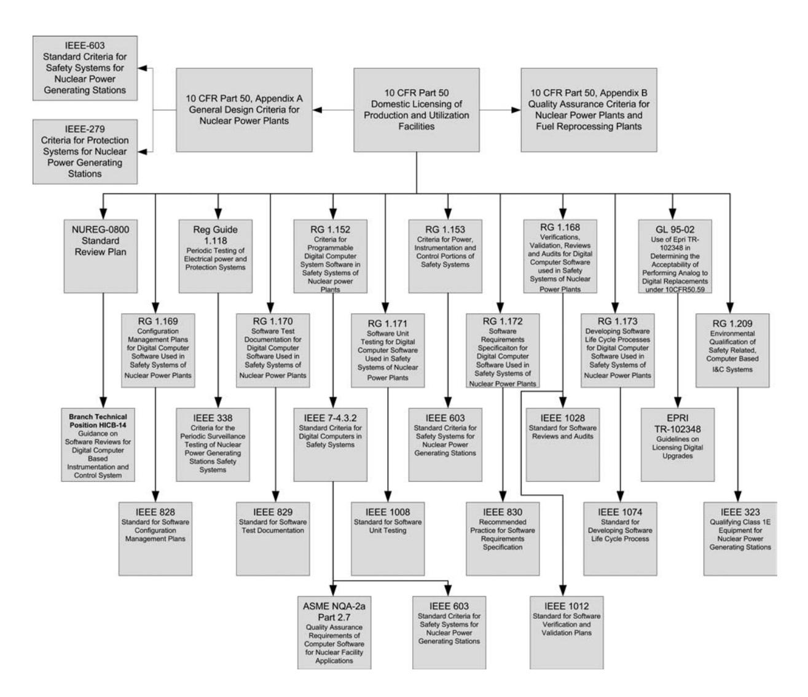
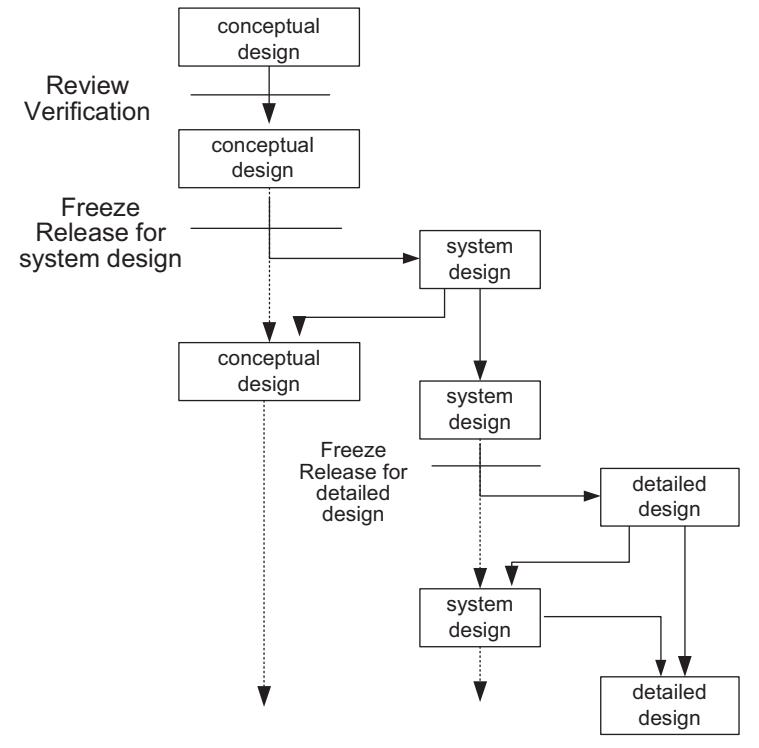
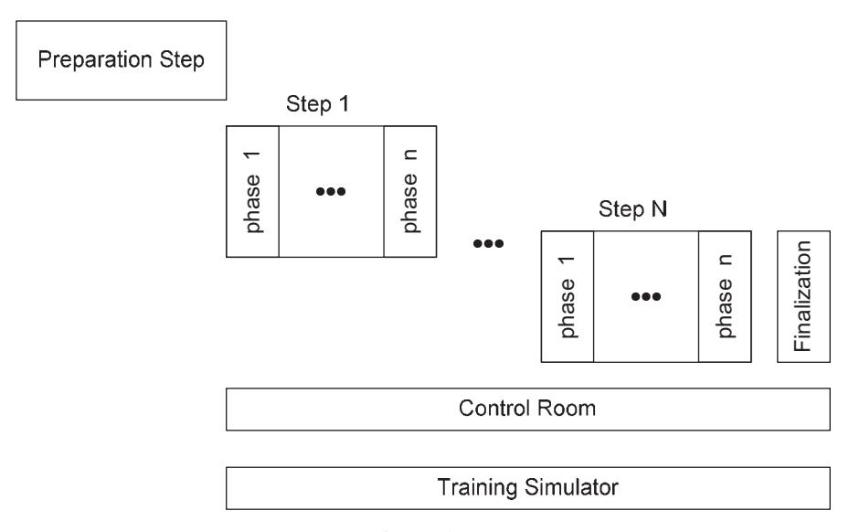
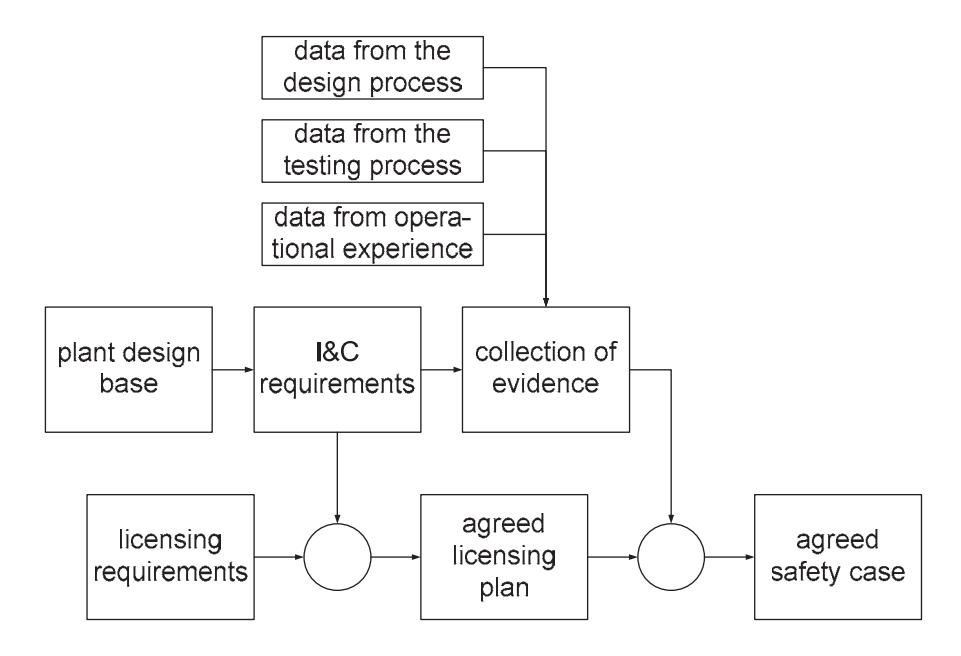
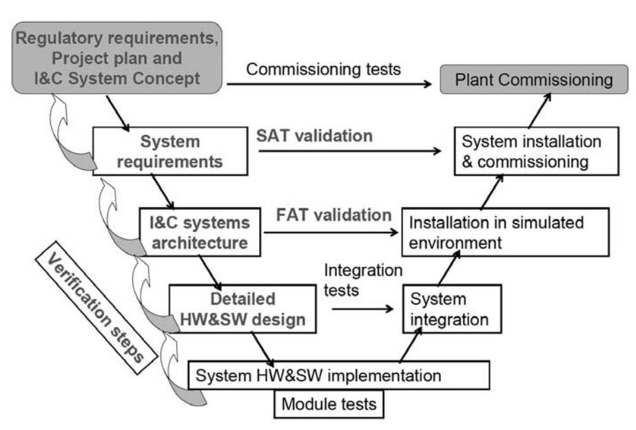

# **IAEA Nuclear Energy Series**

**No. NP-T-1.4**

**Basic Principles**

**Objectives**

**Guides**

**Technical Reports** **Implementing Digital Instrumentation and Control Systems in the Modernization of Nuclear Power Plants**

# IMPLEMENTING DIGITAL INSTRUMENTATION AND CONTROL SYSTEMS IN THE MODERNIZATION OF NUCLEAR POWER PLANTS

The following States are Members of the International Atomic Energy Agency:

AFGHANISTAN ALBANIA ALGERIA ANGOLA ARGENTINA ARMENIA AUSTRALIA AUSTRIA AZERBAIJAN BANGLADESH GUATEMALA HAITI HOLY SEE HONDURAS HUNGARY ICELAND INDIA INDONESIA IRAN, ISLAMIC REPUBLIC OF IRAQ OMAN PAKISTAN PALAU PANAMA PARAGUAY PERU PHILIPPINES POLAND PORTUGAL QATAR

BELARUS IRELAND REPUBLIC OF MOLDOVA

BELGIUM ISRAEL ROMANIA

BELIZE ITALY RUSSIAN FEDERATION

BENIN BOLIVIA BOSNIA AND HERZEGOVINA BOTSWANA BRAZIL BULGARIA BURKINA FASO CAMEROON CANADA JAMAICA JAPAN JORDAN KAZAKHSTAN KENYA KOREA, REPUBLIC OF KUWAIT KYRGYZSTAN LATVIA SAUDI ARABIA SENEGAL SERBIA SEYCHELLES SIERRA LEONE SINGAPORE SLOVAKIA SLOVENIA SOUTH AFRICA

CENTRAL AFRICAN REPUBLIC CHAD CHILE CHINA LEBANON LIBERIA LIBYAN ARAB JAMAHIRIYA LIECHTENSTEIN LITHUANIA SPAIN SRI LANKA SUDAN SWEDEN SWITZERLAND

COLOMBIA LUXEMBOURG SYRIAN ARAB REPUBLIC

COSTA RICA CÔTE D'IVOIRE MADAGASCAR MALAWI TAJIKISTAN THAILAND

CROATIA CUBA CYPRUS MALAYSIA MALI MALTA THE FORMER YUGOSLAV REPUBLIC OF MACEDONIA

CZECH REPUBLIC DEMOCRATIC REPUBLIC OF THE CONGO DENMARK MARSHALL ISLANDS MAURITANIA MAURITIUS MEXICO TUNISIA TURKEY UGANDA UKRAINE

DOMINICAN REPUBLIC ECUADOR EGYPT EL SALVADOR ERITREA ESTONIA MONACO MONGOLIA MONTENEGRO MOROCCO MOZAMBIQUE MYANMAR UNITED ARAB EMIRATES UNITED KINGDOM OF GREAT BRITAIN AND NORTHERN IRELAND UNITED REPUBLIC OF TANZANIA

ETHIOPIA NAMIBIA UNITED STATES OF AMERICA

FINLAND FRANCE GABON GEORGIA GERMANY GHANA GREECE NEPAL NETHERLANDS NEW ZEALAND NICARAGUA NIGER NIGERIA NORWAY URUGUAY UZBEKISTAN VENEZUELA VIETNAM YEMEN ZAMBIA ZIMBABWE

The Agency's Statute was approved on 23 October 1956 by the Conference on the Statute of the IAEA held at United Nations Headquarters, New York; it entered into force on 29 July 1957. The Headquarters of the Agency are situated in Vienna. Its principal objective is "to accelerate and enlarge the contribution of atomic energy to peace, health and prosperity throughout the world''.

# IMPLEMENTING DIGITAL INSTRUMENTATION AND CONTROL SYSTEMS IN THE MODERNIZATION OF NUCLEAR POWER PLANTS

# **COPYRIGHT NOTICE**

All IAEA scientific and technical publications are protected by the terms of the Universal Copyright Convention as adopted in 1952 (Berne) and as revised in 1972 (Paris). The copyright has since been extended by the World Intellectual Property Organization (Geneva) to include electronic and virtual intellectual property. Permission to use whole or parts of texts contained in IAEA publications in printed or electronic form must be obtained and is usually subject to royalty agreements. Proposals for non-commercial reproductions and translations are welcomed and considered on a case-by-case basis. Enquiries should be addressed to the IAEA Publishing Section at:

Sales and Promotion, Publishing Section International Atomic Energy Agency Wagramer Strasse 5 P.O. Box 100 1400 Vienna, Austria fax: +43 1 2600 29302

tel.: +43 1 2600 22417

email: sales.publications@iaea.org http://www.iaea.org/books

> © IAEA, 2009 Printed by the IAEA in Austria April 2009 STI/PUB/1383

#### **IAEA Library Cataloguing in Publication Data**

Implementing digital instrumentation and control modernization of nuclear power plants. — Vienna : International Atomic Energy Agency, 2009. p. ; 29 cm. — (IAEA nuclear energy series, ISSN 1995–7807 ; no. NP-T-1.4) STI/PUB/1383 ISBN 978–92–0–101809–0 Includes bibliographical references. 1. Nuclear power plants — Control rooms — Automatic control.

2. Nuclear power plants — Instruments — Reliability. 3. Nuclear power plants — Safety measures. I. International Atomic Energy Agency. II. Series.

IAEAL 09–00575

# **FOREWORD**

The IAEA encourages greater use of good engineering and management practices by Member States. In particular, it supports activities such as nuclear power plant (NPP) performance improvement, plant life management, training, power uprating, operational license renewal and the modernization of instrumentation and control (I&C) systems of NPPs in Member States.

The subject of implementing digital I&C systems in nuclear power plants was suggested by the Technical Working Group on Nuclear Power Plant Control and Instrumentation (TWG-NPPCI) in 2003. It was then approved by the IAEA and included in the programmes for 2006–2008.

As the current worldwide fleet of nuclear power plants continues ageing, the need for improvements to maintain or enhance plant safety and reliability is increasing. Upgrading NPP I&C systems is one of the possible approaches to achieving this improvement, and in many cases upgrades are a necessary activity for obsolescence management. I&C upgrades at operating plants require the use of digital I&C equipment. While modernizing I&C systems is a significant undertaking, it is an effective means to enhance plant safety and system functionality, manage obsolescence, and mitigate the increasing failure liability of ageing analog systems. Many of the planning and implementation tasks of a digital I&C upgrade project described here are also relevant to new plant design and construction since all equipment in new plants will be digital.

This publication explains a process for planning and conducting an I&C modernization project. Numerous issues and areas requiring special consideration are identified, and recommendations on how to integrate the licensing authority into the process are made. To complement this report, a second publication is planned which will illustrate many of the aspects described here through experience based descriptions of I&C projects and lessons learned from those activities. It is upon these experiences that the guidance in this report is based.

The IAEA wishes to thank all participants and their Member States for their valuable contributions. The Chairman of the technical meetings held to develop this report was B. Wahlström from Finland. The IAEA officer responsible for this publication was O. Glöckler of the Division of Nuclear Power.

# *EDITORIAL NOTE*

*This publication has been edited by the editorial staff of the IAEA to the extent considered necessary for the reader's assistance. The views expressed do not necessarily reflect those of the IAEA or its Member States.* 

*This report does not address questions of responsibility, legal or otherwise, for acts or omissions on the part of any person.* 

*Although great care has been taken to maintain the accuracy of information contained in this publication, neither the IAEA nor its Member States assume any responsibility for consequences which may arise from its use.* 

*The use of particular designations of countries or territories does not imply any judgement by the publisher, the IAEA, as to the legal status of such countries or territories, of their authorities and institutions or of the delimitation of their boundaries.*

*The mention of names of specific companies or products (whether or not indicated as registered) does not imply any intention to infringe proprietary rights, nor should it be construed as an endorsement or recommendation on the part of the IAEA.*

# **CONTENTS**

| 1. |      | INTRODUCTION                                                  | 1  |
|----|------|---------------------------------------------------------------|----|
|    | 1.1. | Benefits and challenges of digital I&C systems                | 1  |
|    | 1.2. | Two interconnected processes                                  | 2  |
|    | 1.3. | Three different parties                                       | 2  |
|    | 1.4. | Scope                                                         | 2  |
|    | 1.5. | Structure                                                     | 3  |
|    |      |                                                               |    |
| 2. |      | RELATED DOCUMENTATION                                         | 3  |
| 3. |      | OVERVIEW OF IMPORTANT CONSIDERATIONS FOR                      |    |
|    |      | I&C SYSTEM MODERNIZATION                                      | 6  |
|    | 3.1. | Basic principles in designing for safety                      | 6  |
|    |      | 3.1.1. A basis for safety                                  | 6  |
|    |      | 3.1.2. Safety functions of nuclear power plants            | 7  |
|    |      | 3.1.3. Demonstration of safety                             | 7  |
|    |      | 3.1.4. Classification and categorization                   | 7  |
|    | 3.2. | Digital technology                                            | 7  |
|    |      | 3.2.1. Characteristics of digital technology               | 7  |
|    |      |                                                               |    |
|    |      | 3.2.2. Human system interface                              | 9  |
|    |      | 3.2.3. Basic requirements for digital I&C                  | 9  |
|    | 3.3. | Architectural approaches to design of digital I&C systems     | 9  |
|    |      | 3.3.1. Internal architectures of digital I&C systems       | 9  |
|    |      | 3.3.2. Plant wide architecture                             | 9  |
|    | 3.4. | Considerations during preparations for modernization          | 10 |
|    |      | 3.4.1. Sensor signals                                      | 10 |
|    |      | 3.4.2. Addressing limited redundancy in process components | 11 |
|    |      | 3.4.3. Protection philosophy                               | 11 |
| 4. |      | I&C PROJECT EXECUTION                                         | 12 |
|    | 4.1. | General considerations                                        | 12 |
|    |      | 4.1.1. Interfacing plant and I&C design                    | 12 |
|    |      | 4.1.2. Requirement specification                           | 12 |
|    |      | 4.1.3. Stages of design                                    | 13 |
|    |      | 4.1.4. I&C implementation using a qualified platform       | 13 |
|    |      | 4.1.5. Contractual arrangements                            | 14 |
|    |      | 4.1.6. Documentation                                       | 14 |
|    |      | 4.1.7. Training                                            | 15 |
|    |      | 4.1.8. Planning                                            | 15 |
|    |      | 4.1.9. Basic planning for the I&C modernization            | 15 |
|    |      | 4.1.10. Design base                                           | 16 |
|    |      | 4.1.11. Timing of I&C modernization                           | 16 |
|    |      | 4.1.12. Master project plan                                   | 17 |
|    |      | 4.1.13. Implementation                                        | 17 |
|    |      | 4.1.14. Preliminary planning and design phase                 | 19 |
|    |      | 4.1.15. Requirement specification phase                       | 20 |
|    |      | 4.1.16. Inquiry and evaluation phase                          | 21 |
|    |      | 4.1.17. Detailed planning phase                               | 22 |
|    |      | 4.1.18. Conceptual design phase                               | 22 |
|    |      |                                                               |    |

| 4.1.20. Platform integration phase 25 4.1.21. Testing and validation phase 4.1.22. Installation and commissioning phase 4.1.23. Handing over phase 4.1.24. Regulatory involvement 4.1.25. Early communication 4.1.26. General principle for licensing 4.1.27. Plan for the licensing process 4.1.28. Major phases in the licensing process 4.1.29. Criteria for acceptability 4.1.30. The safety case 5. CONCLUSIONS, RECOMMENDATIONS, AND FUTURE CHALLENGES |
|-----------------------------------------------------------------------------------------------------------------------------------------------------------------------------------------------------------------------------------------------------------------------------------------------------------------------------------------------------------------------------------------------------------------------------------------------------------------------------------------------------|
| 25 25 26 26 27 27 28 29 30 30 31                                                                                                                                                                                                                                                                                                                                                                                                                                      |
|                                                                                                                                                                                                                                                                                                                                                                                                                                                                                                     |
|                                                                                                                                                                                                                                                                                                                                                                                                                                                                                                     |
|                                                                                                                                                                                                                                                                                                                                                                                                                                                                                                     |
|                                                                                                                                                                                                                                                                                                                                                                                                                                                                                                     |
|                                                                                                                                                                                                                                                                                                                                                                                                                                                                                                     |
|                                                                                                                                                                                                                                                                                                                                                                                                                                                                                                     |
|                                                                                                                                                                                                                                                                                                                                                                                                                                                                                                     |
|                                                                                                                                                                                                                                                                                                                                                                                                                                                                                                     |
|                                                                                                                                                                                                                                                                                                                                                                                                                                                                                                     |
|                                                                                                                                                                                                                                                                                                                                                                                                                                                                                                     |
|                                                                                                                                                                                                                                                                                                                                                                                                                                                                                                     |
| 5.0.1. Conclusions 31                                                                                                                                                                                                                                                                                                                                                                                                                                                                         |
| 5.0.2. Recommendations 31                                                                                                                                                                                                                                                                                                                                                                                                                                                                     |
| 5.0.3. Trends and challenges 32                                                                                                                                                                                                                                                                                                                                                                                                                                                               |
| REFERENCES 33                                                                                                                                                                                                                                                                                                                                                                                                                                                                                    |
| ABBREVIATIONS 35                                                                                                                                                                                                                                                                                                                                                                                                                                                                                 |
| CONTRIBUTORS TO DRAFTING AND REVIEW 37                                                                                                                                                                                                                                                                                                                                                                                                                                                           |
| STRUCTURE OF THE IAEA NUCLEAR ENERGY SERIES 39                                                                                                                                                                                                                                                                                                                                                                                                                                                   |

# **1. INTRODUCTION**

Many of the existing nuclear power plants (NPPs) in the world are approaching or have reached the midpoint of their design life. At the same time there have been tremendous advances in electronics, computers and networks. These new technologies have been incorporated into the currently available digital instrumentation and control (I&C) hardware (HW) and software (SW). Even though advanced digital I&C systems have been used extensively in many other industries, their use in the nuclear industry is still very limited. This is mainly because very few new NPPs have been built since the mid 1980's and the licensing process of digital I&C systems is challenging and complex. Despite these issues, numerous modernization projects have demonstrated that the functional improvements of digital I&C technology can provide cost effective improvements to NPP safety and availability. This document will explain a process for planning and conducting a modernization project based on the experience gained from projects which have already been completed. In addition, numerous issues and areas requiring special consideration are identified. It is the intent of the authors to present an outline of a process which is relevant for I&C modernization projects in all countries, and to identify significant issues which have proven to be important based on their collective experience.

# 1.1. BENEFITS AND CHALLENGES OF DIGITAL I&C SYSTEMS

The complexity of digital I&C systems requires a comprehensive implementation plan to ensure that plant safety is maintained. This implies, for example, that all phases of design should include extensive verification and validation (V&V) to ensure that due considerations have been given to systems functions and interactions between subsystems. An additional issue is that due to the incorporation of new computer and electronic components into digital I&C systems, and the rapid, continuous rate of technology advancement, a well defined plan for obsolescence management is necessary.

It is evident that digital I&C has become the only readily available technology for implementing various functions such as protection, control, supervision and monitoring at NPPs. When used properly, digital technologies can provide far more functionality than their analog counterparts. However, it is important to be aware of the differences between the two technologies, especially during modernization projects. In most modernization projects, it is not feasible to replace all I&C system components in the plant simultaneously; therefore, special attention has to be given to the interaction between the existing systems and the new technology. In many cases, modernization requires more than just replacing existing systems by their digital equivalents, as the two systems are not necessarily functionally identical.

This report deals with two interconnected processes: implementation of digital I&C systems and their licensing. It provides guidance to utilities on several key issues for the modernization of I&C systems to ensure a smooth interface between the two processes. Past experience from various projects around the world has indicated that inadequate handling of the unique characteristics of digital I&C technology may unnecessarily delay the progress and increase the costs of modernization projects. Even though this document is technical in nature, it is mainly intended for those who will be involved in managing digital I&C modernization projects. Another objective of this report is to present practices developed through experience, since the use of digital I&C systems in NPPs is a relatively recent undertaking.

While many issues presented herein are applicable to new plants, in the case of a modernization project one has to accommodate some additional issues:

- It may be necessary to reconstruct the design basis of the plant;
- Even with an existing design basis, it may be necessary to interpret its requirements for digital I&C;
- Compromises may have to be made because the project has to adapt to the existing plant and its operational requirements.

The most important difference between analog and digital technologies is that the latter relies on computers, hence, the software can be modified. The introduction of new software results in a new set of

potential failure modes which must be accounted for. The dominating failure mode of software based systems is deterministic in nature, which means that the use of redundancy alone does not necessarily provide a similar protection as in the original analog systems. In practice, this means that the implementation and licensing processes must address such issues as protection against common cause failures (CCFs) more rigorously than before with analog based systems [1].

# 1.2. TWO INTERCONNECTED PROCESSES

I&C systems provide protection, control, supervision and monitoring in NPPs. Some of these functions are purely for safety, others are safety related, and the rest may have indirect influence on safety and availability. It is therefore important to ensure that I&C systems are designed, manufactured, implemented and operated to an appropriate level of quality. In an NPP, the safety systems are categorized based on their importance to safety. This general principle applies also to digital I&C systems, but it is proven to be difficult to apply, at least in part, due to different opinions on interpreting those concepts.

In any digital I&C modernization project, it is important to realize that licensing is not a separate task, it is, in fact, the outcome of a successful design process. The most important part of an I&C modernization project is planning, within which it is essential that the licensing requirements be properly accounted for.

The licensing process should be integrated into the implementation plan from the beginning to validate selected solutions on a conceptual, functional and detailed level to ensure that the selected solutions are acceptable. During the planning stages of the project, considerations for safety requirements should be made such that during the implementation, license requirements are met.

# 1.3. THREE DIFFERENT PARTIES

To manage a successful I&C modernization project it is necessary to understand the roles and responsibilities of three major parties; the utility, the vendor and the regulator. The initiative to start a project comes from the utility to investigate the possibilities to either acquire new or modernize existing I&C functions at their plant. Typically, this interest leads to the involvement of one or more vendors who can offer suitable products and may have previous experience from similar projects. Once the initiation of an I&C project is considered feasible, contacts are usually made to the regulator to inform about the intention and to discuss details of the required licensing process. If safety or safety related functions are affected, the regulator will be involved as the third party in the process.

After the feasibility studies are conducted, due commercial negotiations are made and the project enters into the implementation phase. In this phase, there is a need for interactions between all three parties, although the formal contacts should always go through the license holder. This means that the utility is supposed to integrate all licensing requirements in the requirement specifications that are sent to the vendor. The utility is also responsible for documents that support the licensing process and including them in the contract between the utility and the vendor. Possible milestones, for which regulatory approval is required before the project can proceed, should also be stated in the contract.

To achieve this, all three parties must coordinate their efforts. Large I&C projects could involve substantial costs, not only due to the equipment and services purchased, but also due to a loss of production. It is therefore important for the three parties to anticipate possible problems to be able to address them before they emerge. A further complication in large I&C projects is that all parties may involve their own subcontractors, which in turn may involve additional subcontractors. It is therefore of utmost importance that individual responsibilities are clearly understood and documented.

# 1.4. SCOPE

One difficulty in writing a guide for I&C modernization projects is that there is a large range of potential project scopes. Some projects may be of short duration while others may stretch over several years. In addition, the project may be undertaken primarily by the utility or may be a turnkey project supplied by vendors. Numerous variations with differing levels of contribution from both the utility and vendor(s) are also possible. Due to this broad range of potential projects, this document is generic such that it is applicable to the vast majority of modernization projects. However, specific issues are identified and described in the project planning, execution, and licensing stages. While the focus here is on safety systems and safety related systems (Categories A, B and C in Refs [2, 3]), many aspects of this guidance can also be applied to non-safety systems.

This report is aimed at the comprehensive I&C functions that are used for protection, control, supervision and monitoring of major process systems that are directly involved in the production of electricity. This means for example that the I&C used for nuclear steam supply system and balance of plant is within the scope of the document, but isolated systems such as fire protection, dosimetry, laboratory, access control, and environmental monitoring are not explicitly included.

It should be noted that not all countries use the same terminology. The term I&C system is analogous to the term process control system (PCS), and the 'I' in I&C may be defined as only the field instrumentation of the plant. The following definitions are used for this report:

- I&C system: provides the overall monitoring and control of the plant (analogous to PCS);
- Platform: the HW, operating system and platform specific SW of a specific system;
- Application: project specific software running on a platform.

This report is written for technical managers in utilities, vendors and regulators. In addition, managers in research organizations may find ideas for future research to address some of the challenges presented. It reflects experience from very different projects carried out in many different countries, which means that the guidance should not be seen as forcing or interpreted as a set of binding requirements that override national licensing requirements or internal utility and vendor practices.

# 1.5. STRUCTURE

Section 2 gives a brief overview of related documentation from national and international organizations. Section 3 presents a summary of important issues in connection to I&C systems and their modernization. Detailed information relevant to the execution of an I&C modernization project is provided in Section 4. This includes the presentation of general considerations, important aspects of project planning, a detailed description of the typical steps and phases of a project implementation, and recommendations on how to integrate the licensing authority throughout the entire process to successfully complete the project. Finally, Section 5 presents conclusions, recommendations, and challenges.

# **2. RELATED DOCUMENTATION**

The regulations and standards to be followed for implementation and licensing of digital I&C will vary from country to country. One should always conduct a thorough review of the associated regulations and standards being applied during the design and licensing processes; however, it is often useful to review the regulations and standards of other international organizations to benefit from the insight and experience they are based upon. Table 1 provides numerous examples of international publications. In addition, there are many national publications available, e.g. Instrumentation Systems and Components at Nuclear Facilities [4]. The United States has a significant volume of material on this subject; a partial list of this documentation is shown in Fig.1.

TABLE 1. PUBLICATIONS RELATED TO THE IMPLEMENTATION AND LICENSING OF DIGITAL I&C

| Organization                                                                            | Document    | Document title                                                                                                                                                    | Publication year |
|-----------------------------------------------------------------------------------------|-------------|-------------------------------------------------------------------------------------------------------------------------------------------------------------------|------------------|
| EC                                                                                      | EUR 19265   | Common Position of European Nuclear Regulators for the Licensing of Safety Critical Software for Nuclear Reactors                                              | 2000             |
| IAEA                                                                                    | TECDOC-1016 | Modernization of Instrumentation and Control in Nuclear Power Plants                                                                                           | 1998             |
| IAEA                                                                                    | TECDOC-1066 | Specification of Requirements for Upgrades using Digital Instrument and Control Systems                                                                        | 1999             |
| IAEA                                                                                    | TRS-384     | Verification and Validation of Software Related to Nuclear Power Plant Instrumentation and Control                                                             | 1999             |
| IAEA                                                                                    | TRS-387     | Modern Instrumentation and Control for Nuclear Power Plants: A Guidebook                                                                                       | 1999             |
| IAEA                                                                                    | NS-G-1.1    | Software for Computer Based Systems Important to Safety in Nuclear Power Plants                                                                                | 2000             |
| IAEA                                                                                    | NS-R-1      | Safety of Nuclear Power Plant: Design                                                                                                                             | 2000             |
| IAEA TECDOC-1147 Management of Ageing of I&C Equipment in Nuclear Power Plants |             | 2000                                                                                                                                                              |                  |
| IAEA                                                                                    | TRS-397     | Quality Assurance for Software Important to Safety                                                                                                                | 2000             |
| IAEA                                                                                    | NS-G-1.2    | Safety Assessment and Verification for Nuclear Power Plants                                                                                                    | 2001             |
| IAEA                                                                                    | NS-G-2.3    | Modifications to Nuclear Power Plants                                                                                                                             | 2001             |
| IAEA                                                                                    | TECDOC-1226 | Managing Change in Nuclear Utilities                                                                                                                              | 2001             |
| IAEA                                                                                    | NS-G-1.3    | Instrumentation and Control Systems Important to Safety in Nuclear Power Plants                                                                                | 2002             |
| IAEA                                                                                    | TECDOC-1327 | Harmonization of the Licensing Process for Digital Instrumentation and Control Systems in Nuclear Power Plants                                              | 2002             |
| IAEA                                                                                    | INSAG-19    | Maintaining the Design Integrity of Nuclear Installations Throughout their Operating Life                                                                      | 2003             |
| IAEA                                                                                    | TECDOC-1335 | Configuration Management in Nuclear Power Plants                                                                                                                  | 2003             |
| IAEA                                                                                    | TECDOC-1389 | Managing Modernization of Nuclear Power Plant Instrumentation and Control Systems                                                                              | 2004             |
| IAEA                                                                                    | TECDOC-1500 | Guidelines for Upgrade and Modernization of Nuclear Power Plant Training Simulators                                                                            | 2006             |
| IEC                                                                                     | IEC 60880   | Nuclear Power Plants — Instrumentation and Control for Systems Important to Safety — Software for Computers in the Safety Systems of Nuclear Power Stations | 1986             |
| IEC                                                                                     | IEC 61508   | Functional Safety of Electrical/Electronic/ Programmable Electronic Safety-Related Systems                                                                     | 1998             |

TABLE 1. PUBLICATIONS RELATED TO THE IMPLEMENTATION AND LICENSING OF DIGITAL I&C (cont.)

| Organization | Document    | Document title                                                                                                                                                   | Publication year |
|--------------|-------------|------------------------------------------------------------------------------------------------------------------------------------------------------------------|------------------|
| IEC          | IEC 61513   | Nuclear Power Plants — Instrumentation and Control for Systems Important to Safety — General Requirements for Systems                                      | 2001             |
| IEC          | IEC 61131-3 | Programmable Controllers — Part 3: Programming Languages                                                                                                         | 2003             |
| IEC          | IEC 62138   | Nuclear Power Plants — Instrumentation and Control Important for Safety — Software Aspects for Computer Based Systems Performing Category B or C Functions | 2004             |
| IEC          | IEC 61226   | Nuclear Power Plant — Instrumentation and Control Systems Important to Safety — Classification of Instrumentation and Control Functions                    | 2005             |

*FIG. 1. Partial list of publications related to the implementation and licensing of digital I&C in the USA.*

# **3. OVERVIEW OF IMPORTANT CONSIDERATIONS FOR I&C SYSTEM MODERNIZATION**

I&C systems play an important role in ensuring the safety of NPPs by providing functions such as protection, control, supervision and monitoring. NPPs are typically operated from main and auxiliary control rooms which rely on the functions provided by the I&C systems. Some of the I&C functions are very important for safety (safety I&C), others influence safety to varying degrees (safety related I&C), while others may have no impact on safety (operational I&C).

The focus of this section is on the safety and safety related systems, but the discussion has a larger application to I&C systems in general. The initial concern is to identify the safety requirements and hence determine the safety role for the I&C systems. From these requirements, safety categorization of the systems can be identified and fundamental I&C requirements derived.

In terms of safety, there are clearly identified processes for determining the classification or categorization of the system. These processes are equally applicable to digital and analog systems. However, digital systems have unique characteristics that have to be considered as part of I&C modernization implementation and licensing planning.

An additional important aspect of the implementation and licensing of digital I&C systems that requires particular specialist assessment is that of the Human System Interface (HSI). The HSI is important because it represents the translation of plant information into operator actions and is therefore of significant impact in terms of the safe operation of the plant.

Finally, this section addresses the basic requirements for digital I&C systems in terms of architecture and what needs to be considered in preparation for the modernization of I&C systems using digital technology.

# 3.1. BASIC PRINCIPLES IN DESIGNING FOR SAFETY

#### **3.1.1. A basis for safety**

An important concept in the design of NPPs is the plant design basis which contains the basic philosophy of how the plant is intended to function in different conditions [5]. The plant design basis is in practice a set of written explanations of how systems, structures, and components are supposed to function under certain operational conditions. This document is of great importance in creating an understanding of the requirements for I&C systems.

The fundamental basis of safety in NPPs involves the consideration of the likelihood of threats and the evaluation of the barriers that mitigate these threats. If conceivable threats have been identified and the barriers can be shown to prevent, control or mitigate, then a plant can be considered safe. However, this general principle has drawbacks because it requires a completeness argument. It also involves providing evidence that the barriers are adequate in all conditions that could emerge.

One of the most significant basic design principles through which safety is incorporated into the NPPs is defence in depth. This principle involves the provision of consecutive and independent barriers that protect against the identified threats. A further application of the defence in depth principle leads to the application of diversity, separation and redundancy in systems and components to provide protection from random failures. For digital I&C the possibility that a common cause failure (CCF) can undermine protection is one of the major issues discussed in the licensing process. A number of the defence in depth measures applied to the design of I&C systems help to mitigate the effects of CCF [1].

The design of NPPs and also I&C systems is based on a top-down process, with subsequent step-wise refinements during the process. A second feature of the design process is a combination of synthesis and analysis. A design candidate is proposed using a process of synthesis by matching available design characteristics against the requirements to be fulfilled. The proposed design candidate is then analysed in a validation process with certain assumed failures to determine their consequences and compare them with defined acceptance criteria. If a candidate design is acceptable, it can be further refined to a more detailed level within the process.

#### **3.1.2. Safety functions of nuclear power plants**

The functional requirements of the I&C system are dictated by the required safety functions of the NPP. Common safety functions are reactivity control, maintenance of fuel integrity, control of pressure boundary, continuation of core cooling and the prevention of the release of radioactivity. These safety functions can also be seen as examples of defense in depth. In addition, there are support functions necessary for these safety functions to be effective such as the provision of electric power and cooling for the systems supporting the safety functions (e.g. injection pumps, heat rejection systems, etc.).

In addition to these safety functions, the I&C system has an important role in protecting systems, structures and components from threats that could occur as a result of certain failure situations. I&C also provides monitoring and diagnostic functions to make operators aware of plant problems requiring manual intervention. The design of I&C systems for an NPP therefore bounds all possible failures and how they will be mitigated.

## **3.1.3. Demonstration of safety**

The documentation and justification of major design decisions is an important part of the licensing process. These justifications are included within the plant safety case, which is a primary document required by the licensing process. This document is sometimes referred to as the Final Safety Analysis Report (FSAR). In addition, current requirements usually call for a living safety case (Safety Analysis Report (SAR)). This is usually a comprehensive document containing requirements for safety and evidence that the plant meets these requirements (including necessary references to the plant design basis).

# **3.1.4. Classification and categorization**

NPP systems and equipment are classified (or categorized) depending on their relationship to plant safety. In general, a graded classification scheme is used whereby the more direct a system's relationship to a safety function, the higher its classification. Typical descriptions for this highest level of classification are *safety system, category A, or 1E.* The importance of a system's classification while planning an I&C modernization project is to ensure that sufficient attention and resources are allocated for the given system's design, implementation, and V&V.

In practice, this principle is implemented using a classification or categorization document, which lists every system and component and assigns it to a safety class or category. Different organizations assign different classes or categories for that purpose. For example, the International Electrotechnical Commission (IEC) categorization [3] defines three safety categories A, B and C, while the American Institute of Electrical and Electronics Engineers (IEEE) only distinguishes between safety and non-safety systems. The IAEA defines three categories: safety systems, safety related systems and non-safety systems. Table 2 lists some of the most common classification and categorization approaches.

# 3.2. DIGITAL TECHNOLOGY

#### **3.2.1. Characteristics of digital technology**

There are many different characteristics between digital and analog I&C systems. Of greatest importance is that for digital systems signals are both sampled and digitized, and that the information is transmitted and processed sequentially. The implication of this is that existing functional specifications will have to be reconsidered in detail before they are applied to the new digital I&C design.

Digital I&C systems have several benefits as compared with analog systems, which include absence of drift, high accuracy, ease of implementing complex functions, flexibility, etc. Today, with the exception of reactor protection systems, there are no alternatives to the use of digital and programmable technology for I&C functions in NPPs.

TABLE 2. SAFETY CLASSIFICATION AND SAFETY CATEGORIES PROCESSES [6]

| National or international standard | Classifications                                                            |
|------------------------------------|----------------------------------------------------------------------------|
| IAEA                               | Safety system Safety related system Systems not important to safety  |
| IEC                                | Category A Category B Category C Unclassified                     |
| France N4                          | 1E 2E Important for safety (unclassified)                            |
| EUR                                | F1A (Automatic) F1B (Automatic and Manual) F2 Unclassified        |
| Russia                             | Class 1 (Beyond DBA) Class 2 (Safety system, DBA) Class 3 Class 4 |
| UK                                 | Category 1 Category 2 Unclassified                                   |
| USA (IEEE)                         | 1E Non-nuclear safety                                                   |

The main difficulty in the licensing of digital I&C systems is due to the software. A small software module can exhibit enough complexity to make a full verification of its correctness practically impossible. The implication of this is that for large complex software based systems there is some probability that an unforeseen error, not discovered during the V&V process, may disrupt its function in a crucial situation. This potential unreliability cannot be remedied by the use of redundancy, as the software is deterministic in its operation and the software will be embedded in each of the redundant channels. Even the use of software diversity cannot be considered as providing suitable protection because the requirement specification may be the ultimate cause of a software error. This, in some hypothetical situation could cause redundant and diverse systems to fail at the same time.

A typical characteristic of digital I&C is that important functionality is integrated into servers and processors, which means that certain performance parameters such as transmission speed and response times may deteriorate with a growing size of the I&C system due to higher processing loads. This characteristic can, if not controlled properly, have negative effects on important plant or I&C functions such as the quality of closed loop control and reaction times of the HSI.

Another important characteristic of digital I&C is timing sequences. Very small differences in the timing can cause different behavior in a digital I&C system due to the execution paths of the software. This characteristic makes it very difficult to predict exactly how a system composed of several computers will behave in a certain sequence. This difficulty applies both to internal transients such as start-up, voltage transients and internal failures and to external transients triggered by process events.

A final characteristic of digital I&C that needs to be taken into account early in an I&C project is the testability of modules and functions. Due to the inherent complexity of the digital I&C systems, it may be impossible to test all aspects of the system. This implies that confidence in the system has to be built from the

beginning of the project through extensive V&V activities in which testing (modules and functions) is an important part of quality assurance.

## **3.2.2. Human system interface**

The I&C systems convey information from the physical process to the operators in the control room. Information presentation in a modern control room is typically arranged using video display units (VDUs), which gives a qualitatively different mode of operation as compared to the conventional control room design based on a large number of discrete displays of main variables and alarms. The presentation of information using VDUs is a complex task, which requires understanding the restrictions of the media, the tasks of the operator, and the interaction of the operator with the information.

# **3.2.3. Basic requirements for digital I&C**

It is generally agreed that digital I&C can fulfill the required functions currently met by analog systems. In addition, digital I&C systems have significant benefits over analog systems, such as improved accuracy and the ability to implement complex algorithms. But there are certain obstacles to the implementation and licensing of digital systems and these have to be addressed carefully in the beginning of the project to avoid significant problems in the future. As has been discussed previously, the requirement specification for the analog systems may not be directly applicable to the digital systems and it is important that sufficient resources are allocated for the production of a comprehensive and correct requirement specification.

V&V is another important part of any project including digital I&C and it should be carried out in sufficient detail during and after each major step of design and implementation. Digital I&C will typically be implemented in stages and a high quality configuration management system should be in place during the whole project.

Modern safety cases typically include a probabilistic safety assessment (PSA). Due to its nature, it is very difficult or even impossible to assess the failure probability of SW. This means that it may not be possible to quantify the influence of the I&C functions on core melt frequency. On the other hand, field experience gives an indication that failure rates are dominated by physical components and that the failure rates for I&C functions are one or two orders of magnitude lower.

# 3.3. ARCHITECTURAL APPROACHES TO DESIGN OF DIGITAL I&C SYSTEMS

## **3.3.1. Internal architectures of digital I&C systems**

Digital I&C platforms can on a very basic level be separated into HW and SW. On a higher level most I&C systems that can be found on the market have made a distinction between system SW and application SW. This distinction between system and application SW is beneficial because to a certain extent the V&V efforts can be similarly separated.

For simple I&C components the applications programming may only involve the setting of a small number of parameters, which provide the required functionality. These systems are usually implemented with a platform that has been validated for use in certain targeted applications.

For more sophisticated I&C systems, the design of the application programs may rely on the use of specialized programming tools and languages, which for some of the more recent systems may require a Graphical User Interface (GUI) to configure the application SW.

# **3.3.2. Plant wide architecture**

The architecture requirements for digital I&C systems are dependent on the safety role of a particular I&C system. For example, I&C systems providing the reactor protection role are commonly implemented using four way redundant trains of equipment, with each train performing the same protection functions. A majority voting logic system (for example, 2 out of 4) is used to initiate the required safety function or safeguards actuation such

as reactor trip. This four way redundancy requires complete physical separation of the trains of equipment to provide defense against internal and external hazards.

Due to the need to perform the voting logic for the initiation of the safety functions or safeguards actuations across the multiple trains, there is a requirement to have communications across the trains to transmit the relevant information to the voting logic. This requirement for cross train communication has an impact on the plant layout and in particular on the physical implementation required to maintain defense against hazards.

I&C systems with a lesser safety role than reactor protection do not require the same levels of redundancy as described above. This is partly due to less stringent requirements for defense against hazards and failure probability on demand. The requirement for lower levels of redundancy has less of an impact on the existing plant layout and equipment. The redundancy requirements for such applications are already in existence for most modern systems.

The common architecture selected for plant wide I&C is based on multiple servers that communicate with each other using fast data highways. These data highways are duplicated or triplicated to ensure that functional integrity is maintained in cases of system malfunctions. Divisions are sometimes introduced between the servers and the highways to reflect, for example, different safety categories or plant subsystems.

A common approach to improving the reliability and availability of I&C systems is the use of hot standby architectures. Basically this type of architecture allows a standby system to switch into operation if the duty system fails. The key to the success of such an arrangement is the ability to detect duty system failures and to successfully switch to the standby system or component based on diagnostic functions. This approach provides a significant improvement in the overall reliability and availability of I&C systems.

A key driver for the availability requirements of I&C systems in an NPP are the plant technical specifications. These technical specifications identify the availability requirements for the plant items needed to maintain the plant in a safe state (and hence to remain operating at power). For example, the technical specifications will determine which operator information systems are required for safe plant operation and which are not required. This information can be used to determine which areas of the I&C architecture require the greatest availability and hence where there is the greatest need for additional redundancy or the use of hot standby architectures.

# 3.4. CONSIDERATIONS DURING PREPARATIONS FOR MODERNIZATION

# **3.4.1. Sensor signals**

Depending on the scope of the I&C modernization, some existing sensors may be replaced and others may be connected to the new I&C system. For the case when the new I&C system will utilize existing sensors, special care should be exercised to ensure their compatibility with the new system. This means for example that accuracy requirements and time constants have to be defined for the interface equipment. It may also be necessary to ensure that the new equipment is qualified for the likely conditions to be experienced in the locations in which they are placed to ensure that they meet their safety requirements under all possible conditions.

If the I&C modernization involves sensors providing input signals into the safety system, it is necessary to:

- Demonstrate that the dynamic ranges of the signals are sufficient for reliable initiation of protection actions before the plant safety limits are exceeded, with due consideration to possible rates of parameter change;
- Ensure that expected input signals to the I&C system during accidents will not result in invalid signals, interruption of required protective actions, or to misleading information being provided to the control rooms;
- Confirm that adequate extended range sensors are provided for fault conditions within the Post-Accident Monitoring System (PAMS), or similar system.

In general, the safety system responses should be clearly defined under normal conditions and also under conditions where one or more sensors are declared invalid (i.e. clearly defined fault states).

## **3.4.2. Addressing limited redundancy in process components**

When modernizing I&C systems it is usual to consider the possibility to enhance the safety of the plant during the modernization. Sometimes a limited redundancy in the actual process components, such as sensors, sets a limit on what can be achieved. It may be possible to build in additional safety functionality within the digital I&C system to compensate for a lower level of redundancy in the process components. For example, it may be an opportunity to improve an existing two out of three redundancy on the process side with a two out of four redundancy in the I&C channels.

Further elaboration of some other potential opportunities is provided below:

- (i) What kind of modifications of the voting logic for redundant signals can be considered acceptable during certain exceptional situations (e.g. testing or repairing a component) and how would such changes in plant configuration be managed? Appropriate voting modifications can still fulfill the single failure criterion (SFC), but the risk of spurious actuation may increase.
- (ii) Is it possible to claim credit from diverse protection functions to argue that the SFC is fulfilled and hence to relax the constraints due to CCF limitations during periodic testing and other comparatively seldom exercised activities?
- (iii) In the case of protection against a specific postulated initiating event (PIE), where it is difficult to provide a diverse protection function and hence the claims on the protection are limited by the CCFs, can compliance with SFC be assured by the implementation of additional redundancy in the protection system or in the voting logic? In practice this may be implemented by using two sufficiently independent subsystems within each division (e.g. in both lines of defence) if there is sufficient independence of the subsystems.
- (iv) If conditions necessary for the assurance of compliance to the SFC can be violated by either subsystem failures or erroneous actions of plant maintenance personnel, is it then necessary to introduce interlocks by which such actions can be prevented or can administrative procedures be proposed to provide sufficient defense against them? An example of this is to provide parameter bypasses to allow maintenance to be carried out on redundant channels (consider the need to have bypasses for these interlocks for accident mitigation purposes).

# **3.4.3. Protection philosophy**

I&C modernization may introduce the need to make a complete revision of the protection philosophy, especially in the case where protective devices which cannot meet the failure probability requirements are introduced. This problem is illustrated by the cases below.

When the safety requirements have changed, such as a greater reliance on the probability of failure on demand for a safety function, an application of the requirements in the design basis may introduce conflicts between different protective signals. In a simple case this may occur for example when smart devices introduce the possibility of component protection. If the major protection signal is not allowed to override the component protection, the functions may not be available on demand (undermining the reliability claim) due to a fault in the component protection (e.g. critical pump motors shut off protection as a result of component protection). The correct way to resolve such issues, when they have been identified, is to carefully address and prioritize the safety functions of major components and the devices by which they are controlled. Claims on manual control may be another way to mitigate shortfalls in the automatic safety function by allowing the operators to manually override the component protection.

Another possible conflict may emerge if a diverse protective system is required for a safety function in the highest safety category. The priority between the primary and the diverse systems and their conditions for an initiation should then be defined independently and precisely for each of their functions. For example, one of the systems may have been implemented as part of a very simple and comprehensively tested platform and the other using a more sophisticated platform, in which case a more complex protective function has been realized and is hence more difficult to prove. The practical solution would be to use the more sophisticated system as the first barrier and to use the simpler system as the second line of defense to meet the claims of the safety case.

# **4. I&C PROJECT EXECUTION**

The need for providing additional functionality and addressing obsolescence issues are the most common drivers for modernizations. In some cases new regulatory requirements can also be a driver of modernizations. It is a good practice to see modernizations in a logical framework of plant lifetime management to ensure that any plant modifications or modernizations carried out at different times are consistent and complementary.

This chapter provides an overview of the complexity of I&C projects. This complexity is due to the multiple points of view that have to be considered to be able to handle the necessary requirements and interactions over the life of the project. The chapter has been divided into four sections of which the first is more general and the last three sections describe the planning and implementation of an I&C modernization project, and present a description of regulatory involvement. This chapter also tries to give an appreciation of the large span of I&C projects that may range from simple exchange of obsolete components to large modernization projects which may take several years and may incur significant costs.

#### 4.1. GENERAL CONSIDERATIONS

A considerable experience base of I&C projects has been collected over many years. This experience base shows the need for a systematic approach of dividing the project into well-defined phases and planning these phases carefully. This section discusses the general considerations for implementing I&C projects.

Implementing an I&C project is an engineering process which involves three distinct parties: the utility, the vendors and the regulator. It is therefore recommended that all parties establish a common understanding of the I&C project, and their roles clearly defined, at an early stage in the project. This will allow the process to take into consideration the needs of all parties, and increase the chance that the expectations of all parties are met. During its life cycle, the I&C system must be adequately maintained by performing periodic inspections and testing of the platform and the applications.

## **4.1.1. Interfacing plant and I&C design**

Plant design and I&C design are closely interrelated. Therefore, it should be ensured that the I&C design is consistent with the plant design. One example is the design of start up and shut down sequences. In order to create a common understanding of sequences, triggering events and plant conditions, which the I&C design must comply with, a close interaction between process and I&C engineers is necessary. This will set the requirements for I&C systems in terms of signals, triggering levels and control requirements.

The I&C design should also interface with building, cabling, control rooms and component layouts. Therefore, it is important to understand where certain physical systems and equipment are placed to design cable routes and penetrations through pressure boundaries.

# **4.1.2. Requirement specification**

Developing the requirement specification has proven to be the most important phase in all I&C projects. It is necessary to carefully document, with as much detail as possible, the functions of the I&C system and the requirements of those functions. In developing the requirements, care should be taken to ensure that they are as complete as possible, cover all plant states and assumed abnormal conditions, and that they specify the performance required. It is often beneficial to use some kind of computerized specification tool by which the requirements can be managed and analyzed. The requirement specification should go through a detailed and accepted V&V process before being released for use.

#### **4.1.3. Stages of design**

The main principle in the design of I&C systems is to apply a top down approach with continuous refinements. Another good design principle is to proceed as long as possible with a system independent functional design, where the HW platform and SW are selected after the design has stabilized. Typical platforms offer considerable flexibility but still have their own unique functionality, which may require additional considerations in the functional design.

Most I&C design projects go through several iterations, where candidate designs are created and analyzed with respect to the requirements. With each iteration, the design incorporates a larger degree of detail. Because later stages of design are built on earlier stages, it is a common practice to freeze the design at suitable points when the design is considered mature enough. Sometimes it may also be necessary to back off from solutions that have been selected in an earlier stage of the design. If there is a need for a change later in the design process after it has been frozen, it is important that all influences of the change are properly accounted for. This implies that design freedom will decrease as the project progresses and the costs of changes increase.

In practice, the design process is separated into different stages: conceptual, system, and detailed design, where each stage of the design is carried to a point in which no large changes are expected and the design consequently can be frozen. Before moving from an earlier phase of design to the next, it is important that the design and the documentation are reviewed thoroughly. An illustration of these relationships in a design project is given in Fig. 2, where the conceptual design defines the design frame for the systems design, which in turn does the same for the detailed design.

# **4.1.4. I&C implementation using a qualified platform**

There are benefits in using pre-qualified platforms for I&C systems which are important to safety (category A and B). For operational I&C functions the use of a Commercial Off The Shelf (COTS) platform with wide market penetration is recommended for lower cost as well as for support and life cycle reasons (for other categorization schemes, see Table 2). The use of I&C systems based on platforms that have a large installation base is generally preferred due to the greater likelihood of platform stability and future support options.

*FIG. 2. The iterative design process.*

It is recommended that the utility ask the invited suppliers for specific statements regarding the possibility to qualify the proposed platform. This may require scrutiny of HW and SW architectures, design and development processes, and testing data. This information should be presented with well-structured requirements together with evidence that the platform fulfills these requirements. If a qualified platform is used, the assumption is that all application SW can be written and configured without changing the system SW. In addition, the application SW can be written with a previously qualified tool.

For a qualified platform, it can usually be expected that many different tools can be used to support the requirement specification, the application programming, V&V, documentation and version management. It is important that the utility has a good understanding of these tools and is prepared to use them during the modernization project.

The vendor approach to V&V and testing is of great interest. The information should be detailed enough to enable the utility to estimate realistically the structure, scope and timing of needed audits of the discussed processes, professional skills required from auditors etc. In addition, an *"acceptance in principle*" of the proposed processes by the regulatory body may be needed.

#### **4.1.5. Contractual arrangements**

I&C projects are typically agreed upon with a contract between the utility and one or several vendors. The main responsibility for I&C functions to be modernized is typically given to the vendor, but sometimes the utility may also engage themselves in creating the applications design.

A further complexity in contractual arrangements may be created through the use of several levels of subcontractors by the utility and the vendor. Multiple levels of subcontractors should be avoided whenever possible and the utility should assure its right to accept or decline subcontractors. The qualification of the subcontractors should meet the requirements of the project for the specific work package or delivery assigned to them.

Special attention should also be paid in the contract to describe the responsibilities for covering any extra costs. These extra costs may be incurred for changes not anticipated, but required, by licensing or safety authorities in the course of the project. A typical arrangement is that the parties agree upon some kind of plus and minus list for the influence of price changes.

The requirements for the vendor to be able to deliver technical support and spares after the delivery of the project should be defined in the contract. The requirement that the user should be informed about changes in the platforms should also be included in the contract.

# **4.1.6. Documentation**

At the very beginning of the project, both basic and detailed requirements on the documentation have to be specified and agreed on. This implies, for example, for agreements on what should be delivered on paper, what should be delivered electronically, and the required format for each. This does not only address what kind of documentation that should be created or delivered, but also addresses formal aspects like numbering, titles etc., as well as respective requirements originating from plant standards or the document management system (DMS). The DMS should be used to archive and manage the as-built project documentation and the product documentation.

The project documentation, especially signal flow diagrams (SFDs) and function block diagrams (FBDs), should be clear and accurate for use by the maintenance and operations personnel as well as other project participants. The parties should also agree upon the procedures for reviewing the documentation.

The project documentation is a result of the different design, engineering, quality assurance (QA), V&V and test activities; its main components are:

- Design documentation;
- V&V documentation;
- Test documentation (factory test, commissioning, etc.);
- Installation documentation;

- Licensing documentation;
- Spare parts list.

The as-built documentation must be compatible with the DMS of the utility, which could be a stand-alone system or part of an integrated plant management (information) system. It is also important to have all relevant product documentation for procurement of spare parts and service reasons.

#### **4.1.7. Training**

Training must be carefully planned and adapted for the different users in the utility, primarily the operational and maintenance staff. Training should start before implementation of the new system and functions in the plant.

Maintenance and plant engineering personnel should be involved in the system design as early as possible and should participate in the engineering activities and factory test activities to acquire appropriate knowledge.

The training of the operating personnel should be in phases starting with basic training for handling the HSI leading up to comprehensive training of the new HSI and functions in the plant simulator. This training should, if feasible, be performed before the factory acceptance test (FAT) and be used as an additional V&V activity to validate the new system. All negative findings should be carefully analyzed and the necessary error corrections and improvements should be implemented in the system.

After any final rework, the FAT should be performed and a second round of training should be executed with the reworked function before the upcoming outage in which the implementation is scheduled to occur.

# **4.1.8. Planning**

Any I&C project should be placed within the general framework of plant life management. This means that necessary relationships with other potential or planned modifications should be considered in the planning of the I&C project. The need for future modifications may emerge from many diverse considerations such as adaptations to new regulatory requirements, utilization of opportunities for power upgrades, and replacing obsolete plant equipment. Planning for future modifications is especially important for digital technology because the lifetime of digital systems is typically much shorter than that of the plant. This may initiate the need for more than one upgrade of the same system during the plant lifetime. Designing highly reusable requirement specifications and functional designs can at least partly address this need. No general guidelines can be given for the type, scope and sequence of an I&C modernization project. Each one depends on a vast amount of project constraints and factors, which differ from plant to plant because of their age, installed base, implemented concepts, etc. [7]. In the planning of I&C projects, it is also wise to investigate the possibility of increasing plant safety and plant capabilities by introducing new functions in the I&C [8, 9].

It is often a good idea to involve two or more vendors during the generation of a pre-project conceptual study to establish basic design philosophies. This arrangement also provides an opportunity for the utility to learn about the available technologies as well as opportunities for the potential vendors to acquire an understanding of the plant design and the intent of the modernization.

A project leader should be appointed early in the project. The project leader should have a very broad and deep understanding of the operation of the NPP and its I&C systems. This person will have to mediate between the involved parties and ensure that the project is successfully completed. There are many potential sources of resistance against a modernization project from many areas within the plant organization, even if the need is recognized and accepted; thus, it is essential that the project leader is directly supported by management personnel at the appropriate level.

# **4.1.9. Basic planning for the I&C modernization**

Regardless of the reason for the I&C modernization and the intended strategy, some very basic investigations and considerations have to be performed. It is very valuable to start with a pre-project plan that considers the plant's life cycle management plan and a feasibility study. The issues to be considered are the same for all types of modernization projects, regardless of whether they are done in one step or several steps. One of the most important project constraints is the intended remaining operational lifetime of the plant. Large modernization projects may not be economically justifiable when the remaining operation life of the plant is short.

As the remaining lifetime increases, choosing the start time and establishing a schedule for the I&C modernization becomes more important. A common goal is to avoid the necessity to repeat an overall modernization during the remainder of the plant's operational lifetime by ensuring that a smooth migration/ upgrade path for the system is possible and can be conducted in manageable steps. In such a way, the shorter life cycles of digital I&C can be addressed while the possibility to further implement advanced techniques or applications in the system remains feasible. Here the project manager and/or the decision makers can end up in a conflict that originates from the requirements of many authorities to keep the plant I&C equipment at the state of the art, while maximizing the benefit of proven operational experience and technology maturity.

Given a long remaining lifetime for operational I&C (systems not important to safety and not requiring licensing approvals), there is a tendency towards the use of new products with an associated lack of available operational experience and increased risk of being subject to immaturity problems. At a minimum, the core of the system infrastructure must be long-lived (e.g. networks). Given a rather short remaining lifetime, an older platform may be used if the supply of spare parts and support can be assured for the remaining operational life of the plant.

For modernization projects, another important decision in the basic planning is to select and define the scope of the project. Perhaps the easiest solution is to plan for equivalent functionality, but it is often advisable to also consider the introduction of new or improved functionality. The final decision depends on several contributing factors such as the original design of the plant, its remaining lifetime, operational experience and regulatory requirements. The potential for plant life extension should also be considered when classifying the remaining plant lifetime.

Regardless of the type of modernization, there are always certain basic considerations to be made before the start of the project. Typical considerations are:

- Licensing;
- Performance/scale effects/expansion capability;
- Upgrade capability;
- Defense in depth;
- Redundancy/diversity;
- Availability/reliability;
- Interfaces between the existing and the new I&C;
- HSI/human factors engineering (HFE) aspects.

HSI aspects should be considered early in the project as it is the interface between the existing and new parts of a control room or control location. This may have an influence on the boundaries of the modernization steps due to requirements originating from operator's tasks. If not properly accounted for at the beginning, it may be difficult, costly, or impossible to comply with these requirements later in the project.

#### **4.1.10. Design base**

As soon as the intended scope of the modernization is defined, it is necessary to assess if the existing design base documentation fulfills the necessary requirements that the I&C modernization demands. Sometimes it may be necessary to regenerate the design base. This applies not only to the design base of the I&C systems or equipment, but also to the process systems to be controlled and monitored. The assessment of the design base and its potential reconstitution may require considerable resources with adequate tacit knowledge. In addition, it is necessary to comply with the requirements and boundaries of the Safety Analysis Report (SAR) and the plant's technical specification. This is the underlying limiting condition for the requirement specification.

# **4.1.11. Timing of I&C modernization**

In general, it may be assumed as a normal case that I&C modernization alone will not present an acceptable business justification for a prolonged outage due to the high cost of production losses. Thus, most I&C modernizations will be done during normal outages, which becomes more and more challenging since all plants target shorter outage times to increase the economy of the plant. Due to this trend towards shorter outages, installation and commissioning becomes even more challenging and raises questions about the number of modernization steps with additional costs (e.g. for temporary interfaces) versus the cost for a prolonged outage.

Extended outages are mostly in conjunction with refurbishment or replacement of large plant components (e.g. steam generators). During these extended outages, large I&C system replacements can occur with no impact on the outage schedule. Therefore, a plant should have and maintain a long-term maintenance and modernization plan and the responsible I&C manager has to take this into consideration when planning an I&C modernization.

# **4.1.12. Master project plan**

The master project plan defines the boundaries of the overall project and forms the basis for the subsequent detailed plans. The master project plan is the top document controlling the overall project. The plan contains the tasks and goals for the project, including time and budget limits, project organization, and QA. Without limitations the project may expand, and will therefore have problems staying on schedule and within the budget. The master project plan is at the highest hierarchical level and can point to other separate more detailed plans for different tasks.

One should emphasize the importance of a coherent and consistent set of project plans even if, and especially if, there are several suppliers or a supplier consortium with several companies involved. Multiple plans or conflicting plans from different companies must be avoided. As part of the project plans, procedures including checklists for periodic tests of the I&C system should be developed and the required frequency for these tests defined. In addition, procedures with checklists for the complete or partial restart of the I&C systems after a complete or partial power supply failure should be prepared. If possible these procedures should be tested during the factory tests of the platform (see Section Testing and validation phase).

There should always be provisions for making modifications to the plans when such needs are identified and justified. However, it is very important that such modifications are carried out with the same scrutiny as the original plans.

# **4.1.13. Implementation**

A move from preliminary planning to implementation is typically taken when the preliminary plans have been accepted and a firm allocation of resources is in place. This usually implies a finalization of the preliminary plans and a preparation of various documents that will be used in the tendering phase. This section describes the interactions between the utility and the vendor after the decision to proceed has been made by the utility.

A modernization project may consist of one or more steps depending on the scope of the project and outage schedule (see Fig.3). Each step should include considerations for any necessary modifications of the control room and training simulator. If a project consists of more than two or three steps, and if it is intended to realize the whole project on one platform, it is recommended to define an overall requirement specification which covers the most important requirements of all modernization steps. A step specific and more detailed requirement specification, based on the overall requirement specification, should be prepared by the utility or the chosen supplier in due time for each individual modernization step. Instead of preparing a step specific requirement specification, it may also be feasible to have a pre-engineering study performed for each specific step.

Considering multi-step projects, if it is intended to complete the whole project with one supplier it is useful to request a frame tender for the whole project to establish a cost frame. For a multi-step project, a preparation step (prior to system design) should establish all the necessary rules and standards to ensure that the modernized I&C system is homogenous. In addition to the frame tender, a detailed commercial and technical tender should be required from the chosen supplier according to the definitions in the Skeleton Agreement for each step. This tender must be based on the original Frame Tender, the step specific requirement specification or the preengineering study. In addition, theframe specifications as well as the functional design specifications must be

*FIG. 3. Steps of a modernization project.*

considered in preparing the commercial and technical tender. This assures transparency, and the possibility for the utility to benefit from a price decrease on the market.

When defining the individual modernization steps, the operator needs on the HSI and the operational safety must be considered, e.g. operator tasks should not unnecessarily be divided between old and new equipment. For this to be accomplished, a careful analysis of the operator tasks is necessary for each modernization step at the process level (automation, component control etc.) so that an eventual modification of the associated HSI (i.e. change from hardwired control stations to screen based soft control) does not complicate the tasks of the operator (orientation, access to controls etc.) during normal operation or unplanned events.

Typical phases in each step of an I&C modernization project are:

- Preliminary planning and design phase;
- Requirement specification phase;
- Inquiry and evaluation phase;
- Detailed planning phase;
- Conceptual design phase;
- System design phase;
- Platform integration phase;
- Testing and validation phase (integration and FATs);
- Installation and commissioning phase;
- Handing over phase (site acceptance test (SAT) and operational acceptance test (OAT)).

It should be noted that planning, licensing, V&V and configuration control are elements related to all phases and should be properly addressed within each phase.

All modernization steps must be completed in such a way that the level of plant safety and availability is assured at any time so that the plant can be operated with the required safety and availability over long, or even unlimited, time periods if the project is put on hold for any reason or even prematurely terminated. Modernizations will affect the HSI to different degrees and the influences on the HSI must be carefully considered in every modernization step. Small scale projects may only affect different operation values and limit values, but it can also include new push buttons for maneuvering some new equipment. Larger projects might also include rearranging of existing push buttons, lamps and indicators, etc. A migration from traditional controls (push buttons, lamps and indicators) to a screen based interface may have a large impact on the HSI. The number of changes to the HSI may have a direct impact on the needed education and training, V&V of the HSI, and the updating of operating and disturbance procedures.

During all phases of a modernization project, the plant training simulator should be utilized, where applicable, since it provides a good tool for V&V and training activities (V&V of the new or modified I&C functions, operator training in real time with the HSI linked to the process model, etc.). Another possibility is to use specially built design simulators to support control system planning and development.

Each of the typical phases of an I&C modernization project are discussed in greater detail in the sections that follow.

# **4.1.14. Preliminary planning and design phase**

As mentioned previously, preliminary planning should be performed before starting the actual modernization project. This planning should address concerns such as how the plant will be operated, feasibility, and the definition of prioritized objectives for the I&C modernization project. Based on the results, an analysis of variants for the I&C modernization should be undertaken and the optimum variant should be selected and agreed upon together with support from plant owners and plant management.

Preliminary planning should include considerations for the following basic concepts:

### (a) Plant operational concept:

- (i) should the plant be operated for the remainder of its operational lifetime (base load, cycling, grid support)?
  - For this concept there must be a firm consensus with the plant owners as well as with the plant management in order to build the strategy for the I&C modernization on a solid foundation.

# (b) Areas and boundaries for modernization (scope):

- (i) Plant systems/I&C systems and related applications;
- (ii) Sensors and actuators (including motor control centrers (MCC));
- (iii) Cabling;
- (iv) Replacement of hydraulic/pneumatic controls by digital control, utilizing field bus, and smart sensors/actuators;
- (v) Training simulator.

# (c) Workplace and control room concept:

- (i) How should the control room and individual operator or shift supervisor workplaces be arranged? What functionality should each workspace have?
  - Considerations regarding the main and local control rooms (e.g. integration of local control rooms and local control locations into the main control room), staffing of the control rooms etc.
  - For the above concept, a consensus with the operations staff is very necessary. The concept should be based on an analysis of operator responsibilities, tasks, workloads, and the division of work and tasks between the individual operators.

In general, the operations staff should be involved in the project from a very early phase (even in the system evaluation) and throughout the whole duration of the project (especially for the design of the HSI, alarm, event displays, etc.). It would be very wise for the I&C modernization project manager to consider the operations staff as his customers.

# (d) Security concept:

The new I&C system may have interfaces to the general enterprise network (e.g. intranet) and via this to the internet. It is therefore necessary, together with the general IT infrastructure, to provide security measures, including cyber security [10], to prevent unauthorized intervention in the I&C system and unauthorized access to its data (safety I&C as well as operational I&C).

## (e) I&C concept:

A reference or ideal platform independent I&C concept and topology should be prepared by the utility or a consultant as a base for the overall requirement specification and initial inquiries.

## (f) Feasibility investigation:

- (i) This study should assure that the intended modernization is generally possible and describe the requirements to perform a successful and efficient modernization.
- (ii) Issues to be considered during the feasibility investigation are:
  - Plant requirements on response time and real time behavior of the I&C system;
  - Physical space requirements;
  - Power supply (including uninterruptible power supplies and their associated backup battery capacity);
  - Heating ventilation and air conditioning (HVAC) requirements.

These points are of special importance if old and new equipment will be operated in parallel for some time (e.g. for verification reasons) or if substantial temporary interfaces (e.g. input–output modules) are to be installed which may increase the demands on power supply and heat removal systems in the electronic equipment rooms.

Examples of issues that should receive special attention in the preliminary planning studies are:

- Completeness, i.e. ensure that all planned modifications of safety and safety related functions are taken into account.
- Classification, i.e. assign and check the safety categories of each function, to determine the requirements imposed on the system and equipment performing each function.
- Determine the need for functional diversity within the safety systems, which may arise due to the modification (e.g. reactor trip system (RTS), engineered safety functions actuation system (ESFAS)). In some cases it may be possible to give credit to functional diversity as a defense against postulated CCFs in the digital I&C. It may even be possible to relax deterministic requirements on the I&C system serving the safety systems when a diverse function is given credit in the safety case.
- Establish a protection philosophy, where the possible contributions of functions of a lower safety category (e.g. limitation and control functions) can be established for defense against CCFs in systems of higher safety categories.
- Specify (if relevant) diverse automatic protection functions or manual actions (i.e. alternative success paths if the primary protection system would fail), including time limits for their performance.

#### **4.1.15. Requirement specification phase**

When the scope of the project has been determined, the requirements to be placed on the new I&C system have to be defined. These requirements are typically derived from many sources such as regulatory requirements, process requirements, industrial standards and utility requirements. Since most systematic errors are introduced in the I&C systems during the requirement specification phase, it is advisable to use some kind of formal methods for managing the specification.

An overall requirement specification for the whole stepwise modernization should be prepared which accounts for the basic concepts defined in the preliminary planning and design phase. This overall requirement specification should define the intended overall scope of the project irrespective of the intended implementation schedule. While the overall requirement specification should define the intended number of modernization steps with their respective scopes and boundaries together with the most probable sequence of the modernization steps, it must be pointed out that the number (and therefore the scope) and sequence of the modernization steps may change in the future due to new or modified general conditions.

The scope should list all systems and functions with their current classification/categorization (see Table 2) and a new classification/categorization, if applicable (i.e. the modernization results in a change in classification).

The overall requirement specification should define the major requirements on the I&C system for the entire project with sufficient detail, such as response time, accuracy, requirements for deterministic behavior etc. This should also include the requirements on communication interfaces with existing systems and future third party systems if necessary. For existing communication interfaces, all existing information should be presented in the overall requirement specification. Furthermore, requirements regarding HFE for the HSI must be specified (operational safety, ergonomics etc.). It is advisable to develop at least a preliminary plan which deals with the stepwise transformation of the control room and control locations (from conventional (analog) to hybrid (analog and digital) or to a mostly digital control room).

If the I&C system is not being implemented with a uniform and homogenous platform it is very important to consider the needs of the operational staff in the control room and to provide clear and understandable displays of the necessary information to safely and efficiently monitor and control the plant, especially during unplanned events. When using different I&C systems (each with its own HSI), the standardization of symbols, icons, and other items for graphic displays, etc., is recommended or may be mandatory [11].

Alternatively, applying a common platform for operation & monitoring (e.g. supervisory control and data acquisition (SCADA) system) with different systems or components at the process level may be considered.

#### **4.1.16. Inquiry and evaluation phase**

As the basis for the tender inquiry the overall requirement specification explains the exact site considerations, defines the intended scope of supply and work as well as the boundaries of the modernization project. For the boundaries, care must be taken so that all responsibilities, including supply, functionality, and performance are unambiguously defined and that there are no potential gaps. This is especially important for serial or network interfaces and associated protocols, but also for issues like power supply, shielding, and grounding (including lightning protection).

It is mandatory to provide a clear structure with the tender inquiry to the suppliers and request that the tender conform to the format of the requirement specification (technically) and to a given price structure (commercially). This will allow for easy comparisons of multiple tenders on both a technical and cost basis.

In the technical evaluation one should carefully investigate statements and promises of the supplier concerning performance figures, functionality, as well as development and release plans. This is very important if the system being evaluated is still not mature and one may be the first customer for a specific field or application. Scrutinize functions, especially if there are only prototypes available, which have not been applied in a commercial environment. This is very important for redundancy requirements (e.g. are all relevant functions redundant) as well as for performance and real-time behavior requirements. The real-time behavior of a system or a specific application can depend on the respective configuration and deviate from the behavior of the previous analog technology.

It is important to be aware that even a test or demonstration installation may not disclose performance deficiencies of a platform due to scale effects. This may also be valid for the assessment of the tool efficiency.

A careful investigation of the technical expertise of the vendor should be conducted with regards to the system platform and their experience in planning, detailed engineering, testing, and commissioning of power plant processes (conventional/nuclear if safety I&C is regarded). A similar investigation of the knowledge and skills of the vendor in regards to V&V and licensing is also necessary. Finally, but no less important, ensure that the vendor not only has a certified QA process, but also that their organization and staff are following their process. For the detailed evaluation define and document a methodology by which to evaluate the supplier's fulfillment of the requirements before the evaluation starts and use database supported means and tools.

For the safety I&C it is of benefit to choose a platform which already has a generic qualification of an internationally accepted authority (e.g. a Safety Evaluation Report (SER) of the United States Nuclear Regulatory Commission (USNRC)). This may limit the choices and suppliers, but may also reduce the overall cost of platform qualifications required to demonstrate that all system related requirements are met.

Parallel to the selection of the system and vendor, a skeleton agreement based on the overall requirement specification and the frame tender should be established and agreed on with all bidders in the final evaluation before the selected vendor is announced. The conditions of the extremely important skeleton agreement may also be an important criterion for the selection of the supplier.

The skeleton agreement should include (as a minimum):

- The guaranteed system properties and qualities, especially those related to real time behavior, response times, control accuracy, etc. System properties and qualities should be defined for all steps of the modernization project and should be, together with the overall requirement specification, the base for the individual requirement specifications and work contracts of each modernization step;
- Calculation rules for future modernization steps (based on the frame tender and the skeleton agreement);
- Rules for price adjustment for future modernization steps (e.g. sliding price formula with its parameters/ indices);
- Licensing of the platform for the safety I&C (see Table 2);
- Licensing support for the plant specific application qualification and licensing;
- Rules for updating and upgrading HW, SW, and firmware (FW) over the whole project duration;
- Rules for supply and availability of spare parts;
- Support services;
- QA requirements; the possibility of QA and other audits by the utility or an assigned third party at the vendors or suppliers (including subcontractors) premises should be ensured;
- Guarantee and liability;
- Legal matters (terms of payment, contractual penalties, etc.).

# **4.1.17. Detailed planning phase**

Each individual modernization step should be considered and handled as an individual project with a clear scope, schedule, and milestones. In spite of this separation of the modernization steps there are some considerations that may be planned for the entire modernization project:

- QA: it may be beneficial to develop a specific QA plan to tie in to the company specific QA program. This plan should then be updated for each consecutive modernization step;
- V&V: similarly it may be advisable to think through the V&V activities and to develop a generic V&V plan to establish the frames for the V&V activities for each modernization step;
- A general master time schedule for all activities should be prepared and updated as the project progresses and tasks are completed.

The qualification and licensing support plan should define the vendor obligations for qualifying the plant I&C functions and the associated system, including any related equipment which will be installed. In addition the plan defines what type of support should be provided to the utility in their safety evaluation work that is described in their plant safety demonstration plan.

#### **4.1.18. Conceptual design phase**

In any I&C modernization project, especially for a multi-step project, it is very important to establish the rules and standards prior to the system design. These general rules and standards define and ensure a uniform design across all possible modernization steps.

This should be done in two steps. The first step should establish the frame specifications, which describe the necessary requirements for the system functions and the layout and operation of the HSI. The frame specifications present the guiding principles for the project such that in all steps identical functions are engineered and implemented in an identical way, while still allowing for the introduction of improvements and advances in the technology.

In a comprehensive I&C modernization project, a set of about 20 to 30 frame specifications may be necessary. It is not mandatory that all frame specifications are completed or describe every detail before the start of the first modernization step. The completion of frame specifications, to the necessary level of detail, may be done stepwise as the project progresses. For example, details of the I&C concept for the safety I&C part may be defined later, if the modernization of the safety I&C is planned in a later stage. Nevertheless, it is very important that general requirements and rules are defined in a consistent and comprehensive way at the start of the project.

These rules and standards could be established for each of the areas under each of the design categories below:

# 1. Non I&C system specific design prerequisites:

- —Functional safety categorization of plant systems;
- —I&C system configuration;
- —Defense in depth and diversity;
- —I&C system supervision;
- —Naming conventions/item designations;
- —Communication/interface principles between divisions and safety categories.

# 2. I&C system specific design prerequisites:

- —Measurement, automation and control;
- —Monitoring and supervision;
- —SW HSI principles, e.g. mimic displays, alarm and event display;
- —HW HSI principles, e.g. safety panels.

# 3. Detail I&C design prerequisites:

- —Circuits for measurement/maneuver/system supervision;
- —Application structure(s);
- —Communication principles.

# 4. Miscellaneous design prerequisites:

- —As-built I&C documentation structure;
- —Labeling principles;
- —Dismantling documents.

In a second step, and on a much more detailed level, the requirements for the development of an application or function is described in the functional design specifications (FDS). The FDS describe the detailed requirement specification for each function or application. In a comprehensive I&C modernization project a set of about 30 FDS may be necessary. The necessity stems from the fact, that the requirement specification which was used for obtaining tenders and for the system evaluation was platform neutral. However, after selection of the platform these requirements may need to be revised. The FDS together with the frame specifications form the basis for V&V and test instructions.

#### **4.1.19. System design phase**

This phase consists of the system design and the detailed design and is the phase with the most extensive engineering activities. These activities are mostly performed by the vendor but must be monitored and closely supervised by the utility. Failures and errors in the system design can have serious cost consequences if carried over into the detail design. Thus, it is mandatory that comprehensive reviews of the engineering activities are conducted at logical points in the engineering process. In some cases, the system design phase may start with the elaboration of the necessary FDS. The system design for most platforms is very similar, though some details are specific to a particular platform and its associated tools. Comprehensive V&V activities, at least for functions important to safety (category A and B for IEC 61226 [3], for other classifications see Table 2), must be performed in this phase between the system design and the detailed design. These V&V activities may include analysis to confirm completeness and correctness of the system design.

A typical system design phase consists of the following main activities:

- (a) Development of the FDS for the HSI, special applications, and serial interfaces;
- (b) Elaboration of the final and detailed I&C system topology and configuration (nodes and networks, interfaces etc.);
- (c) Elaboration of the project database, consisting of a point (object) list with point names and designation (e.g. Kraftwerk Kennzeichnungs System (KKS) or master part list (MPL) designation), physical units, parameters (e.g. signal ranges, threshold values) etc.;

The naming and other general conventions for objects (e.g. signals, actuators, sensors, function blocks) must be defined and frozen at this stage. Modifications at a later time may have tremendous influences on the project costs and schedule.

(d) Definition of the functional and control structures of the I&C system (as part of the plant database or as a first step in preparing the functional diagrams);

Many I&C systems have certain inherent relationships, which may be unique to the system, e.g. between certain types of objects such as alarms in mimic displays and certain display features such as indicators for pending alarms in specific plant areas. It is therefore very important to allocate mimic displays to the appropriate areas in the functional structure.

The control structure defines the distribution of control tasks to the different nodes (controllers). It is important to minimize and/or optimize the peer-to-peer communication on the network of the process level (e.g. control network). Control functions for a specific plant process should always, unless otherwise required, be together in one or a minimum amount of nodes (controllers) to have the best performance and the least communication load. Separation (or segregation) requirements may, however, result in the need to distribute such functions to different controllers.

- (e) Elaboration of functional diagrams for automation and control functions:
  - For existing functions mostly based on the existing as-built documentation (e.g. functional descriptions, logic diagrams, function block diagrams (FBD)), and the design base documentation.
  - Functional changes and additions (e.g. improvements) should be incorporated during this activity based on the requirement specifications and FDS.
  - For new functions based on the relevant inputs from the process design etc.

The FBDs for digital I&C system are generated with system specific engineering tools, which feature branch specific standard libraries for functions and function blocks. The created database is used by the tools for generating the run time code of the controllers; in most cases, this also includes the peer-to-peer communication between the controllers. In almost all modernization projects, it is necessary to supplement these standard libraries with project specific contents or libraries to meet the plant specific requirements and existing standards. New library elements must be thoroughly type tested before they are released for use.

In case of I&C functions important to safety (category A and B for IEC 61226 [3], for other classifications see Table 2) not only the new elements, but the whole library must be tested and qualified together with the related tools (GUI, code generator or compiler, etc.) and locked afterwards against modifications by the user.

(f) Elaboration of signal flow diagrams (SFDs) and/or wiring diagrams for connection of the peripheral equipment (sensors and actuators) as well as hardwired interfaces with existing I&C equipment and electrical equipment (e.g. MCCs);

The tools used for creating the SFDs are in most cases not platform specific but more or less standard computer aided engineering (CAE) products. It is of course desirable to have a tool which interfaces well with the engineering database and the platform tools to avoid redundant input of engineering data (consistency).

- (g) Elaboration of further documentation such as the connection diagrams for power supplies, and connection diagrams for communication links to exiting I&C equipment;
- (h) Generation of test procedures for functional verification testing.

#### **4.1.20. Platform integration phase**

This phase mainly deals with bringing together the project specific (engineered) applications with the specified platform configuration, and the parameterizing and preliminary tuning of the applications together with the platform. This phase also has to assure that all applications run properly on the platform independently as well as together with any associated applications.

Configuration control should be applied to:

- Changes in platform (ongoing development from supplier);
- Changes in design (applications);
- Changes in setup;
- Tuning parameters (persistent variables).

Special attention should be given to interfaces and protocols for serial or network interfaces with proprietary, non-standard communication protocols.

#### **4.1.21. Testing and validation phase**

It is mandatory that very early in the project an overall concept for the necessary V&V activities, during all design and test phases (e.g. FAT), is elaborated and that all V&V activities are included in the test procedures.

Two types of testing can be considered. In black box testing, no special considerations are given to how the functions have been designed and implemented. In white box testing, a transparency of the design and implementation is required to test for specific expected types of errors. Black box testing is often performed as a statistical testing with input data streams mimicking actual plant data, whereas white box testing is performed against the detailed design to ensure that the system behaves correctly in selected abnormal situations.

In a large and stepwise modernization project it is very important that the core system (backbone), in its original configuration, can be thoroughly tested with its main and central applications in the laboratory before implementation in the plant. Some tests may not be possible in the plant environment or cannot be performed with the necessary comprehensiveness in the plant during commissioning. For example it is very difficult, after installation, to test the behavior of the I&C-system (platform) in case of total or partial loss of power supply, as well as the restart behavior after re-establishing the power supply. In addition, important performance parameters such as transmission times and response times should be tested with the fully configured plant specific platform. However, it must be kept in mind, that these figures may change (deteriorate) in further modernization steps with the growth of the I&C system.

Where possible, the plant training simulator should be extensively used after the FAT as a test bed for validation of the new applications under real time conditions (i.e. together with the plant model) and for operator training prior to implementation in the plant.

It is often a good policy to acquire a stand-alone version of the target I&C system in some representative configuration. This may, for example, be connected to a training simulator to make it possible to utilize real HW in the performance tests. Such a system can also be beneficial in the training of plant operators and I&C maintenance personnel, or for future modifications in the system as an effective tool for validation, licensing, and training.

# **4.1.22. Installation and commissioning phase**

Installation in an operating plant is a significant challenge and must be planned early and very carefully because of the short available time during outages and possible influences on, or limitations of, plant safety and availability. It is important to perform as much of the installation work as possible prior to the beginning of the outage, if the plant safety permits it, and to use the time during the outage for the rewiring of signals (connection of the new equipment), the necessary loop tests, and the commissioning of the new equipment and functions.

The planning must be very detailed and the required manpower must be assured at all times. If possible, buffer times or the possibility of additional shifts for certain work should be tentatively arranged as contingencies for unexpected delays or problems. Mounting instructions, erection acceptance guidelines etc., should be prepared by the supplier well in advance.

Commissioning must be planned in detail and scheduled with other outage activities (e.g. maintenance work, other projects and the restart program of the plant after the outage). Detailed commissioning test instructions for each equipment and application should also be provided with test procedures based on the procedures of the laboratory tests.

# **4.1.23. Handing over phase**

The possibility of I&C specific OATs is often very limited and depends on the outage and start up program after the outage. The contractual guarantee period may take effect after the handing over phase.

In addition, the utility will now be responsible for the configuration control and change management. This is an important aspect of all design work. Loss of configuration control during a project can result in large schedule delays, cost impacts, and reduces the ability to maintain the required quality of a project. Loss of configuration control of an installed and operating system due to maintenance activities or modifications could cause the system to be considered functionally inoperative and put the plant into an action statement or require immediate shutdown.

Configuration control is required through the entire life cycle of the plant, from the first design concept to the last upgrade or modification prior to end of plant life. Change management is the methodology used to maintain configuration control of design changes at any time during or after a project. Change management controls the flow process of design changes so that they are performed in a clear methodical fashion previously determined to be the best methodology for high quality and properly documented results. Change management and configuration control together ensures that a system, and any changes made to that system, will be maintained and/or performed to sufficient quality standards that are traceable and compliant with all required documentation.

#### **4.1.24. Regulatory involvement**

Any major modification in a plant requires some form of regulatory approval. Depending on the project, the national legislation, and regulatory practice, this means re-licensing, a statement of acceptance etc. In this section the concept of *licensing* is used, but the word licensing could in most cases easily be interchanged to the relevant concept for the country in question.

This section gives recommendations on the process of gaining regulatory approval and points out some successful measures from both a regulatory and a utility perspective. In short, the primary needs and benefits are:

- The benefits of early and open communication, which in some cases could take the form of an early application;
- The need to bring up and discuss possible principally important questions or concepts early, for example the question of diversity;
- The benefits of having a well developed plan for how the process of approval will work, including the question if stepwise approvals are possible.

Three key factors in this process are:

- The understanding of the regulatory requirements;
- The understanding of the needs of the regulator both by the licensee and the vendor;
- A common understanding of the modernization process by all parties.

In a modernization project the plant already has an operating license or permit. A modernization can therefore be seen and handled as a plant modification [12]. The general approach is that everything which is changed in the plant, relative to the original safety case, will require re-licensing. This general requirement can

sometimes also be combined with the requirement to account for possible changes in the regulations that took place since the plant was licensed.

## **4.1.25. Early communication**

Experience shows that it is beneficial for all parties to involve the regulatory body in the early stages of the modernization. Early contacts are mandatory in some countries and not in others. Regardless, establishing an open dialogue between the utility and the regulatory body has its advantages. This may allow the regulatory body to plan their workload and limit the workload peaks by reviewing documents as they are finalized. Additionally, early involvement by the regulatory body will allow for feedback to the utility and vendor on any technical concerns of the proposed modification. This may be especially important for proposed modifications that involve new technology, where it is more likely that extended discussions will be required.

The dialogue should also provide the regulator the possibility to follow and monitor the work process of the utility and its suppliers. Monitoring and audits of work processes may reduce the burden of document reviews. For both the utility and vendor, this dialog presents an opportunity to understand the regulatory body's view regarding requirements, structure of application for approval, etc. The dialog should provide an opportunity for the vendor to identify areas where the regulatory body may need additional information on type specific solutions and work methods. Due to a lack of resources however, it may not always be possible for the regulator to follow the project from start to finish. This also highlights the need for correct, consistent, and complete documentation.

# **4.1.26. General principle for licensing**

The licensing process will follow the national regulations. In practice, this means that there may be considerable differences between countries in how the licensing process should be structured [13]. The largest difference in the regulation may be the need for a prior approval if a large process modification is proposed to be undertaken. In some countries, the licensing plan can be based on a hierarchical approval process, where the licensee has to apply to the authority for approval/release of each major phase in each modernization step, e.g. concept, design, realization and commissioning. More generally, the requirement is that any modification in safety or safety related systems will require a regulatory approval. Figure. 4 provides a general overview of a typical licensing process for digital I&C. The figure is a simplification, as there may always be a need to return to earlier stages for the collection of missing information.

*FIG. 4. General overview of a typical licensing process for digital I&C.*

In the licensing process, the regulator may ask for evidence of development excellence, which might consist of issues such as maturity of design and implementation organization, methodologies and tools used in processes and programs, and demonstrated rigor in the development process including both the HW and SW. For COTS products this may be difficult to demonstrate. This information would be used in establishing regulatory confidence in the development process. The licensing efforts will be heavily dependent on the safety classification and therefore the classification instrument will be one of the most important factors during the licensing process. There are several approaches offered to a licensee and a regulator for the demonstration of the safety of a computer based system [14]. Depending on national regulations the emphasis may vary between the following approaches of licensing:

- Based on deterministic arguments;
- Rule based (based on norms and standards);
- Based on technical assessment;
- Claim and evidence based;
- Risk based.

In some cases there are earlier experiences from the use of the platform and the SW applications from other countries. In these cases the question is if, and to what extent, the licensing experience can be used.

In many countries, there is interest from the regulatory body when there is a change in the HSI with possible influence on operator performance, HFE, etc. The most significant regulatory issues concern the possibility of increasing human error rates to errors in advanced operator support systems. Examples of regulatory concerns with HSI can be found in Ref. [15].

# **4.1.27. Plan for the licensing process**

When the dialogue has been established between the licensee and the regulator, they should agree on a plan for the licensing process. It is also important that the vendor is briefed on this subject, as to understand the licensing process for the country in question.

For modernization projects the plan could be divided into different sub-plans such as:

- Design and implementation plan;
- Requirement specification;
- Functional designs;
- Control room modification plan;
- Documentation plan;
- Installation and commissioning plan.

Basic issues that have to be brought up and discussed during the licensing process are:

- (a) Regulatory requirements to be applied:
  - —Especially when it comes to digital I&C the requirements may not be fully developed, which means that an iterative process has to be applied. In addition new requirements, e.g. as provided by new or revised guidelines and standards, may have to be considered.
- (b) Agreements on safety demonstrations:
  - —The licensing plan should identify how the safety demonstration will be achieved. More precisely, the plan should identify requirements and the types of evidence that will be used, and how and when this evidence should be produced.
- (c) The need for diversity:
  - —In determining the necessary diversity the licensee and regulator should formulate and agree upon the specification of design basis events (DBE). This includes, addressing where a full defence against potential CCFs in the primary protection system is required, and where it is not. Relaxations in the requirements for a full defence against CCFs may, in some cases, be justified by probabilistic arguments.

## (d) A protection philosophy:

—This includes identifying those safety functions that cannot be diverted to back-up systems and where diversity should be employed. If possible, there should be a prior agreement on specific requirements that may have to be in place for the implementation of these functions.

#### (e) Documentation:

—This includes identifying which and when documents must be ready for regulatory review. Necessary hold points, where a regulatory acceptance is needed before the modernization project can proceed, should be defined in advance.

## **4.1.28. Major phases in the licensing process**

The phases in the licensing process typically follow the phases of the system requirements and design process. This means that it is a good practice for the regulator to independently review the outputs of each stage. In principle, these reviews can be seen as verification steps aimed at building confidence; however, they should not be regarded as partial approvals that would commit the regulator to an approval of the final product. A general overview of the confidence building process is given in Fig. 5.

In the licensing process the following typical regulatory aspects have to be considered:

- Scope, categorization and system definition;
- Quality assurance/quality control;
- Engineering process;
- Strategies and plans;
- Assumptions, preconditions, design basis and requirements;
- Regulations, codes, standards and guidelines;
- System architecture, and functional, system and detailed design;
- HFE, main control room, HSI;
- V&V of plant I&C;
- Product platform qualification;
- Installation and integration in plant;
- Plant documentation;
- Organization and competence assurance;
- Operation, maintenance and modifications.

*FIG. 5. V-Model of I&C system life cycle, interpretation based on the IEC & IEEE standards [16].*

#### **4.1.29. Criteria for acceptability**

The criteria for acceptability of I&C systems depend on the structure of the applied regulation and can be defined either on a general or a more detailed level. Experience shows that the confidence in HW and SW design has to be built on an assessment of both the developed product and the development process. Confidence in the product is often based on testing whereas confidence in the development process often is obtained using assessments of documentation and actual practices. An acceptance of methods and tools to be used in the design phase may require an early audit at the production site of the selected vendor. Important milestones such as FAT and SAT should be communicated to the regulator to enable their participation if considered necessary for the confidence building process.

A systematic approach towards licensing should be employed. One possibility, which may help in this respect, is to structure the licensing process around requirements, claims, and evidence. Another dimension in the licensing process is to separate between requirements placed on the I&C platform and the requirements placed on the application of the platform. Practical experience has revealed a need to consider both I&C and the corresponding process equipment at the same time to assess additional needs for redundancy and diversity.

### **4.1.30. The safety case**

The safety case for the I&C modernization should encompass the entire project life cycle, starting with defining the total scope of supply through operating, maintaining, and modifying the new plant I&C system after integration in the NPP. The safety case should include the following parts:

- Modernization scope;
- Basic design principles;
- Requirement specifications;
- Functional specifications;
- HW and SW designs;
- Safety claims (testing, design process);
- QA and quality control including V&V;
- Documentation principles;
- Conclusions on the acceptability (result of the validation process).

A safety case can also be viewed as a safety demonstration [17]: "A demonstration performed by the utility, for the regulatory body, that all phases of the development have been performed in a way that the system meet the required safety level during the whole lifecycle". Another possible way of providing the safety case is the "Three Legs approach" proposed in the Four Party Regulatory Consensus Report [18].

Standards and guidelines (e.g. Refs. [19, 20, 2, 3]) and common positions ([10, 18]) reflect the knowledge of experts from industry and from regulatory bodies. They usefully describe what is recommended in areas such as requirements, design, verification, validation, maintenance, operation etc., and contribute to the improvement of current safety demonstration practices. The process of approving a SW based system for executing safety critical functions is far from being trivial, and will continue to evolve. A review of licensing approaches [14] showed that except for procedures, which formalize negotiations between licensee and regulators, no universal method is defined or in use in many member countries for demonstrating the safety of SW based systems.

Difficulties might occur during the verification phase which may lead to a non-fulfillment of a requirement. Therefore, it is necessary to have procedures that enable changes of the design in a controlled and traceable way. The procedures should also cover how far back in the qualification process it is necessary to go to make sure that the change has not affected other parts of the qualification. For instance, if late in the development stage it is found that a qualified COTS product is not suitable for the application and a change of the selected product is necessary. This does not mean that the qualification process is forced to start from the beginning, but it should be brought back far enough to ensure that all traces of the disqualified product are removed.

# **5. CONCLUSIONS, RECOMMENDATIONS, AND FUTURE CHALLENGES**

# 5.1. CONCLUSIONS

Modernization of I&C systems using digital technologies is a complex task. It can involve, but is not limited to, defining the requirement specifications, selection of vendors/equipment, design and implementation, commissioning, and licensing. Additional tasks are proper training of the operational personnel, update of HSI and plant simulators, and documentation. If modernization involves any safety systems, regulators will have to approve the upgrades.

The installation and commissioning of the new systems can only be carried out during outages. To ensure a successful project execution, the utility should have a detailed plan for the entire project. Since a major I&C modernization project may span over several outages, one should divide the project into several manageable steps. A long term modernization strategy should also be created, which takes into account the remaining life of the plant as well as any future upgrades.

It is necessary to develop a correct, consistent and complete set of project specifications, with a clear understanding of the safety implications of the I&C modernization. It is also important to involve all three parties at an early stage in the project. This will help to ensure that the modernization is endorsed by the regulator and that the vendors understand the licensing process in the appropriate country. The commitment, understanding, and collaborative spirit of the utility, the vendors, and the regulators are the key to a successful project. Detailed plans, responsibilities for each party, and expectations, have to be clearly documented to avoid any delays and cost over runs at a late stage of the project.

It is important to point out that the V&V of digital I&C systems can be significantly different from the V&V of their analog counterparts, as digital systems are more complex it is more difficult to prove that CCFs do not exist [1]. One has to anticipate potential complications in such systems particularly in the licensing process. Typically, modernization of a digital I&C system is not limited to simply implementing the functionalities of the original analog system by digital means. Digital systems provide many additional features and functionalities which should be considered for improving system reliability, availability, and overall system safety.

Documentation, training, simulator upgrades, and HSI are also important aspects of a digital I&C modernization project. They should be considered as an integral part of the modernization.

# 5.2. RECOMMENDATIONS

- (i) It is important that all parties establish a mutual understanding of the implementation and licensing process. Simultaneously, addressing the regulatory concerns and those of the utility in the modernization process will expedite the implementation process.
- (ii) Since the plant lifetime is typically two to three times longer than I&C system lifetime, every utility should have a detailed I&C modernization strategy. Under this strategy, a utility has to develop a comprehensive plan based on the conditions of the existing systems, outage schedules, and remaining life of the plant.
- (iii) Preference should be given to vendors with an understanding of the relevant licensing/engineering processes. Although the utility is responsible for satisfying regulatory requirements, this can be very difficult to achieve without adequate vendor support.
- (iv) The requirements/expectations should be defined upfront in order to identify proprietary issues initially and understand the limitations this may present.
- (v) Knowledge retention is another major issue in I&C modernization projects. Adequate training and knowledge management strategies should be in place to ensure long-term successful operation of the plant.

# 5.3. TRENDS AND CHALLENGES

An increasing number of NPPs are expected to modernize due to aging and obsolescence. In addition to aging and obsolescence, life extensions and/or power upgrades may prompt modernizations. An increasing interest in investing in new NPPs may have an influence on vendors developing new I&C products for the nuclear market. In I&C projects, it is important to take into account that digital systems may have a relatively short life span.

The evolution of digital safety and safety related instrumentation is likely to follow a general trend of technology advancement at the HW, SW, and system level. Examples of the expected trends are:

- Increasing use of custom logic circuits;
- Increasing re-use of software;
- Introduction of more intelligence in safety related instrumentation and HSI;
- Use of more formal methods and tools for software design, V&V, code generation, and documentation;
- Increased networking among computers, and reliance on internet and intranets for communication;
- Increased use of wireless equipment.

It is important to understand that the increased reliance on computers in I&C systems brings new vulnerabilities related to accidental or malicious access to sensitive computer systems. For these purposes, new methods and tools for ensuring cyber security have been created.

The computerization and digitalization of society will continue to introduce new services to the market. Some of them are expected to be relevant for NPPs and it may therefore be important to assess such services and the benefits they may bring.

# **REFERENCES**

- [1] INTERNATIONAL ATOMIC ENERGY AGENCY, Protecting Against Common-Cause Failures in Digital I&C Systems, IAEA Nuclear Energy Series No. NP-T-1.5, IAEA, Vienna (2009).
- [2] INTERNATIONAL ELECTROTECHNICAL COMMISSION, Nuclear Power Plants Instrumentation and Control for Systems Important to Safety: General Requirements for Systems, IEC 61513, IEC, Geneva (2001).
- [3] INTERNATIONAL ELECTROTECHNICAL COMMISSION, Nuclear Power Plants Instrumentation and Control Systems Important for Safety: Classification, IEC 61226, IEC, Geneva (2005).
- [4] SÄTEILYTURVAKESKUS Radiation and Nuclear Safety Authority of Finland, Instrumentation Systems and Components at Nuclear Facilities, STUK, YVL 5.5, Helsinki (2002).
- [5] INTERNATIONAL NUCLEAR SAFETY ADVISORY GROUP, Maintaining the Design Integrity of Nuclear Installations Throughout their Operating Life, INSAG-19, IAEA, Vienna (2003).
- [6] INTERNATIONAL ATOMIC ENERGY AGENCY, Specification of Requirements for Upgrades using Digital Instrument and Control Systems, IAEA-TECDOC-1066, IAEA, Vienna (1999).
- [7] INTERNATIONAL ATOMIC ENERGY AGENCY, Managing Modernization of Nuclear Power Plant Instrumentation and Control Systems, IAEA-TECDOC-1389, IAEA, Vienna (2004).
- [8] INTERNATIONAL ATOMIC ENERGY AGENCY, Managing Change in Nuclear Utilities, IAEA-TECDOC-1226, IAEA, Vienna (2001).
- [9] INTERNATIONAL ATOMIC ENERGY AGENCY, Modifications to Nuclear Power Plants, IAEA, Safety Standards Series No. NS-G-2.3, IAEA, Vienna (2001).
- [10] INTERNATIONAL ATOMIC ENERGY AGENCY, Security of Information Systems at Nuclear Facilities, (in preparation), IAEA, Vienna (2008).
- [11] NUCLEAR REGULATORY COMMISSION, Human-System Interface Design Review Guidelines, NUREG 0700, NRC, Washington (2002).
- [12] OECD/NEA,, Safety of Modifications at Nuclear Power Plants, OECD/NEA CSNI/R(2005)10, Paris (2005.)
- [13] INTERNATIONAL ATOMIC ENERGY AGENCY, Harmonization of the Licensing Process for Digital Instrumentation and Control Systems in Nuclear Power Plants, IAEA-TECDOC-1327, IAEA, Vienna (2002).
- [14] COURTOIS, P.-J., A Framework for the Dependability of Computer Based Systems. Available from author web site. Summary in CEMSIS. Cost Effective Modernization of Systems Important to Safety, Pre-proceedings of FISA-2003. EU Research in Reactor Safety. EUR 20281, Luxembourg (10–13 November 2003) 301–305.
- [15] NUCLEAR REGULATORY COMMISSION, Human Factors Engineering Program Review Model, NUREG 0711, NRC, Washington (2004).
- [16] LAAKSONEN, J., "Ensuring high reliability of digital I&C systems: Importance of well understood roles of involved parties", Implementing and Licensing Digital I&C Systems and Equipment in NPPs (Proc. IAEA Technical Meeting Espoo, Finland, (2005).
- [17] EUROPEAN COMMISSION, Nuclear Safety and the Environment, Common position of European Nuclear Regulators for the Licensing of Safety Critical Software for Nuclear Reactors, Rep. EUR 19265, ISBN 92\_828\_8178\_4, 2000-IV, (2000) 81.
- [18] HEALTH AND SAFETY EXECUTIVE, Four Party Regulatory Consensus Report on The Safety case for Computer-based Systems in Nuclear Power Plants. (November 1997).
- [19] COURTOIS, P.-J., Hard Guidelines Made for Computer Software. Nucl. Eng. Int. **47**, 570 (January 2002) 3740; Also published as Software for Systems Important to Safety: The New IAEA Safety Guide and the Common Position of European Nuclear Regulators, Proc. OECD CNRA/CSNI Workshop on Licensing and Operating Experience of Computer Based I&C Systems, Czech Republic 25–27 September, 2001. OECD Nuclear Energy Agency, F-92130, Issyles-Moulineaux, France, Vol. 2, pp.117–128.
- [20] INTERNATIONAL ELECTROTECHNICAL COMMISSION, Software for Computers in the Safety Systems of Nuclear Power Stations, IEC 60 880, IEC, Geneva (1986).

# **ABBREVIATIONS**

CAE computer aided engineering

CCF common cause failure

COTS commercial off the shelf

DBE design basis event

DMS document management system

ESFAS engineered safety functions actuation system

FAT factory acceptance test

FBD function block diagram

FDS functional design specification

FW firmware

GUI graphical user interface

HFE human factors engineering

HSI human system interface

HVAC heating ventilation and air conditioning

HW hardware

KKS Kraftwerk-Kennzeichnungs System (used in German speaking countries)

MCC motor control centre

MPL master part list

NPP nuclear power plant

OAT operational acceptance test

PAMS post-accident monitoring system

PCS process control system

PIE postulated initiating event

PSA probabilistic safety assessment

QA quality assurance

RTS reactor trip system

SAT site acceptance test

SCADA supervisory control and data acquisition

SER safety evaluation report

SFC single failure criterion

SFD signal flow diagram

SW software

TWG-NPPCI Technical Working Group on Nuclear Power Plant Control and Instrumentation

V&V verification and validation

VDU video display unit

#### **ORGANIZATIONS**

IEC International Electrotechnical Commission

IEEE Institute of Electrical and Electronics Engineers

# **CONTRIBUTORS TO DRAFTING AND REVIEW**

Bartha, T. HAS - SZTAKI, Hungary

Bitsit, F.T. International Atomic Energy Agency

Bond, L.J. Pacific Northwest National Laboratory, United States of America

Buchholz, C. GEH Nuclear Energy, United States of America

Courtois, P.-J. AV Nuclear, Nuclear Safety Institute, Belgium

Glöckler, O. International Atomic Energy Agency

Gran, B.A. Institutt for Energiteknikk, Norway

Harber, J. AECL, Canada

Hefler, J. Altran Solutions, Inc., United States of America

Helminen, A. VTT, Finland

Hoikkala, O. TVO, Finland

Hyvärinen, J. STUK, Finland

Jiang, J. University of Western Ontario, Canada

Johansson, K.A.M. Swedish Nuclear Power Inspectorate, Sweden

Johnson, G. International Atomic Energy Agency

Lehmann, M. State Office for Nuclear Safety, Czech Republic

Lindner, A. Institut für Sicherheitstechnologie (ISTec) GmbH, Germany

Lundberg, J. Westinghouse Electric, Sweden

Märzendorfer, M.F. Kernkraftwerk Leibstadt AG, Switzerland

Murray, J. INVENSYS, United States of America

Orme, S. British Energy Generation Ltd, United Kingdom

Rasmussen, B. Kurz Technical Services, Inc., United States of America

Seaman, S.G. Westinghouse Electric Company, United States of America

Shaffer, R. Nuclear Regulatory Commission, United States of America

Stenman, K. OKG AB, Simpevarp, SE-572 83 Oskarshamn, Sweden

Thuy, N. EDF R&D, France

Török, R. Electric Power Research Institute, United States of America

Turi, T. Paks NPP, Hungary

Välisuo, M. Fortum, Finland

Wahlström, B. VTT Technical Research Centre, Finland

Wood, R. ORNL, United States of America

#### **Consultants Meetings**

Espoo, Finland, 29–31 August 2005 Vienna, Austria, 6–8 September 2006

#### **Technical Meetings**

Espoo, Finland, 22–25 November 2005 Vienna, Austria, 26–30 November 2007

#### *Key Examples* **BP:** Basic Principles **NG-G-3.1:** Nuclear General (**NG**), **G**uide, Nuclear Infrastructure and Planning (topic **3**), **#1 O:** Objectives **NP-T-5.4:** Nuclear Power (**NP**), Report (**T**), Research Reactors (topic **5**), **#4 Structure of the IAEA Nuclear Energy Series Radioactive Waste Management and Decommissioning Objectives NW-O Nuclear Fuel Cycle Objectives NF-O Nuclear Power Objectives NP-O Nuclear General Objectives NG-O Nuclear Energy Basic Principles NE-BP 1. Management Systems NG-G-1.# NG-T-1.# 2. Human Resources NG-G-2.# NG-T-2.# 3. Nuclear Infrastructure and Planning NG-G-3.# NG-T-3.# 4. Economics NG-G-4.# NG-T-4.# 5. Energy System Analysis NG-G-5.# NG-T-5.# 6. Knowledge Management NG-G-6.# NG-T-6.# 1. Technology Development NP-G-1.# NP-T-1.# 2. Design and Construction of Nuclear Power Plants NP-G-2.# NP-T-2.# 3. Operation of Nuclear Power Plants NP-G-3.# NP-T-3.# 4. Non-Electrical Applications NP-G-4.# NP-T-4.# 5. Research Reactors NP-G-5.# NP-T-5.# 1. Resources NF-G-1.# NF-T-1.# 2. Fuel Engineering and Performance NF-G-2.# NF-T-2.# 3. Spent Fuel Management and Reprocessing NF-G-3.# NF-T-3.# 4. Fuel Cycles NF-G-4.# NF-T-4.# 5. Research Reactors — Nuclear Fuel Cycle NF-G-5.# NF-T-5.# 1. Radioactive Waste Management NW-G-1.# NW-T-1.# 2. Decommissioning of Nuclear Facilities NW-G-2.# NW-T-2.# 3. Site Remediation NW-G-3.# NW-T-3.#**

39

**G:** Guides **NF-T-3.6:** Nuclear Fuel (**NF**), Report (**T**), Spent Fuel Management and Reprocessing, **#6 T:** Technical Reports **NW-G-1.1:** Radioactive Waste Management and Decommissioning (**NW**), **G**uide,

**Nos. 1-6:** Topic designations Radioactive Waste (topic **1**), **#1**

**#:** Guide or Report number (1, 2, 3, 4, etc.)