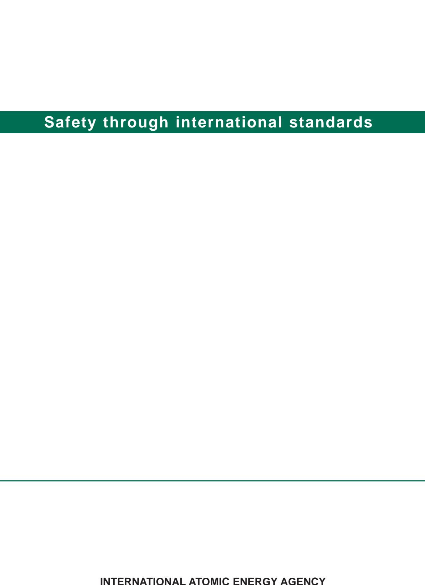

# IAEA Safety Standards

**for protecting people and the environment**

# Maintenance, Testing, Surveillance and Inspection in Nuclear Power Plants

Specific Safety Guide

No. SSG-74

## **IAEA SAFETY STANDARDS AND RELATED PUBLICATIONS**

#### IAEA SAFETY STANDARDS

Under the terms of Article III of its Statute, the IAEA is authorized to establish or adopt standards of safety for protection of health and minimization of danger to life and property, and to provide for the application of these standards.

The publications by means of which the IAEA establishes standards are issued in the **IAEA Safety Standards Series**. This series covers nuclear safety, radiation safety, transport safety and waste safety. The publication categories in the series are **Safety Fundamentals**, **Safety Requirements** and **Safety Guides**.

Information on the IAEA's safety standards programme is available on the IAEA Internet site

https://www.iaea.org/resources/safety-standards

The site provides the texts in English of published and draft safety standards. The texts of safety standards issued in Arabic, Chinese, French, Russian and Spanish, the IAEA Safety Glossary and a status report for safety standards under development are also available. For further information, please contact the IAEA at: Vienna International Centre, PO Box 100, 1400 Vienna, Austria.

All users of IAEA safety standards are invited to inform the IAEA of experience in their use (e.g. as a basis for national regulations, for safety reviews and for training courses) for the purpose of ensuring that they continue to meet users' needs. Information may be provided via the IAEA Internet site or by post, as above, or by email to Official.Mail@iaea.org.

#### RELATED PUBLICATIONS

The IAEA provides for the application of the standards and, under the terms of Articles III and VIII.C of its Statute, makes available and fosters the exchange of information relating to peaceful nuclear activities and serves as an intermediary among its Member States for this purpose.

Reports on safety in nuclear activities are issued as **Safety Reports**, which provide practical examples and detailed methods that can be used in support of the safety standards.

Other safety related IAEA publications are issued as **Emergency Preparedness and Response** publications, **Radiological Assessment Reports**, the International Nuclear Safety Group's **INSAG Reports**, **Technical Reports** and **TECDOCs**. The IAEA also issues reports on radiological accidents, training manuals and practical manuals, and other special safety related publications.

Security related publications are issued in the **IAEA Nuclear Security Series**.

The **IAEA Nuclear Energy Series** comprises informational publications to encourage and assist research on, and the development and practical application of, nuclear energy for peaceful purposes. It includes reports and guides on the status of and advances in technology, and on experience, good practices and practical examples in the areas of nuclear power, the nuclear fuel cycle, radioactive waste management and decommissioning.

## MAINTENANCE, TESTING, SURVEILLANCE AND INSPECTION IN NUCLEAR POWER PLANTS

#### The following States are Members of the International Atomic Energy Agency:

AFGHANISTAN GERMANY ALBANIA GHANA PANAMA ALGERIA GREECE PAPUA NEW GUINEA ANGOLA GRENADA PARAGUAY ANTIGUA AND BARBUDA GUATEMALA PERU ARGENTINA GUYANA PHILIPPINES ARMENIA HAITI POLAND HOLY SEE ALISTRALIA PORTUGAL. AUSTRIA HONDURAS **QATAR** Δ7ΕΡΒΔΙΙΔΝ HUNGARY REPUBLIC OF MOLDOVA ICELAND BAHAMAS ROMANIA INDIA BAHRAIN RUSSIAN FEDERATION BANGLADESH INDONESIA RWANDA IRAN, ISLAMIC REPUBLIC OF BARBADOS SAINT KITTS AND NEVIS IRAO BELARUS SAINTLUCIA BELGIUM IRELAND SAINT VINCENT AND ISR AEL RELIZE THE GRENADINES BENIN ITALY SAMOA BOLIVIA, PLURINATIONAL JAMAICA SAN MARINO STATE OF IAPAN SAUDIARARIA BOSNIA AND HERZEGOVINA IORDAN SENEGAL ROTSWANA KAZAKHSTAN SERBIA BRA7II. KENYA SEYCHELLES SIERRA LEONE BRUNEI DARUSSALAM KOREA, REPUBLIC OF BIII GARIA KIIWAIT SINGAPORE BURKINA FASO KYRGYZSTAN SLOVAKIA BURUNDI LAO PEOPLE'S DEMOCRATIC SLOVENIA CAMBODIA REPUBLIC CAMEROON LATVIA SOUTH AFRICA CANADA LEBANON CENTRAL AFRICAN LESOTHO SRILANKA REPUBLIC LIBERIA SUDAN CHAD LIBYA SWEDEN LIECHTENSTEIN SWITZERLAND CHILE LITHUANIA SYRIAN ARAB REPUBLIC CHINA COLOMBIA LUXEMBOURG TAJIKISTAN THAILAND COMOROS MADAGASCAR CONGO MALAWI TOGO COSTA RICA MALAYSIA TONGA CÔTE D'IVOIRE MALI TRINIDAD AND TOBAGO CROATIA MALTA MARSHALL ISLANDS CUBA TÜRKİYE MAURITANIA **CYPRUS** TURKMENISTAN CZECH REPUBLIC MAURITHUS UGANDA DEMOCRATIC REPUBLIC MEXICO UKRAINE OF THE CONGO MONACO UNITED ARAB EMIRATES DENMARK MONGOLIA UNITED KINGDOM OF DIIROUTI MONTENEGRO GREAT BRITAIN AND DOMINICA MOROCCO NORTHERN IRELAND DOMINICAN REPUBLIC MOZAMBIQUE UNITED REPUBLIC MYANMAR ECHADOR OF TANZANIA EGYPT NAMIBIA UNITED STATES OF AMERICA EL SALVADOR NEPAL URUGUAY NETHERLANDS FRITRFA UZBEKISTAN NEW ZEALAND **ESTONIA** VANUATU **ESWATINI** NICARAGUA VENEZUELA, BOLIVARIAN ETHIOPIA NIGER REPUBLIC OF NIGERIA VIET NAM FINLAND NORTH MACEDONIA FRANCE NORWAY YEMEN GABON OMAN ZAMBIA GEORGIA PAKISTAN ZIMBABWE

The Agency's Statute was approved on 23 October 1956 by the Conference on the Statute of the IAEA held at United Nations Headquarters, New York; it entered into force on 29 July 1957. The Headquarters of the Agency are situated in Vienna. Its principal objective is "to accelerate and enlarge the contribution of atomic energy to peace, health and prosperity throughout the world".

## IAEA Safety Standards Series No. SSG‑74

## MAINTENANCE, TESTING, SURVEILLANCE AND INSPECTION IN NUCLEAR POWER PLANTS

SPECIFIC SAFETY GUIDE

INTERNATIONAL ATOMIC ENERGY AGENCY VIENNA, 2022

## **COPYRIGHT NOTICE**

All IAEA scientific and technical publications are protected by the terms of the Universal Copyright Convention as adopted in 1952 (Berne) and as revised in 1972 (Paris). The copyright has since been extended by the World Intellectual Property Organization (Geneva) to include electronic and virtual intellectual property. Permission to use whole or parts of texts contained in IAEA publications in printed or electronic form must be obtained and is usually subject to royalty agreements. Proposals for non-commercial reproductions and translations are welcomed and considered on a case-by-case basis. Enquiries should be addressed to the IAEA Publishing Section at:

Marketing and Sales Unit, Publishing Section International Atomic Energy Agency Vienna International Centre PO Box 100 1400 Vienna, Austria

fax: +43 1 26007 22529 tel.: +43 1 2600 22417

email: sales.publications@iaea.org

www.iaea.org/publications

© IAEA, 2022

Printed by the IAEA in Austria October 2022 STI/PUB/2028

#### **IAEA Library Cataloguing in Publication Data**

Names: International Atomic Energy Agency.

Title: Maintenance, testing, surveillance and inspection in nuclear power plants / International Atomic Energy Agency.

Description: Vienna : International Atomic Energy Agency, 2022. | Series: IAEA safety standards series, ISSN 1020–525X ; no. SSG 74 | Includes bibliographical references.

Identifiers: IAEAL 22-01528 | ISBN 978–92–0–136422–7 (paperback : alk. paper) | ISBN 978–92–0–136522–4 (pdf) | ISBN 978–92–0–136622–1 (epub)

Subjects: LCSH: Nuclear power plants — Safety measures. | Nuclear power plants — Maintenance and repair. | Nuclear power plants — Inspection. | Nuclear facilities — Management. | Nuclear power plants — Monitoring.

Classification: UDC 621.039.568 | STI/PUB/2028

## **FOREWORD**

## **by Rafael Mariano Grossi Director General**

The IAEA's Statute authorizes it to "establish…standards of safety for protection of health and minimization of danger to life and property". These are standards that the IAEA must apply to its own operations, and that States can apply through their national regulations.

The IAEA started its safety standards programme in 1958 and there have been many developments since. As Director General, I am committed to ensuring that the IAEA maintains and improves upon this integrated, comprehensive and consistent set of up to date, user friendly and fit for purpose safety standards of high quality. Their proper application in the use of nuclear science and technology should offer a high level of protection for people and the environment across the world and provide the confidence necessary to allow for the ongoing use of nuclear technology for the benefit of all.

Safety is a national responsibility underpinned by a number of international conventions. The IAEA safety standards form a basis for these legal instruments and serve as a global reference to help parties meet their obligations. While safety standards are not legally binding on Member States, they are widely applied. They have become an indispensable reference point and a common denominator for the vast majority of Member States that have adopted these standards for use in national regulations to enhance safety in nuclear power generation, research reactors and fuel cycle facilities as well as in nuclear applications in medicine, industry, agriculture and research.

The IAEA safety standards are based on the practical experience of its Member States and produced through international consensus. The involvement of the members of the Safety Standards Committees, the Nuclear Security Guidance Committee and the Commission on Safety Standards is particularly important, and I am grateful to all those who contribute their knowledge and expertise to this endeavour.

The IAEA also uses these safety standards when it assists Member States through its review missions and advisory services. This helps Member States in the application of the standards and enables valuable experience and insight to be shared. Feedback from these missions and services, and lessons identified from events and experience in the use and application of the safety standards, are taken into account during their periodic revision.

I believe the IAEA safety standards and their application make an invaluable contribution to ensuring a high level of safety in the use of nuclear technology. I encourage all Member States to promote and apply these standards, and to work with the IAEA to uphold their quality now and in the future.

## **THE IAEA SAFETY STANDARDS**

#### BACKGROUND

Radioactivity is a natural phenomenon and natural sources of radiation are features of the environment. Radiation and radioactive substances have many beneficial applications, ranging from power generation to uses in medicine, industry and agriculture. The radiation risks to workers and the public and to the environment that may arise from these applications have to be assessed and, if necessary, controlled.

Activities such as the medical uses of radiation, the operation of nuclear installations, the production, transport and use of radioactive material, and the management of radioactive waste must therefore be subject to standards of safety.

Regulating safety is a national responsibility. However, radiation risks may transcend national borders, and international cooperation serves to promote and enhance safety globally by exchanging experience and by improving capabilities to control hazards, to prevent accidents, to respond to emergencies and to mitigate any harmful consequences.

States have an obligation of diligence and duty of care, and are expected to fulfil their national and international undertakings and obligations.

International safety standards provide support for States in meeting their obligations under general principles of international law, such as those relating to environmental protection. International safety standards also promote and assure confidence in safety and facilitate international commerce and trade.

A global nuclear safety regime is in place and is being continuously improved. IAEA safety standards, which support the implementation of binding international instruments and national safety infrastructures, are a cornerstone of this global regime. The IAEA safety standards constitute a useful tool for contracting parties to assess their performance under these international conventions.

#### THE IAEA SAFETY STANDARDS

The status of the IAEA safety standards derives from the IAEA's Statute, which authorizes the IAEA to establish or adopt, in consultation and, where appropriate, in collaboration with the competent organs of the United Nations and with the specialized agencies concerned, standards of safety for protection of health and minimization of danger to life and property, and to provide for their application.

With a view to ensuring the protection of people and the environment from harmful effects of ionizing radiation, the IAEA safety standards establish fundamental safety principles, requirements and measures to control the radiation exposure of people and the release of radioactive material to the environment, to restrict the likelihood of events that might lead to a loss of control over a nuclear reactor core, nuclear chain reaction, radioactive source or any other source of radiation, and to mitigate the consequences of such events if they were to occur. The standards apply to facilities and activities that give rise to radiation risks, including nuclear installations, the use of radiation and radioactive sources, the transport of radioactive material and the management of radioactive waste.

Safety measures and security measures1 have in common the aim of protecting human life and health and the environment. Safety measures and security measures must be designed and implemented in an integrated manner so that security measures do not compromise safety and safety measures do not compromise security.

The IAEA safety standards reflect an international consensus on what constitutes a high level of safety for protecting people and the environment from harmful effects of ionizing radiation. They are issued in the IAEA Safety Standards Series, which has three categories (see Fig. 1).

#### **Safety Fundamentals**

Safety Fundamentals present the fundamental safety objective and principles of protection and safety, and provide the basis for the safety requirements.

#### **Safety Requirements**

An integrated and consistent set of Safety Requirements establishes the requirements that must be met to ensure the protection of people and the environment, both now and in the future. The requirements are governed by the objective and principles of the Safety Fundamentals. If the requirements are not met, measures must be taken to reach or restore the required level of safety. The format and style of the requirements facilitate their use for the establishment, in a harmonized manner, of a national regulatory framework. Requirements, including numbered 'overarching' requirements, are expressed as 'shall' statements. Many requirements are not addressed to a specific party, the implication being that the appropriate parties are responsible for fulfilling them.

#### **Safety Guides**

Safety Guides provide recommendations and guidance on how to comply with the safety requirements, indicating an international consensus that it

1 See also publications issued in the IAEA Nuclear Security Series.

#### Safety Fundamentals Fundamental Safety Principles

*FIG. 1. The long term structure of the IAEA Safety Standards Series.*

is necessary to take the measures recommended (or equivalent alternative measures). The Safety Guides present international good practices, and increasingly they reflect best practices, to help users striving to achieve high levels of safety. The recommendations provided in Safety Guides are expressed as 'should' statements.

#### APPLICATION OF THE IAEA SAFETY STANDARDS

The principal users of safety standards in IAEA Member States are regulatory bodies and other relevant national authorities. The IAEA safety standards are also used by co‑sponsoring organizations and by many organizations that design, construct and operate nuclear facilities, as well as organizations involved in the use of radiation and radioactive sources.

The IAEA safety standards are applicable, as relevant, throughout the entire lifetime of all facilities and activities — existing and new — utilized for peaceful purposes and to protective actions to reduce existing radiation risks. They can be used by States as a reference for their national regulations in respect of facilities and activities.

The IAEA's Statute makes the safety standards binding on the IAEA in relation to its own operations and also on States in relation to IAEA assisted operations.

The IAEA safety standards also form the basis for the IAEA's safety review services, and they are used by the IAEA in support of competence building, including the development of educational curricula and training courses.

International conventions contain requirements similar to those in the IAEA safety standards and make them binding on contracting parties. The IAEA safety standards, supplemented by international conventions, industry standards and detailed national requirements, establish a consistent basis for protecting people and the environment. There will also be some special aspects of safety that need to be assessed at the national level. For example, many of the IAEA safety standards, in particular those addressing aspects of safety in planning or design, are intended to apply primarily to new facilities and activities. The requirements established in the IAEA safety standards might not be fully met at some existing facilities that were built to earlier standards. The way in which IAEA safety standards are to be applied to such facilities is a decision for individual States.

The scientific considerations underlying the IAEA safety standards provide an objective basis for decisions concerning safety; however, decision makers must also make informed judgements and must determine how best to balance the benefits of an action or an activity against the associated radiation risks and any other detrimental impacts to which it gives rise.

#### DEVELOPMENT PROCESS FOR THE IAEA SAFETY STANDARDS

The preparation and review of the safety standards involves the IAEA Secretariat and five Safety Standards Committees, for emergency preparedness and response (EPReSC) (as of 2016), nuclear safety (NUSSC), radiation safety (RASSC), the safety of radioactive waste (WASSC) and the safe transport of radioactive material (TRANSSC), and a Commission on Safety Standards (CSS) which oversees the IAEA safety standards programme (see Fig. 2).

All IAEA Member States may nominate experts for the Safety Standards Committees and may provide comments on draft standards. The membership of the Commission on Safety Standards is appointed by the Director General and includes senior governmental officials having responsibility for establishing national standards.

A management system has been established for the processes of planning, developing, reviewing, revising and establishing the IAEA safety standards.

*FIG. 2. The process for developing a new safety standard or revising an existing standard.*

It articulates the mandate of the IAEA, the vision for the future application of the safety standards, policies and strategies, and corresponding functions and responsibilities.

#### INTERACTION WITH OTHER INTERNATIONAL ORGANIZATIONS

The findings of the United Nations Scientific Committee on the Effects of Atomic Radiation (UNSCEAR) and the recommendations of international expert bodies, notably the International Commission on Radiological Protection (ICRP), are taken into account in developing the IAEA safety standards. Some safety standards are developed in cooperation with other bodies in the United Nations system or other specialized agencies, including the Food and Agriculture Organization of the United Nations, the United Nations Environment Programme, the International Labour Organization, the OECD Nuclear Energy Agency, the Pan American Health Organization and the World Health Organization.

#### INTERPRETATION OF THE TEXT

Safety related terms are to be understood as defined in the IAEA Safety Glossary (see https://www.iaea.org/resources/safety-standards/safety-glossary). Otherwise, words are used with the spellings and meanings assigned to them in the latest edition of The Concise Oxford Dictionary. For Safety Guides, the English version of the text is the authoritative version.

The background and context of each standard in the IAEA Safety Standards Series and its objective, scope and structure are explained in Section 1, Introduction, of each publication.

Material for which there is no appropriate place in the body text (e.g. material that is subsidiary to or separate from the body text, is included in support of statements in the body text, or describes methods of calculation, procedures or limits and conditions) may be presented in appendices or annexes.

An appendix, if included, is considered to form an integral part of the safety standard. Material in an appendix has the same status as the body text, and the IAEA assumes authorship of it. Annexes and footnotes to the main text, if included, are used to provide practical examples or additional information or explanation. Annexes and footnotes are not integral parts of the main text. Annex material published by the IAEA is not necessarily issued under its authorship; material under other authorship may be presented in annexes to the safety standards. Extraneous material presented in annexes is excerpted and adapted as necessary to be generally useful.

## **CONTENTS**

| 1. | INTRODUCTION .                                                                                                    | 1      |
|----|-------------------------------------------------------------------------------------------------------------------|--------|
|    | Background (1.1–1.5) . Objective (1.6, 1.7) .                                                                  | 1 2 |
|    | Scope (1.8–1.11) .                                                                                                | 2      |
|    | Structure (1.12) .                                                                                                | 3      |
| 2. | MAINTENANCE, TESTING, SURVEILLANCE AND                                                                            |        |
|    | INSPECTION PROGRAMMES AT NUCLEAR POWER                                                                            |        |
|    | PLANTS (2.1) .                                                                                                    | 3      |
|    | Maintenance (2.2–2.18) .                                                                                          | 3      |
|    | Surveillance (2.19–2.21) .                                                                                        | 7      |
|    | Inspection (2.22–2.24) .                                                                                          | 8      |
|    | Testing (2.25) .                                                                                                  | 9      |
|    | Interrelationship between maintenance, testing, surveillance and inspection (2.26, 2.27) .                     | 9      |
| 3. | RESPONSIBILITIES FOR MAINTENANCE, TESTING, SURVEILLANCE AND INSPECTION ACTIVITIES AT NUCLEAR POWER PLANTS . | 10     |
|    | The operating organization (3.1–3.5)                                                                              | 10     |
|    | Contractors (3.6–3.12) . Other organizations, including designers and manufacturers                            | 11     |
|    | (3.13, 3.14) .                                                                                                    | 12     |
|    | Coordination between different organizations (3.15, 3.16) .                                                       | 13     |
| 4. | ORGANIZATIONAL ASPECTS OF MAINTENANCE,                                                                            |        |
|    | TESTING, SURVEILLANCE AND INSPECTION                                                                              |        |
|    | ACTIVITIES AT NUCLEAR POWER PLANTS (4.1–4.11) .                                                                   | 13     |
|    | Organizational structure (4.12–4.19) .                                                                            | 16     |
|    | Planning of maintenance, testing, surveillance and inspection activities (4.20–4.28) .                         | 17     |
|    | Administrative procedures for maintenance, testing, surveillance                                                  |        |
|    | and inspection activities (4.29–4.32) .                                                                           | 19     |

|    | Application of the management system to maintenance, testing, surveillance and inspection activities (4.33, 4.34) . Qualification and training of personnel (4.35–4.43) .                                                                                                                                                                                            | 21 21                         |
|----|----------------------------------------------------------------------------------------------------------------------------------------------------------------------------------------------------------------------------------------------------------------------------------------------------------------------------------------------------------------------------|----------------------------------|
| 5. | IMPLEMENTATION OF PROGRAMMES OF MAINTENANCE, TESTING, SURVEILLANCE AND INSPECTION ACTIVITIES                                                                                                                                                                                                                                                                         | 24                               |
|    | Procedures for implementation of maintenance, testing, surveillance and inspection activities (5.1–5.12) . Work planning and control (5.13–5.20) . Human performance (5.21–5.26) . Outage management (5.27–5.37) . Foreign material exclusion programme (5.38–5.44) . Coordination and interfaces between different groups of personnel (5.45–5.49) . | 24 27 29 31 33 35 |
|    | Returning equipment to service following maintenance, testing, surveillance and inspection activities (5.50–5.56) . Review of programmes of maintenance, testing, surveillance and inspection activities (5.57–5.63) .                                                                                                                                            | 36 38                         |
| 6. | ANALYSIS OF RESULTS FROM MAINTENANCE, TESTING, SURVEILLANCE AND INSPECTION ACTIVITIES, AND FEEDBACK OF EXPERIENCE .                                                                                                                                                                                                                                                  | 40                               |
|    | Records and reports of maintenance, testing, surveillance and inspection activities (6.1–6.5) . Evaluation of results from maintenance, testing, surveillance and inspection activities and implementation of corrective actions (6.6–6.11) . Feedback of experience from maintenance, testing, surveillance and                                            | 40 41                         |
|    | inspection activities (6.12–6.16) .                                                                                                                                                                                                                                                                                                                                        | 42                               |
| 7. | AREAS IN WHICH SPECIAL CONSIDERATIONS APPLY FOR MAINTENANCE, TESTING, SURVEILLANCE AND INSPECTION ACTIVITIES                                                                                                                                                                                                                                                         | 44                               |
|    | Structures, systems and components for accident conditions (7.1) . Equipment qualification (7.2, 7.3) . Ageing management (7.4–7.8) Plants designed to earlier standards (7.9)                                                                                                                                                                                    | 44 44 45 46             |

|     | Computer based systems important to safety (7.10–7.14) .                                           | 47 |
|-----|----------------------------------------------------------------------------------------------------|----|
| 8.  | ADDITIONAL CONSIDERATIONS SPECIFIC TO                                                              |    |
|     | MAINTENANCE                                                                                        | 48 |
|     | Prioritization of maintenance activities by safety                                                 |    |
|     | significance (8.1–8.7) .                                                                           | 48 |
|     | Maintenance facilities (8.8–8.24)                                                                  | 49 |
|     | Spare parts and stores (8.25–8.50) .                                                               | 54 |
|     | Repair and replacement (8.51–8.64) .                                                               | 60 |
|     | Post‑maintenance testing (8.65) .                                                                  | 62 |
| 9.  | ADDITIONAL CONSIDERATIONS SPECIFIC TO                                                              |    |
|     | SURVEILLANCE .                                                                                     | 63 |
|     | Surveillance programme (9.1–9.9)                                                                   | 63 |
|     | Surveillance of the integrity of barriers (9.10–9.14) .                                            | 65 |
|     | Pressure testing and leakage testing (9.15–9.20) .                                                 | 67 |
|     | Surveillance of safety systems (9.21–9.23) .                                                       | 68 |
|     | Surveillance of other items important to safety (9.24, 9.25) .                                     | 69 |
|     | Frequency and extent of surveillance activities (9.26–9.37) .                                      | 70 |
|     | Surveillance methods (9.38–9.44) .                                                                 | 73 |
|     | Surveillance testing (9.45–9.54) .                                                                 | 75 |
|     | Documentation and records of surveillance activities (9.55)                                        | 77 |
| 10. | ADDITIONAL CONSIDERATIONS SPECIFIC                                                                 |    |
|     | TO INSPECTION                                                                                      | 78 |
|     | Inspection programme (10.1–10.5) .                                                                 | 78 |
|     | The extent of inspection activities (10.6–10.9) .                                                  | 79 |
|     | Frequency of inspection activities (10.10–10.14) .                                                 | 79 |
|     | Methods and techniques of inspection (10.15–10.19) .                                               | 80 |
|     | Equipment for inspection activities (10.20–10.22) .                                                | 81 |
|     | Qualification of non‑destructive testing systems used for inspection activities (10.23–10.30) . | 82 |
|     | Evaluation of the results of inspections (10.31–10.36) .                                           | 84 |
|     | Documentation and records of inspections (10.37, 10.38) .                                          | 85 |
|     | REFERENCES .                                                                                       | 86 |
|     | CONTRIBUTORS TO DRAFTING AND REVIEW                                                                | 89 |

## **1. INTRODUCTION**

#### BACKGROUND

- 1.1. Requirements for the operation of nuclear power plants are established in IAEA Safety Standards Series No. SSR‑2/2 (Rev. 1), Safety of Nuclear Power Plants: Commissioning and Operation [1], while requirements for the design of nuclear power plants are established in IAEA Safety Standards Series No. SSR‑2/1 (Rev. 1), Safety of Nuclear Power Plants: Design [2].
- 1.2. This Safety Guide provides specific recommendations on maintenance, testing, surveillance and inspection activities — hereinafter collectively referred to as 'MTSI activities' — to ensure that the levels of reliability and availability of all structures, systems and components (SSCs) important to safety remain in accordance with the assumptions and intent of the design, and also that the safety of the plant is not adversely affected after the commencement of operation.
- 1.3. This Safety Guide was developed in parallel with six other Safety Guides on the operation of nuclear power plants, as follows:
  - IAEA Safety Standards Series No. SSG‑70, Operational Limits and Conditions and Operating Procedures for Nuclear Power Plants [3];
  - IAEA Safety Standards Series No. SSG‑71, Modifications to Nuclear Power Plants [4];
  - IAEA Safety Standards Series No. SSG‑72, The Operating Organization for Nuclear Power Plants [5];
  - IAEA Safety Standards Series No. SSG‑73, Core Management and Fuel Handling for Nuclear Power Plants [6];
  - IAEA Safety Standards Series No. SSG‑75, Recruitment, Qualification and Training of Personnel for Nuclear Power Plants [7];
  - IAEA Safety Standards Series No. SSG‑76, Conduct of Operations at Nuclear Power Plants [8].

A collective aim of this set of Safety Guides is to support the fostering of a strong safety culture in nuclear power plants.

1.4. The terms used in this Safety Guide are to be understood as defined and explained in the IAEA Safety Glossary [9].

1.5. This Safety Guide supersedes IAEA Safety Standards Series No. NS‑G‑2.6, Maintenance, Surveillance and In‑service Inspection in Nuclear Power Plants1 .

#### OBJECTIVE

- 1.6. The purpose of this Safety Guide is to provide recommendations on MTSI activities in nuclear power plants, in order to meet Requirements 28, 31 and 32 of SSR‑2/2 (Rev. 1) [1]. These activities are necessary to ensure that SSCs are available to perform their functions in accordance with the assumptions and intent of the design. Recommendations are also provided on maintaining equipment qualification and on MTSI activities, in order to meet Requirements 13 and 31 of SSR‑2/2 (Rev. 1) [1], respectively.
- 1.7. The recommendations provided in this Safety Guide are aimed primarily at operating organizations of nuclear power plants and regulatory bodies.

#### SCOPE

- 1.8. It is expected that this Safety Guide will be used primarily for land based stationary nuclear power plants with water cooled reactors designed for electricity generation or for other production applications (such as district heating or desalination).
- 1.9. This Safety Guide covers the establishment and implementation of preventive and corrective maintenance programmes; testing, surveillance and inspection; the repair of defective plant equipment; the provision of related facilities and equipment; procurement; and generating and retaining records of maintenance activities.
- 1.10. Detailed technical advice in relation to particular items of plant equipment is outside the scope of this Safety Guide.
- 1.11. Regulatory inspection (i.e. an inspection undertaken by or on behalf of the regulatory body) is outside the scope of this Safety Guide.

1 INTERNATIONAL ATOMIC ENERGY AGENCY, Maintenance, Surveillance and In‑service Inspection in Nuclear Power Plants, IAEA Safety Standards Series No. NS‑G‑2.6, IAEA, Vienna (2002).

#### STRUCTURE

1.12. Recommendations relating to maintenance, testing, surveillance and inspection are provided in Section 2. Section 3 provides recommendations on the functions and responsibilities of the operating organization, contractors and design and manufacturing organizations. Section 4 provides recommendations on the organizational aspects and administrative procedures for establishing programmes of MTSI activities. Sections 5 and 6 provide recommendations on the implementation of such programmes and on the analysis of results and operating experience. Sections 7, 8, 9 and 10 provide recommendations on specific aspects of MTSI activities that need to be given special consideration.

## **2. MAINTENANCE, TESTING, SURVEILLANCE AND INSPECTION PROGRAMMES AT NUCLEAR POWER PLANTS**

#### 2.1. Paragraph 8.1 of SSR‑2/2 (Rev. 1) [1] states:

"Maintenance, testing, surveillance and inspection programmes shall be established that include predictive, preventive and corrective maintenance activities. These maintenance activities shall be conducted to maintain availability during the service life of structures, systems and components by controlling degradation and preventing failures. In the event that failures do occur, maintenance activities shall be conducted to restore the capability of failed structures, systems and components to function within acceptance criteria."

#### MAINTENANCE

- 2.2. The maintenance programme for a nuclear power plant should include all the administrative and technical measures that are necessary to detect and mitigate the degradation of a functioning SSC or to restore to an acceptable level the performance of design functions of a failed SSC.
- 2.3. The plant maintenance programme should also address the safety provisions for accident conditions (with or without significant fuel degradation) and

the systems and equipment that could be necessary to respond to an accident, including a severe accident. The operating organization is specifically required to establish maintenance programmes for non‑permanent equipment to be used for accidents more severe than design basis accidents, in order to maintain high reliability of this equipment (see para. 8.14A of SSR‑2/2 (Rev. 1) [1]).

- 2.4. The purpose of maintenance activities is also to enhance the reliability of the equipment at the plant.
- 2.5. The maintenance activities within the maintenance programme include testing and calibration, inspection, servicing, overhaul, and repair and replacement of parts, as appropriate.

#### **Types of maintenance**

- 2.6. While there are various conceptual approaches to maintenance, the relevant activities should be divided into preventive maintenance and corrective maintenance.2 Many maintenance activities are performed while the plant is shut down; however, maintenance may be performed during power operation provided that adequate defence in depth and redundancy are maintained, taking into account risk considerations and the results of probabilistic safety assessment as appropriate (see para. 8.13 of SSR‑2/2 (Rev. 1) [1]).
- 2.7. Preventive maintenance should include periodic, predictive and planned maintenance activities performed before the failure of an SSC, as follows:
- (a) Periodic maintenance activities should be performed on a routine basis and should include a combination of external inspections, alignments or calibrations, internal inspections, overhauls, and replacements of components or equipment, as appropriate.
- (b) Predictive (condition based) maintenance should involve continuous or periodic monitoring and diagnosis in order to predict equipment failure. Not all equipment conditions and failure modes can be monitored; therefore, predictive maintenance activities should be selectively applied, where appropriate. Such activities include condition monitoring, reliability centred maintenance and similar techniques.

4

2 Various categorizations may be applied to maintenance activities. For example, the IAEA Safety Glossary [9] includes definitions for corrective maintenance, periodic maintenance, planned maintenance, predictive maintenance, preventive maintenance and reliability centred maintenance.

- (c) Planned maintenance activities should be performed before unacceptable degradation or equipment failure occurs and should be initiated on the basis of results of predictive or periodic maintenance, vendor recommendations or operating experience.
- 2.8. Corrective maintenance includes repair, overhaul or replacement to restore the capability of a failed SSC to perform its defined function.

#### **Systematic approach to maintenance**

- 2.9. The approach to preventive maintenance activities for SSCs important to safety should include the following elements:
- (a) A systematic evaluation of the purpose and functions of each SSC, to determine the relevant safety requirements and the necessary maintenance activities;
- (b) A focus on long term maintenance objectives, and the establishment of a proactive (as opposed to a reactive) maintenance programme;
- (c) A reliability centred approach to maintenance;
- (d) Planning and scheduling of maintenance on the basis of the objectives of the overall maintenance programme.
- 2.10. A systematic evaluation should be undertaken to establish which maintenance tasks are to be performed on which SSCs, and at what intervals, in order to optimize the use of resources allocated for maintenance and to ensure the safety and availability of the plant. In addition to maintenance based on a predetermined time interval, the maintenance activities should also be undertaken on the basis of the condition of SSCs, in order to ensure their ability to perform their safety functions. This approach should be used in establishing a preventive maintenance programme and for optimization of the ongoing maintenance programme. Condition monitoring should also be used to determine where unnecessary maintenance work and failures induced by errors in maintenance can be avoided. If a probabilistic safety assessment has been performed, its results should be taken into account.
- 2.11. Programmes of maintenance activities should be optimized such that the available resources are sufficient to maintain the safe operation of the plant and that they are efficiently deployed in the best way. The operating organization should ensure that this optimization process does not adversely affect the safety of the plant.

- 2.12. The operating organization should monitor the performance and/or condition of SSCs against the goals it has established, in order to provide reasonable assurance that the SSCs are capable of performing their intended functions. Such goals should comply with regulatory requirements and, where practicable, industry‑wide operating experience should be taken into account. When the performance or condition of an SSC does not meet the established goals, appropriate corrective actions should be taken.
- 2.13. An adequate condition monitoring programme should be established in support of the maintenance programme and should be based on the following assumptions:
- (a) The monitored parameters are appropriate indicators of the condition of the SSCs;
- (b) Acceptance criteria are clearly defined;
- (c) All potential failure modes are addressed;
- (d) The behaviour of the potential failure is traceable and predictable.
- 2.14. The scope of the condition monitoring programme should include the following:
- (a) SSCs that ensure operation of the plant within the established operational limits and conditions, or whose failure could challenge a safety function.
- (b) SSCs that are relied on to remain functional following a design basis accident to ensure the continued performance of safety functions, or whose failure could prevent safety related SSCs from performing their functions.
- (c) SSCs that are used in emergency operating procedures or are relied on to mitigate the consequences of transients or accidents. Further recommendations are provided in IAEA Safety Standards Series No. SSG‑54, Accident Management Programmes for Nuclear Power Plants [10].
- 2.15. For predictive maintenance, diagnostic methods and techniques should be used in support of a condition monitoring programme. The following tools should be considered for use in a condition monitoring programme:
- (a) Vibration monitoring;
- (b) The shock pulse method;
- (c) Oil analysis;
- (d) Wear debris analysis and ferrography;
- (e) Acoustic leakage monitoring;
- (f) Thermography;

- (g) Computer modelling for analysis of erosion and corrosion;
- (h) Motor analysis techniques;
- (i) Motor operated valve testing;
- (j) Cable condition monitoring;
- (k) Fault detection;
- (l) Noise analysis;
- (m) Visual inspection;
- (n) Performance monitoring;
- (o) Specific non‑destructive testing methods (e.g. radiography, ultrasound, ground penetrating radar);
- (p) Chemical analysis;
- (q) Petrography (for civil engineering structures).

#### 2.16. Paragraph 8.7 of SSR‑2/2 (Rev. 1) [1] states:

"New approaches that could result in significant changes to current strategies for maintenance, testing, surveillance and inspection shall be taken only after careful consideration of the implications for safety and after appropriate authorization, as required."

Any changes intended to optimize maintenance programmes should be analysed to assess the effects of the changes on system availability and the overall risks to the plant in all operational states and in accident conditions.

- 2.17. A periodic review of maintenance programmes should be performed and should incorporate operating experience, including new failure modes and data. In the review, attention should be paid to maintaining the necessary reliability of SSCs and adequate safety margins. Probabilistic safety assessment methods should be considered to monitor the impact of changes in maintenance and testing strategies, provided that the model used is sufficiently comprehensive, and that adequate data on any changes to the reliability of SSCs are available.
- 2.18. See also paras 8.1–8.7 on the prioritization of maintenance activities.

#### SURVEILLANCE

#### 2.19. Paragraph 8.2 of SSR‑2/2 (Rev. 1) [1] states:

"The operating organization shall establish surveillance programmes for ensuring compliance with established operational limits and conditions and for detecting and correcting any abnormal condition before it can give rise to significant consequences for safety."

The abnormal conditions that are of relevance to the surveillance programme include deficiencies in SSCs and in software performance, procedural errors and human errors, as well as abnormal trends within the accepted limits, an analysis of which may indicate that the plant is deviating from the design intent.

- 2.20. The surveillance programme should verify that SSCs important to safety are ready to operate at all times and are able to perform their safety functions as intended in the design. Such a surveillance programme will also help to detect trends in ageing in support of the ageing management programme at the plant (see Requirement 14 of SSR‑2/2 (Rev. 1) [1]).
- 2.21. The surveillance programme should include the following activities:
- (a) Monitoring plant parameters and system status;
- (b) Functional testing;
- (c) Checking and calibrating instrumentation;
- (d) Testing and inspecting SSCs important to safety;
- (e) Evaluating the results of these activities and identifying trends.

#### INSPECTION

- 2.22. Over the operating lifetime of the plant, the operating organization should inspect SSCs for possible degradation so as to determine whether they are acceptable for continued safe operation or whether corrective actions should be taken. Emphasis should be placed on inspection of the pressure boundaries of the primary and secondary coolant systems, because of their importance to safety and the potentially severe consequences of their failure.
- 2.23. Baseline data should be collected for future use. These data are normally collected in the pre‑service inspections before the start of plant operation, including inspections performed during manufacturing, whenever applicable. Baseline data provide information on initial conditions and supplement data from manufacturing and construction to provide a basis for comparison with the data from subsequent inspections. In the pre‑service inspections, the methods, techniques and types of equipment used should be the same as those planned to be used for the in‑service inspections. Whenever an SSC has been repaired

or replaced, a pre‑service inspection should be performed before it is put into operation (see also para. 8.10 of SSR‑2/2 (Rev. 1) [1]).

2.24. When new inspection methods are introduced, a comparison with the previous methods should be made to provide a revised baseline for future inspections. If a risk‑informed approach is used for in‑service inspection, it should be ensured that such an approach in no way leads to a reduction in the level of safety at the plant.

#### TESTING

2.25. Testing includes post‑maintenance testing, surveillance testing and inspection testing, as appropriate. The purpose of the tests is to confirm that SSCs continue to meet the design intent. In this Safety Guide, testing is addressed in the sections on maintenance, surveillance and inspection. Further recommendations on testing are provided in IAEA Safety Standards Series No. GS‑G‑3.5, The Management System for Nuclear Installations [11].

#### INTERRELATIONSHIP BETWEEN MAINTENANCE, TESTING, SURVEILLANCE AND INSPECTION

- 2.26. Maintenance, testing, surveillance and inspection have the common objective of ensuring that the plant is operated in accordance with the design assumptions and intent, and in compliance with the operational limits and conditions. Results of surveillance or inspection should be compared with acceptance criteria. If the results fall outside the acceptance criteria, corrective actions should be initiated. Such actions should include corrective maintenance measures such as adjustment, repair or replacement of defective items to prevent recurrence. Maintenance should always be followed by testing.
- 2.27. MTSI activities should be planned and coordinated effectively. A maintenance database should be established in order to share relevant data, results and evaluations among the organizations involved in the planning and implementation of MTSI activities.

## **3. RESPONSIBILITIES FOR MAINTENANCE, TESTING, SURVEILLANCE AND INSPECTION ACTIVITIES AT NUCLEAR POWER PLANTS**

#### THE OPERATING ORGANIZATION

- 3.1. Requirement 31 of SSR‑2/2 (Rev. 1) [1] states that "**The operating organization shall ensure that effective programmes for maintenance, testing, surveillance and inspection are established and implemented.**" These programmes should be established prior to fuel loading, and full details of the programmes should be made available to the regulatory body. Operational limits and conditions are required to be taken into account in such programmes (see paras 8.2, 8.10, 8.14 and 8.19 of SSR‑2/2 (Rev. 1) [1]). The operating organization should review the programmes of MTSI activities, as necessary, taking into account operating experience and recent scientific and technological advances.
- 3.2. The operating organization should ensure that the scope and frequency of MTSI activities are sufficient to ensure that the reliability and functionality of SSCs remain in accordance with the design assumptions and intent throughout the operating lifetime of the plant (see also para. 8.5 of SSR‑2/2 (Rev. 1) [1]).
- 3.3. Paragraph 8.13 of SSR‑2/2 (Rev. 1) [1] states:

"The operating organization shall ensure that maintenance work during power operation is carried out with adequate defence in depth. Probabilistic safety assessment shall be used, as appropriate, to demonstrate that the risks are not significantly increased."

The operating organization should also ensure that the programmes of MTSI activities for SSCs important to safety are based on maintaining the independence of each level of defence in depth and an adequate reliability of each level during operation. The influence of human and organizational factors on one or more levels of defence in depth should be taken into account in all MTSI activities, to avoid any negative impact on the reliability of these levels or on the independence of the levels.

3.4. MTSI activities are required to be performed in accordance with properly approved procedures that have been prepared in accordance with the management system (see para. 8.3 of SSR‑2/2 (Rev. 1) [1]). Such procedures should be prepared by competent personnel. In addition, adequate independent safety assessments and verifications should be performed for different MTSI activities, to ensure that such activities are reliably completed.

3.5. The operating organization should periodically evaluate the condition and performance of SSCs. The operating organization should also periodically review these monitoring activities in relation to the goals of the programmes of MTSI activities. In doing this, the operating organization should take into account — and, where practicable, contribute to sharing — operating experience within the nuclear industry. Adjustments should be made, as necessary, to ensure that the objective of preventing failures of SSCs by means of MTSI activities is appropriately balanced against the objective of minimizing the unavailability of those SSCs due to performing these activities. An assessment of all plant equipment that is out of service should be made, and the overall effect of this unavailability on the performance of safety functions should be determined and taken into account.

#### CONTRACTORS

- 3.6. The operating organization may delegate the implementation of one or more MTSI activities to other organizations, but it is required to retain overall responsibility for the safety of such delegated work (see para. 3.1 of SSR‑2/2 (Rev. 1) [1] and para. 4.33 of IAEA Safety Standards Series No. GSR Part 2, Leadership and Management for Safety [12]).
- 3.7. The operating organization should ensure that an effective group or department is established for MTSI activities, which should perform the administrative, technical and supervisory functions necessary in mobilizing and supervising on‑site and off‑site resources for MTSI activities.
- 3.8. Staff of vendors and contractors should be subject to the same expectations as personnel employed by the operating organization, particularly in the areas of professional competence, adherence to procedures and evaluation of performance. Suitable arrangements are required to be made to ensure that contractors adhere to safety requirements and meet the operating organization's expectations with regard to the safe conduct of MTSI activities (see para. 4.3 of SSR‑2/2 (Rev. 1) [1] and para. 4.36 of GSR Part 2 [12]).
- 3.9. Activities performed by contractors and other personnel who are not permanent employees of the operating organization should be controlled by

means of an established management system (see IAEA Safety Standards Series No. GS‑G‑3.1, Application of the Management System for Facilities and Activities [13] and GS‑G‑3.5 [11]). The management system should cover the training and qualification of contractor personnel (see para. 4.23 of GSR Part 2 [12] and para. 4.20 of SSR‑2/2 (Rev. 1) [1]), radiation protection, familiarity with and adherence to procedures, understanding of plant systems and associated administrative procedures for operational states and for accident conditions, as appropriate.

- 3.10. Contractor personnel should be made aware of their responsibilities in relation to the safety of the plant and the equipment they maintain; however, this does not diminish the prime responsibility of the operating organization for plant safety. The operating organization is required to ensure that the contractors' work is of the necessary quality (see para. 4.34 of GSR Part 2 [12]). A formal system for evaluating and documenting the performance of contractors should be established.
- 3.11. The operating organization should ensure that contractors selected for specific safety related work provide documentary evidence that their staff have the appropriate training and qualification and, where appropriate, the necessary authorizations (see para. 4.16 of SSR‑2/2 (Rev. 1) [1]) or certification (e.g. for some categories of welders). This information should be obtained prior to involvement of contractor personnel in maintenance activities. In addition, confirmation of relevant experience in performing similar work should be requested from the contractor.
- 3.12. The operating organization should contain an adequate number of personnel who possess the knowledge, training and skills necessary to select, supervise and evaluate the work of contractors and temporary support staff. Such personnel should be clearly identified within the operating organization's management system.

#### OTHER ORGANIZATIONS, INCLUDING DESIGNERS AND MANUFACTURERS

3.13. The operating organization should maintain a close relationship with designers and manufacturers throughout the lifetime of the plant, to ensure that the programmes of MTSI activities are based on a clear understanding of the design philosophy and the manufacturer specifications, and to facilitate and optimize MTSI activities. It is essential that, if plant faults occur or modifications are necessary, effective and timely assistance from the design or manufacturing organization is ensured. Design and manufacturing organizations can also contribute effectively to the training of staff of the operating organization.

3.14. The operating organization should arrange for feedback of operating experience and reliability data to designers and manufacturers.

#### COORDINATION BETWEEN DIFFERENT ORGANIZATIONS

- 3.15. Coordination is required to be maintained between different groups involved in or affected by MTSI activities (see para. 8.11 of SSR‑2/2 (Rev. 1) [1]). There should be a clear understanding of the division of responsibilities between all organizational groups participating in MTSI activities (see also paras 5.45–5.49). In particular, the interface between the operating organization and contractors should be clearly specified, with clear arrangements for the control of plant configuration (see Requirement 10 of SSR‑2/2 (Rev. 1) [1]) to ensure safety during and after the contracted work.
- 3.16. Further recommendations on managing the interfaces between different organizations are provided in GS‑G‑3.1 [13] and GS‑G‑3.5 [11].

## **4. ORGANIZATIONAL ASPECTS OF MAINTENANCE, TESTING, SURVEILLANCE AND INSPECTION ACTIVITIES AT NUCLEAR POWER PLANTS**

- 4.1. The design and the design objectives of a nuclear power plant will have a strong influence on the programmes of MTSI activities; consequently, the development of these programmes should be initiated early in the design phase. These programmes should be taken into account in the final design and construction specifications, and in the safety analysis report for the plant. The operating organization should arrange for experienced personnel to consult regularly with the designers of the plant.
- 4.2. The goals, objectives and priorities of the programmes of MTSI activities should be defined. These should be consistent with the strategy, policies and programmes of the plant and should be communicated to operating personnel. Appropriate safety performance indicators (see para. 4.34 of SSR‑2/2 (Rev. 1) [1])

should be established and used to monitor and enhance the quality of MTSI activities. Senior management should encourage effective and high quality performance of MTSI activities. Results and feedback from the performance of MTSI activities should be reviewed and used in establishing goals and objectives for future MTSI activities.

- 4.3. The programmes of MTSI activities should be fully integrated with activities for plant operation and for modification of the plant. The programmes should be routinely reviewed and updated as necessary to take into account on‑site and off‑site operating experience, modifications to the plant or its operating regime, plant ageing, and methods (both deterministic and probabilistic) for safety assessment.
- 4.4. Documentation and records associated with MTSI activities are required to be kept (see paras 4.52 and 8.4 of SSR‑2/2 (Rev. 1) [1]). Procedures for MTSI activities are required to be prepared, reviewed, modified, validated, approved and distributed in accordance with the management system (see para. 8.3 of SSR‑2/2 (Rev. 1) [1]).
- 4.5. If a plant previously operating at base load is modified to allow a load following operating regime as part of the plant modification programme (see Requirement 11 of SSR‑2/2 (Rev. 1) [1]), the operating organization should address the implications for the programmes of MTSI activities. Any MTSI activities that involve performance in steady state conditions should be re‑evaluated and carefully incorporated into the new operating regime. This should include changes to the monitoring and maintenance schedules, as appropriate. The impact of the load following operating regime on ageing assessments and other supporting engineering analyses should also be evaluated and addressed by the operating organization.
- 4.6. The operating organization is required to ensure suitable organizational arrangements and sufficient numbers of suitably qualified and experienced personnel for the programmes of MTSI activities (see Requirements 3 and 4 of SSR‑2/2 (Rev. 1) [1]). This includes MTSI activities during outages and supervision of the work of contractors, as appropriate.
- 4.7. In planned shutdowns or during reduced power operations the opportunity should be taken to undertake MTSI activities, where appropriate. In the event of an unplanned shutdown, it should be considered whether it would be useful to undertake MTSI activities. Refuelling activities should be taken into account in

the schedules for MTSI activities. Suitable schedules for MTSI activities should be prepared for unplanned shutdowns as well as for planned shutdowns.

- 4.8. Control room operators are directly responsible for the day to day safe operation of the plant, including its continued configuration control. Control room operators should be informed (e.g. by means of a work permit procedure) of all MTSI activities before they are commenced, of any changes to the plant that this work entails, and of the return of plant systems into service (see also para. 8.10 of SSR‑2/2 (Rev. 1) [1]). During the performance of such activities, adequate communication should be maintained between the relevant personnel and control room operators.
- 4.9. Supplementary work in the plant (e.g. cleaning, painting, erection of scaffolding, installation of temporary lead shielding), and any work outside the plant (e.g. construction, excavation or dredging near the coolant water intake) that might affect safety, should only be performed if approved by the managers of the operations department (see SSG‑76 [8]). The operations department should be notified of the commencement of such activities and informed about any changes to the planned work.
- 4.10. A specific safety review and special procedures are required for non‑routine maintenance activities (e.g. infrequently performed activities, unforeseen repairs, activities not covered by typical maintenance procedures) (see para. 4.27 of SSR‑2/2 (Rev. 1) [1]). Specific attention should be paid to the coordination and scheduling of such activities. Any non‑routine maintenance activities should be carefully planned and prepared and their potential consequences reviewed, with special emphasis on safety and compliance with regulatory requirements.
- 4.11. The level of surveillance and maintenance necessary in the transitional phase prior to decommissioning should be determined on the basis of the changes in the safety analysis report. For example, the revised safety analysis could indicate that it is acceptable to cease or reduce the frequency of some MTSI activities. Alternatively, for systems that support decommissioning activities (e.g. ventilation), MTSI activities may need to increase. An important objective during this transition should be to effectively maintain an appropriate surveillance and maintenance regime that links with both the previous operational phase and the decommissioning phase (see also para. 9.6 of SSR‑2/2 (Rev. 1) [1]).

#### ORGANIZATIONAL STRUCTURE

- 4.12. To establish the organizational structure for MTSI activities, the following should be taken into consideration:
- (a) The operating organization's policy and practices for the conduct of operations (see SSG‑76 [8]);
- (b) The type of reactor;
- (c) The refuelling mode;
- (d) The frequency of periodic outages.
- 4.13. The operating organization is required to assign authorities and responsibilities for MTSI activities, both within its own organizational structure and to other organizations (see para. 4.11 of GSR Part 2 [12] and (for outages) para. 8.21 of SSR‑2/2 (Rev. 1) [1]). Lines of communication should also be specified.
- 4.14. The operating organization is required to make available sufficient resources in terms of personnel and equipment to implement the appropriate programmes of MTSI activities satisfactorily (see Requirement 9 of GSR Part 2 [12]).
- 4.15. The operating organization should ensure the timely conduct of MTSI activities, their documentation and reporting, and the evaluation of results. Any deviation from the established frequency and extent of these activities should be justified, reviewed and reported to the regulatory body, as appropriate.
- 4.16. The detailed organizational structure for MTSI activities should be determined on the basis of the types of personnel used; that is, in terms of plant personnel, corporate level personnel, suppliers and contractors (see also para. 4.22 of GSR Part 2 [12]). The use of human resources should take into account factors such as the type of plant, the number of reactors on the site, the mode of operation of the reactors, the availability of suitable staff locally and any regulatory requirements relating to the employment of off‑site personnel.
- 4.17. In plants designed for on‑load refuelling, refuelling activities are routine and frequent and are usually performed by operating personnel. The organizational structure for MTSI activities in plants of this type should be designed to ensure that there are sufficient operating personnel to deal effectively with a steady flow of maintenance, testing, surveillance and inspection work, with minimal assistance from off the site.

- 4.18. Many plants undertake a large amount of maintenance, testing, surveillance and inspection work during refuelling outages or other outages lasting for periods of several weeks or more. This leads to large peaks in demand for resources for maintenance, testing, surveillance and inspection. To be able to respond effectively to these peaks in demand, the part of the operating organization that is responsible for MTSI activities should be well structured and adequately staffed and should have the capability to obtain significant supplementary resources from off‑site sources.
- 4.19. Independent assessments that the programmes of MTSI activities are being implemented in compliance with the management system should be conducted by persons from the operating organization who are not directly involved in these activities. Further recommendations on independent assessments are provided in GS‑G‑3.5 [11].

## PLANNING OF MAINTENANCE, TESTING, SURVEILLANCE AND INSPECTION ACTIVITIES

- 4.20. MTSI activities should be planned within the context of the overall management of the plant. It is usual practice for the management of the operating organization to establish a planning team to coordinate all MTSI activities.
- 4.21. In planning MTSI activities, consideration should be given to potential shortcomings in human performance in undertaking such activities (see paras 5.21–5.26). Particular emphasis should be placed on establishing the best work procedure, providing suitable operator aids (see paras 7.5 and 7.6 of SSR‑2/2 (Rev. 1) [1]) and using sound principles of human factors engineering wherever practicable, to ensure that the potential for errors is minimized. Further recommendations on human factors engineering are provided in IAEA Safety Standards Series No. SSG‑51, Human Factors Engineering in the Design of Nuclear Power Plants [14].
- 4.22. In planning MTSI activities that involve the removal from service of items important to safety, it should be ensured that operational limits and conditions and any other applicable regulatory requirements will be met. If MTSI activities are discovered to be incompatible with existing operational limits and conditions, it should be considered whether such maintenance can be changed or adjusted. Alternatively, if justified, either a temporary waiver of or a permanent change to the operational limits and conditions should be implemented. Any change to operational limits and conditions is required to be undertaken as part of the

programme for managing plant modifications (see Requirement 11 of SSR‑2/2 (Rev. 1) [1]). Further recommendations on operational limits and conditions are provided in SSG‑70 [3].

- 4.23. As a general rule, MTSI activities on redundant trains or several trains of similar design should be arranged so as not to take place at the same time. This makes it possible to analyse performance data before proceeding with subsequent tests and to make adjustments for the subsequent tests if any problems are found. It also ensures that the potential for common cause errors influencing several trains is minimized.
- 4.24. Factors such as the ageing of items important to safety, as well as maintenance history and operating experience, should be taken into account in the long term planning of MTSI activities.
- 4.25. The potential risks from performing MTSI activities are required to be assessed (see para. 4.25 of SSR‑2/2 (Rev. 1) [1]). This should include an assessment of the impacts of undertaking single and multiple MTSI activities. The use of suitable probabilistic safety assessment methods should be considered as a means of prioritizing the MTSI activities that have the greatest impact on plant safety (see also paras 8.6 and 8.14 of SSR‑2/2 (Rev. 1) [1]).
- 4.26. Corrective actions to eliminate plant defects should be tracked until their completion, and the work that is performed should be documented in detail. This documentation is required to be available whenever it is needed for review (see para. 4.52 of SSR‑2/2 (Rev. 1) [1]).
- 4.27. Procedures and work related documents (see paras 4.4 and 5.1–5.12) should specify any preconditions and provide clear instructions for all maintenance activities to be performed. These procedures and documents should be used to ensure that work is performed in accordance with the strategy, policies and programmes of the plant. Human factors and the protection and safety of operating personnel should be taken into account in the preparation of procedures for MTSI activities.
- 4.28. Implementation of MTSI activities may necessitate a temporary change in the plant configuration for normal operation. In such cases, the risks associated with the temporary change are required to be assessed and the conditions for safe implementation specified before the performance of the MTSI activities (see para. 4.38 of SSR‑2/2 (Rev. 1) [1]). The conditions for safe implementation

of MTSI activities should be part of the operational limits and conditions established for the plant.

### ADMINISTRATIVE PROCEDURES FOR MAINTENANCE, TESTING, SURVEILLANCE AND INSPECTION ACTIVITIES

- 4.29. The operating organization should ensure that administrative controls are established to implement the programmes of MTSI activities. These controls will usually take the form of administrative procedures for performing MTSI activities at the plant. Methods should be established for identifying the need for any MTSI activities, for implementing the activities identified and for reporting on the work undertaken.
- 4.30. The factors that should be taken into account in developing administrative procedures for MTSI activities include the following:
- (a) The generation of adequate written procedures (see Requirement 26 of SSR‑2/2 (Rev. 1) [1]);
- (b) The use of work order3 approvals;
- (c) The use of work permits in connection with equipment isolation;
- (d) Radiation protection (see Requirement 20 of SSR‑2/2 (Rev. 1) [1]);
- (e) Control of the plant configuration (see Requirement 10 of SSR‑2/2 (Rev. 1) [1]);
- (f) Calibration of tools and equipment;
- (g) Controls for non‑radiation‑related safety (see Requirement 23 of SSR‑2/2 (Rev. 1) [1]);
- (h) Controls for internal hazards and external hazards;
- (i) Risk assessment (see para. 4.25 of SSR‑2/2 (Rev. 1) [1]);
- (j) The use of interlocks and keys;
- (k) Qualification and training of personnel (see Requirement 7 of SSR‑2/2 (Rev. 1) [1]);
- (l) Control of materials, products and spare parts;
- (m) A control plan and programme for lubrication;
- (n) Housekeeping and cleanliness (see Requirement 28 of SSR‑2/2 (Rev. 1) [1]);

3 A work order is the prime document used to manage maintenance tasks. It may include such information as a description of the work needed; the task priority; the job procedure to be followed; the parts, materials, tools and equipment needed to complete the job; the labour hours, costs and materials consumed in completing the task; and other key information on, for example, failure causes and the work that was performed.

- (o) Management of radioactive waste (see Requirement 21 of SSR‑2/2 (Rev. 1) [1]);
- (p) Identification, location and labelling of equipment (see para. 7.12 of SSR‑2/2 (Rev. 1) [1]);
- (q) Generation and retention of records (see Requirement 15 of SSR‑2/2 (Rev. 1) [1]);
- (r) Planning for work during outages (see Requirement 32 of SSR‑2/2 (Rev. 1) [1]);
- (s) Ensuring the safe suspension of work during breaks;
- (t) Arrangements for shift turnovers.
- 4.31. In developing administrative controls and procedures, the interfaces between MTSI activities, and between MTSI activities and other activities such as plant operation and radiation protection, should be taken into account. In particular, the following aspects should be addressed:
- (a) Allocating responsibilities between personnel performing MTSI activities and personnel directly responsible for plant operation.
- (b) Ensuring that operating personnel have adequate information about the plant status at all times during MTSI activities.
- (c) Establishing a system controlling the issue and cancellation of documentation such as work order authorizations and work permits for equipment isolation, live testing and access to restricted areas. This includes the designation of persons who are authorized to issue such permits to personnel responsible for performing MTSI activities.
- (d) Providing a clear indication of any equipment that is not in service. This includes tagging, where appropriate, and any steps to be taken to prevent unintentional return to service. The tagging should not hide or obscure any displays or indicators on the equipment, nor the labelling of the equipment.
- (e) Ensuring that after MTSI activities, SSCs are inspected for their intended operation and, where necessary, are tested by authorized persons before being formally declared functional and returned to service (see para. 8.10 of SSR‑2/2 (Rev. 1) [1]).

In addition, a mechanism should be implemented that enables users to feed back suggestions for the improvement of administrative procedures.

4.32. Temporary changes to administrative procedures should be adequately controlled and should be subject to appropriate review and approval. Such temporary changes should be promptly incorporated into permanent revisions where appropriate, in order to limit the number of temporary procedures and their durations. For further recommendations on the management of temporary changes, see SSG‑71 [4].

## APPLICATION OF THE MANAGEMENT SYSTEM TO MAINTENANCE, TESTING, SURVEILLANCE AND INSPECTION ACTIVITIES

- 4.33. The operating organization is required to integrate MTSI activities into the management system (see para. 3.5 of SSR‑2/2 (Rev. 1) [1]). The management system is required to be developed and applied using a graded approach (see Requirement 7 of GSR Part 2 [12]). When applying this approach to MTSI activities, the following should be considered:
- (a) The level of detail needed for procedures for MTSI activities;
- (b) The types of equipment requiring calibration, surveillance and maintenance;
- (c) The criteria and authorities for reporting non‑conformances and for taking corrective actions;
- (d) The need for formal logs, records and other documentation;
- (e) Equipment to be included in the control of plant configuration;
- (f) Controls applied to spare parts;
- (g) The need to analyse the history of SSCs in the plant;
- (h) The need to perform condition monitoring;
- (i) Feedback from operating experience, both internal and external.
- 4.34. The effectiveness of the management system with regard to MTSI activities is required to be measured, assessed and continuously improved (see Requirement 13 of GSR Part 2 [12]).

#### QUALIFICATION AND TRAINING OF PERSONNEL

4.35. All relevant personnel are required to be made aware of the importance to safety of the MTSI activities that they perform (see para. 4.26 of GSR Part 2 [12]). They should also be made aware of the potential safety consequences of technical, procedural or human errors. Operating experience of errors in MTSI activities and procedures (at the nuclear power plant, at other plants and in other industries) is required to be incorporated into training programmes (see para. 4.22 of SSR‑2/2 (Rev. 1) [1]).

- 4.36. Training and qualification of personnel involved in MTSI activities should be integrated into a training programme that has been established in accordance with para. 4.19 of SSR‑2/2 (Rev. 1) [1]. Training and qualification should be based on an approved and documented process that is traceable. This applies to on‑site and off‑site personnel of the operating organization and to temporary personnel, such as contractors (see para. 3.6 of SSR‑2/2 (Rev. 1) [1]).
- 4.37. The operating organization should make arrangements to ensure that external personnel involved in MTSI activities at the plant are competent. Emphasis should be placed on the quality and safety of the work performed by contractors. Contractors are required to be informed of the operating organization's requirements and expectations for safety related activities (see para. 4.3 of SSR‑2/2 (Rev. 1) [1]).
- 4.38. The training of personnel for MTSI activities should take into account the following:
- (a) Surveillance and inspection should be conducted in accordance with procedures that are sufficiently detailed. Maintenance of items that are faulty or need adjustment, however, will be less predictable. Therefore, the training for maintenance should include special training for specific tasks and/or equipment faults, as appropriate.
- (b) It may be necessary to conduct MTSI activities with the plant (or plant systems) out of service or off‑load (i.e. reactor shut down and disconnected from the grid). In such cases, the personnel involved might be under pressure to return the plant or plant systems back into service. The importance of a strong safety culture, in which safety has an overriding priority, should be emphasized in the training programmes, for example by placing the highest importance on reporting and investigating any indication of failure or any unexpected findings and then taking appropriate corrective actions.
- (c) MTSI activities, especially maintenance during shutdown, usually consist of a variety of activities with interacting effects, and frequently involve various organizations such as contractors, the regulatory body and the operating organization. The training programme should emphasize the importance of good coordination of organizations, personnel and maintenance activities. Training programmes by and for contractor personnel should be coordinated with training programmes for personnel of the operating organization.
- 4.39. All personnel involved in MTSI activities are required to be provided with training in radiation protection (including the need to keep radiation doses as low as reasonably achievable), in non‑radiation‑related safety and in emergencies (see

- paras 5.13, 5.26 and 5.5 of SSR‑2/2 (Rev. 1) [1], respectively). Training should also be provided in the minimization of waste and access control, as appropriate. The operating organization should ensure that personnel are adequately qualified and trained before being allowed to work in controlled areas.
- 4.40. Depending on the nature of the work to be performed (and whether it has been performed before), its importance to the safety of the plant, the potential risks involved and the safety precautions that are necessary, maintenance personnel should receive a special briefing in addition to the normal training. Relevant personnel should also be appropriately trained in the quality management aspects of their duties.
- 4.41. Selected personnel and supervisors should be given special training as appropriate, at the manufacturer's site and/or at the plant site, during plant construction and during the fabrication, assembly and testing of specific items important to safety. Arrangements should be made for personnel to participate in MTSI activities during the plant construction and commissioning stages.
- 4.42. Personnel undertaking MTSI activities that involve specific skills should be suitably qualified and trained, and should be requested to demonstrate a satisfactory level of skill at the start of the work. Certain professions, such as welding, entail periodic requalification and authorization, and it should be ensured that individuals receive the necessary ongoing training to support this. Personnel should also be trained to understand plant systems and equipment relevant to their work. A system should be in place to ensure that personnel refresh safety related skills, as appropriate, before they start to work.
- 4.43. Further recommendations on the training of nuclear power plant personnel are provided in SSG‑75 [7].

## **5. IMPLEMENTATION OF PROGRAMMES OF MAINTENANCE, TESTING, SURVEILLANCE AND INSPECTION ACTIVITIES**

## PROCEDURES FOR IMPLEMENTATION OF MAINTENANCE, TESTING, SURVEILLANCE AND INSPECTION ACTIVITIES

5.1. Paragraph 8.3 of SSR‑2/2 (Rev. 1) [1] states:

"The operating organization shall develop procedures for all maintenance, testing, surveillance and inspection tasks. These procedures shall be prepared, reviewed, modified when required, validated, approved and distributed in accordance with procedures established under the management system."

If other documents (e.g. vendor manuals and instructions) are used to support these procedures, they should be subject to the same review and approval process applied to procedures for MTSI activities and should be considered part of the plant documentation.

- 5.2. The responsibility for preparing procedures for MTSI activities should be delegated to the relevant maintenance department or group within the operating organization. The procedures should normally be prepared in cooperation with the designers and suppliers of plant equipment, as well as with personnel conducting activities for quality management, radiation protection and technical support. If persons outside the operating organization prepare procedures for MTSI activities, these procedures should be reviewed by the operating organization and submitted to the relevant manager for approval. The plant management should ensure that the procedures are correctly implemented.
- 5.3. Acceptance criteria for the functioning of SSCs, and actions to be taken if these criteria are not met, should be clearly specified in the procedures for MTSI activities.
- 5.4. Routine MTSI activities that do not involve special qualifications or skills might not need detailed step by step instructions; nevertheless, they are still required to be subject to the controls described in para. 5.1, applied in accordance with a graded approach.

- 5.5. If exceptional circumstances arise in which a particular task has to be performed without following authorized procedures, this task should only be performed after informing operating personnel — in particular, the operators in the main control room — and under the direction of an authorized person. Once the task has been performed, an appropriate safety evaluation should be made as soon as possible and before the equipment is returned to normal service.
- 5.6. Reference documents should be used, as appropriate, in the preparation of procedures, in particular in determining their technical content. These reference documents may include appropriate drawings, codes, standards and instruction manuals, as provided by the design organization, construction organization, equipment suppliers and/or operating organization.
- 5.7. The information contained in procedures for MTSI activities should be presented step by step in a logical order. All references and interfaces with other relevant procedures should be carefully reviewed and verified. The level of detail should be such that the individual performing the work can follow the procedure without further guidance or supervision.
- 5.8. The format and content of procedures for MTSI activities should typically include the following:
- (a) A unique identification: a combination of numbers and letters that identify each procedure and its place in a series. This should be used to identify the procedure in all subsequent programmes, plans and records that refer to it.
- (b) Title: a concise description of the subject of the procedure.
- (c) Purpose: a brief statement of the purpose and scope of the activity controlled by the procedure.
- (d) Prerequisites: all special conditions for the plant, system and/or equipment necessary prior to the commencement of work covered by the procedure. Any necessary special training, simulation or mock‑up practice should also be described.
- (e) Limiting conditions: any conditions (e.g. load reduction, the operation of standby equipment or safety systems) that result from performing the work and that limit the plant's operations. For example, when a system is undergoing repair, surveillance or testing, it should be considered unavailable for safety purposes unless it can be demonstrated that it is capable of performing its safety function to an acceptable degree.
- (f) Special precautions: any special safety procedures (e.g. special measures for radiation protection, the securing or removal of loose items) and any

- necessary control of materials (e.g. incompatible lubricants or chemicals) and environmental conditions.
- (g) Special tools and equipment: a list of all special tools, rigging and equipment necessary to perform the work.
- (h) References: a list of applicable sections of reference documents that may need to be consulted, such as documents containing baseline data, test and calibration charts, drawings, printouts, instruction books, manuals, applicable codes and standards, photographs and descriptions of mock‑ups.
- (i) Step by step instructions: which also are intended to identify any changes in radiological or other conditions as work progresses. At certain points in the procedure, personnel may need to provide a signature (or their initials) to indicate satisfactory completion of the preceding step or steps, either on a copy of the procedure or on an attached checklist.
- (j) Inspection witness points: selected points in the work sequence at which an inspection (e.g. for quality control purposes) is to be made. Work should not proceed past this point until the inspection has been performed satisfactorily and documented.
- (k) Return to service: the actions and checks necessary for returning the equipment or system to an operational condition after the person responsible has certified that the task has been completed. Where appropriate, independent checking and acceptance criteria should be specified. These criteria should include correct reinstatement and correct compliance with procedures as well as confirmation of system operability (e.g. confirmation of valve line‑up).
- (l) Operational testing: any operational testing subsequent to the MTSI activity that is necessary to prove that the equipment is functioning in the intended manner.

Items (k) and (l) are operating functions and should be included either in the procedure for the MTSI activity or in a special interfacing operating procedure.

- 5.9. Procedures should be designed to ensure that instrumentation and alarms associated with the system under test or calibration are left operational, as far as possible.
- 5.10. Procedures should clearly state the operating conditions necessary during the performance of MTSI activities. These conditions should be such that the activities do not result in a failure to comply with operational limits and conditions or in the loss (even temporarily) of one or more safety functions that are necessary (see also SSG‑70 [3]). If a component of a protective system is taken out of service

(e.g. for surveillance purposes), the corresponding safety circuit should be left in the configuration that is most beneficial to safety.

- 5.11. Certain MTSI activities involve the removal from service of systems or components important to safety. The procedures for such activities should include prerequisites for the removal of such systems or components and specific directions for their complete and proper return to service, in order to ensure compliance with the limits and conditions for normal operation. The effects of these activities on safety are required to be assessed, as stated in para. 4.28. The time period for which systems or components important to safety are removed from service should be minimized and, at a minimum, should comply with operational limits and conditions. If the MTSI activity is interrupted for any reason, these systems or components should be quickly returned to normal service.
- 5.12. Procedures for monitoring plant parameters or system status should specify the use of checklists, the completion of tables or the plotting of graphs, all of which should be retained as part of the documentation of the work.

#### WORK PLANNING AND CONTROL

#### 5.13. Paragraph 8.8 of SSR‑2/2 (Rev. 1) [1] states:

"A comprehensive work planning and control system shall be implemented to ensure that work for purposes of maintenance, testing, surveillance and inspection is properly authorized, is carried out safely and is documented in accordance with established procedures."

This work planning and control system should also ensure that the concept of defence in depth is applied (see para. 3.3) and that MTSI activities are properly scheduled and can be completed (by either plant personnel or contractors) in a timely manner. The work planning system should also ensure adequate availability and reliability of SSCs important to safety.

5.14. In the planning process, it is necessary to consider the possibility of combining different types of MTSI activities on the same equipment, on redundant equipment or trains, or on similar equipment located in the same working area, taking into account the availability of resources. The potential risks associated with multiple MTSI activities on the same equipment, on redundant equipment or trains, or in close proximity should also be taken into account.

- 5.15. Waivers or deferrals of scheduled MTSI activities should be minimized. Such waivers or deferrals should only be authorized if justified by plant conditions and after an appropriate review of the effects on plant safety has been performed.
- 5.16. The work planning and control system should include any authorizations, permits and certificates necessary to help ensure safety in the work area and to prevent MTSI activities from affecting safety in other areas. The following specific matters should be considered in the work planning and control system:
- (a) Work order authorizations;
- (b) Work permits and tagging for equipment isolation;
- (c) Radiation work permits;
- (d) Non‑radiation‑related safety;
- (e) Foreign material exclusion (see paras 5.38–5.44);
- (f) Drainage facilities;
- (g) Ventilation;
- (h) Protection against internal and external hazards;
- (i) Electrical and mechanical isolation devices;
- (j) Control of plant modifications.
- 5.17. The authorizations, permits and certificates referred to in para. 5.16 should include the following:
- (a) A description of the plant item, the type and scope of work to be performed and the boundaries of the work area in which the activities are authorized;
- (b) A confirmation that the plant item either is in a safe condition to work on or meets the prerequisites specified in the procedures applying to the work (such procedures should specify any precautions that need to be taken);
- (c) A confirmation of the radiological conditions in the work area, and a description of any precautions necessary for non‑radiation‑related safety and any other precautions to be taken in order that the work be performed safely;
- (d) A description of any permissions to be obtained before the work is commenced;
- (e) A confirmation that all personnel involved in the work have been withdrawn from the work area after completion of the work and that the plant item either can be returned to service or will remain in a known condition.

5.18. Management of MTSI activities should be recognized as a cross‑functional process, not exclusive to any one work group but integrating the important activities of all work groups. Paragraph 8.11 of SSR‑2/2 (Rev. 1) [1] states:

"Coordination shall be maintained between different maintenance groups (e.g. maintenance groups for mechanical, electrical, instrumentation and control, and civil equipment). Coordination shall also be maintained between maintenance groups, and operations groups and support groups (e.g. groups for fire protection, radiation protection, physical protection and non‑radiation‑related safety)."

For the work planning and control system to be fully effective, all needs and concerns in relation to operations, technical support, radiation protection, procurement and stores, contractors and other matters should be taken into account, whenever appropriate, consistent with the long term operating strategy for the plant.

5.19. An appropriate system to manage and control backlogs of MTSI activities should be established to ensure that there are no adverse effects on the safety of the plant and that a backlog due to a lack of resources does not develop. Paragraph 8.14 of SSR‑2/2 (Rev. 1) [1] states:

"Corrective maintenance of structures, systems and components shall be performed as promptly as practicable and in compliance with operational limits and conditions. Priorities shall be established, with account taken first of the relative importance to safety of the defective structures, systems and components."

5.20. The effectiveness of the work planning and control system should be monitored using appropriate indicators (e.g. repeated work orders, individual and collective radiation doses, the backlog of pending work orders, interference with operations) and by assessing whether corrective action is performed as promptly as practicable.

#### HUMAN PERFORMANCE

5.21. To achieve a high standard in the performance of MTSI activities, the operating organization should establish practical methods and techniques for anticipating, preventing, identifying, mitigating and recovering from human errors, including latent errors attributable to organizational factors.

- 5.22. Appropriate training that focuses on anticipating and preventing human errors before they become the cause of events should be provided for MTSI activities at nuclear power plants. The tools that should be used include the following:
  - Task previews.
  - Job‑site reviews (i.e. walkdowns to assess physical aspects of the job).
  - Questioning attitude.
  - Self‑checking.
  - The 'stop when unsure' policy.
  - The 'stop, think, act, review' methodology.
  - Procedure use and adherence.
  - Effective communication, such as the following:
    - Three‑way communication;
    - Use of the phonetic alphabet.
- 5.23. Other human performance tools should be used depending on the work situation, for example as follows:
  - Pre‑job briefing;
  - Verification practices, including concurrent verification (i.e. verification performed in parallel by the individuals who perform the task and by those who verify the task), independent verification and peer checking;
  - Flagging (i.e. highlighting the components that are to be worked on);
  - Keeping track in step by step procedures (place keeping);
  - Visualization (using, e.g., charts, specific displays, drawings);
  - Working through 'what if' scenarios during periods of low workload;
  - Post‑job review.
- 5.24. Human performance tools should be used appropriately: the MTSI activities in which they are used should be carefully selected and the tools should be applied in accordance with a graded approach, especially for simple tasks. The applied human error prevention tools should be properly integrated into the existing MTSI work practices and should be used in such a way that they support the quality of the work rather than enforcing strict control over the methods used in MTSI activities.
- 5.25. All MTSI activities should be planned and performed in such a way so as to avoid the possibility of human induced equipment faults that can lead to the failure or unavailability of SSCs important to safety. Particularly important are human interactions that have the potential to result in the simultaneous unavailability of multiple trains of safety systems (human induced common cause failures).

5.26. Further recommendations on managing human performance are provided in SSG‑72 [5].

#### OUTAGE MANAGEMENT

- 5.27. Requirement 32 of SSR‑2/2 (Rev. 1) [1] states that "**The operating organization shall establish and implement arrangements to ensure the effective performance, planning and control of work activities during outages.**"
- 5.28. Outage management should be based on the application of the concept of defence in depth (see para. 3.3). Minimizing the risk of adverse events during outage activities involves the following:
- (a) Thorough planning and scheduling of outage activities (see para. 8.18 of SSR‑2/2 (Rev. 1) [1]);
- (b) Assessment of the potential risks associated with planned outage activities (see para. 4.25 of SSR‑2/2 (Rev. 1) [1]);
- (c) High quality performance of outage tasks and activities;
- (d) Thorough control and monitoring of outage activities;
- (e) Review and analysis of outages (see para. 8.24 of SSR‑2/2 (Rev. 1) [1]), and development and implementation of measures to improve future outage performance.
- 5.29. The operating organization should ensure the safe and effective implementation and control of all MTSI activities during both planned and unplanned outages. Preparation for these activities should include the establishment of suitable milestones and performance indicators, as well as effective means for the continuous monitoring of performance against expectations. Outage planning should be undertaken as far in advance as possible, as circumstances may necessitate starting the outage earlier than intended.
- 5.30. The outage period should be considered part of the plant operation. A large number of diverse MTSI activities will be performed during this period, all of which require safety assessments and appropriate measures to minimize risks, in accordance with Requirement 8 of SSR‑2/2 (Rev. 1) [1]. Paragraph 8.19 of SSR‑2/2 (Rev. 1) [1] states:

"In the processes for planning and performing outage activities, priority shall be given to safety related considerations. Special attention shall be given to maintaining the plant configuration in accordance with the operational limits and conditions."

- 5.31. The assessment of potential risks should cover in particular those activities that might significantly affect the level of safety at the plant (e.g. reactivity control; removal of residual heat; fuel handling; activities that affect the integrity of the primary pressure barrier, the containment pressure barrier and/or sources of power) as well as specific operational modes such as mid‑loop operation for a pressurized water reactor. The sequencing of MTSI activities should be reviewed to ensure that risks arising from concurrent activities are controlled and minimized. The plant configuration and associated risks should be monitored during the execution of an outage.
- 5.32. The use of suitable probabilistic safety assessment to support the risk assessment by providing an overview of the risks and the overall level of safety during different outage phases should be considered.
- 5.33. Any specific training needs, special procedures for the shutdown mode or additional operating procedures or surveillance necessary during an outage should be identified.
- 5.34. The operating organization should ensure that outage safety reviews are performed during an outage, as appropriate. The reviews should be based on a well defined set of operational limits and conditions for shutdown states.
- 5.35. Paragraph 8.23 of SSR‑2/2 (Rev. 1) [1] states:

"Optimization of radiation protection, optimizing of non‑radiation‑related safety, waste reduction and control of chemical hazards shall be essential elements of outage programmes and planning, and this shall be clearly communicated to relevant plant staff and contractors."

Radiation protection is one of the most important elements when performing outage activities; therefore, arrangements for the protection and safety of operating personnel should be applied in outage planning, preparation and execution.

5.36. Personnel from the operations department should be involved in outage management, starting with the planning of outages. The primary role of the operations department is to control the plant configuration during the numerous changes of the plant status and to ensure the safe return of equipment and systems to service, as necessary. Removal of different safety systems and safety related items for MTSI activities should be performed under the supervision of such personnel to ensure compliance with operational limits and conditions. Further recommendations on the conduct of operations in outage management are provided in SSG‑76 [8].

5.37. Paragraph 8.24 of SSR‑2/2 (Rev. 1) [1] states that "A comprehensive review shall be performed after each outage to draw lessons to be learned". Outage reviews should apply to the whole process: outage planning, preparation and execution, including the entire work scope, test and inspection programmes, shutdown and startup activities. All safety related problems that arose during the process, and how they affected the safety of the plant, should be reviewed. After the review is completed (including independent assessment, as appropriate), the operating organization should take the necessary actions to address any safety issues and optimize the process before the next outage.

#### FOREIGN MATERIAL EXCLUSION PROGRAMME

#### 5.38. Paragraph 7.11 of SSR‑2/2 (Rev. 1) [1] states:

"An exclusion programme for foreign objects shall be implemented and monitored, and suitable arrangements shall be made for locking, tagging or otherwise securing isolation points for systems or components to ensure safety."

This programme should be maintained at all stages of the lifetime of the plant, starting from the plant design stage. The programme should address the training and awareness of operating personnel and contractors, guidelines for favourable working conditions, and oversight during execution of tasks on reactor components and safety systems.

- 5.39. The objectives of the foreign material exclusion programme should include the following:
- (a) Defining roles and responsibilities.
- (b) Addressing the exclusion of both foreign objects and foreign chemicals.
- (c) Addressing all components and systems that could be affected by material intrusion, including mechanical components and electric components, whether they are installed, in transport, in storage or in maintenance workshops.

- (d) Identifying when and where the nuclear power plant is most vulnerable to foreign material intrusion.
- (e) Defining foreign material exclusion areas on the basis of the potential consequences of foreign material intrusion and the difficulties in detecting and retrieving such material. The boundary of each area should be clearly indicated (see para. 5.40), and access controls and specific rules for foreign material exclusion should be applied.
- (f) Prescribing good housekeeping and cleanliness practices (see Requirement 28 of SSR‑2/2 (Rev. 1) [1]).
- (g) Defining rules for work practices that might increase risk of foreign material intrusion, including the following:
  - (i) The need to assess the risk of foreign material intrusion for each task.
  - (ii) Rules for the placement of tools and materials, and use of proper logging and accounting practices. A list of tools, materials and instruments needed in each maintenance activity with a risk of foreign material intrusion should be established and this list should be checked before and after the maintenance work.
  - (iii) Rules for securing tools, materials and personal items.
  - (iv) Rules for controlling the use of transparent materials.
  - (v) Rules for controlling foreign material that is generated as part of work activities.
  - (vi) Rules for protecting open systems and components during work and transportation and for protecting open components during storage, using temporary covers or other temporary blocking systems to limit the spread of foreign material.
  - (vii) Rules and expectations for the reporting of material loss.
- 5.40. The foreign material exclusion programme should apply to all MTSI activities on open systems and components that are sensitive to the intrusion of foreign materials. A boundary should be established around the foreign material exclusion area, generally consisting of a physical barrier and appropriate signage. Barriers may consist of rope, fabric curtains, tents, temporary metal walls, wire fencing, tape markers or other similar materials.
- 5.41. A temporary cover should be in place to seal and protect a system or component from the introduction of foreign material when the system or component is unattended or during periods of operation with temporary system modifications in use.

- 5.42. When MTSI activities are performed on open systems and components, specific efforts should be made to reduce the time that the open system or component is vulnerable to foreign material intrusion.
- 5.43. An initial inspection should be performed before opening a system or component that is sensitive to foreign material intrusion. Any unexpected conditions encountered should be reported immediately to the relevant supervisors. After the maintenance or inspection activities are completed, a pre‑closure inspection should be conducted to verify that foreign material is not present in the system or component. A pre‑closure inspection should consist of, at a minimum, a visual inspection (either directly or by use of suitable equipment) of all surfaces the foreign material could reach. The inspection should verify that these surfaces are free of foreign materials such as sand, metal chips, cleaning tools, weld slag and cutting oils. The tools used for performing the MTSI activities should also be inspected to ensure that no material or part has been lost. The results of inspections should be documented, including, wherever practicable, photographic and video evidence.
- 5.44. The operating organization should verify that the provisions of the foreign material exclusion programme are complied with and are effective. The provisions that should be verified include monitoring of foreign material exclusion areas, maintaining of applicable logs, monitoring of work activities, correction of problems and notification of any unresolved problems to the relevant plant managers.

## COORDINATION AND INTERFACES BETWEEN DIFFERENT GROUPS OF PERSONNEL

5.45. At a nuclear power plant, the activities of different groups of personnel interface with one another in ways that are significant to safety. In addition, the allocation on the site and off the site of the resources necessary for effective MTSI activities is important. MTSI activities should, therefore, be planned in the context of the overall management of the plant, and maintenance, testing, surveillance and inspection personnel should work in close consultation with other operating personnel. It is usual practice for the plant management to establish a planning unit to coordinate all MTSI activities. Maintenance, testing, surveillance and inspection personnel should schedule their own work in accordance with the overall plan. It should be ensured that adequate maintenance, testing, surveillance and inspection personnel are available and on call to provide urgent corrective actions, as necessary.

- 5.46. Paragraph 8.11 of SSR‑2/2 (Rev. 1) [1] establishes requirements for coordination of maintenance activities. Effective coordination should also be established between the plant departments and the contractors involved in the MTSI activities at the plant.
- 5.47. The organization and staffing of the relevant departments, as well as the responsibilities of different groups of personnel, should be defined and communicated in such a way that they are understood by all those involved.
- 5.48. The arrangements for managing the interfaces between different groups should be established in accordance with the management system (see paras 4.33 and 4.34). Appropriate arrangements should be agreed between the operating organization and other organizations performing work at the nuclear power plant or providing specific services for the plant. Further recommendations on managing these interfaces are provided in GS‑G‑3.1 [13] and GS‑G‑3.5 [11].
- 5.49. The operations department is responsible for maintaining a safe plant configuration and for monitoring and controlling plant systems (see SSG‑76 [8]). Consequently, the operations department should be kept aware of all the MTSI activities undertaken at the plant. The results of MTSI activities should be communicated to the operations department after the completion of each activity has been confirmed by the maintenance, testing, surveillance and inspection personnel. A formalized administrative process should be established for such communication.

## RETURNING EQUIPMENT TO SERVICE FOLLOWING MAINTENANCE, TESTING, SURVEILLANCE AND INSPECTION ACTIVITIES

5.50. Returning equipment to service is the final stage of any MTSI activity. The return to service should be performed in accordance with appropriate administrative procedures.

#### 5.51. Paragraph 8.10 of SSR‑2/2 (Rev. 1) [1] states:

"The work control system shall also ensure that permission to return equipment to service following maintenance, testing, surveillance and inspection is given by the operating personnel. Such permission shall be given only after the completion of a documented check that the new plant configuration is within the established operational limits and conditions and, where appropriate, after functional tests have been performed."

- 5.52. Before returning equipment to service, it is important to ensure the following:
- (a) Appropriate post‑maintenance testing has been performed (see also para. 8.64);
- (b) The configuration of affected systems has been verified;
- (c) All relevant records have been reviewed for completeness and accuracy;
- (d) Every effort has been made to complete all aspects of the MTSI activity, and any unexpected findings have been reviewed.
- 5.53. Following MTSI activities, any necessary precautions, restraints and conditions on operation (including operation with temporary configurations) should be clearly specified to all relevant personnel, and training should be provided, as necessary.
- 5.54. Completion of any MTSI activity should include a verification that all temporary connections, procedures and arrangements that were necessary for its implementation have been removed or cancelled and the plant has been returned to a fully operational status.
- 5.55. Any SSCs important to safety for which the status was temporarily changed to facilitate MTSI activities should be returned to their normal state. Their configuration should be independently verified by authorized personnel in accordance with procedures (see para. 8.3 of SSR‑2/2 (Rev. 1) [1]) before return to service. Further recommendations on the management of temporary configurations are provided in SSG‑71 [4].
- 5.56. A review of the repairs completed should be performed and documented. This review should identify the component that failed, the mode of failure, the cause of failure, the corrective action taken, the total repair time (and, if different, the outage time) and the status of the equipment after repair. Calibration data should be recorded even if they are within the established limits. Details of any replacements or any adjustments performed by maintenance, testing, surveillance and inspection personnel should also be recorded.

#### REVIEW OF PROGRAMMES OF MAINTENANCE, TESTING, SURVEILLANCE AND INSPECTION ACTIVITIES

- 5.57. To maintain and continually improve safety performance, programmes of MTSI activities need to be periodically reviewed in accordance with Requirement 9 of SSR‑2/2 (Rev. 1) [1]. These reviews should determine whether MTSI activities are being conducted in compliance with regulatory requirements and in accordance with the operating organization's policies and management system.
- 5.58. The review of the programmes of MTSI activities should include self‑assessment (see para. 4.34 of SSR‑2/2 (Rev. 1) [1]) and independent assessment (see para. 5.60). Self‑assessment should be conducted at all levels in the organization to assess safety performance in respect of MTSI activities. At the organizational level it should be conducted by senior management. At lower levels it should be conducted by managers and individuals with a detailed knowledge of the plant systems. Further recommendations on the assessment of operational programmes are provided in GS‑G‑3.1 [13] and GS‑G‑3.5 [11].
- 5.59. The review of programmes of MTSI activities can assist managers and supervisors in identifying and correcting programme deficiencies. An evaluation of each programme element should be conducted regularly, and this evaluation should include inputs from all appropriate parts of the operating organization, including the personnel who undertake MTSI activities, technical support personnel and relevant off‑site personnel involved in the MTSI activities. The evaluation should address the effectiveness of the programme elements. Areas needing improvement should be identified, and corrective actions should be implemented.
- 5.60. Independent assessments of programmes of MTSI activities should be performed by personnel qualified in auditing and experienced in (but with no direct responsibility for) the area under review. Independent assessments should include checks, inspections, tests, surveillance and audits. Independent assessments can be conducted by or on behalf of the organization itself for internal purposes or by external independent organizations (see GS‑G‑3.1 [13] and GS‑G‑3.5 [11]). Independent assessment should be focused on safety aspects and areas where problems have been identified. The assessments undertaken should be reviewed and adjusted to reflect new management concerns and performance problems.

- 5.61. Examples of features to be considered in the reviews of the programmes of MTSI activities include the following:
- (a) The adequacy of the schedule of MTSI activities and its implementation;
- (b) The adequacy of MTSI activities in relation to regulatory requirements;
- (c) The adequacy of radiation protection controls;
- (d) The availability of resources and the effective use of these resources;
- (e) The levels of training, experience and competence;
- (f) Compliance with the quality management programme;
- (g) The adequacy of procedures and instructions;
- (h) The effectiveness of reviews undertaken after MTSI activities;
- (i) The type and frequency of equipment failures and their impact on plant operations;
- (j) The repeated corrective work on the same or similar equipment;
- (k) The number and types of deferred and missed maintenance actions;
- (l) The adequacy of human resources;
- (m) The adequacy and consumption of spare parts;
- (n) The adequacy of tools, equipment and facilities;
- (o) The accessibility of plant equipment and problems with plant layout;
- (p) The type and frequency of human errors and their impact on plant operation.

The review should also try to identify whether any specific method or tool has been able to increase the effectiveness of MTSI activities (e.g. in terms of organization, performance, duration or safety performance).

- 5.62. The findings of the reviews of programmes of MTSI activities should be reported periodically to the group responsible for these activities, to the personnel responsible for the condition of equipment (e.g. system engineers) as well as to the plant management. Corrective actions to maintain or enhance safety performance are required to be determined and implemented (see para. 4.37 of SSR‑2/2 (Rev. 1) [1]). Examples of corrective actions include the following:
- (a) Adjustments to the frequency of MTSI activities;
- (b) Addition or removal of MTSI activities;
- (c) Proposals for design changes;
- (d) Adjustments to the levels of stocks of spare parts and materials;
- (e) Adjustments to human resources and/or training;
- (f) Modifications to tools, equipment and facilities, or improvements to plant equipment to facilitate MTSI activities (see also SSG‑71 [4]).
- 5.63. Further recommendations are provided in section 6 of GS‑G‑3.1 [13].

## **6. ANALYSIS OF RESULTS FROM MAINTENANCE, TESTING, SURVEILLANCE AND INSPECTION ACTIVITIES, AND FEEDBACK OF EXPERIENCE**

## RECORDS AND REPORTS OF MAINTENANCE, TESTING, SURVEILLANCE AND INSPECTION ACTIVITIES

6.1. Paragraph 8.4 of SSR‑2/2 (Rev. 1) [1] states:

"Data on maintenance, testing, surveillance and inspection shall be recorded, stored and analysed for the purpose of confirming that the operating performance is in accordance with the design intent and with requirements for the reliability and availability of equipment."

- 6.2. Appropriate arrangements should be made for the systematic collection of records and the production of reports on MTSI activities (see also Requirement 15 of SSR‑2/2 (Rev. 1) [1]). Records and reports should provide evidence that MTSI activities have been performed in accordance with the management system. In addition, records such as equipment history cards and the results of maintenance, testing, surveillance and inspection work are necessary inputs to reviews of the effectiveness of these activities (see paras 5.57–5.63). These records also provide data for reliability studies and for the management of the plant throughout its lifetime.
- 6.3. The procedures for MTSI activities (see paras 5.1–5.12) should be designed to facilitate the generation of records. In general, records should identify the personnel involved in MTSI activities and other operating personnel who were involved in the work, and should include provisions for verifications by supervisors or inspectors, as appropriate.
- 6.4. The group responsible for MTSI activities should select those records that provide a meaningful history of the plant and should retain these throughout the plant's lifetime. Other records that have only a transitory value (such as records on individual components that have been replaced) should be retained either until they cease to serve the purpose for which they were intended or until they are superseded by subsequent records. An important factor that should be considered in selecting records to be retained is their usefulness in compiling reliability data. Further recommendations on the specific types of records and

documentation relevant to surveillance and inspection are provided in paras 9.55 and 10.37, respectively.

6.5. Further recommendations on the retention of records are provided in GS‑G‑3.1 [13] and GS‑G‑3.5 [11].

## EVALUATION OF RESULTS FROM MAINTENANCE, TESTING, SURVEILLANCE AND INSPECTION ACTIVITIES AND IMPLEMENTATION OF CORRECTIVE ACTIONS

- 6.6. The operating organization should ensure that the results of MTSI activities are evaluated in order to verify compliance with the acceptance criteria. Acceptance criteria can be based on the equipment technical specifications or the supplier recommendations adjusted on the basis of operational experience. Acceptance criteria should be established before the start of the programmes of MTSI activities.
- 6.7. When an MTSI activity has been completed, the results should be reviewed by a competent person other than the person who performed the activity. The review should establish whether the MTSI activity was appropriate and was properly completed, and should provide assurance that all results satisfy the acceptance criteria. If the results are found not to meet the acceptance criteria, appropriate corrective action should be implemented. Further recommendations on the control of non‑conformances and the implementation of corrective actions are provided in GS‑G‑3.1 [13] and GS‑G‑3.5 [11].
- 6.8. When the results of an MTSI activity for a plant item important to safety that is out of service fall outside the acceptance criteria, that item should remain out of service until the safety aspects have been reviewed or until it has been repaired, replaced or modified. If a review of the safety aspects of such an item shows that its reliability and effectiveness have been affected, and if it is confirmed that a decision was taken not to repair, replace or modify it, then the deviation from the acceptance criteria should be justified as a change to the safety analysis report, in accordance with established procedures. Any such item should remain out of service until the justification of the deviation from the acceptance criteria has been completed and the approval of the operating organization has been obtained. If the results of the MTSI activity or of the review indicate that other SSCs at the plant might have similar defects, these SSCs should be inspected as soon as possible.

- 6.9. The programmes of MTSI activities should include appropriate actions to be taken in response to postulated deviations from the acceptance criteria, primarily on the basis of design information and design analysis. Normally, the actions to be taken when a deviation is detected should include the following, as appropriate:
- (a) Actions by operating personnel to compensate for the deviation and to maintain the plant within the limits for normal operation. For multichannel systems, this may involve placing the failed component or channel in a fail‑safe state until repairs and testing have been completed.
- (b) Notification of managers at the appropriate level of the operating organization.
- (c) Corrective maintenance or a modification, to be performed by operating personnel in collaboration with specialist contractors, as necessary.
- (d) Assessment of any safety implications of the deviation with regard to future operation, corrective maintenance and the surveillance programme.
- (e) Consultation, if necessary, with design personnel and other specialists.
- (f) Assessment of the implications of the deviation with regard to the following, as appropriate:
  - (i) The design of the system or component;
  - (ii) The computer modelling of the system;
  - (iii) The training of operating personnel;
  - (iv) Operating procedures;
  - (v) Emergency arrangements;
  - (vi) Regulatory requirements.
- (g) Modifications to the appropriate documents, procedures, plans and drawings.
- 6.10. The results of any failed test should not be negated by a successful retest. A successful repetition of the test should be preceded by a documented evaluation or corrective action such as maintenance, repair or changes to procedures, as applicable. The root cause of the failure of the test should be determined.
- 6.11. Where appropriate, the results of MTSI activities should be analysed for trends that could indicate the degradation of equipment. The analysis of results for trends should be performed even when the results are within the acceptance criteria.

## FEEDBACK OF EXPERIENCE FROM MAINTENANCE, TESTING, SURVEILLANCE AND INSPECTION ACTIVITIES

6.12. Data on experience from MTSI activities need to be collected and analysed in accordance with Requirement 24 of SSR‑2/2 (Rev. 1) [1]. The aim is to enhance the safety of the plant and the reliability of SSCs throughout their service life. Historical data from past MTSI activities should be used to support current and future MTSI activities and programmes for upgrading the plant, and to optimize the performance and improve the reliability of equipment. Adequate historical records should be kept for SSCs important to safety. These records should be easily retrievable for purposes of reference or analysis.

- 6.13. Historical records of MTSI activities should be periodically reviewed and analysed to identify any adverse trends or persistent problems in the performance of equipment, to assess impacts on system reliability and to determine root causes. The information obtained should be used to improve the programmes of MTSI activities and should be taken into account in the ageing management programme for the plant (see Requirement 14 of SSR‑2/2 (Rev. 1) [1]).
- 6.14. Arrangements for the feedback of experience from MTSI activities should include the following:
- (a) Collecting, evaluating, classifying and recording details of abnormal events or findings to detect precursors, common mode failure mechanisms and deficiencies in equipment, procedures, personnel or the operating organization;
- (b) Sharing experience gained from MTSI activities with designers to improve the design of future plant features that have a bearing on such activities, such as ease of access, ease of disassembly and reassembly, and implementation of arrangements for the protection and safety of operating personnel;
- (c) Utilizing experience from MTSI activities in the training of personnel;
- (d) Validating accumulated reliability data to be used for probabilistic evaluations and for the technical specification of new components;
- (e) Ensuring the retrievability of data and the proper transfer of relevant information to appropriate organizations (see paras 5.27 and 5.32 of SSR‑2/2 (Rev. 1) [1]).
- 6.15. In addition to the internal feedback of experience, lessons from other power plants and other industries (e.g. fossil fuel industries, aviation, chemical industries) worldwide are required to be taken into account (see Requirement 24 of SSR‑2/2 (Rev. 1) [1]). Such information is particularly important for States in which there are few operating units but the types of reactor are widely used in other States.
- 6.16. Further recommendations on feedback of operating experience are provided in IAEA Safety Standards Series No. SSG‑50, Operating Experience Feedback for Nuclear Installations [15].

## **7. AREAS IN WHICH SPECIAL CONSIDERATIONS APPLY FOR MAINTENANCE, TESTING, SURVEILLANCE AND INSPECTION ACTIVITIES**

## STRUCTURES, SYSTEMS AND COMPONENTS FOR ACCIDENT CONDITIONS

7.1. Those SSCs important to safety that are installed as redundant items, or are called upon when normal operating conditions are threatened or lost, are normally kept in standby or off‑line states. Examples of such SSCs are reactor containment vessels, emergency electric power sources, isolation valves and safety valves. The operating reliability of some of these SSCs cannot be monitored in situ. Testing and surveillance for the actual conditions under which they are expected to operate — which are generally difficult or impossible to reproduce — are usually undertaken under simulated conditions. These simulated conditions should be carefully planned, and the results should be interpreted with caution.

#### EQUIPMENT QUALIFICATION

- 7.2. After an equipment qualification programme has been established for the plant in accordance with Requirement 13 of SSR‑2/2 (Rev. 1) [1], specific MTSI activities in relation to ongoing equipment qualification should be identified, and a schedule and specific methods to be used for maintenance (including equipment or component repair and replacement), testing, surveillance and inspection should be established. Monitoring should be performed to determine the actual environmental conditions to which equipment is exposed and the effects that these conditions have on the equipment. The status of qualified equipment should be preserved by using controls on installation, maintenance (including replacement), modifications and condition monitoring.
- 7.3. Recommendations on equipment qualification are provided in IAEA Safety Standards Series No. SSG‑69, Equipment Qualification for Nuclear Installations [16]. When establishing MTSI activities in relation to equipment qualification, consideration should be given to the following:
- (a) The scope and frequency of MTSI activities should be adequately identified to maintain the status of qualified equipment throughout the lifetime of

- the plant under normal operation, anticipated operational occurrences and accident conditions.
- (b) Equipment within the qualification programme should be adequately identified when the work request for MTSI activities is issued.
- (c) After maintenance activities, qualified equipment should be reinstalled in accordance with applicable installation procedures.
- (d) The status of qualified equipment should be preserved after maintenance activities (e.g. mounting bolts should be torqued to the proper values, and parts with limited life expectancy should be replaced as necessary).
- (e) Maintenance activities should involve the replacement of components as necessary to preserve the qualified configuration.
- (f) Spare parts and components used for qualified equipment should be identical or equivalent to the original parts and components.
- (g) Preparations should be made to investigate unforeseen mechanisms that might be causing equipment degradation, deviations and anomalies in a timely manner after they have been detected.
- (h) Deviations and anomalies should be properly evaluated in a timely manner after they have been detected.
- (i) Periodic inspections and maintenance activities for mechanisms that are not amenable to simulation during equipment qualification should be identified.

#### AGEING MANAGEMENT

- 7.4. The operating organization is required to implement an ageing management programme (see Requirement 14 of SSR‑2/2 (Rev. 1) [1]). The operating organization should determine which additional MTSI activities will be necessary to support this programme. In the planning of MTSI activities, special consideration should be given to the commencement of operation just after commissioning and to the period when degradation mechanisms and ageing effects could contribute significantly to the degradation of SSCs important to safety.
- 7.5. Recommendations on ageing management are provided in IAEA Safety Standards Series No. SSG‑48, Ageing Management and Development of a Programme for Long Term Operation of Nuclear Power Plants [17]. Assessments should be made of whether — and, if so, how — the ageing of SSCs would increase the potential for common mode failures and for varying levels of incipient, degraded and catastrophic failures. The aim of these assessments should be to provide assurance of the availability of aged SSCs important to safety until the end of their service life. Monitoring the reliability and performance of the plant for ageing related degradation should be an integral part of the programmes

of MTSI activities, and an appropriate preventive maintenance programme should be established and implemented.

- 7.6. The ageing management programme is required to be coordinated with other relevant programmes at the plant (see para. 4.50 of SSR‑2/2 (Rev. 1) [1]). This should include coordination with the programmes of MTSI activities, which should contribute to the identification, prevention, monitoring, minimization and mitigation of ageing effects of SSCs, including technological obsolescence.
- 7.7. Periodic safety reviews (see IAEA Safety Standards Series No. SSG‑25, Periodic Safety Review for Nuclear Power Plants [18]) or the ageing management programme may identify needs for additional or enhanced MTSI activities in relation to ageing effects. The programme of MTSI activities at the plant should be reviewed and, as appropriate, revised to take such needs into account.
- 7.8. To manage ageing, the programmes of MTSI activities should include the following features:
- (a) Identification of SSCs important to safety that are susceptible to ageing mechanisms;
- (b) Identification of ageing effects that could adversely affect the fulfilment of safety functions by SSCs;
- (c) Adequate and up to date methods for detecting and monitoring ageing effects;
- (d) The keeping of appropriate records to enable trends in ageing effects to be analysed;
- (e) Corrective actions to prevent and/or mitigate the effects of ageing mechanisms;
- (f) Any necessary changes to the programmes of MTSI activities indicated by the results of the ageing management programme.

#### PLANTS DESIGNED TO EARLIER STANDARDS

7.9. Plants designed, approved and constructed according to earlier safety standards and regulations may be allowed to remain in service in accordance with the original standards, provided that their safety is reviewed, and that it is found that the level of safety continues to be acceptable. The operating organization should take into account any differences between the original and the current standards and should consider what can be done at the plant to address these differences. For this purpose, the MTSI programmes should be reviewed and adjusted in such a way as to make the maximal contribution to maintaining the plant within established safety limits.

#### COMPUTER BASED SYSTEMS IMPORTANT TO SAFETY

- 7.10. Computer based systems are different from conventional components with regard to MTSI activities; special tests and procedures are needed to prevent, or to detect, defects and degradation. Computer based systems are more vulnerable to electromagnetic disturbances than conventional systems. Static discharges caused by the accumulation of electrical charges from human body surfaces or from components might cause damage to devices or components that are used to store programmes or data. Precipitation of fine dust might cause irregularities in the operation of electrical circuits. For these reasons, the maintenance activities performed on such systems should be developed in consultation with the system designers and manufacturers.
- 7.11. Computer based systems are used both to perform functions important to safety and to monitor and test systems important to safety. It should be ensured that computer based systems of both types are qualified for use and are maintained in accordance with their importance to safety. Maintenance activities on computer based systems should be performed and managed in accordance with a maintenance plan that has been agreed between the operating organization and the system developer prior to acceptance of the system.
- 7.12. A programme for the periodic testing of computer based systems important to safety should include appropriate functional tests, instrument checks, verification of proper calibration and response time tests. The periodic functional tests should include the following:
- (a) Tests of all safety functions;
- (b) Tests to detect failures that cannot be revealed by self‑checking of the system or by alarms or anomaly indicators;
- (c) Tests of the main non‑safety‑related functions to detect any degradation of their performance.
- 7.13. For modified or new computer based systems, a probationary period of operation should be established during which testing is undertaken more frequently.

7.14. Further recommendations on MTSI activities for computer based systems important to safety are provided in IAEA Safety Standards Series No. SSG‑39, Design of Instrumentation and Control Systems for Nuclear Power Plants [19].

## **8. ADDITIONAL CONSIDERATIONS SPECIFIC TO MAINTENANCE**

#### PRIORITIZATION OF MAINTENANCE ACTIVITIES BY SAFETY SIGNIFICANCE

- 8.1. Those SSCs important to safety should be included in the preventive maintenance programme. The operating organization should review the programme to ensure that items important to safety have been properly identified and classified on the basis of their safety significance, in accordance with Requirement 22 of SSR‑2/1 (Rev. 1) [2].
- 8.2. Individual maintenance activities should be prioritized according to their importance to safety. Different approaches can be used for this, all of which are based on selecting SSCs important to safety and then specifying risk and performance criteria to ensure that these SSCs remain capable of performing their intended functions. The maintenance activities that are most important in terms of ensuring the reliability of components and controlling risks should be identified by these means.
- 8.3. The use of risk‑informed maintenance strategies should be considered, in order to provide a balanced combination of corrective, preventive and predictive maintenance (see paras 2.6–2.8) and to facilitate proactive maintenance rather than exclusively reactive maintenance.
- 8.4. Preventive maintenance should be of such a frequency and scope to ensure that the reliability and functionality of SSCs important to safety remain in accordance with the design assumptions and intent. Preventive maintenance should also ensure that the safety of the plant has not been adversely affected since the commencement of operation.

#### 8.5. Paragraph 8.5 of SSR‑2/2 (Rev. 1) [1] states:

"The frequency of maintenance, testing, surveillance and inspection of individual structures, systems and components shall be determined on the basis of:

- (a) The importance to safety of the structures, systems and components, with insights from probabilistic safety assessment taken into account;
- (b) Their reliability in, and availability for, operation;
- (c) Their assessed potential for degradation in operation and their ageing characteristics;
- (d) Operating experience;
- (e) Recommendations of vendors."
- 8.6. In establishing the frequency and extent of preventive maintenance, the following aspects should also be considered:
- (a) The recommendations of designers and vendors;
- (b) The results of condition monitoring;
- (c) The opportunities for on‑line maintenance based on deterministic and risk analysis considerations;
- (d) The need to keep radiation doses as low as reasonably achievable.
- 8.7. The frequency at which SSCs that are not normally in use are maintained should be optimized to prevent possible wearout due to overtesting and to reduce the probability of errors in their reinstatement while still providing confidence that these SSCs will perform their functions satisfactorily when called upon.

#### MAINTENANCE FACILITIES

#### **Workshop facilities**

8.8. The operating organization should provide suitable workshop facilities with sufficient space and equipment to perform maintenance activities effectively. The availability and intended use of off‑site facilities and the need to deal with radioactive or contaminated plant items should be taken into account. On‑site workshops should be provided for the maintenance of mechanical equipment, electrical equipment, and control and instrumentation equipment.

- 8.9. Workshops should be equipped with the following:
- (a) An office area (if not provided elsewhere), including facilities for the processing and storage of records and procedures;
- (b) A fitting and overhaul area with suitable workbenches for the disassembly, repair and reassembly of those plant items that are intended to be dealt with in the workshop;
- (c) Secure storage facilities for special tools and testing equipment needed for maintenance activities;
- (d) Material handling facilities;
- (e) Sufficient illumination.

#### 8.10. On‑site or off‑site workshop facilities should include at least the following:

#### (a) Mechanical workshops:

- (i) Space and equipment for welding, sheet metal and plate fabrication, pipe fitting, and handling of heavy equipment and materials;
- (ii) Machine tools such as lathes, milling machines, shapers, pedestal drills, grinders and presses;
- (iii) A room with equipment for lapping, polishing and surface checking.

#### (b) Electrical workshops:

- (i) Test benches with appropriate power supplies connected;
- (ii) A motor overhaul and test facility;
- (iii) A high voltage test area with controlled access;
- (iv) Instrument and relay testing and calibration facilities;
- (v) A small coil rewind facility.
- (c) Control and instrumentation workshops:
  - (i) Test benches with the necessary electrical, electronic, pneumatic and hydraulic supplies and test equipment;
  - (ii) Calibration and testing facilities for instruments, controls and portable calibration equipment;
  - (iii) A facility for safe fault finding on energized equipment.

#### (d) Other items:

- (i) Facilities for acceptance testing of overhauled and/or replacement equipment, as necessary;
- (ii) Preventive maintenance tools such as vibration analysers, bearing monitoring tools and non‑destructive testing facilities.

#### **Facilities for maintenance of radioactive and/or contaminated items**

- 8.11. It might be impracticable (or even impossible) to decontaminate some plant items sufficiently to allow them to be maintained in the workshops for clean items. In such cases, specific maintenance facilities, located within a controlled area, should be provided for radioactive and/or contaminated plant items. Dedicated tools (and stores for such tools) should also be provided; the use of such tools should be controlled.
- 8.12. It might also be necessary to erect a temporary maintenance facility around a radioactive and/or contaminated plant item or a machine tool.
- 8.13. Facilities for the maintenance of radioactive and/or contaminated items should include provisions for the following, as appropriate:
- (a) Access control and changing rooms;
- (b) Personal protective equipment;
- (c) Ventilation with discharge filters;
- (d) The handling and temporary storage of solid and liquid radioactive waste;
- (e) Equipment for radiation monitoring and radiation protection;
- (f) Equipment for shielding and remote handling;
- (g) The storage of radioactive items in compliance with regulatory requirements;
- (h) The segregation of non‑conforming items from conforming items4 ;
- (i) Decontamination facilities (see paras 8.14–8.16);
- (j) Access structures and platforms, if necessary.

#### **Decontamination facilities**

- 8.14. The operating organization should provide facilities for removing radioactive contamination from plant items, tools and equipment before, during and after maintenance activities, as appropriate. Such facilities should include provisions for the following, as appropriate:
- (a) Access control and changing rooms;
- (b) Ventilation with discharge filters;
- (c) Handling and temporary storage of solid and liquid radioactive waste;

4 Recommendations on the segregation of non‑conforming items to prevent them from being used or transferred to another organization are provided in IAEA Safety Standards Series No. GSG‑16, Leadership, Management and Culture for Safety in Radioactive Waste Management [20].

- (d) Treatment, conditioning (as applicable) and dispatch of solid and liquid radioactive waste for subsequent processing for disposal;
- (e) Equipment for radiation monitoring and radiation protection;
- (f) Decontamination tanks and special equipment capable of accommodating the largest items that might need decontaminating;
- (g) An adequate electric power supply and adequate supplies of steam, hot water, compressed air and appropriate chemical decontaminating agents;
- (h) Other decontamination systems, such as those that use glass blasting or ultrasonic techniques.
- 8.15. The decontamination facilities (including changing rooms) provided should be sufficient to accommodate the maximum usage anticipated during periods of intensive maintenance work.
- 8.16. In some cases, it may be desirable to undertake some local decontamination of installed components before removing them and taking them to the decontamination facility. Suitable equipment should be provided together with validated instructions for its use, in order to prevent damage to equipment, undue occupational exposure and spreading of contamination.

#### **Other facilities, tools and equipment**

#### *Mock‑ups*

- 8.17. In some cases, there are advantages for maintenance in designing and constructing simulations, mock‑ups or models of particular sections of the plant (either full size or smaller). In particular, such facilities should be considered for the following:
- (a) Rehearsing work to be performed in areas with high radiation levels or on highly contaminated plant items, particularly for personnel not familiar with the plant or for an unusual or specialized task;
- (b) Preparing and validating maintenance procedures to avoid errors and reduce occupational exposure;
- (c) Gaining experience in the use of tools and protective equipment;
- (d) Developing and improving tools and equipment;
- (e) Training personnel for specific work, and confirming estimates for work durations to manage occupational exposure.

#### *Measuring and test equipment*

- 8.18. Tools, gauges, instruments and other measuring and test equipment used for maintenance activities on items important to safety should be controlled, calibrated at specific intervals, adjusted and maintained. The selection of measuring and test equipment should be based on the type, range, accuracy and tolerance needed to accomplish the necessary measurements.
- 8.19. Measuring and test equipment should be calibrated at prescribed times or intervals and whenever there are reasons to suspect the accuracy of the equipment. Calibration should be traceable to certified equipment or reference standards with validated relationships to nationally recognized standards. Where no such national standards exist, the basis for calibration should be defined.

#### *Special equipment and tools*

- 8.20. In addition to the equipment needed to perform maintenance activities, the operating organization should provide special equipment where this could significantly reduce occupational exposure or enhance safety, and should provide adequate training in its use. Examples of special equipment that should be considered are as follows:
- (a) Remote handling manipulators and remotely operated special purpose tools;
- (b) Automatic welding and cutting equipment;
- (c) Remotely operated non‑destructive testing equipment;
- (d) Automatic in situ valve seat lapping machines;
- (e) Remote viewing equipment such as shielded windows, mirrors, binoculars, telescopes, periscopes, boroscopes, fibrescopes and closed circuit television with remotely operated cameras;
- (f) Communication systems such as telephones and radios, and communications equipment for use when protective respiratory equipment is being worn;
- (g) Special containers for contaminated items;
- (h) Shielded containers and portable shielding;
- (i) Personal protective equipment;
- (j) Active dosimeters for increasing awareness of occupational exposure and improving its management;
- (k) Materials and equipment for controlling and containing radioactive contamination (e.g. plastic sheeting and tents, paper floor covering, suction cleaners, floor cleaning equipment);
- (l) Fixed or rapidly assembled equipment for access in order to reduce occupational exposure (e.g. permanent ladders or telescopic cradles).

#### *Photographic and video records and computer simulations*

8.21. During plant construction, the operating organization should ensure that comprehensive photographic and, where appropriate, video records and computer simulations are compiled, particularly of plant areas that will eventually be inaccessible or will be subject to intense irradiation. These visual construction records of as‑built conditions should show identification marks and should be comprehensively catalogued with descriptive captions. This will ensure that similar photographs or videos from subsequent inspections or maintenance work can be easily compared and will help in any work planning and familiarization of personnel before the start of maintenance work.

#### *Lifting and handling facilities*

- 8.22. The operating organization should ensure that adequate facilities and space as well as clear access ways are provided in the design of the plant for all plant items that are likely to be removed and transported.
- 8.23. The operating organization should provide suitable mobile lifting and moving equipment of adequate lifting capacity, with clear indications of its lifting capacity. In the selection and use of this equipment, the possible radiological consequences of its failure should be taken into account. Examples of suitable precautions include the regular inspection and maintenance of lifting equipment, periodic testing, special inspections before major operations involving lifting and rigging, and cautionary notices limiting movements of loads over specified areas. All operations involving lifting and rigging should be performed by trained personnel.
- 8.24. Special consideration should be given to the use of mobile lifting and moving equipment as a means of reducing occupational exposure (e.g. filter removing equipment).

#### SPARE PARTS AND STORES

8.25. Paragraph 8.15 of SSR‑2/2 (Rev. 1) [1] states that "The operating organization shall establish suitable arrangements to procure, receive, control, store and issue materials (including supplies), spare parts and components." As part of these arrangements, the operating organization should establish suitable organizational groups to procure, receive, store and issue materials, spare plant items and components for use with systems important to safety. The group responsible for procurement may be at a corporate level (i.e. serving a number of plants) and located elsewhere, but it should report to the management of each individual plant. In such cases, the operating organization should ensure that written procedures are in place to ensure that the activities of the off‑site procurement group and of the plant management are coordinated. These procedures should clearly define who has the authority to establish technical and quality management criteria and to select suppliers. If that authority is delegated to an off‑site organization, the procedures should specify that consultation with and approval by the plant management is necessary. Whatever the organizational structure, the operating organization should establish written procedures to cover these activities and should provide appropriate training in quality management for the personnel involved.

8.26. The responsibilities of the group that receives, stores and issues items important to safety should be defined in writing by the operating organization. The personnel responsible for the stores should liaise with the personnel responsible for procurement. Whatever the organizational arrangements, suitable procedures should be established to ensure that these personnel respond effectively to the needs of the maintenance group.

8.27. The maintenance group should be responsible for identifying the necessary spare parts and components, tools and resources for maintenance activities. The maintenance group should also be responsible for establishing stock levels and approving the issue and use of spare parts and components.

#### 8.28. Paragraph 8.16 of SSR‑2/2 (Rev. 1) [1] states:

"The operating organization shall be responsible for using these arrangements for the procurement of materials (including supplies), spare parts and components and for ensuring that their characteristics are consistent with applicable safety standards and with the plant design."

An appropriate equipment qualification system should be established for commercial grade items used in SSCs important to safety. Thorough, engineering based processes should be implemented for the review, testing and dedication of commercial grade items for suitability in SSCs important to safety. These measures should be established to ensure that substandard items are not installed at the plant. More information on commercial grade items can be found in GS‑G‑3.5 [11].

#### **Receipt of consumables, spare parts and components**

- 8.29. The operating organization should provide adequate on‑site facilities for receiving consumables, spare parts and components for items important to safety. The receiving area should include equipment for safe, convenient handling and sufficient space with appropriate environmental conditions for the proper inspection of items upon receipt. A separate and secure quarantine area should be provided for the temporary retention of stocks not cleared for final storage or issue.
- 8.30. The operating organization should assign (in writing) the responsibility for receiving consumables, spare parts and components, and should develop and implement procedures to control the receipt and acceptance of such items. These procedures should include visual external inspection for damage or degradation (e.g. during transit) and verification of the correct packaging and item identification. Identification details should be recorded for the subsequent control of items, materials and stocks. Items that are found to be incomplete or incorrect or that carry inadequate documentation should not be accepted for final storage. Such items should be labelled or tagged until the non‑conformance has been resolved. Further recommendations on inspections upon receipt are provided in GS‑G‑3.1 [13].
- 8.31. Personnel engaged in the receipt and acceptance process should be alert to the possibility that consumables, spare parts and components might be substandard or might have been provided with fraudulent certification. Appropriate training should be provided for personnel conducting receiving inspections to identify such items.

#### **Procurement of consumables, spare parts and components**

- 8.32. The operating organization should arrange to purchase appropriate quantities of consumables, spare parts and components for items important to safety at the same time as purchasing the items to be installed at the plant. These spare parts and components should, at a minimum, meet the same technical and quality management criteria as the installed plant items.
- 8.33. The operating organization should ensure that supplies of consumables are available and accessible, to allow the continued operation of permanently installed and mobile equipment needed for emergency response and for accident management (see Requirements 18 and 19 of SSR‑2/2 (Rev. 1) [1]).
- 8.34. The initial quantities of spare parts and components to be purchased should be approved by the plant management after consulting with the vendors and

taking into account relevant experience from maintenance activities performed by the operating organization. Factors to be considered include the following:

- (a) The number and importance of plant items that could be subject to failure;
- (b) Any special features of a manufacturing process that would preclude the subsequent manufacture of a plant item;
- (c) Any uncertainties in the future supply of spare parts and components that are currently available, especially with regard to the risk of technological obsolescence;
- (d) Anticipated delivery times;
- (e) The estimated duration of repairs to a plant item in comparison with the time that the item is permitted to be unavailable by the operational limits and conditions;
- (f) The shelf life of spare parts, components and consumables.
- 8.35. Spare parts and components are required to be procured in accordance with the provisions of the management system (see para. 4.35 of GSR Part 2 [12]). Deviations from the original specification, however minor, should not be permitted before the change has been referred to the operating organization for consideration under the programme established for plant modifications (see Requirement 11 of SSR‑2/2 (Rev. 1) [1]). Modern production processes can make it difficult to discover that a manufacturer has made a change to an item. This is particularly true for electronic equipment and small sealed items of control equipment. A close liaison with manufacturers should therefore be maintained.
- 8.36. The procurement group should ensure that consumables, spare parts and components are obtained only from suppliers that have been approved by the operating organization. Further recommendations are provided in GS‑G‑3.1 [13].
- 8.37. The operating organization should establish minimum stock levels and minimum stock reorder levels of stored items and materials, and should ensure the timely ordering of replacements when the minimum level is reached. Reordering of consumables, spare parts and components already held in store should be initiated automatically whenever a predetermined low stock limit is reached, in accordance with written procedures. This limit should be based on the expected or known rate of use and the anticipated delivery time or shelf life of consumables, spare parts and components. The procurement group should ensure, by means of documented reviews at the time of reordering, that the technical and quality management criteria have been updated, as appropriate, and incorporated into the relevant procurement documents.

- 8.38. The procurement of maintenance items that are not held in store should be initiated by the maintenance group. This group should be responsible for ensuring, in accordance with an established procedure, that the technical and quality management criteria have been correctly established and communicated to the procurement group. The procurement group should then ensure that these criteria are incorporated into the procurement documents.
- 8.39. The procurement group should be alert to the possibility that consumables, spare parts and components might be substandard or might be provided with fraudulent certification. Appropriate training should be provided for procurement personnel to identify such items.

#### **Storage of consumables, spare parts and components**

- 8.40. Paragraph 8.17 of SSR‑2/2 (Rev. 1) [1] states that "The operating organization shall ensure that storage conditions are adequate and that materials (including supplies), spare parts and components are available and are in proper condition for use."
- 8.41. The operating organization should ensure that storage facilities offer adequate space and provide for the secure retention of stocks in suitable environmental conditions, in order to prevent degradation. Any hazardous substances (e.g. oil, chemical products) should be stored separately. Access to and from the storage facilities and the installed handling equipment should be adequate for the materials and items to be stored. Additional provisions should be in place for ensuring adequate protection during long term storage and to ensure that materials and items remain suitable for use.
- 8.42. Storage facilities should be operated in a manner that preserves the proper environmental conditions, guards against fire hazards and prevents unauthorized access to stored items. The stored items should be arranged so that regular checks of all stocks can be conveniently accomplished, where necessary with the use of suitable handling equipment. Appropriate maintenance activities should be performed on materials and items in storage, as necessary.
- 8.43. The operating organization should develop written procedures that assign responsibilities for regularly checking stored items and for auditing the storage arrangements, in order to detect any degradation or any unauthorized or unrecorded use of stored items. Particular attention should be paid to the retention of the original identification of stored items, to ensure traceability to the procurement records.

- 8.44. The programme to manage modifications (see Requirement 11 of SSR‑2/2 (Rev. 1) [1]) should include procedures to initiate, control and record the modification of spare parts, as necessary, following modification of the equivalent items installed at the plant.
- 8.45. If the packaging of an item incorporates protection against degradation in storage and it is found necessary to invalidate that protection (e.g. to modify or inspect the item), then either the means of protection should be reinstated or degradation of the item should be prevented by some other means.
- 8.46. Items that have a limited shelf life and are not used should be replaced at the appropriate time to ensure that they are capable of performing their expected function when they are needed. Further recommendations on the storage of items are provided in GS‑G‑3.5 [11].

#### **Issuing of stored items**

- 8.47. The storage arrangements should provide for the convenient and orderly issuing of stored items. This is normally done with the aid of a counter or barrier through which the issue of stocks can take place while still maintaining arrangements for security and environmental conditions.
- 8.48. Stored items should only be issued by authorized personnel in response to written requests presented by personnel with the authority to receive these items. Appropriate records should be kept to document the ultimate destination of issued items, in order to facilitate tracking.
- 8.49. The procedures for issuing items from stores should specify that excess or unused items should be returned to the store in accordance with normal receiving procedures.
- 8.50. The storage arrangement should include provisions for the rapid issue of urgently needed items at any time that these are needed on the authority and under the control of the shift supervisor, in a manner compatible with the normal issuing process.

#### REPAIR AND REPLACEMENT

- 8.51. Components should be repaired or replaced before equipment becomes unacceptable for further service due to defects or obsolescence. Condition monitoring should be performed to identify early symptoms of degradation.
- 8.52. Repairs to or replacement of defective items should be carefully controlled, particularly when approaches and techniques different from those used in the original manufacturing process are necessary. In such situations, the repair or replacement should be managed by the operating organization within the plant modification programme established in accordance with Requirement 11 of SSR‑2/2 (Rev. 1) [1]. Proposals for such repairs or replacements should take into account the following:
- (a) It should be confirmed that the original design, fabrication and inspection requirements will not be compromised.
- (b) Mechanical interfaces, fits and tolerances affecting performance should not be adversely affected by the application of revised or new industrial codes or standards.
- (c) The materials used should be compatible with and suitable for the installation and the operating requirements of the system.
- 8.53. Components that have been repaired or replaced for any reason should be reinspected in accordance with the recommendations of this Safety Guide, and pressure retaining components should be tested in accordance with the appropriate procedure before being returned to service. Such a reinspection should include the method by which the degradation was detected and should form the basis for comparison with the results of subsequent inspections.
- 8.54. The operating organization should keep records of repairs, identifying the component that failed, the cause of failure, the corrective action taken, the total repair time, the total outage time and the state of the system after repairs. The operating organization should periodically review the maintenance results for evidence of incipient or recurring failures.

#### **Corrective maintenance**

8.55. The maintenance group (with the assistance of outside organizations, if necessary), should be capable of restoring the plant to its normal operational capability by performing corrective maintenance such as the replacement or repair of defective plant items.

8.56. The need for corrective maintenance may arise when deficiencies or failures are detected during plant operation. The operating organization should prepare appropriate procedures detailing how such failures are to be reported to the maintenance group and how plant items are to be withdrawn from service for corrective maintenance (e.g. procedures for work order authorizations and equipment isolation work permits). These procedures should include the prioritization of corrective maintenance on the basis of its importance to safety, with account taken of the operational limits and conditions as well as of the need to prevent the loss of any safety function.

8.57. After any corrective maintenance has been completed, a brief report on the repairs or replacements performed should be prepared. The component that failed, the mode of failure, the corrective action taken, the total repair time, the total outage time and the state of the system after completion of the corrective maintenance work should all be identified and described in the report. For major failures of components important to safety, a root cause analysis should be performed in order to prevent recurrence.

8.58. The maintenance group should periodically review the maintenance records for evidence of incipient or recurring failures. When a need for corrective maintenance is identified (either in this review or during preventive maintenance of the plant), the maintenance group should initiate corrective maintenance using procedures developed in accordance with para. 8.3 of SSR‑2/2 (Rev. 1) [1]. If appropriate, the preventive maintenance programme should be revised accordingly.

#### **Replacement of defective items**

8.59. Wherever appropriate, corrective maintenance should be accomplished by substituting a proven identical spare for the defective plant item. Any defective plant item that is not suitable for subsequent repair should be disposed of by a suitable process that prevents its reuse. The operating organization should make arrangements to prevent the accumulation of defective components in work areas.

8.60. When a defective item has been replaced, suitable functional or performance tests should be performed in conjunction with the relevant operating personnel. The tests should be documented and the results recorded. The plant item should be returned to service or to standby duty using procedures developed in accordance with para. 8.3 of SSR‑2/2 (Rev. 1) [1] (see also paras 5.50–5.56).

#### **Repair of defective items**

- 8.61. Defective items, whether or not they have been removed from the plant, should be repaired using procedures developed in accordance with para. 8.3 of SSR‑2/2 (Rev. 1) [1].
- 8.62. When repairs consist of more than simply replacing parts and components with identical spares, a review should be made to assess whether the repair should be undertaken as part of the plant modification programme established in accordance with Requirement 11 of SSR‑2/2 (Rev. 1) [1].
- 8.63. If repairs are made in situ, post‑maintenance testing should be performed and procedures for returning plant equipment to service should be followed.
- 8.64. Plant items that have been repaired in a workshop should be inspected and tested to ensure, as far as possible, that they are suitable for a full return to service. If testing cannot be completed in the workshop, cautionary labels or tags should be applied to the item to warn that testing has still to be completed before reuse. When these post‑repair processes are complete, items not intended for immediate installation should be returned to the stores through the normal receiving processes.

#### POST‑MAINTENANCE TESTING

- 8.65. Before any SSC is returned to operation after maintenance, tests should be performed to ensure the following:
- (a) The objectives of the maintenance have been achieved.
- (b) The SSC is capable of performing its functions.
- (c) The operational limits and conditions of any related system are being complied with.
- (d) Safe operation of the plant has been verified.

These tests should include the testing of connected systems and other systems in the work area that might have been affected by the maintenance activity.

## **9. ADDITIONAL CONSIDERATIONS SPECIFIC TO SURVEILLANCE**

#### SURVEILLANCE PROGRAMME

- 9.1. The surveillance programme established by the operating organization (see paras 2.19–2.21) should verify that the provisions for safe operation that were made in the design, and checked during construction and commissioning, are maintained throughout the operating lifetime of the plant. This programme should also supply data to be used for the continued assessment of the residual service life of SSCs.
- 9.2. The surveillance programme should verify that safety margins are adequate and provide a high tolerance of anticipated operational occurrences, errors and malfunctions. Particular attention should be paid to the following aspects:
- (a) The integrity of the barriers between radioactive material and the environment (e.g. fuel cladding, the primary pressure boundary, the containment);
- (b) The availability of safety systems such as the protection system, the safety system actuation systems and the safety system support features (see SSG‑39 [19]);
- (c) The availability of items whose failure could adversely affect safety;
- (d) Evaluation of the structural properties (e.g. strength, humidity) and ageing assessment of safety related concrete containment structures, using test specimens created during the construction stage and stored in corresponding environmental conditions.
- 9.3. The aims of the surveillance programme should include the following:
- (a) To describe in sufficient detail the aims of the surveillance programme in terms of ensuring compliance with operating limits and conditions and with other criteria that are applicable to SSCs important to safety;
- (b) To specify the frequency of surveillance activities and provide for the scheduling of surveillance activities;
- (c) To specify the surveillance requirements (see para. 4.10(d) of SSR‑2/2 (Rev. 1) [1]) for each operational limit and condition and provide appropriate procedures to be followed in the conduct and assessment of each surveillance activity;
- (d) To verify that SSCs important to safety remain within the operational limits and conditions;

- (e) To specify the authorities and responsibilities assigned to individuals and groups and to off‑site organizations involved in surveillance activities;
- (f) To specify the necessary qualifications and training of personnel performing surveillance activities;
- (g) To indicate the points at which tests are necessary and deficiencies, if any, are to be rectified;
- (h) To specify the arrangements for record keeping and for the retention and retrievability of such records;
- (i) To provide cross‑references to other documents relevant to the surveillance programme;
- (j) To ensure that periodic reviews of the surveillance programme are performed (see paras 5.57–5.63).
- 9.4. Certain data from plant operation, such as the number of trips or the numbers and values of variations in temperature and power, should be obtained directly from the records of the plant operating history5 .
- 9.5. In deciding on the extent of surveillance activities, SSCs should be classified in accordance with their importance to safety. Not all SSCs need the same frequency and extent of surveillance. The surveillance programme should be developed on the basis of a graded approach, such that the degree of surveillance is consistent with the safety functions performed by SSCs. Account should be taken of the probability of failure to fulfil one or more safety functions (probabilistic safety assessment can be used, if appropriate) and of the need to keep radiation exposures as low as reasonably achievable. The frequency with which SSCs that are not normally in use are tested should be optimized, so that possible wear‑out due to overtesting is avoided while confidence is still provided that the SSCs can perform their functions satisfactorily when needed.
- 9.6. In developing the surveillance programme, the following should be taken into account:
- (a) The safety analysis report, the operational limits and conditions, and regulatory requirements;
- (b) The results of the commissioning programme, with particular attention paid to baseline data, the as‑built state of the plant and the acceptance criteria;

5 This Safety Guide does not address such records; however, it is recognized that the collection and evaluation of data obtained from these records are of fundamental importance for the assessment of plant performance and the residual lifetime of the plant.

- (c) The availability of items important to safety, and the detection of deficiencies and incipient failures that might occur during operation or prior to returning items to service after maintenance, repair or modification.
- 9.7. The surveillance programme should be developed by the operating organization sufficiently early to enable it to be implemented as plant items become operational in the commissioning stages or, where appropriate, upon installation. Implementation should be scheduled such that the safety of the plant does not depend on untested or unmonitored SSCs.
- 9.8. The surveillance programme should be established early enough to ensure the following:
- (a) Supporting procedures are developed, reviewed and approved in a timely manner.
- (b) Surveillance procedures are tested, to the extent practicable, during commissioning.
- (c) Certain parameters are recorded during and after construction (but prior to the commencement of operation) for use as reference points in surveillance monitoring. Certain benchmarks and alignment points should be permanently marked, measured and recorded to provide as‑built reference points for subsequent comparison.
- 9.9. In preparing and reviewing the surveillance programme, the operating organization should ensure that, whenever surveillance tests are performed, control of the plant configuration is maintained and sufficient redundant equipment remains operable, even when the plant is shut down, to ensure compliance with operational limits and conditions.

#### SURVEILLANCE OF THE INTEGRITY OF BARRIERS

- 9.10. Recommendations on surveillance relating to core management and fuel handling are provided in SSG‑73 [6]. Surveillance activities that should be performed to verify the integrity of fuel cladding include the following:
- (a) Inspection of new fuel, core components and associated items such as flow restricting devices and locating devices, in accordance with an agreed schedule before loading into the core. This inspection should include visual and metrological methods as well as more sophisticated methods such as helium tests.

- (b) Monitoring of thermal and hydraulic conditions such as flow, temperature, pressure and gross and local power, in order to ensure compliance with operational limits and conditions.
- (c) Monitoring of the activity and chemical composition of the reactor coolant (e.g. by sample analysis).
- (d) Inspection of irradiated fuel before reuse, storage or transport (e.g. by visual inspection or leakage tests).
- (e) Monitoring of the activity and chemical composition of water or gas in the irradiated fuel storage facilities.
- (f) Monitoring of radioactive discharges to the environment.
- 9.11. Surveillance activities that should be performed to verify the integrity and assess the residual service life of the pressure boundary for the primary reactor coolant include the following:
- (a) Leak rate measurements, for example by measuring the flow of make‑up water to the primary coolant system or the flow to the leakage collection sump (a steady state condition is generally necessary for such measurements in order to eliminate transient effects);
- (b) Inspection of and hydrostatic pressure tests on the primary pressure boundary;
- (c) Recording of system transients and their comparison with the assumptions made in the safety analysis report, where appropriate;
- (d) Testing of the operability and tightness of closure devices that are part of the pressure boundaries;
- (e) Monitoring of leakage detection systems (e.g. instruments for process and area monitoring, temperature detectors, acoustic detection equipment);
- (f) Monitoring to ensure that transition temperature criteria (e.g. reference nil‑ductility) are satisfied;
- (g) Monitoring of the chemical composition of the primary and secondary reactor coolants, as appropriate;
- (h) Monitoring of samples of reactor pressure vessel components that are subject to irradiation.
- 9.12. Surveillance activities necessary to verify the containment integrity include the following:
- (a) Leakage tests performed on the containment;
- (b) Tests of penetration seals and closure devices such as air locks and valves that are part of the boundaries, to demonstrate their leaktightness and, where appropriate, their operability;

- (c) Inspections for structural integrity (such as those performed on liner and prestressing tendons);
- (d) Monitoring of conditions within the containment such as temperature, pressure and atmospheric composition;
- (e) Monitoring of the mechanical behaviour of the containment in operation and during tests by means of an instrumentation system (measuring overall deformation and displacement).
- 9.13. The surveillance programme should include periodic tightness checks, pressure tests and/or leakage tests of all systems with parts located outside the containment and which could contain highly radioactive liquids or gases in the event of an accident. Examples of such systems are as follows:
- (a) Residual heat removal systems;
- (b) Safety injection systems;
- (c) Containment spray systems;
- (d) Chemical and volume control systems;
- (e) Treatment systems for radioactive liquid waste;
- (f) Core spray systems (for boiling water reactors).
- 9.14. The surveillance programme should include tightness checks and leakage tests (or continuous testing as appropriate) of all other systems and components designed to contain radioactive material.

#### PRESSURE TESTING AND LEAKAGE TESTING

- 9.15. Pressure testing and leakage testing should be used to confirm the leaktightness of pressure retaining SSCs during construction and operation. Such testing should be conducted carefully so as not to cause damage to SSCs.
- 9.16. Pressure retaining systems and components should be subject to the following:
- (a) A system leakage and hydrostatic pressure test as part of the pre‑service inspection;
- (b) A system leakage test before resuming operation after a reactor outage in which the leaktightness of the reactor coolant pressure boundary might have been affected.

Where appropriate, a system hydrostatic pressure test at or near the end of each major inspection interval may also be performed.

- 9.17. To the extent practicable, pressure retaining components should be visually inspected while the system is operating under the test pressure and temperature conditions. The test pressure and temperature should be maintained for a sufficient period before the inspection to ensure that all possible leakages can be identified. The accessibility of components to be visually inspected should be considered (e.g. with regard to the possible need for removal of insulation). Acoustic emission methods should be used as part of such inspections.
- 9.18. If leakages (other than normal controlled leakages) are detected in the pressure tests or leakage tests, their source should be located and the area examined to the extent necessary to establish whether any corrective actions are needed.
- 9.19. Periodic testing, when required, should simulate the conditions under which systems and/or components are expected to operate. Test conditions should not be such as to jeopardize plant safety.
- 9.20. The duration of tests performed at a pressure higher than the system's design pressure should be limited so as to prevent excessive stressing and creep of the components.

#### SURVEILLANCE OF SAFETY SYSTEMS

- 9.21. The surveillance of safety systems should cover systems and components provided to shut down the reactor and to keep it shut down, as well as systems and components provided to ensure that safety limits are not exceeded during anticipated operational occurrences or during the initial operation of systems that mitigate the consequences of accidents. Such mitigation could be achieved through the following means:
- (a) Protection of the primary systems against unacceptable pressure surges (e.g. by steam dumping or by actuation of safety valves and relief valves);
- (b) Actuation of protection systems as intended.

The surveillance should demonstrate the availability of the protection system, including all redundant parts, and should verify the set points at which actuation occurs and the acceptability of all response times.

9.22. All SSCs, including mobile equipment, that perform functions intended to mitigate the consequences of accidents should be subject to periodic surveillance to demonstrate their availability and effectiveness, as far as practicable, and to detect any degradation of their performance. These functions include the following:

- (a) Emergency core cooling and heat transport to the ultimate heat sink;
- (b) Isolation of the containment;
- (c) Cooling of the containment and limiting of the pressure;
- (d) Control of radioactive discharges arising as a result of accidents;
- (e) Control of combustible gases within the containment;
- (f) The correct functioning of the standby shutdown system.
- 9.23. Surveillance should be performed to confirm the availability of support features for safety systems, including the supply of the following:
- (a) Emergency power;
- (b) Cooling water;
- (c) Air;
- (d) Component cooling and lubrication;
- (e) Control and instrumentation.

#### SURVEILLANCE OF OTHER ITEMS IMPORTANT TO SAFETY

- 9.24. Other items that should be subject to surveillance are those that, if they were to fail, would be likely to give rise to or contribute to unsafe conditions or accident conditions. Such items include the following:
- (a) Systems that are relied on for shutting down and cooling the reactor under normal operation, including control systems such as those provided to control and monitor reactivity, primary water chemistry, feedwater supply, reactor pressure and temperature;
- (b) Instrumentation for operational states and for accident conditions;
- (c) The control room (i.e. with regard to habitability and access);
- (d) High energy piping and associated piping restraints;
- (e) Structural supports (e.g. stack stay wires, pipe supports);
- (f) Systems for the prevention, detection and suppression of fire and other hazards;
- (g) Emergency response facilities and equipment;
- (h) Protection systems for internal events and for external events;
- (i) Communication systems;
- (j) Storage facilities for irradiated fuel, including cleanup systems;
- (k) Fuel handling equipment and facilities;

- (l) Facilities for the treatment and storage of radioactive waste;
- (m) Speed control systems for turbines and for generators and their protection systems, where appropriate;
- (n) Monitoring systems for radiation and for contamination;
- (o) Measures for physical protection.
- 9.25. Regular surveillance of civil engineering parameters (e.g. cracks, deformations, structural leaks) should be included in the surveillance programme.

#### FREQUENCY AND EXTENT OF SURVEILLANCE ACTIVITIES

- 9.26. The frequency and extent of the surveillance activities performed on individual SSCs should be determined primarily on the basis of the relative importance of the SSC to safety. Access to restricted areas and the need to keep occupational exposure as low as reasonably achievable should also be taken into account.
- 9.27. The frequency and extent of surveillance activities should be sufficient to meet the following objectives:
- (a) To ensure that plant parameters, including the availability of SSCs important to safety, continue to remain in compliance with operational limits and conditions;
- (b) To detect incipient failures or the need for more frequent maintenance, in order to ensure the satisfactory functioning and availability of SSCs important to safety;
- (c) To ensure that a defect does not develop and/or grow between two successive surveillance activities to such an extent as to become unacceptable or to lead to accident conditions;
- (d) To provide information that allows an assessment of the possible effects of excessive fatigue and/or premature ageing;
- (e) To meet regulatory requirements and to comply with applicable industrial codes and standards.
- 9.28. Paragraph 8.5 of SSR‑2/2 (Rev. 1) [1] establishes requirements for the frequency of MTSI activities. When determining the frequency of surveillance activities, the following should also be considered:
- (a) The need to meet reliability objectives;
- (b) The expected mechanisms of failure and the results of reliability analyses;

- (c) The type of component, the conditions of service and the age of the item or system;
- (d) Internal or external operating experience of failure rates gained from maintenance or from experience in the plant or in similar plants;
- (e) The extent of automation of the surveillance.
- 9.29. To optimize the frequency of surveillance activities, the following should be considered:
- (a) The extent of redundancy of the respective system in relation to the need to remove SSCs from service for surveillance;
- (b) Operational restrictions that have a bearing on the implementation of surveillance activities;
- (c) The scheduling of surveillance activities in conjunction with other activities such as planned maintenance and shutdowns or other operating cycles;
- (d) Facilitating the performance of a number of surveillance activities during a shutdown;
- (e) Flexibility to allow reasonable safety margins without impairing the effectiveness of surveillance;
- (f) Flexibility to allow surveillance activities to be performed during unplanned shutdowns;
- (g) Flexibility to allow the performance of tests at a time when plant conditions are most suitable with regard to both the validity of the surveillance and the safety of the plant;
- (h) The need to conduct surveillance without placing an undue burden on the operation of the plant and while still ensuring safety;
- (i) The need to perform surveillance in conditions that are as close as possible to the normal operating conditions of the systems and components involved;
- (j) The need to avoid spurious reactor trips or adverse effects on operation;
- (k) The need to avoid any unnecessary shortening of the service life of a component or the introduction of errors by an excessive series of tests and operations;
- (l) The need to keep occupational exposure as low as reasonably achievable.
- 9.30. In using calculated reliability figures to determine the frequency of surveillance activities, the following difficulties should be recognized:
- (a) The difficulty in obtaining statistically meaningful data on fault events of low frequency.

- (b) The difficulty in conducting sufficient testing to provide conclusive reliability figures. In such cases, the frequency of surveillance activities should be derived on the basis of the best estimates of future failure rates.
- (c) The difficulty in assessing the significance of common cause failures.
- 9.31. Where only limited experience of the reliability of SSCs is available, the frequency of surveillance activities that is initially adopted should be based on recommendations from manufacturers and/or vendors, or on conservative assumptions. As experience is gained, the frequency should be re‑evaluated, as described in para. 9.28.
- 9.32. The reliability of SSCs might be adversely affected by an excessive number of thermal, mechanical or other cycles. To reduce cycling caused by testing, the testing of components that provide a specific safety function may be suspended during periods in which that particular function does not need to be fulfilled, provided that the surveillance activities are restarted before the safety function is needed again.
- 9.33. The reliability of SSCs might be adversely affected if the technological limits defined by the designer are exceeded. These limits should be considered in the surveillance procedures, which should include appropriate acceptance criteria.
- 9.34. The reliability of SSCs can be degraded by human errors (see paras 5.21–5.26). For example, the calibration of redundant instruments on the same day by the same individual might introduce similar errors into both components and thus increase the potential for common cause failure. The frequency of such faults should be reduced, for example by ensuring that surveillance activities are performed by different personnel at different times (see also para. 4.27) and by establishing detailed procedures.
- 9.35. Where certain redundant systems and components are kept on standby, operation of these systems and components should be rotated in order to subject all components to similar operating times and to similar surveillance activities and frequencies. Maintenance intervals should be adjusted to ensure that not all systems and components wear out at the same time.
- 9.36. To increase confidence that the surveillance programme will detect unrevealed faults, diverse methods should be used where practicable during the testing of items subjected to surveillance.

- 9.37. The established frequency and extent of surveillance activities should be periodically re‑evaluated to verify that they are effective in maintaining the SSCs in an operational state. Where appropriate, probabilistic safety assessment can be used to optimize the effectiveness of the surveillance programme. Procedures should be established for ensuring that these re‑evaluations are completed. In these re‑evaluations, the following should be considered:
- (a) The performance of the SSCs, particularly their failure rate;
- (b) The corrective actions necessary after a failure;
- (c) The performance of similar SSCs in similar plants and environments;
- (d) Design changes associated with SSCs important to safety;
- (e) Information on failure modes that cause abnormal occurrences or accidents;
- (f) The effects of component ageing.

#### SURVEILLANCE METHODS

#### **Monitoring**

- 9.38. Monitoring provides operating personnel with an immediate indication of the plant status. The parameters to be monitored are those that are most significant for safe operation and for the status of those SSCs that are not normally in operation but which may be needed to operate under abnormal conditions.
- 9.39. Monitoring is normally conducted by operating personnel, either from the main control room or on periodic tours of the plant. Monitoring involves noting down the parameter values shown by instruments, data loggers and/or computer printouts and observing plant conditions.
- 9.40. Monitoring should also involve sampling, either automatic or manual. Sampling should be conducted for chemical analysis, radiochemical analysis, material analysis or isotopic purity analysis, as appropriate. Specialized techniques are involved in such sampling and analyses, which should generally be conducted by specially trained personnel.

#### **Instrument checks**

- 9.41. The readings of instruments should be verified by means of one or both of the following:
- (a) Comparing readings on instrument channels that monitor the same variable, with an allowance for differences in the process variable between sensor locations;
- (b) Comparing readings between instrument channels that monitor different variables with a known relationship to each other.

#### **Verification of calibration and response times**

- 9.42. A calibration verification test is intended to check whether a known input to the instrument or channel gives the expected output (analogue or digital or bistable). In analogue channels, linearity, hysteresis and drift should also be checked.
- 9.43. The response time of safety systems and subsystems should be tested to verify that the response times are within specified technical limits. The test should involve as much of each safety system or subsystem — from sensor input to actuated equipment — as is practicable. Where the entire system cannot be tested as a whole, the system response time should be verified by measuring the response times of discrete portions of the system and showing that the overall response time is within the limits specified for the system.
- 9.44. Calibrations and response times should be verified by means of tests that do not necessitate the removal of detectors from their installed locations, unless such tests are not capable of determining whether changes in response time are beyond the specified limits. In such cases, sensors should be removed for a special bench test, if this is practicable. If it is not practicable, then the manufacturer's test results should be used, provided that the following can be demonstrated:
- (a) There is adequate evidence that ageing will not degrade the performance of the instrument beyond acceptable limits.
- (b) The manufacturer's test results are not invalidated by the design of the system in which the sensor is installed.
- (c) The tests have been performed and the test results documented in accordance with the quality management requirements of the operating organization's management system.

#### SURVEILLANCE TESTING

- 9.45. Surveillance testing should ensure that the tested system or component is capable of performing its design function. To the extent practicable, SSCs should be tested under the conditions in which they will operate when performing their intended functions. Surveillance testing of equipment should consist, as appropriate, of one or more of the following:
- (a) Manual startup of equipment. The test duration should be sufficient to achieve stable operating conditions. Where starting a specified component is not practicable, operation of the starting device in the 'test' position may be acceptable if the component is subsequently tested at the first opportunity provided by plant operations.
- (b) Manually controlled electric operation of valves, with timing of the stroke, if appropriate. In cases where a full stroke of the valve is not appropriate because of the operating conditions, a partial stroke test or a test of the valve control system may be acceptable; however, full stroke testing should be done routinely during plant shutdown, in conditions representative of operation where this is possible.
- (c) Activation of a test signal of an appropriate magnitude to give a suitable actuation of the output or a readout, as necessary.
- (d) Initiation of the actuating device and observation of the result.
- (e) Testing of automatically calculated set points to verify the responses to each input variable.
- (f) Checking of the manual initiation of the performance of safety functions.
- (g) Testing of the status and operability of interlocks, bypasses, bypass and test indications, and bypass and test annunciation circuits.
- (h) Monitoring of the appropriate parameters during the test.
- 9.46. Tests that could interfere with the safe operation of the plant should be scheduled during the most appropriate part of the cycle of operation and should, as far as possible, include a complete test of the safety system. The testing of safety systems for operability during reactor operation should include as much of the channel and load group (including sensors and actuators) as practicable, without jeopardizing continued normal plant operation. Overlapping tests should be performed where full functional tests are not practicable.
- 9.47. Testing requirements, including testing frequency and acceptance criteria, should be specified. Testing frequency should take into account the safety importance of the equipment and should be based on a reliability analysis. A clear distinction should be made between the acceptance criteria related to the

fulfilment of the safety functions and the testing requirements presented in the manufacturer's documentation.

9.48. Preconditioning of equipment prior to surveillance testing should be avoided. Prior to a surveillance test, the equipment should not have been pretested or operated in a manner that would invalidate the surveillance test.

#### **Special tests**

9.49. When special tests or experiments that are not included in the surveillance programme (or which are not performed routinely) are considered necessary, these tests or experiments are required to be justified and a special procedure for each test is required to be prepared (see para. 4.27 of SSR‑2/2 (Rev. 1) [1]). This procedure should be subjected to an independent safety review and assessment by qualified persons other than the originator of the proposal, in order to ensure compliance with operational limits and conditions and the design basis and to ensure that no unsafe conditions will arise.

9.50. The special procedures referred to in para. 9.49 should specify responsibilities for the conduct of the special test; however, the operating organization has overall responsibility for deciding whether or not a test should proceed. The operating personnel should be issued with instructions for returning the plant to normal operation within the operational limits and conditions if an unplanned non‑compliance with the operational limits and conditions is observed or foreseen. An appropriate briefing on this subject should be held before such a test or experiment is performed. Further recommendations on the control of special tests and other non‑routine activities are provided in SSG‑76 [8].

#### **Test equipment**

- 9.51. The operating organization should ensure that all necessary test equipment for the surveillance programme is available, operable and calibrated. So far as is practicable, test equipment should be permanently installed.
- 9.52. A programme should be established and maintained for the calibration and control of test equipment and reference standards used in surveillance. This programme should provide for the prompt detection of inaccuracies and for timely and effective corrective actions. This programme should include the following:
- (a) Equipment identification: test equipment used as a calibration reference standard should be identified, to enable verification of its calibration status.

- (b) Equipment verification: before test equipment is used in a surveillance test, its calibration status and operability should be verified.
- (c) Calibration procedures: detailed procedures should be provided for the calibration of test equipment. The accuracy of calibration should be commensurate with the functional requirements and, where appropriate, reference standards should be used.
- (d) Calibration records: records should be maintained for each piece of equipment to be able to demonstrate that established schedules and procedures for calibrating test equipment and reference standards have been followed.
- 9.53. The calibration records referred to in para. 9.52(d) should provide a calibration history showing calibration intervals, the date of the last calibration, the date when the next calibration is due, a description of conformance or non‑conformance with the necessary tolerances before and after adjustments, and any limitations on the use of the surveillance test equipment. It is often useful to attach a sticker to the test equipment giving the date of the last calibration and the planned date of the next calibration.
- 9.54. When test equipment is found to be out of calibration, the validity of any tests performed since the last calibration should be evaluated. For this purpose, a record of the use of each piece of test equipment should be maintained. Test equipment found to be out of calibration should be identified by a tag or other suitable means.

#### DOCUMENTATION AND RECORDS OF SURVEILLANCE ACTIVITIES

- 9.55. All documents and results of surveillance activities should be retained in accordance with the operating organization's management system (see also para. 8.4 and Requirement 15 of SSR‑2/2 (Rev. 1) [1]). Typical documents relating to surveillance activities include the following:
- (a) Logs and logbooks in which the readouts of safety system parameters are noted;
- (b) Data recorder charts and computer printouts;
- (c) Reports of tests, calibrations and inspections, including evaluation of results and corrective actions taken;
- (d) Surveillance procedures;
- (e) Records of completed surveillance activities;
- (f) Reports of relevant reviews and audits;
- (g) Checklists for the status of systems and components.

These documents should be used as a basis for reviews conducted to demonstrate compliance with operational limits and conditions, and to detect trends indicating the degradation of systems or components.

## **10. ADDITIONAL CONSIDERATIONS SPECIFIC TO INSPECTION**

#### INSPECTION PROGRAMME

- 10.1. The SSCs at the plant should be inspected for possible degradation to assess whether they are acceptable for continued safe operation of the plant or corrective actions are necessary.
- 10.2. Emphasis should be placed on the inspection of the pressure boundaries of the primary and secondary coolant systems, because of their importance to safety and the possible severity of the consequences of failure. The inspection programme should also identify and monitor all SSCs whose failure could jeopardize the safe operation of the plant and where corrosion and erosion could occur, and should specify associated acceptance criteria. These criteria should include limits on levels of corrosion and erosion.
- 10.3. The inspection programme should aim at identifying defects initiated in manufacture and/or operation, as well as any other relevant defects that can grow or cause further cracks or other flaws during service.
- 10.4. The inspection programme should include inspection activities and tests that are to be performed over the operating lifetime of the nuclear power plant. A pre‑service inspection should be performed before the commencement of operation to provide baseline data against which the results of subsequent inspection activities should be compared and against which the possible development of flaws and the acceptability of components should be assessed.
- 10.5. The operating organization should consider implementing a risk‑informed approach to inspection that is commensurate with the safety significance of SSCs (see Requirement 22 of SSR‑2/1 (Rev. 1) [2]).

#### THE EXTENT OF INSPECTION ACTIVITIES

10.6. In establishing the extent of the inspection programme, specific consideration should be given to the following SSCs:

- (a) Pressure retaining parts of the reactor coolant system;
- (b) Components of the primary reactor coolant system (and components connected to this system) that are essential for ensuring shutdown of the reactor and cooling of the nuclear fuel in operational states and in accident conditions;
- (c) Other components, such as main steam lines or feedwater lines, whose dislodgement or failure might adversely affect the SSCs described in (a) and (b).
- 10.7. Items subject to inspection should generally be inspected by visual, surface and volumetric methods (see paras 10.16–10.18). In addition, pressure retaining components should be subject to a leakage test (see paras 9.15–9.20).
- 10.8. Depending on their safety significance, some SSCs may be exempted from the surface and volumetric inspections because of their size, the size of their connections or the number of barriers between them and the fuel or the outside atmosphere. In such cases, however, these components should still be inspected for integrity as part of the system hydraulic tests.
- 10.9. The overall number of inspection activities performed on SSCs of a similar type may be reduced through the use of a sampling programme. The details of such a programme will vary depending on the design, the number of similar components or systems involved, operational requirements and the existence of identical units in a multiple unit plant. The sampling rate should be consistent with the safety significance of the SSC and the rate of degradation. Sample selection should be arranged to ensure wide coverage of the sample population over an appropriate period.

#### FREQUENCY OF INSPECTION ACTIVITIES

10.10. The frequency of inspections at a nuclear power plant should be chosen on the basis of conservative assumptions to ensure that any degradation of SSCs is detected before it can lead to failure (see also para. 8.5 of SSR‑2/2 (Rev. 1) [1]).

- 10.11. The inspection schedule should provide for the repetition of inspection activities over the operating lifetime of the plant.
- 10.12. The inspection programme may involve regular intervals between inspections; alternatively, these intervals may be varied over the operating lifetime of the plant to improve the correlation between inspection intervals and the probabilities and consequences of component failures. The intervals for evenly distributed inspections should be shorter at the start of the plant's operating lifetime and then lengthened when operating experience indicates that this is appropriate. Whichever approach is adopted, the results of inspections may necessitate a shortening of the intervals between inspections towards the end of the plant's operating lifetime, when the degradation of SSCs might have a greater impact on plant reliability.
- 10.13. The intervals between inspections should be subdivided into inspection periods in which a specified number of inspection activities should be completed, depending on the component, the type of inspection and the accessibility allowed by normal plant operations or scheduled outages.
- 10.14. Inspection activities that involve the disassembly of components (e.g. the disassembly of pumps or valves for volumetric non‑destructive testing purposes, the removal of fuel or core support structures from reactor vessels in order to inspect welds or nozzle radius sections) may be deferred until the end of each inspection interval, except in cases where the results of examinations conducted on analogous components indicate that an earlier inspection is necessary.

#### METHODS AND TECHNIQUES OF INSPECTION

10.15. The methods and techniques used for inspection activities should be in accordance with industrial codes and standards recognized by the regulatory body. The inspection methods are categorized as visual, surface and volumetric examinations. A selection of different methods and techniques may be used, depending on the accessibility of the item to be inspected, the radiation levels that might be encountered during the inspection activity and the degree of automation of equipment for performing the inspection.

#### **Visual inspection**

10.16. A visual inspection should be made to provide information on the general condition of the item, component or surface to be examined, including features such as the presence of scratches, wear, cracks, corrosion or erosion on the surface, or evidence of leaking. Optical aids such as cameras, binoculars and mirrors may be used (see para. 8.20(e)). Surface replication as a method of visual inspection may be considered acceptable, provided that the resolution at the surface is at least equivalent to that obtainable by visual observation. Any visual inspection that involves a clean surface for the proper interpretation of results should be preceded by appropriate cleaning processes.

#### **Surface inspection**

10.17. A surface inspection should be made to confirm the presence of or to delineate surface or near‑surface flaws. It should be conducted by magnetic particle, liquid penetrant, eddy current or electrical contact methods.

#### **Volumetric inspection**

10.18. A volumetric inspection, which will usually involve radiographic or ultrasonic techniques, should be made for the purpose of indicating the presence and depth or size of a subsurface flaw or discontinuity. Radiographic techniques employing penetrating radiation such as X rays, gamma rays or thermal neutrons should be utilized with appropriate image recording devices to detect the presence of flaws and to establish their size. An ultrasonic testing method is most commonly used to establish both the length and the depth of flaws.

#### **Alternative methods of inspection**

10.19. Alternative methods of inspection, a combination of methods or newly developed techniques may also be used, provided that the results have a demonstrated equivalence or superiority to the methods described in paras 10.16–10.18.

#### EQUIPMENT FOR INSPECTION ACTIVITIES

- 10.20. All equipment used for inspections and tests should be of an adequate quality and have the necessary measurement range and accuracy for their intended use.
- 10.21. Calibration blocks should be of a material and surface finish that is identical to the component being examined and should be subjected to the same fabrication or construction conditions (e.g. heat treatment). Where possible, the

calibration blocks that were used in manufacture and for pre‑service inspections should also be used for subsequent inspection activities.

10.22. All items of equipment, together with their accessories, should be calibrated before they are used for inspection activities. All such equipment should be suitably calibrated and properly identified in the calibration records. The validity of the calibrations should be regularly confirmed by the operating organization in accordance with the management system.

## QUALIFICATION OF NON‑DESTRUCTIVE TESTING SYSTEMS USED FOR INSPECTION ACTIVITIES

- 10.23. Qualification involves a systematic assessment by all necessary methods to provide confirmation that a non‑destructive testing system (i.e. the equipment, procedures and personnel involved) is capable of the necessary performance under real inspection conditions.
- 10.24. The details and scope of qualification, in terms of the inspection areas, the methods of non‑destructive testing, the defects that the testing is intended to identify and the overall effectiveness of the inspection should be defined in a technical specification. The safety significance of the inspections undertaken by the system and any relevant national and international experience should be taken into account. The technical specification should be agreed in writing between the licensee and regulatory body before any qualification process is started and should form part of the documentation of the qualification process.
- 10.25. The organization or group responsible for the qualification of inspection systems should be independent of any commercial or operational considerations. The competence of this organization or group should be demonstrated (e.g. by accreditation), and the organization or group should work in accordance with a quality management programme that is part of the management system.
- 10.26. Procedures for the qualification of inspection systems should be developed by the operating organization and reviewed and agreed by the organization or group responsible for implementing the qualification programme. The procedures should include the following information:
- (a) The objectives of the qualification programme;

- (b) The qualification level6 , if this has been specified;
- (c) The method for assessing the technical justification;
- (d) The methods by which the non‑destructive testing system will be assessed;
- (e) Details of how the qualification testing will be conducted (e.g. blind, open7 );
- (f) Details of the qualification test pieces (in the case of blind trials, some aspects may be confidential);
- (g) The method for evaluating the results of the qualification.
- 10.27. When a non‑destructive testing system has been qualified, a certificate that clearly identifies the aspects of the system (i.e. procedures, equipment and personnel) that have been qualified should be provided to the operating organization. This certificate should remain valid unless changes are made to the non‑destructive testing system or to the regulatory requirements on which the qualification is based.
- 10.28. The operating organization remains responsible for the approval of an inspection activity using a non‑destructive testing system, on the basis of the results of the qualification programme.
- 10.29. Where the qualified system includes specific non‑destructive testing personnel, these personnel should be issued with a suitable certificate. The validity of such certificates should be limited in time. Personnel certificates should clearly specify their scope, including applicability and scope of competence (e.g. with regard to testing procedures, detection or sizing).
- 10.30. Personnel certificates should be revoked when a certified individual ceases to work for the inspection organization that presented him or her for qualification, or when the inspection organization cannot produce documentary

6 The qualification level reflects the necessary level of assurance that the inspection will attain its objectives in demonstrating structural integrity, and this level may depend on, for example, the safety significance of the component and the role of the inspection in assuring structural integrity. In practice, qualification can be performed with varying degrees of complexity and cost.

7 Blind testing refers to non-destructive testing inspection technique applied to a test piece in which those applying the technique have no specific knowledge of the numbers, sizes, orientations and positions of defects in the test piece. It is normally part of a formal qualification exercise supervised by the qualification body. Open testing refers to an inspection in which those applying the inspection to test pieces have specific knowledge of the defects in the test pieces. It is also normally part of a formal qualification exercise supervised by the qualification body.

evidence of the certified individual's continuous satisfactory involvement in the qualified inspection process.

#### EVALUATION OF THE RESULTS OF INSPECTIONS

- 10.31. Any inspection indicating a flaw that exceeds the acceptance criteria may be supplemented by other non‑destructive methods and inspection techniques to establish the character of the flaw (e.g. size, shape, orientation) and thus to determine the suitability of the component for further operation. When choosing these supplementary methods and techniques, it should be ensured that the conditions affecting the component are thoroughly investigated.
- 10.32. If analysis based on fracture mechanics is employed, the stresses in the area of the flaw should be analysed for all conditions of operation, including postulated accident conditions as well as actual and predicted normal operating conditions. The conditions that produce the most damaging stresses should then be selected. All aspects of the problem should be considered in order to ensure that the worst case is always assumed in the analysis. The methods of calculation used should be in accordance with international codes and standards.
- 10.33. When the results indicate that continued operation would be unacceptable, the SSC should be repaired or replaced.
- 10.34. If a flaw that exceeds the acceptance criteria is found in a sample of items, additional inspections should be performed to investigate the specific problem area. The number of analogous items to be additionally inspected should be approximately equal to the number of items (or areas) examined in the sample. If the additional inspections indicate further flaws exceeding the acceptance criteria, all the remaining analogous items (or areas) should be inspected to the extent originally specified for the items in the initial sample.
- 10.35. If the inspection of an item reveals indications of flaws but the item is still considered acceptable for continued operation, that portion of the item containing the flaws should be re‑inspected an appropriate number of times, in addition to the normal schedule of inspections.
- 10.36. If the re‑inspections indicate that the flaws remain essentially unchanged, and there have been no abnormal conditions affecting the item, the inspection activities may revert to the original schedule.

#### DOCUMENTATION AND RECORDS OF INSPECTIONS

- 10.37. The documentation and records necessary for implementation of the inspection programme should be readily available to the operating organization and the regulatory body, as necessary (see also para. 8.4 and Requirement 15 of SSR‑2/2 (Rev. 1) [1]). Such documentation and records should include the following items:
- (a) Specifications for SSCs and as‑built drawings. This should include component drawings, material specifications, heat treatment records, records of the manufacturing process, specifications and drawings for fabrication and installation, and records of any acceptance of deviations from the specifications.
- (b) Samples of materials used.
- (c) Records of personnel qualification.
- (d) Pre‑service inspection data and reports.
- (e) The inspection programme and detailed inspection and test procedures (including relevant codes and standards).
- (f) Calibration records.
- (g) Acceptance criteria.
- 10.38. The records of each inspection activity should include the following:
- (a) Information on the identification of components, the location and size of the inspection area, work technique, type of equipment, type of sensor, calibration equipment and sensitivity standards, such that the inspection activity could be repeated and similar results obtained;
- (b) All relevant indications that exceeded the minimum recording level, and all pertinent information concerning these indications (e.g. location, magnitude, length);
- (c) Test reports, recordings and charts (if no such records are generated, this should be noted in the records);
- (d) Comparisons with previous results and evaluations;
- (e) Reports of the evaluations of the results of inspection activities;
- (f) Information on the radiation doses received, as appropriate.

## **REFERENCES**

- [1] INTERNATIONAL ATOMIC ENERGY AGENCY, Safety of Nuclear Power Plants: Commissioning and Operation, IAEA Safety Standards Series No. SSR‑2/2 (Rev. 1), IAEA, Vienna (2016).
- [2] INTERNATIONAL ATOMIC ENERGY AGENCY, Safety of Nuclear Power Plants: Design, IAEA Safety Standards Series No. SSR‑2/1 (Rev. 1), IAEA, Vienna (2016).
- [3] INTERNATIONAL ATOMIC ENERGY AGENCY, Operational Limits and Conditions and Operating Procedures for Nuclear Power Plants, IAEA Safety Standards Series No. SSG‑70, IAEA, Vienna (2022).
- [4] INTERNATIONAL ATOMIC ENERGY AGENCY, Modifications to Nuclear Power Plants, IAEA Safety Standards Series No. SSG‑71, IAEA, Vienna (2022).
- [5] INTERNATIONAL ATOMIC ENERGY AGENCY, The Operating Organization for Nuclear Power Plants, IAEA Safety Standards Series No. SSG‑72, IAEA, Vienna (2022).
- [6] INTERNATIONAL ATOMIC ENERGY AGENCY, Core Management and Fuel Handling for Nuclear Power Plants, IAEA Safety Standards Series No. SSG‑73, IAEA, Vienna (2022).
- [7] INTERNATIONAL ATOMIC ENERGY AGENCY, Recruitment, Qualification and Training of Personnel for Nuclear Power Plants, IAEA Safety Standards Series No. SSG‑75, IAEA, Vienna (2022).
- [8] INTERNATIONAL ATOMIC ENERGY AGENCY, Conduct of Operations at Nuclear Power Plants, IAEA Safety Standards Series No. SSG‑76, IAEA, Vienna (2022).
- [9] INTERNATIONAL ATOMIC ENERGY AGENCY, IAEA Safety Glossary: Terminology Used in Nuclear Safety and Radiation Protection, 2018 Edition, IAEA, Vienna (2019).
- [10] INTERNATIONAL ATOMIC ENERGY AGENCY, Accident Management Programmes for Nuclear Power Plants, IAEA Safety Standards Series No. SSG‑54, IAEA, Vienna (2019).
- [11] INTERNATIONAL ATOMIC ENERGY AGENCY, The Management System for Nuclear Installations, IAEA Safety Standards Series No. GS‑G‑3.5, IAEA, Vienna (2009).
- [12] INTERNATIONAL ATOMIC ENERGY AGENCY, Leadership and Management for Safety, IAEA Safety Standards Series No. GSR Part 2, IAEA, Vienna (2016).
- [13] INTERNATIONAL ATOMIC ENERGY AGENCY, Application of the Management System for Facilities and Activities, IAEA Safety Standards Series No. GS‑G‑3.1, IAEA, Vienna (2006).
- [14] INTERNATIONAL ATOMIC ENERGY AGENCY, Human Factors Engineering in the Design of Nuclear Power Plants, IAEA Safety Standards Series No. SSG‑51, IAEA, Vienna (2019).
- [15] INTERNATIONAL ATOMIC ENERGY AGENCY, Operating Experience Feedback for Nuclear Installations, IAEA Safety Standards Series No. SSG‑50, IAEA, Vienna (2018).
- [16] INTERNATIONAL ATOMIC ENERGY AGENCY, Equipment Qualification for Nuclear Installations, IAEA Safety Standards Series No. SSG‑69, IAEA, Vienna (2021).

- [17] INTERNATIONAL ATOMIC ENERGY AGENCY, Ageing Management and Development of a Programme for Long Term Operation of Nuclear Power Plants, IAEA Safety Standards Series No. SSG‑48, IAEA, Vienna (2018).
- [18] INTERNATIONAL ATOMIC ENERGY AGENCY, Periodic Safety Review for Nuclear Power Plants, IAEA Safety Standards Series No. SSG‑25, IAEA, Vienna (2013).
- [19] INTERNATIONAL ATOMIC ENERGY AGENCY, Design of Instrumentation and Control Systems for Nuclear Power Plants, IAEA Safety Standards Series No. SSG‑39, IAEA, Vienna (2016).
- [20] INTERNATIONAL ATOMIC ENERGY AGENCY, Leadership, Management and Culture for Safety in Radioactive Waste Management, IAEA Safety Standards Series No. GSG‑16, IAEA, Vienna (2022).

## **CONTRIBUTORS TO DRAFTING AND REVIEW**

Andersson, O. Consultant, Sweden

Asfaw, K. International Atomic Energy Agency

Bassing, G. Consultant, Germany

Cavellec, R. International Atomic Energy Agency

Depas, V. Engie Electrabel, Belgium

Lipar, M. Consultant, Slovakia

Nikolaki, M. International Atomic Energy Agency

Noël, M. European Commission Joint Research Centre,

Belgium

Ranguelova, V. International Atomic Energy Agency

Shaw, P. International Atomic Energy Agency

Tararin, A. Rosenergoatom, Russian Federation

Vaišnys, P. Consultant, Lithuania

## **ORDERING LOCALLY**

IAEA priced publications may be purchased from the sources listed below or from major local booksellers.

Orders for unpriced publications should be made directly to the IAEA. The contact details are given at the end of this list.

#### **NORTH AMERICA**

#### *Bernan / Rowman & Littlefield*

15250 NBN Way, Blue Ridge Summit, PA 17214, USA Telephone: +1 800 462 6420 • Fax: +1 800 338 4550

Email: orders@rowman.com • Web site: www.rowman.com/bernan

#### **REST OF WORLD**

Please contact your preferred local supplier, or our lead distributor:

#### *Eurospan Group*

Gray's Inn House 127 Clerkenwell Road London EC1R 5DB United Kingdom

#### *Trade orders and enquiries:*

Telephone: +44 (0)176 760 4972 • Fax: +44 (0)176 760 1640

Email: eurospan@turpin-distribution.com

#### *Individual orders:*

www.eurospanbookstore.com/iaea

#### *For further information:*

Telephone: +44 (0)207 240 0856 • Fax: +44 (0)207 379 0609

Email: info@eurospangroup.com • Web site: www.eurospangroup.com

#### **Orders for both priced and unpriced publications may be addressed directly to:**

Marketing and Sales Unit

International Atomic Energy Agency

Vienna International Centre, PO Box 100, 1400 Vienna, Austria Telephone: +43 1 2600 22529 or 22530 • Fax: +43 1 26007 22529

Email: sales.publications@iaea.org • Web site: www.iaea.org/publications

## RELATED PUBLICATIONS

## **FUNDAMENTAL SAFETY PRINCIPLES**

**IAEA Safety Standards Series No. SF-1**

STI/PUB/1273 (21 pp.; 2006)

ISBN 92–0–110706–4 Price: €25.00

## **GOVERNMENTAL, LEGAL AND REGULATORY FRAMEWORK FOR SAFETY**

**IAEA Safety Standards Series No. GSR Part 1 (Rev. 1)**

STI/PUB/1713 (42 pp.; 2016) ISBN 978–92–0–108815–4 Price: €48.00

## **LEADERSHIP AND MANAGEMENT FOR SAFETY IAEA Safety Standards Series No. GSR Part 2**

STI/PUB/1750 (26 pp.; 2016)

ISBN 978–92–0–104516–4 Price: €30.00

## **RADIATION PROTECTION AND SAFETY OF RADIATION SOURCES: INTERNATIONAL BASIC SAFETY STANDARDS**

**IAEA Safety Standards Series No. GSR Part 3**

STI/PUB/1578 (436 pp.; 2014) ISBN 978–92–0–135310–8 Price: €68.00

## **SAFETY ASSESSMENT FOR FACILITIES AND ACTIVITIES**

**IAEA Safety Standards Series No. GSR Part 4 (Rev. 1)**

STI/PUB/1714 (38 pp.; 2016) ISBN 978–92–0–109115–4 Price: €49.00

## **PREDISPOSAL MANAGEMENT OF RADIOACTIVE WASTE**

**IAEA Safety Standards Series No. GSR Part 5**

STI/PUB/1368 (38 pp.; 2009) ISBN 978–92–0–111508–9 Price: €45.00

## **DECOMMISSIONING OF FACILITIES**

**IAEA Safety Standards Series No. GSR Part 6**

STI/PUB/1652 (23 pp.; 2014)

ISBN 978–92–0–102614–9 Price: €25.00

## **PREPAREDNESS AND RESPONSE FOR A NUCLEAR OR RADIOLOGICAL EMERGENCY**

**IAEA Safety Standards Series No. GSR Part 7**

STI/PUB/1708 (102 pp.; 2015)

ISBN 978–92–0–105715–0 Price: €45.00

## **REGULATIONS FOR THE SAFE TRANSPORT OF RADIOACTIVE MATERIAL, 2018 EDITION**

**IAEA Safety Standards Series No. SSR-6 (Rev. 1)**

STI/PUB/1798 (165 pp.; 2018)

ISBN 978–92–0–107917–6 Price: €49.00

