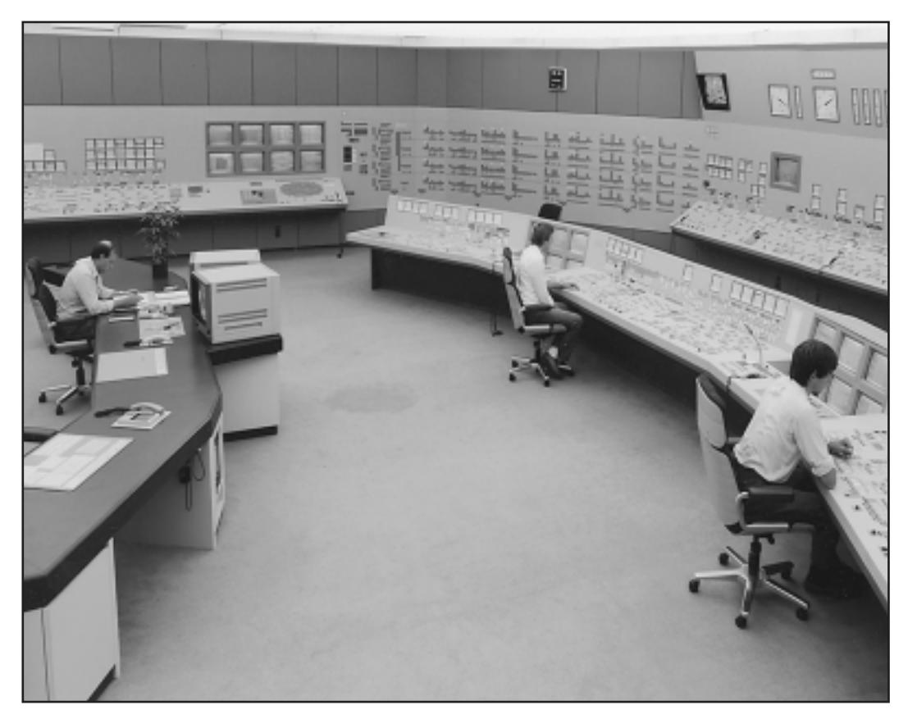

TECHNICAL REPORTS SERIES No. **387**

# **Modern Instrumentation and Control for Nuclear Power Plants: A Guidebook**

# MODERN INSTRUMENTATION AND CONTROL FOR NUCLEAR POWER PLANTS

A Guidebook

The following States are Members of the International Atomic Energy Agency:

AFGHANISTAN ALBANIA ALGERIA ARGENTINA ARMENIA AUSTRALIA HAITI HOLY SEE HUNGARY ICELAND INDIA INDONESIA PARAGUAY PERU PHILIPPINES POLAND PORTUGAL QATAR

AUSTRIA IRAN, ISLAMIC REPUBLIC OF REPUBLIC OF MOLDOVA

BANGLADESH IRAQ ROMANIA

BELARUS IRELAND RUSSIAN FEDERATION

BELGIUM BOLIVIA BOSNIA AND HERZEGOVINA BRAZIL BULGARIA BURKINA FASO ISRAEL ITALY JAMAICA JAPAN JORDAN KAZAKHSTAN KENYA SAUDI ARABIA SENEGAL SIERRA LEONE SINGAPORE SLOVAKIA SLOVENIA SOUTH AFRICA

CAMBODIA CAMEROON CANADA CHILE CHINA KOREA, REPUBLIC OF KUWAIT LATVIA LEBANON LIBERIA SPAIN SRI LANKA SUDAN SWEDEN SWITZERLAND

COLOMBIA COSTA RICA COTE D'IVOIRE CROATIA LIBYAN ARAB JAMAHIRIYA LIECHTENSTEIN LITHUANIA LUXEMBOURG SYRIAN ARAB REPUBLIC THAILAND THE FORMER YUGOSLAV REPUBLIC OF MACEDONIA

CUBA CYPRUS CZECH REPUBLIC DEMOCRATIC REPUBLIC MADAGASCAR MALAYSIA MALI MALTA TUNISIA TURKEY UGANDA UKRAINE

OF THE CONGO DENMARK DOMINICAN REPUBLIC ECUADOR EGYPT EL SALVADOR ESTONIA ETHIOPIA FINLAND FRANCE GABON GEORGIA GERMANY GHANA GREECE GUATEMALA MARSHALL ISLANDS MAURITIUS MEXICO MONACO MONGOLIA MOROCCO MYANMAR NAMIBIA NETHERLANDS NEW ZEALAND NICARAGUA NIGER NIGERIA NORWAY PAKISTAN PANAMA UNITED ARAB EMIRATES UNITED KINGDOM OF GREAT BRITAIN AND NORTHERN IRELAND UNITED REPUBLIC OF TANZANIA UNITED STATES OF AMERICA URUGUAY UZBEKISTAN VENEZUELA VIET NAM YEMEN YUGOSLAVIA ZAMBIA ZIMBABWE

The Agency's Statute was approved on 23 October 1956 by the Conference on the Statute of the IAEA held at United Nations Headquarters, New York; it entered into force on 29 July 1957. The Headquarters of the Agency are situated in Vienna. Its principal objective is "to accelerate and enlarge the contribution of atomic energy to peace, health and prosperity throughout the world''.

# © IAEA, 1999

Permission to reproduce or translate the information contained in this publication may be obtained by writing to the International Atomic Energy Agency, Wagramer Strasse 5, P.O. Box 100, A-1400 Vienna, Austria.

> Printed by the IAEA in Austria June 1999 STI/DOC/010/387

# TECHNICAL REPORTS SERIES No. 387

# MODERN INSTRUMENTATION AND CONTROL FOR NUCLEAR POWER PLANTS

A Guidebook

INTERNATIONAL ATOMIC ENERGY AGENCY VIENNA, 1999

#### **VIC Library Cataloguing in Publication Data**

Modern instrumentation and control for nuclear power plants : a guidebook. — Vienna : International Atomic Energy Agency, 1999.

p. ; 24 cm. — (Technical reports series, ISSN 0074–1914 ; no. 387) STI/DOC/010/387 ISBN 92–0–101199–7

Includes bibliographical references.

1. Nuclear power plants—Instrumentation. 2. Nuclear power plants— Control. I. International Atomic Energy Agency. II. Series: Technical reports series (International Atomic Energy Agency); 387.

VICL 99–00224

# **FOREWORD**

The IAEA has produced many publications which aim to promote safety and provide guidance in the planning, introduction and use of nuclear power. The IAEA International Working Group on Nuclear Power Plant Control and Instrumentation recommended that a guidebook be written as part of this work, to summarize the field of nuclear power plant instrumentation and control and, particularly, to advise those preparing their first nuclear power project. This led, in 1984, to the publication of Nuclear Power Plant Instrumentation and Control: A Guidebook (Technical Reports Series No. 239).

The guidebook was well received and has been widely used by a variety of organizations and professionals, over a thousand copies having been distributed. More recently, however, it became clear that an update was desirable and in 1993 a consultants meeting was convened to advise on a version which would meet the requirements of today's world and still be valid in the beginning of the next century. The consultants concluded that major revision was necessary but that the emphasis ought to be changed from guidance to summarizing operating experience and discussing new technologies.

Whereas the previous edition was aimed at readers who were new to instrumentation and control technology, this is no longer considered appropriate and the present version is primarily directed at those who are working as instrumentation and control engineers on operational plant. However, it does not exclude designers and regulators, who should also find the content useful. Although this edition continues to discuss PWRs, BWRs and CANDU reactors, modern convergence of technology is recognized by the inclusion of detailed information on RBMK and WWER reactor types.

To avoid generalities and a flavour of blandness, numbers and preferred or recommended methods are often mentioned. It is recognized, however, that most countries have their own unique national infrastructures and have, accordingly, evolved individual solutions to common problems. Thus, numbers and recommendations are not necessarily universal and only represent solutions for a given set of circumstances. Nevertheless, it is hoped that the reader will find food for thought, assistance in problem identification and guidelines for solutions. In summary, this guidebook provides an overview of nuclear power plant instrumentation and control technology and the background against which such systems are implemented.

The material which is presented was selected and assembled by an international group of consultants listed at the end of the book. Gratitude is expressed to all of the contributors for their collaboration. The final text was prepared by A. Goodings (United Kingdom) and the IAEA officers responsible for the project were A. Kossilov and V. Neboyan of the Division of Nuclear Power.

#### *EDITORIAL NOTE*

*Although great care has been taken to maintain the accuracy of information contained in this publication, neither the IAEA nor its Member States assume any responsibility for consequences which may arise from its use.*

*The use of particular designations of countries or territories does not imply any judgement by the publisher, the IAEA, as to the legal status of such countries or territories, of their authorities and institutions or of the delimitation of their boundaries.*

*The mention of names of specific companies or products (whether or not indicated as registered) does not imply any intention to infringe proprietary rights, nor should it be construed as an endorsement or recommendation on the part of the IAEA.*

# **CONTENTS**

| 1. |         | GENERAL INTRODUCTION                                     | 1  |
|----|---------|----------------------------------------------------------|----|
|    | 1.1.    | Importance of instrumentation and control             | 1  |
|    | 1.2.    | Background to new edition                             | 2  |
|    | 1.3.    | Scope of new edition                                  | 3  |
|    | PART I. | REQUIREMENTS, CONSTRAINTS AND RECENT ISSUES           |    |
| 2. |         | INTRODUCTION TO PART I                                | 9  |
| 3. |         | OPERATIONAL FACTORS                                      | 11 |
|    | 3.1.    | Load following requirements                           | 11 |
|    | 3.2.    | Constraints with respect to reactor type              | 12 |
|    | 3.3.    | Recent issues with respect to margins and robustness  | 13 |
|    | 3.4.    | Combined heat and power production                       | 13 |
|    | 3.5.    | Maintainability                                       | 14 |
| 4. |         | IMPACT OF OPERATING EXPERIENCE                        | 15 |
|    | 4.1.    | General                                                  | 15 |
|    | 4.2.    | Experience from normal operation                      | 16 |
|    |         | 4.2.1. Plant availability                          | 16 |
|    |         | 4.2.2. Operator support                            | 17 |
|    |         | 4.2.3. Testing and calibration                     | 17 |
|    |         | 4.2.4. Human error                                 | 18 |
|    |         | 4.2.5. New technology                              | 18 |
|    | 4.3.    | Experience from incidents and accidents                  | 19 |
|    |         | 4.3.1. Anticipated transient without scram            | 19 |
|    |         | 4.3.2. Three Mile Island                           | 19 |
|    |         | 4.3.3. Chernobyl                                   | 21 |
|    | 4.4.    | Maintenance experience                                | 21 |
| 5. |         | SAFETY AND REGULATORY FACTORS                         | 24 |
|    | 5.1.    | Background                                            | 24 |
|    | 5.2.    | Defence in depth                                         | 24 |
|    |         | 5.2.1. Design requirements                         | 25 |

|    |      | 5.2.2. Failure modes and effects analysis                | 25 |
|----|------|-------------------------------------------------------------|----|
|    |      | 5.2.3. Probabilistic safety assessment                | 25 |
|    | 5.3. | Categorization of I&C functions important to safety      | 26 |
|    | 5.4. | Emergency response centres                               | 26 |
|    | 5.5. | Severe accident response                                 | 26 |
|    | 5.6. | Software reliability                                     | 27 |
|    | 5.7. | Personnel radiation exposure                             | 27 |
|    | 5.8. | Proof of performance                                     | 27 |
| 6. |      | MANAGEMENT OF ACCIDENT AND POST-ACCIDENT                    |    |
|    |      | CONDITIONS                                               | 29 |
|    | 6.1. | General                                                     | 29 |
|    | 6.2. | Main control room                                        | 29 |
|    | 6.3. | Post-accident management                                 | 31 |
| 7. |      | SAFETY GUIDES AND STANDARDS                              | 32 |
|    | 7.1. | Introduction                                             | 32 |
|    | 7.2. | National safety guides and standards                     | 33 |
|    | 7.3. | International safety guides and standards                | 33 |
|    |      | 7.3.1. IAEA Codes and Safety Guides                      | 33 |
|    |      | 7.3.2. IEC standards, guides and reports           | 34 |
|    |      | 7.3.3. Other international standards                  | 34 |
| 8. |      | TECHNOLOGICAL EVOLUTION                                  | 37 |
|    | 8.1. | Introduction                                             | 37 |
|    | 8.2. | Digital electronics                                         | 37 |
|    | 8.3. | Microprocessor based systems                             | 37 |
|    |      | 8.3.1. Computer based monitoring and control systems  | 38 |
|    |      | 8.3.2. Personal computers                             | 38 |
|    | 8.4. | Computer system peripherals                              | 38 |
|    | 8.5. | Software engineering                                     | 38 |
|    | 8.6. | Information displays                                     | 39 |
|    | 8.7. | Communications                                              | 39 |
|    | 8.8. | Expert systems                                           | 40 |
| 9. |      | MODERNIZATION AND LIFE EXTENSION FACTORS                 | 40 |
|    | 9.1. | Introduction                                             | 40 |

|     | 9.2.  |                 | Changes due to plant factors                    | 41 |
|-----|-------|-----------------|----------------------------------------------------|----|
|     |       | 9.2.1.          | Requirements                                    | 41 |
|     |       | 9.2.2.          | Constraints                                     | 41 |
|     |       | 9.2.3.          | Recent issues                                      | 41 |
|     | 9.3.  |                 | Changes due to I&C factors                      | 42 |
|     |       | 9.3.1.          | Requirements                                    | 42 |
|     |       | 9.3.2.          | Constraints                                     | 42 |
|     |       | 9.3.3.          | Recent issues                                      | 43 |
| 10. |       |                 | HUMAN PERFORMANCE REQUIREMENTS                  | 44 |
| 11. |       |                 | TEAMS AND TRAINING                                 | 45 |
|     | 11.1. | Team structures |                                                    | 45 |
|     | 11.2. | Team training   |                                                    | 48 |
|     | 11.3. |                 | Role of simulator training                      | 49 |
|     | 11.4. |                 | Methods of simulator training                      | 50 |
|     |       | 11.4.1.         | Job task analysis                               | 50 |
|     |       | 11.4.2.         | Tasks for which training is required               | 51 |
|     |       | 11.4.3.         | Training objectives                             | 51 |
|     |       | 11.4.4.         | Types of simulator and their recommended uses   | 51 |
| 12. |       |                 | QUALITY ASSURANCE AND STANDARDIZATION              |    |
|     |       | OF PLANTS       |                                                    | 53 |
|     | 12.1. | Background      |                                                    | 53 |
|     |       | 12.1.1.         | Historical situation                            | 53 |
|     |       | 12.1.2.         | Future situation                                | 54 |
|     |       | 12.1.3.         | Present situation                               | 54 |
|     | 12.2. | Requirements    |                                                    | 54 |
|     |       | 12.2.1.         | Hard-wired systems                                 | 54 |
|     |       | 12.2.2.         | Software based systems                             | 55 |
|     | 12.3. |                 | Quality assurance planning and quality control  | 55 |
|     | 12.4. | Tests,          | checks and procedures                           | 56 |
|     |       | 12.4.1.         | Type tests                                      | 56 |
|     |       | 12.4.2.         | Factory tests                                   | 57 |
|     |       | 12.4.3.         | Functional tests                                | 57 |
|     |       | 12.4.4.         | Tests during operation                          | 57 |
|     | 12.5. |                 | Standardization of plants and their I&C equipment  | 57 |
|     |       | 12.5.1.         | Plants and systems                                 | 57 |
|     |       | 12.5.2.         | I&C equipment                                   | 58 |

# **PART II. DESIGN CONCEPTS**

| 13. |                | GENERAL ASPECTS                                                | 63       |
|-----|----------------|-------------------------------------------------------------------|----------|
|     | 13.1. 13.2. | Basic philosophy  Design factors                            | 63 65 |
|     | 13.3.          | Methods of implementation                                      | 66       |
|     |                | 13.3.1. General principles                                  | 66       |
|     |                | 13.3.2. Failure to safety and defence in depth              | 66       |
|     |                | 13.3.3. Quality assurance in design and supply process         | 67       |
|     |                | 13.3.4. Codes of practice and terminology                   | 68       |
| 14. |                | DEFENCE IN DEPTH                                                  | 69       |
|     | 14.1.          | Introduction                                                   | 69       |
|     | 14.2.          | Levels of protection                                           | 69       |
|     | 14.3.          | Categorization of I&C functions                                | 71       |
|     | 14.4.          | Redundancy, diversity, separation and failure to safety  | 71       |
|     |                | 14.4.1. Redundancy                                          | 71       |
|     |                | 14.4.2. Diversity                                           | 72       |
|     |                | 14.4.3. Separation                                          | 73       |
|     |                | 14.4.4. Failure to safety                                      | 73       |
| 15. |                | INSTRUMENTATION AND CONTROL STRUCTURES                         | 74       |
|     | 15.1.          | General                                                           | 74       |
|     | 15.2.          | Main structures                                                   | 75       |
|     | 15.3.          | Structures of subsidiary units                                 | 76       |
|     |                | 15.3.1. Analog systems                                      | 76       |
|     |                | 15.3.2. Digital systems                                     | 77       |
| 16. |                | BALANCE BETWEEN AUTOMATION AND                                    |          |
|     |                | HUMAN ACTION                                                      | 78       |
|     | 16.1.          | Background                                                     | 78       |
|     |                | 16.1.1. Historical situation                                | 78       |
|     |                | 16.1.2. Future situation                                    | 79       |
|     |                | 16.1.3. Present situation                                   | 79       |
|     | 16.2.          | Disadvantages and advantages of human action                   | 79       |
|     |                | 16.2.1. Disadvantages                                       | 79       |
|     |                | 16.2.2. Advantages                                          | 80       |

|     | 16.3. | Disadvantages and advantages of automatic action          | 80  |
|-----|-------|--------------------------------------------------------------|-----|
|     |       | 16.3.1. Introduction                                      | 80  |
|     |       | 16.3.2. Disadvantages                                  | 81  |
|     |       | 16.3.3. Advantages                                     | 81  |
|     | 16.4. | Balance and assignment of functions                       | 82  |
|     |       | 16.4.1. First, rough assignment of tasks and functions | 83  |
|     |       | 16.4.2. First refinement of design and assessment      | 83  |
|     |       | 16.4.3. Final balancing of tasks and functions         | 84  |
| 17. |       | HUMAN FACTORS ENGINEERING                                 | 86  |
|     | 17.1. | Introduction                                              | 86  |
|     | 17.2. | Presentation of information                                  | 87  |
|     | 17.3. | Control aspects                                           | 89  |
|     | 17.4. | Layout of controls and panels                             | 89  |
|     | 17.5. | Integration of procedures and operations                     | 90  |
|     | 17.6. | Full-scope simulators                                     | 90  |
| 18. |       | COMPUTERS FOR PLANT MANAGEMENT                            | 92  |
|     | 18.1. | Historical situation                                      | 92  |
|     | 18.2. | Present situation                                         | 93  |
|     |       | 18.2.1. Maintenance support                            | 93  |
|     |       | 18.2.2. Engineering support                            | 93  |
|     |       | 18.2.3. Environmental supervision                      | 93  |
|     |       | 18.2.4. Core management                                | 94  |
|     | 18.3. | Typical design                                            | 95  |
| 19. |       | ACCIDENT MONITORING INSTRUMENTATION                       | 97  |
|     | 19.1. | Design criteria                                           | 97  |
|     | 19.2. | Variable types                                               | 97  |
|     | 19.3. | Selection criteria for variables                             | 98  |
|     | 19.4. | Severe accidents                                          | 100 |
| 20. |       | POWER SUPPLIES                                               | 101 |
|     | 20.1. | Electrical power supplies                                 | 101 |
|     |       | 20.1.1. Principles                                     | 101 |
|     |       | 20.1.2. System design                                  | 102 |
|     | 20.2. | Non-electrical power supplies and ventilation systems     | 105 |

| 21. |       | ENVIRONMENTAL INFLUENCES  106                                           |
|-----|-------|-------------------------------------------------------------------------------|
|     | 21.1. | Accident conditions  106                                                |
|     | 21.2. | Fire 106                                                                   |
|     | 21.3. | Seismic effects  107                                                    |
|     | 21.4. | Air-conditioning  108                                                   |
|     | 21.5. | Electromagnetic interference 108                                           |
|     | 21.6. | Other external hazards  110                                             |
|     | 21.7. | Physical security 111                                                      |
| 22. |       | QUALIFICATION  112                                                      |
|     | 22.1. | Requirements  113                                                       |
|     |       | 22.1.1. Specifications  113                                          |
|     |       | 22.1.2. Documentation  113                                           |
|     | 22.2. | Methods of qualification 114                                               |
|     | 22.3. | Particular factors applying to software  114                            |
|     | 22.4. | Maintenance of qualification 116                                           |
| 23. |       | MAINTAINABILITY AND MAINTENANCE  117                                    |
|     | 23.1. | Requirements  117                                                       |
|     | 23.2. | Influence of organizational, industrial and                                |
|     |       | technological environments 118                                             |
|     | 23.3. | Design for maintenance  119                                             |
|     |       | 23.3.1. System design  119                                           |
|     |       | 23.3.2. Equipment design  120                                        |
|     | 23.4. | Organization of maintenance  120                                        |
|     | 23.5. | Maintenance activities  121                                             |
|     |       | 23.5.1. Training  121                                                |
|     |       | 23.5.2. Front line maintenance and support  122                      |
|     |       | 23.5.3. Diagnosis and repair  122                                    |
|     |       | 23.5.4. Preventive maintenance activities  123                       |
|     |       | 23.5.5. Shop calibration, repair, maintenance and salvage  124 |
|     |       | 23.5.6. Documentation  124                                           |
|     |       | 23.5.7. Maintenance of equipment histories                                 |
|     |       | and evaluations  125                                                    |
|     |       | 23.5.8. Materials management 125                                        |
|     | 23.6. | Plant performance analysis and modifications 126                           |

# **PART III. RECENT DEVELOPMENTS IN INSTRUMENTATION AND CONTROL**

| 24. |       | MAIN CONTROL ROOM 129                                            |  |
|-----|-------|---------------------------------------------------------------------|--|
|     | 24.1. | Introduction  129                                             |  |
|     | 24.2. | Recent trends  129                                            |  |
|     |       | 24.2.1. Increase in complexity and information  129        |  |
|     |       | 24.2.2. Computers in monitoring and control  130           |  |
|     |       | 24.2.3. Control desk  131                                  |  |
|     |       | 24.2.4. Dark panel concept  131                            |  |
|     |       | 24.2.5. Standards and regulatory requirements  131         |  |
|     |       | 24.2.6. Control room backfits  132                         |  |
|     | 24.3. | Human factors  132                                            |  |
|     | 24.4. | Human–machine interface  133                                  |  |
|     |       | 24.4.1. Increased use of computer driven displays 133         |  |
|     |       | 24.4.2. Task and symptom oriented information  133         |  |
|     |       | 24.4.3. Console operation  133                             |  |
|     |       | 24.4.4. Advanced graphical user interface  134             |  |
|     | 24.5. | Information display  134                                      |  |
|     |       | 24.5.1. Computer driven information systems  134           |  |
|     |       | 24.5.2. Large mimic displays  135                          |  |
|     |       | 24.5.3. VDU display design  136                            |  |
|     | 24.6. | Alarm processing and annunciation and command interfaces  136 |  |
|     |       | 24.6.1. Alarm flooding  136                                |  |
|     |       | 24.6.2. Alarm windows  137                                 |  |
|     |       | 24.6.3. Auditory devices  137                              |  |
|     | 24.7. | Video monitoring  138                                         |  |
|     |       |                                                                     |  |
| 25. |       | OPERATOR SUPPORT 140                                             |  |
|     | 25.1. | Introduction  140                                             |  |
|     | 25.2. | Types of operator support system  140                         |  |
|     | 25.3. | Handling of procedures 142                                       |  |
|     |       | 25.3.1. Computerized procedures  142                       |  |
|     |       | 25.3.2. Procedure selection  142                           |  |
|     | 25.4. | On-line diagnosis  143                                        |  |
|     |       | 25.4.1. Safety parameter display systems  143              |  |
|     |       | 25.4.2. Critical safety parameter monitor 144                 |  |
|     |       | 25.4.3. Emergency operating procedure entry                      |  |
|     |       | condition monitor  144                                        |  |

|     | 25.5. | Core surveillance systems 145                                            |
|-----|-------|-----------------------------------------------------------------------------|
|     | 25.6. | Plant state prediction  145                                           |
|     | 25.7. | Post-accident analysis 145                                               |
|     | 25.8. | Reference engineering databases 146                                      |
|     | 25.9. | Future systems  147                                                   |
|     |       |                                                                             |
| 26. |       | CONTROL SYSTEMS  149                                                  |
|     | 26.1. | General 149                                                              |
|     | 26.2. | Changes in last decade  150                                           |
|     | 26.3. | Increased use of automation  155                                      |
|     | 26.4. | Computer applications  155                                            |
|     | 26.5. | Issues in computer usage  156                                         |
|     |       |                                                                             |
| 27. |       | LIMITATION SYSTEMS  159                                               |
|     | 27.1. | Historical development  159                                           |
|     | 27.2. | Working regions  161                                                  |
|     |       | 27.2.1. Safety systems 162                                            |
|     |       | 27.2.2. Safety related systems  162                                |
|     |       | 27.2.3. Control systems 162                                           |
|     |       | 27.2.4. Limitation systems  162                                    |
|     | 27.3. | Characteristics of protection, control and limitation systems  163 |
|     | 27.4. | Advantages of limitation systems  165                                 |
|     |       | 27.4.1. Advantages for operators 165                                  |
|     |       | 27.4.2. Advantages for licensing procedure  165                    |
|     |       | 27.4.3. Advantages for availability  166                           |
|     |       | 27.4.4. Advantages for reliability  166                            |
|     |       | 27.4.5. Overall aspects  167                                       |
|     | 27.5. | Possible future developments  167                                     |
| 28. |       | COMPUTERIZED PROTECTION SYSTEMS  169                                  |
|     |       |                                                                             |
|     | 28.1. | Introduction  169                                                     |
|     | 28.2. | Features and advantages  169                                          |
|     | 28.3. | Problems and disadvantages  171                                       |
|     | 28.4. | Experience  174                                                       |
|     |       | 28.4.1. Implementation principles  174                             |
|     |       | 28.4.2. Reactors in operation 174                                     |
|     |       | 28.4.3. More recent reactors  180                                  |
|     |       | 28.4.4. More recent projects  181                                  |

|     | 28.5. | Development of standards, methods and tools 183        |
|-----|-------|--------------------------------------------------------------|
|     |       | 28.5.1. Standards  183                              |
|     |       | 28.5.2. Methods  183                                |
|     |       | 28.5.3. Tools  184                                  |
|     | 28.6. | International co-operation 184                            |
|     | 28.7. | Future directions 184                                     |
|     |       |                                                              |
| 29. |       | ENGINEERED SAFETY SYSTEMS 186                             |
|     | 29.1. | Introduction 186                                          |
|     |       | 29.1.1. Definitions  186                            |
|     |       | 29.1.2. Criteria  187                               |
|     | 29.2. | Systems structure  187                                 |
|     |       | 29.2.1. Critical safety functions 187                  |
|     |       | 29.2.2. Emergency core cooling  187                 |
|     |       | 29.2.3. Depressurization and venting systems  190   |
|     |       | 29.2.4. Barriers to radioactive releases  191       |
|     | 29.3. | Design  193                                            |
|     |       | 29.3.1. General  193                                |
|     |       | 29.3.2. Redundancy and diversity  193               |
|     |       | 29.3.3. Failure to safety 194                          |
|     |       | 29.3.4. Protection against fire and earthquake  194 |
|     | 29.4. | Severe accidents  195                                  |
| 30. |       | INSTRUMENTATION 195                                       |
|     | 30.1. | Core monitoring  196                                   |
|     |       | 30.1.1. PWRs  196                                   |
|     |       | 30.1.2. BWRs  197                                   |
|     | 30.2. | In-core level measurements 197                            |
|     | 30.3. | Coolant chemistry 197                                     |
|     | 30.4. | Leakage detection 198                                     |
|     | 30.5. | External environment monitoring  200                   |
|     | 30.6. | Radiation protection  201                              |
| 31. |       | MAINTENANCE SUPPORT 202                                   |
|     | 31.1. | General 202                                               |
|     | 31.2. | Maintenance cycle  203                                 |
|     |       | 31.2.1. Maintenance request  204                    |
|     |       | 31.2.2. Planning and mobilization  205              |
|     |       |                                                              |

|     |       | 31.2.3.       | Execution                                      | 205 |
|-----|-------|---------------|---------------------------------------------------|-----|
|     |       | 31.2.4.       | Evaluation                                     | 205 |
|     | 31.3. |               | Computer systems                               | 206 |
|     | 31.4. |               | Tools for maintenance support                  | 207 |
|     |       | 31.4.1.       | Computerized maintenance requests              | 207 |
|     |       | 31.4.2.       | Use of computers in planning and mobilization  | 208 |
|     |       | 31.4.3.       | Control of execution                           | 209 |
|     |       | 31.4.4.       | Evaluation                                     | 210 |
|     | 31.5. |               | Preventive maintenance                         | 210 |
|     |       |               |                                                   |     |
| 32. |       |               | EMERGENCY RESPONSE FACILITIES                  | 212 |
|     | 32.1. | Introduction  |                                                   | 212 |
|     | 32.2. |               | Technical support centre                       | 213 |
|     |       | 32.2.1.       | Functions                                      | 213 |
|     |       | 32.2.2.       | Location                                       | 214 |
|     |       | 32.2.3.       | Structure                                      | 214 |
|     |       | 32.2.4.       | Habitability                                   | 214 |
|     |       | 32.2.5.       | Communications                                 | 215 |
|     |       | 32.2.6.       | Instrumentation, data system equipment         |     |
|     |       |               | and power supplies                             | 215 |
|     |       | 32.2.7.       | Technical data system                          | 215 |
|     | 32.3. |               | Operational support centre                     | 216 |
|     | 32.4. |               | Emergency operations facility                     | 217 |
|     |       | 32.4.1.       | Functions                                      | 217 |
|     |       | 32.4.2.       | Communications                                 | 217 |
|     |       | 32.4.3.       | Instrumentation, data system equipment         |     |
|     |       |               | and power supplies                             | 217 |
|     |       | 32.4.4.       | Technical data system                          | 218 |
|     | 32.5. |               | Safety parameter display system                | 218 |
|     |       | 32.5.1.       | Functions                                      | 218 |
|     |       | 32.5.2.       | Displays                                       | 219 |
|     |       | 32.5.3.       | Data validation                                | 219 |
|     |       | 32.5.4.       | Location and size                              | 220 |
|     |       | 32.5.5.       | Staffing                                       | 220 |
|     | 32.6. |               | Emergency response centres                     | 220 |
| 33. |       | FUTURE TRENDS |                                                   | 221 |
|     | 33.1. | Introduction  |                                                   | 221 |

|     | 33.2.    | Causes of change |                                                            | 222 |
|-----|----------|------------------|------------------------------------------------------------|-----|
|     |          | 33.2.1.          | General factors                                         | 222 |
|     |          | 33.2.2.          | Advantages to be gained from change                     | 223 |
|     |          | 33.2.3.          | Factors controlling change                                 | 224 |
|     |          | 33.2.4.          | Previous trends                                         | 225 |
|     | 33.3.    |                  | Likely developments                                        | 226 |
|     |          | 33.3.1.          | Plant computers                                            | 226 |
|     |          | 33.3.2.          | Better human orientation through better understanding      |     |
|     |          |                  | of operator needs and better application of aids        | 227 |
|     |          | 33.3.3.          | Qualification and licensing costs                       | 228 |
|     |          | 33.3.4.          | Sensors and instruments                                 | 228 |
|     |          | 33.3.5.          | Developments based on new perceived needs               | 228 |
|     | 33.4.    | Conclusion       |                                                            | 229 |
|     |          |                  |                                                            |     |
|     | PART IV. |                  | INSTRUMENTATION AND CONTROL IN A NEW                       |     |
|     |          |                  | NUCLEAR POWER PLANT                                        |     |
| 34. |          |                  | INTRODUCTION TO PART IV                                 | 233 |
| 35. |          |                  | LICENSING AND REGULATION                                | 237 |
|     | 35.1.    | Necessary skills |                                                            | 237 |
|     | 35.2.    |                  | Codes and standards                                     | 238 |
|     | 35.3.    |                  | Avoiding licensing delays                               | 239 |
|     |          |                  |                                                            |     |
| 36. |          |                  | BUILDING AN I&C TEAM                                    | 240 |
|     | 36.1.    |                  | Required skills and plant design features               | 241 |
|     | 36.2.    |                  | Staffing requirements and availability                  | 241 |
|     | 36.3.    | Training         |                                                            | 242 |
|     |          | 36.3.1.          | Initial training for professionals                         | 242 |
|     |          | 36.3.2.          | Technician training                                     | 243 |
|     |          | 36.3.3.          | In-house training facilities (nuclear training centre)  | 244 |
|     |          | 36.3.4.          | Training laboratories                                   | 247 |
|     |          | 36.3.5.          | Role of the IAEA                                        | 247 |
|     |          | 36.3.6.          | Familiarization with plant equipment                       | 248 |
|     |          | 36.3.7.          | Preparation of lessons and training manuals             | 248 |
|     |          | 36.3.8.          | Planning and pre-project phase                          | 249 |
|     |          | 36.3.9.          | Possible problems                                       | 250 |

| 37. |       |         | PROJECT IMPLEMENTATION  251                               |
|-----|-------|---------|-----------------------------------------------------------------|
|     | 37.1. |         | Planning and pre-project phase  251                       |
|     | 37.2. |         | Project preparation phase  253                            |
|     |       | 37.2.1. | Pre-tender discussions  253                               |
|     |       | 37.2.2. | Review of safety standards, codes and criteria  253    |
|     |       | 37.2.3. | Training  253                                             |
|     |       | 37.2.4. | Decisions on local participation 253                         |
|     |       | 37.2.5. | Bid evaluation and contract negotiation  254              |
|     |       | 37.2.6. | Preparation of simulator specifications  254              |
|     |       | 37.2.7. | Familiarization with various reactors  254                |
|     | 37.3. |         | Preparation of bid specifications and bid evaluation  255 |
|     |       | 37.3.1. | Initial considerations  255                               |
|     |       | 37.3.2. | Areas which could be considered for                             |
|     |       |         | local supply 256                                             |
|     |       | 37.3.3. | Other factors which affect plant operation  257           |
|     |       | 37.3.4. | Training requirements  258                                |
|     |       | 37.3.5. | Documentation  259                                        |
|     |       | 37.3.6. | Alterations and additions  260                            |
|     |       | 37.3.7. | Choice of supplier  260                                   |
|     | 37.4. |         | Design engineering phase  261                             |
|     |       | 37.4.1. | Division of responsibility  261                           |
|     |       | 37.4.2. | Personnel requirements for I&C design                           |
|     |       |         | engineering  261                                          |
|     |       | 37.4.3. | Owner/operator involvement  262                           |
|     |       | 37.4.4. | I&C equipment selection and evaluation  264               |
|     | 37.5. |         | Construction and installation of I&C equipment  266       |
|     |       | 37.5.1. | Construction phases 266                                      |
|     |       | 37.5.2. | Participating organizations 267                              |
|     |       | 37.5.3. | I&C activities and considerations  268                    |
|     | 37.6. |         | Commissioning and startup 272                                |
|     |       | 37.6.1. | Commissioning phase  272                                  |
|     |       | 37.6.2. | Pre-operational tests  274                                |
|     |       | 37.6.3. | Initial startup tests  275                                |
|     |       | 37.6.4. | Special regulatory requirements during startup  277       |
|     |       | 37.6.5. | Special tests  277                                        |
|     |       | 37.6.6. | Grid considerations  278                                  |
|     |       | 37.6.7. | Outstanding items  278                                    |
|     |       | 37.6.8. | Preparation by owner for commercial operation 278            |
|     |       | 37.6.9. | Status of I&C maintenance group at time                         |
|     |       |         | of handover  279                                          |

| 38. |                                  | SPECIAL TOPICS 280                                                                                                                              |  |
|-----|----------------------------------|----------------------------------------------------------------------------------------------------------------------------------------------------|--|
|     | 38.1. 38.2. 38.3. 38.4. | Major I&C related issues  280 Spare parts inventory  281 Spare computer system  283 Need for design know-how  283 |  |
|     | PART V.                          | EXAMPLES OF CURRENT INSTRUMENTATION AND CONTROL SYSTEMS                                                                                         |  |
| 39. |                                  | I&C CONCEPTS FOR A PWR PLANT IN FINLAND: LOVIISA  287                                                                                  |  |
|     | 39.1.                            | Introduction  287                                                                                                                            |  |
|     | 39.2.                            | Main controls  288                                                                                                                           |  |
|     | 39.3.                            | Reactor control and protection system  288                                                                                                   |  |
|     |                                  | 39.3.1. Control rod drives  289                                                                                                           |  |
|     |                                  | 39.3.2. Emergency protection system  290                                                                                                  |  |
|     |                                  | 39.3.3. Reactor power limiting controller  290                                                                                            |  |
|     |                                  | 39.3.4. Automatic power controller  291                                                                                                   |  |
|     | 39.4.                            | In-core instrumentation system  294                                                                                                          |  |
|     |                                  | 39.4.1. In-core equipment  295                                                                                                            |  |
|     |                                  | 39.4.2. Electronic equipment 295                                                                                                             |  |
|     | 39.5.                            | Radiation monitoring  296                                                                                                                    |  |
|     |                                  | 39.5.1. System  296                                                                                                                       |  |
|     |                                  | 39.5.2. Standardization  297                                                                                                              |  |
|     |                                  | 39.5.3. Reliability  297                                                                                                                  |  |
|     |                                  | 39.5.4. Maintenance  298                                                                                                                  |  |
|     | 39.6.                            | Plant protection system 298                                                                                                                     |  |
|     |                                  | 39.6.1. Quality control  299                                                                                                              |  |
|     | 39.7.                            | Instrumentation and control technology  299                                                                                                  |  |
|     |                                  | 39.7.1. Automatics system  300                                                                                                            |  |
|     |                                  | 39.7.2. Field equipment 300                                                                                                                  |  |
|     |                                  | 39.7.3. Measuring cubicles  301                                                                                                           |  |
|     |                                  | 39.7.4. Automatics  301                                                                                                                   |  |
|     |                                  | 39.7.5. Controller cubicles  302                                                                                                          |  |
|     |                                  | 39.7.6. Automatic control system cubicles  303                                                                                            |  |
|     |                                  | 39.7.7. Decentralized cross-connection  303                                                                                               |  |
|     | 39.8.                            | Control rooms 305                                                                                                                               |  |
|     | 39.9.                            | Integrated computer systems 305                                                                                                                 |  |
|     |                                  | 39.9.1. Plant information system  305                                                                                                     |  |

|     |        | 39.9.2.         | Process computer systems                                | 308 |
|-----|--------|-----------------|------------------------------------------------------------|-----|
|     |        | 39.9.3.         | Training simulator                                      | 311 |
|     |        | 39.9.4.         | Vibration monitoring system                             | 311 |
|     |        | 39.9.5.         | Laboratory computer systems                             | 312 |
|     |        | 39.9.6.         | PC and workstation applications                         | 312 |
| 40. |        |                 | I&C CONCEPTS FOR PWR PLANTS IN FRANCE: N4 SERIES  | 314 |
|     | 40.1.  | N4 series:      | French breakthrough                                     | 314 |
|     | 40.2.  | Experience base |                                                            | 315 |
|     | 40.3.  |                 | New features of N4 I&C                                     | 316 |
|     | 40.4.  |                 | General architecture                                    | 317 |
|     |        | 40.4.1.         | Levels                                                  | 317 |
|     |        | 40.4.2.         | Safety classes                                          | 317 |
|     |        | 40.4.3.         | Diversification at level 1                              | 319 |
|     |        | 40.4.4.         | Diversification at level 2                              | 320 |
|     | 40.5.  |                 | Requirements of safety classes                          | 320 |
|     |        | 40.5.1.         | Class 1E general requirements                              | 320 |
|     |        | 40.5.2.         | Class 1E qualification                                  | 321 |
|     |        | 40.5.3.         | Class 2E general requirements                              | 321 |
|     |        | 40.5.4.         | Class 2E qualification                                  | 322 |
|     | 40.6.  |                 | Control room architecture                                  | 322 |
|     |        | 40.6.1.         | Aims                                                    | 322 |
|     |        | 40.6.2.         | Operating system                                           | 322 |
|     |        | 40.6.3.         | Computerized operating desks                               | 323 |
|     |        | 40.6.4.         | Auxiliary panel                                         | 324 |
|     |        | 40.6.5.         | Mimic panel                                             | 324 |
|     | 40.7.  | Display formats |                                                            | 325 |
|     |        | 40.7.1.         | Operating formats                                       | 325 |
|     |        | 40.7.2.         | Operating procedures                                    | 326 |
|     |        | 40.7.3.         | Technical data sheets                                   | 327 |
|     |        | 40.7.4.         | Alarm sheets                                            | 328 |
|     |        | 40.7.5.         | Equipment status formats                                | 328 |
|     | 40.8.  |                 | System implementation                                      | 328 |
|     |        | 40.8.1.         | Protection and safeguard system                         | 328 |
|     |        | 40.8.2.         | General automation system                               | 328 |
|     | 40.9.  |                 | Computer aided engineering                              | 329 |
|     |        | 40.9.1.         | Design process                                          | 329 |
|     |        | 40.9.2.         | Delivery chain                                          | 329 |
|     | 40.10. | Simulation,     | verification and validation                             | 330 |
|     |        | 40.10.1.        | Level 1 V&V                                                | 330 |
|     |        |                 |                                                            |     |

|     |        | 40.10.2.     | Level 2 V&V                                             | 331 |
|-----|--------|--------------|---------------------------------------------------------|-----|
|     | 40.11. |              | Demonstration of safety                              | 332 |
|     |        | 40.11.1.     | Deterministic approach to design and validation      | 332 |
|     |        | 40.11.2.     | Probabilistic verification                           | 332 |
|     |        | 40.11.3.     | Ergonomic validation                                 | 332 |
|     |        |              |                                                         |     |
| 41. |        |              | I&C CONCEPTS FOR PWR PLANTS IN GERMANY            | 333 |
|     | 41.1.  |              | Introduction                                            | 333 |
|     | 41.2.  | Design basis |                                                         | 333 |
|     |        | 41.2.1.      | Regulatory requirements                              | 333 |
|     |        | 41.2.2.      | Operational requirements                                | 335 |
|     | 41.3.  |              | Features of KWU PWR type NPPs and their                 |     |
|     |        |              | Leittechnik systems                                  | 336 |
|     |        | 41.3.1.      | KWU capabilities                                     | 336 |
|     |        | 41.3.2.      | Special features of PWR type NPPs                       | 336 |
|     |        | 41.3.3.      | Special features of Leittechnik systems              | 337 |
|     | 41.4.  |              | Measurement systems                                     | 339 |
|     |        | 41.4.1.      | Neutron measurement                                  | 339 |
|     |        | 41.4.2.      | Radiation monitoring                                    | 340 |
|     |        | 41.4.3.      | Special measurements                                 | 341 |
|     | 41.5.  |              | Plant and reactor control systems                    | 342 |
|     |        | 41.5.1.      | Plant power control function                         | 342 |
|     |        | 41.5.2.      | Reactor power control function                       | 344 |
|     | 41.6.  |              | Operational requirements                             | 347 |
|     |        | 41.6.1.      | Normal load following capability                     | 347 |
|     |        | 41.6.2.      | Operational occurrences                              | 347 |
|     | 41.7.  |              | Reactor protection system                               | 348 |
|     |        | 41.7.1.      | Characteristics                                         | 348 |
|     |        | 41.7.2.      | Structure                                            | 348 |
|     |        | 41.7.3.      | Postulated initiating events                         | 350 |
|     |        | 41.7.4.      | Protective actions                                   | 350 |
|     |        | 41.7.5.      | Necessary measurements                               | 350 |
|     | 41.8.  |              | Limitation systems                                   | 352 |
|     |        | 41.8.1.      | General                                              | 352 |
|     |        | 41.8.2.      | Survey of limitation systems                         | 354 |
|     |        | 41.8.3.      | Reactor power limitation function                    | 355 |
|     |        | 41.8.4.      | Bank movement limitation function                       | 356 |
|     |        | 41.8.5.      | Coolant pressure, inventory and temperature gradient |     |
|     |        |              | limitation functions                                 | 357 |
|     |        | 41.8.6.      | Limitation subfunctions                                 | 358 |
|     |        |              |                                                         |     |

|     | 41.9.  | Control room design  359        |                                                        |     |  |  |  |  |
|-----|--------|---------------------------------------|--------------------------------------------------------|-----|--|--|--|--|
|     | 41.10. | Process information system  361 |                                                        |     |  |  |  |  |
|     | 41.11. |                                       | Power supply concepts and diverse reactor tripping  | 364 |  |  |  |  |
|     | 41.12. |                                       | Current and future developments  364             |     |  |  |  |  |
|     |        |                                       |                                                        |     |  |  |  |  |
| 42. |        |                                       | I&C CONCEPTS FOR PWR PLANTS IN JAPAN                | 372 |  |  |  |  |
|     |        |                                       |                                                        |     |  |  |  |  |
|     | 42.1.  | Introduction                          |                                                        | 372 |  |  |  |  |
|     | 42.2.  | Licensing criteria                    |                                                        | 372 |  |  |  |  |
|     |        | 42.2.1.                               | General safety design criteria                      | 372 |  |  |  |  |
|     |        | 42.2.2.                               | I&C general licensing requirements                     | 372 |  |  |  |  |
|     | 42.3.  |                                       | Design guidelines for PWR plants                    | 373 |  |  |  |  |
|     |        | 42.3.1.                               | Design basis for I&C systems                        | 373 |  |  |  |  |
|     |        | 42.3.2.                               | Criteria for seismic and environmental conditions   | 374 |  |  |  |  |
|     |        | 42.3.3.                               | Operating personnel interface                       | 375 |  |  |  |  |
|     | 42.4.  |                                       | Instrumentation                                        | 376 |  |  |  |  |
|     |        | 42.4.1.                               | Nuclear instrumentation                             | 376 |  |  |  |  |
|     |        | 42.4.2.                               | Process instrumentation                                | 377 |  |  |  |  |
|     |        | 42.4.3.                               | Rod position instrumentation                           | 379 |  |  |  |  |
|     |        | 42.4.4.                               | Plant radiation monitoring instrumentation          | 380 |  |  |  |  |
|     | 42.5.  | Control systems                       |                                                        | 381 |  |  |  |  |
|     |        | 42.5.1.                               | Reactor power control                               | 381 |  |  |  |  |
|     |        | 42.5.2.                               | Reactor pressure control                            | 382 |  |  |  |  |
|     |        | 42.5.3.                               | Steam generator level control                       | 383 |  |  |  |  |
|     |        | 42.5.4.                               | Steam pressure control                              | 383 |  |  |  |  |
|     |        | 42.5.5.                               | Steam dump control                                  | 383 |  |  |  |  |
|     |        | 42.5.6.                               | Pressurizer level control                           | 385 |  |  |  |  |
|     |        | 42.5.7.                               | Rod control                                         | 385 |  |  |  |  |
|     |        | 42.5.8.                               | Control bank rod insertion monitoring                  | 385 |  |  |  |  |
|     |        | 42.5.9.                               | Operational characteristics                            | 386 |  |  |  |  |
|     |        | 42.5.10.                              | Reactor control system features                     | 386 |  |  |  |  |
|     | 42.6.  | Safety systems                        |                                                        | 387 |  |  |  |  |
|     |        | 42.6.1.                               | Design bases                                        | 387 |  |  |  |  |
|     |        | 42.6.2.                               | Reactor protection system                           | 389 |  |  |  |  |
|     |        | 42.6.3.                               | Engineered safety features actuation system         | 389 |  |  |  |  |
|     | 42.7.  |                                       | Safety related systems                              | 390 |  |  |  |  |
|     |        | 42.7.1.                               | Post-accident monitoring                            | 390 |  |  |  |  |
|     | 42.8.  |                                       | Control board design                                | 390 |  |  |  |  |
|     |        | 42.8.1.                               | Design of a current control board                   | 390 |  |  |  |  |
|     |        | 42.8.2.                               | Dynamic priorities alarm system                     | 390 |  |  |  |  |
|     | 42.9.  | Plant computers                       |                                                        | 391 |  |  |  |  |
|     |        |                                       |                                                        |     |  |  |  |  |

|     |        | 42.9.1.         | General                                            | 391 |
|-----|--------|-----------------|-------------------------------------------------------|-----|
|     |        | 42.9.2.         | Overall system architecture                        | 392 |
|     |        | 42.9.3.         | CRT display system                                    | 392 |
|     |        | 42.9.4.         | Technical support centre                           | 393 |
|     | 42.10. |                 | Advanced I&C systems                               | 393 |
|     |        | 42.10.1.        | System architecture                                | 393 |
|     |        | 42.10.2.        | Design features                                    | 395 |
|     |        | 42.10.3.        | Reactor power monitoring system                    | 395 |
|     |        | 42.10.4.        | Advanced control room                              | 395 |
|     |        | 42.10.5.        | Operator support system                            | 397 |
|     |        |                 |                                                       |     |
| 43. |        |                 | I&C CONCEPTS FOR PWR PLANTS IN THE                    |     |
|     |        |                 | RUSSIAN FEDERATION: WWER-1000                      | 399 |
|     | 43.1.  |                 | Design basis for I&C safety classification            | 399 |
|     | 43.2.  |                 | Overall plant control                                 | 400 |
|     |        | 43.2.1.         | Plant control organization                         | 400 |
|     |        | 43.2.2.         | Process monitoring system                          | 403 |
|     |        | 43.2.3.         | Computer information and control system            | 404 |
|     |        | 43.2.4.         | Automatic and remote control system                | 407 |
|     |        | 43.2.5.         | Interlocks and protection in systems                  |     |
|     |        |                 | for normal operation                               | 408 |
|     |        | 43.2.6.         | Automatic control systems                          | 408 |
|     |        | 43.2.7.         | Annunciation system                                | 408 |
|     |        | 43.2.8.         | Specialized systems                                   | 409 |
|     | 43.3.  | Safety systems  |                                                       | 417 |
|     |        | 43.3.1.         | Protection safety systems                             | 417 |
|     |        | 43.3.2.         | Localization safety system                            | 423 |
|     |        | 43.3.3.         | Control safety system                              | 424 |
|     |        | 43.3.4.         | Safety system support features                        | 425 |
|     | 43.4.  |                 | Main control room                                  | 426 |
|     |        |                 |                                                       |     |
| 44. |        | UNITED KINGDOM: | I&C CONCEPTS FOR A PWR PLANT IN THE SIZEWELL B  | 428 |
|     |        |                 |                                                       |     |
|     | 44.1.  | Introduction    |                                                       | 428 |
|     | 44.2.  | I&C structure   |                                                       | 431 |
|     | 44.3.  |                 | Control rooms and technical support centre         | 431 |
|     |        | 44.3.1.         | Main control room                                     | 431 |
|     |        | 44.3.2.         | MCR equipment                                      | 432 |
|     |        | 44.3.3.         | Auxiliary shutdown room                            | 434 |

|     |       | 44.3.4.            | Technical support centre                          | 435        |
|-----|-------|--------------------|------------------------------------------------------|------------|
|     | 44.4. |                    | MCR and ASR functional requirements               | 435        |
|     |       | 44.4.1.            | MCR layout and design                                | 435        |
|     |       | 44.4.2.            | MCR control functions                             | 438        |
|     |       | 44.4.3.            | MCR monitoring functions                          | 438        |
|     |       | 44.4.4.            | MCR alarm functions                               | 439        |
|     |       | 44.4.5.            | MCR communications functions                      | 439        |
|     |       | 44.4.6.            | MCR administrative functions                      | 439        |
|     |       | 44.4.7.            | ASR functional requirements                          | 439        |
|     | 44.5. |                    | MCR design considerations and influences             | 440        |
|     |       | 44.5.1.            | Allocation of function between technology            |            |
|     |       |                    | and operators                                        | 440        |
|     |       | 44.5.2.            | Consideration of human factors                    | 440        |
|     | 44.6. |                    | Data processing and control system                | 441        |
|     |       | 44.6.1.            | Distributed computer system                       | 443        |
|     |       | 44.6.2.            | High integrity control system                     | 443        |
|     |       | 44.6.3.            | Process control system                            | 444        |
|     | 44.7. |                    | Station automatic control system                  | 444        |
|     | 44.8. |                    | Protection systems                                | 446        |
|     |       | 44.8.1.            | Primary protection system                         | 447        |
|     |       | 44.8.2.            | Secondary protection system                       | 447        |
|     |       |                    |                                                      |            |
| 45. |       |                    | I&C CONCEPTS FOR PWR PLANTS IN THE                   |            |
|     |       |                    | UNITED STATES OF AMERICA                          | 448        |
|     |       |                    |                                                      |            |
|     | 45.1. | Introduction       |                                                      | 448        |
|     | 45.2. |                    | Neutron monitoring system                         | 448        |
|     | 45.3. |                    | Out-of-core nuclear instrumentation               | 449        |
|     |       | 45.3.1.            | Introduction                                         | 449        |
|     |       | 45.3.2.            | System description                                | 449        |
|     |       | 45.3.3.            | Source range                                      | 450        |
|     |       | 45.3.4. 45.3.5. | Intermediate range Power range                 | 451 452 |
|     | 45.4. |                    | In-core instrumentation                           | 452        |
|     | 45.5. |                    | Rod control and instrumentation                      | 453        |
|     |       | 45.5.1.            | Introduction                                         | 453        |
|     |       | 45.5.2.            | System description                                | 454        |
|     |       | 45.5.3.            | System design                                     | 455        |
|     | 45.6. |                    | Rod insertion limit                               | 456        |
|     | 45.7. |                    | Primary systems control and instrumentation       | 457        |
|     |       | 45.7.1.            | Reactor coolant loop temperature instrumentation  | 457        |
|     |       |                    |                                                      |            |

|     |        | 45.7.2.                    | Pressurizer                                     | 459 |
|-----|--------|----------------------------|-------------------------------------------------|-----|
|     |        | 45.7.3.                    | Reactor coolant flow                         | 460 |
|     |        | 45.7.4.                    | Reactor vessel level instrumentation system  | 460 |
|     |        | 45.7.5.                    | Monitoring of subcooling                     | 461 |
|     | 45.8.  |                            | Pressurizer pressure control system          | 461 |
|     |        | 45.8.1.                    | Reactor protection signals                   | 463 |
|     | 45.9.  |                            | Pressurizer level control system             | 464 |
|     |        | 45.9.1.                    | Level transmitters                           | 464 |
|     |        | 45.9.2.                    | Control channel                                 | 464 |
|     |        | 45.9.3.                    | Redundant isolation channel                  | 465 |
|     |        | 45.9.4.                    | High level reactor trip                      | 466 |
|     | 45.10. |                            | Steam generator water level control system   | 466 |
|     |        | 45.10.1.                   | Feedwater control system                     | 467 |
|     |        | 45.10.2.                   | Feedwater bypass control system                 | 468 |
|     |        | 45.10.3.                   | Main feedwater pump speed control system        | 468 |
|     | 45.11. |                            | Steam dump control system                    | 469 |
|     | 45.12. | Reactor protection system  |                                                 | 470 |
|     |        | 45.12.1.                   | System design                                | 470 |
|     |        | 45.12.2.                   | Single failure criterion                        | 470 |
|     |        | 45.12.3.                   | Testability                                  | 471 |
|     |        | 45.12.4.                   | Equipment qualification                         | 471 |
|     |        | 45.12.5.                   | Independence                                 | 471 |
|     |        | 45.12.6.                   | Diversity                                    | 471 |
|     |        | 45.12.7.                   | Control and protection system interaction    | 471 |
|     |        | 45.12.8.                   | Component description                        | 473 |
|     |        | 45.12.9.                   | Relay protection system                      | 473 |
|     |        | 45.12.10.                  | Solid state protection system                | 475 |
|     |        | 45.12.11.                  | Reactor trip breakers                        | 476 |
|     |        | 45.12.12.                  | Protection system testing                    | 477 |
|     |        | 45.12.13.                  | Testing of input relays                      | 478 |
|     |        | 45.12.14.                  | Testing of logic matrices                    | 479 |
|     |        | 45.12.15.                  | Testing of reactor trip breakers             | 479 |
|     | 45.13. | Reactor protection system: | engineered safety features                   | 481 |
| 46. |        | I&C CONCEPTS FOR        | BWR PLANTS IN JAPAN                 | 482 |
|     | 46.1.  | Introduction               |                                                 | 482 |
|     | 46.2.  |                            | Design criteria for nuclear power plants     | 482 |
|     |        | 46.2.1.                    | Requirements of standards and guidelines     | 482 |
|     |        | 46.2.2.                    | Requirements for construction and operation     | 483 |
|     | 46.3.  |                            | Design guidelines for BWR plants             | 484 |
|     |        |                            |                                                 |     |

|     |        | 46.3.1.      | Safety design criteria                                | 484 |
|-----|--------|--------------|-------------------------------------------------------|-----|
|     |        | 46.3.2.      | Criteria for operating limits                      | 485 |
|     |        | 46.3.3.      | Criteria for seismic and environmental conditions  | 486 |
|     |        | 46.3.4.      | Operating personnel interface                      | 486 |
|     | 46.4.  |              | Process instrumentation                            | 488 |
|     |        | 46.4.1.      | General                                            | 488 |
|     |        | 46.4.2.      | Design conditions for process instrumentation         | 488 |
|     | 46.5.  |              | Nuclear instrumentation                            | 489 |
|     |        | 46.5.1.      | Design criteria                                       | 489 |
|     |        | 46.5.2.      | Major facilities                                   | 490 |
|     | 46.6.  |              | Reactor control system                             | 493 |
|     |        | 46.6.1.      | General                                            | 493 |
|     |        | 46.6.2.      | Reactor power control system                       | 493 |
|     |        | 46.6.3.      | Reactor pressure control and turbine                  |     |
|     |        |              | control system                                     | 494 |
|     |        | 46.6.4.      | Reactor water level control system                 | 494 |
|     |        | 46.6.5.      | Safety considerations                                 | 495 |
|     | 46.7.  |              | Safety and protection system                       | 495 |
|     |        | 46.7.1.      | Design criteria                                       | 495 |
|     |        | 46.7.2.      | Emergency reactor shutdown system                  | 496 |
|     |        | 46.7.3.      | Backup emergency shutdown system                      | 497 |
|     |        | 46.7.4.      | Other important safety and protection functions       | 497 |
|     |        | 46.7.5.      | Recent technologies: Digital safety system      | 498 |
|     | 46.8.  |              | Main control room                                  | 501 |
|     |        | 46.8.1.      | General: Structure of control panel             | 501 |
|     |        | 46.8.2.      | Monitoring console panel                           | 501 |
|     |        | 46.8.3.      | Application of colour VDUs                         | 502 |
|     |        | 46.8.4.      | Safety considerations                                 | 502 |
|     |        | 46.8.5.      | Advanced main control room                            | 502 |
|     | 46.9.  |              | Integrated digital control system                  | 505 |
|     |        | 46.9.1.      | History                                            | 505 |
|     |        | 46.9.2.      | System structure                                   | 507 |
|     |        | 46.9.3.      | Features                                              | 507 |
|     | 46.10. | Power system |                                                       | 508 |
|     |        | 46.10.1.     | Station service power system                          | 508 |
|     |        | 46.10.2.     | Structure of station service power system          | 509 |
|     |        | 46.10.3.     | Emergency high tension buses                          | 510 |
|     |        | 46.10.4.     | Diesel generator system                               | 510 |
|     |        | 46.10.5.     | DC power system                                    | 510 |
|     |        |              |                                                       |     |
| 47. |        |              | I&C CONCEPTS FOR BWR PLANTS IN SWEDEN              | 511 |

| 47.1.  | Introduction  511                                               |  |
|--------|-----------------------------------------------------------------------|--|
| 47.2.  | Safety design philosophy  512                                   |  |
|        | 47.2.1. Redundancy  512                                      |  |
|        | 47.2.2. Separation  512                                      |  |
|        | 47.2.3. Degree of automation  513                            |  |
|        | 47.2.4. Shared components  513                               |  |
|        | 47.2.5. Testing  513                                         |  |
|        | 47.2.6. Protection levels  514                               |  |
|        | 47.2.7. Diversity  514                                       |  |
|        | 47.2.8. Shutdown outside control room (remote shutdown)  515 |  |
| 47.3.  | I&C configuration  515                                          |  |
|        | 47.3.1. Instrumentation  515                                 |  |
|        | 47.3.2. Control and protection 516                              |  |
|        | 47.3.3. Actuators 516                                           |  |
|        | 47.3.4. Mechanical arrangement  517                          |  |
| 47.4.  | Reactor instrumentation  518                                    |  |
| 47.5.  | Reactor protection system 520                                      |  |
|        | 47.5.1. Configuration  520                                   |  |
|        | 47.5.2. Instrumentation  521                                 |  |
|        | 47.5.3. Logic 522                                               |  |
|        | 47.5.4. Testing and calibration  522                         |  |
| 47.6.  | Plant control  524                                              |  |
|        | 47.6.1. Overview 524                                            |  |
|        | 47.6.2. Recirculation flow rate control  524                 |  |
|        | 47.6.3. Control rod positioning  525                         |  |
|        | 47.6.4. Reactor pressure vessel water level control  525     |  |
|        | 47.6.5. Reactor pressure control  526                        |  |
|        | 47.6.6. Design 526                                              |  |
|        | 47.6.7. Power output characteristics  527                    |  |
| 47.7.  | Main control room  527                                          |  |
|        | 47.7.1. Philosophy  527                                      |  |
|        | 47.7.2. Design 528                                              |  |
|        | 47.7.3. Annunciation 530                                        |  |
|        | 47.7.4. External events  531                                 |  |
| 47.8.  | Process computer  532                                           |  |
|        | 47.8.1. Concept 532                                             |  |
|        | 47.8.2. Computer functions  533                              |  |
| 47.9.  | Digital I&C systems  534                                        |  |
| 47.10. | Power supply  535                                               |  |
| 47.11. | Future trends  536                                              |  |
|        | 47.11.1. General  536                                        |  |

|     |       | 47.11.2. 47.11.3. | Digital I&C systems  Conclusions             | 537 539 |
|-----|-------|----------------------|----------------------------------------------------|------------|
|     |       |                      |                                                    |            |
| 48. |       |                      | I&C CONCEPTS FOR PHWR PLANTS IN CANADA:            |            |
|     |       | CANDU 6 SERIES       |                                                    | 540        |
|     |       |                      |                                                    |            |
|     | 48.1. | Introduction         |                                                    | 540        |
|     | 48.2. |                      | Reactor fundamentals                               | 541        |
|     |       | 48.2.1.              | Pressure tube concept                           | 541        |
|     |       | 48.2.2.              | Natural UO2 and D2O                          | 541        |
|     |       | 48.2.3.              | Reactivity feedback                             | 541        |
|     |       | 48.2.4.              | Reactor kinetics                                   | 543        |
|     |       | 48.2.5.              | Xenon feedback                                     | 543        |
|     | 48.3. |                      | Overall I&C design philosophy                   | 543        |
|     |       | 48.3.1.              | Defence in depth                                | 543        |
|     |       | 48.3.2.              | Special safety systems                          | 544        |
|     |       | 48.3.3.              | Reactor regulation                              | 545        |
|     |       | 48.3.4.              | Post-accident monitoring                        | 545        |
|     |       | 48.3.5.              | Electrical power supplies                          | 546        |
|     | 48.4. |                      | Automatic control systems                       | 546        |
|     |       | 48.4.1.              | General                                         | 546        |
|     |       | 48.4.2.              | Overall plant control                           | 547        |
|     |       | 48.4.3.              | Digital computer systems                        | 548        |
|     |       | 48.4.4.              | Reactor instrumentation                            | 549        |
|     |       | 48.4.5.              | Reactor regulating system                       | 551        |
|     |       | 48.4.6.              | Flux mapping                                    | 554        |
|     |       | 48.4.7.              | Control strategies                              | 554        |
|     |       | 48.4.8.              | System response to disturbances                 | 556        |
|     |       | 48.4.9.              | Xenon override and load following capabilities  | 556        |
|     |       | 48.4.10.             | Reliability and maintainability                    | 556        |
|     | 48.5. |                      | Reactor safety systems                          | 558        |
|     |       | 48.5.1.              | Shutdown system number 1                           | 558        |
|     |       | 48.5.2.              | Shutdown system number 2                           | 561        |
|     |       | 48.5.3.              | Emergency core cooling system                      | 562        |
|     |       | 48.5.4.              | Containment                                     | 564        |
|     | 48.6. |                      | Control room design and information display     | 564        |
|     |       | 48.6.1.              | Main control room                                  | 565        |
|     |       | 48.6.2.              | Main control room panels                        | 565        |
|     |       | 48.6.3.              | Safety related display instrumentation          | 567        |
|     | 48.7. |                      | On-power refuelling system                      | 567        |
|     | 48.8. |                      | Electrical power systems                        | 569        |
|     |       |                      |                                                    |            |

|     | 48.9.  |                 | Radiation protection  570                 |
|-----|--------|-----------------|-------------------------------------------------|
|     |        | 48.9.1.         | General  570                              |
|     |        | 48.9.2.         | Fixed and portable area monitoring  570   |
|     |        | 48.9.3.         | Access control 570                           |
|     |        | 48.9.4.         | Liquid effluent monitoring 571               |
|     |        | 48.9.5.         | Gaseous monitoring 571                       |
|     |        | 48.9.6.         | Containment monitoring  571               |
|     |        | 48.9.7.         | Environmental surveillance  571           |
|     | 48.10. | Fire protection |  572                                         |
|     | 48.11. |                 | Heavy water monitoring  572               |
|     |        | 48.11.1.        | Heavy water leak detection  572           |
|     |        | 48.11.2.        | Process monitoring  574                   |
|     | 48.12. |                 | Failed fuel detection system  575         |
|     |        |                 |                                                 |
| 49. |        |                 | I&C CONCEPTS FOR LWGR PLANTS IN THE             |
|     |        |                 | RUSSIAN FEDERATION: RBMK-1000  577     |
|     |        |                 |                                                 |
|     | 49.1.  | Introduction    |  577                                         |
|     | 49.2.  |                 | Reactor fundamentals 578                     |
|     | 49.3.  |                 | Safety considerations  579                |
|     | 49.4.  |                 | Reactor I&C 580                              |
|     |        | 49.4.1.         | Core monitoring  580                      |
|     |        | 49.4.2.         | In-core flux measuring equipment  582     |
|     |        | 49.4.3.         | Evaluation of reactor parameters  587     |
|     |        | 49.4.4.         | SKALA computer system  587                |
|     | 49.5.  |                 | Control and protection system  588        |
|     |        | 49.5.1.         | Control rod assignment  589               |
|     |        | 49.5.2.         | Reactor power control  590                |
|     |        | 49.5.3.         | Reactor shutdown system  593              |
|     |        | 49.5.4.         | Reactor protection initiators 596            |
|     | 49.6.  |                 | Emergency core cooling system  596        |
|     |        | 49.6.1.         | ECCS accumulators and fast acting valves 598 |
|     |        | 49.6.2.         | ECCS actuation logic  598                 |
|     |        | 49.6.3.         | ECCS trip inputs  600                     |
|     | 49.7.  |                 | Confinement system 601                       |
|     | 49.8.  |                 | Emergency control room  602               |
|     | 49.9.  |                 | Emergency power supplies  602             |
|     |        | 49.9.1.         | Emergency power supply system 603            |
|     |        | 49.9.2.         | Emergency diesel generators  603          |
|     |        | 49.9.3.         | Direct current system  604                |
|     |        |                 |                                                 |

| BIBLIOGRAPHY                         | 607 |
|-----------------------------------------|-----|
| ABBREVIATIONS                        | 617 |
| CONTRIBUTORS TO DRAFTING AND REVIEW  | 627 |

# **1. GENERAL INTRODUCTION**

#### 1.1. IMPORTANCE OF INSTRUMENTATION AND CONTROL

The instrumentation and control (I&C) systems of a nuclear power plant (NPP) have three major roles. Firstly, they are the 'eyes and ears' of the operator. If properly planned, designed, constructed and maintained, they provide accurate and appropriate information and permit judicious action during both normal and abnormal operation. They are therefore, with the human operator, vital for the safe and efficient operation of the plant. Secondly, under normal operating conditions they provide automatic control, both of the main plant and of many ancillary systems. This allows the operator time to observe plant behaviour and monitor what is happening so that the right corrective action can be taken quickly, if required. Thirdly, the I&C safety systems protect the plant from the consequences of any mistakes which the operator or the automatic control system may make. Under abnormal conditions they provide rapid automatic action to protect both the plant and the environment.

The I&C requirements of an NPP are, in most cases, more complex and diverse than those of a conventional power plant. There are many reasons for this, some of which are given below:

- The availability of an NPP is usually of greater concern owing to the higher capital cost. Ensuring plant availability is very dependent on the reliable measurement of plant parameters and on their control. Similar arguments apply to operational efficiency and the need to extract the maximum power safely.
- Owing to the inaccessibility of the reactor during operation, its status and that of its associated systems must be displayed in, and manipulated from, a central control room.
- Highly reliable redundant safety systems are required to ensure automatic safe shutdown when necessary to prevent damage to equipment and/or personnel.

Despite the importance of I&C to safe and efficient plant operation it often plays a very small role in the selection of a reactor type or of a nuclear steam supply system (NSSS) vendor. This is usually governed by many other considerations. I&C specialists may therefore find that they have little say in plant selection although at later stages, during commissioning and operation, what was selected may greatly affect their work. They may also find during the planning and project phases that activities such as planning of human resources for I&C and organization of I&C take second place to fuel economics, siting, etc. This situation need not be accepted passively. Right from the beginning I&C personnel can, and should, develop an appreciation and knowledge of the equipment and systems proposed and must determine whether stated objectives for safe, efficient operation of the plant will be met by the equipment to be supplied. They should also determine whether the measures available from the maintenance programme and in the contract agreements with vendors will enable them to support the plant during its lifetime.

I&C personnel will sometimes find that they have to interpret plant transients or faults (such as a sudden spike in coolant pressure or power output) in terms of specific control equipment behaviour, whether genuine or due to equipment malfunction. It follows that I&C specialists, more than any other NPP specialists, have to be versatile. They interact with many areas outside their discipline. These include plant operation, process systems, health physics, radiation monitoring and, of course, safety. There is, therefore, a need for I&C specialists not to confine learning to I&C equipment and systems. They should be equally familiar with operating procedures and plant dynamics. A knowledge of process systems and their operation is particularly valuable. This broad base of knowledge will greatly ease the job and will assist in communicating with other personnel in their language rather than in the specialized jargon which tends to be used by computer and I&C personnel. The purpose of this guidebook is to help preparation for this role by collecting and supplementing the technological information to be found in textbooks and commenting on practical factors which influence the way in which the technology is applied.

# 1.2. BACKGROUND TO NEW EDITION

In the early 1980s the IAEA International Working Group on Nuclear Power Plant Control and Instrumentation (IWG-NPPCI) recommended that a guidebook be prepared to summarize the field of NPP I&C and, particularly, to advise those preparing their first nuclear power project. This led in due course to the publication of IAEA Technical Reports Series No. 239 [1.1].

In 1992–1993, this guidebook was discussed by the IWG-NPPCI and by a group of consultants. They reached the conclusion that it was a valuable document but had become out of date. The need of countries with new nuclear power programmes for information is now less than it was in 1984 but since then there have been some important developments:

- The emphasis on environmental matters has changed considerably and there has been an increase in worldwide co-operation. This has led to significant convergence between the countries using NPP I&C.
- Two major accidents, at Three Mile Island (TMI) and Chernobyl, have generated new safety requirements and had a profound impact on NPP I&C.
- The specific power outputs of many reactors have increased and their use of fuel has been made more efficient. The competitive world in which we live demands constantly enhanced performance and NPPs are carrying an increasing portion of the grid load. This has led to a greater need for surveillance and closer instrumentation margins.

- There have been significant developments in technology. The on-line use of cheap, high speed and high capacity computers makes possible instant evaluation of plant status and offers new ways of displaying information to the operators. While giving real advantages, these technologies place new burdens on designers and licensing authorities by, for example, introducing possibilities for common mode failure (CMF). Requirements for software verification and validation (V&V) are both new and important.
- The increasing average age of plants has led to obsolescence, which has necessitated updating and backfitting.
- As their experience has increased, utilities have been playing a stronger role in the application of I&C systems.
- Much valuable experience has been acquired in the operation of plant I&C under both normal and abnormal conditions.

It was agreed that a new edition of the guidebook would be valuable and that an attempt should be made to widen its readership.

# 1.3. SCOPE OF NEW EDITION

With this new edition the main emphasis has been changed from guidance to summarizing operating experience and discussing new technologies. An attempt is also made to explain the rationale behind the specifications of the I&C systems in use today. Information is provided which is not readily available in collected form elsewhere but the book is not a textbook. It is designed to give an overview of the information available to the reader and guidance on how to find more on specific subjects. Where it was considered necessary, comments are made on practical and organizational matters which influence the implementation of I&C. Discussion is confined to water cooled power reactors but now includes descriptions of the RBMK and WWER reactor types. Worldwide there is an ongoing convergence in the application of I&C systems to different reactor types and mutual advantages may be gained from sharing experience. An integrated view of new I&C is emerging and an overview of a variety of systems should be valuable.

The relationship with the IAEA's Nuclear Safety Standards (NUSS) programme, as far as the field of I&C systems is concerned, has been continued and the terminology and definitions of the NUSS documents (plus those of the International Electrotechnical Commission (IEC)) are used where applicable. Reference is mainly made to IAEA Codes and Safety Guides and IEC standards but regional and national standards are also mentioned, as well as other documents (e.g. regulations of the United States Nuclear Regulatory Commission (NRC)). When significant information is not easily available elsewhere, it is provided.

One of the main aims of the 1984 edition was the provision of advice to countries entering an NPP programme for the first time. However, many changes have taken place in the world since that material was written and, for the next ten years or so, it seems unlikely that any government will set up an NPP in the way which was used at that time. Even if one did, financing considerations would control what was done to a much greater degree than in the past. Commercial factors would tend to dominate and there would probably be much greater use of foreign resources. However, the following should be noted:

- There are countries which possess NPPs but in which the industrial and economic pattern of plant ownership and support has changed. These countries may or may not now have the 'right' support for existing and future NPP I&C but, since their need for power will continue or even increase, they may have to undertake new construction or at least major refurbishment.
- There are also countries in which the infrastructure has not changed significantly but which have not built or commissioned plant for some time. They, too, may have depleted available skills and facilities.

Thus, while one of the objectives of the original edition no longer exists, a similar but slightly different one has arisen. Therefore, some of the technical and organizational aspects of building and commissioning plant are set out in Part IV.

The intended readership has changed in an analogous way. The previous edition was directed at those who were new to the I&C technology of water cooled NPPs but, because of the different emphasis, this edition addresses engineers who probably have some experience but who wish to widen their knowledge. Designers and regulators should also find the new guidebook useful.

This edition is analogous to the earlier one inasmuch as it deals both with principles and with the detailed way in which those principles are applied. However, the incorporation of new material has led to a different arrangement and there are now five main parts:

— Part I, "Requirements, constraints and recent issues", is substantially new. It describes many of the regulatory and other constraints which influence I&C structures and systems, particularly those which have changed over the last 10–15 years. Examples are new operating requirements (e.g. load following, combined heat and power operation and changes in the fuel cycle) and a new regulation environment including, among other things, response to severe accidents, emergency facilities and quality assurance. The consequences of life extension requirements, technological evolution and technical convergence are discussed.

- Part II, "Design concepts", describes the general manner in which the requirements and constraints of Part I are met. Some of the data are from the 1984 edition while other information (e.g. relating to safety systems, state evaluation, human factors and information presentation) is new.
- Part III, "Recent developments in instrumentation and control", describes the way in which certain new concepts and technologies have been implemented. This publication cannot do justice to all possible topics in the space available but detailed descriptions of some, of particular interest in the recent evolution of NPP I&C, are included.
- Part IV, "Instrumentation and control in a new nuclear power plant", contains a discussion of organizational matters related to building and commissioning plant. It comments on building an I&C team, including training needs, as well as on the various phases of project implementation, including commissioning.
- Part V, "Examples of current instrumentation and control systems", provides an updated version of the information contained in the annexes to the 1984 edition. It describes the main generic reactor systems and includes descriptions of the I&C of the RBMK and WWER. It is restricted to the main reactor types and, although it does not attempt to describe the totality of individual versions, some duplication is used to illustrate different approaches to similar problems.

A bibliography at the end of the book includes lists of relevant publications by the IAEA and the IEC, mainly to illustrate the type of material which is available. A list of abbreviations is also provided.

#### **REFERENCE**

[1.1] INTERNATIONAL ATOMIC ENERGY AGENCY, Nuclear Power Plant Instrumentation and Control: A Guidebook, Technical Reports Series No. 239, IAEA, Vienna (1984).

# Part I REQUIREMENTS, CONSTRAINTS AND RECENT ISSUES

# **2. INTRODUCTION TO PART I**

During the first decades of NPP design and operation (the 1950s, 1960s and 1970s), development in different countries was divergent in terms of both the proportion of nuclear power in the grid and the precautions taken against any kind of disturbance. However, with the growing importance of nuclear power between 1980 and 1990, after the accident at TMI (1979) and especially after the Chernobyl accident (1986), requirements for more flexible operation and greater availability as well as additional safety increased and there was a worldwide evolution in regulation and greater demand for reliability.

Optimum production of electrical energy consistent with the protection of the environment implies design for high efficiency and a minimum number of interruptions (to avoid outage time as well as to minimize stress on systems and components) combined with utmost life extension of the entire plant. In spite of this, reasonable ability to follow grid demands has to be provided. This is especially true for grids which have a high percentage of nuclear power or where one large unit supplies a small grid.

Plants have been optimized by using operational experience about kinds and frequencies of disturbances, by the use of optimized design codes and/or by taking more sophisticated countermeasures. These apply to steady state operation with constant load, baseload or scheduled load, as well as to load following operation. The latter may include frequency control or any other arbitrary load following control mode with up to 5%/min or even 10%/min ramps and quick startup after long periods of partial load.

In order to save outage time and fuel cost, fuel design and loading patterns have been optimized for low neutron leakage ('low leakage loading') as well as for load cycle lengths of more than 1, 1½ or even 2 years (plus higher burnup rates). This enhances cost effectiveness and availability but, unfortunately, also causes new necessities, such as:

- Better accuracy for power density measurement or improved calculations for locations in the middle of the core;
- Enhanced noise filtering of out-of-core neutron flux signals;
- Adaptation of licensing and procedures for longer periods between maintenance;
- Avoidance, or solution, of oxidation problems with fuel cladding.

In several cases, I&C systems were added in order to permit the use of a (fairly small) portion of fresh steam as process steam for paper mills, desalination plants, etc., in parallel to that used for electrical energy production.

Ensuring operational safety requires keeping the plant systems and components within qualified conditions and limiting drifts, deviations and operational transients by manual or automatic control or by means of 'condition limitation' systems. Furthermore, it requires protection against all anticipated operational occurrences (AOOs) by early, sensitive, quick and forceful but, if possible, reversible countermeasures, e.g. by the use of supervisory control or protective limitation systems. Finally, it must be possible to shut the plant down and then keep it safe by removal of the residual heat and by mitigating the consequences of all kinds of accident conditions (ACCOs).

The TMI accident led to a 'symptom oriented' philosophy, complementary to proven 'event oriented' tactics. Displays and procedures were introduced by which operators ensured that safety critical parameter ranges were not violated and that safety goals were intact before time was spent diagnosing an event to establish the cause. Once the condition of the plant had stabilized, conventional event oriented processes (or parts of them) were followed.

The accident at Chernobyl initiated discussions about the handling of situations beyond the design basis of a plant. This meant that sequences of events that had such a low probability of occurrence that they were not included in the list of 'design basis events' were considered theoretically. Such hypothetical situations are now analysed and it is asked whether any system is available in the plant (qualified or not) which may be used to govern the situation or, as a minimum, to mitigate the consequences which otherwise would have to be assumed. This contributes to a further minimization of the already small remaining risk inherent in the design basis.

Economic, ecological and, in some countries, political considerations gave rise to reasons for extending the lifetimes of plants. This not only influenced the problems mentioned above but also introduced those of ageing in mechanical as well as in I&C equipment. This in turn placed great importance on qualification requirements and quality control (QC) activities. It also increased the importance of obsolescence aspects of I&C systems and equipment and of all kinds of backfitting and upgrading.

These matters were influenced by the revolutionary development of many I&C techniques, especially the introduction of processor based equipment for I&C systems important to safety. The new capabilities of these techniques were accompanied by some important difficulties. For example, the application of software increased the probability of CMFs and hence generated a need for complicated V&V procedures. This, in turn, necessitated the application of formal specifications and the use of tools for software engineering.

These difficulties and, particularly after Chernobyl, awareness that large nuclear accidents may have consequences across any border, led to a worldwide convergence on guides and standards concerning plant siting, design, etc., as well as on many other I&C aspects. They led to greater emphasis on concepts such as 'defence in depth' and 'fail-safe', to the classification of plant systems and to the categorization of I&C functions important to safety (Sections 5 and 7). Graded requirements were introduced concerning functionality, reliability, performance, environmental properties and procedures for quality assurance (QA) and QC. For example, systems of the highest safety category may have only limited functionality to facilitate the licensing of a design with the highest possible reliability. In contrast, to provide the necessary functionality for systems not directly governing plant safety (e.g. control and monitoring systems), some complexity in design and operation may be utilized.

# **3. OPERATIONAL FACTORS**

#### 3.1. LOAD FOLLOWING REQUIREMENTS

During the first decades of NPP operation, only a small fraction of the electrical energy used by the grids was produced from nuclear energy and, because of the high capital cost of NPPs, constant full power operation was the preferred mode of operation. Also, there was a lack of experience, for example in nuclear calculations (even for stationary conditions) and with fuel and plant behaviour under a multiplicity of expected disturbances. Significant margins in design and simplicity of plant monitoring, control and protection under steady state conditions characterized this period. However, in more and more grids, the percentage of electrical energy produced from nuclear resources grew — in small grids after installation of one large NPP or in large grids after installation of more new NPPs. Examples are the grid of one northern German utility (Hamburg), that of Electricité de France (EdF) (both now with about 80% nuclear generated electricity) and a southern German (Bavarian) grid with about 60% nuclear energy. This growth led to the need for load following.

Requirements for load following may also be governed by the existence of:

- Large water resources which can be used to generate cheap hydroelectricity, especially during snow melting periods;
- Landscapes which favour large pumped storage capacity;
- Dry summers which may have to be overcome;
- A large grid with one or several utilities, or a small grid with many large baseload consumers (e.g. nuclear fuel producers).

The baseload modes of 'constant load' or 'scheduled load' operation in daily or weekly cycles have tended to be replaced by the more flexible modes of 'frequency control' or 'any (arbitrary) change of load' in the upper power range of about 15–30% to 100% of rated power. Variation is normally less than 1–2%/min but a change of load of up to 5%/min or even 10%/min is sometimes required over a limited range. There is also a need for the capability to return quickly to full power at any time, which means a quick increase to rated power after longer operation at partial load and without any annunciation, thus facilitating remote controlled operation [3.1].

Deregulation and the introduction of free markets in electricity, in which any user may buy electrical energy from any producer or any vendor, may place new requirements for NPP operation on the already technically integrated energy system.

# 3.2. CONSTRAINTS WITH RESPECT TO REACTOR TYPE

While the load following capabilities of different types of reactor vary, they all have to ensure that rates of change of power and load cycling do not result in excessive thermal stresses on major components, such as pressure vessels and steam generators. The load following features of different reactor types are as follows:

- *Heavy water reactors.* HWRs are able to adjust load in the range 60–100% of full power to meet the needs of most power grids. However, xenon poisoning in the natural uranium core limits power manoeuvres in the lower power ranges (see Section 48 for more details).
- *Gas cooled reactors.* GCRs, which, for example, have the advantage of low operating pressure, naturally have large dimensions and are designed with low power densities. They have nearly the same load following constraints as HWRs.
- *Boiling water reactors.* BWRs have an extraordinarily quick load change capability — possibly up to 1%/s in the upper power range (70–100% of rated power) — and they can achieve about 3–5%/min from about 30% of rated power upwards. Because they normally have no direct local core protection, procedures for temporary load change restrictions with respect to fuel have to be followed. If this is not done, unacceptable local fuel pellet–cladding interaction (PCI) or, possibly, coolant channel dry-out may occur.
- *Pressurized water reactors*. PWRs have rather a large load change capability in the entire power range from about 15–30% to 100% of rated power. They can normally follow loads at rates from less than 1%/min to about 3%/min, but up to 5%/min or even 10%/min is possible over a limited range. Some reactors are designed with a local core protection system based on prompt signals from incore detectors. If this is not provided, they may have the same fuel restrictions as BWRs: local PCI effects and possibly departure from nucleate boiling (DNB).

# 3.3. RECENT ISSUES WITH RESPECT TO MARGINS AND ROBUSTNESS

- (a) With the growth of knowledge about operational behaviour, plants have become more and more optimized. Rated powers have been increased, minimizing margins to safety limits without decreasing safety. A major contribution to this has been made by enhanced I&C functions, for example in the following ways:
  - More, better suited or better located in-core instrumentation;
  - Redundant or diverse instrumentation permitting intercomparison and therefore signal validation;
  - Enhanced filtering with disturbance free information transfer;
  - Sophisticated simulation with computed reference values for integral and local heating rates, departure from nucleate boiling ratio (DNBR), PCI and heat transfer;
  - Careful qualification, calibration and maintenance;
  - Enhanced and still more sophisticated analysis.

Increases in possible fuel burnup together with new refuelling schedules, sometimes with burnable poison in the fuel, have initiated some of the above mentioned changes. Requirements for better local surveillance have led to a need for better I&C systems and better QA.

- (b) The shortening of refuelling times has required new methods and more application of tools. Periods of only about 30 d (exceptionally 14 d) instead of about 80 d have been achieved.
- (c) Minimizing the number, size and duration of load reductions due to reactor or turbine-only trips, although not having great influence on availability, has reduced material stress on critical plant components and therefore prolonged plant life. It has also helped to avoid violations caused by disturbed operation. This robustness against disturbance is provided in more and more NPPs by, for example, quick power setback with controlled rod dropping in cases of main coolant or feedwater pump trip. In addition, it is used for large losses of load, especially total loss of external load. There may also be automatic pressure setback in the event of a steam generator tube rupture or similar malfunction.

# 3.4. COMBINED HEAT AND POWER PRODUCTION

There are examples in which nuclear reactors are used for steam generation as well as for converting nuclear to electrical energy. One example is the Stade NPP in northern Germany, which generates about 600 MW(e) and also provides steam to a salt works. Another example is the Goesgen NPP, of about 1000 MW(e), in Switzerland, which delivers a few per cent of its energy as saturated steam to a carton production plant in Lower Goesgen.

If the fraction of energy supplied to a second consumer cannot be neglected, provisions need to be made in any energy balance or efficiency factor monitoring function. In addition, the sensitivity of the consumers to reactor trips has to be considered. Some of these aspects may apply to plants with more than one turbine, especially those with different turbine sizes or types.

#### 3.5. MAINTAINABILITY

All technical equipment can be expected to experience failure, such as a defect, malfunction or decalibration. A failure may be automatically annunciated to the operators and/or maintenance personnel through self-checking by the system itself or may be detected by the maintenance crew through periodic examination. Maintenance includes testing, calibration, repair, spare parts management and documentation.

To make these checks possible, or even easier, accessibility as well as simple manual procedures or the application of automatic procedures should be part of the design of the relevant system or function. If possible, functions should not be interrupted during testing and it should be ensured that the previous status is restored when the test is complete. In some conventional systems, self-checking was applied by designing functions with fail-safe behaviour (such as pulsed signal transfer, the interruption of which caused actuation of the relevant function). Mostly, however, enormous effort was necessary to check manually in accordance with extended checklists or by the use of test computers. All modifications of functions which are made as the result of enhanced operational experience should therefore be followed by careful examination of the test procedures.

Modern processor based systems permit the application of programmed, quasi-continuous (periodic) self-checks. Experience has shown that there is a need for these self-check procedures to be made far more extensive. This can be done with little operating cost penalty but does require significant development effort and, as mentioned above, careful correction. At the very least, maintenance should remain economic, a goal which has been missed in many operational plants. Today, computer applications make possible an integrated approach to information transfer and plant-wide use of documentation and maintenance management.

#### **REFERENCE**

[3.1] INTERNATIONAL ATOMIC ENERGY AGENCY, Interaction of Grid Characteristics with Design and Performance of Nuclear Power Plants: A Guidebook, Technical Reports Series No. 224, Vienna (1983).

# **4. IMPACT OF OPERATING EXPERIENCE**

# 4.1. GENERAL

Different types of system for reporting operating experience have been built up over the years. They started with internal reporting within utilities and from utilities to national regulatory bodies and were then extended into the international field. At the beginning, only events related to safety were reported to organizations outside the utility concerned. This was done according to the definitions in the technical specifications of the plant. Later, information on events without safety impact and faults in non-safety systems was collected in various databases, the most important of which are summarized in Table 4.1. All of the information is readily available.

|  |  |  | TABLE 4.1. DATABASES AND REPORTS ON OPERATING EXPERIENCE |
|--|--|--|----------------------------------------------------------|
|  |  |  |                                                          |

| IAEA                  | INPOa                                        | NRCb           | OECD/NEAc | WANOd                                   |
|-----------------------|----------------------------------------------|----------------|-----------|-----------------------------------------|
| IRS:                  | SOER:                                        | IRS:           | IRS:      | ETR:                                    |
| Incident              | Significant                                  | Bulletin       | Incident  | Event Topic                             |
| Reporting             | Operating                                    |                | Reporting | Report                                  |
| System                | Event Report                                 | OE: Generic | System    | EAR:                                    |
| PRIS:                 | SER:                                         | Letter         |           | Event                                   |
| Power                 | Significant                                  |                |           | Analysis                                |
| Reactor               | Event Report                                 |                |           | Report                                  |
| Information System | SEN: Significant Event Notification |                |           | ENR: Event Notification Report |
|                       | O&MR:                                        |                |           | MER:                                    |
|                       | Operation and                                |                |           | Miscellaneous                           |
|                       | Maintenance                                  |                |           | Event                                   |
|                       | Reminder                                     |                |           | Report                                  |
|                       | Report                                       |                |           |                                         |

a Institute of Nuclear Power Operations (USA).

b Nuclear Regulatory Commission (USA).

c Nuclear Energy Agency of the Organisation for Economic Co-operation and Development.

d World Association of Nuclear Operators.

Experience obtained during operation can be roughly divided into three categories:

- Experience from normal operation;
- Experience from incidents and accidents;
- Maintenance experience.

These three different types of experience are related to the life cycle of a power plant or to a generation of power plants. Experience from normal operation, including testing of safety systems, becomes available very soon after commissioning. Later, information on incidents or accidents and on operator training with full-scope simulators is provided to experience databases. As the plants become older the amount of maintenance and backfitting increases and, with that, the reporting of experience in these activities.

## 4.2. EXPERIENCE FROM NORMAL OPERATION

Experience from operation can be used to improve existing power plants as well as the design of new ones. It influences the design of I&C in different areas, the most important of which are:

- Increasing plant availability by various means;
- Identifying new functions for the plant computer systems to support the operators;
- Testing and calibration during power operation;
- Human error;
- New technology.

#### **4.2.1. Plant availability**

Improving plant availability and reducing stress by reducing the number of reactor scrams and turbine trips has been an important endeavour and the study of scrams and trips has often led to design improvements in I&C. In the early years of plant operation, the contribution of spurious scrams from I&C itself can be relatively high and can be reduced by modifications such as:

- (a) Making the protection system more tolerant to transients which are not significant to safety, e.g. by increasing its resistance to electromagnetic interference (EMI) [4.1].
- (b) Increasing the quality and redundancy of important control systems in the plant. Examples are the systems for feedwater control, turbine control, reactor

- pressure control and control of the feedwater heating in which single channels have been replaced by multiple ones and by analog majority voters.
- (c) Preventing transients from resulting in scrams or trips, e.g. by means of interlocking, limitation and rundown systems. Experience has shown that some types of transient, which are not in themselves significant to safety, can become so in combination with other faults in equipment or with human error. In some countries, measures are required to limit the number of scrams and this has resulted in certain important non-safety systems being reclassified to a safety class [4.2, 4.3].

# **4.2.2. Operator support**

As computer technology has been developed, it has been increasingly used for intelligent support functions. Some of these functions make it possible to increase the rated power of the plant, to optimize the fuel better or to shorten reactor startup times. Examples are the different kinds of on-line or real time core supervision systems.

One issue discussed for many years was the overloading of operators by too many alarms during transients. The possibility was also discussed of adapting alarms to the mode of operation of components, systems and the plant. New computer technology has made it possible to design such intelligent alarm systems [4.4].

There have been problems during the commissioning of many computer systems. They were not always designed and tested for the heavy and temporary loads imposed during and after events in which many process signals changed status and many support functions were required.

#### **4.2.3. Testing and calibration**

During baseload operation, manual testing of I&C and calibration of sensors can be extensive. However, because of the possibility of human error, such manual testing and calibration has two disadvantages:

- Spurious scrams may occur during the testing of protection systems;
- Temporary bypasses may not be restored after testing.

For these reasons, on-line and automatic testing is being introduced more and more in new systems as well as by backfitting. Such automated testing equipment can be rather complicated, with the result that protection systems on which it is fitted are less simple than before and it becomes preferable to seek other ways of reducing testing during operation. This can be done by using better component quality and increasing the mean time between failures (MTBF) or by improving fault tolerance by better design or through increased redundancy. In some countries it is already a requirement that additional redundancy be available to meet the single failure criterion (SFC) in combination with faults in the protection system during normal operation. This is often called the 'N-2 criterion'. For such systems, the main volume of testing and calibration can be carried out during planned shutdowns.

# **4.2.4. Human error**

The number of human errors in NPP operation is likely to increase because:

- As plants become older, more manual maintenance is required;
- Experienced operators, some of whom may have worked in the control room since commissioning, are being replaced.

However, the understanding of the causes of human error is improving and the new information is being used to develop human factors engineering procedures for design and operation. A common procedure is to review the whole control room, including staffing and organization. Such reviews often result in a mixture of recommendations such as:

- Organizational improvements;
- Training improvements;
- Modification of existing equipment;
- Installation of new equipment.

A good method of carrying out such reviews is described in Ref. [4.5]. This document is primarily valid for new designs but can be adapted to existing ones.

#### **4.2.5. New technology**

Since the time of the commissioning of the first NPP, three generations of I&C systems have been installed. The first used analog technology for instrumentation and relay based equipment for control, the second generation used discrete or integrated solid state equipment for both functions and the latest uses digital equipment for both.

Reported experience for all three technologies is good. For example, digital technology has been used in all types of industrial application for many years [4.6] and has been in operation in NPPs since about 1980. Examples of the application of digital technology for protection are described in Ref. [4.7] for CANDU reactors and in Ref. [4.8] for the French 1300 MW(e) PWRs. Since the operating experience of these applications is good it is possibly surprising that the use of digital equipment for protection is still of great concern in some countries.

# 4.3. EXPERIENCE FROM INCIDENTS AND ACCIDENTS

Experience from incidents and accidents is normally gained in three ways:

- Study of selected accidents that can lead to generic conclusions for all NPPs or at least for a generation of plants [4.9, 4.10].
- Analysis of each event in individual NPPs on a routine basis. The result is often applicable to only one plant.
- Evaluation of accident training in a simulator.

This section will mainly deal with the first way.

#### **4.3.1. Anticipated transient without scram**

It is possible that reactor scrams can be initiated but that insertion of the rods fails [4.11]. The cause of these malfunctions could be failure of the reactor protection system (RPS) or mechanical problems and their possibility intensified the discussion of CMFs. As a result, many countries have decided that the design of the RPS has to meet a requirement known as anticipated transient without scram (ATWS), which means that, in spite of QA and redundancy within the RPS, faults are assumed in which the reactor is not scrammed by the primary shutdown system. A diversified secondary scram system is therefore required. Details of this depend on the reactor type and on regulatory requirements and different designs exist. Normally, such backup systems are not safety classified but must have high reliability.

#### **4.3.2. Three Mile Island**

A study after the TMI accident recommended a number of actions [4.12]. Many of these recommendations are today regulatory requirements in different countries for the design of I&C. For example, at an early stage, the Swedish authorities drew the conclusion that core melt accidents could not be neglected and that all Swedish NPPs should be backfitted with systems to handle such severe accidents. Of the general recommendations, the most important ones are listed below.

(a) *Safety parameter display systems (SPDSs) and symptom based emergency operation procedures (EOPs)*. The basic concept of the SPDS was to provide an overview of critical reactor parameters to the operators. Later, the SPDS idea was integrated with others such as critical safety functions (CSFs), symptom based EOPs and recovery paths by the use of safety systems [4.13]. Today, most SPDSs are based on the EOPs applicable to the control room and consist of two parts. The first contains symptom oriented information based on critical reactor parameters for each safety function. The number of safety functions can vary but includes as a minimum:

- Reactivity;
- Heat removal;
- Emergency core cooling;
- Containment isolation.

The symptoms are used to indicate which safety function is jeopardized. The second part is used after the symptoms show that one or more safety functions are not in good condition. It contains a summary of the operation of the safety systems.

- (b) *Technical support centres (TSCs) and emergency management facilities (EMFs).* A TSC is required to support the operators following an accident and would be run after the accident by specialists from different disciplines. Within the TSC, information about the condition of the reactor should be available as well as documentation for the whole plant. EMFs are also used by authorities and specialists for monitoring the environment and planning actions outside the plant. Thus, information would be available within the EMF about radioactivity levels in the environment and, for example, wind velocities and outside temperatures.
- (c) *Post-accident monitoring instrumentation.* After TMI, the NRC issued a new Regulatory Guide [4.14] on the instrumentation required for monitoring accidents. The main idea behind the guide was to specify instrumentation which was qualified for such accidents and which had measuring ranges beyond normal expected situations ('out of design'). Later, additional requirements in different countries were formulated to monitor core melt accidents. These additional requirements resulted in the installation of new types of instrumentation with the ability to monitor the conditions of the accident for long periods. New process systems to handle severe accidents (such as containment filters) also require additional I&C.
- (d) *Design methods.* Other requirements emerging from TMI were related to design methods rather than designs. The most important requirements were probabilistic safety assessment (PSA) and human factors review (HFR; see para (e) below) of control rooms. PSA studies contain the following elements:
  - Failure mode analysis;
  - Failure frequency analysis;
  - Consequence analysis.

They are normally used to compare the probabilities of severe accidents with each other (relative assessment) [4.15]. If one or more severe accidents have too high a probability or if the consequences are not acceptable, design improvements are normally required. For I&C, PSA has generally not resulted in new requirements beyond ATWS.

(e) *Human factors review.* After TMI, an HFR was required for each control room and such reviews resulted in modifications. Typical examples were the use of mimic diagrams on control panels and better coding of process components (both were already the practice in most European plants). It was also concluded that more research within the human factors area was needed. For the first time figures on human errors were estimated and used in PSA [4.16]. The human factors research programme in the United States of America resulted in a number of conclusions, the most important of which are described in two documents for reviewing control room design [4.17, 4.18] and one for organizing a human factors programme for design [4.5].

#### **4.3.3. Chernobyl**

The core melt accident in the Chernobyl plant was studied by different international groups led by the IAEA [4.19–4.22]. The conclusions drawn by these groups for the I&C included factors related to the tolerance of beyond design basis accidents, reducing human error, environmental monitoring and communicating between national authorities.

*Environmental monitoring.* It was concluded that equipment must be available to monitor activity levels due to possible releases from other countries. For this reason monitoring equipment must also be installed in countries without nuclear power. For countries with nuclear power, monitoring must be provided over the whole country and not only around NPP sites. Some national regulatory bodies require a nationwide network for collecting measured activity levels.

#### 4.4. MAINTENANCE EXPERIENCE

Two types of observation regarding maintenance during operation of NPPs have been made. The first is related to the organization of the operation. It has been found that operational departments, and especially control room shifts, were co-operating much more with maintenance departments than was assumed in the plant design. This resulted in wishes for new facilities and support systems which could be shared by both operational and maintenance departments. Such systems are described elsewhere in this guidebook (Section 31).

The second observation is related to the expected lifetime of the plant. Such lifetimes are sometimes more than 40 years and it is obvious that most of the I&C equipment will be replaced by more modern versions at least once during this time. A long term strategy must be defined to handle this problem [4.23]. Elements within such a strategy are:

- Equipment supply guarantees;
- Stepwise replacement of equipment;
- Interchangeability of components;
- Portability of software.

Another important concern is whether backfitting should meet current safety criteria or those to which the plant was designed.

Guarantees for equipment supply will normally not cover more than 10–15 years. After that time the equipment is obsolete and plans for replacement must be defined. The most common strategy is to use the existing field cabling, sensors and actuators but to replace the I&C as 'black boxes' in steps. A typical example is the replacement of an important control system by digital equipment. Often the new equipment provides an upgrade with new functions for operation and maintenance. The black box approach meets a requirement for interchangeability of components and an important conclusion is that the strategy for I&C should be defined very early in the life of the plant and be studied very carefully. It ought to be included in this way as a criterion for the design of the plant.

For computer systems the trend today is to use buses conforming to international standards. This means that equipment from different vendors can be connected to a common bus system. Vendors of microprocessor based systems will normally guarantee that new products can be connected to their existing microprocessor buses. The many replacements of plant computers have shown that software is portable in practice, and it is certainly common for software to be portable within the same product family of a vendor.

# **REFERENCES**

- [4.1] LAAKSO, K., A Systematic Feedback of Plant Disturbance Experience in Nuclear Power Plants, Thesis, Univ. of Technology, Helsinki (1984).
- [4.2] ALEITE, W., "Defence in depth by 'Leittechnique' systems with graded intelligence", Nuclear Power Plant Control and Instrumentation 1982 (Proc. Symp. Munich, 1982), IAEA, Vienna (1983) 301–319.
- [4.3] INTERNATIONAL ELECTROTECHNICAL COMMISSION, Nuclear Power Plants Instrumentation Systems Important to Safety — Classification, Standard 1226, IEC, Geneva (1993)
- [4.4] RICHELLE, G., BOUCAU, J., CARRERA, J., NGUYEN, T., "Westinghouse computerbased operator support systems", Operator Support Systems in Nuclear Power Plants, IAEA-TECDOC-762, IAEA, Vienna (1994) 11–18.

- [4.5] NUCLEAR REGULATORY COMMISSION, Human Factors Engineering Program Review Model, Rep. NUREG-0711, US Govt Printing Office, Washington, DC (1994).
- [4.6] LARYD, A., "Operating experiences of software in programmable equipment used in ABB Atom nuclear I&C applications", VTT Symposium 147 (Proc. Symp. Helsinki, 1994), Technical Research Centre of Finland, Espoo (1995) 31–42.
- [4.7] ICHIYEN, N.M., "Computers in CANDU special safety systems", Nuclear Power Plant Control and Instrumentation 1982 (Proc. Symp. Munich, 1982), IAEA, Vienna (1983) 339–353.
- [4.8] COLLING, J.M., LOUBET, J., BRUNET, J.L., REMUS, L., "Système de protection intègre numérique (SPIN)" , ibid., pp. 623–636.
- [4.9] BUNDESMINISTER FÜR FORSCHUNG UND TECHNOLOGIE, The German Risk Study, Rep. EPRI-NP-1804-SR, Electric Power Research Inst., Palo Alto, CA (1981).
- [4.10] BUNDESMINISTER FÜR FORSCHUNG UND TECHNOLOGIE, Deutsche Risikostudie — Phase B, Rep. GRS 72, Gesellschaft für Reaktorsicherheit, Cologne (1989).
- [4.11] LANNING, W.D., "Anticipated transients without scram events at Salem A lesson in operating experience", Operational Safety of Nuclear Power Plants (Proc. Symp. Marseilles, 1983), Vol. 2, IAEA, Vienna (1984) 259–274.
- [4.12] PALABRICA, R.J., "International experience in the implementation of the lesson learned from the Three Mile Island incident", ibid., pp. 215–226.
- [4.13] BUNDESMINISTER DES INNEREN, KERNTECHNISCHER AUSSCHUSS, Safety Rules of the KTA, No. 3904: Main Control Room, Emergency Control Room and Local Control Stations in Nuclear Power Plants, Heymanns, Cologne (1988) (in German).
- [4.14] NUCLEAR REGULATORY COMMISSION, Instrumentation for Light-Water-Cooled Nuclear Power Plants to Assess Plant and Environs Conditions During and Following an Accident, Regulatory Guide 1.97, Rev. 3, US Govt Printing Office, Washington, DC (1983).
- [4.15] WALL, I.B., BERNERO, R.M., MILLUNZI, A.C., ROSEN, S., "The Reactor Safety Study: Its influence upon reactor safety", Nuclear Power Experience (Proc. Conf. Vienna, 1982), Vol. 4, IAEA, Vienna (1983) 131–146.
- [4.16] RASMUSSEN, J., PEDERSEN, O.M., "Human factors in probabilistic risk analysis and in risk management", Operational Safety of Nuclear Power Plants (Proc. Symp. Marseilles, 1983), Vol. 1, IAEA, Vienna (1984) 181–194.
- [4.17] NUCLEAR REGULATORY COMMISSION, Guidelines for Control Room Reviews, Rep. NUREG-0700, US Govt Printing Office, Washington, DC (1981).
- [4.18] NUCLEAR REGULATORY COMMISSION, Advanced Human–System Interface Design Review Guideline, Rep. NUREG/CR-5908, 2 vols, US Govt Printing Office, Washington, DC (1994).
- [4.19] INTERNATIONAL ELECTROTECHNICAL COMMISSION, RBMK Nuclear Reactors: Proposals for Instrumentation and Control Improvements, Tech. Rep. IEC-1510, Geneva (1996).
- [4.20] INTERNATIONAL NUCLEAR SAFETY ADVISORY GROUP, Summary Report on the Post-Accident Review Meeting on the Chernobyl Accident, Safety Series No. 75- INSAG-1, IAEA, Vienna (1986).
- [4.21] INTERNATIONAL NUCLEAR SAFETY ADVISORY GROUP, The Chernobyl Accident: Updating of INSAG-1, Safety Series No. 75-INSAG-7, IAEA, Vienna (1992).

- [4.22] SHTEYNBERG, N.A., Über die Ursachen und Umstände der Havarie im Kernkraftwerk Tschernobyl (und die Zukunft), Gesellschaft für Reaktorsicherheit, Cologne (1990).
- [4.23] ALEITE, W., GEYER, K.H., "Safety parameter display system functions are integrated parts of the KWU KONVOI process information system", Proc. 5th ANS/ENS Int. Mtg on Thermal Nuclear Reactor Safety, Karlsruhe, 1984, Vol. 2, Nuclear Research Centre, Karlsruhe (1995) 723–732.

# **5. SAFETY AND REGULATORY FACTORS**

#### 5.1. BACKGROUND

A large number of the changes and pressures for change which have occurred in NPPs over recent years have been due to changes in the safety and regulatory environment. Many of these were, of course, triggered as lessons from specific events, such as TMI, but others have come about simply as a result of the changing environment. The perceived consequences of potential major accidents have led to reviews of basic I&C philosophy and thence to pressure for additional systems which would not have been considered necessary in early plants. An example of this is a complete, diverse secondary shutdown system (i.e. different from the main shutdown system). In the past, redundant control or shut-off rods might have been considered sufficient.

To some extent, these events are the consequence of changing technology, particularly the introduction of microprocessors and greater awareness of human factors engineering. Most of the changes have been introduced in a natural, evolutionary way but some have been deemed sufficiently important to justify backfitting, either immediately or at the next convenient opportunity. This has sometimes led to difficulty in deciding whether older systems should be judged by the standards originally in force or by more modern ones.

Some of the considerations which have arisen in these contexts and the technical factors involved are discussed below.

#### 5.2. DEFENCE IN DEPTH

Defence in depth is one of the keys to safety and is a general concept which has been a feature of NPP I&C since the earliest days [5.1–5.4]. However, it has received considerable emphasis of late and, in particular, there has been movement towards quantification and justification of the process (Sections 14 and 27).

# **5.2.1. Design requirements**

Defence in depth in instrumentation is provided by system redundancy and functional diversity [5.5]. Multiple barriers and associated layers of I&C systems are provided [5.1] to ensure prevention, mitigation or containment of radioactive releases in the event of an abnormal plant transient or an accident. They complement other safety features within the reactor non-I&C design so that many independent errors or failures would be necessary before an accident could occur.

Control systems are designed to maintain the reactor within operational limits for effective power generation and these limits are kept sufficiently below plant safety limits to ensure safety during power demand variations or anticipated operational disturbances. In some countries additional, diverse systems are fitted to monitor control and assist in preventing operation outside the 'safety envelope' (i.e. the set of technological parameter safety margins), which would invoke the protection system. These are sometimes called 'limitation systems' (Sections 27 and 41) but they also exist in other forms.

The RPS and the safety actuation system are designed to shut the reactor down, keep it shut down and ensure core and system cooling if plant parameters exceed plant safety limits. As a measure of defence in depth, safety limits for RPS actuation are set below calculated allowable limits to ensure that any unanticipated delays in protection system response will not cause unacceptable consequences. The introduction of digital systems in place of analog systems in some areas of the protection systems has simplified surveillance testing and reduced the duration of plant shutdown for testing.

#### **5.2.2. Failure modes and effects analysis**

Failure modes and effects analysis (FMEA) is a powerful tool which is strongest when used as part of the defence in depth philosophy. FMEAs are conducted on a component or system or at the global function level to determine the effects of failures on the specific item or on overall plant safety. Hence it is possible to identify other systems or functions necessary and available for bringing the plant to a safe shutdown mode.

## **5.2.3. Probabilistic safety assessment**

PSA is a valuable technique for establishing the risk profiles of NPPs. More importantly, the application of PSA can identify unrecognized deficiencies in plant design or operation. PSAs are analogous to FMEAs but are more quantified and are often used to relate the expected failure probabilities of the plant to specific regulatory goals.

PSAs are conducted on components, systems and global functions the possible failure of which could cause an unsafe condition at the plant. Documented failure rates and qualification data are utilized for calculating failure probabilities to determine whether the overall safety goal is met [5.2, 5.3, 5.6]. If the failure probability of individual components or systems causes the overall safety goal probability to be unacceptable, the relevant component or system reliability is improved.

PSA models have been used in many instances to identify the most cost beneficial modifications to plants. In other instances, they have identified improvements in operating procedures and have improved the bases for technical specifications.

# 5.3. CATEGORIZATION OF I&C FUNCTIONS IMPORTANT TO SAFETY

I&C functions and their associated systems and components are categorized in accordance with their importance to safety. This allows the systematic application of appropriate design and engineering techniques and, just as importantly, helps to avoid over-design. The categories are identified in Ref. [5.7].

## 5.4. EMERGENCY RESPONSE CENTRES

Prior to the TMI accident, emergency response capability was mainly limited to the individual plant site, with only general communications between the regulating agency and plant personnel or regulatory inspectors at the site. This response capability proved inadequate for rapid, independent assessment of plant accident conditions and the planning of emergency evacuation measures when deemed necessary. Following the TMI accident, centralized emergency response centres were instituted at which key plant parameters from each plant could be directly monitored [5.8]. These parameters are continuously evaluated during emergencies by expert staff in the emergency response centres in conjunction with evaluations by site personnel. This permits the choice and initiation of emergency actions commensurate with the course of the event.

#### 5.5. SEVERE ACCIDENT RESPONSE

Initial response to an accident is performed by automatic protection systems which are monitored in their turn by the operators. Operator action in the initial phase may only be required in the unlikely event that automatic systems fail to perform their intended functions. However, manual operator actions, described by emergency operating procedures, may be required several minutes into the accident, as determined by the course of events.

Emergency operating procedures were originally developed as an aid to operators so that they could identify the event and then take the appropriate actions (prescribed in the procedures) to mitigate its consequences. This was the so-called event based process. However, re-evaluation following the TMI accident led to the conclusion that operator actions would be better performed if the symptoms were first identified [5.9, 5.10] and treated without immediate concern for identifying the specific cause (symptom based procedures).

#### 5.6. SOFTWARE RELIABILITY

The use of software based equipment and systems in both new and older NPPs is rapidly increasing as analog technology is phased out. Applications include not only process control and monitoring but also safety functions such as reactor protection or other safety feature actuation. Software is therefore of increasing importance to safety in NPPs and the dependability of this software must be ensured [5.6, 5.11, 5.12].

The achievement of software reliability requires a concerted effort to deal with inherent failure modes by means of systematic production, QA and licensing. More detailed guidance on the application of software technology in safety systems is presented in Ref. [5.13].

#### 5.7. PERSONNEL RADIATION EXPOSURE

Radiation exposure limits for plant personnel are based on criteria developed from previously available test and calculational results [5.14]. The criteria now require exposures to be limited to the maximum allowed and reduced to as low as reasonably achievable (ALARA). Research is attempting to identify more accurate data which could be used to assess the adequacy of present exposure limits.

#### 5.8. PROOF OF PERFORMANCE

Safety instrumentation systems and components require periodic functional testing to confirm their continued operability. Periodic testing of analog systems generally requires a system to be taken out of service during testing, thus reducing system redundancy. However, new digital instrumentation systems are designed with an inherent continuously self-testing capability that eliminates the need for periodic testing and enhances system reliability by continuous monitoring.

#### **REFERENCES**

- [5.1] INTERNATIONAL NUCLEAR SAFETY ADVISORY GROUP, Basic Safety Principles for Nuclear Power Plants, Safety Series No. 75-INSAG-3, IAEA, Vienna (1988).
- [5.2] BUNDESMINISTER FÜR FORSCHUNG UND TECHNOLOGIE, The German Risk Study, Rep. EPRI-NP-1804-SR, Electric Power Research Inst., Palo Alto, CA (1981).
- [5.3] BUNDESMINISTER FÜR FORSCHUNG UND TECHNOLOGIE, Deutsche Risikostudie — Phase B, Rep. GRS 72, Gesellschaft für Reaktorsicherheit, Cologne (1989).
- [5.4] NUCLEAR REGULATORY COMMISSION, Reactor Safety Study, Rep. WASH-1400 (NUREG-75/014), US Govt Printing Office, Washington, DC (1975).
- [5.5] INTERNATIONAL ATOMIC ENERGY AGENCY, Code on the Safety of Nuclear Power Plants: Design, Safety Series No. 50-C-D (Rev. 1), IAEA, Vienna (1988).
- [5.6] NUCLEAR REGULATORY COMMISSION, Twenty-second Water Reactor Safety Information Meeting, Rep. NUREG/CP-0140, Vol. 1, US Govt Printing Office, Washington, DC (1994).
- [5.7] INTERNATIONAL ELECTROTECHNICAL COMMISSION, Nuclear Power Plants Instrumentation Systems Important to Safety — Classification, Standard 1226, IEC, Geneva (1993).
- [5.8] NUCLEAR REGULATORY COMMISSION, Functional Criteria for Emergency Response Facilities, Rep. NUREG-0696, US Govt Printing Office, Washington, DC (1981).
- [5.9] Man–Machine Communication for Emergency Operation in Nuclear Power Plants (Proc. Specialists Mtg Schliersee, 1988), Gesellschaft für Reaktorsicherheit, Garching (1988).
- [5.10] NUCLEAR REGULATORY COMMISSION, Guidelines for the Preparation of Emergency Operating Procedures, Rep. NUREG-0899, US Govt Printing Office, Washington, DC (1982).
- [5.11] INSTITUTE OF ELECTRICAL AND ELECTRONICS ENGINEERS, Standard Criteria for Digital Computers in Safety Systems of Nuclear Power Generating Stations, Standard 7-4.3.2, IEEE, Piscataway, NJ (1993).
- [5.12] INTERNATIONAL ELECTROTECHNICAL COMMISSION, Software for Computers in the Safety Systems of Nuclear Power Stations, Standard 880 and Supplements, IEC, Geneva (1986, 1995).
- [5.13] INTERNATIONAL ATOMIC ENERGY AGENCY, Software Important to Safety in Nuclear Power Plants, Technical Reports Series No. 367, IAEA, Vienna (1994).
- [5.14] NUCLEAR REGULATORY COMMISSION, Information Relevant to Ensuring that Occupational Radiation Exposures at Nuclear Power Plant will be as Low as is Reasonably Achievable, Regulatory Guide 8.8, Rev. 3, US Govt Printing Office, Washington, DC (1978).

# **6. MANAGEMENT OF ACCIDENT AND POST-ACCIDENT CONDITIONS**

#### 6.1. GENERAL

Accidents in NPPs can be defined as postulated or unpostulated events that may lead to a significant release of radioactive material to the environment. Accident management comprises the actions taken by the NPP staff during the course of an accident to prevent core damage or terminate its progress, to maintain containment integrity and to minimize off-site releases.

Traditionally, nuclear utilities have relied on event oriented emergency procedures, i.e. planned manual and automatically controlled actions following a reactor trip. These procedures are based on design basis accident (DBA) scenarios that are evaluated in the plant safety analysis. However, accident evolution may follow a route other than that predicted. Furthermore, the combination of events and faults may be such that the accident cannot be clearly identified. To confront these problems, safety function oriented emergency procedures have been proposed. In this approach there is less emphasis on accident characterization and more on restoring the plant to safe conditions on the basis of the values of representative plant variables [6.1, 6.2].

Owing to the difficulties of determining the cause and type of accident, fully automated safety systems are designed to mitigate the effects of postulated abnormal events and operators need indications in the control room to verify that these safety systems have succeeded in performing their intended functions. For example, measurements of neutron flux and control (or shut-off) rod position will reveal whether the shutdown system actuated successfully.

#### 6.2. MAIN CONTROL ROOM

Ideally, accident and post-accident management should be conducted from the main control room (MCR) by a special team composed of operators and safety engineers. The team's ability to mitigate the consequences of an accident will strongly depend on the control room facilities and particularly on the adequacy and reliability of the monitoring system. Plant variables displayed in the control room should provide indications of:

- Core integrity;
- Reactor coolant system integrity;
- Containment integrity;
- Radiological state of the plant.

Accident monitoring requires special instrumentation, independent of normal power plant instrumentation and qualified to survive the severest conditions associated with DBAs. Normal instrumentation may perform satisfactorily in the early phases but will gradually become unreliable as the accident progresses and the measured quantities deviate significantly from normal operating conditions and go off-scale. Instrumentation is also needed to assist operator actions which involve the manual startup of safety related systems [6.3–6.5]. However, accident monitoring instrumentation, and the variables being monitored, should be similar to those used in normal power operation. This will ensure that the operator is familiar with their characteristics and behaviour.

Reliability of sensor signals is another serious concern because computer processing of the input data may sometimes mask sensor failures. Therefore, some method of on-line signal validation is needed. Possible techniques include:

- Consistency checks between redundant channels;
- Detection of signal changes with noise techniques;
- Empirical process modelling, i.e. the use of simple mathematical models that correlate the variables of the physical process.

Following the TMI accident, several studies recommended the use of computerized aids to assist operators in monitoring plant safety related information, correcting abnormal conditions and providing feedback from corrective actions. These ideas have been embraced by nuclear utilities and computerized safety panels have been installed in the MCRs of many NPPs. Such safety panels may perform numerous functions, including monitoring the main safety variables, displaying the chronology of faults and the status of the safety actions, and assisting the operator in identifying the procedure to be followed. Some applications have included these functions in the overall information system [6.6]. The use of digital technology in the safety panel has considerable advantages over conventional analog displays. These include:

- Potential for lower costs;
- Improved testing;
- Ability to display information in different patterns;
- Use of mathematical models to interpret ongoing phenomena;
- Flexibility of modification;
- Ability to interface with other digital devices.

It is essential that operators participate in the development of these monitoring and diagnostic systems from the start. For example, operators can conduct preliminary tests in full-scope simulators and provide the system designer with important feedback on system weaknesses and additional operational needs.

Research on artificial neural networks (ANNs) as a potential operator support tool has been growing recently. ANNs mimic the basic functions of neurons. They learn from experience and, by using an inductive process, are able to generalize from previous events to new ones. Several applications of ANNs for NPPs have been proposed, including accident identification and the prediction of accident evolution.

# 6.3. POST-ACCIDENT MANAGEMENT

Post-accident management also involves the inspection, repair and replacement of equipment. This could involve personnel access to contaminated areas of the plant and appropriate planning is necessary if this is to be achieved safely. In any case a remote sampling system must be in place to obtain representative samples from the reactor coolant system and from the containment atmosphere under accident conditions. The samples will require prompt analysis to:

- Identify radionuclides;
- Measure radionuclide concentrations;
- Measure hydrogen concentration in the containment atmosphere.

Post-accident sample analysis also helps in estimating the extent of fuel failure and will provide vital information for an eventual containment controlled venting.

# **REFERENCES**

- [6.1] CZECH, J., ROTH-SEEFRID, H., Premises, planning principles and examples of accident management, Kerntechnik **53** (1988) 83–87.
- [6.2] Man–Machine Communication for Emergency Operation in Nuclear Power Plants (Proc. Specialists Mtg Schliersee, 1988), Gesellschaft für Reaktorsicherheit, Garching (1988).
- [6.3] BUNDESMINISTER DES INNEREN, KERNTECHNISCHER AUSSCHUSS, Safety Rules of the KTA, No. 3502: Accident Instrumentation, Heymanns, Cologne (1994) (in German).
- [6.4] BASTL, W., MÄRKL, H., "The key role of advanced man–machine systems for future nuclear power plants", Man–Machine Interface in the Nuclear Industry (Proc. Conf. Tokyo, 1988), IAEA, Vienna (1988) 645–661.
- [6.5] KARWAT, H., Instrumentation and accident monitoring in PWRs, Kerntechnik **54** (1989) 9–18.
- [6.6] ALEITE, W., GEYER, K.H., "Safety parameter display system functions are integrated parts of the KWU KONVOI process information system", Proc. 5th ANS/ENS Int. Mtg on Thermal Nuclear Reactor Safety, Karlsruhe, 1984, Vol. 2, Nuclear Research Centre, Karlsruhe (1995) 723–732.

#### **BIBLIOGRAPHY**

AMERICAN NATIONAL STANDARDS INSTITUTE, Criteria for Accident Monitoring Functions in Light-Water-Cooled Reactors, ANSI/ANS 4.5, La Grange Park, IL (1980).

DAVIDSON, G., Post-accident sampling systems and analysis techniques, Nucl. Saf. **28** (1987) 487–493.

HOLBERT, K.E., BELLE, R., Upadhyaya, an integral signal validation system for nuclear power plants, Nucl. Technol. **92** (1990) 411–427.

LONG, A.B., Computerized operator decision aids, Nucl. Saf. **25** (1984) 512–524.

MESLIN, T., Post-accident computerized aid in French 900 MW(e) nuclear power plants, Nucl. Saf. **30** (1989) 201–209.

NUCLEAR REGULATORY COMMISSION, Instrumentation for Light-Water-Cooled Nuclear Power Plants to Assess Plant and Environs Conditions During and Following an Accident, Regulatory Guide 1.97, Rev. 3, US Govt Printing Office, Washington, DC (1983).

STODDART, P.G., Development of regulatory requirements for post-accident sampling, Trans. Am. Nucl. Soc. **35** (1981) 543–544.

# **7. SAFETY GUIDES AND STANDARDS**

# 7.1. INTRODUCTION

The earliest experience with nuclear facilities was obtained on experimental plants, with research reactors and within military research organizations. At that time there were no relevant international regulations or standards and safety cultures tended to develop on an essentially local basis. In due course, such cultures became national codes and, when nuclear power started to be used for the production of electrical energy, these were the bases on which national regulations were built. Because the first attempts started within individual countries, some countries tended to produce their own regulations (depending on reactor type and the density of the population) while others imported regulations from elsewhere. Both routes led to significant differences in the approaches and philosophies of different countries. This is not to suggest that operation of a plant in any one country is necessarily more or less safe than in another, just that methods differ.

International collaboration is changing this, but differing situations in individual countries are still an important factor and any discussion of codes and standards must consider both the national and the international aspects.

# 7.2. NATIONAL SAFETY GUIDES AND STANDARDS

Any NPP is governed by the laws and regulations of the country in which it is situated and, as has been explained, these tend to depend on the history and type of plant in that country. The situation can also be complicated by political structures. For example, the country might be a federation and a particular plant may be subject to both State and federal influence. Regulations can be detailed or general and can, in turn, cite national or international standards and codes as arbiters of good practice. These differences can be exemplified by the differences of approach used in the United Kingdom and the USA.

In the United Kingdom, plants are subject to licensing by the Nuclear Installations Inspectorate (NII, a branch of the Health and Safety Executive), which examines proposals put to it by the utility or by its agents. These proposals must contain the safety case for the proposed plant and explain in detail how it will meet requirements for public safety in terms of emissions, etc. In general, although guideline principles exist, there are no preconceived methods and it is for the utility to convince the inspectors that its techniques are acceptable. However, the utility's engineers and the inspectors tend to have a common heritage so that some concepts are more easily accepted than others. This is not necessarily a trivial factor and it can play a strong role in the case of imported equipment.

In the USA, both the requirements and the methods are more strictly codified. However, they are complicated by the existence of at least three sources: federal law, NUREG guides issued by the NRC and standards of the Institute of Electrical and Electronics Engineers (IEEE). All of these play a defined role in the licensing of a plant.

Another example is that of Germany. The 'Atomic Law' [7.1] was issued in 1976, shortly before a Decree on Radioprotection (1977) [7.2]. These are still in force, although both have been enhanced several times. They were interpreted by the Guidelines of the Reactor Safety Commission (also in 1977) [7.3] and converted to practical application by some tens of rather specific Rules of the Committee of Nuclear Techniques [7.4]. The first originated in 1977 and they are expanded and, if necessary, reissued with modifications following mandatory five-yearly reviews (examples are presented in Ref. [7.5]).

## 7.3. INTERNATIONAL SAFETY GUIDES AND STANDARDS

#### **7.3.1. IAEA Codes and Safety Guides**

During the 1970s, the IAEA recognized the need for international guidance in the field of nuclear safety. It set out to establish worldwide consensus on minimum nuclear safety requirements with the aim of equalizing standards and enhancing them everywhere to acceptable levels as experience grew. In 1974, the NUSS programme was started. Sixty Codes and Safety Guides were published between 1978 and 1986 and many of these have since been reviewed and reissued in the light of experience gained during plant operation, and especially following the TMI accident and the major accident at Chernobyl. Five Codes establish the objectives and basic requirements and a number of Safety Guides describe acceptable methods of implementing parts of the relevant Codes [7.6–7.10].

The IAEA also publishes the reports of the International Nuclear Safety Advisory Group (INSAG) — an independent body advising the IAEA Director General. INSAG has defined a set of basic safety principles for existing and future reactor types, giving special attention to those principles which emerge from postaccident analyses. Safety culture, defence in depth and certain technical issues are regarded by INSAG as particularly important concepts [7.11].

#### **7.3.2. IEC standards, guides and reports**

As early as the 1960s, the IEC became active in the formulation of rules on I&C system design for applications in NPPs. General principles and characteristics as well as recommended test methods were early topics promoted by Technical Committee 45 (Nuclear Instrumentation) and its two subcommittees SC45A (Reactor Instrumentation) and SC45B (Radiation Protection Instrumentation). A list of relevant IEC standards is given in the bibliography at the end of the book.

As might be expected, overlap between the activities of the IAEA and those of TC45 is possible and, in 1981, the IAEA and IEC agreed to split the field such that the IAEA continued to work on principles, laid down in its Codes and Safety Guides, while the IEC elaborated these with standards. Both organizations continue to produce technical reports and both use IAEA terminology, although the IEC creates new definitions as needed, especially in working areas which are not those of the IAEA. This applies particularly to computer based I&C functions important to safety, in which basic standards are developed by other IEC Technical Committees, such as TC65 (Industrial Process Measurement and Control) and TC56 (Dependability). Avoidance of duplication or even contradictory activities is ensured by the exchange of working group members and other liaison.

More details of the IEC's work may be found in the IEC Yearbook [7.12] and its other general publications.

# **7.3.3. Other international standards**

Other international organizations also generate or develop standards, guides, rules and similar documents, although of these only the International Organization for Standardization (ISO) is really active in the nuclear field. The ISO and IEC act in close liaison, especially in the field of qualification. It is also worth noting that, in the past at least, some individual national standards became very important in an international context because of the absence of relevant international standards or because the level of available international documents was inadequate. For example, NRC guidelines have continued to be very important in the PWR field. There are catalogues equivalent to the IEC Yearbook for the ISO and for other types of standard [7.13, 7.14].

There are also many non-nuclear standards which apply to NPPs. In these cases, appropriate collaboration is necessary to ensure that all necessary nuclear factors are taken into account. A good example of this situation arises in the production of high reliability, software based I&C functions. NPP I&C often requires better performance than many other applications or may have to operate under more onerous environmental conditions (pressure, temperature or radiation). This must be taken into account in the original standard or in a special modified version.

#### **REFERENCES**

- [7.1] BUNDESMINISTER FÜR FORSCHUNG UND TECHNOLOGIE, Gesetz über die friedliche Verwendung der Kernenergie und den Schutz gegen ihre Gefahren, Bundesgesetzblatt I (1976) (most recent change 1986) 3053.
- [7.2] BUNDESMINISTER FÜR FORSCHUNG UND TECHNOLOGIE, Verordnung über den Schutz vor Schäden durch ionisierende Strahlen, Bundesgesetzblatt I (1977) (most recent change 1989) 2905.
- [7.3] BUNDESMINISTER DES INNEREN, Leitlinien der Reaktor-Sicherheits-Kommission (RSK-Richtlinien), Bundesanzeiger **3** (1977) 206.
- [7.4] BUNDESMINISTER DES INNEREN, KERNTECHNISCHER AUSSCHUSS, Sicherheitstechnische Regeln des KTA, Heymanns, Cologne (1977 onwards).
- [7.5] BUNDESMINISTER DES INNEREN, KERNTECHNISCHER AUSSCHUSS, Safety Rules of the KTA, No. 3501: Reactor Protection System and Surveillance of Safety Equipment (1985); No. 3502: Accident Instrumentation (1994); No. 3503: Type Testing of Electrical Equipment of the Reactor Protection System (1986); No. 3504: Electrical Actuators of Nuclear Power Plant Safety Systems (1988); No. 3505: Type Testing of Sensors and Measuring Transformers of the Reactor Protection System (1986); No. 3506: System Tests of the I&C Equipment of the Safety Systems in Nuclear Power Plants (1985); No. 3507: Factory Tests, Tests after Maintenance and Proof of Trustworthiness of the I&C Equipment of the Safety Systems in Nuclear Power Plants (1986); No. 3508: Computer Based I&C Systems in Nuclear Power Plants (1994); No. 3904: Main Control Room, Emergency Control Room and Local Control Stations in Nuclear Power Plants (1988), Heymanns, Cologne (in German).
- [7.6] INTERNATIONAL ATOMIC ENERGY AGENCY, Code on the Safety of Nuclear Power Plants: Governmental Organization, Safety Series No. 50-C-G (Rev. 1), IAEA, Vienna (1988) (with 7 Safety Guides issued from 1979 onwards).

- [7.7] INTERNATIONAL ATOMIC ENERGY AGENCY, Code on the Safety of Nuclear Power Plants: Siting, Safety Series No. 50-C-S (Rev. 1), IAEA, Vienna (1988) (with 12 Safety Guides issued from 1980 onwards).
- [7.8] INTERNATIONAL ATOMIC ENERGY AGENCY, Code on the Safety of Nuclear Power Plants: Design, Safety Series No. 50-C-D (Rev. 1), IAEA, Vienna (1988) (with 15 Safety Guides issued from 1979 onwards).
- [7.9] INTERNATIONAL ATOMIC ENERGY AGENCY, Code on the Safety of Nuclear Power Plants: Operation, Safety Series No. 50-C-O (Rev. 1), IAEA, Vienna (1988) (with 12 Safety Guides issued from 1979 onwards).
- [7.10] INTERNATIONAL ATOMIC ENERGY AGENCY, Quality Assurance for Safety in Nuclear Power Plants and other Nuclear Installations: Code and Safety Guides Q1–Q14, Safety Series No. 50-C/SG-Q, IAEA, Vienna (1996).
- [7.11] INTERNATIONAL NUCLEAR SAFETY ADVISORY GROUP, Basic Safety Principles for Nuclear Power Plants, Safety Series No. 75-INSAG-3, IAEA, Vienna (1988).
- [7.12] INTERNATIONAL ELECTROTECHNICAL COMMISSION, IEC Yearbook, IEC, Geneva.
- [7.13] INTERNATIONAL ORGANIZATION FOR STANDARDIZATION, ISO Drafts and Standards, ISO, Geneva (annual publication).
- [7.14] BECKER, K., FICHTNER, N., Nuclear and Radiation Protection: Catalogue and Classification, 6th edn, Beuth-Verlag, Berlin (1991).

# **BIBLIOGRAPHY**

GALLAGHER, J.M., "The role of international standards in the design of modern I&C systems for nuclear power plants", International Atomic Energy Agency Specialists Meeting on Experience in Ageing, Maintenance, and Modernization of Instrumentation and Control Systems for Improving Nuclear Power Plant Availability (Rockville, MD, 1993), Rep. NUREG/CP-0134, US Govt Printing Office, Washington, DC (1993) 489–502.

GALLAGHER, J.M., FISCHER, J., "IAEA guidelines and IEC recommendations for design of nuclear power control and instrumentation systems", Nuclear Power Plant Control and Instrumentation 1982 (Proc. Symp. Munich, 1982), IAEA, Vienna (1983) 609–622.

GOODINGS, A., "Some aspects of international nuclear standardisation in the IEC and related bodies", Proc. Int. Conf. on Nuclear Power Plant Safety Standards, London, 1993, Mechanical Engineering Publications, London (1993) 301–311.

# **8. TECHNOLOGICAL EVOLUTION**

#### 8.1. INTRODUCTION

The majority of the I&C systems which monitor and control today's NPPs are largely based on process technology from the 1950s and 1960s. Since that period, dramatic advances in electronics and computer technology have occurred and have resulted in multifold increases in functionality and performance. The reduction in cost has been equally spectacular. This combined effect of increased performance and reduced cost has made it possible for the I&C industry quickly to assimilate the rapid technological change. As a result, I&C technology has advanced more rapidly and more radically than any other discipline important to NPPs. Unfortunately, while most industries have been able to apply the new technology in order to improve the reliability and efficiency of production, the nuclear industry has been relatively slow to do so. This is changing, however, and more NPPs are beginning to apply advanced I&C technology in all aspects of operation and maintenance.

The following is a partial list of the major technological features resulting from the technological evolution that has had, and will continue to have, significant impact on NPP design, operation and maintenance.

# 8.2. DIGITAL ELECTRONICS

Digital electronics technology has rapidly taken over the bulk of new electronic applications because of its vastly increased functionality, lower cost, improved reliability and reduced maintenance requirements. Relay logic has been replaced almost completely by digital logic. Control panel instruments (controllers, display meters, recorders, etc.) have essentially become digital devices. Transducer transmitters are also becoming digital and incorporating 'smart' features such as automatic zeroing and calibration, although there is continued preference for analog output signals (4–20 mA). The majority of diagnostic equipment and measuring instruments have become digital and provide more accurate and reliable readings than their analog counterparts.

#### 8.3. MICROPROCESSOR BASED SYSTEMS

Microprocessors have revolutionized I&C systems. With their capability for convenient programming of complex tasks, they have found applications in a phenomenally wide range of applications. Many applications which would, in the past, have used relays to implement logic are now largely built using microprocessor based programmable logic controllers (PLCs). PLCs provide a huge range of capabilities and functions that were not possible with relays.

## **8.3.1. Computer based monitoring and control systems**

The extraordinary increase in computing power and the simultaneous dramatic reduction in cost of computing hardware have made it possible to develop high performance plant monitoring and control systems with a wide range of functions and features. Their most recognizable feature is user friendly human–machine interfaces (HMIs) with graphical displays. These monitoring and control systems are now being backfitted into existing NPPs as part of I&C upgrades and they have become essential features in the design of new NPPs. Favourable experience with integrated computer based monitoring and control systems has also led to their application in NPP protection and safety systems.

#### **8.3.2. Personal computers**

Personal computers (PCs) have revolutionized the work environment and, through them, the power of digital computers has been made available to the public at large. Their success has also made them popular for use in I&C systems and applications using PCs have been growing rapidly.

# 8.4. COMPUTER SYSTEM PERIPHERALS

There have been enormous improvements in the performance and cost of computer peripherals as well as in computers themselves. The capacities of read-only memories, hard disks and removable diskettes have increased by orders of magnitude while maintaining small physical sizes. Optical disks, which have recently become available, have further significantly increased the available memory capacity. Along with the increase in memory and storage device capacities, data transfer rates have also been dramatically improved. These improvements have been necessary to the widespread use of computers in demanding NPP applications.

#### 8.5. SOFTWARE ENGINEERING

Over the last 10–15 years, rapid computerization in NPPs has resulted in software becoming an important component of NPP design, operation and maintenance. As a result, there has been increasing reliance on software and more and more demands are being placed on it. Unfortunately, at the same time, the cost of producing sufficiently reliable software has increased rapidly. Also, as software is being applied in more NPP application areas, regulatory agencies are paying considerable attention to its quality and reliability. They are demanding major improvements in the methods of production and maintenance.

These pressures have forced a more rigorous, engineering approach to the production of software. Several new software engineering methodologies are now available and provide increasing assurance that the software produced will be more accurate, reliable and robust. Coupled with the new methodologies has been the availability of computer aided software engineering (CASE) tools, which are helping to reduce the cost of quality software [8.1].

#### 8.6. INFORMATION DISPLAYS

The last decade has seen vast improvements in cathode ray tubes (CRTs): increased resolution, improved colour and increased size. These features have been put to use in NPPs as the need for information presentation has continued to grow.

Other types of visual display unit (VDU) have become available and offer benefits that are of particular interest in NPP applications. Plasma displays provide features such as flicker free pictures and are only a few centimetres deep. They are also proof against shock and vibration stresses. Liquid crystal displays (LCDs) offer fewer advantages in AC powered installed units but are ubiquitous in portable equipment, including computers. The latter have uses in the collection of data as well as their more conventional role. Large and reliable backprojected information 'walls' are now on the market and already in use in some non-nuclear applications, such as in chemical plants and electrical grid control facilities.

#### 8.7. COMMUNICATIONS

Another dramatic technological advance has occurred in the field of data communications. The rate of data transfer over communications highways has increased by orders of magnitude in the last decade. Fibre optics and high speed optoelectronics have made possible a significant improvement in data communications speed.

These high speed data communications capabilities have blurred the physical boundaries between computers and made the distances between them insignificant. In NPPs, local area networks (LANs) are increasingly used to interconnect different data capturing and processing computers and to provide more convenient access to the plant data. Centralized plant monitoring and control computers are giving way to geographically and functionally distributed processors interconnected via data communications highways.

# 8.8. EXPERT SYSTEMS

The last decade has also seen the introduction of expert system technology into industrial applications. Expert systems emulate human reasoning and learning processes and hence can be used to diagnose plant conditions and to advise operators. In NPPs, few expert system applications have been attempted to date but the number is expected to grow as more experience is gained.

#### **REFERENCE**

[8.1] INTERNATIONAL ORGANIZATION FOR STANDARDIZATION, Quality Systems: Models for Quality Assurance in Design/Development, Production, Installation and Servicing, ISO 9001, Geneva (1987).

# **9. MODERNIZATION AND LIFE EXTENSION FACTORS**

## 9.1. INTRODUCTION

Hundreds of NPPs have been producing electrical power for decades with good operational results and, with very few, well known exceptions, they are safe and well accepted. Some prototype and early plants have been taken out of service but many others are still running, including a few well beyond their original design lives. Modernization and life extension are therefore topics of highest interest, especially in those countries in which the construction of new plants has become uneconomic or in which political considerations are hindering the necessary long term decisions.

The main reasons for the modernization of I&C systems of existing NPPs are to replace obsolete equipment and to enhance existing I&C functions. New safety standards may define new tasks, optimization of energy production or maintenance may require modifications, or lack of spare parts and/or the obsolescence of entire systems may require the installation of new techniques. In most cases a combination of arguments apply, one of them becoming the trigger for change. Whatever the reason, since most of the equipment now available is processor based, capabilities are usually expanded in order to benefit from much greater functionality. In any event, designers should always aim at increasing equipment compatibility with techniques that are under development and which may be used later for further enhancement.

# 9.2. CHANGES DUE TO PLANT FACTORS

#### **9.2.1. Requirements**

The accident analyses after the TMI accident showed that event oriented procedures were inadequate and contributed to human errors. The event oriented philosophy was therefore complemented by a symptom oriented approach in which attempts are first made to manage plant safety parameters. Once it has been ensured that the safety parameters are within safe ranges and/or are changing towards a safe state, event specific procedures are executed. The symptom oriented approach is applied to the design of information displays and to operational and emergency procedures. Separate information systems, called 'safety panels', were introduced for the operators and safety engineers in some utilities and countries to display so-called critical functions or safety parameters. In some cases, modifications or extensions of existing process information systems had the same effect. One example is the Process Information System (Computer Aided) (PRISCA) employed by Kraftwerk Union (KWU) in the Konvoi series of plants in Germany.

Concerns about the design limits of containments generated a requirement for containment venting systems. Special safety related radiation monitoring systems were needed in consequence. Some existing plants were required to add diverse residual heat removal systems, with associated I&C systems, in order to attain the safety levels of new plant design.

# **9.2.2. Constraints**

Opposition to the use of nuclear energy, especially to the construction of new plants, together with the ageing of operating reactors stimulated work on prolonging the lifetimes of existing plants. Additional I&C systems for better surveillance and protective control were devised. These included fatigue monitoring and limitation systems designed to avoid disturbances and to smooth out transients. It was necessary to enhance the safety and systems analysis assumptions in order to increase safety margins without reducing availability.

# **9.2.3. Recent issues**

Low neutron flux leakage loading has been introduced to improve fuel cycle economics. For a given total power this leads to higher power densities in the centre of the core and correspondingly lower values at the core surface. There is less neutron leakage, which is a great help in delaying the onset of brittle fracture in the reactor vessel, especially in those geometries in which the distance to the core surface is small. Typical examples are WWER vessels and some small PWRs. In optimizing this process it is of value to improve the power density calculation procedure, to use (prompt) signals from well calibrated in-core detectors and to apply signal filtering techniques. In some applications local power density protection systems are used.

Another contribution to fuel cycle economics can be made by raising fuel burnup. This capability has to be demonstrated before it can be accepted for general application and, apart from many other activities, it requires accurate and comprehensive flux mapping and analysis.

One of the latest issues is the application of stability monitors to BWRs. Load following by large BWR cores at relatively low loads may lead to local or regional axial hydraulic instability, which has to be monitored and may require manual or even automatic corrective action.

#### 9.3. CHANGES DUE TO I&C FACTORS

#### **9.3.1. Requirements**

There have been no strong legal requirements to change the I&C systems of existing NPPs but the introduction of the symptom oriented philosophy has raised the importance of many safety or safety related information functions. These include function and status monitoring as well as parameter and procedure display functions. Other, indirect, requirements have arisen from licensing aspects of modernization by the use of digital I&C equipment. These include task specification, software design and qualification and life cycle management. There is now a need to ensure that licensing documentation is kept as formal and as tool based as possible. It is necessary to keep the documentation computer oriented and computer aided.

Other factors arise from the maximum perceived reliability of systems incorporating software. Despite the use of the highest quality criteria, a limit, typically 10–4 failure/demand (or year), is usually set on the reliability which may be claimed for any such system. This often means that I&C strategies with diverse backup or some other kind of defence in depth must be employed.

# **9.3.2. Constraints**

Experience has shown that two important difficulties have to be dealt with in the design and operation of I&C: these are concerned with understandability and maintainability. Understandability can be, and has already been, enhanced by full use of the graphics offered by digital techniques. This improvement has been very dependent on increased knowledge of ergonomics and other human factors gained since TMI. Maintainability for existing I&C systems has been enhanced by computer assistance to minimize testing time and testing errors as well as by improvements in the qualification level of testing and maintenance personnel. Built-in support functions for maintenance, e.g. self-checking and aids for diagnosis, are important advantages of modern I&C systems. Computerized maintenance records and spare parts management are also very valuable.

Obsolescence is both a constraint and an opportunity for I&C operators and designers. Constraint arises from:

- The small number of items of equipment required, especially for functions important to safety;
- High consequent qualification costs and relatively few manufacturers;
- The short lifetime of each new equipment generation in relation to that of the plant itself;
- The great difficulty and associated outage time associated with a complete exchange.

Opportunity is offered by the chance to use the most modern versions of equipment and systems for backfitting or upgrading. This is especially true for some I&C techniques which have a generation time of only a few years. Such equipment is installed in an NPP with an envisaged lifetime of 40 or 60 years or more.

While many plants are replacing obsolete I&C equipment with modern systems, some plants, because of additional costs, such as those for retraining or for requalifying software, have decided to continue to operate with the older equipment. This is done by ensuring an adequate supply of components or by using modern systems that emulate the older ones.

#### **9.3.3. Recent issues**

Two of the more common modernization issues for I&C in NPPs are those of 'cockpit' type MCRs and distributed processor I&C systems. These extend the application of VDUs to provide more comprehensive plant information and include touch sensitive screens for entering data as well as for remote actuation of switches and other devices.

Computer based tools are used increasingly for the management of maintenance and other work activities in NPPs [9.1]. These tools are important components in plant life extension as they enhance documentation, improve spare parts inventory control, provide more comprehensive work order management, etc. Surveillance and diagnostic systems have become more important tools for process monitoring as well as useful aids to life extension planning. They permit flexible handling of plant-wide information by the use of LANs. The latter also support any new requirement for TSCs and emergency control facilities (ECFs).

# **REFERENCE**

[9.1] INTERNATIONAL ATOMIC ENERGY AGENCY, Computerization of Operation and Maintenance for Nuclear Power Plants, IAEA-TECDOC-808, Vienna (1995).

# **10. HUMAN PERFORMANCE REQUIREMENTS**

The role of human operators in the safe and reliable operation of NPPs has been increasingly recognized, especially since the accidents at TMI and Chernobyl. A human operator possesses many desirable features that cannot be matched by current levels of machine automation. Humans are creative and flexible and can use stored knowledge, routines and patterns to cope with novel and unexpected situations. Humans are excellent detectors of signals in the midst of noise and can extract useful data from incomplete sets of information. However, these human abilities are unlikely to be effective or consistent under adverse conditions if operators are overloaded with tasks or if the HMI does not provide timely, adequate, relevant and accurate information or is cumbersome to use.

Prior to TMI, the information requirements for supporting human performance were implicitly addressed in NPP designs by using intuitive common sense and applicable engineering practices. The human operator was involved in carrying out physical control actions. However, analyses after TMI clearly demonstrated that a more systematic and comprehensive approach to meeting information requirements (particularly in control rooms) was needed. In addition, the role of the operator was redefined from physical controller to decision maker. Regulatory agencies and national institutions, e.g. the NRC and the Electric Power Research Institute (EPRI) in the USA, and international organizations such as the IAEA and IEC have developed guidelines and standards to assist designers and operations staff in taking account of human performance requirements [10.1–10.5].

With this growing interest in human performance issues, there has been increasing emphasis on the role of NPP simulators and their use for:

- Developing and validating requirements for human–machine interactions;
- Developing and validating requirements for operating and emergency procedures;
- Training and qualifying operators;
- Periodically requalifying operators.

Simulators ranging from those which emulate a portion of the plant or a system (i.e. part-task simulators) to those which fully reproduce the control room environment (i.e. full-scope simulators) have been implemented.

# **REFERENCES**

- [10.1] NUCLEAR REGULATORY COMMISSION, Guidelines for Control Room Reviews, Rep. NUREG-0700, US Govt Printing Office, Washington, DC (1981).
- [10.2] ELECTRIC POWER RESEARCH INSTITUTE, Human Factors Guide for Nuclear Power Plant Control Room Development, Rep. EPRI-NP-3659, Palo Alto, CA (1984).
- [10.3] INTERNATIONAL ATOMIC ENERGY AGENCY, The Role of Automation and Humans in Nuclear Power Plants, IAEA-TECDOC-668, Vienna (1992).
- [10.4] NUCLEAR REGULATORY COMMISSION, Advanced Human–System Interface Design Review Guideline, Regulation NUREG/CR-5908, US Govt Printing Office, Washington, DC (1994).
- [10.5] INTERNATIONAL ELECTROTECHNICAL COMMISSION, Design for Control Rooms of Nuclear Power Plants, Standard 964, IEC, Geneva (1989).

## **BIBLIOGRAPHY**

Balancing Automation and Human Action in Nuclear Power Plants (Proc. Symp. Munich, 1990), IAEA, Vienna (1991).

Man–Machine Interface in the Nuclear Industry (Proc. Conf. Tokyo, 1988), IAEA, Vienna (1988).

# **11. TEAMS AND TRAINING**

An NPP organization embraces many individual functions and positions which, collectively, cover the whole spectrum of required activities. These activities are co-ordinated and enhanced by a team structure. After the TMI accident a thorough analysis of team organization led to a widespread view that good individual training helps ensure good team performance. Since then, a systematic approach to team organization and training, particularly the consideration of human factors involvement, has contributed improvements to NPP operational safety [11.1].

#### 11.1. TEAM STRUCTURES

An NPP organization has to be structured for continuous plant operation, i.e. 24 h shift work for basic operations plus necessary support functions. Because the basic tasks and problems associated with the operation of all NPPs are similar, many common features can be found in the organizations established in different utilities. However, many differences can also be found. They are due to the following factors:

- *Plant technology and design:* reactor type, plant output, plant layout, number of components, level of automation, and the existence of single or multiple units at a site.
- *Extent of utility support:* the existence of headquarters support in such activities as major maintenance, spare parts supply, fuel procurement, safety and other analyses, commercial and financial matters, etc.
- *Impact of organized labour in the country:* this can affect both the organizational structure and the specification of training requirements.
- *Utility personnel management and staffing policy:* the use of some NPPs as sources of personnel for future plants, personnel scheduling practices, and the appointment of additional staff in some key positions to compensate for staff leave, training and turnover without the need for excessive overtime work.
- *Availability of external contractor support:* major maintenance during outages, modifications of systems and components, and design and analytical work.
- *Regulatory requirements:* activities, functions or positions required by the licensing authorities (e.g. the use of shift technical advisers in some countries).

The direct operating functions are performed by shift crews and the organizational factors generally consist of operator team staffing, organization of shifts and operator training. Team staffing can differ from country to country or from plant to plant [11.2]. It is normal practice to use 8 h shifts (although a few utilities prefer 10 or 12 h shifts). The number of shift crews used for plant operation depends on utility policy (working hours per week, annual holiday entitlement, etc.) and, to a certain extent, on regulatory requirements. It may also depend on shift composition (e.g. the availability of replacements within the crew to cover illness and necessary time off). It is generally accepted that six 8 h shift crews are needed for smooth plant operation and continuing training. This allows three shifts to cover the 24 h responsibility for control room operations, with one shift on training duties, one shift on testing and surveillance and the sixth on vacation and rest.

The six shift arrangement at NPPs is widespread throughout the world primarily because of the way in which it reduces the operators' workload and permits improvement of their training and education. However, some utilities use five or seven shifts. There are a number of basic differences between five shift and six shift schedules. The general disadvantage in introducing more shifts is that the number of employees affected by shift working increases. On the other hand, more employees are able to benefit from less strenuous shift work. The five shift system is mostly based on the assumption that each shift can provide its own substitutes (is autonomous) to cover for sick leave, holidays, etc. This means that every shift must be adequately filled at each level of qualification. It necessitates a larger workforce which may be up to a third larger than the minimum number of operating personnel. With the six shift system, substitutes are normally provided by the 'rest' shift, or substitute shift. It is said that a fundamental disadvantage of the substitute shift is that it is impossible to plan substitute rosters and that, in the worst case, a substitute may have to work two successive night shifts. However, in contrast to a five shift system with a substitute shift, the true six shift system offers an advantage in that substitutes can be drawn from either the rest or the training shift.

The shift crew composition depends on plant design, utility practice and regulatory requirements. Though there are differences depending on the country or utility, the typical composition of a shift crew for a single unit LWR plant includes:

- A shift supervisor.
- A deputy (or assistant) shift supervisor, sometimes called a senior control room operator (SCRO). Sometimes an SCRO is a shift supervisor responsible for all control room activities during a shift. In addition to supporting control room operators as needed, the SCRO is required to maintain overall cognizance of the plant status, including monitoring of the safety status, radiation environment and operating procedures.
- Reactor and turbine operators, sometimes called control room operators (CROs). CROs are responsible for the monitoring and control of activities at the control room panels, including the manipulation of controls that change the state of plant operations and stabilize the plant during unanticipated events. There are generally two CROs in each shift, with one operator concentrating on engineering safeguards and nuclear steam supply panels and the other operator primarily in charge of the balance of plant (BOP) and the electrical panels.
- Operators for autonomous local control rooms. This is a common practice. Examples of local control rooms are those for electrical grid control, handling of intermediate and low level waste, and water make-up.

Two tendencies are observed as regards team composition. Some countries, depending on the reactor and control room design, now require larger shift crews. This is primarily to reduce individual workloads and to permit improvement of the education and training of CROs. On the other hand, in order to reduce costs, some utilities are using fewer shifts and reducing team size (e.g. four teams on CANDU NPPs in Canada). This is done in such a way that it does not compromise training or safety.

The following personnel are normally available, either on-site or on call, to the shift team:

- A shift technical adviser (STA) or safety engineer. In some plants this function is performed by a senior member of the shift team or by an engineer on call. An STA is an operator who has an engineering degree plus appropriate experience and whose main role is to advise and help the shift supervisor in the case of abnormal transient, incident or accident conditions. In some countries the STA is not a member of the control room team. Very often an STA is a qualified engineer in another department who can be called on at short notice.
- Mechanical, electrical and I&C maintenance personnel.
- Health physics and chemistry technicians.

#### 11.2. TEAM TRAINING

The importance of effective individual and team training in ensuring NPP safety cannot be overestimated. Plant operation is characterized by lengthy periods of continuous normal operation in which only a limited range of operator action is necessary. Abnormal or emergency situations, when the operator's full knowledge and diagnostic skills are indispensable, are rarely, if ever, experienced and continuing training is essential in order to maintain the required level of competence for dealing with such situations. In addition to dealing with possible abnormal situations, there are many other tasks and skills which are used infrequently. Owing to the ongoing development of reactor technology and the relatively limited experience gained during normal plant operation, an effective continuing training programme must include the updating of previously qualified personnel in all areas relevant to their job functions.

Teams are made up of individuals with different personalities who react differently to situations and have different styles of learning and problem solving. This is why team training became an indispensable part of the currently used training programmes in different NPP training centres. Drills of the shift team include scenarios conducted in the plant (which could involve simulator use in some cases) and requiring response by both control room and other staff in dealing with a postulated emergency condition. Drills involve a variety of team response situations and the team members participate as a group in their normal roles or are involved in an assessment of the drill. Usually, each authorized individual will participate in at least one drill annually either in a normal role or as an assessor.

Experience has shown that technical competence alone is not enough to ensure the performance of NPP personnel to established standards. Also of importance are the skills required to interact effectively with other personnel and other non-technical competences. Among the detailed human performance knowledge and skills needed for attaining competence are: motivation and responsibility, team training and teamwork, communication skills, diagnostic abilities and organizational skills. Team skills training provides team members with the opportunity to take time out from everyday tasks and responsibilities to focus on improving the team's operational processes. Training course content normally includes generic team skills such as communication, decision making and conflict management, as well as operational team skills that are directly relevant to control room tasks.

The ability of the team should be assessed with respect to the following:

- *Anticipation:* ability of team members to anticipate problems in sensitive situations.
- *Communication:* ensuring that all team members are kept clearly informed on the state of evolution of the plant, that clear instructions are given and confirmed, etc.
- *Effective management of resources:* use of control room staff, of other assistance and of available documentation.
- *Detection and correction of mistakes:* ability of other members to detect whether a team member has made a mistake.
- *Co-operation:* ability of each individual to co-operate within the team in normal and adverse circumstances.
- *Leadership:* ability of the team leader to manage the team effectively.

# 11.3. ROLE OF SIMULATOR TRAINING

Simulator training and retraining are uniquely capable of dealing with many of the main recurring problems in the development, qualification and evaluation of personnel and should be an integral and key component of training programmes. In each NPP, regardless of internal organization, several individuals, teams or groups are responsible for the operation of the plant. Their tasks and responsibilities invoke stressful, time dependent and complex functions and processes. Effective training and retraining are essential, as is the potential for upgrading technical qualifications [11.3, 11.4]. Consideration should be given to which key positions require simulator training to provide the necessary qualifications and competence for effective professional performance of tasks and functions, and to the types of simulator training required to achieve this goal.

A continuing simulator training programme should cover three main aspects:

— Maintaining the required level of competence of plant operations personnel as defined for the initial training;

- Training for all significant modifications of plant operation caused by improvements and alterations of the plant or procedure;
- Emphasizing training in emergency procedures and in the handling of unforeseen events.

Continuing simulator training is mostly used by responsible shift staff, such as the shift supervisor, assistant shift supervisor and reactor operators. Hence, the continuing training programme has to be strictly performance oriented and the shift staff have to take their normal roles. Key positions for such training should be defined on the basis of tasks performed during normal and abnormal reactor operation and depend on an analysis of the skills and knowledge required to fulfil these tasks.

The most important trainees with respect to simulator training are the control room personnel. They control and operate the plant in a direct, interactive way within the limits of their responsibility. This means that all normal, abnormal and malfunction situations are tasks to be considered. However, there may be operational decisions which might be restricted to management or technical experts and these, too, will need training. Within this group of personnel there are usually reactor operators, BOP operators, shift leaders and shift supervisors. Other groups of plant personnel which, to some extent, also require simulator training include assistants to control room personnel, management personnel, technical operations staff and maintenance staff.

The specification of requirements for simulator training must be written by personnel who, between them, have considerable expertise in plant operation, training of people in HMI topics, types of human error and learning psychology.

#### 11.4. METHODS OF SIMULATOR TRAINING

#### **11.4.1. Job task analysis**

Job analysis techniques are used to define training requirements in general. These techniques are very well defined and described [11.1]. A job task analysis breaks down the work of a position into tasks and the work is defined on the basis of written job descriptions or work procedures as well as by observation or interrogation. The result of the analysis is a list of clearly defined tasks and performance standards which must be met to accomplish the job. In an analysis aimed at defining simulator training requirements, the bases for the analysis are the procedures for normal and abnormal operation and emergency situations.

In addition to the technical aspects of the job, the performance standards must take into account work within a team, e.g. within the shift or, together with other organizational groups or supervisors, within the plant. Contact with external organizations may be of interest for simulator training. Teamwork aspects to be considered include communication, co-operation and flexibility.

#### **11.4.2. Tasks for which training is required**

Full-scope simulator training is expensive and there must be very good reasons for using it instead of part-task or basic principle simulator training or, indeed, special knowledge training in a classroom. Learning theory can help in making such a decision. Generally speaking, all operating conditions can cause problems, but those which require training can be defined as follows: they may be stressful, complicated (difficult to learn), sensitive (important) or infrequent.

#### **11.4.3. Training objectives**

The most common classification of training objectives is as follows:

- Skill based training objectives;
- Procedure based training objectives;
- Knowledge based training objectives.

#### **11.4.4. Types of simulator and their recommended uses**

There are many types of training simulator but, in general, fidelity should be high in tasks and procedures which require training because they are stressful, complicated, sensitive or infrequent [11.5]. It is obvious in these cases that there must be no significant differences between the performance of the simulator and that of the real plant, otherwise the operator's ability to apply what has been learned to a different environment will be reduced. On the other hand, the training simulator can have reduced scope or may be of a basic principle type if basic understanding, overview or theoretical knowledge only is needed. Requirements may differ not only according to the job, but also with the stage of training, e.g. initial training, advanced initial training or continuing training.

There are three general groups of training simulators:

- (a) *Full-scope simulator.* A full-scope simulator represents, in real time, the complete range of operations which can be performed from the MCR. It consists of a replica control room and simulates the NSSS and the BOP systems for a reference plant. It includes all of the major nuclear, conventional, service and safety systems.
- (b) *Part-task simulator.* A part-task simulator is designed for training on a specific subset of plant operations or on a special phenomenon. In such cases the

- selected systems may be simulated more accurately than in a full-scope simulator. Such simulators are usually built because of deficiencies in training when using other training modes. Examples are thermohydraulic simulators and simulators for training in relation to steam generator tube ruptures.
- (c) *Basic principle simulator.* A basic principle simulator illustrates general concepts, demonstrating and displaying the fundamental physical processes of the plant. This type of simulator can also provide an overview of plant behaviour or a basic understanding of the main operation modes. Such simulators may consist of complete primary and secondary circuits, sometimes with a reduced number of loops or redundancies. The simulation focuses on the main systems and auxiliary or supporting systems may be neglected. The control room or panels very often have a fundamentally different design in comparison with conventional control room design. Other types of basic principle simulator may use video displays to illustrate fundamental processes such as neutron flux control or boiler level control.

Internationally, various mixtures of these major types can be identified in individual plants. Normally, basic principle simulators based on PCs and static, transparent models are used to illustrate necessary concepts in a classroom although, in some cases, existing part-task or full-scope simulators are used. Basic principle simulators should be used only when training objectives are of a fundamental nature and mainly knowledge based. A full-scope simulator supported by classroom training is the preferred means of familiarizing the trainee with integrated unit operation. Moreover, it is the only simulator type capable of providing realistic team training. A part-task simulator may be used to supplement a full-scope simulator, particularly when the fidelity of the full-scope simulator is insufficient in a specific area.

#### **REFERENCES**

- [11.1] INTERNATIONAL ATOMIC ENERGY AGENCY, Guidebook on Training to Establish and Maintain the Qualification and Competence of Nuclear Power Plant Operations Personnel, IAEA-TECDOC-525/Rev. 1, Vienna (1989).
- [11.2] GRAUF, E., "Shift systems in nuclear power plants, aspects of planning, shift systems and utility practice", IAEA Interregional Training Course on Qualification of Nuclear Power Plant Operations Personnel, Karlsruhe, 1992, Nuclear Research Centre, Karlsruhe (1992).
- [11.3] Training Simulators in Nuclear Power Plants: Experience, Programme Design and Assessment Methodology (Proc. Specialists Mtg Essen, 1997), Kraftwerks-Simulator-Gesellschaft, Gesellschaft für Simulatorschulung, Essen (1998).
- [11.4] INTERNATIONAL ATOMIC ENERGY AGENCY, Simulators for Training Nuclear Power Plant Personnel, IAEA-TECDOC-685, Vienna (1993).

[11.5] INTERNATIONAL ATOMIC ENERGY AGENCY, Selection, Specification, Design and Use of Various Nuclear Power Plant Training Simulators, IAEA-TECDOC-995, Vienna (1998).

# **BIBLIOGRAPHY**

INSTITUTE OF NUCLEAR POWER OPERATIONS, BWR Control Room Operator, Senior Control Room Operator and Shift Supervisor Qualification, Rep. INPO-85-025, Atlanta, GA (1985).

— Guidelines for Continuing Training of Licensed Personnel, Rep. INPO-86-025, Atlanta, GA (1986).

INTERNATIONAL ATOMIC ENERGY AGENCY, Experience with Simulator Training for Emergency Conditions, IAEA-TECDOC-443, Vienna (1987).

- Good Practices for Improved Nuclear Power Plant Performance, IAEA-TECDOC-498, Vienna (1989).
- Control Rooms and Man–Machine Interface in Nuclear Power Plants, IAEA-TECDOC-565, Vienna (1990)
- Assessing the Effectiveness of Quality Management for Nuclear Power Plant Operation, IAEA-TECDOC-609, Vienna (1991).

Training Simulators for Nuclear Power Plants (Proc. Specialists Mtg Toronto, 1987), Ontario Hydro, Toronto (1988).

Training Simulators for Safe Operation in Nuclear Power Plants (Proc. Specialists Mtg Balatonfüred, 1991), Paks Nuclear Power Plant (1991).

# **12. QUALITY ASSURANCE AND STANDARDIZATION OF PLANTS**

## 12.1. BACKGROUND

#### **12.1.1. Historical situation**

The I&C equipment in existing plants represents a substantial intellectual investment and has been developed over long periods which differ between countries, reactor types and manufacturers. The plants in operation at present are mostly fitted with hard-wired equipment containing numerous components of the same type plus small numbers of specialized ones. They have all been qualified for a particular purpose but it is specialized items which require the most sophisticated qualification.

In the early days of NPP qualification, requirements were quite moderate but, over time, standards have been raised. The need for improvement was driven by more sophisticated theoretical studies, quasi-continuous feedback of experience from different situations in plants and increased recognition of the single failure criterion (SFC) (in some countries the double failure criterion), i.e. by a better understanding of the possible consequences of common cause/mode failures (CCFs/CMFs).

#### **12.1.2. Future situation**

Future I&C equipment will be fully digital (software based), distributed and bus connected and will tend to be 'off the shelf' and qualified to industrial standards. This will avoid the high costs of developing and qualifying the small numbers of sophisticated components which would otherwise be needed. The use of standardized subunits will become a prerequisite of smart design. However, software based I&C is especially vulnerable to CMF and therefore necessitates not only design with redundancy, to overcome single failures in the hardware, but also some kind of diversification strategy. The latter may be with respect to structure, to hardware or to system software and must be applied to the application software.

## **12.1.3. Present situation**

The need to enhance safety and performance factors, as well as to reduce engineering and construction costs, has greatly increased the awareness of quality assurance (QA) for all NPP systems, including I&C [12.1, 12.2]. In particular, software QA has received considerable attention in the last decade because of the increasing use of software based I&C systems and continuing difficulty in establishing quantifiable measures for software reliability.

## 12.2. REQUIREMENTS

#### **12.2.1. Hard-wired systems**

The main effort in the qualification of hard-wired I&C systems in the past was deployed in the qualification of the equipment itself: type tests, factory tests, off-line system tests, etc. However, the extent of the underlying requirements changed with growing experience and, at an early stage, different classes of equipment were defined and tested to different levels. Certification became more and more formalized and on-line system tests and overall function tests were introduced to complete the process.

# **12.2.2. Software based systems**

The replacement of the wiring of hard-wired systems by software statements in software based systems changes the qualification procedure entirely. The number of hardware types is drastically reduced while the capability of each of them is expanded by more than the same factor. The actual I&C functions are now applied by software. Such software, i.e. software defining an I&C function, is called application software in contrast to so-called system software, which is embedded in the hardware and enables it to work.

It is evident that the qualification of any software is itself an important part of the QA. This is true for individual items of equipment and still more so for global I&C functions. The latter statement follows from the fact that there is at present no accepted method of demonstrating the reliability figure for a software system. The state of the art assumes that the use of qualified software production tools and certain formalized procedures in a specified life cycle of production will lead to software systems with a reliability figure of up to 10–4 per demand or per year. This process is not the same as a true demonstration but can be achieved, for example, by the use of standards such as Refs [12.3–12.6]. If reliability better than 10–4 per demand or per year is required for global functions, it must be achieved by diverse structuring methods or otherwise demonstrated.

#### 12.3. QUALITY ASSURANCE PLANNING AND QUALITY CONTROL

QA planning and quality control (QC) are normal constituents of the 'overall safety life cycle' of I&C systems important to safety. This cycle may be roughly described as comprising the following phases [12.7]:

- Concept;
- Safety analysis;
- Requirements;
- Planning;
- Realization;
- Installation and commissioning;
- Verification and validation;
- Operation and maintenance;

- Modification;
- Decommissioning.

This is true for hard-wired as well as computer based systems but the latter use the processes in a much more formalized manner [12.3–12.6, 12.8].

QA underlies the production of equipment in the following ways [12.9]:

- Planning includes QC programming, scheduling and management specification as well as the sampling of records from plants.
- A prerequisite of design is proper QA and QC during the manufacturing and procurement phases. QC must be implemented during all the subphases of design, especially those for software based systems, and must include the QC for hardware, for software and for their integration.
- Tools must be used as much as possible during all phases and as formally as necessary for the relevant category of I&C function.
- Reviews must be made by independent teams which have the specialized knowledge needed at the relevant stage.

Installation, commissioning, operation and maintenance, and modification all have their own special procedures.

#### 12.4. TESTS, CHECKS AND PROCEDURES

Proven tests, checks and procedures exist which differ according to not only the requirement but also the equipment type. Sensors, actuators, transmission modules, processing modules, display modules and global systems all have different requirements in terms of function, reliability, performance, environment, etc.

#### **12.4.1. Type tests**

Type tests are performed to prove that the equipment design is able to meet its specification. There are well known and proven type tests for hardware by which the stated capabilities of any unit can be assessed and certified. These tests can be witnessed independently if they are used in applications of high importance to safety.

Hard-wired equipment is placed in one of several classes for testing but modern computer based hardware tends to comprise only a small number of standardized types. Each requires system software before it can work and application software before meaningful tests can be made. These prototype tests may be chosen to be representative of intended functions but a prerequisite of a type test is the separate qualification of the system and application software. This is then followed by the hardware–software integration test (which may be the type test of the I&C component itself).

## **12.4.2. Factory tests**

Type tests will show that the reference units for a component type are acceptable but do not guarantee the quality of all subsequent units. For this, factory tests are required. Tests may be required on all units or on a statistically chosen fraction, depending on the manufactured number and on the importance to safety of the equipment. Many of these tests, especially those on functions of high importance to safety, usually necessitate independent witness before licences can be granted.

#### **12.4.3. Functional tests**

Functional tests are required off-site, before delivery, and on-site with simulated or real plant components. They demonstrate that components will work together and therefore apply to systems and global functions. They tend to be computer aided with considerable (automatic) documentation. Their results become the basis for the overall validation of the I&C. In general, certification by external witnesses is required.

#### **12.4.4. Tests during operation**

To ensure that the installed I&C equipment will function for its intended lifetime, recurrent tests at specified intervals, together with appropriate calibration, repair and modification, are scheduled. Modern computer based systems permit the replacement of computer aided manual tests by self-checking and the introduction of intelligent, automatic failure diagnosis. Both facilities save personnel costs and increase reliability by the early detection of failures which influence the system in a revealed way. They also shorten the mean time to detection of unrevealed failures, i.e. failures which are not apparent until the system is called on to operate, possibly during an accident. Often, these documented results have to be reported to licensing authorities but sometimes a subset will suffice.

#### 12.5. STANDARDIZATION OF PLANTS AND THEIR I&C EQUIPMENT

#### **12.5.1. Plants and systems**

After learning periods of designing and operating prototype reactors, most manufacturers (and some countries) have tried to standardize plant types and the components within different plants. The advantages lie not only in the saving of design time but also in the avoidance of new documentation, training, etc. Repetition also permits the use of the same, and therefore cheaper, components and spare parts and possibly the same licensing and certification processes. The exploitation of experience and statistical data, common procedures for normal and abnormal operation, refuelling, repair and upgrading, and the optimum use of simulators are also advantages.

In spite of these benefits, however, it is often not easy to convince customers to follow the idea. Their reasons differ. They may, for example, belong to different utilities, with differing operational procedures and training or personnel policies. If they belong to different countries they may have different licensing and legal requirements. Nevertheless, as an example, in Germany three utilities in different States with different licensing authorities have succeeded in ordering three plants of very similar design. They have the benefit of series production.

#### **12.5.2. I&C equipment**

The qualification costs for equipment important to safety are very high and, for hard-wired components, a factor of 2 is a proven good figure for the ratio of qualification to other development costs. The figure for computer based equipment is not yet known but is unlikely to be smaller. This means that multiple use of qualified equipment minimizes costs very effectively. In addition, plants using the same equipment can exchange spare parts. However, the use of qualified equipment for long periods means that the user is restricted to the facilities which it provides and is unable to take advantage of the probably enhanced capability offered by more modern systems. Such improvement could enhance both the operational and safety aspects of the plant and offset the increased cost.

The use of modern industry standard equipment, qualified to requirements that are sufficiently comprehensive but less demanding than those often specified for nuclear applications, may be a practical alternative for modern I&C systems. However, such equipment must be configured in an architecture which ensures that overall system requirements are met. Because of requirements placed on the production of computer based equipment (these include considerable planning, documentation and QA/QC) this method may become feasible in the near future. In any case it is an interesting future task to minimize design and qualification costs and achieve advantages in functionality through the flexibility of this new and effective technique. This must, of course, be done without prejudice to the reliability of the global system.

#### **REFERENCES**

- [12.1] INTERNATIONAL ATOMIC ENERGY AGENCY, Manual on Quality Assurance for Installation and Commissioning of Instrumentation, Control and Electrical Equipment of Nuclear Power Plants, Technical Reports Series No. 301, IAEA, Vienna (1989).
- [12.2] INTERNATIONAL ATOMIC ENERGY AGENCY, Manual on Quality Assurance for Computer Software Related to the Safety of Nuclear Power Plants, Technical Reports Series No. 282, IAEA, Vienna (1988).
- [12.3] INTERNATIONAL ELECTROTECHNICAL COMMISSION, Software for Computers in the Safety Systems of Nuclear Power Stations, Standard 880 and Supplements, IEC, Geneva (1986 and 1995).
- [12.4] INTERNATIONAL ELECTROTECHNICAL COMMISSION, Programmed Digital Computers Important to Safety for Nuclear Power Plants, Standard 987, IEC, Geneva (1989).
- [12.5] INTERNATIONAL ELECTROTECHNICAL COMMISSION, Functional Safety of Electrical/Electronic/Programmable Electronic Safety Related Systems, Standard 1508, IEC, Geneva (1998).
- [12.6] INTERNATIONAL ELECTROTECHNICAL COMMISSION, Nuclear Power Plants: Instrumentation and Control: Systems Important to Safety: General Requirements for Computer Based Systems, Standard 1513, IEC, Geneva (in preparation).
- [12.7] INTERNATIONAL ORGANIZATION FOR STANDARDIZATION, Quality Systems: Models for Quality Assurance in Design/Development, Production, Installation and Servicing, ISO 9001, Geneva (1987).
- [12.8] INTERNATIONAL ORGANIZATION FOR STANDARDIZATION, Guidelines for the Application of ISO 9001 to the Development, Supply and Maintenance of Software, ISO 9000-3, Geneva (1991).
- [12.9] INTERNATIONAL ATOMIC ENERGY AGENCY, Quality Assurance for Safety in Nuclear Power Plants and other Nuclear Installations: Code and Safety Guides Q1–Q14, Safety Series No. 50-C/SG-Q, IAEA, Vienna (1996).

# Part II DESIGN CONCEPTS

# **13. GENERAL ASPECTS**

#### 13.1. BASIC PHILOSOPHY

The basic purpose of NPPs is to generate electrical power as cheaply as possible while ensuring the safety of the public and the operating staff. It is also necessary to keep harmful effects to the environment below an acceptable level, which means preventing non-radioactive pollution as well as containing radioactive material under normal and abnormal operating conditions. NPPs are different from more conventional systems such as chemical plants or fossil fuelled power plants because:

- They contain much larger quantities of accessible stored energy.
- Their large capital investment demands high reliability and freedom from spurious shutdown. This precludes the use of very simple protection systems and, for example, leads to the need for techniques such as redundant voting.
- There is the possibility of releasing radioactive material and the possibility (or at least the perception) of environmental damage greater than that possible by chemical means.

The two main objectives, power production and safety, determine the I&C requirements of all NPPs. Thus, the purposes of an NPP I&C system are to:

- Assist the operator in controlling the plant in a manner consistent with specified economic, safety and pollution targets;
- Monitor the plant and warn of divergences from normal;
- Provide independent safety and control actions (and shutdown actions if required);
- Prevent further undesirable consequences of an accident for a significant time (at least 30 min) without operator intervention and then provide appropriate facilities for whatever action is necessary.

The first of these is self-evident in many ways but there are constraints which are not obvious. Thus, control systems, both manual and automatic, must be consistent with the safety regime of the plant and must not, for example, impose transients which the safety protection systems might find difficult to handle. The extreme case of this is the prevention of excess reactivity which could lead to prompt criticality. Similarly, instruments and their displays must be consistent with the safety analysis and must take into account conceivable accident scenarios. This leads to concepts such as qualification.

The primary basis of NPP safety is not I&C but lies in the conceptual, mechanical and thermohydraulic design of the plant itself and is the responsibility of the plant designer. For example, although instruments can warn of excessive pressure, there is little that they can do to prevent a weak pressure vessel from bursting. Equipment ought to be reliable and easily manageable so that control and protection requirements are minimized. The ideal reactor is one in which all possible transients are terminated by the dynamics of the system and in which the protection devices are never required. Unfortunately, this ideal is not possible and the basic safety purpose of I&C is to assist in detecting and announcing lapses, flaws and errors of all kinds and in preventing them from leading to unacceptable stress on the first line of defence. The I&C system provides data to the human and automatic operators and then monitors internal and external influences, including the operators, to ensure that the plant remains within its ordained safety envelope. Thus, I&C works with the basic nature of the plant to achieve the safety and operational reliability targets. These statements are not trivial because they highlight, for example, the advantages of separating control from protection functions and the need for the protection system design to follow the plant fault analysis. They also underline the need for I&C specialists to understand the properties of the plant in some detail.

In an NPP it is necessary to deal with a wide variety of signals, both nuclear and conventional, before reliable plant status information can be derived. These data are used as information inputs for the control and status annunciation systems as well as for the actuation of systems important to safety. A large number of transducers, measurement principles and methods are employed. Their classification is difficult but one convenient grouping is as follows:

- *Nuclear instrumentation:* e.g. for neutron flux density and spatial distribution measurements used in reactor power determination.
- *Process instrumentation:* e.g. for measurements of reactor pressure, coolant or pressurizer level, steam flow, coolant temperature and flow, recirculation pump speed and containment pressure, as well as for indicating component status such as valve and control rod position.
- *Radiation monitoring instrumentation:* e.g. for steam line monitoring, checking for gas effluents and site (area) radiation monitoring.
- *Special instrumentation:* e.g. for meteorology, seismic monitoring, failed fuel detection and measurement of vibration, hydrogen concentration, water conductivity and boric acid concentration.

Signal conditioning and transformation facilities are closely associated with the basic instrumentation and are required to permit trouble free interfacing with amplifiers and display units. Transmission facilities may be analog or digital, the latter (including LANs and fibre optic cables) predominating in modern systems. Detailed information about instruments is largely beyond the scope of this guidebook but can be found in the literature, in technical handbooks and in manufacturers' descriptions.

Outputs may be brought together in one or more segregated places or they may be distributed. They may or may not be hierarchical but certainly some will be more important than others. Categorization in terms of function and impact on safety is relevant and is addressed elsewhere (e.g. Refs [13.1, 13.2]).

# 13.2. DESIGN FACTORS

Conceptual design is very important and governs the systems provided, their functions and their separation. In general, the overall concepts and the individual systems should be simple so that they can be analysed without ambiguity and the consequences of failure predicted. Balance is necessary between the complexity needed for the task and the reliability which is likely to be achieved in operation. This philosophy has tended to change in recent years and it is often now argued that complex systems can provide self-monitoring and are therefore better. This is acceptable if it can be proved by detailed analysis.

As has been stated, I&C must be in harmony with the plant and must dovetail with its protection needs. The process starts with a review of the plant to establish its modes of failure and the ways in which hazard can arise. Postulated initiating events (PIEs) are considered, their consequences followed and possible failure trees generated. All of these must be detected by instrumentation which is also expected to tolerate a specified level of internal failure. For example, it will certainly have to meet the SFC [13.3]. Some authorities also demand that potential accidents be detectable through two different parameters (e.g. flux and pressure), one of which is the 'parameter of greatest concern', i.e. the one which has the closest relationship with the cause of the hazard. As a simple example, excess reactivity is better detected via neutron flux than via its (delayed) thermal effect.

Systems may be designed and justified on a deterministic or a probabilistic basis, the latter having the advantage that the relative importance of each system failure mode is established. In the past, failure trees were subjectively labelled 'credible' or 'incredible' and, in essence, protection was provided only against credible accidents. More modern analyses ascribe numerical probabilities to scenarios and systems have to be designed to a reliability target such as a particular number of failures on demand. The concept of credibility also survives, however, in the context of 'design basis' and 'beyond design basis' events.

The fact that NPP I&C design starts from safety and reliability goals cannot be stressed too highly. This is what has led to current design philosophies and techniques and to the general use of reliable and highly qualified, but often expensive, equipment. It also means that readily available and possibly relatively cheap equipment may not be acceptable unless used in architectures which take potential unreliability into account. This is also true of associated apparatus such as power supplies and coolers. Complete systems have been known to fail because of the loss of a fan.

In summary, an I&C system exists so that the plant can be controlled and be prevented from going outside its safety envelope. It should implement functions which are analysable and traceable to a plant control or failure analysis. If appropriate this will include aspects of human behaviour such as possible control error, response in an emergency or maintenance error. Human error can also arise in the design process itself.

#### 13.3. METHODS OF IMPLEMENTATION

#### **13.3.1. General principles**

The principles described above are generally followed throughout the world but implementation details tend to vary, largely because the regulatory and technical background in a given country tends to depend on the environment and on the individuals who were influential when nuclear power started in that country. This situation is changing but it continues to be a factor in the export and import of plant and plays a part in international discussion. Thus, while systems have a common starting point, various control philosophies have evolved, resulting in different system structures realized by different designers at different times. For example, some early concepts favoured a single, global, plant I&C system, fulfilling functions important to safety as well as operational tasks. Stated benefits of this approach included less instrumentation and increased confidence arising from the continual exercising of safety related equipment (in contrast to standby safety systems). However, the adoption of IAEA Codes and Safety Guides and new trends in design have led to a preference for independence between the operation and protection parts of the system. Each can then be optimized for its own purpose and protection functions given full override priority. Segregation against external CMFs is also simplified. In addition, complementary philosophies have evolved, stressing the safety aspect of all I&C systems and grading them into degrees of importance [13.2]. The benefits of this are seen in increased plant availability through the avoidance of unnecessary actuation of safety systems. The evolution of the limitation safety systems described in Section 27 is related to this.

#### **13.3.2. Failure to safety and defence in depth**

In theory, plants can be protected by designing instruments in such a way that all failures are 'safe' and lead directly to shutdown. This is a good general philosophy but there are three major problems:

- (a) It is physically impossible to produce instruments which are totally fail-safe, and even if it were it would probably be impossible to prove it.
- (b) Even if it could be achieved, complete reliance on 'failure to safety' would lead to many spurious shutdowns and poor plant economics. In the extreme it would prevent on-line maintenance.
- (c) The 'safe direction', i.e. the direction of those actions (automatic or manual) which will bring the plant to a safer condition, is neither always clear nor always the same. For example, it is obvious in the case of a neutron detector guarding against excess reactor power but not so in the case of many of the systems used for decay heat removal after shutdown.

Thus, the normal approach is to design as far as reasonably possible for failure to safety and then to overcome the points mentioned above by means of redundancy, diversity and separation. These principles are discussed in detail in Section 14 and, when properly applied, with appropriate logical voting techniques, can deal with the problems. However, full protection in case (c) is very difficult and can only be achieved by good design, based on a very clear understanding of needs.

Systems based on these principles can achieve acceptable availability but, to meet all of the reliability and safety goals, defence in depth is usually required. This provides for backup levels of protection which come into effect only if other levels fail. Defence in depth is not necessarily confined to the I&C itself but can be implemented by I&C in conjunction with other (mechanical) features of the plant. It is the only method which can credibly guarantee that a failure due to design error, operator error or equipment malfunction cannot prevent essential actions [13.3].

There remain the problems of ensuring that the backup systems or, indeed, systems such as the protection system itself, if unused and unexercised, are available when needed. Alternatively, if they are exercised regularly, it is necessary to be able to guarantee that they are always returned correctly to service at the end of the exercise. Such problems are dealt with directly by dynamic systems which rely on the presence of coded pulse trains and are therefore continually self-testing, and may also be solved by some computer based designs. Often, the solution depends on administrative procedures and personnel training as much as on design.

# **13.3.3. Quality assurance in design and supply process**

The I&C design process makes an important contribution to the eventual safety of the plant since it governs the systems provided, their functions, specified reliability and separation. This is why design is encompassed by the QA programme.

System choice starts with the possible accident scenarios and operating strategies. When the necessary functions have been established, hardware (and software) is designed to recognized codes of practice. The design process must be traceable, i.e. there must be a record of the manner in which the design was done and the decisions which were made. Human error in design can be minimized by this and by a formal process of design review. All designs should be subject to failure mode analysis, if possible by independent reviewers.

After the design is complete it must be proved in terms of both functional performance and ability to survive the expected environment. This is known as qualification and is discussed in Sections 12 and 22. It must also be possible to demonstrate that the production versions are the same in all respects as that which was qualified and that any changes, possibly as the result of qualification problems, are valid. In addition, there must be a procedure for dealing correctly with modifications after the equipment has been brought into service. This usually demands that individual units be traceable throughout their lives.

#### **13.3.4. Codes of practice and terminology**

Many codes of practice describe the above mentioned principles. Some are incorporated in national regulatory systems and very clear, unambiguous guides are published by the IAEA and the IEC (see Section 7 and the IAEA and IEC publications in the bibliography at the end of the book). Some of these describe principles and others give details on how to apply them.

Unfortunately, definitions and terminology in the I&C field are not always fully consistent. For example, the term 'reactor protection system' is sometimes used to designate only the group of equipment initiating reactor shutdown and gets confused with other terms such as 'safety system', 'reactor trip system' and 'shutdown system'. According to Ref. [13.1], however, the protection system

"encompasses all those electrical and mechanical devices and circuitry, from and including the sensors up to the input terminals of the Safety Actuation Systems and the safety system support features, involved in generating the signals associated with the protective tasks."

This includes commands for reactor shutdown, containment isolation and emergency core cooling. In general, the guidebook follows this definition and the definitions given in the IAEA Safety Guides.

#### **REFERENCES**

[13.1] INTERNATIONAL ATOMIC ENERGY AGENCY, Safety Related Instrumentation and Control Systems for Nuclear Power Plants: A Safety Guide, Safety Series No. 50-SG-D8, IAEA, Vienna (1984).

- [13.2] INTERNATIONAL ELECTROTECHNICAL COMMISSION, Nuclear Power Plants Instrumentation Systems Important to Safety — Classification, Standard 1226, IEC, Geneva (1993).
- [13.3] INTERNATIONAL NUCLEAR SAFETY ADVISORY GROUP, Basic Safety Principles for Nuclear Power Plants, Safety Series No. 75-INSAG-3, IAEA, Vienna (1988).

# **14. DEFENCE IN DEPTH**

#### 14.1. INTRODUCTION

Defence in depth is a fundamental principle of NPP design and operation since it underlies the essential safety technology. All safety activities, whether organizational, behavioural or equipment related, are subject to layers of overlapping provisions so that if a failure occurred it would be compensated for or corrected without causing harm to individuals or the public at large. This idea of multiple levels (or echelons) of protection is the central feature of defence in depth and it is repeatedly used in the safety principles applied in NPPs [14.1, 14.2].

The defence in depth concept provides an overall strategy for NPP safety measures and features. When properly applied, it ensures that no single human or mechanical failure could lead to injury of the public and that even combinations of failures which are only remotely possible would lead to little or no injury. Defence in depth helps to establish that the three basic safety functions (controlling the power, cooling the fuel and confining the radioactive materials) are preserved and that radioactive materials do not reach people or the environment.

#### 14.2. LEVELS OF PROTECTION

Defence in depth is implemented by means of a series of physical barriers and a series of levels of protection (Fig. 14.1). Physical barriers are the fuel matrix, the fuel cladding, the boundary of the primary coolant system and the confinement. Levels of protection are:

- A combination of conservative design, QA and safety culture;
- Control of normal and abnormal operation and detection of failures;
- Safety systems and protection systems;
- Accident management;
- Off-site emergency response.

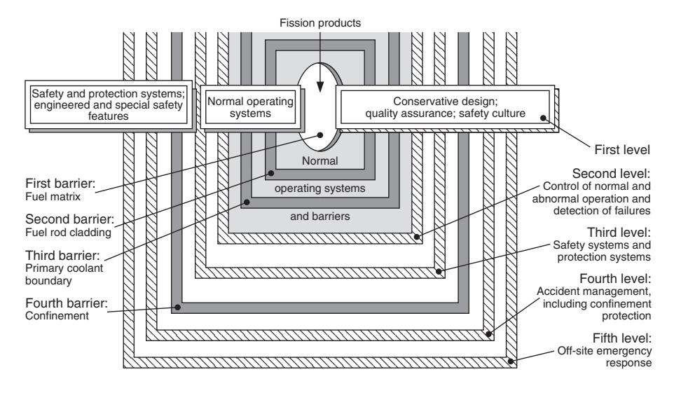

*FIG. 14.1. Defence in depth: barriers and levels of protection.*

TABLE 14.1. IEC CATEGORIES OF I&C FUNCTIONS [14.4]

| Category | Description                                                                                                                                                                                                                                                                                                                                                                                   | Typical systems                                                                                               |
|----------|-----------------------------------------------------------------------------------------------------------------------------------------------------------------------------------------------------------------------------------------------------------------------------------------------------------------------------------------------------------------------------------------------|---------------------------------------------------------------------------------------------------------------|
| A        | Functions and associated systems and equipment (FSE) that play a principal role in the achievement or maintenance of NPP safety. These FSE prevent postulated initiating events (PIEs) from leading to a significant sequence of events or mitigate the consequences of PIEs                                                                                                   | Reactor protection system, safety actuation system and safety system support features                |
| B        | FSE that play a complementary role to the category A FSE in the achievement or maintenance of NPP safety. The operation of category B FSE may avoid the need to initiate category A FSE. Category B FSE may improve or complement the execution of category A FSE in mitigating a PIE, so that plant or equipment damage or activity release may be avoided or minimized | Automatic control systems, preventive protection systems and control room data processing systems |
| C        | FSE that play an auxiliary or indirect role in the achievement or maintenance of NPP safety                                                                                                                                                                                                                                                                                                | Emergency communica tion systems and radiation monitoring systems                                    |

Within the I&C safety function, defence in depth is achieved with a hierarchy of systems that provide progressive levels of protection. In most reactors, the control system is categorized as the first level of protection and the protection (or safety) system provides the final level. In some NPPs, limitation systems provide an intermediate level of safety between the control and protection systems [14.3].

Defence in depth is not possible for every conceivable postulated failure in the I&C systems themselves. For some contingencies, defence in depth relies on the physical barriers and/or other levels of protection outside I&C systems.

#### 14.3. CATEGORIZATION OF I&C FUNCTIONS

Different I&C functions and associated systems and equipment, connected with various levels in the defence in depth philosophy, are classified according to their importance to safety. Requirements of functionality, reliability, performance and environmental properties of these I&C functions, systems and equipment have become increasingly demanding in the last decade. A categorization scheme based on IAEA Safety Guide No. 50-SG-D8 [14.1] and proposed in IEC Standard 1226 [14.4] is shown in Table 14.1. It is similar to the NRC classification [14.5]. As an example, the Canadian CANDU 6 series of plants has two categorization levels [14.6] corresponding to Categories B and A, respectively. Group 1 includes reactor and process control systems and one of the shutdown systems. These systems are not seismically qualified. The second shutdown system, the containment and portions of the emergency core cooling system (ECCS) are part of Group 2 and are qualified to withstand design basis earthquakes (DBEs). To ensure that a CMF does not disable the systems in both groups, Group 1 equipment is located in a physically separate area from that of Group 2.

# 14.4. REDUNDANCY, DIVERSITY, SEPARATION AND FAILURE TO SAFETY

For components and individual systems, defence in depth includes the use of redundancy, diversity, separation and failure to safety or fail-safe behaviour.

#### **14.4.1. Redundancy**

Redundancy is the provision of two or more components or systems which are each capable of performing the same necessary function such that the loss of any one component or system does not result in the loss of the required function as a whole. Redundancy provides protection against independent single failures and prevents a random independent failure in one component or system from disabling the desired function. Several similar instrument channels may be used to measure the same physical variable and a logic decision, such as majority voting, cross-comparison or elimination of extremes, is then applied to the redundant signals to identify and discard an erroneous channel. Thus, the measurement is still available despite failure of an instrument channel. Each channel has its own independent power supply to ensure that a common power supply fault will not prevent the measurement of the variable.

At plants where computer equipment is used for control or for essential monitoring functions, a dual computer arrangement is used for redundancy [14.6]. A failure in one computer system results in automatic transfer of all functions to the other computer system. Each is fed from an independent, uninterruptible power supply to avoid the loss of control or monitoring in the event of power supply failure. Some reactor designs provide more than two computer systems to ensure the desired redundancy.

A safety system typically has several trip channels to shut down the reactor under unsafe conditions and a trip channel can have its own sensors, logic and actuators to ensure complete independence from the others. In most cases, majority voting, such as two out of three or two out of four, is used for actuation, thereby ensuring that spurious signals do not initiate unnecessary trips. Each trip channel also has an independent power supply. Redundancy of trip channels in a safety system enables a test on the availability of a trip channel to be carried out without the loss of the trip function and while operating at full power. More than one independent safety system is a feature of some reactor systems, each capable of shutting the reactor down for the entire spectrum of PIEs.

# **14.4.2. Diversity**

Diversity is the use of two or more physically or functionally different means of performing the same function. It protects against certain types of CMF, such as those arising from design or maintenance errors. Diversity can be provided by the use of equipment and software of different designs or origins to carry out the same function (e.g. computers from different manufacturers in two safety systems in CANDU plants). Failures due to errors in the design of one system thus do not affect the performance of the other.

Other ways of ensuring diversity are by using different physical parameters (e.g. neutronic and process signals) to initiate an action or by using different physical mechanisms to carry it out. For example, one shutdown system might use solid shutoff rods while the other uses high pressure liquid poison injection.

# **14.4.3. Separation**

Separation refers to the systematic use of physical separation such as barriers or distance and of decoupling devices such as isolation amplifiers and buffers to separate components or systems performing similar functions, thus preventing a failure or localized event affecting one component or system from affecting another. Separation provides protection against common mode or cross-linked effects such as fires and missiles and prevents a fault from migrating from one system to another. Physical separation of systems also prevents inadvertent errors in maintenance, thus avoiding spurious trips.

#### **14.4.4. Failure to safety**

The failure to safety or fail-safe principle is widely used in I&C systems important to safety. In principle, equipment is selected and designed with a strong bias towards a certain output signal in the event of failure. If such spurious signals are directed towards initiating shutdown of the plant or another safety action, they are referred to as failure to safety or fail-safe modes. A classic example is the design of I&C systems on the principle of de-energization, i.e. a power supply failure puts associated equipment into a safe state and not into some indeterminate one.

Failure to safety in mechanical and electromechanical equipment is well understood and has been extensively used in systems important to safety. However, electronic and computer based components and equipment have introduced failure modes that are not understood in all possible respects and must be used with care in such applications.

#### **REFERENCES**

- [14.1] INTERNATIONAL ATOMIC ENERGY AGENCY, Safety Related Instrumentation and Control Systems for Nuclear Power Plants: A Safety Guide, Safety Series No. 50-SG-D8, IAEA, Vienna (1984).
- [14.2] INTERNATIONAL NUCLEAR SAFETY ADVISORY GROUP, Basic Safety Principles for Nuclear Power Plants, Safety Series No. 75-INSAG-3, IAEA, Vienna (1988).
- [14.3] ALEITE, W., Protective supervisory control with adequate information functions in pressurized water reactors of Kraftwerk Union, Control Theory Adv. Technol. **8** (1992) 593–619.
- [14.4] INTERNATIONAL ELECTROTECHNICAL COMMISSION, Nuclear Power Plants Instrumentation Systems Important to Safety — Classification, Standard 1226, IEC, Geneva (1993).

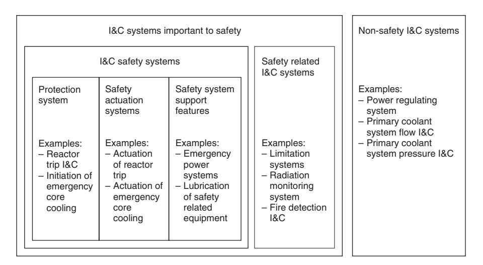

*FIG. 15.1. IAEA categorization of I&C systems important to safety.*

- [14.5] NUCLEAR REGULATORY COMMISSION, Instrumentation for Light-Water-Cooled Nuclear Power Plants to Assess Plant and Environs Conditions During and Following an Accident, Regulatory Guide 1.97, Rev. 3, US Govt Printing Office, Washington, DC (1983).
- [14.6] ICHIYEN, N.M., YANOFSKY, N., Computers' key role in CANDU control, Nucl. Eng. Int. **25** (Aug. 1980) 28–32.

## **BIBLIOGRAPHY**

NUCLEAR REGULATORY COMMISSION, A Defence-in-Depth and Diversity Assessment of the RESAR-414 Integrated Protection System, Rep. PB-293 656, US Govt Printing Office, Washington, DC (1979).

# **15. INSTRUMENTATION AND CONTROL STRUCTURES**

# 15.1. GENERAL

The I&C systems in an NPP are carefully and formally structured. This is of great importance to safety because it allows proper analysis and the enforcement of appropriate design and engineering rules. It permits each I&C function to be identified with its safety or operational goal and assists in organizing and guaranteeing appropriate separation, for example between the control and protection functions and between redundant and diverse elements. These concepts are fully discussed in

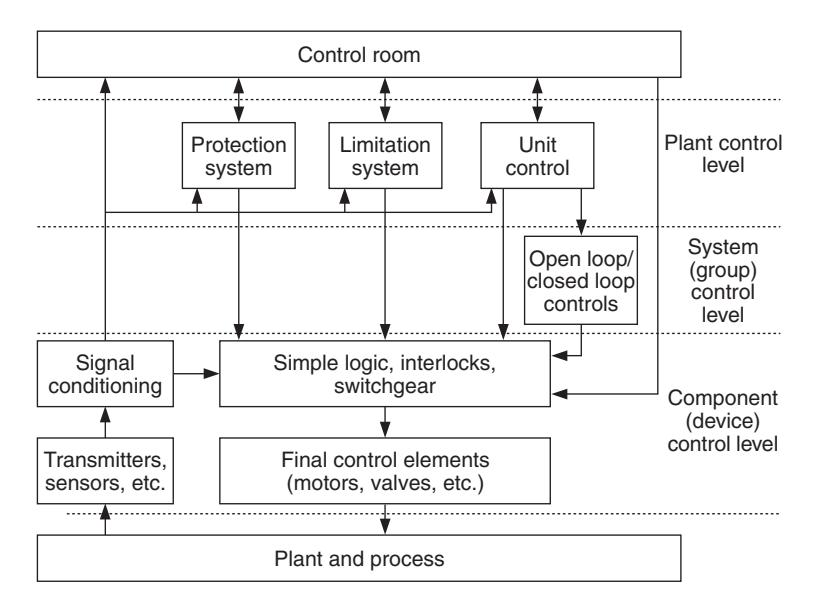

*FIG. 15.2. Structure of I&C in an NPP.*

Refs [15.1, 15.2]. Modern concepts of system classification [15.3] assist in the aforementioned processes (Fig. 15.1).

# 15.2. MAIN STRUCTURES

The processes mentioned above can be implemented using a wide variety of structures and hierarchies and many different systems exist. It is not possible here to discuss them all in detail but Fig. 15.2 may serve to illustrate some of the main features. However, the field is continually changing and the continued introduction of microprocessors and computer networks, for example, is tending to diffuse intelligence and move it downwards through the system.

Figure 15.2 shows the hierarchical levels in horizontal sections, each section being divided into different functions:

— *Plant control level.* This is the highest ranking section of the I&C, usually situated in (or close to) the control room. Functions concerning overall plant performance and mode of operation are controlled and monitored at this level. For example, it is here that the main control system identifies an external demand for power and co-ordinates and distributes signals to subsystems so that the plant can respond.

- *System (or group) control level.* Various control systems (open or closed loop) are used to keep all process variables within normal operating values. These systems are subject to intervention from protection or limitation systems if preset limits are exceeded.
- *Component (or device) control level.* At this lowest level only relatively simple logic functions and interlocks are performed, usually in connection with the actuation of single components (starting pumps, motors, etc.).

In the vertical direction, the left hand side of Fig. 15.2 shows how measurement information picked up by sensors flows to the system control level and plant control level. On the right hand side, the figure shows how information and actions of different priorities, such as manual control, protection and limitation, are transmitted to the plant. Process signals may, in some simple cases, be used to initiate interlocks and actuations; they are not shown in the diagram.

## 15.3. STRUCTURES OF SUBSIDIARY UNITS

Measured values generated by process variables are converted into electrical or pneumatic signals which are then transmitted to subsidiary units used for indication, control and protection functions. As has been stated, there is an increasing tendency for local units to do more signal processing and to contain more logic and intelligence. One such tendency is the introduction of local specialized expert systems to guide local operators and maintenance staff.

Before transmission, sensor signals are usually converted to standard signal levels (e.g. 4–20 mA or 0–10 V). For remote transmission of signals the 4–20 mA current signal is more common because of its higher noise immunity. Voltage signals (such as 0–10 V) are generally used within the control room for recorders and indicators.

#### **15.3.1. Analog systems**

Many NPPs still use analog devices to provide information to the operator, control processes and actuate the protection system. Once again, there are many different implementations but a typical analog system may comprise the following:

— *Master trip units*. Master trip units interface with a 4–20 mA transmitter or a three wire resistance temperature detector (RTD) located in some remote part of the plant. A master trip unit contains circuitry necessary to condition inputs from the transmitters and provide the desired switching functions and analog output signals to energize a trip relay at any level within the 4–20 mA or resistance input signal range.

- *Slave trip units.* Slave trip units are used in conjunction with master trip units when it is desirable to have different set points from a common transmitter. The slaves obtain their input from an analog output signal of the master trip unit. Up to seven slaves can be driven by a single master trip unit, thus allowing up to eight different set points from a single measured parameter. Unlike the master, there is no direct connection from a transmitter to a slave, nor are any analog signals generated by the slave. However, each slave has its own output logic switching function for either high or low trip which is independent of its master or any other parallel slaves.
- *Trip relays.* Each master or slave trip unit is capable of supplying trip relay loads of up to 1 A at nominal 24 VDC. Contacts from these relays provide the necessary logic functions for process variable input. The trip units are designed with output diode isolation which allows the parallel output connection of several trip units into one relay.
- *Power supply*. The trip units are designed with individual power regulation circuits so that main power supply voltages need not be precisely regulated. This allows the use of a highly reliable ferroresonant type power supply which is not likely to fail in such a way as to introduce a high voltage into the system. This feature precludes catastrophic failure of all trip units on a single bus due to power supply failure. The power supplies are designed with built-in diode isolation at the output, so they may be connected in parallel for load sharing and/or transfer without unacceptable transients in the event of a single power supply failure. Power leads bypassing the diodes are also brought out for single unit applications or for individual unit voltage sensing when several power supplies are operated in parallel.

#### **15.3.2. Digital systems**

The age related degradation of some earlier analog electronic systems and the difficulty of obtaining qualified replacement components for those systems, together with a desire for enhanced features such as automatic self-testing and diagnostics, greater flexibility and increased data availability, have prompted some reactor licensees to replace existing analog systems with digital systems. Both analog and digital systems monitor, control and protect critical plant equipment and processes to ensure that the plant operates safely and reliably. However, analog systems and digital systems perform differing tasks to accomplish these functions. Analog systems execute hard-wired instructions, whereas digital systems accomplish their functions by means of software stored in memory using processing and data transmitting equipment (hardware). The use of hardware and software gives digital systems flexibility, but also increases vulnerability to software failures and to certain hardware failures [15.4, 15.5].

# **REFERENCES**

- [15.1] INTERNATIONAL ATOMIC ENERGY AGENCY, Code on the Safety of Nuclear Power Plants: Design, Safety Series No. 50-C-D (Rev. 1), IAEA, Vienna (1988).
- [15.2] INTERNATIONAL ATOMIC ENERGY AGENCY, Protection Systems and Related Features in Nuclear Power Plants: A Safety Guide, Safety Series No. 50-SG-D3, IAEA, Vienna (1980).
- [15.3] INTERNATIONAL ELECTROTECHNICAL COMMISSION, Nuclear Power Plants Instrumentation Systems Important to Safety — Classification, Standard 1226, IEC, Geneva (1993).
- [15.4] NUCLEAR REGULATORY COMMISSION, Use of NUMARC/EPRI Report TR-102348, Guideline on Licensing Digital Upgrades, Generic Letter 95-02, US Govt Printing Office, Washington, DC (1995).
- [15.5] NUCLEAR REGULATORY COMMISSION, Final Safety Evaluation Report Related to the Certification of the Advanced Boiling Water Reactor Design, Main Report, US Govt Printing Office, Washington, DC (1994).

# **16. BALANCE BETWEEN AUTOMATION AND HUMAN ACTION**

#### 16.1. BACKGROUND

#### **16.1.1. Historical situation**

The first NPPs were rather small, simple, prototype systems and were operated at constant load by people who were interested in them and who had been educated in fundamental physical principles. The plants were over-designed, with large margins between operational levels and the protection limits. This is especially obvious in those cases in which the turbogenerator set, as a precaution, was much larger than required for the licensed rated thermal power of the core. One example of this is the NPP at Obrigheim in Germany, which was designed for 230 MW(e) and runs today at about 340 MW(e). In most cases, only a few AOOs were defined and the MCR contained information and control equipment only for the main control and protection systems. Most control actions were performed manually. The operators tended to prefer this, possibly because they did not trust the equipment of the day.

# **16.1.2. Future situation**

In future, a great deal of experience in plant and system design, operation and maintenance will be available and margins to preserve safety will need only be very small. Indeed there will be economic pressure to make them as small as possible. Fully automatic control systems and a protective structure based on a defence in depth strategy and/or with diverse functions will be fitted. These will be implemented with extended, distributed, digital techniques.

Load following capabilities will fulfil all grid requirements and may be optimized by the plant operators or even directly by remote grid controllers. Many AOOs, together with their PIEs, will be specified from experience and from theoretical considerations. They will be managed by automatic protective functions, including normal protection systems and extended limitation systems. For long term sequences, manual actions based on specified procedures and well processed information will also be used. Remaining risk will be minimized to the utmost extent.

The MCR will have a cockpit architecture for operation by one person and will provide very capable, diverse information systems. The entire operating staff will work mainly as observers on surveillance, optimization and maintenance tasks but they will need to be trained very intensively for management of the very improbable accident. Most tasks will be performed by one operator only but additional staff will be provided for social reasons.

# **16.1.3. Present situation**

The plants at present in operation vary widely in terms of automation. These differences occur especially between countries but also exist between plants in the same country. Thus, the balance between automation and human action in current I&C systems varies considerably [16.1] and the following discussion is therefore in general terms. A brief explanation of the principal disadvantages and advantages of the two extremes is given and ways of optimizing between them are discussed.

## 16.2. DISADVANTAGES AND ADVANTAGES OF HUMAN ACTION

#### **16.2.1. Disadvantages**

Errors are part of human life and humans need time to think and act. Guidance for NPP staff is necessary and is provided in the form of repetitive training and easily understandable information. Associated procedures must be available in manuals, either on paper or preferably on VDUs. Humans fail under conditions of overload or understimulation and are not reliable when performing repetitive tasks. For these reasons repetitive actions or those following short and long term occurrences should be automated.

Humans also tend to follow a first, possibly wrong, intention and to stay with it ('tunnel effect'). Therefore, high level overviews or even abstract information should always be displayed in conjunction with detailed data. Humans may erroneously and automatically follow a known but out of date procedure when experiencing a new and/or surprising situation. This may happen especially after plant modification and retraining. Careful repetitive training may help, together with the use of quite different operational methodologies.

Individual members of the current staff or successive generations of operators will differ in capability and will behave differently in the same situation. They therefore need different guidance. This may be supplied as instructions with a surplus of overall plant information to avoid too much freedom for decision making.

#### **16.2.2. Advantages**

Humans can be trained to remember and recognize quite complex situations and transient conditions and to extrapolate from them to a certain extent. They can filter noisy information and interpolate incomplete data sets. They are able to interpret abstract and complex information to generate a reasonable overview and are then able to ask for the right details. Team members are able to discuss matters with each other and to evaluate and understand unexpected situations such as those involving multiple failures or even beyond design sequences of events. They learn from experience to enlarge their confidence in their capabilities and creativity.

# 16.3. DISADVANTAGES AND ADVANTAGES OF AUTOMATIC ACTION

# **16.3.1. Introduction**

It is necessary to define what is meant by 'automation' and hence 'automatic action'. Today, the expression 'machine' covers all closed loop functions of a control nature, including those of a protective system. This term is also applied to many information systems because of their highly sophisticated, automated signal processing and information handling and their advanced ergonomic displays. In the following, the information handling functions, together with related human actions, are defined as manual control. Only automatic control functions are considered below.

# **16.3.2. Disadvantages**

The most important disadvantage of an automatic control system is the way in which good performance depends on humans. This applies to the original design as well as to maintenance and/or enhancement of the system. Reasons for problems include inadequate organization (i.e. barriers against effective work), inadequacy of tools, designers or operators and lack of time or even money. Most failures are caused by mismatches between the real needs, the specification of requirements and the completed application. Plant designers should have knowledge of all of the capabilities of I&C systems, carry out a thorough analysis and be able to specify real needs in an optimal manner. Later they must be able to understand the applied design. Only exactly specified tasks will be fulfilled as expected and, for example, situation dependent modifications or corrections should be avoided if they are not additionally specified in detail by a set of all their dependences.

In the case of hard-wired I&C, it was possible to apply only limited, simplified and linearized modules. This did not mean that such systems could not perform a large, if tailored, variety of sophisticated functions but to do so they had to be based on reliable background knowledge.

The possibility of failure leads either to the need for robust designs which are failure resistant until the next maintenance period or to the use of self-checking systems which permit quick failure detection and early repair. In hard-wired systems the single failure is the most important type, although CMFs do need to be considered (depending on available diversity). In software based systems, especially the software part itself, CMFs are not only most important but also tend to have more serious consequences. Avoidance of CMFs in software requires considerable effort and this is why the reliability figure for a software based system with importance to safety will not, at present, be accepted as better than 10–4 per demand or per year.

#### **16.3.3. Advantages**

Automatic control functions have many advantages if they are carefully applied and that is indeed the reason for their success and popularity. Automatic control actions work rapidly and are long lasting. They are reliable with respect to exact execution as well as in stressful or tedious situations. An automatic system will act correctly in single as well as in repetitive modes for years and for generations of operators. It may be based on large amounts of data requiring significant processing, special filtering and/or low drift and can provide high accuracy and performance with complete documentation and recording. Automatic control functions can be designed to provide early and sophisticated diagnosis and this permits only the smallest countermeasure to be taken to attain the desired result.

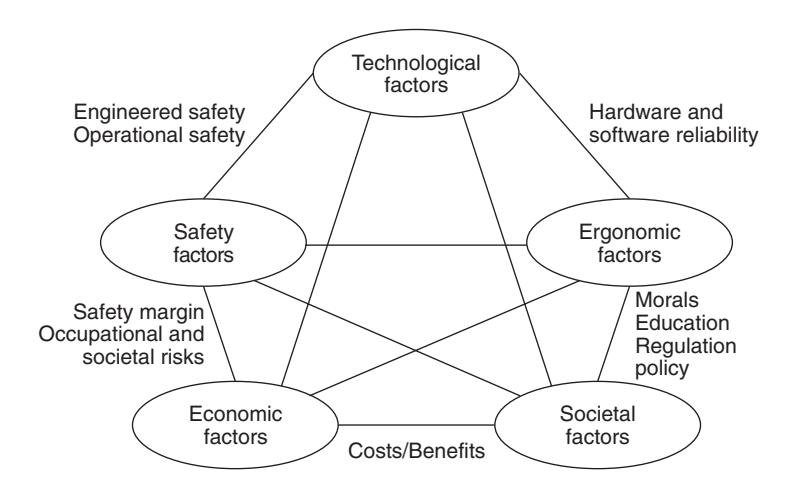

*FIG. 16.1. Factors affecting balance between automation and human action.*

Functions can be simulated in parallel with the process being controlled and can use prediction and 'fuzzy' control principles to accommodate human reactions. However, these possibilities can only be fully realized if implemented on modern digital equipment and for functions which can be licensed according to their category of safety.

# 16.4. BALANCE AND ASSIGNMENT OF FUNCTIONS

There are many optimal deterministic solutions to the problem of assigning tasks and functions in the great number of NPP types now operating. The solutions also vary during the life of a particular plant, being different, for example, during backfitting from during construction. However, in all situations the assignment can be done according to a common and well accepted methodology. The relevant factors are set out in Fig. 16.1.

The process, from first function analysis and task assignment to final balancing of functions and tasks, is iterative with, fortunately, a rather flat optimum. This is so because of the great flexibility of humans (which nowadays is continually enhanced by repetitive training on sophisticated simulators), the great capability of modern I&C systems (which are still under further development) and the extensive overlap between the two. This overlap has been optimized as a result of wide ranging studies and experiments on human behaviour and capabilities. It remains necessary because of the large differences in capabilities and skills between different (present and future) operators.

The IEC standard on the design of MCRs [16.2], together with its supplements (especially that on function analysis and assignment) [16.3, 16.4], gives good guidance. There is also an IAEA publication on the role of automation and humans in NPPs [16.1] which describes the problems and proposes a methodology (see also Ref. [16.5]).

#### **16.4.1. First, rough assignment of tasks and functions**

There are many tasks which can obviously be assigned immediately to automation or to humans. Decision criteria which tend to favour automation may include:

- Shortage of time: nearly all frequent AOOs (except power changes or heat transfer safeguards in the case of small or medium sized leaks) necessitate action in seconds or minutes.
- High risk in the case of mistakes in tasks for which detailed procedures are easy to define.
- Boring or repetitive tasks and those which would obviously lead to cognitive overload.

On the other hand, complex surveillance and analysis functions should include the operator, especially if they help to enhance motivation and well-being.

There are other tasks for which one technique is well suited but which could be done either way. For example:

- On the one hand, feedback controls associated with mechanical systems;
- On the other, seldom used startup tasks on systems with interrupted operation.

When these allocations have been made, there will remain many functions which need to be more formally assessed. These are given a preliminary assignment. Experience from similar plants in operation may help in this. Such assignments should be well documented for later revision or correction. The recommended methodology is described in detail in Ref. [16.1].

#### **16.4.2. First refinement of design and assignment**

It is assumed that when the rough assignment is complete, a clear view of the characteristics of the plant and most of its details will have been formed. The design team, with members from all disciplines, especially those with knowledge of human factors and all phases of operation, can now refine the first scheme. Technological, safety, economic, ergonomic and sociological factors have to be taken into account. Startup conditions as well as real time behaviour during power operation, AOOs and PIEs which may lead to accident conditions need to be considered. Maintenance and repair are also important, as are the acceptable workload, assumed intelligence and motivation of the operators. It is necessary to review anticipated load following requirements and representative reported events from similar plants. A first estimation of the remaining risk is then performed. All of these results should be elaborated as far as possible using modern design tools and formal methods. Complete records of all activities will ease later licensing.

#### **16.4.3. Final balancing of tasks and functions**

The last stage of the design review includes a final balancing of tasks and functions in order to:

- Optimize the overall functionality for economic power production;
- Ensure necessary reliability to minimize the risk of release of radioactive material to the environment and to minimize the dose rate to the operating staff by optimizing necessary periodic activities such as calibration, checking and repair;
- Balance the relationship between availability (reliability) and resources (costs).

This review can be done theoretically but is much more effective if simulator studies can be included. They will considerably enhance the reality of activities assigned to the operating staff. At this stage an advanced level of design and simulation of the actual information system is of utmost importance because the capability and quality of human actions are only as good as the capability and quality of the basic information system, supplementary systems for special surveillance, and diagnostic and other operator support systems. These studies may be completed by on-site experiments for selected cases and, later, optimized by operational experience.

Because all reported severe occurrences up to now have shown enough time for human decision making, any optimization of cases such as these can contribute considerably to minimizing final risk. It has been suggested (and investigations are intended to confirm this for relevant situations) that human actions based on optimal information are much more effective in the long term than automated systems. The latter tend to be limited by the information available at the time of design. However, humans do not act effectively as a backup to machines for typical machine functions, namely those requiring fast action based on large and complex data processing.

If any of the required goals have not been reached by this stage, new functions have to be added or existing ones modified, enhanced or reassigned. If the reliability figure is too small, a recategorization of single or even of all functions may be performed, possibly by complementing the consequence oriented categorization method with a risk oriented one [16.6]. Finally, all provisions and activities for situations beyond the design basis have to be considered. This is done to achieve further minimization of consequences and therefore of the remaining risk. These activities, which

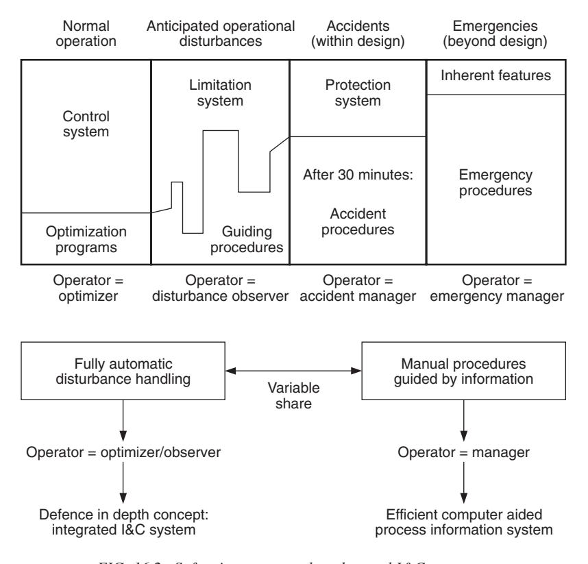

*FIG. 16.2. Safety improvement by advanced I&C concepts.*

it is hoped will seldom be needed, will become one of the most important tasks of future operating staff when the role of operator changes to that of optimizer and accident manager (Fig. 16.2).

#### **REFERENCES**

- [16.1] INTERNATIONAL ATOMIC ENERGY AGENCY, The Role of Automation and Humans in Nuclear Power Plants, IAEA-TECDOC-668, Vienna (1992).
- [16.2] INTERNATIONAL ELECTROTECHNICAL COMMISSION, Design for Control Rooms of Nuclear Power Plants, Standard 964, IEC, Geneva (1989).
- [16.3] INTERNATIONAL ELECTROTECHNICAL COMMISSION, Nuclear Power Plants Main Control Room — Verification and Validation of Design, Suppl. 61771, IEC, Geneva (1995).
- [16.4] INTERNATIONAL ELECTROTECHNICAL COMMISSION, Nuclear Power Plants Main Control Room — Application of Visual Display Units, Suppl. 61772, IEC, Geneva (1995).

- [16.5] Balancing Automation and Human Action in Nuclear Power Plants (Proc. Symp. Munich, 1990), IAEA, Vienna (1991).
- [16.6] INTERNATIONAL ELECTROTECHNICAL COMMISSION, Nuclear Power Plants Instrumentation Systems Important to Safety — Classification, Standard 1226, IEC, Geneva (1993).

# **17. HUMAN FACTORS ENGINEERING**

#### 17.1. INTRODUCTION

Since human operators play a primary role in the safe and reliable operation of NPPs, control rooms must provide them with an environment which optimizes their performance and productivity. This accommodation of human performance and the limits which it sets on the design and operation of systems is referred to as human factors engineering.

Before the accident at TMI, control rooms were designed using intuitive common sense and applicable engineering practices. However, accident analyses after TMI clearly demonstrated the vulnerability of the human link in the operation of complex systems such as NPPs and established the need for human factors engineering in the design and operation of control rooms.

The earliest application of human factors used ergonometric and anthropometric standards. These were applied mainly to the physical layout of control panels and to the physical manipulations performed by the operators. In the last 15 years, operating reports from some NPPs have identified human error as a major contributory factor in more than 60% of incidents. This has resulted in the human operator increasingly being recognized as an important component in the overall operating chain. Human cognitive strengths and weaknesses, interpersonal communications, etc., are now being taken into account in the design and operation of control rooms.

Human factors engineering is the systematic application of human factors principles to improve the design and operation of systems involving people. It is an interdisciplinary speciality which influences the design of equipment, systems, facilities, training and the operational and organizational environment to promote safe, efficient and reliable operator performance. It ensures that the requirements of the people who have to operate the plant are taken into account and is increasingly being applied to new designs and backfits of NPPs. It applies in particular to control rooms but may have an influence almost anywhere in the plant.

The application of human factors engineering in NPPs has been further accelerated by regulatory agencies and standards organizations through the publication of standards and guidelines for control room design. Some of them clearly establish human factors engineering as an important factor in this activity [17.1–17.8].

IEC Standard 964 [17.5] contains the most complete description of a methodology for the design of an integrated control room. It takes into account the control room staff, the HMI, the operating procedures and the training programme. The standard proposes a functional design methodology to address systematically the following issues:

- Relationship between power production and safety goals;
- Balance between manual and automatic control;
- Human factors (anthropometrics, psychology and task analysis) and human reliability.

For example, the application of human factors engineering using the functional design methodology identifies:

- Information that should be presented on the plant situation or condition;
- Appropriate control actions that must be carried out;
- Layout of controls and panels which facilitate operator activities;
- Operating procedures which must be supplied;
- Training that will be required.

# 17.2. PRESENTATION OF INFORMATION

Information presented by instruments and VDUs in the control room forms the most important HMI for operators monitoring and controlling the plant. Human–machine interaction through VDUs has therefore received considerable attention in the last decade. Design principles have been developed for the layout, positioning, grouping and coding (i.e. shape, colour, size, etc.) of operator controls, the colour of indicators and the action of switches and push-buttons. Standards on these topics are now available to assist design engineers [17.6]. With the increasing use of VDUs, guidelines are now available on human factors engineering topics such as colour, size and brightness of displays, effective use of icons, navigation through myriads of displays and the content and context of displays [17.4, 17.8]. While these standards discuss how to present information, standard methods for defining what to display are not yet available. However, design methodologies defined, for example, in IEC 964 [17.5] do provide a systematic approach to identifying the information needed for different tasks and situations.

The following are some recent issues in information presentation.

- (a) *Overview presentation.* In addition to locating several VDUs in strategic places, recent designs have also incorporated a large dynamic display in the centre of the control room. Such a display can be seen from anywhere in the room and allows the plant status and other plant information to be seen by the entire control room crew.
- (b) *Display by context.* The operator is presented with the information that is most relevant to the plant condition or task in hand. As the plant condition or the task changes, information needs change and displays adjust to the new context. Specifically, context selectivity can be achieved by prioritizing the importance of plant data according to a set of predefined reactor states, conditions and controlled trajectories between states. The information can then be presented by function, system or another suitable combination. Plant parameters can be shown graphically, such that the plant condition or trajectory and associated limits are also displayed. Other, less immediately relevant information is not hidden but is made available on demand. A good example of information presentation by context is to be found in the graphical high resolution colour VDUs installed at the German Konvoi plants.
- (c) *Navigation.* The method of navigating through a suite of displays has a direct impact on the usability of VDUs for information access. Modern control rooms use an increasing number of displays for monitoring, diagnostic and decision making purposes and operators should be able to move smoothly between them without a burden of interface demands on their perceptual and cognitive abilities. They should be helped to avoid user disorientation, inefficient access, the tunnel effect, memory recall problems and high workload. For example, navigation burdens such as excessive switching between, or scrolling through, displays can cause attention to be diverted from the primary task of monitoring the plant and can cause unacceptable delays at a critical time. To address navigation issues in computer display suite development, the following key steps should be considered:
  - Determine the characteristics of the tasks to be performed and the users performing them, e.g. by task analyses;
  - Select the type of display suite structure and group the displays according to some criterion within the selected structure, e.g. according to functions to be performed;
  - Provide navigation aids such as maps that will facilitate movement through the structure;
  - Validate the navigational usability of the display structure and aids by extensive testing with the end user, i.e. the plant operators.

# 17.3. CONTROL ASPECTS

In an NPP with conventional control systems, control actions are initiated using mechanical switches, buttons, knobs, etc. Human factors considerations applied to such control initiating devices include:

- Uniformity in control action, e.g. right turn for 'on' and left turn for 'off';
- Uniformity in mounting on control panels;
- Ergonomic arrangement on control panels, etc.

However, in plants with computer based control systems, commands which initiate actions or change set points tend to be entered via regular alphanumeric or special purpose keyboards and VDUs. Modern computer systems and advanced graphical interfaces permit several new 'soft' methods (i.e. via VDUs) of entering commands and data. For example, graphical representations of mechanical devices such as switches and buttons on VDUs can be manipulated using a touch screen, light pen or mouse. Also, set points and other numerical inputs are entered from analog slider controls or push-buttons on VDUs rather than by typing numerals directly with a keypad. Human factors considerations which apply to the mechanical counterparts then apply to the electronic equivalents.

Some of these modern techniques are highly effective for entering information with minimal error. However, sound human factors engineering has to be applied to designing such interfaces. Supplements to IEC 964 [17.9, 17.10] provide assistance to designers of VDU command interfaces together with some understanding of the processes by which humans interact with the plant through VDUs. Basic principles for designing VDUs include:

- Clear feedback of entered information to confirm the correct entry of information;
- Tolerance to all possible types of error made by the user in entering information, with positive response to alert the user to any unacceptable mistake.

A multimodal system may provide a more flexible and robust interface environment. For example, a combination of conventional control devices and auditory input devices may facilitate control tasks.

#### 17.4. LAYOUT OF CONTROLS AND PANELS

The layout of control room controls and panels was carried out in first and second generation control rooms using common sense and neatness of arrangement. Such methods usually resulted in the layout of controls and panels by a process system and, in general, did not take into account the information needed to carry out a task or a procedure. Consequently, these layouts increased the monitoring and operational workload on operators. In the last decade, human factors engineering has indicated improved layouts and has been playing a greater role in the layout process. An effective layout groups the information that the operator finds most convenient in carrying out a particular task. Function and task analyses provide systematic methods for identifying information groupings and allocating them to regions on panels. Relative positions of panels are determined through a link analysis aimed at minimizing the need for operators to walk around while performing tasks.

Supplementary standards to IEC 964 for operator controls in NPPs provide design principles for the layout of controls and panels [17.6, 17.9, 17.10].

#### 17.5. INTEGRATION OF PROCEDURES AND OPERATIONS

With the availability of IEC 964, human factors engineering principles are increasingly being used in the design of integrated control rooms. Two of the major outcomes of applying the methodology are that operating procedures are:

- Well integrated with the operational and safety goals and objectives of the plant;
- Developed in conjunction with the design and not after its completion.

Human factors engineering puts greater emphasis on procedures which can be carried out without placing a significant cognitive burden on operators and without requiring operators to perform heavy mental or physical tasks. Procedures are evaluated and validated in full-scope simulators to ensure that they can be effectively carried out (Section 17.6). Human factors engineering is also beginning to influence the physical presentation of procedures in order to enhance uniformity and consistency of interpretation. Guidelines have been developed in some countries (e.g. Canada and the USA) on standard procedures layouts and icons as well as on the procedure lexicon so that operator instructions are unambiguous and result in the same action from any operator.

# 17.6. FULL-SCOPE SIMULATORS

While full-scope simulators are increasingly used for training control room staff, they are also providing excellent opportunities to evaluate and validate human factors engineering issues in NPP operation. For new plant designs, full-scope simulators are being built before the plant is constructed to assist in designing control rooms in accordance with sound human factors engineering. The availability of these simulators also makes it possible to develop and exercise operating and emergency procedures long before plants begin to operate. For existing plants, full-scope simulators enable control room I&C upgrades and backfits to be evaluated and validated. Checking the effectiveness of modifications before they are implemented in the control room ensures that human factors considerations such as the suitability of HMIs, interpersonal communication and the cognitive load on operators have been taken into account in the changes. The simulator also provides an opportunity for operators to give feedback to designers on the proposed changes to the operators' environment.

#### **REFERENCES**

- [17.1] NUCLEAR REGULATORY COMMISSION, Advanced Human–System Interface Design Review Guideline, Regulation NUREG/CR-5908, US Govt Printing Office, Washington, DC (1994).
- [17.2] NUCLEAR REGULATORY COMMISSION, Guidelines for Control Room Reviews, Rep. NUREG-0700, US Govt Printing Office, Washington, DC (1981).
- [17.3] ELECTRIC POWER RESEARCH INSTITUTE, Human Factors Guide for Nuclear Power Plant Control Room Development, Rep. EPRI-NP-3659, Palo Alto, CA (1984).
- [17.4] MARCUS, A., Graphic Design for Electronic Documents and User Interfaces, Tutorial Series, ACM Press (1992).
- [17.5] INTERNATIONAL ELECTROTECHNICAL COMMISSION, Design for Control Rooms of Nuclear Power Plants, Standard 964, IEC, Geneva (1989).
- [17.6] INTERNATIONAL ELECTROTECHNICAL COMMISSION, Operator Controls in Nuclear Power Plants, Standard 1227, IEC, Geneva (1993).
- [17.7] INTERNATIONAL ELECTROTECHNICAL COMMISSION, Verification and Validation of Control Room Design of Nuclear Power Plants, Standard 1771, IEC, Geneva (1995).
- [17.8] INTERNATIONAL ELECTROTECHNICAL COMMISSION, Visual Display Unit (VDU) Application to Main Control Room in Nuclear Power Plants, Standard 1772, IEC, Geneva (1995).
- [17.9] INTERNATIONAL ELECTROTECHNICAL COMMISSION, Nuclear Power Plants — Main Control Room — Verification and Validation of Design, Suppl. 61771, IEC, Geneva (1995).
- [17.10] INTERNATIONAL ELECTROTECHNICAL COMMISSION, Nuclear Power Plants — Main Control Room — Application of Visual Display Units, Suppl. 61772, IEC, Geneva (1995).

#### **BIBLIOGRAPHY**

INTERNATIONAL ATOMIC ENERGY AGENCY, The Role of Automation and Humans in Nuclear Power Plants, IAEA-TECDOC-668, Vienna (1992).

Man–Machine Communication in Nuclear Power Plants (Proc. Specialists Mtg Schliersee, 1988), Gesellschaft für Reaktorsicherheit, Garching (1988).

Man–Machine Interface in the Nuclear Industry (Proc. Conf. Tokyo, 1988), IAEA, Vienna (1988).

The Human Factors Information Feedback in Nuclear Power: Implications of Operating Experience on System Analysis, Design and Operation (Proc. Specialists Mtg Roskilde, 1987), Risø Natl Lab., Roskilde (1987).

# **18. COMPUTERS FOR PLANT MANAGEMENT**

# 18.1. HISTORICAL SITUATION

Computers are installed in all NPPs. At first, in the earlier plants, they were used mainly to support the operators and were restricted to such tasks as alarm recording and core supervision. However, as computer technology developed and more operating experience was obtained, applications of this type increased considerably. For further study, the reader is referred to Ref. [18.1]. Computer technology was later also introduced for plant protection as well as for the supervision and control of process systems. This development is described in other sections of this book. An area which traditionally was not regarded as a part of the I&C function is the use of computers for administration, maintenance, engineering and emergency management, which can be collectively called plant management.

Although the support systems for this area were developed as standalone items, they very often required similar data from the plant and it is therefore natural that further optimization of the different activities followed better integration of the different computers. Another driving force was that associated with ageing of the plant and its components, which necessitated more data for specialist analysis and therefore better computer facilities. This requirement is met in existing plants by the installation of networks (new plants are normally already provided with them), which permit computer interaction and access to plant data by all users.

Integration of computer systems also has the benefit that the information which control room operators need from other computers is easily available to them. Previously, operators used many different types of VDU for this purpose, each requiring its own procedure for access, and mistakes were possible. An integrated design can use the same VDUs and a standardized procedure for all data. This is especially valuable when planning or supervising daily tasks or operations such as refuelling, system startup, ongoing maintenance and the testing of systems after maintenance.

# 18.2. PRESENT SITUATION

## **18.2.1. Maintenance support**

One of the first actions which followed the integration of computers into a plant network was to connect the maintenance and process computers with each other. The plant maintenance department needs data on the operation of plant components for planning purposes and, as plants become older, knowledge about component condition and ageing is growing more important. A connection between the two computer systems can also be useful for unplanned repair activities. Systems are now installed in which fault reports on process components are automatically transmitted directly to the maintenance department. For the operators it is necessary to know what maintenance is being performed or is planned in the near future. Such information can easily be displayed in the control room by using data from the maintenance computer.

#### **18.2.2. Engineering support**

Operation is normally supported by an engineering department which provides technical support and modifications to systems. Different specialists are therefore interested in process data for evaluating operation. Often special software is installed for this purpose in specialist workstations. There is a trend for such workstations to be connected to the same network as the process computer.

Typical examples of engineering department tasks are as follows:

- Evaluating normal operation of the plant or plant transients in order to generate reports to management or the authorities. These evaluations will use historical process values, trend curves, signals for trip initiation and time recordings of the status of process components.
- Evaluating trends in the process systems for following up important characteristics such as water chemistry, radiation levels in the process systems and the effectiveness of filters in cleanup systems.
- Evaluating the thermal ageing of materials in order to estimate the lifetime of major components.
- Summarizing the operation of the plant.
- Following up new control room procedures.

#### **18.2.3. Environmental supervision**

Data important to the monitoring and analysis of radioactivity release to the environment are normally stored in a special computer which receives information from one or all of the reactors on the same site. Such computers are used by the technical staff for reporting to the authorities and many of the time displays from this special computer are installed in the technical support centre (TSC). The information is also used by the accident management group in the emergency centre.

Inputs for this purpose come from:

- Monitoring equipment installed inside the plant for measuring the release of radioactivity through water or by air to the environment;
- Monitoring equipment installed in the plant's surroundings;
- A meteorological tower providing information about wind speed and direction, temperature at different heights, etc.

Under accident conditions, additional information about the radioactivity levels in the surroundings is provided by mobile groups and is fed into the computer manually. The computer is provided with different types of software for the reporting of normal and accident situations.

# **18.2.4. Core management**

The core management computer was one of the first to be connected to the process computer. Today, 3-D core supervision computers are standard installations on-site. Such computers are used by the operators for planning control rod movements and by reactor physics personnel for fuel management. Some plants use the results of real time core calculations for interlocking control rods during manual control.

The core supervision computer normally receives data from:

- Neutron flux instrumentation;
- Control rod position indicators;
- Instrumentation measuring other reactor parameters such as pressure, inlet temperature, main circulation flow and feedwater flow.

Typical information supplied to the operators consists of:

- Power distribution through the core;
- Xenon distribution;
- Control rod sequences for manual control.

The last type of information is especially important if, owing to some fault in a control rod mechanism, the planned control rod sequences cannot be carried out and other sequences have to be sought.

The information derived by the core supervision computer is also used by reactor physics staff for estimating:

- Fuel burnup;
- Concentrations of different isotopes in the core;
- Lifetimes of different core components such as fuel assemblies, control rods and in-core neutron detectors.

In some BWR plants the core supervision computer is also used for calculating the gain adjustments on the in-core detectors. This is done by using the signals from a travelling probe and the outcome of these calculations is used by the maintenance department.

# 18.3. TYPICAL DESIGN

The design of a typical integrated plant computer network is shown in Fig. 18.1. Such a network can be divided into subnetworks such as those for the I&C systems, the processes, the plant computer and maintenance. The subnetworks are connected to each other through some type of gateway to control data flow. The same type of workstation can be used for the supervision of processes in the control room as for the display of information from other computers.

Obviously such networks can be a risk to operation and safety if security is not built in from the beginning. Stringent safeguards are therefore needed to prevent unauthorized access to the information networks, especially access from outside the plant.

#### **REFERENCE**

[18.1] INTERNATIONAL ATOMIC ENERGY AGENCY, Operator Support Systems in Nuclear Power Plants, IAEA-TECDOC-762, Vienna (1994).

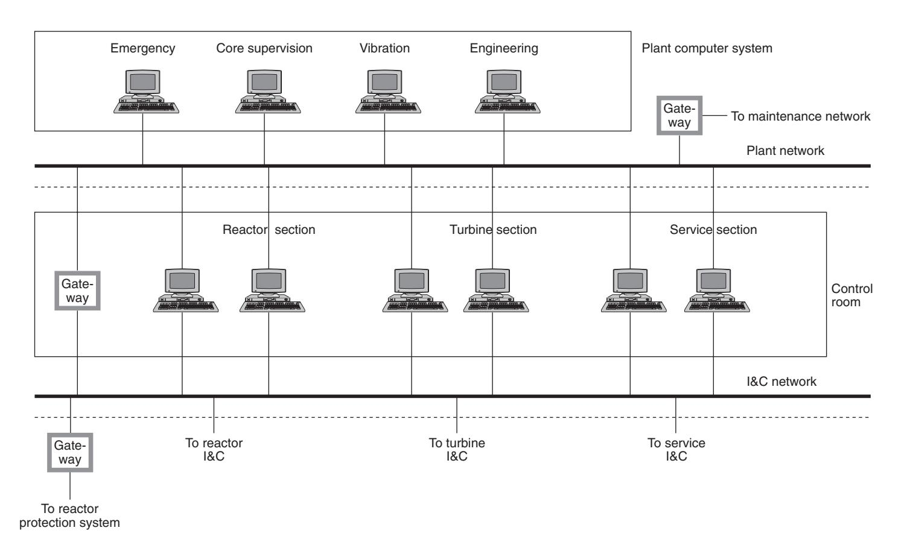

*FIG. 18.1. Example of an integrated computer network.*

# **19. ACCIDENT MONITORING INSTRUMENTATION**

Since TMI and, to a lesser extent, Chernobyl, accident monitoring instrumentation has become an important feature of NPP I&C [19.1]. Its purpose is to provide the operators and their backup teams with necessary accident management information and to ensure that the sources of this information are, and remain, trustworthy. The specifications in this context are to be found in Refs [19.2–19.5] and the following is largely paraphrased from Ref. [19.2].

# 19.1. DESIGN CRITERIA

Under accident conditions, the operators require information so that they can:

- (a) Take those preplanned manual control actions for which automatic control is not provided and which are necessary to prevent or mitigate the consequences of the accident. Such actions, specified in the plant safety analysis, are compiled in the post-accident operating procedures.
- (b) Determine whether critical safety functions (CSFs) related to reactivity control, core cooling, reactor coolant system integrity, heat sink, containment integrity and radioactivity surveillance are challenged and are being accomplished by the RPS, the engineered safety features system and/or their essential support systems.

# 19.2. VARIABLE TYPES

The variables to be measured can be grouped into two categories based on the above mentioned design criteria:

- (A) Variables that provide information regarding the accomplishment of specific safety functions for design basis events and which are required by the operator to take manually controlled safety actions for which automatic control is not provided;
- (B) Variables that provide information on whether CSFs, e.g. those related to reactivity control, core cooling, reactor coolant system integrity, heat sink, containment integrity and radioactivity surveillance, are being challenged, maintained or accomplished.

If CSFs are associated with the parameters that describe the integrity of safety barriers, those variables must also provide information on the potential or actual release of fission products through the barriers.

# 19.3. SELECTION CRITERIA FOR VARIABLES

The plant response to PIEs has to be evaluated to establish the resulting accident sequence. This evaluation can then be used to select the accident monitoring variables and information display channels which are required by the operator to perform preplanned manual actions for:

- Mitigating design basis events;
- Monitoring the accomplishment of plant safety functions;
- Assessing whether barriers to fission product release are being breached;
- Ensuring that the parameters which guarantee the integrity of such barriers have not exceeded the design basis values.

The process for selecting category A variables includes the identification of:

- Design basis events for which manual safety system action is required;
- Preplanned operator actions to deal with accident situations;
- Monitored variables needed for preplanned operator actions.

Category A measured variables are plant specific and should be selected in accordance with accident analysis and emergency operating procedures.

The process for selecting category B variables includes the identification of the monitored variables which provide the most direct indication needed to assess the disturbance, maintenance or accomplishment of the CSFs related to the following:

- (a) *Reactivity control.* The measured variables must show that reactivity control has been achieved. Although the measured parameter should be neutron flux, this does not preclude the use of other variables or combinations of variables if properly justified. If neutron flux is used, the range has to be sufficient. Diverse and redundant verification of reactivity control functions may be accomplished through measured variables indicating control rod position, reactor coolant boron concentration and cold leg water temperature.
- (b) *Reactor core cooling*. The measured variables should indicate core cooling performance as well as its existence and long term surveillance. The parameters to be measured and their suggested ranges of measurement are as follows:
  - Hot and cold leg water temperature: from zero to the saturation temperature corresponding to the design pressure of the reactor coolant system;
  - Reactor coolant system pressure: from zero to the design pressure of the reactor coolant system, plus a margin of ≥10%;
  - Pressurizer level: from the bottom of the hot leg to the top of the pressurizer;
  - Reactor vessel coolant level.

Backup verification of core cooling may be done by measuring coolant temperature at the core exit.

(c) *Reactor coolant system integrity.* The measured variables should detect and give an alarm signal of a potential or actual breach of the reactor coolant pressure boundary that could produce a loss of coolant in excess of normal make-up capabilities. The spectrum of reactor coolant pressure boundary breaks extends up to, and includes, the largest double ended pipe break.

The variable used for detection should be the pressure in the reactor coolant system. In addition, the containment pressure and the containment sump level should be used to detect an actual breach. The suggested measurement ranges are as follows:

- Reactor coolant system pressure: from zero to design pressure, plus ≥10% margin;
- Confinement sump level: from bottom to top, plus ≥10% margin;
- Confinement pressure: from zero to design pressure, plus ≥10% margin.
- (d) *Heat removal from primary system.* The measured variables must indicate the existence of heat removal and its performance. The measured parameters should be:
  - Level in the steam generators;
  - Pressure in the steam generators.
- (e) *Primary reactor containment integrity.* The measured variables must indicate the performance of the containment integrity function and detect and give an alarm signal of any potential for a breach. The measured parameters and their suggested measurement ranges are as follows:
  - Containment pressure: from zero to a value which ensures that the containment design pressure is within the range of optimum instrument accuracy (in US practice this value is selected as three to four times the design pressure for concrete and steel containments, respectively);
  - Containment hydrogen concentration: from 0 to 10% by volume;
  - Remotely operated containment isolation valves position: closed/not closed.
- (f) *Radioactivity surveillance.* The measured variables should detect and give an alarm signal of a breach of the safety barriers, i.e. the fuel cladding, the primary reactor coolant pressure boundary and the containment. The following parameters may be measured:
  - Activity in the reactor coolant system;
  - g dose rate in the containment;
  - Activity concentration in the containment;
  - g dose rate at established points outside the containment;
  - Activity concentration of selected nuclides at established points;
  - Activity in effluent from the containment or from buildings connected to the containment by penetrations or hatches.

Backup verification of reactor coolant activity may be accomplished by laboratory analysis (g spectrum measurements).

# 19.4. SEVERE ACCIDENTS

Two major functions are required in severe accidents which are absent under normal loss of coolant accident (LOCA) conditions:

- Controlled pressure release from the containment in order to protect its integrity. This can be a problem at the beginning of the accident before the core has melted and been ejected from the reactor vessel. There can be two release paths to the environment: directly, if the radioactivity level in the gas phase of the containment is relatively low, and through a filter if the gas must be cleaned.
- Controlled cooling of the core debris in a water pool over a long period.

For both functions, I&C is required which must operate for a very long time in the severe accident environment. Typical examples of such equipment are:

- Monitors of the containment environment to measure parameters such as activity, temperature, pressure, water level, and hydrogen and oxygen levels;
- Monitors of the core debris in the water pool to measure activity and temperature as well as, possibly, reactivity;
- Process systems inside the containment for short or long term cooling of the core debris;
- Process systems outside the containment for pressure release from the containment or for external cooling of the core debris;
- Hydrogen and oxygen recombiners outside the containment;
- Additional activity monitors outside the containment if expected leakage from the containment could result in higher activity levels in the reactor building or control room.

The I&C needed for the above functions must be qualified for the severe accident environment and, although there are no standards for this at present, data may be obtained from, for example, core code calculations.

## **REFERENCES**

- [19.1] INTERNATIONAL NUCLEAR SAFETY ADVISORY GROUP, Basic Safety Principles for Nuclear Power Plants, Safety Series No. 75-INSAG-3, IAEA, Vienna (1988).
- [19.2] AMERICAN NATIONAL STANDARDS INSTITUTE, Criteria for Accident Monitoring Functions in Light-Water Cooled Reactors, ANSI/ANS-4.5, La Grange Park, IL (1980).

- [19.3] NUCLEAR REGULATORY COMMISSION, Instrumentation for Light-Water-Cooled Nuclear Power Plants to Assess Plant and Environs Conditions During and Following an Accident, Regulatory Guide 1.97, Rev. 3, US Govt Printing Office, Washington, DC (1983).
- [19.4] BUNDESMINISTER DES INNEREN, KERNTECHNISCHER AUSSCHUSS, Safety Rules of the KTA, No. 3502: Accident Instrumentation, Heymanns, Cologne (1994) (in German).
- [19.5] INTERNATIONAL ELECTROTECHNICAL COMMISSION, Nuclear Power Plants Instrumentation Systems Important to Safety — Classification, Standard 1226, IEC, Geneva (1993).

#### **BIBLIOGRAPHY**

IAEA Specialists Meeting on Instrumentation and Equipment for Monitoring and Controlling NPP Post-accident Situations (Dimitrovgrad, 1995), IAEA-IWG-NPPCI-95/12, IAEA, Vienna (1995).

Improvements in Nuclear and Radiation Instrumentation for Nuclear Power Plants: Impact of Experience and New Technologies (Proc. Specialists Mtg Saclay, 1993), CEA, Centre d'études nucléaires de Saclay, Gif-sur-Yvette (1993).

INTERNATIONAL ATOMIC ENERGY AGENCY, Ranking of Safety Issues for WWER-440 Model 230 Nuclear Power Plants, IAEA-TECDOC-640, Vienna (1992).

INTERNATIONAL ELECTROTECHNICAL COMMISSION, Functional Design Criteria for a Safety Parameter Display System for Nuclear Power Stations, Standard 960, IEC, Geneva (1988).

# **20. POWER SUPPLIES**

#### 20.1. ELECTRICAL POWER SUPPLIES

#### **20.1.1. Principles**

Most of the I&C equipment used in an NPP requires an electrical power supply and the continuous provision of this supply is essential to the availability and safety of the plant. In particular, it is essential that no fault can lead to loss of supply to more than a small part of the I&C system (e.g. one redundant element or part thereof), even under extreme and infrequent fault conditions. Power supplies must therefore provide the same reliability and performance as the equipment that they feed, which leads to the concept of related supply divisions. The principles which should be followed are set out in Refs [20.1, 20.2], while Refs [20.3, 20.4] provide more detailed guidance.

Each section of the supply must be highly reliable and be carefully designed to minimize the consequences of component faults, spurious trips due to transient effects or loss of power input. The quality of the output (e.g. the range of voltage variation) must be suitable for the load. The sections must be segregated so that a fault in one (e.g. a fire) cannot propagate to another and result in the failure of a second section, possibly feeding a different protection system.

For safety reasons protective equipment is usually designed to produce a trip signal in the event of loss of power supply. Therefore, even a short power break of, say, 1 s, may cause a reactor trip and hence major operational difficulty. This can be avoided by use of batteries which either feed the load directly with DC or supply AC through an inverter. The batteries are charged by chargers fed from the incoming power supplies and, in the event of these failing, maintain supply to the load until the battery runs down or until an incoming supply is restored. However, the large batteries required to maintain large loads are expensive and where, as in many cases, a short break of the order of 1 min is acceptable, short break supplies fed directly from AC may be used. In the event of loss of such a supply, another AC supply is automatically switched in or a local generator started up to feed the load after a break of possibly 2–3 min (some utilities demand that the plant be safe for a 10 min break in case there is an automatic startup failure). This type of supply may be used to feed the battery chargers referred to above. The process of switch-over or of starting supplementary supplies must be carefully specified and controlled.

There will also be requirements for special supplies in the event of an accident, coupled with the loss of grid supply. Decay heat removal, in particular, requires significant power and could present a problem if supplies were unavailable for a long time. Plans should therefore be made for the acquisition and use of transportable generators from outside the plant and the I&C system must be able to continue its required functions while these plans are being put into effect. Steam produced from decay heat might be used for generation purposes for a limited time.

In order to improve availability, or to interface a multichannel I&C system with a different number of power supply divisions, some cross-connections may be necessary. The system layout must, of course, be looked at as a whole and spatial separation, the isolating devices to be used (diodes, fuses, circuit breakers, transformers, etc.) and the necessary interlocks must be considered. To avoid these issues, the modern trend is towards completely independent divisions with no cross-connections.

#### **20.1.2. System design**

The design of the power supply system must be treated as a whole, otherwise the correct levels of safety and reliability will not be achieved. As with any electrical supply, the voltage and current levels should be chosen in accordance with the expected loads and be compatible with the voltages and frequency (50 or 60 Hz) used

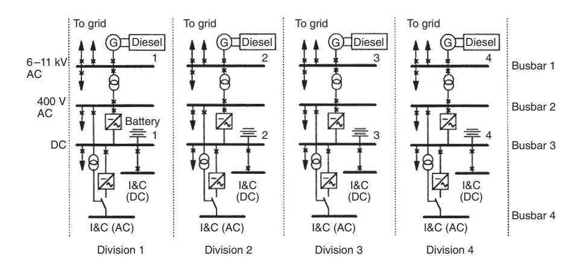

*FIG. 20.1. Typical I&C power supplies. (G: generator.)*

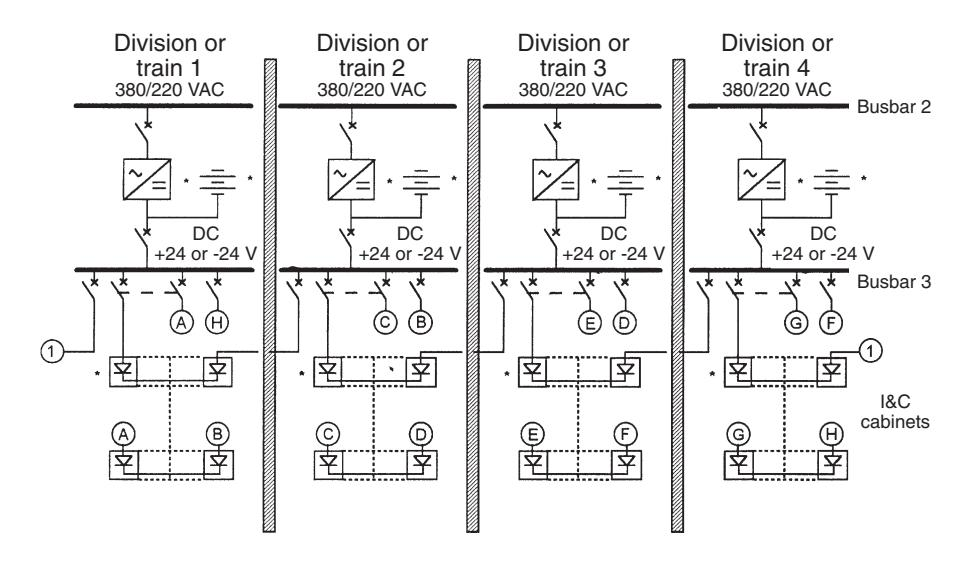

*FIG. 20.2. Example of a DC system [20.4]. (Reproduced by permission of the IEC.)*

elsewhere in the country. The provision of spare capacity to cater for anticipated extensions or refitting and the extra, special supplies required in the event of an emergency should be considered.

Design principles tend to be similar in different countries and with different vendors but detailed practice varies greatly, even with the same vendor at different times. Usually two levels of both DC and AC voltage are employed. In the DC case there will be:

- A higher level, e.g. 110 or 220 VDC, for larger loads such as solenoid valves, circuit breaker mechanisms and motors.
- A lower voltage, e.g. 24 VDC, for electronic equipment and logic components. This is compatible with batteries, has merit for personnel safety and is easily derived from higher voltage supplies (AC or DC).

Some typical system arrangements are shown in Figs 20.1 and 20.2. In Fig. 20.1, busbars 1 and 2 are short break AC boards fed from the grid or from local generation. They supply large loads. In the event of loss of grid supplies, diesels or gas turbines start and feed the loads after a short break. Busbar 3 is a no-break DC source with input from the battery charger. During any supply failure the battery maintains the system. Busbar 4 is a no-break AC source derived from a DC board by inverters. The two DC boards may be combined (as shown) where system reliability permits. Figure 20.2 shows a similar system but, in this case, to increase the reliability of supply, a second DC source is obtained from the next division via a circuit breaker (to prevent overloading) and rectifiers (to prevent backfeeding). The penetration through the division wall must be fireproof.

Systems must be designed to be sufficiently free from transients for the loads not to be affected by, for example, switching effects, fuse blowing, transients from switched mode power supplies or lightning. Tests should be performed to determine the magnitude of such transients and to ensure that there are no other forms of electrical interference at levels likely to be detrimental to the performance of dependent I&C systems. Any equipment to be connected to the supply system should be tested to determine its sensitivity to voltage and frequency variation and tests made for any other effects caused by switching transients or EMI on the supplies. Diagnostic facilities are required and, in particular, the busbars should be monitored for excessively low or high voltages due, for example, to a charger fault. Frequency variation is also of interest in the case of locally generated AC.

Verification during power testing before startup should be obtained by appropriate measurement and by carrying out supply changeover and fault simulation tests. One such test could entail blowing fuses by deliberate short circuit. A 5 A fuse will give a suitable test transient even if the prospective system current is several thousand amperes. Any unwanted effects revealed by these tests should be carefully investigated and the cause removed.

# 20.2. NON-ELECTRICAL POWER SUPPLIES AND VENTILATION SYSTEMS

Non-electrical power supplies include the pneumatic and hydraulic supplies used for actuators throughout the plant and may have safety connotations similar to those of electrical systems. Analogous rules therefore apply. Sources such as oil reservoirs, supply pipes, pumps and their (electrical) supplies must all be segregated from those of corresponding independent subsystems. Fluids must be carefully specified and their supply tightly controlled. Dirt, moisture or lack of fluid capacity in all of the separate supplies could lead to a CMF.

Ventilation systems, although not strictly power supplies, may be vital to the correct operation of I&C systems and may, again, be subject to analogous rules. Loss of ventilation can generate a hazard and wrong design or operation can contribute to the spread of hazard such as fire.

#### **REFERENCES**

- [20.1] INTERNATIONAL ATOMIC ENERGY AGENCY, Protection Systems and Related Features in Nuclear Power Plants: A Safety Guide, Safety Series No. 50-SG-D3, IAEA, Vienna (1980).
- [20.2] INTERNATIONAL ATOMIC ENERGY AGENCY, Safety Related Instrumentation and Control Systems for Nuclear Power Plants: A Safety Guide, Safety Series No. 50-SG-D8, IAEA, Vienna (1984).
- [20.3] INTERNATIONAL ATOMIC ENERGY AGENCY, Emergency Power Systems at Nuclear Power Plants: A Safety Guide, Safety Series No. 50-SG-D7 (Rev. 1), IAEA, Vienna (1991).
- [20.4] INTERNATIONAL ELECTROTECHNICAL COMMISSION, Nuclear Power Plants Instrument and Control Systems Important to Safety — Requirements for Electrical Supplies, Standard 1225, IEC, Geneva (1993).

# **BIBLIOGRAPHY**

INTERNATIONAL ELECTROTECHNICAL COMMISSION, Semiconductor Convertors, Standard 146, 8 parts, IEC, Geneva (1991–1992).

- Separation within the Reactor Protection System, Standard 709, IEC, Geneva (1981).
- Qualification of Electrical Items of the Safety System for Nuclear Power Generationg Stations, Standard 780, IEC, Geneva (1984).

# **21. ENVIRONMENTAL INFLUENCES**

Unless equipment is correctly designed and qualified, environmental effects can degrade performance. The environment may affect the measuring technique (e.g. high temperatures could disable the method in use), may lead to the generation of transient and/or continuous spurious signals (by electrical interference) or may even threaten the equipment's very survival. Such factors must be taken into account in design and proof of performance demonstrated by QA and qualification processes (Sections 12 and 22). All I&C equipment whose failure can have an impact on safety functions must be qualified and quality assured.

#### 21.1. ACCIDENT CONDITIONS

Those parts of the reactor I&C system which are required to perform their functions during and after an accident must be designed and tested to withstand the anticipated environmental conditions (radiation, temperature, mechanical shock, humidity, pressure, etc.). Specifications for such equipment and for any protective barriers must take into consideration the level and duration of the accident conditions as well as the performance expected from the equipment. Thus, instrumentation required only for trip functions immediately following an accident will be qualified differently from that designed for long term post-accident monitoring (PAM). All specifications will be based on the DBA and will contain requirements which must be fulfilled during and after the accident, in both the medium and the long term. There may also be instruments which are expected to function during and after a beyond design basis accident.

#### 21.2. FIRE

In addition to the general guidance given in Ref. [21.1], there exist a variety of more detailed design criteria, guides and recommendations on fire protection which are relevant to I&C system design. Many of these requirements are site dependent and are specified by local authorities while others were stimulated by the serious reactor incident at Browns Ferry in Alabama, USA, in 1975 [21.2]. Protective measures against fire (as well as other external hazards) should be treated as an integral part of the detailed plant design and taken into account from the beginning of planning. A powerful tool for the protection of vital I&C functions is the systematic separation of redundant subsystems and their installation in different fire zones, separated either by sufficient distance or by approved barriers to prevent the spread of fire.

The penetration of fire barriers by electrical cables can be critical. Many serious fires in industry are traceable to propagation through cable ducts and wall penetrations. Special fire resistant materials and fire resistant seals have therefore been developed and should be incorporated into designs. Fire can also spread through badly designed air-conditioning systems and this should be taken into account early in the work.

Advanced power plant designs use separation very rigorously: components belonging to different (redundant) subsystems are strictly located in different rooms, the main exceptions being the reactor containment and the control room. Even in these areas physical separation by distance is applied to the extent practicable (although these measures may cause certain inconvenience in servicing and maintenance). The separation of equipment serving the emergency control room or supplementary control point is particularly important. Rooms containing I&C equipment or cables should be free of combustible substances. The use of plastic materials in these areas should be kept to a practicable minimum (because of flammability and possible toxic fumes). Cable culverts, cable shafts and cable floors must never be used to house pipes for oil, gas, etc. To minimize the possibility of a fire starting from overheating, cables and fuses should be carefully dimensioned and selected.

An automatic central fire detection and alarm system should be installed as a subgroup of the total plant instrumentation. Fixed fire fighting systems must be selected according to their tasks and detailed knowledge of potential hazards is required. Generally, automatic water sprinklers are recommended for cable channels, culverts, distribution rooms, etc. For rooms with a high concentration of electronic equipment such as computer rooms and the control room, manually actuated sprinklers and/or halon systems are preferable. For relay rooms, cabinets and battery rooms, foam systems may also be considered. It must be appreciated that fire fighting can damage (e.g. by flooding) redundant equipment which is not itself involved in the fire and which is still needed for safety purposes. Fire extinguishing systems should always be regarded only as a complement to, not a replacement for, structural fire protection measures.

It is important to ensure that fire safety is an integral part of staff training because the best physical precautions can be compromised by ignorance or carelessness. Regular exercises are desirable, both within the plant and between the plant and relevant outside emergency organizations. Clear rules should exist for the storage of combustible materials and there should also be rules for shutting down the reactor under defined fire conditions.

#### 21.3. SEISMIC EFFECTS

I&C equipment, especially that for safety purposes (e.g. the RPS), has to be designed to withstand the design basis earthquake (DBE) and the safe shutdown earthquake (SSE). Detailed seismic requirements are derived from these via the floor response properties (spectra) in the areas in which I&C equipment is installed. To determine the seismic performance of I&C equipment two different methods can be followed:

- For structures extending over large areas (e.g. cable raceways and pressure transducer impulse lines), it is appropriate to verify the seismic performance by calculation.
- For small components (e.g. circuit boards, racks and electronic components), tests on the actual equipment with earthquake simulating devices (shakers) are usual.

These procedures should be specified in the qualification requirements [21.3, 21.4].

#### 21.4. AIR-CONDITIONING

The air-conditioning system does not, in itself, pose a hazard but its correct performance must be guaranteed if hazard is to be avoided. Modern electronic equipment generates much less heat than older types but, nevertheless, excess temperature can degrade performance and air-conditioning as a means of removal of excess heat from I&C safety systems must meet the requirements specified for safety system support features. In addition, the consequences of malfunction or loss of air-conditioning must be considered. To this extent, air-conditioning systems are analogous to power supplies and must be designed with appropriate attention to separation and redundancy.

In regions with a tropical climate or high humidity, or in NPPs near chemical plants or possibly the sea, the proper design of ventilation systems (physical separation, redundancy and closed cycle) may be the only way to eliminate a major source of CMFs in I&C equipment. The function of air-conditioning must not be jeopardized by errors when backfitting or by alterations such as the installation or removal of barriers. This can be a serious problem in older plants, since it is not easy to change large air-conditioning ducts. The comments in Section 21.2 in relation to the spread of fire must also be noted.

Air-conditioning is important to the comfort of personnel and, consequently, their ability to make high quality decisions. It can also facilitate the propagation of smoke and fumes under accident conditions and thereby threaten the viability of, say, the control room.

#### 21.5. ELECTROMAGNETIC INTERFERENCE

NPPs are vulnerable to electromagnetic interference (EMI) because they contain many systems which depend on small signals in a hostile industrial environment. Because of this, EMI can be a degrading influence on I&C and could, in the worst case, induce CMF. However, since reactor I&C systems are strongly oriented towards safety the most likely consequence of bad electromagnetic compatibility (EMC) is spurious shutdown and reduction of plant availability. Even when this does not happen, EMI can generate erroneous instrument readings which may lead to loss of confidence on the part of the operators.

The sources of EMI are many and varied, ranging from welders to managers with radio sets and, if proper provisions have not been made during design, problems will appear after installation and may lead to troublesome and time consuming investigation. Furthermore, a European Union directive on EMC came into force on 1 January 1996 [21.5]. This directive makes it illegal to offer for sale electrical equipment which generates unacceptable EMI or which is unduly sensitive to it. A useful commentary [21.6] on the directive (including its effect on an important IEC standard [21.7]) has been published. While the directive might be thought to apply primarily to the performance of individual units, it will be applicable to all electrical and electronic plant in the European Community and one interpretation suggests that complete reactor I&C systems will have to be certified. Certification depends either on complying with standards or on the supplier keeping a technical file which demonstrates compliance to the satisfaction of an independent competent body. This could be interesting because the physical size of some reactor systems is comparable with interference wavelengths and coupling paths are therefore sometimes very different from those found in other industrial situations and in domestic situations. 'Earth coupling' (see below) often assumes great importance and this in turn leads to requirements for special cables and special technologies not normally found in non-nuclear applications.

The main routes by which EMI is propagated are as follows:

- (a) *Disturbances in the electrical earth structure near, or at the ends of, I&C cable runs.* The term earth coupling is often used to describe this phenomenon because the transient travels from a source of disturbance such as an AC power distribution cable through any number of passive resonant circuits (cable sheaths, water pipes, stanchions, etc.) to the relevant instrument cable screen. From there it penetrates to the signal path. This is a particular hazard in a large plant in which cable lengths are such that they can resonate within the frequency passband of associated circuits. Fortunately, such problems can be predicted and overcome by a variety of methods, including the use of special 'superscreened' cables and shifting of resonances by electrical loading and, sometimes, by alterations to the equipment.
- (b) *Transmission through power supplies.* Major disturbance of the power voltage is an extreme case of this. Cures include the use of filters but it should be noted that some items of equipment are much more sensitive than others to interference on the power supply and good design is the best option.

(c) *Direct radiation.* This can originate from, for example, portable radio transmitters (or walkie-talkies). With frequencies up to, and possibly above, 960 MHz and equivalent radiated powers measured in watts or tens of watts, it is important to test all critical instruments for susceptibility not at one frequency, but over a wide range, from 20 MHz to beyond 1 GHz. An alternative, often employed, is to ban transmitters from critical areas of the plant but this does not guarantee that they will not be used, for example, by emergency services.

In all cases it is possible to design for EMC and sets of design principles exist [21.8]. The larger transient sources of EMI are listed in Table 21.1. For each source the peak transient voltage to be expected is given, together with the corresponding disturbing current and its rise time. The main coupling path to instrument circuits is also suggested. More details are given in Ref. [21.9].

The correct design of instrument circuits, their housings and associated cables is vital to deal with disturbances such as those given in the table. Adequate screening enclosures are necessary but it is not just a question of fitting screening — the way in which interfering currents move through the equipment must be understood. This type of technology is now well developed and equipment can be designed to standards which prevent EMI from being a problem. Conversely, poor designs can be very vulnerable. Test methods are now specified internationally for most of the possible threats [21.7], but are not yet available for earth coupling. International test criteria applicable to NPPs are also not yet available, although a standard (IEC 1503) is under development. Meanwhile, it is still the case that the expected performance of instruments under test tends to depend on local practice.

Since good EMI resistance is part of the design aspect for instrument systems, the attention of the supplier should be drawn at an early stage to the specified levels of interference immunity and to the ways in which the instruments are going to be tested in the factory and during plant commissioning. The supplier should realize that, if the problems associated with EMI are not addressed at the design stage, they are quite difficult to locate and cure when the equipment is installed.

For an operating plant it can be useful to specify regular EMC in situ testing. Systems do degrade, through loose connectors, by tarnishing, etc., and it is often possible to detect and rectify such potential problems before they cause trouble. A two-yearly survey is often specified.

#### 21.6. OTHER EXTERNAL HAZARDS

External hazards other than those treated in the previous sections may be grouped into two broad categories:

| TABLE 21.1. |  | TRANSIENT ELECTROMAGNETIC INTERFERENCE SOURCES |
|-------------|--|------------------------------------------------|
| AND LEVELS  |  |                                                |

|                         | Radiofrequency levels | Coupling path  |                   |        |       |
|-------------------------|-----------------------|----------------|-------------------|--------|-------|
| Source                  | Potential (V)      | Current (A) | Rise time (ns) | Direct | Earth |
| Distribution mains      | 400                   | 8              | 10                | ÷      | ÷     |
| High voltage mains      | 11 000                | —              | 10                | —      | ÷     |
| Unsuppressed relays     | 800                   | 10             | 3                 | ÷      | ÷     |
| Welding equipment       | 400                   | 8              | 10                | —      | ÷     |
| Lightning strike        | —                     | 105            | 1 000             | —      | ÷     |
| Close radio transmitter | —                     | (5 W)          | (960 MHz)         | ÷      | —     |
| Static discharge        | 8 000                 | 15             | 2                 | ÷      | —     |

Protective measures against all of these depend greatly on the plant site. However, some of the basic principles mentioned in the previous sections, e.g. physical separation and structural barriers (concrete walls, etc.), are often very relevant. Generally even the loss of the MCR by destruction would not lead to unacceptable consequences because reactor shutdown and cooldown can be performed from other locations [21.10].

# 21.7. PHYSICAL SECURITY

Countermeasures against sabotage of I&C systems could very effectively start with a careful evaluation (or re-evaluation) of the important systems under the assumption that they have been subject to a subversive act. This vulnerability analysis should also take into consideration employee complicity. Since the control room is a critical area in this context, detailed procedures and installations have been provided in many NPPs to ensure safe shutdown of the reactor even if the control room is not accessible or is occupied by saboteurs.

— Natural phenomena (floods, tornadoes, etc.);

— Incidents of human origin (explosions, release of toxic chemicals, aircraft impacts, etc.).

# **REFERENCES**

- [21.1] INTERNATIONAL ATOMIC ENERGY AGENCY, Fire Protection in Nuclear Power Plants: A Safety Guide, Safety Series No. 50-SG-D2 (Rev. 1), IAEA, Vienna (1992).
- [21.2] HATHAWAY, L.R., Still a hot issue US fire protection 20 years on, Nucl. Eng. Int. **40** (Nov. 1995) 24–26.
- [21.3] INTERNATIONAL ELECTROTECHNICAL COMMISSION, Qualification of Electrical Items of the Safety System for Nuclear Power Generating Stations, Standard 780, IEC, Geneva (1984).
- [21.4] INTERNATIONAL ELECTROTECHNICAL COMMISSION, Recommended Practices for Seismic Qualification of Electrical Equipment of the Safety System for Nuclear Power Generating Stations, Standard 980, IEC, Geneva (1989).
- [21.5] EUROPEAN UNION COUNCIL, The approximation of the laws of the Member States relating to electromagnetic compatibility, Directive 89/336, Official Journal of the EU L139/19 295/89 (1989).
- [21.6] HICKS, G., Following standards The importance of keeping up, IEE Rev. (EMC Suppl.) (1995) S15–S17.
- [21.7] INTERNATIONAL ELECTROTECHNICAL COMMISSION, Electromagnetic Compatibility for Industrial-Process Measurement and Control Equipment, Standard 801, 4 parts, IEC, Geneva (1988 onwards).
- [21.8] FOWLER, E.P., "Electromagnetic compatibility and reactor safety circuit instruments", Proc. Institution of Nuclear Engineers Conf. on Reactor Control & Instrumentation, Glasgow, 1990, Pergamon Press, Oxford (1991) Paper 5.
- [21.9] FOWLER, E.P., Interference immunity test requirements, Radio Electron. Eng. **49** 2 (1979) 85–93.
- [21.10] INTERNATIONAL ELECTROTECHNICAL COMMISSION, Supplementary Control Points for Reactor Shutdown without Access to the Main Control Room, Standard 965, IEC, Geneva (1989).

# **22. QUALIFICATION**

A qualification programme must be in place for all equipment belonging to a system important to safety and for equipment whose failure can have an impact on required safety functions. The goal of the qualification programme is to demonstrate that the equipment will meet or exceed its specified reliability, functionality and performance requirements under all of the operating conditions that might be experienced during its lifetime [22.1–22.4].

# 22.1. REQUIREMENTS

#### **22.1.1. Specifications**

The qualification programme requires acceptance criteria based on the equipment design documents, i.e. the design requirements, design manuals, layout drawings and technical specifications. These documents provide a description of the equipment and define its:

- Functional purpose;
- Performance requirements;
- Interfaces with other systems and equipment;
- Physical boundaries and mountings;
- Electrical loads;
- Control signals;
- Operating conditions;
- Design codes and standards;
- Ageing mechanisms.

Operating conditions include the nominal values as well as the extreme values of temperature, pressure, humidity, vibration, radiation, electromagnetic field, electrical loading, immersion in water, etc. Extreme values and their duration are normally derived from the safety analysis of the DBAs. For example, the extreme conditions of temperature and humidity for control cables inside the containment are, for most reactor types, those caused by a large break LOCA.

Ageing mechanisms can cause degradation of equipment to the point at which it might fail to perform its intended function during normal or abnormal operating conditions. These mechanisms must be accounted for in the qualification programme.

# **22.1.2. Documentation**

Qualification is a formal, quality assured process and all of the steps in the programme must be properly documented. It is essential that the qualification documentation be auditable and, as a minimum, it should:

- Define the acceptance criteria;
- Justify the method or methods of qualification;
- Describe and interpret the results;
- Demonstrate that the acceptance criteria are met for the qualified lifetime.

# 22.2. METHODS OF QUALIFICATION

There are several methods which can be used for qualifying I&C equipment: type test, operating experience, analysis or a combination of these.

- (a) *Type test.* This consists of subjecting the equipment to the expected operating conditions and demonstrating that it can subsequently perform its intended function for at least the required operating time. Type tests take into account any significant ageing mechanisms.
- (b) *Operating experience.* This consists of using data from equipment of similar design that has successfully performed under operating conditions equal to or more severe than those of the equipment to be qualified.
- (c) *Analysis.* This is a quantitative demonstration of qualification based on mathematical models of the equipment to be qualified. Analysis should also take ageing mechanisms into account.

The type test is the most common method of qualifying I&C equipment. Analytical methods are often used in conjunction with the type test and operating experience because it is difficult to develop verifiable mathematical models of equipment and components. Practical considerations may limit the use of type tests in some situations; for example, it may not be feasible to simulate several simultaneous environmental conditions in the laboratory. In this case, single variable analysis techniques can be employed to verify the equipment performance, i.e. one environmental variable is varied while the others are held constant.

During qualification, margins are normally added to the operational conditions to account for uncertainties such as errors in measurement, stochastic variations in the production process and uncertainties in analytical methods.

#### 22.3. PARTICULAR FACTORS APPLYING TO SOFTWARE

The use of computerized systems in control technology has increased considerably in recent years and the nuclear industry has been affected by this trend. Computerized control and protection systems are now operating in many NPPs. Furthermore, nuclear utilities often consider phasing out older analog systems in favour of digital systems when refurbishing older plants. Computer controlled systems offer many advantages when compared with analog and relay systems:

- Higher reliability;
- Ease of modification;
- Rapid calculation of complex control and protective functions;
- Better accuracy if this is not limited by the sensor;
- Ease of recording and retrieving records;

- Reduced cable requirements;
- Improved monitoring of plant conditions and hence probable improvements in operational effectiveness;
- Reduced panel sizes;
- Improved testing and calibration procedures;
- Internal diagnostics and fault handling.

From the QA point of view, the key difference between analog based and computerized systems lies in the use of software. Software does not wear out and is not affected by environmental conditions but software faults are more difficult to predict and to protect against than hardware faults. For example, in analog devices, small perturbations (in the input or in the environmental conditions) induce correspondingly small disturbances in the equipment response. By contrast, software can exhibit high sensitivity to small errors (such as a wrong bit). It is therefore difficult to evaluate its contribution to the overall system reliability and, because of these concerns, the

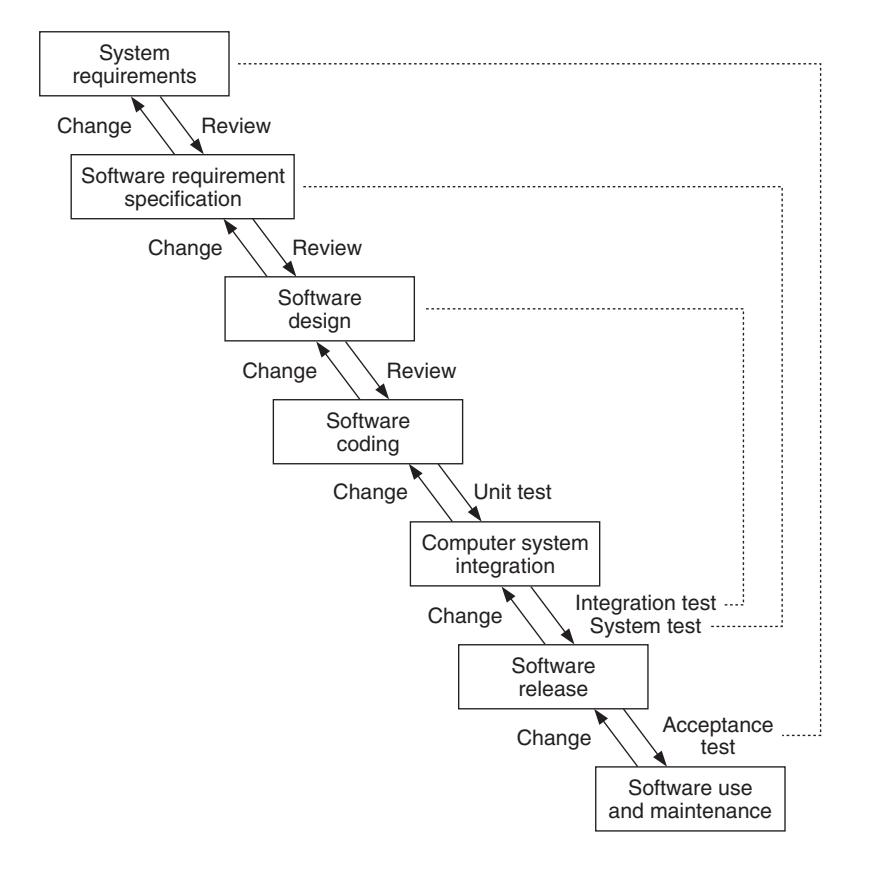

*FIG. 22.1. Software development life cycle.*

nuclear industry has been slow in adopting software based devices, particularly for reactor control and safety critical applications.

Since software is not a physical entity, it clearly requires qualification methods different from those discussed above. For purposes of qualification, software has to be viewed in the context of a system and in I&C applications, software, albeit nonphysical, is a component of a computerized system that contains physical components such as computer hardware, sensors, actuators and cables. Accordingly, any test or analysis of the software can always be traced to the overall system functional and/or performance requirements. The fundamental requisite for software qualification is an auditable development process. An effective approach is the software development life cycle (Fig. 22.1), which follows the standard practice of breaking the development of a system into consecutive stages: requirements, design, implementation, integration, validation, commissioning, operation and maintenance. Each stage uses products of preceding stages and provides a product for subsequent stages. The activities of each stage are documented and critically reviewed (see Refs [22.5–22.7]; related IEC Standard 1513 is still under development). One problem is that review of a product at a given stage may expose errors committed in the early stages and hence require changes which may be difficult to control and validate.

## 22.4. MAINTENANCE OF QUALIFICATION

Qualification tends to be thought of as applying to individual units but its value lies in the veracity which it confers on the system as a whole. Thus, qualification is an ongoing matter which must be maintained in the face of alterations, additions and, indeed, maintenance. The thoughtless replacement of a single component such as a capacitor can render a piece of equipment unfit for accident conditions and thereby invalidate a system in a manner which could remain hidden until too late. Similarly the effect of, say, backfitting on the system as a whole must always be considered. This is not a negligible concern. The cost of qualification can be very large and may be sufficient to make otherwise very desirable improvements totally impractical. It also has an influence on the relationships between utilities and suppliers.

# **REFERENCES**

- [22.1] INSTITUTE OF ELECTRICAL AND ELECTRONICS ENGINEERS, Standard for Qualifying Class 1E Equipment for Nuclear Power Generating Stations, Standard 323- 1983, IEEE, Piscataway, NJ (1983).
- [22.2] INSTITUTE OF ELECTRICAL AND ELECTRONICS ENGINEERS, Standard for Design Qualification of Safety Systems Equipment in Nuclear Power Generating Stations, Standard 627, IEEE, Piscataway, NJ (1980).

- [22.3] NUCLEAR REGULATORY COMMISSION, Environmental Qualification of Certain Electric Equipment Important to Safety for Nuclear Power Plants, Regulatory Guide 1.89, US Govt Printing Office, Washington, DC (1984).
- [22.4] INTERNATIONAL ELECTROTECHNICAL COMMISSION, Qualification of Electrical Items of the Safety System for Nuclear Power Generating Stations, Standard 780, IEC, Geneva (1984).
- [22.5] INTERNATIONAL ATOMIC ENERGY AGENCY, Software Important to Safety in Nuclear Power Plants, Technical Reports Series No. 367, IAEA, Vienna (1994).
- [22.6] INTERNATIONAL ELECTROTECHNICAL COMMISSION, Software for Computers in the Safety Systems of Nuclear Power Stations, Standard 880, IEC, Geneva (1986).
- [22.7] INTERNATIONAL ELECTROTECHNICAL COMMISSION, Functional Safety of Electrical/Electronic/Programmable Electronic Safety Related Systems, Standard 1508, IEC, Geneva (1998).

# **23. MAINTAINABILITY AND MAINTENANCE**

This section considers, in general terms, the factors which influence maintenance policy. More detailed aspects of the ways in which front line maintenance can be organized and the changes introduced by computerization are discussed in Section 31.

#### 23.1. REQUIREMENTS

I&C equipment must be maintained to ensure that it remains within specification over the lifetime of the plant. Properly maintained systems not only improve plant economics but may be a condition of continued safety licensing. Regulatory authorities have been known to demand proof that the original equipment qualification remains valid and will certainly do so if any ongoing qualification is proposed. Maintenance and repair must be possible without prolonged withdrawal of equipment from service and normally must not require significant plant shutdown. Neither must they prejudice safety. These needs can be met by exploiting redundancy but, if not done properly, this can increase the probability of spurious trips. In the worst case, the non-availability of redundant equipment can invalidate safety arguments.

Maintenance will include test schemes to detect deterioration at an early stage and is greatly simplified by appropriate equipment design — facilities for fault isolation and repair are necessary. In this context, many components and even whole systems will become obsolete during the lifetime of the plant and will have to be changed at least once. This can be complicated by the qualification conditions but can be greatly simplified by proper planning at the design stage. These points apply as much to I&C backup systems, e.g. power supplies, as they do to the instruments and control elements themselves.

# 23.2. INFLUENCE OF ORGANIZATIONAL, INDUSTRIAL AND TECHNOLOGICAL ENVIRONMENTS

Plant maintenance is not isolated from the rest of the world and is influenced by many factors within the plant, within the utility as a whole and within the relevant parts of the industry. Thus, maintainability requirements should take into account the infrastructure in which the plant will operate and likely changes in that infrastructure over its lifetime. For example, the following matters should be considered:

- Relevance of the organizational structure of the plant/utility to the needs of the maintenance team;
- The kind of backup that will be provided and what must be provided locally in terms of technical support and administrative support (e.g. budgeting and purchasing);
- Availability of trained staff and whether there are skills shortages within the organization or nationally;
- Whether spares can be easily obtained, and if not, the stock that is necessary;
- Availability of appropriate industrial design/manufacturing backup;
- Possibilities for repair or replacement, and for how long;
- Ability to upgrade or take advantage of modern technology;
- Whether all these matters can be satisfactorily resolved in time and at an appropriate price.

The possible pattern of technical development must be carefully considered. Equipment is expected to last, if not for the lifetime of the plant, at least for a significant fraction of that time and there are likely to be serious economic and, possibly, safety penalties if this is not achieved. However, the I&C of an NPP is heavily dependent on electronics and electronics is a very fast changing technology with built-in obsolescence.

Obsolescence is not simply the non-existence of a particular piece of equipment but is better thought of as a threat to the future availability of equipment in service. The maintenance team must always be considering:

- The outcome if a particular unit fails;
- Whether it can be repaired;
- How long the repair will take;
- Alternatively, how long it will take to obtain a replacement;
- Whether the plant can continue to operate safely for that time;
- The outcome if a second unit fails before the first is returned to service.

These issues, which are not exclusive, highlight the fact that enforced shutdown is very expensive and obsolescence related action may be triggered by lack of the support which could be required in the event of failure, rather than by failure itself. An instrument may be considered impossible to repair because spare parts are no longer available or because the manufacturer is no longer making this type of instrument (possibly the manufacturer has gone out of business). If it is found that on-site spares are inadequate and that the lead time for obtaining and qualifying an alternative is unacceptable, then this particular instrument must be considered obsolete. It may still be working well and problems may not arise, but if they do, they could be costly in terms of plant downtime.

Lack of outside support will not usually be due to disappearance of the manufacturer but, paradoxically, may arise from technological improvement. This may have introduced larger, better and cheaper facilities but may be irrelevant for an owner who already has an instrument, has qualified it for safety functions, is satisfied with its capability and wants to keep it running without unnecessary expense, whether it be a relatively small component or a complete system relying on a particular family of integrated circuits. Thus, future trends in the available I&C industrial and technological infrastructures must be kept under review for the way in which they are likely to influence the viability of the plant I&C, i.e. for their ability to provide parts, services, components and acceptable functional substitutes. In countries with mature and viable industries these problems are trivial because of the existence of many diverse suppliers but difficulties can occur in countries in which the relevant industries are less effective. In such circumstances the modern tendency to look abroad for support and the growth of international standardization are of great benefit. It should also be noted that the loss of a key supplier is always serious and that steps should be taken to guard against, or at least to watch for, such eventualities.

Various strategies exist to overcome these problems. Most start with the design process.

#### 23.3. DESIGN FOR MAINTENANCE

#### **23.3.1. System design**

Maintenance arguments are unlikely to influence system design but the reverse is not true and factors such as the degree of redundancy and diversity in the plant have maintenance implications. Redundancy is important because it permits maintenance without loss of the I&C as a whole but, for example, if one channel of a two out of three safety system is removed for maintenance, the operational remainder becomes one out of two and the probability of spurious trips increases. Downtime is therefore important. Under such circumstances there is a temptation to simulate the missing channel as 'healthy' with a test generator. This improves the spurious trip probability, but makes a genuine trip two out of two and thereby worsens safety; this is why some systems are implemented as two out of four. Although the primary goal of diversity is to combat CMF, it can also help in the battle against obsolescence. However, diversity does increase training needs and spares holdings.

Test systems may be manual or automatic and there are arguments for either side. Human intervention is limited in many well known ways. Generally speaking, automatic test systems can be more comprehensive than manual ones and the tests can be run more often by less qualified personnel. However, equipment failure rates are increased because of the greater complexity and because the ability to test tempts the designer into doing yet more complicated things. Furthermore, the test problem transforms itself into one of testing the test equipment and then of proving that the instruments or systems are not degraded by the presence of, for example, test switch elements in signal paths. There are also questions such as how to prove that the tested equipment was returned properly to service. If this is done by humans, there is the possibility of error but, on the other hand, human operators have a feel for what is right or wrong and often detect such eventualities. Software is more reliable in many ways but its design has to take all possibilities into account and must then be validated and qualified. Debate on these questions improves decisions on where to use on-line testing and where to test off-line. This is a grey area and it is firstly necessary to define what these terms mean for each item of equipment. One way out is to use intrinsically safe self-testing systems which rely, for example, on the presence of specific pulse patterns but these are not yet widely available.

#### **23.3.2. Equipment design**

Individual units must be designed for ease of maintenance and it may be wise to insist on simplicity and to avoid up to the minute techniques. The likely availability of spares is important and the possibility of a lifetime purchase of critical components may be considered. If this is done, it is necessary to be sure that they can be held safely and will be available, in good condition, when required.

# 23.4. ORGANIZATION OF MAINTENANCE

The maintenance department of the plant is invariably the local focus for day to day services but some large utilities have strong central electrical repair and maintenance organizations which can also provide maintenance services. Since this guidebook is primarily concerned with I&C, the maintenance of electrical equipment and electrical systems is not discussed but there are strong links between the two disciplines and they are sometimes combined into one electrical and control maintenance department. Working procedures can be considerably simplified in this way, especially for shift coverage, but there may be problems in dealing with computerized systems.

I&C maintenance activity starts from the time that the I&C hardware arrives on-site. Inspection of the equipment on arrival, its calibration or repair prior to installation, and subsequent calibration and repair continue through to the commissioning phase. The owner should undertake sole responsibility for I&C maintenance using the owner's personnel from the time that the equipment is put into service and this single step goes a long way to ensuring a smooth transfer from contractor to owner. When the plant is handed over and commercial operation is due to begin, the necessary educational, technological and industrial infrastructures will have been established and should be capable of providing long term support. However, some inadequacies may become apparent during the early stages of plant operation and there will still be a need for outside backup. Furthermore, there may be some delays before financial allocations are available for purchase of spares, consumables, etc. One way of covering this problem is to enter into an agreement with the vendor for the supply of spare parts, training and services over the first two or three years of plant operation. This kind of relationship has been known to extend over twenty years.

#### 23.5. MAINTENANCE ACTIVITIES

As is shown in Section 31, many of the activities of the maintenance department can be greatly assisted by the availability of a comprehensive, computerized management system. The main activities are discussed below.

# **23.5.1. Training**

Training is a continuing activity in a nuclear power programme. It is often considered the prerogative of a training centre but I&C specialists in the maintenance and technical departments of the plant, the regulatory authority, etc., must participate. If interaction between a training centre and a working plant is not maintained, training at the centre will tend to become less and less relevant to everyday needs and its usefulness will be drastically curtailed. It is therefore necessary for plant management to spare its best and most experienced engineers for teaching, even if this creates some inconvenience.

The plant I&C engineers who participate in installation and commissioning must, at an early stage, start training their replacements. Failure to do this may either consign the I&C specialist to a prolonged stay in one place or, in the event that the specialist is able to leave, generate a vacuum that may not easily be filled. An important aspect of training is the increasing complexity of new hardware and software and the complex safety arguments which tend to surround them. This is exacerbated by a long MTBF and the consequent loss of staff familiarity. It becomes difficult to acquire and retain the necessary skill.

# **23.5.2. Front line maintenance and support**

Activities within front line maintenance and support range from relatively minor jobs such as readjusting a limit switch to a full review and analysis plus the initiation of corrective measures on a complete system. The term 'support' encompasses all activities, both at the plant and external to it, which permit continued operation at peak safety and availability.

It is essential for I&C engineers to develop a feel for the process and hence the ability to spot potential trouble. They should not just wait for the operations engineer to report a fault but should review equipment history sheets and records of failures and carry out preventive maintenance. A complementary way of developing the required intuition is to go to the control room, read shift logs, look at and analyse the printouts, recorder charts, etc., and discuss operations with the shift engineer.

The need for shift coverage, i.e. I&C front line maintenance round the clock, is debatable. Some organizations prefer to have their maintenance personnel on call and, when a problem arises, telephone the appropriate process instrumentation, neutron instrumentation or computer specialist. This may be convenient and economic in terms of human resources, especially if housing is adjacent to the plant, but may not be so convenient for the engineer who is called out. Other organizations require their shift engineer to be knowledgeable enough to supervise maintenance and thereby provide the necessary I&C shift coverage, and this practice is recommended. An experienced senior technician, i.e. a foreman or supervisor, and two technicians are then probably sufficient on each shift. This should not be a permanent assignment and shift maintenance staff should be rotated through the normal day coverage so that they do not lose touch with their specialization.

#### **23.5.3. Diagnosis and repair**

Diagnosis and repair include troubleshooting, replacing faulty units and recalibrating equipment in situ. This work requires engineers and technicians who possess intimate familiarity with the systems as well as insight into the implications, in terms of plant safety and availability, of de-energizing and removing a unit. The faulty modules or defective circuit boards are then diagnosed in detail in the workshop or, possibly, for defective computer boards, in one of the spare computer systems. Repair is done at board level by component replacement. In most cases, the concept of 'throwaway' maintenance is an unaffordable luxury. Modules or circuit boards of modern computers using dense packaging (sometimes referred to as field replaceable units) are large, complex and expensive and board repair should certainly be considered.

As has been pointed out, keeping the mean time to repair (MTTR) as short as possible is particularly important for systems which directly affect plant safety and availability. Considerable improvement in MTTR can be achieved if spare modules or spare subsystems are kept energized and calibrated, ready to be put into service. The time to repair is then merely that needed to localize the fault and to replace the unit with a 'hot' spare. This method is particularly useful in the maintenance of on-line computer systems. A spare computer system (SCS), identical to those on-line, can provide:

- A source of tested spares, even of subsystems, e.g. disk drives;
- A test bed for troubleshooting defective circuit boards;
- Facilities for software development, debugging, assembly and compilation, depending on the application and the safety implications.

The SCS can also be used to provide various computing facilities but should remain primarily a maintenance tool. Additional functions should not impair its efficacy as an invaluable maintenance aid.

#### **23.5.4. Preventive maintenance activities**

The planning and implementation of preventive maintenance (PM) are primary tasks of the I&C engineers. Some PM is done during normal operation and some is performed during plant shutdowns (scheduled or unscheduled).

During the commissioning phase, the I&C engineers should prepare a plan for PM. This is an enormous task in which each device or system is reviewed together with its manufacturer's recommendations. Plans and procedures are then prepared. Those for I&C systems important to safety should be reviewed by the plant management and the regulatory authority. Planning is a dynamic activity in which the range and extent of PM are under constant review based on experience. Such reviews may indicate that a particular device needs frequent attention or, alternatively, that none is required. The routine calibration and functional testing intervals are defined initially from calculated reliability data. This is often worst case information and results in unreasonably short routine maintenance intervals. During the early life of the plant, fault logs should be kept with a view to establishing 'as-installed' figures, which, because of the relatively benign environment of power plant equipment rooms, are likely to be more favourable than the earlier ones. They can often be used to justify longer PM intervals although the converse is sometimes true.

The effectiveness of PM depends, among other things, on:

— *Capability of I&C personnel.* Obviously PM is only useful if the device or system being maintained is in better condition after maintenance and no new faults are introduced by the work. The concept of maintenance induced faults is not entirely hypothetical.

— *Commitment by management.* This is important since there is a (small) risk of causing plant outage or derating while performing PM.

These two factors are interrelated and, if they are absent, the PM system can fall into disuse. In the long term, this will result in more breakdowns and emergency maintenance.

# **23.5.5. Shop calibration, repair, maintenance and salvage**

Ability to undertake local repair may be very important and of value in some circumstances, depending on the general infrastructure. However, considerable knowledge and skill in both electronics and electromechanical aspects are required for the repair and adjustment of pneumatic instruments and devices such as printers. Over the years many unserviceable instruments can accumulate and good, skilled craftspersons or technicians can salvage many of them. It is therefore desirable, although possibly expensive, to employ a few craftspersons with these capabilities. Much of this work is performed on the I&C shop workbench and requires different skills and temperaments from those used for front line maintenance. The instrument shop also carries out much of the calibration work and should possess and maintain test equipment and standards against which calibrations can be made. This work should be done on the (secondary) calibration instruments used for field calibration as well as on the field devices themselves. As in many situations, the development of QA has meant a greater degree of specialization in these matters and instrument calibration is becoming a specialized process carried out in specialized facilities.

#### **23.5.6. Documentation**

The I&C maintenance department is responsible for maintaining and updating the documentation relating to the I&C equipment and systems. This will include:

- *System design specifications.* These may need to be revised in the event of a design change which alters the system design performance or design criteria.
- *Equipment design specifications.* Some changes may affect only the equipment and not the system intent, so that only the equipment design specification may need to be updated.
- Work schedules, instructions and procedures.
- Drawings, including installation drawings, wiring diagrams and schematics, and cable and wiring lists.
- Computer software listings and patches.

It is vital that all of this documentation be kept updated and available to the workforce. Any change must be carefully reflected throughout the documentation so that no contradictions exist. In some plants the updating function is performed by a technical support group.

Many front line maintenance staff need to keep drawings, calibration data, handbooks, etc., close to their place of work and it is unsatisfactory if updated documentation is only available from a central registry. The distribution and maintenance of documentation should therefore be considered carefully and sufficient numbers of maintained copies must be provided. This may not be cheap.

A variety of economic and technical factors are now generating a rising trend in the use of contract labour for the routine calibration and functional testing of safety related equipment. Among other things, this can mean lack of personnel continuity and puts greater importance than ever before on the quality of documentation.

#### **23.5.7. Maintenance of equipment histories and evaluations**

Starting from the time that the I&C equipment is installed, the I&C maintenance department should maintain a file on each device. This history file should contain a record of all calibrations performed, the preventive maintenance carried out and the repairs done, including parts replaced. These history files will then build up a database for the following purposes:

- Diagnosing faults, i.e. similar faults may have occurred before;
- Determining the interval and extent of PM;
- Evaluating the behaviour of devices of a particular make and manufacture as an input for future plants or even for the current plant, if modification or replacement of a frequently malfunctioning device is required;
- Measuring failure rates, an essential input for any safety, reliability or availability analysis;
- Evaluating future spare parts requirements;
- Evaluating the effectiveness of PM.

These records should contain as much description as possible, clearly setting out the failure symptoms and the repairs carried out. Simply writing "Pressure control not working" and "Repaired, now OK" will not prove very helpful in the future. It is the responsibility of the I&C manager to ensure that the equipment history files are properly documented and maintained.

#### **23.5.8. Materials management**

An important I&C function is that of materials management, i.e. specifying the spare parts required to keep the I&C equipment operational, inspecting them when they arrive and subsequently at regular intervals, and ensuring their proper storage. This, together with gathering information from manufacturers, provides the basis for the assessment of potential obsolescence and the data on which preventive action may be based.

#### 23.6. PLANT PERFORMANCE ANALYSIS AND MODIFICATIONS

An essential contribution to plant longevity and safety can be made by a group responsible for providing long term technical support. The activities of this I&C technical support group can comprise the following:

- Performance reviews of the I&C equipment and systems and of their impact on the availability of the plant. Some utilities set up reliability and maintainability (R&M) targets for each plant system (the combination of which would give the target plant availability). The performance of each system is periodically reviewed against these targets. Improvements or modifications are generated on this basis.
- Initiation of engineering design improvements and provision of support to the maintenance department in their implementation.
- Design studies to evaluate the impact of major conceptual changes (if required) on plant operation and, if found necessary and beneficial, development work to implement changes.
- Initiating, developing and/or participating in the development of systems and programmes to ensure that plant integrity is maintained. This could include the development of programmes for periodic in-service inspections of plant components, techniques for carrying out such inspections, and the design analysis of I&C systems and the I&C of process systems to detect and rectify possible design deficiencies.

With the rapid technological advance of electronic equipment and systems, it is generally recognized that the I&C of a plant will require periodic major replacement to combat obsolescence. Requirements for improvements and ease in operator communications may be other factors leading to I&C changes, as are changes in the regulatory environment. The I&C technical support group must therefore be technically capable of coping with change, not for the sake of change but because of the need to keep the plant operating efficiently.

# Part III

# RECENT DEVELOPMENTS IN INSTRUMENTATION AND CONTROL

# **24. MAIN CONTROL ROOM**

# 24.1. INTRODUCTION

The main control room (MCR) is the nerve centre of an NPP and contains the information necessary for monitoring and controlling the plant together with the facilities needed for initiating most manual control actions. Operators work in the MCR and from it they carry out operations to produce power efficiently and safely. Control rooms have progressed through three generations in the last thirty years [24.1]:

- (a) First generation control rooms consisted entirely of conventional panel instrumentation with fixed, discrete components such as switches, indicator lights, strip chart recorders and annunciator windows. The layout was based on intuitive common sense factors which varied from one designer to another.
- (b) Second generation control rooms integrated computer driven displays on VDUs and keyboards into the control panels. VDU displays complemented the information available on panel instruments and presented some processed parameters. Basic human factors considerations were applied to the physical layout of control panels and the physical manipulations performed by operators. The control room of the Point Lepreau plant in Canada is a good example of this generation of control rooms (Section 48).
- (c) Third generation control rooms exploit the dramatic improvements in computer, electronic display and communication technologies of the 1990s. Advanced colour graphics displays and input devices such as the touch sensitive screen, tracker ball and mouse provide the HMI. Human factors considerations are more systematically applied and take into account the cognitive aspects of operator performance. Section 46 discusses one of these MCRs, which is being implemented in Japan for the advanced BWR plants.

References [24.2–24.4] illustrate approaches being taken in different countries for new control room designs.

#### 24.2. RECENT TRENDS

#### **24.2.1. Increase in complexity and information**

The increased size and complexity of NPPs have greatly influenced the control room operational requirements. More extensive monitoring of the plant is needed to achieve high availability and hence the number of indicators and alarms, etc., in the control room has grown substantially. Load following of the electrical grid, which is a requirement for utilities with nuclear power as a major component of the grid, further increases the need for additional information in the control room. The following initiatives have been pursued to manage the growing complexity and quantity of the available information:

- Higher automation levels, i.e. the automation of more tasks that used to be carried out by operators;
- Utilization of computer technology for monitoring and information processing.

These developments have changed the function of control room staff from process operation to process management.

#### **24.2.2. Computers in monitoring and control**

One of the most significant changes in control rooms in the last two decades has been the increasing use of computers in plant monitoring and control. Computers have allowed the introduction of a high degree of automation and have provided substantial safety and operational benefits. Some of the most significant features and benefits are as follows:

- (a) *Increased time for operators to think and plan.* During a safety critical plant transient, operators may have up to several hours for careful analysis and planning before they have to take action [24.1].
- (b) *Substantial reduction in panel complexity.* Many fixed indicators and controls can be eliminated from panels and replaced by interactive VDU consoles. These provide information more conveniently and tailor the information to suit each particular situation.
- (c) *Substantial reduction in instrumentation complexity.* Replacing trunk cabling, relays, timers, comparators, etc., with distributed control systems can result in a significant reduction in I&C hardware components and a diversity of equipment and suppliers.
- (d) *Elimination of monotonous or stressful tasks that can cause errors.* The operator can be relieved of boring, stressful or time consuming tasks and thereby gain more time to perform higher level tasks as a situation manager.
- (e) *Procedure driven displays.* Interactive VDU displays can support tasks by presenting context specific information.
- (f) *Critical alarms.* Monitoring systems can filter information to provide operators with a shortlist of critical alarms rather than a flood of alarm messages during a plant disturbance.

(g) *Operator aids.* Specialized systems can provide early warning of impending plant upsets and assistance in diagnosing and analysing situations.

The introduction of computers in monitoring and control is accelerating as obsolete instruments are replaced with modern equivalents. These invariably have built-in microprocessors and provide significantly enhanced functionality.

#### **24.2.3. Control desk**

With increasing use of computers and increasing automation, more plant monitoring and control functions are being carried out via VDUs and keyboards. This has permitted greater use of control desks (also known as operating consoles, cockpit type consoles or workstations), from which operators have complete access to all of the plant monitoring and control functions. Each control room has one or more control desks and each desk has an array of VDUs plus regular and special purpose keyboards. The desks are generally located in the centre of the control room so that the operators have a clear view of the panels and annunciator windows when seated behind the desks. A redundant control desk may also be provided for the chief operator or the shift supervisor.

#### **24.2.4. Dark panel concept**

The concept of the 'dark panel' is that all indicators on panels remain off, i.e. dark, when all systems are operating normally [24.1]. A light on a panel, indicating an annunciator window, a hand switch discrepancy or a failed computer program, for example, signals a situation that requires operator action. The dark panel concept for indicators has become popular in the last decade and is increasingly used in NPP control rooms.

#### **24.2.5. Standards and regulatory requirements**

Prior to the accident at TMI, control rooms were designed on the basis of intuitive common sense and applicable engineering practices. In the late 1970s, the impact of analysis results from the TMI accident considerably accelerated the development of recommendations and regulatory requirements associated with control rooms. The NRC was one of the first organizations to publish regulatory documents [24.5–24.7] relating to the ergonomics of control boards and panels, resources and facilities to deal with emergency situations and post-accident instrumentation. The regulations in these documents have been widely adopted for design improvements to control rooms of LWR plants.

The exchange of technical information in the nuclear energy community stimulated by international organizations such as the IAEA, IEC and ISO has contributed to the recognition of the advantages of standardization for economy and safety. The IAEA and IEC have published several useful standards and guidelines on this subject. The most significant of these relate to control room design and the use of computers in systems important to safety [24.8–24.10]. These standards and guidelines are being increasingly adopted by designers and regulatory bodies for the design of new control rooms as well as in control room upgrades and backfits (see also Refs [24.11, 24.12]).

In addition to regulatory standards, industry standards for computer hardware and software are also influencing the selection of control room systems. These standards make possible the use of open system architectures in which systems are built with components that are non-proprietary and available from several vendors. Examples of hardware standards are the VME bus [24.13] and field bus [24.14]. The software standard is the portable operating system interface (POSIX) [24.15] and the computer industry standard is the common application environment (CAE) [24.16]. Open systems, being based on widely used and broadly accepted standard hardware and software, have reduced vulnerability to obsolescence.

#### **24.2.6. Control room backfits**

The backfitting of control rooms in many NPPs has become a necessity because of the ageing of equipment and the need for added functionality resulting from new operational and regulatory requirements. Many first generation control rooms have been upgraded or are being upgraded with computer based display systems and operator support systems to enhance the ability of control room staff to monitor the plant. The plants that already had computer based monitoring systems have upgraded or are considering upgrading their obsolete systems with modern open systems. However, backfits will remain a challenge in the immediate future because rapid technological evolution will result in an economic lifetime for most I&C components which is shorter than that of most other plant components.

## 24.3. HUMAN FACTORS

The role of human operators in the NPP control room has come under increasing scrutiny in the last few years. Human factors engineering (Section 17) is now used to analyse operator functions and to design control room interfaces. Systematic human factors engineering procedures take into account anthropometric considerations as well as human cognitive strengths and limitations. They are applied to control room design (for new plants and upgrades) and to the development of operating procedures which reduce the potential for human errors.

#### 24.4. HUMAN–MACHINE INTERFACE

# **24.4.1. Increased use of computer driven displays**

The human–machine interface (HMI) in control rooms has seen rapid change in the last decade as increased computerization and automation have been incorporated into NPPs. Information that was presented by conventional electromechanical indicators, dials, chart recorders, analog controllers, etc., has been largely supplanted by information presented on computer driven displays. Mechanical switches, knobs and push-buttons used to initiate actions have been replaced by their electronic equivalents on display screens. A control room that uses computer driven displays for information presentation and controls, as opposed to using hardware components, is sometimes referred to as a 'soft' control room.

In French 1300 MW(e) PWR plants and CANDU type PHWR plants, VDUs are an integral part of the control panels and provide most of the plant information. Only a minimum number of conventional instruments are used and hence the size of the panels is smaller, resulting in a smaller control room.

#### **24.4.2. Task and symptom oriented information**

In the initial applications, VDUs displayed measured and calculated plant parameters, essentially merely replacing the hardware displays. In the last decade, however, increasingly complex information has become available on VDUs. Task oriented displays present relevant plant information to support operators in specific tasks such as startup, shutdown and the management of other transients. The information is optimized by type, form and presentation. Typical examples are operating point (*x*–*y*) diagrams and curves which indicate operating area, possible limits and their violation. Also available are symptom oriented displays which help operators achieve specific goals. Special safety goals such as subcriticality of the reactor, containment integrity, core cooling and heat removal are defined. The presentation by VDUs of information on violations of safety goals, failures of relevant systems and required operator actions necessitates extensive information processing and a high level of integration.

#### **24.4.3. Console operation**

Increased computerization has made it possible to provide an interactive HMI through VDUs to monitor and control most operations. This has removed the need for operators to walk around the control room to collect information and to initiate actions from instruments on panels. As a consequence, most recent plants (e.g. the 1450 MW(e) PWR type Chooz B plant in France and the CANDU type Darlington plant in Canada) use a cockpit style console (workstation) with a small array of VDUs as the primary centre for plant operation. The console has specialized keyboards in addition to standard alphanumeric ones for recalling displays and initiating control actions. Input devices such as light pens, touch sensitive screens, tracker balls and mice facilitate pointing and selecting operations on VDUs. A residual conventional backup information system allows for degraded operation and covers postulated major loss of the computerized system.

#### **24.4.4. Advanced graphical user interface**

The graphical user interface, made popular by Macintosh computers and later by Windows system PCs, is playing an increasing role in the design of HMIs for NPPs. Such an interface has an intuitive feel, does not require the user to remember intricate commands, so that its use can be learnt rapidly, requires minimum keyboard entries and is highly tolerant of user entry errors. Specifically, it provides:

- 'Point and click' operation;
- Menus from which functions and operations can be selected;
- Convenient window operations such as 'scroll' and 'zoom';
- Consistent, uniform commands for basic operations.

#### 24.5. INFORMATION DISPLAY

#### **24.5.1. Computer driven information systems**

Computer driven displays are being added to existing control rooms to supplement the information already available from the instruments on the panels. In new control rooms, however, computer driven displays are replacing conventional, panel instrumentation. For instance, Canadian CANDU plants and new French and Japanese plants have computer driven displays, such as VDU screens, well integrated into control room design and operation. Operators rely mainly on the VDUs for information and hard-wired panel instruments have been minimized or eliminated. For each unit of the CANDU type Darlington plant there are nine VDUs on the panels of the control centre and three additional VDUs are provided on the operator's console. A hierarchical structure of up to two thousand colour graphics pages related to the systems and equipment in each unit is accessible on the VDUs by means of a keyboard or a light pen. Three hundred of these graphics pages show mimic diagrams from which more detailed equipment schematics or other related graphics can be accessed. Plant parameters are shown graphically as bar graphs with adjustable scales, trend indicators or set point margins. Trend charts on VDUs replace most pen recorders on panels.

In Germany, the Konvoi series of plants (Isar 2, Emsland and Neckarwestheim 2) has about 30 VDU displays as part of the Process Information System (Computer Aided) (PRISCA) in a largely conventionally equipped control room (Section 41 and Ref. [24.17]). The system is equipped with about 80 graphical displays and over 120 trend charts. These displays make use of colour and graphical techniques to show validated relationships between important plant parameters as well as to present mimic diagrams, more detailed equipment schematics, bar charts and equilibrium diagrams on an array of VDUs.

Further radical changes are taking place in more advanced control rooms. For example, conventional panels, except for the auxiliary safety panel, have been eliminated completely in the French N4 control room [24.18, 24.19] and in the control rooms of Kashiwazaki-Kariwa Units 6 and 7 in Japan [24.20]. In these systems, all information is presented through VDUs. Most other newer NPP designs are making a similar approach to a soft control room.

#### **24.5.2. Large mimic displays**

Mimic diagrams with hard-wired lights and indicators were used in the past to provide operators with a larger overview of the plant than was possible from individual instruments. Increasing use of VDUs, however, means that the problem of the tunnel effect becomes more significant since each VDU only gives a serial presentation of subsets of information. Therefore, there is an increased need for an effective mimic display to give a spatially dedicated, continuously viewable, integrated presentation of plant status.

Advances in display electronics are now making it possible to use VDU technology to provide a large, dynamic, high resolution, bright display that is viewable from all areas in the control room under ambient lighting conditions [24.20]. Compared with hard-wired, semifixed mimic diagrams, VDU based mimic displays offer more flexibility in presenting different overviews as well as details to suit each situation. Such mimic displays provide many benefits, including:

- Enhancement of the co-ordination of control room personnel during normal, abnormal and emergency situations;
- A clear, context specific and continuous point of reference from which operators can assess plant status frequently and quickly while performing tasks;
- Assistance during shift turnover;
- Rapid assessment of plant maintenance activities.

VDU based mimic displays are becoming a central feature of the control rooms of plants currently being designed (e.g. CANDU 9, APWR and ABWR plants).

#### **24.5.3. VDU display design**

The use of engineers' common sense and intuition in designing displays is now being complemented with a more systematic approach incorporating human factors engineering. IEC 1772 [24.21] and other similar standards will provide guidance in designing high quality VDU information presentations and some understanding of the processes by which humans interact with the plant through VDUs. Basic principles for designing VDU displays include the following:

- Consistency of format, symbols, character types, character sizes and colour;
- Task focus, whereby the displayed information directly supports the task for which the display is designed;
- Ease of navigation, so that from a given display other displays in the hierarchy can be easily accessed;
- Consistency with the user expertise level, so that novices as well as experts can make effective use of the displays.

# 24.6. ALARM PROCESSING AND ANNUNCIATION AND COMMAND INTERFACES

#### **24.6.1. Alarm flooding**

With the increasing amount of information acquired via computer based monitoring systems, the number of alarms and alarm messages presented to the control room staff has grown significantly. Current alarm annunciation systems are generally designed to be actuated as soon as a parameter value exceeds a predefined limit. Thus, during a plant upset, so many alarms can appear in a short time that the operators usually have difficulty in interpreting the information and identifying the root cause. They are therefore handicapped in taking timely and correct action to mitigate the consequences of the event. In current alarm annunciation designs, an alarm is sounded even if some parameters are within the normal operating range (depending on the plant status). For example, the ECCS tank level falling below a specified level is an alarm condition if it occurs while the ECCS is poised during normal plant operation but is not an alarm after the ECCS has been used. The control room staff may have to filter out such extraneous messages from a long list of alarm messages. Such alarm flooding situations have been recognized as requiring improvement in all NPPs. Filtering, prioritizing and conditioning of alarms have all been used and some improvements have been reported. Further significant developments will include dynamic prioritization and conditioning using plant status information. Computer based systems to facilitate the review and analysis of alarm messages following an event are also being installed. Such improvements are at various stages of implementation in different plants.

#### **24.6.2. Alarm windows**

A PWR plant has many alarm windows — approximately 1200 for a three loop plant and up to 2500 for a four loop plant — but the use of computers for plant monitoring has greatly reduced the number necessary. For example, PHWRs have the lowest number of alarm windows (e.g. each Darlington 900 MW(e) unit has about 240). Computerization has also enabled the number to be reduced to 300 in the French 1300 MW(e) series of PWR plants. The future trend is further reduction. One of the techniques being used is to consolidate a set of related alarm windows into a general alarm window and thus assist the operator in diagnosing situations more rapidly. The dark panel concept has also been recommended [24.1].

#### **24.6.3. Auditory devices**

Auditory alarms and annunciators based on coding principles have been used but their capabilities and characteristics are usually limited [24.10]. Intensity coding for auditory annunciation has been used in some countries but is not widely recommended. A multimodal system may provide a more flexible and robust alarm annunciation interface. For example, the same set of information can be redundantly presented to the operator through graphical and auditory media simultaneously. Such a combination of conventional annunciation devices and auditory input may facilitate control tasks.

The voice announcement system (VAS) is considered a well developed technology. It has already been applied in the latest Japanese PWRs (Ohi 3 and 4), where it is used to announce that break points have been reached during automatic startup and shutdown operations. A different application of the VAS is its use to alert the operator to a very limited number of critical situations, such as when CSFs are threatened. To draw attention to them and ensure that auditory messages are not ignored, messages have to be preceded by a special sound, e.g. a chime.

Some aspects of the recent evolution in command interfaces are briefly discussed in Section 17.3.

# 24.7. VIDEO MONITORING

Video systems have been used in control rooms where visual monitoring of events or a process is necessary. For example, video monitors are used to monitor fuelling machine operation in CANDU plants and to monitor the inside of the containment in French PWRs. Video systems are also installed on occasions to deal with special situations. However, large scale use of video monitoring has not yet been considered necessary.

#### **REFERENCES**

- [24.1] POPOVIC, J.R., OLMSTEAD, R.A., LIPSETT, J.J., "Progress and issues with automation in single unit CANDU generating stations", Proc. Topical Mtg on Advances in Human Factors Research on Man–Computer Interactions: Nuclear and Beyond, Nashville, 1990, Rep. AECL-9945, Atomic Energy of Canada Ltd, Chalk River, Ontario (1990) 158–165.
- [24.2] OLMSTEAD, R.A., "Control room systems and C&I systems for Canadian nuclear stations. National practices and approaches", Control Room Systems Design for Nuclear Power Plants, IAEA-TECDOC-812, IAEA, Vienna (1995) 99–110.
- [24.3] FUJITA, Y., "State of the art of human factors engineering for control room systems in Japan", ibid., pp. 111–118.
- [24.4] FURET, J., GUESNIER, G., "Electricité de France N4 control room and I&C system", ibid, pp. 125–138.
- [24.5] NUCLEAR REGULATORY COMMISSION, Functional Criteria for Emergency Response Facilities, NUREG-0696, US Govt Printing Office, Washington, DC (1981).
- [24.6] NUCLEAR REGULATORY COMMISSION, Clarification of TMI Action Plan Requirements, NUREG-0737, US Govt Printing Office, Washington, DC (1983).
- [24.7] NUCLEAR REGULATORY COMMISSION, Guidelines for Control Room Reviews, NUREG-0700, US Govt Printing Office, Washington, DC (1981).
- [24.8] INTERNATIONAL ATOMIC ENERGY AGENCY, Control Rooms and Man–Machine Interface in Nuclear Power Plants, IAEA-TECDOC-565, Vienna (1990).
- [24.9] INTERNATIONAL ATOMIC ENERGY AGENCY, The Role of Automation and Humans in Nuclear Power Plants, IAEA-TECDOC-668, Vienna (1992).
- [24.10] INTERNATIONAL ELECTROTECHNICAL COMMISSION, Design for Control Rooms of Nuclear Power Plants, Standard 964, IEC, Geneva (1989).
- [24.11] ELECTRIC POWER RESEARCH INSTITUTE, Human Factors Guide for Nuclear Power Plant Control Room Development, EPRI-NP-3659, Palo Alto, CA (1984).
- [24.12] ELECTRIC POWER RESEARCH INSTITUTE, ALWR Requirements, EPRI, Palo Alto, CA (1991) Ch. 10.
- [24.13] INSTITUTE OF ELECTRICAL AND ELECTRONICS ENGINEERS, Standard for a Versatile Backplane Bus: VME Bus, IEEE/ANSI Standard 1014-1987, IEEE, Piscataway, NJ (1987).

- [24.14] INTERNATIONAL STANDARDS ASSOCIATION, Fieldbus Standard for Use in Industrial Control Systems, Part 2: Physical Layer Specification and Service Definition, Standard S50.02 — Part II, ISA, Research Triangle Park, NC (1992).
- [24.15] INTERNATIONAL STANDARDS ASSOCIATION, Portable Operating System based on Unix (POSIX), Standard 1003.1, ISA, Research Triangle Park, NC (1988).
- [24.16] X/OPEN COMPANY LTD, X/Open Framework and Models (X/Open Guide), Prentice-Hall, Englewood Cliffs, NJ (1995).
- [24.17] ALEITE, W., PRISCA: KWU's new process information system, Nucl. Eur. **9** 9–10 (1989) 24–26.
- [24.18] GUESNIER, G., TETREAU, F., An entirely computerized control room for the N4 PWR, Nucl. Eng. Int. **32** 394 (1987) 38–40.
- [24.19] BELTRANDA, G., PHILIPPS, C., "A computer aided system for the EdF 1400 MW: Nuclear power plants control", International ENS/ANS Conference on Thermal Reactor Safety (Avignon, 1988), Vol. 6, Soc. française d'énergie nucléaire, Paris (1988) 2485–2490.
- [24.20] IWAKI, K., "Control room design and automation in the advanced BWR", Balancing Automation and Human Action in Nuclear Power Plants (Proc. Symp. Munich, 1990), IAEA, Vienna (1991) 399–412.
- [24.21] INTERNATIONAL ELECTROTECHNICAL COMMISSION, Visual Display Unit (VDU) Application to Main Control Room in Nuclear Power Plants, Standard 1772, IEC, Geneva (1995).

#### **BIBLIOGRAPHY**

Balancing Automation and Human Action in Nuclear Power Plants (Proc. Symp. Munich, 1990), IAEA, Vienna (1991).

INTERNATIONAL ATOMIC ENERGY AGENCY, Control Room Systems Design for Nuclear Power Plants, IAEA-TECDOC-812, Vienna (1995).

Man–Machine Interface in the Nuclear Industry (Proc. Conf. Tokyo, 1988), IAEA, Vienna (1988).

# **25. OPERATOR SUPPORT**

# 25.1. INTRODUCTION

Operator support systems (OSSs) are described separately from other control room information presentation systems (e.g. Section 24) because, in general, they are in a different class, providing more processed, integrated information than is available from conventional instrumentation. Although they are not necessary for plant operation or safety, OSSs provide high level information. They guide and advise operators and enable them to make better strategic decisions during both normal and abnormal operation. They also provide a capability for supervisory management during emergency conditions. Several factors have led to increased interest in their use in NPPs. For example:

- Investigations into the causes of the TMI and Chernobyl accidents revealed that both accidents were largely attributable to human error and, most fundamentally, related to the human operator's limited ability to maintain awareness of the overall plant safety status.
- The regulatory agencies, and in particular, the NRC, have established requirements for minimum OSSs (e.g. SPDSs) that must be provided for detecting and monitoring accident conditions.
- Increasing complexity of NPPs and increasing demands for higher productivity and safety require the operator to be more aware of plant conditions so that correct actions can be taken.
- Many of the originally installed plant information systems have come to the end of their lives. The need for replacement of these systems has stimulated a significant upgrading of their functionality for operator support.
- From a technological viewpoint, developments in computers, such as in artificial intelligence, neural networks and display systems, have created opportunities for operator support that were not available in the past.

Several types of OSS are in operation or under development [25.1, 25.2].

## 25.2. TYPES OF OPERATOR SUPPORT SYSTEM

- (a) *Task oriented displays.* The presented information is related to specific tasks, such as startup and shutdown, by optimizing information type, form and presentation.
- (b) *Intelligent alarm handling.* This function overcomes the problem caused by alarm flooding during plant upsets. It is carried out by logical reduction and the

- masking of irrelevant alarms, by displaying the alarm state of subsystems or functional groups of the plant and by dynamic prioritization based on the plant state, first alarm indication, etc.
- (c) *Fault detection and diagnosis.* This function alerts operators to problems and aids diagnosis before the normal alarm limits are reached. It is also valuable when simple alarm monitoring is impractical or where complex situations cannot be revealed by alarms or alarm logic. Examples are:
  - Fault monitoring of protection logic and associated electrical supplies, and fuel pin failure detection and prediction;
  - Detection and identification of leakages, e.g. in the primary circuit;
  - Model based fault detection for components (e.g. preheaters) and measurement loops.
- (d) *Safety function monitoring.* This function alerts operators to the safety status of the plant. It is based on monitoring derived critical safety functions or parameters so that operators can concentrate on maintaining them. Data on the severity of threat, potential recovery options, relevant emergency procedures and implications of corrective actions may also be provided.
- (e) *Computerized operational procedure presentation.* This function complements written operating and emergency procedures by computerized operator support, e.g. by:
  - Guiding the operator to the relevant procedure;
  - Presenting procedures dynamically and interactively on VDUs;
  - Following up the monitoring actions required in the procedures.
- (f) *Performance monitoring.* This function calculates and monitors the efficiency and optimum operation of main pumps, turbine, generator, condenser steam generators, preheaters, etc., to detect developing anomalies. The reactor thermal energy as well as heat, electricity and mass balance can be calculated.
- (g) *Core monitoring.* This function calculates and monitors operation of the reactor and fuel, e.g. to maximize the energy output while maintaining adequate operating margin. Examples of tasks that can be performed are:
  - Load following and simulation or prediction;
  - Calculation of reactor power distribution and burnup;
  - Prediction of xenon and critical boron.
- (h) *Maintenance support.* This function supports the maintenance staff and control room operators in the execution and supervision of maintenance activities. Examples of tasks that can be performed are provision of computerized work permits and orders, tagging of components under maintenance and provision of calibration and testing aids. The subject is discussed in more detail in Section 31.

In addition to the systems described above, several other OSSs exist for specialists and maintenance staff, e.g. vibration monitoring and analysis, loose parts monitoring and materials stress monitoring. Radiation release monitoring support systems have also been implemented to support emergency staff and authorities.

The following sections describe some of the application areas in more detail.

#### 25.3. HANDLING OF PROCEDURES

# **25.3.1. Computerized procedures**

Computer monitoring of NPPs and the availability of VDUs in the control room have increased interest in computerized operating procedures. Implementations which take advantage of powerful information processing capabilities making use of plant data have been attempted and show considerable promise. The direct transfer of paper based procedures without modification has not been successful and is generally not in use.

Since correct and timely execution of EOPs is of concern at all NPPs, EOPs have been the initial focus of operator procedure support systems. In many of these implementations, EOPs have been integrated with diagnostic systems. For example, at Tsuruga 2, Tihange 1 and 3, South Texas, Mülheim-Kaerlich, Fukushima Daini and the French 900 and 1300 MW(e) series plants, EOPs have been integrated with the SPDSs [25.3]. Most of the EOPs used to be based on event oriented philosophy. However, since the TMI accident, symptom oriented procedures have been increasingly used, complementing the event oriented ones. At some plants, symptom oriented EOPs have also been integrated with the SPDSs.

Operator aids for other procedures are also being explored where they can yield economic benefits [25.4]. To facilitate the execution of procedures such as safety system testing, hand-held computers with integral displays are being investigated for CANDU plants. Such systems display procedural steps graphically together with current plant parameters relevant to procedure execution. The hand-held computers are fully mobile and have no connecting cables. They receive the latest plant data and send messages to the plant computers by infrared transmission.

# **25.3.2. Procedure selection**

In an accident, procedure selection is based on the operator's diagnosis of the initiating event. Computerized aids to diagnosis have been developed which also direct the operator to the correct procedure. The SPDSs in the South Texas plant and in the French 900 and 1300 MW(e) series plants have this additional feature [25.3]. The EOP entry condition monitor at the Point Lepreau plant in Canada is another example of an OSS which directs the operator to an EOP when an emergency condition is detected.

# 25.4. ON-LINE DIAGNOSIS

A number of OSSs for on-line diagnosis were attempted in the early 1980s following initial developments at the OECD Halden Reactor Project. Examples are the Störungsanalyse-Rechner (STAR) system in Germany, the Computerized Operator Support System (COSS) in Japan and the Disturbance Analysis and Surveillance System (DASS) in the USA [25.5]. Actual use of such systems was limited for a number of reasons, including:

- Complexity;
- Inability to ensure completeness of accident sequences and the combination of accident sequences;
- Large effort needed for maintenance.

However, the availability of fast, low cost computers, as well as new technologies such as expert systems, has rekindled interest in on-line diagnosis and several such systems have been implemented or are under development.

#### **25.4.1. Safety parameter display systems**

The SPDS is probably the most widely implemented standalone on-line diagnosis system. It provides an overview of the plant safety status and helps operators prevent serious safety degradation and core damage. The SPDS was mandated by the NRC [25.6] for all US nuclear plants as a backfit requirement. Most of the SPDSs which have been installed follow the NUREG 737 philosophy [25.6, 25.7]. Each SPDS monitors critical plant parameters and concentrates the information in such a way as to give a systematic view of safety status, especially under accident conditions. This assists the operator in diagnosis and decision making.

The theoretical basis for most SPDSs is the CSF concept [25.8], which holds that plant safety (and integrity) can be ensured if a selected number of plant functions are continuously satisfied, namely: reactivity control, coolant inventory control, primary heat removal, secondary heat removal and radioactive release control. CSFs are definable in terms of a relatively small number of plant parameters and apply regardless of the root cause of an accident.

The main functions of an SPDS are:

- Continuous surveillance of the plant status with an overview display and displays of main plant parameters;
- Identification of the first cause of a trip, e.g. safety injection trip, reactor trip or turbine generator trip;
- Actuator surveillance;

- Monitoring of CSFs;
- Monitoring of decay heat removal;
- Assistance in safety injection control;
- Assistance in diagnosis and the use of accident procedures following safety injection.

SPDSs signalled a shift away from event based diagnosis response in favour of event independent or symptom based strategies. The need for accurate early diagnosis of events, which was the principal rationale for computerized disturbance analysis systems, has thus become less urgent.

While SPDSs were designed and implemented primarily for use during upset and emergency conditions, most SPDS users have tried to expand the system to make use of it during normal operation and thereby keep the operators familiar with the actual operational state. The Integrated Parameter Monitoring System (SIMP) at Angra 1 in Brazil [25.9] and the Process Information System (PRINS/PRISCA) at the Konvoi type Isar 2, Emsland and Neckarwestheim 2 plants in Germany [25.10] are examples of SPDSs with functionality extended into normal plant operation.

Although SPDSs have been recognized as a valuable addition to the HMI, several problem areas were identified in the early designs and that experience is helping in the development of guidelines for successfully implementing computer based operator aids in NPPs [25.11].

#### **25.4.2. Critical safety parameter monitor**

The CANDU type Pickering plant in Canada has installed a critical safety parameter (CSP) monitor to provide a simple, continuous indication of the critical parameters associated with primary heat transport and containment [25.12]. It assists operators in managing events in which CSPs are being challenged. A natural extension of the CSP monitor that would help the operators execute CSP restoration procedures is under development.

#### **25.4.3. Emergency operating procedure entry condition monitor**

At the Point Lepreau plant in Canada, an EOP entry condition monitor has been implemented on the main plant computers as an on-line diagnostic aid. An EOP entry condition is defined by a unique combination of alarms that characterize an event. The existence of an EOP entry condition is annunciated on an alarm VDU screen and requires the control room operator to abandon present actions and use the corresponding EOP to stabilize the CSPs. Another VDU displays the parameters ('governing conditions') that must be monitored while executing the EOP and warns the operator if any of the parameters are in an alarm state.

# 25.5. CORE SURVEILLANCE SYSTEMS

Core surveillance systems provide the NPP physicists and control room operators with improved on-line monitoring of core status and make it possible to optimize control strategies for planned power changes. For example, PWR plants in Germany have been using the 'Aeroball' system together with the process computer to take a snapshot of core parameters every 10 min. This is then used to obtain time discrete 3-D power distributions, DNBR, burnup distribution and isotopic composition (Section 41). Other systems (e.g. SCORPIO from the Halden Reactor Project) have also been implemented, for example at Sizewell B in the United Kingdom, McGuire and Catawba in the USA and Ringhals 2 in Sweden.

#### 25.6. PLANT STATE PREDICTION

Plant operators are trained to deduce the plant state from the multitude of control room instruments and this knowledge then helps them focus on desired actions. Under transient and upset conditions, the plant state may not be immediately obvious, but with increasing computerization and with the availability of high speed computers it is now possible to compute the current and predicted plant states from all plant parameters and their trends. Plant status information can then be presented to the operator via graphical displays in the control room, with changes in the shape and/or colour of symbols and icons indicating changes in the state of major components and systems. Such displays are used extensively at the Darlington plant in Canada and the Philippsburg plant in Germany [25.13].

Information on the plant state is also essential in the dynamic prioritization and conditioning of alarm messages. These new alarm processing techniques present the operator with only the most relevant alarm messages and suppress a large number of less significant, distracting messages. As a result, alarm flooding, which typically occurs in conventional systems after an event, is eliminated and the operator is better able to diagnose the situation (Section 24.6.1).

# 25.7. POST-ACCIDENT ANALYSIS

One of the most important tasks after a trip or a similar plant upset is to determine whether a prescribed sequence of protective events has occurred as designed in terms of both time sequence and completeness. OSSs can integrate a wide variety of information and present the data in condensed graphical formats that make it easy for operators to understand the status of systems and components as the event progresses.

The SPDSs that have been implemented in PWRs are good operator aids for post-trip analysis [25.3]. Nevertheless, additional developments have continued. For example, a prototype of the COSS was developed and tested in Japan under a joint industry–Government programme that ended in 1984 [25.14]. This system was designed to provide post-trip operational guidance, as well as to assist with the disturbance analysis. The second generation Man–Machine System for Japanese PWR plants (MMS-PWR), making use of knowledge engineering, has been developed and evaluated [25.15]. The application of a full-sized system will be considered.

For CANDU type plants in Canada, a post-incident analyser has been developed [25.16]. It will enable the operator to sort and analyse a sequence of alarm messages with a variety of filters and other criteria to identify and better understand the cause of an event and its consequences.

## 25.8. REFERENCE ENGINEERING DATABASES

Over the last decade, major advances have been made in computer aided design (CAD) and CAD tools are being increasingly used in the nuclear industry. Initially, CAD tools were primarily used as electronic pencils, i.e. to capture graphical information in electronic media. However, the integration of other engineering information, i.e. reference engineering databases, with the graphical data has resulted in significant benefits during design as well as in the course of plant operation.

Engineering databases can provide easy access to information captured during design and thus make it easier to:

- Maintain configuration management of the plant, i.e. know at all times the state of plant systems and components;
- Plan and carry out maintenance.

One example of the application of engineering databases is the Equipment Monitoring System (EMS). This is a graphical data management system at the Darlington plant in Canada and has replaced the traditional manual equipment monitoring systems that use coloured pins on paper operational flowsheets. The EMS generates 'order to operate' instructions which specify the devices to operate and operations to be performed. The instructions are downloaded into a portable instrument that assists the operator in carrying out the task safely and accurately in the field. Another example is the system employed in the French 1450 MW(e) plant series, where technical data sheets on plant components and systems are available on VDUs for use by operators.

#### 25.9. FUTURE SYSTEMS

A wide range of on-line diagnostic systems are under development and trial at many NPPs. The following is a representative list:

- (a) A real time, knowledge based alarm monitoring and processing system called EXTRA was installed on an experimental basis in 1990 at the 1300 MW(e) Bugey 2 plant in France [25.17]. This system minimizes the number of alarms during the loss of one or more electrical power sources. Its three functions are:
  - Real time identification of the state of the plant power supplies;
  - Real time diagnosis and choice of procedure, with the reasoning which led to the diagnosis;
  - Simulation of power supply behaviour based on the actual plant state and a reference state.

Validation tests using a plant simulator gave promising results.

- (b) More advanced diagnostic systems using expert systems have been attempted and several are under development. For example, the Advanced Process Analysis and Control System (APACS), which combines model based diagnosis and traditional simulation, was developed to identify faults in the feedwater system at the Bruce B plant in Canada [25.18].
- (c) A prototype diagnostic expert system for a PWR feedwater system (FORMAS-FWS) has been developed in Japan to carry out on-line diagnosis for the identification of defective components and provision of guidance to maintenance staff [25.19]. The prototype has explored the application of expert systems for diagnosis.
- (d) A computerized operator support system called SAS-II has been validated at the full-scope simulator at Forsmark 2 in Sweden. The purpose of the SAS-II system is to monitor the CSFs and provide the shift supervisor with necessary information to execute the symptom oriented EOPs, most often after a reactor trip, when the safety functions have been, or should have been, initiated.

# **REFERENCES**

- [25.1] INTERNATIONAL ATOMIC ENERGY AGENCY, Control Room Systems Design for Nuclear Power Plants, IAEA-TECDOC-812, Vienna (1995).
- [25.2] BERG, Ø., HOLMSTROEM, C.O.B., VOLDEN, F., "Experience with simulators for development and evaluation of operator support systems at the OECD Halden Reactor Project", CSNI Specialist Meeting on Simulators and Plant Analyzers (Proc. Mtg Lappeenranta, 1992), VTT Energy, Espoo (1994) 419–434.

- [25.3] INTERNATIONAL ATOMIC ENERGY AGENCY, Control Rooms and Man–Machine Interface in Nuclear Power Plants, IAEA-TECDOC-565, Vienna (1990).
- [25.4] TEIGEN, J., NESS, E., "The computerized procedure system COPMA-II", Proceedings of NPPCI/IWG Specialists Meeting on Operating Procedures for Nuclear Power Plants and their Presentation, Vienna, 1992, IAEA, Vienna (1992) 177–188.
- [25.5] INTERNATIONAL ATOMIC ENERGY AGENCY, Computer Based Aids for Operator Support in Nuclear Power Plants, IAEA-TECDOC-549, Vienna (1990).
- [25.6] NUCLEAR REGULATORY COMMISSION, Requirements for Emergency Response Capability, Supplement 1 to NUREG 737 (Generic Letter No. 82-33), US Govt Printing Office, Washington, DC (1982).
- [25.7] NUCLEAR REGULATORY COMMISSION, Functional Criteria for Emergency Response Facilities, NUREG-0696, US Govt Printing Office, Washington, DC (1981).
- [25.8] CORCORAN, W.R., FINNICUM, D.J., HUBBARD, F.R., III, MUSICK, C.R., WALZER, P.F., Nuclear power plant safety functions, Nucl. Saf. **22** (1981) 179–191.
- [25.9] DA SILVA, R.A., ZIMMERMANN, E., "Development of an integrated computer system for Angra-1 nuclear power plant", Man–Machine Interface in the Nuclear Industry (Proc. Conf. Tokyo, 1988), IAEA, Vienna (1988) 215–223.
- [25.10] ALEITE, W., GEYER, K.H., "Safety parameter display system functions are integrated parts of the KWU KONVOI process information system", Proc. 5th ANS/ENS Int. Mtg on Thermal Nuclear Reactor Safety, Karlsruhe, 1984, Vol. 2, Nuclear Research Centre, Karlsruhe (1995) 723–732.
- [25.11] WEISS, S.H., REGAN, W.H., Jr., ROE, J.W., "Experience with operator aids for nuclear power plants in the United States of America", Man–Machine Interface in the Nuclear Industry (Proc. Conf. Tokyo, 1988), IAEA, Vienna (1988) 323–329.
- [25.12] JONES, P.E.R., FISET, J.-Y., LUPTON, L.R., "CANDU operator decision support systems: Lessons learned and future directions", Operator Support Systems in Nuclear Power Plants (Proc. Specialists Mtg Moscow, 1993), IAEA-TECDOC-762, IAEA, Vienna (1994) 71–82.
- [25.13] WÖHRLE, G., KRAFT, M., SILL, U., "Improved power plant process management using an advanced computer information system at the Philippsburg nuclear power plant", Man–Machine Interface in the Nuclear Industry (Proc. Conf. Tokyo, 1988), IAEA, Vienna (1988) 253–262.
- [25.14] BASTL, W., MÄRKL, H., "The key role of advanced man–machine systems for future nuclear power plants", ibid., pp. 645–661.
- [25.15] SATOH, T., KOBASHI, S., SAITO, M., "Development of an advanced man–machine system for Japanese PWR plants", Operator Support Systems in Nuclear Power Plants (Proc. Specialists Mtg Moscow, 1993), IAEA-TECDOC-762, IAEA, Vienna (1994) 235–244.
- [25.16] LUPTON, L.R., FEHER, M.P., DAVEY, E.C., GUO, K.Q., BHUIYAN, S.H., "Improving CANDU annunciation — Current R&D and future directions", Proc. IAEA Specialists Mtg on Advanced Information Methods and Artificial Intelligence in Nuclear Power Plant Control Rooms, Halden, 1994, Inst. for Energiteknikk, Halden, Norway (1994) 133–144.

- [25.17] ANCELIN, J., GAUSSOT, J.P., GONDRAN, M., LEGAUD, P., "EXTRA: A real time knowledge-based monitoring system for a nuclear power plant", Man–Machine Interface in the Nuclear Industry (Proc. Conf. Tokyo, 1988), IAEA, Vienna (1988) 263–271.
- [25.18] KRAMER, B.M., et al., "APACS: Monitoring and diagnosis of complex processes", Proc. IAEA Specialists Mtg on Advanced Information Methods and Artificial Intelligence in Nuclear Power Plant Control Rooms, Halden, 1994, Inst. for Energiteknikk, Halden, Norway (1994) 1–10.
- [25.19] SATO, T., ABE, H., OKAMACHI, M., MURATA, R., "Development of a diagnostic expert system for a PWR feedwater system", Man–Machine Interface in the Nuclear Industry (Proc. Conf. Tokyo, 1988), IAEA, Vienna (1988) 355–363.

#### **BIBLIOGRAPHY**

Balancing Automation and Human Action in Nuclear Power Plants (Proc. Symp. Munich, 1990), IAEA, Vienna (1991).

Current Practices and Future Trends in Expert System Developments for Use in the Nuclear Industry (Proc. Specialists Mtg Tel Aviv, 1993), IAEA-TECDOC-769, IAEA, Vienna (1994).

INTERNATIONAL ATOMIC ENERGY AGENCY, Improving Nuclear Power Plant Safety through Operator Aids, IAEA-TECDOC-444, Vienna (1987).

Man–Machine Interface in the Nuclear Industry (Proc. Conf. Tokyo, 1988), IAEA, Vienna (1988).

Operator Support Systems in Nuclear Power Plants (Proc. Specialists Mtg Moscow, 1993), IAEA-TECDOC-762, IAEA, Vienna (1994).

# **26. CONTROL SYSTEMS**

# 26.1. GENERAL

The objectives of power production and safety have led to different I&C system structures in different NPP designs. For example, some early concepts favoured a single global plant I&C system fulfilling functions important to safety as well as control. However, in the last decade, regulatory requirements and trends in design have led to control systems becoming distinctly separate from, and independent of, protection (or safety) systems. This section discusses control systems while protection systems are considered in Section 28.

A control system has the following functions:

- Ensuring that all controlled parameters in the NPP remain within prescribed limits under all operational modes;
- Enabling changes in set points to be made without excessive transients;
- Allowing operation of remote equipment under manual control.

A wide variety of control system structures and hierarchies exist and Fig. 15.2 shows some of their main features. In particular, it illustrates hierarchical levels in horizontal sections:

- *Plant control level.* This level is for functions which concern overall plant performance and mode of operation. For example, units at this level control, distribute and co-ordinate signals to subsystems according to external power demand.
- *System (or group) control level.* Various open and closed loop control systems (typically analog controllers) are used to keep all process variables within normal operating values. These systems are subject to intervention from protection or limitation systems.
- *Component (or device) control level.* Only simple logic functions (e.g. relay logic), comparisons (e.g. analog comparators), timing and interlocks are performed at this level, usually in connection with the actuation of single components (starting pumps, motors, etc.).

# 26.2. CHANGES IN LAST DECADE

As described in Section 8, major advances in computer and electronic technology have occurred in the past few years and have resulted in great improvements in the performance and functionality of computer based control systems. In particular, the availability of low cost, microprocessor based PLCs has had a significant impact on NPP control systems. More recently, communication systems have matured and are increasingly being incorporated in distributed control system designs for these applications. The following describes notable changes which have taken place in some of the major control equipment.

- (a) *Switching logic and on/off open loop control.* For the greater part of power plant control, two-state signals (e.g. on/off and open/closed) are used for:
  - Switching logic;
  - Remote control (actuation of active components, etc.);
  - Step by step processes;
  - Interlocking;
  - Status monitoring.

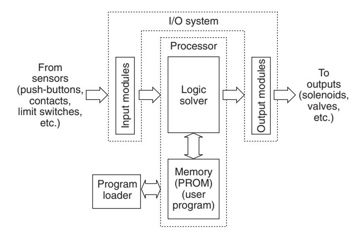

*FIG. 26.1. Programmable logic controller.*

The mechanical relay has been the most widely used device for controlling these discrete processes. However, the advent of microprocessors in the late 1970s permitted the development of the PLCs that have replaced relays in most applications. Since their early introduction, PLCs have evolved into sophisticated control devices that, in addition to replacing relay logic, can manipulate large amounts of data, perform mathematical calculations, carry out continuous process control and communicate with other intelligent devices, such as computers. Moreover, modern PLCs offer flexible input and output choices and lower costs. Because of this, PLCs are used throughout the manufacturing and process industries. Figure 26.1 illustrates the basic functionality of a PLC. The control engineer develops the control program with a program loader which, typically, writes the program into a programmable read-only memory (PROM) which, in turn, is loaded into the PLC. A logic solver reads the states of sensors through input modules, uses this information to solve the logic stored in the PROM and writes the resulting output states to output devices through output modules.

The application of PLCs has progressed more slowly in NPPs than in other industries. Concerns about the use of microprocessors and associated software have been primary reasons for this reluctance. At nuclear plants, PLCs first found applications in the non-nuclear portions but they are now increasingly being used within the nuclear island. An interesting application of PLCs in safety (i.e. protection) system logic has been in the CANDU 6 plants. PLCs, or, more precisely, programmable digital comparators (PDCs), are used to implement trip parameters which require extensive conditioning and trip parameters which are functions of reactor power. This application is described more fully in Section 48.

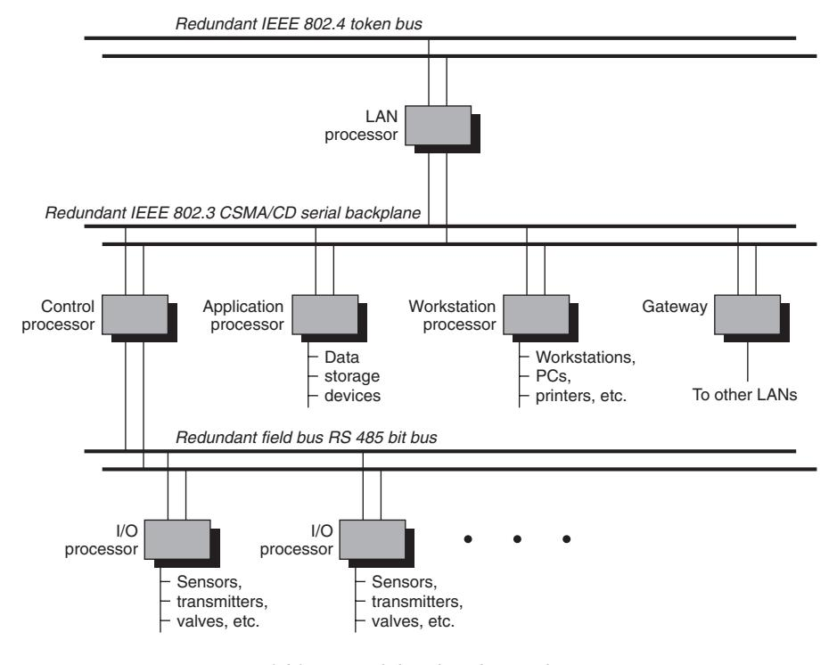

*FIG. 26.2. Typical distributed control system.*

- (b) *Controllers for continuous process variables.* With advances in digital electronics, microprocessors, modern displays and creative software, contemporary standalone controllers have evolved significantly from those available just a decade ago. Major changes include:
  - Reduced size;
  - Greatly increased functionality, i.e. the availability of many other mathematical functions in addition to on/off and proportional–integral–derivative (PID) functions;
  - Electronic displays (e.g. light emitting diodes (LEDs));
  - Automatic self-tuning;
  - Time scheduling and sequencing;
  - Self-diagnostics;
  - Networking.

In backfit situations, control engineers have to consider whether to make use of this additional functionality, with the resultant changes to operating procedures and training, or just to make a one to one replacement of each standalone controller.

- (c) *Control computers.* Computer based systems used for plant control were, until recently, centralized mainframe systems. However, the availability of low cost computers and effective communications has made it possible for data acquisition and control modules to be geographically distributed but connected via high speed data highways. Such a distributed control system (DCS) improves performance, reduces cabling costs and increases flexibility in system configuration and design. As a result, most of the control systems implemented in recent NPPs are of the DCS type. Figure 26.2 illustrates a typical DCS configuration.
- (d) *Software.* Early computer control systems made use of procedural languages (e.g. assembly language or Fortran) to program the control applications and computer specialists were required to design and program these applications. In the last decade, more user friendly languages which can be used by control engineers have become available. For example, PC based graphical ladder diagram language is very popular for PLCs. Ladder diagrams are readily understood and maintained by workers familiar with relay logic. Such graphical languages are beginning to be more widely used and are displacing the procedural languages in many computer control applications.
- (e) *Open systems and standards.* In the past, computing hardware and software from one vendor were incompatible with those from other vendors, but in the last decade the concept of open systems has become popular. This means that hardware and software for a system are designed to international standards, making interoperability possible between disparate computing platforms and application software. In addition to increased flexibility, open systems provide some protection from obsolescence. Because of these benefits, the demand for them has increased in the last decade and led, in turn, to increased standardization of computing hardware and software. Examples of standards, including de facto standards, are given below:
  - Open operating system standards, such as UNIX or POSIX;
  - The open system interconnect (OSI) communications model;
  - The client–server co-operative computing model;
  - X-Windows protocols for workstation communications;
  - Distributed relational database management systems;
  - Standard Query Language (SQL) access to distributed relational databases;
  - Object oriented programming and platform independent languages.
- (f) *Equipment obsolescence/backfits.* The reliability of discrete analog control equipment in NPPs has become a growing concern in the last few years owing to obsolescence of equipment and lack of spare parts. Because of technological advances, vendors of the original equipment either no longer offer replacements or are only able to offer replacement components which are significantly different from the original. In some cases the original vendors no longer exist.

This situation is forcing NPPs to carry out major backfits of control systems. In some cases it has been possible to replace specific control components with modern equivalents, but in many others entire discrete control systems are being replaced with computer based ones.

TABLE 26.1. EVOLUTION OF COMPUTER BASED CONTROL IN SEVERAL GENERATIONS OF CANDU PLANTS

*(year of start of commercial operation given in parentheses)*

| Function                            |                 | Douglas Pickering | Bruce       | Pickering   | CANDU       | Bruce       | Darlington | CANDU |
|-------------------------------------|-----------------|-------------------|-------------|-------------|-------------|-------------|------------|-------|
|                                     | Point (1968) | A (1971)       | A (1977) | B (1983) | 6 (1983) | B (1985) | (1992)     | 9a    |
| Point alarm scanning                | ÷               | ÷                 | ÷           | ÷           | ÷           | ÷           | ÷          | ÷     |
| Channel temperature monitoring   | ÷               | ÷                 | ÷           | ÷           | ÷           | ÷           | ÷          | ÷     |
| Xenon monitoring and prediction  | —               | ÷                 | ÷           | ÷           | ÷           | ÷           | ÷          | ÷     |
| Reactor regulating system        | ÷               | ÷                 | ÷           | ÷           | ÷           | ÷           | ÷          | ÷     |
| Unit power regulation               | —               | ÷                 | ÷           | ÷           | ÷           | ÷           | ÷          | ÷     |
| Steam generator pressure control | —               | —                 | ÷           | ÷           | ÷           | ÷           | ÷          | ÷     |
| Moderator temperature control    | —               | —                 | ÷           | ÷           | ÷           | ÷           | ÷          | ÷     |
| Reactor stepback                    | —               | —                 | ÷           |             | ÷           | ÷           | ÷          | ÷     |
| Flux monitoring and mapping      | —               | —                 | ÷           | ÷           | ÷           | ÷           | ÷          | ÷     |
| Turbine monitoring                  | —               | ÷                 | ÷           | ÷           | ÷           | ÷           | ÷          | ÷     |
| Turbine run-up                      | —               | ÷                 | ÷           | ÷           | ÷           | ÷           | ÷          | ÷     |
| Fuelling machine control            | —               | ÷                 | ÷           | ÷           | ÷           | ÷           | ÷          | ÷     |
| Sequence of events monitoring    | —               | ÷                 | ÷           | ÷           | ÷           | ÷           | ÷          | ÷     |
| Primary heat transport control   | —               | —                 | —           | —           | ÷           | —           | ÷          | ÷     |
| Steam generator level control    | —               | —                 | —           | —           | ÷           | ÷           | ÷          | ÷     |
| De-aerator control                  | —               | —                 | —           | —           | —           | ÷           | ÷          | ÷     |
| CRT messages                        | —               | —                 | ÷           | ÷           | ÷           | ÷           | ÷          | ÷     |
| CRT graphics                        | —               | —                 | ÷           | —           | ÷           | ÷           | ÷          | ÷     |
| Historical data storage             | —               | —                 | ÷           | —           | ÷           | ÷           | ÷          | ÷     |
| Safety system monitoring         | —               | —                 | ÷           | —           | ÷           | ÷           | ÷          | ÷     |
| Safety system trip                  | —               | —                 | —           | —           | ÷           | —           | ÷          | ÷     |
| Safety system automatic testing  | —               | —                 | —           | —           | —           | —           | ÷          | ÷     |

a Under development.

# 26.3. INCREASED USE OF AUTOMATION

The complexity of both new and existing NPPs has grown in the last decade as a result of increased safety requirements and demands for higher performance. The need for NPPs to operate in the load following mode has also increased as the number of NPPs on the grid has grown (e.g. in France). In addition, the larger cores needed to provide higher power capacities require additional controls to ensure radial and axial neutron flux stability. Increased use of automation is necessary to meet these needs. Moreover, operating experience has also highlighted the role of human error in many significant events at NPPs. Increased automation frees plant staff from repetitious tasks and enables operators to concentrate on more strategic operations, giving them time to think and plan before taking action. Thus, increased automation results in higher plant performance and enhanced safety through reduction of human error.

In many existing plants, automation has been increased by replacing the original control hardware with more reliable, flexible digital systems [26.1]. Increasing automation with integrated control systems is a feature of most recent designs of NPPs (see Sections 40 (PWRs, France), 42 (PWRs, Japan), 44 (PWRs, UK) and 46 (BWRs, Japan)).

# 26.4. COMPUTER APPLICATIONS

Typical computer control functions in NPPs include the following:

- Control rod manoeuvres and sequencing for flux control;
- Turbine governor control, with settings altered by the plant power control loop;
- Turbine bypass valve control;
- Automatic run-up of the turbine, its synchronization and its initial block loading;
- Startup and shutdown of the plant;
- Control of feedwater flow;
- Control of reactor coolant temperature and pressure;
- Boiler or steam generator level control;
- Execution of interlocking logic;
- Control of refuelling equipment.

Over the last 25 years, CANDU plants have successfully demonstrated the effectiveness of closed loop computer control. Table 26.1 shows the increase in the use of automation at these plants as the control of more and more systems was computerized.

Building on experience with CANDU plants and on the increasing maturity of the computing industry, confidence in using closed loop computer control for NPPs has grown significantly in the last decade. New PWR and BWR designs incorporate fully integrated computer control systems based on DCS architectures. Some of the systems implemented in the most recent plants are described in Sections 40, 42, 44 and 46. At many of the older plants, which are facing major upgrades to their I&C systems, conventional control systems are being backfitted with considerably enhanced computer based automation.

#### 26.5. ISSUES IN COMPUTER USAGE

Utilizing computer based control systems has created a new set of issues which I&C engineers must address. Some of these are similar to those which impinge upon protection systems but the emphasis is different.

- (a) *Reliability.* The reliability of a computer based control system is one of the important user concerns, since the failure of a single component, such as a processor or a network, could disable major functions of a control system and cripple the whole plant. The issue of hardware reliability has been successfully addressed with redundant configurations of computers, subsystems and networks (Sections 40, 42, 44, 46 and 48). For example, one hierarchy of computers and networks may act as master while the other is on 'hot' standby and can be switched into operation without disturbing the process if the master fails. However, reliability of software continues to be of concern and cost effective approaches to evaluating software reliability are still evolving. Software engineering methods are increasingly being applied and have enhanced the acceptance of digital systems and increased confidence in software.
- (b) *Complexity due to redundancy.* Incorporating redundancy unfortunately leads to additional complexity owing to the need to monitor for failure and to switch transparently from the working system to the backup. This complexity has to be carefully managed and matched with the available technology when configuring the architecture.
- (c) *Complexity due to increased software.* Another source of complexity arises when too many demands are placed on software [26.2]. It is all too tempting to say that software can do anything and then expand functional requirements to meet every need. However, uncontrolled expansion inherently increases the complexity of the software and, at the requirements definition phase of a project, functional requirements must be matched with what can be delivered in the time available with the available resources.

- (d) *Complexity due to networking.* Modern computing technology has led to distributed digital processing architectures as the preferred configuration of current control systems. Distribution of processing requires communications and data transfer between the distributed processing elements. For NPP applications, an issue of concern is that data may not be available over the network in a timely manner because of traffic on the data highway. Therefore, communications and data transfer protocols and data communications hardware must be selected with care to ensure that all processing elements receive, and are able to transmit, information in a timely manner under all operating conditions.
- (e) *Qualification of software.* Qualifying software for NPP control applications was difficult since internationally acceptable standards, procedures and methods were generally not available. The situation has changed in recent years as the software industry has matured. A number of standards, procedures and methods have been developed and are gaining international acceptance [26.3–26.5].

One of the qualification steps is verification and validation (V&V) to demonstrate that the software is in conformance with requirements. Verification refers to stepwise checking of the output of each software development process with respect to the preceding step and must take place throughout the development process. Validation refers to determining whether all user requirements have been met.

Recent experience with control systems, for example at Sizewell B in the United Kingdom and at Chooz B in France, has shown that V&V can be costly and time consuming. Practical and cost effective V&V tools are needed and are becoming available.

(f) *Maintainability of software.* In the past, when software was delivered it was considered that there should be little need to make revisions and that the cost of making such revisions would be small compared with the initial design cost. However, experience has shown that over the lifetime of software a need for change is inevitable and that the cost of such change is high. Revised software requires extensive testing to ensure that changes do not affect the functionality of the rest of the program. Since software maintenance can result in different versions of the same software, version control and configuration management have to be provided to ensure that only the correct versions are used. Control system software should have maintainability built in on the basis of clearly stated maintainability requirements. This will minimize revisions, which are expensive, time consuming and prone to error.

#### **REFERENCES**

- [26.1] FOURNIER, R.D., HAMMER, M.F., SMITH, J.E., "Recent digital control and protection retrofits in power plants", Proc. 13th American Nuclear Society Int. Mtg on Nuclear Power Plant Operation, Chicago, 1987, Trans. Am. Nucl. Soc. **54** (1987) 141.
- [26.2] APPELL, B., Putting in a replacement for Controbloc P20 at Chooz B, Nucl. Eng. Int. **37** (Jul. 1992) 45–48.
- [26.3] INTERNATIONAL ATOMIC ENERGY AGENCY, Software Important to Safety in Nuclear Power Plants, Technical Reports Series No. 367, IAEA, Vienna (1994).
- [26.4] AMERICAN NATIONAL STANDARDS INSTITUTE, INSTITUTE OF ELECTRI-CAL AND ELECTRONICS ENGINEERS, ANSI/IEEE Criteria for Programmable Digital Computer System Software in Safety-Related Systems of Nuclear Power Plants, Standard ANSI/IEEE-ANS-7-4.3.2, IEEE, Piscataway, NJ (1982).
- [26.5] INTERNATIONAL ELECTROTECHNICAL COMMISSION, Application of Digital Computers to Nuclear Reactor Instrumentation and Control, Standard 643, IEC, Geneva (1979).

#### **BIBLIOGRAPHY**

INTERNATIONAL ATOMIC ENERGY AGENCY, Safety Implications of Computerized Process Control in Nuclear Power Plants, IAEA-TECDOC-581, Vienna (1991).

— Computerization of Operation and Maintenance for Nuclear Power Plants, IAEA-TECDOC-808, Vienna (1995).

Nuclear Power Plant Control and Instrumentation 1982 (Proc. Symp. Munich, 1982), IAEA, Vienna (1983).

Nuclear Power Plant Instrumentation and Control (Proc. Symp. Tokyo, 1992), Rep. NEA/SIN/DOC(92)1, OECD/NEA, Paris (1992).

Second Topical Meeting on Nuclear Plant Instrumentation, Control, and Man–Machine Interface Technologies, Pittsburgh, PA, 1996, American Nuclear Soc., La Grange Park, IL (1996).

# **27. LIMITATION SYSTEMS**

# 27.1. HISTORICAL DEVELOPMENT

Most NPP I&C installations distinguish between systems for normal operation (control systems, sometimes called 'white systems') and those installed for accident handling (protection systems, or 'black systems'). In general, white systems are single channel while black systems are qualified to rigorous requirements and designed with some level of redundancy, e.g. two out of three or even two out of four.

Early plant experience showed that malfunctions in white systems and most operator errors led to unnecessary reactor power disturbances and sometimes to trips, with consequent interruption of power production. Some passive interlocking methods such as rod stops or control switch-offs were added to stop this but did not work satisfactorily in all circumstances. The next development step could have been the use of redundancy in the control systems but, since most of them contained sophisticated functions (especially with respect to their transient behaviour), this step was applied in only a few, simple, cases. In these, the simplicity aspect was strongly emphasized in order to ease (or even permit) licensing.

A further step was the use of limit control systems, the actuation limits of which are set outside the dead band of the control system plus a margin for overshoot of the controlled variable. However, such additional equipment, if single channel, can itself cause spurious trips and additional redundancy with *m* out of *n* voting, plus surveillance, for single failures (with consequent repair) was therefore necessary. Limit control systems designed without the possibility of operator intervention (like safety systems) are, in some countries, designated 'grey systems'. The expression 'limitation system' can also be found in the safety rules of Germany and in other literature [27.1, 27.2].

One example of how several I&C systems may work together in one possible defence in depth strategy is described in Ref. [27.3]:

"To minimize the magnitude of a disturbance and to achieve defence in depth, echelons of defence can be used. These may consist of more than one control system, which act progressively as the controlled variable deviates from the desired value. At first, as the variable deviates from normal conditions, operational controls take action. Following the action of these operational controls, one or more levels of additional controls may intercede, prior to the actuation of the protection system, if the event grows from a minor operational disturbance to a minor transient and to a significant transient. At each stage the purpose is to terminate the event and to return the system to normal operation for minor events and to shut down safely for events which become more serious."

With growing experience, several different applications of limitation systems have been used to minimize interruptions in output caused by reactor or turbine trips [27.4]. A further development was to use these techniques to avoid situations which otherwise would impose unnecessary stress on the plant or on the operators. Last but not least, it was shown that some of the PIEs specified in former safety analyses were eliminated merely by the existence of these additional systems. For example, multiple reactivity disturbances due to malfunction of single, double or several groups of control rods became impossible. In general, control, limitation and protection systems constitute a defence in depth strategy involving diverse I&C functions (Fig. 27.1 and Table 27.1) [27.5, 27.6].

Examples of limitation system functions are:

- Local core protection and integral reactor power limitation [27.4];
- Ensuring shutdown margin and control capability within the rod banks;

# TABLE 27.1. DEFENCE IN DEPTH CONCEPT FOR I&C GOALS AND FUNCTIONS

- (1) *Operational goals: Control and information functions*
  - Effective production of electrical energy
  - In the case of failure: power reduction by protective systems only
  - In the extreme: scram

#### (2) *Disturbance handling goals: Protection functions*

Condition limitation functions:

- Guaranteeing the initial conditions of the safety analysis by offsetting small or slow deviations which cannot be covered by the control systems with acceptable reliability
  - Protection limitation functions:
- Handling intermediate disturbances which require stronger than normal control to avoid excessive loss of power, e.g. by fast power setback instead of scram. Operation continues
- Handling disturbances which would have small consequences in the event of I&C malfunction. Safety continues to be ensured by protection
- (3) *Protection goals: Protection functions*
  - Handling accidents which would have large consequences in the event of I&C malfunction
  - In the case of action, power production is interrupted. No further operation for safety reasons

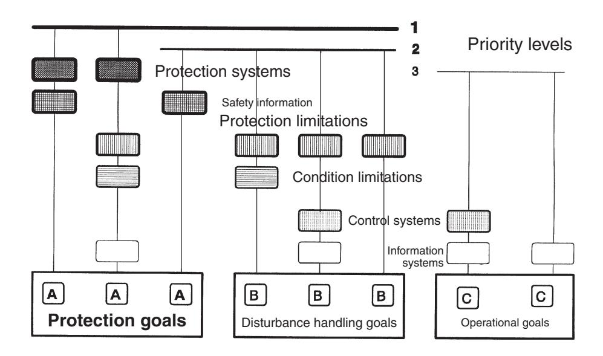

*FIG. 27.1. Defence in depth and I&C goals and functions. (Categories A, B, C are described in Table 14.1.)*

- Ensuring power balance between the reactor and turbine sides;
- Ensuring acceptable reactor coolant temperature gradients, mass and pressure.

More details are presented in Section 41. Limitation systems in Germany were originally developed as limit control systems with fourfold redundancy and no special qualification. The first on-site application was at the Stade NPP in 1972. After demonstration of their advantages in the Biblis type reactors (of up to 1300 MW(e)) from 1972 to 1979 and their acceptance into the safety rules [27.1], limitation systems became qualified as parts of the protection system. After a total review and considerable extension, they were applied to all modern German NPPs of the Grafenrheinfeld type (1979–1989).

Limitation systems achieve their protective purpose by early and sensitive identification of a deviation and by the initiation of specific actions necessary to limit and smooth the transient. When the cause of the disturbance has been eliminated, they control the plant back towards normal operating conditions, transferring final adjustment to the normal control system without interruption.

#### 27.2. WORKING REGIONS

As implied above, the working regions of the different limitation systems lie between (and inside) those of the control systems and the safety I&C [27.7]. The latter, i.e. the RPS, safety actuation system and safety system support features, ensure safe reactor shutdown and core heat removal and limit the possible consequences of AOOs and ACCOs. However, limitation systems do not cover fixed regions but are staggered to provide the best overall defence in depth.

#### **27.2.1. Safety systems**

According to IEC Standard 1226, which categorizes I&C functions [27.8], those functions which play a principal role in the achievement or maintenance of NPP safety are denoted as Category A (Table 14.1). The tasks of each of these functions are normally specified to generate actions, or to contribute to actions taken by operators in response to PIEs, and to prevent any event from developing into a 'significant sequence'. They also mitigate the possible consequences of events. A different, newer method of categorization is based on engineering judgement and assesses the magnitude of the consequences which would occur if a particular I&C function failed. Another, future, complementary method might be risk based. Normally, Category A functions have multiple redundant design and may, in the case of modern computer based applications, require some kind of diverse design with defence in depth or a backup structure.

#### **27.2.2. Safety related systems**

I&C systems which are categorized as safety related according to IAEA Safety Guide No. 50-SG-D8 [27.3] are placed by IEC 1226 [27.8] into Category B or C. Category B denotes those functions which play a complementary role to those in Category A, while Category C functions have an auxiliary, or indirect, role.

#### **27.2.3. Control systems**

Normal control systems usually perform functions in Category C or NC (nonclassified) but are sometimes assigned to B, depending on the plant safety philosophy and the presence and design of the other systems. Their task specification is mostly symptom oriented. They control a certain variable, not taking into account possible disturbances that could violate the control result. There is generally no requirement for redundancy but in digital designs twofold redundancy is likely to become the norm [27.9].

#### **27.2.4. Limitation systems**

Limitation systems mostly perform functions in Category B but are also in A and C and their tasks are specified with both event and symptom orientation. This

| TABLE 27.2. AN ASSIGNMENT OF LIMITATION FUNCTIONS TO IEC 1226 |  |  |  |
|---------------------------------------------------------------|--|--|--|
| CATEGORIES                                                    |  |  |  |

|                             | Probable category assignment |   |   |    |
|-----------------------------|------------------------------|---|---|----|
| I&C system safety functions | A                            |   |   |    |
| Limitation functions        | A                            | B | C |    |
| Control functions           |                              | B | C | NC |

is one reason for their complexity. Some countries distinguish between protection and condition limitation functions:

- Protection limitation functions protect against those AOOs the consequences of which may still be acceptable in the event of limitation malfunction (Categories A and B).
- Condition limitation functions try to guarantee (at any time) the initial conditions assumed in the safety analysis (Category C), especially when this need depends on legal requirements, licence conditions, the design or even PSA. Such functions could, if licensed, also be performed by control systems or by manual action.

There are very few self-contained condition limitation functions. A typical one is the prohibition of local or integral DNB. In most cases, protection limitation functions contain a condition limitation function at a lower initiation level which provides less rigorous countermeasures.

Most limitation systems possess redundancy but generally no diversity. In special design philosophies they may constitute a less reliable but much more intelligent and flexible part of the protection system and may act in advance of, or as a backup to, the other parts. They may even initiate trips. Probable category assignments are shown in Table 27.2.

# 27.3. CHARACTERISTICS OF PROTECTION, CONTROL AND LIMITATION SYSTEMS

For very high reliability requirements and to ease assessment and licensing, simplified functionality is recommended. This may mean that diversified redundancy or backup structures are necessary and more than one system or item of equipment may be needed to perform a required function. For most of the time, protection functions are poised, waiting for an event. When invoked, typically they initiate countermeasures which are rigorous, uninterruptible and irreversible. To avoid interruption of power production and time consuming startup procedures in the case of spurious actuation, the initiation values are kept as high as acceptable, which means that, in the event of a real disturbance, the countermeasure will possibly be later and stronger than might otherwise be the case. Qualification for the worst case conditions of design accidents is required.

Sequence or feedback control systems are optimized for high efficiency under all kinds of normal operation, including constant load and baseload operation, scheduled load and frequency control, quick startup to full load and even load following of all sizes of grid disturbance. To achieve this necessitates high functionality and sensitivity together with fast response and, for acceptable availability, qualified maintenance and/or redundant design. To provide a system with these properties is no simple task, especially for time dependent behaviour. It is eased considerably if limitation systems can act to avoid trips in the case of control malfunction. Control actions may be operated automatically or manually, which means that both modes have to be considered in the safety analysis. Each has its own advantages and disadvantages, the worst case being switch-off of an automatic system without notice. If safety relevant qualification is required, best estimate conditions are adequate.

Limitation systems are generally designed as multiply redundant systems with an optimal balance between functionality and reliability. When actuated, they work like control systems and normally they are symptom oriented, providing control reversal in a feedback mode. When not actuated, i.e. in undisturbed plant operation, their status is analogous to that of protection systems, i.e. they are ready to operate with settings slightly outside the normal operating envelope. The margin to the initiation value for each limitation system, how early the systems act and hence their sensitivity are highly dependent on the knowledge base of the designer. This also governs what (staggered) countermeasures of increasing intensity may be actuated.

A limited number of AOOs cannot be governed by the normal control systems alone because the disturbances which may be caused by them are too big or because, in spite of their infrequency, it is of ecological, practical or economic interest to avoid any kind of unnecessary trip. Limitation systems identify and diagnose these AOOs in an intelligent, event oriented way and are therefore able to react with optimal countermeasures. These include:

- Dropping an individual rod or pairs or groups of rods for a sensitive and quick power setback. In the extreme they can even initiate a scram via channels different from those of the protection system (but with the same rods).
- Separating systems by stopping the relevant pump and, additionally, closing the associated valve.
- As a speciality in one application, starting emergency boron injection if a scram actuation has failed.

The diagnosis on the basis of which this choice is made can, additionally, be used very effectively as information to guide operators, enhancing their understanding of the complex functions of an intelligent limitation system.

Limitation systems are also like protection systems in that they cannot be switched off. It is therefore necessary to ensure that no system violates the functionality, availability or performance of neighbouring systems. If the functionality required to ensure this is large compared with the extent of the main active identification and actuation function, then the limit of further automation may have been reached. However, this limit may be moved if more modern, computer based techniques are applied. New, much more intelligent capabilities for situation identification can allow new priority concepts (Sections 27.5 and 41).

Protection limitation equipment is qualified to worst case conditions for those accidents which it is designed to control. Best estimate conditions are sufficient for equipment used only for condition limitation functions.

## 27.4. ADVANTAGES OF LIMITATION SYSTEMS

Many limitation systems are complex and therefore rather expensive. This investment is offset by a number of advantages, to operation as well as safety.

#### **27.4.1. Advantages for operators**

Limitation systems offer many advantages to operating staff. They reduce the number of necessary manual interventions and therefore reduce the number of possible human errors. They enhance the self-confidence of the operators because it is no longer necessary to be afraid of causing inadvertent scrams. Deviations arising from error will be limited to the smallest possible extent by reversible measures. Control system functions may be blocked by the operators, giving them the opportunity to become familiar with the process by manual control.

Limitation systems contribute to the smoothing of transients, even if they do not totally control them, and give the operators time to understand situations and to judge how and when to intervene manually. The operators even learn when not to do so.

## **27.4.2. Advantages for licensing procedure**

If limitation systems are not available, many reactor perturbations need to be considered during the design and licensing of I&C systems important to safety. Limitation systems modify or even eliminate many of these perturbations but, of course, create a need to assess the new limitation functions themselves. However, licensing the latter may be less complicated than for protection systems because of their lower possible ranking. An important difference is that, because of the reduced consequences of malfunction, requirements for reliability and therefore for design with diversity are reduced. This also means that CMFs/CCFs are less important.

Examples of this kind of limitation function are listed below:

- Control of local DNBR by power density limitation derived from in-core detector signals simplifies the otherwise extensive demonstrations needed to show that sufficient precautions are taken with regard to spatial effects. Prevention of 'departure' is ensured by a sufficient margin before the anticipated disturbance and is therefore a typical condition limitation function.
- Rod/bank movement limitation with redundant surveillance eliminates numerous cases of reactivity disturbance caused by spurious or wrong control rod motion.
- Coolant pressure limitation is an important component of an automated procedure to handle steam generator tube rupture. This avoids the need for an otherwise complicated qualified information display together with operator training, and is a typical protection limitation function.

# **27.4.3. Advantages for availability**

The first proposals for limitation systems arose when numerous and extensive simulator studies and later commissioning tests showed that relatively inexpensive additions would avoid unnecessary reactor scrams and even turbine trips [27.2]. Later it was shown that the number of power reductions caused by the trip of large plant items such as main coolant or feedwater pumps could be minimized by the application of various types of quick power setback [27.5] (see also Section 41).

The existence of limitation systems enables designers to minimize the margins between the normal operational regions and the protection actuation values without loss of safety. They therefore permit the plant to operate closer to design limits. This is possible because limitation systems can use more complicated and accurate measuring equipment than protection systems (such as in-core detector signals) and provide more sophisticated information processing capability.

The high reliability of the scram avoidance feature of limitation systems permits the use of sophisticated control systems in one channel designs which can provide sufficient functionality for optimal transient behaviour in all conceivable situations. This enhances the flexibility of the plant without reducing availability.

#### **27.4.4. Advantages for reliability**

Limitation functions complement the concept of defence in depth within the I&C hierarchy in an ideal manner (Fig. 27.1; see also Section 14). Condition limitation functions guarantee, with high probability, the initial conditions assumed in the safety analysis (excluding any overshoot above these limit values). Examples of this feature are presented below:

- Power and power density limitation systems ensure the value of stored energy in the reactor core. The latter is one basis for the design of the volume of containment necessary in the event of a LOCA.
- A DNBR limitation system (as mentioned above) can ensure a certain DNBR at any time so that loss of all main coolant pumps can be overcome without film boiling.
- A rod/bank movement limitation system may ensure the shutdown margin of the control rod banks.

Protection limitation functions will minimize stress to components not only by avoiding actual scrams but also by avoiding the following startup with its probability of additional failures due to erroneous human or automatic action. They can protect against PCI in load following operation and can avoid exotic power distributions by local power density limitation. A rod/bank position limitation function can keep all banks in their correct, power dependent positions and all rods in their right banks, e.g. by actuating rods, causing rod stops or dropping rods. This can limit the power increase caused by control systems in the case of a spurious rod drop, may prevent pressurizer overfeeding (by means of an inventory limitation function) and, last but not least, can prevent unintended criticality by interlocking the feeding of demineralized water to the main coolant loops in a 'dead man' surveillance mode.

# **27.4.5. Overall aspects**

Over the twenty or so years that limitation systems have been developed and operated, several system structures and a growing number of systems for different tasks have been applied. At first, the entire chain of each new limitation system measurement, processing and actuation equipment — was designed as a separate, single purpose whole. Later, the number of systems, their capability and the necessary common use of sensors and actuators prevented this separation. Overlap then led to a dense carpet of protective systems. New functions were created, not only against defined disturbances but also whenever countermeasures working in the safe direction were possible. This resulted in an ability to handle all single failures and even many kinds of multiple failure.

#### 27.5. POSSIBLE FUTURE DEVELOPMENTS

Simulation as well as commissioning experience, operator training and on-site operation has revealed a necessity for enhanced information about the capabilities and current status of limitation systems. VDU based formats, already used for control and limitation system development by the analog simulation of a 3-D core, were therefore further enhanced (1979–1989) and became the heart of the PRISCA system applied to new plants and, in a simplified form, backfitted to nearly all other operating PWR type NPPs in Germany. Typical display formats for these purposes are special diagrams, trend curves and action status formats [27.10].

As mentioned earlier, limitation systems are complex. This is due to:

- Their event as well as symptom oriented behaviour;
- Their capability for intelligent diagnosis;
- Their tolerance of neighbouring functions.

All this requires a clear understanding of the interrelation between different systems and makes training, especially of operators, difficult. Experience has revealed, however, that this difficulty can nearly be eliminated by using the function diagnosis capability for display purposes. Information can be displayed sparingly with respect only to the relevant situation or goal and with only relevant variables, limits or activities. If this is done with regard to human factors and on the basis of validated signals, then easy understanding is possible. It may appear surprising that the appropriate use of one complicated (display) system can ease the understanding of another complicated (operating) system.

#### **REFERENCES**

- [27.1] BUNDESMINISTER DES INNEREN, KERNTECHNISCHER AUSSCHUSS, Safety Rules of the KTA, No. 3501: Reactor Protection System and Surveillance of Safety Equipment, Heymanns, Cologne (1985) (in German).
- [27.2] ALEITE, W., "Improved safety and availability by limitation systems", Proc. ENS/ANS Int. Topical Mtg on Nuclear Power Reactor Safety, Brussels, 1978, Vol. 1, Belgian Section of American Nuclear Soc., Mol (1979) 599–610.
- [27.3] INTERNATIONAL ATOMIC ENERGY AGENCY, Safety Related Instrumentation and Control Systems for Nuclear Power Plants: A Safety Guide, Safety Series No. 50-SG-D8, IAEA, Vienna (1984).
- [27.4] ALEITE, W., BOCK, H.-W., FISCHER, H.-D., "(Protection) limitation systems", Proc. ANS Thermal Reactor Safety Mtg, Knoxville, TN, 1980, Oak Ridge Natl Lab., TN (1980) 1032–1039.
- [27.5] ALEITE, W., "The contribution of KWU PWR NPP Leittechnik important to safety to minimize reactor scram frequency", Proc. NEA Symp. on Reducing the Frequency of Nuclear Reactor Scrams, Tokyo, 1986, OECD/NEA, Paris (1987) 403–417.
- [27.6] ALEITE, W., "Defence in depth by 'Leittechnik' systems with graded intelligence", Nuclear Power Plant Control and Instrumentation 1982 (Proc. Symp. Munich, 1982), IAEA, Vienna (1983) 301–319.

- [27.7] INTERNATIONAL ATOMIC ENERGY AGENCY, Protection Systems and Related Features in Nuclear Power Plants: A Safety Guide, Safety Series No. 50-SG-D3, IAEA, Vienna (1980).
- [27.8] INTERNATIONAL ELECTROTECHNICAL COMMISSION, Nuclear Power Plants — Instrumentation Systems Important to Safety — Classification, Standard 1226, IEC, Geneva (1993).
- [27.9] ALEITE, W., STRUENSEE, S., Leistungs-Regeleinrichtungen und Begrenzungen von Druck- und Siedewasser-Reaktoren, Atomwirtschaft **32** 3 (1987) 129–134.
- [27.10] ALEITE, W., Protective supervisory control with adequate information functions in PWRs of KWU, Control Theory Adv. Technol. **8** (1992) 593–619.

# **28. COMPUTERIZED PROTECTION SYSTEMS**

# 28.1. INTRODUCTION

Automatic I&C equipment has developed markedly over the past few years. The use of digital systems has become more commonplace while large scale industrial process control projects have taken full advantage of programmable controllers, computers and surveillance systems. The specialized area of nuclear safety has seen parallel development and the use of programmed techniques is now a working reality, although the evaluation of their safety performance is a sensitive matter. This explains the reservations which often accompany computer application in the area of protection systems.

While only a small number of new reactors are at present being built, all of the major construction firms have continued their R&D programmes and are able to supply protection systems which use fully computerized techniques and which also satisfy the needs of existing installations due for renovation. This section presents an appraisal of the current situation and the various arguments both for and against these techniques. The systems being developed and produced worldwide are briefly described in order to highlight trends and the directions being followed by the various producers.

# 28.2. FEATURES AND ADVANTAGES

Digital techniques offer significant improvements over conventional analog techniques. The main features and advantages currently being put forward are as follows:

(a) *Measurement precision.* Digital processing of signals allows the number of analog circuits to be limited to an absolute minimum although without actually

- eliminating them completely. Reducing such circuits helps in removing interference and drift, thus providing more accurate measurements. The further processing of measurements can also be more accurate since, for given data, precision is limited only by the program.
- (b) *Reduced equipment volume and improved reliability.* For any given function and when the complexity exceeds a given minimum level, the processing power of computerized systems allows a significant reduction in the volume of instrumentation required to process data. This reduction implicitly results in enhanced reliability.
- (c) *Simplification of fault analysis.* One important aspect of safety systems is the ability to analyse system faults. A system which has been programmed in this respect has two highly advantageous features:
  - The hardware components are very much standardized and uniform;
  - The use of self-testing limits uncertainty regarding the consequences arising from faults.
  - However, hardware components are becoming increasingly complex and knowledge of the ways in which they may fail is very limited. Analysis of this aspect remains extremely difficult.
- (d) *Complex function capabilities.* A digital system allows more elaborate processing and computation, hence improving reactor performance. Noteworthy in the range of processing functions covered is the on-line computation of DNBR and power density limits. Such a high degree of processing may be applied directly using computerized systems. Other examples are dead time correction and temperature correction along nuclear measurement paths. Digital techniques hold special interest in the context of physical signal filtering capabilities and more especially nuclear measurements. Signal filtering can be tailored very accurately to any measurement type and range.
- (e) *Adaptability and modifications.* A digital system allows parameter values to be altered easily while still remaining within the designed safety limits. This is especially useful during the commissioning phase, where certain functions may need to be reinstated or thresholds adjusted as a function of the experimental data.
- (f) *Systems monitoring.* In order to improve the intrinsic safety and ease of operation of a reactor, it would be valuable if the operator or indeed the computers were able to access certain of the internal system parameters such as raw measurement data, corrected data, working parameters and threshold values. It would then be possible to produce high performance monitoring functions on normal operational systems.
- (g) *Operator support.* Experience has shown that a large number of incidents have been the result of incorrect intervention by the operator, such as changing a parameter value unexpectedly out of range. By design, the computerized safety

- system may incorporate a check routine to ensure that changed values are sensible before being implemented and used.
- (h) *Installation.* A computerized system is of special interest with regard to installation. Much of the essential functional development is covered by the software and may take place for the most part independently of the hardware. The hardware may be installed first and the software loaded later. This feature is valuable for reducing project implementation lead times.
- (i) *Self-testing.* Safety system testing is one important element of ensuring reactor safety. With a digital system, each and every function can undergo thorough automatic testing much more easily than can be achieved with analog systems.
- (j) *Simplification of cabling.* One important feature of computerized systems lies in the ability to transmit a large amount of information over a single physical medium (whether twisted pair, coaxial or fibre optic cable). The direct consequence of this is a huge increase in the number and quality of links. Current trends are towards intensifying the use of fibre optics, which are renowned for their high performance and resistance to EMI.

#### 28.3. PROBLEMS AND DISADVANTAGES

The objections which are often raised against computerized protection systems may be summarized under a number of headings, the main elements of which, together with their related arguments, are presented below. Counter-arguments are also given wherever necessary.

- (a) *High development costs.* Cost is often cited as an argument against computerized systems, particularly with respect to development time and software qualification. However, the functions which have to be fulfilled by a protection system are often of very simple sequential and combinational types and, although costs may indeed be high for a 'one-off' system, they fall rapidly when the solution is a standardized, modular design that can be incorporated into a number of installations. This is especially true in the case of initial attempts where everything needs to be developed from the very beginning and explains why an initial large scale project is better carried over a series of twenty or so identical units. The amount of work is greatly reduced by acquired experience and methodological improvements, which combine to reduce costs. This assumes, of course, that the safety and qualification aspects can, for the most part, be integrated.
- (b) *Software common mode failure risk.* In a redundant computerized protection system, the software is generally identical along the various channels and therefore constitutes a common mode risk. This risk forms a major current field of

- discussion between experts. The conclusions in this regard are not commonly agreed and, in the case of software that has been specifically safety engineered, experience and experimentation do not show that the risk actually exists. Nevertheless, precautions are put in place to marginalize it, one of the consequences being provisions covering functional diversity.
- (c) *Quantified assessment of safety*. Computerized system safety is dependent on software quality and safe software is software which contains no defects or only safe defects. Unlike hardware, for which the number of defects per unit time caused by wear and deterioration may be estimated with probabilistic methods, software faults take on a completely different form, i.e. they result from an existing error which was not located during the checking stages. The approaches used to assess error risks are still the subject of much research.
- (d) *Retraining of operating staff.* During renovation work the retraining of operating staff and their adaptation to a new system which uses fundamentally different technology are a major cause of concern. Personnel who are used to working with a system based on old technology and who know and understand it could find that taking over a new system is difficult. Again, this difficulty seems more apparent than real. In general, many power plant systems using old technology and with no safety implications are being replaced by modern computerized systems and operators are having no special problems in quickly and efficiently learning how to handle the new technology. There is no special reason why this should be otherwise for safety classified systems, particularly given that system programming is not needed, the requirement being simply to configure and operate.
- (e) *Absence of standards.* A major effort has been devoted to standardizing the various aspects of protection system design. The basic work was published by the IAEA (e.g. in its Safety Guides) and standardization has been completed by other international groups such as the IEC as well as by national standards bodies. With regard to computerized systems, innovative design in this area has highlighted an absence of rules applicable to software. The first international standard, IEC 880 [28.1], could not be established until the first system was finally running and did not appear until 1986, when the first digital protection system was eventually commissioned in France. Since that time, experience, experimentation and legislation have followed with the purpose of improving and spreading those concepts which have been validated.
- (f) *Acceptance by safety standards bodies.* National safety committees are often reticent about accepting that a computerized system can guarantee reactor safety. The main reasons given are the innovative character of such technology and the difficulty of actually demonstrating the safety of a computerized system. The systems currently in use are too few and too recent to enable a consensus on acceptance criteria and methods to be formed by safety committees.

- (g) *Verification and validation.* Much work needs to be put into developing safety systems software because it is impossible to show exhaustively that, beyond a certain level of complexity, the software does solely and exactly that which it was designed to do under all circumstances. Thus, an approach which follows a strict and thorough set of guidelines must be adopted in order to prevent the occurrence of errors. The precise principles behind such development methods are provided in IEC 880. Both the increasingly sophisticated programming techniques and the appearance of more and more powerful programming aids work to lessen the impact of this argument.
- (h) *Difficulty of identifying all possible defects.* Software cannot deteriorate. Only the hardware on which the software is installed is subject to degradation. However, one difficulty concerning software defects lies in attempting to predict and cover all possible scenarios. In order to guard against an incorrect operation which may affect the safety of the reactor, the system must have a constant and continuous checking procedure to ensure that any abnormal operation is detected immediately and appropriate measures are implemented.
- (i) *Obsolescence.* The very rapid development of components could lead to the unavailability of spare parts in the short term. One currently accepted idea is that the more sophisticated components run the greatest risk of becoming obsolete. For example, a family of microprocessors could last just ten years or so. Experience has shown that the situation is in fact more subtle than this and that mechanical components (connectors, switches, etc.) are of more critical importance. Obsolescence is not specific to the computerized nature of the hardware.
- (j) *Qualification of tools.* The qualification of software tools is often considered critical and concerns very many types, from compilers through to enhanced development environments. Just as with the software programs produced, tools validation requires a very high level of resource investment. Each developer uses its own approach, taking into account the development methodology of the tools and their verification. However, tools qualification does not in any way dispense with the need to check systematically the actual software produced.
- (k) *Maintenance costs.* In the case of a computerized system, software maintenance relates solely to required modifications. Hardware maintenance covers periodic checks and the repair of any detected defects. The software may have to be modified, either because of a change in specifications in order to incorporate new processing capabilities or owing to incorrect operation following, for example, a situation which is not covered by the existing versions. In a standard computerized system, if development has not been carried out carefully and if the program is important, the cost of upgrading software could be considerable. In the case of a safety system, the situation is more favourable since the development methodology must have been codified. Nevertheless, revalidation and documentation account for most of the high costs of safety software.

(l) *Response times.* The response time of a digital system plays an important part in the intrinsic safety of an installation. This point is especially critical in the case of nuclear measurements which necessitate very rapid response. Digital equipment is inherently unable to monitor data continuously. Instead it uses continual signal sampling and this introduces a systematic lag which must be taken into account during the system design stages. An analog system, on the other hand, does not have this systematic delay and is able to process system information continually. However, the difference is not as real as it appears because lags due to necessary signal filtering need to be taken into account. Experience shows that the response times for critical parameters are in fact very similar for the two types of technology.

#### 28.4. EXPERIENCE

#### **28.4.1. Implementation principles**

It is difficult to apply the standard rules developed for hard-wired systems to the new concept of using computerized systems for providing protection functions. The centre of the debate is focused on the additional risk of possible software failures. Probabilistic approaches are well adapted to forecasting the performance of hardware in safety terms and such methods of analysis are well accepted and provide good results. In the case of software, however, safety evaluation has been more problematic and has required a great deal of work to establish the development rules and acceptance conditions. Experience acquired from developing industrial computerized systems with the methods normally employed in that field has shown them to be incompatible with the safety aims of a protection system.

It is essential that a distinction be made between safety systems and systems which have no classification under standardized criteria [28.2] in order to ensure differentiation between safety software and unclassified software. This recognized distinction, which is fully accepted by the various manufacturers and producers, is applied on more or less the same lines and following the principles given in IEC 880 [28.1].

Those digital protection systems which have been completed and are running or which are in preparation are still somewhat limited, but projects planned for the future show a move towards computerized solution standardization.

#### **28.4.2. Reactors in operation**

Four countries may be cited as main contributors to the area of computerized protection systems:

- (a) *France.* France is the country with the most experience in this field. The first installation, called the Système de protection intégré numérique (Integrated Digital Protection System, SPIN), was designed jointly by Framatome, EdF, the Commissariat à l'énergie atomique (CEA) and the Schneider Group. This system has been running since 1984 and is currently in use at about twenty 1300 MW(e) reactors (Fig. 28.1). It uses an architecture of four identical channels, each computerized and working independently. Each channel is equipped with 13 microprocessor units controlling emergency shutdowns and issuing safety implementation instructions. Task sharing between the computerized units ensures observance of the functional diversity criteria, thus avoiding software common mode conditions. Safety actions are controlled via two independent paths made up of directed breakdown cabling technology.
  - Several versions of the software have been developed to take into account changes in specifications. This provides a good illustration of the flexibility of this type of technology and the way in which it can monitor and adapt itself to operating experience feedback.
- (b) *Canada.* For many years now, Canada has undertaken R&D work on using computerized systems to fulfil reactor safety functions. The Canadian approach has been to introduce computers gradually and three successive generations may be distinguished:
  - *First generation:* the systems affected by safety commands are hard-wired, while the monitoring functions use computer technology. The reference plant is the Bruce reactor.
  - *Second generation:* the trip circuits use computer technology (PDCs). This design is used with the CANDU 6 family of reactors, i.e. Point Lepreau, Gentilly 2 and Wolsong.
  - *Third generation:* this has a fully computerized protection system developed in association by Atomic Energy of Canada Limited (AECL) and Ontario Hydro.

The third of these is the system discussed below (Fig. 28.2). Its main features include emergency shutdown functions, automated testing of safety systems, total monitoring of parameters on screen and monitoring of correct systems operation. The principle used in the design is full diversity over two totally different computerized protection systems: shutdown systems 1 and 2 (SDS1 and SDS2). Each system controls one path and consists of three trip computers which carry out the following functions:

- Acquisition and verification of the safety parameters;
- Execution of protection algorithms and issuance of emergency shutdown commands;
- Execution of self-testing;
- Transmission of parameters to the monitor computer via fibre optic cables;

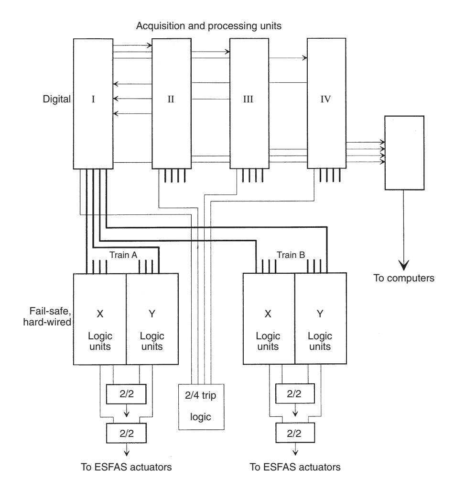

*FIG. 28.1. French 1300 MW(e) PWR Integrated Digital Protection System (SPIN). (ESFAS: engineered safety function actuation system.)*

— Receipt of calibration data from in-core measurements via the monitor computer and fibre optic cabling.

The trip computers of SDS1 are General Automation Model 220 computers programmed using Fortran and GA Assembler. Those used for SDS2 are Interautomation computers programmed using Pascal and Assembler. Each of the GA 220 type trip computers is linked to a monitor and tester computer which carries out the following functions:

— Receipt and transmission of data associated with the trip and monitor computers;

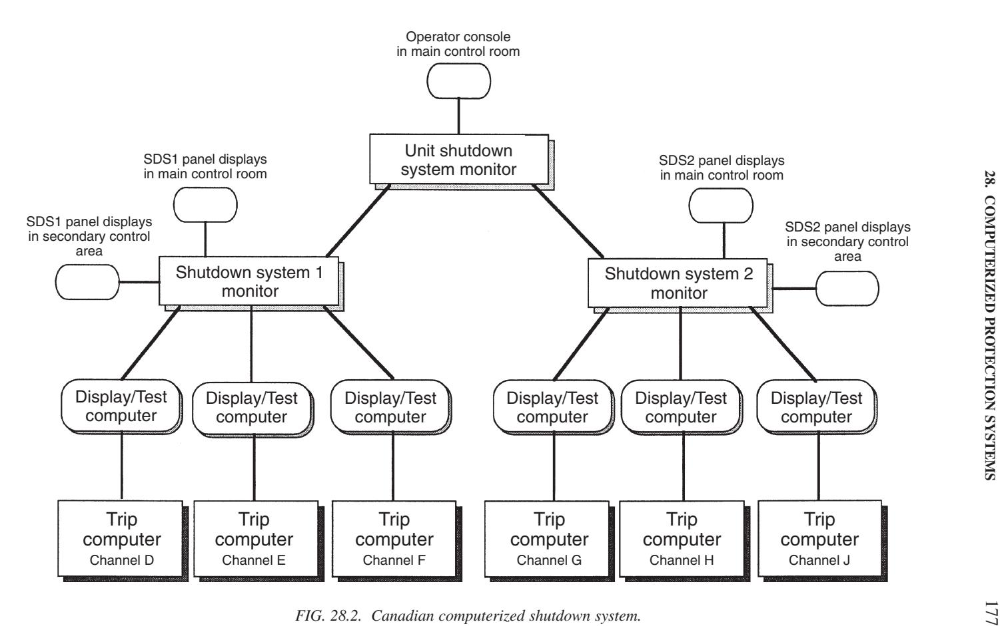

- Control of the two panels fitted with VDUs;
- Generation of test signals when requested by the monitor computer. Each path contains an IBM PC AT type monitor computer (shutdown system monitor computer, SSMC) which carries out the following functions:
- Test and calibration functions and control panel management;
- Management of the links with the tester and monitor computers;
- Comparison of the parameters for the three channels along any one path;
- Transmission of alarms and test results to the SSMC of the path in question. This system has been submitted for approval by Canada's nuclear safety authority, the Atomic Energy Control Board (AECB), which has accepted the design. Initial use will be in the four units of the Darlington CANDU plant (4 × 881 MW(e)), the first of which came on-line in 1990.
- (c) *United States of America.* Several reactor manufacturers are interested in computerized systems for executing safety functions, but the only system which is currently running is the Eagle 21 system developed by Westinghouse and implemented during the partial renovation of an analog system on Units 1 and 2 of the Zion power plant. Eagle 21 is a safety system based on the use of microprocessors and is designed to be installed in the same cabinets as analog instrumentation used to process thermodynamic measurements (Westinghouse System 7100). Installation of this new system uses the same cabling interfaces but requires that the cabinets be reorganized internally. The functions achieved include initiating emergency shutdown of the reactor and switching on the safety actions up-line from the voting logic. The system controls the indicators and recorders and transmits required data to the main computer as well as to the various user systems. Each Eagle 21 system chassis is made up of three subsystems:
  - Input/output (I/O) subsystem;
  - Loop subsystem;
  - Tester subsystem.

The input/output subsystem consists of conditioning modules which carry out signal conversion and isolation. Signals may be 4–20 or 10–50 mA (active or passive) current loops, 0–10 V, resistance probes or logic contacts. These modules feed the loop or tester processors from output modules which may be analog, relay or partial trip. The loop subsystem either runs calculation algorithms or makes threshold comparisons. It consists of a digital filter processor, a loop computer, a digital I/O module, a digital to analog converter and a digital link manager. The tester subsystem provides the interface between the HMI and the Eagle 21 system.

The equipment has been evaluated by the NRC, which granted its approval for operation with the power plant in question. This first installation is now used by Westinghouse as a reference for its export projects and should give rise to other implementations throughout the USA through renovation programmes.

(d) *United Kingdom.* The use of computerized safety systems in the United Kingdom is essentially confined to the Sizewell B NPP. The reactor, based on a Westinghouse design, is unique inasmuch as it is fitted with two independent protection systems. The primary, computerized system uses the Westinghouse Eagle 21 structure while the other is hard-wired to ensure safety provision even if the computerized system were to develop a fault.

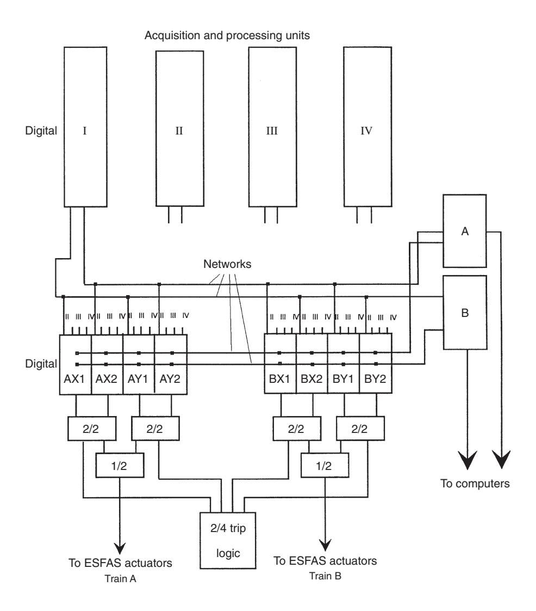

*FIG. 28.3. French second generation (1450 (MW(e)) PWR digital protection system. (ESFAS: engineered safety function actuation system.)*

# **28.4.3. More recent reactors**

(a) *France.* The second generation of the French computerized protection system is installed in the Chooz B and Civaux power plants (N4-1450 MW(e) PWRs). This equipment, developed jointly by Framatome, EdF and the Schneider Group, uses the SPIN functional specifications from the 1300 MW(e) reactors and incorporates major technological enhancements in hardware components and in software development methodology. SAGA, a software tool for nuclear safety applications, was developed and used to design the software as well as to produce the code and documentation. An industrial local network (NERVIA) was developed specifically for transmitting safety commands and data and has all the corresponding features: determinism, self-testing and safety programming.

This system is outlined in Fig. 28.3 and the differences from Fig. 28.1 can be seen. There are four identical protection channels for collecting measurements and running protection algorithms. Partial trips are transmitted via networks to the two emergency shutdown and safety control subsystems, each of which consists of four microprocessor programmed units working in parallel and asynchronously in order to control each actuator individually. This arrangement allows safety and availability optimization without the need to use directed breakdown cabling techniques.

This new system generation has benefited from feedback of the experience gained with the first generation of SPIN and has been in use since 1995–1996.

- (b) *Japan: advanced boiling water reactors.* Computerized automatic control of the Japanese ABWRs was used in the first instance to monitor radioactive waste reprocessing facilities. This was later extended to cover all other unclassified systems and it has now been decided to extend these techniques yet further to ABWR safety systems. The principles used in designing the digital protection system are as follows:
  - Computerized automatic control to reduce equipment volume;
  - Fibre optic links;
  - Two out of four logic, instead of two times one out of two, to ensure much improved availability;
  - Establishment of enhanced self-testing.

The system comprises four independent paths. Three paths control emergency shutdown and safety actions while one controls emergency shutdown only. Within any one path, signals transmitted from the sensor probes are sent to the various digital trip modules (DTMs) via remote multiplexing units (RMUs). Along any path, the DTMs used for emergency shutdowns are fully distinguished from DTMs used for safety actions. Each DTM along a path exchanges data with its counterpart DTMs on the other paths to ensure that two out of four voting takes place. Instructions sent from DTMs are transmitted to the control units, namely the trip logic units (TLUs) and the safety logic units (SLUs). TLU control instructions act directly on the scram circuit solenoids.

# **28.4.4. More recent projects**

- (a) *France.* Developments on the new generation of reactors (N4-1450 MW(e)) have resulted in the availability of equipment which allows much greater expansion of possible applications. Current ideas and projects are increasingly concentrating on designing digital protection systems for other types of PWR such as WWERs. There are also projects for Southeast Asia.
- (b) *Germany.* R&D efforts in Germany in the field of safety systems have been under way for a number of years. The hardware offered by Siemens to meet required safety functions is based on TELEPERM XS. The main feature of this system is that it is an adaptation of an industrial programmable controller to meet nuclear safety needs. Software development methods are based on a global approach to software engineering procedures, and automatic control using the SPACE tool kit (Section 41.12) covers all operations from the graphical representation of specifications through to the generation and verification of the code. This highly ambitious development does not lead immediately to a fully and finally completed RPS, although this has not stopped its incorporation in certain projects in the area of I&C systems important to safety, namely, limitation systems of NPPs with reactor 'Leittechnik'(Section 41.1) of the second generation.
- (c) *Japan: advanced pressurized water reactors.* The protection system which has been designed for Japanese APWRs contains two levels: an analog level for processing partial trips and a digital level for controlling actions. The analog level consists of four independent channels with fibre optic interchange for processing inhibition logic. Each protection channel processes signals received from instrumentation systems (both process and nuclear), compares these with threshold values and processes the inhibition logic with a microprocessor based technique. Results of the comparisons with thresholds for the four channels are then sent to the digital level. In the case of an emergency shutdown, the digital level consists of four emergency shutdown switch control paths, each controlling two switches, with the whole using two out of four voting logic. Two paths are used by the digital level for controlling safety actions.
- (d) *United States of America: ABB PWR–Combustion Engineering's Nuplex 80+ System.* The Plant Protection System, a new system designed by ABB for PWRs, controls emergency shutdown and safety actions. It comprises localized equipment kept in four independent rooms. The protection system held in each

room consists of a core protection calculator (CPC) and a plant protection calculator (PPC). The PPC is made up of threshold comparator processors (bistable trip processors, BTPs), coincidence processors and tester and interface processors. Each CPC consists of a trip limit calculator (TLC) and a CEA computer (CEAC). All thresholds are developed in the PPC with the exception of the thresholds on DNBR and the power per unit length, which are obtained by combining results from the TLC and CEAC.

Outputs from the CPCs and BTPs are transmitted to the PPC coincidence processors and then to their counterpart processors in the other rooms. Coincidence processors produce local coincidence logic according to the four partial trip commands and their respective inhibition commands. The inhibition instructions are issued either locally or remotely for testing and maintenance operations. Protection action control uses two out of four logic with inhibition processing to reduce this to two out of three. Each coincidence processor controls an emergency shutdown path and a safety path which include engineered safety features (ESFs) and, in particular, the core cooling system (CCS).

- (e) *Sweden: ABB Atom BWR 90.* The protection system for the new generation BWR 90 developed by ABB Atom provides both safety functions and emergency shutdown protection. It is computerized and is built with existing industrial hardware and software components proven in critical applications (though not necessarily in safety applications) over a number of years. The protection system thus developed is said to be capable of incorporation into existing installations during renovation. The RPS architecture consists of four redundant channels using two out of four logic. The principles are as follows:
  - Operation is continuous with a fixed cycle time.
  - There must be several possible ways of controlling reactor shutdown. These may be by means of the hydraulic emergency shutdown command or by controlling the rods and actuating the recirculation pumps. This is a statutory ATWS safety provision.
  - In the case of other safety functions, functional diversity is taken into account. Each redundant channel consists of several microprocessor units. No single microprocessor may carry out two different functions. However, the design of the software and the way in which it runs on the homologous units are identical between the various channels.

The design of any one channel comprises the following elements:

- Microprocessor acquisition units located close to the sensor probes. These digitize and check the measurements, converting them to physical dimensions.
- Trip units, which compare data with the thresholds and provide two out of four voting logic. To do this, data are interchanged between the four channels via nodal networks.
- Control units for each of the safety actions.

Safety equipment is isolated from the classified equipment and a communications network is used to allow data interchanges between units along any one channel.

# 28.5. DEVELOPMENT OF STANDARDS, METHODS AND TOOLS

# **28.5.1. Standards**

Standardization in the area of computerized protection systems requires the completion of existing standards to cover the software aspects in all respects. On an international scale, the most important work in the area of RPS safety software is being done by the IEC. Important standards are:

- (a) *IEC 880: Software for Computers in the Safety Systems of Nuclear Power Stations* [28.1]. This standard is currently being re-examined. Any supplement must take into account certain additional aspects such as formal or standard methodology, diversity, the software tools used and the re-employment of existing software.
- (b) *IEC 987: Programmed Digital Computers Important to Safety for Nuclear Power Plants* [28.3]. This is a system oriented standard.
- (c) *IEC 1513: Nuclear Power Plants: Instrumentation and Control: Systems Important to Safety: General Requirements for Computer-Based Systems* [28.4]. This is in preparation and will be a 'chapeau' document, providing the essential framework for IEC 880 and 987. It will also be in accordance with IEC 1508 [28.5], another basic standard which is concerned with the system aspects of industrial measurement and control.

These standards provide recommendations on the rules and methodology pertaining to development. There remains a degree of flexibility to allow manufacturers to determine their actual preferred approach. At the time of writing, the IAEA is also considering the production of a safety guide in this field but, nevertheless, each country ultimately remains the sole authority in ruling on the acceptability of digital protection systems.

# **28.5.2. Methods**

Development methods are fundamental to the design of safety software. The very new nature of the area means that ideas and concepts have not yet been fully set, and areas of improvement have already been mentioned:

- Quality of the specifications (method);
- Automation of the design, verification and validation process (tools);

- Retention of the auditable nature of the software (legibility);
- Reduction in development costs (speed, automation).

#### **28.5.3. Tools**

The essential consideration in the development of tools is the avoidance of human error, an area which could make a significant contribution to the debugging of software development tools. Any repetitive task carried out by an individual has an associated error risk which may be strongly reduced by automating wherever possible or by providing support to personnel responsible for development. Such an approach could cover a very wide ranging field from specification through to V&V.

#### 28.6. INTERNATIONAL CO-OPERATION

At the present time, international co-operation remains limited owing principally to nuclear programmes being depressed. However, there is a very clear trend towards generalizing the use of computerized systems in carrying out reactor protection functions. International co-operation relates to two main themes:

- (a) Standardization must set out rules to govern safety software by gradually putting together and promoting acceptance of a methodology which takes account of feedback from installations which are running.
- (b) Interchanges between the governing safety bodies must allow consolidation of choice. This is difficult inasmuch as the general rule adopts a safe, reassuring, conservative approach. However, the number of reactors in operation and using digital protection systems is such that there are now available several reference case studies for ascertaining the correct conditions for using computerized protection techniques.

#### 28.7. FUTURE DIRECTIONS

Examination of the current situation clearly shows that digital protection systems will be the solution for the future. All developers are producing systems, whether these are to be installed in new reactors or in old ones under renovation. It would appear that the industry is currently going through a critical period for the future. Some installations have been in operation for more than ten years, while standardization work continues and new system projects are constantly being proposed. However, it is necessary to consolidate principles and rules regarding the design of these systems in order to facilitate the advancement of progress in this area.

Apart from the rather general comment in (a) below, several areas can be identified for improving the methodology used to design computerized protection systems:

- (a) *Establishment of preliminary agreements with safety authorities on development methods.* Experience with the first digital protection systems which were produced has shown that a development project must be approved as early as possible before any large scale installations are undertaken. The conditions under which a project is admissible must be agreed.
- (b) *Specification by using a hierarchy of functions and interaction of data:*
  - Decomposition: how to split complex functions into small algorithms, each concerning a specific part of a function.
  - Mutual relation of functions (first/second, parallel/redundant, higher/lower, etc.).
  - Types and handling of computer internal failures and alarms (including hardware and software failures).
  - Types and handling of process alarms, especially alarms before trip.
- (c) *Common mode issues:*
  - Design principles of diverse systems:
    - ∑ Types and structures of diversity;
    - ∑ Methods of specifying diverse systems;
    - ∑ Effects of mixing different diversity types and structures;
    - ∑ Backup systems.
  - Review and testing methods for CMFs.
  - Aggregation: integration of split algorithms within special computers, e.g. computers for:
    - ∑ Data acquisition;
    - ∑ Data processing;
    - ∑ Voting.
  - Specification of small algorithms which observe:
    - ∑ Ranges and accuracy of variables;
    - ∑ Exclusion of complex software constructions.
  - Compilation of these algorithms.
  - Linking of these algorithms while maintaining diversity.
  - Control of the correctness within the intended state space.
- (d) *Qualification of hardware components and software modules.* The costs of developing safety software packages are very high and the reuse of qualified software modules is one interesting possibility for reducing costs. However, all potential difficulties should be identified and the regulations pertaining to this type of operation set out.

# **REFERENCES**

- [28.1] INTERNATIONAL ELECTROTECHNICAL COMMISSION, Software for Computers in the Safety Systems of Nuclear Power Stations, Standard 880, IEC, Geneva (1986).
- [28.2] INTERNATIONAL ATOMIC ENERGY AGENCY, Protection Systems and Related Features in Nuclear Power Plants: A Safety Guide, Safety Series No. 50-SG-D3, IAEA, Vienna (1980).
- [28.3] INTERNATIONAL ELECTROTECHNICAL COMMISSION, Programmed Digital Computers Important to Safety for Nuclear Power Plants, Standard 987, IEC, Geneva (1989).
- [28.4] INTERNATIONAL ELECTROTECHNICAL COMMISSION, Nuclear Power Plants: Instrumentation and Control Systems Important to Safety: General Requirements for Computer-Based Systems, Standard 1513, IEC, Geneva (in preparation).
- [28.5] INTERNATIONAL ELECTROTECHNICAL COMMISSION, Functional Safety of Electrical/Electronic/Programmable Electronic Safety Related Systems, Standard 1508, IEC, Geneva (1998).

# **29. ENGINEERED SAFETY SYSTEMS**

## 29.1. INTRODUCTION

# **29.1.1. Definitions**

The term 'engineered safety system (or function)' is not defined in IAEA documentation; all systems associated with protection functions in an NPP are defined as protection or safety actuation systems. A common practice, however, is also to distinguish between safe shutdown systems and engineered safety systems. In some countries, such as Germany, both systems form the protection system.

Safe shutdown systems are required to prevent serious, undesirable consequences arising from anticipated operational occurrences (AOOs) which, in accordance with IAEA definitions, are deviations from normal operation and are expected to occur several times during the operating life of a plant [29.1]. Typical safe shutdown functions are reactor trip and residual heat removal.

Engineered safety systems are needed for those PIEs which lead to accident conditions (ACCOs). Again, following IAEA definitions, such conditions are deviations from normal operation in which release of radioactive material is possible and has to be kept within specified limits [29.1]. The design and functions of such systems are described in this section, together with the way in which they are initiated automatically or manually.

At the end of the section an example of a new type of equipment is described. It is designed to handle severe accidents and has been made a requirement in several countries since the TMI accident. Following IAEA definitions, a 'severe accident' is a plant state beyond ACCOs, including those in which there is significant core degradation [29.1].

#### **29.1.2. Criteria**

During ACCOs, engineered safety systems are required to:

- Limit the temperature of the fuel cladding to a specified value;
- Limit oxidation of the fuel cladding;
- Prevent the mixture of hydrogen and oxygen;
- Prevent core degradation;
- Limit the release of radioactive material to the environment.

From the plant availability point of view, it is very important to reduce the risk of spurious initiation of an engineered safety system. Such initiation will not only scram the reactor but, depending on the reactor type, can often prevent startup for a long time afterwards.

## 29.2. SYSTEMS STRUCTURE

#### **29.2.1. Critical safety functions**

It is common practice to divide the engineered safety functions (ESFs) into groups. Such a group is called a critical safety function (CSF) and defines the equipment required to perform a specified task. A group contains the following types of equipment:

- Sensors for automatic initiation of safety functions or for manual supervision;
- Logic for automatic initiation;
- Circuits for manual control;
- Actuators and related control circuits;
- Safety systems and their related safety support systems.

There are normally two CSFs for the ESF, namely those for emergency core cooling and for limitation of radioactive releases.

#### **29.2.2. Emergency core cooling**

For every reactor type, core cooling during a small or large LOCA is provided by similar combinations of high pressure and low pressure systems. High pressure core cooling is required for accident scenarios in which reactor pressure remains high during a LOCA, and in BWRs and CANDU reactors systems are provided for core cooling at medium pressure. Normally, the high and low pressure core cooling systems are initiated automatically from the same sensors. In all cases, water is injected (flooded) into the reactor vessel through existing process lines or onto the core by spray through special headers and nozzles located within the pressure vessel.

For BWRs high pressure core cooling is provided with one or more high pressure core spray (HPCS) or core injection (HPCI) pumps. The water source for the pumps can be one or more external condensate storage tanks or the suppression pool (wet well) inside the reactor containment. HPCI systems can be used as water makeup systems during normal reactor shutdown without a LOCA. Examples of initiating signals for BWR systems are presented in Table 29.1.

High pressure emergency core cooling is provided for PWRs in a similar way to that for BWRs. Several pumps inject water into the primary system from a storage tank and the water in the tank is borated to guarantee subcriticality of the reactor core. Examples of PWR initiating signals are given in Table 29.2. For PWRs both the primary reactor system and the secondary steam generator system are installed inside the containment. The initiation logic for the engineered safety system detects whether leaks or pipe breaks are in the primary or secondary system and initiates the safety functions accordingly.

The high pressure emergency coolant injection (ECI) for CANDU reactors is provided by two water tanks outside the reactor building. These water tanks are pressurized by a nitrogen gas tank during normal operation. During a LOCA, valves are opened between the gas tank and the water tanks and between the water tanks and the primary reactor system. Water is then injected into the primary heat transport system (primary reactor system). On initiation of the ECI system, light water is also injected into the heavy water systems, which means that spurious trips of the ECI cause shutdowns which last for a long time. Precautions are therefore taken in the logic design of the initiation circuits to reduce the probability of such eventualities.

Low pressure emergency core cooling for BWRs is provided by injection (LPCI) or spray (LPCS) systems supplied from the containment suppression pool. Very often systems with several functions are used. A typical example is the residual heat removal (RHR) system in General Electric BWRs in the USA. This system can be set up manually in six different modes:

- LPCI;
- Containment spray;
- Suppression pool cooling;
- Shutdown cooling;
- Reactor steam condensing;
- Fuel pool cooling.

TABLE 29.1. EXAMPLES OF BWR ENGINEERED SAFETY FUNCTION INITIATORS

|                               | Reactor pressure vessel water level low | Reactor pressure vessel water level extra low | Containment pressure high | Containment temperature high | Steam flow high | Inflow-outflow difference | Area temperature high | Area sump level high |
|-------------------------------|-----------------------------------------------|-----------------------------------------------------|---------------------------|------------------------------------|-----------------------|---------------------------|-----------------------------|----------------------------|
| Containment isolation         | V                                             | V                                                   | V                         | V                                  | V                     | _                         | _                           | _                          |
| Isolation of external systems | s —                                           | _                                                   | _                         | _                                  | _                     | $\sqrt{}$                 | $\sqrt{}$                   | $\sqrt{}$                  |
| Containment spray             | _                                             | _                                                   | $\checkmark$              | $\checkmark$                       | _                     | _                         | _                           | _                          |
| High pressure core cooling    | $\sqrt{}$                                     | _                                                   | $\checkmark$              | $\checkmark$                       | $\sqrt{}$             | _                         | _                           | _                          |
| Autodepressurization          | _                                             | $\sqrt{}$                                           | $\checkmark$              | _                                  | _                     | _                         | _                           | _                          |
| Low pressure core cooling     | _                                             | $\checkmark$                                        | $\checkmark$              | $\sqrt{}$                          | _                     | _                         | _                           | _                          |

TABLE 29.2. EXAMPLES OF PWR ENGINEERED SAFETY FUNCTION INITIATORS

|                               | Pressurizer pressure low | DNBR low  | Containment pressure high | Steam generator level low | Pressurizer level high | Reactor pressure high |
|-------------------------------|--------------------------|--------------|---------------------------|---------------------------|---------------------------|-----------------------|
| Building isolation            | V                        | V            | √                         | √                         | _                         | _                     |
| Steam and feedwater isolation | _                        | $\sqrt{}$    | $\sqrt{}$                 | $\checkmark$              | $\sqrt{}$                 | $\sqrt{}$             |
| High pressure injection       | $\sqrt{}$                | $\sqrt{}$    | $\sqrt{}$                 | $\checkmark$              | _                         | _                     |
| Low pressure injection        | $\checkmark$             | $\checkmark$ | $\checkmark$              | $\checkmark$              | _                         | _                     |

The first two modes belong to the engineered safety features group, the third is a support function for the emergency core cooling and the last three are important shutdown functions.

Low pressure emergency core cooling can be provided to a PWR in two different ways. As long as water from the borated water tank is available, it is injected into the primary system by several low pressure pumps (safety injection). If there is not sufficient water in the tank, the suction lines for the pumps are switched to the containment sump and water coming from the leak or pipe break in the primary system is recycled. For recent designs such as the ABB–Combustion Engineering System 80+, the storage tank is integrated with the containment sump and the need for pump switching eliminated. The low pressure core cooling system and containment spray, as in the BWR, are also part of the residual core cooling. The water flows through heat exchangers and is cooled by the ECCS.

Low pressure emergency core cooling for CANDU reactors is provided in a similar way to that for PWRs. When water from the high pressure and medium pressure systems is depleted, the low pressure system recovers that which has collected in the reactor building (containment) sump and pumps it back into the reactor core. The low pressure system is, again, part of the RHR system during accidents. This system will pump core coolant through heat exchangers which are cooled by a service water system.

CANDU high and low pressure ECCSs are complemented, in a similar way to those of BWRs, by a medium pressure system. Reactor water is provided by a tank in the containment spray system (dousing tank). It is injected under gravity by opening valves between the dousing tank and the primary reactor system.

Examples of systems which support the emergency core cooling function are:

- Suppression pool cooling (BWR);
- Dousing tank cooling (CANDU);
- Low pressure emergency coolant flow cooling (CANDU);
- Standby closed or open loop service water systems;
- Standby diesel generator units.

#### **29.2.3. Depressurization and venting systems**

Another engineered safety system for BWRs is the automatic depressurization system (ADS). This system is automatically or manually initiated and quickly reduces the reactor pressure. It is designed as a backup to the high pressure core cooling system in case:

— This system is inoperable owing to single or multiple malfunction of components;

— Small LOCAs exist which cannot be handled by the high pressure core cooling system alone.

Safety relief valves in the primary reactor system reduce the pressure rapidly so that the low pressure core cooling systems can take over from the high pressure systems. Interlocks are provided so that the ADS cannot be initiated before the low pressure core cooling systems are running.

Since the TMI accident all PWRs have been backfitted with a gas vent system. Such systems are connected to the reactor vessel and the pressurizer and will vent gases to the containment drain tank. They are started manually.

#### **29.2.4. Barriers to radioactive releases**

Two barriers are normally necessary to limit the possible release of radioactive material to the environment to acceptable values. One is the reactor containment and the other a secondary containment or the reactor building, both of which enclose the reactor containment. The engineered safety systems belonging to the safety function of these two structural barriers support the functions of the barriers.

During a LOCA the internal containment pressure will rise from atmospheric to a certain maximum depending on the volume of the containment. For compact containments, where the volume is small and the maximum pressure high, it is usual to install a containment spray with automatic initiation. For CANDU reactors the equivalent is called the containment dousing system. Such systems reduce the internal pressure and decrease the volume of radioactive gases in the containment atmosphere.

For BWRs the water for spraying is taken from the containment suppression pool. The spray system can be one of the modes of the RHR system or can be a standalone system. Normally, one or more heat exchangers are installed within the spray loops for removing residual heat. For PWRs the water for the containment spray is taken from the containment sump. The dousing system for CANDU reactors is a passive system in which water is provided to the spray headers from a dousing tank on the top of the containment structure. The system is provided with two loops in which the valves are supplied by different manufacturers. The water in the dousing tank is cooled by cooling coils which are connected to a service water system.

To limit the release of radioactive material during a BWR accident, different types of isolation are needed. The most important of these isolates the containment by closing valves and dampers in pipes and ducts penetrating the containment wall (if they are not necessary for other engineered safety functions). The primary reactor system for a BWR is not totally enclosed by the containment and therefore other measures must be taken to reduce radioactive releases during certain possible leaks and pipe breaks. Typical examples are:

- Isolation of the process system and related buildings for leaks or breaks in the reactor water cleanup (RWCU) system;
- Isolation of main steam lines and the turbine building for leaks or breaks in the main steam lines.

For large leaks or pipe breaks in the primary reactor system of a PWR, containment isolation is provided in a similar way to that for BWRs. In PWRs some parts of the secondary system (such as main steam lines and feedwater lines) are installed inside the reactor containment and for leaks and pipe breaks in these systems it is not absolutely necessary to initiate complete containment isolation. Therefore, sophisticated schemes exist to detect failure locations and to isolate the containment either partly or totally. For CANDU reactors a similar containment isolation system is provided. High pressure or a high level of radioactivity inside the containment causes the isolation systems to close valves or dampers on lines and ducts penetrating the containment wall. Simultaneously, air coolers for the containment atmosphere are started.

As mentioned before, it is common practice in all reactor types to surround the containment with a secondary containment or a reactor building (annulus). Such structures are maintained at a slightly negative pressure and eventual leakages from the containment are collected into these structures and released to the environment through a standby gas treatment (SBGT) system. This system consists of ducts, fans and charcoal filters and is started automatically at the same time as containment isolation. Often the normal ventilation intakes and exhausts are closed simultaneously. Such systems can be used for ventilation of other parts of the buildings where leaks or pipe breaks can increase the risk of radioactive releases. Examples are:

- Areas outside the containment in which the reactor cleanup system or main steam lines are installed on a BWR;
- Radioactive waste buildings;
- Refuelling areas for LWRs.

During a LOCA, the reaction of fuel cladding with water or steam can generate hydrogen inside the containment and a combustible mixture of hydrogen and oxygen is possible. The ESFs may therefore include systems to reduce the volume of combustible gases. Examples of such systems are external recombiners or local igniters inside the containment. Both types of system are started manually upon indication of excess O2 or H2 inside the containment.

The support systems for the functions of the radioactive release barriers are the same as those for emergency core cooling.

## 29.3. DESIGN

#### **29.3.1. General**

As mentioned above, the main difference between engineered safety systems and safe shutdown systems is that the latter are designed to handle more frequent possible events. From a probabilistic point of view this means that safe shutdown systems must be the more reliable of the two. Another difference is that the logic for actuation of engineered safety systems is often integrated into the actuation logic for each engineered safety process system, while that for safe shutdown is often designed as a standalone logic which distributes initiation signals to the various actuation logics. For these reasons initiation equipment for engineered safety systems can be designed in a different way from that for safe shutdown systems but the trend is for both types to be designed identically.

Possible consequences of the above mentioned differences are considered below.

#### **29.3.2. Redundancy and diversity**

The difference in necessary reliability between the two types of system can result in lower degrees of redundancy in engineered safety systems. Redundancy for existing plants can therefore vary, for example, from one out of two to two out of four.

A long standing formal requirement for safe shutdown systems is the provision of backup systems ('diversity'). Although there are no such formal requirements for engineered safety systems it is usual for diversity to be available in the different designs. Valves from different manufacturers in the CANDU dousing system are one example (Section 29.2.4). Backup of the high pressure core cooling by automatic depressurization and low pressure systems for the BWR is another. Yet another is the use of pressurized water tanks for backup of high pressure core cooling systems for newer PWRs. For backup of the low pressure core cooling system, water from fire systems or from fuel pools on the top of a BWR containment can be used. Such diversity is often called 'functional diversity' or 'segmentation'. The I&C for such segmented systems is often also segregated.

The introduction of digital technology for safety I&C in countries other than Canada and France has intensified the debate about required diversity. The main reason is that the frequency of CCFs in digital equipment cannot be quantified and reliable assessment seems impossible. Another method of achieving diversity, shown in Table 29.3, is for the I&C as well as the engineered safety process systems to be backed up with comparable non-safety systems. The I&C systems for the non-safety and safety elements are of different designs.

TABLE 29.3. DIVERSITY WITH ENGINEERED NON-SAFETY AND SAFETY SYSTEMS

*(source: ABB)*

| Inventory control       | Pressure control                  | Core heat removal       | Containment isolation | Containment atmosphere control | Support features                      |
|----------------------------|--------------------------------------|----------------------------|--------------------------|--------------------------------------|------------------------------------------|
|                            |                                      |                            | Non-safety systems       |                                      |                                          |
| Chemical volume         | Pressurizer heaters               | Reactor coolant         | Control valves           | Fan cooling                          | Grid power                               |
| control system             | and sprays                           | pumps                      |                          |                                      | Gas turbines                             |
|                            | Chemical volume control system |                            |                          | Hydrogen recombination            | Non-safety component cooling water |
|                            |                                      |                            | Safety systems           |                                      |                                          |
| Safety injection system | Safety injection system           | Safety injection system | Isolation valves         | Spray system                         | Batteries                                |
|                            |                                      |                            |                          |                                      | Diesel generator                         |
|                            | Depressurizer                        | Shutdown cooling        |                          |                                      | Safety component cooling water        |

#### **29.3.3. Failure to safety**

Another consequence of the different reliability requirements is that much of the I&C for engineered safety systems is not designed to be fail-safe or is deenergized during normal operation. One reason for this is, of course, that such systems, in contrast to scram systems, require active electrical power to function. The availability of such systems must therefore be tested during normal operation. For this purpose, the process systems are provided with special test loops and the I&C with special test modes.

#### **29.3.4. Protection against fire and earthquake**

A requirement is that the plant must shut down safely during a fire. Therefore, as a minimum, redundant safe shutdown systems must be installed with physical separation into different fire areas. A combination of simultaneous fire and LOCA is not probable and, in accordance with probabilistic assessments, can be neglected. This means that engineered safety systems can be installed without physical separation for protection against fire. Similarly, the probability of a simultaneous LOCA and earthquake is acceptably low, so that the I&C for engineered safety systems need not necessarily be to seismic designs.

# 29.4. SEVERE ACCIDENTS

After the TMI accident and as a result of PSA, it became clear that the risk of core melt was not acceptably low in some reactor designs. For power plants in which turbine driven safe shutdown systems were not installed, a total loss of the electrical power supply could lead to core melt and loss of containment integrity. Consequently, authorities in several countries required the capability to handle a blackout scenario to be backfitted, as well as designed into new plants.

The blackout of all AC power in an NPP very soon results in overheating and a pressure increase in the reactor containment. In order to protect the containment integrity against this, passive rupture discs were installed to relieve the containment pressure to a stack. After core melt the containment gases must also be released to the environment through special filters or scrubbers. If the risk of core melt is obvious, the lower part of the containment may be flooded with water by manual initiation. Water is available from the suppression pool. Later, the whole containment can be flooded from external water sources.

Special I&C equipment is needed both for the containment functions and for cooling a melted core. Requirements are as follows:

- Power for instrumentation, control and valve actuators must be available independently of AC power for a long period;
- Sensors and control circuits must be qualified for the conditions of a core melt accident;
- Special equipment for supervision of the response to the core melt accident from the control room must be installed.

#### **REFERENCE**

[29.1] INTERNATIONAL ATOMIC ENERGY AGENCY, Protection Systems and Related Features in Nuclear Power Plants: A Safety Guide, Safety Series No. 50-SG-D3, IAEA, Vienna (1980).

# **30. INSTRUMENTATION**

The purpose of this section is to describe briefly the development of instrumentation over the last 10–15 years. The most immediate observation, applicable to all instrumentation systems, concerns the trend in digitalization. At the beginning, microprocessors were mostly applied only to non-safety equipment, but operating experience with this was good and the practice has been extended so that today even instrumentation for safety functions is available in digital form.

## 30.1. CORE MONITORING

The basic technology of neutron flux measurement has not changed essentially for many years but new signal handling methods and detector geometries have been introduced. These include digital channels and the use of mean square amplifiers by means of which neutron to g signal ratios can be greatly improved. Pulse/Campbell measuring systems have been built in which a single fission chamber covers the entire working flux range of the reactor. Other new devices are fission chambers with particularly high sensitivities to replace out-of-core BF3 chambers and probes containing more than one detector which can simulate single chambers with a very wide working range.

Most PWRs still use out-of-core measurement for the most important safety and non-safety functions, some in conjunction with in-core instruments. BWRs use only in-core facilities for these functions. In-core neutron flux mapping systems are used in both PWRs and BWRs and improvements in the case of PWRs are mostly associated with in-core measurement. For BWRs, both the in-core mapping systems (travelling in-core probes, TIPs) and the systems for source range (SR) and intermediate range (IR) monitoring have been improved. Analogous systems exist in CANDU reactors (Section 48).

#### **30.1.1. PWRs**

Two basic in-core mapping systems exist for estimating flux distribution. They use:

- Movable neutron flux sensors;
- Fixed in-core flux sensors.

Movable sensors travel in tubes which enter the reactor vessel from below. There are normally two to four sensors which can be introduced into different tubes by a drive and selection mechanism outside the concrete shielding. This is comparable with the TIP systems installed in BWRs. In both cases TIPs are also used for calibrating in-core fixed installed sensors operating in the power range. In addition to neutron systems, some plants have fixed thermocouples installed in the coolant outlets of the fuel assemblies. This design has the advantage of being able to measure core cooling across a radius during possible accidents (in accordance with the recommendations of international organizations such as the International Union of Producers and Distributors of Electrical Energy (UNIPEDE)).

As a method of avoiding complicated tube entries in the bottom of the reactor vessel, one development includes fixed g thermometers in the fuel assemblies (calibrated by heating). Such sensors are installed in the core at different axial and radial locations. Top entry is also used by the KWU Aeroball system (Section 41).

# **30.1.2. BWRs**

For BWRs, improvements have been made in the TIP sensors. Gamma detectors are now sometimes used instead of fission chambers. They are alleged to provide a better input for calculating the flux inside the fuel assemblies and hence better optimization of the fuel. Other improvements have been introduced into SR and IR monitoring systems. Single instruments are now available which can measure from the source to the power range. This is called wide range monitoring and allows automation of the previously complicated switching between SR and IR and between IR ranges on some previous designs. Wide range monitoring, with measurement up to 100% power, is also a requirement for post-accident monitoring.

Different types of wide range monitoring system are installed. One uses detectors which are fixed during normal power operation and another uses detectors which are retracted outside the core at the higher powers. Both systems are qualified for operation in accident environments in the containment. These new systems use microprocessors instead of solid state technology.

#### 30.2. IN-CORE LEVEL MEASUREMENTS

Since the TMI accident, several developments in post-accident instrumentation for determining coolant inventory during a LOCA have taken place and a number of items of equipment have been installed in PWR plants. Techniques are discussed in IEC Standard 911 [30.1]. In one of them the fluid inventory of the primary circuit is obtained from measurement of water levels in the reactor vessel and in the containment sump. Two types of instrument for the first of these measurements have been developed. The first is based on differential pressure between the upper and lower plenums of the vessel (Section 45). The second uses a probe or lance containing a number of heated RTDs (or thermocouples). Differential cooling of these sensors provides information about the (collapsed) coolant level [30.1] (see also Section 41).

# 30.3. COOLANT CHEMISTRY

In an NPP, different types of instrument are installed for monitoring chemical properties. The most important are those for supervising the water chemistry of the reactor primary systems (BWR, PWR) and of the secondary system (PWR). Many instruments were installed as original equipment but increased requirements for monitoring water chemistry or boron solutions have made it necessary to improve existing devices or to install new ones. Sensors for such instrumentation are normally located in the primary/secondary systems or in the process systems connected to them. Besides permanently installed sensors, sample points are invariably available for manual sampling and laboratory analysis. Such points are designed in accordance with UNIPEDE recommendations.

Instrumentation may also be installed for the following purposes:

- Monitoring of boron concentration in the chemical and volume control system of a PWR. This measurement is used for reactivity control.
- Monitoring of boron concentration in the high pressure core cooling injection system of a PWR.
- Monitoring of pH in the primary reactor system by measuring the water in the RWCU system (BWR) or the chemical and volume control system (PWR). This measurement is used for pH control.
- Monitoring of conductivity of the water in some systems, e.g. after the filters in the condensate cleanup system (BWR, PWR). This measurement is used for detecting leakages from the turbine condenser to the feedwater and for checking the efficiency of the condensate water filters.
- Monitoring of hydrogen content for dosage control of H2 and decreasing the risk of material corrosion.

Sensors may be connected to a standalone chemistry management system with diagnostic capabilities [30.2, 30.3] or to the plant computer network.

# 30.4. LEAKAGE DETECTION

During the last 10–15 years, many new leakage detection requirements have been defined. Leakage detectors are used for:

- Warning the operators of small leaks. The availability of such facilities is an important factor in ensuring pressure vessel safety on the basis of the 'leak before break' (LBB) philosophy.
- Initiating automatic safety actions following a major leakage or pipe break.

Normally, there are two categories of leakage: identified leakage and unidentified leakage. The difference between the two is that identified leakage will be collected and measured by a closed drainage system while unidentified leakage flows directly to the environment. Instrumentation used for the initiation of protective actions is of class 1E (IEEE) or Category A (IEC) [30.4]. Warning systems which are used to prevent the escalation of major accidents are today classified as Safety System Category B (according to the IEC).

Requirements in leakage measurement arise from the following:

- (a) *NRC Regulatory Guide 1.45 concerning measurement of leakage inside the containment* [30.5]. Regulatory Guide 1.45 states that instrumentation for measuring unidentified and identified leakage should be separated and unidentified leakage measured by three methods. The guide also defines the accuracy and resolution of the measurement. A normal interpretation is that at least one system must be provided to analyse the source of the leakage, i.e. from a primary or secondary water system, a primary or secondary steam system or a service water system. Especially for the PWR, computer programs have been developed to support the operators in determining the leakage source. The guide also requires a method of measurement for leakage between primary systems and other connected systems.
- (b) *IEC Standard 910* [30.6]. Though this IEC standard does not describe new requirements, it contains a useful summary of the available methods.
- (c) *NRC position regarding leak before break* [30.7]. Under certain conditions it can be assumed that minor leaks will occur before a vessel or pipe breaks and that corrective action can therefore be planned and carried out in good time. The benefits of a design based on such a concept are that it eases the presentation of pressure/safety arguments and that provision of structures for protection against pipe whips and missiles can be reduced. It follows that for such design, a reliable leakage detection system is needed for detection of the leakage and its source.
- (d) *Aim of utilities to reduce contamination and individual dose* [30.8, 30.9]. Leakage of reactor water can contaminate areas around the primary system. This will increase the cost of cleanup and the risk of extra individual dose during maintenance and refuelling. It is therefore in the interest of the utility to detect and locate leakage when possible.

Other means of reducing individual dose are:

- Control of the chemistry and contamination of the water;
- Installation of radiation monitoring;
- A good radiation protection organization;
- Good procedures for the cleanup of contaminated areas.
- (e) *Need to detect ageing in pump, vessel or valve seals* [30.5]. Most of the possible means of detecting leaks around seals are installed in NPPs. The normal method is to fit critical components with double seals and to connect the space between them to a closed drain system. The flow from the seals to the closed drain system can be monitored and alarms given if the flow exceeds a preset value. This is a typical application of identified leakage [30.6]. Examples of locations where leakage is measured are:
  - Flange seals of the reactor vessel;
  - Seals of the control rod drive units;
  - Seals of the main (re)circulation pumps.

The results of such measurements are used for planning the replacement of the seals.

(f) *NRC Regulatory Guide 1.96 concerning measurement of leakage from inboard steam line isolation valve of BWR* [30.10]. The need for acceptable limits to leakage through closed isolation valves in BWRs has been discussed for many years and today there is a requirement that two valves in each steam line are acceptable if an additional leakage drain system is installed between them. This system will collect steam leakage from the reactor vessel through the first (closed) valve into the space between the two valves, will condense the steam, measure the leakage and return it to the wet well inside the containment. Often flowmeters are installed in the drain system to measure the leakage.

#### 30.5. EXTERNAL ENVIRONMENT MONITORING

The purpose of external environment monitoring is as follows:

- During normal operation, to measure the release of activity to the environment in order to provide data for reports to the authorities [30.11–30.13];
- During accident situations, to provide data to assist in the management of the accident [30.14].

Requirements for both types of monitoring have increased over the years. The most important new requirements were a direct result of core melt accidents or near accidents. After these events the authorities in many countries required:

- New process systems for filtering and releasing the atmosphere from the containment to the environment during core melt situations. These require additional accident monitoring systems.
- A better and nationwide environmental radioactivity monitoring system connected to main or local offices of the authorities.

Basically there are three different types of environmental monitoring system. The first measures the release of radioactive material from the plant to the environment during normal and accident situations. Such monitoring is installed in all release paths for air and water, such as:

- Ventilation stacks [30.12];
- Water ducts [30.6, 30.11];
- Stacks from containment filters [30.12, 30.14].

The second type of measurement system is located on the on-site meteorological tower to give wind speed, wind direction and air temperature at different heights. The third type is located in the environment around the plant and/or nationwide. Additional measurements are made by mobile groups during accidents. Generally, results are stored and evaluated by special programs in a radiation computer. Results from this computer can be used by:

- Operators in the control room;
- Technical staff in the TSC;
- Managers in emergency control centres.

In some countries the environmental measuring stations operate on a network to which the authorities have access.

#### 30.6. RADIATION PROTECTION

During the last 10–15 years, the following trends have been seen in radiation protection:

- New portable electronic meters developed for both rate and dose. Many meters are provided with alarms at preset levels of rate and dose.
- Automatic reading of portable meters by plugging them into a computerized network after use.
- Storage of individual doses in a database for analysing the doses related to maintenance, persons or whole plants.

Film dosimeters have been totally replaced by thermoluminescent dosimeters (TLDs). The readings from these TLDs are normally collected and stored nationwide. IEC Standard 504 [30.9] gives more information about portable meters.

#### **REFERENCES**

- [30.1] INTERNATIONAL ELECTROTECHNICAL COMMISSION, Measurements for Monitoring Adequate Cooling within the Core of Pressurized Light Water Reactors, Standard 911, IEC, Geneva (1987).
- [30.2] ABB–COMBUSTION ENGINEERING, INC., "Intelligent chemistry management system (ICMS)", Proc. American Power Conf. Chicago, 1986, Illinois Inst. of Technology, Chicago (1986).
- [30.3] SIEMENS-KWU VGB, Rechnergestütztes Dauerbetrieb-Überwachungskonzept für Wasser-Dampfkreisläufe in DWR, Kraftwerkstechnik **69** 11 (1989).
- [30.4] INTERNATIONAL ELECTROTECHNICAL COMMISSION, Nuclear Power Plants — Instrumentation and Control Systems Important to Safety — Classification, Standard 1226, IEC, Geneva (1993).
- [30.5] NUCLEAR REGULATORY COMMISSION, Reactor Coolant Pressure Boundary Leakage Detection Systems, Regulatory Guide 1.45, US Govt Printing Office, Washington, DC (1973).

- [30.6] INTERNATIONAL ELECTROTECHNICAL COMMISSION, Containment Monitoring Instrumentation for Early Detection of Developing Deviations from Normal Operation, Standard 910, IEC, Geneva (1988).
- [30.7] NUCLEAR REGULATORY COMMISSION, Leak Before Break Evaluation Procedures, Standard Review Plan 0800, US Govt Printing Office, Washington, DC (1997).
- [30.8] INTERNATIONAL ATOMIC ENERGY AGENCY, Radiation Protection During Operation of Nuclear Power Plants: A Safety Guide, Safety Series No. 50-SG-O5, IAEA, Vienna (1983).
- [30.9] INTERNATIONAL ELECTROTECHNICAL COMMISSION, Hand and/or Foot Contamination Monitors and Warnings Assemblies, Standard 504, IEC, Geneva (1975).
- [30.10] NUCLEAR REGULATORY COMMISSION, Design of Main Steam Isolation Valve Leakage Control Systems for BWRs, Regulatory Guide 1.96 (Rev. 1), US Govt Printing Office, Washington, DC (1976).
- [30.11] INTERNATIONAL ATOMIC ENERGY AGENCY, Operational Management for Radioactive Effluents and Wastes Arising in Nuclear Power Plants: A Safety Guide, Safety Series No. 50-SG-O11, IAEA, Vienna (1986).
- [30.12] INTERNATIONAL ELECTROTECHNICAL COMMISSION, Equipment for Continuously Monitoring Radioactivity in Gaseous Effluents, Standard 761, 6 parts, IEC, Geneva (1983–1991).
- [30.13] INTERNATIONAL ELECTROTECHNICAL COMMISSION, Equipment for Continuously Monitoring for Beta and Gamma Emitting Radionuclides in Liquid Effluents, Standard 861, IEC, Geneva (1987).
- [30.14] INTERNATIONAL ELECTROTECHNICAL COMMISSION, Radiation Monitoring Equipment for Accident and Post Accident Conditions, Standard 951, 5 parts, IEC, Geneva (1988–1994).

#### **BIBLIOGRAPHY**

Improvements in Nuclear and Radiation Instrumentation for Nuclear Power Plants: Impact of Experience and New Technologies (Proc. Specialists Mtg Saclay, 1993), CEA, Centre d'études nucléaires de Saclay, Gif-sur-Yvette (1993).

# **31. MAINTENANCE SUPPORT**

## 31.1. GENERAL

Good maintenance can lead to:

- Reduction in the number of forced shutdowns of the plant;
- Decreased shutdown times;
- Lower maintenance costs;

— Improved nuclear safety.

The first three goals are valid for all kinds of industrial plant and the fourth can be divided into several subgoals:

- Reducing the number of transients and incidents;
- Increasing the availability of the safety systems;
- Minimizing the radiation dose to maintenance personnel.

However, these goals can only be achieved if the maintenance function is properly supported, and the introduction of computers in recent years has revolutionized this support. Among other things, computers permit the easy generation of maintenance schedules and formats, provide an ability to store and review large quantities of equipment data and offer foolproof communication between departments. The greatest benefit can be obtained only when the appropriate system is planned into a new plant but backfitting is possible, particularly when pre-existing software (such as commercial databases) can be used. In both cases it is important to understand the maintenance process very clearly. This section describes how I&C technology can be used in this way to improve maintenance work.

## 31.2. MAINTENANCE CYCLE

Originally, maintenance as a whole was split into remedial (repair) maintenance and preventive maintenance but during recent years the modification of existing equipment and the installation of new equipment have also been regarded as maintenance.

Requests for different types of maintenance are generated for different reasons by different organizations within the plant:

- By the operators for the repair of faults observed during plant operation;
- As the result of component condition evaluations performed by the engineering department;
- By the maintenance planning system for preventive maintenance or from technical specifications for periodic testing;
- By the engineering department for the modification of plant systems to maintain or improve safety and availability.

All maintenance is carried out according to established work programmes in which the relevant plant organizations are co-ordinated. A typical work programme, the maintenance cycle, is shown in Fig. 31.1. The basic rules for maintenance in NPPs are described in Ref. [31.1] and a general description of

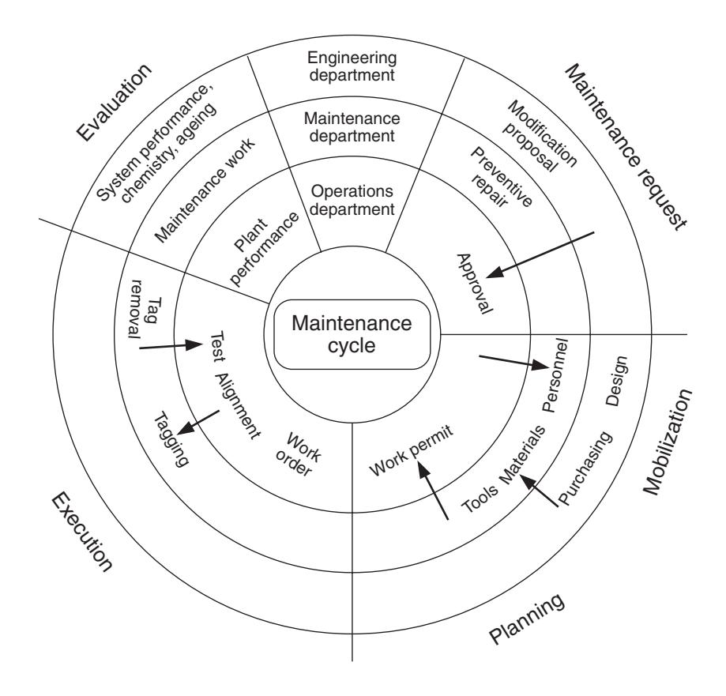

FIG. 31.1. Maintenance cycle.

maintenance for safety systems may be found in Ref. [31.2]. The maintenance cycle describes the actions required for maintenance and the co-ordination needed between the plant organizations for maintenance, operation and engineering. Each organization has tools and methods to support its maintenance actions. In accordance with modern organizational philosophy, the operations department acts as the customer and 'buys' maintenance from the other departments.

#### 31.2.1. Maintenance request

As mentioned above, a maintenance request can be generated within any one of the three main organizations. The request is based on different inputs such as the evaluation of operation and performed maintenance, new authority requirements, periodic surveillance, fault reports and the planning system. Each request is reviewed by the operations department and will generally result in an order to another department to

proceed. The review of the request as well as the whole maintenance cycle is part of the plant QA system.

#### **31.2.2. Planning and mobilization**

Depending on its nature, the maintenance request is handled by the engineering or maintenance department. Requests for major modifications will go to the engineering department for system design and the purchasing of components. Scheduled maintenance and the repair of component faults are carried out directly by the maintenance department. At the end of planning, the necessary personnel are mobilized and required tools and materials are obtained. The planning and mobilization phase is concluded with an application for a work permit. This will include different types of addenda such as work descriptions, radioactivity permits, fire precautions, limits due to plant technical specifications or plant operation, tagging, time schedules, crew protection and cost calculations.

#### **31.2.3. Execution**

Maintenance starts when the work permit is approved by the control room organization. The signed document is often called a work order. The control room organization is also responsible for isolation of the equipment to be maintained and the necessary tagging. Together with the health department, it inspects and approves the measures for radiation protection. The maintenance or modification of equipment is carried out by the maintenance department. This department is also responsible for testing the repaired system and, after testing, for the removal of temporary bypasses and tags. The work order is signed off and filed after the plant is restored and tested for operation by the control room organization.

#### **31.2.4. Evaluation**

Within the maintenance cycle, each department is responsible for some type of evaluation and reporting and the results of such evaluation will be the basis for later maintenance requests. Typical evaluations are:

- Engineering department: following up the technical performance of the plant such as:
  - ∑ Water chemistry;
  - ∑ Ageing of materials or components;
  - ∑ Transients.
- Maintenance department: evaluation of maintenance actions regarding:
  - ∑ Labour;

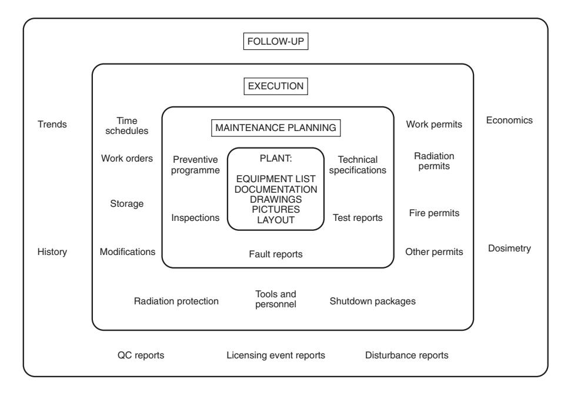

FIG. 31.2. Key elements of computerized maintenance at the Forsmark NPP, Sweden.

- Time schedules:
- Individual dose;
- Materials:
- Costs:
- Updating of plant documentation.
- Operations department: evaluation of operational improvements.

#### 31.3. COMPUTER SYSTEMS

Each department uses tools to support its part of the maintenance cycle and maintenance is carried out by co-ordinating the work from different departments. For this reason information must be available to all who are involved. A good method of providing this information is to use a plant-wide computer network to which all of the relevant computer workstations are connected [31.3].

A typical computer system is that installed at the Forsmark NPP in Sweden. This plant comprises three BWR units, each with its own computer system for process supervision, vibration and chemistry monitoring and transient recording. Originally the information from these three computer systems was used mainly by the operators but today they are connected through a common network to the next level in the computer hierarchy. Typical functions for this level are:

- Fuel management;
- Production planning;
- Safeguards and dose rate calculation.

At the top of the computer structure is the system for management and long term storage. Subnetworks, including those for office automation and external communication, are connected to the plant-wide network and this system is also used for the planning and execution of maintenance. Some examples are given below of how such a computer system is used to optimize the different maintenance actions. Maintenance actions for the Forsmark NPP are shown in Fig. 31.2.

#### 31.4. TOOLS FOR MAINTENANCE SUPPORT

#### **31.4.1. Computerized maintenance requests**

Maintenance requests may be generated in different ways, such as:

- From an evaluation of operation or maintenance history;
- Automatically for scheduled actions and preventive maintenance;
- Automatically or manually for the repair of component faults.

Requests for major maintenance actions are normally issued as reports and such reports can be transmitted by the plant network for review and approval by the different organizations. After approval, the action will be planned in more detail by the engineering or maintenance department. Typical examples are major modifications to be carried out during refuelling or other planned maintenance outages.

It is normal for information on periodic actions to be stored at the highest level of the system [31.4]. The computer at this level stores the type and the time interval for preventive maintenance and periodic testing. Periodically, e.g. weekly, the required maintenance for a certain future time is presented to the operations and maintenance departments. This maintenance is often carried out in such a way that only one redundant part of the safety and non-safety systems is affected. It is the task of the computer to verify that no work proceeds simultaneously on redundant parts of the safety systems. Such maintenance is normally very well prepared and can be carried out directly after approval by the control room staff. The computer system will print the detailed work order together with the necessary permits and alignments of the process systems.

Requests for the repair of components are normally initiated manually as a fault report by the control room staff. As more sophisticated systems become available such fault reports can be printed out automatically whenever a fault is detected by the I&C fault detection system. Systems are installed which directly and automatically warn both the control room staff and the maintenance officer on duty. Repairs which must be done during operation are placed on a computerized scheduling list for short term execution. Otherwise, the repair request is placed on a so-called stop list, which contains the actions to be performed the next time the plant is shut down for another reason. Repairs on safety systems must be carried out in accordance with rules set out in the technical specifications. In order to administer these rules, the technical specifications can be stored in the computer and the repairs supervised automatically [31.5].

The core of each maintenance system is the plant component database. This database will contain all component information necessary for planning, including:

- Component identifications, manufacturers and types;
- Data sheets;
- References to technical descriptions;
- References to maintenance procedures;
- Lists of spare parts;
- Lubrication instructions;
- Locations;
- Required tools;
- Historical records of maintenance;
- Special precautions;
- Preventive maintenance.

For newer plants it is usual for the same component database to be used during both the design of the plant and its operation.

#### **31.4.2. Use of computers in planning and mobilization**

Extensive planning is required for major maintenance. This is done by coordination between the engineering and maintenance departments. The work is initially very similar to the design process and in older plants is mostly done manually. In newer plants CAD systems are used. Usually, the CAD systems used for operation are the same as those used for plant design, the CAD workstations being connected to the network so that the drawings are available to different users. Examples of CAD systems are those used for:

- Plant layout;
- System design;
- Circuit diagrams;
- Cable installation.

The CAD system will generate drawings to assist the maintenance department in making modifications or installing new equipment. In some plants, a facility is available which can present 3-D images to the maintenance workers.

The maintenance department will schedule the work and mobilize staff, tools, materials, test equipment, etc. For special situations personnel have to be retrained. This is particularly the case for the installation of new equipment, for working in controlled areas or if off-site workers are used. Often, during a backfit with a new type of equipment, training is provided by the contractor.

In order to reduce individual dose (ALARA), it is more and more the practice to train for work inside controlled areas by use of simulation techniques, i.e. personnel are trained on a full-scale mock-up. Similar methods are used for the verification of major design changes or major modifications of cable layouts.

When the systems are modified and new components have been purchased, the information is added to the database.

# **31.4.3. Control of execution**

The first action after obtaining permission to start a piece of maintenance work is to line up the systems for maintenance. This means that parts of the total system must be isolated by valves or switches and the pneumatic, hydraulic or electrical power supplies disconnected. To administer these temporary changes, tags are required to show, both locally and in the control room, that components are not in operation. The tags also provide other information about the responsible supervisor and reference to the work order. These tags must be removed after realigning the equipment for operation. New I&C technology provides different kinds of tag support, including the following:

- Printing of tags and automatic checking of which tags are not returned after completion of the work can be done through a computer workstation in the control room supplied with information from the maintenance system. The same tagging information can also be used by the operators in the control room to maintain an overview of the ongoing progress.
- By showing on VDUs and process instrument displays the positions of service valves, temporary bypasses, circuit breakers and test switch positions, information can be obtained from the tagging computer. Information about safety

systems which are not operable because of maintenance work is required by NRC Regulatory Guide 1.47 [31.6].

During maintenance work, good co-operation is necessary between the maintenance crew and the control room staff. As early as 1980, it was concluded that [31.7]:

"Control room operators are trained and tested on the operational aspects of plant control; however, the most challenging control and co-ordination circumstances occur during testing and maintenance periods when these activities must be co-ordinated with other plant operations."

Studies of event reports from plant operation confirm this statement. Human errors increase when maintenance during normal operation imposes a need for coordination between the maintenance and control room organizations. For this reason new plants have been equipped, and older plants backfitted, with different types of on-site facilities for stationary and temporary communication between maintenance and operations personnel. Mobile wireless equipment has been tested, but cannot normally be used because of the risk of interference.

With a computer system, local switches can be used instead of tags for bypassing process functions and indicating ongoing maintenance. In addition, VDUs in the control room can present information about work orders which have not been returned and signed off.

# **31.4.4. Evaluation**

After the completion of maintenance work, an evaluation of the work is performed. The main elements of such an evaluation are the costs, the time and the human resources used. This information can be obtained from the stored work orders and their attached work reports. Another important element is the individual dose incurred. This can be monitored by means of dosimeters which can be plugged in and read by a computer system during the work and after it is finished. During reading, the information can be complemented by the work order identity.

## 31.5. PREVENTIVE MAINTENANCE

Information for the planning of preventive maintenance is obtained from component manufacturers and stored in the maintenance computer system. Other, very useful information is obtained from the on-line or off-line component condition monitoring system. Such systems contain many subsystems for different types of components [31.8].

A typical subsystem contains sensors, a computer connected to the plant network, and signal processing software. Results from these systems are used not only for preventive maintenance but sometimes the information is used by the operators for planning continuous operation with degraded components. Typical applications are:

- Vibration monitoring of rotating equipment such as turbines, motors and pumps;
- Vibration monitoring of steam generators and reactor vessel internals;
- Monitoring of small leaks;
- Fatigue bookkeeping and thermal transient monitoring;
- Performance supervision of heat exchangers, turbine condensers and pumps;
- Diagnosis of the movement of valves, control rods, etc.;
- Recording of the change of position of components;
- Supervision of the ageing of components;
- Supervision of bearings;
- Recording of the number of motor starts.

Major improvements to existing equipment are often initiated after an evaluation of plant transients or incidents. The tools for doing such studies are normally fast transient recorders and printouts of the component position indications before and after the transients. Information from the condition monitoring system is available through the plant network to operations, maintenance and engineering personnel.

#### **REFERENCES**

- [31.1] INTERNATIONAL ATOMIC ENERGY AGENCY, Maintenance of Nuclear Power Plants: A Safety Guide, Safety Series No. 50-SG-O7 (Rev. 1), IAEA, Vienna (1990).
- [31.2] INTERNATIONAL ATOMIC ENERGY AGENCY, Manual on Maintenance of Systems and Components Important to Safety, Technical Reports Series No. 268, IAEA, Vienna (1986).
- [31.3] INTERNATIONAL ATOMIC ENERGY AGENCY, Computerization of Operation and Maintenance for Nuclear Power Plants, IAEA-TECDOC-808, Vienna (1995).
- [31.4] ELECTRIC POWER RESEARCH INSTITUTE, Guide for Developing a Preventive Maintenance Programme in Electric Power Plants, Rep. EPRI-NP-3416, Palo Alto, CA (1984).
- [31.5] DWORZAK, F., NEDELIK, A., VAN GEMST, P.A., "Design and implementation of a computerized system for evaluation of plant status with respect to safety technical regulations", Nuclear Power Plant Control and Instrumentation 1982 (Proc. Symp. Munich, 1982), IAEA, Vienna (1983) 151–158.

- [31.6] NUCLEAR REGULATORY COMMISSION, Bypassed and Inoperable Status Indication for Nuclear Power Plant Safety Systems, Regulatory Guide 1.47, US Govt Printing Office, Washington, DC (1973).
- [31.7] SANDIA CORPORATION, The Identification of the Impact of Maintenance and Testing upon the Safety of LWR Power Plants, Rep. ALO-77/1; SAI-100-81-AM, Sandia Corp., Albuquerque, NM (1980).
- [31.8] WACH, D., "Experience and benefits with diagnostic systems in German PWRs", Operator Support Systems in Nuclear Power Plants, IAEA-TECDOC-762, IAEA, Vienna (1994) 29–42.

# **BIBLIOGRAPHY**

DANIELSSON, H., "Preventive maintenance at the Forsmark nuclear power plant", Nuclear Power Plant Availability, Maintenance and Operation (Proc. Symp. Munich, 1985), IAEA, Vienna (1985) 217–223.

# **32. EMERGENCY RESPONSE FACILITIES**

## 32.1. INTRODUCTION

The accident at TMI demonstrated that there was a need for extensive improvement in the way in which management responds to accidents at NPPs. Identified improvements included:

- Developing integrated emergency response facilities and data systems to aid management;
- Providing better information for assessing conditions at the plant and in its environs before, during and following an accident.

Though some differences exist, there are many common features among the emergency response organizations in different countries and nuclear utilities. This section describes functional criteria for emergency response facilities (ERFs) given in NUREG-0696 [32.1]. According to NUREG-0696, common facilities include the main control room (MCR), the on-site technical support centre (TSC), an on-site operational support centre (OSC) and a near site emergency operations facility (EOF). Common systems include the safety parameter display system (SPDS) and the nuclear data link (NDL). These facilities and systems operate as an integrated system to support the control room in mitigating the consequences of an accident and enhance the capability of the NPP organization to respond to abnormal plant conditions.

During any emergency, the ERFs do the following:

- Help the reactor operators determine the plant safety status;
- Relieve the operators from peripheral duties and communications not directly related to reactor system manipulations;
- Prevent congestion in the control room;
- Assist the operators by providing technical personnel who have comprehensive plant data at their disposal;
- Facilitate a co-ordinated emergency response by both technical and management personnel;
- Provide reliable communications between on-site and off-site emergency response personnel;
- Provide a focal point for the development of recommendations for off-site actions;
- Provide relevant plant data to the safety authority for its analysis of abnormal plant operating conditions.

## 32.2. TECHNICAL SUPPORT CENTRE

The TSC is an on-site facility located close to the control room. It provides plant management and technical support, during emergency conditions, to the reactor operating personnel located in the control room.

#### **32.2.1. Functions**

The TSC performs the following functions:

- Provides management and technical support to plant operations personnel during emergency conditions;
- Relieves the operators from peripheral duties and communications not directly related to reactor system manipulations;
- Prevents congestion in the control room;
- Performs EOF functions during an accident until the EOF itself is functional.

The TSC is the emergency operations work area for designated technical, engineering and senior NPP management personnel, any other NPP designated personnel required to provide technical support and a small staff of safety authority personnel. A senior NPP official uses the resources of the TSC to provide guidance and technical assistance to the operating supervisor in the control room. However, all manipulations are performed by the control room licensed operators.

The TSC has facilities to support the plant management and technical personnel who will be assigned there during an emergency and will be the primary on-site communications centre for the plant during the emergency. TSC personnel use the TSC data system to analyse the plant steady state and dynamic behaviour before and throughout the course of an accident. The results of this analysis are used to provide guidance to control room operating personnel in the management of the abnormal condition and in accident mitigation. TSC personnel also use the environmental and radiological information available from the TSC data system to perform the necessary functions of the EOF if this facility is not operational. The TSC also may be used to provide technical support during recovery operations following an emergency.

The TSC facilities may be used by designated operating personnel for normal daily operations as well as for training and emergency drills.

#### **32.2.2. Location**

The TSC provides facilities near to the control room for detailed analyses of plant conditions during abnormal conditions or emergencies by trained and competent technical staff. In order to benefit from face to face communications between TSC and control room personnel, the TSC is located as close as possible to the control room, preferably within the same building. Provisions are made for the safe and timely movement of personnel between the TSC and the control room under emergency conditions.

# **32.2.3. Structure**

The TSC complex must be able to withstand the most adverse conditions that could reasonably be expected during the design life of the plant, including earthquakes, high winds and floods. The TSC need not meet seismic criteria or be qualified as an ESF. Normally, a well engineered structure will provide adequate ability to withstand earthquakes. Winds and floods with a 100 year recurrence frequency are acceptable as a design basis. Existing buildings may be used to house the TSC complex if they satisfy these minimum criteria.

# **32.2.4. Habitability**

Since the TSC provides direct management and technical support to the control room during an accident, it must have the same radiological criteria as regards habitability as the control room under accident conditions. TSC personnel must be protected from radiological hazards, including direct radiation and airborne radioactive material from in-plant sources, to the same degree as control room personnel.

# **32.2.5. Communications**

The TSC is the primary on-site communications centre for the plant during an emergency. It must therefore have reliable voice communications to the control room, the OSC, the EOF and the safety authority. The primary function of this communications system will be plant management communication and the immediate exchange of information on plant status and operations. Provisions for communications with State and other operations centres should also be available in the TSC so that early notification and recommendations can be given to off-site authorities prior to operation of the EOF.

#### **32.2.6. Instrumentation, data system equipment and power supplies**

Equipment is provided to gather, store and display the data needed in the TSC to analyse plant conditions. The data system equipment performs these functions independently of actions in the control room and without degrading or interfering with control room and plant functions. TSC instrumentation, data system equipment and power supplies need not meet safety grade requirements. However, when signals to the TSC are received from sensors providing signals to safety system equipment or displays, suitable isolation must be provided to ensure that the TSC systems cannot degrade the performance of the safety system equipment or displays.

The TSC electrical equipment load must not degrade the capability or reliability of any safety related power source. Circuit transients or power supply failures and fluctuations must not cause loss of any stored data vital to the TSC function. Sufficient alternative or backup power sources must be provided to maintain continuity of TSC functions and to permit immediate resumption of data acquisition, storage and display if loss of the primary TSC power sources occurs.

If stringent conditions are met, the plant process computer may provide the TSC data system functions or may have data for the TSC system transmitted through it. In either case, the performance of the plant process computer and its related instrumentation and equipment should be included when determining TSC data system unavailability. Furthermore, the computational capacity and data throughput of the plant process computer must be sufficient to accommodate the combined computational and I/O loads of the TSC system in addition to its other functions under abnormal conditions.

#### **32.2.7. Technical data system**

The TSC technical data system receives, stores, processes and displays the information acquired from different areas of the plant as needed. The data available for display in the TSC must enable the plant management, engineering and technical personnel assigned there to aid the control room operators in handling emergency conditions. The data system provides access to accurate and reliable information sufficient to determine:

- Plant steady state operating conditions before the accident;
- Transient conditions during the initiating event;
- Dynamic behaviour of plant systems throughout the course of the accident.

The TSC technical data system may be used for:

- Reviewing the accident sequence;
- Determining appropriate mitigation actions;
- Evaluating the extent of any damage;
- Determining plant status during recovery operations.

Archival data storage and the ability to transfer data between active memory and archives without interrupting TSC data acquisition and display must be provided for all TSC data. The TSC has a complete and up to date repository of plant records and procedures at the disposal of TSC personnel to aid their technical analysis and evaluation of emergency conditions. A sufficient number of data display and printout devices allow all TSC personnel to perform their assigned tasks with unhindered access to data. The SPDS is also available in the TSC. This duplication will improve the exchange of information between the control room and the TSC.

#### 32.3. OPERATIONAL SUPPORT CENTRE

The OSC is an on-site area separate from the control room and the TSC where NPP operations support personnel will assemble in an emergency. The OSC provides:

- A location where plant logistic support can be co-ordinated during an emergency;
- An ability to restrict control room access to those support personnel specifically requested by the shift supervisor.

The OSC needs direct communications with the control room and with the TSC so that the personnel reporting to the OSC can be assigned to duties in support of emergency operations.

# 32.4. EMERGENCY OPERATIONS FACILITY

#### **32.4.1. Functions**

The EOF is an off-site support centre controlled and operated by the NPP. It has facilities for:

- Management of the overall NPP emergency response;
- Co-ordination of radiological and environmental assessments;
- Determination of recommended public protective actions;
- Co-ordination of emergency response activities with State and local agencies.

The EOF is the location from which the NPP provides overall management of NPP resources in response to an emergency with actual or potential environmental consequences. A designated senior NPP official will manage NPP activities in the EOF to support the designated official in the TSC and the senior reactor operator (designated the shift supervisor) in the control room. The EOF has facilities for the acquisition, display and evaluation of all radiological, meteorological and plant system data pertinent to its off-site protective measures. These facilities are used to evaluate the magnitude and effects of actual or potential radioactive releases from the plant and to determine off-site dose projections. The NPP may also use the EOF as the post-accident recovery management centre.

# **32.4.2. Communications**

The EOF needs reliable voice communications to the TSC, the control room, the safety authority and State and local emergency operations centres. The normal communication path between the EOF and the control room will be through the TSC.

#### **32.4.3. Instrumentation, data system equipment and power supplies**

Equipment is provided to gather, store and display data needed in the EOF to analyse plant conditions and exchange information with the manager of the TSC. The EOF data system equipment must perform these functions independently of actions in the control room and without degrading or interfering with control room or plant functions. EOF instrumentation, data system equipment and power supplies need not meet safety grade criteria. However, when signals to the EOF are received from sensors providing signals to safety system equipment or displays, suitable isolation must be provided to ensure that the EOF systems cannot degrade the performance of the safety system equipment or displays.

The design of the EOF data system equipment should incorporate human factors engineering with consideration for both operating and maintenance personnel.

# **32.4.4. Technical data system**

The EOF technical data system receives, stores, processes and displays information sufficient to permit assessment of the actual and potential on-site and off-site environmental consequences of the emergency condition. Data providing information on the general condition of the plant are also available for display in the EOF for utility resource management. The EOF data set includes radiological, meteorological and other environmental data as needed to:

- Assess environmental conditions;
- Co-ordinate radiological monitoring activities;
- Recommend off-site emergency plans.

Archival data storage and the ability to transfer data between active memory and archives without interrupting EOF data acquisition and display must be provided for all EOF data. A sufficient number of data display devices should be provided in the EOF so that all EOF personnel can perform their assigned tasks with unhindered access to alphanumeric and/or graphical representations of:

- Plant system variables;
- In-plant radiological variables;
- Meteorological information;
- Off-site radiological information.

Trend information display and time history display capability is required to give EOF personnel a dynamic view of plant systems, radiological status and environmental status during the emergency. The EOF must have ready access to up to date plant records, procedures and the emergency plans needed to exercise overall management of NPP emergency response resources.

The SPDS is also available in the EOF. This duplication provides NPP management and nuclear authority representatives with information about the current status of reactor systems and facilitates communication between the control room, TSC and EOF.

# 32.5. SAFETY PARAMETER DISPLAY SYSTEM

(see also Section 25.4.1)

#### **32.5.1. Functions**

The purpose of the SPDS is to assist control room personnel in evaluating the safety status of the plant by providing a continuous indication of parameters or derived variables which are representative of that status. The primary function of the SPDS is to aid the operator in the rapid detection of abnormal operating conditions. It is therefore an operator aid which serves to concentrate a minimum set of plant parameters from which the plant safety status can be assessed. The grouping of parameters is designed to enhance the operator's ability to assess plant status in a timely manner without surveying the entire control room. However, an assessment based on the SPDS has to be confirmed by other control room indications.

The SPDS operates during normal and abnormal operating conditions. It is important to safety but does not have to be a qualified safety system or, necessarily, to meet the SFC. It is desirable that the SPDS be designed with sufficient flexibility to allow further incorporation of advanced diagnostic concepts, evaluation techniques and systems such as expert systems.

#### **32.5.2. Displays**

Among the SPDS displays is a primary display designed to present the overall current state of the plant and to alert operators to significant changes in CSFs. The design of the primary display format is as simple as possible, consistent with required functions such as those listed below. The primary display usually includes pattern and coding techniques to assist the operator in detecting and recognizing unsafe operating conditions and to guide the operator in the use of emergency response procedures. The CSFs for the primary display include [32.2]:

- Reactivity control;
- Reactor core cooling and heat removal from the primary system;
- Reactor coolant system integrity;
- Radioactivity surveillance;
- Containment integrity.

Secondary displays are also available to provide, for example, diagnosis information and any other information, such as temperature and flux distributions, which may be important to the safety of the plant.

## **32.5.3. Data validation**

All data for display have to be validated on a real time basis. Data validation can include cross-checks between redundant measurements, consistency checks between diverse measurements, alarm checking or checks against predictions. Final acceptance of questionable data should be at the discretion of the operator, whose decisions must be recorded.

# **32.5.4. Location and size**

The SPDS is to be located in the control room with additional displays available in the TSC and EOF. The displays must be readily accessible and visible in the control room to the personnel who have been assigned to use them. The SPDS must not interfere with normal movement or with full visual access to other control room operating systems and displays.

## **32.5.5. Staffing**

The SPDS must be of such design that no additional operating personnel other than normally assigned control room operating staff are required for its operation.

# 32.6. EMERGENCY RESPONSE CENTRES

Before the TMI accident, emergency response capability was mainly limited to the individual plant site, with only general communications to the regulating agency by plant personnel and regulatory inspectors at the site. This response capability proved inadequate for performing a rapid, independent assessment of TMI plant conditions and for planning emergency evacuation measures when deemed necessary. Following the TMI accident, centralized emergency response centres (or 'crisis centres') were instituted in the USA at which key parameters from each plant could be directly monitored. These parameters are continuously evaluated by expert staff in the emergency response centres and, in conjunction with site personnel evaluations, allow the direction of actions commensurate with the course of the event.

#### **REFERENCES**

- [32.1] NUCLEAR REGULATORY COMMISSION, Functional Criteria for Emergency Response Facilities, Rep. NUREG-0696, US Govt Printing Office, Washington, DC (1981).
- [32.2] INTERNATIONAL ELECTROTECHNICAL COMMISSION, Functional Design Criteria for a Safety Parameter Display System for Nuclear Power Stations, Standard 960, IEC, Geneva (1988).

# **BIBLIOGRAPHY**

Diagnosis of and Response to Abnormal Occurrences at Nuclear Power Plants (Proc. Sem. Dresden, 1984), IAEA-TECDOC-334, IAEA, Vienna (1985).

Emergency Planning and Preparedness for Nuclear Facilities (Proc. Symp. Rome, 1985), IAEA, Vienna (1986).

Feedback of Operational Safety Experience from Nuclear Power Plants (Proc. Symp. Paris, 1988), IAEA, Vienna (1989).

#### INTERNATIONAL ATOMIC ENERGY AGENCY (Vienna)

Emergency Preparedness Exercises for Nuclear Facilities: Preparation, Conduct and Evaluation, Safety Series No. 73 (1985).

Improving Nuclear Power Plant Safety through Operator Aids, IAEA-TECDOC-444 (1987).

User Requirements for Decision Support Systems Used for Nuclear Power Plant Accident Prevention and Mitigation, IAEA-TECDOC-529 (1989).

Computer Based Aids for Operator Support in Nuclear Power Plants, IAEA-TECDOC-549 (1990).

Control Rooms and Man–Machine Interface in Nuclear Power Plants, IAEA-TECDOC-565 (1990).

Development and Implementation of Computerized Operator Support Systems in Nuclear Installations, Technical Reports Series No. 372 (1994).

Man–Machine Interface in the Nuclear Industry (Proc. Conf. Tokyo, 1988), IAEA, Vienna (1988).

NUCLEAR REGULATORY COMMISSION, Clarification of TMI Action Plan Requirements, Rep. NUREG-737, US Govt Printing Office, Washington, DC (1983).

# **33. FUTURE TRENDS**

# 33.1. INTRODUCTION

The purpose of this section is to summarize the changes which have taken place in NPP I&C and to consider the ways in which they may develop further over the next ten years or so. It is hoped that this will provide a useful overview and help clarify the relative importance of these changes.

Predicting the future is always open to error, particularly when it depends on fast moving technologies such as computing. It is sometimes argued that factors such as qualification and licensing slow down the application of new technology in the nuclear industry, so that components which will be commissioned in ten years' time are already known. However, this is only partly true, as is evident from a comparison of, for example, what was known in 1985 about computer size, speed, addressed memory and disk storage capacity, and the I&C equipment in today's NPPs. Thus, predictions can only be made, at best, in qualitative terms and the degree to which a given technique will be applied will remain unclear. Nevertheless, the mean operating lifetime of the bulk of plant I&C equipment (as distinct from peripheral equipment) is probably of the order of 20 years and much will not change at all in the period under consideration.

#### 33.2. CAUSES OF CHANGE

#### **33.2.1. General factors**

Trends are driven by imperatives and it is useful to ask why changes occur at all. From an I&C point of view, the driving forces are:

- *Environmental:* there is continual pressure to improve in respects which range from reducing radiation dose during maintenance to mitigating the perceived consequences of a beyond design basis accident. In addition, step changes in need follow actual or newly assumed accidents.
- *Economic:* improved I&C offers lower operating costs.

I&C upgrades associated with major work on the plant itself (either when a new plant is built or when an existing plant is significantly altered) seem likely to be relatively rare over the next ten years. Such changes are not controlled by the I&C but have to do with the demand for power or with the obsolescence of existing plants for economic or safety reasons. In such cases, the choice between upgrade and new plant (nuclear or fossil fuelled) is dictated by costs and by politically related considerations. More likely scenarios involve additions to, or partial or even nearly total replacement of, existing I&C without major change to the plant. These may happen because of maintenance problems, to improve safety (probably expressed through new regulations) or simply because, although the plant is ageing, it still has a long remaining life which justifies taking advantage of new technology. The scope of this type of change depends on costs, functional requirements, the influence of regulation and, strongly, on the cost of the change itself, including the cost of any necessary shutdown.

In considering these factors, important issues include:

- Whether nuclear power will grow in the future;
- Whether there will be any significant changes in ecological perception;
- How many obsolescent systems exist;
- When and where new equipment will be needed.

# **33.2.2. Advantages to be gained from change**

None of the above factors, in themselves, force change — the present systems could simply be replaced. There are often good arguments for leaving things alone (Section 44) and other considerations in favour of change have to apply. These may include:

#### (a) *Environmental or political imperatives*

- Changes in safety philosophy since the plant was built. There may have been accident experience (not necessarily on the particular plant in question), changes in regulation, etc. Such arguments often concern the non-I&C aspects of the plant but, with the possible exception of the operating rules, I&C is the easiest thing to change and is invariably among the first to be considered. Good examples are the introduction of secondary shutdown systems following the realization that rods might fail to drop, and the need for an SPDS after the TMI accident.
- Changes in political frameworks and attitudes. A new government might have a new position on NPPs and could demand additional requirements which can only be satisfied by new functionality. This type of pressure is not restricted to a single country but may spread to other countries. For example, western Europe has supported I&C modification of eastern European plants. In this context, knowledge transfer also stimulates change.
- It is also possible to be cynical and to note a continual tendency for general insistence on more or better safety. If it can be done, it is necessary virtually irrespective of probabilities or cost.

#### (b) *Economic imperatives.* Improved I&C can improve:

- Plant availability through better reliability and fewer spurious shutdowns;
- Operating performance by allowing a safe, closer approach to, for example, power density limits;
- Load following;
- Fuel use;
- Use of staff;
- Maintenance.

#### (c) *Other factors*

- Technology changes in themselves stimulate change so that, for example, the emergence of an attractive new technique may lead to the justification of its use by one of the above mentioned routes.
- Interested manufacturers, researchers and other individuals compound this by having a vested interest in new applications and creating pressure for them to be introduced.

— Equally, unless a technology can be seen to offer suitable advantages it will not develop.

The factors listed above are interlinked and will govern the way in which I&C technology develops. They all apply both to new plants and to backfits but their respective weights will vary. They will also be conditioned by other factors such as the availability of alternative power sources and the financial resources in a particular situation.

# **33.2.3. Factors controlling change**

- (a) *Deep rooted change is prevented by a number of significant constraints.* Constraints include the physical format of the plant and the cost (and difficulty) of justifying and qualifying the change.
  - A plant is, literally, set in concrete. Change to sensors and similar units is severely restricted.
  - The designers, regulators and operators of current designs have built in conservatism, which has an analogous effect. Probably rightly, change must be convincing and a new sensor or technique has to be much better to oust an old one.
  - The cost of qualification does not help. The existence of qualification by experience on the old device (if favourable) tends to be a very strong factor.
- (b) *Nuclear power is no longer able to support much development.* Some new technology is still created within the industry but most changes now follow progress in:
  - *The computer industry.* Many of the developments in this field have been applied directly to NPPs and the pace of this change will increase if needs for specially qualified components are eased. Similar comments apply to software.
  - *The chemical process industry.* This industry uses enormous quantities of standardized instrument modules and controllers such as PLCs and many can be or have been applied in NPPs. This industry has seen relatively little change in sensor physics and engineering over recent years but new electronic techniques have led to various types of so-called smart instruments which, among other things, are self-validating. There is an increasing tendency to put intelligence near the sensor and this has led to increased application of bus technology rather than individual sensor cables.
  - *Other industries.* Many other industries are concerned with improvements to the HMI, simulators, etc. This is a field associated with NPPs in a fairly

direct way but little advance would have been possible without corresponding advances in computer technology.

Despite the increased dependence of nuclear power on other industries there seems to be surprisingly little contact with them. It may well be that factors such as licensing regulation generate a larger gulf than might be supposed and that techniques cannot be readily transferred. It is also possible that highly competitive industries such as the chemical process industry depend on relatively outmoded and heavily depreciated (but nevertheless functional) equipment and could learn about more recent development in, say, human factors from the nuclear field. If this is true, it means that innovation in NPP I&C may be slower than might otherwise be expected in the medium term.

(c) *Time-scales.* Depending on the device, the time from conception of a technique to its application on a significant scale can be very long, sometimes as long as 20 years. This is not true of many computing techniques (possibly because of their widespread adoption outside NPPs) but certainly applies to, for example, current fluctuation neutron flux monitoring and the neutron thermometer. Both have been available in relatively highly developed forms for many years but are still not widely used. Many ideas of this type have attracted great interest and, sometimes, significant funding, but have not (yet) enjoyed wide application.

It can be concluded that the technology of NPPs themselves and of the sensor aspects of I&C is unlikely to change much in the immediate future. Ideas will appear here and there and be applied in relatively small numbers but will not change the overall picture very much. This is far less true of non-sensor aspects of I&C, which can benefit by the more or less direct application of electronics and computer technology. Even in this area, however, progress will be slow compared with, say, that of the domestic computer market and will apply more to detail than to principle.

# **33.2.4. Previous trends**

The discussion above can be validated by listing the factors which have driven the changes of the recent past. Some of these are:

- The availability of new information and display technologies.
- The nature of an NPP: it is complex, uses a great deal of I&C and can justify the use of new information technology and display techniques.
- New perceptions of the ways in which accidents can be prevented and their possible consequences minimized.

- The occurrence of two major plant events (TMI and Chernobyl), both of which generated profound changes in operating philosophy and therefore in I&C needs.
- The resultant need for I&C facilities to cover beyond design basis events and possibly even requirements for zero environmental impact following an accident.
- Increased emphasis on operating economy in new plants and following backfits.
- A possible element of overkill: for example, it could be questioned whether the current need for alarm management suggests that the number of alarms now provided is excessive, or whether safety has really been improved by increasing the number of alarms on analogous plants from some hundreds to thousands.

Typical of recent change are the way in which a need for change has coincided with the ability to achieve it and the way in which all the changes have been, in a sense, extras which do not alter the primary characteristics of the plant. In looking to the future it might be suggested that these trends will continue and that one should seek needs and abilities. It is clear that pressure from economic requirements will continue but not so clear what new environmental aspects will arise. Short of another accident, it may be possible that some kind of plateau has been reached.

# 33.3. LIKELY DEVELOPMENTS

One can expect to see a stream of backfits together with some new plants, all with improved I&C technology. Each will be better than the last but, to some extent, the differences will be of degree rather than kind. It seems unlikely that the replacement of analog by digital devices will be followed by another revolution of the same type so soon — there is as yet no viable replacement in kind for the programmable digital comparator. There will be evolution rather than revolution, faster in some areas than in others. As before, most developments will be computer based and it is necessary to consider what is now becoming available and how it will be applied.

#### **33.3.1. Plant computers**

There will be more digital control and protection applications and, probably, more limitation systems. The trend will, in the short term, lead to increased debate on safety, V&V, CMF, etc., but this will decrease as acceptance increases. There will be attempts to strengthen safety arguments by the use of different redundant and diverse digital systems. The use of probability based design will increase, as will the acceptance and deployment of standardized software. Improvements in V&V will see the increased use of software tools.

All of this will, of course, be accompanied by better hardware operating at higher speeds with larger and cheaper memories. This has implications for real time simulation and prediction, leading to even better operator support. More and more computers will be installed in NPPs and will be interconnected with the existing computers by integrated networks covering all of the plant needs — process, technical and administrative. There will be a tendency to move processor intelligence towards the reactor and to use digital buses for signal transmission. Such networking will grow to encompass all aspects of the plant. It offers many advantages and, in particular:

- Lends itself to modularity, and hence to easier qualification and V&V;
- Reduces equipment, installation and maintenance costs;
- Eases the provision of diversity and redundancy;
- Simplifies segregation and separation.

One possible disadvantage might be associated with response times.

# **33.3.2. Better human orientation through better understanding of operator needs and better application of aids**

There will be more human factors applications, leading to lower burdens on operators, better and quicker reaction to emergency situations and the reduction of error. This will be achieved by:

- Better workstations and displays.
- Improved and more extensive use of expert systems as operator aids. These could depend on new neural, learning computing techniques.
- Multimedia techniques. Multimedia and 3-D systems are already installed in conventional plants to support operation and maintenance and it seems possible that such systems will appear in NPPs shortly.
- Use of virtual reality techniques both in the control room and (probably earlier) for training.

It is expected that there will be a tendency towards integrated operating and support systems in which information from the plant, the operating utility and the grid is combined.

An interesting trend is the use of different types of simulator, not only for training but also for supporting plant operation and engineering. Simulation is useful for the analysis of planned operator actions and it is possible to predict the course of an accident by on-line simulation. Engineering simulators are now commonly used by reactor vendors for the design of equipment and they can also be used, on-site, for evaluating modifications.

# **33.3.3. Qualification and licensing costs**

Probably the next revolution will occur in the area of qualification and licensing costs. Current generation systems tend to be bespoke and are realized with special hardware qualified for nuclear applications. However, great advantages in total cost of ownership could arise from hardware (and software) standardization and the use of systems based on diverse industrial units. Such systems are unlikely to achieve the necessary standards of reliability directly but it should not be impossible to devise fault tolerant architectures which are acceptable. Similar arguments apply to software standardization and the two developments could go ahead together. In both cases qualification and performance will be achieved from the structure as well as from the individual components and the combination would have to include appropriate defence in depth. This applies particularly to software.

It is important to note the role of regulating authorities in the development of such new technologies. As they increase acceptance, so they stimulate growth.

#### **33.3.4. Sensors and instruments**

As has been stated, there is unlikely to be a revolution in instrument practice, although this does not prevent significant changes from arising virtually overnight. For example, the availability of relevant integrated circuits based on materials with a wide band gap and therefore less radiation sensitive than silicon would immediately permit the wider application of smart instruments. One can also imagine the application of new sensor principles based, for example, on the transmission modes of fibre optic devices. Once again, such developments depend on progress in industries other than nuclear power.

#### **33.3.5. Developments based on new perceived needs**

In addition to the general themes discussed above, new systems will be devised to deal with specific requirements. Among these are:

- DBA and severe accident scenarios. Much depends on the physical plant but new instruments could well be required both to control the accident mitigation facility and to provide more and better information.
- Detailed improvements of operating costs. Among these might be provision for:
  - ∑ Fewer operators;
  - ∑ Better, longer lived hardware (rather than just the latest).
- Specific support to operators in moving closer to operating limits and reducing margins.

- Better installation techniques. These mainly concern detail: for example, EMC problems can be important and the technology to eliminate them exists.
- Increased recognition of multiple failure modes and ways to protect against them.
- Specialized developments in modular hardware and software to meet special backfit needs.

# 33.4. CONCLUSION

It is difficult to imagine a revolution analogous to that of the past ten years happening again in the near future. Thus, the next ten years are likely to see similar but smaller changes, their direction and speed being governed by the factors set out above.

# Part IV

# INSTRUMENTATION AND CONTROL IN A NEW NUCLEAR POWER PLANT

# **34. INTRODUCTION TO PART IV**

The 1984 edition of this guidebook [34.1] was written at a time when the use of nuclear power had been growing rapidly and reflected a perceived need to support the introduction of NPPs into developing countries. This no longer seems necessary. However, the small number of orders for NPPs, increased maturity within the nuclear industry and redirections in national priorities have resulted in changes in nuclear industrial infrastructure throughout the world. The generally weaker role of government laboratories, the greater impact of market forces and commercial dominance by utilities are leading to greater emphasis on immediate problems and less interest in potential future difficulties. Development is tending to become commercially driven and, over a period of time, this could lead to a loss of new entrants to the industry and a reduction in the pool of basic knowledge. Skills are certainly changing in kind and, with the relatively low growth of nuclear power in the more recent past, there is now a real possibility of shortages in the kinds of skills and attitudes needed to build and commission a new plant safely and economically. Thus, much of the guidance which, in 1984, was thought applicable to developing countries could soon become relevant to a developed country in which an individual utility sets out to specify, buy and commission a new plant. It is sometimes said that expertise can be bought in by the use of contractors, but this would meet only part of the need. Contracts have to be specified and supervised and, in due course, it would become necessary to run and maintain the plant. Therefore, in-house capability is required or must be developed and the topic remains relevant to this guidebook, albeit in a form different from before.

The need for guidance in this area depends strongly on the circumstances and on the infrastructure of the purchasing country. This is particularly true if the plant is being bought from overseas. The reader of this guidebook is assumed to be trained but relatively inexperienced in the building and commissioning of new plant. He or she will be working for more experienced superiors but will need background knowledge if the work is to be done to the highest standards. It is further assumed that the plant is to be built on a new site and that the I&C team has to be created (possibly recruited), trained and set to work. In such a case some of the new personnel may well be unfamiliar with unique aspects of NPPs, for example the dominance of licensing concepts. These will therefore be discussed. It is assumed that the utility provides the management structure and a central source of support (laboratories, etc.). Table 34.1 lists what ought to be available and, if they are to cater for the operational and maintenance requirements of the plant, these assets should be operative by the end of the plant construction phase.

The following discussion is set in the context of purchasing and commissioning a new facility but, with appropriate amendment, is also applicable to the replacement

TABLE 34.1. THE ESTABLISHED BASE: A SCENARIO AT THE END OF THE CONSTRUCTION PHASE

| Human resources                    |                                  |                              |                                 |  |  |  |
|------------------------------------|----------------------------------|------------------------------|---------------------------------|--|--|--|
| Professionals                      | Technicians and craftspersons | Facilities                   | Organizations                   |  |  |  |
| I&C professionals                  | I&C technicians                  | I&C laboratories             | Safety regulatory               |  |  |  |
| with postgraduate                  | trained at training              | and classroom                | authority:                      |  |  |  |
| specialized academic               | centre and working on:           | training operational         | — Reviews                       |  |  |  |
| training, and the majority with | — Construction, equipment     | at training centre           | — Inspections                   |  |  |  |
| three years' training              | installation and                 | Vendor assisted              | In-house training               |  |  |  |
| at vendor's design                 | pre-commissioning                | training at plant site       | centre                          |  |  |  |
| offices; now working               | checks                           | for:                         |                                 |  |  |  |
| in:                                | — Instrument repair              | — Craftspersons              | Project management              |  |  |  |
|                                    |                                  |                              |                                 |  |  |  |
| — Safety regulatory                | and calibration                  | — Technicians and            |                                 |  |  |  |
| activities                         | in instrument                    | engineers                    | Project design                  |  |  |  |
| — In-house training                | shop                             |                              | engineering group               |  |  |  |
| — Project manage-                  |                                  | Computer and control         |                                 |  |  |  |
| ment organization:                 | Draughtspersons                  | systems development          | Research centre                 |  |  |  |
| ∑ Seconded to                      | maintaining and                  | centre with spare            |                                 |  |  |  |
| vendor for                         | updating plant                   | computer system              | Plant operation                 |  |  |  |
| commissioning ∑ Staffing I&C    | I&C documentation                | operational                  | and maintenance organization |  |  |  |
| maintenance                        | I&C craftspersons                | I&C shop and                 |                                 |  |  |  |
| ∑ Drafting, docu-                  | trained at site and              | maintenance section          |                                 |  |  |  |
| menting and                        | working on construc-             | operational                  |                                 |  |  |  |
| maintaining                        | tion and equipment               |                              |                                 |  |  |  |
| history sheets                     | installation                     | Private or public            |                                 |  |  |  |
| — Project design                   |                                  | sector organizations for     |                                 |  |  |  |
| engineering group,                 |                                  | computer systems             |                                 |  |  |  |
| also seconded                      |                                  | integration (from hard       |                                 |  |  |  |
| to vendor for                      |                                  | ware of original             |                                 |  |  |  |
| commissioning                      |                                  | equipment manufacturer)      |                                 |  |  |  |
| — Simulator                        |                                  | established and              |                                 |  |  |  |
| construction and                   |                                  | operational                  |                                 |  |  |  |
| commissioning                      |                                  |                              |                                 |  |  |  |
| — Computer and                     |                                  | NPP training simulator       |                                 |  |  |  |
| control systems                    |                                  | operational for operator     |                                 |  |  |  |
| development group                  |                                  | training and for checking    |                                 |  |  |  |
| at site with liaison to            |                                  | of commissioning             |                                 |  |  |  |
| nuclear research                   |                                  | procedures, etc.             |                                 |  |  |  |
| centre and to industry,            |                                  |                              |                                 |  |  |  |
| developing and                     |                                  | Nuclear research centre      |                                 |  |  |  |
| testing software on                |                                  | providing analytical         |                                 |  |  |  |
| spare computer                     |                                  | support for safety authority |                                 |  |  |  |
| system                             |                                  | and for project design       |                                 |  |  |  |
|                                    |                                  | engineering group and        |                                 |  |  |  |
| I&C technical committee            |                                  | co-ordinating any R&D        |                                 |  |  |  |
| operational                        |                                  | work for local industry      |                                 |  |  |  |

of major items of I&C equipment in an existing plant — it is not uncommon to refit the total nucleonic suite and, possibly, the protection systems at, say, halfway through the plant's life. Two key, interlinked issues which arise in the purchase of any equipment are 'specification' and 'responsibility for design'. In principle, the owner or the owner's advisers write the specification and the vendor designs to meet it. However, many iterations are necessary before satisfactory and compatible specifications and designs are reached. Such iterations are only possible if the potential owner has adequate expertise. Furthermore, this kind of negotiation can become confused and/or ill recorded and, in due course, the owner may end up with the wrong system or equipment or may become legally or morally responsible for aspects of the design. If there are then commissioning or operating difficulties, the operator may be in a difficult and expensive situation. In an NPP, problems of this type are virtually inevitable. They must be borne in mind from the outset and every effort made to think through the consequences of specifications so that the supplier knows exactly what has to be achieved and is not confronted with hidden pitfalls. This means that the owner (or owner's agent) must essentially be able to design the plant in some detail before the tender specifications are written and underlines the need for expertise. The owner must certainly be able to write down and discuss who is to be responsible for what at all stages, including final commissioning.

In the national context, the 1984 edition of this guidebook [34.1] states:

"National participation can be defined, in a narrow sense, as the efforts of a country towards self-reliance, and for a transfer of technology in order to provide assured support for the safe, efficient operation and maintenance of its nuclear power plant over its lifetime. A broader definition could be the development of an educational, technological and industrial infrastructure so as to maximize the local content in the supply of goods and services, and in the performance of activities in the various phases of the nuclear power programme.

"Infrastructures will be needed in the educational, technological and industrial sectors. The extent to which they will be developed depends on the policy established for the country's national involvement."

The same is identically true but on smaller scales for a utility and for an individual NPP. The following sections discuss some of the problems encountered in each phase of an NPP project in that light and present possible remedies. The situations which could arise in developing countries are addressed in more detail in the 1984 edition. However, it should be noted that although the nature of the problems is common, solutions are by no means universal.

I&C is only a part of the overall nuclear project framework and it is necessary to understand the various organizational structures and interrelationships which are possible and how and where I&C activities fit into the overall scheme. For a detailed treatment of this subject, the reader is referred to Refs [34.2, 34.3] and to the references which they contain. These references particularly note the existence of interrelated bodies such as the owner/operator, the architect–engineer, the vendor and the licensing body. The detailed responsibilities of these organizations vary with the plant and with the country or countries concerned; the position of the licensing body is invariably defined by law, which is different in different countries. The interrelationships can be very complex and are usually constrained by commercial or similar factors such that information may not flow as freely as might otherwise be desirable from a technical point of view. This is an important factor which, if allowed to, could eventually prejudice safety.

I&C specialists will exist in most of the organizations participating in the project and methods will be needed which enable them to communicate properly or even to be shared. Rigid boundaries between the organizations must be minimized but what is possible will depend on the existing infrastructure and, to an extent, on the individuals involved. In the early days of nuclear power it was possible to establish technical committees based on specializations. For example, an I&C technical committee might have comprised I&C specialists from all of the above mentioned organizations and might, indeed, have undertaken specialist problem solving of a type which is impossible under modern commercial regimes. With a more mature technology, this kind of arrangement is more difficult to set up but is still worth considering. The problem of communication may not be acute in an early stage of project development when only a few people are involved but later it can be a major hindrance if there is a lack of proper and timely planning.

#### **REFERENCES**

- [34.1] INTERNATIONAL ATOMIC ENERGY AGENCY, Nuclear Power Plant Instrumentation and Control: A Guidebook, Technical Reports Series No. 239, IAEA, Vienna (1984).
- [34.2] INTERNATIONAL ATOMIC ENERGY AGENCY, Code on the Safety of Nuclear Power Plants: Governmental Organization, Safety Series No. 50-C-G (Rev. 1), IAEA, Vienna (1988).
- [34.3] INTERNATIONAL ATOMIC ENERGY AGENCY, Manpower Development for Nuclear Power: A Guidebook, Technical Reports Series No. 200, IAEA, Vienna (1980).

# **35. LICENSING AND REGULATION**

Licensing and regulation impinge on many aspects of NPP design, construction and operation and, because of the pervasive nature of I&C, the I&C specialist must be familiar with the field. It is a question not just of the licensing of the specialist's particular equipment but of how the performance of that equipment affects the safety argument for the plant as a whole. There is a strong case for potentially senior I&C specialists to serve on, or at least to observe the workings of, safety review bodies at an early stage in their careers.

#### 35.1. NECESSARY SKILLS

Once a utility takes a decision to embark on a nuclear power project, specific activities are started and some of the most important of these relate to nuclear safety regulation. There is benefit to be gained from developing I&C specialists who are familiar with the relevant rules, safety philosophies and practices both in the home country and in the wider, international sphere. The skills of such staff will include:

- Familiarity with the various I&C standards such as IAEA Codes and Safety Guides, IEC standards, IEEE standards for reactor protection and the general design criteria of some of the major NSSS vendors. These are difficult to study in the abstract and are best considered in the context of their application to a reference plant.
- Skill in reliability analysis techniques, fault tree analysis, etc. This will include skill in utilizing the relevant computer codes.
- Knowledge of the design features and operational experience of NPPs.
- Familiarity with the application of on-line computer systems to reactor protection, plant control, data and alarm displays and ESF actuation.
- Understanding of how to set about licensing safety related software (a specialism in its own right).
- Appreciation of the design features required in plant control centres to minimize the possibility of operator error.

These skills are necessary to ensure eventual meaningful dialogue with potential vendors and with the licensing authority.

The following are recommended as prerequisite reading for all I&C professionals, especially those involved in nuclear safety regulatory activities:

- The IAEA Codes and Safety Guides, particularly Refs [35.1, 35.2];
- Relevant IEC standards;

- Relevant IEEE standards;
- Material from the regular IAEA I&C training courses and, as appropriate, from the relatively frequent I&C specialists meetings organized by the IAEA.

The work of an I&C specialist on safety and regulatory activities will depend on whether concern is with detail or with wider supervision. In any event, knowledge will be needed of codes and standards in the context of the plant being built and, generally, for provision of background in its subsequent operation. The specialist will have to interpret and clarify these for less knowledgable colleagues by using specific examples. In addition to IAEA Codes and Safety Guides, IEC and IEEE standards and relevant sections of guides by the American Society of Mechanical Engineers (ASME) (e.g. those which specify the penetrations and fittings required for transducers, such as RTDs, within the reactor pressure boundary) are of interest.

Licensing and safety assessment start in the pre-project phase with discussions on the safety aspects of the proposed NPP. Subsequently, I&C specialists participate in the preparation or review of bid specifications and, later, in the evaluation of the bids from the safety point of view. Once a contract is signed and the design work starts, participation, if possible, in the design review process at the design offices of the main supplier can provide extremely valuable knowledge not only of the plant being constructed but also of the methodology of the design review process. This would also enhance knowledge of the process system parameters and assist in verifying that the design conforms to the applicable criteria and codes. I&C specialists in this area of activity would eventually be responsible for writing or reviewing safety analysis reports and the assessment of applications for construction permits, etc. During commercial operation, they would be responsible for writing or reviewing performance reports on the safety and other I&C systems and ensuring that the integrity of the systems as designed was being maintained. In addition, they would be concerned with any design changes or modifications and possibly also with inspection and enforcement. These activities enforce standards, rules and regulations and include investigating unusual occurrences or any suspected breach of regulation. This might be dealt with at a local level or could be a function of a central utility safety organization.

The division of resources for the work described above will depend on the division of responsibilities between the regulatory body, the architect–engineer and the utility. However, the utility must expect to be responsible for safety from the date of fuel loading and hence there is a need for it to become at least an informed purchaser. This is another factor which needs to be recognized from the commencement of the project.

#### 35.2. CODES AND STANDARDS

In the past, some large utilities developed comprehensive codes and standards of their own or supported those which had been developed by utility associations. Most now use national or international codes and this is also true of licensing authorities. However, a given country may not have had the experience necessary to develop a complete set of nuclear codes and guides of its own. In fact, even those with extensive NPP industries have not, in all cases, generated standards in a form suitable for general use. Because of this, and to provide a frame of reference for governments, regulatory bodies and the other relevant organizations of its Member States, the IAEA prepared a set of Codes and Safety Guides based on good practice (Section 7). These establish general recommendations and minimum requirements but do not contain specific standards for the design or maintenance of equipment, which are provided either by individual countries or by the IEC or ISO.

A country might use international standards directly as part of its own national regulations or might have transposed them (fully or partly) into national documents. It is also possible to meet regulations which have been adjusted to the specific needs of a country by modification of an existing code or its range of application. The advisory services of an independent agency such as the IAEA have, in the past, proved invaluable in establishing such codes, in helping regulatory bodies and in complementing regulatory authority personnel by providing specialists in various disciplines. However, care must be taken in combining existing codes and standards of different origins for use as a basis for review work. This does not necessarily provide an optimum safety framework.

# 35.3. AVOIDING LICENSING DELAYS

One of the most common reasons for the prolongation of a nuclear power project is a change in or reinterpretation of regulatory criteria after the project has started. This often occurs in the context of seismic, fire or missile protection, plant security, etc., and can apply particularly to computer software. Changes and additions, especially during the later stages of construction, add enormously to costs and to construction time and may have much more influence on I&C than is apparent at first sight. Fire barriers, seismic reinforcements, additional equipment redundancy, new separation requirements, etc., affect not only the systems in question but also power supplies, instrumentation, ventilation, cable raceways, penetrations of barriers, etc. The following possible occurrences may also lead to delays in licensing:

- (a) A licensing aspect is not considered from the beginning of the licensing process, such as
  - Fire protection;
  - Building construction (separation, plant layout);
  - Aircraft impact;
  - Meteorological aspects;

- Earthquake;
- Flood;
- New industry nearby (explosion danger, air pollution with aggressive effluents);
- Human induced accidents.
- (b) The regulatory body obtains knowledge of aspects relevant to safety at too late a stage and, as a result, sets quality requirements or certification needs after a component has been manufactured.
- (c) The quality of the material given to the licensing staff is inadequate and requires too much investigation before licensing is possible.
- (d) Communications between licensing staff, safety assessors and the vendor's and operator's personnel are too inefficient. This may arise, for example, because of geographical separation, lack of permission for direct communication, lack of readiness for direct conferences, or language problems.
- (e) Too many examinations, tests or investigations which are possible during the construction phase are postponed to a later phase.

Careful, timely consideration of these points can prevent expensive delays arising from the licensing process.

# **REFERENCES**

- [35.1] INTERNATIONAL ATOMIC ENERGY AGENCY, Protection Systems and Related Features in Nuclear Power Plants: A Safety Guide, Safety Series No. 50-SG-D3, IAEA, Vienna (1980).
- [35.2] INTERNATIONAL ATOMIC ENERGY AGENCY, Safety Related Instrumentation and Control Systems for Nuclear Power Plants: A Safety Guide, Safety Series No. 50-SG-D8, IAEA, Vienna (1984).

# **36. BUILDING AN I&C TEAM**

The I&C personnel for operating and maintaining an NPP may be drawn from other plants of the owning utility, from elsewhere in the national nuclear industry, from other process industries (refineries, etc.) or from fossil fuelled power plants. They may or may not be familiar with special I&C requirements of an NPP and the spheres of activity of an I&C organization, or even with the culture of the utility.

# 36.1. REQUIRED SKILLS AND PLANT DESIGN FEATURES

The following needs are important when planning I&C support:

- Engineers and technicians familiar with conventional process instrumentation and/or with reactor instrumentation in general.
- Engineers and technicians specifically trained in the I&C of the particular plant being acquired.
- Training facilities for providing an understanding of the I&C of an NPP and imparting skills for repair and maintenance of I&C equipment.
- Adequate design knowledge for reviewing and, where necessary, upgrading the performance of equipment and systems. This is essential for modifying systems that operating experience shows do not meet the design intent and safety requirements and for subsequently combating obsolescence.
- Facilities for carrying out periodic in-service inspection of plant and equipment.
- Design features which facilitate rapid and effective execution of major repairs to I&C equipment without jeopardizing the availability and safety of plant and equipment.
- Ready availability of spares for the repair and maintenance of I&C equipment throughout the life of the plant.
- Design features which provide an ability to monitor the performance of the reactor safety systems.
- Determination of a policy for the use of specialist contractors to support the NPP I&C team.
- Ability and potential to recommend better specifications for succeeding plants on the basis of experimental data and performance figures for the first plant.

Not all of these features need be available at each and every plant but they should be available within the utility or at least available to a degree which permits satisfactory control of a contractor.

# 36.2. STAFFING REQUIREMENTS AND AVAILABILITY

Four or five senior I&C staff members must be available early in a new project. They will form the nucleus around which the I&C personnel can be accumulated. The lead time (possibly six to seven years) from contract award to commercial operation is adequate to develop I&C groups capable of operating, maintaining and supporting the plant provided that development of human resources is initiated from this planning phase.

An analysis of the extent and complexity of I&C during the design and early construction phases will enable the necessary number of I&C professionals to be determined, recruited and trained up to and during commercial operation. The period of I&C equipment works testing, installation and commissioning provides invaluable training opportunities and as many people as possible should develop their experience during this period. This will not only help them provide support for the current plant but will also allow them much greater participation in the project engineering and commissioning of any subsequent plants. In deciding numbers, it should be noted that I&C staff are required in many organizations: in the regulatory authority, the project team, the design team, the operating team, for the training centre, etc. If the supply does not match these needs, the attrition rate may be much higher than expected. In this context one must consider the importance of:

- Experienced and motivated personnel;
- Clearly defined job responsibilities and duties;
- Guarding against stagnation during slack periods;
- Opportunities for career development.

While there may be enough expertise and experienced individuals available in disciplines such as mechanical, civil and electrical engineering, this may not be the case for I&C, especially in technologies such as microelectronics, control and computers. This is particularly likely to be true in a country with a relatively weak industrial and technological infrastructure. There may also be a strong competition and demand for I&C specialists from outside the nuclear sector, leading to problems not only with recruitment but also in retaining specialists. Few universities and other educational institutions teach I&C subjects as such. Thus, since most of the I&C personnel, both engineers and technicians, may have to be hired straight from universities or polytechnics, they will have to be trained, either externally or in-house. The number of I&C engineers and technicians to be trained may therefore be much larger than expected.

# 36.3. TRAINING

#### **36.3.1. Initial training for professionals**

An essential prerequisite for a development programme for I&C professionals is a sound educational base in the I&C subdisciplines. These include control engineering, process instrumentation, digital and pulse electronics, digital computer technology and computer science and engineering. Such knowledge must be complemented by a strong emphasis on the applied or practical approach.

Of the I&C professionals required, approximately half the number should be recruited and trained before construction begins. Thus, during the planning and preproject phase a start should be made on arranging for professionals, i.e. young engineering graduates, who will later participate in I&C activities, to undertake specialized studies in the various I&C subdisciplines. This should be followed by a one year on the job attachment at another NPP or, if this is not possible, at a modern conventional power plant where the automation level in part of the plant may be comparable. This process of postgraduate academic and practical training may last three years and it is recommended that at least 12 professionals be trained in the various subdisciplines in a phased programme starting about 12 months after the placement of I&C supply contracts. Once the plant is under construction, the site, the architect–engineer's offices and the vendor's design offices and factories provide good work training opportunities. Assuming an attrition rate of one in three (experience tends to indicate that losses may even be higher), about nine I&C professionals with three to six years of NPP I&C experience would therefore be available at the start of commissioning.

## **36.3.2. Technician training**

About fifty supervisors and technicians are required for I&C activities at an operating plant and, in addition, possibly five I&C draughtspersons trained in CAD will be necessary. Thus, another phase in human resources development, also coinciding with the start of the project preparation phase, would be the recruitment and training of I&C technicians. This training could be conducted by professional staff who had completed their own training but they are almost certain to be drawn into technical matters and, however willing, may not be able to devote enough time to this purpose. It could therefore be wise to identify or recruit at least a training manager with no other duties from an early stage. Training becomes a continuing activity for a nuclear power programme and the establishment of in-house training facilities, i.e. a nuclear training centre, is recommended. Though called a nuclear training centre, much of the training at the centre may be devoted to the development of basic I&C skills. As far as the training of I&C technicians is concerned, the utility may have to take a decision on its extent. The options are:

- To recruit electronic, radio or electrical technicians with a three year postsecondary-school diploma from a polytechnic and impart to them the specialized and practical I&C skills, knowledge of I&C equipment and system fundamentals together with some nuclear orientation. Such training could last a year.
- To recruit secondary school graduates who have had no electrical or electronic academic or skills training and give them first a basic electronic and electrical

course and then the education mentioned above. Such a course could last three to four years.

The second option will greatly increase the training burden. If technician training schools (polytechnics) with a suitable curriculum exist, it may be preferable to start with polytechnic graduates, make up for the curriculum deficiencies and then provide specialized skills and nuclear orientation. However, some modern developments and rationalization within education have tended to reduce the availability of suitable local courses, so this may no longer be a viable option. The decision, in the light of prevailing conditions and requirements, will affect the nature of the training centre. In the discussion of nuclear training centres in the next section, the first option is assumed.

Training requirements do not cease when the required numbers of staff are reached. Retraining or training in specialized skills and, above all, training of the fresh inflow of personnel to compensate for what may be large outflows (attrition) must be catered for. Training is a continuing process.

## **36.3.3. In-house training facilities (nuclear training centre)**

As has been stated above, a well planned and intensive programme of in-house training for both engineers and technicians should be initiated at the start of the project preparation phase. It should include: I&C fundamentals, NPP equipment, system principles, specific plant systems and I&C skills. It is also important to inculcate a safety philosophy and safety attitudes so that such matters become second nature. One good example of this is the question of tidiness and the storage of combustibles to reduce fire risks. Another relates to the acquisition of the good habits which help to minimize the spread of radioactive contamination.

Training must not be considered a subsidiary activity and the person responsible for I&C planning and implementation must consider it a major responsibility. This is important. I&C personnel engaged in project activities may have to devote time to teaching activities and fears of delaying plant startup must be countered with arguments for the absolute necessity of training. One of the key I&C persons could be assigned the full-time task of planning the I&C training programme and the training facilities. This person would be assisted by one or two of the I&C engineers who had been sent for academic and practical training and could be assisted by the IAEA in the provision of advice and experts in planning and implementing this training programme. The IAEA has acquired depth of experience in the planning of training courses and can provide assistance in this area.

Specialized I&C training may be conducted at educational or research institutes but a specialized training centre is necessary to provide nuclear training and training in I&C equipment, systems and skills specially tailored to the requirements of a nuclear power programme. It could form the hub of the human resources development activity. A good example of this exists in Germany, where a specialist training centre serves a number of utilities. There are similar facilities in Japan. The nuclear training centre would have both classroom and laboratory facilities for I&C and other disciplines. One of its first tasks should be to recruit technicians and establish special training courses for them. Various points on the establishment of such a centre are given below in priority order for I&C:

- (a) *Specification of objectives.* It must be decided, for example, whether to impart plant specific training only or to provide broader training in I&C fundamentals as well. These and other questions and the objectives and expected benefits of the training centre should be clearly spelled out. Once again, the IAEA can provide assistance to I&C planners in evaluating requirements, in drawing up a clear definition of needs and in evolving a suitable human resources development programme. While needs vary from country to country, there is always a demand for on the job training and the training centre must therefore be capable of providing practical training on the I&C equipment typical of the associated plant.
- (b) *Training the trainers.* Imparting training, as well as planning a training programme, is a science in itself. It is recommended that one of the key I&C personnel should have a background of teaching practical, applied I&C subjects at, say, a polytechnic. A teaching background at a university may not be as suitable, being too academic in nature. As the technician training programme progresses, some of the technicians with aptitude for teaching may be sent for specialized training at one or more of the existing nuclear training centres under the auspices of the IAEA and serve later as instructors.
- (c) *Syllabus.* The syllabus must cater for the training of I&C technicians and engineers with different depths of understanding. This can be done by providing some core courses together with various modules. A training programme for technicians and engineers with varying levels of knowledge and experience could then be tailored from the various modules. The core course (a prerequisite for all I&C personnel) may comprise:
  - Radiation protection;
  - Nuclear orientation;
  - I&C terminology, symbols, familiarization with process instrument diagrams, schematics and wiring diagrams, etc.;
  - The I&C systems of the specific plant.

Suggested I&C subspecialization topics are:

- Nuclear instrumentation;
- Process instrumentation;
- I&C systems;

#### — Computers.

Within each subspecialization, the courses could be broken up as follows (with introductory, intermediate and advanced instruction in each case):

- I&C fundamentals;
- I&C equipment and system principles;
- I&C skills training.

The introductory level could be for the initial training of technicians while the intermediate level would be the starting point for professionals and the next higher level for technicians. Advanced courses in the various subdisciplines would encompass specific job and responsibility oriented training. A typical module on process instrumentation could comprise:

#### — Fundamentals:

- ∑ AC and DC amplifiers and power supplies;
- ∑ Digital circuitry;
- ∑ Measurement fundamentals: units, accuracy and tolerance repeatability.
- Equipment and system principles:
  - ∑ Computers and networks;
  - ∑ Principles of measurement of flow, temperature, pressure, level, etc.;
  - ∑ Transducers, RTDs, thermocouples, differential pressure cells, orifices and nozzles;
  - ∑ Calculation of pressure suppression and compensation for pressure and temperature;
  - ∑ Controllers, retransmitters, square root extractors and pneumoelectric and electropneumatic converters;
  - ∑ Recorders and indicators;
  - ∑ Final control elements;
  - ∑ Typical process instrumentation loops.

#### — Skills:

- ∑ Use of tools and test equipment, e.g. digital voltmeters, bridges and calibration test sets for calibration of differential pressure cells;
- ∑ Calibration of process instrumentation;
- ∑ Procedures for assembly, dismantling and repair;
- ∑ Procedures for removal from service and introduction into service of process instruments.

In some countries, professional academic courses contain little practical training and provide few practical skills. In such cases it would be very desirable for engineers to take the introductory level skills training in addition to the intermediate and advanced levels. In the working environment of an NPP as opposed to, say, a design office, engineers command much more respect from technicians and will be able to give better supervision if they are at least equally adept as the technicians in handling tools and test equipment. Such skills training is therefore very important, especially early in a career. This may also indirectly help engineers involved in design or safety regulatory activities, since the preferred route to the relevant organizations may be through an NPP.

## **36.3.4. Training laboratories**

The planning of laboratories in the nuclear training centre and the specification of hardware for the laboratories are the next logical step after the syllabus has been determined. These laboratories and the experiments to be carried out will form an extension of what is taught in the classroom, amplify these principles and provide the trainees with exposure to the type of hardware which they will have to deal with at the plant. Unfortunately, equipment for laboratories is often purchased prior to planning the syllabus, either because detailing the syllabus and laboratory experiments is too cumbersome or possibly because finance suddenly becomes available. Either way, the hardware may be purchased without adequate consideration of how it will be used. This would be disastrous and should be avoided at all costs. Even donated equipment can prove very expensive in the long run if it does not fulfil valid objectives. Equipment acquisition should be gradual and co-ordinated with the introduction of additional or more specialized courses. As an example, process instrumentation hardware for training, e.g. controllers, should be purchased only when the plant contract is signed and the type of instrumentation to be used in the plant is known.

A tendency towards premature purchase is not entirely a shortcoming of the I&C field and may be due to the way funds are made available. There tend to be 'now or never' situations in which funds are available only if included in the initial plan for the training centre, with little opportunity for subsequent purchases. Sometimes funds are available at the last minute under a barter or loan agreement and the purchase specifications have to be prepared and delivered within a matter of days. These practices can only be eliminated at a fairly high management and planning level.

# **36.3.5. Role of the IAEA**

In some situations, for example in an organization with little nuclear experience, considerable technical assistance may be needed when the detailed human resources development programme has to be formulated and implemented. It is rare for assistance to be obtained from a supplier before a contract has been signed but the IAEA can often help in formulating and implementing programmes by providing experts for planning and teaching and fellowships for trainers. As mentioned earlier, training is a science in itself and the IAEA can assist in providing an insight into the latest and most efficient training techniques.

# **36.3.6. Familiarization with plant equipment**

Once the contract for the plant has been signed and procurement of material is under way, I&C skills can be imparted by utilizing spare modules and equipment from the plant. The supplier may therefore be asked to supply the spare modules as soon as possible. However, this approach of using spares for training has some drawbacks. In particular, they may become damaged and consideration should be given to this possibility when specifying spares requirements. If enough money is available, some additional spare modules should be purchased just for training. In the same way, test equipment and tools similar to those to be used in the instrument shop of the plant can be made available at an early stage so that initial skills training in the use of tools and test equipment may commence.

#### **36.3.7. Preparation of lessons and training manuals**

The preparation of good lessons and training manuals is possibly the single most important factor for the success of the human resources development programme. Some suggestions in this regard are presented below:

- (a) The operating team (i.e. the group of people who will eventually be responsible for operation and maintenance) could be assigned to write comprehensive training manuals on the plant equipment and systems. This could be made one of its prime responsibilities in the early phases of plant construction, when activities at the site are not intense for the operating team and team members are possibly undergoing training at the supplier's design offices.
- (b) I&C specialists from outside organizations could be seconded for a sabbatical at the training centre to prepare lessons in their area of specialization.
- (c) Specially packaged training material on I&C equipment can be purchased from an outside source and can serve as a starting point. The Instrument Society of America (ISA) is one such source.
- (d) The manufacturers of the I&C equipment for the plant may be asked to supply lessons and training manuals. While some of this information may be gratis, the greater part will be in the form of priced documents. However, if these materials are requested at the equipment tendering stage, their purchase might be relatively inexpensive.

In conclusion, it will primarily be the responsibility of the permanent teaching staff of the training centre to prepare the training lessons. Preparing these lessons in the form of programmed instruction texts may be relatively difficult but in the long run will reduce the teaching load.

# **36.3.8. Planning and pre-project phase**

As many as possible of the plant owner's I&C personnel should be involved in the construction and commissioning phases and the contract could place a limit on the number of vendor supervisory personnel during, say, commissioning. The remaining personnel required would then be provided by the owner and seconded to the main supplier/contractor. This puts the onus on both the owner and supplier to take positive steps in the technology transfer process. The owner will make sure that the requisite number of personnel have been recruited and trained for placing at the disposal of the main contractor and the main contractor will, of necessity, ensure that they are utilized productively. Such participation of the owner's personnel in the work of construction and commissioning has another very important benefit: knowledge of the physical layout and familiarity with devices, cabling, installation methods, etc., are practically impossible to acquire later although they are invaluable during plant operation. This also applies to participation in the planning and execution of commissioning and acceptance tests. Plant heat rate tests, building containment tests and plant baseline measurements are a few examples of where first hand experience will prove extremely useful. Most of the knowledge gained during construction and commissioning may never be fully documented and will reside in the minds of the personnel involved. It will be a commodity as valuable as the hardware and efforts have to be made to retain these individuals so that they may transfer their knowledge subsequently to their colleagues on the job and through lectures and documentation.

One of the first steps should be the preparation of a concrete plan for participation. Expressions such as "vigorous efforts shall be made for a transfer of technology" are fine as slogans but accomplish little to achieve the objective. This detailed plan should be discussed with the main contractors and suppliers and an item by item, device by device list prepared, complete with resource requirements for implementation in terms of human resources and funds. An agreed and possibly revised plan may emerge and funding as well as incentives should then be made available. Since the infrastructure building activities start long before the signing of the contract, this commitment of funds may have to be made at a very early stage. Without strong commitment on the part of the owner/operator and of the vendor the plan will fall apart, no matter how willing the organizations are at the working level.

The extent of the design engineering and manufacturing information to be transferred should be finalized when the bid specifications are prepared and during pre-contract discussion with the suppliers. It should be included in the contract. Licensing agreements may have to be negotiated not only with the main suppliers but also with the process instrumentation and computer manufacturers. As mentioned earlier, the main emphasis should be on the acquisition of I&C systems design engineering know-how, especially in areas in which the impact of rapidly changing technology may cause obsolescence. To achieve any degree of self-reliance, the owner's I&C engineers must be able to act as a future architect–engineer and this must be considered a first priority. Funds may have to be set aside for the acquisition of this know-how.

## **36.3.9. Possible problems**

- (a) *Ensuring that training takes place.* Training may be talked about but its practice poses problems, especially when it is a matter of staffing training centres with suitable professionals and sparing specialists from other activities. A net benefit can be expected for utilities in industrialized countries even when as much as 15% of the time of production personnel is devoted to training and retraining. The benefits of training are well known and successful implementation is mainly a question of the degree of management awareness and commitment to human resources development. The following suggestions may be helpful in attracting the best professionals to teaching:
  - Just as some utilities require an operating licence as a prerequisite for higher posts, one or two semesters spent teaching and preparing lessons at the training centre may be made a prerequisite for promotion to the next higher grade.
  - There could be enforced rotation of all personnel (professionals and supervisors, regardless of rank) through the training centre to teach and prepare lessons for one semester, say, once in three years.
  - Special pay or qualification allowances might be granted to instructors.
- (b) *Possible waste of training.* A great deal of information can be obtained from the plant vendor, particularly during the planning and pre-project phase and, if used correctly, this can help the owner/operator towards independence in the future. To achieve this, however, it is imperative that there be a suitable recipient organization capable of using, or at least archiving, the information. There have been instances where material just lay neglected for lack of a planned programme or a matching recipient.
- (c) *Career planning: fighting stagnation and attrition.* For a detailed treatment of this topic, reference may be made to the discussion on personnel management in Section 3.5 of Ref. [36.1]. A few additional comments are given below:
  - Developing experienced personnel for a nuclear power programme is expensive and time consuming. Positive management methods must therefore be devised to prevent stagnation and attrition, which tend to negate the efforts expended in human resources development.
  - There will be periods of inactivity or levelling off in any nuclear power programme. Career development then tends to suffer and stagnation results; this is an important factor in loss or attrition of experienced personnel. This

- can be a very relevant topic in countries or organizations in which nuclear power is contracting.
- Innovative methods may prove more fruitful than restrictive ones in combating attrition. Possible methods are to establish central training centres, arrange sabbaticals or place personnel at plants under commissioning, at design offices, etc.

# **REFERENCE**

[36.1] INTERNATIONAL ATOMIC ENERGY AGENCY, Manpower Development for Nuclear Power: A Guidebook, Technical Reports Series No. 200, IAEA, Vienna (1980).

# **37. PROJECT IMPLEMENTATION**

This section describes briefly the phases of a nuclear power project and summarizes the I&C activities in each phase. Figure 37.1 indicates a workable schedule for the I&C activities which will be organized and conducted by the various project groups.

# 37.1. PLANNING AND PRE-PROJECT PHASE

During the planning and pre-project phase, I&C activities will be of an organizational and preparatory nature and the first I&C specialists should be inducted when final approval to embark on the project has been given. A manager for I&C activities and at least four lead engineers may be appointed at this stage. These professionals should have six to ten years' experience in I&C and it is suggested that they have varying backgrounds. For example, the I&C manager might come from another NPP or possibly from an automated thermal power plant and have a commissioning and maintenance background with design experience. One of the lead engineers should have experience in nuclear electronic instrumentation, digital electronics and digital systems, another a background in control engineering, modelling and simulation and process automation. The third might combine these backgrounds and have relevant experience in practical, applied I&C teaching. At least one must have current experience in the application of on-line computer hardware and software to process plants, with particular knowledge of safety critical applications. These key people, from different subdisciplines of I&C, will formulate and spearhead the I&C programme for

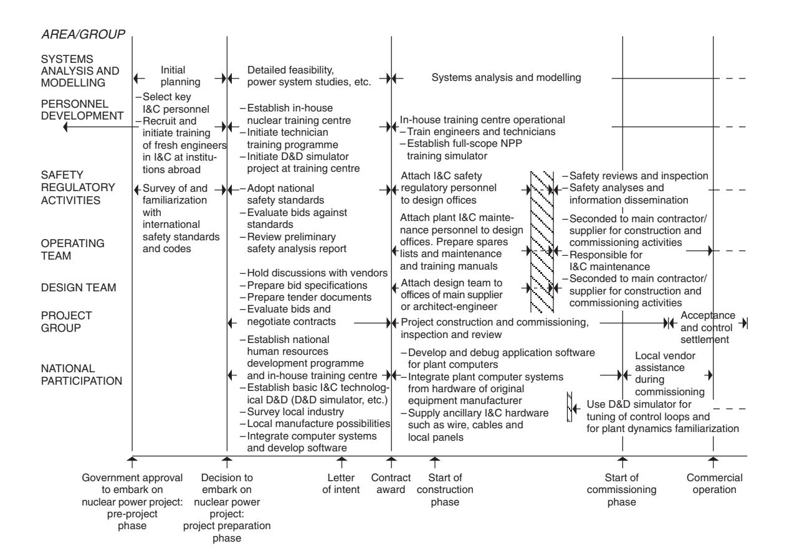

*FIG. 37.1. I&C activities and groups.*

the project and must be chosen with care for their dynamic qualities, planning capabilities and technical expertise. Recruitment may not be easy because good I&C professionals are in short supply and the planning of the owner organization must be such as to make it attractive (in terms of salary, perquisites and career prospects) for such people to join the organization.

The initial nucleus of I&C senior professionals then starts to establish the I&C human resources development programme and set up the infrastructures necessary to support the I&C activities.

#### 37.2. PROJECT PREPARATION PHASE

A decision is taken to embark on a nuclear power project. The project now has a name and a project group is established and operational. It will contain the first batch of trained I&C engineers, who will support the I&C senior professionals and assist in the following activities.

#### **37.2.1. Pre-tender discussions**

Pre-tender discussions should be held with potential vendors and include matters such as acquiring an understanding of the reference plants and evaluating various reactor types against the policy of the owner of the new NPP for the nuclear fuel cycle, local participation, grid conditions, etc.

#### **37.2.2. Review of safety standards, codes and criteria**

In some cases the purchaser and vendor will have the same regulatory standards and in other cases these will differ (although both probably accept the IAEA Codes and Safety Guides, which have been jointly prepared by and reflect the consensus of many countries). Either way, there must be clear understanding of the standards which are to apply and their implications for the plant. Some means of checking conformance is also essential.

#### **37.2.3. Training**

Training of professional engineers and technicians (Section 36.3) will start at this stage in the project.

#### **37.2.4. Decisions on local participation**

If the proposed plant vendor is from another country, detailed decisions on the mechanics of national participation have to be worked out. Two broad areas are involved:

- Manufacture of I&C equipment;
- The areas and extent of I&C in which project design engineering can be done locally.

Incentives for the first area have to be agreed with the competent authority and licensing agreements with foreign vendors negotiated. For the second, an organizational umbrella, the scope of activity and agreement with foreign architect–engineers or consultants need to be established.

## **37.2.5. Bid evaluation and contract negotiation**

The plant owner's I&C specialists should participate in bid evaluation and be members of the contract negotiation team. In essence, this whole guidebook is aimed at discussing issues and topics with a view to assisting the owner's engineers in evaluating the bids and in preparing the specification of requirements for the plant.

#### **37.2.6. Preparation of simulator specifications**

A full-scope NPP simulator is now an accepted tool for training. Depending on facilities available at the training centre, responsibility for constructing, commissioning and maintaining the simulator will rest with the I&C personnel. During this phase, they will be required to prepare the simulator specifications.

# **37.2.7. Familiarization with various reactors**

If the approach suggested in Section 36 is adopted, I&C engineers would be receiving some practical training at various NPPs. However, if such visits are not possible at the planning stage, prospective vendors/suppliers may be asked to arrange short visits of two to three months' duration at NPPs undergoing commissioning or initial operation. Each of the I&C group leaders should visit at least one plant of the main suppliers under consideration. In this way the group will acquire first hand knowledge of all major reactor types and suppliers. The comments of respective operating organizations on problems encountered, both technical and contractual, may be quite revealing and are unlikely to be found in the vendor supplied descriptions. However, comments, especially if adverse, must be accepted judiciously since they may include the bad experience of an individual and, in consequence, generate unfair bias against one vendor or reactor type. A major obstacle to this scheme may be the financing of visits and, with project funds not yet released, management may have to make a special effort in this direction.

The various operating experience databases (Section 4) may prove useful in making an appreciation of possible operation and maintenance problems and, consequently, of desirable design changes. Vendors' descriptions, design manuals for the reference plants, presentations made by the prospective suppliers and, above all, constant internal formal and informal discussion within the I&C group will assist in acquiring knowledge prior to the preparation of bid specifications.

## 37.3. PREPARATION OF BID SPECIFICATIONS AND BID EVALUATION

#### **37.3.1. Initial considerations**

Consultants are generally employed in the preparation of bid specifications but the owner's I&C personnel should prepare their list of considerations, both technical and administrative, as an input. Some considerations are listed below:

- (a) Digital computer based systems are used extensively in current NPP designs and, for systems required to support the nuclear safety case, agreement will be required from the regulatory authority on specification and usage requirements, particularly on redundancy, failure modes, hardware and software structure, quality testing, V&V and modification procedures. IEC 880 [37.1] provides detailed guidance for the highest levels of these requirements. Systems less vital to safety, but necessary for the operation of the plant, also require redundancy and to be of good hardware and software quality if they are to provide adequate reliability. They must possess design features which permit changes to input data and functionality by the owner's I&C engineers in a straightforward and auditable way during the life of the plant.
  - It is recommended that the tender list be limited to suppliers who have recently and successfully applied such systems to nuclear plants and can satisfy the owners regarding long term support. For reactor protection and other nuclear safety related systems, prospective tenderers should show evidence of acceptance by appropriate nuclear regulators.
- (b) Appropriate voltage and frequency standards should be applied to all I&C equipment. Non-compliance can result in a high degree of dependence on the vendor for even such small items as indicating lamps.
- (c) The plant load following capability required by grid conditions should be clearly specified. Flexibility in this respect should be sought since grid conditions or utility requirements may be subject to considerable and unexpected change by the time the plant goes into commercial operation. For example, operation could change from baseload to frequency control mode.
- (d) As a minimum, all conventional I&C equipment (cables, wires, instrument tubing, cable trays, lights, motor control centres, small motors, transformers, relays, cubicles, panels, junction boxes, etc.) which can be manufactured within

the country should be defined in the bid specifications as items of local supply. This list should be as clear and as detailed as possible, complete with specifications, and should be discussed in depth with the prospective supplier so as to leave no ambiguity. In particular, requirements for seismic, fire and environmental performance together with the associated qualification testing and QA/QC procedures must be clearly spelled out. However, the owner should be prepared to accept responsibility for the performance of these items in the event that the plant supplier has reservations about their use. Simultaneously, the manufacturers of such equipment should be given the required specifications (which could be different in an NPP than elsewhere) so that they are aware of the QA/QC standards expected of them.

These items, i.e. the conventional bits of I&C hardware, may not sound as glamorous as on-line computers yet they form a substantial fraction of I&C supply and their use can build the case for increased scope of supply on future occasions.

(e) A computer based information system is vital to the design and construction process and to support operation and maintenance. It must be specified that the system will become the owner's property and that the software will be compatible with the owner's on-line computer systems. Parts of this system will contain an extensive I&C database and the owner's I&C engineers must ensure that the data stored and output formats are suitable for their long term use. Failure to obtain and record data required for maintenance and spares ordering at the time of initial purchase may well result in a time consuming and costly task for the owner at a later date.

#### **37.3.2. Areas which could be considered for local supply**

For the purposes of reviewing the extent of local participation in I&C, bid preparation, etc., the major I&C equipment of a plant can be subdivided as follows:

- (a) *Nuclear instrumentation, i.e. in-core and out-of-core neutron flux instruments.* This area will generally have been developed by the NSSS supplier or by a specialist company adopted as a firm supplier for the NSSS. The design of such equipment demands intimate knowledge of the nuclear aspects of the plant and there is little opportunity for local participation.
- (b) *On-line computers.* This was discussed in Section 37.3.1. Unless the owner's country has an industry which meets the conditions described, local supply is not recommended.
- (c) *Required degree of manual or automatic control, and balance between local and remote control.* These factors must be determined and specified. However, the owner's I&C specialist must have cogent reasons for deviating from the

- standard supply of the NSSS manufacturer. The extent of use of computers must be determined at the outset of the project.
- (d) *Control room and auxiliary shutdown complex* (excluding display and control devices such as indicators, recorders and VDUs). Here again, many of the NSSS suppliers have specially fabricated control room complexes which have been seismically tested and generally qualified. National participation is not recommended and may not even be possible. However, NSSS suppliers may offer various options. These are likely to be largely or totally computer based.
- (e) *Process instrumentation* (controllers, recorders, indicators, transmitters, retransmitters, high/low monitors, etc.). There are about half a dozen major suppliers of process instrumentation for nuclear and thermal power plants, the petrochemical industry, etc. If one of these has appropriate manufacturing facilities, or if licensing agreements can be worked out in advance, the products of this supplier can specifically be requested in the bid specification and agreement of the NSSS supplier obtained. However, considerable additional cost can be incurred by first time seismic and environmental testing for nuclear safety related instrumentation and by the associated qualification testing and QA/QC procedures. These matters should be clearly understood before embarking on local manufacture.
- (f) *Control valves.* These are special items and some are specifically designed for nuclear service. It is questionable whether local participation is appropriate.
- (g) *Process radiation monitoring.* As in the case of process instrumentation, there are not many reputable suppliers of such equipment. If any of these has local facilities for manufacture and repair and is otherwise suitable, then this particular supplier may be specified.
- (h) *Chemical and health physics laboratory instrumentation.* Here again, the owner/operator may exercise the choice of supplier.
- (i) *Portable radiation instruments.* These are widely available nowadays.

#### **37.3.3. Other factors which affect plant operation**

The requirements for ease of maintenance and accessibility during plant operation and the possibilities for isolating a control device, power supply isolation, etc., must be covered in the bid specifications and the bids carefully evaluated for compliance with these criteria. They will almost certainly be met in the safety systems and in the I&C systems important to safety, but a closer check is desirable for those control loops which are not important to safety but which affect plant availability. There have been instances in which control power supply wiring has been looped to many instruments, leading to a risk of de-energizing others when one instrument was removed for maintenance. This prejudices plant availability.

Major I&C loops receive much attention and are reviewed both by the designers and by the safety reviewers. However, minor instrumentation systems as well as the interfaces between the NSSS turbogenerator (TG) and balance of plant (BOP) receive less consideration but can sometimes cause many maintenance problems and plant restrictions. Unfortunately, there is no hard and fast rule as to which specific areas should be examined. I&C engineers and their consultants have to depend upon their experience.

Other areas that need to be evaluated are:

- Separation of control and protection systems;
- Action on loss of plant on-line computers;
- Action on loss of alarm annunciation;
- Lifetimes and duty cycles of all the major I&C equipment.

The layout of the I&C shop, its proximity to the control room and the layout of the offices of the computer maintenance area must be specified, keeping in mind the possibility of unique requirements. For example, the number of technicians and engineers may be higher than in the vendor country and a larger instrument shop may be necessary. Similarly, instrument repair space, storage space for immediately needed spares and an area for lectures/training should be considered. Once the buildings have been designed, it is almost impossible to expand a cramped instrument shop or to improve its ventilation and this could be a problem for the lifetime of the plant.

The subject of spare parts supply, procurement and storage is discussed in more detail in Section 38.2. At the bid specification stage, spare parts can be specified in terms of a certain sum of money reserved for their purchase. This could be approximately 25% of the capital cost of the I&C equipment. Spares adequate for two to three years' commercial operation of the plant are likely to be recommended by the manufacturer and should be approved by the owner. Spare parts should be specified at the same time as the design of the I&C equipment. Spares at the module level should be purchased with the main equipment. Later on, these may be unavailable, or available only at a higher price. One major item would be the purchase and installation of spare computer systems (SCSs). Analogous provision of funds may be made for test equipment and tools.

In the event that an NPP simulator is ordered for the plant (and it is recommended that this be done) the tender documents should include a requirement for plant design data to be made available by the plant supplier to the simulator manufacturer.

#### **37.3.4. Training requirements**

Plant construction and commissioning provide an invaluable training period. However, training during this phase is best done by doing rather than watching and assuming specific job responsibilities is probably one of the best ways of learning. The contract should provide for this. One possible way is to limit the number of commissioning engineers to be supplied by the prime contractor (or the NSSS supplier, as the case may be), the remaining required personnel being supplied by the owner. The owner must be prepared to accept that I&C engineers so dedicated for construction and commissioning would be administratively and technically under the control of the prime contractor, since being controlled simultaneously by owner and contractor would cause unnecessary complications and, in any case, these engineers can best guard their employer's interests by fully participating in the duties assigned them. It is also recommended that the owner undertake responsibility for I&C maintenance from the beginning of maintenance activities at the plant. Thus, by the time the plant is ready to be taken over, the owner has I&C engineers and technicians with three to five years' experience in maintaining it and who have established work procedures and equipment history records. Provision for this must be stipulated in the contract.

The contract documents should also specify the requirement for the owner's personnel to be trained in project engineering at the design offices of the plant supplier and subsequently at existing NPPs and at I&C manufacturers. Such periods of attachment should be for at least three years to be really effective. Assistance in the establishment of the in-house training centre could also be requested and stipulated in the contract agreement. Since not all I&C personnel may be able to participate in the outside training programme, training courses offered to both engineers and technicians on-site by I&C vendors could prove extremely useful. The training material brought by the instructors (transparencies, video tapes, etc.) could be purchased and subsequently used for retraining.

#### **37.3.5. Documentation**

The extent of documentation to be supplied (design manuals, software source listings of application and system programs, maintenance manuals, drawings, wire and cable lists, etc.) should be clarified with the vendors and the required number of copies or masters spelled out in the contract. About eight copies each of design manuals and maintenance manuals may well be needed. Information additional to that normally provided by the supplier and required for reasons of technology transfer and self-reliance should be discussed with the prospective supplier and agreements reached. The supplier may be more receptive to such arrangements prior to the signing of the contract.

The role of the owner's project staff and the responsibility of the supplier to inform them of construction details and to satisfy them that the work being carried out is of acceptable quality and compliant with the safety case should be stipulated in the contract. If this is not done, the role of the staff could be limited to that of spectators and to providing services (communications, power, etc.) for the supplier.

The supplier normally provides plant performance warranties on major parameters such as fuel burnup, heat rate and plant output. However, manufacturers' warranties on I&C equipment normally expire long before commercial operation starts and the NSSS supplier or main contractor should therefore be asked for material and workmanship warranties on all I&C equipment for, say, one year following the start of commercial operation.

# **37.3.6. Alterations and additions**

Alterations and additions tend to cause considerable strain and ill feeling between the owner and supplier, especially following a turnkey contract. They occur after the contract is signed and usually involve items which were not included in the scope of supply but which the owner considers necessary in the light of experience or additional knowledge. Unfortunately, the vendor often views such things as desirable but not essential and hard bargaining then ensues. It is imperative that all changes be properly controlled and, furthermore, that the owner make an allocation in the initial funding for such changes. This will usually be an internal arrangement between the owner and the financing body and the amount will not necessarily be known to the supplier. The contingency fund could be of the order of 1–5% of the cost of the capital equipment and is necessary if the owner is to take advantage of options and improvements during the construction phase, when such improvements can be implemented relatively easily. However, caution is necessary in suggesting many and wholesale changes at this stage and a strict change control procedure must be in place.

#### **37.3.7. Choice of supplier**

Notwithstanding the contract clauses and specifications, one of the most important aspects to consider in developing an owner–supplier relationship is the integrity of the supplier. This is related to the supplier's reputation for quality and dependability.

The relationship between the supplier and owner may have to last over the lifetime of the plant and possibly over that of the next plants to be purchased. Even if just for the duration of the contract, the relationship will last many years. Mutual respect built up between the owner and supplier and personal understanding between their respective project managers and project teams may well prove more helpful than dozens of clauses inserted into the contract. All technical aspects being equal, and financing considerations apart, this single feature should play a very important role in the choice of supplier.

#### 37.4. DESIGN ENGINEERING PHASE

#### **37.4.1. Division of responsibility**

A certain amount of design engineering is performed by the supplier(s) during the pre-contract phase while preparing the bids and this activity starts in earnest with the signing of the contract. For a single supplier, turnkey contract, the responsibility for the total plant design rests with the main contractor, normally the NSSS vendor. In other types of contract, NSSS, TG and BOP suppliers and the architect–engineer would share the design activities, with either the owner or the architect–engineer responsible for overall co-ordination and management.

# **37.4.2. Personnel requirements for I&C design engineering**

I&C design engineering for an NPP of a proven type (i.e. not the first of a kind) can require approximately 600 000 person-hours and the services of about 50 to 75 experienced I&C engineers, accounting for between 1 and 2% of plant costs. The I&C subdisciplines or activities and the approximate numbers of personnel required are set out in Table 37.1.

The sequence of activities in the I&C project engineering process and the associated manufacturing and site related activities are listed below:

| Subdiscipline or activity                                                  | Number of engineers |
|----------------------------------------------------------------------------|---------------------|
| Performance analysis                                                       | 3–4                 |
| Major control systems design                                               | 3–4                 |
| Process instrumentation:                                                   |                     |
| — NSSS                                                                     | 10–15               |
| — TG                                                                       | 3–5                 |
| — BOP                                                                      | 8–10                |
| Plant computers                                                            | 15–20               |
| Control room complex                                                       | 2–4                 |
| Safety systems                                                             | 5–10                |
| Development systems and monitoring systems for on-line surveillance and |                     |
| non-destructive testing                                                    | 2–4                 |
| Total                                                                      | 51–76               |

- Preliminary and conceptual design;
- Licensing documentation;
- Basic and detailed design;
- Equipment specification;
- Procurement and manufacturing surveillance;
- Modification;
- Erection and commissioning support;
- Documentation for the plant as built.

## **37.4.3. Owner/operator involvement**

Attachment of regulatory and owner/operator staff to the design offices of the supplier and/or architect–engineer during the design phase is imperative, regardless of the type of contract. The duration could be from 2½ to 3½ years and financing and administrative arrangements for this must be made in the contract. The precise function, responsibility and administrative control of the owner's design team must also be stipulated. The term "as mutually agreed upon from time to time" causes unnecessary complications and a clear definition of the duties and responsibilities of the design team is necessary in the contract. Consideration may also be given to the attachment of the owner's engineers to the central engineering offices of a utility which implements its own power projects and which is operating or commissioning a similar plant. Such an attachment would also expose the owner to the methodologies (and organizational requirements) of the design review process, plant testing and acceptance procedures and the requirements of subsequent engineering support during commercial operation.

Before being attached to a specific section or work area, an I&C engineer should undergo 8–12 weeks of orientation on all the process systems of the plant. The requirements for I&C emanate primarily from the process system parameters and an understanding of them will be of great benefit. Other parts of the orientation should cover the use and interpretation of international, national and company standards, how to document and the importance of clear documentation (which forms the only means of communication between the main supplier, the plant owner and the regulatory authority). The need for clear, concise documentation cannot be overemphasized and the I&C engineer should master the ability to provide this.

In order to provide effective support to the plant after commercial operation has started, it is recommended that the I&C engineers acquire working familiarity with the following:

(a) The considerations and analyses which have led to the particular I&C design. This is extremely important since, during the lifetime of the plant, modifications or backfitting will be required and it is important to know the original

- design intent before attempting modification. In general, this design intent or the reason for a particular approach is rarely well documented.
- (b) The use of fault tree analysis, failure modes and effects analysis (FMEA) and cause–consequence diagrams. This should lead to an understanding of the plant safety case and of the safety importance of the various plant systems.
- (c) The control loops of the plant, from the sensor to the final control element, their control actions, interlocks and control ranges. An understanding of these could be acquired by preparing steady state I/O diagrams and simple charts.
- (d) Specification and selection of instrument devices.
- (e) Evaluation of loop and system designs for conformity with safety standards.
- (f) Analysis of process dynamics and the design of typical plant control systems, their modelling and simulation, and translation of the results of the analysis into concrete hardware specifications.
- (g) Testing and tuning of control loops.
- (h) Computer system software and hardware. Digital computer systems will be exclusively employed for reactor protection, data collection, automatic and manual control, alarm and data displays to the operator, logs and station records, etc. While the quality and technology required in the production of the system software for on-line purposes make it unattractive and difficult for the utility to provide human resources for the implementation of changes, it is desirable for the utility to be knowledgeable in its design. This requires a small number of engineers to be familiar with the system design and for full documentation to be available. For this purpose, secondment of these engineers to the suppliers during the V&V of the software should be arranged.

More specifically, at the specification stage the utility will have to define and agree the extent to which it will require to carry out change activities during the life of the plant. These might include:

- Changes and additions to analog and digital inputs and signal conditioning;
- Changes to modulating control algorithms;
- Changes and additions to output logic;
- Changes and additions to VDU displays;
- Changes and additions to plant operating record requirements.

While it might be difficult with, for example, the RPS, it is recommended that the utility become as independent as reasonably possible in these areas. To this end the purchasing specification must make clear that the software must enable the above mentioned change activities to be carried out in a manner suited to plant I&C engineers rather than software specialists. The purchasing specification must also make clear that the suppliers must accept utility engineers during the design stages to become competent in such activities.

(i) Evaluation of the instrumentation as regards ease of maintenance and reparability.

- (j) The minor control loops and instruments and the interfaces between equipment from the various suppliers (if there is more than one).
- (k) Spares requirements. The best time to start evaluating spares requirements is when I&C equipment is being selected and ordered. The owner's I&C engineers in the design offices of the supplier will have easy access to manuals and other literature and relatively easy access to the I&C manufacturers. The owner will therefore be in a position to prepare an economic yet comprehensive list of recommended spare parts. In due course, the owner will be responsible for the plant and have primary responsibility for spares. This is certainly of more interest to the owner than to the designer and the owner should devote to it the attention that it deserves. While evaluating requirements for spares, it may be the case that one type of component, e.g. an integrated circuit chip, can be used in several types of equipment; if possible this should be standardized and ordered from a general supplier or the integrated circuit manufacturer. Although time consuming, this action will result in a considerable saving as well as providing a start for the inventory database required during commercial operation.

This list is by no means complete and readers may add to it or delete from it depending on their experience and requirements. In conclusion, an in-depth knowledge of the I&C equipment and systems' design intent and of their design is essential in order to provide subsequent support to the plant. Generally, vendors may not be prepared to provide the detailed design analyses and codes, etc., needed for this but it is nevertheless recommended that they be acquired, even if this entails added costs. The subsequent saving will justify much initial expenditure.

#### **37.4.4. I&C equipment selection and evaluation**

A host of standards and guides are available and many relevant to I&C equipment selection and I&C systems evaluation are listed in the bibliography at the end of the book. Some general guidelines are given below:

- (a) I&C equipment costs are a small fraction of the plant capital equipment costs and yet I&C is possibly the most conspicuous feature of the plant. It is one in which there is much human interaction. The cost of the I&C equipment, though important, should not form the sole basis for equipment selection or for the type and extent of instrumentation provided.
- (b) Standardization on a single manufacturer (or a few manufacturers). A proliferation of I&C suppliers, arising as the result of preferences by individual designers, is a maintenance engineer's nightmare and causes major difficulties in subsequent plant operation. Most main contractors keep this requirement in mind and the owner/operator should ensure that there is a conscious effort to

- limit the number of I&C vendors. This is especially necessary when project engineering is divided between NSSS, TG and BOP suppliers.
- (c) When possible (i.e. when diversity is not a special requirement), the above consideration also applies to homogeneity of equipment, i.e. use of the same types of limit switches, RTDs, transmitters and other I&C devices.
- (d) Safety review representatives of the regulatory body may be consulted on I&C equipment selection and evaluation questions. If I&C equipment selection is done without considering safety review aspects, time will be lost and further costs incurred in satisfying those requirements. The financial burden for this may well have to be borne by the owner, especially if not otherwise stipulated in the contract.
- (e) The selection of I&C vendors should be based on their established reputation for quality and long term support.
- (f) Some critical factors in the selection of an I&C vendor's product are: ease of maintenance, guaranteed long term (>10 years) availability of spares, the use of standard multisource (as opposed to single source or exotic) components in the design, support facilities within the country and good documentation and training support. The use of similar products in other plants within the utility may also prove helpful.
- (g) Some of the most important decisions will relate to computer systems. Whatever is chosen, it will rapidly become too small and out of date and this must be kept very firmly in mind. Long term support and spare capacity (at least 30%) must be considered. Excess capacity should include extra I/O capability as well as memory and disk space.
- (h) Additional installed spare capacity in the I&C, required by the owner over and above that which the supplier normally provides, should be catered for at an early stage. This can include additional terminal strips in junction boxes, extra cables and higher rating of power supplies. Similarly, any additional measurements, test jacks, test valves, etc., required by the owner for performance testing and monitoring during commercial operation should be allowed for. If this is not done at the design stage, it may be found that the addition of a single thermocouple requires major effort during commercial operation. Designers can be sensitive (as, possibly, are all creative people) and sometimes do not take easily to criticism or suggestions — they receive a lot of these from safety reviewers anyway. They may not welcome suggestions, no matter how well meaning, from relatively inexperienced people (especially from a non-vendor country) and considerable tact may be necessary on the part of the owner's engineers. This problem will be eased as personal relationships develop when the owner's engineers take a participatory rather than a supervisory or training role in the design work.

# 37.5. CONSTRUCTION AND INSTALLATION OF I&C EQUIPMENT

#### **37.5.1. Construction phases**

The construction and installation of I&C equipment (especially field mounted instrumentation) are to some extent dependent on the earlier installation of mechanical equipment and piping. For example, boilers have to be erected, pumps have to be in place, major piping work done and most of the heavy equipment in position before instruments can be positioned, or they will be damaged. The I&C phase can be considered to start at around year –4 and to be complete by year –1 relative to the start of commercial operation. There is usually an 18–24 month period of intense activity which can be subdivided into the following phases:

- Planning;
- Pre-installation verification;
- Installation and verification during installation;
- Post-installation verification;
- Modification;
- Documentation.

Documentation, or its updating, is a continuing activity. At the start of the work, drawings and documentation 'approved for construction' are issued and, at the end of the construction phase, drawings, wire lists, cable and cable tray routing lists and other documents have to be revised to reflect the plant as built.

Viewed from the outside, the construction and commissioning phases may appear to be one smooth process. However, specific milestones exist at which the construction phase of an I&C system, or the I&C of a particular process system, is considered complete (though minor, agreed deficiencies may still exist) and ready to be handed over to the commissioning staff. For the purposes of this guidebook one such milestone could be the moment at which the I&C devices and their logic have been energized and checked for correctness although their functioning has not been proved at the rated process fluid conditions of temperature, pressure, etc. The work in the construction phase can then be said to consist of the following:

- Installation and interconnection of MCR prewired panels;
- Installation of the monitoring (or control) computers and software, testing and debugging, and connection of the process I/O devices;
- Installation of field panels, junction boxes and cable trays;
- Laying of tubing and cabling;
- Checking of devices prior to installation;
- Installation of devices;

- Wiring and interconnection of field devices with the MCR;
- Removal of devices (where necessary) from the plant for instrument shop calibration (installation verification);
- Wiring, tubing, logic and pre-energization checks;
- Energization checks but, in the case of motor control circuits, without primary circuit energization, and, in the case of other control circuits, with final control element actuation but with process fluid either absent or not at rated temperature and pressure.

For ideal transfer of technology, the owner's personnel and the local workforce should perform all the above mentioned activities, under the supervision of the main contractor.

#### **37.5.2. Participating organizations**

Table 37.2 shows the organizations which would be involved in the construction phase at the site. Each will have its own I&C personnel and effective, discipline oriented communication is necessary. An I&C technical committee, which meets regularly and which includes representatives from each organization, may be one route for communication.

TABLE 37.2. ORGANIZATIONS INVOLVED IN THE CONSTRUCTION PHASE OF A PROJECT

| Owner/operator                                                                                                                                                                                                                                                                     | Main supplier/contractor   |
|------------------------------------------------------------------------------------------------------------------------------------------------------------------------------------------------------------------------------------------------------------------------------------|----------------------------|
| Project management organization for planning and project monitoring                                                                                                                                                                                                             | Construction organization  |
| Construction personnel, seconded to main supplier or contractor, who will subsequently maintain the plant                                                                                                                                                                       | Commissioning organization |
| Representatives of regulatory authority                                                                                                                                                                                                                                            |                            |
| In-house training organization                                                                                                                                                                                                                                                     |                            |
| Project design engineering organization for backup I&C support and for domestic industrial liaison. The QA/QC functions can rest with this organization or with project management; the representative of the regulatory authority could work within this organization |                            |

# **37.5.3. I&C activities and considerations**

The various I&C activities in the construction phase and some of the considerations relating to these activities are given below.

- (a) *Planning.* This is done initially at the design office of the main supplier and subsequently on-site. The installation, inspection and testing activities should be planned and documented as a sequence of operations and should include a review of all relevant information. An example is given below:
  - System/component design specifications;
  - The latest applicable drawings approved for construction;
  - Installation specifications;
  - Manufacturers' instructions;
  - Wiring diagrams and process instrument displays;
  - QA documentation;
  - Procedures and instructions;
  - Compliance with applicable codes and standards.

Detailed planning diagrams (programme evaluation and review technique (PERT) charts or critical path method (CPM) diagrams) are so complex that computers are needed for their preparation and updating. The I&C engineers in the owner's project management organization can become involved and participate in this activity if they offer to perform the work on the owner's computer systems. Other such activities which can be implemented are:

- Updating of construction drawings;
- Compilation of computerized wire lists, sorted by wire number, device or location;
- Compilation of computerized cable routing lists, etc.

These data can be extremely valuable if used as bases for the subsequent updates which become necessary during the plant lifetime. It has sometimes been observed that the owner's interest in having the latest applicable as-built plant documentation ceases when the owner takes over. However, after a few years' operation, if there is a need to make, say, some wiring changes it is often found that the drawings are either not available or out of date. This should be avoided at all costs. Participating at construction in the management of documentation and in setting up working systems for updating will help prevent this.

(b) *Shipment, storage and pre-installation verification.* I&C equipment is neither bulky nor heavy in comparison with mechanical equipment. Thus, all electronic I&C instrumentation and related devices should be shipped by air. However, equipment arriving at the airport can sometimes be handled mercilessly and the I&C engineers may find it better to arrange their own delivery and proper storage. The owner will find it very useful, even under a turnkey contract, not to wait for plant handover to establish a stores organization but to undertake responsibility for this activity from the construction phase. I&C personnel will have to assist stores personnel in setting up a suitable organization together with procedures for proper storage and environmental control. Though this requirement is not so critical in the construction phase and is therefore often ignored, it may later come as a rude shock to find a rusty object masquerading as a needed, qualified spare and then have to wait six to nine months for a replacement.

It is important that all I&C devices received at the plant site undergo inspection and a small area in the stores can be set aside as a laboratory for this purpose. Inspection can comprise visual examination for damage during transit and checking that the device model number, range, voltage rating, etc., conform with the specifications, together with a more detailed examination such as a three point calibration to confirm that the factory calibrations have not drifted during shipment and handling. Errors discovered at this time can be rectified promptly and should not cause the delays which may otherwise result if a deficiency is discovered during subsequent installation (when the activity is on the critical path). Often, field mounted devices may be installed following a simple operational check and detailed calibration and functional checks left until tubing and wiring connections are completed.

- (c) *Installation and verification during installation.* Installation activities related to I&C systems are as follows:
  - Mounting and supporting cable trays, conduits, raceways, instrument racks and panels.
  - Pulling, splicing and terminating cables.
  - Routing cables and instrument sensing lines, including maintaining the required separation between redundant systems.
  - Tagging or identifying various items. The identification of safety related equipment (instruments, transmitters, cables, cable trays, conduits, penetrations, sleeves, panels, racks, etc.) should be unambiguous and simple and be provided down to the channel level.
  - Installing electrical and instrumentation penetration assemblies and ensuring the integrity of the containment seals.
  - Installing cable and instrumentation piping.
  - Installing protective measures against fire.
  - Calibrating and adjusting the set points of instruments.
- (d) *Verification activities.* The inspection of correct installation includes checking:
  - Compliance with the respective documents, handbooks or records.
  - Levelling and alignment.
  - Proper location, support and routing of cables and sensing lines. Special care should be exercised in the proper routing of cables into cable trays; a timely inspection programme should follow this activity.

- Tightness of connections and fastenings, and the use of proper tools for this work, particularly to ensure compliance with seismic design.
- Freedom of movement of parts subject to thermal expansion.
- Accessibility for surveillance and maintenance.
- Correct polarity.
- Proper grounding and termination shielding.
- Fluid levels and pressures.
- Absence of leaks.
- Physical integrity.
- Identification (labelling).
- Circuit fusing.
- Proper equipment ratings.
- Access of cooling air.
- Cable penetrations (fire protection).

It is also important to carry out an inspection of correct housekeeping and of protective measures having the following functions:

- Applied to equipment not in operation;
- To prevent damage to I&C equipment already installed (or partly installed) as a result of continuing adjacent mechanical or civil work;
- To prevent damage as a result of human error, sabotage or theft;
- To prevent damage to measuring and test equipment during field use.
- (e) *Post-installation verification.* The principal inspection activities at this point are to check:
  - Conformance of the installation with specifications, plans and documents.
  - Good and proper quality of work.
  - That equipment and materials have not been damaged during installation.
  - That all temporary conditions (jumpers, bypass lines and set points) are clearly identified.
  - Protective measures applied to equipment not in operation. Measures such as covering the instruments with temporary protective boxes can prevent their being damaged by adjacent construction work.
  - Non-conformance items: all errors, modifications and design and field changes still not completed, corrected and approved by the responsible authority should be listed at this point. It should be ascertained that all these items are conveniently documented and characterized as open items.
- (f) *Pre-commissioning I&C loop checks and control circuit logic checks.* Once the installation of the devices, wiring and tubing is complete, loop checks and control circuit logic checks are made to ensure that the circuits are connected and operate in the way expected from the drawings. These checks include the following:

- Valves are adjusted by the controller (in the manual control mode) and it is checked that they open and close properly and that there are no wiring or tubing mistakes. Loss of air and power supply situations are also verified.
- Total loop checks: from sensor to final control element, e.g. differential pressure equivalent at 0, 25, 50, 75 and 100% of the measured range is applied through, say, a pneumatic test set or a dead weight tester to the process connection of a level transmitter and the corresponding position of the final control element checked, with the controller in 'auto' mode and at varying set points.
- Neutron instrumentation (where applicable) is checked in the instrument shop and in situ, using a special rig with a neutron source, etc.
- The process I/O, e.g. digital and analog inputs to the monitoring computer, are simulated and the computer actions verified. All program branches and re-entry points are checked in the software. The checking procedure for the computer software and hardware is quite detailed and complex. Test jacks and additional digital/analog checkout panels can considerably ease testing.
- All the interlocks and enabling devices in the various control circuits, such as pump motor circuits or motorized valve circuits, are checked for correct operation.

There may well be more than ten thousand devices in the plant and sometimes they may be checked or calibrated more than once. The experience gained in this phase by an I&C engineer is enormous and much more than the engineer may later acquire during the whole operating lifetime of the plant. This work should not just be left to technicians. During this phase, a maintenance or design engineer is not so burdened with the administrative duties that arise when the plant is operating and all of the I&C engineers should take this opportunity to learn thoroughly about their plant by working with their own hands.

- (g) *Modification during installation.* Modifications are always necessary during installation because of:
  - Incomplete or incorrect planning;
  - Design changes due to updated information (e.g. on safety or availability);
  - Shipment and delivery problems;
  - Results of verification activities during installation;
  - Results of field changes during installation.

It is a difficult task to keep the documentation on the installation of modifications and the verification of installation up to date, and this is largely a communications and organizational problem. However, documentation is essential and, while generally originated by the design, construction or installation teams, it should be closely followed by the QA specialists.

(h) *Handing over for commissioning.* As the installation checks on the I&C of a particular system are completed, the I&C can be handed over to the commissioning team. However, there may be relatively slack periods when the construction of a particular system is complete and its commissioning is yet to start and these periods can be utilized for more formal training. There may be recapitulation of activities with discussions on future commissioning work.

# 37.6. COMMISSIONING AND STARTUP

The commissioning phase normally spans a period of 18–24 months and during this time it is demonstrated that the plant equipment and systems, and the plant as a whole, operate in accordance with the design assumptions and performance criteria. They must satisfy the various contractual clauses regarding heat rate, power rating, load cycling capability, etc. It may also be found that, although the plant may be verified to behave according to the design, other considerations, such as grid conditions or a higher cooling water temperature, require new conditions to be met. These are also tested and verified at this time.

Although the nomenclature for the tests performed during this phase may vary (names such as pre-operational, functional, pre-loading, post-loading, startup and integrated acceptance tests are employed), they can be divided into two main phases:

- Pre-operational tests on components and systems after construction but before fuel is loaded;
- Initial startup tests after fuel loading, including plant acceptance tests and tests made at each power level during power raising.

# **37.6.1. Commissioning phase**

- (a) *Commissioning programme.* This will have been prepared and will set out the overall scope of activities. It will give the following details:
  - Purpose of the tests;
  - Test sequence and procedure;
  - Technical and administrative provisions;
  - Organizational arrangements;
  - Range and extent of documentation required at each step.
- (b) *Responsibility and personnel.* The commissioning phase, if well executed, can be an object lesson in managing and co-ordinating complex activities within a short time frame and with the possibility of unexpected events occurring. The owner/operator, contract arrangement permitting, should take overall responsibility for control and co-ordination of all commissioning work. As mentioned earlier, owner participation can be maximized by stipulating in the contract that the owner will provide the bulk of the commissioning personnel, with a limited

number (an exact number needs to be specified) of key specialists taking part from the main contractor/supplier. If unable to supply the requisite commissioning engineers, the owner may have to pay for additional contract personnel to complete the work. With proper planning, however, this should not be necessary.

- (c) *Licensing activities.* The manner and extent of licensing representative participation in the commissioning phase must be clearly agreed in advance.
- (d) *Time schedule.* A realistic time schedule must be drawn up for the whole commissioning phase and should include options for cases of non-conformance.
- (e) *Testing procedures.* All commissioning tests should be performed in accordance with written procedures. These procedures should include the following items:
  - Test objectives;
  - Test methods;
  - Data collection and processing methods;
  - Data evaluation methods;
  - Limiting criteria;
  - Prerequisites (technical and organizational);
  - Test conditions and test procedures;
  - Acceptance criteria;
  - Lists of test equipment (instruments, tools and facilities);
  - Lists of personnel requirements (qualifications and responsibilities);
  - Precautions for the safety of personnel and equipment;
  - A list of documentation required;
  - A definition of test completion;
  - Provisions for the case of unexpected results and occurrences.
- (f) *Commissioning documentation.* Complete and clearly arranged documentation of all facets of commissioning is essential. Its purposes are to:
  - Specify all actions necessary for executing and evaluating tests;
  - Show that licensing and safety assessment requirements have been met;
  - Assemble the many and various documents relating to the commissioning activity into a coherent pattern;
  - Collect baseline data for future reference;
  - Permit communication and information exchange between all involved groups;
  - Show continuity in the commissioning activities;
  - Show that the design intent has been met;
  - Show that modifications have been correctly implemented;
  - Show accordance with QA requirements.

The commissioning documentation will contain:

- Commissioning programmes, schedules and reports;
- Vendor specifications and safety reports;

- Regulatory body requirements;
- Modifications to design and construction;
- Records of deficiencies and corrective actions;
- Final test reports and completion certificates;
- Installation completion certificates;
- Test procedures;
- Operational limits and conditions;
- Operation and maintenance instructions;
- Records for fuel and nuclear materials;
- Procedures for ensuring the safety of equipment and personnel.
- (g) *Special problems.* Special problems during commissioning are:
  - Conservation of already tested items;
  - Provision to ensure the tested status of a system;
  - Documentation and execution of modifications during the installation and testing phase;
  - Co-ordination of diverse testing activities (simulations, interactions and personnel planning);
  - Co-ordination of tests on different parts of a system (sensors, electronics, actuators and interfaces between mechanical components);
  - Accuracy analysis of measurement loops;
  - Software review (computer applications);
  - Relation to safety of subsystems and annunciation systems;
  - Time pressure during commissioning of I&C systems;
  - EMI.

#### **37.6.2. Pre-operational tests**

Pre-operational tests comprise functional tests on individual subsystems, systems or groups of systems before fuel loading. They are aimed at obtaining initial operational data on equipment and some baseline measurements for subsequent in-service inspection, and ensuring compatibility of operation with interfacing systems. They may also be used to verify the functional performance of systems with process fluid at, or within the measuring range of, working pressure and temperature. This is done by using non-nuclear heat. Since I&C is used in nearly all systems of the plant, in many cases the test programmes have to be co-ordinated with test schedules for other systems. The pre-operational tests include:

— *Simulations.* The proper operating conditions should be simulated (as far as practicable) to test the performance of I&C systems.

- *Pre-operational tests of reactor protection system.* A very large number of test activities are involved. These tests should be done when most of the other systems have already been tested and no further construction work, especially on or near electronic equipment, is foreseen.
- *Non-nuclear warm tests.* The considerable advantage of realistic test conditions for important systems operating at nominal temperature and pressure (but with inactive coolant) can be gained from a non-nuclear warm test series. Heat may be generated by the reactor coolant pumps (PWR) or by a conventional boiler (BWR). As regards I&C systems, the warm test series should be used to concentrate on the following activities:

## *PWR:*

- ∑ Adjustment and performance tests of the reactor pressure control system and the relief valves;
- ∑ Adjustment and performance tests of the volume control system;
- ∑ Measurement of heat losses;
- ∑ Calibration of instrumentation.

#### *BWR:*

- ∑ Performance tests of recirculation pump control;
- ∑ Adjustment and performance tests of the pressure relief valves;
- ∑ Calibration of instrumentation.

#### **37.6.3. Initial startup tests**

The initial startup phase begins with fuel loading and ends with full-power tests and handover of the plant. Thus, these tests must confirm that the reactor is in a suitable condition to start up and that all systems and parameters are as expected. It must be shown, step by step, that the plant is capable of producing the full specified power and that it operates in accordance with design. Only I&C related items are mentioned below:

#### (a) *Prerequisites*

- Status of all systems required just prior to start of fuel loading as specified.
- Completion of inspection of fuel assemblies, reactivity control devices and other absorbers.
- Nuclear startup instrumentation properly calibrated and located and functionally checked.
- Appropriate reactivity controls operable and in readiness for reactor shutdown by the insertion of negative reactivity.
- Reactivity condition of the reactor core as specified.
- Fuel handling equipment checked.
- Status of protection systems, interlocks, mode switches, alarms and radiation protection equipment verified to be as prescribed. The high flux trip

- points are set to a relatively low power level for control rods operable during fuel loading and the alarm and trip settings of other protection systems are set to low values.
- Radiation monitors, nuclear instrumentation and manual and automatic devices to actuate building evacuation alarm and ventilation control tested and verified to be operable.
- Approval by the regulatory body before fuel loading commences.
- (b) *Testing programme: from fuel loading to criticality*
  - Control rod position indication, protective interlocks and circuitry;
  - RPS trip point logic, operability of all trip breakers and valves and manual trip functions;
  - Calibration and neutron response check of source range monitors, and calibration of intermediate range neutron flux measuring instrumentation;
  - Mechanical and electrical in-core monitors, including traversing in-core monitors (if installed).
- (c) *Testing programme: from power raising to handover.* The tests are performed at various power levels; only I&C related items are listed below:
  - Verification of performance of major plant control systems such as average temperature controller, automatic reactor control systems, integrated control system, pressurizer control system, reactor coolant flow control system, main, auxiliary and emergency feedwater control systems, hot well level control systems, steam pressure control systems and reactor coolant make-up and let-down control systems;
  - Neutron and g radiation surveys;
  - Determination that adequate overlap of source and intermediate range neutron instrumentation exists;
  - Dynamic plant response to design load swings, including step ramp changes, and response to automatic control;
  - Functioning of chemical and radiochemical control systems;
  - Correctness of response of process and effluent radiation monitoring systems;
  - Evaluation of core performance: reactor power measurements and verification of calibration of flux and temperature instrumentation;
  - Process computer: comparison of safety related predicted values with measured values, verification of control room or process computer inputs from process variables and of data printouts, and validation of performance calculations done by the computer and of all computer safety functions;
  - Turbine trip;
  - Loss of off-site power;
  - Dynamic response of the plant to load rejections, including turbine trip;
  - Dynamic response of the plant to a simulated loss of TG coincident with loss of off-site power;

- Dynamic response of the plant to automatic closure of all main steam line isolation valves: for PWRs the test may be made at a low power level to demonstrate proper plant response to this transient;
- Dynamic response of the core and plant to fast load changes initiated by load control;
- Capability of the plant to control core xenon oscillations;
- Baseline data for the reactor coolant system loose parts monitoring system;
- Effectiveness of reactor coolant leak detection systems;
- Operation of failed fuel detection systems in accordance with predictions.

#### **37.6.4. Special regulatory requirements during startup**

The entire fuel loading, approach to criticality and low power operation phase is governed by special regulations valid for that phase only. There will be more restrictions than apply during normal operation as well as special permission for unique test procedures. Temporary instrumentation (usually additional neutron counting channels) is connected to the RPS during startup. Sometimes the logic criteria for reactor shutdown are made more sensitive; for example, the majority voting of redundant channels may be removed. Other special startup regulations may relate to the stepwise calibration of power measuring channels during approach to full power at which the final, absolute calibration is to be made. To compensate for the resulting inaccuracy, regulatory requirements may demand correspondingly lower settings of the reactor power trip levels.

Licensing for startup should entail:

- Pre-operational tests, followed by permission to partly load the core;
- Some special tests on the partly loaded core;
- Permission to load the whole core for zero power tests;
- Zero power tests;
- Tests at different power levels and transients up to the allowed power;
- Permission for operation up to the next level of partial power load (power raising).

# **37.6.5. Special tests**

Some of the above mentioned tests would satisfy contractual requirements. However, the following additional acceptance tests with I&C involvement may also be performed:

— Plant heat rate tests;

- Plant availability tests;
- Computer systems availability tests.

# **37.6.6. Grid considerations**

In relatively small grids, the performance of tests such as load rejection from full power may require special consideration and planning. If the owner is not the utility then even more careful joint planning and discussions will be required. In addition, output may vary considerably for a while after the plant is first synchronized and the load dispatch centre of the utility has to be kept informed. This visible phase of the plant will start with its synchronization and the I&C engineers will then need to interact more closely with their counterparts in the utility to ensure positive acceptance of the NPP. Communication links (carrier, VHF, etc.), if not already established between the plant and load dispatch centre, should be made before this testing starts.

#### **37.6.7. Outstanding items**

It is very rare that all of the I&C equipment and systems function as intended at plant handover, and a number of deficiencies may exist. One of the major remaining jobs of the I&C commissioning or project engineer may be the preparation of clear and concise deficiency lists, their settlement and rectification.

#### **37.6.8. Preparation by owner for commercial operation**

Much has been said about the owner preparing for commercial operation and the time has now come. The planning can be so well done that this take-over may go practically unnoticed and the owner's I&C engineers may already be in position with functioning departments which ensure smooth transfer. Some owner considerations in the commissioning phase are presented below:

- (a) A commissioning programme proposed by the vendor may merely comprise checking the installed equipment and operating it against the vendor's own standards and documentation. It may preclude much testing and review which might reveal design inadequacies or omissions which could be important during commercial operation. The commissioning programme should therefore include all of the performance tests necessary to confirm that the plant is capable of operating safely not only during normal conditions but also during abnormal operations and postulated equipment malfunctions.
- (b) I&C representatives of the regulatory authority and the owner project organization should carry out reviews and include in the commissioning programme tests to ensure the operating capability described above. The review roles of the

regulatory authority and the project organization should be clearly spelled out in the contract. The main contractor will then be able to incorporate this requirement of the owner into its schedule and make available all of the information required by the regulatory authority and the commissioning organization. This could include analyses, drawings, specifications and test results.

- (c) I&C equipment and systems can be fully commissioned and tested only after mechanical equipment and systems are installed and commissioned. At that stage there can be tremendous pressure by the vendor (in an effort to meet contractual deadlines) to commission the equipment as quickly as possible, leaving very little scope for comprehensive performance testing and for on the job, hands-on training of the owner's personnel. Unless otherwise agreed, the vendor may try to reduce the scope of commissioning tests or neglect the owner's training requirements during this vital commissioning and startup phase. This is the reason for including on the job training with the scope of commissioning testing in the contract negotiations. The owner should be prepared to accept possible delays to plant synchronization in order to achieve the above mentioned objectives, namely, training and comprehensive testing. They are vital for trouble free commercial operation.
- (d) Vendors may face considerable problems in commissioning those systems in which they have little prior experience and which possibly have been designed for the first time for the plant. One possible solution is for the owner to insist on the vendor supplying proven systems which have been demonstrated to work satisfactorily at similar plants. This may not always be feasible because of the very rapid pace of technological development in electronics. Another approach is that, if a nuclear research centre exists within the country, the electronic R&D efforts at the centre could be oriented to providing support for such systems. This course can lead to commercial and contractual difficulties and, if it is likely to be needed, appropriate agreements must be set up at an early stage.

Some of these points may appear obvious and it may be argued that vendors, as a matter of course, take care of them in the design and commissioning phases. However, practices vary very much between vendors and some owners may have to face problems along the lines of those described above.

## **37.6.9. Status of I&C maintenance group at time of handover**

The following should be available at the time of plant handover:

— Engineers, technicians and draughtspersons with several years of installation, commissioning and maintenance experience, and great familiarity with their plant;

- Latest 'as-built' documentation with procedures in place for keeping it updated;
- Vendor maintenance manuals and, where these are inadequate, supplementary maintenance manuals written by the I&C engineers;
- Operational I&C document library and updating system;
- All tools and test equipment required to maintain the I&C equipment;
- Adequate spares at the component, circuit board and (where necessary) subsystem levels for (approximately) two years of operation;
- Records of calibrations, switch settings, etc., for all devices;
- Equipment history cards with records of maintenance and repairs for the past three to four years;
- Schedules and procedures for performing PM;
- System for maintaining the components and spare parts inventory, with a list of future required spares and consumables;
- Training and retraining programme.

#### **REFERENCE**

[37.1] INTERNATIONAL ELECTROTECHNICAL COMMISSION, Software for Computers in the Safety Systems of Nuclear Power Stations, Standard 880, IEC, Geneva (1986).

# **38. SPECIAL TOPICS**

#### 38.1. MAJOR I&C RELATED ISSUES

The following issues are all addressed elsewhere in this guidebook but each is particularly important and deserves special emphasis in this part of the book.

- (a) *Difficulties in lifetime support for existing I&C equipment and systems.* The I&C equipment of a given NPP will most probably have to be replaced or upgraded once, if not twice, in the lifetime of the plant. This has already been experienced in many cases. Contributory factors are described below:
  - The fast pace of technological development in electronics results in rapid obsolescence of I&C equipment. This leads to difficulty in supporting the installed equipment; for example, spare parts prices may become exorbitantly high, making it more economical to replace items with a cheaper, more efficient functional equivalent. Alternatively, the equipment

- may no longer be manufactured and spares and technical expertise may just not be available.
- Backfitting may arise from a need to incorporate major functional improvements following changes in the operating environment (e.g. from the effect of grid requirements on plant, or a need for automation) or from regulatory imperatives.
- Incidents (anywhere in the world), some major, some minor, also generate a need for better or more comprehensive instrumentation.
- (b) *Human–machine interface.* Control room complexes are undergoing evolution and strategies are being developed to present the control room operator with clear, unambiguous information at all times. Present day NPPs, with a much greater emphasis on safety and the need to mitigate the effects of untoward incidents, require a control room (and thus information presentation) different from those used in earlier plants.
- (c) *Digital computers and software validation.* The use of digital computers in NPPs is still increasing and this will continue to influence the design, licensing, operation and maintenance of plants. Computer based protection systems are being introduced both in new plants and as backfits and more countries may see the use of computers for plant control. One aspect of this situation is increased vulnerability to technological development: systems may have been superseded in the manufacturer's range by the time the plant goes into operation. Computer systems software and hardware design must cater for obsolescence and the possibility of replacement. Changes to computer systems, especially if concerned with safety, are likely to require special consideration, verification and validation. They will tend to be expensive.

I&C specialists embarking on a nuclear power programme will have to examine these issues in the light of their own experience and their commercial and national environments. Other related topics are discussed below.

#### 38.2. SPARE PARTS INVENTORY

An adequate spare parts inventory, at subassembly, module and component levels, is almost indispensable for efficient maintenance of I&C equipment and systems and for staving off obsolescence. It can take several person-years of effort to evaluate, specify and build up an adequate, yet not lavish, spares inventory. Plant vendors, operating in a technologically developed environment where spares are not a critical issue, may underestimate the requirement for a plant being installed in a non-vendor country or, alternatively, they may suggest service or contract maintenance as an answer. This is one area in which the owner's I&C engineers must themselves take the initiative and plan with their local infrastructure in mind. The following points may be worth considering in this connection:

- Vendors generally tend to specify expensive complete assemblies, thus rapidly consuming the money budgeted for spares. Few or no component spares are ordered.
- Spares should be ordered with consideration of the following:
  - ∑ Remoteness from the service facilities of the I&C manufacturers;
  - ∑ The extreme difficulty in returning any defective equipment to the manufacturer for repair;
  - ∑ The desirability or otherwise of throw-away maintenance;
  - ∑ The possible unavailability of component spares within the country, necessitating ordering from abroad.
- Spare assemblies and modules should preferably be ordered only for critical systems where downtime has to be kept to a minimum and when necessary for imparting skills training in the in-house facility. These assemblies and modules should be kept energized and calibrated (not just stored on the shelf) and their operation tested periodically. Enough component spares should be available to repair these spare assemblies and modules.
- It will be simpler and more economical if spares are ordered at the same time as the equipment.
- In order to avoid duplication in stocking at the component level, considerable effort is justified by both the vendor and the owner in preparing a consolidated list of components common to more than one piece of equipment. It should be ensured that manufacturers of I&C equipment provide lists of components used by generic name and not simply by the manufacturing part number and that, as far as possible, data sheets for the components are provided.
- If the identification of components is successful, it may be possible to purchase component spares from component manufacturers or general purpose suppliers at a fraction of the cost charged by the I&C equipment manufacturers. The latter are generally agreeable to such an arrangement since it is very troublesome for them to stock and supply, say, half a dozen components of each type. However, care should be taken that the substitute components meet the reliability standards for an NPP.
- The spares requirements for the first two or three years of operation may well be as high as 25% of the value of the equipment.
- For those critical items of equipment which affect the safety and availability of the plant, the spares inventory should be built up at the component, circuit board and module levels as well as the system level.

# 38.3. SPARE COMPUTER SYSTEM

A rather special case of spares inventory is the acquisition of a spare computer system (SCS) identical to the plant on-line computers but possibly limited in extent, for example to one line of reactor protection. Primarily intended for spares, the SCS can also serve as a design and development (D&D) and training tool. It provides:

- *A source of tested spare circuit boards and modules.* When a fault in the on-line computers has been localized to a board or module, the defective board can be replaced with a 'hot' spare from the SCS, thus greatly reducing the repair time.
- *A test bed for troubleshooting and repairing defective boards.* The SCS has facilities to check such boards after repair. The repaired board can be cycled many times in a short period with special programs to ensure its integrity.
- *A facility for software development and verification.* Extensive software development in the NPP is unlikely, but needs will arise and the SCS can be used for developing and debugging applications. Analog and digital checkout panels can be interfaced with it to provide a process I/O capability, generate interrupts, etc., and allow thorough checks before the program is used in earnest.
- *An excellent tool for training in computer systems hardware and software.* Maintenance engineers, especially those who are relatively inexperienced, get little opportunity for maintenance training on the on-line computers.

# 38.4. NEED FOR DESIGN KNOW-HOW

To provide effective technical support to the plant over its lifetime, the I&C engineers not only must know hardware details but also must have an in-depth knowledge of the I&C systems design and of the design intent. Some of this can be acquired from information analyses, design reports, etc., supplied by the vendor but for the most part this knowledge has to be built up from sheer experience. It is gained mainly by participation in actual doing and not simply by looking on. As mentioned in earlier sections, there is an imperative need for a participative approach in project design, engineering, installation and commissioning.

Once the plant goes into operation, there is a gradual decoupling of knowledge transfer between the main supplier and owner and this must be prepared for. The owner may have an active programme of building several NPPs, participation in which can keep the owner's engineers operational, but even in this case some D&D infrastructure is required in which I&C engineers can evolve and prepare for long term technical support work. As suggested in Section 36, there may be advantages in building this D&D infrastructure at the in-house training centre. It should also be realized that there is a critical size for the number of people involved in any long term programme and it may be difficult to achieve viability at a single plant.

# Part V

# EXAMPLES OF CURRENT INSTRUMENTATION AND CONTROL SYSTEMS

# **39. I&C CONCEPTS FOR A PWR PLANT IN FINLAND: LOVIISA**

#### 39.1. INTRODUCTION

The Loviisa NPP, owned by Imatran Voima Oy (IVO), is a two unit PWR plant based on the WWER-440 concept. The units have been in operation since 1977 (LO1) and 1981 (LO2). Although the first prototype of its kind, the plant has achieved remarkably good availability, short outages and low radiation doses.

The plant project was not implemented on a turnkey basis but by comprehensive co-operation, mainly between Russian and Finnish organizations. However, many other countries supplied a significant amount of know-how and equipment. The NSSS and TGs were supplied by the Russian organization Atomenergoexport (AEE). The Finnish side was responsible for designing and supplying the buildings, switch yards, transformers and some of the mechanical components (primary pumps, refuelling machine, ventilation, etc.). The reactor containment is based on a US licensed ice condenser system and the emergency diesel generators are of French origin. Architect engineering, civil engineering, electrical engineering and project management were the domain of IVO.

The I&C systems of the plant accommodate a most varied combination of contributions from different countries. The bulk of deliveries came from Germany, but significant portions were procured from Finland, the Russian Federation, the UK, Canada and the USA. The degree of automation in the plant is very high and its realization represents the widest international collaborative effort. The main reason for this was the conviction that if the owner is responsible for designing and co-ordinating the I&C systems, then the owner's personnel have the best chance of becoming familiar with the processes at an early stage. By this route, the operating and maintenance personnel gain a profound knowledge of the plant, which makes for higher availability and optimum safety. For this reason, as many pieces of equipment as possible were drawn from domestic sources or chosen from components proven good at domestic conventional fossil fuelled power plants. The choice of a high degree of automation was believed important to getting the plant into operation quickly and in achieving higher availability as well as lower dose rates to operating and maintenance personnel.

AEE was responsible for the control and protection systems of the reactor, the level control of the steam generators and the hydraulic control of the turbines. The rest of the instrumentation was procured on separate orders by IVO. The bulk of the analog instrumentation came from Germany, the supplier working in close contact with its Finnish subsidiary. Finnish companies delivered the automatic ventilation control, the health physics instrumentation and the whole process computer system. Canadian detectors are employed in the in-core instrumentation and the control valves came from Finland, the Russian Federation, Germany, the UK, the Netherlands and the USA.

#### 39.2. MAIN CONTROLS

The main control groups of the plant are set out in Table 39.1 [39.1].

TABLE 39.1. MAIN CONTROL GROUPS OF THE LOVIISA NPP

|                  | Control group                       | Supplier    |
|------------------|-------------------------------------|-------------|
| Controls related | Reactor power control               | AEE         |
| to reactor       | Pressure control of primary circuit | Siemens/KWU |
| and primary      | Level control of pressurizer        | Siemens/KWU |
| circuit          | Level control in steam generators   | AEE         |
|                  | Boron control                       | Siemens/KWU |
| Controls related | Electrohydraulic turbine control    | Siemens/KWU |
| to turbine       | Turbine bypass control              | Siemens/KWU |
| Plant control    | Power setting and distribution      |             |
|                  | equipment                           | Siemens/KWU |

#### 39.3. REACTOR CONTROL AND PROTECTION SYSTEM

The reactor control and protection system (SUZ) was supplied by AEE. This system (Fig. 39.1) functionally incorporates the emergency protection system (AZ), the automatic power controller (ARM), the power limiting controller (ROM) and the control rod monitoring system, which includes the manual control equipment, control logic circuit and frequency controlled electric drives of the control rods [39.2]. The control rod monitoring system performs commands from the AZ and ARM, i.e. it exerts control actions on the reactor according to permitted programs and realizes various operational priorities. The functional subsystems of the SUZ have a three channel structure with two out of three logic.

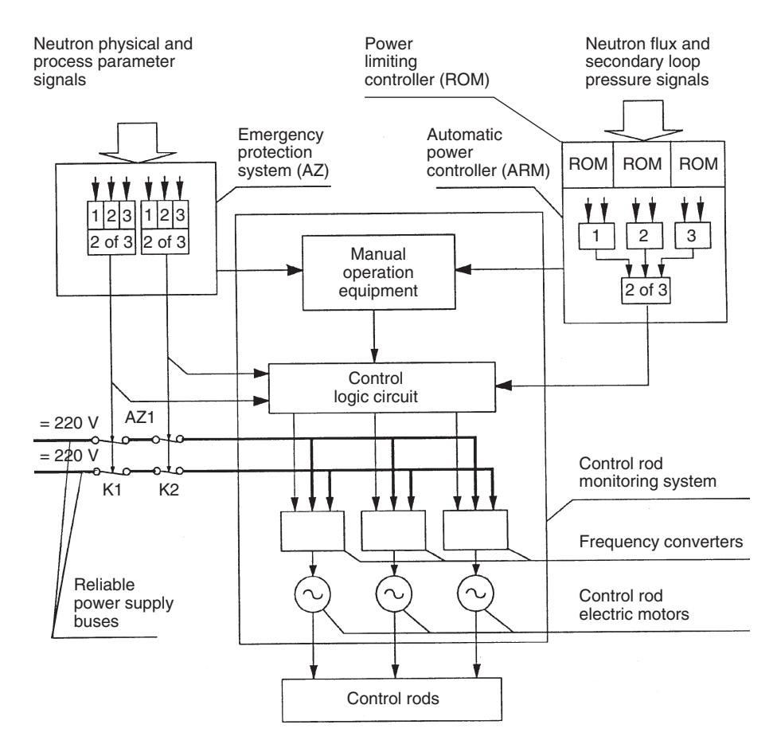

*FIG. 39.1. Reactor control and protection system of the Loviisa NPP, Finland.*

#### **39.3.1. Control rod drives**

The reactor is controlled by control rods with electric drives and each of them may perform the functions both of emergency protection and of control, i.e. a control rod may move downwards at the maximum velocity (drop of control rods into the reactor core) or at a normal operating velocity of 2 cm/s upwards and downwards [39.2]. The 37 control rods are subdivided into six groups (five groups of six and one group of seven). Under normal control conditions the rod groups are moved in sequences. The group control sequence is realized in the control logic circuit and switches from one group to another when the controlled group position is 0.5 m from the top or bottom of the reactor core. At these levels the control rod efficiency is low. Two subsequent groups are moved within regions spaced 0.5 m from the reactor core edges.

Each control rod has an independent synchronous electric drive which consists of an independent low frequency converter of PNChI type and a synchronous reluctance motor of RD42-4RV type. Frequency converters are fed from two independent, reliable 220 VDC supply systems which are connected through diodes to one input for each group of drives.

The PNChI converter control circuit receives the following input commands:

- Control rod upward motion command;
- Control rod downward motion command;
- Motor de-energizing command.

An incoming commands validity signal fed to the control circuit permits execution of these commands and eliminates any false action. In the case of uncontrolled upward control rod travel (which would increase reactor power), the circuit generates a command which de-energizes the motor.

A synchronous reluctance, four pole submersible electric motor developing a torque of 53 N·m is used for the control rod drives. The use of a low speed motor has made it possible to develop a mechanism which is not self-braking on control rod motion, thereby ensuring that the rods drop by gravity when the electric motor is deenergized on reactor emergency protection command.

#### **39.3.2. Emergency protection system**

The AZ confines the permissible range of plant parameters. If they deviate beyond the permissible range, it provides for load shedding or scram of the reactor through the monitoring system. It provides the following control rod operations [39.2]:

- Drop of all control rods (AZ1, reactor scram);
- Successive drop of control rods in groups (AZ2, third delay stage);
- Successive motion of control rods downwards in groups at operating velocity (AZ3, second delay stage);
- Blocking of upward motion of control rods (AZ4, first delay stage).

The AZ, as well as some of the emergency protection signals in the control rod monitoring system, comprises two independent triple channels, making on-line testing and repair possible.

#### **39.3.3. Reactor power limiting controller**

A special ROM is provided to prevent any boiling in the core by limiting and shedding reactor thermal power. This depends on the coolant flow through the core and therefore on the number of primary circulation loops in operation. If the permissible level of thermal power is exceeded, automatic partial reactor load shedding is provided by the second delay stage, AZ3 [39.2].

The reactor thermal power is not a directly measured parameter but is calculated as the product of coolant heating in the reactor and coolant flow. However, because of the relatively large time constant from thermal power to coolant temperature, this signal cannot be used directly for power limitation. A faster analog of power is neutron flux, which is measured by ionization chambers. This signal, too, is subject to the influence of secondary factors, such as change of boron concentration in the coolant, shielding of the ionization chambers by the control rods and ageing of ionization chambers, and cannot be used directly for the required power protection. It must be corrected if it is to be consistent with the thermally derived signal calculated by the ROM and this correction is made automatically by varying the gain in the ROM.

Calculation of the thermal power is done by multiplying the average coolant temperature rise in the loops by the number of operating loops. The temperatures are measured by means of resistance thermometers in hot and cold loop lines. Each channel receives temperature signals from four loops. On failure of the measuring channel or disconnection of a loop, the corresponding signal is cut off. A loop (the total number of unit loops is six) is sensed to be switched off when the pressure drop over the primary circulation pump is decreased by 50% and the rotation speed of the pump is decreased by 10%.

The ROM has a multichannel structure which corresponds with the general architecture of the emergency protection system.

#### **39.3.4. Automatic power controller**

The Loviisa plant must be able to take part in national grid load variation by changing its output within the range of 50–100% of rated power. It must also participate in prompt adjustment of the grid parameters, i.e. frequency and redistribution of the active power. These operating modes are provided by the main control circuits, which incorporate the reactor power control system (ARM) and the turbogenerator power control system (RT) [39.3]. The ARM controls the reactor power through the rod monitoring system, power limitation functions being performed by the AZ. The ARM is automatically disconnected if there is an AZ system response. The RT controls turbogenerator power by operating the turbine control valves. The same controller performs the function of steam pressure limitation in the steam collectors by operating a bypass valve which discharges steam into the condenser.

The plant has two alternative control modes. When the turbogenerator power is governed by the RT, the ARM automatically controls the reactor power to maintain

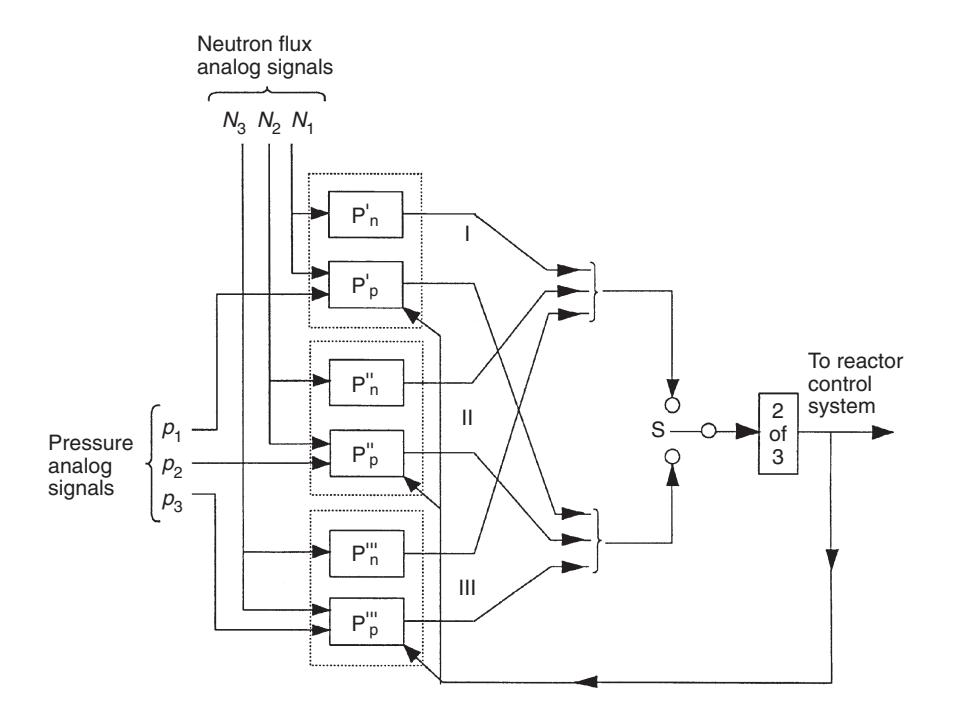

*FIG. 39.2. Loviisa: ARM regulator.*

the preset steam pressure in the second loop, thus keeping the reactor parameters within the permissible ranges. When the plant operates in the reactor constant power mode, the ARM holds the reactor preset neutron power (signal from ionization chambers) and pressure control in the second loop is performed by the RT by controlling the turbogenerator power. Selection of power control mode is made by the operator. Automatic changeover is also provided, depending on power limitations, which may occur either in the reactor unit or in the turbogenerator unit. The ARM (Fig. 39.2) has three independent channels, each consisting of two controllers: a neutron power controller Pn and a pressure controller Pp. Each channel has its own detectors and normalizing transducers [39.2].

The outputs of the neutron power and pressure controllers are connected through a changeover switch S to the two out of three output circuit, from which a ternary signal is fed to the reactor control system. The neutron power controllers are of relay type with a ternary output signal. The pressure controllers are two pulse, proportional/differential controllers with a variable structure. They operate in pulse mode, also with a ternary output signal. The neutron flux control channel is an analog controller with a ternary analog–discrete converter at the output. The preset value of the controlled parameter and controller sensitivity are set with the help of an automatic digital register which fixes values of the given parameters when the controller switches on. The controlling signal *U* (analog–discrete converter input) is shaped according to the following equation:

$$U = (N - N_0) \frac{K}{N_0}$$

where *N* is the current value of neutron power, *N*0 is the value of neutron power at the instant of controller switch-on (preset value of neutron power recorded in the digital register) and *K* is a constant.

Such a dependence is essential to provide constant gain in the closed control circuit, since the reactor transfer coefficient (change of reactivity to neutron flux), owing to neutron kinetics dependences, varies in direct proportion to the reactor power. The automatic setting of parameters permits the independent adjustment of each channel according to its detector signals. This acquires special significance for the neutron power controller channels, since neutron flux signals practically always vary because of the skewed neutron field in the reactor and the unequal effect of control rod position on ionization chambers mounted on the reactor periphery.

The pressure controller (Fig. 39.3) is a pulsating controller with time lag feedback. The feedback passes through the controlled object, the value of the time lag being determined by the time required for reactor power change (depending on the variable dynamic characteristics of the reactor). Neutron flux *N* is fed back to the logarithmic element L (a link with variable gain for compensating for reactor transfer coefficient change depending on power) and through the variable structure circuit SPS to summator S. The pressure deviation signal is also fed to the SPS to introduce a derivative component of the controlled parameter into the control law. According to discrete signals (shown by broken lines) fed from the SD circuit and from the two out of three circuit, the SPS changes its transfer function. The structure of the SPS may have the following states: A, a differentiating link with a low time constant; B, a differentiating link with operating (high) time constant; and C, an amplifying link.

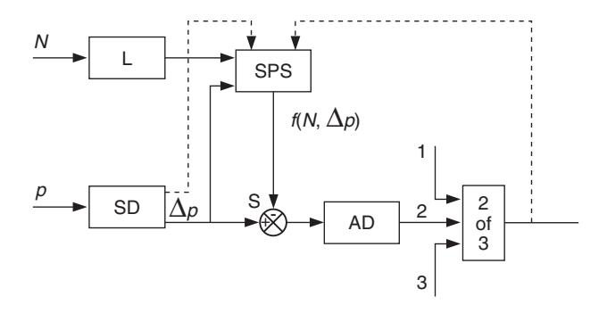

*FIG. 39.3. Loviisa: an ARM pressure regulation channel.*

State A appears under steady state conditions determined by the dead zone of the SD circuit. In this case the SPS eliminates all the drifts of the neutron power measuring channel and has zero output signal. For control system transients, when the pressure deviation value *p* exceeds the controller dead zone, the SPS switches in turn to states B and C.

Reactor power is changed according to a step/pause law. During the step period, the SPS represents an amplifying link (state C), whereas during the pause period it is in state B. This results in a pause duration depending on the time constant of the SPS and inversely on a deviation of *p*.

During the step period, the system operates as a control structure with neutron flux rigid feedback. This practically eliminates any influence on the transient process of reactor dynamic parameter changes due to variable efficiency of the control rods or to variable properties of the reactor natural control (depending in turn on power level, fuel burnup and boron concentration in the coolant of the first loop). A 'discrepancy circuit' is included in the logic part of each channel, to which discrete channel signals are fed. This circuit determines any discrepancy between the given channel and the others and automatically shapes a command which switches off the channel and simultaneously feeds in a test signal (varying the preset pressure value). If the channel is in order, its adjustment will be corrected automatically and the channel will continue in service. In the case of failure, including that of input parameter detectors, the faulty channel remains switched off. In this way, automatic channel readjustment as well as failure detection is achieved.

From the structural point of view, the ARM, as well as the ROM, is designed on the unit module principle using integrated microcircuits. The remaining part of the SUZ comprises logic elements and thyristor circuits with relay contactor equipment in the emergency protection actuating circuits.

#### 39.4. IN-CORE INSTRUMENTATION SYSTEM

The in-core instrumentation system (ICIS) consists of the following main parts [39.4]:

- In-core sensors:
  - ∑ Self-powered neutron detector (SPND) assemblies;
  - ∑ Outlet thermocouple (TC) assemblies with pressure switches which are affected by the pressure of thermocouple guide tubes.
- Cabling.
- Uniform temperature references with resistance temperature detectors (RTDs).
- Electronic equipment (three data concentrators).

The total numbers of different sensors in the ICIS are as follows:

- 216 outlet TCs (type K);
- 36 inlet TCs (type K);
- 144 rhodium SPNDs;
- 33 vanadium SPNDs plus three background detectors;
- 12 pressure switches;
- 20 RTDs.

#### **39.4.1. In-core equipment**

The in-core neutron detectors and inlet TCs are assembled into 36 SPND assemblies, each approximately 10 m in length. An assembly consists of an electrical connector, a seal plug, four rhodium detectors, one vanadium detector, one TC and a rigid tubular detector housing. The rhodium detectors, with a 250 mm emitter length, are located at 20, 40, 60 and 80% of the reactor core height and the vanadium detector, with a 2500 mm emitter length, extends over full core height. The TC is of type K chromel–alumel with an earthed junction. A background detector replaces the vanadium detector in three assemblies. The in-core assemblies are located at various radial positions. Six feedthrough flanges contain six in-core assemblies, each assembly being routed radially and axially within the reactor by means of permanently installed guide tubes [39.4].

The outlet TCs are of type K chromel–alumel with earthed junctions, each being inserted into a separate guide tube. The guide tubes for 210 of the TCs are about 7 m long and each extends to a location about 50 cm above the fuel portion of a fuel assembly in a particular fuel assembly position. These TCs measure the temperature of coolant water at the outlet of the fuel assemblies. The guide tubes of the remaining six TCs, which belong to the RPS, extend to the upper plenum of the reactor pressure vessel and have a length of about 4 m. These six TCs measure the mixed coolant water temperature at the inlet to the hot legs of the six primary coolant loops of the reactor.

#### **39.4.2. Electronic equipment**

Except for the signals from the pressure switches and from the six outlet TCs of the RPS, the detector signals are fed to the three data concentrators in the electronic equipment. About one third of the detectors of each type are connected to each data concentrator [39.4]. In addition, 20 RTD power supply signals and 36 reference voltage signals are divided among the data concentrators. These are used to monitor the condition of the RTD power supplies and the data concentrators. The total number of signals fed to the data concentrators is 502. Each data concentrator consists of one relay multiplexer and two redundant amplifier, analog to digital converter (ADC) and multiplexer controller units in parallel. Thus, a signal from an input terminal is led via multiplexer relays to two amplifier–ADC units simultaneously and two separate readings are obtained for each measurement.

The address of the input to be measured is sent by the scanning front end processor to both of the ADC/multiplexer controller units of the relevant data concentrator almost simultaneously. Thus, digitized data are normally available from both ADC units of a data concentrator. Because of multiplexer settling times and the phase locked ADC conversion initialization, the maximum allowed scanning rate is 32 inputs per data concentrator per second. The data concentrators include a special facility for automatic SPND leakage resistance correction under computer control. Using this facility, the computer corrects the signals of those SPNDs which have low insulation resistance but are otherwise in good condition.

# 39.5. RADIATION MONITORING

#### **39.5.1. System**

The radiation monitoring system consists of three different groups of monitors [39.4]:

- Area monitoring system;
- Gas and aerosol monitors;
- Process monitors.

The area monitoring system observes the ambient g radiation level in all active areas of the plant. The monitoring channels consist of a Geiger–Müller (GM) detector with preamplifier and pulse transmitter, a pulse rate–analog voltage converter and local and remote display and alarm units. Only analog displays are used.

The gas and aerosol monitors observe particles, iodine and noble gas concentrations in room air and also in ventilation ducts. The monitors consist of filters, air circulating pumps, scintillation detectors, single channel analysers and pulse rate–analog voltage converters. The air sample is pumped through a filter which absorbs iodine and the activity collected in the filter is measured by a scintillation detector. Noble gases are measured in a measuring chamber.

Process monitors observe the activity of gaseous and liquid media in the process loops and the system also measures the activity released by the plant into the local environment. Each process monitoring channel consists of a measuring chamber and a normal scintillation detector which is located in the chamber.

The overall configurations, detection specifications, locations of detecting devices, locations of alarm and display units and general electrical requirements were specified by IVO together with AEE. IEC recommendations were taken into consideration when the circuits were being designed.

## **39.5.2. Standardization**

Analog signals of 4–20 mA are used in each measuring system despite the different detector types and measuring functions. Each signal transmitter has four separate analog outputs which are used for remote alarm and display units and computer connections. The maximum length of signal cable is 500 m. Slow digital signals are used for remote switching of measuring ranges, in remote checking and in on/off alarms. Pulses from detectors are transmitted as fast digital signals to pulse rate units. The pulses are amplified in the preamplifier for long distance transmission which, in certain cases, may be up to 300 m. Interchangeable preamplifiers are used in all scintillation detectors. The GM detectors are also standardized in size and input/output and the measuring channels are based on the use of standard plug-in units. Every unit has a defined signal processing function. Consequently, the same units can be utilized in different measurement applications and can be interchanged in most cases without recalibration.

#### **39.5.3. Reliability**

An analog signal level of 0–4 mA is used as a special fault alarm function which actuates the alarm units if no pulses are detected over a period of 4 min. A fault alarm is also given when power supplies, detectors, ratemeter/transmitter units or cable connections are inoperative. In normal conditions a 'clear' light shows correct operation of the whole measuring channel.

In certain instances, especially in the case of a minor or major accident, it may not be possible to go into the rooms in the reactor building where the detectors are located and manual calibration of detectors may also not be possible. Therefore, detectors inside the reactor building are equipped with a low activity radiation source with a remote controlled source shutter. When this shutter is opened the display unit should show an increase in dose rate if the detecting device and other components are working properly.

Stability is one of the most important considerations for scintillation channels in continuous monitoring. The amplification of photomultiplier tubes normally varies with both time and temperature and this variation may lead to serious errors in measurement. To improve stability, an amplification feedback control system was developed. It is based on light pulses from LEDs being detected by the photomultiplier. The LEDs generate standard light pulses which simulate scintillation events in the NaI crystal and the height of these reference pulses is kept constant by a separate pulse height analyser, the output of which is used to control photomultiplier high voltage. A great advantage of this system is that it does not cause background noise, while the measured long term and temperature stabilities are approximately ten times better than without stabilization. The stabilization control light indicates whether the stabilization system is working properly or whether the high voltage regulator is not able to maintain the correct high voltage value. This may happen for several reasons — for example, the detector, preamplifier or other units may be faulty or their connection cables may be broken.

#### **39.5.4. Maintenance**

Regular checking of monitors is carried out by using either the internal checking system or low activity g sources. The checks are carried out regularly four to six times per year and whenever faults are suspected. A thorough check of calibration and alarm accuracies and other functions is carried out once every two years and whenever large changes in the measuring channels occur. The plant maintenance staff have been trained to find faulty units and to replace them with spare parts. Faulty units are then repaired by the manufacturer. For this reason a sufficient number of spare parts of every type are kept in stock on-site. In only a few cases is additional adjustment needed when changing the units.

## 39.6. PLANT PROTECTION SYSTEM

The plant protection system constitutes a completely independent control system which starts up various ESFs in response to certain combinations of limiting value signals. The plant protection system is responsible mainly for the operation of process technical safety systems, control of shut-off valves of the containment pipe duct in the reactor building, startup of emergency feed lines and startup of standby engines as well as startup of emergency cooling systems [39.1]. As regards the measuring technique, the system has been constructed with fourfold redundancy, but the control part is twofold redundant owing to the essential twofold redundancy of the process. Where appropriate, the principles followed by KWU for the Biblis A PWR plant in Germany, as well as the rules valid in Germany for RPSs, constituted the basis for the system planning. The entire Loviisa plant protection system was manufactured and tested in Germany.

The functional principle of the plant protection system is as follows. The process variables are monitored through four individual transmitters and the magnitudes of three of them are compared with each other and with the limiting value alarm preset. If two out of three signals exceed the limiting value and if certain other conditions exist, the plant protection command is issued. Firstly, it cancels the validity of other valid commands or of commands given, for example, by automatics, and secondly, it initiates specified actions.

# **39.6.1. Quality control**

The plant protection system is one of the most important electrical systems with regard to the safety of the plant and therefore great attention is paid to its reliability. The following QC phases can be identified [39.1]:

- Inspection of the modules and worst case tests are carried out extremely thoroughly;
- The necessary modules and cubicles are assembled using approved constructions and components;
- Final inspection of the modules and functional tests are carried out at the factory under the supervision of authorities;
- The installed system undergoes thorough functional testing;
- The system is tested with real parameters during a hot trial run.

#### 39.7. INSTRUMENTATION AND CONTROL TECHNOLOGY

Instrumentation and control and automatics systems related to the main systems and necessary for the operational supervision of the plant were provided by Siemens. The extent of the measurement and control systems is as follows [39.1].

The total number of analog measurements exceeds 1200. They comprise:

- 126 flow measurements;
- 233 pressure measurements;
- 151 differential pressure and level measurements;
- 692 temperature measurements;
- 69 analyses and other measurements.

The local indicating measurements divide into:

- 41 volume measurements;
- 580 pressure measurements;
- 32 differential pressure measurements;
- 17 level measurements;
- 136 temperature measurements.

The total number of binary detectors for alarms, automatics, interlocks and protection is 850. These comprise:

- 39 flow switches;
- 400 pressure switches;
- 63 differential pressure switches;

- 289 level switches;
- 53 temperature switches;
- 6 moisture switches.

The total number of pneumatic measuring circuits is 88.

#### **39.7.1. Automatics system**

The automatics system is based on so-called automatic functional group control using permanently wired electronics. All processes of the plant were divided into functional groups and those processes related to energy production together with their auxiliary processes were made automatic by this technique [39.1].

The system comprises 2394 individual open loop controls, including:

- 64 motor controls, e.g. pumps and blowers;
- 1536 valve controls, e.g. motor drives and butterfly valve actuators;
- 149 magnetic valve controls, e.g. 24 V magnetic valves;
- 69 miscellaneous items of equipment, e.g. heaters.

Of these individual controls, 320 also compose a priority control module for connection to the plant protection system. Almost all individual controls are connected to the necessary interlock logics and have a connection for automatic control of various degrees.

The amount of automatics implemented at the NPP is characterized by the following figures:

- 24 group control automatics;
- 46 subgroup control automatics;
- 107 interchange automatics for standby units.

There are also several partly automatic processes. Furthermore, the automatics of some partly automatic systems receive a unit co-ordinator command, which controls the functional group automatics.

A total of 2400 binary signals are formed from different contact signals, i.e. various binary transmitters, e.g. flow switches, pressure switches, level switches and floating contacts.

#### **39.7.2. Field equipment**

The field equipment was selected mainly on the basis of the type of equipment supplied by Siemens for PWRs in Germany. The subcontractors of Siemens and the earlier instrument standards and special requirements of the buyer as well as the equipment available from Finnish manufacturers were also taken into account as much as possible [39.1]. The field mounted transmitters and binary detectors use, almost exclusively, ±24 V supplies. The signal range is 0–20 mA. The temperature detectors are almost exclusively PT100 detectors.

# **39.7.3. Measuring cubicles**

The control systems are based on the TELEPERM C module system, one of the Siemens TELEPERM systems. They are constructed from integrated circuits which allow the processing of measuring signals and setting of limiting values as well as the setting of various control functions within the same system.

The measuring signal is taken into the measuring cubicles where signal branching takes place, either by means of an analog signal distribution module which supplies voltage to the corresponding transmitter, or by conversion into a standard type of voltage signal (0–10 V) by an appropriate converter. Facilities for a connection from the analog signal distribution module to limiting value indicators, root extraction devices and different computing blocks are accommodated in the same cubicle. A current signal (0–20 mA) can be passed to the computer in the control room or to monitors, recorders and controllers in different control cubicles if required. The measuring cubicle also accommodates the temperature transmitters. The limiting value signals set in the cubicle are wired to automatics cubicles, the alarm centre or the computer for control purposes.

## **39.7.4. Automatics**

The automatics system is constructed using the permanently wired Simatic-P technique, which has been used for control functions in power plants for several years. The system was developed by Siemens and was first ordered in 1966. It works on ±24 V, with binary signal 1 corresponding to +24 V. The Simatic-P system has been especially designed for functional group automatics in power plants [39.1].

The basis of the automatics system is formed by individual controls. Each motor, valve, magnetic valve, etc., is equipped with an individual control module which contains the electronics required for the most important duties:

- Sending commands to the switchgear or directly to magnetic valves;
- Feedback of signals from the valve limit contacts or switchgear auxiliary contacts;
- Forming and supervising manual commands given from the control room or automatic control commands given by the automatics, and connecting interlocking signals.

The individual control of valves or pumps related to the safety systems also includes a priority control module which transfers the commands given by the plant protection system to the individual control module and simultaneously prevents other possible control functions.

The interlocks and partly automatic systems were constructed using the logic elements AND, OR, MEMORY and TIME ELEMENTS. Necessary logic functions are created by combining these elements in accordance with the task (presented as a logic functional diagram). This is carried out with permanent wiring inside a module rack or group of racks by wiring the input and output of the logic modules according to the task definition.

The subgroup controls are, in general, constructed on sequence control principles, which means that the commands are given stepwise in the sequence required by the process, taking into account the startup or shutdown phase of the process at that particular time. Different programs, which can be started when necessary, are used for startup and shutdown of the process. The automatics give their commands to the individual control modules.

The task of the binary signal conditioning is to supply the field contacts with ±24 V, to supervise the contact functions and to distribute the binary signal for various purposes such as the automatics, interlocks, alarm centre and computer. Because of the ±24 V, 48 V is formed across an open contact; 10 mA passes through a closed contact.

# **39.7.5. Controller cubicles**

The controller cubicles accommodate all of the measuring signal processing related to the control circuits. Measuring signal, actuator position and possible interlock commands are wired from the measuring cubicle. Controller signals and set points come from the control room. The controller output signal then guides the power control modules of, for example, control valves. These modules are placed in power control cubicles [39.1].

A measuring cubicle consists of up to eight 19 in (48 cm) racks with standard wiring for certain modules. The following racks with standard wiring were used:

- 72 racks for field transmitter signal cut-off (20 units/rack);
- 85 racks for TCs and their signal cut-offs (9 units/rack);
- 71 racks for limiting value display (13 units/rack);
- 43 non-standard racks.

The system used offers good facilities for extremely flexible changes to cubicles already installed, especially when it is realized that decentralized has been preferred to centralized cross-connection at Loviisa.

# **39.7.6. Automatic control system cubicles**

The cubicles of the automatic control system accommodate all of the necessary electronics and power supply and supervision equipment relevant to each cubicle [39.1]. The individual controls receive manual commands from the control room, automatic commands from the automatics cubicles and interlock commands from the interlock cubicles and give control commands to the coupling relays of the switchgear. In addition, feedback signals from limit contacts on the valves or from the auxiliary contacts of the motor switchgear are cabled to the individual control cubicles.

Signals from the binary signal cubicles are cabled to the automatics and interlock cubicles and the commands are further wired to the individual control cubicles. All contact signals from the field and signals for various purposes are cabled to the binary signal cubicles. The individual control cubicles and binary signal cubicles contain the marshalling units, also called central connection elements, by which the signals can be switched to different addresses.

Each cubicle consists of up to ten module racks or marshalling units. The racks are to various standards and have been used in the following quantities:

- 278 individual control module racks;
- 45 priority control module racks;
- 268 interlock racks;
- 222 automatic control racks;
- 58 binary signal racks;
- 140 marshalling units.

The functions required by the automatics and interlocks are wired to standard module racks by the Duo-Tyne-Leaf wiring technique. Maxi-Termi-Point wiring has been used in the binary signal and individual control module racks in which the marshalling is performed. The automatics equipment was grouped into the cubicles so that the individual controls, interlocks, automatic controls and binary signal processing each had a cubicle of their own. The total requirement for the automatic control system was as follows:

- 40 individual control cubicles;
- 33 interlock cubicles;
- 21 automatics cubicles;
- 13 binary signal cubicles.

#### **39.7.7. Decentralized cross-connection**

A cross-connection field has traditionally been used in power plants as a branching and grouping centre for signal conductors. Such a cross-connection field allows very flexible possibilities for changes and additions but, with larger plants and more numerous measurements, a single field becomes so large as to entail disadvantages. Connections are now carried out in a decentralized way or by means of several smaller cross-connection fields. At Loviisa it was decided, after research, to position cross-connections in the measuring, individual control and binary signal cubicles. This meant that the single measuring cables, which are accommodated in the same distribution terminal in the field, are also placed in the same measuring cubicle, thus helping to minimize the number of main cables. An additional aim was to feed the measurements made in one part of the system into the same cubicle. Because of this, the average length of a single cable (from detector/transmitter to distribution terminal) is longer than in plants with centralized cross-connection. The main cables (from distribution terminal to measuring cubicle) are also longer for the same reason [39.1].

The instrumentation related to normal operational supervision (described above) has:

- 43 measuring cubicles;
- 20 control cubicles;
- 18 power control cubicles;
- 16 plant protection cubicles.

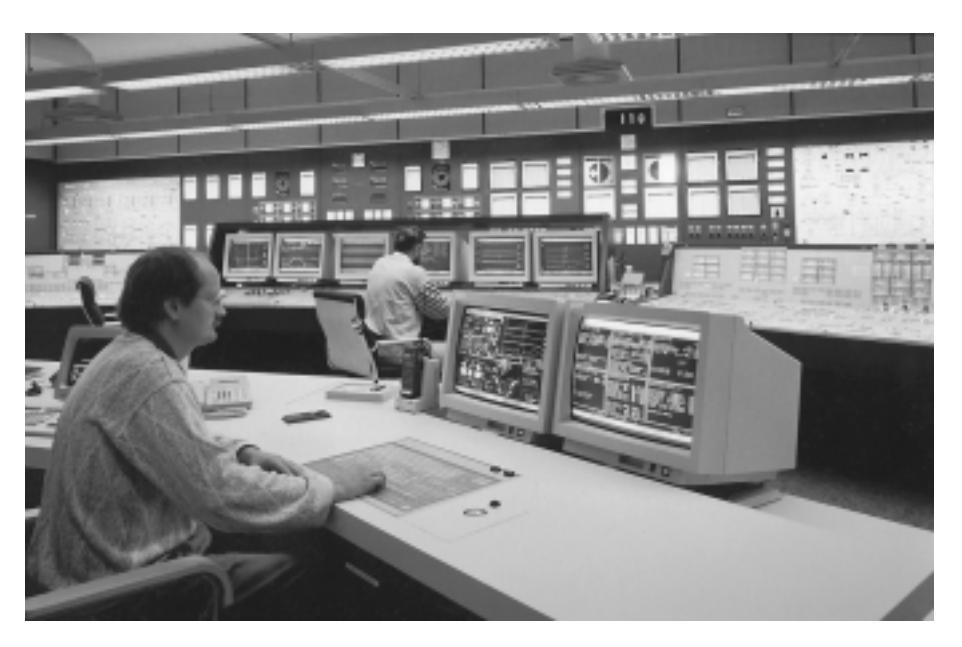

*FIG. 39.4. Loviisa: main control room.*

# 39.8. CONTROL ROOMS

Each of the Loviisa units has three separate control rooms. The monitoring and control of processes which are directly related to energy production and safety are concentrated in the permanently staffed MCR. Permanent staff consist of the shift supervisor and two (reactor and turbine) operators. Main controls and displays as well as the process computer VDUs are concentrated on the main control console. A separate console is provided for the shift supervisor. Individual controls for pumps and valves, control of electrical systems, less important displays and recorders are located on control panels on the control room walls. The MCR also contains the emergency control panel for the other Loviisa unit. The process computer VDUs have a central role in process monitoring but the computer does not directly take part in control. A general view (from the full-scope training simulator) of the MCR is shown in Fig. 39.4 [39.5].

The auxiliary building control room, which is normally not staffed, contains the monitoring and control equipment for systems and processes not directly influencing energy production, e.g. the radioactive waste treatment and sewerage. A third control room, also not staffed, is provided for the plant ventilation systems.

The MCR and the auxiliary building control room were constructed using the Siemens 'Compact Control Room 48' technique, in which a metal grid forms the body of the apparatus. Mosaics, 24 mm × 48 mm in size, with necessary control pushbuttons and signal lamps can be set on the grid. Normal sheet metal panels have been reserved for the recorders and indicators. Because of the mosaic structure, the compact control room technique allows flexible alterations. In the same way, a panel part which accommodates only indicators and recorders and which was earlier designed as a sheet metal board can fairly easily be altered into a grid field [39.1].

#### 39.9. INTEGRATED COMPUTER SYSTEMS

The Loviisa plant originally had a quite extensive group of process computer systems supplied by Nokia Oy, the first of which were taken into use before plant commissioning. Since then, new systems and applications have continually been introduced so that most plant functions are now supported by computers. The main computer systems have been upgraded or replaced in such a way that the resulting second generation system can fully benefit from user experience and the potential of rapidly evolving computer technology. The configuration of the computer system is shown in Fig. 39.5 [39.6].

#### **39.9.1. Plant information system**

The new plant information system (LOTI) integrates eight separate computer subsystems into one main system. LOTI applications have been built in several

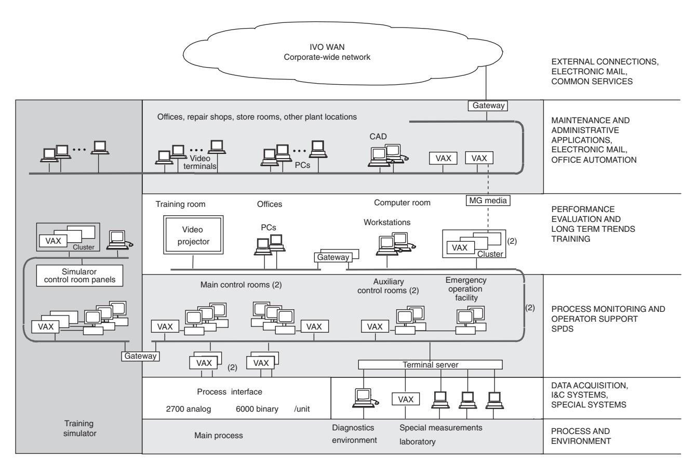

FIG. 39.5. Loviisa: main information systems.

phases. The applications together with their extent and typical yearly volumes of information are listed below [39.7]:

- Personnel data (dose and access control);
- Plant component and location data:
  - ∑ 35 000 pieces of equipment;
  - ∑ 60 000 process locations;
  - ∑ 3000 rooms.
- Work planning, including tagging/isolation:
  - ∑ 6000 work orders;
  - ∑ 8000 work instructions.
- Preventive maintenance:
  - ∑ 21 000 basic objects;
  - ∑ 250 routes;
  - ∑ 8000 route objects;
  - ∑ 9000 work instructions.
- Maintenance history:
  - ∑ Data collection for PSA (living PSA).
- Scheduled tests:
  - ∑ 350 tests;
  - ∑ 2500 regular experiments.
- Materials management (spares, materials, tools, orders, invoices):
  - ∑ 25 000 stock items;
  - ∑ 35 000 stock order items;
  - ∑ 5500 purchase orders;
  - ∑ 6500 warehouse deliveries.
- Outage planning and management.

This system extends itself to every room and on to every desk at the plant and is therefore also used as a platform for electronic mail. It provides accurate, real time data to the whole staff on maintenance and many other activities and is an essential tool for successful operation as well as for management of maintenance and outages [39.8]. One of the most important characteristics of LOTI is security. In addition to requiring normal log-in procedures, LOTI has its own protection facilities. Individual users can have access only to those subsystems and operations that they need in their own work. Critical parts of the system are protected by a special security mechanism.

A systematic approach to plant life management is being developed for Loviisa. The factors limiting the life of the plant derive from degradation of materials by thermal, fatigue, corrosion and radiation effects and life is controlled mainly by the modes of operation and maintenance, refurbishment and inspection programmes and on-line monitoring. The maintenance work becomes more demanding, time consuming and expensive as the plant ages. On the other hand, experience, skills and technology are improving with the course of time and so are the benefits of computer based maintenance management systems. At Loviisa the use of LOTI ensures that substantial progress can still be achieved in many areas and that, especially in outage management, the present high level of performance is maintained.

#### **39.9.2. Process computer systems**

The functions of the Loviisa process computer systems have been expanded continuously since the implementation project, which ended in May 1990. The functions can be divided into two main levels: the basic process management system (PMS) functions and application specific functions which support the plant operator. The latter group of functions is also called COSS [39.9].

- (a) *Basic functions.* The basic functions comprise those necessary for normal process monitoring and therefore independent of the nuclear plant processes. Extension and maintenance of these functions are done interactively by parametrization or by means of a graphical user interface. Main developments since commissioning are expansions in data acquisition and fast logic calculation. Both are mainly due to the new applications mentioned in the next section. The basic functions, with some related characteristic data, are presented briefly below [39.10]:
  - Data acquisition:
    - ∑ Analog signals: 2600/unit, 1–30 s intervals, validity checking, on-line calibration;
    - ∑ Binary signals: 6500/unit, 20 ms resolution, pulse counters, filtering.
  - Fast calculations:
    - ∑ Interval: 1 s;
    - ∑ Functions: gradient, maximum, minimum, range selector, logic values, etc.;
    - ∑ Tool based definition, graphical presentation of logic algorithms.
  - Event/alarm handling:
    - ∑ Limit checking, status checking, inhibition logic;
    - ∑ Alarms (three levels of priority), events.
  - History data.
  - Buffer for the latest 10 000 alarms and events.
  - Instantaneous values on three levels; for intervals of 2, 10 and 60 s, the ranges are 20 min, 2 h and 24 h, respectively.
  - Average values on three levels; for periods of 5 min, 60 min and 24 h, the ranges are 1 week, 1 month and 1 year, respectively.
  - Display system (HMI):
    - ∑ Display types:

- Alarms, events, process diagrams, trend/history;
- Graphical algorithms (logics), task oriented displays;
- *x*–*y* plots;
- Computer system diagrams, measurement lists/point information.
- ∑ Functions on displays:
  - Windowing, zooming, adding information, scaling, measurement selection.
- ∑ Calling sequences:
  - Direct function key, cursor plus function key;
  - Menus, soft keys, page keys.
- ∑ Display copy:
  - Colour hard copy, colour soft copy, laser soft copy.

# — Reports:

- ∑ Measurement data and history (1 h, 8 h, 1 day, 1 week, 1 month);
- ∑ Results from calculations;
- ∑ Printed or displayed, scheduled or user actuated;
- ∑ Reports and displays are made by using the same graphical tools and all can be printed and displayed uniformly in the system.

#### — Data storage:

- ∑ Post-incident data on disturbances stored automatically or on request;
- ∑ History data on selected variables;
- ∑ Collected data kept as long as needed;
- ∑ Data files or report files stored on magnetic tape on request.
- Computer system monitoring:
  - ∑ Monitoring of system and unit status;
  - ∑ Automatic changeover features;
  - ∑ Checking and restoring of integrity of distributed database;
  - ∑ Version management of software in the network;
  - ∑ Displays, alarms, user controls.
- (b) *Support functions.* Computerized operator support functions generally include software applications and functions designed to support control room operators in identifying plant function, system and component states and in identifying and diagnosing faults. In the case of Loviisa such functions have been integrated into the process information system. They can also be integrated into a standalone SPDS built on the PMS software platform [39.10]. In the Loviisa process information system, support functions have been implemented by using the calculation and logic tools of the PMS software as far as feasible. Only in some special cases, or when very extensive calculations are required, have computer programs been developed. V&V has been done in most cases on the plant on-site simulator. Available operator support functions and their main features are as follows [39.11]:

# — Plant performance related functions:

- ∑ Monitoring of efficiency and optimum operation of plant components;
- ∑ Determination of reactor thermal power;
- ∑ Determination of plant thermal balance;
- ∑ Calculation of leakages and flow balance of primary circuit;
- ∑ Continuous supervision of operation economy;
- ∑ Performance monitoring of main plant components.

#### — Reactor performance related functions:

- ∑ Input: mainly in-core analog measurements;
- ∑ 3-D power distribution automatically and on request;
- ∑ Local thermal margins (pinwise power distribution);
- ∑ Automatic detection and filtering of defective measurements;
- ∑ Fuel burnup distribution and loading pattern calculations.

# — Critical safety function monitoring (SPDS):

- ∑ Subcriticality;
- ∑ Core cooling;
- ∑ Primary cooling;
- ∑ Primary inventory;
- ∑ Emergency cooling;
- ∑ Containment/radioactivity.

## — Features:

- ∑ Super-priority alarms and special displays;
- ∑ Leakage detection;
- ∑ Safety system monitoring;
- ∑ Safety system power supply monitoring;
- ∑ Tool based implementation (no coding).

#### — Task oriented displays:

∑ To support operators in specific tasks such as startup, shutdown and other transients by optimizing information presentation.

#### — Intelligent alarm handling:

- ∑ Logical reduction and masking of irrelevant alarms;
- ∑ Dynamic allocation of priorities based on process state;
- ∑ Alarm state of subsystems and functional groups.

# — Logic displays:

- ∑ For monitoring of I&C system interlocking and control sequences;
- ∑ Automatic graphical display of logic algorithms.

#### — Early fault detection:

∑ Model based fault detection for high pressure preheaters.

#### — Materials stress monitoring:

- ∑ For prediction of cracks and lifetime of pipes, tanks, etc.;
- ∑ Based on strain gauge and temperature measurements.

- Forecasting of reactivity effects:
  - ∑ Calculation of xenon poisoning.
- Long term history:
  - ∑ Plant lifetime history of selected parameters.

Following the experience gained in testing and using the Loviisa SPDS, a project for developing computerized operational procedures has been accomplished as the next step towards computer aided guidance of the operator. The tasks of this function are:

- Guidance of the operator to the relevant procedure;
- Presentation of procedures dynamically and interactively on displays;
- Follow-up monitoring of actions required in the procedures.

The function was implemented by using the PMS tools and, in the first phase, the guidance was limited to procedures associated with CSFs.

#### **39.9.3. Training simulator**

The full-scale, plant specific on-site simulator contains [39.7]:

- A full copy of the MCR (LO1);
- A replica of the process computer system;
- A simulation computer and instructor system.

The unique plant–control room combination can be presented satisfactorily only by a tailor-made simulator. Besides the initial training and retraining of licensed operators, various other tasks are also performed, e.g. demonstrations, tests and validations of plant procedures, plant modifications and new computer applications. On-line connection to the plant process computer facilitates the use of plant data in training [39.12]. A separate engineering simulator (APROS) running on a high performance workstation is also available for design and analysis evaluations [39.13].

#### **39.9.4. Vibration monitoring system**

The vibration monitoring system monitors the main components (primary pumps, turbogenerators and control rods) using 200 measurements. Values are scanned and processed to detect anomalies in the vibration signal levels, spectra and orbit characteristics. The hardware is based on two networked computers, a measurement system and specialized software. It has proved its usefulness several times by preventing component faults and ensuring realistic schedules for overhauls [39.14]. Besides the on-line system, a PC based portable system monitors many smaller components.

# **39.9.5. Laboratory computer systems**

The plant laboratory for radiochemistry acquired its first computer based g spectroscopy system (ND6700) in the late 1970s. A set of laboratory data processing applications were developed on this system but, to enhance the processing capacity and incorporate new functions, it was replaced by the following [39.7]:

- A new spectroscopy computer system (ND9900) in 1990;
- A new laboratory information management system in 1991–1992.

These systems are closely integrated in a client–server configuration and include all major laboratory data processing functions, such as:

- Planning of analysis programs;
- Processing and storage of data;
- Initiation of actions in response to abnormal data;
- Waste and release inventory;
- Statistics and QA;
- Reports and graphical output;
- Data transmission to and from the process computer system.

#### **39.9.6. PC and workstation applications**

PC and workstation technology has been exploited increasingly during the last few years. Tailor-made and off the shelf packages are used to support specific tasks such as [39.7]:

- Data collection, reporting and storage for scheduled tests of DC batteries;
- Preparation of training material and records of staff training activities;
- Planning, recording and expert advisory systems for plant piping and component inspections;
- Radiation monitoring of the environment.

Other equipment is closely integrated with the main computer networks. This includes:

- Workstations to create and combine graphics into outage schedules;
- A client–server network to facilitate presentation of process computer displays and data in the office environment;
- Word processing and office automation on PCs and a PC network.

# **REFERENCES**

- [39.1] RAUNIO, K., MIETTINEN, E., "The role of the supplier of instrumentation and automatic controls", A Link between Science and Applications of Automatic Control (Proc. Congr. Helsinki, 1978) (NIEMI, A., WAHLSTRÖM, B., VIRKKUNEN, J., Eds), Pergamon Press, Oxford (1978) 2465–2471.
- [39.2] KALASHNIKOV, V.K., OLSHEVSKY, Y.N., SHEREMETJEVSKY, N.N., "Reactor control and protection system at the Loviisa nuclear power station", ibid., pp. 2451–2457.
- [39.3] SALMINEN, P., et al., The main control loops in the Loviisa nuclear power plant in Finland, Teploehnergetika **8** (1976) 7–14 (in Russian).
- [39.4] JUNTTILA, J., LAAKSONEN, T., MALKAMÄKI, S., "Deliveries by the Finnish enterprises", A Link between Science and Applications of Automatic Control (Proc. Congr. Helsinki, 1978) (NIEMI, A., WAHLSTRÖM, B., VIRKKUNEN, J., Eds), Pergamon Press, Oxford (1978) 2473–2480.
- [39.5] RUOKONEN, K., "Design, delivery and start-up of instrumentation", ibid., pp. 2459–2463.
- [39.6] MANNINEN, T., Computers replaced at Finland's Loviisa PWR On-line and on time, Nucl. Eng. Int. **35** 432 (1990) 23–26.
- [39.7] MANNINEN, T., TIITINEN, M., "Experience with integrated computer systems in Loviisa: Implementation, operational experience, maintenance and updating", SVA-Vertiefungskurs 'Integrierte Betriebsführungssysteme für Kernkraftwerke', Winterthur, 1993, Schweizerische Vereinigung für Atomenergie, Bern (1993) D-3.1–D-3.7.
- [39.8] VUORENMAA, A., SAVIKOSKI, A., VAITTINEN, A., Case study: Loviisa 2 refuelling outage 1990, Nucl. Eng. Int. **36** 444 (1991) 51–52.
- [39.9] TIITINEN, M., "Computer systems in the operation, maintenance and technical support of Loviisa NPS", Trans. European Nuclear Soc. Mtg on Safe and Reliable Operation of LWR NPPs, Prague, 1992, European Nuclear Soc. (1992) 233–237.
- [39.10] MANNINEN, T., "Process monitoring systems of Loviisa Nuclear Power Station", Control Room Systems Design for Nuclear Power Plants, IAEA-TECDOC-812, IAEA, Vienna (1995) 91–110.
- [39.11] MANNINEN, T., SAASTAMOINEN, J., "VVER-440 safety parameter display system as first step to advanced replacement process information system", Instrumentation and Control of WWER Type Nuclear Power Plants (Proc. Specialists Mtg Řež, 1994), Nuclear Research Inst. Řež (1995) 31–40.
- [39.12] LINDEN, U., "Loviisa power plant training simulator life cycle", Proc. SIMS 92 Simulation Conf., Lappeenranta, 1992, Technical Univ. of Lappeenranta (1992).
- [39.13] PUSKA, E., et al., "Simulation of Loviisa power plant transients with APROS", Proc. Topical Mtg on Advances in Nuclear Engineering Computation and Radiation Shielding, Santa Fe, 1989, American Nuclear Soc., La Grange Park, IL (1989) 28.1–28.12.
- [39.14] TOIVONEN, S., SAVIKOSKI, A., "Plant wide vibration monitoring Combination of a fixed and a portable system", Proc. Int. Conf. on Condition Monitoring, Erding, 1991, Redwood Press, Melksham, UK (1991).

# **40. I&C CONCEPTS FOR PWR PLANTS IN FRANCE: N4 SERIES**

#### 40.1. N4 SERIES: FRENCH BREAKTHROUGH

The French N4 series of 1450 MW(e) NPPs is the outcome of thirty years of experience in PWR operation and builds on the lessons drawn from the TMI accident. The N4 plants use the new Electricité de France (EdF) control room concept (Fig. 40.1), which aims to improve safety and efficiency of control in every plant situation by means of:

- Improved data quality;
- A very efficient alarm processing system;
- Reliable and relevant presentation of information;
- Diagnostic aids.

The established architecture of the facilities makes extensive use of diversification and redundancy at each level and is characterized by a computerized first level of I&C systems and the general use of multi-microprocessor structures.

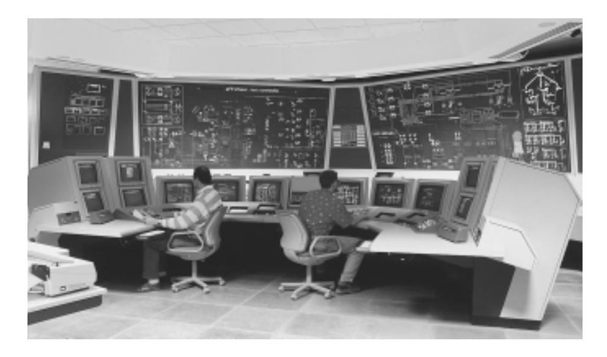

*FIG. 40.1. N4 series (1450 MW(e)) control room at the Chooz NPP, France.*

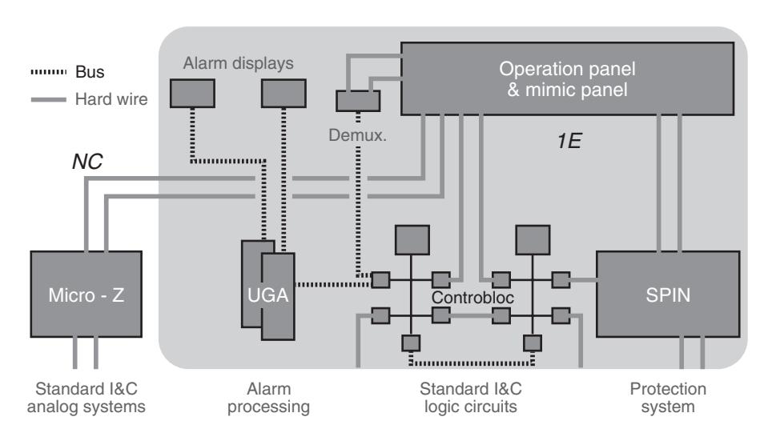

*FIG. 40.2. Architecture of 1300 MW(e) I&C system. NC: non-classified; UGA: alarm management system; Micro-Z: digital system used for regulating process.)*

# 40.2. EXPERIENCE BASE

The new system evolved from the conventional I&C systems employed, and still in successful operation, on the 900 MW(e) units. Technological evolution continued during this series and a new system with analogous architecture but greatly improved implementation was introduced in the 1300 MW(e) series, the first of which was connected to the grid in 1984. This system (Controbloc, Fig. 40.2) is based on:

- A functional design in which the safety tasks are separated into independent cubicles;
- An internal design which uses double data/no-data redundant buses;
- Hard-wired external connections, including the links with the control room (this excludes alarm displays whose links are multiplexed).

There is a computerized protection system (SPIN; Section 28.4.2) which is fully independent and based on:

- A functional design with multiple redundancy chains for safety tasks and a redundant bus;
- An internal design which includes redundant links;
- A fully hard-wired external design.

The control room is supported by a computerized alarm system which provides basic alarm treatment. General logic circuits and protection systems are defined in compliance with 1E level requirements (Section 40.5) but general analog systems are not classified.

The TMI accident showed that HMI design can induce human errors owing to diagnosis difficulties and/or faulty procedures and that human errors can induce severe accidents. EdF has therefore studied ways of avoiding such difficulties and built a procedure structure which can take into account independent unexpected events. A significant improvement has been obtained in N4 operation by enhancements in:

- Information display and ergonomics;
- Information validity and significance;
- Procedure structures which follow the new state oriented approach.

Because of the continuity given by thirty years of PWR operation, EdF has unique operational experience. Feedback from this, matched with studies of foreign incident and accident situations (such as TMI), allowed the exhaustive writing of:

- All procedures related to any status on the unit;
- Comprehensive real time diagnosis;
- Pertinent proposals and alarm treatments.

Thus, EdF now has 15 years of experience in computerized protection and control systems for NPPs and, with 20 units in operation, the total 1300 MW(e) operational feedback represents more than 100 reactor-years (this excludes commissioning times). Analysis of the feedback data has shown that none of the software, hardware, specification or maintenance errors which have been found could have caused any command masking. It forms a strong base from which to engineer new plant.

#### 40.3. NEW FEATURES OF N4 I&C

- (a) The qualified general I&C (2E level) contains both logic and analog systems in the same cubicles. Safety is greatly improved by extensive use of diversification at all levels of the architecture.
- (b) By the use of computerized workplaces with high level interactivity and command display integration, N4 I&C provides for seated operation with all required elements within reach of the operator. Information is validated and displayed:
  - According to unit status;
  - With any causes of invalidity;
  - With automatic monitoring of operating instructions.

- (c) This display and command system allows alarm treatments (global, hierarchical, synthetic, etc.) before display, treatment depending on unit status.
- (d) The N4 operating system has a state oriented approach. According to cyclic monitoring of status parameters, it allows:
  - Initial diagnosis independence;
  - Treatment of concurrent events;
  - Human redundancy (operator and safety engineer).
- (e) Sharing of information between different systems: this is made possible by the industrial use of a complete CAD chain for both level 1 and level 2 functional data. This includes Boolean logic, parameters, occurrences on active and passive graphical displays, etc. The CAD data are delivered from study offices (in different locations in France) to the plant sites (Chooz is the first example) through filter computers which are set up to perform exhaustive verifications such as consistency checking between level 1 and level 2. These verifications allow partial on-line data release after consistency checking.

#### 40.4. GENERAL ARCHITECTURE

The established architecture comprises four levels and three safety classes as described below. It makes extensive use of diversification and redundancy.

# **40.4.1. Levels**

The plant operating system is split into four levels as shown in Fig. 40.3. The communication processors act as security filters between different levels, data concentrators and data servers. Level 0 comprises sensors and actuators; level 1, automatic control and protection; level 2, HMIs; and level 3, the remote and technical management system. Level 2 comprises a diversified control room with:

- Four identical workstations for operators (only two are required);
- One wall mimic panel giving an overall view of the unit;
- One safety auxiliary panel with conventional devices as a backup of the computerized operating system.

There is also, of course, an emergency shutdown panel (with hard-wired pushbuttons) located in a separate room at another building level. In terms of diversification, the architecture is completed (in standby redundancy) by conventional facilities.

#### **40.4.2. Safety classes**

The requirements of three safety classes are applied to the design and installation of the I&C functions and systems (Fig. 40.4):

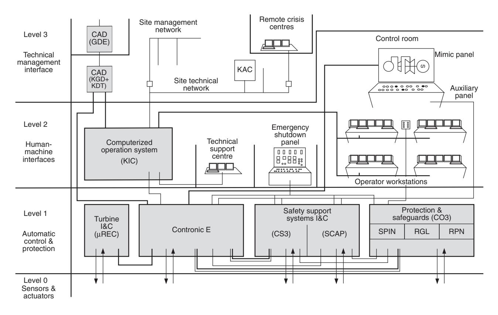

FIG. 40.3. Architecture of 1450 MW(e) I&C system. (GDE: computer aided design system, displaying data for N4 series (off-site system used to build up plant databases); KGD: computer aided design system, adapting data for each site; KDT: database devoted to each unit; KAC: computer aided padlocking system; µREC: digital system used for regulating process.)

- 1E is the highest safety class, e.g. the protection system;
- 2E is the medium safety class, e.g. the manual operating system;
- IFS (important for safety) is the normal safety class, e.g. the operator workstations.

Some systems, such as the turbine protection system, are not classified.

All devices involved in 1E or 2E functions and which can have significant impact on the probability of core melt are specially diversified, i.e. it is possible to perform these functions in another way with other devices. These devices are classified in a special class called SH and use 2E or 1E safety classes, i.e. classes opposite to those of the primary devices. Safety related parts of levels 0, 1 and 2 are organized in two trains. Either train A or train B of the computerized level 2 can drive the whole unit. Each train of each level is electrically and physically independent.

The high safety level of the protocols, specifications and validation allows excellent filtering by the communication processors between levels. All networks have multiple redundancy.

#### **40.4.3. Diversification at level 1**

PSA of the 1300 MW(e) plant shows that a particular ATWS (loss of secondary normal feedwater) was important to core melt probability, and a specific protection signal was programmed into the 2E system to cope with this 1E failure. This signal (from the steam generator level) initiates control rod drop and the start of emergency water supply.

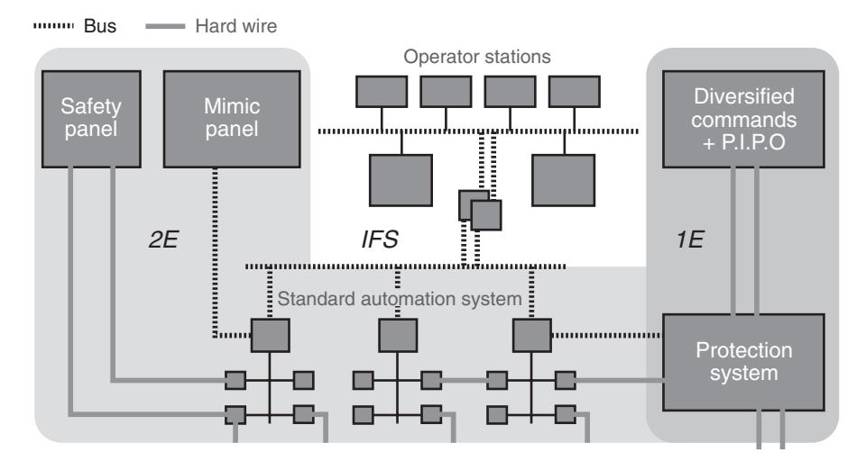

*FIG. 40.4. I&C safety classes of N4 PWR. (P.I.P.O.: protection inputs, protection outputs.)*

The signalling and commands needed for extreme situations in the case of total failure of the 2E system are also diversified. The primary feed and bleed procedure enables the core residual heat to be extracted in all extreme accident cases. Therefore, the commands for safety injection actuation and pressurizer valve opening were diversified in the 1E system, completely independently of the computerized level 2 and of the 2E part of level 1. The monitoring of reactor vessel water and core subcooling (essential for the application of the state oriented procedures in such situations) was diversified in the same way.

#### **40.4.4. Diversification at level 2**

Redundancies in the computerized system, in the front end or central computers on the one hand and in the operator workstations on the other, enable operation with the computerized system to continue in many cases of single failure. The conventional part of the control room makes it possible for the operators to control the plant under normal or accident conditions despite computer failure. In the event of an accident, the operators follow instructions which are structured and presented in a very similar manner to the normal computerized instructions, although not on the same technical means of support. The ergonomics of the means of operation provided by this auxiliary panel is close to that of the computerized panel.

Finally, a subset of the controls on a conventional panel, the emergency shutdown panel, located outside the control room, allows the handling of situations in which it is impossible for the operating personnel to remain in the MCR. It permits safe reactor shutdown.

#### 40.5. REQUIREMENTS OF SAFETY CLASSES

#### **40.5.1. Class 1E general requirements**

Any I&C equipment involved in a 1E function must comply with detailed requirements concerning:

- Redundancy (single failure criterion);
- Geographical, electrical and physical separation;
- Redundancy in power supply;
- Qualification (environmental, seismic, etc.);
- Periodic testing;
- RCC-E rules on design and construction;
- French quality regulations.

In the case of software, the following additional requirements apply:

- Specificity to purpose;
- Conformance with the software quality plan;
- Compliance with IEC 880 recommendations [40.1];
- Qualification.

# **40.5.2. Class 1E qualification**

The hardware qualification requirements for class 1E I&C equipment include:

- Reference electrical tests (insulation, dielectric strength, earthing, etc.);
- Limit environmental tests (temperature, humidity, electromagnetic compatibility, etc.);
- Duration tests (frost, voltage, wet and dry heat);
- Seismic tests.

There are also two actions which relate to functional qualification:

- Verification of failure self-detection;
- Full functional tests on a fully interconnected configuration.

Qualification files are completed by software qualification obtained after verification of the IEC 880 compliance and by a platform test on a real configuration for more than one year.

## **40.5.3. Class 2E general requirements**

Any I&C equipment involved in a 2E function must, at least, comply with requirements concerning:

- Alternative power supplies;
- Qualification (environmental, seismic, etc.);
- Periodic testing;
- RCC-E rules on design and construction;
- French quality regulations;
- Redundancy (depending on the situation).

In the case of software, the following requirements are added:

- Conformance with the software quality plan;
- Partial compliance with IEC 880 recommendations [40.1];
- Qualification (specific tests and the application of experience).

# **40.5.4. Class 2E qualification**

Hardware qualification for class 2E is identical to that for 1E. There are also two functional qualification actions:

- Verification of failure self-detection;
- Full functional tests of all functions important for safety.

The qualification files are completed by:

- Software qualification obtained after a comparison of the quality plan with IEC 880 recommendations;
- An analysis of experience from other users;
- Any additional tests plus a platform test on a real configuration for more than one year.

#### 40.6. CONTROL ROOM ARCHITECTURE

# **40.6.1. Aims**

To meet the aims of improved safety and efficiency of control described in Section 40.1, EdF and the SEMA Group have designed an integrated digital information and control system which provides:

- *Sit-down control.* All resources needed to monitor and control the power plant are within reach of the operator.
- *Information and control consistency.* The HMI has the same features whatever the power plant condition (normal operation, incident or accident).
- *Integrated plant management.* Operational and technical management system links are provided to improve control over the status of the plant.
- *High level reliability.* Advanced software engineering techniques are employed to provide maximum system integrity.
- *Proof against the future.* The software and hardware architectures are capable of open-ended expansion.

## **40.6.2. Operating system**

The operating system (known as KIC) is a set of several computers at level 2 using the SEMA Group's high integrity industrial network, ARLIC. KIC belongs to the IFS safety class. All of the mandatory functions are duplicated and split into two physically and electrically separated trains and either train of this redundant

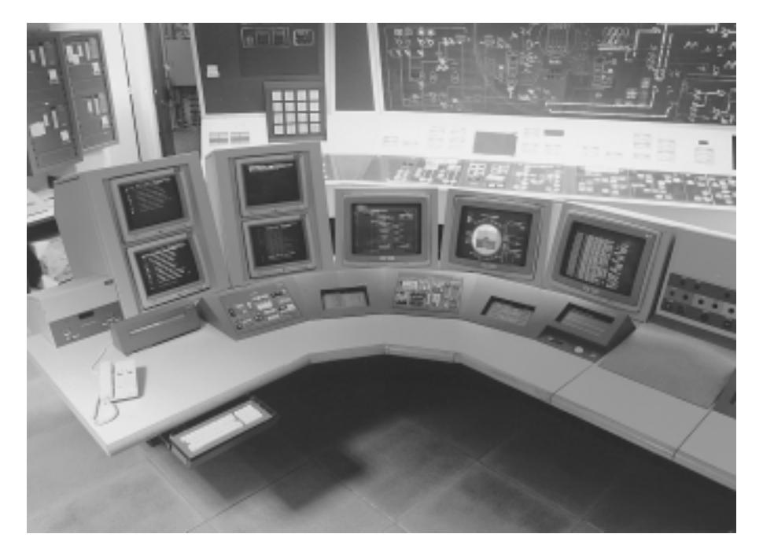

*FIG. 40.5. A computerized operator workstation in an N4 control room.*

architecture is able to drive the whole level 1 architecture. Necessary links between the two trains are by optical fibres. The main control processors (which handle control functions, including critical ones) are 32 bit machines in dual redundant configuration. Although the KIC halves are currently named A and B, these do not belong to train A or B.

# **40.6.3. Computerized operating desks**

Operation under normal, incident or accident conditions requires one or two operator workstations and the N4 control room provides four of these. Each workstation is in the form of a computer desk (Fig. 40.5) and comprises:

- Three control screens and a keyboard for control dialogue;
- Four alarm screens and a keyboard for alarm dialogue;
- A trackball;
- Three touch sensitive screens for commands, monitoring and display management;
- An alphanumeric keyboard and display;
- An identification device (badge and key).

The three control screens have identical graphics on which the operator may select any interactive display or technical sheet (Section 40.7). All data and status parameters, shown for example by the colour of a device symbol, are updated in real time. The touch sensitive screens are the normal devices for deciding and confirming commands and the alphanumeric units are used only by the operator to specify a value directly, for example to set a parameter or to input the explicit name of a display.

As for everything else in the control room the aspects (colour, shape, etc.) and functionalities (control process, equipment selection, tasks performed using displays and keyboards, etc.) of the workstations were designed and decided after years of fullsize simulation by teams of experienced operators and nuclear engineers.

A reduced workstation is provided in the TSC. This comprises a set of three screens used in conjunction with a mouse and keyboard. All of the normal operator workstation screens are represented as windows on the reduced workstation display screens and it is possible to put a maximum of four reduced workstations on to the KIC. These reduced workstations are always locked into display mode.

#### **40.6.4. Auxiliary panel**

The auxiliary panel is a set of conventional facilities provided as a backup against failure of the normal, computerized, operating system. It is set in front of the operators' desks at the base and sides of the mimic panel and its organization is directly inspired by the conventional control room of the previous reactor series. The auxiliary panel is only required if a failure in the operating system involves more than one operator desk. It provides sufficient facilities to continue operation at full power for a few hours, a period normally adequate to perform general diagnosis and to check computers. After this time, it may or may not be possible to return to the computerized system. If not, the auxiliary panel allows power plant shutdown under fully controlled conditions. Procedures for leaving the computer desks and for returning to them have been successfully tested under realistic conditions.

Commands for 2E functions, diversified into 1E technology (Section 40.5.3), are set into the auxiliary panel. They provide conventional facilities with direct hardwired communications to the protection system for starting and monitoring safeguard actions.

# **40.6.5. Mimic panel**

The mimic panel is a redundant display device. It shows status or parameters already displayed by the computer desks or the auxiliary panel but only in two large segments (one for the primary circuit and the other for the secondary circuit and other functions). The mimic panel is a strictly passive device and has been designed to meet the following needs:

- To provide the operators with an overview of the reactor operation;
- To provide the different members of the shift team with a common reference frame and a common basis for analysis and reasoning;
- To allow personnel arriving in the control room to obtain quickly a global picture of the status of the plant;
- To facilitate shifting of control to the conventional system in the event of total loss of the computerized operating assistance system.

The mimic panel is classified as IFS, safety class 2E.

#### 40.7. DISPLAY FORMATS

#### **40.7.1. Operating formats**

The operating formats (some 800 images) bring together in mimic form:

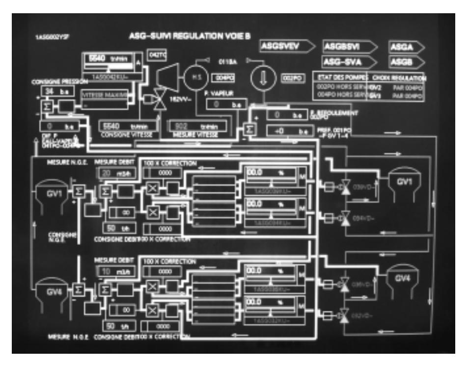

*FIG. 40.6. An N4 control screen operating format.*

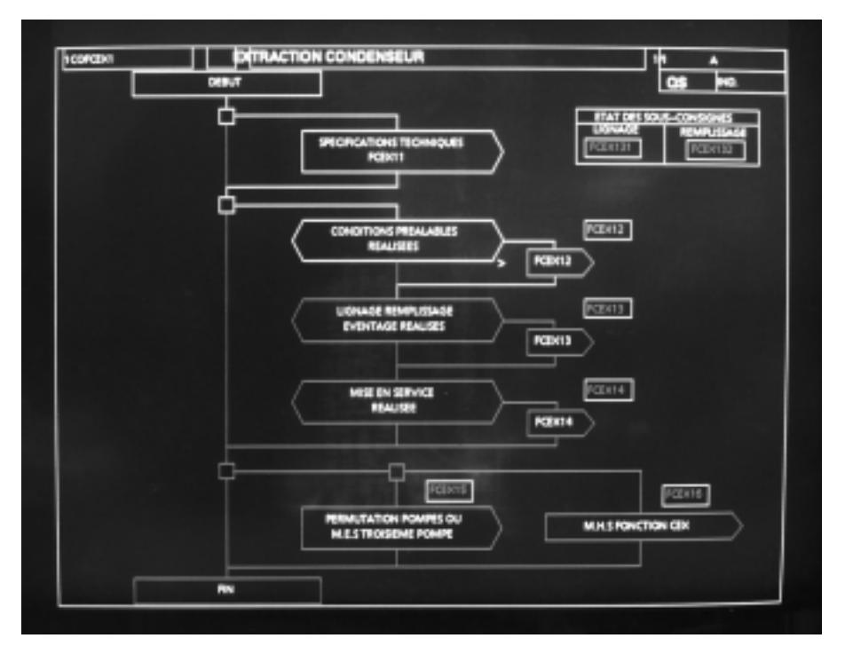

*FIG. 40.7. An N4 control screen operating procedure flow chart.*

- The necessary controls for each function;
- Data in digital form, as bar graphs or on recorders;
- The state of each item by colour or shape code.

These formats facilitate control of plant operation by grouping the actuators and their different conditions (open, closed, faulty, under test, locked out, etc.). An example is shown in Fig. 40.6.

# **40.7.2. Operating procedures**

Operating procedures (thousands of images) are computerized and assist control, operation and monitoring. The presentation (colour) of any element of the procedures changes following an operator's decision according to the consistency of the unit status with that decision. The operating system automatically monitors the decision criteria already used by the operator in a procedure, and if a criterion changes, the operator is advised immediately.

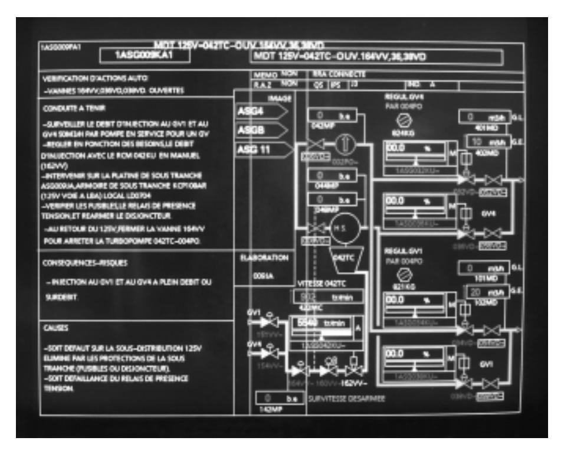

*FIG. 40.8. An N4 control screen alarm sheet.*

Operating procedures are presented in the form of a flow chart (Fig. 40.7) or an operating area. Emergency operating procedures are based on a state oriented approach. When using this type of computerized instruction, the operator is guided and the operator's choices are monitored but the operator can override this computerized monitoring. This is consistent with the fundamental principle that the human operator must remain in final charge of plant operation at all times.

#### **40.7.3. Technical data sheets**

A technical data sheet exists for every device (sensor, actuator, etc.) used in the plant. It provides detailed information about the item and helps in the diagnosis of malfunction.

# **40.7.4. Alarm sheets**

Before being displayed, an alarm undergoes the following processing:

- Validation of input data;
- Functional validation (filtering, suppression);
- Validation according to the situation of the device providing the alarm (hierarchy filtering).

Each alarm has its own alarm sheet which can be displayed on a control screen. The alarm sheets (thousands of images) indicate the correct procedure to be followed. They are used to operate controls and give access to other formats. An example is shown in Fig. 40.8. The left hand part of the display provides identification of the alarm, a description, a list of the actions to be performed and a brief evaluation of possible causes and effects. The right hand side provides an interactive display with the facilities set out on the left.

#### **40.7.5. Equipment status formats**

The status formats provide information on any equipment, system or functional device to be monitored.

#### 40.8. SYSTEM IMPLEMENTATION

The overall system is summarized in Fig. 40.3.

#### **40.8.1. Protection and safeguard system**

The functional objective of the protection and safeguard system is to perform automatic plant shutdown to a safe state in terms of core and containment integrity for at least several hours. The main actions aim at reactivity control, water inventory control, decay heat extraction and containment isolation. An outline of the system is shown in Fig. 28.3. It is classified as IFS, safety class 1E.

## **40.8.2. General automation system**

The purpose of the general automation system (SCAT) is to assist the operators during the manual operation phase of an accident and to make it possible for them to return the plant to a safe status (of unlimited duration) or to a cold status for repairs. It makes it possible to perform all of the actions required in the emergency operating procedures. The main actions involved are boron concentration monitoring, reduction of the primary pressure and temperature by secondary depressurization and monitoring of the water supply and the secondary circuit. This system is classified as IFS, safety class 2E.

SCAT also includes (in separate cubicles) all of the general (non-classified) functions. It comprises more than 150 cubicles of Contronic E split into two trains located in separate rooms. The internal structure of Contronic E makes intensive use of microcomputers, having one on each functional module. Most modules, including all of the main modules, are doubled in redundancy. The input or output boards of the basic Contronic E structure share information with the main boards via a doubled master–slave internal network P bus. Each basic structure (Fig. 40.3) exchanges information:

- With other Contronic E structures inside an island of Contronic E (roughly a dozen basic structures) via an SA bus;
- With other Contronic E structures of another island by an A bus;
- With other level 1 systems (e.g. CO3) by a bit bus;
- With level 2 (KIC) by an L bus.

The L bus, bit bus, A bus and SA bus are all redundant token ring buses.

## 40.9. COMPUTER AIDED ENGINEERING

#### **40.9.1. Design process**

The general I&C system, from the functional diagrams to the content of the Contronic E cubicle memories, is designed by the use of a totally computerized set of applications under the schematic CAD tool PHENIX. There is one application for each step or each type of work along the design process route. For example:

- DLI supports the design of logic function diagrams;
- APR supports the design of wiring diagrams.

These and other examples are shown in Fig. 40.9. All data to be transferred from one application to another share a common alphanumeric database and the work is validated as described below.

#### **40.9.2. Delivery chain**

The data defined by the applications mentioned above are delivered to the plant site through the chain of computers shown in Fig. 40.10. This architecture allows consistency verification between level 1 and level 2 data and between new and residual data.

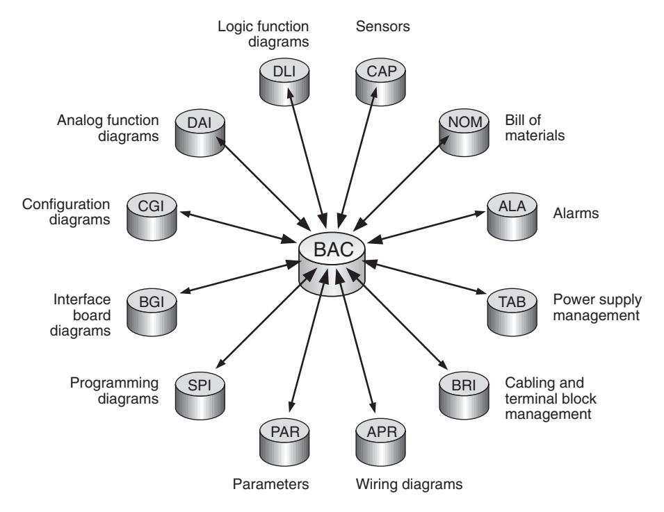

FIG. 40.9. Examples of computer applications used in the computer aided engineering process.

#### 40.10. SIMULATION, VERIFICATION AND VALIDATION

#### 40.10.1. Level 1 V&V

The design of 1E systems must comply with IEC 880 and therefore uses high level definition language which allows a top-down approach in both specification and design. Validation teams are different from designers for each module separately verified. As stated above, the validation is issued only after fully interconnected functional tests. The design of 2E systems must also comply, if only partly, with IEC 880 and the top-down approach is used in both specification and design. Validation teams are also different from designers for each part separately verified.

SCAT operation is defined by the level 1 data. This huge amount of material (several gigabytes for each unit) is designed graphically with a schematic CAD tool. All IFS parameters undergo double reading by independent individuals. The data are validated function by function on a computerized SCAT simulator using procedures written by an independent team.

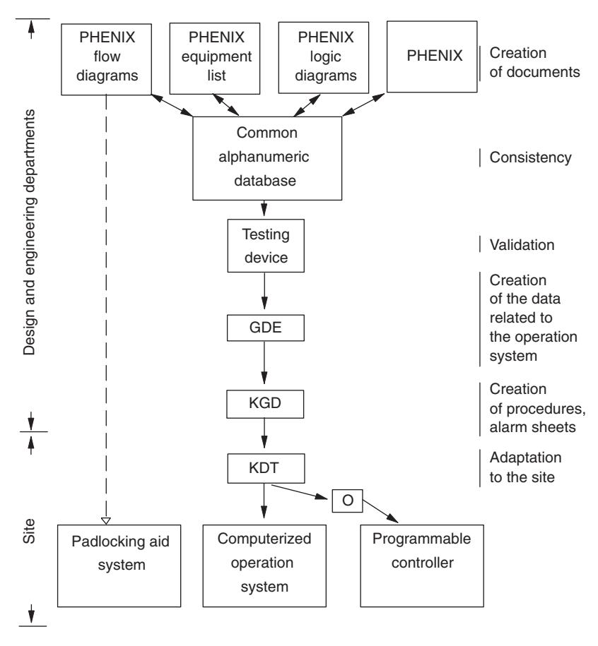

*FIG. 40.10. Computer aided engineering delivery chain. (GDE: computer aided design system, displaying data for N4 series (off-site system used to build up plant databases); KGD: computer aided design system, adapting data for each site; KDT: database devoted to each unit; O: diskette for transferring data to Chooz units.)*

# **40.10.2. Level 2 V&V**

The S3C full-scope simulator, in operation since 1986, allowed validation of the HMI and the validated principles were fully applied to the N4 design. The simulator is now used to demonstrate the complementarity and compatibility of the various diversified operational facilities in the N4 control room. The S3C simulator is also used for operator training. All of the displays were defined by integrated teams of operators and nuclear engineers using a CAD tool for real time applications. Every display is verified by other individuals using a different CAD tool and validated by a technical group.

# 40.11. DEMONSTRATION OF SAFETY

Three different approaches are used to demonstrate safety. They are summarized below.

# **40.11.1. Deterministic approach to design and validation**

A comprehensive review is performed of the potential sequence of events which might follow the failure of each elementary component of the 2E devices at level 1. For each event, the consequences are compared with the consequences of the different accidents studied in the safety analysis report. Modifications are made in all unsatisfactory cases.

## **40.11.2. Probabilistic verification**

A complete PSA of the N4 plant series is made available before the first core load.

#### **40.11.3. Ergonomic validation**

The ergonomics of every control room device and display has been defined by integrated teams of operators and nuclear engineers, and the decisions have been discussed through numerous simulation phases. Finally, S3C simulation allows ergonomic validation of the operating principles and their applications.

#### **REFERENCE**

[40.1] INTERNATIONAL ELECTROTECHNICAL COMMISSION, Software for Computers in the Safety Systems of Nuclear Power Stations, Standard 880, IEC, Geneva (1986).

#### **BIBLIOGRAPHY**

FURET, J., GUESNIER, G., "Electricité de France N4 control room and I and C system", Control Room Systems Design for Nuclear Power Plants, IAEA-TECDOC-812, IAEA, Vienna (1995) 125–138.

# **41. I&C CONCEPTS FOR PWR PLANTS IN GERMANY**

#### 41.1. INTRODUCTION

The fourth generation of 'Reaktor-Leittechnik' has been implemented by Kraftwerk Union (KWU, now Siemens Energieerzeugung) on the last 7 of the 12 German PWR type NPPs (Table 41.1) [41.1–41.3] and this section discusses some of its special features. The word 'Leittechnik' is used because the term 'I&C systems' might be misleading in certain countries. In Germany, Leittechnik encompasses all equipment and systems used for sensing, signal transmission and conversion, indication generation, computing, data storage and actuation for the functions of protection, limitation, normal (feedback) control, sequence control, monitoring, surveillance, display, modelling and the relevant power supplies.

#### 41.2. DESIGN BASIS

# **41.2.1. Regulatory requirements**

As discussed in Section 7, the basis of NPP design in Germany is set by the Atomic Law, namely the Guidelines of the Reactor Safety Commission (RSK

| Generation | Plant            | Start of commercial operation | Power (MW(e)) |
|------------|------------------|----------------------------------|------------------|
| 1          | Obrigheim        | 1969                             | 357              |
| 2          | Stade            | 1972                             | 672              |
| 3          | Biblis A         | 1974                             | 1204             |
|            | Neckarwestheim 1 | 1976                             | 840              |
|            | Biblis B         | 1977                             | 1300             |
|            | Unterweser       | 1979                             | 1320             |
| 4          | Grafenrheinfeld  | 1982                             | 1345             |
|            | Grohnde          | 1985                             | 1430             |
|            | Philippsburg 2   | 1985                             | 1402             |
|            | Isar 2           | 1986                             | 1410             |
| Konvoi     | Emsland          | 1988                             | 1363             |
|            | Neckarwestheim 2 | 1989                             | 1365             |

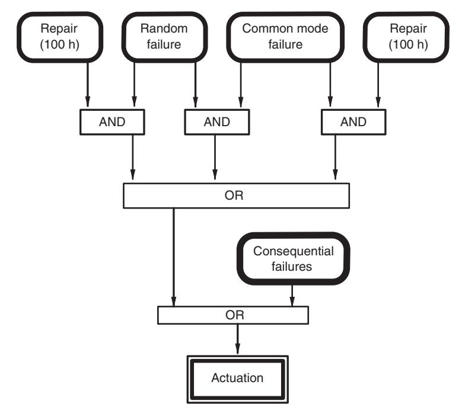

*FIG. 41.1. Failure combinations according to KTA Rule 3501 in Germany [41.4].*

Guidelines) and the Rules of the Committee of Nuclear Techniques (KTA Rules) as well as some standards published by the German Electrotechnical Commission (DKE), which collaborates with the IEC. Governmental organizations work with the IAEA and therefore support its Codes. Some of the design requirements are severe, leading to complex I&C systems. Some are possibly more onerous than those acceptable in other countries and of these, the most important are as follows:

- At least two diverse initiation channels in the RPS must detect those PIEs in the safety analysis which, in the event of malfunction, could lead to serious consequences.
- A failure criterion requires the capacity to survive a certain combination of single and common mode/cause failures as well as repairs of up to 100 h duration (Fig. 41.1).
- There are less strict design requirements for systems which govern those PIEs which, in the case of malfunction, would lead to less serious consequences (see also Section 27).
- Manual intervention as a protective action must not be required for the first 30 min after the start of an event but may take place during that time for 'obviously enhancing' activities.

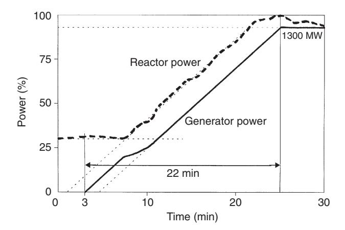

FIG. 41.2. A fast increase of turbine power to full load after a turbine trip (Grohnde 1430 MW(e) NPP, 1983).

— Plant autonomy for 10 h is required in the case of an externally caused accident such as a damaged or uninhabitable MCR. There must be enough cooling water and emergency power (together with their associated Leittechnik systems in the emergency control room) in the emergency feed building.

## 41.2.2. Operational requirements

The German power plants are part of the European interconnected grid, which means that only a relatively small power change capability (about 1–2%/min) is necessary for normal load following. Even large local disturbances outside Germany can be covered by not more than twice this figure. However, Germany has several utilities. Some of them (in the west) have no NPP, some (in the centre and south) generate more than 60% of their electricity from nuclear energy and some (in the north) produce up to 80% in this way. All try to operate in accordance with consumption inside their own areas and this fact, plus extensive investigation into how to localize disturbances and to recover from grid breakdown, has led to somewhat excessive load following requirements by the Federal German Grid Association. In the range from 40 to 100% of rated power, these are:

- Ramps of:
  - ±10%/min of rated power over 20%;
  - ±5%/min of rated power over 50%.
- 'Steps' of 5% of rated power at  $\pm 60\%$ /min ( $\pm 1\%$ /s), 5 min apart.

Additional and important operational capabilities are:

- Quick startup (after a trip) from 0 to 100% of rated generator power (Fig. 41.2);
- Load rejection to house load for an unrestricted period (done by partial rod dropping for quick power cutback without the need for more than 45% turbine bypass).

Commissioning and other demonstrations have shown that the plants easily meet these needs.

# 41.3. FEATURES OF KWU PWR TYPE NPPs AND THEIR LEITTECHNIK SYSTEMS

#### **41.3.1. KWU capabilities**

KWU has been a turnkey supplier of BWR and PWR light and heavy water NPPs as well as an NSSS-only contractor. In all cases, however, it has always held overall responsibility especially for reactor safety and has therefore been deeply involved in the development of the KTA Rules, contributing experience in development, design and construction. At an early stage, KWU developed advanced Leittechnik equipment for conventional power plants and was able to use this as a basis for development to meet the special needs of the nuclear industry. KWU is now collaborating with EdF and Framatome (through their joint company Nuclear Power International (NPI)) in the design of the European Pressurized Water Reactor (EPR).

The following describes NPPs which are in operation but nearly all of the activities and tools described can be used for backfitting or upgrading and are applicable to the EPR.

#### **41.3.2. Special features of PWR type NPPs**

German PWR type NPPs of the 1980s are designed with secured areas, i.e. the reactor and emergency feed buildings, which are protected against external influences such as earthquake, military aircraft impact, explosion pressure waves or actions of third parties. There are also areas, such as the switchgear and the turbine building, for which reduced protection is accepted. Residual heat removal systems, comprising the high pressure injection and high and low pressure heat removal systems as well as the emergency feedwater and diesel–electrical supply systems, are fourfold redundant and placed in four different locations. The safety related I&C systems are installed in two sets of four physically separated rooms in the switchgear building and in the emergency feed building. Battery buffered low voltage (24 VDC) control circuits are usual. The Leittechnik cabinets have two separate power supplies: two sets of four batteries for DC supply (Fig. 20.2) and two groups of four diesel generators for AC supply.

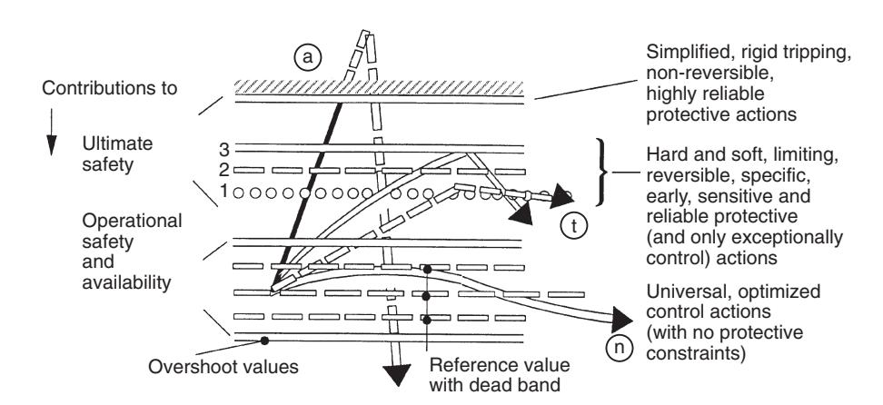

*FIG. 41.3. Concept of defence in depth in KWU Leittechnik. (a: accidents; t: transients and disturbances; n: normal operation.)*

#### **41.3.3. Special features of Leittechnik systems**

Leittechnik is based on a unique semiconductor system which has clearly defined signal types at different voltage and current levels for the safety systems, safety related systems and non-categorized Leittechnik systems. The black box technique is used in self-sufficient subsystems, such as ventilation. All systems are electrically isolated from each other and protected against excessive voltages by a decoupling concept which defines distinct, moderately sized Leittechnik islands. These are contained inside the four separated (redundant) rooms and priority of protection and limitation signals is ensured by special priority modules.

Dynamic pulsed signals are used widely within the protection system and rather less so within the limitation systems. They replace static signals and provide a higher degree of failure detection. An enlarged dynamic magnetic core system is used for logic gating to initiate protective actions.

Diverse and fourfold redundant limitations are used in the area between the classical RPS and the control systems. This results in a multilevel defence in depth concept (Figs 27.1 and 41.3) which has been developed step by step as experience has been gained during simulation, design study, commissioning, operation, etc. It enhances overall operational safety and is discussed in more detail in Section 41.8 (see also Section 27).

All control rods are black, i.e. they are completely absorbing although, for mechanical reasons, they have grey steel tips. Controlled insertion of single rods, pairs or groups of rods, or even all rods — which corresponds to a reactor trip — is employed as a control action by the limitation functions and slow automatic runback takes place at the end of a transient. The existence of this controlled rod dropping capability enhances the reliability of special scrams because of the diverse command train. Thus:

- The protection system de-energizes the rod coils via mechanical switches from the 220 V, battery buffered DC supply of each four rod group and, additionally, opens the switches of the AC supply to the rectifiers.
- The limitation systems de-energize each gripper coil via electronic switches (Elektronische Stab-Betätigung (electronic control rod actuation), ELSTABE).

An automatic test computer is used for diagnoses and periodic testing of the reactor protection and limitation systems. This is additional to the self-checking capabilities.

The Process Information System (Computer Aided) (PRISCA) provides information on status and actions for the whole plant and, especially, assists in understanding the complex functions provided by the global, integrated defence in depth Leittechnik system. It does this by displaying human factors oriented, highly abstracted diagrams on VDUs (Section 41.10). The design comprises redundant, distributed computing structures:

- Four process computers for data acquisition, each installed in a physically separated room;
- Two main data processing computers;
- 30 VDUs, each with its own controller.

The high degree of automation and the use of staggered echelons of defence have changed the role of the operating staff considerably (Table 27.1 and Fig. 16.2):

- Operators have become observers and optimizers of normal operation, including situations which arise during AOOs. They use basic information and diagrams to meet operation and disturbance goals.
- Under abnormal circumstances the operators become accident managers, using all kinds of information to meet protection goals.

The operation and maintenance information is complemented by surveillance systems such as those for loose parts monitoring, vibration monitoring and fatigue monitoring [41.5].

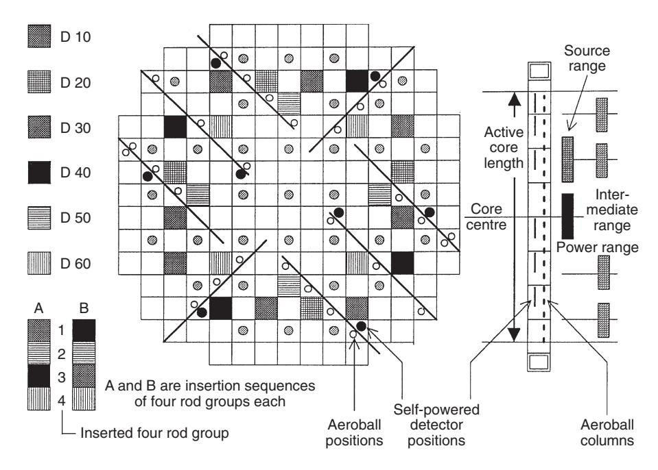

*FIG. 41.4. Core cross-section of a 1300/1400 MW(e) KWU PWR type NPP.*

# 41.4. MEASUREMENT SYSTEMS

# **41.4.1. Neutron measurement**

Neutron measurement is provided by an out-of-core and an in-core measurement system [41.6, 41.7]. The latter has two parts: an in-core detector system and the KWU special 'Aeroball' system [41.8]. The original installation in all plants used analog techniques but these had to be enhanced after considerable signal noise was experienced following the introduction of the core low leakage loading concept [41.9]. The newly developed, completely digitalized SINUPERM N system [41.6, 41.7] has already successfully been applied for backfitting at the Borssele NPP in the Netherlands.

(a) The out-of-core (integral flux) measurement system is of conventional, three range design and is used for monitoring as well as for protection purposes. The axial location of the detectors is shown in Fig. 41.4. The source range covers 10–11–10–5 of rated power. It has two groups of four BF3 counters (one low and three high pressure) in each set. The intermediate range measures from 10–7 to 125% of rated power with four single g compensated chambers. The power range channel covers 1–125% of rated power with four groups of four

- chambers. Two of them in each channel are located beside the upper core half and two beside the lower half, thereby providing a rather rough axial distribution term in the power range signal used by the protection system.
- (b) The in-core (local flux) measurement system employs eight lances of six selfpowered (prompt signal) cobalt detectors each. These detectors are located at optimum information positions, not equidistantly along the lances (Fig. 41.4). Two lances are located in the inner and six in the outer core region. Each sensor signal is decoupled and then used in each of the four channels of the respective limitation system, e.g. for power density, PCI and DNBR protection. The measurement range is from about 5% to 250% of local power density.
- (c) The Aeroball system [41.8] is computer controlled. It is used intermittently and carries small steel balls with 1.5% vanadium content through thimbles into the core for about a 3 min irradiation. Thereafter, activation is measured at 28 × 32 spatial points (Fig. 41.4). The data are evaluated by means of the process computer and, after about 10 min, the following time discrete types of results can be made available:
  - 3-D power distributions over 28 × 32 points;
  - Hot channel factors;
  - Peak power densities;
  - The minimum DNBR and its location;
  - Burnup distribution;
  - Isotopic composition of the fuel;
  - Calibration data for the cobalt self-powered neutron detectors used to measure power distribution.

#### **41.4.2. Radiation monitoring**

Radiation measuring functions include those for personnel, areas, systems, radioactive release, contamination and the environment [41.6]. The equipment for systems monitoring and for air monitoring is partly centralized in special shielded compartments. Measurements of safety importance are designed to be redundant or even diverse.

The normal power supply is 24 VDC, but exceptionally 220 VAC is used. Special shielding and the arrangement of detectors ensure maximum sensitivity. Beta/gamma sensitive detector signals are evaluated integrally or on a nuclide specific basis. Most measuring points are self-testing and failures are annunciated automatically. Regular tests for the diagnosis of transducer performance during operation, using radionuclides and electronic test equipment, are also performed.

Analog and binary signals are transmitted to the control room for recording purposes and some are sent to the emergency control room. Some special applications are as follows:

- (a) Main steam activity is monitored continuously by two diverse measurements. Signals are processed in two out of three logic per steam line in the RPS to detect steam generator U tube rupture.
- (b) Some plants have a nuclide specific measurement for the noble gases at the stack. It gives a printout which lists the different noble gas isotopes together with their instantaneous and historical activity releases.
- (c) In addition to equipment for normal operation, the stack instrumentation includes a special high dose measurement system covering up to about 1000 Ci/h (37 TBq/h). Special provisions are made for checking the containment venting for noble gases, iodine, etc., in the case of a core melt accident.
- (d) Special computer applications are available:
  - Two redundant minicomputers determine the rate of emission of radioactive noble gases;
  - An analysis and a summary of the nuclide specific results from noble gas measurement at the stack can be made if requested.

#### **41.4.3. Special measurements**

- (a) *Average coolant temperature.* This is used in the RPS and the limitation systems and for reactor power control. KWU uses special thermocouples which give quick and accurate responses. They are located in specially machined wells and provide a 50% response in less than 2 s. Calibration is derived from an RTD located in the same well as the thermocouple. The plug connected detectors can be changed easily with the system at operating pressure and temperature.
- (b) *Coolant temperature at fuel element outlet.* Three thermocouples at the level of the fuel element head in each of the eight in-core detector lances (total 24) indicate between 250 and 350∞C for seven groups and between 0 and 1000∞C for one group. These measurements are used for in-core detector surveillance and to provide limited information about the radial power distribution.
- (c) *Temperature of reactor vessel lid.* Three thermocouples placed at the centre of the reactor vessel lid, at its rim and between these two positions indicate between 0 and 400∞C. They help detect a possible unwanted bubble under the lid.
- (d) *Coolant (collapsed) level inside reactor vessel.* Three heated RTDs are located in each of the two special axial lances inside the reactor vessel, two groups of two at the lowest level of the main coolant piping, one at its highest level and the sixth a little higher [41.10]. Because of the mechanical configuration, these measurements provide information on low coolant level in the event of a LOCA (the situation at TMI).
- (e) *Post-accident monitoring system.* According to KTA Rule 3502 [41.11], each plant must have accident instrumentation comprising accident display and

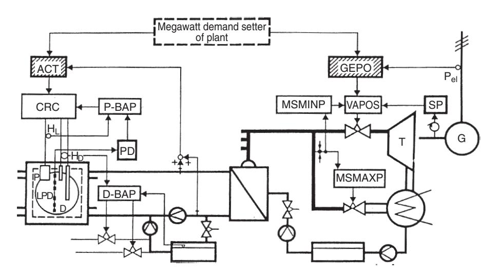

*FIG. 41.5. KWU NPP reactor and turbine power control systems. (ACT: average coolant temperature; P-BAP: P bank position; D-BAP: D bank position; PD: power distribution; GEPO: generator power; VAPOS: valve position; SP: speed; MSMINP: main steam minimum pressure; MSMAXP: main steam maximum pressure; CRC: control rod control; P: power control rod bank; D: Doppler control rod bank; LPD: local power detector; Pel: electrical power; G: generator; T: turbine.)*

accident recording. The first of these is divided into primary, wide range and detail displays:

- The primary display contains measurements which permit judgement on whether all countermeasures have worked correctly and what radiological consequences to the environment have to be expected. There are 21 specified signals for PWRs; all are indicated in the MCR and in the emergency control room.
- The wide range display contains eight specified measurements for PWRs. They may be used to observe the approach to and possible breach of design limits during unexpected accidents beyond design.
- The detail display is equivalent to the normal instrumentation.

## 41.5. PLANT AND REACTOR CONTROL SYSTEMS

#### **41.5.1. Plant power control function**

The plant power control function of a PWR type NPP is performed by two, effectively separate, control systems, one for the generator and one for the reactor (Fig. 41.5). Well balanced collaboration between them for startup, power operations

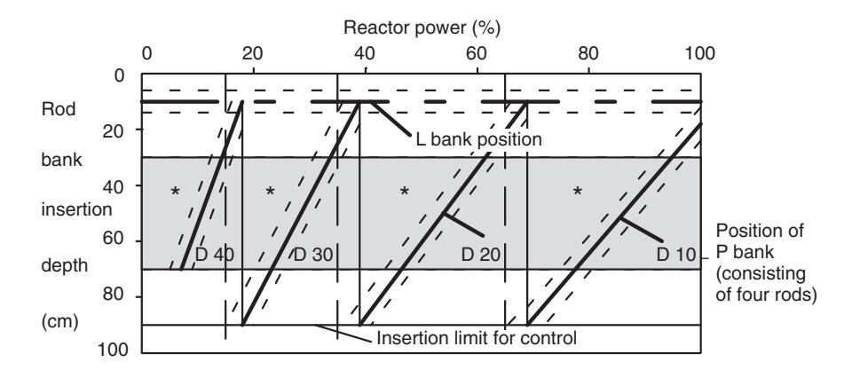

*FIG. 41.6. Rod bank insertion sequence. (An asterisk denotes an area to be avoided in the long term.)*

of all kinds and, if possible, for the most frequent disturbed situations is achieved partly by design and partly by the action of limitation functions [41.12, 41.13].

Two different modes of operation may be distinguished:

- (a) *Reactor follows turbine mode.* Power operation means:
  - Baseload operation with constant or scheduled load;
  - Load following operation with:
    - A frequency control function for small but frequent variations; and/or
    - An arbitrary load control function for large but less frequent changes.

Additional features are advantageous. They include:

- Quick power setback down to house load for an unlimited time and with not more than 45% of turbine bypass in the case of grid disturbance;
- Quick return to load after a trip in order to restore the grid situation and, as far as possible, to override xenon buildup.

During these kinds of operation, generator power is controlled according to the power demand by means of a remote reference value and/or by a value derived from the actual frequency deviation. The reactor power is adjusted using average coolant temperature control (see below).

The main control objectives, depending on the chosen physical plant design and the control philosophy, are to:

— Optimize the use of fuel and other materials by optimizing efficiency and by minimizing thermal stresses, especially to materials which are inaccessible and/or irreplaceable.

- Optimize the power distribution in the reactor core. This may mean low leakage loading and will involve minimizing absorbing material in the core. Thus, all control rods should be nearly fully withdrawn at full power (Fig. 41.6).
- Ensure careful treatment of final control elements. For example, control rod movements, pressurizer heater switching and demineralized water consumption should be minimized (the last by use of the natural behaviour of xenon/samarium).
- Exploit all inherent negative (stabilizing) reactivity feedback mechanisms, such as those of the fuel and (most of the time) the coolant temperature.
- Keep the average coolant temperature nearly constant in the upper power range to minimize temperature changes (and therefore stresses to materials) caused by load variation and by any surges of coolant into or out of the pressurizer. In the low power range the average coolant temperature is decreased by keeping the fresh steam temperature constant. This saves on the design pressure margin of the safety valves.
- (b) *Turbine follows reactor mode.* When the plant is not coupled to the grid, e.g. during startup, the neutron flux control function determines reactor power and the water–steam system, consisting of the turbine with its bypass and the steam generators, is adjusted in power by the steam maximum pressure control function. This is a threefold redundant limit control function with the turbine bypass as its final control element (Fig. 41.5).

There is another situation to be considered. If power production cannot match demand, for example because of component failure such as a pump trip, the reactor power is automatically limited or even decreased by power limitation functions. In these cases generator power is first decreased by the limitation function to a certain level (in conjunction with reactor power) and then finally controlled by the steam minimum pressure control function (also a limit control function), which operates the valve position controller and keeps the steam pressure at its power dependent reference value (Fig. 41.5). The objective in this case is to avoid interrupting power production.

## **41.5.2. Reactor power control function**

In load following operation, different control loops interacting in cascade (Fig. 41.7) are governed either by the average coolant temperature control function (ACT-CF) or, with priority, by the axial power distribution control function (PD-CF) via the control loop coupler (CLC). For simplicity, Fig. 41.7 does not show the neutron flux control function, which works instead of the ACT-CF in startup operation. The reference value of the ACT-CF is constant in the upper power range (between 50 and 100%). That of the PD-CF is chosen to keep the small (natural) bottom power peak at rated level during the entire burnup cycle and to maintain a larger bottom peak during part-load so as to prepare for a quick power increase by rod withdrawal. Rod bank position control functions (L-BAP-CF and D-BAP-CF) cause the rod banks to work around their load dependent, preset working points (Fig. 41.6). The control valves for feeding boric acid and demineralized water to the main coolant cycle are used as final control elements, mainly for the D bank position control function, but also as fine control elements for the ACT-CF to compensate xenon and burnup reactivity automatically (especially in the first fuel cycle). The burnable poison in the fuel is also a factor in this case.

The D bank of control rods is a weak bank comprising four groups of four (black) rods. When power is decreased slowly to part-load they are inserted one group after another into the core (Fig. 41.6). For a quicker decrease, they all move together and reset themselves slowly and automatically after stabilization of the transient. Four different insertion sequences are selectable by the operator during plant

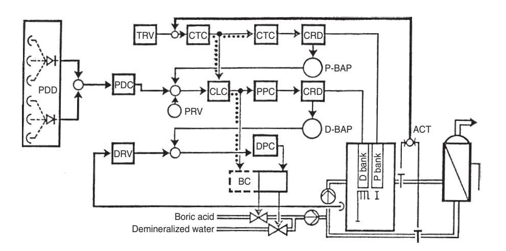

*FIG. 41.7. Reactor power control equipment. (PDD: power distribution detectors; PDC: power distribution control; TRV: temperature reference value; CTC: coolant temperature control; CRD: control rod drives; P-BAP: P bank position; PRV: stationary P bank reference value; CLC: control loop coupler; PPC: P bank position control; D-BAP: D bank position; DRV: D bank reference value; DPC: D bank position control; BC: burnup control; ACT: average coolant temperature.)*

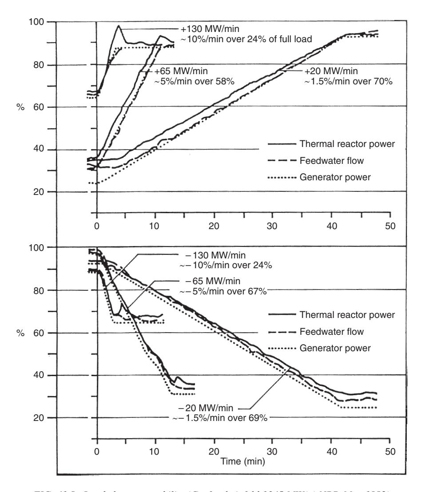

*FIG. 41.8. Load change capability (Grafenrheinfeld 1345 MW(e) NPP, May 1982).*

operation (e.g. 1, 2, 3 and 4 in Fig. 41.4) from a total of six groups (D 10 to D 60). They are changed about every two weeks in order to prevent irregular local rod burnup. In this way good long term radial/azimuthal power distribution is obtained in spite of sometimes deep rod insertion. Locations for all of the insertion sequences within the core cross-section are also chosen to optimize and ensure necessary information from the in-core power distribution detectors. The D bank is used as the final control element of the ACT-CF most of the time and this results in movement to compensate the reactor power dependent Doppler reactivity. It is also used, not often but then with priority, for the L bank position control function.

The L bank consists of all control rods which are not D rods. This bank has a strong influence on axial power shape and only a few centimetres of movement are needed for effective axial power distribution control. This bank can therefore be used in only a limited way for temporary support to the D bank for integral reactor power control.

# 41.6. OPERATIONAL REQUIREMENTS

#### **41.6.1. Normal load following capability**

As early as the early 1970s, German utilities stipulated load following capability in their turnkey contracts. This had to be demonstrated to the purchaser and to the licensing authorities as part of the commissioning and trial operations. An example is shown in Fig. 41.8. Demonstrations of load following in the middle or at the end of burnup cycles were demanded for completion. Many reports, with numerous examples, are available on daily load cycles with respect to environmental conditions, weekend cycles and arbitrary load following operation [41.13–41.16].

#### **41.6.2. Operational occurrences**

Load following capability is incomplete unless it includes fast return to full power together with fast and safe response to grid and internal disturbances. A quick startup (particularly shortly after a turbine trip) from 0 to 100% of rated power in 20–40 min is required. Figure 41.2 shows an example for the Grohnde plant in 1983. The capability of performing startup to full load several times within a short period has also been demonstrated.

Load rejection down to house load for any duration with only 45% bypass to the turbine (using the quick power setback function via rod dropping) was introduced at the commissioning of Biblis A in 1974.

Quick reactor power setback to avoid reactor or turbine trip in the event of a large main coolant or feedwater pump trip is another important feature. German plants always have a spare (third) feedwater pump, but if the two operational pumps trip without the third starting automatically, scram is initiated by the relevant limitation function.

# 41.7. REACTOR PROTECTION SYSTEM

#### **41.7.1. Characteristics**

In German terminology the RPS includes both the protection and the safety feature actuation system (called the engineered safety system in some other countries). It is designed according to the regulatory requirements noted above, particularly KTA Rule 3501 [41.4]. It must also, of course, be in accord with the safety analysis of the relevant plant.

As already explained above, the German RPS may differ from others in having the following features:

- A strong requirement for two diverse initiation criteria for each PIE.
- A deterministic failure criterion (Fig. 41.1) which leads to a two times two out of three design as a minimum for redundancy and functional diversity.
- Automation such that no manual intervention is necessary during the first 30 min following a PIE. This means a substantial extension of automated functions and necessary resources. Manual interventions are permitted but only within certain limits and only in the case of obviously enhancing activities.

Further specialities are summarized below:

- Physical separation of redundant channels by specific design with four separate rooms for relevant equipment.
- Specially developed magnetic core equipment which uses, in the main, pulsed signals for the non-disturbed situation and which is actuated when the pulses are interrupted.
- The installation of relevant parts of this equipment in a building which, like the reactor containment itself, is protected against external events. This emergency feed building, also with four separated sections, contains the emergency control room to be used if the MCR and its staff become unavailable, and has resources for 10 h of operation (e.g. water storage and pumping equipment together with the small, second group of four diesel generators).

## **41.7.2. Structure**

The structure of the RPS is shown in Fig. 41.9. The parts concerned with reactor and turbine trips are located in the less protected areas because of their failsafe characteristics. Sections for acquiring measured data, analog processing, limit value formation and logic gating are threefold or even fourfold redundant. Logic gating, accomplished by the dynamic (pulsed) magnetic core system mentioned

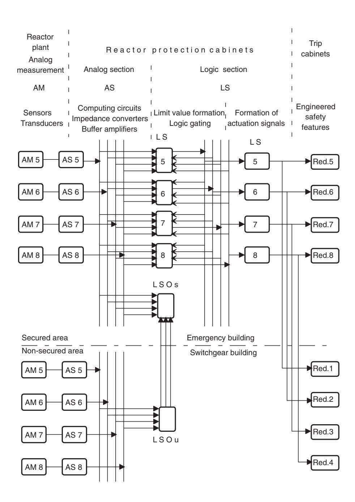

*FIG. 41.9. Reactor protection system for a KWU PWR. (LSOs: logic section module in secured area; LSOu: logic section module in unsecured area; Red. 1–8: trip cabinets.)*

above, has been used successfully by KWU in many NPPs. The output signals for all protective actions are generated by such logic gating and priority for RPS actuation signals over those of limitation, manual and control functions is ensured.

Some auxiliary systems which provide emergency power or ventilation are designed under the same conditions as the relevant parts of the RPS itself.

#### **41.7.3. Postulated initiating events**

About 15 initiating events are postulated. They include:

- Disturbances during startup, faulty rod movements and boron dilution;
- Coolant system leaks of different sizes and steam generator tube ruptures;
- Steam line breaks at different locations and faulty opening of bypass valves;
- Faulty closing of main steam isolation valves and feedwater disturbances;
- Coolant or feedwater pump trips, power supply failures and possible consequences of external disturbances.

# **41.7.4. Protective actions**

Protective actions include:

- Reactor and turbine trip plus containment isolation;
- High and low pressure core cooling from storage tanks or from the containment sump;
- Extra boration from the boric acid accumulators;
- Operation of main and low flow feedwater systems as well as of relief valves;
- Emergency feedwater and emergency diesel generator operation.

#### **41.7.5. Necessary measurements**

Necessary information is gained by measurements such as:

- Neutron flux/reactor power:
  - ∑ Out-of-core neutron flux (see above);
  - ∑ Integral power from coolant temperature rise;
  - ∑ Uncorrected, shape corrected and short term corrected power signals.
- Coolant pressure plus inlet and average coolant temperatures;
- Speed of coolant pumps and hence coolant flow;
- Levels in the pressurizer and steam generators;
- Activity at the main steam lines;

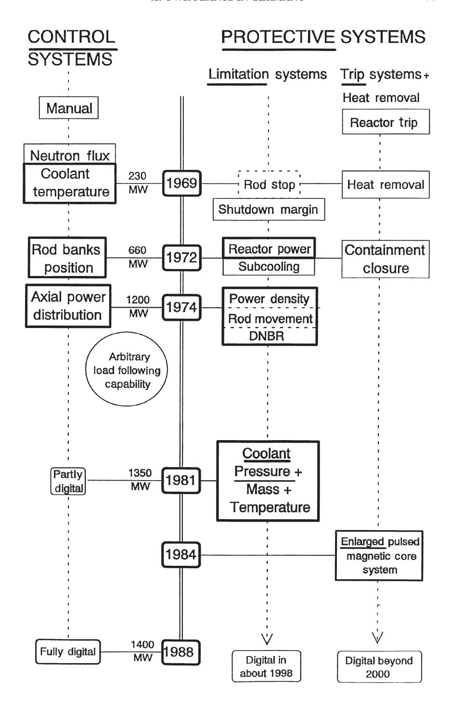

*FIG. 41.10. Development of main Leittechnik systems.*

- Steam generator pressure drops;
- Relative atmospheric pressure inside the containment;
- Some voltages and frequencies.

#### 41.8. LIMITATION SYSTEMS

# **41.8.1. General**

As already mentioned, the structure of Leittechnik systems important to safety for the KWU PWR type NPPs of the 1980s follows a multilevel, defence in depth concept. This is described and required by KTA Rule 3501 [41.4] and comprises:

- The classical protection system;
- Protection limitations;
- 'Autarchic' functional groups (these are sequence control functions which are standalone subsystems used inside the protection system, e.g. the I&C systems for the high and low pressure emergency core cooling systems);
- Manual actions.

Separate chapters of KTA Rule 3501 are concerned with condition limitations and alarms.

This was not the situation at the beginning of the German nuclear power programme. Limitation systems were first introduced in the 1970s as control grade systems but, after considerable experience of simulation and operation with step by step enhancement and enlargement, they were reviewed, restructured and requalified to the level of protection subsystems (Fig. 41.10) [41.17–41.20]. These 'grey', protection and condition limitation functions are now provided in the operational region between the classical protection function (black) and the normal control functions (white). They combine some of the intelligence features of closed loop control systems with (nearly) the high reliability of protection systems. Section 27 discusses in more detail their history, operating region, assignment to categories, principal characteristics and advantages.

The main concept in applying limitation functions is that, since the consequences in the event of their malfunction are less severe by comparison with that of the RPS, they may be permitted reduced requirements for reliability. This enables more functionality to be applied, producing much more intelligent behaviour. Their built-in capability for diagnosis allows the early and sensitive application of optimized countermeasures to all anticipated operational occurrences as well as to some which have not been experienced before. This minimizes the frequency of accidents and stress to plant components and avoids the interruption of power production.

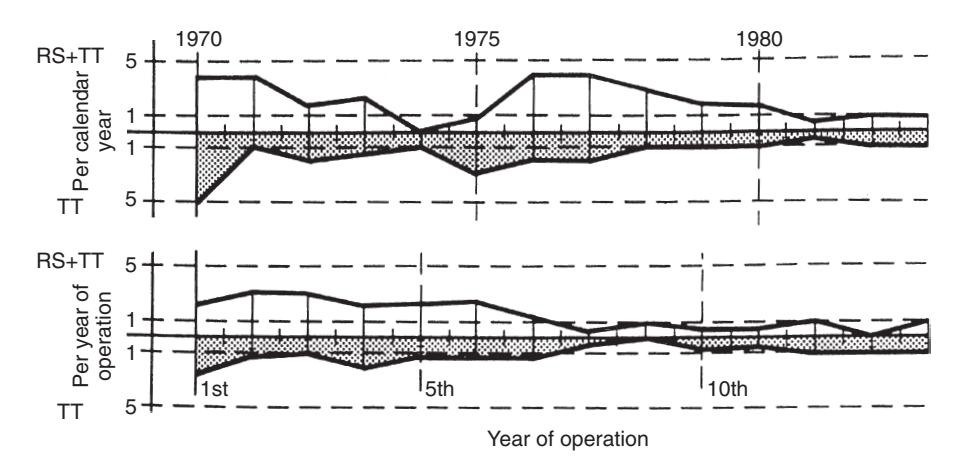

*FIG. 41.11. Turbine trips (TT) and reactor scrams plus turbine trips (RS + TT) in KWU PWR type NPPs.*

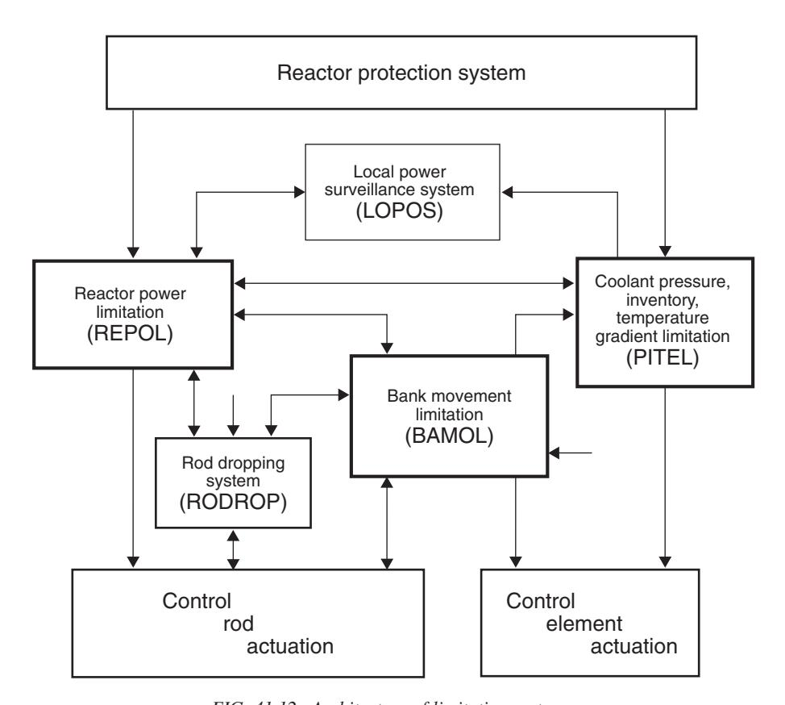

*FIG. 41.12. Architecture of limitation systems.*

They differ from the classical part of the protection system in that a second initiation criterion is not required for protection limitations but, nevertheless, each limitation is of four channel design. This is done so that the minimum requirement of two out of three is complemented by a hot testing and repair channel. It must be assumed that the repair of such complicated channels may not always be possible in the required 100 h maximum allowed by KTA Rule 3501 (Fig. 41.1). However, normal operation with a system in a two out of four mode enhances the reliability of its function by about an order of magnitude above that of a two out of three implementation.

The most obvious, but not necessarily the most important advantage of limitation functions is the avoidance of scrams and the occurrence of fewer trips without scram. Figure 41.11 shows results from early years [41.21].

#### **41.8.2. Survey of limitation systems**

All limitation systems can be grouped into three main systems according to their functions (Fig. 41.12). These are:

- Reactor power limitation system (REPOL) group;
- Bank movement limitation system (BAMOL) group;
- Coolant pressure, inventory and temperature gradient limitation system (PITEL).

REPOL is supplemented by the local power surveillance system (LOPOS), which mainly processes the in-core power distribution signals as input to REPOL.

It is also supported by the rod dropping system (RODROP), which processes output signals from REPOL to implement control rod dropping. The control rod actuation system executes actuating signals by providing the impulse patterns necessary to control the rod drive mechanisms and by realizing the hierarchy of control rod drive commands. With increasing priority it actuates:

- Closed loop control system commands;
- Manually given commands;
- Limitation system commands.

It also processes analog and digital control rod position measuring signals and the final control element actuation system actuates pumps and valves.

A special, distributed, redundant information system tells the operator about the status and the action status of all limitation functions. This information is presented via VDUs (large screens in later plants) either on or in front of the operator's desk or at tables in the control room (see below).

# **41.8.3. Reactor power limitation function**

Each subfunction of REPOL comprises redundant trains, all of which receive the same set of measurement signals. Four input signals are always used and, for processing, the second largest value in the safety relevant direction is selected. This is done to exclude single failures due, for example, to detector deficiencies or transducer drifts. Each processing train has at least some limit value monitors (bistables) and corresponding monitors are interconnected to provide synchronism between the four trains. The limit values are set in echelons, thus contributing to the multilevel defence concept.

The binary output signals are either directly combined in priority logic or used to deduce the maximum permitted reactor power (PERM) signals. REPOL actuations are then initiated if necessary. PERM is the main REPOL signal because the margin between the directly measured reactor power and PERM may be used as input to a set of staggered limit values, thus permitting well graded REPOL actuation. If a time dependent runback or a setback of the power level is required by REPOL, then the maximum permitted generator power, deduced from PERM, causes the closed loop generator power control system to reduce the generator power directly but smoothly.

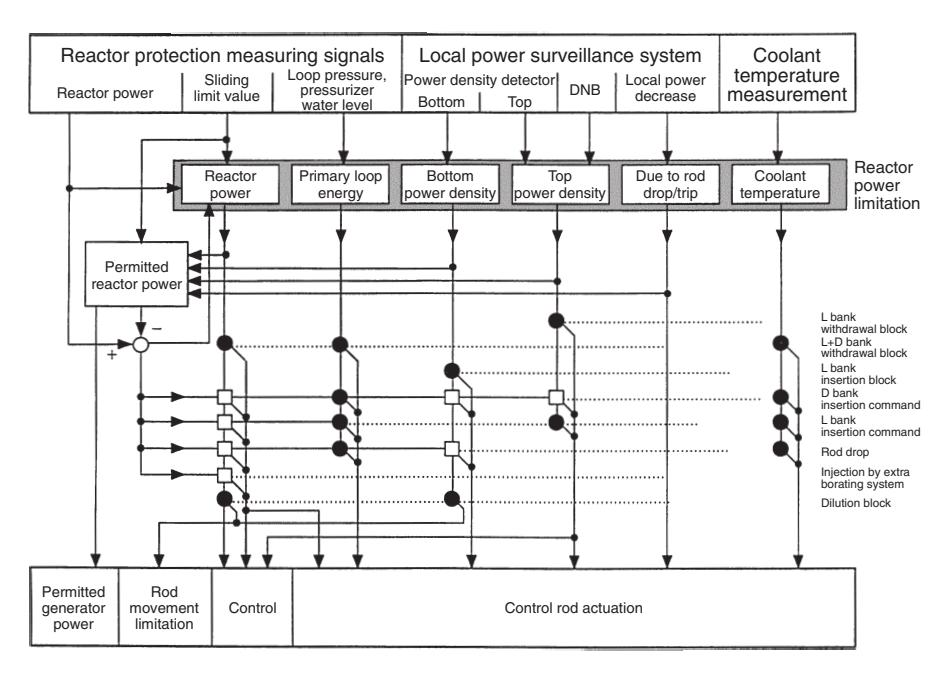

*FIG. 41.13. Initiation functions and countermeasure actuations of limitation functions. (Full circle: direct countermeasure; open square: countermeasure via reduction of permitted reactor power.)*

If this optimized transition is not available or is unsuccessful, the live steam minimum pressure control function actuates the same generator power control system, but later and much more harshly.

The (global) REPOL function has the following subfunctions:

- Limitation of integral reactor power. This, too, has subfunctions for the following situations:
  - ∑ Small disturbances in constant load operation, including the prevention of a compensating power increase by the automatic control system in the case of an erroneously dropped rod (detected by changes of all out-of-core and in-core measurement signals);
  - ∑ Necessary quick setbacks in cases such as main coolant pump trips (initiated from pump speed measurements) and feedwater pump trips (initiated from feedwater flow measurements).
- Limitation of local power density in the top core half. This is done with a sliding set point to, for example:
  - ∑ Avoid local PCI;
  - ∑ Avoid local DNB at three vertical levels of SPNDs;
  - ∑ Ensure the initial conditions assumed in the safety analysis in the event of a LOCA.
- Limitation of local reactor power in the bottom core half to, for example:
  - ∑ Avoid local PCI;
  - ∑ Ensure the initial LOCA conditions.
- Limitation of average coolant temperature.
- Balancing of reactor and generator powers by quick adjustment of the reactor power in the case of an unexpected generator power setback. This is identified from the primary loop energy content sensed by coolant pressure combined with pressurizer level changes.

Both of the above local power limitation subfunctions are associated with preventive control of integral reactor power. REPOL actuation signals are mainly sent directly to the control rod actuation system (Fig. 41.13) but they also provide inputs to other control or limitation systems. The control rod actuation system combines the signals of the four REPOL sections in two out of four voting logic to decide actuations.

#### **41.8.4. Bank movement limitation function**

The bank movement limitation system was originally designed to ensure necessary shutdown reactivity margin for reactor trips and limits the permitted insertion of control rods. This is done because the necessary reactivity to achieve shutdown cannot itself be measured. Each fourfold redundant channel of BAMOL is given the positions of all the control rods located in one quadrant of the core crosssection. These positions are measured in both analog and digital form and significant disagreement between the two causes preventive reduction of PERM in the relevant REPOL channel.

The working position of the L bank is only some centimetres inside the core and the bank has a relatively small insertion limit (about a quarter of the core height) (Fig. 41.6). That of the D bank is power dependent. For the L bank, single value limit monitors initiate:

- Blocking of demineralized water injection;
- Blocking of any further L bank insertion.

If the D bank reaches actuation values the following actions are initiated:

- Blocking of demineralized water injection;
- Injection of boric acid via the two pipes of the normal injection system;
- Boration via the four pipes of the extra borating system.

After scram the withdrawal speed of the L bank is limited with respect to the permitted reactivity insertion rate.

The limitation function of the boron concentration mass flow to the reactor coolant loops is closely connected with the main objective of BAMOL. This limitation permits injection into the primary loop only if boron concentrations are higher than the burnup dependent value corresponding to the subcritical hot reactor state. It becomes active if the reactor is shut down or works at power via some modules of REPOL.

To ensure the operability of BAMOL, even during external impact on the NPP, special electronic equipment is located in the emergency feed building. These devices identify the plant status as either in power operation or shut down. During shutdown the operator periodically has to inform the circuitry of the operator's own ability to work in the control room, otherwise feeding of demineralized water is terminated after a certain time. This is, of course, well known as a 'dead man' interlock and ensures that the operator is available.

# **41.8.5. Coolant pressure, inventory and temperature gradient limitation functions**

PITEL comprises functions which limit the operational regions of process variables in the reactor coolant system. The most important of these by far is the limitation of coolant pressure versus coolant temperature and the maintenance of pressure within correct limits, depending on the situation. There are about ten operational diagrams which differ from one another in various ways. Examples are as follows:

- The normal, frequently used path from startup to power operation and back contains only a small but distinct and sufficient area free from the need for any limitation action. For example:
- ∑ Pressure that is too high at low temperature is prohibited because of the brittle fracture characteristics of the reactor vessel;
- ∑ Pressure that is too low at high temperature is prohibited to protect the main coolant pumps against cavitation.
- Infrequent high pressure hydrostatic testing of the primary system at relatively low temperature must be carried out, however, and a manual signal opens a window in the limited area diagram to permit this test for a certain time.
- Infrequent main coolant pump trips also need additional operating room to allow for the transient situation and the diagram is adapted to these needs by identifying the pump trip through speed monitoring. The same signal also initiates necessary power setback countermeasures.

There are other situations, such as reactor scram, residual heat transfer, quick temperature decrease, steam generator tube rupture and LOCA, which are identified and which influence the working diagram. With increased practical experience, the coolant pressure limitation function has become more and more important. It is easy to understand if an appropriate information system with diagram display capability exists (see below).

Less important aspects of PITEL are:

- Limitation of reactor coolant system inventory during normal operation. To this end, a pressurizer level reference value is prescribed, dependent on the coolant temperature. During warming up or cooling down of the primary loop, a minimum level is ensured. A special module supervises the reactor coolant system status when the pressurizer is being filled to allow degassing and hydrostatic pressure testing.
- Limitation of coolant temperature gradient. This limits stress on the reactor vessel caused by temperature changes during warming up or cooling down of the plant.

#### **41.8.6. Limitation subfunctions**

There are functions which serve the global limitation function and which have unusual features. Examples are as follows:

- (a) *Local power surveillance system (LOPOS).* This takes measuring signals from the in-core power distribution detectors and examines them for measuring errors. The first and second maximum power density values for the top and bottom halves of the core are then determined. A local power actuation value with respect to DNB is also calculated from the power distribution signals, reactor coolant inlet temperature, coolant pressure and main coolant pump speed. Additionally, rapid local power decreases are detected so that measures required to counter the effects of an unintentionally dropped control rod can be initiated.
- (b) *Rod dropping system (RODROP).* Control rod dropping is an aspect of the reactor power limitation function which permits fast power setback and RODROP is therefore classified as part of the protection limitation system. The central control rod and rod pairs of the D bank are dropped in an insertion sequence identical to the programmed sequences selected for control purposes. Furthermore, in the case of load rejection or during a decrease of reactor coolant flow, the rod dropping subfunction reduces reactor power to keep the plant running and to increase availability by avoiding scrams. If scram really becomes necessary, a dropping command is given to all control rods as well as to the RPS. Finally, control rod dropping may be initiated manually from the control room. This is used particularly during commissioning tests on single rods.

# 41.9. CONTROL ROOM DESIGN

The last three German PWR type NPPs have nearly identical MCRs. These are designed according to KTA Rule 3904 [41.22], which is equivalent to IEC 964 [41.23]. They also have similar supplementary control points in the separate, bunkered emergency feed buildings. These are designed according to the same German rule and to IEC 965 [41.24] (which has similar requirements).

In these rooms the mini-module technique used on all German NPPs, with many mimic diagrams on the desks and panels and with electrically isolated ±24 VDC powered push-button controls [41.25], has been further enhanced by total standardization. This has been done in spite of the fact that the three plants are owned by different utilities and are licensed by different but co-ordinated authorities (Figs 41.14 and 41.15). The number of VDUs has been expanded to about thirty in order to achieve enough display space to inform the entire control room staff at the same time (Fig. 41.16). In practice, two groups of three VDUs are sited in front of each operator together with a large display panel consisting of two sets of four VDUs (expandable to three sets of five VDUs or replaceable by other large (backprojected) screens). The VDU based information panel (of the two times four VDUs) can be

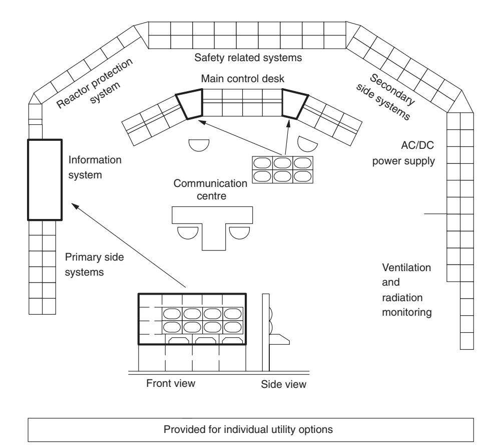

FIG. 41.14. Plan of a Konvoi main control room.

interpreted as a limitation function panel because these functions are too complex for display with conventional equipment. There is a special, hard-wired panel for the protection system.

There are three alarm classes:

- Safety alarms (about 10), which require clearly defined manual protective actions (mostly after more than 30 min);
- Class I alarms (about 500) to indicate a safety system failure;
- Class II alarms (about 1000) for other failures.

The back of the control room provides options specified by the individual utility, such as supervisory task information, access control or work permission management.

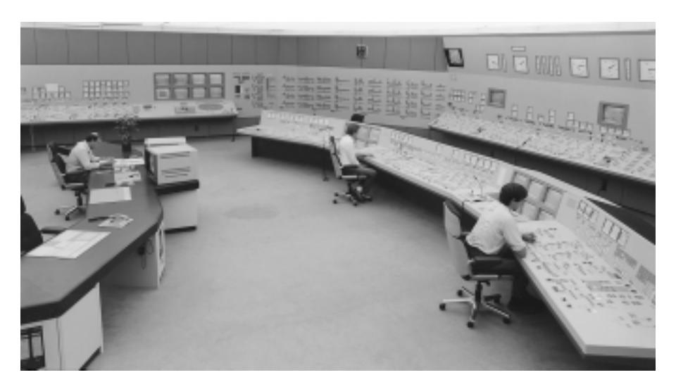

*FIG. 41.15. View of a Konvoi main control room.*

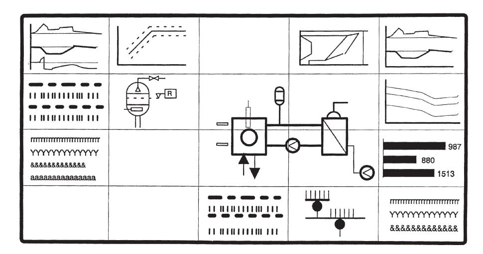

*FIG. 41.16. Essence of an integral information display.*

#### 41.10. PROCESS INFORMATION SYSTEM

PRISCA, the computerized part of the plant information system (Fig. 41.17), has been fitted to the last four German PWRs. It is a multiple unit, process computer system with distributed peripheral processors in each of the four sections of the switchgear building. These mainly perform the acquisition of measured data (analog

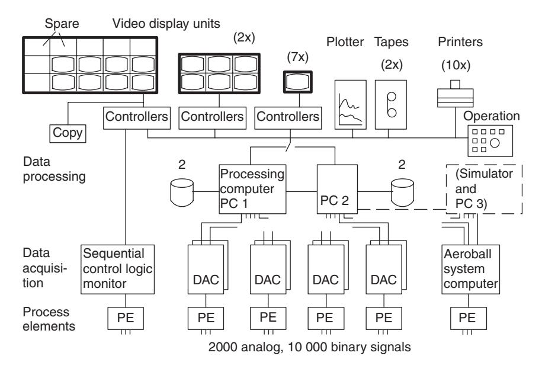

*FIG. 41.17. PRISCA distributed computer system.*

and binary), adaptation of different signal levels and data transmission to the main processors. These processors are Siemens 3287 type, 32 bit process computers. Tasks of PRISCA include plant monitoring, centralization of operating logs and logging of alarms and measured values to assist fault analysis.

Special Siemens computers, compatible with the main process computers, are additionally used for the pre-evaluation of Aeroball data and for feeding these to the main process computers to enable the physics program. Other, special computers are used for sequential control monitoring and an on-line simulator may optionally be installed. Other process computer programs include the recording of process variables in normal operation and during disturbances for incident review purposes. This includes analog and binary data, switching data and alarms. Sampling for statistical purposes is also carried out and covers the frequency of certain states, of occupancy of certain values and of particular switching operations. The main target of system development has been new kinds of information handling and display as required by and explained in more detail in IEC 1772 [41.26] (see also Refs [41.27– 41.31]).

For a more thorough and detailed understanding of limitation function status and action status, enhanced display is needed, but this had not been possible with past equipment, including computers. All operating German plants which are being backfitted with qualified limitation systems are also expected to upgrade the related information systems. To make them effective, diagrams are given new quality and/or style. About forty diagrams of the *x*–*y* type, with up to two hundred analog and binary signal inputs each, are needed to show different kinds of information in different planes. Many of these must be validated one against the other or against computed variables because of the paucity or absence of measurable quantities. The background plane contains design data, such as those of the part-load diagram which gives the dependences of temperatures and pressures on load. In the middle planes are the actual locations of working points, reference and target values, measured values of special interest and dotted or star pointed lines setting out historical information. The lines may be extrapolated into the future for a quick and simple prediction of behaviour. The foreground plane contains information on balances such as reactor to generator power or flows into and out of any system or tank. These are shown as more or less vertical or horizontal lines or as symbolic weighbridges. Additionally to all this information, special icons may point to helpful associated information in other display formats. A further speciality is the provision of selection points which permit either the actuation of switches to bring normally hidden information to the foreground (and back again) or quick access to associated trend curves (on separate screens) in specially designed combinations for quick comparison and understanding.

Another important feature, 'format sets', makes possible the display of complete aspects plus different views of a given situation. This may include accidents, disturbances and goals as well as systems and functions. By use of the documentation capability these systems offer the possibility not only to repeat the course of any transient on any time-scale on-site or in a laboratory but also to run it forwards and backwards for detailed analysis. Examples of formats are the core crosssection with all its measurements, the axial power distribution with all limitation terms, the action status of control and limitation functions or the coolant pressure

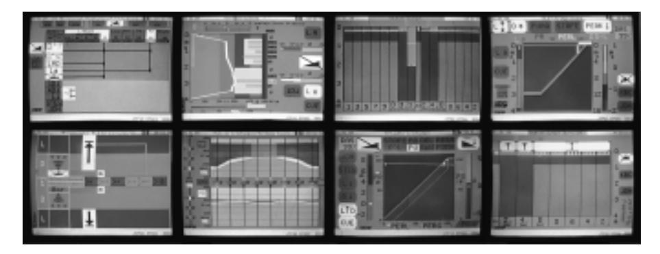

*FIG. 41.18. A format set showing characteristics of the power density limitation function for the bottom core half.*

limitation diagram. Examples of format sets are those around the core such as the coolant system, the power density limitation of the bottom core half (Fig. 41.18) or those concerned with load changes, pump trips, rod drops, reactor scrams or even a steam generator tube rupture. They can be changed or rearranged according to the special needs of the situation.

This freedom and flexibility of display, together with the different modes of access and changes in formats and sets, ensure that any user, operator or adviser can handle the system according to the individual's special way of thinking and managing, preferably by selection with the aid of pictorial menus.

#### 41.11. POWER SUPPLY CONCEPTS AND DIVERSE REACTOR TRIPPING

A 24 VDC rated battery is installed in each of the four physically separated rooms of the switchgear and the emergency feed building. The electronic cabinets are grouped into pairs and each pair is supplied via diodes by two different batteries, each cabinet by the battery in its own room as well as by the battery in a neighbouring room. Thus, in terms of power supply, the rooms are cyclically connected, providing a double power supply for each cabinet, with both voltages conducted to a busbar common to each pair of cabinets. A special electronic device prepares the power supply for analog signal processing (Section 41.3 and Fig. 20.2).

The control rod drive mechanisms (CRDMs) are all equivalent and are powered by four rectifiers delivering 220 VDC in parallel to a large battery. The power for the four rods of each rod group is fed first via mechanical switches and then, for each rod, through semiconductor switches. The latter are used for the execution of normal control commands and for scramming on actuation by a limitation system via ELSTABE (Section 41.3.3). A scram caused by the classical RPS is ensured by opening both kinds of switches at the same time as the switches on the primary side of the rectifiers and the switch on the battery. Because the semiconductor switches are the fastest and because they cause no material stress, this solution is both reliable and effective.

The alarm system is supplied by a special busbar which can keep the alarm system running in spite of loss of power to the related functions.

#### 41.12. CURRENT AND FUTURE DEVELOPMENTS

The upgrading and backfitting of plants in operation, as well as the design of new plants, are taking into account the consequences of rapidly changing technology, particularly the way in which digital techniques are developing. The process computers of German NPPs had, from the very beginning, very high standards in

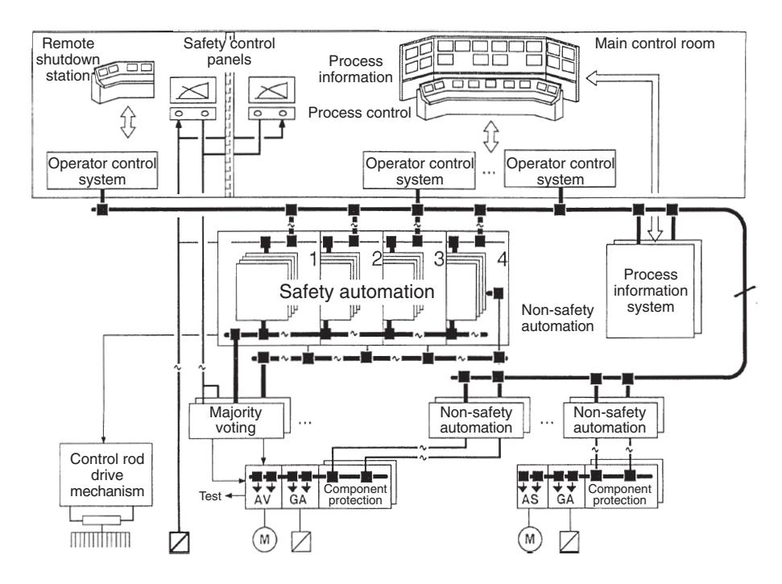

FIG. 41.19. A fully digital KWU NPP Leittechnik system. (~ fibre optics; AS: drive control interface; AV: priority drive control interface; GA: analog signal conditioning; M: actuating device, e.g. electric motor.)

hardware and software [41.32, 41.33]. Digitalized surveillance systems such as those to monitor loose parts (LPMS), vibration (VMS), fatigue (FAMOS) and reactivity (SINUPERM-M) have been used for years [41.5]. The fourth generation of NPP Leittechnik (Table 41.1) also features digitalized reactor power control functions to a growing extent [41.34]. However, to date, there are no digital protection or protection limitation functions in German NPPs. The reasons for this are, in summary:

- The enormous capability and complex functionality of the special, tailored solid state I&C systems important to safety, especially that made available by applying defence in depth techniques even inside I&C systems;
- The high reliability and partial self-testing of the solid state hardware with which current I&C systems are implemented (EDM, SIMATIC, ISKAMATIC);
- The existing extremely good degree of operator information via:
  - Well proven miniaturized control room equipment;
  - Capable process computers.

Nevertheless, after a lifetime of 15–25 years, some backfitting becomes necessary and the opportunity is usually taken to upgrade or enhance the relevant functions. To be prepared for this and to be able to design new plants, KWU started (in the 1980s) some special developments on digitalized Leittechnik systems important to safety:

- (a) The first step was the installation of the advanced process information system PRISCA in the Konvoi NPPs and in special applications in all NPPs with generation 4 Leittechnik (Sections 41.9 and 41.10).
- (b) The second step was the development and installation of digitalized non-safetyrelated I&C equipment for conventional process control applications: the Siemens TELEPERM-M system in generation 4 Leittechnik [41.34].
- (c) Thirdly, screen and touch panel based process controls have been developed. They were first applied in 1994 at Unit 5 of the conventional Staudinger plant to get practical experience before installation in an NPP [41.35].
- (d) The last step remains the digitalization of equipment and systems for functions important to safety. This would create a system like that in Fig. 41.19 with multiple functions in three categories following a defence in depth structure.

In recent years, one design team has succeeded in developing, testing and licensing a complete digitalized neutron measurement system, SINUPERM-N. It has been in successful operation since early 1994 in a generation 2 Leittechnik plant [41.6, 41.7]. Another team is aiming to backfit and enhance the reactor control and limitation functions of the generation 3 Leittechnik. At the time of their installation (in the 1970s) these systems did not have the extent of functionality fitted to the generation 4 units (of the 1980s), nor did their protection limitation functions undergo protection grade qualification. The result of the new design will be a digitalized, qualified solution with few changes from the functionality used in generation 4.

As has already been mentioned, KWU is a partner in NPI, which is designing the EPR. To this project, as well as to all following ones, KWU will contribute knowledge from thirty years of NPP Leittechnik experience plus that gained since early 1987 in developing a new digitalized system for functions important to safety — the Siemens TELEPERM XS [41.36, 41.37]. The guidelines for these developments have been:

- To retain the proven functionality and, where possible, the functional and hardware diversity of German NPP Leittechnik design but:
  - ∑ To incorporate small, necessary changes based on experience;
  - ∑ To allow for modifications arising from the characteristics of the digital technique;
  - ∑ To take the chance of common enhancement and upgrading.

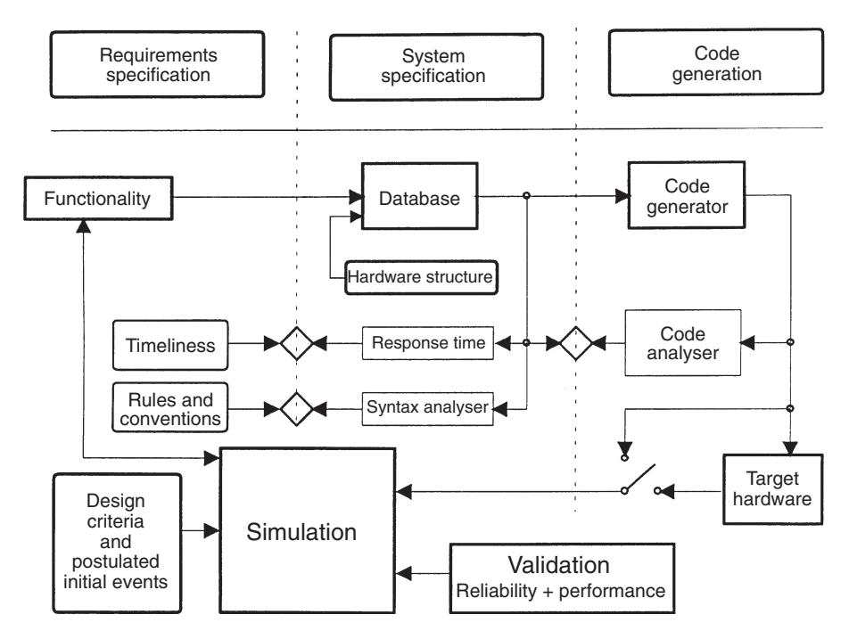

*FIG. 41.20. System design process for advanced Leittechnik systems.*

- To use, as much as possible, standard equipment though it may cause higher structural requirements.
- To use, as much as possible, tools of the highest level for software development together with specifying and programming methods which minimize design failure and ease licensing.

Current and future developments will take into account all relevant international codes and standards, including IAEA Safety Guides and IEC standards, as well as German regulations such as the KTA Rules [41.38].

The system design process (Fig. 41.20) uses a tool kit called SPACE, specially developed to eliminate the well known sources of most failures in software generation and verification processes by supporting a multiuser, graphical, formal specification and coding environment which is very difficult, or even impossible, to misunderstand. The functional specification of plant and I&C functions, presented in the form of words, diagrams or schedules or by any other documentation methods, is translated into connections of standardized functional modules in the manner used more than thirty years ago for programming hybrid NPP simulators. This is laid down in a central database known as INGRES. The predeveloped functional modules (less than fifty) have been extremely carefully tested independently of any application. Their application specific connections have been formally tested using several diverse methods such as those for syntax, for required response time and for code analysis. The code analysis also detects endless loops. Well proven compilers automatically produce the codes for the target hardware as well as for simulators and do the necessary verification (Fig. 41.20). Simulation permits prototype testing of the implemented functions, including the assessment of execution times and bus loads, as well as giving hints for eventual necessary hardware expansions.

About twenty modules of some Siemens/KWU systems have been chosen as hardware especially qualified for systems important to safety. They include:

- Nine analog and digital I/O modules (SIMATIC S5 family);
- Seven bus coupling modules of different types (SINEC-H1/L2);
- Two data handling and communication processors (MMC 216).

The system design has two out of three or two out of four redundancy plus necessary diversity, majority voting, earthquake resistance, improved electromagnetic compatibility and decoupling by fibre optics. Drastically curtailed system software providing a strictly limited number of services with detailed diagnostic capabilities contributes to the very high reliability of the global system. This system software has cyclical processing (signifying independence of the behaviour of the power plant), internal synchronization, automatic recurrent tests and limitation of failure propagation. The computer based forward documentation and automatic software verification immediately support the licensing procedure by furnishing evidence of functionality and reliability and will, later, also support all kinds of maintenance.

There are proposals for the far future which would enhance the first line of defence in order to minimize still further the probability of propagation of small disturbances into accidents [41.39]. The intelligent diagnostic capabilities of computer based systems may be used to compare the behaviour of the plant with a great variety of identification criteria in order to identify a disturbance early and with high probability. This permits action which at first uses the optimal (and therefore the minimal) countermeasure. If the decision happens to be incorrect, a new optimal countermeasure may be actuated.

# **REFERENCES**

- [41.1] ALEITE, W., Reactor instrumentation and control in nuclear plants in Germany, Kerntechnik **58** (1993) 104–114.
- [41.2] ALEITE, W., "Leittechnik in kerntechnischen Anlagen, Stand und Ausblick", Proc. Specialists Mtg on Humans and Chips in Nuclear Techniques: Techniques of Information Processing, Bonn, 1987, INFORUM Verlag, Bonn (1988) 11–42.
- [41.3] Datenblatt zur Leittechnik in Kernkraftwerken Nr. 20: Gemeinschaftskernkraftwerk Neckar Block II (KONVOI — KKW GKN II), Brennst.-Wärme-Kraft **45** (1993) 395–404.
- [41.4] BUNDESMINISTER DES INNEREN, KERNTECHNISCHER AUSSCHUSS, Safety Rules of the KTA, No. 3501: Reactor Protection System and Surveillance of Safety Equipment, Heymanns, Cologne (1985) (in German).
- [41.5] MIKSCH, M., STREICHER, V., KWU's Series '86 (surveillance) systems increase life expectancy, availability and safety, Nucl. Eng. Int. **33** 404 (1988) 27–33.
- [41.6] DIO, W.-H., GROSSE-SCHULTE, M., Radiation and neutron flux monitoring in nuclear power plants, Kernenergie **58** (1993) 76–83.
- [41.7] DIO, W.-H., MAYER, W., SYCH, W., Neutronenmeßsysteme für Leichtwasserreaktoren, Atomwirtschaft **10** (1993) 476–478.
- [41.8] DIO, W.-H., REEB, B., SCHMID, P., HURTIENNE, E., "Rechnergesteuertes Kugelmeß-System für KWU-DWR", Proc. Jahrestagung Kerntechnik, Berlin, 1980, Fachinformationszentrum Energie, Physik, Mathematik, Eggenstein-Leopoldshafen (1980) 819–822.
- [41.9] GRONDEY, G., HARMS, R., KUMPF, H., WINDERL, G., "Low frequency noise in PWRs and its influence on the normal operational characteristics of the plant", Proc. Specialists Mtg on In-core Instrumentation and Reactor Core Assessment, Pittsburgh, 1991, OECD, Paris (1992) 183–191.
- [41.10] SCHMIDT, H., REIMANN, H., KIEHNE, H., Ein neues Verfahren für die Füllstandsmessung im Reaktordruckbehälter von Druckwasserreaktoren, VGB-Kraftwerkstechnik **65** (1985) 648–656.
- [41.11] BUNDESMINISTER DES INNEREN, KERNTECHNISCHER AUSSCHUSS, Safety Rules of the KTA, No. 3502: Accident Instrumentation, Heymanns, Cologne (1994) (in German).
- [41.12] ALEITE, W., "Full load-follow capability of KWU PWR NPP by full automated power control", Proc. IFAC Symp. on Power Systems and Power Plant Control, Beijing, 1986 (WANG Pinyang, Ed.), China Research Inst. of Printing Science and Technology Computer Typesetting Research and Experiment Center (Pergamon Press) (1986) 197–202.
- [41.13] ALEITE, W., "1300 MW Kernkraftwerke im Lastfolgebetrieb", Kraftwerke 1975 (Proc. Congr. Hamburg, 1975), VGB-Dampftechnik, Essen (1975) 345–358.
- [41.14] ALEITE, W., BOCK, H.-W., GRÜN, A., SENGLER, G., "Load-follow and power distribution control strategy and demonstration of KWU-PWR power plants", Proc. IAEA NPPCI/IWG Specialists Mtg on Nuclear Power Plant Control Problems Associated with Load Following and Network Transients, Cadarache, 1977, Centre d'études nucléaires de Saclay, Gif-sur-Yvette (1977).

- [41.15] ALEITE, W., VON JAN, R., "Reasons for load follow capability of KWU PWR NPP", ENC '86 (Proc. Conf. Geneva, 1986), Vol. 2, European Nuclear Soc., Bern (1986) 105–110.
- [41.16] ALEITE, W., "Lastfolgefähigkeiten von Kernkraftwerken mit Druckwasserreaktoren", Kraftwerke 1985 (Proc. Congr. Essen, 1985), VGB-Kraftwerkstechnik, Essen (1985) 315–321.
- [41.17] ALEITE, W., "Improved safety and availability by limitation systems", Proc. ENS Int. Topical Mtg on Nuclear Power Reactor Safety, Brussels, 1978, Vol. 1, Belgian Section of American Nuclear Soc., Mol (1979) 599–610.
- [41.18] ALEITE, W., BOCK, H.-W., FISCHER, H.-D., "(Protection) limitation systems", Proc. ANS Thermal Reactor Safety Mtg Knoxville, 1980, Oak Ridge Natl Lab., TN (1980) 1032–1039.
- [41.19] ALEITE, W., "Defence in depth by 'Leittechnique' systems with graded intelligence", Nuclear Power Plant Control and Instrumentation 1982 (Proc. Symp. Munich, 1982), IAEA, Vienna (1983) 301–319.
- [41.20] ALEITE, W., GREMM, O., "Status of NPP automation in the Federal Republic of Germany", Balancing Automation and Human Action in Nuclear Power Plants (Proc. Symp. Munich, 1990), IAEA, Vienna (1991) 33–54.
- [41.21] ALEITE, W., "The contribution of KWU PWR NPP Leittechnik important to safety to minimize reactor scram frequency", Proc. Symp. on Reducing the Frequency of Nuclear Reactor Scram, Tokyo, 1986, OECD/NEA, Paris (1987) 403–417.
- [41.22] BUNDESMINISTER DES INNEREN, KERNTECHNISCHER AUSSCHUSS, Safety Rules of the KTA, No. 3904: Main Control Room, Emergency Control Room and Local Control Stations in Nuclear Power Plants, Heymanns, Cologne (1988) (in German).
- [41.23] INTERNATIONAL ELECTROTECHNICAL COMMISSION, Design for Control Rooms of Nuclear Power Plants, Standard 964, IEC, Geneva (1989).
- [41.24] INTERNATIONAL ELECTROTECHNICAL COMMISSION, Supplementary Control Points for Reactor Shutdown without Access to the Main Control Room, Standard 965, IEC, Geneva (1989).
- [41.25] INTERNATIONAL ELECTROTECHNICAL COMMISSION, Operator Controls in Nuclear Power Plants, Standard 1227, IEC, Geneva (1993).
- [41.26] INTERNATIONAL ELECTROTECHNICAL COMMISSION, Visual Display Unit (VDU) Application to Main Control Room in Nuclear Power Plants, Standard 1772, IEC, Geneva (1995).
- [41.27] ALEITE, W., BOCK, H.-W., RUBBEL, E., Video display units in NPP main control rooms: The process information system KWU-PRINS, Siemens Forsch.- Entwicklungsber. **13** 3 (1984).
- [41.28] ALEITE, W., GEYER, K.H., "Safety parameter display system functions are integrated parts of the KWU KONVOI process information system", Proc. 5th ANS/ENS Int. Mtg on Thermal Nuclear Reactor Safety, Karlsruhe, 1984, Vol. 2, Nuclear Research Centre, Karlsruhe (1995) 723–732.
- [41.29] BOCK, H.-W., "Future main control room design for SIEMENS NPP", Man–Machine Interface in the Nuclear Industry (Proc. Conf. Tokyo, 1988), IAEA, Vienna (1988) 613–623.

- [41.30] ALEITE, W., "PRINS/PRISCA application: First commissioning tests and experience", Proc. IAEA Specialists Mtg on Man–Machine Communication for Emergency Operation in Nuclear Power Plants, Schliersee, 1988, Gesellschaft für Reaktorsicherheit, Garching (1988) 85–125.
- [41.31] LÖHR, K.-P., STURM, J., WELKER, W., Erleichterte Prozeßführung durch den Einsatz des Prozeßinformationssystems PRISCA in den KONVOI-Anlagen, VGB-Kraftwerkstechnik **72** (1992) 319–325.
- [41.32] GRAF, G., ZIMMERMANN, M., Die Prozeßrechneranlage des Kernkraftwerks Stade, Atomwirtschaft **16** 11 (1971) 599–600.
- [41.33] CORPUS, W., GRAF, G., HURTIENNE, E., Einsatz eines Doppelrechnersystems im Kernkraftwerk Stade, Siemens-Z. **47** (1973) 530–535.
- [41.34] ALEITE, W., STRUENSEE, S., Leistungs-Regeleinrichtungen und Begrenzungen von Druck- und Siedewasser-Reaktoren, Atomwirtschaft **32** (1987) 129–134.
- [41.35] ARNOLD, C., HESSLER, C., HINZ, W., Screen-based process control in nuclear plants, Kerntechnik **58** (1993) 92–103.
- [41.36] KRAFTWERK UNION, TELEPERM XS: System Description, Rep. KWU-N111- 1001-00-VI.1, Kraftwerk Union (1995).
- [41.37] BOCK, H.-W., GRAF, A., HOFMANN, H.W., Fortschrittliche Leitsysteme für Kernkraftwerke. Fertigstellung der digitalen Sicherheits-Leittechnik TELEPERM XP/XS, VGB-Kraftwerkstechnik **75** (1995) 516–522.
- [41.38] BUNDESMINISTER DES INNEREN, KERNTECHNISCHER AUSSCHUSS, Safety Rules of the KTA, Heymanns, Cologne (1977 onwards) (in German).
- [41.39] ALEITE, W., Protective supervisory control with adequate information functions in PWRs of KWU, Control Theory Adv. Technol. **8** (1992) 593–619.

# **42. I&C CONCEPTS FOR PWR PLANTS IN JAPAN**

#### 42.1. INTRODUCTION

The design of the I&C for the latest operating PWR in Japan is described and the advanced I&C design to be applied to the next PWR (in the basic design stage) is mentioned. The I&C systems discussed include:

- Control systems;
- Reactor protection system;
- Engineered safety features actuation system (ESFAS);
- Control board facilities;
- Post-accident monitoring system (PAMS);
- Plant computers.

#### 42.2. LICENSING CRITERIA

#### **42.2.1. General safety design criteria**

In the licensing stage, the plant design is examined by the Nuclear Safety Commission from the following viewpoints:

- An NPP has to be designed to satisfy the off-site dose and plant staff dose criteria during normal operation and abnormal conditions.
- Defence in depth must be taken into consideration as follows:
  - ∑ The plant has to be designed and manufactured to be reliable and the validity of its design confirmed by testing.
  - ∑ Appropriate alarms have to be provided for the operators so that they can keep the plant in the normal condition when transients occur. If the operators cannot do this, the protection system or the inherent characteristic of the reactor must be able to prevent the plant condition from resulting in an accident.
- Plant safety has to be maintained during and after postulated natural phenomena such as earthquakes and floods.

#### **42.2.2. I&C general licensing requirements**

The general licensing requirements include the following:

- Control systems must be designed to regulate the operating conditions automatically in response to changing plant conditions and to postulated changes in the plant load demand during normal operation.
- Means of monitoring appropriate plant parameters and actuating the alarms quickly in abnormal conditions must be provided.
- The RPS must be designed so that it can measure the process variables, detect abnormal plant conditions and actuate reactor trip automatically in order to maintain the integrity of the core and reactor coolant boundaries.
- The ESFAS must automatically actuate the ESFs with high reliability and maintain containment integrity in the case of a LOCA in order to ensure the safety of the public and the plant staff.
- The safety systems, including the RPS and the ESFAS, must have high reliability, with consideration given to the following points:
  - ∑ Redundancy and mutual independence of redundant channels in order to maintain the safety functions in the case of a single failure in the system;
  - ∑ Protection against interaction between a control system and a safety system;
  - ∑ Maintenance of reactor safety following loss of power;
  - ∑ Testability during plant operation.
- An I&C system must be installed to enable the plant to be kept in the hot shutdown condition from a location outside the MCR.
- A PAMS must be installed to monitor the reactor shutdown and the cooling conditions after a plant accident.

# 42.3. DESIGN GUIDELINES FOR PWR PLANTS

The design criteria for the I&C systems of PWRs are in accordance with the general design criteria described above and are as follows.

#### **42.3.1. Design basis for I&C systems**

The design basis includes the following:

- *Plant control and monitoring.* The systems must meet the requirement for plant automation and the upgrading of various plant control and monitoring functions. The MCR must be designed to reduce the operators' workload by using advanced technology and sharing adequately between human and machine.
- *Plant reliability.* There must be adequate redundancy, in accordance with the importance of each facility, to prevent a spurious plant trip or ESF actuation caused by an I&C system failure. The MTBF target of systems such as the reactor control system must be longer than 100 years.

- *Plant safety.* A safety I&C system must have redundancy and appropriate functional diversity. Any plant transient condition caused by a single random failure in an I&C system must not exceed the conditions for design basis transients.
- *Maintainability.* Systems must be designed so that a failure can be detected as rapidly as possible and can be repaired within a short time during power operation.
- *Testability.* Safety grade I&C systems must be designed to be tested by some means and calibrated during power operation.

#### **42.3.2. Criteria for seismic and environmental conditions**

NPP facilities must be capable of withstanding the effects of any postulated earthquake so that the earthquake will not lead to a plant accident. On this basis, seismic importance classifications have to be defined that are consistent with the functions of the structures, systems and components included in the plant facilities. The I&C systems must be classified into Class As, A, B or C as appropriate to their intended functions and be provided with sufficient assurance of structural and functional integrity, commensurate with the design seismic force defined for each class. The types of earthquake to be considered include:

- The limiting earthquake, i.e. the largest possible earthquake considered in the design;
- The strongest earthquake that might reasonably be expected to occur in a given time span.

Plant facilities which must be designed for both types of earthquake are defined as Class As facilities and those designed for only the latter type are defined as Class A. Thus, the seismic importance classifications include the following four classes of facilities:

- *Class As:* those in which breaks or ruptures could cause a LOCA; those necessary to ensure the capability to shut down the reactor in an emergency and maintain it in a safe shutdown condition; and those which contain and store spent fuels and the reactor containment vessel.
- *Class A:* those required to protect the public from radiation hazards in a reactor accident and where loss of the function could cause radiation hazards to the public, except those included in Class As.
- *Class B:* those related to highly radioactive materials, except those in Classes As and A.

— *Class C:* those related to radioactive materials but which do not fall into any of the other classes; and those not related to any radiation safety functions.

NPP structures, systems and components must also be designed to maintain their specified functions under varying environmental conditions, such as pressure, temperature, humidity and radiation, at the site of installation. These conditions may be associated with normal operation or with abnormal transients. Also, the structures, systems and components important to safety must be designed to maintain their specified safety functions under varying environmental conditions associated with accidents. The following requirements have to be met:

- Such I&C systems must be installed, where practical, outside the containment;
- If the imposed functions do not permit installation outside the containment, equipment must be subject to environment resistance tests and other requirements.

#### **42.3.3. Operating personnel interface**

An NPP has centralized monitoring, i.e. the I&C equipment necessary to ensure the operation and control of essential plant systems installed in the MCR. The central monitoring and control systems used by operating personnel must be designed to facilitate ready monitoring and manipulation of plant systems, relieve the operating personnel from excessive duties and provide high operational reliability.

Basic considerations regarding the operating personnel interface are as follows:

- All information necessary for reliable and safe plant operation must be provided correctly to the operating personnel under any plant operating condition. In other words, during normal plant operation, all information necessary to secure safe and efficient operation must be made available to the operating personnel, and in emergency conditions such information as is necessary to ensure the safe and prompt recovery of the plant must be provided.
- The central control panel is the primary monitoring facility, providing a direct interface between the plant processes and operating personnel. Its design must therefore be based on human factors engineering. For example:
  - ∑ The design and arrangement of the control panel and associated control equipment must be consistent with the frequency of monitoring and operation and the degree of importance of the parameter, particularly in an emergency;
  - ∑ The identification of system control switches must be by graphical system representation;

- ∑ The identification of control switches and instruments must be by shape and colour, according to importance and function;
- ∑ The arrangement and colour identification of alarm indication windows must be according to their importance.
- For displaying plant operating status, coloured CRTs must be used positively and effectively, concentrating necessary information on a minimum number of sets and allowing automatic selection of displays.
- The arrangement of the CRTs must be such that necessary information for plant monitoring and control may be observed adjacent to the operating area. Their installation must be reasonably co-ordinated with conventional (hard-wired) instruments. This arrangement permits monitoring of the plant for continued operation with conventional instruments even if the CRTs should fail.
- The CRT screens must be designed by human factors engineering to display information in formats easily readable by operating personnel. Data display density, display colours, classification of displayed data, etc., must be fully considered.
- The computer and dedicated controls must be utilized to automate and optimize the operation of major plant systems and to relieve operating personnel from excessive duties. The computer must perform overall plant control with adequate operational guidance and also be used to support the operating personnel.
- The computer system must be of a highly reliable configuration and be designed so that any loss of its functions will not affect the continued operation of the plant.

#### 42.4. INSTRUMENTATION

#### **42.4.1. Nuclear instrumentation**

Nuclear instrumentation is intended to measure the power of a reactor. With regard to the total power, it initiates protective functions (e.g. reactor trip) and provides signals to the power control system. It also initiates power distribution protective functions (e.g. power limitation and DNBR limitation), monitors power distribution (for the control of axial power distribution shape) and power changes relative to time (reactor period), and initiates protective functions following power changes (e.g. to protect against rod drop and rod ejection).

Since the power which a reactor produces originates from nuclear fission, which produces a variety of fragments, particles and radiations, the measurement of these products will give information on the reactor power. The most direct method is to detect the thermal fission neutron flux density. The neutron detectors for continuous measurement are installed outside the reactor vessel to improve the reliability of the measuring system — the in-core temperature, pressure and radiation conditions are severe. The out-of-core neutron flux density covers a span of about ten orders of magnitude from source level to full power. This span is generally divided into three ranges:

- Source range;
- Intermediate range (up to 100% power);
- Power range (from 1% power upwards).

These measuring ranges overlap and cover the whole span. The source and intermediate ranges are used only when the reactor is shut down or starting up and are not calibrated to the thermal power.

The power range covers the power conditions of the reactor and is calibrated against the thermal power obtained by calculation. The power in the upper section and that in the lower section of the core can be measured separately with this range and the outputs of the upper and lower detectors are calibrated periodically so that they can be adjusted for changes in the patterns of power distribution, which depend on the degree of fuel burnup. The calibration is performed by using measurements of the incore neutron flux distributions obtained from movable in-core neutron detectors. These are miniaturized neutron detectors which can be moved in thimbles inserted into the instrument tubes at the centre of selected fuel assemblies. As the detector moves from the top of the core to the bottom, the measured values of neutron flux are continuously recorded. In this way a graph of neutron flux against height in the core is produced for that location. Similar measurements are made at a number of different locations to produce a 3-D map of neutron flux. The data are reduced for power distribution monitoring and the calibration mentioned above.

The neutron detectors for nuclear instrumentation have been developed with the following factors taken into consideration: sensitivity, ageing effects, response time, mechanical size and tolerance to interfering radiations and environmental conditions (including post-accident conditions).

#### **42.4.2. Process instrumentation**

The term 'process instrumentation' is normally used for instrumentation which is not essential to safe operation, although some is used in safety systems. All parts of the instrumentation essential for safe operation conform basically to the Japanese General Design Criteria and comply, at least partly, with the relevant Japanese standards, criteria and codes which complement the national guidelines.

(a) *Reactor pressure instrumentation*. Pressurizer pressure and reactor coolant pressure measurement provides a substantially direct measurement of the reactor pressure. The former is used for the pressurizer pressure control systems (which actuate the pressurizer heaters, pressurizer sprays and pressurizer relief valves) and for protective actions such as reactor trip and safety injection initiation. The latter is used for monitoring during plant startup and shutdown, for PAM, to indicate the degree of subcooling in the control room and for interlocks for the pressurizer relief valves and RHR suction valves.

The pressure sensing lines and the transmitters used to obtain reactor pressure, which are in contact with the reactor coolant fluid, conform with the relevant standards and criteria regarding the reactor coolant pressure boundary, earthquakes, etc. This minimizes the probability of reactor coolant release from a sensing line or transmitter. A diaphragm device is employed as the pressurizer pressure sensing element and a Bourdon tube pressure gauge is used as the reactor coolant pressure sensing element.

- (b) *Pressurizer level instrumentation.* Pressurizer level is an important process parameter in a PWR and is used for the pressurizer level control system and for protective actions such as reactor trip. The pressurizer level is measured by a transmitter with bellows as the differential pressure sensing element. To avoid systematic errors due to vapour pressure in the pressurizer, the transmitters are calibrated at the normal operating pressure. The transmitter has differential pressure (d*p*) sensing bellows which can withstand a high static pressure.
- (c) *Coolant temperature instrumentation.* Coolant temperature is used for several purposes, including power control (control rod control), thermal power monitoring and initiation of protective actions. The coolant temperature instrumentation contains narrow range and wide range temperature measuring devices. The narrow and wide range RTDs are directly mounted in thermowells in the hot and cold leg pipes. Narrow range temperature has to be measured within a predetermined response time from the coolant loop. To attain this, the temperature is sensed directly by a fast response type RTD in a thermowell. Three RTDs with thermowells are mounted in a hot leg pipe, spaced 120∞ apart around the circumference. Each is connected to an instrumentation circuit and the three signals are averaged.
- (d) *Coolant flow instrumentation.* This instrumentation monitors the capability of transferring core thermal power to the steam generators and trips the reactor for protection when the capability drops below a tolerable limit. An elbow type flow meter is used for this measurement. The sensing lines are connected to the elbow piping between the steam generator outlet and the reactor coolant pump inlet and convey the differential pressure between the coolant flowing on the inside and the outside radii of the elbow piping to the transmitter. This flow meter only gives relative flow rate and is calibrated against rated flow. The reactor coolant loop has a large diameter and is relatively short. Total pressure loss must be minimized and other types of d*p* measurement are not suitable.

- (e) *Reactor coolant pump instrumentation.* The reactor coolant pump is operated at constant speed and a direct measuring type of pump speed meter has been developed. It replaces the underfrequency, undervoltage detectors used for the protective function. The logic has been simplified, the operating margin increased and the possibility of a spurious trip reduced. The pump instrumentation measures the vibration of the frame and shaft, temperature of bearings, bearing oil pressure, seal water flow, etc.
- (f) *Steam flow instrumentation.* Steam flow is mainly utilized for steam generator level control. The flow meter provides relative flow rates which are calibrated against feedwater flow rates. It has a diaphragm which detects the differential pressure produced along a length of the steam piping which includes the generator flow restrictors. One sensing tap is mounted on the generator body and the other on the steam piping at a point substantially distant from the generator outlet (to obtain sufficient differential pressure to sense).
- (g) *Containment pressure instrumentation.* Containment pressure is an important parameter for LOCA identification within the containment and for PAM. A sensing device (bellows) is installed inside the containment vessel but the transmitter is mounted outside the vessel to avoid deterioration in accuracy due to the hostile environment during an accident. To preserve the containment vessel pressure boundary, a double vessel barrier is attained by the combination of a sensing device (bellows), a pressure impulse line (sealed type) and a receiving device housed in the transmitter.
- (h) *Containment water level instrumentation.* This instrumentation is used for containment vessel level monitoring as part of the PAMS. A differential pressure type system with sealed sensing lines and a diaphragm is used.
- (i) *Signal transmission, conversion and conditioning*
  - *Pneumatic signals.* Pneumatic instrumentation is partly used for less important process signal transmissions and for control signal transmissions to air operated control valves after input conversions have been made.
  - *Analog output signals.* All transmitters use 4–20 mA current signals. Voltage signals are not commonly used because of low noise immunity but they are employed for those indicators, recorders, etc., in the control room which have cable routings with no harmful noise. To maintain signal diversity, multiconductor cables are not used for protection process signals although they are partly used for control room information.

#### **42.4.3. Rod position instrumentation**

(a) *Digital rod position indication system* (Fig. 42.1). This system measures the actual position of each rod using a detector which consists of 42 discrete coils mounted concentrically along the rod drive pressure housing. They

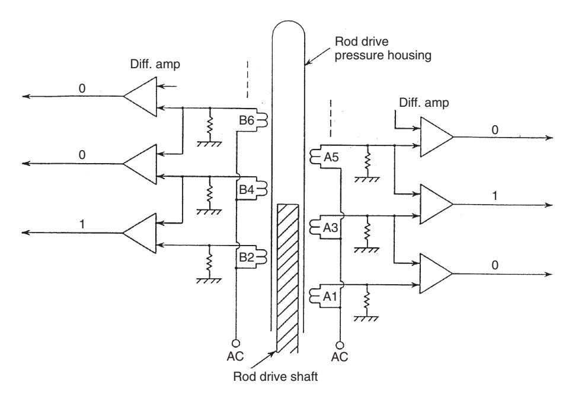

*FIG. 42.1. Digital rod position detection concept for PWR plants in Japan.*

magnetically sense the entry and presence of the rod drive shaft on their centre lines. The coils are interlaced into two data channels and are connected with the containment electronics (data A and B) by separate multiconductor cables. Multiplexing is used to transmit digital position signals from the containment electronics to the control board display unit. The digital position signal is displayed on the main control board by a series of LEDs for each control rod, the one LED which is illuminated in the column showing the position of a particular rod. The use of two separate channels of information enables the digital rod position indication system to continue to function (with reduced accuracy) if one channel fails. Included in the system is a 'rod at the bottom' signal that operates a control room annunciator.

(b) *Demand position indication system.* This system counts pulses generated by the control rod drive system and provides a digital readout of the demanded bank position.

#### **42.4.4. Plant radiation monitoring instrumentation**

(a) *Area radiation monitoring instrumentation.* This instrumentation protects plant personnel from excessive radiation exposure by continuously monitoring radiation levels in relevant areas of the plant. It provides early warning of an abnormal condition which could lead to a health hazard.

- (b) *Process radiation monitoring instrumentation.* This instrumentation continuously measures radiation levels in the relevant processes in order to monitor the release of radioactive material from the plant to the environment and the integrity of the various process systems. It provides warning of any abnormal condition, thus permitting measures to be taken to correct the abnormal condition and limit the radiation release.
- (c) *Detector assemblies.* GM counters are used in the area radiation monitoring instrumentation. The types of detector used for process radiation monitoring instrumentation are selected from GM counters, ionization chambers, NaI(Tl) scintillation detectors and plastic scintillation detectors, taking into account the radiological, physical and chemical characteristics of the effluent. The detector assemblies of the process radiation monitoring instrumentation are divided into in-line and off-line types according to the mode of installation in the effluent stream. The in-line type of detector assembly is installed directly in the effluent stream while the off-line type is installed in a sample collector. Effluent is sent to the sample collector through a radiation sampling line from the effluent stream.
- (d) *Radiation monitoring instrumentation for accident situations.* Radiation monitoring instrumentation with an extended range is installed in order to monitor the condition of the plant during an accident. The functions of this instrumentation for accident situations are as follows:
  - To monitor radioactive material released from the plant in order to estimate influences on the plant environment;
  - To estimate the conditions and seriousness of an accident and provide the necessary information on radioactivity for monitoring its progress;
  - To protect the plant operators from radiation exposure in an accident.

The instrumentation consists of the following:

- Vent stack gas monitors;
- Main steam line monitors;
- Area monitors with a wide measuring range inside the containment.

# 42.5. CONTROL SYSTEMS

The main control systems in Japanese PWR plants include reactor power control, steam generator level control, pressurizer pressure control and pressurizer level control.

#### **42.5.1. Reactor power control**

(a) *Control rod control* (Fig. 42.2; see also Section 42.5.7). The control rods are moved up or down when the deviation between *P*av (primary power) and *P*ref

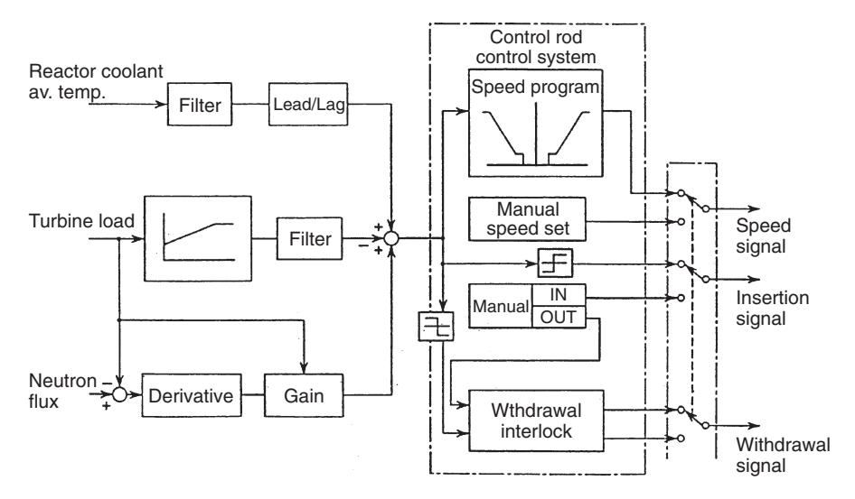

*FIG. 42.2. Control rod control system.*

obtained from the turbine load (secondary power; turbine first stage pressure) exceeds the predetermined set point. The *P*av signal used as a measure of reactor power is compensated by introducing into the system a signal which is proportional to the differential of the deviation between neutron flux and turbine load.

- (b) *Boric acid concentration control.* The boron concentration control system (which requires manual action) is used for relatively long term and slow core reactivity control. Reactivity control (including reactor trip) in response to load changes during normal operation is performed by controlling the rod positions.
- (c) *Combined control concept.* Automatic power control is performed only by control rod movement. Boric acid control is done manually when necessary so that the required rod worth for safe shutdown is maintained and so that the control rods are kept within the rod position limitations by the control bank rod insertion monitor.

# **42.5.2. Reactor pressure control**

Reactor pressure control in the PWR is performed by the pressurizer pressure control system. This provides the capability of maintaining or restoring pressurizer pressure at the design value following normal operational transients which induce pressure changes. It is done by the control of heaters and a spray in the pressurizer. The system also provides steam relief capability by controlling the power relief valves.

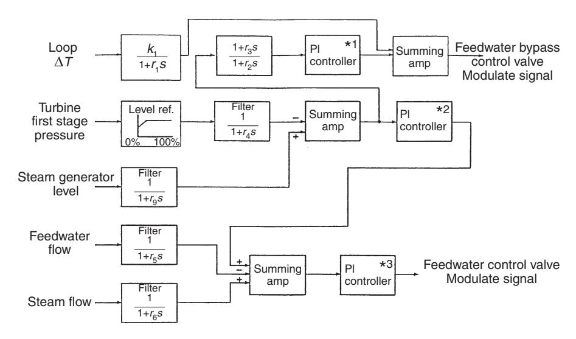

FIG. 42.3. Feedwater control system. (\*1: variable integral time constant by level error;\*2: variable proportional gain by  $\Delta T$ ; \*3: variable proportional gain by input signal.)

#### 42.5.3. Steam generator level control

The steam generator level control system maintains a programmed water level which is a function of turbine load. It is equipped with a three element controller which regulates the feedwater valve by continuously comparing the feedwater flow signal, water level signal, programmed water level and pressure compensated steam flow signal (Fig. 42.3). In addition, for plants with turbine driven main feedwater pumps, the feedwater pump speed is varied to maintain a programmed differential pressure between the steam header and the feed pump discharge header.

#### 42.5.4. Steam pressure control

Steam pressure is maintained at an equilibrium value determined by the heat balance between the heat input to the steam generator and the turbine steam consumption without continuous control during normal operation. However, limitation systems are provided to prevent an unfavourable pressure spike caused by a sudden turbine load reduction.

#### 42.5.5. Steam dump control

The automatic steam dump system is provided to accommodate abnormal load rejections. If the difference between the reference temperature and the lead/lag

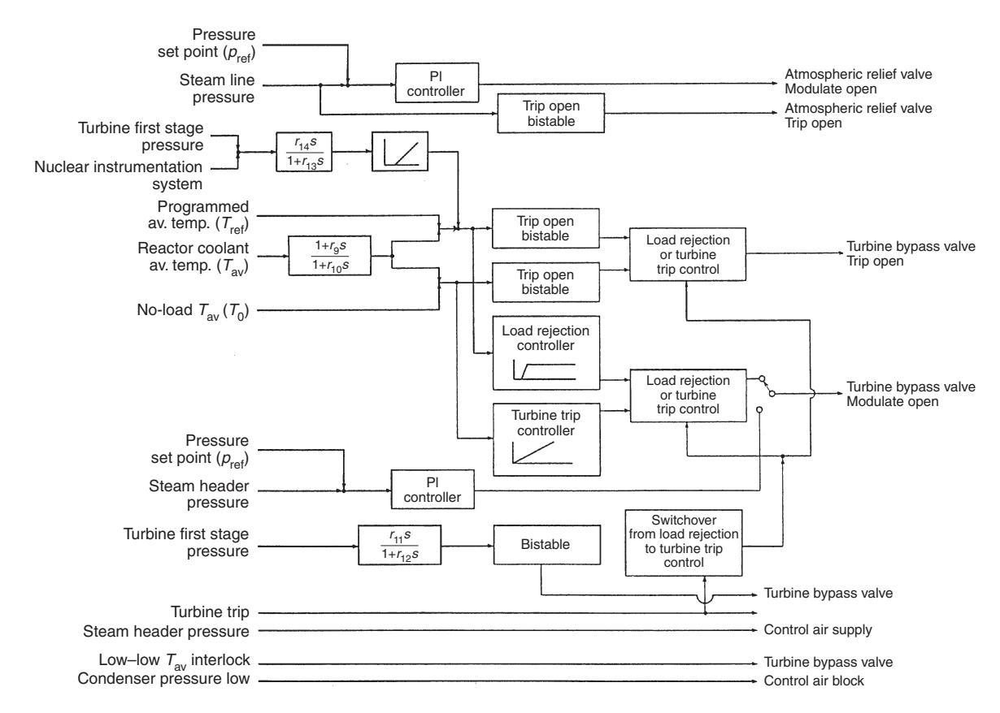

*FIG. 42.4. Steam dump control system.*

compensated average reactor coolant temperature exceeds a predetermined limit, a demand signal will actuate the steam dump to maintain the reactor coolant system temperature within the control range (Fig. 42.4).

#### **42.5.6. Pressurizer level control**

The pressurizer level control system provides the capability of establishing, maintaining and restoring the pressurizer water level to a target value which is a function of the average coolant temperature. It maintains the coolant level in the pressurizer within the prescribed limits by adjusting the flow of the charging and let-down system, thus controlling the reactor coolant water inventory.

#### **42.5.7. Rod control**

The rod control system receives rod speed and direction signals from the reactor control (*P*av control) system. The rod speed demand signal varies over a range corresponding to speeds of 6–72 steps/min depending on the input signal level. Manual control is provided to move a control bank in or out at a prescribed fixed speed. When the turbine load reaches approximately 15% of the rated load, the operator may select the 'auto' mode and rod motion is then controlled by the reactor control system. In the 'auto' mode, the rods are again withdrawn (or inserted) in a predetermined, programmed sequence by the automatic programming equipment. The shutdown banks are always held in the fully withdrawn position during normal operation and are moved to this position at a constant speed by manual control prior to criticality. A reactor trip signal causes them to fall by gravity into the core.

Only the control banks move under automatic control. Each control bank is divided into two groups to obtain smaller incremental reactivity changes per step. All control rods in a group are electrically in parallel so that they move simultaneously. Individual position indication is provided for each rod. A variable speed rod drive programmer has the ability to insert small amounts of reactivity at low speeds to give fine control of reactor coolant average temperature about a small temperature dead band as well as to furnish control at high speeds to correct larger temperature transients.

## **42.5.8. Control bank rod insertion monitoring**

When the reactor is critical, the normal indication of reactivity status in the core is the position of the control bank in relation to the reactor power (measured by the reactor coolant loop differential temperature) and coolant average temperature. These parameters are used to calculate insertion limits for the control banks. Two alarms are provided for each control bank:

- The low alarm warns of an approach to the rod insertion limits, which requires the operator to add boron by following normal procedures with the chemical and volume control system;
- The low–low alarm alerts the operator to take immediate action to add boron to the reactor coolant system by any of several alternative methods.

The purpose of the control bank rod insertion monitor is to give warning of excessive rod insertion. The insertion limit maintains sufficient core reactivity shutdown margin following a reactor trip and provides a limit on the maximum inserted rod worth in the unlikely event of a hypothetical rod ejection. It also limits rod insertion in such a way that acceptable nuclear peaking factors are maintained.

#### **42.5.9. Operational characteristics**

The main operational characteristics are as follows:

- *Step load change.* The plant control system can restore equilibrium conditions (without a trip) following a ±10% step change in load demand over the 15–100% power range under automatic control.
- *Loading and unloading.* Ramp loading and unloading at the rate of 5%/min can be accepted over a range of 15–100% power under automatic control without tripping the plant.
- *Load rejection.* In general, the plant control system is capable of accepting a 50% load reduction from rated power without a trip (the load reduction rate depends on steam dump valve volume). As an option, the plant control system can be designed to accept complete load rejection from rated power without a trip and with continued production of the power required by the plant auxiliary system.

#### **42.5.10. Reactor control system features**

Digital I&C systems using microcomputers have been developed and are applied for the non-safety I&C systems in the latest plants. The main features of the latest reactor control systems are as follows:

- Distributed system architecture is adopted, taking into account the multiple system failures which can be caused by a single computer malfunction.
- Duplex redundant architecture and automatic transfer by self-diagnostics of each subsystem are adopted to improve system reliability. To increase plant availability, process input signals and actuators are improved by:
  - ∑ Input process signal diagnosis and automatic selection (signal selector);

- ∑ Automatic transfer of redundant pneumatic subsystems of the main feedwater control valves.
- Examples of improved control functions and plant automation are:
  - ∑ Automatic control of the feedwater startup valve and a functional improvement of the main and bypass feedwater control function (automatic transfer), etc.;
  - ∑ An automatic control system for plant startup and shutdown.

#### 42.6. SAFETY SYSTEMS

The safety systems generally consist of the RPS and the ESFAS. The instrumentation systems for these provide automatic protection signals against unsafe and improper reactor operation under steady state and transient power conditions and initiate signals to mitigate the consequences of faults. They are required to ensure the integrity of the reactor coolant pressure boundary, the capability to shut down the reactor and maintain it in a safe shutdown condition, and the capability to prevent or mitigate the consequences of accidents which could result in potential off-site exposure. These requirements are compatible with the guidelines in the Japanese General Design Criteria.

#### **42.6.1. Design bases**

The instrumentation systems are designed to initiate automatic protective action signals whenever a condition being monitored reaches a preset level determined in the accident analyses. The following design features are important:

- Single failure criterion (SFC);
- Independence of redundant systems;
- Seismic and environmental qualification (including the induction of CMF);
- Testability.

To preserve redundancy and to ensure that no single failure will prevent actuation of the associated protective function, physical separation is provided for all of the redundant instrumentation systems, including the electrical power supply systems.

In view of the importance of improving plant availability, the I&C systems:

- Preclude the possibility that a single, random failure in the safety and protection system may lead to a plant trip;
- Preclude the possibility that a single failure in a control system may induce a plant trip.

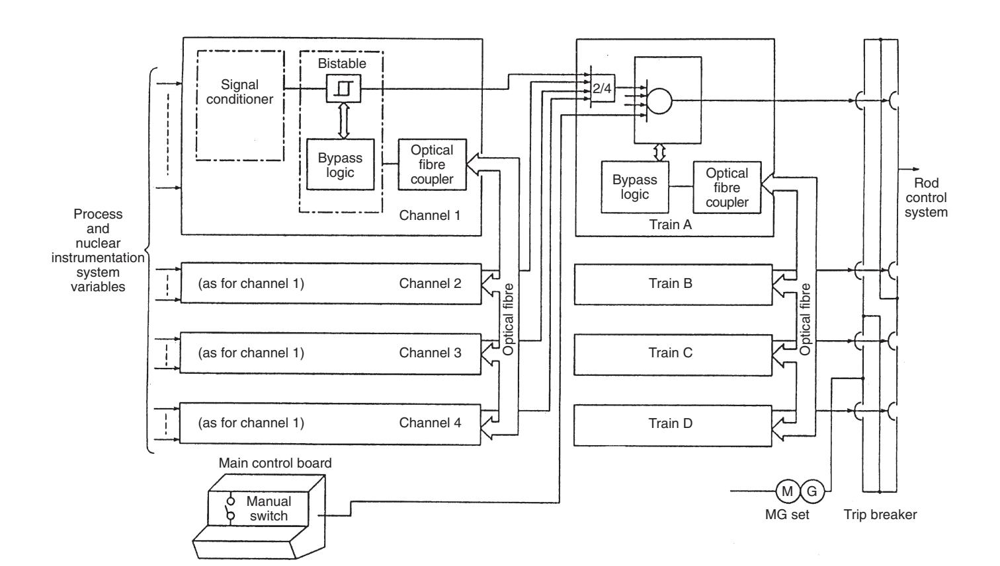

FIG. 42.5. Reactor protection system.

# **42.6.2. Reactor protection system**

The RPS comprises two discrete portions of circuitry (Fig. 42.5):

- An analog portion consisting of four redundant channels per parameter or variable to monitor various plant parameters;
- A logic portion consisting of four logic trains which receive inputs from the analog channels and perform the logic necessary to automatically open the reactor trip breakers.

In the latest plants, the number of analog channels has been changed to four with two out of four logic. This makes it possible to bypass a channel for testing and maintenance without losing redundancy and so improves the reliability of the system (in the conventional operating plants, two out of three logic is used; this may be subject to spurious trips since a channel must be switched to the trip mode during testing or maintenance). Bypass control logic has been applied in order to control the above mentioned bypass operation automatically. This changes the trip logic from two out of four to two out of three if one channel is bypassed and to one out of two if two channels are to be bypassed. In this way redundancy is maintained if one channel is bypassed and not placed in the trip mode. If a second channel is bypassed, the bypass control logic automatically changes it to the trip mode.

In order to avoid a violation in independence among channels which may be caused by the complexity of the bypass control logic, channel separation is maintained by the use of optical fibre cables in the signal interfaces. An automatic test circuit is provided in the analog circuitry which decreases the workload of test personnel by shortening the periodic test time.

The logic section of the protection system has been changed from a two train system to a four train system. The configuration of the reactor trip breakers has been changed from one out of two logic to two out of four.

#### **42.6.3. Engineered safety features actuation system**

Almost the same concepts are applied in the ESFAS as are used for the RPS except for the method of actuating the ESFs. As described above, fourfold redundancy is provided for the analog portion of the ESFAS but twofold redundancy is used for the logic portion. The independence of the redundant circuits is maintained from the sensors through the logic cabinets to the actuators.

# 42.7. SAFETY RELATED SYSTEMS

#### **42.7.1. Post-accident monitoring**

A certain minimum of indication in the control room enables the control room personnel to acquire the information required during accident situations. PAM instruments satisfy the requirements of the SFC, seismic and environmental qualification, etc., and enable the personnel to determine accident conditions with the required accuracy and reliability.

#### 42.8. CONTROL BOARD DESIGN

The main control board provides the means of operating and controlling the important systems within the NSSS and BOP during normal and abnormal situations.

#### **42.8.1. Design of a current control board**

The large number of board mounted devices required to operate an NPP are arranged so that plant parameters can quickly be surveyed on a system basis partly by using mimic diagrams. Special display devices based on human engineering principles have been incorporated. These functionally arranged displays include individual rod position indicators arranged so that it is easy to check whether control rods are out of alignment, status lights which indicate the status of the protection and safeguard channels, and monitor lights by which the operator can determine the status of vital valves and pumps to facilitate safeguard actions. Graphical colour CRT display systems are employed, so reducing conventional instrumentation in the control room. Standard displays include status displays, bar charts, trend plots and pictorial displays.

The design has the optimum arrangement and selection of board mounted equipment to meet the overall system requirements and incorporates experience from previous plants. In addition, the arrangement is evaluated at the design stage using a full-scale mock-up (including the CRT display formats).

## **42.8.2. Dynamic priorities alarm system**

Process plant operators are often overwhelmed by the large number of alarms during a plant transient. This is often known as the 'alarm avalanche'. The dynamic priorities alarm system (DPAS) was developed for the purpose of reducing the number of alarms and decreasing the operators' workload and errors in checking alarms. Studies have shown that the DPAS can reduce the number of alarms during a transient by up to 85% and operator performance is also improved. The DPAS can decide the priorities of alarms under any plant condition, independently of the scenario of the transient. This is because the priority rules consist of simple relations between alarms. Two kinds of rules are provided: level rules and cause–result rules. The level rules are applied when two alarms are to be actuated at different values of a parameter. For example, if the pressurizer level is decreasing, the level–low alarm is suppressed when the level–low–low alarm is actuated. The cause–result rules are applied when an alarm shows the status of a parameter which resulted in the actuation of another alarm. For example, if an alarm shows 'pump tripped' and another alarm shows 'pump outlet pressure low', the 'pump tripped' alarm has a higher priority than the 'pump outlet pressure low' alarm.

In conventional control rooms, the priorities of alarms are represented by colour coded alarm tiles. Green/red LED matrices are used for tile backlighting which can illuminate the tiles in green, yellow or red. Green alarms are for information and require no action by the operator. Yellow alarms have a somewhat low assigned priority but the operator is only expected to monitor them. Red alarms are high priority alarms and require the operator to monitor the function or perform control actions. Details or time sequences of the alarms are displayed on CRTs and the component or plant status screens associated with the alarms can be accessed from the alarm screens.

In the advanced control rooms, alarm actuations are displayed on a wall panel called the large display panel (LDP), which is used to give an overall view of plant status. The alarm symbols on the LDP are presented in different colours and/or with other distinctions (such as size, shape or overlap) to indicate the priorities. The CRTs or other kinds of VDUs (plasma displays, electroluminescent displays, LCDs, etc.) on the operator's console show details, sequences, related information and various supporting data.

#### 42.9. PLANT COMPUTERS

# **42.9.1. General**

The computer system employed for an NPP control and monitoring system has to meet the following requirements:

- Compactness;
- Adequate processing capability;
- High system operating efficiency;
- High maintainability;
- Extensibility.

# **42.9.2. Overall system architecture**

To provide features such as the use of common data and facility backup and to minimize the influence of additions, changes and other functions on other systems, it is planned to adopt a decentralized computer system by connecting separately functioning computers together through high speed data highways. The different systems are as follows:

- *Input data collecting system.* There are some input computers which collect plant data for specific purposes, but on some systems one device may collect input data for common use.
- *General plant monitoring system.* This system accurately determines the behaviour of plant by using the memory, check and analysis abilities of the computer. It is provided with the following functions:
  - ∑ Keeping of logs;
  - ∑ Calculation of plant performance;
  - ∑ Monitoring of the reactor control system;
  - ∑ Monitoring of plant and performance calculations;
  - ∑ Analysis of in-core nuclear instrumentation data;
  - ∑ Guidance during load following operations.
- *Plant monitoring system.* This system displays the operating conditions and parameters of a system en bloc, checks the operator's action during startup and shutdown and displays operating instructions.

#### **42.9.3. CRT display system**

The CRT display system displays information processed by the systems mentioned above on the main control board and serves as a monitoring centre. The system is so designed that all of the plant data are displayed either automatically or when requested by the operator according to their degree of importance. It has the following functions:

- To display warnings in intensive forms and in styles easy to recognize and distinguish;
- To give flexibility in monitoring data by providing the ability to move or 'zoom' the displays;
- To improve visual recognition, e.g. by changing the size of characters and displaying detailed diagrams;
- To have the capability of presenting displays completely on another CRT as a backup in the case of failure of any one CRT display device.

# **42.9.4. Technical support centre**

The TSC is designed to give a complete picture of the operating conditions of the plant without anyone having to enter the control room during an accident. The TSC can give instructions to the operators in the control room and can communicate with the outside world. For this purpose a special computer system is provided which can display important information such as process variables of the NSSS and BOP, radiation information and plant conditions, and can also give operational instructions to the MCR and communicate with the outside via communication lines.

# 42.10. ADVANCED I&C SYSTEMS

It is planned that the Advanced Digital I&C System will be applied to all I&C systems. The fundamental design for the overall application to all I&C systems is in progress and based on the experience obtained from non-safety grade I&C systems.

#### **42.10.1. System architecture**

An outline of the system architecture for application to all systems, including safety grade systems, is shown in Fig. 42.6. The I&C system interface is divided into four levels because each facility can be classified into the layer corresponding to its function:

- *Station level:* administration and management functions for the whole station using the optical transmission station bus.
- *Unit level:* plant monitoring and control functions for the unit using the coaxial cable unit bus around the MCR. At this level, coaxial cable is applied because there is little electromagnetic noise.
- *System level:* protection and control functions for each system using the optical transmission local bus, which consists of the process bus (analog signals) and the logic bus (digital signals) interfacing with the local level.
- *Local level:* sensing, monitoring, protection and control functions for each piece of local equipment interfacing with the system level.

Specific design points of this system architecture are:

- Application of digital technology for all I&C systems;
- Distributed architecture with complete redundancy;
- A fully computerized MCR;
- A fully multiplexed signal transmission network.

As a rule, optical transmission is applied if electrical isolation or electromagnetic noise reduction is necessary.

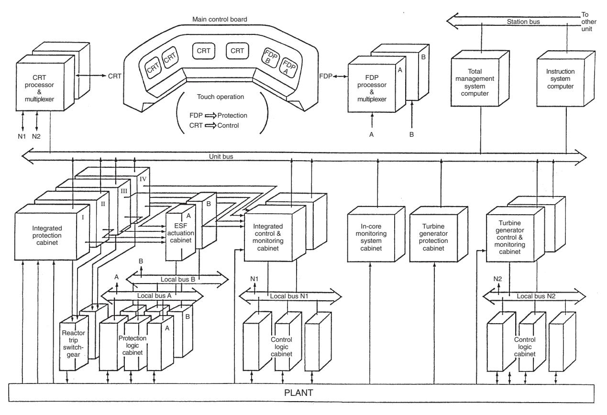

FIG. 42.6. Advanced Digital I&C System. (FDP: flat display panel.)

# **42.10.2. Design features**

To improve safety and give a lower probability of core damage, the RPS and ESFAS have redundancy and appropriate functional diversity. Also, to improve plant availability, the overall I&C systems MTBF target should be greater than that of operating plants. The main design features of the safety grade, advanced digital I&C systems are as follows:

- *Complete redundancy and functional diversity*
  - ∑ Four channel RPS and two train ESFAS;
  - ∑ Two trip subsystems per channel;
  - ∑ Two data communication subsystems.
- *Fail-safe design.* Dynamic trip logic (a reactor trip circuit which uses magnetic cores) and self-diagnostic functions are provided.
- *Fully automatic testing.* This minimizes the bypass time and improves the test procedures for safety grade on-power testing. Eventually almost all periodic tests will be automated.
- *Maintainability*
  - ∑ Self-diagnostic functions;
  - ∑ Modular architecture;
  - ∑ Visual software maintenance tools.

#### **42.10.3. Reactor power monitoring system**

At present, the out-of-core power range neutron detector on each channel is divided into two sections to provide a means of monitoring the axial power distribution continuously. The power in the upper section and that in the lower section are determined separately and the deviation is used as a measure of axial power distribution. The multisection neutron detector which has now been developed forms a part of the out-of-core power range neutron detector. It obtains the axial power distribution continuously by interpolating data from each detector and is intended for close monitoring. The adoption of this method will result in an improvement in the in-core power distribution monitoring function, which will be useful for daily load following operations and automatic frequency control (AFC) operations, both of which affect the operational performance of the plant.

#### **42.10.4. Advanced control room**

The control room design of Japanese PWR plants has been continuously improved, from one piece, large boards to the latest functionally divided, compact boards. The advanced control room (ACR) has been developed for the next PWR

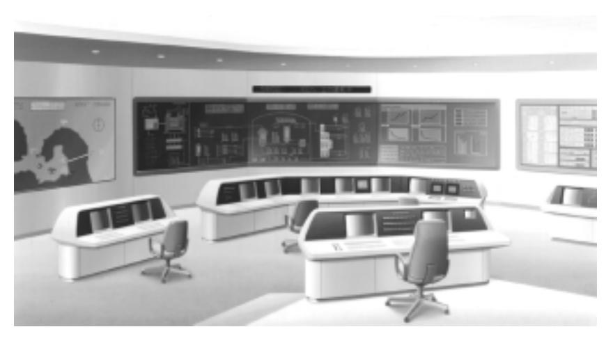

*FIG. 42.7. Layout of advanced control room.*

plants via several R&D programmes and is at present in the design stage. It was developed as the result of various human factors studies and uses the latest electronic technologies.

The objective in the development of the design is to provide operators with an environment in which their abilities are maximized, workloads are reduced and the potential for human errors is reduced. Figure 42.7 illustrates the layout. The supervisor's console is in the centre foreground and the operators are immediately in front with a clear view of a large plant overview panel. On the left are the auxiliary control console and the weather, radiation monitoring and utilities monitoring panel. The maintenance console and the auxiliary panel are on the right. VDUs and integrated plant control functions are fitted in the consoles.

(a) *Configuration of control boards.* The configuration is based on operator task analyses made during the human factors studies. The boards have been changed into consoles which allow operation from a sitting position. LDPs continuously display overall plant information and alarm status and compensate for the shortcomings in CRTs and flat display panels (FDPs), i.e. the limitation in the amount of information that can be displayed on one screen. The LDPs and the shift supervisor's console are located so that the crew can monitor various kinds of information during both normal and abnormal transient or accident operations. Thus, the whole crew can obtain the same information and improve their communications.

The plant computer system is configured in a functionally distributed way to provide reliability, good control and easy maintenance. Control and monitoring signal transmission is also functionally divided.

- (b) *Integration of monitoring and control.* The display screens support the operators by combining and co-ordinating various kinds of information. Touch screens are used for operations so that monitoring and control functions are integrated into one screen, which reduces the workload. Computer systems can provide automatic plant status checking, automatic displays and dynamic alarm priorities. These functions strengthen the plant monitoring and control capabilities.
- (c) *Validation and evaluation.* The ACR has been shown to reduce the operators' workload and the probability of human error to about one third of the levels associated with a conventional control board design. Plant operators who participated in the validation programme proved the feasibility of the console and touch screen operation. They also evaluated the advantages of the ACR in ease of operation in a questionnaire at that time. The programme proved the availability of the ACR for use on future plants.

#### **42.10.5. Operator support system**

In order to reduce the operators' workload and potential human errors, various computerized operator support systems have been developed and can provide integrated or processed plant information, operating guidance, procedures, etc. The development of such kinds of systems started with expert system studies and graphical HMIs, both of which became available in the 1980s. The TMI accident in 1979 showed, of course, the necessity for support systems.

These systems are provided for the ACR and some of them can be backfitted into conventional control rooms. In the I&C design of the ACR, the support systems take data from each of the CPUs. All of these are part of the distributed plant computer system containing many CPUs (including CRT processors, LDP processors, unit management processors, reactor monitoring and control processors, etc.) interconnected by cables or optical fibres. In order to backfit the systems to conventional plants, an independent CPU or workstation connected to the current plant computer system would be needed.

Normal operation support, maintenance operation support, transient/accident operation support and emergency operation support are currently available. Figure 42.8 shows a schematic of the operator control display of the emergency operation support system. This was designed on the basis of emergency response guidelines which are available for several beyond design basis accident scenarios.

— The flow chart window shows the overall sequence in an easily understood form. The colours of the boxes change as a result of operator action and/or plant status changes.

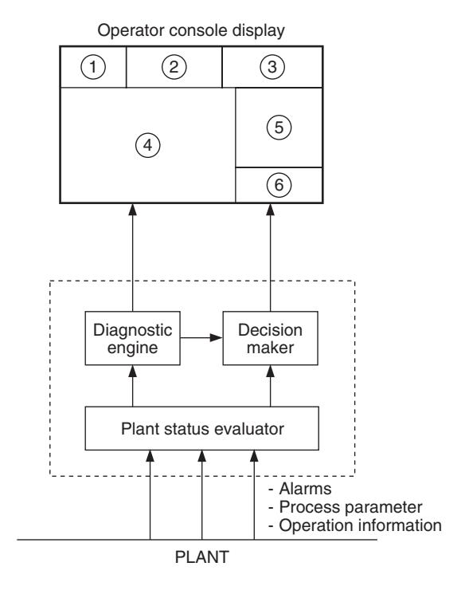

*FIG. 42.8. Emergency operation support system. (1: plant critical functions status; 2, 3: event message: accidents; plant interlock check; 4: detail display: plant status; diagnosis explanation; procedure flow chart; detailed procedure; 5: operation guidance; 6: display control keys.)*

- The diagnosis window displays the event which the computer has diagnosed from the plant data.
- The plant status window displays the basis for the deduction and changes in plant status.
- The event based guidance window displays the recommended actions under the present conditions.
- The operation feedback window displays the plant response after the action.

These windows are designed to suit the operators' cognitive processes during plant control and to enhance their performance. The basic technologies had been developed by the mid-1980s and became available in the early 1990s. The system will be installed in the control room to improve plant reliability and safety.

# **43. I&C CONCEPTS FOR PWR PLANTS IN THE RUSSIAN FEDERATION: WWER-1000**

#### 43.1. DESIGN BASIS FOR I&C SAFETY CLASSIFICATION

The WWER-1000 is a four loop, pressurized light water moderated and cooled reactor with a power of 1000 MW(e). It employs the commonly accepted defence in depth concept, according to which three main safety barriers are established in the path of a possible radioactive release from the fuel elements to the environment. These are the fuel cladding, primary circuit boundaries and containment isolation.

The WWER-1000 (design V-320) was developed in compliance with the Russian safety regulation OPB-82, which requires that I&C systems and equipment be assigned to categories according to their importance to safety. These categories are:

- Systems for normal operation;
- Systems for normal operation which are important to safety;
- Safety systems.

A distinction is made between safety systems (those systems provided to ensure safe shutdown of the reactor and heat removal from the core in an emergency or to keep radioactive releases within the safety barrier boundaries) and safety related I&C systems (those I&C systems which are important to safety but which are not included in the safety systems). WWER-1000 safety systems ensure safe operation of the plant under any PIE and the design copes with possible PIE dependent outage of one safety channel plus an outage of an active element or a passive element of a safety system, with the moving parts of the passive element independent of the PIE. However, it is assumed that only one independent initiating event can take place at any moment. The high reliability of systems and equipment ensuring safety is achieved by applying various measures:

- Safety systems are, to the greatest extent possible, free from operational connections with each other and with any of the process systems required for normal operation.
- The design copes with a possible outage of an active element of a safety system. To handle this situation single redundancy is provided as a minimum. To cope with simultaneous failures in the safety system and in the system for normal operation, double redundancy is provided.
- Double redundancy is also provided for the passive safety elements to protect against the failure of a passive element coinciding with outage of an element of normal operation.

— The components of the safety system remain operable under the conditions of any DBA for the whole of the time required to apply the recovery actions and to cool the reactor.

In order to achieve these goals, all safety systems are multichannel. The channels in the different safety systems are grouped into three independent trains. Every train consists of functional groups of protection, isolation, support and control safety subsystems. Capacity and functional performance are sufficient to provide adequate safety functions in any mode of NPP operation, including a maximum DBA.

Independence of the safety channels is realized by utilizing the following design principles:

- Channels are completely independent in the technological part;
- Each channel of a triplicated safety system is fed from an independent uninterruptible power supply, and data sources and data processing facilities are separate;
- Channels are physically separated.

In emergency situations the safety systems are actuated automatically. When actuated, they cannot be switched off by the operator, unless a permit signal is generated by the safety system. According to the safety rules, there are two diverse systems for reactivity control in WWERs based on different physical principles: the control rod system and the boration system. Either system can bring the reactor to the safe subcritical state. The most serious PIE is an instantaneous rupture of a main primary coolant pipe with the coolant blowing out from both sides. It is assumed that this coincides with the most pessimistic environmental conditions. In the case of loss of reliable power supply, safety systems are supplied from diesel generators. Their startup operations are performed automatically and the sequence of connection to the emergency power supply is strictly prescribed; it does not depend on the type of accident.

# 43.2. OVERALL PLANT CONTROL

## **43.2.1. Plant control organization**

The process control system (Fig. 43.1) is intended to provide safe and reliable control of the technological processes during normal operation. It also provides safety actions and process monitoring during abnormal conditions. The design strategy is to provide maximum automation. In accordance with these goals, the overall plant control incorporates the following features:

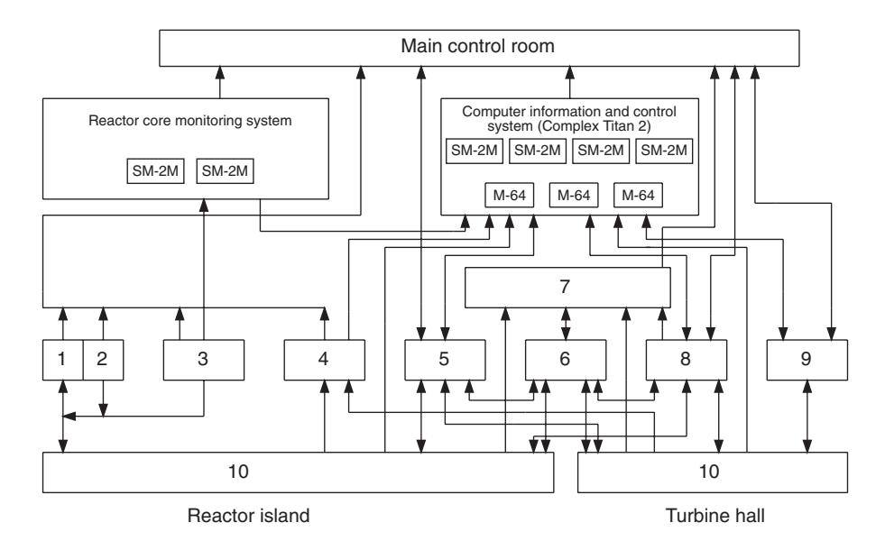

*FIG. 43.1. Overall process control system of a WWER-1000 plant. (1: reactor control and protection system (SUZ); 2: neutron flux monitoring system (AKNP); 3: in-core monitoring system (SVRK); 4: radiation monitoring system (AKRB); 5: automatic control systems; 6: technological protection systems (UKTS); 7: annunciation system; 8: automatic and remote control system (ULU-2-MPK); 9: turbine control system (ASUT-1000); 10: sensors and actuation devices.)*

- Automatic reactor power and turbine control, as well as automation of other technological processes during baseload operation;
- Automatic control and discrete sequence control during unit startup operation and planned hot or cold shutdown;
- Automatic power reduction or shutdown when abnormalities occur in the power unit or in the grid;
- Automatic execution of the protection actions;
- Automatic actuation and operation of the safety systems;
- Automatic acquisition of the status of NPP parameters and technological equipment and presentation of information to the operators in easily readable formats;
- Event logging;
- Automatic diagnostics.

Another goal of the system design is to implement a control strategy which ensures high efficiency operation and that the unit process control system executes information, control, protection and support functions. The information functions are

TABLE 43.1. FEATURES OF MONITORED AND CONTROLLED EQUIPMENT IN WWER-1000

|                              | Main control room               |                | Backup control room |
|------------------------------|---------------------------------|----------------|---------------------|
| In primary loop:             |                                 |                |                     |
| — Control valves             | 730                             |                | 300                 |
| — Electric drives            | 180                             |                | 74                  |
| — Main controllers           | 52                              |                | 21                  |
| — Individual instruments     | 141 (63)                        |                | 125 (63)            |
| — Annunciation signals       | 166                             |                | 55                  |
| — Alarms                     | 182 (126)                       |                | 142 (126)           |
|                              | Systems for normal operation | Safety systems | Total               |
| Technological protection and |                                 |                |                     |
| interlocks in mechanisms     |                                 |                |                     |
| controlled from MCR:         |                                 |                |                     |
| — Algorithms                 | 410                             | 533            | 943                 |
| — Inputs                     | 1013                            | 1551           | 2564                |
| — Outputs                    | 599                             | 976            | 1575                |
| Input signals to plant       |                                 |                |                     |
| computer:                    |                                 |                |                     |
| — Binary                     | 2357                            | 5497           | 7854                |
| — Analog                     | 666                             | 435            | 1101                |
| Functional control groups    |                                 |                |                     |
| (13 groups):                 |                                 |                |                     |
| — Binary inputs              | 827                             | 183            | 1010                |
| — Analog inputs              | 170                             | 3              | 173                 |
| — Outputs                    | 424                             | 111            | 535                 |

**Note:** Numbers in parentheses correspond to instruments located on safety panels.

data acquisition and processing, and supply of information to different systems and to the operations personnel. Control and protection functions generate control and protection inputs to the technological equipment, and the role of the operator is more that of a situation manager who supervises equipment operation, notes deviations from normal operation and takes corrective actions.

All functions of the unit process control system are implemented by its subsystems (Fig. 43.1). There are a number of subsystems or specialized systems

TABLE 43.2. FEATURES OF TURBOGENERATOR CONTROL IN MAIN CONTROL ROOM OF WWER-1000

| Isolating control valves                                                      | 344  |  |
|-------------------------------------------------------------------------------|------|--|
| Electric drives                                                               | 101  |  |
| Controllers                                                                   | 76   |  |
| Individual instruments                                                        | 95   |  |
| Technological protection and interlocks in mechanisms controlled from MCR: |      |  |
| — Algorithms                                                                  | 1200 |  |
| — Inputs                                                                      | 750  |  |
| — Outputs                                                                     | 1020 |  |
| Input signals to plant computer:                                              |      |  |
| — Binary                                                                      | 3800 |  |
| — Analog                                                                      | 1340 |  |
| — Annunciation signals                                                        | 236  |  |
| — Alarms                                                                      | 105  |  |
| Functional control groups (six groups):                                       |      |  |
| — Binary inputs                                                               | 600  |  |
| — Analog inputs                                                               | 200  |  |
| — Outputs                                                                     | 310  |  |

which may operate either in conjunction with the unit process control system or alone. They include the reactor control and protection system (SUZ), the neutron flux monitoring system (AKNP), the in-core monitoring system (SVRK), the radiation monitoring system (AKRB) and the turbine control system (ASUT-1000). Certain parts of the monitoring and control system, failures of which may disturb normal plant operation or cause an accident, fall in the category of systems important to safety. The WWER-1000 process control system is characterized by the quantity of monitored and controlled equipment (Tables 43.1 and 43.2).

#### **43.2.2. Process monitoring system**

The process monitoring system provides information on the current state of process variables and equipment parameters. The major components of the system are the data acquisition system and the computer information and control system. Data acquisition in the WWER-1000 is based on standard 0–5 mA signals which allow the use of a single signal in several different systems. As a rule, three sensors in the systems for normal operation are used for monitoring each parameter. The signals are used as follows:

- *First sensor:* computer information and control system, functional control groups and interlocks, first channel of technological protection;
- *Second sensor:* individual instruments in the MCR, automatic control, second channel of technological protection, annunciation system;
- *Third sensor:* third channel of technological protection (when two out of three logic is employed).

With this distribution of functions, independent and redundant monitoring can be achieved by the computer information and control system and by the instrumentation in the MCR. Interlocks remain operable when a sensor of the control system fails and annunciation functions remain operable even if the sensors used for functional group control and interlocking fail. The signal processing electronics for each of the three sensors are located in different cabinets.

For the individual monitoring of important parameters, especially during reactor shutdown, two redundant sets of instrumentation are provided on the MCR and secondary (backup) control room panels. Information to each instrumentation set comes from its own sensors and these are fed from the different trains of a reliable power supply.

#### **43.2.3. Computer information and control system**

The computer information and control system (UVS), 'Complex Titan 2', is the main means of data presentation to operations personnel. The UVS presents information on the technological process, the operational status of the equipment and diagnostics results in a systematic and concise form and thus provides an interface between the operations personnel and the technological process. It is a system of normal operation and performs the following functions:

- Acquisition and processing of analog and digital signals;
- Acquisition and processing of data from external systems;
- Data presentation;
- Initiation of alarms if analog parameters deviate from the set points;
- Indication of discrepancies between the protection commands and the real status of mechanisms and interlocks;
- Identification of upset conditions and initiation of the registration process;

TABLE 43.3. TECHNICAL PERFORMANCE OF WWER-1000 COMPUTER INFORMATION AND CONTROL SYSTEM (UVS)

| Information processing capacity:                                  |          |
|-------------------------------------------------------------------|----------|
| — Analog input signals                                            | 3 770    |
| — Digital input signals                                           | 12 896   |
| — Outputs                                                         | 1 120    |
| Period of information refresh:                                    |          |
| — In computer database                                            | <4 s     |
| — On CRT screens                                                  | <8 s     |
| — Change of CRT formats                                           | <3 s     |
| Reliability:                                                      |          |
| — Information functions based on directly measured and calculated |          |
| parameters of first group of importance                           | 1 000 h  |
| — Information functions of second group of importance             | 4 000 h  |
| — Control functions                                               | 20 000 h |
| — Auxiliary functions                                             | 1 000 h  |
| — Average recovery time after equipment faults                    | 1 h      |
|                                                                   |          |

- Indication of events in accident situations;
- Data logging;
- Testing of the main technological protection systems.

The UVS also performs auxiliary functions:

- Supervision of satellite computer systems;
- Database management;
- Self-diagnostics and indication of faulty equipment.

The information in the UVS is presented on colour CRTs in graphical and alphanumeric form. To improve the perception of the information by operators, various mimic diagrams, trend graphs and tables are widely utilized in displays. From the CRT screens, an operator can receive information about the state of mechanisms, the positions of regulators and valves, values of different parameters and their deviations from the set points. The UVS also provides different kinds of logs, including periodic logs, deviation logs and event logs in the case of protection system actuation.

The computing power of the UVS is utilized for optimizing parameters (e.g. levels, flow rates with correction for temperature deviations, speed of variation of parameters, differential and average temperatures and thermal power), computation for diagnostic purposes, root cause analysis and its indication in the case of trips. The

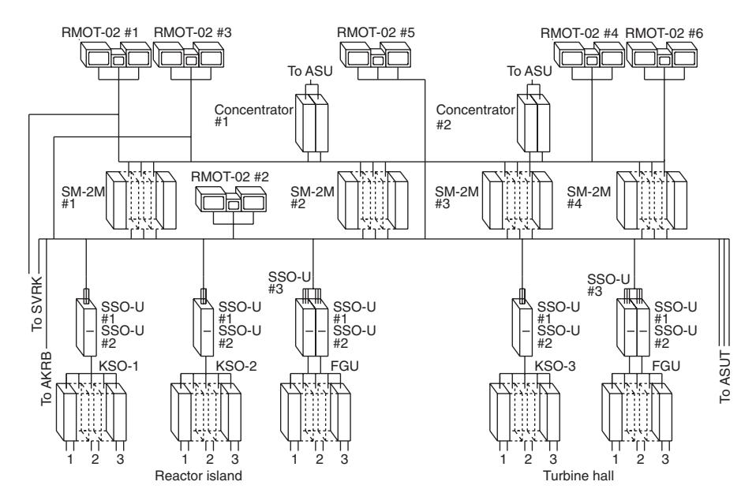

FIG. 43.2. Computer information and control system, 'Complex Titan 2' (UVS). (1: analog inputs; 2: discrete inputs; 3: discrete outputs; RMOT-02 #1-#6: CRT screens; KSO-1-3: computer interface modules based on M-64 subsystems; SSO-U: subsystem of KSO providing interface with control cubicles; FGU: functional group control unit.)

UVS is a continuously operating system but separate components can be taken out of service for maintenance and repair without losing the operability of the system. Different modules can be replaced without additional adjustment or tuning. The average repair time does not exceed 40 min. In order to increase the reliability of the basic functions, provisions are made for redundancy in input channels for the most important parameters.

Table 43.3 shows technical performance and reliability data on the UVS. Reliability is ensured by the following technical features:

- A distributed structure in the data acquisition system;
- Redundancy in input channels for the most important parameters;
- Hardware redundant channels for data transmission and concentration of information streams;
- Redundancy in means of data presentation and in the CPU;
- Parallel execution of the most important functions in two computers of the upper level.

The block diagram of the UVS is shown in Fig. 43.2. The UVS comprises:

- Four SM-2M computers;
- Two SM-1634 concentrators;
- Three M-64 interface computers.

The system is arranged as a decentralized hierarchical structure. The computer processing subsystem (upper level of the UVS) is based on four SM-2M computers (#1–#4 in Fig. 43.2), six CRT terminals (RMOT-02 #1–#6) and two SM-1634 concentrators (Fig. 43.2). Two SM-2M computers (#1, the main one, and #2, a standby) serve the needs of the reactor island and the other two (#3, the main one, and #4, a standby) serve the needs of the turbogenerator system. All of the main SM-2M computers have connections with the corresponding interfaces and external systems:

- SM-2M #1 with interfaces #1 and #2, the functional group of controllers of the reactor (FGU-RO), the SVRK and the radiation monitoring system (KRB);
- SM-2M #3 with interface #3, the ASUT and the functional group of controllers of the turbogenerator (FGU-TO).

The CRT terminals RMOT-02 #1 and #3, which are connected to computers SM-2M #1 and #2 and to the SVRK, provide information for the senior reactor operator. RMOT-02 #4 and #6, connected to computers SM-2M #2 and #4, serve the senior turbine operator. RMOT-02 #5 and #2, which are connected to all four SM-2M computers, are set aside for the deputy shift supervisor and for the engineer in the computer hall, respectively. The upper level of the UVS also includes concentrators #1 and #2, which provide information exchange between the UVS and the process control system of the whole plant (ASU). The low level systems of the UVS are composed of information subsystems (M-64) of the reactor and turbogenerator parts which perform interface functions.

#### **43.2.4. Automatic and remote control system**

The automatic and remote control system performs discrete control of technological equipment (on/off, open/close, increase/reduce) and also provides information display on equipment status. The system controls functional groups of equipment. Such a group performs a complete set of technological functions and thus provides for functional redundancy. In the case of a fault in the upper control level, this architecture ensures operation, possibly with some limitations, at the low level by a functional group and does not allow the control function to be lost completely.

The functional group control algorithms are divided into two parts: the first includes manual remote control of actuating devices, interlocks and protection circuits, and the second represents the logic according to which the sequence control of equipment is arranged. In fact, this is the basic type of control from the MCR.

# **43.2.5. Interlocks and protection in systems for normal operation**

All of the automatically operated protection systems in a power unit can be segregated into two groups. The first group comprises protection systems which ensure the safety of the plant (i.e. the reactor protection systems and protection circuits actuating control safety systems); these are described below. The second group provides for protection functions in systems and equipment for normal operation.

Any equipment switched off by a technological protection system can be switched on again only by operations personnel. In order to ensure the highest possible reliability, the protection systems are arranged to permit maintenance and repair without loss of protection functions. For this purpose a multichannel principle is widely utilized. The criteria for the selection of different kinds of protection logic (two out of four, two out of three, two out of two, one out of two, one out of one, etc.) are based on an evaluation of the possible consequences of the outage of a protection system or its faulty operation. In addition, the highest priority for actions to protect against operator error, automatic controls and interlocks is provided. This priority level is maintained at all times unless the protection initiation signal is active. Input signal validation is normally provided for the most important protection circuits.

#### **43.2.6. Automatic control systems**

The main task of the automatic control systems is to keep unit power at the preset level and to maintain plant parameters within optimal boundaries in order to ensure the highest possible reliability and economic efficiency in all operation modes. The overall automatic control employs a hierarchical structure, whereby the lowest level of automation is realized by local automatic controllers on different technological parameters. This low level control is provided by 'Kaskad 2' analog controllers and digital controllers within the ASUT-1000 system. The second level includes automatic control systems for the main technological components of the plant: reactor control, pressurizer pressure and pressurizer level control, steam generator level control, feedwater control, steam dump to the atmosphere, turbine bypass control and turbine control. Implementation tends to be specific in every case. The main control systems on the secondary side are incorporated in the ASUT-1000.

#### **43.2.7. Annunciation system**

The annunciation system gives light and sound alarms and annunciation signals to the operations personnel in the following situations:

— Parameters exceeding permissible limits;

- Mechanisms shut off by emergency;
- Actuation of a technological protection system;
- Disturbances in the technological process (i.e. interlocks in action);
- Failures in the I&C equipment.

The main means of presentation of alarms and annunciation signals are the CRT displays and hard-wired annunciation windows in the MCR.

Technological annunciations can be segregated into several types according to the required operator response time. The first and the largest group includes annunciation windows to alert operators when parameters such as pressure, level, flow rate and temperature reach safety limits or preventive protection limits. Information received from these windows requires different response times, depending on the particular alarm. The second group has the characteristic feature of a prohibition or a permit. An operator uses this information when executing normal procedures, e.g. taking equipment out of service for repair or putting it back into service. The time for using this information may be rather long. The third group of windows gives the operator dynamic information about the controllers' operation, the status of pumps (on/off) or valves (closing/opening) or loss of power supply in the protection circuits and interlocks. The required operator response time may be short or long, depending on the operation mode and current equipment status. Finally, the fourth group of windows informs operators of faults in protection circuits, interlocks and control schemes.

#### **43.2.8. Specialized systems**

- (a) *Reactor control and protection system.* The SUZ is one of the systems important to safety. It performs reactor startup, normal or emergency shutdown and control at full power. Electrical and electronic equipment of the SUZ is divided into two parts, namely, circuits for generating trip signals and the rest of the electrical equipment. The reactor control system enables the unit to follow load changes automatically without reactor trip, steam dump or pressure relief. The SUZ is a multifunctional subsystem of the plant process control system. Some of its systems belong to the safety system group. Those which belong to the control safety system group are:
  - Sensors of technological parameters;
  - Signal processing units;
  - Neutron flux monitoring system (AKNP);
  - Preventive protection system;
  - Control rod position monitoring system;
  - Individual control rods and group control system;
  - Power supplies for SUZ electronic components;

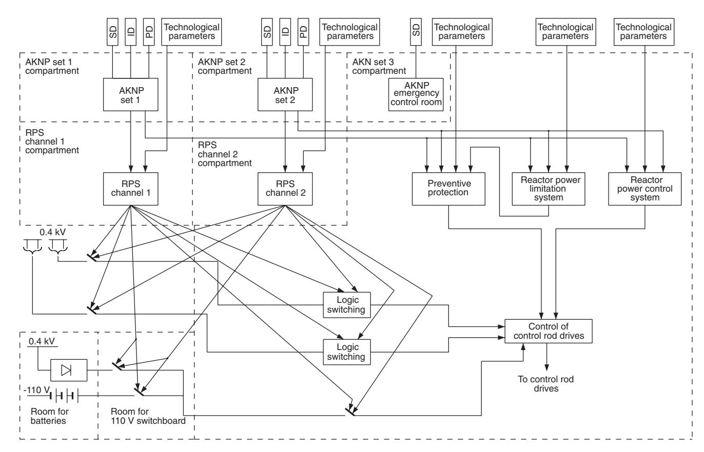

FIG. 43.3. Electrical equipment of reactor control and protection system (SUZ).

— Power supplies for control rod drives.

Although the reactor control system is a system for normal operation that is important to safety, the control rods and their drive mechanisms belong to the protection safety system group (Section 43.3.1).

Figure 43.3 shows the complete arrangement of the electrical equipment of the SUZ. It consists of:

- Two independent sets of the RPS;
- Preventive protection system;
- Control system for individual rods and groups of rods;
- Control rod position monitoring system;
- Power supply system;
- Automatic regulator of reactor power;
- Power supplies.

The electrical part of the SUZ performs the following functions:

- Reactor trip by the dropping of all control rods;
- Preventive protection by insertion of control rods in sequence at normal speed or by prohibition of the withdrawal of control rods;
- Quick preventive protection by the dropping of a group of control rods;
- Movement of individual control rods or group control;
- Uninterruptible remote or automatic control during the transfer of control from one group of rods to another;
- Indication of a root cause of a reactor trip or preventive protection system actuation;
- Automatic reactor power control;
- Control rod position indication;
- Automatic testing and failure detection.

The reactor power control system regulates reactor power and enables the unit to follow load changes automatically. It can operate in three different modes:

- Maintaining constant steam pressure upstream of the turbine control valves;
- Guard mode, in which the controller has a broader dead zone for upward thermal parameter deviations and for downward power deviations;
- Maintaining constant average neutron flux.

In fact, the reactor power control system includes two controllers:

- Neutron flux controller (RRN);
- Reactor controller utilizing thermal parameter (RRT).

Both controllers employ three channels and two out of three logic in the output circuits. The RRN receives information from ionization chambers positioned in three pairs of measuring channels set at 120∞ intervals around the reactor. After their signals are processed in AKNP-3, information on neutron flux goes to the RRN. The same signals, as well as signals from six pressure sensors in the steam headers, feed the RRT.

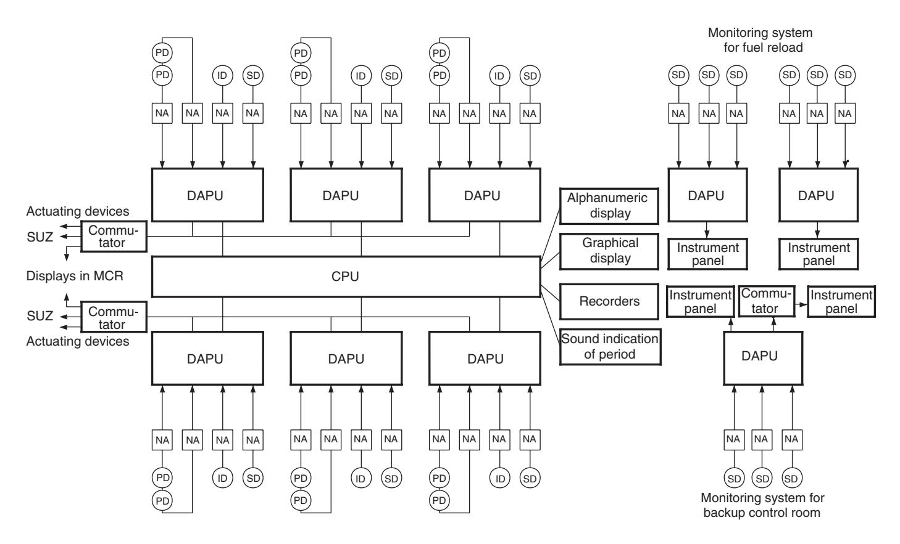

FIG. 43.4. Neutron flux monitoring system (AKNP).

(b) *Neutron flux monitoring system.* AKNP-3 measures flux level and rate of change of flux (period) in all operational modes and is classified as a control safety system. If the neutron flux or period exceeds the set point, AKNP-3 generates signals and passes them to the control system, protection system and reactor power regulator. It also provides registration and information presentation to the operator.

AKNP-3 comprises three functionally independent subsystems:

- System of neutron flux monitoring for the SUZ;
- System for monitoring fuel reloading;
- System of neutron flux monitoring for a backup control room.

The neutron flux monitoring system is shown in Fig. 43.4. The subsystem which provides data to the SUZ consists of two identical sets of equipment with completely independent neutron measuring channels. Both parts perform data acquisition and processing in three ranges: source range, intermediate range and power range. Signals from normalizing amplifiers (NAs) go to data acquisition and processing units (DAPUs), where discrete trip signals, signals for preventive protection, analog signals for the reactor power regulator, inputs to the UVS and information to the MCR operator are generated.

The subsystem which services the fuel reload system also consists of two independent sets of equipment with three measurement channels each. The subsystem for the backup control room is normally operated in a standby mode and is actuated only in the case of unavailability of a neutron flux monitoring function in the MCR. It monitors neutron flux only in the source range and is intended for subcriticality monitoring from the backup control room.

The positions of ionization chambers in dry channels around the core are shown in Fig. 43.5.

- (c) *In-core monitoring system.* The SVRK is a system for normal operation that is important to safety. It provides a facility which ensures safe and efficient reactor operation in the power range. Signals from sensors of temperature, neutron flux, flow rate, pressure, etc., are sent via data links to electronic units in which the signals are measured and processed. Information is then presented to operators and transmitted to the computer. Complex thermohydraulic and nuclear physics parameters which describe the reactor state are then calculated. The SVRK performs the following functions:
  - Data acquisition, processing and information presentation in the MCR: the output information describes the current status of the reactor core and provides alarms if the parameters reach safety limits;
  - Data recording and data logging;
  - Exchange of data with the UVS;
  - Calculation of preventive protection signals in the case of local disturbances in the reactor core;

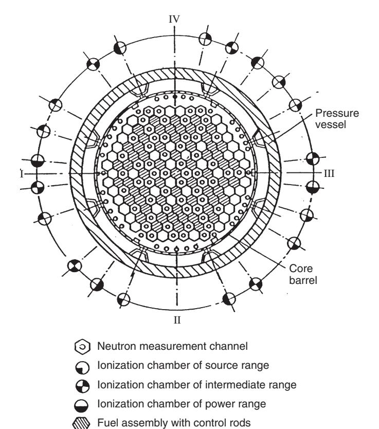

*FIG. 43.5. Ionization chamber positions in a WWER-1000.*

- Operator support during suppression of xenon oscillations;
- Self-testing and failure detection.

All these functions are performed in normal operation, abnormal operation and accident situations. The main technical requirements of the SVRK are as follows:

- Temperature monitoring (on the outlets of fuel assemblies) with a tolerance of ±1∞C;
- Calculation of reactor thermal power with a tolerance of ±2.0%;
- Calculation of power distribution in the core with a tolerance of ±5%.

A detailed diagram of the in-core instrumentation system is shown in Fig. 43.6. Information on the neutron flux distribution is derived from the self-powered detector outputs. Seven detectors (1), uniformly distributed over the reactor core height within a thimble, constitute a neutron monitoring channel (2). A thimble is positioned in the centre of a fuel assembly and, altogether, there are 64 neutron monitoring channels uniformly distributed through the core. Their signals are transmitted via cables (11) to the electronic measuring units (22). Penetrations (15, 16) can withstand accident conditions. The temperature distribution at the outlets of the fuel assemblies is monitored by 95 TCs (3). Also, there are three TCs positioned near the outlet nozzles. The coolant temperature in the hot and cold legs is measured by 16 TCs (5) and eight RTDs (4). The SVRK also receives signals from different plant sensors.

Normalizing amplifiers (40) are located in a separate room (41), which has data links with electronic measuring units. Cables (38) pass digital signals to electronic measuring units which characterize the status of the primary loop components. Other cables (36, 37) transmit signals from the AKNP and reactor regulation system. An electronic measuring unit (22) is composed of two identical channels (26, 28) with CRT displays (23, 35), remote displays (17, 33) and keyboards (18, 34). The CRT displays and keyboards are located in the MCR. Both channels are coupled by cables (27). A dual system concept has been utilized in order to meet reliability targets for monitoring the most important parameters. As can be seen from Fig. 43.6, the signals are supplied to both channels. In the

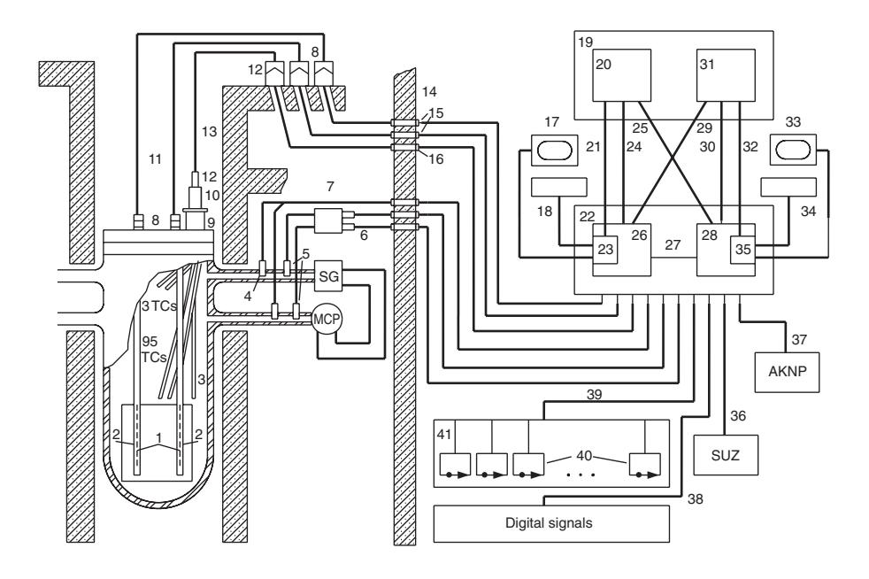

*FIG. 43.6. In-core instrumentation system of a WWER-1000 (details given in the text).*

case of a fault in any system, data links (27) permit the exchange of data between the two systems.

The computer system (19) consists of two SM-2M computers (20, 31). Both are connected with the electronic measuring unit by main data links (24, 30) and standby data links (25, 29). In normal operation both computers operate in real time and information is received via the main data links. In the case of a fault in one of the measuring systems, information is received from the operating system via a standby data link. The measuring cycle of the system takes 2 s for normalized analog and digital signals and 20 s for low range signals. The refresh time of the displays is 16 s.

Special consideration was given to the reliability of the system. The most typical engineered features employed are as follows:

- Structural redundancy. If both computers malfunction, the electronic measuring unit is automatically switched to isolation mode, in which it is controlled by its own processor. The information continues to reach the operators, although it is processed by simplified algorithms. Nevertheless, the reactor can be operated in this mode at the same or slightly reduced power.
- In the case of a fault in one of the two redundant channels concerned with plant computer information and the UVS, another channel is capable of performing the function. If both channels fail, the in-core instrumentation system is switched to isolation mode. In this mode it performs data acquisition, comparison of signals with set points, simplified calculations and information presentation on CRT displays.
- Neutron detectors and temperature sensors within the core work in a harsh environment. Moreover, their replacement during an operating campaign is either difficult or impossible. The total number of installed in-core detectors is therefore larger than is needed from a strictly metrological standpoint and malfunction of a number of detectors will not affect the performance of the system.

If reactor power distribution control is totally lost, further operation at full power is permitted only for 10 min. After that, power has to be reduced to a prescribed level. If outlet temperature distribution control is lost, the reactor can be operated at a given power for only 10 min. After that, power must be reduced to the minimum controllable level.

Other systems which belong to the group of specialized plant control systems are for:

- Radiation monitoring;
- Steam turbine control (ASUT-1000);

- Electric generator control;
- Refuelling machine control;
- Failure detection in fuel assemblies;
- Periodic tests of plant components.

# 43.3. SAFETY SYSTEMS

According to the Russian safety regulation OPB-88, the safety systems are intended to prevent accidents and to mitigate their consequences if they occur. In the WWER-1000 safety systems, design provisions are made for:

- Tripping the reactor and keeping it safely in subcritical condition;
- Heat removal in the case of an emergency;
- Keeping radioactive releases within design boundaries.

As was mentioned before, all WWER safety systems are divided into four categories: protection safety systems; localization safety systems; safety system support features; and control safety systems.

#### **43.3.1. Protection safety systems**

- (a) *Reactor protection system.* The RPS is actuated if automatic control cannot maintain the technological processes within normal operation conditions or if the parameters, which characterize the safety of plant operation, exceed preset limits. The SUZ performs reactor protection functions in accordance with a dual failure concept. This means that protection functions will be performed even if a process system failure coincides with the unavailability of one channel of an RPS. The following principles are used in the SUZ design:
  - Independence of protection trains, achieved by the utilization of a multichannel principle and diversity in the generation of trip signals (actuation signals are derived from different parameters) for the same initiating event;
  - Reliable actuation of a protection system, particularly in the case of loss of power;
  - Provisions for on-line diagnostics, calibration and periodic tests without loss of protection functions.

Metrology requirements for the reactor control and protection system are listed in Table 43.4. The time delay from the actuation signal to the beginning of control rod movement must not exceed 0.3 s. Availability figures for the SUZ are presented in Table 43.5.

TABLE 43.4. METROLOGY REQUIREMENTS OF WWER-1000 CONTROL AND PROTECTION SYSTEM

| Parameter                                                                    | Tolerance    |
|------------------------------------------------------------------------------|--------------|
| Reactor period                                                               | ±30%         |
| Neutron flux in a range: — Source range                                   | ±20% nominal |
| — Power range                                                                | ±2% nominal  |
| Difference between saturation and hot leg temperatures                       | ±2°C         |
| Pressurizer level                                                            | ±100 mm      |
| Primary and secondary pressure                                               | ±0.1 MPa     |
| Difference between saturation temperatures in primary and secondary loops | ±2°C         |
| Coolant temperature                                                          | ±2°C         |
| Steam generator level                                                        | ±10 mm       |
| Pressure inside containment                                                  | ±0.5 MPa     |

TABLE 43.5. AVAILABILITY FIGURES FOR SUZ OF WWER-1000

| Function   | Availability (h) | Repair time (h) |
|------------|---------------------|--------------------|
| Protection | 2 × 105             | 1                  |
| Control    | 2 × 104             | 1                  |
| Monitoring | 2 × 104             | 2                  |

Reactor protection includes the reactor trip system, preventive protection of two kinds and accelerated preventive protection. The RPS is shown in Fig. 43.7. To meet a reliability target and to permit on-line tests, the RPS consists of two trains. Each train employs a three chain concept and two out of three logic, is electrically and functionally independent and is located in a separate compartment. The input signals for each train come from three sets of sensors through

*FIG. 43.7. WWER-1000 reactor protection system. (D: sensor; K: relay logic; N: normalizing amplifier; P: electronic module.)*

| TABLE 43.6. PERMISSIBLE WWER-1000 OPERATING POWER LEVELS |
|-------------------------------------------------------------|
| WITH REDUCED PUMPa AVAILABILITY                             |

| 102% of full power | 4 MCPs and 2 FWPs operating                         |
|--------------------|-----------------------------------------------------|
| 69%                | 3 MCPs and 2 FWPs operating                         |
| 52%                | 4 MCPs and 1 FWP operating                          |
| 52%                | 2 MCPs (in opposite loops) and 2 or 1 FWP operating |
| 42%                | 2 MCPs (in adjacent loops) and 2 or 1 FWP operating |

a MCP: main circulating pump; FWP: feedwater pump.

analog–digital converters. There is only one set of sensors for the first and second kinds of preventive protection (see below).

Reactor trip (AZ) is accomplished by dropping all of the control rods. The insertion time is less than 4 s. In order to avoid the introduction of positive reactivity even for a short time, a group of short control rods can be inserted into the core in less than 3 s.

The system of preventive protection initiates commands for power reduction or prohibits power increase in order to intercept system problems before they become reactor trips. The preventive protection system may initiate several different 'soft trips':

- Preventive protection of the first kind (PZ-1) is accomplished by successive movement of groups of control rods into the core with a normal speed of 2 cm/s while a soft-trip signal exists;
- Preventive protection of the second kind (PZ-2) means prohibition of control rod withdrawal (the insertion of control rods is allowed);
- Accelerated preventive protection is performed by a quick partial power reduction by dropping one group of control rods.

Some functions of the system are performed by the reactor power limitation system (ROM2). This system limits the reactor thermal power, depending on the number of main circulating pumps and feedwater pumps operating. Permissible power levels for the WWER-1000 design are set out in Table 43.6. When these levels are exceeded, the ROM reduces reactor power by initiating PZ-1. It receives signals on the actual state of the main circulating pumps and feedwater pumps in discrete form. Also, it utilizes analog signals on hot and cold leg differential temperature and on neutron flux level from the AKNP. It is a three channel system with two out of three logic on the output. All three channels are identical and are arranged in separate cabinets without common parts.

When the reactor is on power in normal operation, control is performed by the reactor power control system. In the case of a reactor trip, the automatic power control system is switched off and the control function is passed to the protection system or the preventive protection system, subject to the initiating event. The reactor trip system is actuated when the outputs of two functionally independent and physically separated safety channels coincide according to two out of three voting logic. Location, structure and design features of the protection system are such that multifunctional use of the SUZ does not violate safety principles. This is because:

- Malfunctions in the components of the SUZ which do not belong to the safety systems and in components which are not parts of the SUZ do not affect the performance of the protection system and of the AKNP;
- Safety action, initiated by the protection system, has the highest priority. The system of antiseismic protection (SIAZ) generates a reactor trip signal in the event of an earthquake. This system provides continuous monitoring of soil oscillations on the plant site and if the oscillations exceed a safety limit, the system generates a reactor trip signal. The SIAZ is integrated into the SUZ and every reactor protection train has its own SIAZ.
- (b) *High pressure emergency core cooling system.* The ECCS is composed of three stages: high pressure ECCS, hydroaccumulators and low pressure ECCS. The high pressure ECCS supplies high concentration boric acid solution to the primary loop in the case of an accident. This system is important to safety and belongs to the class of NPP protection safety systems.

One channel of the high pressure ECCS consists of a boron solution emergency storage tank, a high pressure pump, an emergency high pressure pump, piping and valves (Fig. 43.8). There are three channels, connected to the cold legs of the primary loop. Operating and check valves are installed on the pump discharge lines and the pumps have a recirculation line to provide for testing. The valves and pumps are fed from one source of the reliable power supply. Monitoring and control of the high pressure ECCS are organized in three channels which are physically separated and electrically isolated. The electronic modules are seismically proved and control is performed automatically with two out of three logic.

In the event of an accident, the high pressure and emergency high pressure pumps are switched on. The emergency high pressure pump begins to take water with a boric acid concentration of 40 g/kg from the borated water storage tank (volume 630 m3). The pump provides a flow rate of 130 m3/h at a pressure from 9.0 to 1.5 MPa. The high pressure pump takes water from its own emergency borated water storage tank. It can supply water to the primary loop at a higher pressure than the emergency high pressure pump (16 MPa) and with a flow rate of 6 m3/h.

(c) *Hydroaccumulators.* The passive part of the ECCS is intended for quick supply of borated water for core cooling during LOCA type accidents when the

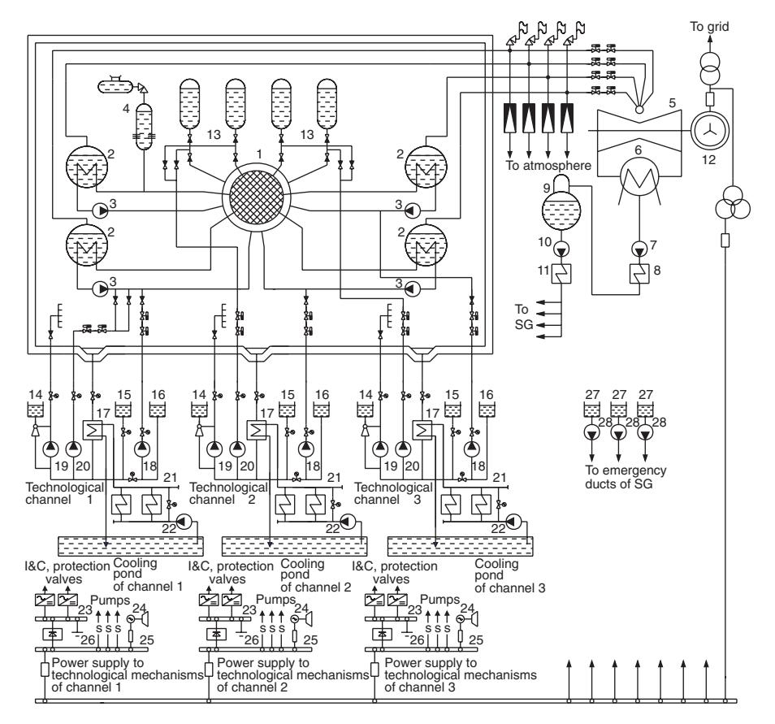

FIG. 43.8. WWER-1000 safety systems. (1: reactor; 2: steam generator (SG); 3: main circulating pump; 4: pressurizer; 5: turbine; 6: condenser; 7: condensate pump; 8: low pressure reheater; 9: de-aerator; 10: feedwater pump; 11: high pressure reheater; 12: generator; 13: hydroaccumulator; 14: storage tank; 15, 16: boric acid solution storage tanks; 17: ECCS heat exchanger; 18: ECCS high pressure pump; 19: spray system pump; 20: ECCS pump; 21: systems using cooling water; 22: cooling water pump; 23: busbars of power supply of category I; 24: diesel generator; 25: busbars of power supply of category II; 26: battery; 27: desalinated water storage tank; 28: emergency feedwater pump.)

primary pressure drops below 5.9 MPa. The main components of the passive ECCS are the hydroaccumulators, piping and valves (Fig. 43.8). Each of four hydroaccumulators contains borated water, pressurized by nitrogen gas. Two hydroaccumulators are connected by individual pipelines to the inlet of the reactor. The two others are connected to the outlet.

During normal operation every hydroaccumulator is reliably isolated from the reactor by two check valves. When the reactor pressure drops below the pressure inside a hydroaccumulator, the check valves open and borated water

from the hydroaccumulator enters the reactor. Two fast isolation valves installed in the pipeline prevent nitrogen gas from passing to the reactor when the hydroaccumulators are nearly empty.

(d) *Low pressure emergency core cooling system.* The low pressure ECCS is intended as a residual heat sink for the reactor when the integrity of the primary loop has deteriorated. The system is also used for removing residual heat and cooling the primary loop in the normal hot shutdown mode. The system provides cooling water at 250–300 m3/h at a primary pressure of 2.1 MPa and at 700–750 m3/h at a primary pressure of 0.1 MPa. It consists of three independent channels (Fig. 43.8), each of which can perform the system tasks in full. All three channels supply borated water to the upcomer and downcomer of the reactor. Two are connected to the water supply pipelines from hydroaccumulators and the third channel is connected to the cold and hot legs of one of the primary loops. The principles of monitoring and control applied to the low pressure ECCS are identical to those implemented in the high pressure ECCS. The system can cope with fire in one channel and with the maximum DBE. During the first 30 min of ECCS operation, operator intervention is not required.

Other protection systems also exist to ensure the safety of the WWER-1000 plant. They include the primary loop overpressure protection system, the secondary loop overpressure protection system, the system of steam–gas mixture removal from a primary loop and the emergency feedwater system.

## **43.3.2. Localization safety system**

The purpose of the localization safety system is to prevent, or reduce to a minimum, the propagation of radioactive material released in the event of an accident. It consists of the following systems:

- Containment isolation system;
- Containment spray system.

The containment spray system would quench steam resulting from a LOCA, thus preventing the containment pressure from exceeding its design limit. It would also be utilized for keeping radioactive iodine, contained in steam and air, inside the containment in the case of a LOCA. For this purpose a special solution is added to the borated water on the suction of the spray pumps.

The spray system is shown in Fig. 43.8. There are three channels, each consisting of a pump, an ejector for taking special solution from a tank, piping and valves. Every channel is terminated with a circular header in the upper part of the containment. This has 20 nozzles which spray borated water inside the containment, providing uniform water dispersion into the whole volume. On the pump discharge line, two normally closed valves are installed in parallel. These open if overpressure inside the containment exceeds 0.02 MPa. All protection systems and interlocks utilize two out of four logic.

#### **43.3.3. Control safety system**

The control safety system (USBT) initiates the logic and consecutive commands for safety systems actuation. It is composed of technological monitoring systems, remote controls, interlocks and protection circuits, annunciation windows and automatic controllers. These, in turn, are intended for the actuation of protection, support and localization safety systems, as well as for monitoring them. Since the USBT must be of the highest possible reliability, it utilizes the following principles in its design:

- Any single failure in the USBT should not affect system operability.
- The basic type of control under any accident condition and any current status of the equipment is automatic, guided by protection and interlock commands. These commands have higher priority than the operator's commands.
- In order to prevent operator errors during an accident, remote control of the safety mechanisms is prohibited; they cannot be switched off by operators. This condition lasts until the corresponding authorization signal is generated. In other words, personnel cannot interfere with ECCS operation until its function is completed or an internally generated authorization signal appears. Such a signal would allow the operator to switch off faulty equipment and to pass its function to the identical equipment of another system provided that this would not weaken overall plant safety. Thus, completion of the ECCS function is ensured and the possible effect of a human error is avoided.
- The system is operable in all operational modes except that of a plant blackout.

The design of the USBT is characterized by a number of specific features:

- The components are segregated into three channels.
- Complete independence of the channels is achieved through:
  - ∑ Independent power supplies;
  - ∑ Independent monitoring facilities and automatic and remote controls, including instrumentation;
  - ∑ Electrical isolation and physical separation of the channels.
- Operation of a safety system is performed automatically after a corresponding protection circuit is actuated.
- The operator receives information on the status of all three channels in the MCR or backup control room.

Every channel employs two out of four redundancy, both in its analog circuits and in its logic part. Voting is two out of four. The USBT is part of the plant process control system and utilizes the same technical means except that it is seismically proved.

The USBT consists of a number of systems which are normally in standby mode. They are actuated in the event of an accident. Following the basic principles for safety channels, physical separation and electrical isolation are used together with an individual sensor for every safety signal. Information on the parameters required to actuate a control safety system is derived from four sensors (for each of three USBT channels) while two sensors are used for all other signals which go to the USBT. The current outputs from the four sensors go to analog–digital converters (ADP1). The ADP1 modules compare the signals with the set points and compare the results. If a discrepancy is revealed a malfunction signal is generated which shows that a sensor, a transmission line, a power supply, a current multiplier or an input circuit of ADP1 is faulty. This signal can also be generated in normal operation and not only under accident conditions. It therefore facilitates quick recovery from USBT malfunction and increases the reliability of the system. From ADP1 a discrete signal, indicating that the parameter has exceeded a safety limit, is sent to the command modules (BFK2), which execute two out of four logic.

#### **43.3.4. Safety system support features**

- (a) *Power supplies for first and second 'group' loads.* Following the power supply reliability requirements, all safety system loads are segregated into two groups:
  - The first group is composed of AC and DC loads which permit power supply interruptions of not longer than fractions of a second in all operational modes, including loss of normal power supply sources (plant blackout);
  - The second group consists of AC loads which permit power interruptions for a time defined by safety conditions but not longer than 15 s (this is the startup time of diesel generators).

The system of reliable power supply is intended for safety system loads. In compliance with the WWER-1000 safety concept and according to the number of independent safety system channels, three independent trains of reliable power supply of 6 kV, 0.4 kV and 220 VDC are provided. Each train includes independent sources of electrical power (diesel generators and batteries), switchgear for 6 and 0.4 kV, uninterrupted power supply facilities, etc. Three trains are physically separated but no provisions for backup of one train by another are made. Every train of a reliable power supply is capable of taking the ECCS load. Reliable power supply originates at the inlet terminals of sectionalized circuit breakers and terminates at the inlet terminals of the first and second group loads.

The system of reliable power supply and all its components can operate under the impact of severe external events such as earthquakes and hurricanes, in cases of potential CMF (fire, etc.) and under the high temperatures, mechanical stresses, aggressive chemical conditions, etc., resulting from an accident.

(b) *Diesel generators.* The emergency diesel generation station of every unit incorporates three completely independent trains: three diesel generators are each housed in isolated cells. The distance between them is such that an external event or a common mode event can affect the operation of only one generator. The diesel generators are designed in such a way that startup and operation are possible without permanent supervision by personnel. To ensure high reliability of startup, every diesel generator is equipped with redundant starting circuits. Startup is accomplished automatically, following a signal from the control safety system. Startup can also be initiated from the MCR, the backup control room and the local control panel.

#### 43.4. MAIN CONTROL ROOM

The layout of the MCR is shown in Fig. 43.9. There are three basic control areas. The first is in the vicinity of the working places of the reactor operator and the turbine operator. The basic philosophy of MCR design is to place here all the I&C essential for NPP operation: controls for technological functional groups, basic means of information presentation, monitoring and control means for the SUZ, main switches for the turbine and feedwater pumps, keyboards, individual controls of pumps, the isolating and regulating valve controls of the main technological systems, means of communication, etc. The second control area is further away but the need for operator action from these panels is infrequent. From the reactor part of this area the following systems can be controlled and monitored: the air filtering system, steam generator blowdown, ventilation systems and condensers. From the secondary control panels for the turbine, the operator can control transformers, diesel generators and fire extinguishing systems. The third area (several panels) is located behind the operators and is dedicated to the reactor safety systems. There are several reasons to place them out of the direct view of operators. For example, when the safety limits are reached and the safety systems are actuated, their operation is automatic and operator intervention is not allowed for a certain time. It is also to be noted that safety system operation is a relatively rare event.

In total, the panels in the MCR have about 1400 annunciation windows, including 550 for the reactor area, 480 for the turbine area and 330 for the safety systems. Altogether, 1800 valves and 160 different mechanisms can be controlled from the MCR. Panels 1–11 (Fig. 43.9) have 72 individual recorders and indicators for primary loop variable monitoring (excluding the steam generators) and the ECCS panels have 60 individual instruments. The main groups of annunciation windows are

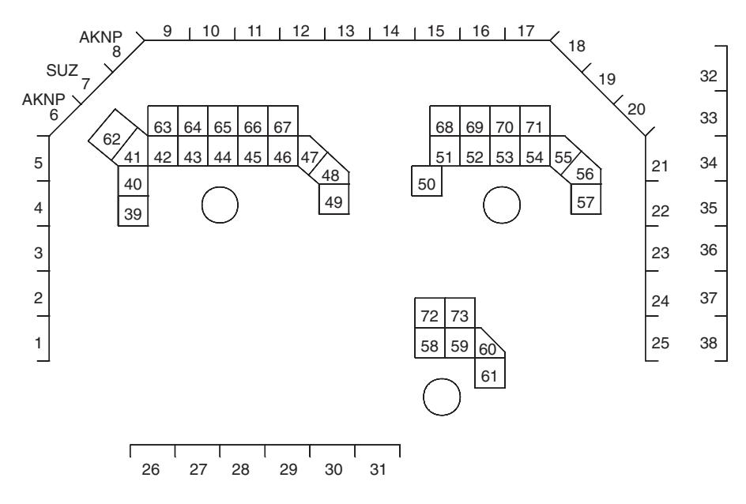

*FIG. 43.9. Layout of WWER-1000 main control room. (1: air filtering; 2: water storage tanks; 3: intermediate cooling system, fuel storage tank, hydrogen recombiner; 4: make-up and blowdown system; 5: water purification; 6, 8: AKNP; 7: SUZ; 9, 10: primary loops, water purification; 11: pressurizer, hydroaccumulators; 12, 16: steam generators; 13: high pressure reheater; 14, 15: turbine feedwater pumps; 17: first control area, panel of turbine hall; 18: mechanical measurements on turbines; 19: steam pipelines of turbines; 20: condenser, vacuum system; 21: low pressure reheater; 22: de-aerator; 23: lubrication systems; 24: generator; 25: transformers; 26–31: safety panels; 32, 33: synchronization; 34–38: fire extinguishing systems; 39: functional group control; 40: keyboard of SVRK; 41: modules of AKNP; 42: modules of SUZ; 43, 45: keyboards of UVS and individual control; 44: modules of individual control; 46: alphanumeric keyboards of UVS; 47, 48: monochrome displays of UVS; 49, 50: communication sections; 51, 54: keyboards of UVS; 52: modules of individual control; 53: protection modules of turbine and feedwater pumps; 55, 56: monochrome displays of UVS; 57: functional group control modules; 58: shift supervision desk; 59: keyboards of UVS; 60: monochrome display; 61: communication section; 62, 63: SVRK displays; 64–67: RMOT colour CRT displays of reactor part; 68–71: RMOT colour CRT displays of turbine part; 72, 73: RMOT colour CRT displays for shift supervisor.)*

located on the panels of the first and second control areas. Some of the alarms and annunciation signals are accompanied by a sound alarm. The main means of information presentation in the MCR are CRT displays, of which there are eight mounted in the reactor operator console, six in the turbine operator console and three on the shift supervisor's desk. The CRT displays present the control room operators with easily perceivable computer driven graphics and alphanumeric information on important plant parameters.

In case the MCR becomes uninhabitable, the backup control room provides for safe reactor shutdown, emergency core cooling and PAM. Communications are also provided and enable the personnel in the backup control room to co-ordinate recovery activities during and after an accident.

#### **BIBLIOGRAPHY**

Instrumentation and Control of WWER Type Nuclear Power Plants (Proc. Specialists Mtg Prague/Řež, 1994), Nuclear Research Inst. Řež (1995).

OVCHINNIKOV, F.Ya., in Operational Regimes of Pressurized Water Power Reactors, 3rd edn., Ehnergoizdat, Moscow (1988) (in Russian).

# **44. I&C CONCEPTS FOR A PWR PLANT IN THE UNITED KINGDOM: SIZEWELL B**

# 44.1. INTRODUCTION

The I&C systems for the Sizewell B PWR power plant provide the required facilities for automatic and manual control, plant monitoring and automatic protection. These systems have been designed to achieve the highest levels of plant availability and safety and it is a fundamental basis of the design philosophy that availability and safety are complementary, not mutually exclusive: a plant that achieves high availability is manifestly safer than one that is continually subjected to stressful transients as a result of unplanned reactor trips or other events.

To ensure that the I&C of the plant complies with this basis, high quality equipment is employed so that transients caused by equipment failures are rare and comprehensive I&C systems are provided that contribute to a high level of plant operability. This is achieved through the provision of:

- Automation to relieve the operators of routine tasks;
- Clear and comprehensive information so that the operators are aware of the state of the reactor and systems at all times;
- Controls that minimize by their design the chances of error;

— Comprehensive support to the operators through validated operating instructions, expert help via technical support facilities and thorough training, including the use of a full-scope simulator.

Some of the factors incorporated into the design process to achieve the design objectives are as follows:

- The experience of Nuclear Electric and of the Central Electricity Generating Board before it has been used in designing, constructing and operating nuclear, fossil fuelled and hydroelectric power plants and grid control centres.
- The basic principles of design are those contained in:
  - ∑ Design safety guidelines prepared by experienced Nuclear Electric designers;
  - ∑ Design safety criteria used by the Health and Safety Department of Nuclear Electric;
  - ∑ Safety assessment principles of the Nuclear Installations Inspectorate (NII).
- Equipment with a demonstrated history of successful performance has been applied in conventional arrangements to eliminate the risks that accompany the use of novel technology or established technology in novel arrangements.
- The plant is designed for continuous power generation between refuelling outages. Attention has been focused on the design of the I&C systems and their HMIs to optimize this mode of operation.
- The standards, guidelines and criteria used in the US nuclear industry and lessons learned from events such as the TMI accident have been considered. The design is generally compliant with US standards and exceptions have only been made after careful consideration and justification.
- Recommendations from experienced operating staff have been taken into account.
- Experience feedback from operating plants and the findings of operator action simulation exercises have been used to identify aspects of existing PWR plants where improvements in availability and safety could be achieved.

Throughout the design process, Nuclear Electric concentrated on using the best currently available technology to provide I&C systems that were representative of the state of the art. Nuclear Electric has also been cautious not to lose the benefits of worldwide experience of construction and operation of nearly three hundred PWRs and not to expose Sizewell B to financial and technical risks arising from being too hasty in the use of leading edge technology.

The basic design objectives were to provide I&C systems of high operability that were also constructible, reliable, maintainable, safe and licensable. The success of Sizewell B is a vindication of this cautious approach coupled with the application of the best technology available at the time.

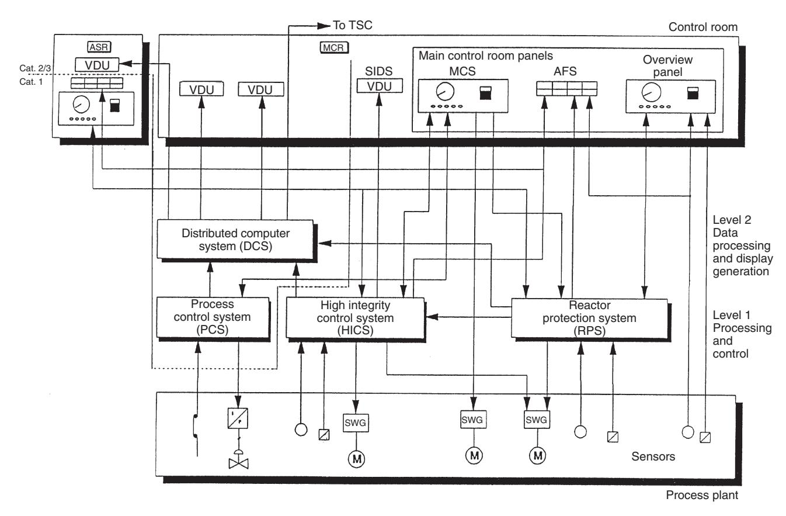

*FIG. 44.1. Overview of I&C sructure of Sizewell B.*

# 44.2. I&C STRUCTURE

Figure 44.1 presents the general architecture of the Sizewell B I&C systems. It shows the MCR and the auxiliary shutdown room (ASR), which are the principal locations for control of the plant. The TSC is not shown, but an arrow indicates operating data being sent to the TSC. The data processing and control system (DPCS) comprises three of the systems shown in the figure: the high integrity control system (HICS), process control system (PCS) and distributed computer system (DCS). These systems provide the interface between the operators and the plant, implementing automatic and manual control facilities and allowing operation to be monitored.

The RPS is also shown in Fig. 44.1 and comprises two separate and mutually diverse systems: the primary protection system (PPS) and the secondary protection system (SPS) (Section 44.8). Each of these consists of four physically and electrically separate channels which continuously monitor the condition of the reactor and associated systems, performing coincidence voting to determine any need for action. There are also a small number of controls and indications that are separate from the DPCS and RPS. These are implemented using conventional technology for safety purposes.

The I&C systems are divided into two levels. Level 1 equipment interfaces directly with the plant and discrete devices on the control room panels, reading sensor and contact status from the control panels and the plant, handling control and interlock signals, driving control panel instruments and issuing control signals to the plant. It also implements automatic sequence and closed loop controls. The systems at this level are the HICS, PCS, RPS and independent I&C. Information from the level 1 systems passes to the level 2 DCS for display on high resolution colour VDUs in the control rooms.

The DPCS, together with the control panels and desks for the MCR and ASR and the TSC equipment, forms the Sizewell B integrated system for centralized operation (ISCO).

# 44.3. CONTROL ROOMS AND TECHNICAL SUPPORT CENTRE

# **44.3.1. Main control room**

The MCR is the central location for control of the plant during startup, shutdown and normal operation and also following faults or hazards such as a LOCA or earthquake. All the required actions for normal steady state operation can be carried out from the MCR. The operators may take manual control actions to achieve and maintain safe shutdown or to increase safety margins. A small number of local actions are required on secure safety equipment in switchgear rooms as a result of overriding safety requirements.

There are normally three staff in the MCR: one supervisor, one operator and a support engineer. The minimum staffing level is two to allow for breaks, etc. Up to two additional staff may be present at times when intense operator activity is required, such as during startup. The operator and supervisor oversee normal operation from a pair of central desks fitted with DCS VDUs. The plant controls are not on these desks, but are located on a suite of control panels that surround the desks. The controls are arranged in either mimic diagrams or functional layouts, depending on the nature of the systems to be controlled. The mimics contain embedded discrete analog instruments and switches with internal lamps to indicate plant status. The control panels have DCS VDUs mounted above them to allow detailed monitoring of the systems, viewing of trends and monitoring of alarms.

The MCR is seismically qualified and the control panels and other equipment have been tested to demonstrate seismic durability and functionality where required. The control panel surfaces are of modular construction, with removable plastic tiles. The control and indication modules are held in place by a metal grid which is invisible from the front of the panels and provides a rigid aseismic mounting for the modules. This form of construction allows modules to be easily removed for maintenance purposes.

There are 16 DCS workstations in the MCR and as each is supplied with the same data, failure of several workstations can be tolerated before there is significant degradation in the supply of information to the operators. The layout of the MCR and the design of the control panels have been developed over many years and have been subjected to extensive design reviews and verification exercises to ensure that they are both operable and licensable.

#### **44.3.2. MCR equipment**

The MCR (Fig. 44.2) contains the following equipment:

(a) *Control panels and DCS VDUs.* The control panels comprise a main control suite (MCS), a general services panel (GSP) and an electrical services panel (ESP), which permit all necessary operations to change the plant from cold shutdown to hot standby and vice versa and from hot standby to full power and vice versa, and to cater for any abnormal conditions that may arise. Alternative manual controls for use should the automatic systems fail are also accommodated. The panels are provided with DCS VDUs mounted above them and appropriate discrete displays. This achieves the requirement for an integrated information display system suitably structured to display alarms and data, capitalizes on the display advantages that accrue from the use of computers and yet provides redundant display facilities. The appropriate discrete displays are:

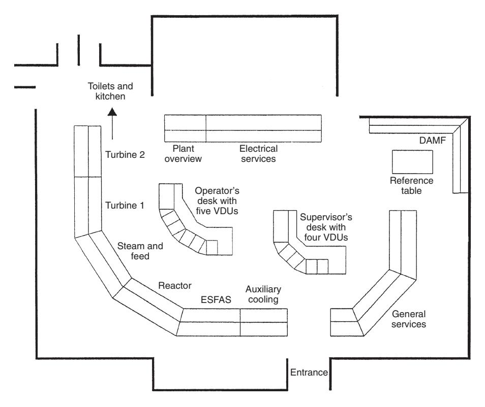

*FIG. 44.2. Main control room layout.*

- Those providing direct feedback of MCR control actions;
- Those required to establish by rapid checking that the principal parameters of MCR controllable systems are as required for the current operational state.

The control panels are positioned for convenient operation — the MCS is suitably positioned for the operator and the GSP and ESP are suitably placed for the supervisor. A plant overview panel (POP) is also provided with discrete hard-wired instruments for post-fault monitoring following designated frequent faults coincident with PCS and HICS failures.

- (b) *Safety information display system.* A seismically qualified safety information display system (SIDS) is provided for use following DCS failures. There are four SIDS plasma displays located above the POP.
- (c) *Operator's desk.* The operator's desk contains on- and off-site communications equipment and VDU facilities. It is positioned for direct viewing of and access to the MCS and its communication circuits are extended to telephone sockets at strategic locations around the MCS.

- (d) *Supervisor's desk.* The supervisor's desk contains on- and off-site communications equipment and VDU facilities. It is positioned to allow convenient supervision of the operator's desk, MCS, GSP, ESP and POP and of the documentation and auxiliary monitoring facility (DAMF, see below), and its communication circuits are extended to telephone sockets at strategic locations around the GSP and ESP.
- (e) *Documentation and auxiliary monitoring facility.* The DAMF houses documents and communications equipment, public address system and siren controls, and monitoring facilities for the local alarm system. Associated with the DAMF is a reference table for laying down drawings and documents.

#### **44.3.3. Auxiliary shutdown room**

The ASR is the location from which safe shutdown of the reactor may be achieved and operation of the auxiliary systems may be monitored and controlled if the MCR becomes damaged or uninhabitable. The ASR cannot be used to start up or operate the reactor. The operators should trip the reactor before evacuating the MCR, but if this is not possible, reactor trip controls are available at the MCR main entrance/exit and in the ASR.

The ASR facilities allow the reactor to be maintained at hot shutdown for up to 12 h without local action. After that time, the ASR serves as the control and command centre for the local plant activities to cool the reactor and bring the plant to cold shutdown. The normal staffing level is one supervisor and one operator. The ASR has a control panel similar to those in the MCR but is limited in scope, in keeping with its restricted role. There are two DCS workstations, each with a keyboard and two VDUs. These allow access to all of the data available in the MCR.

The ASR contains the following equipment:

- (a) *Control panel and DCS VDUs.* All of the required controls and indications are mounted on one 10 m long main control panel. It is provided with two DCS workstations, each consisting of one user keypad and two VDUs. The VDUs are mounted above the control panel, as in the MCR. The main control panel is positioned for convenient access by the operator and supervisor.
- (b) *Operator's and supervisor's desks.* The operator's and supervisor's desks are simple tables positioned centrally. Owing to the smaller size of the ASR and the proximity of the main control panel to the desks, they have no built-in information display or communications.
- (c) *Documentation and auxiliary monitoring facility.* This facility is similar to the DAMF of the MCR and houses documents and communications equipment. It is split into two separate halves owing to layout constraints but this has not

prevented installation of the communications equipment adjacent to the operator's and supervisor's desks.

# **44.3.4. Technical support centre**

The TSC is a location from which technical specialists may monitor the plant after an incident and offer advice to the operators. The need for a TSC became apparent during the TMI accident when, according to one report, fifty or sixty persons were present in the control room at one time, affecting the ability of the operating staff to concentrate and perform their tasks. The following are available in the TSC:

- (a) Five DCS workstations, each having one keyboard and two VDUs. These allow the TSC staff to view (but not alter) the same data as the MCR operators.
- (b) Displays for the site perimeter fence monitoring system, which provides monitoring of radioactive material crossing the site fence.
- (c) Access to the engineering computer system (ECOS), which is an off-line computer system containing a complete database of plant information, regularly updated from the on-line DCS. This allows off-line computational tasks such as long term trend and performance analysis to be undertaken.

The TSC is not essential to the safety of the plant because the operating staff are trained to deal with design basis incidents without outside assistance. However, the TSC would help to optimize day to day operation and would have a role to play in helping the operating staff to understand a complicated accident sequence and choose the optimum mitigation strategy.

#### 44.4. MCR AND ASR FUNCTIONAL REQUIREMENTS

Facilities are provided in the MCR to allow the operators to perform the principal functions of control, monitoring, communication and administration. Alarm handling and display facilities are also provided. All the facilities are consistent with the intended staffing levels.

#### **44.4.1. MCR layout and design**

Listed below are the general functional requirements which were met for the layout and design of the desks, panels and operator information systems in the MCR (Fig. 44.2). In considering these requirements, ergonomic aspects such as the operational roles of the supervisor, operator and support engineer have been considered together with the principles for plant design.

- Manual control and monitoring under normal operating conditions and following faults are to be exercised at the operator's desk and MCS by the operator, who must be able to carry out all minute to minute operations associated with the reactor and support systems, turbine generators and feedwater heaters.
- A structured information system is required, tailored to MCR operational needs, to allow rapid access to information while avoiding the presentation of superfluous data. Key information which enables the operators to assess and maintain safety at all times must be presented in a clear and concise manner through an appropriate mix of discrete instrumentation and computer VDUs.
- During fault situations, it is postulated that information overload could limit the operators' ability to follow the fault sequence. Appropriate design of the information systems is therefore of vital importance to avoid such problems. Initial operator actions in these circumstances are concerned with monitoring plant parameters to ensure adequate safety rather than fault/cause identification and as such the information necessary to monitor overall plant safety must be given priority in presentation.
- To assist the operators in determining the cause of faults, data and alarm displays must be structured to permit selective access as part of the diagnostic process.
- Ergonomic verification is required to produce rationalized I&C layouts in order to promote correct operator action.
- Component layouts must be consistent.
- A structured labelling and identification system is required to provide concise and unambiguous information to the operators.
- Consistent use must be made of abbreviations and acronyms (where necessary) as an aid to information assimilation and transfer.
- Devices required to withstand seismic events must be suitably integrated into the panels, taking account of the MCR operational needs.
- Interlocks are required to provide further resistance to human error.
- The layout of controls, indicators and alarms on the desks and panels must be based on good ergonomic practice.
- The control, monitoring and alarm equipment necessary for operation and safe shutdown of the reactor and turbine generator plant must be located for easy access by the operators.
- The desks of the supervisor and the operator must be positioned so that the supervisor and operator can speak to each other easily.
- The control, monitoring and alarm equipment for those systems which are the supervisor's responsibility must be located on panels within easy access from the supervisor's desk.

- The control, monitoring and alarm equipment for those systems which are the operator's responsibility must be located on panels within easy access from the operator's desk.
- VDUs linked to the DCS are required on both the operator's and supervisor's desks. VDUs are also required at strategic locations on the various panels in the MCR for the purpose of monitoring the state of relevant plant and providing alarm information.
- The supervisor's desk, operator's desk and DAMF must be equipped with facilities for convenient and easy on-site communication.
- The supervisor's desk and DAMF must be equipped with facilities for convenient and easy off-site communication.
- One main entrance/exit and additional emergency exits from the MCR are required.
- The desks and panels must be designed with dimensions to accommodate the range from 5th centile females to 95th centile males in the expected user population. The dimensions must be chosen to accommodate seated and/or standing operators as required.
- The desks and panels must be positioned so that there is adequate space for the operators to walk between the equipment and also for maintenance staff to gain easy access to equipment. The need for access to appropriate workstations for any additional staff who may be required during commissioning and other high activity periods must also be considered.
- The desks and panels must be arranged to minimize interference to the operators during maintenance, testing and functional testing of controls, alarms and indicators. Devices, wiring, plugs and sockets, etc., must be clearly labelled and identified at the rear of the desks and panels. Plugs and sockets must be polarized to reduce errors in the reinstatement of circuits after testing and maintenance.
- The MCR and its equipment must have a room environment and colour scheme that take account of factors such as glare, colour contrast, specular reflections, illumination levels and spectra in accordance with ergonomic recommendations and guidance for control room working.
- Easily accessible fireproof document storage must be provided in the MCR for all necessary operating manuals.
- Suitable fire-fighting equipment and breathing apparatus must be located in a prominent position so that the operators can gain ready access to it and easily don breathing apparatus in an emergency.
- A command and communications centre for use during a nuclear emergency/site incident is required within the MCR.
- Desk space is required for the support engineer. Further space is also required for two additional staff who may be present at times of high operator activity.

- Assured facilities are required to trip the reactor and isolate the MCR controls in the event of the MCR becoming uninhabitable or severely damaged, so that control can be transferred to the ASR.
- Facilities are required in the MCR for MCR environmental monitoring.
- An ECOS terminal is required to allow the interrogation of the computerized system for monitoring the limits of operation.
- Suitable space is required where reasonably possible for any additional equipment (such as calibration equipment and extra displays) which may be needed in the MCR during commissioning. Any temporary equipment must be supplied complete with suitable trolleys or stands.
- Space is required for possible future modifications and extensions to the desks and panels, where practicable.

# **44.4.2. MCR control functions**

The required MCR control functions are:

- Startup of the reactor and turbine generators from pre-established states following a limited number of local actions;
- Control of the main plant electrical system, any necessary control of the essential electrical system and some control of the grid substation;
- Control of the reactor, turbine generators and any necessary supporting systems during power operation;
- Shutdown to the appropriate safe shutdown state and maintenance of all CSFs within predetermined limits following faults and hazards;
- Control of essential safety features during refuelling outages.

#### **44.4.3. MCR monitoring functions**

The required MCR monitoring functions are:

- To provide feedback confirming MCR control actions and significant local actions arising from the fulfilment of the major control functions listed above;
- To allow the monitoring of plant systems to ensure acceptable operational states and the identification of system or equipment failures during all modes of plant operation;
- To provide, where practicable, early indication of the onset of plant system faults;
- To allow fault diagnosis at least to a level which can enable corrective action to take place within the MCR or to indicate the area in which engineering support should provide diagnostic and remedial action;

- To provide confirmation that the necessary CSFs are being achieved after a trip;
- To provide, where practicable, indication of systems or components to allow the operating staff to monitor whether the systems are operating outside the restrictions of the plant technical specifications.

# **44.4.4. MCR alarm functions**

Alarms in the MCR are required to alert and direct the attention of the operators to the following:

- Design basis faults and hazards;
- Failures within systems at both functional and component level, including those due to component failures or human errors;
- Defined violations of limits of operation;
- Challenges to one or more CSFs to a degree requiring functional recovery;
- Unauthorized entry into restricted areas for which the supervisor is responsible;
- Incidents arising from plant conditions which may jeopardize staff safety.

# **44.4.5. MCR communications functions**

The communications systems in the MCR are required to provide redundant, diverse and assured communication both on-site and off-site for the purposes of normal operation, maintenance, a site incident, a nuclear emergency and general administration.

#### **44.4.6. MCR administrative functions**

The MCR staff are required to undertake a range of administrative functions in support of plant operation, e.g. the identification and authorization of any necessary local control actions or the authorization and co-ordination of appropriate maintenance and repair operations.

#### **44.4.7. ASR functional requirements**

The ASR functional requirements are broadly similar to those for the MCR except that:

- The staffing level is different.
- The ASR is not required to be seismically qualified since unavailability/ uninhabitability of the MCR coincident with a seismic event is outside the design basis.

— The role of the ASR is restricted compared with that of the MCR. This therefore reduces the scope of the controls, indications and alarms required, with consequent differences in the layout and size of the ASR.

#### 44.5. MCR DESIGN CONSIDERATIONS AND INFLUENCES

The design process for the MCR was influenced by a number of considerations:

- Satisfaction of the functional requirements identified above;
- Allocation of function between technology and operators;
- Application of the correct technology to provide operability and maintainability in a safe and efficient manner;
- Application of human factors engineering.

Nuclear Electric has over thirty years' experience of operating commercial NPPs. The design process has built on this extensive experience by involving operating staff at all stages. The design team ensured that the best international practice and state of the art technology were employed in a manner commensurate with the above considerations. An indication of the influence of these considerations on the design process is given below.

#### **44.5.1. Allocation of function between technology and operators**

The ultimate objective of the allocation of function process is to ensure optimal performance of the integrated human–machine system, by ensuring that the systems goals are fulfilled and the humans fulfil a coherent set of functions at a reasonable workload. In extremes, demands must not be placed upon humans which are beyond their capabilities and demands for degrees of flexibility which cannot be achieved by technology should be excluded.

Optimal human performance has been considered in terms of safety, reliability, productivity and required levels of staffing for operation. The ergonomics of the MCR design (including procedures), for instance, was verified against best international practice and then validated using a full-scope Sizewell B simulator. Similarly, confidence in the ability of the operators to carry out tasks using local panels is provided by verification of the design and also by general use during commissioning and by specific on-site procedure walk-throughs.

#### **44.5.2. Consideration of human factors**

The design process placed particular emphasis on the human processes involved both in design activities and in plant operation to ensure that adequate account was taken of limitations on, and optimization of, human performance and human error potential. In addition, the factors known to influence the likelihood of errors by plant staff were addressed at the design stage by a comprehensive human factors programme. This ensured that the MCR operators were provided with a plant which can be operated safely via readily understood interfaces and in an environment conducive to high levels of human performance in both normal and fault situations. It also ensured that, where reasonably practical, measures such as interlocks were provided to minimize the potential for and consequences of operational errors.

The physical and aesthetic effects of environments in control rooms have the potential, if poorly specified in terms of human factors, to adversely affect the performance of the human occupants. The MCR and ASR environments have had the benefit of ergonomic input to their design in terms of:

- Lighting;
- Heating and ventilation;
- Noise and vibration;
- Physical layout and sizing;
- Provision for taking meals and other personal needs;
- Aesthetics.

The environmental conditions for human performance were compared with ergonomic specifications for the physical environment by means of separate ergonomic verification. On this basis it was concluded that in the majority of circumstances the MCR and ASR environments would be both aesthetically and physically pleasing and comfortable.

#### 44.6. DATA PROCESSING AND CONTROL SYSTEM

The DPCS incorporates system level and equipment level redundancy to withstand hazard as well as provide increased reliability. Redundant equipment is allocated to different electrical separation groups, which, in addition to being electrically independent, are fire segregated to varying degrees. Separation groups 1–4 are physically segregated by 3 h fire barriers and are used for the functions most vital to nuclear safety. For example, the protection systems and the HICS are allocated to these groups. Separation groups 7 and 8 are used for significant safety functions and are segregated by at least 1 h fire barriers. Redundant equipment in the DCS is allocated to these groups. Separation groups 5 and 6 are not fire segregated and are used for functions with no safety implications.

Figure 44.3 illustrates the DPCS. Some of its components are described in more detail below.

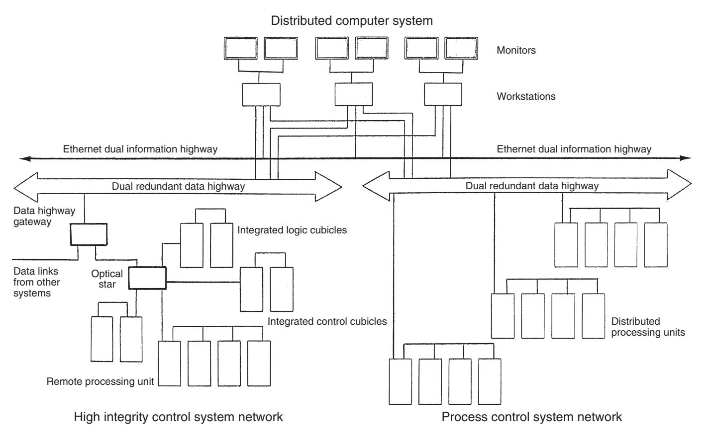

*FIG. 44.3. Overview of data processing and control system.*

# **44.6.1. Distributed computer system**

The DCS acquires data from the level 1 systems and processes the data for display on high resolution colour VDUs in the MCR, ASR and TSC. The DCS is the primary source of information to the operators for normal operation and following plant faults. Information such as alarms and system mimics are integrated into single display formats, so that the information is presented collectively. The formats are arranged into a structured hierarchy and simple techniques such as hot key combinations and trackballs for selecting targets with pointers are provided to enable the operators to navigate around the hierarchy.

The DCS is based on SUN Microsystems SPARC processor technology. In general, a DCS operator workstation comprises two VDUs and a keyboard connected to a single system unit. The workstation system units support either one or two colour VDUs, a user keypad (keyboard/trackball assembly), a 654 Mbyte hard disk, an Ethernet interface card and a Westnet network interface card. Other, similar system units are used for special purpose tasks such as data servers for computation, providing information on alarm significance and data storage and retrieval. The distributed computers are connected to proprietary dual redundant deterministic networks for the communication of real time data and to a dual redundant Ethernet network for the exchange of non-time-critical information and files.

The DCS software is based on a SUN Microsystems implementation of UNIX with a graphical user interface which is compliant with the X-Windows standard. The operator interface is designed such that the primary interaction is through the trackball integrated cursor and command features on the user keypad. This interface supports features such as drag and drop, pop-up menus and data entry fields. The keypad also has a QWERTY style keyboard where direct data entry is appropriate. A set of function keys is also provided for direct access to predefined graphical displays or screen management functions.

#### **44.6.2. High integrity control system**

The HICS provides the majority of the safety classified control functions. It acquires manual control demands from switches on the MCR and ASR control panels, drives conventional discrete panel instruments and lamps on the panels and displays data on the four seismically qualified SIDS plasma display units in the MCR. It also passes data to the DCS for processing and display on VDUs. The HICS is divided into four separate networks, each of which comprises several distributed data acquisition and processing units linked by a LAN. The division into networks follows the subdivision of the plant's essential electrical systems into four separation groups, each group being physically segregated from and electrically independent of the others. Input data are converted into packets of digital information in processors local to the items being monitored. These packets of information are then broadcast on the LAN. Other subscribers on the network receive and process the information, combining it with their own data and performing control actions on items of plant or control room instruments.

The HICS is based on IEEE 796-88 bus standard equipment. This bus system was designed by Intel and is a computer industry open system bus, with over two thousand compatible products available from over two hundred vendors. The IEEE 796 bus system is able to work with high performance processors, including the Intel 32 bit 80386 processor. It is therefore a reliable standard with wide industry acceptability and state of the art capability. Each HICS subscriber consists of a cubicle containing power supplies and racks of IEEE 796 cards. The IEEE 796 cards consist of processors, network interface cards and Westinghouse proprietary I/O cards.

In addition to the redundancy provided by the four HICS networks, redundancy is incorporated into HICS subscribers where high reliability is required for safety or is desirable for plant availability. On-line diagnostics provide early detection of failures and allow maintenance staff to change failed components before functionality is affected.

Within each separation group, the HICS processing units are linked by, and communicate over, a dual redundant data highway. The HICS data highway is a deterministic token passing network with a data transmission rate of 10 Mbaud using Manchester encoding. It is centred around an optical star portion with radial topology. Each optical branch of the star radiates to a single HICS cubicle, which passes the data on to other cubicles local to it via coaxial copper cable. The HICS networks communicate data to the DCS data highway via non-redundant data highway gateways.

#### **44.6.3. Process control system**

The PCS provides the HMI for data acquisition and control functions that are not safety classified but which make a contribution to safety or have no safety role. It acquires manual control demands from switches on the control panels, drives conventional discrete panel instruments and lamps and passes data to the DCS for processing and display. The PCS is divided into two separate networks, each of which is similar to an HICS network.

#### 44.7. STATION AUTOMATIC CONTROL SYSTEM

One of the principal reasons for choosing a PWR for the next generation of NPPs in the United Kingdom was to take advantage of the vast worldwide experience in constructing and operating this type of plant. In order to incorporate this experience, as much as possible of the functional design of the control systems of the reference SNUPPS (standardized nuclear unit power plant system) plants was incorporated into the design of Sizewell B. Modifications were only made in an evolutionary and carefully considered manner. The majority of the automatic controls for normal operation are therefore similar to those found on a typical US PWR plant. However, a number of modifications and extensions have been made to the SNUPPS control systems for Sizewell B. Principal among these are:

- Improvements to the automatic control of feed flow in response to steam generator level at low power during startup;
- Automatic control of the turbine bypass system to achieve a steady rate of cooldown to conditions where the residual heat removal system can be used;
- Automatic control of pressurizer pressure in response to reactor temperature during heat-up and cooldown operations.

These extensions to the scope of the control systems came about for a variety of reasons such as recommendations by staff who have operated PWR plants in other countries, analysis of experience feedback and task analysis. All of the changes affect control functions which operators at current plants have sometimes had difficulty in performing. The evidence in their experience feedback reports indicates that in these cases they have been working at the limits of their capabilities. The control systems for Sizewell B therefore represent an evolutionary improvement over industry standard systems that have been validated by many years of operating experience.

During normal operation the station automatic control system (SACS) maintains plant conditions within defined limits in response to changes in process variables, manual inputs and demanded station load. Thus, the SACS assists in maximizing efficiency and availability and reduces demands on the RPS. The SACS also has a role significant to safety in restricting the initial conditions for transients, in reducing the initiating frequencies of some potential faults and in fault mitigation.

The Sizewell B SACS consists of five main control systems:

- (a) *Reactor temperature control system.* This system controls reactor coolant temperature by regulation and withdrawal of the control rods.
- (b) *Pressurizer pressure and level control system.* This system:
  - Controls the reactor coolant pressure by operating a system of heaters and sprays within the pressurizer;
  - Controls the coolant inventory and hence the pressurizer level by controlling the rate of coolant charging flow entering the primary circuit in order to compensate for net losses.

- (c) *Main feed control system.* This system controls the main feedwater pump speeds and regulates the main feedwater regulating valves in order to control the steam generator levels. It also minimizes valve wear and avoids excessive mismatch of de-aerator levels.
- (d) *Steam dump control system.* This system has the capability to dump steam in excess of that required by the turbine generators through a set of steam dump valves to the condensers.
- (e) *Turbine load control system.* This system controls the speed and load of the turbines by regulating the position of the turbine governor and stop valves.

The first four of the systems mentioned above are implemented within the HICS, while the fifth is implemented by the turbine microprocessor based governor systems.

#### 44.8. PROTECTION SYSTEMS

Automatic protection is provided to trip the reactor and to maintain it in a safe state following all design basis faults and hazards, such that nuclear safety can be maintained with the required degree of reliability. The automatic protection systems continuously monitor the state of the reactor and other components, initiating reactor trip and actuating ESFs when appropriate. The design of the protection systems is such that no manual actions are required to maintain safety for at least 30 min after a reactor trip, although the operators are not prevented from taking actions which increase safety margins.

In order to provide adequately reliable protection for all relevant design basis faults, a PPS and a separate SPS are provided. The PPS provides protection from the great majority of design faults, while the SPS provides further protection against frequent design basis faults and also for certain design basis faults not covered by the PPS. The PPS and SPS are as diverse and independent as is reasonably practicable and have been designed so that failure tends to put the reactor in a safer state. Where practicable, systems provided for protection are not used for control and suitable isolation is provided to eliminate interaction between the control and protection functions. Where equipment has been used for both control and protection, it has been demonstrated that in the event of failure of such equipment, the resulting loss of control and protection simultaneously can still be accommodated by the remaining protection systems.

Automatic protection is also available in the form of interlocks which restrict operation to reduce the frequency of certain faults or which help to mitigate the consequences of faults or hazards.

# **44.8.1. Primary protection system**

The PPS is a computer based system using microprocessors to process the information received from plant sensors, to derive trip states from that information and to perform voting on those trip states. The PPS is based on the same IEEE 796 technology as the HICS. Systems using the same technology have been supplied as backfits to existing plants for a variety of applications.

The PPS was developed as part of an integrated protection and control system, a principal objective of the design being to provide on-line self-testing. The desire for on-line self-testing arose from the observation that many spurious trips were due to errors during maintenance. Built-in self-testing reduces the amount of direct human involvement in testing, thus simultaneously reducing spurious trips due to errors and allowing the frequency of testing to be increased. Off-line testing is carried out automatically by a computer system under manual control and calibration is done using a computerized maintenance terminal which reduces the need to operate directly on the hardware.

## **44.8.2. Secondary protection system**

The SPS provides a backup to the PPS for most faults. It uses conventional analog trip amplifiers to monitor plant conditions and to derive partial trip states. Voting on these partial trip states to produce a reactor trip demand is performed by ferrite element Laddic modules. From the plant sensors to the trip breakers, the SPS is independent of the PPS and the equipment used in the two systems is as different as is practicable to reduce the possibility of CMF.

#### **BIBLIOGRAPHY**

BOETTCHER, D., State of the art at Sizewell B, Atom 433 (1994) 34–38.

Electrical and Control Aspects of Sizewell B PWR (Proc. Conf. London, 1992), Conference Publication 361, Inst. of Electrical Engineers, London (1993).

# **45. I&C CONCEPTS FOR PWR PLANTS IN THE UNITED STATES OF AMERICA**

#### 45.1. INTRODUCTION

In US PWR plants, I&C is provided to monitor and maintain plant parameters within the prescribed operating ranges. Reactor control is provided by means of:

- Temperature coefficients of reactivity;
- Control rod cluster motion;
- Injection of neutron absorbing chemical shim in the form of boric acid.

The control rod clusters provide for load following transients as well as startup and shutdown requirements. The chemical shim is inserted during cold shutdown, partly removed during startup and further adjusted during the lifetime of the core to compensate for the decrease in reactivity due to fuel consumption and the accumulation of fission products. The reactor control system allows the plant to accept step load increases of 10% and ramp load increases of 5%/min over the load range of 15–100% of full power. Step and ramp load reductions of the same magnitude are also possible over this range.

The non-nuclear, safety related process and containment instrumentation measures temperature, pressure, flow and level in the steam and auxiliary systems and in the containment. Process variables required on a continuous basis for startup, operation and shutdown of the unit are indicated, recorded and controlled from the control room. The quantity and types of process instrumentation provided ensure the safe and orderly operation of all systems and processes over the full operating range of the plant. The nuclear and safety related I&C systems provide automatic protection and exercise control, which ensures safe reactor operation and supplies initiating signals which can mitigate the consequences of DBAs. Supervision of both nuclear and turbine generator plants is also accomplished from the control room.

# 45.2. NEUTRON MONITORING SYSTEM

The neutron monitoring system uses two completely independent and complementary facilities to monitor neutron leakage from the core and to detect neutron flux levels within it. Out-of-core leakage flux is a measure of core power and generates control and protection inputs to the various reactor regulating systems. The in-core system is used periodically to monitor core power relative distribution by means of movable detectors. Additionally, the in-core instrumentation system utilizes thermocouples, located at the outlets from the fuel region, to provide a rough, relative power distribution calculation for the operator.

#### 45.3. OUT-OF-CORE NUCLEAR INSTRUMENTATION

#### **45.3.1. Introduction**

The purposes of the out-of-core nuclear instrumentation system are to provide:

- Indication of reactor power from shutdown to full power;
- Inputs to the RPS during startup and power operation;
- Reactor power information to the automatic rod control system;
- Axial and radial power distribution information during power operation.

Leakage neutron flux from the core is monitored for two primary reasons. Firstly, it has been proven that core neutron leakage is essentially directly proportional to the core neutron flux (power level) and, secondly, it is much easier to design and maintain neutron detectors which do not have to be operated in the hostile environment of the core.

Three overlapping ranges of external instrumentation are used to monitor the neutron flux level from a few neutrons per square centimetre per second (source range, SR) to 120% of full power (power range, PR). Monitoring and protection functions are provided by two independent SR channels, two independent intermediate range (IR) channels and four independent PR channels. The PR instruments are also used for the automatic rod control system. Auxiliary channels provide an SR audio count rate signal (or beeper), SR and IR startup rate indication and PR comparisons.

The instrument racks for the system are usually located in the control room, where they are visible to the operator. Information is displayed on individual channels installed in the instrumentation cabinets and on the reactor control section of the main control board. The out-of-core nuclear instrumentation system is considered a safety related system and its components are powered from vital (Class 1E) power supplies.

# **45.3.2. System description**

Three ranges of instrumentation are necessary because of the very wide working range (12 decades). The SR covers six decades and the lowest observed count rate depends on the strength of the neutron sources in the core and the core multiplication associated with the shutdown reactivity. The next higher range (IR) covers eight decades. Detectors and other instrumentation are chosen to provide overlap between the upper output of the SR channels and the lower output of the IR channels. The highest range (PR) covers approximately two decades. This range overlaps the upper portion of the IR and provides a linear display for power operation.

The primary function of the out-of-core nuclear instrumentation system is to protect the reactor core from overpower by monitoring the neutron flux and generating appropriate alarms and trips. Each range of instrumentation (source, intermediate and power) provides overpower trip protection during operation in that range, the overlap of instrument ranges providing reliable protection at all flux levels. During reactor startup, as the neutron flux level is increased and satisfactory instrumentation operation is obtained in a higher range, the overpower protection trip for the lower range is manually removed following administrative procedures. However, automatic reset of the lower range trip settings is provided when the flux level is decreasing.

The source, intermediate and power range detectors are located in instrument wells within the concrete shield which surrounds the reactor vessel. Each instrument well is movable and may be repositioned by a push-bar located outside the concrete shield wall. If detectors require maintenance or replacement, the instrument well is pulled away from the reactor vessel to a location under the access pipe and watertight cap. When maintenance is complete, it is pushed back. Failure to return the instrument well to its correct position will result in incorrect readings owing to the changed detector to core geometry.

#### **45.3.3. Source range**

The SR instrumentation consists of two independent channels which are physically and functionally identical. As shown in Fig. 45.1, the detectors are located 180∞ apart at the bottom half of the core. This location provides maximum sensitivity to low power neutron level increases. The SR circuits monitor and indicate reactor power level and the rate of change of neutron flux both during shutdown and during the initial phase of startup. Startup rate is expressed in decades per minute rather than in terms of reactor period. Indications are provided at the nuclear instrumentation cabinets and at the reactor control panel, level indication covering the range 1–106 counts/s and from 0.5 to 5 decades/min. Each SR channel utilizes a preamplifier assembly and a main channel which provides additional amplification, discriminates against g radiation and background noise, shapes and integrates the pulses, produces a logarithmic neutron level signal and amplifies this signal prior to indication on a count rate meter. One of the principal problems in the SR is to distinguish the relatively small number of pulses produced by neutrons at shutdown from the large number of pulses produced by g pile-up. Gamma discrimination is of particular interest after a reactor has operated long enough to establish a large fission product population.

The count rate level signal is also applied to bistable relay assemblies which in turn generate signals for remote protection equipment. The noise discriminated pulse

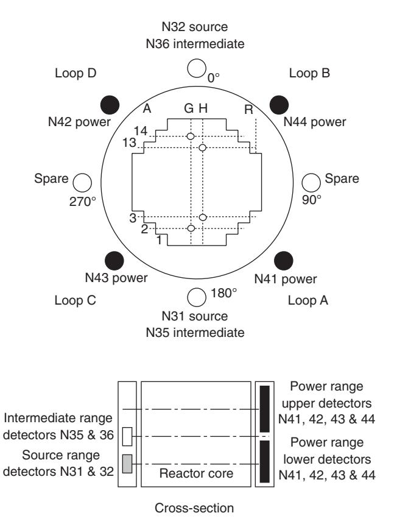

FIG. 45.1. Nuclear instrumentation system detector locations in a US PWR.

signal from either SR channel can also be applied to an audio count rate drawer assembly which, together with a scaler timer assembly, converts and amplifies the neutron pulses into an audible tone heard in the control room and in the containment. SR channel selection for audio monitoring is accomplished at the front panel of the audio count rate drawer.

Integrated pulses are also fed to the comparator and rate drawer assembly, in which the rate of change of neutron flux is computed. The output rate signal is coupled to local and remote ratemeters.

#### 45.3.4. Intermediate range

The IR instrumentation comprises two independent channels (N35 and N36) which are physically and functionally identical. As shown in Fig. 45.1, the detectors are located 180° apart at core mid-height. They share the same instrument well as the

SR detectors and their location allows them to monitor neutron level from low to full power. The IR circuits monitor the neutron flux level of the reactor and provide signals to rate circuits. The IR channels, which cover eight decades, are on scale when the SR channels reach approximately 103 counts/s and they can monitor neutron flux through full power operation.

Each IR circuit receives a signal proportional to neutron flux from a DC, g compensated ion chamber. The IR channel, with the exception of its detector, is housed in its entirety in the IR drawer assembly. A logarithmic current measuring circuit is used to monitor reactor power over a range of eight decades (10–11–10–3 A) and indications of neutron level and startup rate are provided at the nuclear instrumentation cabinets and at the reactor control panel. The neutron flux level signal is also applied to bistable relay assemblies which, if necessary, generate signals to actuate remote protection equipment.

#### **45.3.5. Power range**

The PR circuits consist of four independent channels (N41–N44) which are physically and functionally identical. Each channel employs an upper and a lower uncompensated ion chamber mounted inside a common instrument well and providing current signals to the PR circuits. As shown in Fig. 45.1, the PR detectors are spaced 90∞ apart around the core.

Within each PR channel the upper and lower detector current signals are monitored, summed and amplified to develop a voltage which is directly proportional to the reactor power level. The summed (upper and lower) signal is monitored in terms of percentage of full power, ranging from 0 to 120%. It provides reactor trip signals, alarms and control functions. Channel level signals are also applied to the comparator and rate drawer assembly, where the inputs from each PR channel are compared to ensure uniform reactor power distribution.

#### 45.4. IN-CORE INSTRUMENTATION

The purpose of the in-core instrumentation system is to provide information on the neutron flux distribution and fuel assembly outlet temperatures at selected core locations. It offers data acquisition only and performs no operational plant control functions. While the plant computer is very important in this data acquisition, it is not essential to the operation of the in-core instrumentation system.

The data obtained, in conjunction with previously determined analytical information, can be used to calculate the 3-D fission power distribution in the core at any time throughout the core lifetime. The in-core instrumentation also provides information which is used to calculate the coolant enthalpy and fuel burnup

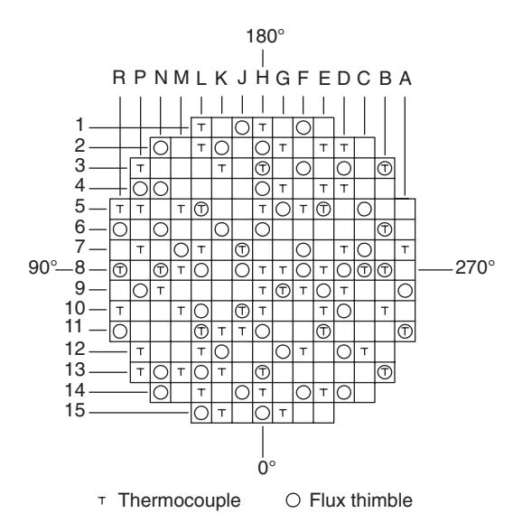

*FIG. 45.2. Thermocouple and flux thimble locations for a four loop plant.*

distribution, to estimate the coolant flow distribution and to calibrate the derivation of axial flux difference by the out-of-core nuclear instrumentation system.

The in-core instrumentation consists of fixed thermocouples positioned to measure fuel assembly coolant outlet temperature and movable miniature in-core flux detectors with sufficient sensitivity to permit measurement of localized, potentially significant neutron flux distribution variations within the core. The number of thermocouples and the paths available within the core for the movable flux detectors vary, depending on the design, i.e. two, three or four loops (Fig. 45.2).

#### 45.5. ROD CONTROL AND INSTRUMENTATION

#### **45.5.1. Introduction**

The purpose of the rod control system is to maintain a programmed average temperature in the reactor coolant system (RCS) by regulating the reactivity in the core. An error between the programmed reference temperature (*T*ref) based on turbine impulse pressure and the highest average temperature (*T*av) of the reactor coolant generates a signal which causes automatic rod movement. Rod speed and direction are governed by the size and sign of the error difference between *T*ref and *T*av.

The full-length rods are separated into two functional categories: shutdown banks and control banks. Each category consists of a number of individual banks of between four and nine rods which are moved together. The shutdown banks are always in the fully withdrawn position during normal operation and are moved to this position at a fixed speed in manual control prior to criticality. They provide a large negative reactivity insertion in the event of a reactor trip and ensure that the reactor achieves and maintains subcriticality. The control banks are the only rods which can be manipulated under automatic control.

Power to the rod drive mechanisms is supplied by two motor generator (MG) sets operating from two separate 480 V, three phase buses. The AC power produced by the MG sets is distributed to the rod control power cabinets through two series connected reactor trip breakers. A reactor trip signal opens the trip breakers, removing power from the drive mechanisms and allowing the rods to fall into the core under gravity. Desired (demanded) bank position indication and individual rod position indication are provided for all rods on the main control board. The board also shows the demanded position, receiving the signal which instructs the rods to move within the rod control system.

There are operating limits on how far the rods can be withdrawn from the core during power operation. These are referred to as the rod insertion limits (RILs).

# **45.5.2. System description**

In the automatic control mode, the rod control system (Fig. 45.3) uses three input signals: auctioneered high nuclear power, turbine first stage impulse pressure (*p*imp) and auctioneered high *T*av. These signals are used in two comparison circuits to develop a total error signal to be processed by the reactor control unit. The power mismatch circuit compares auctioneered high nuclear power with *p*imp. If a rate of change of the difference between the two signals exists, the power mismatch circuit generates an error signal; the higher the rate of change of the difference, the higher the error signal will be. The summing unit compares auctioneered high *T*av and *T*ref (generated from *p*imp) and any difference between the two also produces an error signal. This error signal is algebraically summed with the error signal from the power mismatch circuit and a total error signal is sent to the reactor control unit.

The reactor control unit generates an analog signal, the polarity and magnitude of which determine the speed and direction of rod motion. When the bank selector switch is in the 'automatic' position, this analog signal is sent to the logic cabinet. The logic cabinet processes the analog input signal into a digital output for the power cabinets. Signals are developed that determine rod speed and direction and which control bank/group of rods is to be moved. The rod stop interlocks interface in the logic cabinet to prevent rod motion under predefined conditions.

The power cabinets receive power from the rod drive MG sets through the reactor trip and bypass breakers and distribute this power to the control rod drive mechanisms under the control of the logic cabinet. Each power cabinet can supply up

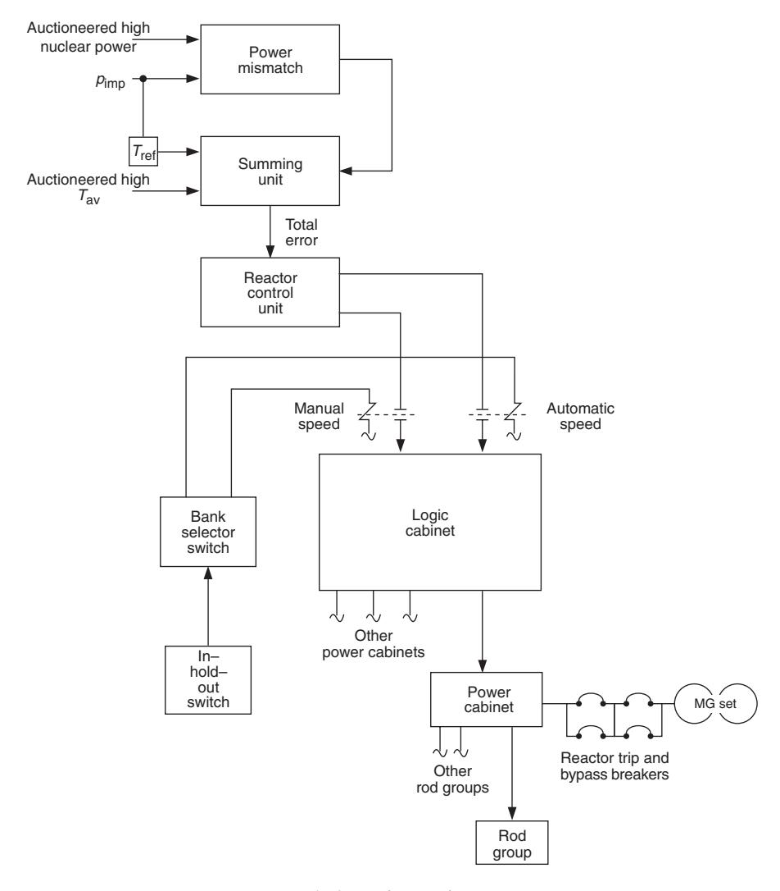

*FIG. 45.3. Rod control system.*

to three groups of rods. Manual control of the rods is selected from the bank selector switch in the 'manual' position. This changes the logic cabinet input from the reactor control unit to the bank selector switch. Rod motion is achieved using the 'in–hold–out' switch.

#### **45.5.3. System design**

The automatic rod control system is designed to maintain a programmed average temperature in the reactor coolant by regulating the reactivity within the core. The system is capable of restoring the average temperature to within ±1.5∞F (±0.7∞C) of the programmed temperature following design load changes. The design load changes for the rod control system are:

- 5%/min ramp increase or decrease;
- ±10% step change in load;
- 50% step load decrease (with the aid of the automatic steam dump system).

These load changes are handled by the rod control system automatically when reactor power is between 15 and 100% of full power. Automatic rod control below 15% turbine load is not provided. The rod control system is used to compensate for relatively fast, short term reactivity changes such as those resulting from power changes and xenon peaking. Compensation for slower, long term effects, such as fuel depletion and gradual xenon and samarium changes, is accomplished by adjustment of the RCS boron concentration via the chemical and volume control system (CVCS).

#### 45.6. ROD INSERTION LIMIT

The rod insertion limit (RIL) ensures that there is enough negative reactivity associated with the control rods to place the reactor in the hot shutdown condition following a reactor trip and under the following assumptions:

- The highest worth rod is stuck full out. This means that the amount of negative reactivity associated with this rod will not be inserted into the core for shutdown.
- The reactor is operating with the highest power defect. This means that the core is operating at full rated power and is at the end of its life.
- The plant is operating with the highest deviation from rated *T*av. This deviation, of +4∞F (+2∞C), will, upon cooldown, add positive reactivity to the core.

These assumptions correspond to the assumptions used in accident analysis. In addition, the design criteria for the RIL stipulate that there will be no return to criticality following a steam relief, safety or steam dump valve failing open. This single failure (essentially a small steam rupture) will cause rapid cooldown of the reactor coolant, which will add positive reactivity to the core.

In addition to the RILs having to meet the above assumptions, several other considerations must be examined. It is desirable to set the limit as low as possible (rods inserted to a great extent into the core) to allow the largest range of rod motion for power level changes, but it is also desirable to set the limit as high as possible (rods barely inserted into the core) to ensure that nuclear peaking factors are maintained. If a group of rods is inserted into the core, the neutron flux in that region will be depressed, causing a neutron flux increase at some other location. This would result in an uneven flux distribution. To reduce this, the rods must be withdrawn as far as possible. This high withdrawal set point also minimizes the consequences of a hypothetical rod ejection accident.

The set point selection of the RILs must meet the requirements of the assumptions stated at the beginning of this section and also be at an optimum point between the requirements for plant manoeuvrability and nuclear peaking factors.

# 45.7. PRIMARY SYSTEMS CONTROL AND INSTRUMENTATION

The purpose of primary instrumentation is to:

- Monitor RCS temperature, pressure, flow and level;
- Provide inputs to the RPS for reactor trip, engineered safety features actuation and interlocks;
- Provide inputs to various primary and secondary control systems.

#### **45.7.1. Reactor coolant loop temperature instrumentation**

(a) *Narrow range temperature detectors.* The reactor coolant loop temperatures used in the control systems and the RPS are measured by narrow range, fast acting RTDs. These detectors are installed in thermowells and are part of the RCS pressure boundary.

A dual element RTD is inserted into each thermowell. One element provides an electronic signal to a low voltage amplifier and the amplified signals from three RTDs are averaged together to generate a single signal (hot average temperature, *T*h av) from that loop. This signal, along with the cold average temperature signal from the same loop, *T*c av, will be used to generate D*T* and *T*av for that loop. The cold leg narrow range RTD is also a dual element, fast acting RTD, which is inserted into a thermowell directly downstream of the reactor coolant pump. Because of the turbulent flow at this point, only one narrow range RTD is required to provide an accurate temperature indication. The second element in each RTD is considered an installed spare. It is wired directly to the RPS cabinets but not connected to any electronics. In the event of a failure of the first element, the second is available for use.

The narrow range RTDs are calibrated to provide an output between 510 and 650∞F (265–343∞C). Figure 45.4 shows how the RTD temperature signals are used to compute loop *T*av and D*T* and how each is used by the control and protection systems.

(b) *Wide range temperature detectors.* Hot and cold leg reactor coolant loop temperatures are also measured by wide range (0–700∞F, or –18 to 371∞C)

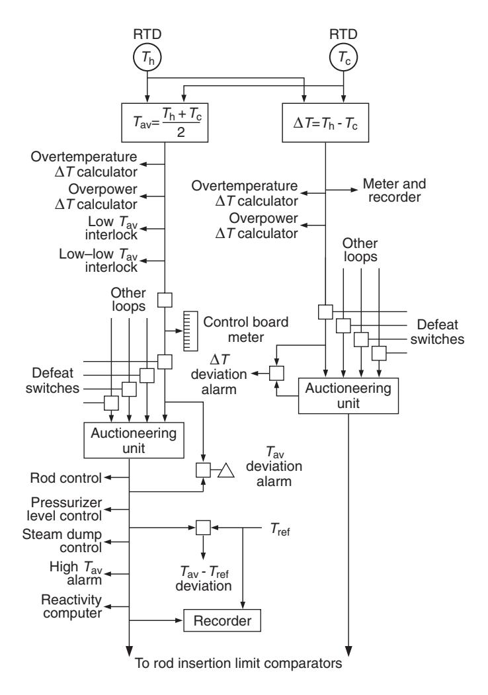

FIG. 45.4. Reactor coolant system temperature instrumentation.

RTDs mounted in wells in the reactor coolant piping of each loop. These detectors are used for indication during heat-up and cooldown and during natural circulation operation. The cold leg wide range RTDs are also used in the cold overpressure control system.

(c) Pressurizer, surge line and spray line temperature detectors. There are two temperature detectors on the pressurizer: one measures steam temperature and the other water temperature. Under normal conditions, the pressurizer is a two phase system in equilibrium so that the water and steam temperatures are the same. When they are not, an abnormal condition is indicated.

The surge line temperature detector provides indication and a low temperature alarm. 'Temperature low' indicates that there has been an in-surge of relatively cold water or that ambient losses have lowered the temperature to the set point. The temperature should remain high owing to a constant outflow from the pressurizer caused by the constant, small spray bypass flow. This bypass flow maintains the pressurizer and reactor coolant at equal boron concentrations and keeps the spray lines and spray nozzle warm. Each spray line has a temperature detector for indication and for 'temperature low' alarm. A low temperature could be due to a loss of spray bypass flow. There would be a concern about thermal shock to the spray nozzle if the temperature difference between spray line and pressurizer were excessive.

- (d) *Safety and relief valve discharge and pressurizer relief tank temperature.* There is a temperature detector on the discharge of each pressurizer safety valve and a single detector on the common discharge of the two power operated relief valves. High temperature alarms from these detectors alert the operator to a discharge or seat leakage past these valves. Because they are located in such close proximity to each other, any single valve lifting will cause all of the temperature detectors in the discharge piping from the relief and safety valves to heat up. There is also a temperature detector on the pressurizer relief tank for indication and to provide a 'temperature high' alarm.
- (e) *Temperature detector in leak off-line from reactor vessel flange O ring seals.* This provides an alarm at high temperature, generating an audible annunciation to the operator of a leak through one or both reactor vessel upper head O rings.

#### **45.7.2. Pressurizer**

- (a) *Pressurizer pressure.* Four pressure transmitters on the pressurizer are used for indication, control and protection. These transmitters have a narrow range, with an indication span of 1700–2500 psig (1 psi = 6.89 kPa).
- (b) *Reactor loop and pressurizer relief tank pressure.* A pressure transmitter is located in each RHR suction line near the penetration to the RCS hot leg (loops 1 and 4). These are wide range (0–3000 psig) transmitters and are used for indication during startup and shutdown. They also provide interlocks to permit opening of and to automatically close the suction valves on the RHR suction to prevent overpressurization of the RHR piping. The pressure transmitter on the pressurizer relief tank provides indication as well as a 'pressure high' alarm.
- (c) *Pressurizer level.* Three pressurizer level transmitters provide indication and are used by the RPS and the pressurizer level control system. Pressurizer level is a direct measure of reactor coolant inventory.

# **45.7.3. Reactor coolant flow**

The flow in each reactor coolant loop is measured by three differential pressure transmitters at the elbow in the intermediate leg of each loop. The square root of the pressure difference between the inside and the outside bend of the elbow is proportional to flow and provides both indication and an input to the RPS. There is a common high pressure tap on the outside of the bend and three low pressure taps are located on the inside.

#### **45.7.4. Reactor vessel level instrumentation system**

To monitor the reactor vessel level during abnormal plant conditions, a reactor vessel level indication system (RVLIS) is installed (Fig. 45.5). The RVLIS utilizes differential pressure (d*p*) transmitters to measure vessel level or relative void content of the fluid surrounding the core. Each d*p* transmitter in a train is ranged to provide indication during either forced flow (reactor coolant pumps running) or natural circulation. Penetrations into the RCS pressure boundary are made through a spare penetration into the vessel head near the centre (low pressure tap) and through an incore instrument conduit at the seal table (high pressure tap). Each sensing line is

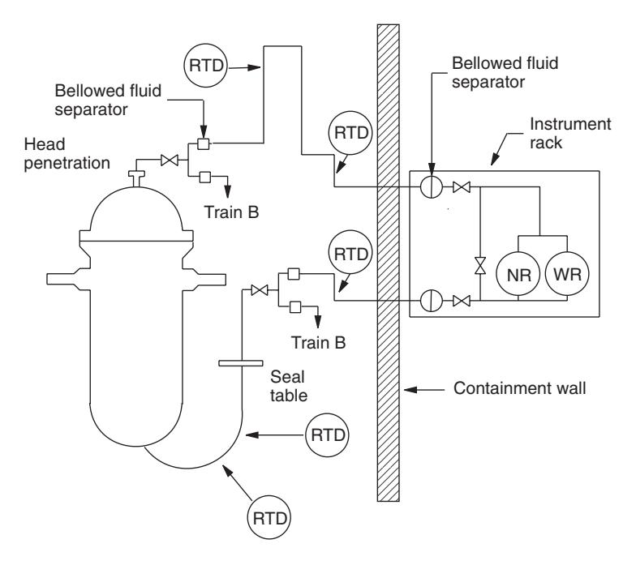

*FIG. 45.5. Reactor vessel coolant level instrumentation system. (NR, WR: narrow and wide range d*p *transmitters.)*

sealed at both ends with bellows fluid separators which serve as hydraulic couplings to transmit the sensed pressure to the d*p* transmitters.

RTDs are placed on each vertical portion of the sensing lines. The temperature measurements from the RTDs are used to compensate for the density of the fluid. Together with reactor coolant hot leg wide range temperature and reactor coolant system wide range pressure, they are also employed to automatically compensate the d*p* transmitter outputs for density changes during normal operation and adverse containment conditions following an accident. The sensed differential pressure is transmitted by the d*p* transmitters to process and control cabinets. Control board meters indicate compensated reactor vessel level from 0 to 100%.

#### **45.7.5. Monitoring of subcooling**

RCS subcooling can be computed either manually using a steam table or via a computer based algorithm. Pressure inputs can be supplied from the RCS wide range pressure measurement and from pressurizer pressure. Generally, the pressure value used for determining the system saturation temperature is an auctioneered low value of those inputs. The temperature inputs used in the computation are RCS hot leg temperatures, RCS cold leg temperatures and core exit thermocouple temperatures. The temperature value used to determine RCS subcooling is typically the core exit thermocouple temperature.

# 45.8. PRESSURIZER PRESSURE CONTROL SYSTEM

The pressurizer pressure control system controls the pressure of the RCS at or near a variable set point, normally 2235 psig, during both steady state and design transient conditions. The system consists of a combination of electrical heater banks, spray valves and relief valves actuated at the proper times by a pressure controller with proportional, rate and reset adjustments. The heaters and spray valves are set to operate at various fixed pressure deviation points from the controller set point to control pressure within a narrow band.

The pressurizer heaters are divided into three banks: one bank of proportional heaters and two banks of backup or on/off heaters. The proportional heaters are operated by varying their applied voltage, thereby directly and proportionally controlling their heat output over a fixed pressure range of 30 psig. These heaters maintain the equilibrium heat balance in the pressurizer during steady state conditions. If system pressure decreases from the set point, the proportional heaters provide maximum heat output. If pressure continues to decrease, the backup heaters are turned on. For a system pressure increase above the normal set point, all heaters are turned off and the spray valves are opened to admit cooler RCS water into the

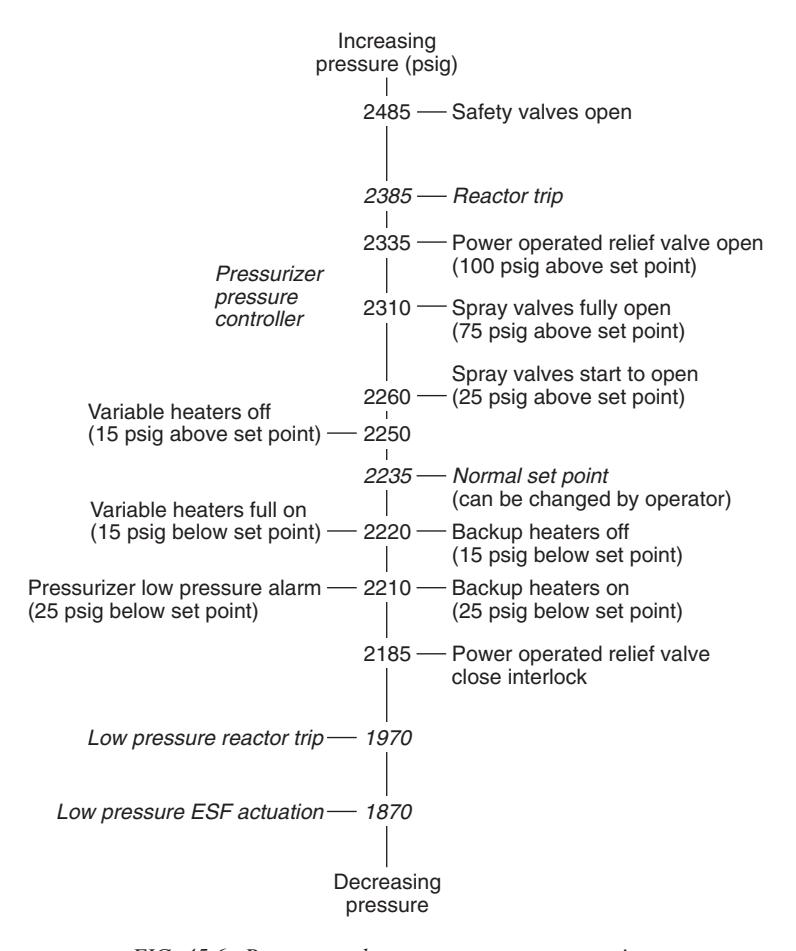

*FIG. 45.6. Reactor coolant system pressure set points.*

pressurizer steam volume. For very large pressure transients, there are two power operated relief valves located on the pressurizer which open in the event that the spray valves are incapable of controlling the pressure surge. These relief valves relieve steam directly to the pressurizer relief tank. In the event of a transient that exceeds the capability of the control system, appropriate high and low pressure reactor trips and a low pressure ESF actuation signal are actuated by the RPS. In addition, three code safety valves which relieve steam to the pressurizer relief tank are provided on the pressurizer as a final means of protecting the integrity of the RCS.

The pressurizer pressure signal feeds a proportional–integral (PI) controller before being used to control the proportional heaters, the backup heaters, the spray valves and one of the two power operated relief valves. The second relief valve is directly controlled from an uncompensated pressure signal. If the compensated error signal (*p* – *p*ref) indicates a pressure higher than a predetermined set point, proportional spray is initiated and increases with the pressure until the maximum spray rate is reached. The dead band between de-energizing the proportional heaters and initiating the proportional spray prevents frequent operation of the spray valves during minor pressure variations. Typical set points for the system are shown in Fig. 45.6. One power operated, normally closed, on/off relief valve operates at a positive 100 psig pressure deviation from the controller set point and a second relief valve operates at a predetermined fixed set point of 2335 psig to maintain system pressure below the high pressure reactor trip set point during large transients. The operation of these valves also limits the undesirable opening of the spring loaded code safety valves, which have a different set point from the relief valves.

If the error signal indicates a pressure lower than a predetermined set point, the proportional heaters are fully energized. If pressure continues to decrease, the backup heaters are energized. The set point is low enough to prevent continuous switching of the backup heaters during small pressure variations. Under normal conditions, the proportional heaters operate continuously at a low level to compensate for the continuous spray rate of approximately 1 gal/min (~3.8 L/min) and pressurizer heat losses.

#### **45.8.1. Reactor protection signals**

Four pressure transmitters are used to generate the required coincidence for all protection functions and to provide control dependability, through a channel selector switch, during testing or in the event of a failed transmitter:

- *High pressure reactor trip.* This trip is generated when pressurizer pressure increases to 2385 psig as sensed by two out of four transmitters. It cannot be blocked and provides protection for the reactor coolant pressure boundary.
- *Low pressure reactor trip*. This trip is generated when pressurizer pressure decreases to 1970 psig as sensed by two out of four transmitters. It is only active when reactor or turbine power is greater than 10% of full power. This trip is also rate sensitive and protects against DNB.
- *Overtemperature* DT *trip.* There are separate overtemperature D*T* calculators for each loop of the RCS. Each of the four pressurizer pressure transmitters supplies an analog pressure signal to a calculator which is used in the computation of the D*T* trip set point. The overtemperature D*T* trip provides protection against DNB and pressure is a major factor in calculating the margin to DNB.
- *Engineered safety features actuation.* The pressurizer pressure transmitters are used to generate an ESF actuation signal for protection against loss of coolant. This signal is generated if any two of three pressure transmitters sense a

pressure of 1870 psig or less. It can be manually blocked below 1970 psig to allow normal depressurization and is automatically unblocked above 1970 psig.

#### 45.9. PRESSURIZER LEVEL CONTROL SYSTEM

The purposes of the pressurizer level control system are to:

- Control charging flow to maintain the programmed level in the pressurizer;
- Provide an input to the RPS for RCS boundary protection.

#### **45.9.1. Level transmitters**

Pressurizer level is measured by comparing the difference in pressure between it and a reference leg. Four d*p* type level transmitters are mounted on the pressurizer. They utilize bellows type sealed reference legs (with condensate pots) to generate the static pressure head and pressurizer water level to generate the variable or dynamic head. The density of the water in the pressurizer varies with pressurizer temperature and the instrumentation is therefore calibrated for pressurizer temperature. Three transmitters are calibrated for normal operating temperatures and are used for both control and protection functions. One is calibrated for cold conditions and is used only for indication while operating at cold shutdown and establishing a steam volume in the pressurizer. This transmitter is not used for control or protection.

The output from the transmitters corresponds to 0–100% of water level and a selector switch is provided to select two of the three transmitters for control. One of the two is used for level control, let-down isolation and heater cut-off, and the other for backup let-down isolation and heater cut-off. The third channel can be selected to replace either of the two controlling channels during testing or failure. Another selector switch is provided to allow recording of any one of the three transmitters.

#### **45.9.2. Control channel**

The input to the level controller is obtained by comparing the measured level with a programmed reference level signal (which varies as a function of *T*av). The resulting error generates a signal to feed the PI controller, which controls the CVCS charging flow. This controller prevents the charging flow from reacting to small, temporary perturbations while eliminating any steady state level error. Since let-down flow is fixed, the balance is maintained by varying the charging flow. This is accomplished by two methods:

— In the case of the positive displacement charging pump, flow is controlled by varying the speed of the pump;

— In the case of the centrifugal charging pumps, flow is controlled by varying the position of a flow control valve in the discharge header from the pumps.

RCS temperature changes resulting from reactor power or turbine load changes will cause a corresponding change in pressurizer level. In order to minimize the effect on the charging system, pressurizer level is programmed as a function of *T*av to correspond with the expansion characteristics of the reactor coolant. However, rapid transients will still cause an imbalance, requiring charging flow changes. For this reason, both minimum and maximum limitations must be placed on the level program in order to:

- Prevent the pressurizer from going dry following a reactor trip;
- Prevent the pressurizer from going solid following a turbine trip from 100% power without a direct reactor trip.

During steady state conditions an equilibrium saturated steam–water interface is maintained in the pressurizer with the steam volume at saturation temperature for 2235 psig.

In general, an out-surge of water from the pressurizer results in a system pressure decrease and an in-surge results in a system pressure increase. However, if the in-surge is large enough, it will eventually result in a system pressure decrease because the insurge water is cooler than that already in the pressurizer. Therefore, if pressurizer level increases above the program level set point by 5%, the control system will automatically energize the backup heaters in an attempt to offset this effect. This is observed on a step load decrease where an initial in-surge, followed by a larger outsurge, causes a pressure reduction. Hence the 5% deviation above set point serves as an anticipatory signal to limit the pressure reduction on a load decrease.

The level signal which is compared with the reference level in the level controller is also sent to a bistable. This bistable provides a low level alarm at the 17% level, isolates CVCS let-down by closing one let-down isolation valve and all orifice isolation valves and turns off all pressurizer heaters. Let-down isolation prevents further lowering of pressurizer level and heater cut-off protects the heaters, which would be damaged if operated in a steam environment.

## **45.9.3. Redundant isolation channel**

The redundant isolation channel consists of an actual level signal sent through the channel selector switch and then to two bistables. One of these bistables provides a high level alarm at the 70% level. The other closes the second let-down isolation valve, provides a redundant signal to close all orifice isolation valves and turns off all heaters.

# **45.9.4. High level reactor trip**

A high level trip is generated when two out of three transmitters sense a pressurizer level of 92% or greater. This trip is provided as RCS boundary protection and trips the reactor before the pressurizer can go solid. It functions as a backup to the high pressure reactor trip. This trip is one of the at-power trips and is only active if either reactor power or turbine power is at more than 10% of full power.

#### 45.10. STEAM GENERATOR WATER LEVEL CONTROL SYSTEM

The purposes of the steam generator water level control system are to:

- Control the feedwater flow to maintain a programmed level in the steam generators;
- Control the feedwater header pressure to maintain a programmed differential pressure across the main feed regulating valve;
- Provide inputs into the RPS for protection against loss of heat sink;
- Provide an input into the turbine trip system for protection of equipment.

The mass of water in a steam generator is controlled by one of two automatic level control systems. In addition, a feedwater pump speed control circuit is incorporated to maintain the main feed regulating valves in their optimum throttling positions.

The feedwater control system controls the steam generator water level to a programmed level from 15 to 100% of full power. Its inputs are main steam flow, main feedwater flow and level error. It uses these inputs to control the position of the 14 in (35.6 cm) main feed regulating valves. The feedwater bypass control system controls the steam generator water level to a programmed level at low power levels (0–20% power) and uses auctioneered high nuclear power and level error to control the position of the 6 in (15.2 cm) feedwater regulating bypass valves. The feed pump speed control system is used in automatic mode when power is greater than 15%. Its function is to vary the speed of the main feed pumps to maintain a programmed differential pressure across the main feed regulating valve, which in turn positions the valve near its mid-range of travel. The feed pump speed control circuit is not used to control the level of the steam generators. Its inputs are main steam header pressure, main feed header pressure and a programmed reference differential pressure. Manual control of any of the three control systems described above is permitted at any time.

The RPS receives several inputs from the detectors used in the steam generator water level control system. These inputs are used for the generation of reactor trips and for ESF actuation. The use of other inputs by the RPS will affect the operation of various steam generator water level control system components. Inputs are also provided to the turbine trip system for turbine protection.

## **45.10.1. Feedwater control system**

The feedwater control system for a single steam generator utilizes the following inputs for controlling the position of the main feed regulating valve:

- One of two pressure compensated steam flow channels (selectable);
- One of two feedwater flow channels (selectable);
- One actual steam generator level channel (non-selectable);
- A programmed level generated by one of the turbine first stage pressure channels.

Pressure compensation is used when measuring steam flow because of the dependence of mass flow on density but feedwater flow does not have to be density compensated. These two flow signals are compared to produce a flow error signal which is combined with any level error signal and used to position the feed regulating valve. The steam flow and feed flow signals are also compared with each other to provide steam flow/feed mismatch alarms. The level error signal is developed by comparing an actual level signal with a programmed level signal generated from the turbine first stage impulse pressure. Since the impulse pressure is proportional to power, the level in the steam generators for some units is programmed to increase as secondary power level increases.

The programmed level is increased from 33 to 44% of the narrow range level when output changes from hot zero power to 20% of full power and is then held constant from 20 to 100% of turbine load. A level of 33% was selected for low power operations to minimize the consequences of a steam line break inside the containment and to lessen the subcooling of the reactor coolant. At higher power levels the water level in the steam generators had to be increased to allow for a 50% load reduction without a resultant reactor trip but at the same time had to be restricted to avoid containment overpressurization in the event of a steam line break. The quality of the steam leaving the steam generator had also to be considered. A level of 44% was selected as satisfying all three of these considerations.

The actual level is compared with the programmed level to generate a level error. This error signal is then sent through a lag unit to damp out oscillations and is converted into an equivalent flow error signal in a program generator. This flow error signal is then combined with steam flow and feedwater flow to produce a total error in a PI controller. The total error signal is used to position the main feedwater control valve. If there were no calibration errors, it would be possible to maintain the level in the steam generator simply by matching feedwater and steam flows. However, during a transient it is possible for the level to deviate significantly from the desired value and a level error is therefore added to the flow error used to control feedwater flow. It is multiplied by a factor before this is done to ensure its dominance — the main function of the system is to control the steam generator level. The level error signal is also integrated over time to enhance the system response and to eliminate any offset in level that could result from calibration errors between steam flow and feed flow.

A load change affects both steam flow and level. However, the control actions caused by these changes would initially be in the wrong direction. For example, in the case of a load increase, steam flow will increase, which by itself would produce a corresponding increase in feedwater flow. However, a load increase also causes 'swell'in the level, which by itself would produce a decrease in feedwater flow. Since this effect is temporary, a lag circuit on the level error signal will damp out the swell and the flow error will be allowed to increase feed flow, which is the desired action. When the level error signal passes through the lag unit, the actual level (if not as programmed) is returned to the programmed level. During a load decrease, 'shrink' in level occurs and the lag unit again allows the flow error to produce the initial desired action of reducing feed flow before the level error returns the actual level to the programmed set point.

#### **45.10.2. Feedwater bypass control system**

The feedwater bypass control system automatically controls the position of the main feed regulating bypass valve for low power operation. The inputs are level error and auctioneered high nuclear power. Auctioneered high nuclear power is used as an indication of anticipated feed flow demand instead of steam flow because the latter signals are unstable at low power levels. The two inputs are compared in a summator and any resultant flow error output is sent through an auto/manual transfer station to control the position of the bypass valve.

#### **45.10.3. Main feedwater pump speed control system**

The main feed regulator is a throttling valve with linear flow characteristics throughout its travel. However, the best characteristics for flow control are in its midrange, i.e. from about 25 to 75% open. To maintain the valve in this operating range at all power levels, the speed of the main feed pumps is controlled to compensate head losses, which vary with feedwater flow. Therefore, the pressure at the pump discharge varies and the differential pressure across the feedwater regulating valve changes. Differential pressure is used since head losses in the system decrease the pressure of the feedwater as it travels through the feedwater piping. Control by means of differential pressure also reduces wear on the regulating valve (by allowing the valve to be further open at low feeding rates) and increases pump efficiency by reducing pump power requirements.

Feed pump speed is controlled by comparing a programmed differential pressure with the actual differential pressure across the feed regulating valve. The programmed pressure is generated by summing the pressure compensated steam flows from four steam generators and sending them into a set point generator which starts with a no-load set point. The output is a programmed differential pressure (e.g. 45 psid at no load and 195 psid at full power) which is then compared with the actual differential pressure. There is a lag unit on the output of the steam flow summator to slow the system response to large and rapid changes in steam flow. This allows the feed control valves to respond to the signals generated by the feedwater controller.

The actual differential pressure is obtained by comparing the steam header pressure, sensed in the equalizing header of the main steam system, with the feed header pressure. Feed header pressure is measured in the combined header downstream of the high pressure heaters. The differential pressure error is sent to the master speed controller, which eliminates steady state errors and sends the signal to both feed pump speed controllers.

## 45.11. STEAM DUMP CONTROL SYSTEM

The purposes of the steam dump control system are to:

- Enable the NSSS to accept a 50% loss of load without incurring a reactor trip;
- Remove stored energy and decay heat following a reactor trip and return the plant to no-load conditions without actuation of the steam generator safety valves;
- Control steam pressure under low load or no-load conditions and provide for manually controlled cooldown of the RCS;
- Provide a constant steam flow during turbine startup and synchronization to facilitate manual feedwater control.

The steam dump system consists of 12 valves which dump high pressure steam from the steam generators directly into the main condenser, bypassing the main turbine. The control system for this is not required for the safe shutdown of the reactor.

The steam dump valves are air operated. The four groups of three valves are operated sequentially, the first being modulated fully open before the second group begins to move. Each valve has a positioner which regulates the air pressure to the valve operator on the basis of an instrument air signal from its group positioner. The four group positioners receive an air signal from the current to pneumatic converter, which in turn receives a current input from one of three electronic controllers, depending on plant conditions. There are two modes of steam dump control: *T*av mode and steam pressure mode. The position of the mode selector switch and plant conditions determine which controller is used. Each has a different pair of input signals. In addition to this control equipment, interlocks and arming signals prevent or halt operation of the steam dump system when not needed or desired, or in the event of an instrument failure.

# 45.12. REACTOR PROTECTION SYSTEM

The purpose of the RPS is to prevent the release of radioactive material to the environment. To meet this objective, the RPS may trip the reactor to prevent unsafe operation which could lead to accident conditions. If an accident does occur, the RPS will actuate the ESFs, which are designed to mitigate the consequences of an accident. The reactor operating parameters are monitored by local sensors to detect any condition which would require reactor trip or actuation of the ESFs. Selected processes are measured by analog circuitry for trip set point comparison and then compared in digital logic circuitry to initiate action. Safety actions are based on the number of analog signals which have exceeded their respective set points.

#### **45.12.1. System design**

The nuclear and process instrument systems send trip signals to two complete and independent logic trains in the RPS cabinets. When an unsafe condition is sensed, a signal is sent to the protection cabinets and if reactor trip is required, the protection cabinets send a signal to open the reactor trip breakers, which removes power from the control rod drive mechanisms, allowing the rods to drop into the core. If EFS actuation is required, the protection cabinets actuate the appropriate safety equipment. Signals are also provided by the logic trains to allow automatic or manually initiated interlocks and bypasses.

#### **45.12.2. Single failure criterion**

The RPS is designed with redundant (one out of two, two out of three or two out of four) instrumentation channels for each protective function and one out of two logic train circuits. These redundant channels and trains are electrically isolated and physically separated. Therefore, any single failure within a channel or train will not prevent protective action when required. Loss of input power (the most likely mode of failure) to a channel or logic train results in a signal which calls for a trip.

# **45.12.3. Testability**

The RPS is testable under all plant conditions. It is tested in a segmented fashion in which each test section overlaps an adjacent test section. This ensures availability and accuracy of the system from the sensors to the final devices (trip breakers, ESF equipment, etc.).

#### **45.12.4. Equipment qualification**

A wide range of environmental qualification tests, performance tests, etc., are employed to ensure equipment survivability in LOCA environments.

#### **45.12.5. Independence**

Each process instrument is assigned to one of four protection channels. Channel independence is carried throughout the system and extends from the sensor to the devices actuating the protective function. Physical separation is used to achieve separation of redundant transmitters and separation of wiring is achieved by separate wire ways, cable trays, conduit runs and containment penetrations for each redundant channel. Redundant analog equipment is separated by locating modules in different protection rack sets. Each redundant channel is energized from a separate vital AC power source and two reactor trip breakers are actuated by two separate logic matrices. The reactor trip breakers are connected in series with the power supply so that opening either breaker interrupts power to the rod drive mechanisms.

#### **45.12.6. Diversity**

To ensure safe operation and to protect the RCS pressure boundary, the RPS continuously monitors numerous diverse system variables. The extent of this diversity has been evaluated for a great number of postulated accidents and, generally, two or more diverse protection functions would terminate an accident before unacceptable consequences could occur.

# **45.12.7. Control and protection system interaction**

The protection system is designed to be independent of the various control systems but, in certain applications, control signals and other non-protective functions are derived from individual protective channels through isolation amplifiers. The isolation amplifiers are classified as part of the protection system and are located in the reactor protection analog racks. Non-protection functions include those signals used for control, remote process indication and computer monitoring. The isolation

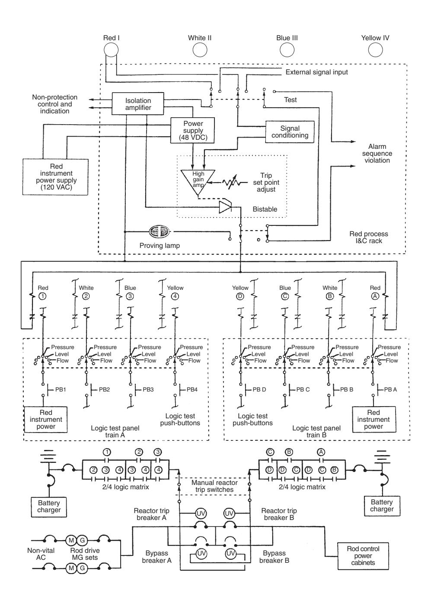

FIG. 45.7. Relay protection system.

amplifiers are designed so that a short circuit, an open circuit or the application of either AC or DC voltage on the isolated output portion of the circuit (i.e. the control side of the circuit) will not affect the input (protective) side. The signals obtained through the isolation amplifiers are never returned to the protective racks.

# **45.12.8. Component description**

The protection system may be either of two different designs, i.e. a relay protection system or a solid state protection system (SSPS). Both of these systems perform the same functions as mentioned in the system description, the SSPS being of a later design. A description of both is given below with specific differences explained. A description of the reactor trip breakers and their protection system interface is also provided.

#### **45.12.9. Relay protection system**

The relay protection system is explained with reference to the features shown in Fig. 45.7:

- *Red, white, blue, yellow.* These are redundant analog protection channels originating at the process sensors. Each channel is powered from an independent vital power supply.
- *Isolation amplifier.* The control systems are separate and distinct from the protection system. However, some control systems are dependent on signals derived from the protection system through the isolation amplifiers.
- *External signal input.* The signal conditioning equipment of each protection channel in service during normal operation is capable of being calibrated and tested independently. This is accomplished by inserting analog signals without tripping the reactor and allows testing through the channel to the protection bistable output.
- *Channel test switch.* This switch provides a path for the external signal input to the protection bistable and also provides a path to an alarm which alerts the operator to a protection channel test condition.
- *Protection bistable.* A bistable is a device with an adjustable set point capable of interrupting the power supplied to both the train A and train B logic cabinet input relays. In the bistable, the signal from the process sensor is compared with a preset, adjustable set point. When the process signal reaches the set point value, the output of the bistable is turned off (de-energized) and its output voltage goes to zero. The bistable is the point at which a variable (analog) input signal is converted to a digital (on/off) output signal, which is sent to the input relays of the logic cabinets.

- *Bistable output trip switch.* This switch allows bistable testing and verification of bistable actuation by providing continuity through the proving lamp. When in the trip position, the correct bistable response to a trip signal may be observed by the proving lamp going out. In addition, an alarm sequence violation circuit is provided to ensure that the operator trips the bistable prior to performing any testing on the analog section of the protection system. This also ensures that the operator follows the proper steps during testing. When this switch is in the normal position (not tripped) power is supplied through the bistable to both train A and train B logic cabinets.
- *Input relays.* The input relays are operated by the output of the bistables. When energized (bistable not tripped) the relays hold a contact in the logic matrix closed, thereby providing circuit continuity to the reactor trip breaker undervoltage coils. When the protection bistable trips, its input relay de-energizes, opening the input relay corresponding contact (shown open but normally closed) in the logic matrix. In Fig. 45.7, the red channel is shown from the sensor of a particular parameter to the output in the logic section. For the purpose of this discussion it is assumed that the red channel is an output from the pressurizer pressure. If this channel detects a pressure in excess of 2385 psig, the associated bistable will trip and its output will go to zero. This de-energizes the red input relays for both train A and train B logic cabinets. When the input relays are de-energized they open the contacts labelled 1 in the logic matrix of train A and contacts A in the train B logic matrix. The logic coincidence for this particular trip function is two out of four.

Even with the contacts open, power is still delivered from the 125 VDC battery bus to the undervoltage (UV) coils on the reactor trip and bypass breakers. A reactor trip will not occur until one of the other three channels also senses a high pressure condition and trips its associated bistable and input relay. With any two sets of logic matrix contacts open, power is interrupted to the undervoltage coils of the reactor trip breakers, causing them to open.

- *Logic cabinets.* These cabinets receive the signal inputs from the protection bistables (on or off), which are the protection system inputs for all reactor trips. Energized input relays 1, 2, 3, 4 (train A) or A, B, C, D (train B) in protection channels red, white, blue and yellow hold contacts closed in the power supply to the undervoltage relays of the reactor trip breakers. If these relays are de-energized by bistable action or incorrect testing, or in any other manner, the series connected reactor trip breakers open.
- *Push-buttons 1, 2, 3, 4.* These push-buttons are provided to allow complete logic testing to ensure proper reactor trip breaker operation when the correct channel coincidence is established. For example, when one of the push-buttons is depressed, the testing relay is energized, opening its associated test contact (shown beneath the input relays). When the test contact opens, the input relay

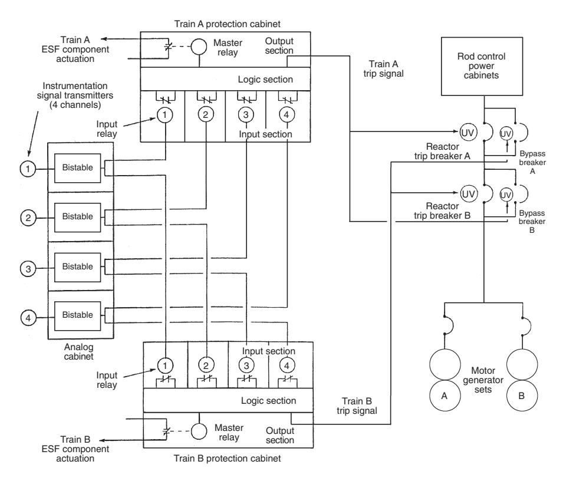

FIG. 45.8. Solid state protection system (circuits shown in energized state).

de-energizes, allowing its associated logic contact in the logic matrix to open. This interrupts power to the reactor trip breaker undervoltage coils if the correct logic coincidence is satisfied. During this test the reactor bypass breaker must be utilized to prevent an inadvertent reactor trip.

#### 45.12.10. Solid state protection system

The application of solid state techniques to the design of the RPS provided significant improvements over previous designs utilizing relays and contacts. Approximately 750 relays with 4000 contacts connected in various matrices are needed in a relay system for a four loop plant. These required 14 cabinets, 30 in wide by 30 in deep (76.2 cm  $\times$  76.2 cm), in contrast to six cabinets of the same size for the solid state system. Elimination of the majority of the 4000 contacts is expected to improve system reliability. The incorporation of a semiautomatic fast pulse testing circuit also reduces the test time for the logic section of the protection system from

4 h per train on the relay system to approximately 1 h per train on the solid state system. Fast pulse testing eliminates the need to bypass the reactor trip breakers each time the logic section is tested.

Figure 45.8 shows a single line block diagram of the SSPS. The system comprises two redundant, identical trains (A and B) that are physically and electrically independent. Inputs to the system are derived from various nuclear and non-nuclear sensors located both inside and outside the containment building. Most of these signals are processed in the analog protection system racks and result in bistable outputs (128 VAC when normal or 0 V when tripped) to the SSPS. Other signals are derived directly from process sensors by way of contacts in the sensor (such as oil pressure switches on the turbine, auxiliary contacts on circuit breakers and limit switches on valves). Contacts from the input relays enter the logic portion of the system, where the coincidence logic (two out of three, two out of four, etc.) is performed. Additional inputs which carry the train designation enter the logic directly from control board switches and push-buttons. Power to the undervoltage coils of the reactor trip breakers is supplied from the DC power supply of the RPS.

Information concerning the status of the system is transmitted to the control board status lamps and annunciators through a control board demultiplexer and to the computer through a computer demultiplexer. The purpose of the multiplexing system is to transmit a large amount of status information over a small number of conductors, thereby simplifying and reducing field wiring requirements. About 200 status lamps and 100 annunciators are operated by the control board demultiplexer and about 200 signals are recorded by the plant computer through the computer demultiplexer. Status information is taken from the solid state logic and transmitted to the demultiplexers through isolation devices in the trains (optoisolators are used). The purpose of isolation is to separate the monitoring (which is considered to be a nonprotective function) from the protection system. There is no possibility of short circuits, open circuits or high voltage connections on the multiplexing line affecting operation of the protection circuits. Multiplexed outputs of the two trains are designed such that a status lamp or annunciator is actuated by either train A or train B. Normally both trains actuate the devices simultaneously. A flashing lamp or annunciator indicates status disagreement between train A and train B.

#### **45.12.11. Reactor trip breakers**

Two series connected reactor trip breakers (Fig. 45.8) carry power from the rod control motor generator sets to the rod drive mechanisms. Loss of power to the mechanisms causes the rods to drop.

The undervoltage coils of the reactor trip breakers receive power, allowing the reactor trip breakers to remain closed only if the protection logic is satisfied and no reactor trip signal is present. Loss of power to an undervoltage coil causes its associated reactor trip breaker to open, thereby interrupting power to the rod drive mechanisms and allowing the rods to drop. A bypass breaker, in parallel with each reactor trip breaker, allows on-line testing of the trip breakers. The train A protection system de-energizes the train A reactor trip breaker and the train B bypass breaker undervoltage coils. Conversely, the train B reactor trip breaker and train A bypass breaker undervoltage coils are de-energized by the train B protection system. When a reactor trip breaker is bypassed, the protection train associated with that breaker is considered to be inoperable. The bypass breakers are interlocked so that if an attempt is made to close a second bypass breaker while one is closed, both bypass breakers will trip open. This prevents both trains from being bypassed simultaneously.

#### **45.12.12. Protection system testing**

The RPS can be tested during power operation. While only parts of the system are tested at any one time, the testing sequence provides the necessary overlap to ensure complete system operation.

Each solid state logic train contains an identical semiautomatic test panel. Pulse testing, fast enough to prevent movement of the reactor trip breaker undervoltage relays, is used to avoid tripping the breakers. Therefore, the need for bypassing the reactor trip breakers for periodic testing of the logic has been eliminated and the bypass breakers are needed only for testing the ability of the trip breakers to open. During testing of a train, all reactor trips and ESF actuations from that train and all data transmitted to control board status lamps and annunciators and to the plant computer are inhibited. To perform a test, the operator needs only to select the process to be tested on a rotary selector switch, press a 'start test' push-button and wait for either a green ('good') lamp or a red ('bad') lamp to light. During the test sequence all possible combinations of non-trip and trip conditions for that process are checked. The semiautomatic tester checks the solid state logic, including continuity to the undervoltage coil of the reactor trip breaker or to the master relay coils, excluding the input relays and contacts.

The input relays and contacts are checked during the testing of the analog portion of the protection system by tripping a bistable while monitoring the control board status lamp for the specific trip function. Since the lamp is operated through the multiplexing system, it cannot light until the input relay is actuated. Periodic testing of the analog portion of the protection system during reactor power operation can be done without initiating a protective action unless a trip condition actually exists. This is because of the AND logic required for reactor trip. The source and intermediate range high neutron flux trips must be bypassed during testing since the logic for those trips is one out of two.

Proper operation of the process sensors is verified by comparison with redundant channels monitoring the same process variables or with those having a fixed, known relationship to the parameter being checked. Calibration of sensors is normally done during plant shutdown. Analog testing is performed at the analog instrumentation rack by introducing individual dummy input signals into the instrumentation channels and observing the tripping of the appropriate output bistables. The bistable output to the logic circuitry is interrupted during individual channel testing by a test switch which, when actuated, de-energizes the associated logic input (tripping the channel) and inserts a proving lamp in the bistable output. Interruption of the bistable output to the logic circuitry for any reason (an actual fault condition, test, maintenance purposes or removal from service) causes that portion of the logic matrix to be actuated. When this occurs a bistable status light is lit in the control room. Each channel contains switches, test points and circuitry necessary to test the channel.

The power range channels of the nuclear instrumentation system are tested by superimposing a temporary test signal on the actual detector signal. The output of the bistable is not placed in a tripped condition prior to testing. Also, since the power range channel logic is two out of four, bypass of this reactor trip function is not required.

The reactor coolant pump breakers cannot be tripped at power without causing a reactor trip. However, the reactor coolant pump breaker open trip logic and continuity through the shunt trip coil can be tested. The manual trip also cannot be tested at power without causing a reactor trip since operation of either manual trip switch actuates both train A and train B. Safety injection initiation and opening of the turbine trip breakers also cannot be done at power without upsetting normal plant operation. However, the logic for these trips is testable.

## **45.12.13. Testing of input relays**

Testing of the logic trains of the RPS includes a check of the input relays and a logic matrix check. When the process instrumentation system and nuclear instrumentation system bistables are tested, each channel bistable is placed in a trip mode, causing one input relay in train A and one in train B to de-energize. A contact on each relay is connected to a universal logic, printed circuit card which performs both the reactor trip and monitoring functions. The contact that creates the reactor trip also causes a status lamp and an annunciator on the control board to operate. Either the train A or the train B input relay operation will light the status lamp and the annunciator.

Each train contains a multiplexing test switch. At the start of a process or nuclear instrumentation system test, this switch (in either train) is placed in the A + B position, which ultimately allows information to be transmitted from the two trains to the control board. A steady status lamp and annunciator indicate that input relays in both trains have been de-energized. A flashing lamp means that the input relays in the two trains did not both de-energize. Contact inputs to the protection system logic, such as the reactor coolant pump bus underfrequency relays, operate input relays which are tested by operating the remote contacts and use the same types of indication as those provided for bistable input relays.

Actuation of the input relays provides overlap between testing of the logic portion of the protection system and testing of those systems supplying the inputs to the logic section. Test indications are status lamps and annunciators on the control board. Inputs to the logic section are checked one channel at a time, leaving the other channels in service. For example, a function that trips the reactor on two out of four channels becomes a one out of three function when the channel in test is placed in the trip mode. Both trains of the logic section remain in service during this portion of the test.

#### **45.12.14. Testing of logic matrices**

Logic matrices are checked one train at a time and input relays are not operated during this portion of the test. Reactor trips from the train being tested are inhibited by the input error inhibit switch on the semiautomatic test panel in the train. At the completion of the logic matrix tests, one bistable in each channel of the process instrumentation or nuclear instrumentation is tripped to check closure of the input error inhibit switch contacts. The logic test scheme uses pulse techniques to check the coincidence logic. All possible trip and non-trip combinations are checked. Pulses from the tester are applied to the inputs of the universal logic card at the same terminals that connect the input relay contacts. Thus, there is an overlap between the input relay check and the logic matrix check. Pulses are fed back from the reactor trip breaker undervoltage coil to the tester. These pulses are of such short duration that the reactor trip breaker undervoltage coil armature cannot respond mechanically.

Testing is indicated by an annunciator in the control room showing that reactor trips from the train have been blocked and that the train is being tested. Green and red lamps on the semiautomatic tester indicate a good or bad logic matrix test. Protection capability provided during this portion of the test is from the train not being tested.

#### **45.12.15. Testing of reactor trip breakers**

Normally, reactor trip breakers A and B are in service and bypass breakers A and B are open (out of service). In testing the protection logic, pulse techniques are used to avoid tripping the reactor trip breakers, thereby eliminating the need to bypass them during this testing. The following briefly describes the method used for testing the trip breakers themselves:

— With bypass breaker A racked out, manually close and trip it to verify its operation.

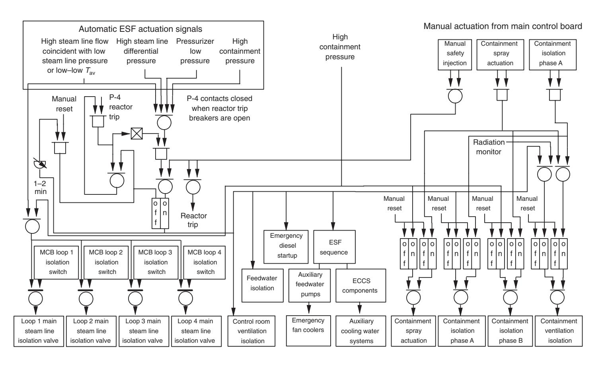

*FIG. 45.9. Engineered safety features logic.*

- Rack in and close bypass breaker A; trip reactor trip breaker A through the protection system logic matrix.
- Reclose reactor trip breaker A.
- Trip (open) and rack out bypass breaker A.
- Repeat the above steps to test trip breaker B using bypass breaker B.

Auxiliary contacts on the bypass breakers are connected to the alarm systems of their respective trains so that if either train is placed on test while the bypass breaker of the other train is closed, both reactor trip breakers and both bypass breakers automatically trip.

The RPS is normally required to be in service. However, to permit on-line testing of the various protection channels or to permit continued operation in the event of a subsystem instrumentation channel failure, a technical specification limiting the conditions for operation, defining the minimum number of operable channels and the minimum degree of channel redundancy, has been formulated. The technical specifications also define the required restrictions on operation in the event that the channel operability and degree of redundancy requirements cannot be met.

The RPS is designed so that response time tests can only be performed during shutdown and the measured channel response times are then compared with those used in the safety evaluations. However, the safety analysis utilizes conservative numbers for trip channel response time based on startup tests conducted on several plants.

# 45.13. REACTOR PROTECTION SYSTEM: ENGINEERED SAFETY FEATURES

The ESFs are initiated when the RPS detects either a LOCA or a steam line break. Whatever the nature of the accident, the functions of the ESFs are to:

- Put the plant into a safe shutdown configuration (including reactor trip and boron injection);
- Provide cool borated water at a rate sufficient to prevent gross core damage from a LOCA;
- Isolate the containment from the outside environment to limit radioactive effluent release;
- Provide a heat sink so that the residual heat of the core can be removed;
- Provide a source of reliable emergency power (diesel generators) in case offsite power is unavailable.

ESF actuation conditions are shown in Fig. 45.9. The mechanism for initiation is the protection system output cabinet (one for each protection train). The output cabinet contains approximately twenty master relays and forty slave relays. The master relays are actuated when the logic section initiates an ESF signal and, in turn, actuate from one to four slave relays which close contacts in pump starting circuits, close contacts to open or close valves or actuate solenoids for air operated equipment.

Test cabinets for both the slave and master relays allow periodic testing by introducing a low voltage electrical signal to each coil. This low voltage is not strong enough to actuate the relay but is sufficient to demonstrate continuity through the coil. Integrated full-scale operability testing requires the actuation of the ESF equipment (final device testing) and can only be done during plant shutdown. Even then it requires extensive system preparation and realignment. Typically, one entire train (A or B) will be tested alternately during each refuelling outage (every 14–18 months).

# **46. I&C CONCEPTS FOR BWR PLANTS IN JAPAN**

#### 46.1. INTRODUCTION

This section summarizes the design concepts used in the I&C systems for BWR power plants in Japan. It does not describe the design details of the system, but simply the main I&C features. Section 46.2 covers general design requirements for I&C systems in NPPs in Japan while Section 46.3 discusses various specific current requirements for BWRs. Many of the general needs are, of course, common to PWRs and BWRs but there are sufficient differences to justify some repetition of material in Section 42. Sections 46.4 to 46.10 deal with the concepts and design criteria of particular instrumentation subsystems.

#### 46.2. DESIGN CRITERIA FOR NUCLEAR POWER PLANTS

#### **46.2.1. Requirements of standards and guidelines**

During the design of an NPP, the safety design is inspected by the Safety Committee of the Atomic Energy Commission and construction is not permitted until the requirements of all of the necessary technical standards and guidelines provided in the inspection have been met. The Basic Law for Nuclear Power Plant is fundamental to the design of NPPs in Japan. The Law for the Electric Industry regulates the construction of the plant as well as the facilities employed in it. The Regulations for Nuclear Reactors, etc. were enacted to ensure safety and to utilize atomic energy effectively.

The Safety Committee provides guidelines for the safe design of NPPs. In these guidelines, the following concern the I&C system:

- *Control room.* The control room has to function in such a way that the operator can stay there to shut down the reactor in safety in the event of an accident.
- *Nuclear reactor shutdown system*. If, at any time, the transient reactivity exceeds the allowable operative range, the reactor must be shut down in safety.
- *Safety system*
  - ∑ Design must include redundancy for each system so as not to lose protection owing to a single failure or single erroneous operation of the structural instruments and channels;
  - ∑ The I&C system must, in principle, be provided with an exclusive channel;
  - ∑ Confirmation of function and testing must be available during operation;
  - ∑ Final safety has to be ensured in the case of power cut-off, systems isolation or any similar event.

In addition to the standards and guidelines described above, specific technical provisions and guidelines for NPPs are provided 'unofficially' by the Japan Electric Association. Design Guides for Safety Systems of Nuclear Power Plants (JEAG-4604) and Application Criteria for Programmable Digital Computer Systems in Safety Related Systems of Nuclear Power Plant (JEAG-4609) cover I&C systems and give design requirements for safety. These design guidelines also conform to the US Code of Federal Regulations, Title 10 (10CFR50), General Design Criteria, Regulatory Guide and Standard Review Plan, and to standards and guides from the Institute of Electrical and Electronics Engineers (IEEE), the Instrument Society of America (ISA), the American National Standards Institute (ANSI) and the American Society of Mechanical Engineers (ASME).

#### **46.2.2. Requirements for construction and operation**

When permission for building a power reactor has been given and the safety design of the reactor has passed inspection, the construction plans must be sent to the authorities for approval prior to the commencement of construction. Building of the plant may start once the plans have been accepted. The application should include the items subject to safety design inspection. Equipment for I&C systems, radiation control and auxiliary facilities is subject to approval.

Contractors who undertake the design and construction of NPPs (Toshiba and Hitachi) must ensure that the design and construction contribute to a low downtime and the prevention of injuries from radiation during operation over many decades. Human factors must be taken into consideration in the control room and the design should be based on human factors engineering so as not to cause erroneous operation or misjudgement.

Prior to the operation of the plant, an inspection is conducted for each function subject to approval. Three steps of prior inspection are applied to every commercial NPP and when the plant has passed the final inspection, commercial operation is allowed. Maintenance and management of the commercial operation should conform to the provisions of the Regulation for Nuclear Installations and Operations, etc. For this purpose, security rules might be submitted to the authorities for acceptance.

#### 46.3. DESIGN GUIDELINES FOR BWR PLANTS

#### **46.3.1. Safety design criteria**

The owner of the NPP must be provided with sufficient assurance that it can be operated, maintained and inspected without undue risk to the health and safety of the public and plant personnel throughout its lifetime. To guard against major events that could contribute to this risk, the following policies have to be followed:

- The occurrence of such events must be prevented or minimized;
- Any such occurrence must be detected as promptly as possible to permit safe shutdown of the plant;
- Protective facilities and equipment must be provided to prevent further consequences;
- Adequate plant control must be maintained after the occurrence.

Major events which could cause undue risk to the health and safety of the public and plant personnel include accidents such as a LOCA due to rupture of the reactor coolant pressure boundary and a release of radioactive material due to a break of piping outside the reactor containment vessel. It is important to minimize the frequency of these major events and the measures to be implemented must include the following:

- The reactor has to be designed so that, in the power operating range, prompt inherent nuclear feedback characteristics provide countermeasures to a rapid increase in reactivity.
- The reactor has to be designed to ensure that the integrity of the reactor coolant pressure boundary can be maintained and the nuclear and thermal parameters held within specified acceptable limits in abnormal transients, so that a serious release of radioactive material may be prevented.

— Features have to be incorporated into the design to ensure that even a small release of coolant from the reactor coolant pressure boundary can be readily and reliably sensed and a major event prevented.

Measures must be provided to ensure the prompt and reliable sensing of any major event and safe shutdown of the reactor as follows:

- The safety and protection system has to be such as to sense promptly the occurrence of any major event and to initiate automatically the ECCSs and ESFs.
- The safety and protection system has to be designed to have redundancy and independence, ensuring that no single failure or removal of any component or channel included in the system results in loss of function and prevents attainment of a safe state. Conditions such as loss of energy and disconnection of the system must be allowed for.
- The safety and protection system has to be designed to provide in-service testability for its function of ensuring system integrity.

The design must incorporate the following considerations to ensure adequate plant control after the occurrence of any major event:

- The control room has to be designed to permit access and occupancy by plant operating personnel.
- I&C systems must be designed to facilitate ready evaluation of accident status and the monitoring of plant parameters necessary to enable actions to be taken in response to the event.
- Adequate means must be designed for monitoring the radioactivity of the containment vessel atmosphere, effluent discharge paths, the radioactivity of the plant environs, etc., to determine accurately the status and degree of any accident.

#### **46.3.2. Criteria for operating limits**

There are a variety of operating limits to ensure the integrity of fuel cladding and of the primary reactor coolant system. If any one of these limits is exceeded the plant has to be shut down and inspected for the cause. Therefore, adequate limit set points must be provided in safety systems at which protective functions are automatically performed and which ensure that no operating limits are exceeded. These set points have to be determined with a reasonable tolerance to ensure that the operating limits are not exceeded as long as the instruments involved are functioning correctly.

- (a) *Operating limits for fuel cladding integrity.* Limits must be specified for the minimum critical power ratio (MCPR) and the maximum linear heat generation rate (MLHGR). These must be based on the design of the fuel cladding and set as control and procedural limitations that ensure safe operation of the plant.
- (b) *Operating limits for primary reactor coolant system.* To ensure the integrity of the reactor coolant system, limits must be specified for the reactor pressure at low power and in the cold shutdown mode.
- (c) *Limit set points of safety systems.* To actuate the necessary safety functions in transients or accidents and to ensure the integrity of the fuel cladding and the primary reactor coolant system, trip set points must be defined.

#### **46.3.3. Criteria for seismic and environmental conditions**

NPP facilities must be capable of withstanding the effects of any postulated earthquake so that the earthquake will not lead to a major plant accident. On this basis, seismic importance classifications have to be defined that are consistent with the functions of the structures, systems and components included in the plant facilities. The types of earthquake to be considered include:

- The limiting earthquake, i.e. the largest possible earthquake considered in the design;
- The strongest earthquake that might reasonably be expected to occur in a given time span.

Functional classes As, A, B and C are defined on the basis of these types and of the required function (Section 42.3.2). The I&C systems must be classified appropriately and be provided with sufficient assurance of structural and functional integrity, commensurate with the design seismic force defined for each class.

NPP structures, systems and components must also be designed to maintain their specified functions under varying environmental conditions, such as pressure, temperature, humidity and radiation, at the site of installation. These conditions may be associated with normal operation or with abnormal transients. Also, the structures, systems and components important to safety must be designed to maintain their specified safety functions under varying environmental conditions associated with accidents.

## **46.3.4. Operating personnel interface**

An NPP has centralized monitoring, i.e. the I&C equipment necessary to ensure the operation and control of essential plant systems is installed in the MCR. The central monitoring and control systems used by operating personnel must be designed to facilitate ready monitoring and manipulation of plant systems, relieve the operating personnel from excessive duties and provide high operational reliability.

Basic considerations regarding the operating personnel interface are as follows:

- All information necessary for reliable and safe plant operation must be provided correctly to the operating personnel under any plant operating condition. In other words, during normal plant operation, all information necessary to secure safe and efficient operation must be made available to the operating personnel, and in emergency conditions such information as is necessary to ensure the safe and prompt recovery of the plant must be provided.
- The central control panel is the primary monitoring facility, providing a direct interface between the plant processes and operating personnel. Its design must therefore be based on human factors engineering. For example:
  - ∑ The design and arrangement of the control panel and associated control equipment must be consistent with the frequency of monitoring and operation and the degree of importance of the parameter, particularly in an emergency;
  - ∑ The arrangement and colour identification of alarm indication windows must be according to their importance.
- A BWR type central control panel configuration comprises a single compact control console and large display panels located directly behind it. All of the operator's primary monitoring and control functions are concentrated within the compact control console. Information on alarm and plant status, shown on the display panels, must be readable from the supervisor's position.
- For displaying plant operating status, colour CRTs installed on the compact control console must be used positively and effectively, concentrating necessary information on a minimum number of sets and allowing automatic selection of displays.
- The arrangement of the CRTs must be such that necessary information for plant monitoring and control may be observed adjacent to the operating area. Their installation must be reasonably co-ordinated with conventional (hard-wired) instruments. This arrangement permits monitoring of the plant for continued operation with conventional instruments even if the CRTs should fail.
- The VDU screens must be designed by human factors engineering to display information in formats easily readable by operating personnel. Data display density, display colours, classification of displayed data, etc., must be fully considered.
- The computer and dedicated controls must be utilized to automate and optimize the operation of major plant systems and to relieve operating personnel from excessive duties. The computer must execute overall plant control with adequate operational guidance and also be used to support the operating personnel.

— The computer system must be of a highly reliable configuration and be designed so that the loss of any of its functions will not affect the continued operation of the plant.

#### 46.4. PROCESS INSTRUMENTATION

#### **46.4.1. General**

Process instrumentation is used to measure the temperature, pressure, flow and level of water and these parameters are, in turn, used for the control, protection and supervision required for the startup and shutdown of the reactor, the turbine and their various auxiliary systems. Process instruments are also used for the safety system, the control system and the other systems which monitor, control, indicate and record.

Typical process instrumentation, and the information provided, for reactor and auxiliary systems in a BWR plant are listed below:

- *Reactor pressure vessel instrumentation:* water level and pressure, wall temperature outside the reactor pressure vessel and leakage from the flange seal of the vessel;
- *Reactor water recirculation system instrumentation:* flow of recirculating coolant, pressure difference across the recirculation pumps and their speed;
- *Main steam piping instrumentation:* flow and pressure of the main steam line and pressure in the first stage of the turbine;
- *Reactor water supply control system instrumentation:* flow, pressure and temperature of the feedwater;
- *Control rod drive system instrumentation:* location of rods, and flow, pressure and temperature in the hydraulic driving system;
- *Emergency core cooling system instrumentation:* flow, pressure and temperature of the coolant;
- *Reactor water purification system instrumentation:* flow, pressure, temperature and conductivity of the reactor water;
- *Boric acid solution injection system instrumentation:* temperature, tank level and injection pressure;
- *Storage vessel instrumentation:* pressure inside the storage vessel and temperature and level of water detected inside the pressure suppression vessel.

# **46.4.2. Design conditions for process instrumentation**

The design conditions for instrumentation systems which relate to NPP safety systems are specifically regulated by various guidelines and criteria. The following are the basic conditions:

- *Design.* Design must be such as not to generate any serious accident or environmental pollution by radioactive contamination in the event of an earthquake. Instruments must be carefully selected and the methods of installation examined in seismic terms according to the purpose and capability of the instrument and the predicted earthquake condition. The capability of the instrument to function while resisting an earthquake is also important. In general, hardware design techniques must be applied to make instrumentation earthquake-proof but, if necessary, flexible or 'soft' design may be employed. These conditions are particularly important in Japan.
- *Single failure criterion.* Each safety system must be designed so as to maintain its function despite any single failure. In addition, multiple security functions must be provided in which the different channels are electrically and physically separated such that a common phenomenon cannot cause failure of the whole system.
- *Separation of control system from safety system.* In order to increase the reliability of the safety system, interaction of the control and safety systems must be prevented.
- *Environmental conditions.* For instrumentation relating to the safety system, the selection of instruments, their locations and methods of installation must be determined in such a manner that normal functions can be maintained under the severe conditions of an accident such as a LOCA or a high energy pipeline break.
- *Instrumentation relating to safety system.* This instrumentation must be designed to allow periodic testing to be performed while the reactor is operating. This includes tests for multiply redundant channels, one by one.

#### 46.5. NUCLEAR INSTRUMENTATION

Reactor thermal power, ranging from less than a watt to many megawatts, from the source range to the power range, must be measured by the use of appropriate neutron flux detectors. All neutron flux detectors must be installed in in-core locations. This arrangement allows detectors to be used at maximum sensitivity consistent with the movement of the control rods at startup and ensures the appropriate measurement of neutron flux in the intermediate range. Different types of detector may be used in the various measuring ranges.

#### **46.5.1. Design criteria**

The nuclear instrumentation must be designed to satisfy the following design principles:

- It must cover the three measuring ranges (i.e. SR, IR and PR) to ensure complete power monitoring from a reactor shutdown state to 125% of the rated power. There must be sufficient overlaps of measurement between these ranges so that a shift from one to another will not cause discontinuity of measurement.
- It must detect any occurrence of excess power that could cause damage to the fuel cladding. If such power is detected, the instrumentation must provide a signal to the safety and protection system so that a reactor scram can be initiated. Above a specified power level, the withdrawal of the control rods must be prevented by the rod block monitoring system so that the specified acceptable fuel design limit is not exceeded.
- The startup range monitors must be designed to monitor the neutron flux level at shutdown and during startup and the PR monitors must be designed to monitor the reactor power and the radial power distributions during power operation.
- The number of channels for the startup range monitor and for the PR monitor must exceed that required for the safety and protection system by one or more. The spare channels may be used, by bypassing, for purposes of maintenance, adjustment and calibration during reactor operation.
- Nuclear instrumentation relating to the safety and protection system must be designed to satisfy the design principles described in Section 46.7.

#### **46.5.2. Major facilities**

(a) *Startup range neutron monitors.* Ten combined channels are provided for monitoring neutron flux in the SR and IR. The ten channels are divided into groups so that maintenance and calibration can be done by bypassing one of each group. Each startup range neutron monitor (SRNM) channel comprises the fission chamber, a preamplifier, and combined circuits for derivation of logarithmic counting rate, average square conversion and reactor period derivation, together with power supplies, indicators, recorders, cables, etc. Measurement is changed from the SR to the IR automatically and the IR is also divided into an appropriate number of measuring ranges automatically. The measured power levels are indicated and recorded.

Normally, the source range of the SRNM is used to measure the neutron flux multiplication when approaching the critical point. The IR of the SRNM is used, in particular, to detect an abnormally high reactor period at startup due to faulty operation by operators or malfunction of equipment. This event causes a reactor scram to protect the fuel cladding from damage. The SRNM includes alarms or indicators for conditions such as 'reactor period high', 'indication high', 'indication low' and 'equipment fault'. In addition, the signals 'reactor period high', 'indication high', 'indication low' and 'inoperable' prevent rod withdrawal. The period trip is designed in such a way that it responds to the stable exponential rate of power increase which causes the calculated trip output to just miss a specified trip set point level. This is known as the stable period and is not necessarily the same as the value of the period at any instant. The calculated reactor flux is multiplied by a first order lag (*RC* time delay) filter to obtain a filtered reactor flux value.

With all control rods fully inserted in a cold, unirradiated core, neutron sources and detectors together result in a count rate signal with a signal to noise ratio of at least 3:1. This also results in a signal count rate of at least three per second.

- (b) *Power range neutron monitor.* The PRNM comprises the local PRNM (LPRM) and the average PRNM (APRM) and includes 208 detectors. It also includes the traversing in-core instrumentation which is used for calibrating these monitors and to measure axial neutron flux distribution. The small fission chamber detector assemblies for the LPRM are distributed in 52 in-core locations, each assembly having four equally spaced, independent detectors in the axial direction. They therefore provide 208 channels in total. The LPRM comprises the chambers, amplifiers and power indication instruments. It provides continuous measurement of local core power levels and an alarm for excess power generation.
- (c) *Average power range monitor.* The APRM consists of multiple units, each of which averages the output signals obtained from the detector amplifiers of each group of four LPRMs. The APRM is capable of measuring, indicating and recording the mean reactor power continuously from a range at which an adequate overlap of measurement with the SRNM is available to 125% of the rated reactor power.
  - When the measured mean reactor power exceeds a specified level, withdrawal of the control rods is prevented. The set point of this stop signal is designed to follow the variation of coolant flow rate automatically. To protect the fuel cladding, the APRM provides a reactor scram signal when the mean neutron flux reaches a certain level depending on the run mode switch. This level is 15% of the rated power with the reactor mode switch at run mode off or 120% with run mode on. A scram is also provided when the mean neutron flux in a transient corresponds to a preset heat flux that has been automatically set according to the coolant flow rate.
- (d) *Travelling in-core probe system.* The TIP system is provided to calibrate the LPRM and allow accurate measurement of the axial neutron flux distribution. The guide tubes used for calibration are installed through detector assemblies and permit the passage of an ultrasmall fission chamber. The calibration guide tubes extend from inside the core to the calibration guide tube selecting equipment located in the dry well. The 52 calibration guide tubes are in three groups, each group being provided with a detector driving mechanism.
- (e) *Rod block monitor.* The rod block monitor (RBM) prevents damage to fuel cladding in the event of continuous withdrawal of the control rods due to faulty

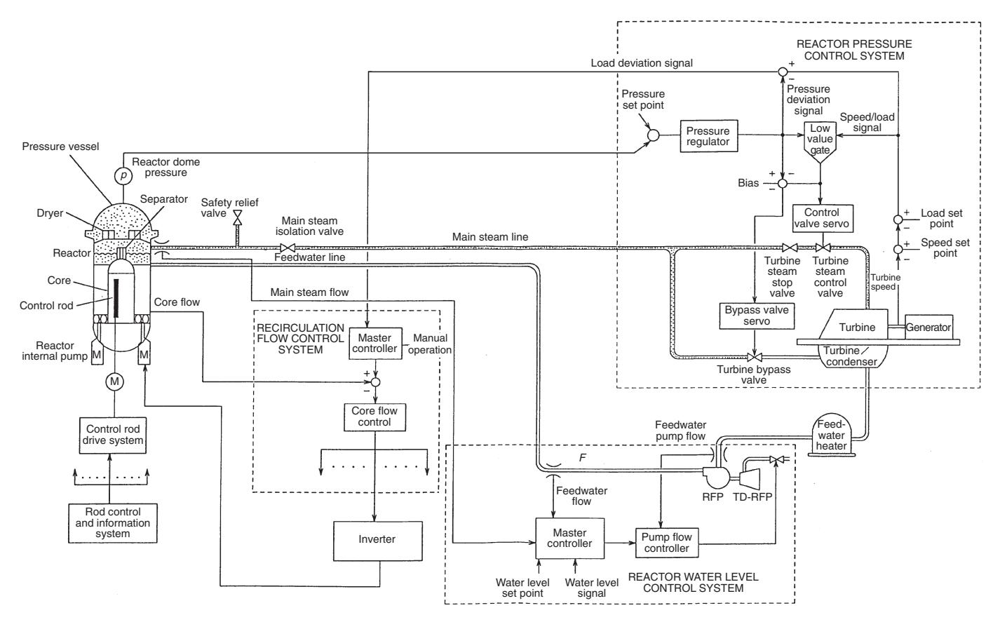

FIG. 46.1. Reactor control systems of a Japanese ABWR. (TD-RFP: turbine driving reactor feedwater pump.)

operation. It includes two channels, each capable of averaging outputs from up to 128 detectors of the LPRM. The two RBM channels each have two identical subchannels and are designed so that the signals from a maximum of 16 LPRMs over eight regions can be selected for input to the averaging unit. The LPRM signals from each region are input to the two subchannels and summed and averaged, respectively. The averaged RBM signal from the subchannels is then adjusted to be equal to or greater than the reference APRM signal. The monitor is designed so that a stop signal preventing further withdrawal of the control rods is originated when the power obtained by any of these monitoring channels exceeds a specified level after the withdrawal of control rods has been started. In addition, rod withdrawal is prevented by inoperability of the RBM.

## 46.6. REACTOR CONTROL SYSTEM

#### **46.6.1. General**

The reactor control system consists of a reactor power control system, a pressure control system, a water level control system and a control rod control system. Figure 46.1 shows the loops of these systems, which are described below.

#### **46.6.2. Reactor power control system**

- (a) *Principle of reactor power control.* The reactor power control system in advanced BWR (ABWR) plants comprises a control rod control system and a recirculation flow control system. The control rods are driven by a fine motion motor and reactor power level is controlled by adjusting the positions of the rods inside the core. The recirculation flow control system also controls the reactor power level by altering the density of the water and hence the reactivity. This system is capable of changing the reactor power output rapidly over a wide range while keeping the power distribution in the core constant.
- (b) *Control rod control system.* An ABWR plant of 1350 MW(e) has 205 control rods installed in the core. Each control rod is provided with a drive system and a hydraulic control system. Rod position is adjusted by withdrawal or insertion using the fine motion stepper motor under automatic control from the control room. Up to 26 control rods are operated at a time. When the power output is changed with the control rods, the rate of change of power level is

- approximately 2%/min. In the event of an emergency shutdown, all control rods are inserted at once by the reactor trip system.
- (c) *Recirculation flow control system.* Recirculation flow is controlled by ten internal pumps, the speeds of which are changed by changing the power frequency of the induction motors that drive them. Thus, the recirculation flow is regulated as shown in Fig. 46.1, the master controller and core flow controller providing frequency demand to the inverters that supply the motors. This system has the capability of changing the reactor power output by approximately 60%/min.

#### **46.6.3. Reactor pressure control and turbine control system**

- (a) *Principle of reactor pressure control.* When the reactor is in power operation, pressure is automatically controlled to be constant. For this purpose, a pressure control unit is provided in the turbine control system and regulates the reactor dome pressure by opening or closing the turbine steam control valves and the turbine bypass valves. An electrohydraulic control unit is employed to control the turbine. In normal operation, the pressure control unit keeps the reactor pressure constant by adjusting the opening of the turbine steam control valves. If the turbine speed is increased rapidly owing to load rejection by the generator, the speed control unit has a priority to close the turbine control valves.
- (b) *Turbine steam bypass system.* There are two types of plant, one having a turbine bypass valve with a partial capacity of rated steam flow and the other with a valve of 100% capacity. An ABWR has 33% capacity of rated steam flow. For normal startup and shutdown operations and when the generator rapidly decreases or loses load, steam is handled within the range of the bypass capacity. The unit can operate even in the case of full load rejection.

#### **46.6.4. Reactor water level control system**

It is necessary to suppress carry-over of water in the steam sent to the turbine and carry-under of steam in water recirculating to the core and to prevent the core from being exposed. This is done with four signals which detect the feedwater flow, pump inlet flow, main steam flow and water level inside the reactor pressure vessel. The flow of feedwater is automatically controlled to maintain the specified water level. The speed of the reactor feedwater pump driven by the steam turbine or the opening of the feedwater control valve in the outlet of the motor driven pump can be adjusted by these signals.

# **46.6.5. Safety considerations**

Since the reactor control system does not belong to the safety system but to the I&C system, it is independent of the requirements for the safety system. However, in order to augment the reliability of the control system and thereby increase the availability of the plant, considerable redundancy is employed in the power source, detectors and microprocessors. The requirement for diagnostic capability and maintainability should also be considered in design.

#### 46.7. SAFETY AND PROTECTION SYSTEM

The safety and protection system initiates appropriate safety and protective operations to prevent or suppress adverse conditions which could threaten reactor integrity. These can happen when abnormal transients or malfunctions occur or when the occurrence of such accidents is anticipated. The safety and protection system consists of the emergency reactor shutdown system and the ESF circuits which initiate features such as the ECCSs.

#### **46.7.1. Design criteria**

Design principles applied to the safety and protection system are as follows:

- When abnormal transients occur during operation, the system is capable of sensing them and initiating automatic operation of the emergency reactor shutdown system to ensure that specified acceptable fuel design limits are not exceeded.
- The system is designed to ensure that specified acceptable fuel design limits are not exceeded for any single malfunction of the reactor shutdown system, such as accidental withdrawal of the control rods.
- Under accident conditions, the system promptly senses the abnormal situation, initiates automatic emergency reactor shutdown and starts the ESFs.
- The system incorporates sufficient redundancy and electrical and physical independence to ensure that no single failure or removal of any component results in loss of the safety and protection functions.
- The system is designed to fall into an acceptable safety state (fail-safe or failas-is state) if it is disconnected or loses power.
- Where practicable, the system is separated from other I&C systems. If common subsystems are used, the safety system is not affected by a failure of any nonsafety instrument or control.

- The system permits periodic testing of its functions during normal operation.
- The system takes seismic considerations into account.

#### **46.7.2. Emergency reactor shutdown system**

The emergency reactor shutdown system consists of two channels. Each channel includes at least two independent trip set points for a single measured variable. Violation of either set point trips the applicable channel and a simultaneous trip of both channels leads to a reactor scram.

- (a) *Reactor scram conditions.* Reactor scram occurs if any one of the following conditions applies:
  - Reactor pressure high;
  - Reactor water level low;
  - Dry well pressure high;
  - Neutron flux high;
  - Neutron flux measuring instrumentation inoperative;
  - Scram discharge volume water level high;
  - Main steam isolation valve closed;
  - Turbine main steam stop valve closed;
  - Turbine main steam control valve closed fast;
  - Main steam line radioactivity level high;
  - Earthquake acceleration large;
  - Manual operation;
  - Mode switch turned to shutdown position.

Reactor scram occurs also in the following conditions:

- Reactor shutdown system operating circuit: loss of power. This loss of power will lead to a scram owing to the fail-safe function described later.
- Electrohydraulic controls: low hydraulic pressure. A pressure drop in the turbine hydraulic controls will cause fast closure of the turbine main steam stop valve and control valve, leading to a scram.
- (b) *Failure to safety.* Relays associated with channel trip or reactor scram are in a magnetized condition during operation. A shift to a non-magnetized condition of one or more relays causes a trip in the channel to which the relay belongs. As most accident related relay conditions such as loss of power, burnout or short-circuiting of coils and disconnection of wiring will return the relay to a non-magnetized condition, these circuits are considered fail-safe for these accidental conditions. On the other hand, since accidents such as melting of contacts due to burnout are contrary to the fail-safe principle, current through each contact does not exceed 50% of the rated current and should prevent the occurrence of such failures.

- (c) *Testing.* The operating circuit of the reactor shutdown system is designed to permit, as a rule, the following tests for each channel, one at a time during reactor operation:
  - *Manual scram pilot valve performance test.* The adequacy of the logic and the performance of the scram pilot valve of each channel are verified by operating the manual scram switch.
  - *Automatic scram pilot valve performance test.* The adequacy of the logic and performance of the scram pilot valve of each logic circuit are verified by using the key test switch.
  - *Detector performance test.* A calibration signal is applied to the detectors through calibration points on each channel to verify the adequacy of the logic and performance of the scram pilot valve.
  - *Single control rod scram performance test.* The scram time of each control rod is verified by operating the manual switch. The first three of these tests can together ensure the independence of each channel.
- (d) *Reset.* Following a trip of either channel, if the cause of the trip has been eliminated, the tripped channel can be manually reset so that the pilot valve may be remagnetized.

#### **46.7.3. Backup emergency shutdown system**

Two three-directional solenoid operated valves are provided in the instrumentation pneumatic system for the backup emergency shutdown function and permit the insertion of control rods when any pilot valve becomes inoperative. The solenoid is connected to a DC source and will normally be in the non-magnetized condition. When main trip relays in two channels of the emergency reactor shutdown system operating circuit go into a non-magnetized condition, the two solenoids in the backup emergency shutdown valves are magnetized. If the pilot valves are inoperative owing to failure, the backup emergency shutdown valves are operated and the control rods will be inserted as a result of there being no supply of air pressure to the scram valve. In such a case, the rod insertion time is normally longer than usual but, if other control rods are available for immediate insertion, this will be sufficient for emergency shutdown without the backup emergency shutdown system becoming necessary.

#### **46.7.4. Other important safety and protection functions**

Other important auxiliary protective functions of the safety and protection system include the following:

- Closure of the main steam isolation valve by a signal indicating a low reactor water level;
- Closure of the main steam isolation valve by a signal indicating main steam line radiation high, main steam line pressure low, main steam line flow rate high, main steam line tunnel temperature high or degree of condenser vacuum low;
- Closure of the normal ventilation system and initiation of the standby gas treatment system by a signal indicating dry well pressure high, reactor water level low or reactor building radioactivity high;
- Initiation of the high pressure core spray system, low pressure core spray system and low pressure coolant injection system by a signal indicating reactor water level low or dry well pressure high;
- Initiation of the automatic depressurization system by a simultaneous indication of the reactor water level being low and dry well pressure high;
- Initiation of the high pressure core spray system and actuation of the diesel generator and emergency diesel generator by a signal indicating reactor water level low or dry well pressure high;
- Closure of isolation valves other than the main steam isolation valve by a signal indicating reactor water level low or dry well pressure high.

#### **46.7.5. Recent technologies: Digital safety system**

In Japanese BWRs, microcomputer based digital controllers were first applied to the monitoring and control of radioactive waste treatment systems and then to other non-safety systems. They have been applied to safety systems in Japan for the first time in the ABWR.

The digital safety system (SSLC) has the following features different from the conventional safety system:

- Microcomputer based digital controllers are adopted instead of the conventional relay and analog instruments, reducing and standardizing the hardware components;
- An optical multiplexing system is used in place of conventional parallel data transmission through metal cables to allow effective transmission of plant data and to eliminate EMI;
- Two out of four logic is implemented rather than the usual two times one out of two to allow more reliable plant operation;
- Self-diagnosis by the microcomputer is implemented to allow confirmation of system validity.

Figure 46.2 shows the configuration of the SSLC. The SSLC consists of four separated divisions, each including a data transmission unit, set point comparator unit (called the digital trip module, DTM), trip logic unit (TLU) for an RPS and safety

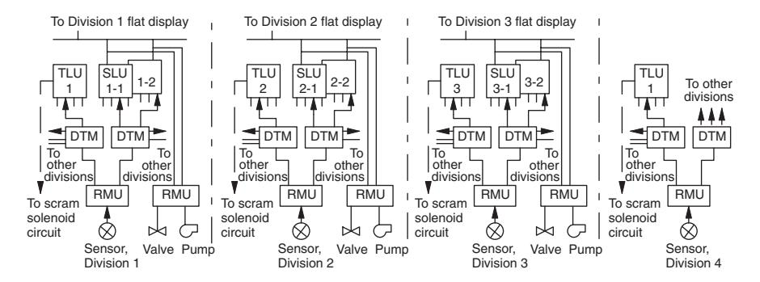

FIG. 46.2. Digital safety system configuration. (DTM: digital trip module; TLU: trip logic unit; SLU: safety logic unit; RMU: remote multiplexing unit.)

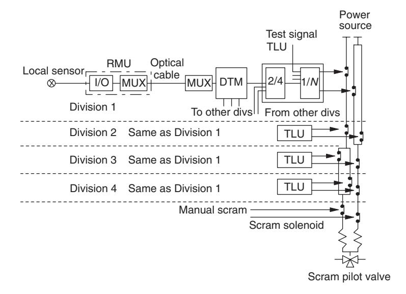

FIG. 46.3. RPS logic in a digital safety system. (DTM: digital trip module; TLU: trip logic unit; RMU: remote multiplexing unit; MUX: multiplexing unit.)

logic unit (SLU) for ESFs. These are implemented by digital controllers. A local sensor signal is sent to the local remote multiplexing unit (RMU) of each division. The DTM, TLU and SLU, located in the MCR, receive the local sensor signals through optical cables. The DTM compares them with a defined set point and judges plant status. If more than two divisions of local sensor signals are judged to indicate that protection is needed, each TLU (or SLU) sends an initiation signal to the safety equipment through the hardware output circuit (or through RMUs). Monitoring of the plant status and manual operation of all equipment are performed with a flat display using colour LCD units provided for each SSLC division channel. The safety and

TABLE 46.1. V&V PROCEDURE FOR DIGITAL SAFETY SYSTEMS IN JAPANESE ABWR

| Design and manufacture stage                                                                         |                                      | V&V stage      |
|------------------------------------------------------------------------------------------------------|--------------------------------------|----------------|
| ¸ 1. Systems design requirements Ô specification (functional design                         |                                      | Verification 1 |
| Ô specification)                                                                                  | Systems design                       |                |
| ˝ Ô 2. Hardware and software design Ô requirements specification ˛ (block diagram) | (same as for conventional design) | Verification 2 |
| 3. Software design (algorithm and I/O assignment)                                                 |                                      | Verification 3 |
| 4. Software manufacture                                                                              |                                      | Verification 4 |
| 5. Hardware–software integration (software loaded into hardware                                   |                                      | Verification 5 |
| 6. Validation test                                                                                   |                                      | Validation     |

protection system has two major features: failure to safety and fail-as-is. These are used in the RPS circuits and the ESF circuits, respectively.

Figure 46.3 shows the configuration of the RPS in the SSLC. The RPS consists of four separated division channels, each including a DTM and TLU, implemented by the digital controller. If the plant status as detected by more than two divisions of local sensor signals is judged to need protection, each TLU sends an initiation signal to the hardware circuit of the scram solenoid logic. This is implemented by two out of four trip logic, which means that scram actuation occurs when two or more TLUs send initiation signals. The hardware circuit employs a particular scram solenoid logic which initiates scram action in the case of non-energized status in the dual solenoid. The manual scram function is initiated by the hardware switch and hardware logic circuit, which are not included in the digital controller because of the need for diversity of an automatic scram function. If failure occurs in the digital controller, power source, etc., this system initiates safety protective action. The response time of the SSLC is specified by the required response time for the RPS. Since the RPS has to implement its action within 50 ms, the SSLC employs a high speed digital controller.

Development of the SSLC, including software, was broadly divided into two phases. The first phase is mainly concerned with top level design activities and is not significantly different from that of existing level systems. The second phase includes programming, in which quality generally depends on the capability of the individuals involved, and a working group was formed to discuss software QA (including V&V) and system development for safety related digital systems. Subsequently, application guidelines for programmable digital computers in safety and protection systems were established as JEAG-4609. The description of V&V in JEAG-4609 provides more details of existing QA methods, particularly for safety related digital systems.

V&V is carried out for each step as illustrated in Table 46.1. There is no significant difference in system design between the SSLC and conventional safety systems using hard-wired logic (consisting of relays, analog devices, etc.). Verifications 1 and 2 are performed to confirm that the system requirements are correctly documented. In the software design and implementation stages, simplicity and the visualization of software using the symbolic language Pol yield a remarkable advantage. For example, logic programming can be completed by simply connecting logic symbols according to the logic diagram made in the system design step. Simplicity combined with visualization thus reduces the dependence of program quality on the capability of individuals, facilitates verification and results in reliable software. Hardware–software integration testing is also facilitated by the use of symbolic language.

# 46.8. MAIN CONTROL ROOM

#### **46.8.1. General: Structure of control panel**

An exclusive MCR is provided for a single reactor power plant and a common one for two adjacent reactor units. The monitoring console panel is installed in the MCR and consists of a main panel and auxiliary subpanels. Prefabricated cables are used to connect the panels.

# **46.8.2. Monitoring console panel**

The monitoring console panel is divided into two, i.e. a main panel and subpanels according to the importance, urgency of operator action and frequency involved in monitoring. The main panel is placed between the subpanels and is laid out according to process flow. Monitoring for normal startup, shutdown and power operations of the plant and intensive operations required in the case of an emergency can be primarily carried out using the main panel. Human factors engineering is a

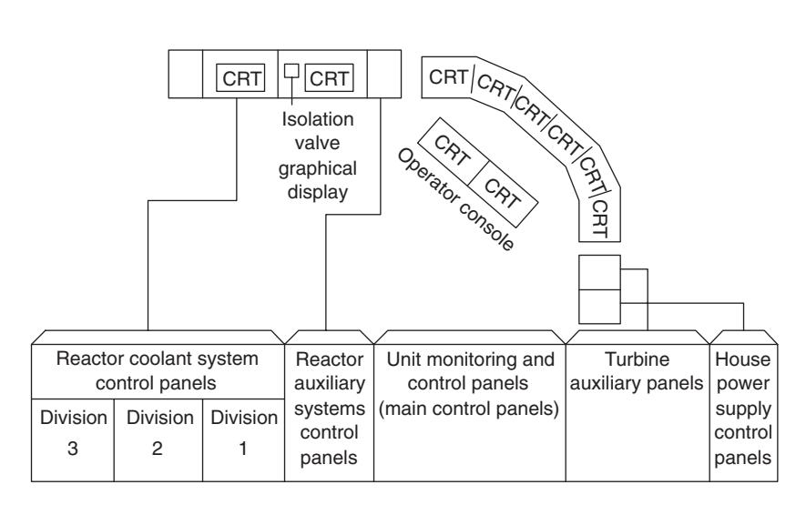

FIG. 46.4. Main control room and panel layout.

major determinant in the configuration of the control panel and the distribution of devices on the panel. Figure 46.4 shows how the monitoring console panel and systems on the panel are placed.

#### 46.8.3. Application of colour VDUs

To provide better interfaces, many colour CRTs are used in the newly developed central control panel: seven in the main panel, two in the reactor coolant control panel and one or two in the operator console. A total of 140 screens are available for plant monitoring under normal conditions and in emergencies.

#### 46.8.4. Safety considerations

The devices in the safety system are structured with redundancy such that a single device defect does not cause loss of the entire safety function. These redundant devices are electrically and physically separated to be standalone. The safety system is capable of functioning in the event of a severe earthquake. Non-flammable materials are used for the cables and units in the panels.

#### 46.8.5. Advanced main control room

The development of HMIs was started in 1980, soon after the TMI accident, and intensive effort was devoted to developing the HMI system. In this system, sophisticated VDU displays and partial automation of auxiliary systems support plant operation and reduce the risk of human error. The first system was introduced in 1985

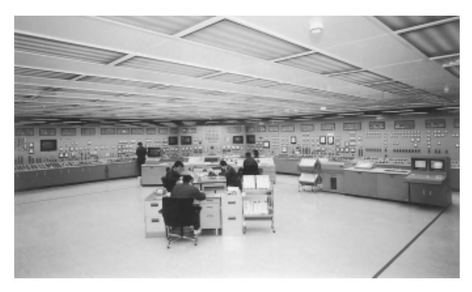

*FIG. 46.5. First generation main control room.*

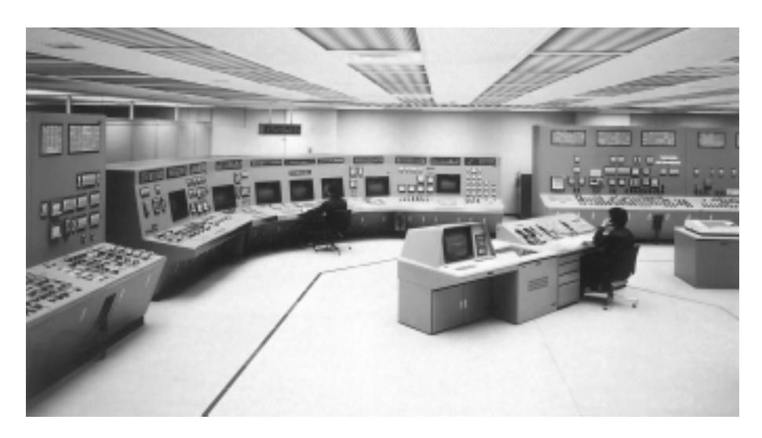

*FIG. 46.6. Second generation main control room.*

and a number of them are now in operation and have given excellent service for more than 100 reactor-years. With this experience, the next development was started in 1985 and a new HMI system for the ABWR was developed. Figures 46.5 and 46.6 show the old and the new MCR design.

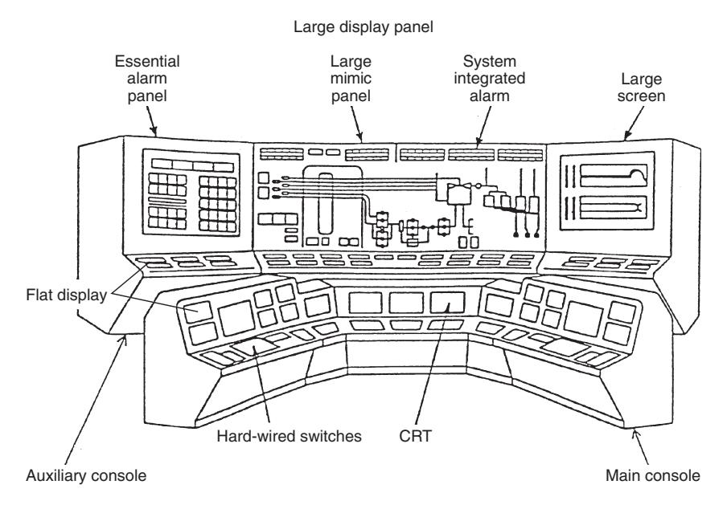

*FIG. 46.7. Main control panel.*

The HMI system for the ABWR consists of a large display panel and a compact main console as shown in Fig. 46.7. Large panels provide the operating crew with common recognition of plant status and comprise an essential alarm panel, a large mimic panel and a large screen. System integrated alarms are installed in the upper part of the large display panel and identify fatal failure, minor failure and the actuation of mitigating functions using three colours. The compact main console permits high operability. It provides controls and monitoring information except during annual inspections and has seven CRTs, 17 flat display panels with colour LCDs and emergency hard-wired switches. For annual inspections, an auxiliary console with 31 flat display panels and about 100 hard-wired switches is provided at the lower part of the large display panel.

An NPP involves a vast amount of control and information and the basic design concept of the HMI system for the ABWR is to structure controls and information according to the hierarchy of the ABWR integrated digital control system (Section 46.9). In the new system, monitoring information is classified into three levels: plant level, system level and equipment level. It is most important in assigning information to consider the quality and quantity of the information. In the integrated digital control system, higher level information is more important but smaller in quantity. New HMI devices and automation technologies have been introduced and, in principle, are categorized into three types:

- FL/FC: fixed location/fixed content (e.g. large mimic panel);
- FL/VC: fixed location/variable content (e.g. flat display panel);
- VL/VC: variable location/variable content (e.g. CRT).

FL/FC has the highest accessibility and lowest information density while VL/VC has the lowest accessibility and highest information density. Thus, HMI devices of type FL/FC have been adopted for small quantities of important information and a VL/VC type device is used for much information of minor importance. The relation between quality and quantity in the hierarchy of the integrated digital control system has an analog in HMI device type and assignment of information in the HMI system is determined by this analogy. Large quantities of information at the equipment level are displayed at high density on VL/VC type devices while, at the other extreme, small quantities of important information which may be required quickly are displayed at low density on FL/FC type devices. Table 46.2 shows the actual design of information assignment to HMI devices. In the HMI system new HMI devices are systematically applied by considering their features.

#### 46.9. INTEGRATED DIGITAL CONTROL SYSTEM

#### **46.9.1. History**

Digital control systems have been applied to Japanese NPPs since 1980. Since then their scope of application has been carefully extended and experience

TABLE 46.2. ASSIGNMENT OF HMI DEVICES IN HMI SYSTEM OF JAPANESE ABWR

| Level           | Fixed location/ Fixed content (FL/FC) | Fixed location/ Variable content (FL/VC) | Variable location/ Variable content (VL/VC) |
|-----------------|---------------------------------------------|------------------------------------------------|---------------------------------------------------|
| Plant level     | Large mimic panel Essential alarms       | Large screen First-up display panel         | None                                              |
| System level    | None                                        | System alarms Flat display panel            | CRT                                               |
| Equipment level | None                                        | None                                           | CRT                                               |

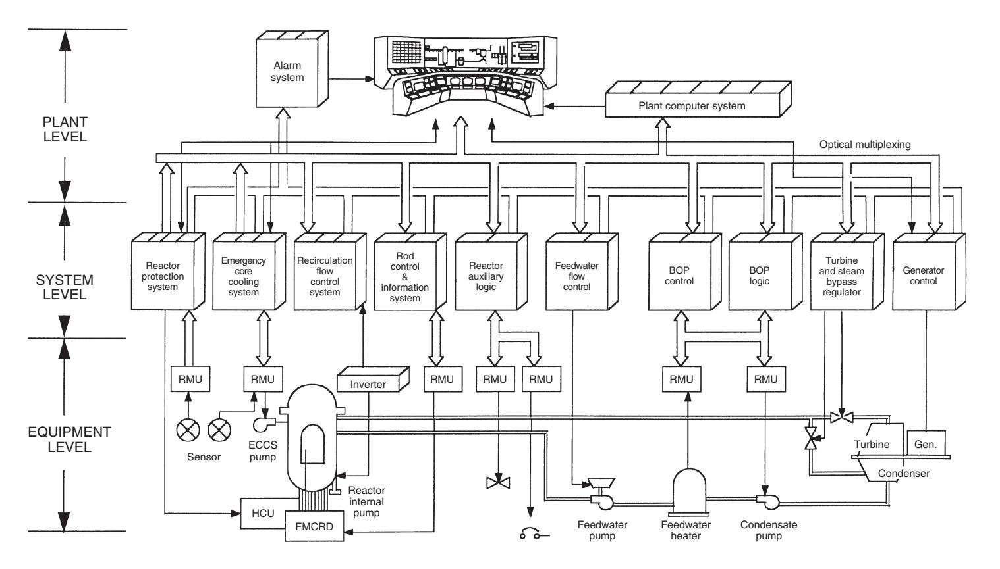

FIG. 46.8. Integrated digital control system. (FMCRD: fine motion control rod drives.)

TABLE 46.3. APPLICATION OF REDUNDANCY IN JAPANESE ABWR

| Degree of redundancy | System to which redundancy is applied               |
|----------------------|-----------------------------------------------------|
| Quadruple            | Reactor protection Reactor containment isolation |
|                      | ECCS sensing logic                                  |
| Triplicate           | Reactor primary control                             |
| Dual                 | Control rod drive logic                             |
|                      | ECCS control logic                                  |
| Duplex               | Reactor auxiliary control BOP                    |

accumulated. In the ABWR, the integrated digital control system includes a digital safety system and will provide higher reliability and performance to meet the ABWR criteria.

## **46.9.2. System structure**

The ABWR integrated digital control system has the hierarchical structure shown in Fig. 46.8. It integrates digital control systems, optical multiplexing systems, a process computer system and HMIs according to the three levels of hierarchy (plant level, system level and equipment level) for highly efficient and reliable control and monitoring. Actuators and sensors are connected to distributed digital control systems through RMUs, and digital control systems with digital controllers are connected to the process computer system and alarm processing controllers at plant level through two data highways. In this structure fifty thousand inputs/outputs are handled for control and monitoring.

#### **46.9.3. Features**

Digital equipment has a high processing capability, which permits higher control performance and the use of smaller panels. However, high capability will not be effective without a precise and proper understanding of the functional structure of the plant. In addition, the high capability of digital equipment may result in new failure modes. To realize the advantages of digital equipment and prevent unanticipated and unexpected failure modes, the ABWR integrated digital control system adopts the following countermeasures based on the hierarchical structure.

There are four kinds of redundant structure and redundancy is designed in accordance with the importance of the function. Quadruple (two out of four), triplicate (two out of three), dual (two out of two) and duplex (one out of one chosen from two) redundancy is used. Table 46.3 shows the applications of the different types. Distribution is necessary at system level to restrict failures to a predetermined area. In the ABWR, the system level is divided into seven groups:

- Reactor protection and reactor containment isolation;
- ECCS;
- Reactor primary control;
- Core control and monitoring;
- Electrical power supply;
- Reactor auxiliary control;
- BOP.

In addition, at the equipment level, unexpected combinations of equipment failure are prevented by distributing the inputs and outputs to different I/O boards in the RMUs.

Diversity is adopted, especially in nuclear plant, to ensure safety. The ATWS system, RPS, etc., and hard-wired scram initiation are typical examples of diversity. In addition to these conventional diverse systems, the HMI system of the ABWR also has diversity to prevent loss of display even in the event of CRT blackout. For this purpose the information at system level and at equipment level is displayed both on CRTs driven by the process computer system and on flat display panels driven by system level digital controllers. In addition, alarm information is transmitted both to alarm processing CPUs and to the process computer system.

# 46.10. POWER SYSTEM

#### **46.10.1. Station service power system**

The station service power system is designed to prevent a complete power failure of the plant. It supplies power to the auxiliary machinery required to ensure the safety of the reactor system at any time, i.e. in normal and in accident conditions. Both an external power system and an emergency station service power system are

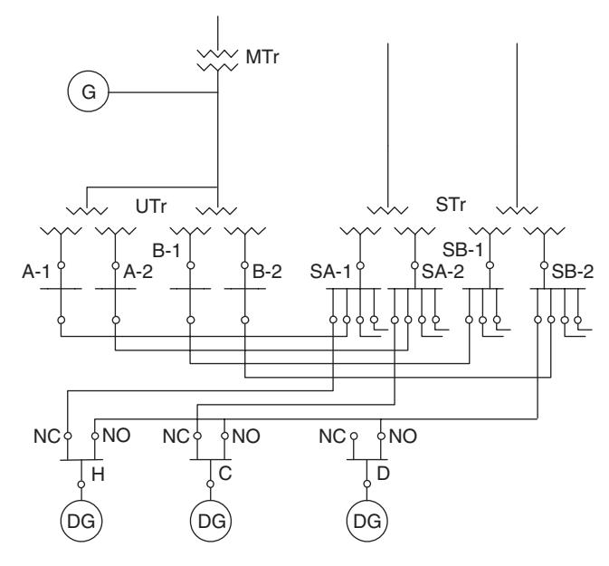

*FIG. 46.9. Station service power system. (G: main generator; DG: diesel generator system; MTr: main transformer; UTr: station service transformer; STr: starting transformer; A-1, A-2, B-1, B-2: general high tension buses; SA-1, SA-2, SB-1, SB-2: common high tension buses; C, D: emergency high tension buses; H: HPCS high tension bus; NC, NO: power supply lines.)*

installed. The external power system is connected to the electrical power sypply system via more than two transmission lines and a multiplex diesel generator system and DC power system are installed in the emergency station service power system.

#### **46.10.2. Structure of station service power system**

Figure 46.9 shows a diagram of the station service power system in the latest 1100 MW(e) BWR plants. During normal operation, power is generally supplied to the station auxiliary machinery from the main generator through the station service transformer. During startup and shutdown, the starting transformer is used. The positions of the starting transformer and adjacent units are shown in the figure. The station auxiliary machinery is classified into two groups:

- Machinery relating to the important systems;
- Devices for maintaining safety, such as engineering safety facilities and other general machinery.

All of the station auxiliary machinery is connected to the emergency buses and to the general bus or the common bus. Power to the machinery is supplied through the high tension bus and low tension bus in accordance with the load capacity. If the auxiliary machinery consists of two machines, these are generally connected separately to the different buses to ensure that power is supplied without failure. A diesel generator system, consisting of two emergency generators and a generator for the HPCS system, is provided to operate the auxiliary machinery required for safe reactor shutdown in the event of an accident such as complete consumption of cooling material when the external power supply is stopped.

#### **46.10.3. Emergency high tension buses**

There are two emergency bus systems and an HPCS bus system, all of which are electrically and physically separated to supply power independently to the equipment of three emergency systems. The design includes an earthquake-proof structure.

## **46.10.4. Diesel generator system**

A diesel generator system is provided, with sufficient capacity to supply power to the engineering safety facilities and system equipment which need to be operated even though external power may have failed or been switched off.

# **46.10.5. DC power system**

Typically, the DC power system in the 1100 MW(e) BWR plants consists of a 125 V line for the HPCS system, two lines for neutron flux monitoring and a 250 V line for the normal power source. Storage batteries are connected to a static battery charger, to which the power is supplied through the emergency low tension bus. An insulated room with a redundant charging system is provided for each battery. The DC power system that supplies the safety system has an earthquake-proof structure.

# **47. I&C CONCEPTS FOR BWR PLANTS IN SWEDEN**

#### 47.1. INTRODUCTION

The steam cycle of a BWR plant is straightforward and simple. The steam produced in the reactor core is conveyed directly to the turbine through the steam lines and condensed to water in the condenser, and the condensate is returned to the reactor vessel via a water cleanup system. This cycle resembles in many aspects that of conventional thermal power plants. In both cases, early plants used natural circulation of the coolant but later, forced circulation was introduced to increase the heat rating.

The reactor core with its in-core neutron flux measurement channels is housed in the reactor pressure vessel. In modern BWRs, this vessel contains also the steam separators, the steam dryers and the feedwater spargers. In the first BWR designs by ABB Atom, the pumps for the forced coolant circulation were installed in circulation lines outside the reactor pressure vessel but this arrangement was modified very early on and recirculation pumps with the impellers inside the reactor vessel were introduced. The pumps are installed vertically with the wet motors installed in housings connected to the vessel. This has made it possible to achieve a very compact nuclear steam supply design with a minimum of large vessel penetrations, all located well above the top of the reactor core. In addition, the compactness of the NSSS has resulted in a compact design for the primary containment of the reactor.

The technology for the ABB BWR was developed in the early 1960s, independently of licences from other reactor vendors, and introduced a number of new features of reactor design. From the very beginning the BWR was provided with fine motion control rods and the fuel assemblies had an eight by eight array, both features that were later adopted by other vendors. The first BWR power plant in Sweden, the 460 MW(e) Unit 1 at Oskarshamn, which was supplied by ABB (formerly ASEA) on a turnkey basis, went into operation at the beginning of 1972. Since then, ABB has supplied ten other BWR plants of sizes varying between 590 and 1050 MW(e), including two units of 690 MW(e) in Finland. The latest power unit, Unit 3 at Oskarshamn (of the BWR 75 design), went into operation in 1985 [47.1]. Following this delivery, a new, evolutionary design called the BWR 90 was developed.

This section mainly describes the BWR 75 design, but some important differences between the BWR 90 and the BWR 75 with respect to the I&C systems are also pointed out.

# 47.2. SAFETY DESIGN PHILOSOPHY

The licensing requirements in Sweden are predominantly based on the general design requirements set out by the US NRC. For the detailed design, IEEE standards are adopted to a great extent. The US requirements are modified or supplemented by special requirements on some important points, typical examples being the '30 minutes rule' and a requirement that plants be equipped to mitigate the consequences of a severe accident, i.e. a core melt. The application of important safety requirements for the I&C systems is outlined below.

#### **47.2.1. Redundancy**

All safety systems, I&C systems, power supplies and ventilation and process systems are designed with redundancy in accordance with the N-2 principle, i.e. the SFC is complied with even if one subdivision of a safety system is bypassed for maintenance or testing. The safety systems have therefore been divided into four trains (subdivisions or channels) of which only two are needed to cope with DBAs. For non-safety systems, the design goal is that a single failure in any system or component should not cause a reactor scram, a turbine trip or a major power reduction.

#### **47.2.2. Separation**

The four redundant parts of the safety systems are separated from each other, both functionally and physically. Functional separation implies that an electrical fault cannot propagate from one part to another and physical separation prevents events external to the I&C systems (such as fires, flooding, explosions, pipe ruptures with pipe whips or water jets, missiles or aircraft impacts) from affecting more than one redundant part. This principle applies also to the connections between safety and nonsafety systems. In order to achieve functional separation, signal exchanges are accomplished via isolating devices with an insulation level of at least 500 V. Such devices are used for both analog and binary signals. The degree of physical separation depends on the location and the potential local hazards. It can involve installation in separated rooms, installation at adequate distance or installation with some type of physical barrier.

Fire has been defined as a single failure, i.e. a LOCA and a fire can be postulated to occur simultaneously. Therefore, the BWR 75 was designed with four fire zones, each containing one of the redundant parts of the safety systems. In this context, it may be noted that fire zones are areas completely separated from each other and provided with separate ventilation systems, both for normal ventilation and for ventilation and smoke extraction in the event of fire.

# **47.2.3. Degree of automation**

The 30 minutes rule implies that any action needed within 30 minutes from the start of a DBA must be carried out automatically, providing the operator with a grace period of at least that time to assess the situation before any manual actions are needed. The information system in the MCR is designed and laid out in such a way that the operator gets a clear and unambiguous view of the situation; such information system rules are described in the NRC Regulatory Guide 1.97 [47.2].

A similar philosophy is adopted for transients in normal plant operation: no manual actions are normally needed to prevent turbine trips or reactor scrams. The design of the auxiliary power supply systems is a typical example in this context: a loss of power on one busbar within these systems during normal operation must not cause a turbine trip or a reactor scram. The fulfilment of this design goal was actually demonstrated during the commissioning of Oskarshamn 3.

#### **47.2.4. Shared components**

In order to reduce the amount of equipment, and thereby also maintenance and inspection, safety systems may share some components with non-safety systems. In such cases, isolating devices are used between the safety system and the connected non-safety system as noted above. In addition, it is required that a fault in the shared equipment does not result in transients, turbine trips or reactor scrams, nor in the initiation of the safety system. To that end, critical connections between the safety and non-safety systems are provided with coincidence logic for binary signals or majority voters for analog signals.

#### **47.2.5. Testing**

An important goal is that manual periodic testing of the safety related I&C systems should not be needed during normal operation. This is achieved by:

- High component quality;
- Automatic testing within the safety related I&C systems;
- Supervision by the process computer.

The means and facilities for testing, such as switches and test points used during the annual refuelling outage, were designed into the system from the beginning.

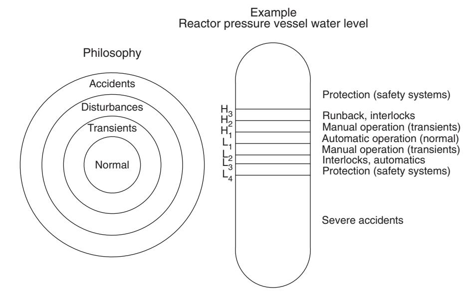

FIG. 47.1. Swedish BWRs: protection philosophy and an example.

#### 47.2.6. Protection levels

In order to improve the availability of the plant and to meet the safety requirements, the I&C systems are divided into four protection levels corresponding to the defence in depth principle (Fig. 47.1):

- Control equipment that serves to maintain processes within normal margins, e.g. the reactor pressure vessel water level and pressure control and the turbine control systems;
- Control equipment that is actuated if process parameters exceed normal margins and has the aim of restoring, if possible, normal conditions, e.g. different kinds of annunciations, power limiting systems and runback systems;
- Protection systems for the initiation of safety actions or for the prevention of occurrences having economic consequences;
- I&C systems involved in processes which mitigate the consequences of severe accidents, including core melt situations.

#### **47.2.7.** Diversity

The safety rules require that a backup scram system be provided to facilitate shutdown of the reactor in the event of failure of the ordinary scram system and that

this system be available for the most frequent transients. The two scram systems must be diversified as much as possible (using different sensors, different logic channels and different actuators) in order to minimize the risk of CMF. For the BWR 75, this rule is satisfied by using independent circuits in the protection system, by actuating the hydraulic scram insertion of the control rods for the ordinary scram function and by control rod insertion by means of the electromechanical drives (fine motion control) as the backup function. All of this is combined with a rapid runback of the recirculation pumps.

Further diversification in other I&C systems may be found necessary following detailed PSAs for the BWR 75 plant. The PSA performed for Forsmark 3 showed that further diversification of the I&C systems is not required there since the reliability of these systems is already higher than that of the related process systems [47.3].

#### **47.2.8. Shutdown outside control room (remote shutdown)**

If the MCR were to become uninhabitable (e.g. because of smoke from a fire) or damaged (e.g. by a crashing aircraft), the reactor could be shut down from locations outside the control room. The design of this remote shutdown centre allows the initiation of reactor scram and monitoring of the plant status. Normally, safe shutdown of the plant is carried out automatically by the protection system; if manual actions are required, these can be carried out locally at a number of different locations in the plant. Isolation devices are installed to prevent events in the control room from disturbing ordinary analog systems outside this room.

#### 47.3. I&C CONFIGURATION

The design of the I&C systems for the BWR 75 is based on standard electronic cards from the ABB Combimatic product line. There are basically three functional levels: instrumentation, control and actuator. Signals from all three levels are used in the MCR and for the process computer system.

# **47.3.1. Instrumentation**

All signals from the nuclear instrumentation, process sensors and limit switches are connected to an I/O system which consists of standard input cards of various types. The functions carried out by these cards are typically as follows:

- Detection of breaks in field cabling (analog signals and switches);
- Signal normalization (analog signals);
- Simple signal treatment (analog signals);

- Trip limit checking (analog signals);
- Range monitoring (analog signals);
- Isolation (analog signals and switches);
- Buffering (analog signals).

The outputs from the instrumentation cards are standardized to 0–10 V for analog signals and to 0–24 V for binary signals. Each card has two fuses: one for the card itself and one for the field cabling.

# **47.3.2. Control and protection**

Signals from the instrumentation level are used by:

- The RPS and the turbine protection systems;
- The plant control systems;
- The process component control system, manual control and alarms.

There are also connections to the MCR and to the process computer system. This functional level is, except for the major plant control systems, built up with standard electronic cards and installed in cubicles that are separated from the instrumentation cubicles. The major plant control systems, i.e. the systems for reactor water level control (feedwater flow rate control), reactor power control (recirculation pump flow rate control) and turbine control, are digitalized. The introduction of these digital systems for critical functions in a BWR initiated a new era in NPP engineering. Control rod manoeuvring and positioning are performed by the process computer.

#### **47.3.3. Actuators**

Individual electronic cards are provided for each actuator. These cards can provide the following functions:

- Receive signals from the control level for manual or automatic initiation;
- Send signals for position indication and alarms to the control level;
- Supervise changes in actuator position;
- Interlock between two simultaneous control signals;
- Send actuation signals to actuators;
- Receive position indications from actuators;
- Perform simple actuator logic, e.g. for travelling or torque switches.

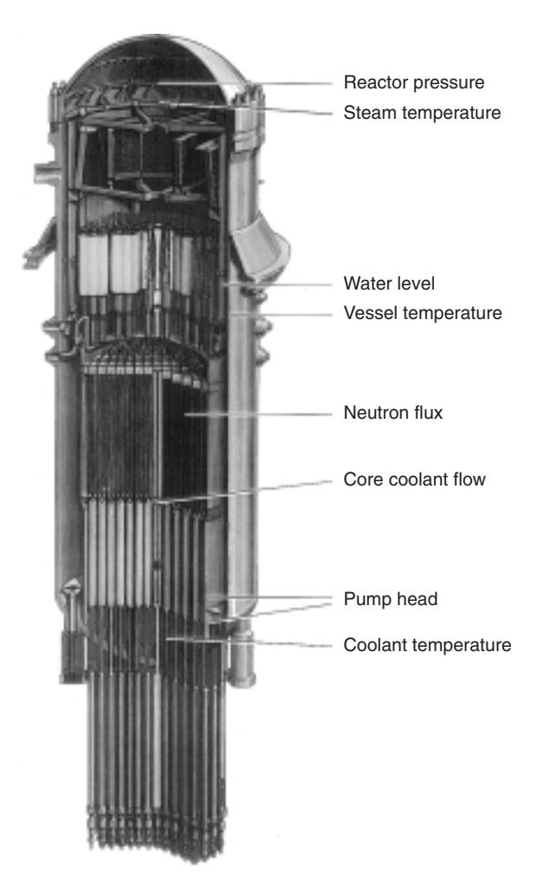

*FIG. 47.2. Reactor pressure vessel instrumentation.*

#### **47.3.4. Mechanical arrangement**

The cubicles for the instrumentation, control and actuator levels within one redundant group are mounted on a steel frame unit and terminal cubicles for the connection of field cabling, process computer connections and control room interfaces are installed on the same unit. This integrated control module arrangement has a number of important advantages for plant construction; for example, it permits integrated testing of all circuits and their interfaces in the workshop and greatly facilitates installation at the plant. The field cabling can be run, installed and checked independently and the connections to the terminal cubicles of the control module are easily made when the module has been lifted into place.

#### 47.4. REACTOR INSTRUMENTATION

The instrumentation of the primary reactor system has to provide adequate information about the conditions in the reactor core and the reactor pressure vessel in both normal and accident situations (Fig. 47.2).

Signals from the reactor instrumentation are used for:

- Control room information;
- Limit checking for alarms, protection and interlocking;
- Trend recorders;
- Control systems;
- Computer systems;
- Core power calculations.

The instrumentation for the protection systems consists of four redundant channels. The function of these channels is continuously monitored through the process computer by signal comparison. If one or more values deviate from the mean value of the four channels, an alarm is given. Except for a limited number of sensors, instrumentation lines and cabling, the equipment is located outside the containment.

The reactor instrumentation comprises the following measurement subsystems:

(a) *Neutron flux.* The total measuring range for the neutron flux measurements is about 12 decades and the measurements are accomplished by three monitoring systems. SR monitoring (SRM) is used from shutdown up to criticality of the reactor, IR monitoring (IRM) is used up to about 10% power and local power range monitoring (LPRM) is used for power operation. There are 8 SRM, 8 IRM and 144 power range channels.

The SRM and IRM channels are combined in wide range SIRM assemblies with common detectors. Switching between SRM and IRM modes and between different IRM ranges is done automatically, and the SIRM detectors are withdrawn from the core region during power operation to avoid burnup of the detector material and to increase detector lifetime.

The LPRM detectors are permanently located in fixed positions in the core and compensation for burnup is made periodically by adjusting the gain of the amplifiers in the measuring channels. The adjustment needed is determined by comparing the LPRM detector signals with measurements from calibration TIP detectors. The TIP is movable and can be inserted temporarily into tubes adjacent to the different LPRM detectors.

(b) *Water level.* The water level in the reactor pressure vessel is measured by three subsystems:

- Fine/coarse system;
- Wide range system;
- Fill-up system.

The first system is used for level control and monitoring during normal operation, the second provides signals for protection and the third is used when filling up the vessel during annual refuelling outages. The wide range system is also used to provide information in the event of an accident beyond the design basis.

The fine and wide range systems include compensation for variations in water density due to changes in reactor pressure and for variations in the temperature of the containment atmosphere. The instrumentation lines inside the containment for these two systems are cooled by service water in the event of a LOCA.

- (c) *Reactor pressure.* Reactor pressure is measured by a fine range and a wide range system. The fine range system provides signals for pressure control, annunciation and protection, and the wide range system is used during startup and shutdown (as well as accident situations).
- (d) *Vessel temperature.* The temperature of the vessel material is measured at a number of locations. The rate of change in temperature, or temperature difference between different vessel parts, is used when heating and cooling the reactor system. The measured values are also recorded by the process computer system to provide historical data for evaluating vessel lifetime, e.g. with respect to thermal transients.
- (e) *Core coolant flow.* The core coolant flow rate is measured for a limited but representative number of fuel assemblies in the core. The inlets of these fuel assemblies are provided with orifices and the flow rate is determined by differential pressure measurements. These measurements are used for calculating the total core flow and for core calculations.
- (f) *Coolant temperature.* The temperature of the core coolant is measured in the lower plenum of the reactor vessel (beneath the core inlet) and is displayed in the MCR.
- (g) *Pump head.* In order to calculate and supervise the efficiency of the internal recirculation pumps, the pump head is measured for each pump.
- (h) *Steam temperature.* The steam temperature is measured in the steam dome, the uppermost volume of the reactor vessel.

The design of the reactor instrumentation circuits is based on the same standard components as described in Section 47.3.

#### 47.5. REACTOR PROTECTION SYSTEM

#### **47.5.1. Configuration**

The main objectives of the RPS are to detect incidents in the reactor plant that could jeopardize safety and to initiate appropriate automatic actions to correct or mitigate the situation. The DBAs specify a large number of such incidents that must be taken into consideration in the design of the plant. They are handled by a number of protection circuits, each consisting of four channels, arranged in three safety groups:

- Reactivity control and heat removal:
  - ∑ Reactor scram (SS);
  - ∑ Reactor scram backup (RR);
  - ∑ Refuelling scram (B).
- Emergency core cooling:
  - ∑ Core coolant injection (RC);
  - ∑ Vessel depressurization (TB).
- Radioactivity control:
  - ∑ Containment isolation (II);
  - ∑ Reactor building isolation, part A (IA);
  - ∑ Reactor building isolation, part B (IB);
  - ∑ Refuelling area isolation (IX);
  - ∑ Turbine building isolation.

The reactor scram (SS) and refuelling scram (B) circuits will initiate reactor shutdown by rapid insertion of the control rods by means of the hydraulic function of the control rod drive units. The reactor scram will also actuate the relief valves of the reactor pressure relief system and the systems for decay heat removal from the core.

The reactor scram backup circuit (RR) initiates a fast runback of the recirculation pumps and inserts the control rods by means of the electromechanical function of the control rod drives. The fast runback of the pumps and control rod insertion are, de facto, also initiated in the event of a trip of the reactor scram circuit, but the reactor scram backup does not actuate the hydraulic scram function.

The core coolant injection circuit (RC) initiates the start of the ECCSs; if the reactor pressure is still high, coolant make-up is supplied by a high pressure system, the auxiliary feedwater system. The low pressure coolant injection/spray system takes over the water supply function when the reactor system pressure has dropped below about 1 MPa (10 bar). The vessel depressurization circuit (TB) provides a backup for the high pressure injection system; if the latter fails, the pressure relief system will be actuated (after a certain delay) and the low pressure coolant injection system can take over the water supply to the reactor vessel. The reason for delaying the initiation of the depressurization is to avoid the significant thermal transients that arise from the

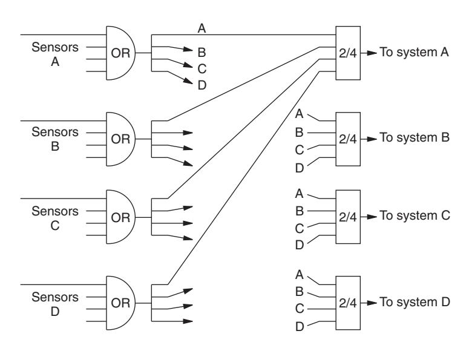

FIG. 47.3. Reactor protection system: design principles.

rapid change in pressure and the injection of large quantities of cold water by the low pressure coolant injection system.

The isolation circuits (II, IA, etc.) initiate isolation of parts of the plant, depending on the source and location of the leakage or pipe rupture.

The RPS, including its power supplies, is divided into four redundant channels that are completely physically separated from each other. The related process systems and components and diesel generator backed power supplies, including the standby power diesel generating units, are divided into four separated trains in a corresponding way. The RPS is designed in accordance with the configuration principles described earlier; it uses the same standard electronic cards as the rest of the plant I&C systems.

#### 47.5.2. Instrumentation

Sets of four redundant instrumentation channels provide the inputs to the RPS (Fig. 47.3). Signals from some of these channels are, as explained earlier, also used for non-safety control circuits and special precautions are then taken in the user systems. Such connections take place via isolation devices and coincidence logic or majority voters are introduced to improve the availability of the non-safety function. The RPS instrumentation comprises the following two main categories:

- Primary reactor system instrumentation;
- Monitoring for pipe breaks and leakage detection by supervision of room temperature, pressure and water level.

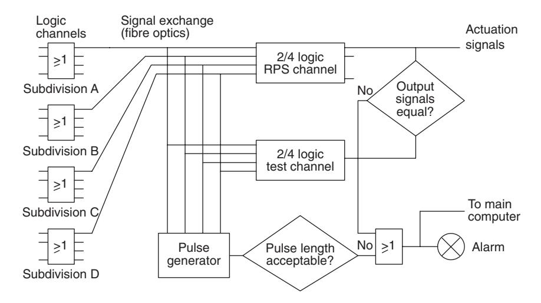

FIG. 47.4. Reactor protection system: typical two out of four circuit.

The total number of sensors connected to the RPS is 320. The instrumentation circuits are provided with switches and test points to facilitate testing, calibration and maintenance and the position of test switches is annunciated in the MCR.

#### 47.5.3. Logic

The logic for the RPS in the BWR 75 is quite simple and is built with standard electronic cards. The basic element is a channel in which trip signals from the different sensors belonging to the same redundancy group are combined in a logical OR connection; so-called local coincidence logic is not used. Protection actions are initiated by redundant global circuits with two out of four coincidence logic in each of the redundant output channels. In comparison with alternatives using local coincidence, the need for interconnections between redundant channels is significantly reduced in the BWR 75 design.

#### 47.5.4. Testing and calibration

Equipment testing is carried out continuously during operation and manually during refuelling outages.

(a) Continuous testing. The standard electronic system incorporates a test scheme that includes the testing of field wiring, out-of-sensor range monitoring and power supply failures. In addition, the circuits of the coincidence logic are tested continuously by comparing outputs with those from a parallel circuit on

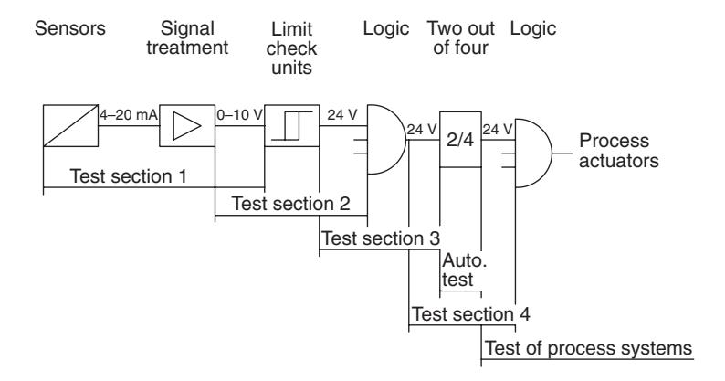

*FIG. 47.5. Reactor protection system: test scheme.*

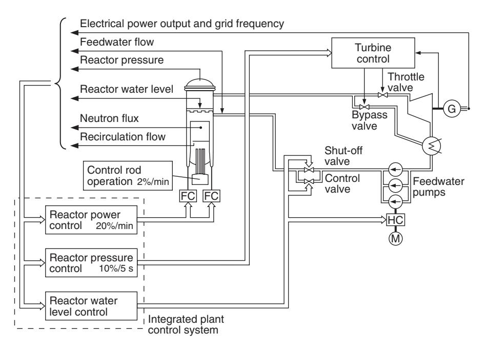

*FIG. 47.6. Reactor plant control systems. (FC: frequency converter; HC: hydraulic coupling.)*

trip simulations using very short pulses applied in all possible two out of four combinations (Fig. 47.4). All analog input channels are connected to the process computer system, in which the signals from redundant channels are compared with each other. Alarms are initiated if one channel deviates too much from the average. Reliability calculations have shown that this approach

- to testing during normal operation is acceptable in terms of attaining the specified safety goals.
- (b) *Manual testing.* At the end of the annual refuelling, the RPS, with related instrumentation and process components, is tested manually. The main purpose of this is to verify the proper alignment of all safety systems following the maintenance activities. It can be performed as an integrated test, by tripping the RPS circuits or by overlapping tests on the different portions of the RPS (Fig. 47.5). Test switches, for bypassing or initiating the different portions of the RPS, are permanently installed and tests on process components can also be carried out from the RPS.

For the control and adjustment of analog circuits, voltage or current sources are provided in the instrumentation cubicles. These allow static as well as dynamic testing. Analog signals and status indications from the trip units, RPS channels and process components are recorded by the process computer system.

#### 47.6. PLANT CONTROL

# **47.6.1. Overview**

The most important control systems in the BWR 75 plant are for the following four functions:

- Reactor power control by speed control of the recirculation pumps;
- Reactor power control by adjustment of control rod positions via the fine motion electromechanical function of the control rod drives;
- Reactor vessel water level control through a combination of speed control of the feedwater pumps and position control of valves;
- Reactor pressure control by means of the turbine governor controlling the turbine inlet throttle valves and the steam bypass valves to the turbine condenser.

Three of these systems were designed with digital equipment from the very beginning (in 1975); the fourth was upgraded to a digital system at a later stage. The systems are provided with a number of operating modes and they automatically adapt to changes in the plant operating conditions. An overview is presented in Fig. 47.6.

#### **47.6.2. Recirculation flow rate control**

Reactor power can be maintained at a constant level, increased or decreased by varying the speed of the recirculation pumps, i.e. by changing the coolant flow rate through the core. Pump speed control is accomplished by controlling the frequency of the power supply to the pump motors, each motor being provided with individual, solid state frequency converters.

The control system has the following operating modes:

- Baseload operation at constant electrical output;
- Load following at a preselected rate of change of electrical power;
- Frequency control for support of grid stability;
- Remote control in which changes in plant power can be initiated from a remote dispatch centre;
- Manual pump speed control;
- Rapid reactor power setback (pump runback) for avoiding reactor scram during transients.

#### **47.6.3. Control rod positioning**

Each control rod can be moved by its dual function control rod drive. This can accomplish a rapid rod insertion by hydraulic means or manoeuvre the rod smoothly for fine adjustments via a motor driven electromechanical actuator. The fine motion control for the rods is used mainly during startup and shutdown. Advanced use of burnable absorbers in the reactor fuel provides an effective means of power distribution control and therefore the need for adjustments to control rod positions is very small during normal operation. In all operational modes, rods can be moved individually and in banks of four or eight. The rods are divided into black groups and white groups and during normal operation the rods of one of these groups are always totally withdrawn.

If rods must be repositioned this must be done in accordance with certain precalculated sequences that are stored in the process computer system. When repositioning is required, the appropriate sequences are presented by the process computer and, after checking with the respective manuals, the operator initiates the actuation. A rod manoeuvring interlock is built into the system to limit rod movement and avoid reactor scrams.

#### **47.6.4. Reactor pressure vessel water level control**

During plant operation at power levels above 20%, water level is controlled by controlling the speed of the feedwater pumps. Below 20% power or at reactor pressures lower than 7 MPa (70 bar), water level is controlled by a combination of pump speed control and positional control of valves in the feedwater line. Switching between the startup and power operation modes is performed automatically.

In order to minimize thermal cycling of vessel nozzles, a special feedwater line with small control valves is provided for very low power operation. Switching between the low and very low power modes is also performed automatically. The very low power mode aims at extending the service life of the feedwater lines.

During and after a reactor scram, a special sequence is initiated to achieve smooth level control and limited transients.

#### **47.6.5. Reactor pressure control**

Reactor pressure can be controlled by different means:

- During normal operation, by the turbine governor via the turbine inlet throttle valves;
- During startup and shutdown, or following a turbine trip, via the steam bypass valves to the turbine condenser;
- During and after a load rejection ('house load operation'), by a combination of inlet throttle valves and steam bypass valve control;
- If the turbine unit is not available, by the relief valves of the reactor pressure relief system.

Normally, reactor pressure is maintained at 7 MPa but, if a rapid increase (e.g. a 5% step) in the plant output is required, the pressure may temporarily be decreased somewhat, permitting rapid opening of the turbine inlet throttle valves. During startup and shutdown, the pressure and the rate of pressure change can be adjusted automatically by means of a programmable controller.

#### **47.6.6. Design**

An important design goal set for the BWR 75 was that a failure or malfunction of a single component should not result in a reactor scram or turbine trip. As a consequence, the control systems are provided with extensive redundancy for important functions. Examples are:

- Use of the mean value of four redundant sensors as input to the control circuits;
- Use of three redundant control circuit units;
- Provision of redundant power supplies;
- Use of analog two out of three majority voters for the control signal output to actuators.

The water level and power control systems are designed with microcomputers, still regarded today as a very modern technology.

The fine motion adjustments of the control rods are controlled via the process computer system; the operator initiates and releases the repositioning action using a workstation in the control room. The CRT display of this workstation gives information about sequences and steps of rod movement, overall and individual rod

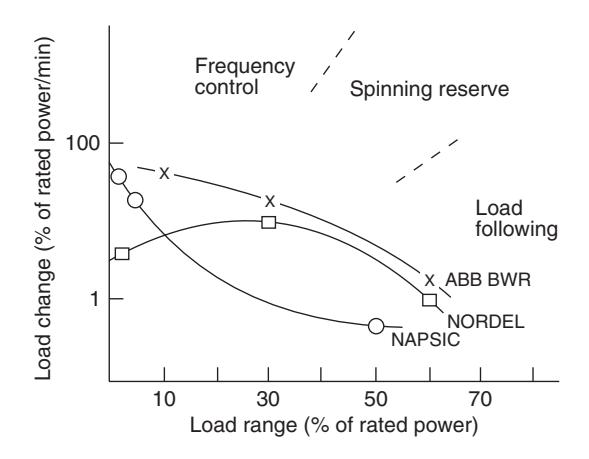

*FIG. 47.7. Typical control characteristics for an ABB BWR.*

positions, SRM/IRM/LPRM neutron flux measurements and the results of core calculations. The process computer, including its process interface, also has redundancy.

#### **47.6.7. Power output characteristics**

The performance of the BWR 75 plant fulfils the NORDEL (Nordic Grid) and NAPSIC (North American Power Systems Interconnection Committee) requirements (Fig. 47.7). Frequency control and load changes of up to 30% at rates of more than 10%/min are achieved in the upper power ranges by speed control of the coolant pumps. Load changes of about 60% of rated power at rates of more than 2%/min can also be made by combined pump speed and rod position control. Possibilities of remote control and power setback (by pump runback) complete these capabilities.

#### 47.7. MAIN CONTROL ROOM

# **47.7.1. Philosophy**

ABB Atom has been responsible for the design of the control rooms in all BWR plants delivered by the company, usually on a turnkey delivery basis [47.1]. During the conceptual design phase, a design philosophy is established with respect to the following:

— Organization of the shift and the tasks for each of its members;

- Relationship with other organizations, e.g. with respect to maintenance and technical support;
- Degree of automation for safety functions and for normal operation;
- Safety criteria;
- Principles for relationship with local control rooms or local control points;
- General and unified principles for information, annunciation, control and recording;
- Classification of control room functions regarding their importance to safety and different modes of operation;
- Principles for setting up systems after refuelling or maintenance.

Other elements which need be taken into consideration in the design are:

- Design of the process systems;
- Relationships between process systems;
- Ergonomics;
- Available technology.

In the conceptual design phase, the control room design is verified by means of static mock-ups in co-operation with the operations department of the utility. Using preliminary control room procedures, several scenarios are simulated (by walkthrough). Alarms which occur during a scenario are indicated by red tape on the panels. In addition, the control room design is verified during the design phase by different types of specialists or specialist groups by functional analyses and by walking through the control room procedures. At the end of the detailed design phase, a number of scenarios are again simulated with the static mock-up, which is also used for initial training of operators before the full-scale plant simulator becomes available. The final validation of the design is made during the commissioning of the power plant.

#### **47.7.2. Design**

The organization of the operating shift and relations with the maintenance department are decisive for the design of the control room. A normal BWR shift comprises:

- One shift supervisor;
- One reactor operator;
- One turbine operator;
- One electrical operator;
- Two technical assistants.

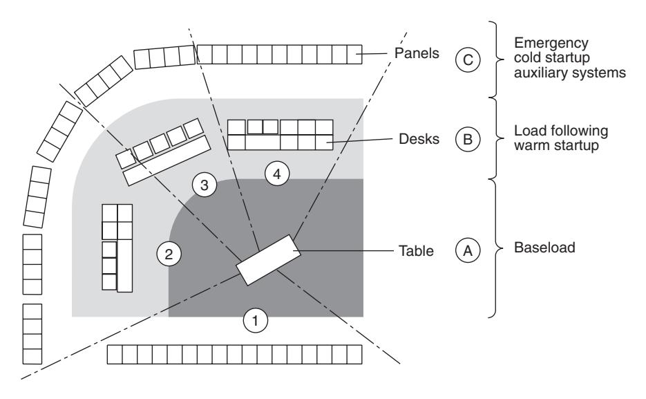

*FIG. 47.8. Control room functional and operating areas. (1: electrical operator; 2: reactor operator; 3: shift supervisor; 4: turbine operator.)*

The control room is divided into four operational areas (Fig. 47.8) containing the equipment required for the members of the shift to perform their duties. These areas are for:

- Operating the plant auxiliary power supply and the outer switch yard;
- Operating the reactor plant and safety systems;
- Operating the turbine plant and other BOP systems;
- Supervising the whole plant, as well as communicating with other organizations.

Within each area, control panels and desks are arranged in accordance with their importance for normal operation and for safety (Fig. 47.8). The control desks include a number of CRTs, divided into three groups for use by:

- The reactor or turbine operator for supervising their portion of the plant;
- The shift supervisor for monitoring the plant status;
- The operators for co-ordinating the maintenance work in the plant.

The CRTs for the first two groups are connected to the process computer while the CRT for the third group is connected to the plant administration computer. Other CRTs are located behind the control panels. One of these belongs to the vibration monitoring system of the turbine.

The CRTs of the first two groups have the following main tasks:

- Permitting manual operation of the control rods;
- Presenting alarms;
- Presenting information about system status;
- Presenting plant or plant operation summaries;
- Presenting information related to post-accident analysis.

The control panels for safety systems are grouped into four parts, corresponding to the four safety system trains. Each part contains the information and control means for all of the systems belonging to one of the redundant safety trains (or subdivisions).

The control room equipment and components are standardized industrial products. Desks and panels are provided with a modular front system which facilitates modifications and changes. Push-buttons and position indications are integrated into small standard units. Control room components are installed on the front of the panels and desks in mimic diagrams, a traditional ABB Atom approach. The components are connected to the electronic equipment located outside the control room area (in a number of electronics rooms in the control building) by means of individual standardized cables. There are four electronics rooms for safety systems, two for non-safety systems and two for the process computer.

The control room design has, on a number of occasions, been studied and evaluated during plant operation, often by specialists. The outcome of one such evaluation [47.4] can be summarized by the following quote: "Of all the control rooms seen, this one seemed to have the best design and the most comfortable work environment."

#### **47.7.3. Annunciation**

One of the critical functions in the control room is the adequate annunciation of faults. The fault annunciation system consists of the following three parts:

- An overview annunciation which is visible from all control room areas;
- Individual alarms with lamps or CRT displays on desks and panels where the operators can supervise and influence the plant processes;
- A plant fault summary or plant fault diagnosis system which is used by the operators to analyse transients or accidents.

The overview is presented by a guidance panel plus a CRT in the centre of the panels. The guidance panel shows whether a new alarm is important to the reactor or turbine operator and on which desk, panel or CRT further information can be obtained. After stopping the acoustic alarm, the responsible operator will move to

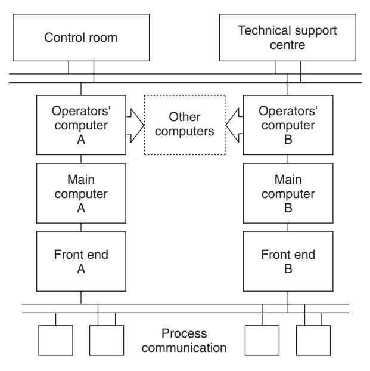

*FIG. 47.9. BWR 75 computer concept.*

where the source of the alarm is indicated and can then acknowledge the blinking of signal lamps or the flashing of text lines on the CRT.

After a transient or accident, the operators or technical support specialists can study all of the alarms with the computer. This permits sorting of alarms and changes of component positions in different ways: chronologically, by system, by safety class or by operator responsibility. After the automatic initiation of the safety systems, the computer compares the operational status with lists of required process components and presents deviations on CRTs as alarms. After a reactor scram, the computer can also provide trends of analog values just before the scram and during a preceding protracted period of operation. This can support the analysis of transients and accidents.

# **47.7.4. External events**

The power plant and the control room are designed to withstand the following external events:

- Earthquakes;
- Fires inside the control room;
- Sabotage;
- Aircraft impacts;

TABLE 47.1. COMPUTER PARAMETERS FOR SWEDISH BWR 75

| Data acquisition:                  |            |
|------------------------------------|------------|
| — Analog signals                | 2550       |
| — Digital signals               | 9500       |
|                                    |            |
| — Remote acquisition processors | 27         |
| — Front end processors          | 4          |
| Main computer:                     |            |
| — Processors                    | 2          |
| — Disks                         | 4          |
| — Disk capacity                 | 33 Mbytes  |
| — Primary memory                | 512 kbytes |
| — Word length                   | 16 bytes   |
| — Printers and terminals        | 3          |
| Human–machine interface:           |            |
| — Processors                    | 2          |
| — Primary memory                | 512 kbytes |
| — Word length                   | 16 bytes   |
| — Service terminals             | 1          |
| — Colour CRTs                   | 20         |
| — Printers                      | 4          |
| — Hard copy units               | 2          |

- Chlorine releases;
- Radioactivity in the environment;
- Flooding from the Baltic Sea.

After construction and commissioning, the power plant and the control room were upgraded to meet further requirements related to mitigation of the consequences of severe accidents, including core melt situations.

#### 47.8. PROCESS COMPUTER

#### **47.8.1. Concept**

The process computer system (Fig. 47.9) includes redundant equipment with functions on different levels. Data acquisition is performed by between 10 and 30 local systems which are installed near to the relevant electronic equipment in different rooms throughout the plant. Some of these local systems are used for controlling the control rods and include both inputs and outputs. The local systems are connected to front end computers in rooms near the control room by means of serial links. These front end computers, in turn, transmit data to the main computers for evaluation and diagnosis of data and for control of the control rods.

The human–machine process computers control the presentation of information to the control room and to printers, trend recorders and hard copy units. The display equipment consists of a number of colour CRTs located in control desks in the control room and in the TSC.

The process computer is connected to a core management computer and to an administration system in the office building by an optical link. Details of the process system are given in Table 47.1.

#### **47.8.2. Computer functions**

The computer functions support the operators in normal, transient and accident situations. The process computer is an important tool for the operators, but the plant can be safely operated without it. The main tasks of the computer in different plant operation situations are as follows:

- During startup and shutdown:
  - ∑ Performing control rod position adjustments and presenting control rod positions and neutron flux measurements;
  - ∑ Showing the reactor operating point in a 2-D display;
  - ∑ Supporting supervision of the heating (or cooling) rate of the reactor vessel;
  - ∑ Supervising the reactor core and control rod sequences.
- During power operation:
  - ∑ Performing bookkeeping and diagnosis of periodic tests, maintenance and repairs;
  - ∑ Monitoring redundant instrumentation channels;
  - ∑ Recording the opening and closing times of scram and isolation valves during testing;
  - ∑ Monitoring trends;
  - ∑ Calibrating the LPRM neutron flux measurement channels to compensate for detector burnup;
  - ∑ Diagnosing the condition of the turbine and other parts of the turbine unit.
- During transients:
  - ∑ Time-flagging and recording alarms;
  - ∑ Annunciating secondary alarms;
  - ∑ Performing bookkeeping on thermal transients of important processes.

# — During accidents:

- ∑ Displaying critical safety parameters;
- ∑ Analysing the operation of safety systems;
- ∑ Recording trends of safety parameters just before and following a reactor scram;
- ∑ Sequence-listing start-of-process components in safety systems.

## — General:

- ∑ Displaying water conductivity, leakage from the primary system and operating times of pumps and fans;
- ∑ Recording the number of motor starts;
- ∑ Recording trends and storing plant data;
- ∑ Logging;
- ∑ Checking with temporary limits;
- ∑ Supervising the condition of filters in water cleanup systems.

#### 47.9. DIGITAL I&C SYSTEMS

I&C systems for waste handling were digital from the very beginning. On an ABB BWR, these systems are located in a separate building in which demineralized process water is cleaned for reuse in the plant (or for disposal if not needed). Dirty water is collected and checked for radioactivity level before release. Water which is too radioactive is processed in evaporators to remove radioactive products. Filter beds and ion exchangers as well as evaporator residues are treated before solidification and storage. The waste handling systems include several hundred process components such as pumps, valves and fans in the filtered ventilation system and the different processes are highly automated for sequence control.

Development work on digital I&C systems for new plants had already been initiated in 1977 and it was decided that the I&C for the waste handling systems should be built as a prototype for future new digital reactor I&C systems. During the design work, a new design model was tested and adapted to digital equipment. Other digital equipment in the plant designed on the basis of this model included:

- Feedwater control system;
- Reactor power control system.

The I&C for the waste handling systems consists of three functional levels, I/O microprocessors, two processor systems (A and B) and equipment in the main and local control rooms. The first level contains the interfaces to the process. It is a distributed system with many microcomputers. Each valve, motor or fan actuator is provided with its own microprocessor while a number of sensors (up to eight) may share one microprocessor. The process interface is connected to the next level by

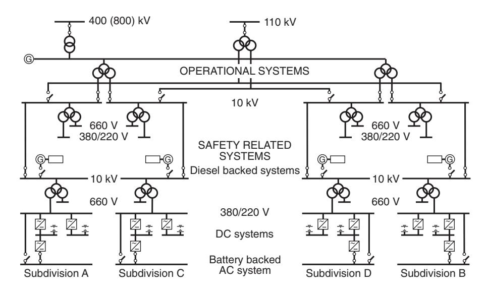

*FIG. 47.10. Auxiliary power system.*

redundant serial links. The second level executes the logic for the process systems and provides the interface for human–machine communication. Program execution is carried out in a fixed cycle that was later adopted as the standard for all systems critical with respect to safety and normal operation. Two processors are installed, of which one is used in hot standby.

The process systems for waste handling are normally controlled and supervised from a local control room in which two workstations with colour CRTs are provided. When this local control room is not staffed, supervision is switched to a workstation in the MCR.

Even though it was originally intended to be a prototype for future digital I&C systems in NPPs, this I&C system was designed with standard off the shelf components. It has served as a prototype for the components which are on the market today.

# 47.10. POWER SUPPLIES

The power supplies for the plant I&C systems fall into two categories: those to safety systems and those to non-safety systems. There are four redundant groups of power sources for safety systems and two for non-safety systems. The first four redundant groups are located in separate buildings together with the corresponding low and medium voltage switchgear and the diesel generators. The two groups for non-safety power supplies are located in two rooms of the same building.

Figure 47.10 shows the auxiliary power system. The batteries have ample capacity to carry the highest load that may occur during a 2 h interruption of battery charging and each is divided into two sections to permit comprehensive testing and maintenance during operation of the plant. The battery backed AC lines are normally supplied with power via static DC–AC converters. In the event of a converter failure, the AC busbar is automatically switched to a diesel backed power supply. Loss of individual AC or DC busbars does not lead to a reactor scram or turbine trip; plant operation can continue. This has been verified during the commissioning of a BWR 75 plant. Each group contains a number of different voltage levels, e.g. ±24 VDC for supply to the electronic I&C, 110 VDC for relay based equipment and 220 VAC for instrumentation.

#### 47.11. FUTURE TRENDS

# **47.11.1. General**

The latest, and last, BWR 75 unit, Unit 3 at Oskarshamn, began operation in 1985. General developments in energy throughout the world since then give rise to a number of observations, one of the most important being that the market for new NPPs is extremely limited whereas the market for backfitting and upgrading existing operating plants is increasing rapidly. These observations influence the design of future I&C systems as well as that of equipment for backfitting and arise from the experience gained from normal operation of plants and from accidents. In addition, given the practical constraints of existing layout, etc., equipment for backfitting must be designed in a different way from that for new plants.

The need for backfitting existing plants with new functions arises from operating experience, e.g. with demands for the following:

- Supervision of the safety readiness of standby equipment and comparisons with the repair criteria of the technical specifications [47.5];
- Diagnosis of the operation of safety systems after initiation following accidents [47.6];
- Computerized support for execution of the EOP;
- Condition monitoring of component ageing for the planning of maintenance;
- Diagnosis of thermal transients on process lines;
- Redesign of portions of control rooms due to new requirements from human factors engineering;
- Special I&C systems for mitigating the effects of severe accidents, including core melt situations.

The most interesting observation is the general trend towards introducing digital technology for all portions of the I&C systems.

# **47.11.2. Digital I&C systems**

When Unit 3 at Oskarshamn began operation in 1985, it was quite obvious that it would be the last unit to be built with I&C based on conventional electronic equipment. Future NPPs would be digitalized and this would also be the case for backfitting of existing plants, since there would be few reliable supply sources left for the procurement of what were then conventional electronic units. The development and evaluation of a conceptual design were therefore initiated for the two ongoing reactor development projects at ABB Atom, an advanced version of the BWR 75 and the SECURE heating reactor. The Advanced BWR 75 project was a forerunner of the BWR 90 development project and the heating reactor project formed the basis for the PIUS development. The main goal of the I&C development for these two reactors was to investigate whether and how the new technology could be introduced. A list of possible concerns was established and used as the input for 'go/no-go' decisions. At the same time, a strategy for introducing digital technology in the backfitting of existing plants was developed.

- (a) *Basic design.* Traditionally, the design of the I&C systems for ABB Atom NPPs has been based on the utilization of standard equipment available on the market. The major advantage of this approach is obvious and the risk of failures in the introduction of new technology due to unproven equipment can be minimized. Therefore, ABB Atom selected the standard components of the ABB Master and its successors as the basis for the design of the programmable I&C systems. ABB Master is a product line which includes software and hardware modules as well as tools for integrating the modules into a system. It was developed by ABB, is produced within the company and is in operation in thousands of industrial and nuclear plants. It is a well proven product and has been verified in accordance with the following international codes and standards: ISO 9001, IEC 68 and ISO 9000-3. Feedback of operational experience is provided by a field problem report system and anomalies identified by these reports have been studied, evaluated and processed statistically. One of the conclusions arising [47.7] is that faults in programmable systems are less frequent than in comparable hardware systems.
  - The ABB Master modules are now integrated into an application system for NPPs by ABB Atom. Further V&V of this system is carried out in accordance with typical nuclear codes and standards such as IEC 880 and IEC 987 and operation is followed up by means of the report system from the utilities.
- (b) *Introducing the digital technology*. Some of the critical areas of concern could not be satisfactorily resolved in the early stages (around 1980), partly because lack of operating experience made it impossible to design a complete I&C system at that time. It was quite obvious, however, that the new technology would

yield significant advantages during the design, commissioning, operation and maintenance phases of an NPP. Therefore, a strategy was adopted to introduce the digital technology stepwise in existing plants if better performance could be expected from digital equipment. Operating experience represents an essential part in the qualification of the new digital technology and the introduction of digital equipment has been undertaken with great care, in a number of steps:

- *Step 1.* At the beginning of the 1980s, a digital I&C system was installed in NPPs for a non-safety application of minor importance to plant operation.
- *Step 2.* During the 1980s, digital I&C systems were installed for nonsafety applications of greater importance to plant operation.
- *Step 3.* At the beginning of the 1990s, critical safety applications were installed [47.8].

This stepwise introduction started with the I&C for a service system, continued with the waste handling systems for Forsmark 3 and finally, in 1991, resulted in the installation of a safety subsystem at the Barsebäck NPP. As a result of this experience, a decision was taken that digital technology should form the basis for the design of the whole I&C system for new ABB Atom BWR plants as well as for I&C systems for upgrading existing plants. The new designs will be based on the ABB product line for digital I&C.

- (c) *Integrated I&C system for BWR 90 plants.* This system [47.9] is structured in a number of hierarchical levels for the following:
  - Interfacing of the process instrumentation and process actuators;
  - Logic for individual process system control;
  - Plant protection and plant control;
  - Plant management (plant computer);
  - Control room.

For each level, several sections are available; for example:

- Four safety subdivisions;
- Reactor section for normal operation;
- Turbine and BOP section;
- Section for controlling the connections to the outer grid, for waste handling and for other service systems.

The number and design of these sections depend on a number of criteria, such as:

- The wish to carry out maintenance on one safety section during normal operation and still meet the SFC, which leads to an 'N-2' configuration;
- The wish to have standalone sections so that different parts of the I&C can be delivered by different vendors;
- The strategy for commissioning the I&C in steps;

— The requirement to improve the plant availability by using redundancy for non-safety systems.

Traditionally, ABB Atom has included the control room as part of its scope of supply. The control room is based on the use of workstations but some backup by hard-wired systems is possible. Workstations provide some new capabilities, such as:

- Arranging the information display and manual control means for the operators in a flexible way for the different operational plant situations;
- More extensive intelligent support for the operators and for follow-up of plant operations.

Within the control room three subareas are available:

- Plant overview information on fixed locations;
- Process system supervision and control with workstations;
- Plant information for the shift supervisor and necessary communication equipment.

In addition to the systems for process control, the control room complex includes:

- Plant security and fire-fighting systems;
- Planning facilities for maintenance;
- Emergency control centre (TSC);
- Emergency command centre.

# **47.11.3. Conclusions**

Digital technology is now sufficiently proven and in wide use in industrial applications. It has been successfully tested in several nuclear applications and can be applied to complete I&C systems for new NPPs as well as for backfitting in existing plants, with significant gains in performance, flexibility and simplicity. The new technology offers new and better capabilities but differs in some ways from analog technology. Such differences have been identified by ABB Atom and treated as special checkpoints in the V&V programmes.

The risk and consequences of CMF in software are being studied by ABB Atom. Digital equipment is provided with much more continuous self-testing than similar analog equipment and this should reduce significantly the risk of CMF. The digital programs for safety are executed continuously in a fixed cycle during normal operation and inputs and outputs are sampled and set continuously. Initiation of safety systems in the event of an accident will not change the loading of the processor, the execution of programs, or input and output functions. This implies that a CMF will most probably be detected during normal operation and will not influence accident situations.

The requirements with respect to ATWS can be well specified, as for nondigital equipment, and a very reliable scram function will therefore be available through the primary reactor scram system with its independent backup system.

#### **REFERENCES**

- [47.1] HAGLER BAILLY CONSULTING INC., Forsmark 3, Vol. BWR-1, Book 1, Nuclear Power Experience, Hagler Bailly Consulting, Boulder, CO (1983).
- [47.2] NUCLEAR REGULATORY COMMISSION, Instrumentation for Light-Water-Cooled Nuclear Power Plants to Assess Plant and Environs Conditions During and Following an Accident, Regulatory Guide 1.97, Rev. 3, US Govt Printing Office, Washington, DC (1983).
- [47.3] BJÖRE, S., et al., "A unified approach to reliability analysis", Society of Reliability Engineers Symposium, 1988, Rep. RPC 88-115, ABB Atom, Västerås (1990).
- [47.4] INTERNATIONAL ATOMIC ENERGY AGENCY, Control Rooms and Man–Machine Interface in Nuclear Power Plants, IAEA-TECDOC-565, Vienna (1990).
- [47.5] DWORZAK, F., NEDELIK, A., VAN GEMST, P.A., "Design and implementation of a computerized system for evaluation of plant status with respect to safety technical regulations", Nuclear Power Plant Control and Instrumentation 1982 (Proc. Symp. Munich, 1982), IAEA, Vienna (1983) 151–158.
- [47.6] VAN GEMST, P.A., WAESSMAN, P.-O.G., "Post-accident diagnosis system", ibid., pp. 159–171.
- [47.7] LARYD, A., "Operating experiences of software in programmable equipment used in ABB Atom nuclear I&C applications", VTT Symposium 147, Helsinki, 1994, Technical Research Centre of Finland, Espoo (1995) 31–42.
- [47.8] BÖRLIN, S., "Backfitting a Class 1E system", ibid., pp. 274–285.
- [47.9] RYDAHL, I., KARLSSON, G., BWR 90 control philosophy, Nucl. Eur. **9–10** (1989) 20–21.

# **48. I&C CONCEPTS FOR PHWR PLANTS IN CANADA: CANDU 6 SERIES**

# 48.1. INTRODUCTION

The CANDU NPP is a heavy water moderated, heavy water cooled, natural uranium fuelled reactor that has been developed in Canada by Atomic Energy of Canada Limited (AECL). This section gives a brief description of its features and provides an overview of the I&C systems of the CANDU 6 series of 700 MW(e) plants [48.1]. Point Lepreau in Canada and the Wolsong units in the Republic of Korea are examples of CANDU 6 plants. Other CANDU designs, such as the Darlington plant in Canada and the new CANDU 9, use similar basic I&C principles.

The I&C systems provided in a CANDU NPP include all systems required for:

- Automatic control of the reactor, BOP and auxiliary systems;
- Safe shutdown of the reactor and auxiliaries;
- On-power refuelling;
- Control of access to high radiation areas;
- Detection of heavy water leaks;
- Plant-wide monitoring of radioactivity;
- Fire protection;
- Detection and location of failed fuel.

The major differences between CANDU I&C systems and other reactor concepts are in the areas of reactor control, safety philosophy, on-power refuelling and the need for heavy water instrumentation. These are treated in detail below, while the other I&C topics are discussed only briefly.

## 48.2. REACTOR FUNDAMENTALS

## **48.2.1. Pressure tube concept**

The CANDU PHWR utilizes the pressure tube concept rather than the pressure vessel used in PWRs. Pressure tubes containing the fuel run horizontally through the reactor core as shown in Fig. 48.1. Pressurized heavy water carries the heat from the fuel to steam generators. Each pressure tube is isolated and insulated from the heavy water moderator by a concentric calandria tube and a gas annulus. Consequently, the moderator system is operated at low temperature and pressure. The reactivity control and shutdown mechanisms reside in the low pressure moderator, thus simplifying their design, construction and maintenance and eliminating the possibility of their ejection in an accident situation. In addition, the cool moderator can act as a heat sink under certain accident conditions.

# **48.2.2. Natural UO2 and D2O**

The use of natural uranium fuel in an optimized lattice and heavy water as the moderator as well as the coolant, combined with the capability of refuelling the reactor while at full power, gives the CANDU reactor its good neutron economy and low excess reactivity. This results in a power reactor with very low fuel costs.

#### **48.2.3. Reactivity feedback**

The only reactivity feedback effects of any consequence are those due to coolant density (or void), fuel temperature and xenon. The fuel temperature reactivity

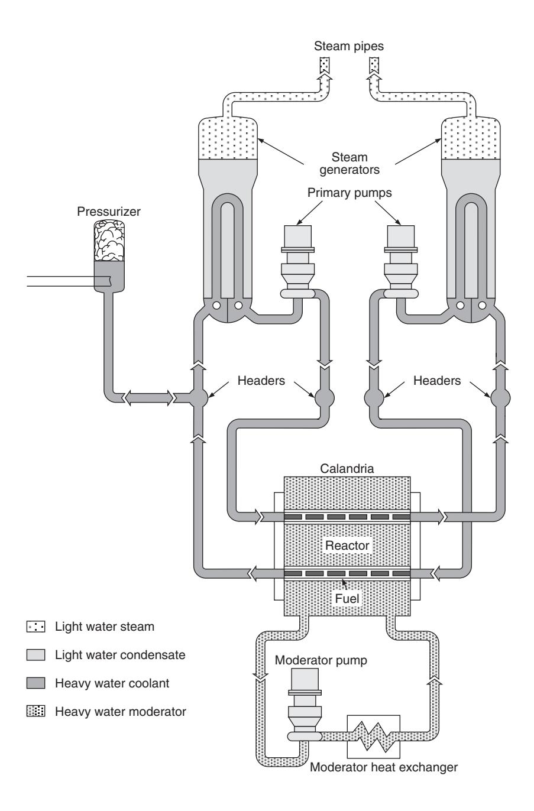

*FIG. 48.1. Steam supply system of a CANDU reactor.*

coefficient is negative and therefore stabilizing, whereas the coolant void reactivity coefficient is positive and destabilizing. The sum of these, and lesser reactivity feedback effects, is a power reactivity coefficient near zero under normal operating conditions.

# **48.2.4. Reactor kinetics**

The prompt neutron lifetime in a CANDU lattice is relatively long (about 0.9 ms) and the delayed neutron fraction (about 0.005) is enhanced by the presence of photoneutrons. These two factors, combined with the division of the primary coolant circuit into two separate loops, slow down a potential power excursion considerably, as compared with a similar transient in a typical LWR [48.2].

The unit of reactivity most commonly used in CANDU reactor physics is the 'milli-k'or 'mk'. It is equal to 0.001(*k* – 1)/*k*, where *k* is the multiplication factor for the fission chain reaction in a given nuclear lattice. This unit is used throughout this section to define reactivity.

#### **48.2.5. Xenon feedback**

A reactor that is unstable owing to xenon feedback effects would undergo slow, divergent spatial power oscillations (e.g. from side to side or end to end) which, at constant total power, would overheat some fuel. The CANDU PHWR is equipped with a continuous automatic spatial control system that prevents xenon oscillations and corrects flux distortions due to other causes.

The xenon load at full power is about 29 mk. When the reactor power is rapidly decreased, the xenon concentration increases over a period of a few hours and then decays. The resulting variation in core reactivity is compensated for by the movement of zonal control absorbers (Section 48.4.5(a)) and, if necessary, by withdrawal of some adjuster rods (Section 48.4.5(c)) from the core.

In the event of a shutdown from full power, the adjuster rods have enough reactivity to restart the reactor within 30 min. If it is not started in 30 min, then the reactor 'poisons out' and can only be restarted after about 40 h, when the xenon poison has decayed sufficiently.

#### 48.3. OVERALL I&C DESIGN PHILOSOPHY

#### **48.3.1. Defence in depth**

The CANDU I&C systems are designed for high reliability and availability to meet stringent safety and operational requirements. In the reactor design, multiple physical barriers to radioactive releases are used, including the UO2 fuel, the fuel sheath, the primary heat transport system, the containment system and the exclusion zone of the plant site. For I&C systems, to match these standards, a defence in depth design philosophy is employed that:

- Provides diversely functioning systems to perform each task;
- Uses components for different systems from different suppliers;
- Uses physical separation of systems and components that back each other up;
- Annunciates and corrects minor system upsets before they become major events.

Final elements in this defence in depth approach are the special safety systems that shut down the reactor, provide long term cooling of the fuel and contain potential releases of radioactive material. There are four special safety systems:

- Shutdown system number 1 (SDS1);
- Shutdown system number 2 (SDS2);
- Containment system (CS);
- ECCS.

# **48.3.2. Special safety systems**

Each special safety system is completely independent of the others, with its own sensors, logic and actuators. Each employs triplicate logic, meets the IAEA single failure criterion and is designed with built-in features to facilitate on-line testing. Minimum allowable performance standards for each of the special safety systems are defined and are used in the safety analysis as well as in the plant operating policies and principles.

The provision of two shutdown systems, either of which is capable of shutting the reactor down for the entire spectrum of PIEs, is a unique feature of the CANDU I&C design. The two systems are physically and functionally independent of each other and each is designed such that at least two generally diverse trips (trips based on functionally different measured variables) are actuated by any single process failure. The special safety systems, in turn, are to the greatest extent possible free from operational connection with any of the process systems, including the reactor regulating system.

To provide protection against PIEs of low probability such as fires or local missiles, the plant systems (both process and safety) are divided into two groups. All special safety systems and associated support services are designated as Group 2 and located in a physically separate area from the normal plant process systems in Group 1. In the event that one group is disabled, the following capability is preserved:

— Reactor shutdown;

- Decay heat removal;
- Preservation of barriers to radioactive releases;
- Supply of information required to assess the state of the nuclear steam supply.

Defence against earthquake is facilitated by seismically qualifying all Group 2 equipment. The MCR is sufficiently qualified against earthquakes for operators to remain in it after an earthquake. If the MCR became unusable and uninhabitable for any reason, the essential reactor systems could be regulated from a secondary control area geographically isolated from the MCR.

#### **48.3.3. Reactor regulation**

Another important feature of CANDU I&C philosophy is that major plant control, annunciation and display functions are computerized. The resulting high degree of automation and improved HMI leave the operator to act as a situation manager, free to concentrate on unusual occurrences.

A dual computer system concept is employed to provide the required high reliability. Each computer is capable of complete plant control and transfers control automatically, either completely or by function, to the other on detection of a fault. The changeover from one to the other occurs when internal software or external hardware self-checking timers (known as 'watchdog timers') detect a system fault. System faults result in an automatic reloading of memory followed by a computer restart, or a complete transfer of control to the other computer, depending on the severity of the condition detected.

The control functions are designed to be independent of each other, to be immune to single input faults and to ensure that all controlled devices produce their desired outputs. The system depends on redundant information, rationality checks and feedback from the controlled devices. In effect, each function determines for itself whether it should continue or relinquish control. A function that relinquishes control produces an alarm for each abnormal condition and turns itself off, leaving its outputs in a safe state while control of the function automatically transfers to the other computer.

The computer system plays an integral role in the defence in depth approach and attempts to intercept system upsets before they become reactor trips. This it does by means of control algorithms that reduce reactor power when certain variables are outside their acceptable control ranges, thus restoring normal operating conditions without invoking a trip.

#### **48.3.4. Post-accident monitoring**

PAM is provided to assist the operator in assessing the post-accident plant conditions. Instrumentation is provided to assist with the following functions:

- Verification of reactor shutdown;
- Verification of reactor heat removal;
- Verification of the provision of a physical barrier to the release of radioactive material to the environment;
- Monitoring of plant characteristics required to follow the effects of an accident.

PAM is not performed by a separate system; instead the normal control room instrumentation is used for this task. Bezels around panel meters and status indicators designated for PAM on control room panels are colour coded to assist in easy identification.

#### **48.3.5. Electrical power supplies**

The defence in depth concept is also applied to the electrical power supplies. Each channel of the triplicated safety systems is fed from independent uninterruptible power supplies. Each computer of the dual computer system is also fed from a separate independent uninterruptible power supply to avoid loss of control capability due to a common power supply fault.

## 48.4. AUTOMATIC CONTROL SYSTEMS

# **48.4.1. General**

The maximum practicable amount of automatic control is incorporated into the CANDU design to reduce the routine workload of the operating staff. This frees them for high level monitoring of overall plant status, thereby enhancing operating efficiency. The use of two computers for direct digital control and the ability to switch from one to the other have given an availability in excess of 99.8% [48.3]. The control systems are designed to make the plant tolerant of expected and unexpected transients, thereby avoiding unnecessary plant outages. A design objective has been to make the intervention of the shutdown systems unnecessary in all cases except accidents which could threaten public and plant safety.

Loss of the transmission line to the grid and a turbine trip are two transients that the control system must periodically cope with. It does this by rapidly reducing reactor power to about 60% and discharging steam to the turbine condenser or to the atmosphere. Following such a transient, the reactor system is capable of sustained operation at any load between 55 and 100% of rated capacity.

Some CANDU reactors are provided with control equipment for cogeneration of electricity and process steam for other industrial applications (e.g. the Bruce plant in Canada).

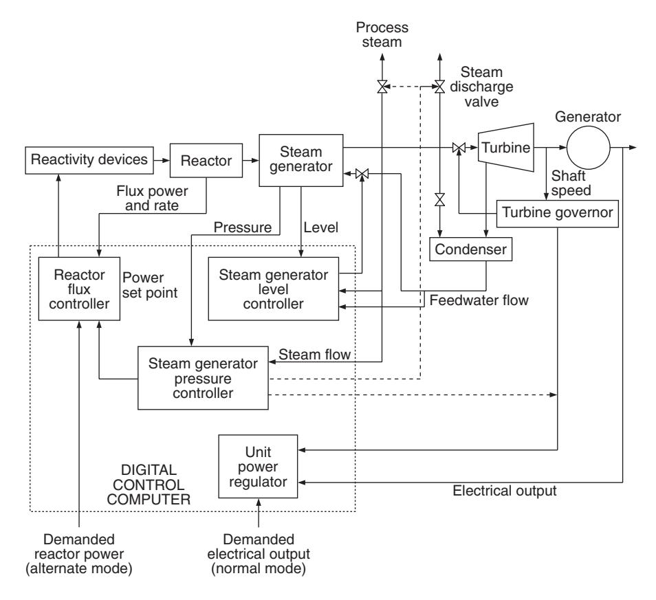

*FIG. 48.2. Overall CANDU plant control.*

#### **48.4.2. Overall plant control**

The control of the reactor and its steam loads is accomplished by keeping the steam generator (i.e. boiler) pressure constant. Two distinct control modes exist for doing this:

- 'Normal' is the usual control mode at high power. The turbine load is set to the desired value and the reactor power adjusts automatically to maintain constant steam generator pressure.
- 'Alternate' is the usual control mode at low power (below about 2%) and during upset conditions. The operator specifies the reactor set point and the plant steam loads are adjusted to maintain steam generator pressure.

The main components of the overall plant control loops are shown in Fig. 48.2, with the control computer programs grouped in a separate box. The primary functions of the main programs shown are as follows:

- *Unit power regulator.* This changes turbine load as demanded by the operator or by a remote control centre and maintains the desired generator load.
- *Steam generator pressure controller*. In the normal mode this controls boiler pressure by changing the reactor power set point. In the alternate mode it adjusts the plant loads.
- *Reactor flux controller.* This adjusts the reactor's reactivity devices to maintain the neutron power at a level based on the reactor power set point and neutron and thermal power measurements.

Plant loads shown in Fig. 48.2 include the following:

- *Turbine.* This is normally controlled from the unit power regulator. Hardware unloaders protect the turbine during abnormal conditions.
- *Condenser steam discharge valves.* These are normally controlled from the steam generator pressure controller. Separate hardware logic closes these valves on low condenser vacuum to protect the condenser.
- *Atmospheric steam discharge valves.* These are normally controlled from the steam generator pressure controller.
- *Process steam.* This is controlled from the steam generator pressure controller in response to flow demands from the external process or, at low flows, in response to pressure control requirements.

# **48.4.3. Digital computer systems**

Digital computers are used for plant control, alarm annunciation and data display. The dual configuration, shown in Fig. 48.3, consists of two identical computers, one on hot standby, connected by a data link and a shared display system [48.4]. No analog backup is needed because the availability of the dual computer system is more than 99.8%. This high reliability results from a combination of highly reliable solid state hardware and a self-checking system.

As has been stated, faults are detected by self-checking software plus an external watchdog timer and a fault results in individual control tasks being transferred to the other computer. This capability to transfer tasks, combined with a restart system which, in the event of a major fault, automatically reloads the core memory from the disk memory and restarts the computer, provides a system practically immune to transient faults.

An extensive computer driven alphanumeric/graphical CRT display system provides the operator with alarm annunciation and operating data. These colour

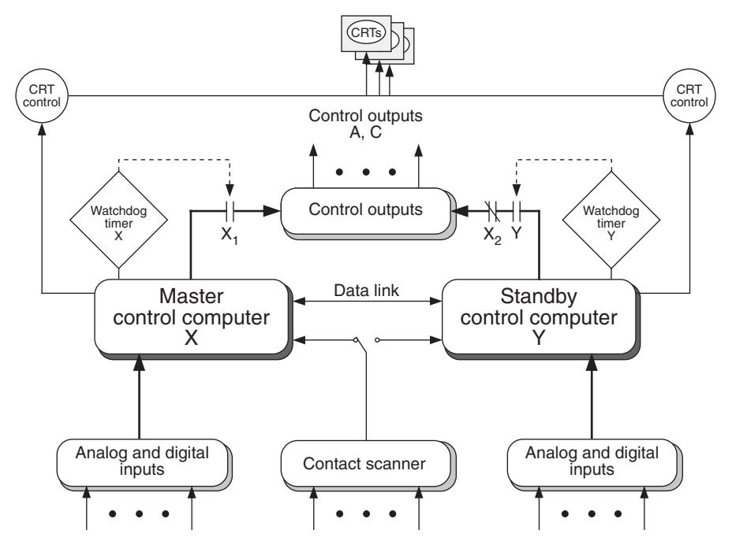

*FIG. 48.3. Configuration of CANDU control computers.*

CRTs replace most of the panel instrumentation found in conventional control rooms [48.5]. Hard-wired window annunciators are provided for group alarms as a backup to the computerized alarm system. The operator communicates with the computers through keyboards in various locations in the control room.

#### **48.4.4. Reactor instrumentation**

Separate nuclear instrumentation systems are provided for regulation and safety. As summarized in Table 48.1, proportional counters, uncompensated ion chambers and self-powered in-core flux detectors are used to give a continuous measurement of reactor power from source level to 150% of full power, i.e. a range of approximately ten decades. A minimum overlap of one decade is provided between successive ranges of nuclear instrumentation.

The startup proportional counters are used only during first criticality or for restarting after a very long shutdown. Following high power operation, HWRs retain a sufficient neutron source to keep the ion chambers on-scale even after extensive shutdowns. Startup counters are therefore not normally required and are typically removed after startup.

TABLE 48.1. CANDU REACTOR POWER MEASUREMENT SYSTEMS

|                                 | Application                                                                             |                                                                                                                                                                                                                                                                                                          |                                                |                                                     |
|---------------------------------|-----------------------------------------------------------------------------------------|----------------------------------------------------------------------------------------------------------------------------------------------------------------------------------------------------------------------------------------------------------------------------------------------------------|------------------------------------------------|-----------------------------------------------------|
| Neutron flux instrumentation | Flux mapping                                                                            | Flux regulation                                                                                                                                                                                                                                                                                          | Safety systems                                 |                                                     |
|                                 |                                                                                         |                                                                                                                                                                                                                                                                                                          | SDS1                                           | SDS2                                                |
| Proportional counters        |                                                                                         | 3 BF3 counters (in-core) for 10–14–10–9 of full power                                                                                                                                                                                                                                           |                                                |                                                     |
|                                 |                                                                                         | 3 BF3 counters (out-of-core) for 10–10–10–6 of full power                                                                                                                                                                                                                                       |                                                |                                                     |
| Ion chambers                    |                                                                                         | 3 at one side of calandria (for bulk flux between 10–6 and 0.15 of full power)                                                                                                                                                                                                            | 3 at one side of calandria (out-of-core) | 3 at opposite side of calandria (out-of-core) |
| Flux detectors                  | 102 in-core vanadium detectors (used for flux calibration at high power) | 28 in-core platinum detectors (used at higher power levels for bulk and spatial control)                                                                                                                                                                                               | 34 in-core platinum detectors            | 23 in-core platinum detectors                 |
|                                 | Additional power measurement instrumentation                                            |                                                                                                                                                                                                                                                                                                          |                                                |                                                     |
|                                 |                                                                                         | 24 RTDs distributed in the reactor inlet and outlet headers for bulk power calibration below 70% of full power 4 sets of steam generator power measurement devices (steam flowmeter, feedwater flowmeter, feedwater temperature detector) for bulk power calibration above 50% of full power |                                                |                                                     |

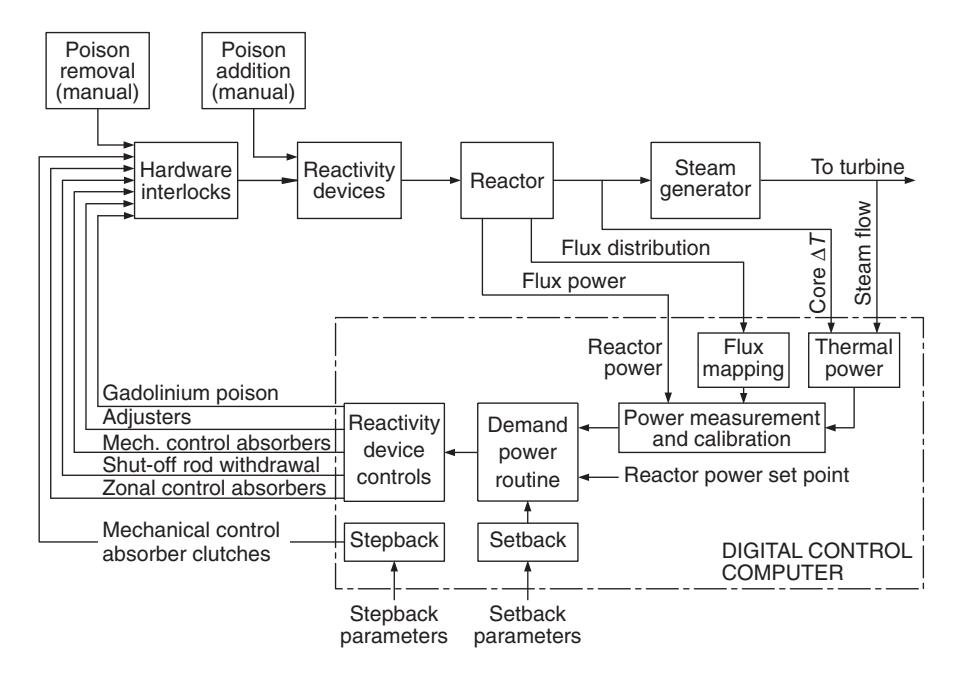

FIG. 48.4. CANDU reactor regulating system.

#### 48.4.5. Reactor regulating system

The reactor regulating system (RRS, Fig. 48.4) consists of that part of the overall plant control system that directly controls reactor power either to an operator specified set point (alternate mode) or to the power level required to maintain steam generator pressure (normal mode). The RRS is designed to satisfy the following requirements:

- Provide automatic control of reactor power between 10-7 and 100% of full power;
- Maintain the neutron flux distribution close to its nominal design shape [48.6] so that the reactor can operate at full power without violating bundle or channel power limits;
- Monitor important plant parameters and reduce reactor power quickly when any of these parameters are out of limits;
- Automatically withdraw shut-off rods from the reactor when the trip channels have been reset following a reactor trip on the shutdown system SDS1.

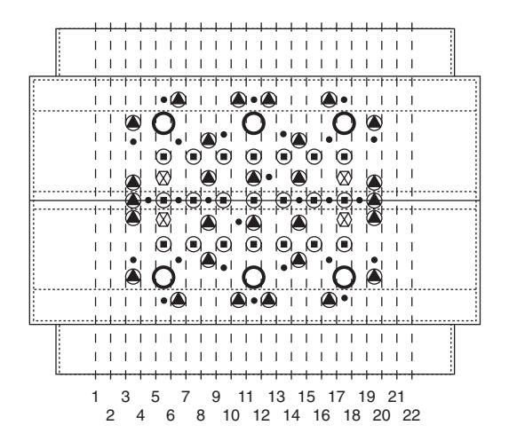

- Vertical flux detector assembly (26)
- Solid control absorber (4)

Adjuster (21)

H2O zone control assembly (6)

Shut-off rod (28)

Horizontal flux detector assembly (7)

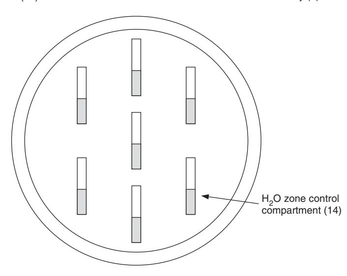

View of reactor face

*FIG. 48.5. Layout of reactivity control mechanisms.*

Reactor neutron power is controlled to a given set point by means of the reactivity control devices, which, for fast control, include:

- Light water zonal control absorbers;
- Four mechanical control absorbers;
- 21 solid adjuster rods.

Long term negative reactivity is provided by the addition of soluble poison (boron or gadolinium) to the moderator. Boron is used to suppress the excess reactivity in a fresh core and gadolinium is used following poisoning to compensate for xenon burnout.

- (a) *Zonal control absorbers.* The main method for controlling reactor power is by adjustment of the average H2O level in the 14 independently controllable compartments of the zonal control absorbers. Differential adjustment of levels in individual compartments is used for spatial (zonal) control. Platinum in-core flux detectors provide the neutron flux feedback signals required by the digital control algorithms for regulation of both the bulk and the spatial flux. The layout of the various reactivity mechanisms and detectors is shown in Fig. 48.5.
- (b) *Mechanical control absorbers.* The reactivity range (±3 mk) provided by the zonal control absorbers is adequate for most power manoeuvres. However, certain situations require additional negative reactivity. This is provided by the four mechanical (i.e. solid) control absorbers (10 mk), normally out of the core (Fig. 48.5). These situations include:
  - Controlled shutdown of the reactor by the regulating system;
  - Ramped power reduction (setback) during upset conditions to allow continued operation at reduced power;
  - Stepped power reduction (stepback) during certain upset conditions to avoid a loss of regulation (LOR) accident and hence actuation of one of the shutdown systems.

Normally, the mechanical control absorbers (MCAs) are automatically driven by the control computer; however, they can also be manually controlled by the operator.

(c) *Adjusters.* The 21 adjuster rods, shown in Fig. 48.5, have graded absorption and are normally fully inserted in the core for flux shaping. They are withdrawn in symmetrical banks, under the control of the control computer, to provide positive reactivity for shimming the zonal control absorbers as well as for xenon override following a shutdown. Their total reactivity worth of 15 mk makes it possible to start up the reactor within 30 min of shutdown from full power. The adjusters also permit sustained power reductions to 55% of full power. During periods of refuelling incapability, the adjusters can keep the plant operating for weeks by compensating for the loss of fuel reactivity of about 0.31 mk/d. Manual control of the adjusters by the operator is provided.

## **48.4.6. Flux mapping**

The platinum flux detectors used for spatial control do not accurately represent average zone power as they sense the flux over a small volume, three lattice pitches long. Therefore, accurate measurement of average zone power to calibrate these detectors is done with a system of 102 vanadium flux detectors distributed throughout the reactor core. Signals from these detectors are processed by the flux mapping software in the control computer to obtain average zone flux estimates. Processing of flux detector signals includes checking for rationality and correcting for detector burnup. Irrational detector readings are rejected.

The flux mapping software also estimates the maximum flux levels in the core and uses this information to initiate a ramped power reduction (setback) if the power is too high in some fuel bundles. It also provides a channel power map, as well as estimates of the flux at regional overpower trip (ROPT) detector sites. This gives the operator accurate information on the state of the core.

#### **48.4.7. Control strategies**

- (a) *Reactor startup.* The triplicate startup instrumentation listed in Table 48.1 is used for the initial approach to reactor criticality or for startup after a very long shutdown. Each channel of instrumentation is connected to the corresponding channel of SDS1. The trip and alarm parameters used are high log power, low log power, high log rate and high voltage power supply voltage. On the approach to criticality, the operator initiates the removal of boron from
  - the moderator and records the neutron counting rate from each of the three instrumentation channels at regular time intervals. Between 10–14 and 10–9 of full power, the signals are provided by in-core BF3 counters but once the outof-core BF3 counters come on-scale, the instrument channels are switched over to them. Finally, when the ion chamber system indicates a power level of 10–6 of full power, the digital control computer takes control and raises power to the requested set point.
- (b) *Normal operation.* During normal operation (above 15% of full power), the digital control computer provides signals to control the H2O levels in the zonal control absorbers to hold both reactor power and zonal power at their set point values. Spatial flux control has lower priority than reactor power control. Therefore, when the H2O level in the zones is above 80% or less than 20%, spatial flux control in these zones is slowly phased out and the remaining range

is reserved for reactor power control. Flux tilt control is not needed and is not used below 15% of full power.

Inadequate overall negative reactivity is indicated by high average water level in the zonal control absorbers and/or by a high positive power error signal. These conditions result in the control computer driving the MCAs into the core. Under some special conditions the use of the MCAs is inhibited, e.g. when both shutdown systems are unavailable.

In addition to their normal uses for shaping flux and providing xenon override following a shutdown, adjusters are used to assist the zonal control absorbers when more positive reactivity is required for spatial flux control. This is achieved by withdrawing adjusters from the core when additional reactivity is required and, conversely, inserting them into the core if there is excess reactivity. The speed at which absorbers and adjusters are driven by the computer depends on the power error signal.

Manual addition of gadolinium poison to the moderator is available to the operator as backup to the MCAs. The automatic addition of gadolinium poison takes place when a high power error signal is combined with positive flux rate and prevents LOR accidents due to the slow growth of reactivity in the core.

- (c) *Power setbacks.* These are controlled reductions in power when certain plant parameters exceed specified limits. They are automatically initiated by the control computer, which drives in the MCAs. Plant conditions that initiate setbacks include:
  - High local neutron flux;
  - Spatial control outside the normal range of operation;
  - Low de-aerator level;
  - High steam generator pressure;
  - Upsets in moderator temperature or pressure.
- (d) *Power stepbacks.* As a part of the defence in depth philosophy, a stepback feature is provided in the regulating system to rapidly reduce reactor power and hence to correct minor upsets before they become major ones. For certain upsets, the control computer initiates a stepback by dropping the four MCAs into the core. If the stepback condition clears during the gravity fall of rods, the clutches are engaged and the rods are caught in mid-flight. Plant upset conditions that initiate reactor stepbacks include:
  - Reactor trip;
  - Turbine trip;
  - Loss of transmission line;
  - Heat transport pump trip;
  - High heat transport pump pressure;
  - High flux power or high flux rate;
  - Low steam generator level.

To prevent the spurious initiation of stepbacks, which could lead to a reactor poison-out, the stepback software is run in both control computers and a stepback is initiated only when both computers request it.

#### **48.4.8. System response to disturbances**

As mentioned in Section 48.4.2, the plant operates in one of two modes, normal or alternate. In the normal mode, steam generator pressure is usually controlled by adjusting the reactor power and, on occasion, by varying the plant load. An example of this combined action is the rapid turbine runback transient when steam is briefly discharged to the condenser and to the atmosphere during the decrease in reactor power. On a turbine trip, loss of transmission line or loss of stator cooling, the reactor is stepped back to 60% of power by partly dropping the MCAs. Initially, the plant load is varied by discharging the steam to both the condenser and the atmosphere, and eventually all the steam is bypassed directly to the condenser.

#### **48.4.9. Xenon override and load following capabilities**

- (a) *Xenon override.* Following a reactor trip, xenon neutron absorption in the core builds up and, within 30 min, exceeds the available excess reactivity with all the shut-off rods, absorbers and adjusters removed. Thus, it is only possible to overcome xenon reactivity load if the reactor is restarted and power raised to at least the poison prevention level (about 60%) within the poison override time (about 30 min) after the trip. If the reactor does poison out, the xenon reactivity continues to build up before it starts to decay and reactor restart becomes possible about 40 h after the trip.
- (b) *Load following capabilities.* A CANDU 6 plant can load-cycle on a daily basis. The reactor power can be suddenly reduced from full power to as low as 55% and be kept there indefinitely without poisoning out. The reactor can be returned to full power at a rate that matches the normal daily increase in power demand. For economic reasons, utilities tend to operate CANDU plants as baseload plants but significant experience exists with CANDU plants operating in the load following mode.

#### **48.4.10. Reliability and maintainability**

The demand for a highly reliable regulating system is driven by considerations of safety and economics. Experience with existing CANDU plants indicates that the LOR target failure rate of 10–2 (once every 100 years) is achievable. The more common regulating system outages requiring maintenance are resulting in a reactor unavailability of about 20 h/year. Less than 5 h of this is attributed to unavailability

TABLE 48.2. TRIP PARAMETERS FOR CANDU SHUTDOWN SYSTEMS

| Trip parameter                           | SDS1                                  | SDS2                                  |
|------------------------------------------|---------------------------------------|---------------------------------------|
| High neutron power                       | Vertical in-core detectors            | Horizontal in-core detectors          |
| High log rate neutron power              | Ion chambers                          | Ion chambers                          |
| High heat transport system pressure   | Pressure transmitters                 | Pressure transmitters                 |
| Low core differential pressure           | Not applicable                        | Differential pressure transmitters |
| Low heat transport system flow           | Differential pressure transmitters | Not applicable                        |
| High reactor building pressure           | Pressure transmitters                 | Pressure transmitters                 |
| Low pressurizer level                    | Differential pressure transmitters | Differential pressure transmitters |
| Low steam generator level                | Differential pressure transmitters | Differential pressure transmitters |
| Low heat transport system pressure    | Pressure transmitters                 | Pressure transmitters                 |
| Low steam generator feedline pressure | Pressure transmitters                 | Pressure transmitters                 |
| High moderator temperature               | Temperature transmitters              | Not applicable                        |
| Manual push-button trip                  | Operator initiated                    | Operator initiated                    |

of both control computers. The high reliability of the regulating system and other nuclear systems results from quality control, careful commissioning, system redundancy and fail-safe philosophy. Maintainability is achieved by:

- Modular, plug-in construction of all the instrumentation;
- Automatic self-checks by the control computers for hardware and software failures;
- Use of standard commercially available detectors, instruments and cables;
- Provision of test equipment to promote rapid diagnosis of faults;
- Accessibility of all components for replacement.

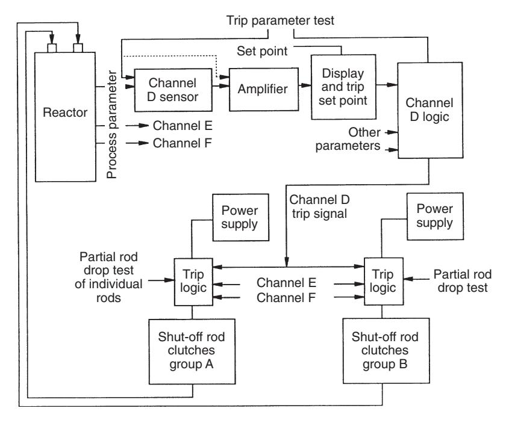

*FIG. 48.6. A channel of shutdown system number 1.*

# 48.5. REACTOR SAFETY SYSTEMS

#### **48.5.1. Shutdown system number 1**

SDS1 uses 28 spring assisted, gravity drop absorber elements as its basic shutdown mechanism; this is the preferred method of quickly terminating reactor operation when specified parameters enter an unacceptable range. (This preference is an economic factor since the use of SDS2, which injects poison into the moderator, results in a reactor poison-out, with attendant unit unavailability to the electrical grid.) When any of the trip parameters listed in Table 48.2 exceed their trip settings, a two out of three general logic system senses the requirement for a reactor trip and, if a trip is required, the DC clutches on the shut-off rods, which are in two groups of 14 each, are de-energized and the absorber elements drop into the moderator. The redundant logic system fails to a safe condition on the loss of AC power.

A simplified block diagram of one channel of SDS1 is shown in Fig. 48.6. The three trip channels (D, E and F) have completely independent and physically separated power supplies, trip parameter sensors, instrumentation trip logic and annunciation. Thus, no single failure can invalidate a requested trip action. When any two of the three channels trip, the shut-off rods are dropped. General coincidence logic is used such that an entire channel trips when any parameter on that channel reaches its trip setting. LEDs are used in the shut-off rod trip network to indicate correct operation of the trip relays when a particular channel of a specific trip parameter is tested. Correct operation of a particular relay contact is indicated by the associated LED turning on and failure of a relay to re-energize after the test is detected by its LED remaining lit. A facility for testing the drop time of the absorber elements during reactor operation is also provided.

In the MCR, a separate instrumentation panel is allocated to SDS1. This panel houses all the associated annunciator alarms, test LEDs and switches, manual drive and test drop hand switches for the shut-off rods and a manual trip button. All trip parameters are connected through suitable buffers to the sequence of events monitor on the main computers for post-event analysis.

The unavailability requirement of 10–3 or less is met without taking credit for trip signals from more than one trip parameter at a time even though diversity has been provided. The shutdown system is considered to be available if all except the two most effective absorbers drop when required to do so. The negative reactivity insertion rate for this situation is more than adequate to keep the result of any accident within regulatory agency guidelines. The principle of diversity is used in the design of the trip system. For each process failure there are at least two effective trip parameters, each based on a different measurement principle. For example, for LOR at high power, the primary trip parameter is high neutron power and the alternate trip parameter is high heat transport pressure.

Relay trip logic was standard in CANDU plants built during the 1960s and 1970s and has proved highly reliable. With simple trip parameters, relay logic provides a simple, testable, fail-safe design. The trip systems for CANDU 6 plants combine relay logic with programmable digital comparators (PDCs). The latter are used for implementing trip parameters that require extensive conditioning or those which have set points that are functions of reactor power and/or heat transport system pump configuration. The PDCs are field proven units with read-only memory. The newer CANDU plants (e.g. Darlington) use fully computerized systems to implement the safety system logic. These computerized safety systems incorporate automated testing capabilities. Figure 48.7 shows the use of PDCs in the safety system logic of a CANDU 6 plant. The PDCs replace analog trip comparators used previously for complex trips. Two PDCs are used for each instrumentation channel: one for the primary trips requiring a significant degree of conditioning and one for the associated alternate or backup trips. Digital outputs controlled by the PDCs drive relays in the channel trip logic.

The various trip parameters are listed in Table 48.2. In addition to the automatic trips, a manual trip is also provided for operator intervention, as is a

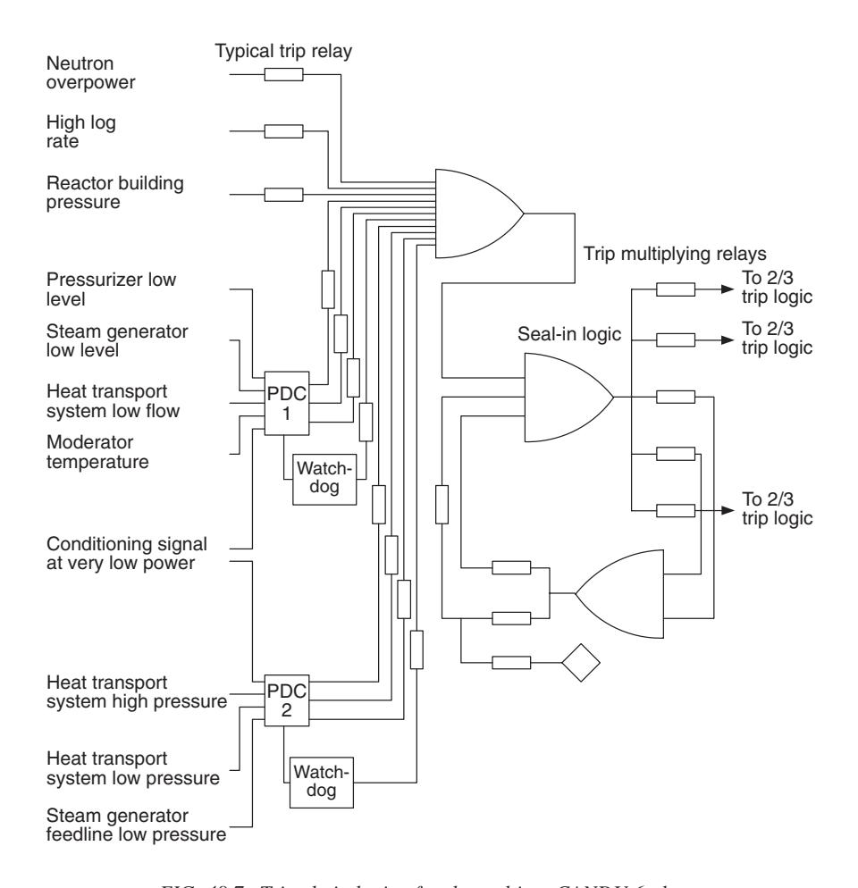

*FIG. 48.7. Trip chain logic of a channel in a CANDU 6 plant.*

startup count rate trip for use only during initial startup or startup following a long shutdown. The high neutron power trip is based on promptly responding selfpowered platinum flux detectors mounted vertically in the core such that all regions of the core are protected from overpower. These flux detectors are independent of any regulating system or SDS2 detectors. They are tested by injecting a current at the amplifier inputs and by checking the insulation resistance of each detector. The detector outputs and trip set points are displayed in the control room for monitoring purposes. The other neutronic trip, high log rate of neutron power, is based on three uncompensated ion chambers located in separate housings on different sides of the reactor vessel. Testing of the ion chambers is

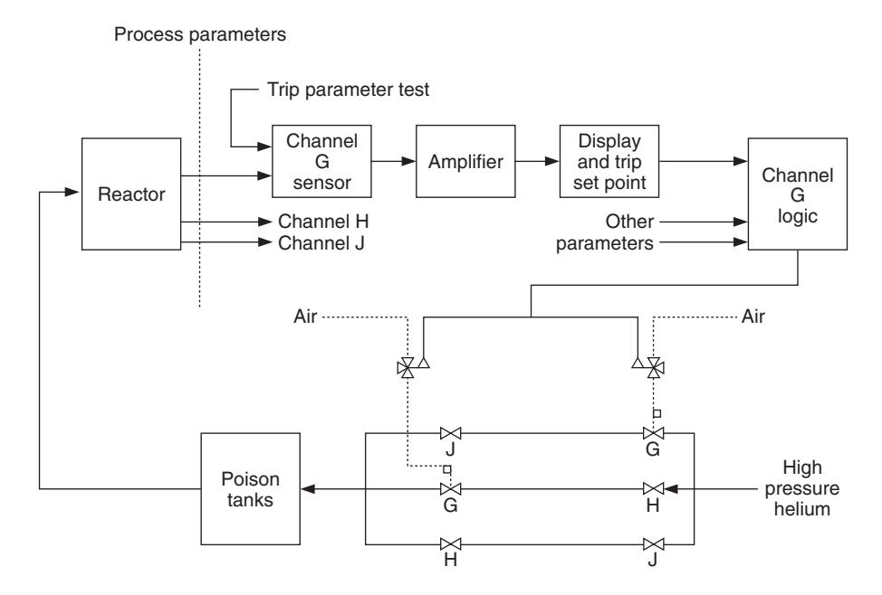

FIG. 48.8. A channel of shutdown system number 2.

initiated from the control room by driving an adjustable, piston actuated boral sleeve shutter which is set to provide the necessary logarithmic rate signals. The other trip parameters are based on standard process instrumentation transmitters tested from the control room. Pressure transmitters are tested from the control room after they have been manually taken out of service and connected to an adjustable test pressure.

#### 48.5.2. Shutdown system number 2

SDS2 provides a second method of quickly terminating reactor operation for the same spectrum of PIEs as SDS1. The provision of two functionally and physically independent shutdown systems, both designed for very low unavailability  $(10^{-3})$ , is almost unique to CANDU plants and virtually guarantees shutdown capability under all reactor accident circumstances.

SDS2 employs an independent two out of three general coincidence logic (a channel of which is shown in Fig. 48.8) to open fast acting helium pressure valves and inject gadolinium nitrate poison directly into the  $D_2O$  moderator when one of the trip parameters (Table 48.2) exceeds its limit. The basic principles of operation are illustrated in Figs 48.7 and 48.8. The actuation of any two trip channels opens valves to establish a path from the high pressure helium supply tank to the poison tanks and

gadolinium nitrate is forcibly injected into the moderator. Six horizontal poison injection nozzles are provided.

The selection of trip parameters is such that there are, as with SDS1, at least two trips for each process failure and in general the alternate trip parameter is based on a different measurement parameter from the primary one (Table 48.2). The high neutron power trip is based on a number of promptly responding self-powered platinum flux detectors mounted horizontally in the core. These detectors are separated from any regulating system and the SDS1 detectors by spatial separation of the assemblies. The detector outputs and trip set points are displayed in the control room for monitoring purposes. The high log rate of neutron power trip, as for SDS1, uses uncompensated ion chambers but the ion chambers and their associated amplifiers are of different manufacture than those of SDS1 and are located at a different reactor face. The other trip parameters are based on standard process transmitters and are tested in the same way as those of SDS1. Testing also includes automatically operating the fast acting helium pressure valves in one trip channel periodically, as well as taking a poison tank out of service to check that its gadolinium nitrate concentration meets requirements. Indication of a successful channel test in the control room is obtained by observing correct operation of the fast acting helium pressure valves.

The logic processing for SDS2 is similar to that for SDS1 and employs a combination of relay and microprocessor technology. However, different designs and equipment suppliers are utilized. A separate panel in the MCR is allocated solely to SDS2. As for SDS1, the panel consolidates all the annunciator alarms, test switches, etc., associated with SDS2. The SDS2 parameters are connected, through suitable isolating buffers, to the sequence of events monitor on the main control computers for post-event analyses.

The system unavailability target of 10–3 is demonstrated on a per trip parameter basis (even though there are two or more trip parameters effective for each event) and with one of six poison tanks unavailable.

#### **48.5.3. Emergency core cooling system**

The ECCS maintains or re-establishes sufficient cooling of the fuel and fuel channels for specified LOCAs so as to limit the release of fission products from the fuel and maintain fuel channel integrity. The ECCS supplies coolant to all the reactor headers and is composed of three stages: high pressure, medium pressure and low pressure. The high pressure stage uses pressurized nitrogen to inject water into the reactor core from water tanks located outside the reactor building. The medium pressure stage supplies water from the dousing tank. When this water supply is also depleted, the low pressure stage recovers water that has collected in the reactor building sump and pumps it back into the reactor core via the emergency cooling heat exchanger and the emergency cooling recovery pumps.

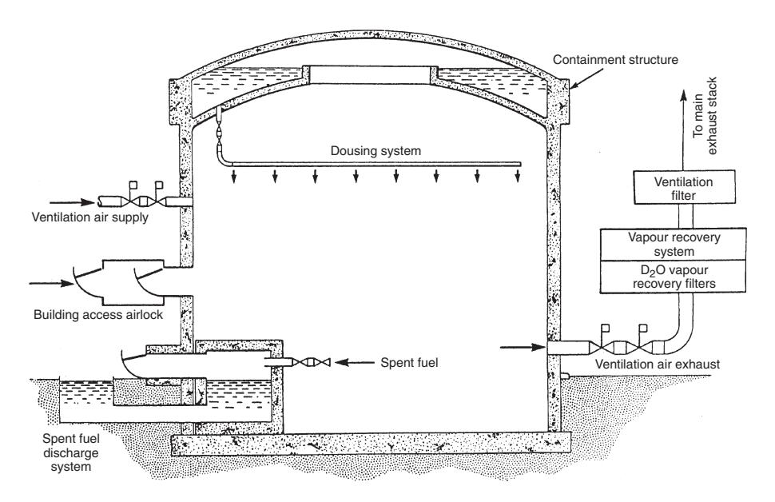

*FIG. 48.9. CANDU containment system.*

The high pressure injection stage consists of one nitrogen gas tank and two water tanks. The gas tank normally operates at a pressure between 4.1 and 5.5 MPa, whereas the water tanks operate slightly above atmospheric pressure. Two recovery pumps, each capable of supplying 100% of emergency core coolant flow, are supplied by Class III power and by the standby diesel generators (Section 48.8). The heat exchanger in the recovery pump discharge line is designed to maintain the emergency coolant flow at about 50°C at entry to the heat transport system.

Since inadvertent injection of emergency coolant would result in a significant economic penalty, precautions are taken in the logic design to prevent this while still providing the redundancy required to meet the unavailability target of less than 10–3. Typical design features are as follows:

- All instrumentation and associated control loops used to initiate emergency core cooling (e.g. low heat transport system pressure and high reactor building pressure) are triplicated. The sensors used are dedicated to emergency cooling and are not shared by other safety or process systems.
- Local coincidence is used in the logic, in which the same parameter exceeding a trip limit in two different channels initiates a trip. This helps to eliminate spurious trips of the system.
- All logic for isolating each of the two separate heat transport loops during a LOCA is separate from the logic for other functions.

- Redundant valves in parallel are used wherever power operated valves are required for the ECCS and either opening would be sufficient. Each valve of a pair is fed from an independent power supply and a valve power supply failure is annunciated.
- On-power testing facilities are provided to ensure that the target unavailability is met.

#### **48.5.4. Containment**

The containment system (CS) shown in Fig. 48.9 comprises a prestressed, posttensioned concrete containment structure, an automatically initiated dousing system and building air coolers, a filtered air discharge system, access airlocks and an automatically initiated containment isolation system.

The dousing system (Fig. 48.9) is provided to limit the extent and duration of overpressure which may occur in the reactor building after a LOCA. It consists of two independent systems with three spray headers in each. Two valves in each spray header open on high building pressure to start dousing. The valves in three headers are of one type, from one manufacturer, and the valves in the other three headers are of a second type and from another manufacturer. An independent valve control loop for each valve, with its own sensor for building pressure, is provided. Each valve can be independently tested. Valve position indication is provided for monitoring and test logic, and a record of the position of the valves is available in one of the dual control computers.

The control system for containment isolation continuously monitors the building pressure and radioactivity and, when limits on either are exceeded, automatically closes isolation dampers and valves. A two out of three high indication is required to initiate a closure. Two series connected valves are provided for isolating each penetration and closing either one effectively seals the penetration. The conversion of the two out of three measurement to the required one out of two logic for the valves is achieved by taking outputs from both two out of three lines to a pair of OR gates, one for each valve.

#### 48.6. CONTROL ROOM DESIGN AND INFORMATION DISPLAY

Two major control areas are provided: the MCR and secondary control area. The MCR centralizes all the information and human–machine controls required for safe operation of the plant, including those items required for the Group 2 safety systems described in Section 48.3. The secondary control area, which is geographically remote from the MCR, would be used for performing the shutdown and decay heat removal functions associated with Group 2 safety systems if the MCR became inaccessible.

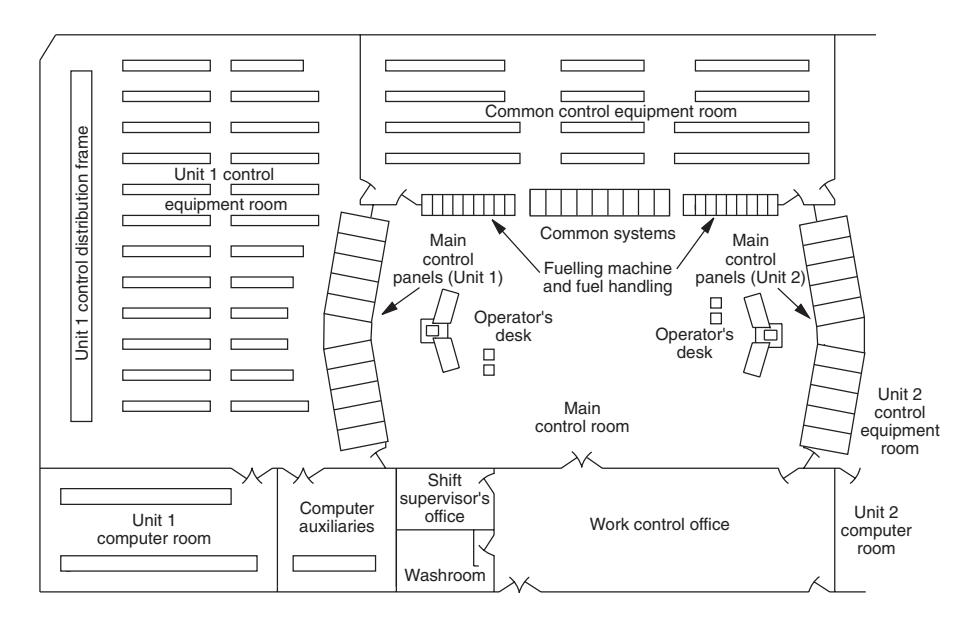

*FIG. 48.10. Layout of main control room for a two unit CANDU plant.*

#### **48.6.1. Main control room**

A typical MCR layout for a two unit plant is shown in Fig. 48.10. The basic design philosophy is to display sufficient information to allow each unit to be controlled from the MCR. To achieve this goal, all indications and controls essential for operation (startup, shutdown and normal operation) are located on the control room panels. Also located there are the controls for any systems requiring attention within 15 min of an alarm. Most information is presented to the operator via the plant computer system. However, sufficient conventional display, annunciation and recording of plant variables are included to allow the plant to be properly run in the shutdown condition with both computers out of service.

In case the MCR becomes uninhabitable, enough display and control instrumentation is provided in the secondary control area to allow the plant to be shut down and maintained in a safe shutdown condition.

#### **48.6.2. Main control room panels**

As shown in Fig. 48.10, the control panels form part of the boundary walls of the control room. With the degree of automation provided, the need for operator action at the control panels is infrequent. Therefore, the main control panels have been designed as stand-up panels with no sit-down console. An exception to this is

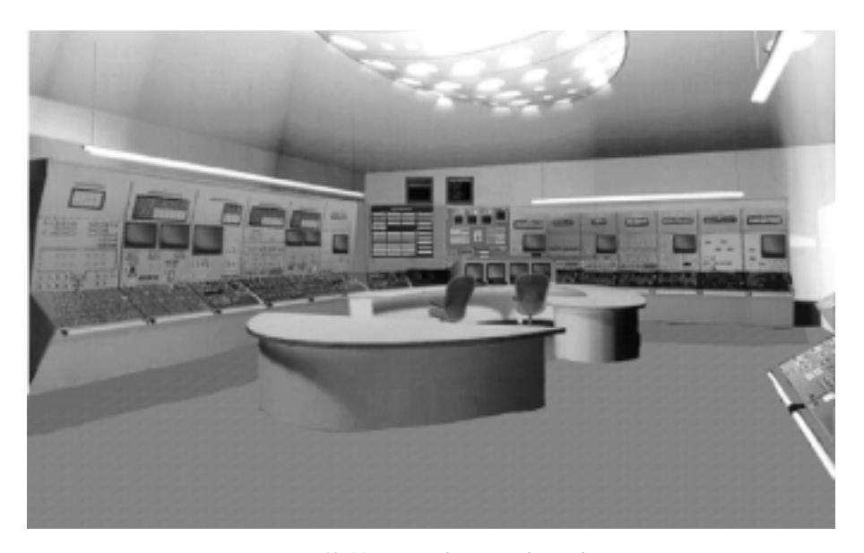

*FIG. 48.11. View of a control panel.*

the fuelling machine console, where, in spite of a high degree of automation, manual intervention is sometimes required. To reduce interference with the rest of the control room, this console is located to one side.

The panels are laid out on a system basis with the controls for a specific system located in one bay. Spacing between instruments is kept to a minimum in an attempt to achieve a compact display of information. In laying out each system, consideration is given to the relative locations of the controls based on process function and/or plant location. Mimics of the more complex process and electrical systems are displayed using coloured lines to represent the flow paths. There are seven CRTs with their associated keyboards located on various process panels for system parameter or trend displays (Fig. 48.11). Two CRTs are mounted in the fuel handling control console to display fuelling system information and two are located centrally on the unit panel for displaying annunciation messages. For the convenience of the control room operators, a CRT is located in the desks, which allows the operators to view computer driven graphics or alphanumeric displays of any important plant parameters. A printed copy of CRT display information can be generated on demand.

The CRTs replace many of the meters and recorders normally found on conventional panels. Sufficient redundancy is built into the display system to ensure a high availability comparable to that of the dual computer control system itself. The use of computer driven displays results in less congested panels and allows easier correlation of information. The greater flexibility of computer driven displays provides significant benefits during commissioning and at certain other times, such as during extended shutdowns when special displays are needed. Furthermore, infrequently used information can be suppressed during normal operation.

The reactor alarm annunciation system consists of small hard-wired window annunciators, two computer driven CRTs for alarm message presentation and a facility to provide a printed record of all alarm conditions in chronological order of occurrence. Alarm windows are illuminated independently of the computers for all alarm conditions that can cause reactor trips. These include power runbacks, turbine generator trips, high voltage breaker trips and other important system upsets.

#### **48.6.3. Safety related display instrumentation**

Most of the information on the state of the plant is presented to the operator via the two control computers. This includes data logging, sequence of events monitoring, plant parameter displays and most alarms. The computer system is designed to be fail-safe on dual computer failure by dropping the four MCAs and flooding the 14 light water zone control absorbers. However, when dual computer failure occurs, the operators do not have access to the computer data whereas certain plant information must be available at all times, e.g. on the status of all the safety systems and sufficient information about the status of the plant to establish the existence, nature and extent of an accident and whether to intervene with manual actions. This objective is achieved by hard-wiring signals for the following information directly to instruments on the control room panels:

- Red alarm windows to indicate the trip state of any parameter in any one of the special safety systems: SDS1, SDS2, ECCS or CS;
- Other alarm windows to indicate abnormalities in the shutdown and safety related systems, e.g. loss of power and loss of helium pressure;
- Values of each trip parameter in each channel of SDS1, SDS2, ECCS and CS;
- Alarm windows to indicate the existence of single and dual computer failures;
- Process indicators to display information on the status of subsystems required for the operation of the safety systems and other safety related systems, e.g. dousing tank and reactor building basement water levels and temperatures.

#### 48.7. ON-POWER REFUELLING SYSTEM

CANDU reactors rely on semicontinuous on-power refuelling for close control of core reactivity and efficient utilization of the natural uranium fuel. The fuel handling system comprises equipment for storage of new fuel, for fuel changing and

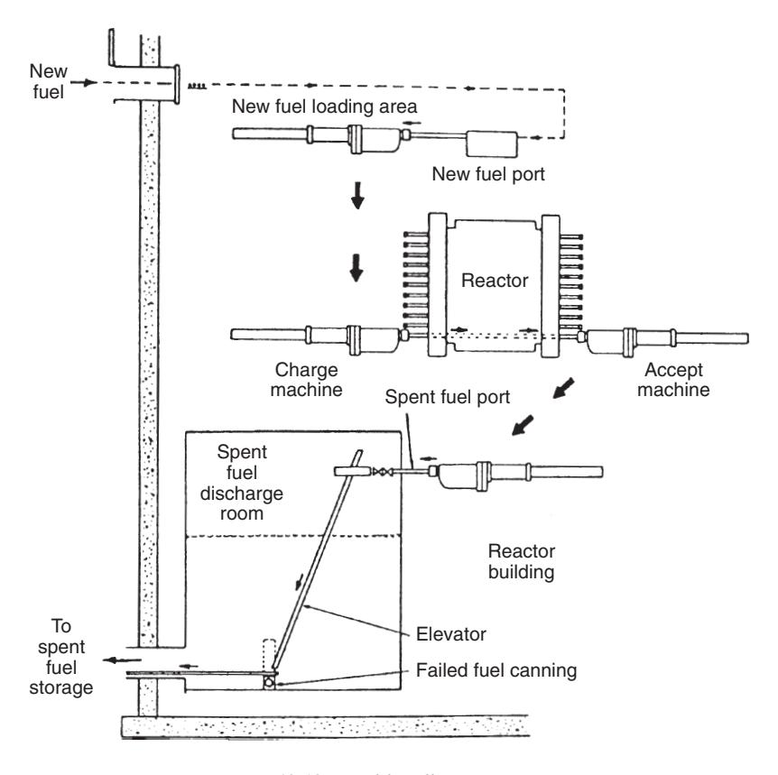

*FIG. 48.12. Fuel handling sequence.*

for temporary storage of spent fuel. Reactor fuel is changed on a routine basis with the reactor operating at full power. The flow of fuel through the plant is illustrated in Fig. 48.12.

Major steps in the movement of fuel are normally under remote and automatic control from the control room, i.e.:

- Loading the fuelling machine;
- Loading and unloading a reactor channel;
- Discharging spent fuel.

One of the two plant control computers is used to control the fuel handling system. In addition, there are separate and dedicated consoles and control panels in the control room. Refuelling can be carried out under automatic or manual control. In both modes, certain output commands are routed through a protective logic system that protects against inadvertent operations that could damage the equipment or cause personnel hazards. Normal control functions are carried out from the automatic section of the refuelling control console and selected data are displayed on a CRT. A printer provides a hard copy of these data when requested. Minimum operator intervention is required during automatic control.

# 48.8. ELECTRICAL POWER SYSTEMS

There are four classes of electrical power separated into two completely independent groups (one for Group 1 process systems and one for Group 2 safety systems). Each power supply group comprises two or three independent trains, depending on the class of power. Four classes of power are provided for service power and instrumentation loads. Their uses in order of reliability are as follows:

- *Class I.* Uninterruptible DC supplies for essential instrumentation and protection and control equipment.
- *Class II.* Uninterruptible AC supplies for essential instrumentation and protection and control equipment.
- *Class III.* AC supplies to essential auxiliaries which can tolerate the short interruptions required during the startup of the standby generators. These essential auxiliaries are necessary for an orderly shutdown of the reactor.
- *Class IV.* Normal AC supplies to auxiliaries and equipment which can tolerate long interruptions without affecting personnel and equipment safety. Complete loss of Class IV power will initiate a reactor shutdown.

All standby generators of the Group 2 power supplies are seismically qualified.

Within each separate train, an even/odd bus concept is followed to provide dual bus or better reliability at all voltage loads for Class III and IV power. Loads and redundant auxiliaries are connected so that half of any one process is supplied from an odd bus and the other half from an even bus. The even/odd concept is applied throughout, including the cable tray system and junction boxes, in order to maintain physical separation and so achieve maximum reliability under normal and abnormal conditions. Class I and II power is triplicated at all needed voltage loads. Each of the three Class I buses is fed from its own rectifier, which is then connectable to either the odd or even Class III bus. Loads of triplicated systems, such as SDS1 and SDS2, are connected so as to ensure independent power supplies for each channel of the triplicated system. The independence of triplicated power supplies is carried right through to separate cable trays, junction boxes, conduits and routing to decrease vulnerability to common mode faults.

# 48.9. RADIATION PROTECTION

#### **48.9.1. General**

Limitation of external and internal radiation exposure received by persons outside the site boundary and by plant personnel is accomplished by a combination of facilities incorporated into the plant and by adherence to a set of administrative and operating procedures.

Exposure of members of the public is limited by the exclusion of all unauthorized persons from the plant area and by preventing any habitation nearer than 1000 m from the site boundary. The release of all effluents, liquid and gaseous, that might conceivably carry significant radioactivity is monitored and controlled. Active solids are stored in a manner that prevents the release of radioactive material. The exposure of personnel to radiation is limited by key interlock control of access to areas of high activity or possible contamination.

# **48.9.2. Fixed and portable area monitoring**

Fixed area g monitors with alarms are permanently installed in areas of potentially dangerous radiation exposure to detect the occurrence of radiation hazards and to warn personnel of the presence of high fields. Two set points are normally provided on these monitors, both of which actuate a flashing light and audible alarm in the area being monitored. The lower set point indicates equipment failure; the higher indicates high radiation levels. Alarms from the area g monitors would, in an accident, be preceded by other indications of impending trouble. Airconditioning systems and instrument areas associated with the control room are arranged so that they can be atmospherically isolated and can remain in service following any design basis reactor accident or failure of a main or auxiliary steam or water header.

Portable systems with alarms are used in the plant for various operation and maintenance tasks in high fields. These devices are used to minimize exposure and prevent overexposure.

#### **48.9.3. Access control**

Personnel entry to the exclusion zone is restricted to qualified personnel and to those under their escort. There are access controlled areas where the radiation hazard is such that entrance may be made only with the knowledge and consent of the control room staff and by using a special key. Visible signals are provided in the control room to indicate which keys are in use. There are some areas where radiation is directly related to power level, and if the access key is not on the keyboard, reactor power cannot be raised. All personnel access doors are equipped with devices to permit escape, irrespective of the status of access locks.

#### **48.9.4. Liquid effluent monitoring**

Facilities are provided to collect a sample from each effluent tank for laboratory analysis. The results of the analysis determine whether the effluent requires treatment or can be safely discharged. Effluent from the liquid waste management system is monitored continuously, the sample being taken at a point upstream of the confluence with the condenser cooling water flow. This helps achieve maximum measurement accuracy. Continuous samples are taken, using a pump, of the discharge canal water. These samples are checked for tritium content and the nature and concentrations of any other radionuclides present. Sampling and measurement frequencies are determined by the plant's health physics group.

## **48.9.5. Gaseous monitoring**

Continuous samples of gaseous effluent are taken and monitored to determine releases of iodine particulates and noble gases. The signal from each of these monitors is recorded in the main control equipment room. A high level signal is annunciated in the control room. Tritium monitoring is carried out by laboratory analysis of gaseous effluent monitor samples. There is no continuous recording or annunciation of this function.

#### **48.9.6. Containment monitoring**

A separate, triplicated gross g monitoring system monitors the containment duct activity. A high activity measurement at any two of the three instruments will close the dampers and permit manual operation of the dousing system.

#### **48.9.7. Environmental surveillance**

Beyond the site boundary, Canadian practice has been for Government agencies to monitor and sample the environment. In addition, the operators of Canadian plants do some environmental monitoring, both to check the data compiled by the Government agencies or others and to assist in the development of more accurate correlations between plant releases and environmental activity levels. To date, this monitoring has shown that CANDU plants can meet their operational target of keeping below 1% of the allowable releases.

# 48.10. FIRE PROTECTION

Fire detectors are provided for protection of all key areas of the plant. When a detector senses a fire, it actuates a local alarm and an alarm in the MCR. The signals from the fire detectors also cause the ventilation system for the fire zone to go into a fire mode of operation.

Various system types, including sprinkler, automatic water deluge, carbon dioxide, Halon 1301 and foam, are used, depending on the nature of the hazard and the equipment in the area. Automatic Halon 1301 systems are used in such key centres as the battery and telecommunication rooms and the plant control computer room. Automatic foam protects the fuel tanks of the Class III diesel generators and the auxiliary steam generator. Hose cabinets and dry type chemical extinguishers are located throughout the turbine and service buildings. Hose stations have adjustable nozzles and are located so that two water streams can reach all areas.

#### 48.11. HEAVY WATER MONITORING

Heavy water is a major component of the capital cost of CANDU reactors. Consequently, suitable instrumentation is required for quantitative determination of D2O concentrations for heavy water inventory, management and process control. The two analytical approaches used to measure the isotopic concentrations of water over the entire range of D2O concentrations are chemical laboratory analysis of grab samples and on-line monitoring of process streams. Manual sampling is used on process streams of secondary importance in the overall operation of the reactor. At present, on-line D2O monitoring offers the greatest benefit for those systems capable of leaking heavy water to the environment and those whose D2O concentration is used for process control.

For these applications, precise isotopic measurements at the two extremes of the concentration range are needed, i.e. one around natural concentration (a few parts per million) and the other at reactor grade concentration (about 100%).

## **48.11.1. Heavy water leak detection**

Although leaks are minimized so that heavy water upkeep accounts for less than 5% of the total unit energy cost, the potential for large losses still exists. Rapid response leak detection is provided by two fully automatic heavy water liquid analysers. These units use infrared spectrometry to measure low concentrations of excess D2O in the various process light water streams, including the following:

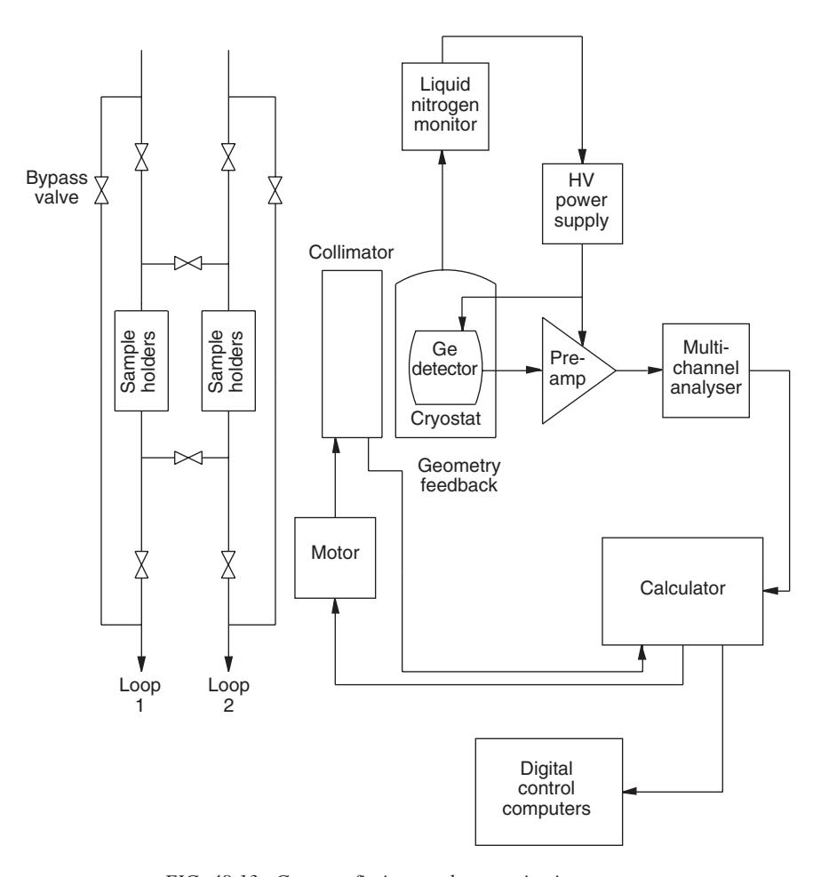

FIG. 48.13. Gaseous fission product monitoring system.

- Boiler light water;
- Fuelling machine heat exchangers;
- Moderator heat exchangers;
- Other process system heat exchangers.

When a high concentration of  $D_2O$  is detected in any of these streams, an alarm is annunciated in the control room and the staff then use the heavy water liquid analyser to verify the location and size of the leak. With the analytical data thus obtained, a decision can be made either to shut the reactor down immediately to repair the leak or to wait for a scheduled shutdown.

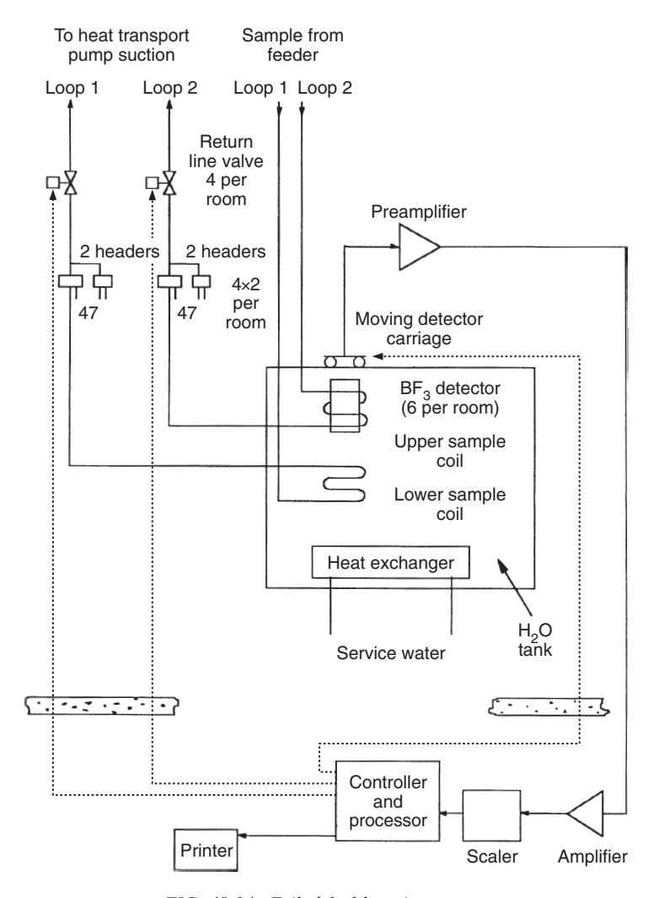

FIG. 48.14. Failed fuel location system.

#### 48.11.2. Process monitoring

A CANDU plant normally has two heavy water upgrading towers, one for moderator  $D_2O$  and the other for primary coolant  $D_2O$ . Each tower has two heavy water liquid analysers. One monitors the low level effluent from the tower and provides a signal for the automatic control of the tower, while the other monitors the upgraded  $D_2O$  product and isolates the tower if the product is unsatisfactory. The measured  $D_2O$  concentrations from these units are recorded and displayed in the

control room. Alarms in the control room are also provided to indicate out-of-limit conditions or equipment faults.

#### 48.12. FAILED FUEL DETECTION SYSTEM

If the zirconium cladding around the UO2 fuel is breached, the failed fuel must be located and removed while the reactor continues to operate at power. The presence of failed fuel in the reactor is determined by the gaseous fission product monitoring system (Fig. 48.13), which continuously monitors flowing samples of the heat transport system coolant. The gaseous fission product activity in the sample is detected by a g sensitive spectrometer fitted with a high resolution germanium detector. A multichannel analyser is used to determine the difference in the g count rates between the sample and the reactor background. The g signal, above background, for each of four radioisotopes is sent to the control computers for display and comparison with allowable limits. When these limits are exceeded, indicating a fuel failure, the failed fuel location system can be used to find the channel with the defective fuel.

The failed fuel location system (Fig. 48.14) extracts, on demand, a continuous sample from each fuel channel feeder. Coils in these sample lines are arranged in a matrix that is automatically scanned by moving BF3 neutron counters and the results are printed on a local printer. A sample that shows a higher delayed neutron count than other samples indicates a fuel failure in the corresponding channel. The operator then switches to the manual mode to double-check the readings before deciding on channel refuelling. If refuelling is initiated, the location system is used to identify the faulty fuel bundle pair. Usage of the failed fuel location system is very low because CANDU fuel bundles have a high proven reliability of 99.97% [48.7].

#### **REFERENCES**

- [48.1] ATOMIC ENERGY OF CANADA ENGINEERING COMPANY, CANDU Nuclear Power System, Rep. TDSI-105, Atomic Energy of Canada Ltd, Sheridan Park, Ontario (1981).
- [48.2] KUGLER, G., Distinctive Safety Aspects of the CANDU PHW Reactor Design, Rep. AECL-6789, Atomic Energy of Canada Ltd, Chalk River, Ontario (1980).
- [48.3] PEARSON, A., Nuclear power plant control beyond the 1980s, IEEE Trans. Nucl. Sci. **NS27** (1980) 18–22.
- [48.4] ICHIYEN, N.M., YANOFSKY, N., Computers' key role in CANDU control, Nucl. Eng. Int. **25** 303 (1980) 28–32.

- [48.5] POPOVIC, J.R., ASHWELL, R.E., SMITH, J.E., CRT man–machine communication system in nuclear power stations, IEEE Trans. Nucl. Sci. **NS26** (1979) 895–900.
- [48.6] HINCHLEY, E., KUGLER, G., On-line Control of the CANDU PHW Power Distribution, Rep. AECL-5045, Atomic Energy of Canada Ltd, Chalk River, Ontario (1975).
- [48.7] IVANOFF, N.V., BAZELEY, E.G., HASTINGS, I.J., "CANDU fuel performance: Nineteen years of power reactor experience", Proc. Canada/Mexico Nuclear Symp. on CANDU Fuel, Mexico City, 1981, Rep. CNS73, Ontario Hydro, Toronto (1981).

# **BIBLIOGRAPHY**

FENTON, E.F., LUPTON, L.R., PAUKSENS, J., "Evolution of the CANDU control centre design process", Proc. Annu. Conf. of Canadian Nuclear Society, Saskatoon, 1991, Canadian Nuclear Soc., Toronto (1991) 509–516.

HEDGES, K.R., BONECHI, M., HINCHLEY, E.M., "Meeting ALWR requirements with the CANDU 3", Proc. Joint ASME/IEEE Power Generation Conf. Boston, 1990, IEEE, Piscataway, NJ (1990).

HINTON, G.J., "A plant display system to complement the distributed control system in CANDU nuclear power plants", Proc. IAEA-IWG/NPPCI Specialists Mtg on Communication and Data Transfer in Nuclear Power Plants, Lyon, 1990, Commissariat à l'énergie atomique, Paris (1990) 1–13.

HINTON, G.J., KENDRICK, S.H., SHIELS, T.W., SCHAFER, S., "Use of computers in CANDU shutdown systems — An overview", Proc. IAEA-NPPCI/IWG Specialists Mtg on Microprocessors in Systems Important to the Safety of Nuclear Power Plants, London, 1988, Central Electricity Generating Board, London (1988) 12–22.

LUPTON, L.R., FEHER, M.P., DAVEY, E.C., GUO, K.Q., BHUIYAN, S.H., "Improving CANDU annunciation — Current R&D and future directions", Proc. Specialists Mtg on Advanced Information Methods and Artificial Intelligence in Nuclear Power Plant Control Rooms, Halden, 1994, Inst. for Energiteknikk, Halden (1994) 133–144.

MOORE, R.F., KEIL, H., FISHER, J.R., "Man–machine interface developments in CANDU PHWR control centres", Man–Machine Interface in the Nuclear Industry (Proc. Conf. Tokyo, 1988), IAEA, Vienna (1988) 567–577.

OLMSTEAD, R.A., "Control room systems and C&I systems for Canadian CANDU nuclear stations: National practices and approaches", Control Room Systems Design for Nuclear Power Plant, IAEA-TECDOC-812, IAEA, Vienna (1995) 99–110.

POPOVIC, J.R., OLMSTEAD, R.A., LIPSETT, J.J., "Progress and issues with automation in single unit CANDU generating stations", Proc. Topical Mtg on Advances in Human Factors Research on Man–Computer Interactions: Nuclear and Beyond, Nashville, 1990, Rep. AECL-9945, Atomic Energy of Canada Ltd, Chalk River, Ontario (1990) 158–165.

# **49. I&C CONCEPTS FOR LWGR PLANTS IN THE RUSSIAN FEDERATION: RBMK-1000**

#### 49.1. INTRODUCTION

The concept of the RBMK type reactor has been developed over three 'generations':

- First generation: Chernobyl 1 and 2, Kursk 1 and 2, Leningrad 1 and 2;
- Second generation: Chernobyl 3, Kursk 3 and 4, Leningrad 3 and 4, Smolensk 1 and 2, Ignalina 1 and 2;
- Third generation: Smolensk 3.

In some cases there are large differences between the I&C and safety systems of different generations. Moreover, since the Chernobyl accident a number of changes have been, and still are being, introduced into these systems. It is therefore not possible to discuss the essential features of all generations of currently operating RBMKs in a short overview. In order to avoid generalities and at the same time to present reasonably complete coverage of the RBMK I&C concept, system descriptions sometimes taken from different generations are given. In each case, however, reference is made to the generation or power unit for the particular system

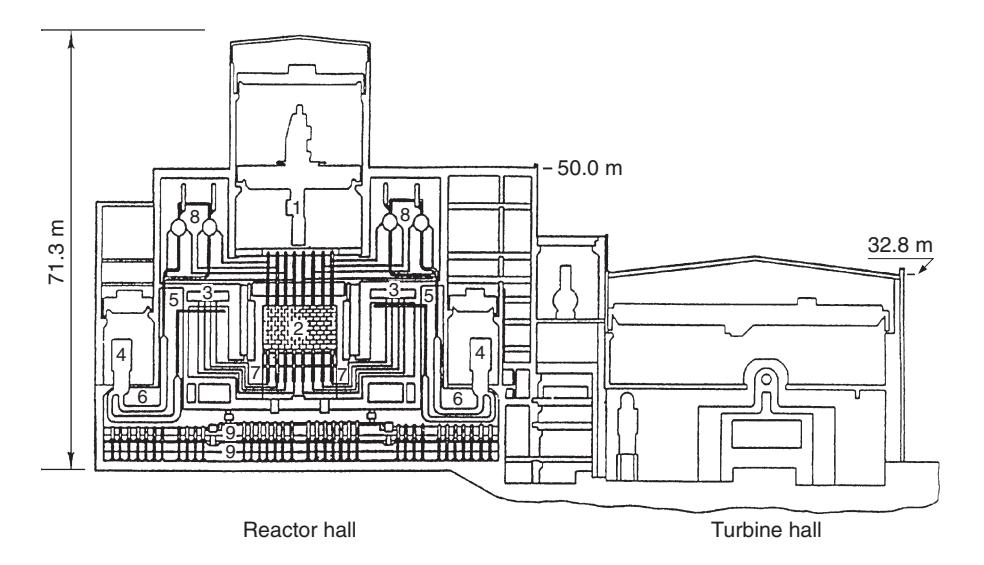

*FIG. 49.1. Elevation of RBMK-1000 plant. (1: refuelling machine; 2: reactor; 3: pressure header; 4: MCP; 5: downcomer; 6: suction header; 7: reactor inlet water pipes; 8: steam drum; 9: ALS pool.)*

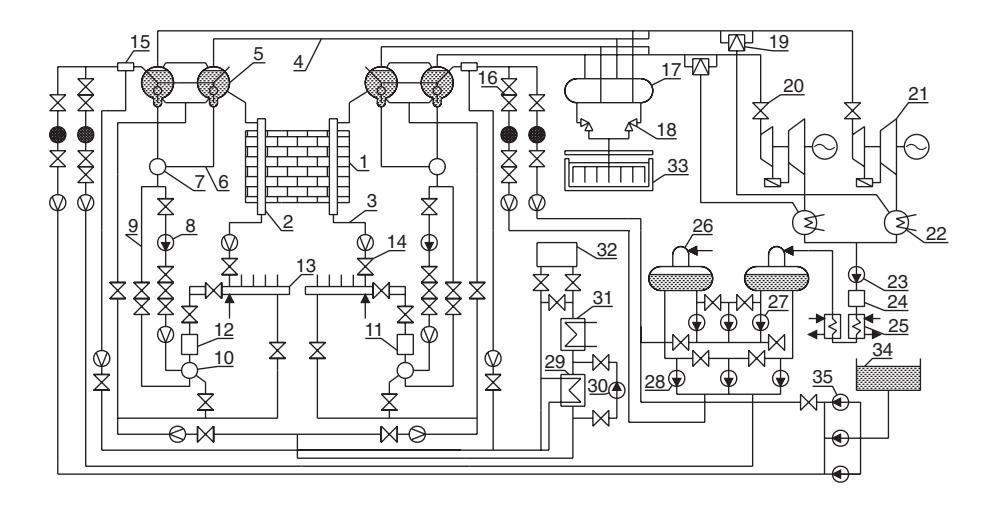

*FIG. 49.2. Flow diagram of RBMK-1000 plant. (1: reactor; 2: fuel channel; 3: water pipelines; 4: steam pipelines; 5: steam separator; 6: downcomer; 7: MCP suction header; 8: MCP; 9: MCP header bypass; 10: MCP pressure header; 11: mechanical filter; 12: flow limiter; 13: group distribution header; 14: isolation and control valve; 15: mixer; 16: feedwater valve assembly; 17: steam header; 18: main relief valve; 19: steam dump valve; 20: turbine trip valve; 21: turbogenerator; 22: condenser; 23: condensate pump; 24: condensate purification; 25: heater; 26: de-aerator; 27: auxiliary feedwater pump; 28: feedwater pump; 29: blowdown regenerator; 30: cooldown pump; 31: blowdown afterheat; 32, 33: bypass purification; 34: emergency water tank; 35: emergency feedwater pump.)*

described. Without prejudice to the description, features of the RBMK-1500 (Ignalina 1 and 2) are not mentioned here.

#### 49.2. REACTOR FUNDAMENTALS

Figures 49.1 and 49.2 show the elevation and flow diagram of an RBMK-1000 plant. The Chernobyl type reactor is a graphite moderated, light water cooled system with UO2 fuel in 1661 individual vertical channels. The core consists of graphite blocks (250 mm × 250 mm, 60 mm high) stacked together to form a cylindrical configuration 12 m in diameter and 7 m high. It is located in a leaktight cavity formed by a cylindrical shroud, the bottom support structure and the upper steel cover. Apart from the graphite blocks forming the radial reflector, each block has a central hole which provides the space for a fuel channel or one of the absorber rod channels, thus forming a lattice pitch of 250 mm. Fuel and control rod channels penetrate the lower and upper steel structures and connect to two separate cooling systems below and above the core. The drives of the control rods are located above the core below the operating floor shield structure.

The fuel, in the form of UO2 pellets, is sheathed with a zirconium–niobium alloy. Eighteen fuel pins approximately 3.5 m in length are arranged in a cylindrical cluster, of which two fit in each fuel channel. Fuel replacement is done on power by a fuelling machine located above the core. One to two fuel channels can be refuelled each day.

As indicated in Fig. 49.2, the coolant system consists of two loops. The coolant enters the fuel channels from the bottom at a temperature of 270°C, heats up along its upward passage and partly evaporates. The mass steam content at the core outlet is approximately 14.5% at full power operation. The outlet pressure and corresponding temperature are 7 MPa (70 bar) and 284°C. The wet steam of each channel is fed to steam drums, of which there are two for each cooling loop. The separated dry steam is supplied via two steam pipes to two turbines with an output of 500 MW(e) each, while the water, after mixing with the turbine condensate, is fed through 12 downcomers to the headers of the main circulation pumps. The condensate from the turbines thereby subcools the water at the main circulation pump inlet.

The circulation pumps supply the coolant to headers, which distribute it to the individual fuel channels of the core. The coolant flow of each fuel channel can be independently regulated by an individual valve in order to compensate for variations in the power distribution. The flow rate through the core is controlled by the circulation pumps. In each loop four pumps are provided, of which one is normally on standby during full power operation.

#### 49.3. SAFETY CONSIDERATIONS

The principles of design, testing and operation of RBMK plants are based on the well established defence in depth concept, whereby multiple physical barriers are established to prevent activity release in the event of an accident. For RBMK plants these barriers are the fuel matrix, fuel cladding, main circuit piping, leakproof compartments and the accident localization system (ALS). As regards evaluation of accident conditions and the development of safety measures, RBMK design is based on the following criteria:

- The worst DBA is a LOCA with a guillotine rupture of a pressure header and failure to close the check valve of one distribution group header.
- Safety operational limits, determining the acceptable primary coolant activity in relation to the number and size of fuel flaws, are as follows:
  - ∑ 1% in the case of a fuel element fault, such as gas leaking;
  - ∑ 0.1% in the case of fuel directly in contact with the coolant.

- Maximum design limits for the fuel in the case of pipe rupture and ECCS actuation are as follows:
  - ∑ Cladding temperature under 1200°C;
  - ∑ Local depth of cladding oxidation less than 18% of initial thickness;
  - ∑ Fraction of reacted zirconium less than 1% of the total mass of cladding in the channels of one group distribution header.
- It should be possible to unload the core and remove the fuel channels after an accident beyond the design basis.

The RBMK, by its characteristics and features, falls into the category of large core reactors in which spatially distributed processes are in many cases important to the analysis of safety. The dynamics of the reactor are such that local power distortions can result in severe consequences unless special monitoring, control and safety systems are provided. There have been significant improvements to these systems since the Chernobyl accident and further improvements will result from full implementation of the Modernization Plan.

An essential part of the defence in depth strategy is the prevention of DBAs or mitigation of their consequences as well as alleviation of the effects of beyond design basis accidents which may be caused by concurrent multiple failures, including operator errors.

# 49.4. REACTOR I&C

The main purpose of the control and monitoring systems is to preserve the integrity of the safety barriers under normal, transient and DBA conditions.

#### **49.4.1. Core monitoring**

During operation, the main core parameters essential to safety are monitored on the basis of on-line processing of sensor signals for distributed and global core parameters plus data from neutronic and thermohydraulic calculations. In order to ensure that at any time the reactor is being safely operated, operational limits are based on safety related parameters such as maximum fuel temperature, fuel cladding temperature, void reactivity effect and operational reactivity margins. To ensure that these safety limits are met at any time, the following four parameters are permanently monitored: dry-out coefficient for each fuel channel (similar to the DNBR in PWRs); linear heat generation rate for each fuel channel; graphite temperature; and operational reactivity margin. The following instrumentation is used to support these calculations:

- An in-core instrumentation system (ICIS) to monitor power distribution throughout the core;
- A core coolant flow monitoring system (FMS);
- Instrumentation and a system to measure and display control and scram rod position (SMCRP);
- Instrumentation for measuring general process and thermohydraulic core/primary circuit parameters (temperature, pressure, flow rate) essential for calculating plant thermal balance, for example.

When performing these calculations, the focus is on processing the ICIS data. Information is provided for:

- Initiation of reactor shutdown;
- Automatic control of power;
- Operators and recording systems. There are six main types of equipment:
- Shutdown measurement system 1;
- Shutdown measurement system 2;
- Startup measurement systems;
- Out-of-core systems for power operation;
- In-core systems for power operation;
- Monitoring and spare systems.
- (a) *Shutdown detectors 1* (operating range: 10–12 to 10–7 of full power). There are four detectors, located at the core edge. These detectors are operated in pulse mode and feed signals in the range 1–106 pulses/s to the local preamplifiers. The power supply units and amplifiers are located in a single cubicle in the instrument room, which also contains test equipment to allow the equipment to be functionally tested. Four channels of equipment retain electrical separation within the cubicle but are not physically segregated. The system outputs go to:
  - Four individual power level indicators (logarithmic displays) on the control desk;
  - Alarms to indicate failure of equipment, amplifiers or power supplies, on the panel in front of the operator's desk;
  - A high pulse rate warning (>106 counts/s).
- (b) *Shutdown detectors 2* (operating range: 4 × 10–10 to 5 × 10–4 of full power). There are three detectors, operating in pulse mode and located in the biological shield tank. The detectors feed signals in the range 1–106 pulses/s to the local preamplifiers. The system outputs go to:
  - Power level indication, a logarithmic display on the control desk;
  - A period evaluation display on the control desk;

- A period trip signal (this trip may be bypassed if the period trip from startup detectors is in service);
- Alarms to indicate equipment failure, on the panel in front of the operator's desk.
- (c) *Startup detectors* (operating range: 2 × 10–8 to 5 × 10–2 of full power). Low power (<5%) monitoring and protection are provided by four chambers operated in current mode, located in the shield tank with access via hatches in the refuelling deck. The outputs are:
  - A current signal indicating the power;
  - A period trip at 20 s (the period can be adjusted but the adjuster is inside the module and inaccessible during operation);
  - A trip indicating failure of the amplifier and comparator;
  - A trip indicating failure of the chamber power supply;
  - A period warning at 40 s;
  - Indications that the equipment has come into range and has gone out of range.

The equipment provides four sets of three signals to the protection logic. There are, in addition, four sets of three indications and warnings.

- (d) *Out-of-core power range equipment* (operating range: 5 × 10–3 to 1.2 of full power). There are three sets of flux measurement equipment based on three groups of four triple detectors located in the biological shield around the core. Two of the three sets are available to provide local reactor power regulation while all three provide inputs to the reactor protection logic. The four detectors forming each set are spaced at 90° to one another around the core. The system has two parts, one associated with a level trip, the other with a period trip. The signals are forwarded for use by the following:
  - Automatic power regulation;
  - Protection logic;
  - Alarms;
  - Recording system.

#### **49.4.2. In-core flux measuring equipment**

The in-core measuring equipment is comprehensive and utilizes silver and hafnium self-powered detectors and g chambers. The detectors are accurate and work on delayed emission while the g chambers have a lower efficiency (are less accurate) but have the advantage of prompt response. Both types of device have the advantage that they can be mounted in the fuel channel. The g chambers also have the advantage of long life but cannot be located in the immediate vicinity of the fuel as the delayed g flux gives rise to incorrect indication. Apart from in-core power distribution detectors, triaxial fission chambers are used in the local automatic control and local

TABLE 49.1. IN-CORE DETECTOR CONFIGURATIONS IN RBMK-1000 PLANTS

| Detector type                                                  | RBMK-1000                                                                                                                                    | RBMK-1000 with upgraded I&C                                                                                                |
|----------------------------------------------------------------|----------------------------------------------------------------------------------------------------------------------------------------------|-------------------------------------------------------------------------------------------------------------------------------|
| Radial detectors with silver emittersa                      | 130 detectors Power distribution measurement                                                                                           | —                                                                                                                             |
| Axial detectors with silver emittersb                       | 12 assemblies, each containing 7 detectors Power distribution measurement                                                           | —                                                                                                                             |
| Integral triaxial fission chambersc                         | 48 chambers, 4 in each of 12 controllers Local power distribution control Local preventive protection (controlled power drop) | —                                                                                                                             |
| Radial detectors with hafnium dioxide emitters              | —                                                                                                                                            | 130 detectors Power distribution measurement and local automatic control Local preventive and scram protection |
| Axial detectors with hafnium dioxide emitters               | —                                                                                                                                            | 36 assemblies with 4 detectors each Power distribution measurement Local preventive protection and scram       |
| Travelling differential triaxial fission chambers           | 12 detectors for calibrating axial monitoring assemblies                                                                               | 10 detectors for calibrating assemblies and checking the accuracy of core power distribution reconstruction          |
| Travelling integral detectors with hafnium dioxide emitters | 6 detectors for calibrating radial detectors                                                                                              | 6 detectors for calibrating radial detectors                                                                               |

a The silver emitters are no longer in production because of the adoption of detectors with hafnium dioxide emitters.

b At Smolensk 3, the axial detectors are replaced by g chambers in (n,g) converter channels, installed earlier at RBMK-1500s. At Leningrad 1, seven section detectors with rhodium emitters are used.

c At Smolensk 3, detectors with hafnium dioxide emitters are used in the local automatic control system.

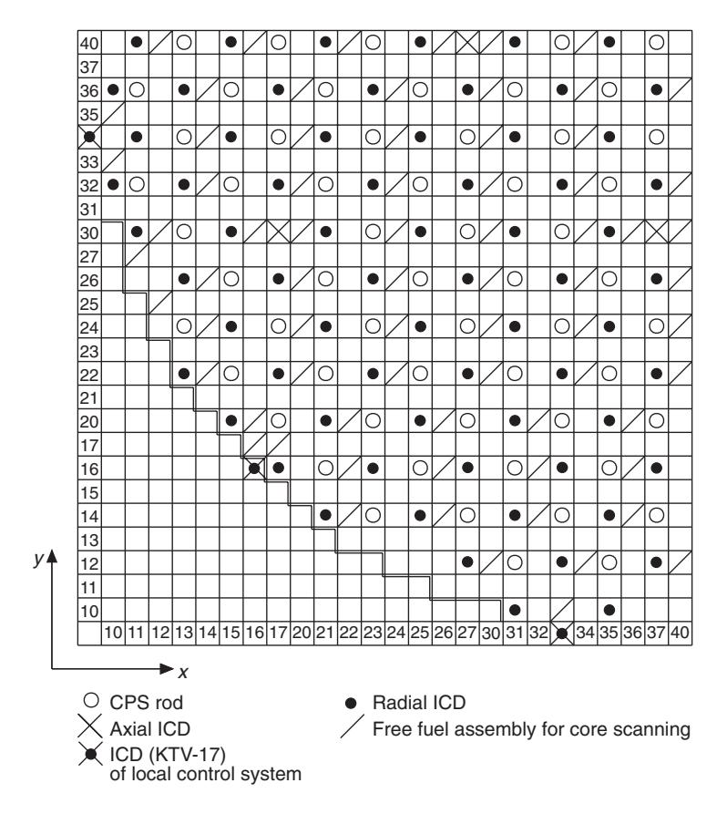

*FIG. 49.3. Control and protection system (CPS) rods and in-core detector (ICD) arrangements in RBMK-1000 (quarter of core is shown).*

scram systems. These fission chambers feature three sensors which are placed uniformly throughout the core height and generate a single integrated output signal. Table 49.1 and Figs 49.3 and 49.4 give the types and functions of in-core power distribution detectors currently used in RBMKs. Owing to the large dimensions of the reactor, many radial and axial detector assemblies are required for adequate control of the power distribution.

(a) *Radial measurements.* Self-powered in-core detectors (ICDs) are located at 130 positions for the measurement of power. The detectors are sited in the centre of fuel bundles and are arranged to average power over the core height. The detector signals are amplified and the gain for each channel can be varied to compensate for different detector efficiencies and for burnup effects. There are two outputs: one is taken to a summation unit where the mean value is established

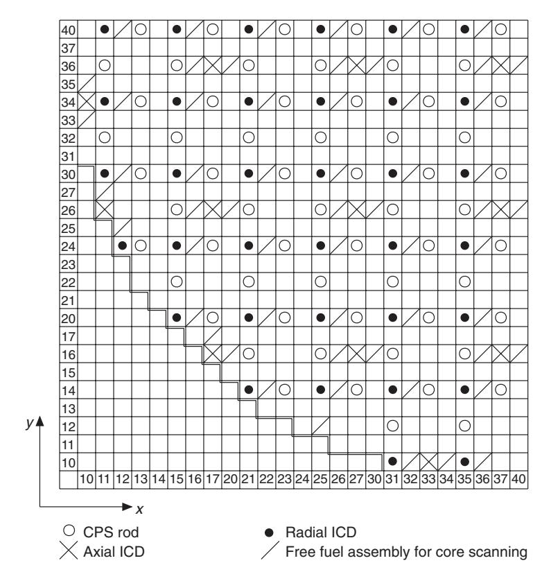

*FIG. 49.4. Control and protection system (CPS) rods and in-core detector (ICD) arrangements in upgraded RBMK-1000 (quarter of core is shown).*

and set points of –5%, +5% and +10% are formed. The second output is amplified again to produce the same signal for all channels when the radial power profile is optimal. These signals are sent to comparator units and compared with the set points.

In the upgraded ICIS at Kursk 5, the number of radial ICDs is doubled, the additional detectors being used with the independent secondary instrumentation solely for scram purposes. The functional links between the main parameter measurement subsystems of the upgraded RBMK-1000 instrumentation and the control system are shown in Fig. 49.5. The signals from 130 radial ICDs and 36 × 4 axial ICDs are fed to amplifiers and then to signal correctors. They are further transmitted to the setting comparator, which compares them with the warning and emergency set points. If the signal exceeds the set point, it is transmitted to the control and protection system (CPS). The warning and emergency set points common for all detectors are set by the reactor operator manually when raising power and automatically when the power falls. The shift

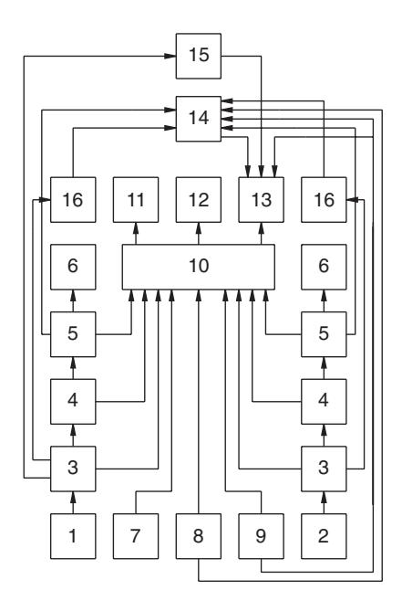

*FIG. 49.5. Functional links between main parameter measurement systems of upgraded RBMK-1000 I&C. (1: radial ICD; 2: axial ICD; 3: normalizing amplifiers; 4: correctors; 5: preventive and scram set points; 6: independent alarm panels; 7: channel coolant flow ratemeters; 8: core inlet pressure/temperature transducers; 9: control rod position transducer; 10: computer; 11: mimic panel for channel parameters; 12: colour displays; 13: mimic panel for control rod position and scram detector signals; 14: preventive protection and scram system; 15: control system; 16: overall detector signal summator and recorder.)*

personnel alter the corrector position manually for each detector on the basis of reactor computer recommendations and the adjustment procedure involves evaluation of these recommendations. The signals from all detectors are simultaneously transmitted to the reactor computer from the output of the normalizing amplifier and again from the output of the corrector. This enables the computer to monitor the corrector positions.

(b) *Axial measurements.* The arrangements for axial power measurement are very similar to those for radial power measurement. The axial power distribution is obtained from silver detectors at 12 locations spread uniformly throughout the core. There are seven detectors in each measuring location. This arrangement differs from that used by RBMKs with the upgraded I&C (Table 49.1).

In the upgraded ICIS developed for RBMK-1000 plants, fast response emission detectors based on hafnium dioxide emitters are used as both radial and axial ICDs. Each of 36 axial ICD assemblies includes four detectors, the sensor part of each measuring 0.25 of the core height. It was shown by analytical and experimental study that such four section assemblies with extended detectors can reconstruct the power distribution at the axial ICD location with the same accuracy as seven section assemblies using short detectors (within a standard deviation of ±1.7%). The upgraded I&C arrangement is said to be more reliable and has the advantage that the axial measurement is not blinded at a location which contains a detector failure.

(c) *Local power control measurement.* Some of the radial ICDs are used for local automatic control of power distribution. The signals from amplifiers for these ICDs are transmitted to 12 or 9 local controllers, depending on the system. They are also available as a single display in front of the operator's desk to give an indication of the power at a particular location.

The ICIS monitors the insulation resistance of the radial and axial ICDs. The signals from the ICD being tested, as well as those from faulty ICDs, are not used to generate control and scram signals. Only the ICDs of the same group may be tested simultaneously.

#### **49.4.3. Evaluation of reactor parameters**

The reactor computer calculates the 3-D power distribution in the core and its parameters (radial and spatial peaking factors, safety factor for the maximum permissible power, linear heat generation rate in each fuel assembly, etc.) and diagnoses the ICD signals. The measured ICD signals, control rod position signals and distributed integral core parameters (channel power rating, detector burnup, etc.) and the results of 2-D (*x*, *y*) neutron core calculations stored in the computer memory are used to perform these operations. The computer performs calculations and diagnostics and updates the ICD set points. It also checks the ICIS serviceability as regards monitoring, control and scram functions and provides for audible and visual alarms for specific ICIS failures. The computer compares the ICD signals with the set points and informs the reactor operator about the core power distribution. The information is presented on a mimic panel and a colour display.

#### **49.4.4. SKALA computer system**

SKALA is an RBMK process monitoring system. It has many functions and performs a wide range of duties. Some of the functions are:

- To record all plant parameters;
- To evaluate the core power information and provide the operator with data on the power profiles;

- To calculate the operating reactivity margin (ORM) for operator invoked plant protection;
- To calculate the DNBR margin for operator invoked plant protection.

The system includes the following measurements and subsystems:

- Flow rates in all the fuel channels and control channels;
- Temperatures of the core graphite and metal structures;
- A system for monitoring the main components of the forced circulation system, such as drum separators, MCPs and suction and pressure headers;
- A system for monitoring the power distribution.

The complex is a dual system, not tandem, with one part running with the plant and the second on standby to provide records and output should the first system fail. The computers have a total of 216 kbytes of main memory. The equipment provides data to many locations around the plant and puts the information on to magnetic tape for storage. The tapes are replaced every 12 h. There are some 8000 analog 0–5 mA inputs and 3600 binary inputs. Of these, 760 analog and all the binary signals are recorded every 2 s. The remainder of the analog signals are recorded every 60 s. The forms of data storage allow a great reduction in the memory requirements. For example, the analog signals are only recorded when they change by ±2%, ±5% and ±10%.

There is a second associated recording system, a black box that records 400 analog signals and 3600 digital signals at 2 s intervals. The same means of data compression is used, i.e. only signals which change by ±2%, ±5% and ±10% are recorded. There is also a new system which records vital parameters even more frequently: 3600 logic signals at 0.1 s intervals, 120 analog signals at 0.1 s intervals and 120 analog signals at 0.2 s intervals. It is based on a 2 Mbyte 386 machine for the analog signals and a 1 Mbyte 286 machine for the logic signals.

The computer code PRIZMA performs calculations of core power, axial power profile, radial power profile and DNB, normally on a 15 min cycle. The time response of provision of data to the operator has been improved by running PRIZMA on a PC-386 computer in the control room. This computer takes data from SKALA and should give the results in 32 s but, in fact, runs more slowly because of the weaker performance of SKALA in updating the information.

# 49.5. CONTROL AND PROTECTION SYSTEM

The control and protection system in RBMKs has the following basic functions:

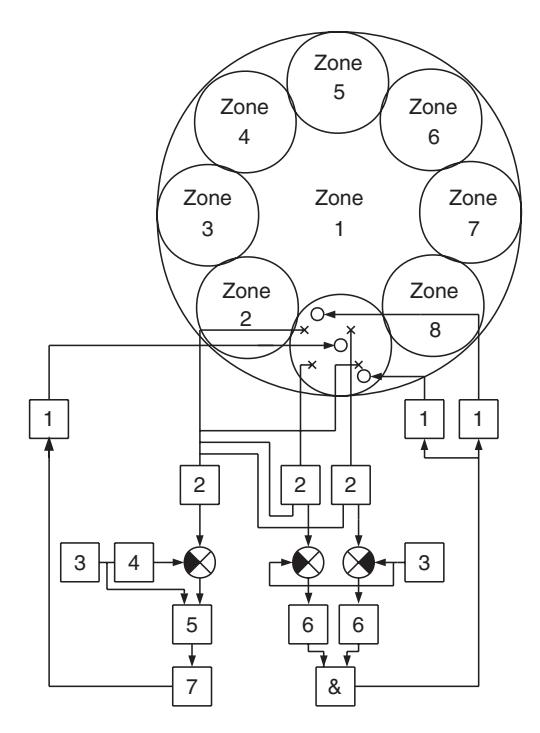

*FIG. 49.6. Nine zone LAR–LAP system of Smolensk 3. (1: actuator; 2: current corrector; 3: power set point; 4: set point corrector; 5: amplifier; 6: power increase protection enhancement; 7: trigger unit.)*

- Regulation of reactor power in the range from 8 × 10–12 to 1.2 of full power;
- Manual regulation of the power distribution to compensate for changes in reactivity due to burnup and other effects;
- Automatic stabilization of the radial and azimuthal power distributions;
- Controlled power reduction to safe levels when certain plant parameters exceed preset limits;
- Emergency shutdown under accident conditions.

## **49.5.1. Control rod assignment**

A typical RBMK design, containing 211 control rods, has the rods uniformly distributed throughout the core and much of the equipment is common, although different rods may have different speeds of entry into the core. The 24 uniformly distributed fast acting scram rods have a modified drive mechanism that allows them to be inserted into the core in less than 2.5 s when a fast scram (BAZ) is actuated (the actual time ranges from about 1.8 to 2.5 s). During a normal scram (AZ1), these fast acting rods are inserted in about 7 s.

The 32 bottom rods are also uniformly distributed throughout the core. They are shorter than the other control rods and are inserted from the bottom of the reactor in about 8 s when either a BAZ or AZ1 trip is actuated. The power arrangements and mechanical brake arrangements are such that these rods do not drop out of the core in the event of loss of power. They are usually under manual control and are used for control of axial power shape.

Nine local power regulation rods and 18 local protection rods can also be controlled manually by the operator. These rods, together with the 128 manual control rods, enter the reactor in about 12 s when either a BAZ or AZ1 trip is actuated. The regulation rods, when invoked by the automatic systems, take 18 s from full out to full in and 36 s from full in to full out. The local protection rods cannot be withdrawn automatically. Manual control of these rods is allowed and all full-range motions take place in 18 s. A maximum of four rods can be selected for withdrawal by the operator.

#### **49.5.2. Reactor power control**

The reactor power control system is provided for two main purposes:

- To control the power generated by the core;
- To maintain a flat radial power profile.

The system does not assist in maintaining an appropriate form of axial power shape. The axial power distribution is controlled by the operator with bottom and top entry manual control rods in conjunction with information from the SKALA system and the ICDs.

Automatic regulation of power at Smolensk 3 has three basic systems:

- Local regulation based on in-core flux measurements for use at operating powers;
- Bulk or local regulation based on one set of four out-of-core detectors;
- Global or local regulation based on a second set of four out-of-core detectors.

Smolensk 3 has nine zones for automatic power regulation. A top view of the reactor shows one zone in the centre with the other eight zones surrounding it (Fig. 49.6). For each outer zone there is one control rod linked to the automatic power regulation output of the in-core flux monitoring system. The central zone is only linked to the in-core detector system and the outer eight zones can also use input from eight out-of-core detectors.

(a) *In-core power regulation system.* This system (local automatic regulator, LAR) consists of four detectors, a power regulation rod and two support rods. The

| TABLE 49.2. |  |  | CONTROL MODES AT THE SMOLENSK PLANT |  |
|-------------|--|--|-------------------------------------|--|
|-------------|--|--|-------------------------------------|--|

|                                    | Units 1 and 2                           | Unit 3                                  | New project for Units 1, 2 and 3     |
|------------------------------------|-----------------------------------------|-----------------------------------------|-----------------------------------------|
| LAR zones                          | 12                                      | 9                                       | 12                                      |
| In-core LAR sensors                | 12 × 4                                  | 9 × 4                                   | 12 × 4                                  |
| Out-of-core LAR detectors       | 0                                       | 8                                       | 8                                       |
| Control range (%)                  | 5–100                                   | 0.3–100                                 | 0.3–100                                 |
| Main controlled azimuthal modes | Zero, first, second, partly third | Zero, first, second, partly third | Zero, first, second, partly third |
| Main controlled radial modes    | Zero, first, second                  | Zero, first                             | Zero, first, second                  |
| Redundancy                         | —                                       | +                                       | +                                       |

self-powered hafnium detectors are located in four fuel channels around the regulation rod, which is in the centre of the control zone. The system is normally used for powers above 30% of nominal power but may be placed in service at powers as low as 10%. The regulation rod will be moved (inserted or withdrawn) if the difference between the desired power level and the power level from the in-core power regulation measurement system is greater than 1% of actual power. The system can operate with as few as two in-core detectors but is inhibited if further failures occur. If the regulation fails to hold the overpower to less than 10% of the demanded power the regulator locks out and AZ6 protection (described below) is invoked.

- (b) *In-core local power regulation level 2.* The local power regulation described above performs a second, support function. In the event of an AZ3 or an AZ4 reactor trip the two additional control rods in each zone may be used to support the single regulation rod for power reduction. Under AZ3 and AZ4 the demanded power level is reduced by reducing the demand set point at 2%/s. The additional rods are actuated should the regulation rod be unable to provide the required rate of power reduction and are invoked while the local measured power is 2% above demanded power.
- (c) *In-core local power regulation level 3.* The measurements made by two of the local power regulation in-core detectors are extracted and input to two additional comparators. If the power level difference rises to greater than 10% of the

| Mode | Rods used                        | Insertion time (s) | Conditions                               | Power reduction                 |
|------|----------------------------------|-----------------------|------------------------------------------|---------------------------------|
| BAZ  | 24 FSS plus all other rods | <2.5 12–14         | 5 initiating signals                     | From operating power to zero |
| AZ1  | 24 FSS plus all other rods | 7 12–14            | 17 initiating signals                    | From operating power to zero |
| AZ3  | LARa rod(s)                      |                       | 3 initiating signals                     | From 100% to 50% at 2%/s     |
| AZ4  | LAR rod(s)                       |                       | 6 initiating signals                     | From 100% to 60% at 1%/s     |
| AZ6  | LAR + LAPb rods               |                       | Local protection, 1 initiating signal | Operates until LAR signal    |

TABLE 49.3. SHUTDOWN SYSTEM MODES FOR SMOLENSK 3

set value, the two signals are processed separately and a two out of two vote is taken to invoke AZ6 protection. Actuation of AZ6 causes both of the local zone protection control rods to be inserted and the set point reduced by 1%/s. This action continues until AZ6 clears. For power levels above 50%, AZ6 also invokes AZ3.

disappears

- (d) *Out-of-core local power regulation.* The out-of-core system of power regulation is used through startup to full power and can be substituted for the in-core system should the in-core system fail. Out-of-core detector based local power regulation operates in a number of modes. In all cases the system moves the regulating control rod in the appropriate direction should the power depart by more than 1% from the set power.
  - *Mode 1*. Each of the eight outer zones is regulated independently, i.e. the signal from the adjacent out-of-core detector is used to move an individual regulating control rod. This mode of regulation is preferred at power when the in-core system is not available;
  - *Mode 2*. The regulating control rods are moved in a bank of four. In this case the detector signals from one group of four out-of-core detectors are combined to generate the unbalance signal. The same is done for the second group of four detectors, so two banks of four rods are available for regulation. The

a LAR: local automatic regulator.

b LAP: local automatic protection.

required bank is selected at the operator's desk and this mode of control is preferred for power raising as there can be quite significant power tilts during this period.

A variant employing 12 local zones is also used in RBMK regulation. The major characteristics of 9 and 12 zone control systems are shown in Table 49.2.

## **49.5.3. Reactor shutdown system**

The Smolensk 3 control and protection system includes:

- 24 fast scram rods;
- 9 automatic rods for controlling local power (LAR);
- 32 short rods inserted from the bottom of the reactor (shortened bottom rods, SBRs);
- 146 manual control (CPS) rods.

The shutdown system for the RBMK has several modes of operation using all rods either automatically or manually. Those modes for Smolensk 3 are listed in Table 49.3. In order to increase plant availability, some of the reactor trips, depending on the nature of the emergency situation, provide controllable power reduction to the safe level.

The most powerful type of reactor protection, the fast scram system (FSS or SS1), is provided by inserting all of the CPS rods into the core in the following situations:

- Trip signals requiring reactor shutdown;
- After operation of the scram button;
- Failure or unavailability of any two out of three protection channels with respect to level or rate of power increase;
- Loss of voltage on CPS busbars;
- Controlled power reduction required but not possible to implement;
- Emergency increase of reactor power (PSS) or emergency reduction of reactor period (RSS) measured by neutron flux sensors.

Information on CPS rod positions, SS and FSS, CPS operating modes and CPS instrumentation conditions, necessary for sequence analysis in the case of failure or emergency, is transferred to the SKALA computer. Scram system design follows two out of three voting logic and any failure in one of the SS channels is treated equivalently to the SS initiation signal in that channel. Such a design allows any module in one SS channel to be replaced for repair or maintenance during power

| Parameter                                                      | Warning  | Trip       |
|----------------------------------------------------------------|----------|------------|
| High neutron power (<160 MW)                                   | +1.0%    | +2.0%      |
| High neutron power (160–3200 MW)                               | +5.0%    | +10.0%     |
| Neutron flux period                                            | 40 ± 2 s | 20 ± 2 s   |
| Pressure in confinement spaces (eight have been identified) |          | 200 kg/m2  |
| Pressure in reactor cavity                                     |          | 750 mmH2Oa |
| Manual trips initiated from:                                   |          |            |
| — Reactor operator control room                                |          | ÷          |
| — Unit operator control room — Emergency control room       |          | ÷ ÷     |
| — Turbine operator control room                                |          | ÷          |
| — Reactor hall                                                 |          | ÷          |
| — Refuelling machine control room                              |          | ÷          |

TABLE 49.4. BAZ REACTOR PROTECTION INITIATORS IN AN RBMK-1000 PLANT

operation. This is especially important for the RBMK, which features continuous refuelling.

In addition to the traditional functions of the RPS, RBMKs also possess a local scram system (LSS) which provides protection against unacceptable disturbances of power distribution (or local power disturbances) across the core. The LSS is designed as a zone protection system with a number of protection zones which vary from 7 in the first generation reactors to 9 and 12 in the second generation (Fig. 49.6). In each identified reactor zone several sensors are dedicated to one of the LSS channels. When signals from the sensors exceed a specified set point, the LSS rods are inserted into the zone and kept there until the signals return to within permissible limits.

One of the most serious deficiencies of the original RBMK shutdown system was slow (within 18–20 s) insertion of rods into the core. During development of the FSS the solution adopted was to combine SS and FSS in one mechanism, using a two rate drive and a modified scheme for forming emergency alarms. This scheme derives the signal for the FSS trip in especially dangerous accidents. In addition, the control rods with a telescopic combination of absorber and displacer were replaced by rods with a moving forward absorber. Undesirable positive reactivity effects due to loss of water in cooling channels are ruled out.

a 1 mmH2O = 9.81 Pa.

TABLE 49.5. AZ1 REACTOR PROTECTION INITIATORS IN AN RBMK-1000 PLANT

*(The functions below are in addition to the BAZ initiators which also invoke AZ1.)*

| Parameter                                                                                                                                                                                                                                          |                                                                                                                                                                                                                                                                    | Trip                                                                                       |
|----------------------------------------------------------------------------------------------------------------------------------------------------------------------------------------------------------------------------------------------------|--------------------------------------------------------------------------------------------------------------------------------------------------------------------------------------------------------------------------------------------------------------------|--------------------------------------------------------------------------------------------|
| Control rod cooling with signals from:                                                                                                                                                                                                             | Reservoir tank low Flow low Low pressure in distribution header                                                                                                                                                                                              | 2715 mm 800 m3/h 1.5 kg/m2                                                           |
| Steam drum                                                                                                                                                                                                                                         | Right drum level high Left drum level high Right drum level low, power 0–60% Left drum level low, power 0–60% Right drum level very low, power 0–100% Left drum level very low, power 0–100% Right drum pressure high Left drum pressure high | +300 mm +300 mm –500 mm –500 mm –1000 mm –1000 mm 74 kg/cm2 74 kg/cm2 |
| Feedwater flow, power 60–100%                                                                                                                                                                                                                      | Left feedwater flow falls compared with demand Right feedwater flow falls compared with demand                                                                                                                                                            | <50% <50%                                                                               |
| Main circuit flow low                                                                                                                                                                                                                              | Main circuit breaker open on left side, 3 out of 4 or 2 out of 3 Main circuit breaker open on right side, 3 out of 4 or 2 out of 3                                                                                                                        | Boolean Boolean                                                                         |
| Main circulating pump flow low                                                                                                                                                                                                                     | Dp flow measurement right on 2 out of 4 pumps Dp flow measurement right on 1 out of 2 pumps Dp flow measurement left on 2 out of 4 pumps Dp flow measurement left on 1 out of 2 pumps                                                                     | 5000 m3/h 5000 m3/h 5000 m3/h 5000 m3/h                                           |
| Loss of electrical power supply Trip of both turbines or of one if only one on-line Loss of both generator outputs or of one if only one on-line Exhaust pressure of turbine high pressure stage ECCS accumulator water level | Train 1 level low Train 2 level low                                                                                                                                                                                                                             | >1 kg/cm2 5300 mm 5300 mm                                                            |
| Failure of AZ3 power reduction to 50% Failure of AZ4 power reduction to 60% Local zone control failure, three zones locked out                                                                                                            |                                                                                                                                                                                                                                                                    | Boolean Boolean Boolean                                                              |
| Manual buttons located in:                                                                                                                                                                                                                         | Control room unit desk Control room reactor operator desk Control room turbine operator desk Reactor hall Refuelling machine Emergency control room                                                                                                 |                                                                                            |

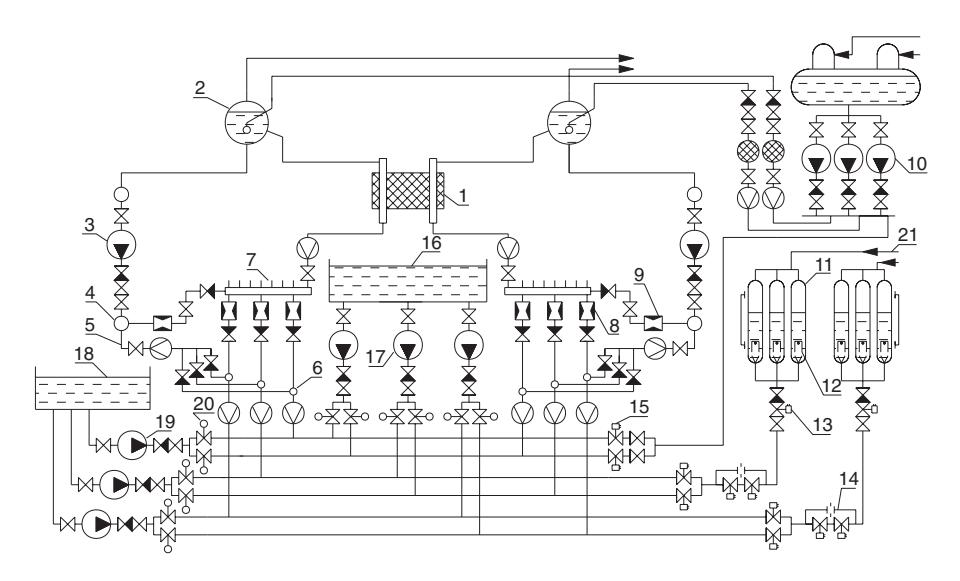

*FIG. 49.7. Emergency core cooling system of RBMK-1000 (second stage of construction). (1: reactor; 2: separator; 3: MCP; 4: MCP pressure header; 5: ECCS bypass; 6: ECCS header; 7: group distribution header; 8: ECCS limiting insert; 9: group distribution header limiting insert; 10: feedwater pump; 11: ECCS water storage unit (accumulator); 12: intercept float valve; 13: intercept fast acting valve; 14: section of intermediate throttling (bypassing flow control valves); 15: ECCS fast acting valve; 16: ALS condensing facility tank; 17: DCS cooling pump; 18: clean condensate tank; 19: UCS cooling pump; 20: long term cooling subsystem valve; 21: gas supply.)*

Further improvement of RBMK safety is being achieved not only by increasing the rate of conventional rod movement in the FSS mode but also by providing the reactor with an additional scram system based on another principle.

# **49.5.4. Reactor protection initiators**

There are a considerable number of initiators for the BAZ and AZ1 modes of shutdown (Tables 49.4 and 49.5, respectively). The AZ3 and AZ4 power setback initiators are all associated with major component problems, e.g. with turbine and pumps failing or going out of service.

#### 49.6. EMERGENCY CORE COOLING SYSTEM

The major systems responsible for mitigation of accident consequences and for safe plant operation are the ECCS and the accident localization system (ALS), which provide three consecutive physical barriers to the propagation of fission products: the fuel and fuel element cladding, boundaries of the primary circuit (primarily pressure tubes) and the structures and equipment of localization systems. The ultimate states and the criteria representing the integrity of these barriers under transient and emergency conditions are largely covered in the current safety regulations (OPB-88 and PBYa RU AS-89).

Safety injection is designed to provide cooling of the reactor in the event of a primary circuit break and after the hydroaccumulators have dumped their water into the core. The most severe pipe breaks for which the system is designed are the following:

- Break of piping or headers of the coolant system in the steam separator compartments, lower water lines room or leaktight compartments;
- Rupture of a distributing group header, with or without failure of the adjacent check valve.

The maximum diameter of pipe rupture is estimated at 300 mm in Kursk 1 (first generation) and 900 mm in Smolensk 3 (third generation).

The improved ECCS consists of two subsystems (Fig. 49.7), each divided into three different trains. The first subsystem (UCS) provides water to the undamaged half of the primary circuit and the second (DCS) to the faulty half. Both subsystems take suction from the clean condensate tank (3000 m3 capacity). The UCS consists of three pumps (250 m3/h maximum capacity). The alignment of the three trains of the UCS to one or the other reactor side is made through a set of parallel valves which are closed or opened by the initiating signals of the accident. The DCS consists of three pumps, different from the three of the UCS and located in three different lines which can also provide water to either half of the reactor via the opening and closing of parallel valves controlled by the initiating signals. The power supply to each UCS and DCS pump is provided by a diesel generator. The valves described are electric motor operated valves which can be fed by the corresponding emergency diesel generator.

The water supplied to the damaged circuit is discharged through the break to the floor drain treatment system, where it can be cooled and cleaned through an evaporator/condenser and then pumped back to the clean condensate tank. The capacity of this system is 40 t/h. The steam generated in the undamaged part can be discharged to:

- Main plant condenser;
- Special condenser;
- Atmosphere through safety or relief valves.

The condensed water can be returned to the de-aerator or to the clean condensate tank using the condensate pumps.

# **49.6.1. ECCS accumulators and fast acting valves**

The ECCS accumulators and fast acting valves act as a high pressure emergency cooling supply for the damaged side of the reactor. They supply cooling to that side until the ECCS pumps are operational and able to supply cooling.

The fast acting valves (Fig. 49.7) are electric motor operated gate valves powered by a reliable power source which is ultimately backed by battery power. They go from fully closed to fully open in 10 s and are open sufficiently to allow injection of cooling water into the core within approximately 3 s. There are three of these fast acting valves for each channel or division. One is located on the collection header downstream of the accumulators supplying that division; this valve is normally open and is designed to close when the accumulators are drained of water, closure being based on the level in the accumulator. The other two valves are located downstream of flow control valves and are normally closed. One valve supplies water to one side of the reactor and the other valve supplies water to the opposite side. During an accident the ECCS actuation logic determines which side of the reactor is damaged, on the basis of the pressure in the leaktight rooms, and opens only the fast acting valves which supply water to the damaged side. The fast acting valves which supply water to the undamaged side remain closed.

The flow control valves (Fig. 49.7) for each division consist of two normally open valves in series and a restricted flow, bypass line around these valves. The main valves are designed to close after about 40 s. This allows full flow out of the accumulators for approximately the first 40 s and then reduces the flow. It extends the time that the accumulators can supply water to the reactor to a total of about 2 min and ensures sufficient time for the emergency diesel generators to start and for the ECCS pumps to start and come up to speed and pressure. The power supply for these valves is the same reliable supply that powers the fast acting valves.

The accumulators (Fig. 49.7) are basically high pressure storage tanks containing water pressurized by a cover gas (nitrogen). Since there is no physical barrier between the water and cover gas, a float valve is located at the outlet of the accumulator which should close when the water is drained and thus prevent the cover gas from entering the ECCS piping. The capacity of the accumulators varies from unit to unit. At Smolensk 3 and in the second generation units, the total capacity is 150 m3. The first generation units with accumulators currently have a capacity of 40 m3 and all are being upgraded with new accumulators having a total capacity of 225 m3.

#### **49.6.2. ECCS actuation logic**

The ECCS actuation logic controls the behaviour of the accumulators, pumps and valves associated with the three trains of ECCS equipment in the event that the instrumentation detects a system failure that threatens core cooling. The ECCS actuation logic for the RBMK is different from that utilized at most other types of NPP. The ECCS will operate in one of three modes: left side damaged, right side damaged or both sides damaged, depending on the specific combination of inputs received. In all cases, ECCS actuation requires multiple trip inputs (initial and confirmatory).

One set of ECCS control logic equipment is associated with the MCR and a second with the emergency control room. Each set of logic equipment includes three groups of logic cubicles and each of these is located in a separate room. They consist of two cubicles and an adjacent BAZ logic cubicle. The sets of logic cubicles associated with the MCR are located in the MCR, the left instrument room and the right instrument room. The set of logic cubicles associated with the emergency control room are segregated in a similar manner, with one cubicle in the emergency control room and one cubicle in each of two rooms adjacent to the emergency control room. There are also three rooms, one for each train of the ECCS equipment, containing the power supplies and actuation relays for the various pumps and valves associated with that particular ECCS train.

The ECCS requires input from a number of instrument channels, including the ALS room pressure trip, the main coolant pump trip and the steam drum separator level trip. The trip inputs, in all cases except 'no main circulating pump running', utilize a total of six independent channels of instrumentation, divided into two sets of three channels each. The first set provides input for the ECCS logic cubicles associated with the MCR and the other set for the ECCS logic cubicles associated with the emergency control room. Each set utilizes two out of three trip logic and either set will actuate the ECCS. For each of the various trip inputs, six channels of instrumentation (detectors and transmitters) are provided, each located in a different room. The outputs from these instruments are routed to the six different groups of logic cubicles, one per channel, with two sets of three channels and each channel in a separate location.

Each of these six channels of logic consists of two cubicles. The first cubicle receives the output from the various instruments, compares the signal with the trip and warning set points and generates a digital (trip/no-trip) signal that is sent to the second cubicle. The second cubicle contains two sections. The first section isolates and fans out the signal to the logic section of this cubicle and to the other two cubicles in the set. The second section is the logic section where the two out of four vote occurs together with the AND/OR logic to determine whether an ECCS actuation is needed. The output from the logic section of the second cubicle is the actuation signal for one train of the ECCS equipment, with one cubicle in each set for each train. The actuation signals are then routed to three separate rooms, one for each train of ECCS equipment, where the final relays supplying power to the various pumps and valves for that train are located.

There is a BAZ cubicle adjacent to each ECCS second logic cubicle for all six channels. Several of the ECCS trips are common to both the ECCS and BAZ (the room high pressure trips) and all of the instrumentation up to the two out of three vote signal is common to both ECCS and BAZ. There are also some AZ1 trip inputs common as far as the two out of three vote.

# **49.6.3. ECCS trip inputs**

Of the 15 trip inputs to the ECCS actuation logic, 7 are associated with room high pressure. All seven have the same set point and are instrumented similarly. The remaining eight inputs consist of four sets of left and right trip inputs. A brief description of these trip inputs, how the parameter is measured and the trip logic is given below.

- (a) *Room high pressure.* The room high pressure trip inputs originate from the following:
  - Steam drum separator room, left and right;
  - Pressure header/downcomer room, left and right;
  - Under reactor group distribution header (GDH) room, left and right;
  - Steam/feed pipe room.

The set point for these rooms is a pressure increase of 200 kg/m2. This is determined by D*p* transmitters, of which there are six for each room being monitored, one for each channel with two sets of three channels. There is two out of three trip logic for each set. Each D*p* transmitter is located in a separate room, with one pressure tap located in the room being monitored and the other in the room with the transmitter.

- (b) *Steam drum separator low level (left and right).* The set point for this low level trip is set at –1000 mm. The normal operating level is +50 mm. The level of the steam drum separators is determined by means of a reference leg connected to the end of the steam drum separator and three D*p* transmitters with their taps connected to the top and bottom of this reference leg.
- (c) *Decrease in* Dp *between steam drum separator and MCP discharge pressure header (left and right).* The set point for this trip is 4 kg/cm2. The normal value is about 16 kg/cm2. This input is determined by D*p* transmitters connected to the MCP discharge header and the steam drum separators.
- (d) *Steam drum separator low pressure (left and right).* The set point for this trip is 42 kg/cm2 and the normal value is 69 kg/cm2. The pressure is determined by pressure transmitters connected to the steam drum separators. There are three pressure transmitters connected to each separator, all three in the same set.

There is a total of six channels, three in each set, for each side, left and right, and the trip logic is two out of three for each set. Each pressure transmitter is located in a separate room.

(e) *MCP running (left and right).* This trip input is determined by the position of the breaker for the MCP. There are two sensors for each MCP motor breaker, with one out of two trip logic. The signal is then fanned out to the six instrumentation channels. A trip input is generated when the breakers for all three operating MCPs on one side of the reactor are open.

#### 49.7. CONFINEMENT SYSTEM

The last physical barrier for confining possible radioactive fission product release from the RBMK is ensured by the ALS, based on the module principle. This localization principle comprises segregating leaktight or connected modules or rooms containing the core or the flow circuit components and ensuring that they retain their leaktightness despite unfavourable factors, particularly when pressure increases under primary circuit blowdown. These restrictive compartments are connected to the system which limits radioactive releases through the penetrations, valves or special steam and gas discharge (SGD) systems and overpressure in the rooms under accident conditions is prevented. Panels which open when pressure increases to 0.025 MPa (0.25 bar) in the rooms reduce the loads on the building in the event of rupture of pipelines 300 mm in diameter in the lower water line, separator and central hall rooms for first generation reactor units. The ultimate pressure is 0.44 MPa in the reinforced leaktight compartments for second generation reactor units.

Safety valves, actuated on excess pressure in the reactor cavity, are used for emergency dumping of steam–gas mixture from the reactor cavity of first generation units in the event of fuel channel seal failure. Steam condenses in the gas circuit condenser and gas enters the gas holder. Projects for upgrading the first generation ALS allow the system for confining the radioactive releases (SCRR) in the circuit to dump steam–gas mixture from the reactor cavity.

The principle of modular ALS design is more completely implemented for the second generation units. It includes the following modules:

- Reactor cavity;
- MCP and main header rooms;
- Lower water line rooms;
- Steam distribution corridor;
- Pressure suppression pool, with the steam dumping channels immersed in its water space.

Fluid is transferred between the modules through a valve system. The pressure suppression pool is a two storey concrete structure lined with steel sheets. The water level is 1.2 m at each storey, the total water volume is 3299 m3 and the free space of the pressure suppression pool is 3700 m3. In addition to the valves, the basic localization equipment includes a sprinkler cooling system with pumps, heat exchangers and quenchers installed above the water surface in the pool. The ALS of RBMK-1000 plants also includes surface condensers in the steam distribution corridor through which steam passes to the bubbler under any severe accident such as a LOCA, as well as ejectors for the cooling and ventilation system in both rooms of the MCP pipelines. Use of the bubbler does not apply to accidents in the reactor cavity.

#### 49.8. EMERGENCY CONTROL ROOM

The emergency control room provides an alternative location for the operators to perform vital activities in case it becomes necessary to evacuate the MCR. The emergency control room for Smolensk 3 provides exceptional capabilities for shutting down the reactor and monitoring and controlling the cooldown process. There are facilities to:

- Initiate a fast scram (BAZ);
- Initiate a normal scram (AZ1);
- Deactivate power to the control rod drive brakes to allow the top entry control rods to drop into the reactor while leaving the bottom rods in place;
- Initiate the ECCS (right side, left side or both sides);
- Operate individual ECCS valves and pumps;
- Operate individual components of the ALS (spray pumps, heat exchanger valves, etc.);
- Operate many other components to support the plant cooldown and the safety systems.

# 49.9. EMERGENCY POWER SUPPLIES

According to the power supply reliability requirements, NPP power loads are subdivided as follows:

— AC and DC loads which impose high reliability requirements on the power supply, allowing no supply interruptions of more than a fraction of a second in all operational modes, including loss of normal power supply sources (blackout). These loads also call for mandatory availability of power after actuation of the reactor scram system.

- AC loads allowing interruptions in power supply for times defined by safety conditions and requiring power supply after actuation of the reactor scram system.
- AC loads imposing no special requirements on power supply reliability, permitting power supply interruptions for the time of automatic changeover and requiring no power supply after actuation of the reactor scram system.

Supply to the last group of loads is ensured by the normal power system. The first and second groups are provided with power by the emergency power supply system (EPSS). The first group covers fast acting valves and isolation valves of the ECCS and ALS, the power unit centralized process control system, the CPS, the radiation monitoring system, the I&C system, emergency lighting, on-line control and the protection and alarm circuits. The second group embraces mechanisms providing for emergency reactor cooldown and accident localization in different operating conditions, including ultimate DBA and loss of normal power supply.

The EPSS is a safety support system, designed for power supply to safety systems in all NPP operating modes. The safety system loads are provided with three channel redundancy. In addition, the EPSS supplies the loads which are designated normal operating systems important to safety.

#### **49.9.1. Emergency power supply system**

To perform its functions in the event of loss of normal power supply sources, the EPSS is provided with independent power sources: storage batteries and standby diesel generators. The EPSS originates at the inlet terminals of sectionalized circuit breakers located on the side of 6 kV sections which connect the EPSS with the normal power supply sources. It terminates in the inlet terminals of the first and second groups of loads.

The EPSS of second generation RBMKs has three channels for power supply. Each channel includes sources of power supply, conversion units and a distribution network:

- Second group loads: 6 and 0.4 kVAC;
- First group loads: 0.4 kVAC and 220 VDC.

#### **49.9.2. Emergency diesel generators**

Every RBMK power unit of the second generation has three 5.5 MW, 6.3 kV diesel generators. They take 15 s to put into operation. At an NPP of the third generation, there are three 6.3 MW, 6.3 kV diesel generators with a 10 s deployment period and two 1.6 MW, 6.3 kV generators with a 35 s deployment period. The generators are located separately in isolated cells. Every cell represents an autonomous electrical power station, which functions as one channel in the EPSS.

Each diesel generator is designed such that startup and operation can be achieved without permanent supervision by personnel over 24 h. To ensure high startup reliability, every diesel generator is equipped with a redundant starting circuit. Startup is accomplished automatically on a signal from the NPP control system. It is also possible to start up remotely from the NPP control room, the standby control room and the EPSS local control room. The diesel generator automatic control system ensures priority of the startup command over other commands with the exception of the emergency stop command. In emergencies requiring operation of the safety system, automatic startup of the EPSS diesel generators occurs and the startup period from receiving the command to accepting the load is less than 35 s.

#### **49.9.3. Direct current system**

The DC systems and uninterrupted power supply systems are used to supply power to consumers of the first group. Three systems supply power to the equipment of safety systems and two systems to the equipment of systems important to safety at NPPs of the second and third generations.

Stationary open lead–acid batteries of the SK type are used as independent DC power sources at NPPs of the first and second generations. NPPs of the third generation use stationary closed storage batteries of the SN type. In the designations of the storage batteries, SK denotes a stationary storage battery for short term modes of discharge. The recognized short term mode is a discharge lasting from 0.25 to 1 h. All the storage batteries operate in the floating charge mode. In normal operation, the batteries stay fully charged and their standing loss is compensated by the current from a floating charger used also as a power source for DC loads in this mode of operation.

#### **BIBLIOGRAPHY**

EMELYANOV, I.Ya., SEMENOV, V.V., in Operational Regimes of Pressurized Water Power Reactors, 3rd edn, Ehnergoizdat, Moscow (1988) (in Russian).

INTERNATIONAL ATOMIC ENERGY AGENCY, Safety Assessment of Proposed Improvements to RBMK Nuclear Power Plants, IAEA-TECDOC-694, Vienna (1993).

— Safety Assessment of Design Solutions and Proposed Improvements to Smolensk Unit 3 RBMK Nuclear Power Plant, IAEA-TECDOC-722, Vienna (1993).

INTERNATIONAL ELECTROTECHNICAL COMMISSION, RBMK Nuclear Reactors — Proposals for Instrumentation and Control Improvements, Standard 1510, IEC, Geneva (1996). INTERNATIONAL NUCLEAR SAFETY ADVISORY GROUP, Summary Report on the Post-Accident Review Meeting on the Chernobyl Accident, Safety Series No. 75-INSAG-1, IAEA, Vienna (1986).

— The Chernobyl Accident: Updating of INSAG-1, Safety Series No. 75-INSAG-7, IAEA, Vienna (1992).

REISCH, F., WALL, D.N., KOSSILOV, A., Improving C&I at RBMKs. Recommendations of an IEC/IAEA team, Nucl. Eng. Int. **40** 492 (1995) 23–26.

# **BIBLIOGRAPHY**

# KEY IAEA PUBLICATIONS ON NUCLEAR POWER PLANT SAFETY PRINCIPLES

Manual on Quality Assurance for Computer Software Related to the Safety of Nuclear Power Plants, Technical Reports Series No. 282 (1988).

Manual on Quality Assurance for Installation and Commissioning of Instrumentation, Control and Electrical Equipment of Nuclear Power Plants, Technical Reports Series No. 301 (1989).

#### **NUSS programme publications**

#### **Governmental organization**

| 50-C-G (Rev. 1) | Code on the Safety of Nuclear Power Plants: Governmental Organization (1988).                             |
|-----------------|--------------------------------------------------------------------------------------------------------------|
| Safety Guides   |                                                                                                              |
| 50-SG-G1        | Qualifications and Training of Staff of the Regulatory Body for Nuclear Power Plants (1979).              |
| 50-SG-G2        | Information to be Submitted in Support of Licensing Applications for Nuclear Power Plants (1979).         |
| 50-SG-G3        | Conduct of Regulatory Review and Assessment During the Licensing Process for Nuclear Power Plants (1980). |
|                 | 50-SG-G4 (Rev. 1) Inspection and Enforcement by the Regulatory Body for Nuclear Power Plants (1996).      |
| 50-SG-G6        | Preparedness of Public Authorities for Emergencies at Nuclear Power Plants (1982).                        |
| 50-SG-G8        | Licences for Nuclear Power Plants: Content, Format and Legal Considerations (1982).                 |
| 50-SG-G9        | Regulations and Guides for Nuclear Power Plants (1984).                                                      |

#### **Siting**

50-C-S (Rev. 1) Code on the Safety of Nuclear Power Plants: Siting (1988).

#### *Safety Guides*

50-SG-S1 (Rev. 1) Earthquakes and Associated Topics in Relation to Nuclear Power Plant Siting (1991).

| 50-SG-S3        | Atmospheric Dispersion in Nuclear Power Plant Siting (1980).                                                    |
|-----------------|-----------------------------------------------------------------------------------------------------------------|
| 50-SG-S4        | Site Selection and Evaluation for Nuclear Power Plants with Respect to Population Distribution (1980).       |
| 50-SG-S5        | External Man-induced Events in Relation to Nuclear Power Plant Siting (1981).                                |
| 50-SG-S6        | Hydrological Dispersion of Radioactive Material in Relation to Nuclear Power Plant Siting (1985).            |
| 50-SG-S7        | Nuclear Power Plant Siting: Hydrogeological Aspects (1984).                                                     |
| 50-SG-S8        | Safety Aspects of the Foundations of Nuclear Power Plants (1986).                                               |
| 50-SG-S9        | Site Survey for Nuclear Power Plants (1984).                                                                    |
| 50-SG-S10A      | Design Basis Flood for Nuclear Power Plants on River Sites (1983).                                              |
| 50-SG-S10B      | Design Basis Flood for Nuclear Power Plants on Coastal Sites (1983).                                            |
| 50-SG-S11A      | Extreme Meteorological Events in Nuclear Power Plant Siting, Excluding Tropical Cyclones (1981).             |
| 50-SG-S11B      | Design Basis Tropical Cyclone for Nuclear Power Plants (1984).                                                  |
|                 |                                                                                                                 |
| Design          |                                                                                                                 |
| 50-C-D (Rev. 1) | Code on the Safety of Nuclear Power Plants: Design (1988).                                                      |
| Safety Guides   |                                                                                                                 |
| 50-SG-D1        | Safety Functions and Component Classification for BWR, PWR and PTR (1979).                                   |
|                 | 50-SG-D2 (Rev. 1) Fire Protection in Nuclear Power Plants (1992).                                               |
| 50-SG-D3        | Protection System and Related Features in Nuclear Power Plants (1980).                                          |
| 50-SG-D4        | Protection Against Internally Generated Missiles and their Secondary Effects in Nuclear Power Plants (1980). |
|                 | 50-SG-D5 (Rev. 1) External Man-induced Events in Relation to Nuclear Power Plant Design (1996).              |
| 50-SG-D6        | Ultimate Heat Sink and Directly Associated Heat Transport Systems for Nuclear Power Plants (1981).           |
|                 | 50-SG-D7 (Rev. 1) Emergency Power Systems at Nuclear Power Plants (1991).                                       |
| 50-SG-D8        | Safety Related Instrumentation and Control Systems for Nuclear Power Plants (1984).                          |

| 50-SG-D10       | Fuel Handling and Storage Systems in Nuclear Power Plants (1984).                                                                       |
|-----------------|-----------------------------------------------------------------------------------------------------------------------------------------|
| 50-SG-D11       | General Design Safety Principles for Nuclear Power Plants (1986).                                                                       |
| 50-SG-D12       | Design of the Reactor Containment Systems in Nuclear Power Plants (1985).                                                            |
| 50-SG-D13       | Reactor Coolant and Associated Systems in Nuclear Power Plants (1986).                                                                  |
| 50-SG-D14       | Design for Reactor Core Safety in Nuclear Power Plants (1986).                                                                          |
| 50-SG-D15       | Seismic Design and Qualification for Nuclear Power Plants (1992).                                                                       |
| Operation       |                                                                                                                                         |
| 50-C-O (Rev. 1) | Code on the Safety of Nuclear Power Plants: Operation (1988).                                                                           |
| Safety Guides   |                                                                                                                                         |
|                 | 50-SG-O1 (Rev. 1) Staffing of Nuclear Power Plants and the Recruitment, Training and Authorization of Operating Personnel (1991). |
| 50-SG-O2        | In-service Inspection for Nuclear Power Plants (1980).                                                                                  |
| 50-SG-O3        | Operational Limits and Conditions for Nuclear Power Plants (1979).                                                                      |
| 50-SG-O4        | Commissioning Procedures for Nuclear Power Plants (1980).                                                                               |
| 50-SG-O5        | Radiation Protection During Operation of Nuclear Power Plants (1983).                                                                   |
| 50-SG-O6        | Preparedness of the Operating Organization (Licensee) for Emergencies at Nuclear Power Plants (1982).                                |
|                 | 50-SG-O7 (Rev. 1) Maintenance of Nuclear Power Plants (1990).                                                                           |
|                 | 50-SG-O8 (Rev. 1) Surveillance of Items Important to Safety in Nuclear Power Plants (1990).                                          |
| 50-SG-O9        | Management of Nuclear Power Plants for Safe Operation (1984).                                                                           |
| 50-SG-O10       | Core Management and Fuel Handling for Nuclear Power Plants (1985).                                                                      |
| 50-SG-O11       | Operational Management of Radioactive Effluents and Wastes Arising in Nuclear Power Plants (1986).                                   |

#### **Quality assurance**

#### *Code*

50-C/SG-Q Quality Assurance for Safety in Nuclear Power Plants and other Nuclear Installations (1996).

50-SG-O12 Periodic Safety Review of Operational Nuclear Power Plants (1994).

| Safety Guides    | (all contained in Safety Series No. 50-C/SG-Q)                                                          |
|------------------|---------------------------------------------------------------------------------------------------------|
| Q1               | Establishing and Implementing a Quality Assurance Programme (1996).                                     |
| Q2               | Non-conformance Control and Corrective Actions (1996).                                                  |
| Q3               | Document Control and Records (1996).                                                                    |
| Q4               | Inspection and Testing for Acceptance (1996).                                                           |
| Q5               | Assessment of the Implementation of the Quality Assurance Programme (1996).                          |
| Q6               | Quality Assurance in Procurement of Items and Services (1996).                                          |
| Q7               | Quality Assurance in Manufacturing (1996).                                                              |
| Q8               | Quality Assurance in Research and Development (1996).                                                   |
| Q9               | Quality Assurance in Siting (1996).                                                                     |
| Q10              | Quality Assurance in Design (1996).                                                                     |
| Q11              | Quality Assurance in Construction (1996).                                                               |
| Q12              | Quality Assurance in Commissioning (1996).                                                              |
| Q13              | Quality Assurance in Operation (1996).                                                                  |
| Q14              | Quality Assurance in Decommissioning (1996).                                                            |
| Safety Practices |                                                                                                         |
| 50-P-1           | Application of the Single Failure Criterion (1990).                                                     |
| 50-P-2           | In-service Inspection of Nuclear Power Plants: A Manual (1991).                                         |
| 50-P-3           | Data Collection and Record Keeping for the Management of Nuclear Power Plant Ageing (1991).          |
| 50-P-4           | Procedures for Conducting Probabilistic Safety Assessments of Nuclear Power Plants (Level 1) (1992). |
| 50-P-5           | Safety Assessment of Emergency Power Systems for Nuclear Power Plants (1992).                        |
| 50-P-6           | Inspection of Fire Protection Measures and Fire Fighting Capability at Nuclear Power Plants (1994).  |
| 50-P-7           | Treatment of External Hazards in Probabilistic Safety Assessment for Nuclear Power Plants (1995).    |
| 50-P-8           | Procedures for Conducting Probabilistic Safety Assessments of Nuclear Power Plants (Level 2) (1995). |

| 50-P-9  | Evaluation of Fire Hazard Analyses for Nuclear Power Plants (1995).                                     |
|---------|---------------------------------------------------------------------------------------------------------|
| 50-P-10 | Human Reliability Analysis in Probabilistic Safety Assessment for Nuclear Power Plants (1995).       |
| 50-P-11 | Assessment of the Overall Fire Safety Arrangements at Nuclear Power Plants (1996).                   |
| 50-P-12 | Procedures for Conducting Probabilistic Safety Assessments of Nuclear Power Plants (Level 3) (1996). |

# SELECTED IEC STANDARDS

- 146 Semiconductor Convertors (in 8 parts) (1991–1992).
- 231 General Principles of Nuclear Reactor Instrumentation (Standard plus 7 supplements) (1967–1977).
- 232 General Characteristics of Nuclear Reactor Instrumentation (1966).
- 295 D.C. Periodmeters: Characteristics and Test Methods (1969).
- 313 Coaxial Cable Connectors Used in Nuclear Instrumentation (1983).
- 325 Alpha, Beta and Alpha–Beta Contamination Meters and Monitors (1981).
- 498 High-voltage Coaxial Connectors Used in Nuclear Instrumentation (1975).
- 504 Hand and/or Foot Contamination Monitors and Warnings Assemblies (1975).
- 515 Radiation Detectors for the Instrumentation and Protection of Nuclear Reactors: Characteristics and Test Methods (1975).
- 568 In-core Instrumentation for Neutron Fluence Rate (Flux) Measurements in Power Reactors (1977).
- 639 Use of the Protection System for Non-safety Purposes (1979).
- 643 Application of Digital Computers to Nuclear Reactor Instrumentation and Control (1979).
- 671 Periodic Tests and Monitoring of the Protection System of Nuclear Reactors (1980).
- 709 Separation within the Reactor Protection System (1981).
- 737 In-core Temperature or Primary Envelope Temperature Measurements in Nuclear Power Reactors: Characteristics and Test Methods (1982).
- 744 Safety Logic Assemblies of Nuclear Power Plants Characteristics and Test Methods (1983).
- 761 Equipment for Continuously Monitoring Radioactivity in Gaseous Effluents (in 6 parts) (1983–1991).

- 768 Process Stream Radiation Monitoring Equipment in Light Water Nuclear Reactors for Normal Operating and Incident Conditions (1983).
- 772 Electrical Penetration Assemblies in Containment Structures for Nuclear Power Generating Stations (1983).
- 780 Qualification of Electrical Items of the Safety System for Nuclear Power Generating Stations (1984).
- 801 Electromagnetic Compatibility for Industrial Process Measurement and Control Equipment (in 4 parts) (1988 onwards).
- 860 Warning Equipment for Criticality Accidents (1987).
- 861 Equipment for Continuously Monitoring for Beta and Gamma Emitting Radionuclides in Liquid Effluents (1987).
- 880 Software for Computers in the Safety Systems of Nuclear Power Stations (1986).
- 910 Containment Monitoring Instrumentation for Early Detection of Developing Deviations from Normal Operation (1988).
- 911 Measurements for Monitoring Adequate Cooling within the Core of Pressurized Light Water Reactors (1987).
- 951 Radiation Monitoring Equipment for Accident and Post Accident Conditions:
  - Part 1: General Requirements (1988);
  - Part 2: Equipment for Continuously Monitoring Radioactive Noble Gases in Gaseous Effluents (1988);
  - Part 3: High Range Area Gamma Radiation Dose Rate Monitoring Equipment (1989);
  - Part 4: Process Stream in Light Water Nuclear Power Plants (1991);
  - Part 5: Radioactivity in Air in Light Water Nuclear Power Plants (1994).
- 960 Functional Design Criteria for a Safety Parameter Display System for Nuclear Power Stations (1988).
- 964 Design for Control Rooms of Nuclear Power Plants (1989).
- 965 Supplementary Control Points for Reactor Shutdown without Access to the Main Control Room (1989).
- 980 Recommended Practices for Seismic Qualification of Electrical Equipment of the Safety System for Nuclear Power Generating Stations (1989).
- 987 Programmed Digital Computers Important to Safety for Nuclear Power Plants (1989).
- 988 Acoustic Monitoring Systems for Loose Parts Detection Characteristics, Design Criteria and Operational Procedures (1990).
- 1005 Portable Neutron Ambient Dose Equivalent Ratemeters for Use in Radiation Protection (1990).

- 1017 Portable, Transportable or Installed X or Gamma Radiation Ratemeters for Environmental Monitoring:
  - Part 1: Ratemeters (1991);
  - Part 2: Integrating Assemblies (1994).
- 1018 High Range Beta and Photon Dose and Dose Rate Portable Instruments for Emergency Radiation Protection Purposes (1991).
- 1031 Design, Location and Application Criteria for Installed Area Gamma Radiation Dose Rate Monitoring Equipment for Use in Nuclear Power Plants During Normal Operation and Anticipated Operational Occurrences (1990).
- 1066 Thermoluminescence Dosimetry Systems for Personal and Environmental Monitoring (1991).
- 1171 Radiation Protection Instrumentation Monitoring Equipment Atmospheric Radioactive Iodines in the Environment (1992).
- 1172 Radiation Protection Instrumentation Monitoring Equipment Radioactive Aerosols in the Environment (1992).
- 1224 Nuclear Reactors Response Time in Resistance Temperature Detectors (RTD) In-situ Measurements (1993).
- 1225 Nuclear Power Plants Instrument and Control Systems Important to Safety Requirements for Electrical Supplies (1993).
- 1226 Nuclear Power Plants Instrumentation and Control Systems Important to Safety — Classification (1993).
- 1227 Operator Controls in Nuclear Power Plants (1993).
- 1250 Nuclear Reactors Instrument and Control Systems Important for Safety Detection of Leakage in Coolant Systems (1994).
- 1256 Radiation Protection Instrumentation Installed Monitors for the Detection of Radioactive Contamination of Laundry (1996).
- 1343 Nuclear Reactor Instrumentation Boiling Light Water Reactors (BWR) Measurements in the Reactor Vessel for Monitoring (1996).
- 1500 Nuclear Power Plants Instrumentation and Control Systems Important to Safety — Functional Requirements for Multiplexed Data Transmission (1996).
- 1503 Methods and Criteria for Electromagnetic Interference Testing on Nuclear Instrumentation for Nuclear Power Plants (in preparation).
- 1504 Plant Wide Radiation Monitoring System for Nuclear Power Plants (in preparation).
- 1508 Functional Safety of Electrical/Electronic/Programmable Electronic Safety Related Systems:
  - Part 1: General Requirements (1998);

- Part 2: Requirements for Electrical/Electronic/Programmable Electronic Systems (in preparation);
- Part 3: Software Requirements (1998);
- Part 4: Definitions and Abbreviations (1998);
- Part 5: Examples of Methods for the Determination of Safety Integrity Levels (1998).
- 1510 RBMK Nuclear Reactors Proposals for Instrumentation and Control Improvements (1996).
- 1513 Nuclear Power Plants: Instrumentation and Control: Systems Important to Safety: General Requirements for Computer Based Systems (in preparation).
- 1525 Radiation Protection Instrumentation X, Gamma, High Energy Beta and Neutron Radiations — Direct Reading Personal Dose Equivalent and/or Dose Equivalent Rate Monitors (1996).
- 1559 Radiation in Nuclear Facilities Centralized System for Continuous Monitoring of Radiation and/or Levels of Radioactivity (1996).
- 1771 Verification and Validation of Control Room Design of Nuclear Power Plants (1995).
- 1772 Visual Display Unit (VDU) Application to Main Control Room in Nuclear Power Plants (1995).

#### GENERAL

Advanced Control and Instrumentation Systems in Nuclear Power Plants: Design, Verification and Validation (Proc. Tech. Comm. Mtg Espoo, 1994), VTT-SYMP-147, VTT Automation, Espoo (1995).

BOHN, T. (Ed.), Kernkraftwerke, Vol. 10, Handbuchreihe Energie, Resch, Cologne (1986).

CONSIDINE, D.M., Process/Industrial Instruments and Controls Handbook, McGraw-Hill, New York (1993).

GLASSTONE, S., SESONSKE, A., Nuclear Reactor Engineering, Van Nostrand Reinhold, Princeton, NJ, and New York (1967).

## INTERNATIONAL ATOMIC ENERGY AGENCY (Vienna)

Computerization of Operation and Maintenance for Nuclear Power Plants, IAEA-TECDOC-808 (1995).

Control Room Systems Design for Nuclear Power Plants, IAEA-TECDOC-812 (1995).

Reliability of Computerized Safety Systems at Nuclear Power Plants, IAEA-TECDOC-790 (1995).

Computerized Support Systems in Nuclear Power Plants, IAEA-TECDOC-912 (1996).

Designing Nuclear Power Plants for Improved Operation and Maintenance, IAEA-TECDOC-906 (1996).

Nuclear Power Plant Personnel Training and Its Evaluation: A Guidebook, Technical Reports Series No. 380 (1996).

Advanced Control Systems to Improve Nuclear Power Plant Reliability and Efficiency, IAEA-TECDOC-952 (1997).

Good Practices for Cost Effective Maintenance of Nuclear Power Plants, IAEA-TECDOC-928 (1997).

Selection, Specification, Design and Use of Various Nuclear Power Plant Training Simulators, IAEA-TECDOC-995 (1998).

Verification and Validation of Software Related to Nuclear Power Plant Instrumentation and Control, Technical Reports Series No. 384 (1999).

Operating Experience with Nuclear Power Stations in Member States (published annually).

INTERNATIONAL NUCLEAR SAFETY ADVISORY GROUP, Basic Safety Principles for Nuclear Power Plants, Safety Series No. 75-INSAG-3, IAEA, Vienna (1988).

JERVIS, M.W. (Ed.), Power Station Instrumentation, Butterworth–Heinemann, London (1993).

KEMENY COMMISSION, Report of the President's Commission on the Accident at Three Mile Island: The Need for Change, The Legacy of TMI, US Govt Printing Office, Washington, DC (1979).

MAZDA, F.F. (Ed.), Electronics Engineer's Reference Book, 6th edn, Butterworth, London (1989).

NOLTINGK, B.E. (Ed.), Instrumentation Reference Book, int. edn, Butterworth, London (1990).

NUCLEAR REGULATORY COMMISSION, TMI-2, Lessons Learned — Task Force Report, Rep. NUREG-0585, US Govt Printing Office, Washington, DC (1979).

Proceedings of IAEA Specialists Meeting on Software Engineering: Experience, Issues and Directions, Chalk River, 1992, Rep. AECL-10777, Atomic Energy of Canada Ltd, Chalk River, Ontario (1993).

ROGOVIN, M., Three Mile Island: A Report to the Commissioners and to the Public, Rep. NUREG/CR-1250, US Govt Printing Office, Washington, DC (1980).

SAUTER, E., Grundlagen des Strahlenschutzes, Thiemig Taschenbücher, Vol. 95/96, Thiemig, Munich (1983).

SCHRÜFER, E., et al., Strahlung und Strahlungsmeßtechnik in Kernkraftwerken, Elitera, Berlin (1974).

SCHULTZ, M.A., Control of Nuclear Reactors and Power Plants, McGraw-Hill, London (1955).

# **ABBREVIATIONS**

ACCOs accident conditions

ACR advanced control room (Japan)

ACT-CF average coolant temperature control function (Germany)

ADC analog to digital converter

ADS automatic depressurization system

AECB Atomic Energy Control Board (Canada)

AECL Atomic Energy of Canada Limited

AEE Atomenergoexport (Russian Federation)

AFC automatic frequency control

AKNP neutron flux monitoring system (Russian Federation)

AKRB radiation monitoring system (Russian Federation)

ALARA as low as reasonably achievable

ALS accident localization system (Russian Federation)

ANN artificial neural network

ANSI American National Standards Institute

AOO anticipated operational occurrence

APACS Advanced Process Analysis and Control System (Canada)

APRM average power range monitor (Japan)

ARM automatic power controller (Russian Federation)

ASME American Society of Mechanical Engineers

ASR auxiliary shutdown room (UK)

ASU process control system of whole plant (Russian Federation)

ASUT-1000 turbine control system (Russian Federation)

ATWS anticipated transient without scram

AZ emergency protection system (Russian Federation)

AZ1 normal scram (Russian Federation)

BAMOL bank movement limitation system (Germany)

BAZ fast scram (Russian Federation)

BOP balance of plant

BTP bistable trip processor (USA)

CAD computer aided design

CAE common application environment

CASE computer aided software engineering

CCF common cause failure

CCS core cooling system (USA)

CEA Commissariat à l'énergie atomique (France)

CLC control loop coupler (Germany)

CMF common mode failure

COSS Computerized Operator Support System (Japan)

CPC core protection calculator (USA)

CPM critical path method

CPS control and protection system (Russian Federation)

CRDM control rod drive mechanism

CRO control room operator

CRT cathode ray tube

CS containment system (Canada)

CSF critical safety function CSP critical safety parameter

CVCS chemical and volume control system (USA)

D&D design and development

DAMF documentation and auxiliary monitoring facility (UK)

DAPU data acquisition and processing unit (Russian Federation)

DASS Disturbance Analysis and Surveillance System (USA)

DBA design basis accident

DBE design basis earthquake

DCS distributed control system

DG diesel generator

DKE Deutsche Elektrotechnische Kommission

DNB departure from nucleate boiling

DNBR departure from nucleate boiling ratio

DPAS dynamic priorities alarm system (Japan)

DPCS data processing and control system (UK)

DTM digital trip module (Japan)

ECCS emergency core cooling system

ECF emergency control facility

ECI emergency coolant injection

ECOS engineering computer system (UK)

EdF Electricité de France

ELSTABE Elektronische Stab-Betätigung

(electronic control rod actuation) (Germany)

EMC electromagnetic compatibility

EMF emergency management facility

EMI electromagnetic interference

EMS Equipment Monitoring System (Canada)

EOF emergency operations facility

EOP emergency operation procedure

EPRI Electric Power Research Institute (USA)

EPSS emergency power supply system (Russian Federation)

ERF emergency response facility

ESF engineered safety function/feature

ESFAS engineered safety functions/features actuation system

ESP electrical services panel (UK)

FAMOS fatigue monitoring system (Germany)

FDP flat display panel

FGU functional group control unit (Russian Federation)

FMEA failure modes and effects analysis

FMS flow monitoring system (Russian Federation)

FSS fast scram system (Russian Federation)

GM Geiger–Müller

GSP general services panel (UK)

HFR human factors review

HICS high integrity control system (UK)

HMI human–machine interface

HPCI high pressure core injection

HPCS high pressure core spray

ICD in-core detector (Russian Federation)

ICIS in-core instrumentation system (Russian Federation)

IEC International Electrotechnical Commission

IEEE Institute of Electrical and Electronics Engineers (USA)

IFS important for safety (France)

INSAG International Nuclear Safety Advisory Group

I/O input/output

IR intermediate range

IRM intermediate range monitoring

ISA Instrument Society of America

ISCO integrated system for centralized operation (UK)

ISO International Organization for Standardization

IVO Imatran Voima Oy (Finland)

IWG-NPPCI International Working Group on Nuclear Power Plant Control

and Instrumentation (IAEA)

KIC N4 PWR computerized operating system (France)

KRB radiation monitoring system (Russian Federation)

KTA Kerntechnischer Ausschuß

(Committee of Nuclear Techniques) (Germany)

KWU Kraftwerk Union (now Siemens Energieerzeugung)

(Germany)

LAN local area network

LAP local automatic protection (Russian Federation)

LAR local automatic regulator (Russian Federation)

LBB leak before break

LCD liquid crystal display

LDP large display panel

LED light emitting diode

LOCA loss of coolant accident

LOPOS local power surveillance system (Germany)

LOR loss of regulation

LOTI plant information system (Finland)

LPCI low pressure core injection

LPCS low pressure core spray

LPMS loose parts monitoring system (Germany)

LPRM local power range monitor/monitoring

LSS local scram system (Russian Federation)

MCA mechanical control absorber (Canada)

MCP main circulating pump

MCPR minimum critical power ratio (Japan)

MCR main control room

MCS main control suite (UK)

MG motor generator

MLHGR maximum linear heat generation rate (Japan)

MMS Man–Machine System (Japan)

MTBF mean time between failures

MTTR mean time to repair

NA normalizing amplifier (Russian Federation)

NDL nuclear data link

NII Nuclear Installations Inspectorate (UK)

NPI Nuclear Power International

NRC Nuclear Regulatory Commission (USA)

NSSS nuclear steam supply system

NUSS Nuclear Safety Standards (IAEA)

OSC operational support centre

OSI open system interconnect

OSS operator support system

PAM post-accident monitoring

PAMS post-accident monitoring system

PC personal computer

PCI pellet-cladding interaction

PCS process control system (UK)

PD-CF power distribution control function (axial)

(Germany)

PDC programmable digital comparator

PERM maximum permitted reactor power (Germany)

PERT programme evaluation and review technique

PI proportional–integral

PID proportional–integral–derivative

PIE postulated initiating event

PITEL pressure, inventory and temperature gradient limitation

system (coolant) (Germany)

PLC programmable logic controller

PM preventive maintenance

PMS process management system (Finland)

POP plant overview panel (UK)

POSIX portable operating system interface PPC plant protection calculator (USA)

PPS primary protection system (UK)

PR power range

PRINS Process Information System (Germany)

PRISCA Process Information System (Computer Aided) (Germany)

PRNM power range neutron monitor (Japan)

PROM programmable read-only memory

PSA probabilistic safety assessment

QA quality assurance

QC quality control

R&M reliability and maintainability

RBM rod block monitor (Japan)

RCS reactor coolant system

REPOL reactor power limitation system (Germany)

RHR residual heat removal

RIL rod insertion limit (USA)

RMU remote multiplexing unit (Japan)

ROM power limiting controller (Russian Federation)

ROPT regional overpower trip (Canada)

RPS reactor protection system

RRN neutron flux controller (Russian Federation)

RRS reactor regulating system (Canada)

RRT reactor controller utilizing thermal parameter

(Russian Federation)

RSK Reaktorsicherheitskommission

(Reactor Safety Commission) (Germany)

RTD resistance temperature detector

RVLIS reactor vessel level indication system (USA)

RWCU reactor water cleanup

SACS station automatic control system (UK)

SBGT standby gas treatment

SCAT N4 PWR general automation system (France)

SCRO senior control room operator

SCS spare computer system

SDS1/2 shutdown system (number 1 or 2) (Canada)

SFC single failure criterion

SG steam generator

SIAZ system of antiseismic protection (Russian Federation)

SIDS safety information display system (UK)

SLU safety logic unit (Japan)

SMCRP system to measure and display control and

scram rod position (Russian federation)

SNUPPS standardized nuclear unit power plant system (USA)

SPDS safety parameter display system

SPIN Système de protection intégré numérique

(Integrated Digital Protection System)

N4 PWR computerized protection system (France)

SPND self-powered neutron detector

SPS (1) secondary protection system (UK)

(2) variable structure circuit (Finland)

SR source range

SRM source range monitoring

SRNM startup range neutron monitor (Japan)

SSE safe shutdown earthquake SSLC digital safety system (Japan)

SSMC shutdown system monitor computer (Canada)

SSPS solid state protection system (USA)

STA shift technical adviser

STAR Störungsanalyse-Rechner

(disturbance analysis computer) (Germany)

SUZ reactor control and protection system (Russian Federation)

SVRK in-core monitoring system (Russian Federation)

TC thermocouple

TG turbogenerator

TIP travelling in-core probe

TLC trip limit calculator (USA)

TLD thermoluminescent dosimeter

TLU trip logic unit (Japan)

TSC technical support centre

UNIPEDE International Union of Producers and Distributors of

Electrical Energy

USBT control safety system (Russian Federation)

UVS computer information and control system

(Russian Federation)

V&V verification and validation

VAS voice announcement system

VDU visual display unit

VMS vibration monitoring system (Germany)

# **CONTRIBUTORS TO DRAFTING AND REVIEW**

Aleite, W. Consultant to (formerly with) Siemens AG KWU,

(Technical Leader, Germany

Ara, K. Japan Atomic Energy Research Institute, Japan

(Technical Leader, Sections 42, 46)

Sections 2, 3, 7, 9, 12, 16, 27, 41)

Berggren, J. Vattenfall AB, Sweden

Faya, A. Atomic Energy Control Board, Canada

(Technical Leader, Sections 6, 22)

Forstner, C.G. Siemens AG KWU, Germany

Furet, J. Direction de la sûreté des installations nucléaires,

(Technical Leader, Sections 28, 40) France

Goodings, A. Consultant, formerly with AEA Technology,

(Technical Leader, United Kingdom

Haapanen, P. Technical Research Centre, Finland

(Technical Leader, Section 39)

Sections 1, 13, 20, 21, 23, 33–38, 44)

Marinos, E. Nuclear Regulatory Commission, United States

(Technical Leader, Sections 5, 15, 45) of America

Neboyan, V. Moscow Institute of Physics and Engineering,

(Technical Leader, Russian Federation

Sections 11, 19, 32, 43, 49)

Reisch, F. Nuclear Power Directorate, Sweden

Shah, R.R. Atomic Energy of Canada Limited, Canada

(Technical Leader,

Sections 8, 10, 14, 17, 24–26, 48)

Tsoglin, Yu. Institute for Nuclear Research, Ukraine

Van Gemst, P. ABB Atom, Sweden

(Technical Leader, Sections 4, 18, 29–31, 47)

#### **Consultants Meetings**

Vienna, Austria: 29 March–2 April 1993, 29 August–2 September 1994, 30 October–3 November 1995

#### **Advisory Group Meetings**

Vienna, Austria: 28 February–4 March 1994, 28 November–2 December 1994

The following individuals are gratefully acknowledged for their contributions to certain sections:

Brogden, P. Nuclear Electric plc, United Kingdom

(Section 23)

Burel, J. Schneider Electric S.A., France

(Section 28)

Cornon, P. Electricité de France, France

(Section 40)

Felin, A. Imatran Voima Oy, Finland

(Section 39)

Fowler, E.P. Consultant, formerly with AEA Technology, United Kingdom

(Section 21)

Hiorns, D.S. Consultant, formerly with Nuclear Electric plc, United Kingdom

(Section 20)

Johansson, B. Forsmark Kraftgrupp AB, Sweden

(Section 31)

Julian, K. Consultant, formerly with Nuclear Electric plc, United Kingdom

(Sections 34–38)

Lepp, R.M. Atomic Energy of Canada Limited, Canada

(Section 48)

Manninen, T. Imatran Voima Oy, Finland

(Section 39)

Matuno, H. Mitsubishi Heavy Industries Ltd, Japan

**(**Section 42)

Mori, N. Toshiba Corporation, Japan

(Section 46)

Murata, F. Hitachi Ltd, Japan

(Section 46)

#### **CONTRIBUTORS** 629

Pederson, T. ABB Atom, Sweden

(Section 47)

Story, D.T. Nuclear Electric plc, United Kingdom

**(**Section 44)

Watkins, L.M. Atomic Energy of Canada Limited, Canada

(Section 48)