# *Modernization of instrumentation and control in nuclear power plants*

*Report prepared within the framework of the International Working Group on Nuclear Power Plant Control and Instrumentation*

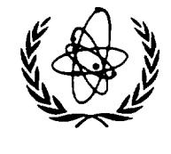

**INTERNATIONAL ATOMIC ENERGY AGENCY**

The IAEA does not normally maintain stocks of reports in this series. However, microfiche copies of these reports can be obtained from

> IN IS Clearinghouse International Atomic Energy Agency Wagramerstrasse 5 P.O. Box 100 A-1400 Vienna, Austria

Orders should be accompanied by prepayment of Austrian Schillings 100, in the form of a cheque or in the form of IAEA microfiche service coupons which may be ordered separately from the INIS Clearinghouse.

#### The originating Section of this publication in the IAEA was:

Nuclear Power Engineering Section International Atomic Energy Agency Wagramer Strasse 5 P.O. Box 100 A-1400 Vienna, Austria

MODERNIZATION OF INSTRUMENTATION AND CONTROL IN NUCLEAR POWER PLANTS IAEA, VIENNA, 1998 IAEA-TECDOC-1016 ISSN 1011-4289

©IAEA, 1998

Printed by the IAEA in Austria May 1998

## **FOREWORD**

This report has been produced in response to the perceived need for collective consideration of the issues and approaches to plant modernization that is becoming necessary, as many operating nuclear power reactors approach 20-30 years of operation. The need for this, particularly for instrumentation and control (I&C) systems was pointed out by the IAEA International Working Group on Nuclear Power Plant Control and Instrumentation (IWG-NPPCI). Further discussion of the topic at the IAEA Specialists Meeting on Modernization of Instrumentation and Control Systems in Nuclear Power Plants held in Garching, Germany, 4-7 July 1995, confirmed this need and determined that international support would be available.

The first IAEA Advisory Group Meeting on Modernization of Instrumentation and Control Systems in Nuclear Power Plants was held in Vienna from 25 to 29 March 1996 in order to exchange information on the national experience on I&C modernization in nuclear power plants and to prepare an extended outline of the planned report on this subject. The first draft, which was prepared after that meeting by the members of the project team, was significantly improved during a consultants meeting held in Vienna from 2 to 6 December 1996. The comments received on the first draft were carefully considered and incorporated into a new draft report. This was distributed to the full project team for additional comments.

The second IAEA Advisory Group Meeting on Modernization of Instrumentation and Control Systems in Nuclear Power Plants was held in Vienna from 14 to 18 April 1997 to finalize the technical content of this report and to exchange information on the national experiences with I&C modernization in nuclear power plants. This report was finalized during a consultants meeting held in Vienna from 3 to 7 November 1997.

The scope of the modernization activities described in this report covers a wide range of activities. It includes the modernization of equipment in operating plants and partially built plants. It covers the full range of types of I&C systems including protection, safety, control and information systems It is applicable for a plant throughout its life. This report includes appropriate consideration of the increasingly international nature of the I&C systems supply industry. It takes advantage of the activities and lessons learned in the different national approaches to develop general guidance and recommendations. However, the report does not seek to provide advice on how the specific different national licensing processes should be approached. The audience for the report is all those considering I&C system changes.

Special thanks are due to W. Basil of GRS (Germany) and J. Naser of EPRI (United States of America) who chaired the working meetings and co-ordinated the work. A. Kossilov, who initiated the project, and V. Neboyan, Nuclear Power Engineering Section, Division of Nuclear Power, who completed the work, are the IAEA officers responsible for the preparation of this publication.

# *EDITORIAL NOTE*

*In preparing this publication for press, staff of the IAEA have made up the pages from the original manuscripts as submitted by the authors. The views expressed do not necessarily reflect those of the IAEA, the governments of the nominating Member States or the nominating organizations.*

*Throughout the text names of Member States are retained as they were when the text was compiled.*

*The use of particular designations of countries or territories does not imply any judgement by the publisher, the IAEA, as to the legal status of such countries or territories, of their authorities and institutions or of the delimitation of their boundaries.*

*The mention of names of specific companies or products (whether or not indicated as registered) does not imply any intention to infringe proprietary rights, nor should it be construed as an endorsement or recommendation on the part of the IAEA.*

*The authors are responsible for having obtained the necessary permission for the IAEA to reproduce, translate or use material from sources already protected by copyrights.*

# **CONTENTS**

| 1. |              | INTRODUCTION                                                       | 1        |
|----|--------------|--------------------------------------------------------------------|----------|
| 2. |              | PRESENT SITUATION AND THE NEEDS FOR MODERNIZATION               | 2        |
| 3. |              | TERMINOLOGY                                                        | 4        |
|    | 3.1. 3.2. | Technical Organizational                                        | 4 . 6 |
| 4. |              | STRATEGY                                                           | 6        |
|    |              |                                                                    |          |
|    | 4.1.         | Introduction                                                       | 6        |
|    | 4.2.         | General approach                                                   | 7        |
|    | 4.3.         | Current state of I&C systems in the plant                          | 8        |
|    | 4.4.         | Plant policies and external requirements                           | 9        |
|    | 4.5.         | Utility defined requirements and constraints                       | 10       |
|    | 4.6.         | Definition of the vision for I&C systems                           | 11       |
|    | 4.7.         | Preliminary analysis of the impact of plant-wide considerations on |          |
|    |              | specificI&C systems                                                | 12       |
|    | 4.8.         | Detailed analysis to validate preliminary decisions and            |          |
|    |              | identify best approach                                             | 13       |
|    | 4.9.         | Definition of the migration path                                   | 13       |
|    | 4.10.        | Quality assurance, verification and validation, and                |          |
|    |              | configuration management                                           | 14       |
|    |              |                                                                    |          |
| 5. |              | MANAGERIAL ASPECTS                                                 | 16       |
|    |              |                                                                    |          |
|    | 5.1.         | Introduction                                                       | 16       |
|    | 5.2.         | Project considerations                                             | 16       |
|    | 5.3.         | Project planning                                                   | . 16     |
|    |              | System independent requirements 5.3.1.                          | 17       |
|    |              | Standardized platforms 5.3.2.                                   | 17       |
|    |              | Standardized interfaces 5.3.3.                                  | 17       |
|    |              | Project implementation 5.3.4.                                   | 17       |
|    | 5.4.         | Participants in the project                                        | 18       |
|    |              | Acquiring knowledge of the existing system 5.4.1.               | 18       |
|    |              | Designing a new system 5.4.2.                                   | 18       |
|    |              | Utility participation in the system design 5.4.3.               | 19       |
|    |              | Contract arrangements 5.4.4.                                    | 19       |
|    | 5.5.         | Project phases                                                     | . 20     |
|    |              | Feasibility studies and project planning 5.5.1.                 | 20       |
|    |              | Design, construction and testing 5.5.2.                         | 21       |
|    |              | Site preparation and installation 5.5.3.                        | 21       |
|    |              | Taking the new systems into operation 5.5.4.                    | 21       |
|    |              | Interface to the regulator 5.5.5.                               | 21       |
|    | 5.6.         | Project organization and project handbook                          | 22       |
| 6. |              | ESTABLISHING THE DESIGN CRITERIA                                   | 22       |
|    |              |                                                                    |          |
|    | 6.1.         | Introduction                                                       | 22       |
|    | 6.2.         | General aspects                                                    | . 23     |

|    |      | Important issues 6.2.1.                                        | 23 |
|----|------|-------------------------------------------------------------------|----|
|    |      | Influence from policy and general design decisions 6.2.2.      | 23 |
|    |      | Technology characteristics 6.2.3.                              | 23 |
|    |      | Characteristics of programmable technology 6.2.4.              | 25 |
|    |      | 6.2.5. New functions implemented by software                      | 26 |
|    | 6.3. | Safety requirements                                               | 26 |
|    |      | Safety goals 6.3.1.                                            | 26 |
|    |      | Deterministic requirements 6.3.2.                              | 27 |
|    |      | Probabilistic requirements 6.3.3.                              | 28 |
|    |      | System reliability and availability 6.3.4.                     | 29 |
|    | 6.4. | Compliance with safety standards and guides                       | 30 |
|    |      | 6.4.1. International standards and practices                   | 31 |
|    |      | Project internal rules and standards 6.4.2.                    | 32 |
| 7. |      | OPERATIONAL ISSUES                                                | 32 |
|    | 7.1. | Introduction                                                      | 32 |
|    | 7.2. | Operational philosophy                                            | 33 |
|    |      | Balance between automation and human actions 7.2.1.            | 33 |
|    |      | Staffing 7.2.2.                                                | 34 |
|    |      | Task analysis 7.2.3.                                           | 35 |
|    |      | The main control room 7.2.4.                                   | 35 |
|    |      | Technical support centre 7.2.5.                                | 35 |
|    |      | Emergency operating facility 7.2.6.                            | 35 |
|    |      | Access rights and security 7.2.7.                              | 36 |
|    | 7.3. | Operational human-machine interfaces . 36                      |    |
|    |      | General requirements 7.3.1.                                    | 37 |
|    |      | Conventional displays and VDUs 7.3.2.                          | 38 |
|    |      | Integration of the information presentation in displays 7.3.3. | 39 |
|    |      | VDU display hierarchy and access 7.3.4.                        | 39 |
|    |      | 7.3.5. Presentation of alarms . 40                          |    |
|    |      | 7.3.6. Computerized support systems                            | 40 |
|    | 7.4. | Non-operational human-machine interfaces                       | 42 |
|    |      | Serving information needs of various groups of people 7.4.1.   | 42 |
|    |      | Field communication stations 7.4.2.                            | 42 |
|    |      | Maintenance tools 7.4.3.                                       | 43 |
|    |      | Control engineering tools . 43 7.4.4.                       |    |
|    |      | Design databases . 43 7.4.5.                                |    |
|    |      | Office automation 7.4.6.                                       | 43 |
|    | 7.5. | Verification and validation of control room solutions             | 43 |
|    |      | Methods for the V&V process 7.5.1.                             | 43 |
|    |      | Validating the operability of the plant . 44 7.5.2.         |    |
|    | 7.6. | Procedures and training . 44                                   |    |
|    |      | Scope and depth of training . 44 7.6.1.                     |    |
|    |      | Operating procedures . 45 7.6.2.                            |    |
|    |      | Commissioning tests and their instructions . 45 7.6.3.      |    |
|    |      | Needs for a period of parallel operation 7.6.4. . 45        |    |
|    | 7.7. | Documentation . 45                                             |    |
|    |      | Coexistence of different technology 7.7.1.                     | 46 |
| 8. |      | ENGINEERING INFRASTRUCTURE                                        | 46 |
|    | 8.1. | Introduction . 46                                              |    |
|    | 8.2. | The I&C Infrastructure                                            | 46 |
|    |      | Communications . 46 8.2.1.                                  |    |

|     |             | 8.2.2. 8.2.3.   | Existing and new networks Security                                     | 48 50 |
|-----|-------------|--------------------|---------------------------------------------------------------------------|----------|
|     | 8.3.        |                    | Impact of and on other systems                                            | 50       |
|     |             | 8.3.1.             | Existing I&C                                                              | 50       |
|     |             | 8.3.2.             | Strategy for modifying common service systems                             | 51       |
|     |             | 8.3.3.             | Environmental control                                                     | 51       |
|     |             |                    |                                                                           |          |
| 9.  |             |                    | ENGINEERING REQUIREMENTS AND CONSTRAINTS                                  | 52       |
|     | 9.1.        |                    | Introduction                                                              | 52       |
|     | 9.2.        |                    | Requirements                                                              | 52       |
|     |             | 9.2.1.             | Recovery of old requirements                                              | 52       |
|     |             | 9.2.2.             | Generation of new requirements                                            | 53       |
|     |             | 9.2.3.             | Functional requirements                                                   | 54       |
|     |             | 9.2.4.             | Qualification requirements                                                | 58       |
|     |             | 9.2.5.             | Maintenance requirements                                                  | 62       |
|     | 9.3.        |                    | Limitations and constraints                                               | 66       |
|     |             | 9.3.1.             | Physical space                                                            | 66       |
|     |             | 9.3.2.             | Layout                                                                    | . 67     |
|     |             | 9.3.3.             | Ventilation                                                               | 67       |
|     |             | 9.3.4.             | Cabling and connectors                                                    | 67       |
|     |             | 9.3.5.             | Access to the plant                                                       | 68       |
|     |             | 9.3.6.             | Ranges of input and output signals                                        | 68       |
|     |             | 9.3.7.             | Power supplies                                                            | 69       |
|     |             |                    |                                                                           |          |
| 10. |             |                    | LICENSING ASPECTS                                                         | . 69     |
|     |             |                    | 10.1. Introduction                                                        | 69       |
|     |             |                    | 10.2. Review of the country regulatory environment                        | 70       |
|     |             |                    | 10.3. Communication with the regulatory body in the course of the project | 71       |
|     |             |                    | 10.4. Safety case of an I&C modernization project                      | 73       |
| 11. |             |                    | TESTING AND COMMISSIONING                                                 | 75       |
|     |             |                    |                                                                           |          |
|     |             | 11.1. Introduction |                                                                           | 75       |
|     |             |                    | 11.2. Planning of testing and commissioning activities                    | 75       |
|     |             |                    | 11.3. Data acquisition subsystems                                         | 78       |
|     |             |                    | 11.4. Control systems                                                     | 78       |
|     |             |                    | 11.5. Computer hardware and communication networks                        | 79       |
|     |             |                    | 11.6. System software                                                     | 81       |
|     |             |                    | 11.7. Configuration level software/data                                | 82       |
|     |             |                    | 11.8. Human-machine interface                                             | 82       |
|     |             |                    | 11.9. Links to the off-line systems                                       | 83       |
|     |             |                    | 11.10. Integrated testing                                                 | 83       |
|     |             |                    | 11.11. Parallel running                                                | . 83     |
|     |             |                    | 11.12. Full scale simulator                                               | 84       |
|     |             |                    | 11.13. Specific checks against safety principles                          | 84       |
|     |             |                    | 11.14. Documentation                                                      | 85       |
| 12. |             |                    | CONCLUSIONS                                                               | 85       |
|     | APPENDIX A: |                    | EQUIPMENT TECHNOLOGY DEFINITIONS                                          | 89       |
|     | APPENDIX B: |                    | RECOVERY OF OLD REQUIREMENTS EXAMPLE                                      | 91       |

| REFERENCES 95                                                                                                                                          |
|-----------------------------------------------------------------------------------------------------------------------------------------------------------|
| ANNEX: COUNTRY REPORTS                                                                                                                                    |
| NPP I&C system modernization in the Czech Republic: The NPP Dukovany example . 101 P. Krs                                                           |
| Modernization projects at Finnish NPPs . 107 B. Wahlstrom, K. Simola                                                                                |
| French practice of the renovation of I&C systems in the 900 MW NPPs . Ill A. Dall 'agnol                                                            |
| First experiences from system integration, installation and commissioning of TELEPERM XS for reactor I&C at the Unterweser NPP . 119 O. Schorner |
| Modernization of I&C in the Paks nuclear power plant . 131 A. Hetzmann, J. Eiler, Z. Toth                                                           |
| The status of I&C development in the Republic of Korea . 135 IS. Koo, K.C. Kwon, J. W. Lee                                                    |
| Main trends in modernization of I&C systems at NPPs in the Russian Federation . 151 A.B. Pobedonostsev, A.G. Chudin                           |
| a stepwise learning process with a final vision . 157 Modernization of I&C: P. van Gemst                                                         |
| Modernization of the Ukrainian NPP instrumentation and control systems . 165 M. Yastrebenetsky                                                      |
| Activities at the Electric Power Research Institute to support the modernization of instrumentation and control systems in nuclear power plants in the |
| United States of America . 175 J. Noser                                                                                                             |
| CONTRIBUTORS TO DRAFTING AND REVIEW . 185                                                                                                              |

## **I. INTRODUCTION**

Most existing instrumentation and control (I&C) systems in nuclear power plants (NPPs) throughout the world were designed with analog equipment and relays. These were the only available technologies when NPPs were designed 25-45 years ago A majority of them are still operating with much of their original I&C equipment or with obsolete digital equipment both of which are becoming, or already are, obsolete, costly to operate, or degrading in performance. Utilities are faced with increasing operating and maintenance (O&M) costs to maintain acceptable performance of this equipment in their plants. There is also a need in many plants for safety or performance improvements The use of analog equipment and relays limited the ability of the original designers to implement features that could improve the overall operation of NPPs. With modem technology, especially digital technology, the issues of the obsolescence of analog and aged digital equipment can be addressed. These issues include the lack of availability of spare parts and the deterioration of the infrastructure of suppliers to support this ageing equipment. Moreover, many performance improvements that were not feasible or practical with analog equipment can now be effectively implemented with modem technology. Potential improvements such as integrated controls; new functionality; reduced duplication of equipment, functionality, and information; reduced O&M costs, enhanced safety, increased performance; and integrated information for the user can now be realized with modern technology. This is especially feasible with digital systems. In addition, modern technology offers improved reliability and cost-effective operation which has been demonstrated in other process industries

Many of these ageing systems in NPPs need to be modernized in a reliable and cost-effective manner to eliminate the problem of a lack of spare parts and supplier support, to reduce O&M costs, to improve plant performance, and to enhance safety. Digital I&C systems need to play a major role m nuclear power plants to achieve real productivity improvements and enhance the competitiveness of the plant. However, modernization of I&C equipment brings with it several challenges These include the determination of which systems to modernize, what technology to use for a particular modernization project, how to implement new systems and new technologies in the plant, how to develop new systems with new technology so that they will work together with older systems in the power plant which are based on a different technology, how to develop and implement safe and reliable systems, how to address new concerns that digital technology brings with it such as software verification and validation and video display based human-machine interfaces, how to develop digital system requirements, what is needed to support licensing, and many other related questions

This report is designed to identify methodologies, guidelines, processes, concerns, and good practices to help in the modernization of I&C systems of NPPs. It has been developed by the contributors from their expenence in identifying the need for modernization and in the performance of actual modernization planning and implementation projects. The methodologies, guidelines, processes, and good practices identified in this report have been developed for and tested on actual modernization activities. It is expected that the user of this report will be able to gain valuable information and expenence that will allow future modernization projects to be performed more cost-effectively. This same information and expenence will allow the modernized systems and components to be implemented in a manner that will improve productivity, reduce costs, and enhance safety.

The term "modernization" is used in this report to represent the three types of changes in I&C systems and components. These are the replacement of old systems and components, the upgrading of old systems and components, and the implementation of new systems and components. The term "replacement" is used when an existing system is replaced with a new or improved technology but there is no change in its capabilities. The term "upgrading" is used when an existing system is replaced with a new or improved technology and there is an increase in its capabilities. The term "new" is used when a new system with new functionalities is implemented in the plant. The scope of these modernizations cover a wide range of activities. It includes the modernization of equipment in operating plants and the modernization of equipment and designs in partially built plants. It covers

large, complex systems; small systems, and individual components in systems. It also covers the complete replacement of all of the I&C equipment in a plant It covers the full range of types of I&C systems including protection, safety, control, and information systems. It is applicable for a plant throughout it's lifetime

This report is structured to follow the probable life-cycle of a modernization activity It starts by considering the issues driving changes in I&C systems and components and the strategy to be adopted to make these changes. Section 2 describes the motivations that drive modernization projects in nuclear power plants. Section 3 describes the terminology used in this report. Section 4 describes the overall strategic planning required for cost-effective modernization of *l&C* systems. Management issues for modernization projects are addressed in Section 5. Section 6 describes the process of establishing design criteria. Section 7 discusses operational issues with I&C modernization. Section 8 describes the engineering infrastructure to support I&C modernizations. Engineering requirements and constraints, licensing issues, and testing and commissioning of I&C systems are discussed in Sections 9, 10, and 11 respectively. Section 12 gives a summary of the important aspects of this report and presents a list of recommendations for modernization projects.

#### **2. PRESENT SITUATION AND THE NEEDS FOR MODERNIZATION**

Nuclear power plants throughout the world are confronted by some or all of the following three major concerns. The first concern is a growing obsolescence problem with I&C systems, which is a significant contributing factor to increasing costs for plant operation and maintenance Plant age combined with the rapid pace of the evolution of electronic technology is a significant factor in I&C equipment obsolescence The inability to obtain spare parts and supplier support is a major problem with obsolete equipment. The second concern is the increasing need for improved competitiveness brought on by deregulation and other market forces. This necessitates improved productivity, costeffective modernization projects, and reduced O&M costs for the continued operation of the plant The third concern is the need to improve the safety of the plant and to be able to modify the plant so that it can meet new safety standards and requirements. The consequence of not being able to address this problem is that the plant will not be able to operate. The concerns of obsolescence and competitiveness, if not addressed appropriately, can also lead to the shutting down of the power plant. Therefore, nuclear power plants are faced with crucial decisions as to the appropnate strategy for continued operation of the plant, continued system maintenance, system replacement, and system upgrade

The flexibility and performance advantages of modern technology can be used as the basis for modernizing I&C equipment m the plant in a cost-effective manner to address all three of these concerns The realization of the benefits from the use of modem technology is highly dependent on the way it is implemented in the power plant. It is important to use reliable and cost-effective approaches for the design, development, qualification, implementation, and maintenance of replaced, upgraded, and new I&C systems in the plant. It is also important to understand that modern technology solutions bring about different requirements and issues than older analog technology. In addition, the use of a combination of old and new technologies in the plant also introduces new issues and concerns.

The ageing of I&C equipment in many cases causes additional inspection and maintenance activities to maintain acceptable performance and safety margins of the equipment. In addition, the availability of spare parts and supplier support decreases as the equipment becomes obsolete This leads to increased costs for spare parts and supplier support, if they can be obtained at all. The increased work to maintain acceptable performance and the decreased availability of parts and supplier support lead to increased O&M costs. In addition, some of these older systems may lead to increased tnp vulnerability and safety challenges. They may also make it difficult or impossible to meet new safety standards and requirements. These concerns and the increased costs make it

important to develop strategies to determine which systems need to be modernized and the most effective way to perform the modernizations.

Adequate quality assurance associated with the I&C systems plays an important role for high integrity systems in nuclear power plants. For older systems, regardless of their real quality, this vigorous quality assurance process may be lacking, or the quality of documentation does not meet the standards of today In this case, the lack of confidence in the quality of a system, which is applied in a sensitive area of the plant, may also provide the need for modernization of the system.

The use of modern technology in the power plant offers the opportunity to increase productivity, to reduce O&M costs, to enhance safety, and to support plant staff in the performance of their jobs Modem technology can be used to improve availability, improve reliability, increase productivity, and reduce safety challenges to the plant. Proper use of this technology can not only reduce the potential for human errors, but can also support improved human performance. Some examples of how modern technology can support cost-effective and safe power productive are given below.

In some cases, the power output of the plant could be increased by having more accurate systems and by being able to more accurately calculate parameters in the plant. Computerized I&C systems are well suited to perform complex calculations on the basis of the measured data taken from the plant With these systems, it is possible; for example, to operate the plant closer to its limits, which will result in a gain in power production without reducing the safety margins. This can be done because there is a reduction in the uncertainties that were originally used in the determination of the safe operating limits of the plant.

Exploiting the capabilities of modern technology for I&C systems; such as enhanced accuracy, higher reliability; and accessibility of complex calculations, would allow more realistic or optimized situations. Typical examples are:

- A smart core monitoring system can be used to achieve a flatter power distribution in the core In this case, local power peaks are minimized, and the whole core output power can be higher, while still remaining safely below the operating limits
- A more accurate control system could allow the limiting parameters of the turbine and the secondary loop to be set closer to the operational limits due to the elimination or reduction of so-called engineering design margins.
- Intelligent closed loop controllers can be used to perform sophisticated control operations to reduce power losses during transient situations

Operating and maintenance costs can be reduced through the use of modern technology. Reduced operating costs can be achieved; for example, by better utilization of the fuel, less consumption of auxiliary power resources, and the slowing down of the fatigue process of expensive mechanical components To do this, requires I&C systems based on modern technology. Some examples are:

- Sophisticated monitoring of the burnout of the fuel m the core could considerably reduce fuel costs.
- A fast, on-line water chemistry control system could reduce corrosion damage in components
- A fatigue monitoring system could follow the fatigue process so that it would be possible to take the necessary corrective actions before failure.

- A good quality controller could protect components from rapid changes in parameters and, therefore, slow down the fatigue process.

Reduced maintenance costs can be achieved; for example, by diagnostic systems, self-testing systems, self-calibrating systems, systems that do not drift over time, and systems that require only minimal maintenance Extended self-testing during operation not only reduces the amount of repetitive testing, but also makes the test coverage more complete It also reduces the potential for human error The test data can be easily fed into a maintenance network database to support additional analysis, trending, and diagnosis. These capabilities can support condition based maintenance, which reduces unnecessary maintenance and may prevent forced outages due to equipment failures since the condition based maintenance will indicate when maintenance is actually needed

Operator support systems, including diagnostic systems, will support more cost-effective operation. They too require modem technology for implementation. I&C systems developed for operator support, for example, safety parameter display systems (SPDS) and success path monitoring systems, and for diagnostic systems, for example, loose parts monitoring and vibration monitoring systems, can be realized in an effective manner only by means of computer based systems These systems offer the ability of providing useful information to the operator to allow the operation of a plant to be more effective and safe.

The extensive data, information processing, and display capabilities of modern technology support the ability to improve considerably human-machine interfaces in the plant. This includes the effective use of VDU and large overview screens m the control room, the presentation of complex situations by means of specialized graphs and diagrams, and the ready access to information that supports the more efficient running of the plant These improved human-machine interfaces reduce the potential for human error and support improved productivity and enhanced safety

It is clear that there are many reasons to perform system modifications in nuclear power plants In some cases, they are needed to get away from problems and concerns such as obsolete equipment, increasing O&M costs, increased safety requirements, and vulnerability to less reliable or less available equipment In other cases, the modernization of systems is needed to achieve positive improvements, such as more power output, increased diagnostic ability, increased operational flexibility, increased availability, and reduced potential for human error Therefore, it is important to perform these I&C system modernizations in a planned, cost-effective manner. In addition, when a modernization is being done to respond to a concern, the utility should also consider taking advantage of the opportunity to enhance the system to support more cost-effective power production as opposed to just replacing it with the same functionality.

#### **3. TERMINOLOGY**

## 3.1 TECHNICAL

| AC ASIC   | alternating current; application specific integrated circuit;     |
|--------------|----------------------------------------------------------------------|
| Availability | fraction of time that a system is actually capable of performing its |
|              | mission,                                                             |
| B WR         | boiling water reactor,                                               |
| CAD          | computer aided design;                                               |
| CCF          | common cause failure;                                                |
| CEA          | control element assembly                                             |
| CM           | configuration management;                                            |
| CMF          | common mode failure;                                                 |

*Commissioning* process during which plant components and systems, having been

> constructed, are made operational and verified to be in accordance with design assumptions and have to meet the performance criteria; it

includes both nuclear and non-nuclear tests;

*Configurable software* software that already exists but is configured for the specific

application using data or an application specific input language;

*Configuration management* configuration control and change management;

*CPU CSS*

central processing unit; computerized support system; database management system;

*DBMS DNBR* departure from nucleate boiling ratio;

*EMC EMI EOF* electromagnetic compatibility; electromagnetic interference; emergency operating facility;

*Existing accessible software* software from a similar application that is to be reused and for which all

of the documentation is available;

*Existing proprietary software* commercial product or software from another application that meets all

or part of the current application requirements but for which little

documentation is available;

*FMEA FPGA* failure mode and effects analysis; field programmable gate array;

*Fuzzy logic* consistent approach to manipulating qualitative data representing

approximations rather than firm categories;

*HMI* human-machine interface;

*HVAC* heating ventilation and air conditioning;

*I&C* Instrumentation and control;

*I/O LAN LCM LCMP* input/output; local area network; life-cycle management; life-cycle management plan;

*LED LOCA LPD* light emitting diode; loss of coolant accident; local power density;

*MAC* medium access control layer;

*Maintainability* ability to keep plant components and systems operational and verified

to be in accordance with performance and safety criteria;

*MCR* main control room;

*MTBF* mean time between failure;

*MTTR* mean time to repair;

*New software* software written specifically for the application;

*NPP O&M OSS OS* nuclear power plant; operating and maintenance; operator support system; operating system;

*PES PLC PLD PFFO PSA PWR* programmable electronic system; programmable logic controller; programmable logic devices; probability of failure free operation; probabilistic safety assessment; pressurized water reactor;

*QA QC* quality assurance; quality control;

*Quality Assurance* programme that identifies to all concerned a basis for control of all

activities affecting quality, monitors the performance of these activities

in accordance with the defined and documented procedures, and

ensures that the specified quality is achieved,

*Quality Control* process performed to check that the specified software development

methods and process in the QA plan have been correctly followed,

*RAM* random access memory;

*RBMK* Russian channel graphite moderated water cooled reactor design,

*Reliability* probability that a device, system or facility will perform its intended

function satisfactorily for a specified time under stated operating

conditions;

*RFI* radio frequency interference;

*ROM* read only memory,

*RPS SPDS* reactor protection system; safety parameter display system;

*STA* shift technical adviser;

*TCP/IP* transmission control protocol/Internet protocol;

*Testing* determination or verification of the capability of an item to meet

specified requirements by subjecting the item to a set of physical,

chemical, environmental, or operational conditions,

*TSC UPS* technical support centre; unmterruptable power supply;

*Validation* test and evaluation of the integrated computer system (hardware and

software) to ensure compliance with the functional, performance, and

interface requirements;

*VDU* visual display unit,

*Verification* process determining whether or not the product of each phase of the

digital computer system development process fulfills all of the

requirements imposed by the previous phase,

*V&V* verification and validation;

*WWER* Russian pressurized water reactor design.

#### 32 ORGANIZATIONAL

*EPRI IAEA IEC* Electric Power Research Institute; International Atomic Energy Agency, International Electrical Commission,

*IEEE ISO* Institute of Electrical and Electronics Engineers, International Standardization Organization;

*NUREG* Reports series of USNRC;

RG TMI Regulatory guides of the USNRC; Three Mile Island nuclear power plant;

*USNRC* United States Nuclear Regulatory Commission.

## **4. STRATEGY**

#### 4 1. INTRODUCTION

Instrumentation and control systems in nuclear power plants need to be modernized in a systematic, reliable, and cost-effective manner. To achieve the maximum benefits from I&C modernization, it is important for the utility to develop long-term planning and implementation strategies which include the definition of the vision for the plant at the end of the utility's chosen planning period The strategy will be to look at the existing I&C systems in the context of the entire plant to determine which ones should be maintained, replaced, or upgraded. It will also identify when new I&C systems need to be implemented in the plant. The strategy will prioritize these I&C

modernization activities It will identify the communications, network, computing, and humanmachine interface (HMI) infrastructure required to implement the modernization so that the vision will be achieved in a systematic manner. When I&C modernization is performed mcrementally, the strategy and infrastructure will ensure that each modernization step will be performed in a manner that leads to the achievement of the plant vision.

## 42 GENERAL APPROACH

As problems usually arise at the maintenance level for a given I&C system or component, utilities have usually performed a modernization of that particular piece of equipment without taking into consideration the plant as a whole. This means that traditionally systems have been implemented and maintained in a stand-alone manner creating isolated islands of functionality and information This has frequently resulted in increased O&M costs and in the unnecessary duplication of functions and information in the plant. This approach has reduced the effectiveness, and in some cases the possibility, of using systems that are more advantageous for existing and enhanced functionalities An integrated approach is essential to maintain consistency with existing I&C systems, to allow further modifications to the I&C systems, and to maximize the effectiveness of new and upgraded systems Modem technology available for distributed digital systems, plant process computers, and plant communications and computing networks is fully capable of supporting the integration of new and upgraded systems and of information and, therefore, of facilitating the implementation of this integrated approach This capability of modern technology and its effectiveness has been proven in other process industries

The integrated approach does not mean that the modernization of the I&C systems must be performed m one step requiring large capital resources and a long plant shut down period, although it could be done this way. The integrated approach means considering the final goal for the plant (the vision) during each phase of the modernization, leaving the options available to move ahead in the right direction when the decision is made to carry out the next stage of the modernization. Putting the necessary infrastructure in place to leave these options open could result in additional expenses during the early phases of modernization. However, the infrastructure will facilitate future modernization efforts so that the overall costs will end up to be less than doing each one individually In addition, the infrastructure will allow the modernized systems to perform more efficiently as a whole which will support additional cost savings

It is important to make modernization decisions based on the overall vision for the plant so that a particular modernization supports the overall vision and the future modernization activities This way the modernization will not create the problems that occur when stand-alone decisions are made A life-cycle management programme, and therefore a life-cycle management plan (LCMP) is needed to allow comprehensive, global, and systematic decision-making on the modernization of I&C systems This plan is a long range, plant-specific plan that defines how a utility will manage its I&C systems over a specified time period which is determined by the utility Depending on the utility's mission and objectives, some systems will be maintained in their present configuration and others will be replaced or upgraded using modern technology Therefore, the plan must support the use of a mixture of modern and older technology in the plant. Life-cycle management also involves making decisions on the modernization of a system based on the entire life-cycle of that system This means that decisions should not be made on just implementation costs but on all relevant costs including those of maintenance, operation, and training. To implement the I&C Life-cycle Management (LCM) in the plant, the utility needs to define the:

- present I&C configuration,
- desired I&C configuration for the end of a utility-defined planning period,
- plan for reaching the desired configuration;
- I&C maintenance strategy for those systems that will be maintained in their present configuration

LCM provides an integrated approach to I&C system management, as opposed to maintaining or modernizing each system as an isolated project. It involves a comprehensive analysis of all I&C systems included in the scope of the LCMP, as well as other issues such as plant human-machine interfaces, obsolescence, maintenance problems, standardization, improved performance, and communications and networking. By considering these factors, the utility can develop a set of strategies to be used in the maintenance, replacement, and upgrading of each existing I&C system. This, in addition to an emphasis on standardization and the use of high-quality commercial products, will promote consistent solutions to similar issues for having multiple platforms used in various systems. This approach bases the decisions on justifiable arguments which can be presented to management when needed.

The major benefit of the LCM approach to a utility is that it provides the strategic and systematic aspects necessary to managing I&C systems. The LCM approach stresses:

- establishment of plant objectives, constraints, and assumptions at the beginning of the process to ensure that the LCMP is developed in accordance with the overall goals of the plant;
- co-ordination with existing plant strategic plans, task forces, etc. to ensure that the overall strategies of the plant are addressed;
- in-depth analysis of each I&C system to determine which systems can be cost-effectively maintained so that only necessary replacements and upgrades are performed.

An example of a methodology that can be used to develop a plant-specific LCMP is the one developed by the Electric Power Research Institute (EPRI) [1].

#### 4.3. CURRENT STATE OF I&C SYSTEMS IN THE PLANT

Since their commissioning, the I&C systems and components in the plant have usually undergone modifications. There are several reasons for these modifications including the addition of functionality, performance or safety enhancements, and technological improvements. Experience has shown that most of the time, especially for the oldest units, parts of these modifications have not been fully documented or part of the documentation itself has been lost. However, it is necessary to know precisely the present state of the I&C systems and components and their operating history (for as long as possible) in order to make appropriate decisions for the modernization of them.

Verification and the updating of existing documentation is *a.* must for further modernization actions to determine the true current state. The necessary upgrading of the documentation is a costly and time consuming activity, so in many cases this is avoided and instead the issues of modernization are addressed without having good quality documentation. This approach can be dangerous since it could jeopardize the success of the whole modernization project. The documentation for existing, modernized, and new I&C systems should be maintained throughout the life of the systems.

The approach to define the current state of the plant's I&C systems consists in identifying the I&C systems and components, identifying the required information, collecting and validating this information, and describing the boundary interfaces between the I&C systems and components. The boundary interfaces are important since they establish the boundary conditions to be met when incremental modernization is done. Even when the modernization is performed all at once, boundary interfaces will still exist with other plant equipment outside the modernization programme. If necessary, this approach can be iterated on in order to make the results more complete and reliable.

A baseline description of each of the existing I&C systems of interest and of the plant network architecture is needed to understand the current state of the systems and to support the decisions that will be made to retain or modernize the systems. While the primary intention is to describe the

existing systems and architecture, the baselining process also queries plant personnel about needed and desired functions that do not currently exist. The new functions that are appropriate and practical can be incorporated into the design of new and upgraded systems. The information obtained here to do this baselining will also be useful and sometimes necessary for the development of functional requirements and bid specifications in the future. The baseline description for each candidate I&C system should include the following sections:

- general information (e.g. system ID, manufacturer, supplier support, location, safety class);
- system summary (e.g. functionality, configuration, safety challenges caused by the system, current performance, loss of generated power due to the unavailability of the system, interfaces, security, documentation);
- physical characteristics (e.g. number of cabinets, detailed component inventory, limits, boundaries, environment, location, power supply, grounding, margins in the cabinets and the rooms for power supply, amount of information exchanged between cabinets, connection modes with instrumentation and other systems);
- system constraints (e.g. licensing commitments, technical specifications, design constraints, operating characteristics, failure mode requirements);
- obsolescence issues (e.g. maintenance costs, replacement parts, performance degradation, proficiency of plant maintenance shifts, supplier support);
- problems and potential improvements (e.g. functionality, configuration, performance, maintenance);
- cost-benefit/risk analysis of further operation and modernization;
- references.

In addition to the I&C systems and components, common points exist and must be identified. These points include sensors, actuators, cabling, electrical power supply, ventilation, I&C rooms where control equipment is installed, and the control rooms, especially the main control room. Their current status and capabilities must be identified. The state of the instrumentation must be described. The same questions that are asked and answered for the I&C systems should be asked and answered for the sensors and actuators (i.e. general information, physical characteristics, constraints, etc.). The age effects on cables should be evaluated (e.g. resistance to fire, state of the outer jacket sheath ensuring insulation, the margins on cable support systems, etc.). The electrical power supply sources need to be studied taking into account voltage, consumed power, and margins. Each I&C room must be studied from the point of view of ventilation, space, and fire area. The main control room, and the processing and display of alarms, can be affected by any I&C modification.

The information collected must be relevant, exhaustive and reliable. Past experience has shown that this information is scattered among several organizations and people. It is important to define a good process to collect and validate the needed information. This information needs to be thoroughly documented.

# 4.4. PLANT POLICIES AND EXTERNAL REQUIREMENTS

The main goal of the plant policy is to cost-effectively produce power. This goal is becoming even more rigorous under the new deregulated electric utility industry environment in many countries. The plant policy will identify the goals and objectives of the utility. These goals and

objectives will have a major effect on the modernization activities for I&C systems. The plant policy will be driven substantially by the utilities short and long term business plans.

Other projects and plans in the utility, that are either planned or ongoing, will also effect the policy and scheduling of the modernization of I&C systems. Examples of these are the growth of generated power by increasing the efficiency of some of the physical processes or by the better utilization of some of the components (e.g. fuel), planned lifetime extension through improved ageing monitoring, plant process computer replacements, safety reassessment, fire sectorization reassessment, information management system upgrades, installation of equipment to support communications amongst plants and corporate offices, etc. Maintainability and obsolescence concerns of the systems after they are modernized need to be part of the planning process.

The external requirements that effect I&C modernization must also be identified. Some examples of these are regulatory requirements, load following requirements, commitments to the public and regulatory bodies, etc. This combination of plant policy and external constraints will determine the plant vision and drive the modernization activities.

The specific situation of the plant and where it resides in its life-cycle will dictate different ways to satisfy the overall plant policies and external requirements. For example, a plant that has just become operational will probably see the needs to increase power production and enhance safety to be a higher priority than addressing increasing O&M costs due to obsolescence initiated problems. However, as the plant ages, the obsolescence concerns and needs to satisfy new safety requirements will rise in priority.

#### 4.5. UTILITY DEFINED REQUIREMENTS AND CONSTRAINTS

There are several requirements and constraints defined internally by the utility that must be satisfied by the I&C modernization activities. These requirements and constraints must be identified and satisfied in the implementation plans for I&C modernization. It is important, when these requirements and constraints are determined, to take into account input from operating, maintenance, engineering, management, licensing, etc. These requirements and constraints include functional (e.g. needed and desired functions that do not currently exist), physical (e.g. available rack space and ventilation), technological (e.g. what technologies are available and what are their capabilities and limitations), economic (e.g. available capital resources and required pay back period), safety (e.g. technical specifications and regulatory commitments), versatility (e.g. flexibility and expandability), and human related (e.g. levels of automation and lighting). The decision on whether the modernization of systems and groups of systems will be done all at once or in an incremental process over time will also add requirements and constraints to the modernization process.

The utility will create requirements and constraints by defining how it wants to perform the various aspects of modernization. The utility should develop a set of plant-specific guidelines to be used for I&C modernization projects to address issues such as functional requirements and bid specification development, licensing, communications and computing environment, software verification and validation (V&V), hardware qualification including electromagnetic compatibility and seismic, failure analysis, commercial grade equipment acceptance, human-machine interfaces, and the integration of systems and information through communications networks. Significant advantages can be obtained by issuing an utility level guideline identifying the preferred equipment types and families that must be used for modernization activities, i.e. standardization. This can reduce the costs of training and spare parts, as well as simplifying integration. One concern with this is that such a limitation excludes the competition between manufacturers which may result in higher costs. This problem could be avoided by making long term agreements with the suppliers for predefined price discounts. Another approach is to include a small number of preferred equipment types or families into the guideline.

The above guidelines will define what needs to be done for a system and identify the necessary requirements and constraints affecting the system When an engineer needs to specify a new system or the modernization of an existing one, the guidelines can be used to ensure satisfaction of the plant policies, external requirements, utility constraints and goals in a manner consistent with the overall plant vision Examples of some methodologies, guidelines, handbooks, and a user's guide that have been put together by EPRI to help develop these plant-specific guidelines are given in Refs [2-21].

## 4.6 DEFINITION OF THE VISION FOR I&C SYSTEMS

A global vision of the overall future I&C configuration needs to be defined at the beginning of the modernization activities in order to co-ordinate these activities and the implementation of the new I&C equipment This global vision is the target for I&C systems and components to reach when all of the I&C modernization activities are completed for the utility defined planning period. The vision is defined based on the plant policies, plant goals, utility defined constraints, and externally defined constraints I&C modernization to achieve the plant vision can be earned out effectively in an incremental manner during several years based on the needs and constraints of the utility

The global vision includes foreseeable new functionality and reliability requirements to support the goals for the plant. It includes consideration of the human-machine interface, system boundaries, process data storage, database management, etc. The global vision does not have to contain specific deadlines, schedules, costs, and resources. The realization of the vision depends on the requirements and constraints descnbed earlier and also on unforeseeable events that can occur It is important to have a well-defined vision in order to define the desired end state and the migration path to get there

The definition of the vision for the power plant's I&C systems is developed on two levels One level is the global view of the I&C systems and their environment. This includes goals for communications, networks, levels of integration, human-machine interfaces, process data storage, levels of automation, life duration of the I&C systems, database management, and I&C systems maintenance This view must also consider the interfaces with instrumentation, sensors, power supplies, ventilation, etc. The global vision for I&C systems determines plant-specific guidelines which are a set of rules to which desired future systems (replaced, upgraded, and new systems) must adhere in order to accomplish the vision. These guidelines will play an integral role in the development of the functional requirements and bid specifications for future systems.

The following are some examples of the global vision guidelines that need to be defined The communications and network guidelines need to describe the desired network communications model, protocols, general physical topology, and data bandwidth to be used at the plant It should be made clear that the utility is not defining its own specific communications model and protocols, but rather identifying which already available model and protocols they are willing to support in the plant These guidelines will address local area networks, wide area networks, and network management systems. The guidelines will use as part of their basis the level of integration amongst systems and the degree of distributed processing and control that the utility hopes to achieve. The human-machine interface guidelines need to describe the interface style, graphics standards, and types of hardware to achieve a common look-and-feel. Guidelines for process control equipment describe the desired types of data acquisition and control equipment from the conductors connected to the sensors and actuators to the interface that will communicate with the host computers. Guidelines are also needed to describe the desired levels of automation in the plant.

The second level of the vision definition is the development of the desired functionalities, their availability, and the description of the desired future systems as they will look at the end of the LCM planning period. When the existing systems were baselmed, information was gathered on the desired additional functionality requirements to support the power plant operation In some cases, this functionality can be included when existing systems are modernized In other cases, the required new functionality will necessitate new I&C systems. These upgraded and new functionalities play a major

role in identifying the future vision of the I&C systems. The vision must be flexible to accommodate additional functionality and performance needs that will arise over time. These new needs should be able to be easily accomplished by using the principles and solutions determined by the vision.

Technologies that impact I&C systems are changing very rapidly. Therefore, when the vision is defined, it must be flexible and expandable to allow for new technology solutions. Attractive and effective solutions may be expensive at a given time but may become cheaper in the near future. Also new technologies may be developed that are useful for achieving the utility's goals. Therefore, the vision must be flexible, reviewed periodically, and revised as needed. During these revisions, it is important to protect earlier investments. This means that the new solutions must be applied and added to the existing ones in an effective manner. It is not realistic, or appropriate, to keep changing all of the systems just because technology is improving. Changes should only be made when they are cost beneficial or required for safety or other utility determined reasons.

# 4.7. PRELIMINARY ANALYSIS OF THE IMPACT OF PLANT-WIDE CONSIDERATIONS ON SPECIFIC I&C SYSTEMS

Based on an integral assessment of the plant and I&C systems, it is necessary to determine the correct course of action for each piece of I&C equipment. The effort to perform a detailed examination for every I&C system to determine the correct course of action is very large and perhaps prohibitive. Instead, it is more cost-effective to develop a process that allows preliminary decisions to be made as a first cut. A criteria for this preliminary assessment is required to facilitate the decisions involved. A preliminary decision for each piece of I&C equipment should then be made based on this criteria. This process would also identify when the preliminary decisions can not be made with acceptable certainty. This simplified process will identify obvious maintain or modernize decisions and reduce the cost and effort of evaluating those systems. A detailed modernization analysis is only done on systems that appear to require modernization or where the preliminary decision can not be made with acceptable certainty.

The decision that needs to be made for each existing system is whether to keep and maintain it as it is, to replace it with the same functionality, or to upgrade the system with additional functionality. In addition, the latter two choices can be done for the entire system or for certain components in the system. Finally, the need for new functionality may result in the need to develop an entirely new system, which can also be done all at once or incrementally over time. For each choice, the economic aspects must be taken into account. This becomes even more critical in a deregulated environment. Maintaining equipment in its current state can necessitate developing long term contracts with suppliers or finding other spare parts suppliers. Although digital technology is the likely technology to be selected for modernization, in some cases it may be more reasonable and economical to replace or upgrade with modern analog and relay technologies.

One approach for making these preliminary decisions based on an integral plant evaluation is given in the LCMP Methodology developed by the EPRI [1]. First, a discussion with the system engineers and users is held to determine if they believe that there is at least a 25% likelihood that the system will need to be replaced or upgraded. If no, then it is classified as a system to be maintained. If yes, then a simplified maintainability assessment, which includes evaluating the supplier's ability and willingness to support the existing system for the time period the system is expected to operate, is performed. If this assessment determines that the system can be maintained for the period of the LCMP, then it is classified as a system to be maintained. If it can't be maintained, then it is classified for replacement or upgrading. If the results of the simplified assessment are inconclusive, then a detailed maintainability assessment is done. If this assessment indicates that the system can be maintained for the time period of interest, then it is classified as a system to be maintained; otherwise, it is classified for replacement or upgrading.

# 4.8. DETAILED ANALYSIS TO VALIDATE PRELIMINARY DECISIONS AND IDENTIFY BEST APPROACH

After a system has been identified as a replace or upgrade candidate by the global preliminary process described in the last section, a detailed analysis for that system is required. This detailed analysis will first determine if the decision to modernize the system is the best one. If it is, then the detailed analysis will determine the best way (i.e. replace or upgrade) and the best technology (e.g. programmable logic controller, application specific integrated circuit, distributed digital, digital, advanced analog, etc.) on the basis of the plant vision. If it is determined by the detailed analysis that it is more cost-effective to maintain the system, then a system specific maintenance plan should be developed. When evaluating the cost/benefits of the potential decisions, it is important to remember that the process should look at the entire life-cycle of the system, not just parts of the life-cycle such as implementation or maintenance.

The detailed analysis process (one example is EPRI's Upgrade Evaluation Methodology [22]) provides an engineering approach for analyzing problems with an existing I&C system and for developing reasonable modernization alternatives. After the alternatives are determined, then a cost/benefit analysis is performed to determine both current cost and projected future costs and benefits for the remaining life of the plant to assure that the optimal modernization alternative is selected.

For the systems that are not modernized, a detailed maintenance plan should be developed. The process for developing this plan (one example is EPRI's System Maintenance Plan Methodology [23]) must address long-term maintenance planning for both systems and components. The System Maintenance Plan will present the most efficient approach for maintaining the operational goals and life expectancy of the system.

## 4.9. DEFINITION OF THE MIGRATION PATH

For the most frequent situation, where the I&C modernization activities are to be performed in an incremental manner rather than in one massive project, a migration path should be determined. After the appropriate modernization activities (systems to be replaced and upgraded and new systems to be implemented) have been determined, the activities must be carried out in the correct order to maximize benefits, address urgent needs and requirements, and support the vision for the plant. This order will be determined not only by the I&C systems being modernized, but also by taking into account global services (ventilation, power supplies, etc.) and concurrent existing projects which may impact the I&C systems. Relevant activities, such as operating and maintenance staff training and plant simulator upgrades for the modernized systems, must be taken into account. The determination of the correct order will prioritize the modernization activities to achieve the plant vision. Based on these priorities, and the plant policies and internal and external requirements, a long term plan is established to implement the decisions. This plan will lead to a schedule for the modernization of the identified systems. It needs to be flexible enough to allow for changes as may be required in the future.

The modernization plan, which describes the migration path, has to consider the interface boundaries between the I&C systems and components as well as the interfaces with other plant systems and equipment. The migration path should describe as thoroughly as possible all of the necessary incremental steps required to reach the final vision for the I&C systems. The incremental steps may consist of a few large steps or several smaller steps depending on the utility's goals and constraints. At every step in the modernization process, it is essential that all systems, components, and equipment satisfy their interface requirements and are operational so that the plant can continue to operate effectively. The plan should include time for validating and documenting each step of the modernization activities.

The plan should also take into account the reality that new and old systems will have to coexist and perform as required. This coexistence can lead to both technological and human interface issues that must be addressed. It will also have to take into account, that for some systems where only parts of the system are modernized, that new and old equipment m the system will need to work together intimately and perform as required. In this latter case, validation efforts will need specific provisions to ensure that the new and old equipment portions of the system really do work together as designed. For example, the new equipment may have higher levels of accuracy than the older equipment that represents the other part of the system. These differences could lead to unexpected results and should be determined and compensated for before the system is declared operational.

The migration path must also take into account the reality that the choice of the equipment for the early modernization steps will strongly influence the following modernization steps Due to the time that passes between the incremental steps and the fact that the equipment products will continue to evolve, the definition of well thought out networks, database management, and I&C system interfaces is essential.

The migration path must take into account the utility's goal to minimize the length of plant outages If possible, the I&C modernization activity should not be the critical path item for the plant outage The migration plan should identify as much of the modernization work, as possible, that can be performed during normal power operation to minimize the amount of the modernization work that has to be done during the outage. Advanced planning and work before the outage can substantially reduce the amount of work necessary to be done during the outage. In addition, the migration plan should identify any possible preparation work that can be performed during an earlier outage, if time permits it.

The migration path should identify when it is advantageous to have the old and the modernized system running in parallel in the plant. This would be done to verify the proper operation of the latter system before it is commissioned for operation in the plant. This is an effective way to test the modernized system under actual conditions to minimize the likelihood of problems that could either extend the outage when the system is commissioned for operation or cause a forced outage. For this parallel operation of old and modernized systems, the interfaces, power supplies, and ventilation capacity must be able to support both systems.

When several plants are to be modernized in the same manner, it is recommended to choose one plant as the lead plant for the modernization. This plant can be used as a test plant to validate the modifications before replicating them on the other plants

## 4 10 QUALITY ASSURANCE, VERIFICATION AND VALIDATION, AND CONFIGURATION MANAGEMENT

Part of the strategic planning activities should include developing guidance for the definition of quality assurance (QA) plans to be applied to modernization projects. QA should be an integral part of the project and should be graded to the level appropriate to the project, taking into account the size and safety significance of the project. For example, IEC880 [24] is an appropriate standard for safety systems, but it is certainly not practical in its entirety for non-safety systems having rich functionality. However, aspects of it may be very appropriate for non-safety systems requiring high reliability. Standards, such as ISO 9000 [25] and ISO 9000-3 [26], should be followed when producing QA plans. A key element, which is often neglected, is the requirement to continuously review the QA plans to ensure that they are appropriate and effective. If they are not, then they should be revised.

The QA plans should consider the level of verification and validation which is required for the modernization project. Verification and validation are the means by which the product is checked, and by which its performance is demonstrated and assured to be a correct interpretation of the requirements. A continuous process of V&V must be actively applied throughout the software development life-cycle. V&V includes a strong element of checking, and leads to remedial action. Quality control (QC) is performed to check that the specified software development methods and process in the QA plan have been correctly followed.

Reference [27] gives the following definitions. Verification is the process of determining whether or not the product of each phase of the digital computer system development process fulfills all the requirements imposed by the previous phase. Validation is the test and evaluation of the integrated computer system (hardware and software) to ensure compliance with the functional, performance and interface requirements. Quality assurance is a programme that identifies to all concerned a basis for the control of all activities affecting quality, monitors the performance of these activities in accordance with the defined and documented procedures, and ensures that the specified quality is achieved. Applicable standards for QA and V&V include IEC 880 [24], ISO 9000 [25], ISO 9000-3 [26], IEEE 730 [28], IEEE 1012 [29], and IEEE 7-4.3.2-1993 [30].

Reference [27] also defines four categories of software for I&C systems. They are new software, existing accessible software, existing proprietary software, and configurable software. New software is software written specifically for the application. Existing accessible software is typically from a similar application that is to be reused and for which all of the documentation is available. Existing proprietary software is typically a commercial product or software from another application that meets all or part of the current application requirements but for which little documentation is available. Configurable software is typically software that already exists but is configured for the specific application using data or an application specific input language. Different QA and V&V methodologies have to be used for each of these software types.

The amount of V&V, QA, and configuration management (CM) that is required for a specific system is dependent on the type of system, the criticality of the system, and the goals identified for the system. Verification and validation activities should be planned. The management plan should include the software verification and validation plan and its subsequent updates. V&V management planning should include the listing and collection of applicable standards, procedures, and conventions that guide the verification process. Documentation of all of the design and development activities is necessary to support the QA and V&V activities.

There is no single definitive method for application and completion of the processes of verification and validation of software and I&C systems. The methods adopted for V&V will depend upon both the processes and the product and therefore they should be selected on a case by case basis. The amount of verification and validation performed can be varied according to the importance to safety of the I&C system. References [6, 7, 8, 27] should be referred to for detailed information on V&V of software for I&C systems. One important aspect that is identified in all of these documents is that the V&V process should be an integral part of the entire life-cycle of the software.

Configuration management (configuration control and change management) is required to make sure that any changes to any part of the system are known and that the consequences of these changes can be determined. Applicable standards for configuration management include IEEE 828 [31] and IEEE 1042 [32]. Configuration control procedures should recognize and track software (and firmware) revisions in addition to hardware changes. Changes need to be assessed through a technical evaluation to determine what must be done to allow the system with these changes to be implemented.

Well established and adhered to V&V, QA, and CM programmes and their associated documentation are essential to the success of modernization activities in the nuclear power plant. They are also essential to the achievement of the overall plant goals and objectives.

## **5. MANAGERIAL ASPECTS**

## 5 1 INTRODUCTION

Depending on its scope and extent, modernization of the I&C systems at a nuclear power plant will be realized either as one project or as a series of projects Typical participants in modernization projects will be the utility, design companies, vendors, consulting and service companies. The project should be organized according to normal project management practices. A modernization project is special m that considerable efforts may be needed to regenerate the design basis for the systems. It is also necessary to take the specific structure of the modernization into account and to organize all tasks in relation to the plant operational schedules with a specific consideration of the planned outages It may also be important to consider a parallel operation of the old and the new systems.

## 52 PROJECT CONSIDERATIONS

A modernization project has to go through the same careful design, construction, and validation phases as a new plant. The actual implementation of the modernization project, i.e. either incremental over a longer period or at once during a longer plant outage, will have an influence on the tasks of the project If a modernization is incremental, it is important to ensure that consistency is maintained between consequential changes.

When the installation of new digital I&C equipment is planned, a change of the balance between automation and human actions could be considered. Due to technical and social factors, it may be desirable to increase the level of automation for safety and plant availability and also for maintenance This can be done in an easier and more cost-effective manner than before due to the capabilities of digital technology The advance m information technology makes it possible to present information to the operators m the control room in better ways This can make it possible to increase the operator's role in maneuvering the plant.

Regardless of the scope of the modernization project, it is necessary to assess the potential problems of operating old and new systems m parallel. Sometimes major parts of the old control room equipment are left unchanged and the new systems are implemented m the middle of old equipment In such cases, special care to harmonize the old and the new systems should be exercised. Control room changes should always be considered carefully to make sure that new problems are not introduced when the operators have to transfer from a familiar to an unfamiliar system, which in addition may contain design flaws. Sometimes there may be a possibility to have the old and the new human-machine interface working in parallel with the new system.

#### 53 PROJECT PLANNING

An I&C modernization project requires careful planning, because the plant safety has to be maintained during the changeover from the old to the new systems. Rules and principles should be defined which take into account safety, ergonomic, and technological constraints. Sometimes it may be advantageous to select an incremental renovation even in the case that it will take place over a longer outage This is because it may be necessary to have the control room available during the exchange of the old equipment with the new. If the desired control room layout necessitates major modifications, it may be better to plan a global replacement of the panels during a longer outage m order to install newer technology that will allow further incremental implementations. For such a solution, it may be easier to plan the entire migration process by taking into account the availability needed for the required functions during the outage. Operator participation is required as early as possible in the modernization project, perhaps with an exclusion of the early bramstorming phase A main task for the operators is to verify that new HMI satisfies their needs and is consistent with existing procedures and equipment.

# 5.3.1. **System independent requirements**

In most cases it is advantageous to choose systems which conform to open architecture requirements to facilitate later modifications and extensions. Even so, it is advisable not to have too many different vendor systems introduced in one plant. It may also be advantageous to write the specifications to be implemented as independently as possible. This will also make the specifications possible to be at least partly reused if parts of the system is to be replaced at a later time.

# 5.3.2. **Standardized platforms**

With new I&C systems, there are many possibilities to utilize the same hardware and software platforms for various plant applications, i.e. standardization. This is beneficial as it reduces the required spare parts and plant staff training.

A modernization project is usually initiated for reasons other than to respond to personnel and human factors issues. Since these standardized human—machine interfaces should be defined for as many applications as possible, this will necessitate a global approach to specification and project management. To make the maintenance easier for all these interfaces scattered among several applications, it is recommended that specific software tools are used for database management, configuration management and documentation. This is especially important if it is assumed that several organizations will maintain the applications. It is strongly advised that the tools are specified when the standardized platforms are defined.

### **5.33. Standardized interfaces**

The use of the same hardware and software platforms can facilitate the use of largely standardized human-machine interfaces. This means that the same principles and conventions should be used wherever applicable. Such interfaces will not only make it easier to use these applications, but will also facilitate dialog between people. This can save money by allowing the opportunity of having homogeneous types of equipment and by reducing the training costs, both for the use of these applications and their maintenance. To specify such human-machine interfaces, existing applications should be listed. After that, potential applications and enhancements to existing applications can be identified.

#### **5.3.4. Project implementation**

Major design decisions should be investigated beforehand to ensure their feasibility. This can be done in a separate pre-project, aimed at establishing the exact scope of the modernization effort. This study should be done in close cooperation with representatives of the applications users or at least approved by them.

Modern project management techniques should be utilized. These include among others some of the concerns given below. The appropriate staff necessary for the project implementation should be decided. A detailed description of each phase of the project together with its expected duration and costs should be available. The project manager should be given a support group representing broad knowledge of the plant. At the initiation of the modernization project, technologies, standards, procedures and practices to be used should be decided upon. Once defined, application of these rules should be required for each system to be created as well as for existing ones with regards to technical and economic aspects. For existing applications, the constraints due to the equipment and costs assessment for enhancement should also be considered.

# 5.4. PARTICIPANTS IN THE PROJECT

There are many parties involved in a modernization project that may take up varying roles depending on the scope and the allocation of responsibilities in the project. A special aspect for replacing or upgrading systems compared to building new systems is the integration of operational experience.

The success of modernization projects depends upon the successful integration of the new system within the existing plant systems. The skills and knowledge necessary to achieve this are vested partly with the utility and partly with the suppliers. The knowledge of the existing plant and systems lies with the utility while knowledge of the new system and perhaps the modernization techniques resides with the supplier.

#### **5.4.1. Acquiring knowledge of the existing system**

First, as described in section 4.3, substantial information must be acquired on each system that may need to be replaced. In order to do this, close co-operation with the supplier of the existing equipment is necessary. For example the supplier may own many pieces of information about:

- the obsolescence of the components;
- the maintenance history of the system;
- the plans for future support of the equipment;
- the adequacy of the documentation;
- the possibilities for modernization;
- the links to other systems and to the sensors and actuators;
- the needs for services such as ventilation, power supply, etc.

On the other hand, the utility knows about:

- the practical behaviour of the system;
- the reliability and availability of the system;
- the ability of its maintenance people;
- the record of minor changes;
- the utility's stock of spare parts;
- the requirements for functional improvements.

The utility is also responsible for the definition of a plant policy and for the definition of the vision for the I&C system.

A good description of the existing system will give to the utility the necessary knowledge to make a decision about the maintenance or the replacement of the equipment. It is also key to establishing the existing design and the interfaces which must be preserved between the replacement system and the remaining parts of the old systems.

## **5.4.2. Designing a new system**

A supplier has to be selected for the implementation of the modernization project. Since most modernization projects will rely on some available I&C platform, it may be advisable to use the same platform as broadly as possible. This arrangement has the advantage that the utility and the vendor can engage in a close co-operation for adapting the solutions to the plant.

If necessary, the supplier and the utility have to co-operate in order to build a licensing case. But the utility will remain responsible to the safety authorities for the global safety demonstration.

## 5.4 **J. Utility participation in the system design**

Considering the situation as described above, the utilities are faced with four important points:

- (1) For major modifications they need more competence about the knowledge of the overall system design of the plant. Therefore, they have to start a process to recover the original design requirements. It is natural to do that in co-operation with the original designer.
- (2) At the same time, the utility may take advantage of the modernization of an I&C system to achieve an upgrading of safety requirements. Here they need support from the original designer to modify the old requirements with more modern ones.
- (3) For standardization purposes, the use of a standard platform for all modifications of I&C systems, control room, and auxiliary power plants should be considered. Therefore, it is advisable to ask for quotations from different major nuclear I&C companies to propose an I&C configuration, a control room layout and philosophy, and a line diagram for auxiliary electrical power.
- (4) Within the selected configuration it must be possible to integrate systems from different vendors.

Consequently, the co-operation between the utility and vendors is very tight. The strong participation of the utilities in the redesign process has the benefit of providing efficient training for the utility personnel who will later be responsible for maintaining the modernized systems.

#### **5.4.4. Contract arrangements**

As indicated before, there is a division of the responsibilities for the modernization work between the utility and the suppliers. The contracting arrangements should recognize this division and create a commercial environment which assists the two parties in coming together to form a successful team or partnership, while still recognizing their individual obligations.

Early consideration should be given to the longer term maintenance and training requirements since these may form part of the contract arrangements. For example, it may be beneficial for members of the utility's staff to work on secondment with the contractor both to assist in the design process and also to gain knowledge of the new equipment necessary for its future maintenance. Likewise, there may be benefit in having the contractors staff to work with utility for a period at the end of the contract, to assist with the maintenance of the new equipment and to provide efficient rectification of any 'teething' problems which may arise.

In setting their contract strategy, utilities must be aware of national and international regulations. For example, within the European Union, the Utilities Directive covers the procurement of works, supplies and services. One strategy which promotes competition and also recognizes the need for partnership with contractors is to adopt a two phase procurement process. The first phase of the process is competitive and would select two or three contractors who would be awarded a small value pilot study or design contract. This contract would normally be of six months duration or thereabouts and would enable the contractor to gain a fuller understanding of the requirements and give him the opportunity to demonstrate his capability to meet those requirements and his ability to work co-operatively with the utility.

For this phase to be successful, the utility must be prepared to make staff available to work with all the selected contractors in clarifying the requirements and developing the solution. At the end of the first phase, the contractors should have a clear understanding of the scope of the project and a sound evaluation of the risks involved. They should then be able to provide a realistic tender offer for

the second phase of the project. Similarly the utility should have acquired the knowledge of each contractors strengths and weaknesses and be able to assess the quality of the tenders received.

At this point, a preferred offer should be selected and refined by a process of open negotiation. This will require the contractor to identify areas of contingency in his price, to cover issues which remained unclear at the conclusion of stage one. Equally, the utility has to be open and identify any areas which the contractor has assessed incorrectly during phase one. Failure by either party to ensure that all the risks have been correctly identified and managed at this stage will lead to the all too familiar confrontation during the implementation stage.

This is the stage of negotiation when the extent of material support supplied by the customer should be defined, either in terms of physical resources, information, or manpower. The timing of the support should also be established. Similarly the contractor should supply evidence of his costing structure, in the form of effort rates and the policy for the allocation of overheads. Disclosure of these issues by both parties allows any adjustments to the work identified in stage two, to be made on an equitable basis.

If the utility proposes the use of "bonus" payments, a key decision is whether to make these an integral part of the contract or keep them on a purely discretionary basis. Likewise the question of penalties will also be at issue. Any contract should recognize that the parties involved may not be able to meet their obligations. As such the contract has to provide the means to resolve the situation even in the case of an irretrievable breakdown. Thus the usual termination clauses should be included.

Due to difficulty in defining exact responsibilities between utilities and vendors, the use of penalty or damage clauses may be difficult to apply in practice. They effectively add a contingency element to the tender price which may not be necessary if the uncertainties could be better defined.

No contract strategy can guarantee the success of a project; however, the project is more likely to succeed if the strategy recognizes the need to combine the skills of the utility and the contractor, promotes open discussion to identify all the project risks and seeks to eliminate them as early as possible.

#### 5.5. PROJECT PHASES

A modernization project will follow the general logic of any project. Still there are some special concerns to be taken into account which are due to the restrictions set by old systems to be modernized. This implies that a more deliberate planning of the implementation of various tasks have to be exercised. This also applies to the allocation of necessary staff from all participants in the project. In general, it is possible to distinguish the following main phases:

- feasibility studies and project planning;
- design, construction and testing;
- site preparation and installation;
- taking the new systems into operation.

#### 5.5.1. Feasibility studies and project planning

Modernization projects will be preceded by many considerations where the feasibility of initial solutions is assessed. Therefore, it is also important to consider the implementation of the project together with a detailed time schedule because it may be necessary to procure services and material in time to meet major milestones. In the project planning, it may be necessary to take into account that a part of the original design base has to be regenerated. Sometimes it may also require a considerable effort to collect all modifications in the design base which have been made over the years.

# 5.5.2. **Design, construction and testing**

The design and construction of the new equipment should follow agreed procedures The design typically advances in a top down fashion from general to specific requirements and solutions Modification of the design must be done using the same stringent quality assurance procedures as the original design. Testing should proceed m a bottom up manner establishing confidence in the proper function of the subsystems before proceeding to the system level. Testing of the system is described in more detail in Section 11 of the report.

# 5.5.3. **Site preparation and installation**

Since modernization projects are expected to be earned out over a considerable time and perhaps in several sub-projects, it is advisable to consider the site preparation in an integrated way to make the installations smooth. Some of the installations can be done during power operation and others can only be done when the plant is shut down. This actually implies a rather long term planning honzon to schedule specific installation activities at and between consecutive plant outages For plants with four redundant trains it may be possible to do installations on one of the redundant trains at a time during plant operation if the technical specifications allow that. Site preparations include the mounting of cable trays, installation of new cubicles, establishing new penetrations, etc

Due to existing plant limitations and the need to perform system implementation during normal operation or within the normal annual outages, the amount and complexity of work has to be considered very carefully. For tasks performed during plant operation, considerable care should be taken to not introduce undesired interactions with other systems

# 5.5.4. **Taking the new systems into operation**

It is advisable to follow a formal handing over procedure when the new system is taken into operation For larger modifications this means that a written procedure has to be available which is executed from the mam control room. Before handing over a part of the new system it should be tested to ensure that all parts of the design, construction and installation has been earned out correctly After the test, special consideration should be given to ensuring that all possible test connections are restored

# 5.5.5. **Interface to the regulator**

The utility interface with the regulator is important in all phases of the modernization project It is often advantageous to give the responsibility for this interface to a dedicated person. The licensing aspects of I&C modernization projects are mentioned in Section 10, including the review of the country regulatory environment, possible ways of communication with the regulatory body in the course of the project and a safety case development. A specific tool, which is used in some of the countnes is an "internal" safety evaluation of a safety case pnor to submission to the licensing authonty This 'self assessment' can be performed:

- by the utility itself;
- by an independent organization delegated by the utility;
- in co-operation with the ongmal vendor (architect designer) of the plant

The result from the safety evaluation is reported to the plant safety committee and/or to the management who should approve the safety case for submission to the authonties

## 5 6 PROJECT ORGANIZATION AND PROJECT HANDBOOK

To manage a large scale modernization project in a proper and effective way, a separate project organization should be established within the utility. The project organization should consist of the utility's employees and others who are responsible directly to the utility. Since the mission of the modernization project differs somewhat from the general mission of the utility, new organizational rules have to be established to ensure the effective execution of the tasks. Before determining the project staff structure, a so-called project handbook should be issued. This basic document should identify all of the disciplines necessary to carry out properly all aspects of the modernization project. It may be necessary, in some cases, to violate the general company rules. However; if possible, it is best to follow them.

Since the project handbook is the document that defines the quality of the whole project, it is often called the Quality Manual. The content of the project handbook is well descnbed in the basic literature of the general project management methodology and it can vary depending on the company. The most important issues generally contained in the project handbook are:

- the objectives of the project in detail;
- organizational chart;
- responsibility of the staff members;
- dependency relations;
- interactions with other ongoing projects,
- rules of information exchange within the project, with the company and with the external vendors,
- decision making rules;
- documentation rules;
- general resources of the company available for the project and the rules obtaining them

If the project is large enough, an independent QA manager should be appointed to report directly to the project manager. In smaller projects, one of the staff members can fulfill this task In this case, the independence of the QA activity has to be guaranteed.

The project manager must have enough authority, power, and responsibility m the utility's organizational structure to be able ensure that all aspects of the project are being earned out appropnately. It is important that adequate resources are committed to the project. If any staff members are not allocated on a full time basis, it is important that their pnonties and accountabilities are clearly defined and agreed. A frequent mistake made by utilities, which are usually not project onented organizations, is that the project manager must often wait for the decisions of the company's managers This can slow down the project execution since the managers are either not directly interested m the project or are too busy to respond in a timely manner.

# **6. ESTABLISHING THE DESIGN CRITERIA**

#### 6 1 INTRODUCTION

The discussion of design cntena is conducted under the assumption that an analysis of the modernization needs has been completed and the results have shown that:

- the existing systems is in need of replacement;
- replacement with identical equipment is not possible or acceptable.

In addition, it is assumed that a certain commitment has been made to make an upgrading of present systems and that the additional functionality that is available with the new technology may be exploited for economic or safety reasons. Furthermore, it is assumed that a decision has been made about the strategy to replace existing equipment. The replacement can be done on a "like-for-like" basis where existing equipment is replaced by new by using existing interfaces and functions or it can be done by adding additional interfaces and functions. It can also be done as a modernization of a single component in the existing I&C system or it can be done as a modernization of the whole I&C systems. This and following Sections have an application on the whole scale of modernization from small projects to the replacement of all I&C equipment. The scope of this Section will not cover the replacement of sensors nor actuators.

# 6.2. GENERAL ASPECTS

## **6.2.1. Important issues**

Important decisions which are specific to the modernization of an existing plant have been addressed in previous Sections. The establishment of design criteria will depend on these decisions. Typical examples of these decisions are:

- If the modernization supposed to be made in several or one step, if it is expected to be performed in several steps it may be necessary to consider each step at a time with the interfaces and connections to the remaining equipment and the control room;
- If a major redesign is entered, the use of tools such as CAD, and the coordination of the different software and database management may also be introduced for existing equipment;
- When new equipment is installed it may be possible to add new functions with its own interfaces to old sensors to be used, e.g. condition monitoring and other maintenance support;
- The possible advantages and problems related to the use of existing and new systems in parallel should be addressed with all its implication on management of documentation and procedures;
- The time duration of each modernization step related to acceptable outage times or other consequence to power production.

## **6.2.2. Influence from policy and general design decisions**

The I&C is a support system to all other plant systems. The design of the I&C must therefore be compatible with the design of the other systems. This means that before starting a modernization for the I&C general design principles should be defined. A minimal requirement is that the new system should be as good as the old system, but often this is not considered enough. More often it is a policy that new equipment should meet the requirements which are applicable to new plants at least when it is reasonable practical. This means that the modernization should include a comparison between old and new requirements and an evaluation of the consequences of a non-compliance with newer requirements. It is always a good idea to start a modernization in a top down manner where the overall requirements for the plant are established before more detailed considerations are made. Later the detailed requirements for systems or components can be developed. Figure 1 illustrates the idea of the general relationship between requirements on various levels.

## **6.2.3. Technology characteristics**

The characteristics of the selected technology can also have important implications on the design criteria. An elaboration of available technologies can be found in Appendix A. Typically one can separate between three generations of technology which can be used for design of the I&C. These are relays, solid state and programmable technology.

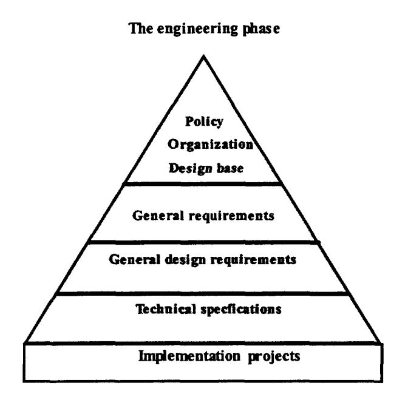

*FIG. 1. Top down development of requirements.*

In order to design a new equipment as a replacement from an existing one it is important to understand functional differences between the technologies. Some of the important characteristics by which the three types of technology differ are:

- isolation; the capability to isolate two circuits both physically as for transmission of data;
- reliability
- complexity; the capability to design complex functions;
- flexibility; the capability to expand equipment or functions;
- interference; the sensitivity to EMI/RFI
- volume; the needed space for installation;
- power; the required power energy;
- hysteresis; the difference for trip levels for increasing and decreasing signals;
- documentation; the way to present the system for third party review;
- lifetime; the practical economical lifetime with regard to support and spare part availability.

The characteristics for each technology are summarized in the Table 1 below. A "+" means an advantage, an "-" a disadvantage. A blank means something in between. The indications in the table does not mean that a specific system is unsuitable, but it means that the design effort required to reach an adequate solution typically will be larger for a system with a disadvantage as compared to another more advantageous.

TABLE 1. TECHNOLOGY CHARACTERISTICS

|               | Relay | Solid state Programmable |
|---------------|-------|--------------------------|
| Isolation     |       |                          |
| Reliability   |       |                          |
| Complexity    |       |                          |
| Flexibility   |       |                          |
| Interference  |       |                          |
| Volume        |       |                          |
| Power         |       |                          |
| Hysteresis    |       |                          |
| Documentation |       |                          |
| Lifetime      |       |                          |

## **6.2.4. Characteristics of programmable technology**

The advantages and disadvantages of programmable technology and the consequences of moving from analog to digital technology will be briefly discussed below for both safety and nonsafety functions. Reference will be made to the application of new technology in power plants where appropriate, but no attempt will be made to generate a list of significant references. Such a list can be found in the IAEA guidebook on nuclear power plant instrumentation and control [33]

Digital technology will provide many new features as compared to analogue technology That can be used for introducing new I&C functions. The digital equipment has also some characteristic "concerns" which must be addressed during the design.

Examples of new features are:

- equipment is easy to modify by reprogramming, this can be done during operation of the plant;
- the use of communication links provides the designer with a possibility to reduce the amount of cabling;
- sharing of information between different systems is easy through the use of digital links;
- the digital system is inherently provided with an extensive self-diagnosis capabilities,
- more complex functions can be designed both for process control and for process supervision,
- an open communication system provides a possibility to connect equipment from different vendors and to expand in an easy way.

There are however some characteristic which must be taken care of during the design such as:

- queuing problems can anse which result in unacceptable time responses;
- hardware is designed with high speed electronics which are more sensitive to EMC over a wider range of frequency;
- it is possible to integrate too many functions in the same hardware unit with the consequence of an increased vulnerability to common cause failures.

#### 6.2.5. New functions implemented by software

The extensive network communications available and the ability to share data that is possible with modern technology requires that the use of distributed systems should be considered. These systems can and will include a range of various technologies. The I&C equipment will also inevitably be integrated with the plant information systems to make on-line data available to all plant processes including operation (e.g. load following), maintenance including refueling, business (e.g. stores inventory control), and engineering services

In addition to the consideration of the advances in hardware, consideration should also be given to the "software" developments made possible by the new hardware. These include:

- adaptive control,
- fuzzy logic,
- pattern recognition,
- complex arithmetic and logic processing;
- information to the operators.

#### 63 SAFETY REQUIREMENTS

#### 6.3.1. Safety goals

As already has been mentioned a common policy during modernizations is to make an effort to upgrade the systems to modern standards. This policy has been treated in more detail in the IAEA publication INSAG-8 [34] It may show that some newer deterministic requirements cannot be fulfilled in a practical way. For these cases it is still possible to use probabilistic arguments to show that the frequency is very low of such events where a non-compliance with the deterministic requirement in consideration can cause problems. This means that it may be necessary to formulate the safety goals as a combination of deterministic and probabilistic goals.

The IAEA publications observe that safety standards for nuclear power plants have undergone evolution and development since the plants were built. It is therefore inevitable that old plants don't meet modern, deterministic safety criteria. For this reason, the PSA method can be used to evaluate differences between the modern safety criteria and the current design. A typical analysis will therefore start with identifying the old requirements and comparing them with modern ones. Differences are evaluated in terms of risk for core damages or release of radioactivity to the environment. Such evaluations are performed for an existing design and will result in "case by case" recommendations for modernization to address the weak points.

For power production and for safety, a company or regulatory body policy is normally valid for defining the goals. These goals can be verified by different type of probabilistic evaluation in combination with a consequence analysis. Such calculations are performed if a conceptual design is available and reliability data of the components are known

A common observation is that older plants traditionally are using diversity more than redundancy and separation of channels and trains. This can also be used to meet safety goals for modernization if deterministic requirements cannot be met. In other words, different types of diversity may need to be built in the new I&C equipment compared to the existing equipment

In defining safety requirements on different levels the typical design steps indicated in Fig. 2 are.

- definition of safety goals;
- definition of the deterministic requirements,

- conceptual design of the system;
- listing of deterministic requirements which cannot be met;
- defining a PSA model adapted to the cases which shall be studied
- evaluation of the differences by a PSA;
- correction of the conceptual design if safety goals are not met.

The PSA evaluation is an interactive process and may be repeated in several loops. A normal practice is that the correction of the conceptual design is done by introducing more diversity.

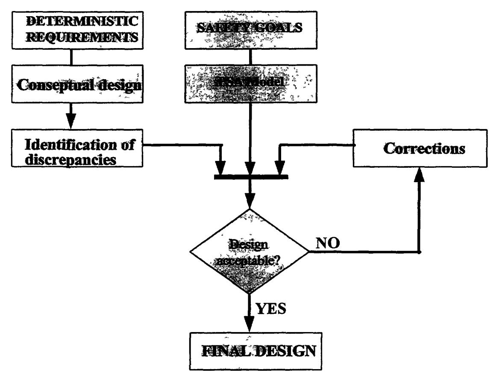

*FIG. 2. PSA model.*

#### **6.3.2. Deterministic requirements**

Deterministic requirements include requirements on defense-m-depth, separation, redundancy, smgle-failure-cntena and diversity. The so called thirty-minute rule can also be seen as a deterministic requirement.

Defense-in-depth is a typical requirement for all nuclear power plants. This philosophy is probably already part of the original requirements for the existing equipment. For this reason, the potential for common mode failures in the new equipment should be evaluated in the determination of the system architecture and the selection of the software and the hardware for the new system. The system equipment should not contribute significantly to the unavailability of the system functions. This includes considerations of the common mode/cause hardware failures, software failures, and maintenance errors. The designer should identify failures expected, evaluate their susceptibility and provide measures to prevent those failures.

The details of the deterministic requirements and how they are transformed into design criteria will be dependent upon national and plant specific conditions. A number of the general items to be considered are.

- original and current licensing requirements including, segregation, redundancy, diversity, fail safe and compliance with the single failure criteria;
- environmental qualification, including EMI/RFI defensive measures;
- system tolerances,
- the defensive measures to protect system integrity should be set down and these will include measures to prevent unauthorized access and change;
- for computer based systems, security, and anti-virus measures need to be identified.

The consideration of common mode failure (CMF) and common cause failure (CCF) will generate another set of detailed design criteria. This requirement implies that any system equipment or its supporting equipment should not create a single random failure that causes a forced plant outage, challenges a safety function, or spuriously actuates a safety function. This criterion should be met for all normal operating and test modes, including on-line self-diagnostics and periodic function test modes On top of this single failure criteria there are recommendations about the defense in depth The evaluation of common mode/cause failures should assess the defense-in-depth More information about the CMF matter is provided in NUREG/CR-6303 [35]

One of the possible tools to evaluate the occurrence of CCF/CMF is a Failure Modes and Effects Analysis (FMEA) An FMEA described for example m IEC 812 [36] determines and evaluates credible failure modes, determines the possible effects from such failures, and classifies each failure mode according to its effects. The results of the FMEA are used to demonstrate that the system design meets the reliability and maintainability design intentions FMEA can also contribute to the identification and elimination of the common mode failures and suggest areas where improvements in reliability can be achieved, see IAEA TECDOC-780 [37] and IAEA-TECDOC-790 [38] The result of a FMEA can be an input to PSA where risks for core melts and release of radioactivity are estimated and compared with the safety goals for the whole plant

Special considerations should be given to the loss of power to the system The system should select the appropriate failure state of equipment upon on a case-by-case basis established during the design process. For protection systems, the preferred failure state typically should be the safe condition For control systems the preferred failure state typically should be the most stable state Upon restoration of power to the system, the state of the controlled components should not be changed and the initialization of equipment should be performed in the manual mode

# **6.33. Probabilistic requirements**

The design of a modern I&C must initially be based on modem deterministic requirements However, the new system may not be able to meet all modern deterministic requirements. There are practical and economical limitations of what can be done due to the existing plant design. Differences must be identified and evaluated with a PSA. The PSA must be earned out to encompass both hardware and software of the new design. Systems designed according to specific deterministic criteria can be evaluated by probabilistic methods. The results from such evaluations are compared with determined intentions or goals. If differences are observed, the system should be redesigned to meet the agreed safety goals. The probabilistic methods can also be used to evaluate the consequences and risks if some deterministic requirements cannot be met.

The use of probabilistic methods for assessment of the safety for older plants was a topic of several meetings, see for example a policy document INSAG-6 [39] and an IAEA report [40]. The main purpose for a PSA during a modernization is to identify weak points in the plant design related to safety.

Requirements from probabilistic evaluations can therefore influence all aspects of the new I&C including functionality, hardware or software equipment, maintenance, operation or safety. Probabilistic methods are basically used for evaluation of aspects such as:

- frequency estimates of fuel damages and excess release of radioactivity to the public, this is normally defined as a part of the safety goals;
- availability of power production, this is normally defined as an availability goal;
- calculation of the reliability of systems;
- estimation of the maintenance volume, required spare parts and organization of the maintenance department (maintainability);
- estimation of life time costs and equipment durability.

There are various methods to evaluate probabilistic characteristics of systems. Examples are:

- failure mode and effect analysis (IEC 812) [36];
- fault tree analysis (IEC 1025) [41];
- block diagram method (IEC 1078) [42].

The attainment of safety and availability goals can also be evaluated by probabilistic methods. These include the following:

- Weak point analysis. It is a current practice to use a probabilistic evaluation of older plants in order to find weak points. The result of such evaluations is often used as the input for decisions to replace or modify equipment and must be taken into account in establishing the design criteria.
- Durability analysis. Durability measures may be deterministic or probabilistic. In the last case the expected lifetime is based on a probabilistic evaluation of the:
  - expected costs for repair, spare parts, loss of availability or reduction of safety goals, required human resources;
  - degrading of the equipment caused by ageing

## **6.3.4. System reliability and availability**

The goal for the design of new equipment, including non-safety systems, is to have higher reliability than the existing one. This requirement is valid on top of the deterministic requirements which are applicable for the new system. Reliability for existing and new equipment for both safety and non-safety systems should be compared.

Requirements for reliability and availability are assigned to systems in whole or separately for different functions of the system. If functions have different significance and are characterized by different levels of reliability or availability they may be treated separately. For example, there may be different functional requirements for the control rod drives, the indication of control rod position and the related control rod movement limitation system

Various failures have to be identified and related to a set of features which allow for the identification of the failure. The failures should also be associated to a set of counter measures by which crucial functions of the failed system can be maintained.

Requirements for reliability or availability are assigned to every type of failure which is sufficiently unique either because of the design or because of its consequences Typical examples are

- Failure upon demand
- Spurious failure in the protection system.
- Failures which lead to critical safety incidents.
- Failures which lead to plant trips.
- Failures which lead to reduction of plant production.

Reliability and availability measures as described in IEC 50 (191) [43] are:

- mean time between failure (MTBF).
- probability of failure free operation (PFFO)
- failure rate.
- failure intensity
- probability of failure on demand (PFD).
- availability
- interval availability
- mean time to repair (MTTR)
- fault duration time.

Quantitative values for the selected measures are established by an analysis of the influence of failure to safety, efficiency and costs. The analysis is connected to reliability assurance and is obtained through information about the reliability level of the existing system. As a goal for the new system, the reliability of the new system should be as good as the existing one. The reliability data may be obtained from operation experiences

The operational reliability of the system should be addressed early in the project to prevent users from losing confidence in the system. The apparent reliability is not always equivalent with a strict technical definition of reliability. A system, which is fragile to crashes caused by minor misoperations, can give an impression of being highly unreliable. Similarly, long and awkward operations during which the system does not give any feedback before an operation is put into execution can make users very frustrated.

Typical quantitative values for functions or type of equipment are given in Table 2. Most of these requirements are coming from a top down philosophy where an acceptable risk for core melt or major radioactivity releases are defined first. The figures are interpreted by a PSA down to probabilistic requirements for equipment and components.

#### 6.4 COMPLIANCE WITH SAFETY STANDARDS AND GUIDES

A large modernization project should create an explicit list of applied standard practices and internal project rules. Developing these will be a part of applying standard QA procedures to the project. Most national licensing conditions and the IAEA guidelines relating to I&C equipment advise that the systems should be developed, constructed, installed, and operated in compliance with national and international standards. National standards will not be discussed here, nor will the many company

specific standards applicable to advanced systems. These standards and associated guides are an expression of the national/international consensus of the best approach for features to be included in a device, system, or systems.

TABLE 2 EXAMPLE OF RELIABILITY REQUIREMENTS (EUROPEAN UTILITY REQUIREMENTS [44])

| Type of systems                     | Type of failures  | TType of measures | Values                                    |
|-------------------------------------|-------------------|-------------------|-------------------------------------------|
| Actuation for short term protection | Failure on demand | PFD               | 10⁴/demand                                |
| Actuation for long term protection  | Failure on demand | PFD               | 10 -3 /demand                  |
| Backup protection                   | Failure on demand | PFD               | 10 -2 /demand                  |
| Non-safety systems                  | All types         | Failure rate      | 10 2 /year                     |
| HMI                                 | All types         | Failure rate      | 10 -4 -10 -5 /hours |
| HMI backup-control                  | Failure on demand | PFD               | 10 -3 /demand                  |
| Humans                              | Error on demand   | PFD               | 10 -2 /action                  |

(PFD = probability for failure on demand).

#### 6.4.1. International standards and practices

There are many international standards, guidelines, and practices which should be considered. A selection of the applicable guiding documents has to be made as early as possible in the project. It should be clear which documents are mandatory and which are optional. International standards, such as IEC, ISO, and IEEE which deal with ergonomics should be properly reflected. The IAEA has published several safety guides and technical documents which are highly relevant. USNRC has published a number of documents which can also provide important guidance.

The international standards promoted for nuclear power plant I&C systems are based on the IAEA NUSS code of practice 50-C-D [45]. The requirements of this code for instrumentation systems are developed for safety systems in 50-SG-D3 [46] and for safety related and other systems in 50-SG-D8 [47]

These safety guides are supported by a range of standards from a number of standards bodies. Those of the International Electrotechnical Commission (IEC) are the most significant and, through agreement with the IAEA, comply fully with the IAEA documents. The IEC standards relating to modern technology in nuclear power plants include IEC 965 [48], IEC 880 [24], and IEC 987 [49] for computer software and hardware and IEC 964 [50] for control rooms. Other types of industrial standards may be specified through the development process, ranging from ISO 9000 [25] for quality to IEEE 1012 [29] for verification and validation. The selection of a set of standards consistent with the choice of technology, development process and licensing regime will be a major contributor to achieving a successful outcome.

In addition to these documents there is a significant amount of guidance available in the IAEA Technical Reports Series (TRS) and technical documents (TECDOC). These documents, like the IEC standards, concentrate upon computer based systems and software. They currently do not consider many of the other hardware only new technologies or the advanced techniques and algorithms for protection, control, and monitoring that can be implemented.

### **6.4.2. Project internal rales and standards**

In most cases of modernization, total compliance with current standards is desirable but is not practicable. In the case where full compliance is not possible, a justification will be required for any significant departures from the standards. In these circumstances, special arguments must be made to justify that safety is not compromised. Quite often arguments take advantage of mitigating features such as the presence of fire barriers and the use of systems that fail to a safe or known state. The production of such a justification is good engineering practice and would appear to be an inevitable requirement of any sound licensing process. This engineering practice can be supported by a PSA evaluation in accordance with the intentions of different IAEA-INSAG publications.

A large modernization project preferably should create its own guiding documents in which the applicable design and quality control principles are documented. This information can, for example, be collected in the project internal QA documents. Modem design principles should be used to the extent possible, but when the old design sets limits on their applicability, these deviations should be documented. Detailed recommendations for good ergonomic designs are given in international standards and recommendations. As the standards are not always explicit enough, project internal rules for the specification of the human-machine interfaces and their applicable areas should be defined. These selected rules should be accurately documented including the rationales in order to assure traceability of the choices.

A special area for selecting project internal standards is the principle for the operation of the new system. It is necessary to define the principles to be used for selecting colour coding schemes, used symbols, designing display hierarchies, deciding on the operation of various items, etc. The principles and possible problems of operating through VDUs should be considered. The operational principles for new and old equipment should be aligned and possible conflicts should be eliminated as far as possible. Special consideration should be given to the time needed for looking up required displays and information before actions can be initiated.

# **7. OPERATIONAL ISSUES**

# 7.1. INTRODUCTION

Modernizing the I&C of a nuclear power plant should be seen as an opportunity to make major improvements influencing personnel and operating. The first opportunity is to utilize the new technology to integrate information coming from many different sources and to present that information in a comprehensive and easily understood format. The second opportunity is to provide a better presentation of information to the control room operators, including specialized displays, better alarm handling, computerized support systems, etc. A third opportunity involves providing access to plant data for other groups of people such as maintenance engineers, control engineers, reliability engineers, etc. Before entering a detailed specification and design phase it is advisable to make a systematic effort to collect operational experience to list known problems and wishes for improvements of the old system.

It is important to consider the needs for a restructuring of the personnel and for a possible needs for acquiring new skills. Specific situations at various plants may require special solutions to be found. It is important to train personnel in the use of the new systems and that is often possible through allocating operating and maintenance people to the design project for its duration. This has also the benefit of ensuring a commitment to and an acceptance of the new systems. A special care should be exercised to document requirements and design solutions accurately enough in instructions and operation manuals.

The effective use of control and information systems is dependent on the human interface. The use of equipment that requires extensive operator involvement, will evolve as the operation staff learns to exploit the system's strengths and to compensate for its weaknesses The operation's personnel should be involved early in the change process to capture user knowledge and gam user confidence Still it is not advisable to transfer the complete responsibility for the detailed design of the interfaces to the users.

Due consideration must be given to the training of operators and other staff to ensure that the new systems are used correctly At the same time, problems with the management and use of interfaces belonging to different generations of plant equipment should not be allowed to compromise plant safety The use of a full scale training simulator could facilitate both the design and the training processes. A period of parallel operation may also give the operators the time to familiarize themselves with the new system at their own pace. Traditionally, there has been a separation between the operational I&C system and the process computer intended for informational purposes only. This division is gradually disappearing as I&C systems get additional functionality and process computers become distributed with several independent units.

#### 72 OPERATIONAL PHILOSOPHY

It is necessary to have a description of the operational philosophy to be used in the main control room and in other places where plant staff will interact with the new systems. This philosophy should be based on the task analysis performed for the original control room construction with due consideration of changes in the automation level and task allocations. It is important to note that the operational philosophy in some cases may be based on rather implicit rules and practices In such cases it is necessary to reconstruct that implicit philosophy in order to avoid too large changes with later impacts on training needs and human errors.

Experience from the introduction of computerized equipment point to the possibility to structure information in ways to be better adapted also to other plant states than power operation At the same time additional groups of people may be given access to plant information Examples encompass additional information presentation during outages and the connection of standard I&C systems to systems for maintenance support. The involvement of the end users in the development of this general control philosophy should be ensured. Suitable guidelines to ensure the ergonomic quality of the control room design should be adopted.

# **7.2.1. Balance between automation and human actions**

If installation of new digital I&C equipment is planned, potential solutions to achieve a balance between automation and human actions should be studied. This issue has been addressed [51]. Due to various technical and economical reasons it may be desirable to increase the level of automation This can be done in an easier and more cost-effective manner than before due to the capabilities of digital technology In this context, modifications which result from operational experience are especially important. On the other hand, the advance in information technology provides improvements in control room information. This increases the support of the operator to perform manual actions

Therefore, there are two aspects which influence the balance between automation and human actions These are:

- the programmable system makes it possible to relieve the burden of the operator for actions needed frequently or during situations of high workloads;
- the improvement of information technology provides the operators with better tools to evaluate disturbances and accidents and to plan for human actions in unforeseen situations

Both automation and human actions have their advantages and disadvantages. An adequate balance has to be found by using modern methods for allocating functions to the machine or human. Such methods are described in:

- IAEA-TECDOC-668 [52]: The role of automation and humans in nuclear power plants;
- IEC 964 [50]: Design for control rooms for nuclear power plants;
- NUREG-0711 [53]. Human Factors Engineering Programme Review Model.

The following trends in automation can be identified:

- As many plants have increased or plan to increase the rated power the margins are reduced and this will require a higher level of automation.
- It is desirable to increase the needed response time for the operator after an incident to prepare and plan manual actions.
- The plant availability can be improved by using a higher level of automation for fast transients which can interrupt power production
- Due to the change in information technology, the operators role will shift , for most of the plants, towards a process supervisor, who has to concentrate on unforeseen non-normal plant situations However, this depends on the policy of the utility.
- The number of operation staff can be reduced by increasing the centralized "remote control" of process supervision The number of field operators can be reduced but more electrical actuators will be necessary
- Automatic testing will reduce the need for manual inspections and testing.
- Built-in diagnosis will reduce the need for fault analysis by the maintenance crew.

It is mentioned very often that the increased complexity of plants will need more automation. This argument is probably not true for older plants. Normally the complexity is the same before and after I&C modernization because the process systems are not modernized.

Increasing the degree of automation step by step may lead to concerns. The operators may be confused if the new I&C is using another type of automation than the one still in the remaining equipment. A better solution could be to discuss the improvement of automation at the end of the whole project and not to do it in steps.

# 7.2.2. **Staffing**

A modernization project can have influence on the general staffing level as more automation is introduced There is also a possibility that the division of tasks are changed between operators. Extreme care has to be exercised in actually building in such changes. There is a possibility to give a more precise division of responsibilities between the operational and maintenance staff in entering and changing certain data items in the main plant database.

The staffing and the responsibilities of people in the control room are not likely to be influenced very much by a modernization project The tasks to be performed reflect a logical division. The possibility to include new operator support functions gives the opportunity for those plants which have employed a shift STA to have him on call duty only. For example, to be in the control room within 20 minutes when needed.

# 7.2.3. **Task analysis**

A task analysis is a very useful tool for designing displays, computerized support systems, and procedures There are several documented methodologies for carrying out an operator task analysis Sometimes, for older plants, such a task analysis has never been done explicitly or the available task analysis is very rudimentary. In these cases, the modernization project provides a good opportunity to correct this deficiency An update of the task analysis also provides a good opportunity to make the transfer between generations of the staff. The task analysis should be considered a process where various plant states and the information demands are analysed m a systematic way. Possibilities to identify abnormal and disturbed states unambiguously should be identified. Necessary automatic and manual actions should be identified together with their available time windows. The task analysis will also form the basis for writing operational procedures.

A mockup of the control room can support the task analysis work Principle or full scope simulators can also when available facilitate the task analysis work.

# 7.2.4. **The main control room**

Early in the renovation studies, a global view for the target main control room HMI should be defined to allow a stepwise renovation from the existing status to this target one. This global view definition is baselmed on the above plant policies, external requirements, and unit constraints These criteria must be translated into functional and technological considerations in order to match all constraints The most important part of the study is the determination of what will remain conventional and what will be made digital. Functional improvements of main control room HMI, such as SPDS, operator support systems, diagnostic systems application, etc. should be identified The ability of new system for control through the VDU should be considered.

The design should include all normal ergonomic considerations of the new system and the interaction between the new and the old systems. There are several guidelines available which give examples of good ergonomic principles. A modernization project also gives good opportunities to correct some of the earlier detected examples of non-compliance with good ergonomic design In spite of the possibilities for improvements of the old design, a change should be introduced only in response to earlier problems

# 7.2.5. **Technical support centre**

The technical support centre (TSC) is intended for the management of large accidents. The TSC is not intended to supersede the control room during these sequences, but to provide a support function and to maintain a contact to outside bodies during the accident. Digital systems provide an opportunity to duplicate critical information in the TSC. Modem information technology can provide access to advanced engineering simulators at modest prices for integration in the TSC. Information links to off-site bodies can give additional efficiency in the communication.

# 7.2.6. **Emergency operating facility**

The emergency operating facility (EOF) is intended to provide an additional place for a safe shutdown of the plant in the case the control room has to be evacuated Duplicate and additional I&C systems can provide efficient access to all mam plant parameters through plant information highways with a modest investment.

It is strongly advised that the EOF use the same HMI as in the main control room (MCR). Functions control and monitoring. This arrangement facilitates a correct operation in the EOF by transferring main principles from the ordinary working environment of the operators. It can also be advantageous to equip the EOF room with additional workstations connected to the plant information systems. These can provide efficient access to all main plant parameters with a modest investment.

# 7.2.7. **Access rights and security**

Modem digital systems have the capability to limit the access to certain critical parameters. This can be used to allocate access rights to various data items. Similarly the right to operate certain systems and components should be used. These access rights should be allocated both to provide flexibility and to ensure that necessary QA procedures are followed before changing critical parameters. The access rights should not be used to restrict the operators in their need to personalize displays according to their preferences.

Due to observed incidents and considering the vulnerability of the control access to the networks, it is necessary to face this aspect from the beginning of the project. Unauthorized access can not only jeopardize the safety of the plant but also availability.

Therefore, a plant policy must be defined consistent to the security policy of the utility. It must include both organizational and technical aspects as:

- the requirements for the global level of security of the whole control including the management and the maintenance of it;
- the requirements for the development of each system according to the previous requirements and its functionality.

It is interesting to observe that there exists a trend in the digital technology which can make the system more vulnerable to unauthorized access. It is common that open systems are used for I&C structures with the possibility to download new software from remote locations or to modify trip values . These features make maintenance easier but can reduce the safety of the plant. Many of such features cannot be used for the plant protection systems.

#### 7.3. OPERATIONAL HUMAN-MACHINE INTERFACES

The display of information is as important as the control of the unit parameters. There are many different human-machine interfaces at a nuclear power plant. The main control room is certainly the most important, but due consideration should also be placed on other human-machine interfaces such as for maintenance, shut down operations, disturbance and emergency operations, process control and safety engineering, etc. The use of a VDU based control room relies on the easy access to a large number of various displays. The hierarchy of these displays and the principles of transfer between them has to be laid out. An incremental I&C renovation will likely lead to the introduction of digital technology in steps. It is necessary to define the adapted rules for providing under all operational conditions, an exhaustive, consistent, and reliable plant status in which the operators can be confident. It is necessary that all human-machine interface are consistent among the display devices.

A modernization project will often involve upgrades in the control room to provide operators and other personnel with computerized support systems. It is advisable to distinguish between on-line systems which are directly involved in plant operations and other systems having a kind of off-line position as regard to the continuous control of the plant. Such off-line systems are for instance various maintenance support systems, systems for monitoring plant performance and systems supporting reactor physicists The new systems may provide more functionality in supporting the communication between control room operators, auxiliary operators, maintenance people, and technical staff

#### **7.3.1. General requirements**

All human-machine interfaces should be consistent among the display devices Access to displays should be via an information hierarchy and via direct entry of a specific display The HMI design should provide the operator with the ability to access a new display device or pages, access supporting information (e g trends, graphs, set points, meters, etc), demand certain reports as provided by the system or any other means, recall data of historical interest, modify certain data, and provide for system security level access.

After an upgrade, new equipment will be located in the same control room with the existing equipment For ergonomic reasons both equipment types should be compatible with each other. That means, for example, that the new equipment should be adapted to existing procedures and should use the existing plant labeling and process symbols.

- **Displays.** The types and quantities of display devices should be defined. A specific function should be allocated to each display device, if required from the information presentation strategy The new displays will be used in an existing control room by operators who have been using applicable procedures for many years. It is therefore very important that the new displays be adapted to existing control room practices, procedures, and staff responsibilities Another problem is that the new equipment will be used together with the existing ones for many years The new displays should be designed as close as possible with the same principles as the existing ones
- **Personalizing displays** Modern digital I&C systems often have a provision for allowing the personalizing of displays according to preferences of various persons. This function provides an opportunity, but also a danger. Different persons may have slightly different styles of operation which can make some tailoring of the displays necessary Specific needs to collect and display additional information depending on the plant operational condition may also emerge. It is; however, not advisable to allow much of this practice to emerge in control room work I&C relevant applications of today are not structured in a consistent set, but have often been individually designed and implemented. In such cases, a standardized human-machine interface can provide an opportunity to utilize an open I&C architecture where control room operators are able to use various applications on separate workstations in the control room This kind of a standardized approach needs very reliable access control.
- **Display formats.** Display format conventions should be established prior to the display design to maintain consistency between display layouts. Use of consistent display formats will provide the operator with ease of information access and will support a rapid understanding of power plant processes The following conventions should be employed for the design of displays
  - use of consistent abbreviations, labels, and units;
  - use of consistent process parameter information such as units and labels;
  - use of consistent process conventions which are clearly specified such as left to right, top to bottom, and the avoidance of crossovers;
  - use of consistent symbols for component representation,
  - use of consistent colour and shape conventions;
  - minimization of the operator's understanding time required to use the displayed information;
  - use of identifiers which are concise and reflect user terminology.

- **Symbol set.** A standardized set of representative plant component symbols should be utilized in construction of the mimic display. The symbols should be compatible with the ones already used in the:
  - existing plant documentation;
  - existing video screens.
- **Colour convention.** To aid the operator's ability to recognize component or system status, colour coding based on appropriate human factor's guidelines should be utilized in the construction of the displays.
- **Behaviour.** Both symbols and text should be capable of certain behaviour attributes to convey further information to the operator. Behaviour such as colour change, blink, and inverse display type should be used to indicate various plant/component states and conditions based on appropriate human factor's guidelines.
- **Human response.** The system response to an operator's request will be defined with consideration of system performance. The response may be the full function activation or a message stating that the function activation is underway. The frequency with which computer driven displays have their dynamic information updated should be consistent with the user's needs for current information. The update frequency should be defined based on appropriate human factor's guidelines.
- **Entry validation.** Validation of operator inputs, as part of the human-machine interaction on computer-based systems should be provided. Obvious operator errors during a dialogue sequence need to be detected and flagged. If an entry error should be detected, the operator should be able to re-enter the incorrect information immediately rather than having to begin the dialogue sequence anew. A clear, unambiguous indication of the entry error should be provided.
- **Dialogue of human-machine interaction.** The dialogue should be in the form of a sequence of transactions through a menu display on a computer driven system. Each transaction should consist of an operator action (as an input) and a corresponding system response. The dialogue should be consistent for all display devices and for all users. The dialogue should be selfcontained so that a user will not have to make reference to documents to continue the dialogue sequence. The user should have the option to abort a transaction sequence, at any point, prior to the normal completion of the sequence.

More detailed requirements about the design of human system interfaces are contained in NUREG 0700 [54]. This document includes a description of the verification process. A software package for verification of the requirements and report generation is attached to this document.

# 7.3.2. **Conventional displays and VDUs**

One important design decision to be derived from the operational philosophy is which information is to be displayed using conventional displays and which is to be displayed on VDUs. It is also common practice to include a mimic overview panel which can be implemented either with conventional technology or using large screen displays. One commonly used principle is to display all the safety relevant parameters, such as primary temperature, coolant flow, pressurizer level and pressure, etc., using conventional displays. When both conventional and VDU displays are used it is advisable to use the same general principles for the display. The most significant alarms should be given central locations for their display. Plant parameters should be allocated to the various displays based on the need for information as expressed in the task analysis. VDUs provide a possibility to present a large amount of plant information. Plant parameters should be allocated to the various displays based on the need for information as expressed in the task analysis. Sometimes it may be advisable to use different VDU devices for presentation of information related to different parts of the nuclear power plant (reactor, turbine, auxiliary systems etc.). The information presented on conventional display devices may also when necessary be duplicated on the VDUs Consistency between the displays can be ensured if the displays are generated from the same computerized equipment

#### 7.3.3. Integration of the information presentation in displays

There are several ways of integrating the information presented in the displays. It is for instance common to use dedicated areas of the display for certain functions, various windows can be laid on each other and pull down menus can be used. There is both an opportunity and a danger in the integration of information in the displays. Pulling together information from various plant subsystems to support a specific plant maneuver can provide great advantage as compared with old solutions where operators were forced to combine several signals in their short term memory. On the other hand it can overload the operator with information where he cannot find the relevant information from a number of overlapping windows. The disadvantages of overlapping windows may be reduced by using different display devices (screens) for information presentation related to different parts of the nuclear power plant (reactor, turbine etc.) and different functional tasks (alarm, mimic diagrams, parameter list, etc.) The use of only one window for trends presentation of a few (6–8) parameters provides the opportunity to reduce the number of simultaneously open windows

Various guidelines can be used to provide guidance on how to design the information presentation Some of the functions include a Safety Parameter Display System (SPDS), early fault detection and diagnosis, reactor surveillance, component performance monitoring, computerized procedures, maintenance support systems, etc.

#### 7.3.4. VDU display hierarchy and access

The VDU displays are to be arranged in a suitable hierarchy to give an easy and natural access to the information. A three-level hierarchy with overview and summary information on the highest level, application and systems information on the intermediate level, and subsystem and component information on the lowest level is often used. Some displays and even some VDUs may be dedicated to certain functions, such as operator interaction, alarm lists, critical functions, and utility displays. Some form of a display directory can give an easy reference for transferring between pages on one level and for transferring between levels. Various methods of display access can be supported, such as hierarchical pageing, direct pageing, and menu driven access. The display system can also provide for automatic cueing to predefined pages depending on the occurrence of certain pre-selected events. A simple, easily understood mechanism for maneuvering through the hierarchy of displays is to use the commands "up", "down", "left" and "right" for moving between displays. Special care should be given to making these moves natural and easy to understand

Typical examples of display contents according to these three information levels are

- Overview displays. The operational status of the plant should be able to be assessed "in a glance" This means that main plant parameters and safety relevant information should be included in a permanent global overview of the plant status. This overview is to provide a reference for the members of the control room crew to help in co-ordinating their operating Digital systems make it possible to duplicate important information on several displays
- System display System displays typically include various mimic diagrams such as process diagrams, electric wiring diagrams, and control configurations. The symbols used in the diagrams, should be easy to understand. The colour coding that is used should be consistent with the defined general principles. The location of various components on the displays should.

be natural. Signals and symbols can, for reasons of convenience, be duplicated on another display. The number of system displays on this level is as a rule equal to the number of the technological subsystems.

**Detailed displays.** The number of detailed displays can easily become very high. This means that special care should be put into designing them and putting them into a few simple classes The most important components such as large valves and pumps can use standardized display pages to display their condition, including measured values, logical signals, etc. Another class of displays are the trend displays. Allowing any process variable to be displayed as a curve over time is an important function. The combination of several curves into one display makes it possible to compare two or more variables. For some purposes, the display of polar plots, x-y plots, and bar charts are advantageous. Provisions should be given to group several variables into predefined groups for trend and other similar displays. Detailed displays can be presented as overlapping windows in the system displays.

# 7.3.5. **Presentation of alarms**

The alarm system should be capable of sensing, displaying, and recording alarms and significant events related to the new system. Colour coding should be utilized in conjunction with the alarm display to indicate alarm state and retum-to-normal conditions. The ability for the operator to acknowledge or reset alarms appearing on the alarm display should be provided. Points appearing on the display which transition in/out of alarm will cause the activation of appropriate point/symbol behaviour. Behaviour attributes such as blink, colour change, etc may be utilized to convey the appropriate alarm state information.

Alarms are typically displayed on dedicated screens. They can be hierarchically divided into categories depending on their importance. A common practice is to associate a certain alarm category with a defined colour. The same colour should then be used regardless of where the alarm is displayed. Special care should be given when a new computerized alarm system has to be combined with an conventional alarm system. Alarms are usually combined to give auditory alarms which have to be acknowledged. An alarm system should include vanous peripherals, for example, a printer to make post event analysis convenient. It is considered bad operational practice if a power plant is operated by only acting on the appearance of alarms.

Vanous alarm functions can be installed in modem digital systems which can support better functionality than conventional alarm systems. Such functions are, for instance, the ability to inhibit and group alarms according to vanous cntena. Alarms may also be grouped with special algonthms to support diagnosis before entering accident procedures. Vanous methods for decreasing the problem of nuisance alarms have been suggested. The inhibition of certain alarms depending on the status of power plant and certain systems can make it much easier to properly diagnose the onset of a disturbance Vanous alarm processing schemes can be devised to make even the handling of single alarms possible

Special care should be taken to integrate the displays into a logical entirety. This means that the onset of an alarm should be properly reflected in the mimic diagrams and perhaps, also in other types of displays. This concern should be properly considered when deciding on using special cues such as blinking format and colour change. Certain pre-diagnosed events may call up special displays intended to support coping with the situation.

#### **7.3.6. Computerized support systems**

Different types of computerized support systems can be included in a modernized I&C system. They are partly operating on-line, partly they are off-line systems connected to the management network. Data for the support systems is provided through gateways from the supervision and control

network. The results from the support systems are made available to the operators through the supervision and control network. Other categories of personnel have access to plant data or results of data evaluation through the management network. An overview of support systems in nuclear power plants is given in the report IAEA-TECDOC-912 [55]. Some of more important ones are described below.

- **Safety Parameter Display Systems.** The display of plant parameters important for safety is one of the major improvements which has been made to nuclear power plants in the post-TMI era. In some plants these systems have been introduced as stand alone systems and in other plants the functions have been integrated in the plant information systems. The systems are intended to present critical safety parameters in an integrated way to make it possible for the operators to assess the overall safety of the plant in a glance. Some systems are oriented around a small number of critical functions which should be ensured during all plant operational conditions. Safety parameter display systems (SPDS) are typically connected to the overall alarm system, although they may have their own auditory alarms and acknowledgment functions. To make the SPDS a true computerized support system, (CSS) it should provide the operators with some guidance towards remedying actions when important safety parameters exceed pre-set limits or critical functions are threatened.
- **Process diagnosis.** Various methods have been proposed to detect deviations of a process from normal at an early stage. Many of the systems use model reference techniques by which it is possible to set very sensitive alarm limits for important plant parameters. Some experimental systems have been installed which have been so promising that they have been integrated into the normal operational procedures. Automated diagnosis has been proposed as an CSS by which an accurate identification of initiating events could be determined. The techniques available include artificial intelligence methods, neural networks, and fuzzy set theory. Some experimental designs have indicated the viability of these systems although actual applications are still in the future.
- **Reactor surveillance.** Various suggestions for core surveillance and control have been developed and some prototype systems have been installed in operational nuclear power plants. A core surveillance system can warn for xenon oscillations and suggest optimal control rod sequences to minimize xenon effects.
- **Component performance monitoring.** Many nuclear power plant information systems include component performance monitoring. Continuous surveillance of, for instance, heat exchangers, valves, and pumps can provide important warnings of a forthcoming problem. Systems to detect and even localize loose parts in the primary circuit are widely used. The same situation holds for vibration monitoring of reactor internals and primary circuit components of PWRs, especially the main coolant pumps. More recently sophisticated turbine diagnosis systems have been applied. The diagnosis methodologies are based upon multiple input signals and partly use sophisticated algorithms. Therefore, the application systems resulted in the considerable progress in the monitoring abilities.
- **Computerized procedures.** The implementation of computerized procedures, at least on some level, should be contemplated as a part of any I&C modernization project. It would probably not be wise to completely abandon written procedures, but some mix of computerized and written procedures can provide a better access to both design information and actual process variables.
- **Maintenance support systems.** Many nuclear power plants have some sort of maintenance support systems intended both for the collection of failure statistics and the maintenance of a stock of supplies. These systems may, with present technology, be integrated also with operational systems to provide control room operators with important additional information.

Another interface from the maintenance support systems is the PSA which relies on failure data for main components.

**- Plant databases.** Support can be given to the operators by providing them with more general access to the plant database. A relational database management system (DBMS) can provide flexible access to on-line data. A proper interface for the DBMS can allow the user to modify an existing signal database in real-time Such a function can be used to make small modifications in the input and output signals without the need for taking the whole system offline. A proper interface can also support the tagging procedures during maintenance to support an indication of unavailable sensors in the control room. This function can also be used to define auxiliary variables for instance to correlate variables with each other and can thus support various analysis needs. The DBMS should support hardcopy documentation. If such a function is used it should be restricted in its use, both through administrative routines and by user access rights.

#### 7 4 NON-OPERATIONAL HUMAN-MACHINE INTERFACES

In the design of the new systems, special consideration should be given to the use of system by non-operational staff. This use would include all plant personnel categories such as maintenance people, plant I&C engineers, reliability engineers and other technical staff. Modification and changes in the systems would be supported through design databases and specific planning tools. While renovating the I&C operational systems, impacts on the I&C relevant applications, especially those dealing with plant, I&C, and database maintenance, are to be identified. Many of these I&C relevant applications are used by a great number of people having a wide spectrum of knowledge and skill It is likely that some of them will use more than one application. In addition, some control room operators will also occasionally use one or more of these applications. As a consequence, provisions must be made for the ease of use of these applications by various populations of users with differing educational background and skills .

## **7.4.1. Serving information needs of various groups of people**

A modernization project taking a step towards an integrated use of new information technology may start in trying to assess the information needs of various groups of people. In this context it is important to note that there are people also outside the control rooms who may need access to some available information. For these purposes it is necessary to build security into the systems by installing gateways and firewalls in the communication. The gateways for other users may be of a similar kind as the gateways between the safety critical parts and the non-safety systems It may also be necessary to consider data-links to outside bodies such as the authorities and the national emergency centre.

## 7.4.2. **Field communication stations**

New technology such as mobile communication units and hand held terminals may be used to give additional means for information access for field operators and maintenance people. If wireless communication is to be used, care should be exercised to not cause problems with electromagnetic interference. In planning plant information highways provision for connecting computers may be considered from almost all rooms at the plants. The localization of people can be supported through electronic access and key systems. New technology such as broad band communication buses can also provide possibilities to integrate pictures, voice and video to be integrated in the displays at workstations located at various places in the plant

# 7.4.3. **Maintenance tools**

Various maintenance support systems are already in use at several nuclear power plants over the world These provide support in scheduling maintenance activities, in maintaining spare parts and in detecting early trends of deteriorating equipment. The integration of these tools with the plant information databases provides additional opportunities for the new systems.

# 7.4.4. **Control engineering tools**

Maintaining I&C systems is a specialized task which should be given its own consideration Most systems typically include a designers interface from which it is possible to configure controllers and to set control parameters It is not advisable for this interface to be available for the control room operators as it will need specialized knowledge and adherence to specific QA procedures. The control engineers interface should allow for various functions such as setting up special data collection, testing control configurations, and automatic tuning of control parameters. The tools should include functions for specifying and building displays and for defining variables to be displayed. These tools should also include specialized programs to verify and validate the new system during a period of parallel operation with the old system.

# 7.4.5. **Design databases**

Modern information technology can provide more generalized interfaces to the design database The design of new systems are typically supported by various CAD packages giving an easy access to the most important plant information. The documentation for older plants have not typically used such tools In connection with a modernization project, it may be considered that at least part of the important information should be transferred to computer readable formats.

# 7.4.6. **Office automation**

The rapid development of information technology and office automation can also provide additional opportunities to support large classes of personnel at the nuclear power plant The use of word-processors, spread-sheets, drawing programs and schedulers can facilitate many task. It is advisable to require that reports, tables and other output can be exported to the most common word processors and spread sheets to facilitate further processing The use of e-mail is sometimes more convenient than the use of telephones. An access to shared information over a network can also provide an easy access to important information. The use of automated search engines can also provide a quick and easy access to this information.

#### 7 5 VERIFICATION AND VALIDATION OF CONTROL ROOM SOLUTIONS

The design should be verified in various stages to make sure that the general design principles are being adhered to Typically, this means that agreed quality assurance procedures will be followed There are various standards and guidelines available for this purpose Some of the guidelines have been implemented as special tools to support the V&V process. The verification process should include a validation of the new systems using a simulator with operators from the plant demonstrating that they are able to handle the functions of the new systems in the intended way during both normal operations and major plant transients.

# 7.5.1. **Methods for the V&V process**

Guidelines and standards are important tools in the V&V process A continuous check that agreed design principles are adhered to is an important part of the QA procedures The licensing authorities may also have their own requirements which the systems should fulfill.

The V&V process relies on inspections and tests. The ergonomics of control room solutions should be tested at least with a full scale mock up of displays and controls. If a simulator is available, this will provide the best test bench for the HMI The digital I&C systems present their own problems for ensuring that quantitative reliability requirements are met for the most critical safety systems.

# 7.5.2. **Validating the operability of the plant**

The operability of the plant through the new HMI should be validated. This validation process should address both the familiarity the operators have gained with the new system and the operational performance of the plant as operated through the new systems. The most practical way to do this validation is to use full scale simulators.

# 7.6 PROCEDURES AND TRAINING

Procedures and training are very important for a smooth transition from the old to the new system. To the extent there have been actual changes in the control philosophy of the plant it may be necessary to actually detrain the operators before giving them the necessary training in the use of the new system In the actual change over from the old to new system it is important that the control room operators all the time are kept well informed about the actual plant state and which system is in charge Before the actual change over from the old to the new systems, all operating procedures should be updated to reflect the changes

Detailed procedures should be written for the actual changeover from the old to the new system Procedures should be written for the testing to be earned out to ensure the functionality of the new system Necessary tests should be implemented according to the agreed commissioning plan for the new systems Before the implementation of the system, the operators should be given appropriate training. Maintenance people should also be given the necessary training to understand the new system and to diagnose possible malfunctions Procedures and instructions should be updated to reflect the changes introduced Special consideration should be given when the new and old systems are expected to be operated in parallel. The implementation will be dependent upon the scope and the details of the project plans.

### **7.6.1. Scope and depth of training**

The scope and depth of the training will be influenced by the scope of the modernization project It should be kept in mind that, where changes are introduced, they are made explicit and enough training is provided to give the users the necessary familiarity in using the systems. It is also important to see training as a part of providing the system users with the reasons behind the changes.

The training programme should include those involved in the use and maintenance of the system. In the case of an upgrade there may be a need to reallocate staff to the new system. The logistics of this may be difficult, because an upgrade will often occur during an outage when demands on staff time are greatest. If the system is essentially passive with little need for operator interaction it may be possible to delay some of the training. If the system results in a significant change to plant behaviour, operation, or the interaction with the operator, then the training programme should be planned as an integral part of the change. Consideration should therefore be given to withdrawing a number of staff from the operational team at an early stage, providing them with training on the new system while the old equipment is in operation, then reintroducing them to the plant after the change and have them to lead the familiarization and training of the remaining staff on the new system. It is expedient to involve at least some of the maintenance staff in the assembling and factory acceptance testing of new equipment. Their involvement in installation activity and site acceptance testing is useful This also provides a good training for maintenance people.

# 7.6.2. **Operating procedures**

Before introducing the change from the old to the new systems all operating instructions have to be updated. It is acceptable that old instructions are marked with red to indicate the change from the old to the new.

#### **7.6.3. Commissioning tests and their instructions**

One important part in commissioning the new systems is the test to determine that necessary specifications are fulfilled. An early and detailed definition of a test procedure will always facilitate both the design and the testing. The commissioning tests are typically divided into factory acceptance tests and site tests. Necessary training should also be given to the testers to make them alert towards possible deficiencies in the new system.

The interpretation of test results and other V&V evidence may require a considerable effort. The most important part of test and V&V activities is to ensure that no new problems are introduced in the change from the old to the new systems. Inspections of design specifications and actual design implementation gives confidence in the new system. A proper review of test results allows the determination if the tests has successful results.

## 7.6.4. **Needs for a period of parallel operation**

A possible need for parallel operation of the old and new system should be considered. The benefit of such operation is evident in the function-for-function replacement case, but can be more difficult to interpret when the new system is not an exact replacement of the old system. If a more gradual replacement policy is selected, then it is possible that, for example, one of four redundant trains is replaced for a test period of parallel operation.

A possible parallel operation will still require a clear decision when the transfer is made together with clear instructions for what should be done if there is a discrepancy between the old and the new system.

A possible parallel operation of the old and new systems may require special arrangements in the control room. Special procedures might need to be written. Operators should be trained in the parallel operation.

#### 7.7. DOCUMENTATION

The changes in the systems should be documented as early as possible. At the latest, this should be documented when the new systems are taken into operation. Modern information technology such as word processors, documentation generators, and CAD systems can be instrumental in increasing the quality of the documentation. The systems provide many supporting functions for the generation of documentation, ranging from simple search procedures for patterns in a text to advanced documentation generators. Some document generators support a consistency check between parts of the documentation.

The general documentation principles to follow are the same as for new designs. Special care must be taken with the adaptation to two possibly not completely consistent documentation systems. A basic principle in the documentation is that the documentation should be changed before the changeover from the old to the new system is initiated. In the finalizing of the documentation it is necessary to ensure that all relevant parts are updated. A modernization project relies, to a large extent, on a successful application of QA procedures. It may be worthwhile to write a specific QA handbook for the modernization project.

# 7.7.1. **Coexistence of different technology**

During the modernization of I&C systems and due a stepwise exchange strategy different technologies can exist simultaneously in the plant. This can be a disadvantage for both operation and maintenance. As this is one of the most critical challenges for modernization the impact must be studied and measures must be taken to reduce the nsk for operation, maintenance and safety.

For many power plants the original equipment is of the same technology. The maintenance department is trained for this type of technology and posses the suitable tools and spares for it. A new technology requires either additional training for the existing maintenance crew or the hmng of additional personnel. It also requires new tools and spares. The result is that the amount of maintenance activities is increased. The trend is that maintenance for the new equipment should be the responsibility of the existing department. This means that within the same department, and sometimes by the same people, two types of technologies needs to be maintained. This can lead to confusion and human errors.

Installation of new technology in the control room can result m human factor problems. A mixture of new and existing equipment due to a step by step modernization must be evaluated carefully with respect to the nsk of human errors. Adequate training and a good updated documentation can minimize potential problems.

#### **8. ENGINEERING INFRASTRUCTURE**

#### 8 1 INTRODUCTION

One of the important steps in a major modernization is to establish an infrastructure for the whole I&C This structure includes several levels of equipment each of which performs similar functions. Data flow between levels can be earned out by communication links. Communication between digital equipment is normally performed by serial communication or networks. Typical standards for serial link are RS 232, RS 422 and RS 485. Some network standards are ETHERNET, or BITBUS Within a limited plant area sometimes parallel links are used.

#### 8.2 THE I&C INFRASTRUCTURE

# 8.2.1. **Communications**

The communications network is a key element in the I&C infrastructure and should be designed and installed at the start of the project m line with the strategy as discussed in section 4.6. The basic idea is to divide the whole I&C system in different segments. Each segment will have its own dedicated communication links (networks, local area networks and busses). These communication links can be combined into a higher level network by the use of gateways. The gateways make it possible to connect equipment from different vendors with each other. Furthermore there are interfaces to make it possible to connect hardwired and software based equipment. Connection is also provided for communication with the offline management network.

#### Possible segments are

- the redundant safety subdivisions;
- the reactor plant;
- the turbine plant;
- stand alone service plants;
- the different levels in the network structure.

The distribution of functions and the level of redundancy or diversity will vary from one system to another. For example simple data scaling and validation could be carried out by the I/O subsystem or within the data processing level. Similarly some systems may consist of up to fifty separate computers while older systems are comprised of a single processor plus "hot standby".

Before discussing the network design criteria, there are some basic issues to consider. The designers often use local area networks for computer communication even if it is not absolutely necessary. The local area networks (LANs) are constructed to provide data transfer between several nodes such that each node has immediate access to any other one. The data transfer medium is shared between the nodes. Certain failures of one node occupying the medium could lead to a catastrophic malfunction of the whole system. Modern networks are designed to address this problem and often use workstations or computers connected through concentrators or switches to networks.

Using star topology containing several point-to-point connections can avoid all of the typical network problems and is a simple, reliable, and well structured system. Another solution to the problem is to introduce redundancy for the most critical nodes and computers. This solution is becoming more and more common as it optimizes the total number of links and make sharing of data easier between different units.

If the use of a network gives the best solution, the following mam design criteria should be considered:

- if the network connects process computers, PLCs controlling actuators, etc., its behaviour should be deterministic;
- consider the use of star physical topology independently from the logical topology. The installations of network hubs makes the maintenance and management easy;
- the network must be manageable. This applies to even small networks;
- in areas with heavy electromagnetic noise, optical cabling should be used;
- there should be separate networks for safety and not safety. Data flow from non safety to safety network should be restricted.

In many cases when purchasing standard equipment a standard network with protocol is included. Interfacing such networks from different vendors can be a critical problem. However the problems can be reduced by purchasing such networks together with other equipment as controllers. In such a way interfaces to other networks are reduced and an open structure for this type of network is not an absolute requirement. Changes are difficult but are normally not required later on.

Local area networks with different functions must be arranged in different hierarchical levels. For the higher levels open systems are recommended as computers of different type or coming from different vendors can be connected. Following levels are recommended:

**- Data acquisition and control.** This connects the units for data acquisition and process control which belong to the same segment. The main function is to provide inputs and outputs to process components as sensors or actuators. The units on this level are usually also provided with simple data processing functions for instrumentation and control. Typical example is PLC used for simple closed loop control. Different segments may have different types of controllers and types of networks. Direct data flows should not exist between them. If some information from one segment is needed in the other one, it should be delivered only through and under supervision of the next level. This level is connected by gateways to the next higher level.

- Data processing. This connects the units for storage and processing of the data from the data acquisition level to the next higher level. With consideration of separation requirements the different segments within the same safety class group should belong to the same LAN because of the intensive data exchange that is required between them. Each segment of the level is connected through a separate interface, gateway, to a node of the next higher level The database of the acquired data is stored in the one or more nodes and the different applications needing the data have access to these databases. The main function carried out by this level is intelligent and complex data processing for automation, protection and control.
- Supervision and control level. This level, often called the human-machine interface (HMI) will provide the means for information display and process control to the operators. Many types of display equipment can be connected to this level as.
  - workstations;
  - overview panels;
  - LED displays;
  - hardwired equipment;
  - printer or hardcopy units.

This level for supervision and control is connected to an upper level through a gateway with a firewall for security. This gateway will restrict the data flow downwards from the highest level for protection against unauthorized access.

Plant-wide office information and management level. This is the largest network in the plant as it serves general information and technology purposes. The applications are not effecting the continuous, real time, operation of the plant. Typical examples are computers for fuel monitoring, plant efficiency calculations, maintenance planning, component condition monitoring. The applications must run on the computers connected to this network in order not to overload the HMI level which frequently runs time critical applications. To ensure the safe separation of the operative and non operative level, they must be connected using a wide area network equipment (e.g. a router). Due to this separation, the real time and the off line levels belong to different LANs. The plant wide network can be provided with modems for external communication as to the utility headquarters, grid dispatch centre or regulatory body.

Networks for safety functions are designed in another way than for non-safety functions. To avoid the spreading of faults between redundant or diversified segments different types of measures are included as:

- gateways for one way communication;
- fiber optics for galvanic isolation;
- physical separation;
- communication isolation;
- signal priorities for actuator control.

The transmission of data in safety networks is deterministic. That means that network loads and time responses are predictable and constant. The networks should fulfill the "fail to safe" criteria which means that the a fault detection is provided and the network is automatically placed in a safe state upon detection of transmission faults. An example of an infrastructure based on the above mentioned criteria is shown in Fig. 3.

## 8.2.2. Existing and new networks

This section deals with the problem how to replace existing networks or how to connect the new networks to existing ones. It covers the open networks used in the highest levels of the I&C

infrastructure. For lower levels the network can be treated as an integral part of the system, which it connects, and is modified or installed together with the rest of the system.

For the open networks two cases are considered. The first one is the installation of a new network in addition the existing ones. The second case is to replace existing networks. Due to various reasons, in particular for a stepwise modernization, existing networks can be operated for a substantial time during the modernization project. In this case interfaces between the existing and new networks should be provided by the new ones. The management of both networks is to be done in one single and integrated unit.

In order to replace existing networks, studies for the design and implementation based on the knowledge about the behaviour and management of the existing networks should be carried out. Due to the stepwise approach some constraints are to be taken into account as:

- the new network must be fully installed during the first step of the modernization, this should reduce the management problems later on;
- it is recommended to install and operate the new network in parallel with the existing one(s);
- the new networks have to provide interfaces with the existing computers in parallel to the existing networks;
- the new networks should be tested without interference with the existing ones;
- it is recommended that the new network should manage the communication part of the remaining existing computers.

Using the above mentioned principles will make it easier to switch over from existing to new networks.

(Source: ABB's Advant® OCS (Open Contro! System) To offices, off-site Plant Personal Firewalls management Computer Plant anagement Operator Operator Plant process Engineering station station computer and Tools Supervision and Control Gateway Controllers Local Controllers Local Gateways Gateways operato I/O-bus (fieldbus) I/O-bus (fieldbus) I/O-I/Osystems systems وگر ﴿ ﴿ ﴿ ﴿ ﴿ ﴿ ﴿ ﴿ ﴿ ﴿ ﴿ ﴿ ﴿ ﴿ ﴿ ﴿ ﴿ ﴿ ﴿ Field 図  $\otimes$ Field

FIG. 3. Example of I&C infrastructure

# **8.2.3. Security**

The use of integrated communications and control networks provides many advantages including flexibility and easy access to data. However, the availability and safety of the plant may be jeopardized either deliberately or unintentionally by unauthorized persons gaining access to the system. The need for a management policy which balances the benefits against the risks is emphasized in Section 7.2.7. Practical measures which be considered when setting the policy include the following:

- System access points should be located in a secure area and users should not leave unattended terminals logged onto the system.
- Access to the system should be controlled by the use of passwords together with physical devices such keys or smart cards.
- Users should be given different levels of access to the system according to their legitimate needs.
- One-way gateways should be used to prevent data or commands from being entered from external sources into critical parts of the system.
- The use of removal media such as magnetic tape or optical disks should be considered instead of data links for loading data and programs into the on line systems.

The exact way in which these and other security measures are used should be determined by each utility according to the specific situation.

#### 8.3. IMPACT OF AND ON OTHER SYSTEMS

Although the basic idea for modernization is to adapt the new equipment to meet the specification of the existing systems, changes to and enhancement of the specification of the existing systems must also be considered. Impacts to existing procedures can also be possible. A typical example is that the requirements for manual and periodical testing can be reduced due to the continuous self monitoring capability of the new equipment.

#### **8.3.1. Existing I&C**

The new equipment will interface to existing:

- transmitters, position indicators;
- actuators;
- indicators, lamps, switches, push buttons;
- process computer
- analog I&C
- common service systems

It is common practice that new equipment will adopt the existing interface requirements and not put new interface requirements on the existing equipment.

Installation of digital equipment will normally increase functionality. Typical examples are:

- increasing of the level of automation of the plant;
- improving process information;
- improving the transmitter validation.

It is also possible that the number of field sensors or actuators can increase in order to meet higher functionality.

As part of the modernization activity, the main control room instrumentation for control functions can be arranged in a better way in accordance to the plant policy (Section 5.2). Automatic conditioning and selection eliminate the need for manual selection and indication of every transmitter in the MCR. It is also possible to replace conventional recorders with storage and trend displays capability in digital systems.

The replacement of safety instrumentation in the MCR by video display units can be more problematic. Redundancy, and sometimes diversity, in indication and manual control are required for protection. For some post-accidents variables it is possible to eliminate indication as a calculated value for the variable will give more information than the raw process value. It is also possible to replace conventional indicators and recorders with qualified plasma displays with various pages.

## **83.2. Strategy for modifying common service systems**

In addition to individual I&C systems many service systems are shared by a great part of I&C systems. If a stepwise approach is decided than the modernization project must have a strategy how to take care of modifications in such common service systems.

Such systems can be related to:

- Database management. A parallel running of both existing and new systems may be necessary.
- Ventilation, power supplies may be modified in steps or totally at the beginning of the modernization.

Examples of principles which can be used during the modernization are:

- Evaluation of the margins of each service system.
- Evaluation of the needs for modifications of service systems due to the global I&C vision.
- Evaluation of the needs of modifications of service systems for each step.

This latter point has to consider the available space in cabinets and rooms, the safety constrains and the increasing of heat generation and the number of cables.

For database management links between existing and new systems could possible be created by using the facilities of the new ones. In any case QA procedures have to be updated in order to ensure consistency of the overall database management.

# 8.3.3. **Environmental control**

The specification for standard, off-the-shelf equipment needs to be satisfied. Digital equipment should be installed in a mild controlled environment. Eventually, the ventilation or cooling systems must be modified. Temperature and humidity are the important factors to take in account. It is important to distinguish between the extreme temperature range in which the electronics can work and the optimized operational range. Extreme temperatures can be accepted during short time periods but will reduce the lifetime.

To protect components against humidity, when needed, chemical substances are applied to form a protective film. Condensation of water is also prevented by proper heating of components. If digital systems or parts have to be installed in a non controlled area, it is possible to use conventional air conditioning units with classified fans and/or heaters in the cabinets as backup. It is also possible to install air conditioning units m cabinets.

## **9. ENGINEERING REQUIREMENTS AND CONSTRAINTS**

#### 9 1 INTRODUCTION

Once the decision to do a modernization project has been made, the engineering requirements and constraints for the project need to be carefully and thoroughly defined. When an existing system is being modernized, it is important to completely identify the requirements of the old system before developing the requirements for the modernized system. In most cases, the modernized I&C system will be a digital one. Therefore, it is not adequate to just use the old system requirements for the new system Digital systems have different characteristics, such as response time and accuracy, and different issues, such as common cause failures and software management. Major considerations for the replacement of I&C systems with digital equipment include the following:

- The current digital technologies need to be evaluated for suitable application to the new system.
- The current licensing polices must be reviewed so that they are taken into account in the development of the new system. Strategies for obtaining licensing approval need to be developed. Potential issues such as common cause failure of the digital equipment, including the software, and the use of commercially available items should be addressed from the early stage of the design
- The increased capabilities of digital technology should be evaluated to determine if benefits can be obtained by taking advantage of these increased capabilities to increase the functionality of the modernized system compared to the system it is replacing. This increased functionality could be used to increase performance, to include diagnostics, and to improve the humanmachine interface

A guideline to help utilities develop a comprehensive requirements document for digital systems has been developed by EPRI [2] This guideline stresses an iterative approach between the utility and the supplier to thoroughly define the requirements which will satisfy the utility's needs and will be able to be conformed to by the supplier.

For convenience, it is a good idea to divide the requirements into different groups. Some typical divisions are by technological area (such as functional, safety, qualification, level of automation, and maintenance), scale of modernization (such as integrated systems, stand-alone systems), system breakdown (such as whole system, hardware, and software), and mathematical description (such as deterministic and probabilistic).

#### 9 2 REQUIREMENTS

#### **9.2.1. Recovery of old requirements**

The principles for the recovery of old requirements for the system are described in Section 4.3 More detailed information on the recovery of these requirements is provided in this section.

One of the major difficulties, that confronts the engineering team embarking on a modernization project, is the need to establish the original system's requirements. The original statement of requirements available to the engineers usually does not fully state all of the requirements and constraints on the original system. In reconstructing the requirements, the engineers

must add the undocumented functions that have come into regular use. The functions that have been removed or fallen into disuse must be reviewed and eliminated from the requirements as appropriate. Finally, it is necessary to complete an impact analysis for the change to ensure the functionality of related systems is not adversely effect by the modernization. This impact analysis often leads to unusual requirements. For example, trip times are usually expressed in terms of a maximum response time. Digital logic can be significantly faster than relay logic; however, the slow response of the relay logic is commonly used to eliminate spurious action demands that are generated by planned transients (e.g. during testing or change of power supplies). Consequently, if digital logic is used to replace the relay logic, a minimum as well as a maximum trip response time must be specified to prevent spurious actions.

In order to assemble the old requirements, the following issues must be reviewed and the relevant information collected:

- The characteristics of the existing system including functional requirements, safety requirements, and licensing limitations.
- The complete list of inputs and outputs and the links between them. The connections to all external systems must be clearly characterized.
- Evaluation of the operating experience of the existing system. Much of this should be available
  directly from the analysis undertaken to determine if the system in question should be
  maintained, replaced, or upgraded.
- The threats and challenges to the system should be identified by analysis (i.e. the expected challenges), and by inspection of the operating history of the current system.

Examples of the recovery of requirements for a plant protection system is given in Appendix B.

#### 9.2.2. Generation of new requirements

The introductory section of the new requirements document must describe the objectives of the new system and the environment in which the new system will operate. This section should also contain descriptions that specify the scope of the system development process, a discussion of the problem, the environment in which the new system is to be implemented, the constraints that affect the development, summaries of important findings and recommendations for further system development, alternative system configuration criteria that were used in selecting the final approach, information contained in the existing system requirements and specifications including the interfacing systems, and the evaluation results of the technical risk and feasibility for the selected new technology. If the selected new technology has not been proved yet, an appropriate development methodology (e.g. prototype test, etc.) should be defined. The descriptions of the new system requirements can be grouped for convenience in the following three groups:

- functional requirements;
- qualification requirements;
- maintenance requirements.

The new requirements can have an impact on safety of the plant. For this reason, the proposed changes need to be described and reviewed in the SAR (Safety Analysis Report). A typical example is the impact on a technical specification by modifying the methods for periodical surveillance. In digital systems manual testing can be replaced by more automatic tests. This must be reflected in the new technical specifications. It should also by verified that the additional function and logic for automatic testing will not jeopardize the main safety functions. This has to be done through analysis

or tests before commissioning. For more information on this, see Section 11 on testing and commissioning.

#### **9.2.3. Functional requirements**

The functional requirements should be developed using the requirements of the original system as a starting point. The additional functionality to be included in the new system should be clearly identified. In the case of safety equipment, any functions removed from the original specification will need to be identified and an impact statement prepared to demonstrate that their removal will have no effect on other plant systems.

#### *9.2.3.1. Functions*

Overall function descriptions are provided in two parts. They are the old functional requirements portion and the new functional requirements portion. Both descriptions include a functional narrative that describes input information, tasks to be performed, resultant information, and additional interfacing information. The new functional requirements should include a brief statement of the characteristics of the new functions. Each function of the new system needs to be formally defined. The well-defined tasks need to be described. The inter-relationships among tasks need to be clearly defined.

## *9.2.3.2. Segmentation*

Control or monitoring systems should be designed to protect against the degradation of the performance of more than one major control or monitoring function due to any equipment failures. For this reason segmentation should be used. This means that system functions are broken down into smaller units on separate processors to inhibit the propagation of failures across major functions. Typical examples of how to do this are to use redundancy and diversity to avoid the loss of functionality.

The functional design should be such that each segmented function uses different process variables for performing the control function. For each segmented function, a different set of sensors and transmitters, signal paths, and data communication paths from sensors and transmitters to data processing equipment should be used, where practical.

Each segmented function should be used in different processors and power supplies. Data processing and data communication equipment for the different segments should be installed in separate enclosures, where practical.

#### *9.2.3.3. Standardization*

The features incorporated in the I&C equipment, which impact the field operations, should be standardized, where practical. This includes such items as size and types of connectors, cabinet handling, shipping and mounting hardware, and the labeling and identification of modules and components. Standard software or software modules should be used as much as possible. The standardization must be balanced with the diversity in order to mitigate the common cause failures. The information access and control methods in the control room should be uniform for all systems.

#### *9.2.3.4. Flexibility and Expandability*

Flexibility is the ability to introduce new functions within the same piece of equipment to meet new requirements. One of the advantages of programmable equipment is that functions can be modified or new functions can be added depending on the result of operation. Adjustments of settings, such as for automatic control or for trip levels, are not considered new functions.

In order to meet the requirement for new functions, margins for both time dependent requirements for software execution as well for hardware must be built in from the beginning. The new functions can require process I/O, which are not available in the current computer, but are available in other computers. The new I&C system must be configured in such a way that process data can be used from all computers in the plant. For non-safety systems, new functions are normally programmed off-line and downloaded with software tools to the computers in operation. For safety system computers, flexibility must be limited and modifications must be performed under strict QA control Very often new software is stored in ROM.

The system design should provide enough flexibility to accommodate design changes and the replacement of equipment due to ageing, wear, or obsolescence. The system design should include design features such as the following:

- a modular design, both functionally and physically, to accommodate replacements and upgrades,
- spare physical capacity in instrument panels, control consoles, terminal strips, wire ways, etc.;
- spare input and output capacity (both logical and physical);
- spare storage capacity and processing capacity in computer systems;
- spare capacity in alarm and display systems, data communication, power supply, and HVAC

Expandability is the ability to add the same type of equipment to perform other functions The system should be designed such that new equipment like process I/O, CPU units, workstations, and peripheral units can be connected later. A frequent problem is that the space for such additional equipment is not available in the plant. A current practice is to built in a margin in each I/O cabinet so that additional process I/O can be installed later. Similar to the flexibility requirement, there must be margins so that new equipment doesn't jeopardize the original performance requirements such as the time responses.

The system will normally be expanded during refueling outages. For this reason, the planned expansion must be tested as much as possible in the workshop and effective reconfiguration tools must be available

At the beginning of the modernization process, margins must be provided for power supplies to allow for additional new equipment. If new equipment can be connected to the network structure there must be margins in the transmission capacity of the network at the start of the modernization programme

# *9235 Environmental*

I&C equipment has to be designed to meet the reliability and availability requirements in the specific plant environment during both normal and off-normal conditions. During the loss of environmental control, the I&C equipment should not cause either temporary or permanent loss of a function without taking appropriate actions within a specified time.

# *9236 Interfaces*

The system specification has to describe interface information such as for equipment mechanical requirements, data link and data network requirements, equipment electrical requirements, and signal interface requirements.

# 9.2.3.6.1. Mechanical

- Accessibility. The method for both front and rear access should be described to allow for calibration, maintenance, etc. of the hardware contained in the cabinets.
- Mounting. The mounting method for the cabinet to be installed in the equipment room should be described. Safety cabinets and their installation must withstand design basis earthquakes.
- Fire protection. All cables should be flame retarding to meet the approved criteria. Appropriate fire detection and lighting systems should be provided.
- Physical separation. Safety grade equipment cabinets, cables, etc. should meet requirements such as channel separation and mechanical isolation. Non-safety equipment should be separated from safety equipment.

## 9.2.3.6.2. Data link and data network

- A vision for the whole communication infrastructure at the end of the modernization planning period should be developed.
- Flexibility to interface with equipment from different vendors.
- Flexibility to interface with existing hardwire and software based equipment.
- Provision for connections to the management and office automation network.

#### 9.2.3.6.3. Electrical

- Power supply (including disturbances).
- Electrical load for each cabinet.
- Cable entry.
- Cable requirements.
- Ground requirements.
- Heat generation.

#### 9.2.3.6.4. Signal interface

- Termination.
- Wiring requirements.
- Instrument ground.
- Cable routing.
- Maximum credible voltage.
- Maximum cable length.

TABLE 3 EXAMPLE OF INTERFACE REQUIREMENTS TO THE PLANT PROTECTION SYSTEM

Identification number PBY01A

Description High logarithmic power setpomt channel A

Signal type analog input

Low signal value High signal value Signal unit Low engineering value High engineering value Low counts High counts Engineering unit Low alarm limit High alarm limit Compensate curve Closed contact message Open contact message Cabinet channel 0 10 volt 2E-8 2E+2 0 2048 percent 2% 80% exponential alarm trip A

Data transmission type RS-422 data link

# *9237 Accuracy*

The use of digital equipment can improve or decrease the accuracy compared with the accuracy of the existing equipment This and its consequences have to be studied.

Accuracy, resolution, and time dependent variations ("drift") for measuring and indication of process variables are better with digital systems. Therefore, the frequency of periodical calibration should be able to be reduced. Set points for tnp signals are digital and cannot vary. However, time response can be slower than for analog systems. The possible sources of the potentially slower response times in the digital system are:

- analog to digital and digital to analog converters;
- scanning times of input or output signals;
- time for program execution;
- time for communications.

It is therefore important to evaluate the functional requirements for response times for safety and non-safety systems to verify that the new equipment meets the requirements Examples of systems which have critical response tome requirements are:

- reactor protection;
- turbine actuator control,
- time tagging for annunciation;
- VDU response.

#### 9238 System design

In order to maintain the system effectiveness after the initial installation, the following points should be considered during the system design:

- The system needs to have sufficient memory to support all system functions. Provisions for optionally expanding this memory should be provided.
- The system needs to have sufficient bulk memory capacity.
- The throughput handling capacity of the selected processor should be such that, under the maximum expected loading condition, the system will continue to successfully perform its design mission
- The selected computer needs to meet the system dynamic/response time requirements.
- The use of a computer vendor's standard operating system (OS) is recommended. The OS functions for safety systems may be limited to only the functions that are actually needed.
- A complete library of development software should be provided.
- Off-line diagnostic software needs to be provided to detect and identify faults of all major computer system components.
- All developed real-time software modules should use a consistent interface method to access the computer database, if applicable.
- The computer system should receive process I/O data from other devices or systems through communication network and data links.

#### 9.2.4. Qualification requirements

This section will address some of the special concerns about qualification of digital equipment which will be installed in existing environment.

#### 9241 EMC

New digital equipment will be installed in power plants which were designed more than 10 to 25 years ago. This new equipment may be more susceptible to EMC concerns than the existing equipment or at least susceptible to a different spectrum of frequencies. For this reason, when installing new equipment, the EMC environment in the plant has to be studied and specified as a first step. This step is called the definition of the plant EMC environment.

If necessary, sources causing interference must be identified and measures to reduce the EMI/RFI emission or transmission must be taken. Possible sources are:

- thyristor controlled equipment;
- cables provided with poor shielding;
- inadequate grounding;
- lightning protection;
- switching of power equipment.

With the results of step one as base, the second step will be to purchase equipment with specified EMC immunity as well as emission. The European Union started requiring on 1 January

1996 the performance of conservative levels of EMI (EMC) emission and susceptibility for all equipment made or sold in the Community. The applicable rule is based on IEC-1000 [56] EPRI TR-102323-R1 [10] and EPRI TR-102400 [11] give additional guidance on EMI testing and EMC of digital systems respectively

The third step is to install the equipment in a proper way in the plant. This means that rules need to be established within following areas:

- grounding of the equipment;
- shielding of cables;
- location near EMC sources;
- the use of enclosed cable trays;
- the installation of special terminals.

After the new equipment has been installed and commissioned, it is recommended to carry out some type of on site EMC test or evaluation on it

#### 9 2 4 2 Commercially available hardware

Where possible, systems should utilize proven commercially available products and qualify them to assure suitability for nuclear application. Guidance on the evaluation and acceptance of commercially available digital systems for safety applications is given in EPRI TR-106439 [15] and EPRI TR-107339 [16] Commercially available hardware is.

- not developed subject to design or specification requirements that are unique to nuclear facilities;
- used in applications other than nuclear facilities;
- to be ordered from the manufacturer/supplier with the basis of the specifications set forth in the manufacturers published product description

Qualification of commercially available hardware should be performed utilizing a representative test specimen, which contains all of the proposed hardware modules and configurations. An example of a possible criteria for the evaluation of the hardware is that the:

- commercially available hardware should have at least 3000 documented operating years (1 e the total operating experience for all identical hardware units in use) or one calendar year for each type of hardware since it was first commissioned;
- commercially available hardware should be inspected by the vendor by using diagnostics, performance testing, environmental testing, and functional testing. The test result reports should be submitted for evaluation.

#### 9243 System qualification

The new equipment should be qualified for both the software and hardware. Qualification of hardware is well established and described in the literature. However the qualification process of software not as well defined. For this reason, some discussion on software qualification is given here.

Different types of software can be used for a modernization These are

new software specially written for the plant application;

- existing software which can be reused from a similar application;
- existing proprietary software which is commercially available but where little documentation is available;
- configurable software with documented operating experience.

Possible steps in defining the qualification requirements are.

- review of the old functional requirements;
- evaluation of the differences between the old and the new qualification requirements;
- identification of new failure modes

A software qualification plan should be developed which conforms to international standards. This means, for example

- Software qualification activities should be included in the software program manual. The activities consist of a software safety plan, a software quality assurance plan, a software verification and validation plan, and a software configuration management plan.
- A software life-cycle plan; which provides a systematic approach to the development, use, and operation of any software system; should be established and may contain the following phases and activities:
  - requirements and functional specifications,
  - detailed software specifications;
  - coding and software generation,
  - testing, installation, and commissioning;
  - transfer of responsibility between organizations;
  - operation and maintenance;
  - project management.
- Software verification and validation plans should be developed for each phase of the software life-cycle
- The test program should be designed and carried out with the objectives to find programming errors and to validate that the software performs correctly.

#### 9244 Software design

The software and the design of a safety application can differ from that for non-safety. A good practice is to use standard configurable software which has been used in similar industrial application as the proposed nuclear one. The operating experience is evaluated in the same matter as it was done for hardware. Software or software modules with a higher failure than average or more complicated than others should not be used for safety applications. The standard software is configured into a nuclear application by using standard tools which have been verified by the vendor.

A basic principle for the execution of the software in a safety system is that it should be done in a deterministic way. This means that all software functions are executed continuously independent of whether the related I&C function is needed or not. The deterministic behaviour results in a continuous testing of the system and a CPU load independent of plant situations. Furthermore, such a system can be verified and documented more completely

# *9245 New software*

As explained above, a modernization project can have several strategies for software design One is to develop new project unique software. Such software must be qualified in accordance to established industrial standards as ISO 9000-3 [26] and applicable parts of IEC 880 [24] The qualification process should include the entire life-cycle of the software.

# *9246 Configurable software*

The majority of the I&C systems in a nuclear power plant contains functions which are identical to other industrial processes. For such processes, vendors have developed standard software which can configured into an application by using standard tools This standard software will cover all aspects of a modem I&C system including:

- communication,
- data acquisition,
- data processing,
- human-machine interface

The use of such standard software is becoming more prevalent in the nuclear industry The software process for qualification must then be divided into two parts. One for commercially available standard software and the other for the specific software developed for the application

Qualification of the standard software is done before it is purchased and that qualification must be evaluated for applicability to the application. Typical elements in this qualification are the evaluation of

- the type testing during the development by the vendor;
- verification tests during the design and commissioning
- control of software modifications and versions;
- fault reporting and operational experiences;
- available support during the lifetime of the plant;
- available configuration and test tools.

For safety equipment, an important part of the qualification of configurable software can be the evaluation of operating experiences from all types of industrial plants. Such a method is accepted by standards like IEEE 323 [57]. Normally the standard equipment is initially qualified by type testing Evaluation of operational experience can be used for additional qualification of the new system It is essential that there exists a field reporting system from the users to the manufacturer of the standard system for this approach to be viable The nuclear system designer should evaluate the field reports considering important points such as:

- operational time;
- identical equipment with the one proposed for the new I&C system;
- application that is similar to the function of the new I&C system;
- mean time between failures for faults which are essential for safety functions;
- modifications done by the manufacturer as a result of the reporting.

Results of this evaluation are a part of the input to the reliability calculations It can also be used to evaluate the product quality of different manufacturers. Operational experience can be used to avoid the use more unreliable or complex software modules for safety systems. If it is claimed that operational experience is a part of the qualification, the evaluation of this should be open for third party safety review

#### 9247 Components

Environmental qualification is required for safety related equipment. Normally this qualification is done in accordance with the same environmental specifications as were used for the existing equipment. However, there can be some differences between the specification or qualification methods used for the existing and new equipment. Two types of environments in the plant can be specified. They are:

- mild environment which is the expected conditions as a result of normal and extreme values during power operation of the plant;
- harsh environment which is the expected conditions during design base accidents (e.g. LOCA). Often an earthquake is also regarded as a harsh environment.

The test methods which can be used are:

- type testing;
- analysis of operating experiences;
- theoretical analysis;
- combined methods.

The new digital equipment is frequently of a standard, off-the-shelf, industrial design. It has been tested and qualified according to industrial standards for a mild environment. It is also usual that operating experience exists. In order to reduce the qualification work necessary, it is recommended that such equipment be installed in a mild environment. For such cases, the qualification can be limited to verification that the plant environment conforms to the specification of the standard equipment. It is important to observe that new digital equipment can be more sensitive to certain environmental conditions than the equipment they replace. An example is EMI where the spectrum of concern may be larger for digital equipment. Such characteristics must be evaluated carefully.

Nuclear standards, for example IEEE 323 [57], recommend, for equipment installed in a mild environment, that a surveillance and maintenance programme to supervise the remaining lifetime of the equipment in the plant should be established. Additional testing for standard equipment or the design of special protection equipment is required to meet special nuclear requirements. Possible examples that need to be addressed are:

- earthquakes;
- radiation environment during severe accidents;
- total blackout and operation without ventilation or cooling.

The common practice is that the qualification of commercially available equipment to nuclear requirements is the responsibility of the purchaser of the equipment. One type of modernization is to qualify existing equipment to modern requirements. A typical example is upgrading the plant to new earthquake requirements or new accident situations. It is obvious that this type of new requirements are valid for all new equipment to be installed.

#### 9.2.5. Maintenance requirements

The installation of a new system, even one with the identical functionality to the existing system, will likely include improved diagnostic and maintenance measures. Examples of these measures are:

- continuous on-line diagnostics either as a part of the operating cycle or on operator demand;

- periodic test capability of major functions with automatic report generation, these are required to meet safety requirements;
- bypass / override functions during the testing, these should be under strict key control and indicated in the control room;
- the procedures to be used for system change and upgrade should be specified as part of the maintenance strategy;
- periodic and preventive maintenance procedures.

# *9.2.5.1. Testability*

During all plant modes, including outages, it must be possible to test the I&C system and the related process actuators. The test method must be able to address the typical characteristics of digital systems. Improved test strategies can be introduced by using the new features of the digital technology. The system should be designed so that, upon detection of a failure, it can be placed in a configuration so that an additional single failure will not prevent a safety action. This reconfiguration of the system can be automatic or done manually.

## Automatic and on-line considerations:

- Built-in automatic testing functions should be designed without any impact on the system configuration.
- The capability for continuous on-line self testing of hardware integrity should be provided. This testing should not affect the system function and should be performed on the module, as opposed to on a system basis. These tests may include, but are not limited to, RAM and ROM failure checks, arithmetic processing unit failure checks, data link buffer checks, and CPU reset of the watchdog timer.
- Automation of the periodic function testing improves the overall system reliability through the identification of the system failures. The capability for periodic functional testing of the system should be provided. This periodic testing should be manually initiated, but automatically performed once initiated, and should meet the requirements of the regulatory body. Automatic initiation of periodic testing may be provided where the testing does not degrade the system functionality.
- The MTBF of continuous on-line self-test features and periodic functional test features should be greater than the equipment they are designed to test.
- Automatic testing for safety class equipment should meet the appropriate licensing requirements. The safety related system should have automatic test features that are sufficient to meet the technical specification requirements for periodic surveillance.
- Upon completion of a test sequence, the automatic testing should remove all bypasses which were established to allow the automatic test to be performed. Positive indicating features should be included within the design to allow plant personnel to determine that all test bypasses have been removed and that the system has been properly reconfigured for normal operation.

Fault detection, recording, and reconfiguration considerations:

- The system should be designed so that, upon detection of a failure in the system, it can be placed m a configuration such that an additional single failure will not prevent system-level protection or safety actions. This reconfiguration should be automatic m the case of continuous on-line self-testing with notification of the new configuration given to the operator Where the system configuration has sufficient redundancy to meet the reliability goals without automatic reconfiguration, such automatic reconfiguration need not be provided. However, the operators must be alerted to any failures detected by on-line self-testing.
- The test features should identify the location of a detected failure down to the lowest replaceable module.
- The system design should provide an industry standard printer interface at the local cabinet or some other means to allow plant personnel to obtain a hardcopy record of the automatic test results As a minimum, the test results printed should include identification of each subtest and the accepted or fail status of that subtest.

#### Test execution considerations:

- All tests required to be performed to keep the plant at power or to increase power should be capable of being performed without shutting down or reducing power.
- Once the functional testing function is enabled and a test sequence is manually initiated, the testing should not proceed unless proper bypasses have been established. The bypass conditions required for testing should be established automatically
- For the periodic functional tests, the test features should have indicators at the local cabinet to provide a quick indication of pass or fail status for the test and the status of bypasses.
- During periodic functional tests, the reactor tnp and safety system functional processors should not depart from their normal execution paths. Therefore, all input and output functional testing performed by the automatic test features should be done using simulated process input signals

#### System start-up consideration

- Comprehensive self-diagnostic routines should be performed upon initialization for all processors

# *9252 Maintainability*

The system should be designed to simplify and reduce the amount and difficulty of the maintenance activities required over the lifetime of the system. The system should be designed for maintenance in accordance with good human factors engineering principles such as the following:

- The system designer should systematically identify the tasks required to maintain the equipment including the definition of skills, tools, test equipment, access, etc. These tasks should include any testing required to return the equipment to service after maintenance is complete
- The task evaluations should be accomplished early enough in the design process to allow feedback to be incorporated into the equipment design to resolve discrepancies discovered by the task evaluations The evaluations should use mock-ups or prototypes of typical equipment and the performance of a maintenance task walk through.

- The equipment (circuit boards, racks, termination, etc.) should be designed to facilitate maintenance and repair and to minimize confusion and the chance for error during these operations.
- The cabinets should be designed to facilitate access by maintenance personnel. The design of the cabinets should allow specialized maintenance technicians to work on their particular equipment without interference with equipment serviced by other technicians.
- For continuously manned control stations, particularly in the MCR, maintenance personnel should be able to troubleshoot, perform related tests, and repair equipment in an area which does not impair the operator's ability to access controls and displays or disrupt the operator's view of the control panels. The ability for malicious personnel to gain access to the control panel front should be minimized.
- Equipment that normally receives input from controls on workstations or consoles and drives indicators or displays should be capable of receiving signal inputs which simulate the controls. This equipment should be capable of providing and monitoring outputs so that the operator is not required to take action to provide these inputs or to monitor displays and indicators during repairs, except in those cases when the front panel components themselves are being repaired.
- Controls and displays, which are used only by technicians in the course of maintenance and repair and hence are never used by the operators, should not be on the front of panels unless they are covered and do not crowd the operator's controls and displays. This generally means that such equipment should not be installed in the control room.

The system should be designed with the consideration of the type of maintenance activities and the amount of maintenance work as the following:

- The system designer should quantify the expected aggregate maintenance burden of the equipment in terms of the required time and skills of the maintenance technicians and operators. This should be based on the MTBF and the MTTR, considering all the redundant channels and equipment. This should also include preventive maintenance, periodic functional testing of safety related equipment required during plant operation, and planned replacements.
- The system design should identify the service life of all equipment which must be replaced and outline the timing of the logistic support which will required on the part of the plant owner. The system design should include features to minimize the impact of the actual replacement and ensure that wear-out does not reduce plant availability.
- Repair of equipment should normally be accomplished by simple modular replacement in the field (i.e. rewiring or replacement of individual small components should be done in the shop, not in the cabinets in the field).

The system design should support fault detection and repair so that:

- The mean time to detect and repair failures down to the lowest replaceable module, averaged across all types of equipment for the entire design life, should be less than four hours. The maximum time to detect and repair failures of any module or replace modules should be less than eight hours. As a minimum, the repair time for safety equipment should be in accordance with the requirements in the Technical Specifications of the plant.
- Any module that requires calibration more frequently than once per fuel cycle should provide for on-line calibration while maintaining adequate control, monitoring, and system performance.

No activity associated with the expected maintenance or repair of equipment should prevent any plant safety or protection system from fulfilling its required function. The design should provide maintenance bypasses to allow for on-line repair including suitable lockouts or interlocks to ensure that operator errors will not lead to plant outages while repairs are in progress. Such temporary bypasses should be clearly indicated in the control room automatically or by administration procedures

#### 9.3 LIMITATIONS AND CONSTRAINTS

Power plant modernization is usually considered to be the changes undertaken following construction, use, and operation of the original specified equipment. However, this does not have to be the situation. There are cases where modernization activities have had to be done during construction or before going into service. The limitations and constraints discussed here will be those that apply to the more common situation of modernization after the system has been operating for some time.

The specification for the new equipment must consider the features of the existing design which establishes limitations on the new design. Examples of such limitations are:

- physical space,
- layout,
- ventilation,
- cabling and connectors;
- access to the plant,
- ranges of input and output signals,
- power supplies,
- qualification;
- accuracy;
- main control room changes.

The following sections will analyse the consequences of the first seven of these limitations and describe methods how to address them The other three are addressed elsewhere in this report.

#### 9.3.1. Physical space

The physical space occupied by the new digital system will usually be less than the physical space occupied by the replaced equipment. Replacing existing cables with serial links will reduce the space requirements for cable routing. However, new human—machine interfaces (such as engineering or operator workstations, keyboards, track-balls, and printers) and new functionality added to the system (such as for information storage, loggers, and communication links) can need additional space Digital technology makes it possible to install these devices in separate locations, which allows flexibility in placing the equipment.

A well configured network will make it possible to allow the sharing of equipment and consequently decrease the amount of the hardware. The possibility of the separation of the I/O cards from the processing units so that they are in different cabinets can be considered. The consequences of power supplies, field busses, and EMI issues should be considered.

The installation of VDUs in the Main Control Room can be complicated due to the large amount of space required and their weight. The weight can affect the seismic design of the main panels. The structural integrity should be assured by using adequate supports. New displays should not interfere with the normal movement of operation personnel or with the full visual access to other control room operating systems and displays

Sometimes the new equipment will require a different type of power supply than the existing one Space requirements for additional power supplies, such as the uninterrupted power supply, should be considered

A recommended strategy for modernization of I&C equipment is to install and commission as much of the new equipment as possible before the existing one is removed This means, that for some time, space must be provided for both the existing and the new equipment This can be a problem due to lack of space and the fact that the ventilation, cooling, and power supply were not designed to handle both systems While both systems are installed, operating and maintenance staffs can be trained on the new equipment. In addition the performance of new equipment can be analysed under real conditions

#### **9.3.2. Layout**

Modular design permits the installation of new equipment into existing cabinets and therefore minimizes the impact on existing field termination or wiring. The option of mounting cards back to back is only possible if rear access is possible or not required. Additional space for cabling between cabinets or for spare cables can be created by lifting up the cabinets a small amount and leaving a free space between them and the floor. Requirements of maximum cable lengths between VDUs and their processing units can determine the location of these units

Normally during the design process of the new I&C equipment, the existing safety requirements are evaluated and more modern ones are defined A typical example can be the increased requirements for physical separation between redundant safety equipment New requirements like these can result in the need for the modification of building layouts

# 9.3.3. **Ventilation**

Fan blower assemblies with filters forcing air flow through the cabinets is the most common solution It is also possible to install cabinets in a non-controlled environment with proper air conditioning. As the new equipment can have other environmental characteristics than the existing one, a new evaluation of the environment in the plant and eventually a qualification to environmental conditions must be performed. The impact of heat generation of the new equipment to the existing plant ventilation system should be studied.

# 9.3.4. **Cabling and connectors**

In the area of field cabling, two strategies are possible One strategy is to take advantage of modularity of the digital equipment and to install new equipment in existing cabinets and use the existing field cabling for ventilation problems. The other strategy is to replace the existing equipment with new cabinets and in many cases with new communication links New connectors and terminals must be qualified to the specified environmental and seismic conditions Fixed terminals can be less reliable if they must be disconnected for testing purposes Switched terminals allow the injection of test signals without disconnection of the cabling. Terminals as part of the I/O cards are not a desirable arrangement because it is impossible to remove the card without disconnecting the cabling Separated terminal strips inside cabinets are the preferable solution

If, due to increased functional requirements, more field signals are needed; a mixed terminal strategy can be used. This strategy will include existing cabinets with terminal strips combined with special and new termination cabinets.

As mentioned above, the new equipment will sometimes require new cabling. Since installation of cables is expensive, a cost benefit analysis should be done for this alternative compared to using the existing cables. In many cases there is no available space for additional cables and existing cables,

which are no longer used, need to be removed. If new cables are required, electromagnetic compatibility issues should be considered.

Analog communication using multi cables can be replaced by digital links using distributed equipment or multiplexing. Functional isolation for data communication must be used, if required

Communications between different digital systems can be complicated if there are different suppliers for the systems The basic requirement is that a communication standard for the whole I&C environment should be defined.

The interfacing of equipment from two suppliers can be very difficult and require considerable effort. For this reason, an alternative is to buy all of the equipment from the same supplier. Otherwise, the communication requirements should be described in a common document. This document should explain in a structured way the charactenstlcs of the interfaces, physical charactenstlcs, formatting of messages, and switching of communications. Using equipment from two suppliers, unless they have common interface protocols, will require the design of special non-standard communication solutions and will result m additional technical support after installation.

For networks, two solutions are possible. They are to use conventional cables or optical fibers. The advantage of optical fibers is that there are no problems with interference or earthing of electronic circuits. However, new termination methods and special interface modules are required. Due to the complicated termination process, some communication cables are supplied in standard lengths with terminals attached For this reason, pnor to installation, the required cable lengths need to be measured in the plant

New cables should be provided with the same type of labeling as the existing ones. Sometimes existing labels can be transferred to the new cables. A special problem for old plants is the cable documentation Both the type of cabling and the routing should be documented sufficiently

#### **9.3.5. Access to the plant**

A major requirement that frequently is identified by the utility is that the installation of new I&C equipment should not reduce plant availability. This means that the new equipment needs to be installed and tested dunng the normal (usually short) outages for refueling. For this reason, it is preferable to install new cabinets which can be done dunng plant operation Using existing cabinets for new equipment can prolong the outage time since the existing equipment must be removed before new equipment can be installed. Another advantage of new cabinets is that most of the testing can be done at the supplier's site. In this case, it is not necessary to repeat this testing on-site.

When new cabinets are used, the installation of new equipment can be prepared while the plant is still operating. These preparations include installing cables, power supplies, and new cabinets. The new equipment is then connected to the field winng and commissioned dunng the refueling outage. These preparations require a considerable amount of work dunng normal plant operation in both noncontrolled and controlled areas. This large amount of work can have a negative impact on the safety of the plant and access to the plant dunng operation is not always allowed. The preparation work dunng operation should therefore be analysed, planned, and supervised very carefully to not impact safety The consequences for the safety of the plant should be identified. Whatever strategy is selected, it must be well planned and venfied by an off site pre-mstallation test.

## **9.3.6. Ranges of input and output signals**

Usually a basic constraint on the modernization of the I&C equipment is it should not be necessary to modify other existing equipment such as transmitters and actuators. For this reason, the existing input and output signals must be accepted by the new equipment.

It is a general practice that the transmitters will be supplied power directly from the new equipment rather than from separate power supplies as was done with the older equipment. Usually, the new equipment can accept existing input and output signals and can provide the proper supply voltages to transmitters. If this is not the situation, consideration should be given to modify the other field equipment.

# **9.3.7. Power supplies**

Digital systems normally have their own regulated DC power supplies. No special requirements are needed to feed these power supplies. Therefore, it is possible to use the existing AC (UPS) supply. If the equipment in a cabinet is supplied by two redundant power supplies, it is logical to provide the external AC power from two sources. If the plant design does not have two such sources and the plant availability is not dependent on the operation of the digital equipment, it is possible to feed the two DC power supplies from the same AC source.

The behaviour of the new equipment during power interrupts and power return should be studied very carefully. For example, regulated power supplies in digital systems fed with AC power are prepared to withstand short AC supply interruptions without interruption of the operation of the connected loads or going to a defined state. Output cards for operation of existing relays or valves can use the same AC power as the digital system but they will fail during these short interruptions. The result is that the digital equipment will still be working properly but other equipment connected to the digital equipment will be failing. Similar situations can occur with VDU and other HMI devices. The restart of digital equipment after longer power interruptions should be analysed and features for smooth restart should be included in the design. This is especially important if software must be reloaded into the equipment after power failures.

The power consumption for the new equipment can be more than for the existing analog equipment due to new features such as HMI and information storage. It is always necessary to evaluate the available electrical power. If sufficient power is not available, it is recommended that new power sources are installed rather than to supply the equipment from different power sources Sometimes sequencing for reconnection of loads must be provided in order to limit inrush currents during restart of equipment.

#### **10. LICENSING ASPECTS**

#### 10 1 INTRODUCTION

Licensing of nuclear facilities is a process that builds on the assessment by an independent regulatory authority of the design and implementation of the plant structures, systems, and components that are important to nuclear safety. The I&C related part of this process is the evaluation of the I&C portions of the plant safety and safety-related systems against applicable nuclear safety principles, general design criteria, and specific requirements set forth m the relevant national regulatory codes, guides, standards, and positions.

As the requirements may have been changed from the requirements in force when the plant was built it is necessary to establish the licensing requirements for the modernization. The general approach is that new requirements should be applied, but this may not be practical in some cases. When this occurs it may be necessary to collect the arguments for not complying with modern requirements

An I&C modernization project may or may not be subject to the external scrutiny by the regulator .to. It depends primaril primarily on:

- the project itself, that is as to whether it brings about changes that could affect the plant safety as evaluated and confirmed by the safety analysis of the original plant design and implementation;
- the national regulatory environment which defines procedures for addressing, by the regulatory body, the changes to be introduced in the plant, that is as to whether a particular change is to be viewed as an unresolved safety issue or not.

The concept of plant I&C systems upgrade through the employment of an up-to-date design of still conventional technology equipment such as relays or solid state electronics without changing the functionality, architecture, and layout of the systems; does not usually bring about any new licensing concerns The regulatory coverage, if any, will proceed in line with the applicable procedures and the assessment will be performed against well established design criteria and requirements set forth in the national regulatory codes, guides, and industry standards.

On the other hand, the process of upgrading from analog to digital systems or from an older generation to a newer generation of digital technology has proven somewhat difficult for reasons of complexity and licensing concerns. While the licensing process of this type of I&C modernization projects will be based on the evaluation of the new system's design and implementation conformance to the nuclear safety principles which apply irrespective of the employed I&C technology, it will have to focus on a number of licensing issues specific to computer-based I&C portions of safety and safety-related systems

The licensing aspects of a particular I&C modernization project will be determined by a combination of the project technical nature and the country-specific regulatory environment Management of any such project should thoroughly consider the licensabihty aspects at an early stage of the project implementation An understanding of the regulatory body's review plan will help the utility make informed decisions on what is the best approach to address licensing of the new system An example of a regulatory body's review plan is the USNRC's Standard Review Plan which has been updated to address digital systems [58-63]

## 10 2 REVIEW OF THE COUNTRY REGULATORY ENVIRONMENT

Having specified the I&C modernization project objectives and having adopted a replacement strategy, it is necessary to determine whether the planned modernization will have to undergo a regulatory body evaluation and what are the applicable procedures. In the case where the existing legislation does not provide sufficient guidance on these matters, the regulatory body should be approached to learn its position with respect to licensing aspects of the project. Sometimes it may be difficult to establish the basis of the safety case for the equipment to be replaced. If this is the case enough resources and time should be allocated to specify the requirements and challenges to safety claims to the new system

If licensing of the upgraded I&C system is required, then the country regulatory environment should be reviewed to identify

- all the nuclear safety principles, general design criteria, and detailed regulatory requirements applicable to the target I&C systems;
- differences, if any, that exist m the country's licensing process of the plant I&C systems when the licensing assessment is performed for a new plant and when it is performed for plant safety affecting changes that are to be implemented in an already licensed plant.

Special consideration should be given in this review to clarification with the regulatory body of the following issues.

- If the legislation is lacking specific provisions governing the licensing approach to modernization projects in nuclear power plants, then the scope and form of the licensing process for the I&C modernization project under consideration should be established;
- What is the regulatory body position with respect to those technical and quality assurance issues relating to the target I&C system design, manufacturing, testing, installation, commissioning, and operation that perhaps are not addressed in the existing regulations at all or at the general level only. This applies in particular to computer-based I&C portions of safety and safety-related systems since some regulatory bodies may not have yet developed relevant regulatory requirements and guidance;
- What is the regulatory body position with respect to inconsistencies or even conflicting requirements that may exist between the national regulations and international standards and/or guides or among various international standards and/or guides that have been endorsed by the national regulatory body as binding on a particular aspect or system of the plant target I&C systems;
- What is the regulatory body position with respect to the compliance of the plant target I&C systems with the currently valid requirements that probably will not be met due to constraints and limitations stemming from the plant original design performed in line with the then existing safely requirements;
- Is the regulatory body going to set any additional requirements for the plant target I&C systems based on some plant specific safety concerns? Are there any additional requirements for the I&C systems coming from the modernization of other systems? When will these requirements be in place and what safety concerns will they be related to?

It is recommended to reach an agreement with the regulatory body on the nature of the I&C modernization project, legislation/standards and licensing procedure to be applied, format and content of licensing documentation and, if decided, on a form of communication between the regulatory body and the licensee in the course of the project.

# 10.3. COMMUNICATION WITH THE REGULATORY BODY IN THE COURSE OF THE PROJECT

Small scale I&C modernization projects for safety systems, in particular those using the socalled incremental technique, i.e. a technique that involves the replacement of an older technology with a new one while maintaining the overall system architecture, layout, and functionality will usually not require keeping in touch with the regulatory body on a formal basis before the safety case is made.

Larger scale projects for safety systems, i.e. those which are generally referred to as the complete change out of one or several I&C systems with possible enhancement of the level of automation could significantly benefit from the regulatory body involvement throughout the preparatory and implementation phases of the project, i.e. before the mandatory safety documentation is submitted for licensing evaluation. The other option is that the regulatory body is approached only through submission of the safety case. Both options have some advantages as well as drawbacks.

Establishing of communications with the regulatory body on a formal basis right from the project beginning can lower the licensing risks of the whole undertaking since:

- the regulatory body gets familiar with the project in its broader context;

- the regulatory body is kept informed on a continuous basis on both the safety and technical aspects of the proposed changes to the I&C systems as well as on design, qualification, installation, testing, and commissioning techniques to be employed,
- timely feedback is obtained with respect to regulatory positions on safety concerns emerging in the course of the project implementation.

The shortcoming of this approach is that too close involvement of the regulatory body may not be desirable because of an increasing potential for a biased assessment of the proposed engineering solutions

The second option, i.e. approaching the regulatory body only at the time when the safety documentation required by the legislation is submitted for licensing assessment, could result in

- an increased risk of non-acceptance of the new systems design;
- much more time consuming licensing process that may cause delays in the project implementation

For large upgrade projects, the detailed information necessary to gain the regulator's approval will not be available until the later stages of the project. One approach is to overcome this problem is to submit a "Paper of Principle" which sets out the scope of the project, the safety issues which are to be considered and the principles by which they will be addressed. The Paper of Principle will also identify a programme of stage submissions which will present more detailed information as the project moves through its life-cycle. A typical programme of stage submission for an I&C project could be

- Quality Assurance Arrangements.
- Outline Design
- Detailed Design
- Installation
- Testing and Commissioning

The communications between the licensee and the regulatory body in the course of the project can take many other forms, some of them being

- The regulatory body is briefed at the onset of the project about its objectives and implementation strategies followed at a later time by a series of presentations covering safety related topics of individual I&C system's design and implementation. These presentations are given by the licensee staff as well as by the design organization staff. Informal discussions on regulatory issues of the proposed design constitute an integral part of such meetings.
- A series of preliminary documentation, such as topical reports, can be generated by the licensee, the project implementation organization, or the design organization and submitted to the regulatory body for consideration and preliminary evaluation. These reports should address some of the more general safety issues of the proposed engineering solutions, for example, implementation of diversity in the innovated I&C system design, sharing of sensors between safety and safety-related systems, qualification methodologies for the I&C equipment, software and hardware verification and validation, configuration management, testing strategy, etc., or provide more detailed information on the design of individual I&C systems.
- Drafts of some sections or sections of the plant updated preliminary and final safety analysis report are presented to the regulatory body for comments.

The regulatory body performs a preliminary evaluation of the submitted information which may result in raising formal, i.e. in writing, requests for additional information that are communicated to the licensee. Formal, i.e. again in writing, responses to those requests are assessed by the regulatory body for adequacy and completeness. In this manner a road is paved for smoother and timely completion of evaluation of the official licensing submittals

#### 10.4. SAFETY CASE OF AN I&C MODERNIZATION PROJECT

The format and contents of the safety case of a particular I&C modernization project should be commensurate with the type and scale of the I&C system replacement and in compliance with the country legislation and regulatory practices.

A complete plant I&C systems replacement, perhaps concurrent with upgrades of the technology used for equipment, may require a full scope licensing process including assessment of new versions of the plant preliminary as well as the final safety analysis reports.

Licensing of a larger scale I&C systems change out could be performed on the basis of supplements to the relevant sections or sections of the existing preliminary and/or final safety analysis reports and inspections and audits aimed at gaining confidence that important safety related activities are being earned out properly. These activities include, testing, installation, verification and validation, configuration management, etc. They are also aimed at assuring that the project quality assurance procedures are observed.

The format and contents of the preliminary and final safety analysis reports are, to a large extent, country specific and have been defined or recommended in relevant regulatory documents. As a rule, they have been tailored to the needs of licensing assessment of new plants and they do not reflect some specifics pertinent to the replacement projects. Therefore, it is beneficial if the format and contents of the licensing submittals for an I&C modernization project are agreed upon by the national regulatory body in advance before the preparation of the safety case starts.

Specific topics which should be addressed by the safety case of an I&C modernization project, in addition to those that constitute the standard contents of the licensing submittals, include but are not limited to:

- Design basis of the new as well as of the old I&C systems. They should define precisely the system boundaries, establish the safety category of the system and provide complete, correct, consistent, and unambiguous information on the systems
  - functional requirements;
  - reliability requirements;
  - performance requirements;
  - qualification requirements;
  - SW requirements;
  - HW requirements;
  - human-machine interface requirements;
  - analysis requirements (if applicable);
  - test requirements;
  - interfaces requirements;
- Both safety and safety-related I&C systems design basis should be provided.
- Adequate description of interfaces of the new I&C systems to the existing plant systems and components as well as to the operational staff.

- Evidence of the adequacy of the existing safety system support features or description of changes implemented in those features.
- If different protective functions have been implemented in the new design of the reactor trip system or the engineered safety features actuation system and different information functions have been implemented in the new design of the post-accident monitoring system as compared to the original design, then adequacy and sufficiency of these new functionality's should be supported by the results of a new accident analysis performed to the same level of rigor as the original one.
- The methodology and results of a qualitative and quantitative reliability analysis of the new I&C systems design should be provided. The qualitative analysis should be performed to document that either the credible failure modes in the new systems have the same or no impact at the system level as compared with the old design or they have been taken care of by adequate countermeasures. The results of the quantitative reliability analysis should provide evidence that the new system reliability requirements have been met and that the new system is at least as reliable as the original one.
- If some performance characteristics of the new I&C portion of the plant safety systems change, for example, the response time or accuracy are poorer than those of the original system then acceptability of the new design should be supported by results of a new accident analysis.
- Operational occurrences, and accident conditions. For computer-based I&C systems evaluation
  of the electromagnetic compatibility should consider conductive, radioactive, inductive, and
  capacitive couplings.
- If the modernization project introduces software-based technology to the plant I&C systems, then the following issues should be addressed to the level of rigor commensurate with the importance to safety of the systems involved:
  - the way the potential for a common mode failure in the hardware and software of those systems have been considered:
  - how the change of the balance between automation and human action coming from the installation of new digital equipment have been considered
  - measures taken to ensure adequate quality of both the system as well as application software, for example:
    - activities related to the individual phases of the software development such as planning, requirements, design, implementation, and integration;
    - integral activities such as verification and validation, configuration management,
       and hazard analysis;
    - qualification of tools employed in software development;
    - qualification of the commercial-off-the-shelf products for on-line use in safety critical application;
    - factory acceptance testing;
    - site acceptance testing;
    - quality assurance in software maintenance and security during the plant operation.
- Justification of exemptions, if any, to the existing regulatory requirements in the new I&C systems design
- Adequate description of the training which will be organized for operating and maintenance personnel.

Successful licensing of a modernization project relies, to a large extent, on appropriate structuring of the process and documentation of each individual phase. To ensure this, an

application of specific QA procedures would be appropriate for most of the projects. Figure 4, taken from a licensing guideline [3], shows an example, how the resolution of licensing issues could be linked to a upgrade process. The arrows in the figure represents the sequential links showing the flow of a process. Thick lines indicates possible logical links between different activities. The extent and content of a specific licensing process will rely on type and scale of a particular I&C modernization, country legislation and regulatory practices, as it is discussed m the beginning of this section.

# **11. TESTING AND COMMISSIONING**

#### 11 1 INTRODUCTION

I&C upgrade programmes may be phased over several years, with many aspects of the old system being retained and integrated with the new equipment. The interfaces between the old and new equipment will often be non-standard and raise testing and commissioning issues not encountered with new plant. For example, there is often a requirement to retain the plant wiring or even the data acquisition subsystem. This will require the provision of special interfaces and databases which must be tested and proven. Similarly, there may be a need to transfer features from the old system such as alarm pnontizahon/reduction schemes or control loop configurations. Where such schemes have evolved during the life of the plant, the existing documentation may be incomplete and will not provide a sound basis against which the replacement system can be commissioned

On a new plant, the I&C system is usually available ahead of the main plant installation and is used to assist in the mam commissioning activities. This allows the I&C system to be tested before the reactor is fueled and access can be readily gained to inject all plant signals and to drive actuators By contrast, in a replacement project the reactor may be fueled and generating successfully at full power This not only restricts the access to transducers and actuators, but severely constrains any activity which could increase the risk of a reactor trip or extend any plant outages. Commissioning activities; therefore, need to be planned to be as non-invasive as practicable, to take advantage of planned outages and to minimize any loss of generation incurred during the commissioning phase

Testing should be earned out in a systematic manner. The test strategy should be developed at the start of the project and testing aspects considered during the requirements and design phases For new software, the supplier should follow a recognized life-cycle which progressively integrates the software components into larger modules and conducts tests at each stage of the integration process The utility and supplier will need to agree on a suitable set of acceptance tests which demonstrate that all the requirements have been satisfied. For non-functional requirements such as availability, reliability and maintainability requirements, an analysis report may supplement any physical tests as a means of demonstrating compliance. On larger projects, it may be beneficial to number each requirement and to create a database as a means of systematically checking that each requirement has been tested

# 11 2 PLANNING OF TESTING AND COMMISSIONING ACnvmES

In order to plan the testing and commissioning activities, it is useful to break the task into component parts and Fig. 3 is a useful basis for performing this breakdown. This has three real-time segments or subsystems; data acquisition, data processing, and a human-machine interface subsystem, all connected by a communications infrastructure. A particular upgrade project may replace all three subsystems or could be restricted to part of a single subsystem. In the following discussions, separate consideration has been given to control loops although they are often considered along with the data acquisition subsystem. Similarly the data processing subsystem and the communications infrastructure have been considered together; but hardware and software issues have been treated separately

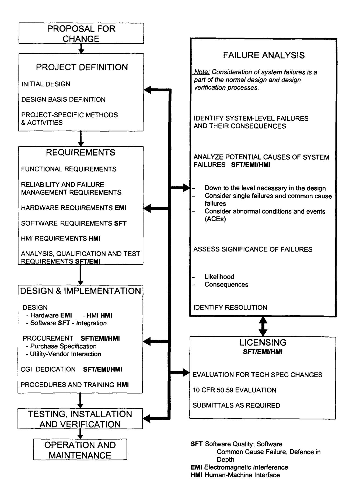

FIG. 4. Digital upgrade issues in the context of the upgrade process.

System providers will divide these subsystems into smaller components as part of their design process. Each of these component parts should be individually tested, preferably at the manufacturer's premises, before being integrated into a subsystem and subjected to formal factory acceptance tests.

As a minimum, the test procedure should contain the following items:

- identify items to be tested;
- overall test approach,
- test case specification,
- specify the acceptance criteria;
- specify the test environment;
- specify a test sequence.

It is important that the version numbers of all the software and firmware modules are recorded at the start of the tests. The software should then be subjected to strict change control so that any changes to the tested software can be identified and their impact analysed. Appropriate regression tests must then be carried out to demonstrate that those parts of the system which have been affected still operate correctly.

Once the individual subsystems have been proven, it is necessary to integrate them with other new subsystems and those parts of the old system which are being retained. This work will normally be carried out at site and tests should be performed to confirm that all the interfaces are operating correctly and to demonstrate that the system satisfies the operational requirements. It is important that the tests span the interfaces, particularly if the plant wiring, data acquisition subsystem and data processing computers have been constructed from separate databases which must be manually aligned In these cases, it is important to maintain strict change control on the various subsystems and to conduct testing to demonstrate their consistency.

Particular consideration should be given to the testing of any special interfaces where definitive testing may only be possible on site. The testing strategy should be planned to cause minimum disruption to the existing operational system and thought should be given to the use of operational standby systems or off-line test and development systems where these are available. For most reactors, a full scale simulator facility will exist and consideration should be given to using it to assist with the testing and commissioning activities.

Any invasive work such as the fitting of new transducers, or possibly the provision of extra connection points to existing transducers should be carried out during planned plant outages wherever this is possible. Care should be taken; however, to ensure that any new connections do not degrade the existing systems which may still be operational. For example, some scanner subsystems may carry out loop continuity checks which would generate erroneous readings on any system connected in parallel. In such cases buffer circuits would need to be installed or alternatively isolation/changeover links fitted so that plant connections could be switched from one system to the other.

The installation of signal buffering or isolation points during a plant outage would enable the reactor to return to power using the old I&C system. The new system can then be installed and tested whilst the old system is still operational. This will enable the performance of the new system to be benchmark against the old system under normal operating conditions. It is advisable to conduct this testing in a location separate from the main control room and so minimize the impact on normal plant operations. If modernization is being applied to several identical units, an alternate strategy could be to designate one unit as a test unit and to validate the new system on this unit before replicating it on other units.

Special consideration needs to be given to the testing of control systems and protection systems which drive plant outputs and cannot be coupled in parallel with the old system. For new or additional

protection systems, it is often feasible to run them initially as an advisory/alarm system alongside the existing protection/reactor tnp system. This will enable confidence to be gained in the response of the new system to true faults and in the level of "spurious" faults which it generates Similarly, the outputs from control systems must be left disconnected while the old system is operational Nevertheless, it may still be possible to compare the output calculated by the new system with that produced by the old one

# 11 3 DATA ACQUISITION SUBSYSTEMS

Prior to their installation at site, the subsystems should have been fully tested at the manufacturer's premises to demonstrate that they meet their specification This should cover functional issues such as accuracy and linearity and also non-functional issues such as performance and reliability

The rate at which plant data acquisition subsystems can acquire data is often limited by signal conditioning/filtering facilities. For data acquisition subsystems tests should confirm that they are able to acquire analog data at the maximum specified rate with adjacent channel inputs set alternately to the maximum positive and maximum negative values specified.

Following the installation of the new subsystem at the site, it would be normal to test all existing input signals from the new termination points. Where possible, signal injection tests should be earned out from a point beyond which the old system has remained unchanged

Where the new transducers have been fitted, the test should be earned out from the transducer. The objective of the testing is to prove that the new subsystem has been connected correctly and to demonstrate that the database and any signal conditioning are also correct For analog signals this could be achieved by testing each signal at the top, bottom, and middle of its range and, where possible, checking the identity and value against the indications given by the old system For digital signals the tests should be conducted with the input switched between true and false and again the response can be checked against the expected value or against the old system where this is possible.

Data input/output subsystems should have built in health monitoring and fault diagnosis facilities Tests should be conducted to demonstrate that these facilities are operating correctly and that the correct actions, e g, marking signals as invalid, are being performed by other parts of the system

Most analog input subsystems will provide some form of signal continuity check and commissioning checks should be conducted to prove the correct operation of this facility, for example, by temporanly disconnecting the signal. Similarly it is prudent to provide "check channels" which are connected to pre-set inputs of known value. Forcing the "check channel" to an erroneous value should cause all the inputs on a particular input system to be marked invalid. The input/output subsystem should also contain a watchdog facility. This should cause the measurements to be marked invalid if the data acquisition subsystems are not scanning the data correctly or are failing to communicate with the rest of the system. In the case of outputs a fail safe state should be defined and on detection of faults the system should, if possible, set all affected outputs to their fail safe state Tests should be devised which emulate such faults and prove the correct operation of the fault momtonng/mitigation facilities

# 114 CONTROL SYSTEMS

The test procedure for new control systems should include before and after installation tests and commissioning tests. The activities of the different test phase are as follows:

- **Before installation tests:** To minimize on-site testing period, the test of the performance and environment for the new control systems should be performed as thoroughly as possible by simulating the input parameters and measuring the output parameters of the system and the test results approved before installation. The minimum test items are as follows:
  - evaluation of the required steady state and transient response for some operating conditions;
  - checking of the combined propagation delay from a change in a signal to results of change being received at an actuator;
  - checking the bumpless transfers between manual and automatic control;
  - checking the signal interface with other systems.
- **After installation tests and commissioning tests:** The integrated tests between new systems and other systems should be performed, based on tests and calibration procedures developed during design phase. The minimum test items are as follows:
  - evaluation of the required steady-state and transient response for all operating conditions;
  - signal matching between new control systems and other systems (e.g. main control room, existing control systems, sensor, actuators, interrupt signals, and interlock with safety system),
  - comparing the control input and output signals between new control systems and old control systems, in the case of parallel running of old and new system;
  - checking the changeover mechanism between old and new control systems;
  - checking any standby channel, in the case of using redundant control systems;
  - checking the closed-loop response with respect to the reactor start up and a stepwise increase to full power;
  - checking and calibration of the portion of analog inputs and outputs.

#### 11.5 COMPUTER HARDWARE AND COMMUNICATION NETWORKS

In order to minimize the disruption to operational systems, exhaustive testing of the replacement system should be conducted by the supplier before it is delivered to site. The equipment should, if possible, be assembled in its final configuration or as close to it as possible This may present difficulties where the new system must integrate closely with existing I&C systems which are being retained. The factory testing will be greatly enhanced if examples of this existing equipment can be made available to the contractor during the development and testing phase. Tests should be conducted to demonstrate the equipment is capable of operating in the environment in which it is to be installed. There is no doubt that variations in temperature, humidity, and electrical power supplies are major contributors to the unreliability of computer based systems and every care should be taken to maintain the environment as stable as possible. Nevertheless, changes in environmental conditions will occur and the new systems should be proven to operate over the expected ranges of temperature, vibration, humidity, and electrical power supply for safety systems. It will also be necessary to demonstrate that the equipment can operate within seismic events of amplitude appropriate to the region in which they are installed. IEEE 344 [64]gives guidance on seismic qualification

Ideally EMC testing should be conducted with the equipment installed at site in its final configuration (for more information see Section 9.2.4.1). Where the new equipment is to be located in existing cubicles, there is no option but to complete the EMC testing at site. However, on replacement projects the new equipment may be located adjacent to existing operational equipment which would be susceptible to the EMC tests. It may; therefore, be preferable to conduct the tests prior to installing the equipment at site and make allowances for any differences in the configuration. For example, additional holes, ventilation, cabling etc may modify the electromagnetic characteristics of the cabinet

The tests should demonstrate

- compatibility with emission requirements,
- compatibility with susceptibility or immunity requirements

To satisfy these two issues, the following steps should be applied:

- test the equipment to know its levels of EMI emission and susceptibility;
- perform local tests or analysis to determine the EMI emission and susceptibility levels in the environment in which the equipment will be installed;
- compare the equipment and the environment EMI values.

The environmental checks will normally be conducted with test software running on the system demonstrating that all the functionality operates correctly throughout the tests.

The same test software may also be suitable for conducting hardware performance tests. These should demonstrate that all communication networks and interfaces to peripherals are able to operate at the specified rates The tests should also monitor the processor loading with all the specified activities running at the maximum rates Particular attention should be paid to the loading of nondeterministic systems such as Ethernet where it is recommended that the maximum loading should not exceed 10% of the bandwidth.

For distributed systems, checks must also be earned out to check for latency and transport delays A particular problem may be encountered with network protocols such as TCP/IP where several messages may be held in a temporary store until the "communications packet" is full If it is configured incorrectly, this may cause problems with "high speed" networks and with "heartbeat" type checks

Computer based systems used in nuclear power plants should incorporate extensive self checking and error reporting mechanisms, which will minimize the incidence of unrevealed faults This will include such provisions as software and hardware "watchdogs" and the monitoring of all peripheral devices. The complete testing of these facilities may not be possible without causing irreversible damage to some component parts. However, it should be possible to devise tests which disconnect each peripheral in turn and its associated power supplies. It may also be possible to simulate faults through the use of test software or specialist equipment such as network analysers. In all cases, the object of the test should be to demonstrate that the system is placed in a safe and predictable state and that on removing the fault the system is returned to its operational state.

The health monitoring and error reporting functions may be linked to a main/standby changeover mechanism This may be a "manual" changeover whereby the error forces a shutdown of the operational system and provides an alarm to the operator who brings a standby system into service. Alternatively, the standby system may be brought into service "automatically" upon failure of the operational system. It should be recognized that the changeover mechanism can itself be a source of errors and checks should be devised to confirm that a faulty system is correctly isolated and does not introduce errors or corruption onto the standby system.

#### 11 6. SYSTEM SOFTWARE

It is anticipated that substantial proving of the system software will have been earned out prior to the system being installed at site. Since the system software consists of modules, those modules have to be tested first, and in the course of software integration, tests are performed after each integration step This procedure is tune consuming and costly. One possibility to reduce these expenses is to design a system (to the extent possible) from reusable software modules which can be configured and parameterized according to their envisaged application. Therefore systematic testing of these software modules can be performed "quasi once for ever" which complies with the strategy of testing reusable hardware modules from a traditional system (often referred to as type testing).

A specialty of the software modules (as compared to hardware) is the flexibility and consequently the variety of reactions they show at the interfaces. In addition the software modules have "a virtual interface" with the hardware, because they are executed on the hardware. Therefore it is advisable to perform prior to the after installation tests a set of selected tests with a representative amount of software modules (I&C functions) implemented on a representative hardware configuration The mam aim of these tests is the proof of the (basic) system characteristics, independently of the specific design for a distinct plant. There are two main tasks, the proof of the correct operational behaviour, and the proof of the tolerable stress and failure behaviour.

For complete systems, exhaustive testing of the underlying system software may not be feasible Software failures are systematic by nature. Therefore, it is possible that identical program versions in parallel trams will fail simultaneously and redundancy cannot in that case protect against common mode failures.

It is probably impossible to produce and prove a software program to be totally free from errors This implies that safety critical computerized applications must have some degree of error tolerance, and a certain degree of diversity must be provided for critical functions in order to prevent common mode failures from leading to severe failures.

As no commonly accepted method exists for showing that reliability requirements have been reached, different practices must be used in order to reduce the uncertainty in reliability. These methods are deterministic, probabilistic, and experience based. In IEC-880 (1986) Appendix E [24] it is possible to find more detailed information.

Deterministic based methods incorporate the use of standards, quality assurance programmes, and different types of test programmes. They also seek evidence of the supplier's development process and management systems for reporting and correcting errors Commercial vendors of equipment containing software or firmware often have not completed a V&V programme at the level of the requirements and standards referred to above. Thus, the purchaser must ensure that the appropriate activities are undertaken to develop an equivalent level of confidence in the commercial grade item's software This is done through a process of commercial grade item dedication The duties for performing commercial dedication of equipment should be specified. The purchaser may need access to vendor's design documents, test data, and information to evaluate the vendor's design process used for software. The software design should be compared to the applicable design criteria for nuclear qualified equipment. Differences may be compensated for by other factors such as documented operating experience in a similar application, or by additional V&V or testing performed

Experience data, results of additional testing that is performed as part of the upgrade design and verification processes, information obtained on the design development, and other analysis as appropriate should be combined to judge the acceptability of the commercial grade item

## 11 7. CONFIGURATION LEVEL SOFTWARE/DATA

Configuration level software/data are the software/data structures which are specific to a particular project. They can include operating formats, database identifiers and threshold levels, alarm conditioning, and interfaces to existing equipment. Because a replacement system must fit with the existing equipment, the amount of "project specific" software is likely to be higher than on new projects and this needs to be addressed when devising commissioning plans.

Perhaps the most important aspect of a replacement system is the database. Where only part of a system has been replaced, it is likely that the database for the old system and that for the new part will be constructed separately. Stnct change control needs to be imposed on the two databases which in an ideal world should be merged into one. Tests should be devised which bridge the interfaces between the replacement system and the rest of the plant These should demonstrate that the new system database is correct and consistent both internally and also with the existing plant. Many commercially available systems provide CAD facilities to assist in the production of operational formats The formats should have been reviewed against functional requirements and ergonomic standard prior to the commissioning phase. The main objective of the commissioning phase is to demonstrate that the formats are linked to the correct database items and are being updated at the required rate. It may be possible to use test software, or better still signal injection, to prove that the data is being displayed correctly. If test software is used, then care should be taken to ensure that it is independent of any CAD software used to produce the formats. Otherwise a common mode failure could result.

Some computer based systems have sophisticated alarm conditioning logic or other plant specific pieces of software These may have been developed and configured over many years of plant operation and need to be preserved in the replacement system. Conducting exhaustive tests to demonstrate the faithfulness of the replacement may not be feasible. In this case, consideration should be given to the development of "high integrity" "translation software" which will automatically convert the application from the old system to the new. In this case, the exhaustive tests can be replaced by sample checks to prove that there are no systematic errors in the translation process. Again, common mode errors are a likely source of failure and these should be guarded against at all stages in the process.

The application software/data may also include special interfaces to link the new system to those parts of the old system which are remaining unchanged. The mam challenge in developing such software is often the lack of a clear interface definition. This will also present a problem in testing the software and the only sure way is to gam access to the old system without effecting plant operation. This could be achieved by use of a spare system or existing simulator facilities. If neither of these options is available then it may be necessary to conduct the tests during a plant outage. As with the database, the tests must bridge the interface between the old and new systems. Simply testing the new system against a written specification could leave too many potential errors unrevealed

#### 11.8. HUMAN-MACHINE INTERFACE

Workstations are often used to provide the interface between new I&C systems and human operators All the considerations which were applied to the testing of hardware and software for the data processing layer will also apply here.

In addition the HMI should be assessed against the ergonomic requirements to present information to the operating staff in a clear, unambiguous and timely manner. It is suggested that the use of the training simulator may be suitable for performing the ergonomic assessment.

It is important to ensure that the data presented to the operator is being continually refreshed at an appropriate rate and specific tests should be conducted to confirm this. In many systems a dynamic symbol is placed in the corner of each display to indicate that the display is updating. Such a symbol

should be generated from the same source as the data being displayed, so that it monitors the health of the whole data path and not just the health of the workstation.

#### 11.9. LINKS TO THE OFF-LINE SYSTEMS

The real time I&C systems will often provide information to off-line support systems which themselves may or may not be subject to an upgrade. In either case it will be necessary to provide the correct data interface from the upgraded I&C systems. Normally the off-line systems will not be real time and it should be possible to temporarily connect to the new system and prove the interface prior to the main changeover. Tests should be conducted to demonstrate that actions/faults on the off-line system do not feedback onto the I&C system and adversely affect its performance.

## 11.10. INTEGRATED TESTING

Once all the subsystems have been tested, there is still a need for complete end-to-end tests of the system and, where possible, this should include the parts of the old system which interface to the new ones of the subsystem. If the checks have been thorough, then sample checks may be adequate at this stage.

Tests should be carried out to confirm that the required system performance has been achieved and to confirm the operation of any facility that could not be tested during the manufacturer's factory acceptance test.

#### 11.11. PARALLEL RUNNING

On new projects, the I&C system is often available ahead of the rest of the plant and is used during plant test and commissioning. This may take place over an extended period of time during which increased confidence is gained in the I&C system. On replacement projects, plant downtime is usually kept to a minimum and other means must be found for building confidence in the replacement I&C system.

This may be achieved by retaining the old system for a period of time and running the replacement system alongside it. The parallel running tests should be planned as part of the site acceptance tests. Where possible tests should be created which will stimulate plant inputs and incorporate a range of operational activities in order to provide a realistic test of the new system. Care must be taken to ensure that the operational state of the old system is not compromised. Buffer amplifiers and one way data links may be required to feed plant data into the new system during the parallel running period. The response of the new system can then be compared with the old one for a variety of operational conditions. Allowance will need to be made for latency, data skew, and sampling errors when comparing the two systems, but the responses should be close enough to allow a meaningful comparison. This approach can be used to provide confidence in the reliability of the new system and the correctness of databases, formats, alarm levels, alarm logic, and other applications software/data.

Once confidence has been gained in the new system, changeover can take place between the old system and the replacement. The exact method of changeover will differ for each project.

The state of plant at changeover is also important and for some projects it may be safer to change systems with the plant stable and at power, since this state may place the least demand on the new system. At all times during system changeover, it is important that operating staff are aware of the exact state of the plant and there is a clear definition of which parts of the I&C system are operational and which are being commissioned.

# 11.12 FULL SCALE SIMULATOR

On most plants, a full scale simulator is available for the training of operating staff. This simulator will need to be updated to reflect the changes to the operational systems and be used for the retraining of the operators. It can also be used for verification and validation during the design process and for final testing of the modifications. Two areas should be evaluated One is the HMI and the other is the critical I&C functions. The use of the full scale simulator for these purposes must be planned early in a modernization project

Before starting the detailed design of the HMI, a prototype can be connected to the simulator Operators and designers can work together to evaluate ideas and proposals and discuss suitable designs This can be repeated with the final version of the equipment before it is installed into the plant Some detailed design work such as for designing display screens can also be done then. The validation of the final design can be used for retraining personnel before the control room is modified. It is recommended that the modifications are installed in the simulator as a permanent part of the simulator Simulators contain programs for all I&C functions or systems. Dependent on the software structure and the input and output facilities, I&C functions can be bypassed and replaced by systems connected to the simulator. Critical systems for protection and plant control can be verified by connecting the actual modified equipment to the simulator and using the plant process simulation for testing. Similar methods have been used for validation of control systems where the process model is built into the control equipment. The experience with this method are very positive and have saved considerable time during commissioning after installation in the plant. It is, therefore recommended to use the full scale simulator for this method.

#### 1113 SPECIFIC CHECKS AGAINST SAFETY PRINCIPLES

It is good practice to review the commitments which have been made in setting down the safety principles for an I&C upgrade project. Before putting the new system into operation tests should be conducted to demonstrate that those commitments have been met. Typical commitments for a control and monitoring system could be as follows:

- Any automatic testing function in accordance with the old technical specification (in PWR case, technical specification in Safety Analysis Report) should be tested to verify that there is no impact on the integrity of safety functions, before commissioning.
- Failure of the control system does not move the reactor to a more unsafe state.
- A single credible failure of the non-safety control system does not place a demand on the reactor protection system.
- All controls, alarms and indications required for safe operation are located in the MCR.
- Instruments have adequate accuracy during normal operating conditions.
- Instruments do not saturate under fault conditions.
- Removal/disconnection of items for testing does not cause signals or plant to change in a manner which is detrimental to safety
- Operation following power supply interruptions is predictable and safe.
- Alarm information is presented in a manner which can be assimilated.
- Alarms are not capable of being reset until the initiating parameter is reset.

- Pre and post incident records are provided for selected safety related parameters.
- All software is under configuration control.
- The software contains self checks and takes defined safe action on detection of a fault.
- Corruption of program or fixed data is detected under normal operation.

#### 11.14 DOCUMENTATION

Documentation has already been discussed in Section 7.7. It is desirable that operational and maintenance documentation is available during system commissioning. The commissioning tests should refer to these documents wherever possible so that they can be validated against the expected system behaviour.

The installation and commissioning test results should be documented for future reference by the utility and for verification by the regulatory body. The documentation should include as a minimum the following:

- verification that new systems and their installation meets code and standards that were specified in the design of the systems;
- overall functional performance requirements of the new system have been met;
- calculated range and rate of change of the sensed variables have been verified by testing;
- bench test results, final test results, functional performance and other special requirements of the control systems;
- test operation report;
- maintenance and regular test programme;
- operator training programme.

# **12. CONCLUSIONS**

The five major conclusions and their subconclusions of this report are given here.

- 1. Define a global vision. This should be a strategic plan covering the whole of the plant I&C for the remaining plant life.
  - 1.1. A global vision of the overall future I&C configuration needs to be defined at the beginning of the modernization activities in order to identify the best way to do the modernization projects to achieve the desired end goal for the plant's I&C systems.
  - 1.2. A life-cycle management programme should be developed to evaluate the need to modernize an I&C system in the context of the goals, requirements, and constraints of the entire plant.
  - 1.3. The vision and modernization plans need to be flexible and expandable to allow for changing conditions such as goals, constraints, requirements, and technology. They should be reviewed periodically and revised as needed.

- 1 4 Each modernization project needs to be an integral part of the global vision and lifecycle management plan and should not be done in isolation
- 1 5 External requirements that effect I&C modernization; such as regulatory requirements, commitments to the public and regulatory bodies, and power needs; must be identified and taken into account in the life-cycle management programme
- 1 6 Utility defined requirements that effect I&C modernization, such as functional, physical, economical, and human factors; must be identified and taken into account m the life-cycle management programme
- 1 7 I&C systems can be modernized in an incremental manner following the plant vision as well as being done in one massive project.
- 2 Develop standards and plans Available standards and guidance documents should be reviewed and tailored to match the utility's specific circumstances
  - 2 1 The utility should define plant-specific standards and guidelines to be used for I&C modernization projects to address issues such as hardware qualification, software verification and validation, requirements specification, and failure analysis
  - 2 2 The utility should develop detailed modernization or maintenance plans as appropriate for each I&C system considered in the life-cycle management programme
  - 2 3 Modernization projects should carefully consider international standards and requirements to select those applicable
  - 24 An integrated approach to modernization of I&C systems is needed to maintain consistency with existing systems and to facilitate future modernization projects to maximize the effectiveness of new and modernized systems in the entire plant I&C modernization projects should not be done in a stand-alone manner
  - 2 5 When modernization is performed in an incremental manner, a long term migration path needs to be developed to ensure that each modernization is performed consistently with the overall vision
- 3 Capture the requirements Significant effort is often required to produce up to date documentation of the safety role and functional role of old I&C systems In setting down the system requirements, account should be taken of modern standards
  - 3 1 The utility should interface with the regulatory agency early in the project for modernization projects of safety and safety related systems to ensure that safety concerns are addressed.
  - 32 A baseline description and verified, up-to-date documentation is needed for each of the I&C systems to be considered for modernization
  - 3 3 When it is not practical to meet a current standard or requirement in an existing plant, justification should be provided using methods such as probabilistic tools or engineering judgment.
  - 3 4. Accurate, up-to-date documentation for each existing, replaced, upgraded, and new I&C system should be maintained throughout the life of the system

- 3.5. A project internal QA document should be produced to govern the modernization project.
- 4. Take advantage of new technology. In a modernization project it is often beneficial to add new functionality rather than only doing Hke-for-like changes.
  - 4.1. When a modernization programme is being considered, potential improvements that are possible with modern technology should be evaluated. This should include information handling, to increase functionality, to increase performance, to improve availability, to reduce costs, to enhance safety, to improve working methods, and to improve organizational functions.
  - 4.2. Office automation and modem data handling systems support an easy transfer of information between various systems to provide valuable support in the control room and in other tasks.
  - 4.3. A communications infrastructure should be installed early in the modernization programme to allow integration of systems and information throughout the programme.
- 5. Plan and monitor your modernization project. There are many interdependences which should be taken into account and it is necessary to be aware of possible problems before they arise.
  - 5.1. Advance planning and as much advance work as possible should be done before the outage so that the modernization can be done without extending the plant outage.
  - 5.2. A close relationship between the utility and contractor is advantageous efficient modernization activities.
  - 5.3. Proposed control room solutions should be reviewed carefully to assess changes in the basic operational philosophy. The detailed design should be submitted to a human factors review including shift representatives.
  - 5.4. It is advantageous to use a full scope simulator to verify the operability of the new system before implementing it.
  - 5.5. Training, procedures and documentation must be updated rigorously to include the modernized systems.

## **Appendix A**

## **EQUIPMENT TECHNOLOGY DEFINITIONS**

In order to identify the performance of new equipment, it will be necessary to understand the nature of the different technologies and the implications the choice of technology has on achieving the required functionality and on completing a safety justification. This is particularly necessary given the great differences in the characteristics and performance of different types of technology that is available or under development These include:

- relays and other electromechanical components, analog equipment, digital equipment with hardwired logic or embedded software ("firmware"),
- free programmable digital equipment as PLCs and process computers;

The typical characteristics of the above mentioned technology are described below

#### Al RELAY AND OTHER HARDWIRED EQUIPMENT

#### (a) Relays

This is an electromagnetic device for switching of analog and binary output signals The input for switching is a binary signal. The relay is a component. System equipment must be built by an extensive wiring between many relays.

#### (b) Analog equipment

Solid state equipment is based on transistor technology. It can be used for both binary and analog signals Different design methods are possible as described here.

- discrete components where a function is designed by using individual components as transistors, resistors, capacitors which are together on circuit boards;
- integrated chips where many transistors and sometimes resistors or capacitors are integrated to perform a certain function, these chips are put together on circuit boards,
- devices where discrete components or integrated chips are combined together in some type of housing to perform a more stand alone, integrated function,
- electronic systems which are a product family containing many different standard cards with all functions which are necessary for process I&C. These cards are combined within a housing to design a complete I&C system.

#### (c) Field programmable gate arrays (FPGA)

This is chip for binary input and output signals and is custom designed for a particular application The logical relations of "and" and "or" between the signals can be defined by on the FPGA A special tool will burn in the logic operations in a permanent manner so they cannot be modified Modifications can only be done later by burning new chips.

#### (d) Application specific integrated circuit (ASIC)

This is chip which can contain both logic and analog functions It is designed especially for an application and can be mass produced. It cannot be modified afterwards.

## A.2 FREE PROGRAMMABLE EQUIPMENT

Free programmable technology is characterized by the fact that functions are earned m a time sequence The sequence is controlled by counters or a operating system. Functions are performed with software. Different types are:

#### (a) Programmable logic devices (PLD)

A programmable logic device is micro processor based in order to carry out a well defined function. It is a stand alone apparatus and can be reprogrammed to meet different options or adjustments for the specified function.

### (b) Programmable logic controllers (PLC)

A PLC is the microprocessor based version of the FPGA. Logic relations between binary inputs and outputs are defined by software. Often the logic can be selected from a library by using standard tools The logic can easily be reprogrammed afterwards.

#### (c) Configurable electronic equipment

Programmable electronic equipment can be compared with the solid state electronic system where you configure a application by using different kind of standard modules from a standard package which can be purchased on the market It is often called "Programmable Electronic System". (PES) Such package contains all necessary standard hardware and software for process I&C including

- process inputs and outputs;
- and other signal treatment functions;
- graphical human logic machine interfaces;
- communications.

Integration of the standard hardware and software modules into an application is done in a easy way through the use of standard tools. No special programming knowledge is required.. Normally the PES cannot perform complicated calculations which are necessary for important computerized support systems. Several type of configurations can be designed in the range between totally decentralized and centralized

#### (d) General purpose minicomputers

A minicomputer is a flexible and general purpose machine. It is normally not provided with standard software and hardware modules which are necessary for I&C functions. Such functions must be purchased separately or must be designed/programmed by the application engineers. Minicomputers can therefore be used for such functions, which cannot be configured by standard software modules from the PES, such as:

- complex arithmetic and logic processing;
- mass storage of historical data;
- recording of plant performances;
- alarm analysis.

#### Appendix B

#### RECOVERY OF OLD REQUIREMENTS EXAMPLE

Example: Recovery of old requirements for a reactor protection system (RPS)

- (1) Safety requirements
  - (a) The protection system should be designed:
    - to automatically initiate the operation of appropriate systems, including the reactivity control systems, to assure that specified acceptable fuel design limits are not exceeded as a result of transients;
    - to sense accident conditions and to initiate the operation of systems and components important to safety;
  - (b) Protection systems should meet the requirements set forth in applicable IEEE or IEC guides and standards as IEEE 279 [65], IEEE 603 [66], IEEE 7-4.3.2-1993 [30], or IEC 880 [24].
- (2) Licensing limitations

Some of the limitations are:

- Reliability evaluations are nearly impossible for software;
- The more complex are the functions the more complex is the verification and validation.

An important issue is the policy of the regulatory body about the application of modern requirements for modernization of old plants. For this reason a careful analysis must be made comparing the originally requirements with new ones

- (3) Major functions
  - (a) Plant protection system functions:
    - Reactor protection system function;
    - Engineered safety features actuation function.
  - (b) Reactor trip parameters:
    - Variable overpower;
    - High LPD;
    - Low DNBR;
    - High log power level;
    - High pressurizer pressure;
    - Low pressurizer pressure;
    - High steam generator water level;
    - Low steam generator water level;
    - Low steam generator pressure;
    - High containment pressure;
    - Low reactor coolant flow;
    - Manual.

#### (c) Engineered safety features actuation signals:

- Containment isolation actuation signal;
- Containment spray actuation signal;
- Safety injection actuation signal;
- Aux. feed water actuation signal;
- Recirculation actuation signal;
- Main steam isolation signal.

#### (d) Plant protection system design requirements:

- Four independent measure channels;
- System actuation on 2/4 coincidence of selected plant variables;
- coincidence logic with one channel being out of service;
- Manual reset necessary once actuation has been initiated;
- Manual actuation independent of automated trip;
- System can be tested with the plant in shutdown or operating mode.

#### (4) Inputs/outputs

#### (a) Inputs:

- Inputs from engineered safety features auxiliary relay cabinets;
- Inputs from process instrumentation cabinet;
- Inputs from remote shutdown panel;
- Inputs from ex-core nuclear flux monitoring system, safety channel drawer;
- Inputs from auxiliary protective cabinet;
- Inputs from reactor trip switch gear system;
- Inputs from vital bus power supply system.

#### (b) Outputs:

- Outputs to plant data acquisition system;
- Outputs to engineered safety features auxiliary relay cabinets;
- Outputs to process instrumentation cabinet;
- Outputs to remote shutdown panel;
- Outputs to reactor trip switch gear system;
- Outputs to CEA element drive mechanism control system auxiliary cabinet;
- Outputs to plant annunciation system;
- Outputs to auxiliary protective cabinet;
- Outputs to ex-core nuclear flux monitoring system, safety channel drawer.

#### (5) Interfacing systems

- (a) Process instrumentation cabinet;
- (b) Engineered safety features auxiliary relay cabinets;
- (c) Remote shutdown panel;
- (d) Ex-core nuclear flux monitoring system, safety channel drawer;
- (e) Auxiliary protective cabinet;
- (f) Reactor trip switch gear system;
- (g) Vital bus power supply system;
- (h) Plant data acquisition system;
- (I) CEA element drive mechanism control system auxiliary cabinet;
- (i) Plant annunciation system.

# (6) Operating experience

- (a) Periodic tests and component obsolescence:
  - Manual periodic testing with complicated test procedures has required substantial manpower resources and has contributed to human errors by the maintenance staff;
  - Component obsolescence has increased the required maintenance work.

## (b) Information navigation:

It is difficult for operator and/or maintenance people to provide sufficient and summarized information of system status during complicated operation and maintenance situations.

## (7) Challenges

The most important challenges are to:

- use the new features of the digital technology to improve safety and availability;
- improve the display of information in the control room;
- integrate control and maintenance activities;
- combine old and new technology;
- replace equipment without extending outages.

# **REFERENCES**

- [I] ELECTRIC POWER RESEARCH INSTITUTE, Instrumentation and Control Life Cycle Management Plan Methodology, EPRITR-105555, Vols. 1&2 (1995).
- [2] ELECTRIC POWER RESEARCH INSTITUTE, Requirements Engineering for Digital Upgrades, EPRI TR-108831 (1997).
- [3] ELECTRIC POWER RESEARCH INSTITUTE, Guideline on Licensing Digital Upgrades, EPRI TR-102348 (1993).
- [4] ELECTRIC POWER RESEARCH INSTITUTE, Plant Communications and Computing Architecture Plan Methodology, EPRI TR-102306, Vols. 1&2 (1993).
- [5] ELECTRIC POWER RESEARCH INSTITUTE, Plant Communications and Computing Architecture Plan Methodology Revision 1, EPRI TR-104129, Vols. 1&2 (1994).
- [6] ELECTRIC POWER RESEARCH INSTITUTE, Handbook of Verification and Validation for Digital Systems, EPRI TR-103291, Vols. 1-3 (1994).
- [7] ELECTRIC POWER RESEARCH INSTITUTE, Guidelines for the Verification and Validation of Expert System Software and Conventional Software, EPRI TR-103331, Vols. 1- 8 (1995).
- [8] ELECTRIC POWER RESEARCH INSTITUTE, Verification and Validation Guidelines for High Integrity Systems, EPRI TR-103916, Vols. 1&2 (1995).
- [9] ELECTRIC POWER RESEARCH INSTITUTE, Software Fault Reduction Using Computer-Aided Software Engineering (CASE) Tools, EPRI TR-105989, Vols. 1&2 (1995).
- [10] ELECTRIC POWER RESEARCH INSTITUTE, Guidelines for Electromagnetic Interference Testing in Power Plants, EPRI TR-102323-R1 (1996).
- [II] ELECTRIC POWER RESEARCH INSTITUTE, Handbook for Electromagnetic Compatibility of Digital Equipment in Power Plants, EPRI TR-102400, Vols. 1&2 (1994).
- [12] ELECTRIC POWER RESEARCH INSTITUTE, Abnormal Conditions and Events Analysis for Instrumentation and Control Systems, EPRI TR-104595, Vols. 1&2 (1996).
- [13] ELECTRIC POWER RESEARCH INSTITUTE, Guideline for the Utilization of Commercial Grade Items in Nuclear Safety Related Applications (NCIG-07), EPRI NP-5652 (1988).
- [14] ELECTRIC POWER RESEARCH INSTITUTE, Supplemental Guidance for the Application of EPRI NP-5652 on the Utilization of Commercial Grade Items, EPRI TR-102260 (1994).
- [15] ELECTRIC POWER RESEARCH INSTITUTE, Guideline on Evaluation and Acceptance of Commercial Grade Digital Equipment for Nuclear Safety Applications, EPRI TR-106439 (1996).
- [16] ELECTRIC POWER RESEARCH INSTITUTE, Evaluating Commercial Digital Equipment for High-Integrity Applications: A Supplement to EPRI Report TR-106439, EPRI TR-107339 (1997).
- [17] ELECTRIC POWER RESEARCH INSTITUTE, Generic Requirements Specification for Qualifying a Commercially Available PLC for Safety Related Applications in Nuclear Power Plants, EPRI TR-107330 (1996).
- [18] ELECTRIC POWER RESEARCH INSTITUTE, I&C Upgrades for Nuclear Plants Desk Reference 1997, EPRI TR-107980 (1997).
- [19] ELECTRIC POWER RESEARCH INSTITUTE, Plant-Wide Integrated Environment Distributed on Workstations (Plant-Window) System Functional Requirements, EPRI TR-104756(1996).
- [20] ELECTRIC POWER RESEARCH INSTITUTE, Plant Process Computer Upgrade Guidelines, EPRI TR-101566, Vols. 1-3 (1992).
- [21] ELECTRIC POWER RESEARCH INSTITUTE, Application of a Cost-Benefit Analysis Methodology to Nuclear I&C System Upgrades, EPRI TR-101984 (1992).
- [22] ELECTRIC POWER RESEARCH INSTITUTE", Instrumentation and Control Upgrade Evaluation Methodology, EPRI TR-104963, Vols. 1&2 (1996).
- [23] ELECTRIC POWER RESEARCH INSTITUTE, Instrumentation and Control System Maintenance Plan Methodology, EPRI TR-106029 (1996).

- [24] INTERNATIONAL ELECTROTECHNICAL COMMISSION, Software for Computers in the Safety Systems of Nuclear Power Stations, IEC-880, Geneva (1986).
- [25] INTERNATIONAL ORGANIZATION FOR STANDARDIZATION, ISO-9000 Standard series: Quality Management and Quality Assurance Standards, ISO, Geneva (1990).
- [26] INTERNATIONAL ORGANIZATION FOR STANDARDIZATION, ISO-9000 Standard series: Quality Management and Quality Assurance Standards, Part 3: Guidelines for the Application of ISO 9001 to the Development, Supply and Maintenance of Software, ISO, Geneva (1990).
- [27] INTERNATIONAL ATOMIC ENERGY AGENCY, Verification and Validation of Software Related to Nuclear Power Plant Control and Instrumentation (in preparation).
- [28] INSTITUTE OF ELECTRICAL AND ELECTRONICS ENGINEERS, Standard for Software Quality Assurance Plans, ANSI/IEEE 730-1989, IEEE, Piscataway, NJ (1989).
- [29] INSTITUTE OF ELECTRICAL AND ELECTRONICS ENGINEERS, Standard for Software Verification and Validation Plans, ANSI/IEEE Std 1012-1986, IEEE, Piscataway, NJ (1986).
- [30] INSTITUTE OF ELECTRICAL AND ELECTRONICS ENGINEERS, IEEE Standard Criteria for Digital Computers in Safety Systems of Nuclear Power Generating Stations, IEEE Std 7-4.3.2-1993, IEEE, Piscataway, NJ (1993).
- [31] INSTITUTE OF ELECTRICAL AND ELECTRONICS ENGINEERS, IEEE Standard for Software Configuration Management Plans, ANSI/IEEE Std 828-1990, IEEE, Piscataway, NJ (1990).
- [32] INSTITUTE OF ELECTRICAL AND ELECTRONICS ENGINEERS, IEEE Guide to Software Configuration Management, ANSI/IEEE Std 1042-1987, IEEE, Piscataway, NJ (1987).
- [33] INTERNATIONAL ATOMIC ENERGY AGENCY, Modern Instrumentation and Control for Nuclear Power Plants, A Guidebook (in preparation).
- [34] INTERNATIONAL ATOMIC ENERGY AGENCY, A Common Base for Judging the Safety of Nuclear Power Plants Built to Earlier Standards, Safety Series No.8, IAEA, Vienna (1995).
- [35] NUCLEAR REGULATORY COMMISSION, Method for Performing Diversity and Defensein-depth Analyses of Reactor Protection Systems, Rep. NUREG/CR-6303 (1994).
- [36] INTERNATIONAL ELECTROTECHNICAL COMMISSION, Analysis Techniques for System Reliability-Procedure for Failure Mode and Effects Analysis (FMEA), IEC-812, Geneva (1985).
- [37] INTERNATIONAL ATOMIC ENERGY AGENCY, Safety Assessment of Computerized Control and Protection Systems, IAEA-TECDOC-780, Vienna (19945).
- [38] INTERNATIONAL ATOMIC ENERGY AGENCY, Reliability of Computerized Safety Systems at Nuclear Power Plants, IAEA-TECDOC-790, Vienna (1994).
- [39] INTERNATIONAL ATOMIC ENERGY AGENCY, Probabilistic Safety Assessment, A Report by the International Nuclear Safety Advisory Group, Safety Series No. 6, IAEA, Vienna (1992).
- [40] INTERNATIONAL ATOMIC ENERGY AGENCY, Case Study on the Use of PSA methods: Assessment of Technical Specifications for the Reactor Protection System Instrumentation, IAEA-TECDOC-669, Vienna (1992).
- [41] INTERNATIONAL ELECTROTECHNICAL COMMISSION, Fault Tree Analysis (FTA), IEC-1025, Geneva (1990).
- [42] INTERNATIONAL ELECTROTECHNICAL COMMISSION, Analysis Techniques for Dependability-Reliability Block Diagram Method, IEC-1078, Geneva (1991).
- [43] INTERNATIONAL ELECTROTECHNICAL COMMISSION, International Electrotechnical Vocabulary: Chapter 191: Dependability and quality of service, IEC 50 (1991).
- [44] EUR, European Utility Requirements for Nuclear Power Plants, Draft Nov. 1996 (Communication from P. van Gemst).
- [45] INTERNATIONAL ATOMIC ENERGY AGENCY, Code on the Safety of Nuclear Power Plants: Design, Safety Series No. 50-C-D, IAEA, Vienna (1988).
- [46] INTERNATIONAL ATOMIC ENERGY AGENCY, Protection System and Related Features in Nuclear Power Plants, A Safety Guide, Safety Series No. 50-SG-D3, IAEA, Vienna (1980).

- [47] INTERNATIONAL ATOMIC ENERGY AGENCY, Safety-Related Instrumentation And Control Systems For Nuclear Power Plants, A Safety Guide, Safety Series No. 50-SG-D8, IAEA, Vienna (1984).
- [48] INTERNATIONAL ELECTROTECHNICAL COMMISSION, Supplementary Control Points for Reactor Shutdown Without Access to the Main Control Room, IEC-965 (1989).
- [49] INTERNATIONAL ELECTROTECHNICAL COMMISSION, Programmed Digital Computers Important to Safety for Nuclear Power Stations, IEC-987 (1989).
- [50] INTERNATIONAL ELECTROTECHNICAL COMMISSION, Design for Control Rooms of Nuclear Power Plants, ffiC-964, Geneva (1989).
- [51] INTERNATIONAL ATOMIC ENERGY AGENCY, Balancing Automation and Human Action in Nuclear Power Plants (Proc. Symp. Munich, 1990), IAEA, Vienna (1991).
- [52] INTERNATIONAL ATOMIC ENERGY AGENCY, The Role of Automation and Humans in Nuclear Power Plants, IAEA-TECDOC-668, Vienna (1992).
- [53] US NUCLEAR REGULATORY COMMISSION, Human Factors Engineering Program Review Model, NUREG-0711 (1994).
- [54] US NUCLEAR REGULATORY COMMISSION, Guidelines for Control Room Design, NUREG-0700 (1981).
- [55] INTERNATIONAL ATOMIC ENERGY AGENCY, Computerized Support Systems in Nuclear Power Plants, IAEA-TECDOC-912, IAEA, Vienna (1996).
- [56] INTERNATIONAL ELECTROTECHNICAL COMMISSION, Electro-magnetic Compatibility (EMC), IEC-1000, Part 1: General, Part 2: Environment, Part 4: Testing and measuring techniques (1992-1993).
- [57] INSTITUTE OF ELECTRICAL AND ELECTRONICS ENGINEERS, IEEE Standard for Qualifying Class IE Equipment for Nuclear Power Generating Stations, IEEE Std 323-1983, IEEE, Piscataway, NJ (1983).
- [58] US NUCLEAR REGULATORY COMMISSION, Verification, Validation, Reviews, and Audits for Digital Computer Software Used in Safety Systems of Nuclear Power Plants, USNRC Regulatory Guide 1.168, August (1997).
- [59] US NUCLEAR REGULATORY COMMISSION, Configuration Management Plans for Digital Computer Software Used in Safety Systems of Nuclear Power Plants, USNRC Regulatory Guide 1.169, August (1997).
- [60] US NUCLEAR REGULATORY COMMISSION, Software Test Documentation for Digital Computer Software Used in Safety Systems of Nuclear Power Plants, USNRC Regulatory Guide 1.170, August (1997).
- [61] US NUCLEAR REGULATORY COMMISSION, Software Unit Testing for Digital Computer Software Used in Safety Systems of Nuclear Power Plants, USNRC Regulatory Guide 1.171, August (1997).
- [62] US NUCLEAR REGULATORY COMMISSION, Software Requirements Specifications for Digital Computer Software Used in Safety Systems of Nuclear Power Plants, USNRC Regulatory Guide 1.172, August (1997).
- [63] US NUCLEAR REGULATORY COMMISSION, Developing Software Life Cycle Processes for Digital Computer Software Used in Safety Systems of Nuclear Power Plants, USNRC Regulatory Guide 1.173, August (1997).
- [64] INSTITUTE OF ELECTRICAL AND ELECTRONICS ENGINEERS, IEEE Recommended Practice for Seismic Qualification of Class IE Equipment for Nuclear Power Generating Stations, IEEE Std 344-1975, IEEE, Piscataway, NJ (1975).
- [65] INSTITUTE OF ELECTRICAL AND ELECTRONICS ENGINEERS, IEEE Criteria for Protection Systems in -Nuclear Power Generating Stations, IEEE Std 279-1971, IEEE, Piscataway, NJ (1971).
- [66] INSTITUTE OF ELECTRICAL AND ELECTRONICS ENGINEERS, IEEE Standard Criteria for Safety Systems for Nuclear Power Generating Stations, IEEE Std 603-1993, IEEE, Piscataway, NJ (1993).

## Annex

# **COUNTRY REPORTS**

# NPP I&C SYSTEM MODERNIZATIONS IN THE CZECH REPUBLIC

The NPP Dukovany example

P. KRS State Office for Nuclear Safety, Prague, Czech Republic

#### **Abstract**

There are four units of WWER 440/213 type reactors under operation at Nuclear Power Plant Dukovany site in the Czech Republic. The ÈEZ utility has decided to include upgrade of existing Instrumentation & Control (I&C) systems as one of the most significant parts of a larger scale modernization project. The original I&C systems designed in the late 70's and early 80's with analogue equipment and relays will be subjected to an integrated modernization programme developed to replace obsolete equipment, to balance operational and maintenance costs, to improve performance and to enhance plant safety. To achieve this objective within next decade, the utility has already started preparatory phase of the overall modernization project, including analytical and planning activities related to the I&C part.

#### 1. INTRODUCTION

There are four units of WWER 440/213 type reactors under operation at Nuclear Power Plant (NPP) Dukovany site and two units of WWER 1000/320 type reactors under construction at NPP Temelín site in the Czech Republic. Both of the nuclear power plants are operated by the largest Czech utility Èeské Energetické Závody (ÈEZ).

For the Dukovany units, the ÈEZ utility has decided to include upgrade of existing Instrumentation & Control (I&C) systems as one of the most significant parts of a larger scale modernization project. The original I&C systems designed in the late 70's and early 80's with analogue equipment and relays will be subjected to an integrated modernization programme developed to replace obsolete equipment, to balance operational and maintenance costs, to improve performance and to enhance plant safety. To achieve this objective within next decade, the utility has already started preparatory phase of the overall modernization project, including analytical and planning activities related to the I&C part.

To enhance the level of safety and availability of the future operation, the ÈEZ utility has decided to introduce significant improvements in original NPP Temelin design, including complete change of the I&C systems design and equipment/systems vendor. This I&C system design upgrade was, in contradiction to most of other cases, started during the construction of the plant and exposed the regulatory body, utility and all other parties involved to a specific set of problems.

With the aim to support these significant system and technological changes in existing regulatory framework, the authority reflected the specific aspects of different NPP Temelin and Dukovany cases in developing a detailed licensing procedure for large I&C upgrade and in introducing a specific licensing tools for this purpose. In addition, the new nuclear legislation adopted by the Czech Republic from the mid of 1997 incorporates all the licensing, technical and quality issues of such cases.

#### 2. NPP DUKOVANY I&C MODERNIZATION PROJECT

#### 2.1. Current state of I&C systems in the plant

The ÈEZ utility operates at Dukovany site situated in southern Moravia approximately 40 km from town Brno four units of WWER 440/213 type reactors. Basic design of NPP was developed as a

result of contract between Atomenergoexport and Škodaexport signed in 1973. The designer of the Nuclear Steam Supply System (NSSS) was LOTEP Leningrad, the designer of Balance Of Plant (BOP) was Energoprojekt Prague. General supplier of technology was Škoda Prague. First unit was connected to the grid in beginning of 1985, other three units vent into operation till the end of 1987.

The NSSS I&C architecture of the NPP Dukovany units is almost identical to that of other WWER 440/213 units of the same generation (NPP Paks in Hungary, NPP Bohunice V-2 units in Slovakia), including the original analogue equipment designed and developed by the former Soviet Union companies in late 70's. The original I&C design of the BOP system was tailored to domestic fluid and mechanical systems (such as ŠKODA turbine units), the major part of the BOP instrumentation was designed and produced by electromechanical industry of former Czechoslovakia in early '80.

The use of analogue equipment and relays of certain quality forced the original designer to incorporate a high level of redundancy in to the WWER 440 I&C design to ensure the necessary function. In addition, the I&C system of these units is rather robust and extensive also due to relatively complex design of the plant (6 loops of primary coolant, 2 turbine generators). This impose large requirements as to the number and qualification of operating and maintenance personnel. For example, the need for permanent I&C maintenance interventions requires approximately 10 specialists at each shift, planned inspections and repairs participates relatively big number of "non-shift" personnel (about 350 000 man-hours per year) [1].

More than twelve years from commissioning of the first unit, most of the equipment is approaching or exceeding its life expectancy, resulting in additional increase of already high maintenance efforts to sustain system performance.

Another serious problem, unavailability of spare parts, is caused mainly by accelerated deterioration of the infrastructure of the manufacturers that support original WWER I&C equipment, majority of the original equipment is not manufactured any more.

A number of small modifications of existing I&C systems was implemented during the years, which eliminated the major shortcomings and, consequently, the share of I&C on the plant unavailability is kept on an acceptable level. Nevertheless, surveys of safety related events from the NPP Dukovany units show, that a large number of them are related to I&C issues. This was confirmed within the framework of ASSET 1993 and 1996 missions to NPP Dukovany. Practically all the events were evaluated as the INES-0 level, but there is a relatively high number of them.

#### 2.2. Integrated assessment of the plant and I&C systems

WWER 440/213 units, including the I&C systems, were in the past subject of several in-depth assessments, majority of which was concentrated on the safety related aspects. Some of these assessments were topical ones [2], other - were performed for particular power plants [3],[4],[5]. In specific NPP Dukovany case, the ÈEZ utility vent first for an integrated plant evaluation, so called "technical audit" This audit, carried out in two stages, was designed to provide basis for preliminary decisions in plant modernization strategy, including the I&C system.

The first stage, an internal audit, was entirely the plant's own effort. The I&C system, as well as other systems, was evaluated according to the following criteria:

- impact on nuclear safety,
- impact on availability,
- operation and maintenance costs,
- lifetime, maintainability,
- compliance with regulatory requirements.

The probabilistic approach applied in the internal audit study for evaluation of the individual systems impact on nuclear safety did not show, in compliance with PSA level 1 study results, significant shortcomings in I&C system. Significant problem, however, represents expiring lifetime and maintainability of existing equipment. Current stock of spare parts, especially for the NSSS instrumentation, is not sufficient for the remaining plant's design life, and new spare parts are practically unavailable. Evaluation according to the last criterion, i.e. compliance with regulatory requirements, identified areas where the existing I&C system do not comply with applicable nuclear safety standards. One of the basis for this evaluation were the results of the regulatory evaluation of the NPP Dukovany Safety Analysis Report (SAR), the Revision after ten years of operation.

The second stage, an external audit, performed by ENAC consortium in 1994 - 1996 was primarily focused on the safety aspects and used the deterministic approach to evaluation. Recommendations for the existing equipment modifications were divided into 5 categories, according to the urgency, and in the I&C part they comprised, especially:

- improvement of mutual separation of the main and emergency control rooms,
- complementing the information systems (first of all for post accident conditions),
- improvement of the control room's man-machine interface,
- replacement of obsolete systems (starting with the ,,safety classified").

Following the ,,technical audit", the individual I&C system of Dukovany NPP were analysed and evaluated. One of the first assessments was performed within the framework of PHARE programme. The EdF and NNC companies provided independent deterministic evaluation of I&C design and proposed a set of technical recommendations how to eliminate the identified shortcomings [5]. In the second stage of this project the NNC developed a number of system specifications (SRS) for replacement and upgrading of the individual I&C subsystems [6].

Another assessment of the current I&C system status was conducted in course of the initial phase of the overall safety related equipment re-qualification programme which is under way at the NPP Dukovany. The subject of actual re-qualification testing and analysis will be only that I&C equipment, which is not a candidate of modernization (replacement, upgrade).

## 23. **Planning for I&C upgrade**

The results of individual analyses and assessments identified the need for I&C system modernization and recommend the general approach to that. The I&C upgrade has become an integral part of the plant modernization programme. The decision for modernization programme is based on the overall vision for the plant and supports the objective to ensure reliable and safe plant operation throughout the expected lifetime.

The corresponding feasibility study was prepared, based on the following principles:

- complex preparation, step-by-step implementation,
- conservative approach,
- implementation in the course of operation and standard refueling outages.

Existing I&C was divided into 5 relatively independent modules, which, if necessary could be upgraded individually. The following table describes these modules, and ranks their priority/ urgency of upgrading:

A detailed technical specification is being now prepared for the individual modules, as they are shown in the table 1. Within the following stage, a more detailed and accurate schedule of modules upgrading will be developed and the procurement strategy will be defined. Present feasibility assumes that first I&C system upgrading will start in the year 2000. Actual implementation will be carried out

both in the course of operation and during outages. The overall I&C upgrading programme shall be completed in 2007.

TABLE 1: I&C MODULES [1]

| Module No. | Module components                                                                                       | Cl  | C2 | C3 | C4  | C5 | Priority |
|---------------|---------------------------------------------------------------------------------------------------------|-----|----|----|-----|----|----------|
| 1             | Reactor control, limitation and protection (Sugan, ARM, ROM, HO 1-4) ESFAS (SOB/SAOZ) | 2   | 2  | 3  | 1   | 1  | 1        |
| 2             | Process computers (Uran, Hindukus) Post accident monitoring                                       | 2-3 | 3  | 3  | 1   | 1  | 2        |
| 3             | NSSS Interlocks and Logic/Modulating control                                                         | 2   | 3  | 3  | 1-2 | 1  | 3        |
| 4             | Turbine and Generator Control and Protections                                                        | 3   | 2  | 3  | 2   | 2  | 4        |
| 5             | BOP Interlocks and Logic/Modulating control                                                          | 3   | 3  | 3  | 2   | 2  | 5        |

#### Criteria:

Cl - safety impacts, C2 - availability impacts, C3 - maintenance costs

C4 - maintainability, spare parts availability, C5 - Regulatory requirements

Conservative approach to the I&C upgrading will be represented by maintaining most of the current concepts of controls as well as the majority of current algorithms. The reasons for such approach are as follows:

- insufficient data of the current system's design basis,
- relatively good operational experience on the current system functions,
- necessity to limit risks caused by the simultaneous replacement of equipment and functions
- expected simplification of the new system's licensing procedure .

Nevertheless, the solution proposed in the feasibility study comprises some principal changes, as for instance:

- computer based equipment will be used also in the safety systems,
- reactor trip function and ESFAS will be combined into one system of reactor protection and a common set of sensors will be used for both functions,
- reactor trip functions will be separated from limitation one,
- reactor trip redundancy will be increased from two to three better separated trains,
- some functions of safety systems will be changed or supplemented (e.g. detection of main steam header rupture, post accident monitoring),
- decreased load on operator during first phase of emergency situation (,,30 minutes rule"),

- computerized functions of the operator support will be significantly extended and the MMI will be improved,
- improved technical level and quality of core monitoring.

Optimal solution for some parts of the I&C upgrading will be chosen after the results of the appropriate practicability studies will become available. This especially concerns the control room upgrading procedure and acceptability/suitability of the CRT controls.

Requirement of minimal influence of the NPP operation during the upgrading of the I&C system is determining factor not only for the implementation schedule, but also for selection of the technical concept. For some of I&C parts this requirement practically predetermines application of distributed systems with minimum demand as to the new cabling volume. The current system of cabling excludes the selective/partial dismantling, and free volume in the cabling trays allows to accommodate only very few new cables. Issue of the service life and usability of the current cabling represents the highest nsk for the whole of the I&C upgrading project.

### **2.4. Involvement of regulatory body**

The concept of plant I&C systems upgrade utilizing a modern technology, especially digital technology, will bring a number of licensing issues specific to computer-based portions of safety systems The hcensibihty of different upgrading concepts should be considered thoroughly during the preparatory phase of the project.

The new regulatory framework determined by the new legislation (in power from July 1997) will enable SONS to implement smoothly the detailed licensing procedure developed for licensing of the NPP Temehn I&C design replacement Specific licensing tools, such as Safety Issues Licensing Database, will be implemented.

## 3 CONCLUSIONS

I&C upgrading is a dominant part of the Dukovany modernization programme which imposes mutual time, cost and technological limitations and link-ups between these two projects. Correct management of individual projects and effective QA system will be very important for successful implementation of the programme. Necessary know-how will result from the relevant PHARE projects, also experience of partner power plants which operate similar reactors as the NPP Dukovany, will be most helpful.

# **REFERENCES**

- [1] Rosol, B. Horak Operation, Maintenance, and Refurbishment of the NPP Dukovany I&C System International Topical Meeting on WER I&C, Prague (1997)
- [2] Safety Issues and Safety Improvement Measures Connected with I&C IAEA WWER SC 106.
- [3] GRS Safety Assessment of Unit 5 of the Greifswald NPP. GRS mbH, GRS 92
- [4] Safety Improvement Review Mission to Dukovany NPP. IAEA WWER SC 160.
- [5] Safety Reassessment of the Paks NPP. AGNES project.
- [6] Basic Engineering for I&C Replacement for V213 Nuclear Reactors. PHARE/90/ENE/15 first phase final reports. EOF 1993, NNC (1993).
- [7] Basic Engineering for I&C Replacement for V213 Nuclear Reactors. PHARE/90/ENE/15 second phase final report. NNC 1994.

[8] Karpeta. NPP I&C System Innovations in the Czech Republic, a Regulatory Perspective presented on IAEA Advisory Group Meeting on Modernization of I&C Systems in NPP's. Vienna, (1996).

# **MODERNIZATION PROJECTS AT FINNISH NPPs**

B. WAHLSTROM, K. SIMOLA Technical Research Centre of Finland, VTT Automation, Helsinki, Finland

#### **Abstract**

Nuclear power IB Finland was introduced in the late 1970 and early!980 Presently around a fourth of the electric power in Finland is produced by four nuclear units at the Loviisa and Olkiluoto sites The operational record has been excellent for all four plants. Presently ambitious Modernization projects have been initiated at all four plants which also aims at an increased power output

#### 1. INTRODUCTION

Nuclear power was introduced in Finland in the late 1970 and the early 1980. Presently four plants at two sites are operated giving a total contribution of nuclear power amounting to slightly more than a fourth of the total electricity production in Finland (Table 1). An initiative to build a fifth nuclear unit in Finland was voted down in the parliament in 1993.

TABLE 1. NPPs AT THE LOVESA AND OLKILUOTO SITES IN FINLAND.

| Plant | Operator             | Type | Main contractor  | Year | Power |
|-------|----------------------|------|------------------|------|-------|
| Lol   | Imatran Voinria Oy   | PWR  | Atomenergoexport | 1977 | 445   |
| Lo2   | Imatran Voima Oy     | PWR  | Atomenergoexport | 1981 | 445   |
| Oil   | Teolhsuuden Voima Oy | BWR  | ABB Atom         | 1978 | 735   |
| O12   | Teolhsuuden Voima Oy | BWR  | ABB Atom         | 1980 | 735   |

All four Finnish plants have an operational record which is outstanding. Yearly availability figures around 90% have been achieved and radiation doses have been very small

Both Finnish nuclear power plants are undergoing large modernization projects these projects are aimed to enhance the plant safety and to increase the nominal reactor powers the modernization projects are described in more detail below.

In connection to the modernization projects, both utilities have performed environmental impact assessments (EIAs) according to a systematic procedure required by the Ministry of Trade and Industry. In these assessments, the impact of increased power production on the environment is analysed

# 2. MODERNIZATION AT THE LOVTISA 1 AND 2

The modernization project of Loviisa power plant was started in 1995, and it is planned to be completed in 2000. The key aspects of the project are to verify the plant safety, to improve production capacity and to give a good basis for the extension of the plant's life. The starting point of the project has been to take advantage of the latest developments of technology, feedback of the operating experience, expertise in the ageing processes and safety reassessment coupled to the evolution of safety standards

Prior to the modernization project, a feasibility study concerning the upgrading of power output was earned out m 1994. During this base work, the plant modification needs, as well as necessary additional studies, were identified.

Increase in the plant power output is composed of reactor thermal power upgrading and improvements in the turbine efficiency. The reactor thermal power is upgraded to 1500 MW,,, from the present level of 1375 MW,,,, and the total electrical output is aimed to be increased by around 50 MW per unit The major modification works are related to turbine, electrical generators and main transformers Only minor modification in the primary system are necessary. The modernization of the steam turbines is planned to be completed by the year 2000.

An extensive safety review and comparison of the plant with the latest Finnish regulatory guides (YVL guides) were earned out. The safety review was performed by taking many international standards into account (e.g. INSAG-8). This work resulted to a particular safety review report. The Final Safety Analysis Reports (FSAR) are renewed to a great extent. New accident analyses have been made, and a large number of transient situations have been analysed too.

#### 3 MODERNIZATION AT THE OLKILUOTO 1 AND 2 PLANTS

At Teolhsuuden Voima Oy (TVO), the modernization project was launched in 1994. One of the pnmary objectives of the project is to venfy the plant safety features. The onginal design margins, accumulated operating expenence, and BWR technology have created conditions for power increase. The reactor power will be increased to 2500 MW,,, from the present 2160 MW^,. The planned 15% increase in the reactor power together with the improved turbine efficiency will increase the production capacity of Olkiluoto by 250 MW.

The modernization project is organized in over 30 subprojects. These subprojects are divided into analysis and implementation phases The analysis phases, aimed at finding design bases for the implementation phases, were scheduled mainly for years 1994 - 1996. The plant modifications were planned to be implemented m 1996 and 1997 at Oil and in 1997 and 1998 at O12.

In the analysis phase, the current structural resolutions of Olkiluoto units have been compared to the up-to-date safety requirements. The safety significance of each deviation has been individually assessed, and decisions have been made on the implementation and extent of modifications needed. The planned measures to be taken will increase the reliability of operation and improve the efficiency of both the power plant process and the reactor

The most important modification works are related to the reactor and the turbines. Examples of other modification works within the modernization project are modernization of condensate and feedwater pumps, renewal of mam transformers and generators, and renewal or some automation systems. The project will be realized in connection with the annual outages. During the refueling outage of Olkiluoto 1 m 1996, e.g. following modifications were completed: exchanging two low pressure turbines, rearing of high pressure turbine and renewing turbine automation.

The impact of plant modifications to the overall plant safety is analysed by probabilistic means. The sufficiency of preparedness to severe reactor accidents is analysed quantitatively, and the appropnateness of suggested improvements are evaluated.

In the project, TVO prepared together with ABB Atom a preliminary safety analysis report and submitted it to the Finnish Centre for Radiation and Nuclear Safety (STUK). This is a basis for the final safety analysis report of the modernization, MFSAR. In this report, nearly all transient and accident analyses are renewed.

## 4. CONCLUSIONS

The modernization projects are a part of an overall strategy to ensure the operation of the four units far into the next century. A very detailed reconsideration of the design base for the plants is made. A comparison of solutions with modern safety standards is made. The plants are also analysed in a life time perspective to create a base line plan for their remaining operational life.

#### **REFERENCES**

- [1] Kangas, J. 1996. MODE is increasing the safety of the Olkiluoto nuclear power plant (in Finnish, MODE lisaa Olkiluodon turvallisuutta). ATS Ydintekniikka (25) 1/96.
- [2] Keskinen, A. 1997. MODERNIZATION and power upgrading of the Loviisa NPP. Loviisa NPP 20 years - seminar, Loviisa, Finland, 11 February 1997.
- [3] Keskinen, A. 1996. MODERNIZATION and power upgrading of the Loviisa NPP. 6th AER Symposium on WER Reactor Physics and Reactor Safety, 23-26 September, Kirkkonummi, Finland.
- [4] Pulkkinen, J., Akesson, M., Pettersson, M. 1996. Replacing the turbine protection *&* control system at Finland's TVO nuclear power plant, Nuclear Europe Worldscan, 9-10/1996, pp.58-59.

**NEXT PAGE(S) {•ft BLANK**

# FRENCH PRACTICE OF THE RENOVATION OF I&C SYSTEMS IN 900 MW NPPs

A. DALL'AGNOL SEPTEN, Electricité de France, Villeurbanne, France

#### **Abstract**

From 1993 to 1995, EDF led I&C renovation studies. These studies aimed at identifying the I&C components which were not able to be kept in operation up to the 3rd ten year outage and to propose adequate solutions in consequence. Both technical and economic aspects have been dealt with. An Observation Phase gave the necessary elements for decisions on obsolescence and ageing of equipment. Basic Preliminary Studies were intended to propose solutions for the replacement of equipment that would not fulfill the criterion. The project concluded that the major parts of I&C components were in good working order and a very few of them needed further studies.

#### 1 THE ORIGIN AND THE GOAL OF THE CONTROL RENOVATION PROJECT

#### 1.1. The origin of the control renovation project

The 900 MW French NPPs will all be 20 years old before 2004. The installed technology is based either on relays, or on analog components. In the last ten years, a computerized system dedicated to the aid of the operators was added in the main control room

For economic reasons, it was decided in the mid 80s to prolong their life. Studies were then necessary in order to forecast the behaviour of the main components and to decide how to reach this goal. The I&C was one of these main components.

#### 1.2. The goal of the control renovation project

Preliminary studies had proposed diverse scenarios based on the hypothesis of a modernization to a great extent But, at the beginning of 1993, due to economic considerations, the modernization of I&C was defined as a limited operation called renovation. It had to be done step by step, each step being done according to a consistent global scheme.

Instead of the modernization of a great part of the I&C, the I&C renovation was defined as the making of provision against obsolescence and ageing of materials which could possibly not be kept operating until the 3rd ten year outage. In order for this to be done, each renovation required an economic and technical analysis. The necessary renovations will have to be done taking advantage of the 2rd ten year outage

Up to 1993, the behaviour of the control components was not affected by the ageing, but we knew nothing about a prolonged life duration. The obsolescence was defined as the vanishing of basic components on the market or as steady cost increases in the maintenance of a whole system, due to the lack of ability, for example.

The goal of the project was to give sufficient elements, from technical and economic points of view, in order to decide which I&C component should be maintained and which one should be renovated A target architecture should also be defined with a migration path from the existing I&C

#### 2 THE PROJECT MANAGEMENT

This section gives an overview of the project. Each phase is then developed in the following sections.

#### 2.1. The four phases of the project

The project was divided into 4 phases:

- the specification for the project,
- the Observation Phase.

This phase aimed at giving the elements, technical and economic, in order to decide whether the component had to be replaced or could be kept operating until the 3rd ten years outage,

the Basic Preliminary Project.

This phase was led in order to draw up a technical and economic assessment for the replacement of each considered control component. A global consistent scheme for a stepwise renovation and a migration plan from the existing to the new control architecture was also to be defined.

- the project synthesis.

The ideal way of working would have been to deal with each phase in sequence. But, due to the short time devoted to the studies, the Observation and the Basic Preliminary Phases were led in parallel.

The studies lasted 2 years, from April 1993 until April 1995.

#### 2.2. The organization

Three EDF divisions were involved, the Generation Division, the Engineering and Construction Division and the Research and Development Division. Many suppliers also participate in this project.

The Project Leader belonged to the Generation Division. He was helped by an Observation Phase Leader and a Basic Preliminary Project Leader. The first one belonged also to the Generation Division, considering that this Division operates the units and is thus responsible for the search of information about time life expectancy of the components. The second one belonged to the Engineering and Construction Division, according to the traditional missions of the Division.

Each EDF department involved had a correspondent in charge of interfacing his Department and the Project.

A quality manual was written for the project and all of the three Divisions involved had to write a manual for their own part according to the project one.

Periodically, review meetings with managers from the 3 Divisions decided on the orientation of the studies

#### 2 2.1 Role of the Generation Division

As the operator, the Generation Division was naturally in charge of collecting the feedback on the components behaviour. For each studied component, a plant was responsible on the national level for this information collection. The plants were also involved in the evaluation of the likely life duration for the component. The national engineering offices had to filter the demands of functional evolution, which also encompassed the safety ones, in order to enlighten the necessary ones. They also helped in giving specifications for the evolution of the main control room.

#### 2.2.2. Role of the Engineering and Construction Division

The Engineering and Construction Division was in charge:

- from a global point of view, of the definition of the goal for the control architecture, including the main control room, of the safety requirements, of the migration path definition,
- or each component, of the drawing up of a technical and economic assessment for its replacement,
- of the specification of the services evolution, for example power supply, space, air conditioning.

#### 2.2.3. Role of the Research and Development Division

The Research and Development Division took part in:

- the expertise of the components and the assessment of its ageing, during the Observation Phase,
- the evaluation of off-the-shelf products for computerized supervision.

#### 2.2.4. Role of the suppliers

The suppliers were asked about:

- the possibilities of obsolescence or maintenance, with the associated costs during the Observation Phase,
- the technical and economic aspects for the renovation of their materials during the Basic Preliminary Studies.

#### 2.2.5. Role of the Safety Authorities

A presentation was made to the Safety Authorities at the very beginning of the project. The overall conclusions were presented to them at the end of it.

#### 3. THE SPECIFICATION FOR THE PROJECT

The specification for the project was the preliminary phase of the project. It lasted about 6 months, from April until September 1993. This phase has to be carefully led because the project was thoroughly dependent on it. All of the three EDF Divisions were involved.

A specification document was written by the Project Leader and addressed to all of the three EDF Divisions involved. It deals with the limits of the project, its organization, and the 4 phases of the project.

The limits of the renovation were stated in the following ways, starting from the major one:

- the renovation studies were limited to the components which could not be kept operating until the 3rd ten years outage, from economic or technical points of view,

- the original safety principles were kept. There was no general updating according to the new safety rules,
- Only specific points could lead to an enhancement of the systems,
- gains in production were to be looked for, taking into account that the functional modifications should be as limited as possible.

Some of the major constraints for the carrying out of the project were that:

- the outages should not be too prolonged due to the renovation operations,
- all of the 34 units involved should have been renovated in a reasonable short time period.
- the main control room should remain consistent depending on the renovations.
- instrumentation, cables and relays racks should be kept,
- a traditional control room should be kept.

The other on going projects which could be impacted or could impact the renovation one were listed and contacts were taken. Some of these projects were "Safety Reassessment", "Fire Protection Plan Reassessment", "Status of the Operators Computerized Aids".

#### 4. THE OBSERVATION PHASE

#### 4.1. Goal and limits

The Observation Phase aimed at giving the elements, technical and economic, in order to decide whether the component had to be replaced or could be kept operating until the 3rd ten years outage. These elements included dependability, safety and maintenance costs. Common services equipment such as air conditioning, power supply, cables ways or simply space in electrical rooms were to be studied too if necessary. The systems which could be renovated and which needed to be studied were:

- the analogue part of the protection system,
- the analogue part of the control of the NSSS,
- the analogue part of the control of other systems,
- the temperature measurements treatment system,
- the turbine governing and protection system,
- the alarm processing,
- the full length rod control system.
- the nuclear instrumentation system,
- the computerized supervision system,
- the electromagnetic relays.

All of these systems could not be replaced during a short outage.

#### 4.2. Equipment studies

All of the 900 MW plants were involved. They had to sum up the information and send it to the national coordinators. Each system had to be studied in the following way:

- Global behaviour of the system. All available elements about the failure rate, the loss of production, the impacts on safety, the estimated maintenance costs had to be gathered,
- Visual examination. At first phenomena to be examined had to be defined. This examination was performed on site, at times by experts from the Research and Development Division,
- Difficulties met within the plants. This topic dealt with the documentation, the training and the capability of the EDF agents,
- Status of the stocks of the spare parts. The stocktake was done for the plants under three
  headings: number of equipment installed, number of scrapped parts, volume of stock. In
  addition, a strategy was defined in case of an accidental ruin (fire for example),
- Support from the suppliers. The inventory of the means and performance of the suppliers, the
  possibility for the supplier to support his equipment until the 3rd ten years outage and the likely
  amount of expenses were investigated,
- Sensitivity of the equipment to the obsolescence of components. Based on known or estimated
  obsolescence, installed quantity and failure rate, this analysis aimed at proposing solutions for
  the identified critical cases,
- Study for the anticipation of component ageing. This study aimed at forecasting maintenance needs and costs,
- Inventory of functional modifications. Two kinds of modifications were made out: the ones
  which were to be done whether the renovation would be made or not, the ones requiring
  rationale and feasibility studies,
- Identification of the equipment margins in order to integrate modifications. Partial replacements inside cabinets, adding of boards in existing technology or digitalized were studied,
- Maintaining the existing qualification. If only parts of equipment were replaced, for instance boards or racks, the existing qualification would have to be maintained. This action intended to verify this feasibility. Economic and technical aspects had to be covered,
- Technical synthesis. The possible keeping of the equipment had to be stated from a technical point of view,
- Economic synthesis. The trends of maintenance costs until the 3rd ten years outage had to be assessed.

#### 4.3. Global studies

In addition to dedicated equipment studies, global studies concerning margins within the rooms, the air conditioning, the electric power supply and the cableways were launched. Ageing studies were also launched for some components like capacitors, connectors.

#### 4.4. Information exchanges

Exchanges with NPP, Tihanges in Belgium, Zion and A.N.O. in USA, Beznau in Switzerland, which had modernized I&C were made. International organizations, INPO, WANO, EPRI, ..., were also contacted.

## 5. THE BASIC PRELIMINARY PROJECT

The Basic Preliminary Project was led in order to draw up a technical and economic assessment for the replacement of each considered control component, including the safety aspect. A global consistent scheme for a stepwise renovation and a migration plan from the existing to the new control architecture was also to be defined. This phase had to end with:

- bid specifications for the replacement of each component,
- the description of a global consistent scheme to be targeted at the end of the renovation, that could be reached some years after the beginning,
- the assessment of commercial products, controllers, supervision.

The list of systems to be studied was that given in Section 4.1 but for the electromagnetic relays.

## **5.1. Hypothesis and constraints**

The hypotheses are given in Section 3. Some general constraints were defined:

- the works had not to increase the duration of outages, short or long,
- for one unit, the scheduling had to be done lasting one or several outages, taking advantage of long outage,
- some systems had to remain available during the works,
- a 10 month validation between the first renovated unit and the second had to be respected,
- the principle of standardized plants had to be kept.

Complementary constraints were defined for each plant (a plant encompasses from 2 to 6 units):

- only one technical solution should be installed,
- the renovation had to be generalized as quickly as possible for all the units of one plant,
- renovation could be different according to the standard of the plant,
- renovation had to be grouped in lots.

The Generation Division defined also specifications:

- from the feedback experience,
- for the use and the integration of the computerized aids for the operators,
- for the arrangement of the main control room.

# 5.2. **Study contents**

The studies encompassed:

- a detailed description of each existing system,
- the definition of the safety level to be reached for each system,

- the definition of the target architecture,
- the definition of the migration path from the existing I&C to this architecture,
- the assessment of the commercial products, controllers, supervision systems or integrated packages,
- the study of renovation for each system,
- the study of consequences on the main control room,
- a global study about installation,
- the writing of preliminary bid specifications for each system to be replaced.

The definition of the target architecture dealt with:

- the characteristics of the data acquisition (separation between classified and non classified data, time-stamping, etc.),
- the interfaces between systems (hardwired, networks),
- the human-machine interface,
- the acquisition and processing of alarms, including the displays hierarchy,
- the electrical power supply,
- the configuration and the management of the computerized equipment,
- the definition of the security for computerized systems against malevolence,
- the qualification rules for EMC.

The proposed solution had to be validated before being implemented in units, for example by testing in simulators. Complementary studies about documentation updating, operators training, simulators updating were planned to be led.

# 6. THE CONCLUSIONS OF THE PROJECT

#### **6.1. Preliminary conclusions**

As indicated above, the renovation studies were planned to last 2 years. But, after one year, the preliminary results of the Observation Phase allowed to foretell that most of the systems could be maintained until the 3rd ten years outage. As a consequence, the studies were then limited to the systems which required farther studies. The following sections give the final conclusions of the Project.

#### **6.2. Most systems could be kept until the** 3rd **ten years outage**

The conclusions of the Observation Phase showed that, for most of the systems:

- maintenance costs were low and seemed to be under control for the next years,

- the failure rate was low and would likely not increase too much.
- equipment, with exceptions, was not aged,
- obsolescence could be kept under control with the support of the suppliers,
- EDF maintenance agents were well trained and able,
- the equipment original qualification, particularly against earthquake, was still valid,
- possible evolutions were limited but sufficient in order to cope with the functional modifications which were approved.

Taking into account the examination of the risks, including accidental ruin, most of the existing systems could be kept until the 3rd ten years outage.

#### 6.3. Some systems will have to be renovated

Some systems will have to be renovated:

- the volume of the systems acquiring and processing the alarm will have to be increased,
- the steam generator water level control will have to be enhanced in order to reduce the trip rate,
- the analogue part of the protection system of the oldest plants appeared too aged and will have to be replaced. The chosen solution consists in installing equipment similar to that operating in the more recent 900 MW NPPs, that is analogue equipment.

#### 6.4. Relationships with the suppliers

The systems conservation will go on based on partner-like relationships with the suppliers within the framework of long term maintenance contracts.

#### 6.5. Action plan

Necessary actions to ensure the keeping of non renovated systems until the 3rd ten years outage have been defined. They consist of:

- The survey of components obsolescence. Everlastingness clauses are to be written in contracts. In addition, EDF will build up a multi-divisions organization in order to deal with this problem,
- The survey of components ageing. Some basic components have shown a life duration shorter than 30 years and have to be closely surveyed. The temperature within the cabinets and within the rooms has to be surveyed too,
- The spare parts stocks management has to be improved. Detailed analysis has to be done in order to identify the forecasted lack of components,
- The analysis of the suppliers' health. Investigations into the suppliers' financial status will have to be conducted. The possibilities of transferring the design and making files of the systems will have to be examined.

# **FIRST EXPERIENCES FROM SYSTEM INTEGRATION, INSTALLATION AND COMMISSIONING OF TELEPERM XS FOR REACTOR I&C AT THE UNTERWESER NPP**

O. SCHORNER Siemens AG, Unternehmensbereich KWU, Erlangen, Germany

#### Abstract

The modernization of Reactor I&C, consisting of reactor limitation system, reactor control system and rod control system, at Unterweser NPP is the pilot application of the state-of-the-art safety I&C system TELEPERM XS. The Unterweser system has been integrated and tested from December 1996 to May 1997 in the Siemens Erlangen test field and has been installed at site in July 1997. For the period from July 1997 to July 1998 the new TELEPERM XS based Reactor I&C system will be operated online-open-loop in parallel to the existing system, in order to get information about the long term stability of the system and conduct intensive personnel training. For one selected function ,,Power distribution control" the operator has the possibility to choose between the old controller and die new TELEPERM XS function. During the 1998 outage the TELEPERM XS system will be connected to the process and the old I&C system will be dismantled. This document describes the experiences gathered during system integration in the test field.

#### 1. INTRODUCTION

## 1.1. **TELEPERM XS**

TELEPERM XS is the new Siemens KWU digital I&C system for safety applications. It is qualified for IE applications (e.g. reactor protection system).

The generic hardware and software qualification (type testing) of the TELEPERM XS components has been conducted by GRS Istec and TUV Nord/TUV Rheinland.

Additional to the component qualification a plant independent system test was required by the above mentioned third party assessors (see also /I/). This generic system test has been performed using the four train system for the modernization project of reactor I&C for Unterweser NPP.

The following Table 1 gives an overview on test field activities for TELEPERM XS projects during the year 1997.

TABLE 1: OVERVIEW OF TEST FIELD ACTTvTnES FOR TELEPERM XS PROJECTS DURING THE YEAR 1997.

| NPP               | Item for I&C modernization                                                         | Period in test field | Number of I&C cabinets |
|-------------------|------------------------------------------------------------------------------------|-------------------------|---------------------------|
| Unterweser        | Reactor limitation & control systems, rod control system                        | 12/96 - 05/97           | 20                        |
| Bohunice V12      | Reactor protection, limitation and control systems, neutron flux measurement | 04/97 - 08/97           | 20                        |
| Bohunice VI- 1    | Reactor protection, limitation and control systems, neutron flux measurement | 09/97 - 01/98           | 20                        |
| Neckar 1          | Reactor limitation & control systems, rod control system                        | 08/97 - 01/98           | 18                        |
| Oskarshamn Unit 1 | Neutron flux monitoring system                                                     | 10/97-01/98             | 5                         |

# **1.2. Unterweser. Modernization of reactor I&C project**

#### 727 *History*

In 1993 first feasibility studies have been earned out in order to replace the reactor I&C at Unterweser NPP The basic concepts for this modernization project, including the licensing documentation have been elaborated in 1995 within the scope of a basic design phase. In December 1995 the contract for the replacement of the system was signed and at the same time the plant specific licensing procedure has been started. The licensing authority is the Ministry of Environmental Affairs of the state of Niedersachsen, which called the TUV Nord as official assessor In 1996 the detailed engineering and the manufacturing of the system hardware were performed and in December 1996 the system integration at the Erlangen test field was started. The factory acceptance test (FAT) has been finished successfully in May 1997. The system has been installed at Unterweser NPP during the outage in July 1997 and is operated now in parallel to the existing system, in order to get operational experience about the long term stability of the system and to perform intensive personnel training To gain as quick and as much as possible operational experience with the closed loop operation the function for ,,Power distribution control" is selected. The operator has the possibility to switch on alternatively the hardwired controller or the new function implemented in the TELEPERM XS system

During the 1998 outage the TELEPERM XS system will be connected to the process and the old I&C system will be dismantled.

## 722 *System architecture*

The system architecture is shown in Fig.l. The system has 4-fold redundant system configurations for reactor limitation and reactor control functions, which consist each of data acquisition and data processing computers. Thus the superposition of service activities in one train with a single failure in a second tram is tolerated without system failure. The rod control functions are earned out at the actuation level for 8 control rods on one actuation computer Unterweser NPP has 61 control rods Thus 8 actuation computers are installed. The actuation computer have a special high reliable and high available computer configuration, called ,,Voter" which consist of two master/checker pairs with hardwired OR connection of the output actuation signals. The actuation computer receive signals from reactor limitation and reactor control functions, whereas the pnonty of reactor limitation functions is assured Each tram has a message computer which performs the message processing and serves as interface to the control room, the service unit and the plant computer system The plant computer system is connected to the TELEPERM XS system via special gateway computers, which perform the adaptation between the two systems.

## **1.3. Parties involved in the system integration and testing**

The system integration and testing was divided into two mam parts:

- genenc application independent system test performed by the Siemens KWU development team for TELEPERM XS and supervised by the TELEPERM XS assessors TUV Nord and GRS Istec.
- plant specific system test performed by the Siemens KWU project team for the Unterweser project and supervised by the customer (Unterweser NPP) and by the assessor for the Unterweser project TUV Nord.

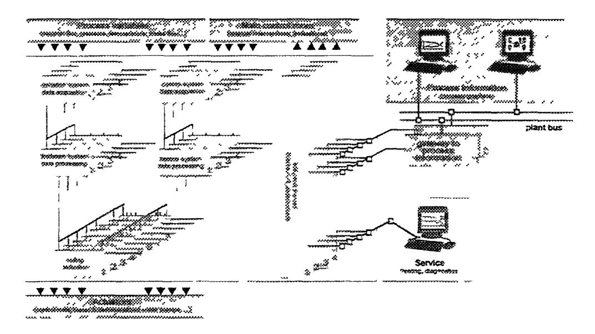

F/G. /. *System architecture.*

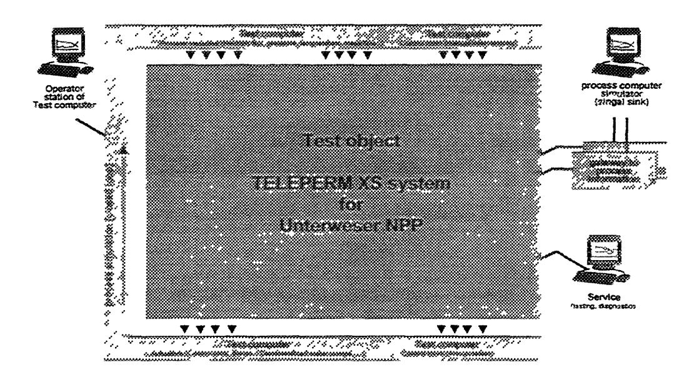

F/G 2 *Test configuration*

#### *2* INSTALLATION OF THE SYSTEM AT THE TEST FIELD

In. Fig 2 the system configuration, installed in the test field is shown The complete set of TELEPERM XS hardware has been installed and all communication networks have been connected Thus 100% of the system hardware formed the test object.

All I/O signals of the test object have been connected to a test computer which was able to provide all input data (field and control room inputs) and read all output data (actuation signals and control room annunciation) in real-time. By sending predefined input signal combinations to the test object and reading the output signals a black box open loop testing of the system can be performed. Furthermore a process simulator has been installed on the test computer in order to perform a closed loop testing by initiating design basis accidents and monitoring the integral behaviour of I&C and process simulator

A service unit has been connected to the test object, which was used for special test cases like I/O testing as well as for error tracking and monitoring the system during the black box testing. Fig. 3 shows the view on the service unit in the test field.

The gateway computers, designed for interfacing of the TELEPERM XS system with the plant computer information system, have been installed in the test field together with a plant computer simulation device, which served as data sink for the gateway computers. Thus the complete signal path from the TELEPERM XS function computers to the plant information system could be tested.

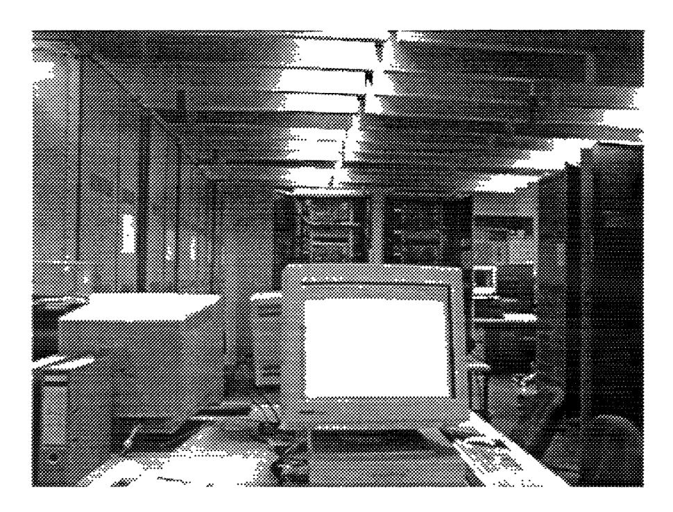

*FIG. 3. View of test field installation.*

The test computer is shown in Fig. 4. It consists of a operator station based on HP workstation and I/O devices, based on SIMICRO MMC computers and SIMATIC S5 I/O modules connected to the operator station via IEC interface (GPIB). The test software is based on UNISYSTEM simulation software which allows the setting and reading of all signals at the system interface for open loop testing. The process model used for closed loop testing is based on the OPAL function trainer for Siemens KWU PWR reactors 1300MW. The OPAL function trainer has been included in the UNISYSTEM simulation software, while the simulation software of the I&C in the OPAL program was replaced by I/O calls of the TELEPERM XS I/C system.

# 3. PLANT INDEPENDENT SYSTEM TEST

The plant independent system tests were performed from December 1996 to June 1997 at the test object of the Unterweser reactor I&C project. This generic system test forms an additional test to the generic component qualification and has two main test goals:

- integration of all hardware and software components (System integration test);
- proof of TELEPERM XS system properties (System properties test).

In parallel to the plant independent tests since March 1997 also the specific tests for the Unterweser reactor I&C project were performed which were finalised end of may 1997 with the successful factory acceptance tests.

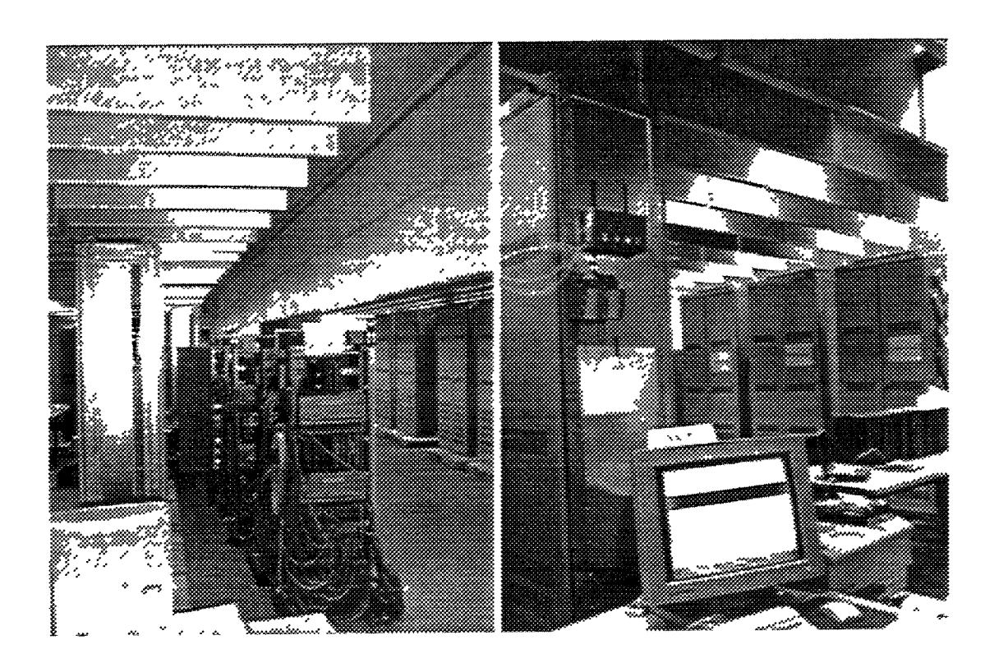

FIG. 4. Test environment (I/O system and operator station)

# **3.1. Generic system integration test**

The system integration test deals with the integration of the individual hardware and software components. Test purpose is the validation of the interfaces between the components (as far as these are not tested or could not have been tested during the component development phase and the component qualification). This system integration test is independent from the project specific system requirements.

# The mam test objects are:

- HW and SW configuration check;
- HW integration;
- interfaces of the TELEPERM XS runtime environment with system hardware, operating system, exception handler, I/O drivers, application software, service unit;
- interfaces of the TELEPERM XS exception handler to NMI handler, Diagnostics monitor, service unit, I/O drivers, system hardware;
- signal interface of the I/O drivers to the application software;
- self test software.

For these test objects test goals and requirements have been defined in order to specify test procedures and perform the tests.

## 3.2. Generic system properties test

The system properties test deals with the properties of an integrated TELEPERM XS system with distributed functionality. It serves for the validation of the system properties against the requirements:

- deterministic system behaviour;
- real-time properties;
- failure behaviour;
- fault tolerance;
- failure propagation barriers;
- test, maintenance and diagnostic properties.

The main test objects are:

- start-up properties;
- operation properties, incl.:
  - deterministic system behaviour,
  - constant processor and bus load,
  - real-time properties,
  - reaction time.
- correct execution of application functions, incl.:
  - independence of the different application functions,
  - independence from service interventions.
- independence properties of different computers;
- failure behaviour and fault tolerance, e.g. detection and annunciation of failures of:
  - individual signals,
  - I/O boards,
  - communication processors,
  - LANs,
  - cyclic self-monitoring,
  - individual computers,
  - several computers.
- Cabinet alarm device, incl.:
  - plug-in control,
  - inhibit signal output,
  - watchdog .
- failure propagation barriers;
- failure behaviour and fault tolerance of voters;
- test, maintenance and diagnosis.

# 4. ROJECT SPECIFIC TESTS OF THE UNTERWESER REACTOR I&C IN THE TEST FIELD

## **4.1. Preconditions, preceding tests**

Prior to the test field testing several function tests have been performed in order to provide a pre-tested function software to the test field and save efforts (time and money) for function tests in the test field. For this purpose the TELEPERM XS engineering tool SPACE provides test environment tools, which allow functional testing of the application software on a workstation in pseudo real-time.

The principle of test environment creation is shown on Fig. 5.

The function software which is automatically generated out of the function diagrams by means of a qualified code generator can be used for TELEPERM XS target hardware as well as for test environment. For testing it is linked together with simulation interface software to a test bed based on UNISYSTEM software. In case of the Unterweser project a process simulation program package OPAL was available, which was combined with the TELEPERM XS function code.

The test bed is operated by test scripts based on UNISYSTEM test language. The test language is the same used for operating the test computer in the test field. Thus the same test programs have been used in simulation environment and test field which gave the possibility of comparison of the results of both tests. The results of the tests are output data files, which can be evaluated by standard graphic tools.

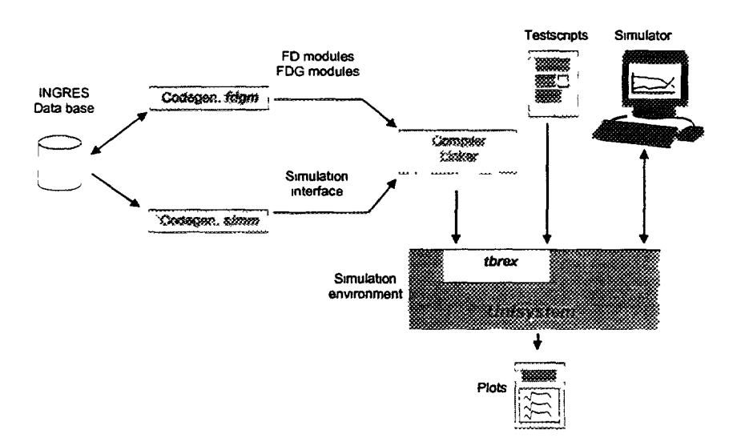

*FIG. 5. Working principle of test environment.*

# *4.1.1. Individual function tests in the simulation environment (1CPU, open loop)*

Within detailed engineering phase the application functions have been tested individually in simulation environment. For this purpose the function to be tested has been designed for 1 of the 4 trains or for 1 of the 61 control rods respectively. After that the function was isolated from the other functions and provided with appropriate input and output connections. Function test have been performed be supplying input data to the isolated function and reading the output data. In total several hundreds test cases have been performed for 48 test objects (isolated functions).

After these tests the functions have been copied for the other trains or for the other control rods and the complete SW specification was designed.

#### 4 1.2 Integral function test in the simulation environment (ICPU, open loop)

After the complete SW specification was finished and the code generation for the complete I&C system was carried out successfully, the application software was compiled completely for integral function tests. These tests have been carried out for selected complicated algorithms in order to provide test field support.

The integral tests relevant for the customer and the assessor have been carried out on the hardware in the test field.

#### 4 1 3 Integral function test with process model in the simulation environment (1CPU, closed loop)

In parallel to the open loop tests in the test environment the complete SW specification was connected to the process model OPAL in order to get a closed loop simulation environment. The complete process and I&C software was compiled and linked to a executable simulation program on the HP workstation. Thus complete operational and accident scenarios could be computed in the simulation environment. The real-time factor of this closed loop simulation was about 5-10 (depending on the computing power of the respective workstation).

The following relevant test cases have been performed in the closed loop environment:

- operational power transients (100% -> 50% -> 100%; 5%/min, 10%/min),
- power drop (100% -> 0%; 100% -> 50%);
- loss of 1-out-of-2 main feed water pumps;
- loss of 3-out-of-6 main cooling water pumps;
- loss of 2-out-of-2 main feed water pumps;
- loss of 1-out-of-4 main coolant pumps;
- unintended drop of 1 control rod,
- unintended de-borating,
- unintended opening of main steam release valve;
- power density too high, upper core;
- power density too high, lower core.

The performance of these simulations is essential for reducing the number of plant experiments on site during commissioning. On the other hand these close loop tests have been repeated in the test field in order to compare the results and get information about the quality of the simulation tools.

#### 4 1 4 Control rod actuation test

In parallel to the function tests in the simulation environment the actuation of a control rod via TELEPERM XS voting computers has been tested. The control rods of Siemens KWU PWR reactors are operated by solenoid coils in step drive mechanism. The three drive coils (holding coil, lifting coil and gripping coil) have to be operated in a well defined time sequence in order to lift or lower a control rod. The drives can perform max. 1 step / min (1step = 1cm). At Siemens KWU control rod test facilities the TELEPERM XS actuation computer was installed and the control rod actuation was tested under normal and failure conditions of the actuation computer. It was shown, that the control rods are appropriate operated under all conditions.

#### 4.2. Electrical and I&C commissioning

After finishing the manufacturing and pre-commissioning of the TELEPERM XS cabinets and modules the complete I&C system, consisting of 20 cabinets, was installed and power supplied in the test field. The complete computer network, consisting of more than 150 fibre optical bus connections was installed and all I/O channels of the test object have been connected to the test computer.

First step of test field commissioning was the electrical and I&C commissioning, incl.:

- software download, test of LANs;
- I/O signal test.

#### *4.2.1. Software download / test of LANs*

The system software was downloaded to every computer in the network, including function computers and communication processors. In order to test the LANs special application software was downloaded to the function computers. After the successful end of the LAN tests the original function software was downloaded to the computers.

# *4.2.2. I/O signal test*

The I/O tests perform the precondition for the function tests. The complete path of the signals from the test computer software via test computer I/O boards, cabling, TELEPERM XS I/O boards to the TELEPERM XS function software was tested in a overlapping manner. Thus the following types of errors can be detected:

- software errors in the test computer;
- hardware errors in the test computer I/O boards;
- cabling errors from test computer to TELEPERM XS;
- hardware errors in the TELEPERM XS I/O boards;
- software errors in the TELEPERM XS function diagrams.

The input tests have been performed by setting the input signal with the test computer and reading the data in the TELEPERM XS computer via service unit. The output tests have been performed by setting the signals in the TELEPERM XS computer (test mode) and reading them in the test computer.

## 43. **Project specific system tests**

Additional to the generic system tests several application specific system tests have been performed.

#### *4.3.1. Computer load and LAN load*

A main system property consists in the constant processor and bus load under any conditions. Thus the measurement of these values gives an understanding about the reserves of the system. The computing time of a processor in comparison to the cycle time is a measure of the processor load. Within the time reserve between the end of a computing cycle and the begin of the next cycle the cyclic self-monitoring is performed and service tasks are fulfilled. The computing and cycle times of each computer have been measured.

The data packages from one computer to the other are transferred strictly cyclic, which leads to a relatively high, but constant bus load. Thus the bus load measured under normal operation conditions gives the figure for all situations including the system demand. The bus load was measured for all LANs.

Additionally the values measured for computer and LAN load were checked against the theoretical values given by the SPACE tools in order to verify the load models of these tools.

#### 432 I&C cabinet alarms

The TELEPERM XS cabinets perform alarm functions under the following conditions:

- plug-in control of modules;
- computer failure, incl. inhibit I/O;
- power supply failure;
- temperature or ventilation alarm;
- door open alarm

These functions have to be tested for each individual electronic cabinet.

#### 4.4. Function tests

The function tests formed the main part of test field testing. Several thousands tests have been performed in order to cover the complete functionality of the I&C system. The function tests have been performed as black box tests. That means that the only relevant test device was the test computer The service unit, which has the possibility of monitoring the internal states of the I&C system during tests was used for supporting the error diagnosis.

#### 4 4 1 Function tests without I&C failures (nCPU, open loop)

The function tests without I&C failure test the behaviour of the I&C system under normal circumstances. They are based on the individual function tests in the simulation environment (see Section 4.1.1 and 4.1.2) and cover the complete functionality of:

- reactor limitation system;
- reactor control system;
- rod control actuation;
- message processing
- control room annunciation and indication;
- manual interventions.

The tests have been carried out as positive tests.

#### 4 4 2 Function tests with I&C failures (nCPU, open loop)

The safety I&C system has to cope with the different failure combinations laid out in the appropriate rules and codes. With these tests the function of the safety I&C functions under hardware failure conditions of the I&C has been proven:

- failure of input signals;
- failure of I/O boards;
- failure of communication lines;
- failure of computers;
- failure of voter subsystems.

The system has shown in these tests its extremely high degree of fault tolerance as well as effective barriers against fault propagation.

#### 4.5. Tests with process model (nCPU, closed loop)

The closed loop function tests carried out in the simulation environment and described in Section 4.1.3 have been repeated under real conditions with the TELEPERM XS hardware and the

test computer. For this purpose the process model has to be computed in real-time in order to provide input information to the TELEPERM XS system via the hardwired interface and acquire output information from it.

The test results of the simulation environment and the results of the test field testing have been compared. They showed a *high degree of similarity.* The differences between both test results are due to:

- Electrical inaccuracies of the hardwired interface between test computer and test object. Compared with the ,,clean" signal transfer in the simulation environment the test field tests show electrical effects of D/A and A/D conversion .
- Timing effects due to the asynchronous mode of operation of the distributed multiprocessor system in the test field. In the simulation environment the functions of all computers are calculated sequentially for each time step. Thus no timing effects between the computers can be detected. The life system in test field show these kind of timing effects.

The above mentioned effects do not influence the integral behaviour of the system. The system reaction an incident situations can be seen on both kind of tests with the similar quality. This leads to the conclusion, that for prediction of the functional behaviour of TELEPERM XS systems the simulation environment is an appropriate solution. For intended modifications of the functionality of installed TELEPERM XS systems in the future (with no possibility of test field testing) the simulation environment can be a powerful tool for function testing.

#### **4.6. Factory Acceptance test**

The factory acceptance test was successfully finished in the Erlangen test field in May 1997. The customer and the assessor attended the final tests (see Fig. 6).

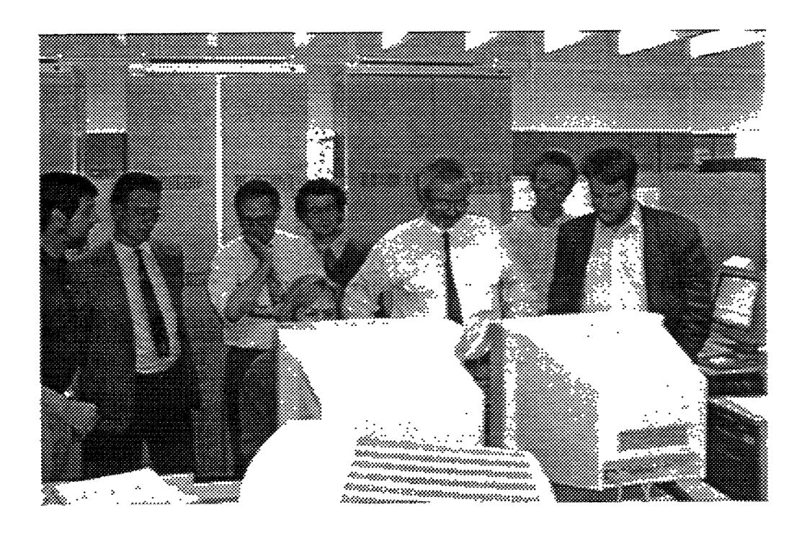

*FIG. 6. Factory acceptance test.*

## **4.8. Installation and commissioning at site for parallel operation**

After the FAT the system was installed on site and commissioned during the outage in July. The TELEPERM XS system network was completely installed and commissioned and selected input and output signals were provided to the system.

Since July 1997 the system is in operation online open loop in parallel to the old system. The purposes of the parallel operation are the following:

- acquisition of operation experience for the pilot installation of a TELEPERM XS system;
- division of the commissioning activities on two outage periods;
- intensive personnel training on site.

The system is connected to the plant computer information systems via the above mentioned gateways. Thus the operation and failure behaviour is constantly monitored.

For one selected function ,,power distribution control" a second set of control room equipment has been installed and the operator has the possibility to choose between the conventional controller and the new TELEPERM XS system. The TELEPERM XS "power distribution control" is in operation most of the time with exception of the training and commissioning periods.

The one-year online open loop operation of the TELEPERM XS system serves furthermore for acquisition of operation experience for the system as well as for the failure rates of the components.

#### **REFERENCE**

[1] Wemer Bastl, Heinz-Wilhelm Bock "German qualification and assessment of digital I&C systems Important to safety". Reliability Engineering & System Safety 1998 (in print).

# MODERNIZATION OF I&C IN THE PAKS NUCLEAR POWER PLANT

A. HETZMANN, J. EILER, Z. TOTH Paks Nuclear Power Plant, Paks, Hungary

#### Abstract

The I&C modernization activities are motivated with the next aspects: Demand on new functionalities not included in the original design; Reduction of operation and maintenance cost; Increasing of safety requirements; Gradual disappearing of the technical support of the manufacturers; Demand on higher quality of the equipment. Since plant will reach the half of his lifetime within few years, a peak of modernization activities is planned providing the stable operation till end of the lifetime. It concerns not only the I&C but other systems as well. By the strategy the modernization has to be finished within about ten years. There is a long term and a middle term reconstruction plan for I&C systems. The long term plan defines a systematic approach of modernization. The realization of the particular projects must not exceed the period of yearly outages. The middle term plan defines the approved activities and contains allocated resources to them. The modernization activities could be divided on two groups: a) Reconstruction of existing systems or construction of new ones; b) Systematic 'pin-to-pin replacement' of certain kind of equipment belonging to different I&C systems leaving the functions and the architecture unchanged.

# 1. SYSTEM LEVEL I&C RECONSTRUCTION AND IMPROVEMENT PROJECTS IN THE PAKS UNITS

The items will be discussed:

- Reactor protection system refurbishment project
- Turbine power controller
- Core monitoring system reconstruction.
- Installation of an on-line water chemistry monitoring system
- Steam generator leakage monitoring
- Reconstruction of the unit computers

#### 1.1. Reactor protection system (RPS) refurbishment

Due to enhanced safety requirement, the management decided to engage in an overall safety I&C system upgrade. The project aims at introducing changes and modern solutions into the I&C technology and at restructuring the safety I&C system. These changes affect the actuation algorithms as reasonable. Introducing changes to the I&C technology means implementing the logic currently based on relay circuits by using modern type-tested digital components, whereas system restructuring means integrating the existing autonomous safety subsystems into a single three-train system. The refurbishment utilizing up-to-date tools facilitates the elimination of known algorithm inadequacies after performing the corresponding safety analysis.

#### 1.2. Turbine control system replacement

The goal of this project is to establish capabilities of participating in the countrywide primary frequency control. It makes possible for Hungary to join the European grid. One unit by year will be equipped with a state of the art turbine controller. The main features are:

- manual control;
- automatic control;
- RPM control;

- power control:
- combined control;
- fresh steam pressure control
- limitation functions: power and fresh steam pressure.

#### 1.3. Reconstruction of the core monitoring system

According to the regulations the continuous operation of the units depends on the availability of the core monitoring system. Missing the core monitoring functions more then 2 ours, the unit power must be reduced. Using the latest technology digital equipment for replacement with well structured redundancy we could avoid the power losses.

There are other benefits of the reconstruction besides the high reliability. A further software improvement will support the use of newly constructed profiled fuel elements. It will increase the fuel burn out ratio reducing the fuel costs.

The project was started in 1990. A pilot system was first installed running parallel with the old equipment on unit 1. After a half year of testing period the first installation was carried out in 1992 during the annual outage on unit 2. It was followed by the next installations on further units one by year. During each installation the software was upgraded according to the operational experiences of the earlier installed systems.

#### 1.4. Installation of an on-line water chemistry monitoring system

Replacing a former, manually operated sampling system, a new PLC controlled automatic system has been installed with the following main purposes.

- Reduce the need of the human work;
- Reduce the personal irradiation dose;
- Provide continuous, on-line sampling in place of the old periodic one.

Due to the rapid evaluation the necessary action could be done faster in case of deviancy from normal chemical conditions. The controlled parameters:

In the primary coolant water

- Conductivity,
- pH;
- Redox potential;
- Dissolved hydrogen
- Potassium ion;
- Ammonium ion

In the steam generator secondary side:

- Conductivity;
- pH,
- Redox potential;
- Chloride ion

In other parts of the secondary side:

- Conductivity;
- Hq –
- Dissolved oxygen;
- Chloride ion

The samples are directed to the sensors using a manifold valve selector system in the primary circuit. The total cycle time is 30 minutes. In the turbine hall the circuits have individual sensors. The total number of sampling points is about 100 in each unit. The systems were installed between 1993-96 one per year. The PLC system consists of 9 controllers for the whole power plant. It also includes displaying features at any location of the plant via a local area network.

#### 1.5. Steam generator leakage monitoring

The leakage monitoring system indicates the N16 isotope in the fresh steam. Using a sophisticated algorithm the leakage can be calculated with high accuracy. The new monitoring replaces the old fresh steam activity measurement requiring large volume of maintenance work.

The first installation was in 1996. After one year of successful operation the further installation are planned in 1997-98.

#### 1.6. Reconstruction of the unit computers

The technical support and the experts of the old 3rd an 4th generation plant computers are gradually disappearing. Obtaining the spare parts became extremely difficult and is possible mostly from the 'second hand' market.

After a half year of investigation phase a strategic decision was accepted: the new system must be constructed utilizing an off-the-shelf software product tailored on the need of the plant. Almost one year was spend on selection of the appropriate software.

The management agreed on a constructing of the pilot system running parallel with the existing of the existing computers without any disturbance of its operation.

The main objectives of the pilot project:

- practical and final confirmation of the applicability of the chosen software product;
- to prove the economical expandability without practical limits;
- training of the operational and the maintenance personnel;
- preparing of the specification and design for final installations.

#### 2. INCREMENTAL I&C UPGRADE IN PAKS

Incremental upgrade means fully or almost pin-to pin upgrade of obsolete equipment. The reason of the replacement was the demand on higher quality and on reducing he O&M costs. In some cases the need for a new particular function led to the change of the old equipment to a new modern one. The replaced equipment:

- dP transmitter replacement;
- Pressurizer level measurements;
- Turbogenerator vibration and shaft displacement measurements;
- Electromechanical limit value monitors;
- penetration replacement;
- Recorders.

#### 2.1. dP transmitter replacement

The systematic dP transmitter replacement initiated in 1991 was continued in the last two years and now we have more than 350 new transmitters installed in Units 1 and 2. There are four types of transmitters in use:

- Standard type
- Standard type with nuclear cleaning
- Special design for WWERs.
- Smart transmitters

#### 2.2. Pressurizer level measurements

A new computing unit was implemented in the level measuring circuits of the pressurizer, used for monitoring purposes in the Main Control Rooms in Units 1, 2 and 3. This computing unit performs an overall continuous density correction (from start-up to nominal pressure) on the basis of the saturated water-steam table. The same device is planned to be installed in Unit 4 this year.

#### 2.3. Turbogenerator vibration and shaft displacement measurements

The vibration and shaft displacement of the turbogenerator sets were refurbished with new equipment. Presently 3 turbines have the new bearing vibration measurements and 5 turbines have the new shaft displacement measurements.

#### 2.4. Electromechanical limit value monitors

The systematic replacement of the originally implemented electromechanical limit value monitors has been continued in the NPP and - at present - almost 600 new, fully electronic limit value monitors are installed in the four Units.

#### 2.5. Recorders

A systematic replacement of the obsolete recorders has been launched at the power plant. To date, 74 recorders have been replaced altogether in the four units. The new devices provide some practical services like event controlled recording. The project is to be continued in the next years.

# **THE STATUS OF I&C DEVELOPMENT IN THE REPUBLIC OF KOREA**

I.S. KOO, K.C. KWON, J.W. LEE Korea Atomic Energy Research Institute, Yusong, Taejeon, Republic of Korea

#### **Abstract**

It is required to adopt digital technology for the modernization of I&C systems . Outage reports were evaluated to provide the new design requirements of applying digital technology to NPPs. The overall design requirements of next generation reactor are introduced, and the replacement plan of Kori unit 1 is described. In any case of new I&C design, the verification and validation of the function and performance of digital system should be done before commissioning. I&C test simulator to validate new developed digital control and protection algorithms, alarm reduction algorithms, etc. is developed. To evaluate human tasks in control room, the human factors' integration test facility is developed. Some applications with I&C test simulator and some human factors experiments are done. These facilities will be able to validate new designed I&C functions and operator's tasks in the control room.

#### 1. INTRODUCTION

### **1.1. Problems of operating plants**

Existing I&C systems for nuclear power plants designed and built in accordance with technologies in the 1960's or 1970's have been faced with problems regarding obsolescence, burden on maintenance and testing activities, inaccuracy, and unreliability. In addition, it has been difficult to adopt new technologies to improve plant availability.

The outage reports of nuclear power plants have been reviewed to select the upgrade items in the I&C area. This review was focused on the failure rate in numbers of unplanned trip and in outage duration, the identification of outage causing from a failure of I&C equipment, the source of a fa'l lure, the classification of a system failure in accordance with outage and the failure rate in accordance with operating years.

The percentage of failures caused by I&C was about 17% of duration and 44% of numbers. At concern about operating years, duration of failures caused by I&C was 14% the first 2 years, 22% the second 2 years, 16% the third 2 years, 23% the forth 2 years and 19% the fifth 2 years.

On the equipment basis, failure rate caused by electronic device was 28% in numbers and 33% in duration, failure rate caused by conductor, power supply, relay and transmitter was 42% in number and 41% in duration, failure rate caused by control valve was 10% in numbers and 9% in duration and failure rate caused by electro-hydraulic control was 13% in numbers and 6% in duration. On the system basis, instrumentation failure rate was 18% in numbers and 13% in duration, control system failure rate was 67% in numbers and 68% in duration, protection system failure rate was 5% in numbers and 6% in duration.

Finally, causes of plant outage were ageing and vibration of components, errors in designing, manufacturing and installing systems and/or equipment and human errors in operating plants and maintenance of equipment.

# **1.2. TMI action plan**

Current operating nuclear plants were designed by the "bottom up approach". So, training of operators is very important to operate the plant, safely and efficiently. When an emergency event is occurred during operation, a huge amount of information will be provided for the operator to take appropriate action Understanding of plant status at emergency state, the operator's burden will be very high It can lead to an operation error. To provide good design for man-machine interface, "topdown design approach" based on human factors engineering shall be applied.

#### **1.3. Potential licensing issue**

Protection of common mode failure of computer system software and hardware is a potential issue for applications of a digital technology in nuclear power plant. Recently, IEEE approved a new version of IEEE 7-4.3 2, "Standard Cntena for Digital Computer in Safety Systems of Nuclear Power Generating Stations" This cntena will be taken as a requirement for the development of safety related computer system by Korean regulatory bodies. Hence, the development of new digital systems shall be met with this kind of licensing issue.

It is required that digital technologies is applied to the replacement of the aged analog I&C equipment in operating Nuclear Power Plants(NPP) and to the I&C systems in new NPP. The application of these technologies to NPP is not fully assure their reliability.

# 2 DEVELOPMENT OF NEXT GENERATION REACTOR

The basic requirements of I&C system development for the next generation nuclear power plants in Korea has been reviewed with respect to the conventional I&C systems The typical charactenstics of the advanced I&C systems for next generation are extensive application of the digital technologies in order to enhance safety and reliability of the integrated I&C systems. The advanced I&C systems are also applied to advanced man-machine interface technology to improve human factor problems in nuclear power plants

The I&C system design requirement in EPRI's utility requirements document have been evaluated For the development of the Korean I&C design requirements, the vanous types of design for I&C systems have been reviewed and incorporated

The Korean I&C design requirements are:

- Improvement of plant availability and reliability.
- Improvement of the maintainability
- Software quality improvement and hardware qualification.
- Improvement of the operator support functions.

On the licensing concerns, the common mode failure design cntena and the software venfication and validation methodology are under discussion.

#### **2.1. Design requirements**

NGR plants will be operational after 2005. The trend of I&C technology improvement is very rapid Hence, around 2005 the current advanced technology will be getting old. Then Operation and Maintenance(O&M) problems will be occurring. Also, operators of NGR will be very familiar with computer operation. Based on these scenano, we selected new concept and/or technology for NGR. In parallel, we made a decision on resolving potential issues for NGR and current operating plants

## *211 Technical Requirements*

*-* Reliability and availability. Digital technology has many ments, which improve reliability through self diagnosis of failure, stable and dnft free operation, and more comprehensive information on plant operating status provided to the operator, while digital I&C systems have some risks for the licensing concerns including verification and validation of digital systems, common mode failure, etc.

# - Standardization and diversity.

For the conventional I&C system design, it is difficult to change design or to replace spare parts due to select components and implemented systems. To reduce costs of O&M, NGR shall have plant-wide standardization. If standardization is emphasized, the diversity requirements which is one of the licensing concerns may not be met.

# - Redundancy and segmentation.

Since it is expected that new technologies will be applied, including use of computers and multiplexed data transmission, the requirements need to ensure that the design is as forgiving as possible in terms of the probability and consequences of the failures of this potentially shared equipment.

# - Maintainability and testability.

With the adoption of digital technologies, one of the most significant changes of I&C systems compared to conventional I&C systems is the remarkable improvement of testing and maintenance capability including accurate and stable calibration, continuous self-diagnostics, and automatic functional operator/maintenance personnel burden

# - Flexibility and expansion.

The technology of I&C equipment is rapidly changing, and obsolescence of equipment is a continuing concern Therefore, I&C design must be flexible and expandable to allow for design changes and replacement of obsolete equipment. In addition, major systems shall be designed with sufficient performance margin to perform its designed function under condition of maximum stress.

# - Integrity of software.

With the adoption of digital technologies, one of the major concerns related to software is that software based safety systems may contain subtle failure modes that occurs only under an obscure set of conditions If standardized software is used to perform similar functions in similar computer hardware installed throughout the system, then common mode failures could degrade overall safety system operation.

# - Hardware requirements.

I&C system in next generation reactor will be constructed with microprocessor-based systems which shares process equipment and data transmission functions. Therefore it is very important to prevent common mode failures.

# - Data communication.

The architecture of I&C systems in next generation reactor will be constructed with several layers for data communication.

## *212 Functional Requirements*

# *-* Protection and safety system.

The important functions of the protection and the safety related systems are to shut down the reactor safely and to mitigate an accident. It is necessary to meet such requirements as the separation, diversity and independence of these systems.

- Control and monitoring systems.

These group systems will be provided with monitoring and control capability of the overall process of producing energy, transport, and conversion. For reducing operator task error, these group systems provide for automatic operation or unattended operation for continuous or often repeated tasks when the plant is in nominally steady operation above a low power level operation. Some reconfiguration actions cannot depend on the operators because of timing constraints or the risk of error.

- Operation aids and alarm processing function. The functions of these group systems is to provide appropriate information on equipment status, core limits, margins and other plant status for safety operation.

#### 3. REPLACEMENT OF KORI UNIT 1

Kori unit 1 is upgrading Process Protection System(PPS), Process Control System(PCS) and Plant Computer. The upgrade is being driven by growing problems of obsolescence, difficult in obtaining parts, and increased maintenance costs of existing systems. The retrofit of the H-Line systems (PPS and PCS) and W2500 plant computer at Kori unit 1 will be completed in 1998.

#### **3.1. Design requirements**

- The safety evaluation under 10 CFR 50.59 which provides the bases for the determination that the change, test, or experiment does not involve an unreviewed safety question shall be addressed, evaluated and resolved.
- The system failure due to software, including common mode failures, and defence in depth shall be addressed, evaluated and resolved.
- The potential effects of electromagnetic interference (EMI) and radio-frequency interference (RFI) on digital-based equipment shall be addressed, evaluated and resolved.
- The potential errors of inadvertent or unauthorized changes to be introduced via man-machine interface (MMI) for digital-based equipment, and the adequacy of training and procedures provided for plant personnel in the use of the new equipment shall be addressed, evaluated and resolved.
- Software verification and validation including commercial grade item (hardware and software) dedication to qualify commercial grade digital equipment for use in safety system shall be addressed, evaluated and resolved.

# 4. DEVELOPMENT OF TEST SIMULATOR FOR I&C RESEARCH

#### **4.1. Introduction**

Most of the operating nuclear power plants have analog instrumentation and control (I&C) equipment which are increasingly faced with frequent troubles, obsolescence, and high maintenance expense. But digital technology provides advantages such as processing of numerous data, improvement of system reliability, flexibility of adding new functions, automation of periodic tests, self- diagnostics, and improved operation and maintenance using standardized components.

Consequently, it is strongly recommended that nuclear industries adopt modem digital and computer technology to improve NPPs safety, availability, and operating functions [2]. However, in applying the digital technology to nuclear power plants, we should ensure that it does not endanger the safety and reliability of the plant. Verification and validation of the function and performance of

the digital system should be done before installation in real NPPs. The purpose of the I&C test simulator is to verify and validate the newly developed control and protection algorithm, alarm reduction algorithm, and the performance of operator support system using artificial intelligence technology. The new developed I&C system should be tested and verified using prototype or mock-up from the initial stage of development. I&C system replacements and upgrades usually rely on static or low-fidelity simulation testing before plant installation, followed by a lengthy startup test to adjust system tuning constants. The plant is exposed to huge risk if installation difficulties are encountered or if the system does not operate as anticipated. The test simulator can be used to test digital I&C system upgrades before actual plant installation[3]. The prototype or mock-up receives plant signals from normal and transient states and produces appropriate output signal to verify the plant state transformed to normal state or operator wanted state. Recently, the digital I&C functions are transferred to more integrated, intelligent, and diverse. The requested signals to test and verify the above functions should be continuous and provide real-time characteristics. It is more realistic to receive these signals directly from operating NPPs, but it is almost impossible. Therefore it is necessary to develop the I&C test simulator which simulate the behaviour of NPP to test and verify the developed prototype or mock-up.

The MMIS design process shall include the development of digital computer based dynamic models for the overall plant response as well as individual control systems.

The proposed test simulator has drawbacks to test common mode hardware failures and software verification and validation, but it is possible to carry out a dynamic test of the system function which is one step in the process of software verification and validation.

### 4.2. **Functional requirements**

## *4.2.1. Hardware Requirements*

The major hardware equipment is computer complex which store and execute dynamic modeling and supervisory program. The computer complex should provide real-time execution and multi-tasking function. The computer complex includes hard disk, text and graphic display terminal or X-terminal, and disk back-up system. Among these peripherals, the hard disk should have enough capacity to store all generated parameters for a long time in test periods.

The test panel which is assigned a part of operator console in real NPPs is required. In order to control the pumps, valves or status in prototype, the test panel includes push button switch, toggle switch or function key. The plant status may display in colour CRT or X-terminal to provide high expandability and flexibility. If necessary, the test panel also includes data display units like LED, lamp, or plasma display. It is convenient to use mosaic tile for easy change or modification of panel.

The hardware input/output (I/O) interface between the host computer and the test panel or developed prototype is also required. The I/O interface should provide fast transfer speed of analog to digital or digital to analog conversion and high conversion accuracy of current and voltage signal. Ethernet communication is also needed interfacing with host computer and developed prototypes.

#### *4.2.2. Software Requirements*

The test simulator receives the test input signal from the prototype controller, and provides appropriate output signal to controller after the test simulator mathematical modeling calculates the plant dynamics. The input or output signals should be similar to trend of real NPPs. According to the above requirements, we suggest software requirements such as real-time mutli-tasking operation, mathematical modeling or scenario of I/O signal, store and retrieval of simulated parameters, I/O function for data transfer to prototype, database management and hardware test etc.

In real NPPs, the generated parameter is continuously provided, but in the test simulator, the parameters are updated by some time interval because the system is operated by software. In this case, short time interval is more desirable, but it is limited by computer capability and capacity. In digital I&C, the system also has time interval for the signal is transferred by communication network, test simulator is required to transfer the signal around 200 msec, compared to other digital applications.

Another important feature of the system operation is multi-tasking which can accept user required supervisory function while the real time module is being executed.

There are two methods to provide proper test signals: the one is plant mathematical modeling which is continuously executes any input conditions. The other is a scenario which provides a specific plant signal stored in the computer memory by a uniform time interval.

In case of using mathematical modeling, there are numerous combinations of plant parameters, and it takes too much time to derive several types of initial conditions such as start-up, shut down, critical condition, standby, turbine rolling, 25% load, 50% load, full power etc. The test simulator should provide the function of store and retrieval of initial conditions.

The test simulator may provide the function of parameter display to confirm the operation status and to utilize during the test simulator development. There are many methods to display the parameters, typically using the graphic tool to display piping and instrument diagram, trend curve, or bar chart. It should be avoided that test simulator provides incorrect test result cause of the trouble of test simulator hardware itself. Therefore test simulator has to provide hardware test function.

# 4.3. **Development of the test simulator**

# *431 Overview*

The test simulator consists of mainly three parts: hardware facility, software program, and I/O interface including graphic user interface. The overall block diagram of the test simulator is shown in *FIG 1* The hardware facility includes HP747i workstation, hardcopy unit, VXI interface module, and simple test panel. The test simulator provides Ethernet and VME extensions for Instrumentation (VXI) hardware interface to developed prototypes. The VXI interface module will be described in more detail in the next section. The software mainly consists of process modeling program, interface module, and supervisory program. These programs communicate to each other through shared memory A graphic user interface using the Picasso-3 graphic tool is also provided for efficient testing usage [4].

# *432 Hardware*

The major hardware facility is the VXI bus back plane instrument and the simple test panel. VXI provides the interface between the host computer and developed target systems or test panel.

# *433 Software*

The test simulator software is divided into three major parts: process modeling program which executes mathematical modeling program by real-time, supervisory program that manage user instructions and interface module that includes variables display in CRT, Ethernet interface, and graphic user interface. It is useful to handle a lot of data with real-time if the communication between processes is to be done by shared memory which is the most efficient method of inter process communication. Shared common places specified common blocks in shared memory so that other processes can access them.

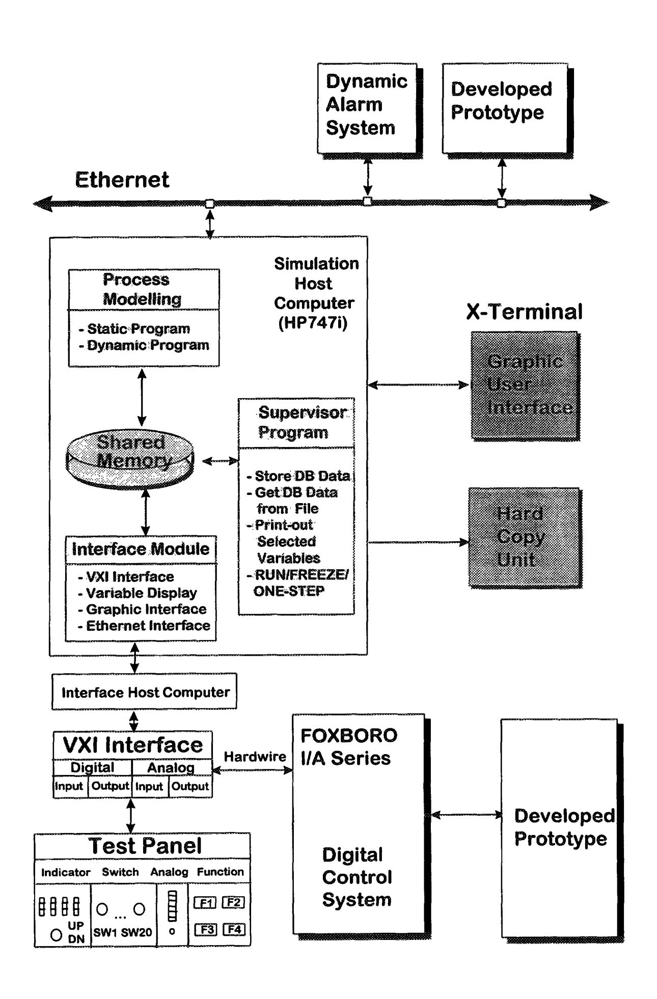

FIG.1. Overall block diagram of test simulator

#### Process modelling

The NPP modeled in test simulator is a 3 loop Westinghouse PWR, 993 MWe, mostly refer to Kori Unit 3&4 in Korea. Mathematical modeling code is same as Compact Nuclear Simulator (CNS) which is installed in the Korea Atomic Energy Research Institute (KAERI) Nuclear Training Center.

The nuclear behaviour of the core is calculated considering 25 axial nodes for neutron flux calculation and one neutron group. Three delayed neutron groups are used. Decay heat is modeled with three space independent sources. The rod control system has 4 control banks and 4 shutdown banks. The rod control can be automatic or manual.

The primary circuit and steam generators are modeled with two phase capability. On the secondary side there is the steam system, the condenser, the feedwater system, and the auxiliary feedwater system.

Extra water supplies are the residual heat removal system for the primary side and the auxiliary FW system for the secondary side.

Process modeling programs are consist of static part and dynamic part. Test simulator provides the function to activate predefined 79 types of malfunctions. This function realizes the transient or accident condition to test the developed target systems. These results of malfunction activation show a good performance of the test simulator compared to other transient analysis codes.

#### Supervisory Programme

The Supervisory programme comprises all the instruction that should be necessary for running the test simulator. This programme provides several types of instruction such as run/freeze, one-step, store, get, change display variable, change value, malfunction, and print out global variables.

#### Interface Module

Interface module can provide software interface to VXI interface and developed prototype using shared memory.

Graphic user interface is developed using Picasso-3 graphic tool for whole process diagram. This process diagram displays plant mimics, the status of components and the value of major parameters. Picasso-3 is a user interface management system supporting object oriented definition of graphical user interfaces in a distributed computing environment. Graphic user interface uses shared memory to acquire the necessary data from the test simulator [3].

#### **4.4. Applications**

#### *4.4.1. Automatic Startup Intelligent Control System*

The Automatic Startup Intelligent Control System (ASICS) has the supervisor system and the distributed control system. The supervisor system has the supervisor programme to control the distributed control system, and the knowledge base which is designed from the general operation procedures and the operator' s experiences. The supervisor system is implemented using an intelligent real-time expert system shell G2. The distributed control system has four automation modes such as Heating I mode, Heating n mode, Critical mode and Secondary mode, and each mode has controllers and keep-up bands. The keep-up bands have the check-up function to start each automation mode or the function to hold on some process variables to allow some operator' s action. The ASICS function is verified receive control input signal from test simulator and send control results to test simulator[6]. By this way, developed control algorithm is evaluated in real-time environment.

#### *4.4.2. Dynamic Alarm System*

The overall objective of Alarm and Diagnosis-Integrated Operator Support System (ADIOS) is to improve the operation performance of the man-machine interface system by integrating alarm, process monitoring, and diagnosis system. The computerized dynamic alarm system for ADIOS is implemented using G2 real-time expert system shell. The alarms in ADIOS have initially their own default priorities which are then changed according to plant-mode dependency, equipment-status dependency, multi-setpoint relationship, or some other methods. To only verify the functional effectiveness of the developed alarm system without investigation of operation performance, the test data are generated in real-time test simulator by activating malfunctions to make alarm occurring conditions[7]. The generated test data are transferred to target system by the method of shared memory.

#### *4.4.3. Accident Identification System*

The accident identification system can classify the types of accident or transient in NPPs by its time dependent patterns related to the principal variables and operating status of major equipment. In this accident identification system, the Hidden Markov Model (HMM), a double stochastic process enables modeling of, not only spatial phenomena but also time scale distances, is used for main identification method. Self-organizing map which is a kind of neural network is used for vector quantizer.

The test simulator is used to test the function and performance of the accident identification system by generating simulated accident or transient situations [8]. The configuration of the accident identification system and the test simulator and shown in *FIG. 2.*

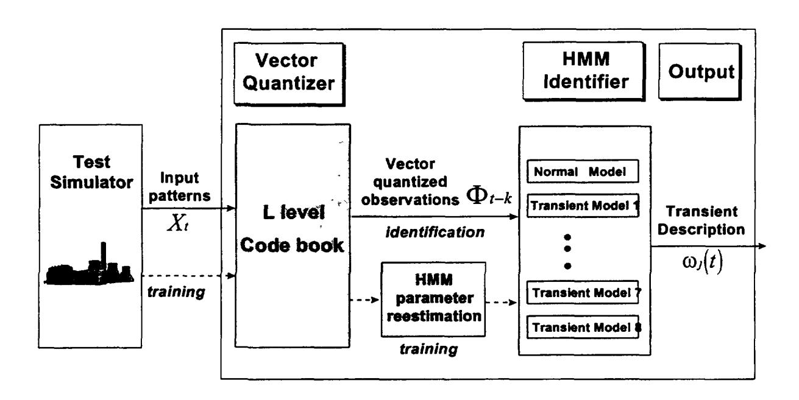

*FIG. 2. Accident diagnosis system with test simulator.*

#### 4.4.4. Intelligent Logic Tracing System

The Intelligent Logic Tracing System (ILTS) shows the logical paths between an interested state graphically together with the description of causes as results of diagnosis in a displayed logic diagram. And the state of a logic element like gate in diagram is displayed and updated in real time with a colour, e.g. red for on-state and blue for off-state. ILTS is tested with real-time test simulator [9]. FIG. 3 shows the block diagram of ILTS connected with test simulator.

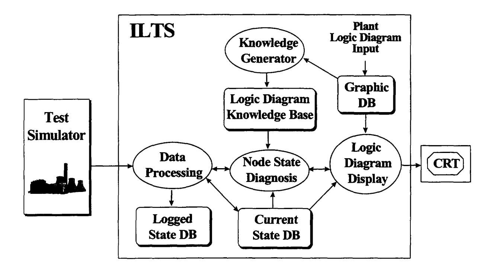

FIG. 3. Intelligent logic tracing system with test simulator.

#### HUMAN FACTORS RESEARCH

#### 5.1. Introduction

Interests in human factors in nuclear power plants have been grown in the early 1980s after the TMI accident. Bring influenced by this international trend, Korea Atomic Research Institute organized human factors team in 1988. Long term projects for the development of nuclear technologies starred in 1992 in KAERI. The Development of Human Factors Technology project is one of the projects. This project was planned for five years in two sub-project; the Development of Human Factors Experimental Evaluation Techniques and Development of Human Behaviour Analysis Techniques. The former has two objectives; one is to establish human factors experiment facility named Integrated Test Facility (ITF), and another is to accomplish the techniques for human factors experiments. The later sub-project has two research areas. One is the development of SACOM (Simulation Analyser with a Cognitive Operator Modal) for the assessment task performance by using the simulation of control room operation. Another area is the analysis of human error cases occurred in Korean nuclear power plants and the development of application systems, such as INSTEC (Information System of Trip Event Cases) and MARSTEC (Multimedia Authoring and representation System of Trip Event Cases).

# **5.2. Development of itf and experimental techniques**

The details of ITF have been designed from 1995,[10] and the test of ITF was completed m March of 1997. ITF consists of KAERI-HMS (Human-machine Simulator) and experimental measurement systems. The KAERI-HMS includes a full-scope PWR type nuclear power plant simulator with many VDU-based workstations. ITF has three rooms; main test room (MTR), supporting test room (STR), and experimenter control room (ECR). *FIG. 4* shows the configuration of ITF. In the MTR, there are an operator station with many visual display terminals and alarm panels, a shift supervisor station, a large scale display panel (LSDP), and experimental measurement equipment. For experimental measurements, a telemetry system for physiological signal measurements, an eye tracking system, and a three dimensional motion analysis system for measuring operators' hand movements are located in the MTR.

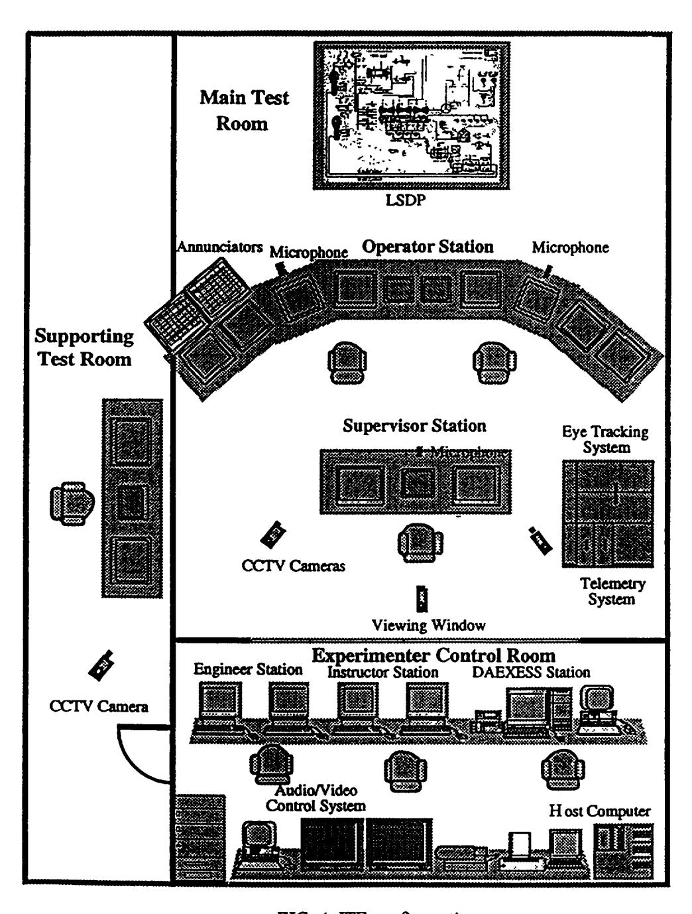

*FIG. 4. ITF configuration*

There are three CCTV cameras to record operation scene, and three microphones, two at the operator station and one at the shift supervisor station, to provide and record communication among operators and a shift supervisor in the MTR and experimenters in the ECR.

The DAEXESS workstation which is in the ECR is a system for experimental data analysis. As shown in *FIG. 5,* operators in the MTR interact with the plant simulator through the interfaces which are manipulated with HMI software. Operator action log, alarm event log, and plant parameter history are produced respectively by the HMI software, simulation model, and instructor software of the host computer. Then, SCADA (Supervisory Control And Data Acquisition) software in the host computer collects and stores the data. The SCADA synchronizes the time of data from the telemetry system, the eye Tracking system, and the three-dimensional motion analysis system to the time of host computer, and processes the data formats to be suitable for the DAEXESS. The DAEXESS receives all the data from SCADA and integrates with audio and video records from the audio and Video control system. With the data shown on the DAEXESS station, experimenters can perform various analyses, such as debriefing analysis, statistical analysis, operator performance analysis, etc. In this display, from the top, there are a menu bar, a time frame display bar, bars with marks for system event data and verbal protocol data, a telemetry data window, and two video display and control windows that are selective among the audio and video control system, the eye tracking system, and the three-dimensional motion analysis system.

Along with the development of ITF, the development of experimental techniques has been tried in part by performing pilot experiments, such as an experiment for suitable information density on a large display and one for the evaluation of HMI design of a compact nuclear simulator. In the process of the pilot experiments performed, a scheme of experiment planning and software for processing and representing the data from the telemetry system and eye tracking system were developed [11, 12].

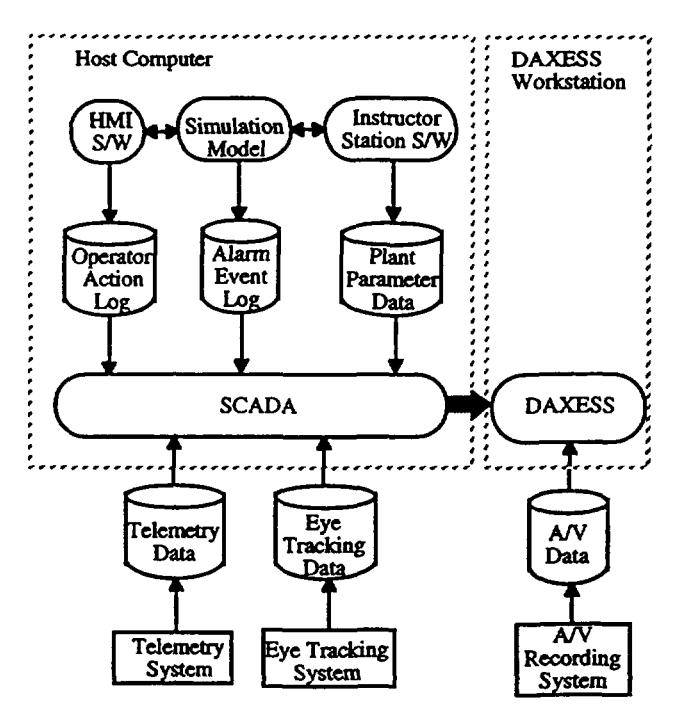

*FIG. 5. Experimental dataflow.*

#### 5.3. Development of SACOM

We intended to develop an operator task simulation tool for dynamic assessment of operation performance in the main control room of NPPs. To investigate the characteristic frames of operator tasks, we analysed operators performance at a full-scope training simulator running several emergency operation scenarios. We investigated the requirements of tasks that operators should perform in accordance with the scenarios before the simulator operation. Then, operator performance on the simulator was reviewed compared with the requirement frames of the tasks. The review was performed with the operators participated in the simulator operations and other operation experts. Based on the results of this investigation and cognitive mechanisms from literature, the conceptual frame of SACOM was made. For the development of SACOM, we focused on human factors evaluation of HMI designs in both conventional and VDU-based types. With the SACOM, we can estimate physical workload, cognitive workload, and information requirements as primary measures, then assess the arrangement and layout of control panels and devices, the quality of information structure compared to task requirement, the suitability of function location and procedures, and error potential, when comparing design alternatives or finding human factors problems in a design [13]. We developed a new cognitive task analysis method for derivation of task requirements and assessments of cognitive workload based on the concepts of cognitive span, working memory relief point, and work memory load [14, 15]. As shown in FIG. 6, SACOM has three major modules; an operator model, an interaction analyser, and a situation generator. A prototype SACOM was implemented for an emergency operation scenario on a blackboard architecture.

# 5.4. Analysis of human error cases and development of applications

Human error is an important factor for the operational safety and effectiveness of nuclear power plants. It is effective against human errors to analyse human error cases and present the information obtained from the analyses to plant personnel. In Korea, Nuclear Power Plant Trip Case Reports are issued annually and describe the component failures or erroneous tasks involved in the trip cases, the progress of events, remedial actions and investigations after the trip, and recommendations to prevent similar incidents. The reports printed in documents, however, are not effective in the use of reports. The reports identify human errors in a very limited sense, e.g. only for the wrong operations.

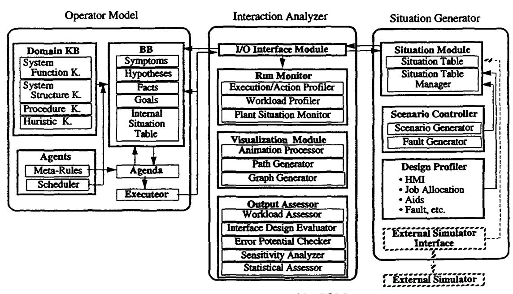

FIG. 6. The structure of SACOM.

Hence, it will be necessary to carefully analyse again the reports in order to find out something on erroneous actions. The sequence of events in the reports is described too briefly in many cases, while the supportive information, such as the actions taken to find the causes and the principles of equipment operation, is well described. This may cause readers to confuse in understanding the sequence of events. The information helpful for understanding the progression of incidents is sometimes described only in the causes of incident, the problems of incident, or the remedies to prevent similar incidents. Since the reports are available only in document form and the cases are classified only by major systems, the reports are not effective for the activities such as the search of some specific cases and the investigation of analogy and Wends existing among the cases. In order to resolve these problems, it was decided to analyse and arrange again the information of case reports. A retrospective analysis procedure and an error classification system were initially developed for the analyses of human error cases in Korean nuclear power plants. These have been revised in the process of case analysis [16]. A total of 79 cases was identified from 276 trip cases occurred from 1978 to 1994. A summary of analysis was made for every trip case, and detailed descriptions of event sequence were made additionally for the cases that human errors were involved. In the summary of analysis, the critical events are described more clearly than in the reports, and the problems and remedial actions are described consistently with the critical events. The detailed descriptions of event sequence represent the sequence of unit events in a time-lined table form.

Since the reports describe the cases mainly with equipment or component malfunctions, much portion of the information was changed for the cases involving erroneous actions.

We developed INSTEC and MARSTEC for the applications of information obtained from our case analyses. The INSTEC is a database system for the search and retrieval of the information. The MARSTEC is a multimedia-based instruction system on specific human error cases.

As shown in FIG. 6, the authoring interface of MARSTEC provides tools for input and processing of information differently to the types of information.

At present, MARSTEC was implemented with a few cases. The MARSTEC was demonstrated to instructors of a nuclear training centre. The response showed that MARSTEC would be a useful tool for the instruction of information on the trip events.

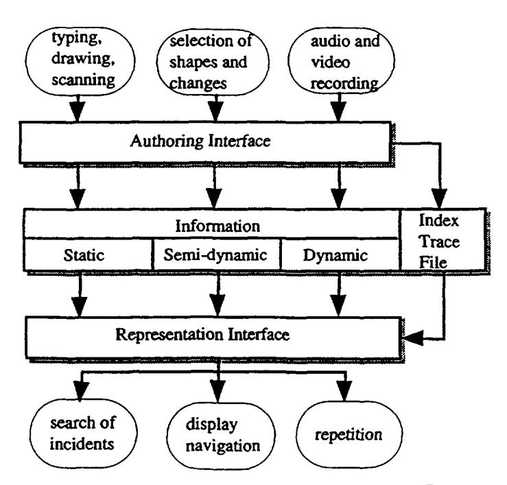

FIG. 7. Information processing with MARSTEC.

#### REFERENCES

- [1] S. Koo, "Draft Design Requirements of I&C for KNGR", IAEA Technical Committee Meeting on Advanced C&I Systems in NPPs, Espoo, Finland, June 20-23, 1994.
- [2] C. Kwon, et al., "Proposed Plan for the Development of Advanced I&C Technology in Korea" IAEA Technical Committee Meeting on Advanced C&I Systems in NPPs, Espoo, Finland, June 20-23, 1994.
- [3] Mikell Lord, "Simulator testing of digital control systems," Nuclear News, Sep. 1994, pp.35-38.
- [4] OECD HRP, The Picasso-3 User Interface Management System User's Guide, Sep. 1996.
- [5] C. Kwon, et al., KAERI Training Simulator process Description, July, 1988.
- [6] H. Jung, et al., "Development of Automatic Startup Intelligent Control System for PWR plant," Cognitive Systems Engineering in Process Control, Kyoto, Japan, Nov. 12-15, 1996, pp. 51-56.
- [7] Y. Lee, et al., "An Implementation of Alarm and Diagnosis-Integrated Operator Support System," Cognitive Systems Engineering in Process Control, Kyoto, Japan, Nov. 12-15, 1996, pp. 63-70.
- [8] C. Kwon, "A Stochastic Approach with Hidden Markov Model for Accident Diagnosis in Nuclear Power Plants," submitted to IEA/AIE'97, Atlanta, Georgia, USA, June 10-13, 1997.
- [9] P. Lyu, "A Study of Logic Display to Monitor the States of Logic Elements," NPIC&HMIT'96, The Penn. State Univ., USA, May 6-9, 1996, pp.429-436.
- [10] Sim, et al., "The Development of Functional Requirements for Integrated Test Facility," Proceedings of the IAEA Specialists Meeting on Advanced Information Methods and Artificial Intelligence in Nuclear Power Plant Control Rooms, IAEA-12-SP384.37, Halden, Norway, Sep. 13, 1994.
- [11] C. Lee, et al., "Human Factor Experiment Design in Using the Integrated Test Facility," Proceedings of the 3rd Pan-Pacific Conference on Occupational Ergonomics, Seoul, Korea, Nov. 13-17, 1994, pp. 424-428.
- [12] H. Lee, et al., "Application of Reactor Operator's Behavioural and Mental Workload Database for Evaluation of Nuclear Reactor Control Systems," Proceedings of Cognitive Systems Engineering in Process Control(CSEPC'96), Kyoto, Japan, Nov. 12-15, 1996, pp. 159-165.
- [13] H. Lee, et al., "Development of an Operator's Cognitive Task Simulation Analyzer of Operators in Nuclear Power Plants using Blackboard Techniques," ANS Topical Meeting on Computer-Based Human Support Systems: Technology, Methods and Future, Philadelphia, Jun. 25-29, 1995.
- [14] H. Lee, et al., "A Multi-Layered Method Cognitive Task Analysis in Nuclear Power Plants," Proceedings of 1st International Conference on Applied Ergonomics(ICAE'96), Istanbul, Turkey, May 21-24, 1996.
- [15] H. Lee, et al., "A Cognitive Task Analysis Method for Procedure-Based Tasks in Nuclear Power Plant," Proceedings of Cognitive System Engineering in Process Control(CSEPC'96), Kyoto, Japan, Nov. 12-15, 1996, pp. 261-267.
- [16] O. Park, et al., "A Study on Erroneous Actions Occurred under Rotating Shift System of Korean NPPs," Halden Reactor Project Workshop on Studies of Operator Performance during Night Shifts, OECD Halden Reactor Project, HWR-462, Apr. 1996.

NEXT PAGE(S) left BLANK

# **MAIN TRENDS IN MODERNIZATION OF I&C** XA9847298 **SYSTEMS AT NPPs IN THE RUSSIAN FEDERATION**

A.B. POBEDONOSTSEV OKB Mechanical engineering, Nizhny Novgorod

A.G. CHUDIN Russian Federation Ministry for Atomic Energy, Moscow

Russian Federation

#### **Abstract**

There are more than 20 nuclear power reactors in operation in Russia, which have been operated over 10 years [5, 6] Operational time of I&C systems of those NPPs is about 30 years, though the lifetime of individual parts of I&C systems is limited by 10-15 years. I&C systems were designed in 60-70-th in accordance with the existing regulations and available technical solutions Obsolesce of those I&C systems require the reconstruction of existing systems There are considerations that don't allow to perform equipment replacement one-to-one but require to modernize I&C systems at NPP

#### 1 INTRODUCTION

There are more than 20 nuclear power reactors in operation in Russia, which have been operated over 10 years [5, 6] Operational time of I&C systems of those NPPs is about 30 years, though the lifetime of individual parts of I&C systems is limited by 10-15 years

I&C systems were designed in 60-70-th in accordance with the existing regulations and available technical solutions. Obsolesce of those I&C systems require the reconstruction of existing systems There are considerations that don't allow to perform equipment replacement one-to-one but require to modernize I&C systems at NPP.

#### 2 REASONS FOR I&C SYSTEMS MODERNIZATION

There are some reasons for I&C modernization at NPP. One of them is the equipment obsolesce. In most cases it is not possible to perform equipment replacement to a similar one The reasons are as follows

- evolutionary changes took place in the field of I&C systems. Analogue equipment have being replaced by digital equipment based of computer technology,
- in many cases the existing operational I&C equipment has not been produced any more

The next reason to make modernization of I&C systems are the changes in regulations, which now include more stringent requirements related to quality, safety and reliability Codes OPB-88 and PBY RU AS-89 contain the new requirements for NPP I&C systems such as:

- requirement for diagnostics applied not only to technological equipment but also to I&C s hardware and software;
- requirement for information support of the operator;
- requirement for independence and redundancy of protection system channels, etc

# 3 GENERAL APPROACH TO MODERNIZATION

The I&C systems modernization at NPP is the complex task. Complex approach to I&C systems modernization regarding a new NPP takes into account an ability for I&C systems modernization in the future I&C systems design should meet the following main requirements that allow for I&C systems modernization in the future:

- I&C structure should be decentralized and open; I&C systems hardware should utilise modern technology and have a module design;
- standard (including international) interfaces should be applied to connect different components of I&C systems;
- I&C systems hardware should be designed such that sufficient reserves will be available to increase in future the number of input/output signals without making changes in the hardware.

Complex approach to modernization of an operated NPP requires the development of a longtime schedule of I&C systems modernization for each NPP power unit. That schedule should provide step by step modernization strategy.

Modernization should be related not only to hardware but to functional part of I&C systems as well For example, during the modernization of the reactor control and protection system (CPS) it is necessary to analyse compliance of CPS design to new regulation requirements (single failure criteria, common cause failures) It could require the addition of protection signals, changes in measurement channel schemes, etc.

In the cause of modernization process it is necessary to take into account the human factors. At the earliest stage of requirements specification for system modernization, an appropriate NPP personnel should take part in the development of them and finally to agree on the developed set of requirements. Sometimes the modernization includes changes in the operator interface, in this case the operator interface changes should be discussed with NPP operators.

NPP operators training in modernized human-machine interface should precede the implementation of modernized interface in NPP.

#### 4 CURRENT PRACTICE OF RUNNING THE NPP MODERNIZATION PROJECT

Modernization of I&C systems at operating NPP is under way in Russia now. Modernization usually consist of individual system hardware replacement or implementation in addition to existing I&C systems new additional systems. Such activity is not intended for large-scale modernization. Great efforts are undertaken in the field of operator support system (OSS) development and implementation The working group composed by the specialists of several organizations developed the concept of information support system for operation personnel of operating NPP on the request of Concern Rosenergoatom.

The main objective of an information support system is to help an operator in the main control room to evaluate a safety status of power unit. The first priority functions of operator support that intended for the implementation at the operating NNPs are a critical safety functions display, intellectual annunciation system, early fault detection and diagnosis Information support system of operator can be implemented as a separate computer module integrated in operating process control system of a power unit. The work of the implementation of an information support system is being earned out in the framework of modernization of operating process control system. It is supposed to introduce OSS at operating NPP through several stages, in a step-by-step way. The implementation of

OSS should be performed on the basis of the analysis at every power unit of available information, personnel activity and definition of a set of the OSS functions to be developed [1].

The development of OSS is carried out by several Russian organizations. Such work is performed not only in the scope of I&C modernization but for new NPPs as well. For example, the OSS design for Voronezh nuclear heating plant has been developed by OKB Mechanical Engineering.

One of the directions in the field of OSS is the development of Safety Parameters Display Systems (SPDS). The pilot programme for SPDS design and implementation at Balakovo NPP (PWR) and Leningrad NPP (RBMK) are developed in Russia. The Russian organizations and American firm Westinghouse took part in SPDS development in the framework of this programme. Westinghouse has successful experience in the area of development and implementation of SPDS systems in USA [2].

Activity for diagnostic system development and implementation for NPP technological equipment and processes diagnosis are being also performed in Russia. Examples are: vibration monitoring, equipment lifetime assessment, leakage monitoring, loose parts monitoring. Those systems are implemented as local autonomous information systems. Data about the status of the technological process is received by diagnostic system from existing information systems. The diagnostics systems begin to be implemented at NPP. At the beginning of 1993 the expert on-line diagnosis system was put into trial operation at Leningrad - 1 NPP. At present this system is used to diagnose 11 technological subsystems. The diagnosis system provide the following functions:

- monitoring the technological subsystems at the macro-level (healthy-unhealthy);
- identification the type of malfunction, its cause and location;
- presentation on the display screen numeric and trend data on any subsystem being diagnosed;
- recording the diagnosis result and storing in the archive on the user request.

Moscow Science and Research Center SNHP developed new modem hardware complex for WWER-440 reactor control and protection system (AKNP-7, AZTP, ALOS, AOP and AKNP-7-02 for WWER-1000). It meets modem normative requirements. It provides for neutron flux monitoring, data and protection signal processing, representation and recording of information. This modern control and protection system was installed at South-Ukraine NPP and Rovno NPP in the Ukraine as well as at Kola NPP-1.2 and Novovoronezh NPP in Russia. Reactor control & protection system (CPS) modernization has been performed for the unit 3 of Beloyarsk NPP (fast breeder reactor) by NPO, "Avtomatika" (Omsk, Russia).

Russian organizations take part in CPS systems' modernization for Ukraine NPPs as well. It is intended that for South-Ukraine NPP several CPS subsystem (ROM, ARM, control of control rod drives) be realized on the base of microprocessors. Operation will be possible after the completion of software and hardware licensing [7]. It is necessary to note that the quality of production technology of reactor control & protection systems in Russia does not always correspond to the level of the system design. This is the main reason why foreign firms co-operate in a number of CPS designs projects. The successful experience of Russian and French firms collaboration has been already experienced while developing the functional part of CPS for Kola NPP-3 and 4 [4].

Collaboration of Russian organizations with foreign firms has some specific features. Design of I&C systems in the scope of modernization always is done by Russian organizations. Russian design organizations define the modernization strategy, key technical solutions, perform safety provision substantiation and are responsible for correctness of a design. Such approach is conditioned by large experience and knowledge in the field of NPP technological processes, Russian standards and

regulations related to I&C systems for NPPs, current practice of I&C systems development and operation in Russia. Collaboration of Russian organizations with foreign firms includes a development of methodology for individual tasks solving (for example, SPDS). Russian organizations perform in this case the analysis of methods for problem solving and their adaptation for Russian conditions. Sometimes foreign hardware for I&C systems modernization is utilized. In this case it is expedient to involve foreign firms that have the experience in such technology application in the modernization project. Collaboration provides for optimal technical solutions and helps to eliminate design errors related to foreign hardware utilization.

#### 5. CONCLUSION

- It is intended to modernize I&C systems on NPP on a basis of a complex approach. The long-time schedule of I&C systems modernization for each NPP power unit should be developed. Such schedule should provide for a stage-by-stage modernization strategy.
- Modernization should be related not only to hardware but to functional part of I&C system as well.
- Current practice of information system modernization usually consist in adding to existing I&C systems new systems (OSS, SPDS, diagnostic systems) that are realized as local systems connected with existing I&C systems for process information acquisition. It is supposed to introduce new systems into operation gradually and increase their functionality step-by-step.
- Control system modernization is performed in the first turn for safety important systems including reactor control and protection systems.
- Design for I&C systems modernization for Russian NPPs must be done by Russian organizations that are specialized in the field of I&C systems for NPPs development. The main reason is that Russian design organizations have large experience and knowledge in the field of NPP technological processes, Russian standards and regulations related to I&C systems for NPPs, current practice of I&C systems development and operation in Russia. When it is expedient from economical and technical point of view foreign firms together with Russian organizations take part in the works on I&C systems modernization.

#### REFERENCES

- [1] V.G.Dounaev, V.V.Golovanov. The concept of an information support system for operational personnel of operating nuclear power plants. IAEA, Vienna, 1994, IAEA-TECDOC-762.
- [2] J.Boucau, S.Smirnov, A.I.Gorelov and all. The SPDS as a tool to improve post-accident strategy on VVER and RBMK reactors. Operator support systems in nuclear power plants. IAEA, Vienna, 1994, IAEA-TECDOC-762.
- [3] E.O Adamov, O.N.Glazov, A.P.Eperin, N.V.Strepetov The design concept of an on-line diagnosis system of a sophisticated technological object, the shell of expert diagnosis system "Dasha". Operator support systems in nuclear power plants. IAEA, Vienna, 1994, IAEA-TECDOC-762.
- [4] G I Biryukov, N.P.Konoplev, I V.Pogorelov. Reconstruction of control and protection systems of VVER-type reactors in Russia. Instrumentation and control of WWER type nuclear power plants. Proceedings of the IAEA meeting, Prague, Czech Republic, 27-29 September 1994, Nuclear Research Institute REZplc, 1995.
- [5] Nuclear Power Reactors in the World. Reference Data Series 2. IAEA, Vienna, 1992.

- [6] Instrumentation and control of WWER type nuclear power plants. Proceedings of the IAEA meeting, Prague, Czech Republic, 27-29 September 1994, Nuclear Research Institute REZplc,1995.
- [7] D.A.Anufriev, A.M.Afrov, N.P.Konoplev, I.V.Pogorelov. Main trends of WER-type RP control, monitoring and protection systems modernization. OKB "Gidropress", 1996.

# **MODERNIZATION OF I&C: A STEPWISE** iiiin™iui™™n™ra» **LEARNING PROCESS WITH A FINAL VISION**

P. VAN GEMST ABB Atom, Vaesteraas, Sweden

## **Abstract**

In spite of some political signals it is expected that the life time of nuclear power plants in the Nordic countries will be as designed for. As the economical life time of the I&C equipment is less than the corresponding life time of the plant a strategy for modernization of it must be developed. To modernize equipment during ongoing operation of the plant is not only a technical challenge but also a challenge to human relations. It will give a unique chance for the old generation, who built the plants, and the young generation, who have to modernize the plants, to discuss common problems and new ideas. The purpose of this paper is to summarize some important aspects which can be included in the content of the planned IAEA book. Furthermore some examples of modernization project in Sweden are given.

# 1. BACKGROUND

### **1.1. Lifetime phases**

During the first lifetime phase of the power plant the I&C equipment is repaired and modified on an "event" controlled way. What I am meaning with the word "event" is that repairs and modifications are decided and carried out when component faults or design errors are detected. These activities are carried out on a short term basis.

As the equipment became older such short term activities will increase until a moment that some drastically and other methods have to be decided. Such decision must be taken before the costs for repairing become so high that it is difficult to "free" capital for investments in new equipment. This is the situation for many nuclear power plants in the Nordic countries.

In order to guarantee the safe, reliable and economical operation of the power plant strategies for modernization of I&C equipment are developed, initiated and carried out. Such strategies will often cover a long time period of several, up to, 10 years.

#### **1.2. Strategy**

Depending on the age of the plants and the type of technology of the I&C equipment different types of strategies are developed. A common element for all strategies is that modernization shall be prepared during plant operation and be carried during the normal planned refueling outages. The main goal is that modernization shall not reduce the plant availability. The plans include a learning process with a stepwise replacement of equipment.

The most important decision from the start is that all modernization shall be a logical part of the final I&C integrated configuration after the modernization process during many years. How this final "vision" can be reached has been the subject for different studies.

It is obvious that two different strategies are possible. The first one is to replace systems one by one and provide possibilities to connect these later into a final integrated I&C system. The advantage is, of course, that systems and the later network can be purchased with the latest technology in free competition. The disadvantage is that much software engineering is required to integrate the systems with the network. Solutions for such integration are often unique and not supported as a standard design.

Another strategy is to establish the infrastructure "network" for the I&C from the beginning and to connect systems stepwise later. The advantage is that integration costs are reduced because the structure is a well proven standard design. The disadvantage is of course that often standard systems must be purchased from the same manufacturer as for the network. The choice of technology is not longer totally free. This option seems to be the most economical one today.

Common for both strategies is that the first modernization step must be selected with regard to:

- the best spin-off for learning of the use, maintenance and the operation of new technology
- the volume of communication to other systems in order to define the requirements for but also installation of the infrastructure

A typical example for this first step is the plant process computer with control room MMI and communication to other computers and to the process I&C.

As a minimum following aspects shall be included in the strategy:

- the final I&C structure "vision"
- the method for integration
- selection of the first step
- limitation and restrictions
- safety and licensing
- functional upgrading
- step by step implementation
- new technology
- products
- design requirements
- project organization
- Budgeting

#### 2 MODERNIZATION ASPECTS

#### 2.1. Vision

It is clear that the modernized equipment shall be based on digital technology. The different systems shall be connected with each other by networks.

Different types of networks shall be available as for:

- process control and supervision
- control room MMI
- plant technical and administration servers and computers

#### 2.2. Limitation and restrictions

Modernization of I&C for an existing plant must take care of some limitations. Such limitations must be defined as a policy in the beginning of the modernization process.

The limitations can be a result of:

- the plant layout
- integration philosophy of the I&C

- available free spaces
- existing process systems
- existing control room and maintenance organization and staffing
- available time during refueling outages
- money

#### 2.3. Safety and licensing

The main safety goal is to increase safety by using more modern safety requirements. Requirements can be obtained by reading formal criteria and standards or by executing a PSA (Probabilistic Safety Assessment).

However, as the plant was designed for many years ago, it can be problem to meet all modern requirements.

The limitations and restrictions as mentioned before can put limits on the modernization of the safety. Deviations between the modernization goals and formal modern requirements must be listed, evaluated and agreed upon with the licensing authorities. For some old power plants in Sweden such deviations against formal requirements are evaluated with a PSA (Probabilistic Safety Assessment). The PSA methods can also successfully be used to identify weak points in the existing design Another input for increasing safety are the evaluation reports for transients, incidents or accidents

An important discussion point in the Nordic countries is what type of safety standards shall be used. IEEE, which was used for the original design, or the newer as IEC. Very often IEEE is selected as the other mechanical and process systems are also following USA criteria and standards.

#### 2.4. Functional upgrading

The main reason for modernization is to replace an obsolete equipment. To improve functions is often not foreseen but can be identified later.

Typical new functions are:

- increasing the degree of automation
- improving the operational support
- improving the administration of maintenance
- reducing manpower
- specialist engineering support
- better process transient management

A normal input for the decision for upgrading functions is to study operational reports or to interview operation and maintenance personnel. Interviewing personnel is also a good method to engage the plant personnel as early as possible in a modernization process.

#### 2.5. Step by step implementation

As mentioned before a step by step modernization is required for different reasons. For most of the plants to start with a few stand-alone steps is preferable to gain experiences for modernization and to increase the competence of the staff. In order to guarantee the learning aspects formal agreements can be signed between the original builder of the plants and the utilities.

Another point is of course that the size of the individual modernization has to be limited in order to make it possible to install them during a normal refueling outage. An important aspect is to provide space for new equipment by step by step removal of old equipment.

Modernization can be earned out for components, systems or integrated I&C systems An important goal is to let all modifications be a part of the final, long term, I&C configuration.

In order to make the step by step approach possible the new equipment must communicate with the existing equipment. This must be planned very carefully. Consequences for the personnel to operate and maintain two type of technologies at the same time must be clarified

## 2.6. New **technology**

New technology can solve current problems m a better way and in this way increase the safety and improve the plant availability. It can further include the best of the existing equipment. The new equipment has also possibilities to include new or improve old functions.

However, a new equipment has new characteristics different from the existing equipment. Such new characteristics have to be identified and the influences on safety and operation must be evaluated

Typical new characteristics for digital equipment are:

- Functions are earned sequentially and the computer load vanes depending on the plant situation There is a nsk for overloads dunng big transients in the plant if the software system is not designed properly.
- Software can be complex and nsk for common design errors are increased. This can increase the volume of CMF (Common Mode Failures) if counter measures are not planned or implemented properly
- Due to the sequential way of working the time response for the new equipment differs from the existing analogue or relay equipment
- Concentration of many functions in fewer hardware units makes it difficult to analyse consequences of hardware faults. Such faults can influence the operation of more process systems than before
- Modern equipment includes methods and tools which are not suitable for nuclear safety systems Examples are downloading of data and programs and open communication Secunty ("sabotage") can be a problem if such new methods are allowed in safety systems.
- Elder plants are not provided with sufficient grounding or other measures for reducing electncal and magnetic interference. Before installation of modem equipment this problem has to be studied and suitable counteractions to be taken. Due to European laws standard equipment purchased within Europe has been tested for EMC thoroughly.

# 2.7. **Products**

As mentioned before the strategy must include a vision of the final and long term I&C configuration. This is only possible by using off the shelf products with standardized hardware and software communication modules. The manufacturer of the products must guarantee a long term support Special products only for nuclear application cannot be supported in a long term. Using standard products with operating expenence will also reduce development costs and delivery times and increase availability of systems.

The nuclear application will therefor be designed with standard hardware and software modules from an industnal standard product family. Typical nuclear requirements will be designed into the target system by using the standard modules in specified way. Above mentioned reason is the background for the decision of some utilities in the Nordic countries to base the long term modernization on products of the same manufacturer.

#### 2.8. Design requirements

Design requirements must be specified early in the modernization project. They must be under OA control. They must include following aspects:

- Reconstruction of the original requirements;
- Adaptation to new technology;
- Adaptation to newer safety requirements;
- Increasing of operational and maintenance functions or support;
- Methods for coexistence of new and old equipment;
- Use of modern methods as for:
  - Human factor engineering;
  - Verification and validation;
  - PSA (Probabilistic Safety Analysis);
  - Full scale simulation training and validation;
  - Design tools for programming and CAD systems;
- FMEA (Failure Mode and Affect analysis);
- Reliability analysis;
- Environmental characteristics, separation, earthquake and other typical nuclear requirements.

Requirements are divided into general requirements valid for the whole I&C and requirements for standalone systems.

General requirements will often result in the design of configurations "infrastructures" for:

- whole I&C system
- the control room complex
- auxiliary electrical power system.

A point that has already being identified in current projects is that new equipment and new safety rules need other types of power supplies and will require changes in the electrical power supply system.

#### 2.9. Project organization and budgeting

Modernizing I&C during continuous operation is not easy. It need a well structured project and project organization. Strategies have to be decided and plans to made up for a stepwise introduction of new systems. Different types of experts from different organizations have to be contracted. The project must be authorized by and accepted in the whole organization of the utility. Especially the end users within the operation and maintenance departments must be engaged from the beginning.

Informal information meetings with regulatory authorities have to be organized and formal licensing process must be planned and carried out. Personnel has to be trained on new equipment.

In order to install and commission the new equipment during a short refueling outage it is necessary to prepare for installation already during the operation of the plant. This must be done without jeopardizing safety or plant availability.

All these aspects together make it sometimes more difficult to modernize an existing plant than to build a new one. By means of informal quotations price levels for equipment has to be estimated and a long term budget must be worked out. This budget is approved by the management of the plant.

#### 3. EXAMPLES

#### 3.1. Ringhals 1 NPP

The Ringhals 1 is a BWR owned by the State Power Board in Sweden. It is located at the west coast of Sweden. The plant I&C and electrical systems were designed around 1970. As common in NPPs in Sweden well proven standard components were used during the design with a documented operating experiences during several years. That means that already at the start of the plant the systems did not represent the current state of the art. After many years of operation it is obvious that the availability of spare parts is a problem today and can be worse in the future.

For this reason a modernization of all I&C and electrical systems was decided in 1995. The goal of this modernization was to replace systems during 6 annual shutdown periods starting in 1997.

The modernization started with an engineering phase in cooperation with the designer of the plant ABB Atom. The goal for this engineering phase was to define different type of criteria and technical specifications. The engineering was carried out as a typical top down project during 1995-1996. The result of this phase shall be used as the input for detailed specification of the modernization during the annual shutdown periods. The first modernization step is the replacement in 1997 of the I&C for the plant waste handling. The organization of the engineering is shown in Fig. 1.

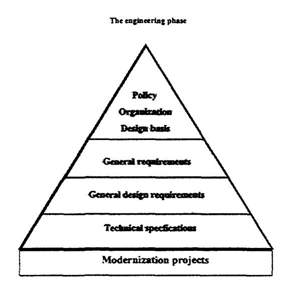

FIG. 1. The Ringhals 1 modernization project.

#### 3.2. Forsmark 1 and 2 NPP

The Forsmark 1 and 2 are BWRs at the coast of the Baltic sea in Sweden. The first one was started in 1980 and the second one a year later. They are identical. For both plants an I&C modernization project is defined starting 1995 and finishing 2000. The first step will be:

- Installation of the infrastructure including a process computer and workstations in different locations;
- replacement of the existing centralized and decentralized process I/O to the computer
- a digital neutronflux "TIP" calibration system;
- installation of new digital turbine protection and a system for the control rods indication and control.

It is planned to replace all the existing I&C and add some new items as big overview screens in the control room. During the last phases in the project the safety I&C is replaced.

The project is obviously carried out stepwise where the experiences of a previous step is the input for the next step. In this way the project is continuously evaluated and based on experiences the final goal can be modified.

The status of the project in 1997 is shown in Fig.2. Please observe that all components including networks are redundant. This is not shown in the figure.

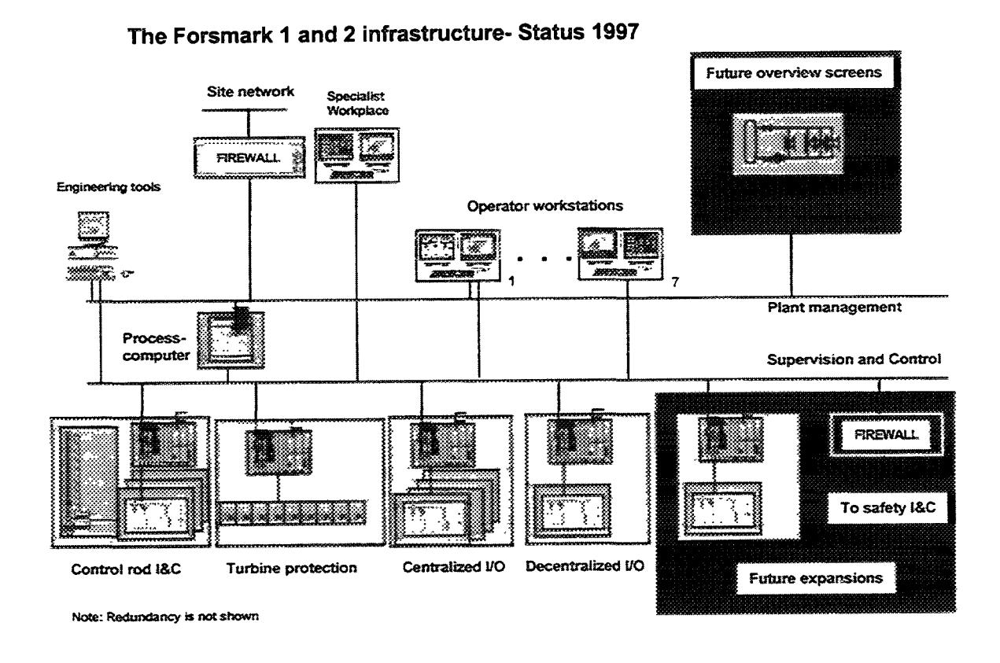

FIG. 2. The Forsmark 1 and 2 modernization project.

### **3.3. Oskarshamn 1**

The Oskarshamn BWR is located at the East coast of Sweden. It is the oldest NPP in Sweden and was started m 1971.

In 1997 it was decided to upgrade the plant for conformance to modern safety criteria. This upgrading contains both process systems, I&C, buildings and electrical power system. It is planned that this modernization will be built during normal plant operation and commissioned during an annual outage in 1999.

The existing RPS and control room will be modernized in steps during annual outages 1999 to 2005. A typical example of the modernization, the control room, is shown in Fig. 3.

# **Oskarshamn 1 modernization**

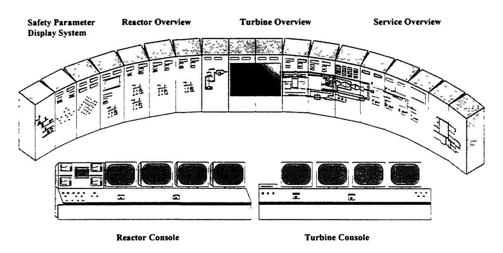

*FIG. 3. Oskarshamn 1: Modernization of the control room*

#### **ACKNOWLEDGEMENTS**

I want to thank my colleagues in Finland and Sweden for useful suggestions and comments and especially following persons: E. Strobeck, Ringhals Sweden; B. Sandin, Forsmark Sweden; L.-E. Hall, TVO Finland; A. Ericsson, ABB Atom Sweden; S.-A. Andersson, ABB Atom Sweden; I. Pettersson, ABB Atom Sweden.

#### **REFERENCES**

- [1] Lars-Enk Hall, TVO, Modernization of the control and instrumentation in the TVO BWR power plant. IAEA specialist meeting, Munchen (1995).
- [2] S. Berlin, A. Back. ABB Atom. Backfitting a digital class IE system. ENC'94, Transaction volume 2.
- [3] A. Laryd. ABB Atom. Operating experience of software in programmable equipment used in ABB Atom nuclear I&C applications. VTT Symposium 147. Helsinki, Finland.

# **MODERNIZATION OF THE UKRAINIAN NPP INSTRUMENTATION AND CONTROL SYSTEMS**

M. YASTREBENETSKY I&C Department, State Scientific Technical Center for Nuclear and Radiation Safety, Kharkov, Ukraine

#### **Abstract**

Modernization of many instrumentation and control systems for all type of reactors is under way now in Ukraine. Main principles of modernization, standards that are used for modernization are described in the repon.

# 1. BACKGROUND

Ukrainian nuclear power plants (N PP's) have now 14 operating units; new Zaporozhe NPP unit 6 started in the end of 1995. Chernobyl NPP unit 1 was decommissioned after 19 years of operation in 1996. The dominating type of reactors in Ukraine is WWER-1000 (2 reactors of unit I and 2 South Ukraine NPP type V-302 and 9 reactors - type V-320). The share of NPPs electricity production in Ukraine is increasing every year and now nearly accounts for 40 %.

All one type WWER and RBMK units in USSR, including instrumentation and control systems (I&C), was created by similar design; these units originally had only little differences each other. The designs were ended 15-20 years ago and corresponded to the existed level of USSR non-military technique of that time. Many of these design deficiencies became clear after installation and starting of operation of every type first units.

Some modernization was fulfilled immediately after first units starting (for example, improving of unified hardware complex UKTS by diagnostic elements installation). Elaboration of perspective I&C design for WWER-1000 units was realized in 1987-1991 with spread using of microprocessors. Many technical decisions in this design had satisfied the modern requirements. But the USSR collapse stopped this process. Now modernization of similar Ukrainian and Russian NPP is being independently implemented by each country.

The main present reasons of I&C modernization may be divided on two groups. The first of them is connected with the morale obsolesce, the changes of the computer techniques, non-complete compliance of operating systems with modern safety requirements. This group of reasons includes:

- non-satisfactory diagnostics of hardware and software;
- discrepancy to seismic requirements;
- low fire resistance;
- absence of system for information personnel support; absence of high (general plant) level cooperated with unit level.

We can add to this group of reasons that I&C of unit isn't a whole system, it's only the set of the subsystems which have:

- different element bases;
- different technical realization for decision of same tasks;
- different structures;
- difficulties with interface between heterogeneous components.

I&C is very bulky one (for example, there are near 700 cabinets only of unified hardware complex UKTS in WWER-1000), that have resulted in large staff labor expenses.

Modernization of I&C can result to safety improvement Approximately one third of Ukrainian NPP safety violations took place consequently of I&C failures

Second group of reasons of modernization connected with physical obsolesce. Lifetime of many instruments is now over or close to the end (8-10 years). But our investigation shows that the level of operating reliability of the instruments (sensors, meters, computers, actuators, recorders, etc.) didn't decrease during time Moreover after long (1-2 years) infant mortality time curve of failure intensity have reducing character for the many types of instruments [1,2].

Big problem is absence of spare parts. Many manufacturers stopped to produce spare parts and now are producmg new type of I&C equipment or equipment for other aims. Collapse of USSR destroyed economical connection between Ukraine and Russia which was main manufacturer of I&C equipment

#### 2 TRENDS OF THE I&C MODERNIZATION

Technical policy of Ukrainian NPP I&C modernization is connected with general changes in Ukrainian economy and marketing. In past there are common technical decisions for all NPP with same type of reactors in USSR including Ukraine. These decisions were proposed by General Designer (Atomenergoproect, etc.).

Now every NPP in Ukraine has possibility to lead own technical politic, to replace any type of equipment and to choose any manufacturer in Ukraine, Russia or another countries There are different tendencies of I&C modernization in Ukraine now.

First one is based on the using of new Ukrainian national equipment. The mam designers and manufacturers of NPP I&C in Ukraine are Khartron and Shevchenko plant in Kharkov. In past these companies have produced cosmic and rocket control systems.

There are next advantages of this modernization trend.

- all hardware and software will be produced in Ukraine that lead to technical independence in future NPP operation from another countries;
- it is a decision of conversion problem for these companies previously producing military techniques;
- Khartron and Shevchenko plant has big experience in elaboration of computer systems and have modem manufactory equipment.
- Khartron propose whole system which have to decide all control tasks for main and additional technological systems of WWER-1000 units and high (general NPP) level.
  - The deficiencies of the first tendency consist of as follow
- Khartron hadn't any experience in designing and producing of NPP I&C (Shevchenko plant had experience in creation of turbine control systems);
- The process of new apparatus creation would be very hard and long one,

Second tendency is using equipment which is produced by foreign companies (USA, Germany, Russia, France, Czech Republic). This way has such advantages as:

- The most of this companies Westinghouse (USA), Siemens (Germany), Skoda (Czech Rep.),
   SNIP (Russia) have big experience in elaboration, producing and installation of different types of NPP I&C;
- A part of similar equipment is under successful operation in NPPs in other countries (for example, Westinghouse Distributed Process Family - WDPF-II); therefore these companies are at a high level of NPP confidence.

There are next deficiencies of second way:

- Different companies propose different hardware and software; Ukrainian units with similar technological equipment will use different I&C; this difference will cause to complicate of maintenance;
- Necessity of spare parts supplying produced by foreign countries.

The both trends deficiencies force to combine them via a creation of joint ventures. For example, Westron is joint company created by Westinghouse (USA) and Khartron (Ukraine) for producing unit information computer systems, safety parameters display systems, etc. based in WDPF-II. Other example is ABB-Monolit. This joint venture was created ABB (USA) and Monolit - Shevchenco plant (Ukraine) for producing NPP diagnostic and monitoring equipment, feedwater control system, etc.

The problem of I&C modernization is of a special importance for two new NPP units: Rovno-4 and Khmelnitsky-2. For these units completion and upgrading Ukraine begins to receive a support from European Commission (EC). Ukrainian Government Committee Goskomatom, EDF and Ukrainian. Russian and European companies developed "Program of modernization Ukrainian WWER-1000 (V-320) NPPs" that includes many actions for I&C modernization. All actions were divided into the groups as follows:

- improvement of safety;
- rise of equipment operation availability;
- improving of operation organization.

Modernization of these units will follow by second tendency with the use of European companies' equipment.

#### 3. LIST OF MODERNIZATION

The list of main modernization projects for operating units is shown on Table 1. Mostly the project are implemented in WWER-I000. Common peculiarity of new systems is a wide utilization of state of the art computer techniques:

- presence of high performance workstations;
- presence of local computer networks and unit buses;
- using of optical fibre for local computer nets;
- CRT displays with high resolution;
- high level of diagnostic;
- possibility of control by display keys;
- possibility to replace malfunctioning elements without the shutdown of the system;
- opening to connect additional instruments and to implement step by step.

TABLE 1. MAIN UKRAINIAN PROJECTS ON I&C MODERNIZATION

| System                                                                  | Manufactu rer name                         | Manufacturer country                  | NPP, Unit | Present state                                                                                         |
|-------------------------------------------------------------------------|-----------------------------------------------|------------------------------------------|--------------|-------------------------------------------------------------------------------------------------------|
| Type of reactor                                                         | VVER                                          | -1000                                    |              |                                                                                                       |
| Steptype electromagnetic drive                                    | Skoda-YaM                                     | Czech Republic                           | Y-l          | Installed in 1996                                                                                     |
| Group and Individual Control System                               | Skoda Control                              | Czech Republic                           | Y-l          | Installed in 1996                                                                                     |
| Unit Computer Information System                                     | Westron                                       | Ukraine-USA                              | Y-l          | Pilot system installed (1-st phase) in 1996 Installation- 1998                               |
| Reactor Protec-tion System and Neutron Flux Mo-nitoring System | Siemens                                       | Germany                                  | R-4          | Type testing of hardware and software has finished. Design is preparing |
| Steam Generator and Feedwater Control system                      | WESE, Traktebel, Westron, LvivOrgres | Belgium Belgium Ukraine Ukraine | Y-l          | Design is preparing Installation- 1998                                                             |
| Safety Parameters Display System                                     | Westron                                       | Ukraine-USA                              | Z-l          |                                                                                                       |
| Automatic Power Regulator, Power Limited Regulator                | Khartron                                      | Ukraine                                  | Z-3          | Pilot system installed in 1996                                                                     |
| Automatic Turbine Control System                                     | Shevchenko Plant                           | Ukraine                                  | Y-l Z-l   | Installed in 1996 Installation 1997                                                                |
| Safety Engineering System Train N3                                   | Radium, Parus, Khartron                 | Ukraine                                  | Z-l          | Installation 1998                                                                                     |
| Type of reactor                                                      | VVER                                          | -440                                     |              |                                                                                                       |
| Unit Information Computer system                                     | SYSECA                                        | France                                   | R-l, R-2  | Design is preparing                                                                                   |
| In-Core Reactor Monitoring System                                    | SNIIP                                         | Russia                                   | R-2          |                                                                                                       |
| Type of reactor                                                      | RBMK                                          | -1000                                    |              |                                                                                                       |
| Safety Parameters Display System                                     | Westing house NIKIET                    | USA Pussia                            | Ch-3         | Design is preparing                                                                                   |
|                                                                         | Westron                                       | Ukraine-USA                              |              |                                                                                                       |

R- Rivne NPP , Z- Zaporizhya NPP ,

Y- South-Ukraine NPP, Ch- Chornobyl NPP

I&C consists of programme-technical complexes, that are built similar from different functions. I&C as rule has distributed hierarchical structure.

Safety Parameters Display System (SPDS) is a new type of system for Ukrainian NPPs. Implementation of SPDS is supposed to all Ukrainian units in future; the first such system will be used in Chernobyl RBMK-1000 unit by design which is similar for Russian RBMK-1000 units. This project is supported by US Department of Energy.

It is necessary to note, that the part of apparatus (sensors, actuators, cables, control room equipment, etc.) are saved in modernization process and new foreign technique (Siemens, Westinghouse, Skoda, etc.) have to have interface with old equipment. The description of several systems are published in "Proceedings of the International Topical Meeting on WWER Instrumentation and Control" [3-6].

One of the most sufficient limitation in modernization process connected with short time of reactor shutdowns (for example, for on-load refueling) when there are possibility to fulfill demounting, mounting and another works.

One of the way for this problem decision is creation of pilot systems which are operating jointly with regular systems.

For example, reconstruction process of unit computer information system (South-Ukraine NPP, unit 1) is being split into 2 phases. Phase I consist of installing Westinghouse WDPF equipment (primarily WEStations) that will monitor plant functions in parallel with the existing CM-2M unit information system "ComplexUran-2" (Fig. 1.). During Phase I all input/output devices will be provided through a custom CM-2M computer interface with the exception of analogue inputs required for the turbine generator monitoring system which will be accessible via Distributed Processing Unit (DPU) installed in Phase I . Phase I configuration includes seven WEStations, two DPU and two CM-2M computer complexes.

Phase 2 consist of installing the remainder of the Westinghouse WDPF equipment (primarily DPUs) replacing the CM-2M computer and all of the CM-2M input/output devices.

During Phase 2 the CM-2M computer complex and all of the existing CM-2M input/output equipment (information complex M-60) will be replaced with Westinghouse WDPF equipment (primarily Redundant DPUs). The Phase 2 configuration includes additional WEStations, additional redundant DPUs and Computer time Clock Unit. The CM-2M computer complexes will be reconfigured to provide information from the In-core Monitoring System and Turbine Control System. Data links from these systems were previously connected to the CM-2M Computer Complexes.

#### 4. STANDARDS AND RULES FOR I&C MODERNIZATION

High level document in Ukraine is Law of Ukraine "On Nuclear Energy Utilization and Radiation Safety" (1995). This Law is a fundamental one in the nuclear legislation in Ukraine. It established the priority of human safety and environmental safety, governs the activities associated with the use of nuclear installation. According to Articles 8: "...Observation of the regulation, codes and standards of nuclear and radiation safety is mandatory when exercising any activity in the sphere of utilization of nuclear energy". Next level of documents is divided on 4 groups:

- 1) USSR NPP Safety Guides and Rules;
- 2) Ukrainian NPP Safety. Guides and Rules;
- 3) USSR State Standards (GOST), what is related to NPP I&C;
- 4) Ukrainian State Standards what is related to NPP.

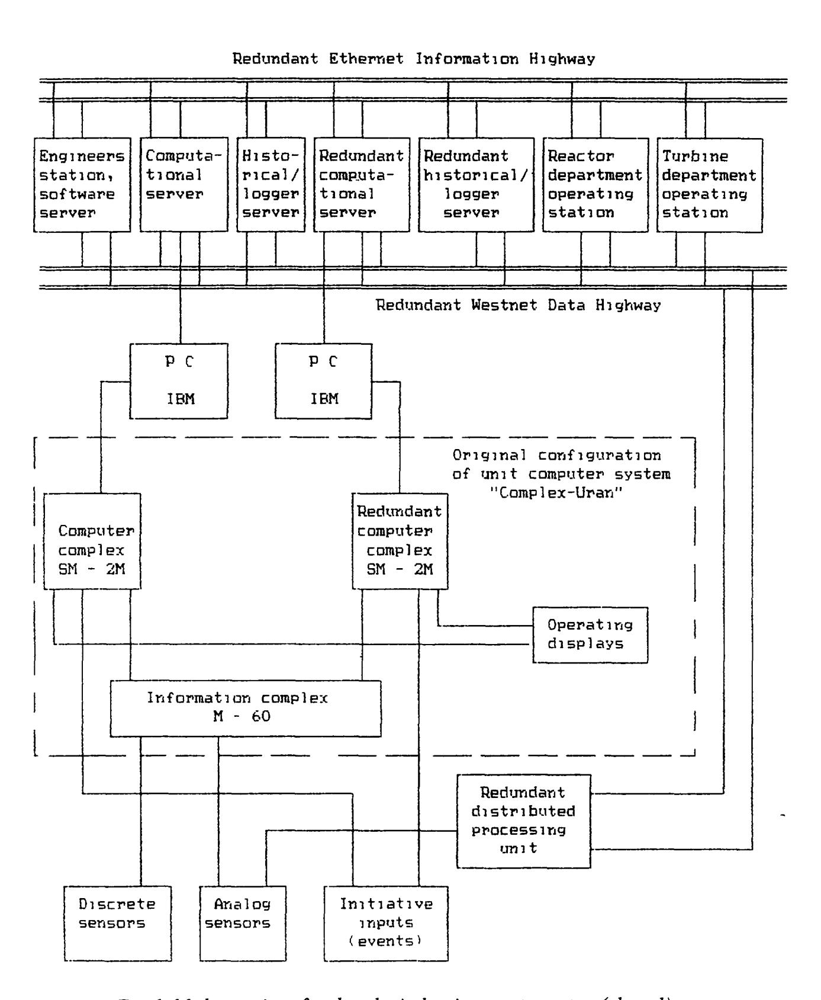

*Fig. 1. Modernization of yuzhnoukrainsk unit computer system (phase 1).*

| Nuclear instrumen tation for NPP | Nuclear instrumen tation system | Apparatus for NPP I&C    |
|-------------------------------------|------------------------------------|-----------------------------|
| AH NPP                              | All NPP                            | WER-1000                    |
| Common                              | Requirements                       | General                     |
| GOST 26344.0                        | GOST 29075                         | GOST 25804.1                |
|                                     |                                    |                             |
|                                     |                                    |                             |
| Measurement for shell               | states of                          | Apparatus for NPP I&C       |
| fuce elements                       |                                    | VVER- 1000                  |
| All NPP                             |                                    | Reliability requirements    |
| Requirements and method of tests    |                                    | GOST 25804.2                |
| GOST 27297                          |                                    |                             |
|                                     |                                    | Apparatus for NPP I&C       |
|                                     |                                    | VVER- 1000                  |
|                                     |                                    | Endurance requirements      |
| Control and                         |                                    | GOST 25804.3                |
| rpotection system                   |                                    |                             |
| All NPP                             |                                    | Apparatus for NPP I&C       |
| Requirements and method of tests    |                                    | VVER- 1000                  |
| GOST 26843                          |                                    | Constructional requirements |
|                                     |                                    | GOST 25804.4                |
| In-core reactor                     |                                    | Apparatus for NPP I&C       |
| monitoring system                   |                                    | VVER- 1000                  |
| VVER                                |                                    | Rules of tests              |
| Requirements                        |                                    | GOST 25804.5                |
| GOST 26635                          |                                    |                             |
|                                     |                                    | Apparatus for NPP I&C       |
|                                     |                                    | VVER- 1000                  |
| Neutron flux                        |                                    | Evaluation of reliability   |
| monitoring system                   |                                    | GOST 25804.6                |
| All NPP                             |                                    |                             |
| Requirements                        |                                    | Apparatus for NPP I&C       |
| GOST 27445                          |                                    | VVER- 1000                  |
|                                     |                                    | Evaluation of endurance     |
|                                     |                                    | GOST 25804.7                |
| Radiation safety                    |                                    |                             |
| monitoring system                   |                                    | Apparatus for NPP I&C       |
| All NPP                             |                                    | WER-1000                    |
| Requirements                        |                                    | Evaluation of consrtuctive  |
| GOST 27452                          |                                    | GOST 25804.8                |

*Fig. 2. Some of the USSR standards relevant to I&C modernization.*

- 1) Ukrainian Nuclear Regulatory Administration (NRA) had confirmed list of USSR Safety Guides and Rules in force as to different NPP equipment included I&C. It was decision NRA N I of 4.01.92. This list include 79 documents. Its items I and 2 in this list are the most important documents for nuclear safety - OPB-88 [I] and PBYa RU AS-89 [2]. Main idea of this decision was the conservation in Ukraine of NPP safety documents in force in USSR.
- 2) Ukrainian NRA only begins to create own system of guides and rules. There is only one documents devoted to I&C (problem of I&C life extension) [9]. Creation of standards with safety requirements to I&C and their components is fulfilling now.
- 3) Related to NPP I&C USSR Standards can divided in subgroups in such order: a) USSR common technical standards related to I&C (for example about reliability, metrology, etc.);
  - a) USSR standards what are acted to different NPP equipment, including I&C; c) USSR standards what are acted to I&C in different branches of industry, including NPP;
  - b) USSR standards directly applied to NPP I&C.

The scheme of this subgroup is shown on Fig. 2. Each box in this picture consist of 4 parts as follows:

- name of systems what are considered in the standard;
- type of NPP;
- subject of standardisation (requirements or methods, etc.);
- number of standard.

Right branch in Fig. 2 corresponds to standards series connected with WWER-1000 I&C (except reactor control and protection system - SUZ described in the other standards). This branch was created in 1980-1983 and contains different detailed requirements to reliability, to resistance and strength to environment factors, to apparatus construction, the rules of test and acceptance, the methods of checking of compliance with the requirements. The requirements of these standards are very rigorous and exceed those in other USSR and international standards. Standard 2907591 in the middle of this picture is one of the modern USSR standards which is widely spread now in Ukraine (also in Russia too). It should be noted that there are a lot of contradictions between different standards of this subgroup.

4) Ukrainian State Standards were elaborated now only as common technical standards (similar to subgroup 3a).

# **REFERENCES**

- [1] YASTREBENETSKY M., GARAGULYA L., GIDOK G. etc. Reliability analysis of WER-1000 information and control systems. The 3rd JSM1E/ASME Joint International Conference on Nuclear Engineering, Kyoto (1995).
- [2] YASTREBENETSKY M.A., GARAGULYA L.N., GIDOK G.I., GOLDRIN V.M. Life extension of NPP instruments. The 5 JSME/ASME joint International Conference on Nuclear Engineering, Nice (1997).
- [3] KORCHAGIN L.N., AFANASYEV N.V.. WAGNER K. SU NPP Unit 1 Reactor Control System's Drives Reconstruction Proceedings of the International Topical Meeting on WER Instrumentation and Control, Prague (1997).
- [4] HORD J., AFANASYEV N.V., KUDINOV Y. South Ukrainian NPP Advanced Computer Information System Project (CIS) Proceedings of the International Topical Meeting on WER Instrumentation and Control, Prague (1997).

- [5] VAN EAL A. Proposal for and Implementation of an Upgraded Steam Generator Level and Feedwater Flow Control System Applied to South Ukrainian NPP Unit 1 and 2 Proceedings of the International Topical Meeting on WER Instrumentation and Control, Prague (1997).
- [6] ANIKANOV S.S., CARRERA J.P., GORDON P. Safety Parameter Displays System (SPDS) for Russian-Designed NPP's Proceedings of the International Topical Meeting on WER Instrumentation and Control, Prague (1997).
- [7] OPB-88 General Provisions on NPP Safety Assessment
- [8] PBYa RU AS-89 Nuclear Safety Rules for the Reactor Units of Nuclear Power Plants.
- [9] ND 306.711-96 Life extension of NPP I&C Apparatus what include in Safety Related Systems. General Requirements to Work Procedure and Consistence.

# **ACTIVITIES AT THE ELECTRIC POWER RESEARCH** XA9847301 **INSTITUTE TO SUPPORT THE MODERNIZATION OF INSTRUMENTATION AND CONTROL SYSTEMS IN NUCLEAR POWER PLANTS IN THE UNITED STATES OF AMERICA**

J. NASER Electric Power Research Institute, Palo Alto, California, United States of America

#### **Abstract**

Most nuclear power plants in the United States are operating with a vast majority of their original analog instrumentation and control (I&C) equipment Many of the I&C systems in the plants need to be modernized in a reliable and cost-effective manner to replace obsolete equipment, to reduce operating and maintenance (O&M) costs, to improve plant performance, and to maintain safety. The major drivers for the replacement of the safety, control, and information systems in nuclear power plants are the obsolescence of the existing hardware and the need for more cost-effective power production. Competition between power producers is dictating the need for more cost-effective power production. The increasing O&M costs to maintain systems experiencing obsolescence problems is counter to the needs for more cost-effective power production and improved competitiveness. Modern technology, especially digital systems, offers improved functionality, performance, and reliability; solutions to obsolescence of equipment; reduction in O&M costs; and the potential to enhance safety. Digital I&C systems with their inherent advantages will be implemented only if reliable and costeffective implementation and licensing acceptance is achieved and if the modernized system supports reduced power production costs. Increasing competition will continue to be a major factor in the operation of nuclear power plants. It will continue to dictate the need for improved productivity and cost-effectiveness. EPRI and its member utilities are working together on an industry-wide Instrumentation and Control Program to address I&C issues and to develop cost-effective solutions.

# 1. INTRODUCTION

Operating nuclear power plants in the United States were designed 25 to 45 years ago with analog instrumentation and control (I&C) technology. Today, most plants continue to operate with much of their original I&C equipment and vintage digital I&C equipment. This equipment is approaching or exceeding its life expectancy, resulting in increasing maintenance efforts to sustain system performance. Decreasing availability of replacement parts, and the accelerating deterioration of the infrastructure of manufacturers that support analog technology, accentuate the obsolescence problems and cause operation and maintenance (O&M) cost increases.

I&C systems in nuclear power plants need to be developed and modernized in a reliable and cost-effective manner to replace obsolete equipment, to reduce O&M costs, to improve plant performance, and to maintain safety. The major drivers for the replacement of the safety, control, and information systems in nuclear power plants are the obsolescence of the existing hardware and the need for more cost-effective power production. Digital I&C systems need to play a major role in nuclear power plants to achieve real productivity improvements needed for increased competitiveness. The procurement of replacement modules and spares under current requirements, for hardware that is no longer fully supported by the original equipment manufacturer, is costly, time consuming and, in some cases, not even possible. Competition between power producers is dictating more cost-effective power production. The increasing O&M costs to maintain many of the analog systems is counter to the needs for more cost-effective power production and improved competitiveness. The reluctance to implement new digital I&C systems to address O&M cost concerns is also counter to the needs for more cost-effective power production and improved competitiveness.

Technological improvements, particularly the availability of digital systems and their supporting infrastructure, offer improved functionality, performance, and reliability; solutions to obsolescence of analog equipment; reduction in O&M costs; and the potential to enhance safety. Modern digital technology holds significant potential to improve cost-effectiveness and productivity in nuclear power plants. Modem systems have the potential for solving the utilities' current problems of growing equipment obsolescence; escalating O&M costs; lost generation due to system unavailability, spurious operation, and human error; and the inability to increase plant capacity due to equipment limitations All of these problems contribute to reduced competitiveness with other power production sources and could lead to premature plant closures

Reliance on custom designed systems coupled with new licensing and design issues have resulted in high implementation costs when digital upgrades have been performed in nuclear power plants There is a need for a systematic approach leading to the identification, pnontization, and implementation of I&C solutions in nuclear power plants. Viable alternatives range from extending the useful life of existing equipment to the complete replacement of systems in a cost-effective manner when vulnerability to obsolescence or the need for increased productivity so dictates. The use of commercially available equipment for safety systems is desirable to reduce costs and to provide a high likelihood of continuing vendor support

Reliable, integrated information is a critical element for protecting the utility's capital investment and increasing availability and reliability. Integrated systems with integrated information can perform more effectively to increase productivity, to enhance safety, and to reduce O&M costs A plant communications and computing architecture is the infrastructure needed to allow the implementation of I&C systems in an integrated manner. Current technology for distributed digital systems, plant process computers, and plant communications and computing networks support the integration of systems and information The test for future digital I&C system modernization will be whether they are cost beneficial to the plant and if they can offer a payback to the utility in an acceptable time period.

#### 2 EPRI INSTRUMENTATION AND CONTROL PROGRAMME

Nuclear utilities are confronted by a growing equipment obsolescence problem which is a significant contributing factor to increasing costs for plant operation and maintenance Plant age combined with the rapid pace of evolution of electronic technology is a significant factor in equipment obsolescence The flexibility and performance advantages of modern digital technology can be used as the basis for modernizing obsolete equipment in a cost-effective manner in nuclear power plants The realization of the benefits of digital technology is currently restrained by the relatively high cost of initial applications of new technology for the nuclear power industry in a highly regulated environment Work is needed to establish reliable and cost-effective approaches for the design, qualification, and implementation of digital systems in nuclear power plants. This work should utilize, as much as possible, relevant information and experience from other process industries where digital systems are commonly used Commercially available digital systems have proven reliable in other process industries, including safety related applications. Cost-effective approaches are needed to implement and qualify commercially available hardware and software for nuclear power plant applications. To address these issues and facilitate the modernization of I&C systems in nuclear power plants, the Electric Power Research Institute (EPRI), working together with its member utilities, developed an industry-wide I&C Programme. This programme is documented in the Integrated Instrumentation and Control Upgrade Plan (1).

The I&C Programme consists of research and development (R&D) and utility demonstration plant activities R&D activities support the development and implementation of modern technology systems and also provide a technical basis for qualification and licensing of them The R&D and demonstration activities provide the bases for the requirements, planning and evaluation methodologies, and implementation guidelines needed to plan, design, develop, qualify, implement,

operate, and maintain modern digital systems. The demonstration plant activities identify utility needs, provide a test bed for, and feedback on, the methodologies and guidelines, and modern technology applications.

The EPRI I&C Programme has developed a life-cycle management approach for I&C systems. Life-cycle management involves the optimization of maintenance, monitoring, and capita] resources to sustain safety and performance throughout the plant life. The main EPRI product used in life-cycle management of I&C systems is a set of methodologies and guidelines that, as part of the utility's overall life-cycle management effort, will enable nuclear power plants to fully address I&C cost and performance issues. They will assist utilities in identifying, prioritizing, and implementing I&C solutions more effectively. These methodologies and guidelines will assist the utilities in applying integrated I&C systems in the most timely and cost-effective manner possible.

#### 3. PLANNING AND EVALUATION METHODOLOGIES

Four strategic planning and evaluation methodologies have been developed under the I&C Programme. The first, the Life-Cycle Management Plan (LCMP) methodology, is for developing a long term strategic plan for manageing a power plant's I&C systems over the planning period selected by the utility. The LCMP Methodology (2) guides the user through a comparison of I&C life-cycle management (LCM) strategies and through existing and planned LCM programme activities to identify interfaces and the integration of upgrade and maintenance options. The LCMP includes the identification of systems and components to be included in the programme; the development of bases for upgrade or long term maintenance options; the initial cost and performance improvement estimates, prioritization for detailed upgrade evaluation, and deferred-upgrade maintenance planning; and the identification of related programmes and organizational interfaces including key personnel and responsibilities. The methodology is accompanied by a workbook which contains various outlines, worksheets, and generic interview questions and topics that aid in the development of a LCMP. The methodology document also explains the overall process for planning and implementing the various elements of I&C life-cycle management, and the relationship of the other EPRI planning and evaluation methodologies and guidelines. This life-cycle approach is appropriate at the beginning of, and during, plant life.

The Plant Communications and Computing Architecture Plan (PCCAP) Methodology (3,4) provides utilities with a detailed set of instructions for preparing a PCCAP that will allow them to upgrade their I&C systems in a logical, cost-effective, and non-disruptive fashion. The PCCAP Methodology provides all of the information necessary for utilities to develop their strategic architecture plans in the most cost-effective manner possible. It guides the user through an assessment of the existing plant data network architecture, corporate communications architecture LCM plans, and I&C LCM implementation guidelines with respect to the communications architecture. The PCCAP addresses a characterization of the existing network; a characterization of the future network in terms of a network model and communication standards for connectivity and interoperability of network elements; a set of network architecture requirements regarding the physical configuration, network access, network add-on provisions, network performance monitoring, and I&C equipment communications interfacing; and a set of consistent human-machine interface requirements for I&C systems.

The Systems Maintenance Plan (SMP) Methodology (5) addresses long-term maintenance planning for systems or components where initial screening in the LCMP indicates that detailed upgrade evaluation is not justified, over the planning period, by cost and performance potential. The SMP Methodology contains a process for developing a comprehensive SMP for each identified system. The SMP will present the most efficient approach for maintaining the operational goals and life expectancy of the system. The SMP Methodology will describe how to develop long range maintenance objectives, to baseline and analyse the existing maintenance process, to analyse failure

rates, inventory practices, and obsolescence issues, and to implement maintenance related problem solving techniques.

The Upgrade Evaluation Methodology (UEM) (6) addresses a detailed evaluation of I&C system and components when upgrading is indicated by the LCMP. The UEM is used to analyse each candidate system to determine if the upgrade is justified from a cost benefit perspective. The UEM is used to produce an Upgrade Evaluation Report (UER) for each candidate upgrade The UER describes high level system functionality, upgrade alternatives and associated cost benefit evaluations, and the recommended alternative. The upgrade evaluation process includes detailed cost and performance analysis; conceptual design options analysis; cost/benefit analysis; and upgrade recommendations. Analysis of the conceptual design options includes the consideration of digital design basis changes, associated technical specification changes, and equipment selection candidates When an upgrade is to proceed, the UER is used as input to the Functional Requirements Specification.

#### 4 IMPLEMENTATION GUIDELINES

Design and licensing issues have inhibited access to cost and performance improvements possible with digital technology. Examples of the areas of concern for digital systems in nuclear power plants are licensing, software verification and validation (V&V), hardware qualification including electromagnetic interference compatibility and seismic, reliability, performance, separation, redundancy, fault-tolerance, common-mode failures, diversity, human-machine interfaces, and integration of systems and information through communications networks. Use of commercially available digital systems is an approach for more cost-effective implementations that is of considerable interest to the nuclear utilities. The development of good functional specifications and bid specifications for digital systems is essential to assure that the system will behave as desired. The EPRI I&C Programme has developed a collection of guidelines to address many of these concerns.

The Guideline on Licensing Digital Upgrades (7) was developed to be consistent with the established 10 CFR 50.59 process in the United States. It helps utilities design and implement digital upgrades, perform 10 CFR 50.59 safety evaluations, and develop information to support licensing submittals. It suggests a failure analysis-based approach that encompasses digital-specific issues and other possible failure causes, addressing both according to their potential effects at the system level. Abnormal Conditions and Events (ACES) (8), as described in IEEE 7-4.3.2-1993 "Application Criteria for Programmable Digital Computer Systems in Safety Systems of Nuclear Power Generating Stations", play an integral role in this approach. The licensing guidelines and ACES guidance help identify what is required to license safety systems in nuclear power plants.

Guidance for electromagnetic interference (EMI) susceptibility testing of digital equipment (9) and a handbook for electromagnetic compatibility of digital equipment (10) have been developed. These reports integrate the current knowledge and understanding of the electromagnetic issues concerning the installation of digital equipment in power plants. They direct the utility toward practical and economical solutions for dealing with electromagnetic interference. The handbook also helps eliminate some misconceptions that questioned the reliability of digital equipment subjected to the electromagnetic environment of nuclear power plants.

Guidelines and a handbook for software V&V have been developed (11-13). These describe approaches to categorize the software systems in terms of cnticahty and consequences of failure. They then identify levels of V&V commiserate with these categorizations. The guidelines for V&V in reference 11 developed a set of 16 V&V guideline packages based on the system category, development phase, and software system component which is being tested. For V&V methods in the guidelines that do not have a good description elsewhere in literature on how to use them, 11 sets of procedures have also been developed. The report identifies 153 V&V methods for software systems which can be used on 52 identified software defects. The guidelines developed were based on the

attempt to identify the methods which were most successful in finding various types of defects, on the attempt to assure that the different guidelines catered to the different needs of different systems, and on the attempt to emphasize the practicality and cost-effectiveness of the methods recommended.

Experience with digital upgrades in nuclear plants has shown that there is significant room for improvement in predicting modernization costs and in anticipating the types of technical problems that will be encountered. Often the problems can be traced to deficiencies in the specifications that govern the design, development, installation and testing activities that must be done properly to ensure success. While proper specification of requirements has always been an area where plant modernization projects are vulnerable, the introduction of digital technology has exacerbated the situation through its need for new types of requirements with which utility engineers and operators typically have limited experience and expertise. A methodology (14) is being developed to help utilities create better requirements specifications for digital systems. It addresses nuclear-specific issues as well as typical problems encountered in digital specifications. The methodology uses an iterative approach that maintains a focus on the areas of highest risk to the project and incorporates various requirements analysis techniques. Its intent is to help utilities realize a predictable and successful upgrade process, producing more reliable systems, avoiding cost overruns and project delays, and thereby reducing overall project costs.

The use of commercially available digital equipment in nuclear safety applications continues to be a controversial issue. A process for the commercial-grade dedication of hardware was developed several years ago (15, 16) and has proven very successful. The basic concepts of this process were used as the starting point to formulate an approach for evaluation and acceptance of commercially available microprocessor-based equipment. EPRI worked with a group of utility industry representatives to develop industry consensus guidelines (17, 18). These guidelines will help the utility engineer determine what activities to undertake to establish adequate assurance that a commercially available digital device used in a safety-related system will perform its safety function. The approach will extend the traditional commercial dedication process to include digital-specific issues, such as software configuration management, unanticipated functions and failure modes, and the software development process. Guidance will be provided to help determine appropriate technical and quality requirements and to help confirm that such requirements have been met. EPRI is continuing to work with the group of utility representatives to develop a second tier document which will provide more details and examples showing how the guidance is implemented.

# 5. PRODUCTIVITY ENHANCEMENT SYSTEMS

The requirements on nuclear power plant personnel to improve availability, reliability, and productivity and to reduce safety challenges to the plant have been increasing. These personnel are working with more complex systems, and responding to increasing operational, regulatory, and productivity demands. As tasks become more complex, involving large numbers of subsystem interrelationships, the potential for human errors increases. Therefore; reliable, integrated information is a critical element for protecting the utility's capital investment and increasing availability and reliability. Integrated systems with integrated information access can help personnel perform more effectively to increase productivity and enhance safety.

Traditionally systems have been implemented in a stand-alone manner which has resulted in increased O&M costs. This approach has also reduced the effectiveness, and in some cases the possibility, of new and upgraded systems. An integrated approach is essential to maximize the effectiveness of new and upgrades systems. The modern technology available for distributed digital systems, plant process computers, and plant communications and computing networks is fully capable of supporting integration of systems and information. This capability and its effectiveness has been proven in other process industries.

Modern digital technology can support increased power output from nuclear power plants. The improved accuracy of digital systems and the associated reductions in uncertainties can allow the utility to increase its plant's power rating. Digital systems also have the potential to support faster startups for increased power output. They can also facilitate determination of the root causes of plant events. At the same time, they can support the faster evaluation of the performance of the equipment and systems during the event. Both of these will allow a faster return to power after an unanticipated trip and; therefore, allow more power to be produced by the plant. The abilities of modern digital systems offer many ways to reduce O&M costs. Besides improved reliability and availability, ways to reduce O&M costs can be derived from the continuous monitoring, trending and reporting capabilities, as well as the archival capabilities, of digital systems.

The technological advances of the last few years have made it possible to develop sophisticated personnel support systems, which can not only process and present information, but can also give advice to the human. With appropriately implemented personnel support systems, humans can be augmented substantially in their capacity to monitor, process, interpret, and apply information; thus reducing errors and increasing reliability and availability. These personnel support systems will increase productivity by eliminating routine labor-intensive efforts such as recording, collecting, integrating, and evaluating data; and by assisting in monitoring and control activities. These systems can improve the consistency and completeness of decision-making activities by performing the role of diagnostic and decision-support advisors. Personnel support systems can assist in reducing safety challenges to the plant by presenting more complete, integrated, and reliable information to plant staff to better cope with operating and emergency conditions. Reducing safety challenges leads directly to improved reliability and availability and hence productivity. It can also reduce the maintenance activities, which would have been required, for equipment that would have been unnecessarily challenged Functional requirements (19) for an environment that would support these capabilities have been developed.

Advances in technological and human engineering offer the promise of helping nuclear power plant staff to reduce errors, improve productivity, and minimize the risk to plant and personnel. A plant-wide infrastructure for coordinated personnel support systems should be created to enhance these systems and to reduce their implementation costs. This infrastructure will include information communication capabilities, database and knowledge base managers, and a unified human—machine interface. This infrastructure, which is the plant communications and computing architecture discussed above, will permit incremental additions of I&C systems in all domains.

#### 6 DEVELOPMENT OF MODERN I&C SYSTEMS

Through strategic alliances with industry, three diverse modern forms of I&C technologies are being applied to safety systems in nuclear power plants. All three of the technologies are suitable for control systems as well. The first is commercially available programmable logic controller (PLC) technology (20,21). PLCs with appropriate qualification programmes are ideally suited for a large number of nuclear power plant applications including safety applications. PLCs have proven highly reliable in many industrial applications and can be used to enhance safety, improve operation and productivity, and reduce O&M costs. Areas that must receive careful attention when adopting commercially available PLCs include software verification and validation (V&V), hardware qualification, and regulatory acceptance. Standardized designs of PLC-based systems for safety system applications offer the opportunity for increased cost-effectiveness in plant implementations. A generic qualification and functional requirements specification for commercially available PLCs for safety applications has been developed (22) and sent to the United States Nuclear Regulatory Commission (NRC) for review. The first generic qualification of a commercially available PLC platform is to be completed by the middle of 1998.

Application specific integrated circuit (ASIC) technology is being adapted for reactor applications. Due to the stringent and, from past history, costly requirements for licensing digital

systems for reactor protection systems (RPS), cost and regulatory risk are major concerns. To satisfactorily ensure that a microprocessor-based RPS will perform as desired, be highly reliable, and not have unintended functions is very costly. A potentially cost-effective alternative is to develop an ASIC-based RPS. In this case, the ASIC is designed to perform only the needed functionality of the RPS. This reduces the effort required to assure the RPS's performance in safety critical functions. This same technology will be very useful for other plant systems. ASIC technology represents a good diverse technology from microprocessor and analog systems that can be used when diverse systems are required. Currently an ASIC-based RPS is being designed to replace 7300, 7100, and H-Line modules in the Westinghouse RPS. The ASIC chip has been designed and prototypes have been fabricated and tested. The motherboard, controller, and personality modules have been designed and are currently being fabricated. The chip and controller have been designed to be generic so that they can be used for other safety and control applications. All of the components will undergo extensive testing programmes. ASIC-based modules to replace 7300 modules will be implemented in 1998. The ASIC-based modules can be used for other applications which currently use 7300, 7100, and H-Line modules.

The third modern approach uses the dynamic safety system (DSS) technology. Unlike key safety systems in most nuclear power plants that use analog technology operating in a static mode, the DSS technology operates with insertions and processing of test signals for continuous verification of both hardware and software components. Although DSS is computer-based, the final checking of signal patterns is performed by a solid state hardware component. Thus, the DSS offers the benefits of computer-based functionality and reliability while avoiding concerns about undetected software problems. The DSS technology, which was developed and applied in the United Kingdom for advanced gas cooled reactor (AGR) plants, has now been demonstrated feasible for processing LWR safety system algorithms. It was installed in a spare RPS channel at a U.S. operating nuclear plant for demonstration and evaluation of performance. The DSS equipment operated on-line, in a flawless manner, with no maintenance, for a one year demonstration period. The DSS technology could potentially eliminate all surveillance and testing of safety channels, and permit revisions to the safety analyses that would permit increasing plant performance.

#### 7. DEMONSTRATION PLANT PROJECTS

The utility demonstration plants essentially are the laboratories where I&C cost and improvement options are being researched and developed. There are six utility demonstration plant projects in progress which are providing the primary inputs, as well as testing, validation and refinement activities for the methodology and guideline development under the I&C Programme.

Activities at each of the six demonstration plants may include the preparation of I&C life-cycle management plans and plant computing and control architecture plans; system screening, deferred-upgrade maintenance planning, and detailed upgrade evaluations; testing, validation, and refinement of various plant-specific methodologies and guidelines; and development of options and plans for integration of I&C cost and performance improvement activities with related life-cycle management efforts. The activities at these demonstration plants, as well as at other nuclear power plants, include implementations of new and upgraded systems.

Demonstration project activities which are using the full life-cycle management approach are presently being pursued at the Tennessee Valley Authority's Browns Ferry Unit 2, Baltimore Gas and Electric Company's Calvert Cliffs Units 1 and 2, Northern States Power Company's Prairie Island Units 1 and 2, Energy Company's Arkansas Nuclear One Units 1 and 2, Omaha Public Power District's Fort Calhoun, Taiwan Power Company's Chinshan Units 1 and 2, and Korea Electric Power Company's Kori Unit 2.

EPRI and several utilities, including some of the above mentioned ones, are working together on modernization projects. These projects in some cases are the result of the life-cycle management

planning while others were determined opportunistically from obvious needs at the plant. The projects include those on the three modem I&C technologies described above as well as several other modernization activities.

#### 8. CONCLUSIONS

The implementation and integration of modern digital I&C systems enhance the ability of the utility to achieve the goals of improved availability and reliability, enhanced safety, reduced O&M costs, and improved productivity in nuclear power plants. The planning and evaluation methodologies provide the basis for plant specific strategies and approaches that are most effective for the plant in the design and operational phases of the plant. The modem technology of distributed digital systems, plant process computers, and plant communications and computing networks have proven their ability to achieve these goals in other process industries. The use of this modem, proven technology is a key contributor to improved competitiveness in nuclear power plants. EPRI has established an I&C Programme to support its member nuclear utilities in developing methodologies, guidelines, and digital applications to take advantage of this modem technology to improve nuclear power plant competitiveness. Strategic alliances are an important approach to reduce the costs and risks of firstof-a-kind development, implementation, and licensing.

#### **REFERENCES**

- [I] "Integrated Instrumentation and Control Upgrade Plan, EPRI NP-7343 Revision 3, December 1992.
- [2] "Instrumentation and Control Life-cycle Management Plan Methodology", EPRI TR-105555, Vols. 1&2, August, 1995.
- [3] "Plant Communications and Computing Architecture Plan Methodology", EPRI TR-102306, Vols. 1&2, November 1993.
- [4] "Plant Communications and Computing Architecture Plan Methodology Revision 1", EPRI TR-104129, Vols. 1&2, December 1994.
- [5] "Instrumentation and Control Systems Maintenance Plan Methodology", EPRI TR-106029, Vols. 1&2, December 1996.
- [6] "Instrumentation and Control Upgrade Evaluation Methodology", EPRI TR-104963, Vols. 1&2, July 1996.
- [7] "Guideline on Licensing Digital Upgrades", EPRI TR-102348, December 1993.
- [8] "Abnormal Conditions and Events Analysis for Instrumentation and Control Systems", EPRI TR-104595, Vols. 1&2, January, 1996.
- [9] "Guidelines for Electromagnetic Interference Testing in Power Plants", EPRI TR-102323-R1, December 1996.
- [10] "Handbook for Electromagnetic Compatibility of Digital Equipment in Power Plants", EPRI TR-102400, Vols. 1&2, June 1994.
- [II] "Guidelines for the Verification and Validation of Expert System Software and Conventional Software", EPRI TR-103331, Vols. 1-8, April 1995.
- [12] "Verification and Validation Guidelines for High Integrity Systems", EPRI TR-103916, Vols. 1&2, December 1995.
- [13] "Handbook of Verification and Validation for Digital Systems", EPRI TR-103291, Vols. 1-3, December 1994.
- [14] "Requirements Engineering for Digital Upgrades", EPRI TR-108831, December 1997.
- [15] "Guideline for the Utilization of Commercial Grade Items in Nuclear Safety Related Applications (NCIG-07)", EPRI NP-5652, June 1988.
- [16] "Supplemental Guidance for the Application of EPRI NP-5652 on the Utilization of Commercial Grade Items", EPRI TR-102260, March 1994.
- [17] "Guideline on Evaluation and Acceptance of Commercial Grade Digital Equipment for Nuclear Safety Applications", EPRI TR-106439, October 1996.

- [18] "Evaluating Commercial Digital Equipment for High-Integrity Applications: A Supplement to EPRI Report TR-106439", EPRI TR-107339, December 1997.
- [19] "Programmable Logic Controller Qualification Guidelines for Nuclear Applications", EPRI TR-103699, Vols. 1&2, October 1994.
- [20] "Programmable Logic Controller Requirements and Evaluation Guidelines for BWRs", EPRI TR-103734, November 1994.
- [21] "Generic Requirements Specification for Qualifying a Commercially Available PLC for Safety-Related Applications in Nuclear Power Plants", EPRI TR-107330, December 1996.

# CONTRIBUTORS TO DRAFTING AND REVIEW

| Arbiza Berregui, J.A. | INITEC, Gran Via Carlos III-124-3°, 08034 Barcelona, Spain                                                                                                                 | (1)       |
|-----------------------|----------------------------------------------------------------------------------------------------------------------------------------------------------------------------------|-----------|
| Basti, W.             | Institute for Safety Technology, ISTec GmbH, Forschungsgelände, D-85748 Garching, Germany                                                                               | (1,3,4)   |
| Clark, R.             | Nuclear Electric plc., Barnett Way, Barnwood, Gloucester GL4 7RS, United Kingdom                                                                                                 | (1,2,3,4) |
| Chudin, A.            | Russian Federation Ministry for Atomic Energy, Department of Nuclear Reactor Development and Design, Staromonetny 26, 109180 Moscow, Russian Federation           | (1,3)     |
| Dall'Agnol, A.        | EdF SEPTEN, 12-14 avenue Dutrievoz, F-69628 Villeurbanne Cedex, France                                                                                                     | (1,3)     |
| Denisyuk, N.I.        | Department of Control System, Automation and Technical Support, Ukrainian State Committee on Nuclear Power Utilization, Goskomatom,\nul. Arsenal naya 9/11, 252011 Kiev, Ukraine | (3)       |
| Dolezal, J.           | Mochovce NPP, 93539 Mochovce, Slovakia                                                                                                                                        | (1)       |
| Evdeev, B.D.          | Department of Control System, Automation and Technical Support, Ukrainian State Committee on Nuclear Power Utilization, Goskomatom,\nul. Arsenal naya 9/11, 252011 Kiev, Ukraine | (3)       |
| Horvath, V.           | Mochovce NPP, 93539 Mochovce, Slovakia                                                                                                                                        | (1)       |
| Karpeta, C.           | Dept. of Nuclear Systems and Components, State Office for Nuclear Safety, Slezska 9, 120 29 Prague 2, Czech Republic                                                    | (1)       |
| Kim, C.H.             | Korea Atomic Energy Research Institute, P.O.Box 105, Yusong, Taejon 305-600, Republic of Korea                                                                             | (1)       |
| Koo, I.S.             | Korea Atomic Energy Research Institute, P.O.Box 105, Yusong, Taejon 305-600, Republic of Korea                                                                             | (1,3)     |

| Kossilov, A. (Scientific Secretary) | International Atomic Energy Agency, P.O.Box 100, Wagramer Strasse 5, A-1400 Vienna, Austria                                                           | (1)       |
|----------------------------------------|-------------------------------------------------------------------------------------------------------------------------------------------------------------|-----------|
| Krs,P.                                 | State Office for Nuclear Safety, Senovazne nam. 9, 110 00 Prague 1, Czech Republic                                                                    | (3)       |
| Miliovsky, V.                          | Nuclear Facilities Department, Committee on the Use of Atomic Energy for Peaceful Purposes, 69 Shipchenski Prokhod Blvd., 12574 Sofia, Bulgaria | (1)       |
| Naser, J.                              | Electric Power Research Institute 3412 Hillview Avenue, P.O.Box 10412, Palo Alto, California, USA                                                     | (1,2,3,4) |
| Neboyan, V. (Scientific Secretary)  | International Atomic Energy Agency, P.O.BOX 100, Wagramer Strasse 5, A-1400 Vienna, Austria                                                           | (2,3,4)   |
| Pobedonostsev, A.B.                    | OKBM, 603603 Nizhny Novgorod, Byrnakovsky proezd 15, Russian Federation                                                                            | (1,3)     |
| Toth, Z.                               | Paks Nuclear Power Plant, P.O.Box 71, H-7031 Paks, Hungary                                                                                               | (1,3)     |
| Uskert, S.                             | Mochovce NPP, 93539 Mochovce, Slovakia                                                                                                                   | (1)       |
| Van Gemst, P.                          | ABB Atom AB, Nuclear Systems Division, S-721 63 Vasteras, Sweden                                                                                      | (1,2,3)   |
| Wahlstrom, B.                          | Technical Research Center of Finland, VTT Automation, Otakaari 7B, FIN-02044 VTT, Finland                                                             | (1,2,3,4) |
| Wall, N.                               | Nuclear Installations Inspectorate St. Peters House, Stanley Precinct, Bootle, Merseyside L20 3LZ, United Kingdom                                  | (1)       |
| Yastrebenetzky, M.A.                   | Technical Center, I&C Department, Ukrainian Committee of Nuclear and Radiation Safety, Artema str. 17, Kharkov 310002, Ukraine                     | (1,3)     |

#### **Advisory Group Meetings**

Vienna, Austria: 25-29 March 1996 (1), Vienna, Austria: 14-18 April 1997 (3)

#### **Consultants Meetings**

Vienna, Austria: 2-6 December 1997 (2), Vienna, Austria: 3-7 November 1997 (4)