# IAEA TECDOC SERIES

**IAEA-TECDOC-1830**

## On-line Monitoring of Instrumentation in Research Reactors

## ON-LINE MONITORING OF INSTRUMENTATION IN RESEARCH REACTORS

#### The following States are Members of the International Atomic Energy Agency:

AFGHANISTAN GEORGIA OMAN ALBANIA **GERMANY** PAKISTAN ALGERIA GHANA PALAU ANGOLA GREECE PANAMA ANTIGUA AND BARBUDA GUATEMALA PAPUA NEW GUINEA ARGENTINA GUYANA

**PARAGUAY** HAITI ARMENIA PERU AUSTRALIA HOLY SEE **PHILIPPINES** HONDURAS **AUSTRIA** POLAND AZERBAIJAN HUNGARY **PORTUGAL BAHAMAS ICELAND** OATAR

BAHRAIN INDIA REPUBLIC OF MOLDOVA

BANGLADESH INDONESIA ROMANIA

BARBADOS IRAN, ISLAMIC REPUBLIC OF RUSSIAN FEDERATION

**BELARUS** RWANDA **IRELAND** BELGIUM SAN MARINO **BELIZE** ISRAEL SAUDI ARABIA BENIN **ITALY SENEGAL** BOLIVIA, PLURINATIONAL JAMAICA **SERBIA** STATE OF **SEYCHELLES** JAPAN BOSNIA AND HERZEGOVINA JORDAN SIERRA LEONE BOTSWANA KAZAKHSTAN **SINGAPORE BRAZIL** KENYA **SLOVAKIA** BRUNEI DARUSSALAM KOREA, REPUBLIC OF SLOVENIA

BULGARIA KUWAIT SOUTH AFRICA BURKINA FASO KYRGYZSTAN SPAIN LAO PEOPLE'S DEMOCRATIC BURUNDI SRI LANKA CAMBODIA REPUBLIC **SUDAN** CAMEROON LATVIA **SWAZILAND** LEBANON CANADA CENTRAL AFRICAN LESOTHO **SWITZERLAND** 

REPUBLIC LIBERIA SYRIAN ARAB REPUBLIC

CHAD LIBYA TAJIKISTAN CHILE LIECHTENSTEIN THAILAND

CHINA LITHUANIA THE FORMER YUGOSLAV COLOMBIA LUXEMBOURG REPUBLIC OF MACEDONIA

CONGO MADAGASCAR TOGO

COSTA RICA MALAWI TRINIDAD AND TOBAGO

CÔTE D'IVOIREMALAYSIATUNISIACROATIAMALITURKEYCUBAMALTATURKMENISTANCYPRUSMARSHALL ISLANDSUGANDA

CYPRUS MARSHALL ISLANDS UGANDA
CZECH REPUBLIC MAURITANIA UKRAINE
DEMOCRATIC REPUBLIC MAURITIUS UNITED ARAB EMIRATES

OF THE CONGO MEXICO UNITED KINGDOM OF DENMARK MONACO GREAT BRITAIN AND DJIBOUTI MONGOLIA NORTHERN IRELAND DOMINICA MONTENEGRO UNITED REPUBLIC DOMINICAN REPUBLIC MOROCCO OF TANZANIA

ECUADOR MOZAMBIQUE UNITED STATES OF AMERICA

EGYPT MYANMAR URUGUAY
EL SALVADOR NAMIBIA UZBEKISTAN
ERITREA NEPAL VANUATU

ESTONIA NETHERLANDS VENEZUELA, BOLIVARIAN

ETHIOPIA NEW ZEALAND REPUBLIC OF
FIJI NICARAGUA VIET NAM
FINLAND NIGER YEMEN
FRANCE NIGERIA ZAMBIA
GABON NORWAY ZIMBABWE

The Agency's Statute was approved on 23 October 1956 by the Conference on the Statute of the IAEA held at United Nations Headquarters, New York; it entered into force on 29 July 1957. The Headquarters of the Agency are situated in Vienna. Its principal objective is "to accelerate and enlarge the contribution of atomic energy to peace, health and prosperity throughout the world".

#### IAEA-TECDOC-1830

## ON-LINE MONITORING OF INSTRUMENTATION IN RESEARCH REACTORS

#### **COPYRIGHT NOTICE**

All IAEA scientific and technical publications are protected by the terms of the Universal Copyright Convention as adopted in 1952 (Berne) and as revised in 1972 (Paris). The copyright has since been extended by the World Intellectual Property Organization (Geneva) to include electronic and virtual intellectual property. Permission to use whole or parts of texts contained in IAEA publications in printed or electronic form must be obtained and is usually subject to royalty agreements. Proposals for non-commercial reproductions and translations are welcomed and considered on a case-by-case basis. Enquiries should be addressed to the IAEA Publishing Section at:

Marketing and Sales Unit, Publishing Section International Atomic Energy Agency Vienna International Centre PO Box 100 1400 Vienna, Austria

fax: +43 1 2600 29302 tel.: +43 1 2600 22417

email: sales.publications@iaea.org

http://www.iaea.org/books

For further information on this publication, please contact:

Research Reactor Section International Atomic Energy Agency Vienna International Centre PO Box 100 1400 Vienna, Austria Email: Official.Mail@iaea.org

© IAEA, 2017 Printed by the IAEA in Austria December 2017

#### **IAEA Library Cataloguing in Publication Data**

Names: International Atomic Energy Agency.

Title: On-line monitoring of instrumentation in research reactors / International Atomic Energy Agency.

Description: Vienna : International Atomic Energy Agency, 2017. | Series: IAEA TECDOC series, ISSN 1011–4289 ; no. 1830 | Includes bibliographical references. Identifiers: IAEAL 17-01128 | ISBN 978–92–0–108517–7 (paperback : alk. paper) Subjects: LCSH: Nuclear reactors — Mathematical models. | Nuclear reactors — Models. | Nuclear engineering — Instruments.

#### **FOREWORD**

Research reactors are used to explore various fields in science and technology, and examples include producing neutrons for radioisotope production, conducting material testing, and supporting education and training. Research reactors are smaller than nuclear power reactors, and operate at a lower power, temperature and pressure. Like power reactors, however, they still require the same range of activities to be performed for safe and effective operation and utilization.

There are nearly 250 research reactors in operation worldwide and approximately half of them are over 40 years old. Research reactors rely extensively on instrumentation and control (I&C) systems for providing functions such as protection, control, supervision and monitoring. Therefore, ageing and the increasing obsolescence of I&C systems are a major concern. With research reactor licence renewals and power uprates, the long term operation and maintenance of I&C systems in a cost effective and reliable manner play a significant role in improving the performance of research reactors.

On-line monitoring (OLM) techniques have been successfully implemented in power reactors for a number of applications, such as changing to condition based calibration, performance monitoring of process instrumentation systems, detection of process anomalies, and distinguishing between process problems and effects and instrumentation and sensor issues. In spite of significant advances in OLM technologies for power reactors, research reactors have yet to benefit from all that OLM can offer.

This publication is the result of a coordinated research project (CRP) on improved I&C maintenance techniques for research reactors. It lays the foundation for the implementation of OLM techniques and the establishment of their validity for improved maintenance practices in research reactors. The process data that are available in the plant computer from sensors of technological processes can be used to verify the calibration of the sensors. The data are easily retrieved from the plant computer and analysed to identify the sensors that have drifted beyond their allowable limits. The drifted sensors are then calibrated and the remaining sensors are left until the next calibration cycle.

The work performed during the CRP consisted of two concurrent efforts: a compilation of techniques for cross-calibration, OLM and sensor response time testing; and a benchmark effort whereby the CRP participants provided research data from laboratory experiments as well as actual plant data that were analysed during the project to demonstrate the validity of the methods presented in this publication. This information is intended for research reactor operators to justify a switch from a time based maintenance strategy for I&C systems to a condition based maintenance strategy.

The IAEA wishes to thank all participants and their Member States for their valuable contributions, especially the contributions made by H. Hashemian (United States of America), who chaired the meetings. The IAEA officer responsible for this publication was R. Sharma of the Division of Nuclear Fuel Cycle and Waste Technology.

#### *EDITORIAL NOTE*

*This publication has been prepared from the original material as submitted by the contributors and has not been edited by the editorial staff of the IAEA. The views expressed remain the responsibility of the contributors and do not necessarily represent the views of the IAEA or its Member States.*

*Neither the IAEA nor its Member States assume any responsibility for consequences which may arise from the use of this publication. This publication does not address questions of responsibility, legal or otherwise, for acts or omissions on the part of any person.*

*The use of particular designations of countries or territories does not imply any judgement by the publisher, the IAEA, as to the legal status of such countries or territories, of their authorities and institutions or of the delimitation of their boundaries.*

*The mention of names of specific companies or products (whether or not indicated as registered) does not imply any intention to infringe proprietary rights, nor should it be construed as an endorsement or recommendation on the part of the IAEA.* 

*The authors are responsible for having obtained the necessary permission for the IAEA to reproduce, translate or use material from sources already protected by copyrights.*

*The IAEA has no responsibility for the persistence or accuracy of URLs for external or third party Internet web sites referred to in this publication and does not guarantee that any content on such web sites is, or will remain, accurate or appropriate.*

#### **CONTENTS**

| 1. |              | INTRODUCTION 1                                                                                                                                      |  |
|----|--------------|-----------------------------------------------------------------------------------------------------------------------------------------------------|--|
|    | 1.1. 1.2. | BACKGROUND 1 OBJECTIVES 3                                                                                                                        |  |
|    | 1.3. 1.4. | SCOPE 3 STRUCTURE 4                                                                                                                              |  |
| 2. |              | FUNDAMENTALS OF ON-LINE MONITORING 4                                                                                                                |  |
|    | 2.1.         | ON-LINE MONITORING DATA ACQUISITION 4 2.1.1. Data acquisition for static performance monitoring 4                                             |  |
|    | 2.2.         | 2.1.2. Data acquisition for dynamic performance monitoring 7 ON-LINE MONITORING DATA QUALIFICATION 8 2.2.1. Static data qualification 8 |  |
|    | 2.3.         | 2.2.2. Dynamic data qualification 12 ON-LINE MONITORING DATA ANALYSIS 14 2.3.1. Static on-line monitoring analysis 14                   |  |
|    |              | 2.3.2. Dynamic on-line monitoring analysis 19                                                                                                    |  |
| 3. |              | STANDARDS AND REGULATIONS FOR PERFORMANCE MONITORING OF INSTRUMENTATION AND CONTROL SYSTEMS IN NUCLEAR FACILITIES 22                          |  |
|    | 3.1.         | INTRODUCTION 22                                                                                                                                     |  |
|    | 3.2. 3.3. | SCOPE OF APPLICATION IN RESEARCH REACTORS 23 REGULATORY CONSIDERATIONS 24                                                                        |  |
|    |              | 3.3.1. US NRC regulations 25                                                                                                                     |  |
|    |              | 3.3.2. Regulations in Europe 26 3.3.3. Regulations in Asia 27                                                                              |  |
|    |              | 3.3.4. Industry standards 27 3.3.5. Other related reports and publications 28                                                              |  |
| 4. |              | ON-LINE MONITORING APPLICATIONS IN RESEARCH REACTORS 28                                                                                             |  |
|    | 4.1.         | MAINTENANCE OF INSTRUMENTATION AND CONTROL                                                                                                          |  |
|    |              | SYSTEMS 28                                                                                                                                          |  |
|    | 4.2. 4.3. | ON-LINE MONITORING APPLICATIONS 32 OPPORTUNITIES FOR IMPROVEMENT IN CURRENT OLM IN RESEARCH REACTORS 36                                       |  |
| 5. |              | GUIDANCE FOR ON-LINE MONITORING IMPLEMENTATION 37                                                                                                   |  |
|    | 5.1.         | HIGH LEVEL TECHNICAL REVIEW 37                                                                                                                      |  |
|    | 5.2.         | BUSINESS CASE 38                                                                                                                                    |  |
|    | 5.3.         | TECHNICAL BASIS 40                                                                                                                                  |  |
|    |              | 5.3.1. Example of technical basis - cross-calibration of RTDs 40 5.3.2. Example of authorization basis evaluation 43                       |  |
|    | 5.4.         | CHANGES TO WORK INSTRUCTION 44                                                                                                                      |  |

| 6. |      | TECHNICAL ISSUES FOR IMPLEMENTATION 44                                                                                         |  |
|----|------|--------------------------------------------------------------------------------------------------------------------------------|--|
|    | 6.1. | INTRODUCTION 44                                                                                                                |  |
|    | 6.2. | PARAMETER SELECTION AND CLARIFICATION 44                                                                                       |  |
|    | 6.3. | SOURCE OF DATA ANALYSIS 45                                                                                                     |  |
|    | 6.4. | SOURCE OF DATA FROM A NEW ADDITIONAL SYSTEM 45                                                                                 |  |
|    |      | 6.4.1. Sampling interval 45                                                                                                 |  |
|    |      | 6.4.2. Sampling resolution 46                                                                                               |  |
|    |      | 6.4.3. Interface to the plant 46                                                                                            |  |
|    | 6.5. | CALIBRATION OF DATA COLLECTION 47                                                                                              |  |
|    | 6.6. | DATE AND TIME SAMPLING 47                                                                                                      |  |
|    | 6.7. | POST DATA COLLECTION PROCESSING 47                                                                                             |  |
|    | 6.8. | CYBERSECURITY FOR ON-LINE MONITORING IN RESEARCH REACTORS 47                                                                |  |
| 7. |      | EXAMPLE OF ON-LINE MONITORING APPLICATION IN RESEARCH REACTORS 47                                                           |  |
|    | 7.1. | IMPLEMENTATION OF ON-LINE MONITORING IN RSG-GAS REACTOR (INDONESIA) 48                                                      |  |
|    | 7.2. | IMPLEMENTATION OF ON-LINE MONITORING IN ES-SALAM                                                                               |  |
|    |      | REACTOR (ALGERIA) 54                                                                                                           |  |
|    |      | 7.2.1. Hardware 55                                                                                                          |  |
|    |      | 7.2.2. Future work 56                                                                                                       |  |
|    |      | 7.2.3. Conclusion 56                                                                                                        |  |
|    | 7.3. | ON-LINE PERFORMANCE ASSESSMENT OF NUCLEAR                                                                                      |  |
|    |      | INSTRUMENTATION IN PARR-1 RESEARCH REACTOR                                                                                     |  |
|    |      | (PAKISTAN) 57                                                                                                                  |  |
|    |      | 7.3.1. Rationale of signal testing using statistical analysis 57                                                            |  |
|    |      | 7.3.2. Test cases for nuclear instrumentation performance assessment 58                                                     |  |
|    |      | 7.3.3. Conclusion 59                                                                                                        |  |
|    | 7.4. | MAINTENANCE EXPERIENCE IN RESEARCH REACTORS 59 7.4.1. Increase of primary flow rate and modification of flow transmitter |  |
|    |      | characteristics at ETRR-II (Egypt) 59                                                                                          |  |
|    |      | 7.4.2. Multiple short term RTD failures at SAFARI 1 (South Africa) 59                                                       |  |
|    |      | 7.4.3. Fouled orifice plate – need for redundant measurements at                                                            |  |
|    |      | SAFARI-1 (South Africa) 60                                                                                                     |  |
|    |      | CONTRIBUTORS TO DRAFTING AND REVIEW 69                                                                                         |  |
|    |      |                                                                                                                                |  |

#### **1. INTRODUCTION**

#### 1.1.BACKGROUND

Condition based calibration strategies for process instrumentation systems have been endorsed by regulatory authorities and are being implemented in nuclear power plants (NPP) with great success. This has resulted in improved safety and efficiency through reduction in human errors, reduction in radiation exposure of personnel and improved accuracy and reliability of process measurements. These benefits have been resulted specifically from the extension of calibration intervals of important process instruments using monitoring technologies that provide real time condition monitoring of drift and accuracy.

Research reactors differ from power reactors, varying widely in design, purpose, size, operating conditions, etc. The adoption of on-line monitoring (OLM) techniques in research facilities will improve reliability and performance of RRs as well. Table 1 shows advantages of the new strategy over the conventional hands-on calibration procedures.

TABLE 1. ADVANTAGES OF OLM FOR RESEARCH REACTORS

| Conventional Calibration                                                  | Condition Based Maintenance                                 |
|---------------------------------------------------------------------------|-------------------------------------------------------------|
| Performed manually on fixed intervals                                     | Calibrate only if needed                                    |
| Requires access to equipment                                              | Monitoring performed remotely and hands-off              |
| Performed occasionally                                                    | Performed regularly                                         |
| Detects problems after they have occurred                              | Detects problems as they occur                              |
| Some maintenance can be performed only when the plant is at shutdown   | Most maintenance can be performed during plant operation |
| Environmental and process condition effects are not typically included | Environmental and process condition effects are included |

#### Indirect benefits of the OLM strategies include:

- a) Improved safety;
- b) As Low as Reasonably Achievable (ALARA) principle savings;
- c) Optimization of maintenance tasks;
- d) Reduced outage time;
- e) Labour cost savings;
- f) Trip reduction;
- g) Reduced potential for damage to plant equipment;
- h) Objective schedules for replacement of capital assets (capital assets are replaced based on their conditions as opposed to their age);
- i) Data to support life extension of plant equipment;

j) Other benefits (e.g. cost and time of dress-out to enter radiation controlled zone for equipment maintenance, low level waste cost reduction, time savings for I&C technicians, facility support and supervisors, quality control and quality assurance personnel, health physics personnel and administrative personnel).

The International Atomic Energy Agency (IAEA) has played a significant role in development and use of OLM techniques and has produced numerous publications. On-line monitoring is defined as "an automated method of monitoring instrument output signals and assessing instrument calibration while the plant is operating, without disturbing the monitored channels" [1]. It has been demonstrated that the dynamic performance of temperature, pressure, level and flow instrumentation in RRs can be measured remotely while the process is at normal operating conditions. The methods are referred to as the loop current step response (LCSR) test for temperate sensors and noise analysis technique for pressure, level and flow sensors and associated sensing lines.

In fact, a recent CRP performed under the auspices of the IAEA has resulted in the latest compilation of technologies, procedures, guidelines, and standards to facilitate the implementation of condition based calibrations in Member States. The list of the IAEA publications related to the subject of OLM and calibration monitoring for power reactors is presented in the bibliography.

On-line drift monitoring using data from the plant computer and other sources can separate the instruments that are drifting and can therefore be calibrated from those that are not drifting and can be spared from calibration. As a result, over 90% of process instrumentation systems in NPPs are spared from calibrations that are unnecessary and potentially harmful to the reliability of the instrumentation and safety of the plant. Research reactors typically measure the same types of process parameters as power reactors and use similar nuclear grade instrumentation or in many instances commercial grade equipment. They can therefore benefit from a condition based calibration strategy.

Today, the calibration of an instrument channel in an RR is performed in two steps:

- a) Perform a calibration check to detect if the channel has drifted beyond allowable limits;
- b) Calibrate, if the allowable limits are exceeded.

The first step, which takes nearly 95% of the effort, can be automated by OLM. That is, the normal output of instruments can be recorded over the operating cycle and analysed for deviation from a process estimate. The process estimate is obtained by the averaging of redundant signals and/or empirical and physical modelling of the process. Research performed over the last decade and documented in numerous reports, guidelines, and standards has shown that advanced signal processing techniques can produce accurate process estimates to establish the reference for calibration monitoring. The selection of standards and guidelines related to the subject and produced over the last ten years is contained in bibliography. This list represents standards or guidelines of the International Electrotechnical Commission (IEC), International Society of Automation (ISA), the Electric Power Research Institute (EPRI) and the IAEA.

A compilation of historical calibration data produced from NPPs by the EPRI and reported to the US Nuclear Regulatory Commission (NRC) has shown that over 90% of process instruments maintain their calibration stability for eight years or more and may not be calibrated as often as in the past. In fact, one plant has demonstrated that implementation of on-line calibration monitoring has resulted in significant saving while increasing the safety of the plant as measured objectively through reduced core damage frequency.

Two questions often arise in connection with OLM implementation for instrument calibration monitoring: (1) how to address the effects of common mode drift, and (2) how to verify calibration over the entire operating range of a sensor. Both questions have been successfully resolved. To overcome common mode drift, two options are available, (1) calibrate one of the redundant channels on a rotational basis, and (2) use empirical and/or physical modelling techniques to obtain an independent estimate of the process.

As for verifying the calibration over the entire operating range of an instrument, OLM data may be collected during startup, shutdown, and normal operating conditions and used to identify calibration problems not only at the operating point but also at other levels throughout the span of the sensor. In RRs, this is even easier as they go through more startup and shutdown cycles providing ample data to verify instrument calibrations over their entire span. In this respect, RRs are even more suited for on-line calibration monitoring than power reactors.

#### 1.2.OBJECTIVES

This publication is a result of the CRP entitled 'Improved I&C Maintenance Techniques for RRs' whose main goal was to produce the technical foundation for implementation of OLM to optimize the frequency of calibration of process and nuclear instrumentation channels for RRs.

The objectives of the CRP were to:

- a) Compile technologies, standards, regulations, and guidelines on OLM for calibration monitoring;
- b) Survey current procedures, database of existing process instrumentation, historical data and available means of performing OLM in RRs.

The time to embrace this strategy has come and most of the work including the development of the regulatory basis for OLM has already been established for NPP. In particular, the issues related to technical and regulatory aspects, implementation, quality assurance, and risk assessment have been addressed for power reactors and can be referenced in developing OLM technologies for RRs.

The main objectives of this TECDOC are:

- a) to explain OLM techniques including data acquisition, data qualification and data analysis for improving performance of RRs;
- b) to provide the technical foundation and the guidance for implementation of OLM for RRs and
- c) to present regulatory aspects related to implementation of OLM.

#### 1.3.SCOPE

The techniques and guidance embodied in this publication will serve the RR community by providing the technical foundation for implementation of OLM techniques. This report is intended to be used by Member States to implement I&C maintenance and to improve performance of RRs.

The goal of this publication is to provide an overview on the current knowledge, experiences, benefits and challenges related to the calibration of I&C systems at RRs.

#### 1.4.STRUCTURE

This publication consists of 7 sections. Section 1 provides background information and the history on the subject of this publication and describes the design of the CRP. This also includes a brief description and comparison of the commonly used instrument channels' calibration techniques and reasons to introduce the OLM techniques. Section 2 introduces the fundamental knowledge of the OLM strategies, including methods and techniques for data acquisition, qualification and analysis. Section 3 covers the information on existing norms, standards and regulations dedicated to the use of techniques, described in this publication, in nuclear facilities at large and RRs in particular. This section also contains the selection of requirements and regulations subject to appliance in different part of the world including international standards and guidelines. It is complemented by the Bibliography at the end of this publication. Section 4 describes the I&C systems of RRs, maintenance technologies and strategies and the background for the OLM techniques for implementation in RRs. The opportunities for further development and improvement in current OLM strategies and applications are also covered. Section 5 describes the guidance for implementation of OLM at RR. Section 6 elaborates on overview of relevant technical issues of implementing OLM including hardware or software concerns. Section 7 focuses on OLM experiences and provides some practical solutions and examples of OLM applications in different RRs.

#### **2. FUNDAMENTALS OF ON-LINE MONITORING**

OLM is the assessment of channel performance and calibration while the channel is inservice. OLM involves data acquisition, data qualification and data analysis. Each of these aspects depends on whether the data is used for static condition monitoring applications (e.g. instrument calibration monitoring, leak detecting, etc.) or dynamic condition monitoring applications (e.g. sensor response time testing, detecting of blockages and voids, etc.). This section of the report covers each of the three aspects of OLM separately.

#### 2.1.ON-LINE MONITORING DATA ACQUISITION

There are several possibilities for obtaining OLM data. These are:

- (a) Retrieve the data manually;
- (b) Retrieve the data that is already available in the plant computer;
- (c) Install new means to automatically acquire the data;
- (d) Use a combination of these options.

These requirements depend on whether OLM is being used for static or dynamic performance monitoring applications. These applications are discussed below together with their corresponding data acquisition requirements.

#### **2.1.1. Data acquisition for static performance monitoring**

Static OLM techniques are primarily concerned with recognizing slow moving changes in sensors or plant processes due to drift, sensor degradation or gradual equipment failure. For applications such as equipment performance monitoring, a sample rate of at least one sample/minute is sufficient for static analysis. However, for applications such as calibration monitoring or cross-calibration where startup or shutdown transients will be used, faster rates in the order of 1 to 10 seconds are required.

#### *2.1.1.1.Manual data acquisition*

Manual data collection process involves connecting a multi-meter to test points in the instrumentation cabinets, and manually recording the sensor readings (Fig. 1).

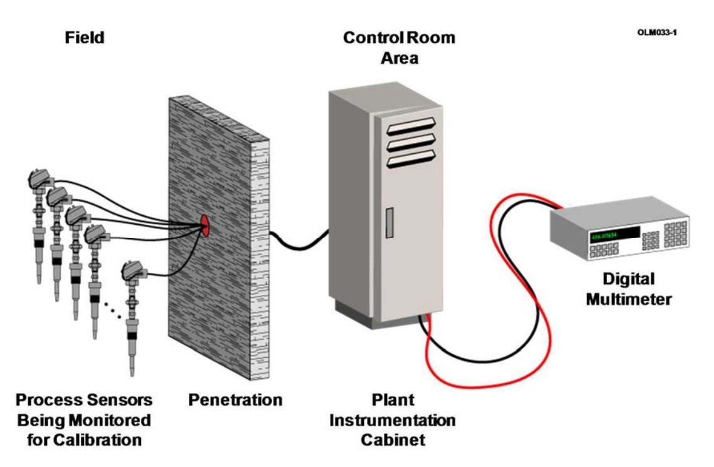

*FIG. 1. Manual acquisition of OLM data for resistance temperature detector cross-calibration (Courtesy of the AMS Corporation, USA).* 

There are a few advantages of acquiring OLM data manually. For example, the measurements are often simple, and plant personnel are often trained and familiar with taking voltage measurements from test points. Also, most plants already have a number of voltage measurement equipment, so the cost of equipment is minimal. However, there are several drawbacks that can often make the manual method impractical for many static OLM techniques, especially those techniques that involve comparing several sensors at one time. These drawbacks are:

- (a) Limited measurement capability;
- (b) Significant time required to take measurements;
- (c) Increased probability of making errors when recording measurements;
- (d) Increased trip risk while sensors are in test mode.

#### *2.1.1.2.Data from plant computer*

Nuclear power plants are often equipped with the means to collect and store the output of process sensors. The data can be retrieved either directly from the plant computer or through the plant data historian. Figure 2 shows a simplified data flow from the sensors to the plant computer. Most plants also employ a separate data historian to archive data from the plant computer. The historian obtains data from the plant computer and provides additional storage and other capabilities.

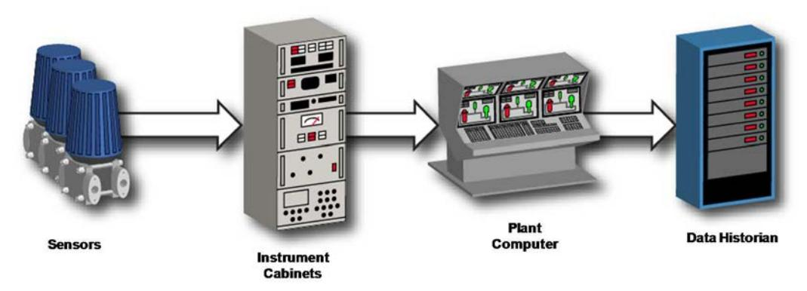

*FIG. 2. Sensor data flow to the plant computer and data historian (Courtesy of the AMS Corporation, USA).* 

Typically, the measured sensor values are converted to engineering units before they are stored in the plant computer to facilitate easy understanding by plant personnel. In addition to the measured values, each data point is time stamped when the data is acquired. Fig. 3 shows a typical set of data from the plant computer, along with the timestamps for the measurement.

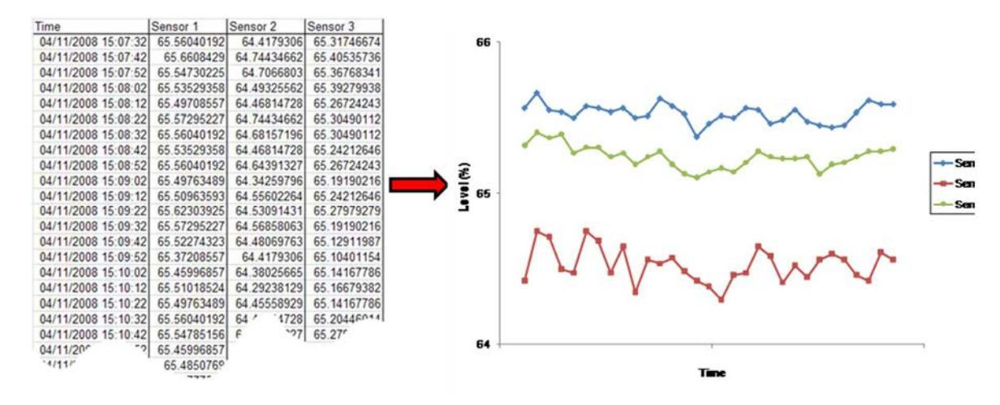

*FIG. 3. Typical data from the plant computer (Courtesy of the AMS Corporation, USA).* 

#### *2.1.1.3.Data from plant computer*

An alternative to acquiring data manually or from the plant computer for static analysis is to provide a dedicated data acquisition system. Fig. 4 shows the components of a dedicated data acquisition system for on-line calibration monitoring, including input test signals to verify the calibration and proper operation of the data acquisition system itself. Custom OLM data acquisition systems can be designed to sample data from numerous instruments and store the data for subsequent analysis.

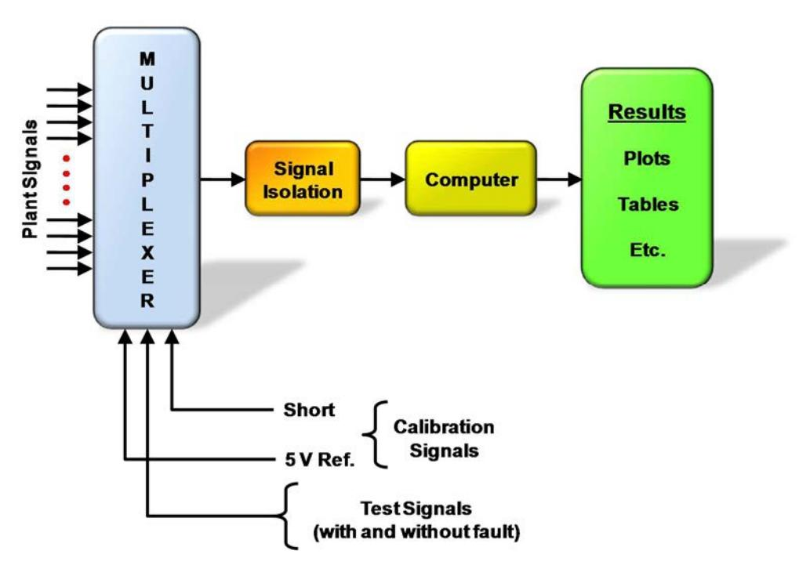

*FIG. 4. Custom data acquisition system (Courtesy of the AMS Corporation, USA).* 

#### **2.1.2. Data acquisition for dynamic performance monitoring**

Dynamic data analysis typically requires data sampled at higher frequencies than available in the plant computer data (i.e. 1 Hz to 1 kHz). For this reason, a dedicated data acquisition system is needed to acquire the data. In addition to acquiring the data at a high frequency, the dedicated data acquisition system also provides a means to remove the static component of a signal and amplify the fluctuations, which allows for more accurate dynamic analysis.

Figure 5 shows how one may begin with the raw signal, which includes both the static and the dynamic components, and then extract the noise from that signal. The first step in this process is to remove the static component. This is accomplished by adding a negative bias to the sensor output or by using a high-pass electronic filter. Next, the signal is amplified and passed through a low-pass filter. The low-pass filter removes the extraneous noise and provides anti-aliasing before sending the signal through an analogue to digital (A/D) converter to a data acquisition computer. The data acquisition computer samples the data with an appropriate sampling rate and stores it for subsequent analysis.

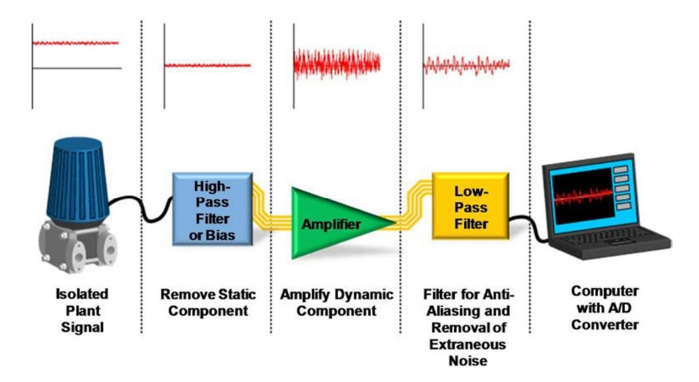

*FIG. 5. Block diagram of the noise data acquisition sequence (Courtesy of the AMS Corporation, USA).* 

#### 2.2.ON-LINE MONITORING DATA QUALIFICATION

Once the OLM data has been acquired, either from the plant computer or by a dedicated data acquisition system, it can be evaluated and qualified for use by OLM algorithms. This section describes how OLM data is qualified for static and dynamic OLM applications.

#### **2.2.1. Static data qualification**

Experience has shown that data from the plant computer or data historian is not always ready for OLM analysis immediately after it is acquired. There are several common problems with data from the plant computer to be addressed before OLM analysis can begin. In fact, one of the most difficult challenges in developing programmes for OLM techniques is preparing the data for analysis. This section describes some of the problems with the data that is retrieved from a plant computer as well as methods that may be used to resolve them.

Static data qualification is the process of implementing the above techniques for elimination of outliers, spikes, stuck data and noise. The regularization of data may include de-noising techniques in frequency space, which is also a form of lossy compression. Techniques for reconstructing missing data are also applied during the data qualification stage. Data may be reconstructed by using the appropriate statistical distribution moments associated with the present data.

#### *2.2.1.1. Compressed data*

The primary purpose of compressing data is to reduce the hardware resources required for storing the data. Rather than expending resources storing the same data values over and over, historians typically record data only if it has changed significantly from the previously stored value, or if a maximum time between stored data samples has elapsed. This method greatly reduces the required amount of stored data points.

Data compression may be implemented using a variety of standard methods, grossly classified between lossy or lossless. Most current hardware by default implements lossless compression for communication. For post-processing of data, bandwidth reduction is a commonly used lossy compression method, which converts the data to a frequency domain and then passes it through a set of filters in the increasing order of their pass-band. In discrete space, this may be implemented as a moving average.

Figure 6 shows an example of compressed data from a nuclear power plant and the interpolated data compared to the original uncompressed data. As the figure shows, the higher frequency signals are typically lost by the data compression. This results in a loss of correlation between various compressed signals which could reduce the effectiveness of some static OLM techniques such as empirical modelling. For this reason, it is best to reduce or turn off the data compression when collecting data for OLM.

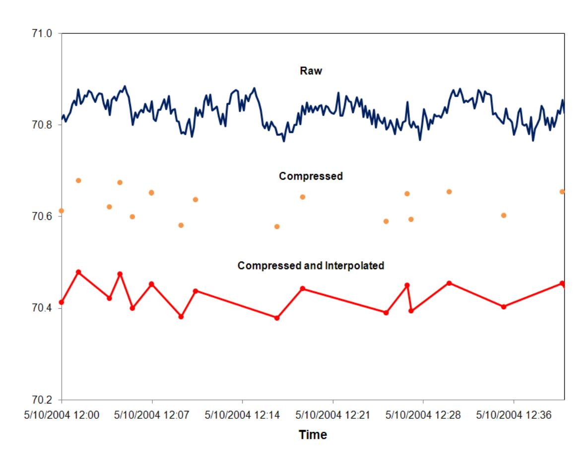

*FIG. 6. Compressed data from a nuclear plant data historian (Courtesy of the AMS Corporation, USA).* 

#### *2.2.1.2. Missing data*

Sometimes there are gaps in the plant computer data from one or more sensors. This 'missing data' can occur for various reasons including errors in data acquisition or plant maintenance in the sensor channel. An example of missing data is shown in Fig. 7. As in Fig. 6, this data is from measurements in a nuclear power plant.

Statistical distribution based data reconstruction creates additional data sets with the same mean and variance (from available data string), using the random number generation function of the computer.

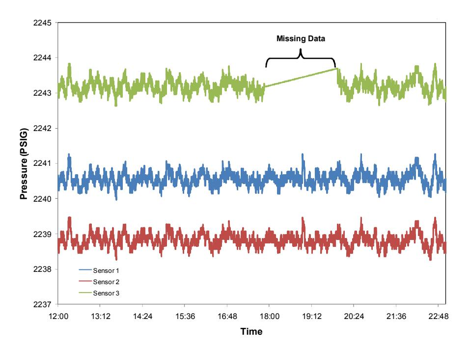

*FIG. 7. Missing data record in measurements from a nuclear power plant (Courtesy of the AMS Corporation, USA).* 

#### *2.2.1.3. Outliers and spikes*

Another potential problem with plant computer data is the presence of spikes and outliers in the data. These spikes are commonly caused by channel checks or calibrations that are performed on the instrumentation when the data was retrieved.

These types of problems may be difficult for software programs to automatically remove as the spikes due to channel checks or calibrations typically remain within the calibrated range of the sensor. In these cases, manual removal of the bad data values may be required.

To eliminate outliers and spikes, each data sample is compared with the mean of the sample set. If the error exceeds a finite band, the individual sample is discarded. Alternatively, band-pass filtering methods work on data converted to frequency space, where a density function is obtained. Spikes can be identified as a sharp peak with a multimodal density function.

Figure 8 shows the OLM data for plant computers while the channel was being calibrated by a plant technician. It is obvious that this type of data needs to be excluded in OLM data analysis for instrument calibration monitoring.

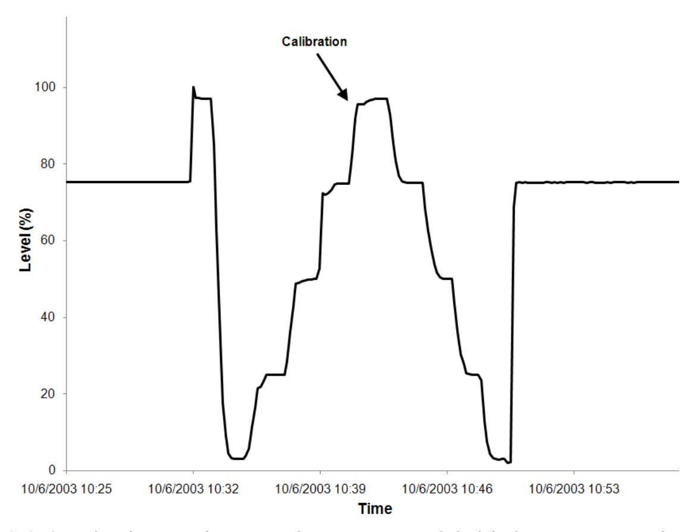

*FIG. 8. OLM data from a nuclear power plant computer sampled while the instrumentation channel was under calibration (Courtesy of the AMS Corporation, USA).* 

#### *2.2.1.4. Stuck data*

Another problem that is occasionally encountered with plant computer data is the presence of 'dead' spots in the data where the value of given sensor or sensors remains fixed at a value for an unusually long period of time. Figure 9 shows an example of a sensor whose values are stuck, while other redundant sensors measuring the same process are shown to fluctuate as expected. These types of problems are also difficult to detect automatically because the sensor values are often within their normal operating range. More sophisticated data cleaning programs can be written to catch anomalies such as these.

Stuck data will show a reduced or eliminated variance over the subset of stuck measurements. In frequency space, the density function will show a sharp peak. Indication of stuck data may also be detected in an analysis of the finite difference (derivative) between data points. A continuous null derivative indicates stuck data.

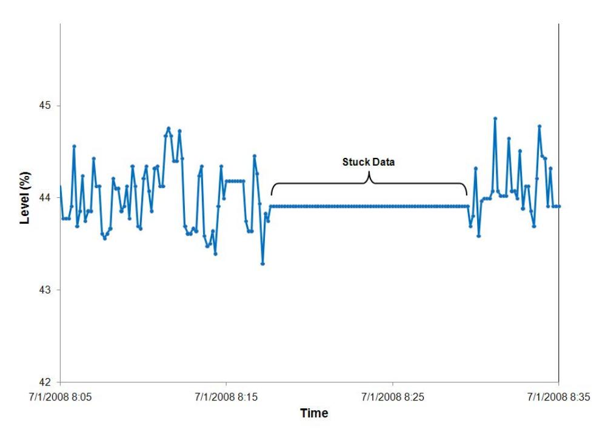

*FIG. 9. Illustration of 'stuck' data (data from a pressurized water reactor (PWR) Plant Computer) (Courtesy of the AMS Corporation, USA).* 

#### **2.2.2. Dynamic data qualification**

Prior to any dynamic OLM analysis, the suitability of the data is needed to be examined by scanning and screening the raw data to ensure a reliable analysis. Because data for dynamic analysis is not normally taken from the plant computer, the common data problems associated with plant computer data do not apply. However, it is still important to evaluate and qualify dynamic data before analysing it. Often, qualification of dynamic OLM data is accomplished by examining various statistical properties of the data such as:

- (a) Amplitude Probability Density (APD) Plot a visualization of a signal's distribution;
- (b) Variance a measure of signal amplitude;
- (c) Skewness index of signal asymmetry;
- (d) Kurtosis index of the 'flatness' of a signal's distribution.

Almost all plant noise signals from properly operating sensors and systems usually have Gaussian distributions. As such, the distributions of signals are examined before any rigorous dynamic OLM analysis begins. This is accomplished by using data qualification algorithms that check for the stationarity and linearity of the data. This includes plotting the APD of the data for visual inspection of skewness and nonlinearity as well as calculating the skewness, flatness, or other descriptors of noise data to ensure that the data has a normal distribution and does not contain any undesirable characteristics. Trending these descriptors is also a way of evaluating changes in the process sensors which may warrant investigation.

Figure 10 shows two APDs for a normal and a defective sensor in a nuclear power plant. Note that the APD of the defective sensor deviates significantly from a Gaussian (normal) distribution. In further examination, this sensor was found to have degraded and had become very nonlinear.

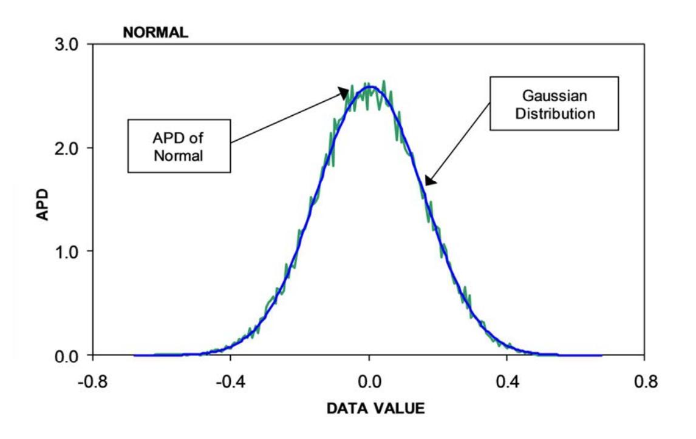

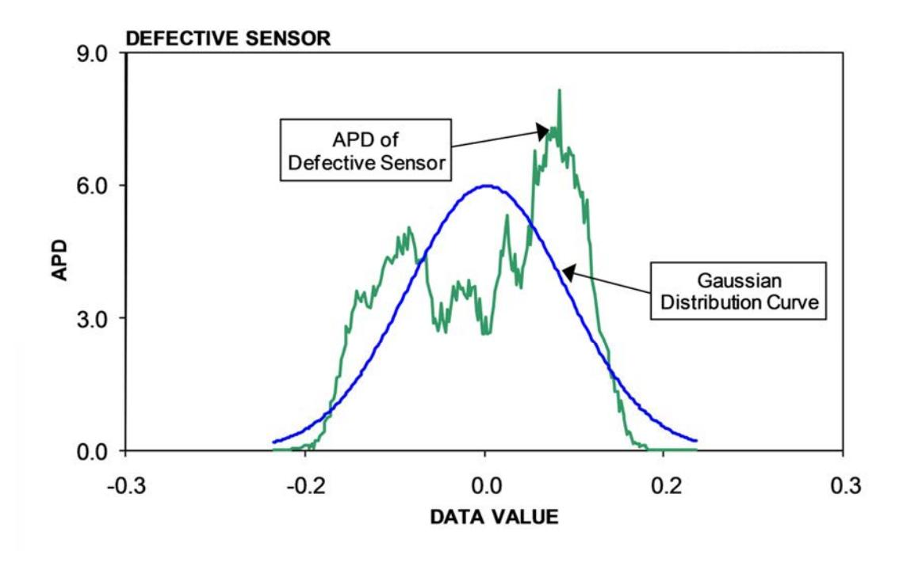

*FIG. 10. APDs of a normal and a defective sensor (Courtesy of the AMS Corporation, USA).* 

A signal's similarity to a Gaussian distribution can also be determined by calculating the skewness of the signal. Skewness is an index of the symmetry of the signal or the behaviour of the signal above and below the mean value. The skewness is computed as:

$$Skewness = \frac{1}{N} \sum_{i=1}^{N} \frac{\left(x_i - \overline{x}\right)^3}{\sigma^3} \tag{1}$$

Data which is symmetrical above and below its average value will have a skewness value of zero. Figure 11 illustrates the APDs of a normal and a defective sensor.

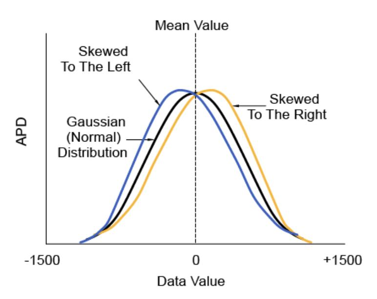

FIG. 11. Illustration of noise signal asymmetry in terms of skewness (Courtesy of the AMS Corporation, USA).

There are higher moments of the noise data, such as kurtosis, that are given by:

$$Kurtosis = \frac{1}{N} \sum_{i=1}^{N} \frac{\left(x_i - \overline{x}\right)^4}{\sigma^4}$$
 (2)

Kurtosis is a measure of the peakedness or flatness of a distribution. The peakier APD has a higher kurtosis than the flatter APD. The kurtosis value for a Gaussian signal is normally equal to 3.0. Often in data qualification algorithms, the kurtosis is divided by 3.0, so that Gaussian signals have a kurtosis of 1.0.

#### 2.3.ON-LINE MONITORING DATA ANALYSIS

An important aspect of OLM implementation in a plant is the choice of algorithms for analysis of static and dynamic data. Several algorithms are available, and there are some of the advantages and disadvantages of using these algorithms.

#### 2.3.1. Static on-line monitoring analysis

The main objective of static OLM analysis is to detect out-of-normal situations in sensors or equipment that indicate a sensor is drifting out of tolerance, or that equipment is

behaving abnormally. Most techniques involve using an algorithm to determine a process estimate and then subtracting the measured sensor values from the process estimate to form a deviation or residual. The deviations or residuals of each individual sensor are then checked for abnormal values by various fault detection methods.

Static data analysis is used to compare a measured value or set of behaviours to either a representative physical model or historical data. The choice of analysis method is dictated by the accuracy of the model or the completeness of the data set, respectively.

#### *2.3.1.1. Data analysis by trending*

This is, perhaps, the simplest way of analysing static data by trending simple statistical quantities such as the mean and standard deviation.

#### *2.3.1.2. Redundant sensor averaging*

The most of the safety process parameters are instrumented with redundant sensors. The most straightforward technique for determining drift or abnormality in nuclear plant data is comparison of redundant sensor measurements against their average. A variety of averaging techniques are available, including:

- a) Simple averaging simple averaging involves adding the values of the signals at each instant of time and dividing the sum by the number of signals.
- b) Band averaging band averaging uses a band to reject outliers and averages the values of the remaining signals at each instant of time.
- c) Weighted averaging weighted averaging applies a set of fixed multipliers to the signals prior to averaging. For example, weights could be determined based on how far they deviate from the simple average.
- d) Parity space in parity space, each signal is weighted based on how many other signals share the parity space band with the signal. This weighted measure is commonly referred to as consistency, and requires the determination of a consistency check value which dictates the sensitivity of the parity space estimate to individual signal values which deviate from each other.

These averaging techniques are illustrated in Fig. 12.

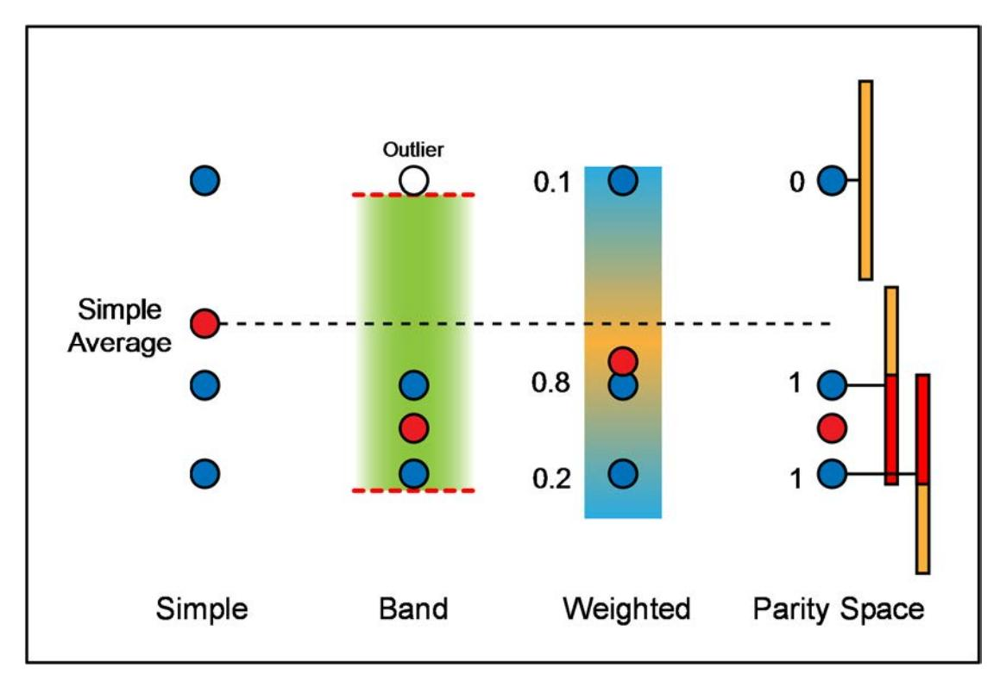

*FIG. 12. Redundant sensor averaging techniques (Courtesy of the AMS Corporation, USA).* 

#### *2.3.1.3. Detecting deviation from average*

Once the parameter estimate is calculated using an averaging technique, the deviations of each individual sensor in the redundant group from this estimate are computed. For transmitter calibration monitoring, these deviations are analysed over an entire fuel cycle and checked against deviation limits that are established such that if the sensor deviations reside within the limits, then the sensor is determined to be within calibration. Sensors are classified as being in need of calibration when their respective deviations exceed the deviation limits. Note that the deviation limits may be specifically derived for on-line calibration monitoring and differ from the manual as-found and as-left calibration limits.

Figure 13 presents an illustration of a deviation analysis for four reactor coolant system (RCS) flow transmitters. The *y* axis in this figure is the difference between the reading of each transmitter from the parity space average estimate, and the *x* axis represents time in months. The data is shown for a period of 74 months during which the plant was operating. None of the four signals show any significant drift during the 74-month period and remain within the deviation limits. That is, these transmitters have not suffered any significant calibration change and do not need to be calibrated.

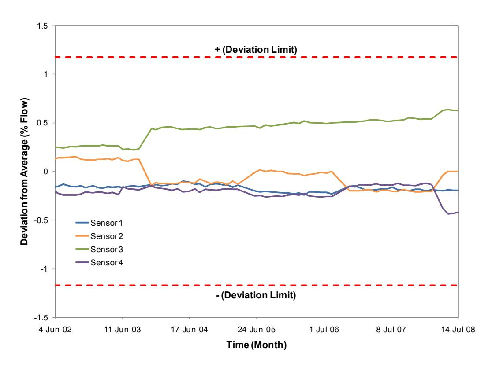

*FIG. 13. On-line calibration monitoring data for four RCS flow transmitters in an NPP (Courtesy of the AMS Corporation, USA).* 

#### *2.3.1.4. Physical modelling*

Physical modelling techniques use the mathematical relationships between parameters to detect process or sensor anomalies. These relationships are based on first principle equations such as heat and mass balance equations, steady state thermodynamics, transient thermodynamics and fluid dynamics. The application of physical modelling may be as simple as calculating a mass-flow balance equation or as involved as describing the complex mathematical relationships between plant components such as a heat exchanger, condenser, pump, valve, mixer, diffuser, etc. Physical modelling involves inputting process parameter measurements into mathematical equations, and determining sensor or process anomalies by subtracting the outputs of the model from the inputs to form residuals (Fig. 14). Residuals from physical models are near zero when the plant parameters are normal.

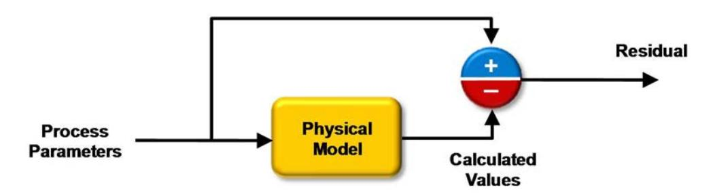

*FIG. 14. Physical modelling process (Courtesy of the AMS Corporation, USA).* 

The main requirement for physical modelling is that the structure, design, and function of the modelled process or component is well known and can be accurately described in mathematical equations. The availability of efficient computational methods for solving the particular type of equations employed in the physical modelling is also a primary requirement.

Physical modelling uses the first principle physics approach to construct a parametric model of the process. This model can be used as a goodness function test against the recorded system data. For many processes (for example, thermal hydraulic phenomena), first principle approaches do not model the system with sufficient accuracy and/or fidelity to be used as an evaluation tool for data. When using physical modelling to validate signal inputs, it has to be ensured that the model uncertainty is sufficiently less than the desired range of valid equipment performance. Uncertainties tend to be high for large system orders.

If models are linear time-invariant, and can be cast in a state-space framework, a Bayesian estimation technique, namely by use of Kalman filter or its variants, the estimate of a non-measurable variable can be obtained. Such an estimate can be considered to be the output of a virtual sensor, which can be compared with the remaining data sets for fault monitoring.

#### *2.3.1.5. Empirical modelling*

In contrast to physical models, empirical modelling techniques attempt to define relationships between variables based only on the data itself, and not on the physical properties of the variables that are being compared. As such, empirical models do not require as much of an in-depth knowledge of the plant and as a result, may be easier to implement and maintain than physical models.

Empirical modelling uses the measured data sets themselves as references for comparison with future measurements. A problem arises when future process states are not sufficiently represented in the existing process data. These future process states may or may not still be valid, but the model cannot provide validation.

The most common empirical modelling techniques are generally separated into two main categories, namely parametric models and non-parametric models.

In parametric empirical models, the mathematical structure of the model is pre-defined, such as in an equation, and the example data are fit to the pre-defined structure. For example, suppose the example data set is assumed to follow a polynomial model defined by:

$$y_t = a_0 + a_1 x_t + a_2 x_t^2 (3)$$

where

- *yt* is the output at sample *t*;
- *xt* is the input at sample *t*; and

*a0*, *a1* and *a2* are the coefficients of the equations which are unknown.

The objective of parametric modelling is to use the example data to find the coefficients *a0*, *a1* and *a2* that best fit the data.

In a non-parametric empirical model, the mathematical structure is not implied beforehand. Instead, training examples are stored in memory, and each new data sample is compared to the training examples to calculate a best estimate. Unlike parametric modelling, non-parametric models are not restricted to a pre-defined relationship between the inputs and outputs.

In non-parametric models, the example data is all that the non-parametric model 'knows.' Non-parametric models do not assume the data is restricted to underlying structure (like a parametric model).

Data-oriented models are hybrids between physical and empirical models, where empirical data is used to fill in gaps in the physical model, or extend its range of validity.

#### **2.3.2. Dynamic on-line monitoring analysis**

Dynamic analysis of nuclear plant sensors and equipment is concerned with determining how sensors and equipment react to fast-changing events such as temperature or pressure steps, ramps, spikes, etc. Dynamic analysis is most often divided into frequency and time domain analysis. Methods for dynamic analysis, unlike static modelling methods, are well understood and have been used for decades.

#### *2.3.2.1. Frequency domain analysis*

In frequency domain analysis, the spectrum of the data is calculated using a technique such as the Fast Fourier Transform (FFT). Figure 15 shows the spectrum of the noise signal from a sensor in a nuclear power plant. Note that the spectrum is shown in terms of the auto power spectral density (APSD). The APSD is the variance of the signal within a small frequency band as a function of frequency plotted against frequency. For a simple first-order system, the APSD is all that may be needed to provide the sensor's dynamic response or response time. In this case, the response time is determined by measuring the break frequency (Fb) of the APSD, as shown in Fig. 16. However, process sensors are not necessarily first-order and APSD plots from actual process signals are not smooth enough to allow one to measure the break frequency as simply as shown in Fig. 16. In fact, APSDs often contain resonances and other process effects that complicate the process of determining a response time by analysing the APSD. As such, APSD analysis experience is often needed to determine a sensor's response time by using the noise analysis technique. For example, a dynamic model of the sensor is used with the APSD plot in order to obtain the sensor's response time. The model, which is normally a frequency domain equation, is fit to the APSD to yield the model parameters. These parameters are then used in the model to calculate the sensor's response time.

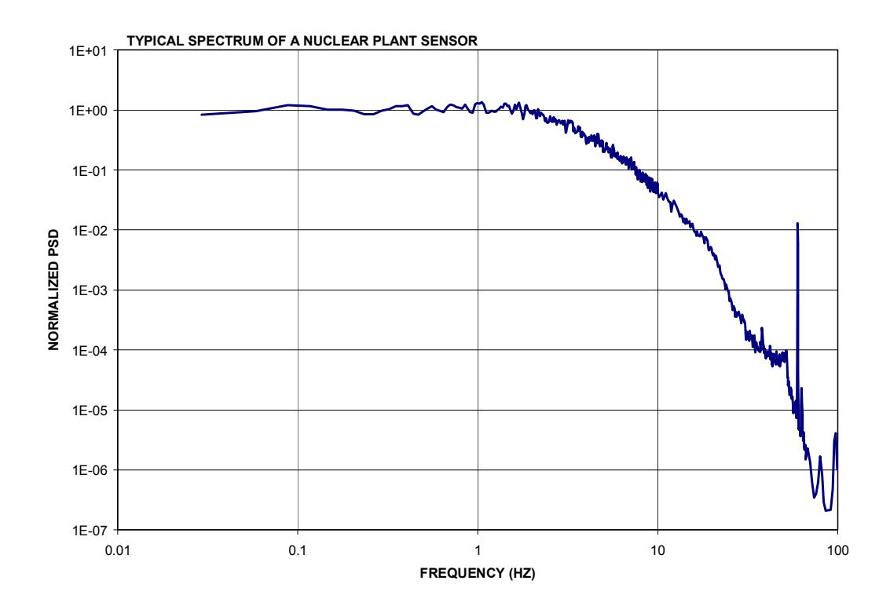

FIG. 15. APSD of a typical nuclear plant sensor (Courtesy of the AMS Corporation, USA).

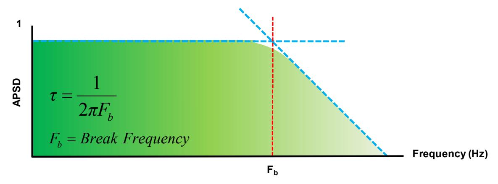

FIG. 16. First-order system APSD (Courtesy of the AMS Corporation, USA).

The procedure for analysing noise data in the frequency domain is illustrated in Fig. 17. This analysis involves performing an FFT on the sensor's output signal in order to obtain its APSD. A function (i.e. sensor model) is then fit to the APSD and the parameters of the function are identified and used to calculate the sensor's response time.

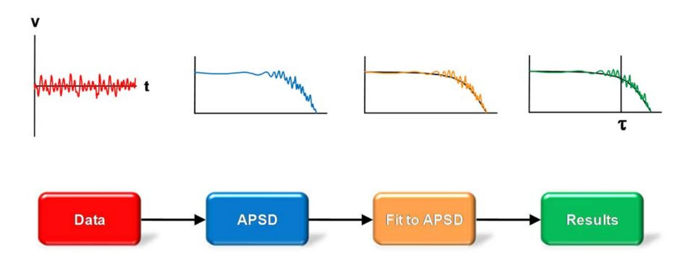

FIG. 17. Frequency domain analysis procedure (Courtesy of the AMS Corporation, USA).

#### 2.3.2.2. Time domain analysis

In the time domain, correlation and autoregressive methods are used for analysis of noise data. The correlation function for a noise signal x(t) is written as:

$$R_{xx}(\tau) = \frac{1}{T} \int_{-T/2}^{T/2} x(t) x(t-\tau) dt$$
 (4)

where

 $R_{xx}(\tau)$  is the referred to as autocorrelation function;

τ is the time lag; andT is the signal duration.

The autocorrelation function describes the general dependence of the value of the data at one time on the values at another time. The function provides insight into the existence of periodic signal components in the random data and the nature of narrow and wideband noise properties. In order to obtain the correlation between two different signals x(t) and y(t), a function called cross-correlation is used. The cross-correlation function  $R_{xy}(\tau)$  is written as:

$$R_{xy}(\tau) = \frac{1}{T} \int_{-T/2}^{T/2} x(t) y(t-\tau) dt$$
 (5)

The cross-correlation function describes the general dependence of the values of one set of data on the other. It is used for measurement of time lags in transport processes, determination of transmission path by observing multiple peaks in  $R_{xy}(\tau)$ , and detection and elimination of interfering noise. In the time domain analysis of sensor noise data, the correlation function is plotted versus time. The peak in the correlation plot identifies the time delay between the sensors (i.e. the propagation time of the noise between the two sensors).

#### **3. STANDARDS AND REGULATIONS FOR PERFORMANCE MONITORING OF INSTRUMENTATION AND CONTROL SYSTEMS IN NUCLEAR FACILITIES**

#### 3.1. INTRODUCTION

The control and protection systems of both power and RRs depend on a large number of sensors and related components collectively referred to as plant I&C systems. Those which feed plant protection systems or otherwise have a safety function are typically subject to a variety of regulations augmented by industry standards and national and international guidelines. In particular, the static (calibration) and dynamic (response time) performance of safety related sensors need to be verified periodically to ensure that they provide accurate and timely data to the plant protection system for an automatic shutdown of the plant, if and when it is warranted. Therefore, the nuclear industry has developed a variety of techniques for calibration and response time testing of important I&C systems including pre-installation laboratory test techniques as well as post-installation in situ methods including OLM techniques that allow for remote testing of I&C performance during plant operation. However, the dynamic (response time) performance testing of neutron and radiation instrumentation is usually not a requirement in RRs. Dynamic response of nuclear instrumentation is verified during factory acceptance testing. This section identifies these technologies and provides a summary of regulations, standards and guidelines that have emerged over the last three decades to support the safety goal of nuclear facilities. These requirements and the OLM technologies which may be used to meet them will serve as the foundation for use of OLM in RRs and are thus summarized in this section of the report.

Table 2 summarizes the testing requirements for verifying the performance of nuclear plant I&C systems and the OLM technologies that may be used to meet these requirements. Also listed in this table are the related regulations and industry standards as well as the publications of the IAEA. The IAEA publications are important documents as they provide the details of the techniques that may be used to verify the performance of nuclear plant I&C systems and provide for management of their ageing through the life of the plant, including continued operation for long period.

TABLE 2. REGULATIONS, STANDARDS AND GUIDELINES FOR MEETING THE I&C TESTING REQUIREMENTS OF NPP [2]

| Test Requirement                                                             | On-Line Test Method                                                              | Related Regulation/Standard                                                                                           | Related IAEA publications                          |
|---------------------------------------------------------------------------------|-------------------------------------------------------------------------------------|--------------------------------------------------------------------------------------------------------------------------|-------------------------------------------------------|
| In situ response time testing of temperature sensors                      | LCSR method                                                                         | – NUREG-0809 – ISA Standard 67.06 – IEC Standard 62385 – IEC Standard 62342                         | – TECDOC-1147 – TECDOC-1402                  |
| On-line measurement of response time of pressure transmitters             | Noise analysis technique                                                         | – Regulatory Guide 1.118 – ISA Standard 67.06 – IEC Standard 62385 – IEC Standard 62342             | – TECDOC-1147 – TECDOC-1402                  |
| On-line detection of blockages, voids and leaks in pressure sensing lines | Noise analysis technique                                                         | – Regulatory Guide 1.118 – ISA Standard 67.06 – IEC Standard 62385 – IEC Standard 62342             | – TECDOC-1147 – TECDOC-1402 – NP-T-1.2 |
| In situ/on-line calibration of temperature sensors                        | Cross-calibration technique                                                      | – NUREG-0800 – NRC's SER (July 2000) – ISA 67.06.01 – IEC Standard 62385 – IEC Standard 62342 | – NP-T-1.1                                         |
| On-line calibration monitoring of pressure transmitters                   | On-line calibration monitoring techniques                                     | – NUREG-0800 – NRC's SER (July 2000) – ISA Standard 67.06.01                                              | – NP-T-1.1                                         |
| I&C ageing management                                                        | LCSR, noise analysis, cross-calibration, on-line calibration monitoring | – IEC Standard 62385 – IEC Standard 62342                                                                       | – TECDOC-1147 – TECDOC-1402 – NP-T-1.2 |
| Predictive maintenance of reactor internals                                  | Noise analysis technique                                                         | – ANSI/ASME OM-5-81                                                                                                   | – NP-T-1.2                                         |
| Neutron detector life extension                                              | Noise analysis technique                                                         | – IEC Standard 62385 – IEC Standard 62342                                                                       | – TECDOC-1147 – NP-T-1.2                     |

#### 3.2. SCOPE OF APPLICATION IN RESEARCH REACTORS

IAEA Safety Standards Series No. SSR-3, *Safety of Research Reactors* [3] establishes requirements related to I&C in the design, and operation of research reactors. IAEA Safety Standards Specific Safety Guide No. SSG-37, *Instrumentation and Control Systems and Software Important to Safety for Research Reactors* [4], provides recommendations on how to apply those requirements. Given the wide range of RR types, power, applications and regulatory environment, and the absence of national codes and standards exclusively for RRs; the codes and standards for OLM in NPPs may be used as guidelines for RRs. Much of the information and guidance in these documents can be applied with a graded approach to RRs. This section of the report provides the relevant national standards and guidelines related to the use of OLM in power reactors.

In consideration of the above, NPP OLM guidelines are not supposed to be applied in a binding fashion to RRs for regulatory purposes. Rather RRs can adapt relevant NPP OLM standards and guidelines with a case-by-case evaluation using a graded approach.

#### 3.3. REGULATORY CONSIDERATIONS

The NRC has issued three documents which imply requirements to measure the response time of safety related temperature and pressure sensors in NPP. These documents are Regulatory Guide 1.118 (Revision 3, April 1995) [5], NUREG-0809 (August 1981) [6], and NUREG-0800 (Revision 5, March 2007) [7]. In these documents, the NRC requires the nuclear industry to verify, by testing and analysis, that the 'in-service' response time of safety related sensors meets the plant technical specification requirements. In response to these requirements, the LCSR method was developed to measure the 'in-service' response time of temperature sensors and the noise analysis technique was adapted for in situ response time testing of pressure sensors (including differential pressure sensors that measure level and flow). Both the LCSR and noise analysis methods are used today in numerous NPP around the world for sensor response time testing.

The use of the noise analysis and LCSR technologies to meet regulatory requirements is not limited to nuclear plants in the U.S. These methods are used in many countries operating PWRs and boiling water reactors (BWRs) to include the United Kingdom, Spain, Slovenia, the Republic of Korea, Sweden and Switzerland. For example, in Sweden, the noise analysis technique has been used for response time testing of pressure, level and flow transmitters, BWR stability measurements, reactor internal vibration analysis and on-line measurement of temperature coefficient of reactivity in PWRs.

The noise analysis technique is used in many other countries such as Germany, Japan, the Russian Federation, France and Pakistan, not necessarily for I&C testing or to meet specific regulatory regulations but for predictive maintenance of reactor internals, detection of flow anomalies and incipient failure detection in other plant equipment. For example, in Germany the noise analysis technique is used in NPP for measurement of vibration of reactor internals and similar other applications such as detection of the onset of a shaft crack in recirculation pumps of BWR plants.

In addition to sensor response time testing, there are regulations, standards and guidelines on verifying the accuracy of nuclear plant I&C systems. Adequate sensor calibration is critical to the safe operation of RRs as well. Examples of OLM methods to support this application include the cross-calibration method to verify the calibration of nuclear plant temperature sensors, and on-line calibration monitoring to verify the accuracy of pressure, level and flow transmitters. These methods are used in the RRs in the USA, the United Kingdom, France, the Republic of Korea, Egypt, Indonesia and other countries to meet the applicable regulations, standards and guidelines.

#### **3.3.1. US NRC regulations**

A summary of the key points of the NRC regulations is presented below. These points are taken almost verbatim from the text of the NRC documents.

#### *3.3.1.1. NRC Regulatory Guide 1.118, Periodic Testing of Electric Power and Protection systems*

This publication applies to a variety of equipment in NPPs including the I&C systems. The points in this document that relate to I&C testing technologies are [5]:

- Means have to be provided for checking the operational availability of each protection system input sensor during reactor operation;
- The protection system has to be designed to permit its periodic testing during reactor operation, including a capability to test channels independently to determine failures and losses of redundancy that may have occurred;
- Electric power systems important to safety have to be designed to permit periodic testing;
- A test programme needs to be established to ensure that all testing is identified and performed in accordance with written test procedures. This programme covers operational testing, which demonstrates acceptable in-service performance of systems and components.

#### *3.3.1.2. NUREG-0809 – Safety evaluation report, review of resistance temperature detector time response characteristics*

This publication was written by the NRC to approve the LCSR method for resistance temperature detector (RTD) response time testing in NPPs [6]. It is stated in the document that an RTD element does not respond instantaneously to changes in water temperature, but rather there is a time delay before the element senses the temperature change, and in nuclear reactors this delay is factored into the computation of safety set-points. For this reason it is necessary to have an accurate description of the RTD time response. NUREG-0809 gives a review of the current state of the art techniques of describing and measuring the RTD time response.

#### *3.3.1.3. NUREG-0800 – standard review plan*

This is a large NRC document that is used by the regulators in review of a plant's compliance with the NRC's regulations. Section 7 of this publication is concerned with NPP I&C systems and includes a number of appendices. Each appendix is referred to as a Branch Technical Position or BTP. Appendix 13, or BTP-13 relates to the performance testing of nuclear plant RTDs as [7]:

- Performance of an RTD is characterized by its accuracy and response time. To ensure adequate performance of the RTD, its accuracy and response time are to be verified.
- Cross-calibration method is acceptable as long as a reference RTD which has been recently calibrated and response time tested is included to account for common mode drift or other methods can be used if adequate justification is provided.
- Response time of RTDs may be verified using the LCSR method. The LCSR method may use an analytical technique such as the LCSR transformation.

The cross-calibration method mentioned in the NUREG-0800 is an in situ method for verifying the calibration of redundant sensors. The details of this method are covered by another NRC document NUREG/CR 5560, Ageing of Nuclear Plant Resistance Temperature Detectors [8].

#### *3.3.1.4. NRC approval of on-line calibration monitoring method*

The NRC issued in 2000 a Safety Evaluation Report (SER) approving the concept of OLM to verify the calibration of pressure, level and flow transmitters in NPPs. This approval was given to a nuclear industry topical report TR-104965 [9] that was submitted to the NRC by the EPRI and entitled On-Line Monitoring of Instrument Channel Performance. The details of OLM technology are covered in the EPRI report as well as in NUREG/CR-6343: On-Line Testing of Calibration of Process Instrumentation Channels in NPP [10], NUREG/CR-6895: Technical Review of On-Line Monitoring Techniques for Performance Assessment [11].

Today, a new nuclear industry effort is under way to obtain generic approval from the NRC for the use of OLM to verify the performance of process instrumentation channels in NPPs. With a generic approval, plants do not have to go through a rigorous exercise to implement OLM. Rather, they can depend on the generic NRC approval to apply for a change in the plant's technical specification requirements to switch from the conventional technique of performance measurements to the new OLM technique.

#### **3.3.2. Regulations in Europe**

The French regulations on performance monitoring of nuclear plant I&C systems follow a different approach. In fact, French plants have long been using the on-line drift monitoring concept to determine when and which sensors need to be calibrated. The same policy is followed by French-designed PWRs in other countries such as China. Also, unlike the US NPPs, French power plants are not required to perform sensor response time testing on a periodic basis.

In the United Kingdom, the Nuclear Installations Inspectorate (NII) closely follows the US regulations for the Sizewell B plant. This is a PWR plant of Westinghouse design with a digital plant protection system together with a complete analogue backup system. As such, Sizewell B has numerous sensors that need to be calibrated and response time tested. In 2007, the NII accepted a plan set forth by British Energy (now Électricité de France) for adapting OLM to verify the performance of process instrumentation sensors as installed in the Sizewell B plant. In doing this, the NII used not only its own provision but also the NRC's SER and the EPRI Report TR-104965 [9]. As a result of the NII approval, the Sizewell B plant has proceeded to use OLM to verify the performance of much of its I&C equipment.

In Germany, the noise analysis technology is used in NPPs but not always for the same applications as in the USA. For example, there is no regulation in Germany to measure the response time of temperature and pressure sensors in NPPs. There are, however, regulatory regulations referred to as 'Kerntechnischer Ausschuss' (KTA) rules in Germany such as the KTA 3506 [12], which relates to equipment performance monitoring, and KTA 3204 [13] on reactor internal vibration measurements.

In Sweden, some nuclear plants use the OLM approach to determine the frequency of calibration of pressure transmitters and the noise analysis technique to perform sensor response time testing. The technologies leading to the use of OLM and noise analysis for these applications in Sweden have been developed by the Swedish Centre for Nuclear Technology (SKC) and Swedish Nuclear Power Inspectorate (SKI). As such, the measurements in Swedish NPPs are believed to be in line with SKI objectives.

In Spain, the NRC regulations are typically followed for all the US-made NPPs. In particular, the LCSR and noise analysis techniques are used for response time testing of temperature and pressure sensors in the safety systems of Spanish NPPs.

#### **3.3.3. Regulations in Asia**

The Republic of Korea follows the NRC regulations especially for their US-made NPPs. For example, sensor response time testing using the LCSR method, noise analysis, and other methods are performed in Taiwan, China and the Republic of Korea using essentially the same procedures as in the USA. In Japan, the LCSR method and noise analysis technique were used for response time testing of temperature and pressure sensors, respectively, although there is no stringent regulatory requirement in Japan for these measurements. Furthermore, no specific regulation exists which requires sensor response time testing in NPPs.

#### **3.3.4. Industry standards**

There are a number of industry standards on how to use the technologies described in this report to meet the requirements of regulatory authorities or to comply with plant specific technical specifications or quality assurance provisions. These standards have been written under the auspices of a number of organizations such as the ISA, the American Society for Testing and Materials (ASTM), the IEC, the American Society for Mechanical Engineers (ASME), the American National Standards Institute (ANSI), and the Institute of Electrical and Electronics Engineers (IEEE). The preparation of these standards typically involves experts from many industrial sectors and different countries. A few examples are listed below:

- ANSI/ISA Standards 67.06 (1984) and 67.06.01 (2002), Performance Monitoring for Nuclear Safety Related Instrument Channels in NPP. This standard was originally written in the early 1980s to describe the methods for measuring the response times of temperature and pressure sensors in NPPs. It was revised in the late 1990s to include OLM techniques for verifying the calibration of process instrumentation of NPPs during plant operation. The title of the original 67.06 standard, published by ISA in 1984, is 'Response Time Testing of Nuclear Safety-Related Instrument Channels in Nuclear Power Plants.' The new revision was published in 2002 with the title 'Performance Monitoring for Nuclear Safety-Related Instrument Channels in Nuclear Power Plants.'
- ASTM Standard E644 (2011) [14]. This standard describes the methods that sensor suppliers and others may use to manufacture and test temperature sensors. This standard is not specific to NPPs although it is used by the nuclear industry in testing temperature sensors.
- IEEE Standard 338 (2012) [15], Criteria for the periodic surveillance testing of nuclear power generating station safety systems. This standard provides criteria for periodic testing as a part of the surveillance programme of NPP safety systems. The periodic testing consists of functional tests, calibration verification and response time measurements.
- IEC Standard 62385 (2007) [16], NPP Instrumentation and control important to safety – Methods for assessing the performance of safety system instrument channels. This standard covers requirements for testing the performance of nuclear plant sensors and includes the LCSR and noise analysis methods. It applies to temperature, pressure, level, flow and neutron sensors.

- IEC Standard 62342 (2007) [17], NPP Instrumentation and control systems important to safety – Management of ageing. This standard provides general guidelines for steps that need to be taken in NPPs to ensure that normal ageing of safety related instrumentation does not pose a threat to the plant safety.
- IEC Standard 62397 (2007) [18], NPP Instrumentation and control important to safety – RTDs. This standard was prepared to provide specifications for the supply and testing of RTDs for safety related applications in NPPs.

#### **3.3.5. Other related reports and publications**

In addition to the regulations and standards mentioned above, there are a number of international publications on the use of the technologies described in this report. In particular, the IAEA has produced a number of technical reports and publications to disseminate information (existing as well as new) on a variety of related subjects.

The EPRI has coordinated numerous research projects and produced many reports to provide the industry with the means to meet the regulatory requirements discussed in this section.

The NRC has also supported research to understand I&C ageing and determine the best means that may be implemented by nuclear facilities to ensure the safety of NPPs in spite of ageing degradation of I&C systems. Normally, the NRC contracts the national laboratories, universities and industry experts to conduct the research and to document the results in reports that are then published by the NRC as NUREG/CR documents with the CR designation indicating 'Contract Research.'

The list of key publications and documents related to the subject of this report can be found in the Bibliography.

#### **4. ON-LINE MONITORING APPLICATIONS IN RESEARCH REACTORS**

This section provides a background of traditional maintenance practices and their relationship in the use of OLM in RRs. This discussion is followed by practical applications of OLM implementation at various facilities and provides evidence of the benefits of OLM.

#### 4.1. MAINTENANCE OF INSTRUMENTATION AND CONTROL SYSTEMS

IAEA documents provide guidelines on maintenance of instrumentation and control systems of RRs [3, 4]. The primary challenge RR staff face in improving the reliability of their structures, systems, or components (SSCs) is budgetary allocations scaled to safely meet the facility's present mission objectives. Maintenance costs (manpower and materials) are typically a significant portion of any operating nuclear facility budget. Downtime and loss or delays of programmatic work due to maintenance have additional budgetary implications. There are several maintenance strategies currently implemented at RRs. In the meetings of the CRP, the participants concluded the pros and cons of several common maintenance strategies, which are given in Table 3.

TABLE 3. PROS AND CONS OF COMMON MAINTENANCE STRATEGIES

| Maintenance Strategy                                               | Pros                | Cons                                                                                                                                                   |
|--------------------------------------------------------------------|---------------------|--------------------------------------------------------------------------------------------------------------------------------------------------------|
| Time based Maintenance                                          | Simple to implement | – High cost (unnecessary maintenance) – ALARA concerns – Unscheduled plant transients                                                   |
| Reactive, Corrective Maintenance                                | Simple to implement | – High cost (mission impact) – Unscheduled plant transients – Time (part lead time / skilled craft lead time)                        |
| Predictive, Condition based, Reliability Centred Maintenance | Anticipates failure | – Predicting unimportant equipment – Higher cost of implementation – Cost identifying equipment – Change in regulatory philosophy |

Time based maintenance is the most common practice for industry in general. Historically, time based maintenance has been the prevalent strategy of the RR community as well. The technical basis for time based maintenance relies heavily on guidelines provided by the manufacturer with a goal of optimizing equipment performance between maintenance periods.

While simple to implement, drawbacks of time based maintenance stem from servicing equipment that is functioning satisfactorily. Also, every time an instrument or piece of equipment is serviced or calibrated there is a risk of damage and degradation to the equipment or its connections. Costs, due to maintenance and downtime, are high when equipment is serviced at prescribed intervals regardless of performance. Additionally, safety impacts such as unnecessary environmental health and safety (including radiation) exposures and plant transients are concerns.

Reactive maintenance, running equipment or components' failure prior to repair or service, is equally as common in industry and the RR community. Although easy to implement, especially for non-safety systems or systems with conservative failure modes, reactive maintenance has drawbacks. Initially the cost of a reactive maintenance plan is very low, however when equipment does fail, the cost stemming from mission impact and emergency service may be high. Downtime can be unnecessarily extended due to lead time for parts, scheduling skilled maintenance personnel and completing the necessary engineering processes required in nuclear facilities. As shown in Fig. 18, as preventive maintenance is increased, the probability of infantile failures increases. This will ultimately increase the total maintenance cost.

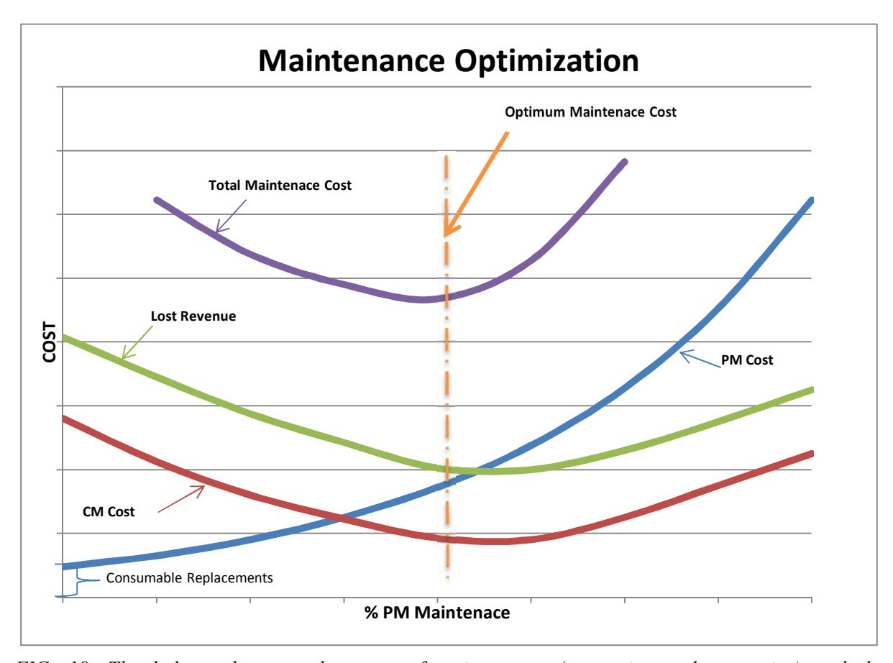

FIG. 18. The balance between the types of maintenance (preventive and corrective) and the relationship between the two on total cost of maintenance and revenue (Courtesy of the AMS Corporation, USA).

Predictive maintenance (PdM) programmes have been in practice for some time; however the success of these programmes may be limited. Rather than part of a coordinated maintenance programme, the implementation has been haphazard, performed by small groups possibly informally. Many times predictive maintenance programmes lack on-going justification and are not perceived as a vital part of keeping an SSC reliable, and are not supported by senior management.

Reliability centred maintenance (RCM), at the higher cost end of the spectrum, is the more advanced overall maintenance programme. An RCM programme typically incorporates various maintenance strategies such as: time based, predictive and condition based maintenance. RCM uses engineering processes to define the maintenance needs. Maintenance is regarded as a means to maintain an identified function of an SSC as defined in an operating context. RCM enables the organization to assess and predict failures, performing maintenance only when required rather than performing unnecessary periodic maintenance or running to failure.

The most costly parts of RCM implementation are: (1) identifying the operating context of each SSC, (2) writing a failure mode and effects analysis (FMEA) for each SSC, and (3) determining the appropriate maintenance tasks for all of the identified failure modes in each FMEA. The resulting list of maintenance is 'packaged' such that the periodicities of the tasks are rationalized. Maintenance effectiveness is kept under constant review and adjusted in light of the experience gained. As can be seen, fully implemented RCM programmes are advantageous and effective. However, a historical barrier to RCM implementation has been a

view that such a programme requires excessive resource time to achieve effective and efficient results.

While a highly analysed programme would be desirable, the best overall maintenance strategy for a RR would be one that balances preventive maintenance costs against corrective maintenance costs, focusing on the most important SSC first, and minimizing the loss of operating (mission/programmatic) time.

To achieving these desired attributes, a programme is developed that: (1) incorporates various strategies found in time based, predictive and condition based maintenance, (2) makes many of the RCM monitoring benefits practical and effective, (3) optimizes SSC performance through continuous feedback, and (4) focuses maintenance costs on critical and safety components.

An Equipment Reliability (ER) methodology is one such approach. While the initial cost of ER is significantly less than an RCM programme, the method is not as effective in achieving SSC reliability as RCM. Regardless, an ER programme is typically a significant improvement over the existing maintenance programme. The long term benefits reach parity with RCM from feedback and constant evaluation of monitoring results and failure analysis.

ER is a valuable approach for determining how to most efficiently and effectively apply the various predictive technologies that can lend themselves to OLM (temperature, pressure, vibration, etc.). ER is typically considered a coordinated effort between engineering, maintenance and operations. This approach screens the SSC population and identifies the components to focus on first. It then takes advantage of the focus and uses condition monitoring of SSC to establish maintenance needs.

An ER process starts with breaking down each SSC into a classification group. Once an SSC is classified, the next step is to consider the frequency of failure. Those SSCs with the 'highest risk' to the plant's reliability (safety or mission) are addressed first. This population, for a RR, is typically 15–30% of the total. With this information, an FMEA can be written for each SSC component for determining the appropriate maintenance tasks and monitoring plans for the identified failure modes.

Of the various maintenance task options that can be considered, the RR staff is required to consider OLM as a maintenance task. Finding an impending SSC failure before its failure consequence is considered as the primary objective of monitoring.

Two of the least expensive and most effective monitoring techniques are operator rounds and a routinely scheduled system walk down by an engineer who is knowledgeable of that system. These two individuals have the highest probability of sensing when something is different. As long as they are attentive to differences, they can increase monitoring or apply another monitoring technique to support their observation(s). Both rounds and walk downs utilize existing resources and inexpensive monitoring tools but they need to be fully used to be effective. For example, many RRs conduct rounds and record numerous data points but do not follow-up on making use of the information to identify potential degradations and problems. Rather than use engineering and scientific methods to analyse data, operators and technicians are left to draw their own conclusions based on individual experience with the plant.

While more expensive to implement, the next largest benefit comes from OLM technologies such as temperature, pressure and vibration monitoring and the analysis of that data. These technologies require the training to deal with the appropriate equipment and data analysis. Implementation of these types of programmes takes time for individuals to become knowledgeable and effective. Training and dedicated personnel are some of the keys to success. One person can implement all of these technologies, collect the data and perform the analysis in a small facility since the focus is on critical SSC. These monitoring technologies have improved significantly because data collection capabilities have advanced while being combined with better data analysis techniques. Sample (data) collection requires special knowledge to ensure the analysis results are valid. These improvements have produced more reliable methods for identifying the approach to failure of SSC. Best results are achieved when monitoring is a priority with the staff and a specific individual is dedicated.

When considering a more advanced OLM process, its focus needs to consider the population size of the SSCs, their maintenance costs and the potential improvements to mission availability. A more specialized group of equipment, identified as I&C has been one of the most challenging to industry when it comes to the application and analysis for monitoring strategies. In this day and age of digital transmitters and analogue to digital converters, the retrieval of plant transmitter output signals and its analysis is providing opportunities to identify when transmitters require calibration along with the equipment responses to real transients. This technique also incorporates the condition of the sensing line, which has a higher probability of degradation than the transmitters themselves. With OLM, transmitter calibration frequencies can be reduced by more than a factor of eight, which can have a significant maintenance budget impact. This will allow maintenance personnel to focus their efforts and manage more effectively other safety and non-safety SSCs. As evident by the efforts of the CRP entitled Improved I&C Maintenance Techniques for RRs and benchmark, OLM technologies are applicable and provide benefit to research reactors for optimizing and improving maintenance practice.

#### 4.2. ON-LINE MONITORING APPLICATIONS

Although operating at different power levels, both RRs and NPPs have similar systems for operation (safety, startup, control, nuclear instrumentation and process systems). Consequently, both use similar pressure, temperature, flow, level and radiation detection instrumentation.

Reactor systems may be divided into safety and support systems: safety systems are those important for the safe operation of reactors as well as to respond to adverse reactor conditions while support systems are often not considered as safety systems but their failure may cause reduction in operational availability or loss of experimental and production capacity.

For RRs, main systems and components related to the safe operation of the plant include:

- (a) Electrical power supply with backup for essential monitoring;
- (b) Primary coolant system: pumps, heat exchangers, piping, valves, N-16 decay tank;
- (c) Secondary coolant system: pumps, heat exchangers, piping, valves;
- (d) Water purification system;
- (e) Reactor hall heating, ventilation and air-conditioning system;
- (f) Area radiation monitoring system;
- (g) Reactor Protection System (RPS);
- (h) Nuclear Instrumentation System (Neutron and Gamma, etc.);
- (i) Control and operating system.

Generally speaking, the I&C system represents the 'central nervous system' of the plant and through its various constituent elements (e.g. equipment, modules, subsystems, redundancies, systems, etc.), the I&C senses basic parameters, monitors performance, integrates information and enables operators or a control system to make adjustments to plant operations as necessary. These relationships are generally presented in Fig. 19. For example, the RPS, in conjunction with the other reactor control systems responds to failures and offnormal events in order to ensure the goals of efficient operation and safety. Essentially, the purpose of I&C systems is to enable and support safe and reliable reactor operation.

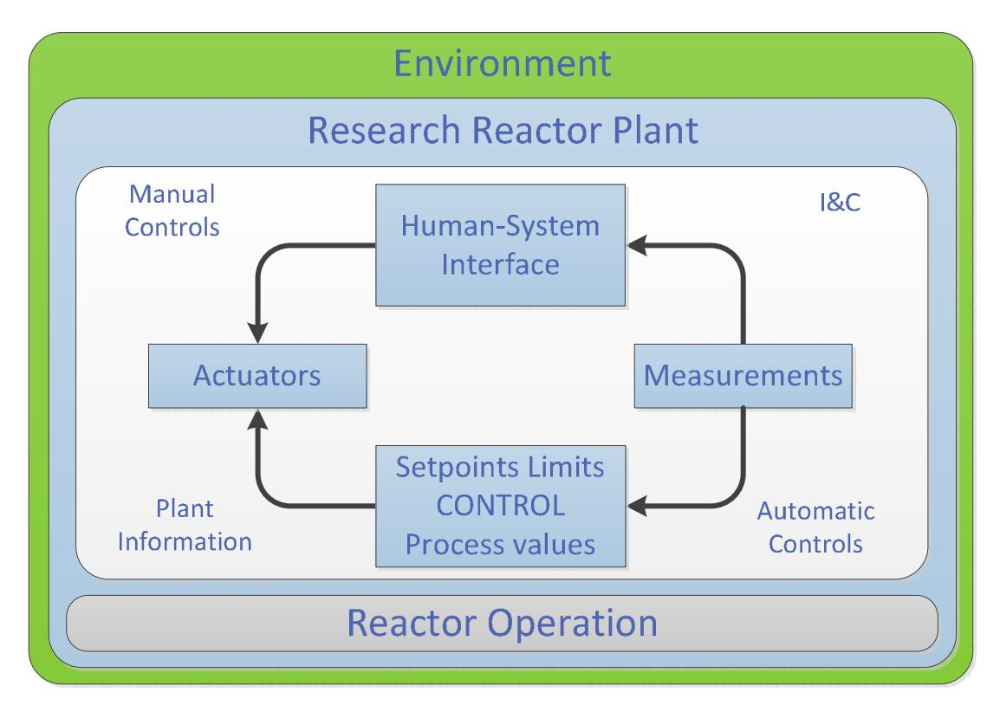

*FIG. 19. Overview of I&C main functions.* 

To accomplish its role, an I&C system architecture has three primary functions:

- (a) To provide necessary sensory (e.g. measurement and surveillance) capabilities to support functions of monitoring and control as well as enabling plant personnel to assess plant status. Thus, I&C components (such as sensors and detectors) directly interface with the reactor mechanical processes as well as provide information to the operating staff. If properly designed, implemented and maintained, these measurement and display systems provide accurate and appropriate information to permit judicious actions by both equipment (automatic) and staff (manual) during normal and abnormal operation;
- (b) To provide automatic control as required, both of the main plant and/or ancillary systems. Automation of plant control reduces the workload on the operations staff to allow time for the plant operator to observe plant behaviour and monitor evolving conditions;
- (c) To protect the plant from the consequences of any malfunction or deficiency of plant systems operation or as a result of errors in manual actions. Under abnormal conditions, these safety systems provide rapid and automatic actions to protect both the plant and the environment.

The I&C system architecture provides the functionality to control or limit plant conditions for normal or abnormal operation and to achieve a safe shutdown state in response to adverse operational events (e.g. incidents or accidents). Because I&C systems have such broad roles, subdividing the plant I&C according to its functions facilitates an understanding of the entire system. Functions for reactor structures, systems and components, both power and RRs, are generally subdivided into safety and non-safety functions. I&C systems typically have a significant role in safety functions such as:

- (a) Reactor trip for adverse core conditions such as over-power, short reactor period, high core temperature, or loss of coolant;
- (b) Emergency core cooling of the core;
- (c) Decay heat removal from the fuel after shutdown;
- (d) Emergency ventilation of occupied areas such as the control room;
- (e) Emergency power supplies to safety equipment.

Some I&C functions are not related directly to safety functions but provide a significant contribution to safety such as maintaining the plant within a safe operating envelope under normal conditions, support radiation protection for plant workers, or add defence-in-depth to the plant's response to accidents. Examples of such I&C functions are:

- (a) Reactor power control;
- (b) Pressure and temperature control for normal heat removal systems;
- (c) Fire detection;
- (d) Radiation monitoring;
- (e) Personnel access control;
- (f) Display of information for planning emergency response.

Non-safety I&C functions are those that are not necessary to maintain the plant within a safe operating envelope. Examples of non-safety I&C functions are:

- (a) Demineralizer and water treatment control;
- (b) General heating, ventilation and power supply.

The I&C systems of older RRs were primarily based on analogue instrument technology. However, with the rapid growth of instrumentation based on digital technology in recent years, analogue instrumentation is declining in its use and support by the I&C industry. However, due to frequent limitations of funds available to RRs for component upgrades, analogue instrumentation remains an important part of RR systems and both technologies need be considered for use and maintenance in RRs.

Analogue and digital I&C systems are distinguished by the way in which signal processing and actuator control is performed. Analogue I&C systems use analogue voltages or currents and analogue electronics to process signals and provide control. Digital I&C systems perform signal processing and control by means of computer processors, using a binary representation of the measured and controlled parameters. From the functional point of view, the results are similar but from the physical and complexity points of view, the differences are significant. Figures 20 and 21 show an I&C function from a functional and physical point of view [19].

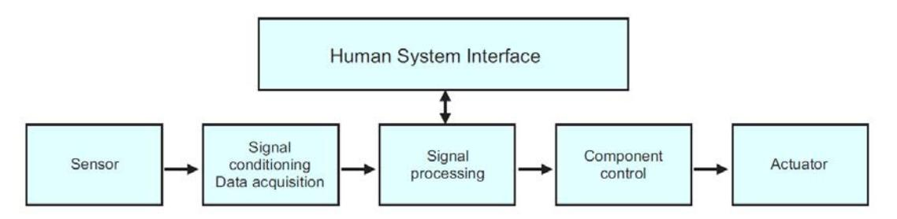

*FIG. 20. Block diagram of a typical I&C function (Reproduced from [19]. Source: IAEA)* 

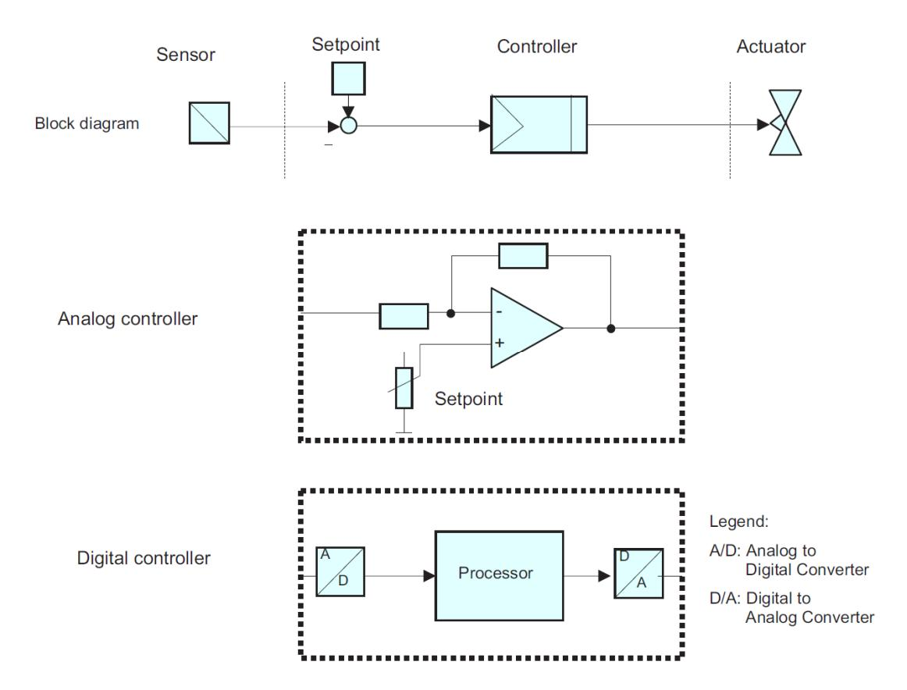

*FIG. 21. Analogue versus digital I&C system representation (Reproduced from [19]. Source: IAEA)* 

Because RRs use instrumentation similar to power reactors, both require maintenance practices such as calibration. The most important components or functions of the main systems are therefore inspected or evaluated at regular intervals as approved by the respective regulatory body.

In this context, OLM techniques have been successfully implemented in power reactors for a number of applications such as a change to condition based calibration, performance monitoring of process instrumentation systems, detection of process anomalies, and to distinguish between process issues and instrumentation/sensor issues.

The topic of the present report is the instrumentation used in RRs and how OLM techniques can be adapted from the power industry to RRs, in order to:

- (a) Reduce the time that instrument technicians are manually calibrating the instruments (exposure and contamination risk reduction);
- (b) Reduce the risk of human introduced errors, caused by errors introduced during calibration;
- (c) Improve I&C reliability to respond to transients and accidents (or prevention of such);
- (d) Continuously assess the calibration status of important sensors;
- (e) Identify abnormal plant conditions through monitoring sensor interrelationships;
- (f) Assess plant components and provide early warning of sensor or component degradation (e.g. sensor calibration drift);
- (g) Provide continuous, real time performance monitoring of plant sensors, components and systems;
- (h) Decrease the likelihood of incidents and the consequential inadvertent release of radioactivity to the public.

Based on the above mentioned issues, the next section will focus on the implementation of OLM techniques as applied to the operation and maintenance of I&C systems at RRs.

#### 4.3. OPPORTUNITIES FOR IMPROVEMENT IN CURRENT OLM IN RESEARCH REACTORS

This section provides examples for the implementation of OLM at RRs. Table 4 provides several areas of possible improvement and future trends that are to be considered in new or evolving programmes for OLM. Rather than simply mirroring existing OLM techniques, advances in electronics and technology can be considered, and incorporated where appropriate.

TABLE 4. CURRENT OLM PRACTICES AND POSSIBLE IMPROVEMENTS

| Current OLM Practices                                                                      | Possible Improvements                                                                                                         |
|--------------------------------------------------------------------------------------------|-------------------------------------------------------------------------------------------------------------------------------|
| Plant computer collects data, which is transferred manually for analysis | Automated data acquisition and analysis                                                                                       |
| General purpose processors                                                                 | Usage of dedicated processors, e.g. Digital Signal Processor for analysis (e.g. FFT, vibration analysis) |
| OLM is usually implemented for a limited number and type of signals                     | Expansion of OLM to all applicable plant parameters                                                                        |
| Data is specific for each research reactor and cannot be correlated to other facilities | Standardization of the analysis methods to allow for collaboration between facilities                                      |
| Limited number of signals available for collection                       | Addition of wiring or adoption of wireless technology for data communication                                               |

The related IAEA documents on the subject of OLM for NPPs, specifically Section 7 of IAEA publication NP-T-1.2 [20], detail future trends in OLM. Those relevant to RRs include hybrid condition monitoring and diagnostics, advanced data communication, functional level integration and condition monitoring of signal cables using the line resonance analysis method. Progress into future trends at RRs can sometimes be hampered by budgetary considerations. However, as funding and possible experimental sponsorship allow, operating organizations can be able to act as test beds for new methods and technology.

#### **5. GUIDANCE FOR ON-LINE MONITORING IMPLEMENTATION**

This section addresses examples of implementation challenges for OLM of I&C at a RR. The topics presented are in no special sequence of importance and they may or may not be applicable for a particular facility, but they are provided for consideration as a starting point for the development of an implementation plan.

In implementing OLM for RRs it needs to be recognized that there are interactions internal to the organization of the reactor (e.g. engineering, operations, etc.) as well as external to the reactor (e.g. regulators).

As part of a plan for implementation, one needs to ensure that all stakeholders are made aware of the changes being proposed. Most typically stakeholders fall into these disciplines or responsibilities:

- (a) Engineering Authority;
- (b) Plant Management;
- (c) Nuclear Safety;
- (d) Regulator.

Transitioning from an established manual method of calibration and response time testing to the methods using OLM can encounter both economic efficiency discussions found in a business case and technical questions reconciled by a technical evaluation. The subject of OLM is not typically well understood by most decision maker audiences. Communication of a solid business case and responses to technical questions require both thoughtful and thorough consideration. Because of the complexity of these methods, clear communication is essential to ensure these OLM methods, as they are to be applied, are understood.

#### 5.1. HIGH LEVEL TECHNICAL REVIEW

A high level technical review is desired to show stakeholders that the proposed OLM process requirements will match the existing plant configuration and equipment. This review would include validation of the plant data and its ability to be collected in a form usable for performing OLM analysis.

In addition to the technical analysis, other practical implementation questions will emerge in considering incorporating these into the review. Items to be considered would be the need for:

- (a) Qualified Supplier (NQA-1 Audit) for performing the analysis;
- (b) Subcontract to perform the analysis;
- (c) Coordination of data collection and who would be responsible;
- (d) Coordination of data transmittal for analysis and who would be responsible;
- (e) Coordination of reporting analysis results and who would be responsible;

(f) Identification that the mechanisms are in place for corrective action of transmitters or components that are identified as needing correction and who would be responsible to initiate that action.

A high level technical review provides the stakeholders with the information necessary to authorize the next step in this process.

#### 5.2. BUSINESS CASE

Requests for a business case are typically the next step in the implementation process. The best outcome will show that the cost of implementation and analysis are recovered by the reduction in maintenance costs.

Tables 5 and 6 are from a proposed RR case as an example of data that was used in the development of work efficiency basis. This cost data is displayed in hours.

A business case is presented in Table 5 that shows the cost, in hours, of performing manual calibrations and response time testing of RTDs and transmitters. The business case shows that the greatest hours occur when performing RTD response time testing (RTT) (220 hours). Even though the RTD RTT took more time than the other methods, because there were only 18 RTDs, it was not economically viable to have the analysis performed. In the case of pressure transmitters, even though the cost of performing manual calibrations and RTT were much less, because there were 36, it was economically viable to have the analysis performed.

In Table 6, considering the 'potential' impact to the plant from failures that would not occur because of OLM plus the savings just from pressure transmitter monitoring, the holistic view concluded that the cost of monitoring both RTDs and pressure transmitters make this effort economically viable.

TABLE 5. TABULATION OF TIME EXPENDITURE FOR RTD AND PRESSURE TRANSMITTER RESPONSE TIME TESTING AND CALIBRATION

|                                | RTD RTT | RTD Cal | PT RTT | PT CAL |
|--------------------------------|---------|---------|--------|--------|
| Schedule the work              | 1       | 1       | 0.5    | 1      |
| Post maintenance               | 7       | 1       | 0.5    | 1      |
| Radiation protection           | 1       | 2       | 1      | 1      |
| Quality control field          | 26      | 1       | 0.5    | 1      |
| Quality assurance (work order) | 2       | 1       | 0.5    | 1      |
| Planning work order            | 1       | 1       | 0.5    | 1      |
| Misc. Support                  | 4       | 4       | 1      | 2      |
| Operations                     | 19      | 8       | 0.5    | 3      |
| Supervision                    | 7       | 1       | 0.5    | 1      |
| Log/analyse work order data    | 1       | 1       | 0.5    | 0.5    |
| Work order closure             | 2       | 2       | 0.5    | 1      |
| Craft prep                     | 4       | 4       | 1.5    | 3      |
| Calibrate RTD                  | —       | 40      | —      | —      |
| Calibrate PT                   | —       | —       | —      | 7      |
| Perform RTD Testing            | 145     | —       | —      | —      |
| Perform PT Testing             | —       | —       | 15     | —      |
| Total hours                    | 220     | 67      | 23     | 23.5   |

Time is in hours

RTD – resistance temperature detector

PT – pressure transmitter

RTT – response time testing

CAL - calibration

TABLE 6. COST–BENEFIT RESULTS OF VARIOUS MAINTENANCE EVOLUTIONS

| Activity                                                             | Cost                                     | Information                                                                                                                                                                                                                                                                                                                       |  |
|----------------------------------------------------------------------|------------------------------------------|-----------------------------------------------------------------------------------------------------------------------------------------------------------------------------------------------------------------------------------------------------------------------------------------------------------------------------------|--|
| Instrument block valve replacement or rework                   | 40 hours + Valve Cost > US \$2 800 | For total valve replacement, assume 24 maintenance hours. For rework, assume eight hours. Assume that only one instrument valve manifold replacement and one instrument valve rework can be saved per year.                                                                                                              |  |
| Instrument Root Valve Replacement or Rework                    | 70 hours + valve cost >US \$4 800  | Cost of root valve replacement is approximately US \$20 000. The cost to repack or lap a root valve is approximately US \$4 000. Assumes one root valve replacement and one root valve rework could be saved every five years.                                                                                        |  |
| Maintenance Induced Errors and Equipment Performance Issues | 6 operating hours                     | Industry shows 2–5% of instruments calibrated in the field experience maintenance induced errors. Also, 39% of failures in pressure sensing systems are the result of personnel error. Assume that one pressure transmitter error could be avoided each year at an average time gained in operations of six hours. |  |
| Plant Outage Cost Savings                                         | 8 outage hours                           | Assuming the newly available time would be 150 total hours. Assume that only 5% of this time translates into shorter refuelling outage duration or eight hours.                                                                                                                                                          |  |

#### 5.3. TECHNICAL BASIS

It is important to establish a documented technical basis for application to a particular facility. This is accomplished by adapting the existing guidelines and information for these technologies and methods (see Section 3) to one or more specific facility application. This documentation may also include the experiences and best practices from other facilities having success with OLM as well as any evolving guidance and/or standards from applicable technical organizations.

Technical basis for plant calibration verification and RTT of transmitters are consistent with the OLM method implementation. This technical basis may be needed to perform multiple purposes such as: (1) a technical evaluation to support the basis of implementation requirements, and (2) identify the need for authorization basis change(s) or to support the conclusion that no changes are needed.

#### **5.3.1. Example of technical basis - cross-calibration of RTDs**

A generic technical basis discussion from one RR for the calibration of RTDs is provided below to give a general sense on how to approach the discussion. This same method can be applied to each technology.

#### *5.3.1.1. Background*

NRC NUREGs, EPRI documents, and other related industry publications state that periodic checks of RTD calibrations and response times are requires to be performed.

Inherent issues with removing RTDs from their thermowells to perform calibrations are that it is time intensive, involves personnel radiation dose, introduces a potential for RTD damage, and results in changes to RTD response time. The commercial nuclear power industry has developed justifications for the use of in situ cross-calibration techniques to validate the calibration of installed RTDs. These techniques negate the risk of damaging RTDs during calibration checks and/or changing response times by eliminating the need to remove and reinstall the RTD.

NUREG/CR 5560 [8] Ageing of Nuclear Plant Resistance Temperature Detectors documents the results of a comprehensive research and development project performed in the late 1980s to quantify the effects of normal ageing on the performance of nuclear safety RTDs. The document includes a description of the RTD cross-calibration technique and identifies the associated uncertainties along with a basis for quantifying those uncertainties.

In general terms the cross-calibration technique can be described as measuring RTD resistance values from multiple RTDs under isothermal conditions. The resistance values are then converted to equivalent temperatures using the RTD calibration tables and the temperatures are averaged to determine the actual process temperature. The temperature indication from each individual RTD is then compared against this average. Any RTD that deviates from the average by more than a predetermined acceptance limit is removed from the average and the process is repeated to re calculate a new average process temperature. The process may then be repeated at multiple temperatures to demonstrate required linearity over a temperature range. This also provides the data for in situ recalibration of any outliers.

RTDs with deviations outside of acceptable limits (outliers) may have their Callendar– Van Dusen constants changed. The Callendar–Van Dusen equation describes the relationship between resistance and temperature of RTDs. The long form of this equation was published in 1925 by M.S. Van Dusen. The simpler form of the Callendar–Van Dusen equation was published by Callendar and is given as:

$$R(t) = R(0)\{1 + At + Bt^2\}$$
(3)

where

*R* is the resistance; *T* is the temperature; *A* and *B* are the constants.

This form is generally valid only over the range of 0°C to 661°C and constants *A* and *B* are derived from experimentally determined parameters using resistance measurements typically made at 0°C, 100°C and 260°C.

#### *5.3.1.2. Technical basis for implementation of RTD cross-calibration*

A feasibility study for the use of RTD cross-calibration was performed using existing data from the plant data acquisition system. The data was sampled and stored at a frequency of up to 0.5 Hz.

The results of the study are documented, which demonstrates the viability of using the cross-calibration technique to verify RTD calibrations.

Acceptance testing identified that under isothermal conditions in the system with only one of the pumps in-service, all temperature indications read within 0.1°C of each other.

The measurement system has four dual element RTDs sensing reactor inlet temperature with a span of 40-100°C and four dual element RTDs sensing quadrant outlet temperature with a span of 0-100°C. During reactor startup, inlet and outlet temperatures remain isothermal up to 40°C. At approximately 100°C in the system and after reactor criticality is achieved, this condition creates a divergence between inlet and outlet temperature. Because the inlet RTDs are not on-scale until 40°C, a cross-calibration test at isothermal conditions can only be performed at a single point of 40°C. Since normal temperatures are <70°C, the other constants (*A* and *B*) in the Callendar-Van Dusen equation are insignificant over this range. Typical commercial NPP applications of RTD cross-calibration occur over a much larger temperature range (120–290°C) where a three or five point cross-calibration check can be conducted.

Performing cross-calibration at a single point is appropriate for the system because other documentation identifies that smaller uncertainties are expected for smaller temperature ranges and lower temperature applications which are applicable to this system. This publication also identifies that for the system temperature ranges, the errors associated with the *A* and *B* terms of the Callendar–Van Dusen equations will result in insignificant errors. As such, in the event that an outlier is identified using the cross-calibration technique, the *R*(0) term of the Callendar-Van Dusen equation will be changed to restore acceptable RTD accuracy.

#### *5.3.1.3. Requirements for RTD cross-calibration*

The following are specific requirements for implementing this cross-calibration. This method will meet or exceed current RTD calibration verification practice.

- (1) Calibrations of the RTD instrument channels will continue to be performed. This is done by disconnecting the RTD leads from the channel, replacing the RTD with a known input resistance, and measuring the channel output voltage and associated temperature. Differences between the calibration input (40°C) and the associated instrument channel outputs will be determined. To better estimate RTD accuracy, this information will be used later to correct RTD instrument channel bias from RTD crosscalibration results.
- (2) After establishing stable isothermal temperature conditions (at slightly greater than 40°C) in the system, all of the RTD instrument channels will be on-scale and may be used for RTD cross-calibration. Stable isothermal temperature conditions in the system may be established by operation of a pump for at least 30 minutes while all RTDs are on-scale. One pump is sufficient to provide adequate mixing of system fluids while not adding a significant amount of heat to the system. While running one pump provides optimum conditions for RTD cross-calibration data collection, a process temperature non-uniformity correction method may be employed at a later time to permit data collection during the operation of other pumps. Corrections for non-uniformity between inlet and outlet temperatures as well as for process fluctuations have been in regular use in the commercial nuclear power industry for many years.
- (3) At least 31 temperature samples (per channel) are to be obtained for each of the RTDs to ensure a statistically meaningful average for each channel. The 31 data points for each RTD will then be averaged to create a 'channel average.' RTD channel biases identified during the channel calibrations described in item 1 will then be applied to correct the channel average of the corresponding RTD. The corrected averages for the RTDs will then be averaged to obtain a 'system average' which is the best estimate of the system temperature.

- (4) Next, the difference between each RTD 'channel average' and the 'system average' will be calculated.
- (5) An RTD 'channel average' that deviates by > 0.1°C from the 'system average' has to be excluded from the 'system average' population and a new 'system average' will be computed with the remaining RTD 'channel averages.' This process will be repeated until all RTD 'channel averages' that deviate by > 0.1°C from the 'system average' have been eliminated from the system average.
- (6) After a 'final system average' has been established, the difference between each RTD channel average and the 'final system average' will be calculated. Those results will be actioned as follows:
  - (a) An RTD 'channel average' which deviates by ≤ 0.1°C from the 'final system average' is deemed to have an acceptable calibration and no further action is required.
  - (b) An RTD 'channel average' that deviate by > 0.1°C but < 0.2°C will have a new Callendar–Van Dusen equation R(0) computed to correct the calibration. Changes will then be implemented to incorporate this R(0) change for that channel.
  - (c) An RTD 'channel average' that deviate by ≥ 0.1°C has to be evaluated to determine the need to:
    - (i) Develop a new calibration curve for the entire range
    - (ii) Correct the existing calibration curve
    - (iii) Replace the RTD.

The 0.2°C and the 0.1°C temperature limits are judged to be achievable and would protect the temperature uncertainties that have been established.

(7) NUREG/CR–5560 [8] has established the frequency for performing RTD crosscalibration as at least once every fuel cycle, which is no greater than 24 months. However, there is insufficient data from the current data analysis to support a frequency greater than that presently specified in the TSR. Any change in current frequency up to 24 months will require further analysis and a separate justification.

#### **5.3.2. Example of authorization basis evaluation**

Once the technical basis for the facility is established from a conceptual perspective, there is a need to convert the basis into a plant specific discussion document for presentation and approval by the engineering authority. This will, in turn, become the basis for changes to the authorization basis or licensing requirements, if required. A formal engineering change process will have to be initiated and to follow the prescribed approval processes, both within the plant and within the organization.

A generic example of an authorization basis evaluation from a RR, which may be included in the technical basis document, is provided in NUREG/CR–5560 [8]:

"The Technical Safety Requirements (TSR) requires Reactor Shutdown System (RSS) instrumentation to be operable during various modes of operations. TSR lists the applicable mode of operation and the required set point, accuracy and response time. The following paragraphs show that the OLM and calibration techniques described in previous sections meet the definition of calibration verification which then meets the requirements of TSR.

Previously described are the calibration and response time methods for the RTDs and the TSR shows the required accuracy and response time. Also provided are the required or assumed RSS contributions to the total response time. These required values are compared with current measured values and those provided by the proposed new methods described in this evaluation. The results of either method are acceptable and have the required margin. Method requirements described are necessary to ensure accuracy and response times remain acceptable. These requirements should be implemented prior to utilizing the methods described."

This would become the justification for changes to an authorization basis or justification that the existing basis is sufficient and implementation is acceptable.

#### 5.4. CHANGES TO WORK INSTRUCTION

Once implementation is contemplated, there is a need to establish the appropriate work control documentation for execution.

Depending upon the organization(s) involved, there is the potential to have multiple organizations and individuals engaged in OLM. However, the work control process may address the responsibilities for performing actions for a scope of: (1) collecting data, (2) transmitting data to analyst, (3) analysing the data, (4) communicating analysis results, (5) review of the results, and (6) the need to take action to correct any problems.

#### **6. TECHNICAL ISSUES FOR IMPLEMENTATION**

#### 6.1. INTRODUCTION

Having identified both a need for using OLM and the availability of appropriate measurement systems, it is necessary to consider a variety of practical issues relating to the actual implementation of OLM. These include assessing the availability and appropriateness of physical resources and staffing, ensuring the provision of adequate support and dealing with organizational, political and funding issues.

The purpose of this section is to provide a useful overview about all relevant areas of implementing OLM. Hardware or software upgrades may be needed if the current hardware is insufficient to collect data, at an appropriate rate, from all required sources (instruments).

The main goal is to keep the planned implementation as simple and practical as possible, and to avoid unnecessary complexity.

#### 6.2. PARAMETER SELECTION AND CLARIFICATION

Parameter selection is an essential early part of the project, as this will define what data is to be collected and analysed.

- (a) Identify the systems that will be subjected to OLM;
- (b) Determine which parameters will be monitored for OLM purposes;
- (c) Is the equipment safety, safety related or non-safety related?
- (d) Special attention is paid to parameters from safety equipment appropriately classed isolation will be required for the data collection interfaces;
- (e) Safety related equipment will also require full signal isolation, but may not necessarily require safety classed certified isolators;
- (f) Good engineering practice dictates that even non-safety related parameter interfaces have to provide signal isolation;
- (g) It is assured that signal paths are uni-directional in operation and for all failure modes.

#### 6.3. SOURCE OF DATA ANALYSIS

Data may be sourced from either the plant computer, where one is used or from a standalone data logging system. Where the plant computer is used as the source of data, careful consideration has to be given to the method of extracting the data. It is to be ensured that the plant data computer resources are not affected, impacting on the computer to perform its designated plant safety and control functions. These factors need to be taken into account when scheduling the data transfer and planning transfer intervals – the volume of data to be buffered/accumulated before transfer takes place.

Where an existing data logging system is in operation, it needs to be ensured that normal data collection is not compromised during the transfer of large volumes of data for post measurement processing. Figure 22 below shows system configuration on data transfer.

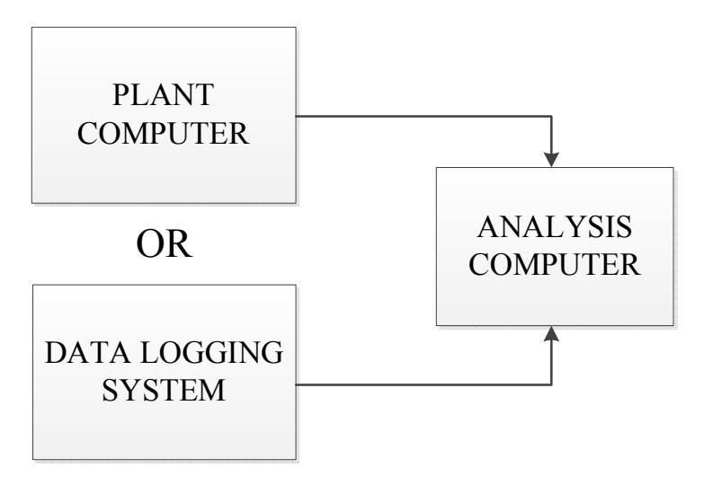

*FIG. 22. Example of a system configuration for data transfer.* 

The actual interfaces used for the transfer of data between systems need to address cybersecurity issues (refer to section 6.8 for Cybersecurity).

#### 6.4. SOURCE OF DATA FROM A NEW ADDITIONAL SYSTEM

In the cases where a new data logging system has to be implemented, there are several factors to consider:

- The number of parameters to be collected;
- The sampling interval;
- The required resolution;
- Interfaces to the plant.

#### **6.4.1. Sampling interval**

Sampling interval is very dependent on the parameter that is being recorded and the physics of what is being measured. For large masses of water, where the rate of change in the measured value is slow, a sampling rate of a few seconds is adequate. Conversely for the measurement of neutron flux, where the measured value can change rapidly, a high sampling rate is required.

#### **6.4.2. Sampling resolution**

To ensure an adequate resolution can be achieved the A/D convertor in the front end data collection device has to have a minimum resolution that provides a 0.1% of scale resolution (10 bit D/A). Where front end devices A/D convertors have more than 16 bits, these are to be truncated to a maximum of 16 bits.

#### **6.4.3. Interface to the plant**

Isolation is required between the data logging system and the plant control system; signals may only be passed in one direction, away from the plant.

Figure 23 shows a typical interface for data collection.

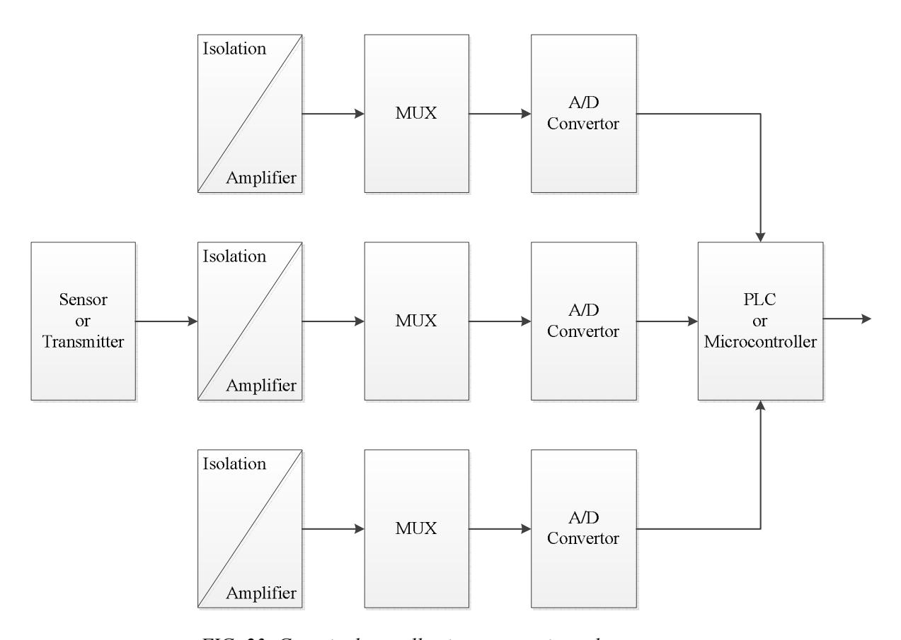

*FIG. 23. Generic data collection process in a plant computer.* 

As mentioned above, special attention is paid to parameters from safety equipment where fully qualified isolators are required. Safety related and non-safety related signals also have to be isolated with the isolator qualification dependent on a safety assessment.

#### 6.5. CALIBRATION OF DATA COLLECTION

The data collection may not introduce errors in the measured parameters. To accomplish this, a possible solution is the addition of built-in checking.

#### 6.6. DATE AND TIME SAMPLING

In all cases it is essential that time and date stamping for all parameters irrespective of their source be synchronized to a single plant clock.

The time stamping is to be kept within 100 ms, and have a resolution of 10 ms.

#### 6.7. POST DATA COLLECTION PROCESSING

For simplicity and ease of licensing, the evaluation of the collected data is done independently of the currently installed system. This obviates the need for software changes in an approved system, which would require an extensive validation and verification (V&V) effort should software changes be a requirement of the license for the plant computer.

A schedule for transfer of data to the processing system, and the procedures that will be performed to achieve this transfer has to be established. Dependant on the operating schedule for the particular plant, this will vary from every few minutes up to once a week, or longer.

The statistical processes that will be performed on the data has to be evaluated and their conformance to approved methods verified.

The actual software that will be used for processing the data is required to be generated and fully tested. An independent V&V is performed on the system using sample data.

The format for alarms and reports is generated.

Criteria for when action needs to be taken by plant staff has to be established and the requisite procedures for this put in place.

#### 6.8. CYBERSECURITY FOR ON-LINE MONITORING IN RESEARCH REACTORS

The scope of this publication does not include cybersecurity which is a comprehensive field of its own. As such, references have been provided to the IAEA publications and reports from other organizations, which are contained in bibliography section of this publication.

IAEA publication NSS No. 17 states that computer security objectives are commonly defined as protecting the confidentiality, integrity and availability attributes of electronic data or computer systems and processes. By identifying and protecting these attributes in data or systems that can have an adverse impact on the safety and security functions in nuclear facilities, the security objectives can be met.

#### **7. EXAMPLE OF ON-LINE MONITORING APPLICATION IN RESEARCH REACTORS**

The following section provides a summary of different OLM applications already implemented in RRs.

#### 7.1. IMPLEMENTATION OF ON-LINE MONITORING IN RSG-GAS REACTOR (INDONESIA)

An OLM system has been developed and applied to the multipurpose reactor G.A. Siwabessy (RSG-GAS) in Serpong (Indonesia)1 . This OLM system employs 'neuralnetwork' methods and has been used to experimentally demonstrate the good potential of this method for early fault detection during steady state and transient operation of RSG-GAS. The neural network is utilized to model reactor dynamics using normal operation data from low to high power. The 'feed-forward' neural network, after initial learning, detects a symptom of even small anomalies earlier than the conventional alarm system. The off-line test results show that the neural network successfully monitored the reactor status not only in steady state but also in transient operation.

Reference data for two different operating conditions (see Table 7) were recorded in 2003 for off-line testing of the neural network monitoring system. One condition recorded steady state operation and another recorded shutdown operation. The sampling frequency of both data was 10 Hz. The feed-forward neural network in auto-associative mode was trained on the data for normal operation and successful in predicting the actual reactor dynamics after this initial training period. The neural network was then used to monitor the difference between the operation data and reference data in order to detect anomalies in-reactor operation. A similar evaluation was performed for the shutdown data.

TABLE 7. RSG-GAS EXPERIMENTAL DATA (REFERENCE)

| No | Date       | Operation Mode | Channels | Sampling Frequency | Number of Data |
|----|------------|----------------|----------|--------------------|----------------|
| 1  | 17.12.2003 | Steady State   | 6        | 10 Hz              | 22800          |
| 2  | 23.12.2003 | Shutdown       | 6        | 10 Hz              | 14800          |

The reactor data acquisition system for this OLM application was built using commercial off the shelf hardware (Fig. 24). For this neural network OLM application, six important process signals were selected: one N-16 detector, three neutron flux signals at different positions, and two outlet temperatures. These six analogue voltage signals (0–10 V) were sampled every 0.1 second and converted to engineering values as shown in Table 8. The original data had a large noise component as shown in Fig. 25. To reduce this noise component of the data, moving average values were calculated every one second (see Fig. 26) and used for the analysis. Note that this OLM application was implemented using non-safety related signals of the reactor.

1 The RSG-GAS reactor is operated by BATAN (National Nuclear Energy Agency).

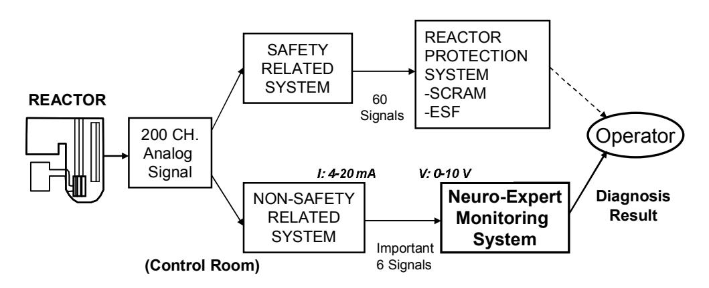

*FIG. 24. Structure of Instrumentation and Control System at the Reactor and Monitoring System (Courtesy of the RSG-GAS reactor, National Nuclear Energy Agency, Indonesia).* 

TABLE 8. SIGNAL LIST FOR DATA CONVERSION

| No.   | Signal             | Engineering Range | Voltage |
|-------|--------------------|-------------------|---------|
| Ch. 1 | N-16 detector      | 0–100%            | 0–10 V  |
| Ch. 2 | Neutron Detector   | 0–150%            | 0–10 V  |
| Ch. 3 | Neutron Detector   | 0–150%            | 0–10 V  |
| Ch. 4 | Neutron Detector   | 0–150%            | 0–10 V  |
| Ch. 5 | Outlet Temperature | 20–80°C           | 0–10 V  |
| Ch. 6 | Outlet Temperature | 20–80°C           | 0–10 V  |

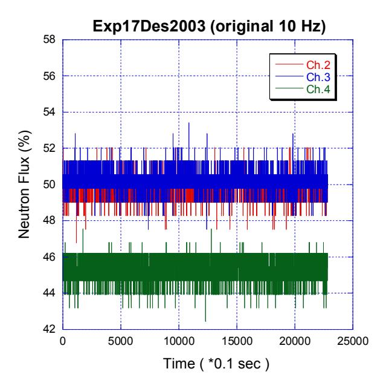

*FIG. 25. Original neutron flux signals (10 Hz) during steady state (courtesy of the RSG-GAS reactor, National Nuclear Energy Agency, Indonesia).* 

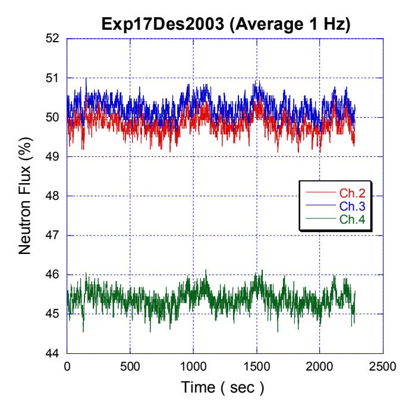

*FIG. 26. Moving average of neutron flux signals (1 Hz) during steady state (courtesy of the RSG-GAS reactor, National Nuclear Energy Agency, Indonesia).* 

The feed-forward neural network OLM application has three layers: an input layer, one hidden layer and an output layer. The number of units in both the input and output layers are six, as the output signals are to be equal to the input signals at the same time stamp. The number of hidden nodes is selected as eight as shown in Fig. 27. The back-propagation algorithm is used for learning and the sigmoid function is selected as the transfer function. The patterns for the initial learning were obtained during steady state operation of 15 MW and the following shutdown operation.

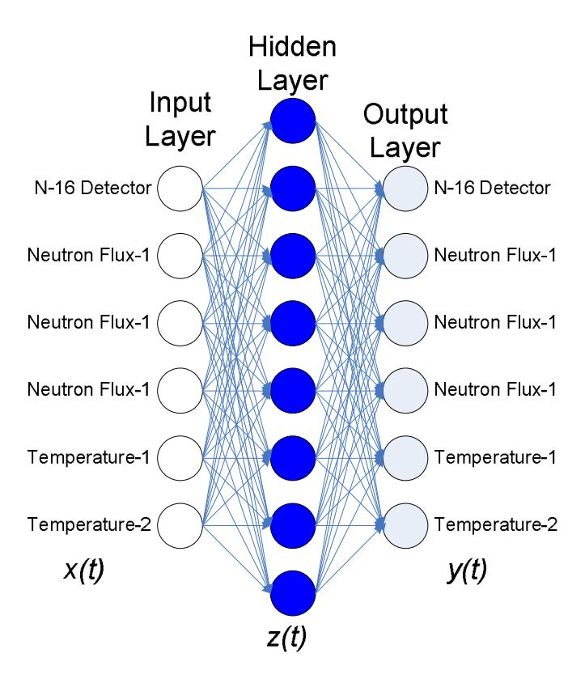

*FIG. 27. Structure of feed-forward neural network (Courtesy of the RSG-GAS reactor, National Nuclear Energy Agency, Indonesia)*

The basic principle of the anomaly detection is to monitor the deviation between process signals measured from the actual detector and the corresponding values predicted by the model (i.e. the neural networks). If one of the deviations exceeds an assigned fault severity level, an alarm will be displayed and the error log is time stamped with signal information. If the deviations between measured and estimated values are small enough, operation status of the reactor is considered to be 'normal.'

The conditions of reactor operation are always changing because of factors such as a fuel-burnup or the operation modes. Thus, the dynamics at the beginning of the fuel core cycle are completely different from those at the end of the cycle. As a result, the operational neural network model cannot be applied to the entire fuel core cycle. However, the adaptive learning capability of neural networks can gradually change the network model to keep track of the actual reactor status through the updating of weighting factors. The back-propagation algorithm is used for this adaptive learning as well.

The initial training results of each signal are plotted in Figs. 28 and 29 for neutron flux (Channel 4) and outlet temperature (Channel 5). The solid blue line in the figures indicates the measured signals from the reactor, and the dotted red line represents the predicted values by the neural network. The dash-dot green line indicates the deviation between measured signals and predicted values.

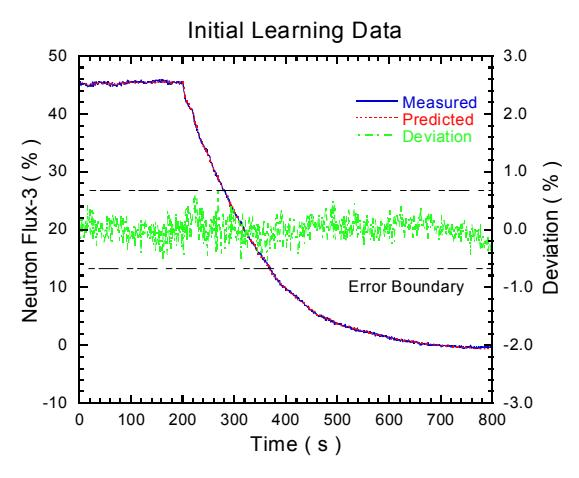

*FIG. 28. Initial learning result of neutron flux (Ch.4) (Courtesy of the RSG-GAS reactor, National Nuclear Energy Agency, Indonesia).* 

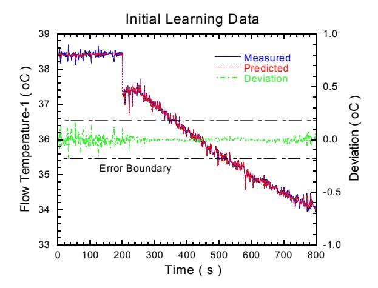

*FIG. 29. Initial learning result of outlet temperature (Ch.5) (Courtesy of the RSG-GAS reactor, National Nuclear Energy Agency, Indonesia).* 

Figures 30 and 31 show the neural network monitoring results for neutron flux and outlet temperature signals during steady state operation. The other signal of neural network outputs could be obtained in the same time frame. Two horizontal chain lines show the fault severity level as maximum tolerance. When the deviation is within the range between two horizontal lines, the reactor condition is considered normal. From the testing results, all of deviations between measured and estimated value were found to be within the fault severity level, so the monitoring system verified the reactor status as 'normal' during steady state operation.

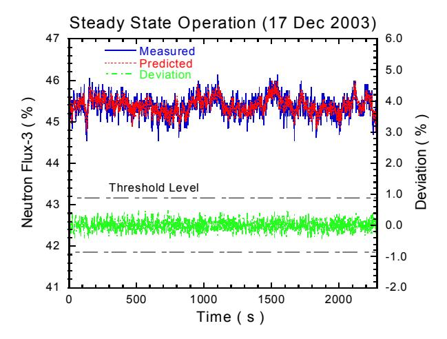

*FIG. 30. Testing result of neutron flux (Ch.4) during steady state operation (Courtesy of the RSG-GAS reactor, National Nuclear Energy Agency, Indonesia).* 

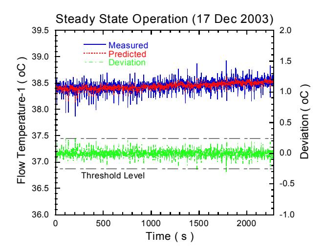

*FIG. 31. Testing result of outlet temperature (Ch.5) during steady state operation (Courtesy of the RSG-GAS reactor, National Nuclear Energy Agency, Indonesia).* 

In the transient mode, the reactor power was gradually decreased from 15 MW to zero in 1 000 s. The off-line monitoring results during shutdown operation are shown in Figures 32 and 33 and deviations in time frame of 1 000 s were within the prescribed limits.

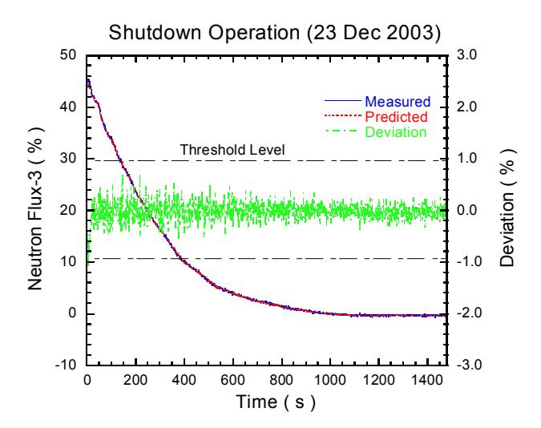

*FIG. 32. Testing result of neutron flux (Ch.4) during transient operation (Courtesy of the RSG-GAS reactor, National Nuclear Energy Agency, Indonesia).* 

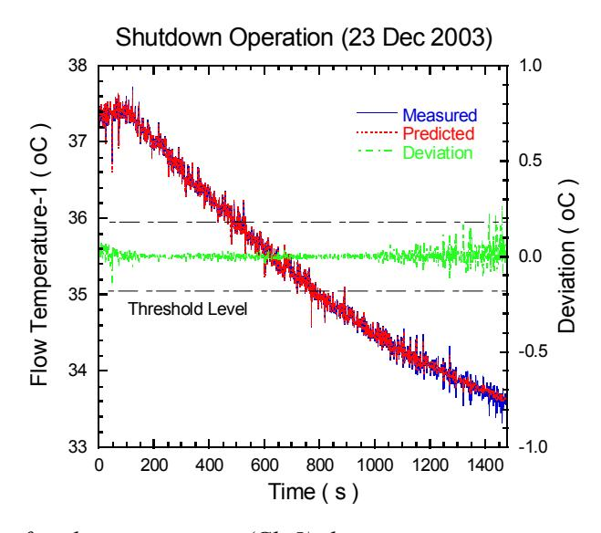

*FIG. 33. Testing result of outlet temperature (Ch.5) during transient operation (Courtesy of the RSG-GAS reactor, National Nuclear Energy Agency, Indonesia).* 

The OLM using neural networks has been successfully applied to the RSG-GAS reactor. From the off-line test results, it was shown that the neural network successfully modelled the reactor dynamics and demonstrated the possibility of detecting the symptoms of anomalies in its early stages.

#### 7.2. IMPLEMENTATION OF ON-LINE MONITORING IN ES-SALAM REACTOR (ALGERIA)

In this discussion, the functionality, operation and upgrading of a real time monitoring system for the Es-Salam RR in Algeria is described. For many years, dedicated analogue and digital I&C systems have been developed to monitor different systems of RRs. As a typical RR, the Es-Salam reactor was originally equipped with a real time monitoring system RTMS based on programmed data processor minicomputers. The higher level programming tools necessary for advanced I&C monitoring techniques were not available for this system.

Modern computers are able to support a large number of compilers and required applications, and the Es-Salam RR has developed and integrated new software tools for monitoring the reactor. These new tools assist the operators who were previously required to observe and manipulate complex system during reactor operations. The main purpose of this new software tool, which is based on artificial intelligence techniques, is to automatically recognize error conditions specific to a given sensor, or actuator and generate an alarm. By monitoring the hundreds of reactor sensors, the program assists the operators in understanding the status of the reactor at all times.

To monitor, record and analyse the measured data of the reactor's systems, a research team in Es-Salam installed a new real time data acquisition and monitoring system. The task of gathering signals from measurement sources (over 400 different sensors and actuators) and digitizing the signals for storage, analysis and presentation on a personal computer was developed using selected off the shelf hardware. The signal conditioning selection process resulted in both modular and integrated hardware options being incorporated into the design. Signal conditioning accessories were selected for use in a variety of applications including the processing functions of amplification, attenuation, isolation, simultaneous sampling, sensor excitation, multiplexing, etc.

#### **7.2.1. Hardware**

Figures 34 and 35 show simplified illustrations of the hardware architecture. The large amount of measured parameters required the use of two separate and independent data acquisition sites. The first site is used to acquire thermohydraulic and radiation protection parameters such as flow, pressure, radiation measurements, etc. As can be seen in the figures below, the acquired data is stored directly onto the computer for analysis through an external chassis and personal computer plug-in card with PCI-bus expansion slots.

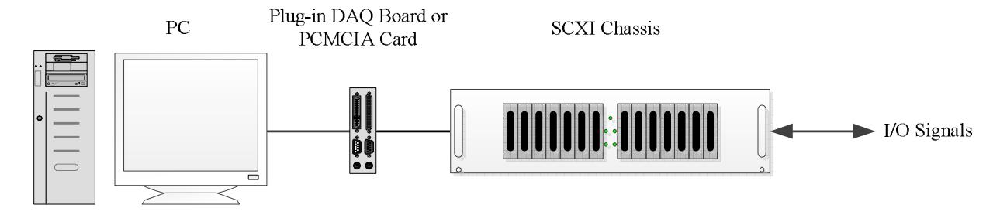

*FIG. 34. First technical site for different parameters data acquisition.* 

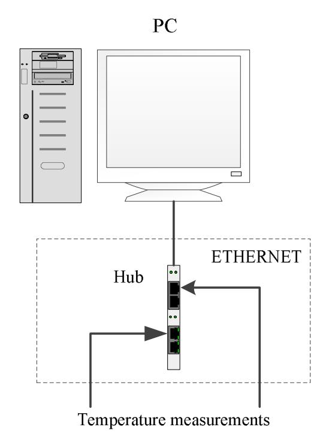

*FIG. 35. Second technical site for core temperature measurement.* 

The second data acquisition system was used to monitor the temperature of each fuel assembly in the reactor core. Software was developed to transform the personal computers and data acquisition hardware into a complete data acquisition, analysis and display system.

#### **7.2.2. Future work**

Following the installation of the new reactor monitoring system, El-Salam plans to integrate artificial intelligence tools to automatically detect abnormal sensor values. Real time sensor measurements will then be continuously compared to the data generated by the model. An alarm will be generated whenever a sensor gives values which are substantially different from those given by the model.

As the above described tool advances, El-Salam hopes to add enhancements to the system such as enabling the system to automatically adapt to sensor drift by adjusting error criteria.

### **7.2.3. Conclusion**

With modern computer technology, it has been possible to monitor and process all measured signals at the Es-Salam reactor to provide a tool important for the efficient operation of the reactor. This will allow for the future development of a real time diagnostic tool capable of detecting malfunctions and monitoring for drift in sensing/actuating processes. Additionally, the future implementation of wireless sensor technologies is seen as a cost effective approach for expanding equipment condition monitoring and improved diagnostics and prognostics.

#### 7.3. ON-LINE PERFORMANCE ASSESSMENT OF NUCLEAR INSTRUMENTATION IN PARR-1 RESEARCH REACTOR (PAKISTAN)

The plant computer at the PARR-1 reactor has been effectively utilized for specialized on-line surveillance and monitoring, for early detection of faults in nuclear instrumentation channels.

#### **7.3.1. Rationale of signal testing using statistical analysis**

Statistical parameters (e.g. mean value, standard deviation error, and probability distribution functions) of signals from neutron and gamma detectors in the nuclear instrumentation (NI) and process instrumentation (PI) have been utilized to determine channel performance acceptability. The total noise generation in these signals may be considered in two parts; sensor noise (i.e. nuclear detector noise (√N)) and instrumentation noise (ϵ). Then, for the case of NI channels NI signal noise = √N + ϵ.

Originally the values of √N are measured by using cables and instrumentation already calibrated. The values of instrumentation noise were also measured independently, at commissioning. These represent the reference errors and permit the identification of malfunctions by noting an increase in channel noise that deviates from the reference nuclear detector error, or a malfunction in any part of NI/PI instrumentation causing an increased noise above the reference instrumentation error.

If any of these degradation conditions occur, then the standard deviation of the channel signal invariably increases indicating a channel malfunction. Also, zero value of a signal mean and standard deviation indicates an open or grounded connection. Any periodic or harmonic noise injection (e.g. high electrical noise) may be detected by time waveform or frequency analysis. The full-width-half-maximum (FWHM) probability distribution function is also used as an indicator of increased instrumentation noise. In the case of a faulty instrument or sensor, there is a large noise injection in the signals and FWHM can exceed ± 3σ. Probability distribution function methods can also be used to differentiate systematic errors from random errors; for example, in the assessment of the power control system performance. One major advantage of statistical signal analysis is that the noise-corrected (true) and highly reliable mean values of nuclear signals are available for trend monitoring in the safety parameters display system

The algorithm for statistical signal processing is shown in Fig. 36.

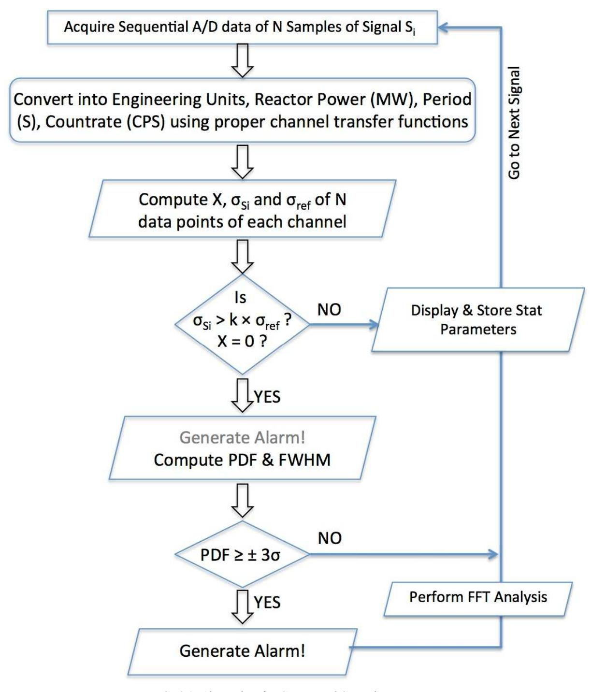

*FIG. 36. Algorithm for Statistical Signal Processing.* 

#### **7.3.2. Test cases for nuclear instrumentation performance assessment**

It has been observed that the frequency bandwidth of nuclear detection signals invariably reduces in the case of detector degradation. In such a case, the detector cannot follow fast flux changes. In this and other occasions, the statistical algorithm discussed above successfully identified a malfunction in the nuclear channels before the problems were indicated on the instrumentation in the main control room. Problems of moisture in detectors' housings, faults in signal cable insulation, sensor power supply and instrumentation hardware faults were also detected at initial stages with statistical signal analysis. In this way spurious reactor period trips were avoided.

Information from the plant computer was also used to improve plant instrumentation performance. For example, the proportional, integral, and differential gains of the reactor power controller were optimized based on the minimum error bands in controller output, comparing errors with manual control mode errors.

One major advantage of statistical signal analysis is that the noise-corrected (true) and highly reliable mean values of nuclear signals are available for trend monitoring in the safety parameters display system.

#### **7.3.3. Conclusion**

The plant computer at the Pakistan Research Reactor – 1 (PARR–1) has been successfully used for early detection of faults in nuclear instrumentation neutron and gamma detectors by OLM and statistical analysis of NI signals.

#### 7.4. MAINTENANCE EXPERIENCE IN RESEARCH REACTORS

This section provides examples of RR instrumentation issues where OLM techniques could have been used to indicate degraded conditions, or diagnose existing problems.

#### **7.4.1. Increase of primary flow rate and modification of flow transmitter characteristics at ETRR-II (Egypt)**

In performing a thermal heat balance between the primary, secondary and pool systems, a difference of 2 MW was observed between the primary and secondary systems. The initial actions were to calibrate all instrumentation in the power calculation for both the primary and the secondary. However, the power difference remained. It was determined that primary flow measurements via ultrasonic methods would be compared to the existing instrumentation measurement. When this was done, a difference of approximately 150 m3 was found to exist between the two measurements. The installed flow transmitters were recalibrated to provide correct flow indication.

If the ultrasonic flow transmitter is permanently installed, then OLM techniques to do a cross-correlation between the two instruments could have provided an indication of the problem. Another option is to have an OLM trending of the single parameter to alert the staff to the degradation of the flow measurement.

#### **7.4.2. Multiple short term RTD failures at SAFARI 1 (South Africa)**

This experience is for multiple failures of RTDs for the cooling tower inlet water temperature for the SAFARI 1 reactor. During operation, the indicated temperature dropped to zero indicating an open circuit failure. A new RTD was installed and calibrated during shutdown. However, after approximately 30 hours of operation, the measured value dropped to zero and maintenance personnel found the cause again to be an open circuit. A third new RTD was installed with its subsequent failure in approximately six hours of cooling tower operation. The failed RTDs were examined and it was found that the packing around the temperature element was not well supported while only electrical insulation was provided by the design. It was concluded that the premature RTD failures were caused by excessive vibration. In consultations with the RTD manufacturer, it was discovered that more robust (anti-vibration) RTDs were available but were not supplied as the order did not specify this requirement. Future orders for this RTD application will provide proper specifications for vibration and proper inspection will be performed upon receipt. OLM techniques can provide a cross-correlation capability that could have enabled the plant to operate with a failed RTD.

#### **7.4.3. Fouled orifice plate – need for redundant measurements at SAFARI-1 (South Africa)**

The process water flow between the secondary side of the primary heat exchangers and the cooling towers is measured by an orifice plate using a single measurement channel. Due to buildup of material on the orifice plate, the aperture diameter became obstructed resulting in incorrect flow reading, as shown in Figs. 37 and 38. This condition remained undetected for an extended period of time until it was discovered during maintenance of the system. If a second, non-intrusive flow measurement had been recorded on the plant data logging system, using OLM techniques to do a cross-correlation between the two instruments would have indicated the development of the problem. Also, long term OLM trending of the single parameter may have alerted staff to the degradation of the flow measurement as the buildup of material progressed.

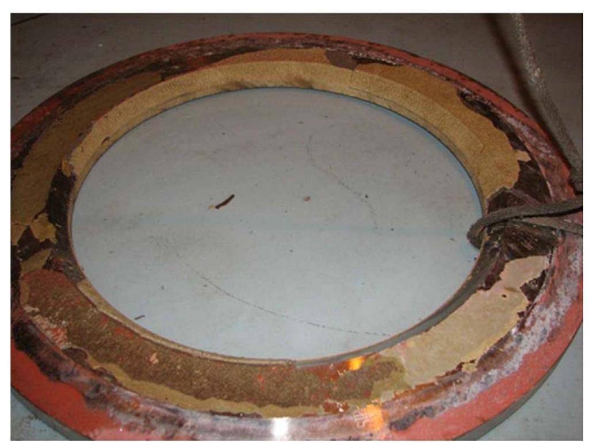

*FIG. 37. The orifice plate as removed for inspection (Courtesy of the SAFARI-1 of the South African Nuclear Energy Corporation (NECSA), South Africa).* 

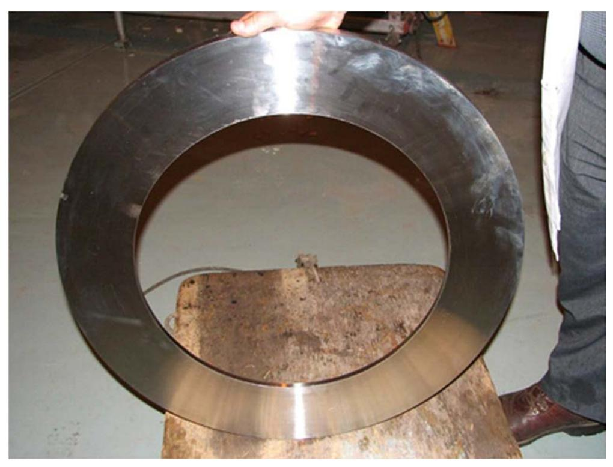

*FIG. 38. Cleaned orifice plate ready for installation (Courtesy of the SAFARI-1 of the South African Nuclear Energy Corporation (NECSA), South Africa).* 

#### **ABBREVIATIONS**

ANSI American National Standards Institute

APD Amplitude Probability Density APSD Auto power spectral density CRP Coordinated Research Project EPRI Electric Power Research Institute I&C Instrumentation and control

IEC International Electrotechnical Commission IAEA International Atomic Energy Agency

IEEE Institute of Electrical and Electronics Engineers

ISA International Society of Automation

LCSR Loop current step response LTI Linear time-invariant NPP Nuclear power plants

NRC Nuclear Regulatory Commission

OLM On-line Monitoring PWR Pressurized water reactor

RCM Reliability centred maintenance

RR Research reactor

RTD Resistance temperature detector

RTT Response time testing SER Safety Evaluation Report

SSC Structures, systems, or components TSR Technical Safety Requirements

#### **REFERENCES**

- [1] INTERNATIONAL ATOMIC ENERGY AGENCY, On-Line Monitoring for Improving Performance of Nuclear Power Plants. Part 1, Instrument Channel Monitoring, IAEA Nuclear Energy Series No. NP-T-1.1, IAEA, Vienna (2008).
- [2] HASHEMIAN, H.M., Regulations and standards for the measurement of performance and management of ageing of I&C systems of nuclear power plants, Int. J. Nuclear Law **2** (2009) 265.
- [3] INTERNATIONAL ATOMIC ENERGY AGENCY, Safety of Research Reactors, IAEA Safety Standards Series No. SSR-3, IAEA (in-preparation).
- [4] INTERNATIONAL ATOMIC ENERGY AGENCY, Instrumentation and Control Systems and Software Important to Safety for Research Reactors, IAEA Safety Standards Series No. SSG-37, IAEA, 2015.
- [5] NUCLEAR REGULATORY COMMISSION, Periodic Testing of Electric Power and Protection Systems, Regulatory Guide 1.118, Rev. 3., Office of Nuclear Regulatory Research, Washington, DC (1995).
- [6] NUCLEAR REGULATORY COMMISSION, Review of Resistance Temperature Detector Time Response Characteristics Safety Evaluation Report, NUREG-0809, Rev. 3., Office of Nuclear Reactor Regulation, Washington, DC (1981).
- [7] NUCLEAR REGULATORY COMMISSION, Standard Review Plan for the Review of Safety Analysis Reports for Nuclear Power Plants: LWR Edition, NUREG-0800, Rev. 5., Office of Nuclear Reactor Regulation, Washington, DC (2007).
- [8] NUCLEAR REGULATORY COMMISSION, Ageing of Nuclear Plant Resistance Temperature Detectors, NUREG/CR-5560, Washington, DC (1990).
- [9] ELECTRIC POWER RESEARCH INSTITUTE, On-Line Monitoring of Instrument Channel Performance, TR-104965-R1 NRC SER, Palo Alto, CA (2000).
- [10] HASHEMIAN, H.M., On-Line Testing of Calibration of Process Instrumentation Channels in Nuclear Power Plants, NUREG/CR-6343, Analysis and Measurement Services Corporation (1995).
- [11] NUCLEAR REGULATORY COMMISSION, Technical Review of on-Line Monitoring Techniques for Performance Assessment, NUREG/CR-6895, Office of Nuclear Regulatory Research, Washington, DC (2006).
- [12] NUCLEAR SAFETY STANDARDS COMMISSION, System Testing of the Instrumentation and Control Equipment Important to Safety of Nuclear Power Plants, Safety Standards KTA 3506, KTA-Geschaeftsstelle, Salzgitter, Germany (2012).
- [13] NUCLEAR SAFETY STANDARDS COMMISSION, Reactor Pressure Vessel Internals, Safety Standards KTA 3204, KTA-Geschaeftsstelle, Salzgitter, Germany (2008).
- [14] ASTM INTERNATIONAL, Standard Test Methods for Testing Industrial Resistance Thermometers, ASTM E644-11, West Conshohocken, PA (2011).
- [15] INSTITUTE OF ELECTRICAL AND ELECTRONICS ENGINEERS, Standard for Criteria for the Periodic Surveillance Testing of Nuclear Power Generating Station Safety, Std 338-2012, IEEE (2012) p. 669.
- [16] INTERNATIONAL ELECTROTECHNICAL COMMISSION, Nuclear Power Plants Instrumentation and Control Important to Safety ‒ Methods for Assessing the Performance of Safety System Instrument Channels, International Standard IEC 62385:2007, IEC (2007)
- [17] INTERNATIONAL ELECTROTECHNICAL COMMISSION, Nuclear Power Plants ‒ Instrumentation and Control Systems Important to Safety ‒ Management of Ageing, International Standard IEC 62342:2007, IEC (2007) p. 88.

- [18] INTERNATIONAL ELECTROTECHNICAL COMMISSION, Nuclear Power Plants ‒ Instrumentation and Control Important to Safety ‒ Resistance Temperature Detectors, International Standard IEC 62397:2007, IEC (2007) p. 48.
- [19] INTERNATIONAL ATOMIC ENERGY AGENCY, Core Knowledge on Instrumentation and Control Systems in Nuclear Power Plants, IAEA Nuclear Energy Series No. NP-T-3.12, IAEA, Vienna (2011) 141 pp.
- [20] INTERNATIONAL ATOMIC ENERGY AGENCY, On-Line Monitoring for Improving Performance of Nuclear Power Plants. Part 2: Process and Component Condition Monitoring and Diagnostics, IAEA Nuclear Energy Series No. NP-T-1.2, IAEA, Vienna (2008).

#### **BIBLIOGRAPHY**

BEVERLY, D.D., MITCHELL, D.W., PETERSON, K.M., Ageing of Nuclear Plant Resistance Temperature Detectors, Rep. NUREG/CR-5560, Analysis and Measurement Services Corporation, Knoxville, TN (1990).

DUDENHOEFFER, D., "Office of nuclear security. Cyber security programme", Presentation presented at the IAEA Technical Meeting on Instrumentations and Control in Advanced Small and Medium sized Reactors (SMRs), Vienna, 2013.

#### ELECTRIC POWER RESEARCH INSTITUTE

Implementation of on-Line Monitoring to Extend Calibration Intervals of Pressure Transmitters in Nuclear Power Plants, Final Report 1019188, EPRI, Palo Alto, CA (2009) p. 206.

On-Line Monitoring of Instrument Channel Performance, Rep. EPRI TR-104965-R1, EPRI, Palo Alto, CA (2000).

On-Line Monitoring for Equipment Condition Assessment, Rep. 1016724, EPRI, Palo Alto, CA (2008) p. 177.

Requirements for On-Line Monitoring in Nuclear Power Plants, Rep. 1016725, EPRI, Palo Alto, CA (2008) p. 164.

In-Situ Response Time Testing of Platinum Resistance Thermometers, Rep. EPRI NP-834, Vol. 1, EPRI, Palo Alto, CA (1978) p. 274.

Temperature Sensor Response Characterization, Final Report EPRI NP-1486, EPRI, Palo Alto, CA (1980) p. 254.

Plant Application of On-Line Monitoring for Calibration Interval Extension of Safety-Related Instruments: Volume 1, Final Report 1013486, EPRI, Palo Alto, CA (2006) p. 164.

GEDDES, B., HUSSEY, A., AUSTIN, R., "Cyber security procurement methodology for digital instrumentation and control systems", Proc. of the NPIC & HMIT 2012 ‒ Enabling the Future of Nuclear Energy, Vol. 1, American Nuclear Society, San Diego, CA (2012) 653– 665.

#### HASHEMIAN, H. M.

Applying Online Monitoring for Nuclear Power Plant Instrumentation and Control, IEEE Transactions on Nuclear Science, Vol. 57, No. 5, pp. 2872–2878 (2010).

Integrated Online Condition Monitoring System for Nuclear Power Plants, Kerntechnik, Vol. 75, No. 5, pp. 231–242 (2010).

On-Line Monitoring Applications in Nuclear Power Plants, Progress in Nuclear Energy, Vol. 53, No. 2, pp. 167–181 (2011).

Degradation of Nuclear Plant Temperature Sensors, Rep. NUREG/CR-6343, Analysis and Measurement Services Corporation, Knoxville, TN (1995).

Maintenance of Process Instrumentation in Nuclear Power Plants, Springer-Verlag Berlin, Heidelberg (2006).

Sensor Performance and Reliability, ISA, Research Triangle Park, North Carolina, USA (2005).

HASHEMIAN, H. M., et al., Effect of Aging on Response Time of Nuclear Plant Pressure Sensors, U. S. Nuclear Regulatory Commission, NUREG/CR-5383 (June 1989).

HASHEMIAN, H. M., RIGGSBEE, E. T., and O'HAGAN, R. D., Recent Demonstrations of On-Line Condition Monitoring Techniques for Research Reactors, presented at the American Nuclear Society (ANS) Winter Meeting and Nuclear Technology Expo, Washington, D.C. (2011).

HASHEMIAN, H.M., et al., "Ageing of Nuclear Plant Resistance Temperature Detectors", U.S. Nuclear Regulatory Commission, NUREG/CR-5560 (1990).

HASHEMIAN, H.M., PETERSON, K.M., KERLIN, T.W., ANDRESON, R.L., HOLBERT, K.E., Degradation of Nuclear Plant Temperature Sensors, Rep. NUREG/CR-4928, Analysis and Measurement Services Corporation, Knoxville, TN (1987).

HASHEMIAN, H.M., PETERSON, K.M., FAIN, R.E., GINGRICH, J.J., Effect of Ageing on Response Time of Nuclear Plant Pressure Sensors, Rep. NUREG/CR-5383, Analysis and Measurement Services Corporation, Knoxville, TN (1989).

HINES, J.W., SEIBERT, R., PETERSON, K.M., Technical Review of On-Line Monitoring Techniques for Performance Assessment. Volume 1: State-of-the-Art, Rep. NUREG/CR-6895, University of Tennessee, Knoxville, TN (2006).

HINES, J.W., GARVEY, D., SEIBERT, R., USYNIN, A., Technical Review of On-Line Monitoring Techniques for Performance Assessment. Volume 2: Theoretical Issues, Rep. NUREG/CR-6895, University of Tennessee, Knoxville, TN (2008).

INTERNATIONAL ATOMIC ENERGY AGENCY, Management of Aging of I&C Equipment in Nuclear Power Plants, IAEA-TECDOC-1147, IAEA, Vienna (2000).

INTERNATIONAL ATOMIC ENERGY AGENCY, Management of Life Cycle and Aging at Nuclear Power Plants: Improved I&C Maintenance, IAEA-TECDOC-1402, IAEA, Vienna, (2004).

INTERNATIONAL ATOMIC ENERGY AGENCY, Advanced Surveillance, Diagnostics, and Prognostics Techniques Used for Health Monitoring of Systems, Structures, and Components in Nuclear Power Plants: Volumes 1 and 2, IAEA Nuclear Energy Series No. NP-T-3.14, IAEA, Vienna (2013).

INTERNATIONAL ATOMIC ENERGY AGENCY, Computer Security at Nuclear Facilities, Technical Guidance Reference Manual, IAEA Nuclear Security Series No.17, IAEA, Vienna (2011).

INTERNATIONAL SOCIETY OF AUTOMATION, Performance Monitoring For Nuclear Safety-Related Instrument Channels In Nuclear Power Plants, Standard ISA 67.06.01:2002, ISA, Research Triangle Park, NC (2002) p. 70.

INTERNATIONAL SOCIETY OF AUTOMATION, Set points for Nuclear Safety-Related Instrumentation, Standard ISA 67.04.01:2006 (R2011), ISA, Research Triangle Park, NC (2011) p. 22.

#### INTERNATIONAL ELECTROTECHNICAL COMMISSION

Nuclear power plants. Instrumentation and control important to safety. Methods for assessing the performance of safety system instrument channels, IEC 62385 (2007).

Nuclear Power Plants. Instrumentation and Control Systems Important to Safety. Management of Ageing of Electrical Cabling Systems, IEC 62465 (2010).

Nuclear Power Plants. Instrumentation and Control Systems Important to Safety. Management of Ageing, IEC 62342 (2007).

Nuclear Power Plants. Instrumentation and Control Important to Safety. Methods for Assessing the Performance of Safety System Instrument Channels, IEC 62385 (2007).

Nuclear Power Plants. Instrumentation and Control Important to Safety. Resistance Temperature Detectors, IEC 62397 (2007).

Nuclear power plants. Instrumentation and control systems. Requirements for security programmes for computer-based systems; IEC 62645 (2014).

Nuclear power plants - Instrumentation and control systems - Requirements for coordinating safety and cybersecurity.

INSTITUTE OF ELECTRICAL AND ELECTRONICS ENGINEERS, Standard Criteria for the Periodic Surveillance Testing of Nuclear Power Generating Station Safety Systems, IEEE Std. 338-2012 (2012)

KERLIN, T.W., Response Time Qualification of Resistance Thermometers in Nuclear Power Safety Systems, Northeast Utilities Topical Report, (1979).

LOJK, B., QUINN, T., Approaches to Computer and Digital I&C Security at Nuclear Facilities, 23rd TWG-NPPIC Meeting, Vienna, Austria (2011).

O'HAGAN, R.D., HASHEMIAN, H.M., et al, "On-line monitoring techniques for improved reliability and maintenance of research reactors", presented at the American Nuclear Society's Nuclear Plant Instrumentation, Control and Human–Machine Interface Technologies (NPIC&HMIT), 2010.

PEDERSEN, P., "Part 73 and Cyber Security", presented at the ICSJWG 2010 Fall Conference, USA, Savannah, GA, 2010.

#### US NUCLEAR REGULATORY COMMISSION

Cyber Security Programs for Nuclear Facilities, U.S. Nuclear Regulatory Commission, Regularity Guide 5.71, (2010).

Effect of Aging on Response Time of Nuclear Plant Pressure Sensors, U.S. NRC, NUREG/CR-5383 (1989).

Long Term Performance and Aging Characteristics of Nuclear Plant Pressure Transmitters, U.S. NRC, NUREG/CR-5851 (1993).

Periodic Testing of Electric Power and Protection Systems, U.S. NRC, Regulatory Guide 1.118, Office of Nuclear Reactor Regulation, Revision 3 (1995).

#### **CONTRIBUTORS TO DRAFTING AND REVIEW**

ABDELLANI, Idir Commissariat a l'energie Atomique (COMENA), Algeria ALEXANDER, K. Petersburg Nuclear Physics Institute, Russian Federation

DAVID, Shteinman MIEAUST, Australia

ERICKSON, Phillip Department of Energy, Advanced Test Reactor, USA HASHEMIAN, H. M. Analysis and Measurement Services Corporation, USA

IKONOMOPOULOS, A. Institute of Nuclear and Radiological Sciences and Technology

Energy and Safety NCSR 'DEMOKRITOS', Greece

KALLOL, Roy Bhabha Atomic Research Center (BARC), India

KHEDR, Y. M. K. Egyptian Atomic Energy Authority (EAEA), Egypt

KIM, H-K. International Atomic Energy Agency

KONSTANTINOV, B.P. Petersburg Nuclear Physics Institute, Russian Federation

LINN Mark, A. Oak Ridge National Laboratory (ORNL), USA

MAGROTTI, Giovanni University of Pavia, LENA, Italy

MORRIS, C. International Atomic Energy Agency

**N**ONHLANHLA, GAZO NECSA, South Africa

O'HAGAN, R. Analysis and Measurement Services Corporation, USA

PARK, Gee-Yong Korea Atomic Energy Research Institute (KAERI), ROKorea

PROCTOR, Gordon NECSA, South Africa

REYENGA, Gerald J. National Institute of Standards and Technology (NIST), USA

RODRIGUES DE, C. M. Comissão Nacional de Energia Nuclear (CNEN), Brazil SHUMAKER, Brent Analysis and Measurement Services Corporation, USA

SUBEKTI, M. PTRKN-BATAN, Indonesia

VORONOV, M. International Atomic Energy Agency

VAUCHERET, Sebastian Comisión Nacional de Energía Atómica (CNEA), Argentina

### **ORDERING LOCALLY**

In the following countries, IAEA priced publications may be purchased from the sources listed below or from major local booksellers.

Orders for unpriced publications should be made directly to the IAEA. The contact details are given at the end of this list.

#### **CANADA**

#### *Renouf Publishing Co. Ltd*

22-1010 Polytek Street, Ottawa, ON K1J 9J1, CANADA Telephone: +1 613 745 2665 Fax: +1 643 745 7660

Email: order@renoufbooks.com Web site: www.renoufbooks.com

#### *Bernan / Rowman & Littlefield*

15200 NBN Way, Blue Ridge Summit, PA 17214, USA

Tel: +1 800 462 6420 • Fax: +1 800 338 4550

Email: orders@rowman.com Web site: www.rowman.com/bernan

#### **CZECH REPUBLIC**

#### *Suweco CZ, s.r.o.*

Sestupná 153/11, 162 00 Prague 6, CZECH REPUBLIC Telephone: +420 242 459 205 Fax: +420 284 821 646 Email: nakup@suweco.cz Web site: www.suweco.cz

#### **FRANCE**

#### *Form-Edit*

5 rue Janssen, PO Box 25, 75921 Paris CEDEX, FRANCE Telephone: +33 1 42 01 49 49 Fax: +33 1 42 01 90 90 Email: formedit@formedit.fr Web site: www.form-edit.com

### **GERMANY**

#### *Goethe Buchhandlung Teubig GmbH*

Schweitzer Fachinformationen

Willstätterstrasse 15, 40549 Düsseldorf, GERMANY

Telephone: +49 (0) 211 49 874 015 Fax: +49 (0) 211 49 874 28

Email: kundenbetreuung.goethe@schweitzer-online.de Web site: www.goethebuch.de

#### **INDIA**

#### *Allied Publishers*

1st Floor, Dubash House, 15, J.N. Heredi Marg, Ballard Estate, Mumbai 400001, INDIA

Telephone: +91 22 4212 6930/31/69 Fax: +91 22 2261 7928 Email: alliedpl@vsnl.com Web site: www.alliedpublishers.com

#### *Bookwell*

3/79 Nirankari, Delhi 110009, INDIA Telephone: +91 11 2760 1283/4536

Email: bkwell@nde.vsnl.net.in Web site: www.bookwellindia.com

#### **ITALY**

#### Libreria Scientifica "AEIOU"

Via Vincenzo Maria Coronelli 6, 20146 Milan, ITALY
Telephone: +39 02 48 95 45 52 • Fax: +39 02 48 95 45 48
Email: info@libreriaaeiou.eu • Web site: www.libreriaaeiou.eu

#### **JAPAN**

#### Maruzen-Yushodo Co., Ltd

10-10 Yotsuyasakamachi, Shinjuku-ku, Tokyo 160-0002, JAPAN

Telephone: +81 3 4335 9312 • Fax: +81 3 4335 9364

Email: bookimport@maruzen.co.jp • Web site: www.maruzen.co.jp

#### **RUSSIAN FEDERATION**

#### Scientific and Engineering Centre for Nuclear and Radiation Safety

107140, Moscow, Malaya Krasnoselskaya st. 2/8, bld. 5, RUSSIAN FEDERATION

Telephone: +7 499 264 00 03 • Fax: +7 499 264 28 59 Email: secnrs@secnrs.ru • Web site: www.secnrs.ru

#### **UNITED STATES OF AMERICA**

#### Bernan / Rowman & Littlefield

15200 NBN Way, Blue Ridge Summit, PA 17214, USA

Tel: +1 800 462 6420 • Fax: +1 800 338 4550

Email: orders@rowman.com • Web site: www.rowman.com/bernan

#### Renouf Publishing Co. Ltd

812 Proctor Avenue, Ogdensburg, NY 13669-2205, USA

Telephone: +1 888 551 7470 • Fax: +1 888 551 7471

Email: orders@renoufbooks.com • Web site: www.renoufbooks.com

#### Orders for both priced and unpriced publications may be addressed directly to:

Marketing and Sales Unit

International Atomic Energy Agency

Vienna International Centre, PO Box 100, 1400 Vienna, Austria

Telephone: +43 1 2600 22529 or 22530 • Fax: +43 1 2600 29302 or +43 1 26007 22529

Email: sales.publications@iaea.org • Web site: www.iaea.org/books