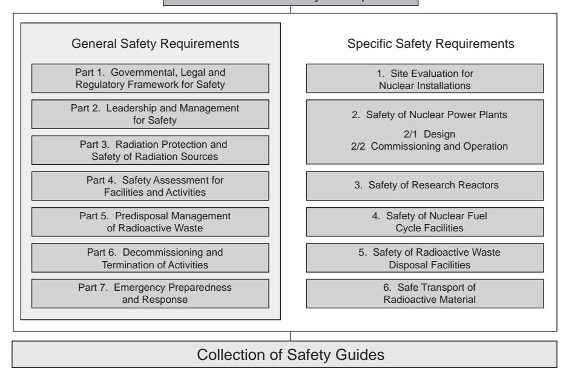
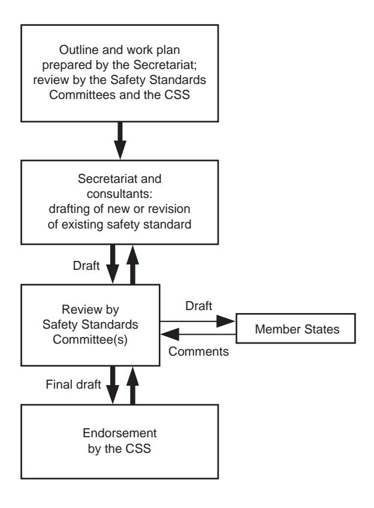
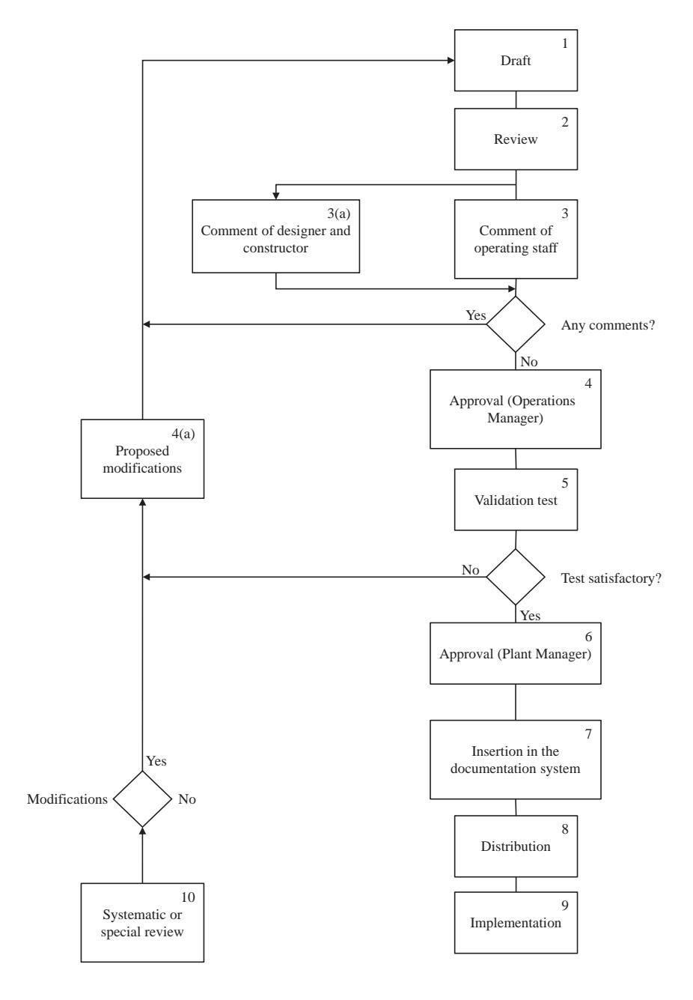
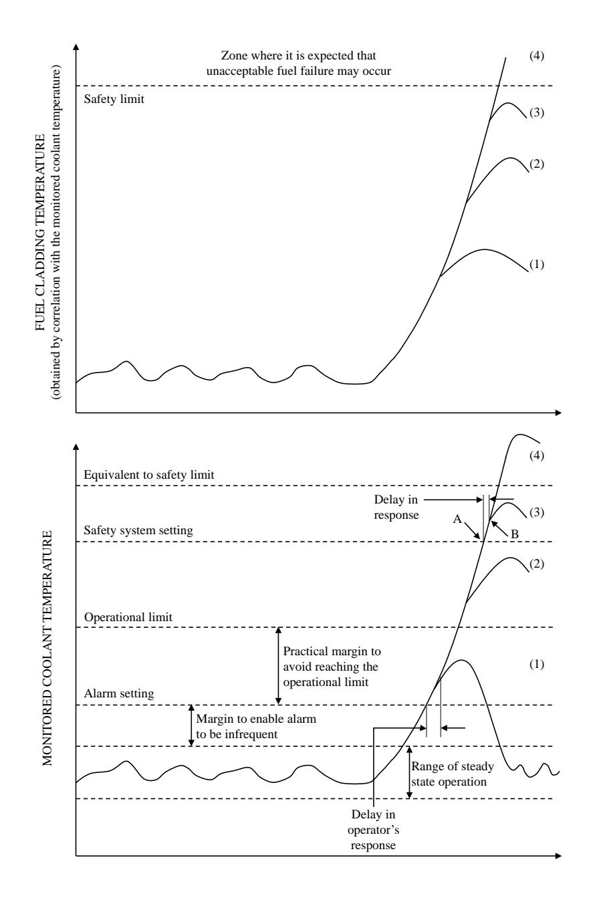
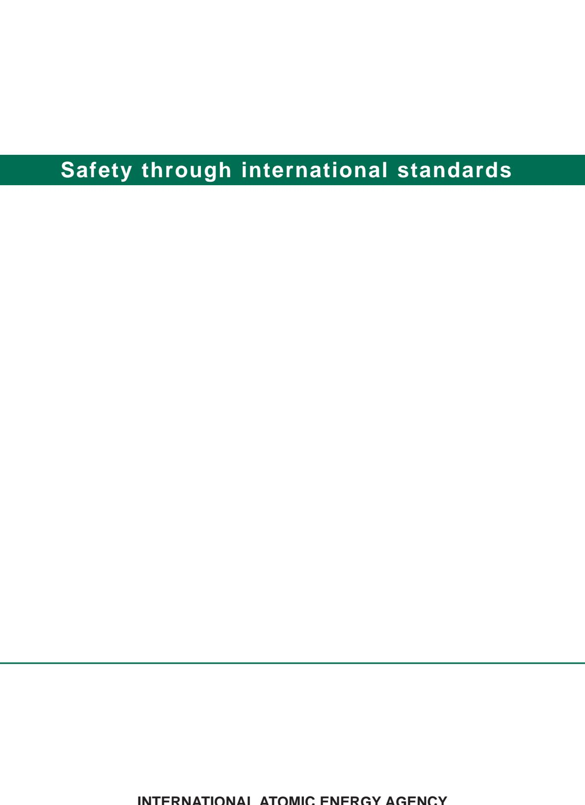

# IAEA Safety Standards

**for protecting people and the environment**

# Operational Limits and Conditions and Operating Procedures for Nuclear Power Plants

Specific Safety Guide

No. SSG-70

## **IAEA SAFETY STANDARDS AND RELATED PUBLICATIONS**

#### IAEA SAFETY STANDARDS

Under the terms of Article III of its Statute, the IAEA is authorized to establish or adopt standards of safety for protection of health and minimization of danger to life and property, and to provide for the application of these standards.

The publications by means of which the IAEA establishes standards are issued in the **IAEA Safety Standards Series**. This series covers nuclear safety, radiation safety, transport safety and waste safety. The publication categories in the series are **Safety Fundamentals**, **Safety Requirements** and **Safety Guides**.

Information on the IAEA's safety standards programme is available on the IAEA Internet site

https://www.iaea.org/resources/safety-standards

The site provides the texts in English of published and draft safety standards. The texts of safety standards issued in Arabic, Chinese, French, Russian and Spanish, the IAEA Safety Glossary and a status report for safety standards under development are also available. For further information, please contact the IAEA at: Vienna International Centre, PO Box 100, 1400 Vienna, Austria.

All users of IAEA safety standards are invited to inform the IAEA of experience in their use (e.g. as a basis for national regulations, for safety reviews and for training courses) for the purpose of ensuring that they continue to meet users' needs. Information may be provided via the IAEA Internet site or by post, as above, or by email to Official.Mail@iaea.org.

#### RELATED PUBLICATIONS

The IAEA provides for the application of the standards and, under the terms of Articles III and VIII.C of its Statute, makes available and fosters the exchange of information relating to peaceful nuclear activities and serves as an intermediary among its Member States for this purpose.

Reports on safety in nuclear activities are issued as **Safety Reports**, which provide practical examples and detailed methods that can be used in support of the safety standards.

Other safety related IAEA publications are issued as **Emergency Preparedness and Response** publications, **Radiological Assessment Reports**, the International Nuclear Safety Group's **INSAG Reports**, **Technical Reports** and **TECDOCs**. The IAEA also issues reports on radiological accidents, training manuals and practical manuals, and other special safety related publications.

Security related publications are issued in the **IAEA Nuclear Security Series**.

The **IAEA Nuclear Energy Series** comprises informational publications to encourage and assist research on, and the development and practical application of, nuclear energy for peaceful purposes. It includes reports and guides on the status of and advances in technology, and on experience, good practices and practical examples in the areas of nuclear power, the nuclear fuel cycle, radioactive waste management and decommissioning.

## OPERATIONAL LIMITS AND CONDITIONS AND OPERATING PROCEDURES FOR NUCLEAR POWER PLANTS

#### The following States are Members of the International Atomic Energy Agency:

AFGHANISTAN GERMANY ALBANIA GHANA PANAMA ALGERIA GREECE PAPUA NEW GUINEA ANGOLA GRENADA PARAGUAY ANTIGUA AND BARBUDA GUATEMALA PERU ARGENTINA GUYANA PHILIPPINES ARMENIA HAITI POLAND HOLY SEE ALISTRALIA PORTUGAL. AUSTRIA HONDURAS **QATAR** Δ7ΕΡΒΔΙΙΔΝ HUNGARY REPUBLIC OF MOLDOVA ICELAND BAHAMAS ROMANIA INDIA BAHRAIN RUSSIAN FEDERATION BANGLADESH INDONESIA RWANDA IRAN, ISLAMIC REPUBLIC OF BARBADOS SAINT KITTS AND NEVIS IRAO BELARUS SAINTLUCIA BELGIUM IRELAND SAINT VINCENT AND ISR AEL RELIZE THE GRENADINES BENIN ITALY SAMOA BOLIVIA, PLURINATIONAL JAMAICA SAN MARINO STATE OF IAPAN SAUDIARARIA BOSNIA AND HERZEGOVINA IORDAN SENEGAL ROTSWANA KAZAKHSTAN SERBIA BRA7II. KENYA SEYCHELLES SIERRA LEONE BRUNEI DARUSSALAM KOREA, REPUBLIC OF BIII GARIA KIIWAIT SINGAPORE BURKINA FASO KYRGYZSTAN SLOVAKIA BURUNDI LAO PEOPLE'S DEMOCRATIC SLOVENIA CAMBODIA REPUBLIC CAMEROON LATVIA SOUTH AFRICA CANADA LEBANON CENTRAL AFRICAN LESOTHO SRILANKA REPUBLIC LIBERIA SUDAN CHAD LIBYA SWEDEN LIECHTENSTEIN SWITZERLAND CHILE LITHUANIA SYRIAN ARAB REPUBLIC CHINA COLOMBIA LUXEMBOURG TAJIKISTAN THAILAND COMOROS MADAGASCAR CONGO MALAWI TOGO COSTA RICA MALAYSIA TONGA CÔTE D'IVOIRE MALI TRINIDAD AND TOBAGO CROATIA MALTA MARSHALL ISLANDS CUBA TÜRKİYE MAURITANIA **CYPRUS** TURKMENISTAN CZECH REPUBLIC MAURITHUS UGANDA DEMOCRATIC REPUBLIC MEXICO UKRAINE OF THE CONGO MONACO UNITED ARAB EMIRATES DENMARK MONGOLIA UNITED KINGDOM OF DIIROUTI MONTENEGRO GREAT BRITAIN AND DOMINICA MOROCCO NORTHERN IRELAND DOMINICAN REPUBLIC MOZAMBIQUE UNITED REPUBLIC MYANMAR ECHADOR OF TANZANIA EGYPT NAMIBIA UNITED STATES OF AMERICA EL SALVADOR NEPAL URUGUAY NETHERLANDS FRITRFA UZBEKISTAN NEW ZEALAND **ESTONIA** VANUATU **ESWATINI** NICARAGUA VENEZUELA, BOLIVARIAN ETHIOPIA NIGER REPUBLIC OF NIGERIA VIET NAM FINLAND NORTH MACEDONIA FRANCE NORWAY YEMEN GABON OMAN ZAMBIA GEORGIA PAKISTAN ZIMBABWE

The Agency's Statute was approved on 23 October 1956 by the Conference on the Statute of the IAEA held at United Nations Headquarters, New York; it entered into force on 29 July 1957. The Headquarters of the Agency are situated in Vienna. Its principal objective is "to accelerate and enlarge the contribution of atomic energy to peace, health and prosperity throughout the world".

## OPERATIONAL LIMITS AND CONDITIONS AND OPERATING PROCEDURES FOR NUCLEAR POWER PLANTS

SPECIFIC SAFETY GUIDE

INTERNATIONAL ATOMIC ENERGY AGENCY VIENNA, 2022

## **COPYRIGHT NOTICE**

All IAEA scientific and technical publications are protected by the terms of the Universal Copyright Convention as adopted in 1952 (Berne) and as revised in 1972 (Paris). The copyright has since been extended by the World Intellectual Property Organization (Geneva) to include electronic and virtual intellectual property. Permission to use whole or parts of texts contained in IAEA publications in printed or electronic form must be obtained and is usually subject to royalty agreements. Proposals for non-commercial reproductions and translations are welcomed and considered on a case-by-case basis. Enquiries should be addressed to the IAEA Publishing Section at:

Marketing and Sales Unit, Publishing Section International Atomic Energy Agency Vienna International Centre PO Box 100 1400 Vienna, Austria

fax: +43 1 26007 22529 tel.: +43 1 2600 22417

email: sales.publications@iaea.org

www.iaea.org/publications

© IAEA, 2022

Printed by the IAEA in Austria September 2022 STI/PUB/2009

#### **IAEA Library Cataloguing in Publication Data**

Names: International Atomic Energy Agency.

Title: Operational limits and conditions and operating procedures for nuclear power plants / International Atomic Energy Agency.

Description: Vienna : International Atomic Energy Agency, 2022. | Series: IAEA safety standards series, ISSN 1020–525X ; no. SSG-70 | Includes bibliographical references.

Identifiers: IAEAL 22-01511 | ISBN 978–92–0–123922–8 (paperback : alk. paper) | ISBN 978–92–0–124022–4 (pdf) | ISBN 978–92–0–124122–1 (epub)

Subjects: LCSH: Nuclear power plants — Safety measures. Nuclear power plants — Management. | Nuclear power plants — Commissioning.

Classification: UDC 621.039.58 | STI/PUB/2009

## **FOREWORD**

## **by Rafael Mariano Grossi Director General**

The IAEA's Statute authorizes it to "establish…standards of safety for protection of health and minimization of danger to life and property". These are standards that the IAEA must apply to its own operations, and that States can apply through their national regulations.

The IAEA started its safety standards programme in 1958 and there have been many developments since. As Director General, I am committed to ensuring that the IAEA maintains and improves upon this integrated, comprehensive and consistent set of up to date, user friendly and fit for purpose safety standards of high quality. Their proper application in the use of nuclear science and technology should offer a high level of protection for people and the environment across the world and provide the confidence necessary to allow for the ongoing use of nuclear technology for the benefit of all.

Safety is a national responsibility underpinned by a number of international conventions. The IAEA safety standards form a basis for these legal instruments and serve as a global reference to help parties meet their obligations. While safety standards are not legally binding on Member States, they are widely applied. They have become an indispensable reference point and a common denominator for the vast majority of Member States that have adopted these standards for use in national regulations to enhance safety in nuclear power generation, research reactors and fuel cycle facilities as well as in nuclear applications in medicine, industry, agriculture and research.

The IAEA safety standards are based on the practical experience of its Member States and produced through international consensus. The involvement of the members of the Safety Standards Committees, the Nuclear Security Guidance Committee and the Commission on Safety Standards is particularly important, and I am grateful to all those who contribute their knowledge and expertise to this endeavour.

The IAEA also uses these safety standards when it assists Member States through its review missions and advisory services. This helps Member States in the application of the standards and enables valuable experience and insight to be shared. Feedback from these missions and services, and lessons identified from events and experience in the use and application of the safety standards, are taken into account during their periodic revision.

I believe the IAEA safety standards and their application make an invaluable contribution to ensuring a high level of safety in the use of nuclear technology. I encourage all Member States to promote and apply these standards, and to work with the IAEA to uphold their quality now and in the future.

## **THE IAEA SAFETY STANDARDS**

#### BACKGROUND

Radioactivity is a natural phenomenon and natural sources of radiation are features of the environment. Radiation and radioactive substances have many beneficial applications, ranging from power generation to uses in medicine, industry and agriculture. The radiation risks to workers and the public and to the environment that may arise from these applications have to be assessed and, if necessary, controlled.

Activities such as the medical uses of radiation, the operation of nuclear installations, the production, transport and use of radioactive material, and the management of radioactive waste must therefore be subject to standards of safety.

Regulating safety is a national responsibility. However, radiation risks may transcend national borders, and international cooperation serves to promote and enhance safety globally by exchanging experience and by improving capabilities to control hazards, to prevent accidents, to respond to emergencies and to mitigate any harmful consequences.

States have an obligation of diligence and duty of care, and are expected to fulfil their national and international undertakings and obligations.

International safety standards provide support for States in meeting their obligations under general principles of international law, such as those relating to environmental protection. International safety standards also promote and assure confidence in safety and facilitate international commerce and trade.

A global nuclear safety regime is in place and is being continuously improved. IAEA safety standards, which support the implementation of binding international instruments and national safety infrastructures, are a cornerstone of this global regime. The IAEA safety standards constitute a useful tool for contracting parties to assess their performance under these international conventions.

#### THE IAEA SAFETY STANDARDS

The status of the IAEA safety standards derives from the IAEA's Statute, which authorizes the IAEA to establish or adopt, in consultation and, where appropriate, in collaboration with the competent organs of the United Nations and with the specialized agencies concerned, standards of safety for protection of health and minimization of danger to life and property, and to provide for their application.

With a view to ensuring the protection of people and the environment from harmful effects of ionizing radiation, the IAEA safety standards establish fundamental safety principles, requirements and measures to control the radiation exposure of people and the release of radioactive material to the environment, to restrict the likelihood of events that might lead to a loss of control over a nuclear reactor core, nuclear chain reaction, radioactive source or any other source of radiation, and to mitigate the consequences of such events if they were to occur. The standards apply to facilities and activities that give rise to radiation risks, including nuclear installations, the use of radiation and radioactive sources, the transport of radioactive material and the management of radioactive waste.

Safety measures and security measures1 have in common the aim of protecting human life and health and the environment. Safety measures and security measures must be designed and implemented in an integrated manner so that security measures do not compromise safety and safety measures do not compromise security.

The IAEA safety standards reflect an international consensus on what constitutes a high level of safety for protecting people and the environment from harmful effects of ionizing radiation. They are issued in the IAEA Safety Standards Series, which has three categories (see Fig. 1).

#### **Safety Fundamentals**

Safety Fundamentals present the fundamental safety objective and principles of protection and safety, and provide the basis for the safety requirements.

#### **Safety Requirements**

An integrated and consistent set of Safety Requirements establishes the requirements that must be met to ensure the protection of people and the environment, both now and in the future. The requirements are governed by the objective and principles of the Safety Fundamentals. If the requirements are not met, measures must be taken to reach or restore the required level of safety. The format and style of the requirements facilitate their use for the establishment, in a harmonized manner, of a national regulatory framework. Requirements, including numbered 'overarching' requirements, are expressed as 'shall' statements. Many requirements are not addressed to a specific party, the implication being that the appropriate parties are responsible for fulfilling them.

#### **Safety Guides**

Safety Guides provide recommendations and guidance on how to comply with the safety requirements, indicating an international consensus that it

1 See also publications issued in the IAEA Nuclear Security Series.

#### Safety Fundamentals Fundamental Safety Principles

*FIG. 1. The long term structure of the IAEA Safety Standards Series.*

is necessary to take the measures recommended (or equivalent alternative measures). The Safety Guides present international good practices, and increasingly they reflect best practices, to help users striving to achieve high levels of safety. The recommendations provided in Safety Guides are expressed as 'should' statements.

### APPLICATION OF THE IAEA SAFETY STANDARDS

The principal users of safety standards in IAEA Member States are regulatory bodies and other relevant national authorities. The IAEA safety standards are also used by co‑sponsoring organizations and by many organizations that design, construct and operate nuclear facilities, as well as organizations involved in the use of radiation and radioactive sources.

The IAEA safety standards are applicable, as relevant, throughout the entire lifetime of all facilities and activities — existing and new — utilized for peaceful purposes and to protective actions to reduce existing radiation risks. They can be used by States as a reference for their national regulations in respect of facilities and activities.

The IAEA's Statute makes the safety standards binding on the IAEA in relation to its own operations and also on States in relation to IAEA assisted operations.

The IAEA safety standards also form the basis for the IAEA's safety review services, and they are used by the IAEA in support of competence building, including the development of educational curricula and training courses.

International conventions contain requirements similar to those in the IAEA safety standards and make them binding on contracting parties. The IAEA safety standards, supplemented by international conventions, industry standards and detailed national requirements, establish a consistent basis for protecting people and the environment. There will also be some special aspects of safety that need to be assessed at the national level. For example, many of the IAEA safety standards, in particular those addressing aspects of safety in planning or design, are intended to apply primarily to new facilities and activities. The requirements established in the IAEA safety standards might not be fully met at some existing facilities that were built to earlier standards. The way in which IAEA safety standards are to be applied to such facilities is a decision for individual States.

The scientific considerations underlying the IAEA safety standards provide an objective basis for decisions concerning safety; however, decision makers must also make informed judgements and must determine how best to balance the benefits of an action or an activity against the associated radiation risks and any other detrimental impacts to which it gives rise.

#### DEVELOPMENT PROCESS FOR THE IAEA SAFETY STANDARDS

The preparation and review of the safety standards involves the IAEA Secretariat and five Safety Standards Committees, for emergency preparedness and response (EPReSC) (as of 2016), nuclear safety (NUSSC), radiation safety (RASSC), the safety of radioactive waste (WASSC) and the safe transport of radioactive material (TRANSSC), and a Commission on Safety Standards (CSS) which oversees the IAEA safety standards programme (see Fig. 2).

All IAEA Member States may nominate experts for the Safety Standards Committees and may provide comments on draft standards. The membership of the Commission on Safety Standards is appointed by the Director General and includes senior governmental officials having responsibility for establishing national standards.

A management system has been established for the processes of planning, developing, reviewing, revising and establishing the IAEA safety standards.

*FIG. 2. The process for developing a new safety standard or revising an existing standard.*

It articulates the mandate of the IAEA, the vision for the future application of the safety standards, policies and strategies, and corresponding functions and responsibilities.

#### INTERACTION WITH OTHER INTERNATIONAL ORGANIZATIONS

The findings of the United Nations Scientific Committee on the Effects of Atomic Radiation (UNSCEAR) and the recommendations of international expert bodies, notably the International Commission on Radiological Protection (ICRP), are taken into account in developing the IAEA safety standards. Some safety standards are developed in cooperation with other bodies in the United Nations system or other specialized agencies, including the Food and Agriculture Organization of the United Nations, the United Nations Environment Programme, the International Labour Organization, the OECD Nuclear Energy Agency, the Pan American Health Organization and the World Health Organization.

#### INTERPRETATION OF THE TEXT

Safety related terms are to be understood as defined in the IAEA Safety Glossary (see https://www.iaea.org/resources/safety‑standards/safety‑glossary). Otherwise, words are used with the spellings and meanings assigned to them in the latest edition of The Concise Oxford Dictionary. For Safety Guides, the English version of the text is the authoritative version.

The background and context of each standard in the IAEA Safety Standards Series and its objective, scope and structure are explained in Section 1, Introduction, of each publication.

Material for which there is no appropriate place in the body text (e.g. material that is subsidiary to or separate from the body text, is included in support of statements in the body text, or describes methods of calculation, procedures or limits and conditions) may be presented in appendices or annexes.

An appendix, if included, is considered to form an integral part of the safety standard. Material in an appendix has the same status as the body text, and the IAEA assumes authorship of it. Annexes and footnotes to the main text, if included, are used to provide practical examples or additional information or explanation. Annexes and footnotes are not integral parts of the main text. Annex material published by the IAEA is not necessarily issued under its authorship; material under other authorship may be presented in annexes to the safety standards. Extraneous material presented in annexes is excerpted and adapted as necessary to be generally useful.

## **CONTENTS**

| 1. | INTRODUCTION .                                                                                                                                                                                                                                                      | 1                          |
|----|---------------------------------------------------------------------------------------------------------------------------------------------------------------------------------------------------------------------------------------------------------------------|----------------------------|
|    | Background (1.1–1.5) . Objective (1.6, 1.7) . Scope (1.8–1.10) . Structure (1.11) .                                                                                                                                                                        | 1 2 2 3           |
| 2. | THE CONCEPT OF OPERATIONAL LIMITS AND CONDITIONS AND THEIR DEVELOPMENT                                                                                                                                                                                           | 3                          |
|    | The concept of operational limits and conditions (2.1–2.7) . Development of operational limits and conditions (2.8–2.17)                                                                                                                                         | 3 5                     |
| 3. | SAFETY LIMITS (3.1–3.6) .                                                                                                                                                                                                                                           | 7                          |
| 4. | LIMITING SETTINGS FOR SAFETY SYSTEMS (4.1–4.3) .                                                                                                                                                                                                                    | 8                          |
| 5. | LIMITS AND CONDITIONS FOR NORMAL OPERATION (5.1–5.9)                                                                                                                                                                                                             | 10                         |
| 6. | SURVEILLANCE AND TESTING REQUIREMENTS (6.1–6.5)                                                                                                                                                                                                                     | 12                         |
| 7. | OPERATING PROCEDURES AND GUIDELINES .                                                                                                                                                                                                                               | 13                         |
|    | General (7.1–7.13) . Particular aspects of emergency operating procedures (7.14–7.24) . Severe accident management guidelines (7.25–7.31) . Accidents at multiple unit sites (7.32–7.34) . Operating procedures in the commissioning stage (7.35, 7.36) | 13 16 19 20 20 |
| 8. | DEVELOPMENT OF OPERATING PROCEDURES (8.1–8.9) .                                                                                                                                                                                                                     | 21                         |
| 9. | COMPLIANCE WITH OPERATIONAL LIMITS AND CONDITIONS AND OPERATING PROCEDURES (9.1–9.12) .                                                                                                                                                                          | 22                         |
|    | APPENDIX I: SELECTION OF LIMITS AND CONDITIONS FOR NORMAL OPERATION                                                                                                                                                                                           | 27                         |

| APPENDIX II: | DEVELOPMENT OF OPERATING PROCEDURES (OUTLINES)                                                                                     | 38 |
|--------------|---------------------------------------------------------------------------------------------------------------------------------------|----|
| REFERENCES . |                                                                                                                                       | 41 |
| ANNEX:       | EXAMPLE TO ILLUSTRATE THE INTERRELATIONSHIP BETWEEN A SAFETY LIMIT, A SAFETY SYSTEM SETTING AND A LIMIT FOR NORMAL OPERATION | 43 |
|              | CONTRIBUTORS TO DRAFTING AND REVIEW                                                                                                   | 47 |

## **1. INTRODUCTION**

#### BACKGROUND

- 1.1. Requirements for the operation of nuclear power plants are established in IAEA Safety Standards Series No. SSR‑2/2 (Rev. 1), Safety of Nuclear Power Plants: Commissioning and Operation [1], while requirements for the design of nuclear power plants are established in IAEA Safety Standards Series No. SSR‑2/1 (Rev. 1), Safety of Nuclear Power Plants: Design [2].
- 1.2. This Safety Guide provides specific recommendations on the development and use of operational limits and conditions (OLCs)1 and operating procedures for nuclear power plants.
- 1.3. This Safety Guide was developed in parallel with six other Safety Guides on the operation of nuclear power plants, as follows:
  - IAEA Safety Standards Series No. SSG‑71, Modifications to Nuclear Power Plants [3];
  - IAEA Safety Standards Series No. SSG‑72, The Operating Organization for Nuclear Power Plants [4];
  - IAEA Safety Standards Series No. SSG‑73, Core Management and Fuel Handling for Nuclear Power Plants [5];
  - IAEA Safety Standards Series No. SSG‑74, Maintenance, Testing, Surveillance and Inspection in Nuclear Power Plants [6];
  - IAEA Safety Standards Series No. SSG‑75, Recruitment, Qualification and Training of Personnel for Nuclear Power Plants [7];
  - IAEA Safety Standards Series No. SSG‑76, Conduct of Operations at Nuclear Power Plants [8].

A collective aim of this set of Safety Guides is to support the fostering of a strong safety culture in nuclear power plants.

1.4. The terms used in this Safety Guide are to be understood as defined and explained in the IAEA Safety Glossary [9].

1 In some States, the term 'technical specifications' is used instead of the term 'operational limits and conditions'.

1.5. This Safety Guide supersedes IAEA Safety Standards Series No. NS‑G‑2.2, Operational Limits and Conditions and Operating Procedures for Nuclear Power Plants2 .

#### OBJECTIVE

- 1.6. The purpose of this Safety Guide is to provide recommendations on the development, content and implementation of OLCs and operating procedures for nuclear power plants, to meet Requirements 6 and 26 of SSR‑2/2 (Rev. 1) [1], respectively. Recommendations are also provided on the development of emergency operating procedures and severe accident management guidelines to meet Requirement 19 of SSR‑2/2 (Rev. 1) [1], and on OLCs and operating procedures to prepare for decommissioning to meet Requirement 33 of SSR‑2/2 (Rev. 1) [1].
- 1.7. The recommendations provided in this Safety Guide are aimed primarily at operating organizations of nuclear power plants and regulatory bodies.

#### SCOPE

- 1.8. It is expected that this Safety Guide will be used primarily for land based stationary nuclear power plants with water cooled reactors designed for electricity generation or for other production applications (such as district heating or desalination).
- 1.9. This Safety Guide covers the concept of OLCs; their content as it is applicable to nuclear power plants; and the responsibilities of the operating organization for their establishment, modification, compliance and documentation. Operating procedures (including emergency operating procedures and severe accident management guidelines) to support the implementation of the OLCs and to ensure their observance are also within the scope of this Safety Guide.

2 INTERNATIONAL ATOMIC ENERGY AGENCY, Operational Limits and Conditions and Operating Procedures for Nuclear Power Plants, IAEA Safety Standards Series No. NS-G-2.2, IAEA, Vienna (2000).

1.10. Procedures for maintenance, surveillance, in‑service inspection, radiation protection and other safety related activities in connection with the safe operation of nuclear power plants and procedures for emergency preparedness and response are outside the scope of this Safety Guide.

#### STRUCTURE

1.11. Recommendations relating to the concept and development of OLCs are provided in Section 2. Sections 3–6 provide recommendations on safety limits, limits on safety system settings, limits and conditions for normal operation, and surveillance and testing requirements for OLCs. Sections 7 and 8 provide recommendations on the development of operating procedures and guidelines. Section 9 provides recommendations on how to ensure compliance with OLCs and operating procedures, including on the need to retain records of such compliance. Appendix I presents a sample list of the items for which OLCs are generally established, and Appendix II gives outlines for the development of operating procedures. The Annex contains an example to illustrate the interrelationship between a safety limit, a safety system setting and a limit for normal operation.

## **2. THE CONCEPT OF OPERATIONAL LIMITS AND CONDITIONS AND THEIR DEVELOPMENT**

#### THE CONCEPT OF OPERATIONAL LIMITS AND CONDITIONS

#### 2.1. Paragraph 4.6 of SSR‑2/2 (Rev. 1) [1] states:

"The plant shall be operated within the operational limits and conditions to prevent situations arising that could lead to anticipated operational occurrences or accident conditions, and to mitigate the consequences of such events if they do occur. The operational limits and conditions shall be developed for ensuring that the plant is being operated in accordance with the design assumptions and intent, as well as in accordance with its licence conditions."

The OLCs should be defined in such a way as to ensure the independence of the levels of defence in depth as far as is practicable (see Requirement 7 of SSR‑2/1 (Rev. 1) [2]) and their adequate reliability.

- 2.2. Paragraph 4.9 of SSR‑2/2 (Rev. 1) [1] states that "The operational limits and conditions shall include requirements for normal operation, including shutdown and outage stages, and shall cover actions to be taken and limitations to be observed by the operating personnel." Modes of normal operation include startup, power operation, shutting down, shutdown, maintenance, testing and refuelling. The OLCs should define operational requirements to ensure that items important to safety perform their functions in all operational states, in design basis accidents and in design extension conditions for which they are necessary. This includes permanently installed, portable and mobile equipment used for accident management (including for severe accident management).
- 2.3. The OLCs should include the limits that need to be observed, as well as the operational requirements that structures, systems and components important to safety need to meet to perform their intended functions as described in the safety analysis report for the plant.
- 2.4. Safe operation depends on personnel as well as on equipment and procedures; therefore, OLCs should also include the actions to be taken when limits are exceeded or equipment important to safety is not capable of performing its intended functions. With regard to operating personnel, the OLCs should include requirements for surveillance and corrective or other actions necessary to supplement the functioning of equipment involved in maintaining these OLCs. Some OLCs might involve a combination of automatic functions and actions by personnel.

#### 2.5. Paragraph 4.10 of SSR‑2/2 (Rev. 1) [1] states:

"The operational limits and conditions shall include the following:

- (a) Safety limits;
- (b) Limiting settings for safety systems;
- (c) Limits and conditions for normal operation;
- (d) Surveillance and testing requirements;
- (e) Action statements for deviations from normal operation."

In addition, the OLCs should include objectives that justify their applicability, as well as the bases for the derivation of these objectives. These objectives and bases should be included in the documentation on OLCs to increase the awareness of plant personnel of the importance of applying and observing OLCs.

- 2.6. OLCs should form a logical system in which the elements listed in para. 2.5 are closely interrelated and in which the safety limits constitute the ultimate boundary of the safe conditions. An example explaining such an interrelationship is given in the Annex. The OLCs should be readily accessible to control room personnel; they should be easily identified and should preferably be in a single document for control room use. Control room personnel are required to be thoroughly familiar with the OLCs and their technical basis (see para. 4.11 of SSR‑2/2 (Rev. 1) [1]).
- 2.7. If a situation arises in which, for any reason, operating personnel do not understand the operational state of the plant or cannot ascertain whether it is being operated within the OLCs, or if the plant behaves in an unpredicted way, measures should be taken without delay to bring the plant to a safe state. The OLCs should include a general statement to this effect.

#### DEVELOPMENT OF OPERATIONAL LIMITS AND CONDITIONS

- 2.8. Paragraph 4.7 of SSR‑2/2 (Rev. 1) [1] states that "operational limits and conditions shall reflect the provisions made in the final design as described in the safety analysis report." The OLCs should be based on a safety analysis of the individual plant and its environment. The use of deterministic safety analysis should be complemented by probabilistic safety analysis, as appropriate. The OLCs should be determined with due account taken of the uncertainties in the process of safety analysis. The safety analysis report and OLCs should be reviewed and amended where necessary on the basis of the results of commissioning testing (see para. 6.4 of SSR‑2/2 (Rev. 1) [1]).
- 2.9. A written justification should be provided for each of the OLCs, and this should include the reason for the adoption of each OLC and any relevant background information. These justifications should be readily available, for example in the main control room and in the technical support centre at the site.
- 2.10. The initial OLCs should normally be developed by the operating organization in cooperation with the plant designers well before commencement of operation to ensure that adequate time is available for an independent assessment commissioned by the operating organization.

#### 2.11. Paragraph 4.12 of SSR‑2/2 (Rev. 1) states:

"The operating organization shall ensure that an appropriate surveillance programme is established and implemented to ensure compliance with the operational limits and conditions, and that its results are evaluated, recorded and retained."

Each OLC should have associated surveillance requirements that verify compliance with the OLC.

- 2.12. OLCs should be meaningful to responsible operating personnel and should be defined by directly measurable (or directly identifiable) values of parameters. Where directly measurable values cannot be used, the relationship between a limiting parameter and the reactor power (or another measurable parameter) should be indicated by tables, diagrams or computing techniques, as appropriate. Each OLC should be stated in such a way that it is clear whether or not a breach has occurred.
- 2.13. Clear presentation and avoidance of ambiguity are important contributors to the reliable use of OLCs; therefore, advice on human factors should be sought at an early stage in the development of the documentation in which the OLCs will be presented to the operating personnel. The meaning of terms should be explained to help prevent misinterpretation.
- 2.14. Where modifications to the OLCs become necessary, the same approach as that described in paras 2.8–2.12 should be followed. All plant modifications should be reviewed to determine whether they necessitate modifications to the OLCs. Any modification to the OLCs should be subject to assessment and approval by the operating organization following the established procedures at the plant. The revised OLCs might also need to be approved by the regulatory body in accordance with para. 4.15 of SSR‑2/2 (Rev. 1) [1]. Recommendations on plant modifications are provided in SSG‑71 [3].
- 2.15. When it is necessary to modify OLCs on a temporary basis for example, to perform physics tests on a new core — it should be ensured that the effects of the change are fully analysed and that the modified state, although temporary, involves at least the same level of assessment and approval of the OLCs as a permanent modification would. When a permanent approach is available as a reasonable alternative, this should be preferred to the temporary modification of an OLC.

- 2.16. Paragraph 4.8 of SSR‑2/2 (Rev. 1) [1] states that "The operational limits and conditions shall be reviewed and revised as necessary in consideration of experience, developments in technology and approaches to safety, and changes in the plant." Periodic review of OLCs should be undertaken to ensure that they remain applicable for their intended purpose. OLCs should be modified, for example, to reflect the replacement of equipment, environmental effects on equipment, and ageing. This periodic review should be performed even if the plant has not been modified.
- 2.17. Consideration should be given to the application of probabilistic safety assessment in the optimization of OLCs. This involves a risk informed approach, using insights from probabilistic safety assessment and operating experience to optimize allowed outage times, surveillance test intervals and test strategies. Further recommendations are provided in IAEA Safety Standards Series No. SSG‑3, Development and Application of Level 1 Probabilistic Safety Assessment for Nuclear Power Plants [10].

## **3. SAFETY LIMITS**

- 3.1. The concept of safety limits is based on the prevention of unacceptable releases of radioactive substances from the plant through the application of limits imposed on the temperatures of fuel and fuel cladding, and on the coolant pressure, pressure boundary integrity and other operational characteristics influencing the release of radioactive substances from the fuel. Safety limits are intended to protect the integrity of certain physical barriers that guard against the uncontrolled release of radioactive substances.
- 3.2. The safety limits should be established by means of a conservative approach to ensure that all the uncertainties associated with the safety analyses are taken into account. This implies that exceeding a single safety limit does not lead to unacceptable consequences. Nevertheless, if any safety limit is exceeded, the reactor should be shut down and normal power operation restored only after an appropriate evaluation has been performed and approval for restarting has been given in accordance with established plant procedures. Any allowed exception from the rule to shut down the reactor after a safety limit has been exceeded should be included in the OLCs and justified in the safety analysis.

- 3.3. The safety limits should be chosen with the objective of maintaining the integrity of the fuel cladding and the integrity of the pressure boundary of the reactor coolant system under all conditions, thus ensuring that there is no significant release of radioactive substances.
- 3.4. Although the integrity of the containment is important in limiting the radiological consequences of an accident, loss of containment integrity does not of itself lead to damage to the fuel cladding. Consequently, the integrity of the containment is not included in the safety limits, but should be included in the limits and conditions for normal operation (see Section 5).
- 3.5. The temperatures of the fuel and fuel cladding should be limited to values that ensure that the design requirements are not exceeded. The safety limits should usually be stated as the maximum acceptable temperatures that ensure the integrity of the fuel cladding, using a conservative approach as mentioned in para. 3.2. Safety limits for local heat transfer rates for the fuel cladding should be defined and established to ensure that local fuel temperatures and fuel cladding temperatures do not rise to levels at which cladding failure could occur.
- 3.6. Safety limits for the pressure and temperature of the reactor coolant system should be stated in relation to their design values.

## **4. LIMITING SETTINGS FOR SAFETY SYSTEMS**

- 4.1. Safety system settings should be established in terms of a range of parameters. These include the parameters in terms of which safety limits are established as well as other parameters (or combinations of parameters) that could contribute to pressure or temperature transients. Exceeding some safety system settings will cause the reactor to automatically shut down. Exceeding other safety system settings will result in other automatic actions to prevent safety limits from being exceeded. Other safety system settings are provided to initiate the operation of safety systems. Safety systems limit the reactor systems' response in such a way that either safety limits are not exceeded or the consequences of postulated accidents are mitigated. The interrelationship between safety system settings, safety limits and limits for normal operation is illustrated in the Annex.
- 4.2. Safety system settings should be established to ensure the automatic actuation of safety systems within parameter values assumed in the safety analysis report,

taking into account the possible deviations that could occur when adjusting the nominal set point. Appropriate alarms should be provided to enable the operating personnel to initiate corrective actions before safety system settings are reached.

- 4.3. The following list contains typical parameters, operational occurrences and protective system devices for which safety system settings should be provided:
  - Neutron flux and distribution (i.e. startup, intermediate and operating power ranges);
  - Rate of change of neutron flux;
  - Axial power distribution factor;
  - Power oscillation;
  - Reactivity protection devices;
  - Temperature of fuel cladding or fuel channel coolant;
  - Critical power ratio (boiling water reactor);
  - Temperature of reactor coolant;
  - Rate of change of temperature of reactor coolant;
  - Reactor core void content (boiling water reactor);
  - Pressure of the reactor coolant system (including cold overpressure settings);
  - Water level in the reactor vessel or pressurizer (varying with plant state and differing by reactor type);
  - Reactor coolant flow;
  - Rate of change of reactor coolant flow;
  - Recirculation flow (boiling water reactor);
  - Rate of change of recirculation flow (boiling water reactor);
  - Tripping of primary coolant circulation pump or tripping of recirculation pump (boiling water reactor);
  - Intermediate cooling and ultimate heat sink;
  - Water levels in steam generators (pressurized water reactor);
  - Inlet feedwater temperature for the steam generators (pressurized water reactor);
  - Outlet steam temperature for the steam generators (pressurized water reactor);
  - Steam flow and pressure;
  - Feedwater flow and temperature (boiling water reactor);
  - Initiation of steam line isolation, turbine trip and feedwater isolation;
  - Closure of isolation valve for the main steam line;
  - Injection of emergency coolant;
  - Containment pressure;
  - Startup of spray systems, cooling systems and isolation systems for the containment;

- Dry well pressure and temperature (boiling water reactor);
- Wet well pressure, temperature and water level (boiling water reactor);
- Control and injection systems for coolant poison;
- Levels of radioactive substances in the primary circuit;
- Levels of radioactive substances in the steam line;
- Levels of radioactive substances in the reactor building;
- Levels of radioactive substances in exhaust air and the waste water outlet;
- Loss of normal electrical power supply;
- Loss of emergency power supply;
- Steam generator tube leakage monitoring (pressurized water reactor);
- Primary circuit leakage monitoring.

The settings might be different in different modes of normal operation. For example, at a low operating temperature, the relief system for the reactor pressure vessel might necessitate lower pressure settings. The actions to be initiated in cases where safety system settings are exceeded or in cases of equipment failure might also differ depending on the reactor type and design. For particular reactor types, some of the settings might not be applicable, and safety system settings should be specified in terms of additional parameters, which should be described in the safety analysis report. Appendix I provides information on the parameters, operational occurrences and protective system devices that should be included in the OLC documentation.

## **5. LIMITS AND CONDITIONS FOR NORMAL OPERATION**

- 5.1. Limits and conditions for normal operation are intended to ensure safe operation; that is, to ensure that the assumptions of the safety analysis report remain applicable to the operating conditions and that established safety limits are not exceeded in the operation of the plant. In addition, acceptable margins should be ensured between the normal operating values and the established safety system settings to avoid the undesirably frequent actuation of safety systems. Figure A–1 in the Annex demonstrates the interrelationship between a safety limit, a safety system setting and a limit for normal operation.
- 5.2. The limits and conditions for normal operation should include limits on operating parameters, stipulations for the minimum amount of operable equipment, minimum staffing levels, prescribed actions to be taken by operating

personnel in case of deviations from OLCs and the allowed time frame to recover from these deviations. The OLCs should also include parameters such as the chemical composition and radioactive content of the reactor coolant and limits on radioactive discharges to the environment.

- 5.3. Operability requirements should state the number of systems or components important to safety that should be either in operating condition or in standby condition for each mode of normal operation. These operability requirements collectively define the minimum plant configuration for each mode of normal operation. When defining this minimum safe configuration, the independence of each level of defence in depth and barriers implemented in the plant should be maintained. Where operability requirements cannot be met, the actions to be taken to bring the plant to a safe state, such as power reduction or reactor shutdown, should be specified and the time allowed to complete the action should be stated.
- 5.4. During startup of the plant after outages, the operability requirements should be more stringent than those permitted for operational flexibility during power operation. The safety system equipment necessary for startup should be specified.
- 5.5. After an anticipated operational occurrence, including a reactor trip, the cause of the event should be determined and evaluated. Appropriate corrective actions should be taken to provide assurance that it is safe to resume operation or, in the case of a trip, to restart the reactor. Procedures for determining the evaluations and actions to be performed should be available in advance. If OLCs have been exceeded, the cause should be investigated. Further recommendations can be found in IAEA Safety Standards Series No. SSG‑50, Operating Experience Feedback for Nuclear Installations [11].
- 5.6. When it is necessary to remove a component of a safety system from service, confirmation should be obtained that the safety logic continues to be in accordance with design provisions. The performance of a safety function might be affected by process conditions or service system conditions that are not directly related to the equipment performing the function. It should be ensured that any such effects are identified and that appropriate restrictions are applied to ensure that the minimum safe plant configuration is maintained.
- 5.7. For the operability requirements for safety related equipment, the provisions in the design for redundancy and reliability, and the period over which equipment is inoperable without an unacceptable increase in risk, should be taken into consideration.

- 5.8. The allowable periods of inoperability and the cumulative effects of these periods should be assessed in order to ensure that any increase in risk is kept to an acceptable level. Probabilistic safety assessment or reliability analysis should be used, as appropriate, for this purpose. Shorter inoperability periods than those derived from a probabilistic safety assessment should be stipulated in the OLCs, taking into account information such as pre‑existing safety studies or operating experience.
- 5.9. Appendix I contains a sample list of parameters, operational occurrences and protective system devices for which OLCs are generally established. These items are applicable for normal modes of operation. It should be recognized that, for a particular plant design, other limits might be necessary to ensure that all parameters included in the design and in the safety analysis are adequately controlled.

## **6. SURVEILLANCE AND TESTING REQUIREMENTS**

- 6.1. In order to ensure that safety system settings and limits and conditions for normal operation are met in the applicable modes, the relevant systems and components should be monitored, inspected, checked, calibrated and tested in accordance with an approved surveillance programme (see para. 2.11). The surveillance programme should be adequately specified to ensure that all aspects of the OLCs are addressed.
- 6.2. The testing requirements and the surveillance test intervals for safety systems — and for safety related systems and supporting systems — should be clearly defined. The frequency of the surveillance tests should take into account the safety importance of the equipment and should be based on a reliability analysis. This analysis should include, where available, a probabilistic safety assessment and experience gained from previous surveillance results; if these are not available, the reliability analysis should be based on the recommendations of the supplier. Probabilistic safety assessments can also be used to modify surveillance test intervals on the basis of a quantitative analysis of specific contributors to overall plant risk. Probabilistic safety assessment can be undertaken as part of the review and revision of existing OLCs, or as part of the development of specifications for new plants [10].
- 6.3. The surveillance requirements should be specified in procedures that also contain clear acceptance criteria, to ensure that there are no doubts concerning

system operability or component operability. The relationship between the acceptance criteria and the OLC being confirmed should be documented.

- 6.4. The surveillance requirements should also cover activities to detect ageing and other forms of deterioration due to corrosion, fatigue and other mechanisms. Such activities will include non‑destructive examination of passive systems and of systems explicitly covered by limits and conditions for normal operation. If degraded conditions are found, the effect on the operability of systems should be assessed and acted on.
- 6.5. Further recommendations on surveillance activities are provided in SSG 74 [6].

## **7. OPERATING PROCEDURES AND GUIDELINES**

#### GENERAL

7.1. Requirement 26 of SSR‑2/2 (Rev. 1) [1] states:

**"Operating procedures shall be developed that apply comprehensively (for the reactor and its associated facilities) for normal operation, anticipated operational occurrences and accident conditions, in accordance with the policy of the operating organization and the requirements of the regulatory body."**

All safety related activities should be performed in conformity with procedures developed and issued in accordance with a management system that meets the requirements established in IAEA Safety Standards Series No. GSR Part 2, Leadership and Management for Safety [12], and para. 3.2 of SSR‑2/2 (Rev. 1) [1]. The availability and correct use of written operating procedures, including surveillance procedures, are an important contribution to the safe operation of a nuclear power plant.

#### 7.2. Paragraph 5.8 of SSR‑2/2 (Rev. 1) [1] states:

- "An accident management programme shall be established that covers the preparatory measures, procedures and guidelines, and equipment that are necessary for preventing the progression of accidents, including accidents more severe than design basis accidents, and for mitigating their consequences if they do occur."
- 7.3. In developing operating procedures, including emergency operating procedures for design basis accidents and design extension conditions without significant fuel degradation, and severe accident management guidelines, the influence of human and organizational factors on the levels of defence in depth should be considered.
- 7.4. Paragraph 4.26 of SSR‑2/2 (Rev. 1) [1] states that "All activities important to safety shall be carried out in accordance with written procedures to ensure that the plant is operated within the established operational limits and conditions." Operating procedures should provide instructions for the safe conduct of all modes of normal operation, including startup, power operation, shutting down, shutdown, maintenance, testing and refuelling. Procedures should also provide instructions on how to make load changes and to manoeuvre systems, equipment and components, including systems, equipment and components used in plant states more severe than design basis accidents.
- 7.5. Operating procedures should be categorized according to the manner in which they are to be applied. For example, the following types of procedure should be clearly distinguished by this categorization:
- (a) Operating procedures that are applied continuously in a step‑by‑step manner;
- (b) Operating procedures that are used as references to confirm the correctness of actions;
- (c) Operating procedures for informational use.
- 7.6. The use of step‑by‑step procedures should include confirmation of each step after it has been completed, before commencement of the next step. Procedures should contain hold points at which certain key tasks are to be performed, including independent checks, as appropriate, before proceeding beyond the hold point.
- 7.7. Alarm response procedures should be developed in support of the operating procedures. They should ensure a timely and correct response to deviations

from steady state operation (see Appendix II) and should ensure that the plant is operated within the limits specified in the OLCs or in the safety analysis report.

- 7.8. Operator aids including sketches, handwritten notes, curves and graphs, instructions, copies of procedures, prints, drawings, information tags and other information sources — that are used routinely by operating personnel to assist them in performing their assigned duties are required to be controlled in accordance with para. 7.5 of SSR‑2/2 (Rev. 1) [1]. Further recommendations are provided in SSG‑76 [8].
- 7.9. For anticipated operational occurrences, design basis accidents and design extension conditions without significant core degradation, the operating procedures should provide instructions for the return to a safe state. For design basis accidents and design extension conditions without significant core degradation, the procedures to keep the plant parameters within specified limits should be event based or symptom based (see paras 7.14, 7.17–7.20).
- 7.10. When verbal and/or written instructions are used at a nuclear power plant, administrative procedures should be put in place to ensure that these instructions do not diverge from the established operating procedures and do not compromise established OLCs.
- 7.11. Operating procedures should be verified and validated to ensure that they are administratively and technically correct, are understandable and easy for operating personnel to use, and will function as intended. Operating procedures should take due account of the environment in which they are intended to be used. The operating procedures should be validated in the form in which they will be used in the field.

#### 7.12. Paragraph 7.4 of SSR‑2/2 (Rev. 1) [1] states:

"Operating procedures and supporting documentation…shall be subject to approval and periodically reviewed and revised as necessary to ensure their adequacy and effectiveness. Procedures shall be updated in a timely manner in the light of operating experience and the actual plant configuration."

7.13. Following the completion of a plant modification, the modified system or equipment should not be put into operation until the related operating procedures have been reviewed and modified as necessary. A review of procedures should also be performed as part of a periodic safety review to determine whether the operating organization's processes for managing, implementing and adhering to plant procedures and for maintaining compliance with OLCs and regulatory requirements are adequate and effective in ensuring plant safety. Further recommendations are provided in IAEA Safety Standards Series No. SSG‑25, Periodic Safety Review for Nuclear Power Plants [13].

## PARTICULAR ASPECTS OF EMERGENCY OPERATING PROCEDURES

- 7.14. Event based or symptom based emergency operating procedures are required to be developed, as appropriate (see para. 7.3 of SSR‑2/2 (Rev. 1) [1]). These procedures should cover all modes of operation, including low power and shutdown modes. For design basis accidents, both approaches can be used, although symptom based procedures are preferable, for the reasons stated in para. 7.19. Symptom based emergency operating procedures should use parameters that indicate the state of the plant, to help identify the optimum actions to be taken by operating personnel without the need for accident diagnosis.
- 7.15. Emergency operating procedures should also address design extension conditions without significant fuel degradation. The purpose of emergency operating procedures is to guide the main control room operators and other operating personnel in preventing fuel degradation, considering the full design capabilities of the plant, using both safety systems and non‑safety systems, including possibly using them beyond their originally intended function and operating conditions. Emergency operating procedures should be used in the preventive domain of accident management.
- 7.16. Emergency operating procedures should also be developed for locations where spent fuel is handled and stored. Emergency operating procedures should address the management of accident conditions that simultaneously affect the reactor and the spent fuel, and should take into account the potential interactions between the reactor and the spent fuel systems. Depending on shutdown and spent fuel conditions, emergency operating procedures should take into account the following:
- (a) In a shutdown mode, most of the automatic protection signals might have been inhibited and a high number of alarms might be activated.
- (b) There might be an increased risk of incidents due to human error during fuel handling, maintenance and periodic tests.
- (c) Systems might be unavailable due to maintenance.
- (d) The available instrumentation might be limited.

- (e) Actions by operating personnel might be necessary within a short period of time.
- 7.17. Event based emergency operating procedures specify operator actions on the basis of the determination of the event. For event based procedures, the actions should be based on the state of the plant in relation to predefined events considered in the design and in the safety analysis report. In using the event based approach, the specific design basis accident should be identified before corrective and/or mitigating actions are taken by operating personnel.
- 7.18. Event based emergency operating procedures should include at least the following:
- (a) Symptoms for the identification of the specific accident (e.g. alarms, operating conditions, probable magnitudes of parameter changes, characteristics of potential degradation of core cooling);
- (b) Automatic actions that will probably be initiated as a result of the accident;
- (c) Immediate operator actions for the operation of controls or the confirmation of automatic actions;
- (d) Subsequent operator actions to return the reactor to a normal condition or to provide for safe, extended and stable shutdown conditions.
- 7.19. Consideration should be given to the inherent limitations of event based procedures. These are as follows:
- (a) Optimal corrective actions or actions to mitigate the consequences of accidents are possible only after the proper identification of the type of event. Operating personnel might need to respond to unexpected events and might find themselves in situations for which they have had no specific training or for which there are no specific procedures to identify accurately the event that has occurred.
- (b) Only a finite number of events are analysed and accounted for in the safety analysis report, and unanalysed accidents beyond design extension conditions are outside the scope of the emergency operating procedures.
- (c) Most event based procedures assume that the event will evolve in a certain predetermined way and consider only a limited number of combinations of events.
- (d) There are no links or transition points between different procedures; therefore, there is no predefined method for dealing with multiple events (such as a steam line break in conjunction with a loss of coolant accident,

or a loss of feedwater in conjunction with an anticipated transient without scram).

- 7.20. Symptom based emergency operating procedures can resolve some of the limitations of the event based approach by formally defining and prioritizing the critical safety functions. In symptom based procedures, the decisions on measures to respond to events should be specified with respect to the symptoms and the state of the plant (such as the values of safety parameters and critical safety functions). This allows optimum operating characteristics to be maintained in the absence of information about the continuing accident scenario.
- 7.21. The emergency operating procedures should contain decision points and criteria for taking various actions. The uncertainties and margins associated with the parameters used for taking decisions should be assessed. A comprehensive thermohydraulic analysis should be performed for the implementation of symptom based procedures. This analysis should ensure that the generic set of operator actions in connection with the deterioration of each critical safety function is sufficient to withstand the most severe challenge to that safety function. Wherever applicable, plant specific probabilistic safety analysis should be used to identify bounding sequences for which realistic thermohydraulic analyses are performed and potential operator actions and timing are identified [10].
- 7.22. Emergency operating procedures should be easy to distinguish from other plant procedures. A consistent format should be used throughout. The title of the procedure should be short and descriptive to enable operating personnel to quickly recognize the abnormal condition to which it applies.
- 7.23. Explanatory text should be avoided in emergency operating procedures, which should be limited to instructions for operating personnel to perform an action or to verify the state of the plant. Emergency operating procedures may contain supplementary information to aid operating personnel in taking the emergency actions, but this information should be separated from the main part of the instruction. The procedures should include actions, where appropriate, to initiate the determination of the emergency class and to initiate the corresponding emergency plan (see IAEA Safety Standards Series No. GSR Part 7, Preparedness and Response for a Nuclear or Radiological Emergency [14]). The instructions to perform these actions should be repeated whenever there is a change in the severity of the event.
- 7.24. Further information on the development and review of emergency operating procedures is provided in Ref. [15].

#### SEVERE ACCIDENT MANAGEMENT GUIDELINES

- 7.25. Recommendations on accident management, including severe accident management, are provided in IAEA Safety Standards Series No. SSG‑54, Accident Management Programmes for Nuclear Power Plants [16].
- 7.26. The severe accident management guidelines that are necessary should be identified by a systematic analysis of the plant's vulnerabilities to severe accidents and by the development of strategies to deal with these vulnerabilities.
- 7.27. Severe accident management guidelines should be developed from accident management strategies and the measures to be used to mitigate the consequences of accidents. The purpose is to provide guidance for the on‑site emergency response organization during severe accidents. The operating personnel responsible for executing the severe accident management guidelines are the main control room operators and staff in the technical support centre at the site (or equivalent). Staff in a technical centre at a corporate, regional or national level can also use the guidelines in providing support to the affected site. All such personnel should be trained in the use and application of the severe accident management guidelines.
- 7.28. Plant specific details should be taken into account in the identification and selection of the most suitable actions to cope with severe accidents. Severe accident management guidelines are required to include all possible means — safety related and conventional; permanent and non‑permanent; in the plant, from neighbouring units and off‑site — with the aim of maintaining the integrity of the containment and preventing the release of radioactive substances to the environment (see para. 5.8B of SSR‑2/2 (Rev. 1) [1] and GSR Part 7 [14]).
- 7.29. To ensure the effective use of severe accident management guidelines, they should be carefully interfaced with the existing emergency operating procedures to avoid any omissions. Recommendations on the interface between emergency operating procedures and severe accident management guidelines and the transition from following one to following the other are provided in SSG‑54 [16].
- 7.30. Severe accident management guidelines should be verified and validated in order to assess their technical accuracy and adequacy, to the extent possible, as well as the ability of personnel to follow and implement the guidelines. Severe accident management guidelines should be periodically reviewed to ensure that they remain fit for purpose and should be updated following the modification of relevant parts of the plant.

7.31. Severe accident management guidelines should cover all plant states and all fuel locations, including the spent fuel pool and on‑site dry storage, where relevant. The severe accident management guidelines should address severe accidents that simultaneously affect the fuel in the reactor and the spent fuel in the storage facilities.

#### ACCIDENTS AT MULTIPLE UNIT SITES

- 7.32. The emergency operating procedures and severe accident management guidelines are required to address the possibility that more than one unit, or even all units, on a site containing multiple units might be affected concurrently, including simultaneous accidents (see para. 5.8A of SSR‑2/2 (Rev. 1) [1]). These procedures and guidelines should address the possibility that damage propagates from one unit to the other unit or units, or is caused by the actions taken at one unit.
- 7.33. The emergency operating procedures and severe accident management guidelines should contain decision points and criteria for taking actions needed to ensure the safe operation of units other than the one(s) affected by an accident at a multiple unit plant site and, if appropriate, for placing these other units in a safe, shutdown state.
- 7.34. The means of making interconnections between units on a multiple unit site should be addressed in the severe accident management guidelines. The severe accident management guidelines should consider the use of any available interconnectable means between units during design extension conditions.

#### OPERATING PROCEDURES IN THE COMMISSIONING STAGE

- 7.35. Different groups of personnel undertaking construction, commissioning and operation — work in parallel during the commissioning stage, and a gradual transfer of responsibilities takes place until all the responsibility resides with the management of the operating organization. During this time, operations should be performed by the operating personnel under the supervision of the commissioning personnel, and in accordance with test procedures prepared for the commissioning programme in line with Requirement 25 of SSR‑2/2 (Rev. 1) [1].
- 7.36. The test procedures for commissioning should follow normal plant operating procedures to the extent practicable, in order to verify and, if necessary, amend such procedures (see also para. 6.9 of SSR‑2/2 (Rev. 1) [1]). This process also provides

an opportunity for operating personnel to become familiar with plant operating procedures and with the plant response to these procedures. Recommendations on the operating procedures in the commissioning stage are provided in IAEA Safety Standards Series No. SSG‑28, Commissioning for Nuclear Power Plants [17].

## **8. DEVELOPMENT OF OPERATING PROCEDURES**

- 8.1. To develop a set of operating procedures, a planned and systematic process should be applied. Comprehensive guidance should be provided for the persons responsible for writing the procedures.
- 8.2. Paragraph 7.1. of SSR‑2/2 (Rev. 1) states that "The level of detail for a particular procedure shall be appropriate for the purpose of that procedure." Each procedure should be sufficiently detailed for a qualified individual to be able to perform the necessary activities without direct supervision but should not seek to provide a complete description of the plant processes involved.
- 8.3. The format of procedures might differ from plant to plant, depending on the policies of the operating organization; however, all procedures should be developed in accordance with a management system that meets the requirements established in GSR Part 2 [11] and Requirement 2 of SSR‑2/2 (Rev. 1) [1].
- 8.4. Persons with appropriate competence and experience should be assigned to develop and verify procedures. The procedures should be verified by persons other than those involved in their development.
- 8.5. Techniques that involve human factors (e.g. task analysis) should be used to develop safe, reliable and effective operating procedures that take into account the layout of the control room, the general design of the plant, staffing arrangements and operating experience at the plant.
- 8.6. Guidance specific to the plant should be provided for the persons responsible for writing the procedures, with regard to the following:
- (a) A clear description of the limitations specified in the safety analysis report and in the OLCs;
- (b) Appropriate links between procedures to avoid omissions, conflicting instructions and duplication; and clear identification of entry and exit

- conditions for procedures, including for emergency operating procedures and severe accident management guidelines;
- (c) Effective presentation (i.e. to operating personnel) of the content of operating procedures, including clarity of objectives and their meaning, and the use of flow charts, diagrams and other presentational aids, where appropriate;
- (d) The need for written explanations of the basis for procedures, to assist both users and persons modifying the procedure in the future;
- (e) A verification and approval process that includes a validation that is specific to the plant (or a simulation that is as relevant to the plant as practicable);
- (f) The use of emergency operating procedures for accident conditions, including design basis accidents and design extension conditions without significant core degradation, and the use of severe accident management guidelines for design extension conditions with core melting.
- 8.7. Relevant sensors, alarms and actuators should be properly identified in operating procedures, especially post‑incident or post‑accident procedures, to ensure a safe transition to a safe state.
- 8.8. Any modifications to operating procedures should be made in accordance with the management system. Modified operating procedures are required to be verified and validated before use; see paras 7.1 and 7.4 of SSR‑2/2 (Rev. 1) [1]. Any other operating procedures affected by the modifications to the procedure should also be revised accordingly, and operating personnel should be trained, as appropriate, in the revised procedures.
- 8.9. Further guidance on the approach to the development of operating procedures is provided in Appendix II.

## **9. COMPLIANCE WITH OPERATIONAL LIMITS AND CONDITIONS AND OPERATING PROCEDURES**

- 9.1. The operating organization of the nuclear power plant has the prime responsibility for safety (see Requirement 1 of SSR‑2/2 (Rev. 1) [1]). The operating organization is required to ensure compliance with OLCs (see Requirement 6 of SSR‑2/2 (Rev. 1) [1]).
- 9.2. A major contribution to compliance with OLCs is the provision of operating procedures that are consistent with the OLCs. Some OLCs might be directly stated

in procedures or in other documents, and, if so, this should be clearly indicated in the relevant document.

- 9.3. For sites with multiple units, the OLCs for each individual unit should be presented together, preferably in a single document specifically for use in that unit.
- 9.4. Paragraph 9.3 of SSR‑2/2 (Rev. 1) [1] states that "In the preparatory period for decommissioning, a high level of operational safety shall be maintained until the nuclear fuel has been removed from the plant." Therefore, operating procedures and OLCs should be written in such a way that they are applicable also during this preparatory period.
- 9.5. Verification of the compliance with OLCs should be regularly performed by the operating organization. The verification should be performed independently from the operating personnel.
- 9.6. The allocation of responsibilities for checking compliance with OLCs and operating procedures and for responding to deviations is required to be included in the management system (see paras 3.2(b) and 3.2(e) of SSR‑2/2 (Rev. 1) [1]).
- 9.7. In order to help ensure compliance, all persons who have responsibilities for applying OLCs should have access to a copy of the current OLCs and should be adequately trained in their application. Where possible, operational limits should be legibly indicated on instruments and displays so as to facilitate compliance. Similarly, current operating procedures should be immediately available to control room personnel and to other personnel who need to use them or refer to them. Operating personnel should be adequately trained in the application of current procedures, and appropriate retraining should be provided when the OLCs and operating procedures are modified.
- 9.8. If an OLC is not met or a procedure cannot be followed, this should be reported and the causes should be analysed. As a result of the analysis, appropriate corrective actions are required to be taken to avoid any recurrence (see para. 5.30 of SSR‑2/2 (Rev. 1) [1]). This might lead to the modification of an OLC or operating procedure in accordance with processes established within the management system that allow for changes to be made in a controlled manner (see also para. 7.4 of SSR‑2/2 (Rev. 1) [1]). The results of commissioning tests or routine tests during operation should also be analysed to determine whether there is a need for modifications to the OLCs or the operating procedures.

- 9.9. Configuration management should be used when modifying OLCs or operating procedures to ensure that all documents remain consistent. In particular, there should be a mechanism to cross‑check the OLCs and operating procedures against the safety analysis report, in order to aid configuration control and to avoid the accidental deletion or retention of an OLC or its incorrect application.
- 9.10. The minimum number of operating personnel, especially in the control room, should be specified in the OLC. The operating procedures should be designed to be used by the available operating personnel, in terms of both number and qualifications. The operating procedures should make clear who is responsible for their implementation. Where there is a need for oral communication, this should be conducted in accordance with approved protocols.
- 9.11. The results of the surveillance programme to ensure compliance with OLCs (see Section 6) are required to be evaluated, recorded and retained (see para. 4.12 of SSR‑2/2 (Rev. 1) [1]). Records of plant operation and demonstrations of compliance with OLCs and operating procedures should be made and kept in an appropriate archive (see also para. 4.52 of SSR‑2/2 (Rev. 1) [1]). Deviations from OLCs are required to be reported and appropriate actions taken in response (see para. 4.14 of SSR‑2/2 (Rev. 1) [1]). Reports of non‑compliance should be investigated to ensure that corrective actions are implemented and to help prevent a reoccurrence of the non‑compliance in future. Typical documents and records relating to compliance with or deviations from OLCs and operating procedures are as follows:
- (a) Operational records covering periods at each power level, including shutdown;
- (b) Records of the surveillance programme (see Section 6);
- (c) Records of the fuel inventory (new and used), fuel transfers, histories of fuel burnup and core verification;
- (d) Records of releases of gaseous and liquid radioactive substances to the environment, and of solid and liquid radioactive wastes accumulated at the site;
- (e) Records of pressure cycles and temperature cycles for the components of the primary heat transport system;
- (f) Records of reviews of modifications made to operating procedures or plant equipment relating to the OLCs, or of the reviews of the modifications made to the OLCs;
- (g) Records of training and of briefings to operating personnel on amended operating procedures;
- (h) Records of audits, their findings and corrective actions;

- (i) Reports of deviations from OLCs or operating procedures;
- (j) Reports of human errors or failures in safety systems that affected compliance with the OLCs;
- (k) Special or temporary operating instructions for deviations from normal operation;
- (l) Administrative procedures for the production and authorization of operating procedures, including special and temporary operating procedures.
- 9.12. Specific consideration should be given to configuring the documentation referred to in para. 9.11 so that records relevant to the decommissioning stage can be identified and readily retrieved when necessary. Recommendations on decommissioning are provided in IAEA Safety Standards Series No. SSG‑47, Decommissioning of Nuclear Power Plants, Research Reactors and Other Nuclear Fuel Cycle Facilities [18].

#### **Appendix I**

## **SELECTION OF LIMITS AND CONDITIONS FOR NORMAL OPERATION**

I.1. The limits and conditions listed in this appendix are applicable depending on the type of reactor, design features and regulatory requirements. The limits and conditions should be stated in the OLC documentation (see paras 2.6 and 9.3) or in procedures, as appropriate. All limits and conditions should be based on the description of the design and on the safety analysis performed, both of which are documented in the safety analysis report.

#### REACTIVITY CONTROL

## **Negative reactivity**

- I.2. The minimum negative reactivity in the reactivity control devices available for insertion should be such that the degree of subcriticality assumed in the safety analysis report can be reached immediately after shutdown from any mode of normal operation and in any relevant accident conditions, taking into account the single failure criterion.
- I.3. The necessary negative reactivity should be specified in terms of the information available to the operating personnel in operating procedures or in the OLC documentation, such as control rod positions, liquid poison concentrations or neutron multiplication factors.
- I.4. Limits on the temperature reactivity coefficient, xenon concentration and other transient reactivity effects should be specified in operating procedures or in the OLC documentation so that subcriticality can be maintained for an indefinite period of time after shutdown by the use of borated water or other neutron absorbers if the temperature, xenon concentration or other transient reactivity effects cannot be compensated for by normal reactivity control devices.

#### **Reactivity coefficients**

I.5. Where the safety analysis indicates the need, limits should be stated in operating procedures or in the OLC documentation for the reactivity coefficients for different reactor conditions to ensure that the assumptions used in the accident and transient analyses remain applicable to the operating conditions through each fuelling cycle.

#### **Rate of insertion for positive reactivity**

I.6. Limits on the rate of insertion for positive reactivity should be stated in operating procedures or in the OLC documentation. Compliance should be ensured either by means of reactivity system logic or by setting special limitations to be observed by operating personnel, in order to avoid reactivity related accident conditions that might lead to excessive fuel temperatures.

#### **Monitoring the neutron flux in the reactor core**

I.7. Operability requirements for the instrumentation needed for adequate monitoring of the neutron flux for reactor power levels, including startup and shutdown conditions, should be stated in the OLC documentation. These might include stipulations on the use of neutron sources for providing the necessary minimum flux level and on the sensitivity of neutron detectors. Recommendations on core management are provided in SSG‑73 [5].

#### **Devices for reactivity control**

I.8. Operability requirements for reactivity control devices, including requirements for redundancy and diversity as stated in the safety analysis report, and their position indicators should be stated in the OLC documentation for the various modes of normal operation. These operability requirements should specifically define the proper sequence of operation and the actuation and insertion times for reactivity control devices. (For boiling water reactors, reactivity can be controlled by changing the recirculation flow rate.)

#### **Reactivity differences**

I.9. Limits on permissible reactivity differences between predicted and actual critical configurations of reactivity control devices should be stated in operating procedures or in the OLC documentation, and compliance with these limits should be verified in the initial criticality phase after each major refuelling and at specified intervals. The cause of significant reactivity differences should be evaluated, and the necessary corrective action should be taken.

#### **Liquid neutron absorber systems**

I.10. Limits on parameters that affect solubility (e.g. concentration, storage conditions, temperature) should be stated in the OLC documentation for all liquid neutron absorber systems, and appropriate measures should be specified to ensure the detection and correction of non‑compliance with these limits. Operability requirements to ensure the proper actuation and functioning of the systems should be stated, and the actuation and injection times should be defined.

#### **Alterations to the core**

I.11. After any alteration to the core, the location of fuel and in‑core components should be confirmed and verified in accordance with operating procedures to ensure that every item is in the correct place.

#### **Prevention of boron dilution events**

I.12. In pressurized water reactors, particular attention should be paid to minimizing the possibility of a boron dilution event during shutdown operations. Limits for the boron concentration, and conditions on the neutron flux monitoring in the range of the source, the isolation of un‑borated water sources and emergency boron systems should be stated in operating procedures or in the OLC documentation.

#### REACTOR PROTECTION SYSTEM AND INSTRUMENTATION

#### **Reactor protection system and instrumentation for other safety systems**

I.13. Operability requirements should be stated in the OLC documentation for the reactor protection system and for the instrumentation for other safety systems, together with limits on response times, instrument drift and instrument accuracy, where appropriate. Interlocks required on the basis of the safety analysis report should be identified and relevant operability requirements should be stated in the OLC documentation.

#### **Instrumentation and control for remote shutdown**

I.14. Where instrumentation and control for remote shutdown (i.e. in case of the loss of habitability of the main control room) are provided for in the plant design, the OLCs for essential parameters (e.g. temperature, pressure, coolant flow, neutron flux) should be stated to permit the plant to be shut down and maintained in a safe state from a location or locations outside the main control room.

#### CORE COOLING

#### **Temperature and critical power ratio of the reactor coolant system**

I.15. Limits on the coolant temperature (maximum and minimum) and on the rate of temperature change should be stated in operating procedures or in the OLC documentation for the various modes of normal operation to ensure that the safety limits for core parameters are not exceeded and that temperatures affecting coolant system integrity are maintained within appropriate limits.

I.16. For boiling water reactors, the critical power ratio is the most important parameter indicating the core cooling status. Limits on the critical power ratio should be stated in the OLC documentation.

#### **Pressure and water level of the reactor coolant system**

I.17. Limits on the permissible pressure of the reactor coolant system and on the water level in the reactor pressure vessel of boiling water reactors should be stated in operating procedures or in the OLC documentation for the various modes of normal operation. To take account of limitations in the properties of materials, these limits on the permissible pressure of the reactor coolant system and on the water level of the reactor pressure vessel should be stated in conjunction with other parameters such as temperature or coolant flow. In such cases, the relationships between different parameters should be clearly stated, and any graphs or calculational techniques necessary to ensure that permissible conditions are not exceeded should be provided. Limits should be selected so that the initial conditions assumed in the various accident analyses are not exceeded and the integrity of the primary coolant system is maintained.

#### **Reactor power**

I.18. Limits on the total reactor power should be established and defined in the OLC documentation and the safety analysis report to ensure that the capacity of the core cooling systems is not exceeded.

#### **Distribution of reactor power**

I.19. The special logic for reactivity control, or control rod and/or absorber patterns, together with reactivity values for the control rods, should be stated in operating procedures, where necessary, to ensure that the specified OLCs for permissible flux differences, power peaking factors and power distribution for various modes of normal operation are met. Proper control of flux distributions should ensure that the limits on fuel temperature and heat flux, and the initial conditions assumed in the accident analyses, are not exceeded. Suitable calculational methods or measuring techniques should be provided to enable operating personnel to confirm compliance.

#### **Chemical quality of the reactor coolant**

I.20. In addition to the OLCs for pressure and temperature, limits in terms of the chemical quality of the reactor coolant should also be stated in the OLC documentation. For example, in water cooled reactors the conductivity, the pH value, the oxygen content and the levels of impurities such as chlorine and fluorine are important.

#### **Pressure safety valves and relief valves**

I.21. Operability requirements should be stated in the OLC documentation for the safety valves and/or relief valves in the reactor coolant system. For direct cycle boiling water reactors, this system includes the steam system relief valves and safety valves. The pressure settings for valve actuation should be stated in operating procedures. The operability requirements of these values should be such that the integrity of the reactor vessel is maintained for all modes of normal operation, including operation at low temperatures, as well as during accident conditions.

#### **Moderator and cover gas system**

I.22. As appropriate, limits for moderator temperature, chemical quality and contaminant levels should be stated in procedures or in the OLC documentation. Limits for permissible concentrations of explosive gas mixtures in the cover gas should also be stated in the OLC documentation, and operability requirements for associated equipment for on‑line process monitoring should be specified.

#### **Steam generators**

I.23. Operability requirements consistent with those described in the safety analysis report should be stated in the OLC documentation for steam generators. These should include requirements for the operability of emergency feedwater systems and of safety valves and isolation valves of the steam system, as well as limits for satisfactory water quality and limits on the water level and on the minimum capacity for heat exchange.

#### **Leakage of the reactor coolant system**

I.24. Leakage limits should be such that the coolant inventory can be maintained by normal make‑up systems and the system integrity can be maintained to the degree assumed in the safety analysis report. Specifications of maximum leakage from particular components important to safety, commensurate with their safety function, should be provided in operating procedures or in the OLC documentation. In establishing leakage limits, consideration should be given to the permissible limits for contamination of the environment or of secondary systems by the leaking media.

I.25. Operability requirements should be stated in the OLC documentation for systems for the detection and measurement of leakage of reactor coolant. In general, leakages should be classified as identified leakages or unidentified leakages. Identified leakages include, for example, leakages into collection systems such as those at pump seals, into the containment atmosphere or through the steam generator; these leakages should be measured in order not to mask unidentified leakages.

#### **Reactor coolant radioactivity**

I.26. Limits on the levels of activity in the reactor coolant should be stated in the OLC documentation in order to ensure the protection of personnel (and potentially the protection of the public and the environment) as well as to provide an indicator of fuel integrity. If on‑line measurement of coolant activity is used to monitor the fuel cladding integrity in operation, the minimum provisions for the detection and, where appropriate, identification of failed or suspect fuel should be stated in the OLC documentation.

#### **Ultimate heat sink**

I.27. Limitations on power production levels consistent with the cooling capabilities of the ultimate heat sink should be specified in operating procedures or in the OLC documentation.

### **Removal of decay heat at shutdown**

I.28. Operations in the shutdown mode might affect the capability of the reactor cooling systems. Limits in relation to decay heat levels before the commencement of certain operations, such as reducing coolant levels or opening the reactor coolant system and containment boundaries, should be stated in operating procedures. Additional conditions should be specified in the OLC documentation to identify the cooling systems that need to be operable in all shutdown states. In light water reactors, particular attention should be paid to the monitoring and control of water levels during shutdown operations to prevent the loss of systems for the removal of decay heat. Limits on water levels and the necessary operable instrumentation should be provided in operating procedures or in the OLC documentation.

#### **Emergency core cooling systems**

I.29. Operability requirements should be stated in the OLC documentation for the various systems used for emergency core cooling. These should include equipment operability and the associated environmental conditions, adequacy of the injection and circulation of coolant, and the integrity of piping systems. Limits and conditions on minimum quantities of fluids for all systems relied upon for emergency core cooling should also be stated in the OLC documentation. The operability requirements should cover all the provisions necessary to cope with the accidents analysed in the safety analysis report.

I.30. Operability requirements should also be stated in the OLC documentation for emergency power supply systems and for other auxiliary systems, such as heating circuits used to prevent freezing of liquids, for equipment cooling systems and for ventilation systems. The long term capability of these emergency systems following accident conditions should also be specified to ensure that any radioactive release to the environment is below acceptable limits.

#### THE CONTAINMENT AND ASSOCIATED SYSTEMS

- I.31. Operability requirements for the containment and associated systems should be stated in the OLC documentation and should include all modes of normal operation for which containment integrity is necessary. Permissible leakage rates should be specified, and the operability and condition of the following should be stated in the OLC documentation:
- (a) Isolation valves;
- (b) Vacuum breaker valves;
- (c) Actuation devices;
- (d) Systems for filtration, cooling, dousing and spraying;
- (e) Systems for control and analysis of combustible gases;
- (f) Venting and purging systems;
- (g) Associated instrumentation.
- I.32. The limits should be such that any radioactive releases from the containment and associated systems will be restricted to those leakage paths and rates assumed in the accident analyses. Precautions for access control should be specified in order to ensure that the effectiveness of the containment system is not impaired.

#### OTHER SYSTEMS

#### **Ventilation systems**

I.33. Operability requirements should be stated in the OLC documentation for ventilation systems that are intended to prevent the release of airborne radioactive substances to the environment (or to keep such releases within stated limits), or that are intended to support a safety system.

#### **Ventilation of secondary containment**

I.34. If secondary containment is provided, appropriate limits in terms of pressures or leakage rates should be stated in the OLC documentation.

#### **Service systems**

I.35. The reliable operation of many safety systems is dependent on the operation of service systems such as compressed air systems and service water systems. Limits and conditions for these service systems should be considered in the OLC documentation if these systems can have a significant effect on plant safety.

#### **Electrical power systems and other power sources**

I.36. Availability and operability requirements for the electrical power sources in all operational states should be stated in the OLC documentation. These power sources include the following:

- (a) Off‑site power supply;
- (b) On‑site generators (i.e. diesels and gas turbines, including associated fuel reserves);
- (c) Batteries and associated control systems;
- (d) Protective, distribution and switching devices.

I.37. The operability requirements should be such that sufficient power will be available to supply all safety systems necessary for safe shutdown of the reactor and for the mitigation and control of accident conditions. The operability requirements should determine the necessary power, redundancy of supply lines, maximum permissible time delays and necessary duration of the emergency power supply. Equivalent requirements should be stated in the OLC documentation for other power sources (e.g. the pneumatic power system). Particular care should be taken to ensure that electrical supplies remain adequate in shutdown operations, when many systems and components will be out of service for maintenance.

#### **Seismic monitoring**

I.38. Where applicable, operability requirements for seismic monitoring instrumentation should be stated in operating procedures or in the OLC documentation. Settings should be established for alarms or for any corrective action, consistent with the safety analysis report. The number of devices should be specified and should be sufficient to ensure that any necessary automatic action is initiated at the specified limits.

#### **Movement of heavy objects**

I.39. Restrictions should be stated in operating procedures or in the OLC documentation to prevent the movement of heavy objects over, or adjacent to, areas where items important to safety could be damaged as a result of the misuse or failure of lifting equipment.

#### **Fuel handling**

- I.40. Operating limits and conditions for fuel and absorber handling should be stated in the OLC documentation and should include limits on the amount of fuel that can be handled at one time and, if necessary, on the temperature and decay time of irradiated fuel. If appropriate, operability requirements for fuel handling equipment should be stated.
- I.41. Provision should be made for monitoring the core reactivity during fuel loading or refuelling operations to ensure compliance with the reactivity OLCs. To ensure that operations that might give rise to a radiation hazard or a criticality accident are not undertaken during fuel movements, conditions for communication between the fuel handling personnel and the operating personnel in the control room should be stated in operating procedures.

#### **Storage of irradiated fuel**

- I.42. The conditions for the storage of irradiated fuel should be stated in operating procedures or in the OLC documentation, and should include the following:
- (a) The minimum cooling capability of the cooling system for spent fuel and the minimum water level above the fuel;
- (b) A prohibition against the storage of fuel in any position other than that designated for irradiated fuel;
- (c) The minimum reserve capacity for storage;
- (d) The appropriate reactivity margins to guard against criticality in the storage area.

Appropriate radiation monitoring should also be specified for the storage area for irradiated fuel.

#### **Storage of fresh fuel**

I.43. The conditions for fresh fuel storage should be stated in operating procedures or in the OLC documentation. Any special measures to prevent criticality in fresh fuel during handling or storage should also be stated in operating procedures. Manufacturing data for fresh fuel should be checked against the specifications for purchasing the fuel.

#### **Instrumentation for radiation monitoring**

I.44. Operability requirements for radiation monitoring instrumentation, including for monitoring of radioactive effluents, should be stated in operating procedures or in the OLC documentation. These operability requirements should be such as to ensure that appropriate areas and discharge routes are adequately monitored in accordance with a radiation protection programme established and implemented in accordance with Requirement 20 of SSR‑2/2 (Rev. 1) [1], and to ensure that an alarm and an appropriate action are initiated if prescribed radiation levels or activity levels are exceeded.

#### **Plant staffing**

I.45. The minimum number of qualified operating personnel necessary for operating the plant in all operational states and in accident conditions should be stated in the OLC documentation. The minimum number of operating personnel is required to be sufficient to implement the emergency operating procedures (see Requirement 4 of SSR‑2/2 (Rev. 1) [1]).

#### **Fire protection systems**

I.46. Availability requirements for fire protection systems should be stated in the OLC documentation.

#### **Consumables and spare parts**

I.47. Conditions for the availability and storage of consumables and spare parts at the site should be considered if the storage arrangements could have a significant effect on plant safety. The conditions should be stated in operational procedures.

#### **Appendix II**

## **DEVELOPMENT OF OPERATING PROCEDURES (OUTLINES)**

- II.1. Operating procedures may be developed using the process shown in Fig. 1. Recommendations relating to Boxes 1–10 in Fig. 1 are provided in paras II.2–II.10. The development of operating procedures should be in accordance with Requirement 26 of SSR 2/2 (Rev. 1) [1].
- II.2. Operating procedures should normally be drafted by operating personnel (Box 1). The main documents used as references should include the following:
- (a) Documents containing design bases, requirements, assumptions and intentions;
- (b) Contractual documents, documents of the original designer and plant suppliers, and relevant equipment specifications giving guidance on the operation of systems and components;
- (c) Commissioning documents (see section 5 of SSG‑28 [17]);
- (d) Documents containing procedures from other plants of the same or a similar type.
- II.3. Operating procedures are required to be developed in accordance with regulatory requirements, as well as with the policy of the operating organization as contained in the management system (see Requirement 26 of SSR‑2/2 (Rev. 1) [1]). It should also be ensured that operating procedures are consistent with the safety analysis report, plant design documentation and with OLCs.
- II.4. The review of the first draft of the operating procedures (Box 2), in particular of the safety aspects, should be performed by persons whose qualifications are at least equal to those of the persons who drafted the procedures. The review should confirm that all relevant items important to safety and their performance requirements have been considered.
- II.5. Comments on the draft should be requested from relevant operating personnel and, as appropriate, from persons responsible for the design and construction of the plant (Boxes 3 and 3(a)).
- II.6. After approval by the operations manager (Box 4), the procedure should be validated (Box 5) by attempting to apply it in the initial operation of each system or, if necessary, during simulated operation. This validation should be performed,

wherever possible, by personnel other than those responsible for the drafting and review of the procedure. In those cases where only a simulated operation has been performed, the procedure should be finally validated by application to the actual operation of the system.

- II.7. If the results of the validation test are not satisfactory, the draft should be sent back for redrafting with proposed modifications (Box 4(a)). If the results of the test are satisfactory, the draft should be sent to the relevant manager with the recommendation that it be approved and issued.
- II.8. The procedures should be approved by the plant manager after it has been confirmed that no further modifications are considered necessary (Box 6). The procedures should then be entered into the documentation system, included in the plant manual and treated in accordance with quality management principles (Box 7).
- II.9. All procedures that have been approved should be issued and distributed in accordance with the management system of the operating organization and made available for use by the relevant operating personnel (Boxes 8 and 9).
- II.10.Reviews should be performed at stated intervals (usually one or two years) or whenever considered necessary on the basis of operating experience (Box 10). Any modification to the procedures as a result of these reviews should be made following the same process as for the initial procedure.

*FIG. 1. Flow diagram for the development of operating procedures.*

## **REFERENCES**

- [1] INTERNATIONAL ATOMIC ENERGY AGENCY, Safety of Nuclear Power Plants: Commissioning and Operation, IAEA Safety Standards Series No. SSR‑2/2 (Rev. 1), IAEA, Vienna (2016).
- [2] INTERNATIONAL ATOMIC ENERGY AGENCY, Safety of Nuclear Power Plants: Design, IAEA Safety Standards Series No. SSR‑2/1 (Rev. 1), IAEA, Vienna (2016).
- [3] INTERNATIONAL ATOMIC ENERGY AGENCY, Modifications to Nuclear Power Plants, IAEA Safety Standards Series No. SSG‑71, IAEA, Vienna (in press).
- [4] INTERNATIONAL ATOMIC ENERGY AGENCY, The Operating Organization for Nuclear Power Plants, IAEA Safety Standards Series No. SSG‑72, IAEA, Vienna (in press).
- [5] INTERNATIONAL ATOMIC ENERGY AGENCY, Core Management and Fuel Handling for Nuclear Power Plants, IAEA Safety Standards Series No. SSG‑73, IAEA, Vienna (in press).
- [6] INTERNATIONAL ATOMIC ENERGY AGENCY, Maintenance, Testing, Surveillance and Inspection in Nuclear Power Plants, IAEA Safety Standards Series No. SSG‑74, IAEA, Vienna (in press).
- [7] INTERNATIONAL ATOMIC ENERGY AGENCY, Recruitment, Qualification and Training of Personnel for Nuclear Power Plants, IAEA Safety Standards Series No. SSG‑75, IAEA, Vienna (in press).
- [8] INTERNATIONAL ATOMIC ENERGY AGENCY, Conduct of Operations at Nuclear Power Plants, IAEA Safety Standards Series No. SSG‑76, IAEA, Vienna (in press).
- [9] INTERNATIONAL ATOMIC ENERGY AGENCY, IAEA Safety Glossary: Terminology Used in Nuclear Safety and Radiation Protection, 2018 Edition, IAEA, Vienna (2019).
- [10] INTERNATIONAL ATOMIC ENERGY AGENCY, Development and Application of Level 1 Probabilistic Safety Assessment for Nuclear Power Plants, IAEA Safety Standards Series No. SSG‑3, IAEA, Vienna (2010). (A revision of this publication is in preparation.)
- [11] INTERNATIONAL ATOMIC ENERGY AGENCY, Operating Experience Feedback for Nuclear Installations, IAEA Safety Standards Series No. SSG‑50, IAEA, Vienna (2018).
- [12] INTERNATIONAL ATOMIC ENERGY AGENCY, Leadership and Management for Safety, IAEA Safety Standards Series No. GSR Part 2, IAEA, Vienna (2016).
- [13] INTERNATIONAL ATOMIC ENERGY AGENCY, Periodic Safety Review for Nuclear Power Plants, IAEA Safety Standards Series No. SSG‑25, IAEA, Vienna (2013).

- [14] FOOD AND AGRICULTURE ORGANIZATION OF THE UNITED NATIONS, INTERNATIONAL ATOMIC ENERGY AGENCY, INTERNATIONAL CIVIL AVIATION ORGANIZATION, INTERNATIONAL LABOUR ORGANIZATION, INTERNATIONAL MARITIME ORGANIZATION, INTERPOL, OECD NUCLEAR ENERGY AGENCY, PAN AMERICAN HEALTH ORGANIZATION, PREPARATORY COMMISSION FOR THE COMPREHENSIVE NUCLEAR‑TEST‑BAN TREATY ORGANIZATION, UNITED NATIONS ENVIRONMENT PROGRAMME, UNITED NATIONS OFFICE FOR THE COORDINATION OF HUMANITARIAN AFFAIRS, WORLD HEALTH ORGANIZATION, WORLD METEOROLOGICAL ORGANIZATION, Preparedness and Response for a Nuclear or Radiological Emergency, IAEA Safety Standards Series No. GSR Part 7, IAEA, Vienna (2015).
- [15] INTERNATIONAL ATOMIC ENERGY AGENCY, Development and Review of Plant Specific Emergency Operating Procedures, Safety Reports Series No. 48, IAEA, Vienna (2006).
- [16] INTERNATIONAL ATOMIC ENERGY AGENCY, Accident Management Programmes for Nuclear Power Plants, IAEA Safety Standards Series No. SSG‑54, IAEA, Vienna (2019).
- [17] INTERNATIONAL ATOMIC ENERGY AGENCY, Commissioning for Nuclear Power Plants, IAEA Safety Standards Series No. SSG‑28, IAEA, Vienna (2014).
- [18] INTERNATIONAL ATOMIC ENERGY AGENCY, Decommissioning of Nuclear Power Plants, Research Reactors and Other Nuclear Fuel Cycle Facilities, IAEA Safety Standards Series No. SSG‑47, IAEA, Vienna (2018).

#### **Annex**

## **EXAMPLE TO ILLUSTRATE THE INTERRELATIONSHIP BETWEEN A SAFETY LIMIT, A SAFETY SYSTEM SETTING AND A LIMIT FOR NORMAL OPERATION**

## INTRODUCTION

A–1. Figure A–1 illustrates the interrelationship between a safety limit, a safety system setting and a limit for normal operation, using fuel cladding temperature as an example1 .

A–2. It is assumed for the purposes of Fig. A–1 that a correlation has been established in the safety analysis report between a monitored parameter (in this case, coolant temperature) and a parameter for which a safety limit has been established (in this case, maximum fuel cladding temperature). The safety analysis will have shown that actuation of the safety system at the safety system setting for the coolant temperature will prevent the fuel cladding temperature from reaching the safety limit beyond which releases of significant amounts of radioactive substances from the fuel might occur.

#### RANGE OF STEADY STATE OPERATION

A–3. The monitored parameter is kept within the steady state range by the control system or by operating personnel in accordance with the operating procedures.

#### ALARM SETTING EXCEEDED (CURVE No. 1)

A–4. The monitored parameters might exceed the steady state range, for example, as a result of load changes or imbalance of the control system. If the coolant temperature reaches an alarm setting, then operating personnel will be alerted to take action to supplement any automatic systems in reducing the fuel cladding temperature to within the range of steady state values before it reaches the limit for normal operation. A possible delay in the response of operating personnel also needs to be taken into consideration.

1 This example is based on pressurized water reactors; however, the general concepts described in this Annex are applicable to other types of reactor.

#### LIMIT FOR NORMAL OPERATION EXCEEDED (CURVE No. 2)

A–5. Limits for normal operation may be set at any level between the range of steady state operation and the safety system setting, on the basis of the results of the safety analysis. It is normal to have margins between alarm settings and limits for normal operation in order to take account of routine fluctuations arising in normal operation. There may also be a margin between the limit for normal operation and the safety system setting to allow the operator to take action to control a transient without activating the safety system. If a limit for normal operation is reached and the operator is able to take corrective action to prevent the safety system setting being reached, then the transient will be of the form of curve 2.

## SAFETY SYSTEM SETTING EXCEEDED (CURVE No. 3)

A–6. In the case of a malfunction of the control system or of operator error, or for other reasons, the monitored parameter might reach the safety system setting at point A and the safety system would be actuated. This corrective action only becomes effective at point B owing to inherent delays in the safety system. The actions taken need to be sufficient to prevent the safety limit from being reached, although local fuel damage cannot be excluded.

#### SAFETY LIMIT EXCEEDED (CURVE No. 4)

A–7. In the case of an accident that is more severe than the design basis accident for the plant, it might be possible for the temperature of the cladding to exceed the safety limit, and consequently for significant radioactive releases to occur. Additional safety systems might be actuated by other parameters to bring other engineered safety features into operation to mitigate the consequences, and measures for accident management might be activated.

*FIG. A–1. Interrelationship between a safety limit, a safety system setting and a limit for normal operation. The four curves shown are explained in paras A–4 to A–7.*

## **CONTRIBUTORS TO DRAFTING AND REVIEW**

Andersson, O. Consultant, Sweden

Asfaw, K. International Atomic Energy Agency

Bassing, G. Consultant, Germany

Cavellec, R. International Atomic Energy Agency

Depas, V. Engie Electrabel, Belgium

Lipar, M. Consultant, Slovakia

Nikolaki, M. International Atomic Energy Agency

Noël, M. European Commission Joint Research Centre,

Belgium

Ranguelova, V. International Atomic Energy Agency

Shaw, P. International Atomic Energy Agency

Tararin, A. Rosenergoatom, Russian Federation

Vaišnys, P. Consultant, Austria

## **ORDERING LOCALLY**

IAEA priced publications may be purchased from the sources listed below or from major local booksellers.

Orders for unpriced publications should be made directly to the IAEA. The contact details are given at the end of this list.

#### **NORTH AMERICA**

#### *Bernan / Rowman & Littlefield*

15250 NBN Way, Blue Ridge Summit, PA 17214, USA Telephone: +1 800 462 6420 • Fax: +1 800 338 4550

Email: orders@rowman.com • Web site: www.rowman.com/bernan

#### **REST OF WORLD**

Please contact your preferred local supplier, or our lead distributor:

#### *Eurospan Group*

Gray's Inn House 127 Clerkenwell Road London EC1R 5DB United Kingdom

#### *Trade orders and enquiries:*

Telephone: +44 (0)176 760 4972 • Fax: +44 (0)176 760 1640

Email: eurospan@turpin-distribution.com

#### *Individual orders:*

www.eurospanbookstore.com/iaea

#### *For further information:*

Telephone: +44 (0)207 240 0856 • Fax: +44 (0)207 379 0609

Email: info@eurospangroup.com • Web site: www.eurospangroup.com

#### **Orders for both priced and unpriced publications may be addressed directly to:**

Marketing and Sales Unit

International Atomic Energy Agency

Vienna International Centre, PO Box 100, 1400 Vienna, Austria

Telephone: +43 1 2600 22529 or 22530 • Fax: +43 1 26007 22529

Email: sales.publications@iaea.org • Web site: www.iaea.org/publications

## RELATED PUBLICATIONS

## **FUNDAMENTAL SAFETY PRINCIPLES**

**IAEA Safety Standards Series No. SF-1**

STI/PUB/1273 (21 pp.; 2006)

ISBN 92–0–110706–4 Price: €25.00

## **GOVERNMENTAL, LEGAL AND REGULATORY FRAMEWORK FOR SAFETY**

**IAEA Safety Standards Series No. GSR Part 1 (Rev. 1)**

STI/PUB/1713 (42 pp.; 2016) ISBN 978–92–0–108815–4 Price: €48.00

## **LEADERSHIP AND MANAGEMENT FOR SAFETY IAEA Safety Standards Series No. GSR Part 2**

STI/PUB/1750 (26 pp.; 2016)

ISBN 978–92–0–104516–4 Price: €30.00

## **RADIATION PROTECTION AND SAFETY OF RADIATION SOURCES: INTERNATIONAL BASIC SAFETY STANDARDS**

**IAEA Safety Standards Series No. GSR Part 3**

STI/PUB/1578 (436 pp.; 2014) ISBN 978–92–0–135310–8 Price: €68.00

## **SAFETY ASSESSMENT FOR FACILITIES AND ACTIVITIES**

**IAEA Safety Standards Series No. GSR Part 4 (Rev. 1)** STI/PUB/1714 (38 pp.; 2016)

ISBN 978–92–0–109115–4 Price: €49.00

## **PREDISPOSAL MANAGEMENT OF RADIOACTIVE WASTE**

**IAEA Safety Standards Series No. GSR Part 5**

STI/PUB/1368 (38 pp.; 2009) ISBN 978–92–0–111508–9 Price: €45.00

## **DECOMMISSIONING OF FACILITIES**

**IAEA Safety Standards Series No. GSR Part 6**

STI/PUB/1652 (23 pp.; 2014)

ISBN 978–92–0–102614–9 Price: €25.00

## **PREPAREDNESS AND RESPONSE FOR A NUCLEAR OR RADIOLOGICAL EMERGENCY**

**IAEA Safety Standards Series No. GSR Part 7**

STI/PUB/1708 (102 pp.; 2015)

ISBN 978–92–0–105715–0 Price: €45.00

## **REGULATIONS FOR THE SAFE TRANSPORT OF RADIOACTIVE MATERIAL, 2018 EDITION**

**IAEA Safety Standards Series No. SSR-6 (Rev. 1)**

STI/PUB/1798 (165 pp.; 2018)

ISBN 978–92–0–107917–6 Price: €49.00

