# TOPICAL REPORT

Online Monitoring Technology to Extend Calibration Intervals of Nuclear Plant Pressure Transmitters

Revision 1 October 2020

## Report Number: AMS-TR-0720R1

Prepared for:

U.S. Nuclear Regulatory Commission Washington, DC 20555

Docket Number: 99902075

Prepared by:

Analysis and Measurement Services Corporation 9119 Cross Park Drive Knoxville, Tennessee 37923

Sponsor:

U.S. Department of Energy Contract # DE-NE0008822

## NON PROPRIETARY

# TOPICAL REPORT

Online Monitoring Technology to Extend Calibration Intervals of Nuclear Plant Pressure Transmitters

October 2020

Report Number: AMS-TR-0720R1

Docket Number: 99902075

Prepared for:

U.S. Nuclear Regulatory Commission Washington, DC

Prepared by:

Analysis and Measurement Services Corporation 9119 Cross Park Drive Knoxville, Tennessee 37923 (865) 691-1756

Sponsor:

U.S. Department of Energy Contract # DE-NE0008822

AMS Project Leaders:

H.M. Hashemian

B.D. Shumaker

## **REVISION HISTORY**

| Revision Number | Description                                  | Page Number | Date    |
|-----------------|----------------------------------------------|-------------|---------|
| R0              | Original Draft                               | All         | 07/2020 |
| R1              | Revised for Acceptance Review Sufficiency | All         | 10/2020 |
|                 |                                              |             |         |
|                 |                                              |             |         |

#### **ABSTRACT**

This topical report describes how online monitoring technology can be used in nuclear power plants as an analytical tool to measure sensor drift during plant operation and thereby identify the sensors whose calibration must be checked physically during an outage. The technology involves a procedure to: 1) retrieve redundant sensor measurements from the process computer or through a separate data acquisition system, 2) calculate the average of these measurements and the deviation of each sensor from the average, and 3) identify any sensor(s) that has deviated beyond its predetermined monitoring limit. The application of this condition monitoring technology for nuclear plant pressure, level, and flow transmitters is the subject of this report.

The work toward preparation of this report has been funded with a grant from the U.S. Department of Energy (DOE). The goal of the project is for AMS to work with the NRC in preparing this report to result in a Safety Evaluation Report to guide the industry on how online monitoring can be used to extend the frequency of calibrations of pressure transmitters in nuclear facilities.

## **ABBREVIATIONS AND ACRONYMS**

*A/D* Analog to Digital

*ADVOLM* Allowable Deviation Value for Online Monitoring

*AFAL* As-Found As-Left

*AMS* Analysis and Measurement Services Corporation

*AR* Autoregressive

*ATR* Advanced Test Reactor

*BWROG* BWR Owners Group

*BWRs* Boiling Water Reactors

*CCW* Component Cooling Water

*CDF* Core Damage Frequency

*CE* Combustion Engineering

*CFR* Code of Federal Regulations

*CSA* Channel Statistical Accuracy

*DB* Drift Band

*DNP* Delivering the Nuclear Promise

*DOE* U.S. Department of Energy

*DOE-NE* U.S. Department of Energy's Office of Nuclear Energy

*EA* Environmental Allowance

*ECUL* Equivalent Channel Uncertainty Limit

*EPRI* Electric Power Research Institute

*EQ* Equipment Qualification

*ESW* Essential Service Water

*FFT* Fast Fourier Transform

*FMEA* Failure Modes and Effects Analysis

*FOA* Funding Opportunity Announcement

*GE* General Electric

*HFIR* High Flux Isotope Reactor

*I&C* Instrumentation and Control

*IAEA* International Atomic Energy Agency

*ICMP* Instrument Calibration Monitoring Program

*IEC* International Electrotechnical Commission

*IEEE* Institute of Electrical and Electronics Engineers

*INL* Idaho National Laboratory

*ISA* International Society of Automation

*LAR* License Amendment Request

*LER* Licensee Event Report

*LERF* Large Early Release Frequency

*LWRS* Light Water Reactor Sustainability

*M&D* Maintenance and Diagnostic

*M&D* Maintenance and Diagnostic

*M&TE* Measuring and Test Equipment

*MAVD* Maximum Acceptable Value of Deviation

*MCU* Monitoring Channel Uncertainty

*NB* Normal Band

*NE* Nuclear Energy

*NEI* Nuclear Energy Institute

*NI* Nuclear Instrumentation

*NPP* Nuclear Power Plant

*NPRDS* Nuclear Plant Reliability Data System

*NRC* U.S. Nuclear Regulatory Commission

*NSSS* Nuclear Steam Supply System

*OE* Operating Experience

*OLM* Online Monitoring

*ORNL* Oak Ridge National Laboratory

*PEA* Primary Element Accuracy

*PEU* Process Estimate Uncertainty

*PMA* Process Measurement Accuracy

*PPS* Primary Protection System

*PRA* Probabilistic Risk Assessment

*PSD* Power Spectral Density

*PSI* Pounds per Square Inch

*PSIG* Pounds per Square Inch Gauge

*PWR* Pressurized Water Reactor

*PWROG* PWR Owners Group

*QA* Quality Assurance

*R&D* Research and Development

*RCA* Rack Calibration Accuracy

*RCP* Reactor Coolant Pump

*RCS* Reactor Coolant System

*RCSA* Rack Comparator Setting Accuracy

*RD* Rack Drift

*RMTE* Rack Measurement and Test Equipment

*RSS* Root Sum Square

*RTD* Resistance Temperature Detector

*RTE* Rack Temperature Effects

*RVLIS* Reactor Vessel Level Indicating System

*RWST* Refueling Water Storage Tank

*SCA* Sensor Calibration Accuracy

*SCRM* Single Calibration Regression Methodology

*SD* Sensor Drift

*SER* Safety Evaluation Report

*SFCP* Surveillance Frequency Control Program

*SG* Steam Generator

*SMTE* Sensor Measurement and Test Equipment.

*SNOC* Southern Nuclear Operating Company

*SPE* Sensor Static Pressure Effect

*SPS* Secondary Protection System

*SRP* Standard Review Plan

*STE* Sensor Temperature Effect

*STI* Surveillance Test Interval

*STS* Standard Technical Specifications

*TECDOC* Technical Document

*TR* Topical Report

*TS* Technical Specification

*TSTF* Technical Specification Task Force

*UT* University of Tennessee

*V&V* Verification and Validation

## **TABLE OF CONTENTS**

| 1 |     | INTRODUCTION 1                                                     |  |
|---|-----|-----------------------------------------------------------------------|--|
|   | 1.1 | REPORT OBJECTIVES1                                                    |  |
|   | 1.2 | REPORT CONTENT1                                                       |  |
| 2 |     | BACKGROUND AND TERMINOLOGY3                                           |  |
|   | 2.1 | BACKGROUND 3                                                       |  |
|   | 2.2 | TERMINOLOGY 5                                                      |  |
| 3 |     | FUNDAMENTALS OF TRANSMITTER DRIFT MONITORING6                         |  |
|   | 3.1 | CONVENTIONAL CALIBRATIONS VERSUS OLM6                                 |  |
|   | 3.2 | BASICS OF OLM TECHNOLOGY 7                                         |  |
|   | 3.3 | COMMON MODE DRIFT 8                                                |  |
|   |     | 3.3.1 EPRI Drift Study 10                                             |  |
|   |     | 3.3.2 PWROG Drift Study 11                                            |  |
|   |     | 3.3.3 Sizewell Drift Studies 11                                       |  |
|   | 3.4 | DETECTING TRANSMITTER FAILURE MODES WITH OLM11                        |  |
|   |     | 3.4.1 Calibration Failure Modes Detectable By OLM 12                  |  |
|   |     | 3.4.2 Failure Modes Detectable by Response Time Testing 13            |  |
|   |     | 3.4.3 Summary of FMEA Results 13                                      |  |
|   | 3.5 | OLM AND TSTF OPTIONS TO EXTEND TRANSMITTER CALIBRATION INTERVALS16 |  |
| 4 |     | HISTORY OF TRANSMITTER CALIBRATIONS AND RESPONSE TIME TESTING17       |  |
| 5 |     | RELATED REGULATIONS AND STANDARDS 19                               |  |
| 6 |     | OLM DATA ACQUISITION AND ANALYSIS 23                               |  |
|   | 6.1 | OLM DATA ACQUISITION 23                                            |  |
|   | 6.2 | OLM DATA QUALIFICATION 24                                          |  |
|   | 6.3 | OLM DATA ANALYSIS 32                                               |  |
| 7 |     | CALCULATION OF OLM LIMITS40                                           |  |
|   | 7.1 | UNCERTAINTY FORMULAS40                                                |  |
|   | 7.2 | DEVELOPMENT OF OLM LIMITS43                                           |  |
|   | 7.3 | PRESENTATION OF OLM RESULTS WITHIN OLM LIMITS49                       |  |
| 8 |     | OLM SAMPLING FREQUENCY AND SAMPLING DURATION51                        |  |

| 9  | OLM IMPLEMENTATION IN U.S. PLANTS 53                                                                 |  |
|----|---------------------------------------------------------------------------------------------------------|--|
| 10 | COMPARISON OF RESULTS OF OLM AND MANUAL CALIBRATIONS55                                                  |  |
|    | 10.1 OLM IMPLEMENTATION AT SIZEWELL B 55                                                          |  |
|    | 10.1.1 Description of Sizewell B Plant 55                                                               |  |
|    | 10.1.2 OLM History at Sizewell B 56                                                                     |  |
|    | 10.1.3 OLM Results Versus Manual Calibrations 58                                                        |  |
|    | 10.1.4 Sizewell Transmitters Exceeding OLM Limits 64                                                    |  |
|    | 10.1.5 Evidence to Rule Out Common Mode Drift 65                                                        |  |
|    | 10.2 OLM IMPLEMENTATION AT MCGUIRE UNIT 2 65                                                      |  |
|    | 10.2.1 Description of McGuire Plant 65                                                                  |  |
|    | 10.2.2 In-Plant Demonstration of OLM 70                                                                 |  |
|    | 10.2.3 OLM Results Versus Manual Calibrations 73                                                        |  |
|    | 10.2.4 Laboratory Demonstration of OLM 73                                                               |  |
|    | 10.3 OLM CAN IDENTIFY ZERO AND SPAN SHIFTS77                                                         |  |
| 11 | OLM IMPLEMENTATION METHODOLOGY80                                                                        |  |
|    | 11.1 DATA ACQUISITION AND ANALYSIS TO MONITOR FOR DRIFT 80                                        |  |
|    | 11.2 DATA ACQUISITION AND ANALYSIS TO DETECT SENSING LINE BLOCKAGES 93                         |  |
|    | 11.3 TRAINING OF OLM ANALYST 97                                                                   |  |
|    | 11.4 REQUIRED TECHNICAL SPECIFICATIONS CHANGES 97                                                 |  |
| 12 | CONCLUSION98                                                                                            |  |
|    | REFERENCES 99                                                                                        |  |
|    | BIBLIOGRAPHY 102                                                                                     |  |
|    | APPENDICES                                                                                              |  |
|    | APPENDIX A - OLM IMPLEMENTATION ISSUES WITH SER OF YEAR 2000 AND PROPOSED AMS SOLUTIONS           |  |
|    | APPENDIX B - AMS RESPONSES TO NRC COMMENTS                                                           |  |
|    | APPENDIX C - PROPOSED CHANGES TO EXISTING TECHNICAL SPECIFICATION REQUIREMENTS TO ACCOMMODATE OLM |  |
|    | APPENDIX D - CITATION SUMMARIES                                                                   |  |

## **LIST OF FIGURES**

| Figure 3.1. | OLM Data for Four Redundant SG Level Transmitters 7                                                     |  |
|-------------|---------------------------------------------------------------------------------------------------------|--|
| Figure 3.2. | Typical Calibration Behavior of Nuclear Grade Transmitters 9                                            |  |
| Figure 3.3. | Histogram of Transmitter Drift Values 10                                                                |  |
| Figure 6.1. | OLM Data from a PWR Plant Computer 23                                                                   |  |
| Figure 6.2. | Plant Equipment in the OLM Data Path 24                                                                 |  |
| Figure 6.3. | Historized/Compressed OLM Data Points 25                                                                |  |
| Figure 6.4. | Compressed Data Points Interpolated by Plant Historian 25                                               |  |
| Figure 6.5. | Examples of Missing OLM Data Acquired from Three Nuclear Power Plants 27                                |  |
| Figure 6.6. | OLM Data Containing Spikes or Affected by Calibration Activities 28                                     |  |
| Figure 6.7. | Nuclear Plant OLM Data with Regions of Stuck Values 29                                                  |  |
| Figure 6.8. | PWR Plant OLM Data Before and After Filtering 30                                                        |  |
| Figure 6.9. | OLM Data Affected by Reactor Coolant Pump Operation 31                                                  |  |
|             | Figure 6.10. Illustration of Simple Averaging Technique 33                                              |  |
|             | Figure 6.11. Choices for Parity Space Band 34                                                           |  |
|             | Figure 6.12. Parity Space Band Selected Based on Measurement Accuracies 35                              |  |
|             | Figure 6.13. Example of Parity Space Averaging Technique for Three Redundant Signals 37                 |  |
|             | Figure 6.14. Example of Parity Space Averaging Technique for Four Redundant Signals 37                  |  |
|             | Figure 6.15. Illustration of Parity Space Results for Four Redundant Signals With One Drifting Away 38  |  |
|             | Figure 6.16. Illustration of Parity Space and Deviation Plots of a Drifting Sensor with Random Noise 39 |  |
| Figure 7.1. | Illustration of Manual Calibration Limits 42                                                            |  |
| Figure 7.2. | Illustration of OLM Limits 42                                                                           |  |
| Figure 7.3. | Illustration of Process Estimate (L) and its Uncertainty (σ) 43                                         |  |
| Figure 7.4. | Results of Calculation of OLM Drift Band 45                                                             |  |
| Figure 7.5. | Illustration of OLM Limit for Sizewell B Transmitters 47                                                |  |
| Figure 7.6. | OLM Results Tracked for Four Pressurizer Pressure Transmitters at Sizewell B 49                         |  |
| Figure 7.7. | Startup OLM Results for Four Redundant Level Transmitters at Sizewell B 50                              |  |
| Figure 7.8. | OLM Results for Four Level Transmitters at Sizewell B During Normal Plant Operation 50                  |  |
| Figure 8.1. | Average and Maximum Errors in OLM results Versus Sampling Rate 52                                       |  |
| Figure 8.2. | Average and Maximum Errors in OLM Results Versus Sampling Duration 52                                   |  |

|  | Figure 10.1. Sizewell Transmitters Flagged for Calibration Checks at the End of Each Plant Operating Cycle 64         |  |
|--|--------------------------------------------------------------------------------------------------------------------------|--|
|  | Figure 10.2. Primary and Secondary Loops of McGuire Where OLM Signals Were Monitored 68                                  |  |
|  | Figure 10.3. Block Diagram of OLM Data Acquisition System Used at McGuire 69                                             |  |
|  | Figure 10.4. OLM Data Acquisition Connection to McGuire Instrument Channels 70                                           |  |
|  | Figure 10.5. Reactor Power During OLM Data Collection at McGuire 71                                                      |  |
|  | Figure 10.6. Raw and Filtered OLM Data for Three Reactor Coolant Flow Transmitters at McGuire 72                         |  |
|  | Figure 10.7. Comparison of Drift Detected by Calibrations and OLM at McGuire 74                                          |  |
|  | Figure 10.8. Laboratory Results for Flow Transmitters 74                                                                 |  |
|  | Figure 10.9. Laboratory Results for a Rosemount Smart Transmitter 75                                                     |  |
|  | Figure 10.10. Laboratory Results for a Foxboro and a Statham Pressure Transmitter 76                                     |  |
|  | Figure 10.11. Startup OLM Data and Results Over the Span of Transmitters 77                                              |  |
|  | Figure 10.12. Zero, Span, and Zero Plus Span Shifts Determined from OLM Data 78                                          |  |
|  | Figure 10.13. Zero and Span Shift Calculated from Startup and Shutdown Data 79                                           |  |
|  | Figure 11.1. Startup Data Analysis Process 83                                                                            |  |
|  | Figure 11.2. Analysis Process for OLM Data Collected During Normal Plant Operation 85                                    |  |
|  | Figure 11.3. Example of Full-Cycle Results for Sizewell B Transmitters 87                                                |  |
|  | Figure 11.4. OLM Results for Redundant Pressurizer Level Transmitters at Vogtle 89                                       |  |
|  | Figure 11.5. OLM Results for Three Redundant Steam Pressure Transmitters at Farley 90                                    |  |
|  | Figure 11.6. Noise Data Acquisition Process 94                                                                           |  |
|  | Figure 11.7. Noise Data Acquisition from a Transmitter Loop 94                                                           |  |
|  | Figure 11.8. Raw Noise Data from a PWR Pressure Transmitter 96                                                           |  |
|  | Figure 11.9. Noise Analysis Results for Farley and Sizewell B Transmitters With and Without Sensing Line Blockages 96 |  |

## **LIST OF TABLES**

| Table 3.1.  | Summary of FMEA for Nuclear Grade Pressure Transmitters 14                                 |  |
|-------------|--------------------------------------------------------------------------------------------|--|
| Table 6.1.  | Rankings of Process Estimation Techniques 32                                               |  |
| Table 6.2.  | Calculation of Parity Space Weights for Four Redundant Signals 35                          |  |
| Table 7.1.  | Potential Sources of Instrument Channel Uncertainty 41                                     |  |
| Table 7.2.  | Uncertainty Values for Steam Generator Level Narrow Range Transmitters at Sizewell B 44 |  |
| Table 7.3.  | OLM Limits for Selected Transmitters at Sizewell B 48                                      |  |
| Table 9.1.  | Selected Transmitters in OLM Implementation in Representative US Plants 53                 |  |
| Table 9.2.  | Transmitters Monitored at Vogtle Units 1 and 2 54                                          |  |
| Table 10.1. | Number of Important Sensors in Sizewell B Compared with Typical PWR Plants 56              |  |
| Table 10.2. | Transmitters Involved in OLM Implementation at Sizewell B 59                               |  |
| Table 10.3. | Agreement Between OLM and Calibrations for Sizewell Transmitters 60                        |  |
| Table 10.4. | Results of OLM and Calibrations for 108 Sizewell Transmitters Over 5 Cycles 61             |  |
| Table 10.5. | Distribution of Nonconservative Results 66                                                 |  |
| Table 10.6. | Listing of Signals Monitored at McGuire Unit 2 67                                          |  |
| Table 11.1. | Example of Mid-Cycle Summary Results for Sizewell B Transmitters 86                        |  |
| Table 11.2. | Illustration of Cycle Summary Table for Four Redundant Transmitters 88                     |  |
| Table 11.3. | Abbreviated Table of OLM Results for Sizewell Transmitters 92                              |  |

## **1 INTRODUCTION**

#### **1.1 REPORT OBJECTIVES**

Online monitoring (OLM) technologies have been developed and validated for condition monitoring applications in a variety of process and power industries. These applications include: 1) optimized maintenance of instrumentation and control (I&C) systems including online drift monitoring and in-situ response time testing of sensors, 2) detection of blockages, voids, leaks, and flow anomalies in operating processes, and 3) identification of excessive vibration, overheating, and equipment or process deviations from normal behavior [\[1](#page-111-1)[-7\]](#page-111-2). However, this report is focused on the application of OLM for monitoring drift of pressure, level, and flow transmitters in nuclear power plants. It covers the following topics capturing the advances that have been made since the year 2000 when the Nuclear Regulatory Commission (NRC) last reviewed the OLM technology:

- Advances in OLM implementation technology to extend transmitter calibration intervals
- Experience with OLM implementation in nuclear facilities
- Comparison between OLM results and manual calibrations
- Transmitter failure modes that can be detected by OLM
- Related regulatory requirements and industry standards and guidelines
- Procedures for implementation of OLM methodology
- Changes that must be made to existing technical specifications to adopt OLM

This report provides the NRC with the information that it needs to approve the AMS OLM methodology for implementation in nuclear power plants. The Topical Report is intended to be used by licensees to support plant-specific Technical Specification changes to switch from timebased calibration frequency of pressure, level, and flow transmitters to a condition-based calibration frequency based on OLM results. The Topical Report can also be used by licensees to develop procedures to detect sensing line blockages using the noise analysis technique.

#### **1.2 REPORT CONTENT**

This report consists of twelve (12) Chapters, a list of references, a bibliography, and four (4) Appendices. A summary of the content of each chapter and appendix is presented below.

- **Chapter [1:](#page-13-0)** Introduces the topics covered in the report and details the report content.
- **Chapter [2:](#page-15-0)** Provides the background as to how this project was initiated and funded followed by definitions of key terminology used in the report.

- **[Chapter 3:](#page-18-0)** Discusses the fundamentals of condition-based calibrations, the basics of OLM technology, evidence that the drift of nuclear grade transmitters is random and there is therefore little or no potential for common mode drift, and how OLM can detect transmitter failure modes.
- **Chapter [4:](#page-29-0)** Presents the history of calibrations and response time testing of nuclear plant transmitters and the efforts of the nuclear industry to eliminate response time testing requirements and extend the calibration intervals of transmitters.
- **Chapter [5:](#page-31-0)** Provides a summary of regulations, standards, and guidelines on performance requirements for nuclear plant transmitters and how OLM can satisfy these requirements.
- **Chapter [6:](#page-35-0)** Describes how OLM data in nuclear power plants is collected, processed, and analyzed to identify drift.
- **Chapter [7:](#page-52-0)** Describes how OLM limits are established to determine when a transmitter is flagged for a physical calibration check.
- **Chapter [8:](#page-63-0)** Provides data on the relationships between sampling rate and sampling duration of OLM data and the accuracy of OLM results.
- **Chapter [9:](#page-65-0)** Presents a listing of U.S. nuclear power plants where OLM has been implemented and lessons learned from these implementation experiences.
- **Chapter [10:](#page-67-0)** Compares the results of OLM with the corresponding manual calibrations of pressure transmitters at the McGuire nuclear power plant in the United States and Sizewell B nuclear power plant in the United Kingdom.
- **Chapter [11:](#page-92-0)** Describes the OLM methodology to detect drift and sensing line blockages in nuclear plant pressure sensing channels.
- **Chapter [12:](#page-110-0)** Presents the key conclusions of the report.
- **[Appendix A:](#page-116-1)** Lists the NRC requirements for OLM implementation in the SER of the year 2000 and how these topics are treated using the OLM technology described in this report.
- **[Appendix B:](#page-124-1)** Contains the AMS answers to the NRC questions posed during the first two AMS-NRC meetings about this project.
- **[Appendix C:](#page-132-1)** Shows how different nuclear plant technical specification documents can be modified to implement condition based calibrations using OLM.
- **[Appendix D:](#page-146-1)** Provides summaries of key points of references cited throughout the report.

## **2 BACKGROUND AND TERMINOLOGY**

#### **2.1 BACKGROUND**

In the year 2017, the U.S. Congress earmarked 500 million dollars in funding for the Department of Energy's Office of Nuclear Energy (DOE-NE) to support advanced nuclear energy research and development (R&D). In response, DOE produced a Funding Opportunity Announcement (FOA) dated December 7, 2017 entitled "U.S. Industry Opportunities for Advanced Nuclear Technology Development". According to the FOA, the nuclear industry could apply for R&D funding under three different "Pathways" as follows:

**Pathway I – First of a Kind Nuclear Demonstration Readiness Projects.** Supports advanced reactor design developments and/or advanced technology developments in support of the existing fleet of nuclear power plants in the United States.

**Pathway II – Advanced Reactor Development Projects.** Supports concepts and ideas to improve the commercialization potential and capabilities of domestic nuclear energy technologies for conventional and advanced reactors.

**Pathway III – Regulatory Assistance Grant and Technology Development Opportunities.** Provides support for the industry to work with the NRC on resolution of regulatory and licensing issues and review of topical reports related to implementation of advanced technologies in existing and advanced reactors.

The author of this topical report (TR), Analysis and Measurement Services Corporation (AMS), responded in 2018 to the Pathway III option with a proposal entitled "Resolving the Regulatory Issues with Implementation of Online Monitoring Technologies to Extend the Calibration Intervals of Process Instruments in Nuclear Power Plants". This resulted in a DOE grant to AMS to produce this topical report. The project relates to DOE's Light Water Reactor Sustainability (LWRS) program and supports the industry's goal of "Delivering the Nuclear Promise" (DNP). Conceived in the year 2014, DNP is a nuclear industry strategy aimed at advancing safety, reliability, and economic performance of nuclear power plants.

As a first step toward execution of this project, AMS applied for a fee-waiver from the NRC which was approved in May 2019 authorizing NRC staff to work on this project at no cost to AMS or DOE. AMS then invited the Southern Nuclear Operating Company (SNOC) to join the project as the industry partner. SNOC agreed and assigned one of its subject matter experts, Mr. Randy Olson, to work on this project with AMS[. Exhibit A](#page-16-0) is a letter from SNOC testifying to its partnership with AMS on this project.

Southern Nuclear Operating Company P.O. <u>Box 1295</u> Birmingham, AL 35201 Southern Nuclear

Tel 205.992.5000

April 17, 2020

Michael D. Waters Chief, Instrumentation and Controls Branch U.S. Nuclear Regulatory Commission

RE: Partnership with AMS Corporation on TR Development for OLM Implementation

This is to inform you that Southern Nuclear Operating Company will serve as the nuclear utility partner with AMS for the subject topical report. We have appointed Randy Olson, our subject matter expert in this area to work with AMS and meet with NRC as needed to complete the topical report. Our goal is to help obtain a safety evaluation report (SER) to implement online monitoring (OLM) to reduce the frequency of unnecessary calibrations of safety-related pressure, level, and flow transmitters in our nuclear fleet.

We have implemented OLM at Vogtle since December 2018 to monitor the calibration of a number of pressure, level, and flow transmitters. This activity was undertaken as a supplement to our TSTF approach to reduce the frequency of unnecessary calibrations of our transmitters. We also test the transmitters using the noise analysis (high frequency OLM) technique to verify the dynamic performance of the transmitters and to identify any significant sensing line blockages. These efforts have been very successful in optimizing our transmitter maintenance and calibrations activities.

The topical report that we will produce in partnership with AMS and the resulting SER will guide us to transition from the TSTF approach to true condition-based maintenance of our pressure, level, and flow transmitters. This will improve the safety of our plants and contribute to reduced radiation dose to our personnel, human errors, and maintenance-induced plant trips and damage to plant equipment.

Thank you for the opportunity to provide you this information. Please do not hesitate to contact me at 205-992-5181 or email me at bjadams@southernco.com.

Sincerely,

Bradley J. Adams

Site Vice President Vogtle Units 1&2 Southern Nuclear Operating Company

Brodley t. Adams

CC; H.M. Hashemian, AMS President and Chief Executive Officer

Randy Olson, Fleet Monitoring and Diagnostics Center Manager, Southern Nuclear

RCO/crs

**Exhibit A. Letter from Southern Nuclear Operating Company** 

#### **2.2 TERMINOLOGY**

The words sensor and transmitter are used interchangeably in this report and refer to pressure transmitters (both pressure and differential pressure sensors) that are used in nuclear power plants to measure process pressure, level, and flow.

The words calibration and manual calibration are used here interchangeably to refer to hands-on calibration activities in the field involving physical access to each transmitter to verify its calibration and make adjustment to its zero and span settings if necessary.

OLM for transmitter drift monitoring requires a reference for detecting drift. The reference is obtained by simple or weighted averaging of redundant signals and is referred to as true process estimate, process best estimate, or simply process estimate.

To test for sensing line blockages, the noise analysis method is used. The word "noise" refers to natural fluctuations in process signals that can be monitored while the plant is operating. This data is subsequently analyzed to detect sensing line blockages. The word blockage refers to an obstruction in sensing or impulse lines that connect the transmitter to the process.

#### **3 FUNDAMENTALS OF TRANSMITTER DRIFT MONITORING**

This chapter presents an overview of key aspects of OLM technology for monitoring transmitter drift based on comparison of each redundant transmitter's reading with the average reading of its redundant group. The average reading which is referred to as "process estimate" is calculated using "simple" and "parity space" averaging techniques. The details needed for plants to calculate process estimates using simple and parity space averaging are provided in Chapters [6](#page-35-3), [7](#page-52-2), and [11](#page-92-2) of this report. Other process estimation techniques exist as evidenced in numerous public domain documents. However, the focus of this TR is to provide the details needed to approve OLM technologies based only on simple averaging and parity space. It should be noted that the OLM methodology described in [Chapter](#page-92-2) 11 is agnostic to process estimation techniques; however, the use of other process estimation techniques would have to be justified on a plant-specific basis.

#### **3.1 CONVENTIONAL CALIBRATIONS VERSUS OLM**

Conventional calibrations of transmitters typically involve two steps:

**Step 1 - Determine if the transmitter must be calibrated.** This step is carried out by manually isolating the transmitter from the process and applying a range of known pressures to the transmitter covering the operating range of the transmitter while measuring its output. The data from this step is referred to as the "as-found" calibration data. If the "as-found" data shows that the calibration of a transmitter is acceptable, then no further action is needed and the transmitter is returned to service. Otherwise, the transmitter is calibrated as detailed in the next step.

**Step 2 - Calibrate the transmitter.** This step is carried out by making manual adjustments to transmitter zero and/or span settings via on-board potentiometers to make the transmitter read a range of applied pressures as closely as possible. The data from this step is referred to as "as-left" calibration data.

The first step above consumes a majority of the effort that is spent by plant personnel on sensor calibrations which can be saved by OLM. In particular, a review of calibration history of nuclear plant pressure, level, and flow transmitters has shown that about 90% of these transmitters maintain their calibration for much longer than a typical fuel cycle which can range from 14 to 24 months. More specifically, calibration records have shown that only about 10% of nuclear plant transmitters exceed their "as-found" limits [\[8](#page-111-3)]. As such, the OLM procedure was developed to eliminate about 90% of the calibration burden on nuclear plant personnel while improving plant safety and efficiency by eliminating unnecessary calibrations which can cause damage to plant equipment, expose plant personnel to radiation, and increase the potential for human errors, plant trips, or spurious actuations.

#### **3.2 BASICS OF OLM TECHNOLOGY**

OLM technology for transmitter drift monitoring involves a simple procedure that is passive and benign to plant operation and does not require any modification to the plant. All that is needed to implement OLM is a means to retrieve the output readings of transmitters, which can be accomplished using the plant computer or a separate data acquisition system, and a software package to validate and analyze the transmitter data. OLM is not a substitute for conventional calibrations. Rather, it is an analytical tool analogous to using measuring and test equipment (M&TE) to check for drift of transmitters during plant operation in order to determine if they must be scheduled for a physical calibration by plant personnel during an upcoming plant outage.

To perform OLM, readings of redundant sensors are tracked while the plant is operating to identify drift beyond acceptable limits. [Figure 3.1](#page-19-1) shows the readings of four redundant steam generator (SG) level transmitters from Unit 2 of the McGuire nuclear power plant over a period of about 30 months, representing nearly two full operating cycles. A multichannel data acquisition system was installed at McGuire and connected to existing plant isolation modules to allow live data collection while the plant was operating. The work was done by AMS over the period of 1992 to 1995 in collaboration with Duke Power Company, the owner of McGuire nuclear power plant. The NRC provided the funding for the work with two R&D grants to AMS to evaluate the feasibility of OLM technology for transmitter drift monitoring in nuclear power plants. The results of this R&D are documented in NUREG/CR-5903 (1993) and NUREG/CR-6343 (1995) [\[9,](#page-111-4) [10\]](#page-111-5).

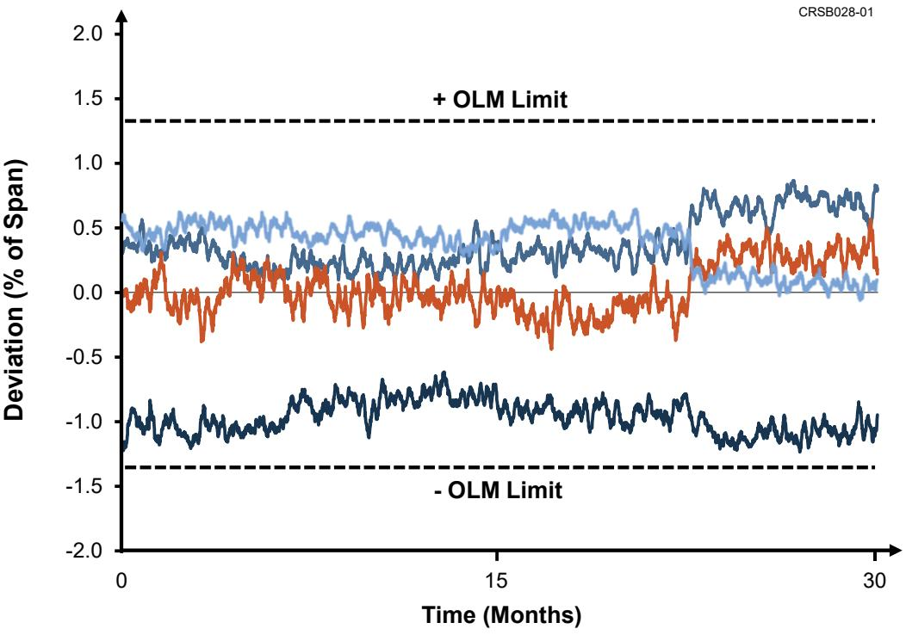

**Figure 3.1. OLM Data for Four Redundant SG Level Transmitters**

(Source of Data: McGuire Nuclear Power Plant Unit 2 – NUREG/CR 6343)

In arriving at the deviation plot in [Figure 3.1,](#page-19-1) an estimate of the true SG level was first obtained by averaging the four signals. Chapter [6](#page-35-0) describes the averaging techniques used to arrive at a true process estimate. Next, the process estimate was subtracted from the reading of each transmitter to yield the deviation of each transmitter from the average. The OLM limits for the SG level transmitters are also shown with the dotted lines in [Figure 3.1.](#page-19-1) Chapter [7](#page-52-0) describes how these limits are calculated.

It is obvious from the four traces in [Figure 3.1](#page-19-1) that the four McGuire transmitters did not drift over the two operating cycles shown in the figure and in fact remained well within the plant's OLM limits. With this information, it is reasonable to claim that the calibrations of these transmitters are intact. However, it is important to note that this claim would be true only if the four transmitters did not all drift together in either the positive or negative direction (i.e. common-mode drift). If there is no common-mode drift, then their average value is a close representation of the true process. The potential for common mode drift in nuclear grade pressure transmitters and a summary of information and data on how common mode drift has been ruled out for these transmitters is discussed in Section [3.3](#page-20-0) below.

#### **3.3 COMMON MODE DRIFT**

Over the past three decades, numerous statistical studies of calibration records have been performed by the nuclear industry to understand the nature of drift in nuclear grade transmitters. Most of these studies have been performed using the As-Found/As-Left (AFAL) methodologies described in related reports of the Electric Power Research Institute (EPRI) [\[11,](#page-111-6) [12\]](#page-111-7) and in the NUREG-1475 [\[13\]](#page-111-8). A summary of some prominent studies is presented in this section. These studies have concluded that the drift of nuclear grade transmitters is random with no evidence of common-mode drift.

[Figure 3.2](#page-21-0) shows manual calibration data over a period of ten years for a nuclear grade transmitter whose calibration was checked once a year at a nuclear facility. Clearly the calibration of this transmitter changed randomly from one year to another and remained well within its "as-found" limits requiring no adjustment to the transmitter's zero or span setting for the entire ten-year period. This random change in calibration is typical not only for nuclear plant pressure, level, and flow transmitters but also for the Resistance Temperature Detectors (RTDs) that are used in the primary coolant systems of pressurized water reactors (PWRs). This claim has been confirmed by a number of objective studies including laboratory experiments to characterize the nature of drift in nuclear grade sensors and "as found" data from thousands of calibrations in nuclear power plants. For example, an R&D project performed by AMS and documented in NUREG/CR-5560 [\[14\]](#page-111-9) demonstrated through laboratory experiments involving hundreds of sensors and thousands of tests that the drift of nuclear grade RTDs is indeed random. The same has been concluded for transmitters based on operating experience rather than laboratory experiments.

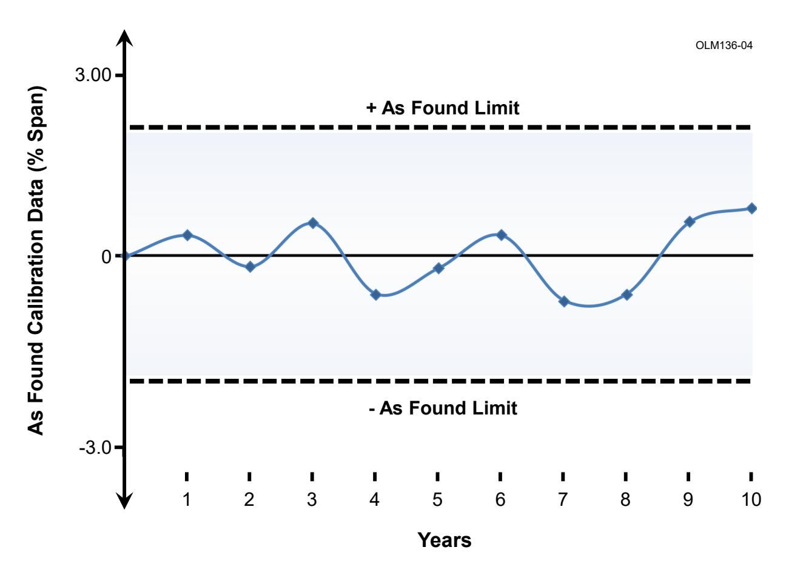

**Figure 3.2. Typical Calibration Behavior of Nuclear Grade Transmitters**  (Source of Data: Advanced Test Reactor)

Reviews of Licensee Event Report (LER) and Nuclear Plant Reliability Data System (NPRDS) databases performed by AMS and documented in NUREG/CR-5383 [\[15\]](#page-111-10) and NUREG/CR-5851 [\[16\]](#page-112-0) revealed no common-mode drift in nuclear plant sensors. The focus of these projects, however, was on aging characteristics of nuclear plant pressure transmitters and not on analysis of their failure modes or an objective assessment of common mode drift.

Another illustration in support of the random nature of transmitter drift is provided in [Figure 3.3](#page-22-1) and is based on manual calibration data of a group of redundant nuclear grade transmitters in the same service in a PWR plant. The bar graph and the bell-shaped curve that is superimposed on the graph demonstrate that the drift of a population of nuclear grade transmitters is random. This figure shows that the drift of a group of transmitters in the same service over a long period of time (e.g., ten years) is randomly distributed in the positive and negative directions above and below the mean value of the drift.

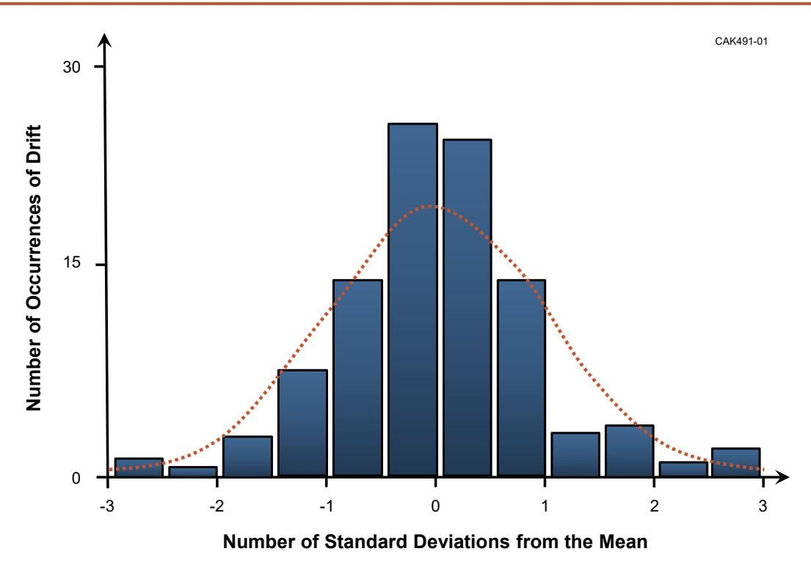

**Figure 3.3. Histogram of Transmitter Drift Values**

#### **3.3.1 EPRI Drift Study**

EPRI sponsored a transmitter drift study using manual calibration records from eighteen nuclear power plants. This work was in support of EPRI's topical report to NRC in the year 2000 requesting approval to extend the calibration intervals of nuclear plant pressure, level, and flow transmitters (TR-104965-R1-NRC-SER [\[1\]](#page-111-1)). The study included approximately 6,700 calibration records from 1,139 transmitters with over 33,000 AFAL data points. Transmitter manufacturer types represented in the study included Rosemount, Barton, Foxboro, Veritrak, Tobar, and others. The work produced the following conclusions:

- 1. The existing generation of nuclear grade pressure, level, and flow transmitters are as likely to drift up as they are to drift down and almost none had any bias errors.
- 2. For those plants that performed a nine-point calibration, hysteresis was usually negligible.
- 3. Redundant transmitters measuring the same process variable did not exhibit a tendency to drift as a group. That is, a transmitter being out of calibration did not indicate that the other redundant transmitters in the same group were likely to be out of calibration.
- 4. Failure modes were not observed in the data whereby transmitters failed in ways that would be undetectable by online monitoring. For example, transmitters did not get stuck at a fixed level where their output signal remained constant regardless of the input variations.

## **3.3.2 PWROG Drift Study**

In 2017, the Westinghouse Pressurized Water Reactor Owners Group (PWROG) performed a drift analysis on transmitters used for safety-related services in Westinghouse PWRs [\[17\]](#page-112-1). The purpose of this study was to support the TSTF-425 approach to extend transmitter calibration intervals one cycle at a time (TSTF-425 approach is explained in Section [3.5\)](#page-28-0). The drift analysis methodologies and statistical techniques were based on industry-accepted practices described in EPRI report 3002002556 [\[12\]](#page-111-7) and NUREG-1475 [\[13\]](#page-111-8). The analysis included over 20,000 calibration records from forty-one PWR units representing three nuclear steam supply system (NSSS) vendors and five transmitter manufacturers being Rosemount, Barton, Foxboro, Tobar-Veritrak, and Gould-Statham. In addition to supporting TSTF-425, this work concluded that the drift of safety-related transmitters in PWR plants is random with no evidence of time-dependent drift.

## **3.3.3 Sizewell Drift Studies**

In 2001, a transmitter drift study was performed by Sizewell nuclear power plant in the United Kingdom to establish the drift behavior of its safety-related transmitters. This included Barton Transmitter models 763, 764, and 752 as well as transmitters from a British supplier by the name of KDG-Mobrey. The study involved a statistical analysis of manual calibration records from January 1995 to February 2001 using the Single Calibration Regression Methodology (SCRM) developed by the British utility company operating Sizewell B [\[18\]](#page-112-2).

The results indicated that the drift of the transmitters is random, and their hysteresis error is negligible. These conclusions were further confirmed through a second study by EPRI of Sizewell's AFAL data from 1995 to 2002 focused on 140 safety-related transmitters including Barton models 763, 764, and 752 [\[19\]](#page-112-3).

#### **3.4 DETECTING TRANSMITTER FAILURE MODES WITH OLM**

Two major failure modes and effects analysis (FMEA) have been performed by EPRI on calibration and response time of nuclear grade pressure, level, and flow transmitters in nuclear power plants [\[20,](#page-112-4) [21\]](#page-112-5). This section summarizes the main conclusions of these reports as to how potential failure modes in these transmitters manifest themselves in their calibration or response and which failure modes are detectable by OLM. But first, it should be noted that EPRI uses the term "Instrument Calibration Monitoring Program" or ICMP to refer to essentially the same technology as OLM and thus the words OLM and ICMP are viewed as synonymous in this report. As such, in describing the FMEA studies of EPRI in this chapter, OLM has been substituted in instances where EPRI used the term ICMP.

#### **3.4.1 Calibration Failure Modes Detectable By OLM**

In the EPRI report '*Instrument Calibration and Monitoring Program (ICMP) Volume 2: Failure Modes and Effects Analysis' (1993)*, FMEA results are presented for three types of pressure transmitters based on their underlying measurement principle being force balance, strain gauge, or capacitance and the capability of OLM to detect calibration failure modes in these transmitter types. These results are summarized below for each of the three transmitter types.

**Force-Balance Transmitters:** FMEA analysis of these transmitters identified fourteen possible failure modes; all but one of which are detectable by OLM. Of these, nine can be detected by OLM during normal plant operation, one during transient operation, and three during either modes of operation. The single failure mode that cannot be detected by OLM is a change in viscosity of the fill fluid; usually caused by changes in environmental conditions (e.g., temperature or radiation). The change in the fill fluid viscosity can result in a change in response time which is not detectable by OLM. However, normal variations in these conditions producing this failure mode are considered in the "design-basis" of these transmitters and "beyond-design-basis" conditions are rather unlikely because equipment qualification (EQ) performed on safety-related transmitters would have revealed the failure.

**Strain Gage Transmitters:** FMEA analysis of these transmitters identified eleven failure modes; all but one of which are detectable by OLM during normal plant operation. The single failure mode that cannot be detected by OLM in this type of transmitter is the same as the one discussed above for force balance transmitters (i.e., a change in fill fluid viscosity that causes response time changes). An analysis of consequences of this failure mode for the force balance and strain gage transmitters showed identical results with the exception that response time is not as sensitive to viscosity in strain gage transmitters as it is in force-balance transmitters.

**Capacitance Transmitters:** FMEA findings for these transmitters were different than those of the two discussed above. For capacitance transmitters, EPRI identified ten failure modes; eight of which can be detected by OLM. Of these, six failure modes are detectable by OLM during normal plant operation, one during transient operation, and one during initial calibration of transmitters. The two undetectable failure modes are again response time related with the first being the fill fluid viscosity change. The other failure mode that is not detectable by OLM is a potential blockage of the holes in the ceramic inserts used in capacitance transmitters. These components transport the fill fluid between the isolation diaphragm and the sensing diaphragm. Therefore, if the flow of fluid becomes restricted by a blockage, response time can degrade.

The OLM methodology detects these failure modes by comparing the transmitter performance to other transmitters using simple and parity space averaging methods described in Chapte[r 6,](#page-35-0) OLM limits in Chapter [7,](#page-52-0) and methodology in Chapter [11.](#page-92-0)

Since the purpose of OLM is to provide a means to defer calibrations of the transmitters based on the OLM results, the discussion of failure modes is focused on transmitters. The OLM methodology is not intended to extend the calibration of other elements in the safety signal path, nor does it detect every potential failure mode in the signal path.

#### **3.4.2 Failure Modes Detectable by Response Time Testing**

The EPRI report 'Investigation of Response Time Testing Requirements (1991)' examined fourteen pressure transmitters from five manufacturers to determine what failure modes were detectable by response time testing and likely to occur during service in a nuclear power plant. In all, FMEA identified two failure modes which would affect a transmitter response time while not concurrently impacting its calibration: 1) slow sensor fill fluid leaks during pressurized operation, and 2) misadjustment of the variable damping potentiometer. Various types of fill fluid leaks are possible depending on transmitter design, seal failures, and pressure conditions in service. The only confirmed occurrence of a fill fluid leak leading to response time degradation has been in Rosemount transmitters, which is known in the industry as the "Rosemount Oil Loss" problem. The latter failure, damping potentiometer misadjustment, can only occur from human error during transmitter maintenance or calibration.

Also, two manufacturing defects were identified as failure modes that could affect sensor response time: low sensor fill fluid and crimped capillary lines. An analysis of these failure modes determined that they could be addressed using either post manufacturing benchtop response time testing or post-installation response time testing prior to normal operation.

The OLM methodology can be used as described in Section [11.2](#page-105-0) to develop procedures to detect response time problems (e.g., sensing line blockage) using the noise analysis technique. Experience has shown that sensing line blockage is the main cause of response time problems, but it is not detectable by transmitter calibration.

#### **3.4.3 Summary of FMEA Results**

EPRI identified 54 failure modes for three types of nuclear grade transmitters; 46 of which can be detected by OLM as shown in [Table 3.1.](#page-26-0) Each of the 54 failure modes are identified in the table together with an assessment as to whether or not the failure mode can be determined by response

time testing and/or OLM. Note that the 54 failure modes listed in Table 3.1 were arrived at by combining the FMEA information in the two EPRI reports on transmitter calibration extension and response time elimination.

The FMEA analysis did not include the sensing lines. Sensing lines can develop blockages and their isolation and equalizing valves can fail causing delays in the ability of the affected pressure sensing system to respond to a transient. The OLM technology can identify sensing line blockages if its data is sampled at a high frequency (e.g., 1000 Hz) and processed using the noise analysis technique that is described in Chapter 11.

**Table 3.1. Summary of FMEA for Nuclear Grade Pressure Transmitters** 

| Number | Sensor Type              | Failure Mode                               | Response Time Detectable | OLM Detectable |
|--------|--------------------------|--------------------------------------------|--------------------------------|-------------------|
| 1      |                          | Force bar/ linkage pivot point degradation | No                             | Yes               |
| 2      |                          | Force bar/ linkage excessive friction      | No                             | Yes               |
| 3      |                          | Feedback coil burnout                      | Unknown                        | Yes               |
| 4      |                          | Feedback coil magnet aging                 | No                             | Yes               |
| 5      |                          | Detector armature loosening                | No                             | Yes               |
| 6      |                          | Change in zero adjustment spring force     | No                             | Yes               |
| 7      | Force Balance            | Housing seal process fluid leak            | No                             | Yes               |
| 8      | Pressure Transmitters | Bent force bar/linkage                     | Unknown                        | Yes               |
| 9      |                          | Sensing diaphragm leak                     | Yes                            | Yes               |
| 10     |                          | Sensing diaphragm deformation              | Unknown                        | Yes               |
| 11     |                          | Diaphragm loss of pressure barrier         | No                             | Yes               |
| 12     |                          | Electronic component failure               | No                             | Yes               |
| 13     |                          | Increased fill fluid viscosity             | Yes                            | No                |
| 14     |                          | Fill plug pressure boundary loss           | Unknown                        | Yes               |
| 15     |                          | Incorrect strain characteristic            | No                             | Yes               |
| 16     |                          | Strain gage beam deformation               | Unknown                        | Yes               |
| 17     |                          | Increased fill fluid viscosity             | Yes                            | No                |
| 18     | Strain Gage Pressure  | Bourdon tube/force bar deformation         | Unknown                        | Yes               |
| 19     | Pressure Transmitters | Bourdon tube leak                          | No                             | Yes               |
| 20     |                          | Bourdon tube/force bar detachment          | Yes                            | Yes               |
| 21     |                          | Housing seal pressure boundary loss        | No                             | Yes               |
| 22     |                          | Isolation diaphragm pressure boundary loss | No                             | Yes               |

No: Not detectable Yes: Detectable

Unknown: Not listed in one of the two EPRI reports

Table 3.1. Summary of FMEA for Nuclear Grade Pressure Transmitters (continued)

| Number | Sensor Type             | Failure Mode                                         | Response Time Detectable | OLM Detectable |
|--------|-------------------------|------------------------------------------------------|--------------------------------|-------------------|
| 23     |                         | Process chamber housing leak                         | No                             | Yes               |
| 24     |                         | Fill plug leak                                       | No                             | Yes               |
| 25     |                         | Electronic component performance change              | No                             | Yes               |
| 26     |                         | High pressure bellows incorrect spring               | No                             | Yes               |
| 27     |                         | High pressure bellows spring constant change         | No                             | Yes               |
| 28     |                         | Fill plug seal fill fluid leak; small                | No                             | No                |
| 29     |                         | Fill plug seal fill fluid leak; large                | No                             | Yes               |
| 30     |                         | Strain gage feed through seal fill fluid leak; small | No                             | No                |
| 31     | Strain Gage             | Strain gage feed through seal fill fluid leak; large | No                             | Yes               |
| 32     | Pressure                | Valve stem shaft incorrect position                  | No                             | Yes               |
| 33     | Transmitters            | Valve stem shaft position change                     | No                             | Yes               |
| 34     |                         | High pressure bellows overrange valve                | No                             | Yes               |
| 35     |                         | Low pressure bellows overrange valve                 | No                             | Yes               |
| 36     |                         | Low pressure bellows incorrect spring                | No                             | Yes               |
| 37     |                         | Low pressure bellows spring constant change          | No                             | Yes               |
| 38     |                         | High pressure inlet leak                             | No                             | Yes               |
| 39     |                         | Low pressure inlet leak                              | No                             | Yes               |
| 40     |                         | Ceramic insulation crack / porosity                  | No                             | Unknown           |
| 41     |                         | Electrical isolation leakage path                    | No                             | No                |
| 42     |                         | Sensing diaphragm leakage                            | Yes                            | Yes               |
| 43     |                         | Electronics cover seal pressure boundary loss        | Unknown                        | Yes               |
| 44     |                         | Electronics package shorting                         | Yes                            | Yes               |
| 45     |                         | Sensing cell process fluid leakage                   | No                             | Yes               |
| 46     |                         | Fill fluid chemical changes                          | No                             | Yes               |
| 47     | Generic                 | Increased fill fluid viscosity                       | Yes                            | No                |
| 48     | Capacitance Pressure | Underfill of fill fluid                              | Yes                            | Yes               |
| 49     | Transmitters            | Fill tube leak                                       | Yes                            | Yes               |
| 50     |                         | Ceramic insert partial blockage                      | Yes                            | No                |
| 51     |                         | Ceramic insert severe blockage                       | Yes                            | Yes               |
| 52     |                         | High / low pressure isolation diaphragm leak         | Yes                            | Yes               |
| 53     |                         | High / low pressure isolation diaphragm weld failure | Yes                            | Yes               |
| 54     |                         | High / low pressure cell cup to glass seal leak      | Yes                            | Yes               |

No: Not detectable Yes: Detectable

Unknown: Not listed in one of the two EPRI reports

## **3.5 OLM AND TSTF OPTIONS TO EXTEND TRANSMITTER CALIBRATION INTERVALS**

Two efforts are currently underway to extend the calibration intervals of transmitters used to measure process pressure, level, and flow in nuclear power plants. One is through the use of OLM as described in this report and the other is based on historical data and probabilistic risk assessment (PRA). The latter approach is called the Technical Specification Task Force (TSTF) approach or just TSTF approach. In particular, TSTF 425 entitled "Relocate Surveillance Frequency to Licensee Control" was written by the nuclear industry and approved by the NRC to allow plants to move the surveillance frequency requirements for plant equipment from their technical specifications (TS) to plant specific "Surveillance Frequency Control Program" or SFCP [\[22\]](#page-112-6).

The SFCP specifies the frequency by which equipment performance must be verified and implemented according to guidance in a document from the Nuclear Energy Institute (NEI) that is referred to as NEI 04-10 entitled "Risk Informed Method for Control of Surveillance Frequency" [\[23\]](#page-112-7). NEI 04-10 describes 20 steps that must be addressed to implement SFCP. For example, in the case of calibration frequency extension for transmitters, the industry must demonstrate that there is little or no evidence of performance degradation affecting plant safety margins over a single operating cycle. If a plant can objectively demonstrate that avoiding unnecessary calibrations has negligible effect on the plant safety margins, then the plant is able to extend the frequency of its transmitter calibrations from every operating cycle to every other operating cycle or longer. In particular, to be able to extend transmitter calibration intervals, the industry must show through PRA that there is no significant change in core damage frequency (CDF) and large early release frequency (LERF) if the calibration frequency of transmitters is extended beyond current limits. This approach has already been demonstrated by PWROG in document PWROG-15057-P entitled "Pressure and Differential Pressure Transmitter Calibration Frequency Extension PA-SEE-0625" [\[24\]](#page-112-8). Furthermore, NEI 04-10 specifies that a monitoring program must be established to verify the performance of equipment affected by extending the surveillance test intervals (STI). For this purpose, OLM as described in this document can be used. In addition to monitoring for drift, OLM can also be used to identify sensing line blockages with the noise analysis technique which has been used in the nuclear industry for decades to perform equipment and process surveillance and diagnostics [\[25,](#page-112-9) [26\]](#page-112-10). The noise analysis technique has been used since 2005 at the Sizewell B nuclear power plant in the United Kingdom for sensor response time testing and detection of sensing line blockages and was adopted in 2019 by SNOC at its Vogtle nuclear power stations Units 1 and 2 in connection with OLM implementation. Chapter [11](#page-92-0) describes how the noise analysis technique is implemented in nuclear power plants to detect and quantify sensing line blockages.

## **4 HISTORY OF TRANSMITTER CALIBRATIONS AND RESPONSE TIME TESTING**

Periodic calibrations and response time measurements have been performed once every fuel cycle on all safety system transmitters in nuclear power plants since the 1970s providing a huge volume of data. This data was analyzed by EPRI in the early 1990s which concluded that the performance of most nuclear grade pressure, level, and flow transmitters is rather stable, and they do not therefore have to be calibrated or response time tested as often as once every operating cycle. This conclusion stimulated EPRI to launch two efforts to accomplish the following objectives on behalf of the nuclear power industry:

- 1. Eliminate periodic response time testing requirements for pressure, level, and flow transmitters.
- 2. Develop OLM technologies to extend the frequency of calibrations of pressure, level, and flow transmitters.

The effort to eliminate transmitter response time testing requirements provided the foundation for PWR and boiling water reactor (BWR) vendors to seek SERs to help their fleet cease transmitter response time testing. In particular, the NP-7243 report by EPRI first published in 1991 [\[20\]](#page-112-4) served as the basis for topical reports WCAP-13632 of Westinghouse [\[27\]](#page-112-11), NPSD-1167-A (Rev. 2) report of Combustion Engineering (CE) [\[28\]](#page-112-12), and NEDC-32013 report of BWR owners group [\[29\]](#page-112-13) leading to SERs providing relief to most PWR and BWR plants in the U.S. This approach requires that any replacement transmitter or new transmitter design for which adequate performance data is not available or analyzed to be response time tested before it is placed in service.

Although EPRI was successful in obtaining regulatory relief for the nuclear industry from response time testing of transmitters, its efforts to obtain relief from unnecessary calibrations have not yet materialized except for the Sizewell B nuclear plant in the U.K. This is in spite of the fact that in the late 1990s, EPRI submitted a topical report to the NRC leading to an SER in September 2000 authorizing the use of OLM for transmitter drift monitoring subject to fourteen requirements for plant-specific implementation [\[1\]](#page-111-1). Subsequently, the nuclear industry addressed many of these plant-specific action items and the utility operating V.C. Summer nuclear power plant applied to the NRC for approval to implement OLM to extend the calibration interval of its transmitters [\[30\]](#page-112-14). However, following a short period of interaction between the utility and NRC and before any NRC ruling, V.C. Summer's application to implement OLM was withdrawn by the utility, and no further attempts were made by this or any other U.S. plant to seek NRC approval to implement OLM.

Presumably, the nuclear industry found a few of NRC's plant-specific action items in the SER to be too restrictive and costly to resolve and therefore abandoned its efforts to take advantage of the SER to extend the calibration intervals of transmitters. At the request of the NRC, the fourteen plant-specific action items in the SER are included in [Appendix A](#page-116-1) together with responses from AMS as to how these topics are treated with the OLM methodology described in this TR. Today, nearly 20 years have passed since the NRC issued the first SER on OLM, and in that time the following has taken place:

- Additional operating experiences demonstrating that the current generation of nuclear grade pressure, level, and flow transmitters do not normally drift enough to need a calibration at each refueling outage.
- Continued research by the nuclear industry and academia to advance the state-of-theart in OLM and address the known technical questions and regulatory concerns such as the potential for common-mode drift.
- AMS implementation of OLM at over ten U.S. PWRs and one U.S. BWR on demonstration basis with grants or collaboration agreements provided to AMS from DOE, NRC, EPRI, or utilities.
- OLM implementation with approval of DOE regulators to extend sensor calibration intervals at the Advanced Test Reactor (ATR), a 250 MW plant located at the Idaho National Laboratory (INL).
- Successful OLM implementation at the U.K.'s Sizewell B nuclear power plant with approval of British regulators.
- PRA work by EPRI and others showing the negligible risk of extending transmitter calibration intervals using OLM.

These developments support the technical justification for widespread implementation of OLM with the NRC approval to extend the calibration intervals of pressure, level, and flow transmitters in nuclear power plants.

## **5 RELATED REGULATIONS AND STANDARDS**

A summary of NRC regulatory requirements and acceptance criteria for I&C systems important to safety is found in Standard Review Plan (SRP), NUREG-0800, Table 7-1 [\[31\]](#page-112-15). AMS reviewed this table and other sources to define the scope of the regulatory requirements and acceptance criteria that applies to OLM. The results are presented below starting with a summary of verbatim extracts from the United States Code of Federal Regulations (CFR) followed by summaries of related national and international standards and guideline documents including those of the Institute of Electrical and Electronics Engineers (IEEE), International Electrotechnical Commission (IEC), International Society of Automation (ISA), and International Atomic Energy Agency (IAEA).

**10 CFR 50.36 Technical Specifications.** Part (3) of this regulation sets the governing requirements for the inclusion of Surveillance Requirements in the Technical Specifications included in the Operating License for a commercial nuclear power plant.

"(3) *Surveillance requirements*. Surveillance requirements are requirements relating to test, calibration, or inspection to assure that the necessary quality of systems and components is maintained, that facility operation will be within safety limits, and that the limiting conditions for operation will be met."

*AMS proposes to use its OLM methodology as the technical basis to support plant-specific Technical Specification changes to switch from time-based surveillance frequency for channel calibrations to a condition-based calibration frequency based on OLM results.*

**10 CFR Part 50 Appendix A.** General Design Criterion 21, "Protection System Reliability and Testability," requires, in part, that plant protection systems be designed to permit periodic testing during reactor operation, including a capability to test channels independently to determine failures and losses of redundancy that may have occurred.

*"Criterion 21, Protection System Reliability and Testability*. The protection system shall be designed for high functional reliability and in-service testability commensurate with the safety functions to be performed. Redundancy and independence designed into the protection system shall be sufficient to assure that (1) no single failure results in loss of the protection function and (2) removal from service of any component or channel does not result in loss of the required minimum redundancy unless the acceptable reliability of operation of the protection system can be otherwise demonstrated. The protection system shall be designed to permit periodic testing of its functioning when the reactor is in operation, including a capability to test channels independently to determine failures and losses of redundancy that may have occurred."

*AMS proposes to use its OLM methodology as the technical basis to support plant-specific Technical Specification changes to switch from time-based surveillance frequency for channel calibrations to a condition-based calibration frequency based on OLM results. The OLM methodology can also be used to detect blockages of the associated sensing lines.*

**Regulatory Guide 1.118, Revision 3**. Regulatory Guide 1.118, Revision 3, "Periodic Testing of Electric Power and Protection Systems," endorses "with qualification" the IEEE Standard 338- 1987, "IEEE Standard Criteria for the Periodic Surveillance Testing of Nuclear Power Generating Station Safety Systems".

*AMS proposes to use its OLM methodology as the technical basis to support plant-specific Technical Specification changes to switch from time-based surveillance frequency for channel calibrations to a condition-based calibration frequency based on OLM results.*

**IEEE Standard 338-1977**. This standard contains the following requirements related to calibration:

- *6.3.3 Channel Calibration Verification Tests.* "A channel calibration verification test should prove that with a known precise input, the channel gives the required output, analog, or bistable. Additionally, in analog channels, linearity and hysteresis may be checked. If the required output is achieved, the test is acceptable. If the required output is not achieved (for example, the bistable trip did not occur at the required set point or the analog output was out of tolerance) or saturation or foldover is observed and adjustment or alignment of gain, bias, trip set, etc., is required, the test is unacceptable. Adjustment or alignment procedures are maintenance activities and are outside the scope of this standard. Test results, however, shall be recorded in accordance with ANSI/ANS 3.2- 1982, or the equivalent. Following maintenance or other appropriate disposition of the unacceptable results, a successful rerun of the channel calibration verification test shall be performed."
- *6.5.2 Changes to Test Interval.* The effect of testing intervals on performance of equipment shall be reevaluated periodically to determine if the interval used is an effective factor in maintaining equipment in an operational status. The following shall be considered:
  - History of equipment performance, particularly experienced failure rates and potential significant increases in failure rates.
  - Corrective action associated with failures.
  - Performance of equipment in similar plants or environment, or both.
  - Plant design changes associated with equipment.
  - Detection of significant changes of failure rates.

"Test intervals may be changed to agree with plant operational modes provided it can be shown that such changes do not adversely affect desired performance of the equipment being tested. Tests need not be performed on systems or equipment when they are not required to be operable or are tripped. If tests are not conducted on such systems, they shall be performed prior to returning the system to operation."

*5.3.3.2 On-line monitoring (from 2012 Version of IEEE Standard 338).* "On-line monitoring (OLM) techniques enable the determination of portions of an instrument channel's status during plant operation. This methodology is an acceptable input for establishing calibration frequency of those monitored portions of instrument channels without adversely affecting reliability.

Continuous monitoring shall be employed, e.g., through the plant computer. Periodic manual testing is either a maintenance or surveillance task and is not on-line monitoring.

On-line monitoring shall ensure that setpoint calculation assumptions and the safety analysis assumptions remain valid."

*AMS proposes to use its OLM methodology as the technical basis to support plant-specific Technical Specification changes to switch to time-based surveillance frequency for channel calibrations to a condition-based calibration frequency based on the OLM results for a given transmitter.*

**IEEE Standard 338 (2012), Criteria for the Periodic Surveillance Testing of Nuclear Power Generating Station Safety.** This standard provides criteria for periodic testing as a part of the surveillance program of nuclear power plant safety systems. The periodic testing consists of functional tests, calibration verification, and response time measurements.

**ISA Standards 67.06 (1984) and 67.06.01 (2002), Performance Monitoring for Nuclear Safety-Related Instrument Channels in Nuclear Power Plants.** This standard was originally written in the early 1980s to describe the methods for measuring the response times of temperature and pressure sensors in nuclear power plants. It was revised in the late 1990s to include online monitoring techniques for verifying the calibration of process instrumentation of nuclear power plants during plant operation.

The title of the original 67.06 standard, published by ISA in 1984, is "Response Time Testing of Nuclear Safety-Related Instrumentation Channels in Nuclear Power Plants." The new revision was published in 2002 with the title "Performance Monitoring for Nuclear Safety-Related Instrument Channels in Nuclear Power Plants."

**ISA Standard 67.04.01 (2018), Setpoints for Nuclear Safety-Related Instrumentation.** This standard defines the basis for establishing safety-related and other important instrument setpoints associated with nuclear power plants.

**International Standards and Guidelines**. There are several international documents available that provide guidance on meeting the requirements of regulatory authorities for performance monitoring of safety-related transmitters. A few examples are:

- • IEC Standard 62385 (2007) [\[32\]](#page-112-16), "Methods for assessing the performance of safety system instrument channels." This standard provides requirements for testing the performance of nuclear plant sensors. It applies to temperature, pressure, level, and flow sensors.
- IAEA Nuclear Energy Series NP-T-1.1, "On-Line Monitoring for Improving Performance of Nuclear Power Plants", Part 1 "Instrumentation Channel Monitoring [\[33\]](#page-112-17)," and Part 2 "Process and Component Condition Monitoring and Diagnostics [\[34\]](#page-113-0)," 2008.
- • IAEA Nuclear Energy Series NP-T-3.14 [\[7\]](#page-111-2), "Advanced Surveillance, Diagnostics, and Prognostic Techniques in Monitoring Structures, Systems, and Components in Nuclear Power Plants," 2013.

OLM has been embraced for equipment condition monitoring including calibration and response time monitoring not only in power reactors but also in research reactors. In the year 2020, IAEA published a report titled "Condition Monitoring and Incipient Failure Detection of Rotating Equipment in Research Reactors (IAEA-TECDOC-1920)" that uses OLM technology for rotating equipment diagnostics [\[35\]](#page-113-1). This is the second IAEA report on OLM. The first one published in 2017 titled "On-line Monitoring of Instrumentation in Research Reactors (IAEA-TECDCO-1830)" was written to describe the application of OLM for sensor calibration and response time monitoring in research reactors [\[36\]](#page-113-2). AMS implementation of OLM for rotating machinery diagnostics at the High Flux Isotope Reactor (HFIR) at the Oak Ridge National Laboratory (ORNL) and calibration and response time monitoring of sensors at ATR motivated the development of these IAEA documents for research reactors [\[37,](#page-113-3) [38\]](#page-113-4).

#### **6 OLM DATA ACQUISITION AND ANALYSIS**

#### 6.1 OLM DATA ACQUISITION

Nuclear power plants are often equipped with the means to continuously collect and store the outputs of their process sensors which can be retrieved from the plant computer or through its data historian. Typically, the sensor output readings are converted to engineering units, time stamped, and stored as shown in Figure 6.1 for three redundant level transmitters in a PWR plant. Chapter 11 outlines the steps that must be taken to acquire OLM data for drift monitoring. If the data is not available from the plant computer or its historian, a separate data acquisition system must be used as described in Chapter 11 to acquire the OLM data. The sampling rate and duration of OLM data acquisition are important to the reliability of its results and must be selected carefully to capture all the information that is needed to establish the performance of the sensors. As such, Chapter 8 is dedicated in this report to this subject.

Typically, pressure, level, or flow in nuclear power plants is measured with a transmitter in the field which outputs a 4-20 mA current signal. This output is converted to a 1-5 V signal and supplied to a bistable for safety-related trips (Figure 6.2). The same signal also goes through an isolation amplifier before it is converted to digital data and stored in the plant computer. The data path from the isolation amplifier to the plant historian is not a part of the safety protection instrumentation. Therefore, the string of equipment to isolate, digitize, and output the data to plant computer and its historian is equivalent to M&TE as shown by the dotted box in Figure 6.2. More specifically, the process of acquiring OLM data is equivalent to using M&TE to make a measurement.

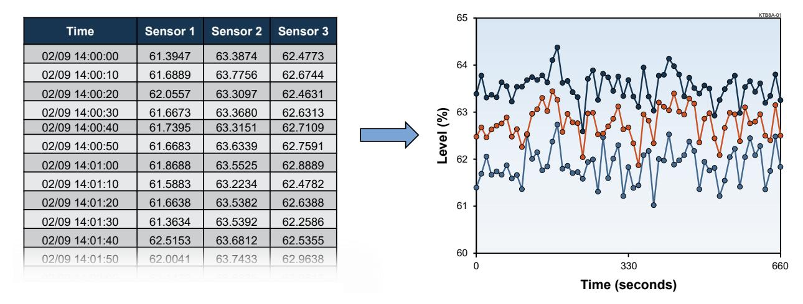

Figure 6.1. OLM Data from a PWR Plant Computer

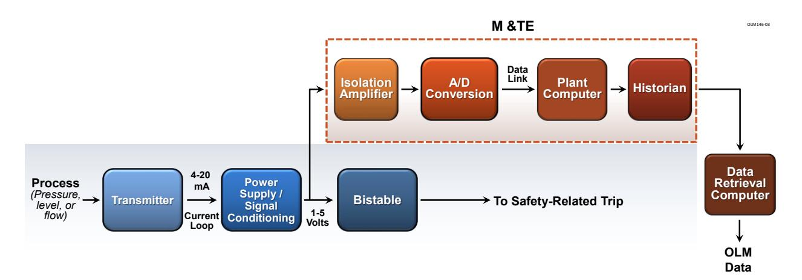

**Figure 6.2. Plant Equipment in the OLM Data Path**

#### **6.2 OLM DATA QUALIFICATION**

The raw data from the plant computer or its data historian is not usually ready for analysis immediately after it is retrieved. The data can be compressed or have areas of missing regions or stuck data values, spikes, noise, or other anomalies. These effects are normally benign to the plant operation and safety but must be addressed as described below to qualify the OLM data for analysis.

#### **Data Compression**

OLM data in most plants is typically retrieved from the plant historian where the data is permanently stored. To save storage space, historians do not store the same data values over and over. Rather, they store a data point only if its value has changed significantly, or if a certain amount of time between data points has elapsed. The criterion that is set in the historian to reduce storage requirements is referred to as the compression setting and the data that has been subjected to this criterion is referred to as "compressed" or "historized". An example of a commonly used historian in nuclear power plants is the "PI" historian from OSIsoft company.

[Figure 6.3](#page-37-0) shows OLM traces for three pressure signals from a PWR plant computer. If these signals were retrieved from the plant historian (with its compression set at 0.5 PSI), the results would be the big dots shown in [Figure 6.4.](#page-37-1) The historian interpolates between the historized data points and thereby produces data values for any instant of time as shown by the lines made of the small dots in [Figure 6.4.](#page-37-1) It is clear from the data in [Figure](#page-37-0)  [6.3](#page-37-0) that compression causes the higher frequency signals to be lost. Therefore, the compression setting should be turned off or reduced as much as possible during OLM data acquisition.

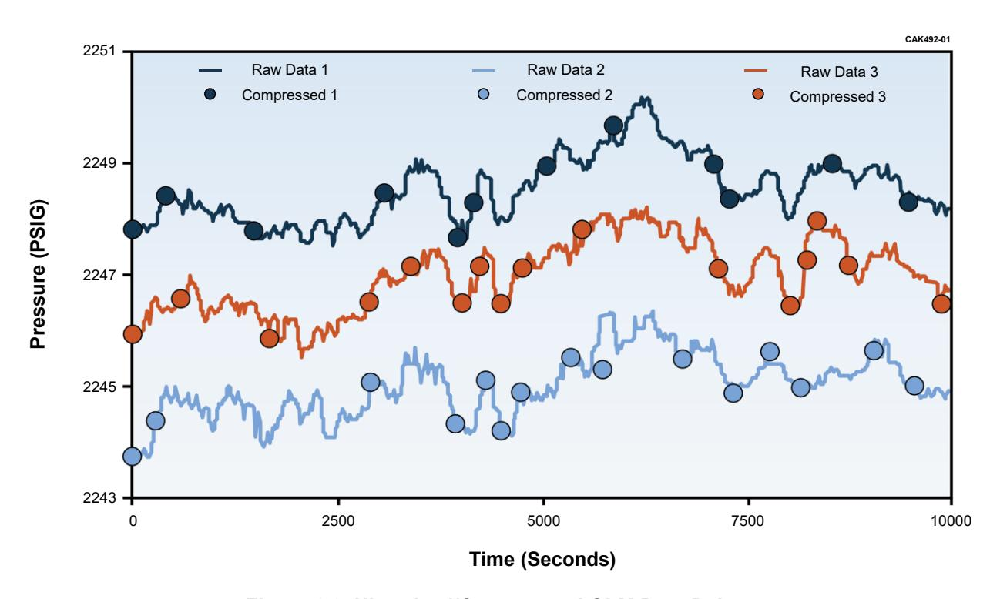

Figure 6.3. Historized/Compressed OLM Data Points

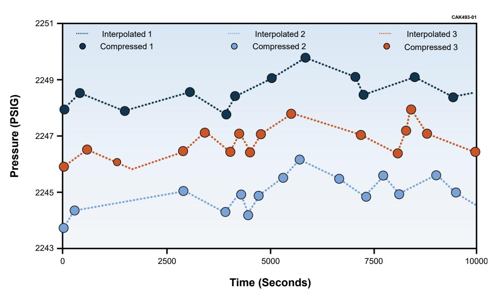

Figure 6.4. Compressed Data Points Interpolated by Plant Historian

#### **Missing Data**

There are sometimes gaps in the plant computer data for one or more transmitters. This occurs for a variety of reasons such as maintenance work while OLM data is being collected. If this happens, the missing portion of data for the affected transmitters and their redundant counterparts are simply ignored and the remaining data processed to arrive at OLM results. [Figure 6.5](#page-39-0) shows examples of missing data from plant computers at the McGuire, Sizewell B, and Vogtle nuclear power plants where AMS has implemented OLM.

#### **Spikes and Outliers**

Plant computer data can contain spikes and anomalies caused by channel checks or transmitter calibration activities. [Figure 6.6](#page-40-0) shows examples of OLM data containing spikes as well as OLM data collected while a transmitter was being calibrated in the field. If this occurs, the portion of affected OLM data is removed, and the remaining data is used for subsequent analysis.

#### **Stuck Data**

OLM data can sometimes contain 'dead' spots where the reading of one or more transmitters remains fixed at a value for a period of time as shown in [Figure 6.7.](#page-41-0) To overcome this anomaly, the affected portions of the data are removed for all redundant transmitters in the group and the remaining data is used for OLM analysis.

#### **Noisy Data**

Depending on sampling frequency, OLM data retrieved from the plant computer or acquired using a stand-alone data acquisition system can contain fluctuations that must be removed or reduced before analysis. Experience has shown that simple filters such as median filters work well with noisy OLM data. Median filters work by replacing the ith value in a time sequence with the median value of its *n* closest neighbors in time, where *n* is referred to as the 'rank' of the median filter. [Figure 6.8](#page-42-0) shows OLM data from a PWR plant for four redundant reactor coolant flow transmitters before and after filtering with a median filter of rank 30.

#### **Other Issues**

There can be special situations of plant operation that must be addressed before OLM data analysis is performed. For example, in a typical PWR, reactor pressure transmitters in different loops are considered redundant because they all are measuring close to the same value as long as their reactor coolant pumps are running. However, during plant startup and shutdown periods, the reactor coolant pumps may not all be running in which case the reading of the transmitters will not be the same as illustrated in [Figure 6.9.](#page-43-0) In cases such as this, the OLM analyst must only use the data when all pumps are running to avoid mistaking a change in the process value with a drifting transmitter.

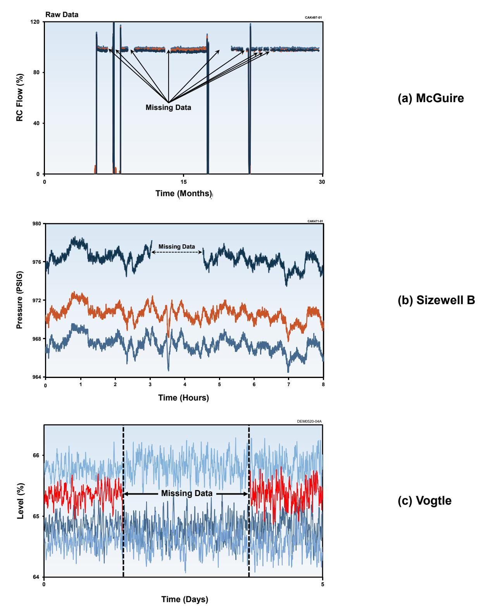

Figure 6.5. Examples of Missing OLM Data Acquired from Three Nuclear Power Plants

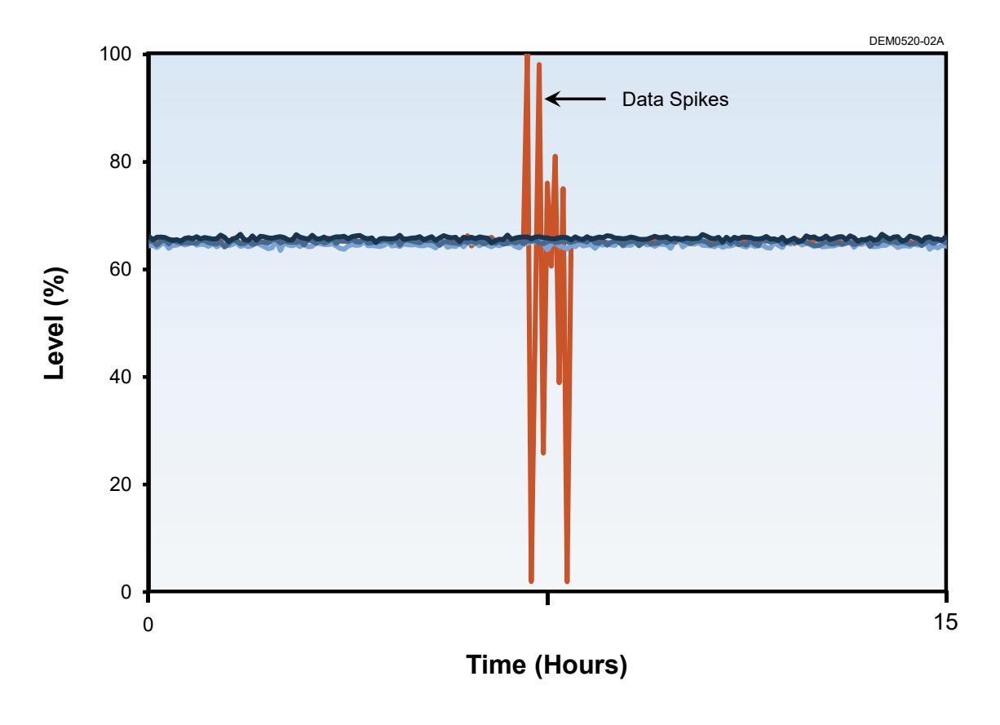

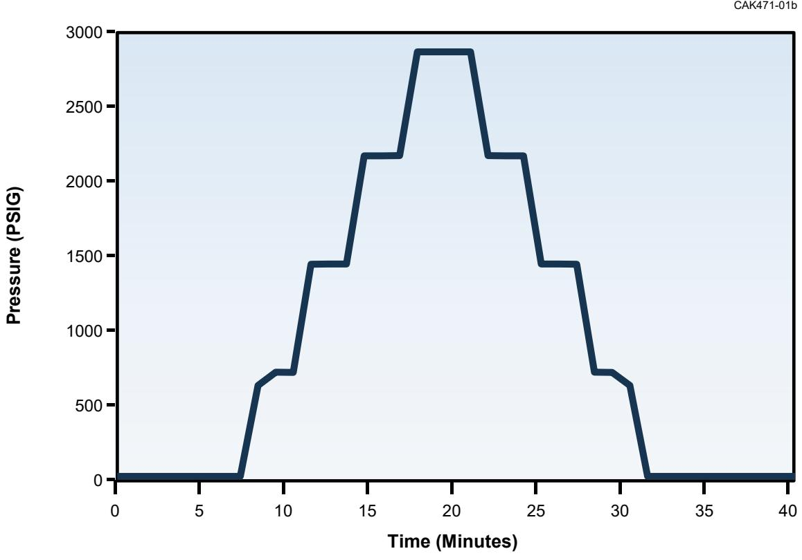

**Figure 6.6. OLM Data Containing Spikes or Affected by Calibration Activities** 

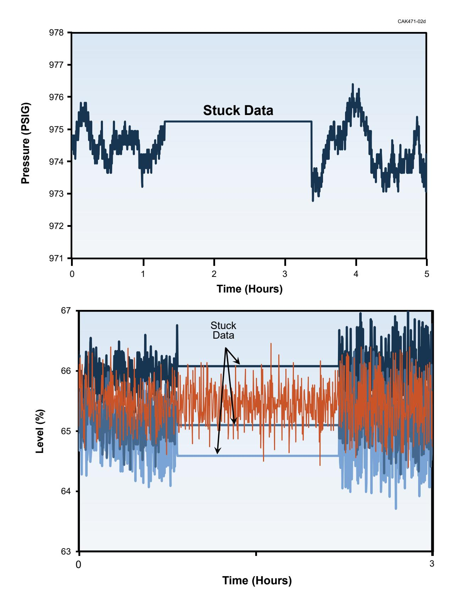

Figure 6.7. Nuclear Plant OLM Data with Regions of Stuck Values

DER001

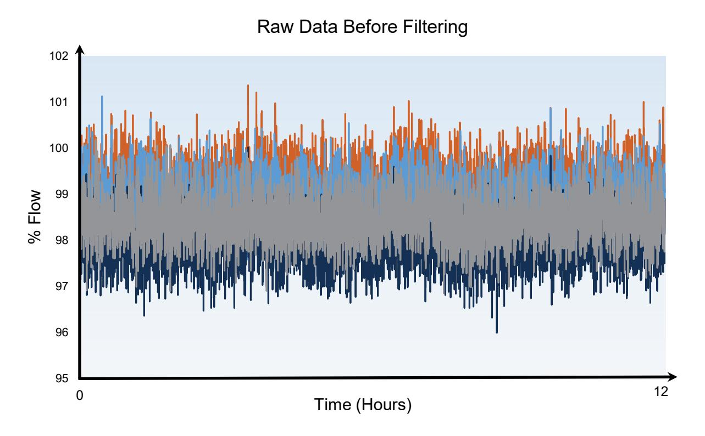

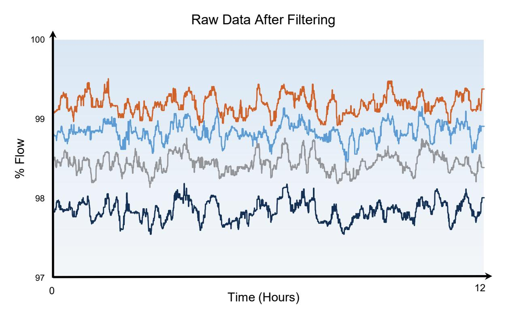

**Figure 6.8. PWR Plant OLM Data Before and After Filtering**

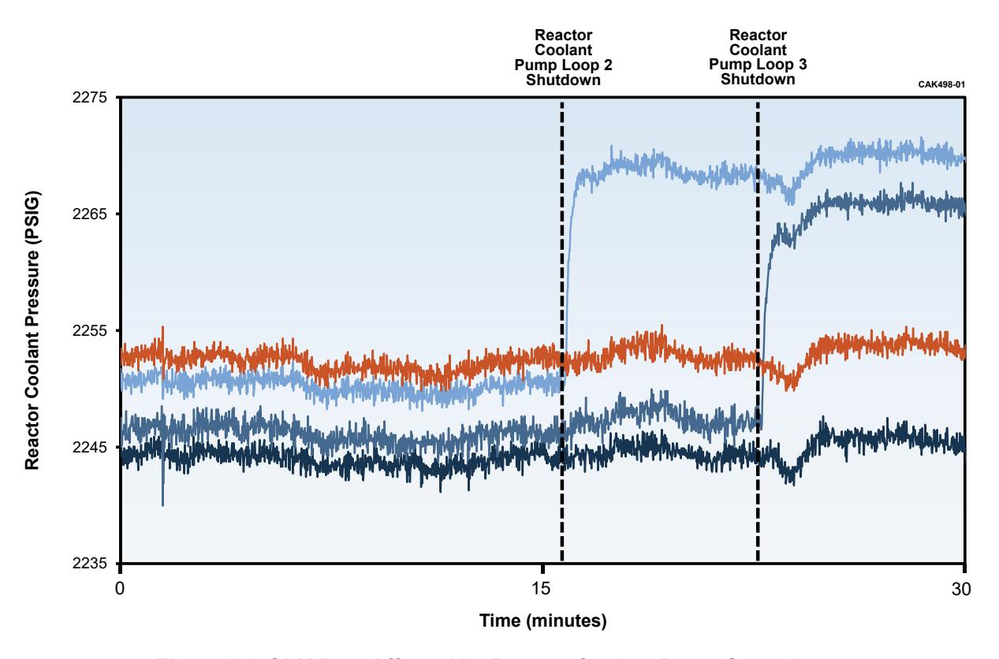

**Figure 6.9. OLM Data Affected by Reactor Coolant Pump Operation**

#### 6.3 OLM DATA ANALYSIS

Analysis of OLM data requires a reference value as the basis for detecting drift. The reference value is also referred to as the process estimate and can be calculated using a variety of averaging and modeling techniques. In this report, the focus of OLM data analysis is on two averaging techniques referred to as "simple average" and "parity space" [1, 10]. These techniques were selected because each meets four of the five desired criteria for analysis of OLM data (Table 6.1). Both the simple average and parity space techniques are needed for analysis of OLM data because there are cases where one method or the other cannot provide a reliable process estimate.

Table 6.1. Rankings of Process Estimation Techniques

| Item | Evaluation Criteria                                       | Simple Average | Parity Space |
|------|-----------------------------------------------------------|-------------------|-----------------|
| 1    | Simple to implement                                       | <b>~</b>          | <               |
| 2    | Uncertainty is quantifiable or bounded                    | <b>✓</b>          | <b>~</b>        |
| 3    | Automatic outlier rejection to provide accurate estimates |                   | <b>~</b>        |
| 4    | Previously reviewed by the NRC                            | <b>✓</b>          | <b>/</b>        |
| 5    | Produces a process estimate for any OLM data              | <b>&gt;</b>       |                 |

The equations for simple and parity space averaging are as follows:

$$\mu(t) = \frac{X_1(t) + X_2(t) + ... + X_n(t)}{n}$$
 or  $\mu(t) = \frac{\sum_{i=1}^n X_i(t)}{n}$  Eq. 6.1

$$\overline{X}(t) = \frac{W_1 X_1(t) + W_2 X_2(t) + \dots + W_n X_n(t)}{W_1 + W_2 + \dots + W_n} \quad \text{or} \quad \overline{X}(t) = \frac{\sum_{i=1}^n W_i X_i(t)}{\sum_{i=1}^n W_i}$$
 Eq. 6.2

where

 $\mu(t)$ : simple average of redundant signals  $X_1(t), X_2(t), ..., X_n(t)$  at the time "t"

 $\overline{X}(t)$ : parity space average of redundant signals  $X_1(t), X_2(t), ..., X_n(t)$  at the time "t"

 $W_i$ : weight for the ith signal value,  $X_i(t)$ 

n: number of redundant signals

OI M155

The simple averaging technique is straightforward and self-explanatory as illustrated in Figure 6.10 while the parity space technique is more involved as it is used to systematically identify outliers that are excluded from analysis. As such, the parity space technique is explained in more detail with the help of numerical examples and illustrations. In particular, we will show how the parity space band and parity space weights are determined. First, we will determine how each weight ( $W_i$ ) in Equation 6.2 is identified. Basically, the weights depend on how close or how far a signal is from the others. For example, for a group of four redundant signals, the weights for each signal could be 0, 1, 2, or 3 depending on the distance between each signal and its neighbors. The weight would be 0 if the signal is too far from the other three, 1 if the signal is close to only one of the other three, 2 if it is close to two of the other three, and 3 if it is close to all three.

Next, we will show how to establish the parity space band for rejection of outliers. For example, when an outlier drifts away from the other redundant signals, the parity space band rejects it. Figure 6.11 shows examples of a wide, a narrow, and a reasonable parity space band facing four redundant signals. These bands are all referenced to signal 3 in this example. Signal 1 is obviously an outlier, but the first band is too wide and does not reject signal 1. The second band is reasonable in that it rejects signal 1 and keeps the other signals in the average. The third band is too narrow and would reject all signals from the average.

Process Estimate  $x_1(t)$   $x_2(t)$   $x_n(t)$   $x_n(t)$ Time

Figure 6.10. Illustration of Simple Averaging Technique

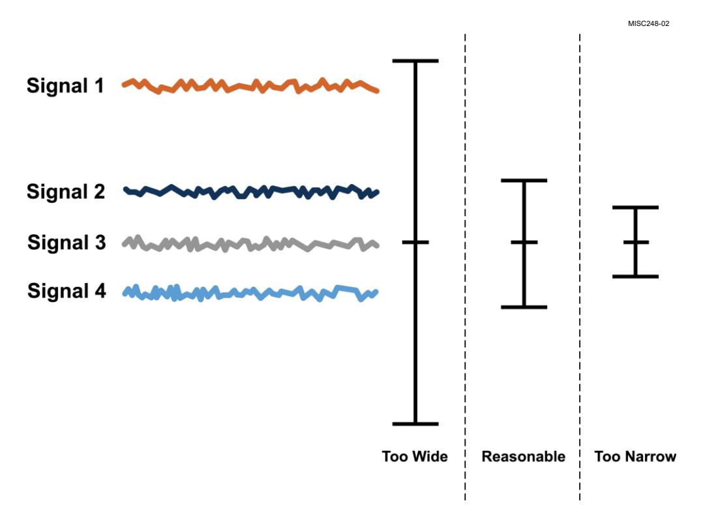

Figure 6.11. Choices for Parity Space Band

One way to arrive at the parity space band is to sum the accuracies of one of the redundant pairs  $(\sigma_1 \& \sigma_2)$  as shown in Figure 6.12. Another approach would be to Root Sum Square (RSS) the accuracies of one of the redundant pairs. The latter approach was adopted by the Sizewell B plant for analysis of its OLM data. That is, at the Sizewell B plant, the parity space band was arrived at based on the manufacturer's specifications for accuracy of each transmitter. For example, for a pair of redundant transmitters each with an accuracy of  $\pm$  0.5 % of span, the parity space band at Sizewell B was arrived at by RSS of the accuracies of the pair as follows:

$$\delta = \sqrt{(0.5)^2 + (0.5)^2} = 0.707 \,(\% \, of \, span)$$
 Eq. 6.3

Once the parity space band ( $\delta$ ) is determined, the parity space weights,  $W_i$ , can simply be calculated as follows for a set of n redundant sensors,  $X_1, X_2, ..., X_n$ :

$$W_i = 0 \label{eq:width}$$
 If  $\left| X_i - X_j \right| \leq \delta$ , then  $W_i = W_i + 1$ 

where:

 $W_i$  = the weight of the  $i^{th}$  signal  $X_i$  = the redundant signal i  $X_j$  = the redundant signal j

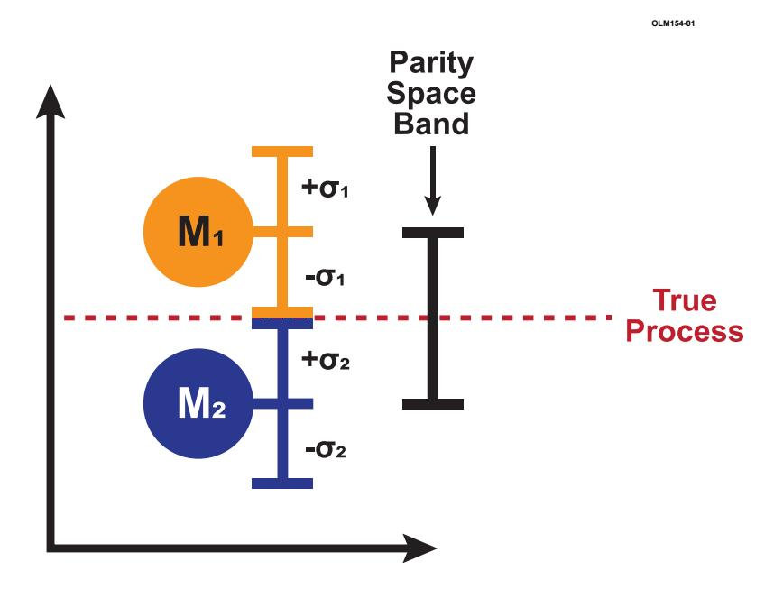

**Figure 6.12. Parity Space Band Selected Based on Measurement Accuracies**

The calculation of parity space weights for four redundant signals is shown in [Table 6.2.](#page-47-1) Each column explains how to calculate the weight for one of the signals. For example, the weight for signal 1 is initially set to 0. Next, signal 1 is compared to signal 2. If the difference between signal 1 and signal 2 is less than the parity space band, then 1 is added to the weight of signal 1. Next, signal 1 is compared to signal 3. If the difference between signal 1 and signal 3 is less than the parity space band, then 1 is added to the weight of signal 1. Finally, signal 1 is compared to signal 4. If the difference between signal 1 and signal 4 is less than the parity space band, then 1 is added to the weight of signal 1. This same process is repeated to calculate the weights for signals 2, 3, and 4. Then the parity space average is calculated using Equation [6.2.](#page-44-2) This process is repeated for each set of measurements to calculate the parity space average.

**Table 6.2. Calculation of Parity Space Weights for Four Redundant Signals**

| Calculate W1            | Calculate W2            | Calculate W3            | Calculate W4            |
|-------------------------|-------------------------|-------------------------|-------------------------|
| Initial W1 = 0          | Initial W2 = 0          | Initial W3 = 0          | Initial W4 = 0          |
| X1 – X2  < 𝜹, W1 = W1+1 | X2 – X1  < 𝛿, W2 = W2+1 | X3 – X1  < 𝛿, W3 = W3+1 | X4 – X1  < 𝛿, W4 = W4+1 |
| X1 – X3  < 𝜹, W1 = W1+1 | X2 – X3  < 𝛿, W2 = W2+1 | X3 – X2  < 𝛿, W3 = W3+1 | X4 – X2  < 𝛿, W4 = W4+1 |
| X1 – X4  < 𝜹, W1 = W1+1 | X2 – X4  < 𝛿, W2 = W2+1 | X3 – X4  < 𝛿, W3 = W3+1 | X4 – X3  < 𝛿, W4 = W4+1 |

Figure 6.13 illustrates the parity space averaging technique for three redundant signals with a [parity space](#page-49-0) band of ±0.2 % of span. This parity space band gives the signal at 61.0 % a weighting of 0 while the remaining two signals each get a weighting of 1 and are thus simply averaged together to arrive at the process best estimate of 60.6 %.

[Figure 6.14](#page-49-1) shows another example of the parity space averaging technique with four redundant signals and a parity space band of ±0.6 % of flow. This parity space band gives the signal at 99.0% a weighting of 0, the signal at 97.8% a weighting of 1, the signal at 97.6% a weighting of 2, and the signal at 97.0% a weighting of 1. These signals are then averaged together with their weighting factors to arrive at the parity space average of 97.5% of flow.

To further illustrate the parity space averaging concept, consider a group of four signals that are initially all close enough that the weights of all four signals is 3. Next, assume signal 1 drifts away from the other three until it is removed from the average as shown in [Figure 6.15a](#page-50-0). As this signal drifts away, it is gradually removed from the parity space average as its weight decreases to 2, then 1, and then 0. Also note that the parity space average is affected by the drifting signal until the drifting signal is completely removed from the average. The deviation plot [\(Figure 6.15b](#page-50-0)) shows how a drifting signal can affect the results of the other signals until it is completely removed from the average.

While parity space is good for rejecting outliers, real process signals in nuclear power plants can contain process noise which can complicate the application of the parity space averaging technique. This is illustrated in [Figure 6.16](#page-51-0) which shows the same data as [Figure 6.15](#page-50-0) with the addition of random noise to each signal. Raw data for four redundant sensors is shown in [Figure](#page-51-0)  [6.16\(](#page-51-0)a) with signal 1 drifting away from the others. The black trace is the parity space average. The largest impact on the parity space average occurs when the drifting sensor jitters (i.e., fluctuates in and out of the average) on the right side of the plot. [Figure 6.16\(](#page-51-0)b) shows the deviation from the parity space average and illustrates how this spills over to the deviations of the other signals. Experience has shown when a drifting signal is fluctuating in and out of the average during an analysis period, it is best to exclude the signal from the average over the entire period to remove the spillover effect on the other signal deviations. This can also be mitigated by filtering the data. For example, the OLM data can be digitally filtered by moving a median filter window along the raw OLM data to replace every point of the data with the median value of its neighbors and thereby reduce the noise.

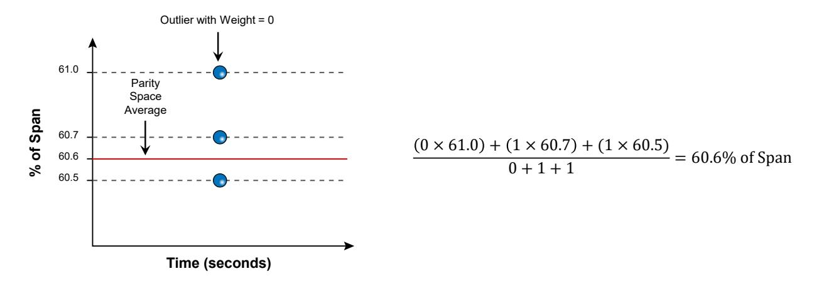

Figure 6.13. Example of Parity Space Averaging Technique for Three Redundant Signals

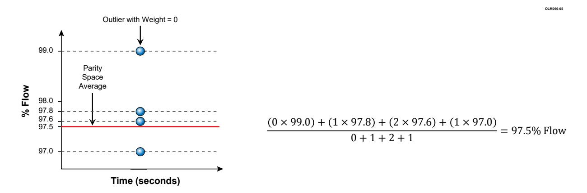

Figure 6.14. Example of Parity Space Averaging Technique for Four Redundant Signals

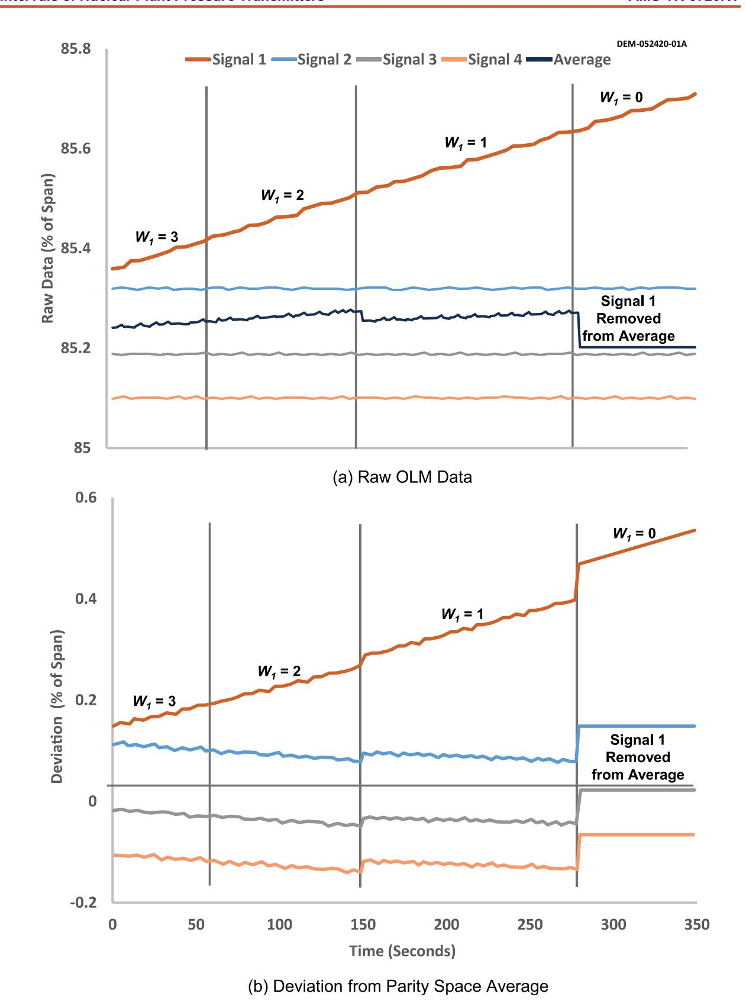

**Figure 6.15. Illustration of Parity Space Results for Four Redundant Signals With One Drifting Away**

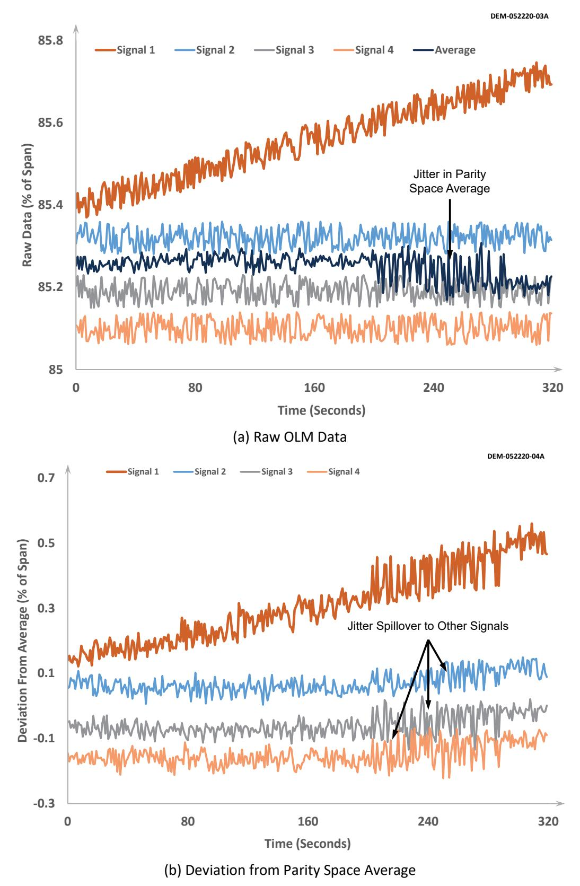

**Figure 6.16. Illustration of Parity Space and Deviation Plots of a Drifting Sensor with Random Noise**

## **7 CALCULATION OF OLM LIMITS**

OLM limits must be established by each nuclear plant to determine when a transmitter must be flagged for a calibration check during an outage. The limits are calculated for each group of redundant transmitters based on the plant setpoint uncertainties and will be different for different plants depending on the types of pressure, level, and flow transmitters used in the plant, plant setpoint methodology, and plant setpoint uncertainties.

This section presents an example of how OLM limits were derived from a plant's setpoint uncertainties. This example is based on setpoint uncertainties of the Sizewell B nuclear power plant where OLM has been used successfully since the year 2005.

#### **7.1 UNCERTAINTY FORMULAS**

OLM limits are established by combining the uncertainties of the instrument channels for each group of redundant transmitters using an RSS formula such as:

$$CSA = \sqrt{PMA^2 + PEA^2 + (SCA + SMTE + SD)^2 + SPE^2 + STE^2 + (RCA + RMTE + RCSA + RD)^2 + RTE^2} + EA + BIAS$$
 Eq. 7.1

This formula produces the channel statistical accuracy (CSA) band that is calculated as the first step towards development of OLM limits. This and related other formulas are found in a variety of guidelines and standards such as the ISA standard 67.04 [\[39\]](#page-113-5).

The fourteen terms in the above RSS formula are defined i[n Table 7.1.](#page-53-0) Some of these terms apply to determining the uncertainties of manual calibrations and others are used to establish OLM limits or safety system trip limits. For example, "as-found" and "as-left" limits used in manual calibrations of transmitters are typically calculated based on up to only five terms of the RSS formula as illustrated in [Figure 7.1.](#page-54-0) The OLM limits, on the other hand, involve more terms for components that are involved in the path of OLM data from the process to where the data is recorded.

The CSA band calculated using the RSS formula must be reduced by two elements to arrive at the OLM limits. These elements are: 1) the uncertainty of the process estimation technique (σ), and 2) the uncertainty of M&TE (σM&TE) that is used to collect the OLM data. [Figure 7.2](#page-54-1) illustrates the process of arriving at the OLM limits, and [Figure 7.3](#page-55-1) illustrates the calculation of the process estimation uncertainty (σ) for simple averaging technique using the uncertainties of each process measurement (σi). The value for each σi is determined using an RSS formula that combines the uncertainties involved in monitoring of each redundant transmitter.

**Table 7.1. Potential Sources of Instrument Channel Uncertainty** 

| Item | Name                                        | Acronym | Definition                                                                                                                                                                                              |
|------|---------------------------------------------|---------|---------------------------------------------------------------------------------------------------------------------------------------------------------------------------------------------------------|
| 1    | Process Measurement Accuracy          | РМА     | Inherent noise in the process. PMA sources are listed as Water Leg Correction, Elbow Tap Error, Streaming and Thermal Mismatch (Power Range Detectors).                                                 |
| 2    | Primary Element Accuracy                 | PEA     | Represents the error due to the use of a metering device like a flow orifice, etc.                                                                                                                      |
| 3    | Sensor Calibration Accuracy              | SCA     | Inherent accuracy of the sensor at reference conditions; typically vendor supplied.                                                                                                                     |
| 4    | Sensor Measurement and Test Equipment | SMTE    | Uncertainties associated with the equipment used to calibrate the sensor. Some plants assume 0.0 for SMTE if the calibration standards and the equipment used for calibration meets 4:1 accuracy ratio. |
| 5    | Sensor Drift                                | SD      | Observed change in sensor accuracy as a function of time; typically supplied by the vendor.                                                                                                             |
| 6    | Sensor Pressure Effects                  | SPE     | This is the potential effect of static pressure on transmitter calibration.                                                                                                                             |
| 7    | Sensor Temperature Effects               | STE     | This is the potential effect of environmental temperature on transmitter calibration.                                                                                                                   |
| 8    | Rack Calibration Accuracy                | RCA     | The two-sided (±) calibration tolerance of the process racks.                                                                                                                                           |
| 9    | Rack Measurement and Test Equipment         | RMTE    | Some plants assume 0.0 for RMTE if the equipment used meets 4:1 accuracy ratio.                                                                                                                         |
| 10   | Rack Comparator Setting Accuracy         | RCSA    | The inherent accuracy of the rack comparator at reference conditions.                                                                                                                                   |
| 11   | Rack Drift                                  | RD      | The change in input-output relationship of the rack as a function of time at reference conditions.                                                                                                      |
| 12   | Rack Temperature Effects                 | RTE     | Change in input-output relationship for the process rack module string due to a change in the ambient environmental conditions.                                                                         |
| 13   | Environmental Allowance                  | EA      | Represents the change in the instrument channel's response due to accident environmental conditions. Some plants use 0.0 for EA for normal CSAs as opposed to accident CSA.                             |
| 14   | Constant Offset                             | BIAS    | For the RC flow channel, for example, this represents the flow measurement error for the elbow taps.                                                                                                    |

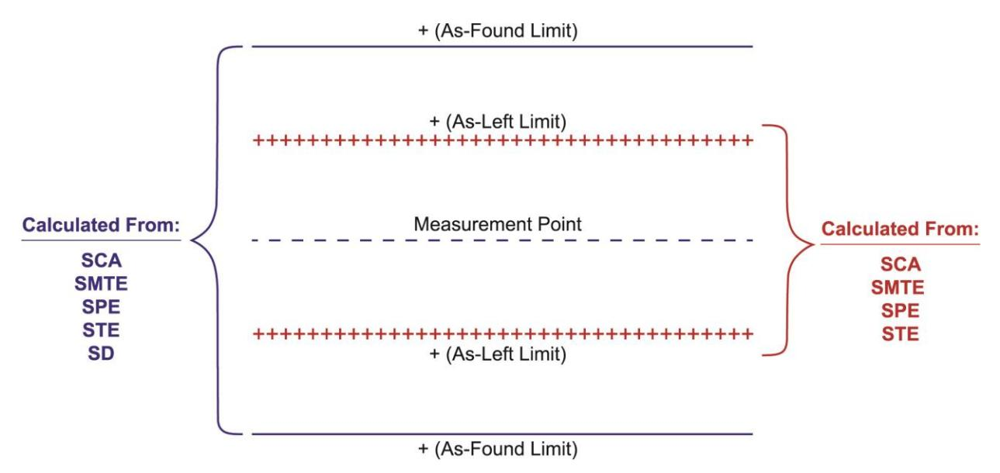

Figure 7.1. Illustration of Manual Calibration Limits

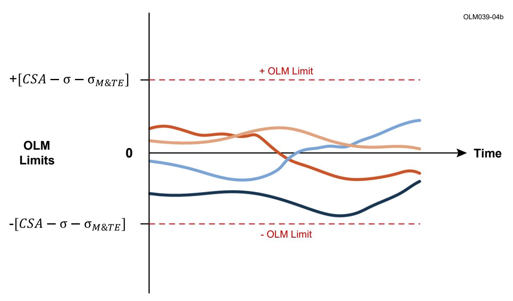

Figure 7.2. Illustration of OLM Limits

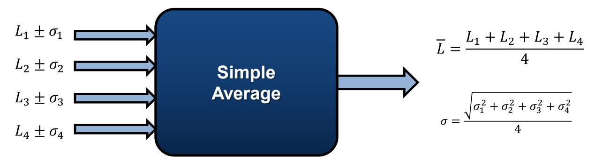

**Figure 7.3. Illustration of Process Estimate () and its Uncertainty (σ)**

#### **7.2 DEVELOPMENT OF OLM LIMITS**

A report by Sizewell B engineers entitled "*Acceptance Criteria for Use in OLM of Protection System Transmitters* [\[40\]](#page-113-6)" describes how Sizewell B arrived at its OLM limits. An example based on the methodology from this report is presented below through calculation of OLM limits for four redundant SG narrow range level transmitters. To arrive at the OLM limits, the uncertainty values in [Table 7.2](#page-56-0) were used for the components of the pressure instrumentation channel and string of components leading to where the OLM data is stored.

The Sizewell B approach has two important characteristics: 1) it treats all uncertainty terms as random and independent and therefore keeps them all under the square root sign in the RSS formula, and 2) it uses only half of the sensor drift band in the calculation of OLM limits as a conservative approach to flag drifting transmitters early and leave room for drift during the operating cycle before a transmitter reaches its operability limit. As stated earlier, the OLM methodology and limits are not intended for operability assessment, but are conservative and leave margin for additional drift until a calibration can be scheduled.

In the Sizewell B example presented below, the uncertainty of the entire pressure sensing channel from the transmitter to the OLM data acquisition system is calculated first with the transmitter drift term included and again with the transmitter drift term excluded. The results of the two calculations are then subtracted from each other to yield the total band for transmitter drift over a fuel cycle. The result is referred to as the Drift Band or DB. The initial uncertainty of the entire pressure sensing channel with the transmitter drift included is then reduced by the following three values to arrive at the OLM limits: 1) the uncertainty of the process estimation technique (i.e., the averaging technique used to arrive at the process estimate), 2) the uncertainty of the string of components leading to OLM data storage, and 3) half of the total DB. These steps are described further in the following procedure for arriving at OLM limits for four SG narrow range level transmitters at Sizewell B.

**Table 7.2. Uncertainty Values for Steam Generator Level Narrow Range Transmitters at Sizewell B**

| Source of Uncertainty                                                            | % of Calibrated Range |
|----------------------------------------------------------------------------------|--------------------------|
| Transmitter Calibration Accuracy (SCA)                                           | 0.500                    |
| Transmitter Temperature Effect (STE)                                             | 0.540                    |
| Transmitter Drift (SD)                                                           | 1.414                    |
| Transmitter Static Pressure Effects (SPE)                                        | 0.200                    |
| Transmitter Power Supply Effects (SSE)                                           | 0.037                    |
| Transmitter Input Test Equipment (STEA1)                                         | 0.136                    |
| Transmitter Output Test Equipment (STEA2)                                        | 0.150                    |
| Uncertainty Terms Involved in String of Equipment Leading to OLM Data Storage | % of Calibrated Range |
| PPS Loop Resistor (MCA1)                                                         | 0.031                    |
| EAI Card Accuracy (MCA2)                                                         | 0.125                    |
| EAI Card Temperature Effect (MTE1)                                               | 0.050                    |
| EAI Card Drift (MD)                                                              | 0.002                    |
| M40 Card Temperature Effects (MTE2)                                              | 0.088                    |
| M40 A/D Resolution (MCE)                                                         | 0.034                    |

1. Combine the uncertainties of all components of the pressure sensing channel from the transmitter in the field to the OLM data storage. Note that the drift term for the transmitter itself is included in this step (we will repeat this step next by excluding the transmitter drift term). The result of this step is referred to by Sizewell as the Equivalent Channel Uncertainty Limit (ECUL). As mentioned before, at Sizewell B, all uncertainties are assumed to be independent and random. Therefore, all uncertainty terms are kept under the square root sign which makes the outcome conservative.

$$ECUL = \sqrt{(SCA^2 + STE^2 + SD^2 + SPE^2 + SSE^2 + STEA1^2 + STEA2^2 + MCA1^2 + MCA2^2 + MTE1^2 + MD^2 + MTE2^2 + MCE^2)}$$
 Eq. 7.2

Substituting values from [Table 7.2](#page-56-0) yields:

$$ECUL = \sqrt{(.500^2 + .540^2 + 1.414^2 + .200^2 + .037^2 + .136^2 + .150^2 + .031^2 + .125^2 + .050^2 + .002^2 + .088^2 + .034^2)}$$
 Eq. 7.3

$$ECUL = 1.628 \%$$

2. Repeat Step 1 but exclude the transmitter drift from the calculation. The outcome of this step is referred to by Sizewell as the "Normal Band (NB)".

$$NB = \sqrt{(SCA^2 + STE^2 + SPE^2 + SSE^2 + STEA1^2 + STEA2^2 + MCA1^2 + MCA2^2 + MTE1^2 + MD^2 + MTE2^2 + MCE^2)}$$
 Eq. 7.4

Substituting values from [Table 7.2](#page-56-0) yields:

$$NB = \sqrt{(0.500^2 + 0.540^2 + 0.200^2 + 0.037^2 + 0.136^2 + 0.150^2 + 0.031^2 + 0.125^2 + 0.050^2 + 0.002^2 + 0.088^2 + 0.034^2)} \quad \text{Eq. 7.5}$$

$$NB = 0.807 \%$$

3. Subtract the results of Step 1 from that of Step 2 and refer to the outcome as the DB as shown in [Figure 7.4:](#page-57-0)

$$DB = ECUL - NB = 1.628 - 0.807 = 0.821 \%$$
 Eq. 7.6

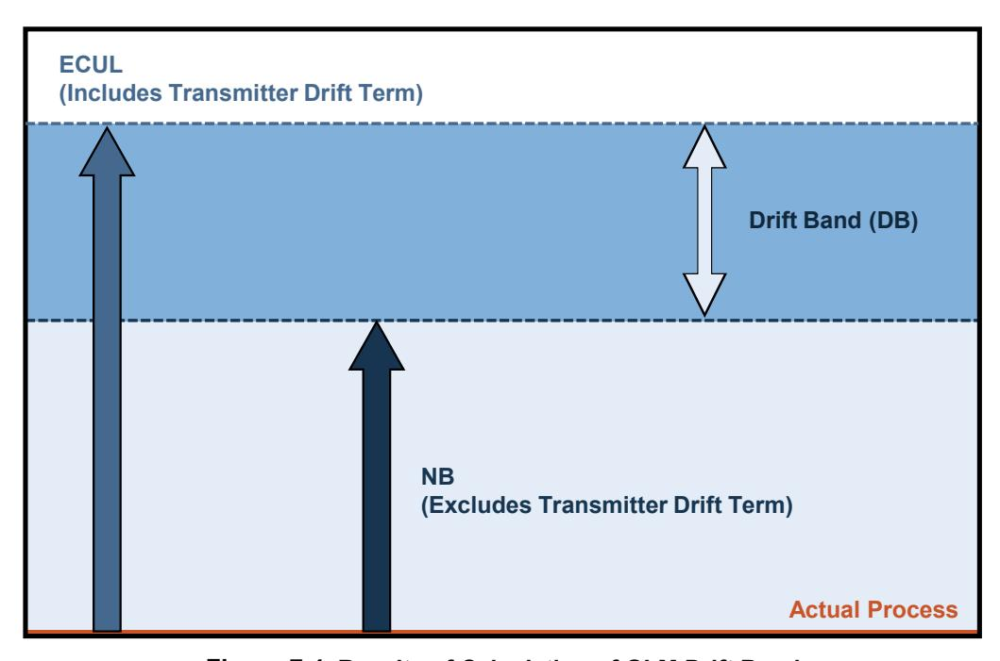

**Figure 7.4. Results of Calculation of OLM Drift Band**

4. Calculate the Process Estimate Uncertainty (PEU). This calculation depends on the method used to arrive at the process estimate. In this example, the parity space technique is used with all weights considered equal to yield:

$$PEU = \frac{\sqrt{\sum_{i=1}^{n} \sigma_i^2}}{n}$$
 Eq. 7.7

where  $\sigma_i$  is the measurement uncertainty for transmitter i, and n is the number of redundant transmitters. Because there are four SG narrow range level transmitters, and the measurement uncertainty of these transmitters is assumed to be the same, PEU becomes:

$$PEU = \frac{\sqrt{\sigma_1^2 + \sigma_2^2 + \sigma_3^2 + \sigma_4^2}}{4} = \frac{\sqrt{4\sigma_i^2}}{4} = \frac{2\sigma_i}{4} = \frac{\sigma_i}{2}$$
 Eq. 7.8

In the Sizewell B approach,  $\sigma_i$  and NB are the same; thus:

$$PEU = \frac{NB}{2} = \frac{0.807}{2} = 0.404 \%$$
 Eq. 7.9

5. Calculate the Monitoring Channel Uncertainty (MCU) by combining the uncertainties of the OLM data acquisition equipment string as follows:

$$MCU = \sqrt{(MCA1^2 + MCA2^2 + MTE1^2 + MD^2 + MTE2^2 + MCE^2)} \%$$
 Eq. 7.10  
=  $\sqrt{(0.031^2 + 0.125^2 + 0.050^2 + 0.002^2 + 0.088^2 + 0.034^2)} = 0.167$ 

6. Calculate the ± OLM limits using the following equation (Figure 7.5):

$$OLM\ Limit = ECUL - (0.5 * DB) - PEU - MCU$$
 Eq. 7.11

Thus, the ± OLM limits for Sizewell's SG narrow range level transmitters are:

$$OLM\ Limits = ECUL - (0.5*DB) - PEU - MCU = 1.628 - (0.5*0.821) - 0.404 - 0.167 = \pm 0.647\%$$
 Eq. 7.12

Once again, it is important to point out that Sizewell subtracts one-half of the transmitter drift band in the calculation of the OLM limits as shown in Equation 7.12 and illustrated in Figure 7.5. This approach is conservative as the OLM limits will be exceeded if a transmitter drifts by only half of its drift band over a fuel cycle. Note that Figure 7.5 illustrates only the positive drift band. The same occurs in the negative direction.

In the above example, because the calibrated range of the steam generator level narrow range transmitters is 0 to 100 % level, the final OLM limit of  $\pm$  0.647 % is equivalent to  $\pm$  0.647 % of the calibrated range. Table 7.3 shows OLM limits for nineteen services at Sizewell B in percent of calibrated range calculated using the procedure described above. Note that the OLM limits in most of the graphs in this report are in engineering units to match the units of raw data while the numbers in Table 7.3 are in percent of calibrated range.

OLM147-02

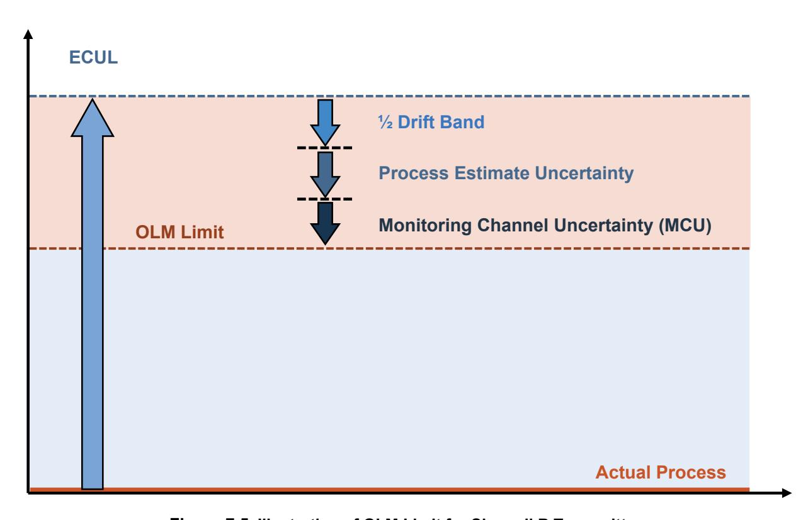

**Figure 7.5. Illustration of OLM Limit for Sizewell B Transmitters**

**Table 7.3. OLM Limits for Selected Transmitters at Sizewell B**

| Item | Transmitter Service                         | OLM Limits (% Calibrated Range) |
|------|---------------------------------------------|------------------------------------|
| 1    | Main Steam Pressure                         | 0.849                              |
| 2    | Steam Generator Narrow Range Level          | 0.647                              |
| 3    | Steam Generator Wide Range Level            | 0.805                              |
| 4    | Pressurizer Level                           | 0.799                              |
| 5    | RCS Wide Range Pressure                     | 0.790                              |
| 6    | RCS Narrow Range Pressure                   | 0.981                              |
| 7    | Pressurizer Pressure                        | 0.813                              |
| 8    | Feed Flow                                   | 0.497                              |
| 9    | RCS Loop Flow                               | 0.977                              |
| 10   | Reactor Building Pressure A                 | 0.717                              |
| 11   | Reactor Building Pressure B                 | 0.767                              |
| 12   | RWST level A                                | 0.916                              |
| 13   | Reactor Water Storage Tank Level B          | 0.147                              |
| 14   | Volume Control Tank Level                   | 0.925                              |
| 15   | Emergency Service Water Flow Train A & B    | 1.903                              |
| 16   | Component Cooling Water Flow Train A & B    | 0.516                              |
| 17   | Component Cooling Water Flow in RCP Th. Bar | 0.826                              |
| 18   | Surge Tank Level                            | 0.964                              |
| 19   | Main Steam Flow                             | 0.463                              |

#### 7.3 PRESENTATION OF OLM RESULTS WITHIN OLM LIMITS

Over the years since OLM was implemented at Sizewell B, the OLM limits as calculated using the formulas in Section 7.2 above have been used for drift monitoring during each operating cycle and to track the long-term performance of Sizewell B transmitters. Figure 7.6 shows OLM results as tracked within OLM limits over eight years for four pressurizer pressure transmitters at Sizewell B.

The OLM limits also serve during each operating cycle from the beginning of startup to the end of shutdown to cover as much of the transmitter span as possible. Figure 7.7 shows OLM results from the beginning to the end of a plant startup at Sizewell B for four redundant level transmitters. This includes a plot of the raw OLM data on the top, deviation of each transmitter from the average of the four transmitters in the middle, and the deviation of each transmitter from the average of the four transmitters plotted as a function of span of the transmitters. Chapter 11 describes how these plots are produced for startup as well as shutdown data and for the period of normal operations. The shutdown plots are produced using the same procedure as startup data. As for an example of OLM results from data during normal plant operation, Figure 7.8 is provided here presenting the deviations of four redundant level transmitters from Sizewell B plant tracked during plant operation. Again, Chapter 11 describes how such plots are produced as a part of OLM data analysis. Note that the same OLM limits are used in assessment of startup results as well as results for the normal operation period (Figures 7.7 and 7.8).

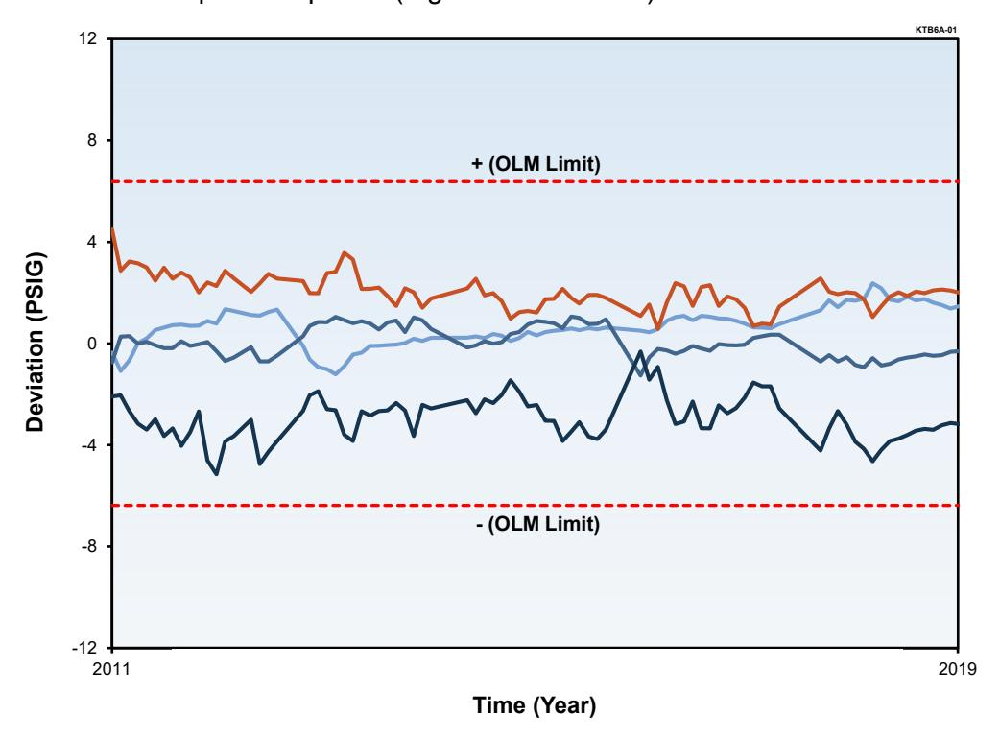

Figure 7.6. OLM Results Tracked for Four Pressurizer Pressure Transmitters at Sizewell B

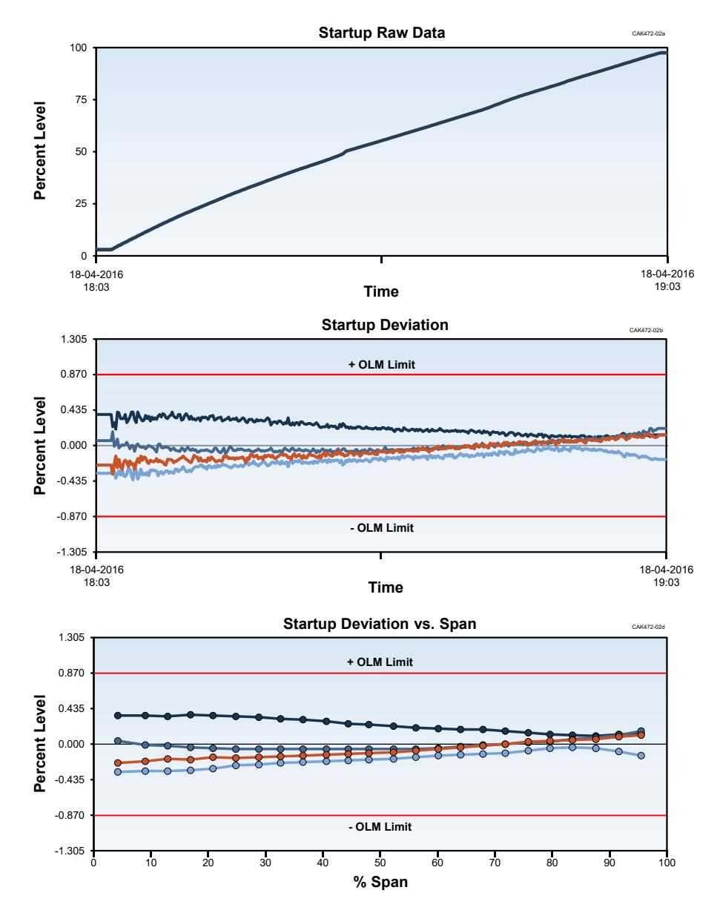

Figure 7.7. Startup OLM Results for Four Redundant Level Transmitters at Sizewell B

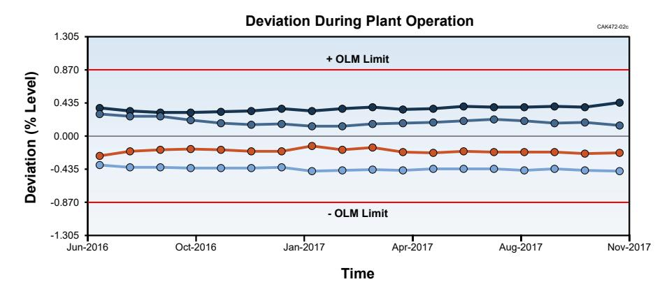

Figure 7.8. OLM Results for Four Level Transmitters at Sizewell B During Normal Plant Operation

## **8 OLM SAMPLING FREQUENCY AND SAMPLING DURATION**

OLM data to detect transmitter drift is collected from the beginning of startup to the end of shutdown. For periods of startup and shutdown, it is best for OLM data to be collected continuously at the fastest sampling interval allowed by the plant computer (e.g., 1 to 10 seconds between samples or 0.1 to 1 Hz in sampling rate).

During plant operation, the required sampling rate will depend on the level of process fluctuations (noise). Any significant noise can alias into the OLM data if the sampling rate is too slow producing erroneous OLM results. [Figure 8.1](#page-64-0) shows the effect of sampling rate on OLM results. This information was produced through analysis of seventeen days of OLM data for 32 transmitters at Sizewell B plant including four steam generator narrow range level transmitters and four reactor coolant flow transmitters from each of the four primary coolant loops. The OLM data for this demonstration was sampled at a rate of one sample every 10 seconds (0.1 Hz). The data was analyzed over and over with lower and lower sampling rates ranging from 10 seconds in between samples to five days in between samples as shown in [Figure 8.1.](#page-64-0) For each sampling interval, the deviation of each transmitter from the average of the redundant group of transmitters was calculated and the average and maximum differences between OLM results for the fastest sampling rate (i.e. one sample every 10 seconds) and each of the slower sampling rates was calculated and referred to as the average and maximum errors to arrive at the bar graph in [Figure](#page-64-0)  [8.1.](#page-64-0) That is, the results for OLM data collected at 0.1 Hz was used as the reference for calculating the error as a function of sampling rate. It is clear that the errors are small until the sampling interval for the OLM data becomes large (˃ 1 day). Although the effect of sample rate on OLM results is small until the sampling rate is very slow, the fastest sampling rate is typically used to produce the most accurate OLM results unless there are limitations in the plant computer to warrant slower sampling rates.

The same procedure as above involving seventeen days of OLM data from 32 transmitters at Sizewell B was used to determine the effect of sampling duration on OLM results [\(Figure 8.2\)](#page-64-1). In arriving at the bar graph of [Figure 8.2,](#page-64-1) the OLM data sampled once every 10 seconds for seventeen days was first analyzed to produce a reference for comparison with OLM results as sampling duration was reduced from seventeen days down to 30 minutes. As shown in [Figure](#page-64-1)  [8.2,](#page-64-1) the errors are small even for only 30 minutes of OLM data collected at normal plant operation. Based on these results, two hours of OLM data sampled at 0.1 Hz providing 720 data points is reasonable.

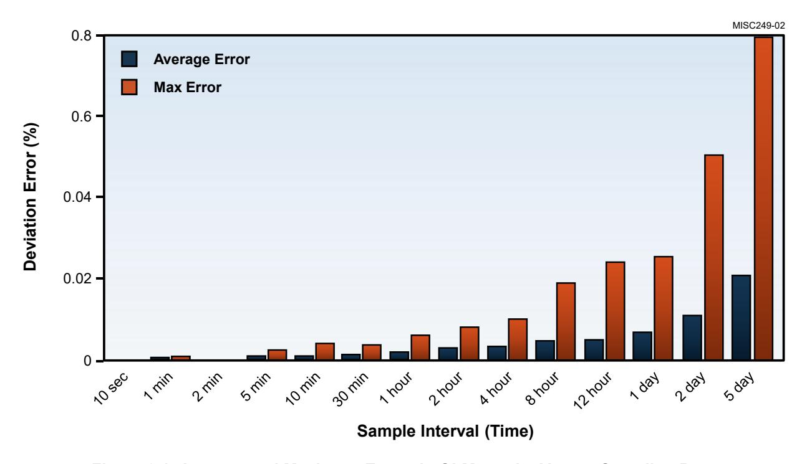

Figure 8.1. Average and Maximum Errors in OLM results Versus Sampling Rate

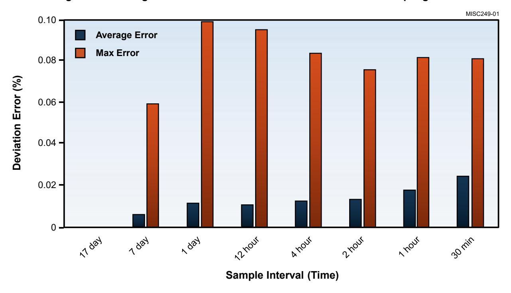

Figure 8.2. Average and Maximum Errors in OLM Results Versus Sampling Duration

## **9 OLM IMPLEMENTATION IN U.S. PLANTS**

Over the last fifteen years, AMS has implemented OLM in the following U.S. nuclear power plants. These are in addition to AMS implementation of OLM at the McGuire Nuclear Power Plant in the 1990s.

- Watts Bar Unit 1 (4-Loop Westinghouse PWR): transmitters monitored for one cycle from November 2006 to February 2008 [\[41\]](#page-113-7)
- Farley Units 1 and 2 (3-Loop Westinghouse PWRs): transmitters monitored over multiple cycles from April 2008 to July 2011 [\[42\]](#page-113-8)
- North Anna Units 1 and 2 (3-Loop Westinghouse PWRs): transmitters monitored over multiple cycles from January 2008 to April 2011 [\[42\]](#page-113-8)
- Vogtle Units 1 and 2 (4-Loop Westinghouse PWRs): transmitters monitored from October 2018 to the present as part of an on-going commercial OLM implementation performed under a contract between AMS and SNOC [\[43](#page-113-9)[-45\]](#page-113-10)

[Table 9.1](#page-65-1) provides a listing of the plant services and the typical number of transmitters in each service monitored in the 3-loop and 4-loop PWRs mentioned above. The transmitters were selected by the plant personnel as the ones that will benefit the plants the most if their calibration intervals were extended.

**Table 9.1. Selected Transmitters in OLM Implementation in Representative US Plants**

| Item | Plant Service                             | # of Transmitters (4-Loop) | # of Transmitters (3-Loop) |
|------|-------------------------------------------|----------------------------|----------------------------|
| 1    | Reactor coolant system (RCS) loop flow    | 12                         | 9                          |
| 2    | Pressurizer narrow-range pressure         | 4                          | 3                          |
| 3    | Pressurizer level                         | 3                          | 3                          |
| 4    | Steam pressure                            | 12                         | 9                          |
| 5    | Steam flow                                | 8                          | 6                          |
| 6    | SG narrow range level                     | 12                         | 9                          |
| 7    | Main feedwater flow                       | 8                          | 6                          |
| 8    | Refueling water storage tank (RWST) level | 4                          | 2                          |
| 9    | Containment Pressure                      | 4                          | 3                          |
|      | Total                                     | 67                         | 50                         |

The OLM data retrieval processes at each plant were straightforward and data quality was good. For Watts Bar Unit 1, the OLM data was retrieved from the Tennessee Valley Authority (TVA) "DatAware" historian in the form of text files for data at periods of startup, normal operation, and shutdown. At Farley and North Anna, the compression settings of the data historians could not be turned off for OLM data acquisition. Therefore, the plant personnel retrieved the data from the plant computer itself in order to avoid problems with compression settings. AMS also demonstrated OLM at Perry Nuclear Power Plant, a 1250 MWe BWR where OLM data was collected between January 2008 and September 2013 as a part of a feasibility study to demonstrate OLM.

For Vogtle, OLM data is accessed remotely from the Southern Company's Maintenance and Diagnostic (M&D) center database and analyzed at AMS. The goal of the project is to provide full cycle analysis using OLM data from all modes of plant operation which includes startup, normal power operation, and shutdown. The OLM data at Vogtle is sampled at a slow rate of one sample every 5 minutes due to limitations of the plant historian. To compensate for this slow sample rate, an entire month of data is analyzed for each transmitter. This OLM implementation at Vogtle is performed in support of the plant's TSTF-425 initiative to satisfy the performance monitoring requirement of the NEI-04-10 SFCP guidance to extend transmitter calibration intervals [\[23\]](#page-112-7). [Table 9.2](#page-66-0) lists the number of transmitters and plant service covered in the OLM implementation project at Vogtle Units 1 and 2. Currently, 25 transmitters are involved in OLM in each of the two Vogtle units. The manufacturer and model numbers of the transmitters monitored are Rosemount 1154, 1153, Barton 764 and Veritrak 76DP.

To date, 343 transmitters have been tested at Watts Bar, Farley, North Anna, and Vogtle. Of these, only about 10 percent reached their OLM limits. This is comparable with the nuclear industries' experience that only about 10 percent of pressure, level, and flow transmitters lose their calibrations over an operating cycle.

Except for Vogtle, the OLM implementation projects performed by AMS in U.S. plants have all been experimental and have been performed primarily as R&D efforts to establish the feasibility of OLM for detection of transmitter drift. Nevertheless, together with OLM implementation at Sizewell B and McGuire, these projects have provided the foundation for the development of a generic OLM methodology that can be applied to all nuclear power plants as described in Chapter [11.](#page-92-0)

**Table 9.2. Transmitters Monitored at Vogtle Units 1 and 2** 

| Plant Service                             | # of Transmitters in Each Unit |
|-------------------------------------------|--------------------------------|
| Pressurizer level                         | 3                              |
| Steam pressure                            | 12                             |
| Turbine First Stage Pressure              | 2                              |
| Refueling water storage tank (RWST) level | 4                              |
| Containment Pressure                      | 4                              |

## **10 COMPARISON OF RESULTS OF OLM AND MANUAL CALIBRATIONS**

Nuclear facilities in the United States and other countries have experimented with OLM for transmitter drift monitoring since the mid-1980s when it was first attempted at the Millstone Nuclear Power Station Unit 3 in 1987, and between 1987 and 1995 at a number of other nuclear power stations in the U.S. including San Onofre, V.C. Summer, South Texas Project, and McGuire. These attempts and many more by EPRI, PWROG, BWROG, and others over the last three decades have been aimed at widespread implementation of OLM to extend the calibration intervals of nuclear plant transmitters. Today, in spite of these efforts, less than a handful of nuclear facilities have extended the calibration intervals of their transmitters. Among these is the Sizewell B nuclear power plant in the UK which has been using OLM successfully since the year 2005 with the approval of British Nuclear Regulators. As such, this chapter will begin with: 1) a description of the Sizewell B plant, 2) history of OLM implementation at Sizewell B, and 3) comparison of OLM and manual calibrations for Sizewell B.

The successful OLM implementation at Sizewell was built on a decade of EPRI's work over the period of 1990 and 2000 and its topical report leading to the SER on OLM (TR-104965 R1, NRC SER-2000) and the work of AMS under two R&D grants from the NRC leading to NUREG/CR 5903 (1993) and NUREG/CR 6343 (1995). The AMS work included experiments with OLM in a laboratory flow loop and implementation of OLM at the McGuire nuclear station Unit 2. Representative results of the laboratory demonstration and the work at McGuire are also presented in this chapter to provide a view of the early OLM developments leading to Sizewell implementation.

#### **10.1 OLM IMPLEMENTATION AT SIZEWELL B**

#### **10.1.1 Description of Sizewell B Plant**

Sizewell B is a single-unit, 1200-megawatt, Westinghouse PWR that began commercial operation in 1995. The plant is located 120 miles northeast of London and is operated and maintained by a staff of less than 400 on-site personnel as opposed to about 800 in a comparable U.S. plant. The Sizewell B plant is unique in that it has both a digital and an analog back-up protection system I&C. The digital system is referred to as the Primary Protection System (PPS) and the independent analog backup protection system is known as the Secondary Protection System (SPS). Both the PPS and SPS have their own sets of process sensors for measurement of temperature, pressure, level, and flow. As such, Sizewell has more than twice as many process instruments as other PWRs (see [Table 10.1\)](#page-68-1).

**Table 10.1. Number of Important Sensors in Sizewell B Compared with Typical PWR Plants**

| Sensor                                    | Typical PWR Plant (approximately) | Sizewell B Plant (approximately) |
|-------------------------------------------|--------------------------------------|-------------------------------------|
| Primary Coolant RTDs                      | 20                                   | 60                                  |
| Transmitters in Containment               | 50                                   | 100                                 |
| Transmitters in Reactor Protection System | 100                                  | 500                                 |
| Transmitters Throughout the Plant         | 1000                                 | 2000                                |

Both the site and headquarters I&C engineers were involved in OLM implementation at the Sizewell B plant which began in the year 2001. The small number of personnel working at the plant and its large number of sensors make the return on investment in OLM very high at Sizewell B. In fact, the plant personnel involved in OLM implementation have estimated that the cost savings that resulted from using OLM to reduce the number of unnecessary calibrations have amounted in some operating cycles to as much as \$5,000,000 per cycle. This estimate takes into account reduction in outage duration by approximately five days and a number of other direct and indirect cost savings.

#### **10.1.2 OLM History at Sizewell B**

Sizewell B began its attempt to implement OLM in the year 2001 by contracting AMS to develop and validate commercial software to extract OLM data from the plant computer and analyze it to identify drifting transmitters. In the meantime, Sizewell B engineers obtained approval from British regulators in March 2005 to formally switch from time-based calibration of transmitters to condition-based calibrations using OLM [\[46\]](#page-113-11). For the next 10 years, Sizewell collected the OLM data in-house and sent it to AMS to perform the analysis. After 2015, Sizewell began performing the analysis in-house with the AMS OLM software. In addition, near the end of each operating cycle, noise data is collected and analyzed by AMS to identify any sensing line blockage and verify the response time of the transmitters. For services with a history of sensing line blockage issues, noise data is collected quarterly at Sizewell to detect the onset of blockages which can occur at any time throughout the operating cycle. [Exhibit B](#page-69-0) shows a letter of support for this TR written by the Sizewell B engineer responsible for OLM implementation.

The OLM implementation at Sizewell and other related information has been documented in the following reports written by AMS for EPRI:

- EPRI-TR-1013486 [\[47\]](#page-113-12), "Plant Application of On-Line Monitoring for Calibration Interval Extension of Safety-Related Instruments: Volumes 1 and 2" (2006): This document was later updated in 2007 (TR-1015173), 2008 (TR-1016723), and in 2009 (TR-1019188) as more OLM data was collected at Sizewell and analyzed to validate OLM.
- EPRI-TR-1016725 [\[48\]](#page-113-13), "Requirements for On-Line Monitoring in Nuclear Power Plants", (2008).

To: U.S. Department of Energy and Nuclear Regulatory Commission

Date: 15th April 2020

#### Experience with OLM Implementation at Sizewell B Nuclear Power Plant

Sizewell B Nuclear Power Plant is a Westinghouse pressurized water reactor (PWR) located in the United Kingdom. This plant has a digital plant protection instrumentation and control (I&C) system together with a complete analogue backup. Therefore, we have more pressure, level, and flow transmitters than typical PWR plants.

AMS has been engaged with Sizewell B since the mid-1990s providing testing equipment and services for our I&C systems including temperature sensors, pressure transmitters, rod control systems, and cables. Back in 2001, we engaged with AMS to implement online monitoring (OLM) technologies at Sizewell B to extend the calibration intervals of our pressure transmitters. Over a period of about 4 years (2001-2005), together with AMS, we established the validity and reliability of OLM for this application and obtained formal approval from our British Regulatory Authority to switch from conventional calibrations to condition based calibrations in March 2005. Today, we have nearly 20 years of experience and data on transmitter calibration monitoring using OLM. This database has provided the following operating experiences:

- 1. The drift of our pressure, level, and flow transmitters has been random and the average reading of redundant transmitters thus closely represents the true value of monitored variables and is adequate for online calibration monitoring.
- Our manual calibration load has been significantly reduced and the potential for human error and miscalibration has decreased accordingly.
- The OLM data collection and data processing has been simple and routine because much of the data is already available from the plant computer and easily retrieved and analyzed. We retrieve the data and have been trained to analyze it using AMS software

Over the years since we started Sizewell B in 1995, sensing line blockages have been an issue at our plant. To guard against this problem, we use a noise analysis procedure on a quarterly basis augmented by a full set of noise data collection and analysis once a fuel cycle.

Thank you for the opportunity to provide you this information. Please call me at +44 1728 65 3657 or email me at paul.goffin@edf-energy.com with any questions.

Yours sincerely

Paul Goffin System Engineer

Process Computing, Sizewell B Power Station

EDF Energy Nuclear Generation Ltd Sizewell B Power Station Nr Leiston, Suffolk, IP16 4UR United Kingdom edfenergy.com EDF Energy Nuclear Generation Limited Registered in England and Wales Registered No. 03076445 Registered office: EDF Energy, Barnett Way, Barnwood, Glucuester, Gl. 4 3 RS

NOT PROTECTIVELY MARKED

Exhibit B. Letter from Sizewell B

#### **10.1.3 OLM Results Versus Manual Calibrations**

OLM implementation at Sizewell B over the period of 2005 to 2020 involved 197 transmitters [\(Table 10.2\)](#page-71-0) producing a huge database of OLM results. For example, there are 435 cases in the database involving 108 transmitters that were monitored over five operating cycles by OLM and subsequently calibrated providing the opportunity to compare the OLM results with manual calibrations. A summary of this comparison is provided in [Table 10.3,](#page-72-0) the details in [Table 10.4,](#page-73-0) and its conclusions as follows:

- 1. The OLM and manual calibration results for 356 of 435 transmitters or over 80 % matched perfectly. Although OLM and manual calibrations are not exactly the same due to the effect of process conditions and the different number of components that are involved in the two tests, this good agreement is nevertheless important as it provides confidence in the validity of OLM technology.
- 2. For 77 transmitters or nearly 18%, OLM found the transmitters as having drifted beyond their OLM limits while manual calibrations showed no significant drift. Although the two methods did not produce comparable results, this outcome is readily acceptable because it is conservative.
- 3. OLM did not flag two transmitters that were found to be bad by manual calibrations. The cause of this discrepancy could not be found. Upon arrival at this outcome which is not conservative, the Sizewell B engineers compared this observation with their experience with discrepancies in manual calibrations over the years since 1996 when Sizewell B began to operate. This effort showed that Sizewell has experienced an average of 3 discrepancies due to human errors and miscalibrations per each operating cycle [\[49\]](#page-113-14). As such, Sizewell engineers concluded that the two discrepancies seen here is readily acceptable because they are better than the conventional practice where about fifteen cases of human errors and miscalibrations would have typically occurred over the same period. With only 2 nonconservative results out of 435 cases, it is reasonable to conclude that OLM correctly or conservatively identified greater than 99% of the Sizewell transmitters that needed a calibration check. Furthermore, in a 2019 update it became known that Sizewell is in possession of 921 cases of which 11 are nonconservative. Again, this statistic confirms that OLM has correctly or conservatively identified about 99% of the transmitters that needed a calibration check.

**Table 10.2. Transmitters Involved in OLM Implementation at Sizewell B**

| Item  | Plant Service                                                                          | Total # of Transmitters |
|-------|----------------------------------------------------------------------------------------|----------------------------|
| 1     | Reactor coolant system (RCS) loop flow                                                 | 16                         |
| 2     | RCS narrow range pressure                                                              | 8                          |
| 3     | RCS wide-range pressure                                                                | 8                          |
| 4     | Pressurizer narrow-range pressure                                                      | 4                          |
| 5     | Pressurizer level                                                                      | 4                          |
| 6     | Steam pressure                                                                         | 36                         |
| 7     | Steam flow                                                                             | 12                         |
| 8     | SG narrow range level                                                                  | 32                         |
| 9     | SG wide range level                                                                    | 8                          |
| 10    | Main feedwater flow                                                                    | 16                         |
| 11    | Volume control tank level                                                              | 5                          |
| 12    | Refueling water storage tank (RWST) level                                              | 8                          |
| 13    | Essential service water (ESW) flow to component cooling water (CCW) heat exchangers | 8                          |
| 14    | CCW flow to low temperature loads                                                      | 8                          |
| 15    | CCW flow in RCP thermal barrier return                                                 | 4                          |
| 16    | Reactor Coolant Pump (RCP) Seal Injection Flow                                         | 4                          |
| 17    | Surge Tank Level                                                                       | 8                          |
| 18    | Containment Pressure                                                                   | 8                          |
| Total | All transmitters involved in OLM implementation                                        | 197                        |

**Table 10.3. Agreement Between OLM and Calibrations for Sizewell Transmitters**

| OLM  | Calibration | Number of Matches | Assessment               |
|------|-------------|-------------------|--------------------------|
| Good | Good        | 332               | Perfect Match            |
| Bad  | Bad         | 24                | Perfect Match            |
| Bad  | Good        | 77                | Conservative Mismatch    |
| Good | Bad         | 2                 | Nonconservative Mismatch |

**Table 10.4. Results of OLM and Calibrations for 108 Sizewell Transmitters Over 5 Cycles**

|           |              |                            |            |            | OLM Results |            |            |            |            | Manual Calibrations |            |            |
|-----------|--------------|----------------------------|------------|------------|-------------|------------|------------|------------|------------|---------------------|------------|------------|
| Item # | Tag          | Group                      | Cycle 5 | Cycle 6 | Cycle 7  | Cycle 8 | Cycle 9 | Cycle 5 | Cycle 6 | Cycle 7          | Cycle 8 | Cycle 9 |
| 1         | 1AB-P-0513-W | MAIN STEAM PRESSURE LOOP 1 | Good       | Good       | Bad         | Bad        | Good       | Good       | Good       | Good                | Good       | Good       |
| 2         | 1AB-P-0174-W | MAIN STEAM PRESSURE LOOP 1 | Good       | Good       | Good        | Bad        | Bad        | Good       | Good       | Good                | Good       | Good       |
| 3         | 1AB-P-0175-W | MAIN STEAM PRESSURE LOOP 1 | Bad        | Good       | Bad         | Good       | Good       | Good       | Good       | Good                | Good       | Good       |
| 4         | 1AB-P-0137-W | MAIN STEAM PRESSURE LOOP 1 | Good       | Good       | Bad         | Good       | Good       | Good       | Good       | Good                | Good       | Good       |
| 5         | 1AB-P-0138-W | MAIN STEAM PRESSURE LOOP 1 | Good       | Good       | Bad         | Good       | Bad        | Good       | Good       | Good                | Good       | Good       |
| 6         | 1AB-P-0525-W | MAIN STEAM PRESSURE LOOP 2 | Good       | Good       | Good        | Good       | Good       | Good       | Good       | Good                | Good       | N/A        |
| 7         | 1AB-P-0275-W | MAIN STEAM PRESSURE LOOP 2 | Good       | Good       | Good        | Bad        | Good       | Good       | Good       | Good                | Good       | Good       |
| 8         | 1AB-P-0274-W | MAIN STEAM PRESSURE LOOP 2 | Bad        | Bad        | Bad         | Good       | Good       | Bad        | Good       | Good                | Good       | Good       |
| 9         | 1AB-P-0237-W | MAIN STEAM PRESSURE LOOP 2 | Good       | Good       | Bad         | Bad        | Good       | Good       | Good       | Good                | Good       | Good       |
| 10        | 1AB-P-0238-W | MAIN STEAM PRESSURE LOOP 2 | Good       | Good       | Good        | Bad        | Good       | Good       | Good       | Good                | Good       | Good       |
| 11        | 1AB-P-0536-W | MAIN STEAM PRESSURE LOOP 3 | Good       | Good       | Good        | Good       | Good       | Good       | Good       | Good                | Good       | Good       |
| 12        | 1AB-P-0337-W | MAIN STEAM PRESSURE LOOP 3 | Good       | Good       | Good        | Bad        | Good       | Good       | Good       | Good                | Good       | Good       |
| 13        | 1AB-P-0338-W | MAIN STEAM PRESSURE LOOP 3 | Bad        | Good       | Good        | Good       | Good       | Good       | Good       | Good                | Good       | Good       |
| 14        | 1AB-P-0375-W | MAIN STEAM PRESSURE LOOP 3 | Good       | Good       | Good        | Bad        | Bad        | Good       | Good       | Good                | Good       | Good       |
| 15        | 1AB-P-0374-W | MAIN STEAM PRESSURE LOOP 3 | Bad        | Good       | Good        | Good       | Good       | Good       | Good       | Good                | Good       | Good       |
| 16        | 1AB-P-0544-W | MAIN STEAM PRESSURE LOOP 4 | Good       | Good       | Good        | Good       | Good       | Good       | Good       | N/A                 | Good       | N/A        |
| 17        | 1AB-P-0437-W | MAIN STEAM PRESSURE LOOP 4 | Good       | Good       | Bad         | Bad        | Good       | Good       | Good       | Good                | Good       | Good       |
| 18        | 1AB-P-0438-W | MAIN STEAM PRESSURE LOOP 4 | Bad        | Good       | Good        | Good       | Good       | Good       | Good       | Good                | Good       | Good       |
| 19        | 1AB-P-0474-W | MAIN STEAM PRESSURE LOOP 4 | Good       | Good       | Good        | Good       | Good       | Good       | Good       | Good                | Good       | Good       |
| 20        | 1AB-P-0475-W | MAIN STEAM PRESSURE LOOP 4 | Good       | Good       | Good        | Good       | Bad        | Good       | Good       | Good                | Good       | N/A        |
| 21        | 1AE-L-0501-W | STEAM GENERATOR A LEVEL WR | Good       | Good       | Good        | Good       | Good       | Good       | Good       | Good                | Good       | N/A        |
| 22        | 1AE-L-0505-W | STEAM GENERATOR A LEVEL WR | Good       | Good       | Good        | Good       | Good       | Good       | Good       | Good                | Good       | Good       |
| 23        | 1AE-L-0502-W | STEAM GENERATOR B LEVEL WR | Good       | Good       | Bad         | Bad        | Bad        | Good       | Good       | Bad                 | Bad        | Bad        |
| 24        | 1AE-L-0506-W | STEAM GENERATOR B LEVEL WR | Good       | Good       | Bad         | Bad        | Bad        | Good       | Good       | Good                | Good       | Good       |
| 25        | 1AE-L-0503-W | STEAM GENERATOR C LEVEL WR | Good       | Good       | Good        | Bad        | Good       | Good       | Good       | Bad                 | Good       | N/A        |
| 26        | 1AE-L-0507-W | STEAM GENERATOR C LEVEL WR | Good       | Good       | Good        | Bad        | Good       | Good       | Good       | N/A                 | Good       | N/A        |
| 27        | 1AE-L-0504-W | STEAM GENERATOR D LEVEL WR | Good       | Good       | Good        | Good       | Good       | Good       | Good       | Good                | Good       | Good       |
| 28        | 1AE-L-0508-W | STEAM GENERATOR D LEVEL WR | Good       | Good       | Good        | Good       | Good       | Good       | Good       | Good                | Good       | N/A        |
| 29        | 1AE-L-0517-W | STEAM GENERATOR A LEVEL NR | Good       | Good       | Good        | Good       | Good       | Good       | Good       | Good                | Good       | N/A        |
| 30        | 1AE-L-0518-W | STEAM GENERATOR A LEVEL NR | Good       | Good       | Good        | Good       | Good       | Good       | Good       | N/A                 | N/A        | N/A        |
| 31        | 1AE-L-0519-W | STEAM GENERATOR A LEVEL NR | Good       | Good       | Good        | Good       | Good       | Good       | Good       | Good                | N/A        | N/A        |
| 32        | 1AE-L-0551-W | STEAM GENERATOR A LEVEL NR | Good       | Good       | Good        | Good       | Good       | Good       | Good       | Good                | Good       | Good       |
| 33        | 1AE-L-0011-W | STEAM GENERATOR A LEVEL NR | Bad        | Good       | Good        | Good       | Bad        | Good       | Good       | Good                | Good       | Bad        |
| 34        | 1AE-L-0012-W | STEAM GENERATOR A LEVEL NR | Good       | Good       | Good        | Good       | Good       | Good       | Good       | Good                | Good       | N/A        |
| 35        | 1AE-L-0013-W | STEAM GENERATOR A LEVEL NR | Bad        | Good       | Good        | Bad        | Bad        | Good       | Good       | Good                | Good       | Good       |
| 36        | 1AE-L-0014-W | STEAM GENERATOR A LEVEL NR | Good       | Good       | Good        | Bad        | Good       | Good       | Good       | Good                | Good       | Good       |

| Legend           |
|------------------|
| Conservative     |
| Non-Conservative |

**Table 10.4. Results of OLM and Calibrations [for 108 Sizewell Transmitters](#page-73-0) Over 5 Cycles (continued)**

|           |               |                            |            |            | OLM Results |            |            |            |            | Manual Calibrations |            |            |  |
|-----------|---------------|----------------------------|------------|------------|-------------|------------|------------|------------|------------|---------------------|------------|------------|--|
| Item # | Tag           | Group                      | Cycle 5 | Cycle 6 | Cycle 7  | Cycle 8 | Cycle 9 | Cycle 5 | Cycle 6 | Cycle 7          | Cycle 8 | Cycle 9 |  |
| 37        | 1AE-L-0527-W  | STEAM GENERATOR B LEVEL NR | Good       | Good       | Good        | Good       | Good       | Good       | Good       | Good                | Good       | N/A        |  |
| 38        | 1AE-L-0528-W  | STEAM GENERATOR B LEVEL NR | Good       | Good       | Good        | Good       | Good       | Good       | Good       | N/A                 | N/A        | N/A        |  |
| 39        | 1AE-L-0529-W  | STEAM GENERATOR B LEVEL NR | Good       | Good       | Good        | Good       | Good       | Good       | Good       | Good                | N/A        | N/A        |  |
| 40        | 1AE-L-0552-W  | STEAM GENERATOR B LEVEL NR | Good       | Good       | Bad         | Bad        | Bad        | Good       | Good       | Good                | Good       | Good       |  |
| 41        | 1AE-L-0021-W  | STEAM GENERATOR B LEVEL NR | Good       | Bad        | Good        | Bad        | Good       | Good       | Bad        | Good                | Good       | N/A        |  |
| 42        | 1AE-L-0022-W  | STEAM GENERATOR B LEVEL NR | Good       | Good       | Good        | Good       | Good       | Good       | Good       | Good                | Good       | N/A        |  |
| 43        | 1AE-L-0023-W  | STEAM GENERATOR B LEVEL NR | Good       | Good       | Good        | Bad        | Good       | Good       | Good       | Good                | Good       | Good       |  |
| 44        | 1AE-L-0024-W  | STEAM GENERATOR B LEVEL NR | Good       | Good       | Good        | Good       | Good       | Good       | Good       | Good                | Good       | Good       |  |
| 45        | 1AE-L-0537-W  | STEAM GENERATOR C LEVEL NR | Good       | Good       | Good        | Good       | Good       | Good       | Good       | Good                | Good       | N/A        |  |
| 46        | 1AE-L-0538-W  | STEAM GENERATOR C LEVEL NR | Good       | Good       | Good        | Good       | Good       | Good       | Good       | N/A                 | N/A        | N/A        |  |
| 47        | 1AE-L-0539-W  | STEAM GENERATOR C LEVEL NR | Good       | Good       | Good        | Good       | Good       | Good       | Good       | Good                | N/A        | N/A        |  |
| 48        | 1AE-L-0553-W  | STEAM GENERATOR C LEVEL NR | Good       | Good       | Good        | Good       | Good       | Good       | Good       | Good                | Good       | Good       |  |
| 49        | 1AE-L-0031-W  | STEAM GENERATOR C LEVEL NR | Good       | Good       | Good        | Good       | Good       | Good       | Good       | Good                | Good       | N/A        |  |
| 50        | 1AE-L-0032-W  | STEAM GENERATOR C LEVEL NR | Good       | Good       | Good        | Good       | Good       | Good       | Good       | Bad                 | Good       | N/A        |  |
| 51        | 1AE-L-0033-W  | STEAM GENERATOR C LEVEL NR | Good       | Good       | Good        | Bad        | Bad        | Good       | Good       | Good                | Good       | Good       |  |
| 52        | 1AE-L-0034-W  | STEAM GENERATOR C LEVEL NR | Bad        | Good       | Good        | Good       | Good       | Good       | Good       | Good                | Good       | Good       |  |
| 53        | 1AE-L-0547-W  | STEAM GENERATOR D LEVEL NR | Good       | Good       | Good        | Good       | Good       | Good       | Good       | Good                | Good       | N/A        |  |
| 54        | 1AE-L-0548-W  | STEAM GENERATOR D LEVEL NR | Good       | Good       | Good        | Good       | Good       | Good       | Good       | N/A                 | N/A        | N/A        |  |
| 55        | 1AE-L-0549-W  | STEAM GENERATOR D LEVEL NR | Good       | Good       | Good        | Good       | Good       | Good       | Good       | Good                | N/A        | N/A        |  |
| 56        | 1AE-L-0554-W  | STEAM GENERATOR D LEVEL NR | Good       | Good       | Good        | Bad        | Bad        | Good       | Good       | Good                | Good       | Good       |  |
| 57        | 1AE-L-0041-W  | STEAM GENERATOR D LEVEL NR | Good       | Good       | Good        | Good       | Good       | Good       | Good       | Good                | Good       | N/A        |  |
| 58        | 1AE-L-0042-W  | STEAM GENERATOR D LEVEL NR | Good       | Good       | Good        | Good       | Good       | Good       | Good       | Good                | Good       | N/A        |  |
| 59        | 1AE-L-0043-W  | STEAM GENERATOR D LEVEL NR | Bad        | Good       | Good        | Bad        | Good       | Bad        | Good       | Good                | Good       | Good       |  |
| 60        | 1AE-L-0044-W  | STEAM GENERATOR D LEVEL NR | Good       | Good       | Good        | Good       | Good       | Good       | Good       | Good                | Good       | Good       |  |
| 61        | 1AE-F-0515B-W | MAIN FEED FLOW TO SG A     | Bad        | Bad        | Good        | N/A        | Bad        | Good       | Good       | N/A                 | Good       | Bad        |  |
| 62        | 1AE-F-0525B-W | MAIN FEED FLOW TO SG B     | Bad        | Bad        | N/A         | N/A        | Good       | Good       | Bad        | Good                | Good       | N/A        |  |
| 63        | 1AE-F-0535B-W | MAIN FEED FLOW TO SG C     | Good       | Bad        | Good        | Good       | Good       | Good       | Good       | N/A                 | N/A        | N/A        |  |
| 64        | 1AE-F-0545B-W | MAIN FEED FLOW TO SG D     | Good       | Bad        | Bad         | Bad        | Good       | Good       | Good       | Good                | N/A        | N/A        |  |
| 65        | 1BB-P-0455-W  | PRESSURIZER PRESSURE       | Good       | Good       | Good        | Good       | Good       | Good       | Good       | Good                | Good       | N/A        |  |
| 66        | 1BB-P-0456-W  | PRESSURIZER PRESSURE       | Bad        | Bad        | Good        | Good       | Good       | Good       | Bad        | N/A                 | N/A        | N/A        |  |
| 67        | 1BB-P-0457-W  | PRESSURIZER PRESSURE       | Good       | Good       | Good        | Good       | Good       | Good       | Good       | Good                | N/A        | N/A        |  |
| 68        | 1BB-P-0458-W  | PRESSURIZER PRESSURE       | Bad        | Good       | Good        | Good       | Good       | Bad        | Good       | Good                | Good       | Bad        |  |
| 69        | 1BB-L-0465-W  | PRESSURIZER LEVEL          | Bad        | Bad        | Bad         | Bad        | Good       | Bad        | Good       | Good                | Good       | N/A        |  |
| 70        | 1BB-L-0466-W  | PRESSURIZER LEVEL          | Bad        | Good       | Good        | Good       | Good       | Bad        | Good       | N/A                 | N/A        | N/A        |  |
| 71        | 1BB-L-0467-W  | PRESSURIZER LEVEL          | Good       | Good       | Good        | Good       | Good       | Good       | Good       | Good                | N/A        | N/A        |  |
| 72        | 1BB-L-0468-W  | PRESSURIZER LEVEL          | Good       | Good       | Good        | Bad        | Bad        | Good       | Good       | Bad                 | Good       | Good       |  |

| Legend           |
|------------------|
| Conservative     |
| Non-Conservative |

**Table 10.4. Results of OLM and Calibrations [for 108 Sizewell Transmitters](#page-73-0) Over 5 Cycles (continued)**

|           |              |                         |            |            | OLM Results |            |            |            |            | Manual Calibrations |            |            |
|-----------|--------------|-------------------------|------------|------------|-------------|------------|------------|------------|------------|---------------------|------------|------------|
| Item # | Tag          | Group                   | Cycle 5 | Cycle 6 | Cycle 7  | Cycle 8 | Cycle 9 | Cycle 5 | Cycle 6 | Cycle 7          | Cycle 8 | Cycle 9 |
| 73        | 1BB-P-0406-W | RCS PRESSURE NR PPS     | Good       | Good       | Good        | Good       | Bad        | Good       | Good       | Good                | Good       | Bad        |
| 74        | 1BB-P-0407-W | RCS PRESSURE NR PPS     | Bad        | Bad        | Good        | Good       | Good       | Bad        | Good       | N/A                 | N/A        | N/A        |
| 75        | 1BB-P-0408-W | RCS PRESSURE NR PPS     | Bad        | Bad        | Good        | Good       | Good       | Good       | Good       | Good                | N/A        | N/A        |
| 76        | 1BB-P-0409-W | RCS PRESSURE NR PPS     | Good       | Good       | Good        | Good       | Good       | Good       | Good       | Good                | Good       | Good       |
| 77        | 1BB-P-0401-W | RCS PRESSURE WR PPS     | Good       | Good       | Good        | Good       | Good       | Good       | Good       | Good                | Good       | N/A        |
| 78        | 1BB-P-0402-W | RCS PRESSURE WR PPS     | Good       | Good       | Good        | Good       | Good       | Good       | Good       | N/A                 | N/A        | N/A        |
| 79        | 1BB-P-0403-W | RCS PRESSURE WR PPS     | Good       | Bad        | Good        | Good       | Good       | Good       | Good       | Bad                 | N/A        | N/A        |
| 80        | 1BB-P-0404-W | RCS PRESSURE WR PPS     | Bad        | Good       | Good        | Good       | Good       | Good       | Good       | Good                | Good       | Good       |
| 81        | 1BB-F-0416-W | RCS FLOW LOOP 1         | Good       | Bad        | Good        | Good       | Bad        | Good       | Good       | Good                | Good       | Bad        |
| 82        | 1BB-F-0417-W | RCS FLOW LOOP 1         | Good       | Bad        | Good        | Good       | Good       | Good       | Good       | N/A                 | N/A        | N/A        |
| 83        | 1BB-F-0418-W | RCS FLOW LOOP 1         | Good       | Good       | Good        | Good       | Good       | Good       | Good       | Good                | N/A        | N/A        |
| 84        | 1BB-F-0419-W | RCS FLOW LOOP 1         | Good       | Bad        | Good        | Good       | Good       | Good       | Good       | Good                | Good       | Good       |
| 85        | 1BB-F-0426-W | RCS FLOW LOOP 2         | Good       | Bad        | Good        | Good       | Good       | Good       | Good       | Good                | Good       | N/A        |
| 86        | 1BB-F-0427-W | RCS FLOW LOOP 2         | Good       | Good       | Good        | Good       | Good       | Good       | Good       | N/A                 | N/A        | N/A        |
| 87        | 1BB-F-0428-W | RCS FLOW LOOP 2         | Good       | Good       | Good        | Good       | Good       | Good       | Good       | Good                | N/A        | N/A        |
| 88        | 1BB-F-0429-W | RCS FLOW LOOP 2         | Good       | Bad        | Good        | Good       | Good       | Good       | Good       | Good                | Good       | Good       |
| 89        | 1BB-F-0436-W | RCS FLOW LOOP 3         | Good       | Good       | Good        | Good       | Good       | Good       | Good       | Good                | Good       | N/A        |
| 90        | 1BB-F-0437-W | RCS FLOW LOOP 3         | Good       | Good       | Good        | Good       | Good       | Good       | Good       | N/A                 | N/A        | N/A        |
| 91        | 1BB-F-0438-W | RCS FLOW LOOP 3         | Good       | Good       | Good        | Good       | Good       | Good       | Good       | Good                | N/A        | N/A        |
| 92        | 1BB-F-0439-W | RCS FLOW LOOP 3         | Bad        | Good       | Good        | Good       | Good       | Bad        | Good       | Good                | Good       | Good       |
| 93        | 1BB-F-0446-W | RCS FLOW LOOP 4         | Good       | Good       | Good        | Good       | Good       | Good       | Good       | Good                | Good       | N/A        |
| 94        | 1BB-F-0447-W | RCS FLOW LOOP 4         | Good       | Good       | Good        | Good       | Good       | Good       | Good       | N/A                 | Good       | N/A        |
| 95        | 1BB-F-0448-W | RCS FLOW LOOP 4         | Good       | Good       | Good        | Good       | Good       | Good       | Good       | Good                | N/A        | N/A        |
| 96        | 1BB-F-0449-W | RCS FLOW LOOP 4         | Good       | Good       | Good        | Good       | Good       | Good       | Good       | Good                | Good       | Good       |
| 97        | 1BB-P-0411-W | RCS PRESSURE WR SPS     | Good       | Good       | Good        | N/A        | Good       | Good       | Good       | Good                | Good       | Good       |
| 98        | 1BB-P-0421-W | RCS PRESSURE WR SPS     | Good       | Bad        | Good        | N/A        | Good       | Good       | Bad        | Good                | Good       | N/A        |
| 99        | 1BB-P-0431-W | RCS PRESSURE WR SPS     | Good       | Good       | Good        | N/A        | Good       | Good       | Good       | Good                | Good       | Good       |
| 100       | 1BB-P-0441-W | RCS PRESSURE WR SPS     | Bad        | Bad        | Good        | N/A        | Bad        | Good       | Good       | Bad                 | Bad        | Bad        |
| 101       | 1BB-P-0412-W | RCS PRESSURE NR SPS     | Bad        | Bad        | Good        | N/A        | Bad        | Good       | Good       | Good                | Good       | Bad        |
| 102       | 1BB-P-0422-W | RCS PRESSURE NR SPS     | Bad        | Bad        | Good        | N/A        | Good       | Good       | Good       | Good                | Good       | N/A        |
| 103       | 1BB-P-0432-W | RCS PRESSURE NR SPS     | Bad        | Bad        | Good        | N/A        | Bad        | Bad        | Good       | Good                | Bad        | Bad        |
| 104       | 1BB-P-0442-W | RCS PRESSURE NR SPS     | Bad        | Bad        | Good        | N/A        | Good       | Good       | Good       | Good                | Bad        | Good       |
| 105       | 1BB-F-0601-W | RCP SEAL INJECTION FLOW | Good       | Good       | Good        | Good       | Good       | Good       | Good       | Good                | Good       | Good       |
| 106       | 1BB-F-0602-W | RCP SEAL INJECTION FLOW | Bad        | Good       | Good        | Good       | Good       | Good       | Good       | Good                | Good       | Good       |
| 107       | 1BB-F-0603-W | RCP SEAL INJECTION FLOW | Good       | Good       | Bad         | Good       | Good       | Good       | Good       | Bad                 | Good       | Good       |
| 108       | 1BB-F-0604-W | RCP SEAL INJECTION FLOW | Good       | Bad        | Good        | Bad        | Good       | Good       | Good       | Good                | Good       | Good       |

#### **10.1.4 Sizewell Transmitters Exceeding OLM Limits**

As of the year 2020, OLM has been used at Sizewell B for eleven operating cycles. [Figure 10.1](#page-76-1) shows the results in terms of the percentage of transmitters that OLM flagged for calibration checks at each of the eleven operating cycles. Based on these results, an average of 13.4 % of the Sizewell B transmitters were flagged by OLM for calibration checks. This compares with about 10 % that the analysis of "as-found" data have shown for the calibration stability of nuclear grade transmitters in the existing fleet of nuclear plants over the last 40 years. The extra 3.4 % is most likely due to conservative OLM limits of Sizewell as well as the current AMS practice that calls to flag any transmitter for which there is doubt about its OLM data or analysis results.

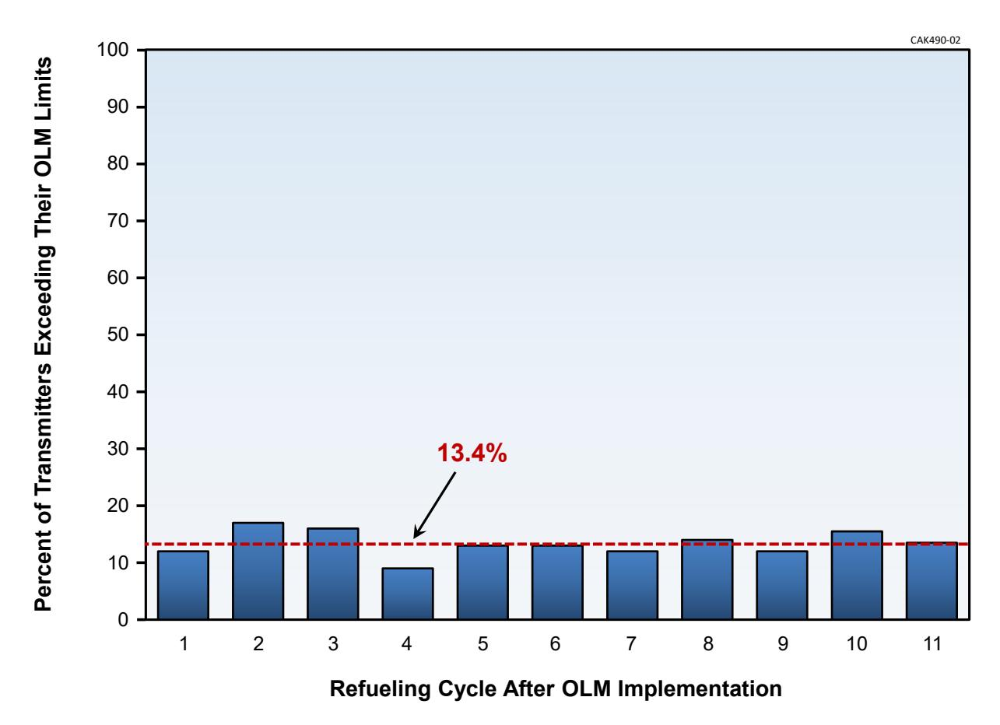

**Figure 10.1. Sizewell Transmitters Flagged for Calibration Checks at the End of Each Plant Operating Cycle** 

#### **10.1.5 Evidence to Rule Out Common Mode Drift**

Sizewell B began extending its transmitter calibration intervals in 2005 corresponding to its fuel Cycle 7. The calibration interval extension was performed on a staggered basis such that one of the four trains of transmitters were not calibrated in Cycle 7, two trains were not calibrated in Cycle 8, and three trains were not calibrated in Cycle 9. From Cycle 9 to now (2020), transmitters in only one of the four trains are calibrated. Since Cycle 9 in 2008, the 4 way redundant transmitters have had a maximum of eight years between calibration checks. Over this period, Sizewell engineers have been documenting the agreement between the OLM results and the manual calibrations that are performed each cycle [\[49\]](#page-113-14). The OLM results and manual calibrations disagree in rare occasions when one or two transmitters are found by OLM to be "good" but manual calibrations found them to be "bad" (i.e., non-conservative). [Table 10.5](#page-78-0) shows the nonconservative disagreements between OLM and manual calibrations from Cycle 7 in 2005 through Cycle 15 in 2017. It is clear that these results are distributed among various services. This provides evidence beyond what was described in [Chapter 3](#page-18-0) that the Sizewell transmitters did not experience common-mode drift. If there were common-mode drift, the disagreement between OLM and manual calibration results would have occurred in the same service(s) for consecutive cycles.

#### **10.2 OLM IMPLEMENTATION AT MCGUIRE UNIT 2**

#### **10.2.1 Description of McGuire Plant**

The McGuire nuclear power station located in North Carolina is a two-unit Westinghouse PWR owned and operated by Duke Power Company. Its Unit 1 began operation in 1981 and its Unit 2 where OLM was implemented began operation in 1984. The two units together produce 2250 in net megawatt electric power. Prior to OLM implementation, the plant had installed a temporary data acquisition system in the control room area of Unit 2 for another project that ended in 1992. This provided AMS with the opportunity to use the system for OLM data acquisition. The system included isolation devices to allow data collection from live signals with no disturbance to plant operations.

[Table 10.6](#page-79-0) shows the listing of the 170 signals that were involved in this project to demonstrate the feasibility of OLM. The project included not only pressure transmitters but also temperature sensors and other signals. The signals originated from both the primary and secondary side of the plant [\(Figure 10.2\)](#page-80-0) through a multiplexer, an additional isolation unit, a low-pass filter to eliminate any high frequency noise and provide for anti-aliasing, an analog to digital converter (A/D), and storage to keep the data for subsequent analysis. The system also included calibration and test signals as shown in [Figure 10.3](#page-81-0)**.**

**Table 10.5. Distribution of Nonconservative Results**

| Plant Operating Cycle | Non-Conservative Results mber of Nu | Pressure Loop 3 PPS m Main Stea | Narrow Range Level C SPS m Generator Stea | Pressurizer Level | m Flow Loop 1 Reactor Coolant Syste | Water Flow Train B mergency Service E | Water m Flow to Train A mponent Cooling Syste Co | water Flow to m Generator B Main Feed Stea | Narrow Range Level B SPS m Generator Stea | Pressurizer Pressure | water Flow to m Generator D Main Feed Stea | Narrow Range Level A SPS m Generator Stea |
|-----------------------|-------------------------------------------|---------------------------------------|-------------------------------------------------|-------------------|-------------------------------------------|---------------------------------------------|--------------------------------------------------------------|-----------------------------------------------------|-------------------------------------------------|----------------------|-----------------------------------------------------|-------------------------------------------------|
| 7                     | 2                                         | ×                                     | ×                                               |                   |                                           |                                             |                                                              |                                                     |                                                 |                      |                                                     |                                                 |
| 8                     | 0                                         |                                       |                                                 |                   |                                           |                                             |                                                              |                                                     |                                                 |                      |                                                     |                                                 |
| 9                     | 0                                         |                                       |                                                 |                   |                                           |                                             |                                                              |                                                     |                                                 |                      |                                                     |                                                 |
| 10                    | 1                                         |                                       |                                                 | ×                 |                                           |                                             |                                                              |                                                     |                                                 |                      |                                                     |                                                 |
| 11                    | 2                                         |                                       |                                                 |                   | ×                                         | ×                                           |                                                              |                                                     |                                                 |                      |                                                     |                                                 |
| 12                    | 1                                         |                                       |                                                 |                   |                                           |                                             | ×                                                            |                                                     |                                                 |                      |                                                     |                                                 |
| 13                    | 1                                         |                                       |                                                 |                   |                                           |                                             |                                                              | ×                                                   |                                                 |                      |                                                     |                                                 |
| 14                    | 2                                         |                                       |                                                 |                   |                                           |                                             |                                                              |                                                     | ×                                               | ×                    |                                                     |                                                 |
| 15                    | 2                                         |                                       |                                                 |                   |                                           |                                             |                                                              |                                                     |                                                 |                      | ×                                                   | ×                                               |

**Table 10.6. Listing of Signals Monitored at McGuire Unit 2**

| Item | Description of Signals                         | Number of Signals |
|------|------------------------------------------------|-------------------|
|      | Pressure Signals                               |                   |
| 1    | Steam Flow                                     | 8                 |
| 2    | Steam Pressure                                 | 12                |
| 3    | Steam Generator Level                          | 20                |
| 4    | Feedwater Flow                                 | 8                 |
| 5    | Auxiliary Feedwater Flow                       | 4                 |
| 6    | Reactor Coolant Flow                           | 12                |
| 7    | Pressurizer Level                              | 3                 |
| 8    | Pressurizer Pressure                           | 4                 |
| 9    | Wide Range Reactor Coolant Pressure            | 2                 |
| 10   | Containment Pressure                           | 3                 |
| 11   | Reactor Vessel Level Indicating System (RVLIS) | 6                 |
| 12   | Turbine Impulse Pressure                       | 2                 |
|      | Temperature Signals                            |                   |
| 13   | Narrow-Range RTDs                              | 16                |
| 14   | Wide Range RTDs                                | 8                 |
| 15   | Core Exit Thermocouples                        | 40                |
|      | Other Signals                                  |                   |
| 16   | Neutron Flux Detectors (NI Channels)           | 12                |
| 17   | ΔT Signals                                     | 4                 |
| 18   | Tave Signals                                   | 4                 |
|      | Calibration Signals                            |                   |
| 19   | +5 Volt Reference                              | 1                 |
| 20   | Electrical Short                               | 1                 |
|      | Total Number of Signals Monitored              | 170               |

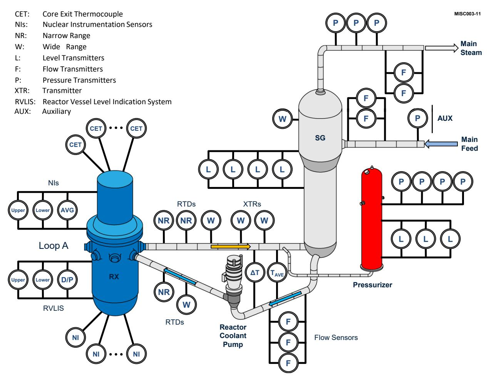

Figure 10.2. Primary and Secondary Loops of McGuire Where OLM Signals Were Monitored

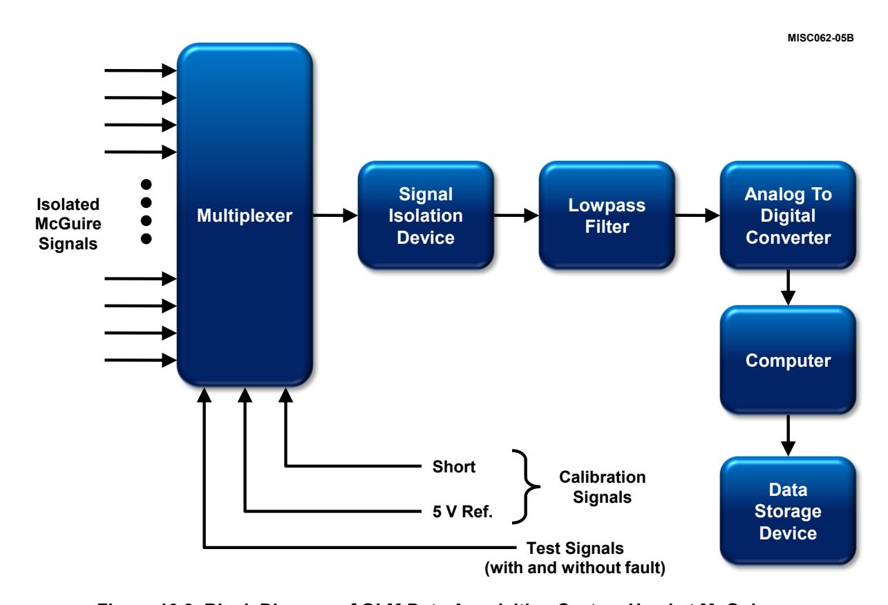

**Figure 10.3. Block Diagram of OLM Data Acquisition System Used at McGuire**

#### 10.2.2 In-Plant Demonstration of OLM

OLM validation at McGuire was performed using data from two consecutive fuel cycles covering the period of March 1992 to December 1994. The average length of a McGuire fuel cycle was about 14 months in those years. Figure 10.4 shows the components in the path of OLM signal from the process to the data acquisition system.

During the nearly thirty-three months of data collection at McGuire, there were plant trips and scheduled outages which resulted in discontinuities in the data as well as periods where online monitoring data could not be collected leaving gaps in the data. Figure 10.5 shows a plot of the reactor power during the two fuel cycles that online monitoring data were collected at McGuire.

In addition to discontinuities and gaps which had to be treated as described in Chapter 6, some of the McGuire signals were noisy and had to be filtered. Filtering was performed by moving an averaging window through the digitized data. Figure 10.6 shows a plot of three redundant signals from McGuire before and after filtering. Prior to sampling, the OLM data was also taken through analog filters to reduce any extraneous noise and provide for antialiasing. Normally, if OLM data acquired through a stand-alone data acquisition system is sampled fast (e.g., 1000Hz) it can be used to monitor not only for drift but also for response time degradation and to detect sensing line blockages. At McGuire, however, the sampling frequency was limited to less than 30 Hz to reduce storage requirements as storage was not as abundant and economical in the 1990s when this project was performed at McGuire. Nevertheless, the data was useful to evaluate both the calibration and response time of the McGuire sensors.

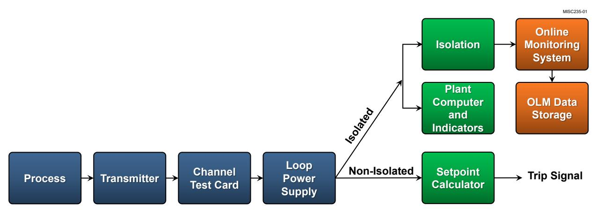

Figure 10.4. OLM Data Acquisition Connection to McGuire Instrument Channels

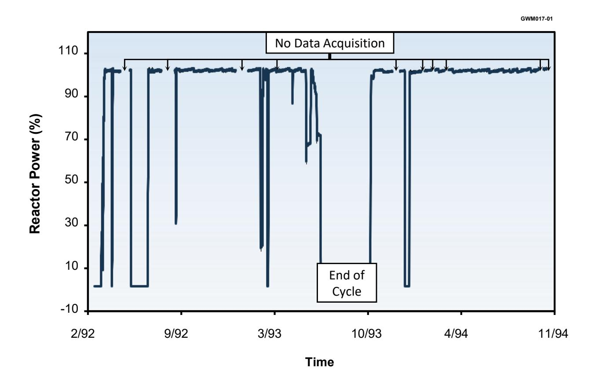

**Figure 10.5. Reactor Power During OLM Data Collection at McGuire**

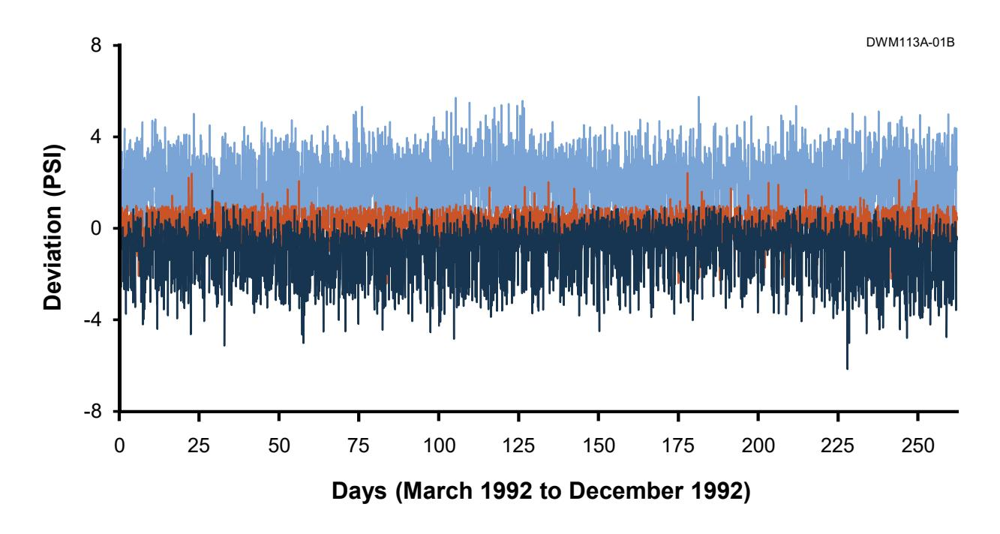

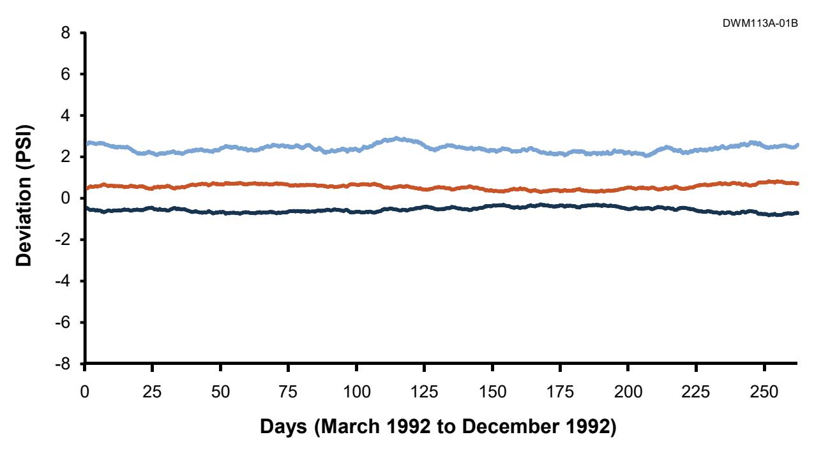

**Figure 10.6. Raw and Filtered OLM Data for Three Reactor Coolant Flow Transmitters at McGuire**

## **10.2.3 OLM Results Versus Manual Calibrations**

OLM data for McGuire transmitters was collected only during normal power operation as opposed to Sizewell B implementation where OLM data was collected not only during normal power operation but also at startup and shutdown periods. [Figure 10.7](#page-86-0) shows the agreement between average value of drift for the McGuire transmitters over two consecutive operating cycles and corresponding drift from manual calibrations. To arrive at the bar graph of [Figure 10.7,](#page-86-0) the drift values measured from OLM data and drift values calculated from manual calibrations were listed side-by-side and then subtracted from each other. The results showed differences ranging from less than 0.5% of span to about 1.5% of span. These differences were then categorized as to how many were less than or equal to 0.5% of span, 0.75% of span, 1.0% of span, and 1.5% of span. The number of transmitters in each category was then converted to percentages to arrive at the data in [Figure 10.7.](#page-86-0) This outcome demonstrated that OLM was capable of detecting drift to a reasonable level of fidelity. Today, with advances in OLM technology, better resolution will be obtained in a similar implementation project.

## **10.2.4 Laboratory Demonstration of OLM**

The OLM methodology used at McGuire was first tested at AMS using a number of nuclear grade pressure, level, and flow transmitters installed in a laboratory flow loop filled with water operating at room temperature. The details are presented in NUREG/CR-5903 and NUREG/CR-6343 and a few examples are shown in [Figure 10.8](#page-86-1) through [10.10.](#page-88-0) These results are based on OLM data collected after varying levels of drift were induced in the transmitters to demonstrate that OLM can accurately identify the drift. [Figure 10.8](#page-86-1) shows results for a number of flow transmitters that were tested one or more times as installed in the laboratory flow loop. This is followed by [Figure](#page-87-0)  [10.9](#page-87-0) with results for a Rosemount smart transmitter tested eleven times with varying levels of induced drift. The same type of results is shown for a Foxboro and a Statham transmitter in [Figure](#page-88-0)  [10.10.](#page-88-0) These experiments were performed to demonstrate the feasibility of the OLM method and to test the OLM data acquisition system and data analysis software as they were used at McGuire.

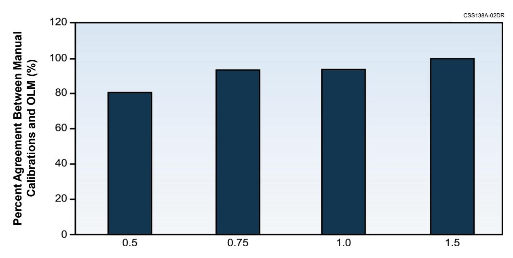

**Difference Between Amount of Drift Detected by Manual Calibrations and OLM (% of Full Scale Pressure)**

**Figure 10.7. Comparison of Drift Detected by Calibrations and OLM at McGuire**

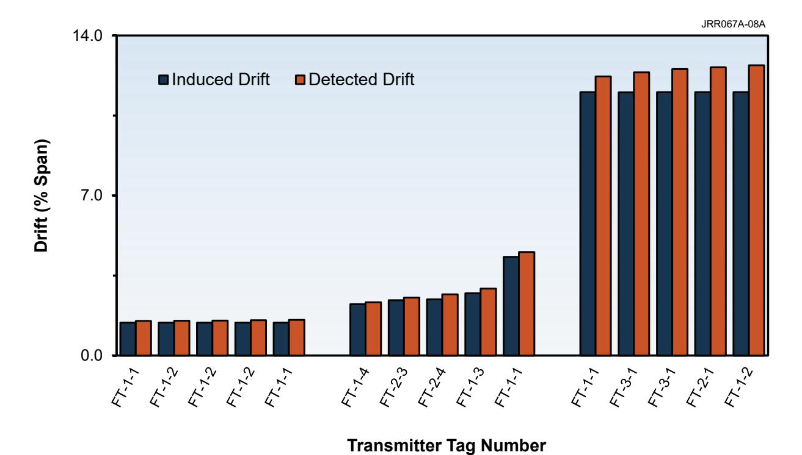

**Figure 10.8. Laboratory Results for Flow Transmitters** 

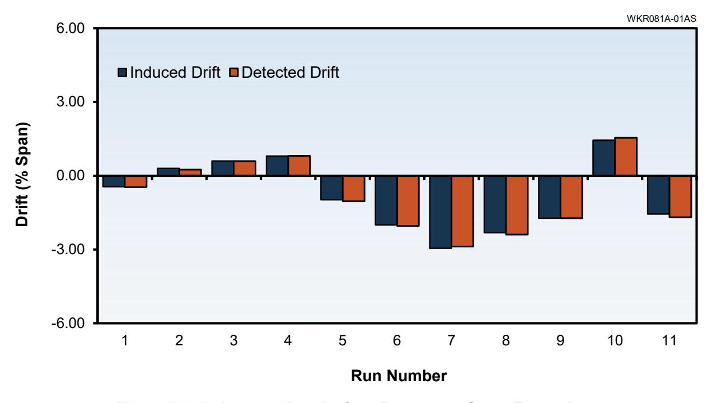

**Figure 10.9. Laboratory Results for a Rosemount Smart Transmitter**

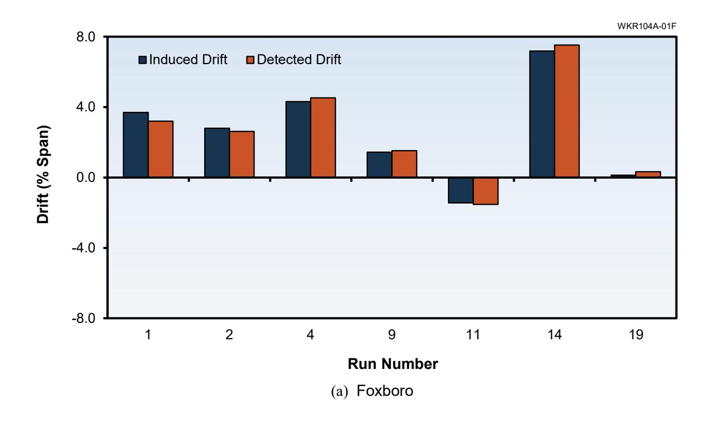

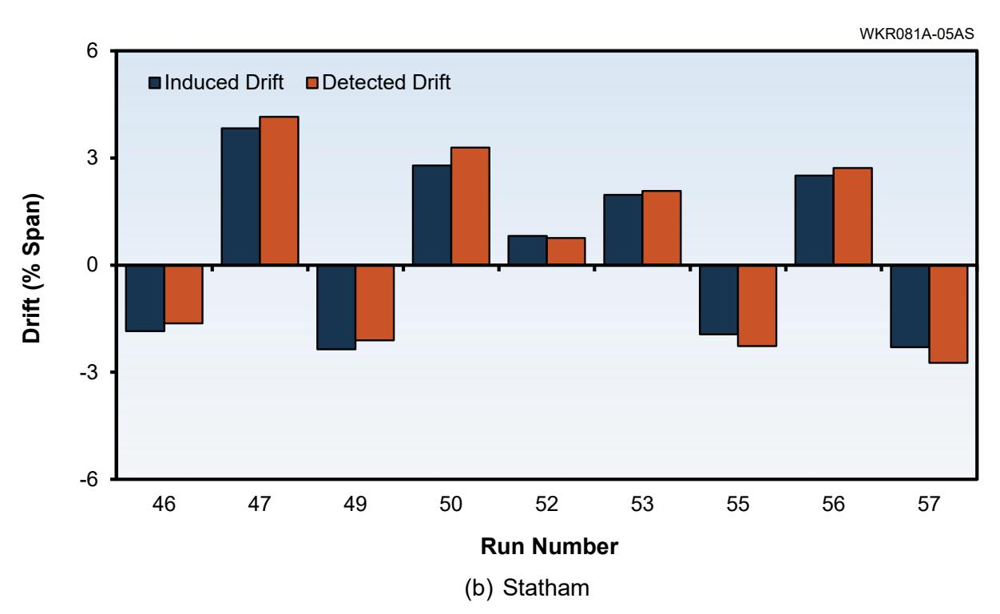

**Figure 10.10. Laboratory Results for a Foxboro and a Statham Pressure Transmitter**

#### **10.3 OLM CAN IDENTIFY ZERO AND SPAN SHIFTS**

OLM data must be collected not only at the plant operating point but also during startup and shutdown conditions to identify drift over as much of the operating range of a transmitter as possible. [Figure 10.11](#page-89-1) shows OLM data for three redundant transmitters during startup of the Sizewell B nuclear power plant. [Figure 10.11](#page-89-1) also shows the results of processing the startup data to show the drift behavior of the transmitters as a function of their span. It is apparent from this information that OLM can help verify the calibration of transmitters over much of their span.

With data from periods of plant startup or shutdown, OLM can also identify any significant shift in a transmitter zero, span, or the combination of zero and span as shown in [Figure 10.12.](#page-90-0) The results in this figure are from online monitoring of three different transmitters at Sizewell B during startup. It is apparent in the plot of [Figure 10.12c](#page-90-0) that the zero and span shift for a transmitter can cancel out if OLM is performed using data from only the plant's normal operating period. This confirms that it is important for OLM data to be collected not only at the plant operating point but also during plant startup and shutdown periods.

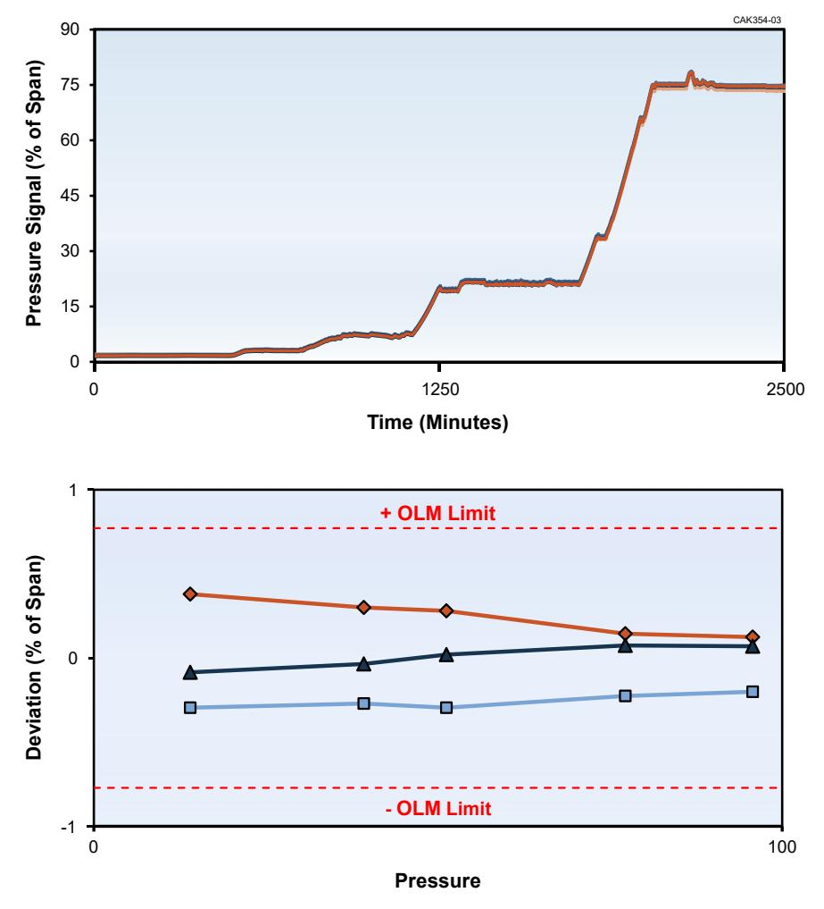

**Figure 10.11. Startup OLM Data and Results Over the Span of Transmitters**

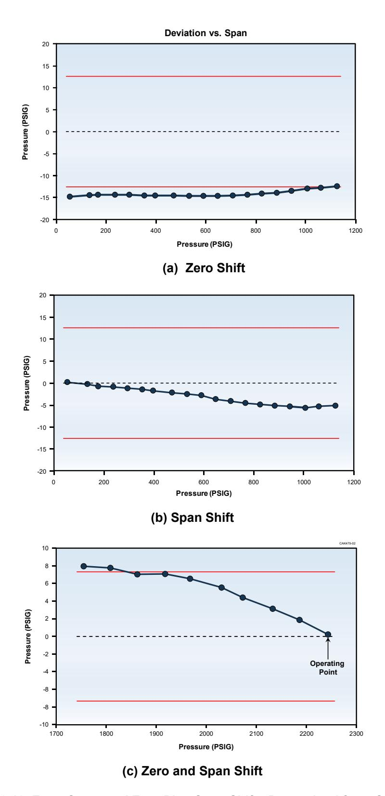

Figure 10.12. Zero, Span, and Zero Plus Span Shifts Determined from OLM Data

To quantify the amount of zero and span shift, OLM data from startup and shutdown period must first be plotted as a function of percent of span as shown i[n Figure 10.13.](#page-91-0) The results from startup period can then be subtracted from that of shutdown period to arrive at values for zero and span shifts.

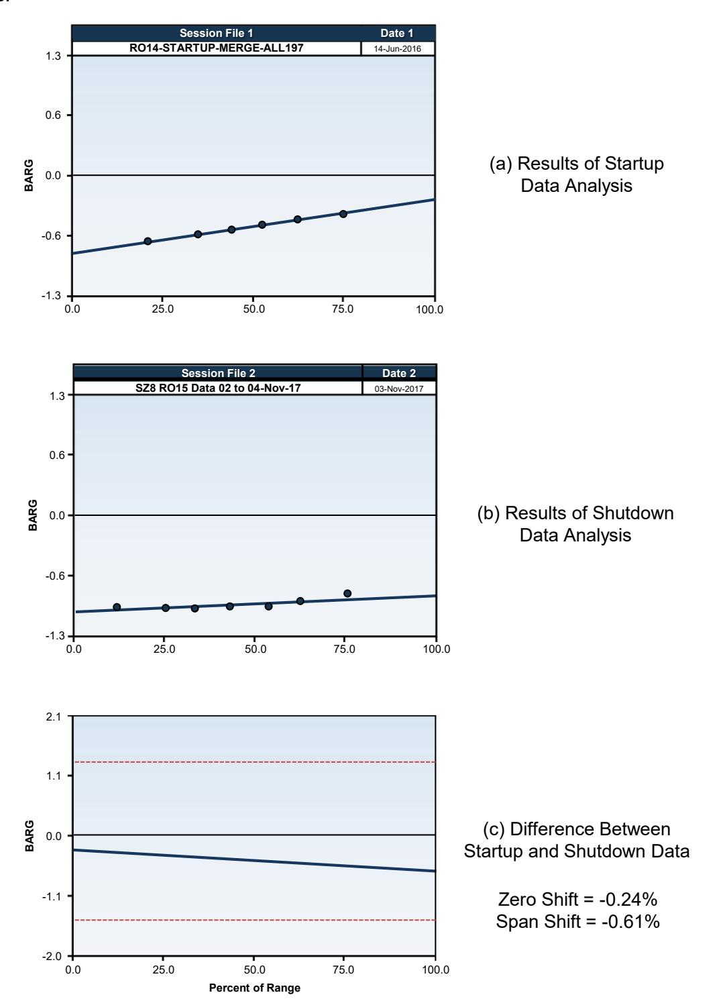

**Figure 10.13. Zero and Span Shift Calculated from Startup and Shutdown Data**

## **11 OLM IMPLEMENTATION METHODOLOGY**

This chapter provides general guidelines as to how nuclear facilities must implement OLM in a way to ensure that data is properly acquired, qualified, analyzed, interpreted, reported, and documented. These tasks must be carried out by formally trained personnel under an approved Quality Assurance (QA) program in compliance with 10 CFR Part 50 Appendix B. All software products used for OLM data acquisition, qualification, and analysis must be developed and tested using a documented software verification and validation (V&V) program. The guidelines provided in this chapter are based on OLM implementation experience in ten nuclear facilities conducted over the period of 1995 to 2020 starting with the McGuire nuclear power plant in the U.S. and the Sizewell B nuclear power plant in the U.K.

This chapter begins in Section [11.1](#page-92-1) with examples of steps that must be taken to acquire and analyze OLM data for transmitter drift monitoring, actions that can be taken based on OLM results, and continues in Section [11.2](#page-105-0) with a procedure to collect and analyze high frequency noise data to check for sensing line blockages. These sections are followed by recommendations on training of the OLM analyst in Section [11.3](#page-109-0) which is an important aspect of OLM implementation and Section [11.4](#page-109-1) on how plant's technical specifications must be changed to implement OLM.

#### **11.1 DATA ACQUISITION AND ANALYSIS TO MONITOR FOR DRIFT**

The following are steps that must be taken by nuclear facilities implementing OLM to acquire and analyze data to identify drifting transmitters. The fourteen steps that must be taken are identified below along with an example with details that illustrates how each step can be implemented. The verb *must* is used to identify actions that are essential to OLM implementation and the verb *should* is used to identify other actions that are helpful but not essential to OLM implementation.

- 1. **Select transmitters to be monitored.** Almost all nuclear plant pressure, level, and flow transmitters can be tested by OLM. As a first step towards OLM implementation, a list of transmitters to be included in the OLM program must be developed. Information about these transmitters should be collected to support OLM implementation. The typical information used to support transmitter selection includes availability of redundant measurements, location of transmitters (i.e. inside or outside of the reactor containment), accessibility of transmitters in the plant (e.g., if scaffolding is required for access to transmitters or transmitters are located in high radiation areas), and whether the transmitter output data is stored in the plant computer.
- 2. **Produce a software configuration file.** The data analysis software configuration file should include information about each transmitter such as plant component identification number, manufacturer, make, model number, device serial number, service or function in the plant, redundant grouping, number of transmitters in each group, and operating range (i.e. minimum and maximum readings). The data analysis software configuration file must include analysis parameters developed in steps 7 and 9 below such as OLM limits and

data analysis parameters (e.g., band to be used in parity space averaging). Information about previous calibrations, repairs, or replacements should also be included in this step to support data analysis.

- 3. **Provide access security and configuration control.** Access to OLM software must be limited to those who are formally trained on the specific OLM software and are authorized to use the software. These controls must also be applied to the configuration information or any adjustable aspects of the software. Software modifications or configuration changes must be validated and documented. The documentation should include an explanation of the reasons for the changes.
- 4. **Establish algorithm(s) for data analysis.** OLM data analysis is used to determine the true process value. This objective can be accomplished by simple or weighted averaging or modeling techniques. The OLM methodology presented in this TR focuses on simple averaging and parity space methods for weighted averaging. The analyst must determine whether simple or parity space averaging will be used based on an evaluation of the OLM data. The analyst must also define the parity space band.
- 5. **Establish method of data acquisition.** OLM data is normally available in the plant computer or an associated data historian. If data is not available from the plant computer or historian, then a custom data acquisition system including hardware and software must be developed to acquire the data. The custom data acquisition system must include a high impedance signal isolation device to ensure that OLM data can be collected while the transmitter remains in service during plant operation. A custom data acquisition system was used at the McGuire nuclear power plant to acquire OLM data on 170 live signals demonstrating the feasibility of this approach for data acquisition in a nuclear facility [\[10\]](#page-111-5).
  - The OLM data for some transmitters may not be available in the plant computer. In this case, a hybrid approach can be used whereby some OLM data is acquired from the plant computer and other data through a custom data acquisition system. In doing so, data from the two different sources must be synchronized. The custom data acquisition system can be a portable system that is used for temporary data collection during plant startup, shutdown, and periodically during power operation. An approved plant procedure must be used to control how the OLM data acquisition system is connected to plant signals.
- 6. **Specify data collection duration and sampling rate.** OLM data should be sampled continuously during startup and shutdown periods and for about 12 to 24 hours every month during the plant operating cycle. The duration of OLM data collection depends on the sampling rate. In general, the faster the sampling rate, the shorter the duration of data collection.

The rate by which plant computers sample the output of process instruments varies widely among nuclear power plants. Some plants sample as fast as one data point per second and others as slow as one data point every 5 minutes. While this range of sampling frequencies are adequate to monitor for transmitter drift, they are not fast enough for detecting sensing line blockages using the noise analysis technique. Section [11.2](#page-105-0) describes the requirements for sampling rates to perform noise analysis. As for adequate sampling rates for drift monitoring, Chapte[r 8](#page-63-0) describes the relationship between sampling rate and the accuracy of the OLM results providing insights as to how to select the best sampling rate to identify drifting transmitters.

If a custom data acquisition system is used to acquire OLM data, the same system can sample data for both drift monitoring and detection of sensing line blockages. For example, a sampling rate of 2000 Hz supports analysis of transmitter performance for calibration condition, response time, sensing line health, nonlinearity, problems in the transmitter's electronics, and other anomalies (e.g., oil loss from the transmitter sensing module).

- 7. **Establish OLM limits.** OLM limits must be established for each service or each group of redundant transmitters considering the uncertainty of the data analysis technique using RSS formulas such as those found in the ISA 67.04 standard. Examples and guidelines as to how to establish OLM limits are provided in Chapter [7.](#page-52-0)
  - The OLM methodology focuses on the simple averaging and parity space techniques for data analysis. Other methods including empirical and physical modeling have been exhaustively researched and numerous publications exist on their theoretical and practical aspects, uncertainty, implementation process, and other details. As such, those methods are not discussed in this TR other than to note that the uncertainty of the process estimation from any method that is used for OLM data analysis must be quantified and taken into account in arriving at OLM limits.
- 8. **Clean, qualify, and prepare OLM data.** The raw OLM data retrieved from plant computers can contain anomalies (e.g., spikes, missing data, stuck data, and saturated data). These anomalies are benign to plant operation but must be evaluated prior to OLM data analysis to determine if and how they are to be treated in the analysis. Typically, identified anomalies are excluded from the OLM analysis as described in Chapter [6.](#page-35-0) The basis for exclusion of the anomalies must be documented in the record of OLM implementation per step 13 of this procedure.
- 9. **Analyze OLM data.** The OLM data sampled during plant startup, normal operation, and shutdown are first partitioned and then analyzed partition-by-partition. An example using four redundant transmitters is illustrated in [Figure 11.1.](#page-95-0) The partitioning windows are selected by the OLM analyst based on experience and characteristics of the OLM data [\(Figure 11.1a](#page-95-0)). The process estimate is calculated using simple averaging or parity space technique for each partition [\(Figure 11.1b](#page-95-0)). This value is then subtracted from the reading of each redundant transmitter to arrive at the deviation of each transmitter from the process estimate for the redundant group. The deviation results are then plotted versus time for the redundant transmitters [\(Figure 11.1c](#page-95-0)).

Next, the deviations over the partition window are averaged to arrive at a single deviation value for each transmitter. This value is then plotted on an x-y axis where y is the average value of the transmitter deviation over the partition window and x is the operating point in percent of span at which the OLM data was collected [\(Figure 11.1d](#page-95-0)). This procedure is repeated for all partitions to arrive at the transmitter deviations over the operating span [\(Figure 11.1e](#page-95-0)).

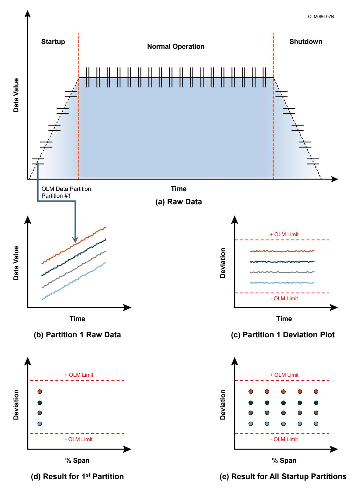

Figure 11.1. Startup Data Analysis Process

- 10. **Compile OLM results in tables and plots.** The OLM data sampled during normal operation is analyzed month by month [\(Figure 11.2a](#page-97-0), b, and c) using the procedure mentioned in the above step and the results are plotted versus time as illustrated in [Figure](#page-97-0)  [11.2d](#page-97-0). These results together with the result of startup OLM data are summarized in a table to indicate if any transmitter deviation at any point during startup or normal operation periods exceeded the OLM limit. If so, an "x" is placed in the column where the OLM limit was exceeded as shown in [Table 11.1](#page-98-0) for four redundant pressurizer level transmitters at Sizewell B. Referred to as mid-cycle summary because it is produced after several months of normal operation, this table is used to provide the plant with an early inclination as to which transmitters are planned for a calibration check during the ensuing outage. Then, after the plant is shut down, the OLM data for the remaining months of normal operation and the shutdown period is promptly analyzed partition-by-partition as described above and the outcome used to produce the final results as shown in [Figure 11.3](#page-99-0) which includes not only the table of full cycle analysis but also plots of transmitter deviations at startup, shutdown, and normal operation periods. This is an example of the OLM implementation process for a complete operating cycle of about 18 months using the Sizewell B nuclear plant data collected from the beginning of startup in May 2013 to end of shutdown in October 2014.
- 11. **Identify good and bad transmitters.** The final test results are produced by the OLM analyst upon completion of data analysis for the complete operating cycle. [Table 11.2](#page-100-0) shows an example of how the final OLM results can be compiled through evaluation of transmitter deviation during a complete operating cycle. In this example, four redundant transmitters are shown with one having exceeded its OLM limits most of the time during the complete fuel cycle, one that never exceeded the OLM limits, and two which exceeded the OLM limits on one or two occasions. Obviously, the transmitter that exceeded its OLM limits often (ABC-104) is flagged as "bad" meaning that its calibration must be checked during the outage. Also, the transmitter that never exceeded its OLM limits (ABC-103) is flagged as "good" meaning that the transmitter does not need a calibration check. As for those transmitters that have occasionally exceeded their OLM limits during the fuel cycle (ABC-101 and ABC-102); the analyst should evaluate the raw OLM data, the results of OLM analysis, and all other factors such as transmitter location, service, any extraneous effects, plant activities during OLM data acquisition, and use best engineering judgement and experience as to whether the transmitter should be flagged as "good" or "bad". Generally, a conservative approach is to flag the transmitter as "bad" if there is any doubt about the results of the analysis.

[Figure 11.4](#page-101-0) shows OLM results for three redundant pressurizer level transmitters at Vogtle Nuclear Power Plant Unit 1 together with the OLM plots for startup, shutdown, and normal operation periods. This is an example of an OLM test where the bad transmitter is clearly identified[. Figure 11.5](#page-102-0) shows OLM results for three redundant steam pressure transmitters at Farley Nuclear Power Plant Unit 1 as an example of OLM results where the transmitters are well within their OLM limits throughout the cycle. Note in [Figure 11.5](#page-102-0) that the startup and shut down results representing the deviation of the transmitter as a function of span are identical which is the expected performance.

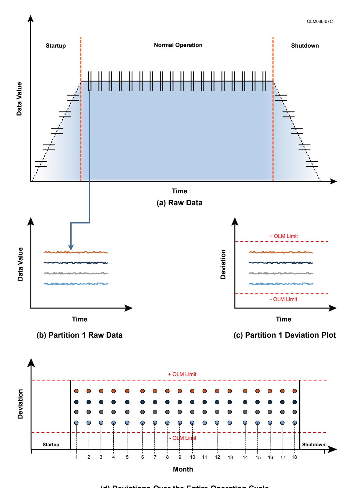

**(d) Deviations Over the Entire Operating Cycle** 

**Figure 11.2. Analysis Process for OLM Data Collected During Normal Plant Operation** 

**Table 11.1. Example of Mid-Cycle Summary Results for Sizewell B Transmitters**

| Tag          | SU | 18 June 2013 | 16 July 2013 | 06 Aug 2013 | 03 Sept 2013 | 01 Oct 2013 | 29 Oct 2013 | 26 Nov 2013 | 24 Dec 2013 | Final |
|--------------|----|-----------------|-----------------|----------------|-----------------|----------------|----------------|----------------|----------------|-------|
| 1BB-L-0465-W |    |                 |                 |                |                 |                |                |                |                |       |
| 1BB-L-0466-W |    |                 |                 |                |                 |                |                |                |                |       |
| 1BB-L-0467-W |    |                 |                 |                |                 |                |                |                |                |       |
| 1BB-L-0468-W | X  | X               | X               | X              | X               | X              | X              | X              | X              | X     |

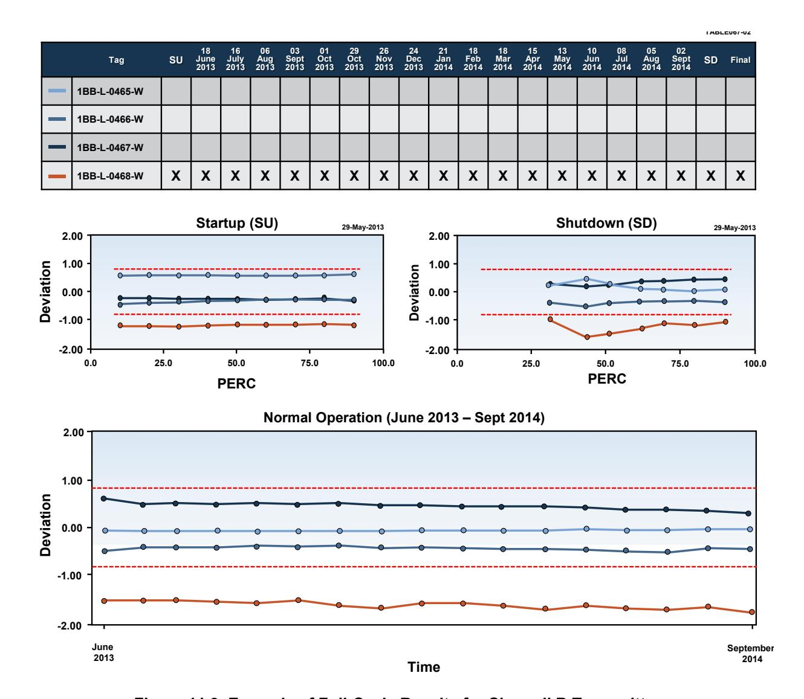

**Figure 11.3. Example of Full-Cycle Results for Sizewell B Transmitters**

**Table 11.2. Illustration of Cycle Summary Table for Four Redundant Transmitters**

| Tag Number | SU | Month 1 | Month 2 | … | Month 18 | SD | Result |
|---------------|----|---------|---------|---|----------|----|--------|
| ABC-101       |    |         | X       |   |          |    | Good   |
| ABC-102       | X  |         |         |   |          |    | Good   |
| ABC-103       |    |         |         |   |          |    | Good   |
| ABC-104       | X  | X       | X       | X |          | X  | Bad    |

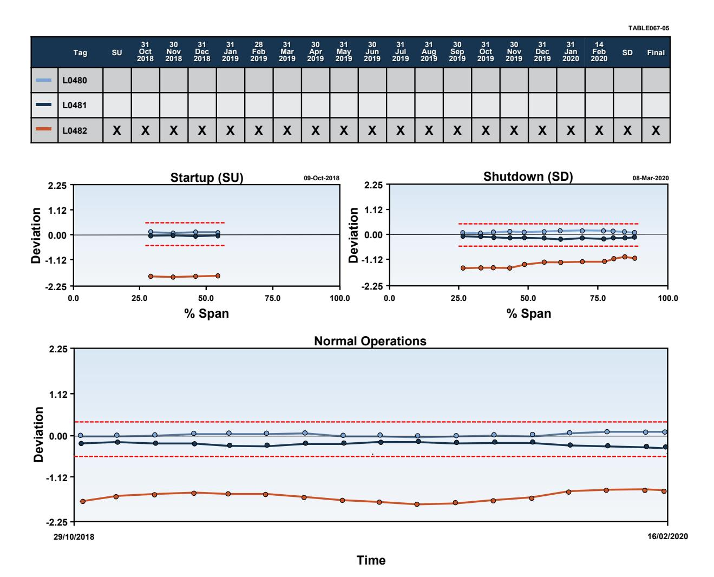

Figure 11.4. OLM Results for Redundant Pressurizer Level Transmitters at Vogtle

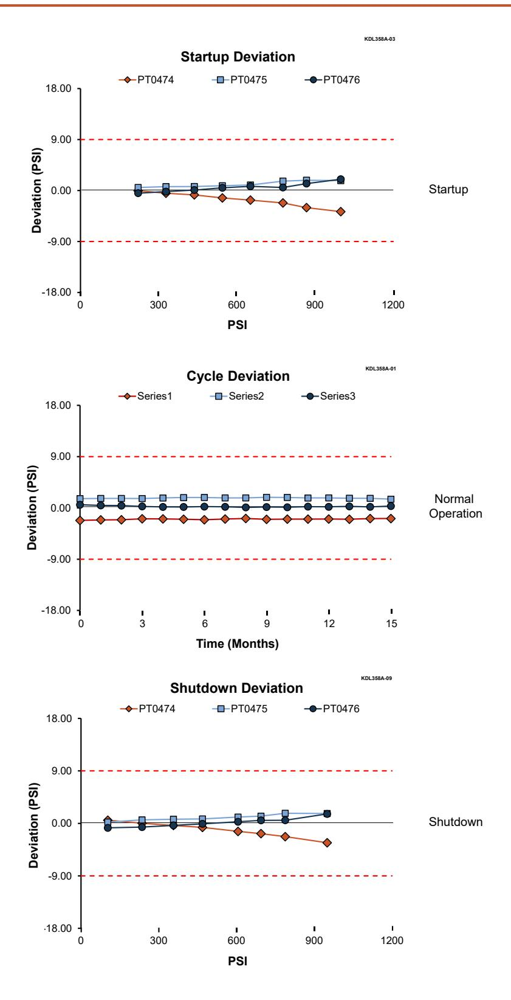

**Figure 11.5. OLM Results for Three Redundant Steam Pressure Transmitters at Farley** 

- 12. **Prepare report of OLM results.** The raw OLM data and results of analysis must be documented and independently reviewed and approved by the organization operating the nuclear facility. All transmitters must be identified as either "good" or "bad" depending on results of OLM analysis and interpretation of the outcome by an OLM analyst. Transmitters that have been identified as "bad" must be scheduled for a manual calibration check during the next calibration opportunity which is typically the next refueling outage.
  - [Table 11.3](#page-104-0) shows an abbreviated list of OLM results for eleven redundant transmitters in three different services at Sizewell B plant indicating that only one of the eleven transmitters is "bad" (i.e., about 10%). This is typical as historical data from the current fleet of nuclear plants and OLM implementation experience at Sizewell B, McGuire, Vogtle, and other nuclear facilities have indicated that 10% or less of nuclear plant transmitters lose their calibration over a single fuel cycle of 14 to 24 months.
- 13. **Record all data collection and data processing steps.** All steps in collecting and processing of OLM data must be recorded so that the results of OLM analysis can be easily reproduced and tracked. For example, any outliers removed in averaging and parity space analysis of OLM data must be identified, any filtering used in data cleanup must be described by the type of filtering and its parameters, and method of data analysis to arrive at the process estimate must be identified. In addition, any portion of raw OLM data removed to eliminate anomalies such as spikes, stuck data, or missing data must be clearly identified and justified.
- 14. **Determine actions to be taken based on OLM results.** OLM identifies calibration problems as they may occur during normal operation. Thus, plants using OLM can identify a transmitter that exceeds its OLM limits while the plant is at power. If this occurs, the first step is to flag the transmitter for closer observation. Sometimes, a transmitter deviation can exceed its OLM limits for a period of time and later return to within its OLM limit. Also, a transmitter deviation that exceeds its OLM limits can be due to other components in the path of the signal from the process to the plant computer. Therefore, when OLM identifies a drifting transmitter, the calibration of other components in the OLM signal path should be checked. If the components in the OLM signal path excluding the transmitter are found to be in calibration, then the transmitter calibration must be checked. Otherwise, the need as to whether or not to check the transmitter calibration must be evaluated and justified.

Furthermore, any leakage in pressure sensing lines can cause drift at the output of the affected pressure sensing system. As such, all potential causes of drift beyond OLM limits shall be considered and evaluated before a flagged transmitter is scheduled for a calibration check.

**Table 11.3. Abbreviated Table of OLM Results for Sizewell Transmitters**

| Item | Group Name           | Tag Name | Result |
|------|----------------------|----------|--------|
| 1    | SG C Outlet Pressure | PT0494   | Good   |
| 2    | SG C Outlet Pressure | PT0495   | Good   |
| 3    | SG C Outlet Pressure | PT0496   | Good   |
|      |                      |          |        |
| 4    | Pressurizer Level    | LT0459   | Good   |
| 5    | Pressurizer Level    | LT0460   | Good   |
| 6    | Pressurizer Level    | LT0461   | Good   |
| 7    | Pressurizer Level    | LT0462   | Bad    |
|      |                      |          |        |
| 8    | Pressurizer Pressure | PT0456   | Good   |
| 9    | Pressurizer Pressure | PT0457   | Good   |
| 10   | Pressurizer Pressure | PT0444A  | Good   |
| 11   | Pressurizer Pressure | PT0445a  | Good   |

## **11.2 DATA ACQUISITION AND ANALYSIS TO DETECT SENSING LINE BLOCKAGES**

OLM can help detect sensing line blockages using the noise analysis technique if data is acquired with a high sampling frequency such as 2000 Hz. Since today's plant computers may not sample process data at such a high frequency, a separate data acquisition system with isolation capability must be used. This data collection system can be a portable multichannel data acquisition unit (e.g., with typically between 8 and 32 data acquisition channels) to acquire data from many transmitters simultaneously.

Noise analysis data is collected and analyzed according to the following procedure.

- 1. **Setup data acquisition equipment.** Stage the portable data acquisition system near the instrument cabinets in the control room area where transmitter loops can be accessed. The data acquisition system must have qualified isolation to allow testing of live safetyrelated transmitters while the plant is operating. For example, the data acquisition system should provide over 500 volts of channel-to-channel isolation, an input impedance of at least 10 megaohms, anti-aliasing filter capability of 100 dB in stopband rejection, ± 10 V input range, and about 1 microvolt of voltage resolution. [Figure 11.6](#page-106-0) shows how noise data is extracted from the output of a transmitter while the plant is operating.
- 2. **Connect equipment to plant signals**. Connect the data acquisition system to as many transmitters as allowed by the number of data acquisition channels and the plant procedures. Since multiple transmitters can be tested simultaneously depending on the number of data acquisition channels, all transmitters that are typically tested at each operating cycle in a nuclear power plant can be covered in less than a single 8-hour shift. [Figure 11.7](#page-106-1) shows how a noise data acquisition channel is connected to the transmitter current loop.
- 3. **Collect and store data for subsequent analysis.** It is best to collect the noise data during normal plant operation at full temperature, pressure, and flow. However, noise data taken at other conditions can be acceptable as long as there are enough process fluctuation with sufficient amplitude and frequency content to drive the transmitters to reveal their dynamic characteristics.

The noise analysis technique involves processing the random fluctuations (noise) that naturally exist at the output of most transmitters during plant operation. Examples of services that have adequate process fluctuations and are therefore amenable to noise analysis are reactor coolant flow, steam generator level, steam flow, reactor vessel water level, reactor vessel pressure, pressurizer pressure, pressurizer level, and reactor coolant pressure. Examples of services with little or no fluctuations are containment pressure, reactor water storage tank level, and drywell pressure. For services such as containment pressure that do not fluctuate much, a random signal generator can be used to apply wideband pressure noise into the transmitter's sensing system to produce adequate fluctuations at the transmitter output for noise analysis. To determine if a transmitter is amenable to noise analysis, high frequency data is collected and analyzed to evaluate if the process fluctuations are driving the pressure sensing system to its full dynamic range. Collecting noise data at 2000 Hz for 1 hour will cover the entire dynamic range of typical pressure sensing systems in nuclear power plants.

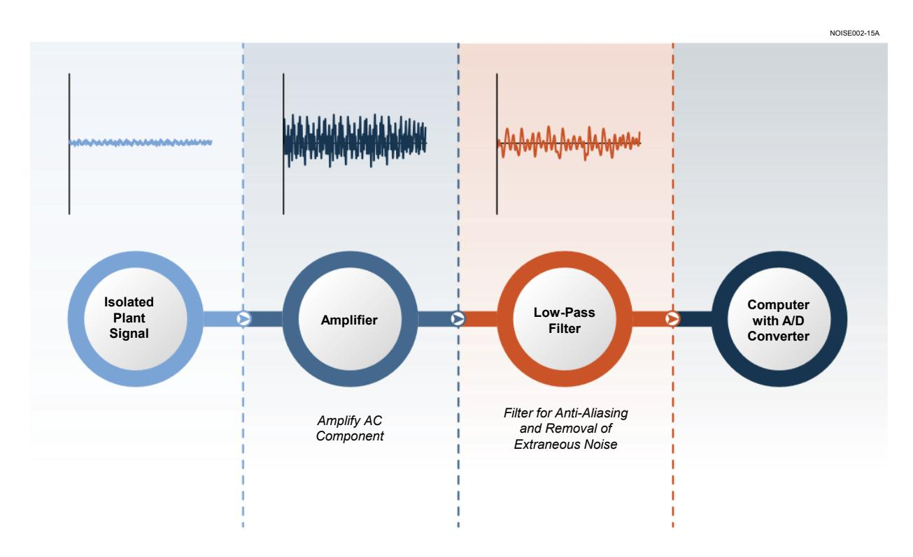

**Figure 11.6. Noise Data Acquisition Process**

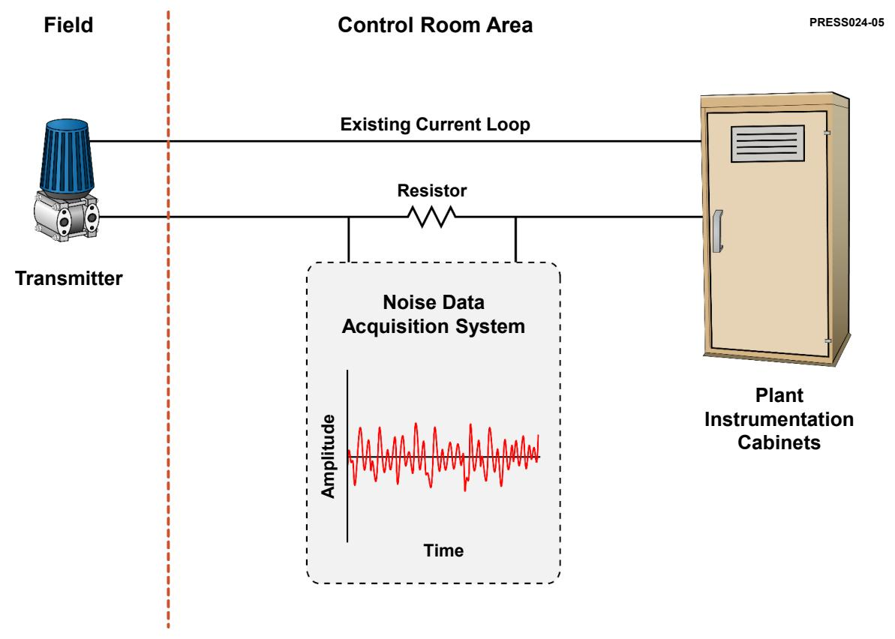

**Figure 11.7. Noise Data Acquisition from a Transmitter Loop**

- 4. **Screen noise data for artifacts and anomalies.** During collection of noise data, potential exists for spikes, jumps, and other artifacts to contaminate the data. These artifacts are normally benign to plant operation but can complicate the analysis of the noise data or decrease the reliability of its results. Typically, identified anomalies are excluded from the OLM analysis. A variety of statistical algorithms and software packages are available to help with automated screening of noise data. [Figure 11.8](#page-108-0) shows typical noise data from a transmitter in a nuclear power plant after the data was acquired and cleaned. This graph shows only 50 seconds of data from a 30 minute recording that was collected for detection of sensing line blockages.
- **5. Analyze noise data and check results for evidence of sensing line blockages.** The noise data can be analyzed in the frequency and/or time domain. Algorithms involving Fast Fourier transform (FFT) and autoregressive (AR) modeling are commercially available to process the noise data and produce the power spectral density (PSD) of transmitters. A PSD can be visually examined by a trained analyst and compared with a baseline or a database to determine if a sensing line blockage exists. Two sets of PSD plots are shown in [Figure 11.9,](#page-108-1) each for a transmitter in a PWR plant. Each plot contains two PSD traces; one with a sensing line blockage and another after the blockage was cleared.

Each PSD must be fit to a generic mathematical model for the affected transmitter to quantify the effect of a sensing line blockage. The result will be the sum of the response time of the transmitter and any lag due to the sensing line blockage.

6. **Document results.** The results of the above steps should be documented to show the plant component identification number, device serial number, service, date of tests, and noise analysis results.

The data acquisition and analysis to detect sensing line blockages are typically carried out near the end of each operating cycle so that any significant sensing line blockage can be identified and cleared during the ensuing outage. Any transmitter that was cleared of a sensing line blockage should be re-tested by noise analysis after the plant returns to normal operation to verify that the sensing line blockage is resolved.

AMS recognizes that some licensees may have extended or eliminated periodic response time testing requirements based, in part, on the performance of transmitter calibration. It is the responsibility of licensees implementing the OLM methodology described in Section [11.1](#page-92-1) to assess the impact on any prior licensing actions to extend or eliminate periodic response time testing requirements. The OLM methodology using the noise analysis technique can be used to monitor the response time performance of transmitters that have periodic calibration deferred based on the OLM methodology.

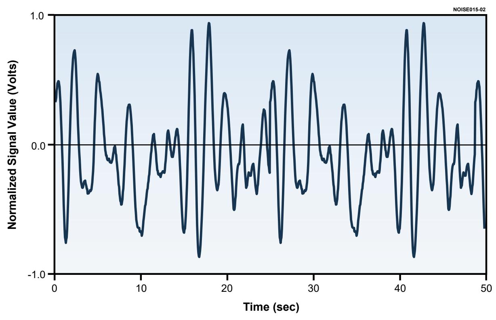

**Figure 11.8. Raw Noise Data from a PWR Pressure Transmitter**

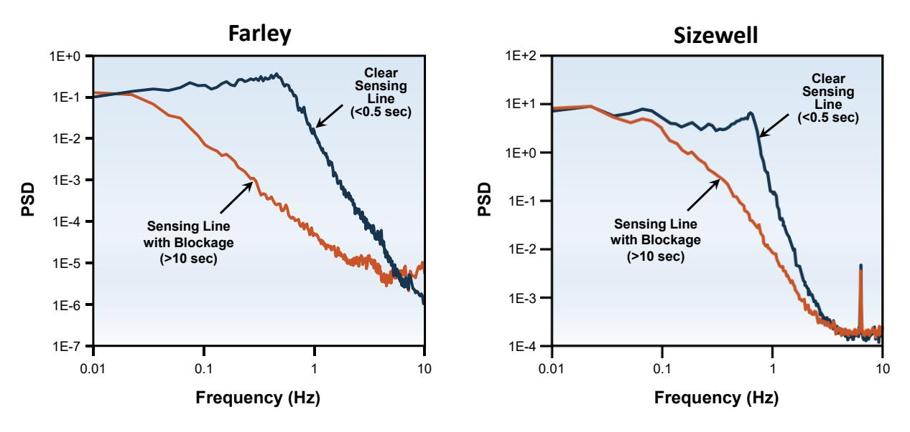

**Figure 11.9. Noise Analysis Results for Farley and Sizewell B Transmitters With and Without Sensing Line Blockages**

#### **11.3 TRAINING OF OLM ANALYST**

OLM technology is simple in principle, but much work is typically involved in its implementation. Both OLM data acquisition and data analysis can be performed with a variety of commercially available hardware and software tools, but the most important aspect of OLM implementation is the human analyst.

A great deal of research has been performed worldwide to automate the reading and interpretation of OLM data and results, but none can yet replace the need for the human analysis. The human analyst must know the OLM fundamentals and its implementation details. OLM analyst training can be accomplished using information derived from publicly available reference material such as those listed at the end of this report. This training should be augmented by onthe-job practice analyzing OLM data to learn the subtle details of data collection, data cleanup and qualification, data analysis, interpretation of the OLM results, reporting of the OLM outcome, and documentation of the entire process.

Procedures must be prepared for OLM data acquisition, data qualification, data analysis, interpretation of the results, and documentation of the process to ensure repeatable and reliable results.

#### **11.4 REQUIRED TECHNICAL SPECIFICATIONS CHANGES**

The plant Technical Specification must be modified to implement OLM. The typical Technical Specification changes must include the addition of a definition for ONLINE MONITORING. A new ONLINE MONITORING Program to Extend Transmitter Calibration Intervals must be added. A new Surveillance Requirement option to use the ONLINE MONITORING Program to Extend Transmitter Calibration Intervals to determine the frequency of transmitter CHANNEL CALIBRATION must be adopted. The new SURVEILLANCE REQUIREMENT option is added as an "OR" option to the existing requirement.

Example changes to Standard Technical Specifications (STS) are provided in [Appendix C](#page-132-0) based on the style used in TSTF-425.

The purpose of the OLM Topical Report is to provide a method to defer calibration of the transmitters based on OLM results. The Topical Report is not intended to extend the calibration of other elements in the safety signal path. The Surveillance Requirement frequency for other components in the signal path (e.g., risk-based, calendar-based, or digital I&C platform-based) remains in effect.

## **12 CONCLUSION**

OLM methodology to identify drift and sensing line blockages in a pressure sensing system was described in this report and examples of OLM implementation in representative nuclear facilities and their results were presented. Comparisons between OLM results and conventional calibrations were shown to produce about 99 percent conservative agreement testifying to the reliability of OLM methodology to identify drift. The potential for common mode drift in nuclear grade pressure transmitters was ruled out using a substantial volume of data and objective evidence summarized in this report. With OLM data collected during periods of startup, shutdown, and normal operations, it was shown that drift of transmitters over much of their span can be identified and zero and span shifts measured. This resolves the "single point monitoring" question that had plagued the use of OLM in nuclear power plants.

The OLM methodology presented in this topical report can be used as the technical basis to support plant-specific Technical Specification changes to switch from time-based surveillance frequency for transmitter calibrations to a condition-based calibration frequency based on OLM results. The Topical Report can also be used by licensees to develop procedures to detect sensing line blockages using the noise analysis technique.

## **REFERENCES**

Following are the references cited specifically throughout this report. A summary of the key content of each of these references are provided in [Appendix D.](#page-146-1)

- 1. Electric Power Research Institute, "On-Line Monitoring of Instrument Channel Performance", TR-104965-R1, NRC SER, EPRI 1000604, Palo Alto, CA, ADAMS Accession Number ML003734509, 2000.
- 2. Hines, J., Seibert, R., U.S. Nuclear Regulatory Commission (NRC), "Technical Review of On-Line Monitoring Techniques for Performance Assessment Volume 1: State of the Art", NUREG/CR-6895, Vol.1. Washington, D.C., ADAMS accession number ML060610394, 2006.
- 3. Hashemian, H., "Sensor Performance and Reliability", Published by ISA—The Instrumentation, Systems, and Automation Society, 2005.
- 4. Hashemian, H., "Maintenance of Process Instrumentation in Nuclear Power Plants", Published by Springer-Verlag, 2006.
- 5. Hashemian, H., "Maintenance Optimization Through Data Analytics", Nuclear Plant Journal, pp. 28-30, 2017.
- 6. Ramuhalli, P., Lin, G., Crawford, S., Konomi, B., Coble, J., Shumaker, B., Hashemian, H., "Uncertainty Quantification Techniques for Sensor Calibration Monitoring in Nuclear Power Plants", Pacific Northwest National Laboratory, Report Number PNNL-22847 Rev. 1, Department of Energy Contract DE-AC05-76RL01830, 2014.
- 7. International Atomic Energy Agency (IAEA), "Advanced Surveillance, Diagnostic and Prognostic Techniques in Monitoring Structures, Systems and Components in Nuclear Power Plants", IAEA Nuclear Energy Series No NP-T-3.14, Vienna, Austria, 2013.
- 8. EPRI TR-103436-V1, "Instrument Calibration and Monitoring Program Volume 1: Basis for the Method", 1993.
- 9. NUREG/CR-5903, Hashemian, H. M., "Validation of Smart Sensor Technologies for Instrument Calibration Reduction in Power Plants," U.S. Nuclear Regulatory Commission, Washington, D.C., 1993.
- 10. U.S. Nuclear Regulatory Commission (NRC), "On-Line Testing of Calibration of Process Instrumentation Channels in Nuclear Power Plants", NUREG/CR-6343, 1995.
- 11. *Guidelines for Instrument Calibration Extension/Reduction – Revision 1: Statistical Analysis of Instrument Calibration Data*. EPRI, Palo Alto, CA: 1998. TR-103335-R1.
- 12. *Guidelines for Instrument Calibration Extension/Reduction – Revision 2: Statistical Analysis of Instrument Calibration Data*. EPRI, Palo Alto, CA: 2014. 3002002556.
- 13. U.S. Nuclear Regulatory Commission (NRC), NUREG-1475, *Applying Statistics,* Revision 1, (March 2011).
- 14. U.S. Nuclear Regulatory Commission (NRC), "Aging of Nuclear Plant Resistance Temperature Detectors", Report Number NUREG/CR-5560, 1990.
- 15. Hashemian H., et al. "Effects of Aging on Response Time of Nuclear Plant Pressure Sensors", Washington, D.C., NUREG/CR-5383, 1989.

- 16. Hashemian, H., Mitchell, D., Fain, R., & Petersen, K. "Long Term Performance and Aging Characteristics of Nuclear Plant Pressure Transmitters", NUREG/CR-5851, United States, 1993.
- 17. PWR Owners Group, "The Pressure and Differential Pressure Transmitter Calibration Frequency Extension: Generic Transmitter Drift Study", AMS Report WDS1601R2, 2017.
- 18. Thompson, D., "Transmitter Single Calibration Regression Methodology – Drift Statistics", British Energy report E/REP/SXB/0015/00 Issue 1, 2001.
- 19. Electric Power Research Institute, "Instrument Drift Study: Sizewell B Nuclear Generating Station", 1009603, Palo Alto, CA, 2005.
- 20. Electric Power Research Institute, "Investigation of Response Time Testing Requirements", NP-7243-R1, Palo Alto, CA, 1994.
- 21. Electric Power Research Institute (EPRI), "Instrument Calibration Monitoring Program Volume 2: Failure Modes and Effects Analysis", TR-103436-V2, EPRI, Palo Alto, CA, (December 1993).
- 22. Technical Specifications Task Force (TSTF), "Relocate Surveillance Frequencies to Licensee Control – RITSTF Initiative 5b", TSTF-425-A, Revision 3, 2009.
- 23. Nuclear Energy Institute (NEI), "Risk-Informed Technical Specification Initiative 5b, Risk-Informed Method for Control of Surveillance Frequencies", NEI 04-10, Revision 1, 2006.
- 24. PWR Owners Group, "Pressure and Differential Pressure Transmitter Calibration Frequency Extension", PWROG-15057-P Rev. 0, 2019.
- 25. Hashemian, H., Thie, J., and Upadhyaya, B., "Reactor Sensor Surveillance Using Noise Analysis." Nuclear Science and Engineering, Vol. 98, Number 2, pp. 96-102, 1988.
- 26. Hashemian, H., Thie, J., and Upadhyaya, B., Holbert, K., "Sensor Response Time Monitoring Using Noise Analysis." Proceedings of the Fifth Specialists Meeting on Reactor Noise, Progress in Nuclear Energy, Pergamon Press, Vol. 21, pp. 583-592, Munich, FRG (October 1987).
- 27. Westinghouse Electric Corporation, "Elimination of Pressure Sensor Response Time Requirements", WCAP-13632, Revision 2, 1995.
- 28. Combustion Engineering Owners Group, "Elimination of Pressure Sensor Response Time Testing", CE NPSD-1167-A, Revision 2, 2001.
- 29. BWR Owners Group (BWROG), "System Analyses for Elimination of Selected Response Time Testing Requirements", NEDC-32013P, 1992.
- 30. Letter, J. Archie, SCE&G, to NRC, "License Amendment Request - LAR 05-0677, On-Line Monitoring of Instrument Channel Performance", ADAMS Accession Number ML060400220, 2006.
- 31. NUREG-0800, NRC Standard Review Plan, Table 7-1, "Regulatory Requirements, Acceptance Criteria, and Guidelines for Instrumentation and Control Systems Important to Safety," Revision 6, March 2016
- 32. "Nuclear Power Plants - Instrumentation and Control Important to Safety - Methods for Assessing the Performance of Safety System Instrument Channels", IEC 62385, 2007.
- 33. International Atomic Energy Agency, "On-line Monitoring for Improving Performance of Nuclear Power Plants Part 1: Instrument Channel Monitoring", Nuclear Energy Series No. NP-T-1.1, IAEA, Vienna, 2008.

- 34. International Atomic Energy Agency, "On-line Monitoring for Improving Performance of Nuclear Power Plants Part 2: Process and Component Condition Monitoring and Diagnostics", Nuclear Energy Series No. NP-T-1.2, IAEA, Vienna, 2008.
- 35. International Atomic Energy Agency, "Condition Monitoring and Incipient Failure Detection of Rotating Equipment in Research Reactors", IAEA-TECDOC-1920, IAEA, Vienna, 2020.
- 36. International Atomic Energy Agency, "On-line Monitoring of Instrumentation in Research Reactors", IAEA-TECDOC-1830, Vienna, Austria, 2017.
- 37. Hashemian, H., Riggsbee, E., Johnson, W., Linn, M., "Equipment Health Monitoring In Research Reactors–Reliability Improvement." Presented at the American Nuclear Society 2013 Annual Meeting, Atlanta, GA, 2013.
- 38. Erickson, P., O'Hagan, R., Shumaker, B., Hashemian, H., "On-Line Monitoring of I&C Transmitters and Sensors for Calibration Verification and Response Time Testing was Successfully Implemented at ATR." Proceedings of the American Nuclear Society 10th International Topical Meeting on Nuclear Plant Instrumentation, Control & Human-Machine Interface Technologies (NPIC&HMIT), San Francisco, CA, 2017.
- 39. International Society of Automation (ISA), "Setpoints for Nuclear Safety-Related Instrumentation", ANSI/ISA-67.04.01-2018, 2018.
- 40. McAllister, G., British Energy, "Acceptance Criteria for Use in OLM of Protection System Transmitters", E/REP/CISS/0040/SXB/02, Suffolk, UK, 2002.
- 41. Electric Power Research Institute (EPRI), "On-Line Calibration Monitoring of Safety-Related Pressure Transmitters at Watts Bar Unit 1." EPRI Final Report, 2010.
- 42. "On-line Monitoring of Accuracy and Reliability of Instrumentation and Health of Nuclear Power Plants", Phase II+ Final Report, Volumes 1 and 2, Report No. DOE/ER84626, DOE Grant No. DE-FG02-06ER84626, 2011.
- 43. AMS Corporation, "Results of Mid-Cycle Analysis of On-Line Calibration Monitoring Data for Pressure Transmitters at Vogtle Unit 1 from October 2018 through June 2019", AMS Report VOG1905R0, July 2019.
- 44. AMS Corporation, "Results of Mid-Cycle Analysis of On-Line Calibration Monitoring Data for Pressure Transmitters at Vogtle Unit 2 from March 2019 through November 2019", AMS Report VOG1906R0, December 2019.
- 45. AMS Corporation, "Results of Full Cycle Analysis of On-Line Calibration Monitoring Data for Pressure Transmitters at Vogtle Unit 1 from October 2018 through March 2020", AMS Report VOG2005R0, March 2020.
- 46. Nuclear Installations Inspectorate (NII), "Agreement to NP/SC 7277: Paper of Principle Calibration Period Extension of Safety Related Sensors", Nuclear Safety Directorate, SZB76260, March 2005.
- 47. EPRI-TR-1013486, "Plant Application of On-Line Monitoring for Calibration Interval Extension of Safety-Related Instruments: Volumes 1 and 2", 2006.
- 48. Electric Power Research Institute (EPRI), "Requirements for On-Line Monitoring in Nuclear Power Plants, EPRI, Palo Alto, CA:2008. 1016725.
- 49. Goffin, P., "Sensor Calibration Extension (EC109087) Additional Work to Support Continued Implementation", Sizewell B Power Station, Systems Engineering, SZB/ESR/503, (March 2019).

## **BIBLIOGRAPHY**

The following publications contain additional information and data related to the subject of this report.

- 1. Feiner, F., and Trotter, J., "Sensor Response Time Measurements Seven Years Later", Transactions, American Nuclear Society, Vol. 44, Supplement 1, 1983.
- 2. U.S. Nuclear Regulatory Commission (NRC), "Advanced Instrumentation and Maintenance Technologies for Nuclear Power Plants", NUREG/CR-5501, 1998.
- 3. U.S. Nuclear Regulatory Commission (NRC), "Review of Resistance Temperature Detector Time Response Characteristics. Safety Evaluation Report", NUREG-0809, 1981.
- 4. U.S. Nuclear Regulatory Commission, "Periodic Testing of Electric Power and Protection Systems", Regulatory Guide 1.118, Revision 3. Washington, D.C., 1995.
- 5. Instrument Society of America, "Response Time Testing of Nuclear Safety-Related Instrument Channels in Nuclear Power Plants", ISA-67.06, 1984.
- 6. The Institute of Electrical and Electronics Engineers, Inc. "Criteria for the Periodic Testing of Nuclear Power Generating Station Safety Systems", ANSI/IEEE, New York, NY, IEEE 338- 2012, 2012.
- 7. Jarrett, R., Hashemian, H. Shumaker, B., "Integrating On-Line Performance Monitoring in New Nuclear Reactor Designs", Presented at the 51st Annual ISA POWID Symposium, Scottsdale, Arizona, USA, 2008.
- 8. Nuclear Regulatory Commission (NRC), "License Amendment Request LAR 05-0677, On-Line Monitoring of Instrument Channel Performance Withdrawal Letter", ADAMS Accession number ML061840467,(June 2006).
- 9. International Atomic Energy Agency, "Management of Ageing of I&C Equipment in Nuclear Power Plants", IAEA-TECDOC-1147, IAEA, Vienna, 2000.
- 10. International Atomic Energy Agency, "Management of Life Cycle and Aging at Nuclear Power Plants: Improved I&C Maintenance", IAEA-TECDOC-1402, 2004.
- 11. Kerlin, T., Miller, L., Hashemian, H., & Poore, W., "In Situ Response Time Testing of Platinum Resistance Thermometers Final Report", EPRI-NP—834 Vol 1, United States, 1978.
- 12. Kerlin, T., Miller, L., Hashemian, H., Poore, W., Skorska, M., Upadhyaya, B., Cormault, P., & Jacquot, J., "Temperature Sensor Response Characterization Final report", EPRI-NP—1486, United States, 1980.
- 13. Hashemian, H., Peterson, K., Kerlin, T., Anderson, K., Holbert, K., "Degradation of Nuclear Plant Temperature Sensors", NRC NUREG/CR-4928, 1987.
- 14. "Nuclear Power Plants Instrumentation and Control Systems Important to Safety Management of Ageing", IEC 62342, 2007.
- 15. Tuley, C., "The Significance of the Nominal Trip Setpoint in the Westinghouse Setpoint Methodology", Proceedings of the 34th Power Instrumentation Symposium, Volume 34, Paper #91-709, Instrument Society of America, 1991.
- 16. Tuley, C., Williams, T., "The Significance of Verifying the SAMA PMC 20.1-1973 Defined Reference Accuracy for the Westinghouse Setpoint Methodology", Proceedings of the 35th Power Instrumentation Symposium, Volume 35, Paper #92-0639, Instrument Society of America, 1992.

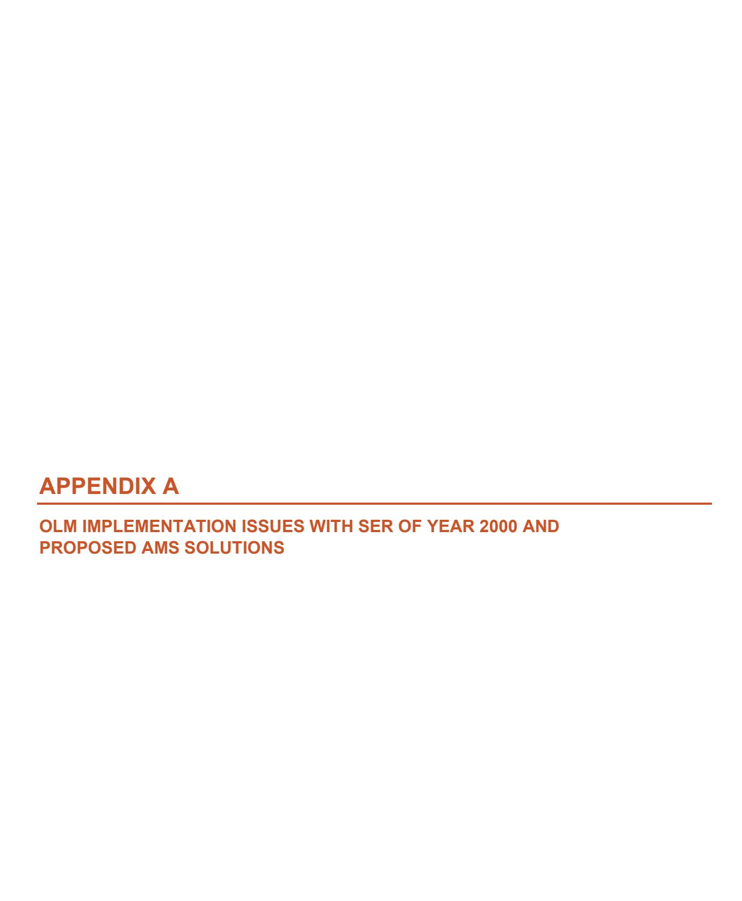

## **APPENDIX A - OLM IMPLEMENTATION ISSUES WITH SER OF YEAR 2000 AND PROPOSED AMS SOLUTIONS**

A Safety Evaluation Report (SER) on the EPRI OLM implementation methodology was published in July 2000 [\[A1\]](#page-122-0). In the SER, the NRC identified fourteen requirements that each licensee must address in any license amendment request (LAR) to extend transmitter calibration intervals using OLM. In 2006, a nuclear power plant submitted an LAR for extending transmitter calibration intervals that addressed the fourteen requirements. The NRC responded with questions on how the licensee addressed some of the requirements, and the LAR was subsequently withdrawn in mid-2006 after meetings between the NRC and the licensee [\[A2](#page-122-1) - [A4\]](#page-122-2).

Since 2006, no licensee has attempted to use the methodology described in the SER document to submit an LAR for transmitter calibration extension. Per discussions with industry representatives interested in implementing OLM for transmitter calibration interval extension, the methodology described in the SER of the year 2000 contains several issues identified by the industry that has rendered implementation of OLM. In this section, the fourteen requirements from the SER are listed in [Table A.1](#page-116-2) along with the implementation issue with each requirement, and the proposed solution from the OLM methodology implementation described in this report.

**Table A.1. SER Requirements, Implementation Issues, and Proposed Solutions**

| Item | Requirement                                                                                                                                                                                                                                                                                                                                                                                                                                                                                                                                                                                                                              |          | Implementation Issues                                                                                                                                                                                                                                                                                                                          |          | Solution Provided by OLM Methodology of This Topical Report                                                                                                                                                                                                                                                                                              |
|------|------------------------------------------------------------------------------------------------------------------------------------------------------------------------------------------------------------------------------------------------------------------------------------------------------------------------------------------------------------------------------------------------------------------------------------------------------------------------------------------------------------------------------------------------------------------------------------------------------------------------------------------|----------|------------------------------------------------------------------------------------------------------------------------------------------------------------------------------------------------------------------------------------------------------------------------------------------------------------------------------------------------|----------|----------------------------------------------------------------------------------------------------------------------------------------------------------------------------------------------------------------------------------------------------------------------------------------------------------------------------------------------------------------|
| 1    | The submittal for implementation of the on-line monitoring technique shall confirm that the impact on plant safety of the deficiencies inherent in the on line monitoring technique (inaccuracy in process parameter estimate, single point monitoring, and un-traceability of accuracy to standards), on plant safety will be insignificant, and that all uncertainties associated with the process parameter estimate have been quantitatively bounded and accounted for either in the on-line monitoring acceptance criteria or in the applicable setpoint and uncertainty calculations. | 1) 2) | Uncertainties of process estimates from modeling techniques are not established or quantitatively bounded. Application of the single-point monitoring penalty in developing OLM limits resulted in overly conservative limits which would prevent calibration extension for many transmitters. | 1) 2) | Process estimates are calculated from averaging techniques with established uncertainties that are quantitatively bounded. OLM data collected during plant startup and shutdown periods is analyzed over multiple points in a transmitter's calibrated range. As such, the single point monitoring penalty does not apply. |

**[Table A.1. SER Requirements, Implementation Issues, and Proposed Solutions](#page-116-2) (continued)**

| Item | Requirement                                                                                                                                                                                                                                                                                                                                                                                                                                                                                                                                                                                                                                                                                                                                                                                  | Implementation Issues                                                                                                                                                                                                                                                                                                                                                                                                                                    | Solution Provided by OLM Methodology of This Topical Report                                                                                                                                                                                                                                                                                                                                                                                                                                                                                                                                                                                   |
|------|----------------------------------------------------------------------------------------------------------------------------------------------------------------------------------------------------------------------------------------------------------------------------------------------------------------------------------------------------------------------------------------------------------------------------------------------------------------------------------------------------------------------------------------------------------------------------------------------------------------------------------------------------------------------------------------------------------------------------------------------------------------------------------------------|----------------------------------------------------------------------------------------------------------------------------------------------------------------------------------------------------------------------------------------------------------------------------------------------------------------------------------------------------------------------------------------------------------------------------------------------------------|-----------------------------------------------------------------------------------------------------------------------------------------------------------------------------------------------------------------------------------------------------------------------------------------------------------------------------------------------------------------------------------------------------------------------------------------------------------------------------------------------------------------------------------------------------------------------------------------------------------------------------------------------------|
| 2    | Unless the licensee can demonstrate otherwise, instrument channels monitoring processes that are always at the low or high end of an instrument's calibrated span during normal plant operation shall be excluded from the on-line monitoring program.                                                                                                                                                                                                                                                                                                                                                                                                                                                                                                                  | This requirement eliminates some transmitters that can otherwise benefit from OLM.                                                                                                                                                                                                                                                                                                                                                           | These transmitters should not be excluded from OLM. Comparisons of OLM and calibration results from Sizewell B shows there is no systematic issue with disagreement between OLM and calibrations for these transmitters.                                                                                                                                                                                                                                                                                                                                                                                                       |
| 3    | The algorithm used for on-line monitoring shall be able to distinguish between the process variable drift (actual process going up or down) and the instrument drift and shall be able to compensate for uncertainties introduced by unstable process, sensor locations, non-simultaneous measurements, and noisy signals. If the implemented algorithm and its associated software cannot meet these requirements, administrative controls, including the guidelines in Section 3 of the topical report for avoiding a penalty for non simultaneous measurement, could be implemented as an acceptable means to ensure that these requirements are met satisfactorily.                                                                | Modeling techniques can distinguish between process variable drift and instrument drift, but the uncertainties of the process estimates from modeling techniques were not established or quantitatively bounded, which violated Requirement 1. Averaging algorithms such as parity space can distinguish between process variable drift and instrument drift except in the case of common mode drift. | The OLM methodology implements parity-space and simple averaging techniques to determine the process parameter estimate. This process estimate tracks the process and allows instrument drift to be distinguished from the process, except for common mode drift. However, supporting OLM and calibration data from Sizewell B over 9 operating cycles verifies there is no evidence of common mode drift. There are also studies by EPRI, PWROG, and others that show the drift of nuclear plant pressure transmitters is random and there is little or no evidence of common mode drift. |
| 4    | For instruments that were not included in the EPRI drift study, the value of the allowance or penalty to compensate for single-point monitoring must be determined by using the instrument's historical calibration data and by analyzing the instrument performance over its range for all modes of operation, including startup, shutdown, and plant trips. If the required data for such a determination is not available, an evaluation demonstrating that the instrument's relevant performance specifications are as good as or better than those of a similar instrument included in the EPRI drift study, will permit a licensee to use the generic penalties for single-point monitoring given in EPRI Topical Report 104965. | Application of the single point monitoring penalty in developing OLM limits resulted in overly conservative limits which would prevent calibration extension for many transmitters.                                                                                                                                                                                                                                                 | OLM data from startup and shutdown transients is analyzed over multiple points in a transmitter's calibrated range. As such, the single point monitoring penalty does not apply. For those services that do not transition through their calibrated range, supporting calibration data from Sizewell B confirms that the single point monitoring penalty is not necessary.                                                                                                                                                                                                                                         |

**[Table A.1. SER Requirements, Implementation Issues, and Proposed Solutions](#page-116-2) (continued)**

| Item | Requirement                                                                                                                                                                                                                                                                                                                                                                                                                                                                                                                                                                                                                                                                                                                                                                                                                                                                                                                                                                                                | Implementation Issues                                                                                                            | Solution Provided by OLM Methodology of This Topical Report                                                                                                                                                               |
|------|------------------------------------------------------------------------------------------------------------------------------------------------------------------------------------------------------------------------------------------------------------------------------------------------------------------------------------------------------------------------------------------------------------------------------------------------------------------------------------------------------------------------------------------------------------------------------------------------------------------------------------------------------------------------------------------------------------------------------------------------------------------------------------------------------------------------------------------------------------------------------------------------------------------------------------------------------------------------------------------------------------|----------------------------------------------------------------------------------------------------------------------------------|---------------------------------------------------------------------------------------------------------------------------------------------------------------------------------------------------------------------------------|
| 5    | Calculations for the acceptance criteria defining the proposed three zones of deviation ("acceptable," "needs calibration," and "inoperable") should be done in a manner consistent with the plant-specific safety-related instrumentation setpoint methodology so that using on-line monitoring technique to monitor instrument performance and extend its calibration interval will not invalidate the setpoint calculation assumptions and the safety analysis assumptions. If new or different uncertainties require the recalculation of instrument trip setpoints, it should be demonstrated that relevant safety analyses are unaffected. The licensee should have a documented methodology for calculating acceptance criteria that are compatible with the practice described in Regulatory Guide 1.105 and the methodology described in acceptable industry standards for trip setpoint and uncertainty calculations. | The burden to establish this "inoperable" acceptance criteria for OLM was impractical for the industry to implement. | The OLM methodology presented in this TR only implements two zones of deviation ("acceptable," and "schedule for calibration"). Operability is not assessed with the OLM methodology presented in this TR. |
| 6    | For any algorithm used, the maximum acceptable value of deviation (MAVD) shall be such that accepting the deviation in the monitored value anywhere in the zone between PE and MAVD will provide high confidence (level of 95%/95%) that drift in the sensor-transmitter or any part of an instrument channel that is common to the instrument channel and the on-line monitoring loop is less than or equal to the value used in the setpoint calculations for that instrument channel.                                                                                                                                                                                                                                                                                                                                                                                                                                                                            | No issue.                                                                                                                        | The OLM limits are MAVD limits, calculated in such a way to provide high confidence that transmitters exceeding the limits would be identified and schedule for calibration.                                  |
| 7    | The instrument shall meet all requirements of the above requirement 6 for the acceptable band or acceptable region.                                                                                                                                                                                                                                                                                                                                                                                                                                                                                                                                                                                                                                                                                                                                                                                                                                                                               | No issue.                                                                                                                        | Same as requirement 6 above.                                                                                                                                                                                                 |

**[Table A.1. SER Requirements, Implementation Issues, and Proposed Solutions](#page-116-2) (continued)**

| Item | Requirement                                                                                                                                                                                                                                                                                                                                                                                                                                                                                                                                                                                                                                                       | Implementation Issues                                                                                                                                                                                                | Solution Provided by OLM Methodology of This Topical Report                                                                                               |
|------|-------------------------------------------------------------------------------------------------------------------------------------------------------------------------------------------------------------------------------------------------------------------------------------------------------------------------------------------------------------------------------------------------------------------------------------------------------------------------------------------------------------------------------------------------------------------------------------------------------------------------------------------------------------------|----------------------------------------------------------------------------------------------------------------------------------------------------------------------------------------------------------------------|-----------------------------------------------------------------------------------------------------------------------------------------------------------------|
| 8    | For any algorithm used, the maximum value of the channel deviation beyond which the instrument is declared "inoperable" shall be listed in the technical specifications with a note indicating that this value is to be used for determining the channel operability only when the channel's performance is being monitored using an on-line monitoring technique. It could be called "allowable deviation value for on-line monitoring" (ADVOLM) or whatever name the licensee chooses. The ADVOLM shall be established by the instrument uncertainty analysis. The value of the ADVOLM shall be such to ensure: | The burden to establish this "inoperable" zone with an acceptance criteria, "allowable deviation value for on-line monitoring" (ADVOLM), for OLM was impractical for the industry to implement. | The OLM methodology only implements two zones of deviation ("acceptable," and "schedule for calibration"). Operability is not assessed with OLM. |
|      | (a) that when the deviation between the monitored value and its PE is less than or equal to the ADVOLM limit, the channel will meet the requirements of the current technical specifications, and the assumptions of the setpoint calculations and safety analyses are satisfied; and                                                                                                                                                                                                                                                                                                                                               |                                                                                                                                                                                                                      |                                                                                                                                                                 |
|      | (b) that until the instrument channel is recalibrated (at most until the next refueling outage), actual drift in the sensor-transmitter or any part of an instrument channel that is common to the instrument channel and the on-line monitoring loop will be less than or equal to the value used in the setpoint calculations and other limits defined in 10CFR 50.36 as applicable to the plant specific design for the monitored process variable are satisfied.                                                                                                                                              |                                                                                                                                                                                                                      |                                                                                                                                                                 |

**[Table A.1. SER Requirements, Implementation Issues, and Proposed Solutions](#page-116-2) (continued)**

| Item | Requirement                                                                                                                                                                                                                                                                                                                                                                                                                                                                                                                                                                                                                                             | Implementation Issues                                                                                                                                                                                                                   | Solution Provided by OLM Methodology of This Topical Report                                                                                                                              |
|------|---------------------------------------------------------------------------------------------------------------------------------------------------------------------------------------------------------------------------------------------------------------------------------------------------------------------------------------------------------------------------------------------------------------------------------------------------------------------------------------------------------------------------------------------------------------------------------------------------------------------------------------------------------|-----------------------------------------------------------------------------------------------------------------------------------------------------------------------------------------------------------------------------------------|------------------------------------------------------------------------------------------------------------------------------------------------------------------------------------------------|
| 9    | Calculations defining alarm setpoint (if any), acceptable band, the band identifying the monitored instrument as needing to be calibrated earlier than its next scheduled calibration, the maximum value of deviation beyond which the instrument is declared "inoperable," and the criteria for determining the monitored channel to be an "outlier," shall be performed to ensure that all safety analysis assumptions and assumptions of the associated setpoint calculation are satisfied and the calculated limits for the monitored process variables specified by 10 CFR 50.36 are not violated. | The burden to establish calculations for the "inoperable" zone with an acceptance criteria, "allowable deviation value for on-line monitoring" (ADVOLM), for OLM was impractical for the industry to implement. | The OLM methodology only implements calculations for two zones of deviation ("acceptable," and "schedule for calibration"). Operability is not assessed with OLM.               |
| 10   | The plant specific submittal shall confirm that the proposed on-line monitoring system will be consistent with the plant's licensing basis, and that there continues to be a coordinated defense-in-depth against instrument failure.                                                                                                                                                                                                                                                                                                                                                                                                 | No issue.                                                                                                                                                                                                                               | On-line monitoring will provide better defense-in depth since calibration information will be evaluated more often than current practice                                        |
| 11   | Adequate isolation and independence, as required by Regulatory Guide 1.75, GDC 21, GDC 22, IEEE Std. 279 or IEEE Std. 603, and IEEE Std. 384, shall be maintained between the on-line monitoring devices and Class 1E instruments being monitored.                                                                                                                                                                                                                                                                                                                                                                                 | No issue.                                                                                                                                                                                                                               | Data acquisition equipment including the plant computer or specialized OLM data equipment will be adequately isolated according to the guidance specified in Requirement 11. |

**[Table A.1. SER Requirements, Implementation Issues, and Proposed Solutions](#page-116-2) (continued)**

| Item | Requirement                                                                                                                                                                                                                                                                                                                                                                                                                                                                                                                                                                                                                                                                                                                                                                                                                                                                                                                                                                                                                                                                                                                                        | Implementation Issues | Solution Provided by OLM Methodology of This Topical Report                                                                                                                                                                                                                                      |
|------|----------------------------------------------------------------------------------------------------------------------------------------------------------------------------------------------------------------------------------------------------------------------------------------------------------------------------------------------------------------------------------------------------------------------------------------------------------------------------------------------------------------------------------------------------------------------------------------------------------------------------------------------------------------------------------------------------------------------------------------------------------------------------------------------------------------------------------------------------------------------------------------------------------------------------------------------------------------------------------------------------------------------------------------------------------------------------------------------------------------------------------------------------|-----------------------|--------------------------------------------------------------------------------------------------------------------------------------------------------------------------------------------------------------------------------------------------------------------------------------------------------|
| 12   | (a) QA requirements as delineated in 10 CFR Part 50, Appendix B, shall be applicable to all engineering and design activities related to on-line monitoring, including design and implementation of the on-line system, calculations for determining process parameter estimates, all three zones of acceptance criteria (including the value of the ADVOLM), evaluation and trending of on-line monitoring results, activities (including drift assessments) for relaxing the current TS-required instrument calibration frequency from "once per refueling cycle" to "once per a maximum period of 8 years," and drift assessments for calculating the allowance or penalty required to compensate for single-point monitoring. (b) The plant-specific QA requirement shall be applicable to the selected on-line monitoring methodology, its algorithm, and the associated software. In addition, software shall be verified and validated and meet all quality requirements in accordance with NRC guidance and acceptable industry standards. | No issue.             | Software design and development, related calculations, and data evaluations used for the analysis of on-line monitoring data will be performed under a qualified Quality Assurance Program. Further, OLM analysts will be trained under 10CFR50 Appendix B requirements. |
| 13   | All equipment (except software) used for collection, electronic transmission, and analysis of plant data for on-line monitoring purposes shall meet the requirements of 10 CFR Part 50, Appendix B, Criterion XII, "Control of Measuring and Test Equipment." Administrative procedures shall be in place to maintain configuration control of the on-line monitoring software and algorithm.                                                                                                                                                                                                                                                                                                                                                                                                                                                                                                                                                                                                                                                                                                                     | No issue.             | The OLM methodology will meet this requirement for equipment and software.                                                                                                                                                                                                                       |

**[Table A.1. SER Requirements, Implementation Issues, and Proposed Solutions](#page-116-2) (continued)**

| Item | Requirement                                                                                                                                                                                                                                                                                                                                                                                                                                                                                              | Implementation Issues                                                                                                                                                                                                                                                      | Solution Provided by OLM Methodology of This Topical Report                                                                                                                                                                                                                                                                                                                                                                                                                                                                                                                                      |
|------|----------------------------------------------------------------------------------------------------------------------------------------------------------------------------------------------------------------------------------------------------------------------------------------------------------------------------------------------------------------------------------------------------------------------------------------------------------------------------------------------------------|----------------------------------------------------------------------------------------------------------------------------------------------------------------------------------------------------------------------------------------------------------------------------|--------------------------------------------------------------------------------------------------------------------------------------------------------------------------------------------------------------------------------------------------------------------------------------------------------------------------------------------------------------------------------------------------------------------------------------------------------------------------------------------------------------------------------------------------------------------------------------------------------|
| 14   | Before declaring the on-line monitoring system operable for the first time, and just before each performance of the scheduled surveillance using an on-line monitoring technique, a full-features functional test, using simulated input signals of known and traceable accuracy, should be conducted to verify that the algorithm and its software perform all required functions within acceptable limits of accuracy. All applicable features shall be tested. | While there is no issue with the full functional testing using simulated input signals for the first time use of the OLM system, it is impractical for the industry to perform this testing before each performance of the scheduled surveillance. | The analysis of OLM data will be performed using software analysis modules that will be verified and validated using simulated input data with known characteristics. The analysis of the simulated data will be performed to verify that the software modules produce the expected results. All functions and features of the software modules will be fully tested and documented before first use. The software will be verified by means like a checksum to ensure it is the qualified, verified, and validated software before each use. |

#### **A.1 REFERENCES**

- A1. Electric Power Research Institute (EPRI), On-Line Monitoring of Instrument Channel Performance, TR-104965-R1 NRC SER, EPRI, Palo Alto, CA: 2000. 1000604. September 2000.
- A2. South Carolina Electric & Gas Company, License Amendment Request – LAR 05-0677 On-Line Monitoring of Instrument Channel Performance, [http://www.nrc.gov,](http://www.nrc.gov/) ADAMS Accession Number ML060400220, February 2006.
- A3. U.S. Nuclear Regulatory Commission (NRC), Forthcoming Meeting with South Carolina Electric & Gas Company, [http://www.nrc.gov,](http://www.nrc.gov/) ADAMS Accession Number ML061530284, June 2006.
- A4. South Carolina Electric & Gas Company, License Amendment Request – LAR 05-0677 On-Line Monitoring of Instrument Channel Performance Withdrawal Letter, [http://www.nrc.gov,](http://www.nrc.gov/) ADAMS Accession Number ML061840467, June 2006.

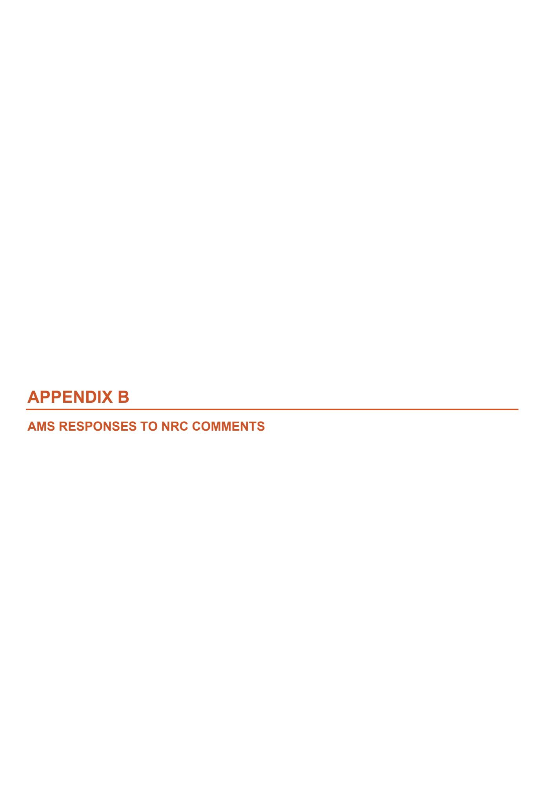

## **APPENDIX B - AMS RESPONSES TO NRC COMMENTS**

Prior to writing this topical report, AMS and its utility partner SNOC had two face to face meetings with the NRC at their headquarters. The NRC's comments and AMS's responses are compiled in this appendix. Section [B.1](#page-124-2) provides responses to NRC comments from the first meeting in September 2019 and Sectio[n B.2](#page-128-0) provides responses to NRC comments from the second meeting in February 2020.

#### **B.1 AMS/NRC/SNOC MEETING ON SEPTEMBER 20, 2019:**

#### **1. ADDRESS TREATMENT OF OUTLIERS**

The OLM methodology uses the parity space averaging technique to systematically identify outlier data that is excluded from further analysis. The details of the parity space averaging technique are included in Chapter [6.](#page-35-0) In case of spikes or other anomalies in the OLM data, the OLM software provides the capability to exclude the spikes or anomalies, however, the analyst must document the technical basis for excluding the spikes or anomalies.

#### **2. EXPLAIN METHODOLOGY TO ESTABLISH OLM ACCEPTANCE CRITERIA**

The OLM limits will be established based on a plant's setpoint uncertainties and using root Sum Square (RSS) formulas similar to those in ISA 67.04, NUREG/CR-6343, and the Sizewell B approach as explained in Chapter [7.](#page-52-0)

## **3. ADDRESS HOW ACCEPTANCE CRITERIA IS SPECIFIC TO TRANSMITTER TYPE AND SERVICE, BUT THE ANALYSIS METHODOLOGY USES A TRANSMITTER-AGNOSTIC ALGORITHM**

As described in Chapter [7,](#page-52-0) the manufacturer specific drift specifications for each transmitter type are used to arrive at the OLM limits. However, the OLM analysis algorithms of simple averaging and parity space averaging are not dependent on the type(s) of transmitters or the processes that the transmitters are measuring.

#### **4. LIST ANY LIMITATION ON APPLICABLE TRANSMITTER TYPES**

To date no transmitter types have been encountered to which OLM for drift monitoring does not apply. In the case of digital/smart transmitters, detecting sensing line blockages using the noise analysis technique can be limited if digitization of the transmitter signal significantly affects the characterization of the frequency response.

## **5. ADDRESS ANY NEW IMPORTANT FAILURE MODES THAT COULD AFFECT SAFETY FUNCTIONS**

[Chapter 3](#page-18-0) (Sectio[n 3.4](#page-23-2) titled "Detecting Transmitter Failure Modes with OLM") discusses the OLM methodology as it relates to the failure modes and effects analysis (FMEA) of nuclear grade transmitters.

## **6. ADDRESS HOW TO TREAT NEW OR REPLACED TRANSMITTERS AND DIFFERENTIATE TREATMENT THROUGH THE TSTF APPROACH**

The Technical Specification Task Force (TSTF) 425 approach depends on probabilistic risk assessment (PRA) and deterministic drift studies based on historic transmitter performance to extend transmitter calibration for one or more cycles. Using the TSTF 425 approach, new transmitter models must thus be calibrated until sufficient historical data and trending data becomes available. The OLM methodology described in this report uses transmitter measurements to determine if a calibration check is needed and does not require PRA or historic transmitter performance data. Refer to [Chapter 3](#page-18-0) (Section [3.5\)](#page-28-0) for more information.

#### **7. DEFINE OLM DATA SAMPLING RATES TO MONITOR NOT ONLY DRIFT BUT ALSO RESPONSE TIME**

OLM data taken at frequencies of 2000 Hz or above can provide information for both drift and response time. OLM data taken at sample rates typically found in plant computers can only monitor for calibration drift (see Chapter [11\)](#page-92-0).

#### **8. ADDRESS RESPONSE TIME DEGRADATION AND DIFFERENTIATE BETWEEN TRANSMITTER AND SENSING LINE EXPERIENCE**

Response time degradation of the current generation of transmitters in the existing fleet of nuclear power plants has been so small that the NRC approved the industry's requests in the year 1998 to eliminate transmitter response time testing requirements. However, sensing line blockages have been shown to degrade the dynamic performance of pressure sensing systems and can be tested by OLM using the noise analysis technique (see Chapter [11\)](#page-92-0).

### **9. ADDRESS HOW OLM VERIFIES BOTH THE CALIBRATION AND RESPONSE TIME OF TRANSMITTERS WHILE CALIBRATION ONLY ADDRESSES THE TRANSMITTERS**

Chapter [11](#page-92-0) discusses how OLM verifies both calibration drift and response time degradation.

## **10. INCLUDE A BREAKDOWN OF THE HISTORY OF TRANSMITTER RESPONSE TIME FAILURE TO ENSURE THAT IT WAS NOT DRIVEN BY A SMALL SET OF BAD ACTORS**

Historical response time data from 30 years of testing involving over 1200 transmitters and 11,000 response time measurements performed in 21 nuclear power plants by AMS using the noise analysis technique have shown that only about 10% of these transmitters exhibited a trend toward increasing response time. In addition, about 6% of the transmitters exhibited response time excursions causing the transmitters' response times to increase from less than 0.5 seconds to over 2 seconds without warning or detectable degradation by other means such as calibration. The response time surges were random and about 80% were found to be due to sensing line blockages. This occurred in over half of all the nuclear power plants where response time measurements were performed.

## **11. CLARIFY WHETHER THE RESPONSE TIME TRENDS WERE ULTIMATELY RELATED TO SENSOR CALIBRATION OR SENSING LINE BLOCKAGE**

It is not possible to distinguish whether the response time degradation trends observed in the AMS database of 11,000 test results were due to either the transmitters themselves or the sensing lines.

## **12. IDENTIFY IF ANY FAILURE MODES ARE NOT DETECTABLE (BY OLM) AND ADDRESS IF OTHER MEASURES ARE NEEDED TO COMPENSATE FOR THIS SHORT COMING**

[Chapter 3](#page-18-0) presents a discussion of transmitter failure modes and whether or not they are detectable by OLM. The combination of OLM, daily channel checks, monthly surveillance, and noise analysis to test for sensing line blockages together provide ample defense against a calibration or response time problem going undetected.

### **13. ADDRESS THE RECOMMENDATIONS OF TSTF-569**

AMS agrees that these three recommendations of TSTF-569 are appropriate:

- a. Perform hydraulic response time test prior to installation of new transmitter/switch or following any refurbishment.
- b. For transmitters and switches that use capillary tubes, response time tests should be performed after initial installation and after any maintenance or modification activity that could damage the capillary tubes.
- c. Assure that variable damping (if used) is at the required setting and cannot be changed or perform hydraulic or white noise response time tests of sensor, following each calibration.

## **14. ADDRESS IN THE REPORT THAT THE OLM METHODOLOGY IS NOT A CONTINUOUS OPERABILITY METER**

OLM results are intended to guide plants as to whether or not a transmitter's calibration must be checked as opposed to current practice that calls for utilities to check transmitter calibrations at every refueling outage. OLM also serves to detect if a significant sensing line blockage might have occurred. OLM results are not intended for operability determination.

#### **15. AMS/NRC TOPICAL REPORT SHOULD PROVIDE SUGGESTED TECHNICAL SPECIFICATION MARK-UPS FOR ALL OF THE VENDOR TYPE STANDARD TECH SPECS**

[Appendix C](#page-132-1) provides suggested technical specification (TS) markups for Westinghouse, Westinghouse AP1000, Combustion Engineering (CE), Babcock and Wilcox (B&W), GE BWR/4, and GE BWR/6 designs.

#### **16. ADDRESS CALIBRATION AND RESPONSE TIME TECHNICAL SPECIFICATION LANGUAGE**

[Appendix C](#page-132-1) provides suggested technical specification markups for calibration and response time TS changes for Westinghouse, Westinghouse AP1000, Combustion Engineering (CE), Babcock and Wilcox (B&W), GE BWR/4, and GE BWR/6 designs.

## **17. ADDRESS THE TECHNICAL SPECIFICATIONS OF THOSE PLANTS THAT HAVE CHANGED TO USING SFCP**

[Appendix C](#page-132-1) provides suggested technical specification markups for Westinghouse, Westinghouse AP1000, Combustion Engineering (CE), Babcock and Wilcox (B&W), GE BWR/4, and GE BWR/6 designs, including those that have changed to using the Surveillance Frequency Control Program (SFCP).

## **18. ADDRESS HOW TO TREAT OLM DATA AND TEST CHANNEL WITHIN A QA PROGRAM**

Chapter [11](#page-92-0) addresses how OLM data must be handled according to a QA program in compliance with 10 CFR 50 Appendix B and NQA-1 programs.

#### **19. ADDRESS THE FREQUENCY OF DATA COLLECTION AND ASSESSMENTS FOR DETERMINING IF CORRECTIVE MAINTENANCE IS REQUIRED**

For calibration monitoring, data must be collected throughout plant start-up and shutdown periods and at least once a month for 12 to 24 hours throughout the cycle. Normally, this data is available in the plant computer and can readily be retrieved and analyzed for calibration verification.

As for response time to detect sensing line blockages, plant data acquisition systems do not normally have sufficiently fast sampling rates. For this, a portable data acquisition system can be used sometime during the plant operating cycle to acquire high frequency data (e.g. at 2000 Hz) for a period of 30-60 minutes for each transmitter. A multichannel fast data acquisition system can be used to acquire data for multiple transmitters (e.g. up to 32 transmitters) and thereby test many transmitters at the same time. The best time to perform the test is near the end of each operating cycle to allow plants to identify any sensing line blockage to be resolved during the ensuing outage (see Chapter [11\)](#page-92-0).

#### **20. ADDRESS THE DIFFERENCES BETWEEN BATCH MODE OPERATION AND CONTINUOUS ANALYSIS**

Transmitter calibration drift occurs slowly, therefore data analysis performed once a month during the fuel cycle is sufficient. As for response time degradation which almost always occurs due to sensing line blockages, data collection and analysis once an operating cycle should be adequate unless the plant is known to have a history of sensing line blockages that occur more often. Chapters [8](#page-63-0) and [11](#page-92-0) address the sampling frequency and the sampling duration for OLM.

#### **21. ADDRESS OLM DATA QUALITY AND HOW THIS IS HANDLED UNDER A QA PROGRAM**

During development of OLM, data qualification algorithms and software packages using a variety of statistical analysis methods have been developed under a QA program and used to screen OLM data prior to analysis.

#### **B.2 AMS/NRC/SNOC MEETING ON FEBRUARY 20, 2020:**

#### **1. ADDRESS HOW UNCOMPRESSED DATA IS OBTAINED FOR THE OLM METHODOLOGY**

Options for obtaining uncompressed or non-historized OLM data include retrieving data upstream of the plant computer data historian, permanently disabling compression for sensors in the OLM program, or temporarily disabling compression during the OLM data collection periods (see Chapter [6\)](#page-35-0).

#### **2. ADDRESS HOW PLANTS THAT DO NOT EXPORT ALL THE SENSOR DATA TO THE PLANT COMPUTER WOULD BE HANDLED**

If OLM data is not available in the plant computer, then options include adding it to the plant computer, collecting the data from the instrumentation cabinets with a custom data acquisition system, or not implementing OLM for those transmitters (see Chapters [6](#page-35-0) and [11\)](#page-92-0).

#### **3. ADDRESS THE MINIMUM AMOUNT OF DATA NEEDED FOR OLM ANALYSIS AND THE BASIS FOR THE DATA COLLECTION PERIOD**

Chapter [8](#page-63-0) addresses the bases for OLM Sampling Rate and Duration of OLM data collection.

#### **4. SUMMARIZE THE MAIN POINTS OR CONCLUSIONS USED FROM REFERENCE DOCUMENTS**

[Appendix D](#page-146-1) presents summaries of references cited in this report.

#### **5. ADDRESS HOW THE VENDOR DRIFT SPECIFICATION IS USED IN THE OLM METHODOLOGY AND IF IT IS PRORATED FOR THE DATA COLLECTION INTERVALS**

In calculating the OLM limits, the vender drift specification is not prorated for the data collection interval (e.g. 1 month, 2 months, …), but it is taken from the transmitter's drift term over the existing technical specification surveillance interval. For example, Sizewell uses the vender transmitter drift term calculated over a 24-month calibration period although their actual cycle is typically 18 months (see Chapter [7\)](#page-52-0).

#### **6. ADDRESS THE BASIS FOR NO COMMON MODE DRIFT OVER MULTIPLE CYCLES**

The drift of the current generation of nuclear grade pressure, level, and flow transmitters has been shown to be random through multiple drift studies in the U.S. and abroad over the past 20 years. Additionally, calibration data from transmitters at Sizewell B that have not be calibrated for multiple cycles show no evidence of common mode drift (see [Chapter](#page-18-0) 3).

## **7. IDENTIFY LIMITATIONS BASED ON SENSOR TYPE THAT HAS DIGITAL FEATURES THAT PREVENT THE NECESSARY DATA COLLECTION**

Digital sensors have a limited frequency response such that the response time results will be slower than the digital sensor sample period. Also, digital sensors have a minimum measurement resolution which prevents measuring the small process fluctuations necessary for determining response time with noise analysis. However, the digital sensor minimum resolution has a negligible effect for OLM calibration assessment.

#### **8. ADDRESS ANY UNIQUE FAILURE MODES WITH OLM**

OLM noise analysis testing identifies sensing line blockage which is part of the pressure sensing system that otherwise can go undetected during normal plant operation. More information on failure modes and whether or not OLM can identify them is presented in [Chapter](#page-18-0) 3.

#### **9. ADDRESS HOW NEW MODELS OF TRANSMITTERS WILL BE ADDRESSED USING OLM**

As long as new models can be shown to be comparable to existing transmitters by performing a similarity analysis, it is not necessary to establish drift history from several cycles to extend calibration intervals. OLM can be used to monitor the transmitters more frequently than traditional calibrations and can detect transmitter drift and sensing line blockages.

#### **10. ADDRESS THE OLM METHODOLOGY FOR PROCESS SENSORS WITHOUT ANY SIGNIFICANT PROCESS NOISE COMPONENT**

Lack of a significant process noise component does not hinder the OLM calibration drift assessment, although this will prevent OLM noise analysis from detecting sensing line blockages. However, these low process noise services (e.g., containment pressure or reactor water storage tank level) typically have the transmitter low side reference leg open to atmosphere. The transmitter low pressure input can be connected to a portable pressure noise source to provide simulated noise perturbations to the transmitter and allow OLM noise analysis to measure the transmitter response time. In addition, for services such as reactor water storage tank level sensing lines are unlikely to develop blockages as there is no fluid flowing in the line.

## **11. ADDRESS THE DETECTION OF DEGRADATION WITH OLM CALIBRATION MONITORING AND NOISE ANALYSIS**

The combination of OLM calibration monitoring and noise analysis will detect failure modes of different transmitter designs (see Chapters 3 and [11\)](#page-92-0).

#### **12. ADDRESS HOW OLM WILL IDENTIFY DRIFT ON THE EXTREME ENDS OF THE CALIBRATION SPAN BEYOND THE OPERATING RANGE**

OLM data taken during startup and shutdown can identify transmitter drift over much of its span. OLM results plotted versus transmitter span can be extrapolated to cover the low and high ends of span that are not covered by OLM assuming that the transmitter is linear throughout its range. This assumption has been verified through comparison of OLM and calibration results for Sizewell B transmitters (see Chapters 3 and [10\)](#page-67-0).

#### **13. CLEARLY ADDRESS THE METHODOLOGY THAT THE NRC WOULD BE APPROVING IN THE RESULTING SER**

Chapter [11](#page-92-0) describes the OLM methodology comprehensively.

#### **14. ADDRESS THE QA REQUIREMENTS FOR OLM SOFTWARE AND ANALYSIS**

Chapter [11](#page-92-0) covers the QA requirements for implementation of OLM.

#### **15. PROVIDE THE BASIS FOR THE AMOUNT AND FREQUENCY OF DATA COLLECTION**

Chapter [8](#page-63-0) addresses OLM Sample Rate and Sampling Duration.

#### **16. ADDRESS THE IMPLEMENTATION ISSUES WITH THE 14 REQUIREMENTS OF THE 2000 SER AND THE AMS ALTERNATIVE WITH THE OLM METHODOLOGY TO ADDRESS THE UNDERLYING CONCERN**

[Appendix A](#page-116-1) lists the 14 requirements of the year 2000 SER, the related industry issues, and the OLM methodology solution proposed by AMS to resolve the underlying concern of each of the 14 requirements.

## **17. HOW DOES THE LARGER POPULATION OF SENSORS AT SIZEWELL B AFFECT THE APPLICABILITY OF THAT DATA TO A U.S. PLANT WITH FEWER SENSORS.**

While several of the redundant sensors at Sizewell B have roughly twice the redundancy of transmitters in U.S. plants (e.g. as much as 9-way redundant versus 4-way redundancy in U.S. plants), the majority of Sizewell OLM limits are based on 4-way redundancy for the process estimate. This is comparable to a typical U.S. plant. Therefore, the OLM limits for Sizewell transmitters are comparable to that of US plants.

## **APPENDIX C - PROPOSED CHANGES TO EXISTING TECHNICAL SPECIFICATION REQUIREMENTS TO ACCOMMODATE OLM**

Implementing OLM to extend the calibration intervals of safety-related pressure, level, and flow transmitters will require changes to the plant technical specifications that must be approved by the NRC. This appendix contains examples of the changes to the standard technical specifications (STS) that are representative of the changes that will need to be made by each plant to implement OLM for calibration extension. The representative changes to the STS for the following plant types are included in this appendix:

- Westinghouse
- Westinghouse Advanced Passive 1000 (AP1000)
- Babcock and Wilcox
- Combustion Engineering
- General Electric BWR/4
- General Electric BWR/6.

As discussed in the main body of this report, the purpose of OLM for transmitter drift monitoring is to provide a condition-based determination of whether or not a calibration check must be performed. As such, the changes to the technical specifications include the following:

- A definition for the term ONLINE MONITORING
- Addition of an ONLINE MONITORING Program to Extend Transmitter Calibration Intervals
- An option to use the ONLINE MONITORING Program to Extend Transmitter Calibration Intervals to determine the frequency of CHANNEL CALIBRATION surveillances that involve calibrating pressure, level, or flow transmitters

[Table C.1](#page-133-0) through [Table C.6](#page-143-0) provide listings of the surveillance requirements affected by the changes for each of the six nuclear power plant types listed above.

**Table C.1. Proposed Changes to the STS to Implement OLM in Westinghouse PWRs**

| Item | Proposed Change                                                                                                                                                                                                                                                                                                                     | Affected Surveillance Requirement(s)                                              |
|------|-------------------------------------------------------------------------------------------------------------------------------------------------------------------------------------------------------------------------------------------------------------------------------------------------------------------------------------|-----------------------------------------------------------------------------------------|
| 1    | Define ONLINE MONITORING "ONLINE MONITORING is the assessment of instrument performance while the instrument is in service."                                                                                                                                                                                                  | N/A                                                                                     |
| 2    | Insert the following in the frequency column of the affected surveillance requirements: "OR In accordance with the ONLINE MONITORING Program to Extend Transmitter Calibration Intervals."                                                                                                                              | 3.3.1.10 3.3.2.9 3.3.3.2 3.3.4.3 3.3.6.9 3.3.7.9 3.4.12.9 3.4.15.3 |
| 3    | Insert the following in the Bases section of each affected surveillance requirement: "OR The CHANNEL CALIBRATION Frequency for transmitters may be determined in accordance with the ONLINE MONITORING Program to Extend Transmitter Calibration Intervals implemented in accordance with AMS-TR-0720R1-A." | 3.3.1.10 3.3.2.9 3.3.3.2 3.3.4.3 3.3.6.9 3.3.7.9 3.4.12.9 3.4.15.3 |

**Table C.1. [Proposed Changes to the STS to Implement OLM in Westinghouse PWRs](#page-133-0) (continued)**

| Item | Proposed Change                                                                                                                                                                                                                                                                                                                                                                                                                                                                                                                                                                                                                                 | Affected Surveillance Requirement(s) |
|------|-------------------------------------------------------------------------------------------------------------------------------------------------------------------------------------------------------------------------------------------------------------------------------------------------------------------------------------------------------------------------------------------------------------------------------------------------------------------------------------------------------------------------------------------------------------------------------------------------------------------------------------------------|--------------------------------------------|
|      | Insert the following in Section 5.5, Programs and Manuals:                                                                                                                                                                                                                                                                                                                                                                                                                                                                                                                                                                                      | 5.5.X                                      |
|      | 5.5.X ONLINE MONITORING Program to Extend Transmitter Calibration Intervals                                                                                                                                                                                                                                                                                                                                                                                                                                                                                                                                                            |                                            |
|      | The ONLINE MONITORING Program provides controls to use condition monitoring to extend CHANNEL CALIBRATION intervals for pressure, level, and flow transmitters based on online monitoring results. [It also provides controls to identify response time degradation of pressure, level, and flow transmitters using noise analysis or other approved techniques.] The ONLINE MONITORING Program must be implemented in accordance with AMS-TR-0720R1-A, "Online Monitoring Technology to Extend Calibration Intervals of Nuclear Plant Pressure Transmitters." |                                            |
| 4    | The ONLINE MONITORING program shall include the following:                                                                                                                                                                                                                                                                                                                                                                                                                                                                                                                                                                                |                                            |
|      | a. Implement ONLINE MONITORING for selected transmitters during the plant operating cycle.                                                                                                                                                                                                                                                                                                                                                                                                                                                                                                                                             |                                            |
|      | b. Analyze ONLINE MONITORING data to identify transmitters that can have CHANNEL CALIBRATION extended and those that require CHANNEL CALIBRATION.                                                                                                                                                                                                                                                                                                                                                                                                                                                                                |                                            |
|      | c. Perform CHANNEL CALIBRATION of identified transmitters no later than during the next scheduled refueling outage.                                                                                                                                                                                                                                                                                                                                                                                                                                                                                                                    |                                            |
|      | d. Document the results of the ONLINE MONITORING data analysis.                                                                                                                                                                                                                                                                                                                                                                                                                                                                                                                                                                        |                                            |
|      | [e. Perform ONLINE MONITORING using the noise analysis or other approved techniques for transmitters that have CHANNEL CALIBRATION extended and no RESPONSE TIME testing is performed.]                                                                                                                                                                                                                                                                                                                                                                                                                     |                                            |

**Table C.2. Proposed Changes to the STS to Implement OLM in Westinghouse Advanced Passive 1000 (AP1000) PWRs**

| Item | Proposed Change                                                                                                                                                                                                                                                                                                                        | Affected Surveillance Requirement(s)                                               |
|------|----------------------------------------------------------------------------------------------------------------------------------------------------------------------------------------------------------------------------------------------------------------------------------------------------------------------------------------|------------------------------------------------------------------------------------------|
|      | Define ONLINE MONITORING                                                                                                                                                                                                                                                                                                               |                                                                                          |
| 1    | "ONLINE MONITORING is the assessment of instrument performance while the instrument is in service."                                                                                                                                                                                                                                 | N/A                                                                                      |
| 2    | Insert the following in the frequency column of the affected surveillance requirements: "OR In accordance with the ONLINE MONITORING Program to Extend Transmitter Calibration Intervals."                                                                                                                                 | 3.3.1.8 3.3.8.3 3.3.10.3 3.3.11.3 3.3.14.3 3.3.17.2 3.4.1.4 3.4.9.3 |
| 3    | Insert the following in the Bases section of each affected surveillance requirement: "OR The CHANNEL CALIBRATION Frequency for transmitters may be determined in accordance with the ONLINE MONITORING Program to Extend Transmitter Calibration Intervals implemented in accordance with AMS-TR-0720R1-A." | 3.3.1.8 3.3.8.3 3.3.10.3 3.3.11.3 3.3.14.3 3.3.17.2 3.4.1.4 3.4.9.3 |

**Table C.2. [Proposed Changes to the STS to Implement OLM in](#page-135-0) [Westinghouse Advanced Passive 1000 \(AP1000\) PWRs](#page-135-0) (continued)**

| Item | Proposed Change                                                                                                                                                                                                                                                                                                                                                                                                                                                                                                                                                                                                                              | Affected Surveillance Requirement(s) |
|------|----------------------------------------------------------------------------------------------------------------------------------------------------------------------------------------------------------------------------------------------------------------------------------------------------------------------------------------------------------------------------------------------------------------------------------------------------------------------------------------------------------------------------------------------------------------------------------------------------------------------------------------------|--------------------------------------------|
|      | Insert the following in Section 5.5, Programs and Manuals:                                                                                                                                                                                                                                                                                                                                                                                                                                                                                                                                                                                   | 5.5.X                                      |
|      | 5.5.X ONLINE MONITORING Program to Extend Transmitter Calibration Intervals                                                                                                                                                                                                                                                                                                                                                                                                                                                                                                                                                         |                                            |
|      | The ONLINE MONITORING Program provides controls to use condition monitoring to extend CHANNEL CALIBRATION intervals for pressure, level, and flow transmitters based on online monitoring results. [It also provides controls to identify response time degradation of pressure, level, and flow transmitters using noise analysis or other approved techniques.] The ONLINE MONITORING Program must be implemented in accordance with AMS-TR-0720R1-A, "Online Monitoring Technology to Extend Calibration Intervals of Nuclear Plant Pressure Transmitters." |                                            |
| 4    | The ONLINE MONITORING program shall include the following:                                                                                                                                                                                                                                                                                                                                                                                                                                                                                                                                                                                |                                            |
|      | a. Implement ONLINE MONITORING for selected transmitters during the plant operating cycle.                                                                                                                                                                                                                                                                                                                                                                                                                                                                                                                                          |                                            |
|      | b. Analyze ONLINE MONITORING data to identify transmitters that can have CHANNEL CALIBRATION extended and those that require CHANNEL CALIBRATION.                                                                                                                                                                                                                                                                                                                                                                                                                                                                             |                                            |
|      | c. Perform CHANNEL CALIBRATION of identified transmitters no later than during the next scheduled refueling outage.                                                                                                                                                                                                                                                                                                                                                                                                                                                                                                                 |                                            |
|      | d. Document the results of the ONLINE MONITORING data analysis.                                                                                                                                                                                                                                                                                                                                                                                                                                                                                                                                                                     |                                            |
|      | [e. Perform ONLINE MONITORING using the noise analysis or other approved techniques for transmitters that have CHANNEL CALIBRATION extended and no RESPONSE TIME testing is performed.]                                                                                                                                                                                                                                                                                                                                                                                                                  |                                            |

**Table C.3. Proposed Changes to the STS to Implement OLM in Babcock and Wilcox (B&W) PWRs**

| Item | Proposed Change                                                                                                                                                                                                                                                                                                                        | Affected Surveillance Requirement(s)                                     |
|------|----------------------------------------------------------------------------------------------------------------------------------------------------------------------------------------------------------------------------------------------------------------------------------------------------------------------------------------|--------------------------------------------------------------------------------|
|      | Define ONLINE MONITORING                                                                                                                                                                                                                                                                                                               |                                                                                |
| 1    | "ONLINE MONITORING is the assessment of instrument performance while the instrument is in service."                                                                                                                                                                                                                                 | N/A                                                                            |
| 2    | Insert the following in the frequency column of the affected surveillance requirements: "OR In accordance with the ONLINE MONITORING Program to Extend Transmitter Calibration Intervals."                                                                                                                                 | 3.3.1.5 3.3.5.3 3.3.11.3 3.3.17.2 3.3.18.3 3.4.12.8 3.4.15.3 |
| 3    | Insert the following in the Bases section of each affected surveillance requirement: "OR The CHANNEL CALIBRATION Frequency for transmitters may be determined in accordance with the ONLINE MONITORING Program to Extend Transmitter Calibration Intervals implemented in accordance with AMS-TR-0720R1-A." | 3.3.1.5 3.3.5.3 3.3.11.3 3.3.17.2 3.3.18.3 3.4.12.8 3.4.15.3 |

**Table C.3. [Proposed Changes to the STS to Implement OLM in](#page-137-0) [Babcock and Wilcox \(B&W\) PWRs](#page-137-0) (continued)**

| Item | Proposed Change                                                                                                                                                                                                                                                                                                                                                                                                                                                                                                                                                                                                                              | Affected Surveillance Requirement(s) |
|------|----------------------------------------------------------------------------------------------------------------------------------------------------------------------------------------------------------------------------------------------------------------------------------------------------------------------------------------------------------------------------------------------------------------------------------------------------------------------------------------------------------------------------------------------------------------------------------------------------------------------------------------------|--------------------------------------------|
|      | Insert the following in Section 5.5, Programs and Manuals:                                                                                                                                                                                                                                                                                                                                                                                                                                                                                                                                                                                   | 5.5.X                                      |
|      | 5.5.X ONLINE MONITORING Program to Extend Transmitter Calibration Intervals                                                                                                                                                                                                                                                                                                                                                                                                                                                                                                                                                         |                                            |
|      | The ONLINE MONITORING Program provides controls to use condition monitoring to extend CHANNEL CALIBRATION intervals for pressure, level, and flow transmitters based on online monitoring results. [It also provides controls to identify response time degradation of pressure, level, and flow transmitters using noise analysis or other approved techniques.] The ONLINE MONITORING Program must be implemented in accordance with AMS-TR-0720R1-A, "Online Monitoring Technology to Extend Calibration Intervals of Nuclear Plant Pressure Transmitters." |                                            |
| 4    | The ONLINE MONITORING program shall include the following:                                                                                                                                                                                                                                                                                                                                                                                                                                                                                                                                                                                |                                            |
|      | a. Implement ONLINE MONITORING for selected transmitters during the plant operating cycle.                                                                                                                                                                                                                                                                                                                                                                                                                                                                                                                                          |                                            |
|      | b. Analyze ONLINE MONITORING data to identify transmitters that can have CHANNEL CALIBRATION extended and those that require CHANNEL CALIBRATION.                                                                                                                                                                                                                                                                                                                                                                                                                                                                             |                                            |
|      | c. Perform CHANNEL CALIBRATION of identified transmitters no later than during the next scheduled refueling outage.                                                                                                                                                                                                                                                                                                                                                                                                                                                                                                                 |                                            |
|      | d. Document the results of the ONLINE MONITORING data analysis.                                                                                                                                                                                                                                                                                                                                                                                                                                                                                                                                                                     |                                            |
|      | [e. Perform ONLINE MONITORING using the noise analysis or other approved techniques for transmitters that have CHANNEL CALIBRATION extended and no RESPONSE TIME testing is performed.]                                                                                                                                                                                                                                                                                                                                                                                                                     |                                            |

**Table C.4. Proposed Changes to the STS to Implement OLM in Combustion Engineering (CE) PWRs**

| Item | Proposed Change                                                                                                                                                                                                                                                                                                                        | Affected Surveillance Requirement(s)                                                           |
|------|----------------------------------------------------------------------------------------------------------------------------------------------------------------------------------------------------------------------------------------------------------------------------------------------------------------------------------------|------------------------------------------------------------------------------------------------------|
|      | Define ONLINE MONITORING                                                                                                                                                                                                                                                                                                               |                                                                                                      |
| 1    | "ONLINE MONITORING is the assessment of instrument performance while the instrument is in service."                                                                                                                                                                                                                                 | N/A                                                                                                  |
| 2    | Insert the following in the frequency column of the affected surveillance requirements: "OR In accordance with the ONLINE MONITORING Program to Extend Transmitter Calibration Intervals."                                                                                                                                 | 3.3.1.8 3.3.1.10 3.3.4.4 3.3.5.3 3.3.9.3 3.3.11.2 3.3.12.3 3.4.12.7 3.4.15.3 |
| 3    | Insert the following in the Bases section of each affected surveillance requirement: "OR The CHANNEL CALIBRATION Frequency for transmitters may be determined in accordance with the ONLINE MONITORING Program to Extend Transmitter Calibration Intervals implemented in accordance with AMS-TR-0720R1-A." | 3.3.1.8 3.3.1.10 3.3.4.4 3.3.5.3 3.3.9.3 3.3.11.2 3.3.12.3 3.4.12.7 3.4.15.3 |

**Table C.4. [Proposed Changes to the STS to Implement OLM in](#page-139-0) [Combustion Engineering \(CE\) PWRs](#page-139-0) (continued)**

| Item | Proposed Change                                                                                                                                                                                                                                                                                                                                                                                                                                                                                                                                                                                                                                 | Affected Surveillance Requirement(s) |
|------|-------------------------------------------------------------------------------------------------------------------------------------------------------------------------------------------------------------------------------------------------------------------------------------------------------------------------------------------------------------------------------------------------------------------------------------------------------------------------------------------------------------------------------------------------------------------------------------------------------------------------------------------------|--------------------------------------------|
|      | Insert the following in Section 5.5, Programs and Manuals:                                                                                                                                                                                                                                                                                                                                                                                                                                                                                                                                                                                      | 5.5.X                                      |
|      | 5.5.X ONLINE MONITORING Program to Extend Transmitter Calibration Intervals                                                                                                                                                                                                                                                                                                                                                                                                                                                                                                                                                            |                                            |
|      | The ONLINE MONITORING Program provides controls to use condition monitoring to extend CHANNEL CALIBRATION intervals for pressure, level, and flow transmitters based on online monitoring results. [It also provides controls to identify response time degradation of pressure, level, and flow transmitters using noise analysis or other approved techniques.] The ONLINE MONITORING Program must be implemented in accordance with AMS-TR-0720R1-A, "Online Monitoring Technology to Extend Calibration Intervals of Nuclear Plant Pressure Transmitters." |                                            |
| 4    | The ONLINE MONITORING program shall include the following:                                                                                                                                                                                                                                                                                                                                                                                                                                                                                                                                                                                   |                                            |
|      | a. Implement ONLINE MONITORING for selected transmitters during the plant operating cycle.                                                                                                                                                                                                                                                                                                                                                                                                                                                                                                                                             |                                            |
|      | b. Analyze ONLINE MONITORING data to identify transmitters that can have CHANNEL CALIBRATION extended and those that require CHANNEL CALIBRATION.                                                                                                                                                                                                                                                                                                                                                                                                                                                                                |                                            |
|      | c. Perform CHANNEL CALIBRATION of identified transmitters no later than during the next scheduled refueling outage.                                                                                                                                                                                                                                                                                                                                                                                                                                                                                                                    |                                            |
|      | d. Document the results of the ONLINE MONITORING data analysis.                                                                                                                                                                                                                                                                                                                                                                                                                                                                                                                                                                        |                                            |
|      | [e. Perform ONLINE MONITORING using the noise analysis or other approved techniques for transmitters that have CHANNEL CALIBRATION extended and no RESPONSE TIME testing is performed.]                                                                                                                                                                                                                                                                                                                                                                                                                        |                                            |

**Table C.5. Proposed Changes to the STS to Implement OLM in General Electric BWR/4 Plants**

| Item | Proposed Change                                                                                                                                                                                                                                                                                                                        | Affected Surveillance Requirement(s)                                                                                                                                                       |
|------|----------------------------------------------------------------------------------------------------------------------------------------------------------------------------------------------------------------------------------------------------------------------------------------------------------------------------------------|--------------------------------------------------------------------------------------------------------------------------------------------------------------------------------------------------|
| 1    | Define ONLINE MONITORING "ONLINE MONITORING is the assessment of instrument performance while the instrument is in service."                                                                                                                                                                                                     | N/A                                                                                                                                                                                              |
| 2    | Insert the following in the frequency column of the affected surveillance requirements: "OR In accordance with the ONLINE MONITORING Program to Extend Transmitter Calibration Intervals."                                                                                                                                 | 3.3.1.1.11 3.3.2.2.3 3.3.3.1.2 3.3.3.2.3 3.3.4.2.3 3.3.4.2.4 3.3.5.1.4 3.3.5.1.5 3.3.5.2.4 3.3.5.2.5 3.3.6.1.4 3.3.6.1.6 3.3.6.2.5 3.3.6.3.6 3.3.7.1.4 |
| 3    | Insert the following in the Bases section of each affected surveillance requirement: "OR The CHANNEL CALIBRATION Frequency for transmitters may be determined in accordance with the ONLINE MONITORING Program to Extend Transmitter Calibration Intervals implemented in accordance with AMS-TR-0720R1-A." | 3.3.1.1.11 3.3.2.2.3 3.3.3.1.2 3.3.3.2.3 3.3.4.2.4 3.3.5.1.4 3.3.5.1.5 3.3.5.2.4 3.3.5.2.5 3.3.6.1.4 3.3.6.1.6 3.3.6.2.5 3.3.6.3.6 3.3.7.1.4              |

**Table C.5. [Proposed Changes to the STS to Implement OLM in](#page-141-0) [General Electric BWR/4 Plants](#page-141-0) (continued)**

| Item | Proposed Change                                                                                                                                                                                                                                                                                                                                                                                                                                                                                                                                                                                                                              | Affected Surveillance Requirement(s) |
|------|----------------------------------------------------------------------------------------------------------------------------------------------------------------------------------------------------------------------------------------------------------------------------------------------------------------------------------------------------------------------------------------------------------------------------------------------------------------------------------------------------------------------------------------------------------------------------------------------------------------------------------------------|--------------------------------------------|
|      | Insert the following in Section 5.5, Programs and Manuals:                                                                                                                                                                                                                                                                                                                                                                                                                                                                                                                                                                                   | 5.5.X                                      |
|      | 5.5.X ONLINE MONITORING Program to Extend Transmitter Calibration Intervals                                                                                                                                                                                                                                                                                                                                                                                                                                                                                                                                                         |                                            |
|      | The ONLINE MONITORING Program provides controls to use condition monitoring to extend CHANNEL CALIBRATION intervals for pressure, level, and flow transmitters based on online monitoring results. [It also provides controls to identify response time degradation of pressure, level, and flow transmitters using noise analysis or other approved techniques.] The ONLINE MONITORING Program must be implemented in accordance with AMS-TR-0720R1-A, "Online Monitoring Technology to Extend Calibration Intervals of Nuclear Plant Pressure Transmitters." |                                            |
| 4    | The ONLINE MONITORING program shall include the following:                                                                                                                                                                                                                                                                                                                                                                                                                                                                                                                                                                                |                                            |
|      | a. Implement ONLINE MONITORING for selected transmitters during the plant operating cycle.                                                                                                                                                                                                                                                                                                                                                                                                                                                                                                                                          |                                            |
|      | b. Analyze ONLINE MONITORING data to identify transmitters that can have CHANNEL CALIBRATION extended and those that require CHANNEL CALIBRATION.                                                                                                                                                                                                                                                                                                                                                                                                                                                                             |                                            |
|      | c. Perform CHANNEL CALIBRATION of identified transmitters no later than during the next scheduled refueling outage.                                                                                                                                                                                                                                                                                                                                                                                                                                                                                                                 |                                            |
|      | d. Document the results of the ONLINE MONITORING data analysis.                                                                                                                                                                                                                                                                                                                                                                                                                                                                                                                                                                     |                                            |
|      | [e. Perform ONLINE MONITORING using the noise analysis or other approved techniques for transmitters that have CHANNEL CALIBRATION extended and no RESPONSE TIME testing is performed.]                                                                                                                                                                                                                                                                                                                                                                                                                     |                                            |

**Table C.6. Proposed Changes to the STS to Implement OLM in General Electric BWR/6 Plants**

| Item | Proposed Change                                                                                                                                                                                                                                                                                                                           | Affected Surveillance Requirement(s)                                                                                                                                                                                            |
|------|-------------------------------------------------------------------------------------------------------------------------------------------------------------------------------------------------------------------------------------------------------------------------------------------------------------------------------------------|---------------------------------------------------------------------------------------------------------------------------------------------------------------------------------------------------------------------------------------|
| 1    | Define ONLINE MONITORING "ONLINE MONITORING is the assessment of instrument performance while the instrument is in service."                                                                                                                                                                                                        | N/A                                                                                                                                                                                                                                   |
| 2    | Insert the following in the frequency column of the affected surveillance requirements: "OR In accordance with the ONLINE MONITORING Program to Extend Transmitter Calibration Intervals."                                                                                                                                    | 3.3.1.1.11 3.3.3.1.2 3.3.3.2.3 3.3.4.1.3 3.3.4.2.4 3.3.5.1.4 3.3.5.1.5 3.3.5.2.4 3.3.6.1.4 3.3.6.1.5 3.3.6.2.4 3.3.6.3.4 3.3.6.3.5 3.3.6.4.4 3.3.6.4.5 3.3.6.5.3 3.3.7.1.4 3.4.7.3 |
| 3    | Insert the following in the Bases section of each affected surveillance requirement: "OR The CHANNEL CALIBRATION Frequency for transmitters may be determined in accordance with the ONLINE MONITORING Program to Extend Transmitter Calibration Intervals implemented in accordance with AMS-TR-0720R1-A." | 3.3.1.1.11 3.3.3.1.2 3.3.3.2.3 3.3.4.1.3 3.3.4.2.4 3.3.5.1.4 3.3.5.1.5 3.3.5.2.4 3.3.6.1.4 3.3.6.1.5 3.3.6.2.4 3.3.6.3.4 3.3.6.3.5 3.3.6.4.4 3.3.6.4.5 3.3.6.5.3 3.3.7.1.4 3.4.7.3 |

**Table C.6. [Proposed Changes to the STS to Implement OLM in](#page-143-0) [General Electric BWR/6 Plants](#page-143-0) (continued)**

| Item | Proposed Change                                                                                                                                                                                                                                                                                                                                                                                                                                                                                                                                                                                                                              | Affected Surveillance Requirement(s) |
|------|----------------------------------------------------------------------------------------------------------------------------------------------------------------------------------------------------------------------------------------------------------------------------------------------------------------------------------------------------------------------------------------------------------------------------------------------------------------------------------------------------------------------------------------------------------------------------------------------------------------------------------------------|--------------------------------------------|
|      | Insert the following in Section 5.5, Programs and Manuals:                                                                                                                                                                                                                                                                                                                                                                                                                                                                                                                                                                                   | 5.5.X                                      |
|      | 5.5.X ONLINE MONITORING Program to Extend Transmitter Calibration Intervals                                                                                                                                                                                                                                                                                                                                                                                                                                                                                                                                                         |                                            |
|      | The ONLINE MONITORING Program provides controls to use condition monitoring to extend CHANNEL CALIBRATION intervals for pressure, level, and flow transmitters based on online monitoring results. [It also provides controls to identify response time degradation of pressure, level, and flow transmitters using noise analysis or other approved techniques.] The ONLINE MONITORING Program must be implemented in accordance with AMS-TR-0720R1-A, "Online Monitoring Technology to Extend Calibration Intervals of Nuclear Plant Pressure Transmitters." |                                            |
| 4    | The ONLINE MONITORING program shall include the following:                                                                                                                                                                                                                                                                                                                                                                                                                                                                                                                                                                                |                                            |
|      | a. Implement ONLINE MONITORING for selected transmitters during the plant operating cycle.                                                                                                                                                                                                                                                                                                                                                                                                                                                                                                                                          |                                            |
|      | b. Analyze ONLINE MONITORING data to identify transmitters that can have CHANNEL CALIBRATION extended and those that require CHANNEL CALIBRATION.                                                                                                                                                                                                                                                                                                                                                                                                                                                                             |                                            |
|      | c. Perform CHANNEL CALIBRATION of identified transmitters no later than during the next scheduled refueling outage.                                                                                                                                                                                                                                                                                                                                                                                                                                                                                                                 |                                            |
|      | d. Document the results of the ONLINE MONITORING data analysis.                                                                                                                                                                                                                                                                                                                                                                                                                                                                                                                                                                     |                                            |
|      | [e. Perform ONLINE MONITORING using the noise analysis or other approved techniques for transmitters that have CHANNEL CALIBRATION extended and no RESPONSE TIME testing is performed.]                                                                                                                                                                                                                                                                                                                                                                                                                     |                                            |

**CITATION SUMMARIES**

## **APPENDIX D - CITATION SUMMARIES**

The purpose of this appendix is to provide the reader of this TR with more information from the references that are cited in the body of the report. It begins with the following table which contains all phrases, paragraphs, or statements in the TR that included a reference. Clicking on any entry in the table will take the reader to a page where the references are listed and relevant material from the reference is presented. The citation numbers in the table below correspond to the order of the citations in the report.

**Table D.1. Citations in the Main Body of this Report**

| Citation Number | Citation                                                                                                                                                                                                                                                                                                                                                                                                                                                                                                                                                                     |
|--------------------|------------------------------------------------------------------------------------------------------------------------------------------------------------------------------------------------------------------------------------------------------------------------------------------------------------------------------------------------------------------------------------------------------------------------------------------------------------------------------------------------------------------------------------------------------------------------------|
| 1                  | "Online monitoring (OLM) technologies have been developed and validated for condition monitoring applications in a variety of process and power industries. These applications include: 1) optimized maintenance of instrumentation and control (I&C) systems including online drift monitoring and in-situ response time testing of sensors, 2) detection of blockages, voids, leaks, and flow anomalies in operating processes, and 3) identification of excessive vibration, overheating, and equipment or process deviations from normal behavior [1-7]." |
| 2                  | "In particular, a review of calibration history of nuclear plant pressure, level, and flow transmitters has shown that about 90% of these transmitters maintain their calibration for much longer than a typical fuel cycle which can range from 14 to 24 months. More specifically, calibration records have shown that only about 10% of nuclear plant transmitters exceed their "as-found" limits [8]."                                                                                                                                                       |
| 3                  | "The NRC provided the funding for the work with two R&D grants to AMS to evaluate the feasibility of OLM technology for transmitter drift monitoring in nuclear power plants. The results of this R&D are documented in NUREG/CR-5903 (1993) and NUREG/CR-6343 (1995) [9, 10]."                                                                                                                                                                                                                                                                                     |
| 4                  | "Over the past three decades, numerous statistical studies of calibration records have been performed by the nuclear industry to understand the nature of drift in nuclear grade transmitters. Most of these studies have been performed using the As-Found/As-Left (AFAL) methodologies described in related reports of the Electric Power Research Institute (EPRI) [11, 12] and in the NUREG-1475 [13]."                                                                                                                                                   |
| 5                  | "For example, an R&D project performed by AMS and documented in NUREG/CR-5560 [14] demonstrated through laboratory experiments involving hundreds of sensors and thousands of tests that the drift of nuclear grade RTDs is indeed random."                                                                                                                                                                                                                                                                                                                            |
| 6                  | "Reviews of Licensee Event Report (LER) and Nuclear Plant Reliability Data System (NPRDS) databases performed by AMS and documented in NUREG/CR-5383 [15] and NUREG/CR-5851 [16] revealed no common-mode drift in nuclear plant sensors."                                                                                                                                                                                                                                                                                                                              |
| 7                  | "EPRI sponsored a transmitter drift study using manual calibration records from eighteen nuclear power plants. This work was in support of EPRI's topical report to NRC in the year 2000 requesting approval to extend the calibration intervals of nuclear plant pressure, level, and flow transmitters (TR-104965-R1-NRC-SER [1])."                                                                                                                                                                                                                               |
| 8                  | "In 2017, the Westinghouse Pressurized Water Reactor Owners Group (PWROG) performed a drift analysis on transmitters used for safety-related services in Westinghouse PWRs [17]."                                                                                                                                                                                                                                                                                                                                                                                         |

**Table D.1. [Citations in the Main Body of this Report](#page-146-2) (continued)**

| Citation Number | Citation                                                                                                                                                                                                                                                                                                                                                                                                                                                                                                                                                                          |  |
|--------------------|-----------------------------------------------------------------------------------------------------------------------------------------------------------------------------------------------------------------------------------------------------------------------------------------------------------------------------------------------------------------------------------------------------------------------------------------------------------------------------------------------------------------------------------------------------------------------------------|--|
| 9                  | "The drift analysis methodologies and statistical techniques were based on industry-accepted practices described in EPRI report 3002002556 [12] and NUREG-1475 [13]."                                                                                                                                                                                                                                                                                                                                                                                                          |  |
| 10                 | "The study involved a statistical analysis of manual calibration records from January 1995 to February 2001 using the Single Calibration Regression Methodology (SCRM) developed by the British utility company operating Sizewell B [18]."                                                                                                                                                                                                                                                                                                                                 |  |
| 11                 | "The results indicated that the drift of the transmitters is random, and their hysteresis error is negligible. These conclusions were further confirmed through a second study by EPRI of Sizewell's AFAL data from 1995 to 2002 focused on 140 safety-related transmitters including Barton models 763, 764, and 752 [19]."                                                                                                                                                                                                                                             |  |
| 12                 | "Two major failure modes and effects analysis (FMEA) have been performed by EPRI on calibration and response time of nuclear grade pressure, level, and flow transmitters in nuclear power plants [20, 21]."                                                                                                                                                                                                                                                                                                                                                                |  |
| 13                 | "In particular, TSTF 425 entitled "Relocate Surveillance Frequency to Licensee Control" was written by the nuclear industry and approved by the NRC to allow plants to move the surveillance frequency requirements for plant equipment from their technical specifications (TS) to plant specific "Surveillance Frequency Control Program" or SFCP [22]."                                                                                                                                                                                                               |  |
| 14                 | "The SFCP specifies the frequency by which equipment performance must be verified and implemented according to guidance in a document from the Nuclear Energy Institute (NEI) that is referred to as NEI 04-10 entitled "Risk Informed Method for Control of Surveillance Frequency" [23]."                                                                                                                                                                                                                                                                              |  |
| 15                 | "In particular, to be able to extend transmitter calibration intervals, the industry must show through PRA that there is no significant change in core damage frequency (CDF) and large early release frequency (LERF) if the calibration frequency of transmitters is extended beyond current limits. This approach has already been demonstrated by PWROG in document PWROG 15057-P entitled "Pressure and Differential Pressure Transmitter Calibration Frequency Extension PA-SEE-0625" [24]."                                                           |  |
| 16                 | "In addition to monitoring for drift, OLM can also be used to identify sensing line blockages with the noise analysis technique which has been used in the nuclear industry for decades to perform equipment and process surveillance and diagnostics [25, 26]."                                                                                                                                                                                                                                                                                                            |  |
| 17                 | "The effort to eliminate transmitter response time testing requirements provided the foundation for PWR and boiling water reactor (BWR) vendors to seek SERs to help their fleet cease transmitter response time testing. In particular, the NP-7243 report by EPRI first published in 1991 [20] served as the basis for topical reports WCAP-13632 of Westinghouse [27], NPSD-1167-A (Rev. 2) report of Combustion Engineering (CE) [28], and NEDC-32013 report of BWR owners group [29] leading to SERs providing relief to most PWR and BWR plants in the U.S." |  |
| 18                 | "This is in spite of the fact that in the late 1990s, EPRI submitted a topical report to the NRC leading to an SER in September 2000 authorizing the use of OLM for transmitter drift monitoring subject to fourteen requirements for plant-specific implementation [1]."                                                                                                                                                                                                                                                                                                   |  |
| 19                 | "Subsequently, the nuclear industry addressed many of these plant-specific action items and the utility operating V.C. Summer nuclear power plant applied to the NRC for approval to implement OLM to extend the calibration interval of its transmitters [30]."                                                                                                                                                                                                                                                                                                            |  |

Table D.1. Citations in the Main Body of this Report (continued)

| Citation Number | Citation                                                                                                                                                                                                                                                                                                     |
|--------------------|--------------------------------------------------------------------------------------------------------------------------------------------------------------------------------------------------------------------------------------------------------------------------------------------------------------|
| <u>20</u>          | "A summary of NRC regulatory requirements and acceptance criteria for I&C systems important to safety is found in Standard Review Plan (SRP), NUREG-0800, Table 7-1 [31]."                                                                                                                                   |
| <u>21</u>          | "There are several international documents available that provide guidance on meeting the requirements of regulatory authorities for performance monitoring of safety-related transmitters. A few examples are:                                                                                              |
|                    | <ul> <li>IEC Standard 62385 (2007) [32], "Methods for assessing the performance of safety system instrument channels." This standard provides requirements for testing the performance of nuclear plant sensors. It applies to temperature, pressure, level, and flow sensors.</li> </ul>        |
|                    | <ul> <li>IAEA Nuclear Energy Series NP-T-1.1, "On-Line Monitoring for Improving Performance of Nuclear Power Plants", Part 1 "Instrumentation Channel Monitoring [33]," and Part 2 "Process and Component Condition Monitoring and Diagnostics [34]," 2008.</li> </ul>                           |
|                    | <ul> <li>IAEA Nuclear Energy Series NP-T-3.14 [7], "Advanced Surveillance, Diagnostics, and Prognostic Techniques in Monitoring Structures, Systems, and Components in Nuclear Power Plants," 2013."</li> </ul>                                                                                      |
| <u>22</u>          | "In the year 2020, IAEA published a report titled "Condition Monitoring and Incipient Failure Detection of Rotating Equipment in Research Reactors (IAEA-TECDOC-1920)" that uses OLM technology for rotating equipment diagnostics [35]."                                                                    |
| <u>23</u>          | "This is the second IAEA report on OLM. The first one published in 2017 titled "On-line Monitoring of Instrumentation in Research Reactors (IAEA-TECDCO-1830)" was written to describe the application of OLM for sensor calibration and response time monitoring in research reactors [36]."                |
| <u>24</u>          | "AMS implementation of OLM for rotating machinery diagnostics at the High Flux Isotope Reactor (HFIR) at the Oak Ridge National Laboratory (ORNL) and calibration and response time monitoring of sensors at ATR motivated the development of these IAEA documents for research reactors [37, 38]." |
| <u>25</u>          | "In this report, the focus of OLM data analysis is on two averaging techniques referred to as "simple average" and "parity space" [1, 10]."                                                                                                                                                                  |
| <u>26</u>          | "OLM limits are established by combining the uncertainties of the instrument channels for each group of redundant transmitters using a RSS formula such as:  CSA = √PMA² + PEA² + (SCA + SMTE + SD)² + SPE² + STE² + (RCA + RMTE + RCSA + RD)² + RTE² + EA + BIAS                                            |
| <u>27</u>          | "A report by Sizewell B engineers entitled "Acceptance Criteria for Use in OLM of Protection System Transmitters [40]" describes how Sizewell B arrived at its OLM limits."                                                                                                                                  |

**Table D.1. [Citations in the Main Body of this Report](#page-146-2) (continued)**

| Citation Number | Citation                                                                                                                                                                                                                                                                                                                                              |  |
|--------------------|-------------------------------------------------------------------------------------------------------------------------------------------------------------------------------------------------------------------------------------------------------------------------------------------------------------------------------------------------------|--|
| 28                 | "Over the last fifteen years, AMS has implemented OLM in the following U.S. nuclear power plants. These are in addition to AMS implementation of OLM at the McGuire Nuclear Power Plant in the 1990s.                                                                                                                                           |  |
|                    | • Watts Bar Unit 1 (4-Loop Westinghouse PWR): transmitters monitored for one cycle from November 2006 to February 2008 [41]                                                                                                                                                                                                                     |  |
|                    | • Farley Units 1 and 2 (3-Loop Westinghouse PWRs): transmitters monitored over multiple cycles from April 2008 to July 2011 [42]                                                                                                                                                                                                                |  |
|                    | • North Anna Units 1 and 2 (3-Loop Westinghouse PWRs): transmitters monitored over multiple cycles from January 2008 to April 2011 [42]                                                                                                                                                                                                         |  |
|                    | • Vogtle Units 1 and 2 (4-Loop Westinghouse PWRs): transmitters monitored from October 2018 to the present as part of an on-going commercial OLM implementation performed under a contract between AMS and SNOC [43-45]"                                                                                                                     |  |
| 29                 | "This OLM implementation at Vogtle is performed in support of the plant's TSTF-425 initiative to satisfy the performance monitoring requirement of the NEI-04-10 SFCP guidance to extend transmitter calibration intervals [23]."                                                                                                               |  |
| 30                 | "In the meantime, Sizewell B engineers obtained approval from British regulators in March 2005 to formally switch from time-based calibration of transmitters to condition-based calibrations using OLM [46]."                                                                                                                                  |  |
| 31                 | "The OLM implementation at Sizewell and other related information has been documented in the following reports written by AMS for EPRI:                                                                                                                                                                                                            |  |
|                    | • EPRI-TR-1013486 [47], "Plant Application of On-Line Monitoring for Calibration Interval Extension of Safety-Related Instruments: Volumes 1 and 2" (2006): This document was later updated in 2007 (TR-1015173), 2008 (TR-1016723), and in 2009 (TR-1019188) as more OLM data was collected at Sizewell and analyzed to validate OLM. |  |
|                    | • EPRI-TR-1016725 [48], "Requirements for On-Line Monitoring in Nuclear Power Plants", (2008)."                                                                                                                                                                                                                                                 |  |
| 32                 | "This effort showed that Sizewell has experienced an average of 3 discrepancies due to human errors and miscalibrations per each operating cycle [49]."                                                                                                                                                                                            |  |
| 33                 | "Since Cycle 9 in 2008, the 4 way redundant transmitters have had a maximum of eight years between calibration checks. Over this period, Sizewell engineers have been documenting the agreement between the OLM results and the manual calibrations that are performed each cycle [49]."                                                     |  |
| 34                 | "A custom data acquisition system was used at the McGuire nuclear power plant to acquire OLM data on 170 live signals demonstrating the feasibility of this approach for data acquisition in a nuclear facility [10]."                                                                                                                          |  |

## **D.1 SECTION 1.1, PG. 1**

- **1.** *["Online monitoring \(OLM\) technologies have been developed and validated for](#page-13-3)  [condition monitoring applications in a variety of process and power industries.](#page-13-3)  These applications [include: 1\) optimized maintenance of instrumentation and](#page-13-3)  control (I&C) systems [including online drift monitoring and in-situ response time](#page-13-3)  [testing of sensors, 2\) detection of blockages, voids, leaks, and flow anomalies in](#page-13-3)  [operating processes, and 3\) identification of excessive vibration, overheating, and](#page-13-3)  [equipment or process deviations from normal behavior \[1-7\]."](#page-13-3)*
  - [1] Electric Power Research Institute, "On-Line Monitoring of Instrument Channel Performance", TR-104965-R1, NRC SER, EPRI 1000604, Palo Alto, CA, ADAMS Accession Number ML003734509, 2000.
    - "On-line monitoring evaluates instrument channel performance by assessing its consistency with other plant indications. Industry and EPRI experience at several plants has shown this overall approach to be very effective in identifying instrument channels that are exhibiting degrading or inconsistent performance characteristics."
  - [2] Hines, J., Seibert, R., U.S. Nuclear Regulatory Commission (NRC), "Technical Review of On-Line Monitoring Techniques for Performance Assessment Volume 1: State of the Art", NUREG/CR-6895, Vol.1. Washington, D.C., ADAMS accession number ML060610394, 2006.
    - "This report provides a background of several redundant and non-redundant techniques currently being used to monitor the calibration of nuclear plant instrument channels."
  - [3] Hashemian, H., "Sensor Performance and Reliability", Published by ISA—The Instrumentation, Systems, and Automation Society, 2005.
    - "Two methods are available for in-situ testing of pressure transmitters' response times: the noise analysis technique and the power interrupt (PI) test. The PI test can only be used to test the response times of force-balance pressure transmitters. However, the noise analysis technique can be used for the in-situ response time testing of most classes of industrial pressure transmitters."
    - "The validity of the noise analysis technique for on-line detection of sensing line blockages has been established by numerous laboratory and in-plant demonstration tests involving a variety of pressure transmitters."
    - "In fact, one of the main advantages of response time testing with the noise analysis technique is that its results will include the effects of sensing lines. That is, any response-time result for pressure transmitters that is obtained by the noise analysis technique will inherently account for the length and diameter of sensing lines as well as for any blockages, voids, leaks, or freezing that may be present in the sensing lines."
  - [4] Hashemian, H., "Maintenance of Process Instrumentation in Nuclear Power Plants", Published by Springer-Verlag, 2006.
    - "Pressure sensing lines can become blocked for any number of reasons, including crud buildup, boron solidification, and isolation and equalizing valves that have been improperly lined up or incorrectly seated. These effects are accounted for when the noise analysis technique is used to measure response time of pressure transmitters."

- [5] Hashemian, H., "Maintenance Optimization Through Data Analytics", Nuclear Plant Journal, pp. 28-30, 2017.
  - "With OLM, the Sizewell B and ATR facilities monitor the readings of pressure, level, and flow transmitters during all modes of plant operation and use the data to determine if and when a transmitter must be calibrated. As a result, these facilities have reduced much of the unnecessary calibrations and have enjoyed substantial savings in calibration costs and manpower."
- [6] Ramuhalli, P., Lin, G., Crawford, S., Konomi, B., Coble, J., Shumaker, B., Hashemian, H., "Uncertainty Quantification Techniques for Sensor Calibration Monitoring in Nuclear Power Plants", Pacific Northwest National Laboratory, Report Number PNNL-22847 Rev. 1, Department of Energy Contract DE-AC05- 76RL01830, 2014.
  - "Currently, periodic sensor recalibration is performed to avoid problems with signal drift and sensor performance degradation. However, this approach is expensive and time consuming, and unnecessary maintenance actions can potentially damage sensors and sensing lines. The use of online monitoring (OLM) can help mitigate many of these issues, while providing a more frequent assessment of calibration and signal validation."
- [7] International Atomic Energy Agency (IAEA), "Advanced Surveillance, Diagnostic and Prognostic Techniques in Monitoring Structures, Systems and Components in Nuclear Power Plants", IAEA Nuclear Energy Series No NP-T-3.14, Vienna, Austria, 2013.
  - "Analysis of the noise component can be used for a number of applications in NPPs, including process and instrumentation diagnostics, as well as dynamic core parameter estimation. Some of the most common applications of noise analysis in NPPs are:
  - Sensor surveillance, including estimation of sensor response times;
  - Detection of flow blockages in fuel channels;
  - Diagnostics of core barrel vibrations;
  - Determination of global dynamic core parameters such as the decay ratio in boiling water reactors (BWRs) and the MTC of reactivity in pressurized water reactors (PWRs).

Noise analysis techniques are advantageous in that they can be used on-line without disturbing reactor operation."

"In transformers, the main categories of faults that can occur are both full and partial electrical breakdown of the dielectric and overheating, either localized in a hotspot, or generally due to inadequate cooling. The traditional approach to monitoring transformers is to perform dissolved gas analysis (DGA) on a sample of the oil from the transformer. The presence of certain gases in certain ratios can indicate electrical. DGA is a relatively cheap method of monitoring, but is not normally online, instead requiring analysis to be undertaken at set time periods. Additionally, it cannot be used to localize the fault and the question arises as to what to do if a fault is identified. To address this issue, OLM has been implemented. Monitoring of partial discharge has been undertaken using both acoustic and ultra high frequency (UHF) techniques, and temperature sensors can provide information relating to developing hotspots."

## **D.2 SECTION 3.1, PG. 6**

- **2.** *"In particular, a review of calibration history of nuclear plant pressure, level, and flow transmitters has shown that about 90% of these transmitters maintain their calibration for much longer than a typical fuel cycle which can range from 14 to 24 months. More specifically, calibration records have shown that only about 10% of nuclear plant transmitters exceed their "as-found" limits [8]."*
  - [8] EPRI TR-103436-V1, "Instrument Calibration and Monitoring Program Volume 1: Basis for the Method", 1993.

"Currently, nuclear power plant technical specifications require instrument channel checks, channel functions tests, and channel calibrations be performed on a periodic basis to ensure that instrumentation is functioning and accurate. It has been observed that the majority of instruments scheduled for these periodic calibrations do not actually require adjustment. In tests, 90% of the hands-on calibrations performed were determined to be unnecessary."

## **D.3 SECTION 3.2, PG. 7**

- **3.** *["The NRC provided the funding for the work with two R&D grants to AMS to](#page-19-2)  evaluate the feasibility of [OLM technology for transmitter drift monitoring in](#page-19-2)  [nuclear power plants. The results of this R&D are documented in NUREG/CR-5903](#page-19-2)  [\(1993\) and NUREG/CR-6343 \(1995\) \[9, 10\]."](#page-19-2)*
  - [9] NUREG/CR-5903, Hashemian, H. M., "Validation of Smart Sensor Technologies for Instrument Calibration Reduction in Power Plants," U.S. Nuclear Regulatory Commission, Washington, D.C., 1993.
    - "… an on-line monitoring system consisting of a data acquisition cabinet and a computer was installed at the McGuire Station and connected to 170 instrument channels in the primary and secondary systems of the Unit 2 plant."
    - "In addition to the in-plant tests, the Phase I project involved laboratory experiments with nuclear grade sensors and instrumentation systems installed in a test loop that was designed and constructed for the project."
    - "These efforts have successfully laid the foundation for an in-depth study to quantify the accuracy and reliability of the on-line monitoring techniques for instrument calibration reduction and response time degradation monitoring in nuclear power plants."
  - [10] U.S. Nuclear Regulatory Commission (NRC), "On-Line Testing of Calibration of Process Instrumentation Channels in Nuclear Power Plants", NUREG/CR-6343, 1995.
    - "A comprehensive R&D project was successfully carried out to provide new technology for on-line monitoring of calibration of process instrumentation channels in nuclear power plants. The work involved hardware and software developments for data acquisition and data processing, analytical modeling including physical and empirical models and neural networks for independent process estimation, laboratory and in-plant validation tests, searches of the LER and NPRDS databases to examine failure rates due to calibration drift, development of interpretation techniques, review of related R&D, and presentation of project results to the nuclear power industry…".
    - "… on-line calibration monitoring can enhance the reliability of process instrumentation channels and contribute to plant safety and availability."

## **D.4 SECTION 3.3, PG. 8**

- **4.** *["Over the past three decades, numerous statistical studies of calibration records](#page-20-1)  [have been performed by the nuclear industry to understand the nature of drift in](#page-20-1)  nuclear grade transmitters. [Most of these studies have been performed using the](#page-20-1)  [As-Found/As-Left \(AFAL\) methodologies described in related reports of the](#page-20-1)  [Electric Power Research Institute \(EPRI\) \[11, 12\] and in the NUREG-1475 \[13\]."](#page-20-1)*
  - [11] Guidelines for Instrument Calibration Extension/Reduction Revision 1: Statistical Analysis of Instrument Calibration Data. EPRI, Palo Alto, CA: 1998. TR-103335- R1.
    - "The analysis techniques described in this manual are based on determining a statistically derived value of drift by analyzing the as-found and as-left measurements recorded during calibration or surveillance of the instruments. This analysis methodology is termed as-found as-left analysis (AFAL analysis). Specific features of this approach, as well as some limitations, are discussed in this manual. Examples are also provided to help readers understand and apply the analytical methods. AFAL analysis is well suited for characterizing instrument drift and has become the most widely accepted means of conducting instrument drift studies in the nuclear industry."
  - [12] Guidelines for Instrument Calibration Extension/Reduction Revision 2: Statistical Analysis of Instrument Calibration Data. EPRI, Palo Alto, CA: 2014. 3002002556.
    - "This manual presents a detailed methodology for applying AFAL analysis techniques to process instruments. AFAL analysis is well suited for characterizing instrument drift and has become the most widely accepted means in the nuclear industry for conducting instrument drift studies. Limitations and features of the methodology are also discussed."
  - [13] U.S. Nuclear Regulatory Commission (NRC), NUREG-1475, Applying Statistics, Revision 1, (March 2011).
    - "Activities in support of the NRC mission include licensing, monitoring, and research. Data and statistical issues arise in all these activities, so that using data and statistical analysis appropriately is an important part of the NRC mission. The goal of this book is to provide the NRC staff with a reference and text on statistical concepts and methods that meet NRC's needs. "

#### **D.5 SECTION 3.3, PG. 8**

- **5.** *["For example, an R&D project performed by AMS and documented in NUREG/CR-](#page-20-2)[5560 \[14\] demonstrated through laboratory experiments involving hundreds of](#page-20-2)  [sensors and thousands of tests that the drift of nuclear grade RTDs is indeed](#page-20-2)  [random."](#page-20-2)*
  - [14] U.S. Nuclear Regulatory Commission (NRC), "Aging of Nuclear Plant Resistance Temperature Detectors", Report Number NUREG/CR-5560, 1990.

"The drift behavior of the RTDs was as follows:

- 1. Monotonic upward and downward drift as shown in Figure 12.3
- 2. Random drift in positive and negative directions within a finite band (Figure 12.4).

Random drift was the predominant behavior for most of the RTDs."

## **D.6 SECTION 3.3, PG. 9**

- **6.** *"Reviews of Licensee Event Report [\(LER\) and Nuclear Plant Reliability Data](#page-21-1)  System (NPRDS) [databases performed by AMS and documented in NUREG/CR-](#page-21-1)5383 [15] and NUREG/CR-5851 [16] [revealed no common-mode drift in nuclear](#page-21-1)  [plant sensors."](#page-21-1)*
  - [15] Hashemian H., et al. "Effects of Aging on Response Time of Nuclear Plant Pressure Sensors", Washington, D.C., NUREG/CR-5383, 1989.
    - "The search of the LER data base covered the period beginning with 1980 through October 1988. There are about 30,000 LERs in the data base for this period. Pressure transmitter problems in this period were found in 1,325 LERs."
    - None of the LERs mentioned common-mode drift as a potential problem source.
  - [16] Hashemian, H., Mitchell, D., Fain, R., & Petersen, K. "Long Term Performance and Aging Characteristics of Nuclear Plant Pressure Transmitters", NUREG/CR-5851, United States, 1993.

"Common mode problems are not prevalent in nuclear plant pressure transmitters except for the oil loss problem in some models of Rosemount transmitters that were manufactured before July 1989, and sensing line problems which could lead to common mode failures in transmitters which share common sensing lines. The oil loss problem is diminishing as more suspect transmitters are replaced with new transmitters"

#### **D.7 SECTION 3.3.1, PG. 10**

- **7.** *["EPRI sponsored a transmitter drift study using manual calibration records from](#page-22-2)  [eighteen nuclear power plants. This work was in support of EPRI's topical report](#page-22-2)  [to NRC in the year 2000 requesting approval to extend the calibration intervals of](#page-22-2)  nuclear plant [pressure, level, and flow transmitters \(TR-104965-R1-NRC-SER \[1\]\)."](#page-22-2)*
  - [1] Electric Power Research Institute, "On-Line Monitoring of Instrument Channel Performance", TR-104965-R1, NRC SER, EPRI 1000604, Palo Alto, CA, ADAMS Accession Number ML003734509, 2000.

"Transmitter calibration data from 18 nuclear plants was combined into a single data file to evaluate the nature of drift. The as-found minus as-left (AFAL) values for the 0%, 25%, 50%, 75%, and 100% of span points were retained for drift categorization. This file contained data for over 6,000 calibrations with almost 5,000 AFAL data sets. The total number of AFAL data points exceeded 23,000."

#### **D.8 SECTION 3.3.2, PG. 11**

- **8.** *["In 2017, the Westinghouse Pressurized Water Reactor Owners Group \(PWROG\)](#page-23-3)  performed a drift analysis [on transmitters used for safety-related services in](#page-23-3)  [Westinghouse PWRs](#page-23-3) [17]."*
  - [17] PWR Owners Group, "The Pressure and Differential Pressure Transmitter Calibration Frequency Extension: Generic Transmitter Drift Study", AMS Report WDS1601R2, 2017.

This source is proprietary. Contact AMS for more information.

## **D.9 SECTION 3.3.2, PG. 11**

- **9.** *"The [drift analysis methodologies and statistical techniques were based on](#page-23-4)  [industry-accepted practices described in EPRI report 3002002556 \[12\] and NUREG-](#page-23-4)[1475 \[13\]."](#page-23-4)*
  - [12] Guidelines for Instrument Calibration Extension/Reduction Revision 2: Statistical Analysis of Instrument Calibration Data. EPRI, Palo Alto, CA: 2014. 3002002556.

"This manual presents a detailed methodology for applying AFAL analysis techniques to process instruments. AFAL analysis is well suited for characterizing instrument drift and has become the most widely accepted means in the nuclear industry for conducting instrument drift studies. Limitations and features of the methodology are also discussed."

[13] U.S. Nuclear Regulatory Commission (NRC), NUREG-1475, Applying Statistics, Revision 1, (March 2011).

"Activities in support of the NRC mission include licensing, monitoring, and research. Data and statistical issues arise in all these activities, so that using data and statistical analysis appropriately is an important part of the NRC mission. The goal of this book is to provide the NRC staff with a reference and text on statistical concepts and methods that meet NRC's needs. "

#### **D.10 SECTION 3.3.3, PG. 11**

- **10.** *["The study involved a statistical analysis of manual calibration records from](#page-23-5)  [January 1995 to February 2001 using the Single Calibration Regression](#page-23-5)  [Methodology \(SCRM\) developed by the British utility company operating Sizewell](#page-23-5)  [B \[18\]."](#page-23-5)*
  - [18] Thompson, D., "Transmitter Single Calibration Regression Methodology Drift Statistics", British Energy report E/REP/SXB/0015/00 Issue 1, 2001.

This source is proprietary. Contact AMS for more information.

#### **D.11 SECTION 3.3.3, PG. 11**

- **11.** *["The results indicated that the drift of the transmitters is random, and their](#page-23-6)  [hysteresis error is negligible. These conclusions were further confirmed through](#page-23-6)  [a second study by EPRI of Sizewell's AFAL data from 1995 to 2002 focused on 140](#page-23-6)  [safety-related transmitters including Barton models 763, 764, and 752 \[19\]."](#page-23-6)*
  - [19] Electric Power Research Institute, "Instrument Drift Study: Sizewell B Nuclear Generating Station", 1009603, Palo Alto, CA, 2005.

"This analysis included 140 Sizewell B transmitters, with calibration data covering the period

from 1995 to 2002. The quantification of calibration tolerance intervals was compared to results

obtained from transmitters in an EPRI database of transmitter calibration records."

"The drift values calculated by this study are similar to the results obtained previously for other nuclear plants as represented in the EPRI database. In some cases, the tolerance intervals for the Sizewell B transmitters may be slightly lower than those in the EPRI database, and in some cases they may be slightly higher. There is no consistent trend indicating that the Sizewell B results deviate from information that has been obtained for other nuclear power plants."

#### **D.12 SECTION 3.4, PG. 11**

- **12.** *["Two major failure modes and effects analysis \(FMEA\) have been performed by](#page-23-7)  [EPRI on calibration and response time of nuclear grade](#page-23-7) pressure, level, and flow transmitters [in nuclear power](#page-23-7) plants [20, 21]."*
  - [20] Electric Power Research Institute, "Investigation of Response Time Testing Requirements", NP-7243-R1, Palo Alto, CA, 1994.

"Researchers collected response time testing data from 39 plants to determine response time testing field experience. They also performed Failure Modes and Effects Analyses (FMEAs) on 18 qualified pressure sensor types to determine which, if any, response time failure modes would not be detectable by calibrations or other periodic testing."

"Over 4200 RTT measurements from over 2100 sensors were evaluated to determine sensor types that have failed RTT or are trending toward failure. No apparent response time failures were contained in all of these measurements. The measurements indicated that sensor failure trends could not be identified due to the variations in test data repeatability and testing methods."

"FMEAs were performed on various sensor designs that represent the presently supplied, qualified pressure and differential pressure transmitters and switches used in US licensed plants (e.g., bourdon tube, force-balance, capacitance, and strain gage). The FMEAs permitted the identification and analysis of failure modes associated with each principal design component of the pressure sensor that could affect response time. The FMEAs identified only two response time failure modes that may not concurrently affect sensor output. These failure modes are slow loss of sensor fill fluid during pressurized operation and variable damping potentiometer misadjustment."

"The oil-loss failure mode can be detected by drift trending rather than hydraulic or electronic testing (EPRI report NP-7121). Variable-damping electronics misadjustment can be detected with either hydraulic or electronic techniques."

"The FMEAs also identified two manufacturing/handling defects that could affect response time. These defects include low sensor fill fluid and crimped capillaries. An initial hydraulic RTT prior to sensor installation or a power interrupt test on forcebalance transmitters can identify response time degradation due to these defects and establish a sensor-specific response time. Since crimped capillaries can occur at any time from improper handling of a sensor, RTT should be performed following any maintenance or modifications."

[21] Electric Power Research Institute (EPRI), "Instrument Calibration Monitoring Program Volume 2: Failure Modes and Effects Analysis", TR-103436-V2, EPRI, Palo Alto, CA, (December 1993).

"The project team reviewed previous FMEAs performed on pressure and temperature instruments and enhanced the FMEAs to identify the impact of the failures on instrument characteristics. Using these instrument-specific FMEAs, they generated three generic FMEAs for pressure instruments and two generic FMEAs for temperature instruments. Next, the team determined the ability of the ICMP method to detect changes in instrument characteristics. Finally, they reviewed licensee event reports (LERs) to ascertain how many of the failures could have been detected using the ICMP method."

"The generic FMEAs for nuclear grade pressure and temperature instrumentation identified 54 failure modes. Of these, 48 could be detected by the ICMP method and one could be detected by initial calibration. Five failure modes were related to response time, three of which were not considered credible. Thus, the ICMP method and initial instrument calibration can detect all but two failure modes, both of which are related to response time characteristics not verified by the current calibration process."

"For all of the FMEAs, failures occurring external to the transmitter, such as power source or sensing line problems in the instrument loop, were not included in the analysis."

#### **D.13 SECTION 3.5, PG. 16**

- **13.** *["In particular, TSTF 425 entitled "Relocate Surveillance Frequency to Licensee](#page-28-1)  [Control" was written by the nuclear industry and approved by the NRC to allow](#page-28-1)  [plants to move the surveillance frequency requirements for plant equipment from](#page-28-1)  their technical specifications (TS) [to plant specific "Surveillance Frequency](#page-28-1) [Control Program" or SFCP \[22\]."](#page-28-1)*
  - [22] Technical Specifications Task Force (TSTF), "Relocate Surveillance Frequencies to Licensee Control – RITSTF Initiative 5b", TSTF-425-A, Revision 3, 2009.

"The proposed change relocates all periodic Surveillance Frequencies from the Technical Specifications and places the Frequencies under licensee control in accordance with a new program, the Surveillance Frequency Control Program."

#### **D.14 SECTION 3.5, PG. 16**

- **14.** *["The SFCP specifies the frequency by which equipment performance must be](#page-28-2)  [verified and implemented according to guidance in a document from the Nuclear](#page-28-2)  Energy Institute (NEI) [that is referred to as](#page-28-2) NEI 04-10 entitled "Risk Informed [Method for Control of Surveillance Frequency" \[23\]."](#page-28-2)*
  - [23] Nuclear Energy Institute (NEI), "Risk-Informed Technical Specification Initiative 5b, Risk-Informed Method for Control of Surveillance Frequencies", NEI 04-10, Revision 1, 2006.

"This document provides guidance for implementation of a generic Technical Specifications improvement that establishes licensee control of surveillance test frequencies for the majority of Technical Specifications surveillances. Existing specific surveillance frequencies are removed from Technical Specifications for the affected specifications, and placed under licensee control pursuant to this methodology. A paragraph is added to the Administrative Controls section referencing this methodology document, as approved by NRC, for control of surveillance frequencies. The surveillance test requirements (test methods) are not changed, and remain in the Specifications."

## **D.15 SECTION 3.5, PG. 16**

- **15.** *["In particular, to be able to extend transmitter calibration intervals, the industry](#page-28-3)  [must show through PRA that there is no significant change in core damage](#page-28-3)  [frequency \(CDF\) and large early release frequency \(LERF\) if the calibration](#page-28-3)  [frequency of transmitters is extended beyond current limits. This approach has](#page-28-3)  already [been demonstrated by PWROG in](#page-28-3) document PWROG-15057-P entitled ["Pressure and Differential Pressure Transmitter Calibration Frequency Extension](#page-28-3)  [PA-SEE-0625"](#page-28-3) [24]."*
  - [24] PWR Owners Group, "Pressure and Differential Pressure Transmitter Calibration Frequency Extension", PWROG-15057-P Rev. 0, 2019.

This source is proprietary. Contact AMS for more information.

#### **D.16 SECTION 3.5, PG. 16**

- **16.** *["In addition to monitoring for drift, OLM](#page-28-4) can also be used to identify sensing line [blockages with the noise analysis technique](#page-28-4) which has been used in the nuclear [industry for decades to perform equipment and process surveillance and](#page-28-4)  [diagnostics](#page-28-4) [25, 26]."*
  - [25] Hashemian, H., Thie, J., and Upadhyaya, B., "Reactor Sensor Surveillance Using Noise Analysis." Nuclear Science and Engineering, Vol. 98, Number 2, pp. 96-102, 1988.
    - "Reactor noise signals, as measured by neutron detectors and process sensors, contain information about the dynamics of the process and sensor characteristics. The extent of sensor characteristics that can be determined from such measurements depends on the sensor type, the property of the process noise exciting the sensor, and its location."
  - [26] Hashemian, H., Thie, J., and Upadhyaya, B., Holbert, K., "Sensor Response Time Monitoring Using Noise Analysis." Proceedings of the Fifth Specialists Meeting on Reactor Noise, Progress in Nuclear Energy, Pergamon Press, Vol. 21, pp. 583- 592, Munich, FRG (October 1987).
    - "The noise analysis technique is especially useful for response time testing of pressure sensors because, unlike other methods, it also tests the sensing line."
    - "The parameter-fitted model is used to demonstrate the basic applicability of noise analysis for identifying gross calibration changes in pressure transmitters and for determining gross blockages in the sensing lines."

#### **D.17 SECTION 4, PG. 17**

- **17.** *["The effort to eliminate transmitter response time testing requirements provided](#page-29-1)  [the foundation for PWR and boiling water reactor \(BWR\)](#page-29-1) vendors to seek SERs to help their fleet cease transmitter [response time testing. In particular, the NP-7243](#page-29-1)  [report by EPRI first published in 1991 \[20\] served as the basis for topical reports](#page-29-1)  WCAP-13632 of Westinghouse [\[27\], NPSD-1167-A \(Rev. 2\) report of Combustion](#page-29-1)  Engineering (CE) [\[28\], and NEDC-32013 report of BWR owners group](#page-29-1) [29] leading [to SERs providing relief to most PWR and BWR plants in the U.S."](#page-29-1)*
  - [20] Electric Power Research Institute, "Investigation of Response Time Testing Requirements", NP-7243-R1, Palo Alto, CA, 1994.

"This report provides a technical basis for elimination of response time test requirements by performing an evaluation of the expected performance of pressure sensors used in response time applications. The results demonstrate that overall sensor performance rather than individual failure modes, such as response time, should be the primary criterion."

[27] Westinghouse Electric Corporation, "Elimination of Pressure Sensor Response Time Requirements", WCAP-13632, Revision 2, 1995.

"EPRI Report NP-7243 Revision l, 'Investigation of Response Time Testing Requirements' shows that response time testing is redundant to other routine tests because component failures that impact sensor response time will be detectable by other tests. By utilizing the FMEA results and the recommendations of the EPRI Report, justification is established for eliminating periodic response time testing surveillance requirements for the pressure and differential pressure sensors covered by that report. Justification for eliminating additional sensors has been documented by this WCAP by showing similarity to those sensors included in the EPRI report. Where similarity could not be shown, FMEA or testing demonstrated that the time response would not be significantly affected by degradation of components or that such changes would be detectable by normal calibration procedures."

[28] Combustion Engineering Owners Group, "Elimination of Pressure Sensor Response Time Testing", CE NPSD-1167-A, Revision 2, 2001.

"EPRI conducted an investigation of the benefits of response time testing in response to an industry effort to improve plant availability and reduce personnel exposure. The purpose of this EPRI investigation was to determine if performing response time testing of pressure and differential pressure transmitters was necessary to justify the assumptions made in the plant safety analysis. The result of this investigation, EPRI Report NP-7243, concluded that response time testing of most pressure and differential pressure transmitters is not required to demonstrate satisfactory sensor performance. The EPRI study showed that other routine surveillance such as calibrations and drift monitoring was sufficient to demonstrate satisfactory sensor performance."

"A review of more than 1400 pressure sensor response time testing data points obtained from tests performed at CEOG plants has confirmed that pressure sensors have not failed any response time tests and the testing results validate the results published by EPRI in NP-7243."

[29] BWR Owners Group (BWROG), "System Analyses for Elimination of Selected Response Time Testing Requirements", NEDC-32013P, 1992.

"The GE Topical Report, NEDC-32013P, (Ref. 5) and the EPRI Report, NP-7243, (Ref. 4) were reviewed and evaluated to determine if there was an adequate basis to support the elimination of RTT of electrical circuits important to plant safety."

"The discussion on RTT in General Electric Topical Report NEDC-32013P and the referenced EPRI Report NP-7243 states that RTT, as now conducted by the licensees, is not a very useful activity and that the tests do not accomplish their intended purpose of detecting actual or impending safety system failures."

#### **D.18 SECTION 4, PG. 17**

- **18.** *"This is in spite of the fact [that in the late 1990s, EPRI submitted a topical report to](#page-29-2)  [the NRC leading to an SER in September](#page-29-2) 2000 authorizing the use of OLM for [transmitter drift monitoring subject to fourteen](#page-29-2) requirements for plant-specific [implementation \[1\]."](#page-29-2)*
  - [1] Electric Power Research Institute, "On-Line Monitoring of Instrument Channel Performance", TR-104965-R1, NRC SER, EPRI 1000604, Palo Alto, CA, ADAMS Accession Number ML003734509, 2000.

"Based on the above evaluation, the staff concludes that the generic concept of an on-line monitoring technique, as presented in the topical report, is acceptable for on-line tracking of instrument performance. The staff agrees with the topical report's conclusion that on-line monitoring has several advantages, including timely detection of degraded instrumentation. The staff believes that on-line monitoring can provide information on the direction which instrument performance is heading and, in that role, it can be useful in determining preventive maintenance activities."

"However, if results of the on-line monitoring technique are being applied to relax the TS-required calibration frequency of the safety-related RPS, ESFAS, and PAM instrumentation, the staff requires that every plant-specific license amendment submittal for implementing on-line monitoring to relax the TS-required calibration frequency of the safety-related instrumentation, address all applicable requirements discussed in this SE."

#### **D.19 SECTION 4, PG. 17**

- **19.** *["Subsequently, the nuclear industry addressed many of these plant-specific action](#page-29-3)  items [and the utility operating V.C. Summer nuclear power plant applied to the NRC](#page-29-3)  [for approval to implement OLM to extend the calibration interval of its transmitters](#page-29-3)  [\[30\]."](#page-29-3)*
  - [30] Letter, J. Archie, SCE&G, to NRC, "License Amendment Request LAR 05-0677, On-Line Monitoring of Instrument Channel Performance", ADAMS Accession Number ML060400220, 2006.

"The proposed amendment will revise the Technical Specifications to incorporate changes to the TS to utilize the guidance from the Electric Power Research Institute's (EPRI) Technical Report TR-104965, for implementation of an On-Line Monitoring (OLM) System."

## **D.20 SECTION 5, PG. 19**

- **20.** *["A summary of NRC regulatory requirements and acceptance criteria for I&C](#page-31-1)  [systems important to safety is found in Standard Review Plan \(SRP\), NUREG-0800,](#page-31-1) [Table 7-1](#page-31-1) [31]."*
  - [31] NUREG-0800, NRC Standard Review Plan, Table 7-1, "Regulatory Requirements, Acceptance Criteria, and Guidelines for Instrumentation and Control Systems Important to Safety," Revision 6, March 2016.

"The SRP Table 7-1 identifies the regulatory requirements (denoted by "R"), and SRP acceptance criteria (denoted by "A") and their applicability to the various sections of Chapter 7 of the safety analysis report (SAR)."

#### **D.21 SECTION 5, PG. 22**

- **21.** *["There are several international documents available that provide guidance on](#page-34-0)  [meeting the requirements of regulatory authorities for performance monitoring of](#page-34-0)  [safety-related transmitters. A few examples are:](#page-34-0)* 
  - *[IEC Standard 62385 \(2007\) \[32\], "Methods for assessing the performance of](#page-34-0)  [safety system instrument channels." This standard provides requirements](#page-34-0)  [for testing the performance of nuclear plant sensors. It applies to](#page-34-0)  [temperature, pressure, level, and](#page-34-0) flow sensors.*
  - *[IAEA Nuclear Energy Series NP-T-1.1, "On-Line Monitoring for Improving](#page-34-0)  [Performance of Nuclear Power Plants", Part 1 "Instrumentation Channel](#page-34-0)  [Monitoring \[33\]," and Part 2 "Process and Component Condition Monitoring](#page-34-0)  [and Diagnostics \[34\]," 2008.](#page-34-0)*
  - *IAEA Nuclear Energy Series [NP-T-3.14 \[7\], "Advanced Surveillance,](#page-34-0)  [Diagnostics, and Prognostic Techniques in Monitoring Structures,](#page-34-0)  [Systems, and Components in Nuclear Power Plants," 2013."](#page-34-0)*
  - [32] "Nuclear Power Plants Instrumentation and Control Important to Safety Methods for Assessing the Performance of Safety System Instrument Channels", IEC 62385, 2007.

"This International Standard describes test methods for ensuring that safety system instrument channels in nuclear power plants comply with specifications for accuracy, response time and other performance characteristics. This Standard applies to those instruments whose primary sensors measure temperature, pressure, differential pressure, liquid level, flow and neutron flux. The focus of this Standard is on test methods that can be used remotely while the plant is on-line without a need to enter the reactor containment or physically access the instruments."

"The main interests to benefit from this international Standard are nuclear utilities that use online performance testing, suppliers who develop and install such systems, and regulatory authorities seeking documented industry consensus on successful practices. These users will benefit from the awareness of methods and

- practices considered appropriate by IEC experts and from the cost savings associated with the standardization of methods and practices."
- [33] International Atomic Energy Agency, "On-line Monitoring for Improving Performance of Nuclear Power Plants Part 1: Instrument Channel Monitoring", Nuclear Energy Series No. NP-T-1.1, IAEA, Vienna, 2008.
  - "All equipment used for collection, electronic transmission and analysis of plant data for OLM purposes,
  - including OLM implementations that operate in batch mode, should also be maintained according to applicable regulatory requirements and/or guidance for M&TE, including provisions for the OLM software contained in the M&TE. Administrative procedures shall be in place to maintain configuration control of the OLM software and algorithm."
- [34] International Atomic Energy Agency, "On-line Monitoring for Improving Performance of Nuclear Power Plants Part 2: Process and Component Condition Monitoring and Diagnostics", Nuclear Energy Series No. NP-T-1.2, IAEA, Vienna, 2008.
  - "Where OLM is to be applied to safety class equipment or processes, it is likely that a change to the plant tech specifications or operating rules will be required for its use, and hence a submittal to the regulator will be required."
- [7] International Atomic Energy Agency (IAEA), "Advanced Surveillance, Diagnostic and Prognostic Techniques in Monitoring Structures, Systems and Components in Nuclear Power Plants", IAEA Nuclear Energy Series No NP-T-3.14, Vienna, Austria, 2013.
  - "While some of the techniques and applications presented in this document are already in widespread use and demanded by several nuclear power regulatory bodies around the world (an example is monitoring of loose parts, which is implemented in many plants, especially those sites with PWR and WWER designs), there are many systems and M&D strategies that have not yet received regulatory approval for use on safety critical equipment, although the scope for improvement in safety, resource management and targeted maintenance may, on the face of it, appear obvious."
  - "While there are significant regulatory challenges with respect to the techniques and applications, they are resolvable."

#### **D.22 SECTION 5, PG. 22**

- **22.** *["In the year 2020, IAEA published a report titled](#page-34-1) "Condition Monitoring and [Incipient Failure Detection of Rotating Equipment in Research Reactors](#page-34-1) (IAEA-[TECDOC-1920\)" that uses OLM technology for rotating equipment diagnostics](#page-34-1)  [\[35\]."](#page-34-1)*
  - [35] International Atomic Energy Agency, "Condition Monitoring and Incipient Failure Detection of Rotating Equipment in Research Reactors", IAEA-TECDOC-1920, IAEA, Vienna, 2020.
    - "The use of advanced maintenance practices, in a cost effective way, can be helpful in improving the operational availability of research reactors and extending their lifetime. On-line monitoring of rotating equipment is one of these technologies."

"This data may be collected by direct and continuous connection between the sensor and the data acquisition device (online monitoring or OLM) or by temporary connection between the sensor and the data acquisition device (offline monitoring)."

"In case of time response evaluation, test signals are applied to the instrument with the immediate instrument response information recorded and trended for evaluation of acceptable performance. Online monitoring is necessary to meet these data collection demands."

#### **D.23 SECTION 5, PG. 22**

- **23.** *["This is the second IAEA report on OLM. The first one published in 2017 titled](#page-34-2) "On[line Monitoring of Instrumentation in Research Reactors](#page-34-2) (IAEA-TECDCO-1830)" [was written to describe the application of OLM for sensor calibration and response](#page-34-2)  time monitoring [in research reactors](#page-34-2) [36]."*
  - [36] International Atomic Energy Agency, "On-line Monitoring of Instrumentation in Research Reactors", IAEA-TECDOC-1830, Vienna, Austria, 2017.

"This publication is the result of a coordinated research project (CRP) on improved I&C maintenance techniques for research reactors. It lays the foundation for the implementation of OLM techniques and the establishment of their validity for improved maintenance practices in research reactors."

#### **D.24 SECTION 5, PG. 22**

- **24.** *["AMS implementation of OLM for rotating machinery diagnostics at the High Flux](#page-34-3)  [Isotope Reactor \(HFIR\) at the Oak Ridge National Laboratory \(ORNL\) and](#page-34-3)  [calibration and response time monitoring of sensors at ATR](#page-34-3) motivated the [development of these IAEA documents for research reactors \[37, 38\]."](#page-34-3)*
  - [37] Hashemian, H., Riggsbee, E., Johnson, W., Linn, M., "Equipment Health Monitoring in Research Reactors–Reliability Improvement." Presented at the American Nuclear Society 2013 Annual Meeting, Atlanta, GA, 2013.
    - "This paper describes the application of advanced predictive maintenance technologies to the equipment monitoring needs of research reactors using HFIR as the test bed."
    - "As a result, an equipment health monitoring system using wireless data delivery for predictive maintenance of rotating equipment has been deployed at HFIR."
  - [38] Erickson, P., O'Hagan, R., Shumaker, B., Hashemian, H., "On-Line Monitoring of I&C Transmitters and Sensors for Calibration Verification and Response Time Testing was Successfully Implemented at ATR." Proceedings of the American Nuclear Society 10th International Topical Meeting on Nuclear Plant Instrumentation, Control & Human-Machine Interface Technologies (NPIC&HMIT), San Francisco, CA, 2017.
    - "ATR has implemented on-line monitoring data collection techniques to accomplish calibration verification and response time testing of pressure and temperature transmitters sensors, which are verified remotely, automatically, hands off, and in an in-situ manner."

#### **D.25 SECTION 6.3, PG. 32**

- **25.** *["In this report, the focus of OLM data analysis](#page-44-3) is on two averaging techniques [referred to as "simple average" and "parity space"](#page-44-3) [1, 10]."*
  - [1] Electric Power Research Institute, "On-Line Monitoring of Instrument Channel Performance", TR-104965-R1, NRC SER, EPRI 1000604, Palo Alto, CA, ADAMS Accession Number ML003734509, 2000. "For instance, the ICMP offered by EPRI utilizes Parity Space Vector Analysis"

"The redundant instrument data is screened by the ICMP software for consistency. An instrument providing data outside of an expected error band when compared to the other redundant instruments may be excluded from the parameter estimate calculation."

"ICMP is designed to compare redundant channels to determine if one or more channels have drifted beyond specified limits. ICMP's ability to detect potentially degraded instruments is based on an algorithm that preferentially discriminates against outlying measurements from a set of redundant instruments."

"Each measurement is given more or less influence on the parameter estimate depending on its corresponding consistency number, Ci. The consistency number is simply an indication of how many times a particular measurement was judged to be adequately close to other redundant measurements. An outlying measurement might be given less (or no) influence in the parameter estimate while measurements that are close together preferentially determine the value of the parameter estimate. The primary assumption of this consistency check process is that the measurements grouped closely together are more indicative of the actual process value than the outlying measurements, which is a reasonable assumption in that it is unlikely for the closely grouped measurements to have simultaneously drifted away from the actual process value."

"ICMP will not calculate a parameter estimate if all consistency checks are declared inconsistent. This can happen if the consistency check factor is significantly less than the actual variation between instruments such that no instrument's measurement is sufficiently near that of another instrument."

[10] U.S. Nuclear Regulatory Commission (NRC), "On-Line Testing of Calibration of Process Instrumentation Channels in Nuclear Power Plants", NUREG/CR-6343, 1995.

"The parity space technique is one of several methods that can be used to determine the consistency of redundant signals and identify weighting factors based on the consistency of the signals."

"Like the parity space method, the Generalized Consistency Checking (GCC) method is used to track redundant signals and identify inconsistencies. An inconsistency counter is employed in the GCC method to record the number of times that a signal is found to be inconsistent. After excluding the signals with maximum inconsistency indices, the best estimate of the process at any time is computed as a weighted average of the remaining signals."

#### D.26 SECTION 7.1. PG. 40

26. "OLM limits are established by combining the uncertainties of the instrument channels for each group of redundant transmitters using a RSS formula such as:

 $CSA = \sqrt{PMA^2 + PEA^2 + (SCA + SMTE + SD)^2 + SPE^2 + STE^2 + (RCA + RMTE + RCSA + RD)^2 + RTE^2} + EA + BIAS$  **Eq. 7.1** 

This formula produces the channel statistical accuracy (CSA) band that is calculated as the first step towards development of OLM limits. This and related other formulas are found in a variety of guidelines and standards such as the ISA standard 67.04 [39]."

[39] International Society of Automation (ISA), "Setpoints for Nuclear Safety-Related Instrumentation", ANSI/ISA-67.04.01-2018, 2018.

"Square-root-sum-of-squares (SRSS) and arithmetic are appropriate techniques for combining uncertainties. Alternate techniques, including probabilistic modeling, stochastic modeling, or a combination of these techniques may also be used."

#### D.27 SECTION 7.2, PG. 43

- 27. "A report by Sizewell B engineers entitled "Acceptance Criteria for Use in OLM of Protection System Transmitters [40]" describes how Sizewell B arrived at its OLM limits."
  - [40] McAllister, G., British Energy, "Acceptance Criteria for Use in OLM of Protection System Transmitters", E/REP/CISS/0040/SXB/02, Suffolk, UK, 2002.

This source is proprietary. Contact AMS for more information.

#### **D.28 SECTION 9, PG. 53**

- 28. "Over the last fifteen years, AMS has implemented OLM in the following U.S. nuclear power plants. These are in addition to AMS implementation of OLM at the McGuire Nuclear Power Plant in the 1990s.
  - Watts Bar Unit 1 (4-Loop Westinghouse PWR): transmitters monitored for one cycle from November 2006 to February 2008 [41]
  - Farley Units 1 and 2 (3-Loop Westinghouse PWRs): transmitters monitored over multiple cycles from April 2008 to July 2011 [42]
  - North Anna Units 1 and 2 (3-Loop Westinghouse PWRs): transmitters monitored over multiple cycles from January 2008 to April 2011 [42]
  - Vogtle Units 1 and 2 (4-Loop Westinghouse PWRs): transmitters monitored from October 2018 to the present as part of an on-going commercial OLM implementation performed under a contract between AMS and SNOC [43-45]"

- [41] Electric Power Research Institute (EPRI), "On-Line Calibration Monitoring of Safety-Related Pressure Transmitters at Watts Bar Unit 1." EPRI Final Report, 2010.
  - "This report documents the results of applying on-line calibration monitoring techniques to 67 safety-related transmitters at Watts Bar Unit 1, using data that covers 17 months of plant operation during Cycle 8 from Nov-2006 to Feb-2008."
- [42] "On-line Monitoring of Accuracy and Reliability of Instrumentation and Health of Nuclear Power Plants", Phase II+ Final Report, Volumes 1 and 2, Report No. DOE/ER84626, DOE Grant No. DE-FG02-06ER84626, 2011.
  - "The OLM development on I&C Systems performed under the three phases here included static and dynamic performance verification of process instrumentation and systems as well as detection of anomalies in the process using signals from existing I&C equipment. For implementation, four U.S. nuclear power plants were used as the test bed. These were the two units at Farley Nuclear Power Plant in Alabama which are Westinghouse 3-loop PWRs and the two units at North Anna Nuclear Power Plant in Virginia which are also Westinghouse 3-loop PWRs."
- [43] AMS Corporation, "Results of Mid-Cycle Analysis of On-Line Calibration Monitoring Data for Pressure Transmitters at Vogtle Unit 1 from October 2018 through June 2019", AMS Report VOG1905R0, July 2019.
  - This source is proprietary. Contact AMS for more information.
- [44] AMS Corporation, "Results of Mid-Cycle Analysis of On-Line Calibration Monitoring Data for Pressure Transmitters at Vogtle Unit 2 from March 2019 through November 2019", AMS Report VOG1906R0, December 2019.
  - This source is proprietary. Contact AMS for more information.
- [45] AMS Corporation, "Results of Full Cycle Analysis of On-Line Calibration Monitoring Data for Pressure Transmitters at Vogtle Unit 1 from October 2018 through March 2020", AMS Report VOG2005R0, March 2020.
  - This source is proprietary. Contact AMS for more information.

#### **D.29 SECTION 9, PG. 54**

- **29.** *"This OLM implementation at Vogtle is [performed in support of the plant's TSTF-](#page-66-1)[425 initiative to satisfy the performance monitoring requirement of the NEI-04-10](#page-66-1)  [SFCP guidance to extend transmitter calibration intervals \[23\]."](#page-66-1)*
  - [23] Nuclear Energy Institute (NEI), "Risk-Informed Technical Specification Initiative 5b, Risk-Informed Method for Control of Surveillance Frequencies", NEI 04-10, Revision 1, 2006.
    - "This document provides guidance for implementation of a generic Technical Specifications improvement that establishes licensee control of surveillance test frequencies for the majority of Technical Specifications surveillances. Existing specific surveillance frequencies are removed from Technical Specifications for the affected specifications, and placed under licensee control pursuant to this methodology. A paragraph is added to the Administrative Controls section referencing this methodology document, as approved by NRC, for control of surveillance frequencies. The surveillance test requirements (test methods) are not changed, and remain in the Specifications."

#### **D.30 SECTION 10.1.2, PG. 56**

- **30.** *["In the meantime, Sizewell B engineers obtained approval from British regulators](#page-68-2)  [in March 2005 to formally switch from time-based calibration of transmitters to](#page-68-2)  [condition-based calibrations using OLM](#page-68-2) [46]."*
  - [46] Nuclear Installations Inspectorate (NII), "Agreement to NP/SC 7277: Paper of Principle Calibration Period Extension of Safety Related Sensors", Nuclear Safety Directorate, SZB76260, March 2005.

#### **D.31 SECTION 10.1.2, PG. 56**

- **31.** *["The OLM implementation at Sizewell and other related information has been](#page-68-3)  [documented in the following reports written by AMS](#page-68-3) for EPRI:*
  - *[EPRI-TR-1013486 \[47\], "Plant Application of On-Line Monitoring for](#page-68-3)  [Calibration Interval Extension of Safety-Related Instruments: Volumes 1](#page-68-3)  [and 2" \(2006\): This document was later updated in 2007 \(TR-1015173\), 2008](#page-68-3)  [\(TR-1016723\), and in 2009 \(TR-1019188\) as more OLM data was collected at](#page-68-3)  [Sizewell and analyzed to validate OLM.](#page-68-3)*
  - *EPRI-TR-1016725 [48], ["Requirements for On-Line Monitoring in Nuclear](#page-68-3)  [Power Plants",](#page-68-3) (2008)."*
  - [47] EPRI-TR-1013486, "Plant Application of On-Line Monitoring for Calibration Interval Extension of Safety-Related Instruments: Volumes 1 and 2", 2006.
    - "This report describes the successful application of OLM to extend the calibration interval of safety-related transmitters at British Energy's (BE's) Sizewell B nuclear generating station."
  - [48] Electric Power Research Institute (EPRI), "Requirements for On-Line Monitoring in Nuclear Power Plants, EPRI, Palo Alto, CA:2008. 1016725.
    - "This report represents a summary of the collective industry experience in implementing OLM technologies in nuclear power plants for a number of applications. OLM is possible today because of the large number of existing sensor and instrumentation signals that are readily available for measurement and analysis. The basis of OLM is the process of collecting this information on a continuous basis and evaluating it to determine the status of the sensors, the processes they monitor, and/or the health of plant systems and equipment. The report identifies the key benefits of several OLM applications and looks at the major practical challenges faced by plants seeking to implement these technologies."

#### **D.32 SECTION 10.1.3, PG. 58**

- **32.** *["This effort showed that Sizewell has experienced an average](#page-70-1) of 3 discrepancies due to human errors [and miscalibrations per each operating](#page-70-1) cycle [49]."*
  - [49] Goffin, P., "Sensor Calibration Extension (EC109087) Additional Work to Support Continued Implementation", Sizewell B Power Station, Systems Engineering, SZB/ESR/503, (March 2019).

This source is proprietary. Contact AMS for more information.

#### **D.33 SECTION 10.1.5, PG. 65**

- **33.** *"Since Cycle 9 in 2008, the 4 [way redundant transmitters have had a maximum of](#page-77-3)  [eight years between calibration checks. Over this period, Sizewell engineers have](#page-77-3)  [been documenting the agreement between the OLM results and the manual](#page-77-3)  [calibrations that are performed each cycle \[49\]."](#page-77-3)*
  - [49] Goffin, P., "Sensor Calibration Extension (EC109087) Additional Work to Support Continued Implementation", Sizewell B Power Station, Systems Engineering, SZB/ESR/503, (March 2019).

This source is proprietary. Contact AMS for more information.

#### **D.34 SECTION 11.1, PG. 81**

- **34.** *"A custom data acquisition [system was used at the McGuire nuclear power plant](#page-93-0)  [to acquire OLM data on 170 live signals demonstrating the feasibility of this](#page-93-0)  [approach for data acquisition](#page-93-0) in a nuclear facility [10]."*
  - [10] U.S. Nuclear Regulatory Commission (NRC), "On-Line Testing of Calibration of Process Instrumentation Channels in Nuclear Power Plants", NUREG/CR-6343, 1995.
    - "… an on-line monitoring system consisting of a data acquisition cabinet and a computer was installed at the McGuire Station and connected to 170 instrument channels in the primary and secondary systems of the Unit 2 plant."

