#### ANALYSIS AND MEASUREMENT SERVICES CORPORATION

AMS Technology Center 9119 Cross Park Drive Knoxville, TN 37923 USA Phone (865) 691-1756 • Fax (865) 691-9344 Email: info@ams-corp.com • www.ams-corp.com

August 20, 2021

U.S. Nuclear Regulatory Commission Attention: Document Control Desk Mr. Joseph Holonich, Senior Project Manager One White Flint North 11555 Rockville Pike Rockville, MD 20852-2738

Subject: Submittal of -A Version of Analysis and Measurement Services Corporation Topical Report

AMS-TR-0720R2, "Online Monitoring Technology to Extend Calibration Intervals of Nuclear

Plant Pressure Transmitters" (Docket No. 99902075)

#### References:

- (1) NRC email to AMS dated August 11, 2021, "Final Safety Evaluation for AMS Online Monitoring Topical Report" (ADAMS Accession No. ML21179A060)
- (2) AMS letter dated May 19, 2021, Response to Request for Additional Information for Analysis and Measurement Services Corporation Topical Report AMS-TR-0720R1, "Online Monitoring Technology to Extend Calibration Intervals of Nuclear Plant Pressure Transmitters" (Docket No. 99902075) (ADAMS Accession No. ML21140A002)
- (3) AMS letter dated June 4, 2021, Response to Request for Additional Information for Analysis and Measurement Services Corporation Topical Report AMS-TR-0720R1, "Online Monitoring Technology to Extend Calibration Intervals of Nuclear Plant Pressure Transmitters" (Docket No. 99902075) (ADAMS Accession No. ML21158A046)
- (4) NRC Topical Report Proprietary Information Withholding Determination forms dated June 14, 2021 (ADAMS Accession No. ML21158A073) and dated June 16, 2021 (ADAMS Accession No. ML21140A052).

In Reference 1, the Nuclear Regulatory Commission (NRC) requested that Analysis and Measurement Services Corporation (AMS) publish an accepted version of the AMS Online Monitoring Topical Report by November 10, 2021. The accepted versions of the AMS Online Monitoring Topical Report are provided as Enclosures 1 and 2 to this letter. The proprietary version is designated as AMS-TR-0720R2-A (Proprietary) and the non-proprietary version is designated as AMS-TR-0720R2-A (Non-Proprietary). The basis for withholding the proprietary information in AMS-TR-0720R2-A (Proprietary) was provided in References 2 and 3 and accepted by Reference 4. If you require additional information, please contact Dr. H.M. Hashemian by phone at 865-691-1756, by email at info@ams-corp.com, or by mail at AMS Technology Center located at 9119 Cross Park Drive, Knoxville, TN 37923 USA.

Best regards,

H.M. Hashemian, Ph.D.

President

#### Enclosures (2):

| Filename                                     | Size  | Sensitivity Level  | Submission Method | BLOB File Description | Special Instructions |
|----------------------------------------------|-------|--------------------|----------------------|--------------------------|-------------------------|
| 001 AMS-TR-0720R2-A (Proprietary).pdf     | 45 MB | Proprietary        | Electronic (EIE)     | N/A                      | N/A                     |
| 001 AMS-TR-0720R2-A (Non-Proprietary).pdf | 44 MB | Publicly Available | Electronic (EIE)     | N/A                      | N/A                     |

## **AMS TOPICAL REPORT**

**Report Number:** 

AMS-TR-0720R2-A (NON-PROPRIETARY)

Online Monitoring Technology to Extend Calibration Intervals of Nuclear Plant Pressure Transmitters

# **August 2021**

#### Prepared by:

H.M. Hashemian B.D. Shumaker G.W. Morton

Analysis and Measurement Services Corporation AMS 9119 Cross Park Drive Knoxville, Tennessee 37923 USA (865) 691-1756 www.ams-corp.com

# **AMS TOPICAL REPORT**

## **AMS-TR-0720R2-A (NON-PROPRIETARY)**

**H.M. Hashemian, Ph.D.** President

**G.W. Morton, M.Sc.** Chief Technical Officer

**B.D. Shumaker, M.Sc.** Senior Engineering Manager

**August 2021**

# **CONTENTS**

**PART I – NRC SAFETY EVALUATION**

**PART II – AMS ONLINE MONITORING TOPICAL REPORT**

**NRC SAFETY EVALUATION**

**From:** [Holonich, Joseph](mailto:Joseph.Holonich@nrc.gov) **To:** ["Hash Hashemian"](mailto:hash@ams-corp.com)

**Cc:** ["Brent Shumaker"](mailto:brent@ams-corp.com); [M. Burzynski \(mjburzynski@newcleardayinc.com\)](mailto:mjburzynski@newcleardayinc.com); [Morey, Dennis](mailto:Dennis.Morey@nrc.gov); [Johnston, Jeanne](mailto:jeanne.johnston@nrc.gov); [Rahn,](mailto:David.Rahn@nrc.gov)

[David](mailto:David.Rahn@nrc.gov); [Ashcraft, Joseph](mailto:Joseph.Ashcraft@nrc.gov); [Carte, Norbert](mailto:Norbert.Carte@nrc.gov); [Stattel, Richard](mailto:Richard.Stattel@nrc.gov)

**Subject:** Final Safety Evaluation for AMS-TR-0720R1 **Date:** Wednesday, August 11, 2021 10:09:19 AM

**Attachments:** Safety Evaluation Report for AMS OLM Topical Report.pdf

Comments on Draft Safety Evaluation for AMS Topical Report Revision 1 and NRC Disposition (EPID L-2020-TOP-

0037).pdf

Mr. H. M. Hashemian President and CEO Analysis and Measurement Services Corporation AMS Technology Center 9119 Cross Park Drive Knoxville, Tennessee 37923

Dear Mr. Hashemian,

By letter dated July 10, 2020, Analysis and Measurement Services Corporation (AMS) submitted for U.S. Nuclear Regulatory Commission (NRC) staff review the topical report (TR) AMS-TR-0720R1, "Online Monitoring Technology to Extend Calibration Intervals of Nuclear Plant Pressure Transmitters." By email dated June 24, 2021, the NRC staff issued its draft safety evaluation (SE) (Agencywide Documents Access and Management System (ADAMS) Accession No. ML21169A001).

AMS provided comments on the draft SE by letter dated June 27, 2021 (ADAMS Accession No. ML21179A017). Nonproprietary copies of the comments have been placed in the NRC Public Document Room and are available in ADAMS at Accession No. ML21179A016.

The NRC staff has found the TR acceptable for referencing in licensing applications for nuclear power plants to the extent specified and under the limitations delineated in the TR and in the enclosed SE. The final SE defines the basis for our acceptance of the TR.

Our acceptance applies only to material provided in the subject TR. We do not intend to repeat our review of the accepted material described in the TR. When the TR appears as a reference in license applications, our review will ensure that the material presented applies to the specific plant involved. License amendment requests that deviate from this TR will be subject to a plant‑specific review in accordance with applicable review standards.

Consistent with the guidance provided on the NRC website, we request that AMS publish an accepted version of the TR within three months of receipt of the date of this email. The accepted version shall incorporate this email and the enclosed SE after the title page.

Also, the accepted versions must contain historical review information, including NRC requests for additional information (RAIs) and responses. The accepted versions shall include a "-A" (designating approved) following the TR identification symbol.

As an alternative to including the RAIs and RAI responses behind the title page, if changes to the TRs provided to the NRC staff to support the resolution of RAI responses, and the NRC staff reviewed and approved those changes as described in the RAI responses, there are two ways that the accepted version can capture the RAIs:

- 1. The RAIs and RAI responses can be included as an Appendix to the accepted version.
- 2. The RAIs and RAI responses can be captured in the form of a table (inserted after the final SE) which summarizes the changes as shown in the accepted version of the TR. The table should reference the specific RAIs and RAI responses which resulted in any changes, as shown in the accepted version of the TR.

If future changes to the NRC's regulatory requirements affect the acceptability of this TR, AMS will be expected to revise the TR appropriately. Licensees referencing this TR would be expected to justify its continued applicability or evaluate their plant using the revised TR.

This email, the AMS comments on the draft SE with NRC staff disposition, and the final SE have been placed in ADAMS, made Official Agency Records, and declared public.

If you have any questions, please contact the Project Manager for the review, Joe Holonich at [jjh1@nrc.gov](mailto:jjh1@nrc.gov).

Dennis Morey, Chief Licensing Processes Branch Division of Operating Reactor Licensing Office of Nuclear Reactor Regulation

Docket No.: 99902075 EPID: L-2020-TOP-0037

## SAFETY EVALUATION BY THE U.S. NUCLEAR REGULATORY COMMISSION FOR ANALYSIS AND MEASUREMENT SERVICES CORPORATION TOPICAL REPORT

#### AMS-TR-0720R1, "ONLINE MONITORING TECHNOLOGY TO EXTEND CALIBRATION

#### INTERVALS OF NUCLEAR PLANT PRESSURE TRANSMITTERS"

#### BY THE OFFICE OF NUCLEAR REACTOR REGULATION

(EPID NO. L-2020-TOP-0037)

#### 1.0 INTRODUCTION

By letter dated July 10, 2020 (Ref. 1), as supplemented by letter dated October 9, 2020 (Ref. 2), Analysis and Measurement Services Corporation (AMS) submitted the Topical Report (TR) AMS-TR-0720R1, "Online Monitoring [(OLM)] Technology to Extend Calibration Intervals of Nuclear Plant Pressure Transmitters." AMS requested a formal review of the AMS OLM TR in accordance with the U.S. Nuclear Regulatory Commission (NRC) TR program.

The NRC staff performed an audit (Refs. 5, 6, and 7) of the documentation materials which support AMS positions and statements regarding the efficacy of OLM methodologies. The NRC staff issued request for additional information (RAI) questions (Ref. 3) to obtain information needed to complete this safety evaluation (SE). AMS provided the responses to these RAI questions and described revisions to the AMS OLM TR in References 4, 11, and 14 to address the NRC staff's RAI questions.

#### 2.0 REGULATORY EVALUATION

The NRC staff considered the following regulatory requirements and guidance in reviewing the concepts presented in AMS OLM TR:

- x Title 10 of the *Code of Federal Regulations* (10 CFR) 50.36(c)(1)(ii)(A) states that limiting safety system settings are settings for automatic protective devices related to those variables having significant safety functions. This clause requires that where a limiting safety system setting (LSSS) is specified for a variable on which a safety limit has been placed, the setting must be chosen so that automatic protective action will correct the abnormal situation before a safety limit is exceeded. It also requires that the licensee notify the NRC if the licensee determines that an automatic safety system does not "function as required." The licensee is then required to review the matter and record the results of the review.
- x 10 CFR 50.36(c)(3) states, "Surveillance requirements are requirements relating to test, calibration, or inspection to assure that the necessary quality of systems and components is maintained, that facility operation will be within safety limits, and that the limiting conditions for operation will be met."

x 10 CFR 50.55a(h), "Protection and safety systems," states the following:

Protection Systems. For nuclear power plants with construction permits issued after January 1, 1971, but before May 13, 1999, protection systems must meet the requirements in IEEE Std 279-1968, "Proposed IEEE Criteria for Nuclear Power Plant Protection Systems," or the requirements in IEEE Std 279–1971, "Criteria for Protection Systems for Nuclear Power Generating Stations," or the requirements in IEEE Std 603-1991, "Criteria for Safety Systems for Nuclear Power Generating Stations," and the correction sheet dated January 30, 1995. For nuclear power plants with construction permits issued before January 1, 1971, protection systems must be consistent with their licensing basis or may meet the requirements of IEEE Std. 603-1991 and the correction sheet dated January 30, 1995.

Safety systems. Applications filed on or after May 13, 1999, for construction permits and operating licenses under this part, and for design approvals, design certifications, and combined licenses under Part 52 of this chapter, must meet the requirements for safety systems in IEEE Std. 603-1991 and the correction sheet dated January 30, 1995.

Clause 4.3, "Quality of Components and Modules," of IEEE 279-1971 states that components and modules shall be of a quality that is consistent with minimum maintenance requirements and low failure rates. Quality levels shall be achieved through the specification of requirements known to promote high quality, such as requirements for design, for the derating of components, for manufacturing, quality control, inspection, calibration, and test.

Clause 6.5.1 of IEEE 603-1991 states that means shall be provided for checking, with a high degree of confidence, the operational availability of each sense and command feature input sensor required for a safety function during reactor operation. This may be accomplished in various ways, for example:

- a) By perturbing the monitored variable,
- b) Within the constraints of 6.6, by introducing and varying, as appropriate, a substitute input to the sensor of the same nature as the measured variable, or
- c) By cross-checking between channels that bear a known relationship to each other and that have readouts available.

Clause 6.5.2 of IEEE 603-1991 states that one of the following means shall be provided for assuring the operational availability of each sense and command feature required during the post-accident period:

- a) Checking the operational availability of sensors by use of the methods described in 6.5.1.
- b) Specifying equipment that is stable and the period of time it retains its calibration during the post-accident time period.
- x Appendix A to 10 CFR Part 50, General Design Criterion (GDC) 13, "Instrumentation and control," requires that instrumentation be provided to monitor variables and systems over

their anticipated ranges for normal operation, for anticipated operational occurrences, and for accident conditions, as appropriate, to assure adequate safety, including those variables and systems that can affect the fission process, the integrity of the reactor core, the reactor coolant pressure boundary, and the containment and its associated systems. Appropriate controls shall be provided to maintain these variables and systems within prescribed operating ranges.

x Appendix A to 10 CFR Part 50, GDC 20, "Protection system functions," states that the protection system shall be designed a) to initiate automatically the operation of appropriate systems including the reactivity control systems, to assure that specified acceptable fuel design limits are not exceeded as a result of anticipated operational occurrences and b) to sense accident conditions and to initiate the operation of systems and components important to safety.

The following are the specific NRC guidance documents applicable to the NRC staff's evaluation of the AMS OLM TR:

- x NUREG-0800, Standard Review Plan for the Review of Safety Analysis Reports for Nuclear Power Plants: LWR [Light Water Reactor] Edition, Branch Technical Position (BTP) 7-12, "Guidance on Establishing and Maintaining Instrument Setpoints"
- x Regulatory Guide (RG) 1.105 Revision 4, "Setpoints for Safety-Related Instrumentation." This RG describes an approach that is acceptable to the NRC staff to meet regulatory requirements to ensure that: a) setpoints for safety-related instrumentation are established to protect nuclear power plant safety and analytical limits, and b) the maintenance of instrument channels implementing these setpoints ensures they are functioning as required, consistent with the plant technical specifications (TS).

This RG endorses American National Standards Institute (ANSI)/International Society of Automation (ISA) Standard 67.04.01-2018, "Setpoints for Nuclear Safety-Related Instrumentation." Among other things, the ANSI/ISA 67.04.01 standard provides criteria for assessing the performance of safety related instrument channels to ensure they remain capable of achieving their required safety functions in a reliable manner. This performance monitoring process requires the establishment of acceptable "As-Found" tolerance limits used to check whether an instrument channel is functioning as required, and the establishment of acceptable "As-Left" tolerance limits used to establish the maximum allowed deviation from the desired setpoint of the instrument channel and still be considered as "within calibration."

The following other guidance documents provide information associated with the periodic calibration of safety related instrument channels that was considered by the NRC staff during its evaluation of the AMS OLM Topical Report:

x Generic Letter 91-04, "Changes in Technical Specification Surveillance Intervals To Accommodate a 24-Month Fuel Cycle," dated April 2, 1991, provides guidance on acceptable methods for licensees to justify an increase in calibration surveillance intervals using as-found and as-left calibration data from past calibration surveillances.

- x Regulatory Issue Summary (RIS) 2006-017, "NRC Staff Position on the Requirements of 10 CFR 50.36, 'Technical Specifications,' regarding Limiting Safety System Settings during Periodic Testing and Calibration of Instrument Channels," dated August 24, 2006 provides regulatory clarification on NRC staff positions in terms of the appropriate determination of TS-related instrument channel operability. The RIS clarifies NRC staff positions about the appropriate establishment of as-found and as-left acceptance tolerances.
- x Technical Specification Task Force (TSTF) Traveler TSTF-493, Revision 4, "Clarify Application of Setpoint Methodology for LSSS Functions," dated May 11, 2010, provides guidance about the maintenance of instrument setpoints during periodic surveillances.

#### 3.0 TECHNICAL EVALUATION

The NRC staff reviewed the AMS OLM TR to determine if the proposed condition based methods for performing OLM can be used as an acceptable alternative means to identify whether a transmitter needs to be surveilled at the next frequency-based calibration surveillance opportunity as specified in plant TS surveillance requirements. Specifically, the NRC staff evaluated materials referenced in the AMS OLM TR to verify that adequate evidence exists for using OLM methods to determine when a calibration check, or a full calibration if necessary, is required for plant pressure and differential pressure type transmitter instruments (e.g., incorporated as a programmatic alternative to using a surveillance frequency as specified in the plant TS). Such pressure and differential pressure transmitter type devices are typically used in nuclear power plant safety applications to monitor key reactor and containment systems pressure, level, and flow parameters.

#### 3.1. Overview of the AMS OLM TR Methods

The AMS OLM TR provides a methodology for performing OLM of the output signals of pressure and differential pressure transmitters. This methodology was developed to be used in nuclear power plants as an analytical tool to measure sensor calibration performance during plant operation between scheduled refueling outages, which are typically the times when plant TS surveillance requirements for transmitters are fulfilled. The use of OLM technology enables licensees to identify pressure sensors that have potential calibration performance issues during plant operation rather than relying upon information gained during periodic calibration tests that are performed infrequently (i.e., during refueling outages).

If a pressure or differential pressure transmitter output signal appears to deviate beyond a predetermined allowable range from an average of output signals from a group of transmitters measuring the same parameter, the transmitter is flagged to the analyst as needing a calibration check. Calibration checks could then be scheduled and performed on those identified sensors using traditional calibration procedures during a subsequent plant outage. Alternatively, careful analysis of OLM data may be used to determine there is adequate evidence that a transmitter is performing acceptably and does not need to be re-calibrated at the next scheduled TS surveillance opportunity.

The methodology described in the AMS OLM TR includes processes for performing the following activities:

x Establishing an OLM program and determining which plant sensors may be included in the program.

- x Establishing the maximum time period that a group of redundant sensors can operate without at least one being calibrated as a defense against the possibility of common mode drift.
- x Establishing criteria for performing data acquisition during plant operation for each sensor group, including establishing the expected frequency/periodicity for performing startup, shutdown, and monthly monitoring and data analysis and evaluation of mid-cycle summary results analysis.
- x Retrieving redundant sensor measurements using the process plant computer or other data acquisition system.
- x Calculating the average of these process measurements and the deviation of each sensor from the average.
- x Establishing acceptance limits (monitoring limits) for identifying those transmitters exhibiting excessive deviation from average.
- x Identifying sensors that have deviated beyond predetermined monitoring limits.
- x Initiating calibration activities to be performed for sensors that have exceeded OLM calibration limits.
- x Establishing a noise analysis methodology to enable licensees to assess the occurrence of dynamic failure modes of transmitters that are not covered by the OLM process for transmitter drift monitoring.

The AMS OLM TR is intended to be used by licensees to support plant-specific TS changes to allow transition from time-based periodic calibration surveillance programs for pressure, level, and flow transmitters to condition-based calibration programs based on OLM results. The TR also provides licensees with guidance on how to develop procedures to detect sensing line blockages (as well as other dynamic failure modes) using the OLM-Noise Analysis technique.

#### 3.2. Applicability of the AMS OLM TR Methods

The condition monitoring methodology described in AMS OLM TR focuses on the application of OLM for monitoring calibration performance of pressure, level, and flow transmitters using pressure and differential pressure type sensing devices in nuclear power plants. Therefore, the applicability of this SE is limited to applications involving nuclear plant pressure, level, and flow transmitters using pressure and differential pressure type sensors. The use of OLM technologies for other types of sensors is not approved by the NRC in this SE and must therefore be evaluated separately.

AMS OLM TR, Section 11, "OLM Implementation Methodology," includes specific steps to determine which pressure, level, and flow transmitters can be included in a plant-specific OLM program. This determination is based, in part, on which transmitters (i.e., make and model – refers to Chapter 12) were included in prior drift studies, or a transmitter's similarity to the studied transmitters. Other considerations relating to the applicability of the AMS OLM TR to a plant-specific application are discussed in the sections below.

#### 3.3. Failure Mode Detection using OLM

Section 3.4 of the AMS OLM TR describes transmitter failure modes that have been experienced and explains how OLM techniques can be used to identify these failures. The TR refers to two failure modes and effects analyses (FMEA) that were performed by EPRI and provides summaries of the main conclusions of these reports. These summaries explain that transmitter failures manifest themselves by affecting transmitter calibration or response time. Both effects are detectable to an extent by applying the OLM methods described in Section 11 of the AMS OLM TR.

The failure modes of the following types of transmitters were considered in the referenced FMEAs:

- x Force Balance Transmitters
- x Strain Gage Transmitters
- x Capacitance Transmitters

A total of 35 different failure modes were identified and 31 of these failure modes were determined to be identifiable by applying OLM-Drift Monitoring techniques. The failure modes that are not detectable by OLM-Drift Monitoring were further analyzed as follows:

**Change in viscosity of the fill fluid (Common to all three transmitter types) –** The TR explains this failure mode is usually caused by changes in environmental conditions to which the transmitter is subjected. The TR also explains that normal variations in the conditions that could produce this failure mode are considered in the "design-basis" of the transmitters. The TR states that "beyond-design-basis" conditions are unlikely because equipment qualification (EQ) performed on safety-related transmitters would reveal such failures.

The NRC staff notes that requirements for instruments to remain functional under normal operation, maintenance, testing, and postulated accident conditions, including loss-of-coolant accidents are provided within GDC 4, "Environmental and dynamic effects design basis," which is applied to structures, systems, and components important to safety. It is therefore reasonable to assume that environmental conditions beyond those specified in GDC 4 would not be experienced for the transmitters for which OLM techniques would be applied. Therefore, the failure modes associated with those conditions would not need to be considered. The NRC staff also notes that current periodic calibration programs do not include verification of transmitter functionality under environmental conditions that would cause these failure modes.

x **Blockage of holes in the ceramic inserts used in capacitance transmitters –** This failure mode is unique to Capacitance type transmitters. The AMS OLM TR explains that the ceramic insert holes serve the purpose of transporting fill fluid between the isolation diaphragm and the sensing diaphragm. If the flow of fluid through these holes becomes restricted, then transmitter response time can degrade.

The NRC staff notes that current periodic calibration programs do not include verification of transmitter response time functionality that would be affected by this failure mode. Though an OLM-Drift Monitoring program would not increase the ability to identify this failure mode during surveillance testing, it would not reduce the ability to detect the failure mode.

However, Section 11.3 of the AMS OLM TR described how to assess dynamic failure modes of transmitters using the OLM-Noise Analysis technique in addition to OLM-Drift Monitoring.

#### 3.4. Response Time Testing Using OLM

The OLM-Drift Monitoring processes described in the AMS OLM TR have a limited ability to identify transmitter response time degradation. The degree to which such degradation can be identified is dependent on several factors including the rate of data collection used for OLM and the dynamic characteristics of the process being measured by the transmitters.

For more dynamic processes that have a higher degrees of signal variation, OLM-Noise Analysis techniques can be an effective way to assess whether a transmitter response has degraded. These OLM-Noise Analysis techniques include comparing transmitter responses to process signal variations of other transmitters which are measuring the same process (see AMS OLM TR, Section 11.3). The NRC staff believes that such capability to detect whether a transmitter's response time is degrading is a useful indication for monitoring transmitter performance between scheduled surveillance opportunities to determine whether a transmitter is "functioning as required."

#### 3.5. Response Time Safety Related Test Elimination

Many operating nuclear power plants have eliminated safety related requirements to perform periodic response time (RT) testing. The justification for eliminating RT test requirements often refers to the performance of periodic calibration safety related tests. Licensees implementing OLM programs should review their plant-specific justification basis for eliminating RT tests as applicable to determine if implementation of the OLM program described in the TR can become a suitable substitute for the periodic calibration test programs that are credited in the plant TS. The technical basis for justifying RT elimination may need to be modified to credit the OLM-Drift Monitoring process and the AMS OLM-Noise Analysis technique described in Section 11.3 of the TR in lieu of a periodic calibration program.

The AMS OLM TR does not provide guidance for re-evaluating the basis for RT test elimination or TS mark-ups for making changes to the basis for elimination of RT testing. Therefore, an application-specific action item is included to ensure that a licensee considers the effects of an OLM program would have on the basis for RT testing elimination. This is application-specific action item (ASAI) 3 in Section 4.0 of this SE.

#### 3.6. Addressing Common Mode Drift Hazards

The NRC staff recognized that OLM methods could work well to identify whether the output signals of one or more transmitters out of a group of transmitters monitoring the same plant process has deviated from the average of the outputs of all the transmitters in the same group. However, the NRC staff was concerned that it was possible for a common mode instrument performance effect to adversely impact all the transmitters within the group simultaneously, and that OLM data analysis would not detect the fact that all transmitters were simultaneously being affected.

Therefore, the NRC staff requested AMS to provide an evaluation of nuclear power plant industry transmitter performance data that was analyzed using OLM methods to determine if there was historical evidence indicating the likelihood that common mode drift effects could occur but not be subsequently detected. AMS provided several examples of evaluations of OLM data collections that compared the results of OLM data evaluations determining whether a transmitter appears to be performing satisfactorily while in operation, against evaluations of calibration performance data taken from the next scheduled calibration surveillance for those same transmitters (Refs. 4 and 9).

The evaluations indicated there was a very strong agreement between the two sets of data. Out of hundreds of transmitter calibration performance data evaluated, only a very small number of cases indicated a disagreement as to whether a transmitter remained within acceptable performance requirements. None of these cases indicated that a common mode drift effect was occurring among a group of transmitters monitoring the same parameter. The few cases where a disagreement between OLM data analysis and traditional calibration methods existed had plausible explanations as to why the disagreement occurred, and usually these were associated with potential errors (e.g., imprecise calibration method or inappropriate measurement and test equipment performance) in the traditional calibration method.

Further, AMS provided a summary of data analysis they performed for the Sizewell B nuclear power plant located on the eastern coast of Great Britain. The Sizewell B plant has been using OLM methods for identifying transmitters that need calibration checks for many fuel cycles. Throughout the duration of this OLM data evaluation process there has been no evidence of occurrence of common mode drift.

However, should an undetected common mode drift effect could occur, the AMS OLM TR Implementation methodology includes a process for addressing the potential for mitigating the effects of common mode drift among process transmitter groups. This mitigation is accomplished using a calibration surveillance interval "backstop." By using this methodology, licensees will analyze calibration data for common mode drift hazards and will assign shorter calibration backstop intervals for process groups that appear to have greater risk of exhibiting common mode drift characteristics.

Chapter 13 of the TR describes the method used for establishing backstop calibration intervals. The NRC staff concludes that the use of this extension interval backstop approach will serve to ensure that the possibility for undetectable common mode drift effects will be mitigated. This is addressed as ASAI 4 in Section 4.0 below.

#### 3.7. Maintaining Prime Standard Traceability

Instrument groups to be included in a licensee's OLM calibration program are assigned initial maximum calibration intervals called backstop intervals based on available performance data for the transmitters in the process group. At least one transmitter in each process group is then calibrated at this interval. These maximum calibration backstop intervals can be subsequently adjusted as supported by OLM performance data collected.

Chapter 13 of the TR describes a method for establishing backstop calibration intervals for each process group of transmitters. By performing a standard calibration of one transmitter in each process group at the pre-determined interval, traceability to calibration prime standards is established and maintained for the instrument group.

#### 3.8. Process Dynamics and Their Effects on OLM Methods

The effectiveness of OLM methods in determining transmitter responsiveness is dependent on the dynamic characteristics of the process being measured. Highly stable processes may therefore require higher sample rates and greater data collection requirements to establish an equivalent level of confidence in transmitter responsiveness and performance when compared with transmitters measuring more dynamic processes. The OLM process described in the TR includes performance of an assessment of each process monitored by a group of transmitters to be considered for OLM. This assessment characterizes the measured process to determine the necessary sample rate and duration criteria for OLM to be applied to the group.

The OLM process states that data must be collected during startup, normal operation, and shutdown periods at the highest sampling rate by which the plant computer takes data. The OLM program also includes a method for determining the minimum sample rate for data collection during operation that is based on the dynamic characteristics of the process being measured by the instrument group. In cases where the minimum data collection rate cannot be achieved by the plant computer, an alternative data acquisition system can be used. The actions for performing this method are included in Chapter 11 and a description of the process for determining required sample rates and durations is included in Chapter 15 of the TR.

#### 3.9. Comparison of OLM Program to Periodic Calibration Program

Section 3.1, "CONVENTIONAL CALIBRATIONS VERSUS OLM," of the AMS OLM TR provides a comparison between an OLM program and a conventional periodic calibration program. This includes an analysis of calibration data collected from the McGuire Nuclear Power Plant over two complete refueling cycles. The results of this analysis are documented in NUREG/CR-5903 (1993) and NUREG/CR-6343 (1995). The AMS OLM TR states that about 90 percent of plant pressure, level and flow transmitters maintain their calibration for longer than a typical fuel cycle. This statement is derived from calibration data showing that approximately 10 percent of the transmitters that were calibrated required calibration adjustments to restore calibration to within as-left tolerances.

Three calibration drift studies were referenced in the AMS OLM TR as follows:

- x 3.3.1 EPRI TR104965 Drift Study This study used manual calibration data from eighteen nuclear power plants to support extension of calibration intervals for nuclear plant pressure, level, and flow transmitters. The study used data from transmitter calibration records for multiple transmitter manufacturer types.
- x 3.3.2 PWROG Drift Study to support Technical Specification Task Force TSTF-425 This was a drift analysis performed on Westinghouse PWRs to support extending transmitter calibration intervals one cycle at a time. The analysis was performed using calibration records from forty-one PWR units representing three nuclear steam supply system (NSSS) vendors and five transmitter manufacturers.
- x 3.3.3 Sizewell Nuclear Power Plant Drift Studies Two drift studies were performed which involved statistical analysis of manual calibration records over a seven-year period to establish the drift behavior of its safety-related transmitters. This study used data from five different transmitter models.

Though the objectives and conclusions of each study are unique, all of these studies showed that transmitter calibration drift occurs in a random and non-biased manner and that a large percentage of these transmitters do not drift enough to require calibration adjustments during a single refueling interval. The data used for these studies also demonstrates that when calibration drift does occur to the extent that manual calibrations are needed, the OLM techniques can be used to identify the need for such calibrations.

Section 9, "OLM Implementation in U.S. Plants," of the AMS OLM TR provides an overview of AMS's experience with implementing OLM programs at several operating U.S. nuclear power plants. The AMS OLM TR states that together with OLM implementation at Sizewell B and McGuire, these projects provide the foundation for the development of the generic OLM methodology of the AMS OLM TR. Section 10 of the AMS OLM TR provides a comparison of results between performing manual calibrations and performing OLM. This comparison study uses calibration performance data collected from multiple plants over time period extending back to the mid 1980's. The study also references several other studies conducted by EPRI, AMS, and the NRC during the last 30 years.

The data from Sizewell was used to perform an objective comparative analysis between OLM and manual calibration results. This analysis was possible because both calibration programs were simultaneously in effect when data was obtained. The detailed results of this comparison are provided in Section 10.1.3 of the AMS OLM TR and are summarized as follows:

- 1. The OLM and manual calibration results were the same for 81.8 percent of the calibrations performed. This means that transmitters requiring calibration adjustments could be identified in advance of the manual calibration procedure by using OLM techniques.
- 2. For 17.7 percent of the calibrations, OLM identified the transmitters as having drifted beyond their OLM tolerances while manual calibrations of those same transmitters showed no significant drift that would have required calibration adjustment.
- 3. About 0.5 percent of the calibrations were found to be bad by manual calibrations that were not identified by OLM techniques. The analysis however concluded that such discrepancies are acceptable because they are an improvement over the conventional practices where a higher percentage of human errors and miscalibrations would have typically occurred over the same period.

The NRC staff reviewed the operational calibration and OLM data provided in the AMS OLM TR and determined that OLM techniques, when implemented correctly, can provide an effective means of identifying transmitter failure modes and of identifying calibration shifts that require calibration adjustments to be performed. When implemented in conjunction with a plant corrective action program, an OLM process can be used to initiate pressure, level, and flow transmitter calibration activities in order to meet the requirements of 10 CFR 50.36(c)(3) for performing tests and calibration to assure that the necessary quality of systems and components is maintained, that facility operation will be within safety limits, and that the limiting conditions for operation will be met.

#### 3.10. Instrument Span Calibration and Setpoint Uncertainties

In some cases, the effective OLM span coverage can be significantly less than the calibrated instrument span depending on the nature of the process being measured. It is also common for the normal exercised process values to never reach or exceed the safety system setpoint value during startup, shutdown, or normal plant operation. It is therefore necessary to identify and address uncertainties associated with the unexercised portions of a transmitter range.

The OLM methodology in Chapter 11 of the AMS OLM TR includes actions to assess transmitter exercised range with respect to the transmitter span and with respect to the safety setpoints associated with the instrument. These defined processes provide a method for addressing uncertainties associated with the portions of transmitter range that are not exercised during plant operation with OLM.

Chapter 14 of the AMS OLM TR, "OLM Coverage of transmitter Setpoints and Range," describes a process for determining if the OLM span coverage is adequate to provide assurance of transmitter performance over the unexercised portions of a transmitter span. In cases where adequate assurance of instrument performance cannot be demonstrated, the instrument will be excluded from the OLM program and periodic time-based calibrations would continue to be required for these instruments.

The NRC staff determined the processes and methods for addressing unexercised portions of instrument span as outlined in Chapter 14 of the AMS OLM TR provide an acceptable means of assuring safety functionality over the intended ranges of the transmitters within the OLM program.

#### 3.11. Review of Changes to Technical Specification Surveillance Requirements

AMS OLM TR, Section 11.5, and the Example TS changes in Appendix B include a definition of OLM and the Bases associated with the Surveillance Requirements changes.

The proposed TS changes provide instructions for making a condition-based determination of whether a calibration check must be performed for instruments that are included in a plant's OLM program. The TS change guidance also includes a description of a process for extending calibration intervals for the applicable instruments. The proposed processes involve use of the OLM program to extend transmitter calibration intervals by using the OLM processes described in the AMS OLM TR to determine the condition of the transmitters and thereby to determine when CHANNEL CALIBRATION surveillances should be performed.

These proposed TS changes are examples of how an OLM program could be implemented by a licensee referencing the approved AMS OLM TR with supporting justification. These TS changes are however not approved changes to any TSs and the NRC staff did not review the changes as allowable TS for any licensee referencing the approved AMS OLM TR.

The NRC staff did not make any conclusions regarding the acceptability of these examples, since it was recognized that each licensee adopting OLM methods for flagging whether transmitters need calibration checks would need to perform a plant-specific evaluation of both its existing licensing basis and site-specific TSs. Licensees and applicants may propose TS changes using Appendix B in the TR as a guide for the type of information needed to be addressed for TS as part of its implementation of an OLM program using the 10 CFR 50.90 license amendment process or 10 CFR Part 50 or Part 52 license application process.

The NRC staff examined the AMS OLM TR general processes and descriptions of TS changes needed and agree that they highlight the potential use of OLM methods to justify adjustments to channel calibration intervals. Each licensee will need to perform a site-specific evaluation of both its licensing basis and site-specific TS to demonstrate compliance with 10 CFR 50.36. The NRC staff determined that such TS changes would need to include appropriate markups of the TS Bases section, the TS tables describing limiting conditions for operation and surveillance requirements, and the administrative programs section. This is described in ASAI 1 in Section 4.0 of this SE.

#### 3.12. Identification and Appropriate Allocation of Calibration Uncertainty Source

The OLM methods described in the AMS OLM TR involve collection of instrument loop data using plant computer systems or other data collection instruments. In some cases, these data acquisition systems measure instrument loop output signals instead of direct transmitter signals. For such cases, the measured calibration uncertainties include calibration uncertainties of all instruments in the loop being monitored and not only uncertainties of the transmitter. To account for multiple instruments being used to support the transfer of transmitter signal data from the transmitter to the data collection system, all calibration errors identified using OLM should be initially attributed to the transmitter until testing or analysis can be performed to determine the sources of calibration error and reallocate errors to the individual loop components. The requirement to perform error allocation in this manner is captured as ASAI 2 in Section 4.0 of this SE.

#### 3.13. Establishing Appropriate Criteria for Flagging Potential Excessive Drift Performance

The NRC staff notes that the licensing basis for most operating plants includes the development of design basis instrument setpoint calculations. These calculations address applicable criteria and guidance for establishing performance monitoring acceptance limits for "As-Found" and "As-Left" Tolerance Limits. The "As-Found" tolerance limits serve as the basis for determining whether a transmitter is performing appropriately (i.e., as predicted or expected) when tested during instrument calibration surveillance test intervals under normal calibration conditions. These setpoint calculation documents establish the design and licensing basis for maintaining acceptable performance of safety related instrument channels serving as SSCs to accomplish LSSSs.

As described in Section 3.12 above, OLM methods require an evaluation of the uncertainties of the portion of the instrument loop equipment that are used to transmit the output signal from the transmitter to the OLM process data monitoring system. Applicants and licensees proposing to adopt OLM methods for determining whether a transmitter needs a calibration check should carefully evaluate the results of these design basis setpoint calculation documents to determine an OLM drift acceptance criteria that is more conservative than the design basis As-Found Tolerance limits for the plant, while not being too restrictive so as to flag an acceptably-performing transmitter unnecessarily.

The AMS OLM TR describes a method for establishing this flagging criterion, however licensees may choose to use a more conservative or less conservative flagging limit, provided it is compatible with the design basis As-Found Tolerance limits established in the plant setpoint calculations. If the licensee or applicant does not adopt the method for establishing this flagging limit using the process described in the AMS OLM TR, it should describe its proposed methodology for establishing this limit in its application for a license or amendment to adopt the OLM method for identifying transmitters that need calibration checks as an alternative to

incorporating a fixed calibration surveillance interval in the plant TS. This is captured as ASAI 5 in Section 4.0 of this SE.

#### 3.14. Regulatory Compliance

The OLM methodology provided in the AMS OLM TR provides an alternate means of determining when pressure, level, and flow instrument calibration checks and follow-up calibrations are required to provide adequate assurance that the necessary quality of systems and components is maintained, that facility operation will be within safety limits, and that the limiting conditions for operation will be met.

The NRC staff finds this methodology can be applied as an acceptable means of determining whether protection systems are functioning as required, by flagging when calibration of these instruments is needed. A licensee applying these methods shall perform a plant specific assessment of the transmitters being included in the OLM program to ensure that requirements of 10 CFR 36(c) can be met upon implementation of these OLM methods.

The NRC staff finds the AMS OLM TR methods for performing OLM to measure pressure, level, and flow sensor calibration performance during plant operation to be consistent with regulatory requirements of GDC 21 and 10 CFR 50.55a(h) applicable to reliability and testability of plant protection and safety systems. Therefore, the NRC staff finds that the OLM methods outlined in Section 11, "OLM Implementation Methodology," of the AMS OLM TR can be used to verify the safety systems' capability to perform its safety functions. These OLM techniques may therefore be credited in lieu of manual periodic calibration SR tests provided ASAIs in Section 4.0 of this SE are performed.

#### 4.0 APPLICATION-SPECIFIC ACTION ITEMS

- ASAI 1 **Evaluation and Proposed Mark-up of Existing Plant Technical Specifications** – When preparing a license amendment request to adopt OLM methods for establishing calibration frequency, licensees should consider markups that provide clear requirements for accomplishing plant operations, engineering data analysis, and instrument channel maintenance. Such TS changes would need to include appropriate markups of the TS tables describing limiting conditions for operation and surveillance requirements, the technical basis for the changes, and the administrative programs section.
- ASAI 2 **Identification of Calibration Error Source**  When determining whether an instrument can be included in the plant OLM program, the licensee shall evaluate calibration error source in order to account for the uncertainty due to multiple instruments used to support the transfer of transmitter signal data to the data collection system. Calibration errors identified through OLM should be attributed to the transmitter until testing can be performed on other support devices to correctly determine the source of calibration error and reallocate errors to these other loop components.

- ASAI 3 **Response Time Test Elimination Basis**  If the plant has eliminated requirements for performing periodic RT testing of transmitters to be included in the OLM program, then the licensee shall perform an assessment of the basis for RT test elimination to determine if this basis will remain valid upon implementation of the OLM program and to determine if the RT test elimination will need to be changed to credit the OLM program rather than the periodic calibration test program.
- ASAI 4 **Use of Calibration Surveillance Interval Backstop**  In its application for a license or license amendment to incorporate OLM methods for establishing calibration surveillance intervals, applicants or licensees should describe how they intend to apply backstop intervals as a means for mitigating the potential that a process groups could be experiencing undetected common mode drift characteristics.
- ASAI 5 **Use of Criteria other than in AMS OLM TR for Establishing Transmitter Drift Flagging Limit** – In its application for a license or license amendment to incorporate OLM methods for establishing calibration surveillance intervals, applicants or licensees should describe whether they intend to adopt the criteria within the AMS OLM TR for flagging transmitter drift or whether they plan to use a different methodology for determining this limit.

#### 5.0 CONCLUSION

The NRC staff determined that the methodology outlined in the AMS OLM TR for applying OLM techniques to pressure, level, and flow transmitters can be used to provide reasonable assurance that required TS instrument calibration requirements for transmitters will be maintained. This determination is based on the NRC staff finding that OLM techniques: a) are effective at identifying instrument calibration drift during plant operation, b) provide an acceptable means of identifying when manual transmitter calibration using traditional calibration methods are needed, and c) will maintain an acceptable level of performance that is traceable to calibration prime standards. The NRC staff determined that reliance on a carefully developed OLM program to determine appropriate calibration surveillance intervals, within the conditions and limitations described in the AMS OLM TR, supports meeting the calibration surveillance requirements for safety related pressure, level, and flow transmitters is acceptable under 10 CFR 50.36(c)(1)(ii)(A) and 10 CFR 50.36(c)(3).

The NRC staff notes that the OLM methods described in the AMS OLM TR are not applicable for meeting the instrument channel functional test surveillance requirements in the plant TS. Therefore, the NRC staff finds that implementation of an OLM program in accordance with the approved AMS OLM TR provides an acceptable alternative to periodic manual calibration surveillance requirements upon implementation of the application-specific action items in Section 4.0 of this SE.

#### 6.0 REFERENCES

- 1. Submittal of Analysis and Measurement Services Corporation Topical Report Monitoring Technology to Extend Calibration Intervals of Nuclear Plant Pressure Transmitters, AMS-TR-0720R0, dated August,18,2020 (ADAMS Package Accession No. ML20231A208)
- 2. Re-Submittal of Analysis and Measurement Services Corporation Topical Report Monitoring Technology to Extend Calibration Intervals of Nuclear Plant Pressure Transmitters, AMS-TR-0720R1, dated November 12, 2020 (ADAMS Package Accession No. ML20317A111)
- 3. NRC Request for Additional Information regarding AMS Topical Report AMS-TR-0720R1, dated March 5, 2021 (ADAMS Accession No. ML21067A674)
- 4. AMS Response to NRC Request for Additional Information, dated May 19, 2021 (ADAMS Accession Nos. ML21140A002 - Non-Proprietary and ML21140A003 - Proprietary)
- 5. NRC Regulatory Audit Plan for January 26-27, 2021, Audit of AMS-TR-0720R1 Online Monitoring Technology to Extend Calibration Intervals of Nuclear Plant Pressure Transmitters (EPID L-2020-TOP-0037), dated January 15, 2021 (ADAMS Accession No. ML21014A010)
- 6. Extension of Regulatory Audit Plan for January 26 to February 24, 2021, Audit of AMS-TR-0720R1, "Online Monitoring Technology to Extend Calibration Intervals of Nuclear Plant Pressure Transmitters" (EPID No. L-2020-TOP-0037), dated January 28, 2021 (ADAMS Accession No. ML21027A334)
- 7. NRC Regulatory Audit Report for January 26 to February 24, 2021 Audit of AMS-TR0720R1, "Online Monitoring Technology to Extend Calibration Intervals of Nuclear Plant Pressure Transmitters," dated March 18, 2021 (ADAMS Accession No. ML21063A123)
- 8. INL/CON-17-41453, "On-Line Monitoring of I&C Transmitters and Sensors for Calibration Verification & Response Time Testing Was Successfully Implemented at ATR," dated March 31, 2017 (ADAMS Accession No. ML21140A330)
- 9. EPRI Report 1013486, "Plant Application of On-Line Monitoring for Calibration Interval Extension of Safety-Related Instruments," dated December 31, 2006 (ADAMS Accession Nos. ML21140A331 - Volume 1 and ML21140A332 - Volume 2).
- 10. DOE/ER84626, "On-Line Monitoring of Accuracy and Reliability of Instrumentation and Health of Nuclear Power Plants," dated September 30, 2011 (ADAMS Accession Nos. ML21140A333 - Volume I and ML21140A334 - Volume II).
- 11. AMS Letter, dated June 4, 2021, responding to issues raised by the NRC staff during a virtual meeting held June 1, 2021, transmitting revised pages documenting clarified responses to the NRC staff's RAIs, to be included in Topical Report AMS-TR0720R1. (ADAMS Accession No. ML21158A047 – Proprietary Version, and ML21158A046 Non-Proprietary Version)
- 12. USNRC NUREG/CR-5903, "Validation of Smart Sensor Technologies for Instrument Calibration Reduction in Power Plants," 1993
- 13. USNRC NUREG/CR-6343, "On-Line Testing of Calibration of Process Instrumentation Channels in Nuclear Power Plants," 1995
- 14. AMS Letter, dated May 7, 2021, transmitting a response to NRC Staff Request for Additional Information Question #2 (ADAMS Accession No. ML21130A109)

Attachment: Comment Resolution Table

Principal Contributors: David Rahn

 Richard Stattel Joe Ashcraft Norbert Carte Tarico Sweat

Date: August 2021

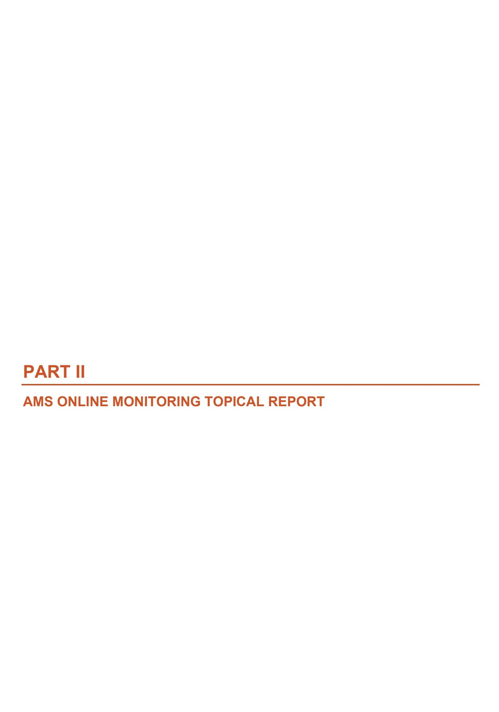

# AMS TOPICAL REPORT

# Online Monitoring Technology to Extend Calibration Intervals of Nuclear Plant Pressure Transmitters

Report Number: AMS-TR-0720R2-A (NON-PROPRIETARY)

August 2021

#### **AMS Topical Report**

#### **AMS-TR-0720R2-A**

PREPARED BY DATE: 08/20/2021

> **Greg W. Morton** Chief Technical Officer

PREPARED BY DATE: 08/20/2021

> **Brent Shumaker** Senior Engineering Manager

REVIEWED BY DATE: 08/20/2021

> **Dan Beverly** Quality Assurance Manager

REVIEWED BY DATE: 08/20/2021

> **Mark Burzynski** AMS Licensing Consultant

DATE: 08/20/2021

**H.M. Hashemian** President

APPROVED BY

#### **REVISION HISTORY**

| Revision Number                 | Description                                  | Page Number | Date    |
|---------------------------------|----------------------------------------------|-------------|---------|
| R0                              | Original Draft                               | All         | 07/2020 |
| R1                              | Revised for Acceptance Review Sufficiency |             | 10/2020 |
| R2-A Revised to Address RAIs |                                              | All         | 08/2021 |
|                                 |                                              |             |         |

#### **ABSTRACT**

This Topical Report describes how online monitoring technology can be used in nuclear power plants as an analytical tool to measure sensor drift during plant operation and thereby identify the sensors whose calibration must be checked physically during an outage. The technology involves a procedure to: 1) retrieve redundant sensor measurements from the process computer or through a separate data acquisition system, 2) calculate the average of these measurements and the deviation of each sensor from the average, and 3) identify any sensor(s) that has deviated beyond its predetermined monitoring limit. The application of this condition monitoring technology for nuclear plant pressure, level, and flow transmitters is the subject of this report.

The work toward preparation of this report has been funded with a grant from the U.S. Department of Energy. The goal of the project is for Analysis and Measurement Services Corporation to work with the Nuclear Regulatory Commission in preparing this report to result in a Safety Evaluation Report to guide the industry on how online monitoring can be used to extend the frequency of calibrations of pressure transmitters in nuclear facilities.

#### **ABBREVIATIONS AND ACRONYMS**

*A/D* Analog to Digital

NON-PROPRIETARY

*ADVOLM* Allowable Deviation Value for Online Monitoring

*AFAL* As-Found As-Left

*AMS* Analysis and Measurement Services Corporation

*AR* Autoregressive

*ATR* Advanced Test Reactor *BWROG* BWR Owners Group *BWRs* Boiling Water Reactors *CCW* Component Cooling Water *CDF* Core Damage Frequency *CE* Combustion Engineering *CFR* Code of Federal Regulations *CSA* Channel Statistical Accuracy

*DB* Drift Band

*DNP* Delivering the Nuclear Promise *DOE* U.S. Department of Energy

*DOE-NE* U.S. Department of Energy's Office of Nuclear Energy

*EA* Environmental Allowance

*ECUL* Equivalent Channel Uncertainty Limit *EPRI* Electric Power Research Institute

*EQ* Equipment Qualification *ESW* Essential Service Water *FFT* Fast Fourier Transform

*FMEA* Failure Modes and Effects Analysis *FOA* Funding Opportunity Announcement

*GE* General Electric

*HFIR* High Flux Isotope Reactor *I&C* Instrumentation and Control

*IAEA* International Atomic Energy Agency *ICMP* Instrument Calibration Monitoring Program *IEC* International Electrotechnical Commission *IEEE* Institute of Electrical and Electronics Engineers

*INL* Idaho National Laboratory

*ISA* International Society of Automation *LAR* License Amendment Request

*LER* Licensee Event Report

*LERF* Large Early Release Frequency *LWRS* Light Water Reactor Sustainability *M&D* Maintenance and Diagnostic *M&TE* Measuring and Test Equipment

*MAVD* Maximum Acceptable Value of Deviation

*MCU* Monitoring Channel Uncertainty

*NB* Normal Band

*NEI* Nuclear Energy Institute *NI* Nuclear Instrumentation

*NPRDS* Nuclear Plant Reliability Data System *NRC* U.S. Nuclear Regulatory Commission

*NSSS* Nuclear Steam Supply System

*OLM* Online Monitoring

*ORNL* Oak Ridge National Laboratory *PEA* Primary Element Accuracy

*PERC* Percentage

*PEU* Process Estimate Uncertainty *PMA* Process Measurement Accuracy *PNNL* Pacific Northwest National Laboratory

*PPS* Primary Protection System *PRA* Probabilistic Risk Assessment

*PSD* Power Spectral Density *PSI* Pounds per Square Inch

*PSIG* Pounds per Square Inch Gauge *PWR* Pressurized Water Reactor

*PWROG* PWR Owners Group *QA* Quality Assurance

*R&D* Research and Development *RAI* Request for Additional Information

*RCA* Rack Calibration Accuracy *RCP* Reactor Coolant Pump *RCS* Reactor Coolant System

*RCSA* Rack Comparator Setting Accuracy

*RD* Rack Drift

*RMTE* Rack Measurement and Test Equipment

*RSS* Root Sum Square

*RTD* Resistance Temperature Detector

*RTE* Rack Temperature Effects

*RVLIS* Reactor Vessel Level Indicating System

*RWST* Refueling Water Storage Tank *SCA* Sensor Calibration Accuracy

*SCRM* Single Calibration Regression Methodology

*SD* Sensor Drift

*SER* Safety Evaluation Report

*SFCP* Surveillance Frequency Control Program

*SG* Steam Generator

*SMTE* Sensor Measurement and Test Equipment *SNOC* Southern Nuclear Operating Company

*SPE* Static Pressure Effect

*SPS* Secondary Protection System

*SRP* Standard Review Plan *STE* Sensor Temperature Effect *STI* Surveillance Test Interval

*STS* Standard Technical Specifications

*TECDOC* Technical Document *TR* Topical Report

*TS* Technical Specification

*TSTF* Technical Specification Task Force

*V&V* Verification and Validation

#### **TABLE OF CONTENTS**

| 1 |     | INTRODUCTION 1                                                     |  |
|---|-----|-----------------------------------------------------------------------|--|
|   | 1.1 | REPORT OBJECTIVES 1                                                   |  |
|   | 1.2 | REPORT CONTENT 1                                                      |  |
| 2 |     | BACKGROUND AND TERMINOLOGY 3                                          |  |
|   | 2.1 | BACKGROUND 3                                                       |  |
|   | 2.2 | TERMINOLOGY 5                                                      |  |
| 3 |     | FUNDAMENTALS OF TRANSMITTER DRIFT MONITORING 6                        |  |
|   | 3.1 | CONVENTIONAL CALIBRATIONS VERSUS OLM 6                                |  |
|   | 3.2 | BASICS OF OLM TECHNOLOGY 7                                         |  |
|   | 3.3 | COMMON-MODE DRIFT 8                                                   |  |
|   |     | 3.3.1 EPRI Drift Study 10                                             |  |
|   |     | 3.3.2 PWROG Drift Study 11                                            |  |
|   |     | 3.3.3 Sizewell Drift Studies 11                                       |  |
|   | 3.4 | DETECTING TRANSMITTER FAILURE MODES WITH OLM12                        |  |
|   |     | 3.4.1 Calibration Failure Modes Detectable by OLM 12                  |  |
|   |     | 3.4.2 Failure Modes Detectable by Response Time Testing 13            |  |
|   |     | 3.4.3 Summary of FMEA Results 14                                      |  |
|   | 3.5 | OLM AND TSTF OPTIONS TO EXTEND TRANSMITTER CALIBRATION INTERVALS17 |  |
| 4 |     | HISTORY OF TRANSMITTER CALIBRATIONS AND RESPONSE TIME TESTING18       |  |
| 5 |     | RELATED REGULATIONS AND STANDARDS 20                               |  |
| 6 |     | OLM DATA ACQUISITION AND ANALYSIS 24                               |  |
|   | 6.1 | OLM DATA ACQUISITION 24                                            |  |
|   | 6.2 | OLM DATA QUALIFICATION 25                                          |  |
|   | 6.3 | OLM DATA ANALYSIS 33                                               |  |
| 7 |     | CALCULATION OF OLM LIMITS41                                           |  |
|   | 7.1 | UNCERTAINTY FORMULAS41                                                |  |
|   | 7.2 | DEVELOPMENT OF OLM LIMITS44                                           |  |
|   | 7.3 | PRESENTATION OF OLM RESULTS WITHIN OLM LIMITS50                       |  |
| 8 |     | OLM SAMPLING FREQUENCY AND SAMPLING DURATION52                        |  |

| 9  | OLM IMPLEMENTATION IN U.S. PLANTS 54                                             |    |
|----|-------------------------------------------------------------------------------------|----|
| 10 | COMPARISON OF RESULTS OF OLM AND MANUAL CALIBRATIONS56                              |    |
|    | 10.1 OLM IMPLEMENTATION AT SIZEWELL B 56                                      |    |
|    | 10.1.1 Description of Sizewell B Plant 56                                           |    |
|    | 10.1.2 OLM History at Sizewell B 57                                                 |    |
|    | 10.1.3 OLM Results Versus Manual Calibrations 59                                    |    |
|    | 10.1.4 Sizewell Transmitters Exceeding OLM Limits 65                                |    |
|    | 10.1.5 Evidence to Rule Out Common-Mode Drift 66                                    |    |
|    | 10.2 OLM IMPLEMENTATION AT MCGUIRE UNIT 2 66                                  |    |
|    | 10.2.1 Description of McGuire Plant 66                                              |    |
|    | 10.2.2 In-Plant Demonstration of OLM 71                                             |    |
|    | 10.2.3 OLM Results Versus Manual Calibrations 74                                    |    |
|    | 10.2.4 Laboratory Demonstration of OLM 74                                           |    |
|    | 10.3 OLM CAN IDENTIFY ZERO AND SPAN SHIFTS AND OTHER CALIBRATION ISSUES 78 |    |
| 11 | OLM IMPLEMENTATION METHODOLOGY82                                                    |    |
|    | 11.1 DATA ACQUISITION AND ANALYSIS TO MONITOR FOR DRIFT 82                    |    |
|    | 11.1.1 Steps to Initiate the OLM Implementation Process 82                          |    |
|    | 11.1.2 Steps to be Followed Each Operating Cycle 84                                 |    |
|    | 11.2 EXAMPLE OF THE OLM DATA ANALYSIS PROCESS 86                              |    |
|    | 11.3 DATA ACQUISITION AND ANALYSIS TO ASSESS DYNAMIC FAILURE MODES               | 95 |
|    | 11.3.1 Transmitter Amenability to OLM Noise Analysis Technology 95                  |    |
|    | 11.3.2 Impact of Transmitter Response Time Elimination on OLM 95                    |    |
|    | 11.3.3 Steps for Implementation of Noise Analysis Technique 96                      |    |
|    | 11.4 TRAINING OF OLM ANALYST100                                                  |    |
|    | 11.5 REQUIRED TECHNICAL SPECIFICATIONS CHANGES100                                |    |
| 12 | REFERENCES TO SUBSTANTIATE AMS CLAIMS102                                            |    |
|    | 12.1 SUBSTANTIATE ABSENCE OF COMMON-MODE DRIFT102                                |    |
|    | 12.1.1 EPRI Drift Study Reported in TR-104965-R1 102                                |    |
|    | 12.1.2 EPRI Drift Study Reported in 1009603 103                                     |    |
|    | 12.1.3 Sizewell Internal Report on Transmitter Drift 103                            |    |
|    | 12.1.4 PWROG Drift Study 104                                                        |    |
|    | 12.1.5 Transmitters Amenable to OLM 105                                             |    |
|    | 12.2 FAILURE OF OLM VERSUS FAILURE OF TRADITIONAL CALIBRATIONS106                |    |

| 13 | PROCESS TO ESTABLISH BACKSTOP 108                                                                 |  |
|----|------------------------------------------------------------------------------------------------------|--|
|    | 13.1 STEPS TO ARRIVE AT BACKSTOP 108                                                           |  |
|    | 13.2 BACKSTOP PROVISIONS 111 13.3 EXAMPLES OF BACKSTOP CALCULATIONS 111               |  |
| 14 | OLM COVERAGE OF TRANSMITTER SETPOINTS AND RANGE116                                                   |  |
|    | 14.1 COVERAGE OF SAFETY SETPOINTS116 14.2 COVERAGE OF FULL RANGE 117                     |  |
| 15 | MINIMUM DATA ACQUISITION SAMPLE RATE FOR DRIFT MONITORING121                                         |  |
|    | 15.1 DISTRIBUTION OF OLM DATA121 15.2 PROCESS TO ESTABLISH MINIMUM SAMPLE RATE 123       |  |
| 16 | CONCLUSIONS 126                                                                                   |  |
|    | REFERENCES 127                                                                                    |  |
|    | BIBLIOGRAPHY 130                                                                                  |  |
|    | APPENDICES                                                                                           |  |
|    | APPENDIX A - AMS RESPONSES TO NRC COMMENTS                                                           |  |
|    | APPENDIX B - PROPOSED CHANGES TO EXISTING TECHNICAL SPECIFICATION REQUIREMENTS TO ACCOMMODATE OLM |  |
|    | APPENDIX C - CITATION SUMMARIES                                                                      |  |

**APPENDIX D - REQUEST FOR ADDITIONAL INFORMATION CROSS REFERENCE**

#### **LIST OF FIGURES**

| Figure 3.1. | OLM Data for Four Redundant SG Level Transmitters 7                                                              |  |
|-------------|------------------------------------------------------------------------------------------------------------------|--|
| Figure 3.2. | Typical Calibration Behavior of Nuclear Grade Transmitters 9                                                     |  |
| Figure 3.3. | Histogram of Transmitter Drift Values 10                                                                         |  |
| Figure 6.1. | OLM Data from a PWR Plant Computer 24                                                                            |  |
| Figure 6.2. | Plant Equipment in the OLM Data Path 25                                                                          |  |
| Figure 6.3. | Historized / Compressed OLM Data Points 26                                                                       |  |
| Figure 6.4. | Compressed Data Points Interpolated by Plant Historian 26                                                        |  |
| Figure 6.5. | Examples of Missing OLM Data Acquired from Three Nuclear Power Plants 28                                         |  |
| Figure 6.6. | OLM Data Containing Spikes or Affected by Calibration Activities 29                                              |  |
| Figure 6.7. | Nuclear Plant OLM Data with Regions of Stuck Values 30                                                           |  |
| Figure 6.8. | PWR Plant OLM Data Before and After Filtering 31                                                                 |  |
| Figure 6.9. | OLM Data Affected by Reactor Coolant Pump Operation 32                                                           |  |
|             | Figure 6.10. Illustration of Simple Averaging Technique 34                                                       |  |
|             | Figure 6.11. Choices for Parity Space Band 35                                                                    |  |
|             | Figure 6.12. Parity Space Band Selected Based on Measurement Accuracies 36                                       |  |
|             | Figure 6.13. Example of Parity Space Averaging Technique for Three Redundant Signals 38                          |  |
|             | Figure 6.14. Example of Parity Space Averaging Technique for Four Redundant Signals 38                           |  |
|             | Figure 6.15. Illustration of Parity Space Results for Four Redundant Signals With One Drifting Away 39           |  |
|             | Figure 6.16. Illustration of Parity Space and Deviation Plots of a Drifting Sensor with Random Noise 40          |  |
| Figure 7.1. | Illustration of Manual Calibration Limits 43                                                                     |  |
| Figure 7.2. | Illustration of OLM Limits 43                                                                                    |  |
| Figure 7.3. | Illustration of Process Estimate (𝐋𝐋) and its Uncertainty (σ) 44                                                 |  |
| Figure 7.4. | Results of Calculation of OLM Drift Band 46                                                                      |  |
| Figure 7.5. | Illustration of OLM Limit for Sizewell B Transmitters 48                                                         |  |
| Figure 7.6. | OLM Results Tracked for Four Pressurizer Pressure Transmitters at Sizewell B 50                                  |  |
| Figure 7.7. | Startup OLM Results for Four Redundant Level Transmitters at Sizewell B 51                                       |  |
| Figure 7.8. | OLM Results for Four Redundant Level Transmitters at Sizewell B During Normal Plant Operation 51              |  |
| Figure 8.1. | Average and Maximum Errors in OLM Results Versus Sampling Rate 53                                                |  |
| Figure 8.2. | Average and Maximum Errors in OLM Results Versus Sampling Duration 53                                            |  |
|             | Figure 10.1. Sizewell Transmitters Flagged for Calibration Checks at the End of Each Plant Operating Cycle 65 |  |
|             | Figure 10.2. Primary and Secondary Loops of McGuire Where OLM Signals Were Monitored 69                          |  |

#### *Online Monitoring Technology to Extend Calibration Intervals of Nuclear Plant Pressure Transmitters* **AMS-TR-0720R2-A**

|  | Figure 10.3. Block Diagram of OLM Data Acquisition System Used at McGuire 70                                                             |     |
|--|------------------------------------------------------------------------------------------------------------------------------------------|-----|
|  | Figure 10.4. OLM Data Acquisition Connection to McGuire Instrument Channels 71                                                           |     |
|  | Figure 10.5. Reactor Power During OLM Data Collection at McGuire 72                                                                      |     |
|  | Figure 10.6. Raw and Filtered OLM Data for Three Reactor Coolant Flow Transmitters at McGuire 73                                         |     |
|  | Figure 10.7. Comparison of Drift Detected by Calibrations and OLM at McGuire 75                                                          |     |
|  | Figure 10.8. Laboratory Results for Flow Transmitters 75                                                                                 |     |
|  | Figure 10.9. Laboratory Results for a Rosemount Smart Transmitter 76                                                                     |     |
|  | Figure 10.10. Laboratory Results for a Foxboro and a Statham Pressure Transmitter 77                                                     |     |
|  | Figure 10.11. Startup OLM Data and Results Over the Span of Transmitters 79                                                              |     |
|  | Figure 10.12. Zero, Span, and Zero Plus Span Shifts Determined from OLM Data 80                                                          |     |
|  | Figure 10.13. Zero and Span Shift Calculated from Startup and Shutdown Data 81                                                           |     |
|  | Figure 11.1. Startup Data Analysis Process 87                                                                                            |     |
|  | Figure 11.2. Analysis Process for OLM Data Collected During Normal Plant Operation 89                                                    |     |
|  | Figure 11.3. Example of Full-Cycle Results for Four Redundant Sizewell B Transmitters 90                                                 |     |
|  | Figure 11.4. OLM Results for Redundant Pressurizer Level Transmitters at Vogtle 92                                                       |     |
|  | Figure 11.5. OLM Results for Three Redundant Steam Pressure Transmitters at Farley 93                                                    |     |
|  | Figure 11.6. Noise Data Acquisition Process 98                                                                                           |     |
|  | Figure 11.7. Noise Data Acquisition from a Transmitter Loop 98                                                                           |     |
|  | Figure 11.8. Raw Noise Data from a PWR Pressure Transmitter 99                                                                           |     |
|  | Figure 11.9. Noise Analysis Results for Transmitters in Two Nuclear Power Plants With and Without Degraded Dynamic Sensor Response 99 |     |
|  | Figure 13.1. Bar Charts of Results of Table 13.5 for PWR Unit 1 113                                                                      |     |
|  | Figure 13.2. Bar Charts of Results of Table 13.6 for PWR Unit 2 115                                                                      |     |
|  | Figure 14.1. Examples of Deviation Versus Span Data for PWR Transmitters 120                                                             |     |
|  | Figure 15.1. Example Histogram of Deviations from the Redundant Group Average for a Steam Generator Level Transmitter 121             |     |
|  | Figure 15.2. Minimum Sample Rate [[ ]]a,b,f                                                                                           | 122 |

#### **LIST OF TABLES**

| Table 3.1. Summary of FMEA for Nuclear Grade Pressure Transmitters 15                              |  |
|----------------------------------------------------------------------------------------------------|--|
| Table 6.1. Rankings of Process Estimation Techniques 33                                            |  |
| Table 6.2. Calculation of Parity Space Weights for Four Redundant Signals 36                       |  |
| Table 7.1. Potential Sources of Instrument Channel Uncertainty 42                                  |  |
| Table 7.2. Uncertainty Values for Steam Generator Level Narrow Range Transmitters at Sizewell B 45 |  |
| Table 7.3. OLM Limits for Selected Transmitters at Sizewell B 49                                   |  |
| Table 9.1. Selected Transmitters in OLM Implementation in Representative U.S. Plants 54            |  |
| Table 9.2. Transmitters Monitored at Vogtle Units 1 and 2 55                                       |  |
| Table 10.1. Number of Important Sensors in Sizewell B Compared with Typical PWR Plants 57          |  |
| Table 10.2. Transmitters Involved in OLM Implementation at Sizewell B 60                           |  |
| Table 10.3. Agreement Between OLM and Calibrations for Sizewell Transmitters 61                    |  |
| Table 10.4. Results of OLM and Calibrations for 108 Sizewell Transmitters Over 5 Cycles 62         |  |
| Table 10.5. Distribution of Nonconservative Results 67                                             |  |
| Table 10.6. Listing of Signals Monitored at McGuire Unit 2 68                                      |  |
| Table 11.1. Illustration of Cycle Summary Table for Four Redundant Transmitters 91                 |  |
| Table 11.2. Abbreviated Table of OLM Results for Sizewell Transmitters 94                          |  |
| Table 11.3. Minimum Requirements for Portable Noise Data Acquisition System 97                     |  |
| Table 12.1. Transmitters Involved in EPRI Drift Study Reported in TR-104965-R1 103                 |  |
| Table 12.2. Transmitters Included in Sizewell's Internal Drift Study 103                           |  |
| Table 12.3. Transmitters Included in PWROG Drift Study 104                                         |  |
| Table 12.4 Nuclear Grade Transmitters Amenable to OLM 105                                          |  |
| Table 13.1 All Permutations of Drift Direction for Two-Way Redundant Transmitters 109              |  |
| Table 13.2. All Permutations of Drift Direction for Three-Way Redundant Transmitters 109           |  |
| Table 13.3. Probability of Drift in Same Direction Versus Transmitter Redundancy 109               |  |
| Table 13.4. Calculation of Probability of Adjustment for a 3-Way Redundant Service 111             |  |
| Table 13.5. Backstop Calculations for PWR Unit 1 112                                               |  |
| Table 13.6. Backstop Calculations for PWR Unit 2 114                                               |  |
| Table 14.1. OLM Coverage Versus Setpoints for Representative PWR Services 117                      |  |
| Table 14.2 Data and Results of Evaluation of Unexercised Portions of Range 120                     |  |
| Table 15.1. Minimum Sample Rate Example for PWR Plant #1 124                                       |  |
| Table 15.2. Minimum Sample Rate Example for PWR Plant #2 125                                       |  |
|                                                                                                    |  |

### **1 INTRODUCTION**

#### **1.1 REPORT OBJECTIVES**

Online monitoring (OLM) technologies have been developed and validated for condition monitoring applications in a variety of process and power industries. These applications include: 1) optimized maintenance of instrumentation and control (I&C) systems including online drift monitoring and assessment of dynamic failure modes of transmitters, 2) detection of blockages, voids, leaks, and flow anomalies in operating processes, and 3) identification of excessive vibration, overheating, and equipment or process deviations from normal behavior [1-7]. However, this report is focused on the application of OLM for monitoring drift of pressure, level, and flow transmitters in nuclear power plants. It covers the following topics capturing the advances that have been made since the year 2000 when the Nuclear Regulatory Commission (NRC) last reviewed the OLM technology:

- Advances in OLM implementation technology to extend transmitter calibration intervals
- Experience with OLM implementation in nuclear facilities
- Comparison between OLM results and manual calibrations
- Transmitter failure modes that can be detected by OLM
- Related regulatory requirements and industry standards and guidelines
- Procedures for implementation of OLM methodology
- Changes that must be made to existing technical specifications to adopt OLM

This Topical Report (TR) provides the NRC with the information that it needs to approve the Analysis and Measurement Services Corporation (AMS) OLM methodology for implementation in nuclear power plants. The TR is intended to be used by licensees to support plant-specific technical specification changes to switch from time-based calibration frequency of pressure, level, and flow transmitters to a condition-based calibration frequency based on OLM results. The TR can also be used by licensees to develop procedures to assess dynamic failure modes of pressure sensing systems using the noise analysis technique.

#### **1.2 REPORT CONTENT**

This report consists of sixteen (16) Chapters, a list of references, a bibliography, and four (4) Appendices. A summary of the content of each chapter and appendix is presented below.

- **Chapter 1:** Introduces the topics covered in the report and details the report content.
- **Chapter 2:** Provides the background as to how this project was initiated and funded followed by definitions of key terminology used in the report.

- **Chapter 3:** Discusses the fundamentals of condition-based calibrations, the basics of OLM technology, evidence that the drift of nuclear grade transmitters is random and there is therefore little or no potential for common-mode drift, and how OLM can detect transmitter failure modes.
- **Chapter 4:** Presents the history of calibrations and response time testing of nuclear plant transmitters and the efforts of the nuclear industry to eliminate response time testing requirements and extend the calibration intervals of transmitters.
- **Chapter 5:** Provides a summary of regulations, standards, and guidelines on performance requirements for nuclear plant transmitters and how OLM can satisfy these requirements.
- **Chapter 6:** Describes how OLM data in nuclear power plants is collected, processed, and analyzed to identify drift.
- **Chapter 7:** Describes how OLM limits are established to determine when a transmitter is flagged for a physical calibration check.
- **Chapter 8:** Provides data on the relationships between sampling rate and sampling duration of OLM data and the accuracy of OLM results.
- **Chapter 9:** Presents a listing of U.S. nuclear power plants where OLM has been implemented and lessons learned from these implementation experiences.
- **Chapter 10:** Compares the results of OLM with the corresponding manual calibrations of pressure transmitters at the McGuire Nuclear Station in the United States and Sizewell B nuclear power plant in the United Kingdom.
- **Chapter 11:** Describes the OLM methodology to detect drift and assess dynamic failure modes in nuclear plant pressure sensing systems.
- **Chapter 12:** Provides evidence in support of claims regarding common-mode drift and comparing OLM results with traditional calibrations.
- **Chapter 13:** Provides a process to establish the maximum time interval before one transmitter in a redundant group must be checked for calibration. This maximum time interval is also known as a backstop.
- **Chapter 14:** Describes processes to address potential gaps in OLM data in covering safety setpoints and the full range of transmitters.
- **Chapter 15:** Describes a process to determine the minimum rate at which the output of transmitters in an OLM program must be sampled to provide accurate average deviations.
- **Chapter 16**: Presents the key conclusions of the report.
- **Appendix A:** Contains the AMS answers to the NRC questions posed during the first two AMS-NRC meetings about this project.
- **Appendix B:** Shows how different nuclear plant technical specification documents can be modified to implement condition-based calibrations using OLM.
- **Appendix C:** Provides summaries of key points of references cited throughout the report.
- **Appendix D:** Provides a cross reference for the NRC's requests for additional information.

#### **2 BACKGROUND AND TERMINOLOGY**

#### **2.1 BACKGROUND**

In the year 2017, the U.S. Congress earmarked 500 million dollars in funding for the Department of Energy's Office of Nuclear Energy (DOE-NE) to support advanced nuclear energy research and development (R&D). In response, DOE produced a Funding Opportunity Announcement (FOA) dated December 7, 2017 entitled "U.S. Industry Opportunities for Advanced Nuclear Technology Development". According to the FOA, the nuclear industry could apply for R&D funding under three different "Pathways" as follows:

**Pathway I – First of a Kind Nuclear Demonstration Readiness Projects.** Supports advanced reactor design developments and/or advanced technology developments in support of the existing fleet of nuclear power plants in the United States.

**Pathway II – Advanced Reactor Development Projects.** Supports concepts and ideas to improve the commercialization potential and capabilities of domestic nuclear energy technologies for conventional and advanced reactors.

**Pathway III – Regulatory Assistance Grant and Technology Development Opportunities.** Provides support for the industry to work with the NRC on resolution of regulatory and licensing issues and review of topical reports related to implementation of advanced technologies in existing and advanced reactors.

The author of this Topical Report, Analysis and Measurement Services Corporation (AMS), responded in 2018 to the Pathway III option with a proposal entitled "Resolving the Regulatory Issues with Implementation of Online Monitoring Technologies to Extend the Calibration Intervals of Process Instruments in Nuclear Power Plants". This resulted in a DOE grant to AMS to produce this Topical Report. The project relates to DOE's Light Water Reactor Sustainability (LWRS) program and supports the industry's goal of "Delivering the Nuclear Promise" (DNP). Conceived in the year 2014, DNP is a nuclear industry strategy aimed at advancing safety, reliability, and economic performance of nuclear power plants.

As a first step toward execution of this project, AMS applied for a fee-waiver from the NRC which was approved in May 2019 authorizing NRC staff to work on this project at no cost to AMS or DOE. AMS then invited the Southern Nuclear Operating Company (SNOC) to join the project as the industry partner. SNOC agreed and assigned one of its subject matter experts, Mr. Randy Olson, to work on this project with AMS. Exhibit A is a letter from SNOC testifying to its partnership with AMS on this project.

📤 Southern Nuclear

April 17, 2020

P.O. Box 1295 Birmingham, AL 35201 Tel 205.992.5000

Michael D. Waters Chief, Instrumentation and Controls Branch U. S. Nuclear Regulatory Commission

RE: Partnership with AMS Corporation on TR Development for OLM Implementation

This is to inform you that Southern Nuclear Operating Company will serve as the nuclear utility partner with AMS for the subject topical report. We have appointed Randy Olson, our subject matter expert in this area to work with AMS and meet with NRC as needed to complete the topical report. Our goal is to help obtain a safety evaluation report (SER) to implement online monitoring (OLM) to reduce the frequency of unnecessary calibrations of safety-related pressure, level, and flow transmitters in our nuclear fleet.

We have implemented OLM at Vogtle since December 2018 to monitor the calibration of a number of pressure, level, and flow transmitters. This activity was undertaken as a supplement to our TSTF approach to reduce the frequency of unnecessary calibrations of our transmitters. We also test the transmitters using the noise analysis (high frequency OLM) technique to verify the dynamic performance of the transmitters and to identify any significant sensing line blockages. These efforts have been very successful in optimizing our transmitter maintenance and calibrations activities.

The topical report that we will produce in partnership with AMS and the resulting SER will guide us to transition from the TSTF approach to true condition-based maintenance of our pressure, level, and flow transmitters. This will improve the safety of our plants and contribute to reduced radiation dose to our personnel, human errors, and maintenance-induced plant trips and damage to plant equipment.

Thank you for the opportunity to provide you this information. Please do not hesitate to contact me at 205-992-5181 or email me at bjadams@southernco.com

Sincerely,

Bradley J. Adams Site Vice President Vogtle Units 1&2 Southern Nuclear Operating Company

Brookley V. Adame

CC: H.M. Hashemian, AMS President and Chief Executive Officer

Randy Olson, Fleet Monitoring and Diagnostics Center Manager, Southern Nuclear

RCO/crs

**Exhibit A. Letter from Southern Nuclear Operating Company** 

#### **2.2 TERMINOLOGY**

The words sensor and transmitter are used interchangeably in this report and refer to pressure transmitters (both pressure and differential pressure sensors) that are used in nuclear power plants to measure process pressure, level, and flow.

The words calibration and manual calibration are used here interchangeably to refer to hands-on calibration activities in the field involving physical access to each transmitter to verify its calibration and make adjustment to its zero and span settings if necessary.

Online monitoring is an automated method of monitoring transmitter performance and assessing calibration while the plant is operating. In the simplest configuration, redundant channels are monitored by comparing each individual channel's indicated measurement to a calculated best estimate of the actual process value. This best estimate is called the process estimate. By monitoring each channel's deviation from the process estimate, an assessment of each channel's calibration status is made. Noise analysis is another OLM technique that is used to evaluate transmitter dynamic behavior during plant operation. The word "noise" refers to fluctuations that naturally exist at the output of transmitters while the plant is operating. The noise data is analyzed to detect sluggish response of pressure sensing systems.

The AMS OLM methodology for transmitter drift monitoring requires a reference for detecting drift. The reference is obtained by simple or weighted averaging of redundant signals and is referred to as true process estimate, process best estimate, or simply process estimate.

#### **3 FUNDAMENTALS OF TRANSMITTER DRIFT MONITORING**

This chapter presents an overview of key aspects of OLM technology for monitoring transmitter drift based on comparison of each redundant transmitter's reading with the average reading of its redundant group. The average reading which is referred to as "process estimate" is calculated using "simple" and "parity space" averaging techniques. The details needed for plants to calculate process estimates using simple and parity space averaging are provided in Chapters 6, 7, and 11 of this report. Other process estimation techniques exist as evidenced in numerous public domain documents. However, the focus of this TR is to provide the details needed to approve OLM technologies based only on simple averaging and parity space. It should be noted that the OLM methodology described in Chapter 11 is agnostic to process estimation techniques; however, the use of other process estimation techniques would have to be justified on a plant-specific basis.

#### **3.1 CONVENTIONAL CALIBRATIONS VERSUS OLM**

Conventional calibrations of transmitters typically involve two steps:

**Step 1 – Determine if the transmitter must be calibrated.** This step is carried out by manually isolating the transmitter from the process and applying a range of known pressures to the transmitter covering the operating range of the transmitter while measuring its output. The data from this step is referred to as the "as-found" calibration data. If the "as-found" data shows that the calibration of a transmitter is acceptable, then no further action is needed, and the transmitter is returned to service. Otherwise, the transmitter is calibrated as detailed in the next step.

**Step 2 – Calibrate the transmitter.** This step is carried out by making manual adjustments to transmitter zero and/or span settings via on-board potentiometers to make the transmitter read a range of applied pressures as closely as possible. The data from this step is referred to as "as-left" calibration data.

The first step above consumes a majority of the effort that is spent by plant personnel on sensor calibrations which can be saved by OLM. In particular, a review of calibration history of nuclear plant pressure, level, and flow transmitters has shown that about 90% of these transmitters maintain their calibration for much longer than a typical fuel cycle which can range from 14 to 24 months. More specifically, calibration records have shown that only about 10% of nuclear plant transmitters exceed their "as-found" limits [8]. As such, the OLM procedure was developed to eliminate about 90% of the calibration burden on nuclear plant personnel while improving plant safety and efficiency by eliminating unnecessary calibrations which can cause damage to plant equipment, expose plant personnel to radiation, and increase the potential for human errors, plant trips, or spurious actuations.

#### **3.2 BASICS OF OLM TECHNOLOGY**

OLM technology for transmitter drift monitoring involves a simple procedure that is passive and benign to plant operation and does not require any modification to the plant. All that is needed to implement OLM is a means to retrieve the output readings of transmitters, which can be accomplished using the plant computer or a separate data acquisition system, and a software package to validate and analyze the transmitter data. OLM is not a substitute for conventional calibrations. Rather, it is an analytical tool analogous to using measuring and test equipment (M&TE) to check for drift of transmitters during plant operation in order to determine if they must be scheduled for a physical calibration by plant personnel during an upcoming plant outage.

To perform OLM, readings of redundant sensors are tracked while the plant is operating to identify drift beyond acceptable limits. Figure 3.1 shows the readings of four redundant steam generator (SG) level transmitters from Unit 2 of the McGuire Nuclear Station over a period of about 30 months, representing nearly two full operating cycles. A multichannel data acquisition system was installed at McGuire and connected to existing plant isolation modules to allow live data collection while the plant was operating. The work was done by AMS over the period of 1992 to 1995 in collaboration with Duke Power Company, the owner of McGuire Nuclear Station. The NRC provided the funding for the work with two R&D grants to AMS to evaluate the feasibility of OLM technology for transmitter drift monitoring in nuclear power plants. The results of this R&D are documented in NUREG/CR-5903 (1993) and NUREG/CR-6343 (1995) [9, 10].

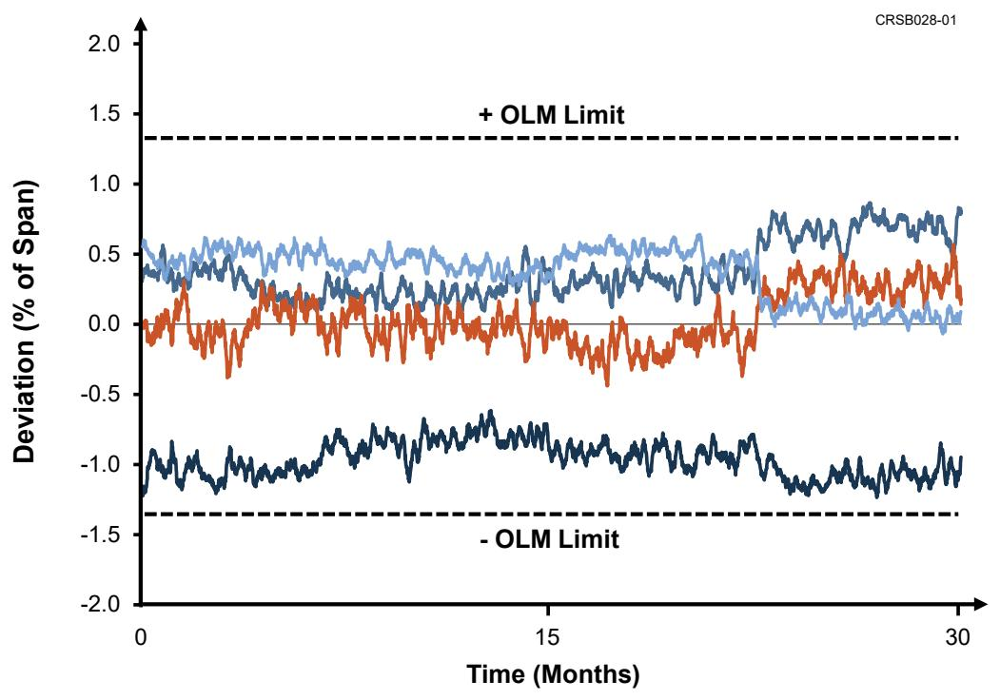

**Figure 3.1. OLM Data for Four Redundant SG Level Transmitters**

(Source of Data: McGuire Nuclear Power Plant Unit 2 – NUREG/CR 6343)

In arriving at the deviation plot in Figure 3.1, an estimate of the true SG level was first obtained by averaging the four signals. Chapter 6 describes the averaging techniques used to arrive at a true process estimate. Next, the process estimate was subtracted from the reading of each transmitter to yield the deviation of each transmitter from the average. The OLM limits for the SG level transmitters are also shown with the dotted lines in Figure 3.1. Chapter 7 describes how these limits are calculated.

It is obvious from the four traces in Figure 3.1 that the four McGuire transmitters did not drift over the two operating cycles shown in the figure and in fact remained well within the plant's OLM limits. With this information, it is reasonable to claim that the calibrations of these transmitters are intact. However, it is important to note that this claim would be true only if the four transmitters did not all drift together in either the positive or negative direction (i.e., common-mode drift). If there is no common-mode drift, then their average value is a close representation of the true process. The potential for common-mode drift in nuclear grade pressure transmitters and a summary of information and data on how common-mode drift has been ruled out for these transmitters is discussed in Section 3.3 below.

#### **3.3 COMMON-MODE DRIFT**

Over the past three decades, numerous statistical studies of calibration records have been performed by the nuclear industry to understand the nature of drift in nuclear grade transmitters. Most of these studies have been performed using the As-Found/As-Left (AFAL) methodologies described in related reports of the Electric Power Research Institute (EPRI) [11, 12] and in the NUREG-1475 [13]. A summary of some prominent studies is presented in this section and Chapter 12. These studies have concluded that the drift of nuclear grade transmitters is random with no evidence of common-mode drift.

Figure 3.2 shows manual calibration data over a period of ten years for a nuclear grade transmitter whose calibration was checked once a year at a nuclear facility. Clearly the calibration of this transmitter changed randomly from one year to another and remained well within its "as-found" limits requiring no adjustment to the transmitter's zero or span setting for the entire ten-year period. This random change in calibration is typical not only for nuclear plant pressure, level, and flow transmitters, but also for the Resistance Temperature Detectors (RTDs) that are used in the primary coolant systems of pressurized water reactors (PWRs). This claim has been confirmed by a number of objective studies including laboratory experiments to characterize the nature of drift in nuclear grade sensors and "as found" data from thousands of calibrations in nuclear power plants. For example, an R&D project performed by AMS and documented in NUREG/CR-5560 [14] demonstrated through laboratory experiments involving hundreds of sensors and thousands of tests that the drift of nuclear grade RTDs is indeed random. The same has been concluded for transmitters based on operating experience rather than laboratory experiments.

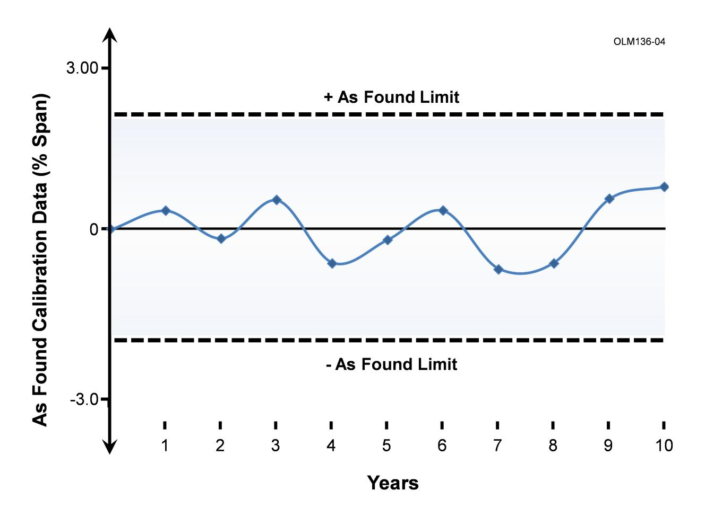

**Figure 3.2. Typical Calibration Behavior of Nuclear Grade Transmitters**  (Source of Data: Advanced Test Reactor)

Reviews of Licensee Event Report (LER) and Nuclear Plant Reliability Data System (NPRDS) databases performed by AMS and documented in NUREG/CR-5383 [15] and NUREG/CR-5851 [16] revealed no common-mode drift in nuclear plant sensors. The focus of these projects, however, was on aging characteristics of nuclear plant pressure transmitters and not on analysis of their failure modes or an objective assessment of common-mode drift.

Another illustration in support of the random nature of transmitter drift is provided in Figure 3.3 and is based on manual calibration data of a group of redundant nuclear grade transmitters in the same service in a PWR plant. The bar graph and the bell-shaped curve that is superimposed on the graph demonstrate that the drift of a population of nuclear grade transmitters is random. This figure shows that the drift of a group of transmitters in the same service over a long period of time (e.g., ten years) is randomly distributed in the positive and negative directions above and below the mean value of the drift.

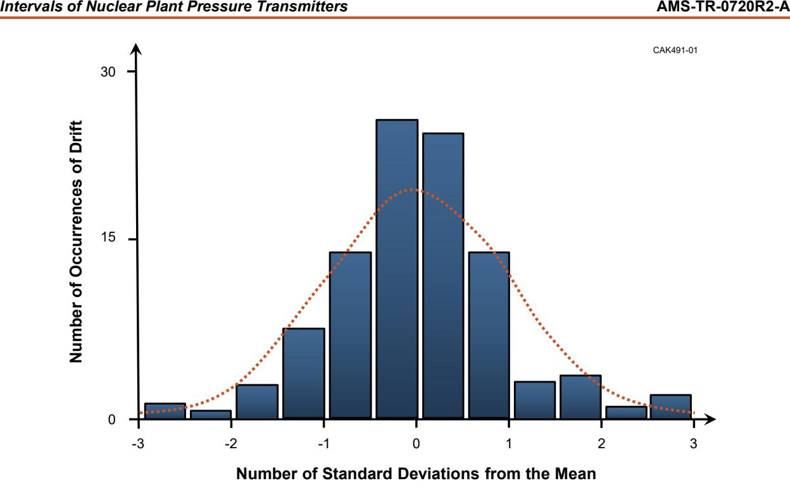

**Figure 3.3. Histogram of Transmitter Drift Values**

#### **3.3.1 EPRI Drift Study**

EPRI sponsored a transmitter drift study using manual calibration records from eighteen nuclear power plants. This work was in support of EPRI's topical report to NRC in the year 2000 requesting approval to extend the calibration intervals of nuclear plant pressure, level, and flow transmitters (TR-104965-R1-NRC-SER [1]). The study included approximately 6,700 calibration records from 1,139 transmitters with over 33,000 AFAL data points. Transmitter manufacturer types represented in the study included Rosemount, Barton, Foxboro, Veritrak, Tobar, and others. The work produced the following conclusions:

- 1. The existing generation of nuclear grade pressure, level, and flow transmitters are as likely to drift up as they are to drift down and almost none had any bias errors.
- 2. For those plants that performed a nine-point calibration, hysteresis was usually negligible.
- 3. Redundant transmitters measuring the same process variable did not exhibit a tendency to drift as a group. That is, a transmitter being out of calibration did not indicate that the other redundant transmitters in the same group were likely to be out of calibration.
- 4. Failure modes were not observed in the data whereby transmitters failed in ways that would be undetectable by online monitoring. For example, transmitters did not get stuck at a fixed level where their output signal remained constant regardless of the input variations.

The EPRI drift study in reference [1] supports the AMS claim that drift behavior of nuclear grade pressure transmitters is random and common-mode drift is not a problem in using OLM to identify drifting transmitters.

#### **3.3.2 PWROG Drift Study**

In 2017, the Westinghouse Pressurized Water Reactor Owners Group (PWROG) performed a drift analysis on transmitters used for safety-related services in Westinghouse PWRs [17]. The purpose of this study was to support the TSTF-425 approach to extend transmitter calibration intervals one cycle at a time (TSTF-425 approach is explained in Section 3.5). The drift analysis methodologies and statistical techniques were based on industry-accepted practices described in EPRI report 3002002556 [12] and NUREG-1475 [13]. The analysis included over 20,000 calibration records from forty-one PWR units representing three nuclear steam supply system (NSSS) vendors and five transmitter manufacturers being Rosemount, Barton, Foxboro, Tobar-Veritrak, and Gould-Statham. In addition to supporting TSTF-425, this work concluded that the drift of safety-related transmitters in PWR plants is random with no evidence of time-dependent drift.

The PWROG drift study [17] supports the AMS claim that drift behavior of nuclear grade pressure transmitters is random and common-mode drift is not a problem in using OLM to identify drifting transmitters.

#### **3.3.3 Sizewell Drift Studies**

In 2001, a transmitter drift study was performed by Sizewell nuclear power plant in the United Kingdom to establish the drift behavior of its safety-related transmitters. This included Barton Transmitter models 763, 764, and 752 as well as transmitters from a British supplier by the name of KDG-Mobrey. The study involved a statistical analysis of manual calibration records from January 1995 to February 2001 using the Single Calibration Regression Methodology (SCRM) developed by the British utility company operating Sizewell B [18].

The results indicated that the drift of the transmitters is random, and their hysteresis error is negligible. These conclusions were further confirmed through a second study by EPRI of Sizewell's AFAL data from 1995 to 2002 focused on 140 safety-related transmitters including Barton models 763, 764, and 752 [19].

The Sizewell drift studies [19] support the AMS claim that drift behavior of nuclear grade pressure transmitters is random and common-mode drift is not a problem in using OLM to identify drifting transmitters. See Chapter 12 and reference [19] for the Sizewell conclusions.

#### **3.4 DETECTING TRANSMITTER FAILURE MODES WITH OLM**

Two major failure modes and effects analysis (FMEA) have been performed by EPRI on calibration and response time of nuclear grade pressure, level, and flow transmitters in nuclear power plants [20, 21]. This section summarizes the main conclusions of these reports as to how potential failure modes in these transmitters manifest themselves in their calibration or response and which failure modes are detectable by OLM. But first, it should be noted that EPRI uses the term "Instrument Calibration Monitoring Program" or ICMP to refer to essentially the same technology as OLM and thus the words OLM and ICMP are viewed as synonymous in this report. As such, in describing the FMEA studies of EPRI in this chapter, OLM has been substituted in instances where EPRI used the term ICMP.

#### **3.4.1 Calibration Failure Modes Detectable by OLM**

In the EPRI report '*Instrument Calibration and Monitoring Program (ICMP) Volume 2: Failure Modes and Effects Analysis' (1993)*, FMEA results are presented for three types of pressure transmitters based on their underlying measurement principle being force balance, strain gauge, or capacitance and the capability of OLM to detect calibration failure modes in these transmitter types. These results are summarized below for each of the three transmitter types.

**Force-Balance Transmitters:** FMEA analysis of these transmitters identified fourteen possible failure modes; all but one of which are detectable by OLM. Of these, nine can be detected by OLM during normal plant operation, one during transient operation, and three during either mode of operation. The single failure mode that cannot be detected by OLM is a change in viscosity of the fill fluid; usually caused by changes in environmental conditions (e.g., temperature or radiation). The change in the fill fluid viscosity can result in a change in response time which is not detectable by OLM. However, normal variations in these conditions producing this failure mode are considered in the "design-basis" of these transmitters and "beyond-design-basis" conditions are rather unlikely because equipment qualification (EQ) performed on safety-related transmitters would have revealed the failure.

**Strain Gage Transmitters:** FMEA analysis of these transmitters identified eleven failure modes; all but one of which are detectable by OLM during normal plant operation. The single failure mode that cannot be detected by OLM in this type of transmitter is the same as the one discussed above for force balance transmitters (i.e., a change in fill fluid viscosity that causes response time changes). An analysis of consequences of this failure mode for the force balance and strain gage transmitters showed identical results with the exception that response time is not as sensitive to viscosity in strain gage transmitters as it is in force-balance transmitters.

**Capacitance Transmitters:** FMEA findings for these transmitters were different than those of the two discussed above. For capacitance transmitters, EPRI identified ten failure modes; eight of which can be detected by OLM. Of these, six failure modes are detectable by OLM during normal plant operation, one during transient operation, and one during initial calibration of transmitters. The two undetectable failure modes are again response time related with the first being the fill fluid viscosity change. The other failure mode that is not detectable by OLM is a potential blockage of the holes in the ceramic inserts used in capacitance transmitters. These components transport the fill fluid between the isolation diaphragm and the sensing diaphragm. Therefore, if the flow of fluid becomes restricted by a blockage, response time can degrade.

The OLM methodology detects these failure modes by comparing the transmitter performance to other transmitters using simple and parity space averaging methods described in Chapter 6, OLM limits in Chapter 7, and methodology in Chapter 11.

Since the purpose of OLM is to provide a means to defer calibrations of the transmitters based on the OLM results, the discussion of failure modes is focused on transmitters. The OLM methodology is not intended to extend the calibration of other elements in the safety signal path, nor does it detect every potential failure mode in the signal path.

#### **3.4.2 Failure Modes Detectable by Response Time Testing**

The EPRI report 'Investigation of Response Time Testing Requirements (1991)' examined fourteen pressure transmitters from five manufacturers to determine what failure modes were detectable by response time testing and likely to occur during service in a nuclear power plant. In all, FMEA identified two failure modes which would affect a transmitter response time while not concurrently impacting its calibration: 1) slow sensor fill fluid leaks during pressurized operation, and 2) misadjustment of the variable damping potentiometer. Various types of fill fluid leaks are possible depending on transmitter design, seal failures, and pressure conditions in service. The only confirmed occurrence of a fill fluid leak leading to response time degradation has been in Rosemount transmitters, which is known in the industry as the "Rosemount Oil Loss" problem. The latter failure, damping potentiometer misadjustment, can only occur from human error during transmitter maintenance or calibration.

Also, two manufacturing defects were identified as failure modes that could affect sensor response time: low sensor fill fluid and crimped capillary lines. An analysis of these failure modes determined that they could be addressed using either post manufacturing benchtop response time testing or post-installation response time testing prior to normal operation.

The OLM methodology can be used as described in Section 11.3 to develop procedures to assess dynamic failure modes of pressure sensing systems using the noise analysis technique.

#### **3.4.3 Summary of FMEA Results**

EPRI identified 54 failure modes for three types of nuclear grade transmitters; 46 of which can be detected by OLM as shown by EPRI in Table 3.1. Furthermore, adding OLM noise analysis can identify 4 more failure modes bringing the total OLM detectable failure modes to 50. Each of the 54 failure modes are identified in the table together with an assessment as to whether or not the failure mode can be determined by response time testing and/or OLM. Note that the 54 failure modes listed in Table 3.1 were arrived at by combining the FMEA information in the two EPRI reports on transmitter calibration extension and response time elimination.

It is important to emphasize here that the OLM methodology to detect drift can also detect sensor failure modes that can affect response time. More specifically, with high frequency OLM data (i.e., with the noise analysis technique), licensees can assess failure modes that can affect response time without performing time intensive and intrusive hydraulic ramp testing. This assessment will also address the concern about sluggish or stuck transmitters. For services such as containment pressure with no process noise, transmitters can be tested by injecting noise, traditional hydraulic ramp testing, or they can be excluded from the OLM program. The failure modes that are not detectable by the OLM drift analysis methodology can be detected by the OLM noise analysis methodology.

The FMEA analysis did not include the sensing lines. Sensing lines can develop blockages and their isolation and equalizing valves can fail causing delays in the ability of the affected pressure sensing system to respond to a transient. The OLM technology can also identify sensing line blockages if its data is sampled at a high frequency and processed using the noise analysis technique.

**Table 3.1. Summary of FMEA for Nuclear Grade Pressure Transmitters** 

| Number | Sensor Type              | Failure Mode                                | Response Time Detectable | OLM Detectable                 |
|--------|--------------------------|---------------------------------------------|--------------------------------|-----------------------------------|
| 1      |                          | Force bar / linkage pivot point degradation | No                             | Yes                               |
| 2      |                          | Force bar / linkage excessive friction      | No                             | Yes                               |
| 3      |                          | Feedback coil burnout                       | Unknown                        | Yes                               |
| 4      |                          | Feedback coil magnet aging                  | No                             | Yes                               |
| 5      |                          | Detector armature loosening                 | No                             | Yes                               |
| 6      |                          | Change in zero adjustment spring force      | No                             | Yes                               |
| 7      | Force Balance            | Housing seal process fluid leak             | No                             | Yes                               |
| 8      | Pressure Transmitters | Bent force bar / linkage                    | Unknown                        | Yes                               |
| 9      | rransmillers             | Sensing diaphragm leak                      | Yes                            | Yes                               |
| 10     |                          | Sensing diaphragm deformation               | Unknown                        | Yes                               |
| 11     |                          | Diaphragm loss of pressure barrier          | No                             | Yes                               |
| 12     |                          | Electronic component failure                | No                             | Yes                               |
| 13     |                          | Increased fill fluid viscosity              | Yes                            | Yes with OLM Noise Analysis |
| 14     |                          | Fill plug pressure boundary loss            | Unknown                        | Yes                               |
| 15     |                          | Incorrect strain characteristic             | No                             | Yes                               |
| 16     |                          | Strain gage beam deformation                | Unknown                        | Yes                               |
| 17     | Strain Cana              | Increased fill fluid viscosity              | Yes                            | Yes with OLM Noise Analysis |
| 18     | Strain Gage Pressure  | Bourdon tube / force bar deformation        | Unknown                        | Yes                               |
| 19     | Transmitters             | Bourdon tube leak                           | No                             | Yes                               |
| 20     |                          | Bourdon tube / force bar detachment         | Yes                            | Yes                               |
| 21     |                          | Housing seal pressure boundary loss         | No                             | Yes                               |
| 22     |                          | Isolation diaphragm pressure boundary loss  | No                             | Yes                               |

No: Not detectable; Yes: Detectable; Unknown: Not listed in one of the two EPRI reports

Table 3.1. Summary of FMEA for Nuclear Grade Pressure Transmitters (continued)

| Number | Sensor Type             | Failure Mode                                         | Response Time Detectable | OLM Detectable                 |
|--------|-------------------------|------------------------------------------------------|--------------------------------|-----------------------------------|
| 23     |                         | Process chamber housing leak                         | No                             | Yes                               |
| 24     |                         | Fill plug leak                                       | No                             | Yes                               |
| 25     |                         | Electronic component performance change              | No                             | Yes                               |
| 26     |                         | High pressure bellows incorrect spring               | No                             | Yes                               |
| 27     |                         | High pressure bellows spring constant change         | No                             | Yes                               |
| 28     |                         | Fill plug seal fill fluid leak; small                | No                             | No                                |
| 29     |                         | Fill plug seal fill fluid leak; large                | No                             | Yes                               |
| 30     |                         | Strain gage feed through seal fill fluid leak; small | No                             | No                                |
| 31     | Strain Gage             | Strain gage feed through seal fill fluid leak; large | No                             | Yes                               |
| 32     | Pressure                | Valve stem shaft incorrect position                  | No                             | Yes                               |
| 33     | Transmitters            | Valve stem shaft position change                     | No                             | Yes                               |
| 34     |                         | High pressure bellows overrange valve                | No                             | Yes                               |
| 35     |                         | Low pressure bellows overrange valve                 | No                             | Yes                               |
| 36     |                         | Low pressure bellows incorrect spring                | No                             | Yes                               |
| 37     |                         | Low pressure bellows spring constant change          | No                             | Yes                               |
| 38     |                         | High pressure inlet leak                             | No                             | Yes                               |
| 39     |                         | Low pressure inlet leak                              | No                             | Yes                               |
| 40     |                         | Ceramic insulation crack / porosity                  | No                             | Unknown                           |
| 41     |                         | Electrical isolation leakage path                    | No                             | No                                |
| 42     |                         | Sensing diaphragm leakage                            | Yes                            | Yes                               |
| 43     |                         | Electronics cover seal pressure boundary loss        | Unknown                        | Yes                               |
| 44     |                         | Electronics package shorting                         | Yes                            | Yes                               |
| 45     |                         | Sensing cell process fluid leakage                   | No                             | Yes                               |
| 46     |                         | Fill fluid chemical changes                          | No                             | Yes                               |
| 47     | Generic                 | Increased fill fluid viscosity                       | Yes                            | Yes with OLM Noise Analysis |
| 48     | Capacitance Pressure | Underfill of fill fluid                              | Yes                            | Yes                               |
| 49     | Transmitters            | Fill tube leak                                       | Yes                            | Yes                               |
| 50     |                         | Ceramic insert partial blockage                      | Yes                            | Yes with OLM Noise Analysis |
| 51     |                         | Ceramic insert severe blockage                       | Yes                            | Yes                               |
| 52     |                         | High / low pressure isolation diaphragm leak         | Yes                            | Yes                               |
| 53     |                         | High / low pressure isolation diaphragm weld failure | Yes                            | Yes                               |
| 54     |                         | High / low pressure cell cup to glass seal leak      | Yes                            | Yes                               |

No: Not Detectable; Yes: Detectable; Unknown: Not listed in one of the two EPRI reports

#### **3.5 OLM AND TSTF OPTIONS TO EXTEND TRANSMITTER CALIBRATION INTERVALS**

Two efforts are currently underway to extend the calibration intervals of transmitters used to measure process pressure, level, and flow in nuclear power plants. One is through the use of OLM as described in this report and the other is based on historical data and probabilistic risk assessment (PRA). The latter approach is called the Technical Specification Task Force (TSTF) approach or just TSTF approach. In particular, TSTF-425 entitled "Relocate Surveillance Frequency to Licensee Control" was written by the nuclear industry and approved by the NRC to allow plants to move the surveillance frequency requirements for plant equipment from their technical specifications (TS) to plant specific "Surveillance Frequency Control Program" or SFCP [22].

The SFCP specifies the frequency by which equipment performance must be verified and implemented according to guidance in a document from the Nuclear Energy Institute (NEI) that is referred to as NEI 04-10 entitled "Risk Informed Method for Control of Surveillance Frequency" [23]. NEI 04-10 describes 20 steps that must be addressed to implement SFCP. For example, in the case of calibration frequency extension for transmitters, the industry must demonstrate that there is little or no evidence of performance degradation affecting plant safety margins over a single operating cycle. If a plant can objectively demonstrate that avoiding unnecessary calibrations has negligible effect on the plant safety margins, then the plant is able to extend the frequency of its transmitter calibrations from every operating cycle to every other operating cycle or longer. In particular, to be able to extend transmitter calibration intervals, the industry must show through PRA that there is no significant change in core damage frequency (CDF) and large early release frequency (LERF) if the calibration frequency of transmitters is extended beyond current limits. This approach has already been demonstrated by PWROG in document PWROG-15057-P entitled "Pressure and Differential Pressure Transmitter Calibration Frequency Extension PA-SEE-0625" [24]. Furthermore, NEI 04-10 specifies that a monitoring program must be established to verify the performance of equipment affected by extending the surveillance test intervals (STI). For this purpose, OLM as described in this document can be used. In addition to monitoring for drift, OLM can also be used to assess dynamic failure modes of pressure sensing systems with the noise analysis technique which has been used in the nuclear industry for decades to perform equipment and process surveillance and diagnostics [25, 26]. The noise analysis technique has been used since 1996 at the Sizewell B nuclear power plant in the United Kingdom for sensor response time testing and detection of sensing line blockages and was adopted over the period of 2018 to 2020 by SNOC at its Vogtle nuclear power stations Units 1 and 2 in connection with OLM implementation.

#### **4 HISTORY OF TRANSMITTER CALIBRATIONS AND RESPONSE TIME TESTING**

Periodic calibrations and response time measurements have been performed once every fuel cycle on all safety system transmitters in nuclear power plants since the 1970s providing a huge volume of data. This data was analyzed by EPRI in the early 1990s which concluded that the performance of most nuclear grade pressure, level, and flow transmitters is rather stable, and they do not therefore have to be calibrated or response time tested as often as once every operating cycle. This conclusion stimulated EPRI to launch two efforts to accomplish the following objectives on behalf of the nuclear power industry:

- 1. Eliminate periodic response time testing requirements for pressure, level, and flow transmitters.
- 2. Develop OLM technologies to extend the frequency of calibrations of pressure, level, and flow transmitters.

The effort to eliminate transmitter response time testing requirements provided the foundation for PWR and boiling water reactor (BWR) vendors to seek Safety Evaluation Reports (SERs) to help their fleet cease transmitter response time testing. In particular, the NP-7243 report by EPRI first published in 1991 [20] served as the basis for topical reports WCAP-13632 of Westinghouse [27], NPSD-1167-A (Rev. 2) report of Combustion Engineering (CE) [28], and NEDC-32013 report of BWR owners group (BWROG) [29] leading to SERs providing relief to most PWR and BWR plants in the U.S. This approach requires that any replacement transmitter or new transmitter design for which adequate performance data is not available or analyzed to be response time tested before it is placed in service.

Although EPRI was successful in obtaining regulatory relief for the nuclear industry from response time testing of transmitters, its efforts to obtain relief from unnecessary calibrations have not yet materialized except for the Sizewell B nuclear plant in the U.K. This is in spite of the fact that in the late 1990s, EPRI submitted a topical report to the NRC leading to an SER in September 2000 authorizing the use of OLM for transmitter drift monitoring subject to fourteen requirements for plant-specific implementation [1]. Subsequently, the nuclear industry addressed many of these plant-specific action items and the utility operating V.C. Summer nuclear power plant applied to the NRC for approval to implement OLM to extend the calibration interval of its transmitters [30]. However, following a short period of interaction between the utility and NRC and before any NRC ruling, V.C. Summer's application to implement OLM was withdrawn by the utility, and no further attempts were made by this or any other U.S. plant to seek NRC approval to implement OLM. Presumably, the nuclear industry found a few of NRC's plant-specific action items in the SER to be too restrictive and costly to resolve and therefore abandoned its efforts to take advantage of the SER to extend the calibration intervals of transmitters.

Today, nearly 20 years have passed since the NRC issued the first SER on OLM, and in that time the following has taken place:

- Additional operating experiences demonstrating that the current generation of nuclear grade pressure, level, and flow transmitters do not normally drift enough to need a calibration at each refueling outage.
- Continued research by the nuclear industry and academia to advance the state-of-the-art in OLM and address the known technical questions and regulatory concerns such as the potential for common-mode drift.
- AMS implementation of OLM at over ten U.S. PWRs and one U.S. BWR on demonstration basis with grants or collaboration agreements provided to AMS from DOE, NRC, EPRI, or utilities.
- OLM implementation with approval of DOE regulators to extend sensor calibration intervals at the Advanced Test Reactor (ATR), a 250 MW plant located at the Idaho National Laboratory (INL).
- Successful OLM implementation at the U.K.'s Sizewell B nuclear power plant with approval of British regulators.
- PRA work by EPRI and others showing the negligible risk of extending transmitter calibration intervals using OLM.

These developments support the technical justification for widespread implementation of OLM with the NRC approval to extend the calibration intervals of pressure, level, and flow transmitters in nuclear power plants.

#### **5 RELATED REGULATIONS AND STANDARDS**

A summary of NRC regulatory requirements and acceptance criteria for I&C systems important to safety is found in Standard Review Plan (SRP), NUREG-0800, Table 7-1 [31]. AMS reviewed this table and other sources to define the scope of the regulatory requirements and acceptance criteria that applies to OLM. The results are presented below starting with a summary of verbatim extracts from the United States Code of Federal Regulations (CFR) followed by summaries of related national and international standards and guideline documents including those of the Institute of Electrical and Electronics Engineers (IEEE), International Electrotechnical Commission (IEC), International Society of Automation (ISA), and International Atomic Energy Agency (IAEA).

**10 CFR 50.36 Technical Specifications.** Part (3) of this regulation sets the governing requirements for the inclusion of Surveillance Requirements in the Technical Specifications included in the Operating License for a commercial nuclear power plant.

"(3) *Surveillance requirements*. Surveillance requirements are requirements relating to test, calibration, or inspection to assure that the necessary quality of systems and components is maintained, that facility operation will be within safety limits, and that the limiting conditions for operation will be met."

*AMS proposes to use its OLM methodology as the technical basis to support plant-specific Technical Specification changes to switch from time-based surveillance frequency for channel calibrations to a condition-based calibration frequency based on OLM results.*

**10 CFR Part 50 Appendix A.** General Design Criterion 21, "Protection System Reliability and Testability," requires, in part, that plant protection systems be designed to permit periodic testing during reactor operation, including a capability to test channels independently to determine failures and losses of redundancy that may have occurred.

*"Criterion 21, Protection System Reliability and Testability*. The protection system shall be designed for high functional reliability and in-service testability commensurate with the safety functions to be performed. Redundancy and independence designed into the protection system shall be sufficient to assure that (1) no single failure results in loss of the protection function and (2) removal from service of any component or channel does not result in loss of the required minimum redundancy unless the acceptable reliability of operation of the protection system can be otherwise demonstrated. The protection system shall be designed to permit periodic testing of its functioning when the reactor is in operation, including a capability to test channels independently to determine failures and losses of redundancy that may have occurred."

*AMS proposes to use its OLM methodology as the technical basis to support plant-specific Technical Specification changes to switch from time-based surveillance frequency for channel calibrations to a condition-based calibration frequency based on OLM results. The OLM methodology can also be used to assess dynamic failure modes of pressure sensing systems.* 

**Regulatory Guide 1.118, Revision 3.** Regulatory Guide 1.118, Revision 3, "Periodic Testing of Electric Power and Protection Systems," endorses "with qualification" the IEEE Standard 338-1987, "IEEE Standard Criteria for the Periodic Surveillance Testing of Nuclear Power Generating Station Safety Systems".

*AMS proposes to use its OLM methodology as the technical basis to support plant-specific Technical Specification changes to switch from time-based surveillance frequency for channel calibrations to a condition-based calibration frequency based on OLM results.* 

**IEEE Standard 338-1977.** This standard contains the following requirements related to calibration:

- *6.3.3 Channel Calibration Verification Tests.* "A channel calibration verification test should prove that with a known precise input, the channel gives the required output, analog, or bistable. Additionally, in analog channels, linearity and hysteresis may be checked. If the required output is achieved, the test is acceptable. If the required output is not achieved (for example, the bistable trip did not occur at the required set point or the analog output was out of tolerance) or saturation or foldover is observed and adjustment or alignment of gain, bias, trip set, etc., is required, the test is unacceptable. Adjustment or alignment procedures are maintenance activities and are outside the scope of this standard. Test results, however, shall be recorded in accordance with ANSI/ANS 3.2- 1982, or the equivalent. Following maintenance or other appropriate disposition of the unacceptable results, a successful rerun of the channel calibration verification test shall be performed."
- *6.5.2 Changes to Test Interval.* The effect of testing intervals on performance of equipment shall be reevaluated periodically to determine if the interval used is an effective factor in maintaining equipment in an operational status. The following shall be considered:
  - History of equipment performance, particularly experienced failure rates and potential significant increases in failure rates.
  - Corrective action associated with failures.
  - Performance of equipment in similar plants or environment, or both.
  - Plant design changes associated with equipment.
  - Detection of significant changes of failure rates.

"Test intervals may be changed to agree with plant operational modes provided it can be shown that such changes do not adversely affect desired performance of the equipment being tested. Tests need not be performed on systems or equipment when they are not required to be operable or are tripped. If tests are not conducted on such systems, they shall be performed prior to returning the system to operation."

*5.3.3.2 On-line monitoring (from 2012 Version of IEEE Standard 338).* "On-line monitoring (OLM) techniques enable the determination of portions of an instrument channel's status during plant operation. This methodology is an acceptable input for establishing calibration frequency of those monitored portions of instrument channels without adversely affecting reliability.

Continuous monitoring shall be employed, e.g., through the plant computer. Periodic manual testing is either a maintenance or surveillance task and is not on-line monitoring.

On-line monitoring shall ensure that setpoint calculation assumptions and the safety analysis assumptions remain valid."

*AMS proposes to use its OLM methodology as the technical basis to support plant-specific Technical Specification changes to switch to time-based surveillance frequency for channel calibrations to a condition-based calibration frequency based on the OLM results for a given transmitter.*

**IEEE Standard 338 (2012), Criteria for the Periodic Surveillance Testing of Nuclear Power Generating Station Safety.** This standard provides criteria for periodic testing as a part of the surveillance program of nuclear power plant safety systems. The periodic testing consists of functional tests, calibration verification, and response time measurements.

**ISA Standards 67.06 (1984) and 67.06.01 (2002), Performance Monitoring for Nuclear Safety-Related Instrument Channels in Nuclear Power Plants.** This standard was originally written in the early 1980s to describe the methods for measuring the response times of temperature and pressure sensors in nuclear power plants. It was revised in the late 1990s to include online monitoring techniques for verifying the calibration of process instrumentation of nuclear power plants during plant operation.

The title of the original 67.06 standard, published by ISA in 1984, is "Response Time Testing of Nuclear Safety-Related Instrumentation Channels in Nuclear Power Plants." The new revision was published in 2002 with the title "Performance Monitoring for Nuclear Safety-Related Instrument Channels in Nuclear Power Plants."

**ISA Standard 67.04.01 (2018), Setpoints for Nuclear Safety-Related Instrumentation.** This standard defines the basis for establishing safety-related and other important instrument setpoints associated with nuclear power plants.

**International Standards and Guidelines**. There are several international documents available that provide guidance on meeting the requirements of regulatory authorities for performance monitoring of safety-related transmitters. A few examples are:

- IEC Standard 62385 (2007) [32], "Methods for assessing the performance of safety system instrument channels." This standard provides requirements for testing the performance of nuclear plant sensors. It applies to temperature, pressure, level, and flow sensors.
- IAEA Nuclear Energy Series NP-T-1.1, "On-Line Monitoring for Improving Performance of Nuclear Power Plants", Part 1 "Instrumentation Channel Monitoring [33]," and Part 2 "Process and Component Condition Monitoring and Diagnostics [34]," 2008.
- IAEA Nuclear Energy Series NP-T-3.14 [7], "Advanced Surveillance, Diagnostics, and Prognostic Techniques in Monitoring Structures, Systems, and Components in Nuclear Power Plants," 2013.

OLM has been embraced for equipment condition monitoring including calibration and response time monitoring not only in power reactors but also in research reactors. In the year 2020, IAEA published a report titled "Condition Monitoring and Incipient Failure Detection of Rotating Equipment in Research Reactors (IAEA-TECDOC-1920)" that uses OLM technology for rotating equipment diagnostics [35]. This is the second IAEA report on OLM. The first one published in 2017 titled "On-line Monitoring of Instrumentation in Research Reactors (IAEA-TECDCO-1830)" was written to describe the application of OLM for sensor calibration and response time monitoring in research reactors [36]. AMS implementation of OLM for rotating machinery diagnostics at the High Flux Isotope Reactor (HFIR) at the Oak Ridge National Laboratory (ORNL) and calibration and response time monitoring of sensors at ATR motivated the development of these IAEA documents for research reactors [37, 38].

#### **6 OLM DATA ACQUISITION AND ANALYSIS**

#### **6.1 OLM DATA ACQUISITION**

Nuclear power plants are often equipped with the means to continuously collect and store the outputs of their process sensors which can be retrieved from the plant computer or through its data historian. Typically, the sensor output readings are converted to engineering units, time stamped, and stored as shown in Figure 6.1 for three redundant level transmitters in a PWR plant. Chapter 11 outlines the steps that must be taken to acquire OLM data for drift monitoring. If the data is not available from the plant computer or its historian, a separate data acquisition system must be used as described in Chapter 11 to acquire the OLM data. The sampling rate and duration of OLM data acquisition are important to the reliability of its results and must be selected carefully to capture all the information that is needed to establish the performance of the sensors. As such, Chapters 8 and 15 are dedicated in this report to this subject.

Typically, pressure, level, or flow in nuclear power plants is measured with a transmitter in the field which outputs a 4-20 mA current signal. This output is converted to a 1-5 V signal and supplied to a bistable for safety-related trips (Figure 6.2). The same signal also goes through an isolation amplifier before it is converted to digital data and stored in the plant computer. The data path from the isolation amplifier to the plant historian is not a part of the safety protection instrumentation. Therefore, the string of equipment to isolate, digitize, and output the data to plant computer and its historian is equivalent to M&TE as shown by the dotted box in Figure 6.2. More specifically, the process of acquiring OLM data is equivalent to using M&TE to make a measurement.

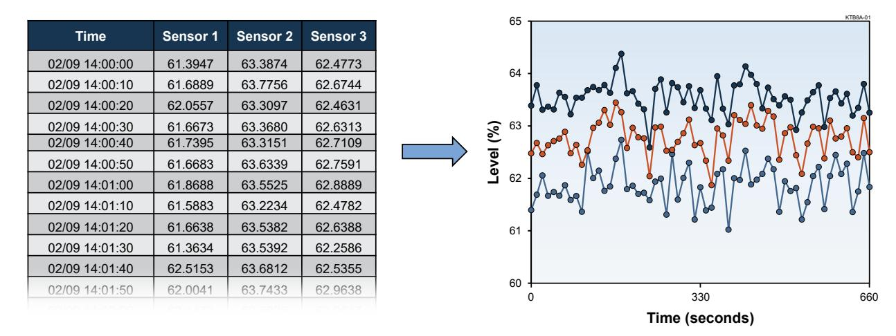

**Figure 6.1. OLM Data from a PWR Plant Computer**

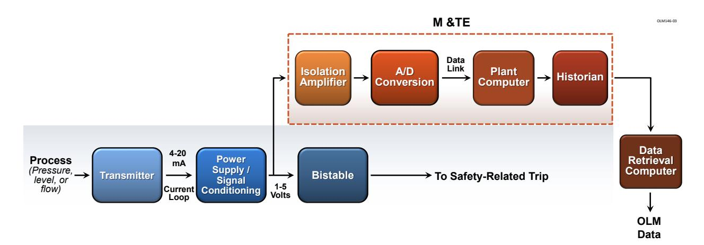

Figure 6.2. Plant Equipment in the OLM Data Path

#### 6.2 OLM DATA QUALIFICATION

The raw data from the plant computer or its data historian is not usually ready for analysis immediately after it is retrieved. The data can be compressed or have areas of missing regions or stuck data values, spikes, noise, or other anomalies. These effects are normally benign to the plant operation and safety but must be addressed as described below to qualify the OLM data for analysis.

#### **Data Compression**

OLM data in most plants is typically retrieved from the plant historian where the data is permanently stored. To save storage space, historians do not store the same data values over and over. Rather, they store a data point only if its value has changed significantly, or if a certain amount of time between data points has elapsed. The criterion that is set in the historian to reduce storage requirements is referred to as the compression setting and the data that has been subjected to this criterion is referred to as "compressed" or "historized". An example of a commonly used historian in nuclear power plants is the "PI" historian from OSIsoft company.

Figure 6.3 shows OLM traces for three pressure signals from a PWR plant computer. If these signals were retrieved from the plant historian (with its compression set at 0.5 PSI), the results would be the big dots shown in Figure 6.4. The historian interpolates between the historized data points and thereby produces data values for any instant of time as shown by the lines made of the small dots in Figure 6.4. It is clear from the data in Figure 6.3 that compression causes the higher frequency signals to be lost. Therefore, the compression setting should be turned off or reduced as much as possible during OLM data acquisition.

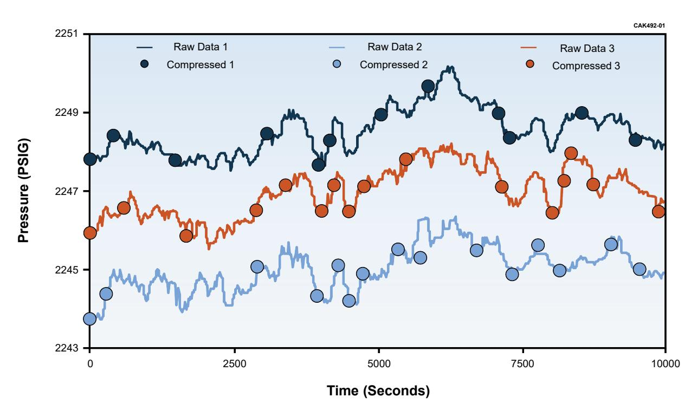

**Figure 6.3. Historized / Compressed OLM Data Points**

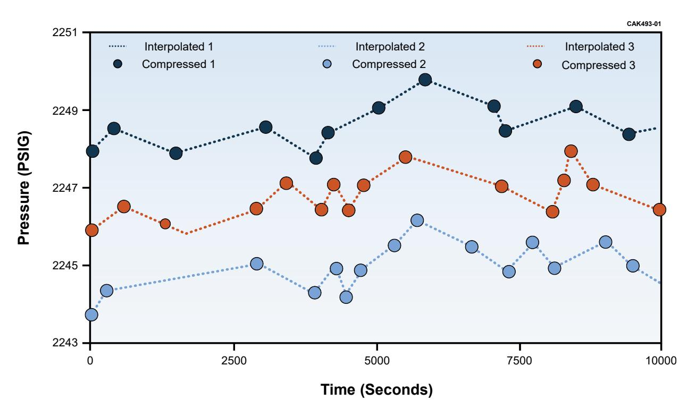

**Figure 6.4. Compressed Data Points Interpolated by Plant Historian**

#### **Missing Data**

There are sometimes gaps in the plant computer data for one or more transmitters. This occurs for a variety of reasons such as maintenance work while OLM data is being collected. If this happens, the missing portion of data for the affected transmitters and their redundant counterparts are simply ignored and the remaining data processed to arrive at OLM results. Figure 6.5 shows examples of missing data from plant computers at the McGuire, Sizewell B, and Vogtle nuclear power plants where AMS has implemented OLM.

#### **Spikes and Outliers**

Plant computer data can contain spikes and anomalies caused by channel checks or transmitter calibration activities. Figure 6.6 shows examples of OLM data containing spikes as well as OLM data collected while a transmitter was being calibrated in the field. If this occurs, the portion of affected OLM data is removed, and the remaining data is used for subsequent analysis.

#### **Stuck Data**

OLM data can sometimes contain 'dead' spots where the reading of one or more transmitters remains fixed at a value for a period of time as shown in Figure 6.7. To overcome this anomaly, the affected portions of the data are removed for all redundant transmitters in the group and the remaining data is used for OLM analysis.

#### **Noisy Data**

Depending on sampling frequency, OLM data retrieved from the plant computer or acquired using a stand-alone data acquisition system can contain fluctuations that must be removed or reduced before analysis. Experience has shown that simple filters such as median filters work well with noisy OLM data. Median filters work by replacing the ith value in a time sequence with the median value of its *n* closest neighbors in time, where *n* is referred to as the 'rank' of the median filter. Figure 6.8 shows OLM data from a PWR plant for four redundant reactor coolant flow transmitters before and after filtering with a median filter of rank 30.

#### **Other Issues**

There can be special situations of plant operation that must be addressed before OLM data analysis is performed. For example, in a typical PWR, reactor pressure transmitters in different loops are considered redundant because they all are measuring close to the same value as long as their reactor coolant pumps are running. However, during plant startup and shutdown periods, the reactor coolant pumps may not all be running in which case the reading of the transmitters will not be the same as illustrated in Figure 6.9. In cases such as this, the OLM analyst must only use the data when all pumps are running to avoid mistaking a change in the process value with a drifting transmitter.

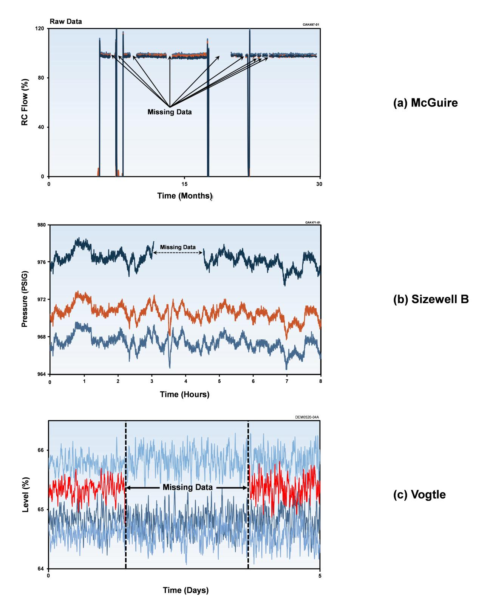

**Figure 6.5. Examples of Missing OLM Data Acquired from Three Nuclear Power Plants**

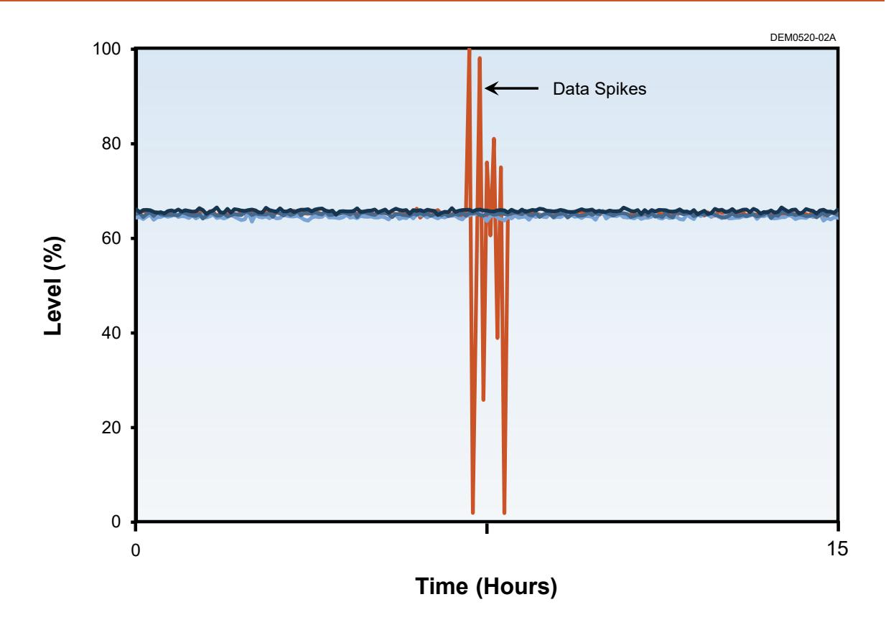

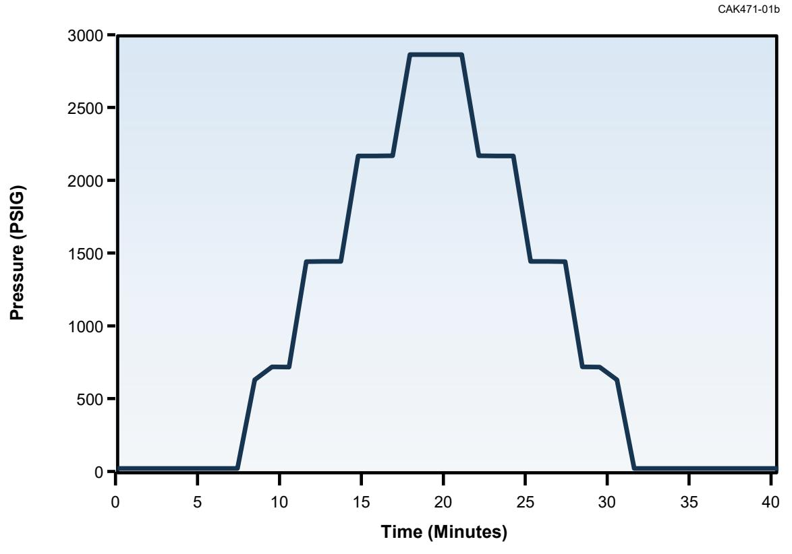

**Figure 6.6. OLM Data Containing Spikes or Affected by Calibration Activities** 

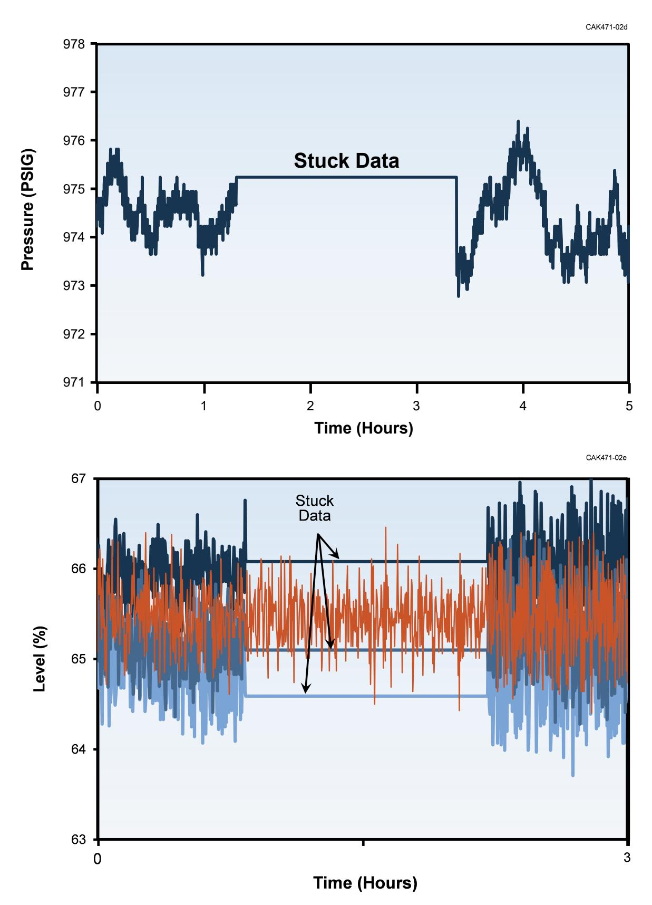

**Figure 6.7. Nuclear Plant OLM Data with Regions of Stuck Values**

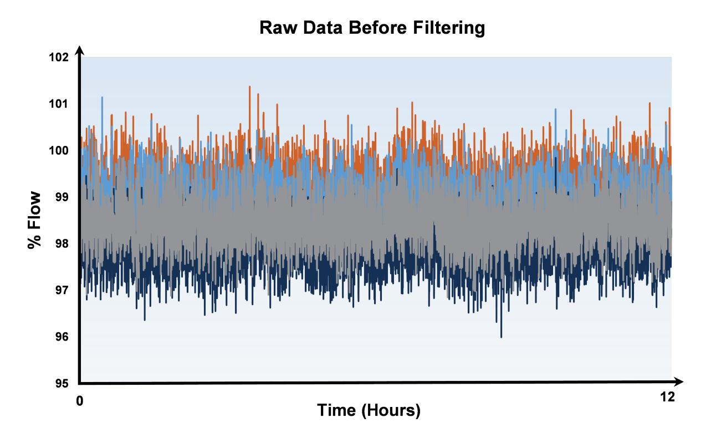

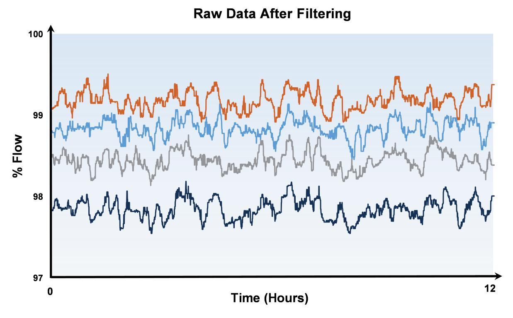

**Figure 6.8. PWR Plant OLM Data Before and After Filtering**

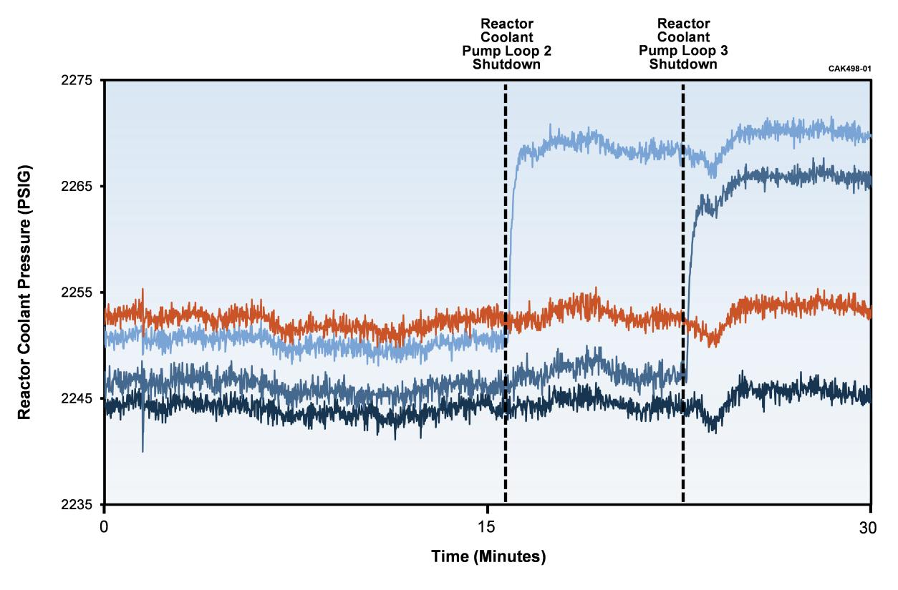

**Figure 6.9. OLM Data Affected by Reactor Coolant Pump Operation**

#### 6.3 OLM DATA ANALYSIS

Analysis of OLM data requires a reference value as the basis for detecting drift. The reference value is also referred to as the process estimate and can be calculated using a variety of averaging and modeling techniques. In this report, the focus of OLM data analysis is on two averaging techniques referred to as "simple average" and "parity space" [1, 10]. These techniques were selected because each meets four of the five desired criteria for analysis of OLM data (Table 6.1). Both the simple average and parity space techniques are needed for analysis of OLM data because there are cases where one method or the other cannot provide a reliable process estimate.

Table 6.1. Rankings of Process Estimation Techniques

| Item | Evaluation Criteria                                       | Simple Average | Parity Space |
|------|-----------------------------------------------------------|-------------------|-----------------|
| 1    | Simple to implement                                       | <                 | <b>&gt;</b>     |
| 2    | Uncertainty is quantifiable or bounded                    | <b>~</b>          | <b>✓</b>        |
| 3    | Automatic outlier rejection to provide accurate estimates |                   | <b>~</b>        |
| 4    | Previously reviewed by the NRC                            | <b>✓</b>          | <b>✓</b>        |
| 5    | Produces a process estimate for any OLM data              | >                 |                 |

The equations for simple and parity space averaging are as follows:

$$\mu(t) = \frac{X_1(t) + X_2(t) + ... + X_n(t)}{n}$$
 or  $\mu(t) = \frac{\sum_{i=1}^{n} X_i(t)}{n}$  Eq. 6.1

$$\overline{X}(t) = \frac{W_1 X_1(t) + W_2 X_2(t) + \dots + W_n X_n(t)}{W_1 + W_2 + \dots + W_n} \quad \text{or} \quad \overline{X}(t) = \frac{\sum_{i=1}^n W_i X_i(t)}{\sum_{i=1}^n W_i}$$
 Eq. 6.2

where

 $\mu(t)$ : simple average of redundant signals  $X_1(t), X_2(t), ..., X_n(t)$  at the time "t"

 $\overline{X}(t)$ : parity space average of redundant signals  $X_1(t), X_2(t), ..., X_n(t)$  at the time "t"

 $W_i$ : weight for the ith signal value,  $X_i(t)$ 

n: number of redundant signals

The simple averaging technique is straightforward and self-explanatory as illustrated in Figure 6.10 while the parity space technique is more involved as it is used to systematically identify outliers that are excluded from analysis. As such, the parity space technique is explained in more detail with the help of numerical examples and illustrations. In particular, we will show how the parity space band and parity space weights are determined. First, we will determine how each weight () in Equation 6.2 is identified. Basically, the weights depend on how close or how far a signal is from the others. For example, for a group of four redundant signals, the weights for each signal could be 0, 1, 2, or 3 depending on the distance between each signal and its neighbors. The weight would be 0 if the signal is too far from the other three, 1 if the signal is close to only one of the other three, 2 if it is close to two of the other three, and 3 if it is close to all three.

Next, we will show how to establish the parity space band for rejection of outliers. For example, when an outlier drifts away from the other redundant signals, the parity space band rejects it. Figure 6.11 shows examples of a wide, a narrow, and a reasonable parity space band facing four redundant signals. These bands are all referenced to signal 3 in this example. Signal 1 is obviously an outlier, but the first band is too wide and does not reject signal 1. The second band is reasonable in that it rejects signal 1 and keeps the other signals in the average. The third band is too narrow and would reject all signals from the average.

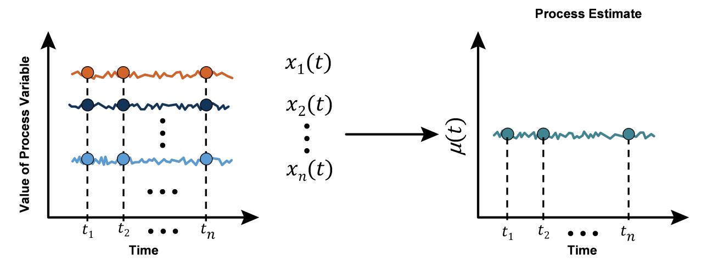

**Figure 6.10. Illustration of Simple Averaging Technique**

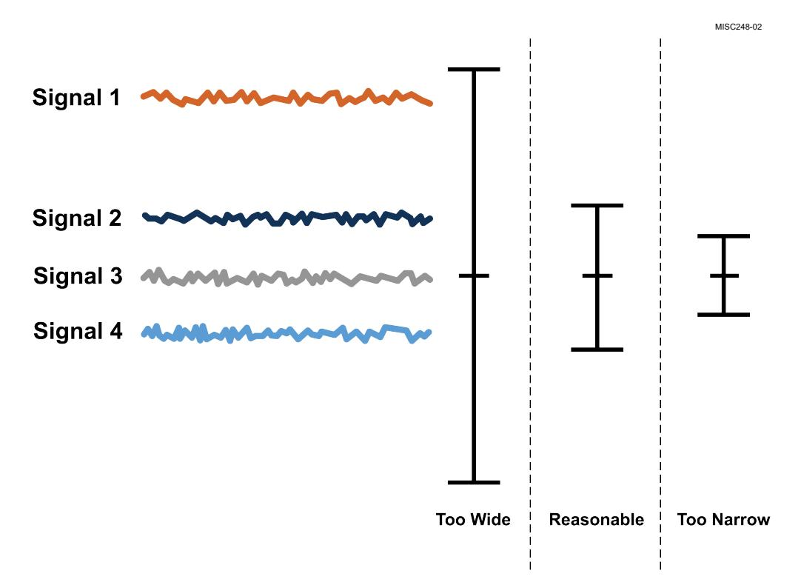

Figure 6.11. Choices for Parity Space Band

One way to arrive at the parity space band is to sum the accuracies of one of the redundant pairs  $(\sigma_1 \& \sigma_2)$  as shown in Figure 6.12. Another approach would be to Root Sum Square (RSS) the accuracies of one of the redundant pairs. The latter approach was adopted by the Sizewell B plant for analysis of its OLM data. That is, at the Sizewell B plant, the parity space band was arrived at based on the manufacturer's specifications for accuracy of each transmitter. For example, for a pair of redundant transmitters each with an accuracy of  $\pm$  0.5% of span, the parity space band at Sizewell B was arrived at by RSS of the accuracies of the pair as follows:

$$\delta = \sqrt{(0.5)^2 + (0.5)^2} = 0.707 \,(\% \, of \, span)$$
 Eq. 6.3

Once the parity space band ( $\delta$ ) is determined, the parity space weights,  $W_i$ , can simply be calculated as follows for a set of n redundant sensors,  $X_1, X_2, ..., X_n$ :

$$W_i = 0 \label{eq:width}$$
 If  $\left| X_i - X_j \right| \leq \delta$ , then  $W_i = W_i + 1$ 

where:

 $W_i$  = the weight of the  $i^{th}$  signal  $X_i$  = the redundant signal i  $X_i$  = the redundant signal j

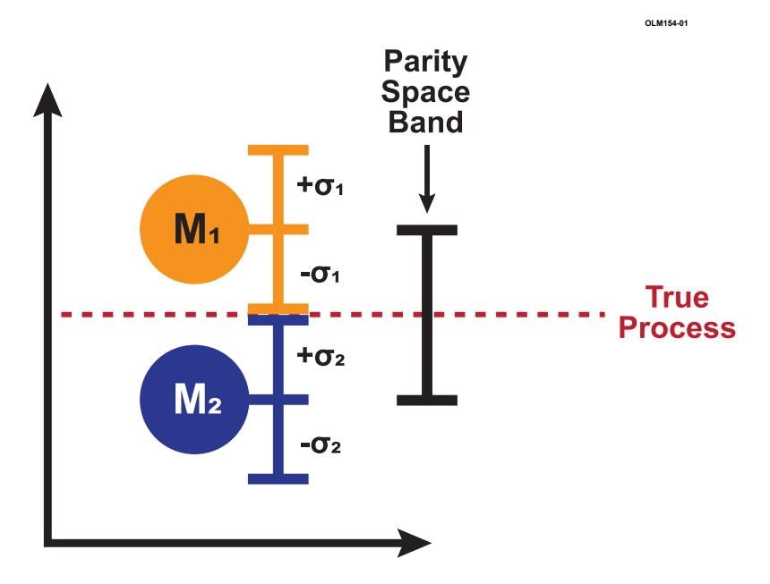

**Figure 6.12. Parity Space Band Selected Based on Measurement Accuracies**

The calculation of parity space weights for four redundant signals is shown in Table 6.2. Each column explains how to calculate the weight for one of the signals. For example, the weight for signal 1 is initially set to 0. Next, signal 1 is compared to signal 2. If the difference between signal 1 and signal 2 is less than the parity space band, then 1 is added to the weight of signal 1. Next, signal 1 is compared to signal 3. If the difference between signal 1 and signal 3 is less than the parity space band, then 1 is added to the weight of signal 1. Finally, signal 1 is compared to signal 4. If the difference between signal 1 and signal 4 is less than the parity space band, then 1 is added to the weight of signal 1. This same process is repeated to calculate the weights for signals 2, 3, and 4. Then the parity space average is calculated using Equation 6.2. This process is repeated for each set of measurements to calculate the parity space average.

**Table 6.2. Calculation of Parity Space Weights for Four Redundant Signals**

| Calculate W1      | Calculate W2      | Calculate W3      | Calculate W4      |
|-------------------|-------------------|-------------------|-------------------|
| Initial W1        | Initial W2        | Initial W3        | Initial W4        |
| = 0               | = 0               | = 0               | = 0               |
| X1 – X2  < 𝜹𝜹, W1 | X2 – X1  < 𝛿𝛿, W2 | X3 – X1  < 𝛿𝛿, W3 | X4 – X1  < 𝛿𝛿, W4 |
| = W1+1            | = W2+1            | = W3+1            | = W4+1            |
| X1 – X3  < 𝜹𝜹, W1 | X2 – X3  < 𝛿𝛿, W2 | X3 – X2  < 𝛿𝛿, W3 | X4 – X2  < 𝛿𝛿, W4 |
| = W1+1            | = W2+1            | = W3+1            | = W4+1            |
| X1 – X4  < 𝜹𝜹, W1 | X2 – X4  < 𝛿𝛿, W2 | X3 – X4  < 𝛿𝛿, W3 | X4 – X3  < 𝛿𝛿, W4 |
| = W1+1            | = W2+1            | = W3+1            | = W4+1            |

Figure 6.13 illustrates the parity space averaging technique for three redundant signals with a parity space band of ± 0.2% of span. This parity space band gives the signal at 61.0% a weighting of 0 while the remaining two signals each get a weighting of 1 and are thus simply averaged together to arrive at the process best estimate of 60.6%.

Figure 6.14 shows another example of the parity space averaging technique with four redundant signals and a parity space band of ± 0.6% of flow. This parity space band gives the signal at 99.0% a weighting of 0, the signal at 97.8% a weighting of 1, the signal at 97.6% a weighting of 2, and the signal at 97.0% a weighting of 1. These signals are then averaged together with their weighting factors to arrive at the parity space average of 97.5% of flow.

To further illustrate the parity space averaging concept, consider a group of four signals that are initially all close enough that the weights of all four signals is 3. Next, assume signal 1 drifts away from the other three until it is removed from the average as shown in Figure 6.15a. As this signal drifts away, it is gradually removed from the parity space average as its weight decreases to 2, then 1, and then 0. Also note that the parity space average is affected by the drifting signal until the drifting signal is completely removed from the average. The deviation plot (Figure 6.15b) shows how a drifting signal can affect the results of the other signals until it is completely removed from the average.

While parity space is good for rejecting outliers, real process signals in nuclear power plants can contain process noise which can complicate the application of the parity space averaging technique. This is illustrated in Figure 6.16 which shows the same data as Figure 6.15 with the addition of random noise to each signal. Raw data for four redundant sensors is shown in Figure 6.16a with signal 1 drifting away from the others. The black trace is the parity space average. The largest impact on the parity space average occurs when the drifting sensor jitters (i.e., fluctuates in and out of the average) on the right side of the plot. Figure 6.16b shows the deviation from the parity space average and illustrates how this spills over to the deviations of the other signals. Experience has shown when a drifting signal is fluctuating in and out of the average during an analysis period, it is best to exclude the signal from the average over the entire period to remove the spillover effect on the other signal deviations. This can also be mitigated by filtering the data. For example, the OLM data can be digitally filtered by moving a median filter window along the raw OLM data to replace every point of the data with the median value of its neighbors and thereby reduce the noise.

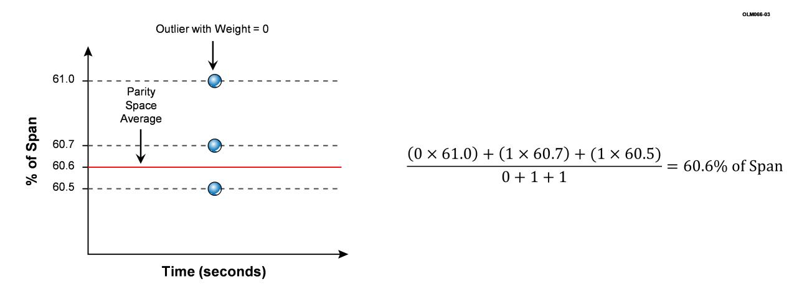

**Figure 6.13. Example of Parity Space Averaging Technique for Three Redundant Signals**

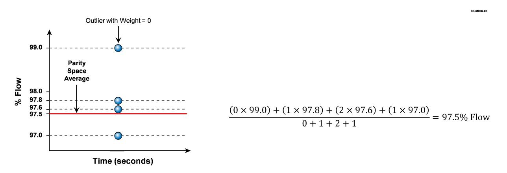

**Figure 6.14. Example of Parity Space Averaging Technique for Four Redundant Signals**

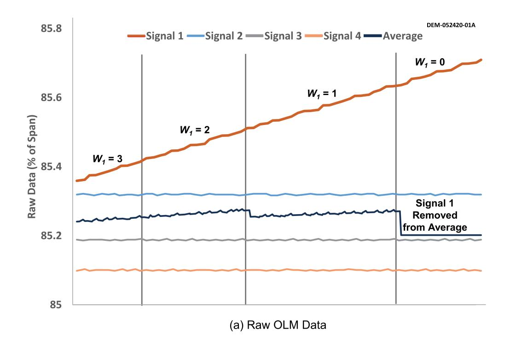

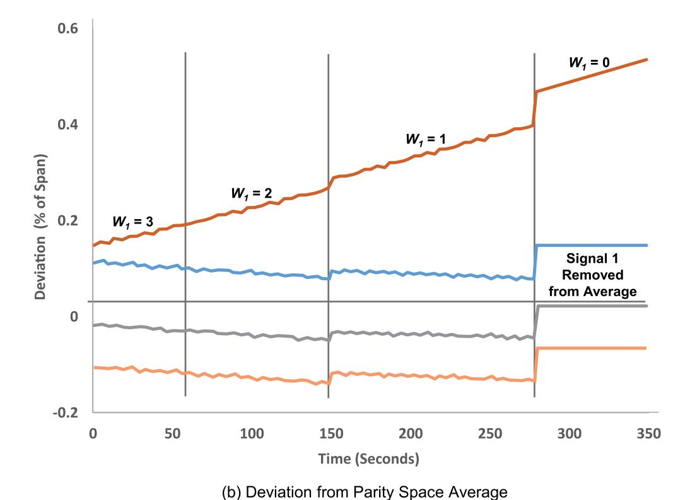

**Figure 6.15. Illustration of Parity Space Results for Four Redundant Signals With One Drifting Away**

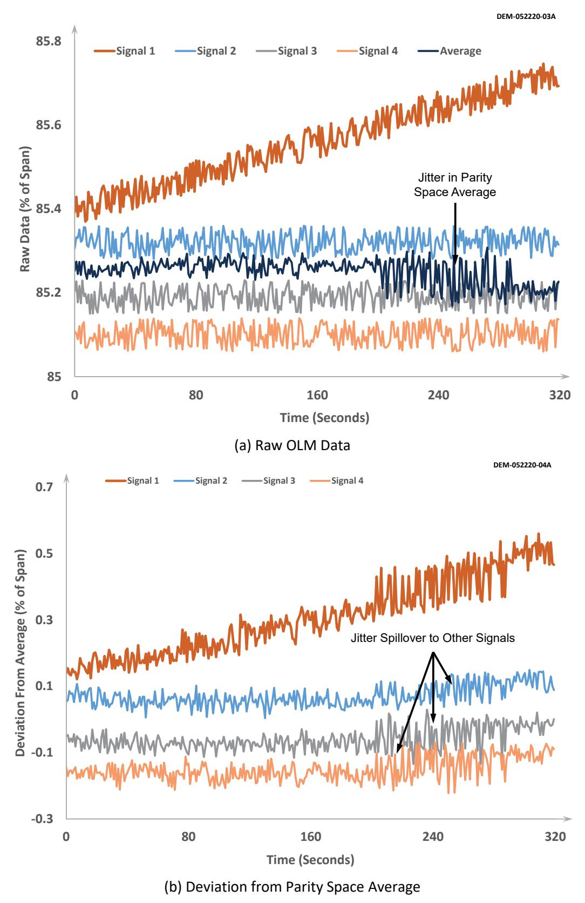

**Figure 6.16. Illustration of Parity Space and Deviation Plots of a Drifting Sensor with Random Noise**

#### **7 CALCULATION OF OLM LIMITS**

OLM limits must be established by each nuclear plant to determine when a transmitter must be flagged for a calibration check during an outage. The limits are calculated for each group of redundant transmitters based on the plant setpoint uncertainties and will be different for different plants depending on the types of pressure, level, and flow transmitters used in the plant, plant setpoint methodology, and plant setpoint uncertainties.

This section presents an example of how OLM limits were derived from a plant's setpoint uncertainties. This example is based on setpoint uncertainties of the Sizewell B nuclear power plant where OLM has been used successfully since the year 2005.

#### **7.1 UNCERTAINTY FORMULAS**

OLM limits are established by combining the uncertainties of the instrument channels for each group of redundant transmitters using an RSS formula such as:

$$CSA = \sqrt{PMA^2 + PEA^2 + (SCA + SMTE + SD)^2 + SPE^2 + STE^2 + (RCA + RMTE + RCSA + RD)^2 + RTE^2} + EA + BIAS$$
 Eq. 7.1

This formula produces the channel statistical accuracy (CSA) band that is calculated as the first step towards development of OLM limits. This and related other formulas are found in a variety of guidelines and standards such as the ISA standard 67.04 [39].

The fourteen terms in the above RSS formula are defined in Table 7.1. Some of these terms apply to determining the uncertainties of manual calibrations and others are used to establish OLM limits or safety system trip limits. For example, "as-found" and "as-left" limits used in manual calibrations of transmitters are typically calculated based on up to only five terms of the RSS formula as illustrated in Figure 7.1. The OLM limits, on the other hand, involve more terms for components that are involved in the path of OLM data from the process to where the data is recorded.

The CSA band calculated using the RSS formula must be reduced by two elements to arrive at the OLM limits. These elements are: 1) the uncertainty of the process estimation technique (σ), and 2) the uncertainty of M&TE (σM&TE) that is used to collect the OLM data. Figure 7.2 illustrates the process of arriving at the OLM limits, and Figure 7.3 illustrates the calculation of the process estimation uncertainty (σ) for simple averaging technique using the uncertainties of each process measurement (σi). The value for each σi is determined using an RSS formula that combines the uncertainties involved in monitoring of each redundant transmitter.

**Table 7.1. Potential Sources of Instrument Channel Uncertainty** 

| Item | Name                                        | Acronym | Definition                                                                                                                                                                                              |
|------|---------------------------------------------|---------|---------------------------------------------------------------------------------------------------------------------------------------------------------------------------------------------------------|
| 1    | Process Measurement Accuracy          | РМА     | Inherent noise in the process. PMA sources are listed as Water Leg Correction, Elbow Tap Error, Streaming and Thermal Mismatch (Power Range Detectors).                                                 |
| 2    | Primary Element Accuracy                 | PEA     | Represents the error due to the use of a metering device like a flow orifice, etc.                                                                                                                      |
| 3    | Sensor Calibration Accuracy              | SCA     | Inherent accuracy of the sensor at reference conditions; typically vendor supplied.                                                                                                                     |
| 4    | Sensor Measurement and Test Equipment | SMTE    | Uncertainties associated with the equipment used to calibrate the sensor. Some plants assume 0.0 for SMTE if the calibration standards and the equipment used for calibration meets 4:1 accuracy ratio. |
| 5    | Sensor Drift                                | SD      | Observed change in sensor accuracy as a function of time; typically supplied by the vendor.                                                                                                             |
| 6    | Sensor Pressure Effects                  | SPE     | This is the potential effect of static pressure on transmitter calibration.                                                                                                                             |
| 7    | Sensor Temperature Effects               | STE     | This is the potential effect of environmental temperature on transmitter calibration.                                                                                                                   |
| 8    | Rack Calibration Accuracy                | RCA     | The two-sided (±) calibration tolerance of the process racks.                                                                                                                                           |
| 9    | Rack Measurement and Test Equipment         | RMTE    | Some plants assume 0.0 for RMTE if the equipment used meets 4:1 accuracy ratio.                                                                                                                         |
| 10   | Rack Comparator Setting Accuracy         | RCSA    | The inherent accuracy of the rack comparator at reference conditions.                                                                                                                                   |
| 11   | Rack Drift                                  | RD      | The change in input-output relationship of the rack as a function of time at reference conditions.                                                                                                      |
| 12   | Rack Temperature Effects                 | RTE     | Change in input-output relationship for the process rack module string due to a change in the ambient environmental conditions.                                                                         |
| 13   | Environmental Allowance                  | EA      | Represents the change in the instrument channel's response due to accident environmental conditions. Some plants use 0.0 for EA for normal CSAs as opposed to accident CSA.                             |
| 14   | Constant Offset                             | BIAS    | For the RC flow channel, for example, this represents the flow measurement error for the elbow taps.                                                                                                    |

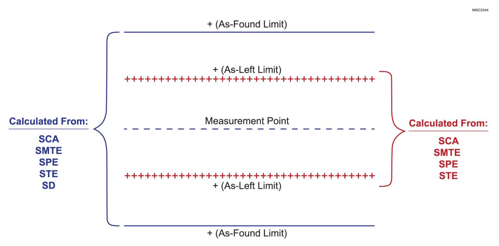

**Figure 7.1. Illustration of Manual Calibration Limits** 

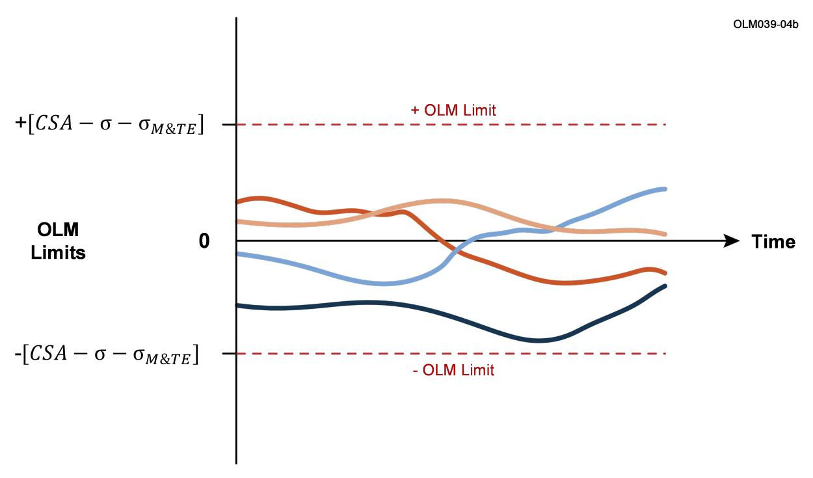

**Figure 7.2. Illustration of OLM Limits**

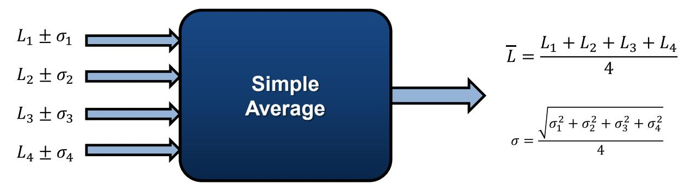

**Figure 7.3. Illustration of Process Estimate () and its Uncertainty (σ)**

#### **7.2 DEVELOPMENT OF OLM LIMITS**

A report by Sizewell B engineers entitled "*Acceptance Criteria for Use in OLM of Protection System Transmitters* [40]" describes how Sizewell B arrived at its OLM limits. An example based on the methodology from this report is presented below through calculation of OLM limits for four redundant SG narrow range level transmitters. To arrive at the OLM limits, the uncertainty values in Table 7.2 were used for the components of the pressure instrumentation channel and string of components leading to where the OLM data is stored.

The Sizewell B approach has two important characteristics: 1) it treats all uncertainty terms as random and independent and therefore keeps them all under the square root sign in the RSS formula, and 2) it uses only half of the sensor drift band in the calculation of OLM limits as a conservative approach to flag drifting transmitters early and leave room for drift during the operating cycle before a transmitter reaches its operability limit. As stated earlier, the OLM methodology and limits are not intended for operability assessment, but are conservative and leave margin for additional drift until a calibration can be scheduled.

In the Sizewell B example presented below, the uncertainty of the entire pressure sensing channel from the transmitter to the OLM data acquisition system is calculated first with the transmitter drift term included and again with the transmitter drift term excluded. The results of the two calculations are then subtracted from each other to yield the total band for transmitter drift over a fuel cycle. The result is referred to as the Drift Band or DB. The initial uncertainty of the entire pressure sensing channel with the transmitter drift included is then reduced by the following three values to arrive at the OLM limits: 1) the uncertainty of the process estimation technique (i.e., the averaging technique used to arrive at the process estimate), 2) the uncertainty of the string of components leading to OLM data storage, and 3) half of the total DB. These steps are described further in the following procedure for arriving at OLM limits for four SG narrow range level transmitters at Sizewell B.

**Table 7.2. Uncertainty Values for Steam Generator Level Narrow Range Transmitters at Sizewell B**

| Source of Uncertainty                                                            | % of Calibrated Range |
|----------------------------------------------------------------------------------|--------------------------|
| Transmitter Calibration Accuracy (SCA)                                           | 0.500                    |
| Transmitter Temperature Effect (STE)                                             | 0.540                    |
| Transmitter Drift (SD)                                                           | 1.414                    |
| Transmitter Static Pressure Effects (SPE)                                        | 0.200                    |
| Transmitter Power Supply Effects (SSE)                                           | 0.037                    |
| Transmitter Input Test Equipment (STEA1)                                         | 0.136                    |
| Transmitter Output Test Equipment (STEA2)                                        | 0.150                    |
| Uncertainty Terms Involved in String of Equipment Leading to OLM Data Storage | % of Calibrated Range |
| PPS Loop Resistor (MCA1)                                                         | 0.031                    |
| EAI Card Accuracy (MCA2)                                                         | 0.125                    |
| EAI Card Temperature Effect (MTE1)                                               | 0.050                    |
| EAI Card Drift (MD)                                                              | 0.002                    |
| M40 Card Temperature Effects (MTE2)                                              | 0.088                    |
| M40 A/D Resolution (MCE)                                                         | 0.034                    |

1. Combine the uncertainties of all components of the pressure sensing channel from the transmitter in the field to the OLM data storage. Note that the drift term for the transmitter itself is included in this step (we will repeat this step next by excluding the transmitter drift term). The result of this step is referred to by Sizewell as the Equivalent Channel Uncertainty Limit (ECUL). As mentioned before, at Sizewell B, all uncertainties are assumed to be independent and random. Therefore, all uncertainty terms are kept under the square root sign which makes the outcome conservative.

$$ECUL = \sqrt{(SCA^2 + STE^2 + SD^2 + SPE^2 + SSE^2 + STEA1^2 + STEA2^2 + MCA1^2 + MCA2^2 + MTE1^2 + MD^2 + MTE2^2 + MCE^2)}$$
 Eq. 7.2

Substituting values from Table 7.2 yields:

$$ECUL = \sqrt{(.500^2 + .540^2 + 1.414^2 + .200^2 + .037^2 + .136^2 + .150^2 + .031^2 + .125^2 + .050^2 + .002^2 + .088^2 + .034^2)}$$
 Eq. 7.3

$$ECUL = 1.628 \%$$

2. Repeat Step 1 but exclude the transmitter drift from the calculation. The outcome of this step is referred to by Sizewell as the "Normal Band (NB)".

$$NB = \sqrt{(SCA^2 + STE^2 + SPE^2 + SSE^2 + STEA1^2 + STEA2^2 + MCA1^2 + MCA2^2 + MTE1^2 + MD^2 + MTE2^2 + MCE^2)}$$
 Eq. 7.4

Substituting values from Table 7.2 yields:

$$NB = \sqrt{(0.500^2 + 0.540^2 + 0.200^2 + 0.037^2 + 0.136^2 + 0.150^2 + 0.031^2 + 0.125^2 + 0.050^2 + 0.002^2 + 0.088^2 + 0.034^2)} \quad \text{Eq. 7.5}$$

$$NB = 0.807 \%$$

3. Subtract the results of Step 1 from that of Step 2 and refer to the outcome as the DB as shown in Figure 7.4:

$$DB = ECUL - NB = 1.628 - 0.807 = 0.821 \%$$
 Eq. 7.6

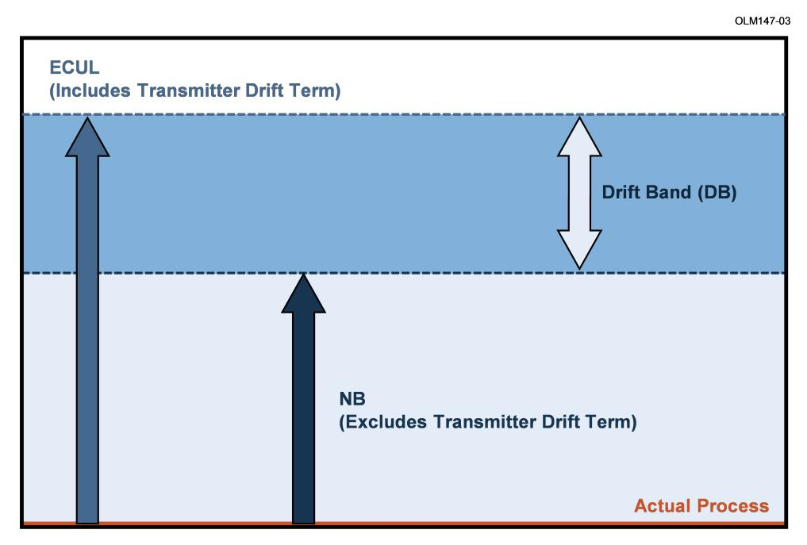

**Figure 7.4. Results of Calculation of OLM Drift Band**

4. Calculate the Process Estimate Uncertainty (PEU). This calculation depends on the method used to arrive at the process estimate. In this example, the parity space technique is used with all weights considered equal to yield:

$$PEU = \frac{\sqrt{\sum_{i=1}^{n} \sigma_i^2}}{n}$$
 Eq. 7.7

where  $\sigma_i$  is the measurement uncertainty for transmitter i, and n is the number of redundant transmitters. Because there are four SG narrow range level transmitters, and the measurement uncertainty of these transmitters is assumed to be the same, PEU becomes:

$$PEU = \frac{\sqrt{\sigma_1^2 + \sigma_2^2 + \sigma_3^2 + \sigma_4^2}}{4} = \frac{\sqrt{4\sigma_i^2}}{4} = \frac{2\sigma_i}{4} = \frac{\sigma_i}{2}$$
 Eq. 7.8

In the Sizewell B approach,  $\sigma_i$  and NB are the same; thus:

$$PEU = \frac{NB}{2} = \frac{0.807}{2} = 0.404 \%$$
 Eq. 7.9

5. Calculate the Monitoring Channel Uncertainty (MCU) by combining the uncertainties of the OLM data acquisition equipment string as follows:

$$MCU = \sqrt{(MCA1^2 + MCA2^2 + MTE1^2 + MD^2 + MTE2^2 + MCE^2)} \%$$
 Eq. 7.10  
=  $\sqrt{(0.031^2 + 0.125^2 + 0.050^2 + 0.002^2 + 0.088^2 + 0.034^2)} = 0.167$ 

6. Calculate the ± OLM limits using the following equation (Figure 7.5):

$$OLM\ Limit = ECUL - (0.5 * DB) - PEU - MCU$$
 Eq. 7.11

Thus, the ± OLM limits for Sizewell's SG narrow range level transmitters are:

$$OLM\ Limits = ECUL - (0.5*DB) - PEU - MCU = 1.628 - (0.5*0.821) - 0.404 - 0.167 = \pm 0.647\%$$
 Eq. 7.12

Once again, it is important to point out that Sizewell subtracts one-half of the transmitter drift band in the calculation of the OLM limits as shown in Equation 7.12 and illustrated in Figure 7.5. This approach is conservative as the OLM limits will be exceeded if a transmitter drifts by only half of its drift band over a fuel cycle. Note that Figure 7.5 illustrates only the positive drift band. The same occurs in the negative direction.

In the above example, because the calibrated range of the steam generator level narrow range transmitters is 0 to 100% level, the final OLM limit of  $\pm$  0.647% is equivalent to  $\pm$  0.647% of the calibrated range. Table 7.3 shows OLM limits for nineteen services at Sizewell B in percent of calibrated range calculated using the procedure described above. Note that the OLM limits in most of the graphs in this report are in engineering units to match the units of raw data while the numbers in Table 7.3 are in percent of calibrated range.

OLM147-02

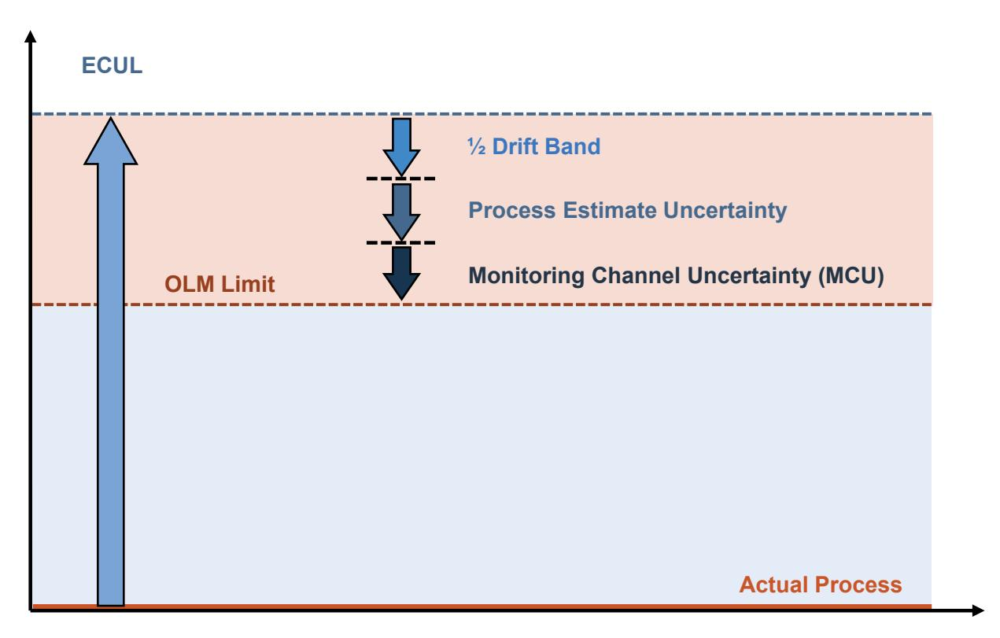

**Figure 7.5. Illustration of OLM Limit for Sizewell B Transmitters**

**Table 7.3. OLM Limits for Selected Transmitters at Sizewell B**

| Item | Transmitter Service                         | OLM Limits (% Calibrated Range) |  |  |  |
|------|---------------------------------------------|------------------------------------|--|--|--|
| 1    | Main Steam Pressure                         | 0.849                              |  |  |  |
| 2    | Steam Generator Narrow Range Level          | 0.647                              |  |  |  |
| 3    | Steam Generator Wide Range Level            | 0.805                              |  |  |  |
| 4    | Pressurizer Level                           | 0.799                              |  |  |  |
| 5    | RCS Wide Range Pressure                     | 0.790                              |  |  |  |
| 6    | RCS Narrow Range Pressure                   | 0.981                              |  |  |  |
| 7    | Pressurizer Pressure                        | 0.813                              |  |  |  |
| 8    | Feed Flow                                   | 0.497                              |  |  |  |
| 9    | RCS Loop Flow                               | 0.977                              |  |  |  |
| 10   | Reactor Building Pressure A                 | 0.717                              |  |  |  |
| 11   | Reactor Building Pressure B                 | 0.767                              |  |  |  |
| 12   | RWST level A                                | 0.916                              |  |  |  |
| 13   | Reactor Water Storage Tank Level B          | 0.147                              |  |  |  |
| 14   | Volume Control Tank Level                   | 0.925                              |  |  |  |
| 15   | Emergency Service Water Flow Train A & B    | 1.903                              |  |  |  |
| 16   | Component Cooling Water Flow Train A & B    | 0.516                              |  |  |  |
| 17   | Component Cooling Water Flow in RCP Th. Bar | 0.826                              |  |  |  |
| 18   | Surge Tank Level                            | 0.964                              |  |  |  |
| 19   | Main Steam Flow                             | 0.463                              |  |  |  |

#### **7.3 PRESENTATION OF OLM RESULTS WITHIN OLM LIMITS**

Over the years since OLM was implemented at Sizewell B, the OLM limits as calculated using the formulas in Section 7.2 above have been used for drift monitoring during each operating cycle and to track the long-term performance of Sizewell B transmitters. Figure 7.6 shows OLM results as tracked within OLM limits over eight years for four pressurizer pressure transmitters at Sizewell B.

The OLM limits also serve during each operating cycle from the beginning of startup to the end of shutdown to cover as much of the transmitter span as possible. Figure 7.7 shows OLM results from the beginning to the end of a plant startup at Sizewell B for four redundant level transmitters. This includes a plot of the raw OLM data on the top, deviation of each transmitter from the average of the four transmitters in the middle, and the deviation of each transmitter from the average of the four transmitters plotted as a function of span of the transmitters. Chapter 11 describes how these plots are produced for startup as well as shutdown data and for the period of normal operations. The shutdown plots are produced using the same procedure as startup data. As for an example of OLM results from data during normal plant operation, Figure 7.8 is provided here presenting the deviations of four redundant level transmitters from Sizewell B plant tracked during plant operation. Again, Chapter 11 describes how such plots are produced as a part of OLM data analysis. Note that the same OLM limits are used in assessment of startup results as well as results for the normal operation period (Figures 7.7 and 7.8).

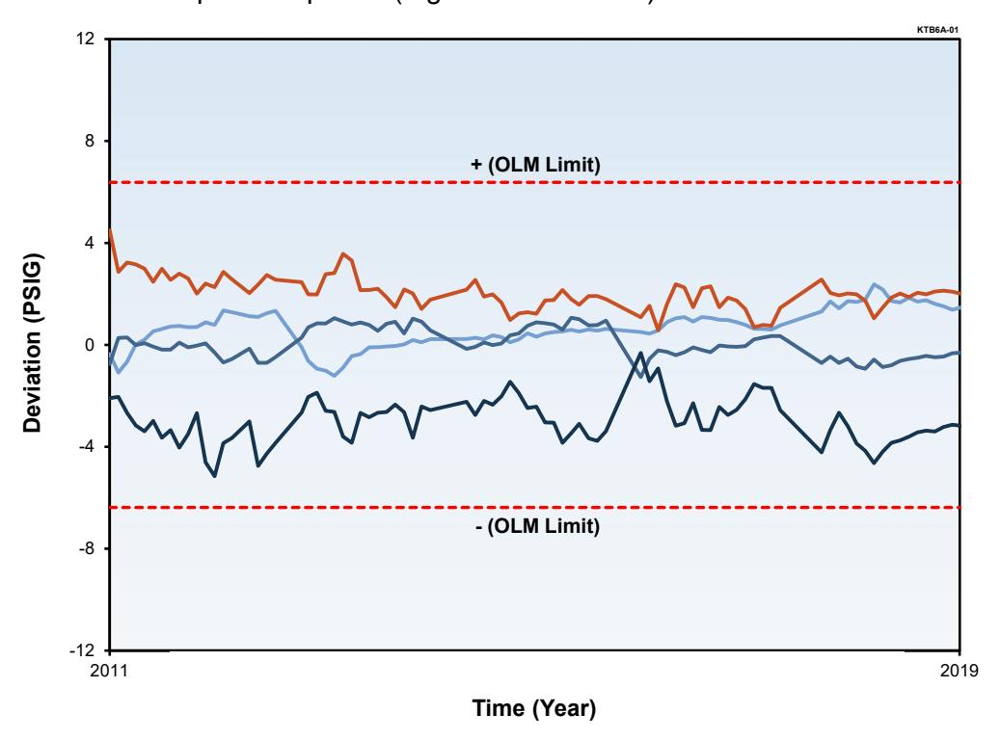

**Figure 7.6. OLM Results Tracked for Four Pressurizer Pressure Transmitters at Sizewell B**

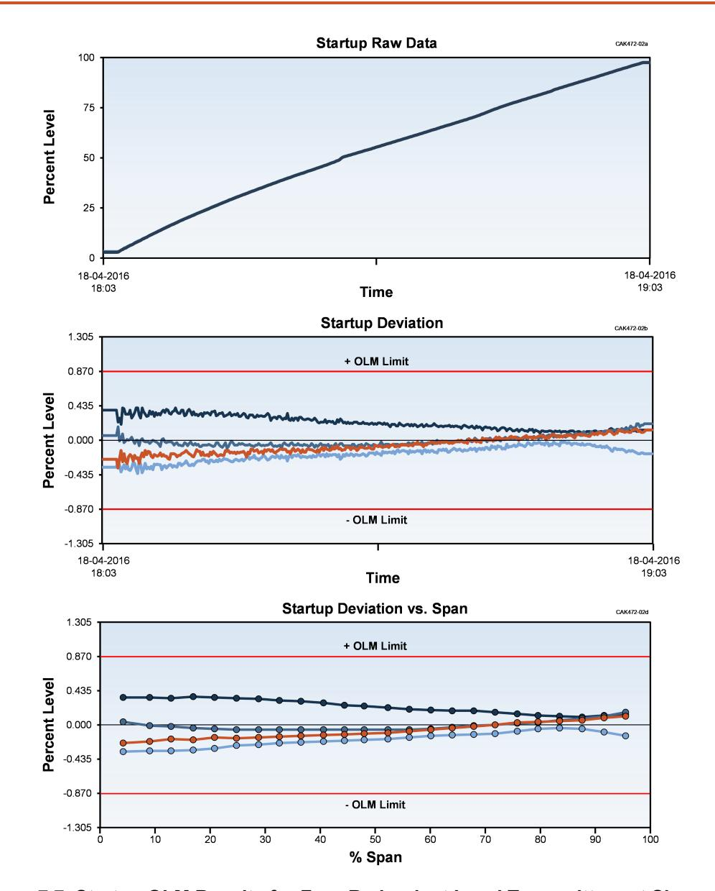

**Figure 7.7. Startup OLM Results for Four Redundant Level Transmitters at Sizewell B** 

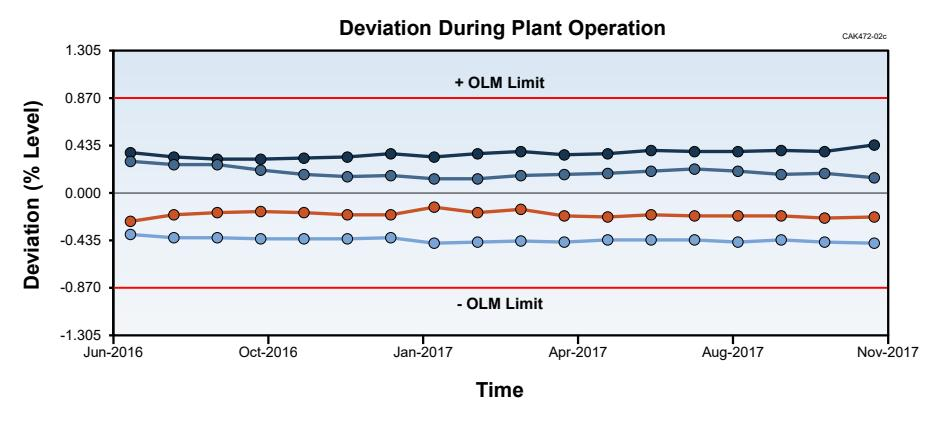

**Figure 7.8. OLM Results for Four Redundant Level Transmitters at Sizewell B During Normal Plant Operation**

#### **8 OLM SAMPLING FREQUENCY AND SAMPLING DURATION**

OLM data to detect transmitter drift is collected from the beginning of startup to the end of shutdown. For periods of startup and shutdown, it is best for OLM data to be collected continuously at the fastest sampling interval allowed by the plant computer (e.g., 1 to 10 seconds between samples or 0.1 to 1 Hz in sampling rate).

During plant operation, the required sampling rate will depend on the level of process fluctuations (noise). Any significant noise can alias into the OLM data if the sampling rate is too slow producing erroneous OLM results. Figure 8.1 shows the effect of sampling rate on OLM results. This information was produced through analysis of seventeen days of OLM data for 32 transmitters at Sizewell B plant including four steam generator narrow range level transmitters and four reactor coolant flow transmitters from each of the four primary coolant loops. The OLM data for this demonstration was sampled at a rate of one sample every 10 seconds (0.1 Hz). The data was analyzed over and over with lower and lower sampling rates ranging from 10 seconds in between samples to five days in between samples as shown in Figure 8.1. For each sampling interval, the deviation of each transmitter from the average of the redundant group of transmitters was calculated and the average and maximum differences between OLM results for the fastest sampling rate (i.e., one sample every 10 seconds) and each of the slower sampling rates was calculated and referred to as the average and maximum errors to arrive at the bar graph in Figure 8.1. That is, the results for OLM data collected at 0.1 Hz was used as the reference for calculating the error as a function of sampling rate. It is clear that the errors are small until the sampling interval for the OLM data becomes large (˃ 1 day). Although the effect of sample rate on OLM results is small until the sampling rate is very slow, the fastest sampling rate is typically used to produce the most accurate OLM results unless there are limitations in the plant computer to warrant slower sampling rates.

The same procedure as above involving seventeen days of OLM data from 32 transmitters at Sizewell B was used to determine the effect of sampling duration on OLM results (Figure 8.2). In arriving at the bar graph of Figure 8.2, the OLM data sampled once every 10 seconds for seventeen days was first analyzed to produce a reference for comparison with OLM results as sampling duration was reduced from seventeen days down to 30 minutes. As shown in Figure 8.2, the errors are small even for only 30 minutes of OLM data collected at normal plant operation. Based on these results, two hours of OLM data sampled at 0.1 Hz providing 720 data points is reasonable.

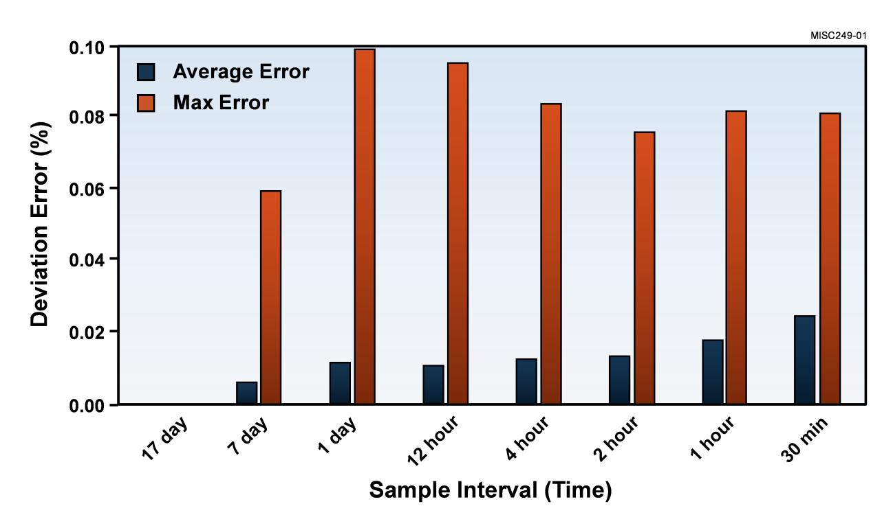

**Figure 8.2. Average and Maximum Errors in OLM Results Versus Sampling Duration**

#### **9 OLM IMPLEMENTATION IN U.S. PLANTS**

Over the last fifteen years, AMS has implemented OLM in the following U.S. nuclear power plants. These are in addition to AMS implementation of OLM at the McGuire Nuclear Station in the 1990s.

- Watts Bar Unit 1 (4-Loop Westinghouse PWR): transmitters monitored for one cycle from November 2006 to February 2008 [41]
- Farley Units 1 and 2 (3-Loop Westinghouse PWRs): transmitters monitored over multiple cycles from April 2008 to July 2011 [42]
- North Anna Units 1 and 2 (3-Loop Westinghouse PWRs): transmitters monitored over multiple cycles from January 2008 to April 2011 [42]
- Vogtle Units 1 and 2 (4-Loop Westinghouse PWRs): transmitters monitored from October 2018 to the present as part of an on-going commercial OLM implementation performed under a contract between AMS and SNOC [43-45]

Table 9.1 provides a listing of the plant services and the typical number of transmitters in each service monitored in the 3-loop and 4-loop PWRs mentioned above. The transmitters were selected by the plant personnel as the ones that will benefit the plants the most if their calibration intervals were extended.

**Table 9.1. Selected Transmitters in OLM Implementation in Representative U.S. Plants**

| Item | Plant Service                             | # of Transmitters (4-Loop) | # of Transmitters (3-Loop) |  |  |
|------|-------------------------------------------|-------------------------------|-------------------------------|--|--|
| 1    | Reactor coolant system (RCS) loop flow    | 12                            | 9                             |  |  |
| 2    | Pressurizer narrow-range pressure         | 4                             | 3                             |  |  |
| 3    | Pressurizer level                         | 3                             | 3                             |  |  |
| 4    | Steam pressure                            | 12                            | 9                             |  |  |
| 5    | Steam flow                                | 8                             | 6                             |  |  |
| 6    | SG narrow range level                     | 12                            | 9                             |  |  |
| 7    | Main feedwater flow                       | 8                             | 6                             |  |  |
| 8    | Refueling water storage tank (RWST) level | 4                             | 2                             |  |  |
| 9    | Containment Pressure                      | 4                             | 3                             |  |  |
|      | Total                                     | 67                            | 50                            |  |  |

The OLM data retrieval processes at each plant were straightforward and data quality was good. For Watts Bar Unit 1, the OLM data was retrieved from the Tennessee Valley Authority (TVA) "DatAware" historian in the form of text files for data at periods of startup, normal operation, and shutdown. At Farley and North Anna, the compression settings of the data historians could not be turned off for OLM data acquisition. Therefore, the plant personnel retrieved the data from the plant computer itself in order to avoid problems with compression settings. AMS also demonstrated OLM at Perry Nuclear Power Plant, a 1250 MWe BWR where OLM data was collected between January 2008 and September 2013 as a part of a feasibility study to demonstrate OLM.

For Vogtle, OLM data is accessed remotely from the Southern Company's Maintenance and Diagnostic (M&D) center database and analyzed at AMS. The goal of the project is to provide full cycle analysis using OLM data from all modes of plant operation which includes startup, normal power operation, and shutdown. The OLM data at Vogtle is sampled at a slow rate of one sample every 5 minutes due to limitations of the plant historian. To compensate for this slow sample rate, an entire month of data is analyzed for each transmitter. This OLM implementation at Vogtle is performed in support of the plant's TSTF-425 initiative to satisfy the performance monitoring requirement of the NEI-04-10 SFCP guidance to extend transmitter calibration intervals [23]. Table 9.2 lists the number of transmitters and plant service covered in the OLM implementation project at Vogtle Units 1 and 2. Currently, 25 transmitters are involved in OLM in each of the two Vogtle units. The manufacturer and model numbers of the transmitters monitored are Rosemount 1154, 1153, Barton 764 and Veritrak 76DP.

To date, 343 transmitters have been tested at Watts Bar, Farley, North Anna, and Vogtle. Of these, only about 10 percent reached their OLM limits. This is comparable with the nuclear industry's experience that only about 10 percent of pressure, level, and flow transmitters lose their calibrations over an operating cycle.

Except for Vogtle, the OLM implementation projects performed by AMS in U.S. plants have all been experimental and have been performed primarily as R&D efforts to establish the feasibility of OLM for detection of transmitter drift. Nevertheless, together with OLM implementation at Sizewell B and McGuire, these projects have provided the foundation for the development of a generic OLM methodology that can be applied to all nuclear power plants as described in Chapter 11.

**Table 9.2. Transmitters Monitored at Vogtle Units 1 and 2** 

| Plant Service                             | # of Transmitters in Each Unit |
|-------------------------------------------|--------------------------------|
| Pressurizer level                         | 3                              |
| Steam pressure                            | 12                             |
| Turbine First Stage Pressure              | 2                              |
| Refueling water storage tank (RWST) level | 4                              |
| Containment Pressure                      | 4                              |

#### **10 COMPARISON OF RESULTS OF OLM AND MANUAL CALIBRATIONS**

Nuclear facilities in the United States and other countries have experimented with OLM for transmitter drift monitoring since the mid-1980s when it was first attempted at the Millstone Nuclear Power Station Unit 3 in 1987, and between 1987 and 1995 at a number of other nuclear power stations in the U.S. including San Onofre, V.C. Summer, South Texas Project, and McGuire. These attempts and many more by EPRI, PWROG, BWROG, and others over the last three decades have been aimed at widespread implementation of OLM to extend the calibration intervals of nuclear plant transmitters. Today, in spite of these efforts, less than a handful of nuclear facilities have extended the calibration intervals of their transmitters. Among these is the Sizewell B nuclear power plant in the U.K. which has been using OLM successfully since the year 2005 with the approval of British Nuclear Regulators. As such, this chapter will begin with: 1) a description of the Sizewell B plant, 2) history of OLM implementation at Sizewell B, and 3) comparison of OLM and manual calibrations for Sizewell B.

The successful OLM implementation at Sizewell was built on a decade of EPRI's work over the period of 1990 and 2000 and its topical report leading to the SER on OLM (TR-104965 R1, NRC SER-2000) and the work of AMS under two R&D grants from the NRC leading to NUREG/CR 5903 (1993) and NUREG/CR 6343 (1995). The AMS work included experiments with OLM in a laboratory flow loop and implementation of OLM at the McGuire Nuclear Station Unit 2. Representative results of the laboratory demonstration and the work at McGuire are also presented in this chapter to provide a view of the early OLM developments leading to Sizewell implementation.

#### **10.1 OLM IMPLEMENTATION AT SIZEWELL B**

#### **10.1.1 Description of Sizewell B Plant**

Sizewell B is a single-unit, 1200-megawatt, Westinghouse PWR that began commercial operation in 1995. The plant is located 120 miles northeast of London and is operated and maintained by a staff of less than 400 on-site personnel as opposed to about 800 in a comparable U.S. plant. The Sizewell B plant is unique in that it has both a digital and an analog back-up protection system I&C. The digital system is referred to as the Primary Protection System (PPS) and the independent analog backup protection system is known as the Secondary Protection System (SPS). Both the PPS and SPS have their own sets of process sensors for measurement of temperature, pressure, level, and flow. As such, Sizewell has more than twice as many process instruments as other PWRs (see Table 10.1).

| Sensor                                    | Typical PWR Plant (approximately) | Sizewell B Plant (approximately) |  |  |
|-------------------------------------------|--------------------------------------|-------------------------------------|--|--|
| Primary Coolant RTDs                      | 20                                   | 60                                  |  |  |
| Transmitters in Containment               | 50                                   | 100                                 |  |  |
| Transmitters in Reactor Protection System | 100                                  | 500                                 |  |  |
| Transmitters Throughout the Plant         | 800                                  | 2500                                |  |  |

Both the site and headquarters I&C engineers were involved in OLM implementation at the Sizewell B plant which began in the year 2001. The small number of personnel working at the plant and its large number of sensors make the return on investment in OLM very high at Sizewell B. In fact, the plant personnel involved in OLM implementation have estimated that the cost savings that resulted from using OLM to reduce the number of unnecessary calibrations have amounted in some operating cycles to as much as \$5,000,000 per cycle. This estimate takes into account reduction in outage duration by approximately five days and a number of other direct and indirect cost savings.

#### **10.1.2 OLM History at Sizewell B**

Sizewell B began its attempt to implement OLM in the year 2001 by contracting AMS to develop and validate commercial software to extract OLM data from the plant computer and analyze it to identify drifting transmitters. In the meantime, Sizewell B engineers obtained approval from British regulators in March 2005 to formally switch from time-based calibration of transmitters to condition-based calibrations using OLM [46]. For the next 10 years, Sizewell collected the OLM data in-house and sent it to AMS to perform the analysis. After 2015, Sizewell began performing the analysis in-house with the AMS OLM software. In addition, near the end of each operating cycle, noise data is collected and analyzed by AMS to identify any sensing line blockage and verify the response time of the transmitters. For services with a history of sensing line blockage issues, noise data is collected quarterly at Sizewell to detect the onset of blockages which can occur at any time throughout the operating cycle. Exhibit B shows a letter of support for this TR written by the Sizewell B engineer responsible for OLM implementation.

The OLM implementation at Sizewell and other related information has been documented in the following reports written by AMS for EPRI:

- EPRI-TR-1013486 [47], "Plant Application of On-Line Monitoring for Calibration Interval Extension of Safety-Related Instruments: Volumes 1 and 2" (2006): This document was later updated in 2007 (TR-1015173), 2008 (TR-1016723), and in 2009 (TR-1019188) as more OLM data was collected at Sizewell and analyzed to validate OLM.
- EPRI-TR-1016725 [48], "Requirements for On-Line Monitoring in Nuclear Power Plants", (2008).

To: U.S. Department of Energy and Nuclear Regulatory Commission

Date: 15th April 2020

#### **Experience with OLM Implementation at Sizewell B Nuclear Power Plant**

Sizewell B Nuclear Power Plant is a Westinghouse pressurized water reactor (PWR) located in the United Kingdom. This plant has a digital plant protection instrumentation and control (I&C) system together with a complete analogue backup. Therefore, we have more pressure, level, and flow transmitters than typical PWR plants.

AMS has been engaged with Sizewell B since the mid-1990s providing testing equipment and services for our I&C systems including temperature sensors, pressure transmitters, rod control systems, and cables. Back in 2001, we engaged with AMS to implement online monitoring (OLM) technologies at Sizewell B to extend the calibration intervals of our pressure transmitters. Over a period of about 4 years (2001-2005), together with AMS, we established the validity and reliability of OLM for this application and obtained formal approval from our British Regulatory Authority to switch from conventional calibrations to condition based calibrations in March 2005. Today, we have nearly 20 years of experience and data on transmitter calibration monitoring using OLM. This database has provided the following operating experiences:

- The drift of our pressure, level, and flow transmitters has been random and the average reading of redundant transmitters thus closely represents the true value of monitored variables and is adequate for online calibration monitoring.
- Our manual calibration load has been significantly reduced and the potential for human error and miscalibration has decreased accordingly.
- The OLM data collection and data processing has been simple and routine because much of the data is already available from the plant computer and easily retrieved and analyzed. We retrieve the data and have been trained to analyze it using AMS software.

Over the years since we started Sizewell B in 1995, sensing line blockages have been an issue at our plant. To guard against this problem, we use a noise analysis procedure on a quarterly basis augmented by a full set of noise data collection and analysis once a fuel cycle.

Thank you for the opportunity to provide you this information. Please call me at +44 1728 65 3657 or email me at paul.goffin@edf-energy.com with any questions.

Yours sincerely

Paul Goffin System Engineer

Process Computing, Sizewell B Power Station

**EDF Energy Nuclear Generation Ltd**Sizewell B Power Station
Nr Leiston, Suffolk, IP16 4UR

edfenergy.com

EDF Energy Nuclear Generation Limited Registered in England and Wales Registered No. 03076445 Registered office: EDF Energy, Barnett Way Barnwood. Gloucester. GL4 3RS

**Exhibit B. Letter from Sizewell B** 

#### **10.1.3 OLM Results Versus Manual Calibrations**

OLM implementation at Sizewell B over the period of 2005 to 2020 involved 197 transmitters (Table 10.2) producing a huge database of OLM results. For example, there are 435 cases in the database involving 108 transmitters that were monitored over five operating cycles by OLM and subsequently calibrated providing the opportunity to compare the OLM results with manual calibrations. A summary of this comparison is provided in Table 10.3, the details in Table 10.4, and its conclusions as follows:

- 1. The OLM and manual calibration results for 356 of 435 transmitters or over 80% matched perfectly. Although OLM and manual calibrations are not exactly the same due to the effect of process conditions and the different number of components that are involved in the two tests, this good agreement is nevertheless important as it provides confidence in the validity of OLM technology.
- 2. For 77 transmitters or nearly 18%, OLM found the transmitters as having drifted beyond their OLM limits while manual calibrations showed no significant drift. Although the two methods did not produce comparable results, this outcome is readily acceptable because it is conservative.
- 3. OLM did not flag two transmitters that were found to be bad by manual calibrations. The cause of this discrepancy could not be found. Upon arrival at this outcome which is not conservative, the Sizewell B engineers compared this observation with their experience with discrepancies in manual calibrations over the years since 1996 when Sizewell B began to operate. This effort showed that Sizewell has experienced an average of three discrepancies due to human errors and miscalibrations per each operating cycle [49]. As such, Sizewell engineers concluded that the two discrepancies seen here are readily acceptable because they are better than the conventional practice where about fifteen cases of human errors and miscalibrations would have typically occurred over the same period. With only two nonconservative results out of 435 cases, it is reasonable to conclude that OLM correctly or conservatively identified greater than 99% of the Sizewell transmitters that needed a calibration check. Furthermore, in a 2019 update it became known that Sizewell is in possession of 921 cases of which 11 are nonconservative. Again, this statistic confirms that OLM has correctly or conservatively identified about 99% of the transmitters that needed a calibration check.

The EPRI study [47] supports the AMS claim that OLM fails to identify drifting transmitters in less than 1 percent of cases which is better than traditional calibrations which fails in 5 percent of cases.

**Table 10.2. Transmitters Involved in OLM Implementation at Sizewell B** 

| Item  | Plant Service                                                                          | Total # of Transmitters |
|-------|----------------------------------------------------------------------------------------|----------------------------|
| 1     | Reactor coolant system (RCS) loop flow                                                 | 16                         |
| 2     | RCS narrow range pressure                                                              | 8                          |
| 3     | RCS wide-range pressure                                                                | 8                          |
| 4     | Pressurizer narrow-range pressure                                                      | 4                          |
| 5     | Pressurizer level                                                                      | 4                          |
| 6     | Steam pressure                                                                         | 36                         |
| 7     | Steam flow                                                                             | 12                         |
| 8     | SG narrow range level                                                                  | 32                         |
| 9     | SG wide range level                                                                    | 8                          |
| 10    | Main feedwater flow                                                                    | 16                         |
| 11    | Volume control tank level                                                              | 5                          |
| 12    | Refueling water storage tank (RWST) level                                              | 8                          |
| 13    | Essential service water (ESW) flow to component cooling water (CCW) heat exchangers | 8                          |
| 14    | CCW flow to low temperature loads                                                      | 8                          |
| 15    | CCW flow in RCP thermal barrier return                                                 | 4                          |
| 16    | Reactor coolant pump (RCP) seal injection flow                                         | 4                          |
| 17    | Surge tank level                                                                       | 8                          |
| 18    | Containment pressure                                                                   | 8                          |
| Total | All transmitters involved in OLM implementation                                        | 197                        |

**Table 10.3. Agreement Between OLM and Calibrations for Sizewell Transmitters**

| OLM  | Calibration                | Number of Matches | Assessment               |  |  |  |
|------|----------------------------|-------------------|--------------------------|--|--|--|
| Good | Good                       | 332               | Perfect Match            |  |  |  |
| Bad  | Bad 24 Perfect Match |                   |                          |  |  |  |
| Bad  | Good                       | 77                | Conservative Mismatch    |  |  |  |
| Good | Bad                        | 2                 | Nonconservative Mismatch |  |  |  |

Table 10.4. Results of OLM and Calibrations for 108 Sizewell Transmitters Over 5 Cycles

|           |              |                            |            | OL         | .M Resu    | ılts       |            | Manual Calibrations |            |            |            |            |
|-----------|--------------|----------------------------|------------|------------|------------|------------|------------|---------------------|------------|------------|------------|------------|
| Item # | Tag          | Group                      | Cycle 5 | Cycle 6 | Cycle 7 | Cycle 8 | Cycle 9 | Cycle 5          | Cycle 6 | Cycle 7 | Cycle 8 | Cycle 9 |
| 1         | 1AB-P-0513-W | MAIN STEAM PRESSURE LOOP 1 | Good       | Good       | Bad        | Bad        | Good       | Good                | Good       | Good       | Good       | Good       |
| 2         | 1AB-P-0174-W | MAIN STEAM PRESSURE LOOP 1 | Good       | Good       | Good       | Bad        | Bad        | Good                | Good       | Good       | Good       | Good       |
| 3         | 1AB-P-0175-W | MAIN STEAM PRESSURE LOOP 1 | Bad        | Good       | Bad        | Good       | Good       | Good                | Good       | Good       | Good       | Good       |
| 4         | 1AB-P-0137-W | MAIN STEAM PRESSURE LOOP 1 | Good       | Good       | Bad        | Good       | Good       | Good                | Good       | Good       | Good       | Good       |
| 5         | 1AB-P-0138-W | MAIN STEAM PRESSURE LOOP 1 | Good       | Good       | Bad        | Good       | Bad        | Good                | Good       | Good       | Good       | Good       |
| 6         | 1AB-P-0525-W | MAIN STEAM PRESSURE LOOP 2 | Good       | Good       | Good       | Good       | Good       | Good                | Good       | Good       | Good       | N/A        |
| 7         | 1AB-P-0275-W | MAIN STEAM PRESSURE LOOP 2 | Good       | Good       | Good       | Bad        | Good       | Good                | Good       | Good       | Good       | Good       |
| 8         | 1AB-P-0274-W | MAIN STEAM PRESSURE LOOP 2 | Bad        | Bad        | Bad        | Good       | Good       | Bad                 | Good       | Good       | Good       | Good       |
| 9         | 1AB-P-0237-W | MAIN STEAM PRESSURE LOOP 2 | Good       | Good       | Bad        | Bad        | Good       | Good                | Good       | Good       | Good       | Good       |
| 10        | 1AB-P-0238-W | MAIN STEAM PRESSURE LOOP 2 | Good       | Good       | Good       | Bad        | Good       | Good                | Good       | Good       | Good       | Good       |
| 11        | 1AB-P-0536-W | MAIN STEAM PRESSURE LOOP 3 | Good       | Good       | Good       | Good       | Good       | Good                | Good       | Good       | Good       | Good       |
| 12        | 1AB-P-0337-W | MAIN STEAM PRESSURE LOOP 3 | Good       | Good       | Good       | Bad        | Good       | Good                | Good       | Good       | Good       | Good       |
| 13        | 1AB-P-0338-W | MAIN STEAM PRESSURE LOOP 3 | Bad        | Good       | Good       | Good       | Good       | Good                | Good       | Good       | Good       | Good       |
| 14        | 1AB-P-0375-W | MAIN STEAM PRESSURE LOOP 3 | Good       | Good       | Good       | Bad        | Bad        | Good                | Good       | Good       | Good       | Good       |
| 15        | 1AB-P-0374-W | MAIN STEAM PRESSURE LOOP 3 | Bad        | Good       | Good       | Good       | Good       | Good                | Good       | Good       | Good       | Good       |
| 16        | 1AB-P-0544-W | MAIN STEAM PRESSURE LOOP 4 | Good       | Good       | Good       | Good       | Good       | Good                | Good       | N/A        | Good       | N/A        |
| 17        | 1AB-P-0437-W | MAIN STEAM PRESSURE LOOP 4 | Good       | Good       | Bad        | Bad        | Good       | Good                | Good       | Good       | Good       | Good       |
| 18        | 1AB-P-0438-W | MAIN STEAM PRESSURE LOOP 4 | Bad        | Good       | Good       | Good       | Good       | Good                | Good       | Good       | Good       | Good       |
| 19        | 1AB-P-0474-W | MAIN STEAM PRESSURE LOOP 4 | Good       | Good       | Good       | Good       | Good       | Good                | Good       | Good       | Good       | Good       |
| 20        | 1AB-P-0475-W | MAIN STEAM PRESSURE LOOP 4 | Good       | Good       | Good       | Good       | Bad        | Good                | Good       | Good       | Good       | N/A        |
| 21        | 1AE-L-0501-W | STEAM GENERATOR A LEVEL WR | Good       | Good       | Good       | Good       | Good       | Good                | Good       | Good       | Good       | N/A        |
| 22        | 1AE-L-0505-W | STEAM GENERATOR A LEVEL WR | Good       | Good       | Good       | Good       | Good       | Good                | Good       | Good       | Good       | Good       |
| 23        | 1AE-L-0502-W | STEAM GENERATOR B LEVEL WR | Good       | Good       | Bad        | Bad        | Bad        | Good                | Good       | Bad        | Bad        | Bad        |
| 24        | 1AE-L-0506-W | STEAM GENERATOR B LEVEL WR | Good       | Good       | Bad        | Bad        | Bad        | Good                | Good       | Good       | Good       | Good       |
| 25        | 1AE-L-0503-W | STEAM GENERATOR C LEVEL WR | Good       | Good       | Good       | Bad        | Good       | Good                | Good       | Bad        | Good       | N/A        |
| 26        | 1AE-L-0507-W | STEAM GENERATOR C LEVEL WR | Good       | Good       | Good       | Bad        | Good       | Good                | Good       | N/A        | Good       | N/A        |
| 27        | 1AE-L-0504-W | STEAM GENERATOR D LEVEL WR | Good       | Good       | Good       | Good       | Good       | Good                | Good       | Good       | Good       | Good       |
| 28        | 1AE-L-0508-W | STEAM GENERATOR D LEVEL WR | Good       | Good       | Good       | Good       | Good       | Good                | Good       | Good       | Good       | N/A        |
| 29        | 1AE-L-0517-W | STEAM GENERATOR A LEVEL NR | Good       | Good       | Good       | Good       | Good       | Good                | Good       | Good       | Good       | N/A        |
| 30        | 1AE-L-0518-W | STEAM GENERATOR A LEVEL NR | Good       | Good       | Good       | Good       | Good       | Good                | Good       | N/A        | N/A        | N/A        |
| 31        | 1AE-L-0519-W | STEAM GENERATOR A LEVEL NR | Good       | Good       | Good       | Good       | Good       | Good                | Good       | Good       | N/A        | N/A        |
| 32        | 1AE-L-0551-W | STEAM GENERATOR A LEVEL NR | Good       | Good       | Good       | Good       | Good       | Good                | Good       | Good       | Good       | Good       |
| 33        | 1AE-L-0011-W | STEAM GENERATOR A LEVEL NR | Bad        | Good       | Good       | Good       | Bad        | Good                | Good       | Good       | Good       | Bad        |
| 34        | 1AE-L-0012-W | STEAM GENERATOR A LEVEL NR | Good       | Good       | Good       | Good       | Good       | Good                | Good       | Good       | Good       | N/A        |
| 35        | 1AE-L-0013-W | STEAM GENERATOR A LEVEL NR | Bad        | Good       | Good       | Bad        | Bad        | Good                | Good       | Good       | Good       | Good       |
| 36        | 1AE-L-0014-W | STEAM GENERATOR A LEVEL NR | Good       | Good       | Good       | Bad        | Good       | Good                | Good       | Good       | Good       | Good       |

| Legend |                  |  |  |  |  |  |  |  |  |
|--------|------------------|--|--|--|--|--|--|--|--|
|        | Conservative     |  |  |  |  |  |  |  |  |
|        | Non-Conservative |  |  |  |  |  |  |  |  |

|      |               |                            |       | OLM Results |       |       |       |       |       | Manual Calibrations |       |       |  |
|------|---------------|----------------------------|-------|-------------|-------|-------|-------|-------|-------|---------------------|-------|-------|--|
| Item | Tag           | Group                      | Cycle | Cycle       | Cycle | Cycle | Cycle | Cycle | Cycle | Cycle               | Cycle | Cycle |  |
| #    | ray           | Стоир                      | 5     | 6           | 7     | 8     | 9     | 5     | 6     | 7                   | 8     | 9     |  |
| 37   | 1AE-L-0527-W  | STEAM GENERATOR B LEVEL NR | Good  | Good        | Good  | Good  | Good  | Good  | Good  | Good                | Good  | N/A   |  |
| 38   | 1AE-L-0528-W  | STEAM GENERATOR B LEVEL NR | Good  | Good        | Good  | Good  | Good  | Good  | Good  | N/A                 | N/A   | N/A   |  |
| 39   | 1AE-L-0529-W  | STEAM GENERATOR B LEVEL NR | Good  | Good        | Good  | Good  | Good  | Good  | Good  | Good                | N/A   | N/A   |  |
| 40   | 1AE-L-0552-W  | STEAM GENERATOR B LEVEL NR | Good  | Good        | Bad   | Bad   | Bad   | Good  | Good  | Good                | Good  | Good  |  |
| 41   | 1AE-L-0021-W  | STEAM GENERATOR B LEVEL NR | Good  | Bad         | Good  | Bad   | Good  | Good  | Bad   | Good                | Good  | N/A   |  |
| 42   | 1AE-L-0022-W  | STEAM GENERATOR B LEVEL NR | Good  | Good        | Good  | Good  | Good  | Good  | Good  | Good                | Good  | N/A   |  |
| 43   | 1AE-L-0023-W  | STEAM GENERATOR B LEVEL NR | Good  | Good        | Good  | Bad   | Good  | Good  | Good  | Good                | Good  | Good  |  |
| 44   | 1AE-L-0024-W  | STEAM GENERATOR B LEVEL NR | Good  | Good        | Good  | Good  | Good  | Good  | Good  | Good                | Good  | Good  |  |
| 45   | 1AE-L-0537-W  | STEAM GENERATOR C LEVEL NR | Good  | Good        | Good  | Good  | Good  | Good  | Good  | Good                | Good  | N/A   |  |
| 46   | 1AE-L-0538-W  | STEAM GENERATOR C LEVEL NR | Good  | Good        | Good  | Good  | Good  | Good  | Good  | N/A                 | N/A   | N/A   |  |
| 47   | 1AE-L-0539-W  | STEAM GENERATOR C LEVEL NR | Good  | Good        | Good  | Good  | Good  | Good  | Good  | Good                | N/A   | N/A   |  |
| 48   | 1AE-L-0553-W  | STEAM GENERATOR C LEVEL NR | Good  | Good        | Good  | Good  | Good  | Good  | Good  | Good                | Good  | Good  |  |
| 49   | 1AE-L-0031-W  | STEAM GENERATOR C LEVEL NR | Good  | Good        | Good  | Good  | Good  | Good  | Good  | Good                | Good  | N/A   |  |
| 50   | 1AE-L-0032-W  | STEAM GENERATOR C LEVEL NR | Good  | Good        | Good  | Good  | Good  | Good  | Good  | Bad                 | Good  | N/A   |  |
| 51   | 1AE-L-0033-W  | STEAM GENERATOR C LEVEL NR | Good  | Good        | Good  | Bad   | Bad   | Good  | Good  | Good                | Good  | Good  |  |
| 52   | 1AE-L-0034-W  | STEAM GENERATOR C LEVEL NR | Bad   | Good        | Good  | Good  | Good  | Good  | Good  | Good                | Good  | Good  |  |
| 53   | 1AE-L-0547-W  | STEAM GENERATOR D LEVEL NR | Good  | Good        | Good  | Good  | Good  | Good  | Good  | Good                | Good  | N/A   |  |
| 54   | 1AE-L-0548-W  | STEAM GENERATOR D LEVEL NR | Good  | Good        | Good  | Good  | Good  | Good  | Good  | N/A                 | N/A   | N/A   |  |
| 55   | 1AE-L-0549-W  | STEAM GENERATOR D LEVEL NR | Good  | Good        | Good  | Good  | Good  | Good  | Good  | Good                | N/A   | N/A   |  |
| 56   | 1AE-L-0554-W  | STEAM GENERATOR D LEVEL NR | Good  | Good        | Good  | Bad   | Bad   | Good  | Good  | Good                | Good  | Good  |  |
| 57   | 1AE-L-0041-W  | STEAM GENERATOR D LEVEL NR | Good  | Good        | Good  | Good  | Good  | Good  | Good  | Good                | Good  | N/A   |  |
| 58   | 1AE-L-0042-W  | STEAM GENERATOR D LEVEL NR | Good  | Good        | Good  | Good  | Good  | Good  | Good  | Good                | Good  | N/A   |  |
| 59   | 1AE-L-0043-W  | STEAM GENERATOR D LEVEL NR | Bad   | Good        | Good  | Bad   | Good  | Bad   | Good  | Good                | Good  | Good  |  |
| 60   | 1AE-L-0044-W  | STEAM GENERATOR D LEVEL NR | Good  | Good        | Good  | Good  | Good  | Good  | Good  | Good                | Good  | Good  |  |
| 61   | 1AE-F-0515B-W | MAIN FEED FLOW TO SG A     | Bad   | Bad         | Good  | N/A   | Bad   | Good  | Good  | N/A                 | Good  | Bad   |  |
| 62   | 1AE-F-0525B-W | MAIN FEED FLOW TO SG B     | Bad   | Bad         | N/A   | N/A   | Good  | Good  | Bad   | Good                | Good  | N/A   |  |
| 63   | 1AE-F-0535B-W | MAIN FEED FLOW TO SG C     | Good  | Bad         | Good  | Good  | Good  | Good  | Good  | N/A                 | N/A   | N/A   |  |
| 64   | 1AE-F-0545B-W | MAIN FEED FLOW TO SG D     | Good  | Bad         | Bad   | Bad   | Good  | Good  | Good  | Good                | N/A   | N/A   |  |
| 65   | 1BB-P-0455-W  | PRESSURIZER PRESSURE       | Good  | Good        | Good  | Good  | Good  | Good  | Good  | Good                | Good  | N/A   |  |
| 66   | 1BB-P-0456-W  | PRESSURIZER PRESSURE       | Bad   | Bad         | Good  | Good  | Good  | Good  | Bad   | N/A                 | N/A   | N/A   |  |
| 67   | 1BB-P-0457-W  | PRESSURIZER PRESSURE       | Good  | Good        | Good  | Good  | Good  | Good  | Good  | Good                | N/A   | N/A   |  |
| 68   | 1BB-P-0458-W  | PRESSURIZER PRESSURE       | Bad   | Good        | Good  | Good  | Good  | Bad   | Good  | Good                | Good  | Bad   |  |
| 69   | 1BB-L-0465-W  | PRESSURIZER LEVEL          | Bad   | Bad         | Bad   | Bad   | Good  | Bad   | Good  | Good                | Good  | N/A   |  |
| 70   | 1BB-L-0466-W  | PRESSURIZER LEVEL          | Bad   | Good        | Good  | Good  | Good  | Bad   | Good  | N/A                 | N/A   | N/A   |  |
| 71   | 1BB-L-0467-W  | PRESSURIZER LEVEL          | Good  | Good        | Good  | Good  | Good  | Good  | Good  | Good                | N/A   | N/A   |  |
| 72   | 1BB-L-0468-W  | PRESSURIZER LEVEL          | Good  | Good        | Good  | Bad   | Bad   | Good  | Good  | Bad                 | Good  | Good  |  |
|      |               |                            |       |             |       |       |       |       |       |                     |       |       |  |

| Legend |                  |  |  |  |  |  |  |  |
|--------|------------------|--|--|--|--|--|--|--|
|        | Conservative     |  |  |  |  |  |  |  |
|        | Non-Conservative |  |  |  |  |  |  |  |

# Table 10.4. Results of OLM and Calibrations for 108 Sizewell Transmitters Over 5 Cycles (continued)

|           |              |                         |            | OL         | .M Resu    | ilts       |            |            | Manua      | al Calibr  | ations     |            |
|-----------|--------------|-------------------------|------------|------------|------------|------------|------------|------------|------------|------------|------------|------------|
| Item # | Tag          | Group                   | Cycle 5 | Cycle 6 | Cycle 7 | Cycle 8 | Cycle 9 | Cycle 5 | Cycle 6 | Cycle 7 | Cycle 8 | Cycle 9 |
| 73        | 1BB-P-0406-W | RCS PRESSURE NR PPS     | Good       | Good       | Good       | Good       | Bad        | Good       | Good       | Good       | Good       | Bad        |
| 74        | 1BB-P-0407-W | RCS PRESSURE NR PPS     | Bad        | Bad        | Good       | Good       | Good       | Bad        | Good       | N/A        | N/A        | N/A        |
| 75        | 1BB-P-0408-W | RCS PRESSURE NR PPS     | Bad        | Bad        | Good       | Good       | Good       | Good       | Good       | Good       | N/A        | N/A        |
| 76        | 1BB-P-0409-W | RCS PRESSURE NR PPS     | Good       | Good       | Good       | Good       | Good       | Good       | Good       | Good       | Good       | Good       |
| 77        | 1BB-P-0401-W | RCS PRESSURE WR PPS     | Good       | Good       | Good       | Good       | Good       | Good       | Good       | Good       | Good       | N/A        |
| 78        | 1BB-P-0402-W | RCS PRESSURE WR PPS     | Good       | Good       | Good       | Good       | Good       | Good       | Good       | N/A        | N/A        | N/A        |
| 79        | 1BB-P-0403-W | RCS PRESSURE WR PPS     | Good       | Bad        | Good       | Good       | Good       | Good       | Good       | Bad        | N/A        | N/A        |
| 80        | 1BB-P-0404-W | RCS PRESSURE WR PPS     | Bad        | Good       | Good       | Good       | Good       | Good       | Good       | Good       | Good       | Good       |
| 81        | 1BB-F-0416-W | RCS FLOW LOOP 1         | Good       | Bad        | Good       | Good       | Bad        | Good       | Good       | Good       | Good       | Bad        |
| 82        | 1BB-F-0417-W | RCS FLOW LOOP 1         | Good       | Bad        | Good       | Good       | Good       | Good       | Good       | N/A        | N/A        | N/A        |
| 83        | 1BB-F-0418-W | RCS FLOW LOOP 1         | Good       | Good       | Good       | Good       | Good       | Good       | Good       | Good       | N/A        | N/A        |
| 84        | 1BB-F-0419-W | RCS FLOW LOOP 1         | Good       | Bad        | Good       | Good       | Good       | Good       | Good       | Good       | Good       | Good       |
| 85        | 1BB-F-0426-W | RCS FLOW LOOP 2         | Good       | Bad        | Good       | Good       | Good       | Good       | Good       | Good       | Good       | N/A        |
| 86        | 1BB-F-0427-W | RCS FLOW LOOP 2         | Good       | Good       | Good       | Good       | Good       | Good       | Good       | N/A        | N/A        | N/A        |
| 87        | 1BB-F-0428-W | RCS FLOW LOOP 2         | Good       | Good       | Good       | Good       | Good       | Good       | Good       | Good       | N/A        | N/A        |
| 88        | 1BB-F-0429-W | RCS FLOW LOOP 2         | Good       | Bad        | Good       | Good       | Good       | Good       | Good       | Good       | Good       | Good       |
| 89        | 1BB-F-0436-W | RCS FLOW LOOP 3         | Good       | Good       | Good       | Good       | Good       | Good       | Good       | Good       | Good       | N/A        |
| 90        | 1BB-F-0437-W | RCS FLOW LOOP 3         | Good       | Good       | Good       | Good       | Good       | Good       | Good       | N/A        | N/A        | N/A        |
| 91        | 1BB-F-0438-W | RCS FLOW LOOP 3         | Good       | Good       | Good       | Good       | Good       | Good       | Good       | Good       | N/A        | N/A        |
| 92        | 1BB-F-0439-W | RCS FLOW LOOP 3         | Bad        | Good       | Good       | Good       | Good       | Bad        | Good       | Good       | Good       | Good       |
| 93        | 1BB-F-0446-W | RCS FLOW LOOP 4         | Good       | Good       | Good       | Good       | Good       | Good       | Good       | Good       | Good       | N/A        |
| 94        | 1BB-F-0447-W | RCS FLOW LOOP 4         | Good       | Good       | Good       | Good       | Good       | Good       | Good       | N/A        | Good       | N/A        |
| 95        | 1BB-F-0448-W | RCS FLOW LOOP 4         | Good       | Good       | Good       | Good       | Good       | Good       | Good       | Good       | N/A        | N/A        |
| 96        | 1BB-F-0449-W | RCS FLOW LOOP 4         | Good       | Good       | Good       | Good       | Good       | Good       | Good       | Good       | Good       | Good       |
| 97        | 1BB-P-0411-W | RCS PRESSURE WR SPS     | Good       | Good       | Good       | N/A        | Good       | Good       | Good       | Good       | Good       | Good       |
| 98        | 1BB-P-0421-W | RCS PRESSURE WR SPS     | Good       | Bad        | Good       | N/A        | Good       | Good       | Bad        | Good       | Good       | N/A        |
| 99        | 1BB-P-0431-W | RCS PRESSURE WR SPS     | Good       | Good       | Good       | N/A        | Good       | Good       | Good       | Good       | Good       | Good       |
| 100       | 1BB-P-0441-W | RCS PRESSURE WR SPS     | Bad        | Bad        | Good       | N/A        | Bad        | Good       | Good       | Bad        | Bad        | Bad        |
| 101       | 1BB-P-0412-W | RCS PRESSURE NR SPS     | Bad        | Bad        | Good       | N/A        | Bad        | Good       | Good       | Good       | Good       | Bad        |
| 102       | 1BB-P-0422-W | RCS PRESSURE NR SPS     | Bad        | Bad        | Good       | N/A        | Good       | Good       | Good       | Good       | Good       | N/A        |
| 103       | 1BB-P-0432-W | RCS PRESSURE NR SPS     | Bad        | Bad        | Good       | N/A        | Bad        | Bad        | Good       | Good       | Bad        | Bad        |
| 104       | 1BB-P-0442-W | RCS PRESSURE NR SPS     | Bad        | Bad        | Good       | N/A        | Good       | Good       | Good       | Good       | Bad        | Good       |
| 105       | 1BB-F-0601-W | RCP SEAL INJECTION FLOW | Good       | Good       | Good       | Good       | Good       | Good       | Good       | Good       | Good       | Good       |
| 106       | 1BB-F-0602-W | RCP SEAL INJECTION FLOW | Bad        | Good       | Good       | Good       | Good       | Good       | Good       | Good       | Good       | Good       |
| 107       | 1BB-F-0603-W | RCP SEAL INJECTION FLOW | Good       | Good       | Bad        | Good       | Good       | Good       | Good       | Bad        | Good       | Good       |
| 108       | 1BB-F-0604-W | RCP SEAL INJECTION FLOW | Good       | Bad        | Good       | Bad        | Good       | Good       | Good       | Good       | Good       | Good       |

| Legend           |
|------------------|
| Conservative     |
| Non-Conservative |

#### **10.1.4 Sizewell Transmitters Exceeding OLM Limits**

As of the year 2020, OLM has been used at Sizewell B for eleven operating cycles. Figure 10.1 shows the results in terms of the percentage of transmitters that OLM flagged for calibration checks at each of the eleven operating cycles. Based on these results, an average of 13.4% of the Sizewell B transmitters were flagged by OLM for calibration checks. This compares with about 10% that the analysis of "as-found" data have shown for the calibration stability of nuclear grade transmitters in the existing fleet of nuclear plants over the last 40 years. The extra 3.4% is most likely due to conservative OLM limits of Sizewell as well as the current AMS practice that calls to flag any transmitter for which there is doubt about its OLM data or analysis results.

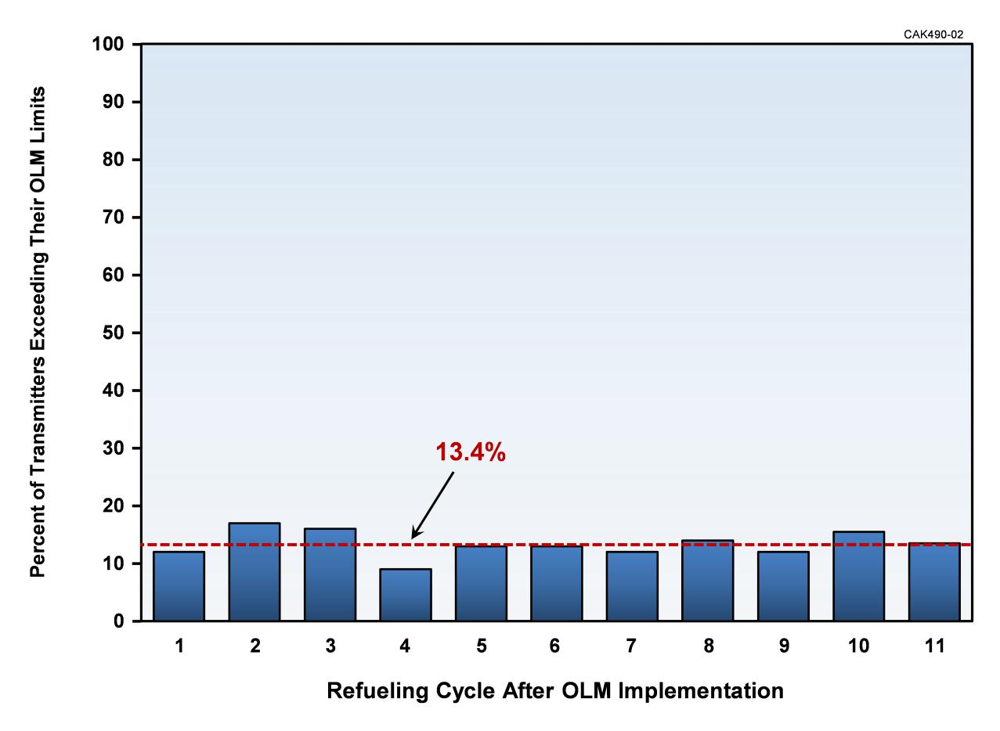

**Figure 10.1. Sizewell Transmitters Flagged for Calibration Checks at the End of Each Plant Operating Cycle** 

#### **10.1.5 Evidence to Rule Out Common-Mode Drift**

Sizewell B began extending its transmitter calibration intervals in 2005 corresponding to its fuel Cycle 7. The calibration interval extension was performed on a staggered basis such that one of the four trains of transmitters were not calibrated in Cycle 7, two trains were not calibrated in Cycle 8, and three trains were not calibrated in Cycle 9. From Cycle 9 to now (2021), transmitters in only one of the four trains are calibrated. Since Cycle 9 in 2008, the 4-way redundant transmitters have had a maximum of eight years between calibration checks. Over this period, Sizewell engineers have been documenting the agreement between the OLM results and the manual calibrations that are performed each cycle [49]. The OLM results and manual calibrations disagree in rare occasions when one or two transmitters are found by OLM to be "good" but manual calibrations found them to be "bad" (i.e., non-conservative). Table 10.5 shows the non--conservative disagreements between OLM and manual calibrations from Cycle 7 in 2005 through Cycle 15 in 2017. It is clear that these results are distributed among various services. This provides evidence beyond what was described in Chapter 3 that the Sizewell transmitters did not experience common-mode drift. If there were common-mode drift, the disagreement between OLM and manual calibration results would have occurred in the same service(s) for consecutive cycles.

#### **10.2 OLM IMPLEMENTATION AT MCGUIRE UNIT 2**

#### **10.2.1 Description of McGuire Plant**

The McGuire Nuclear Station located in North Carolina is a two-unit Westinghouse PWR owned and operated by Duke Power Company. Its Unit 1 began operation in 1981 and its Unit 2 where OLM was implemented began operation in 1984. The two units together produce 2250 in net megawatt electric power. Prior to OLM implementation, the plant had installed a temporary data acquisition system in the control room area of Unit 2 for another project that ended in 1992. This provided AMS with the opportunity to use the system for OLM data acquisition. The system included isolation devices to allow data collection from live signals with no disturbance to plant operations.

Table 10.6 shows the listing of the 170 signals that were involved in this project to demonstrate the feasibility of OLM. The project included not only pressure transmitters but also temperature sensors and other signals. The signals originated from both the primary and secondary side of the plant (Figure 10.2) through a multiplexer, an additional isolation unit, a low-pass filter to eliminate any high frequency noise and provide for anti-aliasing, an analog to digital converter (A/D), and storage to keep the data for subsequent analysis. The system also included calibration and test signals as shown in Figure 10.3.

| Plant Operating Cycle | Non-Conservative Results mber of Nu | Pressure Loop 3 PPS m Main Stea | Narrow Range Level C SPS m Generator Stea | Pressurizer Level | m Flow Loop 1 Reactor Coolant Syste | Water Flow Train B mergency Service E | Water m Flow to Train A mponent Cooling Syste Co | water Flow to m Generator B Main Feed Stea | Narrow Range Level B SPS m Generator Stea | Pressurizer Pressure | water Flow to m Generator D Main Feed Stea | Narrow Range Level A SPS m Generator Stea |
|-----------------------|-------------------------------------------|---------------------------------------|-------------------------------------------------|-------------------|-------------------------------------------|---------------------------------------------|--------------------------------------------------------------|-----------------------------------------------------|-------------------------------------------------|----------------------|-----------------------------------------------------|-------------------------------------------------|
| 7                     | 2                                         | ×                                     | ×                                               |                   |                                           |                                             |                                                              |                                                     |                                                 |                      |                                                     |                                                 |
| 8                     | 0                                         |                                       |                                                 |                   |                                           |                                             |                                                              |                                                     |                                                 |                      |                                                     |                                                 |
| 9                     | 0                                         |                                       |                                                 |                   |                                           |                                             |                                                              |                                                     |                                                 |                      |                                                     |                                                 |
| 10                    | 1                                         |                                       |                                                 | ×                 |                                           |                                             |                                                              |                                                     |                                                 |                      |                                                     |                                                 |
| 11                    | 2                                         |                                       |                                                 |                   | ×                                         | ×                                           |                                                              |                                                     |                                                 |                      |                                                     |                                                 |
| 12                    | 1                                         |                                       |                                                 |                   |                                           |                                             | ×                                                            |                                                     |                                                 |                      |                                                     |                                                 |
| 13                    | 1                                         |                                       |                                                 |                   |                                           |                                             |                                                              | ×                                                   |                                                 |                      |                                                     |                                                 |
| 14                    | 2                                         |                                       |                                                 |                   |                                           |                                             |                                                              |                                                     | ×                                               | ×                    |                                                     |                                                 |
| 15                    | 2                                         |                                       |                                                 |                   |                                           |                                             |                                                              |                                                     |                                                 |                      | ×                                                   | ×                                               |

**Table 10.6. Listing of Signals Monitored at McGuire Unit 2**

| Item | Description of Signals                         | Number of Signals |
|------|------------------------------------------------|-------------------|
|      | Pressure Signals                               |                   |
| 1    | Steam Flow                                     | 8                 |
| 2    | Steam Pressure                                 | 12                |
| 3    | Steam Generator Level                          | 20                |
| 4    | Feedwater Flow                                 | 8                 |
| 5    | Auxiliary Feedwater Flow                       | 4                 |
| 6    | Reactor Coolant Flow                           | 12                |
| 7    | Pressurizer Level                              | 3                 |
| 8    | Pressurizer Pressure                           | 4                 |
| 9    | Wide Range Reactor Coolant Pressure            | 2                 |
| 10   | Containment Pressure                           | 3                 |
| 11   | Reactor Vessel Level Indicating System (RVLIS) | 6                 |
| 12   | Turbine Impulse Pressure                       | 2                 |
|      | Temperature Signals                            |                   |
| 13   | Narrow-Range RTDs                              | 16                |
| 14   | Wide Range RTDs                                | 8                 |
| 15   | Core Exit Thermocouples                        | 40                |
|      | Other Signals                                  |                   |
| 16   | Neutron Flux Detectors (NI Channels)           | 12                |
| 17   | ΔT Signals                                     | 4                 |
| 18   | Tave Signals                                   | 4                 |
|      | Calibration Signals                            |                   |
| 19   | +5 Volt Reference                              | 1                 |
| 20   | Electrical Short                               | 1                 |
|      | Total Number of Signals Monitored              | 170               |

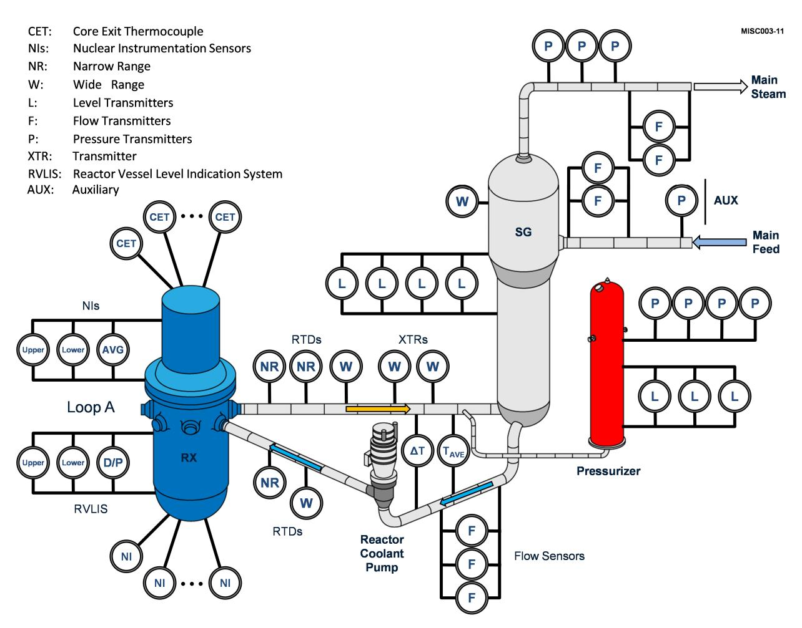

**Figure 10.2. Primary and Secondary Loops of McGuire Where OLM Signals Were Monitored**

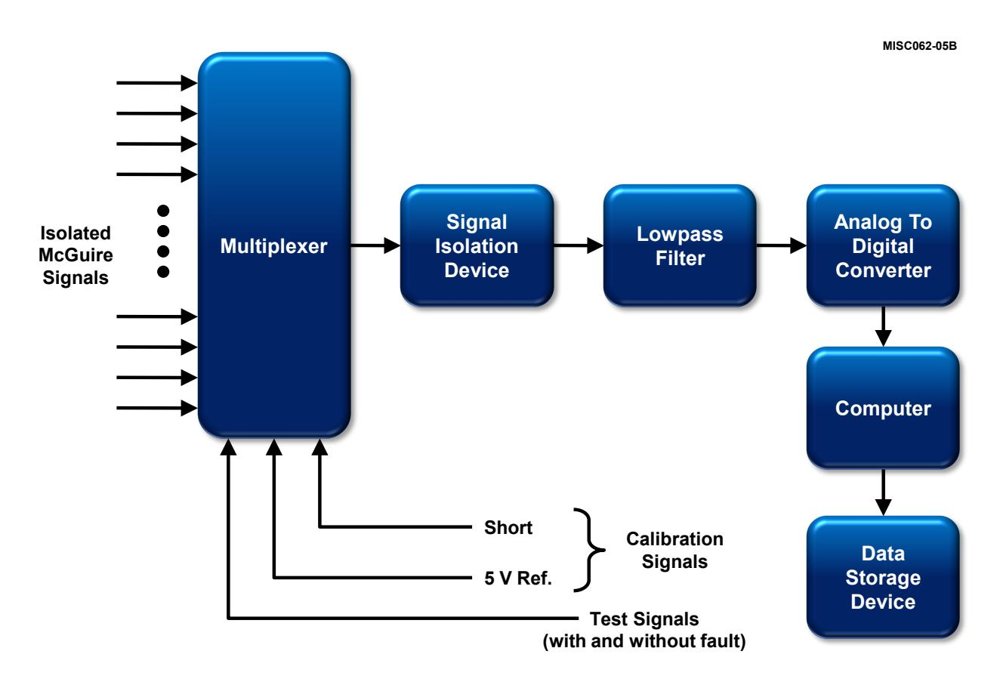

**Figure 10.3. Block Diagram of OLM Data Acquisition System Used at McGuire**

#### 10.2.2 In-Plant Demonstration of OLM

OLM validation at McGuire was performed using data from two consecutive fuel cycles covering the period of March 1992 to December 1994. The average length of a McGuire fuel cycle was about 14 months in those years. Figure 10.4 shows the components in the path of OLM signal from the process to the data acquisition system.

During the nearly thirty-three months of data collection at McGuire, there were plant trips and scheduled outages which resulted in discontinuities in the data as well as periods where online monitoring data could not be collected leaving gaps in the data. Figure 10.5 shows a plot of the reactor power during the two fuel cycles that online monitoring data were collected at McGuire.

In addition to discontinuities and gaps which had to be treated as described in Chapter 6, some of the McGuire signals were noisy and had to be filtered. Filtering was performed by moving an averaging window through the digitized data. Figure 10.6 shows a plot of three redundant signals from McGuire before and after filtering. Prior to sampling, the OLM data was also taken through analog filters to reduce any extraneous noise and provide for antialiasing. Normally, if OLM data acquired through a stand-alone data acquisition system is sampled fast (e.g., 2000 Hz) it can be used to monitor not only for drift but also for response time degradation and to detect sensing line blockages. At McGuire, however, the sampling frequency was limited to less than 30 Hz to reduce storage requirements as storage was not as abundant and economical in the 1990s when this project was performed at McGuire. Nevertheless, the data was useful to evaluate both the calibration and response time of the McGuire sensors.

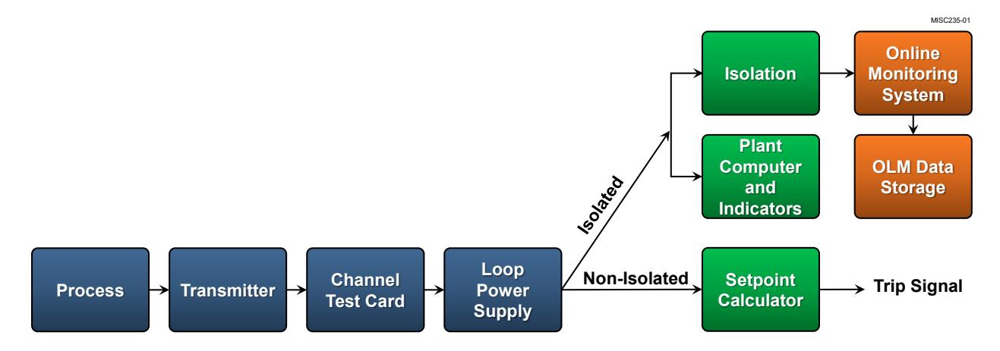

Figure 10.4. OLM Data Acquisition Connection to McGuire Instrument Channels

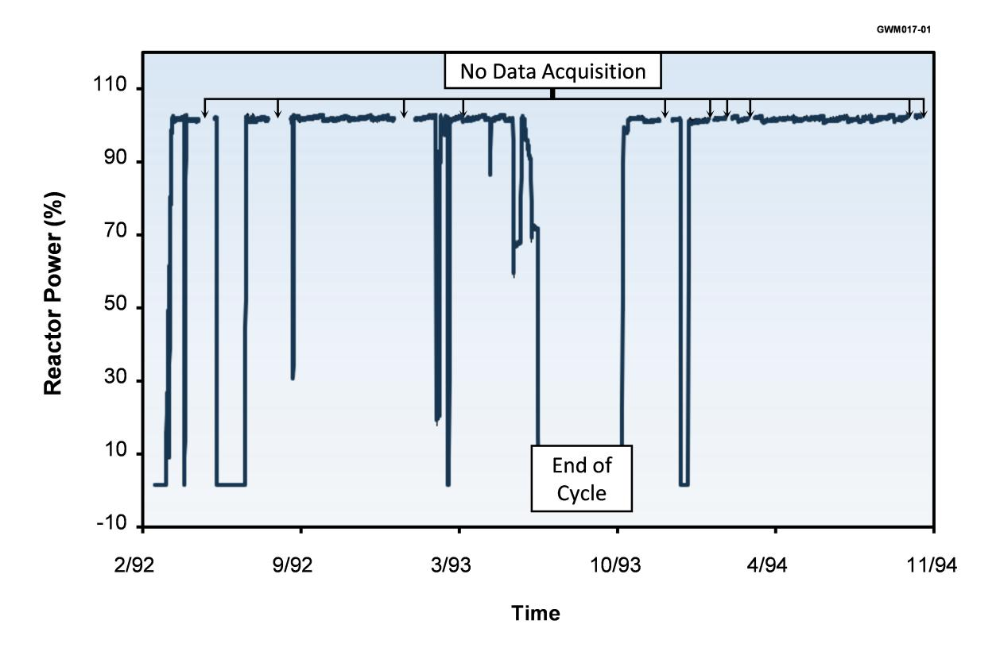

**Figure 10.5. Reactor Power During OLM Data Collection at McGuire**

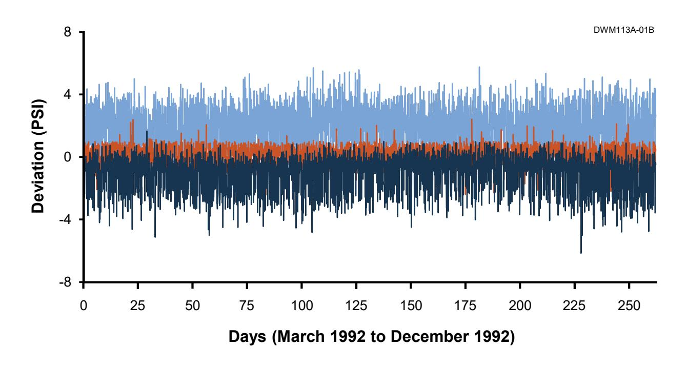

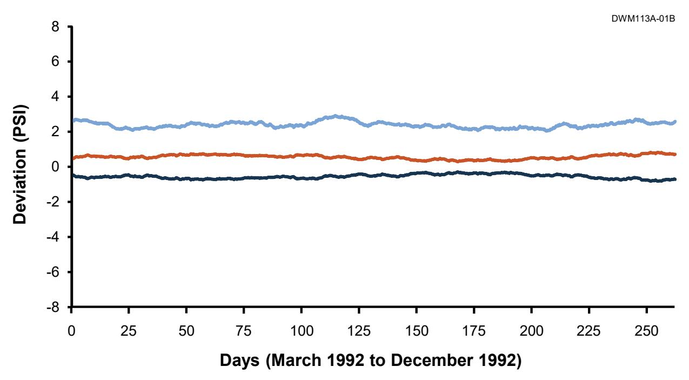

**Figure 10.6. Raw and Filtered OLM Data for Three Reactor Coolant Flow Transmitters at McGuire**

#### **10.2.3 OLM Results Versus Manual Calibrations**

OLM data for McGuire transmitters was collected only during normal power operation as opposed to Sizewell B implementation where OLM data was collected not only during normal power operation but also at startup and shutdown periods. Figure 10.7 shows the agreement between average value of drift for the McGuire transmitters over two consecutive operating cycles and corresponding drift from manual calibrations. To arrive at the bar graph of Figure 10.7, the drift values measured from OLM data and drift values calculated from manual calibrations were listed side-by-side and then subtracted from each other. The results showed differences ranging from less than 0.5% of span to about 1.5% of span. These differences were then categorized as to how many were less than or equal to 0.5% of span, 0.75% of span, 1.0% of span, and 1.5% of span. The number of transmitters in each category was then converted to percentages to arrive at the data in Figure 10.7. This outcome demonstrated that OLM was capable of detecting drift to a reasonable level of fidelity. Today, with advances in OLM technology, better resolution will be obtained in a similar implementation project.

#### **10.2.4 Laboratory Demonstration of OLM**

The OLM methodology used at McGuire was first tested at AMS using a number of nuclear grade pressure, level, and flow transmitters installed in a laboratory flow loop filled with water operating at room temperature. The details are presented in NUREG/CR-5903 and NUREG/CR-6343 and a few examples are shown in Figure 10.8 through 10.10. These results are based on OLM data collected after varying levels of drift were induced in the transmitters to demonstrate that OLM can accurately identify the drift. Figure 10.8 shows results for a number of flow transmitters that were tested one or more times as installed in the laboratory flow loop. This is followed by Figure 10.9 with results for a Rosemount smart transmitter tested eleven times with varying levels of induced drift. The same type of results are shown for a Foxboro and a Statham transmitter in Figure 10.10. These experiments were performed to demonstrate the feasibility of the OLM method and to test the OLM data acquisition system and data analysis software as they were used at McGuire.

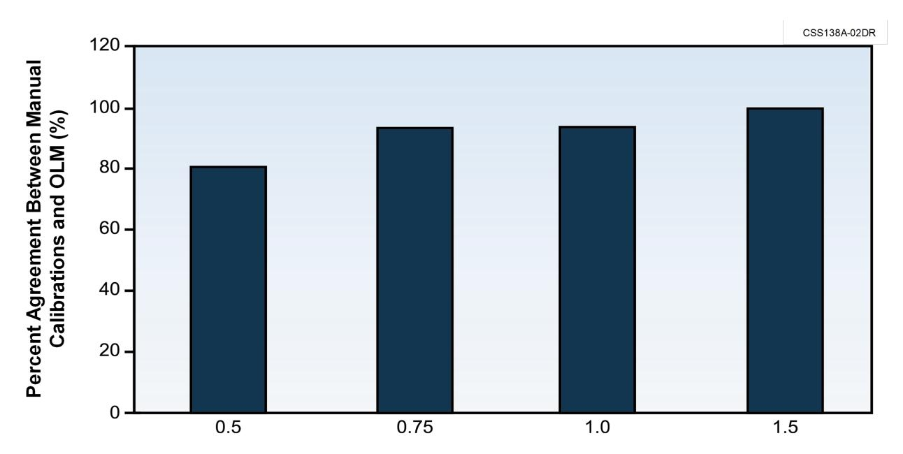

**Figure 10.7. Comparison of Drift Detected by Calibrations and OLM at McGuire**

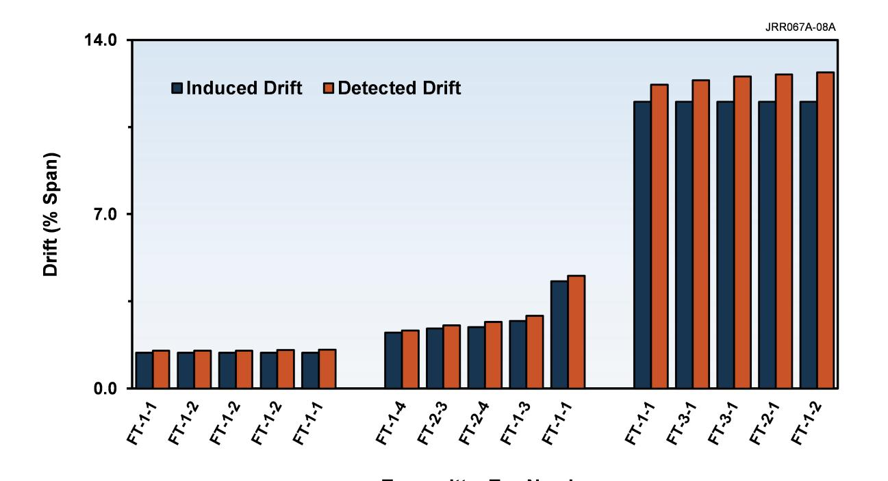

**Figure 10.8. Laboratory Results for Flow Transmitters** 

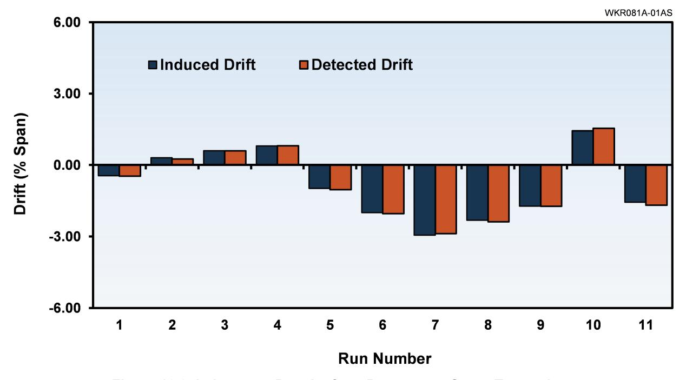

**Figure 10.9. Laboratory Results for a Rosemount Smart Transmitter**

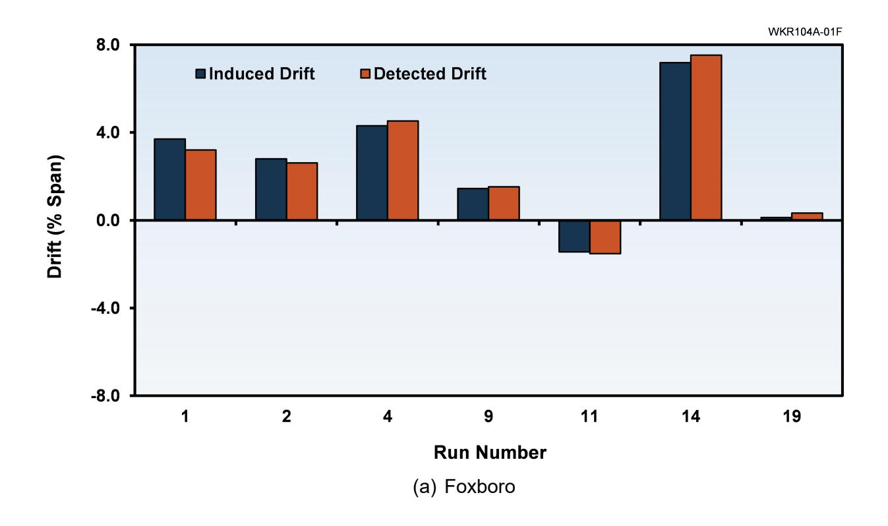

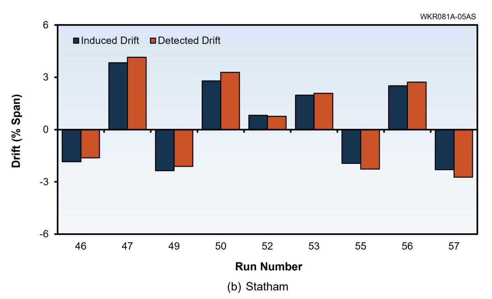

**Figure 10.10. Laboratory Results for a Foxboro and a Statham Pressure Transmitter**

#### **10.3 OLM CAN IDENTIFY ZERO AND SPAN SHIFTS AND OTHER CALIBRATION ISSUES**

OLM data must be collected not only at the plant operating point but also during startup and shutdown conditions to identify drift over as much of the operating range of a transmitter as possible. Figure 10.11 shows OLM data for three redundant transmitters during startup of the Sizewell B nuclear power plant. Figure 10.11 also shows the results of processing the startup data to show the drift behavior of the transmitters as a function of their span. It is apparent from this information that OLM can help verify the calibration of transmitters over much of their span.

With data from periods of plant startup or shutdown, OLM can also identify any significant shift in a transmitter zero, span, or the combination of zero and span as shown in Figure 10.12. The results in this figure are from online monitoring of three different transmitters at Sizewell B during startup. It is apparent in the plot of Figure 10.12c that the zero and span shift for a transmitter can cancel out if OLM is performed using data from only the plant's normal operating period. This confirms that it is important for OLM data to be collected not only at the plant operating point but also during plant startup and shutdown periods.

In addition to above, OLM can identify other calibration related issues. For example, at Sizewell B a number of previously unidentified calibration related issues were exposed and rectified using OLM. In particular, OLM identified transmitters which exhibited temperature / pressure drift on return to power after a perfect cold calibration and revealed venturi / orifice differential pressure transmitter bias on flow transmitters which had existed since original plant startup.

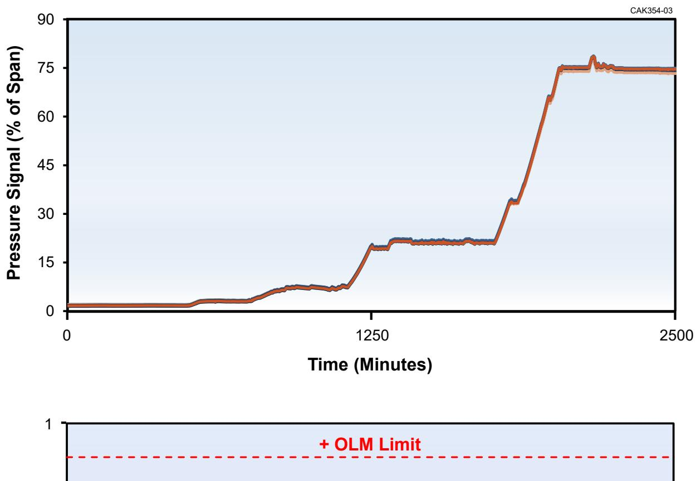

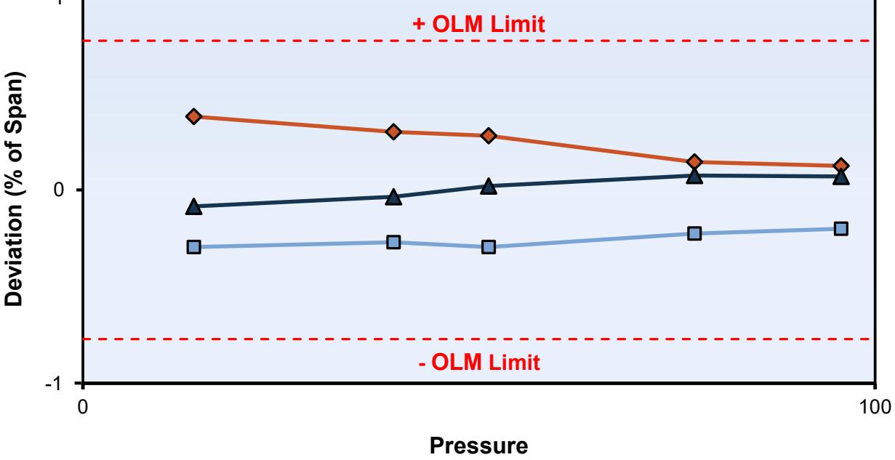

**Figure 10.11. Startup OLM Data and Results Over the Span of Transmitters**

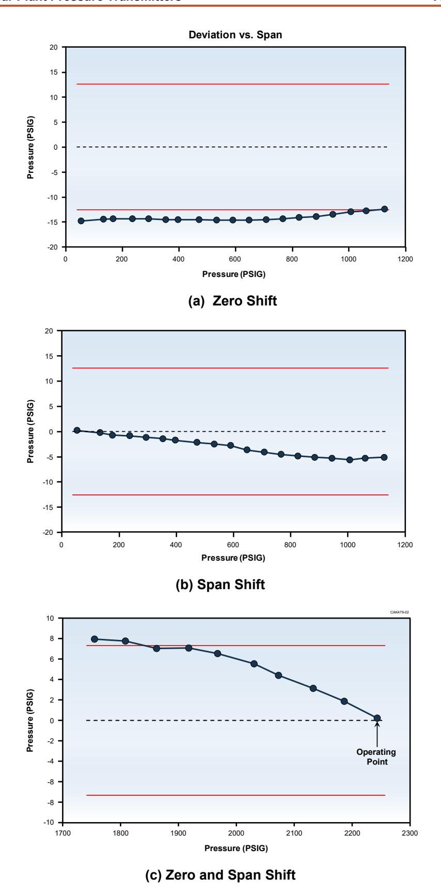

Figure 10.12. Zero, Span, and Zero Plus Span Shifts Determined from OLM Data

To quantify the amount of zero and span shift, OLM data from startup and shutdown period must first be plotted as a function of percent of span as shown in Figure 10.13. The results from startup period can then be subtracted from that of shutdown period to arrive at values for zero and span shifts.

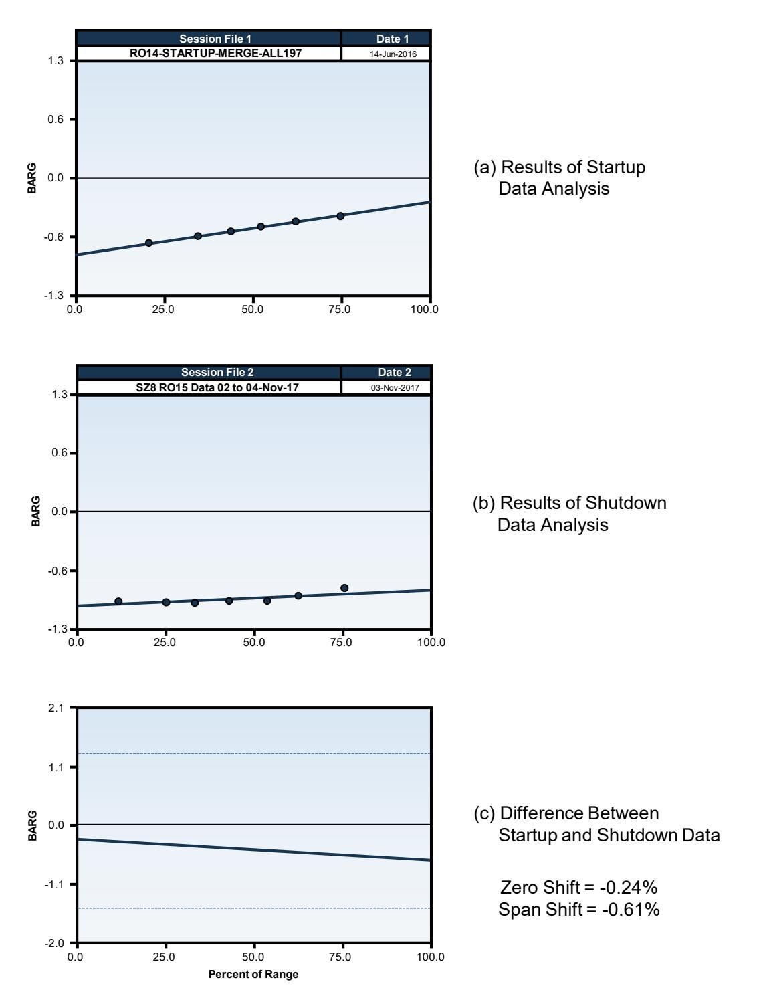

**Figure 10.13. Zero and Span Shift Calculated from Startup and Shutdown Data**

#### **11 OLM IMPLEMENTATION METHODOLOGY**

This chapter provides general guidelines as to how nuclear facilities must implement OLM in a way to ensure that data is properly acquired, qualified, analyzed, interpreted, reported, and documented. These tasks must be carried out by formally trained personnel under an approved Quality Assurance (QA) program in compliance with 10 CFR Part 50 Appendix B. All software products used for OLM data acquisition, qualification, and analysis must be developed and tested using a documented software verification and validation (V&V) program (e.g., NQA-1 software controls).

The guidelines provided in this chapter are based on OLM implementation experience in ten nuclear facilities conducted by AMS under experimental R&D projects or commercial contracts over the period of 1990 to 2020. These activities started with the McGuire nuclear power plant in the U.S. and the Sizewell B nuclear power plant in the U.K.

This chapter begins in Section 11.1 with steps that must be taken to acquire and analyze OLM data for transmitter drift monitoring. This is followed by Section 11.2 with an example illustrating the data analysis process, Section 11.3 on data acquisition and analysis for assessment of in-situ sensor dynamic response, Section 11.4 with training requirements for the OLM analyst, and Section 11.5 describing the changes that should be made in plant technical specifications to implement OLM. Together, Sections 11.1 through 11.5 constitute the "OLM Program".

#### **11.1 DATA ACQUISITION AND ANALYSIS TO MONITOR FOR DRIFT**

This section provides the steps that must be taken by nuclear facilities implementing OLM to acquire and analyze data to identify drifting transmitters. In formulating these steps, the verb *must* is used to identify actions that are essential to OLM implementation, and the verb *should* is used to identify other actions that are helpful but not essential to OLM implementation. These steps are divided into two sets. The first set identified in Section 11.1.1 is performed only once to initiate the OLM implementation process and the second set identified in Section 11.1.2 is repeated at each operating cycle to identify the transmitters that should be scheduled for a calibration check.

#### **11.1.1 Steps to Initiate the OLM Implementation Process**

The steps listed below must be followed if the OLM program is being established for the first time in a nuclear facility. These steps are designed to arrive at a list of transmitters that can be included in an OLM program, determine how to obtain OLM data, and establish methods of OLM data analysis.

#### **1. Determine if Transmitters are Amenable to OLM.**

Chapter 12 includes a table of nuclear grade transmitter models that are amenable to OLM. Any transmitter model that is not listed in this table should only be added to the OLM program if it can be shown by similarity analysis that its failure modes are the same as the listed transmitter models or otherwise detectable by OLM.

#### **2. List Transmitters in Each Redundant Group.**

**[[ ]]a,b,f**

#### **3. Determine if OLM Data Covers Applicable Setpoints.**

**[[**

**]]a,b,f**

#### **4. Calculate Backstops.**

A backstop, as described in Chapter 13, must be established for each group of redundant transmitters amenable to OLM as a defense against common mode drift. The backstop identifies the maximum period between calibrations without calibrating at least one transmitter in a redundant group.

#### **5. Establish Method of Data Acquisition.**

OLM data is normally available in the plant computer or an associated data historian. If data is not available from the plant computer or historian, a custom data acquisition system including hardware and software must be employed to acquire the data.

#### **6. Specify Data Collection Duration and Sampling Rate.**

OLM data must be collected during startup, normal operation, and shutdown periods at the highest sampling rate by which the plant computer takes data. Chapter 15 describes a process to determine the minimum sampling rate for OLM data acquisition to monitor for transmitter drift. **[[**

**]]a,b,f** Chapter 8 describes a process

to help determine the optimal sampling rate and minimum duration of OLM data collection.

**[[**

**]]a,b,f**

#### **7. Identify Data Analysis Methods.**

OLM implementations must employ both simple averaging and parity space methods for data analysis as described in Chapter 6. The use of other OLM analysis methods including empirical and physical modeling must be approved separately from this TR.

#### **8. Establish OLM Limits.**

OLM limits must be established as described in Chapter 7 for each group of redundant transmitters. Calculation of OLM limits must be based on combining uncertainties of components of each instrument channel from the transmitter in the field to the OLM data storage. As described in Chapter 7, **[[**

#### **]]a,b,f**

#### **11.1.2 Steps to be Followed Each Operating Cycle**

The steps listed below must be followed each operating cycle to identify the transmitters that should be scheduled for a calibration check at the ensuing outage. These steps must be performed for startup, normal operation, and shutdown periods.

#### **9. Retrieve OLM Data.**

OLM data must be retrieved according to the data acquisition method established in Section 11.1.1.

#### **10. Perform Data Qualification.**

OLM data sometimes contains anomalies such as spikes, missing data, stuck data, and saturated data. The portion of data containing these anomalies must be excluded, filtered, and/or cleaned prior to analysis. Chapter 6 includes examples of potential anomalies in OLM data that must be excluded, cleaned, and/or filtered to qualify the data for analysis.

#### **11. Select Appropriate Region of Any Transient Data.**

**[[**

**]]a,b,f**

#### **12. Perform Data Analysis.**

This step must be performed for startup, each month of normal operation, and shutdown. Analysis of OLM data must be performed according to the following procedure. A comprehensive example of the OLM data analysis process is presented in Section 11.2 to illustrate this procedure.

- **a. Calculate the process estimate.** The process estimate for each data sample must be calculated from the OLM data for each redundant group of transmitters. Chapter 6 describes how process estimates are calculated.
- **b. Calculate the deviation of each transmitter from the process estimate and plot the outcome.** The process estimate must be subtracted from OLM data to determine each transmitter's deviation for each data sample. The outcome of this calculation must be plotted for the OLM analyst to visualize the deviation versus time for each transmitter and compare it with OLM limits.

- **c. Partition the deviation data into region(s) by percent of span.** This step must be performed to create multiple regions for startup and shutdown data and one region for normal operation data.
- **d. Calculate and plot the average deviation for each region versus percent of span.**  This step must be performed to allow the OLM analyst to visualize the deviation versus span for each transmitter and compare it with OLM limits. The deviation versus span plot provides a means to evaluate each transmitter's calibration at multiple points along its range.
- **e. Select appropriate process estimation techniques, filtering parameters, and remove any outliers. [[**

| f. | Determine if average deviations exceed OLM limits for any region. [[ | ]]a,b,f |         |
|----|----------------------------------------------------------------------|---------|---------|
|    |                                                                      |         | ]]a,b,f |

**g. Review, document, and store the details and results of analysis. [[**

**]]a,b,f**

**13. Plot the Average Deviation for Each Transmitter.** 

**[[**

**]]a,b,f**

**14. Produce a Table for Each Group That Combines All Results.** 

**[[**

**]]a,b,f**

**15. Determine OLM Results for Each Transmitter.**

The OLM results must be produced by the OLM analyst upon completion of data analysis for a complete operating cycle. **[[**

**]]a,b,f**

**16. Address Uncertainties in the Unexercised Portion of Transmitter Range.**

**[[**

**]]a,b,f**

#### **17. Select Transmitters to Be Checked for Calibration as a Backstop.**

**[[**

**]]a,b,f**

#### **18. Perform Dynamic Failure Mode Assessment.**

**[[**

**]]a,b,f** This step must be performed using the noise analysis technique described in Section 11.3 to cover dynamic failure modes that are not detectable by the OLM process for transmitter drift monitoring (see Section 3.4).

#### **19. Produce a Report of Transmitters Scheduled for Calibration Check.**

The results of OLM analysis must be compiled in a report and independently reviewed. The transmitters that have been flagged must be scheduled for a calibration check at the next opportunity.

#### **11.2 EXAMPLE OF THE OLM DATA ANALYSIS PROCESS**

This section presents an example of the OLM data analysis process to illustrate the steps that were outlined in Section 11.1.2. This example comes from analysis performed for a complete operating cycle of about 18 months using the Sizewell B nuclear plant data collected from the beginning of startup in May 2013 to end of shutdown in October 2014.

The OLM data sampled during plant startup is first partitioned and then analyzed partition-bypartition. An example using four redundant transmitters is illustrated in Figure 11.1. The partitioning windows are selected by the OLM analyst based on experience and characteristics of the OLM data (Figure 11.1.a). The process estimate is calculated using simple averaging or parity space technique for each partition (Figure 11.1b). This value is then subtracted from the reading of each redundant transmitter to arrive at the deviation of each transmitter from the process estimate for the redundant group. The deviation results are then plotted versus time for the redundant transmitters (Figure 11.1c).

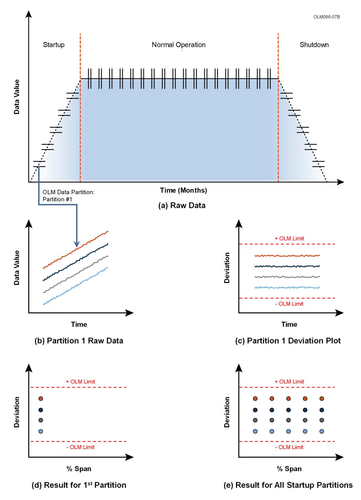

**Figure 11.1. Startup Data Analysis Process**

Next, the deviations over the partition window are averaged to arrive at a single deviation value for each transmitter. This value is then plotted on an x-y axis where y is the average value of the transmitter deviation over the partition window and x is the operating point in percent of span at which the OLM data was collected (Figure 11.1d). This procedure is repeated for all partitions to arrive at the transmitter deviations over the operating span (Figure 11.1.e).

The OLM data sampled during normal operation is then analyzed month by month (Figure 11.2.a, b, and c) and the results plotted versus time as illustrated in Figure 11.2.d. Then, after the plant is shut down, the OLM data for the shutdown period is promptly analyzed partition-by-partition.

The results from the startup, normal operation, and shutdown periods are then combined in a fullcycle results table that indicates if any transmitter deviation exceeded the OLM limit at any time during the cycle. An example table is shown at the top of Figure 11.3. The table contains a row for each transmitter in the redundant group and a column for startup (SU), each month of normal operation, and shutdown (SD). For each transmitter, an 'X' is placed in the column for any period where the OLM limit was exceeded. Additionally, plots of transmitter deviations at startup, shutdown, and normal operation periods are included with the table to provide the OLM analyst with a complete picture of how each transmitter in the redundant group performed over the full cycle.

The final results are produced by the OLM analyst upon completion of data analysis for the complete operating cycle. Table 11.1 shows an example of how the final OLM results can be compiled through evaluation of transmitter deviation during a complete operating cycle. In this example, four redundant transmitters are shown with one having exceeded its OLM limits most of the time during the complete fuel cycle, one that never exceeded the OLM limits, and two which exceeded the OLM limits on one or two occasions. Obviously, the transmitter that exceeded its OLM limits often (ABC-104) is flagged as "bad" meaning that its calibration must be checked during the outage. Also, the transmitter that never exceeded its OLM limits (ABC-103) is flagged as "good" meaning that the transmitter does not need a calibration check. As for those transmitters that have occasionally exceeded their OLM limits during the fuel cycle (ABC-101 and ABC-102); the analyst should evaluate the raw OLM data, the results of OLM analysis, and all other factors such as transmitter location, service, any extraneous effects, plant activities during OLM data acquisition, and use best engineering judgement and experience as to whether the transmitter should be flagged as "good" or "bad". Generally, a conservative approach is to flag the transmitter as "bad" if there is any doubt about the results of the analysis.

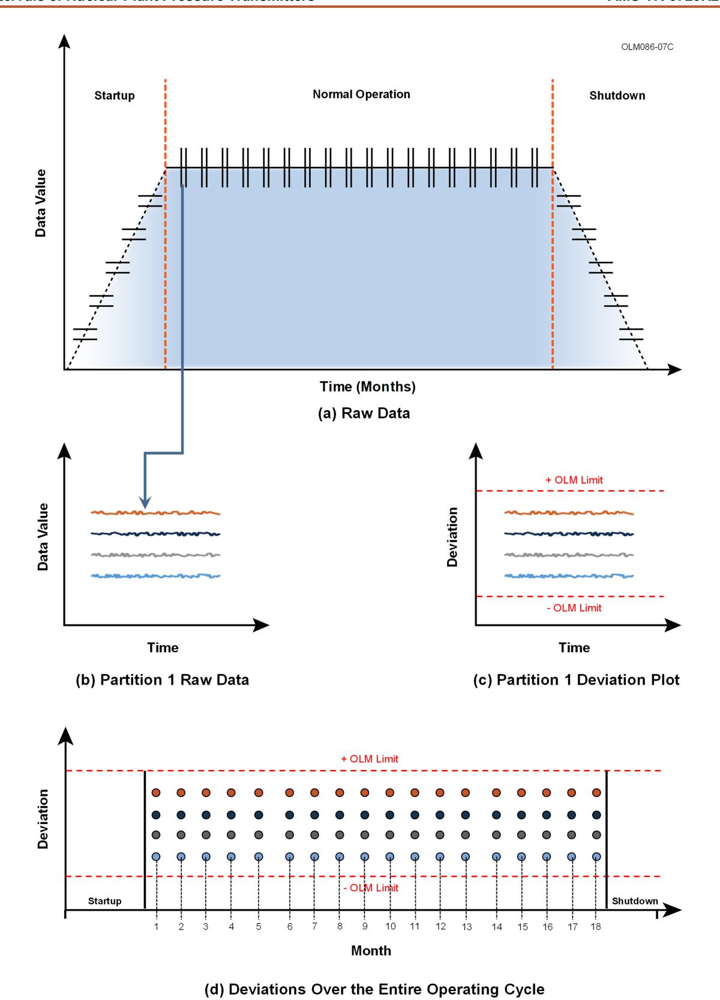

**Figure 11.2. Analysis Process for OLM Data Collected During Normal Plant Operation**

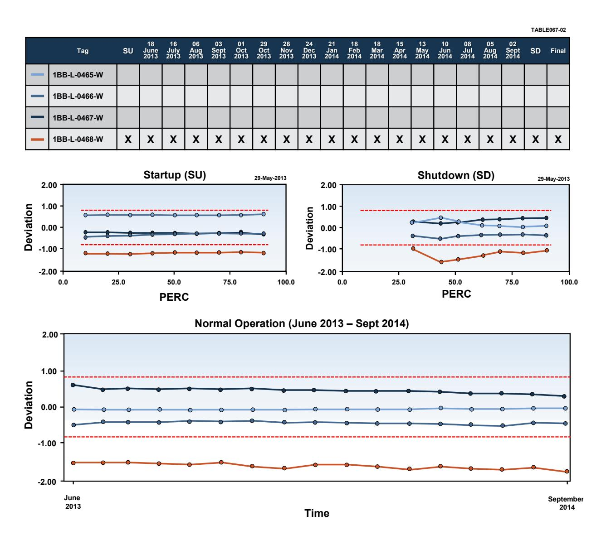

Figure 11.3. Example of Full-Cycle Results for Four Redundant Sizewell B Transmitters

| Tag Number | SU | Month 1 | Month 2 | … | Month 18 | SD | Result |
|---------------|----|---------|---------|---|----------|----|--------|
| ABC-101       |    |         | X       |   |          |    | Good   |
| ABC-102       | X  |         |         |   | X        |    | Good   |
| ABC-103       |    |         |         |   |          |    | Good   |
| ABC-104       | X  | X       | X       | X |          | X  | Bad    |

Figure 11.4. shows OLM results for three redundant pressurizer level transmitters at Vogtle Nuclear Power Plant Unit 1 together with the OLM plots for startup, shutdown, and normal operation periods. This is an example of an OLM test where the bad transmitter is clearly identified. Figure 11.5. shows OLM results for three redundant steam pressure transmitters at Farley Nuclear Power Plant Unit 1 as an example of OLM results where the transmitters are well within their OLM limits throughout the cycle.

All transmitters must be identified as either "good" or "bad" depending on results of OLM analysis and interpretation of the outcome by an OLM analyst. Transmitters that have been identified as "bad" must be scheduled for a manual calibration check during the next calibration opportunity which is typically the next refueling outage.

Table 11.2. shows an abbreviated list of OLM results for eleven redundant transmitters in three different services at Sizewell B plant indicating that only one of the eleven transmitters is "bad."

Intervals of Nuclear Plant Pressure Transmitters

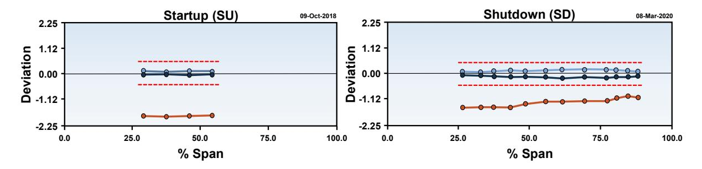

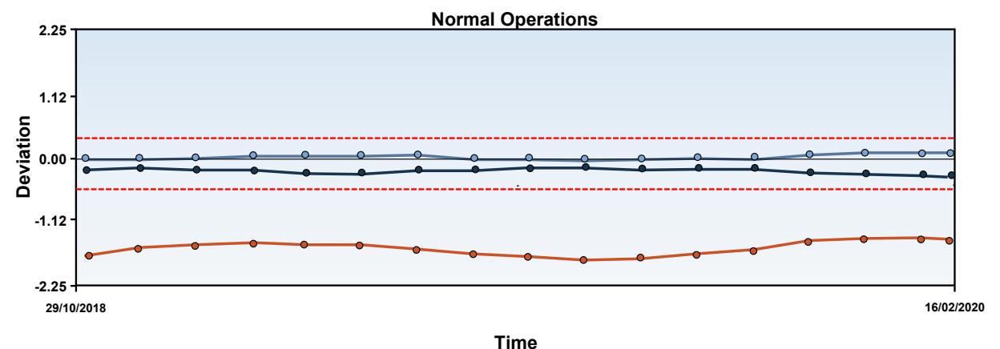

Figure 11.4. OLM Results for Redundant Pressurizer Level Transmitters at Vogtle

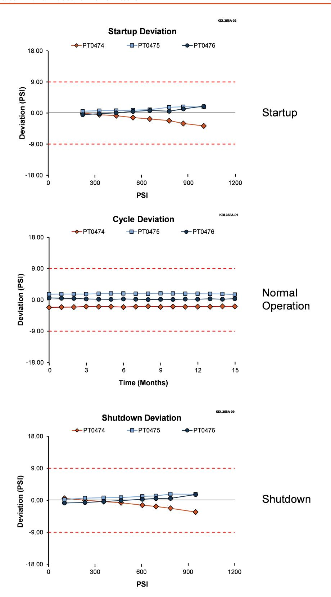

**Figure 11.5. OLM Results for Three Redundant Steam Pressure Transmitters at Farley** 

**Table 11.2. Abbreviated Table of OLM Results for Sizewell Transmitters**

| Item | Group Name            | Tag Name     | Result |  |
|------|-----------------------|--------------|--------|--|
| 1    | Main Steamline 3 Flow | 1AB-F-0370-W | Good   |  |
| 2    | Main Steamline 3 Flow | 1AB-F-0371-W | Good   |  |
| 3    | Main Steamline 3 Flow | 1AB-F-0371-W | Good   |  |
|      |                       |              |        |  |
| 4    | Pressurizer Level     | 1BB-L-0465-W | Good   |  |
| 5    | Pressurizer Level     | 1BB-L-0466-W | Good   |  |
| 6    | Pressurizer Level     | 1BB-L-0467-W | Good   |  |
| 7    | Pressurizer Level     | 1BB-L-0468-W | Bad    |  |
|      |                       |              |        |  |
| 8    | Pressurizer Pressure  | 1BB-P-0455-W | Good   |  |
| 9    | Pressurizer Pressure  | 1BB-P-0456-W | Good   |  |
| 10   | Pressurizer Pressure  | 1BB-P-0457-W | Good   |  |
| 11   | Pressurizer Pressure  | 1BB-P-0458-W | Good   |  |

#### **11.3 DATA ACQUISITION AND ANALYSIS TO ASSESS DYNAMIC FAILURE MODES**

OLM can be used to assess dynamic failure modes of transmitters using the noise analysis technique in addition to monitoring for drift. This requires OLM data to be acquired with a high sampling frequency such as 2000 Hz. Since plant computers do not normally sample process data at such a high frequency, a separate data acquisition system with isolation capability must be used. This chapter describes the aspects of the noise analysis technique that relate to dynamic performance monitoring of transmitters.

#### **11.3.1 Transmitter Amenability to OLM Noise Analysis Technology**

The noise analysis technique involves processing the random fluctuations (noise) that naturally exist at the output of most transmitters during plant operation. Examples of services that have adequate process fluctuations and are therefore amenable to noise analysis are **[[**

**]]a,b,f** Examples of services

with little or no fluctuations are **[[**

#### **]]a,b,f**

#### **11.3.2 Impact of Transmitter Response Time Elimination on OLM**

Some licensees have extended or eliminated transmitter response time testing requirements with NRC approval based, in part, on the performance of manual calibrations. Manual calibrations will not be performed except on transmitters that are flagged by OLM. The noise analysis methodology is provided in this TR to enable licensees to assess the dynamic failure modes of transmitters that are not covered by the OLM process for transmitter drift monitoring.

Any licensee implementing the OLM methodology to extend transmitter calibration intervals should assess its impact on any prior licensing actions to extend or eliminate periodic response time testing requirements. This TR does not recommend that licensees implementing OLM should resume transmitter response time testing using the conventional practice if this requirement has already been eliminated. Rather, the noise analysis technique is provided here as an alternative to address dynamic failure modes which covers transmitter response time degradation, sensing line blockages, and issues with fill fluids in sensing modules of some transmitters.

#### **11.3.3 Steps for Implementation of Noise Analysis Technique**

The following steps must be taken to assess dynamic failure modes of pressure transmitters.

#### **1. Select Qualified Noise Data Acquisition Equipment.**

The equipment to acquire noise data in a nuclear plant must have a number of important characteristics such as qualified isolation to allow testing of live safetyrelated transmitters while the plant is operating. **[[**

**]]a,b,f** and Figure 11.6

shows how noise data is extracted from the output of a transmitter.

#### **2. Connect the Noise Data Acquisition Equipment to Plant Signals**.

The noise data acquisition system should be connected to as many transmitters as allowed by the number of data acquisition channels and the plant procedures. Multiple transmitters (e.g., up to 32) can be tested simultaneously to reduce the test time. Each data acquisition channel must be connected to the transmitter current loop as shown in Figure 11.7.

#### **3. Collect and Store Data for Subsequent Analysis.**

The noise data should be collected during normal plant operation at full temperature, pressure, and flow and analyzed in real time or stored to be analyzed later. However, noise data taken at other conditions is acceptable as long as there is enough process fluctuation with sufficient amplitude and frequency content to drive the transmitters to reveal their dynamic characteristics. Section 11.3.1 describes how to determine the amenability of a nuclear plant transmitter to OLM noise analysis technology.

#### **4. Screen Data for Artifacts and Anomalies.**

During collection of noise data, potential exists for spikes, jumps, and other artifacts to contaminate the data. These artifacts are normally benign to plant operation but can complicate the analysis of the noise data. Therefore, any identified anomalies must be excluded from the data before analysis. Figure 11.8 shows typical noise data from a transmitter in a nuclear power plant after the data was acquired and cleaned. This graph shows only 50 seconds of data from a 60 minute recording that is typically collected to measure the response time of a nuclear plant pressure transmitter.

#### **5. Perform Data Analysis.**

**[[**

**]]a,b,f**

Two sets of PSD plots are shown in Figure 11.9, each for a transmitter in a PWR plant. Each plot contains two PSD traces; one with degraded dynamic sensor response (which happened to be a sensing line blockage) and another after the dynamic sensor response was restored (when the blockage was cleared).

#### **6. Review and Document Results.**

The OLM results must be reviewed by qualified personnel and documented.

**Table 11.3. Minimum Requirements for Portable Noise Data Acquisition System**

| Item | Characteristic | Minimum Requirement |       |
|------|----------------|---------------------|-------|
|      |                |                     | a,b,f |
|      |                |                     |       |

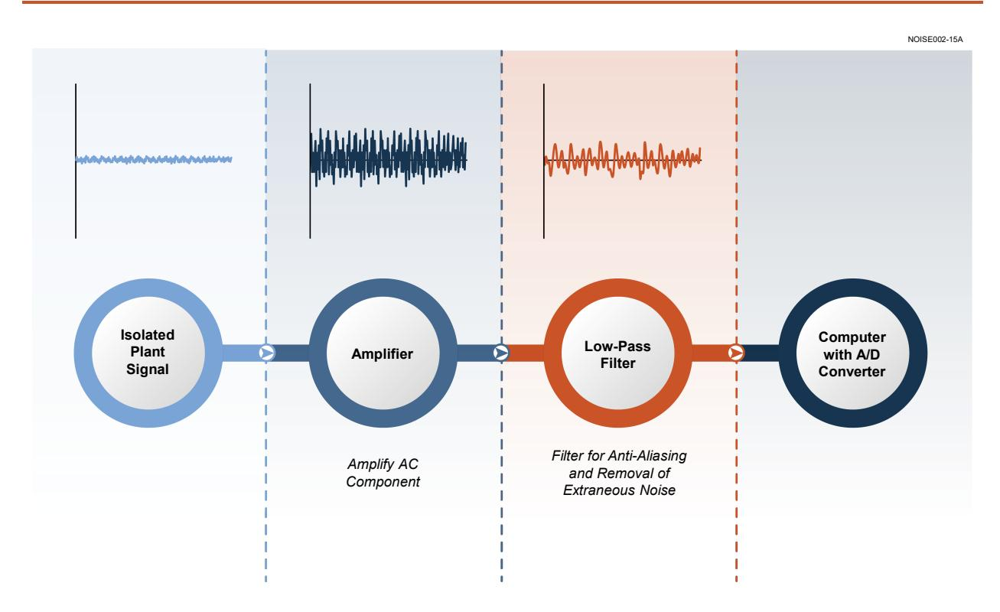

**Figure 11.6. Noise Data Acquisition Process**

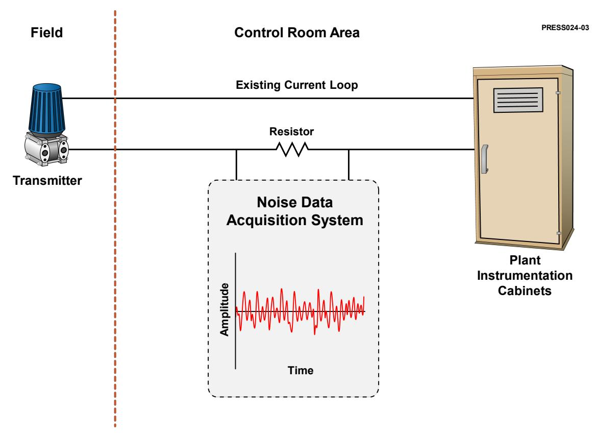

**Figure 11.7. Noise Data Acquisition from a Transmitter Loop**

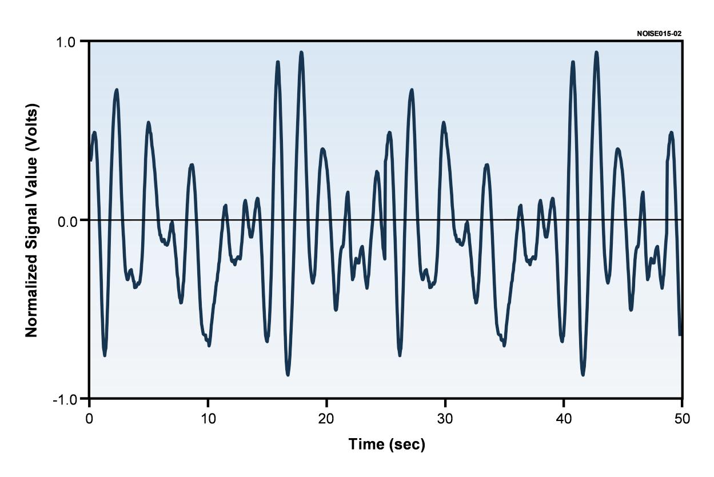

**Figure 11.8. Raw Noise Data from a PWR Pressure Transmitter**

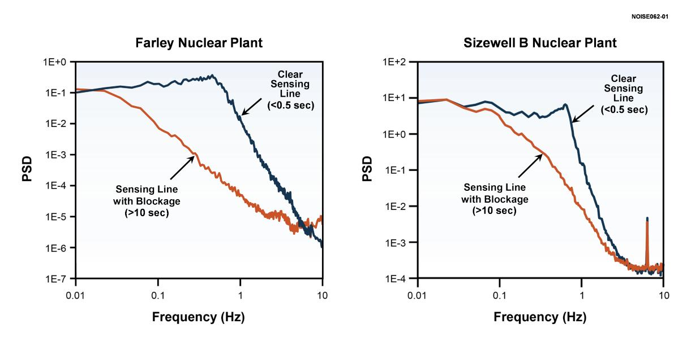

**Figure 11.9. Noise Analysis Results for Transmitters in Two Nuclear Power Plants With and Without Degraded Dynamic Sensor Response**

#### **11.4 TRAINING OF OLM ANALYST**

The OLM analyst must be trained in both static and dynamic performance verification of transmitters. A great deal of research has been performed worldwide to automate the reading and interpretation of OLM data and results, but none can yet replace the need for a human analyst. The human analyst must have knowledge of the OLM fundamentals and skills in the OLM implementation details. As a minimum, the analyst must have education or experience in process measurement, instrumentation and control, system analysis, and training to perform the following tasks. **[[**

#### **]]a,b,f**

#### **11.5 REQUIRED TECHNICAL SPECIFICATIONS CHANGES**

The plant Technical Specification must be modified as shown in Appendix B to implement OLM. The typical Technical Specification changes must include the addition of a definition for ONLINE MONITORING. A new ONLINE MONITORING Program to Extend Transmitter Calibration Intervals must be added. A new Surveillance Requirement option to use the ONLINE MONITORING Program to Extend Transmitter Calibration Intervals to determine the frequency of transmitter CHANNEL CALIBRATION must be adopted. The new SURVEILLANCE REQUIREMENT option is added as an "OR" option to the existing requirement.

The purpose of the OLM Topical Report is to provide a method to defer calibration of the transmitters included in the ONLINE MONITORING Program based on OLM results. The OLM methodology described in the Topical Report is not used to extend the calibration of any other elements in the safety signal path (e.g., signal converters or adjustable parameters in I&C rack equipment). The Surveillance Requirement frequency for these other components in the signal path remains in effect. The Surveillance Requirement frequency for these other components can be calendar-based by specifying a calendar interval, risk-based using a Surveillance Frequency Control Program, or defined based on self-testing features of a digital I&C platform-based system. The use of the logical connector "OR" provides flexibility for the licensee to address cases where OLM cannot be performed during the monitoring period. In the case of a calendar-based Surveillance Requirement frequency, the transmitter would need to be calibrated within the specified calendar interval measured since the last valid OLM assessment. In the case of a riskbased Surveillance Requirement frequency, the transmitter would need to be calibrated within the specified risk-based interval measured since the last valid OLM assessment.

Example changes to Standard Technical Specifications (STS) and associated Bases are provided in Appendix B based on the style used in TSTF-425.

#### **12 REFERENCES TO SUBSTANTIATE AMS CLAIMS**

This chapter provides evidence in support of the following two AMS claims in this TR with respect to performance characteristics of nuclear grade pressure, level, and flow transmitters.

- *Claim 1. Drift behavior of existing generation of nuclear grade pressure, level, and flow transmitters is random and common-mode drift is not a problem in using OLM to identify drifting transmitters.*
- *Claim 2. OLM fails to identify drifting transmitters in about 1 percent of cases which is better than traditional calibrations which fails in about 5 percent of cases.*

#### **12.1 SUBSTANTIATE ABSENCE OF COMMON-MODE DRIFT**

Evidence in support of AMS's claim that common-mode drift is not a problem in the existing generation of nuclear grade pressure transmitters is provided in two EPRI reports, a Sizewell internal report, and a PWROG report. These reports are identified here and relevant quotations in support of AMS's claim are presented verbatim in italic font or paraphrased to clarify the intent of the information.

#### **12.1.1 EPRI Drift Study Reported in TR-104965-R1**

This EPRI report is titled "On-Line Monitoring of Instrument Channel Performance" and is the one to which the NRC SER of the year 2000 on the subject of OLM is attached. It states the following on Page 3-14:

- *"For the transmitters evaluated, drift was a random event. The transmitters were as likely to drift up as they were to drift down. No significant bias effects were observed.*
- *Redundant transmitters associated with a particular parameter did not exhibit a tendency to drift as a group. One transmitter out of calibration did not indicate that the other redundant transmitters were likely to be out of calibration."*

These statements are based on transmitter calibration data from 18 nuclear power plants in the U.S. involving 1139 instruments, 6700 calibration records, and 33,890 AF/AL data points. This data covered the span of May 1975 to November 1996 and included the transmitters shown in Table 12.1.

**Manufacturer Model** Rosemount 1151 1152 1153 1154 Barton 384 386 763 764 752 Foxboro NE11 NE13 E11 E13 Veritrak 59 76 Tobar 32 GE 555 Delaval XM-54852

**Table 12.1. Transmitters Involved in EPRI Drift Study Reported in TR-104965-R1**

#### **12.1.2 EPRI Drift Study Reported in 1009603**

This EPRI report is titled "Instrument Drift Study" and involved 140 transmitters at Sizewell B including 28 Barton model 763 transmitters, 84 Barton model 764 transmitters, and 28 Barton model 752 transmitters. This report covered transmitter drift data from 1995 to 2002 and was completed after publication of EPRI TR-104965-R1. The two reports were compared by EPRI providing the following conclusions:

- The drift values for the Sizewell B transmitters are comparable to drift results in the EPRI drift study of transmitters in other nuclear power plants.
- There is no consistent trend indicating that the drift behavior of Sizewell B transmitters is different than drift of transmitters in EPRI drift study of transmitters in other nuclear power plants.

#### **12.1.3 Sizewell Internal Report on Transmitter Drift**

The Sizewell report is titled "Transmitter Single Calibration Regression Methodology E/REP/SXB/0015/00 Issue 1" and documented a drift study performed by British Energy (now EdF) and published as an internal report covering drift data from January 1995 to February 2001. Table 12.2 shows the transmitters that were covered in this study which included not only the KDG Mobrey transmitters used at Sizewell B, but also Barton transmitters of the type included in EPRI drift study published in 1009603 report.

**Table 12.2. Transmitters Included in Sizewell's Internal Drift Study**

| Manufacturer | Model |      |      |  |  |
|--------------|-------|------|------|--|--|
| KDG-Mobrey   | 4020  | 4305 | 4320 |  |  |
| ITT-Barton   | 752   | 763  | 764  |  |  |

- *"Results for drift in span and zero clearly show no biasing effects and are random (zero centered) in direction.*"
- *"there is no noticeable relationship between the calibration period and the amount of drift"*
- *"it is reasonable to expect that increasing the calibration period further will have little or no effect on the amount of drift"*
- *"The results of the drift analysis show that drift is present but is small, and there is evidence that it is random in direction, indicating that extending the calibration periods should not give increased drift since the drift will average out to zero."*

#### **12.1.4 PWROG Drift Study**

The PWROG drift study titled "Pressure and Differential Pressure Transmitter Calibration Frequency Extension: Generic Transmitter Drift Study" was performed by AMS for PWROG involved over 20,000 calibration records from forty-one PWR units representing three PWR NSSS design vendors and spanned a period from 2000 to 2010. The transmitters in this study were manufactured by Rosemount, Barton, Foxboro, Tobar-Veritrak, Gould-Statham and others as shown in Table 12.3.

**Table 12.3. Transmitters Included in PWROG Drift Study**

| Manufacturer         |          |      | Model    |       |
|----------------------|----------|------|----------|-------|
|                      | 1151     | 1153 | 3051     |       |
| Rosemount            | 1152     | 1154 |          |       |
| Barton               | 386A     | 752  | 763      | 764   |
| Foxboro              | E11      | E13  | N-E11    | N-E13 |
| Gould Statham        | PD3200   |      |          |       |
| Tobar                | 31       |      |          |       |
| Tobar/Veritrak/WEC   | 32       |      |          |       |
| Veritrak/WEC         | 76       |      |          |       |
| Veritrak             | 59       |      |          |       |
| FCI                  | 8-66MA   |      |          |       |
| Honeywell            | STD130   |      |          |       |
| Gems Delaval         | XM-36495 |      | XM-54854 |       |
| Transamerica Delaval | 36562    |      |          |       |
| GEMS Sensors         | 60163    |      |          |       |
| Westinghouse         | 2837     |      |          |       |
| Fischer-Porter       | 50       |      |          |       |
| GE DPT               | 555      |      |          |       |

This drift study resulted in the following conclusions in support of AMS's claim about random characteristics of existing generation of nuclear grade transmitters:

- *A majority of pressure & differential pressure transmitters do not exhibit evidence of time-dependent drift.*
- *Drift is typically random rather than systematic*.

#### **12.1.5 Transmitters Amenable to OLM**

Based on the referenced information, AMS produced a table of nuclear grade transmitters that are amenable to OLM (Table 12.4). This table can be used by licensees to identify the transmitter models that can be included in an OLM program without a need to perform a drift study, similarity analysis, or FMEA.

**Table 12.4 Nuclear Grade Transmitters Amenable to OLM**

| Manufacturer         |            |            |            | Model       |             |         |
|----------------------|------------|------------|------------|-------------|-------------|---------|
| KDG-Mobrey           | 4020       | 4305       | 4320       |             |             |         |
| ITT-Barton           | 288 289 | 332 351 | 384 386 | 386A 752 | 763 763A | 764     |
| Rosemount            | 1151       | 1152       | 1153       | 1154        | 3051        |         |
| Foxboro              | E11        | E13        | N-E11      | N-E13       |             |         |
| Weed                 | N-E11AH    |            | N-E11DM    | N-E11GM     |             | N-E13DM |
| Tobar                | 31         |            |            |             |             |         |
| Tobar/Veritrak/WEC   | 32         |            |            |             |             |         |
| Veritrak/WEC         | 76         |            |            |             |             |         |
| Veritrak             | 59         |            |            |             |             |         |
| Gould Statham        | PD3200     |            |            |             |             |         |
| GE                   | 555        |            |            |             |             |         |
| Delaval              | XM-54852   |            |            |             |             |         |
| FCI                  | 8-66MA     |            |            |             |             |         |
| Honeywell            | STD130     |            |            |             |             |         |
| Gems Delaval         | XM-36495   |            | XM-54854   |             |             |         |
| Transamerica Delaval | 36562      |            |            |             |             |         |
| GEMS Sensors         | 60163      |            |            |             |             |         |
| Westinghouse         | 2837       |            |            |             |             |         |
| Fischer-Porter       | 50         |            |            |             |             |         |

#### **12.2 FAILURE OF OLM VERSUS FAILURE OF TRADITIONAL CALIBRATIONS**

This section includes references with supporting information to substantiate AMS's claims that OLM fails in less than 1 percent of cases while traditional calibrations fail in about 5 percent of cases. The references provided are from EPRI reports written based on Sizewell's experience with implementation of OLM.

The EPRI report number 1013486 Volume 1 contains the following on page 3-5.

#### *"Benefits to Plant Safety and Transmitter Maintenance*

*Reviews of calibration procedures and calibration data from nuclear power plants have shown that mistakes can be made during manual calibrations – in some cases, errors have upset transmitters with good calibration and have negated any benefit of the calibration [9]. An analysis of the history of Sizewell transmitter revealed that about 5% of transmitters sustained operator-induced errors during an outage. The errors required that additional calibrations be made within a couple of months of a refueling outage.* 

*Furthermore, the calibration of some transmitters is affected by the environmental temperature and static pressure that are taken into account by OLM but neglected in conventional calibrations. Therefore, OLM implementation increases safety in a number of ways – notably, OLM results in fewer human errors, less calibration-induced damage to the transmitters and other plant equipment, traceability of the effects of environmental and process conditions on calibration, and timely detection of out-ofcalibration transmitters."* 

The same EPRI report includes the following on page 8-1.

#### *"8 Resolving Non-Conservative Results*

*In the comparison of Sizewell OLM results for Cycles 5-7, there were 12 cases in which transmitters were classified as good by OLM that were subsequently found by traditional calibrations to be bad. This is significant not only because of the disagreement between the two methods, but also and more importantly, because the disagreement is non-conservative. The term non-conservative is used to describe a situation in which OLM identifies a transmitter as good but manual calibration identifies the same transmitter as bad. The term conservative is used to describe a situation in which OLM identifies a transmitter as bad when it is actually good.*

*Table 8-1 shows the 12 transmitters in question and explains the reasons for the discrepant results. These reasons were arrived at in consultation with BE personnel. Overall, 11 of the 12 discrepancies were resolved, as explained in the following section."* 

The EPRI report ends on page 8-15 with the following:

#### *"Summary*

NON-PROPRIETARY

*Of all the results from the three cycles (Cycles 5-7), only one of the 12 nonconservative results had no discernable explanation. Also, it is curious that all 12 transmitters were found to exceed their high manual calibration limit. One would expect the nature of the deviation to be random and exhibit failures on both the high and low sides of the manual calibration limits. A possible explanation for this observation is a bias that results from the calibration test equipment being at the high end of its measurement uncertainty. This could cause transmitters to fail when they are marginally high."* 

The Sizewell plant engineers maintain a tally of transmitters involved in OLM. This information has been recorded in a Sizewell report entitled "Sizewell Sensor Calibration Extension ESR-503". An updated table from this report received from Sizewell in March 2020 concluded that of 921 transmitters monitored from Cycle 5 (in 2005) to Cycle 15 (in 2020) only 11 transmitters were found to be good by OLM but bad in manual calibrations. **This is about 1 percent compared to about 5 percent of transmitters that are miscalibrated during plant outages according to data provided to AMS by Sizewell engineers in charge of OLM.** 

#### **13 PROCESS TO ESTABLISH BACKSTOP**

As a defense against common-mode drift, one transmitter from each group of redundant transmitters involved in OLM must be checked for calibration at a given interval. This chapter provides a process that plants implementing OLM must use to establish this interval which is referred to as a "backstop". A backstop that is established based on the process herein will not be the same for all groups of redundant transmitters or all plants. It varies based on transmitter redundancy, service in the plant, and each plant's experience with calibration behavior of its transmitters. The backstop is a dynamic number meaning that it can change (increase or decrease) as more history on calibration behavior of transmitters is accumulated and analyzed by each plant.

#### **13.1 STEPS TO ARRIVE AT BACKSTOP**

The backstop for each group of redundant transmitters in each plant must be established through an objective analysis and the details of this analysis must be documented. Any change in the backstop requires a new analysis together with supporting documentation. AMS has arrived at the following steps to establish backstops. These steps are used later in this chapter to arrive at examples of backstops based on transmitter calibration histories of two PWRs in the U.S. who agreed to provide calibration data for this project.

#### **Step 1. Verify Drift of Transmitters is Random**

In implementing OLM, it is assumed that the drift behavior of transmitters is random and follows a Gaussian (i.e., normal or bell shaped) probability distribution. This means that a transmitter is as likely to drift in the positive direction as it is to drift in the negative direction regardless of the direction of previous drift.

Plants implementing OLM must verify through an objective analysis that the drift behavior of their transmitters involved in the OLM program is random and follows a Gaussian distribution. Plenty examples of industry practice are publicly available to assist plants with this step.

#### **Step 2. Determine Probability that All OLM Transmitters Drift in Same Direction**

For common-mode drift to occur, transmitters in a redundant group must all drift in the positive direction or all drift in the negative direction. The probability that drift occurs in the same direction is given by:

$$P_S = \frac{1}{2^{(n-1)}}$$
 Eq. 13.1

where n is the number of transmitters in a redundant group. Table 13.1 and Table 13.2 show all permutations of drift directions for 2-way and 3-way redundant transmitters (XMTRs) with the symbol '+' denoting drift in the positive direction and the symbol '-' denoting drift in the negative direction. This is followed by Table 13.3 listing PS values for 2, 3, and 4-way redundant groups.

**Transmitter XMTR 1 XMTR 2 Same Direction?** Case 1 + + Yes Case 2 - + No Case 3 + - No Case 4 - - Yes **Result (PS) 50.0%**

**Table 13.1 All Permutations of Drift Direction for Two-Way Redundant Transmitters**

**Table 13.2. All Permutations of Drift Direction for Three-Way Redundant Transmitters**

| Transmitter | XMTR 1 | XMTR 2 | XMTR 3 | Same Direction? |
|-------------|--------|--------|--------|--------------------|
| Case 1      | +      | +      | +      | Yes                |
| Case 2      | -      | +      | +      | No                 |
| Case 3      | +      | -      | +      | No                 |
| Case 4      | -      | -      | +      | No                 |
| Case 5      | +      | +      | -      | No                 |
| Case 6      | -      | +      | -      | No                 |
| Case 7      | +      | -      | -      | No                 |
| Case 8      | -      | -      | -      | Yes                |
| Result (PS) |        |        |        | 25.0%              |

**Table 13.3. Probability of Drift in Same Direction Versus Transmitter Redundancy**

| Redundancy | PS    |
|------------|-------|
| 2          | 0.500 |
| 3          | 0.250 |
| 4          | 0.125 |

#### **Step 3. Determine Probability of Calibration Adjustments**

Using manual calibration records for each transmitter in a redundant group, determine how many calibration checks were performed, how many times the transmitter was adjusted, and the average time interval between calibration checks. Note that calibration adjustments are sometimes performed to improve the calibration even when the transmitter is not out of calibration which makes this approach more conservative. A transmitter is said to have been adjusted if its zero and/or span was changed during a calibration to bring its reading to within its as-left calibration tolerance.

Now, let Pi denote the probability of each adjustment of the ith transmitter in a redundant service and write it as:

$$P_i = \frac{\text{\# of calibration adjustments}}{\text{\# of calibration checks}}$$
 Eq. 13.2

Next, let PA denote the probability that all redundant transmitters will need adjustment at the same time and write it as:

$$P_A = \prod_{i=1}^n P_i$$
 Eq. 13.3

Given Equations 13.1, 13.2, and 13.3, the probability that redundant transmitters will need to be adjusted because they drifted in the same direction over the average time interval between calibrations (typically 18 months) may be written as:

$$P_{CM} = P_S \times P_A$$
 Eq. 13.4

This product is referred to as probability of common mode drift () and is used in the next step to calculate backstops.

#### **Step 4. Calculate Backstops**

The probability of common-mode drift of a group of redundant transmitters increases as the time between calibrations is increased. The maximum value of this probability (Pmax) must be selected by the plant implementing OLM. For example, Pmax can be set at 5% for calculating the backstop. Once Pmax is selected, the plant can use the following equation to arrive at the maximum interval between calibrations:

$$\frac{P_{MAX}}{P_{CM}} = \sqrt{\frac{Max Interval}{Average Calibration Interval}}$$
 Eq. 13.5

Or,

$$Max\ Interval = (Average\ Calibration\ Interval)\left(\frac{P_{MAX}}{P_{CM}}\right)^2$$
 Eq. 13.6

where the Average Calibration Interval is calculated in two steps: calculate the average time interval between calibrations of each redundant transmitter for the installed history of the transmitter, and then average the results of this calculation.

The backstop is equal to the maximum interval identified but bounded on the low side by the average calibration interval and on the high side by the time span of plant calibration data. If the backstop is less than the existing calibration frequency, then the existing calibration frequency must be used as the backstop. For example, if the average calibration interval is 18 months and the time span of plant calibration data is 20 years, then the backstop that is calculated should have a value between 18 months and 20 years. In this case, if the backstop turns out to be less than 18 months, it will still be set at 18 months and if it turns out to be greater than 20 years, it will still be set at 20 years. Section 13.3 presents two tables of backstop values for a variety of services in two PWR plants that provided calibration history data for this project.

#### 13.2 BACKSTOP PROVISIONS

NON-PROPRIETARY

The established backstop may be used as is or updated for the following cases.

- 1. The backstop calculated for existing transmitters can be used as is for any new transmitters of the same make and model.
- The backstop calculated for existing transmitters can be used for other transmitters of a different make or model for which an objective similarity analysis has verified that these other transmitters are equivalent to existing transmitters.
- Backstops must be recalculated as more calibration data becomes available.
   This may result in longer or shorter backstops. Any recalculation of backstops must be verified and documented.

#### 13.3 EXAMPLES OF BACKSTOP CALCULATIONS

Using the formulas in Section 13.1, the data in Table 13.4 was arrived at from actual calibration records of a U.S. PWR plant for a three-way redundant group of transmitters.

| Transmitter | # Adjusted | # Calibration Checks | Probability | Average Calibration Interval |
|-------------|------------|-------------------------|-------------|---------------------------------|
| 1           | 6          | 12                      | 0.50        | 18 months                       |
| 2           | 5          | 12                      | 0.42        | 18 months                       |
| 3           | 4          | 12                      | 0.33        | 18 months                       |

Table 13.4. Calculation of Probability of Adjustment for a 3-Way Redundant Service

Using values of  $P_S$  from Table 13.2 or Table 13.3 and values of  $P_A$  from Table 13.4, the total probability of common mode drift,  $P_{CM}$ , over an average calibration interval of 18-months may be calculated as follows for a 3-way redundant group of transmitters:

$$P_{CM} = P_S \times P_A = (0.25)(0.0693) = 0.017325$$
 Over 18 Months

 $P_A = (0.50)(0.42)(0.33) =$ 

Thus, for a  $P_{MAX}$  of 5%, the backstop becomes:

Backstop = 
$$(18) \left( \frac{0.05}{0.017325} \right)^2 = 150 \text{ Months} = 12 \text{ Years}$$

Using this process, backstops were calculated for a number of transmitter services as shown in Table 13.5 and Figure 13.1 for PWR plant Unit 1 and Table 13.6 and Figure 13.2 for PWR plant Unit 2. These results are based on calibration records of the two PWR plants over a period of about 19 years from 2001 to 2020 and a value of 5 percent for maximum probability of common mode drift.

Total

18 months

Table 13.5. Backstop Calculations for PWR Unit 1

| XMTR        | V1455 IS |                               |           | Total    | _              | _     | Avg. Cal. Interva | Max Interval | Cal Date Range | Backstop |      |
|-------------|----------|-------------------------------|-----------|----------|----------------|-------|-------------------|--------------|----------------|----------|------|
| Set         | XMTR ID  | Service                       | # Adjusts | Records  | Р              | Рсм   | (Years)           | (Years)      | (Years)        | (Years)  |      |
|             | 1        |                               | 3         | 5        | 0.600          |       |                   |              |                |          |      |
| 1           | 2        | Aux FW Flow                   | 1         | 5        | 0.200          | 0.003 | 1.6               | 630.8        | 7.7            | 7.7      |      |
|             | 3        | 7.447.11.1011                 | 3         | 6        | 0.500          | 0.000 |                   | 000.0        |                |          |      |
|             | 4        |                               | 2         | 6        | 0.333          |       |                   |              |                |          |      |
|             | 5        |                               | 3         | 13       | 0.231          |       | 1.5               |              |                |          |      |
| П           | 6        | Ctmt Pressure                 | 1         | 13       | 0.077          | 0.000 |                   | 2410266.1    | 19.5           | 19.5     |      |
|             | 7        |                               | 1         | 13       | 0.077          |       |                   |              |                |          |      |
|             | 8        |                               | 3         | 13       | 0.231          |       |                   |              |                |          |      |
|             | 9        |                               | 8         | 13       | 0.615          |       |                   |              |                |          |      |
| Ш           | 10 11 | Pzr Pressure                  | 10 5   | 13 13 | 0.769          | 0.013 | 1.5               | 21.8         | 19.5           | 19.5     |      |
|             | 12       |                               | 8         | 14       | 0.385 0.571 |       |                   |              |                |          |      |
|             | 13       |                               | 2         | 6        | 0.333          |       |                   |              |                |          |      |
|             | 14       | RCP Thermal                   | 3         | 7        | 0.333          |       |                   |              |                |          |      |
| IV          | 15       | Barrier ACCW                  | 2         | 7        | 0.429          | 0.002 | 1.9               | 1609.9       | 12.0           | 12.0     |      |
|             | 16       | Flow                          | 2         | 6        | 0.333          |       |                   |              |                |          |      |
|             | 17       | RCS WR Pressure               | 3         | 6        | 0.500          |       |                   |              |                |          |      |
| V           | 18       | Transmitter                   | 1         | 6        | 0.167          | 0.042 | 2.0               | 2.9          | 12.0           | 2.9      |      |
|             | 19       |                               | 6         | 12       | 0.500          |       |                   |              |                |          |      |
| VI          | 20       | EHC Pressure                  | 5         | 12       | 0.417          | 0.017 | 1.5               | 12.3         | 19.4           | 12.3     |      |
|             | 21       |                               | 4         | 12       | 0.333          |       |                   |              |                |          |      |
|             | 22       |                               | 4         | 8        | 0.500          |       |                   |              |                |          |      |
| VII         | 23       | Main Steam                    | 3         | 10       | 0.300          | 0.011 | 1.4               | 28.0         | 14.0           | 14.0     |      |
|             | 24       | Pressure Loop 1               | 3         | 10       | 0.300          | 1     |                   |              |                |          |      |
|             | 25       |                               | 4         | 9        | 0.444          |       |                   |              |                |          |      |
| VIII        | 26       | Main Steam Pressure Loop 2    | 1         | 10       | 0.100          | 0.004 | 1.4               | 1.4 254.1    | 254.1 1        | 12.9     | 12.9 |
|             | 27       |                               | 3         | 9        | 0.333          |       |                   |              |                |          |      |
|             | 28       | Main Steam Pressure Loop 3 | 5         | 9        | 0.556          |       |                   |              |                |          |      |
| IX          | 29       |                               | 1         | 9        | 0.111          | 0.002 | 1.4               | 1225.9       | 12.9           | 12.9     |      |
|             | 30       |                               | 1         | 9        | 0.111          |       |                   |              |                |          |      |
|             | 31       | Main Steam                    | 2         | 13       | 0.154          |       |                   |              |                |          |      |
| X           | 32       | Pressure Loop 4               | 3         | 10       | 0.300          | 0.004 | 1.5               | 245.5        | 5.5 13.0       | 5.5 13.0 | 13.0 |
|             | 33       |                               | 3         | 9        | 0.333          |       |                   |              |                |          |      |
|             | 34       | Steam Generator               | 7         | 8        | 0.875          |       | 1.4               |              |                |          |      |
| ΧI          | 35       | Narrow Range Level            | 8         | 8        | 1.000          | 0.219 |                   | 0.1          | 10.4           | 1.5      |      |
|             | 36       | Loop 1                        | 7         | 7        | 1.000          |       |                   |              |                |          |      |
| \ \alpha_11 | 37       | SG NR                         | 8         | 8        | 1.000          |       |                   |              |                |          |      |
| XII         | 38       | Level Loop 2                  | 2         | 4        | 0.500          | 0.125 | 1.5               | 0.2          | 6.0            | 1.5      |      |
|             | 39       |                               | 4         | 4        | 1.000          |       |                   |              |                |          |      |
| VIII        | 40       | SG NR                         | 9         | 12       | 0.750          | 0.400 | 1.5               | 0.4          | 6.0            | 45       |      |
| XIII        | 41 42 | Level Loop 3                  | 4         | 4        | 1.000          | 0.188 | 1.5               | 0.1          | 6.0            | 1.5      |      |
|             | 42       |                               | 6         | 12       | 1.000          |       |                   |              |                |          |      |
| XIV         | 43       | SG NR                         | 3         | 4        | 0.500          | 0.094 | 1.5               | 0.4          | 6.0            | 1.5      |      |
| ΛIV         | 45       | Level Loop 4                  | 8         | 8        | 0.750 1.000 | 0.034 | 1.0               | 0.4          | 0.0            | 1.5      |      |
|             | 46       |                               | 6         | 12       | 0.500          |       |                   |              |                |          |      |
| XV          | 47       | RCS Flow Loop 1               | 7         | 12       | 0.583          | 0.036 | 1.5               | 2.8          | 18.0           | 2.8      |      |
| '``         | 48       |                               | 6         | 12       | 0.500          | 0.500 |                   | 0            | .5.0           |          |      |
|             | 49       |                               | 2         | 12       | 0.167          |       |                   |              |                |          |      |
| XVI         | 50       | RCS Flow Loop 2               | 5         | 12       | 0.417          | 0.008 | 1.5               | 56.9         | 18.0           | 18.0     |      |
| ,           | 51       |                               | 6         | 13       | 0.462          |       |                   |              |                |          |      |
|             | 52       |                               | 5         | 12       | 0.417          |       |                   |              |                |          |      |
| XVII        | 53       | RCS Flow Loop 3               | 5         | 12       | 0.417          | 0.011 | 1.5               | 31.9         | 18.0           | 18.0     |      |
|             | 54       |                               | 3         | 12       | 0.250          |       | <u> </u>          | <u> </u>     |                |          |      |
|             | 55       |                               | 4         | 12       | 0.333          |       |                   |              |                |          |      |
| XVIII       | 56       | RCS Flow Loop 4               | 3         | 11       | 0.273          | 0.009 | 1.5               | 41.6         | 16.4           | 16.4     |      |
|             | 57       |                               | 5         | 12       | 0.417          |       |                   |              |                |          |      |
| 1           | 58       |                               | 4         | 9        | 0.444          |       | _                 |              |                |          |      |
| XIX         | 59       | Pzr Level                     | 2         | 5        | 0.400          | 0.037 | 1.5               | 2.7          | 7.5            | 2.7      |      |
|             | 60       |                               | 5         | 6        | 0.833          |       |                   |              |                |          |      |

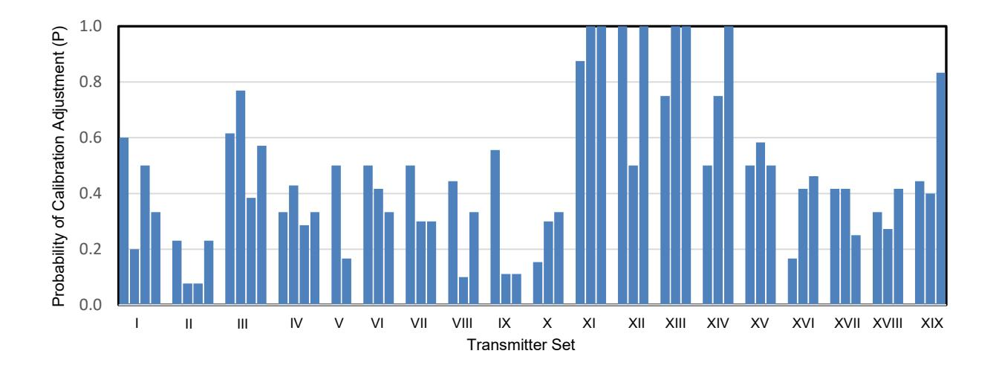

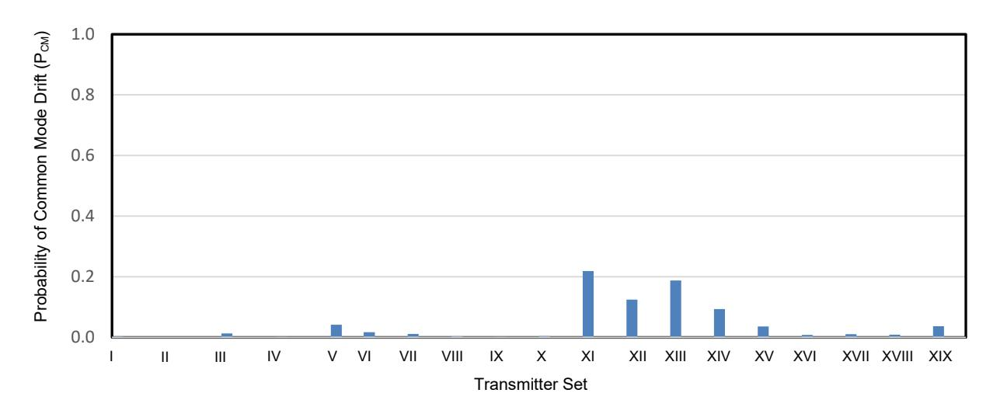

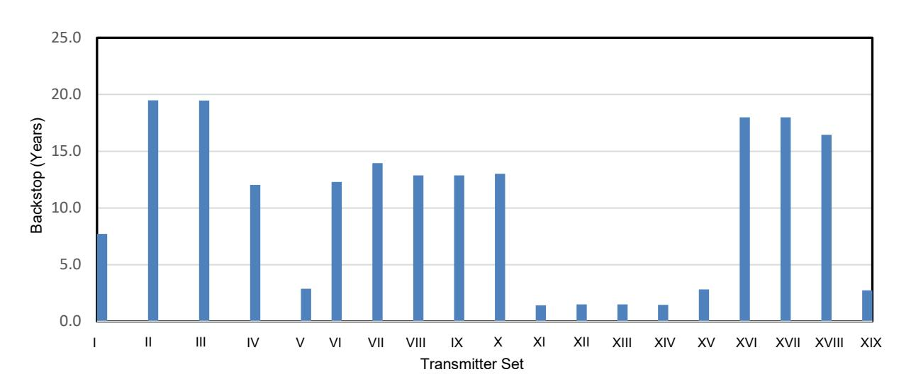

**Figure 13.1. Bar Charts of Results of Table 13.5 for PWR Unit 1**

|             |          |                                  |               |                  | <u> </u>       |           | 3 101 1 111 0                 |                         |                           |                  |     |
|-------------|----------|----------------------------------|---------------|------------------|----------------|-----------|-------------------------------|-------------------------|---------------------------|------------------|-----|
| XMTR Set | XMTR ID  | Service                          | # Adjusts     | Total Records | Р              | Рсм       | Avg. Cal. Interval (Years) | Max Interval (Years) | Cal Date Range (Years) | Backstop (Years) |     |
| Set         | 1        |                                  | 3             | 5                | 0.600          |           | (Tears)                       | (Tears)                 | (Tears)                   | (Tears)          |     |
|             | 2        | A 51A/51                         | 2             | 6                | 0.333          | 0.000     | 4.5                           | 00.7                    | 0.4                       | 0.4              |     |
| ı           | 3        | Aux FW Flow                      | 2             | 4                | 0.500          | 0.006     | 1.5                           | 96.7                    | 6.1                       | 6.1              |     |
|             | 4        |                                  | 3             | 6                | 0.500          |           |                               |                         |                           |                  |     |
|             | 5        |                                  | 1             | 13               | 0.077          |           | 1.5                           |                         | 19.3                      |                  |     |
| II          | 7        | Ctmt Pressure                    | 3             | 13               | 0.231          | 0.000     |                               | 5423098.7               |                           | 19.3             |     |
|             | 8        |                                  | 1 2           | 13 13         | 0.077 0.154 |           |                               |                         |                           |                  |     |
|             | 9        |                                  | 10            | 13               | 0.769          |           |                               |                         |                           |                  |     |
|             | 10       | Pzr Pressure                     | 10            | 13               | 0.769          | 0.040     | 4.5                           |                         | 40.4                      | 40.4             |     |
| III         | 11       |                                  | 10            | 13               | 0.769          | 0.013     | 1.5                           | 21.6                    | 19.4                      | 19.4             |     |
|             | 12       |                                  | 3             | 13               | 0.231          |           |                               |                         |                           |                  |     |
|             | 13       |                                  | 1             | 5                | 0.200          |           |                               |                         |                           |                  |     |
| IV          | 14 15 | RCP Thermal Barrier ACCW Flow | 1             | 5 5           | 0.200 0.200 | 0.001     | 3.0                           | 20717.6                 | 14.9                      | 14.9             |     |
|             | 16       | ACCVVIIOW                        | 3             | 5                | 0.600          |           |                               |                         |                           |                  |     |
|             | 17       | RCS WR Pressure                  | 1             | 5                | 0.200          |           |                               |                         |                           |                  |     |
| V           | 18       | Transmitter                      | 1             | 5                | 0.200          | 0.020     | 3.0                           | 18.6                    | 14.9                      | 14.9             |     |
| VI          | 19       | Turbine First Stage              | 4             | 10               | 0.400          | 0.100     | 1.5                           | 0.4                     | 16.3                      | 1.5              |     |
| VI          | 20       | Pressure                         | 5             | 10               | 0.500          | 0.100     | 1.5                           | 0.4                     | 10.5                      | 1.0              |     |
| \"          | 21       | FUOR                             | 7             | 13               | 0.538          | 0.044     | 4.5                           | 4.0                     | 40.5                      | 4.0              |     |
| VII         | 22       | EHC Pressure                     | 10 6       | 14 13         | 0.714 0.462 | 0.044     | 1.5                           | 1.9                     | 19.5                      | 1.9              |     |
|             | 24       |                                  | 4             | 10               | 0.402          |           |                               |                         |                           |                  |     |
| VIII        | 25       | Main Steam                       | 5             | 10               | 0.500          | 0.042     | 1.4                           | 1.4 1.9                 | 13.3                      | 1.9              |     |
|             | 26       | Pressure Loop 1                  | 11            | 13               | 0.846          |           |                               |                         |                           |                  |     |
|             | 27       | Main Steam                       | 1             | 10               | 0.100          |           |                               |                         |                           |                  |     |
| IX          | 28       | Main Steam Pressure Loop 2       | 3             | 10               | 0.300          | 0.002     | 1.4                           | 673.5                   | 12.8                      | 12.8             |     |
|             | 29       | '                                | 3             | 10               | 0.300          |           |                               |                         |                           |                  |     |
| _           | 30 31 | Main Steam Pressure Loop 3    | 3 1        | 10               | 0.300          | 0.004 1.4 | 1.4                           | 206.0                   | 12.8                      | 12.8             |     |
| X           | 32       |                                  | 5             | 10 9          | 0.100 0.556 | 0.004     | 1.4                           | 206.0                   | 12.0                      | 12.0             |     |
|             | 33       | ·                                | 5             | 10               | 0.500          |           |                               |                         |                           |                  |     |
| ΧI          | 34       | Main Steam                       | 5             | 10               | 0.500          | 0.031     | 1.3                           | 3.4                     | 13.2                      | 3.4              |     |
|             | 35       | Pressure Loop 4                  | 5             | 10               | 0.500          |           |                               |                         |                           |                  |     |
|             | 36       | SG NR                            | 6             | 9                | 0.667          |           |                               |                         |                           |                  |     |
| XII         | 37       | Level Loop 1                     | 7             | 10               | 0.700          | 0.070     | 1.5 0.8                       | 1.5 0.8                 | 7.4                       | 0.8 7.4          | 1.5 |
|             | 38 39 | '                                | 3 6        | 5 8           | 0.600 0.750 |           |                               |                         |                           |                  |     |
| XIII        | 40       | SG NR                            | 3             | 5                | 0.600          | 0.068     | 1.5                           | 0.8                     | 7.4                       | 1.5              |     |
| 74          | 41       | Level Loop 2                     | 3             | 5                | 0.600          | 0.000     |                               | 0.0                     |                           |                  |     |
|             | 42       | CO ND                            | 6             | 8                | 0.750          |           |                               |                         |                           |                  |     |
| XIV         | 43       | SG NR Level Loop 3            | 3             | 5                | 0.600          | 0.079     | 1.5                           | 0.6                     | 7.4                       | 1.5              |     |
|             | 44       |                                  | 7             | 10               | 0.700          |           |                               |                         |                           |                  |     |
| V1/         | 45       | SG NR                            | 8             | 9                | 0.889          | 0.444     | 4.5                           | 0.0                     | 7.4                       | 4.5              |     |
| XV          | 46 47 | Level Loop 4                     | <u>4</u> 5 | 8 5           | 0.500 1.000 | 0.111     | 1.5                           | 0.3                     | 7.4                       | 1.5              |     |
|             | 48       |                                  | 6             | 14               | 0.429          |           |                               |                         |                           |                  |     |
| XVI         | 49       | RWST Level                       | 3             | 14               | 0.214          | 0.008     | 1.5                           | 62.2                    | 19.8                      | 19.8             |     |
|             | 50       |                                  | 4             | 12               | 0.333          |           |                               |                         |                           | _                |     |
| _           | 51       |                                  | 3             | 6                | 0.500          |           |                               |                         |                           |                  |     |
| XVII        | 52       | RCS Flow Loop 1                  | 4             | 6                | 0.667          | 0.042     | 1.5                           | 2.1                     | 8.9                       | 2.1              |     |
|             | 53 54 |                                  | 3             | 6                | 0.500          |           |                               |                         |                           |                  |     |
| XVIII       | 55       | RCS Flow Loop 2                  | 4             | 5 6           | 0.200 0.667 | 0.008     | 1.6                           | 66.9                    | 8.9                       | 8.9              |     |
|             | 56       | . 100 1 10W LOOP 2               | 3             | 13               | 0.007          | 0.000     | 1.5                           | 00.5                    | 0.0                       | 5.5              |     |
|             | 57       |                                  | 2             | 6                | 0.333          |           |                               |                         |                           |                  |     |
| XIX         | 58       | RCS Flow Loop 3                  | 2             | 6                | 0.333          | 0.009     | 1.5                           | 43.3                    | 8.9                       | 8.9              |     |
|             | 59       |                                  | 4             | 12               | 0.333          |           |                               |                         |                           |                  |     |
|             | 60       | B00 El                           | 2             | 6                | 0.333          | 0.000     | ,                             | 4.8                     | 8.9                       | 4.0              |     |
| XX          | 61 62 | RCS Flow Loop 4                  | 4             | 6                | 0.667          | 0.028     | 1.5                           |                         |                           | 4.8              |     |
|             | 63       |                                  | 3 7        | 6 13          | 0.500 0.538 |           |                               |                         |                           |                  |     |
| XXI         | 64       | Pzr Level                        | 3             | 3                | 1.000          | 0.115     | 1.5                           | 0.3                     | 4.4                       | 1.5              |     |
| ^^1         | 65       | PZI Level                        | 6             | 7                | 0.857          | 20        |                               | 0.0                     | .,,                       | •                |     |

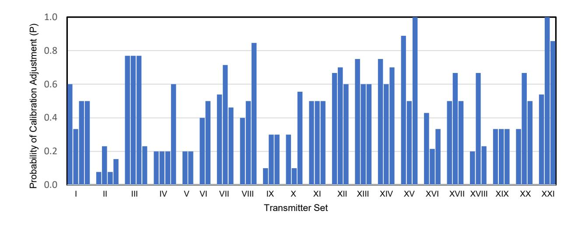

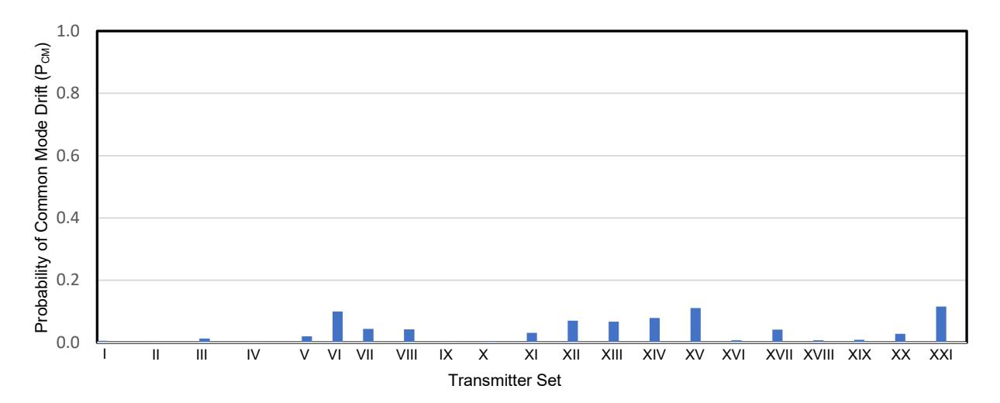

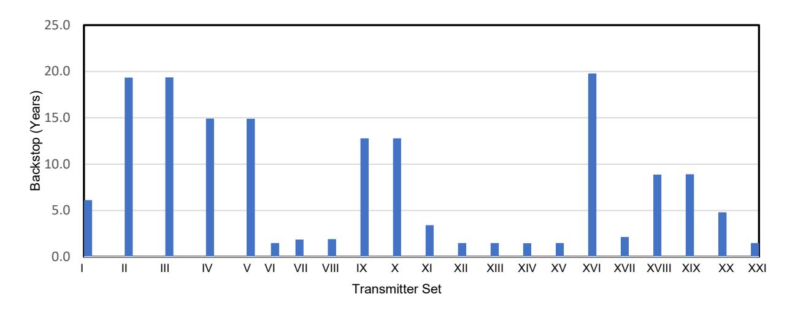

**Figure 13.2. Bar Charts of Results of Table 13.6 for PWR Unit 2**

#### **14 OLM COVERAGE OF TRANSMITTER SETPOINTS AND RANGE**

This chapter describes processes to address **[[**

**]]a,b,f** Section 14.1 is concerned with OLM coverage of safety setpoints and Section 14.2 is concerned with OLM coverage of the full range of

**]]a,b,f**

#### **14.1 COVERAGE OF SAFETY SETPOINTS**

**[[**

transmitters. **[[**

**]]a,b,f**

Table 14.1 presents examples of typical transmitter services in a PWR plant and shows **[[**

**]]a,b,f**

**Table 14.1***.* **OLM Coverage Versus Setpoints for Representative PWR Services** 

| Service | OLM Coverage | Setpoint | Difference | ≤12.5% | Include in OLM? |       |
|---------|--------------|----------|------------|--------|-----------------|-------|
|         |              |          |            |        |                 | a,b,f |
|         |              |          |            |        |                 |       |

#### **14.2 COVERAGE OF FULL RANGE**

**[[**

Figure 14.1. Examples of Deviation Versus Span Data for PWR Transmitters

Table 14.2 Data and Results of Evaluation of Unexercised Portions of Range

| Item | Service | OLM Coverage | Setpoint | <50? | Difference | ≤12.5? | Exceeds OLM Limit at 100%? | Schedule for Calibration Check? |       |
|------|---------|-----------------|----------|------|------------|--------|----------------------------|---------------------------------|-------|
|      |         |                 |          |      |            |        |                            |                                 | a,b,f |
|      |         |                 |          |      |            |        |                            |                                 |       |
|      |         |                 |          |      |            |        |                            |                                 |       |
|      |         |                 |          |      |            |        |                            |                                 |       |
|      |         |                 |          |      |            |        |                            |                                 |       |
|      |         |                 |          |      |            |        |                            |                                 |       |
|      |         |                 |          |      |            |        |                            |                                 |       |

#### **15 MINIMUM DATA ACQUISITION SAMPLE RATE FOR DRIFT MONITORING**

OLM uses the deviation of each transmitter from the average of the redundant transmitters in a group (see Section 11.1.2 Step 12b and Section 11.2 Figure 11.1c) to identify transmitters that must be flagged for a calibration check. Therefore, it is important that the average deviation of each redundant transmitter in each group is accurate (see Figure 11.1d).

The accuracy of the average deviation of each transmitter is dependent on **[[** 

**]]a,b,f**

This section describes a process to determine the minimum rate at which the output of transmitters in an OLM program must be sampled to provide accurate average deviations.

#### **15.1 DISTRIBUTION OF OLM DATA**

During normal operation of a nuclear power plant, **[[** 

**]]a,b,f** to determine the minimum sample rate that must be used to acquire OLM data for drift monitoring.

**Figure 15.1. Example Histogram of Deviations from the Redundant Group Average for a Steam Generator Level Transmitter**

NON-PROPRIETARY

**]]a,b,f** Eq. 15.1

**[[** 

**]]a,b,f** Eq. 15.2

**[[** 

**]]a,b,f** Eq. 15.3

**a,b,f**

**[[** 

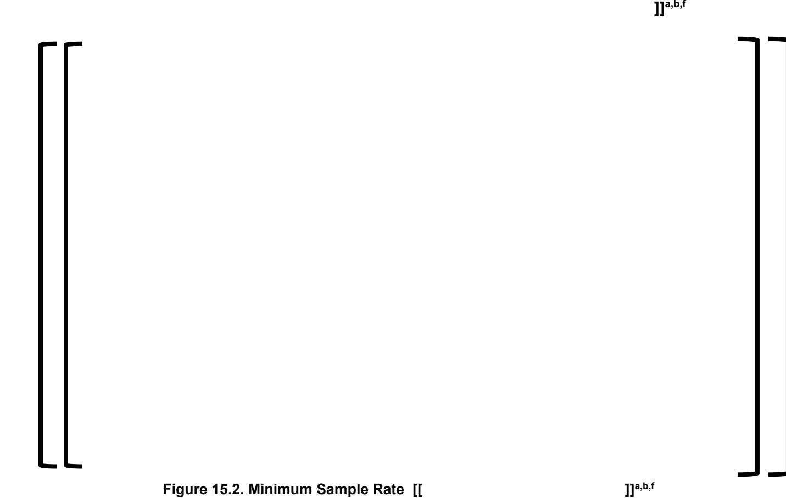

NON-PROPRIETARY

**]]a,b,f**

#### **15.2 PROCESS TO ESTABLISH MINIMUM SAMPLE RATE**

The example above shows how to **[[** 

**]]a,b,f** Following are the steps that must be taken to arrive at the minimum sample rate for collection of OLM data to monitor for drift. **[[** 

**Table 15.1. Minimum Sample Rate Example for PWR Plant #1**

| Service | XMTR ID | Std. Dev (% span) | Minimum samples, n | Minimum Sample Rate | Maximum Sample Period |       |  |
|---------|---------|----------------------|-----------------------|------------------------|--------------------------|-------|--|
|         |         |                      |                       |                        |                          | a,b,f |  |
|         |         |                      |                       |                        |                          |       |  |
|         |         |                      |                       |                        |                          |       |  |
|         |         |                      |                       |                        |                          |       |  |
|         |         |                      |                       |                        |                          |       |  |
|         |         |                      |                       |                        |                          |       |  |
|         |         |                      |                       |                        |                          |       |  |
|         |         |                      |                       |                        |                          |       |  |
|         |         |                      |                       |                        |                          |       |  |
|         |         |                      |                       |                        |                          |       |  |
|         |         |                      |                       |                        |                          |       |  |
|         |         |                      |                       |                        |                          |       |  |
|         |         |                      |                       |                        |                          |       |  |
|         |         |                      |                       |                        |                          |       |  |
|         |         |                      |                       |                        |                          |       |  |
|         |         |                      |                       |                        |                          |       |  |
|         |         |                      |                       |                        |                          |       |  |
|         |         |                      |                       |                        |                          |       |  |
|         |         |                      |                       |                        |                          |       |  |
|         |         |                      |                       |                        |                          |       |  |
|         |         |                      |                       |                        |                          |       |  |
|         |         |                      |                       |                        |                          |       |  |

**Table 15.2. Minimum Sample Rate Example for PWR Plant #2**

| Service | XMTR ID | Std. Dev (% span) | Minimum samples, n | Minimum Sample Rate | Maximum Sample Period |       |
|---------|---------|----------------------|-----------------------|------------------------|--------------------------|-------|
|         |         |                      |                       |                        |                          | a,b,f |
|         |         |                      |                       |                        |                          |       |
|         |         |                      |                       |                        |                          |       |
|         |         |                      |                       |                        |                          |       |
|         |         |                      |                       |                        |                          |       |
|         |         |                      |                       |                        |                          |       |
|         |         |                      |                       |                        |                          |       |
|         |         |                      |                       |                        |                          |       |
|         |         |                      |                       |                        |                          |       |
|         |         |                      |                       |                        |                          |       |
|         |         |                      |                       |                        |                          |       |
|         |         |                      |                       |                        |                          |       |
|         |         |                      |                       |                        |                          |       |
|         |         |                      |                       |                        |                          |       |
|         |         |                      |                       |                        |                          |       |
|         |         |                      |                       |                        |                          |       |
|         |         |                      |                       |                        |                          |       |
|         |         |                      |                       |                        |                          |       |
|         |         |                      |                       |                        |                          |       |
|         |         |                      |                       |                        |                          |       |
|         |         |                      |                       |                        |                          |       |
|         |         |                      |                       |                        |                          |       |
|         |         |                      |                       |                        |                          |       |
|         |         |                      |                       |                        |                          |       |
|         |         |                      |                       |                        |                          |       |
|         |         |                      |                       |                        |                          |       |

#### **16 CONCLUSIONS**

The OLM methodology to identify drift and assess dynamic failure modes of pressure sensing systems was described in this report and examples of OLM implementation in representative nuclear facilities and their results were presented. Comparisons between OLM results and conventional calibrations were shown to produce about 99 percent conservative agreement testifying to the reliability of the OLM methodology to identify drift. The potential for common-mode drift in nuclear grade pressure transmitters was ruled out using a substantial volume of data and objective evidence summarized in this report. With OLM data collected during periods of startup, shutdown, and normal operations, it was shown that drift of transmitters over much of their span can be identified and zero and span shifts measured. This resolves the "single point monitoring" question that had plagued the use of OLM in nuclear power plants.

The OLM methodology presented in this Topical Report can be used as the technical basis to support plant-specific Technical Specification changes to switch from time-based surveillance frequency for transmitter calibrations to a condition-based calibration frequency based on OLM results. The OLM noise analysis technique can be used by licensees to assess the response time performance of transmitters that have periodic calibration deferred based on the OLM methodology.

#### **REFERENCES**

Following are the references cited specifically throughout this report. A summary of the key content of each of these references are provided in Appendix C.

- 1. Davis, E., et al., "On-Line Monitoring of Instrument Channel Performance", Electric Power Research Institute (EPRI), Palo Alto, CA, TR-104965-R1, NRC SER, EPRI 1000604, ADAMS Accession Number ML003734509, 2000.
- 2. Hines, J., Seibert, R., "Technical Review of On-Line Monitoring Techniques for Performance Assessment Volume 1: State of the Art", U.S. Nuclear Regulatory Commission (NRC), Washington, D.C., NUREG/CR-6895, Vol.1., ADAMS accession number ML060610394, 2006.
- 3. Hashemian, H., "Sensor Performance and Reliability", Published by ISA—The Instrumentation, Systems, and Automation Society, 2005.
- 4. Hashemian, H., "Maintenance of Process Instrumentation in Nuclear Power Plants", Published by Springer-Verlag, 2006.
- 5. Hashemian, H., "Maintenance Optimization Through Data Analytics", Nuclear Plant Journal, pp. 28-30, 2017.
- 6. Ramuhalli, P., Lin, G., Crawford, S., Konomi, B., Coble, J., Shumaker, B., Hashemian, H., "Uncertainty Quantification Techniques for Sensor Calibration Monitoring in Nuclear Power Plants", Pacific Northwest National Laboratory (PNNL), Report Number PNNL-22847 Rev. 1, Department of Energy Contract DE-AC05-76RL01830, 2014.
- 7. "Advanced Surveillance, Diagnostic and Prognostic Techniques in Monitoring Structures, Systems and Components in Nuclear Power Plants", International Atomic Energy Agency (IAEA), Vienna, Austria, IAEA Nuclear Energy Series No NP-T-3.14, 2013.
- 8. Wooten, B., "Instrument Calibration and Monitoring Program Volume 1: Basis for the Method", Electric Power Research Institute (EPRI), Palo Alto, CA, EPRI TR-103436-V1, 1993.
- 9. Hashemian, H., et al., "Validation of Smart Sensor Technologies for Instrument Calibration Reduction in Power Plants", U.S. Nuclear Regulatory Commission (NRC), Washington, D.C., NUREG/CR-5903, 1993.
- 10. Hashemian, H., "On-Line Testing of Calibration of Process Instrumentation Channels in Nuclear Power Plants", U.S. Nuclear Regulatory Commission (NRC), Washington, D.C., NUREG/CR-6343, 1995.
- 11. Davis, E., Funk, D., "Guidelines for Instrument Calibration Extension/Reduction Revision 1: Statistical Analysis of Instrument Calibration Data", Electric Power Research Institute (EPRI), Palo Alto, CA, TR-103335-R1, 1998.
- 12. Voss, J., et al., "Guidelines for Instrument Calibration Extension/Reduction Revision 2: Statistical Analysis of Instrument Calibration Data", Electric Power Research Institute (EPRI), Palo Alto, CA, 3002002556, 2014.
- 13. Lurie, D., Abramson, L., Vail, J., "Applying Statistics*,* Revision 1", U.S. Nuclear Regulatory Commission (NRC), Washington, D.C., NUREG-1475, (March 2011).
- 14. Hashemian H., et al., "Aging of Nuclear Plant Resistance Temperature Detectors", U.S. Nuclear Regulatory Commission (NRC), Washington, D.C., Report Number NUREG/CR-5560, 1990.
- 15. Hashemian H., et al., "Effects of Aging on Response Time of Nuclear Plant Pressure Sensors", U.S. Nuclear Regulatory Commission (NRC), Washington, D.C., NUREG/CR-5383, 1989.

- 16. Hashemian, H., Mitchell, D., Fain, R., & Petersen, K., "Long Term Performance and Aging Characteristics of Nuclear Plant Pressure Transmitters", U.S. Nuclear Regulatory Commission (NRC), Washington, D.C., NUREG/CR-5851, 1993.
- 17. Shumaker, B., Morton, G., Riggsbee, E., Rich, J., "The Pressure and Differential Pressure Transmitter Calibration Frequency Extension: Generic Transmitter Drift Study", PWR Owners Group, AMS Report WDS1601R2, 2017.
- 18. Thompson, D., "Transmitter Single Calibration Regression Methodology Drift Statistics", British Energy, E/REP/SXB/0015/00 Issue 1, 2001.
- 19. Davis, E., "Instrument Drift Study: Sizewell B Nuclear Generating Station", Electric Power Research Institute (EPRI), Palo Alto, CA, 1009603, 2005.
- 20. Swisher, V., "Investigation of Response Time Testing Requirements", Electric Power Research Institute (EPRI), Palo Alto, CA, NP-7243-R1, 1994.
- 21. Wooten, B., "Instrument Calibration Monitoring Program Volume 2: Failure Modes and Effects Analysis", Electric Power Research Institute (EPRI), Palo Alto, CA, TR-103436-V2, 1993.
- 22. Schrader, K., et al., "Relocate Surveillance Frequencies to Licensee Control RITSTF Initiative 5b", Technical Specifications Task Force (TSTF), TSTF-425-A, Revision 3, 2009.
- 23. Srinivasa, V., et al., "Risk-Informed Technical Specification Initiative 5b, Risk-Informed Method for Control of Surveillance Frequencies", Nuclear Energy Institute (NEI), NEI 04-10, Revision 1, 2007.
- 24. Honath, K., "Pressure and Differential Pressure Transmitter Calibration Frequency Extension", PWR Owners Group, PWROG-15057-P Rev. 0, 2019.
- 25. Hashemian, H., Thie, J., Upadhyaya, B., "Reactor Sensor Surveillance Using Noise Analysis", Nuclear Science and Engineering, Vol. 98, Number 2, pp. 96-102, 1988.
- 26. Hashemian, H., Thie, J., Upadhyaya, B., Holbert, K., "Sensor Response Time Monitoring Using Noise Analysis", Proceedings of the Fifth Specialists Meeting on Reactor Noise, Progress in Nuclear Energy, Pergamon Press, Vol. 21, pp. 583-592, Munich, FRG, 1987.
- 27. Morgan, C., et al., "Elimination of Pressure Sensor Response Time Requirements", Westinghouse Electric Corporation, WCAP-13632, Revision 2, 1996.
- 28. McQuade, D., "Elimination of Pressure Sensor Response Time Testing", Combustion Engineering Owners Group, CE NPSD-1167-A, Revision 2, 2001.
- 29. Boger, B., "System Analyses for Elimination of Selected Response Time Testing Requirements", BWR Owners Group (BWROG), NEDC-32013P, 1993.
- 30. Archie, J., "License Amendment Request LAR 05-0677, On-Line Monitoring of Instrument Channel Performance", Letter to U.S. Nuclear Regulatory Commission (NRC), ADAMS Accession Number ML060400220, 2006.
- 31. "Regulatory Requirements, Acceptance Criteria, and Guidelines for Instrumentation and Control Systems Important to Safety", U.S. Nuclear Regulatory Commission (NRC), Washington, D.C., NUREG-0800, NRC Standard Review Plan, Table 7-1, Revision 6, August 2016.
- 32. "Nuclear Power Plants Instrumentation and Control Important to Safety Methods for Assessing the Performance of Safety System Instrument Channels", International Electrotechnical Commission (IEC), Geneva, Switzerland, IEC 62385, 2007.
- 33. "On-line Monitoring for Improving Performance of Nuclear Power Plants Part 1: Instrument Channel Monitoring", International Atomic Energy Agency (IAEA), Vienna, Austria, Nuclear Energy Series No. NP-T-1.1, IAEA, 2008.

- 34. "On-line Monitoring for Improving Performance of Nuclear Power Plants Part 2: Process and Component Condition Monitoring and Diagnostics", International Atomic Energy Agency (IAEA), Vienna, Austria, Nuclear Energy Series No. NP-T-1.2, 2008.
- 35. "Condition Monitoring and Incipient Failure Detection of Rotating Equipment in Research Reactors", International Atomic Energy Agency (IAEA), Vienna, Austria, IAEA-TECDOC-1920, 2020.
- 36. "On-line Monitoring of Instrumentation in Research Reactors", International Atomic Energy Agency (IAEA), Vienna, Austria, IAEA-TECDOC-1830, 2017.
- 37. Hashemian, H., Riggsbee, E., Johnson, W., Linn, M., "Equipment Health Monitoring In Research Reactors–Reliability Improvement", Presented at the American Nuclear Society 2013 Annual Meeting, Atlanta, GA, 2013.
- 38. Erickson, P., O'Hagan, R., Shumaker, B., Hashemian, H., "On-Line Monitoring of I&C Transmitters and Sensors for Calibration Verification and Response Time Testing was Successfully Implemented at ATR", Idaho National Laboratory (INL), INL/CON-17-41453, 2017.
- 39. Marquino, W., et al., "Setpoints for Nuclear Safety-Related Instrumentation", International Society of Automation (ISA), ANSI/ISA-67.04.01-2018, 2018.
- 40. McAllister, G., "Acceptance Criteria for Use in OLM of Protection System Transmitters", British Energy, Suffolk, UK, E/REP/CISS/0040/SXB/02, 2002.
- 41. Hashemian, H., "On-Line Calibration Monitoring of Safety-Related Pressure Transmitters at Watts Bar Unit 1", Electric Power Research Institute (EPRI), Palo Alto, CA, EPRI Final Report, 2010.
- 42. Hashemian, H., Shumaker, B., Morton, G., Caylor, S., "On-line Monitoring of Accuracy and Reliability of Instrumentation and Health of Nuclear Power Plants", Phase II+ Final Report, Volumes 1 and 2, Report No. DOE/ER84626, DOE Grant No. DE-FG02-06ER84626, 2011.
- 43. Morton, G., et al., "Results of Mid-Cycle Analysis of On-Line Calibration Monitoring Data for Pressure Transmitters at Vogtle Unit 1 from October 2018 through June 2019", AMS Corporation, AMS Report VOG1905R0, 2019.
- 44. Shumaker, B., et al., "Results of Mid-Cycle Analysis of On-Line Calibration Monitoring Data for Pressure Transmitters at Vogtle Unit 2 from March 2019 through November 2019", AMS Corporation, AMS Report VOG1906R0, 2019.
- 45. Morton, G., et al., "Results of Full Cycle Analysis of On-Line Calibration Monitoring Data for Pressure Transmitters at Vogtle Unit 1 from October 2018 through March 2020", AMS Corporation, AMS Report VOG2005R0, 2020.
- 46. Bradford, P., "Agreement to NP/SC 7277: Paper of Principle Calibration Period Extension of Safety Related Sensors", Nuclear Installations Inspectorate (NII), Nuclear Safety Directorate, SZB76260, 2005.
- 47. Hashemian, H., Rasmussen, B., "Plant Application of On-Line Monitoring for Calibration Interval Extension of Safety-Related Instruments: Volumes 1 and 2", Electric Power Research Institute (EPRI), Palo Alto, CA, EPRI-TR-1013486, 2006.
- 48. Hashemian, H., Rusaw, R., "Requirements for On-Line Monitoring in Nuclear Power Plants", Electric Power Research Institute (EPRI), Palo Alto, CA, 1016725, 2008.
- 49. Goffin, P., "Sensor Calibration Extension (EC109087) Additional Work to Support Continued Implementation", Sizewell B Power Station, Systems Engineering, SZB/ESR/503, 2019.

#### **BIBLIOGRAPHY**

The following publications contain additional information and data related to the subject of this report.

- 1. Feiner, F., Trotter, J., "Sensor Response Time Measurements Seven Years Later", Transactions, American Nuclear Society, Vol. 44, Supplement 1, 1983.
- 2. "Advanced Instrumentation and Maintenance Technologies for Nuclear Power Plants", U.S. Nuclear Regulatory Commission (NRC), Washington, D.C., NUREG/CR-5501, 1998.
- 3. "Review of Resistance Temperature Detector Time Response Characteristics. Safety Evaluation Report", U.S. Nuclear Regulatory Commission (NRC), Washington, D.C., NUREG-0809, 1981.
- 4. "Periodic Testing of Electric Power and Protection Systems", U.S. Nuclear Regulatory Commission (NRC), Washington, D.C., Regulatory Guide 1.118, Revision 3, 1995.
- 5. "Response Time Testing of Nuclear Safety-Related Instrument Channels in Nuclear Power Plants", Instrument Society of America, ISA-67.06, 1984.
- 6. "Criteria for the Periodic Testing of Nuclear Power Generating Station Safety Systems", The Institute of Electrical and Electronics Engineers, Inc., New York, NY, IEEE 338-2012, 2012.
- 7. Jarrett, R., Hashemian, H., Shumaker, B., "Integrating On-Line Performance Monitoring in New Nuclear Reactor Designs", Presented at the 51st Annual ISA POWID Symposium, Scottsdale, Arizona, USA, 2008.
- 8. "License Amendment Request LAR 05-0677, On-Line Monitoring of Instrument Channel Performance Withdrawal Letter", U.S. Nuclear Regulatory Commission (NRC), Washington, D.C., ADAMS Accession number ML061840467, 2006.
- 9. "Management of Ageing of I&C Equipment in Nuclear Power Plants", International Atomic Energy Agency (IAEA), Vienna, Austria, IAEA-TECDOC-1147, 2000.
- 10. "Management of Life Cycle and Aging at Nuclear Power Plants: Improved I&C Maintenance", International Atomic Energy Agency (IAEA), Vienna, Austria, IAEA-TECDOC-1402, 2004.
- 11. Kerlin, T., Miller, L., Hashemian, H., Poore, W., "In Situ Response Time Testing of Platinum Resistance Thermometers Final Report", Electric Power Research Institute (EPRI), Palo Alto, CA, EPRI-NP—834 Vol 1, 1978.
- 12. Kerlin, T., Miller, L., Hashemian, H., Poore, W., Skorska, M., Upadhyaya, B., Cormault, P., Jacquot, J., "Temperature Sensor Response Characterization Final Report", Electric Power Research Institute (EPRI), Palo Alto, CA, EPRI-NP—1486, 1980.
- 13. Hashemian, H., Peterson, K., Kerlin, T., Anderson, K., Holbert, K., "Degradation of Nuclear Plant Temperature Sensors", U.S. Nuclear Regulatory Commission (NRC), Washington, D.C., NUREG/CR-4928, 1987.
- 14. "Nuclear Power Plants Instrumentation and Control Systems Important to Safety Management of Ageing", International Electrotechnical Commission (IEC), Geneva, Switzerland, IEC 62342, 2007.
- 15. Tuley, C., "The Significance of the Nominal Trip Setpoint in the Westinghouse Setpoint Methodology", Proceedings of the 34th Power Instrumentation Symposium, Volume 34, Paper #91-709, Instrument Society of America, 1991.
- 16. Tuley, C., Williams, T., "The Significance of Verifying the SAMA PMC 20.1-1973 Defined Reference Accuracy for the Westinghouse Setpoint Methodology", Proceedings of the 35th Power Instrumentation Symposium, Volume 35, Paper #92-0639, Instrument Society of America, 1992.

## **APPENDIX A**

**AMS RESPONSES TO NRC COMMENTS**

#### **APPENDIX A - AMS RESPONSES TO NRC COMMENTS**

Prior to writing this topical report, AMS and its utility partner SNOC had two face to face meetings with the NRC at their headquarters. The NRC's comments and AMS's responses are compiled in this appendix. Section A.1 provides responses to NRC comments from the first meeting in September 2019 and Section A.2 provides responses to NRC comments from the second meeting in February 2020.

#### **A.1 AMS/NRC/SNOC MEETING ON SEPTEMBER 20, 2019:**

#### **1. ADDRESS TREATMENT OF OUTLIERS**

The OLM methodology uses the parity space averaging technique to systematically identify outlier data that is excluded from further analysis. The details of the parity space averaging technique are included in Chapter 6. In case of spikes or other anomalies in the OLM data, the OLM software provides the capability to exclude the spikes or anomalies, however, the analyst must document the technical basis for excluding the spikes or anomalies.

#### **2. EXPLAIN METHODOLOGY TO ESTABLISH OLM ACCEPTANCE CRITERIA**

The OLM limits will be established based on a plant's setpoint uncertainties and using root Sum Square (RSS) formulas similar to those in ISA 67.04, NUREG/CR-6343, and the Sizewell B approach as explained in Chapter 7.

#### **3. ADDRESS HOW ACCEPTANCE CRITERIA IS SPECIFIC TO TRANSMITTER TYPE AND SERVICE, BUT THE ANALYSIS METHODOLOGY USES A TRANSMITTER-AGNOSTIC ALGORITHM**

As described in Chapter 7, the manufacturer specific drift specifications for each transmitter type are used to arrive at the OLM limits. However, the OLM analysis algorithms of simple averaging and parity space averaging are not dependent on the type(s) of transmitters or the processes that the transmitters are measuring.

#### **4. LIST ANY LIMITATION ON APPLICABLE TRANSMITTER TYPES**

To date no transmitter types have been encountered to which OLM for drift monitoring does not apply. In the case of digital/smart transmitters, detecting sensing line blockages using the noise analysis technique can be limited if digitization of the transmitter signal significantly affects the characterization of the frequency response.

#### **5. ADDRESS ANY NEW IMPORTANT FAILURE MODES THAT COULD AFFECT SAFETY FUNCTIONS**

Chapter 3 (Section 3.4 titled "Detecting Transmitter Failure Modes with OLM") discusses the OLM methodology as it relates to the failure modes and effects analysis (FMEA) of nuclear grade transmitters.

#### **6. ADDRESS HOW TO TREAT NEW OR REPLACED TRANSMITTERS AND DIFFERENTIATE TREATMENT THROUGH THE TSTF APPROACH**

The Technical Specification Task Force (TSTF) 425 approach depends on probabilistic risk assessment (PRA) and deterministic drift studies based on historic transmitter performance to extend transmitter calibration for one or more cycles. Using the TSTF 425 approach, new transmitter models must thus be calibrated until sufficient historical data and trending data becomes available. The OLM methodology described in this report uses transmitter measurements to determine if a calibration check is needed and does not require PRA or historic transmitter performance data. Refer to Chapter 3 (Section 3.5) for more information.

#### **7. DEFINE OLM DATA SAMPLING RATES TO MONITOR NOT ONLY DRIFT BUT ALSO RESPONSE TIME**

OLM data taken at frequencies of 2000 Hz or above can provide information for both drift and response time. OLM data taken at sample rates typically found in plant computers can only monitor for calibration drift (see Chapters 11 and 15).

#### **8. ADDRESS RESPONSE TIME DEGRADATION AND DIFFERENTIATE BETWEEN TRANSMITTER AND SENSING LINE EXPERIENCE**

Response time degradation of the current generation of transmitters in the existing fleet of nuclear power plants has been so small that the NRC approved the industry's requests in the year 1998 to eliminate transmitter response time testing requirements. However, sensing line blockages have been shown to degrade the dynamic performance of pressure sensing systems and can be tested by OLM using the noise analysis technique (see Chapter 11).

#### **9. ADDRESS HOW OLM VERIFIES BOTH THE CALIBRATION AND RESPONSE TIME OF TRANSMITTERS WHILE CALIBRATION ONLY ADDRESSES THE TRANSMITTERS**

Chapter 11 discusses how OLM verifies both calibration drift and response time degradation.

#### **10. INCLUDE A BREAKDOWN OF THE HISTORY OF TRANSMITTER RESPONSE TIME FAILURE TO ENSURE THAT IT WAS NOT DRIVEN BY A SMALL SET OF BAD ACTORS**

Historical response time data from 30 years of testing involving over 1200 transmitters and 11,000 response time measurements performed in 21 nuclear power plants by AMS using the noise analysis technique have shown that only about 10% of these transmitters exhibited a trend toward increasing response time. In addition, about 6% of the transmitters exhibited response time excursions causing the transmitters' response times to increase from less than 0.5 seconds to over 2 seconds without warning or detectable degradation by other means such as calibration. The response time surges were random and about 80% were found to be due to sensing line blockages. This occurred in over half of all the nuclear power plants where response time measurements were performed.

#### **11. CLARIFY WHETHER THE RESPONSE TIME TRENDS WERE ULTIMATELY RELATED TO SENSOR CALIBRATION OR SENSING LINE BLOCKAGE**

It is not possible to distinguish whether the response time degradation trends observed in the AMS database of 11,000 test results were due to either the transmitters themselves or the sensing lines.

#### **12. IDENTIFY IF ANY FAILURE MODES ARE NOT DETECTABLE (BY OLM) AND ADDRESS IF OTHER MEASURES ARE NEEDED TO COMPENSATE FOR THIS SHORT COMING**

Chapter 3 presents a discussion of transmitter failure modes and whether or not they are detectable by OLM. The combination of OLM, daily channel checks, monthly surveillance, and noise analysis to test for sensing line blockages together provide ample defense against a calibration or response time problem going undetected.

#### **13. ADDRESS THE RECOMMENDATIONS OF TSTF-569**

AMS agrees that these three recommendations of TSTF-569 are appropriate:

- a. Perform hydraulic response time test prior to installation of new transmitter/switch or following any refurbishment.
- b. For transmitters and switches that use capillary tubes, response time tests should be performed after initial installation and after any maintenance or modification activity that could damage the capillary tubes.
- c. Assure that variable damping (if used) is at the required setting and cannot be changed or perform hydraulic or white noise response time tests of sensor, following each calibration.

#### **14. ADDRESS IN THE REPORT THAT THE OLM METHODOLOGY IS NOT A CONTINUOUS OPERABILITY METER**

OLM results are intended to guide plants as to whether or not a transmitter's calibration must be checked as opposed to current practice that calls for utilities to check transmitter calibrations at every refueling outage. OLM also serves to detect if a significant sensing line blockage might have occurred. OLM results are not intended for operability determination.

#### **15. AMS/NRC TOPICAL REPORT SHOULD PROVIDE SUGGESTED TECHNICAL SPECIFICATION MARK-UPS FOR ALL OF THE VENDOR TYPE STANDARD TECH SPECS**

Appendix B provides suggested technical specification (TS) markups for Westinghouse, Westinghouse AP1000, Combustion Engineering (CE), Babcock and Wilcox (B&W), GE BWR/4, and GE BWR/6 designs.

#### **16. ADDRESS CALIBRATION AND RESPONSE TIME TECHNICAL SPECIFICATION LANGUAGE**

Appendix B provides suggested technical specification markups for calibration and response time TS changes for Westinghouse, Westinghouse AP1000, Combustion Engineering (CE), Babcock and Wilcox (B&W), GE BWR/4, and GE BWR/6 designs.

#### **17. ADDRESS THE TECHNICAL SPECIFICATIONS OF THOSE PLANTS THAT HAVE CHANGED TO USING SFCP**

Appendix B provides suggested technical specification markups for Westinghouse, Westinghouse AP1000, Combustion Engineering (CE), Babcock and Wilcox (B&W), GE BWR/4, and GE BWR/6 designs, including those that have changed to using the Surveillance Frequency Control Program (SFCP).

#### **18. ADDRESS HOW TO TREAT OLM DATA AND TEST CHANNEL WITHIN A QA PROGRAM**

Chapter 11 addresses how OLM data must be handled according to a QA program in compliance with 10 CFR 50 Appendix B and NQA-1 programs.

#### **19. ADDRESS THE FREQUENCY OF DATA COLLECTION AND ASSESSMENTS FOR DETERMINING IF CORRECTIVE MAINTENANCE IS REQUIRED**

For calibration monitoring, data must be collected throughout plant start-up and shutdown periods and at least once a month for 12 to 24 hours throughout the cycle. Normally, this data is available in the plant computer and can readily be retrieved and analyzed for calibration verification.

As for response time to detect sensing line blockages, plant data acquisition systems do not normally have sufficiently fast sampling rates. For this, a portable data acquisition system can be used sometime during the plant operating cycle to acquire high frequency data (e.g. at 2000 Hz) for a period of 30-60 minutes for each transmitter. A multichannel fast data acquisition system can be used to acquire data for multiple transmitters (e.g. up to 32 transmitters) and thereby test many transmitters at the same time. The best time to perform the test is near the end of each operating cycle to allow plants to identify any sensing line blockage to be resolved during the ensuing outage (see Chapter 11).

#### **20. ADDRESS THE DIFFERENCES BETWEEN BATCH MODE OPERATION AND CONTINUOUS ANALYSIS**

Transmitter calibration drift occurs slowly, therefore data analysis performed once a month during the fuel cycle is sufficient. As for response time degradation which almost always occurs due to sensing line blockages, data collection and analysis once an operating cycle should be adequate unless the plant is known to have a history of sensing line blockages that occur more often. Chapters 8, 11, and 15 address the sampling frequency and the sampling duration for OLM.

#### **21. ADDRESS OLM DATA QUALITY AND HOW THIS IS HANDLED UNDER A QA PROGRAM**

During development of OLM, data qualification algorithms and software packages using a variety of statistical analysis methods have been developed under a QA program and used to screen OLM data prior to analysis.

#### **A.2 AMS/NRC/SNOC MEETING ON FEBRUARY 20, 2020:**

#### **1. ADDRESS HOW UNCOMPRESSED DATA IS OBTAINED FOR THE OLM METHODOLOGY**

Options for obtaining uncompressed or non-historized OLM data include retrieving data upstream of the plant computer data historian, permanently disabling compression for sensors in the OLM program, or temporarily disabling compression during the OLM data collection periods (see Chapter 6).

#### **2. ADDRESS HOW PLANTS THAT DO NOT EXPORT ALL THE SENSOR DATA TO THE PLANT COMPUTER WOULD BE HANDLED**

If OLM data is not available in the plant computer, then options include adding it to the plant computer, collecting the data from the instrumentation cabinets with a custom data acquisition system, or not implementing OLM for those transmitters (see Chapters 6 and 11).

#### **3. ADDRESS THE MINIMUM AMOUNT OF DATA NEEDED FOR OLM ANALYSIS AND THE BASIS FOR THE DATA COLLECTION PERIOD**

Chapters 8 and 15 address the bases for OLM Sampling Rate and Duration of OLM data collection.

#### **4. SUMMARIZE THE MAIN POINTS OR CONCLUSIONS USED FROM REFERENCE DOCUMENTS**

Appendix C presents summaries of references cited in this report.

#### **5. ADDRESS HOW THE VENDOR DRIFT SPECIFICATION IS USED IN THE OLM METHODOLOGY AND IF IT IS PRORATED FOR THE DATA COLLECTION INTERVALS**

In calculating the OLM limits, the vender drift specification is not prorated for the data collection interval (e.g. 1 month, 2 months, …), but it is taken from the transmitter's drift term over the existing technical specification surveillance interval. For example, Sizewell uses the vender transmitter drift term calculated over a 24-month calibration period although their actual cycle is typically 18 months (see Chapter 7).

#### **6. ADDRESS THE BASIS FOR NO COMMON MODE DRIFT OVER MULTIPLE CYCLES**

The drift of the current generation of nuclear grade pressure, level, and flow transmitters has been shown to be random through multiple drift studies in the U.S. and abroad over the past 20 years. Additionally, calibration data from transmitters at Sizewell B that have not be calibrated for multiple cycles show no evidence of common mode drift (see Chapters 3 and 12).

#### **7. IDENTIFY LIMITATIONS BASED ON SENSOR TYPE THAT HAS DIGITAL FEATURES THAT PREVENT THE NECESSARY DATA COLLECTION**

Digital sensors have a limited frequency response such that the response time results will be slower than the digital sensor sample period. Also, digital sensors have a minimum measurement resolution which prevents measuring the small process fluctuations necessary for determining response time with noise analysis. However, the digital sensor minimum resolution has a negligible effect for OLM calibration assessment.

#### **8. ADDRESS ANY UNIQUE FAILURE MODES WITH OLM**

OLM noise analysis testing identifies sensing line blockage which is part of the pressure sensing system that otherwise can go undetected during normal plant operation. More information on failure modes and whether or not OLM can identify them is presented in Chapter 3.

#### **9. ADDRESS HOW NEW MODELS OF TRANSMITTERS WILL BE ADDRESSED USING OLM**

As long as new models can be shown to be comparable to existing transmitters by performing a similarity analysis, it is not necessary to establish drift history from several cycles to extend calibration intervals. OLM can be used to monitor the transmitters more frequently than traditional calibrations and can detect transmitter drift and sensing line blockages.

#### **10. ADDRESS THE OLM METHODOLOGY FOR PROCESS SENSORS WITHOUT ANY SIGNIFICANT PROCESS NOISE COMPONENT**

Lack of a significant process noise component does not hinder the OLM calibration drift assessment, although this will prevent OLM noise analysis from detecting sensing line blockages. However, these low process noise services (e.g., containment pressure or reactor water storage tank level) typically have the transmitter low side reference leg open to atmosphere. The transmitter low pressure input can be connected to a portable pressure noise source to provide simulated noise perturbations to the transmitter and allow OLM noise analysis to measure the transmitter response time. In addition, for services such as reactor water storage tank level, sensing lines are unlikely to develop blockages as there is no fluid flowing in the line.

#### **11. ADDRESS THE DETECTION OF DEGRADATION WITH OLM CALIBRATION MONITORING AND NOISE ANALYSIS**

The combination of OLM calibration monitoring and noise analysis will detect failure modes of different transmitter designs (see Chapters 3 and 11).

#### **12. ADDRESS HOW OLM WILL IDENTIFY DRIFT ON THE EXTREME ENDS OF THE CALIBRATION SPAN BEYOND THE OPERATING RANGE**

OLM data taken during startup and shutdown can identify transmitter drift over much of its span. OLM results plotted versus transmitter span can be extrapolated to cover the low and high ends of span that are not covered by OLM assuming that the transmitter is linear throughout its range. This assumption has been verified through comparison of OLM and calibration results for Sizewell B transmitters (see Chapters 3, 10, and 14).

#### **13. CLEARLY ADDRESS THE METHODOLOGY THAT THE NRC WOULD BE APPROVING IN THE RESULTING SER**

Chapter 11 describes the OLM methodology comprehensively.

#### **14. ADDRESS THE QA REQUIREMENTS FOR OLM SOFTWARE AND ANALYSIS**

Chapter 11 covers the QA requirements for implementation of OLM.

#### **15. PROVIDE THE BASIS FOR THE AMOUNT AND FREQUENCY OF DATA COLLECTION**

Chapters 8 and 15 address OLM Sample Rate and Sampling Duration.

#### **16. ADDRESS THE IMPLEMENTATION ISSUES WITH THE 14 REQUIREMENTS OF THE 2000 SER AND THE AMS ALTERNATIVE WITH THE OLM METHODOLOGY TO ADDRESS THE UNDERLYING CONCERN**

The OLM methodology solution proposed by AMS resolves the underlying concern of each of the 14 requirements.

#### **17. HOW DOES THE LARGER POPULATION OF SENSORS AT SIZEWELL B AFFECT THE APPLICABILITY OF THAT DATA TO A U.S. PLANT WITH FEWER SENSORS**

While several of the redundant sensors at Sizewell B have roughly twice the redundancy of transmitters in U.S. plants (e.g. as much as 9-way redundant versus 4-way redundancy in U.S. plants), the majority of Sizewell OLM limits are based on 4-way redundancy for the process estimate. This is comparable to a typical U.S. plant. Therefore, the OLM limits for Sizewell transmitters are comparable to that of US plants.

## **APPENDIX B**

**PROPOSED CHANGES TO EXISTING TECHNICAL SPECIFICATION REQUIREMENTS TO ACCOMMODATE OLM**

#### **APPENDIX B - PROPOSED CHANGES TO EXISTING TECHNICAL SPECIFICATION REQUIREMENTS TO ACCOMMODATE OLM**

Implementing OLM to extend the calibration intervals of safety-related pressure, level, and flow transmitters will require changes to the plant technical specifications that must be approved by the NRC. This appendix contains examples of the changes to the standard technical specifications (STS) that are representative of the changes that will need to be made by each plant to implement OLM for calibration extension. The representative changes to the STS for the following plant types are included in this appendix:

- Westinghouse
- Westinghouse Advanced Passive 1000 (AP1000)
- Babcock and Wilcox
- Combustion Engineering
- General Electric BWR/4
- General Electric BWR/6

As discussed in the main body of this report, the purpose of OLM for transmitter drift monitoring is to provide a condition-based determination of whether or not a calibration check must be performed. As such, the changes to the technical specifications include the following:

- A definition for the term ONLINE MONITORING
- Addition of an ONLINE MONITORING Program to Extend Transmitter Calibration Intervals
- An option to use the ONLINE MONITORING Program to Extend Transmitter Calibration Intervals to determine the frequency of CHANNEL CALIBRATION surveillances that involve calibrating pressure, level, or flow transmitters

Table B.1 through Table B.6 provide listings of the surveillance requirements affected by the changes for each of the six nuclear power plant types listed above.

| Item | Proposed Change                                                                                                                                                                                                                                                                                                                                                                                                                                                                                                                                                                                                                                                                                                                                                                                                                                                                                                                                                                                                                                                                                                                                                                                                                                                                                                                                                                                                                                                                                                                                                                                                                                                                                                                              | Affected Surveillance Requirement(s)                                              |  |  |
|------|----------------------------------------------------------------------------------------------------------------------------------------------------------------------------------------------------------------------------------------------------------------------------------------------------------------------------------------------------------------------------------------------------------------------------------------------------------------------------------------------------------------------------------------------------------------------------------------------------------------------------------------------------------------------------------------------------------------------------------------------------------------------------------------------------------------------------------------------------------------------------------------------------------------------------------------------------------------------------------------------------------------------------------------------------------------------------------------------------------------------------------------------------------------------------------------------------------------------------------------------------------------------------------------------------------------------------------------------------------------------------------------------------------------------------------------------------------------------------------------------------------------------------------------------------------------------------------------------------------------------------------------------------------------------------------------------------------------------------------------------|-----------------------------------------------------------------------------------------|--|--|
| 1    | Define ONLINE MONITORING "ONLINE MONITORING is the assessment of transmitter performance while the transmitter is in service. The ONLINE MONITORING Program provides a method to defer calibration of the transmitters included in the ONLINE MONITORING Program based on ONLINE MONITORING results. The ONLINE MONITORING Program is not used to extend the calibration of any other elements in the safety signal path (e.g., signal converters or adjustable parameters in I&C rack equipment)."                                                                                                                                                                                                                                                                                                                                                                                                                                                                                                                                                                                                                                                                                                                                                                                                                                                                                                                                                                                                                                                                                                                                                                                                                     | N/A                                                                                     |  |  |
| 2    | Insert the following in the frequency column of the affected surveillance requirements: "OR In accordance with the ONLINE MONITORING Program to Extend Transmitter Calibration Intervals."                                                                                                                                                                                                                                                                                                                                                                                                                                                                                                                                                                                                                                                                                                                                                                                                                                                                                                                                                                                                                                                                                                                                                                                                                                                                                                                                                                                                                                                                                                                                       | 3.3.1.10 3.3.2.9 3.3.3.2 3.3.4.3 3.3.6.9 3.3.7.9 3.4.12.9 3.4.15.3 |  |  |
| 3    | Insert the following in the Bases section of each affected surveillance requirement: "OR The CHANNEL CALIBRATION Frequency for transmitters may be determined in accordance with the ONLINE MONITORING Program to Extend Transmitter Calibration Intervals implemented in accordance with AMS-TR-0720R2-A. The ONLINE MONITORING Program provides a method to defer calibration of the transmitters included in the ONLINE MONITORING Program. The ONLINE MONITORING methodology described in the Topical Report is not used to extend the calibration of any other elements in the safety signal path (e.g., signal converters or adjustable parameters in I&C rack equipment). The Surveillance Requirement frequency for these other components in the signal path remains in effect. The Surveillance Requirement frequency for these other components can be calendar based by specifying a calendar interval, risk-based using a Surveillance Frequency Control Program, or modified based on self-testing features of a digital I&C platform based system. The use of the logical connector "OR" provides flexibility for the licensee to address cases where ONLINE MONITORING cannot be performed during the monitoring period. In the case of a calendar-based Surveillance Requirement frequency, the transmitter would need to be calibrated within the specified calendar interval measured since the last valid ONLINE MONITORING assessment. In the case of a risk-based Surveillance Requirement frequency, the transmitter would need to be calibrated within the specified risk-based interval measured since the last valid ONLINE MONITORING assessment." | 3.3.1.10 3.3.2.9 3.3.3.2 3.3.4.3 3.3.6.9 3.3.7.9 3.4.12.9 3.4.15.3 |  |  |

| Item | Proposed Change                                                                                                                                                                                             | Affected Surveillance Requirement(s) |
|------|-------------------------------------------------------------------------------------------------------------------------------------------------------------------------------------------------------------|--------------------------------------------|
| 4    | Insert the following in Section 5.5, Programs and Manuals:                                                                                                                                                  | 5.5.X                                      |
|      | 5.5.X ONLINE MONITORING Program to Extend Transmitter Calibration Intervals                                                                                                                           |                                            |
|      | The ONLINE MONITORING Program provides controls to use condition monitoring to extend CHANNEL CALIBRATION intervals for pressure, level, and flow transmitters based on online monitoring results. |                                            |
|      | Using the noise analysis technique, ONLINE MONITORING also provides a means for in-situ dynamic response assessment and detects failure modes that are not detectable by drift monitoring.            |                                            |
|      | The ONLINE MONITORING Program must be implemented in accordance with AMS-TR-0720R2-A, "Online Monitoring Technology to Extend Calibration Intervals of Nuclear Plant Pressure Transmitters."          |                                            |
|      | The ONLINE MONITORING program shall include the following:                                                                                                                                                  |                                            |
|      | a. Implement ONLINE MONITORING for selected transmitters during the plant operating cycle.                                                                                                            |                                            |
|      | b. Analyze ONLINE MONITORING data to identify transmitters that can have CHANNEL CALIBRATION extended and those that require CHANNEL CALIBRATION.                                               |                                            |
|      | c. Perform CHANNEL CALIBRATION of identified transmitters no later than during the next scheduled refueling outage.                                                                                   |                                            |
|      | d. Document the results of the ONLINE MONITORING data analysis.                                                                                                                                          |                                            |
|      | e. Perform ONLINE MONITORING using noise analysis to assess in-situ dynamic response of transmitters.                                                                                                 |                                            |

**Table B.2. Proposed Changes to the STS to Implement OLM in Westinghouse Advanced Passive 1000 (AP1000) PWRs**

| Item | Proposed Change                                                                                                                                                                                                                                                                                                                                                                                                                                                                                                                                                                                                                                                                                                                                                                                                                                                                                                                                                                                                                                                                                                                                                                                                                                                                                                                                                                                                                                                                                                                                                                                                                                                                                                                                 | Affected Surveillance Requirement(s)                                               |
|------|-------------------------------------------------------------------------------------------------------------------------------------------------------------------------------------------------------------------------------------------------------------------------------------------------------------------------------------------------------------------------------------------------------------------------------------------------------------------------------------------------------------------------------------------------------------------------------------------------------------------------------------------------------------------------------------------------------------------------------------------------------------------------------------------------------------------------------------------------------------------------------------------------------------------------------------------------------------------------------------------------------------------------------------------------------------------------------------------------------------------------------------------------------------------------------------------------------------------------------------------------------------------------------------------------------------------------------------------------------------------------------------------------------------------------------------------------------------------------------------------------------------------------------------------------------------------------------------------------------------------------------------------------------------------------------------------------------------------------------------------------|------------------------------------------------------------------------------------------|
| 1    | Define ONLINE MONITORING "ONLINE MONITORING is the assessment of transmitter performance while the transmitter is in service. The ONLINE MONITORING Program provides a method to defer calibration of the transmitters included in the ONLINE MONITORING Program based on ONLINE MONITORING results. The ONLINE MONITORING Program is not used to extend the calibration of any other elements in the safety signal path (e.g., signal converters or adjustable parameters in I&C rack equipment)."                                                                                                                                                                                                                                                                                                                                                                                                                                                                                                                                                                                                                                                                                                                                                                                                                                                                                                                                                                                                                                                                                                                                                                                                                        | N/A                                                                                      |
| 2    | Insert the following in the frequency column of the affected surveillance requirements: "OR In accordance with the ONLINE MONITORING Program to Extend Transmitter Calibration Intervals."                                                                                                                                                                                                                                                                                                                                                                                                                                                                                                                                                                                                                                                                                                                                                                                                                                                                                                                                                                                                                                                                                                                                                                                                                                                                                                                                                                                                                                                                                                                                          | 3.3.1.8 3.3.8.3 3.3.10.3 3.3.11.3 3.3.14.3 3.3.17.2 3.4.1.4 3.4.9.3 |
| 3    | Insert the following in the Bases section of each affected surveillance requirement: "OR The CHANNEL CALIBRATION Frequency for transmitters may be determined in accordance with the ONLINE MONITORING Program to Extend Transmitter Calibration Intervals implemented in accordance with AMS-TR-0720R2-A. The ONLINE MONITORING Program provides a method to defer calibration of the transmitters included in the ONLINE MONITORING Program. The ONLINE MONITORING methodology described in the Topical Report is not used to extend the calibration of any other elements in the safety signal path (e.g., signal converters or adjustable parameters in I&C rack equipment). The Surveillance Requirement frequency for these other components in the signal path remains in effect. The Surveillance Requirement frequency for these other components can be calendar-based by specifying a calendar interval, risk-based using a Surveillance Frequency Control Program, or modified based on self-testing features of a digital I&C platform-based system. The use of the logical connector "OR" provides flexibility for the licensee to address cases where ONLINE MONITORING cannot be performed during the monitoring period. In the case of a calendar-based Surveillance Requirement frequency, the transmitter would need to be calibrated within the specified calendar interval measured since the last valid ONLINE MONITORING assessment. In the case of a risk-based Surveillance Requirement frequency, the transmitter would need to be calibrated within the specified risk-based interval measured since the last valid ONLINE MONITORING assessment." | 3.3.1.8 3.3.8.3 3.3.10.3 3.3.11.3 3.3.14.3 3.3.17.2 3.4.1.4 3.4.9.3 |

#### **Table B.2. Proposed Changes to the STS to Implement OLM in Westinghouse Advanced Passive 1000 (AP1000) PWRs (continued)**

| Item | Proposed Change                                                                                                                                                                                                                                                                                                                                                                                                 | Affected Surveillance Requirement(s) |
|------|-----------------------------------------------------------------------------------------------------------------------------------------------------------------------------------------------------------------------------------------------------------------------------------------------------------------------------------------------------------------------------------------------------------------|--------------------------------------------|
| 4    | Insert the following in Section 5.5, Programs and Manuals:                                                                                                                                                                                                                                                                                                                                                      | 5.5.X                                      |
|      | 5.5.X ONLINE MONITORING Program to Extend Transmitter Calibration Intervals                                                                                                                                                                                                                                                                                                                               |                                            |
|      | The ONLINE MONITORING Program provides controls to use condition monitoring to extend CHANNEL CALIBRATION intervals for pressure, level, and flow transmitters based on online monitoring results. Using the noise analysis technique, ONLINE MONITORING also provides a means for in-situ dynamic response assessment and detects failure modes that are not detectable by drift monitoring. |                                            |
|      | The ONLINE MONITORING Program must be implemented in accordance with AMS-TR-0720R2-A, "Online Monitoring Technology to Extend Calibration Intervals of Nuclear Plant Pressure Transmitters."                                                                                                                                                                                                              |                                            |
|      | The ONLINE MONITORING program shall include the following:                                                                                                                                                                                                                                                                                                                                                      |                                            |
|      | a. Implement ONLINE MONITORING for selected transmitters during the plant operating cycle.                                                                                                                                                                                                                                                                                                                |                                            |
|      | b. Analyze ONLINE MONITORING data to identify transmitters that can have CHANNEL CALIBRATION extended and those that require CHANNEL CALIBRATION.                                                                                                                                                                                                                                                   |                                            |
|      | c. Perform CHANNEL CALIBRATION of identified transmitters no later than during the next scheduled refueling outage.                                                                                                                                                                                                                                                                                       |                                            |
|      | d. Document the results of the ONLINE MONITORING data analysis.                                                                                                                                                                                                                                                                                                                                              |                                            |
|      | e. Perform ONLINE MONITORING using noise analysis to assess in-situ dynamic response of transmitters.                                                                                                                                                                                                                                                                                                     |                                            |

| Item | Proposed Change                                                                                                                                                                                                                                                                                                                                                                                                                                                                                                                                                                                                                                                                                                                                                                                                                                                                                                                                                                                                                                                                                                                                                                                                                                                                                                                                                                                                                                                                                                                                                                                                                                                                                                                                 | Affected Surveillance Requirement(s)                                     |  |  |
|------|-------------------------------------------------------------------------------------------------------------------------------------------------------------------------------------------------------------------------------------------------------------------------------------------------------------------------------------------------------------------------------------------------------------------------------------------------------------------------------------------------------------------------------------------------------------------------------------------------------------------------------------------------------------------------------------------------------------------------------------------------------------------------------------------------------------------------------------------------------------------------------------------------------------------------------------------------------------------------------------------------------------------------------------------------------------------------------------------------------------------------------------------------------------------------------------------------------------------------------------------------------------------------------------------------------------------------------------------------------------------------------------------------------------------------------------------------------------------------------------------------------------------------------------------------------------------------------------------------------------------------------------------------------------------------------------------------------------------------------------------------|--------------------------------------------------------------------------------|--|--|
| 1    | Define ONLINE MONITORING "ONLINE MONITORING is the assessment of transmitter performance while the transmitter is in service. The ONLINE MONITORING Program provides a method to defer calibration of the transmitters included in the ONLINE MONITORING Program based on ONLINE MONITORING results. The ONLINE MONITORING Program is not used to extend the calibration of any other elements in the safety signal path (e.g., signal converters or adjustable parameters in I&C rack equipment)."                                                                                                                                                                                                                                                                                                                                                                                                                                                                                                                                                                                                                                                                                                                                                                                                                                                                                                                                                                                                                                                                                                                                                                                                                        | N/A                                                                            |  |  |
| 2    | Insert the following in the frequency column of the affected surveillance requirements: "OR In accordance with the ONLINE MONITORING Program to Extend Transmitter Calibration Intervals."                                                                                                                                                                                                                                                                                                                                                                                                                                                                                                                                                                                                                                                                                                                                                                                                                                                                                                                                                                                                                                                                                                                                                                                                                                                                                                                                                                                                                                                                                                                                          | 3.3.1.5 3.3.5.3 3.3.11.3 3.3.17.2 3.3.18.3 3.4.12.8 3.4.15.3 |  |  |
| 3    | Insert the following in the Bases section of each affected surveillance requirement: "OR The CHANNEL CALIBRATION Frequency for transmitters may be determined in accordance with the ONLINE MONITORING Program to Extend Transmitter Calibration Intervals implemented in accordance with AMS-TR-0720R2-A. The ONLINE MONITORING Program provides a method to defer calibration of the transmitters included in the ONLINE MONITORING Program. The ONLINE MONITORING methodology described in the Topical Report is not used to extend the calibration of any other elements in the safety signal path (e.g., signal converters or adjustable parameters in I&C rack equipment). The Surveillance Requirement frequency for these other components in the signal path remains in effect. The Surveillance Requirement frequency for these other components can be calendar-based by specifying a calendar interval, risk-based using a Surveillance Frequency Control Program, or modified based on self-testing features of a digital I&C platform-based system. The use of the logical connector "OR" provides flexibility for the licensee to address cases where ONLINE MONITORING cannot be performed during the monitoring period. In the case of a calendar-based Surveillance Requirement frequency, the transmitter would need to be calibrated within the specified calendar interval measured since the last valid ONLINE MONITORING assessment. In the case of a risk-based Surveillance Requirement frequency, the transmitter would need to be calibrated within the specified risk-based interval measured since the last valid ONLINE MONITORING assessment." | 3.3.1.5 3.3.5.3 3.3.11.3 3.3.17.2 3.3.18.3 3.4.12.8 3.4.15.3 |  |  |

**Table B.3. Proposed Changes to the STS to Implement OLM in Babcock and Wilcox (B&W) PWRs (continued)**

| Item | Proposed Change                                                                                                                                                                                             | Affected Surveillance Requirement(s) |
|------|-------------------------------------------------------------------------------------------------------------------------------------------------------------------------------------------------------------|--------------------------------------------|
| 4    | Insert the following in Section 5.5, Programs and Manuals:                                                                                                                                                  | 5.5.X                                      |
|      | 5.5.X ONLINE MONITORING Program to Extend Transmitter Calibration Intervals                                                                                                                        |                                            |
|      | The ONLINE MONITORING Program provides controls to use condition monitoring to extend CHANNEL CALIBRATION intervals for pressure, level, and flow transmitters based on online monitoring results. |                                            |
|      | Using the noise analysis technique, ONLINE MONITORING also provides a means for in-situ dynamic response assessment and detects failure modes that are not detectable by drift monitoring.            |                                            |
|      | The ONLINE MONITORING Program must be implemented in accordance with AMS-TR-0720R2-A, "Online Monitoring Technology to Extend Calibration Intervals of Nuclear Plant Pressure Transmitters."          |                                            |
|      | The ONLINE MONITORING program shall include the following:                                                                                                                                                  |                                            |
|      | a. Implement ONLINE MONITORING for selected transmitters during the plant operating cycle.                                                                                                            |                                            |
|      | b. Analyze ONLINE MONITORING data to identify transmitters that can have CHANNEL CALIBRATION extended and those that require CHANNEL CALIBRATION.                                               |                                            |
|      | c. Perform CHANNEL CALIBRATION of identified transmitters no later than during the next scheduled refueling outage.                                                                                   |                                            |
|      | d. Document the results of the ONLINE MONITORING data analysis.                                                                                                                                          |                                            |
|      | e. Perform ONLINE MONITORING using noise analysis to assess in-situ dynamic response of transmitters.                                                                                                 |                                            |

#### **Table B.4. Proposed Changes to the STS to Implement OLM in Combustion Engineering (CE) PWRs**

| Item | Proposed Change                                                                                                                                                                                                                                                                                                                                                                                                                                                                                                                                                                                                                                                                                                                                                                                                                                                                                                                                                                                                                                                                                                                                                                                                                                                                                                                                                                                                                                                                                                                                                                                                                                                                                                                                 | Affected Surveillance Requirement(s)                                                           |
|------|-------------------------------------------------------------------------------------------------------------------------------------------------------------------------------------------------------------------------------------------------------------------------------------------------------------------------------------------------------------------------------------------------------------------------------------------------------------------------------------------------------------------------------------------------------------------------------------------------------------------------------------------------------------------------------------------------------------------------------------------------------------------------------------------------------------------------------------------------------------------------------------------------------------------------------------------------------------------------------------------------------------------------------------------------------------------------------------------------------------------------------------------------------------------------------------------------------------------------------------------------------------------------------------------------------------------------------------------------------------------------------------------------------------------------------------------------------------------------------------------------------------------------------------------------------------------------------------------------------------------------------------------------------------------------------------------------------------------------------------------------|------------------------------------------------------------------------------------------------------|
| 1    | Define ONLINE MONITORING "ONLINE MONITORING is the assessment of transmitter performance while the transmitter is in service. The ONLINE MONITORING Program provides a method to defer calibration of the transmitters included in the ONLINE MONITORING Program based on ONLINE MONITORING results. The ONLINE MONITORING Program is not used to extend the calibration of any other elements in the safety signal path (e.g., signal converters or adjustable parameters in I&C rack equipment)."                                                                                                                                                                                                                                                                                                                                                                                                                                                                                                                                                                                                                                                                                                                                                                                                                                                                                                                                                                                                                                                                                                                                                                                                                        | N/A                                                                                                  |
| 2    | Insert the following in the frequency column of the affected surveillance requirements: "OR In accordance with the ONLINE MONITORING Program to Extend Transmitter Calibration Intervals."                                                                                                                                                                                                                                                                                                                                                                                                                                                                                                                                                                                                                                                                                                                                                                                                                                                                                                                                                                                                                                                                                                                                                                                                                                                                                                                                                                                                                                                                                                                                          | 3.3.1.8 3.3.1.10 3.3.4.4 3.3.5.3 3.3.9.3 3.3.11.2 3.3.12.3 3.4.12.7 3.4.15.3 |
| 3    | Insert the following in the Bases section of each affected surveillance requirement: "OR The CHANNEL CALIBRATION Frequency for transmitters may be determined in accordance with the ONLINE MONITORING Program to Extend Transmitter Calibration Intervals implemented in accordance with AMS-TR-0720R2-A. The ONLINE MONITORING Program provides a method to defer calibration of the transmitters included in the ONLINE MONITORING Program. The ONLINE MONITORING methodology described in the Topical Report is not used to extend the calibration of any other elements in the safety signal path (e.g., signal converters or adjustable parameters in I&C rack equipment). The Surveillance Requirement frequency for these other components in the signal path remains in effect. The Surveillance Requirement frequency for these other components can be calendar-based by specifying a calendar interval, risk-based using a Surveillance Frequency Control Program, or modified based on self-testing features of a digital I&C platform-based system. The use of the logical connector "OR" provides flexibility for the licensee to address cases where ONLINE MONITORING cannot be performed during the monitoring period. In the case of a calendar-based Surveillance Requirement frequency, the transmitter would need to be calibrated within the specified calendar interval measured since the last valid ONLINE MONITORING assessment. In the case of a risk-based Surveillance Requirement frequency, the transmitter would need to be calibrated within the specified risk-based interval measured since the last valid ONLINE MONITORING assessment." | 3.3.1.8 3.3.1.10 3.3.4.4 3.3.5.3 3.3.9.3 3.3.11.2 3.3.12.3 3.4.12.7 3.4.15.3 |

#### **Table B.4. Proposed Changes to the STS to Implement OLM in Combustion Engineering (CE) PWRs (continued)**

| Item | Proposed Change                                                                                                                                                                                             | Affected Surveillance Requirement(s) |
|------|-------------------------------------------------------------------------------------------------------------------------------------------------------------------------------------------------------------|--------------------------------------------|
| 4    | Insert the following in Section 5.5, Programs and Manuals:                                                                                                                                                  | 5.5.X                                      |
|      | 5.5.X ONLINE MONITORING Program to Extend Transmitter Calibration Intervals                                                                                                                        |                                            |
|      | The ONLINE MONITORING Program provides controls to use condition monitoring to extend CHANNEL CALIBRATION intervals for pressure, level, and flow transmitters based on online monitoring results. |                                            |
|      | Using the noise analysis technique, ONLINE MONITORING also provides a means for in-situ dynamic response assessment and detects failure modes that are not detectable by drift monitoring.            |                                            |
|      | The ONLINE MONITORING Program must be implemented in accordance with AMS-TR-0720R2-A, "Online Monitoring Technology to Extend Calibration Intervals of Nuclear Plant Pressure Transmitters."          |                                            |
|      | The ONLINE MONITORING program shall include the following:                                                                                                                                                  |                                            |
|      | a. Implement ONLINE MONITORING for selected transmitters during the plant operating cycle.                                                                                                            |                                            |
|      | b. Analyze ONLINE MONITORING data to identify transmitters that can have CHANNEL CALIBRATION extended and those that require CHANNEL CALIBRATION.                                               |                                            |
|      | c. Perform CHANNEL CALIBRATION of identified transmitters no later than during the next scheduled refueling outage.                                                                                   |                                            |
|      | d. Document the results of the ONLINE MONITORING data analysis.                                                                                                                                          |                                            |
|      | e. Perform ONLINE MONITORING using noise analysis to assess in-situ dynamic response of transmitters.                                                                                                 |                                            |

| Item | Proposed Change                                                                                                                                                                                                                                                                                                                                                                                                                                                                                                                                                                                                                                                                                                                                                                                                                                                                                                                                                                                                                                                                                                                                                                                                                                                                                                                                                                                                                                                                                                                                                                                                                                                                                                                                 | Affected Surveillance Requirement(s)                                                                                                                                                       |
|------|-------------------------------------------------------------------------------------------------------------------------------------------------------------------------------------------------------------------------------------------------------------------------------------------------------------------------------------------------------------------------------------------------------------------------------------------------------------------------------------------------------------------------------------------------------------------------------------------------------------------------------------------------------------------------------------------------------------------------------------------------------------------------------------------------------------------------------------------------------------------------------------------------------------------------------------------------------------------------------------------------------------------------------------------------------------------------------------------------------------------------------------------------------------------------------------------------------------------------------------------------------------------------------------------------------------------------------------------------------------------------------------------------------------------------------------------------------------------------------------------------------------------------------------------------------------------------------------------------------------------------------------------------------------------------------------------------------------------------------------------------|--------------------------------------------------------------------------------------------------------------------------------------------------------------------------------------------------|
| 1    | Define ONLINE MONITORING "ONLINE MONITORING is the assessment of transmitter performance while the transmitter is in service. The ONLINE MONITORING Program provides a method to defer calibration of the transmitters included in the ONLINE MONITORING Program based on ONLINE MONITORING results. The ONLINE MONITORING Program is not used to extend the calibration of any other elements in the safety signal path (e.g., signal converters or adjustable parameters in I&C rack equipment)."                                                                                                                                                                                                                                                                                                                                                                                                                                                                                                                                                                                                                                                                                                                                                                                                                                                                                                                                                                                                                                                                                                                                                                                                                        | N/A                                                                                                                                                                                              |
| 2    | Insert the following in the frequency column of the affected surveillance requirements: "OR In accordance with the ONLINE MONITORING Program to Extend Transmitter Calibration Intervals."                                                                                                                                                                                                                                                                                                                                                                                                                                                                                                                                                                                                                                                                                                                                                                                                                                                                                                                                                                                                                                                                                                                                                                                                                                                                                                                                                                                                                                                                                                                                          | 3.3.1.1.11 3.3.2.2.3 3.3.3.1.2 3.3.3.2.3 3.3.4.2.3 3.3.4.2.4 3.3.5.1.4 3.3.5.1.5 3.3.5.2.4 3.3.5.2.5 3.3.6.1.4 3.3.6.1.6 3.3.6.2.5 3.3.6.3.6 3.3.7.1.4 |
| 3    | Insert the following in the Bases section of each affected surveillance requirement: "OR The CHANNEL CALIBRATION Frequency for transmitters may be determined in accordance with the ONLINE MONITORING Program to Extend Transmitter Calibration Intervals implemented in accordance with AMS-TR-0720R2-A. The ONLINE MONITORING Program provides a method to defer calibration of the transmitters included in the ONLINE MONITORING Program. The ONLINE MONITORING methodology described in the Topical Report is not used to extend the calibration of any other elements in the safety signal path (e.g., signal converters or adjustable parameters in I&C rack equipment). The Surveillance Requirement frequency for these other components in the signal path remains in effect. The Surveillance Requirement frequency for these other components can be calendar-based by specifying a calendar interval, risk-based using a Surveillance Frequency Control Program, or modified based on self-testing features of a digital I&C platform-based system. The use of the logical connector "OR" provides flexibility for the licensee to address cases where ONLINE MONITORING cannot be performed during the monitoring period. In the case of a calendar-based Surveillance Requirement frequency, the transmitter would need to be calibrated within the specified calendar interval measured since the last valid ONLINE MONITORING assessment. In the case of a risk-based Surveillance Requirement frequency, the transmitter would need to be calibrated within the specified risk-based interval measured since the last valid ONLINE MONITORING assessment." | 3.3.1.1.11 3.3.2.2.3 3.3.3.1.2 3.3.3.2.3 3.3.4.2.4 3.3.5.1.4 3.3.5.1.5 3.3.5.2.4 3.3.5.2.5 3.3.6.1.4 3.3.6.1.6 3.3.6.2.5 3.3.6.3.6 3.3.7.1.4              |

**Table B.5. Proposed Changes to the STS to Implement OLM in General Electric BWR/4 Plants (continued)**

| Item | Proposed Change                                                                                                                                                                                                                                                                                                                                                                                                 | Affected Surveillance Requirement(s) |
|------|-----------------------------------------------------------------------------------------------------------------------------------------------------------------------------------------------------------------------------------------------------------------------------------------------------------------------------------------------------------------------------------------------------------------|--------------------------------------------|
| 4    | Insert the following in Section 5.5, Programs and Manuals:                                                                                                                                                                                                                                                                                                                                                      | 5.5.X                                      |
|      | 5.5.X ONLINE MONITORING Program to Extend Transmitter Calibration Intervals                                                                                                                                                                                                                                                                                                                            |                                            |
|      | The ONLINE MONITORING Program provides controls to use condition monitoring to extend CHANNEL CALIBRATION intervals for pressure, level, and flow transmitters based on online monitoring results. Using the noise analysis technique, ONLINE MONITORING also provides a means for in-situ dynamic response assessment and detects failure modes that are not detectable by drift monitoring. |                                            |
|      | The ONLINE MONITORING Program must be implemented in accordance with AMS-TR-0720R2-A, "Online Monitoring Technology to Extend Calibration Intervals of Nuclear Plant Pressure Transmitters."                                                                                                                                                                                                              |                                            |
|      | The ONLINE MONITORING program shall include the following:                                                                                                                                                                                                                                                                                                                                                      |                                            |
|      | a. Implement ONLINE MONITORING for selected transmitters during the plant operating cycle.                                                                                                                                                                                                                                                                                                                |                                            |
|      | b. Analyze ONLINE MONITORING data to identify transmitters that can have CHANNEL CALIBRATION extended and those that require CHANNEL CALIBRATION.                                                                                                                                                                                                                                                   |                                            |
|      | c. Perform CHANNEL CALIBRATION of identified transmitters no later than during the next scheduled refueling outage.                                                                                                                                                                                                                                                                                       |                                            |
|      | d. Document the results of the ONLINE MONITORING data analysis.                                                                                                                                                                                                                                                                                                                                              |                                            |
|      | e. Perform ONLINE MONITORING using noise analysis to assess in-situ dynamic response of transmitters.                                                                                                                                                                                                                                                                                                     |                                            |

| Item | Proposed Change                                                                                                                                                                                                                                                                                                                                                                                                                                                                                                                                                                                                                                                                                                                                                                                                                                                                                                                                                                                                                                                                                                                                                                                                                                                                                                                                                                                                                                                                                                                                                                                                                                                                                                                                 | Affected Surveillance Requirement(s)                                                                                                                                                                                            |
|------|-------------------------------------------------------------------------------------------------------------------------------------------------------------------------------------------------------------------------------------------------------------------------------------------------------------------------------------------------------------------------------------------------------------------------------------------------------------------------------------------------------------------------------------------------------------------------------------------------------------------------------------------------------------------------------------------------------------------------------------------------------------------------------------------------------------------------------------------------------------------------------------------------------------------------------------------------------------------------------------------------------------------------------------------------------------------------------------------------------------------------------------------------------------------------------------------------------------------------------------------------------------------------------------------------------------------------------------------------------------------------------------------------------------------------------------------------------------------------------------------------------------------------------------------------------------------------------------------------------------------------------------------------------------------------------------------------------------------------------------------------|---------------------------------------------------------------------------------------------------------------------------------------------------------------------------------------------------------------------------------------|
| 1    | Define ONLINE MONITORING "ONLINE MONITORING is the assessment of transmitter performance while the transmitter is in service. The ONLINE MONITORING Program provides a method to defer calibration of the transmitters included in the ONLINE MONITORING Program based on ONLINE MONITORING results. The ONLINE MONITORING Program is not used to extend the calibration of any other elements in the safety signal path (e.g., signal converters or adjustable parameters in I&C rack equipment)."                                                                                                                                                                                                                                                                                                                                                                                                                                                                                                                                                                                                                                                                                                                                                                                                                                                                                                                                                                                                                                                                                                                                                                                                                        | N/A                                                                                                                                                                                                                                   |
| 2    | Insert the following in the frequency column of the affected surveillance requirements: "OR In accordance with the ONLINE MONITORING Program to Extend Transmitter Calibration Intervals."                                                                                                                                                                                                                                                                                                                                                                                                                                                                                                                                                                                                                                                                                                                                                                                                                                                                                                                                                                                                                                                                                                                                                                                                                                                                                                                                                                                                                                                                                                                                          | 3.3.1.1.11 3.3.3.1.2 3.3.3.2.3 3.3.4.1.3 3.3.4.2.4 3.3.5.1.4 3.3.5.1.5 3.3.5.2.4 3.3.6.1.4 3.3.6.1.5 3.3.6.2.4 3.3.6.3.4 3.3.6.3.5 3.3.6.4.4 3.3.6.4.5 3.3.6.5.3 3.3.7.1.4 3.4.7.3 |
| 3    | Insert the following in the Bases section of each affected surveillance requirement: "OR The CHANNEL CALIBRATION Frequency for transmitters may be determined in accordance with the ONLINE MONITORING Program to Extend Transmitter Calibration Intervals implemented in accordance with AMS-TR-0720R2-A. The ONLINE MONITORING Program provides a method to defer calibration of the transmitters included in the ONLINE MONITORING Program. The ONLINE MONITORING methodology described in the Topical Report is not used to extend the calibration of any other elements in the safety signal path (e.g., signal converters or adjustable parameters in I&C rack equipment). The Surveillance Requirement frequency for these other components in the signal path remains in effect. The Surveillance Requirement frequency for these other components can be calendar-based by specifying a calendar interval, risk-based using a Surveillance Frequency Control Program, or modified based on self-testing features of a digital I&C platform-based system. The use of the logical connector "OR" provides flexibility for the licensee to address cases where ONLINE MONITORING cannot be performed during the monitoring period. In the case of a calendar-based Surveillance Requirement frequency, the transmitter would need to be calibrated within the specified calendar interval measured since the last valid ONLINE MONITORING assessment. In the case of a risk-based Surveillance Requirement frequency, the transmitter would need to be calibrated within the specified risk-based interval measured since the last valid ONLINE MONITORING assessment." | 3.3.1.1.11 3.3.3.1.2 3.3.3.2.3 3.3.4.1.3 3.3.4.2.4 3.3.5.1.4 3.3.5.1.5 3.3.5.2.4 3.3.6.1.4 3.3.6.1.5 3.3.6.2.4 3.3.6.3.4 3.3.6.3.5 3.3.6.4.4 3.3.6.4.5 3.3.6.5.3 3.3.7.1.4 3.4.7.3 |

| Item | Proposed Change                                                                                                                                                                                                                                                                                                                                                                                                 | Affected Surveillance Requirement(s) |
|------|-----------------------------------------------------------------------------------------------------------------------------------------------------------------------------------------------------------------------------------------------------------------------------------------------------------------------------------------------------------------------------------------------------------------|--------------------------------------------|
| 4    | Insert the following in Section 5.5, Programs and Manuals:                                                                                                                                                                                                                                                                                                                                                      | 5.5.X                                      |
|      | 5.5.X ONLINE MONITORING Program to Extend Transmitter Calibration Intervals                                                                                                                                                                                                                                                                                                                               |                                            |
|      | The ONLINE MONITORING Program provides controls to use condition monitoring to extend CHANNEL CALIBRATION intervals for pressure, level, and flow transmitters based on online monitoring results. Using the noise analysis technique, ONLINE MONITORING also provides a means for in-situ dynamic response assessment and detects failure modes that are not detectable by drift monitoring. |                                            |
|      | The ONLINE MONITORING Program must be implemented in accordance with AMS-TR-0720R2-A, "Online Monitoring Technology to Extend Calibration Intervals of Nuclear Plant Pressure Transmitters."                                                                                                                                                                                                              |                                            |
|      | The ONLINE MONITORING program shall include the following:                                                                                                                                                                                                                                                                                                                                                      |                                            |
|      | a. Implement ONLINE MONITORING for selected transmitters during the plant operating cycle.                                                                                                                                                                                                                                                                                                                |                                            |
|      | b. Analyze ONLINE MONITORING data to identify transmitters that can have CHANNEL CALIBRATION extended and those that require CHANNEL CALIBRATION.                                                                                                                                                                                                                                                   |                                            |
|      | c. Perform CHANNEL CALIBRATION of identified transmitters no later than during the next scheduled refueling outage.                                                                                                                                                                                                                                                                                       |                                            |
|      | d. Document the results of the ONLINE MONITORING data analysis.                                                                                                                                                                                                                                                                                                                                              |                                            |
|      | e. Perform ONLINE MONITORING using noise analysis to assess in-situ dynamic response of transmitters.                                                                                                                                                                                                                                                                                                     |                                            |

## **APPENDIX C**

**CITATION SUMMARIES**

#### **APPENDIX C - CITATION SUMMARIES**

The purpose of this appendix is to provide the reader of this TR with more information from the references that are cited in the body of the report. It begins with the following table which contains all phrases, paragraphs, or statements in the TR that included a reference. Clicking on any entry in the table below will take the reader to a page in this appendix where the references are listed and relevant material from the reference is presented. The citation numbers in the table below correspond to the order of the citations in the report.

**Table C.1. Citations in the Main Body of this Report**

| Citation Number | Citation                                                                                                                                                                                                                                                                                                                                                                                                                                                                                                                                                                                   |  |  |  |  |
|--------------------|--------------------------------------------------------------------------------------------------------------------------------------------------------------------------------------------------------------------------------------------------------------------------------------------------------------------------------------------------------------------------------------------------------------------------------------------------------------------------------------------------------------------------------------------------------------------------------------------|--|--|--|--|
| 1                  | "Online monitoring (OLM) technologies have been developed and validated for condition monitoring applications in a variety of process and power industries. These applications include: 1) optimized maintenance of instrumentation and control (I&C) systems including online drift monitoring and assessment of dynamic failure modes of transmitters, 2) detection of blockages, voids, leaks, and flow anomalies in operating processes, and 3) identification of excessive vibration, overheating, and equipment or process deviations from normal behavior [1-7]." |  |  |  |  |
| 2                  | "In particular, a review of calibration history of nuclear plant pressure, level, and flow transmitters has shown that about 90% of these transmitters maintain their calibration for much longer than a typical fuel cycle which can range from 14 to 24 months. More specifically, calibration records have shown that only about 10% of nuclear plant transmitters exceed their "as-found" limits [8]."                                                                                                                                                                     |  |  |  |  |
| 3                  | "The NRC provided the funding for the work with two R&D grants to AMS to evaluate the feasibility of OLM technology for transmitter drift monitoring in nuclear power plants. The results of this R&D are documented in NUREG/CR-5903 (1993) and NUREG/CR-6343 (1995) [9, 10]."                                                                                                                                                                                                                                                                                                   |  |  |  |  |
| 4                  | "Over the past three decades, numerous statistical studies of calibration records have been performed by the nuclear industry to understand the nature of drift in nuclear grade transmitters. Most of these studies have been performed using the As-Found/As-Left (AFAL) methodologies described in related reports of the Electric Power Research Institute (EPRI) [11, 12] and in the NUREG-1475 [13]."                                                                                                                                                                    |  |  |  |  |
| 5                  | "For example, an R&D project performed by AMS and documented in NUREG/CR-5560 [14] demonstrated through laboratory experiments involving hundreds of sensors and thousands of tests that the drift of nuclear grade RTDs is indeed random."                                                                                                                                                                                                                                                                                                                                          |  |  |  |  |
| 6                  | "Reviews of Licensee Event Report (LER) and Nuclear Plant Reliability Data System (NPRDS) databases performed by AMS and documented in NUREG/CR-5383 [15] and NUREG/CR-5851 [16] revealed no common-mode drift in nuclear plant sensors."                                                                                                                                                                                                                                                                                                                                            |  |  |  |  |
| 7                  | "EPRI sponsored a transmitter drift study using manual calibration records from eighteen nuclear power plants. This work was in support of EPRI's topical report to NRC in the year 2000 requesting approval to extend the calibration intervals of nuclear plant pressure, level, and flow transmitters (TR-104965-R1-NRC-SER [1])."                                                                                                                                                                                                                                             |  |  |  |  |
| 8                  | "In 2017, the Westinghouse Pressurized Water Reactor Owners Group (PWROG) performed a drift analysis on transmitters used for safety-related services in Westinghouse PWRs [17]."                                                                                                                                                                                                                                                                                                                                                                                                       |  |  |  |  |

**Table C.1. Citations in the Main Body of this Report (continued)**

| Citation Number | Citation                                                                                                                                                                                                                                                                                                                                                                                                                                                                                                                                                                                                              |
|--------------------|-----------------------------------------------------------------------------------------------------------------------------------------------------------------------------------------------------------------------------------------------------------------------------------------------------------------------------------------------------------------------------------------------------------------------------------------------------------------------------------------------------------------------------------------------------------------------------------------------------------------------|
| 9                  | "The drift analysis methodologies and statistical techniques were based on industry-accepted practices described in EPRI report 3002002556 [12] and NUREG-1475 [13]."                                                                                                                                                                                                                                                                                                                                                                                                                                              |
| 10                 | "The study involved a statistical analysis of manual calibration records from January 1995 to February 2001 using the Single Calibration Regression Methodology (SCRM) developed by the British utility company operating Sizewell B [18]."                                                                                                                                                                                                                                                                                                                                                                     |
| 11                 | "The results indicated that the drift of the transmitters is random, and their hysteresis error is negligible. These conclusions were further confirmed through a second study by EPRI of Sizewell's AFAL data from 1995 to 2002 focused on 140 safety-related transmitters including Barton models 763, 764, and 752 [19]."                                                                                                                                                                                                                                                                                 |
| 12                 | "Two major failure modes and effects analysis (FMEA) have been performed by EPRI on calibration and response time of nuclear grade pressure, level, and flow transmitters in nuclear power plants [20, 21]."                                                                                                                                                                                                                                                                                                                                                                                                    |
| 13                 | "In particular, TSTF-425 entitled "Relocate Surveillance Frequency to Licensee Control" was written by the nuclear industry and approved by the NRC to allow plants to move the surveillance frequency requirements for plant equipment from their technical specifications (TS) to plant specific "Surveillance Frequency Control Program" or SFCP [22]."                                                                                                                                                                                                                                                   |
| 14                 | "The SFCP specifies the frequency by which equipment performance must be verified and implemented according to guidance in a document from the Nuclear Energy Institute (NEI) that is referred to as NEI 04-10 entitled "Risk Informed Method for Control of Surveillance Frequency" [23]."                                                                                                                                                                                                                                                                                                                  |
| 15                 | "In particular, to be able to extend transmitter calibration intervals, the industry must show through PRA that there is no significant change in core damage frequency (CDF) and large early release frequency (LERF) if the calibration frequency of transmitters is extended beyond current limits. This approach has already been demonstrated by PWROG in document PWROG-15057-P entitled "Pressure and Differential Pressure Transmitter Calibration Frequency Extension PA-SEE-0625" [24]."                                                                                                     |
| 16                 | "In addition to monitoring for drift, OLM can also be used to assess dynamic failure modes of pressure sensing systems with the noise analysis technique which has been used in the nuclear industry for decades to perform equipment and process surveillance and diagnostics [25, 26]."                                                                                                                                                                                                                                                                                                                    |
| 17                 | "The effort to eliminate transmitter response time testing requirements provided the foundation for PWR and boiling water reactor (BWR) vendors to seek Safety Evaluation Reports (SERs) to help their fleet cease transmitter response time testing. In particular, the NP-7243 report by EPRI first published in 1991 [20] served as the basis for topical reports WCAP-13632 of Westinghouse [27], NPSD-1167-A (Rev. 2) report of Combustion Engineering (CE) [28], and NEDC-32013 report of BWR owners group (BWROG) [29] leading to SERs providing relief to most PWR and BWR plants in the U.S." |
| 18                 | "This is in spite of the fact that in the late 1990s, EPRI submitted a topical report to the NRC leading to an SER in September 2000 authorizing the use of OLM for transmitter drift monitoring subject to fourteen requirements for plant-specific implementation [1]."                                                                                                                                                                                                                                                                                                                                       |
| 19                 | "Subsequently, the nuclear industry addressed many of these plant-specific action items and the utility operating V.C. Summer nuclear power plant applied to the NRC for approval to implement OLM to extend the calibration interval of its transmitters [30]."                                                                                                                                                                                                                                                                                                                                                |

**Table C.1. Citations in the Main Body of this Report (continued)**

| Citation Number | Citation                                                                                                                                                                                                                                                                                                                                                                                                                                                                                                                                                       |  |
|--------------------|----------------------------------------------------------------------------------------------------------------------------------------------------------------------------------------------------------------------------------------------------------------------------------------------------------------------------------------------------------------------------------------------------------------------------------------------------------------------------------------------------------------------------------------------------------------|--|
| 20                 | "A summary of NRC regulatory requirements and acceptance criteria for I&C systems important to safety is found in Standard Review Plan (SRP), NUREG-0800, Table 7-1 [31]."                                                                                                                                                                                                                                                                                                                                                                                  |  |
| 21                 | "There are several international documents available that provide guidance on meeting the requirements of regulatory authorities for performance monitoring of safety-related transmitters. A few examples are:                                                                                                                                                                                                                                                                                                                                          |  |
|                    | • IEC Standard 62385 (2007) [32], "Methods for assessing the performance of safety system instrument channels." This standard provides requirements for testing the performance of nuclear plant sensors. It applies to temperature, pressure, level, and flow sensors.                                                                                                                                                                                                                                                                            |  |
|                    | • IAEA Nuclear Energy Series NP-T-1.1, "On-Line Monitoring for Improving Performance of Nuclear Power Plants", Part 1 "Instrumentation Channel Monitoring [33]," and Part 2 "Process and Component Condition Monitoring and Diagnostics [34]," 2008.                                                                                                                                                                                                                                                                                               |  |
|                    | • IAEA Nuclear Energy Series NP-T-3.14 [7], "Advanced Surveillance, Diagnostics, and Prognostic Techniques in Monitoring Structures, Systems, and Components in Nuclear Power Plants," 2013."                                                                                                                                                                                                                                                                                                                                                         |  |
| 22                 | "In the year 2020, IAEA published a report titled "Condition Monitoring and Incipient Failure Detection of Rotating Equipment in Research Reactors (IAEA-TECDOC-1920)" that uses OLM technology for rotating equipment diagnostics [35]."                                                                                                                                                                                                                                                                                                                |  |
| 23                 | "This is the second IAEA report on OLM. The first one published in 2017 titled "On-line Monitoring of Instrumentation in Research Reactors (IAEA-TECDCO-1830)" was written to describe the application of OLM for sensor calibration and response time monitoring in research reactors [36]."                                                                                                                                                                                                                                                         |  |
| 24                 | "AMS implementation of OLM for rotating machinery diagnostics at the High Flux Isotope Reactor (HFIR) at the Oak Ridge National Laboratory (ORNL) and calibration and response time monitoring of sensors at ATR motivated the development of these IAEA documents for research reactors [37, 38]."                                                                                                                                                                                                                                                   |  |
| 25                 | "In this report, the focus of OLM data analysis is on two averaging techniques referred to as "simple average" and "parity space" [1, 10]."                                                                                                                                                                                                                                                                                                                                                                                                                 |  |
| 26                 | "OLM limits are established by combining the uncertainties of the instrument channels for each group of redundant transmitters using an RSS formula such as: Eq. 7.1 CSA = �PMA2 + PEA2 + (SCA + SMTE + SD)2 + SPE2 + STE2 + (RCA + RMTE + RCSA + RD)2 + RTE2 + EA + BIAS This formula produces the channel statistical accuracy (CSA) band that is calculated as the first step towards development of OLM limits. This and related other formulas are found in a variety of guidelines and standards such as the ISA standard 67.04 [39]." |  |
| 27                 | "A report by Sizewell B engineers entitled "Acceptance Criteria for Use in OLM of Protection System Transmitters [40]" describes how Sizewell B arrived at its OLM limits."                                                                                                                                                                                                                                                                                                                                                                                 |  |

**Table C.1. Citations in the Main Body of this Report (continued)**

| Citation Number | Citation                                                                                                                                                                                                                                                                                                                                              |  |
|--------------------|-------------------------------------------------------------------------------------------------------------------------------------------------------------------------------------------------------------------------------------------------------------------------------------------------------------------------------------------------------|--|
| 28                 | "Over the last fifteen years, AMS has implemented OLM in the following U.S. nuclear power plants. These are in addition to AMS implementation of OLM at the McGuire Nuclear Station in the 1990s. Watts Bar Unit 1 (4-Loop Westinghouse PWR): transmitters monitored for one cycle from November 2006 to February 2008 [41]               |  |
|                    |                                                                                                                                                                                                                                                                                                                                                       |  |
|                    | • Farley Units 1 and 2 (3-Loop Westinghouse PWRs): transmitters monitored over multiple cycles from April 2008 to July 2011 [42]                                                                                                                                                                                                                |  |
|                    | • North Anna Units 1 and 2 (3-Loop Westinghouse PWRs): transmitters monitored over multiple cycles from January 2008 to April 2011 [42]                                                                                                                                                                                                         |  |
|                    | • Vogtle Units 1 and 2 (4-Loop Westinghouse PWRs): transmitters monitored from October 2018 to the present as part of an on-going commercial OLM implementation performed under a contract between AMS and SNOC [43-45]"                                                                                                                     |  |
| 29                 | "This OLM implementation at Vogtle is performed in support of the plant's TSTF-425 initiative to satisfy the performance monitoring requirement of the NEI-04-10 SFCP guidance to extend transmitter calibration intervals [23]."                                                                                                               |  |
| 30                 | "In the meantime, Sizewell B engineers obtained approval from British regulators in March 2005 to formally switch from time-based calibration of transmitters to condition-based calibrations using OLM [46]."                                                                                                                                  |  |
| 31                 | "The OLM implementation at Sizewell and other related information has been documented in the following reports written by AMS for EPRI:                                                                                                                                                                                                            |  |
|                    | • EPRI-TR-1013486 [47], "Plant Application of On-Line Monitoring for Calibration Interval Extension of Safety-Related Instruments: Volumes 1 and 2" (2006): This document was later updated in 2007 (TR-1015173), 2008 (TR-1016723), and in 2009 (TR-1019188) as more OLM data was collected at Sizewell and analyzed to validate OLM. |  |
|                    | • EPRI-TR-1016725 [48], "Requirements for On-Line Monitoring in Nuclear Power Plants", (2008)."                                                                                                                                                                                                                                                 |  |
| 32                 | "This effort showed that Sizewell has experienced an average of three discrepancies due to human errors and miscalibrations per each operating cycle [49]."                                                                                                                                                                                        |  |
| 33                 | "Since Cycle 9 in 2008, the 4-way redundant transmitters have had a maximum of eight years between calibration checks. Over this period, Sizewell engineers have been documenting the agreement between the OLM results and the manual calibrations that are performed each cycle [49]."                                                     |  |

#### **C.1 SECTION 1.1, PG. 1**

- **1.** *"Online monitoring (OLM) technologies have been developed and validated for condition monitoring applications in a variety of process and power industries. These applications include: 1) optimized maintenance of instrumentation and control (I&C) systems including online drift monitoring and assessment of dynamic failure modes of transmitters, 2) detection of blockages, voids, leaks, and flow anomalies in operating processes, and 3) identification of excessive vibration, overheating, and equipment or process deviations from normal behavior [1-7]."* 
  - [1] Davis, E., et al., "On-Line Monitoring of Instrument Channel Performance", Electric Power Research Institute (EPRI), Palo Alto, CA, TR-104965-R1, NRC SER, EPRI 1000604, ADAMS Accession Number ML003734509, 2000.
    - "On-line monitoring evaluates instrument channel performance by assessing its consistency with other plant indications. Industry and EPRI experience at several plants has shown this overall approach to be very effective in identifying instrument channels that are exhibiting degrading or inconsistent performance characteristics."
  - [2] Hines, J., Seibert, R., "Technical Review of On-Line Monitoring Techniques for Performance Assessment Volume 1: State of the Art", U.S. Nuclear Regulatory Commission (NRC), Washington, D.C., NUREG/CR-6895, Vol.1., ADAMS accession number ML060610394, 2006.
    - "This report provides a background of several redundant and non-redundant techniques currently being used to monitor the calibration of nuclear plant instrument channels."
  - [3] Hashemian, H., "Sensor Performance and Reliability", Published by ISA—The Instrumentation, Systems, and Automation Society, 2005.
    - "Two methods are available for in-situ testing of pressure transmitters' response times: the noise analysis technique and the power interrupt (PI) test. The PI test can only be used to test the response times of force-balance pressure transmitters. However, the noise analysis technique can be used for the in-situ response time testing of most classes of industrial pressure transmitters."
    - "The validity of the noise analysis technique for on-line detection of sensing line blockages has been established by numerous laboratory and in-plant demonstration tests involving a variety of pressure transmitters."
    - "In fact, one of the main advantages of response time testing with the noise analysis technique is that its results will include the effects of sensing lines. That is, any response-time result for pressure transmitters that is obtained by the noise analysis technique will inherently account for the length and diameter of sensing lines as well as for any blockages, voids, leaks, or freezing that may be present in the sensing lines."
  - [4] Hashemian, H., "Maintenance of Process Instrumentation in Nuclear Power Plants", Published by Springer-Verlag, 2006.
    - "Pressure sensing lines can become blocked for any number of reasons, including crud buildup, boron solidification, and isolation and equalizing valves that have been improperly lined up or incorrectly seated. These effects are accounted for when the noise analysis technique is used to measure response time of pressure transmitters."

- [5] Hashemian, H., "Maintenance Optimization Through Data Analytics", Nuclear Plant Journal, pp. 28-30, 2017.
  - "With OLM, the Sizewell B and ATR facilities monitor the readings of pressure, level, and flow transmitters during all modes of plant operation and use the data to determine if and when a transmitter must be calibrated. As a result, these facilities have reduced much of the unnecessary calibrations and have enjoyed substantial savings in calibration costs and manpower."
- [6] Ramuhalli, P., Lin, G., Crawford, S., Konomi, B., Coble, J., Shumaker, B., Hashemian, H., "Uncertainty Quantification Techniques for Sensor Calibration Monitoring in Nuclear Power Plants", Pacific Northwest National Laboratory (PNNL), Report Number PNNL-22847 Rev. 1, Department of Energy Contract DE-AC05-76RL01830, 2014.
  - "Currently, periodic sensor recalibration is performed to avoid problems with signal drift and sensor performance degradation. However, this approach is expensive and time consuming, and unnecessary maintenance actions can potentially damage sensors and sensing lines. The use of online monitoring (OLM) can help mitigate many of these issues, while providing a more frequent assessment of calibration and signal validation."
- [7] "Advanced Surveillance, Diagnostic and Prognostic Techniques in Monitoring Structures, Systems and Components in Nuclear Power Plants", International Atomic Energy Agency (IAEA), Vienna, Austria, IAEA Nuclear Energy Series No NP-T-3.14, 2013.
  - "Analysis of the noise component can be used for a number of applications in NPPs, including process and instrumentation diagnostics, as well as dynamic core parameter estimation. Some of the most common applications of noise analysis in NPPs are:
  - Sensor surveillance, including estimation of sensor response times;
  - Detection of flow blockages in fuel channels;
  - Diagnostics of core barrel vibrations;
  - Determination of global dynamic core parameters such as the decay ratio in boiling water reactors (BWRs) and the MTC of reactivity in pressurized water reactors (PWRs).

Noise analysis techniques are advantageous in that they can be used on-line without disturbing reactor operation."

"In transformers, the main categories of faults that can occur are both full and partial electrical breakdown of the dielectric and overheating, either localized in a hotspot, or generally due to inadequate cooling. The traditional approach to monitoring transformers is to perform dissolved gas analysis (DGA) on a sample of the oil from the transformer. The presence of certain gases in certain ratios can indicate electrical. DGA is a relatively cheap method of monitoring, but is not normally online, instead requiring analysis to be undertaken at set time periods. Additionally, it cannot be used to localize the fault and the question arises as to what to do if a fault is identified. To address this issue, OLM has been implemented. Monitoring of partial discharge has been undertaken using both acoustic and ultra high frequency (UHF) techniques, and temperature sensors can provide information relating to developing hotspots."

#### **C.2 SECTION 3.1, PG. 6**

- **2.** *"In particular, a review of calibration history of nuclear plant pressure, level, and flow transmitters has shown that about 90% of these transmitters maintain their calibration for much longer than a typical fuel cycle which can range from 14 to 24 months. More specifically, calibration records have shown that only about 10% of nuclear plant transmitters exceed their "as-found" limits [8]."*
  - [8] Wooten, B., "Instrument Calibration and Monitoring Program Volume 1: Basis for the Method", Electric Power Research Institute (EPRI), Palo Alto, CA, EPRI TR-103436-V1, 1993.

"Currently, nuclear power plant technical specifications require instrument channel checks, channel functions tests, and channel calibrations be performed on a periodic basis to ensure that instrumentation is functioning and accurate. It has been observed that the majority of instruments scheduled for these periodic calibrations do not actually require adjustment. In tests, 90% of the hands-on calibrations performed were determined to be unnecessary."

#### **C.3 SECTION 3.2, PG. 7**

- **3.** *"The NRC provided the funding for the work with two R&D grants to AMS to evaluate the feasibility of OLM technology for transmitter drift monitoring in nuclear power plants. The results of this R&D are documented in NUREG/CR-5903 (1993) and NUREG/CR-6343 (1995) [9, 10]."*
  - [9] Hashemian, H., et al., "Validation of Smart Sensor Technologies for Instrument Calibration Reduction in Power Plants", U.S. Nuclear Regulatory Commission (NRC), Washington, D.C., NUREG/CR-5903, 1993.
    - "… an on-line monitoring system consisting of a data acquisition cabinet and a computer was installed at the McGuire Station and connected to 170 instrument channels in the primary and secondary systems of the Unit 2 plant."
    - "In addition to the in-plant tests, the Phase I project involved laboratory experiments with nuclear grade sensors and instrumentation systems installed in a test loop that was designed and constructed for the project."
    - "These efforts have successfully laid the foundation for an in-depth study to quantify the accuracy and reliability of the on-line monitoring techniques for instrument calibration reduction and response time degradation monitoring in nuclear power plants."
  - [10] Hashemian, H., "On-Line Testing of Calibration of Process Instrumentation Channels in Nuclear Power Plants", U.S. Nuclear Regulatory Commission (NRC), Washington, D.C., NUREG/CR-6343, 1995.
    - "A comprehensive R&D project was successfully carried out to provide new technology for on-line monitoring of calibration of process instrumentation channels in nuclear power plants. The work involved hardware and software developments for data acquisition and data processing, analytical modeling including physical and empirical models and neural networks for independent process estimation, laboratory and in-plant validation tests, searches of the LER and NPRDS databases to examine failure rates due to calibration drift, development of interpretation techniques, review of related R&D, and presentation of project results to the nuclear power industry…".
    - "… on-line calibration monitoring can enhance the reliability of process instrumentation channels and contribute to plant safety and availability."

#### **C.4 SECTION 3.3, PG. 8**

- **4.** *"Over the past three decades, numerous statistical studies of calibration records have been performed by the nuclear industry to understand the nature of drift in nuclear grade transmitters. Most of these studies have been performed using the As-Found/As-Left (AFAL) methodologies described in related reports of the Electric Power Research Institute (EPRI) [11, 12] and in the NUREG-1475 [13]."* 
  - [11] Davis, E., Funk, D., "Guidelines for Instrument Calibration Extension/Reduction Revision 1: Statistical Analysis of Instrument Calibration Data", Electric Power Research Institute (EPRI), Palo Alto, CA, TR-103335-R1, 1998.
    - "The analysis techniques described in this manual are based on determining a statistically derived value of drift by analyzing the as-found and as-left measurements recorded during calibration or surveillance of the instruments. This analysis methodology is termed as-found as-left analysis (AFAL analysis). Specific features of this approach, as well as some limitations, are discussed in this manual. Examples are also provided to help readers understand and apply the analytical methods. AFAL analysis is well suited for characterizing instrument drift and has become the most widely accepted means of conducting instrument drift studies in the nuclear industry."
  - [12] Voss, J., et al., "Guidelines for Instrument Calibration Extension/Reduction Revision 2: Statistical Analysis of Instrument Calibration Data", Electric Power Research Institute (EPRI), Palo Alto, CA, 3002002556, 2014.
    - "This manual presents a detailed methodology for applying AFAL analysis techniques to process instruments. AFAL analysis is well suited for characterizing instrument drift and has become the most widely accepted means in the nuclear industry for conducting instrument drift studies. Limitations and features of the methodology are also discussed."
  - [13] Lurie, D., Abramson, L., Vail, J., "Applying Statistics, Revision 1", U.S. Nuclear Regulatory Commission (NRC), Washington, D.C., NUREG-1475, (March 2011).
    - "Activities in support of the NRC mission include licensing, monitoring, and research. Data and statistical issues arise in all these activities, so that using data and statistical analysis appropriately is an important part of the NRC mission. The goal of this book is to provide the NRC staff with a reference and text on statistical concepts and methods that meet NRC's needs. "

#### **C.5 SECTION 3.3, PG. 8**

- **5.** *"For example, an R&D project performed by AMS and documented in NUREG/CR-5560 [14] demonstrated through laboratory experiments involving hundreds of sensors and thousands of tests that the drift of nuclear grade RTDs is indeed random."*
  - [14] Hashemian H., et al., "Aging of Nuclear Plant Resistance Temperature Detectors", U.S. Nuclear Regulatory Commission (NRC), Washington, D.C., Report Number NUREG/CR-5560, 1990.

"The drift behavior of the RTDs was as follows:

- 1. Monotonic upward and downward drift as shown in Figure 12.3
- 2. Random drift in positive and negative directions within a finite band (Figure 12.4).

Random drift was the predominant behavior for most of the RTDs."

## **C.6 SECTION 3.3, PG. 9**

- **6.** *"Reviews of Licensee Event Report (LER) and Nuclear Plant Reliability Data System (NPRDS) databases performed by AMS and documented in NUREG/CR-5383 [15] and NUREG/CR-5851 [16] revealed no common-mode drift in nuclear plant sensors."*
  - [15] Hashemian H., et al., "Effects of Aging on Response Time of Nuclear Plant Pressure Sensors", U.S. Nuclear Regulatory Commission (NRC), Washington, D.C., NUREG/CR-5383, 1989.
    - "The search of the LER data base covered the period beginning with 1980 through October 1988. There are about 30,000 LERs in the data base for this period. Pressure transmitter problems in this period were found in 1,325 LERs."
    - None of the LERs mentioned common-mode drift as a potential problem source.
  - [16] Hashemian, H., Mitchell, D., Fain, R., & Petersen, K., "Long Term Performance and Aging Characteristics of Nuclear Plant Pressure Transmitters", U.S. Nuclear Regulatory Commission (NRC), Washington, D.C., NUREG/CR-5851, 1993.
    - "Common mode problems are not prevalent in nuclear plant pressure transmitters except for the oil loss problem in some models of Rosemount transmitters that were manufactured before July 1989, and sensing line problems which could lead to common mode failures in transmitters which share common sensing lines. The oil loss problem is diminishing as more suspect transmitters are replaced with new transmitters"

#### **C.7 SECTION 3.3.1, PG. 10**

- **7.** *"EPRI sponsored a transmitter drift study using manual calibration records from eighteen nuclear power plants. This work was in support of EPRI's topical report to NRC in the year 2000 requesting approval to extend the calibration intervals of nuclear plant pressure, level, and flow transmitters (TR-104965-R1-NRC-SER [1])."*
  - [1] Davis, E., et al., "On-Line Monitoring of Instrument Channel Performance", Electric Power Research Institute (EPRI), Palo Alto, CA, TR-104965-R1, NRC SER, EPRI 1000604, ADAMS Accession Number ML003734509, 2000.
    - "Transmitter calibration data from 18 nuclear plants was combined into a single data file to evaluate the nature of drift. The as-found minus as-left (AFAL) values for the 0%, 25%, 50%, 75%, and 100% of span points were retained for drift categorization. This file contained data for over 6,000 calibrations with almost 5,000 AFAL data sets. The total number of AFAL data points exceeded 23,000."

#### **C.8 SECTION 3.3.2, PG. 11**

- **8.** *"In 2017, the Westinghouse Pressurized Water Reactor Owners Group (PWROG) performed a drift analysis on transmitters used for safety-related services in Westinghouse PWRs [17]."* 
  - [17] Shumaker, B., Morton, G., Riggsbee, E., Rich, J., "The Pressure and Differential Pressure Transmitter Calibration Frequency Extension: Generic Transmitter Drift Study", PWR Owners Group, AMS Report WDS1601R2, 2017.

This source data is proprietary and owned by the PWROG. Contact AMS for more information.

- **9.** *"The drift analysis methodologies and statistical techniques were based on industry-accepted practices described in EPRI report 3002002556 [12] and NUREG-1475 [13]."*
  - [12] Voss, J., et al., "Guidelines for Instrument Calibration Extension/Reduction Revision 2: Statistical Analysis of Instrument Calibration Data", Electric Power Research Institute (EPRI), Palo Alto, CA, 3002002556, 2014.
    - "This manual presents a detailed methodology for applying AFAL analysis techniques to process instruments. AFAL analysis is well suited for characterizing instrument drift and has become the most widely accepted means in the nuclear industry for conducting instrument drift studies. Limitations and features of the methodology are also discussed."
  - [13] Lurie, D., Abramson, L., Vail, J., "Applying Statistics, Revision 1", U.S. Nuclear Regulatory Commission (NRC), Washington, D.C., NUREG-1475, (March 2011). "Activities in support of the NRC mission include licensing, monitoring, and research. Data and statistical issues arise in all these activities, so that using data and statistical analysis appropriately is an important part of the NRC mission. The goal of this book is to provide the NRC staff with a reference and text on statistical concepts and methods that meet NRC's needs. "

#### **C.10 SECTION 3.3.3, PG. 11**

- **10.** *"The study involved a statistical analysis of manual calibration records from January 1995 to February 2001 using the Single Calibration Regression Methodology (SCRM) developed by the British utility company operating Sizewell B [18]."*
  - [18] Thompson, D., "Transmitter Single Calibration Regression Methodology Drift Statistics", British Energy, E/REP/SXB/0015/00 Issue 1, 2001.
    - This source is proprietary and owned by EdF (formerly British energy). Contact AMS for more information.

#### **C.11 SECTION 3.3.3, PG. 11**

- **11.** *"The results indicated that the drift of the transmitters is random, and their hysteresis error is negligible. These conclusions were further confirmed through a second study by EPRI of Sizewell's AFAL data from 1995 to 2002 focused on 140 safety-related transmitters including Barton models 763, 764, and 752 [19]."*
  - [19] Davis, E., "Instrument Drift Study: Sizewell B Nuclear Generating Station", Electric Power Research Institute (EPRI), Palo Alto, CA, 1009603, 2005.

This analysis included 140 Sizewell B transmitters, with calibration data covering the period from 1995 to 2002. The quantification of calibration tolerance intervals was compared to results obtained from transmitters in an EPRI database of transmitter calibration records.

The drift values calculated by this study are similar to the results obtained previously for other nuclear plants as represented in the EPRI database. In some cases, the tolerance intervals for the Sizewell B transmitters may be slightly lower than those in the EPRI database, and in some cases they may be slightly higher. There is no consistent trend indicating that the Sizewell B results deviate from information that has been obtained for other nuclear power plants.

This source is proprietary and owned by EPRI. Contact AMS for more information.

#### **C.12 SECTION 3.4, PG. 12**

- **12.** *"Two major failure modes and effects analysis (FMEA) have been performed by EPRI on calibration and response time of nuclear grade pressure, level, and flow transmitters in nuclear power plants [20, 21]."* 
  - [20] Swisher, V., "Investigation of Response Time Testing Requirements", Electric Power Research Institute (EPRI), Palo Alto, CA, NP-7243-R1, 1994.

"Researchers collected response time testing data from 39 plants to determine response time testing field experience. They also performed Failure Modes and Effects Analyses (FMEAs) on 18 qualified pressure sensor types to determine which, if any, response time failure modes would not be detectable by calibrations or other periodic testing."

"Over 4200 RTT measurements from over 2100 sensors were evaluated to determine sensor types that have failed RTT or are trending toward failure. No apparent response time failures were contained in all of these measurements. The measurements indicated that sensor failure trends could not be identified due to the variations in test data repeatability and testing methods."

"FMEAs were performed on various sensor designs that represent the presently supplied, qualified pressure and differential pressure transmitters and switches used in US licensed plants (e.g., bourdon tube, force-balance, capacitance, and strain gage). The FMEAs permitted the identification and analysis of failure modes associated with each principal design component of the pressure sensor that could affect response time. The FMEAs identified only two response time failure modes that may not concurrently affect sensor output. These failure modes are slow loss of sensor fill fluid during pressurized operation and variable damping potentiometer misadjustment."

"The oil-loss failure mode can be detected by drift trending rather than hydraulic or electronic testing (EPRI report NP-7121). Variable-damping electronics misadjustment can be detected with either hydraulic or electronic techniques."

"The FMEAs also identified two manufacturing/handling defects that could affect response time. These defects include low sensor fill fluid and crimped capillaries. An initial hydraulic RTT prior to sensor installation or a power interrupt test on forcebalance transmitters can identify response time degradation due to these defects and establish a sensor-specific response time. Since crimped capillaries can occur at any time from improper handling of a sensor, RTT should be performed following any maintenance or modifications."

[21] Wooten, B., "Instrument Calibration Monitoring Program Volume 2: Failure Modes and Effects Analysis", Electric Power Research Institute (EPRI), Palo Alto, CA, TR-103436-V2, 1993.

"The project team reviewed previous FMEAs performed on pressure and temperature instruments and enhanced the FMEAs to identify the impact of the failures on instrument characteristics. Using these instrument-specific FMEAs, they generated three generic FMEAs for pressure instruments and two generic FMEAs for temperature instruments. Next, the team determined the ability of the ICMP method to detect changes in instrument characteristics. Finally, they reviewed licensee event reports (LERs) to ascertain how many of the failures could have been detected using the ICMP method."

"The generic FMEAs for nuclear grade pressure and temperature instrumentation identified 54 failure modes. Of these, 48 could be detected by the ICMP method and one could be detected by initial calibration. Five failure modes were related to response time, three of which were not considered credible. Thus, the ICMP method and initial instrument calibration can detect all but two failure modes, both of which are related to response time characteristics not verified by the current calibration process."

"For all of the FMEAs, failures occurring external to the transmitter, such as power source or sensing line problems in the instrument loop, were not included in the analysis."

#### **C.13 SECTION 3.5, PG. 17**

- **13.** *"In particular, TSTF-425 entitled "Relocate Surveillance Frequency to Licensee Control" was written by the nuclear industry and approved by the NRC to allow plants to move the surveillance frequency requirements for plant equipment from their technical specifications (TS) to plant specific "Surveillance Frequency Control Program" or SFCP [22]."* 
  - [22] Schrader, K., et al., "Relocate Surveillance Frequencies to Licensee Control RITSTF Initiative 5b", Technical Specifications Task Force (TSTF), TSTF-425-A, Revision 3, 2009.

"The proposed change relocates all periodic Surveillance Frequencies from the Technical Specifications and places the Frequencies under licensee control in accordance with a new program, the Surveillance Frequency Control Program."

#### **C.14 SECTION 3.5, PG. 17**

- **14.** *"The SFCP specifies the frequency by which equipment performance must be verified and implemented according to guidance in a document from the Nuclear Energy Institute (NEI) that is referred to as NEI 04-10 entitled "Risk Informed Method for Control of Surveillance Frequency" [23]."* 
  - [23] Srinivasa, V., et al., "Risk-Informed Technical Specification Initiative 5b, Risk-Informed Method for Control of Surveillance Frequencies", Nuclear Energy Institute (NEI), NEI 04-10, Revision 1, 2007.

"This document provides guidance for implementation of a generic Technical Specifications improvement that establishes licensee control of surveillance test frequencies for the majority of Technical Specifications surveillances. Existing specific surveillance frequencies are removed from Technical Specifications for the affected specifications, and placed under licensee control pursuant to this methodology. A paragraph is added to the Administrative Controls section referencing this methodology document, as approved by NRC, for control of surveillance frequencies. The surveillance test requirements (test methods) are not changed, and remain in the Specifications."

#### **C.15 SECTION 3.5, PG. 17**

- **15.** *"In particular, to be able to extend transmitter calibration intervals, the industry must show through PRA that there is no significant change in core damage frequency (CDF) and large early release frequency (LERF) if the calibration frequency of transmitters is extended beyond current limits. This approach has already been demonstrated by PWROG in document PWROG-15057-P entitled "Pressure and Differential Pressure Transmitter Calibration Frequency Extension PA-SEE-0625" [24]."*
  - [24] Honath, K., "Pressure and Differential Pressure Transmitter Calibration Frequency Extension", PWR Owners Group, PWROG-15057-P Rev. 0, 2019.

The purpose of this report is to provide generic information to support the plantspecific evaluation, justification, and implementation for extension of the calibration intervals for the pressure and differential pressure transmitters used in various systems. A risk-informed approach was followed consistent with Regulatory Guide 1.174, "An Approach for Using Probabilistic Risk Assessment in Risk-Informed Decisions on Plant-Specific Changes to the Licensing Basis," following NRCapproved Risk-Informed Technical Specification Initiative 5b methodology for changing Surveillance Requirement frequencies that are located in a licenseecontrolled SFCP. The relocation of the Surveillance Requirement frequencies into a licensee-controlled SFCP is governed by TSTF Traveler-425. The licensing approach uses the results of the risk assessment and the plant-specific SFCP to extend the pressure and differential pressure transmitter calibration intervals.

This source is proprietary and owned by Westinghouse Electric Company LLC. Distribution is limited to the PWR Owners Group program participants by the PWR Owners Group Program Management Office. Contact AMS for more information.

#### **C.16 SECTION 3.5, PG. 17**

- **16.** *"In addition to monitoring for drift, OLM can also be used to assess dynamic failure modes of pressure sensing systems with the noise analysis technique which has been used in the nuclear industry for decades to perform equipment and process surveillance and diagnostics [25, 26]."*
  - [25] Hashemian, H., Thie, J., Upadhyaya, B., "Reactor Sensor Surveillance Using Noise Analysis", Nuclear Science and Engineering, Vol. 98, Number 2, pp. 96-102, 1988. "Reactor noise signals, as measured by neutron detectors and process sensors, contain information about the dynamics of the process and sensor characteristics. The extent of sensor characteristics that can be determined from such measurements depends on the sensor type, the property of the process noise exciting the sensor, and its location."
  - [26] Hashemian, H., Thie, J., Upadhyaya, B., Holbert, K., "Sensor Response Time Monitoring Using Noise Analysis", Proceedings of the Fifth Specialists Meeting on Reactor Noise, Progress in Nuclear Energy, Pergamon Press, Vol. 21, pp. 583- 592, Munich, FRG, 1987.
    - "The noise analysis technique is especially useful for response time testing of pressure sensors because, unlike other methods, it also tests the sensing line."
    - "The parameter-fitted model is used to demonstrate the basic applicability of noise analysis for identifying gross calibration changes in pressure transmitters and for determining gross blockages in the sensing lines."

- **17.** *"The effort to eliminate transmitter response time testing requirements provided the foundation for PWR and boiling water reactor (BWR) vendors to seek Safety Evaluation Reports (SERs) to help their fleet cease transmitter response time testing. In particular, the NP-7243 report by EPRI first published in 1991 [20] served as the basis for topical reports WCAP-13632 of Westinghouse [27], NPSD-1167-A (Rev. 2) report of Combustion Engineering (CE) [28], and NEDC-32013 report of BWR owners group (BWROG) [29] leading to SERs providing relief to most PWR and BWR plants in the U.S."* 
  - [20] Swisher, V., "Investigation of Response Time Testing Requirements", Electric Power Research Institute (EPRI), Palo Alto, CA, NP-7243-R1, 1994.
    - "This report provides a technical basis for elimination of response time test requirements by performing an evaluation of the expected performance of pressure sensors used in response time applications. The results demonstrate that overall sensor performance rather than individual failure modes, such as response time, should be the primary criterion."
  - [27] Morgan, C., et al., "Elimination of Pressure Sensor Response Time Requirements", Westinghouse Electric Corporation, WCAP-13632, Revision 2, 1996.
    - "EPRI Report NP-7243 Revision l, 'Investigation of Response Time Testing Requirements' shows that response time testing is redundant to other routine tests because component failures that impact sensor response time will be detectable by other tests. By utilizing the FMEA results and the recommendations of the EPRI Report, justification is established for eliminating periodic response time testing surveillance requirements for the pressure and differential pressure sensors covered by that report. Justification for eliminating additional sensors has been documented by this WCAP by showing similarity to those sensors included in the EPRI report. Where similarity could not be shown, FMEA or testing demonstrated that the time response would not be significantly affected by degradation of components or that such changes would be detectable by normal calibration procedures."
  - [28] McQuade, D., "Elimination of Pressure Sensor Response Time Testing", Combustion Engineering Owners Group, CE NPSD-1167-A, Revision 2, 2001.
    - "EPRI conducted an investigation of the benefits of response time testing in response to an industry effort to improve plant availability and reduce personnel exposure. The purpose of this EPRI investigation was to determine if performing response time testing of pressure and differential pressure transmitters was necessary to justify the assumptions made in the plant safety analysis. The result of this investigation, EPRI Report NP-7243, concluded that response time testing of most pressure and differential pressure transmitters is not required to demonstrate satisfactory sensor performance. The EPRI study showed that other routine surveillance such as calibrations and drift monitoring was sufficient to demonstrate satisfactory sensor performance."
    - "A review of more than 1400 pressure sensor response time testing data points obtained from tests performed at CEOG plants has confirmed that pressure sensors have not failed any response time tests and the testing results validate the results published by EPRI in NP-7243."

[29] Boger, B., "System Analyses for Elimination of Selected Response Time Testing Requirements", BWR Owners Group (BWROG), NEDC-32013P, 1993.

"The GE Topical Report, NEDC-32013P, (Ref. 5) and the EPRI Report, NP-7243, (Ref. 4) were reviewed and evaluated to determine if there was an adequate basis to support the elimination of RTT of electrical circuits important to plant safety."

"The discussion on RTT in General Electric Topical Report NEDC-32013P and the referenced EPRI Report NP-7243 states that RTT, as now conducted by the licensees, is not a very useful activity and that the tests do not accomplish their intended purpose of detecting actual or impending safety system failures."

#### **C.18 SECTION 4, PG. 18**

NON-PROPRIETARY

- **18.** *"This is in spite of the fact that in the late 1990s, EPRI submitted a topical report to the NRC leading to an SER in September 2000 authorizing the use of OLM for transmitter drift monitoring subject to fourteen requirements for plant-specific implementation [1]."*
  - [1] Davis, E., et al., "On-Line Monitoring of Instrument Channel Performance", Electric Power Research Institute (EPRI), Palo Alto, CA, TR-104965-R1, NRC SER, EPRI 1000604, ADAMS Accession Number ML003734509, 2000.

"Based on the above evaluation, the staff concludes that the generic concept of an on-line monitoring technique, as presented in the topical report, is acceptable for on-line tracking of instrument performance. The staff agrees with the topical report's conclusion that on-line monitoring has several advantages, including timely detection of degraded instrumentation. The staff believes that on-line monitoring can provide information on the direction which instrument performance is heading and, in that role, it can be useful in determining preventive maintenance activities."

"However, if results of the on-line monitoring technique are being applied to relax the TS-required calibration frequency of the safety-related RPS, ESFAS, and PAM instrumentation, the staff requires that every plant-specific license amendment submittal for implementing on-line monitoring to relax the TS-required calibration frequency of the safety-related instrumentation, address all applicable requirements discussed in this SE."

#### **C.19 SECTION 4, PG. 18**

- **19.** *"Subsequently, the nuclear industry addressed many of these plant-specific action items and the utility operating V.C. Summer nuclear power plant applied to the NRC for approval to implement OLM to extend the calibration interval of its transmitters [30]."* 
  - [30] Archie, J., "License Amendment Request LAR 05-0677, On-Line Monitoring of Instrument Channel Performance", Letter to U.S. Nuclear Regulatory Commission (NRC), ADAMS Accession Number ML060400220, 2006.

"The proposed amendment will revise the Technical Specifications to incorporate changes to the TS to utilize the guidance from the Electric Power Research Institute's (EPRI) Technical Report TR-104965, for implementation of an On-Line Monitoring (OLM) System."

#### **C.20 SECTION 5, PG. 20**

- **20.** *"A summary of NRC regulatory requirements and acceptance criteria for I&C systems important to safety is found in Standard Review Plan (SRP), NUREG-0800, Table 7-1 [31]."* 
  - [31] "Regulatory Requirements, Acceptance Criteria, and Guidelines for Instrumentation and Control Systems Important to Safety", U.S. Nuclear Regulatory Commission (NRC), Washington, D.C., NUREG-0800, NRC Standard Review Plan, Table 7-1, Revision 6, August 2016.

"The SRP Table 7-1 identifies the regulatory requirements (denoted by "R"), and SRP acceptance criteria (denoted by "A") and their applicability to the various sections of Chapter 7 of the safety analysis report (SAR)."

#### **C.21 SECTION 5, PG. 23**

- **21.** *"There are several international documents available that provide guidance on meeting the requirements of regulatory authorities for performance monitoring of safety-related transmitters. A few examples are:* 
  - *IEC Standard 62385 (2007) [32], "Methods for assessing the performance of safety system instrument channels." This standard provides requirements for testing the performance of nuclear plant sensors. It applies to temperature, pressure, level, and flow sensors.*
  - *IAEA Nuclear Energy Series NP-T-1.1, "On-Line Monitoring for Improving Performance of Nuclear Power Plants", Part 1 "Instrumentation Channel Monitoring [33]," and Part 2 "Process and Component Condition Monitoring and Diagnostics [34]," 2008.*
  - *IAEA Nuclear Energy Series NP-T-3.14 [7], "Advanced Surveillance, Diagnostics, and Prognostic Techniques in Monitoring Structures, Systems, and Components in Nuclear Power Plants," 2013."*
  - [32] "Nuclear Power Plants Instrumentation and Control Important to Safety Methods for Assessing the Performance of Safety System Instrument Channels", International Electrotechnical Commission (IEC), Geneva, Switzerland, IEC 62385, 2007.

"This International Standard describes test methods for ensuring that safety system instrument channels in nuclear power plants comply with specifications for accuracy, response time and other performance characteristics. This Standard applies to those instruments whose primary sensors measure temperature, pressure, differential pressure, liquid level, flow and neutron flux. The focus of this Standard is on test methods that can be used remotely while the plant is on-line without a need to enter the reactor containment or physically access the instruments."

"The main interests to benefit from this international Standard are nuclear utilities that use online performance testing, suppliers who develop and install such systems, and regulatory authorities seeking documented industry consensus on successful practices. These users will benefit from the awareness of methods and practices considered appropriate by IEC experts and from the cost savings associated with the standardization of methods and practices."

- [33] "On-line Monitoring for Improving Performance of Nuclear Power Plants Part 1: Instrument Channel Monitoring", International Atomic Energy Agency (IAEA), Vienna, Austria, Nuclear Energy Series No. NP-T-1.1, IAEA, 2008.
  - "All equipment used for collection, electronic transmission and analysis of plant data for OLM purposes,
  - including OLM implementations that operate in batch mode, should also be maintained according to applicable regulatory requirements and/or guidance for M&TE, including provisions for the OLM software contained in the M&TE. Administrative procedures shall be in place to maintain configuration control of the OLM software and algorithm."
- [34] "On-line Monitoring for Improving Performance of Nuclear Power Plants Part 2: Process and Component Condition Monitoring and Diagnostics", International Atomic Energy Agency (IAEA), Vienna, Austria, Nuclear Energy Series No. NP-T-1.2, 2008.
  - "Where OLM is to be applied to safety class equipment or processes, it is likely that a change to the plant tech specifications or operating rules will be required for its use, and hence a submittal to the regulator will be required."
- [7] "Advanced Surveillance, Diagnostic and Prognostic Techniques in Monitoring Structures, Systems and Components in Nuclear Power Plants", International Atomic Energy Agency (IAEA), Vienna, Austria, IAEA Nuclear Energy Series No NP-T-3.14, 2013.

"While some of the techniques and applications presented in this document are already in widespread use and demanded by several nuclear power regulatory bodies around the world (an example is monitoring of loose parts, which is implemented in many plants, especially those sites with PWR and WWER designs), there are many systems and M&D strategies that have not yet received regulatory approval for use on safety critical equipment, although the scope for improvement in safety, resource management and targeted maintenance may, on the face of it, appear obvious."

"While there are significant regulatory challenges with respect to the techniques and applications, they are resolvable."

#### **C.22 SECTION 5, PG. 23**

- **22.** *"In the year 2020, IAEA published a report titled "Condition Monitoring and Incipient Failure Detection of Rotating Equipment in Research Reactors (IAEA-TECDOC-1920)" that uses OLM technology for rotating equipment diagnostics [35]."* 
  - [35] "Condition Monitoring and Incipient Failure Detection of Rotating Equipment in Research Reactors", International Atomic Energy Agency (IAEA), Vienna, Austria, IAEA-TECDOC-1920, 2020.

"The use of advanced maintenance practices, in a cost effective way, can be helpful in improving the operational availability of research reactors and extending their lifetime. On-line monitoring of rotating equipment is one of these technologies."

"This data may be collected by direct and continuous connection between the sensor and the data acquisition device (online monitoring or OLM) or by temporary connection between the sensor and the data acquisition device (offline monitoring)."

"In case of time response evaluation, test signals are applied to the instrument with the immediate instrument response information recorded and trended for evaluation of acceptable performance. Online monitoring is necessary to meet these data collection demands."

#### **C.23 SECTION 5, PG. 23**

- **23.** *"This is the second IAEA report on OLM. The first one published in 2017 titled "Online Monitoring of Instrumentation in Research Reactors (IAEA-TECDCO-1830)" was written to describe the application of OLM for sensor calibration and response time monitoring in research reactors [36]."* 
  - [36] "On-line Monitoring of Instrumentation in Research Reactors", International Atomic Energy Agency (IAEA), Vienna, Austria, IAEA-TECDOC-1830, 2017.

"This publication is the result of a coordinated research project (CRP) on improved I&C maintenance techniques for research reactors. It lays the foundation for the implementation of OLM techniques and the establishment of their validity for improved maintenance practices in research reactors."

#### **C.24 SECTION 5, PG. 23**

- **24.** *"AMS implementation of OLM for rotating machinery diagnostics at the High Flux Isotope Reactor (HFIR) at the Oak Ridge National Laboratory (ORNL) and calibration and response time monitoring of sensors at ATR motivated the development of these IAEA documents for research reactors [37, 38]."* 
  - [37] Hashemian, H., Riggsbee, E., Johnson, W., Linn, M., "Equipment Health Monitoring In Research Reactors–Reliability Improvement", Presented at the American Nuclear Society 2013 Annual Meeting, Atlanta, GA, 2013.
    - "This paper describes the application of advanced predictive maintenance technologies to the equipment monitoring needs of research reactors using HFIR as the test bed."
    - "As a result, an equipment health monitoring system using wireless data delivery for predictive maintenance of rotating equipment has been deployed at HFIR."
  - [38] Erickson, P., O'Hagan, R., Shumaker, B., Hashemian, H., "On-Line Monitoring of I&C Transmitters and Sensors for Calibration Verification and Response Time Testing was Successfully Implemented at ATR", Idaho National Laboratory (INL), INL/CON-17-41453, 2017.
    - "ATR has implemented on-line monitoring data collection techniques to accomplish calibration verification and response time testing of pressure and temperature transmitters sensors, which are verified remotely, automatically, hands off, and in an in-situ manner."

#### **C.25 SECTION 6.3, PG. 33**

- **25.** *"In this report, the focus of OLM data analysis is on two averaging techniques referred to as "simple average" and "parity space" [1, 10]."* 
  - [1] Davis, E., et al., "On-Line Monitoring of Instrument Channel Performance", Electric Power Research Institute (EPRI), Palo Alto, CA, TR-104965-R1, NRC SER, EPRI 1000604, ADAMS Accession Number ML003734509, 2000.

"The redundant instrument data is screened by the ICMP software for consistency. An instrument providing data outside of an expected error band when compared to the other redundant instruments may be excluded from the parameter estimate calculation."

"ICMP is designed to compare redundant channels to determine if one or more channels have drifted beyond specified limits. ICMP's ability to detect potentially degraded instruments is based on an algorithm that preferentially discriminates against outlying measurements from a set of redundant instruments."

"Each measurement is given more or less influence on the parameter estimate depending on its corresponding consistency number, Ci. The consistency number is simply an indication of how many times a particular measurement was judged to be adequately close to other redundant measurements. An outlying measurement might be given less (or no) influence in the parameter estimate while measurements that are close together preferentially determine the value of the parameter estimate. The primary assumption of this consistency check process is that the measurements grouped closely together are more indicative of the actual process value than the outlying measurements, which is a reasonable assumption in that it is unlikely for the closely grouped measurements to have simultaneously drifted away from the actual process value."

"ICMP will not calculate a parameter estimate if all consistency checks are declared inconsistent. This can happen if the consistency check factor is significantly less than the actual variation between instruments such that no instrument's measurement is sufficiently near that of another instrument."

[10] Hashemian, H., "On-Line Testing of Calibration of Process Instrumentation Channels in Nuclear Power Plants", U.S. Nuclear Regulatory Commission (NRC), Washington, D.C., NUREG/CR-6343, 1995.

"The parity space technique is one of several methods that can be used to determine the consistency of redundant signals and identify weighting factors based on the consistency of the signals."

"Like the parity space method, the Generalized Consistency Checking (GCC) method is used to track redundant signals and identify inconsistencies. An inconsistency counter is employed in the GCC method to record the number of times that a signal is found to be inconsistent. After excluding the signals with maximum inconsistency indices, the best estimate of the process at any time is computed as a weighted average of the remaining signals."

#### **C.26 SECTION 7.1, PG. 41**

**26.** *"OLM limits are established by combining the uncertainties of the instrument channels for each group of redundant transmitters using an RSS formula such as:*

CSA =�PMA2 + PEA2 + (SCA + SMTE + SD)2 + SPE2 + STE2 + (RCA + RMTE + RCSA + RD)2 + RTE2 + EA + BIAS *Eq. 7.1*

*This formula produces the channel statistical accuracy (CSA) band that is calculated as the first step towards development of OLM limits. This and related other formulas are found in a variety of guidelines and standards such as the ISA standard 67.04 [39]."* 

[39] Marquino, W., et al., "Setpoints for Nuclear Safety-Related Instrumentation", International Society of Automation (ISA), ANSI/ISA-67.04.01-2018, 2018.

"Square-root-sum-of-squares (SRSS) and arithmetic are appropriate techniques for combining uncertainties. Alternate techniques, including probabilistic modeling, stochastic modeling, or a combination of these techniques may also be used."

#### **C.27 SECTION 7.2, PG. 44**

- **27.** *"A report by Sizewell B engineers entitled "Acceptance Criteria for Use in OLM of Protection System Transmitters [40]" describes how Sizewell B arrived at its OLM limits."*
  - [40] McAllister, G., "Acceptance Criteria for Use in OLM of Protection System Transmitters", British Energy, Suffolk, UK, E/REP/CISS/0040/SXB/02, 2002.

This report derives calibration limits for use in the OLM of the pressure, level and flow transmitters connected to the Sizewell B Primary Protection System and Secondary Protection System. OLM is an analysis process that gathers on-line data of transmitter readings in normal operation and determines whether the transmitter is within calibration or whether a recalibration is required. The methodology used in deriving the limits is discussed. The limits have been derived from the Protection System Setpoint Uncertainty Calculations and a clear linkage has been shown. The report identifies that there are several averaging algorithms available for eliminating or discriminating against discrepant channels. The method used by EPRI in an online monitoring trial is considered especially attractive. This method is known as the parity space method.

This source is proprietary and owned by EdF (formerly British Energy). Contact AMS for more information.

#### **C.28 SECTION 9, PG. 54**

- **28.** *"Over the last fifteen years, AMS has implemented OLM in the following U.S. nuclear power plants. These are in addition to AMS implementation of OLM at the McGuire Nuclear Station in the 1990s.* 
  - *Watts Bar Unit 1 (4-Loop Westinghouse PWR): transmitters monitored for one cycle from November 2006 to February 2008 [41]*
  - *Farley Units 1 and 2 (3-Loop Westinghouse PWRs): transmitters monitored over multiple cycles from April 2008 to July 2011 [42]*
  - *North Anna Units 1 and 2 (3-Loop Westinghouse PWRs): transmitters monitored over multiple cycles from January 2008 to April 2011 [42]*
  - *Vogtle Units 1 and 2 (4-Loop Westinghouse PWRs): transmitters monitored from October 2018 to the present as part of an on-going commercial OLM implementation performed under a contract between AMS and SNOC [43- 45]"*

- [41] Hashemian, H., "On-Line Calibration Monitoring of Safety-Related Pressure Transmitters at Watts Bar Unit 1", Electric Power Research Institute (EPRI), Palo Alto, CA, EPRI Final Report, 2010.
  - "This report documents the results of applying on-line calibration monitoring techniques to 67 safety-related transmitters at Watts Bar Unit 1, using data that covers 17 months of plant operation during Cycle 8 from Nov-2006 to Feb-2008."
- [42] Hashemian, H., Shumaker, B., Morton, G., Caylor, S., "On-line Monitoring of Accuracy and Reliability of Instrumentation and Health of Nuclear Power Plants", Phase II+ Final Report, Volumes 1 and 2, Report No. DOE/ER84626, DOE Grant No. DE-FG02-06ER84626, 2011.
  - "The OLM development on I&C Systems performed under the three phases here included static and dynamic performance verification of process instrumentation and systems as well as detection of anomalies in the process using signals from existing I&C equipment. For implementation, four U.S. nuclear power plants were used as the test bed. These were the two units at Farley Nuclear Power Plant in Alabama which are Westinghouse 3-loop PWRs and the two units at North Anna Nuclear Power Plant in Virginia which are also Westinghouse 3-loop PWRs."
- [43] Morton, G., et al., "Results of Mid-Cycle Analysis of On-Line Calibration Monitoring Data for Pressure Transmitters at Vogtle Unit 1 from October 2018 through June 2019", AMS Corporation, AMS Report VOG1905R0, 2019.
  - This report presents the mid-cycle results of analyzing OLM data for 25 pressure and level transmitters at Vogtle Unit 1. The purpose of the analysis was to monitor the calibration status of the 25 pressure and level transmitters to determine whether or not a manual calibration of the transmitters is recommended during the next Vogtle Unit 1 outage in Spring 2020. The data analyzed for this work was retrieved from the Southern Nuclear Monitoring and Diagnostic Center database using specialized software developed by AMS. The data covers the Vogtle Unit 1 startup in October 2018 plus nine months of steady-state on-line monitoring data through the end of June 2019. The results in this report are given for each month of current cycle, starting with October 2018 and ending with June 2019. The data analysis was performed at AMS using the Calibration Reduction System software that was designed, developed, and validated under the AMS 10 CFR Part 50 Appendix B QA program. The software was used to perform data pre-processing, data qualification, and data analysis. In addition, engineering experts were involved in review of the data, verification of results of the data analysis, and in determining the calibration status of the Vogtle Unit 1 transmitters.
  - This source data is proprietary and owned by Southern Nuclear. Contact AMS for more information.
- [44] Shumaker, B., et al., "Results of Mid-Cycle Analysis of On-Line Calibration Monitoring Data for Pressure Transmitters at Vogtle Unit 2 from March 2019 through November 2019", AMS Corporation, AMS Report VOG1906R0, 2019.
  - This report presents the mid-cycle results of analyzing OLM data for 25 pressure and level transmitters at Vogtle Unit 2. The purpose of the analysis was to monitor the calibration status of the 25 pressure and level transmitters to determine whether a manual calibration of the transmitters is recommended during the next Vogtle Unit 2 outage in Fall 2020. The data analyzed for this work was retrieved from the Southern Nuclear Monitoring and Diagnostic Center database using specialized software developed by AMS. The data covers the Vogtle Unit 2 startup in March 2019 plus eight months of steady-state on-line monitoring data through the end of

November 2019. Additional data for the remainder of the current cycle was analyzed by AMS later, including the end of the cycle data. The data analysis was performed at AMS using the Calibration Reduction System software that was designed, developed, and validated under the AMS 10 CFR Part 50 Appendix B QA program. The software was used to perform data preprocessing, data qualification, and data analysis. In addition, engineering experts were involved in review of the data, verification of results of the data analysis, and in determining the calibration status of the Vogtle Unit 2 transmitters.

This source data is proprietary and owned by Southern Nuclear. Contact AMS for more information.

[45] Morton, G., et al., "Results of Full Cycle Analysis of On-Line Calibration Monitoring Data for Pressure Transmitters at Vogtle Unit 1 from October 2018 through March 2020", AMS Corporation, AMS Report VOG2005R0, 2020.

This report presents the full cycle results of analyzing OLM data for 25 pressure and level transmitters at Vogtle Unit 1. The purpose of the analysis was to monitor the calibration status of the 25 pressure and level transmitters to determine whether or not a manual calibration check of the transmitters is recommended during the Vogtle Unit 1 outage in Spring 2020. The data analyzed for this work was retrieved from the Southern Nuclear Monitoring and Diagnostic Center database using specialized software developed by AMS). The data covers the Vogtle Unit 1 startup in October 2018, seventeen months of steady-state operation through February 2020, and shutdown in March 2020. The data analysis was performed at AMS using the Calibration Reduction System software that was designed, developed, and validated under the AMS 10 CFR Part 50 Appendix B QA program. The software was used to perform data pre-processing, data qualification, and data analysis. In addition, engineering experts were involved in review of the data, verification of results of the data analysis, and determining the calibration status of the Vogtle Unit 1 transmitters.

This source data is proprietary and owned by Southern Nuclear. Contact AMS for more information.

#### **C.29 SECTION 9, PG. 55**

- **29.** *"This OLM implementation at Vogtle is performed in support of the plant's TSTF-425 initiative to satisfy the performance monitoring requirement of the NEI-04-10 SFCP guidance to extend transmitter calibration intervals [23]."* 
  - [23] Srinivasa, V., et al., "Risk-Informed Technical Specification Initiative 5b, Risk-Informed Method for Control of Surveillance Frequencies", Nuclear Energy Institute (NEI), NEI 04-10, Revision 1, 2007.

"This document provides guidance for implementation of a generic Technical Specifications improvement that establishes licensee control of surveillance test frequencies for the majority of Technical Specifications surveillances. Existing specific surveillance frequencies are removed from Technical Specifications for the affected specifications, and placed under licensee control pursuant to this methodology. A paragraph is added to the Administrative Controls section referencing this methodology document, as approved by NRC, for control of surveillance frequencies. The surveillance test requirements (test methods) are not changed, and remain in the Specifications."

*condition-based calibrations using OLM [46]."* 

NON-PROPRIETARY

- **30.** *"In the meantime, Sizewell B engineers obtained approval from British regulators in March 2005 to formally switch from time-based calibration of transmitters to* 
  - [46] Bradford, P., "Agreement to NP/SC 7277: Paper of Principle Calibration Period Extension of Safety Related Sensors", Nuclear Installations Inspectorate (NII), Nuclear Safety Directorate, SZB76260, 2005.

#### **C.31 SECTION 10.1.2, PG. 57**

- **31.** *"The OLM implementation at Sizewell and other related information has been documented in the following reports written by AMS for EPRI:*
  - *EPRI-TR-1013486 [47], "Plant Application of On-Line Monitoring for Calibration Interval Extension of Safety-Related Instruments: Volumes 1 and 2" (2006): This document was later updated in 2007 (TR-1015173), 2008 (TR-1016723), and in 2009 (TR-1019188) as more OLM data was collected at Sizewell and analyzed to validate OLM.*
  - *EPRI-TR-1016725 [48], "Requirements for On-Line Monitoring in Nuclear Power Plants", (2008)."*
  - [47] Hashemian, H., Rasmussen, B., "Plant Application of On-Line Monitoring for Calibration Interval Extension of Safety-Related Instruments: Volumes 1 and 2", Electric Power Research Institute (EPRI), Palo Alto, CA, EPRI-TR-1013486, 2006.
    - "This report describes the successful application of OLM to extend the calibration interval of safety-related transmitters at British Energy's (BE's) Sizewell B nuclear generating station."
  - [48] Hashemian, H., Rusaw, R., "Requirements for On-Line Monitoring in Nuclear Power Plants", Electric Power Research Institute (EPRI), Palo Alto, CA, 1016725, 2008.
    - "This report represents a summary of the collective industry experience in implementing OLM technologies in nuclear power plants for a number of applications. OLM is possible today because of the large number of existing sensor and instrumentation signals that are readily available for measurement and analysis. The basis of OLM is the process of collecting this information on a continuous basis and evaluating it to determine the status of the sensors, the processes they monitor, and/or the health of plant systems and equipment. The report identifies the key benefits of several OLM applications and looks at the major practical challenges faced by plants seeking to implement these technologies."

#### **C.32 SECTION 10.1.3, PG. 59**

NON-PROPRIETARY

- **32.** *"This effort showed that Sizewell has experienced an average of three discrepancies due to human errors and miscalibrations per each operating cycle [49]."* 
  - [49] Goffin, P., "Sensor Calibration Extension (EC109087) Additional Work to Support Continued Implementation", Sizewell B Power Station, Systems Engineering, SZB/ESR/503, 2019.

This source is proprietary and owned by EdF (formerly British Energy). Contact AMS for more information.

#### **C.33 SECTION 10.1.5, PG. 66**

- **33.** *"Since Cycle 9 in 2008, the 4-way redundant transmitters have had a maximum of eight years between calibration checks. Over this period, Sizewell engineers have been documenting the agreement between the OLM results and the manual calibrations that are performed each cycle [49]."* 
  - [49] Goffin, P., "Sensor Calibration Extension (EC109087) Additional Work to Support Continued Implementation", Sizewell B Power Station, Systems Engineering, SZB/ESR/503, 2019.

This source is proprietary and owned by EdF (formerly British Energy). Contact AMS for more information.

## **APPENDIX D**

**REQUEST FOR ADDITIONAL INFORMATION CROSS REFERENCE**

#### **APPENDIX D - REQUEST FOR ADDITIONAL INFORMATION CROSS REFERENCE**

NRC Office Instruction LIC-500 (Reference D-1) specifies that the request for additional information (RAI) questions (Reference D-2) from the Topical Report AMS-TR-0720R1 submittal (Reference D-3) and responses should be included as an appendix to the Topical Report. Alternatively, the NRC notes that if the Topical Report has been revised to incorporate the RAI responses directly into the report, a table listing each RAI and where the changes were made in the Topical Report can be used.

Table D.1 contains a cross reference showing the AMS OLM Topical Report sections revised based on the submittal of supplemental information and the responses to RAI questions.

**Table D.1. Request for Additional Information Cross Reference**

| Topical Report Change                                                          | RAI                   |
|--------------------------------------------------------------------------------|-----------------------|
| Chapter 11 revised                                                             | Reference D-4 (RAI-1) |
| Chapters 12 and 13 added                                                       | Reference D-4 (RAI-2) |
| Section 11.1 (Step 3) and Chapter 14 added                                     | Reference D-4 (RAI-3) |
| Section 11.1 (Step 6) revised and Section 11.3.1 added                         | Reference D-4 (RAI-4) |
| Section 11.1 (Step 17) and Section 14.2 added                                  | Reference D-4 (RAI-5) |
| Section 11.5 and Appendix B revised                                            | Reference D-4 (RAI-6) |
| Sections 3.3.1, 3.3.2, 3.3.3, 3.4.3, 10.1.3, Table 3.1, and Appendix C revised | Reference D-4 (RAI-7) |
| Section 11.1.2 (Step 18) revised                                               | Reference D-5 (RAI-1) |
| Section 11.4 (first bullet) revised                                            | Reference D-5 (RAI-1) |
| Section 13.1 (Step 4) revised                                                  | Reference D-5 (RAI-2) |
| Chapter 15 added                                                               | Reference D-5 (RAI-4) |
| Section 11.1.1 (Step 6) revised                                                | Reference D-5 (RAI-4) |

#### **APPENDIX D REFERENCES**

- 1 NRC Office Instruction LIC-500, Revision 8, "Topical Report Process," (ADAMS Accession No. ML19123A252)
- 2 NRC Email to AMS dated March 5, 2021, "Final RAIs for AMS re Topical Report AMSTR-0720R1.pdf" (ADAMS Accession No. ML21067A674)
- 3 AMS letter dated October 9, 2020, "Submittal of Analysis and Measurement Services Corporation Topical Report AMS-TR-0720R1, Online Monitoring Technology to Extend Calibration Intervals of Nuclear Plant Pressure Transmitters" (ADAMS Accession No. ML20317A111)
- 4 AMS letter dated May 19, 2021, "Response to Request for Additional Information for Analysis and Measurement Services Corporation Topical Report AMS-TR-0720R1, Online Monitoring Technology to Extend Calibration Intervals of Nuclear Plant Pressure Transmitters" (ADAMS Accension No. ML21140A000)
- 5 AMS letter dated June 4, 2021, "Response to Request for Additional Information for Analysis and Measurement Services Corporation Topical Report AMS-TR-0720R1, "Online Monitoring Technology to Extend Calibration Intervals of Nuclear Plant Pressure Transmitters" (Docket No. 99902075)" (ADAMS Accession No. ML21158A046)

