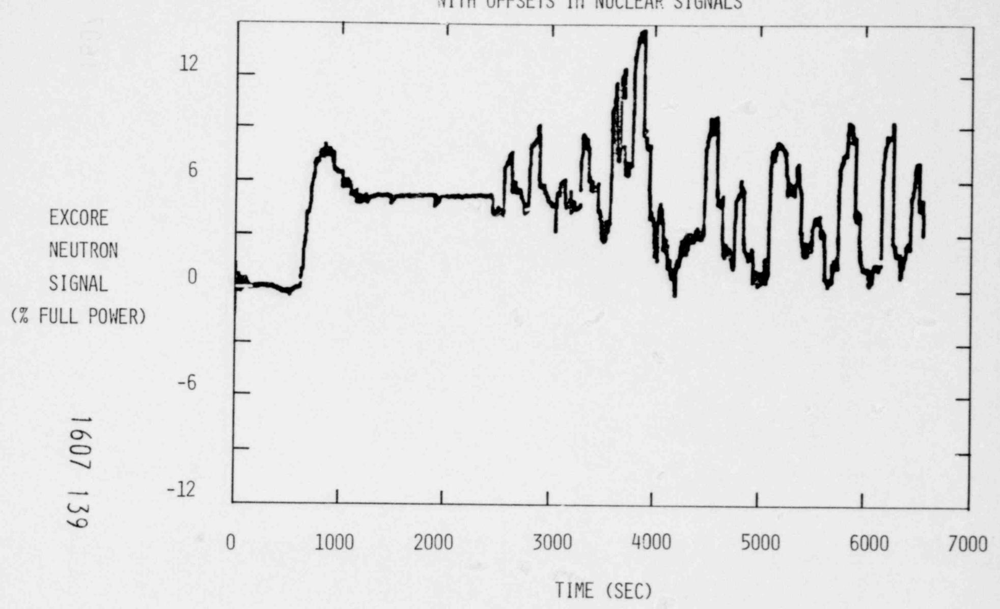
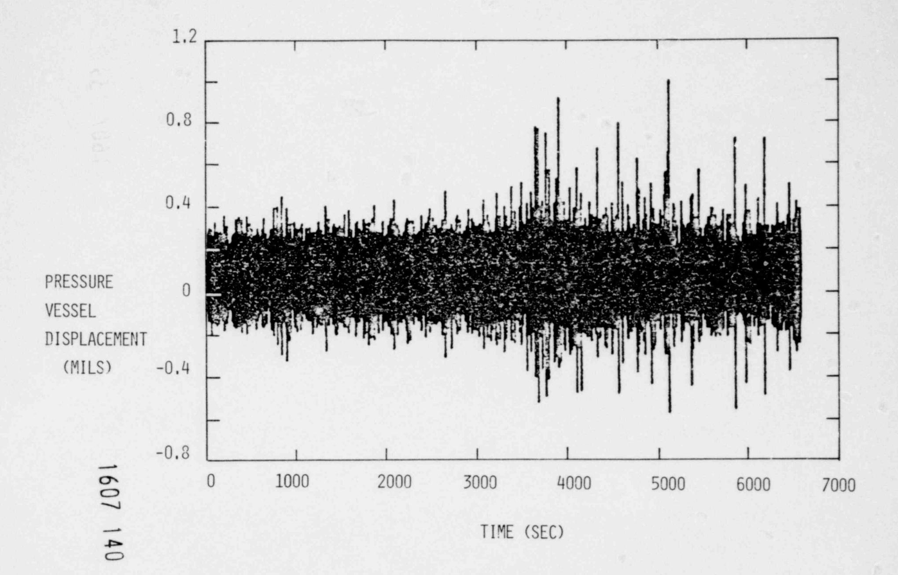
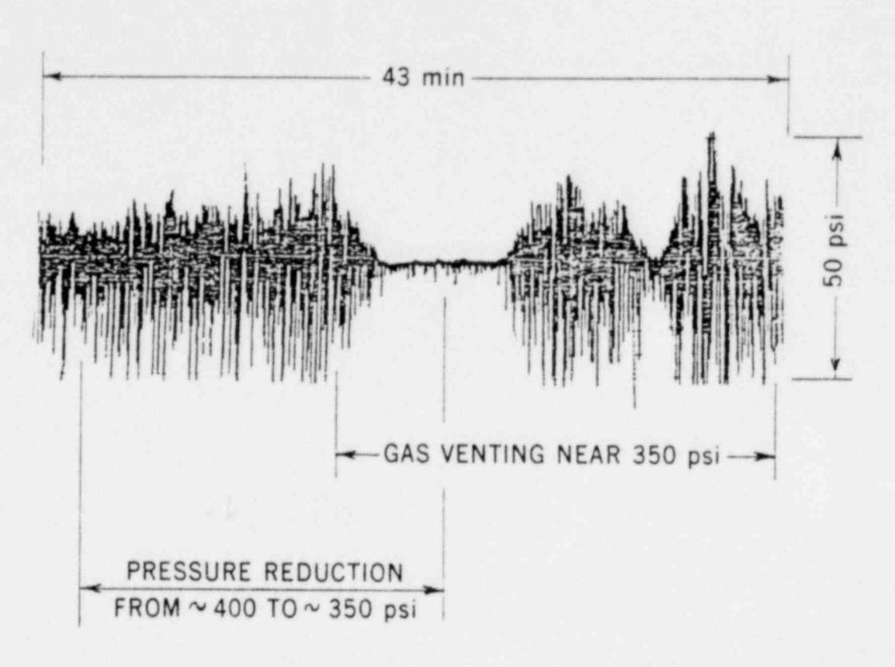
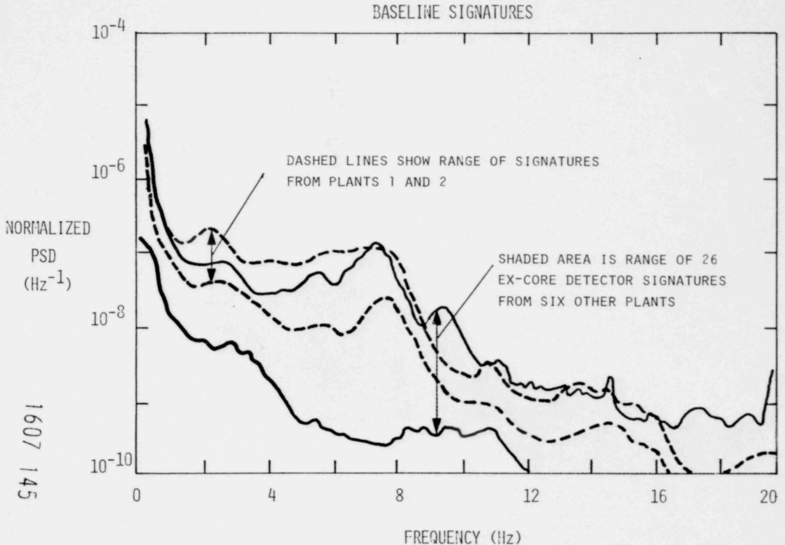
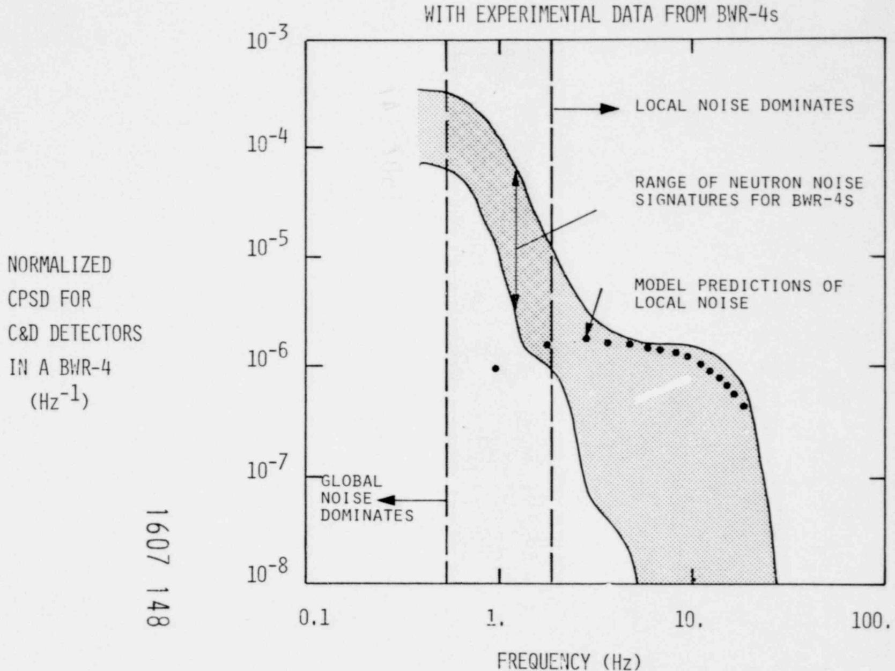
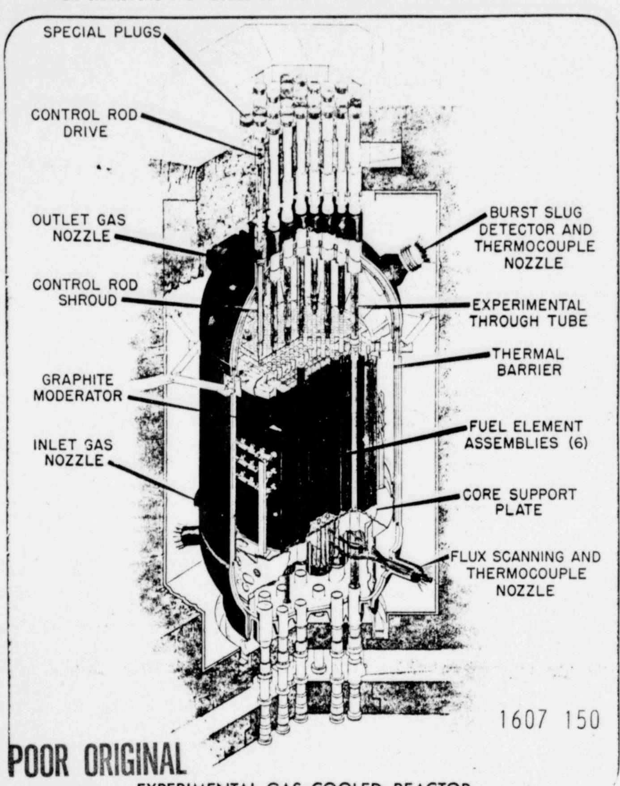

Application of Noise Analysis to Safety-Related Diagnostics and Assessments\*

D. N. Fry

Oak Ridge National Laboratory Oak Ridge, Tennessee 37830

#### FORT St. VRAIN

We recently used noise analysis methods to aid the NRC in assessing in-core temperature fluctuations (presumably due to graphite core block movements) at the Fort St. Vrain (FSV) gas-cooled reactor. We compared ex-core neutron noise signals and pressure vessel displacement probe signals to infer the predominant direction of movement of the graphite core blocks in the FSV. Noise techniques were also used to confirm that the movements of individual blocks were more or less random in nature (i.e., the total core did not move instantaneously as a unit) and that the movement did not result in significant total core reactivity changes.

#### THREE MILE ISLAND

Oak Ridge National Laboratory (ORNL) and its consultants from Science Applications, Inc., and Technology for Energy Corp. used noise analysis methodologies at TMI-2 to provide: (1) assessment of the size of a bubble of noncondensible gas in the primary system and assessment of the structural integrity of the reactor vessel internals by using the loose-parts monitoring system; (2) monitoring for incipient failure of critical post-accident instrumentation (pressurizer level indicators) and for bulk coolant boiling in the reactor core; and (3) confirmation and operator

\*Research sponsored by the Office of Nuclear Regulatory Research, Nuclear Regulatory Commission under Interagency Agreement DOE 40-544-75 with the U. S. Department of Energy under contract W-7405-eng-26 with the Union Carbide Corporation.

., k

assistance in degasification of the primary system prior to establishment of natural circulation cooling.1

### BASELINE SIGNATURES

In addition to the preceding applications of noise analysis to current safety-related problems, we are continuing to broaden the NRC noise analysis capabilities by acquiring baseline noise signatures for full-power plant operation and by evalucting new methods for understanding and applying noise signals for safety assessment. Our previous experience in the application of noise analysis for diagnosing and assessing abnormal plant behavior had shown a need for baseline, or reference, signatures for normal plant behavior against which to compare abnormal signatures. This need was again emphasized at TMI-2, where we were asked to monitor noncondensible gas in the primary water, detect boiling, detect loose parts, etc., with the reactor in a hot shutdown condition and with only one primary coolant pump in operation. Noise analysts could have performed these tasks much better if baseline signatures for pressure, temperature, and vibration signals had been readily available.

Recognizing this need, the NRC had asked ORNL even before the TMI-2 accident to acquire limited neutron noise baseline data from a few PWRs (we acquired signatures from two PWRs this year). However, based on subsequent TMI-2 experience, we are strongly recommending that baseline signature acquisition be expanded to include signals other than neutron noise and to include some measurements at other than full-power operation.

In connection with these studies, we plan to install a continuous monitoring system in a plant to automatically acquire and catalog noise signatures for a number of selected signals; then it will detect any deviations from baseline conditions that might appear. We also hope to eventually " train" the system to perform some diagnostic tasks (possibly detect PWR core boiling, loose core barrel, or abnormal fuel element vibration). 16017 132 . .

### ANALYTICAL PREDICTION OF NOISE SIGNATURES

We have also developed and performed an initial evaluation of a stochastic modeling methodology that promises to be a great asset in reactor noise analysis.2,3 This technique will allow noise analysts to predict by analytical methods the sensitivity of noise analysis for detecting postulated anomalies. For example, we plan to use this approach to calculate the minimum amount of in-core coolant boiling that can be detected by ex-core neutron detectors in a pressurized-water reactor.

#### LOOSE-PARTS MONITORING

In another effort, we assessed methods currently used by the nuclear industry to detect, locate, and determine the size of loose parts in U.S. commercial power reactors.4 We further assessed the methodology through fundamental research and measurements, including studies on the pressure vessel of the Experimental Gas-Cooled Reactor at ORNL. Important outcomes of these tests have been recommended procedures for mounting loose-part sensors and a method for locating loose parts that is based on amplitude (rather than time-of-arrival) differences.

### BOILING WATER REACTOR STABILITY MONITORING

There is currently a large international effort to better understand the nature of neutron noise in boeling-water reactors (BWRs). Potential applications of noise analysis for safety assessment in BWRs include on-line measurement of void fraction,5,6 detection of in-core component vibration and impacting,7 and monitoring of core power stability. We previously assessed void and vibration monitoring, and now we are evaluating the use of neutron noise for continuous on-line stability monitoring. Results' indicate that changes in stability parameters (such as the decay ratio) can be detected by performing time series analysis of neutron noise from power range monitor signals in BWRs.8 We have recommended that NRC perform an in-plant demonstration of such a continuous stability monitor to further assess the practicability of this methodology.

#### References

- 1. R. C. Kryter, D. N. Fry, J. C. Robinson, and G. L. Zigler, "TMI-2 On-Site Monitoring and Diagnostic Measurements Using Noise Analysis," unpublished summary report prepared for the President's Commission on the Accident at Three Mile Island (August 1979).
- 2. F. J. Sweeney, "Modeling the Local Component of In-Core Neutron Detector Noise in a BWR," Trans. Amer. Nucl. Soc. (to be published, November 1979).
- 3. F. J. Sweeney, " Sensitivity of Detecting BWR Control Rod Vibrations Using Neutron Noise," Trans. Amer. Nucl. Soc. (to be published, November 1979).
- 4. R. C. Kryter and C. W. Ricker, Characterisbics and Performance Experience of Loose-Part Monitoring Systems in U. S. Cor:mercial Pacer Rcactors, NUREG/CR-0524 (December 1978) .
- 5. D. N. Fry, W. T. King, E. L. Machado, and F. J. Sweeney, " Method for Detecting Bypass Coolant Boiling in Boiling Water Reactors," Trans. Amer. Nucl. Soc. 30, 511 (1978).
- 6. M. Ashraf Atta, D. N. Fry, J. E. Mott , and W. T. King, "Determination of Void Fraction Profile in a Boiling Water Reactor Channel Using Neutron Noise Analysis," Nucl. Sci. E'ng. 66,, 264-268 (1978).
- 7. D. N. Fry , R. C. Kryter, M. V. Mathis, J. E. Mott, and J. C. Robinson, "Use of Neutron Noise to Detect BWR-4 In-Core Instrument Tube Vibrations and Impacting," Nucl. Technol. 43, 42-54 (April 1979).
- 8. B. R. Upadhyaya and M. Kitamura, " Monitoring BWR Stability Using Time Series Analysis of Neutron Noise," Trans. Amer. Nucl. Soc. (to be published, November 1979) .

. .

# D. N. FRY -- DEVELOPMENT GROUP 18C DIVISION -- ORNL

NOISE ANALYSIS: A USEFUL TOOL TO DIAGNOSE AND ASSESS SAFETY-RELATED PROBLEMS IN NUCLEAR PLANTS

SEVENTH WATER REACTOR SAFETY RESEARCH

INFORMATION MEETING, NATIONAL BUREAU OF STANDARDS

NOVEMBER 9, 1979

# WE HAVE RECENTLY USED NOISE ANALYSIS METHODS TO AID NRC IN

1. ASSESSMENT OF EX-CORE NUCLEAR SIGNAL FLUCTUATIONS AT FORT ST. VRAIN

AND

2. POST-ACCIDENT ASSESSMENT OF REACTOR VESSEL INTERNALS AND OPERATIONS AT THREE MILE ISLAND 2

### WE HAVE ALSO C0flTINUED T0:

. .

- \* ACQUIRE BASELINE NEUTR0fl NOISE SIGilATURES FROM OPERATING PLANTS
- \* DEVELOP ANALYTICAL TECHilIQUES TO PREDICT THE SEflSITIVITY OF NOISE ANALYSIS FOR DETECTING POSTULATED ANOMALIES
- \* C0flDUCT EXPERIMENTS TO EVALUATE THE METHODS CURRENTLY USED BY THE flUCLEAR INDUSTRY TO DETECT, LOCATE, AND DETERMINE THE SIZE OF LOOSE PARTS IN THE PRIMARY COOLANT SYSTEM
- \* DETERMIflF THE FEASIBILITY OF USING NEUTRON NOISE FOR CONTINUOUS, ON-LINE MONITORIIlG OF STABILITY IN BWRs

## WE PROVIDED ASSISTANCE TO NRC IN ASSESSING A PROBLEM AT FORT ST. VRAIN

THE PROBLEM:

AT TIMES DURII1G NORMAL OPERATI0fL LARGE OFFSETS OCCUR IN EX-CORE ilEUTRON FLUX CHAilNELS

THESE OFFSETS ARE PRESUMED TO BE CAUSED BY GRAPHITE BLOCK MOVEMENTS IN THE CORE

OUR ASSISTANCE:

WE AtiALYZED SIGt1ALS FROM EX-CORE NEUTRON DETECTORS AND PRESSURE VESSEL DISPLACEMENT PROBES TO INFER THE PREDOMIllANT DIRECTION OF MOVEMEllT

1607 138

. .

# INCREASED ACTIVITY ON DISPLACED PROBES CAN BE ASSOCIATED WITH OFFSETS IN NUCLEAR SIGNALS

# THEREFORE, NOISE ANALYSIS AIDED NRC'S EVALUATION OF FORT ST. VRAIN OSCILLATIONS

- 1. COINCIDENCE ANALYSIS OF NEUTRON FLUX AND PCRV
  DISPLACEMENT SIGNALS YIELDED INFORMATION ABOUT
  THE DIRECTION OF CORE MOTION
- 2. DATA OBTAINED SO FAR SUGGEST THAT CORE MOVES PREFERENTIALLY IN A NW-SE DIRECTION

### WE PERFORMED Oil-SITE DIAGil0STIC MEASUREMENTS AT TMI T0:

- VERIFY THE POST-ACCIDENT STRUCTURAL INTEGRITY \* OF THE REACTOR VESSEL INTERNALS
- VERIFY THAT A NONC0t!DENSIBLE GAS BUBBLE IN THE \* PRIMARY SYSTEM DID NOT POSE A THREAT TO CORE COOLING
- VERIFY THAT BULK COOLANT BOILING WAS NOT OCCURRING \* IN THE CORE DURING ONE-PUMP AND NATURAL CONVECTION C00LIllG
- PROVIDE GUIDANCE TO PLANT OPERATORS DURING DEGASIFI- \* CATION OF THE PRIMARY SYSTEM

i607 142

# A PORTION OF STRIP CHART RECORDING SHOWS HOW NOISE ANALYSIS MADE ITS MOST VALUABLE AND DIRECT CONTRIBUTION DURING PRIMARY COOLANT DEGASIFICATION OPERATIONS

# WE OBTAINED BASELINE NEUTRON NOISE SIGNATURES FROM EX-CORE DETECTORS IN TWO PWRS

TO BE USED TO ASSESS

FUTURE CORE OR CORE BARREL VIBRATION
PROBLEMS IF THEY OCCUR

## BOTH PLANT SIGNATURES ARE CONSISTENT WITH PWR RASELINE SIGNATURES

WE ARE DEVELOPING ANALYTICAL METHODS

TO UNDERSTAND THE BASIC PROCESSES

WHICH PRODUCE REACTOR NOISE

AND

TO ESTABLISH THE RANGE AND DETECTABILITY

OF POSTULATED ANOMALIES

THE METHODOLOGY WAS EVALUATED BY: COMPARING CALCULATED BWR BACKGROUND NEUTRON NOISE

. .

AND

CAUSED BY BOILING WITH SIGNATURES OBTAINED FROM FIVE BWR-4s

BY ESTIMATING THE MINIMUM AMOUNT OF CONTROL R0D VIBRATION THAT CAN BE RELIABLY DETECTED IN A BWR-4 IN THE PRESENCE OF THE NORMAL BOILING NOISE

# PRELIMINARY MODEL PREDICTIONS COMPARE WELL WITH EXPERIMENTAL DATA FROM BWR-4s

# WE ARE NOW APPLYING THIS METHODOLOGY TO CALCULATE NEUTRON NOISE CAUSED BY POSTULATED

\* VIBRATION OF CORE COMPONENTS IN PWRs

AND

\* CORE VOIDING IN PWRs

84 . . . . . . . . . . . . . . . . . . .

ME EVALUATED LOOSE PARTS LOCATION METHODS BY LOCATING
FOUR ACCELEROMETERS ON THE LOWER HEAD OF THE EGCR AND
THEN IMPACTING THE VESSEL BETWEEN TWO OF THE ACCELEROMETERS.

EXPERIMENTAL GAS-COOLED REACTOR

## TO INFER THE LOCATION OF IMPACTS, WE HAVE EXPLORED THE USE OF EllERGY ATTENUATION WITH IMPACT-TO-SENSOR DISTANCE

THE METHOD APPEARS TO GIVE GOOD RESULTS

BUT

IT DOES REQUIRE DETAILED KNOWLEDGE OF THE SOUND TRANSMISSION PATH, WHICH IS NOT EASILY OBTAINED FOR COMPLEX STRUCTURES

## IN THE QUIET ENVIRONMENT OF THE EGCR WE CAN LOCATE THE IMPACT SITE TO WITHIN 12 INCHES IF WE ASSUME THAT THE IMPACT IS ON THE VESSEL WALL

### (VESSEL DIAMETER IS ~ 20 FT)

| IMPACT NO. | ERROR IN LOCATION (IN.) |
|---------------|----------------------------|
| 1             | 8.1                        |
| 2             | 10.1                       |
| 3             | 10.4                       |
| 4             | 11.7                       |
| 5             | 6.9                        |
| 6             | 16.3                       |
| 7             | 12.0                       |
| 8             | 12.2                       |
| 9             | 11.3                       |
| 10            | 9.6                        |
| 11            | 12.7                       |
| 12            | 12,7                       |

MEAN ERROR = 11.2 INCHES

### CHANGES IN CORE DESIGN OR OPERATING STRATEGY MAY AFFECT STABILITY MARGIN IN BWRs

### THEREFORE

- \* THE PURPOSE OF OUR PROGRAM IS TO DETERMINE THE FEASIBILITY OF USING NOISE SIG!1ALS TO DETECT CHANGES IN CORE STABILITY WITHOUT DISTURBING PLANT OPERATION
- \* OUR METHOD OBTAINS DECAY RATIOS OR OTHER SIMILAR STABILITY PARAMETERS FROM NEUTRON NOISE SIG!1ALS USING TIME SERIES ANALYSIS
- \* WE HAVE DETERMINED THE FEASIBILITY OF OUR METHOD BY USIt!G EXISTING NEUTRON SIGNALS RECORDED AT AN 1100 liwe BWR/4 AT FULL POWER

## NORMAL BOILING CAUSES P#lDOM REACTIVITY FLUCTUATION WHICH STIMULATES THE CORE

RANDOM LOCAL REACTIVITY CORE POWER NEUTRON BOILING VOIDS FLUCTUATION RESPONSE FLUCTUATIONS SIGNAL

FROM THIS

WE CAN INFER CHANGES IN THE DYNAMIC RESPONSE OF

\_ THE CORE BY MONITORING THE NEUTRON NOISE

\$~

n

## UNIVARIATE AND MULTIVARIATE TIME SERIES ANALYSIS OF NEUTRON SIGNALS WAS USED TO I!!FER CORE STABILITY

. .

UNIVARIATE DECAY RATIO = 0,024 MULTIVARIATE DECAY RATIO = 0.020

THEREFORE

WE RECOMMEND THAT THE UNIVARIATE METHOD BE USED TO M0f1ITOR STABILITY

BECAUSE

IT IS EASIER TO IMPLEMENT AND SEEMS TO YIELD A CONSERVATIVE ESTIMATE OF STABILITY

### FROM THESE STUDIES AND EXPERIENCES,

WE CONCLUDE THAT NOISE ANALYSIS HAS A PLACE
AMONG OTHER METHODS IN DIAGNOSING AND ASSESSING
SAFETY-RELATED PROBLEMS IN NUCLEAR PLANTS