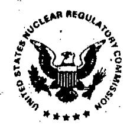
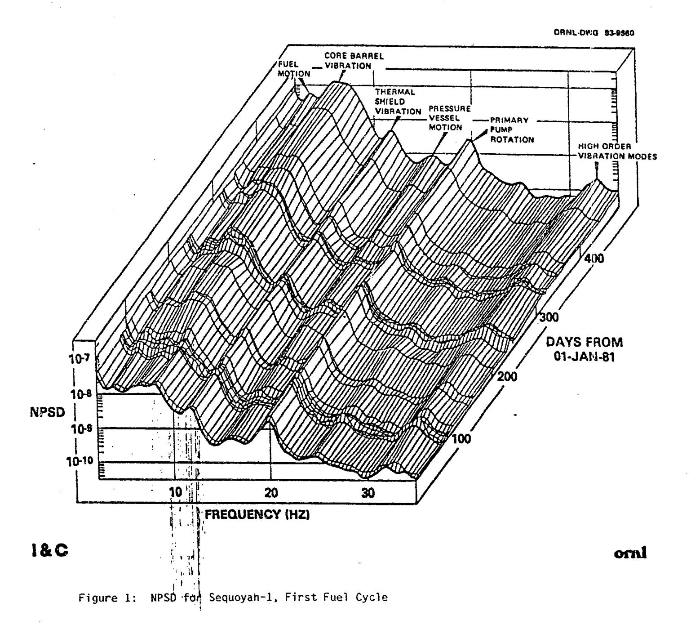
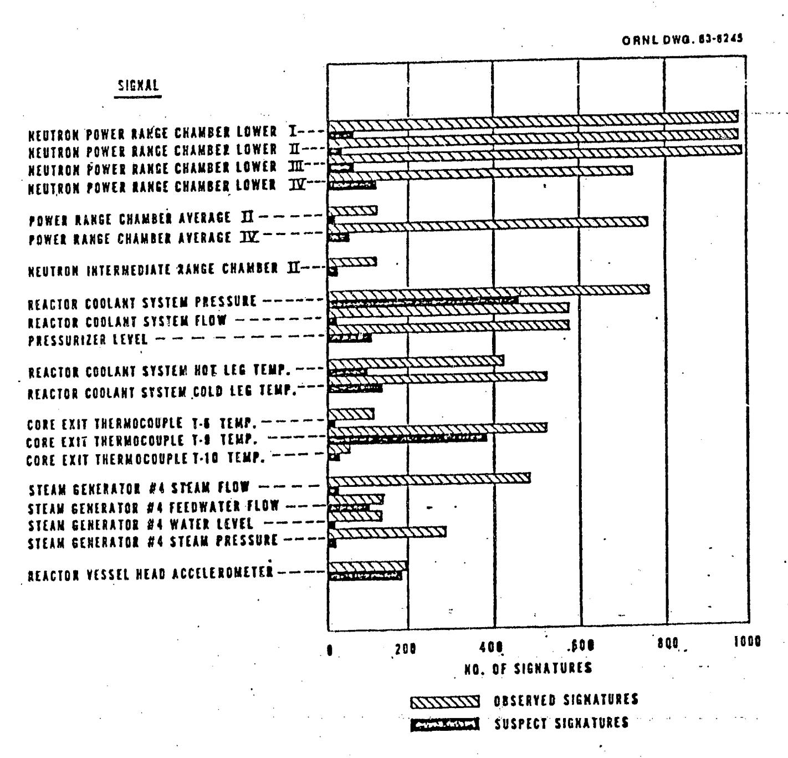

# UNITED STATES NUCLEAR REGULATORY COMMISSION

WASHINGTON, D. C. 20555

NRC-PDR

MAY 4 1993

**MEMORANDUM FOR:** 

Thomas E. Murley, Director

Office of Nuclear Reactor Regulation

FROM:

Eric S. Beckjord, Director

Office of Nuclear Regulatory Research

G: Bet will lotte

**PES Files** 

to HES, Yes X\_ No ....

SUBJECT:

RESEARCH INFORMATION LETTER NUMBER 174

ON-LINE REACTOR SURVEILLANCE SYSTEM

References:

- NUREG-0600, "NRC Action Plan Developed as a Result of 1. the TMI Accident." Action Item I.D.5(3), "Continuous On-Line Reactor Surveillance System, August 1980.
- 2. Letter, H. Denton to S. Levine, "Continuous On-Line Reactor Surveillance System, "RR-NRR-79, July 30, 1979.
- Letter, S. Levine to H. Denton, "Research Plan for 3. Investigating the Use of a Continuous On-Line Reactor Surveillance System," November 9, 1979.
- 4. C. M. Smith, "A Description of the Hardware and Software of the Power Spectral Density Recognition (PSDREC) Continuous On-Line Reactor Surveillance System, NUREG/CR-3439, Volumes 1 & 2, December 1983.
- 5. C. M. Smith and R. C. Gonzales, "Automated Long-Term Surveillance of a Commercial Nuclear Power Plant," NUREG/CR-4577, August 1987.
- C. M. Smith and R. C. Gonzales, "Long-Term Automated Surveillance of a Commercial Nuclear Power Plant," Proceedings of SMORN-IV, Progr. Nucl. Energy 15, 17-26 (1985).
- 7. F. J. Sweeney, J. March-Leuba, and C. M. Smith, "Contribution of Fuel Vibrations to Ex-Core Neutron Noise During the First and Second Fuel Cycles of the Sequoyah-1 Pressurized Water Reactor." Proceedings of SMORN-IV, Progr. Nucl. Energy 15, 283-290 (1985).
- 8. D. N. Fry, J. March-Leuba, and F. J. Sweeney, "Use of Neutron Noise for Diagnosis of In-Vessel Anomalies in Light Water Reactors," NUREG/CR-3303, January 1984.
- J. March-Leuba and C. M. Smith. "Development of An Automated Diagnostic System for Boiling Water Reactor Stability Measurements," Proceedings of SMORN-IV, Progr. Nucl. Energy 15, 27-35 (1985).

060118

9305100271 930504

This Research Information Letter describes the development and in-plant demonstration of non-intrusive noise monitoring techniques for determining the continued mechanical integrity of reactor vessel internal structures and analysis of sensor signal measurements for ascertaining the behavior of plant systems, using signals from instrumentation normally already present at commercial nuclear power plants.

### Regulatory Issue

Following the TMI accident, the NRC prepared an Action Plan for research to enhance the safety of commercial nuclear power plants. This plan was described in NUREG-0600 and listed as Task I.D.5(3), an evaluation of the use of noise diagnostics by continuous on-line measurements as a means of detecting the degradation of systems and components in nuclear reactors. The early identification of anomalies or abnormal signals would enable the reactor operators to take early action to correct malfunctions before actual failure could take place and, hence, reduce the probability of a nuclear accident.

The NRC Office of Nuclear Regulatory Research (RES) had, for several years prior to the TMI accident, been working with the Oak Ridge National Laboratory (ORNL) Instrument and Control Division to develop noise analysis techniques and acquire both normal and abnormal reactor neutron signal signatures to support the Office of Nuclear Reactor Regulation's (NRR) assessment of the licensee and vendor diagnostic efforts. Neutron noise analysis had been used to identify the nature and extent of reactor internals failure at several PWR and BWR Nuclear Power Stations.

The NRC Office of Nuclear Reactor Regulation submitted a User Need Letter (Reference 2) requesting that RES investigate the feasibility of detecting the presence of operational anomalies in commercial nuclear power plants by the use of continuous on-line noise surveillance. RES, with assistance from ORNL, prepared a research plan for assembling the necessary hardware and the development of associated software. This was to be followed by installation and demonstration at a commercial nuclear power station to be chosen based on mutual agreement between NRR, RES, and the plant licensee. This plan (Reference 3) was based on using pattern recognition techniques to establish normal plant signatures and identify deviations during operation. It also included incorporating data logging equipment in the system in order to record and store typical plant sensor signatures which could be later further evaluated by ORNL and used by ORNL in assisting NRR in validating licensee evaluations for the cause of reactor systems degradation and their subsequent repair.

Because of continuing NRR concern over the change in decay ratio of BWRs with fuel burnup and accompanying plutonium buildup, power shape shift, etc., it was proposed that the continuous on-line monitoring system be moved to a BWR nuclear power station. Decay ratios and stability measurements were being made at the time by plant perturbations. ORNL's research for RES indicated that stability measurements could be made by noise analysis without external perturbations or intrusion. The Peach Bottom Nuclear Power Station agreed to

have the system installed there. However, shortly after installation and check out the Peach Bottom plant was shut down for 2 years due to operational and management problems. NRC budgetary constraints prevented completing the BWR plant demonstration and the equipment which had become antiquated during this period by the rapid advances in computer technology, was removed from Peach Bottom in 1989 and returned to ORNL for Storage.

# Conclusions

The two main objectives listed in the user letter were met and the use of a continuous on-line reactor surveillance system was demonstrated at a PWR facility.

The capabilities and limitations of a noise surveillance system employing the power spectral density recognition (PSDREC) code were investigated during a 2-1/2 year continuous on-line series of measurements at the Sequoyah-1 Nuclear Power Station (Reference 5). The system proved capable of distinguishing abnormal signatures from baseline signatures whose characteristics were learned automatically during periods of normal plant operation. Random, stationary neutron noise signals were tracked throughout the demonstration with a high degree of success (10 percent of these spectra were categorized as suspect). Non-stationary process noise signals proved more difficult to track as evidenced by a higher percentage (20 percent) of spectra flagged as potentially abnormal. Despite this performance limitation, PSDREC proved its value as a powerful data screening tool.

Although no major operational anomalies occurred during Sequoyah-1's first and second fuel cycles, the data acquired by the on-line surveillance system during this period provided valuable data for developing an understanding of the contribution of fuel assembly vibration and the vibration of other vessel internal structures to neutron noise (Reference 7). Neutron power spectral density measurements (NPSD) are shown in Figure 1 for the Sequoyah-1 first fuel cycle. It was concluded that fuel assembly vibrations constituted a significant source of ex-core neutron noise throughout the 0.1 to 50 Hz frequency range, probably as a result of mechanical/acoustic coupling with other vibrating internal structures. Separation of changes in neutron noise due to attenuation (shielding) effects of structural vibrations from changes due to reactivity effects of fuel assembly motion was found to be difficult. However, the continuous nature of the noise measurements performed throughout the Sequoyah-1 fuel cycle proved invaluable in separating changes in the noise spectra produced by structural motion from changes attributable to varying boron concentration and fuel burnup (Reference 7). Separation of these effects would be nearly impossible when collecting data only sporadically.

The measurements at Sequoyah-1 were used to address a number of other operational questions on the use of noise analysis. It was found that a combination of neutron noise and core exit thermocouple noise may be used to infer the coolant flow velocity in the core. A possible methodology for detecting a solid pressurizer was studied. It was confirmed that the core exit thermocouple noise could possibly be used to detect insufficient core cooling.

The extensive PWR baseline data acquired at Sequoyah-1 has proved extremely valuable to ORNL in assisting NRR in assessing the cause and safety significance of anomalies subsequently discovered in a number of nuclear power plants, including Oconee, Main Yankee, Millstone, Ft. Calhoun, and St. Lucie. A specific example was the use of the Sequoyah-1 neutron noise measurement data in the assessment of the loose thermal shields in Oconee 1, 2, and 3.

The on-line reactor surveillance system was demonstrated to function reliably over the 2-1/2 years of operation. It was also found possible to install the system such that the reactor signals used by the plant computer could be used by the automated reactor surveillance system by connection through buffers without interfering with plant operation. The more recent advances in computer technology would make it possible to achieve a faster scanning rate today on even more than the 20 sensor signals used in this demonstration.

# Regulatory Applications

U. S. nuclear utilities are increasingly using neutron noise analysis to assess the degradation of core internals such as loose thermal shields, core barrels and hold down bolts. There has been a reluctance, however, to utilize continuous noise measurements which might detect system or component degradation at an early stage. Advances in computer technology should make this technique more attractive in the future. This along with a greater understanding and use of pattern recognition techniques should bring about greater acceptance of the use of stochastic monitoring systems.

Foreign nuclear plants have used noise analysis techniques with success in discovering or aiding in the interpretation of a number of unusual operating situations. Continuous monitoring has been employed in both Germany and France for selected systems. Some examples present at the Specialists Meeting on Reactor Noise (SMORN) conferences are listed below:

Onagawa-1 (Japanese BWR-4) - The detection of five operational anomalies using noise detection techniques were discussed at SMORN-V:

- 1. Inferior electronic parts in a recirculation pump speed adjuster,
- 2. Incorrectly constructed control devices in a motor-generator set,
- Incorrect adjustment of the feedwater control system,
- Drift in a feedwater control valve signal caused by wear,
  Misadjustment of a pressure control valve position sensor.

1200 MW German PWR - R. Sunder and D. Wach reported at a 1984 IAEA sponsored meeting on the "Operational Safety of Nuclear Power Plants" that 1 month after a routine in-service inspection, the resonant frequencies associated with vibration of the upper core structure and the core barrel were observed to change. Analytical models pointed to the relaxation of the hold-down springs positioned between the core support barrel flange and the upper head closure as a likely cause for the altered noise signatures. The hold-down springs were replaced at the next regular shut down. The spring constants of the 112 springs removed were measured and 65 were found to be below design

specifications. After replacement, the reactor was returned to service and the noise signatures were measured and found to again be normal.

In a separate occurrence, an abrupt 0.4 HZ shift in the resonant frequency of the secondary core support structure was detected by spectral analysis of vibrations signals obtained from accelerometers mounted on the reactor vessel for the detection of loose parts. Long-term tracking of the spectra had shown the frequency to previously be stable at 0.1 Hz over a 1-year period of operation. Modeling analysis indicated that a probable cause was a change in rigidity of the coupling between the core support structure and the reactor pressure vessel. Upon examination at the next regular outage, six of the 32 bolts securing the vessel to its support were found to be loose. After tightening the bolts the vibration resonance returned to its normal frequency.

French PWR - C. Puyal and colleagues reported at the Fifth Power Plant Dynamics, Control and Testing Symposium in a paper titled "Primary System Surveillance and Diagnostics of PWR Power Plants in France," that neutron noise signatures acquired at regular intervals had played a primary role in detecting baffle jetting and also had been used later in demonstrating that modifications to the core support plate coolant paths were successful in combating this design problem.

Many other papers and instances in which noise analysis and power spectral measurements have been used to diagnose rector vessel internals damage, component and system failures, can be found in the SMORN conference proceedings and other literature discussing plant operational experiences.

#### Restrictions on Applications

The use of noise analysis techniques for on-line monitoring of reactor vessel internals is not restricted by assumptions of linearity, stationarity, Gaussian amplitude distribution of the data collected, etc. The chief impediment to the interpretation of neutron noise data is the lack of a sufficiently detailed knowledge of reactor data (such as boron concentration and fuel burnup) which may influence the data in a manner indistinguishable from changes caused by altered vibrational characteristics accompanying structural degradation. The cross correlation of multiple sensor types (e.g., ex-core neutron sensors and vessel-mounted accelerometers) will frequently enable one to overcome this ambiguity. The interpretation and analysis of data from process sensors is made difficult by their greater signal variability due to hydraulic phenomena. This was seen in this research in the larger number of suspect process spectra flagged by the automated surveillance system as compared to the neutron noise spectra (Figure 2). We believe that further development of the automated surveillance of neutron and process noise could overcome most of the above limitations.

## Unresolved Questions and Further Research

It would have been beneficial to have demonstrated the workability of the continuous on-line noise surveillance system at an operating BWR nuclear power plant such as Peach Bottom. Unfortunately, owing to a continuing series of plant operational and management problems, Peach Bottom did not attain full power normal operating status for a sufficient length of time during the period the ORNL continuous on-line monitoring system was installed to be able to collect data. Thus, ORNL was never able to collect baseline signatures (both process and neutron noise) which could have provided a useful reference. If at some time in the future, the licensee of a BWR nuclear power plant installs a noise surveillance system at their plant it would be desirable to collect these signatures. At this time it would require reconditioning of the ORNL surveillance system if it were to be used for that purpose. Further, in view of the advances in computer technology, it would be recommended that a new, much better system be assembled.

#### Recommendations

We believe that the use of a continuous surveillance system to detect operational anomalies and degradation of plant systems at a nuclear power station has been adequately demonstrated. Although U.S. utilities are not utilizing continuous surveillance systems, they are using intermittent noise analysis measurements to detect core barrel and thermal shield degradation in PWR nuclear stations.

Further development of this technique by the NRC does not appear to be necessary. It is recommended that no further work on this subject be done other than encouraging the utilities to continue to apply and to expand this methodology.

Eric S. Beckjord, Director Office of Nuclear Regulatory Research

Lis Turgal

Enclosures:

1. Figure 1:

NSPD for Sequoyah-1, First Fuel Cycle

2. Figure 2:

Processes and Systems Flagged by Automated Surveillance System

# ONLY A SMALL NUMBER OF SIGNATURES WERE STATISTICALLY DIFFERENT FROM THE

# REFERENCE SIGNATURE\_FOR MOST SIGNALS

Figure 2: Processes and Systems Flagged by Automated Surveillance System