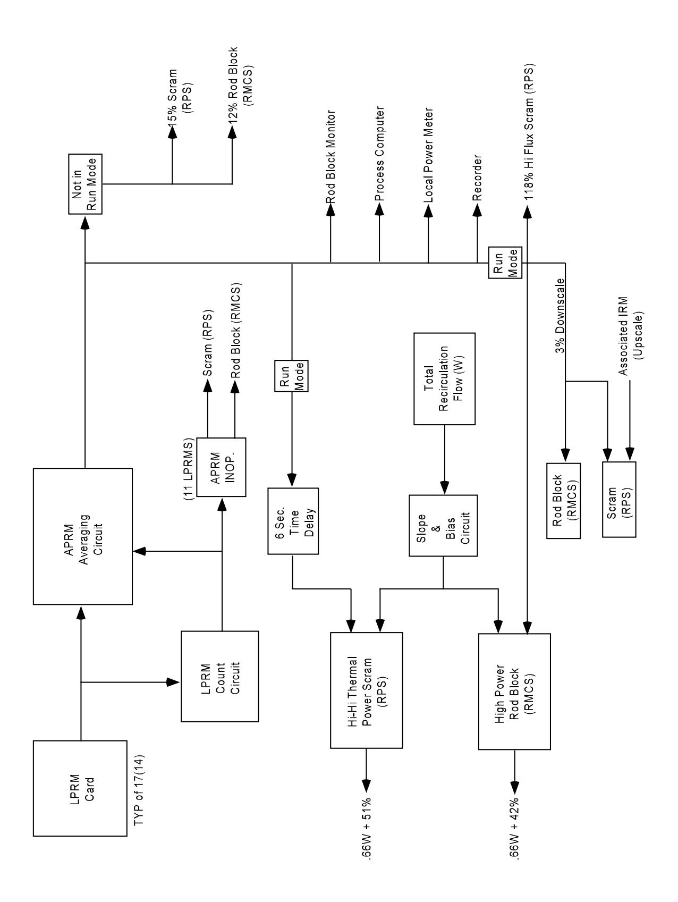
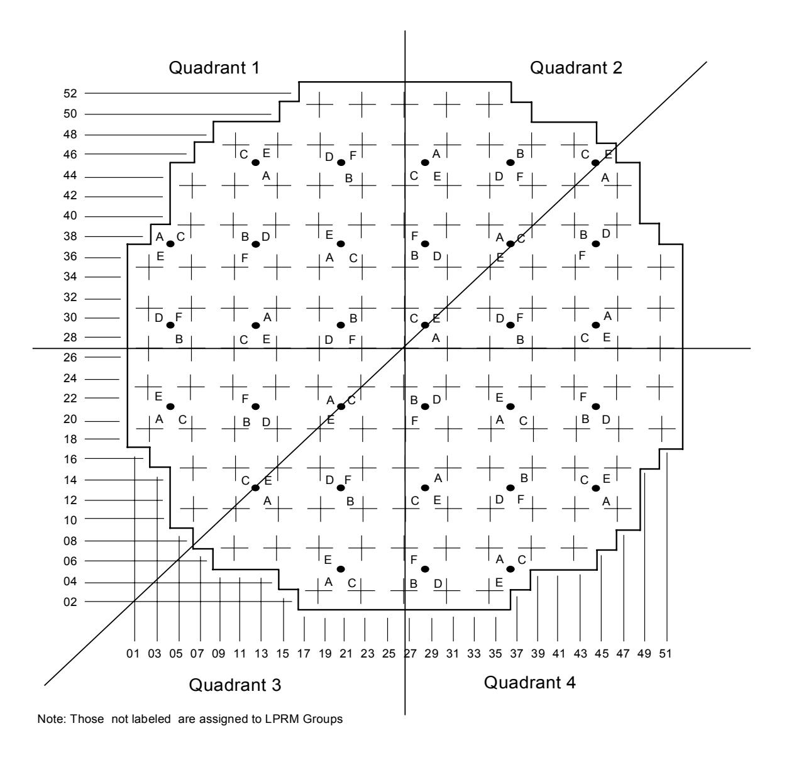
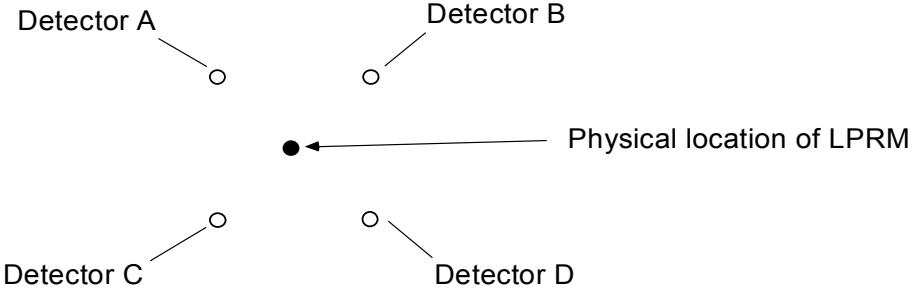
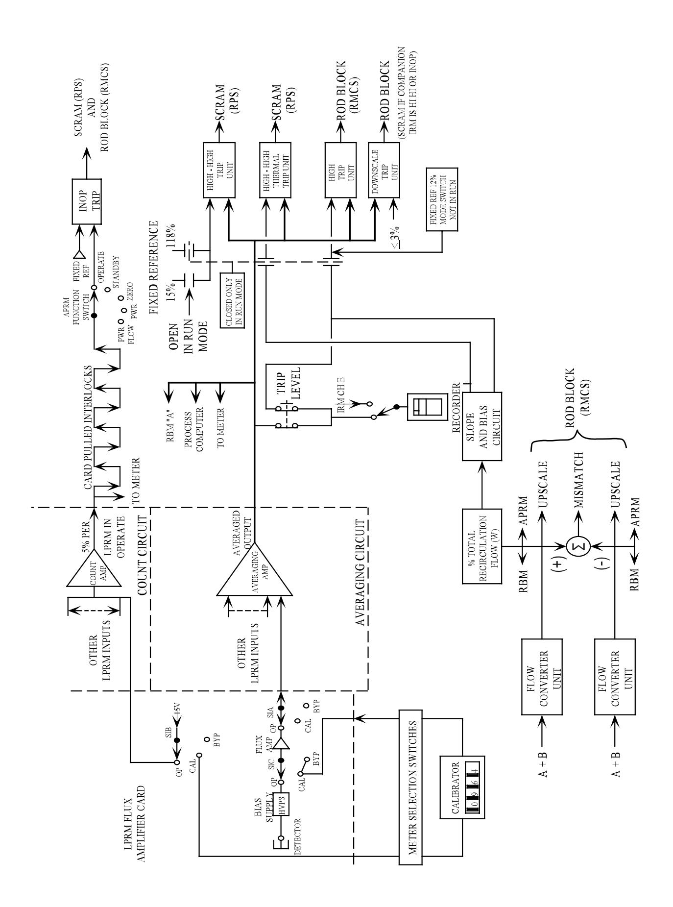
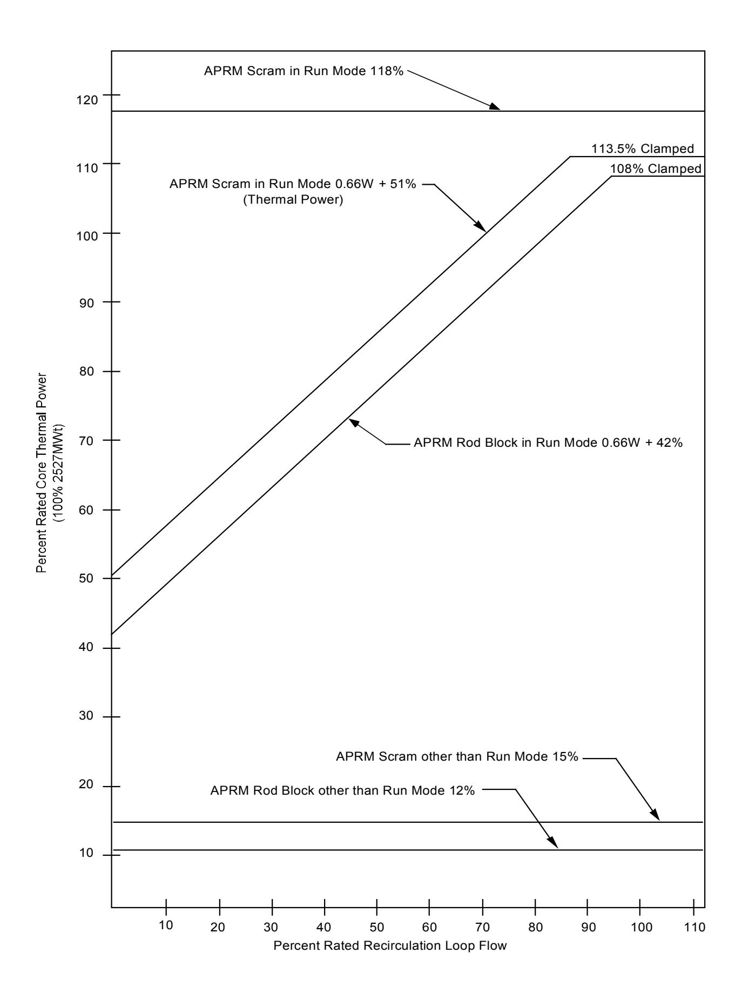
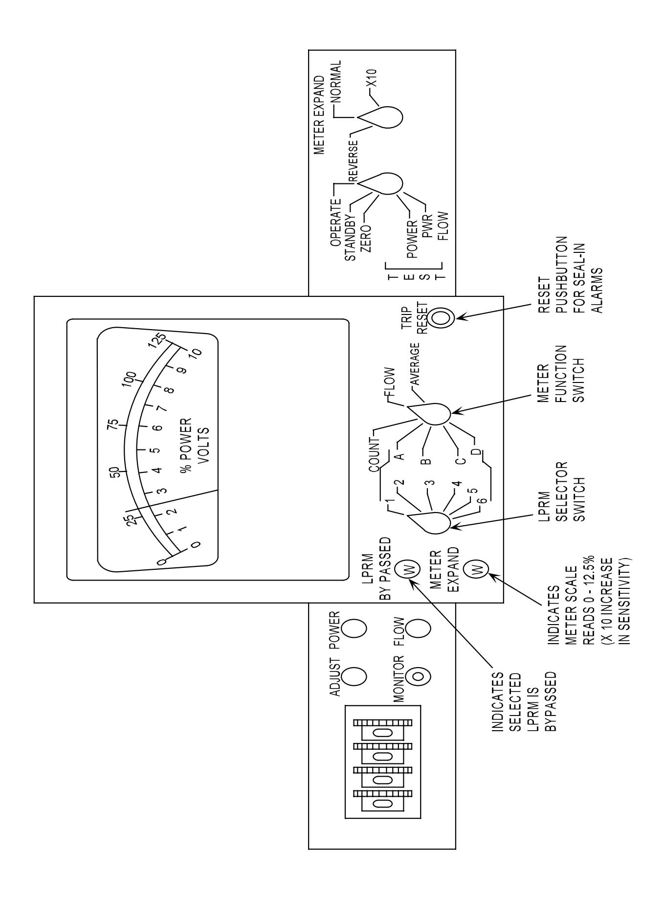

**General Electric Systems Technology Manual Chapter 5.4** 

**Average Power Range Monitoring System**

# **TABLE OF CONTENTS**

| 5.4 AVERAGE POWER RANGE MONITORING SYSTEM | 1 |
|-------------------------------------------|---|
| 5.4.1 Introduction                        | 1 |
| 5.4.2 Component Description               | 2 |
| 5.4.2.1 LPRM Inputs                       | 2 |
| 5.4.2.3 Count Circuit                     | 3 |
| 5.4.2.2 Averaging Circuit                 |   |
| 5.4.2.4 Slope and Bias Circuit            | 3 |
| 5.4.2.5 Trip Units                        | 4 |
| 5.4.3 System Features and Interfaces      | 6 |
| 5.4.4 Summary                             | 7 |
|                                           |   |
| LIST OF TABLES                            |   |
| 5.4-1 APRM INTERLOCKS AND TRIPS           | 7 |

# **LIST OF FIGURES**

- 5.4-1 APRM Simplified Block Diagram
- 5.4-2 LPRM Detector Assignments to APRMs
- 5.4-3 APRM Chanel Block Diagram
- 5.4-4 APRM Trip Levels
- 5.4-5 APRM Functional and Test Switches

## **5.4 AVERAGE POWER RANGE MONITORING SYSTEM**

## **Learning Objectives:**

- 1. Recognize the purposes of the Average Power Range Monitor (APRM) system.
- 2. Recognize the purpose, function, and operation of the following system components:
  - a. LPRM inputs
  - b. count circuit
  - c. averaging circuit
  - d. slope and bias circuit
  - e. APRM recorder
  - f. trip units
  - g. APRM bypass switch
  - h. flow unit
  - i. flow unit bypass switch
- 3. Recognize the plant response to the following APRM signals, when the trips are bypassed and the reason for the trips:
  - a. Upscale High Neutron Trip
  - b. Upscale High Thermal Trip
  - c. Upscale High Alarm
  - d. Downscale
  - e. Inoperable APRM
  - f. Flow bias not normal
- 4. Recognize how local power range monitor (LPRM) detectors are assigned to the APRMs.
- 5. Recognize how the Average Power Range Monitor system interfaces with the following systems:
  - a. Reactor Manual Control System (Section 7.1)
  - b. Recirculation System (Section 2.4)
  - c. Local Power Range Monitoring System (Section 5.3)
  - d. Reactor Protection System (Section 7.3)
  - e. Rod Block Monitoring System (Section 5.5)
  - f. Intermediate Range Monitor System (Section 5.2)

## **5.4.1 Introduction**

The APRM system has two purposes. One purpose is to monitor the core thermal power level. The other purpose is to provide reactor scram and control rod block signals to preserve the fuel cladding integrity.

The functional classification of the APRM system is that of a safety related system.

The APRM system (Figure 5.4-1) consists of six channels designated A through F. Each APRM channel averages the inputs from up to 17 LPRMs and provides an output signal. Because the LPRMs assigned to specific APRM channels (Figure 5.4-2) are located in diverse axial and radial locations throughout the reactor core, each APRM channel produces a signal proportional to the average neutron flux of the entire core.

The Recirculation System (Section 2.4) loop flow monitoring equipment provides APRM system trip units with a signal proportional to the total recirculation driving flow. Total recirculation driving flow consists of the sum of the recirculation pump (driving) flow in both recirculation loops.

The APRM System provides continuous indication of average reactor power from 0% to 125% of rated reactor thermal power. It also provides interlock signals to the Reactor Manual Control System (Section 7.1) for blocking control rod withdrawal at power and flow conditions below the reactor scram setpoint. This is done to avoid unnecessary reactor scrams. The APRM system also generates trip signals for the Reactor Protection System (RPS), (Section 7.3) to scram the reactor in time to prevent fuel damage.

## **5.4.2 Component Description**

The major components of the APRM System are illustrated in Figure 5.4-3 and discussed in the paragraphs which follow.

### **5.4.2.1 LPRM Inputs**

APRM channels A, C and E each have inputs from 17 LPRM inputs and APRM channels B, D and F each receive 14 LPRM inputs. As indicated in Figure 5.4-2, each APRM channel receives inputs from LPRM detector levels A, B, C, and D from multiple LPRM strings throughout the reactor core.

For example, APRM channel B receives inputs from:

- the A level LPRM detectors at locations 12-37, 44-37, 28-21
- the B level LPRM detectors at locations 36-45, 20-29, 36-13
- the C level LPRM detectors at locations 28-37, 12-21, 44-21, and 28-05, and
- the D level LPRM detectors at locations 20-45, 04-29, 20-13, and 36-29.

The LPRM assignments to the remaining APRM channels are equally diverse axially and radially. As a result, the response by the six APRM channels is fairly uniform to all reactivity changes. The APRM response is least uniform for control rod movements

because the magnitude of change is largest for LPRM strings nearest the moved control rod(s). The use of symmetrical control rod patterns constrains the non-uniformity.

## **5.4.2.3 Count Circuit**

A minimum number of LPRM input signals are required to provide an adequate averaged representation of core power. An APRM channel cannot reliably monitor core power level if it receives information from too few LPRM detectors. The count circuit (Figures 5.4-1 and 5.4-3) determines the number of operable LPRM signals to a given APRM. The count circuit receives an input from each LPRM detector assigned to the APRM channel if the LPRM detector's mode switch is in the Operate position. The count circuit uses this logic because at the low end of the APRM channel monitoring range, many of the individual LPRM readings can be zero or close to it.

If the number of LPRM inputs is less than 11, the count circuit generates a trip signal to the reactor protection system and the reactor manual control system that the APRM channel is inoperable.

### **5.4.2.2 Averaging Circuit**

This circuit (Figures 5.4-1 and 5.4-3) averages only those LPRM signals that are operational. The output from the averaging circuit for each APRM channel is routed to the process computer and to control room recorders. The output from the averaging circuit for the reference APRM channel is provided to the applicable rod block monitor (RBM) channel.

Periodically, the outputs from the averaging circuits are manually adjusted to match the percent of rated core thermal power as determined by a heat balance calculation. The APRM channels thus indicate core power level continuously between periodic heat balance calculations.

### **5.4.2.4 Slope and Bias Circuit**

This circuit (Figures 5.4-1 and 5.4-3) adjusts APRM control rod block and reactor scram trip setpoints based on total recirculation flow when the reactor mode switch is in Run. Total recirculation flow is the summation of both recirculation loop flows which determines the ability to remove heat from the reactor core.

As indicated on Figure 5.4-4, the APRM flow-biased control rod block trip setting varies from 42% to 108% as total recirculation loop flow increases. The slope and bias circuit sums inputs from both recirculation loops to determine the percent of rated recirculation loop flow (W term). The flow-biased control rod block trip setting is calculated using the

equation 0.66W + 42%. The APRM flow-biased reactor scram setting varies from 51% to 113.5% using the equation 0.66W + 51%.

The 0.66 factor was derived during reactor startup testing. This testing demonstrated that a 10 percent change in total recirculation loop flow caused a 6.6 percent change in reactor power level . Consequently, reactor power changes made via recirculation flow rate adjustments maintain the margins to the flow-biased control rod block and reactor scram settings. The flow-biased control rod block trip setting is clamped at a maximum of 108%. The flow-biased reactor scram setting is clamped at 113.5%. This prevents an excessive recirculation flow increase from causing fuel damage.

### **5.4.2.5 Trip Units**

The APRM trip units are shown in Figures 5.4-1 and 5.4-3 and are listed in Table 5.4-1.

Any single APRM channel sending a control rod block signal to the reactor manual control system will result in a rod withdraw block signal being applied.

Any single APRM channel sending a reactor scram signal to the reactor protection system will result in a half scram. APRM channels A, C, and E input to RPS channel A while APRM channels B, D, and F input to RPS channel B. It takes a scram signal from APRM channel A, C or E along with a scram signal from APRM channel B, D or F to cause RPS to generate a full scram signal.

## **5.4.2.5.1 APRM High-High Trip (also called the APRM Upscale and Neutron Trip)**

The setpoint for this trip depends on the reactor mode switch position. In Run mode, this trip setpoint is fixed at 118 percent. When the reactor mode switch is not in Run, this trip setpoint is 15 percent. Exceeding the applicable setpoint generates a reactor scram signal to the reactor protection system.

## **5.4.2.5.2 APRM High-High Thermal Trip (also called the APRM Flow-Biased Trip)**

This trip is only applicable when the reactor mode switch is in Run. The trip setpoint varies depending on total recirculation loop flow (W) based on the equation 0.66W + 51%. This trip setpoint has a maximum setting of 113.5 percent. As shown in Figure 5.4-1, the APRM high-high thermal trip features a time delay. It takes approximately 6 seconds for heat generated within a fuel pellet to transfer from the pellet, the gap between the pellet and the fuel cladding, and the cladding to the coolant. Rather than merely delaying the signal by 6 seconds, the APRM system averages the values over the 6 second period. This method filters out high magnitude, short duration spikes that are protected by the fixed neutron trip. Exceeding the setpoint generates a reactor scram signal to the reactor protection system.

The APRM high-high thermal trip backs up the high-high trip for many reactor transients. It is primarily installed to handle slower transients initiating from less than 100 percent reactor power levels. For example, the reactor is operating at 50 percent recirculation flow and 67 percent power when a loss of feedwater heating occurs. The positive reactivity added by the decreasing feedwater temperature will cause the reactor power level to rise. Without operator intervention, the APRM high-high thermal scram will terminate the transient when the reactor power level reaches 84 percent (0.66 x 50% + 51%). This mitigates this transient sooner than the high-high scram at 118 percent.

## **5.4.2.5.3 APRM High Trip (also called the APRM Upscale Alarm Trip)**

The setpoint for this trip depends on the reactor mode switch position. In Run mode, this trip setpoint varies depending on total recirculation loop flow (W) based on the equation 0.66 x W + 42 with a maximum setting of 108 percent. When the reactor mode switch is not in Run, this trip setpoint is 12 percent. Exceeding the applicable setpoint generates a control rod withdraw block signal to the reactor manual control system.

### **5.4.2.5.4 APRM Downscale Trip**

This trip is only applicable when the reactor mode switch is in Run. This trip setpoint is fixed at 3 percent. Exceeding the setpoint generates a control rod withdraw block signal to the reactor manual control system. Exceeding the setpoint also sends a reactor scram signal to the reactor protection system. This signal will cause a scram only if the companion intermediate range monitor (IRM) is high-high or inoperable.

### **5.4.2.5.5 APRM Inoperable**

This trip occurs when:

- the count circuit reports fewer than 11 operable LPRMs for an APRM channel
- the APRM mode switch is not in Operate
- the APRM module is unplugged
- the APRM flow unit mode switch is not in Operate

The inoperable trip signal goes to both the reactor manual control system and the reactor protection system for a control rod block and reactor scram respectively.

## **5.4.2.5.6 APRM Flow Bias Not Normal Trip**

Each recirculation loop sends four flow signals to the APRM system. Each APRM Flow Converter sums one of the recirculation loop A flow signals and one of the recirculation loop B flow signals. Thus, even if only one recirculation pump is running, the APRM Flow Converters should compute essentially identical total recirculation loop flows. Within the APRM cabinets are four APRM Flow Converters. Two of these flow converters supply a flow signal to the A, C and E APRM flow-biased trip circuits via a low value auctioneer (i.e., low value gate). The other two flow converters provide the input to the B, D and F APRM flow-biased trip circuits.

A rod block occurs when the two APRM Flow Converters within the same trip channel calculate a flow mismatch of more than 10 percent or a total flow of 108 percent.

## **5.4.3 System Features and Interfaces**

A discussion of interfaces the APRM system has with other plant systems is given in the following sections.

## **Local Power Range Monitoring System (Section 5.3)**

The LPRM detectors provide the radial and axial flux distribution to the APRM system used to determine percent core average thermal power.

### **Reactor Protection System (Section 7.3)**

The APRM system provides reactor scram signals to the reactor protection system.

### **Rod Block Monitoring System (Section 5.5)**

The rod block monitoring system uses selected APRM channel output signals for a reference core thermal power.

### **Reactor Manual Control System (Section 7.1)**

The APRM system provides control rod withdrawal block signals to the reactor manual control system.

### **Recirculation System (Section 2.4)**

The recirculation system provides recirculation loop flow signals to the APRM system for flow-biased rod block and scram settings when the reactor mode switch is in the Run mode.

## **5.4.4 Summary**

Purpose - To monitor the core thermal power level. To provide scram and control rod block trip signals to preserve the fuel cladding integrity.

Components - LPRM inputs; count circuit; averaging circuit; slope and bias circuit; trip units. Six APRM channels average the inputs from up to 17 LPRM detectors to output the reactor power level.

System Interfaces - Local Power Range Monitoring System; Rod Block Monitoring System; Reactor Protection System; Reactor Manual Control System; Recirculation System.

## **TABLE 5.4-1 APRM INTERLOCKS AND TRIPS**

| ALARM OR TRIP(1)                   | SETPOINT                             | APRM CHASSIS INDICATION      | Panel 603 INDICATION       | ANNUN CIATOR                  | ACTION                                                                      | AUTO BYPASS                                         |
|------------------------------------|--------------------------------------|------------------------------------|-------------------------------|----------------------------------|-----------------------------------------------------------------------------|-----------------------------------------------------|
| APRM UPSCALE Neutron Trip       | <118%  <15%                    | Neutron UPSCL (Red) (A-F) | UPSC Trip (A-F)            | APRM UPSC or INOP          | Scram                                                                       | Mode switch not in RUN  Mode switch in RUN |
| APRM UPSCALE Thermal Power Trip | <0.66WD+51% (113.5% max)          | Thermal UPSCL (Red)(A-F)     | UPSC Trip or INOP (A-F) | APRM UPSC or INOP          | Scram                                                                       | Mode switch not in RUN                           |
| APRM UPSCALE Alarm                 | <0.66w+42% (108% max)  <12% | APRM UPSC (Amber) (A-F)   | UPSC Alarm (A-F)        | APRM UPSCL Alarm           | Rod Block                                                                   | Mode switch not in RUN  Mode switch in RUN |
| APRM DNSC                          | >3%                                  | APRM DNSC (Amber) (A F)   | DNSCL                         | APRM DNSC                     | Rod Block & Scram in RUN if its associated IRM is upscale | Mode switch not in RUN                           |
| APRM INOP                          | -2                                   |                                    | UPSC Trip or INOP          | APRM UPSC or INOP (A-F) | Scram and Rod Block                                                      |                                                     |
| APRM Flow Bias Not Normal       | 108% or △Flow 10%              |                                    |                               |                                  | Rod Block                                                                   |                                                     |
| APRM Bypass                        | (3)                                  | Bypass (White Light) (A-F)   | Bypass (A-F)               |                                  |                                                                             |                                                     |

- 1. All trips automatically reset when the trip condition is cleared. Trip indicators on the APRM chassis must be manually reset.
- 2. Produced by:
- (1) <11 operable LPRM inputs
- (2) APRM mode switch not in operate
- (3) Module unplugged
- (4) Flow unit mode switch not in operate
- 3. Bypassed by corresponding bypass selector switch.

**Figure 5.4-1 APRM Simplified Block Diagram** 

Example: LPRM string 20-05 has its A level detector assigned to APRM channel E, its B level detector assigned to an LPRM group, its C level detector assigned to APRM channel A, and its D level detector assigned to APRM channel C.

**Figure 5.4-2 LPRM Detector Assignments for Division One APRMs** 

**Figure 5.4-3 APRM Block Diagram** 

**Figure 5.4-4 APRM Trip Levels** 

**Figure 5.4-5 APRM Functional and Test Switches**