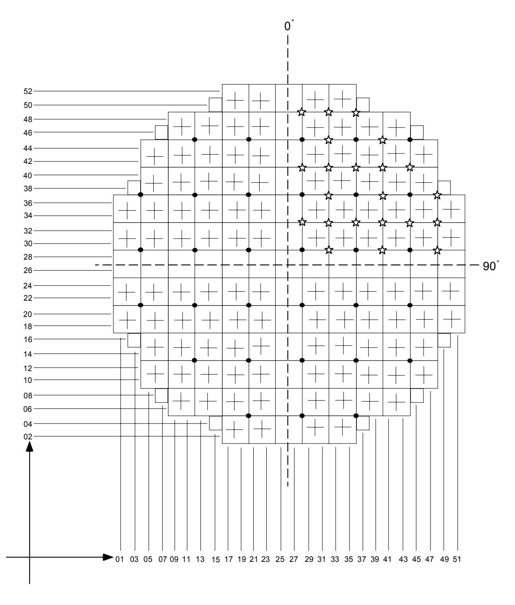
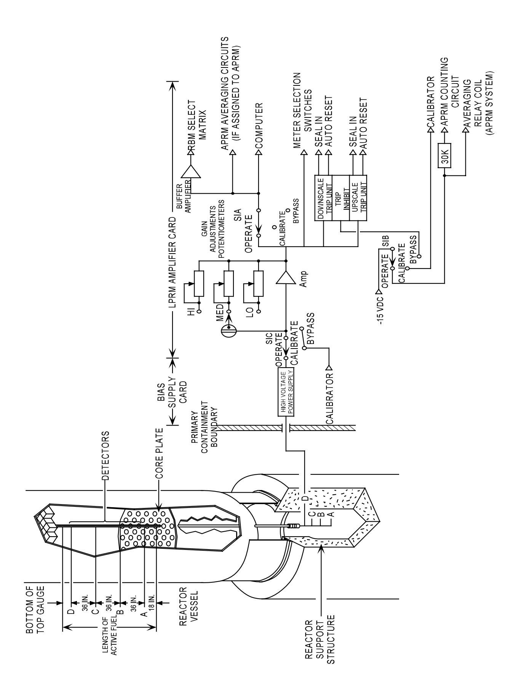
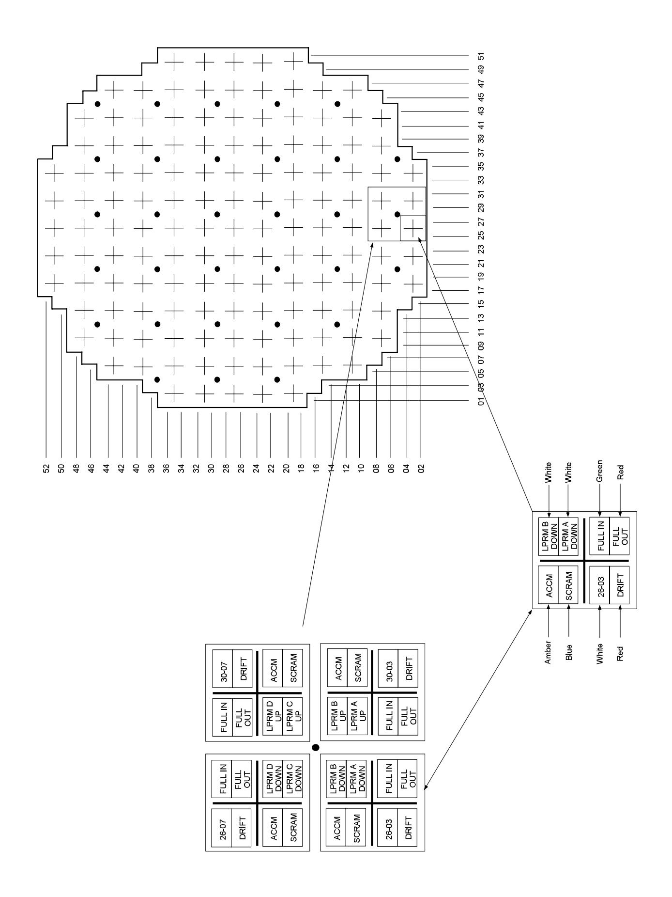
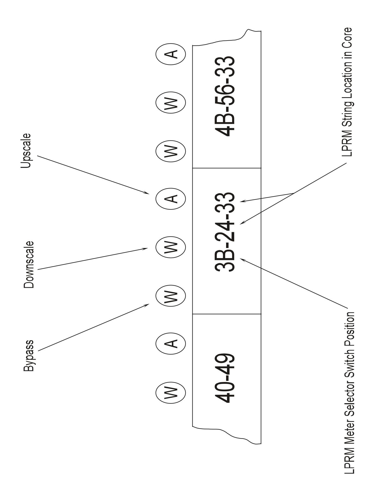
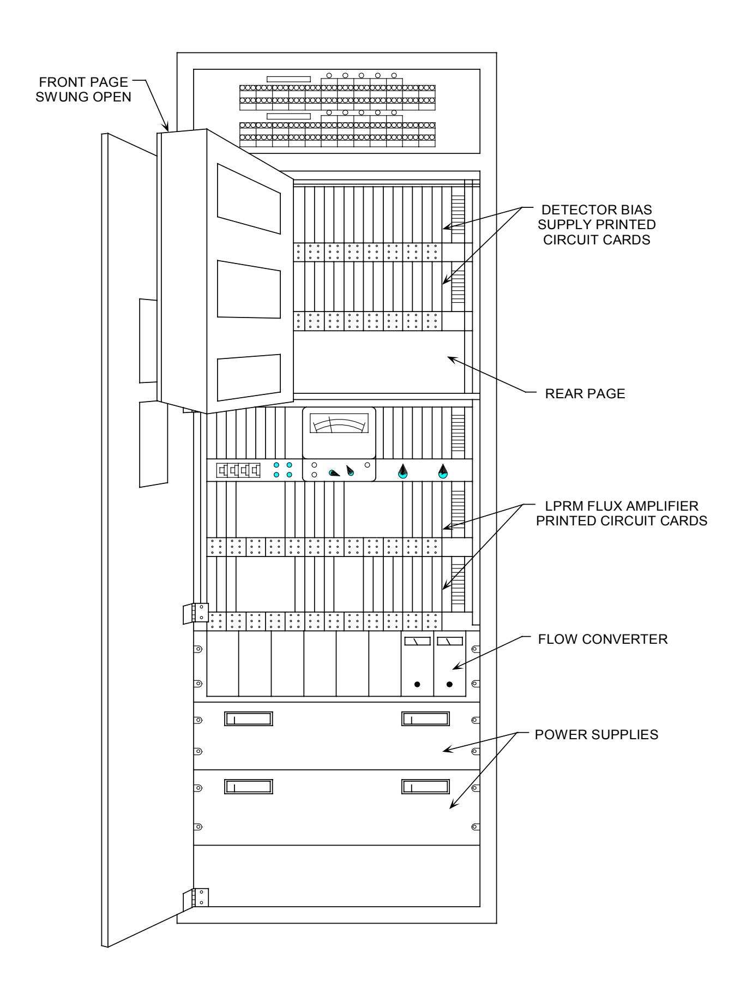

# **General Electric Systems Technology Manual Chapter 5.3**

**Local Power Range Monitoring System**

# **TABLE OF CONTENTS**

| 5.3 LOCAL POWER RANGE MONITORING SYSTEM | 1 |
|-----------------------------------------|---|
| 5.3.1 Introduction                      | 1 |
| 5.3.2 Component Description             | 2 |
| 5.3.2.1 LPRM Detector Assembly          |   |
| 5.3.2.2 LPRM Detector                   | 2 |
| 5.3.2.3 Power Supplies                  | 4 |
| 5.3.2.4 Flux Amplifier                  |   |
| 5.3.2.5 LPRM Trip Units                 | 5 |
| 5.3.2.6 Power Range Monitoring Cabinets | 5 |
| 5.3.3 System Features and Interfaces    | 6 |
| 5.3.3.1 LPRM Detector String Locations  |   |
| 5.3.3.2 LPRM Calibration                |   |
| 5.3.3.3 System Interfaces               |   |
| 5.3.4 Summary                           | 7 |
|                                         |   |
| LIST OF TABLES                          |   |
| 5.3-1 LPRM DESIGN PARAMETERS            | 9 |
|                                         |   |

## **LIST OF FIGURES**

- 5.3-1 Local Power Range Monitor Detector Locations
- 5.3-2 LPRM Simplified Block Diagram
- 5.3-3 Full Core Display
- 5.3-4 LPRM Alarm Indication Top of Panel 608
- 5.3-5 Power Range Cabinets
- 5.3-6 Neutron Monitoring System Cabinet Layout

#### **5.3 LOCAL POWER RANGE MONITORING SYSTEM**

#### **Learning Objectives:**

- 1. Recognize the purposes of the Local Power Range Monitoring (LPRM) System.
- 2. Recognize the purpose, function and operation of the following LPRM major components:
  - a. Fission Chamber Detector
  - b. Detector locations
  - c. LPRM Meters (4-rod display)
  - d. Trip Units
  - e. Individual LPRM Bypass Switches
- 3. Recognize why LPRM's are periodically calibrated and how they are calibrated.
- 4. Recognize how the Local Power Range Monitoring system interfaces with the following systems:
  - a. Average Power Range Monitoring System (Section 5.4)
  - b. Reactor Protection System (Section 7.3)
  - c. Rod Block Monitoring System (Section 5.5)
  - d. Traversing Incore Probe System (Section 5.6)
  - e. Process Computer System (Thermal Limits, Section 1.8)

#### **5.3.1 Introduction**

The purpose of the Local Power Range Monitoring (LPRM) System is to provide signals proportional to the local neutron flux. The LPRMs measure the local flux at various radial and axial incore locations.

The functional classification of the LPRM System is that of a power generation system. The LPRMs do provide inputs to the APRM System which are functionally classified as safety related.

The Local Power Range Monitoring (LPRM) System, Figure 5.3-2, consists of the following:

- stationary incore detectors distributed throughout the reactor core
- electronic signal conditioning equipment located in the control room

There are 31 radially located LPRM assemblies (strings) with each assembly containing four detectors spaced at three foot intervals. Each LPRM assembly also contains a hollow dry tube for the Traversing Incore Probe (TIP) System (Section 5.6).

LPRMs channels provide inputs to the following:

- Process computer for various core parameter calculations.
- Average Power Range Monitoring System to determine core average power
- Rod Block Monitoring System to determine local average power around the selected control rod.

The LPRM strings are arranged so that 17 LPRM instrument channels provide inputs to the 'A', 'C', or 'E' Average Power Range Monitors (APRMs). Similarly 14 LPRM instrument channels provide input to the 'B'.D', or 'F' APRMs. The LPRM instrument channels assigned to each APRM are selected from different radial and axial positions. The LPRM assignments allow each APRM to provide a representative indication of the average core power.

#### **5.3.2 Component Description**

The components of the LPRM System are discussed in the following paragraphs.

#### **5.3.2.1 LPRM Detector Assembly**

A total of 31 LPRM assemblies are radially distributed throughout the core as shown in Figure 5.3-1. The assemblies are constructed of stainless steel with an overall length of 43 feet and a diameter of 0.7 inches. Each assembly houses four fission chambers and their associated signal cables, along with a traversing incore probe tube. To provide dependable indication of the axial flux distribution of the core, the four fission detectors are spaced at 3 ft. intervals. The lowest detector, Detector 'A', is located 18 inches above the bottom of the fuel (Figure 5.3-2). The remaining detectors are spaced 36" apart with the 'D' detector located 24 inches from the top of the fuel.

The LPRM assemblies are installed in the core from above the reactor vessel. The top of the assembly is locked to the upper core grid by means of an integrated spring loaded plunger. The assembly passes vertically through the core region and core support plate and mates with the detector guide tube. The guide tube is braced at intervals along its length by a stainless steel framework. The electrical connections of the assembly extend through the incore detector housing, a flange, and a seal assembly. This arrangement allows accessibility to LPRM connections from below the reactor vessel.

#### **5.3.2.2 LPRM Detector**

The LPRM detector is a miniature fission chamber 0.987 inches long and 0.213 inches in diameter. The case and collector are fabricated from titanium and insulated from one another by a ceramic material. The inner surface of the case is coated with a U3O8 coating which contains several isotopes of uranium. The total amount of U3O8 loaded is 1.21 milligrams. This will include 18%  $U^{235}$ , 78%  $U^{234}$  and 4% various isotopes of uranium (primarily  $U^{238}$ ). The fill gas used in the LPRM detector is argon with an internal pressure of 14.7 psia (atmospheric).

During normal operation a potential of approximately 100 VDC is applied between the center electrode and the case. The polarity is arranged such that the center electrode is positive with respect to the case. This allows the LPRM detectors to operate in the ionization region. This is desirable because of the high levels of neutron flux encountered by the LPRMs. The ionization region also yields a relatively constant detector output over a wide range of electrode voltages.

Thermal neutrons impinging on the detector have a high probability of causing uranium atoms to fission. The resulting fission process releases fission fragments, neutrons, and gamma radiation into the detector volume. This causes ionization of the gas and an electrical discharge between cathode and anode. Gamma radiation from sources external to the detector can also cause ionization within the detector.

The mixed uranium isotopes ( $U^{235}$  and  $U^{234}$ ) in the  $U_3O_8$  coating on the inside wall of the casing provides two functions. The  $U^{235}$  has a good probability of fission which causes the primary ionization of the argon gas within the LPRM detector. The LPRM, in this respect, functions identically to the SRM and IRM fission chambers (Section 5.1).

If  $U^{235}$  were the only uranium isotope n the LPRM detector, the uranium coating would be rapidly depleted at power range neutron flux levels. This would result in sensitivity of the detector decreasing rapidly at normal operating power levels. Earlier BWR models were equipped with this type of LPRM detector (non-regenerative). The addition of  $U^{234}$  provides a method of replacing or regenerating  $U^{235}$  lost by fission.  $U^{234}$  has a very low probability of fission but a high probability of adsorption and transmutation to  $U^{235}$ . This transmutation occurs by the following neutron capture sequence:

$$_{92}U^{234} + _{0}n^{1} \rightarrow _{92}U^{235}$$

By selecting proper ratios of  $U^{235}$  to  $U^{234}$  the life of the detector is extended. Design parameters for the LPRM detectors are listed in Table 5.3-1.

Special processing methods are required for gamma signal discrimination in the Source Range Monitoring and Intermediate Range Monitoring Systems. In the power range neutron monitoring system no electronic discrimination process is needed. The signal from the fission gamma is proportional to power therefore, gamma discrimination is not required for LPRMs.

In the SRM and IRM Systems the detectors are retracted from the core when their functions are not required. This is not possible in the power range since LPRM

functions are always required. The LPRM detectors receive the maximum neutron and gamma flux exposure. The operation of a fission chamber type detector is dependent upon the interaction of neutrons with the uranium oxide. The quantity of uranium atoms available for reaction decreases as LPRM detector exposure increases. This causes a decrease in the sensitivity of the detector. To compensate for this decreased sensitivity each LPRM channel is periodically calibrated using the TIP System.

The output of each LPRM detector is a small DC current proportional to the fission neutron flux and gamma flux. This current signal is sent via a length of coaxial cable to an individual flux amplifier.

#### **5.3.2.3 Power Supplies**

All power for each LPRMs circuitry is supplied from the APRM channel or LPRM group to which it is assigned. There is a bias (high voltage to detector) supply for each LPRM detector. All other DC power supplies are common to all LPRMs assigned to an APRM or LPRM group.

#### **5.3.2.4 Flux Amplifier**

The LPRM flux amplifiers are located on circuit boards which are mounted on hinged vertical assemblies. Each hinged section contains 31 LPRM flux amplifier boards and is commonly called an LPRM page.

The flux amplifier converts the detector output current signal to an analog voltage signal. The flux amplifier has three amplification ranges to accommodate the depletion of uranium in the detector over its lifetime. Each LPRM flux amplifier card has an amplifier range switch. The range switch selects one of the three levels of amplifier gain, low, medium, or high. To accommodate for detector depletion within the amplification ranges, a gain adjustment potentiometer is also provided.

The flux amplifier output signal is adjusted to provide a 0 - 10 VDC signal that corresponds to a 0 - 125 watts/cm2 surface heat flux. The output signal is sent to the following

- the APRM averaging circuits (if assigned to an APRM)
- the RBM selection matrix
- the process computer system

In addition to providing surface heat flux information to other systems, the signal is also sent to the LPRM alarm trip units.

A mode selector switch for each channel allows selection of three modes of operation. In the operate (OP) mode, the channel functions as previously described providing

signal outputs to the various systems. In the bypass (BY) mode, the output of the channel is removed from use by the other systems and the alarm trips are bypassed. A signal is also sent to the respective APRM channel removing one input to the averaging circuit. In the calibrate (CAL) mode, the output of the channel is removed from use by the other systems. A calibrator current signal is substituted for the detector input signal.

#### **5.3.2.5 LPRM Trip Units**

The LPRM trip units compare the flux amplifier output to threshold values. The upscale trip unit will trip when the flux amplifier output exceeds 100 watts/cm2 . The upscale trip unit actuation causes the following:

- a local alarm light (Figure 5.3-4)
- a remote light (Figure 5.3-3)
- an alarm on control room panel 603

The LPRM upscale trip is indicative of either an LPRM channel failure upscale or high local neutron flux. The LPRM upscale setpoint is adjusted to produce a trip before maximum thermal limits are reached on the fuel.

The downscale trip unit trips when the flux amplifier's output decreases to a value less than 3 watts/cm2 . This provides local and remote alarm lights (Figure 5.3-3 and 5.3-4)

#### **5.3.2.6 Power Range Monitoring Cabinets**

The power range monitoring cabinets contain all of the circuitry associated with the LPRM, APRM, and the RBM systems. The cabinets are located in the control room and illustrated in Figures 5.3-5 and 5.3-6.

The numbers of LPRMs assigned within the LPRM and APRM cabinets are:

| Channel | Number |
|---------|--------|
| APRM A  | 17     |
| APRM C  | 17     |
| APRM E  | 17     |
| APRM B  | 14     |
| APRM D  | 14     |
| APRM F  | 14     |
| LPRM A  | 17     |
| LPRM B  | 14     |
| Total   | 124    |

The Rod Block Monitoring (RBM) System cabinet does not contain any LPRM amplifier cards. The RBM System (Section 5.5) selectively utilizes the outputs from every LPRM through the reactor manual control select matrix.

#### **5.3.3 System Features and Interfaces**

A short discussion of system operation, features, and interfaces with other plant systems is given in the following paragraphs.

#### **5.3.3.1 LPRM Detector String Locations**

The LPRM detector strings are arranged in the reactor core to provide a representative sample of neutron flux levels throughout the core. The arrangement of the fuel bundles and control rods result in water gaps between fuel bundles that do not contain control rods. The gaps containing control rods are referred to as controlled gaps. The gaps without control rods are referred to as uncontrolled gaps. Neutron instrumentation is installed in the uncontrolled water gaps. Ideally an LPRM detector strings would be located in each uncontrolled water gap. However this would result in an inordinate number of penetrations through the RPV bottom head. The radial distribution of the LPRM assemblies places one assembly in every fourth uncontrolled water gap (Figure 5.3-1).

The reactor fuel bundles are loaded symmetrically into the four core quadrants (quarters of the core). Control rod withdrawal patterns are also developed to maintain quadrant symmetry. During power operation both the fuel and control rods are maintained quadrant symmetric with mirror or rotational symmetry. With mirror symmetry, adjacent quadrants are mirror images of each other with respect to fuel and control rod position. With rotational symmetry, if adjacent quadrants are rotated such that they are overlaid, the fuel and control rod positions are identical. Core symmetry allows data from LPRM instruments to be extrapolated for power readings in the uncontrolled water gaps that lack LPRM assemblies. This provides a representative LPRM string reading for each uncontrolled water gap. This allows core wide data concerning neutron flux distribution to be extrapolated from the LPRM system.

## **5.3.3.2 LPRM Calibration**

LPRM calibration is performed every 6 to 8 weeks of full power operation. Calibration is required due to fission chamber uranium depletion and the resulting loss of sensitivity. LPRM calibration is accomplished using the TIP System to determine core flux near the detector. The flux amplifier range switch and/or gain adjustment potentiometer are then used to adjust LPRM readings to match the TIP signal.

#### **5.3.3.3 System Interfaces**

The interfaces this system has with other plant systems are discussed in the paragraphs which follow.

#### **Average Power Range Monitoring System (Section 5.4)**

The Average Power Range Monitoring System receives LPRM inputs to determine average core power.

#### **Rod Block Monitoring System (Section 5.5)**

The Rod Block Monitoring System receives inputs from the LPRM assemblies surrounding the control rod selected for movement. These LPRM inputs are used to calculate average local flux near the control rod.

#### **Reactor Protection System (Section 7.3)**

The Reactor Protection System provides electrical power to the LPRM System via the assigned APRM or LPRM cabinets.

#### **Traversing Incore Probe System (Section 5.6)**

The Traversing Incore Probe System provides signals for use in the calibration of the LPRM detectors.

#### **Process Computer System (Thermal Limits, Section 1.8)**

The Process Computer System receives LPRM detector inputs for various core performance calculations.

#### **5.3.4 Summary**

The purpose of the Local Power Range Monitoring (LPRM) System is to provide signals proportional to the local neutron flux. The LPRMs measure the local flux at various radial and axial incore locations.

The LPRM System, Figure 5.3-2, consists of the following:

- stationary incore detectors distributed throughout the reactor core
- electronic signal conditioning equipment located in the control room

LPRMs channels perform the following functions:

- Process computer for various core parameter calculations.
- Average Power Range Monitoring System to determine core average power
- Rod Block Monitoring System to determine local average power around the selected control rod.

The LPRM assignments allow each APRM to provide a representative indication of core power.

# **TABLE 5.3-1 LPRM DESIGN PARAMETERS**

| Number of detectors         | 124                                                             |  |
|-----------------------------|-----------------------------------------------------------------|--|
| Electrode coating           | 1.21 mg of U3O8 (18% U235, 78% U234, 4% other U isotopes) |  |
| Neutron sensitivity         | 4.8 x 10-18 amps/nv (±20%)                                      |  |
| Gamma sensitivity           | Less than 2.0 x 10-14 amps/nv (≥ 1.5% full scale)         |  |
| Collector operating voltage | 100 VDC                                                         |  |
| Fill gas / pressure         | Argon, 760 mm Hg @ 240 C                                     |  |
| Diameter                    | 0.213 inch                                                      |  |
| Sensitive length            | 0.987 inch                                                      |  |
| Case and collector material | Titanium                                                        |  |

- Control Rods
- LPRM Assemblies
- Pseudo LPRM Assemblies

**Figure 5.3-1 Local Power Range Monitor Detector Locations**

**Figure 5.3-2 LPRM Simplified Block Diagram**

**Figure 5.3-3 Full Core Display**

**Figure 5.3-4 LPRM Cabinet Alarm Indication**

 **Figure 5.3-5 Power Range Cabinets**

**Figure 5.3-6 Neutron Monitoring Cabinet Layout**