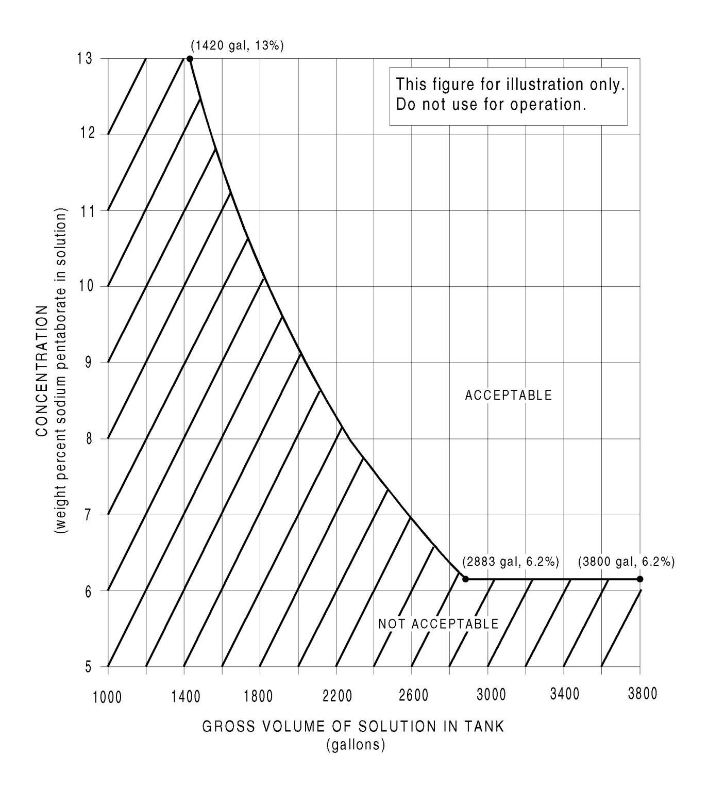
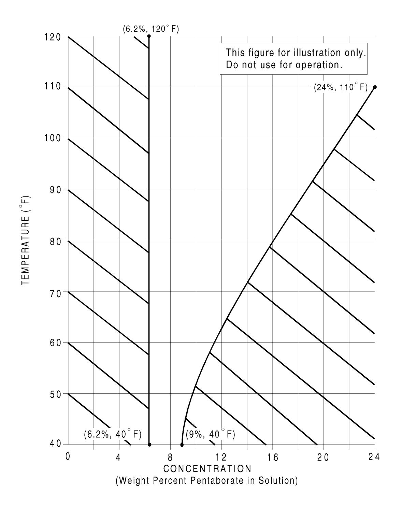
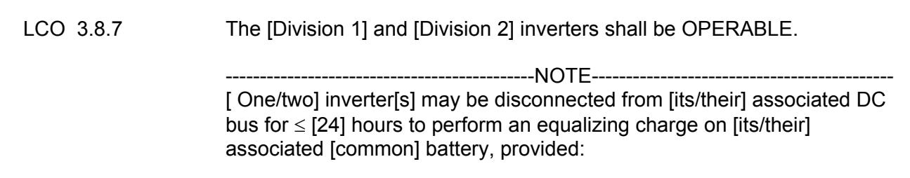
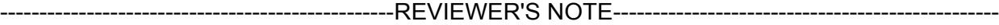
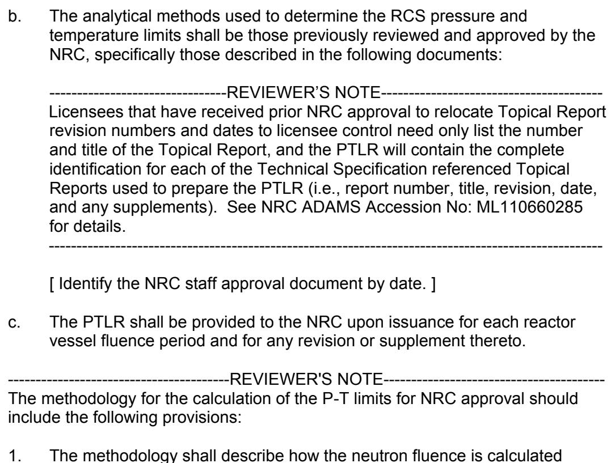
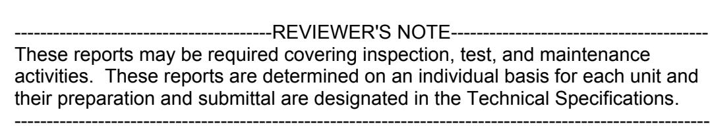

# **Standard Technical Specifications**

# **General Electric BWR/4 Plants**

**Revision 4.0**

Volume 1, Specifications

# **Standard Technical Specifications**

# **General Electric BWR/4 Plants**

**Revision 4.0**

Volume 1, Specifications

Manuscript Completed: October 2011

Date Published: April 2012

# **AVAILABILITY OF REFERENCE MATERIALS IN NRC PUBLICATIONS**

#### **NRC Reference Material**

As of November 1999, you may electronically access NUREG-series publications and other NRC records at NRC=s Public Electronic Reading Room at http://www.nrc.gov/reading-rm.html.

Publicly released records include, to name a few, NUREG-series publications; *Federal Register* notices; applicant, licensee, and vendor documents and correspondence; NRC correspondence and internal memoranda; bulletins and information notices; inspection and investigative reports; licensee event reports; and Commission papers and their attachments.

NRC publications in the NUREG series, NRC regulations, and *Title 10, Energy*, in the Code of *Federal Regulations* may also be purchased from one of these two sources.

1. The Superintendent of Documents U.S. Government Printing Office Mail Stop SSOP Washington, DC 20402B0001 Internet: bookstore.gpo.gov Telephone: 202-512-1800

 Fax: 202-512-2250 2. The National Technical Information Service Springfield, VA 22161B0002 www.ntis.gov 1B800B553B6847 or, locally, 703B605B6000

A single copy of each NRC draft report for comment is available free, to the extent of supply, upon written request as follows:

Address: U.S. Nuclear Regulatory Commission

 Office of Administration Publications Branch Washington, DC 20555-0001

E-mail: [DISTRIBUTION.SERVICES@NRC.GOV](mailto:DISTRIBUTION.SERVICES@NRC.GOV)

Facsimile: 301B415B2289

Some publications in the NUREG series that are posted at NRC=s Web site address http://www.nrc.gov/reading-rm/doc-collections/nuregs are updated periodically and may differ from the last printed version.Although references to material found on a Web site bear the date the material was accessed, the material available on the date cited may subsequently be removed from the site.

#### **Non-NRC Reference Material**

Documents available from public and special technical libraries include all open literature items, such as books, journal articles, and transactions, *Federal Register* notices, Federal and State legislation, and congressional reports. Such documents as theses, dissertations, foreign reports and translations, and non-NRC conference proceedings may be purchased from their sponsoring organization.

Copies of industry codes and standards used in a substantive manner in the NRC regulatory process are maintained atC

> The NRC Technical Library Two White Flint North 11545 Rockville Pike Rockville, MD 20852B2738

These standards are available in the library for reference use by the public. Codes and standards are usually copyrighted and may be purchased from the originating organization or, if they are American National Standards, fromC

> American National Standards Institute 11 West 42nd Street New York, NY 10036B8002 www.ansi.org 212B642B4900

Legally binding regulatory requirements are stated only in laws; NRC regulations; licenses, including technical specifications; or orders, not in NUREG-series publications. The views expressed in

contractor-prepared publications in this series are not necessarily those of the NRC.

The NUREG series comprises (1) technical and administrative reports and books prepared by the staff (NUREGBXXXX) or agency contractors (NUREG/CRBXXXX), (2) proceedings of conferences (NUREG/CPBXXXX), (3) reports resulting from international agreements (NUREG/IABXXXX), (4) brochures (NUREG/BRBXXXX), and (5) compilations of legal decisions and orders of the Commission and Atomic and Safety Licensing Boards and of Directors= decisions under Section 2.206 of NRC=s regulations (NUREGB0750).

#### ABSTRACT

This NUREG contains the improved Standard Technical Specifications (STS) for General Electric Boiling Water Reactor/4 (BWR/4) plants. The changes reflected in Revision 4 result from the experience gained from plant operation using the improved STS and extensive public technical meetings and discussions among the Nuclear Regulatory Commission (NRC) staff and various nuclear power plant licensees and the Nuclear Steam Supply System (NSSS) Owners Groups.

The improved STS were developed based on the criteria in the Final Commission Policy Statement on Technical Specifications Improvements for Nuclear Power Reactors, dated July 22, 1993 (58 FR 39132), which was subsequently codified by changes to Section 36 of Part 50 of Title 10 of the *Code of Federal Regulations* (10 CFR 50.36) (60 FR 36953). Licensees are encouraged to upgrade their technical specifications consistent with those criteria and conforming, to the practical extent, to Revision 4 to the improved STS. The Commission continues to place the highest priority on requests for complete conversions to the improved STS. Licensees adopting portions of the improved STS to existing technical specifications should adopt all related requirements, as applicable, to achieve a high degree of standardization and consistency.

Users may access the STS NUREGs in the PDF format at [\(http://www.nrc.gov\)](http://www.nrc.gov/NRR/sts/sts.htm). Users may print or download copies from the NRC Web site.

#### PAPERWORK REDUCTION ACT STATEMENT

The information collections contained in this NUREG are covered by the requirements of 10 CFR Part 50, which were approved by the Office of Management and Budget, approval number 3150-0011.

## PUBLIC PROTECTION NOTIFICATION

If a means used to impose an information collection does not display a currently valid OMB control number, the NRC may not conduct or sponsor, and a person is not required to respond to, the information collection.

| 1.0 1.1 | USE AND APPLICATION Definitions1.1-1                                                            |            | 4.0 |
|------------|----------------------------------------------------------------------------------------------------|------------|-----|
|            |                                                                                                    |            |     |
| 1.2        | Logical Connectors1.2-1                                                                            |            | 4.0 |
| 1.3        | Completion Times 1.3-1                                                                          |            | 4.0 |
| 1.4        | Frequency 1.4-1                                                                                 |            | 4.0 |
| 2.0        | SAFETY LIMITS (SLs)2.0-1                                                                           |            | 4.0 |
| 2.1        | Safety Limits                                                                                      |            |     |
| 2.2        | SL Violations                                                                                      |            |     |
| 3.0        | LIMITING CONDITION FOR OPERATION (LCO) APPLICABILITY3.0-1                                          |            | 4.0 |
| 3.0        | SURVEILLANCE REQUIREMENT (SR) APPLICABILITY3.0-4                                                   |            | 4.0 |
| 3.1        | REACTIVITY CONTROL SYSTEMS                                                                         |            |     |
| 3.1.1      | SHUTDOWN MARGIN (SDM) 3.1.1-1                                                                   |            | 4.0 |
| 3.1.2      | Reactivity Anomalies 3.1.2-1                                                                    |            | 4.0 |
| 3.1.3      | Control Rod OPERABILITY3.1.3-1                                                                     |            | 4.0 |
| 3.1.4      | Control Rod Scram Times 3.1.4-1                                                                 |            | 4.0 |
| 3.1.5      | Control Rod Scram Accumulators 3.1.5-1                                                          |            | 4.0 |
|            |                                                                                                    |            |     |
| 3.1.6      | Rod Pattern Control3.1.6-1                                                                         |            | 4.0 |
| 3.1.7      | Standby Liquid Control (SLC) System3.1.7-1                                                         |            | 4.0 |
| 3.1.8      | Scram Discharge Volume (SDV) Vent and Drain Valves 3.1.8-1                                      |            | 4.0 |
| 3.2        | POWER DISTRIBUTION LIMITS                                                                          |            |     |
| 3.2.1      | AVERAGE PLANAR LINEAR HEAT GENERATION RATE                                                         |            |     |
|            | (APLHGR) 3.2.1-1                                                                                |            | 4.0 |
| 3.2.2      | MINIMUM CRITICAL POWER RATIO (MCPR) 3.2.2-1                                                     |            | 4.0 |
| 3.2.3      | LINEAR HEAT GENERATION RATE (LHGR) (Optional) 3.2.3-1                                           |            | 4.0 |
| 3.2.4      | Average Power Range Monitor (APRM) Gain and Setpoints                                              |            |     |
|            | (Optional)3.2.4-1                                                                                  |            | 4.0 |
| 3.3        | INSTRUMENTATION                                                                                    |            |     |
|            | (Section 3.3 Specifications with an "A" suffix include setpoints. Specifications with a "B" suffix |            |     |
|            | reflect a Setpoint Control Program.)                                                               |            |     |
| 3.3.1.1A   | Reactor Protection System (RPS) Instrumentation 3.3.1.1A-1                                      |            | 4.0 |
| 3.3.1.1B   | Reactor Protection System (RPS) Instrumentation 3.3.1.1B-1                                      |            | 4.0 |
| 3.3.1.2A   | Source Range Monitor (SRM) Instrumentation 3.3.1.2A-1                                           |            | 4.0 |
| 3.3.1.2B   | Source Range Monitor (SRM) Instrumentation 3.3.1.2B-1                                           |            | 4.0 |
| 3.3.2.1A   | Control Rod Block Instrumentation3.3.2.1A-1                                                        |            | 4.0 |
| 3.3.2.1B   | Control Rod Block Instrumentation3.3.2.1B-1                                                        |            | 4.0 |
| 3.3.2.2A   | Feedwater and Main Turbine High Water Level Trip Instrumentation3.3.2.2A-1                         |            | 4.0 |
| 3.3.2.2B   | Feedwater and Main Turbine High Water Level Trip Instrumentation3.3.2.2B-1                         |            | 4.0 |
| 3.3.3.1    | Post Accident Monitoring (PAM) Instrumentation3.3.3.1-1                                            |            | 4.0 |
| 3.3.3.2    | Remote Shutdown System3.3.3.2-1                                                                    |            | 4.0 |
| 3.3.4.1A   | End of Cycle Recirculation Pump Trip (EOC-RPT) Instrumentation                                     | 3.3.4.1A-1 | 4.0 |
| 3.3.4.1B   | End of Cycle Recirculation Pump Trip (EOC-RPT) Instrumentation                                     | 3.3.4.1B-1 | 4.0 |
| 3.3.4.2A   | Anticipated Transient Without Scram Recirculation Pump Trip                                        |            |     |
|            | (ATWS-RPT) Instrumentation3.3.4.2A-1                                                               |            | 4.0 |
| 3.3.4.2B   | Anticipated Transient Without Scram Recirculation Pump Trip                                        |            |     |
|            | (ATWS-RPT) Instrumentation3.3.4.2B-1                                                               |            | 4.0 |
|            |                                                                                                    |            |     |

| 3.3      | INSTRUMENTATION (continued)                                                          |            |     |
|----------|--------------------------------------------------------------------------------------|------------|-----|
| 3.3.5.1A | Emergency Core Cooling System (ECCS) Instrumentation                                 | 3.3.5.1A-1 | 4.0 |
| 3.3.5.1B | Emergency Core Cooling System (ECCS) Instrumentation                                 | 3.3.5.1B-1 | 4.0 |
| 3.3.5.2A | Reactor Core Isolation Cooling (RCIC) System Instrumentation                         | 3.3.5.2A-1 | 4.0 |
| 3.3.5.2B | Reactor Core Isolation Cooling (RCIC) System Instrumentation                         | 3.3.5.2B-1 | 4.0 |
| 3.3.6.1A | Primary Containment Isolation Instrumentation 3.3.6.1A-1                          |            | 4.0 |
| 3.3.6.1B | Primary Containment Isolation Instrumentation 3.3.6.1B-1                          |            | 4.0 |
| 3.3.6.2A | Secondary Containment Isolation Instrumentation3.3.6.2A-1                            |            | 4.0 |
| 3.3.6.2B | Secondary Containment Isolation Instrumentation3.3.6.2B-1                            |            | 4.0 |
| 3.3.6.3A | Low-Low Set (LLS) Instrumentation 3.3.6.3A-1                                      |            | 4.0 |
| 3.3.6.3B | Low-Low Set (LLS) Instrumentation3.3.6.3B-1                                          |            | 4.0 |
| 3.3.7.1A | [ Main Control Room Environmental Control (MCREC) ] System                        |            |     |
|          | Instrumentation3.3.7.1A-1                                                            |            | 4.0 |
| 3.3.7.1B | [ Main Control Room Environmental Control (MCREC) ] System                        |            |     |
|          | Instrumentation3.3.7.1B-1                                                            |            | 4.0 |
| 3.3.8.1A | Loss of Power (LOP) Instrumentation 3.3.8.1A-1                                    |            | 4.0 |
| 3.3.8.1B | Loss of Power (LOP) Instrumentation 3.3.8.1B-1                                    |            | 4.0 |
| 3.3.8.2A | Reactor Protection System (RPS) Electric Power Monitoring                            | 3.3.8.2A-1 | 4.0 |
| 3.3.8.2B | Reactor Protection System (RPS) Electric Power Monitoring                         | 3.3.8.2B-1 | 4.0 |
| 3.4      | REACTOR COOLANT SYSTEM (RCS)                                                         |            |     |
| 3.4.1    | Recirculation Loops Operating3.4.1-1                                                 |            | 4.0 |
| 3.4.2    | Jet Pumps 3.4.2-1                                                                 |            | 4.0 |
| 3.4.3    | Safety/Relief Valves (S/RVs)3.4.3-1                                                  |            | 4.0 |
| 3.4.4    | RCS Operational LEAKAGE 3.4.4-1                                                   |            | 4.0 |
| 3.4.5    | RCS Pressure Isolation Valve (PIV) Leakage 3.4.5-1                                |            | 4.0 |
| 3.4.6    | RCS Leakage Detection Instrumentation 3.4.6-1                                     |            | 4.0 |
| 3.4.7    | RCS Specific Activity3.4.7-1                                                         |            | 4.0 |
| 3.4.8    | Residual Heat Removal (RHR) Shutdown Cooling System - Hot                         |            |     |
|          | Shutdown 3.4.8-1                                                                  |            | 4.0 |
| 3.4.9    | Residual Heat Removal (RHR) Shutdown Cooling System - Cold Shutdown 3.4.9-1 |            | 4.0 |
| 3.4.10   | RCS Pressure and Temperature (P/T) Limits 3.4.10-1                                |            | 4.0 |
| 3.4.11   | Reactor Steam Dome Pressure 3.4.11-1                                              |            | 4.0 |
|          |                                                                                      |            |     |
| 3.5      | EMERGENCY CORE COOLING SYSTEM (ECCS) AND REACTOR                                     |            |     |
|          | CORE ISOLATION COOLING (RCIC) SYSTEM                                                 |            |     |
| 3.5.1    | ECCS - Operating 3.5.1-1                                                       |            | 4.0 |
| 3.5.2    | ECCS - Shutdown 3.5.2-1                                                        |            | 4.0 |
| 3.5.3    | RCIC System3.5.3-1                                                                   |            | 4.0 |
| 3.6      | CONTAINMENT SYSTEMS                                                                  |            |     |
| 3.6.1.1  | Primary Containment3.6.1.1-1                                                         |            | 4.0 |
| 3.6.1.2  | Primary Containment Air Lock3.6.1.2-1                                                |            | 4.0 |
| 3.6.1.3  | Primary Containment Isolation Valves (PCIVs)3.6.1.3-1                                |            | 4.0 |
| 3.6.1.4  | Drywell Pressure 3.6.1.4-1                                                        |            | 4.0 |
| 3.6.1.5  | Drywell Air Temperature3.6.1.5-1                                                     |            | 4.0 |
| 3.6.1.6  | Low-Low Set (LLS) Valves 3.6.1.6-1                                                |            | 4.0 |

| 3.6 CONTAINMENT SYSTEMS (continued)                                             |              |     |
|------------------------------------------------------------------------------------|--------------|-----|
| 3.6.1.7 Reactor Building-to-Suppression Chamber Vacuum Breakers                 | 3.6.1.7-1    | 4.0 |
| 3.6.1.8 Suppression Chamber-to-Drywell Vacuum Breakers3.6.1.8-1                 |              | 4.0 |
| 3.6.1.9 Main Steam Isolation Valve (MSIV) Leakage Control System (LCS)3.6.1.9-1 |              | 4.0 |
| 3.6.2.1 Suppression Pool Average Temperature 3.6.2.1-1                       |              | 4.0 |
| 3.6.2.2 Suppression Pool Water Level 3.6.2.2-1                               |              | 4.0 |
| 3.6.2.3 Residual Heat Removal (RHR) Suppression Pool Cooling                    | 3.6.2.3-1    | 4.0 |
| 3.6.2.4 Residual Heat Removal (RHR) Suppression Pool Spray3.6.2.4-1             |              | 4.0 |
| 3.6.2.5 Drywell-to-Suppression Chamber Differential Pressure3.6.2.5-1           |              | 4.0 |
| 3.6.3.1 [ Drywell Cooling System Fans ] 3.6.3.1-1                         |              | 4.0 |
| 3.6.3.2 Primary Containment Oxygen Concentration3.6.3.2-1                       |              | 4.0 |
| 3.6.4.1 [ Secondary ] Containment3.6.4.1-1                                   |              | 4.0 |
| 3.6.4.2 Secondary Containment Isolation Valves (SCIVs)3.6.4.2-1                 |              | 4.0 |
| 3.6.4.3 Standby Gas Treatment (SGT) System 3.6.4.3-1                         |              | 4.0 |
| 3.7 PLANT SYSTEMS                                                               |              |     |
| 3.7.1 Residual Heat Removal Service Water (RHRSW) System                        | 3.7.1-1      | 4.0 |
| 3.7.2 [ Plant Service Water (PSW) ] System and [ Ultimate Heat Sink       |              |     |
| (UHS) ] 3.7.2-1                                                              |              | 4.0 |
| 3.7.3 Diesel Generator (DG) [1B] Standby Service Water (SSW) System3.7.3-1      |              | 4.0 |
| 3.7.4 [ Main Control Room Environmental Control (MCREC) ] System             | 3.7.4-1      | 4.0 |
| 3.7.5 [ Control Room Air Conditioning (AC) ] System                          | 3.7.5-1      | 4.0 |
| 3.7.6 Main Condenser Offgas 3.7.6-1                                          |              | 4.0 |
| 3.7.7 The Main Turbine Bypass System 3.7.7-1                                 |              | 4.0 |
| 3.7.8 Spent Fuel Storage Pool Water Level 3.7.8-1                            |              | 4.0 |
| 3.8 ELECTRICAL POWER SYSTEMS                                                    |              |     |
| 3.8.1 AC Sources - Operating 3.8.1-1                                      |              | 4.0 |
| 3.8.2 AC Sources - Shutdown3.8.2-1                                           |              | 4.0 |
| 3.8.3 Diesel Fuel Oil, Lube Oil, and Starting Air3.8.3-1                        |              | 4.0 |
| 3.8.4 DC Sources - Operating3.8.4-1                                          |              | 4.0 |
| 3.8.5 DC Sources - Shutdown3.8.5-1                                           |              | 4.0 |
| 3.8.6 Battery Parameters 3.8.6-1                                             |              | 4.0 |
| 3.8.7 Inverters - Operating 3.8.7-1                                       |              | 4.0 |
| 3.8.8 Inverters - Shutdown 3.8.8-1                                        |              | 4.0 |
| 3.8.9 Distribution Systems - Operating3.8.9-1                                |              | 4.0 |
| 3.8.10 Distribution Systems - Shutdown 3.8.10-1                           |              | 4.0 |
| 3.9 REFUELING OPERATIONS                                                        |              |     |
| 3.9.1 Refueling Equipment Interlocks3.9.1-1                                     |              | 4.0 |
| 3.9.2 Refuel Position One-Rod-Out Interlock 3.9.2-1                          |              | 4.0 |
| 3.9.3 Control Rod Position 3.9.3-1                                           |              | 4.0 |
| 3.9.4 Control Rod Position Indication3.9.4-1                                    |              | 4.0 |
| 3.9.5 Control Rod OPERABILITY - Refueling 3.9.5-1                         |              | 4.0 |
| 3.9.6 [ Reactor Pressure Vessel (RPV) ] Water Level - [ Irradiated Fuel   | ] 3.9.6-1 | 4.0 |
| [ 3.9.7 [ Reactor Pressure Vessel (RPV) ] Water Level - [ New Fuel or     |              |     |
| Control Rods ] 3.9.7-1                                                       | 4.0          | ]   |
| 3.9.8 Residual Heat Removal (RHR) - High Water Level3.9.8-1                  |              | 4.0 |
| 3.9.9 Residual Heat Removal (RHR) - Low Water Level                          | 3.9.9-1      | 4.0 |

| 3.10    | SPECIAL OPERATIONS                                                |     |
|---------|-------------------------------------------------------------------|-----|
| 3.10.1  | Inservice Leak and Hydrostatic Testing Operation3.10.1-1          | 4.0 |
| 3.10.2  | Reactor Mode Switch Interlock Testing3.10.2-1                     | 4.0 |
| 3.10.3  | Single Control Rod Withdrawal - Hot Shutdown3.10.3-1           | 4.0 |
| 3.10.4  | Single Control Rod Withdrawal - Cold Shutdown3.10.4-1          | 4.0 |
| 3.10.5  | Single Control Rod Drive (CRD) Removal - Refueling 3.10.5-1 | 4.0 |
| 3.10.6  | Multiple Control Rod Withdrawal - Refueling3.10.6-1            | 4.0 |
| 3.10.7  | Control Rod Testing - Operating 3.10.7-1                    | 4.0 |
| 3.10.8  | SHUTDOWN MARGIN (SDM) Test - Refueling 3.10.8-1             | 4.0 |
| 3.10.9  | Recirculation Loops - Testing3.10.9-1                          | 4.0 |
| 3.10.10 | Training Startups 3.10.10-1                                    | 4.0 |
|         |                                                                   |     |
| 4.0     | DESIGN FEATURES 4.0-1                                          | 4.0 |
| 4.1     | Site Location                                                     |     |
| 4.2     | Reactor Core                                                      |     |
| 4.3     | Fuel Storage                                                      |     |
| 5.0     | ADMINISTRATIVE CONTROLS                                           |     |
| 5.1     | Responsibility 5.1-1                                           | 4.0 |
| 5.2     | Organization5.2-1                                                 | 4.0 |
| 5.3     | Unit Staff Qualifications 5.3-1                                | 4.0 |
| 5.4     | Procedures 5.4-1                                               | 4.0 |
| 5.5     | Programs and Manuals 5.5-1                                     | 4.0 |
| 5.6     | Reporting Requirements 5.6-1                                   | 4.0 |
| 5.7     | High Radiation Area 5.7-1                                      | 4.0 |
|         |                                                                   |     |

# 1.0 USE AND APPLICATION

#### 1.1 Definitions

------------------------------------------------------------NOTE-----------------------------------------------------------

The defined terms of this section appear in capitalized type and are applicable throughout these Technical Specifications and Bases.

-------------------------------------------------------------------------------------------------------------------------------

#### Term Definition

ACTIONS ACTIONS shall be that part of a Specification that prescribes Required Actions to be taken under designated Conditions within specified Completion Times.

AVERAGE PLANAR LINEAR The APLHGR shall be applicable to a specific planar height HEAT GENERATION RATE and is equal to the sum of the [LHGRs] [heat generation rate (APLHGR) per unit length of fuel rod] for all the fuel rods in the specified bundle at the specified height divided by the number of fuel rods in the fuel bundle [at the height].

CHANNEL CALIBRATION A CHANNEL CALIBRATION shall be the adjustment, as necessary, of the channel output such that it responds within the necessary range and accuracy to known values of the parameter that the channel monitors. The CHANNEL CALIBRATION shall encompass all devices in the channel required for channel OPERABILITY and the CHANNEL FUNCTIONAL TEST. Calibration of instrument channels with resistance temperature detector (RTD) or thermocouple sensors may consist of an inplace qualitative assessment of sensor behavior and normal calibration of the remaining adjustable devices in the channel. The CHANNEL CALIBRATION may be performed by means of any series of sequential, overlapping, or total channel steps.

CHANNEL CHECK A CHANNEL CHECK shall be the qualitative assessment, by observation, of channel behavior during operation. This determination shall include, where possible, comparison of the channel indication and status to other indications or status derived from independent instrument channels measuring the same parameter.

CHANNEL FUNCTIONAL TEST A CHANNEL FUNCTIONAL TEST shall be the injection of a simulated or actual signal into the channel as close to the sensor as practicable to verify OPERABILITY of all devices in the channel required for channel OPERABILITY. The CHANNEL FUNCTIONAL TEST may be performed by means of any series of sequential, overlapping, or total channel steps.

## 1.1 Definitions

CORE ALTERATION CORE ALTERATION shall be the movement of any fuel, sources, or reactivity control components, within the reactor vessel with the vessel head removed and fuel in the vessel. The following exceptions are not considered to be CORE ALTERATIONS:

- a. Movement of source range monitors, local power range monitors, intermediate range monitors, traversing incore probes, or special movable detectors (including undervessel replacement), and
- b. Control rod movement, provided there are no fuel assemblies in the associated core cell.

Suspension of CORE ALTERATIONS shall not preclude completion of movement of a component to a safe position.

CORE OPERATING LIMITS The COLR is the unit specific document that provides cycle REPORT (COLR) specific parameter limits for the current reload cycle. These cycle specific limits shall be determined for each reload cycle in accordance with Specification 5.6.3. Plant operation within these limits is addressed in individual Specifications.

DOSE EQUIVALENT I-31 DOSE EQUIVALENT I-131 shall be that concentration of I-131 (microcuries/gram) that alone would produce the same thyroid dose as the quantity and isotopic mixture of I-131, I-132, I-133, I-134, and I-135 actually present. The thyroid dose conversion factors used for this calculation shall be those listed in [Table III of TID-14844, AEC, 1962, "Calculation of Distance Factors for Power and Test Reactor Sites" or those listed in Table E-7 of Regulatory Guide 1.109, Rev. 1, NRC, 1977, or ICRP 30, Supplement to Part 1, page 192-212, Table titled, "Committed Dose Equivalent in Target Organs or Tissues per Intake of Unit Activity"].

EMERGENCY CORE COOLING The ECCS RESPONSE TIME shall be that time interval from SYSTEM (ECCS) RESPONSE when the monitored parameter exceeds its ECCS initiation TIME setpoint at the channel sensor until the ECCS equipment is capable of performing its safety function (i.e., the valves travel to their required positions, pump discharge pressures reach their required values, etc.). Times shall include diesel generator starting and sequence loading delays, where applicable. The response time may be measured by means of any series of sequential, overlapping, or total steps so that the entire response time is measured. In lieu of measurement, response time may be verified for selected components provided that the components and methodology for verification have been previously reviewed and approved by the NRC.

## 1.1 Definitions

END OF CYCLE RECIRCULA- The EOC RPT SYSTEM RESPONSE TIME shall be that time TION PUMP TRIP (EOC RPT) interval from initial signal generation by [the associated turbine SYSTEM RESPONSE TIME stop valve limit switch or from when the turbine control valve hydraulic oil control oil pressure drops below the pressure switch setpoint] to complete suppression of the electric arc between the fully open contacts of the recirculation pump circuit breaker. The response time may be measured by means of any series of sequential, overlapping, or total steps so that the entire response time is measured, [except for the breaker arc suppression time, which is not measured but is validated to conform to the manufacturer's design value].

ISOLATION SYSTEM The ISOLATION SYSTEM RESPONSE TIME shall be that RESPONSE TIME time interval from when the monitored parameter exceeds its isolation initiation setpoint at the channel sensor until the isolation valves travel to their required positions. Times shall include diesel generator starting and sequence loading delays, where applicable. The response time may be measured by means of any series of sequential, overlapping, or total steps so that the entire response time is measured. In lieu of measurement, response time may be verified for selected components provided that the components and methodology for verification have been previously reviewed and approved by the NRC.

#### LEAKAGE LEAKAGE shall be:

#### a. Identified LEAKAGE

- 1. LEAKAGE into the drywell, such as that from pump seals or valve packing that is captured and conducted to a sump or collecting tank, or
- 2. LEAKAGE into the drywell atmosphere from sources that are both specifically located and known either not to interfere with the operation of leakage detection systems or not to be pressure boundary LEAKAGE,

#### b. Unidentified LEAKAGE

All LEAKAGE into the drywell that is not identified LEAKAGE,

#### c. Total LEAKAGE

Sum of the identified and unidentified LEAKAGE, and

#### LEAKAGE (continued)

#### d. Pressure Boundary LEAKAGE

LEAKAGE through a nonisolable fault in a Reactor Coolant System (RCS) component body, pipe wall, or vessel wall.

[ LINEAR HEAT GENERATION The LHGR shall be the heat generation rate per unit length of RATE (LHGR) fuel rod. It is the integral of the heat flux over the heat transfer area associated with the unit length. ]

LOGIC SYSTEM FUNCTIONAL A LOGIC SYSTEM FUNCTIONAL TEST shall be a test of all TEST logic components required for OPERABILITY of a logic circuit, from as close to the sensor as practicable up to, but not including, the actuated device, to verify OPERABILITY. The LOGIC SYSTEM FUNCTIONAL TEST may be performed by means of any series of sequential, overlapping, or total system steps so that the entire logic system is tested.

[ MAXIMUM FRACTION OF The MFLPD shall be the largest value of the fraction of limiting LIMITING POWER DENSITY power density in the core. The fraction of limiting power (MFLPD) density shall be the LHGR existing at a given location divided by the specified LHGR limit for that bundle type. ]

MINIMUM CRITICAL POWER The MCPR shall be the smallest critical power ratio (CPR) that RATIO (MCPR) exists in the core [for each class of fuel]. The CPR is that power in the assembly that is calculated by application of the appropriate correlation(s) to cause some point in the assembly to experience boiling transition, divided by the actual assembly operating power.

MODE A MODE shall correspond to any one inclusive combination of mode switch position, average reactor coolant temperature, and reactor vessel head closure bolt tensioning specified in Table 1.1-1 with fuel in the reactor vessel.

OPERABLE – OPERABILITY A system, subsystem, division, component, or device shall be OPERABLE or have OPERABILITY when it is capable of performing its specified safety function(s) and when all necessary attendant instrumentation, controls, normal or emergency electrical power, cooling and seal water, lubrication, and other auxiliary equipment that are required for the system, subsystem, division, component, or device to perform its specified safety function(s) are also capable of performing their related support function(s).

## 1.1 Definitions

PHYSICS TESTS PHYSICS TESTS shall be those tests performed to measure the fundamental nuclear characteristics of the reactor core and related instrumentation.

#### These tests are:

- a. Described in Chapter [14, Initial Test Program] of the FSAR,
- b. Authorized under the provisions of 10 CFR 50.59, or
- c. Otherwise approved by the Nuclear Regulatory Commission.

PRESSURE AND The PTLR is the unit specific document that provides the TEMPERATURE LIMITS reactor vessel pressure and temperature limits, including REPORT (PTLR) heatup and cooldown rates, for the current reactor vessel fluence period. These pressure and temperature limits shall be determined for each fluence period in accordance with Specification 5.6.4.

RATED THERMAL POWER RTP shall be a total reactor core heat transfer rate to the (RTP) reactor coolant of [2436] MWt.

REACTOR PROTECTION The RPS RESPONSE TIME shall be that time interval from SYSTEM (RPS) RESPONSE when the monitored parameter exceeds its RPS trip setpoint at TIME the channel sensor until de-energization of the scram pilot valve solenoids. The response time may be measured by means of any series of sequential, overlapping, or total steps so that the entire response time is measured. In lieu of measurement, response time may be verified for selected components provided that the components and methodology for verification have been previously reviewed and approved by the NRC.

SHUTDOWN MARGIN (SDM) SDM shall be the amount of reactivity by which the reactor is subcritical or would be subcritical assuming that:

- a. The reactor is xenon free,
- b. The moderator temperature is 68F, and
- c. All control rods are fully inserted except for the single control rod of highest reactivity worth, which is assumed to be fully withdrawn. With control rods not capable of being fully inserted, the reactivity worth of these control rods must be accounted for in the determination of SDM.

#### 1.1 Definitions

[ STAGGERED TEST BASIS A STAGGERED TEST BASIS shall consist of the testing of one of the systems, subsystems, channels, or other designated components during the interval specified by the Surveillance Frequency, so that all systems, subsystems, channels, or other designated components are tested during *n* Surveillance Frequency intervals, where *n* is the total number of systems, subsystems, channels, or other designated components in the associated function. ]

THERMAL POWER THERMAL POWER shall be the total reactor core heat transfer rate to the reactor coolant.

# RESPONSE TIME of two components:

[ TURBINE BYPASS SYSTEM The TURBINE BYPASS SYSTEM RESPONSE TIME consists

- a. The time from initial movement of the main turbine stop valve or control valve until 80% of the turbine bypass capacity is established and
- b. The time from initial movement of the main turbine stop valve or control valve until initial movement of the turbine bypass valve.

The response time may be measured by means of any series of sequential, overlapping, or total steps so that the entire response time is measured. ]

Table 1.1-1 (page 1 of 1) MODES

| MODE | TITLE            | REACTOR MODE SWITCH POSITION  | AVERAGE REACTOR COOLANT TEMPERATURE (F) |
|------|------------------|----------------------------------|---------------------------------------------------|
| 1    | Power Operation  | Run                              | NA                                                |
| 2    | Startup          | Refuel(a) or Startup/Hot Standby | NA                                                |
| 3    | Hot Shutdown(a)  | Shutdown                         | > [200]                                        |
| 4    | Cold Shutdown(a) | Shutdown                         |  [200]                                        |
| 5    | Refueling(b)     | Shutdown or Refuel               | NA                                                |

(a) All reactor vessel head closure bolts fully tensioned.

(b) One or more reactor vessel head closure bolts less than fully tensioned.

#### 1.0 USE AND APPLICATION

#### 1.2 Logical Connectors

PURPOSE The purpose of this section is to explain the meaning of logical connectors.

> Logical connectors are used in Technical Specifications (TS) to discriminate between, and yet connect, discrete Conditions, Required Actions, Completion Times, Surveillances, and Frequencies. The only logical connectors that appear in TS are AND and OR. The physical arrangement of these connectors constitutes logical conventions with specific meanings.

BACKGROUND Several levels of logic may be used to state Required Actions. These levels are identified by the placement (or nesting) of the logical connectors and by the number assigned to each Required Action. The first level of logic is identified by the first digit of the number assigned to a Required Action and the placement of the logical connector in the first level of nesting (i.e., left justified with the number of the Required Action). The successive levels of logic are identified by additional digits of the Required Action number and by successive indentions of the logical connectors.

> When logical connectors are used to state a Condition, Completion Time, Surveillance, or Frequency, only the first level of logic is used, and the logical connector is left justified with the statement of the Condition, Completion Time, Surveillance, or Frequency.

EXAMPLES The following examples illustrate the use of logical connectors.

#### 1.2 Logical Connectors

# EXAMPLES (continued)

#### EXAMPLE 1.2-1

#### ACTIONS

| CONDITION             | REQUIRED ACTION | COMPLETION TIME |
|-----------------------|-----------------|-----------------|
| A. LCO not met. | A.1 Verify   |                 |
|                       | AND             |                 |
|                       | A.2 Restore  |                 |

In this example the logical connector AND is used to indicate that when in Condition A, both Required Actions A.1 and A.2 must be completed.

#### 1.2 Logical Connectors

#### EXAMPLES (continued)

#### EXAMPLE 1.2-2

#### ACTIONS

| CONDITION             | REQUIRED ACTION                                                                                                    | COMPLETION TIME |
|-----------------------|--------------------------------------------------------------------------------------------------------------------|-----------------|
| A. LCO not met. | A.1 Trip OR A.2.1 Verify AND A.2.2.1 Reduce OR A.2.2.2 Perform OR A.3 Align |                 |

This example represents a more complicated use of logical connectors. Required Actions A.1, A.2, and A.3 are alternative choices, only one of which must be performed as indicated by the use of the logical connector OR and the left justified placement. Any one of these three Actions may be chosen. If A.2 is chosen, then both A.2.1 and A.2.2 must be performed as indicated by the logical connector AND. Required Action A.2.2 is met by performing A.2.2.1 or A.2.2.2. The indented position of the logical connector OR indicates that A.2.2.1 and A.2.2.2 are alternative choices, only one of which must be performed.

## 1.0 USE AND APPLICATION

#### 1.3 Completion Times

# PURPOSE The purpose of this section is to establish the Completion Time convention and to provide guidance for its use. BACKGROUND Limiting Conditions for Operation (LCOs) specify minimum requirements for ensuring safe operation of the unit. The ACTIONS associated with an LCO state Conditions that typically describe the ways in which the requirements of the LCO can fail to be met. Specified with each stated Condition are Required Action(s) and Completion Time(s).

DESCRIPTION The Completion Time is the amount of time allowed for completing a Required Action. It is referenced to the time of discovery of a situation (e.g., inoperable equipment or variable not within limits) that requires entering an ACTIONS Condition unless otherwise specified, providing the unit is in a MODE or specified condition stated in the Applicability of the LCO. Required Actions must be completed prior to the expiration of the specified Completion Time. An ACTIONS Condition remains in effect and the Required Actions apply until the Condition no longer exists or the unit is not within the LCO Applicability.

> If situations are discovered that require entry into more than one Condition at a time within a single LCO (multiple Conditions), the Required Actions for each Condition must be performed within the associated Completion Time. When in multiple Conditions, separate Completion Times are tracked for each Condition starting from the time of discovery of the situation that required entry into the Condition.

Once a Condition has been entered, subsequent divisions, subsystems, components, or variables expressed in the Condition, discovered to be inoperable or not within limits, will not result in separate entry into the Condition, unless specifically stated. The Required Actions of the Condition continue to apply to each additional failure, with Completion Times based on initial entry into the Condition.

However, when a subsequent division, subsystem, component, or variable expressed in the Condition is discovered to be inoperable or not within limits, the Completion Time(s) may be extended. To apply this Completion Time extension, two criteria must first be met. The subsequent inoperability:

- a. Must exist concurrent with the first inoperability and
- b. Must remain inoperable or not within limits after the first inoperability is resolved.

#### 1.3 Completion Times

#### DESCRIPTION (continued)

The total Completion Time allowed for completing a Required Action to address the subsequent inoperability shall be limited to the more restrictive of either:

- a. The stated Completion Time, as measured from the initial entry into the Condition, plus an additional 24 hours or
- b. The stated Completion Time as measured from discovery of the subsequent inoperability.

The above Completion Time extensions do not apply to those Specifications that have exceptions that allow completely separate reentry into the Condition (for each division, subsystem, component, or variable expressed in the Condition) and separate tracking of Completion Times based on this re-entry. These exceptions are stated in individual Specifications.

The above Completion Time extension does not apply to a Completion Time with a modified "time zero." This modified "time zero" may be expressed as a repetitive time (i.e., "once per 8 hours," where the Completion Time is referenced from a previous completion of the Required Action versus the time of Condition entry) or as a time modified by the phrase "from discovery . . ."

EXAMPLES The following examples illustrate the use of Completion Times with different types of Conditions and changing Conditions.

#### EXAMPLE 1.3-1

#### ACTIONS

| CONDITION                                  | REQUIRED ACTION                | COMPLETION TIME |
|--------------------------------------------|--------------------------------|-----------------|
| B. Required Action and associated | B.1 Be in MODE 3. AND | 12 hours     |
| Completion Time not met.                | B.2 Be in MODE 4.        | 36 hours     |

Condition B has two Required Actions. Each Required Action has its own separate Completion Time. Each Completion Time is referenced to the time that Condition B is entered.

The Required Actions of Condition B are to be in MODE 3 within 12 hours AND in MODE 4 within 36 hours. A total of 12 hours is allowed for reaching MODE 3 and a total of 36 hours (not 48 hours) is allowed for reaching MODE 4 from the time that Condition B was entered. If MODE 3 is reached within 6 hours, the time allowed for reaching MODE 4 is the next 30 hours because the total time allowed for reaching MODE 4 is 36 hours.

If Condition B is entered while in MODE 3, the time allowed for reaching MODE 4 is the next 36 hours.

#### EXAMPLE 1.3-2

#### ACTIONS

| CONDITION                                  | REQUIRED ACTION                            | COMPLETION TIME |
|--------------------------------------------|--------------------------------------------|-----------------|
| A. One pump inoperable.              | A.1 Restore pump to OPERABLE status. | 7 days       |
| B. Required Action and associated | B.1 Be in MODE 3. AND             | 12 hours     |
| Completion Time not met.                | B.2 Be in MODE 4.                    | 36 hours     |

When a pump is declared inoperable, Condition A is entered. If the pump is not restored to OPERABLE status within 7 days, Condition B is also entered and the Completion Time clocks for Required Actions B.1 and B.2 start. If the inoperable pump is restored to OPERABLE status after Condition B is entered, Conditions A and B are exited, and therefore, the Required Actions of Condition B may be terminated.

When a second pump is declared inoperable while the first pump is still inoperable, Condition A is not re-entered for the second pump. LCO 3.0.3 is entered, since the ACTIONS do not include a Condition for more than one inoperable pump. The Completion Time clock for Condition A does not stop after LCO 3.0.3 is entered, but continues to be tracked from the time Condition A was initially entered.

#### 1.3 Completion Times

#### EXAMPLES (continued)

While in LCO 3.0.3, if one of the inoperable pumps is restored to OPERABLE status and the Completion Time for Condition A has not expired, LCO 3.0.3 may be exited and operation continued in accordance with Condition A.

While in LCO 3.0.3, if one of the inoperable pumps is restored to OPERABLE status and the Completion Time for Condition A has expired, LCO 3.0.3 may be exited and operation continued in accordance with Condition B. The Completion Time for Condition B is tracked from the time the Condition A Completion Time expired.

On restoring one of the pumps to OPERABLE status, the Condition A Completion Time is not reset, but continues from the time the first pump was declared inoperable. This Completion Time may be extended if the pump restored to OPERABLE status was the first inoperable pump. A 24 hour extension to the stated 7 days is allowed, provided this does not result in the second pump being inoperable for > 7 days.

#### 1.3 Completion Times

#### EXAMPLES (continued)

#### EXAMPLE 1.3-3

#### ACTIONS

| CONDITION                                                                                                         | REQUIRED ACTION                                                                                                                            | COMPLETION TIME            |
|-------------------------------------------------------------------------------------------------------------------|--------------------------------------------------------------------------------------------------------------------------------------------|----------------------------|
| A. One Function X subsystem inoperable.                                                            | A.1 Restore Function X subsystem to OPERABLE status.                                                                           | 7 days                  |
| B. One Function Y subsystem inoperable.                                                            | B.1 Restore Function Y subsystem to OPERABLE status.                                                                           | 72 hours                |
| C. One Function X subsystem inoperable. AND One Function Y subsystem inoperable. | C.1 Restore Function X subsystem to OPERABLE status. OR C.2 Restore Function Y subsystem to OPERABLE status. | 72 hours 72 hours |

When one Function X subsystem and one Function Y subsystem are inoperable, Condition A and Condition B are concurrently applicable. The Completion Times for Condition A and Condition B are tracked separately for each subsystem starting from the time each subsystem was declared inoperable and the Condition was entered. A separate Completion Time is established for Condition C and tracked from the time the second subsystem was declared inoperable (i.e., the time the situation described in Condition C was discovered).

If Required Action C.2 is completed within the specified Completion Time, Conditions B and C are exited. If the Completion Time for Required Action A.1 has not expired, operation may continue in accordance with Condition A. The remaining Completion Time in Condition A is measured from the time the affected subsystem was declared inoperable (i.e., initial entry into Condition A).

It is possible to alternate between Conditions A, B, and C in such a manner that operation could continue indefinitely without ever restoring systems to meet the LCO. However, doing so would be inconsistent with the basis of the Completion Times. Therefore, there shall be administrative controls to limit the maximum time allowed for any combination of Conditions that result in a single contiguous occurrence of failing to meet the LCO. These administrative controls shall ensure that the Completion Times for those Conditions are not inappropriately extended.

#### EXAMPLE 1.3-4

# ACTIONS

| CONDITION                                                                 | REQUIRED ACTION                                           | COMPLETION TIME            |
|---------------------------------------------------------------------------|-----------------------------------------------------------|----------------------------|
| A. One or more valves inoperable.                                | A.1 Restore valve(s) to OPERABLE status.            | 4 hours                 |
| B. Required Action and associated Completion Time not met. | B.1 Be in MODE 3. AND B.2 Be in MODE 4. | 12 hours 36 hours |

A single Completion Time is used for any number of valves inoperable at the same time. The Completion Time associated with Condition A is based on the initial entry into Condition A and is not tracked on a per valve basis. Declaring subsequent valves inoperable, while Condition A is still in effect, does not trigger the tracking of separate Completion Times.

Once one of the valves has been restored to OPERABLE status, the Condition A Completion Time is not reset, but continues from the time the first valve was declared inoperable. The Completion Time may be extended if the valve restored to OPERABLE status was the first inoperable valve. The Condition A Completion Time may be extended for up to 4 hours provided this does not result in any subsequent valve being inoperable for > 4 hours.

If the Completion Time of 4 hours (plus the extension) expires while one or more valves are still inoperable, Condition B is entered.

# EXAMPLE 1.3-5

Completion Time not met.

|    | ACTIONS                              |                                             |                 |
|----|--------------------------------------|---------------------------------------------|-----------------|
|    | Separate Condition entry is allowed  | NOTE for each inoperable valve.          |                 |
|    |                                      |                                             |                 |
|    | CONDITION                            | REQUIRED ACTION                             | COMPLETION TIME |
| A. | One or more valves inoperable. | A.1 Restore valve to OPERABLE status. | 4 hours      |
| B. | Required Action and associated | B.1 Be in MODE 3. AND              | 12 hours     |

The Note above the ACTIONS Table is a method of modifying how the Completion Time is tracked. If this method of modifying how the Completion Time is tracked was applicable only to a specific Condition, the Note would appear in that Condition rather than at the top of the ACTIONS Table.

B.2 Be in MODE 4.

36 hours

The Note allows Condition A to be entered separately for each inoperable valve, and Completion Times tracked on a per valve basis. When a valve is declared inoperable, Condition A is entered and its Completion Time starts. If subsequent valves are declared inoperable, Condition A is entered for each valve and separate Completion Times start and are tracked for each valve.

If the Completion Time associated with a valve in Condition A expires, Condition B is entered for that valve. If the Completion Times associated with subsequent valves in Condition A expire, Condition B is entered separately for each valve and separate Completion Times start and are tracked for each valve. If a valve that caused entry into Condition B is restored to OPERABLE status, Condition B is exited for that valve.

Since the Note in this example allows multiple Condition entry and tracking of separate Completion Times, Completion Time extensions do not apply.

#### EXAMPLE 1.3-6

#### ACTIONS

| CONDITION                                                                                            | REQUIRED ACTION                                              | COMPLETION TIME                   |  |
|------------------------------------------------------------------------------------------------------|--------------------------------------------------------------|-----------------------------------|--|
| A. One channel inoperable.                                                                     | A.1 Perform SR 3.x.x.x. OR A.2 Reduce THERMAL | Once per 8 hours 8 hours |  |
|                                                                                                      | POWER to  50% RTP.                                 |                                   |  |
| B. Required B.1 Be in MODE 3. Action and associated Completion Time not met. |                                                              | 12 hours                       |  |

#### 1.3 Completion Times

#### EXAMPLES (continued)

Entry into Condition A offers a choice between Required Action A.1 or A.2. Required Action A.1 has a "once per" Completion Time, which qualifies for the 25% extension, per SR 3.0.2, to each performance after the initial performance. The initial 8 hour interval of Required Action A.1 begins when Condition A is entered and the initial performance of Required Action A.1 must be complete within the first 8 hour interval. If Required Action A.1 is followed and the Required Action is not met within the Completion Time (plus the extension allowed by SR 3.0.2), Condition B is entered. If Required Action A.2 is followed and the Completion Time of 8 hours is not met, Condition B is entered.

If after entry into Condition B, Required Action A.1 or A.2 is met, Condition B is exited and operation may then continue in Condition A.

#### EXAMPLE 1.3-7

#### ACTIONS

| CONDITION                                                                 | REQUIRED ACTION                                           | COMPLETION TIME                                       |  |
|---------------------------------------------------------------------------|-----------------------------------------------------------|-------------------------------------------------------|--|
| A. One subsystem inoperable.                                     | A.1 Verify affected subsystem isolated.             | 1 hour AND Once per 8 hours thereafter |  |
|                                                                           | AND A.2 Restore subsystem to OPERABLE status. | 72 hours                                           |  |
| B. Required Action and associated Completion Time not met. | B.1 Be in MODE 3. AND B.2 Be in MODE 4. | 12 hours 36 hours                            |  |

#### 1.3 Completion Times

#### EXAMPLES (continued)

Required Action A.1 has two Completion Times. The 1 hour Completion Time begins at the time the Condition is entered and each "Once per 8 hours thereafter" interval begins upon performance of Required Action A.1.

If after Condition A is entered, Required Action A.1 is not met within either the initial 1 hour or any subsequent 8 hour interval from the previous performance (plus the extension allowed by SR 3.0.2), Condition B is entered. The Completion Time clock for Condition A does not stop after Condition B is entered, but continues from the time Condition A was initially entered. If Required Action A.1 is met after Condition B is entered, Condition B is exited and operation may continue in accordance with Condition A, provided the Completion Time for Required Action A.2 has not expired.

IMMEDIATE When "Immediately" is used as a Completion Time, the Required Action COMPLETION TIME should be pursued without delay and in a controlled manner.

## 1.0 USE AND APPLICATION

#### 1.4 Frequency

PURPOSE The purpose of this section is to define the proper use and application of Frequency requirements.

DESCRIPTION Each Surveillance Requirement (SR) has a specified Frequency in which the Surveillance must be met in order to meet the associated LCO. An understanding of the correct application of the specified Frequency is necessary for compliance with the SR.

> The "specified Frequency" is referred to throughout this section and each of the Specifications of Section 3.0.2, Surveillance Requirement (SR) Applicability. The "specified Frequency" consists of the requirements of the Frequency column of each SR as well as certain Notes in the Surveillance column that modify performance requirements.

Sometimes special situations dictate when the requirements of a Surveillance are to be met. They are "otherwise stated" conditions allowed by SR 3.0.1. They may be stated as clarifying Notes in the Surveillance, as part of the Surveillance, or both.

Situations where a Surveillance could be required (i.e., its Frequency could expire), but where it is not possible or not desired that it be performed until sometime after the associated LCO is within its Applicability, represent potential SR 3.0.4 conflicts. To avoid these conflicts, the SR (i.e., the Surveillance or the Frequency) is stated such that it is only "required" when it can be and should be performed. With an SR satisfied, SR 3.0.4 imposes no restriction.

The use of "met" or "performed" in these instances conveys specific meanings. A Surveillance is "met" only when the acceptance criteria are satisfied. Known failure of the requirements of a Surveillance, even without a Surveillance specifically being "performed," constitutes a Surveillance not "met." "Performance" refers only to the requirement to specifically determine the ability to meet the acceptance criteria.

Some Surveillances contain notes that modify the Frequency of performance or the conditions during which the acceptance criteria must be satisfied. For these Surveillances, the MODE-entry restrictions of SR 3.0.4 may not apply. Such a Surveillance is not required to be performed prior to entering a MODE or other specified condition in the Applicability of the associated LCO if any of the following three conditions are satisfied:

#### DESCRIPTION (continued)

- a. The Surveillance is not required to be met in the MODE or other specified condition to be entered; or
- b. The Surveillance is required to be met in the MODE or other specified condition to be entered, but has been performed within the specified Frequency (i.e., it is current) and is known not to be failed; or
- c. The Surveillance is required to be met, but not performed, in the MODE or other specified condition to be entered, and is known not to be failed.

Examples 1.4-3, 1.4-4, 1.4-5, and 1.4-6 discuss these special situations.

EXAMPLES The following examples illustrate the various ways that Frequencies are specified. In these examples, the Applicability of the LCO (LCO not shown) is MODES 1, 2, and 3.

#### EXAMPLE 1.4-1

#### SURVEILLANCE REQUIREMENTS

| SURVEILLANCE           | FREQUENCY   |
|------------------------|-------------|
| Perform CHANNEL CHECK. | 12 hours |

Example 1.4-1 contains the type of SR most often encountered in the Technical Specifications (TS). The Frequency specifies an interval (12 hours) during which the associated Surveillance must be performed at least one time. Performance of the Surveillance initiates the subsequent interval. Although the Frequency is stated as 12 hours, an extension of the time interval to 1.25 times the interval specified in the Frequency is allowed by SR 3.0.2 for operational flexibility. The measurement of this interval continues at all times, even when the SR is not required to be met per SR 3.0.1 (such as when the equipment is inoperable, a variable is outside specified limits, or the unit is outside the Applicability of the LCO). If the interval specified by SR 3.0.2 is exceeded while the unit is in a MODE or other specified condition in the Applicability of the LCO, and the performance of the Surveillance is not otherwise modified (refer to Examples 1.4-3 and 1.4-4), then SR 3.0.3 becomes applicable.

#### EXAMPLES (continued)

If the interval as specified by SR 3.0.2 is exceeded while the unit is not in a MODE or other specified condition in the Applicability of the LCO for which performance of the SR is required, then SR 3.0.4 becomes applicable. The Surveillance must be performed within the Frequency requirements of SR 3.0.2, as modified by SR 3.0.3, prior to entry into the MODE or other specified condition or the LCO is considered not met (in accordance with SR 3.0.1) and LCO 3.0.4 becomes applicable.

#### EXAMPLE 1.4-2

## SURVEILLANCE REQUIREMENTS

| SURVEILLANCE                  | FREQUENCY                                           |
|-------------------------------|-----------------------------------------------------|
| Verify flow is within limits. | Once within 12 hours after  25% RTP |
|                               | AND                                                 |
|                               | 24 hours thereafter                              |

Example 1.4-2 has two Frequencies. The first is a one time performance Frequency, and the second is of the type shown in Example 1.4-1. The logical connector "AND" indicates that both Frequency requirements must be met. Each time reactor power is increased from a power level < 25% RTP to 25% RTP, the Surveillance must be performed within 12 hours.

The use of "once" indicates a single performance will satisfy the specified Frequency (assuming no other Frequencies are connected by "AND"). This type of Frequency does not qualify for the 25% extension allowed by SR 3.0.2. "Thereafter" indicates future performances must be established per SR 3.0.2, but only after a specified condition is first met (i.e., the "once" performance in this example). If reactor power decreases to < 25% RTP, the measurement of both intervals stops. New intervals start upon reactor power reaching 25% RTP.

#### EXAMPLES (continued)

#### EXAMPLE 1.4-3

# SURVEILLANCE REQUIREMENTS

| SURVEILLANCE                                                                         | FREQUENCY |
|--------------------------------------------------------------------------------------|-----------|
| NOTE Not required to be performed until 12 hours after  25% RTP.  |           |
| Perform channel adjustment.                                                          | 7 days    |

The interval continues, whether or not the unit operation is < 25% RTP between performances.

As the Note modifies the required performance of the Surveillance, it is construed to be part of the "specified Frequency." Should the 7 day interval be exceeded while operation is < 25% RTP, this Note allows 12 hours after power reaches 25% RTP to perform the Surveillance. The Surveillance is still considered to be within the "specified Frequency." Therefore, if the Surveillance were not performed within the 7 day interval (plus the extension allowed by SR 3.0.2), but operation was < 25% RTP, it would not constitute a failure of the SR or failure to meet the LCO. Also, no violation of SR 3.0.4 occurs when changing MODES, even with the 7 day Frequency not met, provided operation does not exceed 12 hours (plus the extension allowed by SR 3.0.2) with power 25% RTP.

Once the unit reaches 25% RTP, 12 hours would be allowed for completing the Surveillance. If the Surveillance were not performed within this 12 hour interval (plus the extension allowed by SR 3.0.2), there would then be a failure to perform a Surveillance within the specified Frequency, and the provisions of SR 3.0.3 would apply.

# EXAMPLES (continued)

#### EXAMPLE 1.4-4

# SURVEILLANCE REQUIREMENTS

| SURVEILLANCE                                      | FREQUENCY   |
|---------------------------------------------------|-------------|
| NOTE Only required to be met in MODE 1.  |             |
| Verify leakage rates are within limits.           | 24 hours |

Example 1.4-4 specifies that the requirements of this Surveillance do not have to be met until the unit is in MODE 1. The interval measurement for the Frequency of this Surveillance continues at all times, as described in Example 1.4-1. However, the Note constitutes an "otherwise stated" exception to the Applicability of this Surveillance. Therefore, if the Surveillance were not performed within the 24 hour interval (plus the extension allowed by SR 3.0.2), but the unit was not in MODE 1, there would be no failure of the SR nor failure to meet the LCO. Therefore, no violation of SR 3.0.4 occurs when changing MODES, even with the 24 hour Frequency exceeded, provided the MODE change was not made into MODE 1. Prior to entering MODE 1 (assuming again that the 24 hour Frequency were not met), SR 3.0.4 would require satisfying the SR.

#### EXAMPLE 1.4-5

#### SURVEILLANCE REQUIREMENTS

| SURVEILLANCE                                            | FREQUENCY |
|---------------------------------------------------------|-----------|
| NOTE Only required to be performed in MODE 1.  |           |
| Perform complete cycle of the valve.                    | 7 days    |

The interval continues, whether or not the unit operation is in MODE 1, 2, or 3 (the assumed Applicability of the associated LCO) between performances.

#### EXAMPLES (continued)

As the Note modifies the required performance of the Surveillance, the Note is construed to be part of the "specified Frequency." Should the 7 day interval be exceeded while operation is not in MODE 1, this Note allows entry into and operation in MODES 2 and 3 to perform the Surveillance. The Surveillance is still considered to be performed within the "specified Frequency" if completed prior to entering MODE 1. Therefore, if the Surveillance were not performed within the 7 day (plus the extension allowed by SR 3.0.2) interval, but operation was not in MODE 1, it would not constitute a failure of the SR or failure to meet the LCO. Also, no violation of SR 3.0.4 occurs when changing MODES, even with the 7 day Frequency not met, provided operation does not result in entry into MODE 1.

Once the unit reaches MODE 1, the requirement for the Surveillance to be performed within its specified Frequency applies and would require that the Surveillance had been performed. If the Surveillance were not performed prior to entering MODE 1, there would then be a failure to perform a Surveillance within the specified Frequency, and the provisions of SR 3.0.3 would apply.

#### EXAMPLE 1.4-6

#### SURVEILLANCE REQUIREMENTS

| SURVEILLANCE                                  | FREQUENCY |
|-----------------------------------------------|-----------|
| NOTE Not required to be met in MODE 3.  |           |
| Verify parameter is within limits.            | 24 hours  |

Example 1.4-[6] specifies that the requirements of this Surveillance do not have to be met while the unit is in MODE 3 (the assumed Applicability of the associated LCO is MODES 1, 2, and 3). The interval measurement for the Frequency of this Surveillance continues at all times, as described in Example 1.4-1. However, the Note constitutes an "otherwise stated" exception to the Applicability of this Surveillance. Therefore, if the Surveillance were not performed within the 24 hour interval (plus the extension allowed by SR 3.0.2), and the unit was in MODE 3, there would be no failure of the SR nor failure to meet the LCO. Therefore, no violation of SR 3.0.4 occurs when changing MODES to enter MODE 3,

#### EXAMPLES (continued)

even with the 24 hour Frequency exceeded, provided the MODE change does not result in entry into MODE 2. Prior to entering MODE 2 (assuming again that the 24 hour Frequency were not met), SR 3.0.4 would require satisfying the SR.

# 2.0 SAFETY LIMITS (SLs)

#### 2.1 SLs

#### 2.1.1 Reactor Core SLs

2.1.1.1 With the reactor steam dome pressure < 785 psig or core flow < 10% rated core flow:

THERMAL POWER shall be 25% RTP.

2.1.1.2 With the reactor steam dome pressure 785 psig and core flow 10% rated core flow:

> MCPR shall be [1.07] for two recirculation loop operation or [1.08] for single recirculation loop operation.

2.1.1.3 Reactor vessel water level shall be greater than the top of active irradiated fuel.

#### 2.1.2 Reactor Coolant System Pressure SL

Reactor steam dome pressure shall be 1325 psig.

#### 2.2 SL VIOLATIONS

With any SL violation, the following actions shall be completed within 2 hours:

- 2.2.1 Restore compliance with all SLs; and
- 2.2.2 Insert all insertable control rods.

| 3.0       | LIMITING CONDITION FOR OPERATION (LCO) APPLICABILITY                                                                                                                                                                                                                                                                                                  |  |  |  |
|-----------|-------------------------------------------------------------------------------------------------------------------------------------------------------------------------------------------------------------------------------------------------------------------------------------------------------------------------------------------------------|--|--|--|
| LCO 3.0.1 | LCOs shall be met during the MODES or other specified conditions in the Applicability, except as provided in LCO 3.0.2, LCO 3.0.7, LCO 3.0.8, and LCO 3.0.9.                                                                                                                                                                        |  |  |  |
| LCO 3.0.2 | Upon discovery of a failure to meet an LCO, the Required Actions of the associated Conditions shall be met, except as provided in LCO 3.0.5 and LCO 3.0.6.                                                                                                                                                                                |  |  |  |
|           | If the LCO is met or is no longer applicable prior to expiration of the specified Completion Time(s), completion of the Required Action(s) is not required, unless otherwise stated.                                                                                                                                                         |  |  |  |
| LCO 3.0.3 | When an LCO is not met and the associated ACTIONS are not met, an associated ACTION is not provided, or if directed by the associated ACTIONS, the unit shall be placed in a MODE or other specified condition in which the LCO is not applicable. Action shall be initiated within 1 hour to place the unit, as applicable, in: |  |  |  |
|           | a. MODE 2 within [7] hours,                                                                                                                                                                                                                                                                                                                  |  |  |  |
|           | b. MODE 3 within 13 hours, and                                                                                                                                                                                                                                                                                                               |  |  |  |
|           | c. MODE 4 within 37 hours.                                                                                                                                                                                                                                                                                                                   |  |  |  |
|           | Exceptions to this Specification are stated in the individual Specifications.                                                                                                                                                                                                                                                                         |  |  |  |
|           | Where corrective measures are completed that permit operation in accordance with the LCO or ACTIONS, completion of the actions required by LCO 3.0.3 is not required.                                                                                                                                                                     |  |  |  |
|           | LCO 3.0.3 is only applicable in MODES 1, 2, and 3.                                                                                                                                                                                                                                                                                           |  |  |  |
|           | REVIEWER'S NOTE                                                                                                                                                                                                                                                                                                                                       |  |  |  |
|           | The brackets around the time provided to reach MODE 2 allow a plant to extend the time from 7 hours to a plant specific time. Before the time can be changed, plant specific data must be provided to support the extended time.                                                                                                       |  |  |  |
|           |                                                                                                                                                                                                                                                                                                                                                       |  |  |  |
| LCO 3.0.4 | When an LCO is not met, entry into a MODE or other specified condition in the Applicability shall only be made:                                                                                                                                                                                                                                    |  |  |  |
|           | a. When the associated ACTIONS to be entered permit continued operation in the MODE or other specified condition in the Applicability for an unlimited period of time;                                                                                                                                                                       |  |  |  |

#### LCO 3.0.4 (continued)

- b. After performance of a risk assessment addressing inoperable systems and components, consideration of the results, determination of the acceptability of entering the MODE or other specified condition in the Applicability, and establishment of risk management actions, if appropriate; exceptions to this Specification are stated in the individual Specifications, or
- c. When an allowance is stated in the individual value, parameter, or other Specification.

This Specification shall not prevent changes in MODES or other specified conditions in the Applicability that are required to comply with ACTIONS or that are part of a shutdown of the unit.

LCO 3.0.5 Equipment removed from service or declared inoperable to comply with ACTIONS may be returned to service under administrative control solely to perform testing required to demonstrate its OPERABILITY or the OPERABILITY of other equipment. This is an exception to LCO 3.0.2 for the system returned to service under administrative control to perform the testing required to demonstrate OPERABILITY.

LCO 3.0.6 When a supported system LCO is not met solely due to a support system LCO not being met, the Conditions and Required Actions associated with this supported system are not required to be entered. Only the support system LCO ACTIONS are required to be entered. This is an exception to LCO 3.0.2 for the supported system. In this event, an evaluation shall be performed in accordance with Specification 5.5.12, "Safety Function Determination Program (SFDP)." If a loss of safety function is determined to exist by this program, the appropriate Conditions and Required Actions of the LCO in which the loss of safety function exists are required to be entered.

> When a support system's Required Action directs a supported system to be declared inoperable or directs entry into Conditions and Required Actions for a supported system, the applicable Conditions and Required Actions shall be entered in accordance with LCO 3.0.2.

LCO 3.0.7 Special Operations LCOs in Section 3.10 allow specified Technical Specifications (TS) requirements to be changed to permit performance of special tests and operations. Unless otherwise specified, all other TS requirements remain unchanged. Compliance with Special Operations LCOs is optional. When a Special Operations LCO is desired to be met but is not met, the ACTIONS of the Special Operations LCO shall be met. When a Special Operations LCO is not desired to be met, entry into a MODE or other specified condition in the Applicability shall only be made in accordance with the other applicable Specifications.

#### LCO Applicability

LCO 3.0.8 When one or more required snubbers are unable to perform their associated support function(s), any affected supported LCO(s) are not required to be declared not met solely for this reason if risk is assessed and managed, and:

- a. the snubbers not able to perform their associated support function(s) are associated with only one train or subsystem of a multiple train or subsystem supported system or are associated with a single train or subsystem supported system and are able to perform their associated support function within 72 hours; or
- b. the snubbers not able to perform their associated support function(s) are associated with more than one train or subsystem of a multiple train or subsystem supported system and are able to perform their associated support function within 12 hours.

At the end of the specified period the required snubbers must be able to perform their associated support function(s), or the affected supported system LCO(s) shall be declared not met.

LCO 3.0.9 When one or more required barriers are unable to perform their related support function(s), any supported system LCO(s) are not required to be declared not met solely for this reason for up to 30 days provided that at least one train or subsystem of the supported system is OPERABLE and supported by barriers capable of providing their related support function(s), and risk is assessed and managed. This specification may be concurrently applied to more than one train or subsystem of a multiple train or subsystem supported system provided at least one train or subsystem of the supported system is OPERABLE and the barriers supporting each of these trains or subsystems provide their related support function(s) for different categories of initiating events.

> [ For the purposes of this specification, the [High Pressure Coolant Injection/High Pressure Core Spray] System, the [Reactor Core Isolation Cooling] System, and the [Automatic Depressurization System] are considered independent subsystems of a single system. ]

If the required OPERABLE train or subsystem becomes inoperable while this specification is in use, it must be restored to OPERABLE status within 24 hours or the provisions of this specification cannot be applied to the trains or subsystems supported by the barriers that cannot perform their related support function(s).

At the end of the specified period, the required barriers must be able to perform their related support function(s) or the supported system LCO(s) shall be declared not met.

#### 3.0 SURVEILLANCE REQUIREMENT (SR) APPLICABILITY

SR 3.0.1 SRs shall be met during the MODES or other specified conditions in the Applicability for individual LCOs, unless otherwise stated in the SR. Failure to meet a Surveillance, whether such failure is experienced during the performance of the Surveillance or between performances of the Surveillance, shall be failure to meet the LCO. Failure to perform a Surveillance within the specified Frequency shall be failure to meet the LCO except as provided in SR 3.0.3. Surveillances do not have to be performed on inoperable equipment or variables outside specified limits.

SR 3.0.2 The specified Frequency for each SR is met if the Surveillance is performed within 1.25 times the interval specified in the Frequency, as measured from the previous performance or as measured from the time a specified condition of the Frequency is met.

> For Frequencies specified as "once," the above interval extension does not apply.

If a Completion Time requires periodic performance on a "once per . . ." basis, the above Frequency extension applies to each performance after the initial performance.

Exceptions to this Specification are stated in the individual Specifications.

SR 3.0.3 If it is discovered that a Surveillance was not performed within its specified Frequency, then compliance with the requirement to declare the LCO not met may be delayed, from the time of discovery, up to 24 hours or up to the limit of the specified Frequency, whichever is greater. This delay period is permitted to allow performance of the Surveillance. A risk evaluation shall be performed for any Surveillance delayed greater than 24 hours and the risk impact shall be managed.

> If the Surveillance is not performed within the delay period, the LCO must immediately be declared not met, and the applicable Condition(s) must be entered.

When the Surveillance is performed within the delay period and the Surveillance is not met, the LCO must immediately be declared not met, and the applicable Condition(s) must be entered.

SR 3.0.4 Entry into a MODE or other specified condition in the Applicability of an LCO shall only be made when the LCO's Surveillances have been met within their specified Frequency, except as provided by SR 3.0.3. When an LCO is not met due to Surveillances not having been met, entry into a MODE or other specified condition in the Applicability shall only be made in accordance with LCO 3.0.4.

#### SR Applicability

SR 3.0.4 (continued)

This provision shall not prevent entry into MODES or other specified conditions in the Applicability that are required to comply with ACTIONS or that are part of a shutdown of the unit.

## 3.1 REACTIVITY CONTROL SYSTEMS

#### 3.1.1 SHUTDOWN MARGIN (SDM)

#### LCO 3.1.1 SDM shall be:

- a. [0.38] % k/k, with the highest worth control rod analytically determined or
- b. [0.28] % k/k, with the highest worth control rod determined by test.

APPLICABILITY: MODES 1, 2, 3, 4, and 5.

#### ACTIONS

| CONDITION                                                                                |     | REQUIRED ACTION                                                              | COMPLETION TIME |
|------------------------------------------------------------------------------------------|-----|------------------------------------------------------------------------------|-----------------|
| A. SDM not within limits in MODE 1 or 2.                                     | A.1 | Restore SDM to within limits.                                             | 6 hours      |
| B. Required Action and associated Completion Time of Condition A not met. | B.1 | Be in MODE 3.                                                             | 12 hours     |
| C. SDM not within limits in MODE 3.                                             | C.1 | Initiate action to fully insert all insertable control rods.              | Immediately     |
| D. SDM not within limits in MODE 4.                                             | D.1 | Initiate action to fully insert all insertable control rods.              | Immediately     |
|                                                                                          | AND |                                                                              |                 |
|                                                                                          | D.2 | Initiate action to restore [secondary] containment to OPERABLE status. | 1 hour          |
|                                                                                          | AND |                                                                              |                 |

| CONDITION                                    |     | REQUIRED ACTION                                                                                                                          | COMPLETION TIME |
|----------------------------------------------|-----|------------------------------------------------------------------------------------------------------------------------------------------|-----------------|
|                                              | D.3 | Initiate action to restore one standby gas treatment (SGT) subsystem to OPERABLE status.                                        | 1 hour       |
|                                              | AND |                                                                                                                                          |                 |
|                                              | D.4 | Initiate action to restore isolation capability in each required [secondary] containment penetration flow path not isolated. | 1 hour       |
| E. SDM not within limits in MODE 5. | E.1 | Suspend CORE ALTERATIONS except for control rod insertion and fuel assembly removal.                                            | Immediately     |
|                                              | AND |                                                                                                                                          |                 |
|                                              | E.2 | Initiate action to fully insert all insertable control rods in core cells containing one or more fuel assemblies.               | Immediately     |
|                                              | AND |                                                                                                                                          |                 |

| CONDITION |     | REQUIRED ACTION                                                                                                                          | COMPLETION TIME |
|-----------|-----|------------------------------------------------------------------------------------------------------------------------------------------|-----------------|
|           | E.3 | Initiate action to restore [secondary] containment to OPERABLE status.                                                             | 1 hour       |
|           | AND |                                                                                                                                          |                 |
|           | E.4 | Initiate action to restore one SGT subsystem to OPERABLE status.                                                                   | 1 hour       |
|           | AND |                                                                                                                                          |                 |
|           | E.5 | Initiate action to restore isolation capability in each required [secondary] containment penetration flow path not isolated. | 1 hour       |

|            | SURVEILLANCE                    | FREQUENCY                                                                                                                                                                                                                                       |
|------------|---------------------------------|-------------------------------------------------------------------------------------------------------------------------------------------------------------------------------------------------------------------------------------------------|
| SR 3.1.1.1 | Verify SDM to be within limits. | Prior to each in vessel fuel movement during fuel loading sequence AND Once within 4 hours after criticality following fuel movement within the reactor pressure vessel or control rod replacement |
|            |                                 |                                                                                                                                                                                                                                                 |

## 3.1 REACTIVITY CONTROL SYSTEMS

#### 3.1.2 Reactivity Anomalies

LCO 3.1.2 The reactivity [difference] between the [monitored rod density and the

predicted rod density] shall be within ± 1% k/k.

APPLICABILITY: MODES 1 and 2.

# ACTIONS

| CONDITION                                                           | REQUIRED ACTION                                                 | COMPLETION TIME |
|---------------------------------------------------------------------|-----------------------------------------------------------------|-----------------|
| A. Core reactivity [difference] not within limit.          | A.1 Restore core reactivity [difference] to within limit. | 72 hours     |
| B. Required Action and associated Completion Time not met. | B.1 Be in MODE 3.                                         | 12 hours     |

|            | SURVEILLANCE                                                                                                                           | FREQUENCY                                                                                                                                                                                                                                                                  |  |  |
|------------|----------------------------------------------------------------------------------------------------------------------------------------|----------------------------------------------------------------------------------------------------------------------------------------------------------------------------------------------------------------------------------------------------------------------------|--|--|
| SR 3.1.2.1 | Verify core reactivity [difference] between the [monitored rod density and the predicted rod density] is within ± 1% k/k. | Once within 24 hours after reaching equilibrium conditions following startup after fuel movement within the reactor pressure vessel or control rod replacement AND 1000 MWD/T thereafter during operations in MODE 1 |  |  |

## 3.1 REACTIVITY CONTROL SYSTEMS

#### 3.1.3 Control Rod OPERABILITY

LCO 3.1.3 Each control rod shall be OPERABLE.

APPLICABILITY: MODES 1 and 2.

| ACTIONS                                                   |
|-----------------------------------------------------------|
| NOTE                                                      |
|                                                           |
| Separate Condition entry is allowed for each control rod. |

-------------------------------------------------------------------------------------------------------------------------------

| CONDITION                                 | REQUIRED ACTION                                                                                                                                                                                                                                    | COMPLETION TIME                                                                                                                                    |
|-------------------------------------------|----------------------------------------------------------------------------------------------------------------------------------------------------------------------------------------------------------------------------------------------------|----------------------------------------------------------------------------------------------------------------------------------------------------|
| A. One withdrawn control rod stuck. | NOTE Rod worth minimizer (RWM) may be bypassed as allowed by LCO 3.3.2.1, "Control Rod Block Instrumentation," if required, to allow continued operation.  A.1 Verify stuck control rod separation criteria are met. | Immediately                                                                                                                                        |
|                                           | AND                                                                                                                                                                                                                                                |                                                                                                                                                    |
|                                           | A.2 Disarm the associated control rod drive (CRD).                                                                                                                                                                                           | 2 hours                                                                                                                                         |
|                                           | AND                                                                                                                                                                                                                                                |                                                                                                                                                    |
|                                           | A.3 Perform SR 3.1.3.2 for each withdrawn OPERABLE control rod.                                                                                                                                                                        | 24 hours from discovery of Condition A concurrent with THERMAL POWER greater than the low power setpoint (LPSP) of the RWM |
|                                           | AND                                                                                                                                                                                                                                                |                                                                                                                                                    |

| CONDITION                                                                                                                                                                          |     | REQUIRED ACTION                                                                                                                                              | COMPLETION TIME |
|------------------------------------------------------------------------------------------------------------------------------------------------------------------------------------|-----|--------------------------------------------------------------------------------------------------------------------------------------------------------------|-----------------|
|                                                                                                                                                                                    | A.4 | Perform SR 3.1.1.1.                                                                                                                                       | 72 hours     |
| B. Two or more withdrawn control rods stuck.                                                                                                                                 | B.1 | Be in MODE 3.                                                                                                                                                | 12 hours        |
| C. One or more control rods inoperable for reasons other than Condition A or B.                                                                                        | C.1 | NOTE RWM may be bypassed as allowed by LCO 3.3.2.1, if required, to allow insertion of inoperable control rod and continued operation.  |                 |
|                                                                                                                                                                                    |     | Fully insert inoperable control rod.                                                                                                                      | 3 hours         |
|                                                                                                                                                                                    | AND |                                                                                                                                                              |                 |
|                                                                                                                                                                                    | C.2 | Disarm the associated CRD.                                                                                                                                | 4 hours         |
| D. NOTE Not applicable when THERMAL POWER                                                                                                                                 | D.1 | Restore compliance with BPWS.                                                                                                                             | 4 hours      |
| > [10]% RTP.                                                                                                                                                              | OR  |                                                                                                                                                              |                 |
| Two or more inoperable control rods not in compliance with banked position withdrawal sequence (BPWS) and not separated by two or more OPERABLE control rods. | D.2 | Restore control rod to OPERABLE status.                                                                                                                   | 4 hours      |

|    | CONDITION                                                                                         |     | REQUIRED ACTION                            | COMPLETION TIME |
|----|---------------------------------------------------------------------------------------------------|-----|--------------------------------------------|-----------------|
| E. | NOTE [ Not applicable when THERMAL POWER > [10]% RTP.                        | E.1 | Restore control rod to OPERABLE status. | 4 hours ] |
|    | One or more groups with four or more inoperable control rods.                               |     |                                            |                 |
| F. | Required Action and associated Completion Time of Condition A, C, D, or E not met. | F.1 | Be in MODE 3.                           | 12 hours     |
|    | OR                                                                                                |     |                                            |                 |
|    | Nine or more control rods inoperable.                                                          |     |                                            |                 |

|            | SURVEILLANCE                                | FREQUENCY                                                                                                |
|------------|---------------------------------------------|----------------------------------------------------------------------------------------------------------|
| SR 3.1.3.1 | Determine the position of each control rod. | [ 24 hours OR In accordance with the Surveillance Frequency Control Program ] |

|            | SURVEILLANCE                                                                                                                                              | FREQUENCY                                                                                                                                                                                                     |
|------------|-----------------------------------------------------------------------------------------------------------------------------------------------------------|---------------------------------------------------------------------------------------------------------------------------------------------------------------------------------------------------------------|
| SR 3.1.3.2 | NOTE Not required to be performed until 31 days after the control rod is withdrawn and THERMAL POWER is greater than the LPSP of the RWM.  |                                                                                                                                                                                                               |
|            | Insert each withdrawn control rod at least one notch.                                                                                                     | [ 31 days OR In accordance with the Surveillance Frequency Control Program ]                                                                                                       |
| SR 3.1.3.3 | Verify each control rod scram time from fully withdrawn to notch position [06] is  7 seconds.                                                | In accordance with SR 3.1.4.1, SR 3.1.4.2, SR 3.1.4.3, and SR 3.1.4.4                                                                                                                 |
| SR 3.1.3.4 | Verify each control rod does not go to the withdrawn overtravel position.                                                                              | Each time the control rod is withdrawn to "full out" position AND Prior to declaring control rod OPERABLE after work on control rod or CRD System that could affect coupling |

## 3.1 REACTIVITY CONTROL SYSTEMS

#### 3.1.4 Control Rod Scram Times

- LCO 3.1.4 a. No more than [10] OPERABLE control rods shall be "slow," in accordance with Table 3.1.4-1, and
  - b. No more than 2 OPERABLE control rods that are "slow" shall occupy adjacent locations.

APPLICABILITY: MODES 1 and 2.

#### ACTIONS

| CONDITION                                    | REQUIRED ACTION         | COMPLETION TIME |
|----------------------------------------------|-------------------------|-----------------|
| A. Requirements of the LCO not met. | A.1 Be in MODE 3. | 12 hours     |

#### SURVEILLANCE REQUIREMENTS

------------------------------------------------------------NOTE-----------------------------------------------------------

During single control rod scram time Surveillances, the control rod drive (CRD) pumps shall be isolated from the associated scram accumulator.

-------------------------------------------------------------------------------------------------------------------------------

|            | SURVEILLANCE                                                                                                                           | FREQUENCY                                                                              |
|------------|----------------------------------------------------------------------------------------------------------------------------------------|----------------------------------------------------------------------------------------|
| SR 3.1.4.1 | Verify each control rod scram time is within the limits of Table 3.1.4-1 with reactor steam dome pressure  [800] psig. | Prior to exceeding 40% RTP after each reactor shutdown  120 days |

|            | SURVEILLANCE                                                                                                                                                                   | FREQUENCY                                                                                                                                                                                                               |
|------------|--------------------------------------------------------------------------------------------------------------------------------------------------------------------------------|-------------------------------------------------------------------------------------------------------------------------------------------------------------------------------------------------------------------------|
| SR 3.1.4.2 | Verify, for a representative sample, each tested control rod scram time is within the limits of Table 3.1.4-1 with reactor steam dome pressure  [800] psig. | [ [200] days cumulative operation in MODE 1 OR In accordance with the Surveillance Frequency Control Program ]                                                                   |
| SR 3.1.4.3 | Verify each affected control rod scram time is within the limits of Table 3.1.4-1 with any reactor steam dome pressure.                                               | Prior to declaring control rod OPERABLE after work on control rod or CRD System that could affect scram time                                                                                          |
| SR 3.1.4.4 | Verify each affected control rod scram time is within the limits of Table 3.1.4-1 with reactor steam dome pressure  [800] psig.                                | Prior to exceeding 40% RTP after fuel movement within the affected core cell AND Prior to exceeding 40% RTP after work on control rod or CRD System that could affect scram time |

# Table 3.1.4-1 (page 1 of 1) Control Rod Scram Times

-----------------------------------------------------------NOTES----------------------------------------------------------

- 1. OPERABLE control rods with scram times not within the limits of this Table are considered "slow."
- 2. Enter applicable Conditions and Required Actions of LCO 3.1.3, "Control Rod OPERABILITY," for control rods with scram times > 7 seconds to notch position [06]. These control rods are inoperable, in accordance with SR 3.1.3.3, and are not considered "slow."

-------------------------------------------------------------------------------------------------------------------------------

| NOTCH POSITION | SCRAM TIMES(a)(b) (seconds) WHEN REACTOR STEAM DOME PRESSURE  [800] psig |
|----------------|------------------------------------------------------------------------------------------|
| [46]           | [0.44]                                                                                   |
| [36]           | [1.08]                                                                                   |
| [26]           | [1.83]                                                                                   |
| [06]           | [3.35]                                                                                   |

- (a) Maximum scram time from fully withdrawn position, based on de-energization of scram pilot valve solenoids at time zero.
- (b) Scram times as a function of reactor steam dome pressure, when < 800 psig are within established limits.

#### 3.1 REACTIVITY CONTROL SYSTEMS

#### 3.1.5 Control Rod Scram Accumulators

LCO 3.1.5 Each control rod scram accumulator shall be OPERABLE.

APPLICABILITY: MODES 1 and 2.

| NOTE Separate Condition entry is allowed for each control rod scram accumulator. | ACTIONS |  |
|-------------------------------------------------------------------------------------|---------|--|
|                                                                                     |         |  |
|                                                                                     |         |  |

| CONDITION                                                                                                                    |            | REQUIRED ACTION                                                                                                                                                        | COMPLETION TIME                                                                                                                    |
|------------------------------------------------------------------------------------------------------------------------------|------------|------------------------------------------------------------------------------------------------------------------------------------------------------------------------|------------------------------------------------------------------------------------------------------------------------------------|
| A. One control rod scram accumulator inoperable with reactor steam dome pressure  [900] psig.             | A.1        | NOTE Only applicable if the associated control rod scram time was within the limits of Table 3.1.4-1 during the last scram time Surveillance.  |                                                                                                                                    |
|                                                                                                                              |            | Declare the associated control rod scram time "slow."                                                                                                            | 8 hours                                                                                                                         |
|                                                                                                                              | OR         |                                                                                                                                                                        |                                                                                                                                    |
|                                                                                                                              | A.2        | Declare the associated control rod inoperable.                                                                                                                      | 8 hours                                                                                                                         |
| B. Two or more control rod scram accumulators inoperable with reactor steam dome pressure  [900] psig. | B.1 AND | Restore charging water header pressure to  [940] psig.                                                                                                    | 20 minutes from discovery of Condition B concurrent with charging water header pressure < [940] psig |

| CONDITION                                                                                                                    |       | REQUIRED ACTION                                                                                                                                                        | COMPLETION TIME                                                                          |
|------------------------------------------------------------------------------------------------------------------------------|-------|------------------------------------------------------------------------------------------------------------------------------------------------------------------------|------------------------------------------------------------------------------------------|
|                                                                                                                              | B.2.1 | NOTE Only applicable if the associated control rod scram time was within the limits of Table 3.1.4-1 during the last scram time Surveillance.  |                                                                                          |
|                                                                                                                              |       | Declare the associated control rod scram time "slow."                                                                                                            | 1 hour                                                                                |
|                                                                                                                              | OR    |                                                                                                                                                                        |                                                                                          |
|                                                                                                                              | B.2.2 | Declare the associated control rod inoperable.                                                                                                                      | 1 hour                                                                                |
| C. One or more control rod scram accumulators inoperable with reactor steam dome pressure < [900] psig. | C.1   | Verify all control rods associated with inoperable accumulators are fully inserted.                                                                        | Immediately upon discovery of charging water header pressure < [940] psig |
|                                                                                                                              | AND   |                                                                                                                                                                        |                                                                                          |
|                                                                                                                              | C.2   | Declare the associated control rod inoperable.                                                                                                                      | 1 hour                                                                                |
| D. Required Action and associated Completion Time of Required Action B.1 or C.1 not met.                         | D.1   | NOTE Not applicable if all inoperable control rod scram accumulators are associated with fully inserted control rods.                                |                                                                                          |
|                                                                                                                              |       | Place the reactor mode switch in the shutdown position.                                                                                                          | Immediately                                                                              |

|            | SURVEILLANCE                                                                 | FREQUENCY                                                                                              |
|------------|------------------------------------------------------------------------------|--------------------------------------------------------------------------------------------------------|
| SR 3.1.5.1 | Verify each control rod scram accumulator pressure is  [940] psig. | [ 7 days OR In accordance with the Surveillance Frequency Control Program ] |

## 3.1 REACTIVITY CONTROL SYSTEMS

#### 3.1.6 Rod Pattern Control

LCO 3.1.6 OPERABLE control rods shall comply with the requirements of the

[banked position withdrawal sequence (BPWS)].

APPLICABILITY: MODES 1 and 2 with THERMAL POWER [10]% RTP.

#### ACTIONS

| CONDITION                                                                        |     | REQUIRED ACTION                                                                                                                      | COMPLETION TIME |
|----------------------------------------------------------------------------------|-----|--------------------------------------------------------------------------------------------------------------------------------------|-----------------|
| A. One or more OPERABLE control rods not in compliance with [BPWS].  | A.1 | NOTE Rod worth minimizer (RWM) may be bypassed as allowed by LCO 3.3.2.1, "Control Rod Block Instrumentation."  |                 |
|                                                                                  |     | Move associated control rod(s) to correct position.                                                                               | 8 hours      |
|                                                                                  | OR  |                                                                                                                                      |                 |
|                                                                                  | A.2 | Declare associated control rod(s) inoperable.                                                                                     | 8 hours      |
| B. Nine or more OPERABLE control rods not in compliance with [BPWS]. | B.1 | NOTE Rod worth minimizer (RWM) may be bypassed as allowed by LCO 3.3.2.1.                                             |                 |
|                                                                                  |     | Suspend withdrawal of control rods.                                                                                               | Immediately     |
|                                                                                  | AND |                                                                                                                                      |                 |

| CONDITION | REQUIRED ACTION                                                      | COMPLETION TIME |
|-----------|----------------------------------------------------------------------|-----------------|
|           | B.2 Place the reactor mode switch in the shutdown position. | 1 hour       |

|            | SURVEILLANCE                                            | FREQUENCY                                                                                                |
|------------|---------------------------------------------------------|----------------------------------------------------------------------------------------------------------|
| SR 3.1.6.1 | Verify all OPERABLE control rods comply with [BPWS]. | [ 24 hours OR In accordance with the Surveillance Frequency Control Program ] |

## 3.1 REACTIVITY CONTROL SYSTEMS

#### 3.1.7 Standby Liquid Control (SLC) System

LCO 3.1.7 Two SLC subsystems shall be OPERABLE.

APPLICABILITY: MODES 1 and 2.

#### ACTIONS

| CONDITION                                                                            | REQUIRED ACTION |                                                                    | COMPLETION TIME  |
|--------------------------------------------------------------------------------------|-----------------|--------------------------------------------------------------------|------------------|
| A. [ Concentration of boron in solution not within limits but > [ ] . | A.1             | Restore concentration of boron in solution to within limits. | 72 hours ] |
| B. One SLC subsystem inoperable [for reasons other than Condition A].    | B.1             | Restore SLC subsystem to OPERABLE status.                       | 7 days        |
| C. Two SLC subsystems inoperable [for reasons other than Condition A].   | C.1             | Restore one SLC subsystem to OPERABLE status.                | 8 hours       |
| D. Required Action and associated Completion Time not met.                  | D.1             | Be in MODE 3.                                                   | 12 hours      |

|               | SURVEILLANCE                                                                                                                         | FREQUENCY                                                                                                        |
|---------------|--------------------------------------------------------------------------------------------------------------------------------------|------------------------------------------------------------------------------------------------------------------|
| SR 3.1.7.1    | Verify available volume of sodium pentaborate solution is [within the limits of Figure 3.1.7-1, or  [4530] gallons]. | [ 24 hours OR In accordance with the Surveillance Frequency Control Program ]         |
| SR 3.1.7.2    | [ Verify temperature of sodium pentaborate solution is within the limits of [Figure 3.1.7-2].                               | [ 24 hours OR In accordance with the Surveillance Frequency Control Program ] ] |
| SR 3.1.7.3 | [ Verify temperature of pump suction piping is within the limits of [Figure 3.1.7-2].                                       | [ 24 hours OR In accordance with the Surveillance Frequency Control Program ] ] |
| SR 3.1.7.4    | Verify continuity of explosive charge.                                                                                               | [ 31 days OR In accordance with the Surveillance Frequency Control Program ]          |

|            | SURVEILLANCE                                                                                                                                                                                                                             | FREQUENCY                                                                                                                                                                                    |
|------------|------------------------------------------------------------------------------------------------------------------------------------------------------------------------------------------------------------------------------------------|----------------------------------------------------------------------------------------------------------------------------------------------------------------------------------------------|
| SR 3.1.7.5 | Verify the concentration of boron in solution is [within the limits of Figure 3.1.7-1].                                                                                                                                            | [ 31 days OR In accordance with the Surveillance Frequency Control Program ] AND Once within 24 hours after water or boron is added to solution |
|            |                                                                                                                                                                                                                                          | AND Once within 24 hours after solution temperature is restored within the limits of [Figure 3.1.7-2]                                                             |
| SR 3.1.7.6 | Verify each SLC subsystem manual, power operated, [and automatic valve] in the flow path that is not locked, sealed, or otherwise secured in position is in the correct position, or can be aligned to the correct position. | [ 31 days OR In accordance with the Surveillance Frequency Control Program ]                                                                                      |

|            | SURVEILLANCE                                                                                             | FREQUENCY                                                                      |
|------------|----------------------------------------------------------------------------------------------------------|--------------------------------------------------------------------------------|
| SR 3.1.7.7 | Verify each pump develops a flow rate  [41.2] gpm at a discharge pressure  [1190] psig. | [ In accordance with the Inservice Testing Program                    |
|            |                                                                                                          | OR                                                                             |
|            |                                                                                                          | [ 92 days]                                                               |
|            |                                                                                                          | OR                                                                             |
|            |                                                                                                          | In accordance with the Surveillance Frequency Control Program ] |
| SR 3.1.7.8 | Verify flow through one SLC subsystem from pump into reactor pressure vessel.                         | [ [18] months on a STAGGERED TEST BASIS OR                      |
|            |                                                                                                          | In accordance with the Surveillance Frequency Control Program ] |

|             | SURVEILLANCE                                                                              | FREQUENCY                                                                                                                                                                                                                                            |
|-------------|-------------------------------------------------------------------------------------------|------------------------------------------------------------------------------------------------------------------------------------------------------------------------------------------------------------------------------------------------------|
| SR 3.1.7.9  | [ Verify all heat traced piping between storage tank and pump suction is unblocked. | [ [18] months OR In accordance with the Surveillance Frequency Control Program ] AND Once within 24 hours after solution temperature is restored within the limits of [Figure 3.1.7-2] ] |
| SR 3.1.7.10 | Verify sodium pentaborate enrichment is  [ [60.0] atom percent B-10.         | Prior to addition to SLC tank ]                                                                                                                                                                                                                |

#### 3.1 REACTIVITY CONTROL SYSTEMS

3.1.8 Scram Discharge Volume (SDV) Vent and Drain Valves

LCO 3.1.8 Each SDV vent and drain valve shall be OPERABLE.

APPLICABILITY: MODES 1 and 2.

| ACTIONS |  |  |
|---------|--|--|
|         |  |  |

------------------------------------------------------------NOTES---------------------------------------------------------

-------------------------------------------------------------------------------------------------------------------------------

- 1. Separate Condition entry is allowed for each SDV vent and drain line.
- 2. An isolated line may be unisolated under administrative control to allow draining and venting of the SDV.

CONDITION REQUIRED ACTION COMPLETION TIME A. One or more SDV vent or drain lines with one valve inoperable. A.1 Isolate the associated line. 7 days B. One or more SDV vent or drain lines with both valves inoperable. B.1 Isolate the associated line. 8 hours C. Required Action and associated Completion Time not met. C.1 Be in MODE 3. 12 hours

|            | SURVEILLANCE                                                                                                                                                                                                    | FREQUENCY                                                                                                   |
|------------|-----------------------------------------------------------------------------------------------------------------------------------------------------------------------------------------------------------------|-------------------------------------------------------------------------------------------------------------|
| SR 3.1.8.1 | NOTE Not required to be met on vent and drain valves closed during performance of SR 3.1.8.2.                                                                                                       |                                                                                                             |
|            | Verify each SDV vent and drain valve is open.                                                                                                                                                                   | [ 31 days OR In accordance with the Surveillance Frequency Control Program ]     |
| SR 3.1.8.2 | Cycle each SDV vent and drain valve to the fully closed and fully open position.                                                                                                                             | [ 92 days OR In accordance with the Surveillance Frequency Control Program ]     |
| SR 3.1.8.3 | Verify each SDV vent and drain valve: Closes in  a. [60] seconds after receipt of an actual or simulated scram signal and b. Opens when the actual or simulated scram signal is reset. | [ [18] months OR In accordance with the Surveillance Frequency Control Program ] |

## 3.2 POWER DISTRIBUTION LIMITS

#### 3.2.1 AVERAGE PLANAR LINEAR HEAT GENERATION RATE (APLHGR)

LCO 3.2.1 All APLHGRs shall be less than or equal to the limits specified in the COLR.

APPLICABILITY: THERMAL POWER 25% RTP.

#### ACTIONS

| CONDITION                                                           | REQUIRED ACTION                                    | COMPLETION TIME |
|---------------------------------------------------------------------|----------------------------------------------------|-----------------|
| A. Any APLHGR not within limits.                              | A.1 Restore APLHGR(s) to within limits.      | 2 hours      |
| B. Required Action and associated Completion Time not met. | B.1 Reduce THERMAL POWER to < 25% RTP. | 4 hours      |

|            | SURVEILLANCE                                                                      | FREQUENCY                                                                      |
|------------|-----------------------------------------------------------------------------------|--------------------------------------------------------------------------------|
| SR 3.2.1.1 | Verify all APLHGRs are less than or equal to the limits specified in the COLR. | Once within 12 hours after  25% RTP                            |
|            |                                                                                   | AND                                                                            |
|            |                                                                                   | [ 24 hours thereafter                                                 |
|            |                                                                                   | OR                                                                             |
|            |                                                                                   | In accordance with the Surveillance Frequency Control Program ] |

# 3.2 POWER DISTRIBUTION LIMITS

#### 3.2.2 MINIMUM CRITICAL POWER RATIO (MCPR)

LCO 3.2.2 All MCPRs shall be greater than or equal to the MCPR operating limits

specified in the COLR.

APPLICABILITY: THERMAL POWER 25% RTP.

# ACTIONS

| CONDITION                                                           | REQUIRED ACTION                                    | COMPLETION TIME |
|---------------------------------------------------------------------|----------------------------------------------------|-----------------|
| A. Any MCPR not within limits.                                | A.1 Restore MCPR(s) to within limits.        | 2 hours      |
| B. Required Action and associated Completion Time not met. | B.1 Reduce THERMAL POWER to < 25% RTP. | 4 hours      |

|            | SURVEILLANCE                                                                       | FREQUENCY                                                                      |
|------------|------------------------------------------------------------------------------------|--------------------------------------------------------------------------------|
| SR 3.2.2.1 | Verify all MCPRs are greater than or equal to the limits specified in the COLR. | Once within 12 hours after  25% RTP                            |
|            |                                                                                    | AND                                                                            |
|            |                                                                                    | [ 24 hours thereafter                                                 |
|            |                                                                                    | OR                                                                             |
|            |                                                                                    | In accordance with the Surveillance Frequency Control Program ] |

|            | SURVEILLANCE               | FREQUENCY                                                                      |
|------------|----------------------------|--------------------------------------------------------------------------------|
| SR 3.2.2.2 | Determine the MCPR limits. | Once within 72 hours after each completion of SR 3.1.4.1 AND |
|            |                            | Once within 72 hours after each completion of SR 3.1.4.2        |
|            |                            | AND                                                                            |
|            |                            | Once within 72 hours after each completion of SR 3.1.4.4        |

# 3.2 POWER DISTRIBUTION LIMITS

#### 3.2.3 LINEAR HEAT GENERATION RATE (LHGR) (Optional)

LCO 3.2.3 All LHGRs shall be less than or equal to the limits specified in the COLR.

APPLICABILITY: THERMAL POWER 25% RTP.

#### ACTIONS

| CONDITION                                                           | REQUIRED ACTION                                    | COMPLETION TIME |
|---------------------------------------------------------------------|----------------------------------------------------|-----------------|
| A. Any LHGR not within limits.                                | A.1 Restore LHGR(s) to within limits.        | 2 hours      |
| B. Required Action and associated Completion Time not met. | B.1 Reduce THERMAL POWER to < 25% RTP. | 4 hours      |

|            | SURVEILLANCE                                                                    | FREQUENCY                                                                      |
|------------|---------------------------------------------------------------------------------|--------------------------------------------------------------------------------|
| SR 3.2.3.1 | Verify all LHGRs are less than or equal to the limits specified in the COLR. | Once within 12 hours after  25% RTP                            |
|            |                                                                                 | AND                                                                            |
|            |                                                                                 | [ 24 hours thereafter                                                 |
|            |                                                                                 | OR                                                                             |
|            |                                                                                 | In accordance with the Surveillance Frequency Control Program ] |

## 3.2 POWER DISTRIBUTION LIMITS

3.2.4 Average Power Range Monitor (APRM) Gain and Setpoints (Optional)

- LCO 3.2.4 a. MFLPD shall be less than or equal to Fraction of RTP, or
  - b. Each required APRM setpoint specified in the COLR shall be made applicable, or
  - c. Each required APRM gain shall be adjusted such that the APRM readings are 100% times MFLPD.

APPLICABILITY: THERMAL POWER 25% RTP.

#### ACTIONS

| CONDITION                                                           | REQUIRED ACTION                                    | COMPLETION TIME |
|---------------------------------------------------------------------|----------------------------------------------------|-----------------|
| A. Requirements of the LCO not met.                        | A.1 Satisfy the requirements of the LCO.     | 6 hours      |
| B. Required Action and associated Completion Time not met. | B.1 Reduce THERMAL POWER to < 25% RTP. | 4 hours      |

|            | SURVEILLANCE                                                                                                                                                                          | FREQUENCY                                                                                                                                                                            |
|------------|---------------------------------------------------------------------------------------------------------------------------------------------------------------------------------------|--------------------------------------------------------------------------------------------------------------------------------------------------------------------------------------|
| SR 3.2.4.1 | NOTE Not required to be met if SR 3.2.4.2 is satisfied for LCO 3.2.4 Item b or c requirements.                                                                         |                                                                                                                                                                                      |
|            | Verify MFLPD is within limits.                                                                                                                                                        | Once within 12 hours after  25% RTP AND [ 24 hours thereafter OR In accordance with the Surveillance Frequency Control Program ] |
| SR 3.2.4.2 | NOTE Not required to be met if SR 3.2.4.1 is satisfied for LCO 3.2.4 Item a requirements.  Verify APRM setpoints or gains are adjusted for the calculated MFLPD. | [ 12 hours OR In accordance with the Surveillance Frequency Control Program ]                                                                                |

#### 3.3 INSTRUMENTATION

3.3.1.1A Reactor Protection System (RPS) Instrumentation (Without Setpoint Control Program)

LCO 3.3.1.1A The RPS instrumentation for each Function in Table 3.3.1.1-1 shall be OPERABLE.

APPLICABILITY: According to Table 3.3.1.1-1.

| ACTIONS                                                   |
|-----------------------------------------------------------|
| NOTE                                                      |
| Separate Condition entry is allowed for each channel.  |
|                                                           |

| CONDITION                                                                                                      |           | REQUIRED ACTION                                                                | COMPLETION TIME |
|----------------------------------------------------------------------------------------------------------------|-----------|--------------------------------------------------------------------------------|-----------------|
| A. One or more required channels inoperable.                                                             | A.1 OR | Place channel in trip.                                                         | 12 hours     |
|                                                                                                                | A.2       | Place associated trip system in trip.                                       | 12 hours     |
| B. One or more Functions with one or more required channels inoperable in both trip systems. | B.1 OR | Place channel in one trip system in trip.                                   | 6 hours      |
|                                                                                                                | B.2       | Place one trip system in trip.                                              | 6 hours      |
| C. One or more Functions with RPS trip capability not maintained.                                     | C.1       | Restore RPS trip capability.                                                   | 1 hour       |
| D. Required Action and associated Completion Time of Condition A, B, or C not met.        | D.1       | Enter the Condition referenced in Table 3.3.1.1-1 for the channel. | Immediately     |

| CONDITION                                                                                  | REQUIRED ACTION                                                                                                                   | COMPLETION TIME |  |
|--------------------------------------------------------------------------------------------|-----------------------------------------------------------------------------------------------------------------------------------|-----------------|--|
| E. As required by Required Action D.1 and referenced in Table 3.3.1.1-1. | E.1 Reduce THERMAL POWER to < [30]% RTP.                                                                              | 4 hours      |  |
| F. As required by Required Action D.1 and referenced in Table 3.3.1.1-1. | F.1 Be in MODE 2.                                                                                                           | 6 hours      |  |
| G. As required by Required Action D.1 and referenced in Table 3.3.1.1-1. | G.1 Be in MODE 3.                                                                                                           | 12 hours     |  |
| H. As required by Required Action D.1 and referenced in Table 3.3.1.1-1. | H.1 Initiate action to fully insert all insertable control rods in core cells containing one or more fuel assemblies. | Immediately     |  |

#### SURVEILLANCE REQUIREMENTS

-----------------------------------------------------------NOTES----------------------------------------------------------

- 1. Refer to Table 3.3.1.1-1 to determine which SRs apply for each RPS Function.
- 2. When a channel is placed in an inoperable status solely for performance of required Surveillances, entry into associated Conditions and Required Actions may be delayed for up to 6 hours provided the associated Function maintains RPS trip capability.

-------------------------------------------------------------------------------------------------------------------------------

|                 | SURVEILLANCE                                                                                                                                                                                                                                                                          | FREQUENCY                                                                                              |
|-----------------|---------------------------------------------------------------------------------------------------------------------------------------------------------------------------------------------------------------------------------------------------------------------------------------|--------------------------------------------------------------------------------------------------------|
| SR 3.3.1.1.1    | Perform CHANNEL CHECK.                                                                                                                                                                                                                                                                | [ 12 hours                                                                                       |
|                 |                                                                                                                                                                                                                                                                                       | OR                                                                                                     |
|                 |                                                                                                                                                                                                                                                                                       | In accordance with the Surveillance Frequency Control Program ]                         |
| SR 3.3.1.1.2    | NOTE Not required to be performed until 12 hours after THERMAL POWER  25% RTP.                                                                                                                                                                                        |                                                                                                        |
|                 | Verify the absolute difference between the average power range monitor (APRM) channels and the calculated power is  2% RTP [plus any gain adjustment required by LCO 3.2.4, "Average Power Range Monitor (APRM) Setpoints"] while operating at  25% RTP. | [ 7 days OR In accordance with the Surveillance Frequency Control Program ] |
| SR 3.3.1.1.3 | Adjust the channel to conform to a calibrated flow signal.                                                                                                                                                                                                                         | [ 7 days OR In accordance with the Surveillance Frequency Control Program ] |

|              | SURVEILLANCE                                                                                                                      | FREQUENCY                                                                                                                              |
|--------------|-----------------------------------------------------------------------------------------------------------------------------------|----------------------------------------------------------------------------------------------------------------------------------------|
| SR 3.3.1.1.4 | NOTE Not required to be performed when entering MODE 2 from MODE 1 until 12 hours after entering MODE 2.  |                                                                                                                                        |
|              | Perform CHANNEL FUNCTIONAL TEST.                                                                                                  | [ 7 days OR In accordance with the Surveillance Frequency Control Program ]                                 |
| SR 3.3.1.1.5 | Perform CHANNEL FUNCTIONAL TEST.                                                                                                  | [ 7 days OR In accordance with the Surveillance Frequency Control Program ]                                 |
| SR 3.3.1.1.6 | Calibrate the local power range monitors.                                                                                         | [ 1000 MWD/T average core exposure OR In accordance with the Surveillance Frequency Control Program ] |

|              | SURVEILLANCE                                                                                                                                                                                                               | FREQUENCY                                                                                                         |
|--------------|----------------------------------------------------------------------------------------------------------------------------------------------------------------------------------------------------------------------------|-------------------------------------------------------------------------------------------------------------------|
| SR 3.3.1.1.7 | Perform CHANNEL FUNCTIONAL TEST.                                                                                                                                                                                           | [ [92] days OR In accordance with the Surveillance Frequency Control Program ]         |
| SR 3.3.1.1.8 | [ Calibrate the trip units.                                                                                                                                                                                             | [ [92] days OR In accordance with the Surveillance Frequency Control Program ] ] |
| SR 3.3.1.1.9 | NOTES 1. Neutron detectors are excluded. 2. For Function 2.a, not required to be performed when entering MODE 2 from MODE 1 until 12 hours after entering MODE 2.  Perform CHANNEL CALIBRATION. | [ 184 days OR In accordance with the Surveillance Frequency Control Program ]          |

|               | SURVEILLANCE                                                                                                                                                                                                             | FREQUENCY                                                                                                   |
|---------------|--------------------------------------------------------------------------------------------------------------------------------------------------------------------------------------------------------------------------|-------------------------------------------------------------------------------------------------------------|
| SR 3.3.1.1.10 | Perform CHANNEL FUNCTIONAL TEST.                                                                                                                                                                                         | [ [18] months OR In accordance with the Surveillance Frequency Control Program ] |
| SR 3.3.1.1.11 | NOTES 1. Neutron detectors are excluded. 2. For Function 1, not required to be performed when entering MODE 2 from MODE 1 until 12 hours after entering MODE 2.  Perform CHANNEL CALIBRATION. | [ [18] months OR In accordance with the Surveillance Frequency Control Program ] |
| SR 3.3.1.1.12 | Verify the APRM Flow Biased Simulated Thermal High time constant is  Power - [7] seconds.                                                                                                                   | [ [18] months OR In accordance with the Surveillance Frequency Control Program ] |

|               | SURVEILLANCE                                                                                                                                                                                                                      | FREQUENCY                                                                                                                                   |
|---------------|-----------------------------------------------------------------------------------------------------------------------------------------------------------------------------------------------------------------------------------|---------------------------------------------------------------------------------------------------------------------------------------------|
| SR 3.3.1.1.13 | Perform LOGIC SYSTEM FUNCTIONAL TEST.                                                                                                                                                                                             | [ [18] months OR In accordance with the Surveillance Frequency Control Program ]                                 |
| SR 3.3.1.1.14 | Verify Turbine Stop Valve - Closure and Turbine Control Valve Fast Closure, Trip Oil Pressure - Low Functions are not bypassed when THERMAL POWER is  [30]% RTP.                                            | [ [18] months OR In accordance with the Surveillance Frequency Control Program ]                                 |
| SR 3.3.1.1.15 | NOTE[S] [1.] Neutron detectors are excluded. [2. For Function 5 "n" equals 4 channels for the purpose of determining the STAGGERED TEST BASIS Frequency.]  Verify the RPS RESPONSE TIME is within limits. | [ [18] months on a STAGGERED TEST BASIS OR In accordance with the Surveillance Frequency Control Program ] |

# Table 3.3.1.1-1 (page 1 of 5) Reactor Protection System Instrumentation

|    | FUNCTION                              | APPLICABLE MODES OR OTHER SPECIFIED CONDITIONS | REQUIRED CHANNELS PER TRIP SYSTEM | CONDITIONS REFERENCED FROM REQUIRED ACTION D.1 | SURVEILLANCE REQUIREMENTS                                                          | ALLOWABLE VALUE                        |
|----|---------------------------------------|------------------------------------------------------------|--------------------------------------------|------------------------------------------------------------|---------------------------------------------------------------------------------------|-------------------------------------------|
| 1. | Intermediate Range Monitors        |                                                            |                                            |                                                            |                                                                                       |                                           |
|    | a. Neutron Flux - High             | 2                                                          | [3]                                        | G                                                          | SR 3.3.1.1.1 SR 3.3.1.1.4 SR 3.3.1.1.11[(a)(b)] SR 3.3.1.1.13                |  [120/125] divisions of full scale |
|    |                                       | (c) 5                                                   | [3]                                        | H                                                          | SR 3.3.1.1.1 SR 3.3.1.1.5 SR 3.3.1.1.11[(a)(b)] SR 3.3.1.1.13                |  [120/125] divisions of full scale |
|    | b. Inop                            | 2                                                          | [3]                                        | G                                                          | SR 3.3.1.1.4 SR 3.3.1.1.13                                                         | NA                                        |
|    |                                       | (c) 5                                                   | [3]                                        | H                                                          | SR 3.3.1.1.5 SR 3.3.1.1.13                                                         | NA                                        |
| 2. | Average Power Range Monitors       |                                                            |                                            |                                                            |                                                                                       |                                           |
|    | a. Neutron Flux - High, Setdown | 2                                                          | [2]                                        | G                                                          | SR 3.3.1.1.1 SR 3.3.1.1.4 SR 3.3.1.1.6 SR 3.3.1.1.9[(a)(b)] SR 3.3.1.1.13 |  [20]% RTP                               |

(a) If the as-found channel setpoint is outside its predefined as-found tolerance, then the channel shall be evaluated to verify that it is functioning as required before returning the channel to service.

(b) The instrument channel setpoint shall be reset to a value that is within the as-left tolerance around the Limiting Trip Setpoint (LTSP) at the completion of the surveillance; otherwise, the channel shall be declared inoperable. Setpoints more conservative than the LTSP are acceptable provided that the as-found and as-left tolerances apply to the actual setpoint implemented in the Surveillance procedures (Nominal Trip Setpoint) to confirm channel performance. The LTSP and the methodologies used to determine the as-found and as-left tolerances are specified in [insert the facility FSAR reference or the name of any document incorporated into the facility FSAR by reference].

(c) With any control rod withdrawn from a core cell containing one or more fuel assemblies.

# Table 3.3.1.1-1 (page 2 of 5) Reactor Protection System Instrumentation

|    |      | FUNCTION                                         | APPLICABLE MODES OR OTHER SPECIFIED CONDITIONS | REQUIRED CHANNELS PER TRIP SYSTEM | CONDITIONS REFERENCED FROM REQUIRED ACTION D.1 | SURVEILLANCE REQUIREMENTS                                                                                                                                                            | ALLOWABLE VALUE                                                 |
|----|------|--------------------------------------------------|------------------------------------------------------------|--------------------------------------------|------------------------------------------------------------|-----------------------------------------------------------------------------------------------------------------------------------------------------------------------------------------|--------------------------------------------------------------------|
| 2. |      | erage Power Range nitors                      |                                                            |                                            |                                                            |                                                                                                                                                                                         |                                                                    |
|    | b.   | Flow Biased Simulated Thermal Power - High | 1                                                          | [2]                                        | F                                                          | SR 3.3.1.1.1 SR 3.3.1.1.2 SR 3.3.1.1.3 SR 3.3.1.1.6 SR 3.3.1.1.7 SR 3.3.1.1.9 [(a)(b)] SR 3.3.1.1.12 [(a)(b)] SR 3.3.1.1.13 SR 3.3.1.1.15 | ≤ [0.58 W + 62]% RTP and ≤ [115.5]% RTP (d) |
|    | C.   | Fixed Neutron Flux - High                     | 1                                                          | [2]                                        | F                                                          | SR 3.3.1.1.1 SR 3.3.1.1.2 SR 3.3.1.1.6 SR 3.3.1.1.7 SR 3.3.1.1.9 (a)(b) SR 3.3.1.1.13 SR 3.3.1.1.15                                                        | ≤ [120]% RTP                                                       |
|    | [ d. | Downscale                                        | 1                                                          | [2]                                        | F                                                          | SR 3.3.1.1.6 SR 3.3.1.1.7 (a)(b) SR 3.3.1.1.13                                                                                                                         | ≥ [3]% RTP ]                                                       |
|    | e.   | Inop                                             | 1,2                                                        | [2]                                        | G                                                          | SR 3.3.1.1.6 SR 3.3.1.1.7 SR 3.3.1.1.13                                                                                                                                           | NA                                                                 |

(a) If the as-found channel setpoint is outside its predefined as-found tolerance, then the channel shall be evaluated to verify that it is functioning as required before returning the channel to service.

(b) The instrument channel setpoint shall be reset to a value that is within the as-left tolerance around the Limiting Trip Setpoint (LTSP) at the completion of the surveillance; otherwise, the channel shall be declared inoperable. Setpoints more conservative than the LTSP are acceptable provided that the as-found and as-left tolerances apply to the actual setpoint implemented in the Surveillance procedures (Nominal Trip Setpoint) to confirm channel performance. The LTSP and the methodologies used to determine the as-found and as-left tolerances are specified in [insert the facility FSAR reference or the name of any document incorporated into the facility FSAR by reference].

(d) [0.58 W + 62% - 0.58 ΔW]RTP when reset for single loop operation per LCO 3.4.1, "Recirculation Loops Operating."

# Table 3.3.1.1-1 (page 3 of 5) Reactor Protection System Instrumentation

|    | FUNCTION                                        | APPLICABLE MODES OR OTHER SPECIFIED CONDITIONS | REQUIRED CHANNELS PER TRIP SYSTEM | CONDITIONS REFERENCED FROM REQUIRED ACTION D.1 | SURVEILLANCE REQUIREMENTS                                                                                                          | ALLOWABLE VALUE   |
|----|-------------------------------------------------|------------------------------------------------------------|--------------------------------------------|------------------------------------------------------------|---------------------------------------------------------------------------------------------------------------------------------------|----------------------|
| 3. | Reactor Vessel Steam Dome Pressure - High    | 1,2                                                        | [2]                                        | G                                                          | SR 3.3.1.1.1 SR 3.3.1.1.7 [SR 3.3.1.1.8] (a)(b) SR 3.3.1.1.11 (a)(b) SR 3.3.1.1.13 SR 3.3.1.1.15 | ≤ [1054] psig        |
| 4. | Reactor Vessel Water Level - Low, Level 3    | 1,2                                                        | [2]                                        | G                                                          | SR 3.3.1.1.1 SR 3.3.1.1.7 [SR 3.3.1.1.8] (a)(b) SR 3.3.1.1.11 (a)(b) SR 3.3.1.1.13 SR 3.3.1.1.15 | ≥ [10] inches        |
| 5. | Main Steam Isolation Valve - Closure         | 1                                                          | [8]                                        | F                                                          | SR 3.3.1.1.7 SR 3.3.1.1.11 SR 3.3.1.1.13 SR 3.3.1.1.15                                                                       | $\leq$ [10]% close d |
| 6. | Drywell Pressure - High                         | 1,2                                                        | [2]                                        | G                                                          | SR 3.3.1.1.1 SR 3.3.1.1.7 [SR 3.3.1.1.8] (a)(b) SR 3.3.1.1.11 (a)(b) SR 3.3.1.1.13                  | ≤ [1.92] psig        |
| 7. | Scram Discharge Volume Water Level - High |                                                            |                                            |                                                            |                                                                                                                                       |                      |
|    | a. Resistance Temperature Detector        | 1,2                                                        | [2]                                        | G                                                          | SR 3.3.1.1.1 SR 3.3.1.1.7 [SR 3.3.1.1.8] SR 3.3.1.1.11 SR 3.3.1.1.13                                                      | ≤ [57.15] gallons |

(a) If the as-found channel setpoint is outside its predefined as-found tolerance, then the channel shall be evaluated to verify that it is functioning as required before returning the channel to service.

(b) The instrument channel setpoint shall be reset to a value that is within the as-left tolerance around the Limiting Trip Setpoint (LTSP) at the completion of the surveillance; otherwise, the channel shall be declared inoperable. Setpoints more conservative than the LTSP are acceptable provided that the as-found and as-left tolerances apply to the actual setpoint implemented in the Surveillance procedures (Nominal Trip Setpoint) to confirm channel performance. The LTSP and the methodologies used to determine the as-found and as-left tolerances are specified in [insert the facility FSAR reference or the name of any document incorporated into the facility FSAR by reference].

# Table 3.3.1.1-1 (page 4 of 5) Reactor Protection System Instrumentation

|    | FUNCTION                                                          | APPLICABLE MODES OR OTHER SPECIFIED CONDITIONS | REQUIRED CHANNELS PER TRIP SYSTEM | CONDITIONS REFERENCED FROM REQUIRED ACTION D.1 | SURVEILLANCE REQUIREMENTS                                                                                                           | ALLOWABLE VALUE   |
|----|-------------------------------------------------------------------|------------------------------------------------------------|--------------------------------------------|------------------------------------------------------------|----------------------------------------------------------------------------------------------------------------------------------------|----------------------|
| 7. | Scram Discharge Volume Water Level - High                   |                                                            |                                            |                                                            |                                                                                                                                        |                      |
|    | a. Resistance Temperature Detector                          | 5 (c)                                           | [2]                                        | Н                                                          | SR 3.3.1.1.1 SR 3.3.1.1.7 [SR 3.3.1.1.8] SR 3.3.1.1.11 SR 3.3.1.1.13                                                       | ≤ [57.15] gallons |
|    | b. Float Switch                                                   | 1,2                                                        | [2]                                        | G                                                          | SR 3.3.1.1.7 SR 3.3.1.1.11 SR 3.3.1.1.13                                                                                         | ≤ [57.15] gallons |
|    |                                                                   | 5 (c)                                           | [2]                                        | Н                                                          | SR 3.3.1.1.7 SR 3.3.1.1.11 SR 3.3.1.1.13                                                                                         | ≤ [57.15] gallons |
| 8. | Turbine Stop Valve - Closure                                   | ≥ [30]% RTP                                                | [4]                                        | E                                                          | SR 3.3.1.1.7 [SR 3.3.1.1.8] SR 3.3.1.1.11 SR 3.3.1.1.13 SR 3.3.1.1.14 SR 3.3.1.1.15                                     | ≤ [10]% closed       |
| 9. | Turbine Control Valve Fast Closure, Trip Oil Pressure - Low | ≥ [30]% RTP                                                | [2]                                        | E                                                          | SR 3.3.1.1.7 [SR 3.3.1.1.8] (a)(b) SR 3.3.1.1.11 (a)(b) SR 3.3.1.1.13 SR 3.3.1.1.14 SR 3.3.1.1.15 | ≥ [600] psig         |

(a) If the as-found channel setpoint is outside its predefined as-found tolerance, then the channel shall be evaluated to verify that it is functioning as required before returning the channel to service.

(b) The instrument channel setpoint shall be reset to a value that is within the as-left tolerance around the Limiting Trip Setpoint (LTSP) at the completion of the surveillance; otherwise, the channel shall be declared inoperable. Setpoints more conservative than the LTSP are acceptable provided that the as-found and as-left tolerances apply to the actual setpoint implemented in the Surveillance procedures (Nominal Trip Setpoint) to confirm channel performance. The LTSP and the methodologies used to determine the as-found and as-left tolerances are specified in [insert the facility FSAR reference or the name of any document incorporated into the facility FSAR by reference].

(c) With any control rod withdrawn from a core cell containing one or more fuel assemblies.

Table 3.3.1.1-1 (page 5 of 5) Reactor Protection System Instrumentation

| FUNCTION                                          | APPLICABLE MODES OR OTHER SPECIFIED CONDITIONS | REQUIRED CHANNELS PER TRIP SYSTEM | CONDITIONS REFERENCED FROM REQUIRED ACTION D.1 | SURVEILLANCE REQUIREMENTS   | ALLOWABLE VALUE |
|---------------------------------------------------|------------------------------------------------------------|--------------------------------------------|------------------------------------------------------------|--------------------------------|--------------------|
| 10. Reactor Mode Switch - Shutdown Position | 1,2                                                        | [2]                                        | G                                                          | SR 3.3.1.1.10 SR 3.3.1.1.13 | NA                 |
|                                                   | (c) 5                                                   | [2]                                        | H                                                          | SR 3.3.1.1.10 SR 3.3.1.1.13 | NA                 |
| 11. Manual Scram                               | 1,2                                                        | [2]                                        | G                                                          | SR 3.3.1.1.5 SR 3.3.1.1.13  | NA                 |
|                                                   | (c) 5                                                   | [2]                                        | H                                                          | SR 3.3.1.1.5 SR 3.3.1.1.13  | NA                 |

(c) With any control rod withdrawn from a core cell containing one or more fuel assemblies.

## 3.3 INSTRUMENTATION

3.3.1.1B Reactor Protection System (RPS) Instrumentation (With Setpoint Control Program)

LCO 3.3.1.1B The RPS instrumentation for each Function in Table 3.3.1.1-1 shall be OPERABLE.

APPLICABILITY: According to Table 3.3.1.1-1.

| ACTIONS |  |  |
|---------|--|--|
|         |  |  |

------------------------------------------------------------NOTE-----------------------------------------------------------

Separate Condition entry is allowed for each channel.

-------------------------------------------------------------------------------------------------------------------------------

| CONDITION                                                                                                      |                                     | REQUIRED ACTION                                                                   | COMPLETION TIME          |
|----------------------------------------------------------------------------------------------------------------|-------------------------------------|-----------------------------------------------------------------------------------|--------------------------|
| A. One or more required channels inoperable.                                                             | A.1 Place channel in trip. OR |                                                                                   | 12 hours              |
|                                                                                                                | A.2                                 | Place associated trip system in trip.                                          | 12 hours              |
| B. One or more Functions with one or more required channels inoperable in both trip systems. | B.1 OR B.2                    | Place channel in one trip system in trip. Place one trip system in trip. | 6 hours 6 hours |
| C. One or more Functions with RPS trip capability not maintained.                                     | C.1                                 | Restore RPS trip capability.                                                      | 1 hour                |
| D. Required Action and associated Completion Time of Condition A, B, or C not met.           | D.1                                 | Enter the Condition referenced in Table 3.3.1.1-1 for the channel.    | Immediately              |

| CONDITION                                                                                  | REQUIRED ACTION                                                                                                                   | COMPLETION TIME |
|--------------------------------------------------------------------------------------------|-----------------------------------------------------------------------------------------------------------------------------------|-----------------|
| E. As required by Required Action D.1 and referenced in Table 3.3.1.1-1. | E.1 Reduce THERMAL POWER to < [30]% RTP.                                                                              | 4 hours      |
| F. As required by Required Action D.1 and referenced in Table 3.3.1.1-1. | F.1 Be in MODE 2.                                                                                                           | 6 hours      |
| G. As required by Required Action D.1 and referenced in Table 3.3.1.1-1. | G.1 Be in MODE 3.                                                                                                           | 12 hours     |
| H. As required by Required Action D.1 and referenced in Table 3.3.1.1-1. | H.1 Initiate action to fully insert all insertable control rods in core cells containing one or more fuel assemblies. | Immediately     |

# SURVEILLANCE REQUIREMENTS

-----------------------------------------------------------NOTES----------------------------------------------------------

- 1. Refer to Table 3.3.1.1-1 to determine which SRs apply for each RPS Function.
- 2. When a channel is placed in an inoperable status solely for performance of required Surveillances, entry into associated Conditions and Required Actions may be delayed for up to 6 hours provided the associated Function maintains RPS trip capability.

-------------------------------------------------------------------------------------------------------------------------------

|              | SURVEILLANCE                                                                                                                                                                                                                                                                             | FREQUENCY                                                                                              |
|--------------|------------------------------------------------------------------------------------------------------------------------------------------------------------------------------------------------------------------------------------------------------------------------------------------|--------------------------------------------------------------------------------------------------------|
| SR 3.3.1.1.1 | Perform CHANNEL CHECK.                                                                                                                                                                                                                                                                   | [ 12 hours                                                                                       |
|              |                                                                                                                                                                                                                                                                                          | OR                                                                                                     |
|              |                                                                                                                                                                                                                                                                                          | In accordance with the Surveillance Frequency Control Program ]                         |
| SR 3.3.1.1.2 | NOTE Not required to be performed until 12 hours after THERMAL POWER  25% RTP.                                                                                                                                                                                           |                                                                                                        |
|              | Verify the absolute difference between the average power range monitor (APRM) channels and the calculated power is  2% RTP [plus any gain adjustment required by LCO 3.2.4, "Average Power Range Monitor (APRM) Setpoints"] while operating at  25% RTP. | [ 7 days OR In accordance with the Surveillance Frequency Control Program ] |
| SR 3.3.1.1.3 | Adjust the channel to conform to a calibrated flow signal.                                                                                                                                                                                                                            | [ 7 days OR In accordance with the Surveillance Frequency Control Program ] |

|                                                                                                                                                   | SURVEILLANCE                              | FREQUENCY                                                                                                                              |
|---------------------------------------------------------------------------------------------------------------------------------------------------|-------------------------------------------|----------------------------------------------------------------------------------------------------------------------------------------|
| SR 3.3.1.1.4 NOTE Not required to be performed when entering MODE 2 from MODE 1 until 12 hours after entering MODE 2.  |                                           |                                                                                                                                        |
|                                                                                                                                                   | Perform CHANNEL FUNCTIONAL TEST.          | [ 7 days OR In accordance with the Surveillance Frequency Control Program ]                                 |
| SR 3.3.1.1.5                                                                                                                                      | Perform CHANNEL FUNCTIONAL TEST.          | [ 7 days OR In accordance with the Surveillance Frequency Control Program ]                                 |
| SR 3.3.1.1.6                                                                                                                                      | Calibrate the local power range monitors. | [ 1000 MWD/T average core exposure OR In accordance with the Surveillance Frequency Control Program ] |

|              | SURVEILLANCE                                                                                                                                                                                                                                                                     | FREQUENCY                                                                                                         |
|--------------|----------------------------------------------------------------------------------------------------------------------------------------------------------------------------------------------------------------------------------------------------------------------------------|-------------------------------------------------------------------------------------------------------------------|
| SR 3.3.1.1.7 |                                                                                                                                                                                                                                                                                  |                                                                                                                   |
|              | Perform CHANNEL FUNCTIONAL TEST.                                                                                                                                                                                                                                                 | [ [92] days OR In accordance with the Surveillance Frequency Control Program ]         |
| SR 3.3.1.1.8 | [ Calibrate the trip units in accordance with the Setpoint Control Program.                                                                                                                                                                                             | [ [92] days OR In accordance with the Surveillance Frequency Control Program ] ] |
| SR 3.3.1.1.9 | NOTES 1. Neutron detectors are excluded. 2. For Function 2.a, not required to be performed when entering MODE 2 from MODE 1 until 12 hours after entering MODE 2.  Perform CHANNEL CALIBRATION in accordance with the Setpoint Control Program. | [ 184 days OR In accordance with the Surveillance Frequency Control Program ]          |

|               | SURVEILLANCE                                                                                                                                                                                                                                                                   | FREQUENCY                                                                                                   |
|---------------|--------------------------------------------------------------------------------------------------------------------------------------------------------------------------------------------------------------------------------------------------------------------------------|-------------------------------------------------------------------------------------------------------------|
| SR 3.3.1.1.10 | Perform CHANNEL FUNCTIONAL TEST.                                                                                                                                                                                                                                               | [ [18] months OR In accordance with the Surveillance Frequency Control Program ] |
| SR 3.3.1.1.11 | NOTES 1. Neutron detectors are excluded. 2. For Function 1, not required to be performed when entering MODE 2 from MODE 1 until 12 hours after entering MODE 2.  Perform CHANNEL CALIBRATION in accordance with the Setpoint Control Program. | [ [18] months OR In accordance with the Surveillance Frequency Control Program ] |
| SR 3.3.1.1.12 | Verify the APRM Flow Biased Simulated Thermal Power - High time constant is  [7] seconds in accordance with the Setpoint Control Program.                                                                                                                   | [ [18] months OR In accordance with the Surveillance Frequency Control Program ] |

|               | SURVEILLANCE                                                                                                                                                                                                                      | FREQUENCY                                                                                                                                   |
|---------------|-----------------------------------------------------------------------------------------------------------------------------------------------------------------------------------------------------------------------------------|---------------------------------------------------------------------------------------------------------------------------------------------|
| SR 3.3.1.1.13 | Perform LOGIC SYSTEM FUNCTIONAL TEST.                                                                                                                                                                                             | [ [18] months OR In accordance with the Surveillance Frequency Control Program ]                                 |
| SR 3.3.1.1.14 | Verify Turbine Stop Valve - Closure and Turbine Control Valve Fast Closure, Trip Oil Pressure - Low Functions are not bypassed when THERMAL POWER is  [30]% RTP.                                            | [ [18] months OR In accordance with the Surveillance Frequency Control Program ]                                 |
| SR 3.3.1.1.15 | NOTE[S] [1.] Neutron detectors are excluded. [2. For Function 5 "n" equals 4 channels for the purpose of determining the STAGGERED TEST BASIS Frequency.]  Verify the RPS RESPONSE TIME is within limits. | [ [18] months on a STAGGERED TEST BASIS OR In accordance with the Surveillance Frequency Control Program ] |

Table 3.3.1.1-1 (page 1 of 4) Reactor Protection System Instrumentation

|    | FUNCTION                                            | APPLICABLE MODES OR OTHER SPECIFIED CONDITIONS | REQUIRED CHANNELS PER TRIP SYSTEM | CONDITIONS REFERENCED FROM REQUIRED ACTION D.1 | SURVEILLANCE REQUIREMENTS                                                                                                                    |
|----|-----------------------------------------------------|------------------------------------------------------------|--------------------------------------------|------------------------------------------------------------|-------------------------------------------------------------------------------------------------------------------------------------------------|
| 1. | Intermediate Range Monitors                         |                                                            |                                            |                                                            |                                                                                                                                                 |
|    | a. Neutron Flux - High                           | 2                                                          | [3]                                        | G                                                          | SR 3.3.1.1.1 SR 3.3.1.1.4 SR 3.3.1.1.11 SR 3.3.1.1.13                                                                                  |
|    |                                                     | (a) 5                                                   | [3]                                        | H                                                          | SR 3.3.1.1.1 SR 3.3.1.1.5 SR 3.3.1.1.11 SR 3.3.1.1.13                                                                                  |
|    | b. Inop                                          | 2                                                          | [3]                                        | G                                                          | SR 3.3.1.1.4 SR 3.3.1.1.13                                                                                                                   |
|    |                                                     | (a) 5                                                   | [3]                                        | H                                                          | SR 3.3.1.1.5 SR 3.3.1.1.13                                                                                                                   |
| 2. | Average Power Range Monitors                        |                                                            |                                            |                                                            |                                                                                                                                                 |
|    | a. Neutron Flux - High, Setdown                  | 2                                                          | [2]                                        | G                                                          | SR 3.3.1.1.1 SR 3.3.1.1.4 SR 3.3.1.1.6 SR 3.3.1.1.9 SR 3.3.1.1.13                                                                   |
|    | b. Flow Biased Simulated Thermal Power - High | 1                                                          | [2]                                        | F                                                          | SR 3.3.1.1.1 SR 3.3.1.1.2 SR 3.3.1.1.3 SR 3.3.1.1.6 SR 3.3.1.1.7 SR 3.3.1.1.9 SR 3.3.1.1.12 SR 3.3.1.1.13 SR 3.3.1.1.15 |
|    | c. Fixed Neutron Flux - High                     | 1                                                          | [2]                                        | F                                                          | SR 3.3.1.1.1 SR 3.3.1.1.2 SR 3.3.1.1.6 SR 3.3.1.1.7 SR 3.3.1.1.9 SR 3.3.1.1.13 SR 3.3.1.1.15                                  |

(a) With any control rod withdrawn from a core cell containing one or more fuel assemblies.

Table 3.3.1.1-1 (page 2 of 4) Reactor Protection System Instrumentation

|    | FUNCTION                                     | APPLICABLE MODES OR OTHER SPECIFIED CONDITIONS | REQUIRED CHANNELS PER TRIP SYSTEM | CONDITIONS REFERENCED FROM REQUIRED ACTION D.1 | SURVEILLANCE REQUIREMENTS                                                                      |
|----|----------------------------------------------|------------------------------------------------------------|--------------------------------------------|------------------------------------------------------------|---------------------------------------------------------------------------------------------------|
| 2. | Average Power Range Monitors                 |                                                            |                                            |                                                            |                                                                                                   |
|    | [ d. Downscale                               | 1                                                          | [2]                                        | F                                                          | SR 3.3.1.1.6 SR 3.3.1.1.7 SR 3.3.1.1.13 ]                                                   |
|    | e. Inop                                   | 1,2                                                        | [2]                                        | G                                                          | SR 3.3.1.1.6 SR 3.3.1.1.7 SR 3.3.1.1.13                                                     |
| 3. | Reactor Vessel Steam Dome Pressure - High | 1,2                                                        | [2]                                        | G                                                          | SR 3.3.1.1.1 SR 3.3.1.1.7 [SR 3.3.1.1.8] SR 3.3.1.1.11 SR 3.3.1.1.13 SR 3.3.1.1.15 |
| 4. | Reactor Vessel Water Level - Low, Level 3 | 1,2                                                        | [2]                                        | G                                                          | SR 3.3.1.1.1 SR 3.3.1.1.7 [SR 3.3.1.1.8] SR 3.3.1.1.11 SR 3.3.1.1.13 SR 3.3.1.1.15 |
| 5. | Main Steam Isolation Valve - Closure         | 1                                                          | [8]                                        | F                                                          | SR 3.3.1.1.7 SR 3.3.1.1.11 SR 3.3.1.1.13 SR 3.3.1.1.15                                   |
| 6. | Drywell Pressure - High                      | 1,2                                                        | [2]                                        | G                                                          | SR 3.3.1.1.1 SR 3.3.1.1.7 [SR 3.3.1.1.8] SR 3.3.1.1.11 SR 3.3.1.1.13                  |

Table 3.3.1.1-1 (page 3 of 4) Reactor Protection System Instrumentation

|     |                                                                | APPLICABLE MODES OR OTHER | REQUIRED CHANNELS | CONDITIONS REFERENCED FROM |                                                                                                    |
|-----|----------------------------------------------------------------|---------------------------------|----------------------|----------------------------------|----------------------------------------------------------------------------------------------------|
|     | FUNCTION                                                       | SPECIFIED CONDITIONS         | PER TRIP SYSTEM   | REQUIRED ACTION D.1           | SURVEILLANCE REQUIREMENTS                                                                       |
| 7.  | Scram Discharge Volume Water Level - High (continued)       |                                 |                      |                                  |                                                                                                    |
|     | a. Resistance Temperature Detector                       | 1,2                             | [2]                  | G                                | SR 3.3.1.1.1 SR 3.3.1.1.7 [SR 3.3.1.1.8] SR 3.3.1.1.11 SR 3.3.1.1.13                   |
|     |                                                                | (a) 5                        | [2]                  | H                                | SR 3.3.1.1.1 SR 3.3.1.1.7 [SR 3.3.1.1.8] SR 3.3.1.1.11 SR 3.3.1.1.13                   |
|     | b. Float Switch                                             | 1,2                             | [2]                  | G                                | SR 3.3.1.1.7 SR 3.3.1.1.11 SR 3.3.1.1.13                                                     |
|     |                                                                | (a) 5                        | [2]                  | H                                | SR 3.3.1.1.7 SR 3.3.1.1.11 SR 3.3.1.1.13                                                     |
| 8.  | Turbine Stop Valve - Closure                                   |  [30]% RTP                     | [4]                  | E                                | SR 3.3.1.1.7 [SR 3.3.1.1.8] SR 3.3.1.1.11 SR 3.3.1.1.13 SR 3.3.1.1.14 SR 3.3.1.1.15 |
| 9.  | Turbine Control Valve Fast Closure, Trip Oil Pressure - Low |  [30]% RTP                     | [2]                  | E                                | SR 3.3.1.1.7 [SR 3.3.1.1.8] SR 3.3.1.1.11 SR 3.3.1.1.13 SR 3.3.1.1.14 SR 3.3.1.1.15 |
| 10. | Reactor Mode Switch - Shutdown Position                     | 1,2                             | [2]                  | G                                | SR 3.3.1.1.10 SR 3.3.1.1.13                                                                     |
|     |                                                                | (a) 5                        | [2]                  | H                                | SR 3.3.1.1.10 SR 3.3.1.1.13                                                                     |

(a) With any control rod withdrawn from a core cell containing one or more fuel assemblies.

Table 3.3.1.1-1 (page 4 of 4) Reactor Protection System Instrumentation

| FUNCTION            | APPLICABLE MODES OR OTHER SPECIFIED CONDITIONS | REQUIRED CHANNELS PER TRIP SYSTEM | CONDITIONS REFERENCED FROM REQUIRED ACTION D.1 | SURVEILLANCE REQUIREMENTS  |
|---------------------|------------------------------------------------------------|--------------------------------------------|------------------------------------------------------------|-------------------------------|
| 11. Manual Scram | 1,2                                                        | [2]                                        | G                                                          | SR 3.3.1.1.5 SR 3.3.1.1.13 |
|                     | (a) 5                                                   | [2]                                        | H                                                          | SR 3.3.1.1.5 SR 3.3.1.1.13 |

(a) With any control rod withdrawn from a core cell containing one or more fuel assemblies.

## 3.3 INSTRUMENTATION

3.3.1.2A Source Range Monitor (SRM) Instrumentation (Without Setpoint Control Program)

LCO 3.3.1.2A The SRM instrumentation in Table 3.3.1.2-1 shall be OPERABLE.

APPLICABILITY: According to Table 3.3.1.2-1.

# ACTIONS

| CONDITION                                                                                                                              |            | REQUIRED ACTION                                        | COMPLETION TIME |
|----------------------------------------------------------------------------------------------------------------------------------------|------------|--------------------------------------------------------|-----------------|
| A. One or more required SRMs inoperable in MODE 2 with intermediate range monitors (IRMs) on Range 2 or below. | A.1        | Restore required SRMs to OPERABLE status.           | 4 hours      |
| B. [Three] required SRMs inoperable in MODE 2 with IRMs on Range 2 or below.                                         | B.1        | Suspend control rod withdrawal.                     | Immediately     |
| C. Required Action and associated Completion Time of Condition A or B not met.                                       | C.1        | Be in MODE 3.                                       | 12 hours     |
| D. One or more required SRMs inoperable in MODE 3 or 4.                                                                 | D.1 AND | Fully insert all insertable control rods.           | 1 hour       |
|                                                                                                                                        | D.2        | Place reactor mode switch in the shutdown position. | 1 hour       |

|  | ACTIONS (continued) |
|--|---------------------|
|--|---------------------|

| CONDITION                                                      |     | REQUIRED ACTION                                                                                                            | COMPLETION TIME |
|----------------------------------------------------------------|-----|----------------------------------------------------------------------------------------------------------------------------|-----------------|
| E. One or more required SRMs inoperable in MODE 5. | E.1 | Suspend CORE ALTERATIONS except for control rod insertion.                                                           | Immediately     |
|                                                                | AND |                                                                                                                            |                 |
|                                                                | E.2 | Initiate action to fully insert all insertable control rods in core cells containing one or more fuel assemblies. | Immediately     |

#### SURVEILLANCE REQUIREMENTS

------------------------------------------------------------NOTE-----------------------------------------------------------

Refer to Table 3.3.1.2-1 to determine which SRs apply for each applicable MODE or other specified conditions.

-------------------------------------------------------------------------------------------------------------------------------

|              | SURVEILLANCE           | FREQUENCY                                                                      |
|--------------|------------------------|--------------------------------------------------------------------------------|
| SR 3.3.1.2.1 | Perform CHANNEL CHECK. | [ 12 hours OR                                                         |
|              |                        | In accordance with the Surveillance Frequency Control Program ] |

|              | SURVEILLANCE                                                                                                                                                                                                                                                                                                                                                                                                                                                                                                                         | FREQUENCY                                                                                                |
|--------------|--------------------------------------------------------------------------------------------------------------------------------------------------------------------------------------------------------------------------------------------------------------------------------------------------------------------------------------------------------------------------------------------------------------------------------------------------------------------------------------------------------------------------------------|----------------------------------------------------------------------------------------------------------|
| SR 3.3.1.2.2 | NOTES 1. Only required to be met during CORE ALTERATIONS. 2. One SRM may be used to satisfy more than one of the following.  Verify an OPERABLE SRM detector is located in: a. The fueled region, b. The core quadrant where CORE ALTERATIONS are being performed, when the associated SRM is included in the fueled region, and c. A core quadrant adjacent to where CORE ALTERATIONS are being performed, when the associated SRM is included in the fueled region. | [ 12 hours OR In accordance with the Surveillance Frequency Control Program ]    |
| SR 3.3.1.2.3 | Perform CHANNEL CHECK.                                                                                                                                                                                                                                                                                                                                                                                                                                                                                                               | [ 24 hours OR In accordance with the Surveillance Frequency Control Program ] |

|              | SURVEILLANCE                                                                                                                                                                  | FREQUENCY                                                                                                                                                    |
|--------------|-------------------------------------------------------------------------------------------------------------------------------------------------------------------------------|--------------------------------------------------------------------------------------------------------------------------------------------------------------|
| SR 3.3.1.2.4 | NOTE Not required to be met with less than or equal to four fuel assemblies adjacent to the SRM and no other fuel assemblies in the associated core quadrant.  |                                                                                                                                                              |
|              | Verify count rate is:  cps with a signal to noise ratio  a. [3.0] [2:1] or b.  [0.7] cps with a signal to noise ratio  [20:1].              | [ 12 hours during CORE ALTERATIONS AND 24 hours OR In accordance with the Surveillance Frequency Control Program ] |
| SR 3.3.1.2.5 | Perform CHANNEL FUNCTIONAL TEST [and determination of signal to noise ratio].                                                                                              | [ 7 days OR In accordance with the Surveillance Frequency Control Program ]                                                       |

|              | SURVEILLANCE                                                                                                                                                                  | FREQUENCY                                                                                                   |
|--------------|-------------------------------------------------------------------------------------------------------------------------------------------------------------------------------|-------------------------------------------------------------------------------------------------------------|
| SR 3.3.1.2.6 | NOTE Not required to be performed until 12 hours after IRMs on Range 2 or below.                                                                               |                                                                                                             |
|              | Perform CHANNEL FUNCTIONAL TEST [and determination of signal to noise ratio].                                                                                              | [ 31 days OR In accordance with the Surveillance Frequency Control Program ]     |
| SR 3.3.1.2.7 | NOTES 1. Neutron detectors are excluded. 2. Not required to be performed until 12 hours after IRMs on Range 2 or below.  Perform CHANNEL CALIBRATION. | [ [18] months OR In accordance with the Surveillance Frequency Control Program ] |

Table 3.3.1.2-1 (page 1 of 1) Source Range Monitor Instrumentation

|                            | APPLICABLE MODES OR OTHER |                      |                                                                              |
|----------------------------|------------------------------|----------------------|------------------------------------------------------------------------------|
| FUNCTION                   | SPECIFIED CONDITIONS      | REQUIRED CHANNELS | SURVEILLANCE REQUIREMENTS                                                 |
| 1. Source Range Monitor | (a) 2                     | [3]                  | SR 3.3.1.2.1 SR 3.3.1.2.4 SR 3.3.1.2.6 SR 3.3.1.2.7                 |
|                            | 3, 4                         | 2                    | SR 3.3.1.2.3 SR 3.3.1.2.4 SR 3.3.1.2.6 SR 3.3.1.2.7                 |
|                            | 5                            | (b), (c) 2        | SR 3.3.1.2.1 SR 3.3.1.2.2 SR 3.3.1.2.4 SR 3.3.1.2.5 SR 3.3.1.2.7 |

(a) With IRMs on Range 2 or below.

(b) Only one SRM channel is required to be OPERABLE during spiral offload or reload when the fueled region includes only that SRM detector.

(c) Special movable detectors may be used in place of SRMs if connected to normal SRM circuits.

## 3.3 INSTRUMENTATION

3.3.1.2B Source Range Monitor (SRM) Instrumentation (With Setpoint Control Program)

LCO 3.3.1.2B The SRM instrumentation in Table 3.3.1.2-1 shall be OPERABLE.

APPLICABILITY: According to Table 3.3.1.2-1.

# ACTIONS

| CONDITION                                                                                                                              |            | REQUIRED ACTION                                        | COMPLETION TIME |
|----------------------------------------------------------------------------------------------------------------------------------------|------------|--------------------------------------------------------|-----------------|
| A. One or more required SRMs inoperable in MODE 2 with intermediate range monitors (IRMs) on Range 2 or below. | A.1        | Restore required SRMs to OPERABLE status.           | 4 hours      |
| B. [Three] required SRMs inoperable in MODE 2 with IRMs on Range 2 or below.                                         | B.1        | Suspend control rod withdrawal.                     | Immediately     |
| C. Required Action and associated Completion Time of Condition A or B not met.                                       | C.1        | Be in MODE 3.                                       | 12 hours     |
| D. One or more required SRMs inoperable in MODE 3 or 4.                                                                 | D.1 AND | Fully insert all insertable control rods.           | 1 hour       |
|                                                                                                                                        | D.2        | Place reactor mode switch in the shutdown position. | 1 hour       |

| CONDITION                                                      |     | REQUIRED ACTION                                                                                                            | COMPLETION TIME |
|----------------------------------------------------------------|-----|----------------------------------------------------------------------------------------------------------------------------|-----------------|
| E. One or more required SRMs inoperable in MODE 5. | E.1 | Suspend CORE ALTERATIONS except for control rod insertion.                                                           | Immediately     |
|                                                                | AND |                                                                                                                            |                 |
|                                                                | E.2 | Initiate action to fully insert all insertable control rods in core cells containing one or more fuel assemblies. | Immediately     |

#### SURVEILLANCE REQUIREMENTS

------------------------------------------------------------NOTE-----------------------------------------------------------

Refer to Table 3.3.1.2-1 to determine which SRs apply for each applicable MODE or other specified conditions.

-------------------------------------------------------------------------------------------------------------------------------

|              | SURVEILLANCE           | FREQUENCY                                                                      |
|--------------|------------------------|--------------------------------------------------------------------------------|
| SR 3.3.1.2.1 | Perform CHANNEL CHECK. | [ 12 hours OR                                                         |
|              |                        | In accordance with the Surveillance Frequency Control Program ] |

|              | SURVEILLANCE                                                                                                                                                                                                                                                                                                                                                                                                                                                                                                                      | FREQUENCY                                                                                                |
|--------------|-----------------------------------------------------------------------------------------------------------------------------------------------------------------------------------------------------------------------------------------------------------------------------------------------------------------------------------------------------------------------------------------------------------------------------------------------------------------------------------------------------------------------------------|----------------------------------------------------------------------------------------------------------|
| SR 3.3.1.2.2 | NOTES 1. Only required to be met during CORE ALTERATIONS. 2. One SRM may be used to satisfy more than one of the following.  Verify an OPERABLE SRM detector is located in: a. The fueled region, b. The core quadrant where CORE ALTERATIONS are being performed, when the associated SRM is included in the fueled region, and c. A core quadrant adjacent to where CORE ALTERATIONS are being performed, when the associated SRM is included in the fueled region. | [ 12 hours OR In accordance with the Surveillance Frequency Control Program ]    |
| SR 3.3.1.2.3 | Perform CHANNEL CHECK.                                                                                                                                                                                                                                                                                                                                                                                                                                                                                                            | [ 24 hours OR In accordance with the Surveillance Frequency Control Program ] |

|              | SURVEILLANCE                                                                                                                                                                  | FREQUENCY                                                                                                                                                    |
|--------------|-------------------------------------------------------------------------------------------------------------------------------------------------------------------------------|--------------------------------------------------------------------------------------------------------------------------------------------------------------|
| SR 3.3.1.2.4 | NOTE Not required to be met with less than or equal to four fuel assemblies adjacent to the SRM and no other fuel assemblies in the associated core quadrant.  |                                                                                                                                                              |
|              | Verify count rate is:  cps with a signal to noise ratio  a. [3.0] [2:1] or b.  [0.7] cps with a signal to noise ratio  [20:1].              | [ 12 hours during CORE ALTERATIONS AND 24 hours OR In accordance with the Surveillance Frequency Control Program ] |
| SR 3.3.1.2.5 | Perform CHANNEL FUNCTIONAL TEST [and determination of signal to noise ratio].                                                                                              | [ 7 days OR In accordance with the Surveillance Frequency Control Program ]                                                       |

|              | SURVEILLANCE                                                                                                                                                                                                                        | FREQUENCY                                                                                                   |
|--------------|-------------------------------------------------------------------------------------------------------------------------------------------------------------------------------------------------------------------------------------|-------------------------------------------------------------------------------------------------------------|
| SR 3.3.1.2.6 | NOTE Not required to be performed until 12 hours after IRMs on Range 2 or below.                                                                                                                                     |                                                                                                             |
|              | Perform CHANNEL FUNCTIONAL TEST [and determination of signal to noise ratio].                                                                                                                                                    | [ 31 days OR In accordance with the Surveillance Frequency Control Program ]     |
| SR 3.3.1.2.7 | NOTES 1. Neutron detectors are excluded. 2. Not required to be performed until 12 hours after IRMs on Range 2 or below.  Perform CHANNEL CALIBRATION in accordance with the Setpoint Control Program. | [ [18] months OR In accordance with the Surveillance Frequency Control Program ] |

Table 3.3.1.2-1 (page 1 of 1) Source Range Monitor Instrumentation

| FUNCTION                   | APPLICABLE MODES OR OTHER SPECIFIED CONDITIONS | REQUIRED CHANNELS | SURVEILLANCE REQUIREMENTS                                                 |
|----------------------------|---------------------------------------------------------|----------------------|------------------------------------------------------------------------------|
| 1. Source Range Monitor | (a) 2                                                | [3]                  | SR 3.3.1.2.1 SR 3.3.1.2.4 SR 3.3.1.2.6 SR 3.3.1.2.7                 |
|                            | 3, 4                                                    | 2                    | SR 3.3.1.2.3 SR 3.3.1.2.4 SR 3.3.1.2.6 SR 3.3.1.2.7                 |
|                            | 5                                                       | (b), (c) 2        | SR 3.3.1.2.1 SR 3.3.1.2.2 SR 3.3.1.2.4 SR 3.3.1.2.5 SR 3.3.1.2.7 |

(a) With IRMs on Range 2 or below.

(b) Only one SRM channel is required to be OPERABLE during spiral offload or reload when the fueled region includes only that SRM detector.

(c) Special movable detectors may be used in place of SRMs if connected to normal SRM circuits.

## 3.3 INSTRUMENTATION

3.3.2.1A Control Rod Block Instrumentation (Without Setpoint Control Program)

LCO 3.3.2.1A The control rod block instrumentation for each Function in Table 3.3.2.1-1 shall be OPERABLE.

APPLICABILITY: According to Table 3.3.2.1-1.

# ACTIONS

| CONDITION                                                                                | REQUIRED ACTION                                            | COMPLETION TIME |
|------------------------------------------------------------------------------------------|------------------------------------------------------------|-----------------|
| A. One rod block monitor (RBM) channel inoperable.                              | A.1 Restore RBM channel to OPERABLE status.          | 24 hours     |
| B. Required Action and associated Completion Time of Condition A not met. | B.1 Place one RBM channel in trip.                   | 1 hour       |
| OR                                                                                       |                                                            |                 |
| Two RBM channels inoperable.                                                          |                                                            |                 |
| C. Rod worth minimizer (RWM) inoperable during reactor startup.                 | C.1 Suspend control rod movement except by scram. | Immediately     |
|                                                                                          | OR                                                         |                 |
|                                                                                          | C.2.1.1 Verify  12 rods withdrawn.               | Immediately     |
|                                                                                          | OR                                                         |                 |

| CONDITION                                                                                  | REQUIRED ACTION                                                                                                                                                                                                | COMPLETION TIME                |
|--------------------------------------------------------------------------------------------|----------------------------------------------------------------------------------------------------------------------------------------------------------------------------------------------------------------|--------------------------------|
|                                                                                            | C.2.1.2 Verify by administrative methods that startup with RWM inoperable has not been performed in the last calendar year. AND                                                              | Immediately                    |
|                                                                                            | C.2.2 Verify movement of control rods is in compliance with banked position withdrawal sequence (BPWS) by a second licensed operator or other qualified member of the technical staff. | During control rod movement |
| D. RWM inoperable during reactor shutdown.                                           | D.1 Verify movement of control rods is in compliance with BPWS by a second licensed operator or other qualified member of the technical staff.                                               | During control rod movement |
| E. One or more Reactor Mode Switch - Shutdown Position channels inoperable. | E.1 Suspend control rod withdrawal. AND                                                                                                                                                               | Immediately                    |
|                                                                                            | E.2 Initiate action to fully insert all insertable control rods in core cells containing one or more fuel assemblies.                                                                              | Immediately                    |

| Refer to Table 3.3.2.1-1 to determine which SRs apply for each Control Rod Block Function.                                                                                                                                                                                    |                                                                                                                                   |                                                                                |  |  |
|-------------------------------------------------------------------------------------------------------------------------------------------------------------------------------------------------------------------------------------------------------------------------------------|-----------------------------------------------------------------------------------------------------------------------------------|--------------------------------------------------------------------------------|--|--|
| When an RBM channel is placed in an inoperable status solely for performance of required Surveillances, entry into associated Conditions and Required Actions may be delayed for up to 6 hours provided the associated Function maintains control rod block capability. |                                                                                                                                   |                                                                                |  |  |
|                                                                                                                                                                                                                                                                                     |                                                                                                                                   |                                                                                |  |  |
|                                                                                                                                                                                                                                                                                     | SURVEILLANCE                                                                                                                      | FREQUENCY                                                                      |  |  |
|                                                                                                                                                                                                                                                                                     | Perform CHANNEL FUNCTIONAL TEST.                                                                                                  | [ [92] days OR                                                        |  |  |
|                                                                                                                                                                                                                                                                                     |                                                                                                                                   | In accordance with the Surveillance Frequency Control Program ] |  |  |
|                                                                                                                                                                                                                                                                                     | NOTE Not required to be performed until 1 hour after any control rod is withdrawn at  [10]% RTP in MODE 2.  |                                                                                |  |  |
|                                                                                                                                                                                                                                                                                     | Perform CHANNEL FUNCTIONAL TEST.                                                                                                  | [ [92] days OR In accordance                                       |  |  |
|                                                                                                                                                                                                                                                                                     | SR 3.3.2.1.1 SR 3.3.2.1.2                                                                                                      | SURVEILLANCE REQUIREMENTS NOTE                                           |  |  |

with the Surveillance Frequency

Control Program ]

|              | SURVEILLANCE                                                                                                                                                                                                                                                                                                                                                                                                                                        | FREQUENCY                                                                                                   |
|--------------|-----------------------------------------------------------------------------------------------------------------------------------------------------------------------------------------------------------------------------------------------------------------------------------------------------------------------------------------------------------------------------------------------------------------------------------------------------|-------------------------------------------------------------------------------------------------------------|
| SR 3.3.2.1.3 | NOTE Not required to be performed until 1 hour after THERMAL POWER is  [10]% RTP in MODE 1.                                                                                                                                                                                                                                                                                                                                   |                                                                                                             |
|              | Perform CHANNEL FUNCTIONAL TEST.                                                                                                                                                                                                                                                                                                                                                                                                                    | [ [92] days OR In accordance with the Surveillance Frequency Control Program ]   |
| SR 3.3.2.1.4 | NOTE [ Neutron detectors are excluded. ]  Verify the RBM: a. Low Power Range - Upscale Function is not bypassed when THERMAL POWER is  29% and  64% RTP. b. Intermediate Power Range - Upscale Function is not bypassed when THERMAL POWER is > 64% and  84% RTP. c. High Power Range - Upscale Function is not bypassed when THERMAL POWER is > 84% RTP. | [ [18] months OR In accordance with the Surveillance Frequency Control Program ] |
| SR 3.3.2.1.5 | Verify the RWM is not bypassed when THERMAL POWER is  [10]% RTP.                                                                                                                                                                                                                                                                                                                                                                          | [18] months OR In accordance with the Surveillance Frequency Control Program ]      |

|              | SURVEILLANCE                                                                                                       | FREQUENCY                                                                             |
|--------------|--------------------------------------------------------------------------------------------------------------------|---------------------------------------------------------------------------------------|
| SR 3.3.2.1.6 | NOTE Not required to be performed until 1 hour after reactor mode switch is in the shutdown position.  |                                                                                       |
|              | Perform CHANNEL FUNCTIONAL TEST.                                                                                   | [ [18] months                                                                   |
|              |                                                                                                                    | OR                                                                                    |
|              |                                                                                                                    | In accordance with the Surveillance Frequency Control Program ]        |
| SR 3.3.2.1.7 | NOTE Neutron detectors are excluded.                                                                         |                                                                                       |
|              | Perform CHANNEL CALIBRATION.                                                                                       | [ [18] months                                                                   |
|              |                                                                                                                    | OR                                                                                    |
|              |                                                                                                                    | In accordance with the Surveillance Frequency Control Program ]        |
| SR 3.3.2.1.8 | Verify control rod sequences input to the RWM are in conformance with BPWS.                                     | Prior to declaring RWM OPERABLE following loading of sequence into RWM |

# Table 3.3.2.1-1 (page 1 of 2) Control Rod Block Instrumentation

|    |    | FUNCTION                              | APPLICABLE MODES OR OTHER SPECIFIED CONDITIONS | REQUIRED CHANNELS | SURVEILLANCE REQUIREMENTS                       | ALLOWABLE VALUE                          |
|----|----|---------------------------------------|------------------------------------------------------------|----------------------|----------------------------------------------------|---------------------------------------------|
| 1. |    | Rod Block Monitor                     |                                                            |                      |                                                    |                                             |
|    | a. | Low Power Range - Upscale             | (a)                                                        | [2]                  | SR 3.3.2.1.1 SR 3.3.2.1.4 SR 3.3.2.1.7(b)(c) |  [115.5/125] divisions of full scale |
|    | b. | Intermediate Power Range - Upscale | (d)                                                        | [2]                  | SR 3.3.2.1.1 SR 3.3.2.1.4 SR 3.3.2.1.7(b)(c) |  [109.7/125] divisions of full scale |
|    | c. | High Power Range - Upscale            | (e),(f)                                                    | [2]                  | SR 3.3.2.1.1 SR 3.3.2.1.4 SR 3.3.2.1.7(b)(c) |  [105.9/125] divisions of full scale |
|    | d. | Inop                                  | (f),(g)                                                    | [2]                  | SR 3.3.2.1.1                                       | NA                                          |
|    | e. | Downscale                             | (f),(g)                                                    | [2]                  | SR 3.3.2.1.1 SR 3.3.2.1.7                       |  [93/125] divisions of full scale    |
|    | f. | Bypass Time Delay                     | (f),(g)                                                    | [2]                  | SR 3.3.2.1.1 SR 3.3.2.1.7                       |  [2.0] seconds                             |

- (a) THERMAL POWER [29]% and [64]% RTP and MCPR < 1.70.
- (b) If the as-found channel setpoint is outside its predefined as-found tolerance, then the channel shall be evaluated to verify that it is functioning as required before returning the channel to service.
- (c) The instrument channel setpoint shall be reset to a value that is within the as-left tolerance around the Limiting Trip Setpoint (LTSP) at the completion of the surveillance; otherwise, the channel shall be declared inoperable. Setpoints more conservative than the LTSP are acceptable provided that the as-found and as-left tolerances apply to the actual setpoint implemented in the Surveillance procedures (Nominal Trip Setpoint) to confirm channel performance. The LTSP and the methodologies used to determine the as-found and as-left tolerances are specified in [insert the facility FSAR reference or the name of any document incorporated into the facility FSAR by reference].
- (d) THERMAL POWER > [64]% and [84]% RTP and MCPR < 1.70.
- (e) THERMAL POWER > [84]% and < 90% RTP and MCPR < 1.70.
- (f) THERMAL POWER 90% RTP and MCPR < 1.40.
- (g) THERMAL POWER [64]% and < 90% RTP and MCPR < 1.70.

Table 3.3.2.1-1 (page 2 of 2) Control Rod Block Instrumentation

| FUNCTION                                         | APPLICABLE MODES OR OTHER SPECIFIED CONDITIONS | REQUIRED CHANNELS | SURVEILLANCE REQUIREMENTS                                 | ALLOWABLE VALUE |
|--------------------------------------------------|------------------------------------------------------------|----------------------|--------------------------------------------------------------|--------------------|
| 2. Rod Worth Minimizer                        | (h), 2(h) 1                                             | [1]                  | SR 3.3.2.1.2 SR 3.3.2.1.3 SR 3.3.2.1.5 SR 3.3.2.1.8 | NA                 |
| 3. Reactor Mode Switch - Shutdown Position | (i)                                                        | [2]                  | SR 3.3.2.1.6                                                 | NA                 |

(h) With THERMAL POWER [10]% RTP [,except during the reactor shutdown process if the coupling of each withdrawn control rod has been confirmed].

(i) Reactor mode switch in the shutdown position.

## 3.3 INSTRUMENTATION

3.3.2.1B Control Rod Block Instrumentation (With Setpoint Control Program)

LCO 3.3.2.1B The control rod block instrumentation for each Function in Table 3.3.2.1-1 shall be OPERABLE.

APPLICABILITY: According to Table 3.3.2.1-1.

#### ACTIONS

| CONDITION                                                                                | REQUIRED ACTION                                            | COMPLETION TIME |
|------------------------------------------------------------------------------------------|------------------------------------------------------------|-----------------|
| A. One rod block monitor (RBM) channel inoperable.                              | A.1 Restore RBM channel to OPERABLE status.          | 24 hours     |
| B. Required Action and associated Completion Time of Condition A not met. | B.1 Place one RBM channel in trip.                   | 1 hour       |
| OR                                                                                       |                                                            |                 |
| Two RBM channels inoperable.                                                          |                                                            |                 |
| C. Rod worth minimizer (RWM) inoperable during reactor startup.                 | C.1 Suspend control rod movement except by scram. | Immediately     |
|                                                                                          | OR                                                         |                 |
|                                                                                          | C.2.1.1 Verify  12 rods withdrawn.               | Immediately     |
|                                                                                          | OR                                                         |                 |

| CONDITION                                                                                  | REQUIRED ACTION                                                                                                                                                                                             | COMPLETION TIME                |
|--------------------------------------------------------------------------------------------|-------------------------------------------------------------------------------------------------------------------------------------------------------------------------------------------------------------|--------------------------------|
|                                                                                            | C.2.1.2 Verify by administrative methods that startup with RWM inoperable has not been performed in the last calendar year. AND                                                           | Immediately                    |
|                                                                                            | C.2.2 Verify movement of control rods is in compliance with banked position withdrawal sequence (BPWS) by a second licensed operator or other qualified member of the technical staff. | During control rod movement |
| D. RWM inoperable during reactor shutdown.                                           | D.1 Verify movement of control rods is in compliance with BPWS by a second licensed operator or other qualified member of the technical staff.                                            | During control rod movement |
| E. One or more Reactor Mode Switch - Shutdown Position channels inoperable. | E.1 Suspend control rod withdrawal. AND                                                                                                                                                            | Immediately                    |
|                                                                                            | E.2 Initiate action to fully insert all insertable control rods in core cells containing one or more fuel assemblies.                                                                           | Immediately                    |

|    |                                                                                                                                                                                                                                                                                      | SURVEILLANCE REQUIREMENTS                                                                                                         |                                                                                |  |  |
|----|--------------------------------------------------------------------------------------------------------------------------------------------------------------------------------------------------------------------------------------------------------------------------------------|-----------------------------------------------------------------------------------------------------------------------------------|--------------------------------------------------------------------------------|--|--|
| 1. | Refer to Table Function.                                                                                                                                                                                                                                                          | NOTE 3.3.2.1-1 to determine which SRs apply for each Control Rod Block                                                         |                                                                                |  |  |
| 2. | When an RBM channel is placed in an inoperable status solely for performance of required Surveillances, entry into associated Conditions and Required Actions may be delayed for up to 6 hours provided the associated Function maintains control rod block capability.  |                                                                                                                                   |                                                                                |  |  |
|    |                                                                                                                                                                                                                                                                                      |                                                                                                                                   |                                                                                |  |  |
|    |                                                                                                                                                                                                                                                                                      | SURVEILLANCE                                                                                                                      | FREQUENCY                                                                      |  |  |
|    | SR 3.3.2.1.1                                                                                                                                                                                                                                                                         | Perform CHANNEL FUNCTIONAL TEST.                                                                                               | [ [92] days                                                              |  |  |
|    |                                                                                                                                                                                                                                                                                      |                                                                                                                                   | OR                                                                             |  |  |
|    |                                                                                                                                                                                                                                                                                      |                                                                                                                                   | In accordance with the Surveillance Frequency Control Program ] |  |  |
|    | SR 3.3.2.1.2                                                                                                                                                                                                                                                                         | NOTE Not required to be performed until 1 hour after any control rod is withdrawn at  [10]% RTP in MODE 2.  |                                                                                |  |  |
|    |                                                                                                                                                                                                                                                                                      | Perform CHANNEL FUNCTIONAL TEST.                                                                                                  | [ [92] days                                                              |  |  |

OR

with the Surveillance Frequency

In accordance

Control Program ]

|              | SURVEILLANCE                                                                                                                                                                                                                                                                                                                                                                                                                                        | FREQUENCY                                                                                                   |
|--------------|-----------------------------------------------------------------------------------------------------------------------------------------------------------------------------------------------------------------------------------------------------------------------------------------------------------------------------------------------------------------------------------------------------------------------------------------------------|-------------------------------------------------------------------------------------------------------------|
| SR 3.3.2.1.3 | NOTE Not required to be performed until 1 hour after THERMAL POWER is  [10]% RTP in MODE 1.                                                                                                                                                                                                                                                                                                                                      |                                                                                                             |
|              |  Perform CHANNEL FUNCTIONAL TEST.                                                                                                                                                                                                                                                                                                                                                                                                                | [ [92] days OR In accordance with the Surveillance Frequency Control Program ]   |
| SR 3.3.2.1.4 | NOTE [ Neutron detectors are excluded. ]  Verify the RBM: a. Low Power Range - Upscale Function is not bypassed when THERMAL POWER is  29% and  64% RTP. b. Intermediate Power Range - Upscale Function is not bypassed when THERMAL POWER is > 64% and  84% RTP. c. High Power Range - Upscale Function is not bypassed when THERMAL POWER is > 84% RTP. | [ [18] months OR In accordance with the Surveillance Frequency Control Program ] |
| SR 3.3.2.1.5 | Verify the RWM is not bypassed when THERMAL POWER is  [10]% RTP.                                                                                                                                                                                                                                                                                                                                                                          | [18] months OR In accordance with the Surveillance Frequency Control Program ]      |

|              | SURVEILLANCE                                                                                                                         | FREQUENCY                                                                                                   |
|--------------|--------------------------------------------------------------------------------------------------------------------------------------|-------------------------------------------------------------------------------------------------------------|
| SR 3.3.2.1.6 | NOTE Not required to be performed until 1 hour after reactor mode switch is in the shutdown position.                    |                                                                                                             |
|              | Perform CHANNEL FUNCTIONAL TEST.                                                                                                     | [ [18] months OR In accordance with the Surveillance Frequency Control Program ] |
| SR 3.3.2.1.7 | NOTE Neutron detectors are excluded.  Perform CHANNEL CALIBRATION in accordance with the Setpoint Control Program. | [ [18] months OR In accordance with the Surveillance Frequency Control Program ] |
| SR 3.3.2.1.8 | Verify control rod sequences input to the RWM are in conformance with BPWS.                                                       | Prior to declaring RWM OPERABLE following loading of sequence into RWM                          |

Table 3.3.2.1-1 (page 1 of 1) Control Rod Block Instrumentation

|    | FUNCTION                                 | APPLICABLE MODES OR OTHER SPECIFIED CONDITIONS | REQUIRED CHANNELS | SURVEILLANCE REQUIREMENTS                                 |
|----|------------------------------------------|------------------------------------------------------------|----------------------|--------------------------------------------------------------|
| 1. | Rod Block Monitor                        |                                                            |                      |                                                              |
|    | a. Low Power Range - Upscale          | (a)                                                        | [2]                  | SR 3.3.2.1.1 SR 3.3.2.1.4 SR 3.3.2.1.7                 |
|    | b. Intermediate Power Range - Upscale | (b)                                                        | [2]                  | SR 3.3.2.1.1 SR 3.3.2.1.4 SR 3.3.2.1.7                 |
|    | c. High Power Range - Upscale         | (c),(d)                                                    | [2]                  | SR 3.3.2.1.1 SR 3.3.2.1.4 SR 3.3.2.1.7                 |
|    | d. Inop                               | (d),(e)                                                    | [2]                  | SR 3.3.2.1.1                                                 |
|    | e. Downscale                          | (d),(e)                                                    | [2]                  | SR 3.3.2.1.1 SR 3.3.2.1.7                                 |
|    | f. Bypass Time Delay                  | (d),(e)                                                    | [2]                  | SR 3.3.2.1.1 SR 3.3.2.1.7                                 |
| 2. | Rod Worth Minimizer                      | (f), 2(f) 1                                             | [1]                  | SR 3.3.2.1.2 SR 3.3.2.1.3 SR 3.3.2.1.5 SR 3.3.2.1.8 |
| 3. | Reactor Mode Switch - Shutdown Position  | (g)                                                        | [2]                  | SR 3.3.2.1.6                                                 |

(a) THERMAL POWER [29]% and [64]% RTP and MCPR < 1.70.

(b) THERMAL POWER > [64]% and [84]% RTP and MCPR < 1.70.

(c) THERMAL POWER > [84]% and < 90% RTP and MCPR < 1.70.

(d) THERMAL POWER 90% RTP and MCPR < 1.40.

(e) THERMAL POWER [64]% and < 90% RTP and MCPR < 1.70.

(f) With THERMAL POWER [10]% RTP [, except during the reactor shutdown process if the coupling of each withdrawn control rod has been confirmed].

(g) Reactor mode switch in the shutdown position.

#### 3.3 INSTRUMENTATION

3.3.2.2A Feedwater and Main Turbine High Water Level Trip Instrumentation (Without Setpoint Control Program)

LCO 3.3.2.2A [Three] channels of feedwater and main turbine high water level trip instrumentation shall be OPERABLE.

APPLICABILITY: THERMAL POWER [25]% RTP.

| ACTIONS                                                   |  |
|-----------------------------------------------------------|--|
| NOTE                                                      |  |
| Separate Condition entry is allowed for each channel.  |  |

| Place channel in trip. 7 days                                                                                                                                                                                                           |
|-----------------------------------------------------------------------------------------------------------------------------------------------------------------------------------------------------------------------------------------------|
|                                                                                                                                                                                                                                               |
| Restore feedwater and 2 hours main turbine high water level trip capability.                                                                                                                                                      |
| NOTE Only applicable if inoperable channel is the result of inoperable feedwater pump [valve] or main turbine stop valve.  Remove affected feedwater 4 hours pump(s) and main turbine valve(s) from service. |
|                                                                                                                                                                                                                                               |

|  | ACTIONS (continued) |
|--|---------------------|
|--|---------------------|

| CONDITION | REQUIRED ACTION                                      | COMPLETION TIME |
|-----------|------------------------------------------------------|-----------------|
|           | C.2 Reduce THERMAL POWER to < [25]% RTP. | 4 hours      |

| SURVEILLANCE REQUIREMENTS |   |                                                                                                                                                                                                                                                                                           |                           |
|---------------------------|---|-------------------------------------------------------------------------------------------------------------------------------------------------------------------------------------------------------------------------------------------------------------------------------------------|---------------------------|
| 6                         |   | NOTE When a channel is placed in an inoperable status solely for performance of required Surveillances, entry into associated Conditions and Required Actions may be delayed for up to hours provided feedwater and main turbine high water level trip capability is maintained. |                           |
|                           |   |                                                                                                                                                                                                                                                                                           |                           |
|                           |   | SURVEILLANCE                                                                                                                                                                                                                                                                              | FREQUENCY                 |
| SR 3.3.2.2.1              | [ | Perform CHANNEL CHECK.                                                                                                                                                                                                                                                                    | [ 24 hours          |
|                           |   |                                                                                                                                                                                                                                                                                           | OR                        |
|                           |   |                                                                                                                                                                                                                                                                                           | In accordance with the |

|              |                                  | OR                                                                                     |
|--------------|----------------------------------|----------------------------------------------------------------------------------------|
|              |                                  | In accordance with the Surveillance Frequency Control Program ] ] |
| SR 3.3.2.2.2 | Perform CHANNEL FUNCTIONAL TEST. | [ [92] days                                                                      |
|              |                                  | OR                                                                                     |
|              |                                  | In accordance with the Surveillance Frequency Control Program ]         |

|              | SURVEILLANCE                                                                        | FREQUENCY                                                                                                   |
|--------------|-------------------------------------------------------------------------------------|-------------------------------------------------------------------------------------------------------------|
| SR 3.3.2.2.3 | Perform CHANNEL CALIBRATION. The Allowable Value shall be  [58.0] inches. | [ [18] months OR In accordance with the Surveillance Frequency Control Program ] |
| SR 3.3.2.2.4 | Perform LOGIC SYSTEM FUNCTIONAL TEST including [valve] actuation.                |                                                                                                             |

#### 3.3 INSTRUMENTATION

3.3.2.2B Feedwater and Main Turbine High Water Level Trip Instrumentation (With Setpoint Control Program)

LCO 3.3.2.2B [Three] channels of feedwater and main turbine high water level trip instrumentation shall be OPERABLE.

APPLICABILITY: THERMAL POWER [25]% RTP.

| ACTIONS                                               |  |
|-------------------------------------------------------|--|
|                                                       |  |
| Separate Condition entry is allowed for each channel. |  |
| NOTE                                               |  |

| CONDITION                                                                                        |     | REQUIRED ACTION                                                                                                                                                                                                                 | COMPLETION TIME |
|--------------------------------------------------------------------------------------------------|-----|---------------------------------------------------------------------------------------------------------------------------------------------------------------------------------------------------------------------------------|-----------------|
| A. One feedwater and main turbine high water level trip channel inoperable.             | A.1 | Place channel in trip.                                                                                                                                                                                                          | 7 days       |
| B. Two or more feedwater and main turbine high water level trip channels inoperable. | B.1 | Restore feedwater and main turbine high water level trip capability.                                                                                                                                                      | 2 hours      |
| C. Required Action and associated Completion Time not met.                              | C.1 | NOTE Only applicable if inoperable channel is the result of inoperable feedwater pump [valve] or main turbine stop valve.  Remove affected feedwater pump(s) and main turbine valve(s) from service. | 4 hours      |
|                                                                                                  | OR  |                                                                                                                                                                                                                                 |                 |

|  | ACTIONS (continued) |
|--|---------------------|
|--|---------------------|

| CONDITION | REQUIRED ACTION                                      | COMPLETION TIME |
|-----------|------------------------------------------------------|-----------------|
|           | C.2 Reduce THERMAL POWER to < [25]% RTP. | 4 hours      |

# SURVEILLANCE REQUIREMENTS ------------------------------------------------------------NOTE----------------------------------------------------------- When a channel is placed in an inoperable status solely for performance of required Surveillances, entry into associated Conditions and Required Actions may be delayed for up to 6 hours provided feedwater and main turbine high water level trip capability is maintained. ------------------------------------------------------------------------------------------------------------------------------- SURVEILLANCE FREQUENCY SR 3.3.2.2.1 [ Perform CHANNEL CHECK. [ 24 hours OR

|              |                                                                                        | OR                                                                                                        |
|--------------|----------------------------------------------------------------------------------------|-----------------------------------------------------------------------------------------------------------|
|              |                                                                                        | In accordance with the Surveillance Frequency Control Program ] ]                    |
| SR 3.3.2.2.2 | Perform CHANNEL FUNCTIONAL TEST in accordance with the Setpoint Control Program. | [ [92] days OR In accordance with the Surveillance Frequency Control Program ] |

|              | SURVEILLANCE                                                                       | FREQUENCY                                                                                                   |
|--------------|------------------------------------------------------------------------------------|-------------------------------------------------------------------------------------------------------------|
| SR 3.3.2.2.3 | Perform CHANNEL CALIBRATION in accordance with the Setpoint Control Program. | [ [18] months OR In accordance with the Surveillance Frequency Control Program ] |
| SR 3.3.2.2.4 | Perform LOGIC SYSTEM FUNCTIONAL TEST including [valve] actuation.               | [ [18] months OR In accordance with the Surveillance Frequency Control Program ] |

## 3.3 INSTRUMENTATION

#### 3.3.3.1 Post Accident Monitoring (PAM) Instrumentation

LCO 3.3.3.1 The PAM instrumentation for each Function in Table 3.3.3.1-1 shall be OPERABLE.

APPLICABILITY: MODES 1 and 2.

| ACTIONS                                                |
|--------------------------------------------------------|
| NOTE                                                   |
| Separate Condition entry is allowed for each Function. |
|                                                        |

| CONDITION                                                                                | REQUIRED ACTION                                                                       | COMPLETION TIME |
|------------------------------------------------------------------------------------------|---------------------------------------------------------------------------------------|-----------------|
| A. One or more Functions with one required channel inoperable.                  | A.1 Restore required channel to OPERABLE status.                                | 30 days      |
| B. Required Action and associated Completion Time of Condition A not met. | B.1 Initiate action in accordance with Specification 5.6.5.                     | Immediately     |
| C. One or more Functions with two required channels inoperable.                 | C.1 Restore one required channel to OPERABLE status.                         | 7 days       |
| D. Required Action and associated Completion Time of Condition C not met. | D.1 Enter the Condition referenced in Table 3.3.3.1-1 for the channel. | Immediately     |

|  | ACTIONS (continued) |
|--|---------------------|
|--|---------------------|

| CONDITION                                                                                          |     | REQUIRED ACTION                                            | COMPLETION TIME  |
|----------------------------------------------------------------------------------------------------|-----|------------------------------------------------------------|------------------|
| E. As required by Required Action D.1 and referenced in Table 3.3.3.1-1.         | E.1 | Be in MODE 3.                                           | 12 hours      |
| F. [ As required by Required Action D.1 and referenced in Table 3.3.3.1-1. | F.1 | Initiate action in accordance with Specification 5.6.5. | Immediately ] |

#### SURVEILLANCE REQUIREMENTS

------------------------------------------------------------NOTE-----------------------------------------------------------

These SRs apply to each Function in Table 3.3.3.1-1.

-------------------------------------------------------------------------------------------------------------------------------

|              | SURVEILLANCE                 | FREQUENCY                                                                                                   |
|--------------|------------------------------|-------------------------------------------------------------------------------------------------------------|
| SR 3.3.3.1.1 | Perform CHANNEL CHECK.       | [ 31 days OR In accordance with the Surveillance Frequency Control Program ]     |
| SR 3.3.3.1.2 | Perform CHANNEL CALIBRATION. | [ [18] months OR In accordance with the Surveillance Frequency Control Program ] |

# Table 3.3.3.1-1 (page 1 of 1) Post Accident Monitoring Instrumentation

|      | FUNCTION                                                                | REQUIRED CHANNELS                  | CONDITIONS REFERENCED FROM REQUIRED ACTION D.1 |
|------|-------------------------------------------------------------------------|---------------------------------------|---------------------------------------------------------|
| 1.   | Reactor Steam Dome Pressure                                             | 2                                     | E                                                       |
| 2.   | Reactor Vessel Water Level                                              | 2                                     | E                                                       |
| 3.   | Suppression Pool Water Level                                            | 2                                     | E                                                       |
| 4.   | Drywell Pressure                                                        | 2                                     | E                                                       |
| 5.   | Primary Containment Area Radiation                                      | 2                                     | [F]                                                     |
| [ 6. | Drywell Sump Level                                                      | 2                                     | E ]                                                     |
| [ 7. | Drywell Drain Sump Level                                                | 2                                     | E ]                                                     |
| 8.   | Penetration Flow Path PCIV Position                                     | 2 per penetration flow path(a) (b) | E                                                       |
| 9.   | Wide Range Neutron Flux                                                 | 2                                     | E                                                       |
| 10.  | Primary Containment Pressure                                            | 2                                     | E                                                       |
| 11.  | [Relief Valve Discharge Location] Suppression Pool Water Temperature | (c) 2                              | E                                                       |

- (a) Not required for isolation valves whose associated penetration flow path is isolated by at least one closed and deactivated automatic valve, closed manual valve, blind flange, or check valve with flow through the valve secured.
- (b) Only one position indication channel is required for penetration flow paths with only one installed control room indication channel.
- (c) Monitoring each [relief valve discharge location].

-----------------------------------------------------------------REVIEWER'S NOTE---------------------------------------------------------------

Table 3.3.3.1-1 shall be amended for each plant as necessary to list:

- 1. All Regulatory Guide 1.97, Type A instruments and
- 2. All Regulatory Guide 1.97, Category 1, non-Type A instruments specified in the plant's Regulatory Guide 1.97, Safety Evaluation Report. -------------------------------------------------------------------------------------------------------------------------------------------------------------------------------

## 3.3 INSTRUMENTATION

#### 3.3.3.2 Remote Shutdown System

LCO 3.3.3.2 The Remote Shutdown System Functions shall be OPERABLE.

APPLICABILITY: MODES 1 and 2.

#### ACTIONS

-----------------------------------------------------------NOTE-----------------------------------------------------------

-------------------------------------------------------------------------------------------------------------------------------

Separate Condition entry is allowed for each Function.

CONDITION REQUIRED ACTION COMPLETION TIME A. One or more required Functions inoperable. A.1 Restore required Function to OPERABLE status. 30 days B. Required Action and associated Completion Time not met. B.1 Be in MODE 3. 12 hours

| SURVEILLANCE                                                                                                        | FREQUENCY                                                                                                       |
|---------------------------------------------------------------------------------------------------------------------|-----------------------------------------------------------------------------------------------------------------|
| SR 3.3.3.2.1 [ Perform CHANNEL CHECK for each required instrumentation channel that is normally energized. | [ 31 days OR In accordance with the Surveillance Frequency Control Program ] ] |

|              | SURVEILLANCE                                                                                                   | FREQUENCY                                                                                                   |
|--------------|----------------------------------------------------------------------------------------------------------------|-------------------------------------------------------------------------------------------------------------|
| SR 3.3.3.2.2 | Verify each required control circuit and transfer switch is capable of performing the intended function. | [ [18] months OR In accordance with the Surveillance Frequency Control Program ] |
| SR 3.3.3.2.3 | Perform CHANNEL CALIBRATION for each required instrumentation channel.                                      | [ [18] months OR In accordance with the Surveillance Frequency Control Program ] |

## 3.3 INSTRUMENTATION

- 3.3.4.1A End of Cycle Recirculation Pump Trip (EOC-RPT) Instrumentation (Without Setpoint Control Program)
- LCO 3.3.4.1A a. Two channels per trip system for each EOC-RPT instrumentation Function listed below shall be OPERABLE:
  - 1. Turbine Stop Valve (TSV) Closure and
  - 2. Turbine Control Valve (TCV) Fast Closure, Trip Oil Pressure Low.
  - [ OR
  - b. LCO 3.2.2, "MINIMUM CRITICAL POWER RATIO (MCPR)," limits for inoperable EOC-RPT as specified in the COLR are made applicable. ]

| APPLICABILITY: | THERMAL POWER > [30]% RTP. |
|----------------|----------------------------------|
|----------------|----------------------------------|

| ACTIONS                                               |
|-------------------------------------------------------|
|                                                       |
| NOTE                                                  |
| Separate Condition entry is allowed for each channel. |
|                                                       |

| CONDITION                                          |     | REQUIRED ACTION                                                                                   | COMPLETION TIME |
|----------------------------------------------------|-----|---------------------------------------------------------------------------------------------------|-----------------|
| A. One or more required channels inoperable. | A.1 | Restore channel to OPERABLE status.                                                            | 72 hours     |
|                                                    | OR  |                                                                                                   |                 |
|                                                    | A.2 | NOTE Not applicable if inoperable channel is the result of an inoperable breaker.  |                 |
|                                                    |     | Place channel in trip.                                                                            | 72 hours     |

| CONDITION                                                                         |           | REQUIRED ACTION                                                                                                                                                         | COMPLETION TIME |
|-----------------------------------------------------------------------------------|-----------|-------------------------------------------------------------------------------------------------------------------------------------------------------------------------|-----------------|
| B. One or more Functions with EOC-RPT trip capability not maintained. | B.1 OR | Restore EOC-RPT trip capability.                                                                                                                                     | 2 hours      |
| AND [ MCPR limit for inoperable EOC-RPT not made applicable. ]     | [ B.2  | Apply the MCPR limit for inoperable EOC-RPT as specified in the COLR.]                                                                                            | [2 hours ]   |
| C. Required Action and associated Completion Time not met.               | C.1       | NOTE Only applicable if inoperable channel is the result of an inoperable RPT breaker.  Remove the affected recirculation pump from service. | 4 hours      |
|                                                                                   | OR        |                                                                                                                                                                         |                 |
|                                                                                   | C.2       | Reduce THERMAL POWER to < [30]% RTP.                                                                                                                           | 4 hours      |

| SURVEILLANCE REQUIREMENTS NOTE |                                                                                                                                                                                                                                                                       |                                                                                                           |  |  |
|-----------------------------------|-----------------------------------------------------------------------------------------------------------------------------------------------------------------------------------------------------------------------------------------------------------------------|-----------------------------------------------------------------------------------------------------------|--|--|
| 6                                 | When a channel is placed in an inoperable status solely for performance of required Surveillances, entry into associated Conditions and Required Actions may be delayed for up to hours provided the associated Function maintains EOC-RPT trip capability.  |                                                                                                           |  |  |
|                                   | SURVEILLANCE                                                                                                                                                                                                                                                          | FREQUENCY                                                                                                 |  |  |
| SR 3.3.4.1.1                      | Perform CHANNEL FUNCTIONAL TEST.                                                                                                                                                                                                                                      | [ [92] days OR In accordance with the Surveillance Frequency Control Program ] |  |  |

|              | SURVEILLANCE                                                                                                                                                                                                                                                                                                                                                                                                                                                                                                                                                                                                                                                                                                                                                                                      | FREQUENCY                                                                              |
|--------------|---------------------------------------------------------------------------------------------------------------------------------------------------------------------------------------------------------------------------------------------------------------------------------------------------------------------------------------------------------------------------------------------------------------------------------------------------------------------------------------------------------------------------------------------------------------------------------------------------------------------------------------------------------------------------------------------------------------------------------------------------------------------------------------------------|----------------------------------------------------------------------------------------|
| SR 3.3.4.1.2 | NOTES 1. For the TCV Function, if the as-found channel setpoint is outside its predefined as-found tolerance, then the channel shall be evaluated to verify that it is functioning as required before returning the channel to service.                                                                                                                                                                                                                                                                                                                                                                                                                                                                                                                                         |                                                                                        |
|              | 2. For the TCV Function, the instrument channel setpoint shall be reset to a value that is within the as-left tolerance around the Limiting Trip Setpoint (LTSP) at the completion of the surveillance; otherwise, the channel shall be declared inoperable. Setpoints more conservative than the LTSP are acceptable provided that the as-found and as-left tolerances apply to the actual setpoint implemented in the Surveillance procedures (Nominal Trip Setpoint) to confirm channel performance. The LTSP and the methodologies used to determine the as-found and the as-left tolerances are specified in [insert the facility FSAR reference or the name of any document incorporated into the facility FSAR by reference].  |                                                                                        |
|              | [ Calibrate the trip units.                                                                                                                                                                                                                                                                                                                                                                                                                                                                                                                                                                                                                                                                                                                                                                    | [ [92] days OR                                                                |
|              |                                                                                                                                                                                                                                                                                                                                                                                                                                                                                                                                                                                                                                                                                                                                                                                                   | In accordance with the Surveillance Frequency Control Program ] ] |

# SURVEILLANCE REQUIREMENTS (continued) SURVEILLANCE FREQUENCY SR 3.3.4.1.3 ------------------------------NOTES----------------------------- 1. For the TCV Function, if the as-found channel setpoint is outside its predefined as-found tolerance, then the channel shall be evaluated to verify that it is functioning as required before returning the channel to service. 2. For the TCV Function, the instrument channel setpoint shall be reset to a value that is within the as-left tolerance around the Limiting Trip Setpoint (LTSP) at the completion of the surveillance; otherwise, the channel shall be declared inoperable. Setpoints more conservative than the LTSP are acceptable provided that the as-found and as-left tolerances apply to the actual setpoint implemented in the Surveillance procedures (Nominal Trip Setpoint) to confirm channel performance. The LTSP and the methodologies used to determine the as-found and the as-left tolerances are specified in [insert the facility FSAR reference or the name of any document incorporated into the facility FSAR by reference]. --------------------------------------------------------------------- Perform CHANNEL CALIBRATION. The Allowable Values shall be: a. TSV - Closure: [10]% closed and b. TCV Fast Closure, Trip Oil Pressure - Low: [600] psig. [ [18] months OR In accordance with the Surveillance Frequency Control Program ]

|              | SURVEILLANCE                                                                                                   | FREQUENCY                                                                      |
|--------------|----------------------------------------------------------------------------------------------------------------|--------------------------------------------------------------------------------|
|              |                                                                                                                |                                                                                |
| SR 3.3.4.1.4 | Perform LOGIC SYSTEM FUNCTIONAL TEST including breaker actuation.                                           | [ [18] months                                                            |
|              |                                                                                                                | OR                                                                             |
|              |                                                                                                                | In accordance with the Surveillance Frequency Control Program ] |
| SR 3.3.4.1.5 | Verify TSV - Closure and TCV Fast Closure, Trip Oil                                                         | [ [18] months                                                            |
|              | Pressure - Low Functions are not bypassed when THERMAL POWER is  [30]% RTP.                       | OR                                                                             |
|              |                                                                                                                | In accordance with the Surveillance Frequency Control Program ] |
| SR 3.3.4.1.6 | NOTE Breaker [interruption] time may be assumed from the most recent performance of SR 3.3.4.1.7.  |                                                                                |
|              | Verify the EOC-RPT SYSTEM RESPONSE TIME is within limits.                                                   | [ [18] months on a STAGGERED TEST BASIS                            |
|              |                                                                                                                | OR                                                                             |
|              |                                                                                                                | In accordance with the Surveillance Frequency Control Program ] |

|              | SURVEILLANCE                               | FREQUENCY                                                                                                 |
|--------------|--------------------------------------------|-----------------------------------------------------------------------------------------------------------|
| SR 3.3.4.1.7 | Determine RPT breaker [interruption] time. | [ 60 months OR In accordance with the Surveillance Frequency Control Program ] |

## 3.3 INSTRUMENTATION

- 3.3.4.1B End of Cycle Recirculation Pump Trip (EOC-RPT) Instrumentation (With Setpoint Control Program)
- LCO 3.3.4.1B a. Two channels per trip system for each EOC-RPT instrumentation Function listed below shall be OPERABLE:
  - 1. Turbine Stop Valve (TSV) Closure and
  - 2. Turbine Control Valve (TCV) Fast Closure, Trip Oil Pressure Low.
  - [ OR
  - b. LCO 3.2.2, "MINIMUM CRITICAL POWER RATIO (MCPR)," limits for inoperable EOC-RPT as specified in the COLR are made applicable. ]

| APPLICABILITY: | THERMAL POWER > [30]% RTP. |
|----------------|----------------------------------|
|----------------|----------------------------------|

| ACTIONS                                                   |
|-----------------------------------------------------------|
| NOTE                                                      |
| Separate Condition entry is allowed for each channel.  |
|                                                           |

| CONDITION                                          |     | REQUIRED ACTION                                                                                | COMPLETION TIME |
|----------------------------------------------------|-----|------------------------------------------------------------------------------------------------|-----------------|
| A. One or more required channels inoperable. | A.1 | Restore channel to OPERABLE status.                                                         | 72 hours     |
|                                                    | OR  |                                                                                                |                 |
|                                                    | A.2 | NOTE Not applicable if inoperable channel is the result of an inoperable breaker.  |                 |
|                                                    |     | Place channel in trip.                                                                         | 72 hours     |

| CONDITION                                                                         |           | REQUIRED ACTION                                                                                                                                                      | COMPLETION TIME |
|-----------------------------------------------------------------------------------|-----------|----------------------------------------------------------------------------------------------------------------------------------------------------------------------|-----------------|
| B. One or more Functions with EOC-RPT trip capability not maintained. | B.1 OR | Restore EOC-RPT trip capability.                                                                                                                                  | 2 hours      |
| AND [ MCPR limit for inoperable EOC-RPT not made applicable. ]     | [ B.2  | Apply the MCPR limit for inoperable EOC-RPT as specified in the COLR.]                                                                                         | [2 hours ]   |
| C. Required Action and associated Completion Time not met.               | C.1       | NOTE Only applicable if inoperable channel is the result of an inoperable RPT breaker.  Remove the affected recirculation pump from service. | 4 hours      |
|                                                                                   | OR        |                                                                                                                                                                      |                 |
|                                                                                   | C.2       | Reduce THERMAL POWER to < [30]% RTP.                                                                                                                        | 4 hours      |

| SURVEILLANCE REQUIREMENTS NOTE |                                                                                                                                                                                                                                                                       |                                                                                                                   |  |  |
|-----------------------------------|-----------------------------------------------------------------------------------------------------------------------------------------------------------------------------------------------------------------------------------------------------------------------|-------------------------------------------------------------------------------------------------------------------|--|--|
| 6                                 | When a channel is placed in an inoperable status solely for performance of required Surveillances, entry into associated Conditions and Required Actions may be delayed for up to hours provided the associated Function maintains EOC-RPT trip capability.  |                                                                                                                   |  |  |
|                                   |                                                                                                                                                                                                                                                                       |                                                                                                                   |  |  |
|                                   | SURVEILLANCE                                                                                                                                                                                                                                                          | FREQUENCY                                                                                                         |  |  |
| SR 3.3.4.1.1                      | Perform CHANNEL FUNCTIONAL TEST.                                                                                                                                                                                                                                      | [ [92] days OR                                                                                           |  |  |
|                                   |                                                                                                                                                                                                                                                                       | In accordance with the Surveillance Frequency Control Program ]                                    |  |  |
| SR 3.3.4.1.2                      | [ Calibrate the trip units in accordance with the Setpoint Control Program.                                                                                                                                                                                  | [ [92] days OR In accordance with the Surveillance Frequency Control Program ] ] |  |  |
| SR 3.3.4.1.3                      | Perform CHANNEL CALIBRATION in accordance with the Setpoint Control Program.                                                                                                                                                                                    | [ [18] months OR In accordance with the Surveillance Frequency Control Program ]       |  |  |

|              | SURVEILLANCE                                                                                                                                                                   | FREQUENCY                                                                                                                                   |
|--------------|--------------------------------------------------------------------------------------------------------------------------------------------------------------------------------|---------------------------------------------------------------------------------------------------------------------------------------------|
| SR 3.3.4.1.4 | Perform LOGIC SYSTEM FUNCTIONAL TEST including breaker actuation.                                                                                                           | [ [18] months OR In accordance with the Surveillance Frequency Control Program ]                                 |
| SR 3.3.4.1.5 | Verify TSV - Closure and TCV Fast Closure, Trip Oil Pressure - Low Functions are not bypassed when THERMAL POWER is  [30]% RTP.                             | [ [18] months OR In accordance with the Surveillance Frequency Control Program ]                                 |
| SR 3.3.4.1.6 | NOTE Breaker [interruption] time may be assumed from the most recent performance of SR 3.3.4.1.7.  Verify the EOC-RPT SYSTEM RESPONSE TIME is within limits. | [ [18] months on a STAGGERED TEST BASIS OR In accordance with the Surveillance Frequency Control Program ] |

| SURVEILLANCE                                               | FREQUENCY                                                                                                 |
|------------------------------------------------------------|-----------------------------------------------------------------------------------------------------------|
| SR 3.3.4.1.7 Determine RPT breaker [interruption] time. | [ 60 months OR In accordance with the Surveillance Frequency Control Program ] |

## 3.3 INSTRUMENTATION

3.3.4.2A Anticipated Transient Without Scram Recirculation Pump Trip (ATWS-RPT) Instrumentation (Without Setpoint Control Program)

LCO 3.3.4.2A Two channels per trip system for each ATWS-RPT instrumentation Function listed below shall be OPERABLE:

- a. Reactor Vessel Water Level Low Low, Level 2 and
- b. Reactor Steam Dome Pressure High.

APPLICABILITY: MODE 1.

| ACTIONS                                                   |  |
|-----------------------------------------------------------|--|
| NOTE                                                      |  |
| Separate Condition entry is allowed for each channel.  |  |
|                                                           |  |

| CONDITION                                                                 |           | REQUIRED ACTION                                                                                | COMPLETION TIME |
|---------------------------------------------------------------------------|-----------|------------------------------------------------------------------------------------------------|-----------------|
| A. One or more channels inoperable.                                 | A.1 OR | Restore channel to OPERABLE status.                                                         | 14 days      |
|                                                                           | A.2       | NOTE Not applicable if inoperable channel is the result of an inoperable breaker.  |                 |
|                                                                           |           | Place channel in trip.                                                                         | 14 days      |
| B. One Function with ATWS-RPT trip capability not maintained. | B.1       | Restore ATWS-RPT trip capability.                                                           | 72 hours     |

| CONDITION                                                                   |     | REQUIRED ACTION                                                                                                               | COMPLETION TIME |
|-----------------------------------------------------------------------------|-----|-------------------------------------------------------------------------------------------------------------------------------|-----------------|
| C. Both Functions with ATWS-RPT trip capability not maintained. | C.1 | Restore ATWS-RPT trip capability for one Function.                                                                         | 1 hour       |
| D. Required Action and associated Completion Time not met.         | D.1 | NOTE Only applicable if inoperable channel is the result of an inoperable RPT breaker.  Remove the affected | 6 hours      |
|                                                                             |     | recirculation pump from service.                                                                                           |                 |
|                                                                             | OR  |                                                                                                                               |                 |
|                                                                             | D.2 | Be in MODE 2.                                                                                                              | 6 hours      |

# SURVEILLANCE REQUIREMENTS

------------------------------------------------------------NOTE-----------------------------------------------------------

When a channel is placed in an inoperable status solely for performance of required Surveillances, entry into associated Conditions and Required Actions may be delayed for up to 6 hours provided the associated Function maintains ATWS-RPT trip capability.

-------------------------------------------------------------------------------------------------------------------------------

SURVEILLANCE FREQUENCY SR 3.3.4.2.1 [ Perform CHANNEL CHECK. [ 12 hours OR In accordance with the Surveillance Frequency Control Program ] ]

|              | SURVEILLANCE                                                                                                                                                                                                                     | FREQUENCY                                                                                                         |
|--------------|----------------------------------------------------------------------------------------------------------------------------------------------------------------------------------------------------------------------------------|-------------------------------------------------------------------------------------------------------------------|
| SR 3.3.4.2.2 | Perform CHANNEL FUNCTIONAL TEST.                                                                                                                                                                                                 | [ [92] days OR In accordance with the Surveillance Frequency Control Program ]         |
| SR 3.3.4.2.3 | [ Calibrate the trip units.                                                                                                                                                                                                   | [ [92] days OR In accordance with the Surveillance Frequency Control Program ] ] |
| SR 3.3.4.2.4 | Perform CHANNEL CALIBRATION. The Allowable Values shall be: a. Reactor Vessel Water Level - Low Low, Level 2:  [-47] inches and b. Reactor Steam Dome Pressure - High:  [1095] psig. | [ [18] months OR In accordance with the Surveillance Frequency Control Program ]       |
| SR 3.3.4.2.5 | Perform LOGIC SYSTEM FUNCTIONAL TEST including breaker actuation.                                                                                                                                                             | [ [18] months OR In accordance with the Surveillance Frequency Control Program ]       |

## 3.3 INSTRUMENTATION

3.3.4.2B Anticipated Transient Without Scram Recirculation Pump Trip (ATWS-RPT) Instrumentation (With Setpoint Control Program)

LCO 3.3.4.2B Two channels per trip system for each ATWS-RPT instrumentation Function listed below shall be OPERABLE:

- a. Reactor Vessel Water Level Low Low, Level 2 and
- b. Reactor Steam Dome Pressure High.

APPLICABILITY: MODE 1.

| ACTIONS                                                   |  |
|-----------------------------------------------------------|--|
| NOTE                                                      |  |
| Separate Condition entry is allowed for each channel.  |  |
|                                                           |  |

| CONDITION                                                                 |           | REQUIRED ACTION                                                                                | COMPLETION TIME |
|---------------------------------------------------------------------------|-----------|------------------------------------------------------------------------------------------------|-----------------|
| A. One or more channels inoperable.                                 | A.1 OR | Restore channel to OPERABLE status.                                                         | 14 days      |
|                                                                           | A.2       | NOTE Not applicable if inoperable channel is the result of an inoperable breaker.  |                 |
|                                                                           |           | Place channel in trip.                                                                         | 14 days      |
| B. One Function with ATWS-RPT trip capability not maintained. | B.1       | Restore ATWS-RPT trip capability.                                                           | 72 hours     |

|  | ACTIONS (continued) |
|--|---------------------|
|--|---------------------|

| CONDITION                                                                   |     | REQUIRED ACTION                                                                                        | COMPLETION TIME |
|-----------------------------------------------------------------------------|-----|--------------------------------------------------------------------------------------------------------|-----------------|
| C. Both Functions with ATWS-RPT trip capability not maintained. | C.1 | Restore ATWS-RPT trip capability for one Function.                                                  | 1 hour       |
| D. Required Action and associated Completion Time not met.         | D.1 | NOTE Only applicable if inoperable channel is the result of an inoperable RPT breaker.  |                 |
|                                                                             |     | Remove the affected recirculation pump from service.                                             | 6 hours      |
|                                                                             | OR  |                                                                                                        |                 |
|                                                                             | D.2 | Be in MODE 2.                                                                                       | 6 hours      |

|  | SURVEILLANCE REQUIREMENTS |
|--|---------------------------|
|--|---------------------------|

------------------------------------------------------------NOTE-----------------------------------------------------------

When a channel is placed in an inoperable status solely for performance of required Surveillances, entry into associated Conditions and Required Actions may be delayed for up to 6 hours provided the associated Function maintains ATWS-RPT trip capability.

-------------------------------------------------------------------------------------------------------------------------------

| SURVEILLANCE                                | FREQUENCY                                                                                                        |
|---------------------------------------------|------------------------------------------------------------------------------------------------------------------|
| SR 3.3.4.2.1 [ Perform CHANNEL CHECK. | [ 12 hours OR In accordance with the Surveillance Frequency Control Program ] ] |

|              | SURVEILLANCE                                                                         | FREQUENCY                                                                                                         |
|--------------|--------------------------------------------------------------------------------------|-------------------------------------------------------------------------------------------------------------------|
| SR 3.3.4.2.2 | Perform CHANNEL FUNCTIONAL TEST.                                                     | [ [92] days OR In accordance with the Surveillance Frequency Control Program ]         |
| SR 3.3.4.2.3 | [ Calibrate the trip units in accordance with the Setpoint Control Program. | [ [92] days OR In accordance with the Surveillance Frequency Control Program ] ] |
| SR 3.3.4.2.4 | Perform CHANNEL CALIBRATION in accordance with the Setpoint Control Program.   | [ [18] months OR In accordance with the Surveillance Frequency Control Program ]       |
| SR 3.3.4.2.5 | Perform LOGIC SYSTEM FUNCTIONAL TEST including breaker actuation.                 | [ [18] months OR In accordance with the Surveillance Frequency Control Program ]       |

## 3.3 INSTRUMENTATION

3.3.5.1A Emergency Core Cooling System (ECCS) Instrumentation (Without Setpoint Control Program)

LCO 3.3.5.1A The ECCS instrumentation for each Function in Table 3.3.5.1-1 shall be OPERABLE.

APPLICABILITY: According to Table 3.3.5.1-1.

| ACTIONS |  |  |
|---------|--|--|
|         |  |  |

------------------------------------------------------------NOTE-----------------------------------------------------------

-------------------------------------------------------------------------------------------------------------------------------

Separate Condition entry is allowed for each channel.

| CONDITION                                                                                  | REQUIRED ACTION                                                                                                                                                                                                                                                                     | COMPLETION TIME                                                                                        |
|--------------------------------------------------------------------------------------------|-------------------------------------------------------------------------------------------------------------------------------------------------------------------------------------------------------------------------------------------------------------------------------------|--------------------------------------------------------------------------------------------------------|
| A. One or more channels inoperable.                                                  | A.1 Enter the Condition referenced in Table 3.3.5.1-1 for the channel.                                                                                                                                                                                               | Immediately                                                                                            |
| B. As required by Required Action A.1 and referenced in Table 3.3.5.1-1. | B.1 NOTES 1. Only applicable in MODES 1, 2, and 3. 2. Only applicable for Functions 1.a, 1.b, 2.a, and 2.b.  Declare supported feature(s) inoperable when its redundant feature ECCS initiation capability is inoperable. AND | 1 hour from discovery of loss of initiation capability for feature(s) in both divisions |

| CONDITION                                                                                  |     | REQUIRED ACTION                                                                                                                                                                                                                                        | COMPLETION TIME                                                                           |  |
|--------------------------------------------------------------------------------------------|-----|--------------------------------------------------------------------------------------------------------------------------------------------------------------------------------------------------------------------------------------------------------|-------------------------------------------------------------------------------------------|--|
|                                                                                            | B.2 | NOTE Only applicable for Functions 3.a and 3.b.                                                                                                                                                                                         |                                                                                           |  |
|                                                                                            |     | Declare High Pressure Coolant Injection (HPCI) System inoperable.                                                                                                                                                                                | 1 hour from discovery of loss of HPCI initiation capability                      |  |
|                                                                                            | AND |                                                                                                                                                                                                                                                        |                                                                                           |  |
|                                                                                            | B.3 | Place channel in trip.                                                                                                                                                                                                                                 | 24 hours                                                                               |  |
| C. As required by Required Action A.1 and referenced in Table 3.3.5.1-1. | C.1 | NOTES 1. Only applicable in MODES 1, 2, and 3. 2. Only applicable for Functions 1.c, 2.c, 2.d, and 2.f.  Declare supported feature(s) inoperable when its redundant feature ECCS initiation capability is | 1 hour from discovery of loss of initiation capability for feature(s) in both |  |
|                                                                                            |     | inoperable.                                                                                                                                                                                                                                            | divisions                                                                                 |  |
|                                                                                            | AND |                                                                                                                                                                                                                                                        |                                                                                           |  |
|                                                                                            | C.2 | Restore channel to OPERABLE status.                                                                                                                                                                                                                 | 24 hours                                                                               |  |

| CONDITION                                                                                         |            | REQUIRED ACTION                                                                                                                                                                                                                                            | COMPLETION TIME                                                                                        |
|---------------------------------------------------------------------------------------------------|------------|------------------------------------------------------------------------------------------------------------------------------------------------------------------------------------------------------------------------------------------------------------|--------------------------------------------------------------------------------------------------------|
| D. As required by Required D.1 Action A.1 and referenced in Table 3.3.5.1-1. |            | NOTE Only applicable if HPCI pump suction is not aligned to the suppression pool.                                                                                                                                                              |                                                                                                        |
|                                                                                                   |            | Declare HPCI System inoperable.                                                                                                                                                                                                                         | 1 hour from discovery of loss of HPCI initiation capability                                   |
|                                                                                                   | AND        |                                                                                                                                                                                                                                                            |                                                                                                        |
|                                                                                                   | D.2.1      | Place channel in trip.                                                                                                                                                                                                                                     | 24 hours                                                                                            |
|                                                                                                   | OR         |                                                                                                                                                                                                                                                            |                                                                                                        |
|                                                                                                   | D.2.2      | Align the HPCI pump suction to the suppression pool.                                                                                                                                                                                                 | 24 hours                                                                                            |
| E. As required by Required Action A.1 and referenced in Table 3.3.5.1-1.        | E.1 AND | NOTES 1. Only applicable in MODES 1, 2, and 3. 2. Only applicable for Functions 1.d and 2.g.  Declare supported feature(s) inoperable when its redundant feature ECCS initiation capability is inoperable. | 1 hour from discovery of loss of initiation capability for subsystems in both divisions |
|                                                                                                   | E.2        | Restore channel to OPERABLE status.                                                                                                                                                                                                                     | 7 days                                                                                              |

| CONDITION                                                                                  |     | REQUIRED ACTION                                                                                   | COMPLETION TIME                                                                                                                             |
|--------------------------------------------------------------------------------------------|-----|---------------------------------------------------------------------------------------------------|---------------------------------------------------------------------------------------------------------------------------------------------|
| F. As required by Required Action A.1 and referenced in Table 3.3.5.1-1. | F.1 | Declare Automatic Depressurization System (ADS) valves inoperable.                          | 1 hour from discovery of loss of ADS initiation capability in both trip systems                                                 |
|                                                                                            | AND |                                                                                                   |                                                                                                                                             |
|                                                                                            | F.2 | Place channel in trip.                                                                            | 96 hours from discovery of inoperable channel concurrent with HPCI or reactor core isolation cooling (RCIC) inoperable |
|                                                                                            |     |                                                                                                   | AND                                                                                                                                         |
|                                                                                            |     |                                                                                                   | 8 days                                                                                                                                   |
| G. As required by Required Action A.1 and referenced in Table 3.3.5.1-1. | G.1 | NOTE Only applicable for Functions 4.c, 4.e, 4.f, 4.g, 5.c, 5.e, 5.f, and 5.g.  |                                                                                                                                             |
|                                                                                            |     | Declare ADS valves inoperable.                                                                 | 1 hour from discovery of loss of ADS initiation capability in both trip systems                                                 |
|                                                                                            | AND |                                                                                                   |                                                                                                                                             |
|                                                                                            | G.2 | Restore channel to OPERABLE status.                                                            | 96 hours from discovery of inoperable channel concurrent with HPCI or RCIC inoperable                                        |
|                                                                                            |     |                                                                                                   | AND                                                                                                                                         |
|                                                                                            |     |                                                                                                   | 8 days                                                                                                                                   |

| CONDITION                                                                                                     | REQUIRED ACTION                                                  | COMPLETION TIME |
|---------------------------------------------------------------------------------------------------------------|------------------------------------------------------------------|-----------------|
| H. Required Action and associated Completion Time of Condition B, C, D, E, F, or G not met. | H.1 Declare associated supported feature(s) inoperable. | Immediately     |

|  | SURVEILLANCE REQUIREMENTS |
|--|---------------------------|
|--|---------------------------|

| NOTES |
|-------|
|-------|

- 1. Refer to Table 3.3.5.1-1 to determine which SRs apply for each ECCS Function.
- 2. When a channel is placed in an inoperable status solely for performance of required Surveillances, entry into associated Conditions and Required Actions may be delayed as follows: (a) for up to 6 hours for Functions 3.c, 3.f, and 3.g; and (b) for up to 6 hours for Functions other than 3.c, 3.f, and 3.g provided the associated Function or the redundant Function maintains ECCS initiation capability.

-------------------------------------------------------------------------------------------------------------------------------

SURVEILLANCE FREQUENCY SR 3.3.5.1.1 Perform CHANNEL CHECK. [ 12 hours OR In accordance with the Surveillance Frequency Control Program ] SR 3.3.5.1.2 Perform CHANNEL FUNCTIONAL TEST. [ [92] days OR In accordance with the Surveillance Frequency Control Program ]

|              | SURVEILLANCE                          | FREQUENCY                                                                              |
|--------------|---------------------------------------|----------------------------------------------------------------------------------------|
| SR 3.3.5.1.3 | [ Calibrate the trip unit.         | [ [92] days OR                                                                |
|              |                                       | In accordance with the Surveillance Frequency Control Program ] ] |
| SR 3.3.5.1.4 | [ Perform CHANNEL CALIBRATION.     | [ 92 days                                                                        |
|              |                                       | OR                                                                                     |
|              |                                       | In accordance with the Surveillance Frequency Control Program ] ] |
| SR 3.3.5.1.5 | Perform CHANNEL CALIBRATION.          | [ [18] months                                                                    |
|              |                                       | OR                                                                                     |
|              |                                       | In accordance with the Surveillance Frequency Control Program ]         |
| SR 3.3.5.1.6 | Perform LOGIC SYSTEM FUNCTIONAL TEST. | [ [18] months                                                                    |
|              |                                       | OR                                                                                     |
|              |                                       | In accordance with the Surveillance Frequency Control Program ]         |

|              | SURVEILLANCE                                    | FREQUENCY                                                                      |
|--------------|-------------------------------------------------|--------------------------------------------------------------------------------|
| SR 3.3.5.1.7 | Verify the ECCS RESPONSE TIME is within limits. | [ [18] months on a STAGGERED TEST BASIS OR                      |
|              |                                                 | In accordance with the Surveillance Frequency Control Program ] |

Table 3.3.5.1-1 (page 1 of 6) Emergency Core Cooling System Instrumentation

|    |    | FUNCTION                                                             | APPLICABLE MODES OR OTHER SPECIFIED CONDITIONS | REQUIRED CHANNELS PER FUNCTION | CONDITIONS REFERENCED FROM REQUIRED ACTION A.1 | SURVEILLANCE REQUIREMENTS                                                                                                       | ALLOWABLE VALUE               |
|----|----|----------------------------------------------------------------------|------------------------------------------------------------|-----------------------------------------|------------------------------------------------------------|------------------------------------------------------------------------------------------------------------------------------------|----------------------------------|
| 1. | Со | re Spray System                                                      |                                                            |                                         |                                                            |                                                                                                                                    |                                  |
|    | a. | Reactor Vessel Water Level - Low Low Low, Level 1              | 1, 2, 3, 4 (a) , 5 (a)            | [4] (b)                      | В                                                          | SR 3.3.5.1.1 SR 3.3.5.1.2 [SR 3.3.5.1.3] (c)(d) SR 3.3.5.1.5 (c)(d) SR 3.3.5.1.6 SR 3.3.5.1.7 | ≥ [-113] inches                  |
|    | b. | Drywell Pressure - High                                           | 1, 2, 3                                                    | [4] (b)                      | В                                                          | SR 3.3.5.1.1 SR 3.3.5.1.2 [SR 3.3.5.1.3] (c)(d) SR 3.3.5.1.5 (c)(d) SR 3.3.5.1.6 SR 3.3.5.1.7 | ≤ [1.92] psig                    |
|    | C. | Reactor Steam Dome Pressure - Low (Injection Permissive) | 1, 2, 3                                                    | [4]                                     | С                                                          | SR 3.3.5.1.1 SR 3.3.5.1.2 [SR 3.3.5.1.3] SR 3.3.5.1.5 SR 3.3.5.1.6 SR 3.3.5.1.7                                     | ≥ [390] psig and ≤ [500] psig |
|    |    |                                                                      | 4 (a) , 5 (a)                        | [4]                                     | В                                                          | SR 3.3.5.1.1 SR 3.3.5.1.2 [SR 3.3.5.1.3] SR 3.3.5.1.5 SR 3.3.5.1.6 SR 3.3.5.1.7                                     | ≥ [390] psig and ≤ [500] psig |

- (a) When associated ECCS subsystem(s) are required to be OPERABLE per LCO 3.5.2, "ECCS Shutdown."
- (b) Also required to initiate the associated [diesel generator (DG) and isolate the associated plant service water (PSW) turbine building (T/B) isolation valves].
- (c) If the as-found channel setpoint is outside its predefined as-found tolerance, then the channel shall be evaluated to verify that it is functioning as required before returning the channel to service.
- (d) The instrument channel setpoint shall be reset to a value that is within the as-left tolerance around the Limiting Trip Setpoint (LTSP) at the completion of the surveillance; otherwise, the channel shall be declared inoperable. Setpoints more conservative than the LTSP are acceptable provided that the as-found and as-left tolerances apply to the actual setpoint implemented in the Surveillance procedures (Nominal Trip Setpoint) to confirm channel performance. The LTSP and the methodologies used to determine the as-found and as-left tolerances are specified in [insert the facility FSAR reference or the name of any document incorporated into the facility FSAR by reference].

# Table 3.3.5.1-1 (page 2 of 6) Emergency Core Cooling System Instrumentation

|    |      | FUNCTION                                                | APPLICABLE MODES OR OTHER SPECIFIED CONDITIONS | REQUIRED CHANNELS PER FUNCTION | CONDITIONS REFERENCED FROM REQUIRED ACTION A.1 | SURVEILLANCE REQUIREMENTS                                                                                                       | ALLOWABLE VALUE           |
|----|------|---------------------------------------------------------|------------------------------------------------------------|-----------------------------------------|------------------------------------------------------------|------------------------------------------------------------------------------------------------------------------------------------|------------------------------|
| 1. | Coi  | e Spray System                                          |                                                            |                                         |                                                            |                                                                                                                                    |                              |
|    | [ d. | Core Spray Pump Discharge Flow - Low (Bypass)     | 1, 2, 3, 4 (a) , 5 (a)            | [2] [1 per pump]                  | Е                                                          | SR 3.3.5.1.1 SR 3.3.5.1.2 SR 3.3.5.1.5 (c)(d) SR 3.3.5.1.6                                                     | ≥ [ ] gpm and ≤ [ ] gpm ] |
|    | [ e. | Manual Initiation                                       | 1, 2, 3, 4 (a) , 5 (a)            | [2] [1 per subsystem]             | С                                                          | SR 3.3.5.1.6                                                                                                                       | NA]                          |
| 2. | Lov  | v Pressure Coolant Injection (LPCI) System        |                                                            |                                         |                                                            |                                                                                                                                    |                              |
|    | a.   | Reactor Vessel Water Level - Low Low Low, Level 1 | 1, 2, 3, 4 (a) , 5 (a)            | [4] (b)                      | В                                                          | SR 3.3.5.1.1 SR 3.3.5.1.2 [SR 3.3.5.1.3] (c)(d) SR 3.3.5.1.5 (c)(d) SR 3.3.5.1.6 SR 3.3.5.1.7 | ≥ [-113] inches              |
|    | b.   | Drywell Pressure - High                              | 1, 2, 3                                                    | [4] (b)                      | В                                                          | SR 3.3.5.1.1 SR 3.3.5.1.2 [SR 3.3.5.1.3] (c)(d) SR 3.3.5.1.5 (c)(d) SR 3.3.5.1.6 SR 3.3.5.1.7 | ≤ [1.92] psig                |

- (a) When associated ECCS subsystem(s) are required to be OPERABLE per LCO 3.5.2, "ECCS Shutdown."
- (b) Also required to initiate the associated [DG and isolate the associated PSW T/B isolation valves].
- (c) If the as-found channel setpoint is outside its predefined as-found tolerance, then the channel shall be evaluated to verify that it is functioning as required before returning the channel to service.
- (d) The instrument channel setpoint shall be reset to a value that is within the as-left tolerance around the Limiting Trip Setpoint (LTSP) at the completion of the surveillance; otherwise, the channel shall be declared inoperable. Setpoints more conservative than the LTSP are acceptable provided that the as-found and as-left tolerances apply to the actual setpoint implemented in the Surveillance procedures (Nominal Trip Setpoint) to confirm channel performance. The LTSP and the methodologies used to determine the as-found and as-left tolerances are specified in [insert the facility FSAR reference or the name of any document incorporated into the facility FSAR by reference].

Table 3.3.5.1-1 (page 3 of 6)
Emergency Core Cooling System Instrumentation

|       | FUNCTION                                                                     | APPLICABLE MODES OR OTHER SPECIFIED CONDITIONS | REQUIRED CHANNELS PER FUNCTION | CONDITIONS REFERENCED FROM REQUIRED ACTION A.1 | SURVEILLANCE REQUIREMENTS                                                                   | ALLOWABLE VALUE                 |
|-------|------------------------------------------------------------------------------|------------------------------------------------------------|-----------------------------------------|------------------------------------------------------------|------------------------------------------------------------------------------------------------|------------------------------------|
| 2. LF | PCI System                                                                   |                                                            |                                         |                                                            |                                                                                                |                                    |
| C.    | Reactor Steam Dome Pressure - Low (Injection Permissive)            | 1, 2, 3                                                    | [4]                                     | С                                                          | SR 3.3.5.1.1 SR 3.3.5.1.2 [SR 3.3.5.1.3] SR 3.3.5.1.5 SR 3.3.5.1.6 SR 3.3.5.1.7 | ≥ [390] psig and ≤ [500] psig   |
|       |                                                                              | 4 (a) , 5 (a)                        | [4]                                     | В                                                          | SR 3.3.5.1.1 SR 3.3.5.1.2 [SR 3.3.5.1.3] SR 3.3.5.1.5 SR 3.3.5.1.6 SR 3.3.5.1.7 | ≥ [390] psig and ≤ [500] psig   |
| d.    | Reactor Steam Dome Pressure - Low (Recirculation Discharge Valve Permissive) | 1 (e) ,2 (e) ,3 (e)       | [4]                                     | С                                                          | SR 3.3.5.1.1 SR 3.3.5.1.2 [SR 3.3.5.1.3] SR 3.3.5.1.5 SR 3.3.5.1.6                 | ≥ [335] psig                       |
| e.    | Reactor Vessel Shroud Level - Level 0                                  | 1, 2, 3                                                    | [2]                                     | В                                                          | SR 3.3.5.1.1 SR 3.3.5.1.2 [SR 3.3.5.1.3] SR 3.3.5.1.5 SR 3.3.5.1.6                 | ≥ [-202] inches                    |
| [ f.  | Low Pressure Coolant Injection Pump Start - Time Delay Relay                 | 1, 2, 3, 4 (a) , 5 (a)            | [4] [1 per pump]                  | С                                                          | SR 3.3.5.1.5 SR 3.3.5.1.6                                                                   |                                    |
|       | Pumps A,B,D                                                                  |                                                            |                                         |                                                            |                                                                                                | ≥ 9 seconds and ≤ 11 seconds |
|       | Pump C                                                                       |                                                            |                                         |                                                            |                                                                                                | ≤ 1 second ]                       |

(a) When associated ECCS subsystem(s) are required to be OPERABLE per LCO 3.5.2, "ECCS - Shutdown."

(e) With associated recirculation pump discharge valve open.

# Table 3.3.5.1-1 (page 4 of 6) Emergency Core Cooling System Instrumentation

|    |      | FUNCTION                                                                  | APPLICABLE MODES OR OTHER SPECIFIED CONDITIONS | REQUIRED CHANNELS PER FUNCTION | CONDITIONS REFERENCED FROM REQUIRED ACTION A.1 | SURVEILLANCE REQUIREMENTS                                                                                                       | ALLOWABLE VALUE           |
|----|------|---------------------------------------------------------------------------|------------------------------------------------------------|-----------------------------------------|------------------------------------------------------------|------------------------------------------------------------------------------------------------------------------------------------|------------------------------|
| 2. | LP   | CI System                                                                 |                                                            |                                         |                                                            |                                                                                                                                    |                              |
|    | [ g. | Low Pressure Coolant Injection Pump Discharge Flow - Low Bypass) | 1, 2, 3, 4 (a) , 5 (a)            | [4] [1 per pump]                  | E                                                          | SR 3.3.5.1.1 SR 3.3.5.1.2 SR 3.3.5.1.5 (c)(d) SR 3.3.5.1.6                                                     | ≥ [ ] gpm and ≤ [ ] gpm ] |
|    | [ h. | Manual Initiation                                                         | 1, 2, 3, 4 (a) , 5 (a)            | [2] [1 per subsystem]             | С                                                          | SR 3.3.5.1.6                                                                                                                       | NA ]                         |
| 3. |      | h Pressure Coolant ection (HPCI) System                                |                                                            |                                         |                                                            |                                                                                                                                    |                              |
|    | a.   | Reactor Vessel Water Level - Low Low, Level 2                       | 1, 2 (f) , 3 (f)                     | [4]                                     | В                                                          | SR 3.3.5.1.1 SR 3.3.5.1.2 [SR 3.3.5.1.3] (c)(d) SR 3.3.5.1.5 (c)(d) SR 3.3.5.1.6 SR 3.3.5.1.7 | ≥ [ -47] inches              |
|    | b.   | Drywell Pressure – High                                                | 1, 2 (f) , 3 (f)                     | [4]                                     | В                                                          | SR 3.3.5.1.1 SR 3.3.5.1.2 [SR 3.3.5.1.3] (c)(d) SR 3.3.5.1.5 (c)(d) SR 3.3.5.1.6 SR 3.3.5.1.7 | ≤ [1.92] psig                |
|    | C.   | Reactor Vessel Water Level - High, Level 8                          | 1, 2 (f) , 3 (f)                     | [2]                                     | С                                                          | SR 3.3.5.1.1 SR 3.3.5.1.2 [SR 3.3.5.1.3] (c)(d) SR 3.3.5.1.5 (c)(d) SR 3.3.5.1.6 SR 3.3.5.1.7 | ≤ [56.5] inches              |

- (a) When associated ECCS subsystem(s) are required to be OPERABLE per LCO 3.5.2, "ECCS Shutdown."
- (c) If the as-found channel setpoint is outside its predefined as-found tolerance, then the channel shall be evaluated to verify that it is functioning as required before returning the channel to service.
- (d) The instrument channel setpoint shall be reset to a value that is within the as-left tolerance around the Limiting Trip Setpoint (LTSP) at the completion of the surveillance; otherwise, the channel shall be declared inoperable. Setpoints more conservative than the LTSP are acceptable provided that the as-found and as-left tolerances apply to the actual setpoint implemented in the Surveillance procedures (Nominal Trip Setpoint) to confirm channel performance. The LTSP and the methodologies used to determine the as-found and as-left tolerances are specified in [insert the facility FSAR reference or the name of any document incorporated into the facility FSAR by reference].
- (f) With reactor steam dome pressure > [150] psig.

# Table 3.3.5.1-1 (page 5 of 6) Emergency Core Cooling System Instrumentation

|    |      | FUNCTION                                                                    | APPLICABLE MODES OR OTHER SPECIFIED CONDITIONS | REQUIRED CHANNELS PER FUNCTION | CONDITIONS REFERENCED FROM REQUIRED ACTION A.1 | SURVEILLANCE REQUIREMENTS                                                                                       | ALLOWABLE VALUE           |
|----|------|-----------------------------------------------------------------------------|------------------------------------------------------------|-----------------------------------------|------------------------------------------------------------|--------------------------------------------------------------------------------------------------------------------|------------------------------|
| 3. | HP   | CI System                                                                   |                                                            |                                         |                                                            |                                                                                                                    |                              |
|    | d.   | Condensate Storage Tank Level - Low                                      | 1, 2 (f) , 3 (f)                     | [2]                                     | D                                                          | [SR 3.3.5.1.1] SR 3.3.5.1.2 [SR 3.3.5.1.4] (c)(d) SR 3.3.5.1.6                                 | ≥ [0] inches                 |
|    | e.   | Suppression Pool Water Level - High                                      | 1, 2 (f) , 3 (f)                     | [2]                                     | D                                                          | SR 3.3.5.1.1 SR 3.3.5.1.2 [SR 3.3.5.1.3] (c)(d) SR 3.3.5.1.5 (c)(d) SR 3.3.5.1.6 | ≤ [154] inches               |
|    | [ f. | High Pressure Coolant Injection Pump Discharge Flow - Low (Bypass) | 1, 2 (f) , 3 (f)                     | [1]                                     | Е                                                          | SR 3.3.5.1.1 SR 3.3.5.1.2 SR 3.3.5.1.5 (c)(d) SR 3.3.5.1.6                                     | ≥ [ ] gpm and ≤ [ ] gpm ] |
|    | [ g. | Manual Initiation                                                           | 1, 2 (f) , 3 (f)                     | [1]                                     | С                                                          | SR 3.3.5.1.6                                                                                                       | NA]                          |
| 4. | De   | tomatic pressurization System DS) Trip System A                       |                                                            |                                         |                                                            |                                                                                                                    |                              |
|    | a.   | Reactor Vessel Water Level - Low Low Low, Level 1                     | 1, 2 (f) , 3 (f)                     | [2]                                     | F                                                          | SR 3.3.5.1.1 SR 3.3.5.1.2 [SR 3.3.5.1.3] (c)(d) SR 3.3.5.1.5 (c)(d) SR 3.3.5.1.6 | ≥ [-113] inches              |
|    | b.   | Drywell Pressure - High                                                  | 1, 2 (f) , 3 (f)                     | [2]                                     | F                                                          | SR 3.3.5.1.1 SR 3.3.5.1.2 [SR 3.3.5.1.3] (c)(d) SR 3.3.5.1.5 (c)(d) SR 3.3.5.1.6 | ≤ [1.92] psig                |

(c) If the as-found channel setpoint is outside its predefined as-found tolerance, then the channel shall be evaluated to verify that it is functioning as required before returning the channel to service.

(d) The instrument channel setpoint shall be reset to a value that is within the as-left tolerance around the Limiting Trip Setpoint (LTSP) at the completion of the surveillance; otherwise, the channel shall be declared inoperable. Setpoints more conservative than the LTSP are acceptable provided that the as-found and as-left tolerances apply to the actual setpoint implemented in the Surveillance procedures (Nominal Trip Setpoint) to confirm channel performance. The LTSP and the methodologies used to determine the as-found and as-left tolerances are specified in [insert the facility FSAR reference or the name of any document incorporated into the facility FSAR by reference].

(f) With reactor steam dome pressure > [150] psig.

# Table 3.3.5.1-1 (page 5 of 6) Emergency Core Cooling System Instrumentation

|    |      | FUNCTION                                                                      | APPLICABLE MODES OR OTHER SPECIFIED CONDITIONS | REQUIRED CHANNELS PER FUNCTION | CONDITIONS REFERENCED FROM REQUIRED ACTION A.1 | SURVEILLANCE REQUIREMENTS                                                                                       | ALLOWABLE VALUE             |
|----|------|-------------------------------------------------------------------------------|------------------------------------------------------------|-----------------------------------------|------------------------------------------------------------|--------------------------------------------------------------------------------------------------------------------|--------------------------------|
| 4. | AD   | S Trip System A                                                               |                                                            |                                         |                                                            |                                                                                                                    |                                |
|    | C.   | Automatic Depressurization System Initiation Timer                   | 1, 2 (f) , 3 (f)                     | [1]                                     | G                                                          | [SR 3.3.5.1.5] SR 3.3.5.1.6                                                                                     | ≤ [120] seconds                |
|    | d.   | Reactor Vessel Water Level - Low, Level 3 (Confirmatory)             | 1, 2 (f) , 3 (f)                     | [1]                                     | F                                                          | SR 3.3.5.1.1 SR 3.3.5.1.2 [SR 3.3.5.1.3] (c)(d) SR 3.3.5.1.5 (c)(d) SR 3.3.5.1.6 | ≥ [10] inches                  |
|    | e.   | Core Spray Pump Discharge Pressure - High                               | 1, 2 (f) , 3 (f)                     | [2]                                     | G                                                          | SR 3.3.5.1.1 SR 3.3.5.1.2 [SR 3.3.5.1.3] SR 3.3.5.1.5 SR 3.3.5.1.6                                     | ≥ [137] psig and ≤ [ ] psig |
|    | f.   | Low Pressure Coolant Injection Pump Discharge Pressure - High        | 1, 2 (f) , 3 (f)                     | [4]                                     | G                                                          | SR 3.3.5.1.1 SR 3.3.5.1.2 [SR 3.3.5.1.3] SR 3.3.5.1.5 SR 3.3.5.1.6                                     | ≥ [112] psig and ≤ [ ] psig |
|    | g.   | Automatic Depressurization System Low Water Level Actuation Timer | 1, 2 (f) , 3 (f)                     | [2]                                     | G                                                          | [SR 3.3.5.1.5] SR 3.3.5.1.6                                                                                     | ≤ [13] minutes                 |
|    | [ h. | Manual Initiation                                                             | 1, 2 (f) , 3 (f)                     | [2]                                     | G                                                          | SR 3.3.5.1.6                                                                                                       | N/A]                           |

(c) If the as-found channel setpoint is outside its predefined as-found tolerance, then the channel shall be evaluated to verify that it is functioning as required before returning the channel to service.

(d) The instrument channel setpoint shall be reset to a value that is within the as-left tolerance around the Limiting Trip Setpoint (LTSP) at the completion of the surveillance; otherwise, the channel shall be declared inoperable. Setpoints more conservative than the LTSP are acceptable provided that the as-found and as-left tolerances apply to the actual setpoint implemented in the Surveillance procedures (Nominal Trip Setpoint) to confirm channel performance. The LTSP and the methodologies used to determine the as-found and as-left tolerances are specified in [insert the facility FSAR reference or the name of any document incorporated into the facility FSAR by reference].

(f) With reactor steam dome pressure > [150] psig.

# Table 3.3.5.1-1 (page 5 of 6) Emergency Core Cooling System Instrumentation

|    |    | FUNCTION                                                          | APPLICABLE MODES OR OTHER SPECIFIED CONDITIONS | REQUIRED CHANNELS PER FUNCTION | CONDITIONS REFERENCED FROM REQUIRED ACTION A.1 | SURVEILLANCE REQUIREMENTS                                                                                       | ALLOWABLE VALUE             |
|----|----|-------------------------------------------------------------------|------------------------------------------------------------|-----------------------------------------|------------------------------------------------------------|--------------------------------------------------------------------------------------------------------------------|--------------------------------|
| 5. | AD | S Trip System B                                                   |                                                            |                                         |                                                            |                                                                                                                    |                                |
|    | a. | Reactor Vessel Water Level - Low Low Low, Level 1           | 1, 2 (f) , 3 (f)                     | [2]                                     | F                                                          | SR 3.3.5.1.1 SR 3.3.5.1.2 [SR 3.3.5.1.3] (c)(d) SR 3.3.5.1.5 (c)(d) SR 3.3.5.1.6 | ≥ [-113] inches                |
|    | b. | Drywell Pressure - High                                        | 1, 2 (f) , 3 (f)                     | [2]                                     | F                                                          | SR 3.3.5.1.1 SR 3.3.5.1.2 [SR 3.3.5.1.3] (c)(d) SR 3.3.5.1.5 (c)(d) SR 3.3.5.1.6 | ≤ [1.92] psig                  |
|    | C. | Automatic Depressurization System Initiation Timer       | 1, 2 (f) , 3 (f)                     | [1]                                     | G                                                          | [SR 3.3.5.1.5] SR 3.3.5.1.6                                                                                     | ≤ [120] seconds                |
|    | d. | Reactor Vessel Water Level - Low, Level 3 (Confirmatory) | 1, 2 (f) , 3 (f)                     | [1]                                     | F                                                          | SR 3.3.5.1.1 SR 3.3.5.1.2 [SR 3.3.5.1.3] (c)(d) SR 3.3.5.1.5 (c)(d) SR 3.3.5.1.6 | ≥ [10] inches                  |
|    | e. | Core Spray Pump Discharge Pressure - High                   | 1, 2 (f) , 3 (f)                     | [2]                                     | G                                                          | SR 3.3.5.1.1 SR 3.3.5.1.2 [SR 3.3.5.1.3] SR 3.3.5.1.5 SR 3.3.5.1.6                                     | ≥ [137] psig and ≤ [ ] psig |

(c) If the as-found channel setpoint is outside its predefined as-found tolerance, then the channel shall be evaluated to verify that it is functioning as required before returning the channel to service.

(d) The instrument channel setpoint shall be reset to a value that is within the as-left tolerance around the Limiting Trip Setpoint (LTSP) at the completion of the surveillance; otherwise, the channel shall be declared inoperable. Setpoints more conservative than the LTSP are acceptable provided that the as-found and as-left tolerances apply to the actual setpoint implemented in the Surveillance procedures (Nominal Trip Setpoint) to confirm channel performance. The LTSP and the methodologies used to determine the as-found and as-left tolerances are specified in [insert the facility FSAR reference or the name of any document incorporated into the facility FSAR by reference].

(f) With reactor steam dome pressure > [150] psig.

# Table 3.3.5.1-1 (page 6 of 6) Emergency Core Cooling System Instrumentation

|    |    | FUNCTION                                                                      | APPLICABLE MODES OR OTHER SPECIFIED CONDITIONS | REQUIRED CHANNELS PER FUNCTION | CONDITIONS REFERENCED FROM REQUIRED ACTION A.1 | SURVEILLANCE REQUIREMENTS                                                   | ALLOWABLE VALUE             |
|----|----|-------------------------------------------------------------------------------|------------------------------------------------------------|-----------------------------------------|------------------------------------------------------------|--------------------------------------------------------------------------------|--------------------------------|
| 5. |    | ADS Trip System B                                                             |                                                            |                                         |                                                            |                                                                                |                                |
|    | f. | Low Pressure Coolant Injection Pump Discharge Pressure - High        | 1, 2(f) , 3(f)                                          | [4]                                     | G                                                          | SR 3.3.5.1.1 SR 3.3.5.1.2 [SR 3.3.5.1.3] SR 3.3.5.1.5 SR 3.3.5.1.6 |  [112] psig and  [ ] psig |
|    | g. | Automatic Depressurization System Low Water Level Actuation Timer | 1, 2(f) , 3(f)                                          | [2]                                     | G                                                          | [SR 3.3.5.1.5] SR 3.3.5.1.6                                                 |  [13] minutes                 |
|    |    | [ h. Manual Initiation                                                        | 1, 2(f) , 3(f)                                          | [2]                                     | G                                                          | SR 3.3.5.1.6                                                                   | NA ]                           |

(f) With reactor steam dome pressure > [150] psig.

## 3.3 INSTRUMENTATION

3.3.5.1B Emergency Core Cooling System (ECCS) Instrumentation (With Setpoint Control Program)

LCO 3.3.5.1B The ECCS instrumentation for each Function in Table 3.3.5.1-1 shall be OPERABLE.

APPLICABILITY: According to Table 3.3.5.1-1.

------------------------------------------------------------NOTE-----------------------------------------------------------

-------------------------------------------------------------------------------------------------------------------------------

Separate Condition entry is allowed for each channel.

| CONDITION                                                                                  |            | REQUIRED ACTION                                                                                                                                                                                                                                                       | COMPLETION TIME                                                                                        |
|--------------------------------------------------------------------------------------------|------------|-----------------------------------------------------------------------------------------------------------------------------------------------------------------------------------------------------------------------------------------------------------------------|--------------------------------------------------------------------------------------------------------|
| A. One or more channels inoperable.                                                  | A.1        | Enter the Condition referenced in Table 3.3.5.1-1 for the channel.                                                                                                                                                                                        | Immediately                                                                                            |
| B. As required by Required Action A.1 and referenced in Table 3.3.5.1-1. | B.1 AND | NOTES 1. Only applicable in MODES 1, 2, and 3. 2. Only applicable for Functions 1.a, 1.b, 2.a, and 2.b.  Declare supported feature(s) inoperable when its redundant feature ECCS initiation capability is inoperable. | 1 hour from discovery of loss of initiation capability for feature(s) in both divisions |
|                                                                                            |            |                                                                                                                                                                                                                                                                       |                                                                                                        |

| CONDITION                                                                                  |     | REQUIRED ACTION                                                                                                                                                                                                            | COMPLETION TIME                                                      |
|--------------------------------------------------------------------------------------------|-----|----------------------------------------------------------------------------------------------------------------------------------------------------------------------------------------------------------------------------|----------------------------------------------------------------------|
|                                                                                            | B.2 | NOTE Only applicable for Functions 3.a and 3.b.                                                                                                                                                             |                                                                      |
|                                                                                            |     | Declare High Pressure Coolant Injection (HPCI) System inoperable.                                                                                                                                                    | 1 hour from discovery of loss of HPCI initiation capability |
|                                                                                            | AND |                                                                                                                                                                                                                            |                                                                      |
|                                                                                            | B.3 | Place channel in trip.                                                                                                                                                                                                     | 24 hours                                                          |
| C. As required by Required Action A.1 and referenced in Table 3.3.5.1-1. | C.1 | NOTES 1. Only applicable in MODES 1, 2, and 3. 2. Only applicable for Functions 1.c, 2.c, 2.d, and 2.f.  Declare supported feature(s) inoperable when its redundant feature ECCS | 1 hour from discovery of loss of initiation capability for  |
|                                                                                            |     | initiation capability is inoperable.                                                                                                                                                                                    | feature(s) in both divisions                                      |
|                                                                                            | AND |                                                                                                                                                                                                                            |                                                                      |
|                                                                                            | C.2 | Restore channel to OPERABLE status.                                                                                                                                                                                     | 24 hours                                                          |

| CONDITION                                                                                  |       | REQUIRED ACTION                                                                                                                                                                                                                                            | COMPLETION TIME                                                                                        |
|--------------------------------------------------------------------------------------------|-------|------------------------------------------------------------------------------------------------------------------------------------------------------------------------------------------------------------------------------------------------------------|--------------------------------------------------------------------------------------------------------|
| D. As required by Required Action A.1 and referenced in Table 3.3.5.1-1. | D.1   | NOTE Only applicable if HPCI pump suction is not aligned to the suppression pool.                                                                                                                                                              |                                                                                                        |
|                                                                                            |       | Declare HPCI System inoperable.                                                                                                                                                                                                                         | 1 hour from discovery of loss of HPCI initiation capability                                   |
|                                                                                            | AND   |                                                                                                                                                                                                                                                            |                                                                                                        |
|                                                                                            | D.2.1 | Place channel in trip.                                                                                                                                                                                                                                     | 24 hours                                                                                            |
|                                                                                            | OR    |                                                                                                                                                                                                                                                            |                                                                                                        |
|                                                                                            | D.2.2 | Align the HPCI pump suction to the suppression pool.                                                                                                                                                                                                 | 24 hours                                                                                            |
| E. As required by Required Action A.1 and referenced in Table 3.3.5.1-1. | E.1   | NOTES 1. Only applicable in MODES 1, 2, and 3. 2. Only applicable for Functions 1.d and 2.g.  Declare supported feature(s) inoperable when its redundant feature ECCS initiation capability is inoperable. | 1 hour from discovery of loss of initiation capability for subsystems in both divisions |
|                                                                                            |       |                                                                                                                                                                                                                                                            |                                                                                                        |
|                                                                                            | AND   |                                                                                                                                                                                                                                                            |                                                                                                        |
|                                                                                            | E.2   | Restore channel to OPERABLE status.                                                                                                                                                                                                                     | 7 days                                                                                              |

| CONDITION                                                                                  |     | REQUIRED ACTION                                                                                   | COMPLETION TIME                                                                                                                             |
|--------------------------------------------------------------------------------------------|-----|---------------------------------------------------------------------------------------------------|---------------------------------------------------------------------------------------------------------------------------------------------|
| F. As required by Required Action A.1 and referenced in Table 3.3.5.1-1. | F.1 | Declare Automatic Depressurization System (ADS) valves inoperable.                          | 1 hour from discovery of loss of ADS initiation capability in both trip systems                                                 |
|                                                                                            | AND |                                                                                                   |                                                                                                                                             |
|                                                                                            | F.2 | Place channel in trip.                                                                            | 96 hours from discovery of inoperable channel concurrent with HPCI or reactor core isolation cooling (RCIC) inoperable |
|                                                                                            |     |                                                                                                   | AND                                                                                                                                         |
|                                                                                            |     |                                                                                                   | 8 days                                                                                                                                   |
| G. As required by Required Action A.1 and referenced in Table 3.3.5.1-1. | G.1 | NOTE Only applicable for Functions 4.c, 4.e, 4.f, 4.g, 5.c, 5.e, 5.f, and 5.g.  |                                                                                                                                             |
|                                                                                            |     | Declare ADS valves inoperable.                                                                 | 1 hour from discovery of loss of ADS initiation capability in both trip systems                                                 |
|                                                                                            | AND |                                                                                                   |                                                                                                                                             |
|                                                                                            | G.2 | Restore channel to OPERABLE status.                                                            | 96 hours from discovery of inoperable channel concurrent with HPCI or RCIC inoperable                                        |
|                                                                                            |     |                                                                                                   | AND                                                                                                                                         |
|                                                                                            |     |                                                                                                   | 8 days                                                                                                                                   |

| CONDITION                                                                                                     | REQUIRED ACTION                                                  | COMPLETION TIME |
|---------------------------------------------------------------------------------------------------------------|------------------------------------------------------------------|-----------------|
| H. Required Action and associated Completion Time of Condition B, C, D, E, F, or G not met. | H.1 Declare associated supported feature(s) inoperable. | Immediately     |

|  | SURVEILLANCE REQUIREMENTS |
|--|---------------------------|
|--|---------------------------|

| NOTES |  |  |  |
|-------|--|--|--|
|       |  |  |  |

- 1. Refer to Table 3.3.5.1-1 to determine which SRs apply for each ECCS Function.
- 2. When a channel is placed in an inoperable status solely for performance of required Surveillances, entry into associated Conditions and Required Actions may be delayed as follows: (a) for up to 6 hours for Functions 3.c, 3.f, and 3.g; and (b) for up to 6 hours for Functions other than 3.c, 3.f, and 3.g provided the associated Function or the redundant Function maintains ECCS initiation capability.

-------------------------------------------------------------------------------------------------------------------------------

|              | SURVEILLANCE                     | FREQUENCY                                                                                                 |
|--------------|----------------------------------|-----------------------------------------------------------------------------------------------------------|
| SR 3.3.5.1.1 | Perform CHANNEL CHECK.           | [ 12 hours OR In accordance with the Surveillance                                       |
|              |                                  | Frequency Control Program ]                                                                         |
| SR 3.3.5.1.2 | Perform CHANNEL FUNCTIONAL TEST. | [ [92] days OR In accordance with the Surveillance Frequency Control Program ] |

|              | SURVEILLANCE                                                                            | FREQUENCY                                                                                                         |
|--------------|-----------------------------------------------------------------------------------------|-------------------------------------------------------------------------------------------------------------------|
| SR 3.3.5.1.3 | [ Calibrate the trip unit in accordance with the Setpoint Control Program.     | [ [92] days OR In accordance with the Surveillance Frequency Control Program ] ] |
| SR 3.3.5.1.4 | [ Perform CHANNEL CALIBRATION in accordance with the Setpoint Control Program. | [ 92 days OR In accordance with the Surveillance Frequency Control Program ] ]   |
| SR 3.3.5.1.5 | Perform CHANNEL CALIBRATION in accordance with the Setpoint Control Program.      | [ [18] months OR In accordance with the Surveillance Frequency Control Program ]       |
| SR 3.3.5.1.6 | Perform LOGIC SYSTEM FUNCTIONAL TEST.                                                   | [ [18] months OR In accordance with the Surveillance Frequency Control Program ]       |

| SURVEILLANCE                                                    | FREQUENCY                                                                                                                                   |
|-----------------------------------------------------------------|---------------------------------------------------------------------------------------------------------------------------------------------|
| SR 3.3.5.1.7 Verify the ECCS RESPONSE TIME is within limits. | [ [18] months on a STAGGERED TEST BASIS OR In accordance with the Surveillance Frequency Control Program ] |

Table 3.3.5.1-1 (page 1 of 6)
Emergency Core Cooling System Instrumentation

|       | FUNCTION                                                    | APPLICABLE MODES OR OTHER SPECIFIED CONDITIONS | REQUIRED CHANNELS PER FUNCTION | CONDITIONS REFERENCED FROM REQUIRED ACTION A.1 | SURVEILLANCE REQUIREMENTS                                                                   |
|-------|-------------------------------------------------------------|------------------------------------------------------------|-----------------------------------------|------------------------------------------------------------|------------------------------------------------------------------------------------------------|
| 1. Co | re Spray System                                             |                                                            |                                         |                                                            |                                                                                                |
| a.    | Reactor Vessel Water Level - Low Low Low, Level 1        | 1, 2, 3, 4 (a) , 5 (a)            | [4] (b)                      | В                                                          | SR 3.3.5.1.1 SR 3.3.5.1.2 [SR 3.3.5.1.3] SR 3.3.5.1.5 SR 3.3.5.1.6 SR 3.3.5.1.7 |
| b.    | Drywell Pressure - High                                     | 1, 2, 3                                                    | [4] (b)                      | В                                                          | SR 3.3.5.1.1 SR 3.3.5.1.2 [SR 3.3.5.1.3] SR 3.3.5.1.5 SR 3.3.5.1.6 SR 3.3.5.1.7 |
| C.    | Reactor Steam Dome Pressure - Low (Injection Permissive) | 1, 2, 3                                                    | [4]                                     | С                                                          | SR 3.3.5.1.1 SR 3.3.5.1.2 [SR 3.3.5.1.3] SR 3.3.5.1.5 SR 3.3.5.1.6 SR 3.3.5.1.7 |
|       |                                                             | 4 (a) , 5 (a)                        | [4]                                     | В                                                          | SR 3.3.5.1.1 SR 3.3.5.1.2 [SR 3.3.5.1.3] SR 3.3.5.1.5 SR 3.3.5.1.6 SR 3.3.5.1.7 |
| [ d.  | Core Spray Pump Discharge Flow - Low (Bypass)            | 1, 2, 3, 4 (a) , 5 (a)            | [2] [1 per pump]                  | E                                                          | SR 3.3.5.1.1 SR 3.3.5.1.2 SR 3.3.5.1.5 SR 3.3.5.1.6]                                  |
| [ e.  | Manual Initiation                                           | 1, 2, 3, 4 (a) , 5 (a)            | [2] [1 per subsystem]             | С                                                          | SR 3.3.5.1.6]                                                                                  |

(a) When associated ECCS subsystem(s) are required to be OPERABLE per LCO 3.5.2, "ECCS - Shutdown."

(b) Also required to initiate the associated [diesel generator (DG) and isolate the associated plant service water (PSW) turbine building (T/B) isolation valves].

Table 3.3.5.1-1 (page 2 of 6) Emergency Core Cooling System Instrumentation

|    | FUNCTION                                                                           | APPLICABLE MODES OR OTHER SPECIFIED CONDITIONS | REQUIRED CHANNELS PER FUNCTION | CONDITIONS REFERENCED FROM REQUIRED ACTION A.1 | SURVEILLANCE REQUIREMENTS                                                                   |
|----|------------------------------------------------------------------------------------|------------------------------------------------------------|-----------------------------------------|------------------------------------------------|------------------------------------------------------------------------------------------------|
|    | v Pressure Coolant Injection CI) System                                         |                                                            |                                         |                                                |                                                                                                |
| a. | Reactor Vessel Water Level - Low Low Low, Level 1                               | 1, 2, 3, 4 (a) , 5 (a)            | [4] (b)                      | В                                              | SR 3.3.5.1.1 SR 3.3.5.1.2 [SR 3.3.5.1.3] SR 3.3.5.1.5 SR 3.3.5.1.6 SR 3.3.5.1.7 |
| b. | Drywell Pressure - High                                                            | 1, 2, 3                                                    | [4] (b)                      | В                                              | SR 3.3.5.1.1 SR 3.3.5.1.2 [SR 3.3.5.1.3] SR 3.3.5.1.5 SR 3.3.5.1.6 SR 3.3.5.1.7 |
| C. | Reactor Steam Dome Pressure - Low (Injection Permissive)                        | 1, 2, 3                                                    | [4]                                     | С                                              | SR 3.3.5.1.1 SR 3.3.5.1.2 [SR 3.3.5.1.3] SR 3.3.5.1.5 SR 3.3.5.1.6 SR 3.3.5.1.7 |
|    |                                                                                    | 4 (a) , 5 (a)                        | [4]                                     | В                                              | SR 3.3.5.1.1 SR 3.3.5.1.2 [SR 3.3.5.1.3] SR 3.3.5.1.5 SR 3.3.5.1.6 SR 3.3.5.1.7 |
| d. | Reactor Steam Dome Pressure - Low (Recirculation Discharge Valve Permissive) | 1 (c) ,2 (c) ,3 (c)       | [4]                                     | С                                              | SR 3.3.5.1.1 SR 3.3.5.1.2 [SR 3.3.5.1.3] SR 3.3.5.1.5 SR 3.3.5.1.6                 |
| e. | Reactor Vessel Shroud Level - Level 0                                           | 1, 2, 3                                                    | [2]                                     | В                                              | SR 3.3.5.1.1 SR 3.3.5.1.2 [SR 3.3.5.1.3] SR 3.3.5.1.5 SR 3.3.5.1.6                 |

(a) When associated ECCS subsystem(s) are required to be OPERABLE per LCO 3.5.2, "ECCS - Shutdown."

(b) Also required to initiate the associated [DG and isolate the associated PSW T/B isolation valves].

(c) With associated recirculation pump discharge valve open.

Table 3.3.5.1-1 (page 3 of 6) Emergency Core Cooling System Instrumentation

|    |      | FUNCTION                                                               | APPLICABLE MODES OR OTHER SPECIFIED CONDITIONS | REQUIRED CHANNELS PER FUNCTION | CONDITIONS REFERENCED FROM REQUIRED ACTION A.1 | SURVEILLANCE REQUIREMENTS                                                                   |
|----|------|------------------------------------------------------------------------|------------------------------------------------------------|-----------------------------------------|------------------------------------------------------------|------------------------------------------------------------------------------------------------|
| 2. | LP   | CI System                                                              |                                                            |                                         |                                                            |                                                                                                |
|    | [ f. | Low Pressure Coolant Injection Pump Start - Time Delay Relay        | 1, 2, 3, 4 (a) , 5 (a)            | [4] [1 per pump]                  | С                                                          | SR 3.3.5.1.5 SR 3.3.5.1.6]                                                                  |
|    |      | Pumps A,B,D                                                            |                                                            |                                         |                                                            |                                                                                                |
|    |      | Pump C                                                                 |                                                            |                                         |                                                            |                                                                                                |
|    | [ g. | Low Pressure Coolant Injection Pump Discharge Flow - Low Bypass) | 1, 2, 3, 4 (a) , 5 (a)            | [4] [1 per pump]                  | Е                                                          | SR 3.3.5.1.1 SR 3.3.5.1.2 SR 3.3.5.1.5 SR 3.3.5.1.6]                                  |
|    | [ h. | Manual Initiation                                                      | 1, 2, 3, 4 (a) , 5 (a)            | [2] [1 per subsystem]             | С                                                          | SR 3.3.5.1.6]                                                                                  |
| 3. |      | h Pressure Coolant Injection PCI) System                            |                                                            |                                         |                                                            |                                                                                                |
|    | a.   | Reactor Vessel Water Level - Low Low, Level 2                       | 1, 2 (d) , 3 (d)                     | [4]                                     | В                                                          | SR 3.3.5.1.1 SR 3.3.5.1.2 [SR 3.3.5.1.3] SR 3.3.5.1.5 SR 3.3.5.1.6 SR 3.3.5.1.7 |
|    | b.   | Drywell Pressure – High                                                | 1, 2 (d) , 3 (d)                     | [4]                                     | В                                                          | SR 3.3.5.1.1 SR 3.3.5.1.2 [SR 3.3.5.1.3] SR 3.3.5.1.5 SR 3.3.5.1.6 SR 3.3.5.1.7 |
|    | C.   | Reactor Vessel Water Level - High, Level 8                          | 1, 2 (d) , 3 (d)                     | [2]                                     | С                                                          | SR 3.3.5.1.1 SR 3.3.5.1.2 [SR 3.3.5.1.3] SR 3.3.5.1.5 SR 3.3.5.1.6 SR 3.3.5.1.7 |

(a) When associated ECCS subsystem(s) are required to be OPERABLE per LCO 3.5.2, "ECCS - Shutdown."

(d) With reactor steam dome pressure > [150] psig.

Table 3.3.5.1-1 (page 4 of 6) Emergency Core Cooling System Instrumentation

|    |      | FUNCTION                                                                 | APPLICABLE MODES OR OTHER SPECIFIED CONDITIONS | REQUIRED CHANNELS PER FUNCTION | CONDITIONS REFERENCED FROM REQUIRED ACTION A.1 | SURVEILLANCE REQUIREMENTS                                                   |
|----|------|--------------------------------------------------------------------------|------------------------------------------------------------|-----------------------------------------|------------------------------------------------------------|--------------------------------------------------------------------------------|
| 3. |      | HPCI System                                                              |                                                            |                                         |                                                            |                                                                                |
|    | d.   | Condensate Storage Tank Level - Low                                   | (d), 3(d) 1, 2                                          | [2]                                     | D                                                          | [SR 3.3.5.1.1] SR 3.3.5.1.2 [SR 3.3.5.1.4] SR 3.3.5.1.6               |
|    | e.   | Suppression Pool Water Level - High                                   | 1, 2(d), 3(d)                                              | [2]                                     | D                                                          | SR 3.3.5.1.1 SR 3.3.5.1.2 [SR 3.3.5.1.3] SR 3.3.5.1.5 SR 3.3.5.1.6 |
|    | [ f. | High Pressure Coolant Injection Pump Discharge Flow - Low (Bypass) | 1, 2(d), 3(d)                                              | [1]                                     | E                                                          | SR 3.3.5.1.1 SR 3.3.5.1.2 SR 3.3.5.1.5 SR 3.3.5.1.6 ]                 |
|    |      | [ g. Manual Initiation                                                   | 1, 2(d), 3(d)                                              | [1]                                     | C                                                          | SR 3.3.5.1.6 ]                                                                 |
| 4. |      | Automatic Depressurization System (ADS) Trip System A                 |                                                            |                                         |                                                            |                                                                                |
|    | a.   | Reactor Vessel Water Level - Low Low Low, Level 1                     | 1, 2(d), 3(d)                                              | [2]                                     | F                                                          | SR 3.3.5.1.1 SR 3.3.5.1.2 [SR 3.3.5.1.3] SR 3.3.5.1.5 SR 3.3.5.1.6 |
|    | b.   | Drywell Pressure - High                                                  | 1, 2(d), 3(d)                                              | [2]                                     | F                                                          | SR 3.3.5.1.1 SR 3.3.5.1.2 [SR 3.3.5.1.3] SR 3.3.5.1.5 SR 3.3.5.1.6 |
|    | c.   | Automatic Depressurization System Initiation Timer                    | 1, 2(d), 3(d)                                              | [1]                                     | G                                                          | [SR 3.3.5.1.5] SR 3.3.5.1.6                                                 |
|    | d.   | Reactor Vessel Water Level - Low, Level 3 (Confirmatory)              | 1, 2(d), 3(d)                                              | [1]                                     | F                                                          | SR 3.3.5.1.1 SR 3.3.5.1.2 [SR 3.3.5.1.3] SR 3.3.5.1.5 SR 3.3.5.1.6 |

(d) With reactor steam dome pressure > [150] psig.

Table 3.3.5.1-1 (page 5 of 6) Emergency Core Cooling System Instrumentation

|    |    | FUNCTION                                                                | APPLICABLE MODES OR OTHER SPECIFIED CONDITIONS | REQUIRED CHANNELS PER FUNCTION | CONDITIONS REFERENCED FROM REQUIRED ACTION A.1 | SURVEILLANCE REQUIREMENTS                                                   |
|----|----|-------------------------------------------------------------------------|------------------------------------------------------------|-----------------------------------------|------------------------------------------------------------|--------------------------------------------------------------------------------|
| 4. |    | ADS Trip System A                                                       |                                                            |                                         |                                                            |                                                                                |
|    | e. | Core Spray Pump Discharge Pressure - High                            | 1, 2(d), 3(d)                                              | [2]                                     | G                                                          | SR 3.3.5.1.1 SR 3.3.5.1.2 [SR 3.3.5.1.3] SR 3.3.5.1.5 SR 3.3.5.1.6 |
|    | f. | Low Pressure Coolant Injection Pump Discharge Pressure - High        | 1, 2(d), 3(d)                                              | [4]                                     | G                                                          | SR 3.3.5.1.1 SR 3.3.5.1.2 [SR 3.3.5.1.3] SR 3.3.5.1.5 SR 3.3.5.1.6 |
|    | g. | Automatic Depressurization System Low Water Level Actuation Timer | 1, 2(d), 3(d)                                              | [2]                                     | G                                                          | [SR 3.3.5.1.5] SR 3.3.5.1.6                                                 |
|    |    | [ h. Manual Initiation                                                  | 1, 2(d), 3(d)                                              | [2]                                     | G                                                          | SR 3.3.5.1.6 ]                                                                 |
| 5. |    | ADS Trip System B                                                       |                                                            |                                         |                                                            |                                                                                |
|    | a. | Reactor Vessel Water Level - Low Low Low, Level 1                    | 1, 2(d), 3(d)                                              | [2]                                     | F                                                          | SR 3.3.5.1.1 SR 3.3.5.1.2 [SR 3.3.5.1.3] SR 3.3.5.1.5 SR 3.3.5.1.6 |
|    | b. | Drywell Pressure - High                                                 | 1, 2(d), 3(d)                                              | [2]                                     | F                                                          | SR 3.3.5.1.1 SR 3.3.5.1.2 [SR 3.3.5.1.3] SR 3.3.5.1.5 SR 3.3.5.1.6 |
|    | c. | Automatic Depressurization System Initiation Timer                   | 1, 2(d), 3(d)                                              | [1]                                     | G                                                          | [SR 3.3.5.1.5] SR 3.3.5.1.6                                                 |
|    | d. | Reactor Vessel Water Level - Low, Level 3 (Confirmatory)             | 1, 2(d), 3(d)                                              | [1]                                     | F                                                          | SR 3.3.5.1.1 SR 3.3.5.1.2 [SR 3.3.5.1.3] SR 3.3.5.1.5 SR 3.3.5.1.6 |

(d) With reactor steam dome pressure > [150] psig.

Table 3.3.5.1-1 (page 6 of 6) Emergency Core Cooling System Instrumentation

|    |    | FUNCTION                                                                | APPLICABLE MODES OR OTHER SPECIFIED CONDITIONS | REQUIRED CHANNELS PER FUNCTION | CONDITIONS REFERENCED FROM REQUIRED ACTION A.1 | SURVEILLANCE REQUIREMENTS                                                   |
|----|----|-------------------------------------------------------------------------|------------------------------------------------------------|-----------------------------------------|------------------------------------------------------------|--------------------------------------------------------------------------------|
| 5. |    | ADS Trip System B                                                       |                                                            |                                         |                                                            |                                                                                |
|    | e. | Core Spray Pump Discharge Pressure - High                            | 1, 2(d), 3(d)                                              | [2]                                     | G                                                          | SR 3.3.5.1.1 SR 3.3.5.1.2 [SR 3.3.5.1.3] SR 3.3.5.1.5 SR 3.3.5.1.6 |
|    | f. | Low Pressure Coolant Injection Pump Discharge Pressure - High        | 1, 2(d), 3(d)                                              | [4]                                     | G                                                          | SR 3.3.5.1.1 SR 3.3.5.1.2 [SR 3.3.5.1.3] SR 3.3.5.1.5 SR 3.3.5.1.6 |
|    | g. | Automatic Depressurization System Low Water Level Actuation Timer | 1, 2(d), 3(d)                                              | [2]                                     | G                                                          | [SR 3.3.5.1.5] SR 3.3.5.1.6                                                 |
|    |    | [ h. Manual Initiation                                                  | 1, 2(d), 3(d)                                              | [2]                                     | G                                                          | SR 3.3.5.1.6 ]                                                                 |

(d) With reactor steam dome pressure > [150] psig.

## 3.3 INSTRUMENTATION

3.3.5.2A Reactor Core Isolation Cooling (RCIC) System Instrumentation (Without Setpoint Control Program)

LCO 3.3.5.2A The RCIC System instrumentation for each Function in Table 3.3.5.2-1

shall be OPERABLE.

APPLICABILITY: MODE 1,

MODES 2 and 3 with reactor steam dome pressure > [150] psig.

------------------------------------------------------------NOTE-----------------------------------------------------------

-------------------------------------------------------------------------------------------------------------------------------

Separate Condition entry is allowed for each channel.

| CONDITION                                                                                     | REQUIRED ACTION                                                                    | COMPLETION TIME                                                      |
|-----------------------------------------------------------------------------------------------|---------------------------------------------------------------------------------------|----------------------------------------------------------------------|
| A. One or more channels inoperable.                                                     | A.1 Enter the Condition referenced in Table 3.3.5.2-1 for the channel. | Immediately                                                          |
| B. As required by Required Action A.1 and referenced in Table 3.3.5.2-1. | B.1 Declare RCIC System inoperable. AND                                      | 1 hour from discovery of loss of RCIC initiation capability |
|                                                                                               | B.2 Place channel in trip.                                                         | 24 hours                                                          |
| C. As required by Required Action A.1 and referenced in Table 3.3.5.2-1.    | C.1 Restore channel to OPERABLE status.                                         | 24 hours                                                          |

| CONDITION                                                                                            |       | REQUIRED ACTION                                                                                | COMPLETION TIME                                                      |
|------------------------------------------------------------------------------------------------------|-------|------------------------------------------------------------------------------------------------|----------------------------------------------------------------------|
| D. As required by Required Action A.1 and referenced in Table 3.3.5.2-1.           | D.1   | NOTE Only applicable if RCIC pump suction is not aligned to the suppression pool.  |                                                                      |
|                                                                                                      |       | Declare RCIC System inoperable.                                                             | 1 hour from discovery of loss of RCIC initiation capability |
|                                                                                                      | AND   |                                                                                                |                                                                      |
|                                                                                                      | D.2.1 | Place channel in trip.                                                                         | 24 hours                                                          |
|                                                                                                      | OR    |                                                                                                |                                                                      |
|                                                                                                      | D.2.2 | Align RCIC pump suction to the suppression pool.                                            | 24 hours                                                          |
| E. Required Action and associated Completion Time of Condition B, C, or D not met. | E.1   | Declare RCIC System inoperable.                                                             | Immediately                                                          |

# SURVEILLANCE REQUIREMENTS

-----------------------------------------------------------NOTES----------------------------------------------------------

- 1. Refer to Table 3.3.5.2-1 to determine which SRs apply for each RCIC Function.
- 2. When a channel is placed in an inoperable status solely for performance of required Surveillances, entry into associated Conditions and Required Actions may be delayed as follows: (a) for up to 6 hours for Functions 2 and 5; and (b) for up to 6 hours for Functions 1, 3, and 4 provided the associated Function maintains RCIC initiation capability.

-------------------------------------------------------------------------------------------------------------------------------

SURVEILLANCE FREQUENCY SR 3.3.5.2.1 Perform CHANNEL CHECK. [ 12 hours OR In accordance with the Surveillance Frequency Control Program ] SR 3.3.5.2.2 Perform CHANNEL FUNCTIONAL TEST. [ [92] days OR In accordance with the Surveillance Frequency Control Program ] SR 3.3.5.2.3 [ Calibrate the trip units. [ [92] days OR In accordance with the Surveillance Frequency Control Program ] ]

| SURVEILLANCE REQUIREMENTS (continued) |                                       |                                                                                        |  |  |  |  |  |
|---------------------------------------|---------------------------------------|----------------------------------------------------------------------------------------|--|--|--|--|--|
| SR 3.3.5.2.4                          | [ Perform CHANNEL CALIBRATION.     | [ 92 days                                                                        |  |  |  |  |  |
|                                       |                                       | OR                                                                                     |  |  |  |  |  |
|                                       |                                       | In accordance with the Surveillance Frequency Control Program ] ] |  |  |  |  |  |
| SR 3.3.5.2.5                          | Perform CHANNEL CALIBRATION.          | [ [18] months                                                                    |  |  |  |  |  |
|                                       |                                       | OR                                                                                     |  |  |  |  |  |
|                                       |                                       | In accordance with the Surveillance Frequency Control Program ]         |  |  |  |  |  |
| SR 3.3.5.2.6                          | Perform LOGIC SYSTEM FUNCTIONAL TEST. | [ [18] months                                                                    |  |  |  |  |  |
|                                       |                                       | OR                                                                                     |  |  |  |  |  |
|                                       |                                       | In accordance with the Surveillance Frequency Control Program ]         |  |  |  |  |  |

# Table 3.3.5.2-1 (page 1 of 1) Reactor Core Isolation Cooling System Instrumentation

|      | FUNCTION                                         | REQUIRED CHANNELS PER FUNCTION | CONDITIONS REFERENCED FROM REQUIRED ACTION A.1 | SURVEILLANCE REQUIREMENTS                                                                                           | ALLOWABLE VALUE |
|------|--------------------------------------------------|-----------------------------------------|------------------------------------------------------------|------------------------------------------------------------------------------------------------------------------------|--------------------|
| 1.   | Reactor Vessel Water Level - Low Low, Level 2 | [4]                                     | В                                                          | SR 3.3.5.2.1 SR 3.3.5.2.2 [SR 3.3.5.2.3] (a)(b) SR 3.3.5.2.5 (a)(b) SR 3.3.5.2.6     | ≥ [-47] inches     |
| 2.   | Reactor Vessel Water Level - High, Level 8    | [2]                                     | С                                                          | SR 3.3.5.2.1 SR 3.3.5.2.2 [SR 3.3.5.2.3] (a)(b) SR 3.3.5.2.5 (a)(b) SR 3.3.5.2.6     | ≤ [56.5] inches    |
| 3.   | Condensate Storage Tank Level - Low           | [2]                                     | D                                                          | [SR 3.3.5.2.1] SR 3.3.5.2.2 [SR 3.3.5.2.3] (a)(b) [SR 3.3.5.2.4] (a)(b) SR 3.3.5.2.6 | ≥ [0] inches       |
| [ 4. | Suppression Pool Water Level - High           | [2]                                     | D                                                          | [SR 3.3.5.2.1] SR 3.3.5.2.2 [SR 3.3.5.2.3] (a)(b) SR 3.3.5.2.5 (a)(b) SR 3.3.5.2.6   | ≤ [151] inches ]   |
| [ 5. | Manual Initiation                                | [1]                                     | С                                                          | SR 3.3.5.2.6                                                                                                           | NA]                |

(a) If the as-found channel setpoint is outside its predefined as-found tolerance, then the channel shall be evaluated to verify that it is functioning as required before returning the channel to service.

(b) The instrument channel setpoint shall be reset to a value that is within the as-left tolerance around the Limiting Trip Setpoint (LTSP) at the completion of the surveillance; otherwise, the channel shall be declared inoperable. Setpoints more conservative than the LTSP are acceptable provided that the as-found and as-left tolerances apply to the actual setpoint implemented in the Surveillance procedures (Nominal Trip Setpoint) to confirm channel performance. The LTSP and the methodologies used to determine the as-found and as-left tolerances are specified in [insert the facility FSAR reference or the name of any document incorporated into the facility FSAR by reference].

## 3.3 INSTRUMENTATION

3.3.5.2B Reactor Core Isolation Cooling (RCIC) System Instrumentation (With Setpoint Control Program)

LCO 3.3.5.2B The RCIC System instrumentation for each Function in Table 3.3.5.2-1

shall be OPERABLE.

APPLICABILITY: MODE 1,

MODES 2 and 3 with reactor steam dome pressure > [150] psig.

|  | ACTIONS |  |
|--|---------|--|
|  |         |  |

------------------------------------------------------------NOTE-----------------------------------------------------------

-------------------------------------------------------------------------------------------------------------------------------

Separate Condition entry is allowed for each channel.

| CONDITION                                                                                     | REQUIRED ACTION                                                                       | COMPLETION TIME                                                      |
|-----------------------------------------------------------------------------------------------|---------------------------------------------------------------------------------------|----------------------------------------------------------------------|
| A. One or more channels inoperable.                                                     | A.1 Enter the Condition referenced in Table 3.3.5.2-1 for the channel. | Immediately                                                          |
| B. As required by Required Action A.1 and referenced in Table 3.3.5.2-1. | B.1 Declare RCIC System inoperable. AND                                      | 1 hour from discovery of loss of RCIC initiation capability |
|                                                                                               | B.2 Place channel in trip.                                                         | 24 hours                                                          |
| C. As required by Required Action A.1 and referenced in Table 3.3.5.2-1.    | C.1 Restore channel to OPERABLE status.                                         | 24 hours                                                          |

| CONDITION                                                                                            |       | REQUIRED ACTION                                                                                | COMPLETION TIME                                                      |
|------------------------------------------------------------------------------------------------------|-------|------------------------------------------------------------------------------------------------|----------------------------------------------------------------------|
| D. As required by Required Action A.1 and referenced in Table 3.3.5.2-1.           | D.1   | NOTE Only applicable if RCIC pump suction is not aligned to the suppression pool.  |                                                                      |
|                                                                                                      |       | Declare RCIC System inoperable.                                                             | 1 hour from discovery of loss of RCIC initiation capability |
|                                                                                                      | AND   |                                                                                                |                                                                      |
|                                                                                                      | D.2.1 | Place channel in trip.                                                                         | 24 hours                                                          |
|                                                                                                      | OR    |                                                                                                |                                                                      |
|                                                                                                      | D.2.2 | Align RCIC pump suction to the suppression pool.                                            | 24 hours                                                          |
| E. Required Action and associated Completion Time of Condition B, C, or D not met. | E.1   | Declare RCIC System inoperable.                                                             | Immediately                                                          |

# SURVEILLANCE REQUIREMENTS

-----------------------------------------------------------NOTES----------------------------------------------------------

- 1. Refer to Table 3.3.5.2-1 to determine which SRs apply for each RCIC Function.
- 2. When a channel is placed in an inoperable status solely for performance of required Surveillances, entry into associated Conditions and Required Actions may be delayed as follows: (a) for up to 6 hours for Functions 2 and 5; and (b) for up to 6 hours for Functions 1, 3, and 4 provided the associated Function maintains RCIC initiation capability.

-------------------------------------------------------------------------------------------------------------------------------

|              | SURVEILLANCE                                                                         | FREQUENCY                                                                              |
|--------------|--------------------------------------------------------------------------------------|----------------------------------------------------------------------------------------|
| SR 3.3.5.2.1 | Perform CHANNEL CHECK.                                                               | [ 12 hours                                                                       |
|              |                                                                                      | OR                                                                                     |
|              |                                                                                      | In accordance with the Surveillance Frequency Control Program ]      |
| SR 3.3.5.2.2 | Perform CHANNEL FUNCTIONAL TEST.                                                     | [ [92] days                                                                      |
|              |                                                                                      | OR                                                                                     |
|              |                                                                                      | In accordance with the Surveillance Frequency Control Program ]         |
| SR 3.3.5.2.3 | [ Calibrate the trip units in accordance with the Setpoint Control Program. | [ [92] days OR                                                                |
|              |                                                                                      | In accordance with the Surveillance Frequency Control Program ] ] |

|              | SURVEILLANCE REQUIREMENTS (continued)                                                   |                                                                                        |  |  |  |
|--------------|-----------------------------------------------------------------------------------------|----------------------------------------------------------------------------------------|--|--|--|
| SR 3.3.5.2.4 | [ Perform CHANNEL CALIBRATION in accordance with the Setpoint Control Program. | [ 92 days                                                                        |  |  |  |
|              |                                                                                         | OR                                                                                     |  |  |  |
|              |                                                                                         | In accordance with the Surveillance Frequency Control Program ] ] |  |  |  |
| SR 3.3.5.2.5 | Perform CHANNEL CALIBRATION in accordance with the Setpoint Control Program.      | [ [18] months OR                                                              |  |  |  |
|              |                                                                                         | In accordance with the Surveillance Frequency Control Program ]         |  |  |  |
| SR 3.3.5.2.6 | Perform LOGIC SYSTEM FUNCTIONAL TEST.                                                   | [ [18] months                                                                    |  |  |  |

OR

with the Surveillance Frequency

In accordance

Control Program ]

# Table 3.3.5.2-1 (page 1 of 1) Reactor Core Isolation Cooling System Instrumentation

|         | FUNCTION                                      | REQUIRED CHANNELS PER FUNCTION | CONDITIONS REFERENCED FROM REQUIRED ACTION A.1 | SURVEILLANCE REQUIREMENTS                                                       |
|---------|-----------------------------------------------|-----------------------------------------|------------------------------------------------------------|------------------------------------------------------------------------------------|
| 1.      | Reactor Vessel Water Level - Low Low, Level 2 | [4]                                     | B                                                          | SR 3.3.5.2.1 SR 3.3.5.2.2 [SR 3.3.5.2.3] SR 3.3.5.2.5 SR 3.3.5.2.6     |
| 2.      | Reactor Vessel Water Level - High, Level 8    | [2]                                     | C                                                          | SR 3.3.5.2.1 SR 3.3.5.2.2 [SR 3.3.5.2.3] SR 3.3.5.2.5 SR 3.3.5.2.6     |
| 3.      | Condensate Storage Tank Level - Low           | [2]                                     | D                                                          | [SR 3.3.5.2.1] SR 3.3.5.2.2 [SR 3.3.5.2.3] [SR 3.3.5.2.4] SR 3.3.5.2.6 |
| [ 4. | Suppression Pool Water Level - High           | [2]                                     | D                                                          | [SR 3.3.5.2.1] SR 3.3.5.2.2 [SR 3.3.5.2.3] SR 3.3.5.2.5 SR 3.3.5.2.6 ] |
| [ 5. | Manual Initiation                             | [1]                                     | C                                                          | SR 3.3.5.2.6 ]                                                                     |

## 3.3 INSTRUMENTATION

3.3.6.1A Primary Containment Isolation Instrumentation (Without Setpoint Control Program)

LCO 3.3.6.1A The primary containment isolation instrumentation for each Function in Table 3.3.6.1-1 shall be OPERABLE.

APPLICABILITY: According to Table 3.3.6.1-1.

| ACTIONS |  |  |
|---------|--|--|
|         |  |  |

-----------------------------------------------------------NOTES----------------------------------------------------------

-------------------------------------------------------------------------------------------------------------------------------

- 1. Penetration flow paths may be unisolated intermittently under administrative controls.
- 2. Separate Condition entry is allowed for each channel.

| CONDITION                                                                                        | REQUIRED ACTION                                                                       | COMPLETION TIME                                                                     |
|--------------------------------------------------------------------------------------------------|---------------------------------------------------------------------------------------|-------------------------------------------------------------------------------------|
| A. One or more required channels inoperable.                                               | A.1 Place channel in trip.                                                         | 12 hours for Functions 2.a, 2.b, 6.b, 7.a, and 7.b                      |
|                                                                                                  |                                                                                       | AND                                                                                 |
|                                                                                                  |                                                                                       | 24 hours for Functions other than Functions 2.a, 2.b, 6.b, 7.a, and 7.b |
| B. One or more automatic Functions with isolation capability not maintained.         | B.1 Restore isolation capability.                                                  | 1 hour                                                                           |
| C. Required Action and associated Completion Time of Condition A or B not met. | C.1 Enter the Condition referenced in Table 3.3.6.1-1 for the channel. | Immediately                                                                         |

| CONDITION                                                                                   |                                | REQUIRED ACTION                                   | COMPLETION TIME |
|---------------------------------------------------------------------------------------------|--------------------------------|---------------------------------------------------|-----------------|
| D. As required by Required Action C.1 and referenced in Table 3.3.6.1-1.  | D.1 steam line (MSL). OR | Isolate associated main                           | 12 hours     |
|                                                                                             | D.2.1 Be in MODE AND     | 3.                                                | 12 hours     |
|                                                                                             | D.2.2 Be in MODE            | 4.                                                | 36 hours     |
| E. As required by Required Action C.1 and referenced in Table 3.3.6.1-1.  | E.1 Be in MODE              | 2.                                                | 6 hours      |
| F. As required by Required Action C.1 and referenced in Table 3.3.6.1-1.  | F.1                            | Isolate the affected penetration flow path(s). | 1 hour       |
| G. As required by Required Action C.1 and referenced in Table 3.3.6.1-1.  | G.1                            | Isolate the affected penetration flow path(s). | 24 hours     |
| H. As required by Required Action C.1 and referenced in Table 3.3.6.1-1.  | H.1 Be in MODE AND       | 3.                                                | 12 hours     |
| OR                                                                                          | H.2 Be in MODE              | 4.                                                | 36 hours     |
| Required Action and associated Completion Time for Condition F or G not met. |                                |                                                   |                 |

| CONDITION                                                                                  | REQUIRED ACTION                                                                                     | COMPLETION TIME |
|--------------------------------------------------------------------------------------------|-----------------------------------------------------------------------------------------------------|-----------------|
| I. As required by Required Action C.1 and referenced in Table 3.3.6.1-1. | I.1 Declare associated standby liquid control subsystem (SLC) inoperable. OR            | 1 hour       |
|                                                                                            | I.2 Isolate the Reactor Water Cleanup System.                                                 | 1 hour       |
| J. As required by Required Action C.1 and referenced in Table 3.3.6.1-1. | J.1 Initiate action to restore channel to OPERABLE status. OR                           | Immediately     |
|                                                                                            | J.2 Initiate action to isolate the Residual Heat Removal (RHR) Shutdown Cooling System. | Immediately     |

# SURVEILLANCE REQUIREMENTS

-----------------------------------------------------------NOTES----------------------------------------------------------

- 1. Refer to Table 3.3.6.1-1 to determine which SRs apply for each Primary Containment Isolation Function.
- 2. When a channel is placed in an inoperable status solely for performance of required Surveillances, entry into associated Conditions and Required Actions may be delayed for up to 6 hours provided the associated Function maintains isolation capability.

-------------------------------------------------------------------------------------------------------------------------------

SURVEILLANCE FREQUENCY SR 3.3.6.1.1 Perform CHANNEL CHECK. [ 12 hours OR In accordance with the Surveillance Frequency Control Program ] SR 3.3.6.1.2 Perform CHANNEL FUNCTIONAL TEST. [ [92] days OR In accordance with the Surveillance Frequency Control Program ] SR 3.3.6.1.3 [ Calibrate the trip unit. [ [92] days OR In accordance with the Surveillance Frequency Control Program ] ]

|              | SURVEILLANCE                          | FREQUENCY                                                                                                          |
|--------------|---------------------------------------|--------------------------------------------------------------------------------------------------------------------|
| SR 3.3.6.1.4 | Perform CHANNEL CALIBRATION.          | [ 92 days OR In accordance with the Surveillance Frequency Control Program ]            |
| SR 3.3.6.1.5 | [ Perform CHANNEL FUNCTIONAL TEST. | [ [184] days OR In accordance with the Surveillance Frequency Control Program ] ] |
| SR 3.3.6.1.6 | Perform CHANNEL CALIBRATION.          | [ [18] months OR In accordance with the Surveillance Frequency Control Program ]        |
| SR 3.3.6.1.7 | Perform LOGIC SYSTEM FUNCTIONAL TEST. | [ [18] months OR In accordance with the Surveillance Frequency Control Program ]        |

|              | SURVEILLANCE                                                                                                                                  |                                                                                |  |
|--------------|-----------------------------------------------------------------------------------------------------------------------------------------------|--------------------------------------------------------------------------------|--|
| This SR      | REVIEWER'S NOTE is applied only to Functions of Table 3.3.6.1-1 with required response times not corresponding to DG start time.  |                                                                                |  |
| SR 3.3.6.1.8 | NOTE [ Radiation detectors may be excluded. ]                                                                                     |                                                                                |  |
|              | Verify the ISOLATION SYSTEM RESPONSE TIME is within limits.                                                                                | [ [18] months on a STAGGERED TEST BASIS                               |  |
|              |                                                                                                                                               | OR                                                                             |  |
|              |                                                                                                                                               | In accordance with the Surveillance Frequency Control Program ] |  |

Table 3.3.6.1-1 (page 1 of 7) Primary Containment Isolation Instrumentation

|    |      | FUNCTION                                                | APPLICABLE MODES OR OTHER SPECIFIED CONDITIONS | REQUIRED CHANNELS PER TRIP SYSTEM | CONDITIONS REFERENCED FROM REQUIRED ACTION C.1 | SURVEILLANCE REQUIREMENTS                                                                   | ALLOWABLE VALUE           |
|----|------|---------------------------------------------------------|------------------------------------------------------------|--------------------------------------------|------------------------------------------------------------|------------------------------------------------------------------------------------------------|------------------------------|
| 1. |      | Main Steam Line Isolation                            |                                                            |                                            |                                                            |                                                                                                |                              |
|    | a.   | Reactor Vessel Water Level - Low Low Low, Level 1 | 1, 2, 3                                                    | [2]                                        | D                                                          | SR 3.3.6.1.1 SR 3.3.6.1.2 [SR 3.3.6.1.3] SR 3.3.6.1.6 SR 3.3.6.1.7 SR 3.3.6.1.8 |  [-113] inches              |
|    | b.   | Main Steam Line Pressure - Low                       | 1                                                          | [2]                                        | E                                                          | [SR 3.3.6.1.1] [SR 3.3.6.1.2] SR 3.3.6.1.4 SR 3.3.6.1.7 SR 3.3.6.1.8               |  [825] psig                 |
|    | c.   | Main Steam Line Flow - High                          | 1, 2, 3                                                    | [2] per MSL                             | D                                                          | SR 3.3.6.1.1 SR 3.3.6.1.2 [SR 3.3.6.1.3] SR 3.3.6.1.6 SR 3.3.6.1.7 SR 3.3.6.1.8 |  [138]% rated steam flow |
|    | d.   | Condenser Vacuum - Low                               | 1, 2(a), 3(a)                                              | [2]                                        | D                                                          | SR 3.3.6.1.1 SR 3.3.6.1.2 SR 3.3.6.1.4 SR 3.3.6.1.7                                   |  [7] inches Hg vacuum    |
|    | e.   | Main Steam Tunnel Temperature - High                 | 1, 2, 3                                                    | [8]                                        | D                                                          | SR 3.3.6.1.1 SR 3.3.6.1.2 [SR 3.3.6.1.3] SR 3.3.6.1.6 SR 3.3.6.1.7 SR 3.3.6.1.8 |  [194] F                   |
|    | [ f. | Main Steam Tunnel Differential Temperature - High | 1,2,3                                                      | [2]                                        | D                                                          | SR 3.3.6.1.1 SR 3.3.6.1.2 [SR 3.3.6.1.3] SR 3.3.6.1.6 SR 3.3.6.1.7                 |  [ ] F ]                   |
|    | g.   | Turbine Building Area Temperature - High          | 1, 2, 3                                                    | [32]                                       | D                                                          | [SR 3.3.6.1.1] SR 3.3.6.1.2 SR 3.3.6.1.6 SR 3.3.6.1.7                                 |  [200] F                   |
|    |      | [ h. Manual Initiation                                  | 1, 2, 3                                                    | [1]                                        | G                                                          | SR 3.3.6.1.7                                                                                   | NA ]                         |

(a) With any turbine [stop valve] not closed.

# Table 3.3.6.1-1 (page 2 of 7) Primary Containment Isolation Instrumentation

|    | FUNCTION                                                      | APPLICABLE MODES OR OTHER SPECIFIED CONDITIONS | REQUIRED CHANNELS PER TRIP SYSTEM | CONDITIONS REFERENCED FROM REQUIRED ACTION C.1 | SURVEILLANCE REQUIREMENTS                                                                   | ALLOWABLE VALUE           |
|----|---------------------------------------------------------------|------------------------------------------------------------|--------------------------------------------|------------------------------------------------------------|------------------------------------------------------------------------------------------------|------------------------------|
| 2. | Primary Containment Isolation                              |                                                            |                                            |                                                            |                                                                                                |                              |
|    | a. Reactor Vessel Water Level - Low, Level 3         | 1, 2, 3                                                    | [2]                                        | H                                                          | SR 3.3.6.1.1 SR 3.3.6.1.2 [SR 3.3.6.1.3] SR 3.3.6.1.6 SR 3.3.6.1.7 SR 3.3.6.1.8 |  [10] inches                |
|    | b. Drywell Pressure - High                              | 1, 2, 3                                                    | [2]                                        | H                                                          | SR 3.3.6.1.1 SR 3.3.6.1.2 [SR 3.3.6.1.3] SR 3.3.6.1.6 SR 3.3.6.1.7 SR 3.3.6.1.8 |  [1.92] psig                |
|    | c. Drywell Radiation - High                             | 1, 2, 3                                                    | [1]                                        | F                                                          | SR 3.3.6.1.1 SR 3.3.6.1.2 SR 3.3.6.1.6 SR 3.3.6.1.7                                   |  [138] R/hr                 |
|    | [ d. Reactor Building Exhaust Radiation - High          | 1, 2, 3                                                    | [2]                                        | H                                                          | SR 3.3.6.1.1 SR 3.3.6.1.2 SR 3.3.6.1.6 SR 3.3.6.1.7 SR 3.3.6.1.8                   |  [60] mR/hr ]               |
|    | [ e. Refueling Floor Exhaust Radiation - High           | 1, 2, 3                                                    | [2]                                        | H                                                          | SR 3.3.6.1.1 SR 3.3.6.1.2 SR 3.3.6.1.6 SR 3.3.6.1.7 SR 3.3.6.1.8                   |  [20] mR/hr ]               |
|    | [ f. Manual Initiation                                     | 1, 2, 3                                                    | [1 per group]                           | G                                                          | SR 3.3.6.1.7                                                                                   | NA ]                         |
| 3. | High Pressure Coolant Injection (HPCI) System Isolation |                                                            |                                            |                                                            |                                                                                                |                              |
|    | a. HPCI Steam Line Flow - High                          | 1, 2, 3                                                    | [1]                                        | F                                                          | SR 3.3.6.1.1 SR 3.3.6.1.2 [SR 3.3.6.1.3] SR 3.3.6.1.6 SR 3.3.6.1.7 SR 3.3.6.1.8 |  [303]% rated steam flow |

Table 3.3.6.1-1 (page 3 of 7) Primary Containment Isolation Instrumentation

|    |    | FUNCTION                                                    | APPLICABLE MODES OR OTHER SPECIFIED CONDITIONS | REQUIRED CHANNELS PER TRIP SYSTEM | CONDITIONS REFERENCED FROM REQUIRED ACTION C.1 | SURVEILLANCE REQUIREMENTS                                                                     | ALLOWABLE VALUE |
|----|----|-------------------------------------------------------------|------------------------------------------------------------|--------------------------------------------|------------------------------------------------------------|--------------------------------------------------------------------------------------------------|--------------------|
| 3. |    | HPCI System Isolation                                       |                                                            |                                            |                                                            |                                                                                                  |                    |
|    | b. | HPCI Steam Supply Line Pressure - Low                    | 1, 2, 3                                                    | [2]                                        | F                                                          | SR 3.3.6.1.1 SR 3.3.6.1.2 [SR 3.3.6.1.3] SR 3.3.6.1.6 SR 3.3.6.1.7 SR 3.3.6.1.8   |  [100] psig       |
|    | c. | HPCI Turbine Exhaust Diaphragm Pressure - High        | 1, 2, 3                                                    | [2]                                        | F                                                          | SR 3.3.6.1.1 SR 3.3.6.1.2 [SR 3.3.6.1.3] SR 3.3.6.1.6 SR 3.3.6.1.7                   |  [20] psig        |
|    | d. | Drywell Pressure - High                                  | 1, 2, 3                                                    | [1]                                        | F                                                          | SR 3.3.6.1.1 SR 3.3.6.1.2 [SR 3.3.6.1.3] SR 3.3.6.1.6 SR 3.3.6.1.7 [SR 3.3.6.1.8] |  [1.92] psig      |
|    | e. | HPCI Pipe Penetration Room Temperature - High         | 1, 2, 3                                                    | [1]                                        | F                                                          | SR 3.3.6.1.1 SR 3.3.6.1.2 [SR 3.3.6.1.3] SR 3.3.6.1.6 SR 3.3.6.1.7                   |  [169] F         |
|    | f. | Suppression Pool Area Ambient Temperature - High      | 1, 2, 3                                                    | [1]                                        | F                                                          | SR 3.3.6.1.1 SR 3.3.6.1.2 [SR 3.3.6.1.3] SR 3.3.6.1.6 SR 3.3.6.1.7                   |  [169]F          |
|    | g. | Suppression Pool Area Temperature - Time Delay Relays | 1, 2, 3                                                    | [1]                                        | F                                                          | SR 3.3.6.1.5 SR 3.3.6.1.6 SR 3.3.6.1.7                                                     |  [NA] [minutes]   |
|    | h. | Suppression Pool Area Differential Temperature - High | 1, 2, 3                                                    | [1]                                        | F                                                          | SR 3.3.6.1.1 SR 3.3.6.1.2 [SR 3.3.6.1.3] SR 3.3.6.1.6 SR 3.3.6.1.7                   |  [42]F           |

Table 3.3.6.1-1 (page 4 of 7) Primary Containment Isolation Instrumentation

|    |      | FUNCTION                                                     | APPLICABLE MODES OR OTHER SPECIFIED CONDITIONS | REQUIRED CHANNELS PER TRIP SYSTEM | CONDITIONS REFERENCED FROM REQUIRED ACTION C.1 | SURVEILLANCE REQUIREMENTS                                                                     | ALLOWABLE VALUE           |
|----|------|--------------------------------------------------------------|------------------------------------------------------------|--------------------------------------------|------------------------------------------------------------|--------------------------------------------------------------------------------------------------|------------------------------|
| 3. |      | HPCI System Isolation                                        |                                                            |                                            |                                                            |                                                                                                  |                              |
|    | i.   | Emergency Area Cooler Temperature - High               | 1, 2, 3                                                    | [1]                                        | F                                                          | SR 3.3.6.1.1 SR 3.3.6.1.2 [SR 3.3.6.1.3] SR 3.3.6.1.6 SR 3.3.6.1.7                   |  [169]F                    |
|    | [ j. | Manual Initiation                                            | 1, 2, 3                                                    | [1 per group]                           | G                                                          | SR 3.3.6.1.7                                                                                     | NA ]                         |
| 4. |      | Reactor Core Isolation Cooling (RCIC) System Isolation |                                                            |                                            |                                                            |                                                                                                  |                              |
|    | a.   | RCIC Steam Line Flow - High                               | 1, 2, 3                                                    | [1]                                        | F                                                          | SR 3.3.6.1.1 SR 3.3.6.1.2 [SR 3.3.6.1.3] SR 3.3.6.1.6 SR 3.3.6.1.7 SR 3.3.6.1.8   |  [307]% rated steam flow |
|    | b.   | RCIC Steam Supply Line Pressure - Low                     | 1, 2, 3                                                    | [2]                                        | F                                                          | SR 3.3.6.1.1 SR 3.3.6.1.2 [SR 3.3.6.1.3] SR 3.3.6.1.6 SR 3.3.6.1.7                   |  [60] psig                  |
|    | c.   | RCIC Turbine Exhaust Diaphragm Pressure - High         | 1, 2, 3                                                    | [2]                                        | F                                                          | SR 3.3.6.1.1 SR 3.3.6.1.2 [SR 3.3.6.1.3] SR 3.3.6.1.6 SR 3.3.6.1.7                   |  [20] psig                  |
|    | d.   | Drywell Pressure - High                                   | 1, 2, 3                                                    | [1]                                        | F                                                          | SR 3.3.6.1.1 SR 3.3.6.1.2 [SR 3.3.6.1.3] SR 3.3.6.1.6 SR 3.3.6.1.7 [SR 3.3.6.1.8] |  [1.92] psig                |
|    | e.   | RCIC Suppression Pool Ambient Area Temperature - High  | 1, 2, 3                                                    | [1]                                        | F                                                          | SR 3.3.6.1.1 SR 3.3.6.1.2 [SR 3.3.6.1.3] SR 3.3.6.1.6 SR 3.3.6.1.7                   |  [169]F                    |

Table 3.3.6.1-1 (page 5 of 7) Primary Containment Isolation Instrumentation

|    |      | FUNCTION                                                            | APPLICABLE MODES OR OTHER SPECIFIED CONDITIONS | REQUIRED CHANNELS PER TRIP SYSTEM | CONDITIONS REFERENCED FROM REQUIRED ACTION C.1 | SURVEILLANCE REQUIREMENTS                                                     | ALLOWABLE VALUE |
|----|------|---------------------------------------------------------------------|------------------------------------------------------------|--------------------------------------------|------------------------------------------------------------|----------------------------------------------------------------------------------|--------------------|
| 4. |      | RCIC System Isolation                                               |                                                            |                                            |                                                            |                                                                                  |                    |
|    | f.   | Suppression Pool Area Temperature - Time Delay Relays      | 1, 2, 3                                                    | [1]                                        | F                                                          | SR 3.3.6.1.5 SR 3.3.6.1.6 SR 3.3.6.1.7                                     |  [NA] [minutes]   |
|    | g.   | RCIC Suppression Pool Area Differential Temperature - High | 1, 2, 3                                                    | [1]                                        | F                                                          | SR 3.3.6.1.1 SR 3.3.6.1.2 [SR 3.3.6.1.3] SR 3.3.6.1.6 SR 3.3.6.1.7   |  [42]F           |
|    | h.   | Emergency Area Cooler Temperature - High                      | 1, 2, 3                                                    | [1]                                        | F                                                          | SR 3.3.6.1.1 SR 3.3.6.1.2 [SR 3.3.6.1.3] SR 3.3.6.1.6 SR 3.3.6.1.7   |  [169]F          |
|    | [ i. | RCIC Equipment Room Temperature - High                        | 1, 2, 3                                                    | [1]                                        | F                                                          | [SR 3.3.6.1.1] SR 3.3.6.1.2 [SR 3.3.6.1.3] SR 3.3.6.1.4 SR 3.3.6.1.7 |  [ ] F ]         |
|    | [ j. | RCIC Equipment Room Differential Temperature - High           | 1, 2, 3                                                    | [1]                                        | F                                                          | [SR 3.3.6.1.1] SR 3.3.6.1.2 [SR 3.3.6.1.3] SR 3.3.6.1.4 SR 3.3.6.1.7 |  [ ] F ]         |
|    |      | [ k. Manual Initiation                                              | 1, 2, 3                                                    | [1 per group]                           | G                                                          | SR 3.3.6.1.7                                                                     | NA ]               |
| 5. |      | Reactor Water Cleanup (RWCU) System Isolation                 |                                                            |                                            |                                                            |                                                                                  |                    |
|    | a.   | Differential Flow - High                                         | 1, 2, 3                                                    | [1]                                        | F                                                          | SR 3.3.6.1.1 SR 3.3.6.1.2 SR 3.3.6.1.6 SR 3.3.6.1.7 SR 3.3.6.1.8     |  [79] gpm         |

Table 3.3.6.1-1 (page 6 of 7) Primary Containment Isolation Instrumentation

|    |      | FUNCTION                                               | APPLICABLE MODES OR OTHER SPECIFIED CONDITIONS | REQUIRED CHANNELS PER TRIP SYSTEM | CONDITIONS REFERENCED FROM REQUIRED ACTION C.1 | SURVEILLANCE REQUIREMENTS                                                                     | ALLOWABLE VALUE |
|----|------|--------------------------------------------------------|------------------------------------------------------------|--------------------------------------------|------------------------------------------------------------|--------------------------------------------------------------------------------------------------|--------------------|
| 5. |      | RWCU System Isolation                                  |                                                            |                                            |                                                            |                                                                                                  |                    |
|    | b.   | Area Temperature - High                             | 1, 2, 3                                                    | [3] [1 per room]                     | F                                                          | SR 3.3.6.1.1 SR 3.3.6.1.2 [SR 3.3.6.1.3] SR 3.3.6.1.6 SR 3.3.6.1.7 [SR 3.3.6.1.8] |  [150]F          |
|    | c.   | Area Ventilation Differential Temperature - High | 1, 2, 3                                                    | [3] [1 per room]                     | F                                                          | SR 3.3.6.1.1 SR 3.3.6.1.2 [SR 3.3.6.1.3] SR 3.3.6.1.6 SR 3.3.6.1.7 [SR 3.3.6.1.8] |  [67]F           |
|    | d.   | SLC System Initiation                               | 1, 2                                                       | [2](b)                                     | I                                                          | SR 3.3.6.1.7                                                                                     | NA                 |
|    | e.   | Reactor Vessel Water Level - Low Low, Level 2    | 1, 2, 3                                                    | [2]                                        | F                                                          | SR 3.3.6.1.1 SR 3.3.6.1.2 [SR 3.3.6.1.3] SR 3.3.6.1.6 SR 3.3.6.1.7 SR 3.3.6.1.8   |  [-47] inches     |
|    | [ f. | Manual Initiation                                      | 1, 2, 3                                                    | [1 per group]                           | G                                                          | SR 3.3.6.1.7                                                                                     | NA ]               |
| 6. |      | Shutdown Cooling System Isolation                   |                                                            |                                            |                                                            |                                                                                                  |                    |
|    | a.   | Reactor Steam Dome Pressure - High               | 1, 2, 3                                                    | [1]                                        | F                                                          | SR 3.3.6.1.1 SR 3.3.6.1.2 [SR 3.3.6.1.3] SR 3.3.6.1.6 SR 3.3.6.1.7                   |  [145] psig       |
|    | b.   | Reactor Vessel Water Level - Low, Level 3        | 3, 4, 5                                                    | [2](c)                                     | J                                                          | SR 3.3.6.1.1 SR 3.3.6.1.2 [SR 3.3.6.1.3] SR 3.3.6.1.6 SR 3.3.6.1.7                   |  [10] inches      |

(b) SLC System Initiation only inputs into one of the two trip systems.

(c) Only one trip system required in MODES 4 and 5 with RHR Shutdown Cooling integrity maintained.

# Table 3.3.6.1-1 (page 7 of 7) Primary Containment Isolation Instrumentation

|    | FUNCTION                                        | APPLICABLE MODES OR OTHER SPECIFIED CONDITIONS | REQUIRED CHANNELS PER TRIP SYSTEM | CONDITIONS REFERENCED FROM REQUIRED ACTION C.1 | SURVEILLANCE REQUIREMENTS                                                   | ALLOWABLE VALUE |
|----|-------------------------------------------------|------------------------------------------------------------|--------------------------------------------|------------------------------------------------------------|--------------------------------------------------------------------------------|--------------------|
| 7. | Traversing Incore Probe Isolation            |                                                            |                                            |                                                            |                                                                                |                    |
| a. | Reactor Vessel Water Level - Low, Level 3 | 1, 2, 3                                                    | [2]                                        | G                                                          | SR 3.3.6.1.1 SR 3.3.6.1.2 [SR 3.3.6.1.3] SR 3.3.6.1.6 SR 3.3.6.1.7 |  [10] inches      |
| b. | Drywell Pressure - High                      | 1, 2, 3                                                    | [2]                                        | G                                                          | SR 3.3.6.1.1 SR 3.3.6.1.2 [SR 3.3.6.1.3] SR 3.3.6.1.6 SR 3.3.6.1.7 |  [1.92] psig      |

## 3.3 INSTRUMENTATION

3.3.6.1B Primary Containment Isolation Instrumentation (With Setpoint Control Program)

LCO 3.3.6.1B The primary containment isolation instrumentation for each Function in Table 3.3.6.1-1 shall be OPERABLE.

APPLICABILITY: According to Table 3.3.6.1-1.

| ACTIONS |  |  |
|---------|--|--|
|         |  |  |

-----------------------------------------------------------NOTES----------------------------------------------------------

-------------------------------------------------------------------------------------------------------------------------------

- 1. Penetration flow paths may be unisolated intermittently under administrative controls.
- 2. Separate Condition entry is allowed for each channel.

| CONDITION                                                                                        | REQUIRED ACTION                                                                       | COMPLETION TIME                                                                     |
|--------------------------------------------------------------------------------------------------|---------------------------------------------------------------------------------------|-------------------------------------------------------------------------------------|
| A. One or more required channels inoperable.                                               | A.1 Place channel in trip.                                                         | 12 hours for Functions 2.a, 2.b, 6.b, 7.a, and 7.b                      |
|                                                                                                  |                                                                                       | AND                                                                                 |
|                                                                                                  |                                                                                       | 24 hours for Functions other than Functions 2.a, 2.b, 6.b, 7.a, and 7.b |
| B. One or more automatic Functions with isolation capability not maintained.         | B.1 Restore isolation capability.                                                  | 1 hour                                                                           |
| C. Required Action and associated Completion Time of Condition A or B not met. | C.1 Enter the Condition referenced in Table 3.3.6.1-1 for the channel. | Immediately                                                                         |

| CONDITION                                                                                   | REQUIRED ACTION                                          | COMPLETION TIME |
|---------------------------------------------------------------------------------------------|----------------------------------------------------------|-----------------|
| D. As required by Required Action C.1 and referenced in                         | D.1 Isolate associated main steam line (MSL).   | 12 hours     |
| Table 3.3.6.1-1.                                                                         | OR                                                       |                 |
|                                                                                             | D.2.1 Be in MODE 3.                                | 12 hours     |
|                                                                                             | AND                                                      |                 |
|                                                                                             | D.2.2 Be in MODE 4.                                | 36 hours     |
| E. As required by Required Action C.1 and referenced in Table 3.3.6.1-1.  | E.1 Be in MODE 2.                                  | 6 hours      |
| F. As required by Required Action C.1 and referenced in Table 3.3.6.1-1.  | F.1 Isolate the affected penetration flow path(s). | 1 hour       |
| G. As required by Required Action C.1 and referenced in Table 3.3.6.1-1.  | G.1 Isolate the affected penetration flow path(s). | 24 hours     |
| H. As required by Required Action C.1 and referenced in                         | H.1 Be in MODE 3. AND                           | 12 hours     |
| Table 3.3.6.1-1.                                                                         | H.2 Be in MODE 4.                                  | 36 hours     |
| OR                                                                                          |                                                          |                 |
| Required Action and associated Completion Time for Condition F or G not met. |                                                          |                 |

|    | CONDITION                                                                            |           | REQUIRED ACTION                                                                              | COMPLETION TIME |
|----|--------------------------------------------------------------------------------------|-----------|----------------------------------------------------------------------------------------------|-----------------|
| I. | As required by Required Action C.1 and referenced in Table 3.3.6.1-1. | I.1 OR | Declare associated standby liquid control subsystem (SLC) inoperable.                  | 1 hour       |
|    |                                                                                      | I.2       | Isolate the Reactor Water Cleanup System.                                                 | 1 hour       |
| J. | As required by Required Action C.1 and referenced in Table 3.3.6.1-1. | J.1 OR | Initiate action to restore channel to OPERABLE status.                                 | Immediately     |
|    |                                                                                      | J.2       | Initiate action to isolate the Residual Heat Removal (RHR) Shutdown Cooling System. | Immediately     |

# SURVEILLANCE REQUIREMENTS

-----------------------------------------------------------NOTES----------------------------------------------------------

- 1. Refer to Table 3.3.6.1-1 to determine which SRs apply for each Primary Containment Isolation Function.
- 2. When a channel is placed in an inoperable status solely for performance of required Surveillances, entry into associated Conditions and Required Actions may be delayed for up to 6 hours provided the associated Function maintains isolation capability.

-------------------------------------------------------------------------------------------------------------------------------

SURVEILLANCE FREQUENCY SR 3.3.6.1.1 Perform CHANNEL CHECK. [ 12 hours OR In accordance with the Surveillance Frequency Control Program ] SR 3.3.6.1.2 Perform CHANNEL FUNCTIONAL TEST. [ [92] days OR In accordance with the Surveillance Frequency Control Program ] SR 3.3.6.1.3 [ Calibrate the trip unit in accordance with the Setpoint Control Program. [ [92] days OR In accordance with the Surveillance Frequency Control Program ] ]

|              | SURVEILLANCE                                                                       | FREQUENCY                                                                                                          |
|--------------|------------------------------------------------------------------------------------|--------------------------------------------------------------------------------------------------------------------|
| SR 3.3.6.1.4 | Perform CHANNEL CALIBRATION in accordance with the Setpoint Control Program. | [ 92 days OR In accordance with the Surveillance Frequency Control Program ]            |
| SR 3.3.6.1.5 | [ Perform CHANNEL FUNCTIONAL TEST.                                              | [ [184] days OR In accordance with the Surveillance Frequency Control Program ] ] |
| SR 3.3.6.1.6 | Perform CHANNEL CALIBRATION in accordance with the Setpoint Control Program. | [ [18] months OR In accordance with the Surveillance Frequency Control Program ]        |
| SR 3.3.6.1.7 | Perform LOGIC SYSTEM FUNCTIONAL TEST.                                              | [ [18] months OR In accordance with the Surveillance Frequency Control Program ]        |

|                                                                                                                               | SURVEILLANCE                                                       |                                                                                |  |  |  |  |
|-------------------------------------------------------------------------------------------------------------------------------|--------------------------------------------------------------------|--------------------------------------------------------------------------------|--|--|--|--|
| REVIEWER'S NOTE This SR is applied only to Functions of Table response times not corresponding to DG start time.  |                                                                    |                                                                                |  |  |  |  |
| SR 3.3.6.1.8                                                                                                                  |                                                                    |                                                                                |  |  |  |  |
|                                                                                                                               |  Verify the ISOLATION SYSTEM RESPONSE TIME is within limits. | [ [18] months on a STAGGERED TEST BASIS                               |  |  |  |  |
|                                                                                                                               |                                                                    | OR                                                                             |  |  |  |  |
|                                                                                                                               |                                                                    | In accordance with the Surveillance Frequency Control Program ] |  |  |  |  |

Table 3.3.6.1-1 (page 1 of 7) Primary Containment Isolation Instrumentation

|      | FUNCTION                                             | APPLICABLE MODES OR OTHER SPECIFIED CONDITIONS | REQUIRED CHANNELS PER TRIP SYSTEM | CONDITIONS REFERENCED FROM REQUIRED ACTION C.1 | SURVEILLANCE REQUIREMENTS                                                                   |
|------|------------------------------------------------------|------------------------------------------------------------|--------------------------------------------|------------------------------------------------------------|------------------------------------------------------------------------------------------------|
| 1.   | Main Steam Line Isolation                            |                                                            |                                            |                                                            |                                                                                                |
| a.   | Reactor Vessel Water Level - Low Low Low, Level 1 | 1, 2, 3                                                    | [2]                                        | D                                                          | SR 3.3.6.1.1 SR 3.3.6.1.2 [SR 3.3.6.1.3] SR 3.3.6.1.6 SR 3.3.6.1.7 SR 3.3.6.1.8 |
| b.   | Main Steam Line Pressure - Low                       | 1                                                          | [2]                                        | E                                                          | [SR 3.3.6.1.1] [SR 3.3.6.1.2] SR 3.3.6.1.4 SR 3.3.6.1.7 SR 3.3.6.1.8               |
| c.   | Main Steam Line Flow - High                          | 1, 2, 3                                                    | [2] per MSL                             | D                                                          | SR 3.3.6.1.1 SR 3.3.6.1.2 [SR 3.3.6.1.3] SR 3.3.6.1.6 SR 3.3.6.1.7 SR 3.3.6.1.8 |
| d.   | Condenser Vacuum - Low                               | 1, 2(a), 3(a)                                              | [2]                                        | D                                                          | SR 3.3.6.1.1 SR 3.3.6.1.2 SR 3.3.6.1.4 SR 3.3.6.1.7                                   |
| e.   | Main Steam Tunnel Temperature - High              | 1, 2, 3                                                    | [8]                                        | D                                                          | SR 3.3.6.1.1 SR 3.3.6.1.2 [SR 3.3.6.1.3] SR 3.3.6.1.6 SR 3.3.6.1.7 SR 3.3.6.1.8 |
| [ f. | Main Steam Tunnel Differential Temperature - High | 1,2,3                                                      | [2]                                        | D                                                          | SR 3.3.6.1.1 SR 3.3.6.1.2 [SR 3.3.6.1.3] SR 3.3.6.1.6 SR 3.3.6.1.7 ]               |
| g.   | Turbine Building Area Temperature - High          | 1, 2, 3                                                    | [32]                                       | D                                                          | [SR 3.3.6.1.1] SR 3.3.6.1.2 SR 3.3.6.1.6 SR 3.3.6.1.7                                 |
|      | [ h. Manual Initiation                               | 1, 2, 3                                                    | [1]                                        | G                                                          | SR 3.3.6.1.7 ]                                                                                 |

(a) With any turbine [stop valve] not closed.

Table 3.3.6.1-1 (page 2 of 7) Primary Containment Isolation Instrumentation

|    | FUNCTION                                                   | APPLICABLE MODES OR OTHER SPECIFIED CONDITIONS | REQUIRED CHANNELS PER TRIP SYSTEM | CONDITIONS REFERENCED FROM REQUIRED ACTION C.1 | SURVEILLANCE REQUIREMENTS                                                                   |
|----|------------------------------------------------------------|------------------------------------------------------------|--------------------------------------------|------------------------------------------------------------|------------------------------------------------------------------------------------------------|
| 2. | Primary Containment Isolation                              |                                                            |                                            |                                                            |                                                                                                |
|    | a. Reactor Vessel Water Level - Low, Level 3         | 1, 2, 3                                                    | [2]                                        | H                                                          | SR 3.3.6.1.1 SR 3.3.6.1.2 [SR 3.3.6.1.3] SR 3.3.6.1.6 SR 3.3.6.1.7 SR 3.3.6.1.8 |
|    | b. Drywell Pressure - High                              | 1, 2, 3                                                    | [2]                                        | H                                                          | SR 3.3.6.1.1 SR 3.3.6.1.2 [SR 3.3.6.1.3] SR 3.3.6.1.6 SR 3.3.6.1.7 SR 3.3.6.1.8 |
|    | c. Drywell Radiation - High                             | 1, 2, 3                                                    | [1]                                        | F                                                          | SR 3.3.6.1.1 SR 3.3.6.1.2 SR 3.3.6.1.6 SR 3.3.6.1.7                                   |
|    | [ d. Reactor Building Exhaust Radiation - High          | 1, 2, 3                                                    | [2]                                        | H                                                          | SR 3.3.6.1.1 SR 3.3.6.1.2 SR 3.3.6.1.6 SR 3.3.6.1.7 SR 3.3.6.1.8 ]                 |
|    | [ e. Refueling Floor Exhaust Radiation - High           | 1, 2, 3                                                    | [2]                                        | H                                                          | SR 3.3.6.1.1 SR 3.3.6.1.2 SR 3.3.6.1.6 SR 3.3.6.1.7 SR 3.3.6.1.8 ]                 |
|    | [ f. Manual Initiation                                  | 1, 2, 3                                                    | [1 per group]                           | G                                                          | SR 3.3.6.1.7 ]                                                                                 |
| 3. | High Pressure Coolant Injection (HPCI) System Isolation |                                                            |                                            |                                                            |                                                                                                |
|    | a. HPCI Steam Line Flow - High                          | 1, 2, 3                                                    | [1]                                        | F                                                          | SR 3.3.6.1.1 SR 3.3.6.1.2 [SR 3.3.6.1.3] SR 3.3.6.1.6 SR 3.3.6.1.7 SR 3.3.6.1.8 |

Table 3.3.6.1-1 (page 3 of 7) Primary Containment Isolation Instrumentation

|    |    | FUNCTION                                                    | APPLICABLE MODES OR OTHER SPECIFIED CONDITIONS | REQUIRED CHANNELS PER TRIP SYSTEM | CONDITIONS REFERENCED FROM REQUIRED ACTION C.1 | SURVEILLANCE REQUIREMENTS                                                                     |
|----|----|-------------------------------------------------------------|------------------------------------------------------------|--------------------------------------------|------------------------------------------------------------|--------------------------------------------------------------------------------------------------|
| 3. |    | HPCI System Isolation                                       |                                                            |                                            |                                                            |                                                                                                  |
|    | b. | HPCI Steam Supply Line Pressure - Low                    | 1, 2, 3                                                    | [2]                                        | F                                                          | SR 3.3.6.1.1 SR 3.3.6.1.2 [SR 3.3.6.1.3] SR 3.3.6.1.6 SR 3.3.6.1.7 SR 3.3.6.1.8   |
|    | c. | HPCI Turbine Exhaust Diaphragm Pressure - High           | 1, 2, 3                                                    | [2]                                        | F                                                          | SR 3.3.6.1.1 SR 3.3.6.1.2 [SR 3.3.6.1.3] SR 3.3.6.1.6 SR 3.3.6.1.7                   |
|    | d. | Drywell Pressure - High                                     | 1, 2, 3                                                    | [1]                                        | F                                                          | SR 3.3.6.1.1 SR 3.3.6.1.2 [SR 3.3.6.1.3] SR 3.3.6.1.6 SR 3.3.6.1.7 [SR 3.3.6.1.8] |
|    | e. | HPCI Pipe Penetration Room Temperature - High            | 1, 2, 3                                                    | [1]                                        | F                                                          | SR 3.3.6.1.1 SR 3.3.6.1.2 [SR 3.3.6.1.3] SR 3.3.6.1.6 SR 3.3.6.1.7                   |
|    | f. | Suppression Pool Area Ambient Temperature - High         | 1, 2, 3                                                    | [1]                                        | F                                                          | SR 3.3.6.1.1 SR 3.3.6.1.2 [SR 3.3.6.1.3] SR 3.3.6.1.6 SR 3.3.6.1.7                   |
|    | g. | Suppression Pool Area Temperature - Time Delay Relays | 1, 2, 3                                                    | [1]                                        | F                                                          | SR 3.3.6.1.5 SR 3.3.6.1.6 SR 3.3.6.1.7                                                     |
|    | h. | Suppression Pool Area Differential Temperature - High    | 1, 2, 3                                                    | [1]                                        | F                                                          | SR 3.3.6.1.1 SR 3.3.6.1.2 [SR 3.3.6.1.3] SR 3.3.6.1.6 SR 3.3.6.1.7                   |

Table 3.3.6.1-1 (page 4 of 7) Primary Containment Isolation Instrumentation

|    |      | FUNCTION                                                  | APPLICABLE MODES OR OTHER SPECIFIED CONDITIONS | REQUIRED CHANNELS PER TRIP SYSTEM | CONDITIONS REFERENCED FROM REQUIRED ACTION C.1 | SURVEILLANCE REQUIREMENTS                                                                     |
|----|------|-----------------------------------------------------------|------------------------------------------------------------|--------------------------------------------|------------------------------------------------------------|--------------------------------------------------------------------------------------------------|
| 3. |      | HPCI System Isolation                                     |                                                            |                                            |                                                            |                                                                                                  |
|    | i.   | Emergency Area Cooler Temperature - High               | 1, 2, 3                                                    | [1]                                        | F                                                          | SR 3.3.6.1.1 SR 3.3.6.1.2 [SR 3.3.6.1.3] SR 3.3.6.1.6 SR 3.3.6.1.7                   |
|    | [ j. | Manual Initiation                                         | 1, 2, 3                                                    | [1 per group]                           | G                                                          | SR 3.3.6.1.7 ]                                                                                   |
| 4. |      | Reactor Core Isolation Cooling (RCIC) System Isolation |                                                            |                                            |                                                            |                                                                                                  |
|    | a.   | RCIC Steam Line Flow - High                               | 1, 2, 3                                                    | [1]                                        | F                                                          | SR 3.3.6.1.1 SR 3.3.6.1.2 [SR 3.3.6.1.3] SR 3.3.6.1.6 SR 3.3.6.1.7 SR 3.3.6.1.8   |
|    | b.   | RCIC Steam Supply Line Pressure - Low                  | 1, 2, 3                                                    | [2]                                        | F                                                          | SR 3.3.6.1.1 SR 3.3.6.1.2 [SR 3.3.6.1.3] SR 3.3.6.1.6 SR 3.3.6.1.7                   |
|    | c.   | RCIC Turbine Exhaust Diaphragm Pressure - High      | 1, 2, 3                                                    | [2]                                        | F                                                          | SR 3.3.6.1.1 SR 3.3.6.1.2 [SR 3.3.6.1.3] SR 3.3.6.1.6 SR 3.3.6.1.7                   |
|    | d.   | Drywell Pressure - High                                   | 1, 2, 3                                                    | [1]                                        | F                                                          | SR 3.3.6.1.1 SR 3.3.6.1.2 [SR 3.3.6.1.3] SR 3.3.6.1.6 SR 3.3.6.1.7 [SR 3.3.6.1.8] |
|    | e.   | RCIC Suppression Pool Ambient Area Temperature - High  | 1, 2, 3                                                    | [1]                                        | F                                                          | SR 3.3.6.1.1 SR 3.3.6.1.2 [SR 3.3.6.1.3] SR 3.3.6.1.6 SR 3.3.6.1.7                   |

Table 3.3.6.1-1 (page 5 of 7) Primary Containment Isolation Instrumentation

|    |      | FUNCTION                                                      | APPLICABLE MODES OR OTHER SPECIFIED CONDITIONS | REQUIRED CHANNELS PER TRIP SYSTEM | CONDITIONS REFERENCED FROM REQUIRED ACTION C.1 | SURVEILLANCE REQUIREMENTS                                                       |
|----|------|---------------------------------------------------------------|------------------------------------------------------------|--------------------------------------------|------------------------------------------------------------|------------------------------------------------------------------------------------|
| 4. |      | RCIC System Isolation                                         |                                                            |                                            |                                                            |                                                                                    |
|    | f.   | Suppression Pool Area Temperature - Time Delay Relays   | 1, 2, 3                                                    | [1]                                        | F                                                          | SR 3.3.6.1.5 SR 3.3.6.1.6 SR 3.3.6.1.7                                       |
|    | g.   | RCIC Suppression Pool Area Differential Temperature - High | 1, 2, 3                                                    | [1]                                        | F                                                          | SR 3.3.6.1.1 SR 3.3.6.1.2 [SR 3.3.6.1.3] SR 3.3.6.1.6 SR 3.3.6.1.7     |
|    | h.   | Emergency Area Cooler Temperature - High                   | 1, 2, 3                                                    | [1]                                        | F                                                          | SR 3.3.6.1.1 SR 3.3.6.1.2 [SR 3.3.6.1.3] SR 3.3.6.1.6 SR 3.3.6.1.7     |
|    | [ i. | RCIC Equipment Room Temperature - High                     | 1, 2, 3                                                    | [1]                                        | F                                                          | [SR 3.3.6.1.1] SR 3.3.6.1.2 [SR 3.3.6.1.3] SR 3.3.6.1.4 SR 3.3.6.1.7 ] |
|    | [ j. | RCIC Equipment Room Differential Temperature - High        | 1, 2, 3                                                    | [1]                                        | F                                                          | [SR 3.3.6.1.1] SR 3.3.6.1.2 [SR 3.3.6.1.3] SR 3.3.6.1.4 SR 3.3.6.1.7 ] |
|    |      | [ k. Manual Initiation                                        | 1, 2, 3                                                    | [1 per group]                           | G                                                          | SR 3.3.6.1.7 ]                                                                     |
| 5. |      | Reactor Water Cleanup (RWCU) System Isolation              |                                                            |                                            |                                                            |                                                                                    |
|    | a.   | Differential Flow - High                                      | 1, 2, 3                                                    | [1]                                        | F                                                          | SR 3.3.6.1.1 SR 3.3.6.1.2 SR 3.3.6.1.6 SR 3.3.6.1.7 SR 3.3.6.1.8       |

Table 3.3.6.1-1 (page 6 of 7) Primary Containment Isolation Instrumentation

|    |      | FUNCTION                                            | APPLICABLE MODES OR OTHER SPECIFIED CONDITIONS | REQUIRED CHANNELS PER TRIP SYSTEM | CONDITIONS REFERENCED FROM REQUIRED ACTION C.1 | SURVEILLANCE REQUIREMENTS                                                                     |
|----|------|-----------------------------------------------------|------------------------------------------------------------|--------------------------------------------|------------------------------------------------------------|--------------------------------------------------------------------------------------------------|
| 5. |      | RWCU System Isolation                               |                                                            |                                            |                                                            |                                                                                                  |
|    | b.   | Area Temperature - High                             | 1, 2, 3                                                    | [3] [1 per room]                     | F                                                          | SR 3.3.6.1.1 SR 3.3.6.1.2 [SR 3.3.6.1.3] SR 3.3.6.1.6 SR 3.3.6.1.7 [SR 3.3.6.1.8] |
|    | c.   | Area Ventilation Differential Temperature - High | 1, 2, 3                                                    | [3] [1 per room]                     | F                                                          | SR 3.3.6.1.1 SR 3.3.6.1.2 [SR 3.3.6.1.3] SR 3.3.6.1.6 SR 3.3.6.1.7 [SR 3.3.6.1.8] |
|    | d.   | SLC System Initiation                               | 1, 2                                                       | [2](b)                                     | I                                                          | SR 3.3.6.1.7                                                                                     |
|    | e.   | Reactor Vessel Water Level - Low Low, Level 2    | 1, 2, 3                                                    | [2]                                        | F                                                          | SR 3.3.6.1.1 SR 3.3.6.1.2 [SR 3.3.6.1.3] SR 3.3.6.1.6 SR 3.3.6.1.7 SR 3.3.6.1.8   |
|    | [ f. | Manual Initiation                                   | 1, 2, 3                                                    | [1 per group]                           | G                                                          | SR 3.3.6.1.7                                                                                     |
| 6. |      | Shutdown Cooling System Isolation                   |                                                            |                                            |                                                            |                                                                                                  |
|    | a.   | Reactor Steam Dome Pressure - High               | 1, 2, 3                                                    | [1]                                        | F                                                          | SR 3.3.6.1.1 SR 3.3.6.1.2 [SR 3.3.6.1.3] SR 3.3.6.1.6 SR 3.3.6.1.7                   |
|    | b.   | Reactor Vessel Water Level - Low, Level 3        | 3, 4, 5                                                    | [2](c)                                     | J                                                          | SR 3.3.6.1.1 SR 3.3.6.1.2 [SR 3.3.6.1.3] SR 3.3.6.1.6 SR 3.3.6.1.7                   |

(b) SLC System Initiation only inputs into one of the two trip systems.

(c) Only one trip system required in MODES 4 and 5 with RHR Shutdown Cooling integrity maintained.

# Table 3.3.6.1-1 (page 7 of 7) Primary Containment Isolation Instrumentation

| FUNCTION                                           | APPLICABLE MODES OR OTHER SPECIFIED CONDITIONS | REQUIRED CHANNELS PER TRIP SYSTEM | CONDITIONS REFERENCED FROM REQUIRED ACTION C.1 | SURVEILLANCE REQUIREMENTS                                                   |
|----------------------------------------------------|------------------------------------------------------------|--------------------------------------------|------------------------------------------------------------|--------------------------------------------------------------------------------|
| 7. Traversing Incore Probe Isolation            |                                                            |                                            |                                                            |                                                                                |
| a. Reactor Vessel Water Level - Low, Level 3 | 1, 2, 3                                                    | [2]                                        | G                                                          | SR 3.3.6.1.1 SR 3.3.6.1.2 [SR 3.3.6.1.3] SR 3.3.6.1.6 SR 3.3.6.1.7 |
| b. Drywell Pressure - High                      | 1, 2, 3                                                    | [2]                                        | G                                                          | SR 3.3.6.1.1 SR 3.3.6.1.2 [SR 3.3.6.1.3] SR 3.3.6.1.6 SR 3.3.6.1.7 |

## 3.3 INSTRUMENTATION

3.3.6.2A Secondary Containment Isolation Instrumentation (Without Setpoint Control Program)

LCO 3.3.6.2A The secondary containment isolation instrumentation for each Function in Table 3.3.6.2-1 shall be OPERABLE.

APPLICABILITY: According to Table 3.3.6.2-1.

| ACTIONS |
|---------|
|---------|

------------------------------------------------------------NOTE-----------------------------------------------------------

-------------------------------------------------------------------------------------------------------------------------------

Separate Condition entry is allowed for each channel.

| CONDITION                                                                                                         |       | REQUIRED ACTION                                                             | COMPLETION TIME                                          |
|-------------------------------------------------------------------------------------------------------------------|-------|-----------------------------------------------------------------------------|----------------------------------------------------------|
| A. One or more channels inoperable.                                                                         | A.1   | Place channel in trip.                                                      | 12 hours for Function 2                         |
|                                                                                                                   |       |                                                                             | AND                                                      |
|                                                                                                                   |       |                                                                             | 24 hours for Functions other than Function 2 |
| B. One or more automatic Functions with secondary containment isolation capability not maintained. | B.1   | Restore secondary containment isolation capability.                   | 1 hour                                                |
| C. Required Action and associated Completion Time of Condition A or B                              | C.1.1 | Isolate the associated [zone(s)].                                        | 1 hour                                                |
| not met.                                                                                                          | OR    |                                                                             |                                                          |
|                                                                                                                   | C.1.2 | Declare associated secondary containment isolation valves inoperable. | 1 hour                                                |
|                                                                                                                   | AND   |                                                                             |                                                          |

| CONDITION | REQUIRED ACTION                                                                               | COMPLETION TIME |
|-----------|-----------------------------------------------------------------------------------------------|-----------------|
|           | C.2.1 Place the associated standby gas treatment (SGT) subsystem(s) in operation. | 1 hour       |
|           | OR                                                                                            |                 |
|           | C.2.2 Declare associated SGT subsystem(s) inoperable.                                   | 1 hour       |

# SURVEILLANCE REQUIREMENTS

-----------------------------------------------------------NOTES----------------------------------------------------------

- 1. Refer to Table 3.3.6.2-1 to determine which SRs apply for each Secondary Containment Isolation Function.
- 2. When a channel is placed in an inoperable status solely for performance of required Surveillances, entry into associated Conditions and Required Actions may be delayed for up to 6 hours provided the associated Function maintains secondary containment isolation capability.

-------------------------------------------------------------------------------------------------------------------------------

| SURVEILLANCE                           | FREQUENCY                                                                                                |
|----------------------------------------|----------------------------------------------------------------------------------------------------------|
| SR 3.3.6.2.1 Perform CHANNEL CHECK. | [ 12 hours OR In accordance with the Surveillance Frequency Control Program ] |

|              | SURVEILLANCE                      | FREQUENCY                                                                                                         |
|--------------|-----------------------------------|-------------------------------------------------------------------------------------------------------------------|
| SR 3.3.6.2.2 | Perform CHANNEL FUNCTIONAL TEST.  | [ [92] days OR In accordance with the Surveillance Frequency Control Program ]         |
| SR 3.3.6.2.3 | [ Calibrate the trip unit.     | [ [92] days OR In accordance with the Surveillance Frequency Control Program ] ] |
| SR 3.3.6.2.4 | [ Perform CHANNEL CALIBRATION. | [ 92 days OR In accordance with the Surveillance Frequency Control Program ] ]   |
| SR 3.3.6.2.5 | Perform CHANNEL CALIBRATION.      | [ [18] months OR In accordance with the Surveillance Frequency Control Program ]       |

|              | SURVEILLANCE                                                                                                               | FREQUENCY                                                                      |
|--------------|----------------------------------------------------------------------------------------------------------------------------|--------------------------------------------------------------------------------|
| SR 3.3.6.2.6 | Perform LOGIC SYSTEM FUNCTIONAL TEST.                                                                                      | [ [18] months                                                            |
|              |                                                                                                                            | OR                                                                             |
|              |                                                                                                                            | In accordance with the Surveillance Frequency Control Program ] |
|              | REVIEWER'S NOTE                                                                                                            |                                                                                |
| This SR      | is applied only to Functions of Table 3.3.6.2-1 with required response times not corresponding to DG start time.  |                                                                                |
| SR 3.3.6.2.7 | NOTE [ Radiation detectors may be excluded. ]                                                                  |                                                                                |
|              | Verify the ISOLATION SYSTEM RESPONSE TIME is within limits.                                                             | [ [18] months on a STAGGERED TEST BASIS                            |
|              |                                                                                                                            | OR                                                                             |
|              |                                                                                                                            | In accordance with the Surveillance Frequency Control Program ] |

Table 3.3.6.2-1 (page 1 of 1) Secondary Containment Isolation Instrumentation

|         | FUNCTION                                         | APPLICABLE MODES OR OTHER SPECIFIED CONDITIONS | REQUIRED CHANNELS PER TRIP SYSTEM | SURVEILLANCE REQUIREMENTS                                                                   | ALLOWABLE VALUE |
|---------|--------------------------------------------------|------------------------------------------------------------|-----------------------------------------------|------------------------------------------------------------------------------------------------|--------------------|
| 1.      | Reactor Vessel Water Level - Low Low, Level 2 | 1, 2, 3, [(a)]                                             | [2]                                           | SR 3.3.6.2.1 SR 3.3.6.2.2 [SR 3.3.6.2.3] SR 3.3.6.2.5 SR 3.3.6.2.6 SR 3.3.6.2.7 |  [-47] inches     |
| 2.      | Drywell Pressure - High                          | 1, 2, 3                                                    | [2]                                           | SR 3.3.6.2.1 SR 3.3.6.2.2 [SR 3.3.6.2.3] SR 3.3.6.2.5 SR 3.3.6.2.6 SR 3.3.6.2.7 |  [1.92] psig      |
| 3.      | Reactor Building Exhaust Radiation - High     | 1, 2, 3, [(a), (b)]                                     | [2]                                           | SR 3.3.6.2.1 SR 3.3.6.2.2 SR 3.3.6.2.5 SR 3.3.6.2.6 SR 3.3.6.2.7                   |  [60] mR/hr       |
| [ 4. | Refueling Floor Exhaust Radiation - High      | 1, 2, 3, [(a), (b)]                                     | [2]                                           | SR 3.3.6.2.1 SR 3.3.6.2.2 [SR 3.3.6.2.4] SR 3.3.6.2.6 SR 3.3.6.2.7                 |  [20] mR/hr ]     |
| [ 5. | Manual Initiation                                | 1, 2, 3, [(a), (b)]                                     | [1 per group]                                 | SR 3.3.6.2.6                                                                                   | NA ]               |

(a) During operations with a potential for draining the reactor vessel.

(b) During movement of [recently] irradiated fuel assemblies in [secondary] containment.

## 3.3 INSTRUMENTATION

3.3.6.2B Secondary Containment Isolation Instrumentation (With Setpoint Control Program)

LCO 3.3.6.2B The secondary containment isolation instrumentation for each Function in

Table 3.3.6.2-1 shall be OPERABLE.

APPLICABILITY: According to Table 3.3.6.2-1.

| ACTIONS |  |  |
|---------|--|--|
|         |  |  |

------------------------------------------------------------NOTE-----------------------------------------------------------

Separate Condition entry is allowed for each channel.

-------------------------------------------------------------------------------------------------------------------------------

| CONDITION                                                                                                         |             | REQUIRED ACTION                                                             | COMPLETION TIME                                                                                     |
|-------------------------------------------------------------------------------------------------------------------|-------------|-----------------------------------------------------------------------------|-----------------------------------------------------------------------------------------------------|
| A. One or more channels inoperable.                                                                         | A.1         | Place channel in trip.                                                      | 12 hours for Function 2 AND 24 hours for Functions other than Function 2 |
| B. One or more automatic Functions with secondary containment isolation capability not maintained. | B.1         | Restore secondary containment isolation capability.                   | 1 hour                                                                                           |
| C. Required Action and associated Completion Time of Condition A or B not met.                  | C.1.1 OR | Isolate the associated [zone(s)].                                        | 1 hour                                                                                           |
|                                                                                                                   | C.1.2       | Declare associated secondary containment isolation valves inoperable. | 1 hour                                                                                           |
|                                                                                                                   | AND         |                                                                             |                                                                                                     |

| CONDITION | REQUIRED ACTION                                                                               | COMPLETION TIME |
|-----------|-----------------------------------------------------------------------------------------------|-----------------|
|           | C.2.1 Place the associated standby gas treatment (SGT) subsystem(s) in operation. | 1 hour       |
|           | OR                                                                                            |                 |
|           | C.2.2 Declare associated SGT subsystem(s) inoperable.                                   | 1 hour       |

#### SURVEILLANCE REQUIREMENTS

-----------------------------------------------------------NOTES----------------------------------------------------------

- 1. Refer to Table 3.3.6.2-1 to determine which SRs apply for each Secondary Containment Isolation Function.
- 2. When a channel is placed in an inoperable status solely for performance of required Surveillances, entry into associated Conditions and Required Actions may be delayed for up to 6 hours provided the associated Function maintains secondary containment isolation capability.

-------------------------------------------------------------------------------------------------------------------------------

| SURVEILLANCE                           | FREQUENCY                                                                                                |
|----------------------------------------|----------------------------------------------------------------------------------------------------------|
| SR 3.3.6.2.1 Perform CHANNEL CHECK. | [ 12 hours OR In accordance with the Surveillance Frequency Control Program ] |

|              | SURVEILLANCE                                                                            | FREQUENCY                                                                                                         |
|--------------|-----------------------------------------------------------------------------------------|-------------------------------------------------------------------------------------------------------------------|
| SR 3.3.6.2.2 | Perform CHANNEL FUNCTIONAL TEST.                                                        | [ [92] days OR In accordance with the Surveillance Frequency Control Program ]         |
| SR 3.3.6.2.3 | [ Calibrate the trip unit in accordance with the Setpoint Control Program.     | [ [92] days OR In accordance with the Surveillance Frequency Control Program ] ] |
| SR 3.3.6.2.4 | [ Perform CHANNEL CALIBRATION in accordance with the Setpoint Control Program. | [ 92 days OR In accordance with the Surveillance Frequency Control Program ] ]   |
| SR 3.3.6.2.5 | Perform CHANNEL CALIBRATION in accordance with the Setpoint Control Program.      | [ [18] months OR In accordance with the Surveillance Frequency Control Program ]       |

|              | SURVEILLANCE                                                                                                                                  | FREQUENCY                                                                         |
|--------------|-----------------------------------------------------------------------------------------------------------------------------------------------|-----------------------------------------------------------------------------------|
| SR 3.3.6.2.6 | Perform LOGIC SYSTEM FUNCTIONAL TEST.                                                                                                         | [ [18] months                                                               |
|              |                                                                                                                                               | OR                                                                                |
|              |                                                                                                                                               | In accordance with the Surveillance Frequency Control Program ] |
| This SR      | REVIEWER'S NOTE is applied only to Functions of Table 3.3.6.2-1 with required response times not corresponding to DG start time.  |                                                                                   |
| SR 3.3.6.2.7 | NOTE [ Radiation detectors may be excluded. ]                                                                                  |                                                                                   |
|              | Verify the ISOLATION SYSTEM RESPONSE TIME is within limits.                                                                                | [ [18] months on a STAGGERED TEST BASIS                               |
|              |                                                                                                                                               | OR                                                                                |
|              |                                                                                                                                               | In accordance with the Surveillance Frequency Control Program ]    |

Table 3.3.6.2-1 (page 1 of 1) Secondary Containment Isolation Instrumentation

|         | FUNCTION                                      | APPLICABLE MODES OR OTHER SPECIFIED CONDITIONS | REQUIRED CHANNELS PER TRIP SYSTEM | SURVEILLANCE REQUIREMENTS                                                                   |
|---------|-----------------------------------------------|------------------------------------------------------------|--------------------------------------------|------------------------------------------------------------------------------------------------|
| 1.      | Reactor Vessel Water Level - Low Low, Level 2 | 1, 2, 3, [(a)]                                             | [2]                                        | SR 3.3.6.2.1 SR 3.3.6.2.2 [SR 3.3.6.2.3] SR 3.3.6.2.5 SR 3.3.6.2.6 SR 3.3.6.2.7 |
| 2.      | Drywell Pressure - High                       | 1, 2, 3                                                    | [2]                                        | SR 3.3.6.2.1 SR 3.3.6.2.2 [SR 3.3.6.2.3] SR 3.3.6.2.5 SR 3.3.6.2.6 SR 3.3.6.2.7 |
| 3.      | Reactor Building Exhaust Radiation - High     | 1, 2, 3, [(a), (b)]                                        | [2]                                        | SR 3.3.6.2.1 SR 3.3.6.2.2 SR 3.3.6.2.5 SR 3.3.6.2.6 SR 3.3.6.2.7                   |
| [ 4. | Refueling Floor Exhaust Radiation - High      | 1, 2, 3, [(a), (b)]                                        | [2]                                        | SR 3.3.6.2.1 SR 3.3.6.2.2 [SR 3.3.6.2.4] SR 3.3.6.2.6 SR 3.3.6.2.7 ]               |
| [ 5. | Manual Initiation                             | 1, 2, 3, [(a), (b)]                                        | [1 per group]                              | SR 3.3.6.2.6 ]                                                                                 |

(a) During operations with a potential for draining the reactor vessel.

(b) During movement of [recently] irradiated fuel assemblies in [secondary] containment.

## 3.3 INSTRUMENTATION

3.3.6.3A Low-Low Set (LLS) Instrumentation (Without Setpoint Control Program)

LCO 3.3.6.3A The LLS valve instrumentation for each Function in Table 3.3.6.3-1 shall be OPERABLE.

APPLICABILITY: MODES 1, 2, and 3.

#### ACTIONS

| CONDITION                                                                                                                                         |     | REQUIRED ACTION                                                | COMPLETION TIME                                          |
|---------------------------------------------------------------------------------------------------------------------------------------------------|-----|----------------------------------------------------------------|----------------------------------------------------------|
| A. One LLS valve inoperable due to inoperable channel(s).                                                                                | A.1 | Restore channel(s) to OPERABLE status.                      | 24 hours                                              |
| B. One or more safety/relief valves (S/RVs) with one Function 3 channel inoperable.                                                | B.1 | Restore tailpipe pressure switches to OPERABLE status.   | Prior to entering MODE 2 or 3 from MODE 4 |
| C. NOTE Separate Condition entry is allowed for each S/RV.  One or more S/RVs with two Function 3 channels inoperable. | C.1 | Restore one tailpipe pressure switch to OPERABLE status. | [14] days                                             |

| CONDITION                                                                                            | REQUIRED ACTION                                           | COMPLETION TIME |
|------------------------------------------------------------------------------------------------------|-----------------------------------------------------------|-----------------|
| D. Required Action and associated Completion Time of Condition A, B, or C not met. | D.1 Declare the associated LLS valve(s) inoperable. | Immediately     |
| OR                                                                                                   |                                                           |                 |
| Two or more LLS valves inoperable due to inoperable channels.                                  |                                                           |                 |

#### SURVEILLANCE REQUIREMENTS

- 1. Refer to Table 3.3.6.3-1 to determine which SRs apply for each Function.
- 2. When a channel is placed in an inoperable status solely for performance of required Surveillances, entry into associated Conditions and Required Actions may be delayed for up to 6 hours provided the associated Function maintains LLS initiation capability.

-------------------------------------------------------------------------------------------------------------------------------

|              | SURVEILLANCE           | FREQUENCY                                                                                                |
|--------------|------------------------|----------------------------------------------------------------------------------------------------------|
| SR 3.3.6.3.1 | Perform CHANNEL CHECK. | [ 12 hours OR In accordance with the Surveillance Frequency Control Program ] |

|              | SURVEILLANCE                                                                                                                                                                                                                                                            | FREQUENCY                                                                                                 |
|--------------|-------------------------------------------------------------------------------------------------------------------------------------------------------------------------------------------------------------------------------------------------------------------------|-----------------------------------------------------------------------------------------------------------|
| SR 3.3.6.3.2 | Perform CHANNEL FUNCTIONAL TEST for portion of the channel outside primary containment.                                                                                                                                                                              | [ [92] days OR In accordance with the Surveillance Frequency Control Program ] |
| SR 3.3.6.3.3 | NOTE Only required to be performed prior to entering MODE 2 during each scheduled outage > 72 hours when entry is made into primary containment.  Perform CHANNEL FUNCTIONAL TEST for portions of the channel inside primary containment. | [ [92] days OR In accordance with the Surveillance Frequency Control Program ] |
| SR 3.3.6.3.4 | Perform CHANNEL FUNCTIONAL TEST.                                                                                                                                                                                                                                        | [ [92] days OR In accordance with the Surveillance Frequency Control Program ] |

|              | SURVEILLANCE                          | FREQUENCY                                                                              |
|--------------|---------------------------------------|----------------------------------------------------------------------------------------|
| SR 3.3.6.3.5 | [ Calibrate the trip unit.         | [ [92] days                                                                      |
|              |                                       | OR                                                                                     |
|              |                                       | In accordance with the Surveillance Frequency Control Program ] ] |
| SR 3.3.6.3.6 | Perform CHANNEL CALIBRATION.          | [ [18] months                                                                    |
|              |                                       | OR                                                                                     |
|              |                                       | In accordance with the Surveillance Frequency Control Program ]         |
| SR 3.3.6.3.7 | Perform LOGIC SYSTEM FUNCTIONAL TEST. | [ [18] months                                                                    |
|              |                                       | OR                                                                                     |
|              |                                       | In accordance with the Surveillance Frequency Control Program ]         |

## Table 3.3.6.3-1 (page 1 of 1) Low-Low Set Instrumentation

| FUNCTION                                    | REQUIRED CHANNELS PER FUNCTION | SURVEILLANCE REQUIREMENTS                                                 | ALLOWABLE VALUE                                                                                                                                                                                                           |
|---------------------------------------------|--------------------------------------|------------------------------------------------------------------------------|------------------------------------------------------------------------------------------------------------------------------------------------------------------------------------------------------------------------------|
| 1. Reactor Steam Dome Pressure - High | [1 per LLS valve]                    | SR 3.3.6.3.1 SR 3.3.6.3.4 SR 3.3.6.3.5 SR 3.3.6.3.6 SR 3.3.6.3.7 |  [1054] psig                                                                                                                                                                                                                |
| 2. Low-Low Set Pressure Setpoints        | [2 per LLS valve]                    | SR 3.3.6.3.1 SR 3.3.6.3.4 SR 3.3.6.3.5 SR 3.3.6.3.6 SR 3.3.6.3.7 | Low: Open  [1010] psig Close  [860] psig Medium-Low: Open  [1025] psig Close  [875] psig Medium-High: Open  [1040] psig Close  [890] psig High: Open  [1050] psig Close  [900] psig |
| 3. Tailpipe Pressure Switch              | [22] [2 per S/RV]                 | SR 3.3.6.3.1 SR 3.3.6.3.2 SR 3.3.6.3.3 SR 3.3.6.3.6 SR 3.3.6.3.7 |  [80] psig and  [100] psig                                                                                                                                                                                              |

#### 3.3 INSTRUMENTATION

3.3.6.3B Low-Low Set (LLS) Instrumentation (With Setpoint Control Program)

LCO 3.3.6.3B The LLS valve instrumentation for each Function in Table 3.3.6.3-1 shall

be OPERABLE.

APPLICABILITY: MODES 1, 2, and 3.

#### ACTIONS

| CONDITION                                                                                                                                         | REQUIRED ACTION                                                       | COMPLETION TIME                                          |
|---------------------------------------------------------------------------------------------------------------------------------------------------|-----------------------------------------------------------------------|----------------------------------------------------------|
| A. One LLS valve inoperable due to inoperable channel(s).                                                                                | A.1 Restore channel(s) to OPERABLE status.                      | 24 hours                                              |
| B. One or more safety/relief valves (S/RVs) with one Function 3 channel inoperable.                                                | B.1 Restore tailpipe pressure switches to OPERABLE status.   | Prior to entering MODE 2 or 3 from MODE 4 |
| C. NOTE Separate Condition entry is allowed for each S/RV.  One or more S/RVs with two Function 3 channels inoperable. | C.1 Restore one tailpipe pressure switch to OPERABLE status. | [14] days                                             |

| CONDITION                                                                                            | REQUIRED ACTION                                           | COMPLETION TIME |
|------------------------------------------------------------------------------------------------------|-----------------------------------------------------------|-----------------|
| D. Required Action and associated Completion Time of Condition A, B, or C not met. | D.1 Declare the associated LLS valve(s) inoperable. | Immediately     |
| OR                                                                                                   |                                                           |                 |
| Two or more LLS valves inoperable due to inoperable channels.                                  |                                                           |                 |

#### SURVEILLANCE REQUIREMENTS

- 1. Refer to Table 3.3.6.3-1 to determine which SRs apply for each Function.
- 2. When a channel is placed in an inoperable status solely for performance of required Surveillances, entry into associated Conditions and Required Actions may be delayed for up to 6 hours provided the associated Function maintains LLS initiation capability.

-------------------------------------------------------------------------------------------------------------------------------

|              | SURVEILLANCE           | FREQUENCY                                                                                                |
|--------------|------------------------|----------------------------------------------------------------------------------------------------------|
| SR 3.3.6.3.1 | Perform CHANNEL CHECK. | [ 12 hours OR In accordance with the Surveillance Frequency Control Program ] |

|              | SURVEILLANCE                                                                                                                                                                                                                                                            | FREQUENCY                                                                                                 |
|--------------|-------------------------------------------------------------------------------------------------------------------------------------------------------------------------------------------------------------------------------------------------------------------------|-----------------------------------------------------------------------------------------------------------|
| SR 3.3.6.3.2 | Perform CHANNEL FUNCTIONAL TEST for portion of the channel outside primary containment.                                                                                                                                                                              | [ [92] days OR In accordance with the Surveillance Frequency Control Program ] |
| SR 3.3.6.3.3 | NOTE Only required to be performed prior to entering MODE 2 during each scheduled outage > 72 hours when entry is made into primary containment.  Perform CHANNEL FUNCTIONAL TEST for portions of the channel inside primary containment. | [ [92] days OR In accordance with the Surveillance Frequency Control Program ] |
| SR 3.3.6.3.4 | Perform CHANNEL FUNCTIONAL TEST.                                                                                                                                                                                                                                        | [ [92] days OR In accordance with the Surveillance Frequency Control Program ] |

|              | SURVEILLANCE                                                                        | FREQUENCY                                                                              |
|--------------|-------------------------------------------------------------------------------------|----------------------------------------------------------------------------------------|
| SR 3.3.6.3.5 | [ Calibrate the trip unit in accordance with the Setpoint Control Program. | [ [92] days                                                                      |
|              |                                                                                     | OR                                                                                     |
|              |                                                                                     | In accordance with the Surveillance Frequency Control Program ] ] |
| SR 3.3.6.3.6 | Perform CHANNEL CALIBRATION in accordance with the Setpoint Control Program.  | [ [18] months OR                                                              |
|              |                                                                                     | In accordance with the Surveillance Frequency Control Program ]         |
| SR 3.3.6.3.7 | Perform LOGIC SYSTEM FUNCTIONAL TEST.                                               | [ [18] months                                                                    |
|              |                                                                                     | OR                                                                                     |
|              |                                                                                     | In accordance with the Surveillance Frequency Control Program ]         |

# Table 3.3.6.3-1 (page 1 of 1) Low-Low Set Instrumentation

| FUNCTION                                 | REQUIRED CHANNELS PER FUNCTION | SURVEILLANCE REQUIREMENTS                                                 |
|------------------------------------------|-----------------------------------|------------------------------------------------------------------------------|
| 1. Reactor Steam Dome Pressure - High | [1 per LLS valve]                 | SR 3.3.6.3.1 SR 3.3.6.3.4 SR 3.3.6.3.5 SR 3.3.6.3.6 SR 3.3.6.3.7 |
| 2. Low-Low Set Pressure Setpoints     | [2 per LLS valve]                 | SR 3.3.6.3.1 SR 3.3.6.3.4 SR 3.3.6.3.5 SR 3.3.6.3.6 SR 3.3.6.3.7 |
| 3. Tailpipe Pressure Switch           | [22] [2 per S/RV]              | SR 3.3.6.3.1 SR 3.3.6.3.2 SR 3.3.6.3.3 SR 3.3.6.3.6 SR 3.3.6.3.7 |

## 3.3 INSTRUMENTATION

3.3.7.1A [Main Control Room Environmental Control (MCREC)] System Instrumentation (Without Setpoint Control Program)

LCO 3.3.7.1A The [MCREC] System instrumentation for each Function in Table 3.3.7.1-1 shall be OPERABLE.

APPLICABILITY: According to Table 3.3.7.1-1.

| ACTIONS |
|---------|
|---------|

------------------------------------------------------------NOTE-----------------------------------------------------------

-------------------------------------------------------------------------------------------------------------------------------

Separate Condition entry is allowed for each channel.

CONDITION REQUIRED ACTION COMPLETION TIME A. One or more required channels inoperable. A.1 Enter the Condition referenced in Table 3.3.7.1-1 for the channel. Immediately B. [ As required by Required Action A.1 and referenced in Table 3.3.7.1-1. B.1 Declare associated [MCREC] subsystem inoperable. AND B.2 Place channel in trip. 1 hour from discovery of loss of [MCREC] initiation capability in both trip systems 24 hours ] C. As required by Required Action A.1 and referenced in Table 3.3.7.1-1. C.1 Declare associated [MCREC] subsystem inoperable. AND C.2 Place channel in trip. 1 hour from discovery of loss of [MCREC] initiation capability in both trip systems 6 hours

| CONDITION                                                                                        |     | REQUIRED ACTION                                                                                                                                                | COMPLETION TIME |
|--------------------------------------------------------------------------------------------------|-----|----------------------------------------------------------------------------------------------------------------------------------------------------------------|-----------------|
| D. Required Action and associated Completion Time of Condition B or C not met. | D.1 | NOTE [ Place in toxic gas protection mode if automatic transfer to toxic gas protection mode is inoperable. ]  Place the associated | 1 hour       |
|                                                                                                  |     | [MCREC] subsystem(s) in the [pressurization] mode of operation.                                                                                          |                 |
|                                                                                                  | OR  |                                                                                                                                                                |                 |
|                                                                                                  | D.2 | NOTE Only applicable to Function 3 channels.                                                                                                       |                 |
|                                                                                                  |     | Isolate associated main steam line (MSL).                                                                                                                   | 1 hour       |
|                                                                                                  | OR  |                                                                                                                                                                |                 |
|                                                                                                  | D.3 | Declare associated [MCREC] subsystem inoperable.                                                                                                         | 1 hour       |

# SURVEILLANCE REQUIREMENTS

-----------------------------------------------------------NOTES----------------------------------------------------------

- 1. Refer to Table 3.3.7.1-1 to determine which SRs apply for each [MCREC] Function.
- 2. When a channel is placed in an inoperable status solely for performance of required Surveillances, entry into associated Conditions and Required Actions may be delayed for up to 6 hours provided the associated Function maintains [MCREC] initiation capability.

-------------------------------------------------------------------------------------------------------------------------------

|              | SURVEILLANCE                     | FREQUENCY                                                                                                         |
|--------------|----------------------------------|-------------------------------------------------------------------------------------------------------------------|
| SR 3.3.7.1.1 | Perform CHANNEL CHECK.           | [ 12 hours OR In accordance with the Surveillance Frequency Control Program ]          |
| SR 3.3.7.1.2 | Perform CHANNEL FUNCTIONAL TEST. | [ [92] days OR In accordance with the Surveillance Frequency Control Program ]         |
| SR 3.3.7.1.3 | [ Calibrate the trip units.   | [ [92] days OR In accordance with the Surveillance Frequency Control Program ] ] |

|              | SURVEILLANCE                          | FREQUENCY                                                                                                   |
|--------------|---------------------------------------|-------------------------------------------------------------------------------------------------------------|
| SR 3.3.7.1.4 | Perform CHANNEL CALIBRATION.          | [ [18] months OR In accordance with the Surveillance Frequency Control Program ] |
| SR 3.3.7.1.5 | Perform LOGIC SYSTEM FUNCTIONAL TEST. | [ [18] months OR In accordance with the Surveillance Frequency Control Program ] |

Table 3.3.7.1-1 (page 1 of 1) [Main Control Room Environmental Control] System Instrumentation

|         | FUNCTION                                                | APPLICABLE MODES OR OTHER SPECIFIED CONDITIONS | REQUIRED CHANNELS PER TRIP SYSTEM | CONDITIONS REFERENCED FROM REQUIRED ACTION A.1 | SURVEILLANCE REQUIREMENTS                                                   | ALLOWABLE VALUE           |
|---------|---------------------------------------------------------|------------------------------------------------------------|--------------------------------------------|------------------------------------------------------------|--------------------------------------------------------------------------------|------------------------------|
| [ 1.    | Reactor Vessel Water Level - Low Low Low, Level 1 | 1, 2, 3, [a]                                               | [2]                                        | B                                                          | SR 3.3.7.1.1 SR 3.3.7.1.2 [SR 3.3.7.1.3] SR 3.3.7.1.4 SR 3.3.7.1.5 |  [-113] inches ]            |
| [ 2. | Drywell Pressure - High                                 | 1, 2, 3                                                    | [2]                                        | B                                                          | SR 3.3.7.1.1 SR 3.3.7.1.2 [SR 3.3.7.1.3] SR 3.3.7.1.4 SR 3.3.7.1.5 |  [1.92] psig ]              |
| [ 3. | Main Steam Line Flow - High                          | 1, 2, 3                                                    | [2 per MSL]                                | B                                                          | SR 3.3.7.1.1 SR 3.3.7.1.2 [SR 3.3.7.1.3] SR 3.3.7.1.4 SR 3.3.7.1.5 | [138]% rated steam flow ] |
| [ 4. | Refueling Floor Area Radiation - High                | 1, 2, 3, [(a), (b)]                                     | [1]                                        | C                                                          | SR 3.3.7.1.1 SR 3.3.7.1.2 SR 3.3.7.1.4 SR 3.3.7.1.5                   |  [20] mR/hr ]               |
| 5.      | Control Room Air Inlet Radiation - High              | 1, 2, 3, (a), (b)                                       | [1]                                        | C                                                          | SR 3.3.7.1.1 SR 3.3.7.1.2 SR 3.3.7.1.4 SR 3.3.7.1.5                   |  [1] mR/hr                  |

(a) During operations with a potential for draining the reactor vessel.

(b) During movement of [recently] irradiated fuel assemblies in the [secondary] containment.

## 3.3 INSTRUMENTATION

3.3.7.1B [Main Control Room Environmental Control (MCREC)] System Instrumentation (With Setpoint Control Program)

LCO 3.3.7.1B The [MCREC] System instrumentation for each Function in Table 3.3.7.1-1 shall be OPERABLE.

APPLICABILITY: According to Table 3.3.7.1-1.

| ACTIONS |  |  |
|---------|--|--|
|         |  |  |

------------------------------------------------------------NOTE-----------------------------------------------------------

-------------------------------------------------------------------------------------------------------------------------------

Separate Condition entry is allowed for each channel.

| CONDITION                                                                                       |            | REQUIRED ACTION                                                                | COMPLETION TIME                                                                                 |
|-------------------------------------------------------------------------------------------------|------------|--------------------------------------------------------------------------------|-------------------------------------------------------------------------------------------------|
| A. One or more required channels inoperable.                                              | A.1        | Enter the Condition referenced in Table 3.3.7.1-1 for the channel. | Immediately                                                                                     |
| B. [ As required by Required Action A.1 and referenced in Table 3.3.7.1-1. | B.1        | Declare associated [MCREC] subsystem inoperable.                         | 1 hour from discovery of loss of [MCREC] initiation capability in both trip systems |
|                                                                                                 | AND        |                                                                                |                                                                                                 |
|                                                                                                 | B.2        | Place channel in trip.                                                         | 24 hours ]                                                                                |
| C. As required by Required Action A.1 and referenced in Table 3.3.7.1-1.      | C.1 AND | Declare associated [MCREC] subsystem inoperable.                         | 1 hour from discovery of loss of [MCREC] initiation capability in both trip systems |
|                                                                                                 | C.2        | Place channel in trip.                                                         | 6 hours                                                                                      |

| CONDITION                                                                                        |     | REQUIRED ACTION                                                                                                                                                                           | COMPLETION TIME |
|--------------------------------------------------------------------------------------------------|-----|-------------------------------------------------------------------------------------------------------------------------------------------------------------------------------------------|-----------------|
| D. Required Action and associated Completion Time of Condition B or C not met. | D.1 | NOTE [ Place in toxic gas protection mode if automatic transfer to toxic gas protection mode is inoperable. ]  Place the associated [MCREC] subsystem(s) in | 1 hour       |
|                                                                                                  |     | the [pressurization] mode of operation.                                                                                                                                                |                 |
|                                                                                                  | OR  |                                                                                                                                                                                           |                 |
|                                                                                                  | D.2 | NOTE Only applicable to Function 3 channels.                                                                                                                                  |                 |
|                                                                                                  |     | Isolate associated main steam line (MSL).                                                                                                                                              | 1 hour       |
|                                                                                                  | OR  |                                                                                                                                                                                           |                 |
|                                                                                                  | D.3 | Declare associated [MCREC] subsystem inoperable.                                                                                                                                    | 1 hour       |

# SURVEILLANCE REQUIREMENTS

-----------------------------------------------------------NOTES----------------------------------------------------------

- 1. Refer to Table 3.3.7.1-1 to determine which SRs apply for each [MCREC] Function.
- 2. When a channel is placed in an inoperable status solely for performance of required Surveillances, entry into associated Conditions and Required Actions may be delayed for up to 6 hours provided the associated Function maintains [MCREC] initiation capability.

-------------------------------------------------------------------------------------------------------------------------------

|              | SURVEILLANCE                                                                         | FREQUENCY                                                                              |
|--------------|--------------------------------------------------------------------------------------|----------------------------------------------------------------------------------------|
| SR 3.3.7.1.1 | Perform CHANNEL CHECK.                                                               | [ 12 hours                                                                       |
|              |                                                                                      | OR                                                                                     |
|              |                                                                                      | In accordance with the Surveillance Frequency Control Program ]         |
| SR 3.3.7.1.2 | Perform CHANNEL FUNCTIONAL TEST.                                                     | [ [92] days                                                                      |
|              |                                                                                      | OR                                                                                     |
|              |                                                                                      | In accordance with the Surveillance Frequency Control Program ]         |
| SR 3.3.7.1.3 | [ Calibrate the trip units in accordance with the Setpoint Control Program. | [ [92] days                                                                      |
|              |                                                                                      | OR                                                                                     |
|              |                                                                                      | In accordance with the Surveillance Frequency Control Program ] ] |

|              | SURVEILLANCE                                                                       | FREQUENCY                                                                                                   |
|--------------|------------------------------------------------------------------------------------|-------------------------------------------------------------------------------------------------------------|
| SR 3.3.7.1.4 | Perform CHANNEL CALIBRATION in accordance with the Setpoint Control Program. | [ [18] months OR In accordance with the Surveillance Frequency Control Program ] |
| SR 3.3.7.1.5 | Perform LOGIC SYSTEM FUNCTIONAL TEST.                                              | [ [18] months OR In accordance with the Surveillance Frequency Control Program ] |

Table 3.3.7.1-1 (page 1 of 1) [Main Control Room Environmental Control] System Instrumentation

|         | FUNCTION                                             | APPLICABLE MODES OR OTHER SPECIFIED CONDITIONS | REQUIRED CHANNELS PER TRIP SYSTEM | CONDITIONS REFERENCED FROM REQUIRED ACTION A.1 | SURVEILLANCE REQUIREMENTS                                                     |
|---------|------------------------------------------------------|------------------------------------------------------------|--------------------------------------------|------------------------------------------------------------|----------------------------------------------------------------------------------|
| [ 1.    | Reactor Vessel Water Level - Low Low Low, Level 1 | 1, 2, 3, [a]                                               | [2]                                        | B                                                          | SR 3.3.7.1.1 SR 3.3.7.1.2 [SR 3.3.7.1.3] SR 3.3.7.1.4 SR 3.3.7.1.5 ] |
| [ 2. | Drywell Pressure - High                              | 1, 2, 3                                                    | [2]                                        | B                                                          | SR 3.3.7.1.1 SR 3.3.7.1.2 [SR 3.3.7.1.3] SR 3.3.7.1.4 SR 3.3.7.1.5 ] |
| [ 3. | Main Steam Line Flow - High                          | 1, 2, 3                                                    | [2 per MSL]                                | B                                                          | SR 3.3.7.1.1 SR 3.3.7.1.2 [SR 3.3.7.1.3] SR 3.3.7.1.4 SR 3.3.7.1.5 ] |
| [ 4. | Refueling Floor Area Radiation - High                | 1, 2, 3, [(a), (b)]                                     | [1]                                        | C                                                          | SR 3.3.7.1.1 SR 3.3.7.1.2 SR 3.3.7.1.4 SR 3.3.7.1.5 ]                   |
| 5.      | Control Room Air Inlet Radiation - High           | 1, 2, 3, (a), (b)                                       | [1]                                        | C                                                          | SR 3.3.7.1.1 SR 3.3.7.1.2 SR 3.3.7.1.4 SR 3.3.7.1.5                     |

(a) During operations with a potential for draining the reactor vessel.

(b) During movement of [recently] irradiated fuel assemblies in the [secondary] containment.

## 3.3 INSTRUMENTATION

3.3.8.1A Loss of Power (LOP) Instrumentation (Without Setpoint Control Program)

LCO 3.3.8.1A The LOP instrumentation for each Function in Table 3.3.8.1-1 shall be

OPERABLE.

APPLICABILITY: MODES 1, 2, and 3,

When the associated diesel generator is required to be OPERABLE by

LCO 3.8.2, "AC Sources - Shutdown."

|  | ACTIONS |  |
|--|---------|--|
|  |         |  |

------------------------------------------------------------NOTE-----------------------------------------------------------

-------------------------------------------------------------------------------------------------------------------------------

Separate Condition entry is allowed for each channel.

| CONDITION                                                           | REQUIRED ACTION                                                | COMPLETION TIME |
|---------------------------------------------------------------------|----------------------------------------------------------------|-----------------|
| A. One or more channels inoperable.                           | A.1 Place channel in trip.                                  | 1 hour       |
| B. Required Action and associated Completion Time not met. | B.1 Declare associated diesel generator (DG) inoperable. | Immediately     |

# SURVEILLANCE REQUIREMENTS

-----------------------------------------------------------NOTES----------------------------------------------------------

- 1. Refer to Table 3.3.8.1-1 to determine which SRs apply for each LOP Function.
- 2. When a channel is placed in an inoperable status solely for performance of required Surveillances, entry into associated Conditions and Required Actions may be delayed for up to 2 hours provided the associated Function maintains DG initiation capability.

-------------------------------------------------------------------------------------------------------------------------------

|              | SURVEILLANCE                     | FREQUENCY                                                                              |
|--------------|----------------------------------|----------------------------------------------------------------------------------------|
| SR 3.3.8.1.1 | [ Perform CHANNEL CHECK.      | [ 12 hours                                                                       |
|              |                                  | OR                                                                                     |
|              |                                  | In accordance with the Surveillance Frequency Control Program ] ] |
| SR 3.3.8.1.2 | Perform CHANNEL FUNCTIONAL TEST. | [ 31 days                                                                        |
|              |                                  | OR                                                                                     |
|              |                                  | In accordance with the Surveillance Frequency Control Program ]         |
| SR 3.3.8.1.3 | Perform CHANNEL CALIBRATION.     | [ [18] months                                                                    |
|              |                                  | OR                                                                                     |
|              |                                  | In accordance with the Surveillance Frequency Control Program ]         |

|              | SURVEILLANCE                          | FREQUENCY                                                                                                   |
|--------------|---------------------------------------|-------------------------------------------------------------------------------------------------------------|
| SR 3.3.8.1.4 | Perform LOGIC SYSTEM FUNCTIONAL TEST. | [ [18] months OR In accordance with the Surveillance Frequency Control Program ] |

Table 3.3.8.1-1 (page 1 of 1) Loss of Power Instrumentation

|    | FUNCTION                                                 | REQUIRED CHANNELS PER BUS | SURVEILLANCE REQUIREMENTS                                   | ALLOWABLE VALUE                    |
|----|----------------------------------------------------------|---------------------------------|----------------------------------------------------------------|---------------------------------------|
| 1. | 4.16 kV Emergency Bus Undervoltage (Loss of Voltage)  |                                 |                                                                |                                       |
|    | a. Bus Undervoltage                                   | [2]                             | [SR 3.3.8.1.1] SR 3.3.8.1.2 SR 3.3.8.1.3 SR 3.3.8.1.4 |  [2800] V and  [ ] V                |
|    | b. Time Delay                                         | [2]                             | SR 3.3.8.1.2 SR 3.3.8.1.3 SR 3.3.8.1.4                   |  [ ] seconds and  [6.5] seconds  |
| 2. | 4.16 kV Emergency Bus Undervoltage (Degraded Voltage) |                                 |                                                                |                                       |
|    | a. Bus Undervoltage                                   | [2]                             | [SR 3.3.8.1.1] SR 3.3.8.1.2 SR 3.3.8.1.3 SR 3.3.8.1.4 |  [3280] V and  [ ] V                |
|    | b. Time Delay                                         | [2]                             | SR 3.3.8.1.2 SR 3.3.8.1.3 SR 3.3.8.1.4                   |  [ ] seconds and  [21.5] seconds |

## 3.3 INSTRUMENTATION

3.3.8.1B Loss of Power (LOP) Instrumentation (With Setpoint Control Program)

LCO 3.3.8.1B The LOP instrumentation for each Function in Table 3.3.8.1-1 shall be

OPERABLE.

APPLICABILITY: MODES 1, 2, and 3,

When the associated diesel generator is required to be OPERABLE by

LCO 3.8.2, "AC Sources - Shutdown."

|  | ACTIONS |  |
|--|---------|--|
|  |         |  |

------------------------------------------------------------NOTE-----------------------------------------------------------

-------------------------------------------------------------------------------------------------------------------------------

Separate Condition entry is allowed for each channel.

| CONDITION                                                           | REQUIRED ACTION                                                | COMPLETION TIME |
|---------------------------------------------------------------------|----------------------------------------------------------------|-----------------|
| A. One or more channels inoperable.                           | A.1 Place channel in trip.                                  | 1 hour       |
| B. Required Action and associated Completion Time not met. | B.1 Declare associated diesel generator (DG) inoperable. | Immediately     |

# SURVEILLANCE REQUIREMENTS

-----------------------------------------------------------NOTES----------------------------------------------------------

- 1. Refer to Table 3.3.8.1-1 to determine which SRs apply for each LOP Function.
- 2. When a channel is placed in an inoperable status solely for performance of required Surveillances, entry into associated Conditions and Required Actions may be delayed for up to 2 hours provided the associated Function maintains DG initiation capability.

-------------------------------------------------------------------------------------------------------------------------------

|              | SURVEILLANCE                                                                       | FREQUENCY                                                                              |
|--------------|------------------------------------------------------------------------------------|----------------------------------------------------------------------------------------|
| SR 3.3.8.1.1 | [ Perform CHANNEL CHECK.                                                        | [ 12 hours                                                                       |
|              |                                                                                    | OR                                                                                     |
|              |                                                                                    | In accordance with the Surveillance Frequency Control Program ] ] |
| SR 3.3.8.1.2 | Perform CHANNEL FUNCTIONAL TEST.                                                | [ 31 days                                                                        |
|              |                                                                                    | OR                                                                                     |
|              |                                                                                    | In accordance with the Surveillance Frequency Control Program ]         |
| SR 3.3.8.1.3 | Perform CHANNEL CALIBRATION in accordance with the Setpoint Control Program. | [ [18] months OR                                                              |
|              |                                                                                    | In accordance with the Surveillance Frequency Control Program ]         |

| SURVEILLANCE                                          | FREQUENCY                                                                                                   |
|-------------------------------------------------------|-------------------------------------------------------------------------------------------------------------|
| SR 3.3.8.1.4 Perform LOGIC SYSTEM FUNCTIONAL TEST. | [ [18] months OR In accordance with the Surveillance Frequency Control Program ] |

Table 3.3.8.1-1 (page 1 of 1) Loss of Power Instrumentation

| FUNCTION                                                    | REQUIRED CHANNELS PER BUS | SURVEILLANCE REQUIREMENTS                                   |
|-------------------------------------------------------------|---------------------------------|----------------------------------------------------------------|
| 1. 4.16 kV Emergency Bus Undervoltage (Loss of Voltage)  |                                 |                                                                |
| a. Bus Undervoltage                                      | [2]                             | [SR 3.3.8.1.1] SR 3.3.8.1.2 SR 3.3.8.1.3 SR 3.3.8.1.4 |
| b. Time Delay                                            | [2]                             | SR 3.3.8.1.2 SR 3.3.8.1.3 SR 3.3.8.1.4                   |
| 2. 4.16 kV Emergency Bus Undervoltage (Degraded Voltage) |                                 |                                                                |
| a. Bus Undervoltage                                      | [2]                             | [SR 3.3.8.1.1] SR 3.3.8.1.2 SR 3.3.8.1.3 SR 3.3.8.1.4 |
| b. Time Delay                                            | [2]                             | SR 3.3.8.1.2 SR 3.3.8.1.3 SR 3.3.8.1.4                   |

## 3.3 INSTRUMENTATION

3.3.8.2A Reactor Protection System (RPS) Electric Power Monitoring (Without Setpoint Control Program)

LCO 3.3.8.2A Two RPS electric power monitoring assemblies shall be OPERABLE for

each inservice RPS motor generator set or alternate power supply.

APPLICABILITY: MODES 1, 2, and 3,

MODES 4 and 5 [with any control rod withdrawn from a core cell

containing one or more fuel assemblies].

#### ACTIONS

| CONDITION                                                                                                                    | REQUIRED ACTION                                                                                        | COMPLETION TIME |
|------------------------------------------------------------------------------------------------------------------------------|--------------------------------------------------------------------------------------------------------|-----------------|
| A. One or both inservice power supplies with one electric power monitoring assembly inoperable.               | A.1 Remove associated inservice power supply(s) from service.                                 | 72 hours     |
| B. One or both inservice power supplies with both electric power monitoring assemblies inoperable.            | B.1 Remove associated inservice power supply(s) from service.                                 | 1 hour       |
| C. Required Action and associated Completion Time of Condition A or B not met in MODE 1, 2, or 3. | C.1 NOTE LCO 3.0.4.a is not applicable when entering MODE 3.  Be in MODE 3. | 12 hours     |

| CONDITION                                                                                                                                                                                        |            | REQUIRED ACTION                                                                                                                                                               | COMPLETION TIME  |
|--------------------------------------------------------------------------------------------------------------------------------------------------------------------------------------------------|------------|-------------------------------------------------------------------------------------------------------------------------------------------------------------------------------|------------------|
| D. Required Action and associated Completion Time of Condition A or B not met in MODE 4 or 5 [with any control rod withdrawn from a core cell containing one or | D.1 AND | Initiate action to fully insert all insertable control rods in core cells containing one or more fuel assemblies.                                                    | Immediately      |
| more fuel assemblies].                                                                                                                                                                           | D.2.1      | [ Initiate action to restore one electric power monitoring assembly to OPERABLE status for inservice power supply(s) supplying required instrumentation. | Immediately ] |
|                                                                                                                                                                                                  | OR         |                                                                                                                                                                               |                  |
|                                                                                                                                                                                                  | D.2.2      | [ Initiate action to isolate the Residual Heat Removal Shutdown Cooling System.                                                                                      | Immediately ] |

|              | SURVEILLANCE                                                                                                                                                                    | FREQUENCY                                                                                                |
|--------------|---------------------------------------------------------------------------------------------------------------------------------------------------------------------------------|----------------------------------------------------------------------------------------------------------|
| SR 3.3.8.2.1 | NOTE Only required to be performed prior to entering MODE 2 or 3 from MODE 4, when in MODE 4 for  24 hours.  Perform CHANNEL FUNCTIONAL TEST. | [ 184 days OR In accordance with the Surveillance Frequency Control Program ] |

|              | SURVEILLANCE                                                                                                                                                                                                                                             | FREQUENCY                                                                                                   |
|--------------|----------------------------------------------------------------------------------------------------------------------------------------------------------------------------------------------------------------------------------------------------------|-------------------------------------------------------------------------------------------------------------|
| SR 3.3.8.2.2 | Perform CHANNEL CALIBRATION. The Allowable Values shall be: a. Overvoltage  [132] V. Undervoltage  b. [108] V, with time delay set to [zero]. c. Underfrequency  [57] Hz, with time delay set to [zero]. | [ [18] months OR In accordance with the Surveillance Frequency Control Program ] |
| SR 3.3.8.2.3 | Perform a system functional test.                                                                                                                                                                                                                        | [ [18] months OR In accordance with the Surveillance Frequency Control Program ] |

## 3.3 INSTRUMENTATION

3.3.8.2B Reactor Protection System (RPS) Electric Power Monitoring (With Setpoint Control Program)

LCO 3.3.8.2B Two RPS electric power monitoring assemblies shall be OPERABLE for

each inservice RPS motor generator set or alternate power supply.

APPLICABILITY: MODES 1, 2, and 3,

MODES 4 and 5 [with any control rod withdrawn from a core cell

containing one or more fuel assemblies].

#### ACTIONS

| CONDITION                                                                                                                    | REQUIRED ACTION                                                                                        | COMPLETION TIME |
|------------------------------------------------------------------------------------------------------------------------------|--------------------------------------------------------------------------------------------------------|-----------------|
| A. One or both inservice power supplies with one electric power monitoring assembly inoperable.               | A.1 Remove associated inservice power supply(s) from service.                                 | 72 hours     |
| B. One or both inservice power supplies with both electric power monitoring assemblies inoperable.            | B.1 Remove associated inservice power supply(s) from service.                                 | 1 hour       |
| C. Required Action and associated Completion Time of Condition A or B not met in MODE 1, 2, or 3. | C.1 NOTE LCO 3.0.4.a is not applicable when entering MODE 3.  Be in MODE 3. | 12 hours     |

| CONDITION                                                                                                                                                                                        | REQUIRED ACTION                                                                                                                                                                        | COMPLETION TIME  |
|--------------------------------------------------------------------------------------------------------------------------------------------------------------------------------------------------|----------------------------------------------------------------------------------------------------------------------------------------------------------------------------------------|------------------|
| D. Required Action and associated Completion Time of Condition A or B not met in MODE 4 or 5 [with any control rod withdrawn from a core cell containing one or | D.1 Initiate action to fully insert all insertable control rods in core cells containing one or more fuel assemblies. AND                                               | Immediately      |
| more fuel assemblies].                                                                                                                                                                           | D.2.1 [ Initiate action to restore one electric power monitoring assembly to OPERABLE status for inservice power supply(s) supplying required instrumentation. | Immediately ] |
|                                                                                                                                                                                                  | OR                                                                                                                                                                                     |                  |
|                                                                                                                                                                                                  | D.2.2 [ Initiate action to isolate the Residual Heat Removal Shutdown Cooling System.                                                                                      | Immediately ] |

|              | FREQUENCY                                                                                                                                                                       |                                                                                                          |
|--------------|---------------------------------------------------------------------------------------------------------------------------------------------------------------------------------|----------------------------------------------------------------------------------------------------------|
| SR 3.3.8.2.1 | NOTE Only required to be performed prior to entering MODE 2 or 3 from MODE 4, when in MODE 4 for  24 hours.  Perform CHANNEL FUNCTIONAL TEST. | [ 184 days OR In accordance with the Surveillance Frequency Control Program ] |

|              | SURVEILLANCE                                                                       | FREQUENCY                                                                                                   |
|--------------|------------------------------------------------------------------------------------|-------------------------------------------------------------------------------------------------------------|
| SR 3.3.8.2.2 | Perform CHANNEL CALIBRATION in accordance with the Setpoint Control Program. | [ [18] months OR In accordance with the Surveillance Frequency Control Program ] |
| SR 3.3.8.2.3 | Perform a system functional test.                                               | [ [18] months OR In accordance with the Surveillance Frequency Control Program ] |

#### 3.4 REACTOR COOLANT SYSTEM (RCS)

#### 3.4.1 Recirculation Loops Operating

LCO 3.4.1 Two recirculation loops with matched flows shall be in operation,

#### OR

[ One recirculation loop may be in operation provided the following limits are applied when the associated LCO is applicable:

- a. LCO 3.2.1, "AVERAGE PLANAR LINEAR HEAT GENERATION RATE (APLHGR)," single loop operation limits [specified in the COLR],
- b. LCO 3.2.2, "MINIMUM CRITICAL POWER RATIO (MCPR)," single loop operation limits [specified in the COLR], and
- c. LCO 3.3.1.1, "Reactor Protection System (RPS) Instrumentation," Function 2.b (Average Power Range Monitors Flow Biased Simulated Thermal Power - High), Allowable Value of Table 3.3.1.1-1 is reset for single loop operation. ]

APPLICABILITY: MODES 1 and 2.

| ACTIONS |  |
|---------|--|
|---------|--|

-------------------------------------------------REVIEWER'S NOTE--------------------------------------------------

Refer to the following topical reports for the resolution for the Stability Technical Specifications:

- Enhanced Option 1A NEDO-32339 Supplement 4
- Option 1D NEDO-31760 Supplement 1 and NEDO-32465
- GE-Option III NEDC-32410 and NEDC-32410 Supplement 1
- ABB Option III CENPD-400 Rev. 1.

-------------------------------------------------------------------------------------------------------------------------------

| CONDITION                                    | REQUIRED ACTION                                | COMPLETION TIME |
|----------------------------------------------|------------------------------------------------|-----------------|
| A. Requirements of the LCO not met. | A.1 Satisfy the requirements of the LCO. | 24 hours     |

| CONDITION                                                                                | REQUIRED ACTION         | COMPLETION TIME |
|------------------------------------------------------------------------------------------|-------------------------|-----------------|
| B. Required Action and associated Completion Time of Condition A not met. | B.1 Be in MODE 3. | 12 hours     |
| OR                                                                                       |                         |                 |
| No recirculation loops in operation.                                                  |                         |                 |

|            | FREQUENCY                                                                                                                                                                                                                                                                                                                                                                                                    |                                                                                                          |
|------------|--------------------------------------------------------------------------------------------------------------------------------------------------------------------------------------------------------------------------------------------------------------------------------------------------------------------------------------------------------------------------------------------------------------|----------------------------------------------------------------------------------------------------------|
| SR 3.4.1.1 | NOTE Not required to be performed until 24 hours after both recirculation loops are in operation.  Verify recirculation loop jet pump flow mismatch with both recirculation loops in operation is: a.  [10]% of rated core flow when operating at < [70]% of rated core flow and b.  [5]% of rated core flow when operating at  [70]% of rated core flow. | [ 24 hours OR In accordance with the Surveillance Frequency Control Program ] |

3.4 REACTOR COOLANT SYSTEM (RCS)

3.4.2 Jet Pumps

LCO 3.4.2 All jet pumps shall be OPERABLE.

APPLICABILITY: MODES 1 and 2.

# ACTIONS

| CONDITION                                  | REQUIRED ACTION         | COMPLETION TIME |
|--------------------------------------------|-------------------------|-----------------|
| A. One or more jet pumps inoperable. | A.1 Be in MODE 3. | 12 hours     |

#### SURVEILLANCE REQUIREMENTS

|            | SURVEILLANCE                                                                                                                                                                                                                                                                                                                                                                                                                                                                                                                                                                                                                                                                      | FREQUENCY                                                                                                |
|------------|-----------------------------------------------------------------------------------------------------------------------------------------------------------------------------------------------------------------------------------------------------------------------------------------------------------------------------------------------------------------------------------------------------------------------------------------------------------------------------------------------------------------------------------------------------------------------------------------------------------------------------------------------------------------------------------|----------------------------------------------------------------------------------------------------------|
| SR 3.4.2.1 | NOTES 1. Not required to be performed until 4 hours after associated recirculation loop is in operation. 2. Not required to be performed until 24 hours after > 25% RTP.  Verify at least one of the following criteria (a, b, or c) is satisfied for each operating recirculation loop: a. Recirculation pump flow to speed ratio differs by  5% from established patterns, and jet pump loop flow to recirculation pump speed ratio differs by  5% from established patterns. b. Each jet pump diffuser to lower plenum differential pressure differs by  20% from established patterns. | [ 24 hours OR In accordance with the Surveillance Frequency Control Program ] |
|            | c. Each jet pump flow differs by  10% from established patterns.                                                                                                                                                                                                                                                                                                                                                                                                                                                                                                                                                                                                        |                                                                                                          |

An acceptable option to these criteria for jet pump OPERABILITY can be found in the BWR/6 STS, NUREG-1434. -------------------------------------------------------------------------------------------------------------------------------

#### 3.4 REACTOR COOLANT SYSTEM (RCS)

#### 3.4.3 Safety/Relief Valves (S/RVs)

LCO 3.4.3 The safety function of [11] S/RVs shall be OPERABLE.

APPLICABILITY: MODES 1, 2, and 3.

# ACTIONS

| CONDITION                                                                                          |                   | REQUIRED ACTION                                                                                 | COMPLETION TIME            |
|----------------------------------------------------------------------------------------------------|-------------------|-------------------------------------------------------------------------------------------------|----------------------------|
| A. [ One [or two] [required] S/RV[s] inoperable.                                          | A.1               | Restore the [required] S/RV[s] to OPERABLE status.                                        | 14 days ]            |
| B. [ Required Action and associated Completion Time of Condition A not met. ] | B.1               | NOTE LCO 3.0.4.a is not applicable when entering MODE 3.  Be in MODE 3. | 12 hours                |
| C. [Three] or more [required] S/RVs inoperable.                                           | C.1 AND C.2 | Be in MODE 3. Be in MODE 4.                                                            | 12 hours 36 hours |

|            | SURVEILLANCE                                                                                                                                                                                                                                                             | FREQUENCY                                                                                                                                                                         |
|------------|--------------------------------------------------------------------------------------------------------------------------------------------------------------------------------------------------------------------------------------------------------------------------|-----------------------------------------------------------------------------------------------------------------------------------------------------------------------------------|
| SR 3.4.3.1 | NOTE  [2] [required] S/RVs may be changed to a lower setpoint group.                                                                                                                                                                                        |                                                                                                                                                                                   |
|            | Verify the safety function lift setpoints of the [required] S/RVs are as follows: Number of Setpoint S/RVs (psig) [4] [1090 ± 32.7] [4] [1100 ± 33.0] [3] [1110 ± 33.3] Following testing, lift settings shall be within ± 1%. | [ In accordance with the Inservice Testing Program OR [ [18] months] OR In accordance with the Surveillance Frequency Control Program ] |
| SR 3.4.3.2 | NOTE Not required to be performed until 12 hours after reactor steam pressure and flow are adequate to perform the test.                                                                                                                                  |                                                                                                                                                                                   |
|            | Verify each [required] S/RV opens when manually actuated.                                                                                                                                                                                                             | [ [18] months [on a STAGGERED TEST BASIS for each valve solenoid                                                                                                |
|            |                                                                                                                                                                                                                                                                          | OR In accordance with the Surveillance Frequency Control Program ] ]                                                                                      |

#### 3.4 REACTOR COOLANT SYSTEM (RCS)

#### 3.4.4 RCS Operational LEAKAGE

LCO 3.4.4 RCS operational LEAKAGE shall be limited to:

- a. No pressure boundary LEAKAGE,
- b. 5 gpm unidentified LEAKAGE, [and]
- c. [30] gpm total LEAKAGE averaged over the previous 24 hour period, and
- [ d. 2 gpm increase in unidentified LEAKAGE within the previous [4] hour period in MODE 1. ]

APPLICABILITY: MODES 1, 2, and 3.

#### ACTIONS

| CONDITION                                                |     | REQUIRED ACTION                                                                                                                            | COMPLETION TIME |
|----------------------------------------------------------|-----|--------------------------------------------------------------------------------------------------------------------------------------------|-----------------|
| A. Unidentified LEAKAGE not within limit.          | A.1 | Reduce LEAKAGE to within limits.                                                                                                        | 4 hours      |
| OR                                                       |     |                                                                                                                                            |                 |
| Total LEAKAGE not within limit.                       |     |                                                                                                                                            |                 |
| B. Unidentified LEAKAGE increase not within limit. | B.1 | Reduce LEAKAGE to within limits.                                                                                                        | 4 hours      |
|                                                          | OR  |                                                                                                                                            |                 |
|                                                          | B.2 | Verify source of unidentified LEAKAGE increase is not service sensitive type 304 or type 316 austenitic stainless steel. | 4 hours      |

| CONDITION                                                                                        |            | REQUIRED ACTION  | COMPLETION TIME |
|--------------------------------------------------------------------------------------------------|------------|------------------|-----------------|
| C. Required Action and associated Completion Time of Condition A or B not met. | C.1 AND | Be in MODE 3. | 12 hours     |
| OR                                                                                               | C.2        | Be in MODE 4. | 36 hours     |
| Pressure boundary LEAKAGE exists.                                                             |            |                  |                 |

|            | SURVEILLANCE                                                                                      | FREQUENCY                                                                                               |
|------------|---------------------------------------------------------------------------------------------------|---------------------------------------------------------------------------------------------------------|
| SR 3.4.4.1 | Verify RCS unidentified and total LEAKAGE and unidentified LEAKAGE increase are within limits. | [ 8 hours OR In accordance with the Surveillance Frequency Control Program ] |

#### 3.4 REACTOR COOLANT SYSTEM (RCS)

3.4.5 RCS Pressure Isolation Valve (PIV) Leakage

LCO 3.4.5 The leakage from each RCS PIV shall be within limit.

APPLICABILITY: MODES 1 and 2,

MODE 3, except valves in the residual heat removal (RHR) shutdown cooling flow path when in, or during the transition to or from, the

shutdown cooling mode of operation.

#### ACTIONS

-----------------------------------------------------------NOTES----------------------------------------------------------

- 1. Separate Condition entry is allowed for each flow path.
- 2. Enter applicable Conditions and Required Actions for systems made inoperable by PIVs. -------------------------------------------------------------------------------------------------------------------------------

| CONDITION                                                                                         | REQUIRED ACTION                                                                                                                                                                                                                                                                                                                                                                                                                                       | COMPLETION TIME |
|---------------------------------------------------------------------------------------------------|-------------------------------------------------------------------------------------------------------------------------------------------------------------------------------------------------------------------------------------------------------------------------------------------------------------------------------------------------------------------------------------------------------------------------------------------------------|-----------------|
| A. One or more flow paths with leakage from one or more RCS PIVs not within limit. | NOTE Each valve used to satisfy Required Action A.1 and Required Action A.2 must have been verified to meet SR 3.4.5.1 and be in the reactor coolant pressure boundary [or the high pressure portion of the system].  A.1 Isolate the high pressure portion of the affected system from the low pressure portion by use of one closed manual, de activated automatic, or check valve. AND | 4 hours      |

| CONDITION                                                           | REQUIRED ACTION |                                                                                                                                                                                       | COMPLETION TIME |
|---------------------------------------------------------------------|-----------------|---------------------------------------------------------------------------------------------------------------------------------------------------------------------------------------|-----------------|
|                                                                     | A.2             | Isolate the high pressure portion of the affected system from the low pressure portion by use of a second closed manual, de activated automatic, or check valve. | 72 hours     |
| B. Required Action and associated Completion Time not met. | B.1 AND      | Be in MODE 3.                                                                                                                                                                      | 12 hours     |
|                                                                     | B.2             | Be in MODE 4.                                                                                                                                                                      | 36 hours     |

|                | FREQUENCY                                                                                                                                                      |                                                                                |
|----------------|----------------------------------------------------------------------------------------------------------------------------------------------------------------|--------------------------------------------------------------------------------|
| SR 3.4.5.1     | NOTE Not required to be performed in MODE 3.                                                                                                          |                                                                                |
|                | Verify equivalent leakage of each RCS PIV is  0.5 gpm per nominal inch of valve size up to a gpm, at an RCS pressure  maximum of 5 [ ] and | [ In accordance with the Inservice Testing Program                    |
|  [ ] psig. |                                                                                                                                                                | OR                                                                             |
|                |                                                                                                                                                                | [ [18] months]                                                           |
|                |                                                                                                                                                                | OR                                                                             |
|                |                                                                                                                                                                | In accordance with the Surveillance Frequency Control Program ] |

#### 3.4 REACTOR COOLANT SYSTEM (RCS)

#### 3.4.6 RCS Leakage Detection Instrumentation

LCO 3.4.6 The following RCS leakage detection instrumentation shall be OPERABLE:

- a. Drywell floor drain sump monitoring system, [and]
- b. One channel of either primary containment atmospheric particulate or atmospheric gaseous monitoring system, and
- [ c. Primary containment air cooler condensate flow rate monitoring system. ]

APPLICABILITY: MODES 1, 2, and 3.

## ACTIONS

| CONDITION                                                                             |            | REQUIRED ACTION                                                                                      | COMPLETION TIME      |
|---------------------------------------------------------------------------------------|------------|------------------------------------------------------------------------------------------------------|----------------------|
| A. Drywell floor drain sump monitoring system inoperable.                    | A.1        | Restore drywell floor drain sump monitoring system to OPERABLE status.                         | 30 days           |
| B. Required primary containment atmospheric monitoring system inoperable. | B.1 AND | Analyze grab samples of primary containment atmosphere.                                        | Once per 12 hours |
|                                                                                       | B.2        | [ Restore required primary containment atmospheric monitoring system to OPERABLE status. | 30 days ]      |

| CONDITION                                                                                             | REQUIRED ACTION                                                                                                               | COMPLETION TIME          |
|-------------------------------------------------------------------------------------------------------|-------------------------------------------------------------------------------------------------------------------------------|--------------------------|
| C. [ Primary containment air cooler condensate flow rate monitoring system inoperable. | C.1 NOTE Not applicable when required primary containment atmospheric monitoring system is inoperable.   |                          |
|                                                                                                       | Perform SR 3.4.6.1.                                                                                                        | Once per 8 hours ] |
|  NOTE Only applicable when the primary containment atmospheric gaseous                    | D.1 Analyze grab samples of the primary containment atmosphere.                                                      | Once per 12 hours     |
| radiation monitor is the only                                                                         | AND                                                                                                                           |                          |
| OPERABLE monitor.                                                                                  | D.2 Monitor RCS LEAKAGE by administrative means.                                                                        | Once per 12 hours        |
| D. Drywell floor drain sump monitoring system inoperable.                                    | AND                                                                                                                           |                          |
| AND                                                                                                   | D.3.1 Restore drywell floor drain sump monitoring system to OPERABLE status.                                         | 7 days                |
| [ Primary containment air cooler condensate                                                     | OR                                                                                                                            |                          |
| flow rate monitoring system inoperable. ]                                                       | [ D.3.2 Restore primary containment air cooler condensate flow rate monitoring system to OPERABLE status. ] | 7 days                |

| CONDITION                                                                                                   |                   | REQUIRED ACTION                                                                                               | COMPLETION TIME            |
|-------------------------------------------------------------------------------------------------------------|-------------------|---------------------------------------------------------------------------------------------------------------|----------------------------|
| E. [ Required primary containment atmospheric monitoring system inoperable.                  | E.1               | Restore required primary containment atmospheric monitoring system to OPERABLE status.               | 30 days                    |
| AND                                                                                                         | OR                |                                                                                                               |                            |
| [ Primary containment air cooler condensate flow rate monitoring system inoperable.             | E.2               | Restore primary containment air cooler condensate flow rate monitoring system to OPERABLE status. | 30 days ] ]             |
| F. Required Action and associated Completion Time of Condition A, B, [C, D or E] not met. | F.1 AND F.2 | Be in MODE 3. Be in MODE 4.                                                                          | 12 hours 36 hours |
| G. All required leakage detection systems inoperable.                                              | G.1               | Enter LCO 3.0.3                                                                                            | Immediately                |

|            | SURVEILLANCE                                                                              | FREQUENCY                                                                                                   |
|------------|-------------------------------------------------------------------------------------------|-------------------------------------------------------------------------------------------------------------|
| SR 3.4.6.1 | Perform a CHANNEL CHECK of required primary containment atmospheric monitoring system. | [ 12 hours OR In accordance with the Surveillance Frequency Control Program ]    |
| SR 3.4.6.2 | Perform a CHANNEL FUNCTIONAL TEST of required leakage detection instrumentation.       | [ 31 days OR In accordance with the Surveillance Frequency Control Program ]     |
| SR 3.4.6.3 | Perform a CHANNEL CALIBRATION of required leakage detection instrumentation.           | [ [18] months OR In accordance with the Surveillance Frequency Control Program ] |

#### 3.4 REACTOR COOLANT SYSTEM (RCS)

#### 3.4.7 RCS Specific Activity

LCO 3.4.7 The specific activity of the reactor coolant shall be limited to DOSE

EQUIVALENT I-131 specific activity [0.2] Ci/gm.

APPLICABILITY: MODE 1,

MODES 2 and 3 with any main steam line not isolated.

# ACTIONS

| CONDITION                                                                                      | REQUIRED ACTION                                              | COMPLETION TIME     |
|------------------------------------------------------------------------------------------------|--------------------------------------------------------------|---------------------|
| A. Reactor coolant specific Ci/gm activity > [0.2] and  4.0 Ci/gm DOSE | NOTE LCO 3.0.4.c is applicable.                     |                     |
| EQUIVALENT I-131.                                                                              | A.1 Determine DOSE EQUIVALENT I-131.                   | Once per 4 hours |
|                                                                                                | AND                                                          |                     |
|                                                                                                | A.2 Restore DOSE EQUIVALENT I-131 to within limits. | 48 hours         |
| B. Required Action and associated Completion Time of Condition A not met.       | B.1 Determine DOSE EQUIVALENT I-131. AND            | Once per 4 hours    |
| OR                                                                                             | B.2.1 Isolate all main steam lines.                       | 12 hours            |
| Reactor Coolant specific                                                                       | OR                                                           |                     |
| activity > [4.0] Ci/gm DOSE EQUIVALENT I-131.                                        | B.2.2.1 Be in MODE 3.                                     | 12 hours            |
|                                                                                                | AND                                                          |                     |
|                                                                                                | B.2.2.2 Be in MODE 4.                                  | 36 hours         |

| SURVEILLANCE                                                                                                                                                        | FREQUENCY                                                                                              |
|---------------------------------------------------------------------------------------------------------------------------------------------------------------------|--------------------------------------------------------------------------------------------------------|
| SR 3.4.7.1 NOTE Only required to be performed in MODE 1.  Verify reactor coolant DOSE EQUIVALENT I-131 specific activity is  [0.2] Ci/gm. | [ 7 days OR In accordance with the Surveillance Frequency Control Program ] |

#### 3.4 REACTOR COOLANT SYSTEM (RCS)

#### 3.4.8 Residual Heat Removal (RHR) Shutdown Cooling System - Hot Shutdown

LCO 3.4.8 Two RHR shutdown cooling subsystems shall be OPERABLE, and, with no recirculation pump in operation, at least one RHR shutdown cooling subsystem shall be in operation.

> --------------------------------------------NOTES------------------------------------------- 1. Both RHR shutdown cooling subsystems and recirculation pumps

- may be removed from operation for up to 2 hours per 8 hour period.
- 2. One RHR shutdown cooling subsystem may be inoperable for up to 2 hours for the performance of Surveillances. --------------------------------------------------------------------------------------------------

APPLICABILITY: MODE 3, with reactor steam dome pressure < [the RHR cut in permissive pressure].

| ACTIONS                                                                          |
|----------------------------------------------------------------------------------|
| NOTE                                                                             |
| Separate Condition entry is allowed for each RHR shutdown cooling subsystem.  |
|                                                                                  |

| CONDITION                                                             |     | REQUIRED ACTION                                                                                                               | COMPLETION TIME |
|-----------------------------------------------------------------------|-----|-------------------------------------------------------------------------------------------------------------------------------|-----------------|
| A. One or two RHR shutdown cooling subsystems inoperable. | A.1 | Initiate action to restore RHR shutdown cooling subsystem(s) to OPERABLE status.                                     | Immediately     |
|                                                                       | AND |                                                                                                                               |                 |
|                                                                       | A.2 | Verify an alternate method of decay heat removal is available for each inoperable RHR shutdown cooling subsystem. | 1 hour       |
|                                                                       | AND |                                                                                                                               |                 |
|                                                                       | A.3 | Be in MODE 4.                                                                                                              | 24 hours     |

| CONDITION                                  |                          |                                                                  | REQUIRED ACTION                                                                                                   | COMPLETION TIME                    |
|--------------------------------------------|--------------------------|------------------------------------------------------------------|-------------------------------------------------------------------------------------------------------------------|------------------------------------|
| B. No RHR shutdown operation. AND | cooling subsystem in     | B.1                                                              | Initiate action to restore one RHR shutdown cooling subsystem or one recirculation pump to operation. | Immediately                        |
|                                            | No recirculation pump in | AND                                                              |                                                                                                                   |                                    |
| operation.                                 | B.2                      | Verify reactor coolant circulation by an alternate method. | 1 hour from discovery of no reactor coolant circulation                                                  |                                    |
|                                            |                          |                                                                  |                                                                                                                   | AND                                |
|                                            |                          |                                                                  |                                                                                                                   | Once per 12 hours thereafter |
|                                            |                          | AND                                                              |                                                                                                                   |                                    |
|                                            |                          | B.3                                                              | Monitor reactor coolant temperature and pressure.                                                              | Once per hour                      |

|            | FREQUENCY                                                                                                                                                                                                                                        |                                                                                  |
|------------|--------------------------------------------------------------------------------------------------------------------------------------------------------------------------------------------------------------------------------------------------|----------------------------------------------------------------------------------|
| SR 3.4.8.1 | SURVEILLANCE NOTE Not required to be met until 2 hours after reactor steam dome pressure is < [the RHR cut in permissive pressure].  Verify one RHR shutdown cooling subsystem or recirculation pump is operating. | [ 12 hours OR In accordance with the Surveillance Frequency |
|            |                                                                                                                                                                                                                                                  | Control Program ]                                                             |

#### 3.4 REACTOR COOLANT SYSTEM (RCS)

#### 3.4.9 Residual Heat Removal (RHR) Shutdown Cooling System - Cold Shutdown

LCO 3.4.9 Two RHR shutdown cooling subsystems shall be OPERABLE, and, with no recirculation pump in operation, at least one RHR shutdown cooling subsystem shall be in operation.

--------------------------------------------NOTES-------------------------------------------

- 1. Both RHR shutdown cooling subsystems and recirculation pumps may be removed from operation for up to 2 hours per 8 hour period.
- 2. One RHR shutdown cooling subsystem may be inoperable for up to 2 hours for the performance of Surveillances. --------------------------------------------------------------------------------------------------

APPLICABILITY: MODE 4.

------------------------------------------------------------NOTE-----------------------------------------------------------

Separate Condition entry is allowed for each shutdown cooling subsystem. -------------------------------------------------------------------------------------------------------------------------------

CONDITION REQUIRED ACTION COMPLETION TIME A. One or two RHR shutdown cooling subsystems inoperable. A.1 Verify an alternate method of decay heat removal is available for each inoperable RHR shutdown cooling subsystem. 1 hour AND Once per 24 hours thereafter B. No RHR shutdown cooling subsystem in operation. AND No recirculation pump in operation. B.1 Verify reactor coolant circulating by an alternate method. AND 1 hour from discovery of no reactor coolant circulation AND Once per 12 hours thereafter

| CONDITION | REQUIRED ACTION                                | COMPLETION TIME |
|-----------|------------------------------------------------|-----------------|
|           | B.2 Monitor reactor coolant temperature. | Once per hour   |

|            | SURVEILLANCE                                                                        | FREQUENCY                                                                                                |
|------------|-------------------------------------------------------------------------------------|----------------------------------------------------------------------------------------------------------|
| SR 3.4.9.1 | Verify one RHR shutdown cooling subsystem or recirculation pump is operating. | [ 12 hours OR In accordance with the Surveillance Frequency Control Program ] |

#### 3.4 REACTOR COOLANT SYSTEM (RCS)

#### 3.4.10 RCS Pressure and Temperature (P/T) Limits

LCO 3.4.10 RCS pressure, RCS temperature, RCS heatup and cooldown rates, and

the recirculation pump starting temperature requirements shall be

maintained within the limits specified in the PTLR.

APPLICABILITY: At all times.

#### ACTIONS

|    | CONDITION                                                                                 |                   | REQUIRED ACTION                                                 | COMPLETION TIME                        |
|----|-------------------------------------------------------------------------------------------|-------------------|-----------------------------------------------------------------|----------------------------------------|
| A. | NOTE Required Action A.2 shall be completed if this Condition is entered.     | A.1 AND        | Restore parameter(s) to within limits.                       | 30 minutes                          |
|    | Requirements of the LCO not met in MODES 1, 2, and 3.                      | A.2               | Determine RCS is acceptable for continued operation.      | 72 hours                            |
| B. | Required Action and associated Completion Time of Condition A not met.        | B.1 AND B.2 | Be in MODE 3. Be in MODE 4.                            | 12 hours 36 hours             |
| C. | NOTE Required Action C.2 shall be completed if this Condition is entered.  | C.1 AND        | Initiate action to restore parameter(s) to within limits. | Immediately                            |
|    | Requirements of the LCO not met in other than MODES 1, 2, and 3.        | C.2               | Determine RCS is acceptable for operation.                   | Prior to entering MODE 2 or 3 |

|             | SURVEILLANCE                                                                                                                                                                     | FREQUENCY                                                                                                            |
|-------------|----------------------------------------------------------------------------------------------------------------------------------------------------------------------------------|----------------------------------------------------------------------------------------------------------------------|
| SR 3.4.10.1 | NOTE Only required to be performed during RCS heatup and cooldown operations and RCS inservice leak and hydrostatic testing.                                         |                                                                                                                      |
|             | Verify RCS pressure, RCS temperature, and RCS heatup and cooldown rates are within the limits specified in the PTLR.                                                       | [ 30 minutes OR In accordance with the Surveillance Frequency Control Program ]           |
| SR 3.4.10.2 | Verify RCS pressure and RCS temperature are within the criticality limits specified in the PTLR.                                                                              | Once within 15 minutes prior to control rod withdrawal for the purpose of achieving criticality |
| SR 3.4.10.3 | NOTE Only required to be met in MODES 1, 2, 3, and 4 during recirculation pump startup [with reactor steam dome pressure  25 psig].                     |                                                                                                                      |
|             | Verify the difference between the bottom head coolant temperature and the reactor pressure vessel (RPV) coolant temperature is within the limits specified in the PTLR. | Once within 15 minutes prior to each startup of a recirculation pump                                  |

|             | SURVEILLANCE                                                                                                                                                                                                                                                                           | FREQUENCY                                                                                                      |
|-------------|----------------------------------------------------------------------------------------------------------------------------------------------------------------------------------------------------------------------------------------------------------------------------------------|----------------------------------------------------------------------------------------------------------------|
| SR 3.4.10.4 | NOTE Only required to be met in MODES 1, 2, 3, and 4 during recirculation pump startup.                                                                                                                                                                              |                                                                                                                |
|             | Verify the difference between the reactor coolant temperature in the recirculation loop to be started and the RPV coolant temperature is within the limits specified in the PTLR.                                                                                             | Once within 15 minutes prior to each startup of a recirculation pump                            |
| SR 3.4.10.5 | NOTE [ Only required to be met during a THERMAL POWER increase or recirculation flow increase in MODES 1 and 2 with one idle recirculation loop when [THERMAL POWER is  30% RTP or when operating loop flow is  50% rated loop flow].                  |                                                                                                                |
|             | Verify the difference between the bottom head coolant temperature and the RPV coolant temperature is [  145F].                                                                                                                                                           | Once within 15 minutes prior to a THERMAL POWER increase or recirculation flow increase ] |
| SR 3.4.10.6 | NOTE [ Only required to be met during a THERMAL POWER increase or recirculation flow increase in MODES 1 and 2 with one non-isolated idle recirculation loop when [THERMAL POWER is  30% RTP or when operating loop flow is  50% rated loop flow].  |                                                                                                                |
|             | Verify the difference between the reactor coolant temperature in the idle recirculation loop and the RPV coolant temperature is [  50F].                                                                                                                                 | Once within 15 minutes prior to a THERMAL POWER increase or recirculation flow increase ] |

|             | SURVEILLANCE                                                                                                                                                                                                                  | FREQUENCY                                                                                                  |
|-------------|-------------------------------------------------------------------------------------------------------------------------------------------------------------------------------------------------------------------------------|------------------------------------------------------------------------------------------------------------|
| SR 3.4.10.7 | NOTE Only required to be performed when tensioning the reactor vessel head bolting studs.  Verify reactor vessel flange and head flange temperatures are within the limits specified in the PTLR.           | [ 30 minutes OR In accordance with the Surveillance Frequency Control Program ] |
| SR 3.4.10.8 | NOTE Not required to be performed until 30 minutes after RCS temperature  80F in MODE 4.  Verify reactor vessel flange and head flange temperatures are within the limits specified in the PTLR. | [ 30 minutes OR In accordance with the Surveillance Frequency Control Program ] |

|             | SURVEILLANCE                                                                                                                                                                                                                 | FREQUENCY                                                                                                |
|-------------|------------------------------------------------------------------------------------------------------------------------------------------------------------------------------------------------------------------------------|----------------------------------------------------------------------------------------------------------|
| SR 3.4.10.9 | NOTE Not required to be performed until 12 hours after RCS temperature  100F in MODE 4.  Verify reactor vessel flange and head flange temperatures are within the limits specified in the PTLR. | [ 12 hours OR In accordance with the Surveillance Frequency Control Program ] |

#### 3.4 REACTOR COOLANT SYSTEM (RCS)

#### 3.4.11 Reactor Steam Dome Pressure

LCO 3.4.11 The reactor steam dome pressure shall be [1020] psig.

APPLICABILITY: MODES 1 and 2.

#### ACTIONS

| CONDITION                                                           |     | REQUIRED ACTION                                            | COMPLETION TIME |
|---------------------------------------------------------------------|-----|------------------------------------------------------------|-----------------|
| A. Reactor steam dome pressure not within limit.              | A.1 | Restore reactor steam dome pressure to within limit. | 15 minutes   |
| B. Required Action and associated Completion Time not met. | B.1 | Be in MODE 3.                                           | 12 hours     |

|             | SURVEILLANCE                                               | FREQUENCY                                                                      |
|-------------|------------------------------------------------------------|--------------------------------------------------------------------------------|
| SR 3.4.11.1 | Verify reactor steam dome pressure is  [1020] psig. | [ 12 hours OR                                                         |
|             |                                                            | In accordance with the Surveillance Frequency Control Program ] |

# 3.5 EMERGENCY CORE COOLING SYSTEM (ECCS) AND REACTOR CORE ISOLATION COOLING SYSTEM (RCIC)

#### 3.5.1 ECCS - Operating

| LCO 3.5.1                                  | Each ECCS injection/spray subsystem and the Automatic Depressurization System (ADS) function of [seven] safety/relief valves shall be OPERABLE.                                          |                                                                                                                                                                                                                                                                                                               |                        |
|--------------------------------------------|------------------------------------------------------------------------------------------------------------------------------------------------------------------------------------------------|---------------------------------------------------------------------------------------------------------------------------------------------------------------------------------------------------------------------------------------------------------------------------------------------------------------|------------------------|
|                                            | OPERABLE                                                                                                                                                                                       | NOTE Low pressure coolant injection (LPCI) subsystems may be considered during alignment and operation for decay heat removal with reactor steam dome pressure less than [the Residual Heat Removal (RHR) cut in permissive pressure] in MODE manually realigned and not otherwise inoperable. | 3, if capable of being |
| APPLICABILITY:                             |  MODE 1, MODES 2 and 3, except high pressure coolant injection (HPCI) and ADS valves are not required to be OPERABLE with reactor steam dome pressure  [150] psig. |                                                                                                                                                                                                                                                                                                               |                        |
| ACTIONS NOTE                            |                                                                                                                                                                                                |                                                                                                                                                                                                                                                                                                               |                        |
| LCO 3.0.4.b is not applicable to HPCI.  |                                                                                                                                                                                                |                                                                                                                                                                                                                                                                                                               |                        |
|                                            |                                                                                                                                                                                                |                                                                                                                                                                                                                                                                                                               |                        |
| CONDITION                                  |                                                                                                                                                                                                | REQUIRED ACTION                                                                                                                                                                                                                                                                                               | COMPLETION TIME        |
|                                            |                                                                                                                                                                                                |                                                                                                                                                                                                                                                                                                               |                        |

| CONDITION                                                                     | REQUIRED ACTION                                                                            | COMPLETION TIME |
|-------------------------------------------------------------------------------|--------------------------------------------------------------------------------------------|-----------------|
| A. One low pressure ECCS injection/spray subsystem inoperable. OR | A.1 Restore low pressure ECCS injection/spray subsystem(s) to OPERABLE status. | 7 days       |
| One LPCI pump in both LPCI subsystems inoperable.                       |                                                                                            |                 |

|    | CONDITION                                                                          |     | REQUIRED ACTION                                                                  | COMPLETION TIME |
|----|------------------------------------------------------------------------------------|-----|----------------------------------------------------------------------------------|-----------------|
| B. | Required Action and associated Completion Time of Condition A not met. | B.1 | NOTE LCO 3.0.4.a is not applicable when entering MODE 3.       |                 |
|    |                                                                                    |     | Be in MODE 3.                                                                 | 12 hours     |
| C. | HPCI System inoperable.                                                         | C.1 | Verify by administrative means RCIC System is OPERABLE.                    | Immediately     |
|    |                                                                                    | AND |                                                                                  |                 |
|    |                                                                                    | C.2 | Restore HPCI System to OPERABLE status.                                       | 14 days      |
| D. | HPCI System inoperable.                                                         | D.1 | Restore HPCI System to OPERABLE status.                                       | 72 hours     |
|    | AND                                                                                | OR  |                                                                                  |                 |
|    | Condition A entered.                                                               | D.2 | Restore low pressure ECCS injection/spray subsystem to OPERABLE status. | 72 hours     |
| E. | One ADS valve inoperable.                                                    | E.1 | Restore ADS valve to OPERABLE status.                                         | 14 days      |
| F. | One ADS valve inoperable.                                                    | F.1 | Restore ADS valve to OPERABLE status.                                         | 72 hours     |
|    | AND                                                                                | OR  |                                                                                  |                 |
|    | Condition A entered.                                                               | F.2 | Restore low pressure ECCS injection/spray subsystem to OPERABLE status. | 72 hours     |

| CONDITION                                                                                                                    |            | REQUIRED ACTION                                                             | COMPLETION TIME |
|------------------------------------------------------------------------------------------------------------------------------|------------|-----------------------------------------------------------------------------|-----------------|
| G. Required Action and associated Completion Time of Condition C, D, E, or F not met.                      | G.1        | NOTE LCO 3.0.4.a is not applicable when entering MODE 3.  |                 |
|                                                                                                                              |            | Be in MODE 3.                                                            | 12 hours     |
| H. Two or more ADS valves inoperable.                                                                                  | H.1 AND | Be in MODE 3.                                                            | 12 hours     |
|                                                                                                                              | H.2        | Reduce reactor steam dome pressure to  [150] psig.             | 36 hours     |
| I. Two or more low pressure ECCS injection/spray subsystems inoperable for reasons other than Condition A. | I.1        | Enter LCO 3.0.3.                                                         | Immediately     |
| OR                                                                                                                           |            |                                                                             |                 |
| HPCI System and one or more ADS valves inoperable.                                                                     |            |                                                                             |                 |

|            | SURVEILLANCE                                                                                                                                                                                                   | FREQUENCY                                                                                                          |  |
|------------|----------------------------------------------------------------------------------------------------------------------------------------------------------------------------------------------------------------|--------------------------------------------------------------------------------------------------------------------|--|
| SR 3.5.1.1 | Verify, for each ECCS injection/spray subsystem, the piping is filled with water from the pump discharge valve to the injection valve.                                                                   | [ 31 days OR In accordance with the Surveillance Frequency Control Program ]            |  |
| SR 3.5.1.2 | Verify each ECCS injection/spray subsystem manual, power operated, and automatic valve in the flow path, that is not locked, sealed, or otherwise secured in position, is in the correct position. | [ 31 days OR In accordance with the Surveillance Frequency Control Program ]            |  |
| SR 3.5.1.3 | Verify ADS [air supply header] pressure is  [90] psig.                                                                                                                                               | [ 31 days OR In accordance with the Surveillance Frequency Control Program ]            |  |
| SR 3.5.1.4 | [ Verify the [RHR] System cross tie valve[s] [is] closed and power is removed from the valve operator[s].                                                                                             | [ 31 days OR In accordance with the Surveillance Frequency Control Program ] ] |  |

|            | FREQUENCY                                                                                                                                                                                                                                                                                                                                                                              |                                                                                                                                                                           |
|------------|----------------------------------------------------------------------------------------------------------------------------------------------------------------------------------------------------------------------------------------------------------------------------------------------------------------------------------------------------------------------------------------|---------------------------------------------------------------------------------------------------------------------------------------------------------------------------|
| SR 3.5.1.5 | [ 31 days OR In accordance with the Surveillance Frequency Control Program ] ]                                                                                                                                                                                                                                                                        |                                                                                                                                                                           |
| SR 3.5.1.6 | NOTE Not required to be performed if performed within the previous 31 days.  Verify each recirculation pump discharge valve [and bypass valve] cycles through one complete cycle of full travel [or is de-energized in the closed position].                                                                                                                         | Once each startup prior to exceeding 25% RTP                                                                                                                        |
| SR 3.5.1.7 | Verify the following ECCS pumps develop the specified flow rate [against a system head corresponding to the specified reactor pressure]. [System Head No. Corresponding of to a Reactor System Flow Rate Pumps Pressure of] Core   Spray [4250] gpm [1] [113] psig LPCI  [17,000] gpm [2]  [20] psig | [ In accordance with the Inservice Testing Program OR [92 days] OR In accordance with the Surveillance Frequency Control Program ] |

|            | SURVEILLANCE                                                                                                                                                                                                                                                                                                                                 | FREQUENCY                                                                                                   |
|------------|----------------------------------------------------------------------------------------------------------------------------------------------------------------------------------------------------------------------------------------------------------------------------------------------------------------------------------------------|-------------------------------------------------------------------------------------------------------------|
| SR 3.5.1.8 | NOTE Not required to be performed until 12 hours after reactor steam pressure and flow are adequate to perform the test.  Verify, with [reactor pressure]  [1020] and  [920] psig, the HPCI pump can develop a flow rate  [4250] gpm [against a system head corresponding to reactor pressure]. | [ 92 days OR In accordance with the Surveillance Frequency Control Program ]     |
| SR 3.5.1.9 | NOTE Not required to be performed until 12 hours after reactor steam pressure and flow are adequate to perform the test.  Verify, with [reactor pressure]  [165] psig, the HPCI pump can develop a flow rate  [4250] gpm [against a system head corresponding to reactor pressure].                    | [ [18] months OR In accordance with the Surveillance Frequency Control Program ] |

|             | SURVEILLANCE                                                                                                     | FREQUENCY                                                                                                   |
|-------------|------------------------------------------------------------------------------------------------------------------|-------------------------------------------------------------------------------------------------------------|
| SR 3.5.1.10 | NOTE Vessel injection/spray may be excluded.                                                               |                                                                                                             |
|             | Verify each ECCS injection/spray subsystem actuates on an actual or simulated automatic initiation signal. | [ [18] months OR In accordance with the Surveillance Frequency Control Program ] |
| SR 3.5.1.11 | NOTE Valve actuation may be excluded.                                                                      |                                                                                                             |
|             | Verify the ADS actuates on an actual or simulated automatic initiation signal.                                | [ [18] months OR In accordance with the Surveillance Frequency Control Program ] |

|             | SURVEILLANCE                                                                                                                             | FREQUENCY                                                                              |
|-------------|------------------------------------------------------------------------------------------------------------------------------------------|----------------------------------------------------------------------------------------|
| SR 3.5.1.12 | NOTE Not required to be performed until 12 hours after reactor steam pressure and flow are adequate to perform the test.  |                                                                                        |
|             | Verify each ADS valve opens when manually actuated.                                                                                   | [ [18] months [on a STAGGERED TEST BASIS for each valve solenoid     |
|             |                                                                                                                                          | OR                                                                                     |
|             |                                                                                                                                          | In accordance with the Surveillance Frequency Control Program ] ] |

# 3.5 EMERGENCY CORE COOLING SYSTEM (ECCS) AND REACTOR CORE ISOLATION COOLING SYSTEM (RCIC)

#### 3.5.2 ECCS - Shutdown

| LCO 3.5.2 | Two low pressure ECCS injection/spray subsystems shall be OPERABLE.                                                                                                                     |
|-----------|--------------------------------------------------------------------------------------------------------------------------------------------------------------------------------------------|
|           | NOTE One LPCI subsystem may be considered OPERABLE during alignment and operation for decay heat removal if capable of being manually realigned and not otherwise inoperable.  |

APPLICABILITY: MODE 4,

MODE 5, except with the spent fuel storage pool gates removed and water level [23 ft] over the top of the reactor pressure vessel flange.

#### ACTIONS

| CONDITION                                                                                | REQUIRED ACTION                                                                                                     | COMPLETION TIME |
|------------------------------------------------------------------------------------------|---------------------------------------------------------------------------------------------------------------------|-----------------|
| A. One required ECCS injection/spray subsystem inoperable.                      | A.1 Restore required ECCS injection/spray subsystem to OPERABLE status.                                    | 4 hours      |
| B. Required Action and associated Completion Time of Condition A not met. | B.1 Initiate action to suspend operations with a potential for draining the reactor vessel (OPDRVs). | Immediately     |
| C. Two required ECCS injection/spray subsystems inoperable.                     | C.1 Initiate action to suspend OPDRVs. AND                                                                 | Immediately     |

| CONDITION                                                                  |     | REQUIRED ACTION                                                                                                                          | COMPLETION TIME |
|----------------------------------------------------------------------------|-----|------------------------------------------------------------------------------------------------------------------------------------------|-----------------|
|                                                                            | C.2 | Restore one ECCS injection/spray subsystem to OPERABLE status.                                                                     | 4 hours      |
| D. Required Action C.2 and associated Completion Time not met. | D.1 | Initiate action to restore [secondary] containment to OPERABLE status.                                                             | Immediately     |
|                                                                            | AND |                                                                                                                                          |                 |
|                                                                            | D.2 | [ Initiate action to restore one standby gas treatment subsystem to OPERABLE status.                                         | Immediately ]   |
|                                                                            | AND |                                                                                                                                          |                 |
|                                                                            | D.3 | Initiate action to restore isolation capability in each required [secondary] containment penetration flow path not isolated. | Immediately     |

|            | SURVEILLANCE                                                                                                                                         | FREQUENCY                                                                                                |
|------------|------------------------------------------------------------------------------------------------------------------------------------------------------|----------------------------------------------------------------------------------------------------------|
| SR 3.5.2.1 | Verify, for each required low pressure coolant injection (LPCI) subsystem, the suppression pool water level is  [12 ft 2 inches]. | [ 12 hours OR In accordance with the Surveillance Frequency Control Program ] |

|            | SURVEILLANCE                                                                                                                                                                                                                                                                                                | FREQUENCY                                                                                                |
|------------|-------------------------------------------------------------------------------------------------------------------------------------------------------------------------------------------------------------------------------------------------------------------------------------------------------------|----------------------------------------------------------------------------------------------------------|
| SR 3.5.2.2 | Verify, for each required core spray (CS) subsystem, the: a. Suppression pool water level is  [12 ft 2 inches] or b. NOTE Only one required CS subsystem may take credit for this option during OPDRVs.  Condensate storage tank water level is  [12 ft]. | [ 12 hours OR In accordance with the Surveillance Frequency Control Program ] |
| SR 3.5.2.3 | Verify, for each required ECCS injection/spray subsystem, the piping is filled with water from the pump discharge valve to the injection valve.                                                                                                                                                       | [ 31 days OR In accordance with the Surveillance Frequency Control Program ]  |
| SR 3.5.2.4 | Verify each required ECCS injection/spray subsystem manual, power operated, and automatic valve in the flow path, that is not locked, sealed, or otherwise secured in position, is in the correct position.                                                                                     | [ 31 days OR In accordance with the Surveillance Frequency Control Program ]  |

|            | FREQUENCY                                                                                                                                                                                                                                                                                                                                                                    |                                                                                                                                                                           |  |  |  |
|------------|------------------------------------------------------------------------------------------------------------------------------------------------------------------------------------------------------------------------------------------------------------------------------------------------------------------------------------------------------------------------------|---------------------------------------------------------------------------------------------------------------------------------------------------------------------------|--|--|--|
| SR 3.5.2.5 | Verify each required ECCS pump develops the specified flow rate [against a system head corresponding to the specified reactor pressure]. [System Head No. Corresponding of to a Reactor System Flow Rate Pumps Pressure of] CS  [4250] gpm [1]  [113] psig LPCI  [7700] gpm [1]  [20] psig | [ In accordance with the Inservice Testing Program OR [92 days] OR In accordance with the Surveillance Frequency Control Program ] |  |  |  |
| SR 3.5.2.6 | NOTE Vessel injection/spray may be excluded.  Verify each required ECCS injection/spray subsystem actuates on an actual or simulated automatic initiation signal.                                                                                                                                                                                             | [ [18] months OR In accordance with the Surveillance Frequency Control Program ]                                                               |  |  |  |

# 3.5 EMERGENCY CORE COOLING SYSTEM (ECCS) AND REACTOR CORE ISOLATION COOLING SYSTEM (RCIC)

#### 3.5.3 RCIC System

LCO 3.5.3 The RCIC System shall be OPERABLE.

APPLICABILITY: MODE 1,

MODES 2 and 3 with reactor steam dome pressure > [150] psig.

| ACTIONS                                |  |  |
|----------------------------------------|--|--|
| NOTE                                   |  |  |
|                                        |  |  |
| LCO 3.0.4.b is not applicable to RCIC. |  |  |

-------------------------------------------------------------------------------------------------------------------------------

| CONDITION                                                           |     | REQUIRED ACTION                                                                             | COMPLETION TIME |
|---------------------------------------------------------------------|-----|---------------------------------------------------------------------------------------------|-----------------|
| A. RCIC System inoperable.                                    | A.1 | Verify by administrative means High Pressure Coolant Injection System is OPERABLE. | Immediately     |
|                                                                     | AND |                                                                                             |                 |
|                                                                     | A.2 | Restore RCIC System to OPERABLE status.                                                  | 14 days      |
| B. Required Action and associated Completion Time not met. | B.1 | NOTE LCO 3.0.4.a is not applicable when entering MODE 3.                  |                 |
|                                                                     |     | Be in MODE 3.                                                                            | 12 hours     |

|            | SURVEILLANCE                                                                                                                                                                                                                                                                                                                                     | FREQUENCY                                                                                               |
|------------|--------------------------------------------------------------------------------------------------------------------------------------------------------------------------------------------------------------------------------------------------------------------------------------------------------------------------------------------------|---------------------------------------------------------------------------------------------------------|
| SR 3.5.3.1 | Verify the RCIC System piping is filled with water from the pump discharge valve to the injection valve.                                                                                                                                                                                                                                   | [ 31 days OR In accordance with the Surveillance Frequency Control Program ] |
| SR 3.5.3.2 | Verify each RCIC System manual, power operated, and automatic valve in the flow path, that is not locked, sealed, or otherwise secured in position, is in the correct position.                                                                                                                                                         | [ 31 days OR In accordance with the Surveillance Frequency Control Program ] |
| SR 3.5.3.3 | NOTE Not required to be performed until 12 hours after reactor steam pressure and flow are adequate to perform the test.  Verify, with [reactor pressure]  [1020] psig and  [920] psig, the RCIC pump can develop a flow rate  [400] gpm [against a system head corresponding to reactor pressure]. | [ 92 days OR In accordance with the Surveillance Frequency Control Program ] |

|            | SURVEILLANCE                                                                                                                                                              | FREQUENCY                                                                                                   |
|------------|---------------------------------------------------------------------------------------------------------------------------------------------------------------------------|-------------------------------------------------------------------------------------------------------------|
| SR 3.5.3.4 | NOTE Not required to be performed until 12 hours after reactor steam pressure and flow are adequate to perform the test.                                   |                                                                                                             |
|            | Verify, with [reactor pressure]  [165] psig, the RCIC pump can develop a flow rate  [400] gpm [against a system head corresponding to reactor pressure]. | [ [18] months OR In accordance with the Surveillance Frequency Control Program ] |
| SR 3.5.3.5 | NOTE Vessel injection may be excluded.  Verify the RCIC System actuates on an actual or simulated automatic initiation signal.                                | [ [18] months OR In accordance with the Surveillance Frequency Control Program ] |

#### 3.6.1.1 Primary Containment

LCO 3.6.1.1 Primary containment shall be OPERABLE.

APPLICABILITY: MODES 1, 2, and 3.

#### ACTIONS

| CONDITION                                                              |            | REQUIRED ACTION                                       | COMPLETION TIME |
|------------------------------------------------------------------------|------------|-------------------------------------------------------|-----------------|
| A. Primary containment inoperable.                               | A.1        | Restore primary containment to OPERABLE status. | 1 hour       |
| B. Required Action and associated Completion Time not met. | B.1 AND | Be in MODE 3.                                      | 12 hours     |
|                                                                        | B.2        | Be in MODE 4.                                      | 36 hours     |

|              | SURVEILLANCE                                                                                                                                                                                     | FREQUENCY                                                                           |
|--------------|--------------------------------------------------------------------------------------------------------------------------------------------------------------------------------------------------|-------------------------------------------------------------------------------------|
| SR 3.6.1.1.1 | Perform required visual examinations and leakage rate testing except for primary containment air lock testing, in accordance with the Primary Containment Leakage Rate Testing Program. | In accordance with the Primary Containment Leakage Rate Testing Program |

|              | SURVEILLANCE                                                                                                                                                                                                                        | FREQUENCY                                                                                                                                                                                                                                                             |
|--------------|-------------------------------------------------------------------------------------------------------------------------------------------------------------------------------------------------------------------------------------|-----------------------------------------------------------------------------------------------------------------------------------------------------------------------------------------------------------------------------------------------------------------------|
| SR 3.6.1.1.2 | Verify drywell to suppression chamber differential pressure does not decrease at a rate > [0.25] inch water gauge per minute tested over a [10] minute period at an initial differential pressure of [1] psid. | [ [18] months OR In accordance with the Surveillance Frequency Control Program ] AND NOTE Only required after two consecutive tests fail and continues until two consecutive tests pass  [9] months |

#### 3.6.1.2 Primary Containment Air Lock

LCO 3.6.1.2 The primary containment air lock shall be OPERABLE.

APPLICABILITY: MODES 1, 2, and 3.

#### ACTIONS

-----------------------------------------------------------NOTES----------------------------------------------------------

- 1. Entry and exit is permissible to perform repairs of the air lock components.
- 2. Enter applicable Conditions and Required Actions of LCO 3.6.1.1, "Primary Containment," when air lock leakage results in exceeding overall containment leakage rate acceptance criteria.

-------------------------------------------------------------------------------------------------------------------------------

| CONDITION                                                     | REQUIRED ACTION                                                                                                                                                                                                                                    | COMPLETION TIME |
|---------------------------------------------------------------|----------------------------------------------------------------------------------------------------------------------------------------------------------------------------------------------------------------------------------------------------|-----------------|
| A. One primary containment air lock door inoperable. | NOTES 1. Required Actions A.1, A.2, and A.3 are not applicable if both doors in the air lock are inoperable and Condition C is entered. 2. Entry and exit is permissible for 7 days under administrative |                 |
|                                                               | controls.                                                                                                                                                                                                                                       |                 |
|                                                               | A.1 Verify the OPERABLE door is closed.                                                                                                                                                                                                      | 1 hour       |
|                                                               | AND                                                                                                                                                                                                                                                |                 |
|                                                               | A.2 Lock the OPERABLE door closed.                                                                                                                                                                                                           | 24 hours     |
|                                                               | AND                                                                                                                                                                                                                                                |                 |

| CONDITION                                                                | REQUIRED ACTION                                                                                                                                                                                                                                                                           | COMPLETION TIME     |
|--------------------------------------------------------------------------|-------------------------------------------------------------------------------------------------------------------------------------------------------------------------------------------------------------------------------------------------------------------------------------------|---------------------|
|                                                                          | A.3 NOTE Air lock doors in high radiation areas or areas with limited access due to inerting may be verified locked closed by administrative means.                                                                                                               |                     |
|                                                                          | Verify the OPERABLE door is locked closed.                                                                                                                                                                                                                                             | Once per 31 days |
| B. Primary containment air lock interlock mechanism inoperable. | NOTES 1. Required Actions B.1, B.2, and B.3 are not applicable if both doors in the air lock are inoperable and Condition C is entered. 2. Entry into and exit from containment is permissible under the control of a dedicated individual.  |                     |
|                                                                          | B.1 Verify an OPERABLE door is closed.                                                                                                                                                                                                                                              | 1 hour           |
|                                                                          | AND                                                                                                                                                                                                                                                                                       |                     |
|                                                                          | B.2 Lock an OPERABLE door closed.                                                                                                                                                                                                                                                   | 24 hours         |
|                                                                          | AND                                                                                                                                                                                                                                                                                       |                     |

| CONDITION                                                                                             |     | REQUIRED ACTION                                                                                                                                                       | COMPLETION TIME     |
|-------------------------------------------------------------------------------------------------------|-----|-----------------------------------------------------------------------------------------------------------------------------------------------------------------------|---------------------|
|                                                                                                       | B.3 | NOTE Air lock doors in high radiation areas or areas with limited access due to inerting may be verified locked closed by administrative means.  |                     |
|                                                                                                       |     | Verify an OPERABLE door is locked closed.                                                                                                                          | Once per 31 days |
| C. Primary containment air lock inoperable for reasons other than Condition A or B. | C.1 | Initiate action to evaluate primary containment overall leakage rate per LCO 3.6.1.1, using current air lock test results.                             | Immediately         |
|                                                                                                       | AND |                                                                                                                                                                       |                     |
|                                                                                                       | C.2 | Verify a door is closed.                                                                                                                                              | 1 hour           |
|                                                                                                       | AND |                                                                                                                                                                       |                     |
|                                                                                                       | C.3 | Restore air lock to OPERABLE status.                                                                                                                               | 24 hours         |
| D. Required Action and                                                                             | D.1 | Be in MODE 3.                                                                                                                                                      | 12 hours         |
| associated Completion Time not met.                                                                | AND |                                                                                                                                                                       |                     |
|                                                                                                       | D.2 | Be in MODE 4.                                                                                                                                                      | 36 hours         |

|              | SURVEILLANCE                                                                                                                                                                                                                                         | FREQUENCY                                                                                              |
|--------------|------------------------------------------------------------------------------------------------------------------------------------------------------------------------------------------------------------------------------------------------------|--------------------------------------------------------------------------------------------------------|
| SR 3.6.1.2.1 | NOTES 1. An inoperable air lock door does not invalidate the previous successful performance of the overall air lock leakage test. 2. Results shall be evaluated against acceptance criteria applicable to SR 3.6.1.1.1.  |                                                                                                        |
|              | Perform required primary containment air lock leakage rate testing in accordance with the Primary Containment Leakage Rate Testing Program.                                                                                                    | In accordance with the Primary Containment Leakage Rate Testing Program                    |
| SR 3.6.1.2.2 | Verify only one door in the primary containment air lock can be opened at a time.                                                                                                                                                                 | [ 24 months OR In accordance with the Surveillance Frequency Control Program ] |

3.6.1.3 Primary Containment Isolation Valves (PCIVs)

LCO 3.6.1.3 Each PCIV, except reactor building-to-suppression chamber vacuum

breakers, shall be OPERABLE.

APPLICABILITY: MODES 1, 2, and 3,

When associated instrumentation is required to be OPERABLE per LCO 3.3.6.1, "Primary Containment Isolation Instrumentation."

#### ACTIONS

-----------------------------------------------------------NOTES----------------------------------------------------------

- 1. Penetration flow paths [except for purge valve penetration flow paths] may be unisolated intermittently under administrative controls.
- 2. Separate Condition entry is allowed for each penetration flow path.
- 3. Enter applicable Conditions and Required Actions for systems made inoperable by PCIVs.
- 4. Enter applicable Conditions and Required Actions of LCO 3.6.1.1, "Primary Containment," when PCIV leakage results in exceeding overall containment leakage rate acceptance criteria in MODES 1, 2, and 3.

-------------------------------------------------------------------------------------------------------------------------------

| CONDITION                                                                                                                                                                                                                  | REQUIRED ACTION                                                                                                                                                                                                                         | COMPLETION TIME                                                                                                                                                                                                                                                                                                   |
|----------------------------------------------------------------------------------------------------------------------------------------------------------------------------------------------------------------------------|-----------------------------------------------------------------------------------------------------------------------------------------------------------------------------------------------------------------------------------------|-------------------------------------------------------------------------------------------------------------------------------------------------------------------------------------------------------------------------------------------------------------------------------------------------------------------|
| A. NOTE Only applicable to penetration flow paths with two [or more] PCIVs.  One or more penetration flow paths with one PCIV inoperable [for reasons other than Condition[s] D [and E]]. | A.1 Isolate the affected penetration flow path by use of at least one closed and de-activated automatic valve, closed manual valve, blind flange, or check valve with flow through the valve secured. AND | 4 hours [for feedwater isolation valves (FWIVs) and residual heat removal (RHR) shutdown cooling suction line (PCIVs] AND 8 hours for main steam isolation valves (MSIVs) [AND 7 days except for FWIVs, RHR shutdown cooling suction line PCIVs, and MSIVs] |
|                                                                                                                                                                                                                            |                                                                                                                                                                                                                                         |                                                                                                                                                                                                                                                                                                                   |

| CONDITION | REQUIRED ACTION                                                                                                                                                                                                                                                                                                                   | COMPLETION TIME                                                                                                                                                                                                                                                                                                                        |
|-----------|-----------------------------------------------------------------------------------------------------------------------------------------------------------------------------------------------------------------------------------------------------------------------------------------------------------------------------------|----------------------------------------------------------------------------------------------------------------------------------------------------------------------------------------------------------------------------------------------------------------------------------------------------------------------------------------|
|           | A.2 NOTES 1. Isolation devices in high radiation areas may be verified by use of administrative means. 2. Isolation devices that are locked, sealed, or otherwise secured may be verified by use of administrative means.  Verify the affected penetration flow path is isolated. | Once per 31 days for isolation devices outside primary containment AND Prior to entering MODE 2 or 3 from MODE 4, if primary containment was de inerted while in MODE 4, if not performed within the previous 92 days, for isolation devices inside primary containment |

|  | ACTIONS (continued) |
|--|---------------------|
|--|---------------------|

| CONDITION                                                                                                                                                                                                                             |            | REQUIRED ACTION                                                                                                                                                                                                                                                                                                            | COMPLETION TIME                                                                                                                                                                        |
|---------------------------------------------------------------------------------------------------------------------------------------------------------------------------------------------------------------------------------------|------------|----------------------------------------------------------------------------------------------------------------------------------------------------------------------------------------------------------------------------------------------------------------------------------------------------------------------------|----------------------------------------------------------------------------------------------------------------------------------------------------------------------------------------|
| B. NOTE Only applicable to penetration flow paths with two [or more] PCIVs.  One or more penetration flow paths with two [or more] PCIVs inoperable [for reasons other than Condition[s] D [and E]]. | B.1        | Isolate the affected penetration flow path by use of at least one closed and de-activated automatic valve, closed manual valve, or blind flange.                                                                                                                                                            | 1 hour                                                                                                                                                                              |
| C. NOTE Only applicable to penetration flow paths with only one PCIV.  One or more penetration flow paths with one PCIV inoperable [for reasons other than Condition[s] D [and E]].                     | C.1        | Isolate the affected penetration flow path by use of at least one closed and de-activated automatic valve, closed manual valve, or blind flange.                                                                                                                                                            | [4] hours except for excess flow check valves (EFCVs) and penetrations with a closed system AND [7 days] for EFCVs and penetrations with a closed system |
|                                                                                                                                                                                                                                       | AND C.2 | NOTES 1. Isolation devices in high radiation areas may be verified by use of administrative means. 2. Isolation devices that are locked, sealed, or otherwise secured may be verified by use of administrative means.  Verify the affected penetration flow path is isolated. | Once per 31 days                                                                                                                                                                    |

| CONDITION                                                                                                                                     | REQUIRED ACTION                                                                                                                                                          | COMPLETION TIME                                                                     |
|-----------------------------------------------------------------------------------------------------------------------------------------------|--------------------------------------------------------------------------------------------------------------------------------------------------------------------------|-------------------------------------------------------------------------------------|
| D. [ One or more [secondary containment bypass leakage rate,] [MSIV leakage rate,]                                             | D.1 Restore leakage rate to within limit.                                                                                                                          | [4 hours for hydrostatically tested line leakage [not on a closed system]] |
| [purge valve leakage rate,] [hydrostatically                                                                                               |                                                                                                                                                                          | AND                                                                                 |
| tested line leakage rate,] [or] [EFCV leakage rate] not within limit.                                                                   |                                                                                                                                                                          | [4 hours for secondary containment bypass leakage]                      |
|                                                                                                                                               |                                                                                                                                                                          | AND                                                                                 |
|                                                                                                                                               |                                                                                                                                                                          | [8 hours for MSIV leakage]                                                       |
|                                                                                                                                               |                                                                                                                                                                          | AND                                                                                 |
|                                                                                                                                               |                                                                                                                                                                          | [24 hours for purge valve leakage]                                               |
|                                                                                                                                               |                                                                                                                                                                          | AND                                                                                 |
|                                                                                                                                               |                                                                                                                                                                          | [72 hours for hydrostatically tested line leakage [on a closed system]     |
|                                                                                                                                               |                                                                                                                                                                          | [AND                                                                                |
|                                                                                                                                               |                                                                                                                                                                          | 7 days for EFCV leakage ]                                                  |
| E. [ One or more penetration flow paths with one or more containment purge valves not within purge valve leakage limits. | E.1 Isolate the affected penetration flow path by use of at least one [closed and de-activated automatic valve, closed manual valve, or blind flange]. | 24 hours                                                                         |
|                                                                                                                                               | AND                                                                                                                                                                      |                                                                                     |

| CONDITION                                              |     | REQUIRED ACTION                                                                                                                       | COMPLETION TIME                                                                                                                                                  |
|--------------------------------------------------------|-----|---------------------------------------------------------------------------------------------------------------------------------------|------------------------------------------------------------------------------------------------------------------------------------------------------------------|
|                                                        | E.2 | NOTES 1. Isolation devices in high radiation areas may be verified by use of administrative means.                     |                                                                                                                                                                  |
|                                                        |     | 2. Isolation devices that are locked, sealed, or otherwise secured may be verified by use of administrative means.  |                                                                                                                                                                  |
|                                                        |     | Verify the affected penetration flow path is isolated.                                                                          | Once per 31 days for isolation devices outside containment                                                                                           |
|                                                        |     |                                                                                                                                       | AND                                                                                                                                                              |
|                                                        |     |                                                                                                                                       | Prior to entering MODE 2 or 3 from MODE 4 if not performed within the previous 92 days for isolation devices inside containment |
|                                                        | AND |                                                                                                                                       |                                                                                                                                                                  |
|                                                        | E.3 | Perform SR 3.6.1.3.7 for the resilient seal purge valves closed to comply with Required Action E.1.                    | Once per [92] days ]                                                                                                                                       |
| F. Required Action and associated Completion     | F.1 | Be in MODE 3.                                                                                                                      | 12 hours                                                                                                                                                      |
| Time of Condition A, B, C, D, or E not met in | AND |                                                                                                                                       |                                                                                                                                                                  |
| MODE 1, 2, or 3.                                 | F.2 | Be in MODE 4.                                                                                                                      | 36 hours                                                                                                                                                      |

| CONDITION                                                                                                                                                                                                                                                                        | REQUIRED ACTION                                                                                                                                      | COMPLETION TIME                 |
|----------------------------------------------------------------------------------------------------------------------------------------------------------------------------------------------------------------------------------------------------------------------------------|------------------------------------------------------------------------------------------------------------------------------------------------------|---------------------------------|
| G. [ Required Action and associated Completion Time of Condition A, B, C, D, or E not met for PCIV(s) required to be OPERABLE during movement of [recently] irradiated fuel assemblies in [secondary] containment.                     | G.1 NOTE LCO 3.0.3 is not applicable.  Suspend movement of [recently] irradiated fuel assemblies in [secondary] containment. | Immediately ]                |
| H. [ Required Action and associated Completion Time of Condition A, B, C, D, or E not met for PCIV(s) required to be OPERABLE during MODE 4 or 5 or during operations with a potential for draining the reactor vessel (OPDRVs). | H.1 Initiate action to suspend OPDRVs. OR H.2 Initiate action to restore valve(s) to OPERABLE status.                           | Immediately Immediately ] |

|              | SURVEILLANCE                                                                                                                                                                                                                                                                                                                                                                                                                      | FREQUENCY                                                                                                       |
|--------------|-----------------------------------------------------------------------------------------------------------------------------------------------------------------------------------------------------------------------------------------------------------------------------------------------------------------------------------------------------------------------------------------------------------------------------------|-----------------------------------------------------------------------------------------------------------------|
| SR 3.6.1.3.1 | NOTE [ [Only required to be met in MODES 1, 2, and 3.]                                                                                                                                                                                                                                                                                                                                                             |                                                                                                                 |
|              | Verify each [18] inch primary containment purge valve is sealed closed except for one purge valve in a penetration flow path while in Condition E of this LCO.                                                                                                                                                                                                                                                  | [ 31 days OR In accordance with the Surveillance Frequency Control Program ] ] |
| SR 3.6.1.3.2 | NOTES [ 1. [Only required to be met in MODES 1, 2, and 3.] 2. Not required to be met when the [18] inch primary containment purge valves are open for inerting, de-inerting, pressure control, ALARA or air quality considerations for personnel entry, or Surveillances that require the valves to be open.  Verify each [18] inch primary containment purge valve is closed. | [ 31 days OR In accordance with the Surveillance Frequency Control Program ] ] |

|              | SURVEILLANCE                                                                                                                                                                                                                                                                                                                                                                                                                                                        | FREQUENCY                                                                                                                                                                               |
|--------------|---------------------------------------------------------------------------------------------------------------------------------------------------------------------------------------------------------------------------------------------------------------------------------------------------------------------------------------------------------------------------------------------------------------------------------------------------------------------|-----------------------------------------------------------------------------------------------------------------------------------------------------------------------------------------|
| SR 3.6.1.3.3 | NOTES 1. Valves and blind flanges in high radiation areas may be verified by use of administrative means. 2. Not required to be met for PCIVs that are open under administrative controls.  Verify each primary containment isolation manual valve and blind flange that is located outside primary containment and not locked, sealed, or otherwise secured and is required to be closed during accident conditions is closed. | [ 31 days OR In accordance with the Surveillance Frequency Control Program ]                                                                                 |
| SR 3.6.1.3.4 | NOTES 1. Valves and blind flanges in high radiation areas may be verified by use of administrative means. 2. Not required to be met for PCIVs that are open under administrative controls.  Verify each primary containment manual isolation valve and blind flange that is located inside primary containment and not locked, sealed, or otherwise secured and is required to be closed during accident conditions is closed.  | Prior to entering MODE 2 or 3 from MODE 4 if primary containment was de-inerted while in MODE 4, if not performed within the previous 92 days |

|              | SURVEILLANCE                                                                                              | FREQUENCY                                                                                                                                                                 |
|--------------|-----------------------------------------------------------------------------------------------------------|---------------------------------------------------------------------------------------------------------------------------------------------------------------------------|
| SR 3.6.1.3.5 | Verify continuity of the traversing incore probe (TIP) shear isolation valve explosive charge.         | [ 31 days OR In accordance with the Surveillance Frequency Control Program ]                                                                   |
| SR 3.6.1.3.6 | Verify the isolation time of each power operated automatic PCIV, [except for MSIVs], is within limits. | [ In accordance with the Inservice Testing Program OR [92 days] OR In accordance with the Surveillance Frequency Control Program ] |

|              | SURVEILLANCE                                                                                                                                                       | FREQUENCY                                                                                                                                                                         |
|--------------|--------------------------------------------------------------------------------------------------------------------------------------------------------------------|-----------------------------------------------------------------------------------------------------------------------------------------------------------------------------------|
| SR 3.6.1.3.7 | NOTE [Only required to be met in MODES 1, 2 and 3.]  Perform leakage rate testing for each primary containment purge valve with resilient seals. | [ 184 days OR In accordance with the Surveillance Frequency Control Program ] AND Once within 92 days after opening the valve           |
| SR 3.6.1.3.8 | Verify the isolation time of each MSIV is  [2] seconds and  [8] seconds.                                                                          | [ In accordance with the Inservice Testing Program OR [ [18] months] OR In accordance with the Surveillance Frequency Control Program ] |

|                            | SURVEILLANCE                                                                                                                                                        | FREQUENCY                                                                      |
|----------------------------|---------------------------------------------------------------------------------------------------------------------------------------------------------------------|--------------------------------------------------------------------------------|
| SR 3.6.1.3.9               | Verify each automatic PCIV actuates to the isolation position on an actual or simulated isolation signal.                                                        | [ [18] months OR In accordance                                     |
|                            |                                                                                                                                                                     | with the Surveillance Frequency Control Program ]                  |
| discussed in NEDO-32977-A. | REVIEWER'S NOTE The bracketed portions of the SR apply to the representative sample as                                                                        |                                                                                |
| SR 3.6.1.3.10              | Verify each [a representative sample of] reactor instrumentation line EFCV actuates [on a simulated instrument line break to restrict flow to  1 gph]. | [ [18] months OR                                                      |
|                            |                                                                                                                                                                     | In accordance with the Surveillance Frequency Control Program ] |
| SR 3.6.1.3.11              | Remove and test the explosive squib from each shear isolation valve of the TIP System.                                                                           | [ [18] months on a STAGGERED TEST BASIS                            |
|                            |                                                                                                                                                                     | OR                                                                             |
|                            |                                                                                                                                                                     | In accordance with the Surveillance Frequency Control Program ] |

| SURVEILLANCE REQUIREMENTS (continued) |  |
|---------------------------------------|--|
|---------------------------------------|--|

|               | SURVEILLANCE                                                                                                                                         | FREQUENCY                                                                                |
|---------------|------------------------------------------------------------------------------------------------------------------------------------------------------|------------------------------------------------------------------------------------------|
| SR 3.6.1.3.12 | NOTE [ [Only required to be met in MODES 1, 2, and 3.]                                                                                      |                                                                                          |
|               | Verify the combined leakage rate for all secondary containment bypass leakage paths is  [ ] La when pressurized to  [ ] psig. | In accordance with the Primary Containment Leakage Rate Testing Program ] |
| SR 3.6.1.3.13 | NOTE [Only required to be met in MODES 1, 2, and 3.]                                                                                     | [In accordance with the Primary Containment Leakage Rate                        |
|               | Verify leakage rate through each MSIV is  [11.5] scfh when tested at  [28.8] psig.                                                  | Testing Program]                                                                         |
| SR 3.6.1.3.14 | NOTE [Only required to be met in MODES 1, 2, and 3.]                                                                                     |                                                                                          |
|               | Verify combined leakage rate through hydrostatically tested lines that penetrate the primary containment is within limits.                     | In accordance with the Primary Containment Leakage Rate Testing Program      |
| SR 3.6.1.3.15 | NOTE [ [Only required to be met in MODES 1, 2, and 3.]                                                                                |                                                                                          |
|               | Verify each [ ] inch primary containment purge valve is blocked to restrict the valve from opening > [50]%.                              | [ [18] months OR In accordance with the Surveillance Frequency      |
|               |                                                                                                                                                      | Control Program ] ]                                                             |

#### 3.6.1.4 Drywell Pressure

LCO 3.6.1.4 Drywell pressure shall be [ 0.75 psig].

APPLICABILITY: MODES 1, 2, and 3.

#### ACTIONS

| CONDITION                                                           |            | REQUIRED ACTION                              | COMPLETION TIME |
|---------------------------------------------------------------------|------------|----------------------------------------------|-----------------|
| A. Drywell pressure not within limit.                         | A.1        | Restore drywell pressure to within limit. | 1 hour       |
| B. Required Action and associated Completion Time not met. | B.1 AND | Be in MODE 3.                             | 12 hours     |
|                                                                     | B.2        | Be in MODE 4.                             | 36 hours     |

|              | SURVEILLANCE                             | FREQUENCY                                                                      |
|--------------|------------------------------------------|--------------------------------------------------------------------------------|
| SR 3.6.1.4.1 | Verify drywell pressure is within limit. | [ 12 hours OR                                                         |
|              |                                          | In accordance with the Surveillance Frequency Control Program ] |

#### 3.6.1.5 Drywell Air Temperature

LCO 3.6.1.5 Drywell average air temperature shall be [135]F.

APPLICABILITY: MODES 1, 2, and 3.

#### ACTIONS

| CONDITION                                                           |            | REQUIRED ACTION                                             | COMPLETION TIME |
|---------------------------------------------------------------------|------------|-------------------------------------------------------------|-----------------|
| A. Drywell average air temperature not within limit.       | A.1        | Restore drywell average air temperature to within limit. | 8 hours      |
| B. Required Action and associated Completion Time not met. | B.1 AND | Be in MODE 3.                                            | 12 hours        |
|                                                                     | B.2        | Be in MODE 4.                                            | 36 hours        |

|              | SURVEILLANCE                                            | FREQUENCY                                                                                                |
|--------------|---------------------------------------------------------|----------------------------------------------------------------------------------------------------------|
| SR 3.6.1.5.1 | Verify drywell average air temperature is within limit. | [ 24 hours OR In accordance with the Surveillance Frequency Control Program ] |

#### 3.6.1.6 Low-Low Set (LLS) Valves

LCO 3.6.1.6 The LLS function of [four] safety/relief valves shall be OPERABLE.

APPLICABILITY: MODES 1, 2, and 3.

# ACTIONS

|                   | REQUIRED ACTION                                                                                 | COMPLETION TIME            |
|-------------------|-------------------------------------------------------------------------------------------------|----------------------------|
| A.1               | Restore LLS valve to OPERABLE status.                                                        | 14 days                 |
| B.1               | NOTE LCO 3.0.4.a is not applicable when entering MODE 3.  Be in MODE 3. | 12 hours                |
| C.1 AND C.2 | Be in MODE 3. Be in MOPDE 4.                                                           | 12 hours 36 hours |
|                   |                                                                                                 |                            |

| NOTE Not required to be performed until 12 hours after reactor steam pressure and flow are adequate to perform the test.  Verify each LLS valve opens when manually | [ [18] months [on a STAGGERED TEST BASIS for each valve solenoid ] |
|---------------------------------------------------------------------------------------------------------------------------------------------------------------------------------------|-----------------------------------------------------------------------------------------------|
|                                                                                                                                                                                       |                                                                                               |
|                                                                                                                                                                                       | OR In accordance with the Surveillance Frequency Control Program ]          |
| NOTE Valve actuation may be excluded.  Verify the LLS System actuates on an actual or simulated automatic initiation signal.                                              | [ 18 months OR In accordance with the Surveillance                          |
|                                                                                                                                                                                       |                                                                                               |

### 3.6.1.7 Reactor Building-to-Suppression Chamber Vacuum Breakers

LCO 3.6.1.7 Each reactor building-to-suppression chamber vacuum breaker shall be OPERABLE.

APPLICABILITY: MODES 1, 2, and 3.

| ACTIONS                                                        |
|----------------------------------------------------------------|
| NOTE Separate Condition entry is allowed for each line.  |
|                                                                |

| CONDITION                                                                                                                   | REQUIRED ACTION                                                                                        | COMPLETION TIME |
|-----------------------------------------------------------------------------------------------------------------------------|--------------------------------------------------------------------------------------------------------|-----------------|
| A. One or more lines with one reactor building-to suppression chamber vacuum breaker not closed.             | A.1 Close the open vacuum breaker.                                                               | 72 hours     |
| B. One or more lines with two reactor building-to suppression chamber vacuum breakers not closed.            | B.1 Close one open vacuum breaker.                                                               | 1 hour       |
| C. One line with one or more reactor building-to suppression chamber vacuum breakers inoperable for opening. | C.1 Restore the vacuum breaker(s) to OPERABLE status.                                         | 72 hours     |
| D. Required Action and associated Completion Time of Condition C not met.                                    | D.1 NOTE LCO 3.0.4.a is not applicable when entering MODE 3.  Be in MODE 3. | 12 hours     |

| CONDITION                                                                                                                                 | REQUIRED ACTION                                                            | COMPLETION TIME            |
|-------------------------------------------------------------------------------------------------------------------------------------------|----------------------------------------------------------------------------|----------------------------|
| E. Two [or more] lines with one or more reactor building-to-suppression chamber vacuum breakers inoperable for opening. | E.1 Restore all vacuum breakers in [one] line to OPERABLE status. | 1 hour                  |
| F. Required Action and Associated Completion Time of Condition A, B, or E not met.                                      | F.1 Be in MODE 3. AND F.2 Be in MODE 4.                  | 12 hours 36 hours |

|              | SURVEILLANCE                                                                                                                                                                                                                                       | FREQUENCY                                                                                               |
|--------------|----------------------------------------------------------------------------------------------------------------------------------------------------------------------------------------------------------------------------------------------------|---------------------------------------------------------------------------------------------------------|
| SR 3.6.1.7.1 | NOTES 1. Not required to be met for vacuum breakers that are open during Surveillances. 2. Not required to be met for vacuum breakers open when performing their intended function.  Verify each vacuum breaker is closed. | [ 14 days OR In accordance with the Surveillance Frequency Control Program ] |

|              | SURVEILLANCE                                                                 | FREQUENCY                                                                                                   |
|--------------|------------------------------------------------------------------------------|-------------------------------------------------------------------------------------------------------------|
| SR 3.6.1.7.2 | Perform a functional test of each vacuum breaker.                            | [ [92] days OR In accordance with the Surveillance Frequency Control Program ]   |
| SR 3.6.1.7.3 | Verify the opening setpoint of each vacuum breaker is  [0.5] psid. | [ [18] months OR In accordance with the Surveillance Frequency Control Program ] |

#### 3.6.1.8 Suppression Chamber-to-Drywell Vacuum Breakers

LCO 3.6.1.8 [Nine] suppression chamber-to-drywell vacuum breakers shall be OPERABLE for opening.

AND

[Twelve] suppression chamber-to-drywell vacuum breakers shall be closed, except when performing their intended function.

APPLICABILITY: MODES 1, 2, and 3.

#### ACTIONS

| CONDITION                                                                                         | REQUIRED ACTION                                                                                        | COMPLETION TIME |
|---------------------------------------------------------------------------------------------------|--------------------------------------------------------------------------------------------------------|-----------------|
| A. One required suppression chamber-to drywell vacuum breaker inoperable for opening. | A.1 Restore one vacuum breaker to OPERABLE status.                                            | 72 hours     |
| B. Required Action and associated Completion Time of Condition A not met.       | B.1 NOTE LCO 3.0.4.a is not applicable when entering MODE 3.  Be in MODE 3. | 12 hours     |
| C. One suppression chamber-to-drywell vacuum breaker not closed.                      | C.1 Close the open vacuum breaker.                                                               | 2 hours      |

| CONDITION                                                                        |            | REQUIRED ACTION  | COMPLETION TIME |
|----------------------------------------------------------------------------------|------------|------------------|-----------------|
| D. Required Action and associated Completion Time of Condition C not | D.1 AND | Be in MODE 3. | 12 hours     |
| met.                                                                             | D.2        | Be in MODE 4. | 36 hours     |

|              | SURVEILLANCE                                                                                  | FREQUENCY                                                                                                                                                                                                                                                                                                                                                                          |
|--------------|-----------------------------------------------------------------------------------------------|------------------------------------------------------------------------------------------------------------------------------------------------------------------------------------------------------------------------------------------------------------------------------------------------------------------------------------------------------------------------------------|
| SR 3.6.1.8.1 | NOTE Not required to be met for vacuum breakers that are open during Surveillances.  |                                                                                                                                                                                                                                                                                                                                                                                    |
|              | Verify each vacuum breaker is closed.                                                         | [ 14 days                                                                                                                                                                                                                                                                                                                                                                    |
|              |                                                                                               | OR                                                                                                                                                                                                                                                                                                                                                                                 |
|              |                                                                                               | In accordance with the Surveillance Frequency Control Program ] AND Within 2 hours after any discharge of steam to the suppression chamber from the safety/relief valves (S/RVs) or any operation that causes the drywell-to suppression chamber differential pressure to be reduced by  [0.5] psid |

|              | SURVEILLANCE                                                                          | FREQUENCY                                                                                                   |
|--------------|---------------------------------------------------------------------------------------|-------------------------------------------------------------------------------------------------------------|
| SR 3.6.1.8.2 | Perform a functional test of each required vacuum breaker.                         | [ 31 days                                                                                             |
|              |                                                                                       | OR                                                                                                          |
|              |                                                                                       | In accordance with the Surveillance Frequency Control Program ]                              |
|              |                                                                                       | AND                                                                                                         |
|              |                                                                                       | Within 12 hours after any discharge of steam to the suppression chamber from the S/RVs |
|              |                                                                                       | AND                                                                                                         |
|              |                                                                                       | Within 12 hours following an operation that causes any of the vacuum breakers to open     |
| SR 3.6.1.8.3 | Verify the opening setpoint of each required vacuum breaker is  [0.5] psid. | [ [18] months                                                                                         |
|              |                                                                                       | OR                                                                                                          |
|              |                                                                                       | In accordance with the Surveillance Frequency Control Program ]                              |

3.6.1.9 Main Steam Isolation Valve (MSIV) Leakage Control System (LCS)

LCO 3.6.1.9 Two MSIV LCS subsystems shall be OPERABLE.

APPLICABILITY: MODES 1, 2, and 3.

# ACTIONS

| CONDITION                                                           | REQUIRED ACTION                                                                                        | COMPLETION TIME |
|---------------------------------------------------------------------|--------------------------------------------------------------------------------------------------------|-----------------|
| A. One MSIV LCS subsystem inoperable.                         | A.1 Restore MSIV LCS subsystem to OPERABLE status.                                            | 30 days      |
| B. Two MSIV LCS subsystems inoperable.                        | B.1 Restore one MSIV LCS subsystem to OPERABLE status.                                        | 7 days       |
| C. Required Action and associated Completion Time not met. | C.1 NOTE LCO 3.0.4.a is not applicable when entering MODE 3.  Be in MODE 3. | 12 hours     |

|              | SURVEILLANCE                                                                                 | FREQUENCY                                                                      |
|--------------|----------------------------------------------------------------------------------------------|--------------------------------------------------------------------------------|
| SR 3.6.1.9.1 | Operate each MSIV LCS blower  [15] minutes.                                           | [ 31 days                                                                |
|              |                                                                                              | OR                                                                             |
|              |                                                                                              | In accordance with the Surveillance Frequency Control Program ] |
| SR 3.6.1.9.2 | Verify electrical continuity of each inboard MSIV LCS subsystem heater element circuitry. | [ 31 days OR                                                          |
|              |                                                                                              | In accordance with the Surveillance Frequency Control Program ] |
| SR 3.6.1.9.3 | Perform a system functional test of each MSIV LCS subsystem.                              | [ [18] months OR                                                      |
|              |                                                                                              | In accordance with the Surveillance Frequency Control Program ] |

#### 3.6.2.1 Suppression Pool Average Temperature

# LCO 3.6.2.1 Suppression pool average temperature shall be:

- a. [95] F [when any OPERABLE intermediate range monitor (IRM) channel is > [25/40] divisions of full scale on Range 7] [with THERMAL POWER > 1% RTP] and no testing that adds heat to the suppression pool is being performed,
- b. [105] F [when any OPERABLE IRM channel is > [25/40] divisions of full scale on Range 7] [with THERMAL POWER > 1% RTP] and testing that adds heat to the suppression pool is being performed, and
- c. [110]F [when all OPERABLE IRM channels are [25/40] divisions of full scale on Range 7] [with THERMAL POWER 1% RTP].

APPLICABILITY: MODES 1, 2, and 3.

#### ACTIONS

| CONDITION                                                                                                                 |     | REQUIRED ACTION                                                    | COMPLETION TIME |
|---------------------------------------------------------------------------------------------------------------------------|-----|--------------------------------------------------------------------|-----------------|
| A. Suppression pool average temperature > [95]F but  [110]F.                                            | A.1 | Verify suppression pool average temperature  [110]F.    | Once per hour   |
| AND                                                                                                                       | AND |                                                                    |                 |
| [Any OPERABLE IRM channel > [25/40] divisions of full scale on Range 7] [THERMAL POWER > 1% RTP]. | A.2 | Restore suppression pool average temperature to  [95]F. | 24 hours     |
| AND                                                                                                                       |     |                                                                    |                 |
| Not performing testing that adds heat to the suppression pool.                                                      |     |                                                                    |                 |
|                                                                                                                           |     |                                                                    |                 |

| CONDITION                                                                                                                 |     | REQUIRED ACTION                                                                                                                            | COMPLETION TIME        |
|---------------------------------------------------------------------------------------------------------------------------|-----|--------------------------------------------------------------------------------------------------------------------------------------------|------------------------|
| B. Required Action and associated Completion Time of Condition A not met.                                  | B.1 | Reduce THERMAL POWER [until all OPERABLE IRM channels  [25/40] divisions of full 7] [to  scale on Range 1% RTP.] | 12 hours            |
| C. Suppression pool average temperature > [105]F. AND                                                     | C.1 | Suspend all testing that adds heat to the suppression pool.                                                                          | Immediately            |
| [Any OPERABLE IRM channel > [25/40] divisions of full scale on Range 7] [THERMAL POWER > 1% RTP]. |     |                                                                                                                                            |                        |
| AND                                                                                                                       |     |                                                                                                                                            |                        |
| Performing testing that adds heat to the suppression pool.                                                          |     |                                                                                                                                            |                        |
| D. Suppression pool average temperature > [110]F but  [120]F.                                           | D.1 | Place the reactor mode switch in the shutdown position.                                                                              | Immediately            |
|                                                                                                                           | AND |                                                                                                                                            |                        |
|                                                                                                                           | D.2 | Verify suppression pool average temperature  [120]F.                                                                            | Once per 30 minutes |
|                                                                                                                           | AND |                                                                                                                                            |                        |
|                                                                                                                           | D.3 | Be in MODE 4.                                                                                                                              | 36 hours               |

| CONDITION                                                      | REQUIRED ACTION |                                                           | COMPLETION TIME |
|----------------------------------------------------------------|-----------------|-----------------------------------------------------------|-----------------|
| E. Suppression pool average temperature > [120]F. | E.1 AND      | Depressurize the reactor vessel to < [200] psig. | 12 hours        |
|                                                                | E.2             | Be in MODE 4.                                          | [36 hours]   |

|              | SURVEILLANCE                                                                    | FREQUENCY                                                                                                                                                                                                  |
|--------------|---------------------------------------------------------------------------------|------------------------------------------------------------------------------------------------------------------------------------------------------------------------------------------------------------|
| SR 3.6.2.1.1 | Verify suppression pool average temperature is within the applicable limits. | [ 24 hours OR In accordance with the Surveillance Frequency Control Program ] AND 5 minutes when performing testing that adds heat to the suppression pool |

#### 3.6.2.2 Suppression Pool Water Level

LCO 3.6.2.2 Suppression pool water level shall be [12 ft 2 inches] and [12 ft 6 inches].

APPLICABILITY: MODES 1, 2, and 3.

#### ACTIONS

| CONDITION                                                           |            | REQUIRED ACTION                                           | COMPLETION TIME |
|---------------------------------------------------------------------|------------|-----------------------------------------------------------|-----------------|
| A. Suppression pool water level not within limits.            | A.1        | Restore suppression pool water level to within limits. | 2 hours      |
| B. Required Action and associated Completion Time not met. | B.1 AND | Be in MODE 3.                                          | 12 hours     |
|                                                                     | B.2        | Be in MODE 4.                                          | 36 hours     |

|              | SURVEILLANCE                                          | FREQUENCY                                                                                                |
|--------------|-------------------------------------------------------|----------------------------------------------------------------------------------------------------------|
| SR 3.6.2.2.1 | Verify suppression pool water level is within limits. | [ 24 hours OR In accordance with the Surveillance Frequency Control Program ] |

3.6.2.3 Residual Heat Removal (RHR) Suppression Pool Cooling

LCO 3.6.2.3 Two RHR suppression pool cooling subsystems shall be OPERABLE.

APPLICABILITY: MODES 1, 2, and 3.

#### ACTIONS

| CONDITION                                                                                | REQUIRED ACTION                                                                        | COMPLETION TIME            |
|------------------------------------------------------------------------------------------|----------------------------------------------------------------------------------------|----------------------------|
| A. One RHR suppression pool cooling subsystem inoperable.                       | A.1 Restore RHR suppression pool cooling subsystem to OPERABLE status.        | 7 days                  |
| B. Required Action and associated Completion Time of Condition A not met. | B.1 NOTE LCO 3.0.4.a is not applicable when entering MODE 3.      |                            |
|                                                                                          | Be in MODE 3.                                                                       | 12 hours                |
| C. Two RHR suppression pool cooling subsystems inoperable.                      | C.1 Restore one RHR suppression pool cooling subsystem to OPERABLE status. | 8 hours                    |
| D. Required Action and associated Completion Time of Condition C not met. | D.1 Be in MODE 3. AND D.2 Be in MODE 4.                              | 12 hours 36 hours |

|              | SURVEILLANCE                                                                                                                                                                                                                                                   | FREQUENCY                                                                                                                                                                 |
|--------------|----------------------------------------------------------------------------------------------------------------------------------------------------------------------------------------------------------------------------------------------------------------|---------------------------------------------------------------------------------------------------------------------------------------------------------------------------|
| SR 3.6.2.3.1 | Verify each RHR suppression pool cooling subsystem manual, power operated, and automatic valve in the flow path that is not locked, sealed, or otherwise secured in position is in the correct position or can be aligned to the correct position. | [ 31 days OR In accordance with the Surveillance Frequency Control Program ]                                                                   |
| SR 3.6.2.3.2 | Verify each RHR pump develops a flow rate > [7700] gpm through the associated heat exchanger while operating in the suppression pool cooling mode.                                                                                              | [ In accordance with the Inservice Testing Program OR [92 days] OR In accordance with the Surveillance Frequency Control Program ] |

3.6.2.4 Residual Heat Removal (RHR) Suppression Pool Spray

LCO 3.6.2.4 Two RHR suppression pool spray subsystems shall be OPERABLE.

APPLICABILITY: MODES 1, 2, and 3.

# ACTIONS

| CONDITION                                                           |     | REQUIRED ACTION                                                               | COMPLETION TIME |
|---------------------------------------------------------------------|-----|-------------------------------------------------------------------------------|-----------------|
| A. One RHR suppression pool spray subsystem inoperable.    | A.1 | Restore RHR suppression pool spray subsystem to OPERABLE status.        | 7 days       |
| B. Two RHR suppression pool spray subsystems inoperable.   | B.1 | Restore one RHR suppression pool spray subsystem to OPERABLE status. | 8 hours      |
| C. Required Action and associated Completion Time not met. | C.1 | NOTE LCO 3.0.4.a is not applicable when entering MODE 3.    |                 |
|                                                                     |     | Be in MODE 3.                                                              | 12 hours     |

|              | SURVEILLANCE                                                                                                                                                                                                                                                 | FREQUENCY                                                                                               |
|--------------|--------------------------------------------------------------------------------------------------------------------------------------------------------------------------------------------------------------------------------------------------------------|---------------------------------------------------------------------------------------------------------|
| SR 3.6.2.4.1 | Verify each RHR suppression pool spray subsystem manual, power operated, and automatic valve in the flow path that is not locked, sealed, or otherwise secured in position is in the correct position or can be aligned to the correct position. | [ 31 days OR In accordance with the Surveillance Frequency Control Program ] |
| SR 3.6.2.4.2 | [ Verify each RHR pump develops a flow rate  [400] gpm through the heat exchanger while operating in the suppression pool spray mode.                                                                                                        | [ In accordance with the Inservice Testing Program                                          |
|              |                                                                                                                                                                                                                                                              | OR                                                                                                      |
|              |                                                                                                                                                                                                                                                              | [92 days]                                                                                            |
|              |                                                                                                                                                                                                                                                              | OR                                                                                                      |
|              |                                                                                                                                                                                                                                                              | In accordance with the Surveillance Frequency Control Program ]                          |

#### 3.6.2.5 Drywell-to-Suppression Chamber Differential Pressure

LCO 3.6.2.5 The drywell pressure shall be maintained [1.5] psid above the pressure of the suppression chamber.

# APPLICABILITY: MODE 1 during the time period:

- a. From [24] hours after THERMAL POWER is > [15]% RTP following startup, to
- b. [24] hours prior to reducing THERMAL POWER to < [15]% RTP prior to the next scheduled reactor shutdown.

#### ACTIONS

| CONDITION                                                                          | REQUIRED ACTION                                          | COMPLETION TIME |
|------------------------------------------------------------------------------------|----------------------------------------------------------|-----------------|
| A. Drywell-to-suppression chamber differential pressure not within limit. | A.1 Restore differential pressure to within limit. | 8 hours      |
| B. Required Action and associated Completion Time not met.                | B.1 Reduce THERMAL POWER to  [15]% RTP.     | 12 hours     |

|              | SURVEILLANCE                                                                    | FREQUENCY                                                                                                |
|--------------|---------------------------------------------------------------------------------|----------------------------------------------------------------------------------------------------------|
| SR 3.6.2.5.1 | Verify drywell-to-suppression chamber differential pressure is within limit. | [ 12 hours OR In accordance with the Surveillance Frequency Control Program ] |

#### 3.6.3.1 [Drywell Cooling System Fans]

LCO 3.6.3.1 Two [drywell cooling system fans] shall be OPERABLE.

APPLICABILITY: MODES 1 and 2.

# ACTIONS

| CONDITION                                                            |     | REQUIRED ACTION                                                               | COMPLETION TIME |
|----------------------------------------------------------------------|-----|-------------------------------------------------------------------------------|-----------------|
| A. One [required] [drywell cooling system fan] inoperable.  | A.1 | Restore [required] [drywell cooling system fan] to OPERABLE status.     | 30 days      |
| B. Two [required] [drywell cooling system fans] inoperable. | B.1 | Restore one [required] [drywell cooling system fan] to OPERABLE status. | 7 days       |
| C. Required Action and associated Completion Time not met.  | C.1 | Be in MODE 3.                                                              | 12 hours     |

|              | SURVEILLANCE                                                                      | FREQUENCY                                                                                               |
|--------------|-----------------------------------------------------------------------------------|---------------------------------------------------------------------------------------------------------|
| SR 3.6.3.1.1 | Operate each [required] [drywell cooling system fan] for  [15] minutes. | [ 92 days OR In accordance with the Surveillance Frequency Control Program ] |

| SURVEILLANCE                                                                                                 | FREQUENCY                                                                                                           |
|--------------------------------------------------------------------------------------------------------------|---------------------------------------------------------------------------------------------------------------------|
| SR 3.6.3.1.2 [ Verify each [required] [drywell cooling system fan] flow rate is  [500] scfm. | [ [18] months OR In accordance with the Surveillance Frequency Control Program ] ] |

#### 3.6.3.2 Primary Containment Oxygen Concentration

LCO 3.6.3.2 The primary containment oxygen concentration shall be < 4.0 volume percent.

#### APPLICABILITY: MODE 1 during the time period:

- a. From [24] hours after THERMAL POWER is > [15]% RTP following startup, to
- b. [24] hours prior to reducing THERMAL POWER to < [15]% RTP prior to the next scheduled reactor shutdown.

#### ACTIONS

| CONDITION                                                              | REQUIRED ACTION                                         | COMPLETION TIME |
|------------------------------------------------------------------------|---------------------------------------------------------|-----------------|
| A. Primary containment oxygen concentration not within limit. | A.1 Restore oxygen concentration to within limit. | 24 hours     |
| B. Required Action and associated Completion Time not met.    | B.1 Reduce THERMAL POWER to  [15]% RTP.    | 8 hours      |

|              | SURVEILLANCE                                                         | FREQUENCY                                                                                              |
|--------------|----------------------------------------------------------------------|--------------------------------------------------------------------------------------------------------|
| SR 3.6.3.2.1 | Verify primary containment oxygen concentration is within limits. | [ 7 days OR In accordance with the Surveillance Frequency Control Program ] |

#### 3.6.4.1 [Secondary] Containment

LCO 3.6.4.1 The [secondary] containment shall be OPERABLE.

APPLICABILITY: MODES 1, 2, and 3,

During movement of [recently] irradiated fuel assemblies in the

[secondary] containment,

During operations with a potential for draining the reactor vessel

(OPDRVs).

#### ACTIONS

| CONDITION                                                                                                                                                            |            | REQUIRED ACTION                                                                                                                                   | COMPLETION TIME |
|----------------------------------------------------------------------------------------------------------------------------------------------------------------------|------------|---------------------------------------------------------------------------------------------------------------------------------------------------|-----------------|
| A. [Secondary] containment inoperable in MODE 1, 2, or 3.                                                                                             | A.1        | Restore [secondary] containment to OPERABLE status.                                                                                         | 4 hours      |
| B. Required Action and associated Completion Time of Condition A not met.                                                                             | B.1        | NOTE LCO 3.0.4.a is not applicable when entering MODE 3.                                                                        |                 |
|                                                                                                                                                                      |            | Be in MODE 3.                                                                                                                                  | 12 hours     |
| C. [Secondary] containment inoperable during movement of [recently] irradiated fuel assemblies in the [secondary] containment or during OPDRVs. | C.1        | NOTE LCO 3.0.3 is not applicable.  Suspend movement of [recently] irradiated fuel assemblies in the [secondary] containment. | Immediately     |
|                                                                                                                                                                      | AND C.2 | Initiate action to suspend OPDRVs.                                                                                                             | Immediately     |

|              | SURVEILLANCE                                                                                | FREQUENCY                                                                                               |
|--------------|---------------------------------------------------------------------------------------------|---------------------------------------------------------------------------------------------------------|
| SR 3.6.4.1.1 | [ Verify [secondary] containment vacuum is  [0.25] inch of vacuum water gauge. | [ 24 hours OR In accordance with the                                                     |
|              |                                                                                             | Surveillance Frequency Control Program ] ]                                               |
| SR 3.6.4.1.2 | Verify all [secondary] containment equipment hatches are closed and sealed.              | [ 31 days OR In accordance with the Surveillance Frequency Control Program ] |
| SR 3.6.4.1.3 | Verify one [secondary] containment access door in each access opening is closed.         | [ 31 days OR In accordance with the Surveillance Frequency Control Program ] |

|              | SURVEILLANCE                                                                                                                                                                          | FREQUENCY                                                                                                    |
|--------------|---------------------------------------------------------------------------------------------------------------------------------------------------------------------------------------|--------------------------------------------------------------------------------------------------------------|
| SR 3.6.4.1.4 | [ Verify [secondary] containment can be drawn down to  [0.25] inch of vacuum water gauge in  [120] seconds using one standby gas treatment (SGT) subsystem. | [ [18] months on a STAGGERED TEST BASIS for each subsystem OR In accordance with the |
|              |                                                                                                                                                                                       | Surveillance Frequency Control Program ] ]                                                    |
| SR 3.6.4.1.5 | Verify the [secondary] containment can be maintained  [0.25] inch of vacuum water gauge for 1 hour using one SGT subsystem at a flow rate  [4000] cfm.      | [ [18] months on a STAGGERED TEST BASIS for each SGT subsystem OR                       |
|              |                                                                                                                                                                                       | In accordance with the Surveillance Frequency Control Program ]                               |

3.6.4.2 Secondary Containment Isolation Valves (SCIVs)

LCO 3.6.4.2 Each SCIV shall be OPERABLE.

APPLICABILITY: MODES 1, 2, and 3,

During movement of [recently] irradiated fuel assemblies in the

[secondary] containment,

During operations with a potential for draining the reactor vessel

(OPDRVs).

#### ACTIONS

-----------------------------------------------------------NOTES----------------------------------------------------------

- 1. Penetration flow paths may be unisolated intermittently under administrative controls.
- 2. Separate Condition entry is allowed for each penetration flow path.
- 3. Enter applicable Conditions and Required Actions for systems made inoperable by SCIVs. -------------------------------------------------------------------------------------------------------------------------------

| CONDITION                                                                | REQUIRED ACTION                                                                                                                                                        | COMPLETION TIME |
|--------------------------------------------------------------------------|------------------------------------------------------------------------------------------------------------------------------------------------------------------------|-----------------|
| A. One or more penetration flow paths with one SCIV inoperable. | A.1 Isolate the affected penetration flow path by use of at least one closed and de-activated automatic valve, closed manual valve, or blind flange. | 8 hours      |
|                                                                          | AND                                                                                                                                                                    |                 |

| CONDITION                                                                                                                                                           |            | REQUIRED ACTION                                                                                                                                                                                                                                                                                                            | COMPLETION TIME     |
|---------------------------------------------------------------------------------------------------------------------------------------------------------------------|------------|----------------------------------------------------------------------------------------------------------------------------------------------------------------------------------------------------------------------------------------------------------------------------------------------------------------------------|---------------------|
|                                                                                                                                                                     | A.2        | NOTES 1. Isolation devices in high radiation areas may be verified by use of administrative means. 2. Isolation devices that are locked, sealed, or otherwise secured may be verified by use of administrative means.  Verify the affected penetration flow path is isolated. | Once per 31 days |
| B. NOTE Only applicable to penetration flow paths with two isolation valves.  One or more penetration flow paths with two SCIVs inoperable. | B.1        | Isolate the affected penetration flow path by use of at least one closed and de-activated automatic valve, closed manual valve, or blind flange.                                                                                                                                                         | 4 hours          |
| C. Required Action and associated Completion Time of Condition A or B                                                                                | C.1 AND | Be in MODE 3.                                                                                                                                                                                                                                                                                                           | 12 hours         |
| not met in MODE 1, 2, or 3.                                                                                                                                | C.2        | Be in MODE 4.                                                                                                                                                                                                                                                                                                           | 36 hours         |

| CONDITION                                                                                                                                                                                                                | REQUIRED ACTION |                                                                                                                                                   | COMPLETION TIME |
|--------------------------------------------------------------------------------------------------------------------------------------------------------------------------------------------------------------------------|-----------------|---------------------------------------------------------------------------------------------------------------------------------------------------|-----------------|
| D. Required Action and associated Completion Time of Condition A or B not met during movement of [recently] irradiated fuel assemblies in the [secondary] containment or during OPDRVs. | D.1 AND      | NOTE LCO 3.0.3 is not applicable.  Suspend movement of [recently] irradiated fuel assemblies in the [secondary] containment. | Immediately     |
|                                                                                                                                                                                                                          | D.2             | Initiate action to suspend OPDRVs.                                                                                                             | Immediately     |

|              | SURVEILLANCE                                                                                                                                                                                                                                                                                                                                                                                                               | FREQUENCY                                                                                               |
|--------------|----------------------------------------------------------------------------------------------------------------------------------------------------------------------------------------------------------------------------------------------------------------------------------------------------------------------------------------------------------------------------------------------------------------------------|---------------------------------------------------------------------------------------------------------|
| SR 3.6.4.2.1 | NOTES 1. Valves and blind flanges in high radiation areas may be verified by use of administrative means. 2. Not required to be met for SCIVs that are open under administrative controls.  Verify each secondary containment isolation manual valve and blind flange that is not locked, sealed, or otherwise secured and is required to be closed during accident conditions is closed. | [ 31 days OR In accordance with the Surveillance Frequency Control Program ] |

|              | SURVEILLANCE                                                                                                 | FREQUENCY                                                                      |
|--------------|--------------------------------------------------------------------------------------------------------------|--------------------------------------------------------------------------------|
| SR 3.6.4.2.2 | Verify the isolation time of each power operated, automatic SCIV is within limits.                        |                                                                                |
|              |                                                                                                              | OR                                                                             |
|              |                                                                                                              | [92 days]                                                                   |
|              |                                                                                                              | OR                                                                             |
|              |                                                                                                              | In accordance with the Surveillance Frequency Control Program ] |
| SR 3.6.4.2.3 | Verify each automatic SCIV actuates to the isolation position on an actual or simulated actuation signal. | [ [18] months OR                                                      |
|              |                                                                                                              | In accordance with the Surveillance Frequency Control Program ] |

#### 3.6.4.3 Standby Gas Treatment (SGT) System

LCO 3.6.4.3 [Two] SGT subsystems shall be OPERABLE.

APPLICABILITY: MODES 1, 2, and 3,

During movement of [recently] irradiated fuel assemblies in the

[secondary] containment,

During operations with a potential for draining the reactor vessel

(OPDRVs).

#### ACTIONS

| CONDITION                                                                                                                 | REQUIRED ACTION                                                                                         | COMPLETION TIME |
|---------------------------------------------------------------------------------------------------------------------------|---------------------------------------------------------------------------------------------------------|-----------------|
| A. One SGT subsystem inoperable.                                                                                    | A.1 Restore SGT subsystem to OPERABLE status.                                                     | 7 days       |
| B. Required Action and associated Completion Time of Condition A not met in MODE 1, 2, or 3.         | B.1 NOTE LCO 3.0.4.a is not applicable when entering MODE 3.                       |                 |
|                                                                                                                           | Be in MODE 3.                                                                                        | 12 hours     |
| C. Required Action and associated Completion Time of Condition A not                                          | NOTE LCO 3.0.3 is not applicable.                                                              |                 |
| met during movement of [recently] irradiated fuel assemblies in the [secondary] containment or during OPDRVs. | C.1 Place OPERABLE SGT subsystem in operation. OR                                              | Immediately     |
|                                                                                                                           | C.2.1 Suspend movement of [recently] irradiated fuel assemblies in [secondary] containment. | Immediately     |
|                                                                                                                           | AND                                                                                                     |                 |

| CONDITION                                                                                                                                                       | REQUIRED ACTION |                                                                                                                                               | COMPLETION TIME |
|-----------------------------------------------------------------------------------------------------------------------------------------------------------------|-----------------|-----------------------------------------------------------------------------------------------------------------------------------------------|-----------------|
|                                                                                                                                                                 | C.2.2           | Initiate action to suspend OPDRVs.                                                                                                         | Immediately     |
| D. Two SGT subsystems inoperable in MODE 1, 2, or 3.                                                                                                   | D.1             | NOTE LCO 3.0.4.a is not applicable when entering MODE 3.                                                                    |                 |
|                                                                                                                                                                 |                 | Be in MODE 3.                                                                                                                              | 12 hours     |
| E. Two SGT subsystems inoperable during movement of [recently] irradiated fuel assemblies in the [secondary] containment or during OPDRVs. | E.1             | NOTE LCO 3.0.3 is not applicable.  Suspend movement of [recently] irradiated fuel assemblies in [secondary] containment. | Immediately     |
|                                                                                                                                                                 | AND E.2      | Initiate action to suspend OPDRVs.                                                                                                         | Immediately     |

|              | SURVEILLANCE                                                                           | FREQUENCY                                                                      |
|--------------|----------------------------------------------------------------------------------------|--------------------------------------------------------------------------------|
| SR 3.6.4.3.1 | Operate each SGT subsystem for  [10] continuous hours [with heaters operating]. | [ 31 days OR                                                          |
|              |                                                                                        | In accordance with the Surveillance Frequency Control Program ] |

|              | SURVEILLANCE                                                                                             | FREQUENCY                                                                                                           |
|--------------|----------------------------------------------------------------------------------------------------------|---------------------------------------------------------------------------------------------------------------------|
| SR 3.6.4.3.2 | Perform required SGT filter testing in accordance with the Ventilation Filter Testing Program (VFTP). | In accordance with the VFTP                                                                                      |
| SR 3.6.4.3.3 | Verify each SGT subsystem actuates on an actual or simulated initiation signal.                       | [ [18] months OR In accordance with the Surveillance Frequency Control Program ]         |
| SR 3.6.4.3.4 | [ Verify each SGT filter cooler bypass damper can be opened and the fan started.                   | [ [18] months OR In accordance with the Surveillance Frequency Control Program ] ] |

## 3.7 PLANT SYSTEMS

3.7.1 Residual Heat Removal Service Water (RHRSW) System

LCO 3.7.1 Two RHRSW subsystems shall be OPERABLE.

APPLICABILITY: MODES 1, 2, and 3.

# ACTIONS

| CONDITION                                                                                            | REQUIRED ACTION                                                                                                                                                                                                                                                                                        | COMPLETION TIME |
|------------------------------------------------------------------------------------------------------|--------------------------------------------------------------------------------------------------------------------------------------------------------------------------------------------------------------------------------------------------------------------------------------------------------|-----------------|
| A. One RHRSW pump inoperable.                                                                  | A.1 Restore RHRSW pump to OPERABLE status.                                                                                                                                                                                                                                                       | 30 days      |
| B. One RHRSW pump in each subsystem inoperable.                                             | B.1 Restore one RHRSW pump to OPERABLE status.                                                                                                                                                                                                                                                   | 7 days       |
| C. One RHRSW subsystem inoperable for reasons other than Condition A.                    | C.1 NOTE Enter applicable Conditions and Required Actions of LCO 3.4.8, "Residual Heat Removal (RHR) Shutdown Cooling System - Hot Shutdown," for [RHR shutdown cooling] made inoperable by RHRSW System.  Restore RHRSW subsystem to OPERABLE status. | 7 days       |
| D. Required Action and associated Completion Time of Condition A, B, or C not met. | D.1 NOTE LCO 3.0.4.a is not applicable when entering MODE 3.  Be in MODE 3.                                                                                                                                                                                              | 12 hours     |

| CONDITION                                                                                |                   | REQUIRED ACTION                                                                                                                                                                                                  | COMPLETION TIME            |
|------------------------------------------------------------------------------------------|-------------------|------------------------------------------------------------------------------------------------------------------------------------------------------------------------------------------------------------------|----------------------------|
| E. Both RHRSW subsystems inoperable for reasons other than Condition B.   | E.1               | NOTE Enter applicable Conditions and Required Actions of LCO 3.4.8 for [RHR shutdown cooling] made inoperable by RHRSW System.  Restore one RHRSW subsystem to OPERABLE status. | [8] hours               |
| F. Required Action and associated Completion Time of Condition E not met. | F.1 AND F.2 | Be in MODE 3. Be in MODE 4.                                                                                                                                                                             | 12 hours 36 hours |

|            | SURVEILLANCE                                                                                                                                                                                                                    | FREQUENCY                                                                                               |
|------------|---------------------------------------------------------------------------------------------------------------------------------------------------------------------------------------------------------------------------------|---------------------------------------------------------------------------------------------------------|
| SR 3.7.1.1 | Verify each RHRSW manual, power operated, and automatic valve in the flow path, that is not locked, sealed, or otherwise secured in position, is in the correct position or can be aligned to the correct position. | [ 31 days OR In accordance with the Surveillance Frequency Control Program ] |

## 3.7 PLANT SYSTEMS

3.7.2 [Plant Service Water (PSW)] System and [Ultimate Heat Sink (UHS)]

LCO 3.7.2 Two [PSW] subsystems and [UHS] shall be OPERABLE.

APPLICABILITY: MODES 1, 2, and 3.

# ACTIONS

| CONDITION                                                                                        |     | REQUIRED ACTION                                                                                 | COMPLETION TIME |
|--------------------------------------------------------------------------------------------------|-----|-------------------------------------------------------------------------------------------------|-----------------|
| A. One [PSW] pump inoperable.                                                              | A.1 | Restore [PSW] pump to OPERABLE status.                                                       | 30 days      |
| B. One [PSW] pump in each subsystem inoperable.                                         | B.1 | Restore one [PSW] pump to OPERABLE status.                                                   | 7 days       |
| C. Required Action and associated Completion Time of Condition A or B not met. | C.1 | NOTE LCO 3.0.4.a is not applicable when entering MODE 3.  Be in MODE 3. | 12 hours     |
| D. [ One or more cooling towers with one cooling tower fan inoperable.               | D.1 | Restore cooling tower fan(s) to OPERABLE status.                                       | 7 days ]  |

| CONDITION                                                                                                                                                                                                                                                                                                        | REQUIRED ACTION                                                                                                                                                                                                                                                                                                                                                                                                                                                                           | COMPLETION TIME |
|------------------------------------------------------------------------------------------------------------------------------------------------------------------------------------------------------------------------------------------------------------------------------------------------------------------|-------------------------------------------------------------------------------------------------------------------------------------------------------------------------------------------------------------------------------------------------------------------------------------------------------------------------------------------------------------------------------------------------------------------------------------------------------------------------------------------|-----------------|
| REVIEWER'S NOTE The [ ]F is the maximum allowed UHS temperature value and is based on temperature limitations of the equipment that is relied upon for accident mitigation and safe shutdown of the unit.  E. [ Water temperature of the UHS > [90]F and  [ ]F. | E.1 Verify water temperature of the UHS is  [90]F averaged over the previous 24 hour period.                                                                                                                                                                                                                                                                                                                                                                             | Once per hour]  |
| F. One [PSW] subsystem inoperable for reasons other than Condition[s] A [and D].                                                                                                                                                                                                               | F.1 NOTES 1. Enter applicable Conditions and Required Actions of LCO 3.8.1, "AC Sources - Operating," for diesel generator made inoperable by [PSW]. 2. Enter applicable Conditions and Required Actions of LCO 3.4.8, "Residual Heat Removal (RHR) Shutdown Cooling System - Hot Shutdown," for [RHR shutdown cooling] made inoperable by [PSW].  Restore the [PSW] subsystem to OPERABLE status. | 72 hours     |

| CONDITION                                                                                      |            | REQUIRED ACTION  | COMPLETION TIME |
|------------------------------------------------------------------------------------------------|------------|------------------|-----------------|
| G. [ Required Action and associated Completion Time of Condition E not       | G.1 AND | Be in MODE 3. | 12 hours     |
| met. ] OR                                                                                | G.2        | Be in MODE 4. | 36 hours     |
| Both [PSW] subsystems inoperable for reasons other than Condition[s] B [and D]. |            |                  |                 |
| [ OR                                                                                        |            |                  |                 |
| [UHS] inoperable for reasons other than Condition D [or E]. ]                   |            |                  |                 |

|                               | SURVEILLANCE                                                     | FREQUENCY                                                                                                        |
|-------------------------------|------------------------------------------------------------------|------------------------------------------------------------------------------------------------------------------|
| SR 3.7.2.1 [ basin is  | Verify the water level of each [PSW] cooling tower [ ] ft. | [ 24 hours OR In accordance with the Surveillance Frequency Control Program ] ] |

|            | SURVEILLANCE                                                                                                          | FREQUENCY                                                                              |
|------------|-----------------------------------------------------------------------------------------------------------------------|----------------------------------------------------------------------------------------|
| SR 3.7.2.2 | [ Verify the water level [in each PSW pump well of the intake structure] is  [60.1] ft [mean sea level]. | [ 24 hours                                                                       |
|            |                                                                                                                       | OR                                                                                     |
|            |                                                                                                                       | In accordance with the Surveillance Frequency Control Program ] ] |
| SR 3.7.2.3 | [ Verify the average water temperature of [UHS] is  [ ]F.                                                  | [ 24 hours OR                                                                 |
|            |                                                                                                                       | In accordance with the Surveillance Frequency Control Program ] ] |
| SR 3.7.2.4 | [ Operate each [PSW] cooling tower fan for  [15] minutes.                                                | [ 31 days OR                                                                  |
|            |                                                                                                                       | In accordance with the Surveillance Frequency Control Program ] ] |

|            | SURVEILLANCE                                                                                                                                                                                                                                    | FREQUENCY                                                                                                   |
|------------|-------------------------------------------------------------------------------------------------------------------------------------------------------------------------------------------------------------------------------------------------|-------------------------------------------------------------------------------------------------------------|
| SR 3.7.2.5 | NOTE Isolation of flow to individual components does not render [PSW] System inoperable.                                                                                                                                               |                                                                                                             |
|            | Verify each [PSW] subsystem manual, power operated, and automatic valve in the flow paths servicing safety related systems or components, that is not locked, sealed, or otherwise secured in position, is in the correct position. | [ 31 days OR In accordance with the Surveillance Frequency Control Program ]     |
| SR 3.7.2.6 | Verify each [PSW] subsystem actuates on an actual or simulated initiation signal.                                                                                                                                                         | [ [18] months OR In accordance with the Surveillance Frequency Control Program ] |

## 3.7 PLANT SYSTEMS

3.7.3 Diesel Generator (DG) [1B] Standby Service Water (SSW) System

LCO 3.7.3 The DG [1B] SSW System shall be OPERABLE.

APPLICABILITY: When DG [1B] is required to be OPERABLE.

# ACTIONS

| CONDITION                                                           |     | REQUIRED ACTION                                                                              | COMPLETION TIME  |
|---------------------------------------------------------------------|-----|----------------------------------------------------------------------------------------------|------------------|
| A. DG [1B] SSW System inoperable.                             | A.1 | Align cooling water to DG [1B] from a Unit [1] plant service water (PSW) subsystem. | 8 hours          |
|                                                                     | AND |                                                                                              |                  |
|                                                                     | A.2 | Verify cooling water is aligned to DG [1B] from a Unit [1] PSW subsystem.           | Once per 31 days |
|                                                                     | AND |                                                                                              |                  |
|                                                                     | A.3 | Restore DG [1B] SSW System to OPERABLE status.                                         | 60 days          |
| B. Required Action and associated Completion Time not met. | B.1 | Declare DG [1B] inoperable.                                                               | Immediately      |

|            | SURVEILLANCE                                                                                                                                                                                    | FREQUENCY                                                                                                |
|------------|-------------------------------------------------------------------------------------------------------------------------------------------------------------------------------------------------|----------------------------------------------------------------------------------------------------------|
| SR 3.7.3.1 | Verify each DG [1B] SSW System manual, power operated, and automatic valve in the flow path, that is not locked, sealed, or otherwise secured in position, is in the correct position. | [ 31 days OR In accordance with the Surveillance Frequency Control Program ]     |
| SR 3.7.3.2 | Verify the DG [1B] SSW System pump starts automatically when DG [1B] starts and energizes the respective bus.                                                                             | [ [18] months OR In accordance with the Surveillance Frequency Control Program ] |

## 3.7 PLANT SYSTEMS

#### 3.7.4 [Main Control Room Environmental Control (MCREC)] System

LCO 3.7.4 Two [MCREC] subsystems shall be OPERABLE.

---------------------------------------------NOTE--------------------------------------------

The main control room envelope (CRE) boundary may be opened

intermittently under administrative control.

--------------------------------------------------------------------------------------------------

APPLICABILITY: MODES 1, 2, and 3,

During movement of [recently] irradiated fuel assemblies in the

[secondary] containment,

During operations with a potential for draining the reactor vessel

(OPDRVs).

#### ACTIONS

| CONDITION                                                                                                      |            | REQUIRED ACTION                                                                                                                             | COMPLETION TIME |
|----------------------------------------------------------------------------------------------------------------|------------|---------------------------------------------------------------------------------------------------------------------------------------------|-----------------|
| A. One [MCREC] subsystem inoperable for reasons other than Condition B.                         | A.1        | Restore [MCREC] subsystem to OPERABLE status.                                                                                         | 7 days          |
| B. One or more [MCREC] subsystems inoperable due to inoperable CRE boundary in MODE 1, 2, | B.1 AND | Initiate action to implement mitigating actions.                                                                                         | Immediately     |
| or 3.                                                                                                       | B.2        | Verify mitigating actions ensure CRE occupant exposures to radiological, chemical, and smoke hazards will not exceed limits. | 24 hours     |
|                                                                                                                | AND B.3 | Restore CRE boundary to OPERABLE status.                                                                                                 | 90 days      |

| ACTIONS (continued) |  |
|---------------------|--|
|---------------------|--|

| CONDITION                                                                                                                    | REQUIRED ACTION                                                                                                                               | COMPLETION TIME |
|------------------------------------------------------------------------------------------------------------------------------|-----------------------------------------------------------------------------------------------------------------------------------------------|-----------------|
| C. Required Action and associated Completion Time of Condition A or B not met in MODE 1, 2, or 3.    | C.1 NOTE LCO 3.0.4.a is not applicable when entering MODE 3.                                                             |                 |
|                                                                                                                              | Be in MODE 3.                                                                                                                              | 12 hours        |
| D. Required Action and associated Completion Time of Condition A not                                             | NOTE LCO 3.0.3 is not applicable.                                                                                                    |                 |
| met during movement of [recently] irradiated fuel assemblies in the [secondary] containment or during OPDRVs. | D.1 NOTE [ Place in toxic gas protection mode if automatic transfer to toxic gas protection mode is inoperable. ]  |                 |
|                                                                                                                              | Place OPERABLE [MCREC] subsystem in [pressurization] mode.                                                                              | Immediately     |
|                                                                                                                              | OR                                                                                                                                            |                 |
|                                                                                                                              | D.2.1 Suspend movement of [recently] irradiated fuel assemblies in the [secondary] containment.                                   | Immediately     |
|                                                                                                                              | AND                                                                                                                                           |                 |
|                                                                                                                              | D.2.2 Initiate action to suspend OPDRVs.                                                                                                | Immediately     |
| E. Two [MCREC] subsystems inoperable in MODE 1, 2, or 3 for reasons other than Condition B.             | E.1 NOTE LCO 3.0.4.a is not applicable when entering MODE 3.                                                             |                 |
|                                                                                                                              | Be in MODE 3.                                                                                                                              | 12 hours     |

| CONDITION                                                                                                                                                                                                     | REQUIRED ACTION                                                                                           | COMPLETION TIME |
|---------------------------------------------------------------------------------------------------------------------------------------------------------------------------------------------------------------|-----------------------------------------------------------------------------------------------------------|-----------------|
| F. Two [MCREC] subsystems inoperable during movement of                                                                                                                                              | NOTE LCO 3.0.3 is not applicable.                                                                |                 |
| [recently] irradiated fuel assemblies in the [secondary] containment or during OPDRVs.                                                                                                               | F.1 Suspend movement of [recently] irradiated fuel assemblies in the [secondary] containment. | Immediately     |
| OR                                                                                                                                                                                                            | AND                                                                                                       |                 |
| One or more [MCREC] subsystems inoperable due to an inoperable CRE boundary during movement of [recently] irradiated fuel assemblies in the [secondary] containment or during OPDRVs. | F.2 Initiate action to suspend OPDRVs.                                                              | Immediately     |

|            | SURVEILLANCE                                                                                                                                        | FREQUENCY                                                                      |
|------------|-----------------------------------------------------------------------------------------------------------------------------------------------------|--------------------------------------------------------------------------------|
| SR 3.7.4.1 | Operate each [MCREC] subsystem for [ 10 continuous hours with the heaters operating or (for systems without heaters)  15 minutes]. | [ 31 days OR                                                             |
|            |                                                                                                                                                     | In accordance with the Surveillance Frequency Control Program ] |
| SR 3.7.4.2 | Perform required [MCREC] filter testing in accordance with the [Ventilation Filter Testing Program (VFTP)].                                   | In accordance with the [VFTP]                                               |

|            | SURVEILLANCE                                                                                                                   | FREQUENCY                                                                                                |
|------------|--------------------------------------------------------------------------------------------------------------------------------|----------------------------------------------------------------------------------------------------------|
| SR 3.7.4.3 | Verify each [MCREC] subsystem actuates on an actual or simulated initiation signal.                                         | [ [18] months OR In accordance with the Surveillance Frequency Control Program ] |
| SR 3.7.4.4 | Perform required CRE unfiltered air inleakage testing in accordance with the Control Room Envelope Habitability Program. | In accordance with the Control Room Envelope Habitability Program                            |

## 3.7 PLANT SYSTEMS

#### 3.7.5 [Control Room Air Conditioning (AC)] System

LCO 3.7.5 Two [control room AC] subsystems shall be OPERABLE.

APPLICABILITY: MODES 1, 2, and 3,

During movement of [recently] irradiated fuel assemblies in the

[secondary] containment,

During operations with a potential for draining the reactor vessel

(OPDRVs).

#### ACTIONS

| CONDITION                                                                                                                 |            | REQUIRED ACTION                                                             | COMPLETION TIME     |
|---------------------------------------------------------------------------------------------------------------------------|------------|-----------------------------------------------------------------------------|---------------------|
| A. One [control room AC] subsystem inoperable.                                                                      | A.1        | Restore [control room AC] subsystem to OPERABLE status.               | 30 days             |
| B. Two [control room AC] subsystems inoperable.                                                                     | B.1 AND | Verify control room area temperature < [90]°F.                        | Once per 4 hours |
|                                                                                                                           | B.2        | Restore one [control room AC] subsystem to OPERABLE status.           | 72 hours         |
| C. Required Action and associated Completion Time of Condition A or B not met in MODE 1, 2, or 3. | C.1        | NOTE LCO 3.0.4.a is not applicable when entering MODE 3.  |                     |
|                                                                                                                           |            | Be in MODE 3.                                                               | 12 hours            |

| CONDITION                                                                                                                    | REQUIRED ACTION                                                                                             | COMPLETION TIME |
|------------------------------------------------------------------------------------------------------------------------------|-------------------------------------------------------------------------------------------------------------|-----------------|
| D. Required Action and associated Completion Time of Condition A not                                                | NOTE LCO 3.0.3 is not applicable.                                                                  |                 |
| met during movement of [recently] irradiated fuel assemblies in the [secondary] containment or during OPDRVs.    | D.1 Place OPERABLE [control room AC] subsystem in operation. OR                                 | Immediately     |
|                                                                                                                              | D.2.1 Suspend movement of [recently] irradiated fuel assemblies in the [secondary] containment. | Immediately     |
|                                                                                                                              | AND                                                                                                         |                 |
|                                                                                                                              | D.2.2 Initiate action to suspend OPDRVs.                                                              | Immediately     |
| E. Required Action and associated Completion Time of Condition B not                                             | NOTE LCO 3.0.3 is not applicable.                                                                  |                 |
| met during movement of [recently] irradiated fuel assemblies in the [secondary] containment or during OPDRVs. | E.1 Suspend movement of [recently] irradiated fuel assemblies in the [secondary] containment.   | Immediately     |
|                                                                                                                              | AND                                                                                                         |                 |
|                                                                                                                              | E.2 Initiate actions to suspend OPDRVs.                                                               | Immediately     |

|            | SURVEILLANCE                                                                                   | FREQUENCY                                                                                                |
|------------|------------------------------------------------------------------------------------------------|----------------------------------------------------------------------------------------------------------|
| SR 3.7.5.1 | Verify each [control room AC] subsystem has the capability to remove the assumed heat load. | [ [18] months OR In accordance with the Surveillance Frequency Control Program ] |

## 3.7 PLANT SYSTEMS

#### 3.7.6 Main Condenser Offgas

LCO 3.7.6 The gross gamma activity rate of the noble gases measured at [the main

condenser evacuation system pretreatment monitor station] shall be

[240] mCi/second [after decay of 30 minutes].

APPLICABILITY: MODE 1,

MODES 2 and 3 with any [main steam line not isolated and] steam jet air

ejector (SJAE) in operation.

#### ACTIONS

| CONDITION                                                                  |           | REQUIRED ACTION                                                             | COMPLETION TIME |
|----------------------------------------------------------------------------|-----------|-----------------------------------------------------------------------------|-----------------|
| A. Gross gamma activity rate of the noble gases not within limit. | A.1       | Restore gross gamma activity rate of the noble gases to within limit. | 72 hours        |
| B. Required Action and associated Completion Time not met.        | B.1 OR | [ Isolate all main steam lines.                                       | 12 hours ]   |
|                                                                            | B.2       | Isolate SJAE.                                                               | 12 hours        |
|                                                                            | OR        |                                                                             |                 |
|                                                                            | B.3       | NOTE LCO 3.0.4.a is not applicable when entering MODE 3.  |                 |
|                                                                            |           | Be in MODE 3.                                                               | 12 hours        |

|            | SURVEILLANCE                                                                                                                    | FREQUENCY                                                                                                                                                                                                                                                                                                            |
|------------|---------------------------------------------------------------------------------------------------------------------------------|----------------------------------------------------------------------------------------------------------------------------------------------------------------------------------------------------------------------------------------------------------------------------------------------------------------------|
| SR 3.7.6.1 | NOTE Not required to be performed until 31 days after any [main steam line not isolated and] SJAE in operation.  |                                                                                                                                                                                                                                                                                                                      |
|            | Verify the gross gamma activity rate of the noble gases is  [240] mCi/second [after decay of 30 minutes].       | [ 31 days OR In accordance with the Surveillance Frequency Control Program ] AND Once within 4 hours after a  50% increase in the nominal steady state fission gas release after factoring out increases due to changes in THERMAL POWER level |

## 3.7 PLANT SYSTEMS

#### 3.7.7 The Main Turbine Bypass System

LCO 3.7.7 The Main Turbine Bypass System shall be OPERABLE.

OR

The following limits are made applicable:

- [ a. LCO 3.2.1, "AVERAGE PLANAR LINEAR HEAT GENERATION RATE (APLHGR)," limits for an inoperable Main Turbine Bypass System, as specified in the [COLR]; and ]
- [ b. LCO 3.2.2, "MINIMUM CRITICAL POWER RATIO (MCPR)," limits for an inoperable Main Turbine Bypass System, as specified in the [COLR]. ]

APPLICABILITY: THERMAL POWER 25% RTP.

#### ACTIONS

| CONDITION                                                                                        | REQUIRED ACTION                                                                                                    | COMPLETION TIME |
|--------------------------------------------------------------------------------------------------|--------------------------------------------------------------------------------------------------------------------|-----------------|
| A. [Requirements of the LCO not met or Main Turbine Bypass System inoperable]. | A.1 [Satisfy the requirements of the LCO or restore Main Turbine Bypass System to OPERABLE status]. | 2 hours         |
| B. Required Action and associated Completion Time not met.                              | B.1 Reduce THERMAL POWER to < 25% RTP.                                                                 | 4 hours         |

|            | SURVEILLANCE                                                        | FREQUENCY                                                                                                |
|------------|---------------------------------------------------------------------|----------------------------------------------------------------------------------------------------------|
| SR 3.7.7.1 | Verify one complete cycle of each main turbine bypass valve.     | [ 31 days OR In accordance with the Surveillance Frequency Control Program ]     |
| SR 3.7.7.2 | Perform a system functional test.                                   | [ [18] months OR In accordance with the Surveillance Frequency Control Program ] |
| SR 3.7.7.3 | Verify the TURBINE BYPASS SYSTEM RESPONSE TIME is within limits. | [ [18] months OR In accordance with the Surveillance Frequency Control Program ] |

## 3.7 PLANT SYSTEMS

#### 3.7.8 Spent Fuel Storage Pool Water Level

LCO 3.7.8 The spent fuel storage pool water level shall be [23] ft over the top of

irradiated fuel assemblies seated in the spent fuel storage pool racks.

APPLICABILITY: During movement of irradiated fuel assemblies in the spent fuel storage

pool.

# ACTIONS

| CONDITION                                                         | REQUIRED ACTION                                                                                                                            | COMPLETION TIME |
|-------------------------------------------------------------------|--------------------------------------------------------------------------------------------------------------------------------------------|-----------------|
| A. Spent fuel storage pool water level not within limit. | A.1 NOTE LCO 3.0.3 is not applicable.  Suspend movement of irradiated fuel assemblies in the spent fuel storage pool. | Immediately     |

|            | SURVEILLANCE                                                                                                                                                    | FREQUENCY                                                                                              |
|------------|-----------------------------------------------------------------------------------------------------------------------------------------------------------------|--------------------------------------------------------------------------------------------------------|
| SR 3.7.8.1 | Verify the spent fuel storage pool water level is  [23] ft over the top of irradiated fuel assemblies seated in the spent fuel storage pool racks. | [ 7 days OR In accordance with the Surveillance Frequency Control Program ] |

## 3.8 ELECTRICAL POWER SYSTEMS

#### 3.8.1 AC Sources - Operating

LCO 3.8.1 The following AC electrical power sources shall be OPERABLE:

- a. Two qualified circuits between the offsite transmission network and the onsite Class 1E AC Electrical Power Distribution System,
- b. [Three] diesel generators (DGs), and
- [ c. Three automatic sequencers. ]

APPLICABILITY: MODES 1, 2, and 3.

| ACTIONS |  |  |
|---------|--|--|
|         |  |  |

------------------------------------------------------------NOTE-----------------------------------------------------------

-------------------------------------------------------------------------------------------------------------------------------

LCO 3.0.4.b is not applicable to DGs.

| CONDITION                                           |     | REQUIRED ACTION                                                                                                                           | COMPLETION TIME                                                                                                                                 |
|-----------------------------------------------------|-----|-------------------------------------------------------------------------------------------------------------------------------------------|-------------------------------------------------------------------------------------------------------------------------------------------------|
| A. One [required] offsite circuit inoperable. | A.1 | Perform SR 3.8.1.1 for OPERABLE [required] offsite circuit.                                                                      | 1 hour AND Once per 8 hours                                                                                                         |
|                                                     | AND |                                                                                                                                           | thereafter                                                                                                                                      |
|                                                     | A.2 | Declare required feature(s) with no offsite power available inoperable when the redundant required feature(s) are inoperable. | 24 hours from discovery of no offsite power to one division concurrent with inoperability of redundant required feature(s) |
|                                                     | AND |                                                                                                                                           |                                                                                                                                                 |

| CONDITION               |       | REQUIRED ACTION                                                                                                                            | COMPLETION TIME                                                                                                              |
|-------------------------|-------|--------------------------------------------------------------------------------------------------------------------------------------------|------------------------------------------------------------------------------------------------------------------------------|
|                         | A.3   | Restore [required] offsite circuit to OPERABLE status.                                                                               | 72 hours                                                                                                                  |
| B. One [required] DG | B.1   | Perform SR 3.8.1.1 for                                                                                                                  | 1 hour                                                                                                                    |
| inoperable.             |       | OPERABLE [required] offsite circuit(s).                                                                                                 | AND                                                                                                                          |
|                         |       |                                                                                                                                            | Once per 8 hours thereafter                                                                                            |
|                         | AND   |                                                                                                                                            |                                                                                                                              |
|                         | B.2   | Declare required feature(s), supported by the inoperable DG, inoperable when the redundant required feature(s) are inoperable. | 4 hours from discovery of Condition B concurrent with inoperability of redundant required feature(s) |
|                         | AND   |                                                                                                                                            |                                                                                                                              |
|                         | B.3.1 | Determine OPERABLE DG(s) are not inoperable due to common cause failure.                                                          | [24] hours                                                                                                                |
|                         | OR    |                                                                                                                                            |                                                                                                                              |
|                         | B.3.2 | Perform SR 3.8.1.2 for OPERABLE DG(s).                                                                                               | [24] hours                                                                                                                |
|                         | AND   |                                                                                                                                            |                                                                                                                              |
|                         | B.4   | Restore [required] DG to OPERABLE status.                                                                                               | 72 hours                                                                                                                  |

| CONDITION                                                                                      | REQUIRED ACTION                                                                                                                                                                                          | COMPLETION TIME                                                                                                               |
|------------------------------------------------------------------------------------------------|----------------------------------------------------------------------------------------------------------------------------------------------------------------------------------------------------------|-------------------------------------------------------------------------------------------------------------------------------|
| C. Two [required] offsite circuits inoperable.                                           | C.1 Declare required feature(s) inoperable when the redundant required feature(s) are inoperable.                                                                                            | 12 hours from discovery of Condition C concurrent with inoperability of redundant required feature(s) |
|                                                                                                | AND                                                                                                                                                                                                      |                                                                                                                               |
|                                                                                                | C.2 Restore one [required] offsite circuit to OPERABLE status.                                                                                                                                  | 24 hours                                                                                                                   |
| D. One [required] offsite circuit inoperable. AND One [required] DG inoperable. | NOTE Enter applicable Conditions and Required Actions of LCO 3.8.9, "Distribution Systems - Operating," when Condition D is entered with no AC power source to any division.  |                                                                                                                               |
|                                                                                                | D.1 Restore [required] offsite circuit to OPERABLE status.                                                                                                                                      | 12 hours                                                                                                                   |
|                                                                                                | OR                                                                                                                                                                                                       |                                                                                                                               |
|                                                                                                | D.2 Restore [required] DG to OPERABLE status.                                                                                                                                                      | 12 hours                                                                                                                   |
| E. Two [or three] [required] DGs inoperable.                                          | E.1 Restore one [required] DG to OPERABLE status.                                                                                                                                                  | 2 hours                                                                                                                    |

| CONDITION                                                                                                       | REQUIRED ACTION                                                                                                                                                                                                                                                                                                         | COMPLETION TIME    |
|-----------------------------------------------------------------------------------------------------------------|-------------------------------------------------------------------------------------------------------------------------------------------------------------------------------------------------------------------------------------------------------------------------------------------------------------------------|--------------------|
| F. [ One [required] [automatic load sequencer] inoperable.                                          | REVIEWER'S NOTE This Condition may be deleted if the unit design is such that any sequencer failure mode will only affect the ability of the associated DG to power its respective safety loads following a loss of offsite power independent of, or coincident with, a Design Basis Event.  |                    |
|                                                                                                                 | F.1 Restore [required] [automatic load sequencer] to OPERABLE status.                                                                                                                                                                                                                                          | [12] hours ] |
| G. Required Action and associated Completion Time of Condition A, B, C, D, E, or [F] not met. | G.1 NOTE LCO 3.0.4.a is not applicable when entering MODE 3.                                                                                                                                                                                                                                       |                    |
|                                                                                                                 | Be in MODE 3.                                                                                                                                                                                                                                                                                                        | 12 hours        |
| H. Three or more [required] AC sources inoperable [for reasons other than Condition E].          | H.1 Enter LCO 3.0.3.                                                                                                                                                                                                                                                                                              | Immediately        |

|            | SURVEILLANCE                                                                                                                                                                                                                                                                                                                                                                                                                                                                                                                                                                                                                             | FREQUENCY                                                                                                  |
|------------|------------------------------------------------------------------------------------------------------------------------------------------------------------------------------------------------------------------------------------------------------------------------------------------------------------------------------------------------------------------------------------------------------------------------------------------------------------------------------------------------------------------------------------------------------------------------------------------------------------------------------------------|------------------------------------------------------------------------------------------------------------|
| SR 3.8.1.1 | Verify correct breaker alignment and indicated power availability for each [required] offsite circuit.                                                                                                                                                                                                                                                                                                                                                                                                                                                                                                                                | [ 7 days OR In accordance with the Surveillance Frequency Control Program ]     |
| SR 3.8.1.2 | NOTES 1. All DG starts may be preceded by an engine prelube period and followed by a warmup period prior to loading. [ 2. A modified DG start involving idling and gradual acceleration to synchronous speed may be used for this SR as recommended by the manufacturer. When modified start procedures are not used, the time, voltage, and frequency tolerances of SR 3.8.1.7 must be met. ]  Verify each DG starts from standby conditions and achieves steady state voltage  [3740] V and  V and frequency  [4580] [58.8] Hz and  [61.2] Hz. | [ 31 days OR In accordance with the Surveillance Frequency Control Program ] |

|            | SURVEILLANCE                                                                                                                                                                                                                                                                                                                                                                                                                                                                                                                                                     | FREQUENCY                                                                                               |
|------------|------------------------------------------------------------------------------------------------------------------------------------------------------------------------------------------------------------------------------------------------------------------------------------------------------------------------------------------------------------------------------------------------------------------------------------------------------------------------------------------------------------------------------------------------------------------|---------------------------------------------------------------------------------------------------------|
| SR 3.8.1.3 | NOTES 1. DG loadings may include gradual loading as recommended by the manufacturer. 2. Momentary transients outside the load range do not invalidate this test. 3. This Surveillance shall be conducted on only one DG at a time. 4. This SR shall be preceded by and immediately follow, without shutdown, a successful performance of SR 3.8.1.2 or SR 3.8.1.7.  Verify each DG is synchronized and loaded and operates for  60 minutes at a load  [1710] kW and  [2000] kW. | [ 31 days OR In accordance with the Surveillance Frequency Control Program ]    |
| SR 3.8.1.4 | Verify each day tank [and engine mounted tank] contain[s]  [900] gal of fuel oil.                                                                                                                                                                                                                                                                                                                                                                                                                                                                      | [ 31 days OR In accordance with the Surveillance Frequency Control Program ] |

|               | SURVEILLANCE                                                                                                                                                                                                                                                                                                                                                      | FREQUENCY                                                                                                 |
|---------------|-------------------------------------------------------------------------------------------------------------------------------------------------------------------------------------------------------------------------------------------------------------------------------------------------------------------------------------------------------------------|-----------------------------------------------------------------------------------------------------------|
| SR 3.8.1.5    | Check for and remove accumulated water from each day tank [and engine mounted tank].                                                                                                                                                                                                                                                                           | [ [31] days OR In accordance with the Surveillance Frequency Control Program ] |
| SR 3.8.1.6 | Verify the fuel oil transfer system operates to [automatically] transfer fuel oil from storage tank[s] to the day tank [and engine mounted tank].                                                                                                                                                                                                           | [ [92] days OR In accordance with the Surveillance Frequency Control Program ] |
| SR 3.8.1.7    | NOTE All DG starts may be preceded by an engine prelube period.  Verify each DG starts from standby condition and achieves: In  [12] seconds, voltage  a. [3740] V and frequency  [58.8] Hz and b. Steady state voltage  [3740] V and  [4580] V and frequency  [58.8] Hz and  [61.2] Hz. | [ 184 days OR In accordance with the Surveillance Frequency Control Program ]  |

|            | SURVEILLANCE                                                                                                                                                                                                                                                                                                                                                                                                                                                                           | FREQUENCY                                                                                                           |
|------------|----------------------------------------------------------------------------------------------------------------------------------------------------------------------------------------------------------------------------------------------------------------------------------------------------------------------------------------------------------------------------------------------------------------------------------------------------------------------------------------|---------------------------------------------------------------------------------------------------------------------|
| SR 3.8.1.8 | NOTE [ This Surveillance shall not normally be performed in MODE 1 or 2. However, this Surveillance may be performed to reestablish OPERABILITY provided an assessment determines the safety of the plant is maintained or enhanced. Credit may be taken for unplanned events that satisfy this SR. ]  [ Verify [automatic [and] manual] transfer of [unit power supply] from the [normal offsite circuit to the alternate] offsite circuit. | [ [18] months OR In accordance with the Surveillance Frequency Control Program ] ] |

|            | SURVEILLANCE                                                                                                                                                                                                                                                                                                                            |                                           |  |
|------------|-----------------------------------------------------------------------------------------------------------------------------------------------------------------------------------------------------------------------------------------------------------------------------------------------------------------------------------------|-------------------------------------------|--|
| SR 3.8.1.9 | NOTES [ 1. This Surveillance shall not normally be performed in MODE 1 or 2. However, this Surveillance may be performed to reestablish OPERABILITY provided an assessment determines the safety of the plant is maintained or enhanced. Credit may be taken for unplanned events that satisfy this SR.   |                                           |  |
|            | 2. If performed with DG synchronized with offsite power, it shall be performed at a power factor  [0.9]. However, if grid conditions do not permit, the power factor limit is not required to be met. Under this condition the power factor shall be maintained as close to the limit as practicable. ]  |                                           |  |
|            | Verify each DG rejects a load greater than or equal to its associated single largest post-accident load, and:                                                                                                                                                                                                                     | [ [18] months OR                 |  |
|            | a. Following load rejection, the frequency is  [65.5] Hz,                                                                                                                                                                                                                                                                  | In accordance with the Surveillance |  |
|            | b. Within [3] seconds following load rejection, the voltage is  [3740] V and  [4580] V, and                                                                                                                                                                                                                      | Frequency Control Program ]         |  |
|            | [ c. Within [6] seconds following load rejection, the frequency is  Hz and  [58.8] [61.2] Hz. ]                                                                                                                                                                                                               |                                           |  |

|             | SURVEILLANCE                                                                                                                                                                                                                                                                                                                            | FREQUENCY                                                                                                   |
|-------------|-----------------------------------------------------------------------------------------------------------------------------------------------------------------------------------------------------------------------------------------------------------------------------------------------------------------------------------------|-------------------------------------------------------------------------------------------------------------|
| SR 3.8.1.10 | NOTES [1. This Surveillance shall not normally be performed in MODE 1 or 2. However, this Surveillance may be performed to reestablish OPERABILITY provided an assessment determines the safety of the plant is maintained or enhanced. Credit may be taken for unplanned events that satisfy this SR.          |                                                                                                             |
|             | 2. If performed with DG synchronized with offsite power, it shall be performed at a power factor  [0.9]. However, if grid conditions do not permit, the power factor limit is not required to be met. Under this condition the power factor shall be maintained as close to the limit as practicable. ]  |                                                                                                             |
|             | Verify each DG does not trip and voltage is maintained  [4800] V during and following a load rejection of  [1710] kW and  [2000] kW.                                                                                                                                                                         | [ [18] months OR In accordance with the Surveillance Frequency Control Program ] |

| SURVEILLANCE |                            |                                       | FREQUENCY                                                                                                                                                                                                                                                                                                                                                                                                                                                                                                                                                                                                                                                                                                                                                                                                                                                                                                                                                                                                                                      |                                                                                                             |
|--------------|----------------------------|---------------------------------------|------------------------------------------------------------------------------------------------------------------------------------------------------------------------------------------------------------------------------------------------------------------------------------------------------------------------------------------------------------------------------------------------------------------------------------------------------------------------------------------------------------------------------------------------------------------------------------------------------------------------------------------------------------------------------------------------------------------------------------------------------------------------------------------------------------------------------------------------------------------------------------------------------------------------------------------------------------------------------------------------------------------------------------------------|-------------------------------------------------------------------------------------------------------------|
| SR 3.8.1.11  | 1. 2. a. b. c. | signal: 1. 2. 3. 4. 5. | NOTES All DG starts may be preceded by an engine prelube period. This Surveillance shall not normally be performed in MODE 1, 2, or 3. However, portions of the Surveillance may be performed to reestablish OPERABILITY provided an assessment determines the safety of the plant is maintained or enhanced. Credit may be taken for unplanned events that satisfy this SR.  Verify on an actual or simulated loss of offsite power De-energization of emergency buses, Load shedding from emergency buses, and DG auto-starts from standby condition and: Energizes permanently connected loads in  [12] seconds, Energizes auto-connected shutdown loads through [automatic load sequencer], Maintains steady state voltage  [3740] V and  [4580] V, Maintains steady state frequency  Hz and  [58.8] [61.2] Hz, and Supplies permanently connected and auto-connected shutdown loads for  [5] minutes. | [ [18] months OR In accordance with the Surveillance Frequency Control Program ] |

|             | SURVEILLANCE                                                                                                                                                                                                                                                                                                                                                                                                                                                                                                                                                                                                                                                                                                                                                                                                                                                                                                                                                                                                                                                                                                                                    | FREQUENCY                                                                                                           |
|-------------|-------------------------------------------------------------------------------------------------------------------------------------------------------------------------------------------------------------------------------------------------------------------------------------------------------------------------------------------------------------------------------------------------------------------------------------------------------------------------------------------------------------------------------------------------------------------------------------------------------------------------------------------------------------------------------------------------------------------------------------------------------------------------------------------------------------------------------------------------------------------------------------------------------------------------------------------------------------------------------------------------------------------------------------------------------------------------------------------------------------------------------------------------|---------------------------------------------------------------------------------------------------------------------|
| SR 3.8.1.12 | NOTES 1. [ All DG starts may be preceded by an engine prelube period. 2. This Surveillance shall not normally be performed in MODE 1 or 2. However, portions of the Surveillance may be performed to reestablish OPERABILITY provided an assessment determines the safety of the plant is maintained or enhanced. Credit may be taken for unplanned events that satisfy this SR.  Verify on an actual or simulated Emergency Core Cooling System (ECCS) initiation signal each DG auto-starts from standby condition and: a. In  [12] seconds after auto-start and during tests, achieves voltage  [3740] V and frequency  [58.8] Hz, Achieves steady state voltage  b. [3740] V and  [4580] V and frequency  [58.8] Hz and  [61.2] Hz, c. Operates for  [5] minutes, d. Permanently connected loads remain energized from the offsite power system, and e. Emergency loads are energized [or auto connected through the automatic load sequencer] from the offsite power system. | [ [18] months OR In accordance with the Surveillance Frequency Control Program ] ] |

| SR 3.8.1.13 NOTE [ This Surveillance shall not normally be performed in MODE 1, 2, or 3. However, this Surveillance may be performed to reestablish OPERABILITY provided an assessment determines the safety of the plant is maintained or enhanced. Credit may be taken for unplanned events that satisfy this SR. ]  Verify each DG's noncritical automatic trips are [ [18] months bypassed on [actual or simulated loss of voltage signal on the emergency bus concurrent with an OR actual or simulated ECCS initiation signal]. In accordance with the Surveillance Frequency | SURVEILLANCE | FREQUENCY            |
|----------------------------------------------------------------------------------------------------------------------------------------------------------------------------------------------------------------------------------------------------------------------------------------------------------------------------------------------------------------------------------------------------------------------------------------------------------------------------------------------------------------------------------------------------------------------------------------------------------------------------------------------------------|--------------|----------------------|
|                                                                                                                                                                                                                                                                                                                                                                                                                                                                                                                                                                                                                                                          |              | Control Program ] |

|             | SURVEILLANCE                                                                                                                                                                                                                                                                                                                                                                                                                                                                                                                                                                                                                                                                                                                                                                     |                                                                                |
|-------------|----------------------------------------------------------------------------------------------------------------------------------------------------------------------------------------------------------------------------------------------------------------------------------------------------------------------------------------------------------------------------------------------------------------------------------------------------------------------------------------------------------------------------------------------------------------------------------------------------------------------------------------------------------------------------------------------------------------------------------------------------------------------------------|--------------------------------------------------------------------------------|
| SR 3.8.1.14 | NOTES 1. Momentary transients outside the load and power factor ranges do not invalidate this test. 2. This Surveillance shall not normally be performed in MODE 1 or 2. However, this Surveillance may be performed to reestablish OPERABILITY provided an assessment determines the safety of the plant is maintained or enhanced. Credit may be taken for unplanned events that satisfy this SR. 3. If performed with DG synchronized with offsite power, it shall be performed at a power factor  [0.9]. However, if grid conditions do not permit, the power factor limit is not required to be met. Under this condition the power factor shall be maintained as close to the limit as practicable.  |                                                                                |
|             | Verify each DG operates for  24 hours:                                                                                                                                                                                                                                                                                                                                                                                                                                                                                                                                                                                                                                                                                                                                    | [ [18] months                                                            |
|             | a. For  [2] hours loaded  [3100] kW and  [3400] kW and                                                                                                                                                                                                                                                                                                                                                                                                                                                                                                                                                                                                                                                                                                | OR                                                                             |
|             | b. For the remaining hours of the test loaded  [2850] kW and  [3150] kW.                                                                                                                                                                                                                                                                                                                                                                                                                                                                                                                                                                                                                                                                                     | In accordance with the Surveillance Frequency Control Program ] |

| SURVEILLANCE REQUIREMENTS (continued) |  |
|---------------------------------------|--|
|---------------------------------------|--|

|             | SURVEILLANCE                                                                                                                                                                                                                                                                                                                                                                                            | FREQUENCY                                                                                                   |
|-------------|---------------------------------------------------------------------------------------------------------------------------------------------------------------------------------------------------------------------------------------------------------------------------------------------------------------------------------------------------------------------------------------------------------|-------------------------------------------------------------------------------------------------------------|
| SR 3.8.1.15 | NOTES 1. This Surveillance shall be performed within 5 minutes of shutting down the DG after the DG has operated  [2] hours loaded  [1710] kW and  [2000] kW. Momentary transients outside of load range do not invalidate this test. 2. All DG starts may be preceded by an engine prelube period.  Verify each DG starts and achieves: | [ [18] months                                                                                         |
|             | In  [12] seconds, voltage  a. [3740] V and frequency  [58.8] Hz and b. Steady state voltage  [3740] V and  [4580] V and frequency  Hz and  [58.8] [61.2] Hz.                                                                                                                                                                                     | OR In accordance with the Surveillance Frequency Control Program ]                        |
| SR 3.8.1.16 | NOTE This Surveillance shall not normally be performed in MODE 1, 2, or 3. However, this Surveillance may be performed to reestablish OPERABILITY provided an assessment determines the safety of the plant is maintained or enhanced. Credit may be taken for unplanned events that satisfy this SR.                                                                        |                                                                                                             |
|             | Verify each DG: a. Synchronizes with offsite power source while loaded with emergency loads upon a simulated restoration of offsite power, b. Transfers loads to offsite power source, and c. Returns to ready-to-load operation.                                                                                                                                            | [ [18] months OR In accordance with the Surveillance Frequency Control Program ] |

|             | SURVEILLANCE                                                                                                                                                                                                                                                                                                                                                                                                                                                                          | FREQUENCY                                                                                                           |
|-------------|---------------------------------------------------------------------------------------------------------------------------------------------------------------------------------------------------------------------------------------------------------------------------------------------------------------------------------------------------------------------------------------------------------------------------------------------------------------------------------------|---------------------------------------------------------------------------------------------------------------------|
| SR 3.8.1.17 | NOTE [ This Surveillance shall not normally be performed in MODE 1, 2, or 3. However, portions of the Surveillance may be performed to reestablish OPERABILITY provided an assessment determines the safety of the plant is maintained or enhanced. Credit may be taken for unplanned events that satisfy this SR.                                                                                                                                      |                                                                                                                     |
|             | Verify with a DG operating in test mode and connected to its bus, an actual or simulated ECCS initiation signal overrides the test mode by: a. Returning DG to ready-to-load operation and [ b. Automatically energizing the emergency load from offsite power. ]                                                                                                                                                                                          | [ [18] months OR In accordance with the Surveillance Frequency Control Program ] ] |
| SR 3.8.1.18 | NOTE [ This Surveillance shall not normally be performed in MODE 1, 2, or 3. However, this Surveillance may be performed to reestablish OPERABILITY provided an assessment determines the safety of the plant is maintained or enhanced. Credit may be taken for unplanned events that satisfy this SR. ]  [ Verify interval between each sequenced load block is within ± [10% of design interval] [for each load sequencer timer ]. | [ [18] months OR In accordance with the Surveillance Frequency Control Program ] ] |

|             | FREQUENCY                                                                                        |    |                                                                                                                                                                                                                                                                                                                                                                                                                   |                           |
|-------------|--------------------------------------------------------------------------------------------------|----|-------------------------------------------------------------------------------------------------------------------------------------------------------------------------------------------------------------------------------------------------------------------------------------------------------------------------------------------------------------------------------------------------------------------|---------------------------|
| SR 3.8.1.19 | 1. 2.                                                                                         |    | NOTES All DG starts may be preceded by an engine prelube period. This Surveillance shall not normally be performed in MODE 1, 2, or 3. However, portions of the Surveillance may be performed to reestablish OPERABILITY provided an assessment determines the safety of the plant is maintained or enhanced. Credit may be taken for unplanned events that satisfy this SR.  |                           |
|             |                                                                                                  |    | Verify, on an actual or simulated loss of offsite power signal in conjunction with an actual or simulated ECCS initiation signal:                                                                                                                                                                                                                                                                        | [ [18] months OR    |
|             | a.                                                                                               |    | De-energization of emergency buses,                                                                                                                                                                                                                                                                                                                                                                               | In accordance with the |
| b.          |                                                                                                  |    | Load shedding from emergency buses, and                                                                                                                                                                                                                                                                                                                                                                           | Surveillance Frequency |
|             | c.                                                                                               |    | DG auto-starts from standby condition and:                                                                                                                                                                                                                                                                                                                                                                        | Control Program ]      |
|             |                                                                                                  | 1. | Energizes permanently connected loads in  [12] seconds,                                                                                                                                                                                                                                                                                                                                                    |                           |
|             |                                                                                                  | 2. | Energizes auto-connected emergency loads through [load sequencer],                                                                                                                                                                                                                                                                                                                                             |                           |
|             |                                                                                                  | 3. | Achieves steady state voltage  [3740] V and  [4580] V,                                                                                                                                                                                                                                                                                                                                           |                           |
|             |                                                                                                  | 4. | Achieves steady state frequency  [58.8] Hz and  [61.2] Hz, and                                                                                                                                                                                                                                                                                                                                   |                           |
|             | Supplies permanently connected and auto-connected emergency loads for  [5] minutes. |    |                                                                                                                                                                                                                                                                                                                                                                                                                   |                           |

|             | SURVEILLANCE                                                                                                               | FREQUENCY                                         |
|-------------|----------------------------------------------------------------------------------------------------------------------------|---------------------------------------------------|
| SR 3.8.1.20 | NOTE All DG starts may be preceded by an engine prelube period.                                                   |                                                   |
|             | Verify, when started simultaneously from standby condition, [each] [2A and 2C] DG achieves:                       | [ 10 years OR                            |
|             | a. In  [12] seconds, voltage  [3740] V and frequency  [58.8] Hz and                                      | In accordance with the                         |
|             | b. Steady state voltage  [3740] V and  [4580] V and frequency  [58.8] Hz and  [61.2] Hz. | Surveillance Frequency Control Program ] |

# 3.8 ELECTRICAL POWER SYSTEMS

#### 3.8.2 AC Sources - Shutdown

LCO 3.8.2 The following AC electrical power sources shall be OPERABLE:

- a. One qualified circuit between the offsite transmission network and the onsite Class 1E AC electrical power distribution subsystem(s) required by LCO 3.8.10, "Distribution Systems - Shutdown" and
- b. One diesel generator (DG) capable of supplying one division of the onsite Class 1E AC electrical power distribution subsystem(s) required by LCO 3.8.10.

APPLICABILITY: MODES 4 and 5,

During movement of [recently] irradiated fuel assemblies in the

[secondary] containment.

| ACTIONS                      | NOTE |
|------------------------------|------|
| LCO 3.0.3 is not applicable. |      |

| CONDITION                                         | REQUIRED ACTION                                                                                                                                                                                                                                                              | COMPLETION TIME |
|---------------------------------------------------|------------------------------------------------------------------------------------------------------------------------------------------------------------------------------------------------------------------------------------------------------------------------------|-----------------|
| A. One required offsite circuit inoperable. | NOTE Enter applicable Condition and Required Actions of LCO 3.8.10, with one required division de energized as a result of Condition A.  A.1 Declare affected required feature(s), with no offsite power available, inoperable. OR | Immediately     |

| CONDITION                            |       | REQUIRED ACTION                                                                                           | COMPLETION TIME |
|--------------------------------------|-------|-----------------------------------------------------------------------------------------------------------|-----------------|
|                                      | A.2.1 | Suspend CORE ALTERATIONS.                                                                              | Immediately     |
|                                      | AND   |                                                                                                           |                 |
|                                      | A.2.2 | Suspend movement of [recently] irradiated fuel assemblies in the [secondary] containment.        | Immediately     |
|                                      | AND   |                                                                                                           |                 |
|                                      | A.2.3 | Initiate action to suspend operations with a potential for draining the reactor vessel (OPDRVs). | Immediately     |
|                                      | AND   |                                                                                                           |                 |
|                                      | A.2.4 | Initiate action to restore required offsite power circuit to OPERABLE status.                    | Immediately     |
| B. One required DG inoperable. | B.1   | Suspend CORE ALTERATIONS.                                                                              | Immediately     |
|                                      | AND   |                                                                                                           |                 |
|                                      | B.2   | Suspend movement of [recently] irradiated fuel assemblies in [secondary] containment.            | Immediately     |
|                                      | AND   |                                                                                                           |                 |
|                                      | B.3   | Initiate action to suspend OPDRVs.                                                                     | Immediately     |
|                                      | AND   |                                                                                                           |                 |

| CONDITION | REQUIRED ACTION                                                         | COMPLETION TIME |
|-----------|-------------------------------------------------------------------------|-----------------|
|           | B.4 Initiate action to restore required DG to OPERABLE status. | Immediately     |

|            | SURVEILLANCE                                                                                                                                                                                                                                                                                                                                                                                        | FREQUENCY                               |
|------------|-----------------------------------------------------------------------------------------------------------------------------------------------------------------------------------------------------------------------------------------------------------------------------------------------------------------------------------------------------------------------------------------------------|-----------------------------------------|
| SR 3.8.2.1 | NOTES 1. The following SRs are not required to be performed: SR 3.8.1.3, SR 3.8.1.9 through SR 3.8.1.11, SR 3.8.1.13 through SR 3.8.16, [SR 3.8.1.18], and SR 3.8.1.19. 2. SR 3.8.1.12 and SR 3.8.1.19 are not required to be met when associated ECCS subsystem(s) are not required to be OPERABLE per LCO 3.5.2, "ECCS-Shutdown."  |                                         |
|            | For AC sources required to be OPERABLE the SRs of Specification 3.8.1, except SR 3.8.1.8, SR 3.8.1.17, and SR 3.8.1.20, are applicable.                                                                                                                                                                                                                                           | In accordance with applicable SRs |

## 3.8 ELECTRICAL POWER SYSTEMS

3.8.3 Diesel Fuel Oil, Lube Oil, and Starting Air

LCO 3.8.3 The stored diesel fuel oil, lube oil, and starting air subsystem shall be

within limits for each required diesel generator (DG).

APPLICABILITY: When associated DG is required to be OPERABLE.

| ACTIONS                                          |
|--------------------------------------------------|
| NOTE                                             |
|                                                  |
| Separate Condition entry is allowed for each DG. |
|                                                  |
|                                                  |

| CONDITION                                                                                                                                 | REQUIRED ACTION                                                | COMPLETION TIME |
|-------------------------------------------------------------------------------------------------------------------------------------------|----------------------------------------------------------------|-----------------|
| A. One or more DGs with fuel oil level less than a [7] day supply and greater than a [6] day supply in storage tank. | A.1 Restore fuel oil level to within limits.             | 48 hours     |
| B. One or more DGs with lube oil inventory less than a [7] day supply and greater than a [6] day supply.          | B.1 Restore lube oil inventory to within limits.         | 48 hours     |
| C. One or more DGs with stored fuel oil total particulates not within limit.                                               | C.1 Restore fuel oil total particulates to within limit. | 7 days       |
| D. One or more DGs with new fuel oil properties not within limits.                                                               | D.1 Restore stored fuel oil properties to within limits. | 30 days      |

| CONDITION                                                                                                                                                              |     | REQUIRED ACTION                                                  | COMPLETION TIME |
|------------------------------------------------------------------------------------------------------------------------------------------------------------------------|-----|------------------------------------------------------------------|-----------------|
| E. One or more DGs with starting air receiver pressure < [225] psig and  [125] psig.                                                          | E.1 | Restore starting air receiver pressure to  [225] psig. | 48 hours     |
| F. Required Action and associated Completion Time not met.                                                                                                    | F.1 | Declare associated DG inoperable.                             | Immediately     |
| OR                                                                                                                                                                     |     |                                                                  |                 |
| One or more DGs with diesel fuel oil, lube oil, or starting air subsystem not within limits for reasons other than Condition A, B, C, D, or E. |     |                                                                  |                 |

|            | SURVEILLANCE                                                                    | FREQUENCY                                                                                               |
|------------|---------------------------------------------------------------------------------|---------------------------------------------------------------------------------------------------------|
| SR 3.8.3.1 | Verify each fuel oil storage tank contains ≥ a [7] day supply of fuel. | [ 31 days OR In accordance with the Surveillance Frequency Control Program ] |

|            | SURVEILLANCE                                                                                                                                                            | FREQUENCY                                                                                                 |
|------------|-------------------------------------------------------------------------------------------------------------------------------------------------------------------------|-----------------------------------------------------------------------------------------------------------|
| SR 3.8.3.2 | Verify lube oil inventory is  a [7] day supply.                                                                                                                  | [ 31 days OR In accordance with the Surveillance Frequency Control Program ]   |
| SR 3.8.3.3 | Verify fuel oil properties of new and stored fuel oil are tested in accordance with, and maintained within the limits of, the Diesel Fuel Oil Testing Program. | In accordance with the Diesel Fuel Oil Testing Program                                           |
| SR 3.8.3.4 | Verify each DG air start receiver pressure is  [225] psig.                                                                                                    | [ 31 days OR In accordance with the Surveillance Frequency Control Program ]   |
| SR 3.8.3.5 | Check for and remove accumulated water from each fuel oil storage tank.                                                                                              | [ [31] days OR In accordance with the Surveillance Frequency Control Program ] |

## 3.8 ELECTRICAL POWER SYSTEMS

#### 3.8.4 DC Sources - Operating

LCO 3.8.4 The [Division 1 and Division 2 station service, and DG 1B, 2A, and 2C]

DC electrical power subsystems shall be OPERABLE.

APPLICABILITY: MODES 1, 2, and 3.

#### ACTIONS

| CONDITION                                                                                                 |                                                                                                                     | REQUIRED ACTION                                                 | COMPLETION TIME     |
|-----------------------------------------------------------------------------------------------------------|---------------------------------------------------------------------------------------------------------------------|-----------------------------------------------------------------|---------------------|
| A. One [or two] battery charger[s] on one subsystem inoperable.                            | A.1 Restore battery terminal voltage to greater than or equal to the minimum established float voltage. |                                                                 | 2 hours             |
|                                                                                                           | AND                                                                                                                 |                                                                 |                     |
|                                                                                                           | A.2                                                                                                                 | Verify battery float current  [2] amps.                  | Once per [12] hours |
|                                                                                                           | AND                                                                                                                 |                                                                 |                     |
|                                                                                                           | A.3                                                                                                                 | Restore battery charger[s] to OPERABLE status.               | [72] hours       |
| [B. One [or two] batter[y][ies on one subsystem] inoperable.                                     | B.1                                                                                                                 | Restore batter[y][ies] to OPERABLE status.                   | [2] hours ]      |
| C. One DC electrical power subsystem inoperable for reasons other than Condition A [or B]. | C.1                                                                                                                 | Restore DC electrical power subsystem to OPERABLE status. | [2] hours        |

| CONDITION                                                                                                                               | REQUIRED ACTION                                                                                        | COMPLETION TIME  |
|-----------------------------------------------------------------------------------------------------------------------------------------|--------------------------------------------------------------------------------------------------------|------------------|
| D. Required Action and Associated Completion Time of Condition A[, B, or C] not met for station service DC subsystem. | D.1 NOTE LCO 3.0.4.a is not applicable when entering MODE 3.  Be in MODE 3. | 12 hours      |
| E. [ Required Action and associated Completion Time of Condition A[, B, or C] not met for DG DC subsystem.         | E.1 Declare associated DG inoperable.                                                            | Immediately ] |

|            | SURVEILLANCE                                                                                          | FREQUENCY                                                                                              |
|------------|-------------------------------------------------------------------------------------------------------|--------------------------------------------------------------------------------------------------------|
| SR 3.8.4.1 | Verify battery terminal voltage is greater than or equal to the minimum established float voltage. | [ 7 days OR In accordance with the Surveillance Frequency Control Program ] |

|            | SURVEILLANCE                                                                                                                                                                                                                                                                                                                                                                                                                                                                                                                                                                                                                                                        | FREQUENCY                                                                                                       |
|------------|---------------------------------------------------------------------------------------------------------------------------------------------------------------------------------------------------------------------------------------------------------------------------------------------------------------------------------------------------------------------------------------------------------------------------------------------------------------------------------------------------------------------------------------------------------------------------------------------------------------------------------------------------------------------|-----------------------------------------------------------------------------------------------------------------|
| SR 3.8.4.2 | Verify each required battery charger supplies  [400 amps for station service subsystems, and  100 amps for DG subsystems] at greater than or equal to the minimum established float voltage for  [4] hours. OR Verify each battery charger can recharge the battery to the fully charged state within [24] hours while supplying the largest combined demands of the various continuous steady state loads, after a battery discharge to the bounding design basis event discharge state.                                                                                                                  | [ [18 months OR In accordance with the Surveillance Frequency Control Program ] ] |
| SR 3.8.4.3 | NOTES 1. The modified performance discharge test in SR 3.8.6.6 may be performed in lieu of SR 3.8.4.3. 2. This Surveillance shall not normally be performed in MODE 1, 2, or 3. However, portions of the Surveillance may be performed to reestablish OPERABILITY provided an assessment determines the safety of the plant is maintained or enhanced. Credit may be taken for unplanned events that satisfy this SR.  Verify battery capacity is adequate to supply, and maintain in OPERABLE status, the required emergency loads for the design duty cycle when subjected to a battery service test. | [ [18] months OR In accordance with the Surveillance Frequency Control Program ]     |

## 3.8 ELECTRICAL POWER SYSTEMS

#### 3.8.5 DC Sources - Shutdown

LCO 3.8.5 [DC electrical power subsystems shall be OPERABLE to support the DC electrical power distribution subsystem(s) required by LCO 3.8.10, "Distribution Systems - Shutdown."]

[One DC electrical power subsystem shall be OPERABLE.]

------------------------------------REVIEWER'S NOTE---------------------------------- This second option above applies for plants having a pre-ITS licensing basis (CTS) for electrical power requirements during shutdown conditions that required only one DC electrical power subsystem to be OPERABLE. Action A and the bracketed optional wording in Condition B are also eliminated for this case. The first option above is adopted for plants that have a CTS requiring the same level of DC electrical power subsystem support as is required for power operating conditions.

--------------------------------------------------------------------------------------------------

APPLICABILITY: MODES 4 and 5,

During movement of [recently] irradiated fuel assemblies in the

[secondary] containment.

------------------------------------------------------------NOTE----------------------------------------------------------- LCO 3.0.3 is not applicable.

| CONDITION                                                                                                                                          | REQUIRED ACTION                                                                                                            | COMPLETION TIME |
|----------------------------------------------------------------------------------------------------------------------------------------------------|----------------------------------------------------------------------------------------------------------------------------|-----------------|
| [A. One [or two] battery charger[s on one subsystem] inoperable. AND The redundant subsystem battery and charger[s] OPERABLE. | A.1 Restore battery terminal voltage to greater than or equal to the minimum established float voltage. AND | 2 hours         |

-------------------------------------------------------------------------------------------------------------------------------

| CONDITION                                                                                                 |            | REQUIRED ACTION                                                                                    | COMPLETION TIME     |
|-----------------------------------------------------------------------------------------------------------|------------|----------------------------------------------------------------------------------------------------|---------------------|
|                                                                                                           | A.2        | Verify battery float current  [2] amps.                                                     | Once per [12] hours |
|                                                                                                           | AND A.3 | Restore battery charger[s] to OPERABLE status.                                                  | [72] hours ]  |
| B. One [or more] required DC electrical power subsystem[s] inoperable [for reasons other than | B.1 OR  | Declare affected required feature(s) inoperable.                                                | Immediately         |
| Condition A. OR                                                                                        | B.2.1      | Suspend CORE ALTERATIONS.                                                                       | Immediately         |
| Required Action and                                                                                       | AND        |                                                                                                    |                     |
| associated Completion Time of Condition A not met.]                                                 | B.2.2      | Suspend movement of [recently] irradiated fuel assemblies in the [secondary] containment. | Immediately         |
|                                                                                                           | AND        |                                                                                                    |                     |
|                                                                                                           | B.2.3      | Initiate action to suspend operations with a potential for draining the reactor vessel.   | Immediately         |
|                                                                                                           | AND        |                                                                                                    |                     |
|                                                                                                           | B.2.4      | Initiate action to restore required DC electrical power subsystems to OPERABLE status.    | Immediately         |

|            | SURVEILLANCE                                                                                                                                                                                                                  | FREQUENCY                               |
|------------|-------------------------------------------------------------------------------------------------------------------------------------------------------------------------------------------------------------------------------|-----------------------------------------|
| SR 3.8.5.1 | NOTE The following SRs are not required to be performed: SR 3.8.4.2 and SR 3.8.4.3.  For DC sources required to be OPERABLE, the following SRs are applicable: SR 3.8.4.1 SR 3.8.4.2 SR 3.8.4.3 | In accordance with applicable SRs |

## 3.8 ELECTRICAL POWER SYSTEMS

#### 3.8.6 Battery Parameters

LCO 3.8.6 Battery parameters for the [station service and DG] electrical power

subsystem batteries shall be within limits.

APPLICABILITY: When associated DC electrical power subsystems are required to be

OPERABLE.

| ACTIONS |  |  |
|---------|--|--|
|         |  |  |

------------------------------------------------------------NOTE-----------------------------------------------------------

-------------------------------------------------------------------------------------------------------------------------------

Separate Condition entry is allowed for each battery.

| CONDITION                                                                                  |            | REQUIRED ACTION                                    | COMPLETION TIME |
|--------------------------------------------------------------------------------------------|------------|----------------------------------------------------|-----------------|
| A. One [or two] batter[y][ies on one subsystem] with one or more battery cells | A.1 AND | Perform SR 3.8.4.1.                                | 2 hours      |
| float voltage < [2.07] V.                                                            | A.2        | Perform SR 3.8.6.1.                                | 2 hours      |
|                                                                                            | AND        |                                                    |                 |
|                                                                                            | A.3        | Restore affected cell voltage  [2.07] V.    | 24 hours     |
| B. One [or two] batter[y][ies                                                           | B.1        | Perform SR 3.8.4.1.                                | 2 hours         |
| on one subsystem] with float current > [2] amps.                                  | AND        |                                                    |                 |
|                                                                                            | B.2        | Restore battery float current to  [2] amps. | [12] hours      |

| CONDITION                                                                                                                                              | REQUIRED ACTION                                                                                                       | COMPLETION TIME |
|--------------------------------------------------------------------------------------------------------------------------------------------------------|-----------------------------------------------------------------------------------------------------------------------|-----------------|
| C. NOTE Required Action C.2 shall be completed if electrolyte level was below the top of plates.                                        | NOTE Required Actions C.1 and C.2 are only applicable if electrolyte level was below the top of plates.   |                 |
|  One [or two] batter[y][ies on one subsystem] with one or more cells                                                                          | C.1 Restore electrolyte level to above top of plates. AND                                                    | 8 hours         |
| electrolyte level less than minimum established design limits.                                                                                | C.2 Verify no evidence of leakage. AND                                                                       | 12 hours        |
|                                                                                                                                                        | C.3 Restore electrolyte level to greater than or equal to minimum established design limits.              | 31 days         |
| D. One [or two] batter[y][ies on one subsystem] with pilot cell electrolyte temperature less than minimum established design limits. | D.1 Restore battery pilot cell temperature to greater than or equal to minimum established design limits. | 12 hours        |
| E. One or more batteries in redundant subsystems with battery parameters not within limits.                                                | E.1 Restore battery parameters for batteries in one subsystem to within limits.                              | 2 hours         |

|    | CONDITION                                                                                                                                                  |     | REQUIRED ACTION                           | COMPLETION TIME |
|----|------------------------------------------------------------------------------------------------------------------------------------------------------------|-----|-------------------------------------------|-----------------|
| F. | Required Action and associated Completion Time of Condition A, B, C, D, or E not met. OR                                                 | F.1 | Declare associated battery inoperable. | Immediately     |
|    | One [or two] batter[y][ies on one subsystem] with one or more battery cells float voltage < [2.07] V and float current > [2] amps. |     |                                           |                 |

|            | SURVEILLANCE                                                                                                                                | FREQUENCY                                                                      |
|------------|---------------------------------------------------------------------------------------------------------------------------------------------|--------------------------------------------------------------------------------|
| SR 3.8.6.1 | NOTE Not required to be met when battery terminal voltage is less than the minimum established float voltage of SR 3.8.4.1.  |                                                                                |
|            | Verify each battery float current is  [2] amps.                                                                                      | [ 7 days                                                                 |
|            |                                                                                                                                             | OR                                                                             |
|            |                                                                                                                                             | In accordance with the Surveillance Frequency Control Program ] |

|            | SURVEILLANCE                                                                                                              | FREQUENCY                                                                                            |
|------------|---------------------------------------------------------------------------------------------------------------------------|------------------------------------------------------------------------------------------------------|
| SR 3.8.6.2 | Verify each battery pilot cell float voltage is  [2.07] V.                                                      | [ 31 days OR In accordance with the Surveillance Frequency Control Program ] |
| SR 3.8.6.3 | Verify each battery connected cell electrolyte level is greater than or equal to minimum established design limits. | [ 31 days OR In accordance with the Surveillance Frequency Control Program ] |
| SR 3.8.6.4 | Verify each battery pilot cell temperature is greater than or equal to minimum established design limits.              | [ 31 days OR In accordance with the Surveillance Frequency Control Program ] |
| SR 3.8.6.5 | Verify each battery connected cell float voltage is  [2.07] V.                                                  | [ 92 days OR In accordance with the Surveillance Frequency Control Program ] |

|            | SURVEILLANCE                                                                                                                                                                                                                                                                                                                                                                                                                                                                                                           | FREQUENCY                                                                                                                                                                                                                                                                                                      |
|------------|------------------------------------------------------------------------------------------------------------------------------------------------------------------------------------------------------------------------------------------------------------------------------------------------------------------------------------------------------------------------------------------------------------------------------------------------------------------------------------------------------------------------|----------------------------------------------------------------------------------------------------------------------------------------------------------------------------------------------------------------------------------------------------------------------------------------------------------------|
| SR 3.8.6.6 | NOTE This Surveillance shall not normally be performed in MODE 1, 2, or 3. However, portion of the Surveillance may be performed to reestablish OPERABILITY provided an assessment determines the safety of the plant is maintained or enhanced. Credit may be taken for unplanned events that satisfy this SR.  Verify battery capacity is  [80%] of the manufacturer's rating when subjected to a performance discharge test or a modified performance discharge test. | [ 60 months OR In accordance with the Surveillance Frequency Control Program ]                                                                                                                                                                                                         |
|            |                                                                                                                                                                                                                                                                                                                                                                                                                                                                                                                        | AND 12 months when battery shows degradation, or has reached [85]% of the expected life with capacity < 100% of manufacturer's rating AND 24 months when battery has reached [85]% of the expected life with capacity  100% of manufacturer's rating |

## 3.8 ELECTRICAL POWER SYSTEMS

#### 3.8.7 Inverters - Operating

- a. The associated AC vital bus[es] [is/are] energized from [its/their] [Class 1E constant voltage transformers] [inverter using internal AC source] and
- b. All other AC vital buses are energized from their associated OPERABLE inverters. ] --------------------------------------------------------------------------------------------------

APPLICABILITY: MODES 1, 2, and 3.

## ACTIONS

| CONDITION                                    | REQUIRED ACTION                                                                                                                                                                                                          | COMPLETION TIME |
|----------------------------------------------|--------------------------------------------------------------------------------------------------------------------------------------------------------------------------------------------------------------------------|-----------------|
| A. One [required] inverter inoperable. | A.1 NOTE Enter applicable Conditions and Required Actions of LCO 3.8.9, "Distribution Systems - Operating" with any AC vital bus de energized.  Restore inverter to OPERABLE status. | 24 hours     |
|                                              |                                                                                                                                                                                                                          |                 |

| CONDITION                                                              | REQUIRED ACTION                                                                    | COMPLETION TIME |
|------------------------------------------------------------------------|------------------------------------------------------------------------------------|-----------------|
| B. Required Action and associated Completion Time not met. | B.1 NOTE LCO 3.0.4.a is not applicable when entering MODE 3.  |                 |
|                                                                        | Be in MODE 3.                                                                   | 12 hours     |

|            | SURVEILLANCE                                                                               | FREQUENCY                                                                                              |
|------------|--------------------------------------------------------------------------------------------|--------------------------------------------------------------------------------------------------------|
| SR 3.8.7.1 | Verify correct inverter voltage, [frequency,] and alignment to required AC vital buses. | [ 7 days OR In accordance with the Surveillance Frequency Control Program ] |

## 3.8 ELECTRICAL POWER SYSTEMS

#### 3.8.8 Inverters - Shutdown

LCO 3.8.8 [Inverter(s) shall be OPERABLE to support the onsite Class 1E AC vital bus electrical power distribution subsystem(s) required by LCO 3.8.10, "Distribution Systems - Shutdown."]

[One] inverter[s] shall be OPERABLE.]

| REVIEWER'S NOTE                                                             |
|-----------------------------------------------------------------------------|
| This second option above applies for plants having a pre-ITS licensing      |
| basis (CTS) for electrical power requirements during shutdown conditions    |
| that required only [one] inverter to be OPERABLE. The "[or more]"           |
| optional wording in Condition A is also eliminated for this case. The first |
| option above is adopted for plants that have a CTS requiring the same       |
| level of DC electrical power subsystem/inverter support as is required for  |
| power operating conditions.                                                 |

--------------------------------------------------------------------------------------------------

APPLICABILITY: MODES 4 and 5,

During movement of [recently] irradiated fuel assemblies in the

[secondary] containment.

------------------------------------------------------------NOTE-----------------------------------------------------------

LCO 3.0.3 is not applicable. -------------------------------------------------------------------------------------------------------------------------------

| CONDITION                                                 | REQUIRED ACTION                                            | COMPLETION TIME |
|-----------------------------------------------------------|------------------------------------------------------------|-----------------|
| A. One [or more] [required] inverter[s] inoperable. | A.1 Declare affected required feature(s) inoperable. | Immediately     |
|                                                           | OR                                                         |                 |
|                                                           | A.2.1 Suspend CORE ALTERATIONS.                      | Immediately     |
|                                                           | AND                                                        |                 |

| CONDITION | REQUIRED ACTION                                                                                             | COMPLETION TIME |
|-----------|-------------------------------------------------------------------------------------------------------------|-----------------|
|           | A.2.2 Suspend handling of [recently] irradiated fuel assemblies in the [secondary] containment. | Immediately     |
|           | AND                                                                                                         |                 |
|           | A.2.3 Initiate action to suspend operations with a potential for draining the reactor vessel.   | Immediately     |
|           | AND                                                                                                         |                 |
|           | A.2.4 Initiate action to restore [required] inverters to OPERABLE status.                          | Immediately     |

|            | SURVEILLANCE                                                                                  | FREQUENCY                                                                                              |
|------------|-----------------------------------------------------------------------------------------------|--------------------------------------------------------------------------------------------------------|
| SR 3.8.8.1 | Verify correct inverter voltage, [frequency,] and alignments to [required] AC vital buses. | [ 7 days OR In accordance with the Surveillance Frequency Control Program ] |

# 3.8 ELECTRICAL POWER SYSTEMS

#### 3.8.9 Distribution Systems - Operating

LCO 3.8.9 [Division 1] and [Division 2] AC, DC, [and AC vital bus] electrical power

distribution subsystems shall be OPERABLE.

APPLICABILITY: MODES 1, 2, and 3.

#### ACTIONS

| CONDITION                                                                                            | REQUIRED ACTION |                                                                                                                                                                                                                                                                  | COMPLETION TIME |
|------------------------------------------------------------------------------------------------------|-----------------|------------------------------------------------------------------------------------------------------------------------------------------------------------------------------------------------------------------------------------------------------------------|-----------------|
| A. One or more AC electrical power distribution subsystems inoperable.                   | A.1             | NOTE Enter applicable Conditions and Required Actions of LCO 3.8.4, "DC Sources - Operating," for DC trains made inoperable by inoperable power distribution subsystems.  Restore AC electrical power distribution subsystem(s) to | 8 hours      |
|                                                                                                      |                 | OPERABLE status.                                                                                                                                                                                                                                                 |                 |
| B. [ One or more AC vital buses inoperable.                                                 | B.1             | Restore AC vital bus distribution subsystem(s) to OPERABLE status.                                                                                                                                                                                         | 2 hours ] |
| C. One or more [station service] DC electrical power distribution subsystems inoperable. | C.1             | Restore DC electrical power distribution subsystem(s) to OPERABLE status.                                                                                                                                                                               | 2 hours      |

| CONDITION                                                                                                            | REQUIRED ACTION                                                                    | COMPLETION TIME  |
|----------------------------------------------------------------------------------------------------------------------|------------------------------------------------------------------------------------|------------------|
| D. Required Action and associated Completion Time of Condition A, B, or C not met.                 | D.1 NOTE LCO 3.0.4.a is not applicable when entering MODE 3.  |                  |
|                                                                                                                      | Be in MODE 3.                                                                   | 12 hours      |
| E. [ One or more DG DC electrical power distribution subsystems inoperable.                           | E.1 Declare associated DG(s) inoperable.                                     | Immediately ] |
| F. Two or more electrical power distribution subsystems inoperable that result in a loss of function. | F.1 Enter LCO 3.0.3.                                                         | Immediately      |

|            | SURVEILLANCE                                                                                                                           | FREQUENCY                                                                                              |
|------------|----------------------------------------------------------------------------------------------------------------------------------------|--------------------------------------------------------------------------------------------------------|
| SR 3.8.9.1 | Verify correct breaker alignments and voltage to [required] AC, DC, [and AC vital bus] electrical power distribution subsystems. | [ 7 days OR In accordance with the Surveillance Frequency Control Program ] |

## 3.8 ELECTRICAL POWER SYSTEMS

#### 3.8.10 Distribution Systems - Shutdown

LCO 3.8.10 The necessary portions of the AC, DC, [and AC vital bus] electrical power

distribution subsystems shall be OPERABLE to support equipment

required to be OPERABLE.

APPLICABILITY: MODES 4 and 5,

During movement of [recently] irradiated fuel assemblies in the

[secondary] containment.

| ACTIONS |  |  |
|---------|--|--|
|         |  |  |

------------------------------------------------------------NOTE-----------------------------------------------------------

LCO 3.0.3 is not applicable.

-------------------------------------------------------------------------------------------------------------------------------

| CONDITION                                                                                                             | REQUIRED ACTION |                                                                                                    | COMPLETION TIME |
|-----------------------------------------------------------------------------------------------------------------------|-----------------|----------------------------------------------------------------------------------------------------|-----------------|
| A. One or more required AC, DC, [or AC vital bus] electrical power distribution subsystems inoperable. | A.1 OR       | Declare associated supported required feature(s) inoperable.                                 | Immediately     |
|                                                                                                                       | A.2.1           | Suspend CORE ALTERATIONS.                                                                       | Immediately     |
|                                                                                                                       | AND             |                                                                                                    |                 |
|                                                                                                                       | A.2.2           | Suspend handling of [recently] irradiated fuel assemblies in the [secondary] containment. | Immediately     |
|                                                                                                                       | AND             |                                                                                                    |                 |

| CONDITION | REQUIRED ACTION |                                                                                                                                          | COMPLETION TIME |
|-----------|-----------------|------------------------------------------------------------------------------------------------------------------------------------------|-----------------|
|           | A.2.3           | Initiate action to suspend operations with a potential for draining the reactor vessel.                                         | Immediately     |
|           | AND             |                                                                                                                                          |                 |
|           | A.2.4           | Initiate actions to restore required AC, DC, [and AC vital bus] electrical power distribution subsystems to OPERABLE status. | Immediately     |
|           | AND             |                                                                                                                                          |                 |
|           | A.2.5           | Declare associated required shutdown cooling subsystem(s) inoperable and not in operation.                                      | Immediately     |

|             | SURVEILLANCE                                                                                                                         | FREQUENCY                                                                                              |
|-------------|--------------------------------------------------------------------------------------------------------------------------------------|--------------------------------------------------------------------------------------------------------|
| SR 3.8.10.1 | Verify correct breaker alignments and voltage to required AC, DC, [and AC vital bus] electrical power distribution subsystems. | [ 7 days OR In accordance with the Surveillance Frequency Control Program ] |

#### 3.9.1 Refueling Equipment Interlocks

LCO 3.9.1 The refueling equipment interlocks shall be OPERABLE.

APPLICABILITY: During in-vessel fuel movement with equipment associated with the interlocks.

#### ACTIONS

| CONDITION                                                                   |       | REQUIRED ACTION                                                                                      | COMPLETION TIME |
|-----------------------------------------------------------------------------|-------|------------------------------------------------------------------------------------------------------|-----------------|
| A. One or more required refueling equipment interlocks inoperable. | A.1   | Suspend in-vessel fuel movement with equipment associated with the inoperable interlock(s). | Immediately     |
|                                                                             | OR    |                                                                                                      |                 |
|                                                                             | A.2.1 | Insert a control rod withdrawal block.                                                            | Immediately     |
|                                                                             |       | AND                                                                                                  |                 |
|                                                                             | A.2.2 | Verify all control rods are fully inserted.                                                       | Immediately     |

|            | FREQUENCY                                                                                                     |                                   |
|------------|---------------------------------------------------------------------------------------------------------------|-----------------------------------|
| SR 3.9.1.1 | Perform CHANNEL FUNCTIONAL TEST on each of the following required refueling equipment interlock inputs: | [ 7 days OR                 |
|            | a. All-rods-in,                                                                                            | In accordance                     |
|            | b. Refuel platform position,                                                                               | with the Surveillance          |
|            | c. Refuel platform [fuel grapple], fuel loaded,                                                            | Frequency Control Program ] |
|            | [d. Refuel platform fuel grapple fully retracted position,]                                             |                                   |
|            | [e. Refuel platform frame mounted hoist, fuel loaded,]                                                  |                                   |
|            | [f. Refuel platform monorail mounted hoist, fuel loaded,] and                                           |                                   |
|            | [g. Service platform hoist, fuel loaded.]                                                                  |                                   |

#### 3.9.2 Refuel Position One-Rod-Out Interlock

LCO 3.9.2 The refuel position one-rod-out interlock shall be OPERABLE.

APPLICABILITY: MODE 5 with the reactor mode switch in the refuel position and any control rod withdrawn.

#### ACTIONS

| CONDITION                                                  | REQUIRED ACTION                                                                                                                   | COMPLETION TIME |
|------------------------------------------------------------|-----------------------------------------------------------------------------------------------------------------------------------|-----------------|
| A. Refuel position one-rod out interlock inoperable. | A.1 Suspend control rod withdrawal.                                                                                         | Immediately     |
|                                                            | AND                                                                                                                               |                 |
|                                                            | A.2 Initiate action to fully insert all insertable control rods in core cells containing one or more fuel assemblies. | Immediately     |

|            | SURVEILLANCE                                          | FREQUENCY                                                                                             |
|------------|-------------------------------------------------------|-------------------------------------------------------------------------------------------------------|
| SR 3.9.2.1 | Verify reactor mode switch locked in Refuel position. | [ 12 hours OR In accordance with the Surveillance Frequency Control Program ] |

|            | SURVEILLANCE                                                                                    | FREQUENCY                                                                                           |
|------------|-------------------------------------------------------------------------------------------------|-----------------------------------------------------------------------------------------------------|
| SR 3.9.2.2 | NOTE Not required to be performed until 1 hour after any control rod is withdrawn.  |                                                                                                     |
|            | Perform CHANNEL FUNCTIONAL TEST.                                                                | [ 7 days OR In accordance with the Surveillance Frequency Control Program ] |

#### 3.9.3 Control Rod Position

LCO 3.9.3 All control rods shall be fully inserted.

APPLICABILITY: When loading fuel assemblies into the core.

# ACTIONS

| CONDITION                                             | REQUIRED ACTION                                          | COMPLETION TIME |
|-------------------------------------------------------|----------------------------------------------------------|-----------------|
| A. One or more control rods not fully inserted. | A.1 Suspend loading fuel assemblies into the core. | Immediately     |

|            | SURVEILLANCE                                | FREQUENCY                                                                                             |
|------------|---------------------------------------------|-------------------------------------------------------------------------------------------------------|
| SR 3.9.3.1 | Verify all control rods are fully inserted. | [ 12 hours OR In accordance with the Surveillance Frequency Control Program ] |

#### 3.9.4 Control Rod Position Indication

LCO 3.9.4 The control rod "full-in" position indication channel for each control rod shall be OPERABLE.

APPLICABILITY: MODE 5.

| ACTIONS |  |  |
|---------|--|--|
|         |  |  |

------------------------------------------------------------NOTE-----------------------------------------------------------

Separate Condition entry is allowed for each required channel.

-------------------------------------------------------------------------------------------------------------------------------

| CONDITION                                          | REQUIRED ACTION                                                                                                                        | COMPLETION TIME |
|----------------------------------------------------|----------------------------------------------------------------------------------------------------------------------------------------|-----------------|
| A. One or more required control rod position | A.1.1 Suspend in vessel fuel movement.                                                                                           | Immediately     |
| indication channels inoperable.                 | AND                                                                                                                                    |                 |
|                                                    | A.1.2 Suspend control rod withdrawal.                                                                                            | Immediately     |
|                                                    | AND                                                                                                                                    |                 |
|                                                    | A.1.3 Initiate action to fully insert all insertable control rods in core cells containing one or more fuel assemblies. | Immediately     |
|                                                    | OR                                                                                                                                     |                 |
|                                                    | A.2.1 Initiate action to fully insert the control rod associated with the inoperable position indicator.                   | Immediately     |
|                                                    | AND                                                                                                                                    |                 |

| CONDITION | REQUIRED ACTION                                                                                                   | COMPLETION TIME |
|-----------|-------------------------------------------------------------------------------------------------------------------|-----------------|
|           | A.2.2 Initiate action to disarm the control rod drive associated with the fully inserted control rod. | Immediately     |

|            | SURVEILLANCE                                                                                          | FREQUENCY                                                                      |
|------------|-------------------------------------------------------------------------------------------------------|--------------------------------------------------------------------------------|
| SR 3.9.4.1 | Verify the required channel has no "full-in" indication on each control rod that is not "full-in." | Each time the control rod is withdrawn from the "full-in" position |

#### 3.9.5 Control Rod OPERABILITY - Refueling

LCO 3.9.5 Each withdrawn control rod shall be OPERABLE.

APPLICABILITY: MODE 5.

# ACTIONS

| CONDITION                                               | REQUIRED ACTION                                                                 | COMPLETION TIME |
|---------------------------------------------------------|---------------------------------------------------------------------------------|-----------------|
| A. One or more withdrawn control rods inoperable. | A.1 Initiate action to fully insert inoperable withdrawn control rods. | Immediately     |

| SURVEILLANCE                                                                                                                                                        | FREQUENCY                                                                                           |
|---------------------------------------------------------------------------------------------------------------------------------------------------------------------|-----------------------------------------------------------------------------------------------------|
| SR 3.9.5.1 NOTE Not required to be performed until 7 days after the control rod is withdrawn.  Insert each withdrawn control rod at least one notch. | [ 7 days OR In accordance with the Surveillance Frequency Control Program ] |

|            | SURVEILLANCE                                                                           | FREQUENCY                                                                                           |
|------------|----------------------------------------------------------------------------------------|-----------------------------------------------------------------------------------------------------|
| SR 3.9.5.2 | Verify each withdrawn control rod scram accumulator pressure is  [940] psig. | [ 7 days OR In accordance with the Surveillance Frequency Control Program ] |

3.9.6 [Reactor Pressure Vessel (RPV)] Water Level - [Irradiated Fuel]

LCO 3.9.6 [RPV] water level shall be [23] ft above the top of the [RPV flange].

APPLICABILITY: During movement of irradiated fuel assemblies within the [RPV],

[ During movement of new fuel assemblies or handling of control rods within the [RPV], when irradiated fuel assemblies are seated within

the [RPV]. ]

#### ACTIONS

| CONDITION                                    | REQUIRED ACTION                                                                                      | COMPLETION TIME |
|----------------------------------------------|------------------------------------------------------------------------------------------------------|-----------------|
| A. [RPV] water level not within limit. | A.1 Suspend movement of fuel assemblies [and handling of control rods] within the [RPV]. | Immediately     |

|            | SURVEILLANCE                                                                      | FREQUENCY                                                                                             |
|------------|-----------------------------------------------------------------------------------|-------------------------------------------------------------------------------------------------------|
| SR 3.9.6.1 | Verify [RPV] water level is  [23] ft above the top of the [RPV flange]. | [ 24 hours OR In accordance with the Surveillance Frequency Control Program ] |

3.9.7 [ Reactor Pressure Vessel (RPV)] Water Level - [New Fuel or Control Rods ]

LCO 3.9.7 [RPV] water level shall be [23] ft above the top of irradiated fuel

assemblies seated within the [RPV].

APPLICABILITY: During movement of new fuel assemblies or handling of control rods

within the [RPV], when irradiated fuel assemblies are seated within

the [RPV].

#### ACTIONS

| CONDITION                                    | REQUIRED ACTION                                                                                    | COMPLETION TIME |
|----------------------------------------------|----------------------------------------------------------------------------------------------------|-----------------|
| A. [RPV] water level not within limit. | A.1 Suspend movement of fuel assemblies and handling of control rods within the [RPV]. | Immediately     |

| SURVEILLANCE                                                                                                                      | FREQUENCY                                                                                             |
|-----------------------------------------------------------------------------------------------------------------------------------|-------------------------------------------------------------------------------------------------------|
| SR 3.9.7.1 Verify [RPV] water level is  [23] ft above the top of irradiated fuel assemblies seated within the [RPV]. | [ 24 hours OR In accordance with the Surveillance Frequency Control Program ] |

#### 3.9.8 Residual Heat Removal (RHR) - High Water Level

LCO 3.9.8 One RHR shutdown cooling subsystem shall be OPERABLE and in operation. ---------------------------------------------NOTE-------------------------------------------- The required RHR shutdown cooling subsystem may be removed from operation for up to 2 hours per 8 hour period. --------------------------------------------------------------------------------------------------

APPLICABILITY: MODE 5 with irradiated fuel in the reactor pressure vessel (RPV) and the water level [23] ft above the top of the [RPV flange].

#### ACTIONS

| CONDITION                                                                                |            | REQUIRED ACTION                                                              | COMPLETION TIME                                     |
|------------------------------------------------------------------------------------------|------------|------------------------------------------------------------------------------|-----------------------------------------------------|
| A. Required RHR shutdown cooling subsystem inoperable.                          | A.1        | Verify an alternate method of decay heat removal is available.         | 1 hour AND Once per 24 hours thereafter |
| B. Required Action and associated Completion Time of Condition A not met. | B.1 AND | Suspend loading irradiated fuel assemblies into the RPV.               | Immediately                                         |
|                                                                                          | B.2        | Initiate action to restore [secondary] containment to OPERABLE status. | Immediately                                         |
|                                                                                          | AND        |                                                                              |                                                     |

| CONDITION                                                   |     | REQUIRED ACTION                                                                                                                          | COMPLETION TIME                                                  |
|-------------------------------------------------------------|-----|------------------------------------------------------------------------------------------------------------------------------------------|------------------------------------------------------------------|
|                                                             | B.3 | Initiate action to restore one standby gas treatment subsystem to OPERABLE status.                                           | Immediately                                                      |
|                                                             | AND |                                                                                                                                          |                                                                  |
|                                                             | B.4 | Initiate action to restore isolation capability in each required [secondary] containment penetration flow path not isolated. | Immediately                                                      |
| C. No RHR shutdown cooling subsystem in operation. | C.1 | Verify reactor coolant circulation by an alternate method.                                                                         | 1 hour from discovery of no reactor coolant circulation |
|                                                             |     |                                                                                                                                          | AND                                                              |
|                                                             |     |                                                                                                                                          | Once per 12 hours thereafter                               |
|                                                             | AND |                                                                                                                                          |                                                                  |
|                                                             | C.2 | Monitor reactor coolant temperature.                                                                                                  | Once per hour                                                    |

|            | SURVEILLANCE                                               | FREQUENCY                                                                                             |
|------------|------------------------------------------------------------|-------------------------------------------------------------------------------------------------------|
| SR 3.9.8.1 | Verify one RHR shutdown cooling subsystem is operating. | [ 12 hours OR In accordance with the Surveillance Frequency Control Program ] |

#### 3.9.9 Residual Heat Removal (RHR) - Low Water Level

| LCO 3.9.9 | Two RHR shutdown cooling subsystems shall be OPERABLE, and one RHR shutdown cooling subsystem shall be in operation.                   |
|-----------|-------------------------------------------------------------------------------------------------------------------------------------------|
|           | NOTE The required operating shutdown cooling subsystem may be removed from operation for up to 2 hours per 8 hour period.  |

APPLICABILITY: MODE 5 with irradiated fuel in the reactor pressure vessel (RPV) and the water level < [23] ft above the top of the [RPV flange].

#### ACTIONS

| CONDITION                                                                                |            | REQUIRED ACTION                                                                                                                           | COMPLETION TIME                                     |
|------------------------------------------------------------------------------------------|------------|-------------------------------------------------------------------------------------------------------------------------------------------|-----------------------------------------------------|
| A. One or two required RHR shutdown cooling subsystems inoperable.              | A.1        | Verify an alternate method of decay heat removal is available for each inoperable required RHR shutdown cooling subsystem. | 1 hour AND Once per 24 hours thereafter |
| B. Required Action and associated Completion Time of Condition A not met. | B.1 AND | Initiate action to restore [secondary] containment to OPERABLE status.                                                              | Immediately                                         |
|                                                                                          | B.2        | Initiate action to restore one standby gas treatment subsystem to OPERABLE status.                                               | Immediately                                         |
|                                                                                          | AND        |                                                                                                                                           |                                                     |

| CONDITION                                                   | REQUIRED ACTION |                                                                                                                                          | COMPLETION TIME                                                  |
|-------------------------------------------------------------|-----------------|------------------------------------------------------------------------------------------------------------------------------------------|------------------------------------------------------------------|
|                                                             | B.3             | Initiate action to restore isolation capability in each required [secondary] containment penetration flow path not isolated. | Immediately                                                      |
| C. No RHR shutdown cooling subsystem in operation. | C.1             | Verify reactor coolant circulation by an alternate method.                                                                         | 1 hour from discovery of no reactor coolant circulation |
|                                                             |                 |                                                                                                                                          | AND                                                              |
|                                                             |                 |                                                                                                                                          | Once per 12 hours thereafter                               |
|                                                             | AND             |                                                                                                                                          |                                                                  |
|                                                             | C.2             | Monitor reactor coolant temperature.                                                                                                  | Once per hour                                                    |

|            | SURVEILLANCE                                               | FREQUENCY                                                                                             |
|------------|------------------------------------------------------------|-------------------------------------------------------------------------------------------------------|
| SR 3.9.9.1 | Verify one RHR shutdown cooling subsystem is operating. | [ 12 hours OR In accordance with the Surveillance Frequency Control Program ] |

## 3.10 SPECIAL OPERATIONS

#### 3.10.1 Inservice Leak and Hydrostatic Testing Operation

LCO 3.10.1 The average reactor coolant temperature specified in Table 1.1-1 for MODE 4 may be changed to "NA," and operation considered not to be in MODE 3; and the requirements of LCO 3.4.9, "Residual Heat Removal (RHR) Shutdown Cooling System - Cold Shutdown," may be suspended to allow reactor coolant temperature > 200°F:

- For performance of an inservice leak or hydrostatic test,
- As a consequence of maintaining adequate pressure for an inservice leak or hydrostatic test, or
- As a consequence of maintaining adequate pressure for control rod scram time testing initiated in conjunction with an inservice leak or hydrostatic test,

provided the following MODE 3 LCOs are met:

- a. LCO 3.3.6.2, "Secondary Containment Isolation Instrumentation," Functions [1, 3, 4 and 5] of Table 3.3.6.2-1,
- b. LCO 3.6.4.1, "Secondary Containment,"
- c. LCO 3.6.4.2, "Secondary Containment Isolation Valves (SCIVs)," and
- d. LCO 3.6.4.3, "Standby Gas Treatment (SGT) System."

APPLICABILITY: MODE 4 with average reactor coolant temperature > [200]F.

| ACTIONS                                                                  |
|--------------------------------------------------------------------------|
| NOTE                                                                     |
| Separate Condition entry is allowed for each requirement of the LCO.  |
|                                                                          |

| CONDITION                                                  |       | REQUIRED ACTION                                                                                                                | COMPLETION TIME |
|------------------------------------------------------------|-------|--------------------------------------------------------------------------------------------------------------------------------|-----------------|
| A. One or more of the above requirements not met. | A.1   | NOTE Required Actions to be in MODE 4 include reducing average reactor coolant temperature to  [200]F.  |                 |
|                                                            |       | Enter the applicable Condition of the affected LCO.                                                                      | Immediately     |
|                                                            | OR    |                                                                                                                                |                 |
|                                                            | A.2.1 | Suspend activities that could increase the average reactor coolant temperature or pressure.                           | Immediately     |
|                                                            | AND   |                                                                                                                                |                 |
|                                                            | A.2.2 | Reduce average reactor coolant temperature to  [200]F.                                                              | 24 hours     |

|             | SURVEILLANCE                                                   | FREQUENCY                          |
|-------------|----------------------------------------------------------------|------------------------------------|
| SR 3.10.1.1 | Perform the applicable SRs for the required MODE 3 LCOs. | According to the applicable SRs |

## 3.10 SPECIAL OPERATIONS

#### 3.10.2 Reactor Mode Switch Interlock Testing

LCO 3.10.2 The reactor mode switch position specified in Table 1.1-1 for MODES 3, 4, and 5 may be changed to include the run, startup/hot standby, and refuel position, and operation considered not to be in MODE 1 or 2, to allow testing of instrumentation associated with the reactor mode switch interlock functions, provided:

- a. All control rods remain fully inserted in core cells containing one or more fuel assemblies and
- b. No CORE ALTERATIONS are in progress.

APPLICABILITY: MODES 3 and 4 with the reactor mode switch in the run, startup/hot standby, or refuel position,

> MODE 5 with the reactor mode switch in the run or startup/hot standby position.

#### ACTIONS

| CONDITION                                                  |       | REQUIRED ACTION                                                                                         | COMPLETION TIME |
|------------------------------------------------------------|-------|---------------------------------------------------------------------------------------------------------|-----------------|
| A. One or more of the above requirements not met. | A.1   | Suspend CORE ALTERATIONS except for control rod insertion.                                        | Immediately     |
|                                                            | AND   |                                                                                                         |                 |
|                                                            | A.2   | Fully insert all insertable control rods in core cells containing one or more fuel assemblies. | 1 hour       |
|                                                            | AND   |                                                                                                         |                 |
|                                                            | A.3.1 | Place the reactor mode switch in the shutdown position.                                           | 1 hour       |
|                                                            | OR    |                                                                                                         |                 |

| CONDITION | REQUIRED ACTION |                                                          | COMPLETION TIME |
|-----------|-----------------|----------------------------------------------------------|-----------------|
|           | A.3.2           | NOTE Only applicable in MODE 5.                 |                 |
|           |                 | Place the reactor mode switch in the refuel position. | 1 hour       |

|             | SURVEILLANCE                                                                                        |                                                                                                          |  |  |
|-------------|-----------------------------------------------------------------------------------------------------|----------------------------------------------------------------------------------------------------------|--|--|
| SR 3.10.2.1 | Verify all control rods are fully inserted in core cells containing one or more fuel assemblies. | [ 12 hours OR In accordance with the Surveillance Frequency Control Program ] |  |  |
| SR 3.10.2.2 | Verify no CORE ALTERATIONS are in progress.                                                         | [ 24 hours OR In accordance with the Surveillance Frequency Control Program ] |  |  |

## 3.10 SPECIAL OPERATIONS

#### 3.10.3 Single Control Rod Withdrawal - Hot Shutdown

LCO 3.10.3 The reactor mode switch position specified in Table 1.1-1 for MODE 3 may be changed to include the refuel position, and operation considered not to be in MODE 2, to allow withdrawal of a single control rod, provided the following requirements are met:

- a. LCO 3.9.2, "Refuel Position One-Rod-Out Interlock,"
- b. LCO 3.9.4, "Control Rod Position Indication,"
- c. All other control rods are fully inserted, and
- d.1. LCO 3.3.1.1, "Reactor Protection System (RPS) Instrumentation," MODE 5 requirements for Functions [1.a, 1.b, 7.a, 7.b, 10, and 11] of Table 3.3.1.1-1 and LCO 3.9.5, "Control Rod OPERABILITY - Refueling,"

OR

2. All other control rods in a five by five array centered on the control rod being withdrawn are disarmed; at which time LCO 3.1.1, "SHUTDOWN MARGIN (SDM)," MODE 3 requirements may be changed to allow the single control rod withdrawn to be assumed to be the highest worth control rod.

APPLICABILITY: MODE 3 with the reactor mode switch in the refuel position.

| ACTIONS                                                              |
|----------------------------------------------------------------------|
| NOTE                                                                 |
| Separate Condition entry is allowed for each requirement of the LCO. |
|                                                                      |

| CONDITION                                                  |                    | REQUIRED ACTION                                                                                                                                                                                                               | COMPLETION TIME |
|------------------------------------------------------------|--------------------|-------------------------------------------------------------------------------------------------------------------------------------------------------------------------------------------------------------------------------|-----------------|
| A. One or more of the above requirements not met. | A.1 1. 2.    | NOTES Required Actions to fully insert all insertable control rods include placing the reactor mode switch in the shutdown position. Only applicable if the requirement not met is a required LCO. |                 |
|                                                            | LCO.               |  Enter the applicable Condition of the affected                                                                                                                                                                         | Immediately     |
|                                                            | OR                 |                                                                                                                                                                                                                               |                 |
|                                                            | A.2.1              | Initiate action to fully insert all insertable control rods.                                                                                                                                                               | Immediately     |
|                                                            | AND                |                                                                                                                                                                                                                               |                 |
|                                                            | A.2.2 position. | Place the reactor mode switch in the shutdown                                                                                                                                                                              | 1 hour       |

|             | SURVEILLANCE                                      | FREQUENCY                          |
|-------------|---------------------------------------------------|------------------------------------|
| SR 3.10.3.1 | Perform the applicable SRs for the required LCOs. | According to the applicable SRs |

|             | SURVEILLANCE                                                                                                                                                  | FREQUENCY                                                                                                |
|-------------|---------------------------------------------------------------------------------------------------------------------------------------------------------------|----------------------------------------------------------------------------------------------------------|
| SR 3.10.3.2 | NOTE Not required to be met if SR 3.10.3.1 is satisfied for LCO 3.10.3.d.1 requirements.                                                       |                                                                                                          |
|             | Verify all control rods, other than the control rod being withdrawn, in a five by five array centered on the control rod being withdrawn, are disarmed. | [ 24 hours OR In accordance with the Surveillance Frequency Control Program ] |
| SR 3.10.3.3 | Verify all control rods, other than the control rod being withdrawn, are fully inserted.                                                                   | [ 24 hours OR In accordance with the Surveillance Frequency Control Program ] |

## 3.10 SPECIAL OPERATIONS

3.10.4 Single Control Rod Withdrawal - Cold Shutdown

LCO 3.10.4 The reactor mode switch position specified in Table 1.1-1 for MODE 4 may be changed to include the refuel position, and operation considered not to be in MODE 2, to allow withdrawal of a single control rod, and subsequent removal of the associated control rod drive (CRD) if desired, provided the following requirements are met:

- a. All other control rods are fully inserted,
- b.1. LCO 3.9.2, "Refuel Position One-Rod-Out Interlock," and LCO 3.9.4, "Control Rod Position Indication,"

OR

- 2. A control rod withdrawal block is inserted,
- c.1. LCO 3.3.1.1, "Reactor Protection System (RPS) Instrumentation," MODE 5 requirements for Functions [1.a, 1.b, 7.a, 7.b, 10, and 11] of Table 3.3.1.1-1 and LCO 3.9.5, "Control Rod OPERABILITY - Refueling,"

OR

 2. All other control rods in a five by five array centered on the control rod being withdrawn are disarmed; at which time LCO 3.1.1, "SHUTDOWN MARGIN (SDM)," MODE 4 requirements may be changed to allow the single control rod withdrawn to be assumed to be the highest worth control rod.

APPLICABILITY: MODE 4 with the reactor mode switch in the refuel position.

| ACTIONS                                                                  |
|--------------------------------------------------------------------------|
| NOTE                                                                     |
| Separate Condition entry is allowed for each requirement of the LCO.  |
|                                                                          |

| CONDITION                                                                                              |       | REQUIRED ACTION                                                                                                                                                 | COMPLETION TIME |
|--------------------------------------------------------------------------------------------------------|-------|-----------------------------------------------------------------------------------------------------------------------------------------------------------------|-----------------|
| A. One or more of the above requirements not met with the affected control rod insertable. | A.1   | NOTES 1. Required Actions to fully insert all insertable control rods include placing the reactor mode switch in the shutdown position. |                 |
|                                                                                                        |       | 2. Only applicable if the requirement not met is a required LCO.                                                                                    |                 |
|                                                                                                        |       | Enter the applicable Condition of the affected LCO.                                                                                                       | Immediately     |
|                                                                                                        | OR    |                                                                                                                                                                 |                 |
|                                                                                                        | A.2.1 | Initiate action to fully insert all insertable control rods.                                                                                                 | Immediately     |
|                                                                                                        | AND   |                                                                                                                                                                 |                 |
|                                                                                                        | A.2.2 | Place the reactor mode switch in the shutdown position.                                                                                                   | 1 hour       |
| B. One or more of the above requirements not met with the affected                            | B.1   | Suspend withdrawal of the control rod and removal of associated CRD.                                                                                      | Immediately     |
| control rod not insertable.                                                                         | AND   |                                                                                                                                                                 |                 |
|                                                                                                        | B.2.1 | Initiate action to fully insert all control rods.                                                                                                            | Immediately     |
|                                                                                                        | OR    |                                                                                                                                                                 |                 |

| CONDITION | REQUIRED ACTION                                                      | COMPLETION TIME |
|-----------|----------------------------------------------------------------------|-----------------|
|           | B.2.2 Initiate action to satisfy the requirements of this LCO. | Immediately     |

|             | SURVEILLANCE                                                                                                                                                     | FREQUENCY                                                                                                |
|-------------|------------------------------------------------------------------------------------------------------------------------------------------------------------------|----------------------------------------------------------------------------------------------------------|
| SR 3.10.4.1 | Perform the applicable SRs for the required LCOs.                                                                                                                | According to the applicable SRs                                                                       |
| SR 3.10.4.2 | NOTE Not required to be met if SR 3.10.4.1 is satisfied for LCO 3.10.4.c.1 requirements.                                                          |                                                                                                          |
|             | Verify all control rods, other than the control rod being withdrawn, in a five by five array centered on the control rod being withdrawn, are disarmed. | [ 24 hours OR In accordance with the Surveillance Frequency Control Program ] |
| SR 3.10.4.3 | Verify all control rods, other than the control rod being withdrawn, are fully inserted.                                                                      | [ 24 hours OR In accordance with the Surveillance Frequency Control Program ] |

|             | SURVEILLANCE                                                                                                                                                   | FREQUENCY                                                                                                |
|-------------|----------------------------------------------------------------------------------------------------------------------------------------------------------------|----------------------------------------------------------------------------------------------------------|
| SR 3.10.4.4 | NOTE Not required to be met if SR 3.10.4.1 is satisfied for LCO 3.10.4.b.1 requirements.  Verify a control rod withdrawal block is inserted. | [ 24 hours OR In accordance with the Surveillance Frequency Control Program ] |
|             |                                                                                                                                                                |                                                                                                          |

## 3.10 SPECIAL OPERATIONS

#### 3.10.5 Single Control Rod Drive (CRD) Removal - Refueling

LCO 3.10.5 The requirements of:

LCO 3.3.1.1, "Reactor Protection System (RPS) Instrumentation,"

LCO 3.3.8.2, "Reactor Protection System (RPS) Electric Power Monitoring,"

LCO 3.9.1, "Refueling Equipment Interlocks,"

LCO 3.9.2, "Refuel Position One Rod Out Interlock,"

LCO 3.9.4, "Control Rod Position Indication," and

LCO 3.9.5, "Control Rod OPERABILITY - Refueling,"

may be suspended in MODE 5 to allow the removal of a single CRD associated with a control rod withdrawn from a core cell containing one or more fuel assemblies, provided the following requirements are met:

- a. All other control rods are fully inserted,
- b. All other control rods in a five by five array centered on the withdrawn control rod are disarmed,
- c. A control rod withdrawal block is inserted and LCO 3.1.1, "SHUTDOWN MARGIN (SDM)," MODE 5 requirements may be changed to allow the single control rod withdrawn to be assumed to be the highest worth control rod, and
- d. No other CORE ALTERATIONS are in progress.

APPLICABILITY: MODE 5 with LCO 3.9.5 not met.

# ACTIONS

| CONDITION                                                  |       | REQUIRED ACTION                                                | COMPLETION TIME |
|------------------------------------------------------------|-------|----------------------------------------------------------------|-----------------|
| A. One or more of the above requirements not met. | A.1   | Suspend removal of the CRD mechanism.                       | Immediately     |
|                                                            | AND   |                                                                |                 |
|                                                            | A.2.1 | Initiate action to fully insert all control rods.           | Immediately     |
|                                                            | OR    |                                                                |                 |
|                                                            | A.2.2 | Initiate action to satisfy the requirements of this LCO. | Immediately     |

|             | SURVEILLANCE                                                                                                                                                                                                                        | FREQUENCY                                                                                                |
|-------------|-------------------------------------------------------------------------------------------------------------------------------------------------------------------------------------------------------------------------------------|----------------------------------------------------------------------------------------------------------|
| SR 3.10.5.1 | Verify all control rods, other than the control rod withdrawn for the removal of the associated CRD, are fully inserted.                                                                                                      | [ 24 hours OR In accordance with the Surveillance Frequency Control Program ] |
| SR 3.10.5.2 | Verify all control rods, other than the control rod withdrawn for the removal of the associated CRD, in a five by five array centered on the control rod withdrawn for the removal of the associated CRD, are disarmed. | [ 24 hours OR In accordance with the Surveillance Frequency Control Program ] |

|             | SURVEILLANCE                                       | FREQUENCY                                                                      |
|-------------|----------------------------------------------------|--------------------------------------------------------------------------------|
| SR 3.10.5.3 | Verify a control rod withdrawal block is inserted. | [ 24 hours                                                               |
|             |                                                    | OR                                                                             |
|             |                                                    | In accordance with the Surveillance Frequency Control Program ] |
| SR 3.10.5.4 | Perform SR 3.1.1.1.                             | According to SR 3.1.1.1                                                  |
| SR 3.10.5.5 | Verify no CORE ALTERATIONS are in progress.        | [ 24 hours                                                               |
|             |                                                    | OR                                                                             |
|             |                                                    | In accordance with the Surveillance Frequency Control Program ] |

## 3.10 SPECIAL OPERATIONS

#### 3.10.6 Multiple Control Rod Withdrawal - Refueling

LCO 3.10.6 The requirements of:

LCO 3.9.3, "Control Rod Position,"

LCO 3.9.4, "Control Rod Position Indication," and

LCO 3.9.5, "Control Rod OPERABILITY - Refueling,"

may be suspended, and the "full in" position indicators may be bypassed for any number of control rods in MODE 5, to allow withdrawal of these control rods, removal of associated control rod drives (CRDs), or both, provided the following requirements are met:

- a. The four fuel assemblies are removed from the core cells associated with each control rod or CRD to be removed,
- b. All other control rods in core cells containing one or more fuel assemblies are fully inserted, and
- c. Fuel assemblies shall only be loaded in compliance with an approved [spiral] reload sequence.

APPLICABILITY: MODE 5 with LCO 3.9.3, LCO 3.9.4, or LCO 3.9.5 not met.

#### ACTIONS

| CONDITION                                                  |     | REQUIRED ACTION                                                          | COMPLETION TIME |
|------------------------------------------------------------|-----|--------------------------------------------------------------------------|-----------------|
| A. One or more of the above requirements not met. | A.1 | Suspend withdrawal of control rods and removal of associated CRDs. | Immediately     |
|                                                            | AND |                                                                          |                 |
|                                                            | A.2 | Suspend loading fuel assemblies.                                      | Immediately     |
|                                                            | AND |                                                                          |                 |

| CONDITION |       | REQUIRED ACTION                                                                                                 | COMPLETION TIME |
|-----------|-------|-----------------------------------------------------------------------------------------------------------------|-----------------|
|           | A.3.1 | Initiate action to fully insert all control rods in core cells containing one or more fuel assemblies. | Immediately     |
|           | OR    |                                                                                                                 |                 |
|           | A.3.2 | Initiate action to satisfy the requirements of this LCO.                                                     | Immediately     |

|             | SURVEILLANCE                                                                                                       | FREQUENCY                                                                                                |
|-------------|--------------------------------------------------------------------------------------------------------------------|----------------------------------------------------------------------------------------------------------|
| SR 3.10.6.1 | Verify the four fuel assemblies are removed from core cells associated with each control rod or CRD removed. | [ 24 hours OR In accordance with the Surveillance Frequency Control Program ] |
| SR 3.10.6.2 | Verify all other control rods in core cells containing one or more fuel assemblies are fully inserted.          | [ 24 hours OR In accordance with the Surveillance Frequency Control Program ] |

| SURVEILLANCE                                                                                                                                                                      | FREQUENCY                                                                                                |
|-----------------------------------------------------------------------------------------------------------------------------------------------------------------------------------|----------------------------------------------------------------------------------------------------------|
| SR 3.10.6.3 NOTE Only required to be met during fuel loading.  Verify fuel assemblies being loaded are in compliance with an approved [spiral] reload sequence. | [ 24 hours OR In accordance with the Surveillance Frequency Control Program ] |

## 3.10 SPECIAL OPERATIONS

#### 3.10.7 Control Rod Testing - Operating

LCO 3.10.7 The requirements of LCO 3.1.6, "Rod Pattern Control," may be suspended to allow performance of SDM demonstrations, control rod scram time testing, control rod friction testing, and the Startup Test Program, provided:

> a. The banked position withdrawal sequence requirements of SR 3.3.2.1.8 are changed to require the control rod sequence to conform to the specified test sequence,

OR

b. The RWM is bypassed; the requirements of LCO 3.3.2.1, "Control Rod Block Instrumentation," Function 2 are suspended; and conformance to the approved control rod sequence for the specified test is verified by a second licensed operator or other qualified member of the technical staff.

APPLICABILITY: MODES 1 and 2 with LCO 3.1.6 not met.

# ACTIONS

| CONDITION                                    | REQUIRED ACTION                                                             | COMPLETION TIME |
|----------------------------------------------|-----------------------------------------------------------------------------|-----------------|
| A. Requirements of the LCO not met. | A.1 Suspend performance of the test and exception to LCO 3.1.6. | Immediately     |

|             | SURVEILLANCE                                                                                                                                                                                            | FREQUENCY                        |
|-------------|---------------------------------------------------------------------------------------------------------------------------------------------------------------------------------------------------------|----------------------------------|
| SR 3.10.7.1 | NOTE Not required to be met if SR 3.10.7.2 satisfied.                                                                                                                                          |                                  |
|             | Verify movement of control rods is in compliance with the approved control rod sequence for the specified test by a second licensed operator or other qualified member of the technical staff. | During control rod movement   |
| SR 3.10.7.2 | NOTE Not required to be met if SR 3.10.7.1 satisfied.                                                                                                                                          |                                  |
|             | Verify control rod sequence input to the RWM is in conformance with the approved control rod sequence for the specified test.                                                                     | Prior to control rod movement |

## 3.10 SPECIAL OPERATIONS

#### 3.10.8 SHUTDOWN MARGIN (SDM) Test - Refueling

LCO 3.10.8 The reactor mode switch position specified in Table 1.1-1 for MODE 5 may be changed to include the startup/hot standby position, and operation considered not to be in MODE 2, to allow SDM testing, provided the following requirements are met:

- a. LCO 3.3.1.1, "Reactor Protection System Instrumentation," MODE 2 requirements for Functions 2.a and 2.e of Table 3.3.1.1-1,
- b.1. LCO 3.3.2.1, "Control Rod Block Instrumentation," MODE 2 requirements for Function 2 of Table 3.3.2.1-1, with the banked position withdrawal sequence requirements of SR 3.3.2.1.8 changed to require the control rod sequence to conform to the SDM test sequence,

#### OR

- 2. Conformance to the approved control rod sequence for the SDM test is verified by a second licensed operator or other qualified member of the technical staff,
- c. Each withdrawn control rod shall be coupled to the associated CRD,
- d. All control rod withdrawals [during out of sequence control rod moves] shall be made in notch out mode,
- e. No other CORE ALTERATIONS are in progress, and
- f. CRD charging water header pressure [940] psig.

APPLICABILITY: MODE 5 with the reactor mode switch in startup/hot standby position.

# ACTIONS

| CONDITION                                                                                                                                              | REQUIRED ACTION                                                                                                                                                                                                                                                                                                       | COMPLETION TIME    |
|--------------------------------------------------------------------------------------------------------------------------------------------------------|-----------------------------------------------------------------------------------------------------------------------------------------------------------------------------------------------------------------------------------------------------------------------------------------------------------------------|--------------------|
| A. NOTE Separate Condition entry is allowed for each control rod.  One or more control rods not coupled to its associated CRD. | NOTE Rod worth minimizer may be bypassed as allowed by LCO 3.3.2.1, "Control Rod Block Instrumentation," if required, to allow insertion of inoperable control rod and continued operation.  A.1 Fully insert inoperable control rod. AND A.2 Disarm the associated CRD. | 3 hours 4 hours |
| B. One or more of the above requirements not met for reasons other than Condition A.                                                    | B.1 Place the reactor mode switch in the shutdown or refuel position.                                                                                                                                                                                                                                        | Immediately        |

|             | SURVEILLANCE                                                                                             | FREQUENCY                          |
|-------------|----------------------------------------------------------------------------------------------------------|------------------------------------|
| SR 3.10.8.1 | Perform the MODE 2 applicable SRs for LCO 3.3.1.1, Functions 2.a and 2.e of Table 3.3.1.1-1. | According to the applicable SRs |
| SR 3.10.8.2 | NOTE Not required to be met if SR 3.10.8.3 satisfied.                                           |                                    |
|             | Perform the MODE 2 applicable SRs for LCO 3.3.2.1, Function 2 of Table 3.3.2.1-1.            | According to the applicable SRs |

|             | SURVEILLANCE                                                                                                                                                                                      | FREQUENCY                                                                                                                                                                                                             |
|-------------|---------------------------------------------------------------------------------------------------------------------------------------------------------------------------------------------------|-----------------------------------------------------------------------------------------------------------------------------------------------------------------------------------------------------------------------|
| SR 3.10.8.3 | NOTE Not required to be met if SR 3.10.8.2 satisfied.                                                                                                                                    |                                                                                                                                                                                                                       |
|             | Verify movement of control rods is in compliance with the approved control rod sequence for the SDM test by a second licensed operator or other qualified member of the technical staff. | During control rod movement                                                                                                                                                                                        |
| SR 3.10.8.4 | Verify no other CORE ALTERATIONS are in progress.                                                                                                                                              | [ 12 hours OR In accordance with the Surveillance Frequency Control Program ]                                                                                                              |
| SR 3.10.8.5 | Verify each withdrawn control rod does not go to the withdrawn overtravel position.                                                                                                            | Each time the control rod is withdrawn to "full out" position AND Prior to satisfying LCO 3.10.8.c requirement after work on control rod or CRD System that could affect coupling |

| SURVEILLANCE                                                                    | FREQUENCY                                                                                           |
|---------------------------------------------------------------------------------|-----------------------------------------------------------------------------------------------------|
| SR 3.10.8.6 Verify CRD charging water header pressure  [940] psig. | [ 7 days OR In accordance with the Surveillance Frequency Control Program ] |

#### 3.10 SPECIAL OPERATIONS

#### 3.10.9 Recirculation Loops - Testing

LCO 3.10.9 The requirements of LCO 3.4.1, "Recirculation Loops Operating," may be

suspended for 24 hours to allow:

- a. PHYSICS TESTS, provided THERMAL POWER is [5]% RTP and
- b. Performance of the Startup Test Program.

APPLICABILITY: MODES 1 and 2 with less than two recirculation loops in operation.

#### ACTIONS

| CONDITION                                                                             |     | REQUIRED ACTION                                               | COMPLETION TIME |
|---------------------------------------------------------------------------------------|-----|---------------------------------------------------------------|-----------------|
| A. Requirements of LCO 3.4.1 not met for > 24 hours.                | A.1 | Insert all insertable control rods.                        | [1] hour     |
| B. Requirements of the LCO not met for reasons other than Condition A. | B.1 | Place the reactor mode switch in the shutdown position. | Immediately     |

|             | SURVEILLANCE                                                        | FREQUENCY                                                                                              |
|-------------|---------------------------------------------------------------------|--------------------------------------------------------------------------------------------------------|
| SR 3.10.9.1 | Verify LCO 3.4.1 requirements suspended for  24 hours. | [ 1 hour OR In accordance with the Surveillance Frequency Control Program ] |

|             | SURVEILLANCE                                                      | FREQUENCY                                                                                              |
|-------------|-------------------------------------------------------------------|--------------------------------------------------------------------------------------------------------|
| SR 3.10.9.2 | Verify THERMAL POWER is  [5]% RTP during PHYSICS TESTS. | [ 1 hour OR In accordance with the Surveillance Frequency Control Program ] |

## 3.10 SPECIAL OPERATIONS

#### 3.10.10 Training Startups

LCO 3.10.10 The low pressure coolant injection (LPCI) OPERABILITY requirements specified in LCO 3.5.1, "Emergency Core Cooling Systems (ECCS) - Operating," may be changed to allow one residual heat removal subsystem to be aligned in the shutdown cooling mode for training startups, provided the following requirements are met:

- a. All OPERABLE intermediate range monitor (IRM) channels are [25/40] divisions of full scale on Range 7 and
- b. Average reactor coolant temperature is < 200F.

APPLICABILITY: MODE 2 with one LPCI subsystem suction valve closed.

#### ACTIONS

| CONDITION                                                  | REQUIRED ACTION                                                      | COMPLETION TIME |
|------------------------------------------------------------|----------------------------------------------------------------------|-----------------|
| A. One or more of the above requirements not met. | A.1 Place the reactor mode switch in the shutdown position. | Immediately     |

|              | SURVEILLANCE                                                                                | FREQUENCY                                                                                              |
|--------------|---------------------------------------------------------------------------------------------|--------------------------------------------------------------------------------------------------------|
| SR 3.10.10.1 | Verify all OPERABLE IRM channels are  [25/40] divisions of full scale on Range 7. | [ 1 hour OR In accordance with the Surveillance Frequency Control Program ] |

|              | SURVEILLANCE                                                 | FREQUENCY                                                                                              |
|--------------|--------------------------------------------------------------|--------------------------------------------------------------------------------------------------------|
| SR 3.10.10.2 | Verify average reactor coolant temperature is < 200F. | [ 1 hour OR In accordance with the Surveillance Frequency Control Program ] |

# 4.0 DESIGN FEATURES

#### 4.1 Site Location

[ Text description of site location. ]

#### 4.2 Reactor Core

#### 4.2.1 Fuel Assemblies

The reactor shall contain [560] fuel assemblies. Each assembly shall consist of a matrix of [Zircalloy or ZIRLO] fuel rods with an initial composition of natural or slightly enriched uranium dioxide (UO2) as fuel material and [water rods]. Limited substitutions of zirconium alloy or stainless steel filler rods for fuel rods, in accordance with approved applications of fuel rod configurations, may be used. Fuel assemblies shall be limited to those fuel designs that have been analyzed with NRC staff approved codes and methods and have been shown by tests or analyses to comply with all safety design bases. A limited number of lead test assemblies that have not completed representative testing may be placed in nonlimiting core regions.

#### 4.2.2 Control Rod Assemblies

The reactor core shall contain [137] cruciform shaped control rod assemblies. The control material shall be [boron carbide, hafnium metal] as approved by the NRC.

#### 4.3 Fuel Storage

#### 4.3.1 Criticality

- 4.3.1.1 The spent fuel storage racks are designed and shall be maintained with:
  - a. Fuel assemblies having a maximum [k-infinity of [1.31] in the normal reactor core configuration at cold conditions] [average U-235 enrichment of [4.5] weight percent],
  - b. keff 0.95 if fully flooded with unborated water, which includes an allowance for uncertainties as described in [Section 9.1 of the FSAR], and
  - c. A nominal [6.5] inch center to center distance between fuel assemblies placed in the storage racks.
- 4.3.1.2 The new fuel storage racks are designed and shall be maintained with:

# 4.0 DESIGN FEATURES

#### 4.3 Fuel Storage (continued)

- a. Fuel assemblies having a maximum [k-infinity of [1.31] in the normal reactor core configuration at cold conditions] [average U-235 enrichment of [4.5] weight percent],
- b. keff 0.95 if fully flooded with unborated water, which includes an allowance for uncertainties as described in [Section 9.1 of the FSAR],
- c. keff 0.98 if moderated by aqueous foam, which includes an allowance for uncertainties as described in [Section 9.1 of the FSAR], and
- d. A nominal [6.50] inch center to center distance between fuel assemblies placed in storage racks.

#### 4.3.2 Drainage

The spent fuel storage pool is designed and shall be maintained to prevent inadvertent draining of the pool below elevation [185 ft].

#### 4.3.3 Capacity

The spent fuel storage pool is designed and shall be maintained with a storage capacity limited to no more than [2845] fuel assemblies.

#### 5.1 Responsibility

-------------------------------------------------REVIEWER'S NOTES------------------------------------------------

- 1. Titles for members of the unit staff shall be specified by use of an overall statement referencing an ANSI Standard acceptable to the NRC staff from which the titles were obtained, or an alternative title may be designated for this position. Generally, the first method is preferable; however, the second method is adaptable to those unit staffs requiring special titles because of unique organizational structures.
- 2. The ANSI Standard shall be the same ANSI Standard referenced in Section 5.3, Unit Staff Qualifications. If alternative titles are used, all requirements of these Technical Specifications apply to the position with the alternative title as apply with the specified title. Unit staff titles shall be specified in the Final Safety Analysis Report or Quality Assurance Plan. Unit staff titles shall be maintained and revised using those procedures approved for modifying/revising the Final Safety Analysis Report or Quality Assurance Plan.

-------------------------------------------------------------------------------------------------------------------------------

5.1.1 The plant manager shall be responsible for overall unit operation and shall delegate in writing the succession to this responsibility during his absence.

> The plant manager or his designee shall approve, prior to implementation, each proposed test, experiment or modification to systems or equipment that affect nuclear safety.

5.1.2 The [Shift Supervisor (SS)] shall be responsible for the control room command function. During any absence of the [SS] from the control room while the unit is in MODE 1, 2, or 3, an individual with an active Senior Reactor Operator (SRO) license shall be designated to assume the control room command function. During any absence of the [SS] from the control room while the unit is in MODE 4 or 5, an individual with an active SRO license or Reactor Operator license shall be designated to assume the control room command function.

#### 5.2 Organization

#### 5.2.1 Onsite and Offsite Organizations

Onsite and offsite organizations shall be established for unit operation and corporate management, respectively. The onsite and offsite organizations shall include the positions for activities affecting safety of the nuclear power plant.

- a. Lines of authority, responsibility, and communication shall be defined and established throughout highest management levels, intermediate levels, and all operating organization positions. These relationships shall be documented and updated, as appropriate, in organization charts, functional descriptions of departmental responsibilities and relationships, and job descriptions for key personnel positions, or in equivalent forms of documentation. These requirements including the plant-specific titles of those personnel fulfilling the responsibilities of the positions delineated in these Technical Specifications shall be documented in the [FSAR/QA Plan].
- b. The plant manager shall be responsible for overall safe operation of the plant and shall have control over those onsite activities necessary for safe operation and maintenance of the plant.
- c. A specified corporate officer shall have corporate responsibility for overall plant nuclear safety and shall take any measures needed to ensure acceptable performance of the staff in operating, maintaining, and providing technical support to the plant to ensure nuclear safety.
- d. The individuals who train the operating staff, carry out health physics, or perform quality assurance functions may report to the appropriate onsite manager; however, these individuals shall have sufficient organizational freedom to ensure their independence from operating pressures.

#### 5.2.2 Unit Staff

The unit staff organization shall include the following:

| a. | A non-licensed operator shall be assigned to each reactor containing fuel and an additional non-licensed operator shall be assigned for each control room from which a reactor is operating in MODES 1, 2, or 3. |
|----|------------------------------------------------------------------------------------------------------------------------------------------------------------------------------------------------------------------------|
|    | REVIEWER'S NOTE Two unit sites with both units shutdown or defueled require a total of three non licensed operators for the two units.                                                                        |

## 5.2 Organization

#### 5.2.2 Unit Staff (continued)

- b. Shift crew composition may be less than the minimum requirement of 10 CFR 50.54(m)(2)(i) and 5.2.2.a and 5.2.2.e for a period of time not to exceed 2 hours in order to accommodate unexpected absence of on-duty shift crew members provided immediate action is taken to restore the shift crew composition to within the minimum requirements.
- c. A radiation protection technician shall be on site when fuel is in the reactor. The position may be vacant for not more than 2 hours, in order to provide for unexpected absence, provided immediate action is taken to fill the required position.
- d. The operations manager or assistant operations manager shall hold an SRO license.
- e. An individual shall provide advisory technical support to the unit operations shift crew in the areas of thermal hydraulics, reactor engineering, and plant analysis with regard to the safe operation of the unit. This individual shall meet the qualifications specified by the Commission Policy Statement on Engineering Expertise on Shift.

#### 5.3 Unit Staff Qualifications

Minimum qualifications for members of the unit staff shall be specified by use of an overall qualification statement referencing an ANSI Standard acceptable to the NRC staff or by specifying individual position qualifications. Generally, the first method is preferable; however, the second method is adaptable to those unit staffs requiring special qualification statements because of unique organizational structures.

-------------------------------------------------------------------------------------------------------------------------------

- 5.3.1 Each member of the unit staff shall meet or exceed the minimum qualifications of [Regulatory Guide 1.8, Revision 2, 1987, or more recent revisions, or ANSI Standard acceptable to the NRC staff]. [The staff not covered by Regulatory Guide 1.8 shall meet or exceed the minimum qualifications of Regulations, Regulatory Guides, or ANSI Standards acceptable to NRC staff].
- 5.3.2 For the purpose of 10 CFR 55.4, a licensed Senior Reactor Operator (SRO) and a licensed Reactor Operator (RO) are those individuals who, in addition to meeting the requirements of Specification 5.3.1, perform the functions described in 10 CFR 50.54(m).

#### 5.4 Procedures

- 5.4.1 Written procedures shall be established, implemented, and maintained covering the following activities:
  - a. The applicable procedures recommended in Regulatory Guide 1.33, Revision 2, Appendix A, February 1978,
  - b. The emergency operating procedures required to implement the requirements of NUREG-0737 and to NUREG-0737, Supplement 1, as stated in [Generic Letter 82-33],
  - c. Quality assurance for effluent and environmental monitoring,
  - d. Fire Protection Program implementation, and
  - e. All programs specified in Specification 5.5.

#### 5.5 Programs and Manuals

The following programs shall be established, implemented, and maintained.

# 5.5.1 Offsite Dose Calculation Manual (ODCM)

- a. The ODCM shall contain the methodology and parameters used in the calculation of offsite doses resulting from radioactive gaseous and liquid effluents, in the calculation of gaseous and liquid effluent monitoring alarm and trip setpoints, and in the conduct of the radiological environmental monitoring program, and
- b. The ODCM shall also contain the radioactive effluent controls and radiological environmental monitoring activities, and descriptions of the information that should be included in the Annual Radiological Environmental Operating, and Radioactive Effluent Release Reports required by Specification [5.6.1] and Specification [5.6.2].

Licensee initiated changes to the ODCM:

- a. Shall be documented and records of reviews performed shall be retained. This documentation shall contain:
  - 1. Sufficient information to support the change(s) together with the appropriate analyses or evaluations justifying the change(s) and
  - 2. A determination that the change(s) maintain the levels of radioactive effluent control required by 10 CFR 20.1302, 40 CFR 190, 10 CFR 50.36a, and 10 CFR 50, Appendix I, and not adversely impact the accuracy or reliability of effluent, dose, or setpoint calculations,
- b. Shall become effective after the approval of the plant manager, and
- c. Shall be submitted to the NRC in the form of a complete, legible copy of the entire ODCM as a part of or concurrent with the Radioactive Effluent Release Report for the period of the report in which any change in the ODCM was made. Each change shall be identified by markings in the margin of the affected pages, clearly indicating the area of the page that was changed, and shall indicate the date (i.e., month and year) the change was implemented.

#### 5.5.2 Primary Coolant Sources Outside Containment

This program provides controls to minimize leakage from those portions of systems outside containment that could contain highly radioactive fluids during a serious transient or accident to levels as low as practicable. The systems include [the Low Pressure Core Spray, High Pressure Coolant Injection, Residual Heat Removal, Reactor Core Isolation Cooling, hydrogen recombiner, process sampling, and Standby Gas Treatment]. The program shall include the following:

- a. Preventive maintenance and periodic visual inspection requirements and
- b. Integrated leak test requirements for each system at least once per [18] months.

The provisions of SR 3.0.2 are applicable.

#### [ 5.5.3 Post Accident Sampling

-------------------------------------REVIEWER'S NOTE ------------------------------------------ This program may be eliminated based on the implementation of NEDO-32991, Revision 0, "Regulatory Relaxation For BWR Post Accident Sampling Stations (PASS)," and the associated NRC Safety Evaluation dated June 12, 2001, and implementation of the following commitments:

- 1. [Licensee] has developed contingency plans for obtaining and analyzing highly radioactive samples from the reactor coolant system, suppression pool, and containment atmosphere. The contingency plans will be contained in emergency plan implementing procedures and implemented with the implementation of the License amendment. Establishment of contingency plans is considered a regulatory commitment.
- 2. The capability for classifying fuel damage events at the Alert level threshold has been established for [Plant] at radioactivity levels of 300 mCi/cc dose equivalent iodine. This capability may use a normal sampling system or correlations of radiation readings to coolant concentrations. This capability will be described in emergency plan implementing procedures and implemented with the implementation of the License amendment. The capability for classifying fuel damage events is considered a regulatory commitment.
- 3. [Licensee] has established the capability to monitor radioactive iodines that have been released to offsite environs. This capability is described in our emergency plan implementing procedures. The capability to monitor radioactive iodines is considered a regulatory commitment. ------------------------------------------------------------------------------------------------------------

This program provides controls that ensure the capability to obtain and analyze reactor coolant, radioactive gases, and particulates in plant gaseous effluents and containment atmosphere samples under accident conditions. The program

General Electric BWR/4 STS 5.5-2 Rev. 4.0

#### 5.5.3 Post Accident Sampling (continued)

shall include the following:

- a. Training of personnel,
- b. Procedures for sampling and analysis, and
- c. Provisions for maintenance of sampling and analysis equipment. ]

#### 5.5.4 Radioactive Effluent Controls Program

This program conforms to 10 CFR 50.36a for the control of radioactive effluents and for maintaining the doses to members of the public from radioactive effluents as low as reasonably achievable. The program shall be contained in the ODCM, shall be implemented by procedures, and shall include remedial actions to be taken whenever the program limits are exceeded. The program shall include the following elements:

- a. Limitations on the functional capability of radioactive liquid and gaseous monitoring instrumentation including surveillance tests and setpoint determination in accordance with the methodology in the ODCM,
- b. Limitations on the concentrations of radioactive material released in liquid effluents to unrestricted areas, conforming to ten times the concentration values in Appendix B, Table 2, Column 2 to 10 CFR 20.1001-20.2402,
- c. Monitoring, sampling, and analysis of radioactive liquid and gaseous effluents in accordance with 10 CFR 20.1302 and with the methodology and parameters in the ODCM,
- d. Limitations on the annual and quarterly doses or dose commitment to a member of the public from radioactive materials in liquid effluents released from each unit to unrestricted areas, conforming to 10 CFR 50, Appendix I,
- e. Determination of cumulative dose contributions from radioactive effluents for the current calendar quarter and current calendar year in accordance with the methodology and parameters in the ODCM at least every 31 days. Determination of projected dose contributions from radioactive effluents in accordance with the methodology in the ODCM at least every 31 days,
- f. Limitations on the functional capability and use of the liquid and gaseous effluent treatment systems to ensure that appropriate portions of these systems are used to reduce releases of radioactivity when the projected doses in a period of 31 days would exceed 2% of the guidelines for the annual dose or dose commitment, conforming to 10 CFR 50, Appendix I,

#### 5.5.4 Radioactive Effluent Controls Program (continued)

- g. Limitations on the dose rate resulting from radioactive material released in gaseous effluents from the site to areas at or beyond the site boundary shall be in accordance with the following:
  - 1. For noble gases: a dose rate 500 mrem/yr to the whole body and a dose rate 3000 mrem/yr to the skin and
  - 2. For iodine-131, iodine-133, tritium, and all radionuclides in particulate form with half-lives greater than 8 days: a dose rate 1500 mrem/yr to any organ,
- h. Limitations on the annual and quarterly air doses resulting from noble gases released in gaseous effluents from each unit to areas beyond the site boundary, conforming to 10 CFR 50, Appendix I,
- i. Limitations on the annual and quarterly doses to a member of the public from iodine-131, iodine-133, tritium, and all radionuclides in particulate form with half lives > 8 days in gaseous effluents released from each unit to areas beyond the site boundary, conforming to 10 CFR 50, Appendix I,
- j. Limitations on the annual dose or dose commitment to any member of the public, beyond the site boundary, due to releases of radioactivity and to radiation from uranium fuel cycle sources, conforming to 40 CFR 190, and
- k. Limitations on venting and purging of the Mark II containment through the Standby Gas Treatment System to maintain releases as low as reasonably achievable (in BWR/4s with Mark II containments).

The provisions of SR 3.0.2 and SR 3.0.3 are applicable to the Radioactive Effluent Controls Program surveillance frequency.

#### 5.5.5 Component Cyclic or Transient Limit

This program provides controls to track the FSAR Section [ ], cyclic and transient occurrences to ensure that components are maintained within the design limits.

#### 5.5.6 [ Pre-Stressed Concrete Containment Tendon Surveillance Program

This program provides controls for monitoring any tendon degradation in prestressed concrete containments, including effectiveness of its corrosion protection medium, to ensure containment structural integrity. The program shall include baseline measurements prior to initial operations. The Tendon Surveillance Program, inspection frequencies, and acceptance criteria shall be in accordance with Section XI, Subsection IWL of the ASME Boiler and Pressure Vessel Code and applicable addenda as required by 10 CFR 50.55a, except where an alternative, exemption, or relief has been authorized by the NRC.

# 5.5.6 Pre-Stressed Concrete Containment Tendon Surveillance Program (continued)

The provisions of SR 3.0.3 are applicable to the Tendon Surveillance Program inspection frequencies. ]

# 5.5.7 Inservice Testing Program

This program provides controls for inservice testing of ASME Code Class 1, 2, and 3 components. The program shall include the following:

a. Testing frequencies applicable to the ASME Code for Operations and Maintenance of Nuclear Power Plans (ASME OM Code) and applicable Addenda as follows:

| ASME OM Code and applicable Addenda terminology for inservice testing activities | Required Frequencies for performing inservice testing activities |  |
|----------------------------------------------------------------------------------------|------------------------------------------------------------------------|--|
| Weekly                                                                                 | At least once per 7 days                                         |  |
| Monthly                                                                                | At least once per 31 days                                           |  |
| Quarterly or every 3 months                                                            | At least once per 92 days                                           |  |
| Semiannually or every 6 months                                                         | At least once per 184 days                                          |  |
| Every 9 months                                                                         | At least once per 276 days                                          |  |
| Yearly or annually                                                                     | At least once per 366 days                                          |  |
| Biennially or every 2 years                                                            | At least once per 731 days                                          |  |

- b. The provisions of SR 3.0.2 are applicable to the above required Frequencies and to other normal and accelerated Frequencies specified as 2 years or less in the Inservice Testing Program for performing inservice testing activities,
- c. The provisions of SR 3.0.3 are applicable to inservice testing activities, and
- d. Nothing in the ASME OM Code shall be construed to supersede the requirements of any TS.

#### 5.5.8 Ventilation Filter Testing Program (VFTP)

A program shall be established to implement the following required testing of Engineered Safety Feature (ESF) filter ventilation systems at the frequencies specified in [Regulatory Guide ], and in accordance with [Regulatory Guide 1.52, Revision 2, ASME N510-1989, and AG-1].

a. Demonstrate for each of the ESF systems that an inplace test of the high efficiency particulate air (HEPA) filters shows a penetration and system

#### 5.5.8 Ventilation Filter Testing Program (continued)

bypass < [0.05]% when tested in accordance with [Regulatory Guide 1.52, Revision 2, and ASME N510-1989] at the system flowrate specified below [± 10%].

> ESF Ventilation System Flowrate [ ] [ ]

b. Demonstrate for each of the ESF systems that an inplace test of the charcoal adsorber shows a penetration and system bypass < [0.05]% when tested in accordance with [Regulatory Guide 1.52, Revision 2, and ASME N510-1989] at the system flowrate specified below [± 10%].

> ESF Ventilation System Flowrate [ ] [ ]

c. Demonstrate for each of the ESF systems that a laboratory test of a sample of the charcoal adsorber, when obtained as described in [Regulatory Guide 1.52, Revision 2], shows the methyl iodide penetration less than the value specified below when tested in accordance with ASTM D3803-1989 at a temperature of 30C (86F) and the relative humidity specified below.

ESF Ventilation System Penetration RH Face Velocity (fps) [ ] [See Reviewer's [See [See Reviewer's Note] Reviewer's Note] Note]

----------------------------------------REVIEWER'S NOTE---------------------------------------- The use of any standard other than ASTM D3803-1989 to test the charcoal

sample may result in an overestimation of the capability of the charcoal to adsorb radioiodine. As a result, the ability of the charcoal filters to perform in a manner consistent with the licensing basis for the facility is indeterminate.

ASTM D 3803-1989 is a more stringent testing standard because it does not differentiate between used and new charcoal, it has a longer equilibration period performed at a temperature of 30C (86F) and a relative humidity (RH) of 95% (or 70% RH with humidity control), and it has more stringent tolerances that improve repeatability of the test.

Allowable Penetration = [(100% - Methyl Iodide Efficiently \* for Charcoal Credited in Licensee's Accident Analysis) / Safety Factor]

When ASTM D3803-1989 is used with 30C (86F) and 95% RH (or 70% RH with humidity control) is used, the staff will accept the following:

#### 5.5.8 Ventilation Filter Testing Program (continued)

Safety factor 2 for systems with or without humidity control.

Humidity control can be provided by heaters or an NRC-approved analysis that demonstrates that the air entering the charcoal will be maintained less than or equal to 70 percent RH under worst-case design-basis conditions.

If the system has a face velocity greater than 110 percent of 0.203 m/s (40 ft/min), the face velocity should be specified.

\*This value should be the efficiency that was incorporated in the licensee's accident analysis which was reviewed and approved by the staff in a safety evaluation.

------------------------------------------------------------------------------------------------------------

d. Demonstrate for each of the ESF systems that the pressure drop across the combined HEPA filters, the prefilters, and the charcoal adsorbers is less than the value specified below when tested in accordance with [Regulatory Guide 1.52, Revision 2, and ASME N510-1989] at the system flowrate specified below [± 10%].

| ESF Ventilation System | Delta P | Flowrate |
|------------------------|---------|----------|
| [                      | [       | [        |
| ]                      | ]       | ]        |

[ e. Demonstrate that the heaters for each of the ESF systems dissipate the value specified below [± 10%] when tested in accordance with [ASME N510-1989].

| ESF Ventilation System |   | Wattage ] |
|------------------------|---|--------------|
| [                      | ] | [ ]       |

The provisions of SR 3.0.2 and SR 3.0.3 are applicable to the VFTP test frequencies.

#### 5.5.9 Explosive Gas and Storage Tank Radioactivity Monitoring Program

This program provides controls for potentially explosive gas mixtures contained in the [Waste Gas Holdup System], [the quantity of radioactivity contained in gas storage tanks or fed into the offgas treatment system, and the quantity of radioactivity contained in unprotected outdoor liquid storage tanks]. The gaseous radioactivity quantities shall be determined following the methodology in [Branch Technical Position (BTP) ETSB 11-5, "Postulated Radioactive Release due to Waste Gas System Leak or Failure"]. The liquid radwaste quantities shall be determined in accordance with [Standard Review Plan, Section 15.7.3, "Postulated Radioactive Release due to Tank Failures"].

#### 5.5.9 Explosive Gas and Storage Tank Radioactivity Monitoring Program (continued)

The program shall include:

- a. The limits for concentrations of hydrogen and oxygen in the [Waste Gas Holdup System] and a surveillance program to ensure the limits are maintained. Such limits shall be appropriate to the system's design criteria (i.e., whether or not the system is designed to withstand a hydrogen explosion).
- b. A surveillance program to ensure that the quantity of radioactivity contained in [each gas storage tank and fed into the offgas treatment system] is less than the amount that would result in a whole body exposure of 0.5 rem to any individual in an unrestricted area, in the event of [an uncontrolled release of the tanks' contents], and
- c. A surveillance program to ensure that the quantity of radioactivity contained in all outdoor liquid radwaste tanks that are not surrounded by liners, dikes, or walls, capable of holding the tanks' contents and that do not have tank overflows and surrounding area drains connected to the [Liquid Radwaste Treatment System] is less than the amount that would result in concentrations less than the limits of 10 CFR 20, Appendix B, Table 2, Column 2, at the nearest potable water supply and the nearest surface water supply in an unrestricted area, in the event of an uncontrolled release of the tanks' contents.

The provisions of SR 3.0.2 and SR 3.0.3 are applicable to the Explosive Gas and Storage Tank Radioactivity Monitoring Program surveillance frequencies.

#### 5.5.10 Diesel Fuel Oil Testing Program

A diesel fuel oil testing program to implement required testing of both new fuel oil and stored fuel oil shall be established. The program shall include sampling and testing requirements, and acceptance criteria, all in accordance with applicable ASTM Standards. The purpose of the program is to establish the following:

- a. Acceptability of new fuel oil for use prior to addition to storage tanks by determining that the fuel oil has:
  - 1. An API gravity or an absolute specific gravity within limits,
  - 2. A flash point and kinematic viscosity within limits for ASTM 2D fuel oil, and
  - 3. A clear and bright appearance with proper color or a water and sediment content within limits,

#### 5.5.10 Diesel Fuel Oil Testing Program (continued)

- b. Within 31 days following addition of the new fuel oil to storage tanks, verify that the properties of the new fuel oil, other than those addressed in a., above, are within limits for ASTM 2D fuel oil, and
- c. Total particulate concentration of the fuel oil is 10 mg/l when tested every 31 days.

The provisions of SR 3.0.2 and SR 3.0.3 are applicable to the Diesel Fuel Oil Testing Program test frequencies.

#### 5.5.11 Technical Specifications (TS) Bases Control Program

This program provides a means for processing changes to the Bases of these Technical Specifications.

- a. Changes to the Bases of the TS shall be made under appropriate administrative controls and reviews.
- b. Licensees may make changes to Bases without prior NRC approval provided the changes do not require either of the following:
  - 1. A change in the TS incorporated in the license or
  - 2. A change to the updated FSAR or Bases that requires NRC approval pursuant to 10 CFR 50.59.
- c. The Bases Control Program shall contain provisions to ensure that the Bases are maintained consistent with the FSAR.
- d. Proposed changes that meet the criteria of Specification 5.5.11b above shall be reviewed and approved by the NRC prior to implementation. Changes to the Bases implemented without prior NRC approval shall be provided to the NRC on a frequency consistent with 10 CFR 50.71(e).

#### 5.5.12 Safety Function Determination Program (SFDP)

This program ensures loss of safety function is detected and appropriate actions taken. Upon entry into LCO 3.0.6, an evaluation shall be made to determine if loss of safety function exists. Additionally, other appropriate actions may be taken as a result of the support system inoperability and corresponding exception to entering supported system Condition and Required Actions. This program implements the requirements of LCO 3.0.6. The SFDP shall contain the following:

#### 5.5.12 Safety Function Determination Program (continued)

- a. Provisions for cross train checks to ensure a loss of the capability to perform the safety function assumed in the accident analysis does not go undetected,
- b. Provisions for ensuring the plant is maintained in a safe condition if a loss of function condition exists,
- c. Provisions to ensure that an inoperable supported system's Completion Time is not inappropriately extended as a result of multiple support system inoperabilities, and
- d. Other appropriate limitations and remedial or compensatory actions.

A loss of safety function exists when, assuming no concurrent single failure, no concurrent loss of offsite power, or no concurrent loss of onsite diesel generator(s), a safety function assumed in the accident analysis cannot be performed. For the purpose of this program, a loss of safety function may exist when a support system is inoperable, and:

- a. A required system redundant to the system(s) supported by the inoperable support system is also inoperable,
- b. A required system redundant to the system(s) in turn supported by the inoperable supported system is also inoperable, or
- c. A required system redundant to the support system(s) for the supported systems (a) and (b) above is also inoperable.

The SFDP identifies where a loss of safety function exists. If a loss of safety function is determined to exist by this program, the appropriate Conditions and Required Actions of the LCO in which the loss of safety function exists are required to be entered. When a loss of safety function is caused by the inoperability of a single Technical Specification support system, the appropriate Conditions and Required Actions to enter are those of the support system.

### 5.5.13 Primary Containment Leakage Rate Testing Program

#### [OPTION A]

a. A program shall establish the leakage rate testing of the containment as required by 10 CFR 50.54(o) and 10 CFR 50, Appendix J, Option A, as modified by approved exemptions.

#### 5.5.13 Primary Containment Leakage Rate Testing Program (continued)

- b. The maximum allowable containment leakage rate, La, at Pa, shall be [ ]% of containment air weight per day.
- c. Leakage rate acceptance criteria are:
  - 1. Containment leakage rate acceptance criterion is 1.0 La. During the first unit startup following testing in accordance with this program, the leakage rate acceptance criteria are < 0.60 La for the Type B and C tests and < 0.75 La for Type A tests.
  - 2. Air lock testing acceptance criteria are:
    - a) Overall air lock leakage rate is [0.05 La] when tested at Pa.
    - b) For each door, leakage rate is [0.01 La] when pressurized to [ 10 psig].
- d. The provisions of SR 3.0.3 are applicable to the Primary Containment Leakage Rate Testing Program.
- e. Nothing in these Technical Specifications shall be construed to modify the testing Frequencies required by 10 CFR 50, Appendix J.

#### [OPTION B]

- a. A program shall establish the leakage rate testing of the containment as required by 10 CFR 50.54(o) and 10 CFR 50, Appendix J, Option B, as modified by approved exemptions. This program shall be in accordance with the guidelines contained in Regulatory Guide 1.163, "Performance-Based Containment Leak-Test Program," dated September, 1995, as modified by the following exceptions:
  - 1. The visual examination of containment concrete surfaces intended to fulfill the requirements of 10 CFR 50, Appendix J, Option B testing, will be performed in accordance with the requirements of and frequency specified by the ASME Section XI Code, Subsection IWL, except where relief has been authorized by the NRC.
  - 2. The visual examination of the steel liner plate inside containment intended to fulfill the requirements of 10 CFR50, Appendix J, Option B, will be performed in accordance with the requirements of and frequency specified by the ASME Section XI Code, Subsection IWE, except where relief has been authorized by the NRC.
  - [ 3. . . . ]

#### 5.5.13 Primary Containment Leakage Rate Testing Program (continued)

- b. The calculated peak containment internal pressure for the design basis loss of coolant accident, Pa, is [45 psig]. The containment design pressure is [50 psig].
- c. The maximum allowable containment leakage rate, La, at Pa, shall be [ ]% of containment air weight per day.
- d. Leakage rate acceptance criteria are:
  - 1. Containment leakage rate acceptance criterion is 1.0 La. During the first unit startup following testing in accordance with this program, the leakage rate acceptance criteria are < 0.60 La for the Type B and C tests and 0.75 La for Type A tests.
  - 2. Air lock testing acceptance criteria are:
    - a) Overall air lock leakage rate is [0.05 La] when tested at Pa.
    - b) For each door, leakage rate is [0.01 La] when pressurized to [ 10 psig].
- e. The provisions of SR 3.0.3 are applicable to the Primary Containment Leakage Rate Testing Program.
- f. Nothing in these Technical Specifications shall be construed to modify the testing Frequencies required by 10 CFR 50, Appendix J.

#### [OPTION A/B Combined]

- a. A program shall establish the leakage rate testing of the containment as required by 10 CFR 50.54(o) and 10 CFR 50, Appendix J. [Type A][Type B and C] test requirements are in accordance with 10 CFR 50, Appendix J, Option A, as modified by approved exemptions. [Type B and C][Type A] test requirements are in accordance with 10 CFR 50, Appendix J, Option B, as modified by approved exemptions. The 10 CFR 50, Appendix J, Option B test requirements shall be in accordance with the guidelines contained in Regulatory Guide 1.163, "Performance-Based Containment Leak-Test Program," dated September, 1995, as modified by the following exceptions:
  - 1. The visual examination of containment concrete surfaces intended to fulfill the requirements of 10 CFR 50, Appendix J, Option B testing, will be performed in accordance with the requirements of and frequency specified by the ASME Section XI Code, Subsection IWL, except where relief has been authorized by the NRC.

#### 5.5.13 Primary Containment Leakage Rate Testing Program (continued)

2. The visual examination of the steel liner plate inside containment intended to fulfill the requirements of 10 CFR50, Appendix J, Option B, will be performed in accordance with the requirements of and frequency specified by the ASME Section XI Code, Subsection IWE, except where relief has been authorized by the NRC.

[ 3. . . . ]

- b. The calculated peak containment internal pressure for the design basis loss of coolant accident, Pa, is [45 psig]. The containment design pressure is [50 psig].
- c. The maximum allowable containment leakage rate, La, at Pa, shall be [ ]% of containment air weight per day.
- d. Leakage rate acceptance criteria are:
  - 1. Containment leakage rate acceptance criterion is 1.0 La. During the first unit startup following testing in accordance with this program, the leakage rate acceptance criteria are < 0.60 La for the Type B and C tests and [< 0.75 La for Option A Type A tests] [ 0.75 La for Option B Type A tests].
  - 2. Air lock testing acceptance criteria are:
    - a) Overall air lock leakage rate is [0.05 La] when tested at Pa.
    - b) For each door, leakage rate is [0.01 La] when pressurized to [10] psig.
- e. The provisions of SR 3.0.3 are applicable to the Primary Containment Leakage Rate Testing Program.
- f. Nothing in these Technical Specifications shall be construed to modify the testing Frequencies required by 10 CFR 50, Appendix J.

# 5.5.14 Battery Monitoring and Maintenance Program --------------------------------------REVIEWER'S NOTE------------------------------------------

This program and the corresponding requirements in LCO 3.8.4, LCO 3.8.5, and LCO 3.8.6 require providing the information and verifications requested in the Notice of Availability for TSTF-500, Revision 2, "DC Electrical Rewrite - Update to TSTF-360," (76FR54510).

------------------------------------------------------------------------------------------------------------

#### 5.5.14 Battery Monitoring and Maintenance Program (continued)

This Program provides controls for battery restoration and maintenance. The program shall be in accordance with IEEE Standard (Std) 450-2002, "IEEE Recommended Practice for Maintenance, Testing, and Replacement of Vented Lead-Acid Batteries for Stationary Applications," as endorsed by Regulatory Guide 1.129, Revision 2 (RG), with RG exceptions and program provisions as identified below:

- a. The program allows the following RG 1.129, Revision 2 exceptions:
  - 1. Battery temperature correction may be performed before or after conducting discharge tests.
  - 2. RG 1.129, Regulatory Position 1, Subsection 2, "References," is not applicable to this program.
  - 3. In lieu of RG 1.129, Regulatory Position 2, Subsection 5.2, "Inspections," the following shall be used: "Where reference is made to the pilot cell, pilot cell selection shall be based on the lowest voltage cell in the battery."
  - 4 In Regulatory Guide 1.129, Regulatory Position 3, Subsection 5.4.1, "State of Charge Indicator," the following statements in paragraph (d) may be omitted: "When it has been recorded that the charging current has stabilized at the charging voltage for three consecutive hourly measurements, the battery is near full charge. These measurements shall be made after the initially high charging current decreases sharply and the battery voltage rises to approach the charger output voltage."
  - 5. In lieu of RG 1.129, Regulatory Position 7, Subsection 7.6, "Restoration," the following may be used: "Following the test, record the float voltage of each cell of the string."
- b. The program shall include the following provisions:
  - 1. Actions to restore battery cells with float voltage < [2.13] V;
  - 2. Actions to determine whether the float voltage of the remaining battery cells is ≥ [2.13] V when the float voltage of a battery cell has been found to be < [2.13] V;
  - 3. Actions to equalize and test battery cells that had been discovered with electrolyte level below the top of the plates;
  - 4. Limits on average electrolyte temperature, battery connection resistance, and battery terminal voltage; and

#### 5.5.14 Battery Monitoring and Maintenance Program (continued)

5. A requirement to obtain specific gravity readings of all cells at each discharge test, consistent with manufacturer recommendations.

#### 5.5.15 Control Room Envelope (CRE) Habitability Program

A Control Room Envelope (CRE) Habitability Program shall be established and implemented to ensure that CRE habitability is maintained such that, with an OPERABLE [Main Control Room Environmental Control (MCREC)] System, CRE occupants can control the reactor safely under normal conditions and maintain it in a safe condition following a radiological event, hazardous chemical release, or a smoke challenge. The program shall ensure that adequate radiation protection is provided to permit access and occupancy of the CRE under design basis accident (DBA) conditions without personnel receiving radiation exposures in excess of [5 rem whole body or its equivalent to any part of the body] [5 rem total effective dose equivalent (TEDE)] for the duration of the accident. The program shall include the following elements:

- a. The definition of the CRE and the CRE boundary.
- b. Requirements for maintaining the CRE boundary in its design condition including configuration control and preventive maintenance.
- c. Requirements for (i) determining the unfiltered air inleakage past the CRE boundary into the CRE in accordance with the testing methods and at the Frequencies specified in Sections C.1 and C.2 of Regulatory Guide 1.197, "Demonstrating Control Room Envelope Integrity at Nuclear Power Reactors," Revision 0, May 2003, and (ii) assessing CRE habitability at the Frequencies specified in Sections C.1 and C.2 of Regulatory Guide 1.197, Revision 0.

[The following are exceptions to Sections C.1 and C.2 of Regulatory Guide 1.197, Revision 0:

1. ;and]

- d. Measurement, at designated locations, of the CRE pressure relative to all external areas adjacent to the CRE boundary during the pressurization mode of operation by one subsystem of the [MCREC] System, operating at the flow rate required by the VFTP, at a Frequency of [18] months on a STAGGERED TEST BASIS. The results shall be trended and used as part of the [18] month assessment of the CRE boundary.
- e. The quantitative limits on unfiltered air inleakage into the CRE. These limits shall be stated in a manner to allow direct comparison to the unfiltered air inleakage measured by the testing described in paragraph c.

#### 5.5.15 Control Room Envelope (CRE) Habitability Program (continued)

The unfiltered air inleakage limit for radiological challenges is the inleakage flow rate assumed in the licensing basis analyses of DBA consequences. Unfiltered air inleakage limits for hazardous chemicals must ensure that exposure of CRE occupants to these hazards will be within the assumptions in the licensing basis.

f. The provisions of SR 3.0.2 are applicable to the Frequencies for assessing CRE habitability, determining CRE unfiltered inleakage, and measuring CRE pressure and assessing the CRE boundary as required by paragraphs c and d, respectively.

#### 5.5.16 [ Setpoint Control Program

This program shall establish the requirements for ensuring that setpoints for automatic protective devices are initially within and remain within the assumptions of the applicable safety analyses, provides a means for processing changes to instrumentation setpoints, and identifies setpoint methodologies to ensure instrumentation will function as required. The program shall ensure that testing of automatic protective devices related to variables having significant safety functions as delineated by 10 CFR 50.36(c)(1)(ii)(A) verifies that instrumentation will function as required.

- a. The program shall list the Functions in the following specifications to which it applies:
  - 1. LCO 3.3.1.1, "Reactor Protection System (RPS) Instrumentation;"
  - 2. LCO 3.3.1.2, "Source Range Monitor (SRM) Instrumentation;"
  - 3. LCO 3.3.2.1, "Control Rod Block Instrumentation;"
  - 4. LCO 3.3.2.2, "Feedwater and Main Turbine High Water Level Trip Instrumentation;"
  - 5. LCO 3.3.4.1, "End of Cycle Recirculation Pump Trip (EOC-RPT) Instrumentation;"
  - 6. LCO 3.3.4.2, "Anticipated Transient Without Scram Recirculation Pump Trip (ATWS-RPT) Instrumentation;"
  - 7. LCO 3.3.5.1, "Emergency Core Cooling System (ECCS) Instrumentation;"
  - 8. LCO 3.3.5.2, "Reactor Core Isolation Cooling (RCIC) System Instrumentation;"
  - 9. LCO 3.3.6.1, "Primary Containment Isolation Instrumentation;"
  - 10. LCO 3.3.6.2, "Secondary Containment Isolation Instrumentation;"
  - 11. LCO 3.3.6.3, "Low-Low Set (LLS) Instrumentation;"
  - 12. LCO 3.3.7.1, "[Main Control Room Environmental Control (MCREC)] System Instrumentation;"
  - 13. LCO 3.3.8.1, "Loss of Power (LOP) Instrumentation;"
  - 14. LCO 3.3.8.2, "Reactor Protection System (RPS) Electric Power Monitoring."

#### 5.5.16 Setpoint Control Program (continued)

b. The program shall require the [Limiting Trip Setpoint (LTSP)], [Nominal Trip Setpoint (NTSP)], Allowable Value (AV), As-Found Tolerance (AFT), and As-Left Tolerance (ALT) (as applicable) of the Functions described in paragraph a. are calculated using the NRC approved setpoint methodology, as listed below. In addition, the program shall contain the value of the [LTSP], [NTSP], AV, AFT, and ALT (as applicable) for each Function described in paragraph a. and shall identify the setpoint methodology used to calculate these values. -------------------------------------- Reviewer's Note --------------------------------------- List the NRC safety evaluation report by letter, date, and ADAMS accession number (if available) that approved the setpoint methodologies. ----------------------------------------------------------------------------------------------------

- 1. [Insert reference to NRC safety evaluation that approved the setpoint methodology.]
- c. The program shall establish methods to ensure that Functions described in paragraph a. will function as required by verifying the as-left and as-found settings are consistent with those established by the setpoint methodology.
- d. ---------------------------------- REVIEWER'S NOTE ------------------------------------- A license amendment request to implement a Setpoint Control Program must list the instrument functions to which the program requirements of paragraph d. will be applied. Paragraph d. shall apply to all Functions in the Reactor Protection System (RPS) Instrumentation, Control Rod Block Instrumentation, End of Cycle-Recirculation Pump Trip (EOC-RPT) Instrumentation, Emergency Core Cooling System (ECCS) Instrumentation, and Reactor Core Isolation Cooling (RCIC) Instrumentation specifications unless one or more of the following exclusions apply:
  - 1. Manual actuation circuits, automatic actuation logic circuits or to instrument functions that derive input from contacts which have no associated sensor or adjustable device, e.g., limit switches, breaker position switches, manual actuation switches, float switches, proximity detectors, etc. are excluded. In addition, those permissives and interlocks that derive input from a sensor or adjustable device that is tested as part of another TS function are excluded.
  - 2. Settings associated with safety relief valves are excluded. The performance of these components is already controlled (i.e., trended with as-left and as-found limits) under the ASME Code for Operation and Maintenance of Nuclear Power Plants testing program.

#### 5.5.16 Setpoint Control Program (continued)

3. Functions and Surveillance Requirements which test only digital components are normally excluded. There is no expected change in result between SR performances for these components. Where separate as-left and as-found tolerance is established for digital component SRs, the requirements would apply.

----------------------------------------------------------------------------------------------------

The program shall identify the Functions described in paragraph a. that are automatic protective devices related to variables having significant safety functions as delineated by 10 CFR 50.36(c)(1)(ii)(A). The [LTSP] of these Functions are Limiting Safety System Settings. These Functions shall be demonstrated to be functioning as required by applying the following requirements during CHANNEL CALIBRATIONS, trip unit calibrations and CHANNEL FUNCTIONAL TESTS that verify the [LTSP or NTSP].

- 1 The as-found value of the instrument channel trip setting shall be compared with the previous as-left value or the specified [LTSP or NTSP].
- 2. If the as-found value of the instrument channel trip setting differs from the previous as-left value or the specified [LTSP or NTSP] by more than the pre-defined test acceptance criteria band (i.e., the specified AFT), then the instrument channel shall be evaluated before declaring the SR met and returning the instrument channel to service. This condition shall be entered in the plant corrective action program.
- 3. If the as-found value of the instrument channel trip setting is less conservative than the specified AV, then the SR is not met and the instrument channel shall be immediately declared inoperable.
- 4. The instrument channel setpoint shall be reset to a value that is within the as-left tolerance around the [LTSP or NTSP] at the completion of the surveillance test; otherwise, the channel is inoperable (setpoints may be more conservative than the [LTSP or NTSP] provided that the as-found and as-left tolerances apply to the actual setpoint used to confirm channel performance).
- e. The program shall be specified in [insert the facility FSAR reference or the name of any document incorporated into the facility FSAR by reference]. ]

#### 5.5.17 [ Surveillance Frequency Control Program

This program provides controls for Surveillance Frequencies. The program shall ensure that Surveillance Requirements specified in the Technical Specifications are performed at intervals sufficient to assure the associated Limiting Conditions for Operation are met.

#### 5.5.17 Surveillance Frequency Control Program (continued)

- a. The Surveillance Frequency Control Program shall contain a list of Frequencies of those Surveillance Requirements for which the Frequency is controlled by the program.
- b. Changes to the Frequencies listed in the Surveillance Frequency Control Program shall be made in accordance with NEI 04-10, "Risk-Informed Method for Control of Surveillance Frequencies," Revision 1.
- c. The provisions of Surveillance Requirements 3.0.2 and 3.0.3 are applicable to the Frequencies established in the Surveillance Frequency Control Program. ]

#### 5.6 Reporting Requirements

The following reports shall be submitted in accordance with 10 CFR 50.4.

# 5.6.1 Annual Radiological Environmental Operating Report

--------------------------------------------------NOTE------------------------------------------------- [ A single submittal may be made for a multiple unit station. The submittal should combine sections common to all units at the station. ]

------------------------------------------------------------------------------------------------------------

The Annual Radiological Environmental Operating Report covering the operation of the unit during the previous calendar year shall be submitted by May 15 of each year. The report shall include summaries, interpretations, and analyses of trends of the results of the Radiological Environmental Monitoring Program for the reporting period. The material provided shall be consistent with the objectives outlined in the Offsite Dose Calculation Manual (ODCM), and in 10 CFR 50, Appendix I, Sections IV.B.2, IV.B.3, and IV.C.

The Annual Radiological Environmental Operating Report shall include the results of analyses of all radiological environmental samples and of all environmental radiation measurements taken during the period pursuant to the locations specified in the table and figures in the ODCM, as well as summarized and tabulated results of these analyses and measurements [in the format of the table in the Radiological Assessment Branch Technical Position, Revision 1, November 1979]. In the event that some individual results are not available for inclusion with the report, the report shall be submitted noting and explaining the reasons for the missing results. The missing data shall be submitted in a supplementary report as soon as possible.

#### 5.6.2 Radiological Effluent Release Report

--------------------------------------------------NOTE------------------------------------------------- [ A single submittal may be made for a multiple unit station. The submittal shall combine sections common to all units at the station; however, for units with separate radwaste systems, the submittal shall specify the releases of radioactive material from each unit. ] ------------------------------------------------------------------------------------------------------------

The Radioactive Effluent Release Report covering the operation of the unit during the previous year shall be submitted prior to May 1 of each year in accordance with 10 CFR 50.36a. The report shall include a summary of the quantities of radioactive liquid and gaseous effluents and solid waste released from the unit. The material provided shall be consistent with the objectives outlined in the ODCM and Process Control Program and in conformance with 10 CFR 50.36a and 10 CFR Part 50, Appendix I, Section IV.B.1.

#### 5.6 Reporting Requirements

#### 5.6.3 CORE OPERATING LIMITS REPORT

a. Core operating limits shall be established prior to each reload cycle, or prior to any remaining portion of a reload cycle, and shall be documented in the COLR for the following:

[ The individual specifications that address core operating limits must be referenced here. ]

b. The analytical methods used to determine the core operating limits shall be those previously reviewed and approved by the NRC, specifically those described in the following documents:

--------------------------------REVIEWER'S NOTE---------------------------------------- Licensees that have received prior NRC approval to relocate Topical Report revision numbers and dates to licensee control need only list the number and title of the Topical Report, and the COLR will contain the complete identification for each of the Technical Specification referenced Topical Reports used to prepare the COLR (i.e., report number, title, revision, date, and any supplements). See NRC ADAMS Accession No: ML110660285 for details.

[ Identify the Topical Report(s) by number, title, date, and NRC staff approval document or identify the staff Safety Evaluation Report for a plant specific methodology by NRC letter and date. ]

----------------------------------------------------------------------------------------------------

- c. The core operating limits shall be determined such that all applicable limits (e.g., fuel thermal mechanical limits, core thermal hydraulic limits, Emergency Core Cooling Systems (ECCS) limits, nuclear limits such as SDM, transient analysis limits, and accident analysis limits) of the safety analysis are met.
- d. The COLR, including any midcycle revisions or supplements, shall be provided upon issuance for each reload cycle to the NRC.

# 5.6.4 Reactor Coolant System (RCS) PRESSURE AND TEMPERATURE LIMITS REPORT

a. RCS pressure and temperature limits for heat up, cooldown, low temperature operation, criticality, and hydrostatic testing as well as heatup and cooldown rates shall be established and documented in the PTLR for the following:

[ The individual specifications that address RCS pressure and temperature limits must be referenced here. ]

#### 5.6 Reporting Requirements

#### 5.6.4 RCS PRESSURE AND TEMPERATURE LIMITS REPORT (continued)

- 1. The methodology shall describe how the neutron fluence is calculated (reference new Regulatory Guide when issued).
- 2. The Reactor Vessel Material Surveillance Program shall comply with Appendix H to 10 CFR 50. The reactor vessel material irradiation surveillance specimen removal schedule shall be provided, along with how the specimen examinations shall be used to update the PTLR curves.
- 3. Low Temperature Overpressure Protection (LTOP) System lift setting limits for the Power Operated Relief Valves (PORVs), developed using NRCapproved methodologies may be included in the PTLR.
- 4. The adjusted reference temperature (ART) for each reactor beltline material shall be calculated, accounting for radiation embrittlement, in accordance with Regulatory Guide 1.99, Revision 2.
- 5. The limiting ART shall be incorporated into the calculation of the pressure and temperature limit curves in accordance with NUREG-0800 Standard Review Plan 5.3.2, Pressure-Temperature Limits.

#### 5.6 Reporting Requirements

#### 5.6.4 RCS PRESSURE AND TEMPERATURE LIMITS REPORT (continued)

- 6. The minimum temperature requirements of Appendix G to 10 CFR Part 50 shall be incorporated into the pressure and temperature limit curves.
- 7. Licensees who have removed two or more capsules should compare for each surveillance material the measured increase in reference temperature (RTNDT) to the predicted increase in RTNDT; where the predicted increase in RTNDT is based on the mean shift in RTNDT plus the two standard deviation value (2) specified in Regulatory Guide 1.99, Revision 2. If the measured value exceeds the predicted value (increase RTNDT + 2), the licensee should provide a supplement to the PTLR to demonstrate how the results affect the approved methodology.

------------------------------------------------------------------------------------------------------------

#### 5.6.5 Post Accident Monitoring Report

When a report is required by Condition B or F of LCO 3.3.[3.1], "Post Accident Monitoring (PAM) Instrumentation," a report shall be submitted within the following 14 days. The report shall outline the preplanned alternate method of monitoring, the cause of the inoperability, and the plans and schedule for restoring the instrumentation channels of the Function to OPERABLE status.

#### 5.7 High Radiation Area

As provided in paragraph 20.1601(c) of 10 CFR Part 20, the following controls shall be applied to high radiation areas in place of the controls required by paragraph 20.1601(a) and (b) of 10 CFR Part 20:

# 5.7.1 High Radiation Areas with Dose Rates Not Exceeding 1.0 rem/hour at 30 Centimeters from the Radiation Source or from any Surface Penetrated by the Radiation

- a. Each entryway to such an area shall be barricaded and conspicuously posted as a high radiation area. Such barricades may be opened as necessary to permit entry or exit of personnel or equipment.
- b. Access to, and activities in, each such area shall be controlled by means of Radiation Work Permit (RWP) or equivalent that includes specification of radiation dose rates in the immediate work area(s) and other appropriate radiation protection equipment and measures.
- c. Individuals qualified in radiation protection procedures and personnel continuously escorted by such individuals may be exempted from the requirement for an RWP or equivalent while performing their assigned duties provided that they are otherwise following plant radiation protection procedures for entry to, exit from, and work in such areas.
- d. Each individual or group entering such an area shall possess:
  - 1. A radiation monitoring device that continuously displays radiation dose rates in the area, or
  - 2. A radiation monitoring device that continuously integrates the radiation dose rates in the area and alarms when the device's dose alarm setpoint is reached, with an appropriate alarm setpoint, or
  - 3. A radiation monitoring device that continuously transmits dose rate and cumulative dose information to a remote receiver monitored by radiation protection personnel responsible for controlling personnel radiation exposure within the area, or
  - 4. A self-reading dosimeter (e.g., pocket ionization chamber or electronic dosimeter) and,
    - (i) Be under the surveillance, as specified in the RWP or equivalent, while in the area, of an individual qualified in radiation protection procedures, equipped with a radiation monitoring device that continuously displays radiation does rates in the area; who is responsible for controlling personnel exposure within the area, or

- 5.7.1 High Radiation Areas with Dose Rates Not Exceeding 1.0 rem/hour at 30 Centimeters from the Radiation Source or from any Surface Penetrated by the Radiation (continued)
  - (ii) Be under the surveillance, as specified in the RWP or equivalent, while in the area, by means of closed circuit television, of personnel qualified in radiation protection procedures, responsible for controlling personnel radiation exposure in the area, and with the means to communicate with individuals in the area who are covered by such surveillance.
  - e. Except for individuals qualified in radiation protection procedures, or personnel continuously escorted by such individuals, entry into such areas shall be made only after dose rates in the area have been determined and entry personnel are knowledgeable of them. These continuously escorted personnel will receive a pre-job briefing prior to entry into such areas. This dose rate determination, knowledge, and pre-job briefing does not require documentation prior to initial entry.
- 5.7.2 High Radiation Areas with Dose Rates Greater than 1.0 rem/hour at 30 Centimeters from the Radiation Source or from any Surface Penetrated by the Radiation, but less than 500 rads/hour at 1 Meter from the Radiation Source or from any Surface Penetrated by the Radiation
  - a. Each entryway to such an area shall be conspicuously posted as a high radiation area and shall be provided with a locked or continuously guarded door or gate that prevents unauthorized entry, and, in addition:
    - 1. All such door and gate keys shall be maintained under the administrative control of the shift supervisor, radiation protection manager, or his or her designee.
    - 2. Doors and gates shall remain locked except during periods of personnel or equipment entry or exit.
  - b. Access to, and activities in, each such area shall be controlled by means of an RWP or equivalent that includes specification of radiation does rates in the immediate work area(s) and other appropriate radiation protection equipment and measures.
  - c. Individuals qualified in radiation protection procedures may be exempted from the requirement for an RWP or equivalent while performing radiation surveys in such areas provided that they are otherwise following plant radiation protection procedures for entry to, exit from, and work in such areas.

- 5.7.2 High Radiation Areas with Dose Rates Greater than 1.0 rem/hour at 30 Centimeters from the Radiation Source or from any Surface Penetrated by the Radiation, but less than 500 rads/hour at 1 Meter from the Radiation Source or from any Surface Penetrated by the Radiation (continued)
  - d. Each individual or group entering such an area shall possess one of the following:
    - 1. A radiation monitoring device that continuously integrates the radiation rates in the area and alarms when the device's dose alarm setpoint is reached, with an appropriate alarm setpoint, or
    - 2. A radiation monitoring device that continuously transmits dose rate and cumulative dose information to a remote receiver monitored by radiation protection personnel responsible for controlling personnel radiation exposure within the area with the means to communicate with and control every individual in the area, or
    - 3. A self-reading dosimeter (e.g., pocket ionization chamber or electronic dosimeter) and,
      - (i) Be under the surveillance, as specified in the RWP or equivalent, while in the area, of an individual qualified in radiation protection procedures, equipped with a radiation monitoring device that continuously displays radiation dose rates in the area; who is responsible for controlling personnel exposure within the area, or
      - (ii) Be under the surveillance, as specified in the RWP or equivalent, while in the area, by means of closed circuit television, of personnel qualified in radiation protection procedures, responsible for controlling personnel radiation exposure in the area, and with the means to communicate with and control every individual in the area.
    - 4. In those cases where option (2) and (3), above, are impractical or determined to be inconsistent with the "As Low As is Reasonably Achievable" principle, a radiation monitoring device that continuously displays radiation dose rates in the area.
  - e. Except for individuals qualified in radiation protection procedures, or personnel continuously escorted by such individuals, entry into such areas shall be made only after dose rates in the area have been determined and entry personnel are knowledgeable of them. These continuously escorted personnel will receive a pre-job briefing prior to entry into such areas. This dose rate determination, knowledge, and pre-job briefing does not require documentation prior to initial entry.

## 5.7 High Radiation Area

- 5.7.2 High Radiation Areas with Dose Rates Greater than 1.0 rem/hour at 30 Centimeters from the Radiation Source or from any Surface Penetrated by the Radiation, but less than 500 rads/hour at 1 Meter from the Radiation Source or from any Surface Penetrated by the Radiation (continued)
  - f. Such individual areas that are within a larger area where no enclosure exists for the purpose of locking and where no enclosure can reasonably be constructed around the individual area need not be controlled by a locked door or gate, nor continuously guarded, but shall be barricaded, conspicuously posted, and a clearly visible flashing light shall be activated at the area as a warning device.

| NRC FORM 335 U.S. NUCLEAR REGULATORY COMMISSION (12-2010) NRCMD 3.7                                                                                                                                                                                                                                                                                                                                                                                                                                                                                                                                                                                                                                                                                                                                                                                                                                                                                                                                                                                                                                                                                                                                                                                                                                                                                                                                                                                                                                                                                                                                                                                                                                                                                                                                                                                                                                                                                                                                                                                                                                                       | REPORT NUMBER     (Assigned by NRC, Add Vol., Supp., Rev., and Addendum Numbers, if any.) |                       |  |  |
|---------------------------------------------------------------------------------------------------------------------------------------------------------------------------------------------------------------------------------------------------------------------------------------------------------------------------------------------------------------------------------------------------------------------------------------------------------------------------------------------------------------------------------------------------------------------------------------------------------------------------------------------------------------------------------------------------------------------------------------------------------------------------------------------------------------------------------------------------------------------------------------------------------------------------------------------------------------------------------------------------------------------------------------------------------------------------------------------------------------------------------------------------------------------------------------------------------------------------------------------------------------------------------------------------------------------------------------------------------------------------------------------------------------------------------------------------------------------------------------------------------------------------------------------------------------------------------------------------------------------------------------------------------------------------------------------------------------------------------------------------------------------------------------------------------------------------------------------------------------------------------------------------------------------------------------------------------------------------------------------------------------------------------------------------------------------------------------------------------------------------|-------------------------------------------------------------------------------------------|-----------------------|--|--|
| BIBLIOGRAPHIC DATA SHEET                                                                                                                                                                                                                                                                                                                                                                                                                                                                                                                                                                                                                                                                                                                                                                                                                                                                                                                                                                                                                                                                                                                                                                                                                                                                                                                                                                                                                                                                                                                                                                                                                                                                                                                                                                                                                                                                                                                                                                                                                                                                                                  |                                                                                           | G-1433                |  |  |
| (See instructions on the reverse)                                                                                                                                                                                                                                                                                                                                                                                                                                                                                                                                                                                                                                                                                                                                                                                                                                                                                                                                                                                                                                                                                                                                                                                                                                                                                                                                                                                                                                                                                                                                                                                                                                                                                                                                                                                                                                                                                                                                                                                                                                                                                         | Volume 1                                                                                  |                       |  |  |
|                                                                                                                                                                                                                                                                                                                                                                                                                                                                                                                                                                                                                                                                                                                                                                                                                                                                                                                                                                                                                                                                                                                                                                                                                                                                                                                                                                                                                                                                                                                                                                                                                                                                                                                                                                                                                                                                                                                                                                                                                                                                                                                           | Revis                                                                                     | ion 4.0               |  |  |
| 2. TITLE AND SUBTITLE                                                                                                                                                                                                                                                                                                                                                                                                                                                                                                                                                                                                                                                                                                                                                                                                                                                                                                                                                                                                                                                                                                                                                                                                                                                                                                                                                                                                                                                                                                                                                                                                                                                                                                                                                                                                                                                                                                                                                                                                                                                                                                     | 3. DATE REPO                                                                              | ORT PUBLISHED         |  |  |
| Standard Technical Specifications, General Electric BWR/4 Plants: Specifications (Revision 4)                                                                                                                                                                                                                                                                                                                                                                                                                                                                                                                                                                                                                                                                                                                                                                                                                                                                                                                                                                                                                                                                                                                                                                                                                                                                                                                                                                                                                                                                                                                                                                                                                                                                                                                                                                                                                                                                                                                                                                                                                             | MONTH                                                                                     | YEAR                  |  |  |
|                                                                                                                                                                                                                                                                                                                                                                                                                                                                                                                                                                                                                                                                                                                                                                                                                                                                                                                                                                                                                                                                                                                                                                                                                                                                                                                                                                                                                                                                                                                                                                                                                                                                                                                                                                                                                                                                                                                                                                                                                                                                                                                           | April                                                                                     | 2012                  |  |  |
|                                                                                                                                                                                                                                                                                                                                                                                                                                                                                                                                                                                                                                                                                                                                                                                                                                                                                                                                                                                                                                                                                                                                                                                                                                                                                                                                                                                                                                                                                                                                                                                                                                                                                                                                                                                                                                                                                                                                                                                                                                                                                                                           | 4. FIN OR GRANT NU                                                                        | JMBER                 |  |  |
|                                                                                                                                                                                                                                                                                                                                                                                                                                                                                                                                                                                                                                                                                                                                                                                                                                                                                                                                                                                                                                                                                                                                                                                                                                                                                                                                                                                                                                                                                                                                                                                                                                                                                                                                                                                                                                                                                                                                                                                                                                                                                                                           |                                                                                           |                       |  |  |
| 5. AUTHOR(S) Multiple                                                                                                                                                                                                                                                                                                                                                                                                                                                                                                                                                                                                                                                                                                                                                                                                                                                                                                                                                                                                                                                                                                                                                                                                                                                                                                                                                                                                                                                                                                                                                                                                                                                                                                                                                                                                                                                                                                                                                                                                                                                                                                     | 6. TYPE OF REPORT                                                                         | •                     |  |  |
| Transpe                                                                                                                                                                                                                                                                                                                                                                                                                                                                                                                                                                                                                                                                                                                                                                                                                                                                                                                                                                                                                                                                                                                                                                                                                                                                                                                                                                                                                                                                                                                                                                                                                                                                                                                                                                                                                                                                                                                                                                                                                                                                                                                   | Technical                                                                                 |                       |  |  |
|                                                                                                                                                                                                                                                                                                                                                                                                                                                                                                                                                                                                                                                                                                                                                                                                                                                                                                                                                                                                                                                                                                                                                                                                                                                                                                                                                                                                                                                                                                                                                                                                                                                                                                                                                                                                                                                                                                                                                                                                                                                                                                                           | 7. PERIOD COVERED                                                                         | O (Inclusive Dates)   |  |  |
| A DESCRIPTION OF CANTATION NAME AND ADDRESS (KNDO                                                                                                                                                                                                                                                                                                                                                                                                                                                                                                                                                                                                                                                                                                                                                                                                                                                                                                                                                                                                                                                                                                                                                                                                                                                                                                                                                                                                                                                                                                                                                                                                                                                                                                                                                                                                                                                                                                                                                                                                                                                                         |                                                                                           |                       |  |  |
| 8. PERFORMING ORGANIZATION - NAME AND ADDRESS (If NRC, provide Division, Office or Region, U. S. Nuclear Regular contractor, provide name and mailing address.)                                                                                                                                                                                                                                                                                                                                                                                                                                                                                                                                                                                                                                                                                                                                                                                                                                                                                                                                                                                                                                                                                                                                                                                                                                                                                                                                                                                                                                                                                                                                                                                                                                                                                                                                                                                                                                                                                                                                                           | lory Commission, and i                                                                    | mailing address; if   |  |  |
| Division of Safety Systems Office of Nuclear Posster Possterion                                                                                                                                                                                                                                                                                                                                                                                                                                                                                                                                                                                                                                                                                                                                                                                                                                                                                                                                                                                                                                                                                                                                                                                                                                                                                                                                                                                                                                                                                                                                                                                                                                                                                                                                                                                                                                                                                                                                                                                                                                                           |                                                                                           |                       |  |  |
| Office of Nuclear Reactor Regulation                                                                                                                                                                                                                                                                                                                                                                                                                                                                                                                                                                                                                                                                                                                                                                                                                                                                                                                                                                                                                                                                                                                                                                                                                                                                                                                                                                                                                                                                                                                                                                                                                                                                                                                                                                                                                                                                                                                                                                                                                                                                                      |                                                                                           |                       |  |  |
| U.S. Nuclear Regulatory Commission Washington, DC 20555-0001                                                                                                                                                                                                                                                                                                                                                                                                                                                                                                                                                                                                                                                                                                                                                                                                                                                                                                                                                                                                                                                                                                                                                                                                                                                                                                                                                                                                                                                                                                                                                                                                                                                                                                                                                                                                                                                                                                                                                                                                                                                              |                                                                                           |                       |  |  |
| SPONSORING ORGANIZATION - NAME AND ADDRESS (If NRC, type "Same as above", if contractor, provide NRC Division Commission, and mailing address.)  Same as a bove.  **The provide NRC Division Commission and Provide NRC Division Commission and Provide NRC Division Commission and Provide NRC Division Commission and Provide NRC Division Commission and Provide NRC Division Commission and Provide NRC Division Commission and Provide NRC Division Commission and Provide NRC Division Commission and Provide NRC Division Commission and Provide NRC Division Commission and Provide NRC Division Commission and Provide NRC Division Commission and Provide NRC Division Commission and Provide NRC Division Commission and Provide NRC Division Commission and Provide NRC Division Commission and Provide NRC Division Commission and Provide NRC Division Commission and Provide NRC Division Commission and Provide NRC Division Commission and Provide NRC Division Commission and Provide NRC Division Commission Commission Commission Commission Commission Commission Commission Commission Commission Commission Commission Commission Commission Commission Commission Commission Commission Commission Commission Commission Commission Commission Commission Commission Commission Commission Commission Commission Commission Commission Commission Commission Commission Commission Commission Commission Commission Commission Commission Commission Commission Commission Commission Commission Commission Commission Commission Commission Commission Commission Commission Commission Commission Commission Commission Commission Commission Commission Commission Commission Commission Commission Commission Commission Commission Commission Commission Commission Commission Commission Commission Commission Commission Commission Commission Commission Commission Commission Commission Commission Commission Commission Commission Commission Commission Commission Commission Commission Commission Commission Commission Commission Commission Commission Commission Commission Comm | , Office or Region, U. S                                                                  | S. Nuclear Regulatory |  |  |
| Same as above                                                                                                                                                                                                                                                                                                                                                                                                                                                                                                                                                                                                                                                                                                                                                                                                                                                                                                                                                                                                                                                                                                                                                                                                                                                                                                                                                                                                                                                                                                                                                                                                                                                                                                                                                                                                                                                                                                                                                                                                                                                                                                             |                                                                                           |                       |  |  |
|                                                                                                                                                                                                                                                                                                                                                                                                                                                                                                                                                                                                                                                                                                                                                                                                                                                                                                                                                                                                                                                                                                                                                                                                                                                                                                                                                                                                                                                                                                                                                                                                                                                                                                                                                                                                                                                                                                                                                                                                                                                                                                                           |                                                                                           |                       |  |  |
|                                                                                                                                                                                                                                                                                                                                                                                                                                                                                                                                                                                                                                                                                                                                                                                                                                                                                                                                                                                                                                                                                                                                                                                                                                                                                                                                                                                                                                                                                                                                                                                                                                                                                                                                                                                                                                                                                                                                                                                                                                                                                                                           |                                                                                           |                       |  |  |
| 10. SUPPLEMENTARY NOTES                                                                                                                                                                                                                                                                                                                                                                                                                                                                                                                                                                                                                                                                                                                                                                                                                                                                                                                                                                                                                                                                                                                                                                                                                                                                                                                                                                                                                                                                                                                                                                                                                                                                                                                                                                                                                                                                                                                                                                                                                                                                                                   |                                                                                           |                       |  |  |
| 11. ABSTRACT (200 words or less) This NUR EG contains the improved Standard Technical Specifications (STS) for General Electric I                                                                                                                                                                                                                                                                                                                                                                                                                                                                                                                                                                                                                                                                                                                                                                                                                                                                                                                                                                                                                                                                                                                                                                                                                                                                                                                                                                                                                                                                                                                                                                                                                                                                                                                                                                                                                                                                                                                                                                                         | Poiling Water De                                                                          | anton/A (DW/D/A)      |  |  |
| This NUREG contains the improved Standard Technical Specifications (STS) for General Electric Boiling Water Reactor/4 (BWR/4) plants. The changes reflected in Revision 4 result from the experience gained from plant operation using the improved STS and                                                                                                                                                                                                                                                                                                                                                                                                                                                                                                                                                                                                                                                                                                                                                                                                                                                                                                                                                                                                                                                                                                                                                                                                                                                                                                                                                                                                                                                                                                                                                                                                                                                                                                                                                                                                                                                               |                                                                                           |                       |  |  |
| extensive public technical meetings and discussions among the Nuclear Regulatory Commission (NRC) staff and various nuclear                                                                                                                                                                                                                                                                                                                                                                                                                                                                                                                                                                                                                                                                                                                                                                                                                                                                                                                                                                                                                                                                                                                                                                                                                                                                                                                                                                                                                                                                                                                                                                                                                                                                                                                                                                                                                                                                                                                                                                                               |                                                                                           |                       |  |  |
| power plant licensees and the Nuclear Steam Supply System (NSSS) Owners Groups.                                                                                                                                                                                                                                                                                                                                                                                                                                                                                                                                                                                                                                                                                                                                                                                                                                                                                                                                                                                                                                                                                                                                                                                                                                                                                                                                                                                                                                                                                                                                                                                                                                                                                                                                                                                                                                                                                                                                                                                                                                           | 110) 51011 1111                                                                           | 1000 1100101          |  |  |
| The improved STS were developed based on the criteria in the Final Commission Policy Statement                                                                                                                                                                                                                                                                                                                                                                                                                                                                                                                                                                                                                                                                                                                                                                                                                                                                                                                                                                                                                                                                                                                                                                                                                                                                                                                                                                                                                                                                                                                                                                                                                                                                                                                                                                                                                                                                                                                                                                                                                            | on Technical Spe                                                                          | ecifications          |  |  |
| Improvements for Nuclear Power Reactors, dated July 22, 1993 (58 FR 39132), which was subsequ                                                                                                                                                                                                                                                                                                                                                                                                                                                                                                                                                                                                                                                                                                                                                                                                                                                                                                                                                                                                                                                                                                                                                                                                                                                                                                                                                                                                                                                                                                                                                                                                                                                                                                                                                                                                                                                                                                                                                                                                                             |                                                                                           |                       |  |  |
| Section 36 of Part 50 of Title 10 of the Code of Federal Regulations (10 CFR 50.36) (60 FR 36953)                                                                                                                                                                                                                                                                                                                                                                                                                                                                                                                                                                                                                                                                                                                                                                                                                                                                                                                                                                                                                                                                                                                                                                                                                                                                                                                                                                                                                                                                                                                                                                                                                                                                                                                                                                                                                                                                                                                                                                                                                         |                                                                                           |                       |  |  |
| upgrade their technical specifications consistent with those criteria and conforming, to the practical                                                                                                                                                                                                                                                                                                                                                                                                                                                                                                                                                                                                                                                                                                                                                                                                                                                                                                                                                                                                                                                                                                                                                                                                                                                                                                                                                                                                                                                                                                                                                                                                                                                                                                                                                                                                                                                                                                                                                                                                                    | extent, to Revisio                                                                        | on 4 to the           |  |  |
| improved STS. The Commission continues to place the highest priority on requests for complete co                                                                                                                                                                                                                                                                                                                                                                                                                                                                                                                                                                                                                                                                                                                                                                                                                                                                                                                                                                                                                                                                                                                                                                                                                                                                                                                                                                                                                                                                                                                                                                                                                                                                                                                                                                                                                                                                                                                                                                                                                          | onversions to the i                                                                       | improved STS.         |  |  |
| Licensees adopting portions of the improved STS to existing technical specifications should adopt a                                                                                                                                                                                                                                                                                                                                                                                                                                                                                                                                                                                                                                                                                                                                                                                                                                                                                                                                                                                                                                                                                                                                                                                                                                                                                                                                                                                                                                                                                                                                                                                                                                                                                                                                                                                                                                                                                                                                                                                                                       | ıll related requirer                                                                      | nents, as             |  |  |
| applicable, to achieve a high degree of standardization and consistency.                                                                                                                                                                                                                                                                                                                                                                                                                                                                                                                                                                                                                                                                                                                                                                                                                                                                                                                                                                                                                                                                                                                                                                                                                                                                                                                                                                                                                                                                                                                                                                                                                                                                                                                                                                                                                                                                                                                                                                                                                                                  |                                                                                           |                       |  |  |
| Users may access the STS NUREGs in the PDF format at (http://www.nrc.gov). Users may print or                                                                                                                                                                                                                                                                                                                                                                                                                                                                                                                                                                                                                                                                                                                                                                                                                                                                                                                                                                                                                                                                                                                                                                                                                                                                                                                                                                                                                                                                                                                                                                                                                                                                                                                                                                                                                                                                                                                                                                                                                             | r download copies                                                                         | s from the NRC        |  |  |
| Web site.                                                                                                                                                                                                                                                                                                                                                                                                                                                                                                                                                                                                                                                                                                                                                                                                                                                                                                                                                                                                                                                                                                                                                                                                                                                                                                                                                                                                                                                                                                                                                                                                                                                                                                                                                                                                                                                                                                                                                                                                                                                                                                                 |                                                                                           | , 110111 1112         |  |  |
| 12. KEY WORDS/DESCRIPTORS (List words or phrases that will assist researchers in locating the report.)                                                                                                                                                                                                                                                                                                                                                                                                                                                                                                                                                                                                                                                                                                                                                                                                                                                                                                                                                                                                                                                                                                                                                                                                                                                                                                                                                                                                                                                                                                                                                                                                                                                                                                                                                                                                                                                                                                                                                                                                                    |                                                                                           | LITY STATEMENT        |  |  |
| NUREG-1433 Standard Technical Specifications                                                                                                                                                                                                                                                                                                                                                                                                                                                                                                                                                                                                                                                                                                                                                                                                                                                                                                                                                                                                                                                                                                                                                                                                                                                                                                                                                                                                                                                                                                                                                                                                                                                                                                                                                                                                                                                                                                                                                                                                                                                                              |                                                                                           | unlimited             |  |  |
| Standard Technical Specifications STS                                                                                                                                                                                                                                                                                                                                                                                                                                                                                                                                                                                                                                                                                                                                                                                                                                                                                                                                                                                                                                                                                                                                                                                                                                                                                                                                                                                                                                                                                                                                                                                                                                                                                                                                                                                                                                                                                                                                                                                                                                                                                     | 14. SECURIT (This Page)                                                                | Y CLASSIFICATION      |  |  |
| General Electric                                                                                                                                                                                                                                                                                                                                                                                                                                                                                                                                                                                                                                                                                                                                                                                                                                                                                                                                                                                                                                                                                                                                                                                                                                                                                                                                                                                                                                                                                                                                                                                                                                                                                                                                                                                                                                                                                                                                                                                                                                                                                                          | I ' - '                                                                                   | nclassified           |  |  |
| BWR4                                                                                                                                                                                                                                                                                                                                                                                                                                                                                                                                                                                                                                                                                                                                                                                                                                                                                                                                                                                                                                                                                                                                                                                                                                                                                                                                                                                                                                                                                                                                                                                                                                                                                                                                                                                                                                                                                                                                                                                                                                                                                                                      | (This Report,                                                                             |                       |  |  |
|                                                                                                                                                                                                                                                                                                                                                                                                                                                                                                                                                                                                                                                                                                                                                                                                                                                                                                                                                                                                                                                                                                                                                                                                                                                                                                                                                                                                                                                                                                                                                                                                                                                                                                                                                                                                                                                                                                                                                                                                                                                                                                                           |                                                                                           | nclassified           |  |  |
|                                                                                                                                                                                                                                                                                                                                                                                                                                                                                                                                                                                                                                                                                                                                                                                                                                                                                                                                                                                                                                                                                                                                                                                                                                                                                                                                                                                                                                                                                                                                                                                                                                                                                                                                                                                                                                                                                                                                                                                                                                                                                                                           | 15. NUMBE                                                                                 | R OF PAGES            |  |  |

16. PRICE

