# **Instrumentation and Controls in Nuclear Power Plants: An Emerging Technologies Update**

# Instrumentation and Controls in Nuclear Power Plants: An Emerging Technologies Update

Manuscript Completed: December 2008

Date Published: October 2009

Prepared by K. Korsaha, D.E. Holcomba, M.D. Muhlheima, J.A. Mullensa, A. Loebla, M. Bobreka, M.K. Howladera, S.M. Killougha, M.R. Moorea, P.D. Ewinga, M. Sharpeb, A.A. Shourbajia, S.M. Cetinera, T.L. Wilson, Jr.a, R.A. Kisnera

aOak Ridge National Laboratory 1 Bethel Valley Road Oak Ridge, TN 37831

bUniversity of Tennessee 315 Pasqua Engineering Building Knoxville, TN 37996-2300

K. Nguyen and T. Govan, NRC Project Managers

NRC Job Code Y6962

# Instrumentation and Controls in Nuclear Power Plants: An Emerging Technologies Update

Manuscript Completed: December 2008

Date Published:

# Prepared by:

K. Korsah, D. E. Holcomb, M. D. Muhlheim, J. A. Mullens, A. Loebl, M. Bobrek, M. K. Howlader, S. M. Killough, M. R. Moore, P. D. Ewing, M. Sharpe, A. A. Shourbaji, S. M. Cetiner, T. L. Wilson, Jr, and R. A. Kisner

Oak Ridge National Laboratory

NRC Project Managers: Khoi Nguyen Tekia Govan

Prepared for Division of Engineering Office of Nuclear Regulatory Research U.S. Nuclear Regulatory Commission Washington, D.C. 20555-0001 NRC Job Code Y6962

# Instrumentation and Controls in Nuclear Power Plants: An Emerging Technologies Update

Date: December 2008

# Prepared by:

K. Korsah, D. E. Holcomb, M. D. Muhlheim, J. A. Mullens, A. Loebl, M. Bobrek, M. K. Howlader, S. M. Killough, M. R. Moore, P. D. Ewing, M. Sharpe, A. A. Shourbaji, S. M. Cetiner, T. L. Wilson, Jr, and R. A. Kisner.

aOak Ridge National Laboratory 1 Bethel Valley Road Oak Ridge, TN 37831 Managed by UT-Battelle, LLC for the U.S. Department of Energy under contract DE-AC05-00OR22725

bUniversity of Tennessee 315 Pasqua Engineering Building Knoxville, TN, 37996-2300

> NRC Project Managers: Khoi Nguyen Tekia Govan

Prepared for
Division of Engineering
Office of Nuclear Regulatory Research
U.S. Nuclear Regulatory Commission
Washington, D.C. 20555-0001
NRC Job Code Y6962

#### **ABSTRACT**

This report is a summary of advances in eight instrumentation and controls (I&C) technology focus areas that have applications in nuclear power plant digital upgrades as well as in new plants. The review includes I&C architectures for selected Gen III+ plants. This report is the third in a series of planned update reports in a U.S. Nuclear Regulatory Commission (NRC) sponsored emerging technologies study. The first in the series was NUREG/CR-6812, and the second was NUREG/CR-6888. The study is designed to provide advance information that will enable NRC to be better prepared to make regulatory decisions in these areas.

Compilation of this report generally follows the pattern established in the two previous series reports of reviewing advances in several technology focus areas. However, based on the results of the program review in FY 2006, in which the focus of the study was redirected to include digital I&C in new plants, the focus areas were slightly modified to include I&C architectures in new plants. Thus, the following are the focus areas used for this third NUREG/CR in the series: (1) sensors and measurement systems, (2) communications media and networking, (3) microprocessors and other integrated circuits, (4) computational platforms, (5) surveillance, diagnostics, and prognostics, (6) human-system interactions, (7) high-integrity software, and (8) I&C architectures in new plants. This report documents findings from the study of these focus areas.

# **FOREWORD**

This contractor-prepared NUREG-series report is the third in a series and provides an updated investigation of emerging instrumentation and controls (I&C) technologies and their applications in nuclear power plants (NPPs). The first in the series is NUREG/CR-6812, "Emerging Technologies in Instrumentation and Controls," dated March 2003 and the second is NUREG/CR-6888, "Emerging Technologies in Instrumentation and Controls: An Update," dated January 2006. This investigation was conducted by Oak Ridge National Laboratory, under contract to the U.S. Nuclear Regulatory Commission (NRC), using a similar research approach as used for the two previous NUREG/CRs to periodically provide the status of both current and emerging technologies that are likely to be used in NPPs.

The primary objective of this report is to inform NRC staff of emerging I&C technologies and applications that are being studied or developed for use in both operating and new NPPs. The focus of this report is the review of eight technology areas: (1) sensors and measurement systems, (2) communications media and networking, (3) microprocessors and other integrated circuits, (4) computational platforms, (5) surveillance, diagnostics, and prognostics, (6) human-system interactions, (7) high-integrity software, and (8) I&C architectures in new plants. Several new reactor designs [e.g., the U.S. Evolutionary Pressurized Reactor (US-EPR) by AREVA NP and the Advanced Pressurized-Water Reactor (APWR) by Mitsubishi Heavy Industries] were chosen in reviewing the I&C technologies and applications. This report will provide the NRC staff updated information supporting regulatory work in I&C technology areas.

# **CONTENTS**

|                                                            | Page |
|------------------------------------------------------------|------|
| ABSTRACT                                                   | iii  |
| FOREWORD                                                   | V    |
| CONTENTS                                                   | vii  |
| LIST OF FIGURES                                            | xi   |
| LIST OF TABLES                                             |      |
| EXECUTIVE SUMMARY                                          |      |
| ABBREVIATIONS AND ACRONYMS                                 |      |
| 1. INTRODUCTION                                            |      |
|                                                            |      |
| 1.1 BACKGROUND                                             |      |
| 1.3 RESEARCH APPROACH                                      |      |
| 1.4 STRUCTURE OF REPORT.                                   |      |
| 2. SENSORS AND MEASUREMENT SYSTEMS                         | 3    |
| 2.1 SENSORS AND MEASUREMENT SYSTEMS OVERVIEW               | 3    |
| 2.2 DETAILS OF SELECTED SENSORS                            |      |
| 2.2.1 Distributed Fiber-Optic Bragg Thermometry            |      |
| 2.2.2 Ultrasonic Wireline Thermometry                      |      |
| 2.2.3 Johnson Noise Thermometry                            | 5    |
| 2.2.4 Gamma Thermometers                                   |      |
| 2.2.5 Type-N Thermocouples                                 |      |
| 2.3 REGULATORY IMPACT OF SENSORS AND MEASUREMENT SYSTEM    |      |
| TECHNOLOGIES                                               | 8    |
| 3. COMMUNICATION MEDIA AND NETWORKING                      | 11   |
| 3.1 COMMUNICATION MEDIA AND NETWORKING OVERVIEW            | 11   |
| 3.2 DETAILS OF TECHNOLOGY/INDUSTRY TRENDS                  |      |
| 3.2.1 Wired Instrument Networks                            | 11   |
| 3.2.2 Wireless Communications                              |      |
| 3.3 REGULATORY IMPACT OF COMMUNICATIONS AND NETWORKING     | 21   |
| 4. MICROPROCESSORS AND OTHER INTEGRATED CIRCUITS           | 23   |
| 4.1 MICROPROCESSORS AND OTHER INTEGRATED CIRCUITS OVERVIEW | 23   |
| 4.2 TECHNOLOGY TRENDS.                                     |      |
| 4.2.1 Josephson Junctions                                  |      |
| 4.2.2 Multicore Processors                                 |      |
| 4.2.3 Parallel Computer Architectures                      |      |
| 4.2.4 Micro-Electromechanical Systems                      |      |
| 4.2.5 Dynamically Reconfigurable Integrated Circuits       |      |
| 4.2.6 Field Programmable Gate Arrays                       | 28   |
| 4.2.7 Field Programmable Analog Arrays                     |      |
| 4.2.8 System on a Chip                                     |      |
| 4.2.9 High-k Transistor Technology                         |      |
| 4.2.10 Multigate Transistor Technology                     |      |
| 4.2.11 Other Emerging Integrated Circuit Technologies      |      |

|     | 4.2.12 Radiation-Hardened Integrated Circuits 32             |    |
|-----|--------------------------------------------------------------------|----|
| 4.3 | TECHNOLOGY RISKS 33                                             |    |
|     | 4.3.1 Failure Mechanisms33                                      |    |
|     | 4.3.2 New Potential Risks and Aging Phenomena 35             |    |
| 4.4 | REGULATORY IMPACT OF MICROPROCESSORS AND OTHER                     |    |
|     | INTEGRATED CIRCUITS 38                                          |    |
|     | 5. COMPUTATIONAL PLATFORMS41                                       |    |
| 5.1 | OVERVIEW OF COMPUTATIONAL PLATFORMS41                              |    |
| 5.2 | TECHNOLOGY TRENDS 41                                            |    |
|     | 5.2.1 Processor Support for Virtual Machines41                  |    |
|     | 5.2.2 Distributed and Multicore Computing41                     |    |
|     | 5.2.3 Operating Systems and the Embedded Devices Market42       |    |
|     |                                                                    |    |
| 5.3 | REGULATORY IMPACT OF ADVANCES IN COMPUTATIONAL                     |    |
|     | PLATFORMS 43                                                    |    |
|     | 6. SURVEILLANCE, DIAGNOSTICS, AND PROGNOSTICS45                    |    |
| 6.1 | OVERVIEW OF SURVEILLANCE, DIAGNOSTICS, AND PROGNOSTICS45           |    |
| 6.2 | TRENDS IN SURVEILLANCE, DIAGNOSTICS, AND PROGNOSTICS               |    |
|     | SYSTEMS45                                                          |    |
|     | 6.2.1 Basic Methods 45                                       |    |
|     | 6.2.2 Physics or First-Principle Models47                       |    |
|     | 6.2.3 Data-Driven Models 47                                  |    |
|     | 6.2.4 Nonparametric Methods 49                               |    |
| 6.3 | STATE OF THE ART OF DIAGNOSTIC AND PROGNOSTIC SYSTEMS49            |    |
|     | 6.3.1 Redundant Sensor Monitoring50                             |    |
|     | 6.3.2 Acoustic Emission Analysis 50                          |    |
|     | 6.3.3 Loose Parts Monitoring System50                           |    |
|     | 6.3.4 Passive Monitoring with Micro-Electromechanical Systems51 |    |
|     | 6.3.5 Integrated Asset Management System51                      |    |
| 6.4 | REGULATORY IMPACT OF ADVANCES IN SURVEILLANCE,                     |    |
|     | DIAGNOSTICS, AND PROGNOSTICS 53                                 |    |
|     | 7. HUMAN-SYSTEM INTERACTIONS 55                                 |    |
|     |                                                                    |    |
| 7.1 | OVERVIEW OF TRENDS IN HUMAN-SYSTEM INTERACTIONS55                  |    |
| 7.2 | THE STATE OF THE ART57                                             |    |
|     | 7.2.1 Physical Interface Technology 57                       |    |
|     | 7.2.2 Virtual Reality 58                                     |    |
|     | 7.2.3 Video Display Units 63                                 |    |
|     | 7.2.4 Automation in Systems63                                   |    |
|     | 7.2.5 Control Room Design64                                     |    |
| 7.3 | REGULATORY IMPACT OF HUMAN-SYSTEM INTERACTIONS67                   |    |
|     | 8. HIGH-INTEGRITY SOFTWARE 69                                   |    |
| 8.1 | OVERVIEW OF SOFTWARE TRENDS 69                                  |    |
| 8.2 | SOFTWARE DEVELOPMENT FOR SAFETY CRITICAL APPLICATIONS              | 69 |
| 8.3 | COMPUTER SOFTWARE DEVELOPMENT AND THE EMERGENT                     |    |
|     | TECHNOLOGY WHICH SUPPORTS IT71                                     |    |
| 8.4 | REGULATORY IMPACT OF SOFTWARE 75                                |    |
|     | 9. INSTRUMENTATION AND CONTROLS ARCHITECTURES IN NEW PLANTS77      |    |
|     |                                                                    |    |
| 9.1 | TRENDS IN DIGITAL ARCHITECTURES IN NUCLEAR POWER PLANTS            | 77 |
| 9.2 | EUROPEAN PRESSURIZED REACTOR77                                     |    |

|     | 9.2.1 | System-Level Instrumentation and Controls Architecture | 77  |
|-----|-------|--------------------------------------------------------|-----|
|     | 9.2.2 | Instrumentation and Controls Architecture Platforms    | 83  |
| 9.3 |       | ADVANCED PRESSURIZED WATER REACTOR                     | 85  |
|     | 9.3.1 | System-Level Instrumentation and Controls Architecture | 85  |
|     | 9.3.2 | Instrumentation and Controls Architecture Platforms    | 91  |
| 9.4 |       | ECONOMIC SIMPLIFIED BOILING WATER REACTOR              | 93  |
|     | 9.4.1 | System-Level Instrumentation and Controls Architecture | 93  |
|     | 9.4.2 | Instrumentation and Controls Architecture Platforms    | 102 |
| 9.5 |       | REGULATORY IMPACT OF FULLY DIGITAL INSTRUMENTATION AND |     |
|     |       | CONTROLS ARCHITECTURES IN NUCLEAR POWER PLANTS         | 102 |
|     |       | 10. REFERENCES                                         | 105 |

# **LIST OF FIGURES**

|    | Figure                                                                                                                                                  | Page |
|----|---------------------------------------------------------------------------------------------------------------------------------------------------------|------|
| 1. | Transmitted light spectra through a distributed optical fiber Bragg grating                                                                             | 4    |
| 2. | Ultrasonic thermometry system including a notched waveguide.                                                                                         | 5    |
| 3. | Johnson noise thermometry measurement process block diagram                                                                                             | 7    |
| 4. | Basic components of a gamma thermometer                                                                                                                 | 7    |
| 5. | FOUNDATION fieldbus network                                                                                                                          | 12   |
| 6. | Application-oriented features of PROFIBUS                                                                                                               | 13   |
| 7. | Three-level layer model with safety communication layer applied to a safety system network.                                                       | 14   |
| 8. | Illustration of black channel implementation.                                                                                                        | 14   |
| 9. | Wireless protocol coverage.                                                                                                                          | 15   |
|    | 10. Gate leakage has increased 100-fold in the last three generations of transistors                                                                    | 31   |
|    | 11. One concept for transistors of the future                                                                                                        | 32   |
|    | 12. Hot carrier injection degradation mechanism observed in MOSFETs.                                                                                 | 34   |
|    | 13. A simple model of an ARINC 653 partitioned system                                                                                                   | 42   |
|    | 14. Block diagram showing the integration of surveillance, diagnosis, and prognosis modules in a nuclear power plant                                 | 46   |
|    | 15. Group method of data handling (GMDH) model that minimizes the error ymeas – ypred for the case of m-inputs {x1, x2, … , xm}                      | 48   |
|    | 16. Comparison of the measured (–) and model-predicted (+) values of the pressurizer level signal (%) during start-up of a pressurized-water reactor | 48   |
|    | 17. Asset management as part of life-cycle management (LCM) strategy                                                                                    | 52   |
|    | 18. Equipment condition monitoring plan proposed by EPRI                                                                                                | 53   |
|    | 19. Lungmen Nuclear Power Project digital instrumentation and controls system design process.                                                     | 56   |
|    | 20. Overview of the CREATE system                                                                                                                       | 60   |
|    | 21. Layout Tool with the model library to the left, from which objects can be dragged into the scene                                              | 60   |
|    | 22. Distance measurement tool in action                                                                                                                 | 61   |
|    | 23. Evaluation of label legibility showing the height of the text and calculated range of legibility                                                 | 61   |
|    | 24. Virtual control room                                                                                                                             | 62   |
|    | 25. Lungmen plant simulator—a replica of the main control room                                                                                       | 63   |
|    | 26. Different types of minimum-inventory HSIs                                                                                                           | 67   |
|    | 27. U.S. Evolutionary Pressurized Reactor instrumentation and controls architecture.                                                                 | 78   |
|    | 28. Block diagram of Olkiluoto-3 Priority and Actuation Control System (PACS) module                                                                 | 79   |

| 29. The monitoring and service interface (MSI) module forms a logical boundary between the rest of the safety system and the nonsafety interfaces. 82 |    |
|-------------------------------------------------------------------------------------------------------------------------------------------------------------|----|
| 30. Overall architecture of the Advanced Pressurized-Water Reactor instrumentation and controls system 86                                                |    |
| 31. Communication network between the human-system interface system and other systems 89                                                                    |    |
| 32. Typical configuration of the Mitsubishi Electric Total Advanced Controller platform 92                                                                  |    |
| 33. Reactor protection system functional block                                                                                                              | 96 |
| 34. Economic Simplified Boiling Water Reactor sensors and power diversity 100                                                                            |    |
| 35. Triple modular redundant architecture of the Tricon PLC system 103                                                                                      |    |

# **LIST OF TABLES**

| Table |                                                                                                                          | Page |
|-------|--------------------------------------------------------------------------------------------------------------------------|------|
| 1.    | Failure mechanisms occur at different times in product life                                                           | 34   |
| 2.    | Assessment of the state of maturity for diagnostic (D) and prognostic (P) technologies                                   | 49   |
| 3.    | Example formalisms for digital safety systems development                                                             | 70   |
| 4.    | Software development process models                                                                                      | 74   |
| 5.    | Differences in instrumentation and controls among the different European/Evolutionary Pressurized Reactor designs  | 77   |
| 6.    | Economic Simplified Boiling Water Reactor hardware/software diversity architecture                                       | 94   |

# **EXECUTIVE SUMMARY**

The U.S. Nuclear Regulatory Commission (NRC) Digital System Research Plan forms the framework for identifying research areas that the NRC pursues to update the tools used in assessing the safety of digital instrumentation and controls (I&C) applications in U.S. nuclear power plants (NPPs). The NRC Digital Research Plan for FY 2000–FY 2004[3](#page-134-3) identified emerging technologies as an area of research. This includes areas that have been shown to be likely to be applied in the future and areas that have the potential to raise safety issues but have not been addressed. By becoming informed of emerging I&C technology and applications, NRC will be better prepared to make future regulatory decisions in these areas.

Oak Ridge National Laboratory (ORNL) has been tasked to perform the emerging technologies study, the first report of which was published in March 2003 as NUREG/CR-6812, *Emerging Technologies in Instrumentation and Controls.* The second report was published in January 2006 as NUREG/CR-6888, *Emerging Technologies in Instrumentation and Controls: An Update.* Compilation of this third report in the series generally follows the pattern established in the two previous NUREG/CRs of reviewing advances in several technology focus areas. Based on the results of the program review in FY 2006, in which the focus of the study was redirected to include digital I&C in new plants, the focus areas were slightly modified to include I&C architectures in new plants. Thus, the focus areas used for this third NUREG/CR in the series are the following: (1) sensors and measurement systems, (2) communications media and networking, (3) microprocessors and other integrated circuits, (4) computational platforms, (5) surveillance, diagnostics, and prognostics, (6) human-system interactions, (7) high-integrity software, and (8) I&C architectures in new plants. Findings in these areas are summarized below.

For the "sensors and measurement systems" focus area, the key regulatory issues include response time requirements; accuracy of the instrumentation, which can enable applicants to argue for reduced operating margins; credit that can be taken for online sensor diagnostics capability or inherent lack of drift of a sensor; and qualification issues associated with new sensor technologies, such as opticalfiber-based sensors. Use of sensors with inherent drift-free characteristics, for example, can eliminate the need for calibration. Of the sensors reviewed for this focus area, the Johnson noise thermometer is the only one whose continued development can potentially eliminate the need for manual calibration. However, widespread commercial application of the method in NPPs is still limited. In the absence of such techniques for online sensor monitoring, methods such as cross calibration will continue to afford the best means to justify the need for increasing calibration intervals. Current methods of verifying an instrument's performance include routine calibrations, channel checks, functional tests, and response time tests. Standards such as ANSI/ISA-67.06.01 provide the nuclear power industry with guidelines for performance monitoring of safety-related instruments. This ISA standard provides a step-by-step guide for establishing the acceptance criteria for a given instrument signal. Institute of Electrical and Electronics Engineers (IEEE) Std. 338-2006, "IEEE Standard Criteria for Periodic Surveillance Testing of Nuclear Power Generating Station Safety Systems," provides criteria for the periodic testing of nuclear power generating station safety systems. It appears that, in general, the sensing technologies in the nuclear power industry represent adaptations of well-established measurement concepts, and "new" sensors are typically evolutionary rather than revolutionary in nature. It appears also that revisions of current guidelines and standards are keeping pace with these incremental developments in sensor technology.

For the "communication and networking" focus area, the review showed that advances in digital communication systems in general have focused on boosting data transmission speeds, developing more robust protocols, error correction and encryption techniques, and (for wireless systems) spread spectrum (SS) techniques (direct sequence, frequency hopping, time hopped, chirp). SS radio communications techniques have long been favored by the military because signals are hard to jam

and are difficult for an enemy to intercept. However, SS techniques are gaining in popularity in industrial and commercial applications due to their advantages in transmitting data using three license-free bands known as the industrial, scientific, and medical bands. In general, use of digital communication systems in NPPs lags considerably behind that in nonnuclear systems due to the stringent requirements these systems have to comply with to be acceptable for NPP applications. Gen III and III+ plants are expected to bridge this gap somewhat with their extensive application of digital I&C. I&C architectures in new plants will make extensive use of digital communication, both between safety systems and between non-safety- and safety-related systems. One of the more significant regulatory implications here is maintaining not only physical and electrical independence but also data independence between safety and nonsafety systems, thereby guaranteeing that a transmission error in one channel or division will not cause the failure of another channel or division. The Interim Staff Guidance DI&C-ISG-04 offers good guidance in this regard.[4](#page-134-4) The independence issue is not so easily resolved with regard to wireless communications systems in NPPs. Howlader et al.[5](#page-134-5) have developed the technical basis for regulatory guidance on implementing wireless communications in NPPs. The application of wireless systems are likely to be limited in the foreseeable future to non-safety-related diagnostics and maintenance systems, inventory management systems, and voice and data communications to employees and field crews.

For the "microprocessors and other integrated circuits" focus area, the review findings suggest that the growing system complexity of semiconductor devices could make it more difficult to guarantee delivering future integrated circuit (IC) hardware free of errors. In addition, the successful development of high-*k* transistor ICs and the potential for multigate transistor ICs could revolutionize the IC industry but could also introduce new aging phenomena, higher sensitivity to environmental conditions (e.g., temperature and radiation), and other issues related to qualification methodologies. Failure modes and mechanisms for both current and emerging digital I&C technologies need to be characterized to assess whether current defense-in-depth strategies will need to be updated and whether any new failure modes can cause unforeseen or unknown system responses. This is especially important in light of fully digital I&C system upgrades in Gen III plants, and the potential for advanced digital I&C application in Gen III+ and IV plants in the future. An understanding of failure modes at the system level [e.g., programmable logic controllers (PLCs)] is the goal with regard to application in safety systems. However, such data may not be readily available, and an understanding of failure modes at the component level may be necessary to develop a failure data integration framework from module level to system level, contributing to an understanding of how a component level failure relates to the failure at the digital I&C system level. In addition to characterizing failure modes to inform the regulatory process, the use of "complex" devices such as field programmable gate arrays (FPGAs) in safety systems also needs to be carefully reviewed because such devices have the potential to be reconfigured, and reconfigurability increases reuse and the potential for adversely affecting the execution of a safety function. Use of FPGAs in safety systems also brings into focus the issue of how much verification and validation (V&V) should be required.

In the "computational platforms" focus area, the review concluded that complex computing platforms (e.g., those using multicore processors) and operating systems are more likely to be used in control and information display applications than in safety applications because of the much more rigorous demand for V&V in the latter. Safety-critical applications typically assign functions to deterministically scheduled time slots, dividing the single CPU among them so that the computer is doing just one function at a time. For many safety system platforms developed for new plants as well as upgrades, an operating system platform such as Windows is likely to be used to run an engineering tool that automatically generates the application software for downloading into the safety-related subsystem modules. This automated process eliminates human translation errors. However, the issue of a more rigorous V&V for the engineering tool becomes more significant because of the safetyrelated application.

Several nuclear plant upgrades and new plants will use PLC-based platforms, some of them with embedded application-specific integrated circuits (ASICs). Some of these platforms have already been approved (e.g., TELEPERM XS). Thus, there is some experience base with regard to reviewing digital I&C safety systems for compliance with regulations. However, continued awareness of progress in this technology is recommended. Operating systems provide the fundamental interface between software and hardware in most digital applications. Thus, their performance and reliability characteristics should be well understood.

The computational platforms for digital-based systems in NPPs cover an extraordinarily broad range of devices. At the simplest end, a digital device in a safety system might consist of a few logic devices in a PLC or a few elements on an ASIC. The "program" being executed is almost as simple as an analog device "run when you are turned on." The regulatory question then becomes, when does a digital device become so simple that it no longer comes under the heading of digital computer? Regulatory guidance for such systems and devices [e.g., FPGAs, complex programmable logic devices (CPLDs)] that are halfway between "simple" and "complex" is currently not as well defined. For example, Position 8 of Section 2, "Command Prioritization," of the Interim Staff Guidance DI&C-ISG-04 requires a priority module design to be fully (i.e., 100%) tested. This refers to proofof-design testing, not to individual testing of each module and not to surveillance testing. If the priority module is designed using a CPLD or a device of similar complexity, it may be very difficult, if not impossible, to prove that such a device has been fully tested. In this case, the authors have suggested guidance for V&V that still provides reasonable assurance of a reliable system, to the same level as a software-based system.

For "surveillance, diagnostics, and prognostics," we reviewed the literature to estimate the general state of maturity of this technology focus area in the nuclear industry. Surveillance and diagnostics techniques have been used for many different applications, such as loose-parts detection, core barrel motion monitoring, rotating machinery condition monitoring, instrument response time measurements, predictive analysis of failures in sensors and sensor lines, and motor current signature analysis. However, advances will have to be made in several areas to move from periodic inspection to online monitoring for condition-based maintenance and eventually prognostics. These areas include sensors, better understanding of measurement in the plant environment (e.g., what and how to measure), enhanced data interrogation, communication and integration, new predictive models for damage/aging evolution, system integration for real-world deployments, and integration of enhanced condition-based maintenance/prognostics philosophies into new plant designs.

Automatic surveillance offers tremendous new opportunities for plants to operate more reliably, test more frequently, reduce risk of latent failures, reduce maintenance costs, and reduce worker exposure—all of this at the low cost of digital monitoring systems. The issues from a regulatory standpoint are mainly concerned with when the surveillance system is applied to a safety system and the surveillance performs a required function under regulatory control based on Regulatory Guide 1.118. A number of fundamental questions emerge, as follows. (1) Are there any subjective monitoring criteria that an expert adds to a manual surveillance that are lost in the automated surveillance system? (2) Are the systems being monitored and their failure modes easy to recognize? (3) Are the surveillance system's failures easy to recognize? (4) Can the operator accurately tell the difference between the failure of the surveillance system and the failure of the device it is monitoring? (5) Does the presence of the automated surveillance system affect the reliability of the safety function? (6) How can the surveillance function be protected against a software fault that leads to a common cause failure to detect a failed protection system? The regulatory authority is currently struggling with the implications of diversity and defense-in-depth (D3) regarding digital protection functions. Logically, the same concern can be applied to surveillance software. The issue for diagnostic software is more difficult because diagnostic software is typically more complex in

concept than a safety system. The issue from a regulatory point of view is not clear. D3 issues for surveillance systems have not been adequately considered to date.

For the "human-system interactions" focus area, the review found that control room (CR) design has rapidly changed as more computerization and automation have been incorporated. Advanced control room (ACR) concepts are being implemented in the commercial nuclear industry for new plant designs. Use of advanced human-system interface (HSI) technologies in ACRs has more implications with plant safety because implementation for safety systems affects the operator's overall role (function) in the system, the method of information presentation, the ways in which the operator interacts with the system, and the requirements on the operator to understand and supervise a more fully integrated main CR HSI. The review found that there are many evolving design and evaluation tools that can optimize the design of human interfaces and speed up their evaluation. All are based on computer software technologies. Many of these tools are being developed outside of the nuclear power industry. It is widely accepted that poor human factors engineering (HFE) in systems design contributes to poor human performance, increased errors, and reduced human reliability. In addition, under degraded or emergency conditions poor HFE design can delay or prevent corrective action by plant operators. The perfect CR layout, with attendant perfect operator interaction and allocation of human-machine function, has not yet been developed. Even if such an ACR had been developed, the tools to confirm its performance capabilities have not yet been developed. It is therefore in the interest of improving and verifying the efficacy of ACRs that research continues in the three major areas of tool development: measurement tools for physical human interface; human-machine interface and interaction design criteria and guidance, especially for allocation of functions in highly automated CRs; and functional simulation modeling, including human performance modeling.

In the "high-integrity software" focus area, the review found considerable advances in software engineering since the last update but that these advances have, in general, not kept pace with advances in hardware. Software cannot typically be proven to be error-free and is therefore considered susceptible to common-cause failures (CCFs) if identical copies of the software are present in redundant channels of safety-related systems. At the heart of mitigating strategies to cope with CCFs is a judicious use of various diversity measures and an analysis of how each diversity measure can cope with particular categories of CCFs. NUREG/CR-6303 identifies the following six categories of diversity: (1) design diversity, (2) equipment diversity, (3) functional diversity, (4) human diversity, (5) signal diversity, and (6) software diversity. The review concluded that the use of diversity to protect against CCFs in software design is not likely to change. However, a great deal of effort can go toward advanced software development techniques that reduce the likelihood of software faults in a digital safety function, make the software less costly, and make the software easier to review and license for use. The conventional tools of the software development cycle using tools such as the waterfall model are also used for nuclear software development. The process is cost intensive and relies to a large extent on human involvement at each step of the waterfall to inspect and test results and to verify and validate that the requirements have been met. The goal of high integrity software developments is to improve the process by automating and systematizing the methods. The range of advanced software techniques that are being developed includes methods that automate design steps and report generation, organize the work in new ways that tend to make errors less likely, or automate testing and V&V. It is no longer just the computer program that runs on the device that affects quality, but the much larger system of software used to develop it. The challenge for regulatory bodies is to find ways to review and accept the new strategies using complex, automated design and development tools. In this regard, PRAXIS, a British company, claims to have developed a highly reliable and provable code based on a National Security Agency funded project.[6](#page-134-6) The software has approximately 10,000 lines of code. Perhaps regulatory bodies may want to review the procedures used to develop such claimed reliable code and develop review procedures aimed at ensuring highly reliable code in the NPP environment.

For the "I&C architectures in new plants" focus area, the I&C features for three new reactor designs were reviewed—the Advanced Pressurized-Water Reactor by Mitsubishi Heavy Industries; the U.S. Evolutionary Pressurized Reactor by AREVA NP; and the Economic Simplified Boiling Water Reactor by GE-Hitachi. The review indicated that these designs use fully digital and networked architectures. Some safety-related modules and subsystems in the plants reviewed include ASICs, FPGAs, or CPLDs. While the current regulatory process does an excellent job of ensuring reliable safety system designs, issues whose resolution can enhance the regulatory process for digital systems still remain. These include (1) the need for a complete characterization of failure modes for digital systems; (2) determining how much V&V should be required for systems that are halfway between "simple" (e.g., binary ON, OFF, and/or a small number of combinatorial logic) and "complex" [e.g., microprocessor- and/or software-based (i.e., must V&V be required to the same level as a computerbased system?)]; (3) determining how the surveillance function can be protected against a software fault that leads to a common cause failure to detect a failed protection system; and (4) determining how much credit should be given to an online diagnostic system, which in itself could be more complex than a simple protection system function.

# **ABBREVIATIONS AND ACRONYMS**

ACR advanced control room

ACRS Advisory Committee on Reactor Safeguards

ADC analog-to-digital converter ANN artificial neural network

APWR Advanced Pressurized-Water Reactor

AR auto-regression

ASIC application-specific integrated circuit

AWGN additive white Gaussian noise

BE broadband engine BER bit error rate

BMI brain-machine interface

BOP balance of plant BPU bypass unit

BWR boiling-water reactor CAD computer aided design

CAVE Cave Automatic Virtual Environment

CB control building CCF common-cause failure

CDMA code division multiplexing access CIM communication interface module

CMF common-mode failure

CMFDD condition monitoring failure detection and diagnostics

CMM capability maturity model

CMMI capability maturity model integration CMOS complementary metal-oxide semiconductor COSS computerized operator support system

CPF communication profile family CPU central processing unit

CR control room

CRC cyclic redundancy checking

CSCW computer-supported cooperative work

D3 diversity and defense-in-depth DAC digital-to-analog converter

DARPA Defense Advanced Research Projects Agency

DAS diverse actuation system

DCIS distributed control and information system

DCS data communication system DOE U.S. Department of Energy DPS diverse protection system DRAM dynamic random access memory DSP digital signal processing/processor

DTM digital trip module

ECA elemental computing arrays ECCS emergency core cooling system

EdF Electricité de France

EEPROM electrically erasable programmable read-only memory

EOS electrical over stress

EPR European Pressurized Reactor (or Evolutionary Pressurized Reactor for the U.S.

version)

EPRI Electric Power Research Institute

EPROM erasable programmable read-only memory ESBWR Economic Simplified Boiling Water Reactor

ESF engineered safety features

ESFAS engineered safety features actuation system

F-ROM flash electrically erasable programmable read-only memory

FBG fiber (optic) Bragg grating FDI fault detection and isolation FEC forward error-correction coding

FFT fast Fourier transform

FIT failures in time

FPAA field programmable analog array FPGA field programmable gate array FRAM ferroelectric random access memory

GaAs gallium arsenide

GE-H General Electric-Hitachi

GFlops Giga Floating point operations per second

GIS geographical information system GMDH group method of data handling HBS hard wired backup system HCI hot carrier injection HCU hydraulic control unit HFE human factors engineering HMI human-machine interface

HSE high-speed Ethernet HSI human-system interface

HVAC heating, ventilation, and air conditioning

I&C instrumentation and controls

I/O input/output IC integrated circuit

ICA independent component analysis

IEC International Electrotechnical Commission IEEE Institute of Electrical and Electronics Engineers IFE Norwegian Institute for Energy Technology ISO International Organization for Standardization

ITRS International Technology Roadmap for Semiconductors

JNT Johnson noise thermometry

LAN local area network LAS link active scheduler LCM life-cycle management

LD&IS leak detection and isolation system

LDU loop diagnostic unit LED light-emitting diode

LOS line of sight

LMNPP Lungmen Nuclear Power Project

LOOP loss of offsite power

LPMS loose parts monitoring system LPRM local power range monitor

LWR light-water reactor

MAN metropolitan area network MCC main control console MCR main control room

MEM micro-electromechanical

MEMS micro-electromechanical systems MHI Mitsubishi Heavy Industries MIMD multiple-instruction, multiple-data

MIMO multi-input multi-output MIS metal-insulator-semiconductor

MISCIC memory-intensive self-configuring integrated circuit

MOS metal-oxide semiconductor MPSoC multiprocessor systems on a chip MSI monitoring and service interface MSIV main steam line isolation valve NBTI negative bias temperature instability

N-CIM non-safety-related CIM N-DCIS non-safety-related DCIS NEMS nanoelectromechanical system NMOS negative metal-oxide semiconductor

NMS neutron monitoring system NPP nuclear power plant

NRC U.S. Nuclear Regulatory Commission

NSSS nuclear steam supply system

NUMAC Nuclear Measurement Analysis and Control OFDM orthogonal frequency division multiplexing OFDR optical frequency domain reflectometry

OLU output logic unit

ORNL Oak Ridge National Laboratory PAC priority actuation and control PAN personal area network PAS process automation system

PC personal computer

PCI peripheral component interconnect (PC bus)

PCMS plant control and monitoring system

PER packet error rate

PICS process information and control system

PLC programmable logic controller

PM preventive maintenance PMOS positive metal-oxide semiconductor

PPE power processing element

PRNM power range neutron monitor(ing) PROM programmable read-only memory

PS protection system

PSMS protection and safety monitoring system

PWR pressurized-water reactor Q-CIM safety-related CIM Q-DCIS safety-related DCIS QDS qualified display system RAM random-access memory

RB reactor building

RCSL reactor control, surveillance, and limitation system

RFID radio-frequency identification (RF technology for tracking items and personnel)

RMS root mean square

RMU remote multiplexing unit

ROM read-only memory

RPS reactor protection system

RSET redundant sensor estimation technique

RSR remote shutdown room RSS remote shutdown station RTD resistance temperature detector RTIF reactor trip and isolation function

RTS reactor trip system

SAS safety automation system SCL safety communication layer SCO station containment outage SDR software defined radio

SDRAM synchronous dynamic random access memory

SEE single event effect SEL single event latch-up SEU single event upset

SICS safety information and control system

SiGe silicon germanium

SIMD single-instruction, multiple-data

SLS safety logic system SNR signal-to-noise ratio SoC system on a chip SOI silicon-on-insulator

SPE synergistic processing element

SPTM suppression pool temperature monitoring

SRAM static random access memory SRNM source range neutron monitor

SS spread spectrum

TDDB time-dependent dielectric breakdown

TLU trip logic unit

TMR triple modular redundant TSC technical support center TSS task support system TXP TELEPERM XP TXS TELEPERM XS

UNII unlicensed national information infrastructure

US-EPR U.S. Evolutionary Pressurized Reactor

USB universal serial bus UWB ultra-wideband

V&V verification and validation

VDU video display unit

VHDL Very High Integration Hardware Description Language

VLU voter logic unit VM virtual machine

VPN virtual private network

VR virtual reality WAN wide area network WDP wide display panel Wi-Fi wireless fidelity

ZRAM zero-capacitor random access memory

# **1. INTRODUCTION**

# **1.1 BACKGROUND**

This report provides an update on the instrumentation and controls (I&C) technology surveys documented in NUREG/CR-6812 and NUREG/CR-6888. This report is the third in this series of NUREG/CRs designed to provide periodic reports on the status of specific technologies that have potential applicability for safety-related systems in nuclear power plants (NPPs) and pose emerging research needs. NUREG/CR-6812 provided a broad-brush overview of I&C technologies and served as the baseline for the series of periodic reports specified in the U S. Nuclear Regulatory Commission (NRC) *Plan for Digital Instrumentation and Control* (SECY-01-0155). NUREG/CR-6888 provided an update on the state-of-the-art in the technology areas identified in the previous report.

The primary objective of the NRC Emerging Technologies project is to assist NRC in the identification of key research areas on emerging technologies within the I&C field that may become important in the future. The Emerging Technologies study in effect provides "intelligence" pertaining to new, improved, and/or advanced I&C equipment and systems that are being studied or developed by vendors for use in reactor plant designs. This will enable informed regulatory judgments to be made regarding their usage. This study also presents well known technologies which have potential for use but have not yet been widely deployed in NPPs. The output of the study is provided as a series of NUREG/CRs published about every 2–3 years.

# **1.2 SCOPE OF STUDY**

Eight technology focus areas were reviewed: (1) sensors and measurement systems, (2) communications media and networking, (3) microprocessors and other integrated circuits (ICs), (4) computational platforms, (5) surveillance, diagnostics, and prognostics, (6) human-system interactions, (7) high-integrity software, and (8) I&C architectures in new plants. For the latter, we reviewed the I&C features for several new reactor designs [e.g., the U.S. Evolutionary Pressurized Reactor (US-EPR) by AREVA NP and the Advanced Pressurized-Water Reactor (APWR) by Mitsubishi Heavy Industries (MHI)].

# **1.3 RESEARCH APPROACH**

The research approach taken in this survey closely follows that used in the previous reports. The multidisciplinary expertise at Oak Ridge National Laboratory (ORNL) and the University of Tennessee was employed to review the state-of-the-art of the technology focus areas covered in the study. Investigations were conducted that consisted of literature reviews (in particular, recent scientific and technical journals), Internet searches, vendor contacts, and discussions with technology experts. Input was also solicited from nuclear industry representatives such as the Electric Power Research Institute (EPRI).On the basis of the results from these combined investigations, the study provides a summary update on each of these technologies.

# **1.4 STRUCTURE OF REPORT**

One chapter is devoted to each focus area. Each chapter is in three main sections: the first section provides a summary of the findings for that focus area; the second section provides details of the review for that focus area; and the third section provides a discussion of the regulatory impact.

# **2. SENSORS AND MEASUREMENT SYSTEMS**

# **2.1 SENSORS AND MEASUREMENT SYSTEMS OVERVIEW**

The measurement systems (i.e., the sensing element, transducer, and signal-conditioning electronics) in currently operating NPPs have not changed appreciably since their original design and are primarily based on conventional instruments and methods. The principal variables measured for safety-related applications continue to be neutron flux, temperature, pressure, radiation, flow, position, and level. Although dated, the *Nuclear Power Reactor Instrumentation Systems Handbook*, [7](#page-134-7) published in 1973 by the U.S. Atomic Energy Commission, still provides a good general outline of the sensing systems used in currently operating NPPs.

The sensing technologies in the nuclear power industry represent adaptations of well-established measurement concepts to the specific requirements of NPP environments as opposed to unique concepts specifically developed for the nuclear industry. Therefore, their advantages, disadvantages, deployment requirements, and performance characteristics can be predicted with reasonable confidence based on their deployment history in industrial environments.

Distributed fiber-optic-based Bragg grating thermometry appears to be well suited for monitoring the health of the major electromechanical components in the nuclear energy production process.

Ultrasonic technologies also may be near the stage where they may become more widely deployed in-vessel. Higher temperature ultrasonic transducers appear to be coming of age, allowing for signal conversion within the pressure boundary, and complex signal processing has become readily available with the advent of modern digital electronics.

As a promising temperature measurement technique, Johnson noise thermometry (JNT) offers a technology of significant potential value to the nuclear power industry. While little technical progress has been made in developing industrial-quality JNT instruments, the technology seems to have stalled at a level where only a few years of concerted effort would be necessary to achieve a widely deployable technology.

Gamma thermometers are now coming into wide use as the long-term baseline power measurement technology in boiling-water reactor (BWR) cores, replacing traveling miniature fission chambers. Gamma thermometers have also been used for local power monitoring in commercial pressurizedwater reactors (PWRs) since the early 1980s. While the technology is roughly 40 years old and is in the instrumentation design basis for the Economic Simplified Boiling Water Reactor (ESBWR), gamma thermometers remain an emerging technology not yet having achieved widespread, long-term deployment.

Type-N thermocouples were developed in the late 1970s through the 1980s as a more stable replacement for the widely deployed Type-K. The new generation of NPPs now under consideration appears more likely to adopt the more stable thermocouple type because they do not have existing instrumentation amplifiers that would need to be replaced to take advantage of the increased stability.

# **2.2 DETAILS OF SELECTED SENSORS**

This section briefly describes operating principles and performance advantages of the sensors identified in the overview.

# 2.2.1 Distributed Fiber-Optic Bragg Thermometry

Distributed fiber-optic Bragg thermometry is based upon a series of Bragg gratings arranged along the core of a single-mode optical fiber (see Figure 1). Fiber Bragg grating (FBG) was first demonstrated using visible argon-ion laser. Later, Meltz and colleagues improved the technique to its current form by incorporating coherent UV radiation. The temperature dependence of the Bragg wavelength of an FBG element originates from the thermal expansion of the fiber, which results in detectable variation in the optical index of the core. Although the FBGs were known to respond to variations in multiple parameters such as load, strain, vibration, and temperature, the first demonstration of the technique as a temperature sensor was done by Kersey and Berkoff. Description of the technique as a temperature sensor was done by Kersey and Berkoff.

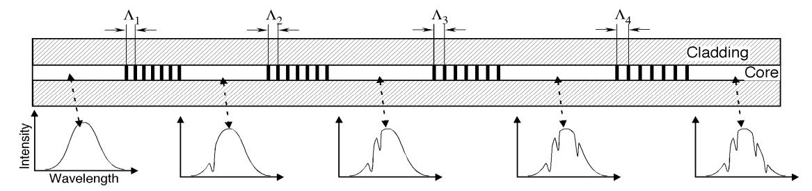

Figure 1. Transmitted light spectra through a distributed optical fiber Bragg grating.

The primary advantages of distributed fiber-optic Bragg thermometry are that the sensor is nonconductive, allowing for deployments in high electromagnetic field environments such as pump motors and turbines, and that many sensors can be configured along a single path enabling the acquisition of a distributed temperature map with a single readout system. This would enable applications such as direct observation of the temperature profile across the primary piping instead of relying on single radius sampling.

The simplest readout technique for a limited number of gratings along a fiber begins by launching a band [range of wavelengths such as from a light-emitting diode (LED)] of light into the optical fiber. Each grating reflects a specific wavelength within the band. The particular wavelength reflected is determined by the Bragg grating period, with each individual grating having a slightly different spacing. Temperature causes the grating period to shift both by thermal expansion and by change in the refractive index. A shift in the reflected wavelength therefore corresponds to a shift in the temperature of a particular Bragg grating.

Another readout technique is optical frequency domain reflectometry (OFDR), which can be used to measure the signal from many (thousands of) individual gratings along a fiber. 11 OFDR is an interferometric technique which requires a coherent, adjustable-wavelength light source. Tunable lasers remain somewhat expensive and have more limited lifetime than simple, wideband light sources. Consequently OFDR would only be the preferred readout technique for large sensor arrays.

Distributed fiber-optic Bragg thermometers have been demonstrated to function briefly in high (core type) radiation environments and much longer in more moderate radiation environments. 12–14 The optics and electronics for distributed fiber-optic Bragg thermometers can be located hundreds of meters from the sensing elements, allowing placement in well-controlled environments at NPPs. Also, Bragg gratings in standard communication type optical fibers bleach out upon exposure to combined high temperatures and high-radiation fields. To mitigate bleaching of Bragg gratings, less common custom optical fibers expressly designed for higher-temperature, higher-dose applications must be deployed. This contrasts with resistance temperature detectors and thermocouples, where devices suitable for nuclear power application are substantially the same as for nonnuclear deployments.

Distributed fiber-optic Bragg grating thermometry is now commercially available with the remaining primary limitation for deployment in nuclear power safety systems being the requirement to qualify the system components.

#### 2.2.2 Ultrasonic Wireline Thermometry

Although the field of ultrasonic temperature measurement has many embodiments, the wireline, pulse-echo ultrasonic sensor is especially suitable to reactor-vessel temperature measurement due to its rugged nature. Experimental studies in reactor safety using ultrasonic wireline thermometry were performed as early as the 1960s15 within an environment as severe as within molten corium. A review of the technology stressing nuclear power applications was published in 1972. More recently Lynnworth provided a detailed overview of ultrasonic probe temperature sensors. Progressive development of high-temperature materials, high-speed electronics, and signal processing methods has pushed the technology forward. While ultrasonic wireline thermometry systems are currently available commercially, the technology has not been widely deloyed in U.S. NPPs and therefore remains an emerging technology.

Ultrasonic wireline thermometry is based upon the change in the velocity of sound within a wire with temperature. The speed of sound in a wire varies with its elastic modulus and density, as described in Eq. (1). Although both parameters are temperature dependent, the temperature effect on elastic modulus dominates by about an order-of-magnitude over that of density, which causes sound velocity  $\nu$  to decrease with increasing temperature.

$$v(T) = \sqrt{\frac{Y(T)}{\rho(T)}},$$
(1)

where Y represents Young's modulus and  $\rho$  represents density, all as a function of temperature T.

Ultrasonic wireline temperature measurement begins by launching an extensional wave down a waveguide. The return time of reflections of the launched wave pulse are then recorded. The wireline contains a series of notches, and the time difference between reflections from each of the notches is indicative of the temperature between the notches (see Figure 2).

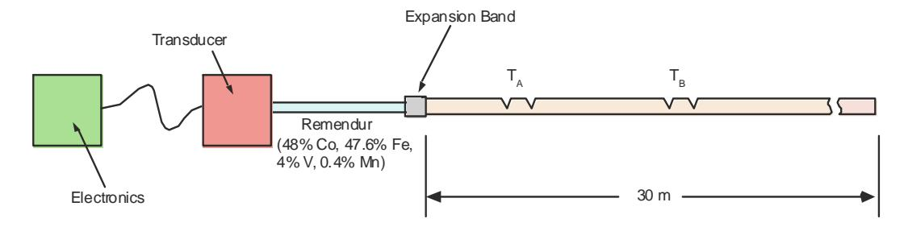

Figure 2. Ultrasonic thermometry system including a notched waveguide.

#### **2.2.3 Johnson Noise Thermometry**

Measurement of the true coolant temperature is a primary NPP safety system requirement. The harsh environment of the NPP causes all known thermometer elements to drift. Consequently, the sensors require periodic recalibration, and operating margin is required to be left due to potential temperature measurement drift. JNT is an approach that potentially eliminates this problem. JNT was first

investigated about 50 years ago for high temperature measurements[19](#page-134-17) and later used for in-core temperature measurement in reactor experiments. [20](#page-135-0) However, it has remained largely experimental until recently. The technology is finally progressing to the point where commercial applications could be possible in a few years.

Johnson noise is a first-principles representation of temperature. Fundamentally, temperature is merely a convenient representation of the mean kinetic energy of an atomic ensemble. Because Johnson noise is a fundamental representation of temperature (rather than a response to temperature such as electrical resistance or thermoelectric potential), Johnson noise is immune from chemical and mechanical changes in the material properties of the sensor. The nonrelativistic form of the relationship between temperature, resistance, and voltage generated is given by the Nyquist relationship:

$$\overline{V^2} = 4k_B T R \Delta f , \qquad (2)$$

where 2 *V* is the mean squared value of the voltage—also called power spectral density—across a resistor of resistance *R*, *kB* is Boltzmann's constant, *T* is the absolute temperature of the resistor, and Δ*f* is the measurement bandwidth. To make a temperature measurement using Johnson noise, the frequency response of the total system must be known as well as the resistance. Temperature is then computed by dividing the power spectral density of the noise voltage by 4*kBR*. Because of the statistical nature of the voltage measurement, the measured value can be distorted by high noise content. The noise level can be reduced by longer integration time of the measurement.

JNT is best understood as a continuous, first-principles recalibration methodology for a conventional resistance-based temperature measurement technique. The traditional method of directly measuring temperature from a resistance temperature detector (RTD) has unavoidable, unacceptable drift. JNT measurement is applied in parallel to the RTD lead wires of the resistance measurement circuit without altering the traditional resistance measurement circuit.

One of the features of being a first-principles measurement is that Johnson noise does not require periodic calibration. Thus, the combined temperature measurement approach achieves the speed and accuracy of traditional resistance thermometry while adding the feature of automatic calibration.

A block diagram illustrating the combined measurement process is shown in [Figure 3](#page-36-2). In the diagram, the RTD, which is exposed to process temperature, exhibits both a resistance value and Johnson noise. These two signals are separable and thus can be processed independently. The RTD's resistance temperature value is compared with the Johnson noise temperature, and a correction is made to the transfer function. This correction can be made quasi-continuously or on a periodic basis (daily) depending on the RTD's drift and target uncertainty values. As shown in [Figure 3,](#page-36-2) the output of the RTD resistance measurement system with Johnson noise correction periodically applied provides a prompt temperature measurement with consistently high accuracy.

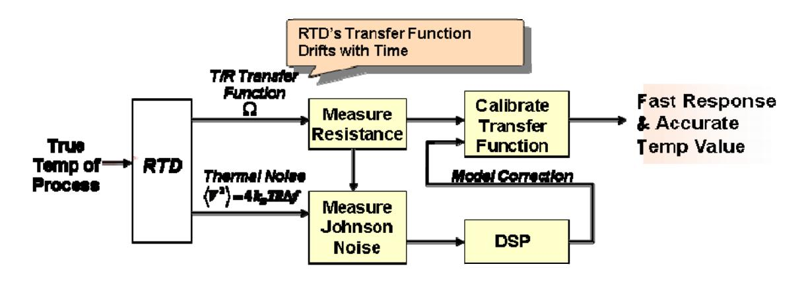

**Figure 3. Johnson noise thermometry measurement process block diagram.** 

# **2.2.4 Gamma Thermometers**

While gamma thermometers have existed in some form since the 1950s,[21](#page-135-1) and indeed the NRC approved their use for local power measurement in PWRs in 1982, gamma thermometers are only now beginning to emerge into widespread use in commercial NPPs. For example, gamma thermometers are currently being proposed for local power range monitor (LPRM) calibration in the ESBWR.[22](#page-135-2)Gamma thermometers, however, remain an emerging technology because they have not yet achieved widespread, long-term deployment within U.S. commercial NPPs.

Gamma thermometers [\(Figure 4](#page-36-3)) function based upon the heating of the sensor assembly by gamma rays and the subsequent controlled differential cooling of the sensor body. The temperature differential developed along the cooling path is proportional to the rate of heating by the incident gamma rays, which is in turn proportional to the local power generation rate during power range operation. As shown in [Figure 4.](#page-36-3) one embodiment of the gamma thermometer consists of a stainless steel rod with argon-filled annular chambers located at each LPRM fission chamber level. A differential thermocouple is embedded in the rod at each chamber location. The thermocouple junctions develop a temperature difference proportional to the gamma flux the rod is exposed to. An electrical heating element is included within the gamma thermometer to provide an alternate heating source for calibration.

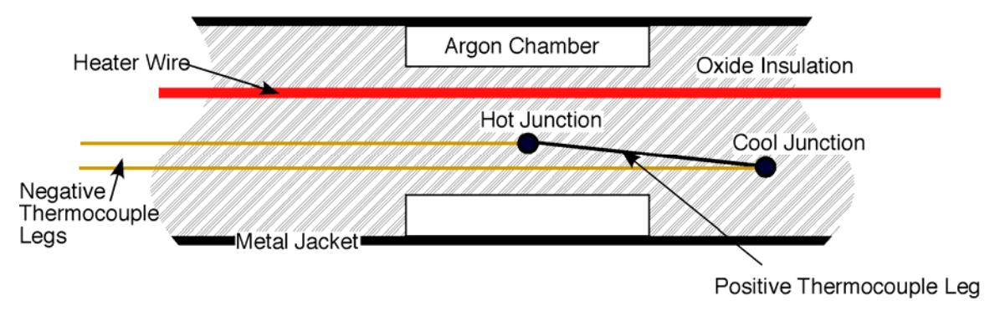

**Figure 4. Basic components of a gamma thermometer.** 

# **2.2.5 Type-N Thermocouples**

Type K thermocouples are widely used throughout the commercial nuclear power industry. However, they exhibit known thermoelectric instabilities. First, Type K thermocouples exhibit a long-term,

typically cumulative drift in Seebeck coefficient upon long exposure at elevated temperatures. This phenomenon is characteristic of all base metal thermocouples. The phenomenon is mainly due to compositional changes caused by oxidation (especially internal oxidation) and neutron transmutation. Type K thermocouples are also subject to a cyclic shift in the positive leg atomic structural configuration (referred to as "short range ordering"). Finally, Type K thermocouples are subject to a perturbation in the Seebeck coefficient of the negative leg due to magnetic transformations of temperature-range-dependent magnetic transformations.

Type N (Nicrosil-Nisil) thermocouples were developed in the 1970s and 1980s as a lower drift alternative to other base metal (particularly Type K) thermocouples. Having achieved designation as a standard thermocouple type by the Instrument Society of America in 1983, Type-N thermocouples have been in widespread use in non-nuclear environment for more than 20 years. The Nicrosil and Nisil alloys composing Type N thermocouples were developed specifically to overcome the instabilities of other base metal thermocouples. Nicrosil and Nisil alloy compositions feature increased component solute concentrations (chromium and silicon) in the nickel base to transition from internal to surface modes of oxidation and include solutes (silicon and magnesium) which preferentially oxidize to form oxygen diffusion barriers. Moreover, Type N thermocouples were also specifically designed for improved high fluence neutron performance by eliminating all elements with high neutron absorption cross sections from the compositions of the thermoelements.

Type N thermocouples are now widely available commercially at similar cost to other base metal thermocouples and with similar values of thermoelectric voltage output. As commercial NPPs attempt to reduce the required instrumentation margins in their technical specifications, adoption of Type N thermocouples as a general replacement for other thermocouples (specifically Type K) should be anticipated.

# 2.3 REGULATORY IMPACT OF SENSORS AND MEASUREMENT SYSTEM TECHNOLOGIES

The key regulatory issues associated with sensors and measurement systems in NPPs include response time requirements; accuracy of the instrumentation, which can enable applicants to argue for reduced operating margins; credit that can be taken for online sensor diagnostics capability or inherent lack of drift of a sensor; and qualification issues associated with new sensor technologies. such as optical-fiber-based sensors. Use of sensors with inherent drift-free characteristics for example, can eliminate the need for calibration. Of the sensors reviewed in this chapter, JNT is the only one whose continued development can potentially eliminate the need for manual calibration. In a practical application, JNT is best used as a continuous, first-principles recalibration methodology for a conventional resistance-based temperature measurement technique. However, widespread commercial application of the method in NPPs is still limited. In the absence of such techniques for online sensor monitoring, methods such as cross calibration will continue to afford the best means to justify the need for increasing calibration intervals.\* Current methods of verifying an instrument's performance include routine calibrations, channel checks, functional tests, and response time tests. Standards such as ANSI/ISA-67.06.01, "Performance Monitoring for Nuclear Safety-Related Instrument Channels in Nuclear Power Plants," provide the nuclear power industry with guidelines for performance monitoring of safety-related instruments. This ISA standard provides a step-by-step guide for establishing the acceptance criteria for a given instrument signal. Institute of Electrical and Electronics Engineers (IEEE) Std. 338-2006, "IEEE Standard Criteria for Periodic Surveillance Testing of Nuclear Power Generating Station Safety Systems," provides criteria for the periodic

-

\*It should be noted that in standards such as ANSI/ISA-67.06.01, cross calibration is considered a valid technique for monitoring redundant RTDs but is not acceptable for pressure sensors.

testing of nuclear power generating station safety systems. The scope includes functional tests and checks, calibration verification, and time response measurements. It appears that, in general, the sensing technologies in the nuclear power industry represent adaptations of well-established measurement concepts, and "new" sensors are typically evolutionary rather than revolutionary in nature. It appears also that revisions of current guidelines and standards are keeping pace with these incremental developments in sensor technology.

# **3. COMMUNICATION MEDIA AND NETWORKING**

# **3.1 COMMUNICATION MEDIA AND NETWORKING OVERVIEW**

This section presents an overview of digital communication technologies and their application to field instrumentation such as sensors, controllers, and actuators. These technologies are widely used in industry in wired as well as in wireless platforms. They are beginning to find acceptance in NPPs as evidenced by their plant-wide application in Gen III+ power plant designs. However, application of wireless communications remains limited to non-safety-related communication, diagnostics, inventory/database applications, and wireless local area network (LAN) devices for office use. Several trends in wireless communications have the potential to enhance communication systems performance in NPPs, but they could also present security and possible safety challenges. In any wireless application, the main concerns to be considered are security, reliability, and spectrum management.

Advances in digital communication systems in general have focused on boosting data transmission speeds, development of more robust protocols, error correction and encryption techniques, and (for wireless systems) spread spectrum (SS) techniques (direct sequence, frequency hopping, time hopping, chirp). SS radio communications techniques have been long favored by the military because the signals are hard to jam and are difficult for an enemy to intercept. Other advantages of the SS signals are increasing resistance to natural interference and jamming (interfering with narrowband signals). In general, use of digital communication systems in NPPs lags considerably behind use in nonnuclear systems due to the stringent requirements these systems have to comply with to be acceptable for NPP applications. Gen III and III+ plants are expected to bridge this gap with their extensive application of digital I&C.

One of the common industrial, wire-based networks is the fieldbus. Fieldbus technology has matured, and several variants are available. However, despite its several advantages, including lower installation and operation cost, interoperability, fewer penetrations through plant containment, improved information accuracy, etc., the use of the technology is still much more prevalent in the nonnuclear environment than in the nuclear environment. Two concerns for using fieldbus technology in the nuclear industry are (1) the potential for common-cause failures (CCFs) resulting from design errors and (2) the ability of the fieldbus to guarantee deterministic responses. The IEC 61784 standards (IEC 61784-1[29](#page-135-9) and IEC 61784-3[30\)](#page-135-10) address extensions to the fieldbus technology described in IEC 61158 to render the technology compatible with IEC 61508. Gen III and III+ NPPs currently undergoing certification [e.g., the European Pressurized Reactor (EPR)] will use fieldbus technology, such as PROFIBUS to communicate between safety and nonsafety systems. The PROFIBUS has some attractive features with regard to NPP application. These include (1) a master/slave messaging model that results in a deterministic communication protocol and (2) suitability for use in redundant architectures.

# **3.2 DETAILS OF TECHNOLOGY/INDUSTRY TRENDS**

# **3.2.1 Wired Instrument Networks**

The IEC 61784 standards (IEC 61784-1[29](#page-40-4) and IEC 61784-[330](#page-40-4)) address extensions to fieldbus technologies described in IEC 61158 in a way compatible with IEC 61508. These extensions are a standardized means of supporting real-time, safety-related and security-related applications. IEC 61784 lists specifications for seven fieldbus technologies (protocols):

- FOUNDATION Fieldbus (FF),
- ControlNet,
- PROFIBUS,

- P-NET,
- WorldFIP,
- INTERBUS, and
- SwiftNet.

# **3.2.1.1 Foundation Fieldbus**

Foundation Fieldbus (FF), designated as Communication Profile Family 1 in IEC 61784-3[,30](#page-40-4) is an open architecture that supports all-digital, serial, two-way communication systems[31](#page-135-11). Two levels of physical abstraction for communication are used: H1 and high-speed Ethernet (HSE, 100 Mbit/s). The H1 layer (31.25 kbit/s) interconnects field equipment such as sensors, actuators, and input/output (I/O). The H1 physical layer receives messages from the H1 communication stack and converts them into physical signals on the FF transmission medium and vice versa. The HSE layer provides integration of high-speed controllers such as programmable logic controllers (PLCs); H1 subsystems– via a linking device; data servers; and workstation. A simplified network layout is shown in [Figure 5.](#page-41-0) 

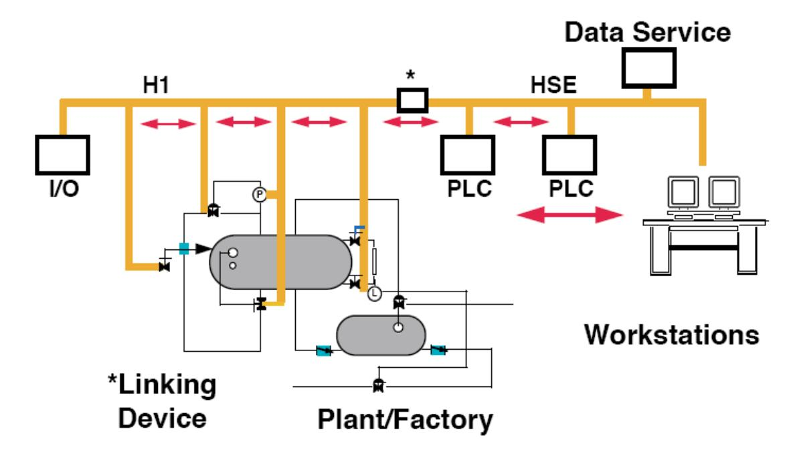

**Figure 5. FOUNDATION fieldbus network.26**

The H1 layer uses the Manchester Biphase-L encoded current modulation at 31.25 kHz. The signal is called "synchronous serial" because the timing information is embedded in the data stream. On the H1 physical layer, up to 32 devices can be supported at 31.25 kbit/s on a 1900-m cable with a maximum spur length of 120 m. The number of devices possible on a fieldbus link depends on factors such as the power consumption of each device, the type of cable used, number of repeaters, etc. On the H1 communication stack, two types of devices can be defined in the DLL specification: basic device and link master. Link master devices are capable of becoming the link active scheduler (LAS). The LAS has a list of transmit times for all data buffers in all devices that need to be cyclically transmitted.

The FF safety communication layer specified in IEC 61784-3-1[32](#page-135-12) makes it possible to use intelligent devices in a safety-related system adding more capability. Moreover, the system can meet its specific safety-integrity-level requirements.

# **3.2.1.2 PROFIBUS**

Defined as Communication Profile Family 3 by IEC 61784-3, PROFIBUS is based on the cyclic data exchange of a bus controller with its associated field devices using a one-to-one communication relationship. Any mix of standard and safety-related devices can be connected to a network assigned to a single controller. The protocol also allows assigning safety tasks and standard tasks to different controllers. Acyclic communications between devices and controllers or supervisors such as programming devices are possible for configuration, parameterization, diagnosis, and maintenance purposes.

The functional safety is realized by four measures: (1) consecutive (virtual) numbering, (2) watchdog time monitoring with acknowledgement, (3) codename per communication relationship, and (4) cyclic redundancy checking (CRC) for data integrity. Each safety device sends an acknowledgement message with a safety protocol data unit PDU. A separate watchdog timer on both the sender and the receiver side is used for each one-to-one communication. A unique "codename per communication relationship" is established for authentication reasons. The codename is encoded within an initial CRC signature value, which is recalculated every n hours.

There are different application-oriented emphases that are not specifically defined but have found wide acceptance. Each main emphasis is built from a typical combination of modular elements as depicted in [Figure 6](#page-42-0). PROFIBUS DP (Decentralized Periphery) is the main emphasis for factory automation based on RS485 transmission technology. PROFIBUS PA (Process Automation) is mainly used for process automation, usually with Manchester Coding Bus Powered-Intrinsic Safety (MBP-IS) transmission technology. Motion control with PROFIBUS is the main emphasis for drive technology using RS485 transmission technology. The application profile for motion control is known as PROFIdrive. PROFIsafe is the main emphasis for safety-related applications based on either RS485 or MBP-IS transmission technology.

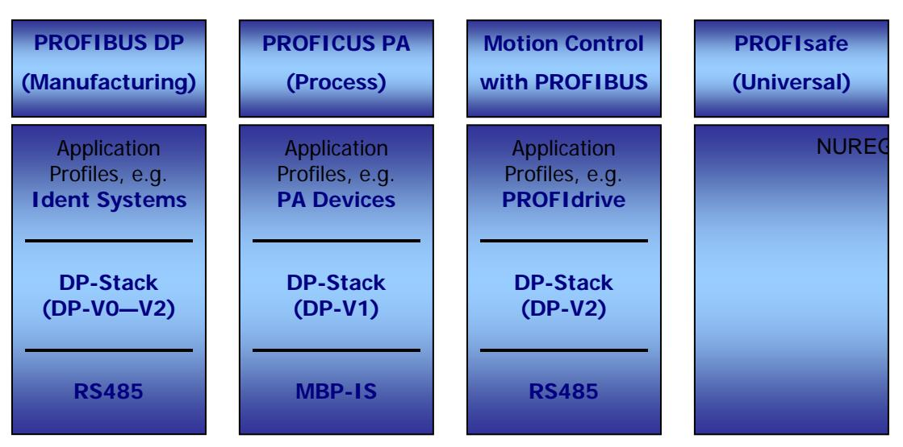

**Figure 6. Application-oriented features of PROFIBUS.** 

At the protocol level, PROFIBUS DP is offered in three versions: DP-V0, DP-V1, and DP-V2. DP-V0 provides the basic functionality of DP such as cyclic data exchange, station and module diagnosis, and channel-specific diagnosis. DP-V1 introduces certain enhancements to DP-V0 with extensions such as acyclic data communication and alarm definitions. DP-V2 contains additional functionalities toward drive technology with extensions such as isochronous slave mode and slave-toslave communication (known as DXB or data exchange broadcast). These DP versions are extensively specified by IEC 61158.

Safety implementations are specifically presented in IEC 61784-3 for several fieldbus technologies, in conformance with higher-level IEC standards such as 61500, 61508, and 61511. A major component of the safety concept is the safety communication layer (SCL), a communication layer in the sense of the open system interconnects model, as illustrated in [Figure 7.](#page-43-0) This safety feature is incorporated into safety-related equipment, represented as a safety node, so that safety messages passed between any two nodes are processed at the sending and receiving end nodes. The SCL's main function is to ensure that the system, as a whole, maintains the integrity of the safety-related functionality regardless of any communications errors that might occur. It covers possible transmission faults, remedial measures, and considerations affecting data integrity. For example, a safety layer can implement an additional CRC function to reduce the probability of accepting a corrupted message to the level required for a given safety function. The IEC specifications list the type of communications errors and the safety measures that effectively mitigate them.

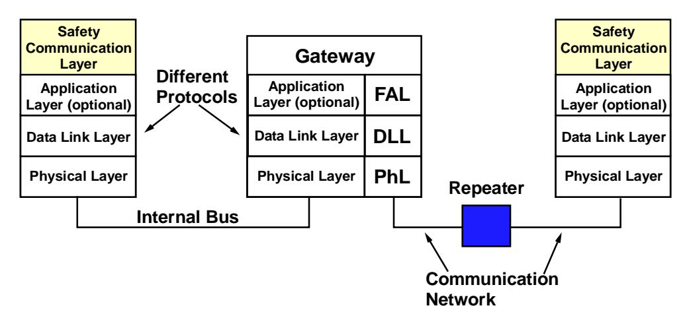

**Figure 7. Three-level layer model with safety communication layer applied to a safety system network.** 

An interesting concept in the standard is the use of "black channel," an approach in which a safety functionality, represented by PROFIsafe protocol in compliance with IEC safety standard 61508, resides on top of the existing protocol, represented by the standard PROFIBUS protocol. The black channel concept provides improvement in the reliability of the overall communications system. Its use in a safety-related communications channel is justified by adding the SCL prescribed by the standard. The SCL is present at both black channel endpoints as shown in [Figure 8.](#page-43-1) The SCL performs safety-related transmission functions and checks on the communication to ensure that the integrity of the link meets its requirement. Upon detecting a problem, the SCL will attempt to make a correction, but if it fails, it will place the system in a safe state (e.g., by tripping the reactor). The IEC standard can provide information regarding the possible communication errors and the means of detecting and preventing these errors. The standard, however, cannot prescribe a universal method for taking the system to a safe state in the event of an error.

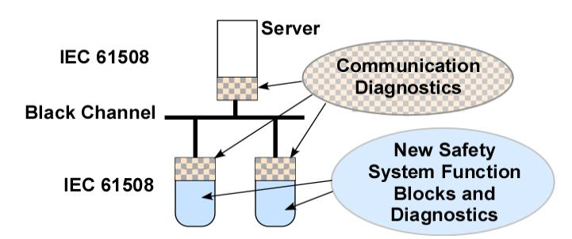

**Figure 8. Illustration of black channel implementation.** 

#### 3.2.2 Wireless Communications

There are several trends in wireless communications, ranging from high-bandwidth communication links to radio-frequency identification (RFID), that have the potential to improve the communication performance in NPPs, but wireless communications could also introduce security and possible safety challenges. The three primary concerns when considering wireless communications are security, reliability, and spectrum management. Wireless technologies and related issues are examined in this section.

For several years, truly broadband wide-area communications were developed and implemented using fiber-optic cables. However, the new trend is to provide communication backbones using wireless links with some type of infrastructure such as wireless networking nodes piggy-backing on cell-phone towers, microwave links, or a combination of the two. The IEEE 802 family of standards has been developed for wireless communications in conjunction with various networking platforms. Four basic networking platforms; personal area network (PAN), local area network (LAN), metropolitan area network (MAN) and wide area network (WAN) have been reviewed, with emphasis on wireless connectivity of devices to these networks, as shown in Figure 9.

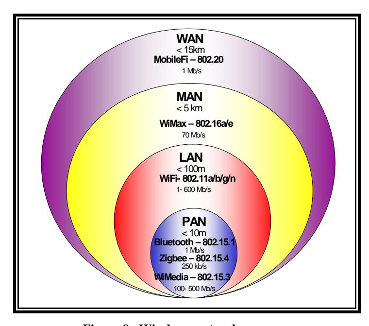

Figure 9. Wireless protocol coverage.

The PAN standard, which is governed by IEEE 802.15,33 is designed to provide a point-to-point wireless connectivity between devices equipped with the same wireless protocol (Bluetooth, ZigBee, or Wi-Media). It is limited in its coverage to the immediate space surrounding a device (e.g., a single room) with a range on the order of 10 m. The bit transfer rate varies from 250 kbit/s to 500 Mbit/s depending on the type of protocol used in conjunction with the communicating devices.

The LAN standardized by IEEE 802.1134 is a network design for larger area coverage (on the order of 100 m). Most LANs are confined to single building or group of buildings. In addition, one LAN can be connected to other LANs to provide much wider coverage using telephone lines as well as wireless transmission. Wireless communication over LANs is accomplished using the wireless fidelity (Wi-Fi) protocol. With this protocol, data can be transmitted at relatively fast rates, varying between 1 to 600 Mbit/s, depending on the IEEE standard being adopted (802.11a, 802.11b, 802.11g, 802.11n) by

the network and the communicating devices. The higher data rate is attributed to version 802.11n as a result of using multi-input, multi-output (MIMO) and orthogonal frequency division multiplexing (OFDM) techniques.

MANs can deliver point-to-multipoint communication among devices within a business building or an entire block of business buildings. MAN transmissions can cover a geographic area larger than that covered by an even larger LAN. Such networks are typically found in urban areas where large obstructions typically exist. They are capable of covering areas in the range of 5 km and can even extend to wider areas with the use of repeaters. The wireless communication protocol used in conjunction with MANs is the Wi-Max (worldwide interoperability for microwave access), which is based on the IEEE 802.16 standard[35](#page-135-15) and is capable of transmitting data at 70 Mbit/s. Worldwide interoperability is even made possible by merging technologies from different networking platforms.

WANs are the result of such mergers allowing coverage worldwide by interconnecting LANs and MANs through routers, repeaters, and even satellites to form even wider geographical areas—in the range of 15 km. Wireless connectivity to WANs is achieved using the Mobil-Fi protocol, which is based on the IEEE 802.20 standard.[36](#page-135-16) This wireless technology extends high-speed wireless access to mobile users with a relatively fast data rate of 1 Mbit/s.

Technical overviews of the wireless technologies used in conjunction with the four network platforms are presented in the following five subsections.

# **3.2.2.1 Wireless Fidelity**

Wireless Fidelity (Wi-Fi) is a wireless technology most widely used in routers to provide Internet network connectivity for devices such as computers. Other applications include network connectivity for consumer electronics such as television, DVD players, and digital cameras. Wi-Fi products are commercially available in four different formats: 802.11a, 802.11b, 802.11g, and 802.11n, with data rates between 1 and 600 Mbit/s. Data can be transmitted between devices supporting this technology within the 100 m range at a rate ranging from 1 to 600 Mbit/s, depending on the IEEE standard being used. Current trends indicate that two of the standards, 802.11a and 802.11b, are being phased out and are being replaced by 802.11g, which combines the attractive features from both standards (speed from 802.11a and broad compatibility of 802.11b).

The higher data rate (600 Mbit/s) is attributed to the latest version, 802.11n, as a result of using MIMO and OFDM techniques. The main purpose for developing Wi-Fi technology was to provide wireless access to the Internet using high-speed data transmission, with no emphasis on low power consumption; therefore it is not deemed applicable to sensors and actuators.

Another advantage of Wi-Fi is that it operates in the 5-GHz unlicensed national information infrastructure (UNII) band. This is particularly desirable because the 2.4-GHz industrial, scientific, and medical bands have become overcrowded with ZigBee, 802.11b and 802.11g, Bluetooth, and even microwave ovens.

State-of-the-art wireless technologies make it possible to interconnect devices with different wireless protocols such as connecting personal digital assistants with computers, thus merging PAN with LAN. This would allow wireless accessibility within industrial plants for accessing/sharing files that assist plant operators in performing various tasks.

# **3.2.2.2 ZigBee**

ZigBee is a wireless technology based on the IEEE 802.15.4 standard and developed for low-power, low-data-rate communications of 250 kbit/s with area coverage of 10 to 70 m. ZigBee-enabled devices can typically be found in the personal market sector (e.g., home automation), business sector (e.g., commercial office applications), and industrial sector (e.g., sensors for monitoring temperature, radiation, and pressure). Sensors with ZigBee interface can be potentially applied to monitor the health of NPPs. As an example, temperature transducers and level sensors can be placed within a coolant chamber to monitor and report the coolant operating conditions (e.g., temperature, level). These types of monitoring applications could be extended to radiation sensors and other types of warning sensors placed throughout a plant to warn against airborne releases of radionuclide and abnormal radiation levels in the work place.

Another advantage of ZigBee products is the ability to maintain power consumption at a minimum by entering a sleep mode when the device is not active. In sleep mode, the device reduces its power consumption to a minimum, and it can be awakened at any time. There is typically a 15 ms delay for a device to "awaken" from sleep mode, and it would take another 15 ms delay for the active slave to access the channel. Wireless sensors (ZigBee devices) could also serve to aid the functionality of various security devices. Whether used with motion sensors on the ceiling or pressure sensors within the floor, they could be used to monitor restricted areas for unauthorized accessed and alert a central security system, which in turn could initiate security measures (e.g., controls for lights, alarms, door locks, and cameras).

One of the limiting factors for Zigbee is the transmission coverage, which is limited to 10 m. This limitation can be overcome by relaying information between several devices to extend the coverage even further. ZigBee can conform to various network topologies such as the star and peer-to-peer.

# **3.2.2.3 Bluetooth**

Bluetooth is a radio standard and communications technology based on the IEEE 802.15.1 standard. It was developed as a wireless cable-replacement device used mainly in conjunction with computers but also now finding applications in cell phones. It was developed primarily as a low-power, lower cost alternative to Wi-Fi. Bluetooth technology is implemented in a low-cost chip that can be plugged into any device capable of supporting wireless communications and transmitting data at a rate of 1 Mbit/s. The coverage, however, can range from a few meters to a hundred meters, depending on the transmitting power level (Class 1: power—100 mW (20 dBm), range—~100 m; Class 2: power— 2.5 mW (4 dBm), range—~10 m; Class 3: power—1 mW (0 dBm), range—~1 m). A typical application for a Bluetooth-compliant device is communication with computers. Such capability allows Bluetooth to be used in a wide range of potential applications because computers are extensively used in practically all facets of research and in industrial processes for monitoring and control purposes. However, the application of Bluetooth technology in industrial settings is still limited to performing administrative tasks rather than playing a key role in establishing digital communication networks for use in I&C applications.

# **3.2.2.4 Ultra-Wideband**

The ultra-wideband (UWB) is an emerging short-range radio technology that complements longer range radio technologies such as Wi-Max and Wi-Fi. It is intended for low-power radio transmission in compliance with the IEEE 802.15.3a standard (i.e., capable of relaying data from a host device to other devices in an area within 10 m). The UWB can operate in the frequency range of 3.1 to 10.6 GHz without licensing requirement and transmits information by spreading it over a bandwidth

exceeding 500 MHz. Data transmission is accomplished by generating radio energy at specific time instants and occupying large bandwidths, which can be considered as a pulse-position or timemodulation technique. According to the Federal Communications Commission ruling, the bandwidth can be the lesser of 500 MHz or 20% of the center frequency. One of the main advantages of the UWB transmitting signal is that it is less likely to cause interference with the conventional narrow band radio signals due to its high bandwidth and short-range coverage. Early UWB systems were developed for the military as surveillance tools (radar imaging, precision positioning and tracking) because of their ability to transmit through trees and ground surfaces. More recently, the UWB technology has begun to focus on consumer electronics (audio and video applications).

Several versions of the UWB platform are being developed for different applications. Wi-Media UWB is one protocol that is considered the basis for the industry's first UWB standards. It is designed as a common radio platform incorporating a medium access control layer and physical layer specifications based on multiband OFDM. This development enables short-range multimedia file transfers at data rates of 480 Mbit/s with low power consumption. The Wi-Media UWB has been specifically aimed at markets such as the PC, consumer electronics, mobile device, and automotive markets and complementary WPAN technologies such as Bluetooth and the Certified Wireless USB.

# **3.2.2.5 Worldwide Interoperability for Microwave Access**

Worldwide interoperability for microwave access (Wi-Max) is a telecommunication technology conforming to the IEEE 802.16 standard and described as a standards-based technology enabling the delivery of wireless broadband access as an alternative to cable and digital subscriber line.

Wi-Max is aimed at providing broadband access to Internet services throughout the world. The protocol is very similar to the HiperMAN standard being used in Europe. Wi-Max technology has the potential for replacing the fiber optic and copper wire backbones of existing networks. Although there may be reluctance in urban environments to switch to wireless infrastructure, where existing wired infrastructure is already available, there is a need for this service within developing countries and rural areas where the resources are not available due to a limited customer base. However, because of the wide coverage range of Wi-Max, extending to 50 km, by using a minimum number of base stations, coverage can be provided to such remote places for a cost much less than installing a copper or fiber optic infrastructure.

The wide coverage capability of Wi-Max is attributed to high transmitter power and the use of directional antennas. By limiting the maximum number of customers to 500 per base station, Wi-Max made it possible to increase the bandwidth provided to each customer. As a result, an overall high data rate could be achieved. Currently, Wi-Max is used in a strictly stationary service providing environment, where the receiving antenna is placed in a fixed location. To achieve wide coverage, the antennas are normally placed on rooftops, although development is underway to extend coverage to indoor environments. The fact that both the Wi-Max and Wi-Fi provides accessibility to wireless connectivity and the Internet, Wi-Max- and Wi-Fi-enabled devices can coexist within the same wireless networking infrastructure. In such a case, the Wi-Max is used to transmit data over larger distances (kilometers) to a network infrastructure such as the MAN, and Wi-Fi would provide data access through the Internet within a limited region (meters).

Similar to both Wi-Media and portions of Wi-Fi, Wi-Max also incorporates an OFDM system for modulation. This system can operate within two frequency ranges, either the 10 to 66 GHz range or the 2 to 11 GHz range. In the higher frequency range, a line-of-sight (LOS) path is required due to the inability of high-frequency signals to propagate through walls. In contrast, low-frequency signals do not require LOS. The addition of the lower frequency range is part of the 802.16a section created for

the standard. Because there is a large amount of bandwidth available to Wi-Max, it is able to achieve a higher data rate than Wi-Fi. In a single channel, these data rates can reach 75 Mbit/s, with a possibility of 350 Mbit/s using multiple channels. The ability to use multiple channels allows Wi-Max to be expandable whenever more bandwidth is needed by just adding more channels.

# **3.2.2.6 Radio-Frequency Identification**

Radio-frequency identification (RFID) is an automatic identification and data capturing technology that is complementary to bar coding.An RFID system consists of a tag, antenna, and transceiver.The tag is an IC containing the RF circuitry and information to be transmitted.The antenna and the transceiver are used to pick up the RF signals transmitted by the tag and transfer the information to a processing device, typically a computer.One of the key differences between the RFID and bar code technology is that the RFID eliminates the need for the (LOS transmission required by the bar code technology). RFID tags are generally one of two types, passive or active.Active tags require an internal power source to power the transceiver; the power supply also powers the tag's controller. Passive tags do not contain an internal power source. Consequently, a passive tag requires power from a transmitter, which also sends the query to the tag. There are many RFID products on the market, but tag compatibilty for a particular application is still a major issue.

Some government agencies have begun introducing RFID technologies into their facilities for asset and personnel accountability. At present, the main benefits are for property accountability (i.e., the prevention of loss and theft) and for personnel accountability (e.g., ensuring that all personnel have cleared the building during an evacuation). Hence, RFID can save significant costs and improve the safety of the workforce.

The main concerns for applying RFID technology focus on security issues, which include the following.

- 1. Data collected by the RFID system should have a one-way portal into the facility's intranet.
- 2. Depending on job classification, some people or assets and their whereabouts may need to be treated as sensitive information and require classification controls.
- 3. Personnel tags should not be allowed to leave the facility area or be used by the same person every day to prevent outsiders from tracking individuals.
- 4. Asset tracking should include only a generic property number, not model numbers, serial numbers, or other descriptive text.
- 5. Adequate physical separation will be required between the boundary of a controlled facility, where the tags are used, and uncontrolled areas where unauthorized access of data can be accomplished by intercepting the RF transmitted signals.

# **3.2.2.7 Wireless Communications in the Power/Nuclear Industry**

Wireless communication technologies are widely applied in the nonnuclear industry to improve in-plant communications, reduce operating costs, and reduce human error. The challenges that impede complete acceptance of wireless technology in the nuclear environment remain (1) how to ensure complete independence between systems (e.g., between safety and nonsafety), (2) how to ensure reliable performance in noisy (e.g., high electromagnetic/radio-frequency interference) environments, and (3) cyber security. It is likely that the ever increasing improvements in wireless technology will result in improved reliability and increased data security, which in turn could result in greater acceptance of wireless technologies within the NPP industry.

Applications of wireless communications in power generation facilities in general include voice and data communications to employees and field crews, distributed supervisory control and data acquisition to substations and power line devices, wireless LAN devices for office uses, automated intelligent metering, geographical-information-system- (GIS-) based work management, alarm systems, and emissions monitoring. Wireless technology has already been used in applications in a few NPPs. An example is Exelon Nuclear's Limerick Generating Station in Montgomery County, Pennsylvania, where vibration and temperature sensors equipped with RF transmitters are used to monitor the fans that are used to exhaust turbine enclosures. Another plant that adopted wireless technology is San Onofre's NPP in California. In this plant, wireless temperature sensors and transmitters have been installed to remotely monitor several 2,550 hp plant motors.[37](#page-135-17)

As mentioned previously, the nonnuclear power industries have been experiencing increasing application of wireless technologies. Many existing wireless systems have been modified specifically for use in the power generating industries. Power companies like TXU Energy in Texas,[38](#page-135-18) for example, have improved their plant communications systems by installing fiber-optics-based LANs as backbone systems for supporting existing wired and planned wireless systems. Wireless access points have been deployed throughout the plant to support multimedia applications. Voice-over-Internet protocol technology is being used to accommodate mission critical and routine voice communications. Applications of wireless systems include two-way radioing, basic telephony, online equipment monitoring, connectivity to intranets and the Internet, and remote video monitoring. Reliability is ensured through network redundancy and backup power sources.

Ontario Power Generation[39](#page-135-19) is an example in which a different approach has been adopted for integrating several existing communication systems, including a 400-MHz radio system, Nortel companion phone system, in-house 400-MHz voice pagers, commercial cellular and paging systems, and emergency communication radios, into a more modern infrastructure meeting current requirements. A virtual private network (VPN) based on a commercial cellular system has been selected based on their needs and available communication equipment, among other options, for this task. The objectives of the VPN are (1) to support station containment outage (SCO); (2) to comply with the communications industry; and (3) to meet NPP security's mandate to provide contiguous and seamless communications on site and within the powerhouse, between sites, and with regional police communication centers.

RLW Inc.[40](#page-135-20) has built a wireless platform for deployments in industrial environments like NPPs. This is a stand-alone platform containing many components of communication equipment such as data collection devices; sensors; a LAN; cameras; and handhelds/notebooks, for plant monitoring and control purposes.

# **3.2.2.8 Quantifying the Reliability of Wireless Communications**

The reliability of a communication system is measured by its bit error rate (BER) or packet error rate (PER). This is a measure of the average ratio of the bits in error to the total transmitted bits. It is useful to measure the BER of the communication medium over the entire range of conditions in which it is intended to operate. Unacceptable BER results in unacceptable communications. Generally, BER values higher than 10–3 are not acceptable for any application. However, some BER requirements are application-specific and more stringent: the BER value for video applications, for instance, must be less than 10–5.There is a one-to-one relation between the received power/signal-tonoise-ratio (SNR) and the BER. In addition, the SNR requirement for a particular BER is also application specific. For an additive white Gaussian noise (AWGN) channel, if the SNR requirement for a certain BER value increases above 15 dB, it is considered unacceptable. For a fading channel, on the other hand, this value can be as high as 30 dB.

The first step in acquiring the desired BER is to carefully select the modulation schemes in the physical layer and is generally followed by a forward error-correction coding (FEC). The FEC detects and corrects the bits in error after the demodulation. The tradeoff of the FEC is the available bandwidth and decoding complexity versus the BER improvement. Retransmission of the entire packet can be used to improve the PER. Combinations of modulation; FEC, diversities spreading, and interference cancellation are used to achieve the desired BER. Parameters to be considered are (1) required transmitted power, (2) available bandwidth, and (3) receiver complexity. To protect against tampering with the data, a cryptographically -derived media access code address may be used. The encryption process consists of a hashing algorithm such as SHA-1 or MD5 combined with an operation involving a secret key. Cryptographic hash functions provide transformation of an input to a fixed-sized string, also referred to as the hash value, digital fingerprint, digest, or a checksum. MD5 and SHA-1 are the two most commonly used hash functions.

# **3.2.2.9 Protecting Wireless Communications against Unauthorized Access**

The most commonly used method to protect against unauthorized access is encryption. If a commercial-grade encryption is used, such as 128-bit secret key encryption, 1500-bit public key encryption, or U.S. Government Type 1 encryption, the data can then be considered protected against unauthorized access. Such protection depends greatly upon the protection afforded the keys.

The next most commonly used method of protecting data against tampering is physical protection. Proper shielding can be an effective means for preventing unauthorized access to the RF signals transmitted by sensors. If the strength of the transmitter and the perimeter distances are such that the signal strength outside the perimeter is sufficiently low, it should also be quite difficult for an adversary to intercept the signals.

Another method that can be used is directional transmission. Transmitting data directly toward the intended receiver reduces the locations from which the transmissions may be received. If this method is combined with low power signals, it can be even more effective. A further optimization of this technique could involve multiple access points using phased array antennas. The signal can be multiplexed between the access points so that parts of the signal are transmitted from each access point directly toward the receiver. With this method, an unauthorized person would not be able to intercept the entire signal without having at least one antenna located in line with each transmitter and the receiver.

# **3.3 REGULATORY IMPACT OF COMMUNICATIONS AND NETWORKING**

With regard to digital communication (whether wired or wireless), the overriding regulatory issue is maintaining not only physical and electrical independence but also data independence between safety and nonsafety systems. 10 CFR 50.55a(h), "Protection and Safety Systems," requires compliance with IEEE Standard 603-1991, "IEEE Standard Criteria for Safety Systems for Nuclear Power Generating Stations." Clause 5.6 of IEEE Standard 603-1991 requires redundant safety systems to be independent of one another. IEEE 7-4.3.2-2003 addresses communication independence. In general, however, current industry guidance documents such as IEEE Standards 603 and 7-4.3.2 do not sufficiently define a level of detail for evaluating interdivisional communications independence. Indeed, some provisions of IEEE Standard 7-4.3.2 have been found not to be suitable for endorsement by NRC. In Regulatory Guide 1.152, Rev. 2,[41](#page-136-0) IEEE Std. 7-4.3.2-2003 is presented as a method acceptable for satisfying NRC's regulations with the exception of five informative annexes, Annexes B–F. (IEEE Std. 7-4.3.2 is also referenced by other NRC documents such as Regulatory Guide 1.206,[42](#page-136-1) Regulatory Guide 1.209,[43](#page-136-2) and NUREG-0800, "Standard Review Plan"[44\)](#page-136-3). In addition, IEEE 7-4.3.2 is currently undergoing revision, and at this point, it is not known whether the revision will be

suitable for endorsement or consistent with current NRC positions.[45](#page-136-4) Therefore there is the need to establish acceptance and review criteria for safety systems communications that can be uniformly applied to a variety of digital safety system designs. To address these concerns, NRC issued the *Interim Staff Guidance* DI&C-ISG-04, "Highly-Integrated Control Rooms—Communications Issues (HICRc)," in September 2007.[45](#page-51-0) In addition, Kisner et al. have documented in a draft NUREG/CR[46](#page-136-5) a technical basis for guidance that specifically addresses issues related to communication among safety divisions and between safety-related equipment and equipment that is not safety related. The report examines (1) accepted networking consensus practices adopted by various standards organizations in the United States and internationally, (2) operating experience of international power reactors using digital network communications in safety systems, and (3) failure mechanisms arising from several possible network architectures and message types. The NUREG/CR uses these studies as a basis to develop a structured approach to provide review guidance for the evaluation of safety-to-safety and non-safety-to-safety communications systems.

The independence issue with regard to wireless communications systems in NPPs is not so easily resolved. Howlader, Korsah, and Ewing[47](#page-136-6) have developed the technical basis for regulatory guidance on implementing wireless communications in NPPs. Wireless systems are likely to be limited in the foreseeable future to non-safety-related diagnostics and maintenance systems such as the ones already discussed, inventory management systems, and voice and data communications to employees and field crews.

# **4. MICROPROCESSORS AND OTHER INTEGRATED CIRCUITS**

# **4.1 MICROPROCESSORS AND OTHER INTEGRATED CIRCUITS OVERVIEW**

The evolution of semiconductor devices has moved from the single transistor (discrete design) to ICs with various complexities, to powerful microprocessors with various capabilities, to more advanced integrated circuits designed for specific applications [application-specific integrated circuits— (ASICs)]. The direction of research and development (R&D) in the semiconductor industry is exemplified by the development by Intel in early 2007, following years in research, of a prototype microprocessor called Penryn with two versions: dual-core microprocessor with 410 million transistors and quad-core with 820 million transistors.[48](#page-136-7) These processors were developed with 45 nm complementary metal-oxide semiconductor (CMOS) technology using high-*k* plus metal gate materials. In addition, Intel is in the process of launching an R&D program to develop 32 nm technology for future chips. The successful development of the high-*k* (replacing the SiO2 insulation, which was used up to the 65 nm generation presently used by many semiconductor manufacturers), in conjunction with the metal gate (replacing the silicon gate electrode used up to the 65 nm generation) made it possible to shrink the insulation layer between the gate electrode and the transistor channel in size but yet provide enough isolation needed to prevent current leakage in the off-state while at the same time allow high conduction current in the on-state.

The performance level of field programmable gate arrays (FPGAs) and their associated software tools have advanced such that they are now being considered in the design of complex digital control systems. FPGAs can typically include as many as 8 million gates and can incorporate multiple implementations of complete microprocessors on a single chip. Software tools are available to compile a wide variety of programming tools, used to describe the FPGA design, into FPGA configuration code. There are several programmable tools that are commercially available such as the Very High Integration Hardware Description Language (VHDL) code, AND/OR gate level hardware schematics, MATLAB m-code programs, MATLAB Simulink diagrams, and C programs.

For digital safety systems, one concern has been the need to ensure near-error-free performance. However, the growing system complexity and shrinking feature size of semiconductor devices introduce new reliability concerns and the potential for new aging phenomena, thus making it even more difficult to guarantee delivering future products free of errors.

# **4.2 TECHNOLOGY TRENDS**

# **4.2.1 Josephson Junctions**

A Josephson junction[49](#page-136-8) is an electronic circuit composed of two superconductors separated by a thin insulating oxide layer (typically only 10–20 Å thick), resulting in tunneling of Cooper pairs[50](#page-136-9) of electrons through the junction. Cooper pairs are electron pairs that form when a substance is cooled to the point where it becomes superconductive (usually close to absolute zero). The Cooper pairs on each side of the junction form a wavefunction. In the dc Josephson effect, a current proportional to the phase difference of the wavefunctions can flow in the junction in the absence of a voltage. In the ac Josephson effect, the junction will oscillate with a characteristic frequency, which is proportional to the voltage across it. Due to the fact that frequencies can be measured with high accuracy, a Josephson-based device offers the accuracy that qualifies it as a voltage standard.

A device operating on the principle of the Josephson effect is capable of operating at very high speeds when operated at near-absolute-zero temperatures. Josephson junction logic gates[51,](#page-136-10)[52](#page-136-11) have been available for some time, but have been considered impractical because they require cryogenic

cooling. They are the fastest logic available, with clock speeds up to 750 GHz. Recently HYPRES, Inc. [\(www.hypres.com\)](http://www.hypres.com/) has applied this technology to high-speed analog-to-digital converters (ADCs) for use in software defined radio (SDR) applications. They have built SDR systems for the U.S. Navy that have 24-bit resolution at 2 GHz and can operate at speeds up to 20 GHz. HYPRES is also developing a lighter weight cooling system, cryocoolers, based on closed-cycle Stirling engines to cool the electronics instead of liquid helium.

Although Josephson junctions are not likely to be used directly in safety-related systems, the technology can be used to build very precise instrumentation. This instrumentation can potentially be used to measure RF and microwave propagation characterization of nuclear facilities, radiation analysis, and general signal processing.

# **4.2.2 Multicore Processors**

Multicore processors are microprocessors that contain more than one central processing unit or core. This arrangement allows parallel processing, where separate programs run on each processor core and data are exchanged between processors as needed. Locating multiple cores on one chip enables enhanced communication between the cores and provides higher performance (e.g., higher data transfer) than microprocessors in separate packages. Parallel processing has power dissipation advantages because doubling the number of processors only doubles power consumption, whereas doubling the clock speed can increase the power consumption by as much as six-fold.[53](#page-53-1) Another advantage of multicore processing is that context switching is reduced, resulting in improvements in interrupt processing and real-time control.

Multicore processors with four cores, also called quad cores, from Inte[l\\*](#page-53-2) and AMD[†](#page-53-3) are now available for use in desktop computers. A more radical design called the Cell Broadband Engine (Cell/BE) is available from IBM[‡](#page-53-4) that has a Power Architecture core with eight specialized coprocessors called synergistic processing elements (SPEs) in addition to a 64-bit power processing element (PPE) acting in a supervisory capacity. Present BE performance can be as high as 204.8 GFLOPS per second.

Operating system support for multicore processors is now available for Windows and Linux. Mercury Computer Systems[§](#page-53-5) offers a development tool, the Mercury MultiCore Framework, for programming the Cell/BE-based processor.

Multiprocessor systems on a chip (MPSoC) components are derived from multicore processors for embedded applications. MPSoC technologies are widely used in embedded processor applications such as digital signal processors, network processors, and graphics processor units. At present, there is no clear and crisp classification for multicore processors and MPSoCs. However, the performance and software programmability of both technologies are affected by four main issues.[53](#page-136-12)

- 1. The type of processing elements used for performing the actual computation determines the choice of compilers; specific tools need to be customized to support a specific architecture.
- 2. The communication within a chip and between chips determines how long processors have to wait before data can be accessed.
- 3. The types of memory architectures used on and off chip have a profound impact on latencies in the processes accessing data.

† www.amd.com

www.ibm.com

24

\* www.intel.com

§ www.mc.com

4. Optimization of the hardware architecture for the applications running on them very much impacts whether the programming is straightforward (i.e., whether it is obvious which portions of a multicore system are running which tasks).

# **4.2.3 Parallel Computer Architectures**

The deployment of sensors in conjunction with digital signal processing (DSP) algorithms to several of the emerging computational platforms (e.g., the Cell BE processor) will require selecting and implementing a parallel computing architecture framework. Because there are different architectures where each architecture is designed to optimize some specific parameters or functions, it would be important to understand the tradeoffs involved among the various architectures based on the intended application. One of the most fundamental choices is between the single-instruction, multiple-data (SIMD) operating architecture and the multiple-instruction, multiple-data (MIMD) operating architecture. In SIMD, a single instruction controls all SPEs while they perform different tasks. This is considered as the simpler paradigm. With MIMD machines, the processors operate concurrently and independently of each other and execute their own programs. This mode of operation offers more flexibility in the implementation process. Depending on the application requirements, SIMD machines may provide a comparable computing performance to the MIMD combined with the desirable features of having reduced size, weight, and power consumption.

The second major design tradeoff is between shared and distributed local memory. With the shared memory setup, there is contention among the processors for access and only a small number of processors can be supported at any given time. With the distributed local memory, each processor has its own memory and data are passed as messages. However, this is an inefficient process as the time required to route messages between processors can be substantial. To overcome this challenge, one could adapt a real-time scheduler to quickly achieve near-optimum solutions on homogeneous concurrent processor ensembles. This can be accomplished by combining heuristic techniques for handling time complexity, with special instances of abstract data structures to handle space complexity. A real-time scheduling function can be incorporated to provide a nonpreemptive scheduling scheme. Once a task is assigned to a processor (a core in Cell semantics), it will be processed without interruption until the task execution is completed. In the event a processor is free, an instruction will be given for this processor to either start a new task or to idle until a new task can be assigned by the scheduler.

# **4.2.4 Micro-Electromechanical Systems**

Micro-electromechanical systems (MEMS) is an enabling technology allowing integration of mechanical elements, sensors, actuators, and associated electronics on a common silicon substrate through microfabrication technology. The electronics for MEMS devices are fabricated using IC processes (e.g., CMOS, bipolar, or bipolar CMOS), while the micromechanical components are fabricated using compatible "micromachining" processes that selectively etch away parts of the silicon wafer or add new structural layers to form the mechanical and electromechanical devices. MEMS technology makes it possible to design and construct a complete system-on-a-chip. As a result, MEMS devices have many advantages, such as functionality, reliability, sophistication, and low cost, which are attributed to using batch fabrication techniques similar to those used for ICs. A class of microsensors has been developed for various physical measurements such as temperature and humidity, as well as measurements for harsh environments (chemical and biological).

SiTime, Inc.[\\*](#page-55-1) has recently introduced a MEMS-based oscillator that is commercially available. The oscillator was developed using a plate of silicon micromachined by MEMS techniques such that it is suspended over the silicon substrate. The suspension is configured to allow the plate to mechanically resonate and therefore eliminated the need for the bulky and more costly quartz crystal typically used in most commercially available oscillators. This oscillator is an advance over quartz oscillators because it is much smaller, more rugged, and has better aging characteristics. A MEMS oscillator can be fabricated in as small as 2.5 × 2.0 × 0.85 mm packages with an operating temperature rating of up to 125°C. In addition, the shock and vibration tolerance for this oscillator is enhanced over most oscillators using quartz crystal in their design.

MEMs-based oscillators can be potentially used in digital I&C instrumentation design in NPPs because of the advantages they offer such as higher ruggedness, reliability, small footprint, and moderate cost.

# **4.2.5 Dynamically Reconfigurable Integrated Circuits**

Reconfigurable computing combines some of the flexibility of software with the high performance of hardware by processing with devices such as FPGAs. Dynamically reconfigurable and selfconfiguring integrated circuits are the product of merging existing circuit technologies: the ASIC, digital signal processors (DSPs), system on a chip (SoC), and the FPGA. With this technology, a programmable device can be developed with computational capabilities enabling the device to self-configure and optimize and recover from faults and damage, as well as with reduction in size and power consumption and performance similar to an ASIC.

Generally speaking, there are a limited number of options when it comes to executing computationally-intensive data processing applications.

- **ASICs:** They offer high performance and low power consumption, but their functionality is hard-wired (i.e., they are not reconfigurable). They have long lead times, and they have high development costs.
- **FPGAs:** They can be reprogrammed using hardware design methodologies, but they have relatively slow reconfiguration rates that make them unsuitable for applications requiring dynamic reconfigurability. Generally, they consume relatively large amounts of power compared to ASICs and SoCs.
- **DSPs:** These special-purpose processors are highly programmable, but they consume a lot of power and are not capable of processing computation-intensive algorithms.
- **SoCs:** Systems-on-a-chip devices combine ASIC hardware with DSP functions, hardware accelerators, blocks of memory, and peripherals. They share the pros and cons of ASICs and DSPs.

A new family of devices based on the above technologies is called elemental computing arrays (ECAs), and it differs from the existing dynamically reconfigurable devices such as FPGAs in reconfiguration speed and reconfiguration flexibility; they can reconfigure either partially or completely in a single clock cycle. ECAs are made of functional blocks called "elements." The elements are divided into three main classes: computation, storage, and signaling. The computation-class elements are as follows.

\* www.sitime.com, accessed 2008.

- **BREO:** Bit RE-Orderer. This enables shifting, interleaving, packing, and unpacking operations and can be used (un)packing, (de)interleaving, (de)puncturing, bit extraction, simple conditionals, etc.
- **BSHF:** Barrel SHiFter. This enables shifting operations and can be used for 16-bit barrel shift, left shift, right shift, logical shift, arithmetic shift, concatenation, etc.
- **MULT:** 16 × 16 signed and unsigned MULTiplier with optional 32-bit accumulation stage; double 8 × 8 multiplies.
- **SALU:** A Super arithmetic logic unit (ALU) that performs 16-bit and 32-bit arithmetic and logical functions and can be used for sorts, compares, ANDs, Ors, XORs, ADDs, SUBs, ABS, masking, detecting, and leading 0's.
- **TALU:** A Triple ALU that enables up to three simultaneous logical and arithmetic functions with conditional execution. This can be used for sorts, compares, ANDs, ORs, XORs, ADDs, SUBs, ABS, masking, detecting, Viterbi ACS, CORDIC, Motion Estimation, etc.

Storage class elements are as follows.

• **MEMU:** A MEMory Unit providing random-access memory and sophisticated DAG (data address generation) capabilities used for data storage.

Signaling class elements are as follows.

• **SME:** A State Machine Element is used to implement sequential code, operate as a coprocessor with other elements, and operate as a virtual element for data-flow programs. The SME is a sequential processor, but—unlike traditional processors—it can be augmented by the other elements in the same cluster (we'll talk about clusters in a moment). The SME is also used to implement the real-time operating system, run-time environment, housekeeping, test and resilience capabilities, and so forth.

Elements are nonhomogeneous data-flow computational engines. All of the elements have the same form, but different capabilities, thereby allowing each type to be implemented in the most efficient manner. Because all of the elements have identical interfaces, this will facilitate adding new elements in the future, and also creating new devices with different mixtures of elements to target specific classes of problems.

The next step up in the ECA hierarchy are so called "zones," each of which comprises four elements that are directly connected to each other via a cross-point switch. The elements in a zone are tightly bound, communicating with each other in a single clock cycle. In turn, a cluster comprises four zones. The cluster is the smallest repeatable structure on an ECA device. All of the zones in a cluster communicate with each other by means of a number of special queues called "through queues." Up to sixteen clusters can be grouped together to form a super cluster. Clusters within a super cluster can communicate resiliently through a hierarchical bus structure or more expediently through local interconnect. Similarly, up to 16 super clusters can be grouped together to form a matrix. Once again, super clusters within a matrix can communicate resiliently through a hierarchical bus structure or more expediently through local interconnect. This method of interconnecting levels of hierarchy can be extended indefinitely on a single chip, bounded only by the available levels of integration and device fabrication. Furthermore, ECA devices communicate via peripheral component interconnect-e (PCI-e) in the same hierarchical fashion, thereby extending the hierarchy to the board level. When it comes to running applications on an ECA, the computing fabric is extremely flexible, allowing the

various portions of a task to be distributed across computing elements for maximum speed and parallelism. Alternatively, a task with lower requirements can be "folded" onto a smaller number of elements (similar to the hardware design concept of "resource sharing"), thereby time-sharing the element with other portions of the same or other tasks.

The hierarchical nature of the ECM fabric is critical for two reasons. First, it makes resource mapping and interconnection a tractable problem. A design that is organized hierarchically can be placed in any hierarchical region provided sufficient resources exist to accommodate it. Second, and of particular interest for mission-critical tasks, if some of the resources fail in a hierarchy, other hierarchical resources can be used instead.

The nature of the ECA architecture resists any potential failure and, when a hard or soft failure does occur, it self-heals creating a fault-tolerant system. If one or more elements fail in a cluster, for example, that cluster's SME can redirect tasks to other elements in the cluster or to other clusters. This form of reliability enables fully adaptive and extremely durable devices for use in safety-critical applications such as I&C in nuclear plants.

# **4.2.6 Field Programmable Gate Arrays**

FPGA devices have been available for several years; however, the performance level of the devices and their associated software tools have recently advanced such that they are now being considered in the design of complex digital control systems. FPGAs can typically include as many as 8 million gates and can incorporate multiple implementations of complete microprocessors on a single chip. Software tools are available to compile a wide variety of programming tools, used to describe the FPGA design, into FPGA configuration code. Several programmable tools are commercially available such as the VHDL code, AND/OR gate level hardware schematics, MATLAB mcode programs, MATLAB Simulink diagrams, and C programs.

A fundamental difference between FPGAs and general computers is that the array elements in the FPGA can operate simultaneously in parallel, whereas computers can only perform one function at a time. Not only does the parallel operation enable much higher speed, it also eliminates the need to switch tasks or contexts as with computers. For real-time applications, the main function of a computer operating system is to switch tasks to process interrupts and dispatch computer resources to the various tasks in the program. FPGA tasks are not switched because they are individually implemented in array circuitry that is always active. Thus FPGAs do not have operating systems and their associated reliability limitations caused by context switching times, memory overflow, virus vulnerability, and general operating system bugs. The overall complexity of an FPGA implementation is thus reduced because context switching issues have been eliminated.

The parallel circuitry within FPGAs also produces an efficient pipeline action for signal processing applications. Complex DSP algorithms can be implemented with processing speeds greater than 100 megasamples per second. FPGA vendors have also added specialized circuitry, known as cores, to facilitate DSP functions such as fast Fourier transforms (FFTs), finite impulse response filters, and hardware multipliers.

FPGAs also have implementations of complete computers because some algorithms are not DSP oriented and are more suited to traditional computer processing. These implementations can be microprocessors with dedicated hardware or microprocessors defined using logic in the gate array. Gate array versions are called soft cores, and one example is the Xilinx[\\*](#page-57-1) MicroBlaze microprocessor.

\* www.xilinx.com, accessed 2008.

Up to eight separate MicroBlaze microprocessors can be implemented on the larger Xilinx FPGAs. An example of a hardware microprocessor is a PowerPC microprocessor implemented with an FPGA on the same chip. Gate array resources, such as volatile memory, read-only memory (ROM), external memory interfaces, Ethernet circuitry, and general I/O can connect to the on-board microprocessor to make the chip a complete computer system. Computers on the FPGA can connect directly to the gate array logic, thus enabling the system to use the array for DSP and general logic and the computer for general processing.

There are several software tools available for FPGAs. All FPGA vendors supply VHDL and gate logic hardware schematic compilers to generate configuration code for programming the device. Higher-level languages are also available for some FPGAs. MATLAB can perform desktop simulation on m-code software or create Simulink diagrams to test operation before compiling to VHDL code. Los Alamos National Laboratory has written the Trident compiler that translates C software into FPGA code. Extensive verification and validation (V&V) tools are also available for testing code prior to use.

FPGAs can be useful for nuclear safety systems because of their high reliability, high speed, and conceptually simple implementation. Highly rugged, radiation hardened and reliable versions of FPGAs have been developed for space and military use. Several reactors in Japan have implemented safety functions with FPGAs. There are several reasons why FPGA systems can be very reliable. First, they can implement a complex system, complete with redundancy logic, on a single chip and thus reduce interconnects. Second, the implementation does not require an operating system that may have reliability limitations. Third, if the design is implemented solely in VHDL, obsolescence issues will be greatly reduced because some form of FPGA will always be available for implementation of the VHDL code well into the future. On the other hand, the great flexibility for programming FPGAs can be a concern for qualifying the devices for nuclear use. While VHDL code can be qualified, many FPGAs have unique hardware cores that will require their own qualification. Use of higher-level software languages such as C or m-code will invoke software quality assurance procedures for qualifying the code. It is also technically possible to implement computers on the FPGA complete with operating systems, which would require separate qualification. The various software tools, such as code generators, compilers, and V&V tools may also require qualification.

FPGA's have been recently deployed in a number of nuclear power plants. Olkiluoto-3 [(OL)-3] plant in Finland, for instance, employs an automatic hardwired backup system (HBS) that uses FPGAs. The HBS contains a small subset of the protection system functions, which include automatic actions needed to cope with certain design basis events.

# **4.2.7 Field Programmable Analog Arrays**

FPAA devices are the analog counterparts of FPGA devices. The FPAA configuration is programmed by a digital memory that actuates an array of analog switches that connect operational amplifiers, resistors, and capacitors within the integrated circuit to form circuits performing specific functions. Typical circuits that can be implemented using the FPAA technique are multiplexers, integrators, and various filters. The frequency response of an FPAA-based design is in the range of 1 MHz. One company that makes FPAA devices is Anadigm, Inc.[\\*](#page-58-1)

Interest in FPAAs has declined due to the ability to perform same functions in digital form using FPGAs. One proposed application for FPAAs is for redundant signal processing in orbiting satellites

\* www.anadigm.com, accessed 2008.

to recover from radiation damage to analog circuitry. Possible uses in NPPs would be to add redundancy to the analog processing circuitry in temperature, vibration, and radiation sensors.

#### 4.2.8 System on a Chip

A SoC is an integrated circuit containing electronic components required to implement a wide range of functions and has the computational power and flexibilities to form the bases of an intelligent computing system. The main processing components of any SoC are the microprocessing unit, storage memory and PROM. A basic computer system capable of performing a wide range of computational tasks can be constructed by adding the necessary I/Os to the main components. Typically, the I/Os consist of (ADCs) to measure sensor inputs, digital-to-analog (D/A) converters to provide control signals, display driver circuitry, and data communications (Ethernet, RS232, keyboard, USB, radio links, etc.). Necessary support circuits, such as clocks, voltage regulators, and interrupt controllers are also included. More advanced versions include on-board circuitry capable of high-performance signal processing functions such as DSP and FFTs.

SoC products are commercially available with different architecture complexities. An example of a simple architecture form of SoCs is the 8-bit PICmicro microcontroller chip manufactured by Microchip Technology.\* This chip includes a microprocessor, random-access memory (RAM), flash memory for program storage, built-in clock oscillator, RS232 interface, interrupt controller, timers, and ADC, all in a small 6-pin package. An example of a more complex SoC architecture is the integrated circuit chip used in cell phones, which contains a transmitter and receiver, data encode and decode capabilities, audio processing, speaker and microphone interfaces, keypad input interface, and a liquid crystal display driver.

SoC can be used in embedded systems to provide distributed, small-scale computing systems This would be advantageous for NPP I&C designs due to its computational power, speed, flexibilities, and low cost to incorporate into the design. SoCs can be very reliable because the single chip system has a low number of interconnects. The small size would also be helpful in reducing the amount of radiation shielding required in radioactive environments. However, the perceived difficulty in achieving 100% test coverage for microprocessor-based systems could hinder its widespread application in safety systems.

#### 4.2.9 **High-***k* **Transistor Technology**

One trend in electronic components technologies has been focused on miniaturization to achieve high-speed performance. This trend is popularly described by "Moore's Law," which foresees the miniaturization features and performance objectives for the component manufacturers. †The International Technology Roadmap for Semiconductors (ITRS) predicts54 that in 2018 the high performance ICs will show an internal supply voltage of a few tenths of volts, an oxide thickness for metal-oxide semiconductor (MOS) technology of 0.5 nm, and components connected to the board with more than 3,500 solder balls for microprocessors and more than 6,000 solder balls for ASICs. Indeed, geometrical scaling has currently reached fundamental material limits where further scaling can only be realized by using new materials and/or device architectures. The fundamental problem is that the thickness of the SiO2 insulation between the transistor's gate and the channel has shrunk from about 100 nm to 1.2 nm in state-of-the-art microprocessors. This thickness is only about 5 atoms (the

\*www.microchip.com, accessed 2008.

†Gordon Moore observed that the market demand (and semiconductor industry response) for functionality per chip (bits, transistors) doubled every 1.5-2 years. He also observed that Microprocessor Unit (MPU) performance [clock frequency (MHz) × instructions per clock = millions of instructions per second (MIPS)] also doubled every 1.5–2 years. "Moore's Law" has been a consistent macro trend and key indicator of semiconductor products for the past 30 years.

thickness of a silicon atom is about 0.26 nm). At this thickness, electrons can tunnel through the gate to the channel even when the transistor is supposed to be off. This leakage translates to excessive heat as well as power drain in systems such as laptops and servers. In fact, gate leakage has increased 100-fold in the last three generations of transistors, as illustrated in [Figure 10](#page-60-1).[55](#page-136-14)

To solve the gate leakage/excessive heat problem, Intel has developed a new high-*k* dielectric insulator and metal gate materials to replace traditional gate stacks based on SiO2 and poly-Si.[56](#page-136-15) These materials will allow manufacturers to scale the existing CMOS 65 nm technology down to 45 nm while maintaining the isolation required in cutting down on current leakage in the off-state.

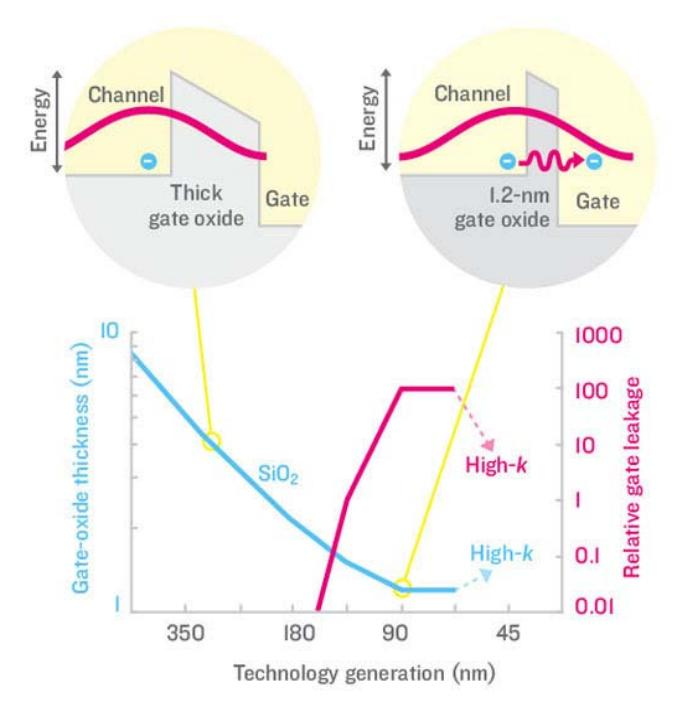

**Figure 10. Gate leakage has increased 100-fold in the last three generations of transistors (© 2009 IEEE)[.54](#page-59-4)**

This will in turn reduce power consumption and reduce the amount of heat generated by the leakage current. In fact, both versions of Intel's Penryn microprocessors—the dual-core and the quad-core microprocessors—are the first commercial microprocessor to have features this small (i.e., 45 nm feature size).

# **4.2.10 Multigate Transistor Technology**

Another innovation being explored by the semiconductor industry to increase the density of transistors on the same silicon real estate while still reducing the leakage problem is to build up, rather than out.

Throughout their history, silicon transistors on ICs have remained basically flat (planar technology). The basic transistor used in microprocessors consists of the source, the drain, a channel between the two, and a gate. The source, drain, and channel are all in one plane; only the gate with its thin insulating layer protrudes slightly above this flat plane. Ideally, no current flows from the source to the drain when no voltage is applied to the gate. However, as transistors shrink in size, a small amount of (leakage) current continues to flow, thereby increasing power consumption, even with no

voltage applied. One of the new technologies being explored is to raise the source, channel, and drain out of the substrate.[57](#page-136-16) The gate is then draped over the channel, as shown in [Figure 11.](#page-61-2) This technique effectively constrains the current to only the raised channel, and electrons no longer have a leakage path via the substrate. This three-dimensional (3D) transistor structure is called the FinFET and may become the IC construction technology in the next few years.

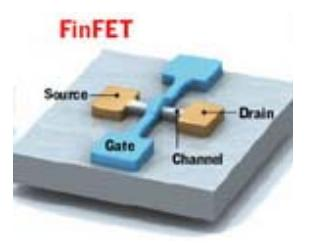

**Figure 11. One concept for transistors of the future (© 2009 IEEE)[.57](#page-61-3)** This is a three dimensional concept (see text), as opposed to the planar technology currently used in CMOS transistor fabrication.

# **4.2.11 Other Emerging Integrated Circuit Technologies**

Recent developments in nanotechnology have generated much interest in shrinking the size of the memory storage element in a memory device, with an increase in the device storage density capacity per unit area. Various methods of operation (classical as well as quantum) have been proposed and studied such as SRAM, DRAM, ZRAM, FRAMs, flash, quantum dots, resonant tunneling devices, phase-change memory devices, single-electron transistors, magnetoresistive memory devices, molecular electronic switching devices, polymer-based devices and carbon nanotube nanoelectromechanical system (NEMS) switches.

Other emerging technologies include biologically-inspired ICs: by using DNA molecules as scaffolds, scientists have created superconducting nanodevices that demonstrate a new type of quantum interference which can be used to measure magnetic fields and map regions of superconductivity. In the future, the technology could be generalized to produce semiconductor or other types of electronic devices.

# **4.2.12 Radiation-Hardened Integrated Circuits**

Electronics used in aerospace applications, such as orbiting satellites, have been the leading driver in using radiation-hardened integrated circuits. For electronic equipment, the total dose absorbed onboard satellite is in the range of 1 Mrad from cosmic radiation while in orbit.

Radiation-hardened electronics in the 300 krad to 1 Mrad total absorbed dose range are commercially available, including the most popular microprocessors such as the Pentium and the PowerPC. Aeroflex, Inc.,[\\*](#page-61-4) is one of the many manufacturers of radiation-hardened products, with electronic devices capable of withstanding 1-Mrad total dose. Among these devices are logic ICs, microprocessors, FPGAs, analog ICs, motor control, and voltage regulators. The Actel Corporation[†](#page-61-5) manufactures a family of FPGAs for use in satellites that are hardened to 300 Krad total dose and

\* www.aeroflex.com, accessed 2008.

† www.actel.com, accessed 2008.

have a single event upset (SEU) rate of less than 1 × 10–6 per day. Silicon Designs Inc.[\\*](#page-62-2) has produced a hardened MEMS accelerometer for use in safe-and-arm systems for missiles.

In the past gallium arsenide (GaAs) technology was considered for radiation environments because it can tolerate doses in the 100 Mrad range. However, even though GaAs is more resistant than CMOS technology to permanent radiation damage, it has a higher SEU rate that makes it less suitable for digital control applications. Use of GaAs in digital electronics has decreased because of improvements in competing CMOS and silicon germanium (SiGe) technologies. However, there is still a strong market for GaAs amplifiers, which can be used in sensors in high-radiation environments.

# **4.3 TECHNOLOGY RISKS**

Digital I&C systems at NPPs depend upon the vintage of the plant, where systems can either be newly designed for the next generation of plants or upgrades from analog to digital form. In both cases, the obsolescence of electronic components because of short product lifetime would result in applying new technologies in I&C systems during the lifetime of the plants. With each new technology, some unidentified failure mechanisms and failure modes may arise. In the following sections, some of the new technologies and their potential risks and failure mechanisms are discussed.

# **4.3.1 Failure Mechanisms**

Reliability is one of the most important and challenging issues facing ICs in any application. With the ever increasing transistor densities and evolving IC technologies (e.g., high-*k* materials and multigate transistors), there are likely to be new failure mechanisms that were heretofore unknown. However, there are two basic failure modes in general:

- functional failures—hard failures that cause permanent failure of the electronic circuits such that the IC cannot perform the intended function—and
- parametric failures—soft failures where the IC is still capable of performing the intended function but not under all specified conditions; soft failures have no lasting damage but would result in corruption of stored data.

[Table 1](#page-63-1) shows typical IC failure mechanisms that can occur at different times during the circuit life.[58](#page-136-17)

Among the failure mechanisms reported in [Table 1,](#page-63-1) the most dominant ones are the following.

• Time-dependent dielectric breakdown (TDDB)[59—](#page-136-18)the dielectric breakdown mechanism occurs when electron current flows through the oxide. The oxide gate is stressed when a voltage is applied to the gate; the resulting current flow directly or indirectly creates localized damage regions in the oxide. The dielectric breakdown occurs when damaged regions within the oxide layer make a conductive path between the electrodes. This can lead to both hard and soft breakdown.

\* www.silicondesigns.com, accessed 2008.

**Table 1. Failure mechanisms occur at different times in product life (Ref. [58](#page-62-3))** 

| Occurrence Failure mechanism |                                                                    | Cause                                     | Stimulia  |
|---------------------------------|--------------------------------------------------------------------|-------------------------------------------|-----------|
|                                 | Process charging Process-induced electrical overstress (EOS) |                                           | V         |
| Constant failure rate           | Electrical overstress                                              | Electrostatic discharge (ESD) and latchup | V, I      |
| Infant mortality                | Infant mortality                                                   | Extrinsic defects                         | V, T      |
| Infant mortality                | Logic failure                                                      | Test coverage                             | n/a       |
| Wear-out failure                | Hot carrier injection (HCI)                                        | e-impact ionization                       | V, I      |
| Wear-out failure                | Negative bias-temperature instability (NBTI)                    | Gate dielectric damage                    | V, T      |
| Wear-out failure                | Electromigration                                                   | Atoms move by e-wind                      | I, T      |
| Wear-out failure                | Time-dependent dielectric breakdown (TDDB)                      | Gate dielectric leakage                   | V, T      |
| Wear-out failure                | Stress migration                                                   | Metal diffusion, voiding                  | T         |
| Wear-out failure                | Interlayer cracking                                                | Interlayer stress                         | ∆T        |
| Wear-out failure                | Solder joint cracking                                              | Atoms move with stress                    | ∆T        |
| Wear-out failure                | Corrosion                                                          | Electrochemical reaction                  | V, T, RH  |
| Constant failure rate           | Soft error                                                         | N and α e-h pair creation                 | Radiation |

V = voltage, I = current, T = temperature, ∆T = temperature cycle, RH = relative humidity.

• Hot carrier injection (HCI)49—the high electric field near the drain end of the channel results in some electron or hole injection into the oxide ([Figure 12](#page-63-0)). The injected carriers produce damage that reduces the transistor current. Eventually, the device becomes too slow. Unlike other failure modes, HCI can be worse at lower temperatures.

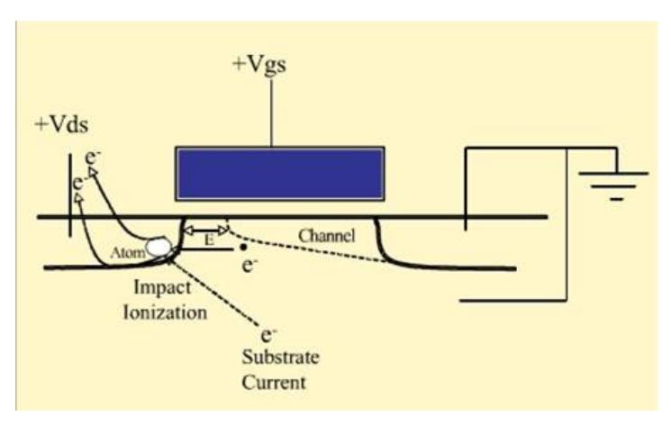

**Figure 12. Hot carrier injection degradation mechanism observed in MOSFETs.[60](#page-136-19)**

• Negative bias temperature instability (NBTI)49 for p-type metal-oxide-semiconductor field-effect transistors [p-MOSFET or positive metal-oxide semiconductor (PMOS)] and positive bias temperature instability (PBTI) for negative metal-oxide semiconductor (NMOS) transistors—a positive charge builds up at the channel interface of PMOS transistors under negative bias and high temperature conditions (positive bias for NMOS). This results in a threshold voltage increase and the absolute drain current IDsat decreases over time causing device instability and performance degradation. The effects of NBTI are of increasing concern as device sizes shrink to 0.13 μm and smaller and operating voltages decrease.

- Electromigration49—as known since 1961, electromigration results from the atoms moving because of collision and subsequent momentum between conducting electrons and diffusing metal atoms. Electromigration has become more severe as transistor dimensions have shrunk, the electric field applied to the gate oxide has increased, and the operating voltage has become lower (making a given threshold shift cause a relatively larger impact on the circuit behavior). All advanced fabrication processes that use PMOS transistors experience this effect. Electromigration issues affect aluminum, copper, and other polycrystalline metals.
- Stress migration, also known as stress-induced void (SIV) formation[61](#page-136-20)—stress migration is the movement of atoms to relieve compressive stresses. For example, the differences in coefficients of thermal expansion lead to stress in metal lines. Stresses also occur from processing and/or electromigration. The stresses can be relieved by forming voids in the metal lines (the last part of the metal line break may result from electromigration). Low-*k* dielectrics have reduced thermal conductivity and strength and have poor adhesion properties that can lead to reliability problems.
- Single event effects (SEEs), SEUs, single event latch-up (SEL)[62—](#page-136-21)the term "soft fails" has been coined to indicate spontaneous changes in digital information from radiation effects. High energy cosmic rays and terrestrial sources of radiation (e.g., low energy neutron interactions with 10B and radioactive impurities in packaging/solder both produce alpha particles) lead to SEEs in ICs. In SEUs, a particle creates a funnel of charge on the silicon wafer. This in turn injects a current pulse at the site of the strike. If the SEU charge is less than the "critical charge," the data are not changed. However, if the charge is greater than the "critical charge," an upset event occurs and the data are changed. Advanced technologies have an increased sensitivity to SEEs; reducing the voltage significantly or increasing the frequency increases the failures in time (FIT) rate. Latchup is a parasitic IC problem causing a part to draw too much current, permanently damaging the part. Decreasing size increases multi-event latching compared to single-event latching. Soft fail is widely used in the semiconductor industry, while SEEs and SEUs are used mostly by the military and in satellite electronics.[63](#page-136-22)

# **4.3.2 New Potential Risks and Aging Phenomena**

The solid-state electronics industry is characterized by relentless pressure to expand and improve functionality, reduce costs, and reduce design and development time. As a result, device feature sizes have shrunk to the nanometer range, as already discussed, and design life cycles of most commercial products are less than 5 years. This introduces new reliability concerns with regard to their application in NPP environments. These concerns include the following.

# **4.3.2.1 New Aging Phenomena**

Some of the aging issues may arise from the following concerns.

• Soft breakdown and proton migration in the thinnest gate oxides that should appear below 3 nm. Several manufacturers are likely to follow Intel's lead in replacing silicon oxides with other materials with a higher dielectric constant. The introduction of new materials to existing technologies, however, will most likely result in new and unprecedented electrical characterization challenges. Consequently, different test methodologies will need to be identified. The degradation mechanisms and models will also be different from the conventional ones used

for silicon-based devices.[64](#page-136-23) Because the materials and the technologies needed in producing a new generation of devices are still in their early development phase, data on the aging behavior of these dielectrics are not readily available and will not be for some time to come. Therefore, to use high-*k* gate insulators to resolve transistor tunneling effects problems will certainly require new TDDB characterization.[65](#page-137-0)

- Use of copper (Cu) interconnecting wires and low dielectric constant materials instead of aluminum and silicon oxide may lead to new aging effects such as (1) polluting of the silicon by copper through diffusion, in spite of the barrier between them; (2) creation of holes between the copper and the barrier; (3) potential increase of electromigration in copper wires due to defects in the interfaces;[\\*](#page-65-0) and (4) short circuits between copper wires due to electrochemical migration. It is obvious in spite of the technological advances and the continued research in the semiconductor industry that there are certain issues yet to be fully addressed such as the reliability of low-*k* dielectrics and aging risk due to adhesion to the barrier layer. In summary, the present level of understanding of electromigration in copper/low-*k* structures and lead-free solder applications is insufficient.[66](#page-137-1)
- The lifetime of highly integrated packages such as BGAs, where connections to the printed circuits are made using solder balls under the component, is another concern. With this soldering technique, the high thermal dissipation in the complex circuits induces high-temperature variation and acceleration of the aging of the solder balls. As a result, the lifetime may be reduced.

# **4.3.2.2 Sensitivity to Environmental Conditions**

Most likely there will be a higher sensitivity to environmental conditions, which typically exist in NPPs, that might lead to soft failures. The increase in sensitivity of electronic components to temperature and electrical overstresses (EOSs) may also become an issue. The likelihood of the following phenomena will probably increase as technology advances, which may present a new set of challenges to semiconductor manufacturers and users:

- There is a relationship between the time for the oxide to break down and rise in temperature. The rise in temperature tends to accelerate the breakdown of the oxide. Furthermore, thickness of the gate oxide is another factor in accelerating the breakdown process, where thinner gate oxide causes the oxide to break down more quickly than normal. Therefore, temperature control measures inside and outside the electronic cabinets will be critical for future I&C systems.
- An increasing sensitivity to rapid and low-level electrical stresses due to EOSs on the systems or to electrostatic discharges (ESDs). These stresses may create latent defects on the silicon die, which may decrease the remaining lifetime of the components.
- Higher sensitivity to radiation can create parasitic currents in the silicon since highly miniaturized transistors may switch with lower transient current densities. Such interaction between radiation and silicon may lead to false transient signals in the components (SEUs) or to destruction of the components. To date, SEUs were only seen in aerospace applications or aviation electronics in airplanes. However, whereas a 90 nm technology SER benchmark had a best-in-class FIT[†](#page-65-1) rate of

\* Electromigration remains one of the most important reliability issues in semiconductor technology. The change from Al to Cu for the metal gate electrodes has only delayed, not eliminated the threat.

36

† The Failures in Time (FIT) rate of a device is the number of failures that can be expected in one billion (109 ) hours of operation. This term is used particularly by the semiconductor industry.

195 FITs, a 65 nm technology SER had FIT rates up to 6,500 per megabit, scaled to New York City.[67](#page-137-2)

• NBTI can occur during burn in and during circuit operation at elevated temperatures.[68](#page-137-3)

# **4.3.2.3 Maintaining Quality**

Future technologies will require expensive tools, high skills, and experience to achieve highly reliable components. ITRS estimates that the cost to build a new manufacturing line will be about \$10 billion. The increase of manufacturing costs will lead to a concentration of manufacturers. This phenomenon may accelerate the obsolescence of electronic components.

A low quality manufacturing may also be encountered due to the fact that small or "minor" manufacturers will provide low performance components for industrial needs. These minor manufacturers may manage the fabrication process with a lower efficiency. Many low cost suppliers lack sophisticated quality systems, do not use statistical process control, or do not have International Organization for Standardization (ISO) certification.[69](#page-137-4)

Low quality and counterfeit parts can and do make it into legitimate products and therefore have the potential of being installed in commercial off-the-shelf systems. "Counterfeiting" can be as simple as remarking scrapped or stolen and possibly nonworking parts or as complex as illegally manufacturing complete parts from original molds or designs. A bogus part may be relabeled to appear to come from a different manufacturer or to appear to be a newer or even an older but more sought after component than it actually is.[70](#page-137-5)

According to the Alliance for Gray Market and Counterfeit Abatement, a trade group founded by Cisco, HP, Nortel, and 3Com to combat illicit trafficking in their products, perhaps 10% of the technology products sold worldwide are counterfeit. Whole servers, switches, and PCs have been faked, but more commonly, only one part in hundreds or perhaps thousands in an end product is bogus.

Visually, it's usually hard to tell the bogus part from the real one. Sometimes, a look-alike product is sold on the open market under a slightly altered brand name. The far more prevalent kind of counterfeit ICs are either sold as legitimate brand-name goods or become components in otherwise legitimate products. Counterfeiters often duplicate materials, part numbers, and serial numbers so that their wares match those of authentic products. Some examples of counterfeiting with wide distribution are given below.

- In the fall of 2004, the military contractor L-3 Communications reported numerous failures with an IC chip bearing the Philips Semiconductors logo. Failure analysis revealed a thicket of anomalies, including missing, broken, or separated wire bonds, and in some cases no silicon IC (die) inside the package. Other customers who bought the Philips chips also complained about their shoddy quality. It turned out that the chips had all been purchased from an unauthorized reseller. They were indeed Philips ICs, but the batch had been scrapped as defective by Philips.
- Police raided a suspected counterfeiter in China's Guangdong province and found fake computer parts and documents worth \$1.2 million, including packaging material, labels, and even the warranty cards to go with them. All parts were professionally labeled with the Compaq Computer Corporation logo.

- Capacitor electrolyte made from a stolen and defective formula found its way into thousands of PC motherboards, causing the components to burst and leak resulting in computer failures. The estimated cost of recovery from such failures was more than \$100 million.
- In 1998, relabeled 266-MHz Intel Pentium II chips as 300-MHz Pentium IIs began showing up in PCs. At the time the latter cost \$375 apiece, while 266-MHz chips cost \$246. Operating the lower-speed chip at a higher speed led to reliability problems because the chip ran hotter and was more likely to process instructions incorrectly.

Such serious problems prompted Electricité de France (EdF) to institute plans to audit manufacturers supplying I&C systems to its plants in terms of the manufacturing process and the transportation of the electronic components. EdF believes that this knowledge needs to be shared between industrial and scientific partners from the nuclear area or from other industrial areas to facilitate the following.

- Collection of failure data from the failed components, especially failures due to low quality manufacturing, component design issues, technology bugs, and aging mechanisms. The collected information is not only interesting for the modern component technologies but also for the already used components,
- Sharing research costs.

# **4.3.2.4 Increase in Maintenance Costs**

The increase in the number of leads on components may lead to difficulties in repairing printed circuit boards. Thus, it may be more feasible to discard the boards rather than attempting to repair them. Such an issue may increase maintenance costs.

In other cases, the components cannot be repaired because of the manufacturing and assembly process. Examples of new package technologies where the highly integrated package will not allow any repair include (a) chips directly soldered on the circuit board (chip-on-board package) and (b) components interconnected with the circuit board via an array of solder balls below the package (BGA).

# **4.3.2.5 Complexity Issues**

Electronic systems will be more and more difficult to test because of the high level of complexity of the components. The reliability proof will be very difficult to achieve.[69](#page-66-0)

Different platforms are expected to converge in the future owing to advances in manufacturing technology and higher integration density; therefore, the total number of platforms is expected to decrease.

The growing system complexity will make it impossible to ship designs without errors in the future. Hence, it is essential to be able to correct errors after fabrication[.54](#page-59-4) In addition, reconfigurability increases reuse, since existing devices can be reprogrammed to fulfill new tasks.

# **4.4 REGULATORY IMPACT OF MICROPROCESSORS AND OTHER INTEGRATED CIRCUITS**

The growing system complexity of semiconductor devices could make it more difficult to guarantee delivering future IC hardware free of errors. In addition, the successful development of high-*k*

transistor ICs, and the potential for multigate transistor ICs, could revolutionize the IC industry but could also introduce new aging phenomena, higher sensitivity to environmental conditions (e.g., temperature and radiation), and other issues related to qualification methodologies.

Failure modes and mechanisms for both current and emerging digital I&C technologies need to be characterized to assess whether current defense-in-depth strategies will need to be updated and whether any new failure modes can cause unforeseen or unknown system responses. This is especially important in light of fully digital I&C system upgrades in Gen III plants and the potential for advanced digital I&C application in Gen III+ and IV plants in the future. An understanding of failure modes at the system level (e.g., PLC) is the goal with regard to application in safety systems. However, such data may not be readily available, and an understanding of failure modes at the component level may be necessary to develop a failure data integration framework from module level to system level, contributing to an understanding of how a component level failure relates to the failure at the digital I&C system level. In addition to characterizing failure modes to inform the regulatory process, the use of "complex" devices such as FPGAs in safety systems also needs to be carefully reviewed because such devices have the potential to be reconfigured, and reconfigurability increases reuse and the potential for adversely affecting the execution of a safety function. Use of FPGAs in safety systems also brings into focus the issue of how much V&V should be required.

# **5. COMPUTATIONAL PLATFORMS**

# **5.1 OVERVIEW OF COMPUTATIONAL PLATFORMS**

A computing platform refers to a hardware architecture or software framework (including operating system, programming language, graphical user interface) that enables software to run.

Consolidation, which makes it possible to use the same software and hardware components on a range of platforms, seems to be a trend in operating systems. Forms of consolidation include operating system families that span the range of servers, desktops, and embedded devices and operating systems that use consensus architectural concepts like deterministic processor scheduling.

The commercial market for embedded devices such as cell phones is part of the driving force behind consolidation that extends server and desktop systems to embedded devices (e.g., Windows and Linux).The extreme form of this would be an operating system family which includes a vendor-certified, safety-grade, secure operating system for use in smart instruments in a range of industries beyond the traditional military and aviation industries.

# **5.2 TECHNOLOGY TRENDS**

# **5.2.1 Processor Support for Virtual Machines**

ARINC 653, which stands for Avionics Application Standard Software Interface*,* is a standard for space and time partitioning in a type of system called "Integrated Modular Avionics."[71](#page-137-6) ARINC 653 specifies how a computer system can be divided into partitions, each partition having its own memory and processor time allocations [\(Figure 13\)](#page-71-1). Each partition runs one or more applications. The specification provides deterministic behavior and guaranteed resource availability. Another goal is to provide for software reuse by allowing a mixture of old and new software (functions) to run together. The idea predates the hardware support for virtual machines (VMs) and has now been adopted by many, if not most, of the operating systems vendors selling to the aviation industry.

Safety-critical applications typically assign functions to deterministically scheduled time slots, dividing the single CPU among them so that the computer is doing just one function at a time. There would need to be some safety benefit to compensate for discarding this rule. The possible benefits are similar to the VM partitioning described above. First, a safety supervisory application could run parallel with the main safety function, performing a more sophisticated version of the watchdog timer's job. Second, some diversity could be achieved by running parallel safety functions using different CPUs and different memory locations.

# **5.2.2 Distributed and Multicore Computing**

Intel recently demonstrated an 80-core CPU.[72](#page-137-7) This thumb-nail-sized chip delivers 1.0 teraflops of performance and 1.6 terabits aggregate core to core communication bandwidth while dissipating only 62 watts.[73](#page-137-8) It is purely a research project whose design is specialized for floating point performance, not a commercial product prototype.

IBM's Cell processor has launched in Sony's PS3 [SCOP3].[74](#page-137-9) The Cell consists of a 64-bit PPE and eight synergistic processing elements (SPEs), loosely coupled through a coherent memory subsystem. The SPEs execute code sent to them by the PPE or another SPE and provide computational performance with greater flexibility than traditional fixed function ASICs. The SPEs provide efficient computation for a wide variety of applications including network processing, high performance computing, and graphics

geometry processing. Peak performance is more than 256 GFlops for single precision and 26 GFlops for double precision.

The processors described above show that multiple cores, on chip, with high bandwidth communications between them, can achieve high performance with surprisingly low power and cost. They show the potential to run detailed plant simulations quickly on small, powerful computers if the simulation algorithm is adapted to the parallel architecture.[75,](#page-137-10)[76](#page-137-11)

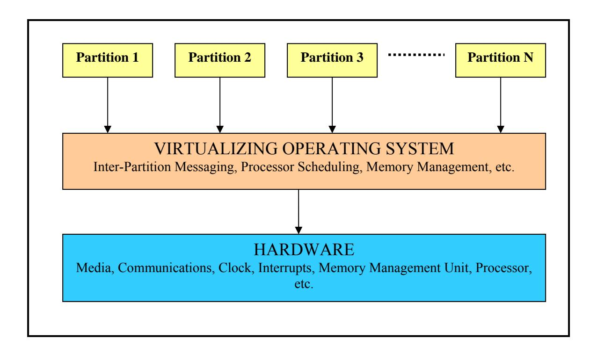

**Figure 13. A simple model of an ARINC 653 partitioned system.** 

# **5.2.3 Operating Systems and the Embedded Devices Market**

Consolidation seems to be a trend in operating systems. Forms of consolidation include

- operating system families that span the range of servers, desktops, and embedded devices;
- operating systems that span hardware platforms;
- operating systems that use consensus architectural concepts like deterministic processor scheduling;
- operating systems that implement standards such as POSIX application program interfaces and Common Criteria for security; and
- operating systems that use standards such as PCI buses, TCP/IP networking, and the FAT file system.

Consolidations such as these make it possible to use the same software and hardware components on a range of platforms.

The military and aerospace industries see themselves as increasingly smaller parts of the embedded devices market, with dwindling influence on the market. The commercial market for embedded devices such as cell phones is part of the driving force behind consolidation that extends server and desktop systems such as Windows and Linux to embedded devices. The extreme form of this would be an

operating system family which includes a vendor-certified, safety-grade, secure operating system for use in smart instruments in a range of industries beyond the traditional military and aviation industries.

There are at least two major differences that separate the mass market and the most demanding industrial markets: guaranteed real-time response is required in the industrial market and Internet connectivity is required in the mass market. Convergence might occur as capabilities are developed that bridge these differences. For example, guaranteed response might become possible in mass market embedded devices by dedicating one or more CPU cores of a multicore system solely to safety-related tasks residing in their own VM (practically independent of other processes on the computer). For these and other reasons, civilian and military government agencies have reason to participate in the committees that set the future for embedded devices.

# **5.3 REGULATORY IMPACT OF ADVANCES IN COMPUTATIONAL PLATFORMS**

More advanced computing platforms (e.g., those using multicore processors) and operating systems are more likely to be used, if at all, in control applications than in safety applications, which require more rigorous V&V. Safety-critical applications typically assign functions to deterministically scheduled time slots, dividing the single CPU among them so that the computer is doing just one function at a time. For many safety system platforms developed for new plants or upgrades, an operating system such as Windows, if used at all, is likely to be used to run an engineering tool that automatically generates the application software for downloading into the safety-related subsystem modules. This automated process eliminates human translation errors. However, the issue of a more rigorous V&V for the engineering tool becomes more significant because of the safety-related application.

Several nuclear plant upgrades and new plants will use PLC-based platforms, some of them with embedded ASICs. Some of these platforms have already been approved [e.g., TELEPERM XS (TXS)]. Thus there is some experience base with regard to reviewing digital I&C safety systems for compliance with regulations. Current regulations require, with some exceptions, compliance with V&V procedures identified in IEEE Std. 7-4.3.2. It is likely that revisions of the standard will keep pace with advances in digital platform technology. However, continued attention to progress in this technology focus area is recommended so that exceptions to requirements in the standard can be made in appropriate regulatory guidelines.

The computational platforms for digital-based systems in NPPs cover an extraordinarily broad range of devices. At the lower end, a digital device in a safety system might consist of a few logic devices in a PLC or a few elements on an ASIC. At this end of the spectrum, the design of the device resembles a function block layout and the implementation is strongly analogous to the wiring of an analog device. The "program" being executed is almost as simple as an analog device, "run when you are turned on." The regulatory question then becomes, when does a digital device become so simple that it no longer comes under the heading of digital computer? Can simple devices be exhaustively tested and obviate the need for reliance on quality control through a process of software engineering as defined in IEEE 7-4.3.2? At the lower end of the spectrum, it seems obviously true that the device is more like conventional hardware and can be tested as any other hardware device under IEEE 603. The question is how to draw the line between simple devices and complex ones. Regulatory guidance for such systems and devices [e.g., FPGAs, complex programmable logic devices (CPLDs)] that are halfway between "simple" and "complex" are currently not as well defined. For example, Position 8 of Section 2, "Command Prioritization," of the Interim Staff Guidance DI&C-ISG-04 requires a priority module design to be fully (i.e., 100%) tested. This refers to proof-of-design testing, not to individual testing of each module and not to surveillance testing.[77](#page-137-12) If the priority module is designed using a CPLD or a device of similar complexity, it may be very difficult, if not impossible, to prove that such a device has been fully tested. This is due to the fact that such a device typically also contains several memory cells so that the internal states are not as well

defined as a device containing only simple gates. If such a device cannot be fully tested, it seems that an appropriate route that amounts to "software" V&V on the device should include a review of the following documentation, in addition to demonstration of an extensive test coverage (functional testing):

- 1) Behavioral (or pre-synthesis) simulation results (typically, a behavioral simulation is used to verify whether the design entry correctly represents the design requirements)
- 2) Post-synthesis simulation results (simulation of the synthesized design is typically performed),
- 3) Post-place and route simulation results, and
- 4) hardware simulation results (hardware verification needs to be performed using the same input test vectors and procedures from the previous steps. Note that this is not functional testing of the completed module).

At the high end of fully digital systems, safety system video displays have to present large amounts of data rapidly with graphics to aid in interpretation and recognition and must recognize and respond to operator inputs at a time scale that feels instantaneous, like conventional hardwired controls. Screens must redraw rapidly so that the operator can move from one display to another to get to needed information. These graphics applications challenge the high end multipurpose, microprocessor technology. These devices tend to draw from and benefit from consumer-grade software and electronics. The main problem with consumer-grade computer platforms is that the commercial marketplace values high speed and low cost far more than reliability. Consequently, the difficulty in using high end components for safety-grade video displays or any other applications that come up in the future is that commercial system software and design tools are "reliable enough" for commercial-grade work but would present an enormous challenge for acceptance under current standards for the nuclear arena.

# **6. SURVEILLANCE, DIAGNOSTICS, AND PROGNOSTICS**

# **6.1 OVERVIEW OF SURVEILLANCE, DIAGNOSTICS, AND PROGNOSTICS**

Bond et al.[78](#page-137-13) estimate that the deployment of online monitoring and diagnostics has the potential for savings of more than \$1 billion per year when applied to all key equipment. Online monitoring is being implemented in new light-water reactor (LWR) plants such as Olkiluoto in Finland.[79](#page-137-14) New designs for advanced NPPs, such as those within the Gen IV program, will have much longer intervals (potentially 4 years) between scheduled outages, and also shorter outages. Enhanced online monitoring and diagnostics will be essential in achieving such high performance and availability levels.

Bond and Doctor[80](#page-137-15) indicate that advances will have to be made in several areas to move from periodic inspection to online monitoring for condition-based maintenance and eventually prognostics. These areas include sensors, better understanding of what and how to measure within the plant, enhanced data interrogation, communication and integration, new predictive models for damage/aging evolution, system integration for real-world deployments, and integration of enhanced condition-based maintenance/prognostics philosophies into new plant designs.

Advanced gas reactors and Gen IV plants are expected to operate at much higher temperatures (between 510°C and 1,000°C) than currently operating LWRs. Operation in this temperature range has the potential to introduce new degradation processes that have not been experienced in current reactors and thus are not well understood or accounted for in plant design. Even for currently operating LWRs, Wilkowski et al.[81](#page-137-16) estimated that new degradation processes have appeared on average at a rate of one every 7 years. For "active components" (e.g., motor-operated valves), the majority of component failures are related to failure to operate when called upon to do so (e.g., valve not opening or closing on demand). The failure of passive components is dominated by failures associated with service degradation.

In the nuclear industry, surveillance and diagnostics techniques have been (and continue to be) used for many different applications, such as loose-parts detection, core barrel motion monitoring, rotating machinery condition monitoring, instrument response time measurements, predictive analysis of failures in sensors and sensor lines, and motor current signature analysis.

# **6.2 TRENDS IN SURVEILLANCE, DIAGNOSTICS, AND PROGNOSTICS SYSTEMS**

# **6.2.1 Basic Methods**

System surveillance (or monitoring) and diagnosis were historically developed in the aerospace industry because of the need for continuous operation of critical equipment in commercial and defense aircrafts, space modules in lunar exploration, space shuttles, and space stations. Over the past four decades, these technologies have been further developed and adapted in the process industries (petrochemical, food and beverage, pharmaceuticals, metals, pulp and paper) and the automotive, electronics, and medical sectors. The emphasis and applications of these technologies in commercial NPPs has increased at a constant rate since the accident at the Three Mile Island Unit 2 reactor.

The following definitions apply to the following sections.

• Equipment, sensor, device *surveillance* or monitoring refers to the tracking of degradation-sensitive parameters that are derived from measurements made on the specific component or subsystem. In this task we look for changes in the signatures of interest. Examples of such signatures include the following: residuals between the measured process variables and their estimated values using physics or data-driven models; various statistical parameters such as standard deviation, root-mean-square

(RMS) value, signal skewness, and crest factor; spectral domain parameters such as frequency bandwidth, RMS values at specified frequencies, and ratio of energies between two frequencies; and performance parameters computed from physics and/or data-driven models.

- *Diagnosis* is performed to determine the cause of changes exhibited in the various signatures during surveillance and to isolate the devices that indicate incipient failures. Surveillance, fault detection, and isolation have increasing degrees of difficulty and require more information and knowledgebased expert systems to identify the root cause of impending failure.
- *Prognosis* is concerned with the estimation of remaining useful life of a piece of equipment. Often referred to as life prediction, prognosis is the most difficult of the three modules, shown in [Figure 14](#page-75-0). Prognosis, combined with condition monitoring, is useful in planning maintenance and equipment replacement, increasing the reliability of devices, and aging and life-extension studies of currently operating plants.

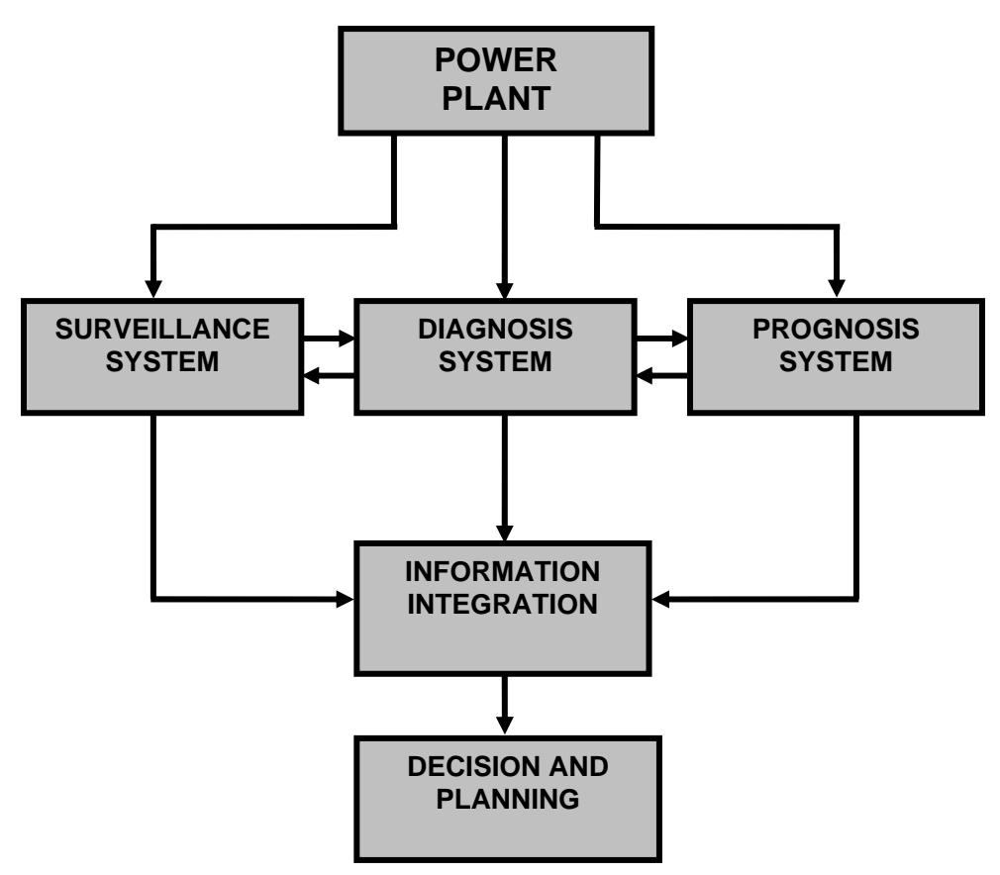

**Figure 14. Block diagram showing the integration of surveillance, diagnosis, and prognosis modules in a nuclear power plant.** 

Some of the details of the methods and applications of reactor surveillance, diagnosis, and prognosis are given in references 82–98. These methods are primarily classified as parametric and nonparametric approaches. The parametric approaches use either physics (first-principle) or data-driven models. Nonparametric methods use data compression techniques, either in the time domain or in the frequency domain. Surveillance and diagnostics systems using model-based (i.e., first-principle) techniques generate signatures that indicate the deviation of the measured values from their estimated values. When these deviations exceed a prescribed tolerance, it is an indication of an anomaly, either in the process or in a device, equipment, or sensor. Nonparametric techniques generally compare calculated signatures to baseline signatures. Deviations from prescribed values are indications of anomalies. Often a knowledge base, along with a rule-based expert system or an automated pattern classification technique, is used for fault diagnosis.

# **6.2.2** Physics or First-Principle Models

Physics models almost invariably use mathematical representations to describe a system or change of a system (e.g., a process). Representations that are derived directly at the level of established laws of physics within a set of approximations are called first-principle models. A representation that combines various physical models is called a multiphysics model.

Surveillance and diagnostics systems using model-based (i.e., first-principle) techniques generate signatures that indicate the deviation of the measured values from their estimated values. When these deviations exceed a prescribed tolerance, it is an indication of an anomaly, either in the process or in a device/equipment/sensor.

Multiphysics models are developed for PWRs and BWRs using mass, momentum, and energy balance equations. They are then validated against plant operational data. These high-fidelity models have the advantage of tracking the system under the assumptions used during the model development. Along with process measurements, the models are then used for process or equipment monitoring and isolation. The first-principle models are generally nonlinear and may be linearized, if necessary, about nominal operating states.

#### **6.2.3** Data-Driven Models

These models are developed using measured process data. The measurements have two components: an actual process value and a fluctuating or wide-band frequency component. DC to low-frequency data are used to develop multivariate models in various forms. The objective is to characterize the relationship among a set of related process measurements. Care must be taken to restrict the use of the models for the operating regime for which they are suitable. Some are referred to as auto-associative models, where the input and the output variables are the same. These models have the advantage of monitoring a large number of variables simultaneously and tracking the mismatch between the inputs and the model-estimated outputs. Any deviation between the two is an indication of potential anomaly, which requires a more focused multiple-input—single-output model for isolating the defects. Both linear and nonlinear general polynomial models are used in this approach and have been highly successful in real applications. It must be noted that such techniques have been applied to both nuclear and fossil-fuel power plants. Group method of data handling (GMDH), 89 auto-associative kernel regression, 99 and principal component analysis 93 are some of the approaches commonly implemented in data-driven modeling of plant signals.

An example of the data-driven modeling approach using GMDH is shown graphically in [Figure 15.](#page-77-0) The hierarchical scheme of approximating a given output as a function of related inputs is performed by successive layers where each layer introduces increased complexity to approximate the measurement. [Figure 16](#page-77-1) is an example of developing a model for the pressurizer level in a PWR as a function of hot-leg temperature, reactor power, and pressurizer pressure. The model was able to detect a small mismatch between the measured and predicted values of the level for a short time period at the beginning of the reactor start-up.

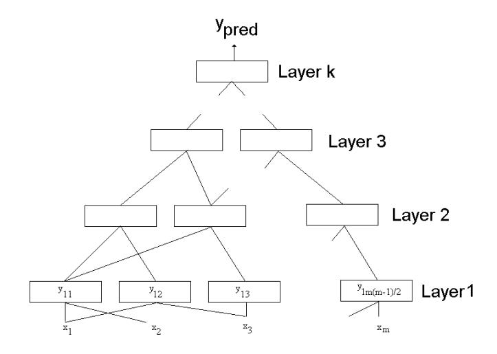

**Figure 15. Group method of data handling (GMDH) model that minimizes the error ymeas – ypred for the case of m-inputs {x1, x2, … , xm}.**

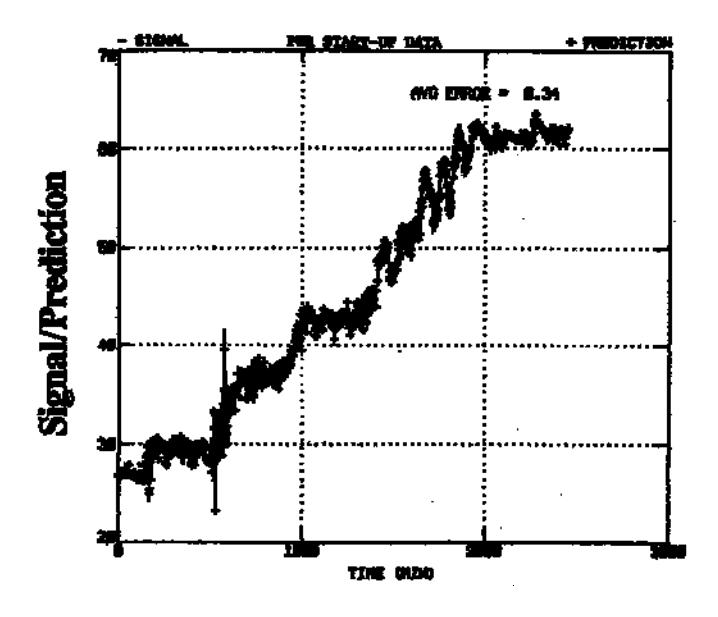

**Figure 16. Comparison of the measured (–) and model-predicted (+) values of the pressurizer level signal (%) during start-up of a pressurized-water reactor.**

A second form of the data-driven modeling uses stochastic time-series models for characterizing the property of wide-band data. It is often assumed that the random signals are stationary for a given operating condition. The frequency bandwidth of the signals depends on the type of signals being modeled. In a nuclear plant, the bandwidth of process signals (temperature, pressure, flow, level, etc.) is about 20 Hz. The bandwidths of neutron detector signals and vibration signals are much higher—at least up to 200 Hz. A commonly used time-series model is the auto-regression (AR) model. The univariate AR model is often developed for characterizing temperature, pressure, and flow signals. The model is then used for estimating both frequency-domain and time-domain signatures. Examples of online monitoring include response time estimation of process sensors and stability monitoring in BWRs using in-core neutron detector signals. The multivariate AR model has the advantage of establishing the cause and effect relationship among a set of stationary signals and is useful in detecting and isolating anomalies.

# **6.2.4** Nonparametric Methods

Nonparametric techniques generally compare calculated signatures to baseline signatures. Deviations from prescribed values are indications of anomalies. Often a knowledge base, along with a rule-based expert system or an automated pattern classification technique, is used for fault diagnosis.

Data analysis techniques that estimate the signatures by compressing the measurements either in the time domain or in the frequency domain are often called nonparametric techniques. The signatures in the time domain are often statistical parameters such as mean value, standard deviation, RMS value, skewness, flatness, crest factor, zero crossings, etc. Monitoring is done by comparing the calculated signatures with baseline information.

Frequency-domain analysis is performed by transforming the time signal to the frequency domain using Fourier transform. Efficient algorithms, such as the FFT are available for online computation. The frequency spectrum features are compared with baseline data for further diagnostics. This is a popular approach for monitoring vibration of reactor core internals and rotating machinery and for bandwidth monitoring of process and neutron detector signals. Often the compressed information is combined with pattern classification techniques for detecting and isolating anomalies in components, pumps, turbines, fans, etc.

#### 6.3 STATE OF THE ART OF DIAGNOSTIC AND PROGNOSTIC SYSTEMS

Howard has recently provided an assessment of the state of maturity of diagnostics and prognostics technology in the nonnuclear industry. 100 This is shown in Table 2. This table also reflects the general

| Table 2. Assessment of the state of maturity for diagnostic (D) and |
|---------------------------------------------------------------------|
| prognostic (P) technologies (Ref. 100)                              |

| Diagnostic/prognostic technology                   | $\mathbf{AP}^a$ | $\mathbf{A}^{b}$ | $\mathbf{I}^c$ | $NO^d$ |
|----------------------------------------------------|-----------------|------------------|----------------|--------|
| Basic machinery (motors, pumps, generators, etc.)  | D               |                  | P              |        |
| Complex machinery (helicopter gearboxes, etc.)     |                 | D                | P              |        |
| Metal structures                                   | D               |                  | P              |        |
| Composite structures                               |                 |                  | D&P            |        |
| Electronic power supplies (low power)              |                 | D                | P              |        |
| Avionics and controls electronics                  | D               |                  | P              |        |
| Medium power electronics (radar, etc.)             |                 | D                |                | P      |
| High power electronics (electric propulsion, etc.) |                 |                  |                | D&P    |

 $^{a}AP$  = Technology currently available and proven effective.

 ${}^{b}A$  = Technology currently available, but verification and validation (V&V) not completed.

&lt;sup>cI = Technology in process, but not completely ready for V&V.

&lt;sup>dNO = No significant technology development in place.

state of diagnostics and prognostics for applicable systems in the nuclear industry (e.g., rotating machinery, metal structures). In the nuclear industry, surveillance and diagnostics techniques have been used for many different applications, such as loose-parts detection, core barrel motion monitoring, rotating machinery condition monitoring, instrument response time measurements, predictive analysis of failures in sensors and sensor lines, and motor current signature analysis. A sample of the various applications follows.

# **6.3.1 Redundant Sensor Monitoring**

If one of three redundant sensors degrades, simple logic can be implemented to identify the failed sensor. However, when there are only two redundant sensors, the task is not as straightforward. A technique to determine which of two diverging sensor measurements is correct would be of benefit to an operator who must choose which channel to use for input to an automatic control system.

A redundant sensor calibration monitoring system was developed that can monitor as few as two redundant sensors. This technique merges empirical modeling techniques with independent component analysis (ICA) to produce a robust, low-noise prediction of the parameter of interest. If the variable of interest is not a controlled variable or if the control system is not a digital control system, the two redundant sensors must be augmented with an inferential sensor. The inferential sensor uses an empirical model with correlated signals as inputs. The two actual sensors and the inferential sensor are then input to an ICA-based redundant sensor estimation technique module. The advantages are reduced noise characteristics and robust prediction of variable errors through the use of ICA and increased stability due to the inferential sensor. Merging the principal-component-regression-based inferential prediction model with the ICA filtering algorithm produces accurate, low-noise predictions of the true process variable. The method produced predictions that contain all of the desired traits: accuracy, sensitivity, robustness, and low-noise.

# **6.3.2 Acoustic Emission Analysis**

Acoustic emission sensors can be used for detecting the failures of check valves through measuring and analyzing the backward leakage. An acoustic emission sensor can identify the characteristic response frequencies of a failed check valve through an analysis of the test results. In one application a condition monitoring algorithm was developed using a neural network model to identify the type of the failure in the check valve. The monitoring algorithm can be used for the identification of the type of failure of a check valve without any disassembly work.

# **6.3.3 Loose Parts Monitoring System**

NRC Regulatory Guide 1.133 requires reactors licensed since 1978 to include systems to detect parts and components that have become loose within reactor vessels and primary coolant systems. Many older plants also have these systems. However, many of these systems have given spurious alarms, failed to detect loose parts, and lacked diagnostic capability for investigating detected signals.[101](#page-138-2)

Loose parts monitoring systems (LPMSs), in general, use a variant of impact theory for valid signal determination. The impact theory, also known as the Hertz theory, describes the impact of a solid sphere on an infinite metal plate. The theory works reasonably well provided that the diameter of the sphere is not large compared to the thickness of the plate and that the impact velocity is sufficiently small to avoid plastic deformation. The representative model is usually modified to include variable physical parameters that affect the impact wave propagation and detection.[102](#page-138-3) The parameters are identified based on the experimental data obtained with a known impact input that results in best-fit observed wave characteristics.

Wavelet transform and artificial neural networks (ANNs) show the potential to enhance LPMS performance by solving the tasks of noise cancellation, time of arrival detection, discrimination between real and faulty alarms, and loose metal piece mass determination.

One example is a PC-based digital LPMS developed for the Maanshan NPP by the Institute of Nuclear Energy Research, Taiwan.[103](#page-139-0) The monitoring system uses a location estimation algorithm, which mainly implements time difference method with energy ratio as an auxiliary indication, and a mass estimation algorithm, which uses an ANN with fuzzy logic. The performance of the system was verified using simulated impact test data. The system was able to correctly indicate the impact region; however, statistical assessment indicated a 14.4% standard deviation in mass estimation for an impact mass of 1.0 lb. The hardware in this particular system consists mainly of standard National Instrument modules. The application program was built using LabVIEW graphical programming software. For the location estimation, the time difference and energy ratio were used to infer the distance information. To determine the wave arrival time, short time RMS was used. Test results show this method is able to point out the regions of impact. The neural network with fuzzy linearization algorithm was applied to mass estimation. The back propagation architecture with 28 total input nodes, including one frequency ratio, one frequency center, and 26 linear predictive coding coefficients, was adopted in the neural network. The fuzzy algorithm is used to improve the linearity of the mass estimation.

Improvements in LPMS will provide more accurate monitoring capability in terms of both pinpointing the impact location and determining the impact mass.

# **6.3.4 Passive Monitoring with Micro-Electromechanical Systems**

A candidate approach to fault detection and isolation (FDI) in hydraulic, fuel, and pneumatic systems is the use of noise analysis techniques, which are passive in nature. Noise analysis has been proposed for detecting blockages, voids, and leaks in pressure lines. In NPPs, it has been shown that pressure sensing lines can become blocked and that noise analysis can be used to detect such faults. MEMS sensors and their associated algorithms can be used to automatically isolate blockage and internal leakage faults in pressurized systems. Although the same fundamental modeling and analysis technique can be applied to hydraulic, fuel, and pneumatic lines, the FDI analysis parameters must be specifically tuned to the particular system as the physical parameters (for example, viscosity, density, and compressibility) of the fluids differ. Presently the use of basic statistical descriptors such as RMS noise and zero-crossing rate monitoring for monitoring the health of the pressurized lines are being investigated. The ability to use fundamental noise signatures has the distinct advantage of facilitating FDI algorithm incorporation into a MEMS device to create an intelligent sensor. MEMS components are hybrid electrical and mechanical devices that combine mechanical microstructures with electrical processing circuitry onto a single die. Incorporation of the diagnostic algorithms into the sensing circuitry would provide the capability for realtime, passive condition monitoring of pressurized lines such as pipelines and transducer sensing tubes.

# **6.3.5 Integrated Asset Management System**

Asset management can be described as maintaining equipment inventory to deliver maximum performance and service life at minimal cost. An integrated asset management system (AMS) provides the capability of predictive maintenance scheduling based on condition parameters of the field equipment. An important benefit of prognostics is that the equipment can be taken offline before it fails, and can be maintained or replaced, which usually increases plant availability and reduces maintenance cost.

Modern field devices are usually equipped with a sensor module and an integrated diagnostics module. The diagnostics module can monitor the sensor condition and verify the validity of data. Once an anomaly is detected, a predetermined set of instructions can be executed and the root-cause analysis can be performed. For a safety-critical component, this may require the commencement of an emergency operation regime.

An integrated AMS system has three major components: (1) active field devices, (2) communication devices/systems, and (3) asset management software. Advanced AMS software can monitor performance and condition parameters of plant components and field devices, and provide guidance on plant spare component inventory.

[Figure 17](#page-81-0) shows a sample life-cycle management (LCM) strategy for a nuclear power plant with asset management as a component. LCM can be described as the process by which NPPs integrate operations, maintenance, engineering, regulatory, environmental and business activities that (1) manage plant condition (equipment reliability, aging, and obsolescence), (2) optimize operating life, and (3) maximize plant value without compromising plant safety.

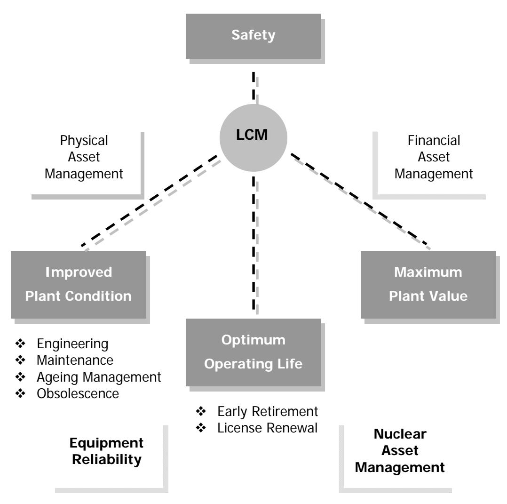

**Figure 17. Asset management as part of life-cycle management (LCM) strategy.[104](#page-139-1)**

As seen in [Figure 17](#page-81-0), asset management in many aspects is as an indispensable component of life-cycle management. As listed under physical asset management, engineering, maintenance, ageing, and obsolescence management are important components to achieve improved plant condition. Condition

monitoring of plant components and field devices is becoming a major strategy for preventive maintenance (PM). The PM approach addresses failure probability and failure modes of critical reactor components. This is achieved by creating a list of equipment and components. The comprehensiveness of the list is a trade-off between the estimated increase in net present value of the plant due to investment and required capital cost for the necessary instrumentation and other infrastructure to implement the plan. Condition monitoring processes information from both field devices and sensors that are specifically deployed for each component. The information acquired from all sensor nodes is processed in a dedicated calculation node, fundamentally performing a detailed failure modes and effects analysis. The analysis algorithm may use artificial neural networks, fuzzy logic, and other parametric methods. A sample process algorithm proposed by EPRI is shown in [Figure 18](#page-82-1).

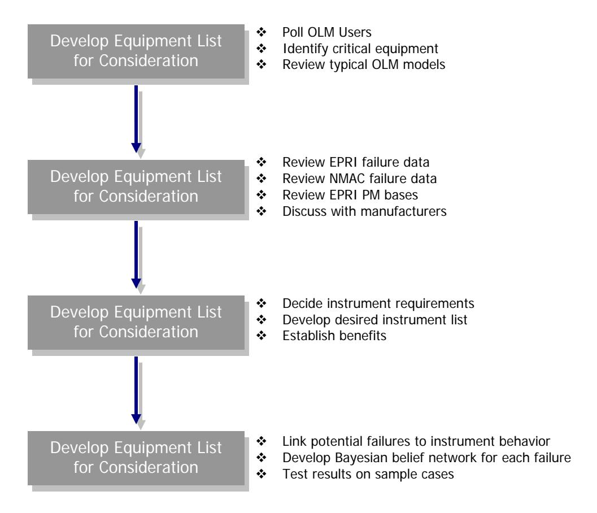

**Figure 18. Equipment condition monitoring plan proposed by EPRI.[105](#page-139-2)**

A significant advantage that can be gained with the online monitoring tool is that it can be integrated into the operations management system for advanced planning of repair or replacement and into the asset management system for continuous cost/benefit analysis for equipment upgrade.

# **6.4 REGULATORY IMPACT OF ADVANCES IN SURVEILLANCE, DIAGNOSTICS, AND PROGNOSTICS**

Automatic surveillance offers tremendous new opportunities for plants to operate more reliably, test more frequently, reduce risk of latent failures, reduce maintenance costs, and reduce worker exposure—all of this at the low cost of digital monitoring systems. The issues from a regulatory standpoint are mainly concerned with when the surveillance system is applied to a safety system and the surveillance performs a required function under regulatory control based on Regulatory Guide 1.118.[106](#page-139-3) A number of fundamental questions emerge, as follows.

- 1. Are there any subjective monitoring criteria that an expert adds to a manual surveillance that are lost in the automated surveillance system? Digital systems have extraordinary capabilities to monitor themselves and their environment to determine that the system is operating normally. Digital systems are also tireless and fast. However, the digital test performed is limited to the designer's ability to anticipate all the symptoms of failure and nonfailure and provide a reliable sorting of the sample data. The human operator has enormous capability for subtle thinking and inference. This leads a human to cross-check anomalies even when the symptoms are not clearly indicative of failure. This deeper level of intelligences is difficult to duplicate in computer programming.
- 2. Are the systems being monitored and their failure modes easy to recognize? Are the surveillance system's failures easy to recognize? Can the operator accurately tell the difference between the failure of the surveillance system and the failure of the device it is monitoring? What are the percentages of false positive and false negative failures? Can these reliabilities be estimated in any way? A surveillance system needs to give confidence. A system that breaks or gives false readings only adds a distraction to an operator's job.
- 3. Does the presence of the automated surveillance system affect the reliability of the safety function? Usually the negative impact is not obvious. Typically, a surveillance system consists of a separate processor from the equipment that operates the safety function. The surveillance system is designed so that its failure does not affect the operation of the main safety function. However, certain types of diagnostics can affect the reliability. For example, a noise-based surveillance of a safety sensor may require a faster processor or communications system to give the minimum sampling rate needed for the test. The reliability of the safety function is diminished by selecting faster components. Typically, a diagnostic system is a data concentrator. The strongest conclusions about the health of a system are achieved by gathering all the data available about a system. This leads to interconnections to many other systems and the potential for failure related to the interface needed for the safety function. This type of requirement can increase the data burden on the safety function and decrease its reliability.
- 4. How can the surveillance function be protected against a software fault that leads to a common cause failure to detect a failed protection system? The regulatory authority is currently struggling with the implications of diversity and defense-in-depth (D3) regarding digital protection functions. Logically, the same concern can be applied to surveillance software. The issue for diagnostic software is more difficult because diagnostic software is typically more complex in concept than a safety system. The issue from a regulatory point of view is not clear. D3 issues for surveillance systems have not been adequately considered to date.

# **7. HUMAN-SYSTEM INTERACTIONS**

# **7.1 OVERVIEW OF TRENDS IN HUMAN-SYSTEM INTERACTIONS**

In general human-system interface (HSI) technologies for design and evaluation have been divided into three main types. Tools that focus on rendering the operator and the interface in 3D space are typically tied to a computer-aided design (CAD) environment and focus on see, reach, and fit evaluations using anthropometric models of people of different sizes. These types of tools may also be linked to virtual environments. The second class of tools includes integrated design and evaluation criteria and guidance, which are typically drawn from existing industry standards such as IEEE 1023[107](#page-139-4) and IEEE 1289[108](#page-139-5) or guidance reports such as NUREG-0700.[109](#page-139-6) These kinds of tools are often integrated with tools from the other two classes. The third class of tools uses human performance modeling to drive the design and evaluation of the interfaces. The modeling may be done at the task level or may involve modeling of the cognitive processes and detailed actions of the operator. They also sometimes include modeling of people with different capabilities or under different types of stressors.

In the control room (CR) environment, one of the most significant changes in the last two decades has been the interaction of computers and digital electronic technologies for plant monitoring and control. There are numerous publications discussing the needs and challenges facing upgrading I&C for the nuclear plant industry in view of the problems associated with aging and equipment obsolescence and CR modernization efforts during the last decades.[110,](#page-139-7)[111](#page-139-8) Although noticeable progress has been made technologically and in regulatory areas related to applying digital technology in modernizing operating NPPs and in planning for new designs, more challenges remain and need to be addressed on the national as well as international level.[110](#page-84-2) 

CR design is undergoing rapid changes as more computerization and automation technologies are being developed and incorporated in the design process and design products. Advanced control room (ACR) concepts based on emerging and enabling digital technologies are being implemented in new plant construction and for modifying current operating plants. Use of advanced HSI technologies in ACRs, such as those used in the Lungmen Nuclear Power Project (LMNPP) under construction in Taiwan [e.g., flat panel displays for information and controls, video display units (VDUs) with touch screens, [Figure 19](#page-85-0)], has more implications when it comes to plant safety because deploying such interfaces with safety systems affects the operator's overall interaction with the system and the requirements for the operator to understand a more fully integrated main control room (MCR).

As illustrated in [Figure 19,](#page-85-0) as part of the human factors engineering (HFE) design, the main HSI design includes (1) allocation of tasks among workstations, (2) assignment of responsibilities to operating staff, (3) arrangement of workstations, (4) selection and prioritization of alarms and their integration into the overall control strategy, (5) consideration of the type and characteristics of displays to be used, (6) human factors V&V issues, and (7) development of operating and training procedures.[111](#page-84-2)

Regulatory guidance has been established and can be used as guidance in reviewing human factors aspects as they are incorporated in the design process and in considering digital products used in new designs of NPPs and for modifying operating NPPs. NRC NUREG-0711[112](#page-139-9) is designed to provide guidance in assessing the effectiveness of human factors practices. The human factors engineering program review model developed by NUREG-0711 can be used while, at the same time, taking into consideration the continuing advances in digital technologies which in turn would influence new design concepts, methods, and tools used in HSIs.[113](#page-139-10)

In spite of the availability of published human factors design standards and guidance, they could be generic in nature and may not be fully applicable to all NPPs, and some variants may be necessary to address each NPP's specific needs based on its operation. Westinghouse Electric Company established a comprehensive HFE program for the AP1000 NPP (1,100 MW) where the majority of the plant systems will be controlled, monitored, and supervised through VDU-based workstations.[114](#page-139-11)

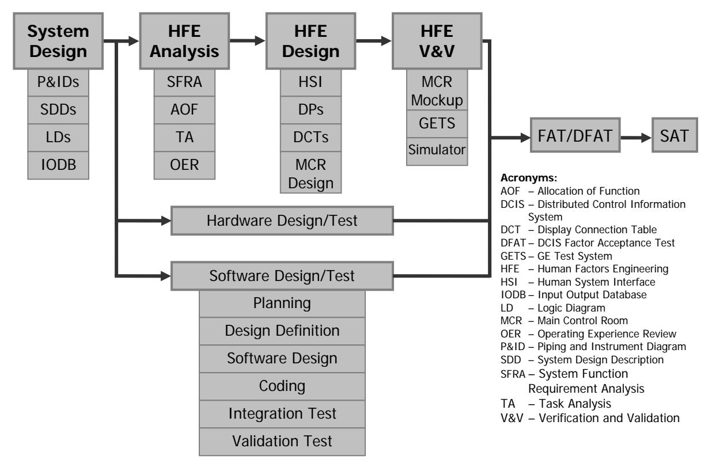

**Figure 19. Lungmen Nuclear Power Project digital instrumentation and controls system design process (Copyright\_ Feb. 2009 by the American Nuclear Society, La Grange Park, Illinois).112** 

Task support systems (TSSs) are at the cutting edge of HFE, in industrial environments in general, and in NPP CR design in particular. TSSs will make an important contribution to the operability and usability of modern HSIs. They will facilitate the simplified abstraction of system processes, the reduction of complexity and volume of information, and the availability of procedural support during nonroutine conditions.

The importance of TSSs is derived from three trends associated with the need to design advanced HSIs. The first is the implementation of advanced digital technology in process control and CRs, with emphases on a partial or complete elimination of hard controls in favor of computer-based or soft controls. The second is dealing with the enormous amount of technical information presented to plant operators to analyze and make decisions that could impact the plant's performance and the need to reduce the amount of information through abstraction. Finally, there is a need to ensure the safety of the plant and operating personnel and to improve plant productivity and cost effectiveness. This includes guaranteeing effective operator performance during accident management.

The principles of task support are not really new; they are basically an evolution of the familiar concepts formulated for computer-based procedures and advanced HSIs. It is emphasized that

thorough task analyses are essential to determining how critical support functions will help in improving the effectiveness, efficiency, and satisfaction with which CR operators can perform their tasks. The development of a TSS for HSI opens up new possibilities for exploring the contribution of such facilities to the usability of the HSI, the improvement of operator performance, and overall plant performance and safety.

# **7.2 THE STATE OF THE ART**

# **7.2.1 Physical Interface Technology**

# **7.2.1.1 Hand Held Computers**

The technology now exists to integrate maintenance, diagnostic, and operating procedures into wireless mobile computers equipped with various wireless networking capabilities such as Bluetooth Zigbee, and Wi-media. These wireless computer devices may be used to provide up-to-date and easy to follow procedures to personnel as they perform maintenance, failure diagnostics, surveillance, emergency operations, and many other tasks. For such applications, the computer must be intrinsically safe and capable of withstanding abuse, and it should be environmentally hardened for use in harsh environments. The computer must also be capable of supporting standard type operating systems for ease of use over a wireless connection. A high bandwidth secured LAN would also be required to support such systems. Several commercially available computers have the capabilities needed to meet these requirements.

# **7.2.1.2 Direct Human Interfacing and Brain Plasticity**

Direct human interfacing and brain plasticity is an emerging technology with ongoing research focusing on enhancing human ability to process complex information while reducing the probability for human error. In essence, this technology focuses on compensating humans with damaged sensory and motor functions by allowing the brain to control artificial devices. Brain plasticity can be defined as an adaptation of the central nervous system to abnormal sensory functions by modifying its own structural organization and functioning. Such physiological phenomenon and recent advances in instrumentation technology for sensory substitution have prompted researchers to develop tools to aid persons suffering from loss of some of their senses, such as loss of sight and loss of hearing, by compensating for their sensory losses.

The underlying principle in sensory substitution is transmitting information from an artificial receptor (such as camera for vision substitution or accelerometer for vestibular substitution) to the brain through the central nervous system. The brain would then interpret and manipulate the information resulting in providing the necessary action to restore the loss of sensory function.[115,](#page-139-12)[116](#page-139-13) The brainmachine interface (BMI) is a form of this technology that provides an alternative human-machine interface (HMI) in which the brain accepts and controls a mechanical device as a natural part of the body to provide a method for people with damaged sensory and motor functions to use their brains to control artificial devices[\\*](#page-86-2). The feasibility of this technology was demonstrated by researchers at Brown University by implanting a four-millimeter square array of 100 electrodes in the area of the brain of a monkey that is responsible for issuing commands to move the monkey's arms. The electrodes were used to track the brain signals responsible for the ability to move the arm from which a computer model capable of extrapolating the monkey's arm movements was created and used ultimately in controlling a joystick in response to the monkey's thinking about moving its arm.

\* www.ele.uri.edu/Cources/ele282/So3/Gabrielle\_2.pdf, accessed 2008.

Research results have been published describing use of artificial receptors such as cameras to compensate for vision impairment and accelerometers to compensate for bilateral vestibular loss.[115](#page-86-3) Similarly, fingertip contact switch data are experienced as touch. This is true despite the fact that the same electrotactile interface is used to couple data to the tongue, irrespective of the sensor technology. It is far less susceptible to overload because the human perceptive process continuously updates what it needs to perceive and ignores the remainder, automatically and unconsciously. Because the process is experienced unconsciously, it is much faster than the cognitive interpretations that the operator must make with conventional interfaces. Using this interface to monitor data flows on a large computer network or an industrial process, an operator would avoid overload by unconsciously "tuning in" to the relevant aspects of the data flow, abstracting meaning from the subjective "feel" of the data flow, and doing so with far greater speed and reliability than is possible with conventional HMIs. Crucially, because it allows the operator a total experience of the process, he/she is able to detect patterns and relationships that would be ignored or discarded by conventional interfaces.

The BMI technology allows the nervous system to experience an external object as if it were a part of the body. For example, a blind person using a long cane perceives objects (a foot, a curb, etc.) in his/her real spatial location, rather than in the hand, which is the site of the human-device interface. That power is seen in the ability to sense that a situation has changed before being able to identify the change. The capacity to connect with an engineered system in this way is enabled by an innovative technology for human-machine interaction based on Bach-y-Rita's electrotactile BMI, a computer-aided medical prosthesis already used to restore lost human senses[.116](#page-86-3) Unconscious integration into the system leads to anticipatory behavior. Since integration of the BMI and implicit cognitive processing enable the user to experience the meaning of practically any electronically generated data stream by direct sense perception, many areas will benefit from major applications of these two technologies of brain plasticity and cognitive process in the future.

Unlike conventional HMIs, which incorporate a strategy of conscious response to individual data, direct coupling to the nervous system enables processing of the data stream as a whole and integrates it with anticipatory cognitive processes. Since this bypasses many cognitive processes that are vulnerable to overload, it benefits from the characteristic of the implicit systems that they are resistant to these kinds of capacity difficulties. Furthermore, it taps the power of unconscious cognition to make sense of ambiguous cues. The application of brain-plasticity-mediated sensory substitution requires a practical enabling technology. The enabling technology is a transducer that converts the electronic data from an artificial sensor to a pattern of electrotactile stimulation. A low resolution sensory substitution system can provide the information necessary for the perception of complex images. The inadequacies of the skin (e.g., low two-point resolution) do not appear as serious barriers to eventual high performance because the brain extracts information from the patterns of stimulation. It is possible to recognize a face or to accomplish hand-eye coordinated tasks with only a few hundred points of stimulation. An experiment with stationary tactile-visual sensory substitution displaying the tactile matrix on the subject's back showed that blind subjects were able to bat a ball as it rolled off a table at a point that had to be predicted by the blind subject.

# **7.2.2 Virtual Reality**

Virtual reality (VR) technology has advanced in the last decade and proved to be of great benefit to ACR designs and in modernizing CRs of operating NPPs due to the advantages it has to offer. VR provides CR designers with the tools to create a 3D model capable of simulating physical layout at an early stage in the design process. With the VR model, plant operators, HFE personnel, architects, and end users (from the utility industry) can be involved in the development process to provide their inputs throughout the design process.[117](#page-139-14) As in any design process, the final design is attained after

several design iterations, and with the VR modeling, these iterations can be made easier and definitely less costly than building mockups. Although VR development software is commercially available, some have opted to develop their own systems—for some obvious reasons (solvency of some of the companies offering VR software, product obsolescence, use of proprietary formats, software not flexible enough to accommodate special operational requirements). Recently, the Norwegian Institute for Energy Technology (IFE) in collaboration with EdF developed a 3D VR system focused on a human-centered design (HCD) including VR tools that can be used to provide an ergonomic design which can be evaluated by the operators. The VR system, known as Control Room Engineering Advanced Toolkit Environment (CREATE), is an interactive 3D technology capable of placing manikins inside virtual rooms and incorporating a set of 3D tools for measuring distances, viewing angles, and LOSs. 114, 116 The capabilities of CREATE were evaluated using five review tasks from NUREG-0700. 109 The overall structure of CREATE and its associated tools are illustrated by Figure 20 through Figure 24. Using VR technology made it possible for plant operators to be trained under normal as well as abnormal operating scenarios using the virtual environment that closely related to the actual physical setup without compromising safety.

In addition, operators' performance can be evaluated and documented. Remarkably, R&D in VR technology has not been limited to ACR design and operator training but has extended to other applications such as an interactive work planning and visualization and VR dose, where manikins are shown to perform decommissioning of contaminated plutonium glove-boxes in virtual reality. This concept can be extended to other complex tasks within the nuclear industry.

Modern visualization technology can now be applied to improve human awareness of working environment, problem solving, and decision making in nuclear power generating stations and associated utility support organizations. The need for this technology in nuclear utilities is growing because of the vast amounts of data and information now available, which could overwhelm users with the HMIs widely used today and thus adversely affect their performance, leading to unsafe operating conditions.

One promising approach to support user needs for usable information involves modern visualization technology. Information can be displayed in traditional two-dimensional (2D) graphics or a range of 2.5-dimensional (i.e., flat images with the appearance of 3D) to four-dimensional (4D) graphics (3D images changing over time). More complex 3D and 4D VR representations may involve complete user immersion, such as provided by the CAVE (Cave Automatic Virtual Environment)118 VR system. The CAVE system permits one or more viewers to move around within a virtual space while wearing stereoscopic glasses or some other kind of human-machine device. The system uses sensors attached to the primary viewer to track changes in head and body positions. The visual representation of the virtual world is adjusted automatically to reflect the viewer's current position and gaze. The observer may actively use traditional controls (e.g., mouse, keys, joystick) and less widely used methods (e.g., voice input and electronic gloves) to request information presentations. Visualization technology should be considered for high value functions in nuclear utilities. Adequate situation awareness, problem solving, and decision making are possible with 2D data and information presentation methods currently in use.

More advanced visualization tools are also being developed and used to improve HMIs by providing much more realistic simulated environments for design, training, planning, and practice purposes. For nuclear engineers, technology to simulate everything from simple half-life measurement experiments to complete CRs is readily available and can be used with different platforms such as personal computers. What to an outside observer might look like a typical computer video game, to a nuclear engineer more closely resembles a simulated nuclear environment such as a radiation laboratory or a research reactor CR. Intended applications range from simple virtual tours of nuclear facilities for

outreach purposes, conducting virtual radiation related experiments, virtual facilities for improved human-machine interfacing, virtual facilities for optimum design to minimize maintenance and also to minimize replacement time for parts, virtual dose calculations, etc. A projection-based VR system such as CAVE, which surrounds the viewer with four (or more) screens, is suitable for these applications. A general-purpose program is being developed in C++/OpenGL to create virtual models of interest. The program is modular and allows development of components and their assembly. Further, VR may also be very useful in achieving educational and outreach goals of the discipline.

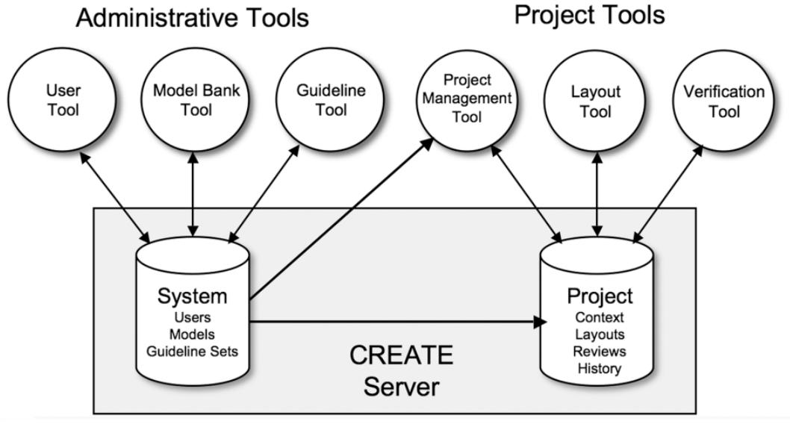

 **Figure 20. Overview of the CREATE system (Copyright\_Feb. 2009 by the American Nuclear Society, La Grange Park, Illinois).118**

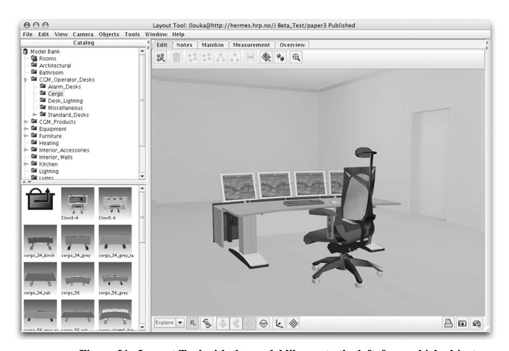

**Figure 21. Layout Tool with the model library to the left, from which objects can be dragged into the scene (Copyright\_Feb. 2009 by the American Nuclear Society, La Grange Park, Illinois).118**

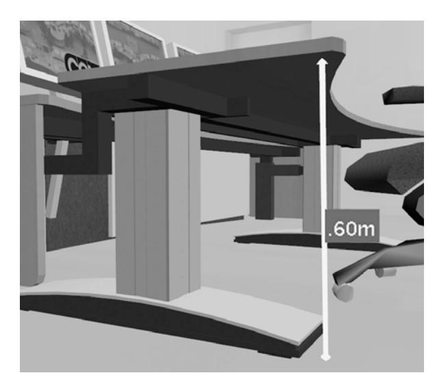

**Figure 22. Distance measurement tool in action (Copyright\_Feb. 2009 by the American Nuclear Society, La Grange Park, Illinois).118** 

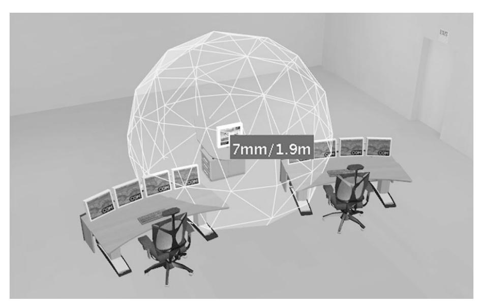

**Figure 23. Evaluation of label legibility showing the height of the text and calculated range of legibility (Copyright\_Feb. 2009 by the American Nuclear Society, La Grange Park, Illinois).118** 

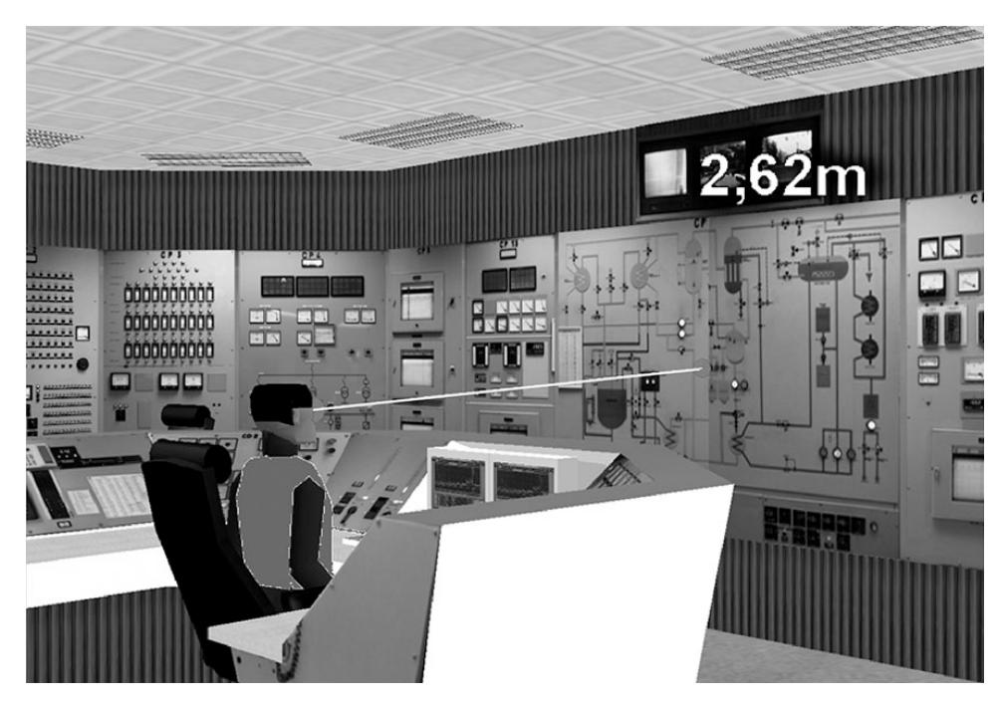

**Figure 24. Virtual control room (Copyright\_Feb. 2009 by the American Nuclear Society, La Grange Park, Illinois).118** 

Another interesting application of this technology is the virtual dosimetry tool, which provides online radiation visualization. The system receives radiation measurement data from a set of both fixed and wireless detectors and visualizes the radiation environment in real time, adapting as more data become available or radiation-level changes are detected. The spatial position of the wireless detectors and the operators are measured using a real-time positioning system. From this information, radiation maps are built and visualized inside a VR model of the work environment.[119](#page-140-0) The live radiation map may also be overlaid on real live video of the environment in an augmented reality setting, placing the radiation map where it belongs in the real environment. Live dosimetry systems are also being introduced to hospitals in Norway and Japan for use with advanced medical equipment.

Further development of the VR technology has resulted in reviving an old research topic known as augmented reality.[119](#page-91-1) Augmented reality can be simply defined as a technology in which a digital model or scene is merged together with a physical environment representing an actual setting of interest. An example of an augmented reality application, combined with VR, is the live dosimetry systems based on the Virtual Live Dosimetry tool, developed by IFE and licensed for use at Tokyo Electric Power Company in Japan. It is also being introduced to hospitals in Norway and Japan for use in conjunction with advanced medical equipment. In its initial development phase, IFE demonstrated the augmented reality capability by developing a 3D radiation distribution model that can be viewed by operators using a head-mounted display to guide them in navigating through a facility while minimizing radiation exposure. Future developments in the VR and augmented reality technologies are expected to take advantage of portable computing and wireless communications to provide NPP operators with augmented-reality-based devices that are robust and easy to wear or carry while focusing on the work to be performed[.119](#page-91-1)

# **7.2.3 Video Display Units**

The HSI for LMNPP is typical of Generation III+ I&C. VDUs with touch screens represent the main HSI in the CR, where operators can monitor and control plant equipment and systems under both normal and abnormal operating conditions. The HFE program model described by NUREG-071[1112](#page-84-4) was used as the technical basis for reviewing the criteria for the digital-based design of the CR. The underlying strategy for the new CR is to deploy a VDU configuration to effectively distribute task assignments and workloads when accessing a large inventory of displays from a fairly large VDU location.

The total number of VDUs in the operation area of the CR is 45, each equipped with touch screen. Forty-two of the 45 VDUs have the capability to provide monitoring and control functions and are distributed among the wide display panel (WDP) and the main control console (MCC). The remaining three VDUs, with only monitoring function, are located on the shift supervisor console. Out of the 42 VDUs, 12 are used in safety systems, and 30 are used in nonsafety systems. Operating and controlling any of the nonsafety systems can be accomplished from any one of these display units, resulting in added flexibility in plant operation[.111](#page-84-2)

LMNPP has about 1,000 displays and controls that may be distributed on the 45 VDUs. This introduces additional cognitive cost on operators for accessing the information by display navigation. One of the concerns is whether the operators can search through the screens under high stress conditions. On the other hand, presenting control and related information on VDUs is more convenient and gives more control to the operators. It was concluded that more resources need to be allocated to develop systematic and sound training programs that address the operator's role, operator skills, mental modes, and VDU usability strategies.[120](#page-140-1)

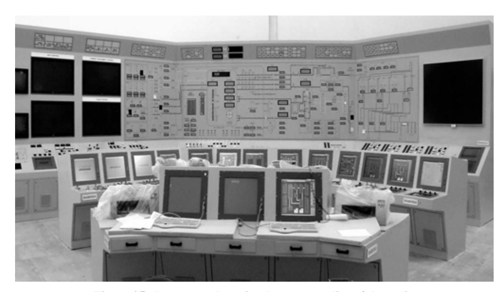

**Figure 25. Lungmen plant simulator—a replica of the main control room (Copyright\_Feb. 2009 by the American Nuclear Society, La Grange Park, Illinois).112** 

# **7.2.4 Automation in Systems**

New approaches are proposed for designing future functional computerized HSIs. Research toward an HSI design based on a formal functional approach has been conducted on a simulator called Fitness, where an entire computerized HSI, including the information system, can be created. This simulator

has been designed in a way to allow, in real time, the level of automation of the simulated process to be varied. Automation systems can be widely diverse and used for many different applications. Some preliminary human factor tests have been performed on this simulator with licensed operators as an attempt to assess the optimum level of automation for future plant operations. Preliminary results show that there is more than one optimum level of automation, where the level of automation depends on many different factors, unmanageable at the design stage of the plant I&C and HSI. The operators themselves need to examine the possibility of managing the level of automation according to their online needs. Varying levels of autonomy during operation could be an alternative to defining a fixed automation level.

# **7.2.5 Control Room Design**

The CR design has rapidly changed as more computerization and automation have been incorporated in the design. ACR concepts are being implemented in the commercial nuclear industry for new plant construction. Use of advanced HSI technologies in the ACRs has more implications with plant safety because implementation for safety systems affects the operator's overall role (function allocation) in the system, the method of information presentation, the ways in which the operator interacts with the system, and the requirements on the operator to understand and supervise a more fully integrated MCR HSI. To design useful support systems, a design basis and a systematic framework are needed. Numerous support systems have been developed or are still under development. As MCRs evolve, more support systems will have to adapt to adequately support the MCRs. However, according to the evaluation results for support systems in several papers, a support system is not guaranteed to increase operator performance.[14](#page-33-2) Some support systems could degrade an operator's situation awareness capability and increase his/her mental workload. When several kinds of support systems are used or additional support systems are added to the same setting, a design basis is necessary to resolve efficiency and integration issues.

Currently many modernization projects are concerned with updating NPP CRs. The different products and strategies being used address the diverse needs of CR modernization around the world. Past and current projects demonstrate a wide range of modernization approaches, including simple in-kind (one-for-one) HMI replacements, transition to hybrid CRs using combinations of video-based and conventional HMIs, and complete replacement with video-based CRs.

One advance in CR modernization is the computerized operator support systems (COSSs) designed to enhance the NPP operator's performance when making key decisions related to plant operation under normal as well as abnormal operating conditions. COSSs use computer technology to support operators in cognitive activities such as assessment and response planning. The main core of COSSs is a knowledge-based system, such as an expert system, which provides recommendations or warnings to personnel such as fault detection and diagnostics, safety function monitoring, plant performance monitoring, maintenance advising, and operator support for plant control. General guidelines for developing COSSs are described in reference [12](#page-140-2)1. These include consistency with task requirements, consistency with general HSI, interaction with ongoing tasks, critical information alert, minimizing querying of user, and graphic representation of rules.

The intelligence provided by the expert system offers advantages such as (1) automatic checks which track operators' actions and compare them to actions expected from plant procedures or another models; (2) automatic warnings based on current conditions, predicted consequences, or side effects; and (3) smart interlocks capable of blocking control actions that conflict with current plant configuration.[122](#page-140-3)

The integration of auxiliary systems should be a key issue, both with respect to usability and cost savings. Operators and maintenance personnel should be trained on the functions and capabilities of the COSS and the relationships between the displayed messages and the plant system states that they are intended to represent.

The main HSI resources associated with CMFDD systems have been grouped under four major categories: process measurements and performance indices; alerts; supporting evidence; and accuracy, confidence, and certainty. A condition monitoring system should, to the extent possible, condense the information it generates into one or a few performance indices that give the operator an indication of plant (or subsystem) status at a glance. To minimize secondary tasks and distractions, a performance index should be visible to the user only while performing tasks for which the index is relevant. Alert information generated by a CMFDD system should be either integrated into the alarm system if intended to alert the user to the need to take immediate action, or it should be integrated into existing information displays if it is not intended to alert the user to the need to take action but only to indicate abnormal status of components or systems. When presented with alert information, the operator should be provided with a means for readily verifying the alert and with evidence supporting the conclusion reached by the COSS. This capability could ideally be integrated into the alert response procedures. The statistical accuracy (or error margin) of CMFDD numerical results generated by a COSS should be provided to the user together with an associated confidence level, and there should be consistency throughout the HSI in the choice of how to express statistical accuracy or error margins.

Typical displays currently in use in computer-based CRs should be augmented with new displays designed to better meet the information needs of plant personnel and to minimize the need for interface management tasks (the activities personnel have to do to access and organize the information they need). The basic design of the displays for supporting monitoring, detection, and situation assessment are a hierarchy of displays at various "levels of abstraction" from high-level summary information to very detailed information: top-level overview displays suitable for plant monitoring, displays providing progressively more detailed information suitable for situation assessment in the event something is not normal, and navigation aids to enable users to quickly and easily move from higher-level displays to lower-level displays in the hierarchy. The key step in designing displays is defining the type of hierarchy to be used to organize and define the displays. It is not practical or even possible to develop specific displays for every conceivable task. Thus, guidance is needed to identify candidate tasks to be supported. Identification should be based on three main factors: human performance reliability improvements, efficiency improvements, and interface management reduction. Task-based displays can help support reliable performance by reducing the demands on human memory to remember information from one display to the next and by reducing the distracting effects of performing interface management tasks. Computer-based displays can support teamwork while helping to overcome some of the problems that were raised previously. The key elements of computer-supported cooperative work (CSCW) displays include common frames-ofreference for the entire crew, support for awareness of the activities of others, and availability of collaborative workspaces and tools for team interaction with CSCW displays. The new displays will enable the HSI to better support a broader range of user tasks while significantly reducing the need for crews to engage in distracting interface management tasks.

Another technique for optimizing HSIs proposes the operation advisory system to aid cognitive processes of operators as a design basis of support systems for advanced MCRs. This will suggest appropriate support systems to aid activities of the human cognitive process and to integrate the support systems into one system obtaining better performance. The proposed system supports not only the task, but also the entire operation process based on a human cognitive process model. Operators' operation processes are analyzed based on the human cognitive process model, and

appropriate support systems that support each activity of the human cognitive process would be suggested and help the whole operation process: monitoring plant parameters, diagnosing the current situation, selecting corresponding actions for the identified situation, and performing the actions. Results show that operator support systems are helpful for reducing operation failure probabilities of operators, having a greater effect on less skilled operators than for highly skilled operators. The results also show that the effect of independent support systems is less than that of integrated support systems, indicating better human performance may be obtained by integrating support systems based on the operators' cognitive processes.

#### 7.2.5.1 Minimum Inventory Issue

In modern CRs that use digital technology, the primary interfaces used by the CR operators are based on selectable displays and controls as opposed to the fixed, dedicated display and control interfaces of earlier designs. There are several factors that stipulate minimum-inventory HSIs: IEEE 603-1998123 requires that qualified, safety-related HSIs must be provided for accident mitigation, to achieve safe shutdown, and for post accident monitoring; ANSI/ANS-4.5-1980124 delineates criteria for determining the variables that the CR operator should monitor to ensure safety during an accident and the subsequent long-term stable shutdown phase; IEEE Std. 497125 provides relevant I&C system design criteria; and Regulatory Guide 1.97, Rev. 3126 provides a comprehensive list of variables to monitor.

The definition of minimum inventory has been a topic of discussion for a while. A number of regulatory guidance documents such as NUREG-0711112 address the subject, and NUREG-0800,44 Chapter 18, defines this concept as "complete set of HSIs needed by the operators to perform their tasks based on task analysis." In earlier advanced LWR designs, the term was referred to as either "a minimum set of fixed-position or spatially-dedicated HSIs" or "HSIs needed in the case of failure of the HSIs normally used by the operators." EPRI prepared a draft report to resolve the discrepancy on the term as well as to serve as guidance for industry, 127 where the term is defined as "the HSIs that are needed beyond the nonsafety, selectable, computer-driven HSIs used by the operators and typically driven by a distributed control system." These HSIs include the following.

- Spatially dedicated, continuously visible displays driven by the nonsafety control and information system (e.g., a flat panel display that shows alarms in fixed positions, such as a tile-replica display).
- Safety-related HSIs (e.g., qualified discrete digital or analog/hard-wired controls and indicators).
- Non-safety-related HSIs that are independent of the main control and information system that
  drives the operator workstations (e.g., discrete controls and indicators and/or computer-based
  HSIs).

Figure 26 shows sample minimum-inventory HSIs that include both plant safety and nonsafety systems as itemized above.

The minimum-inventory issue was recently addressed in the Interim Staff Guidance DI&C-ISG-05 Rev. 0. 128 The NRC staff position requires that the minimum inventory of HSIs should be developed for the MCR as well as for the RSR.

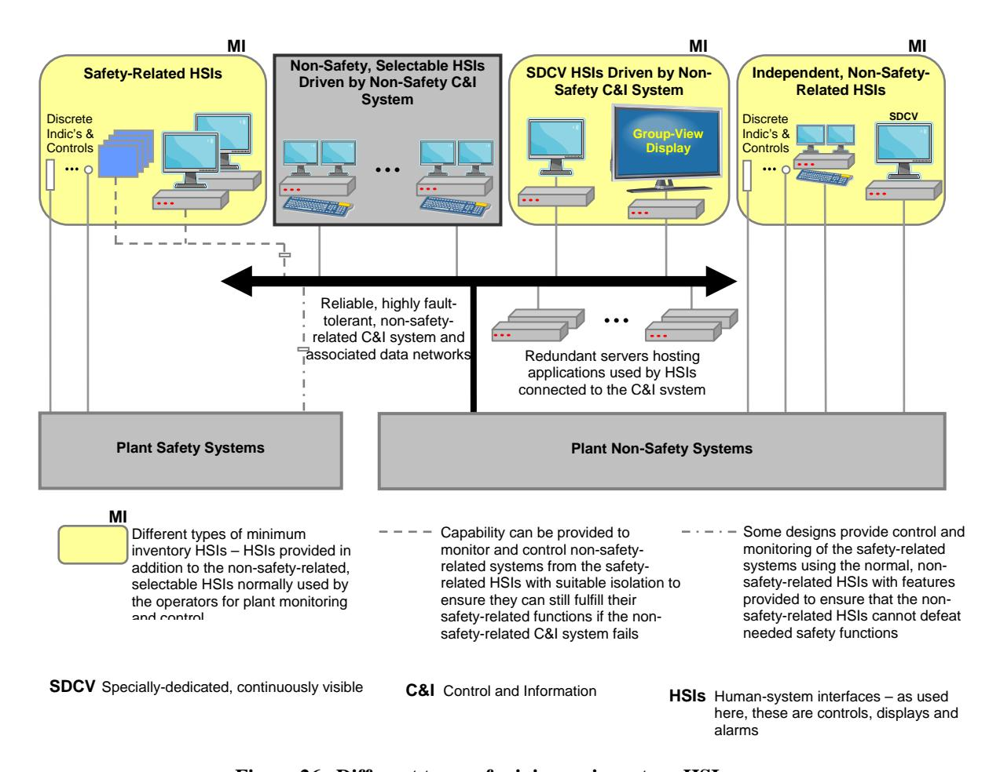

**Figure 26. Different types of minimum-inventory HSIs.** 

# **7.3 REGULATORY IMPACT OF HUMAN-SYSTEM INTERACTIONS**

There are many evolving design and evaluation tools that can optimize the design of HSIs and speed up their evaluation. All are based on computer software technologies. Many of these tools are being developed outside of the nuclear power industry. It is widely accepted that poorly designed HFE systems contribute to poor human performance, increased errors, and reduced human reliability.[129](#page-140-10) In addition, under degraded or emergency conditions, poor HFE design can delay or prevent corrective action by plant operators. The perfect CR layout, with attendant perfect operator interaction and allocation of human-machine function has not yet been developed. Even if such an ACR had been developed, the tools to confirm its performance capabilities have not yet been developed. It is therefore in the interest of improving and verifying the efficacy of ACRs that research continues in the three major areas of tool development: measurement tools for physical human interface; humanmachine interface and interaction design criteria and guidance, especially for allocation of functions in highly automated control rooms; and functional simulation modeling, including human performance modeling.

Digital data acquisition and display have the potential to present an ever increasing flood of information to plant operators causing overload and perhaps masking the most relevant information. An overloaded and confused operator can lead to inappropriate and detrimental actions.[130](#page-140-11)

In recognition of the downside of digital computer-based systems in the control room, NRC has issued an interim staff guidance for human factors in digital I&C systems as a guide to determining how a licensee may satisfy NRC regulations.[131](#page-140-12)

Some of the human interface technologies such as VR have already shown capability in the design stages. To reduce time and resources during the evaluation (V&V) stage, continued development of computer assisted tools should be encouraged. Developers of evaluation tools should be careful not to simply modify existing software from the design to evaluation environment. Some degree of independence and separation is needed to prevent built-in blind spots to systematic errors that might exist in the design tool software.

Flat screen video displays have invaded much of the industrial controls environment both as displays and as control interfaces, through touch screen technology. Consideration as to the robustness of these displays and controls is needed for the nuclear environment (e.g., seismic stability). Further, because of the relative ease of installing flat panel displays, much analysis is needed by the designers to prove that operators are able to use them without overload or confusion. The development of well integrated control rooms with such displays and controls requires much research and simulation as well as appropriate regulatory guidance.

The trend is to continue along the path to automation. Because there may be no optimum level of automation, individual licensees will vary in their allocation of functions to operators and computer-driven systems. For any given plant, even the level of automation may regularly vary depending on plant operating conditions and the training/skill of the operator. The levels of automation in various situations may be selected by the operator depending on the level of attention needed for other tasks. Guidance and general criteria given in the Interim Staff Guidance concentrate on automation of procedures. Hands-off automation for start-up and shutdown of plant systems is not covered by the existing guidance. Additional guidance related to function allocation and automation is needed for the licensee.

#### 8. HIGH-INTEGRITY SOFTWARE

#### 8.1 OVERVIEW OF SOFTWARE TRENDS

The term "high integrity" implies a specific characteristic of the software in terms of reliability or dependability that requires that the software must be developed using special techniques. The safety requirements of military, aerospace, and transportation applications, due to the consequences of software failure, continue to drive development of ever-increasing levels of quality and reliability for software. The international standard for describing the method of selecting, implementing, and monitoring the life cycle for software is ISO 12207. There are a number of models adopted from organizational and business management methodologies, such as the Capability Maturity Model (CMM) and Six Sigma. ISO 15504 also provides a framework to establish a mode for process comparison.

Although advances in software engineering have not kept pace with hardware, continuing evolutions and new methodologies in high integrity software should continue to be tracked because they have the potential to reduce the probability of CCF in digital systems. The present regulatory position is that software cannot typically be proven to be error-free and is therefore considered susceptible to CCFs if identical copies of the software are present in redundant channels of safety-related systems. The current mitigating strategies to cope with CCFs are to apply various diversity measures and a defense-in-depth philosophy. These measures, along with a highly reliable software development strategy, can reduce the probability of CCFs to an insignificant level.

#### 8.2 SOFTWARE DEVELOPMENT FOR SAFETY CRITICAL APPLICATIONS

Software design, specification, development, and implementation are quintessentially nonmechanical and noncybernetic processes. Thus, systems engineering is one means by which the semantic difference between an expert's 133 understanding of process or functionality and a digitally valid, reliable, and dependable specification of that functionality is minimized. 134 Fidelity to as-built physical systems in digital form ensures that physics is not virtually violated. For mission-critical and safety-critical functions, the semantic difference relationship must not only be minimized, but that expression must be very highly correlated and corroborative. Modern systems engineering environments are constructed to ensure formalism and discipline improves the necessary correspondence, the traceability of that correspondence, and the proof that the differences are minimal. However, once the model is established, the software functionality requirements and constraints must be identified and documented. In addition, the burden of proof that the specification satisfies all of those requirements and constraints rests with the software developer. 135

In the software life cycle, there are a number of methods which support formalism. 136 The discipline and corresponding methods and techniques associated with the hazard and safety analyses needed to address all aspects of safety critical NPP systems also exist. Some of these methods are included in Table 3. Each such software formalism is specific to target aspects of the software life cycle and none are comprehensive or deterministic to success in minimizing the semantic distance between expert model and specification.

Modern computer hardware systems have capacities that far exceed mastery by contemporary human experts, and those capacities continue to increase not linearly but according to the multiplying consequences described by Moore's Law. Digital systems thus represent a means, which must be controlled in NPP applications, for both complicated and complex functions. Digital systems are potentially complicated due to the capability to absorb many and large functions and processes.

**Table 3. Example formalisms***a*  **for digital safety systems development** 

| Formalism                                         | Phase of software development                 | Processes                                                                                                                                                                                                                  | Products                                                                                                                                                                                                                            |
|---------------------------------------------------|--------------------------------------------------|----------------------------------------------------------------------------------------------------------------------------------------------------------------------------------------------------------------------------|-------------------------------------------------------------------------------------------------------------------------------------------------------------------------------------------------------------------------------------|
| Fault avoidance                                   |  Concept development  Maintenance  |                                                                                                                                                                                                                            | =Architecture, design; requirements; measures of performance; specification document                                                                                                                                       |
| Fault elimination                                 |  Concept development  Maintenance  |  Detection  Removal                                                                                                                                                                                             |                                                                                                                                                                                                                                     |
| Fault tolerance                                   |  Operations                                  |                                                                                                                                                                                                                            |                                                                                                                                                                                                                                     |
| Fault evasion                                     |  Operations                                  |  Observation, ID anomalous properties                                                                                                                                                                               | =Compensating features                                                                                                                                                                                                              |
| Reliability analysis                              |  System design  System development |  Operations research  Systems integration                                                                                                                                                                       | =Fault-consequence relationships; =Operational environment assumptions                                                                                                                                                     |
| Management and procedures                      |  All phases                                  |  Dedicated; independent, professional analyst                                                                                                                                                                    | =Documentation; independent system safety responsibility                                                                                                                                                                      |
| Life-cycle models and safety life-cycle models |  All phases                                  |  Rigorous support to management for defining project phases and deliverables                                                                                                                               | =Software safety plan, hazard log; safety case                                                                                                                                                                                   |
| Hazard analysis                                   |  All developmental phases              |  Unsafe state identification;  Risk evaluation;  Tradeoff analyses                                                                                                                                    | =Measures to eliminate or mitigate. Make tradeoffs explicit =Documentation of acceptable hazard states and justification                                                                                             |
| Techniques of hazard analysis                  |  Respective phases of life cycle       |  Reviews and walk throughs  Lessons learned check lists  Hazard and operability analysis  Failure modes, effects, and criticality analysis  Failure modes, effects analysis | =Cause-consequence articulation; =System definition, functions, and components; =Component failure modes and respective causes; =Corresponding failure mode effects; =Conclusions and recommendations |

**Table 3. (continued)** 

| Formalism                                    | Phase of software development                                      | Processes                                                                                                                                                                                                                             | Products                                                                                                                                                                                                                                                                                                                                                                                                                                                                                                      |
|----------------------------------------------|-----------------------------------------------------------------------|---------------------------------------------------------------------------------------------------------------------------------------------------------------------------------------------------------------------------------------|---------------------------------------------------------------------------------------------------------------------------------------------------------------------------------------------------------------------------------------------------------------------------------------------------------------------------------------------------------------------------------------------------------------------------------------------------------------------------------------------------------------|
| Additional techniques for hazard analysis |  Specific purposes at respective phases of life cycle |  Probabilistic risk analysis  Gathered fault combination method  State-space methods  Fault trees analysis  Event trees analysis  Cause-consequence diagram method  Petri nets | =Quantitative determination the hazard will be realized =ID fault combinations for systematic analysis of systems sets interacting =ID operating and failure states of repairable systems =ID events and combinations that progress to undesirable circumstances; and respective interactive logic =ID event sequences and respective, potential, consequences =Combination of fault trees and event trees =Timing constrained safety analysis |

*a* "The value of formal methods is that they provide a means to symbolically examine the entire state space of a digital design (whether hardware or software) and establish a correctness or safety property that is true for all possible inputs." Curator and Responsible NASA Official: [C. Michael Holloway](http://shemesh.larc.nasa.gov/people/cmh/) last modified: 31 January 2006 NASA Formal Methods Web Site http://shemesh.larc.nasa.gov/fml.

Digital systems are complex because they can exhibit wholly unanticipated behavior, and because they implement pure concept, they are not bound by laws of physics. Since they are constructed by human endeavor, digital systems are assumed to be flawed through the unintended insertion of faults. It is this combination of attributes, almost certain to be exhibited in the right circumstances, that dictate that digital systems construction and implementation must be conducted in ways to protect against failure consequences. The means and methods of construction and implementation are, themselves, the means by which dependability and reliability can be ensured. Modern technology exists to accomplish control through methods which, when properly executed, can objectively ensure control is maintained and validity of operation is reliable and dependable in digital system functionality supporting even safety operations of NPP processes. Strategies exist to ensure these methods are robustly applied, but they represent a paradigm shift in conventional approaches to the design and development of digital systems.

# **8.3 COMPUTER SOFTWARE DEVELOPMENT AND THE EMERGENT TECHNOLOGY WHICH SUPPORTS IT**

A growing number of software development organizations implement process methodologies. The international standard for describing the method of selecting, implementing, and monitoring the life cycle for software is ISO 12207.[137](#page-141-1)

- The *Capability Maturity Model*[\\*](#page-101-0) is one of the leading models. Independent assessments grade organizations on how well they follow the CMM-defined processes, not on the quality of those processes or the software produced. ISO 9000 is the accepted standard for describing formal organizing processes with documentation.
- ISO 15504, also known as *Software Process Improvement Capability Determination* (SPICE), is a "framework for the assessment of software processes." This standard is aimed at setting out a clear model for process comparison. SPICE is used much like CMM and CMMI.\* It models processes to manage, control, guide, and monitor software development. This model is then used to measure what a development organization or project team actually does during software development. This information is analyzed to identify weaknesses and drive improvement. It also identifies strengths that can be continued or integrated into common practice for that organization or team.
- *Six Sigma* is a methodology to manage process variations, and it uses data and statistical analysis[†](#page-101-1) to measure and improve a team's or organization's operational performance. *Six Sigma* is a method to identify and eliminate defects in manufacturing and service-related processes. However, *Six Sigma* is manufacturing-oriented, and further research on its relevance to software development is needed.

The most important task in creating a software product is extracting the requirements of software performance. Users typically know what they want but not what software should do, while incomplete, ambiguous, or contradictory requirements are recognized by skilled and experienced software engineers. Frequently demonstrating live code may help reduce the risk that the requirements are incorrect. *Model Driven Development* is one modern means by which this demonstration can take place, live, without the need for code development. The live model, derived from requirements, can also demonstrate block integrity and version independence, expediting the generation of versions.

- *Specification* is the task of precisely (and rigorously) describing the software to be written which matches and/or further differentiates requirements. In practice, most successful specifications are written to understand and fine-tune applications that were already well-developed, although safety-critical software systems are often carefully specified before application development. Specifications are most important for external interfaces that must remain stable. This is particularly true for safety/nonsafety interfaces. It is the means by which control of reactor processes can first be addressed consistent with safety, the reactor design basis, analysis guidelines of *NUREG 6303*, and design vulnerabilities to CMF. Modern tools exist for nominating requirements and tracing their evolution, pedigree, traceability, and satisfaction. The *Dynamic Object Oriented Requirements System* is one example, and there are many others.
- *Software Architecture* refers to an abstract representation of the system. Architecture is concerned with making sure the software system will meet the requirements of the product and ensuring that future requirements can be addressed. The architecture step also addresses interfaces between the software system and other software products, as well as the underlying hardware or the host operating system. *The Open Group Architecture Framework* is one standard, but it is largely directed at enterprise architecture. The *Department of Defense Architecture Framework* is an emerging federal standard tailored to command and control.

\* CMM is gradually being replaced by CMMI, Capability Maturity Model Integration.

† The maximum permissible defects is 3.4 per 1 million opportunities.

- *Architecture Products* are those graphical, textual, and tabular items that are developed in the course of building a given architecture description. Each product describes characteristics pertinent to scaled aspects of the architecture. These products serve as software system design tools directed at the ultimate software to be developed. These products provide a means by which software development diversity can be implemented and maintained throughout the life cycle of each development. Through modern methods, the generation of code can be pedigreed and the diversity of version can be protected. Software architecture and its products may be the last commonality of version diversity and the formal means by which diversity independence can be created and assessed. Products are essential to both knowledgeable application of programming methods and defense-in-depth implemented in the coding process.
- *Implementation (or coding)* represents the reduction of a design to code (as reviewed above), and this may be the most obvious part of the software engineering job. It is not necessarily the largest portion or the most costly. In fact, modern code generation tools exist to reduce design to code and test that code for validity, reliability, and dependability. Likewise, a number of types of process models provide repeatable, predictable processes or methodologies that improve productivity and quality. Some processes systematize or formalize the coding task. Others apply project management techniques to writing software. These types include representatives shown in [Table 4](#page-103-0).
- *Testing* of parts of software, especially where code by two different engineers must work together, falls to the software engineer. This is not a point for diversity but does begin to address fault and system failures relative to diversity objectives and version independence.
- *Documentation* represents an important (and often overlooked) task for formally recording the internal design of software for the purpose of future maintenance and enhancement. Documentation is most important for external interfaces, represents a first step for configuration management, and is not a potential point for diversity.
- *Software Training and Support* is a step in which the user's model of functionality first confronts the developer's specification of that functionality. While an aspect of defense-in-depth, this is not a point for diversity among versions. Users will have lots of questions and software problems, which leads to the next phase of software development.
- *Maintaining and Enhancing* software to cope with newly discovered problems or new requirements is not often viewed as a point for D3. It is a phase of software development where configuration management can have an effect on the safety envelop, with compounding consequences. While a small part of this phase is devoted to correcting faults, users and developers can infuse failure modes and complicate failure diversity among versions which have been subject to forced diversity in earlier phases.

Table 4. Software development process models

| Process model name      | Examples or processes                                                                                                                                                                                                                                                                     | Notes                                                                                                                                                                                                                                                                                                                                                    |
|----------------------------|-------------------------------------------------------------------------------------------------------------------------------------------------------------------------------------------------------------------------------------------------------------------------------------------|----------------------------------------------------------------------------------------------------------------------------------------------------------------------------------------------------------------------------------------------------------------------------------------------------------------------------------------------------------|
| Waterfall model  Iterative | <ul> <li>state requirements</li> <li>requirement analyze</li> <li>design a solution approach</li> <li>architect a software framework for that solution</li> <li>develop code</li> <li>test (perhaps unit tests then system tests)</li> <li>deploy</li> <li>post implementation</li> </ul> | Oldest model. Steps finished sequentially. The process proceeds to the next step, just as builders don't revise the foundation of a house after the framing has been erected.  Prescribes the construction of initially small but                                                                                                                        |
| processes                  |                                                                                                                                                                                                                                                                                           | ever larger portions of a software project to help all those involved to uncover important issues early before problems or faulty assumptions can lead to disaster.                                                                                                                                                                             |
|                            | Agile software development                                                                                                                                                                                                                                                                | Agile processes use feedback, rather than planning, as their primary control mechanism. The feedback is driven by regular tests and releases of the evolving software. Agile processes seem to be more efficient than older methodologies, using less programmer time to produce more functional, higher quality software. Programmer as artist concept. |
|                            | Extreme programming                                                                                                                                                                                                                                                                       | Phases are carried out in extremely small (or "continuous") steps compared to the older, "batch" processes. The (intentionally incomplete) first pass through the steps might take a day or a week, rather than the months or years of each complete step in the waterfall model. Relies upon specific design patterns and entity relationship diagrams. |
|                            | Test driven development                                                                                                                                                                                                                                                                   | Requires that a unit test be written for a class before the class is written. Therefore, the class firstly has to be "discovered" and secondly defined in sufficient detail to allow the write-test-once-and-code-until-class-passes model that test-driven development actually uses.                                                                   |
| Formal methods             | <ul> <li>B-method</li> <li>Petri nets</li> <li>Rigorous Approach to Industrial Software Engineering (RAISE)</li> <li>Vienna Development Method (VDM).</li> <li>Specification notation example: Z notation</li> </ul>                                                              | Mathematical approaches to solving software (and hardware) problems at the requirements, specification, and design levels.                                                                                                                                                                                                                               |
|                            | Automata theory and finite state machines.                                                                                                                                                                                                                                                | Methodologies allow executable software specification and by-passing of conventional coding.                                                                                                                                                                                                                                                             |
| Generic programming     | Algorithms are written in an extended grammar                                                                                                                                                                                                                                             | Grammar raises a nonvariable element or implicit construct in the base grammar to a variable or constant and allows <i>generic</i> code to be used, usually implementing common software patterns that are already expressible in the base language.                                                                                                     |

# **8.4 REGULATORY IMPACT OF SOFTWARE**

Software cannot typically be proven to be error-free and is therefore considered susceptible to CCFs if identical copies of the software are present in redundant channels of safety-related systems. At the heart of mitigating strategies to cope with CCFs is a judicious use of various diversity measures and an analysis of how each diversity measure can cope with particular categories of CCFs. NUREG/CR-6303 identifies the following six categories of diversity:

- design diversity,
- equipment diversity,
- functional diversity,
- human diversity,
- signal diversity, and
- software diversity.

The role of software diversity in ensuring adequate defense against CCFs needs to be studied. In general, some of the unresolved issues in using D3 continue to be the following.[45](#page-51-0)

- 1. How much D3 is adequate?
- 2. What sets of diversity attributes can be used to identify adequate D3?
- 3. Are there accepted best practices for approaching D3, and if so what are they?
- 4. How much credit can be taken for built-in quality of a digital safety system?
- 5. Are there standards that can be endorsed for use by applicants in the design and analysis of I&C systems for adequacy of the D3 approach?

The use of diversity to protect against CCFs in software design is not likely to change. However, a great deal of effort can go toward advanced software development techniques that reduce the likelihood of software faults in a digital safety function, make the software less costly, and make the software easier to review and license for use. The conventional tools of the software design methodology using the waterfall model have been universally adopted in nuclear software development. The process is cost intensive and relies to a large extent on human involvement at each step of the waterfall to inspect and test results and to verify and validate that the requirements have been met. The goal of high integrity software developments is to improve the process by automating and systematizing the methods. The range of advanced software techniques that are being developed include methods that automate design steps and report generation, organize the work in new ways that tend to make errors less likely, or automate testing and V&V. It is no longer just the computer program that runs on the device that affects quality, but the much larger system of software used to develop it. The challenge for regulatory bodies is to find ways to review and accept the new strategies using complex, automated design and development tools. In this regard, PRAXIS, a British company, claims to have developed a highly reliable and provable code based on a National Security Agency funded project.[138](#page-141-2) The software has approximately 10,000 lines of code.

# **9. INSTRUMENTATION AND CONTROLS ARCHITECTURES IN NEW PLANTS**

# **9.1 TRENDS IN DIGITAL ARCHITECTURES IN NUCLEAR POWER PLANTS**

Digital I&C architectures are deployed in several international reactors such as Chooz B France, Sizewell B (United Kingdom), Darlington (Canada), Lungmen ABWR (Taiwan), Temeline (Czech Republic), DukovaNy (Czech Republic), and the EPR. A review of I&C features of several of these reactor designs indicates fully-digital and network communication architectures, with analog trip backup in some cases. While the primary focus of digital communication in the nonnuclear and other non-safety-critical environments is toward ever increasing bandwidth, the focus of nuclear I&C digital communication issues is (a) electrical and functional independence between safety and non-safety divisions, (b) deterministic communication among safety systems and assurance of fail-safe communication, and (c) assurance that CCF in the communications systems cannot compromise the function of the safety systems.

Three new designs—the US-EPR, the U.S. version of the EPR, by AREVA NP; the APWR by MHI; and the ESBWR by General Electric-Hitachi (GEH)—are briefly described here to illustrate the current state in digital I&C architectures in NPPs.

# **9.2 EUROPEAN PRESSURIZED REACTOR**

EPR (the U.S. version is called the Evolutionary Pressurized Reactor or US-EPR) is designed by Framatome ANP, an AREVA and Siemens company, and is representative of the latest in PWR I&C advancement. There are three variants of the EPR design, which are either under construction [e.g., Olkiluoto- (OL-) 3 in Finland and Flamanville- (FL-) 3 in France] or undergoing design certification [e.g., US-EPR]. [Table 5](#page-106-4) summarizes the differences among the three EPR I&C variants.

**Table 5. Differences in instrumentation and controls among the different European/Evolutionary Pressurized Reactor designs** 

| System                                                         | Olkiluoto-3 (Finland)                | Flamanville-3 (France)               | United States                           |
|----------------------------------------------------------------|-----------------------------------------|-----------------------------------------|-----------------------------------------|
| Protection system (PS)                                         | TXS                                     | TXS                                     | TXS                                     |
| Safety automation system (SAS)                                 | TXP                                     | TXP                                     | TXS                                     |
| Reactor control, surveillance, and limitation system (RCSL) | TXS                                     | TXS                                     | TXS                                     |
| Process automation system (PAS)                                | TXP                                     | TXP                                     | TXP                                     |
| Priority actuation and control system (PACS)                | TXS (priority modules)               | Switchgear cabinets                     | TXS (priority modules)               |
| Safety information and control system (SICS)                | Mostly conventional I&C, limited QDS | Mostly QDS, limited conventional I&C | Mostly QDS, limited conventional I&C |
| Process information and control system (PICS)               | TXP                                     | TXP                                     | TXP                                     |
| Severe accidents automation system                          | TXS                                     | No information available             | TXS                                     |
| Diverse protection functions                                   | TXP/HBS                                 | TXP                                     | TXP                                     |

Legend: TXS—TELEPERM XS; TXP—TELEPERM XP; QDS—qualified display system; HBS—hardwired backup system.

# **9.2.1 System-Level Instrumentation and Controls Architecture**

The EPR I&C architecture can be considered on three levels:

- Level 0, process interface level;
- Level 1, system automation level; and
- Level 2, unit supervision and control level.

Level 0 systems, (i.e., process interface level) form the physical interface between Level 1 subsystems and sensors, actuators, and switchgear. Level 1 systems (i.e., system automation level) consist of the protection system (PS), safety automation system (SAS), process automation system (PAS), priority actuation and control system (PACS), and reactor control, surveillance, and limitation (RCSL) system. Level 2 systems consist of the workstations and panels of the MCR, remote shutdown station (RSS), technical support center (TSC), process information and control system (PICS) and safety information and control system (SICS).

Each level may contain both safety-related and non-safety-related systems. [Figure 27](#page-107-0) is a block diagram illustrating the main I&C systems and subsystems of the EPR. These systems and subsystems are also listed in the first column of [Table 5.](#page-106-4) In this configuration, all functions necessary to provide a safe shutdown state are either automatically generated in the SAS or manually initiated and processed by the PICS and SAS.[139](#page-141-3)

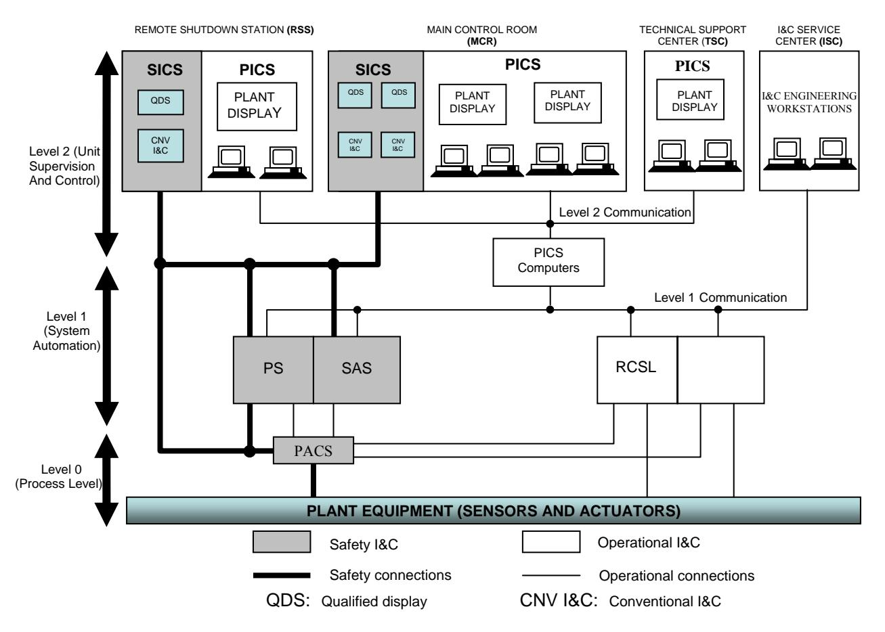

**Figure 27. U.S. Evolutionary Pressurized Reactor instrumentation and controls architecture.** 

All I&C functions and equipment are categorized as safety related, quality related, and non-safety-related according to their importance to safety. All safety-related components are implemented on Class 1E equipment. Higher-classified functions have priority over commands from lower-classified functions [i.e., (1) Class 1E has priority over (2) quality-related class, which has priority over (3) non-safety-related class].

# **9.2.1.1 Safety-Related Systems**

The following I&C systems of the EPR are safety-related:

- PACS,
- PS,
- SAS, and
- SICS.

# *Priority Actuation and Control System*

PACS monitors and controls both safety-related and non-safety-related actuators. Each actuator is controlled by a separate PACS module, as shown in [Figure 28](#page-108-0). Each PACS module has to fulfill the high-availability and reliability requirements against CCFs. To control an actuator, the corresponding PACS module receives and processes all commands. When an actuation request is issued, the PACS responds by processing the request according to command priority encoded into the logic circuitry of the module. As a result, a command output is generated and sent to the actuator.

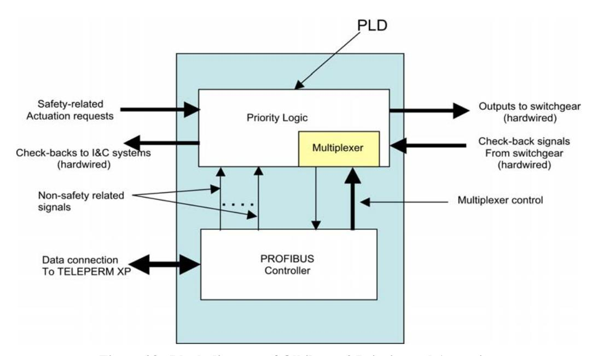

**Figure 28. Block diagram of Olkiluoto-3 Priority and Actuation Control System (PACS) module.** 

The PACS input signals can include status and health monitors for the actuator it controls. Depending on the current operational situation, contradictory commands may be given by different I&C subsystems to particular actuators. Consequently, prioritization rules have been established and encoded into each PACS module to resolve any conflicting commands in a manner allowing the unit to respond only to the highest priority command. Each PACS module has two major components as shown in [Figure 28](#page-108-0). The first component is a programmable logic device consisting of interconnected logic gate arrays. The second is a PROFIBUS controller in the form of an ASIC. The PROFIBUS

controller provides the communication interface to the TXS of the PS, the RCSL system, the Severe Accidents Automation System, or the TELEPERM XP (TXP) of the SAS.

# *Protection System*

Implemented in the TXS platform, the PS is the main I&C line of defense. The primary function of the PS is to bring the plant to a controlled state if a design basis event occurs. Tripping the reactor, actuating containment isolation, actuating Emergency Core Cooling System (ECCS), initiating Anticipated Transient Without Scram (ATWS) mitigating actions, and performing Emergency Feedwater (EFW) system protection and control are some of the actions covered by the PS. The PS reactor trip function uses voting logic to screen out potential upstream failures of sensors or processing units.

The PS is a digital system located in dedicated cabinets in the nuclear island. The system is implemented in four divisionally separate trains, each with its own Class 1E power source. Additionally, each PS cabinet is provided with its redundant power supplies for the electronics. The PS is made functionally independent of all other I&C systems. Connections with other I&C systems are implemented through isolated channels. The PS can perform its own internal self-diagnostics functions and alert the operators to unusual conditions or internal failures.

# *Safety Automation System*

The SAS is a digital I&C system dedicated to automatic and manual control and measuring and monitoring functions needed to bring the plant to a safe shutdown state. The SAS is also implemented in TXS platform. It receives process data from plant instrumentation and switchgear, sends actuation signals either directly or via PACS, and sends monitoring signals to the SICS and PICS.

The SAS functions include post-accident automatic and manual control, the monitoring functions needed to bring the plant to the safe shutdown state, and automatic initiation of I&C functions to prevent spurious actuations that could result in design basis accidents.

# *Safety Information and Control System*

The main purpose of the SICS is to control certain safety-related support systems, such as the component cooling water system (CCWS) and ventilation, in the event that the PICS becomes unavailable. The SICS can be used to monitor and control the plant for a limited time in steady-state power operation.

The SICS consists of a small inventory of conventional (continuously visible) HSIs and a series of qualified display systems (QDSs). The QDSs are safety-related and are therefore required to be qualified to Finnish Class SC-2 (U.S. Class 1E) standards. Non-safety-related information can be displayed on the SICS. Any non-safety-related data displayed on SICS is processed by a safety-related Class 1E computer before being sent to the SICS display; therefore, there is no commingling of safety and nonsafety software on the SICS display system. During normal operation, the SICS controls are deactivated to reduce the risk of spurious actuations due to any possible hazards or internal equipment failures.

# **9.2.1.2 Non-Safety-Related Systems**

The following I&C systems of the EPR are non-safety-related:

- PAS,
- RCSL system, and
- PICS.

# *Process Automation System*

The PAS controls non-safety-related systems and also contains some backup functions for reactor trip and actuation of engineered safety features (ESF) that are implemented using diverse hardware and software from the primary reactor trip and Engineered Safety Features Actuation Systems (ESFASs). The PAS is implemented with the TXS platform.

# *Reactor Control, Surveillance, and Limitation System*

The RCSL system provides automatic, manual, and monitoring functions to control and limit the main reactor and nuclear steam supply system (NSSS) parameters. When these parameters deviate from the desired operational values, before the parameters reach trip set points, the RCSL system would take effect. This action by the RCSL system tends to reduce reactor trips and PS challenges. For example, the RCSL is designed to take actions such as runback of power if the plant operational parameters exceed their operational boundaries to prevent challenging the PS. The RCSL is also implemented in the TXS platform.

# *Process Information and Control System*

The PICS is used to monitor and control the plant under any plant conditions. Implemented in the TXP platform, the PICS uses computers, VDUs, and soft controls. It has access to all Level 1 systems. Components of the PICS include the following.

- Displays for monitoring and control at the operator workstations in the MCR and at the shift supervisor's location.
- Large screen or projected video display for the plant overview display in the MCR.
- Displays for monitoring and control in the RSS.
- Displays for monitoring in the TSC.
- Printing stations and information recording/archiving stations.

The PICS displays alarms in the event of abnormalities in processes or systems and provides guidance to the operators in performing the appropriate corrective actions.

# **9.2.1.3 Communication Systems**

Each I&C system manages its own internal exchanges (including data exchange between divisions) without using external resources. Data exchange between the different I&C systems is performed primarily through standard exchange units connected to the corresponding system networks.[\\*,](#page-110-0)[140](#page-141-4) (Note that OL-3 uses two-way communication between PICS and PS/SAS.)

# *Mode of Sensor Signal Transmission and Shared Sensor Implementation*

Most sensors use 4–20 mA (or in some cases 0–5 V) analog transmission. There is no sharing of sensors between functionally diverse subsystems (e.g., between sensors on subsystem A and sensors on subsystem B).[141](#page-141-5) However, partial trip data are shared between divisions for voting rights. Sensor signals are also shared for the purpose of signal validation.

# *Safety System Interfaces*

The monitoring and service interface (MSI) module forms the boundary and interface between the safety system and the safety panel located in the CR, as shown in [Figure 29](#page-111-0) (MSI is not shown in

 \* This information primarily pertains to the U.S. Evolutionary Pressurized Reactor (US-EPR). While specific information on communication methodology for the Olkiluoto-3 (OL-3) could not be obtained, the instrumentation and controls architecture and communication methods for the OL-3 and US-EPR are similar.

[Figure 27](#page-107-0) and [Figure 28](#page-108-0)). The MSI module, which is classified as Class 1E (Finnish Class SC-2), also serves as a safety-related logical barrier between the rest of the safety system and the nonsafety interfaces. The MSI module is designed to ensure that only predefined messages are transferred between the safety system and non-safety-related displays; it is not responsible, however, for plant control functions.

Communication via the maintenance panel (service unit) to a safety channel can be performed only after that channel has been turned off via a key switch. For OL-3, the TXS equipment (i.e., the four divisions of the PS) is located in the four safeguards buildings.[\\*](#page-111-1) The processor key switches are located in the equipment cabinets.[†](#page-111-2) Maintenance data are written to the MSI module in a separate memory area.

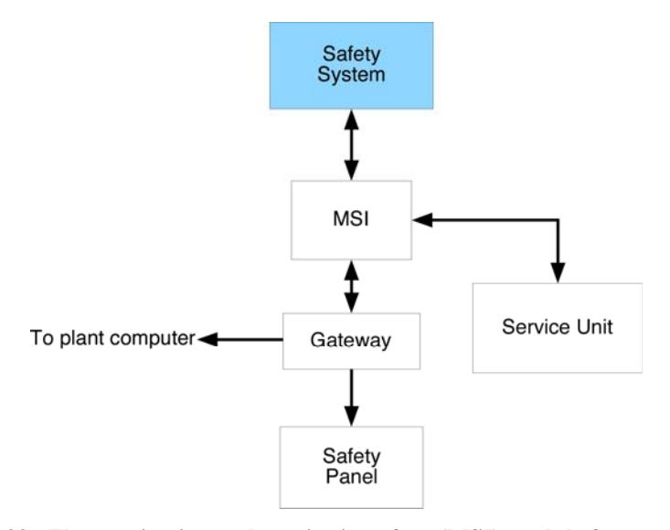

**Figure 29. The monitoring and service interface (MSI) module forms a logical boundary between the rest of the safety system and the nonsafety interfaces.** 

The MSI module is in continuous communication with the safety divisions to receive status and diagnostic information. This information includes continuous checks for sensor deviation (the auto channel check feature). Many precautions are taken to prevent access through the MSI module from affecting the safety function. These precautions include strict access control features and predefined connection/messaging protocols. In addition, the MSI module confirms the identity and bypass status of a safety division to ensure that maintenance access is enabled only for one division at a time and when that division is in bypass. However, once access to a safety division is granted through the MSI module, it is possible to alter the parameters of the safety application's logic blocks. The MSI module also provides a connection to plant computers, but it is a one-way uplink.

# **9.2.1.4 Human-System Interface System**

The HSI system has four interface units: (1) MCR, (2) RSS, (3) local control stations, and (4) TSC.

During normal operating conditions, the plant is supervised and controlled from the MCR. The MCR is equipped with essentially identical operator workstations consisting of PICS-driven screens (i.e.,

\* This is also true for the US-EPR.

† The TELEPERM XS equipment cabinets are located in the control room for Oconee.

VDUs) and soft controls. The MCR also includes the following additional monitoring and control equipment .

- The plant overview panel consisting of several large PICS-driven screens that provide overviews of plant status and main parameters.
- The safety control area with the SICS displays and controls available as backup in case of unavailability of PICS.
- Fire detection and fire fighting controls and site closed circuit TV monitoring screens.

If the MCR becomes inaccessible, the operators can supervise and control the plant from the RSS. The RSS is equipped with the following.

- Manually-actuated switches for disconnecting all the MCR equipment that may generate component actuation of the Level 1 systems and placing the RSS workstations in the control mode. Technical and administrative precautions prevent spurious or unauthorized actuation of this function.
- Two operator workstations consisting of PICS-driven screens (VDUs) and soft controls that are of the same type and provide the same functionality as those in the MCR. The operators can bring the plant to safe shutdown state and monitor plant conditions from these operator workstations.
- Communication equipment for maintaining communications with other plant personnel.

The TSC is used by the technical support team in the event of an accident. The additional staff in the TSC analyzes the plant conditions and supports post-accident management. The TSC is equipped with PICS screens that have access to plant information. No process control function is available in the TSC. Appropriate communications equipment is also provided in the TSC.

# **9.2.1.5 Plant-Specific Systems**

# *Hardwired Backup Systems*

The OL-3 design incorporates an automatic hardwired backup system (HBS). The HBS contains a small subset of the PS functions. They include automatic actions needed to cope with certain design basis events. The HBS uses FPGA technology. The FPGA is not programmable while installed, and it is considered sufficiently diverse from the other major platforms. In addition to the automatic HBS, a manual HBS is also provided.

# *Design Features to Reduce the Probability of Unintended Behaviors and/or Latent Faults in the Safety Systems*

The I&C design features include (1) deterministic processing; (2) asynchronous operation of each computer—extensive self-monitoring; (3) signal validation techniques; (4) voting techniques;

- (5) inherent and engineered fault accommodation techniques; (6) software life cycle, including V&V;
- (7) operating experience with standard library of application software function locks; and
- (8) communication independence measures.

# **9.2.2 Instrumentation and Controls Architecture Platforms**

In the US-EPR, many subsystems within overall I&C systems are implemented with either the TXS or TXP platform, with some exceptions of hardwired implementations. A brief synopsis of the two platforms is presented below.

# **9.2.2.1 TELEPERM XS Platform**

The basic building blocks of the TXS system architecture can be grouped into the following categories.

- 1. *System hardware*: The TXS selected hardware platform uses a processing computer module that includes RAM for the execution of programs, flash EEPROM for storing program code, and EEPROM for storing application program data.
- 2. *System software*: The TXS consists of a set of quality-controlled software components. The execution of the software centers on the operating software system that was developed by Siemens specifically for the TXS system. The operating system communicates with the platform software and application software. The platform software includes the runtime environment program that provides a unified environment for execution of the function diagram modules.
- 3. *Application software*: The application software performs plant-specific TXS safety-related functions using function block modules, which are grouped into function diagram modules. The application software is generated by specification and coding environment tools that use qualified software modules from a function block library to construct a specific application.

The following are important TXS software features.

- Strictly cyclic processing of application software—the system processes data asynchronously (i.e., there is no real-time clock with which redundant processors can synchronize).
- No dynamic memory allocation—each variable in the application program has a permanent dedicated location in memory. This prevents memory conflicts typically caused by dynamic memory allocation.
- No process-driven interrupts.

# **9.2.2.2 TELEPERM XP Platform**

The TXP comprises the following subsystems.

- The AS 620 automation system.
- The OM 650 process control and management system.
- The ES 680 engineering system.
- The CT 675 commissioning tool.
- The DS 670 diagnostic system.
- The SIMATIC NET industrial Ethernet bus system.

The AS 620 carries out tasks of the group and individual control levels. It collects measured values and status from the process, carries out open- and closed-loop control functions, and passes the resulting commands onto the process.

The OM 650 is an HSI system.

The ES 680 is an integral system for the configuration of subsystems. It is used to configure the plantspecific automation, process control, and process information software functions.

The CT 675 performs commissioning and maintenance tasks.

The DS 670 allows detailed system status evaluation and system analysis through informational diagnostics functions. The diagnostics station provides all I&C fault alarms including information on the faulty components.

The SIMATIC NET is a fast LAN industrial Ethernet bus system.

Communication between the I&C system components and the AS 620, OM 650, ES 680 and DS 670 systems is carried out via the plant bus.

# **9.3 ADVANCED PRESSURIZED WATER REACTOR**

APWR is designed and manufactured by MHI. The U.S. version, called US-APWR, is an evolutionary 1,700-MWe PWR. The design uses high-performance steam generators, a neutron reflector around the core to improve fuel efficiency, redundant core cooling systems and refueling water storage inside the containment building, and a fully-digital I&C system.

# **9.3.1 System-Level Instrumentation and Controls Architecture**

The system-level I&C architecture for the APWR is shown in [Figure 30](#page-115-0) and consists of the following four levels:

- 1. protection and safety monitoring system (PSMS),
- 2. plant control and monitoring system (PCMS),
- 3. HSI system, and
- 4. diverse actuation system (DAS).

Each level may contain multiple safety- and non-safety-related subsystems or components.

PSMS provides automatic reactor trip via the reactor protection system (RPS) and ESFAS. The safety logic system (SLS) performs the component-level control logic for safety actuators in all trains based on the ESFAS signals (e.g., motor-operated valves, solenoid-operated valves, and switchgear).

The non-safety-related PCMS provides automatic controls for normal operation. The safety-related PSMS provides automatic reactor trip and ESF actuation. These same safety and nonsafety functions may be manually initiated and monitored by operators using the HSI system, which includes both safety-related and non-safety-related sections. The HSI system is also used to manually initiate other safety and nonsafety functions that do not require time-critical actuation, including safety functions credited for safe shutdown of the reactor. After manual initiation from the HSI system, all safety functions are executed by the PSMS, and all nonsafety functions are executed by the PCMS. The HSI system also provides all plant information to operators, including critical parameters required for post-accident conditions.

The PSMS and the PCMS use the Mitsubishi Electric Total Advanced Controller (MELTAC) digital platform.[\\*](#page-114-2)

The DAS is classified as a nonsafety system that provides monitoring of key safety parameters and backup automatic and manual actuation of the safety and nonsafety components required to mitigate anticipated operational occurrences and accidents. The DAS consists of hardwired analog components. Thus, a postulated CCF in the software in the digital protection or control systems (i.e., PSMS and PCMS) will not impair the DAS function.

\* The MELTAC platform is applied to the protection and safety monitoring system, which includes the reactor protection system, engineered safety features actuation system, safety logic system, and safety-grade human-system interface. In addition, the MELTAC platform is applied to non-safety systems such as the plant control and monitoring system. The MELTAC equipment applied for non-safety applications is the same design as the equipment for safety applications. However, there are differences in quality assurance methods for software design and other software life-cycle processes.

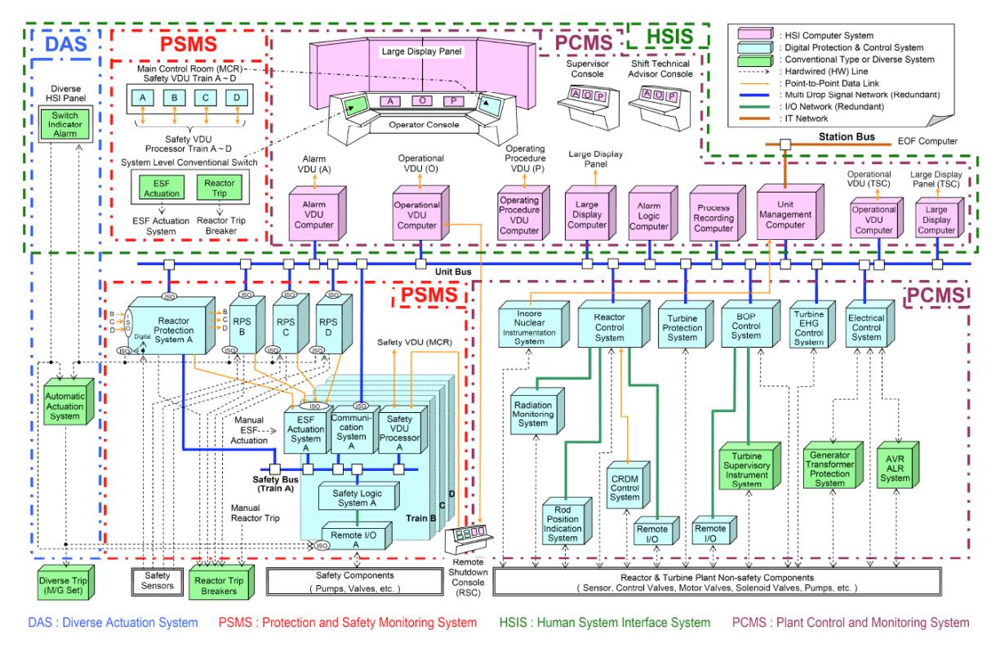

**Figure 30. Overall architecture of the Advanced Pressurized-Water Reactor instrumentation and controls system[.145](#page-115-1)**

A brief description of these systems is provided below. Detailed descriptions can be found in references [142–](#page-141-6)1 1[145.](#page-136-4)

# **9.3.1.1 Safety-Related Systems**

Safety-related I&C systems on US-APWR are implemented on a fully-digital MELTAC platform. Safety-related I&C systems are

- RPS,
- ESFAS,
- SLS,
- safety-grade HSI system, and
- conventional switches (train-level manual actuation).

All safety-related systems are four-train redundant. A brief description of each system is given below. The HSI system will be described in a dedicated subsection.

# *Reactor Protection System*

Each train performs two-out-of-four voting logic for like sensor coincidence to actuate trip signals to the four trains of the reactor trip breakers and actuate ESF signals to the four trains of the ESFAS. The RPS consists of four redundant trains, with each train located in a separate I&C equipment room. The logic functions within the RPS are limited to bi-stable calculations and voting for reactor trip and ESF actuation. Each train also includes a hardwired manual switch on the operator console to directly actuate the reactor trip breakers. This switch bypasses the RPS digital controller.

The system includes failed equipment bypass functions and microprocessor self-diagnostics, including data communications and features to allow manual periodic testing of functions that are not automatically tested by the self-diagnostics, such as actuation of reactor trip breakers. Manual periodic tests can be conducted with the plant online and without jeopardy of spurious trips due to single failures during testing.

# *Engineered Safety Features Actuation System*

For the US-APWR, there are four ESFAS trains. Each ESFAS train receives the output of the ESF actuation signals from all four trains of the RPS.

The system-level ESF actuation signal from each of the four RPS trains is transmitted over isolated data links to an ESFAS controller in each of the ESFAS trains. Whether automatically or manually initiated, train-level ESF actuation signals are transmitted from both subsystems of the ESFAS controller to the corresponding train of the SLS.

Each ESFAS controller consists of a duplex architecture using dual CPUs. Two-out-of-four voting logic for like system-level coincidence is performed twice within each train through the redundant subsystems within each ESFAS controller to automatically actuate train-level ESF actuation signals for its respective train of the SLS. Each subsystem generates a train-level ESF actuation signal if the required coincidence of system-level ESFAS actuation signals exists at its input and the correct combination of system-level actuation signals exists to satisfy logic sensitive to specific accident situations.

The ESF system is a fully microprocessor-based system, and each microprocessor performs self-diagnostics, including data communications. The system also includes features to allow manual periodic testing of functions that are not automatically tested by self-diagnostics, such as manual system-level actuation inputs. Manual periodic tests can be conducted with the plant online and without jeopardy of spurious system-level actuation due to single failures during testing.

# *Safety Logic System*

The SLS is a microprocessor-based system that has redundancy within each train and microprocessor self-diagnostics, including data communications. The system also includes features to allow periodic testing of functions that are not automatically tested by the self-diagnostics, such as final actuation of safety components. The SLS is designed to perform the component-level control logic for safety actuators in all trains based on ESF actuation signals (e.g., motor-operated valves, solenoid-operated valves, and switchgear). Manual periodic tests can be conducted with the plant online and without jeopardy of spurious system-level actuation due to single failures during testing.

The SLS has one train for each plant process train. Each train of the SLS receives ESF system-level actuation demand signals and LOOP load-sequencing signals from its respective train of the ESF actuation system. The SLS also receives manual component-level control signals from the operator console and remote shutdown console (safety VDUs and operational VDUs) and manual component-level control signals from the hardwired backup switches on the diverse HSI panel. It also receives process signals from the RPS for interlocks and controls of plant process systems. This system performs the component-level control logic for safety actuators (e.g., motor-operated valves, solenoid-operated valves, and switchgear).

The SLS controllers for each train are located in separate I&C equipment rooms. The system has conventional I/O portions and I/O portions with priority logic to accommodate signals from the DAS.

# **9.3.1.2 Non-Safety-Related Systems**

# *Plant Control and Monitoring System*

The PCMS encompasses all non-safety-related I&C systems in the plant with the exception of special purpose controllers (e.g., alternate generator engine controls). The PCMS interfaces with these other non-safety-related systems and components so there is only one fully integrated HSI system in the MCR.

One of the major systems within the PCMS is the reactor control system. The reactor control system receives nonsafety field sensor signals. This system also receives status signals from plant process components and manual operation signals from the operator console to control and monitor the NSSS process components. This system controls continuous control components such as air-operated valves and discrete state components such as motor-operated valves, solenoid-operated valves, pumps, etc.

The PCMS is a microprocessor-based system that is intended to achieve high reliability through segmentation of process system groups (e.g., pressurizer pressure control, feedwater control, rod control); redundancy within each segment; and microprocessor self-diagnostics, including data communications.

# *Diverse Actuation System*

The DAS is implemented as a redundant analog system. The DAS shares sensor inputs with the PSMS through analog interfaces that are not subject to the postulated CCF in the PSMS. Interfaces to safety process inputs and the SLS outputs are isolated within the safety systems through qualified conventional isolators.

# **9.3.1.3 Communication Systems**

The data communication system (DCS) consists of the plant-wide unit bus, safety bus for each PSMS train, maintenance network for each PSMS train, and the PCMS (five maintenance networks total). The DCS also contains data links for point-to-point communication and an I/O bus for each controller. This includes information and controls for the MCR, RSR and TSC (only monitoring). The DCS interfaces with the station bus, which is an information technology network (i.e., not I&C). The station bus provides information to plant personnel and to the emergency operations facility (EOF). The major components of the DCS within the overall I&C architecture can be seen in [Figure 30,](#page-115-0) and the DCS interfaces to the HSI system and the unit bus are shown in [Figure 31](#page-118-0).

Although the DCS is a distributed and highly interconnected system, there is communication independence to prevent electrical and communication processing faults in one division (safety or nonsafety) from adversely affecting the performance of safety functions in other divisions. To prevent electrical faults from transferring between divisions and between different plant fire areas for the MCR, RSR, and I&C rooms, qualified fiber-optic isolators are used. Communication faults are prevented through data integrity verification.

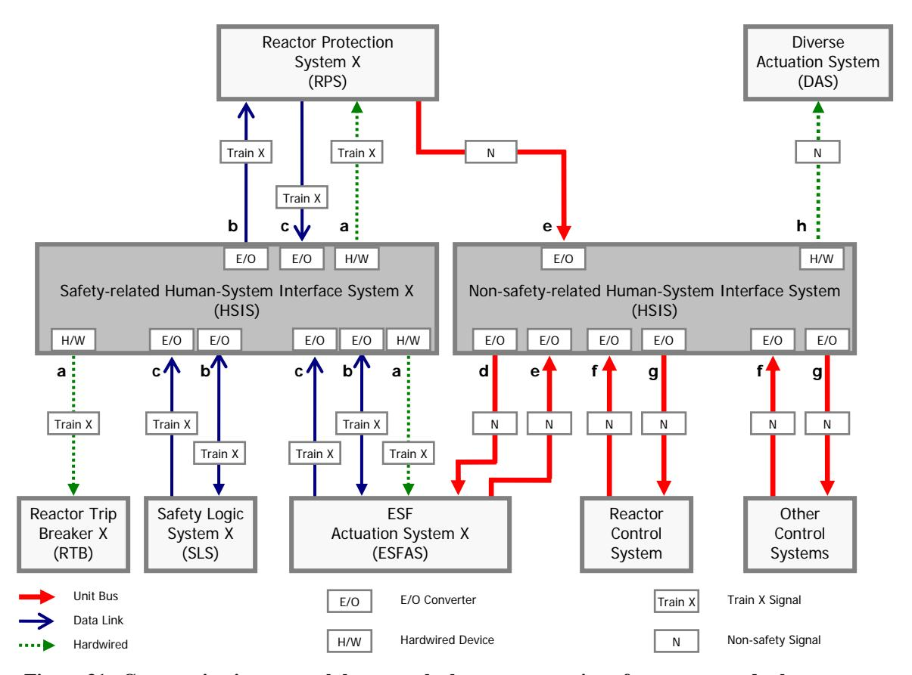

Figure 31. Communication network between the human-system interface system and other systems.

US-APWR uses asynchronous communications (i.e., controller performs no communication "handshaking" that could disrupt deterministic logic processing). Deterministic communication is ensured by using predefined data size and structure. Communication channels are independent (i.e., electrical or communication faults in one electrical division cannot adversely affect performance of the safety function in other divisions).

Hardwired interlocks in the controller or safety VDU processor ensure changes to software cannot be made through the data communication interface while the controller or safety VDU processor is operating.

#### Mode of Sensor Signal Transmission and Shared Sensor Implementation

Redundant divisions of the RPS are physically and electrically isolated from the nonsafety control systems. Where safety sensors are shared between control and protection systems, signal selection logic in the control system prevents erroneous control actions from single sensor failures. Eliminating these erroneous control actions prevents challenges to the RPS if it is degraded because of the same sensor failure. Where nonsafety signals control safety systems or components, logic in the safety systems ensures prioritization of safety functions.

For each design basis accident addressed in the plant safety analysis, two diverse parameters are used to detect the event and initiate the protective actions. These diverse parameters are processed in two separate controller groups within each train of the RPS.

The two diverse parameters are monitored by two separate sensors that interface to two separate digital controllers within the RPS. Each of the two controllers processes these inputs to generate reactor trip and/or ESF actuation signals. This two-fold diversity is duplicated in each redundant RPS train. The processing of diverse parameters results in functional redundancy within each RPS train. This functional redundancy helps minimize potential CCFs.

# *Safety System Interfaces*

To ensure there is no potential for the nonsafety system to adversely affect any safety functions, the interface between the nonsafety operational VDUs in the PCMS and the PSMS is isolated as described below.

- Electrical independence: Fiber optic interfaces between the PSMS and PCMS prevent propagation of electrical faults between divisions.
- Data processing independence: The PSMS uses communication processors for the PCMS that are separate from the processors that perform safety logic functions. The safety processors and communication processors communicate via dual ported memory. This ensures there is no potential for communications functions, such as handshaking, to disrupt deterministic safety function processing.
- No ability to transfer unpredicted data: There is no file transfer capability in the PSMS. Only predefined communication data sets are used between the PSMS and PCMS. Therefore any unknown data are rejected by the PSMS.
- No ability to alter safety software: The software in the PSMS cannot be changed through the nonsafety communication network. The PSMS software is changeable only through the maintenance network, which is key locked and alarmed.
- Additional protection against cyber threats: The PCMS and PSMS will be controlled under the most stringent administrative controls for cyber security. There is only one-way communication to other systems that are not under these same controls.
- Acceptable safety function performance: Manual controls from the safety VDU can have priority over any nonsafety controls from the PCMS.
- Failures of Nonsafety Systems Are Bounded by the Safety Analysis: Any plant condition created by the worst-case erroneous/spurious nonsafety data set (e.g., nonsafety failure commanding spurious opening of a safety relief valve) is bounded by the plant safety analysis.

The operational VDUs and associated processors are not Class 1E; however, they are tested to the same seismic levels as the PSMS. During testing, the operational VDUs and associated processors have demonstrated ability to maintain physical integrity and all functionality during and after an operating basis earthquake and a safe shutdown earthquake.

# **9.3.1.4 Human-System Interface Systems**

The complete HSI system includes portions of the safety-related PSMS and the non-safety-related PCMS and the non-safety-related DAS. The major components of the HSI system include the operator, shift technical advisor, and supervisor consoles; large display panel and adverse HSI panel; and various VDU processors. Plant information and controls (i.e., for all safety and nonsafety divisions) are displayed and accessed on the nonsafety operational VDU screens of the operator

console. All operations from the operator console are available using touch screens or other pointing devices on the nonsafety operational VDUs. Safety VDUs on the operator console provide access to safety information and controls using touch screens. One or more safety VDUs has been allocated for each safety train.

# *Safety-Grade Human-System Interface System*

The safety-grade HSI system consists of conventional hardwired switches for manual actuation of reactor trip and ESF actuation signals, and safety VDUs and processors, which provide post-accident monitoring indications and manual controls and status indications for all components in safety-related process systems.

Each train of the safety-grade HSI system interfaces with the corresponding trains of all other systems within the PSMS. There are safety-grade HSI components for each train located on the operator console and the remote shutdown console. The safety VDUs and switches for each train are isolated from each other. The safety VDUs and switches at the operator console and the remote shutdown console are also isolated from each other and from the controllers in the PSMS to ensure that HSI failures that may result from a fire in one location cannot adversely affect the HSI in the alternate location.

# **9.3.1.5 Plant-Specific Systems**

# *I&C Design Features to Reduce the Probability of Unintended Behaviors and/or Latent Faults in Safety Systems*

This equipment includes automated testing with a high degree of coverage and additional overlapping manual test features for the areas that are not covered by automated tests. Most manual tests may be conducted with the plant online and with the equipment bypassed or out of service. Equipment that cannot be tested with the plant online can be tested with the plant shutdown. Depending on the system design for a specific plant, the equipment is configured with N or N+1 redundancy, where N is the number of divisions needed for single failure compliance. For systems with N+1 redundancy, the single failure criterion is met with one division bypassed or out of service. The redundancy configuration for each plant system is described in other digital system licensing documentation.

# **9.3.2 Instrumentation and Controls Architecture Platforms**

# **9.3.2.1 Mitsubishi Electric Total Advanced Controller Platform (MELTAC)**

The MELTAC platform is based on using qualified building blocks that can be used for all safety system applications. The building blocks are the following items.

- Controller
- Safety VDU panel
- Safety VDU processor
- Control network
- Data link
- Engineering tool
- Maintenance network

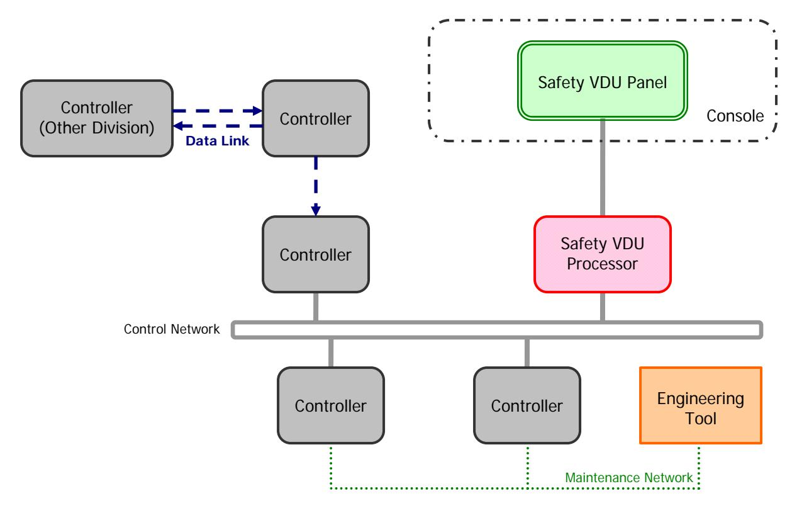

Figure 32. Typical configuration of the Mitsubishi Electric Total Advanced Controller platform.

#### System Hardware

The controller for the MELTAC platform consists of one CPU chassis including one or two subsystems, one switch panel, and one fan unit. Each subsystem consists of a power supply module, CPU modules, control network I/F module, system management module, and two bus master modules. Each subsystem communicates with the control network via its own optical switch. The controller for the MELTAC platform also consists of multiple I/O chassis each with multiple I/O modules.

The CPU module uses a 32-bit microprocessor with enhanced speed due to the high-speed SRAM and cache. This processor module is IEEE standard Futurebus+ compliant and performs internal operations and data transmission with modules such as the bus master module and control network interface module via Futurebus+.

This module uses ultraviolet-erasable PROM for storing the basic software and flash EEPROM for storing the application software such as logic symbol interconnections, set points, and constants.

#### System Software

To achieve deterministic processing, the basic software of the MELTAC platform adheres to the following design principles:

- There is only single task processing.
- Interrupts are not used for any processing other than error processing.

# *Application Software*

Application software for functional algorithms is designed by combining simple graphical logic symbols such as AND, OR, and NOT. The application software graphical block diagram is automatically converted into execution data that are executed directly by the operation process of the basic software. The operation process of the basic software executes the functional symbol software sequentially according to the execution data. Application software execution data are stored in the flash EEPROM of the CPU module.

The MELTAC platform is capable of taking three different kinds of configuration.

- Single Controller Configuration: The controller includes one subsystem. The subsystem operates in control mode (Control mode means the subsystem controls the outputs to plant components.).
- Redundant Parallel Controller Configuration: The controller includes two subsystems, each of which operates in control mode.
- Redundant Standby Controller Configuration: The controller includes two subsystems. One subsystem operates in control mode while the other subsystem operates in standby mode. (Standby mode means the subsystem is closely monitoring the operation of the subsystem in control mode, including memory states. If that subsystem fails, the subsystem operating in standby mode will automatically switch to control mode with no bump in the control outputs.)

Any of the three configurations may be applied to safety systems; the configuration is determined based on the application system requirements.

# **9.4 ECONOMIC SIMPLIFIED BOILING WATER REACTOR**

Designed by GEH Nuclear Energy, the ESBWR is a 1,500 MWe natural circulation BWR that incorporates passive safety features. The design is based on its predecessor, the 670 MWe Simplified Boiling Water Reactor, and uses certain features of the certified ABWR. Natural circulation is enhanced by using a taller vessel and a shorter core and by reducing the flow restrictions. Highpressure water level control and decay heat removal during isolated conditions are accomplished by a unique design feature called isolation condenser system (ICS). After the automatic depressurization system starts, a gravity-driven cooling system (GDCS) provides low-pressure water level control. Containment cooling is provided by a passive system.

More information on the ESBWR can be found in references [146–](#page-141-7)1 1[149.](#page-136-8)

# **9.4.1 System-Level Instrumentation and Controls Architecture**

The I&C system for the ESBWR is a distributed control and information system (DCIS). The ESBWR DCIS is an arrangement of I&C networked components and individual systems that provide processing and logic capability, remote and local data acquisition, gateways/datalinks between systems and components, operator monitoring and control interfaces, firewalls to external computer systems and networks, alarming and archiving functions, and communications between the systems.

The DCIS is subdivided into the safety-related DCIS (Q-DCIS) and the non-safety-related DCIS (N-DCIS). The Q-DCIS uses three diverse platforms: NUMAC (Nuclear Measurement Analysis and Control) for the reactor trip and isolation functions (RTIFs), TRICON for SSLC/ESF functions, and independent logic controllers for the ATWS/SLC and vacuum breaker (VB) isolation function. The N-DCIS includes the diverse protection system (DPS), the nuclear control systems, the plant

investment protection (PIP) systems, the plant computer and workstations, and the severe accident mitigation system (Deluge system). The safety category, the system families, the system architecture, and the subsystems in that family are summarized in [Table 6.](#page-123-0)

**Table 6. Economic Simplified Boiling Water Reactor hardware/software diversity architecture** 

| Safety category | Safety-related DCIS (Q-DCIS) |            | Non-safety-related DCIS (N-DCIS)             |                          |              |
|-----------------|---------------------------------|------------|-------------------------------------------------|--------------------------|--------------|
| System families | RPS/NMS SSLC/ESF DPS      |            | Nuclear Control Systems, BOP DCIS Systems | Plant computer           |              |
| Architecture    |                                 | Divisional |                                                 | Triple modular redundant | Work-station |
|                 | NUMAC                           | Triconex   |                                                 | GE-Mark VIe              |              |

SSLC: Safety System Logic and Control ESF: Engineered Safety Features DCIS: Distributed Control and Information System DPS: Diverse Protection System

BOP: Balance of Plant

RPS: Reactor Protection System NMS: Neutron Monitoring System

# **9.4.1.1 Safety-Related Systems**

# *Reactor Trip System*

The reactor trip system (RTS) [\(Figure](#page-125-0) 33) is a four-division, separate- and redundant-protection logic-system framework that results in automatic trip and isolation functions. The multidivisional trip system includes divisionally separate panels that house the equipment for controlling the various safety-related functions and the actuation devices. The RTIF subsystem includes the logics of the RPS for reactor scram and the isolation logics for the main steam line isolation valves (MSIVs). The neutron monitoring system (NMS) subsystem includes the logics of the SRNM and PRNM functions of the NMS.

One of the major subsystems, or functions, of the RTS is the RPS. The ESBWR RPS is designed to provide the capability to automatically or manually initiate a reactor scram while maintaining protection against unnecessary scrams resulting from single failures. The RPS logic will not result in a reactor trip when one entire division of channel sensors is bypassed and/or when one of the four automatic RPS trip logic systems is out-of-service (with any three of the four divisions of safety-related power available). This is accomplished through the combination of fail-safe equipment design, the redundant sensor channel trip decision logic, and the redundant two-out-of-four trip systems output scram logic.

The RPS is classified as a safety-related system. The RPS electrical equipment is classified as Seismic Category I and will be environmentally and seismically qualified. The RPS initiates reactor trip signals within individual sensor channels. Reactor scram results if system logic is satisfied.

# *Engineered Safety Features Actuation Systems*

The general arrangement of the ESBWR ESF/ECCS also consists of four divisions of redundant logic; each division has a main chassis located in the CR area, dedicated Q-DCIS rooms, and remote chassis [in the reactor and control buildings (RB and CB)]. All remote chassis connections are through redundant fiber as are the connections to the MCR displays and (one way) connections to the N-DCIS. All chassis are redundantly powered by both R13 (uninterruptible) and R14 (regulated but interruptible) power, and all four divisions can be powered by either diesel generator through the isolation load centers.

Per division, a two-out-of-three (2/3) logic is used to determine whether an ECCS actuation condition exists, and then two of four divisions must agree before all four divisions are signaled to operate the final actuators. The squib and solenoid actuators are designed such that any one of the four divisions (after the 2/3 logic and 2/4 logic) can operate the actuator; however, the actuator cannot be operated from a single failure within the division.

Each of the four independent and separated Q-DCIS channels feeds separate and independent trains of SSLC/ESF equipment in the same division. The SSLC/ESF resides in four independent and separated instrumentation divisions. The SSLC/ESF integrates the control logic of the safety-related systems in each division into firmware or microprocessor-based, software-controlled, processing modules located in divisional cabinets in the safety equipment room of the CB. Most SSLC/ESF input data are process variables multiplexed via the Q-DCIS in four physically and electrically isolated redundant instrumentation divisions. These input data are processed within the remote multiplexing unit (RMU) function of the Q-DCIS. The sensor data are then transmitted through the DCIS network to the SSLC/ESF digital trip module (DTM) function for setpoint comparison.

At the division level, the four redundant divisions provide a fault-tolerant architecture that allows single division of sensor bypass for online maintenance, testing, and repair, with the intent of not losing trip capability. In bypass condition, that is when a division of sensor inputs are bypassed, the system automatically defaults to two-out-of-three coincident voting. A trip signal, if necessary, is generated from the DTM following setpoint comparison.

Processed trip signals from its own division and trip signals from the other three divisions are transmitted through communication interface and are processed in the voter logic unit (VLU) function for two-out-of-four voting. The final trip signal is then transmitted to the RMU function via the Q-DCIS network to initiate mechanical actuation devices. There are two independent and redundant VLU functional trains (three for the DPV actuation logic) in each division of the SSLC/ESF equipment. The vote logic trip signals from each VLU functional train are transmitted to the RMU, where a two-out-of-two (or three-out-of-three) confirmation is performed. The redundant trains within a division are necessary to prevent single failures within a division from causing a squib initiator to fire; as a result, each VLU logic train is required to operate to get an output. Self-tests within the SSLC/ESF determine whether any one VLU function has failed, and the failure is alarmed in the MCR. To prevent a single I&C failure causing inadvertent actuations, a failed VLU function cannot be bypassed for any of the ECCS logic for squib valves initiation. Trip signals are hardwired from the RMU to the equipment actuator.

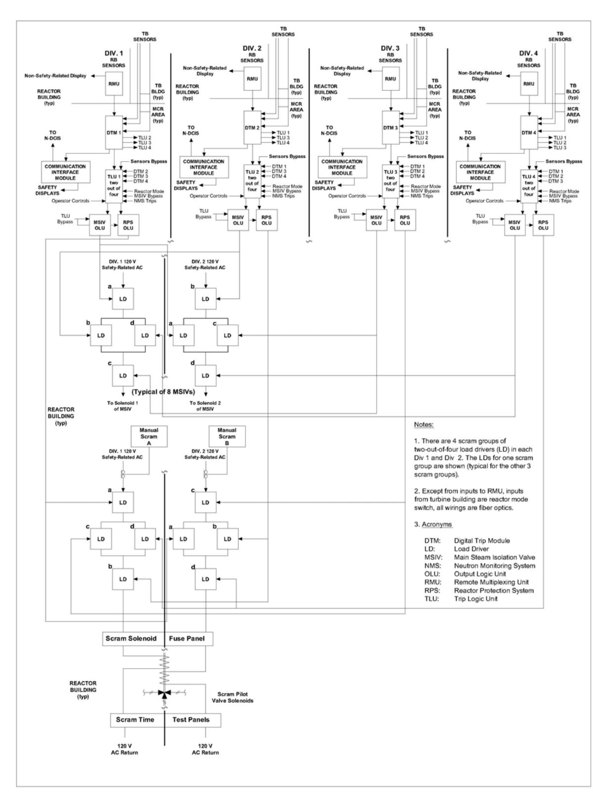

**Figure 33. Reactor protection system functional block (Ref. [15](#page-141-8)0).**

# **9.4.1.2 Non-Safety-Related Systems**

The N-DCIS comprises the non-safety-related portion of the DCIS. The N-DCIS components are redundant when they are needed to support power generation and are segmented into systems. Segmentation allows, but does not require, the systems to operate independently of each other. The N-DCIS uses hardware and software platforms that are diverse from the Q-DCIS. The N-DCIS is a network that is dual redundant and at least redundantly powered, so no single failure of an active component can affect power generation. The failure is alarmed and can be repaired online. If both switches of a segment simultaneously fail, that particular segment is lost. However, the remaining segments are unaffected and individual nodes connected to the failed switches may continue to function. The remaining switches then automatically reconfigure their uplink ports such that the remaining segments automatically find data paths between themselves.

The individual N-DCIS segments are (1) GEH network, (2) PIP A and B networks, (3) balance of plant (BOP) network, and (4) plant computer network. Each network switch can have up to several hundred nodes and several uplink ports that are connected to the other switches. All connections to the switches are through fiber optic cable network that meets IEEE Std. 383 standard.[151](#page-141-9)

# **9.4.1.3 Communication Systems**

The NUMAC equipment interfaces with both safety-related and non-safety-related equipment. For example, NMS and RTIF signals are sent to the safety-related and non-safety-related displays providing system operating status as well as trip conditions. It also sends data to the sequence of events and transient recording analysis functions.

# *Reactor Trip and Isolation Function Communication Interfaces*

A replicated memory network is a shared memory interface that allows each node on the network to read and write from the same virtual memory space. A single replicated memory network interface module installed in a NUMAC instrument represents a single network node. Data are exchanged between the NUMAC microprocessor and the replicated memory network interface module over the NUMAC data bus via a dual port RAM interface on the replicated memory network interface module. Each replicated memory network interface module is assigned a unique base address such that memory read/write operations are restricted to a single network node. A replicated memory network comprises multiple network nodes connected via fiber optic cable ring architecture.

Dual counter-rotating network rings provide a redundant network architecture that is extremely fault tolerant. Two network nodes in each instrument, a primary and a secondary, are required to implement the dual counter-rotating replicated memory network architecture. Multiple dual counter-rotating replicated memory networks are used in the RTIF system to maintain separation between safety-related and non-safety-related functions.

The RTIF safety-related divisional ring network is a dual counter-rotating replicated memory network that connects the RMU, DTM, trip logic unit (TLU), and safety-related communication interface module (Q-CIM) instruments within a single RTIF division. This network provides the data highway for safety-related data to be shared between the RTIF instruments in the division and to make these data available to external safety-related systems via the Q-CIM instrument. The Q-CIM is the interface between the safety-related divisional ring network and the Q-DCIS network.

The RTIF non-safety-related divisional ring network is a dual counter-rotating replicated memory network that connects the safety-related RMU, DTM, TLU, and Q-CIM instruments to the non-safety-related LDU located in the RMU panel in the RB, the non-safety-related LDU located in the RTIF panel in the CB, a non-safety-related VDU located in the MCR, and the two RTIF N-CIM (non-safety-related CIM) instruments located in a separate nondivisional non-safety-related panel.

This network provides the data highway for data from the RTIF instruments to be displayed locally on the LDU and in the MCR on the VDU and to make these data available to external non-safetyrelated systems via the N-CIM instruments. The N-CIM is the interface between the non-safetyrelated divisional ring network and the N-DCIS network.

# *Neutron Monitoring System Communication Interfaces*

A replicated memory network is a shared memory interface that allows each node on the network to read and write from the same virtual memory space. A single replicated memory network interface module installed in a NUMAC instrument represents a single network node. Data are exchanged between the NUMAC microprocessor and the replicated memory network interface module over the NUMAC data bus via a dual port RAM interface on the replicated memory network interface module. Each replicated memory network interface module is assigned a unique base address such that memory read/write operations are restricted to a single network node. A replicated memory network comprises multiple network nodes connected via fiber optic cable ring architecture.

Dual counter-rotating network rings provide a redundant network architecture that is extremely fault tolerant. Two network nodes in each instrument, a primary and a secondary, are required to implement the dual counter-rotating replicated memory network architecture. Multiple dual counter-rotating replicated memory networks are used in the NMS to maintain separation between safety-related and non-safety-related functions.

The NMS safety-related divisional ring network is a dual counter-rotating replicated memory network that connects the SRNM RMU, PRNM RMU, DTM, TLU, and Q-CIM instruments within a single NMS division. This network provides the data highway for safety-related data to be shared between the NMS instruments in the division and to make these data available to external safety-related systems via the Q-CIM instrument. The Q-CIM is the interface between the safety-related divisional ring network and the Q-DCIS network.

The NMS non-safety-related divisional ring network is a dual counter-rotating replicated memory network that connects the safety-related SRNM RMU, PRNM RMU, DTM, TLU, and Q-CIM instruments to the non-safety-related LDU located in the RMU panel in the RB, the non-safety-related LDU located in the NMS panel in the CB, a non-safety-related VDU located in the MCR, and to the two NMS N-CIM instruments located in a separate nondivisional non-safety-related panel. This network provides the data highway for data from the NMS instruments to be displayed locally on an LDU and in the MCR on a VDU and to make these data available to external non-safety-related systems via the N-CIM instruments. The N-CIM is the interface between the non-safety-related divisional ring network and the N-DCIS network.

# *Triconex Communication Interfaces*

The communications modules of the Triconex PLC system have three separate communication buses which are controlled by three separate communication processors, one connected to each of the three main processors. All three bus interfaces merge into a single microprocessor on each communications module, so the modules lose their triple redundancy feature at this point. The microprocessor on each communications module votes on the messages from the three main processors and transfers only one of them to an attached device or external system. If two-way communication is enabled, messages received from the attached device are triplicated and transmitted to the three main processors.

The communication paths to external systems have CRC, handshaking, and other protocol-based features, depending on which devices are attached to the communication modules and how the communication modules are programmed. These features are supported in both hardware and firmware.

By means of these communications modules, the Triconex PLC system can interface with Modbus masters and slaves, other Triconex PLC systems in peer-to-peer networks, external hosts running applications over IEEE 802.3 networks, and Honeywell and Foxboro distributed control systems. For data sent out to other systems, the main processors broadcast data to the communications modules across the communication bus. Data are typically refreshed during every scan and are never more than two scan-times old.

All communication between Q- and N-DCIS is through fiber optics and one way [the only exception is Average Power Range Monitor/Low Power Range Monitor (APRM/LPRM) calibration, which can only be done by making the affected instrument inoperable]. All communication between divisions (to perform 2/4 logic) is also fiber isolated and one way in the sense that no division is dependent on any other division for information, timing, data, or the communication itself.

Almost all communication to/from the field RMUs and almost all communication from the DCIS rooms to the CR safety-related and non-safety-related displays are via fiber optics. The few hardwired exceptions are for signals like main turbine trip or reactor SCRAM. These CR considerations are important because the communications protocol is such that a melting or otherwise compromised fiber will not cause erroneous operation nor affect the continued operation of all automatic safetyrelated or nonsafety systems. This is also supported by the fact that touch screen operation of the VDUs deliberately requires several operator actions whose resulting communication is unlikely to be replicated by communications loss or damage; similarly the DCIS represents a distributed network whose nodal addresses are equally unlikely to be replicated by fiber loss.

All communication with N-DCIS is one-way (Q-DCIS to N-DCIS) through fiber optics. The loss of this communication reportedly will not affect RPS functionality. All communication with other RPS divisions is one way, fiber isolated, and does not mix divisional data.

# *Mode of Sensor Signal Transmission and Shared Sensor Implementation*

[Figure 34](#page-129-0) indicates power and sensor relationships between the various diverse instrumentation and control systems.

# *Instrumentation and Controls Design Features to Reduce the Probability of Unintended Behaviors and/or Latent Faults in the Safety Systems*

Both the RPS and ECCS DCIS systems use different hardware and software than the N-DCIS systems, specifically including the DPS, which represents a completely diverse backup design to most protection functions in the Q-DCIS. The severe accident deluge system is also diverse from both Q-DCIS and N-DCIS.

The diverse protection system is a triply redundant, non-safety-related, diverse (from RPS/ECCS) system that provides an alternate means of initiating reactor trip and actuating selected engineered safety-related features and providing plant information to the operator; the relationship is shown in [Figure 34](#page-129-0). The DPS receives signals directly from sensors diverse from the safety-related reactor protection and ECCS. Specifically the DPS uses hardware, software, and power that are different from the safety-related systems.

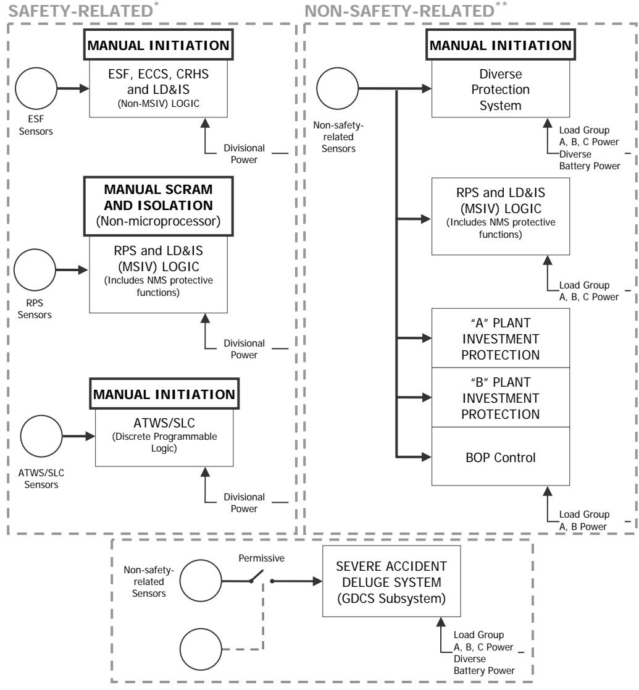

- \* For safety-related systems, each box represents a different platform
- \*\* For non-safety-related systems, segmented systems are networked but can work independently.

**Figure 34. Economic Simplified Boiling Water Reactor sensors and power diversity (Ref. [150\)](#page-125-0).** 

Using sensors diverse from those used by the RPS, the DPS causes a SCRAM by interrupting the current in the 120 VAC return power from the HCU solenoids using the same switches used to perform individual control rod SCRAM timing. The 2/3 SCRAM decision of the triply redundant processors is sent via three isolated fiber optics to the SCRAM timing panel where they are 2/3 voted to open all the solenoid return power switches. The operator will also have the ability to initiate a manual DPS SCRAM from either hard switches or the DPS touch screen display.

The 2/4 sensor logic and 2/3 processing logic is similar to the SCRAM logic, and the operator will also have the ability to initiate the above actions from the DPS touch screen display. The ECCS subsystems that use four divisional solenoids to initiate flow (SRVs and ICs) will have a fifth non-safety-related solenoid to also cause initiation from the DPS (after a 2/3 vote).

# **9.4.1.4 Human-System Interface Systems**

Information provided in this section is a summary from Reference [15](#page-141-10)2.

# *Safety-Related Human-System Interface*

The operator interfaces with the safety-related systems through a variety of methods. Dedicated controls are used for system initiation and logic reset, while system mode changes are made with other controls. Safety-related VDUs provide capability for individual safety equipment control, status display, and monitoring. The large fixed-position display provides plant overview information.

The RSS provides a means to safely shut down the plant from outside the MCR. It provides control of the plant systems needed to bring the plant to hot shutdown with the subsequent capability to attain safe shutdown in the event that the CR becomes uninhabitable.

Alarm signals provided by the safety system logic and control (SSLC) are directed to the respective safety-related alarm processors and provide display information to the divisionally dedicated VDUs. The SSLC microprocessors communicate with the respective divisional VDU controllers through the Q-DCIS. The divisional VDUs have on-screen control capability and are classified as safety-related equipment. These VDUs provide control and display capabilities for individual safety-related systems.

Divisional isolation devices are provided between the safety-related systems and non-safety-related communication networks so that failures in the non-safety-related equipment do not affect the ability of safety-related systems to perform their design functions. The non-safety-related communication network is part of the N-DCIS. Safety-related system process parameters, alarms, and system status information from the SSLC are communicated to the N-DCIS through isolation devices for use by other equipment connected to the communication network. Spatially and functionally dedicated controls, which are safety related, qualified, and divisionally separated, are available in the CR for selected operator control functions. These controls communicate with the safety-related system logic units.

# *Non-Safety-Related Human-System Interface*

Operational control of non-safety-related systems is accomplished through the use of non-safety-related on-screen control VDUs. Non-safety-related data are processed through the N-DCIS, which provides redundant and distributed instrumentation and control data communications networks. Thus, monitoring and control of interfacing plant systems are supported.

Alarms for entry conditions into the emergency operating procedures are provided by the alarm processing units, both safety-related and non-safety-related. Equipment-level alarm information is presented by the computer system through the N-DCIS on the MCC VDUs. The fixed position wide display panel provides the critical plant operating information such as power, water level, temperature, pressure, flow, and status of major equipment. In addition, a mimic display will indicate the availability of safety systems.

# **9.4.2 Instrumentation and Controls Architecture Platforms**

The I&C architecture is based on (1) the modular digital electronics platform called NUMAC, developed by GE and (2) the Tricon PLC from Triconex.

# **9.4.2.1 Nuclear Measurement Analysis and Control Platform**

The NUMAC system consists of the main processor, chassis, power supplies, functional modules, and software that executes the safety-related logic for the RTS (i.e., RPS, SPTM, SRNM, and PRNM functions) and MSIV portions of the LD&IS. The NUMAC platform is a microprocessor-based system that executes application programs in firmware that is nonvolatile and not changeable by the user during operation. The NUMAC platform provides the digital monitoring and trip functions of the RTS described in Section 7.2 of the "ESBWR Design Control Document."[150](#page-125-0) The RTIF and NMS systems comprise multiple NUMAC chassis that are housed within the RTIF and NMS panels. The term NUMAC may be used to refer to the chassis, modules, and software that comprise the NUMAC system. For example, NUMAC software refers to the software that runs on the NUMAC hardware platform.

# **9.4.2.2 Triconex Platform**

The Tricon PLC system is a fault-tolerant PLC manufactured by Triconex that uses a triple modular redundant (TMR) architecture in which three parallel control paths are integrated into a single overall system. The system is designed to use two-out-of-three voting with the intent of providing uninterrupted process operation with no single point of random hardware failure. A Tricon PLC system consists of 1 main chassis and up to 14 expansion chassis. The main chassis contains (1) two redundant power supply modules, (2) three main processor modules, (3) communications modules, and (4) I/O modules.

[Figure 35](#page-132-0) shows the data flow in the TMR architecture of the Tricon PLC system. When entering the input module, the signals from each attached sensor are separated into three isolated paths and sent to one of the three main processor modules. The TriBus inter-processor bus performs a two-out-of-three vote on data and corrects any discrepancies. This process ensures that each main processor uses the same voted data to execute its application program.

# **9.5 REGULATORY IMPACT OF FULLY DIGITAL INSTRUMENTATION AND CONTROLS ARCHITECTURES IN NUCLEAR POWER PLANTS**

The I&C features for three new reactor designs have been reviewed in this chapter—the U.S. Evolutionary Pressurized Reactor (US-EPR) by AREVA NP; the Advanced Pressurized-Water Reactor (APWR) by Mitsubishi Heavy Industries; and the Economic Simplified Boiling Water Reactor (ESBWR) by GE-Hitachi. The review indicated that these designs use fully digital and networked architectures. Some safety-related modules and subsystems in the plants reviewed include ASICs, FPGAs, or CPLDs. While the current regulatory process does an excellent job of ensuring reliable safety system designs, generic issues whose resolution can enhance the regulatory process for digital systems still remain. These include (1) the need for a complete characterization of failure modes for digital systems; (2) determining how much V&V should be required for systems that are halfway between "simple" (e.g., binary ON, OFF, and/or a small number of combinatorial logic) and "complex" (e.g., microprocessor- and/or software-based (i.e., must V&V be required to the same level as a computer-based system?)); (3) determining how the surveillance function can be protected against a software fault that leads to a common cause failure to detect a failed protection system; and

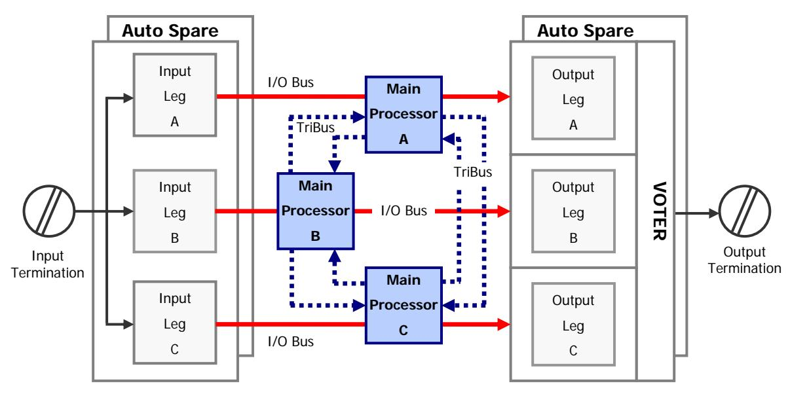

**Figure 35. Triple modular redundant architecture of the Tricon PLC system.** 

(4) determining how much credit should be given to an online diagnostic system, which in itself could be more complex than a simple protection system function.

Other regulatory issues include `the following.

- *The Potential for CCF Due to Identical (Software) Functions in Modules in Redundant Channels or Divisions*. In addition to the traditional CCF triggering mechanisms (environmental stressors and signal transients resulting from a common external source), the sequential transmission of corrupted data (e.g., due to a single failure) in software-based systems as a result of some latent propagation mechanisms also may result in the failure of multiple trains.
- *Functional and Data Independence between Safety and Nonsafety Systems or Between Safety Divisions*. The sequential execution of instructions in digital systems, along with response time requirements, makes it especially important that a safety system should not depend on data from a nonsafety (or another safety) system to perform its safety function.
- *Cyber Security Issues*. It becomes crucial that each subsystem (whether safety or nonsafety) be critically examined to identify any potential for intrusion from any source, external or internal. It is important here to note that the potential for a cyber threat should not only be reviewed from the point of view of how an external source can be prevented from gaining access to the system under consideration. A subsystem can be a plant vulnerability if it has any flaw that could be exploited as part of a cyber attack. The flaw could be a design oversight: malicious online modifications are not required if vulnerability already exists. The broader issue, in this case, is whether or not a design flaw exists in a subsystem that could be exploited via any communication line connected to the subsystem under consideration.
- *Diversity and Defense-in-Depth Issues*. For fully digital systems where the backup system is also digital, the issue of having adequate defense-in-depth becomes significant. Per Branch Technical Position 7-19 (sometimes referred to as BTP 7-19),[153](#page-141-11) a software CCF is a "beyond design basis" event. Thus, adequate coping is judged based on best estimate analysis methods. These include nominal initial plant conditions and concurrent failure assumptions. There should be significant

functional and equipment diversity within the control systems, within the safety systems, and between the control and safety systems, and it should be demonstrated that such diversity considerably limits the probability for CCFs. Finally, defense-in-depth coping analysis should conservatively be based on the assumption that a CCF affects all digital control and protection systems in their entirety and that all the control and safety functions controlled by the primary safety platform are disabled.

# **10. REFERENCES**

- 1. R.T. Wood et. al., "Emerging Technologies in Instrumentation and Controls," NUREG/CR-6812, Nuclear Regulatory Commission, March 2003.
- 2. K. Korsah et. al., "Emerging Technologies in Instrumentation and Controls: An Update," NUREG/CR-6888, Nuclear Regulatory Commission, January 2006.
- 3. NRC Commission Papers (SECY), "NRC Research Plan for Digital Instrumentation and Control", SECY-01-0155, August 15, 2001.
- 4. Interim Staff Guidance DI&C-ISG-04, "Highly-Integrated Control Rooms—Communications Issues (HICRc)", ML072540138, September 28, 2007.
- 5. M. K. Howlader, K. Korsah, and P. D. Ewing, "Technical Basis for Regulatory Guidance on Implementing Wireless Communications in Nuclear Facilities," ORNL/NRC/LTR-07/09.
- 6 The Tokeneer Project: A hands-on look at an NSA funded, highly secure biometric software system, http://www.adacore.com/home/gnatpro/tokeneer/, accessed October 2008.
- 7. J. M. Harper and J. G. Beckerley, Eds., *Nuclear Power Reactor Instrumentation Systems Handbook*, Vol. 1, TIC-25952-P1, U.S. Atomic Energy Commission, 1973.
- 8. K. O. Hill, Y. Fujii, D. C. Johnson, and B. S. Kawasaki, *Photosensitivity in optical fiber waveguides: Application to reflection filter fabrication*, Applied Physics Letters, Vol. 32, No. 10, pp. 647–649, May 1978.
- 9. G. Meltz, W. W. Morey, and W. H. Glenn, *Formation of Bragg gratings in optical fibers by a transverse holographic method*, Optics Letters, Vol. 14, No. 15, pp. 823–825, August 1989.
- 10. A. D. Kersey and T. A. Berkoff, *Fiber-Optic Bragg-Grating Differential-Temperature Sensor,* IEEE Photonics Technology Letters, Vol. 4, No. 10, pp. 1183–1185, October 1992.
- 11. R. S. Fielder, D. Klemer, and K. L. Stinson-Bagby, *High-Temperature Fiber Optic Sensors, an Enabling Technology for Nuclear Reactor Applications*, Proceedings of ICAPP '04, pp. 2295– 305, Pittsburgh, PA, USA, June 13–17, 2004.
- 12. R. S. Fielder, R. G. Duncan, and M .L. Palmer, *Recent Advancements in Harsh Environment Fiber Optic Sensors: An Enabling Technology for Space Nuclear Power*, Proceedings of the Space Nuclear Conference 2005, pp. 476–484, San Diego, California, June 5–9, 2005.
- 13. A. F. Fernandez, A. I. Gusarov, B. Brichard, S. Bodart, K. Lammens, F. Berghmans, M. Decréton, P. Mégret, M. Blondel, and A. Delchambre, *Temperature Monitoring Of Nuclear Reactor Cores With Multiplexed Fiber Bragg Grating Sensors*, Optical Engineering, Vol. 41, No. 6, pp. 1246–54, June 2002.
- 14. A. I. Gusarov, F. Berghmans, O. Deparis, A. F. Fernandez, Y. Defosse, P. Mégret, M. Décreton, and M. Blondel, *High Total Dose Radiation Effects on Temperature Sensing Fiber Bragg Gratings*, IEEE Photonics Technology Letters, Vol. 11, No. 9, pp. 1159–61, September 1999.
- 15. L. C. Lynnworth and E. H. Carnevale, *Ultrasonic Temperature Measuring Device*, NASA CR-72339, 1967.
- 16. G. A. Carlson, W. H. Sullivan, and H. G. Plein, *Application of Ultrasonic Thermometry in LMFBR Safety Research*, 1977 IEEE Ultrasonics Symposium Proceedings, pp. 24–8, Phoenix, AZ, October 26–28.
- 17. L. C. Lynnworth and E. H. Carnevale, *Ultrasonic Thermometry Using Pulse Techniques*, in *Temperature: Its Measurement and Control in Science and Industry*, Vol. 4, No. 1, pp. 715-32, Instrument Society of America, Pittsburgh, PA, 1972,.
- 18. L. C. Lynnworth, *Ultrasonic Measurements for Process Control*, AcademicPress, Inc., San Diego, CA, 1989.
- 19. J. B. Garrison and A. W. Lawson, *An Absolute Noise Thermometer for High Temperatures and High Pressures*, Review of Scientific Instruments, Vol. 20, No. 11, pp. 785–94, November 1949.

- 20. H. G. Brixy, *Temperature Measurement in Nuclear Reactors by Noise Thermometry*, Nuclear Instruments and Methods, Vol. 97, No. 1, pp. 75–80, November 1971.
- 21. R. H. Leyse, R. D. Smith, *Gamma Thermometer Developments for Light Water Reactors*, IEEE Transactions on Nuclear Science, Vol.26, No. 1, pp. 934–943, February 1979.
- 22. ESBWR Design Control Document, Tier 2— Rev. 0— Chapter 7, Instrumentation and Control Systems, Appendix A, August 2005.
- 23. J. Ancsin, *Concerning the Stability of Some Base Metal Thermocouples (Chromel, Alumel, Nisil, Nicrosil, Ni, versus Pt)*, Metrologia, Vol. 33, pp. 117–31, 1996.
- 24. J. Jablin, M. R. Storar, and P. L. Gray, *Improved Operating Efficiency Through the Use of Stabilized Thermocouples*, Journal of Engineering for Gas Turbines and Power, Vol. 122, pp. 659–6, October 2003.
- 25. N. A. Burley, *Advanced Integrally Sheathed Type N Thermocouple of Ultra-High Thermoelectric Stability,* Measurement, Vol. 8, No. 1, pp. 36–41, Jan–Mar 1990.
- 26. A.V. Belevstev, A.V. Karzhavin, and A.A. Ulanowsky, *Stability of a Cable Nicrosil-Nisil Thermocouple Under Thermal Cycling*, in Temperature: Its Measurement and Control in Science and Industry, Vol. 7, edited by D. C. Ripple, AIP 2003, pp. 453–7.
- 27. N. A. Burley, *Nicrosil/Nisil Type N Thermocouples*, Omega Thermocouple Technical Reference, http://www.omega.com/temperature/Z/pdf/z041-044.pdf, accessed April 30 2007.
- 28. ANSI/ISA-67.06.01, "Performance Monitoring for Nuclear Safety-Related Instrument Channels in Nuclear Power Plants," (published 2002).
- 29. IEC 61784-1, "Digital data communications for measurement and control—Part 1: profile sets for continuous and discrete manufacturing relative to fieldbus use in industrial control systems," (published 2001).
- 30. IEC 61784-3, "Digital data communications for measurement and control—Part 3: Profiles for functional safety communications in industrial networks," (published 2006).
- 31. FOUNDATION Fieldbus Technical Overview, FD-043 Rev. 3.0, Fieldbus Foundation, 9005 Mountain Ridge Dr., Bowie Bldg., Suite 190, Austin, TX 78759-5316, USA.
- 32. IEC 61784-3-1, "Industrial communication networks – Profiles – Part 3-1: Functional safety fieldbuses – Additional specifications for CPF 1" (published 2007)
- 33. IEEE 802.15.1-2005, "Part 15.1: Wireless medium access control (MAC) and physical layer (PHY) specifications for wireless personal area networks (WPANs)", IEEE Computer Society (published 2005).
- 34. IEEE 802.11-2007, "Part 11: Wireless LAN Medium Access Control (MAC) and Physical Layer (PHY) Specifications", IEEE Computer Society (published 2007).
- 35. IEEE 802.16-2004, "Part 16: Air Interface for Fixed Broadband Wireless Access Systems," IEEE Computer Society (published 2004).
- 36. IEEE 802.20, "Draft Standard for Local and Metropolotan Area Networks – Standard Air Interface for Mobile Broadband Wireless Access Systems Supporting Vehicular Mobility— Physical and Media Access Control Layer Specification," IEEE Computer Society (published 2008).
- 37. A. Kadri and J. Jiang, "Potential Applications of Fieldbus and Wireless Technologies in Nuclear Power Plants," NPIC&HMIT 2006, Albuquerque, NM, November 12–16, 2006.
- 38. C. Carter, "Wireless technogy at TXU power," EPRI Wireless and RFID Technology workshop Workshop, Chcago, IL, August 01, 2006.
- 39. M. Tariq, "Leveraging existing wirelss investments to support plant reliability improvements at Darlington", EPRI Wireless and RFID Technology workshop Workshop, Chcago, IL, August 01, 2006.
- 40. J. Rosen and B. Nickerson, "EPRI deployment of wireless smart cart concept," EPRI Wireless and RFID Technology workshop Workshop, Chcago, IL, August 01, 2006.

- 41. Regulatory Guide 1.152, Rev. 2, "Criteria for Use of Computers in Safety Systems of Nuclear Power Plants", U.S. Nuclear Regulatory Commission, January 2006.
- 42. Regulatory Guide 1.206, "Combined License Applications for Nuclear Power Plants," U.S. Nuclear Regulatory Commission, June 2007.
- 43. Regulatory Guide 1.209, "Guidelines for Environmental Qualification of Safety-Related Computer-Based Instrumentation and Control Systems in Nuclear Power Plants," U.S. Nuclear Regulatory Commission, March 2007.
- 44. NUREG-0800, Rev. 5, "Standard Review Plan," U.S. Nuclear Regulatory Commission, March 2007.
- 45. Interim Staff Guidance DI&C-ISG-04, "Highly-Integrated Control Rooms—Communications Issues (HICRc)," U.S. Nuclear Regulatory Commission, September 2007.
- 46. R. Kisner et al., "Technical Review Guidance and Acceptance for Digital Communications in Highly Integrated Control Rooms," Draft NUREG/CR, September 2007.
- 47. M. K. Howlader, K. Korsah, and P. D. Ewing, "Technical Basis for Regulatory Guidance on Implementing Wireless Communications in Nuclear Facilities," ORNL/NRC/LTR-07/09.
- 48. "Report on Penryn Series Improvements," Technology @ Intel Magazine, October 2006.
- 49. B. D. Josephson, "The discovery of tunneling supercurrents," Reviews of Modern Physics, Vol. 46, No. 2, pp. 251–255, April 1974.
- 50. Cooper, L. N., in *Lex Prix Nobel en 1972* (Nobel Foundation), p. 64, 1972.
- 51. D. J. Herrell, "Femtojoule Josephson logic gates," International Solid State Circuit Conference, Philadelphia, 1974.
- 52. W. Baechtold, TH. Forster, W. Heuberger, and TH. O. Mohr, "Complementary Josephson Junction Circuit: A Fast Flip-Flop AND Logic Gate," IEEE Electronics Letters, Vol. 11, No. 10, pp. 203–204, May 1975.
- 53. *Multi-core Processors: Fundamentals, Trends, and Challenges*, Embedded Systems Conference 2007, ESC351, Imperas, Inc.
- 54. International Technology Roadmap for Semiconductors, ITRS 2006 Update, http://www.itrs.net/Links/2006Update/2006UpdateFinal.htm, accessed November 2007.
- 55. "The High-*k* Solution," *IEEE Spectrum*, http://www.spectrum.ieee.org/, accessed October 2007.
- 56. R. Jammy and P. Majhi, "CMOS Scaling & Gate Stack Technology Trends," IEEE International Reliability Physics Symposium (IRPS), Reliability Physics Tutorials, Phoenix, AZ, April 15–16, 2007.
- 57. "Transistors Go Vertical," *IEEE Spectrum*, http://www.spectrum.ieee.org/, accessed November 2007.
- 58. R. Kwasnick, "Product Reliability— an Introduction," IEEE International Reliability Physics Symposium (IRPS), Reliability Physics Tutorials, Phoenix, Arizona, April 15-19, 2007.
- 59. M. White, J. B. Bernstein, "Microelectronics Reliability: Physics-of-Failure Based Modeling and Lifetime Evaluation," JPL Publication 08-5, 2008.
- 60. http://www.micromanipulator.com/applications/index.php?cat=178#, accessed August 2007.
- 61. H. Okabayashi, "Stress-induced void formation in metallization for integrated circuits," Materials Science and Engineering: R:Reports, Vol. 11, No. 5, pp. 191–241, December 1993.
- 62. J. F. Ziegler and W. A. Lanlord, "Effect of Cosmic Rays on Computer Memories," Science, Vol. 206, No. 4420, pp. 776–788, November 1979.
- 63. J. F. Ziegler and H. Puchner, "SER—History Trends and Challenges, A Guide for Designing with Memory ICs", Cypress, 2004.
- 64. R. Choi and G. Bersuker, "Reliability Implication in CMOS & Gate Stack Scaling," IEEE International Reliability Physics Symposium (IRPS), Reliability Physics Tutorials, Phoenix, AZ, April 15–16, 2007.

- 65. T. Dellin, "Introduction to Integrated Circuit Reliability," IEEE International Reliability Physics Symposium (IRPS), Reliability Physics Tutorials, Phoenix, AZ, April 15–16, 2007.
- 66. J. Lloyd, "Electromigration… from Black to Blech and Beyond," IEEE International Reliability Physics Symposium (IRPS), Reliability Physics Tutorials, Phoenix, AZ, April 15–16, 2007.
- 67. Personal communication, M. D. Muhlheim, Oak Ridge National Laboratory with H. Puchner, Cypress Semiconductor, April 2007.
- 68. D. K. Schroder, "Negative Bias Temperature Instability (NBTI), Physics, Materials, Process, and Circuit Issues", Arizona State University, Tempe, AZ, August 2005.
- 69. G. Simon, "Potential Risks of Using New Electronic Component Technologies in I&C Systems for Nuclear Power Plants", presented in IAEA Technical Meeting on "Impact of Modern Technology on Instrumentation and Control in Nuclear Power Plants", Chatou, France, September 13-16, 2005.
- 70. M. Pecht and S. Tiku, "Bogus!," The IEEE Spectrum Online for Tech Insiders, http://www.spectrum.ieee.org/may06/3423, accessed June 2007.
- 71. ARINC Specification 653P1-2, "Avionics Application Software Standard Interface, Part 1 - Required Services", Aeronautical Radio Inc., May 2006.
- 72. J. Held et al. (editors), "From a Few Cores to Many: A Tera-scale Computing Research Overview," white paper published by Intel Corporation, 2006 http://download.intel.com/research/platform/terascale/terascale\_overview\_paper.pdf , accessed July 2007.
- 73. Intel web page announcement of 80-core CPU research prototype, http://www.intel.com/research/platform/terascale/teraflops.htm, accessed June 2007.
- 74. A. Buttari, et al., "SCOP3, A Rough Guide to Scientific Computing On the PlayStation 3," Technical Report UT-CS-07-595, Version 1.0, Innovative Computing Laboratory, University of Tennessee Knoxville, May 11, 2007.
- 75. R. Janardhan and T. Downar, "A Nested FGMRES Method for Parallel Calculation of Nuclear Reactor Transients," Journal of Scientific Computing, Vol. 13, No. 1, pp. 65-93, March, 1998.
- 76. M. Díaz, et al., "A component-based nuclear power plant simulator kernel," Concurrency and Computation: Practice and Experience, Vol. 19, pp. 593-607, October 2006.
- 77. Interim Staff Guidance, DI&C-ISG-04, "Highly-Integrated Control Rooms—Communications Issues (HICRc)," ML072540138, U.S. NRC, September 28, 2008.
- 78. L. J. Bond, et al., "On-Line Intelligent Self-Diagnostic Monitoring for Next Generation Nuclear Plants", NERI Project # 99-168, PNNL-14304, Pacific Northwest National Laboratory, 2003.
- 79. L. J. Bond, et al., "Improved economics of nuclear plant life management," Second International Symposium on Nuclear Power Plant Life Management, October 15-18, 2007, Shanghai, China.
- 80. L. J. Bond and S. R. Doctor, "From NDE to Prognostics: A revolution in Asset Management for Generation IV Nuclear Power Plants," Proceedings of SMIRT 19, August 12-17, 2007.
- 81. G. Wilkowski et al., "Status of Efforts to Evaluate LOCA Frequency Estimates Using Combined PRA and PFM Approaches," 28th MPA Seminar, Materials Testing Institute, Universitaet Stuttgart, Germany (2002).
- 82. J. J. Gertler, Fault Detection and Diagnosis in Engineering Systems, Marcel Dekker, New York, 1998.
- 83. B. R. Upadhyaya, F. Li, N. Samardzija, R. Kephart and L. Coffey, "Development of Data-Driven Modeling Methods for Monitoring Coal Pulverizer Units in Power Plants," Proceedings of the 17th Annual ISA POWID/EPRI Controls and Instrumentation Conference and 50th Annual ISA POWID Symposium, Pittsburgh, June 2007.
- 84. K. Zhao, B. R. Upadhyaya and R. T. Wood, "Robust Dynamic Sensor Fault Detection and

- Isolation of Helical Coil Steam Generator Systems Using a Subspace Identification Technique," Nuclear Technology, Vol. 153, pp. 326–340, March 2006.
- 85. B. Lu and B. R. Upadhyaya, "Monitoring and Fault Diagnosis of the Steam Generator System of a Nuclear Power Plant Using Data-Driven Modeling and Residual Space Analysis," Annals of Nuclear Energy, Vol. 32, pp. 897–912, June 2005.
- 86. B. Lu, B. R. Upadhyaya, and R. B. Perez, "Structural Integrity Monitoring of Steam Generator Tubing Using Transient Acoustic Signal Analysis," IEEE Transactions on Nuclear Science, Vol. 52, No. 1, pp. 484–493, February 2005.
- 87. I. M. Goncalves, D. K. S. Ting, P. B. Ferreira and B. R. Upadhyaya, "Monitoring an Experimental Reactor Using the Group Method of Data Handling Approach," Nuclear Technology, Vol. 149, No. 1, pp. 110–121, January 2005.
- 88. J. W. Hines and E. Davis, "Lessons Learned From the U.S. Nuclear Power Plant On-Line Monitoring Programs," Progress in Nuclear Energy, Vol. 46, No. 3-4, pp. 176–189, 2005.
- 89. B. R. Upadhyaya and B. Lu, "Data Mining for Monitoring Plant Devices Using GMDH and Pattern Classification," Chapter in Statistical Data Mining and Knowledge Discovery, Edited by H. Bozdoğan, pp. 269–279, Chapman & Hall/CRC, Boca Raton, 2004.
- 90. B. R. Upadhyaya, K. Zhao, and B. Lu, "Fault Monitoring of Nuclear Power Plant Sensors and Field Devices," Progress in Nuclear Energy, Vol. 43, No. 1-4, pp. 337–342, 2003.
- 91. Proceedings of the 8th Symposium on Nuclear Reactor Surveillance and Diagnostics, Progress in Nuclear Energy, Volume 43, No. 1-4, Pergamon Press, 2003.
- 92. Proceedings of the 8th Symposium on Nuclear Reactor Surveillance and Diagnostics, Progress in Nuclear Energy, Volume 43, No. 1-4, Pergamon Press, 2003.
- 93. N. Kaistha and B.R. Upadhyaya, "Incipient Fault Detection and Isolation of Field Devices in Nuclear Power Systems Using Principal Component Analysis," Nuclear Technology, Vol. 136, No. 2, pp. 221–230, November 2001.
- 94. A.S. Erbay and B. R. Upadhyaya, "A Personal Computer-Based On-Line Signal Validation System for Nuclear Power Plants," Nuclear Technology, Vol. 119, pp. 63–75, July 1997.
- 95. W. Yan and B. R. Upadhyaya, "An Integrated Signal Processing and Neural Networks System for Steam Generator Tubing Diagnostics Using Eddy Current Inspection," Annals of Nuclear Energy, Vol. 23, No. 10, pp. 813–825, 1996.
- 96. B. R. Upadhyaya, B. Raychaudhuri, J. E. Banks, and M. Naghedolfeizi, "Monitoring and Prognosis of Plant Components," P/PM Technology, Vol. 7, No. 6, pp. 43–49, December 1994.
- 97. B. R. Upadhyaya, O. Glockler, and J. Eklund, "Multivariate Statistical Signal Processing Technique for Fault Detection and Diagnostics," ISA Transactions, Vol. 29, No. 4, pp. 79-95, 1990.
- 98. K. E. Holbert and B. R. Upadhyaya, "An Integrated Signal Validation System for Nuclear Power Plants," Nuclear Technology, Vol. 92, No. 3, pp. 411-427, December 1990.
- 99. J. Garvey, D. Garvey, R. Seibert, and J.W. Hines, "Validation of On-line Monitoring Techniques to Nuclear Plant Data," Nuclear Engineering and Technology, Vol. 39, No. 2, pp. 149–158, 2007.
- 100. P. Howard, "Prognostic Technology—new challenges," Proceedings of the 59th MFPT, Virginia Beach, VA, 2005, pp. 3–8.
- 101. C. W. Mayo, D. P. Bozarth, G. N. Lagerberg and C. L. Mason, "Loose-parts Monitoring System Improvements: Final Report," EPRI-NP-5743, Electric Power Research Institute (EPRI), Palo Alto, CA, March 1988.
- 102. C. W. Mayo, "Loose Parts Signal Theory," Progress in Nuclear Energy, Vol. 15, pp. 535–543, 1985.

- 103. J.-P. Chiu, S.-S. Shyu and Y.-C. Tzeng, "On-Line Neuro-Expert System for Loose Parts Impact Signal Analysis," presented in Technical Meeting on "Increasing Instrument Calibration Interval through On-line Calibration Technologies", Halden, Norway, September 2004.
- 104. K. S. Ko and K. I. Han, "Relevance of TSOs in Providing Technical and Scientific Services to Operators/Industry," in Proceedings of an International Conference, "Challenges Faced by Technical and Scientific Support Organizations in Enhancing Nuclear Safety," Aix-en-Provence, April 2007.
- 105. EPRI Report 1006777, "On-line Monitoring Cost-Benefit Guide," Electric Power Research Institute (EPRI), Palo Alto, CA, 2003.
- 106. "Periodic Testing of Electric Power and Protection Systems," Regulatory Guide 1.118, Rev 3, April 1995
- 107. IEEE 1023-2004, "IEEE Recommended Practice for the Application of Human Factors Engineering to Systems, Equipment and Facilities of Nuclear Power Generating Stations and Other Nuclear Facilities," IEEE Power Engineering Society, New York, NY (published 2004).
- 108. IEEE 1289-1998, "IEEE Guide for the Application of Human Factors Engineering in the Design of Computer-Based Monitoring and Control Displays for Nuclear Power Generating Stations," IEEE Power Engineering Society, New York, NY (published 1998).
- 109. NUREG-0700, Rev. 2, "Human System Interface Design Review Guidance," U.S. NRC, Washington, DC, 2002.
- 110. J. Naser, "I&C and Control Room Challenges and Opportunities for Maintaining and Modernizing Nuclear Power Plants," 5th International Topical Meeting on Nuclear Plant Instrumentation, Controls, and Human Machine Interface Technology, Albuquerque, NM, November 12–16, 2006
- 111. C.-F. Chung and H.-P. Chou, "Investigation on the Design of Human-System Interface for Advanced Nuclear Plant Control Room," 5th International Topical Meeting on Nuclear Plant Instrumentation, Controls, and Human Machine Interface Technology, Albuquerque, NM, November 12–16, 2006
- 112. NUREG-0711, Rev. 2, "Human Factors Engineering Program Review Model," U.S. NRC, Washington, DC, 2004.
- 113. C. Plot, A. M. Ronan, L. Laux, J. Bzostek, J. Milanski and S. Scheff, "Identification of Advanced Human Factors Engineering Analysis, Design and Evaluation Methods," 5th International Topical Meeting on Nuclear Plant Instrumentation, Controls, and Human Machine Interface Technology, Albuquerque, NM, November 12–16, 2006
- 114. J. Reed, "Tailoring Human System Interface Design Guidelines for the AP1000 Nuclear Power Plant," 5th International Topical Meeting on Nuclear Plant Instrumentation, Controls, and Human Machine Interface Technology, Albuquerque, NM, November 12–16, 2006
- 115. P. Bachy-Y-Rita, Y. Danilov, M. Tyler and R. J. Grimm, "Late Human Brain Plasticity: Vestibular Substitution with a Tongue BrainPort Human-Machine Interface," Vol. 4 No. 1-2, Enero-Junio, Julio-Diciembre 2005.
- 116. P. Bachy-Y-Rita and S. W. Kercel, "Sensory Substitution and the Human-Machine Interface," TRENDS in Cognitive Sciences, Vol. 7, No. 12, December 2003.
- 117. M. N. Louka, M. A. Gustavson and S. T. Edvardsen, "Using Virtual Reality to Support Multi-Participant Human-Centered Design Processes for Control Room Design," 5th International Topical Meeting on Nuclear Plant Instrumentation, Controls, and Human Machine Interface Technology, Albuquerque, NM, November 12–16, 2006.
- 118. C. Cruz-Nera, D. Sandin and T. Defanti, "Virtual Reality: The Design and Implementation of the CAVE®", Proceedings of the SIGGRAPH 93 Computer Graphics Conference, ACM SIGGRAPH, 1993.

- 119. T. G. Rindahl, M. Neils-r.F. and G. Meyer, "Virtual Reality in Planning and Operations from Research Topic to Practical Issue," 5th International Topical Meeting on Nuclear Plant Instrumentation, Controls, and Human Machine Interface Technology, Albuquerque, NM, November 12–16, 2006
- 120. C. F. Chuang and H. P. Chou, "Investigation of Potential Operation Issues of Human-System Interface in Lungmen Nuclear Power Project," IEEE Transactions on Nuclear Science, Vol. 52, No. 5, pp. 1004–1008, August 2005.
- 121. "Human-System Interface Design Review Guidelines," NUREG-0700, Rev. 2,
- 122. "Computer-Based Procedure Systems: Technical Basis and Human Factors Review Guidance," NUREG/CR-6634 (BNL-NUREG-52564).
- 123. IEEE Std. 603-1998, "IEEE Standard Criteria for Safety Systems for Nuclear Power Generating Stations—Description," IEEE Power Engineering Society, New York, NY, 1998.
- 124. ANSI/ANS-4.5-1980, "Criteria for Accident Monitoring Functions in Light-Water-Cooled Reactors," (published 1980).
- 125. IEEE Std. 497-1981, "IEEE Standard Criteria for Accident Monitoring Instrumentation for Nuclear Power Generating Stations," The Institute of Electrical and Electronics Engineers, Inc., New York, NY (published 1981).
- 126. Regulatory Guide 1.97, Rev. 3, "Instrumentation for Light-Water-Cooled Nuclear Power Plants to Assess Plant and Environs Conditions during and following an Accident," U.S. NRC, Washington, DC, 1983.
- 127. J. Naser, "Minimum Inventory of Human-System Interfaces," Draft Report, EPRI 1015089, Electric Power Research Institute, Palo Alto, CA, December 2007.
- 128. Interim Staff Guidance DI&C-ISG-05, Highly-Integrated Control Rooms ─ Human Factors Issues," U.S. NRC, Washington, DC, September 2007.
- 129. R. Torok and J. Naser, "EPRI Training to Support Digital Upgrades in Nuclear Power Plants," NPIC&HMIT 2006, Albuquerque, NM, November 12-16, 2006.
- 130. "Human Factors Guidance for Control Room and Digital Human-System Interface Design and Modification: Guidelines for Planning, Specification, Design, Licensing, Implementation, Training, Operation, and Maintenance," EPRI – 1010042, December 2005.
- 131. Interim Staff Guidance DI&C-ISG-05, Highly-Integrated Control Rooms ─ Human Factors Issues," U.S. NRC, Washington, DC, September 2007.
- 132. ISO/IEC 15504-1, "Information technology—Process assessment," International Organization for Standardization/International Electrotechnical Commission, 2004.
- 133. W. Bogard, "The Bhopal Tragedy", Westview Press, Boulder Colorado, 1989.
- 134. Readings of a collection of related references leads the author to state these conclusions, namely: D. Whitfield and G. Ord. *Some human factors aspects of computer aiding concepts for ATCOs.* Human Factors, 22(5):569–580. D. E. Embry, *Modeling and assisting the operator's diagnostic strategies in accident sequences.* In G. Mancini, G. Johnson, et al., editors, Analysis, Design, and Evaluation of Man—Machine Systems, pages 219–224, Pergamon Press, New York, 1986. Berndt Brehmer, *Development of mental models for decision in technological systems.* In Jens Rasmussen, et al.*,* editors, New Technology and Human Error, pages 111–120, John Wiley & Sons, New York, 1987. C. D. Wickens and C. Kessel, *Failure Detection in dynamic systems*, In Jens Rasmussen, et al., editor, Human Detection and Diagnosis of System Failures, pages 155–170 Plenum Press, New York, 1981. Malcolm J. Brookes, *Human factors in the design and operation of reactor safety systems*, In David Sills, et al., editor, Accident at Three Mile Island: The Human Dimensions, pages 155–160, Westview Press, Boulder, Colorado, 1982. Among others.
- 135. Adding further references leads to the author's stated conclusion, see, among others; Brendt Bremer, *Development of mental models for decision in technological systems.* In Jens

- Rasmussen, et al., editors, New Technology and Human Error, pages 111–120, John Wiley & Sons, New York, 1987. K. D. Duncan, *Reflections on fault diagnostic expertise*, In Jens Rasmussen, et al., editors, New Technology and Human Error, pages 261–269, John Wiley, New York, 1987. Donald A. Norman, *The 'problem' with automation: Inappropriate feedback and interaction, not 'over-automation'*, In D. E. Broadbent, et al. editors, Human Factors in Hazardous Situations, pages 137–145, Clarendon Press, Oxford, United Kingdom, 1990.
- 136. V. A. Carreño, C. A. Muñoz and S. Tahar, Editors, "Theorem Proving in Higher-Order Logics," NASA/CP-2002-211736, August 2002.
- 137. ISO/IEC 12207:2008, "Systems and software engineering—Software life cycle processes," International Organization for Standardization/International Electrotechnical Commission, Geneva, Switzerland (published 2008).
- 138. The Tokeneer Project: A hands-on look at an NSA funded, highly secure biometric software system, http://www.adacore.com/home/gnatpro/tokeneer/, accessed October 2008.
- 139. J. Hyvarinen, OL3 I&C Review Status, ASN/IRSN-NRC-STUK Mtg., March 22, 2007.
- 140. EPR Design Description, Framatome ANP, Inc., August 2005.
- 141. Ibid.
- 142. US-APWR Topical Report, "Safety I&C System Description and Design Process," MUAP-07004-NP R1, Mitsubishi Heavy Industries, July 2007.
- 143. MELTAC, "Safety System Digital Platform –MELTAC-," MUAP-07005-NP(R2), Mitsubishi Heavy Industries, August 2008.
- 144. Defense-in-Depth and Diversity, MUAP-07006-NP(R2), Mitsubishi Heavy Industries, June 2008.
- 145. Design Control Document for the US-APWR, "Chapter 7, Instrumentation and Controls," MUAP-DC007 Revision 1, Mitsubishi Heavy Industries, August 2008.
- 146. Licensing Topical Report , "Diversity and Defense-in-Depth Report," NEDO-33251, GE-Hitachi Nuclear, August 2007.
- 147. Licensing Topical Report , "Application of Nuclear Measurement Analysis and Control (NUMAC) for the ESBWR Reactor Trip System," NEDO-33288, GE-Hitachi Nuclear Energy, October 2007.
- 148. Triconex Topical Report, "Nuclear Qualification of Tricon Triple Modular Redundant PLC System", 7286-545-1-A, March 2002.
- 149. "Planning and Installation Guide for Tricon v9-v10 Systems", Triconex, February 2006.
- 150. ESBWR Design Control Document, Tier 2, Chapter 7, "Instrumentation and Control Systems," 26A6642AW, Revision 5, GE-Hitachi Nuclear Energy, September 2007.
- 151. IEEE 383-2003, "IEEE Standard for Qualifying Class 1E Electric Cables and Field Splices for Nuclear Power Generating Stations," Institute of Electrical and Electronics Engineers, New York, NY (published 2003).
- 152. ESBWR Design Control Document, Tier 2, Chapter 18, Revision 5, "Human Factors Engineering", 26A6642BX, GE-Hitachi Nuclear Energy, May 2008.
- 153. *Standard Review Plan,* Rev. 5, NUREG 0800, U.S. Nuclear Regulatory Commission, March 2007.