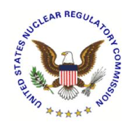
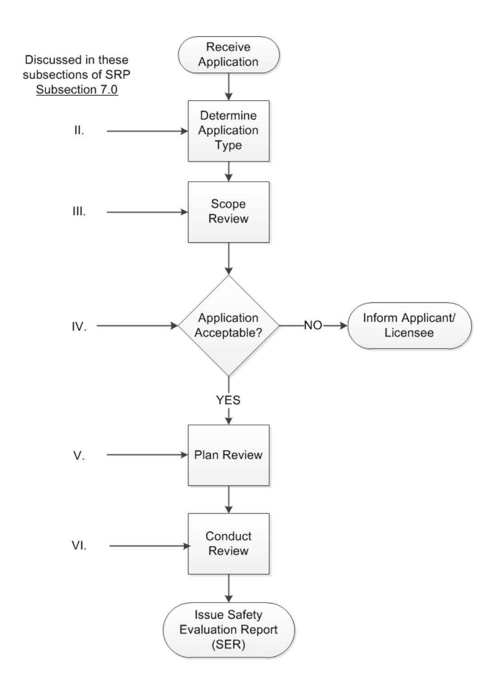
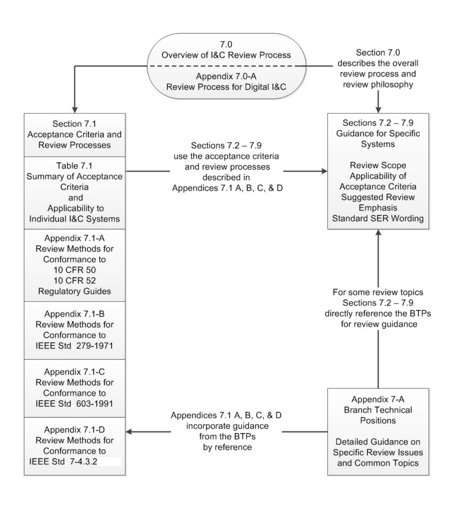
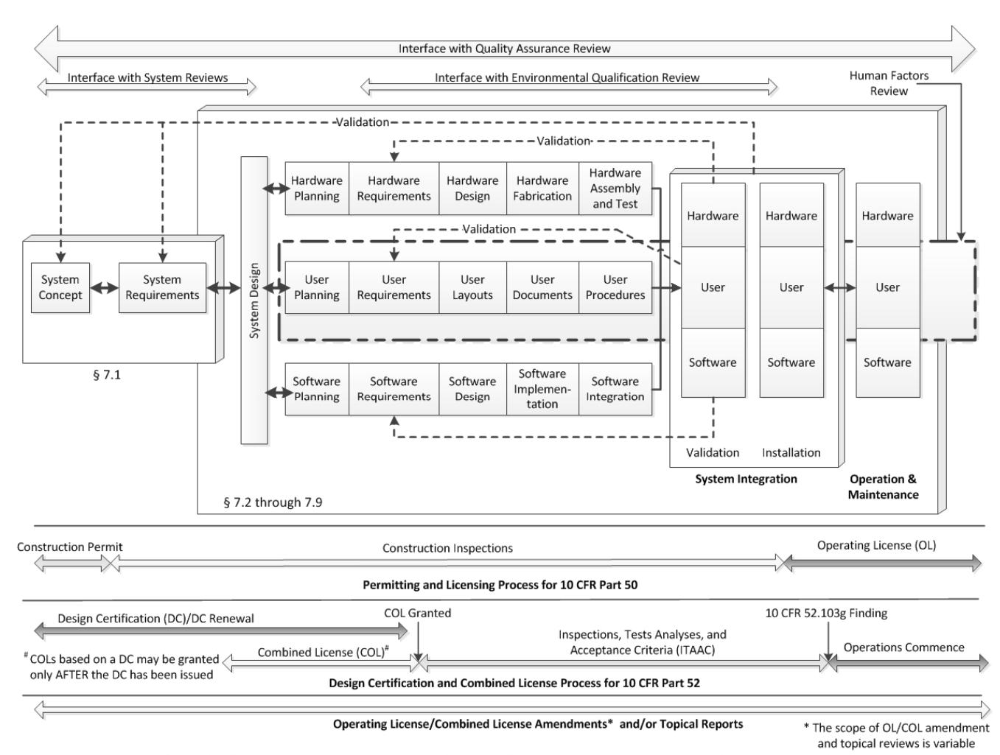

# **U.S. NUCLEAR REGULATORY COMMISSION STANDARD REVIEW PLAN**

### **7.0 INSTRUMENTATION AND CONTROLS - OVERVIEW OF REVIEW PROCESS**

# **REVIEW RESPONSIBILITIES**

**Primary** - Organization responsible for the review of instrumentation and controls

**Secondary** - None

**Review Note:** The revision numbers of Regulatory Guides (RG) and the years of endorsed industry standards referenced in this Standard Review Plan (SRP) section are centrally maintained in SRP Section 7.1-T, "Regulatory Requirements, Acceptance Criteria, and Guidelines for Instrumentation and Control Systems Important to Safety," (Table 7-1). Therefore, the individual revision numbers of RGs (except RG 1.97) and years of endorsed industry standards are not shown in this section. References to industry standards incorporated by reference into regulation (IEEE Std 279-1971 and IEEE Std 603-1991) and industry standards that are not endorsed by the agency do include the associated year in this section. See Table 7-1 to ensure that the appropriate RGs and endorsed industry standards are used for the review.

Revision 7 – August 2016

#### **USNRC STANDARD REVIEW PLAN**

This Standard Review Plan (SRP), NUREG-0800, has been prepared to establish criteria that the U.S. Nuclear Regulatory Commission (NRC) staff responsible for the review of applications to construct and operate nuclear power plants intends to use in evaluating whether an applicant/licensee meets the NRC regulations. The SRP is not a substitute for the NRC regulations, and compliance with it is not required. However, an applicant is required to identify differences between the design features, analytical techniques, and procedural measures proposed for its facility and the SRP acceptance criteria and evaluate how the proposed alternatives to the SRP acceptance criteria provide an acceptable method of complying with the NRC regulations.

The SRP sections are numbered in accordance with corresponding sections in Regulatory Guide (RG) 1.70, "Standard Format and Content of Safety Analysis Reports for Nuclear Power Plants (LWR Edition)." Not all sections of RG 1.70 have a corresponding review plan section. The SRP sections applicable to a combined license application for a new light-water reactor (LWR) are based on RG 1.206, "Combined License Applications for Nuclear Power Plants (LWR Edition)."

These documents are made available to the public as part of the NRC policy to inform the nuclear industry and the general public of regulatory procedures and policies. Individual sections of NUREG-0800 will be revised periodically, as appropriate, to accommodate comments and to reflect new information and experience. Comments may be submitted electronically by e-mail to NRO\_SRP.Resource@nrc.gov.

Requests for single copies of SRP sections (which may be reproduced) should be made to the U.S. Nuclear Regulatory Commission, Washington, DC 20555, Attention: Reproduction and Distribution Services Section, by fax to (301) 415-2289; or by email to DISTRIBUTION@nrc.gov. Electronic copies of this section are available through the NRC public Web site at http://www.nrc.gov/reading-rm/doc-collections/nuregs/staff/sr0800/, or in the NRC Agencywide Documents Access and Management System (ADAMS) at http://www.nrc.gov/reading-rm/adams.html, under ADAMS Accession No..ML16020A049.

# I. INTRODUCTION

Chapter 7 of the SRP provides guidance for review of the instrumentation and control (I&C) portions of: (1) applications for nuclear reactor licenses or permits and (2) amendments to existing licenses. The SRP guidance may also be applied in the review of topical reports submitted to the U.S. Nuclear Regulatory Commission (NRC) for safety evaluation, especially reports requesting generic acceptance of systems or components that may be used in nuclear power plant I&C systems. For an overview of the purpose, content, and use of the SRP in general, refer to the introductory section of the SRP.

This section of Chapter 7, SRP Section 7.0, provides an overview of the process used by the organization responsible for the review of the I&C portion of license applications and the preparation of I&C portions of generic safety evaluations of specific topics. Guidance is also provided to the reviewer in applying Chapter 7 of the SRP to these reviews.

Figure 7.0-1 provides an overview of the I&C review process. Each of the reviewer activities shown in the figure is discussed below. Ideally, applicants will request that the staff's review begin during the early stages of the development life cycle. Early interaction with the applicant is important so that differences between the staff and the applicant are identified as early as possible. The staff should work with the applicant to resolve issues expeditiously to minimize the impact on design and implementation activities. Early resolution of fundamental issues minimizes the rework necessary in areas where changes to the design bases are needed to resolve staff concerns. This helps assure that changes are correctly propagated through the design effort, thus improving the staff's confidence in design quality.

## Structure of SRP Chapter 7

Figure 7.0-2 illustrates the structure of SRP Chapter 7.

SRP Section 7.0 should be the entry point for any I&C review activity. It discusses the different types of applications I&C reviewers may encounter, the information expected to accompany each application, the general scope of the I&C review, and the expected interfaces with other elements of a plant review. SRP Section 7.0 also encourages the reviewer to develop a review plan to guide review activities and to communicate expectations to management and the applicant.

SRP Appendix 7.0-A, "Review Process for Digital Instrumentation and Control Systems," is provided to explain the general philosophy and approach to the review of digital computer-based systems.

The NRC standard format and content guides, RG 1.70, "Standard Format and Content of Safety Analysis Reports for Nuclear Power Plants (LWR Edition)," and RG 1.206, "Combined License Applications for Nuclear Power Plants (LWR Edition)," advise the applicant that SRP Section 7.1, "Instrumentation and Controls – Introduction," of safety analysis reports (SARs) should list all I&C and supporting systems that are important to safety and should identify the regulatory requirements applicable to each of these systems.

Consequently, SRP Section 7.1 identifies the acceptance criteria and regulatory guidance expected to apply to these systems. SRP Table 7.1 lists the regulatory requirements,

acceptance criteria, and guidance relevant to I&C and summarizes their applicability to each of the typical systems. SRP Appendix 7-1.A, "Acceptance Criteria and Guidelines for Instrumentation and Controls Systems Important to Safety," discusses the regulatory requirements, acceptance criteria, and guidance in more detail and provides review guidance for each. Three Institute of Electrical and Electronics Engineers (IEEE) standards (Std) play extensive roles in the review of I&C systems important to safety: (1) IEEE Std 279-1971, "Criteria for Protection Systems for Nuclear Power Generating Stations," (2) IEEE Std 603-1991, "Criteria for Safety Systems for Nuclear Power Generating Stations," and (3) IEEE Std 7-4.3.2, "IEEE Standard Criteria for Digital Computers in Safety Systems of Nuclear Power Generating Stations." Because of their importance and breadth, the acceptance criteria, guidance, and associated review methods in these three standards are discussed separately in SRP Appendices 7.1-B, "Guidance for Evaluation of Conformance to IEEE Std 279," 7.1-C, "Guidance for Evaluation of Conformance to IEEE Std 603," and 7-1.D, "Guidance for Evaluation of the Application of IEEE Std 7-4.3.2."

SRP Sections 7.2 through 7.9 address the I&C systems important to safety that are typically included in a plant design. These sections summarize the review scope and acceptance criteria applicable to each system but reference the appendices of SRP Section 7.1 for the details of requirements, guidance, and review methods. The discussion of review procedures in SRP Sections 7.2 through 7.9 also highlights review topics that have in the past required the most attention by reviewers.

For some review topics, branch technical positions (BTPs) have been prepared to resolve technical problems or questions of interpretation that arose during plant reviews. The BTPs are separated from the discussion in the Appendices of SRP Section 7.1 to avoid drowning the overall discussion of acceptance criteria and review methods with details about specific topics. The appendices of SRP Section 7.1 and the Review Procedures discussion of SRP Sections 7.2 through 7.9 reference these BTPs.

### II. APPLICATION TYPES

The type of application under review largely determines the review activities to be conducted and impacts the complexity and scope of the review. NRC regulations provide for the following types of license applications relevant to nuclear power reactors.

- 1. Construction permits (CPs) as discussed in Title 10 of the *Code of Federal Regulations* (10 CFR) 50.10(b), "Requirement for License," and 10 CFR 50.23, "Construction Permits." An application for a CP must be accompanied by a preliminary safety analysis report (PSAR). The CP applications may be submitted for construction of a new facility or alteration of an existing facility.
- 2. Operating license (OL) applications as discussed in 10 CFR 50.21, "Class 104 Licenses; for Medical Therapy and Research and Development Facilities," and 10 CFR 50.22, "Class 103 Licenses; for Commercial and Industrial Facilities." The OL applications must be accompanied by a final safety analysis report (FSAR) and proposed technical specifications.
- 3. Early site permits (ESPs) or ESP renewal, as discussed in 10 CFR Part 52, "Licenses, Certifications, and Approvals for Nuclear Power Plants," Subpart A, "Early Site Permits."

The organization responsible for review of I&C is not normally involved in the review of ESP applications.

- 4. Standard design certifications (DCs) as discussed in 10 CFR Part 52, Subpart B, "Standard Design Certifications." Applications for a standard DC are accompanied by a FSAR and proposed technical specifications.
- 5. Renewal of standard DCs as discussed in 10 CFR 52.57, "Application for Renewal." Applications for renewal of standard DCs must contain the information necessary to bring the previous application up to date (includes corrections of factual or typographical errors, and defects as defined under 10 CFR Part 21, "Reporting of Defects and Noncompliance," which are known by the DC renewal applicant).
- 6. Combined licenses (COLs) as discussed in 10 CFR Part 52, Subpart C, "Combined Licenses." The COL applications will be accompanied by an FSAR, plant-specific technical specifications, and plant-specific inspections, tests, analyses and acceptance criteria (ITAAC).
- 7. Amendments to existing OLs or CPs as discussed in 10 CFR 50.90, "Amendment of License or Construction Permit at Request of Holder," and 10 CFR 50.59, "Changes, Tests and Experiments." Amendments to existing licenses or permits must be accompanied by supporting information and proposed technical specification changes.
- 8. Amendments to COLs as discussed in 10 CFR 52.98, "Finality of Combined Licenses; Information Requests." The change process for COLs varies depending on whether the COL references a DC and the type of information change (e.g., Tier 2, Tier 2\*, or Tier 2 information).
- 9. Manufacturing licenses as discussed in 10 CFR Part 52, Appendix F. Applications for review of manufacturing licenses must be accompanied by an FSAR and proposed technical specifications.
- 10. License renewal as discussed in 10 CFR Part 54, "Requirements for Renewal of Operating Licenses for Nuclear Power Plants." The organization responsible for review of I&C is not normally involved in the review of license renewal applications.
- 11. Topical reports may be submitted to obtain NRC review of specific proposals independent of an application for a license or license amendment. For example, systems, components, or operational practices that are being considered for use in multiple plants may be submitted for generic review.

### III. REVIEW SCOPE AND CONTENT

The reviewer should determine the scope of the review needed to support evaluation of the application. The scope impacts the information needed by the reviewer and the extent of review planning.

Regardless of the type of application under consideration, the fundamental purpose of the NRC review is to determine whether the facility and equipment, the proposed use of the equipment,

the operating procedures, the processes to be performed, and other technical requirements provide reasonable assurance that the applicant or licensee will comply with the regulations of 10 CFR 1–199 (Chapter I), "Nuclear Regulatory Commission," and that public health and safety will be protected.

It is not intended that the review, audit, or inspection activities by the reviewer include a complete evaluation of all aspects of the design and implementation of the I&C system. The review scope need only be sufficient to allow the reviewer to reach the conclusion of reasonable assurance described above.

Subject to compliance with existing license commitments, compliance with current applicable regulations, and protection of the public health and safety, the reviewer may consider and use previous interpretations of regulations as they apply to the application under review. Therefore, if the review includes I&C systems that are identified as substantially identical to systems that have been previously reviewed and approved by the staff evaluation of these systems may be based on prior staff approval. If any aspect of a design is not identical to the one that is referenced, an evaluation must be made to address the adequacy of the different design. Conclusions drawn from this review must be included in the safety evaluation report (SER).

Plant license applications and license amendment applications may reference systems, equipment families, or specific equipment previously described in topical reports and reviewed by the staff. Typically, the NRC SER for such items includes generic or plant/applicationspecific open items that could not be resolved at the time of the original review. The staff's review of applications proposing use of previously reviewed designs should confirm that the SER open items are acceptably resolved for the proposed application.

Figure 7.0-3 illustrates the life-cycle activities for any I&C system and relates the application types described below (in Subsections III.A, III.B, and III.C) to the life-cycle activities that should be addressed in the application. The review of any application should involve all the applicable life-cycle activities. Reviews should confirm the acceptability of system requirements and the adequacy with which the final system meets these requirements. Review of non-digital I&C equipment may focus on component and system requirements, design outputs, and validation (e.g., type testing). In addition to these three aspects, review of digital computer-based systems should also focus on confirming the acceptability of life-cycle activities.

SRP Section 7.1 discusses the review of the overall I&C system concept and generic system requirements. SRP Appendices 7.1-A, 7.1-B, 7.1-C, and 7.1-D discuss the review procedures for each acceptance criterion relevant to I&C systems. SRP Sections 7.2 through 7.9 describes the review of system-specific requirements, system design, and implementation. For computer-based systems or components with embedded computers, SRP Appendix 7.0-A describes a generic process for reviewing the unique aspects of computer-based systems, including hardware/software integration. The appendices to SRP Sections 7.0 and 7.1 are to be used in conjunction with SRP Sections 7.1 through 7.9.

The review of each life-cycle activity should address the review points covered in Subsections III.A and III.B below. The staff's review emphasis should be commensurate with the safety significance of a given system or aspect of a system's design under review. Probabilistic risk assessments (PRAs), such as those conducted under the Individual Plant Evaluation Program or required as part of applications under 10 CFR Part 52, provide

information that may prove helpful in determining the appropriate level of review. RG 1.174, "An Approach for Using Probabilistic Risk Assessment in Risk-Informed Decisions on Plant-Specific Changes to the Licensing Basis," provides specific guidance on the review of license amendment applications supported by risk information. SRP Chapter 19 provides additional guidance on reviewing applications supported by risk information. The scope of review should be coordinated with other review organizations, as discussed in Subsection V below.

The review should include consideration of material that is formally submitted for the docket and material that is available for audit at the applicant's site.

Reviewers should be familiar with all sections of the SAR that have a bearing on the I&C systems under review. The following SAR chapters are typically relevant to the review of I&C systems:

| SAR Chapter | Description                                                                                                                                                                                                                                                                                |
|-------------|--------------------------------------------------------------------------------------------------------------------------------------------------------------------------------------------------------------------------------------------------------------------------------------------|
| 1           | For familiarization with the general operation of the plant, both safety and non-safety aspects.                                                                                                                                                                                        |
| 2           | For familiarization with environmental conditions and natural phenomena hazards that could affect I&C systems.                                                                                                                                                                          |
| 3           | Section 3.1. For exceptions to criteria applicable to I&C systems, and for structures suitable for housing this equipment.                                                                                                                                                              |
| 4.5         | For an understanding of the reactor and the reactor coolant system and its interconnections with the engineered safety feature (ESF) systems.                                                                                                                                           |
| 6           | For the design bases, design features, and functional performance requirements of the ESF systems.                                                                                                                                                                                      |
| 8           | For an understanding of the electrical power systems.                                                                                                                                                                                                                                      |
| 9           | For the design bases, design features, and functional performance requirements of auxiliary supporting features and other auxiliary features.                                                                                                                                           |
| 10          | For an understanding of the steam and power conversion systems and their interconnections with the I&C systems.                                                                                                                                                                         |
| 12          | For an understanding of radiation monitoring systems and their interaction with the I&C systems addressed in SRP Chapter 7.                                                                                                                                                             |
| 13          | For an understanding of emergency planning and response for which I&C systems are used.                                                                                                                                                                                                 |
| 14          | For an understanding of the initial test program and its role in verification and validation of I&C systems. For applications made under 10 CFR Part 52, the organization responsible for review of I&C also participates in the review of ITAAC, as described in SRP Chapter 14. |

| SAR Chapter | Description                                                                                                                                                                                                                                               |
|-------------|-----------------------------------------------------------------------------------------------------------------------------------------------------------------------------------------------------------------------------------------------------------|
| 15          | For a description of accidents for which the I&C system actuates or controls protective functions, the effects of failures of the protective functions, and the assumptions and initial conditions that form the bases of the accident analyses. |
| 16          | For the proposed limiting conditions for operation and surveillance requirements for the I&C systems.                                                                                                                                                  |
| 17          | For an understanding of quality assurance (QA) activities during design and construction and the role QA plays in the engineering life cycle for I&C systems.                                                                                       |
| 18          | For the human factors considerations in the design of I&C system user interfaces and manual actions credited for defense-in-depth and diversity of I&C systems.                                                                                     |
| 19          | For a discussion of the contribution to risk of the I&C systems in the PRA and the insights into I&C system design features derived from that assessment.                                                                                           |

# III.A DESIGN CERTIFICATION, COMBINED LICENSE AND CONSTRUCTION PERMIT APPLICATIONS

The review scope for DC, COL, and CP applications should include evaluations of the system concept, system requirements, system design, plans for system development, and architecture-level hardware and software requirements.

### System Concept Evaluation

The system concept evaluation should be based on the following review points:

- 1. The overall I&C system design's relationship to both the functions required by 10 CFR Part 50, "Domestic Licensing of Production and Utilization Facilities," and the functions required to support the assumptions of the plant accident analysis (see SRP Section 7.1).
- 2. The adequacy of any research and development plan necessary to resolve any outstanding questions concerning the design of systems or components.
- 3. Compliance with the technically relevant portions of 10 CFR Part 50 (see SRP Section 7.1).
- 4. Proposed resolution of technically relevant, unresolved safety issues and medium- and high-priority generic safety issues identified more than 6 months prior to the application (see RG 1.206, Section C.IV.8).

### System Requirements Evaluation

The system requirements evaluation should be based on the following review points:

- 1. Principal design criteria with respect to the guidance of 10 CFR 50.55a(h), "Protection and Safety Systems," which requires compliance with IEEE Std 603-1991 or IEEE Std 279-1971, and 10 CFR Part 50, Appendix A, "General Design Criteria for Nuclear Plants" (see SRP Section 7.1).
- 2. The design bases, including functional design requirements and the relationship of the design bases to the principal design criteria (see SRP Sections 7.2 through 7.9). The following additional review points apply to applications under 10 CFR Part 52 only:
- 3. ITAACs, including site-specific ITAACs, are proposed to provide reasonable assurance that, if the inspections, tests, and analyses are performed and the acceptance criteria are met, a plant is built and will operate in accordance with the design as described in the licensing basis (e.g., license, FSAR, etc.). SRP Section 14.3 describes the general acceptance criteria and review procedures for ITAAC. SRP Section 14.3.5 describes the specific acceptance criteria and review procedures for I&C system ITAAC.
- 4. For standard design approvals and standard DCs, the interface requirements (i.e., COL information items) to be met by those portions of the plant not included in the DC application (see SRP Sections 7.2 through 7.9).
- 5. For COL applications that reference a standard design approval or standard DC, conformance of the design with the terms and conditions of the final standard design approval or with the requirements and restrictions set forth in the DC rule.
- 6. 10 CFR 52.99(a) requires a licensee to submit implementation schedules for completing the inspections, tests, or analyses in the ITAAC, and periodic updates throughout construction. However, actual design, implementation, and testing activities may proceed on an earlier schedule than the ITAAC completion schedule. The staff should consider using a license condition to request a schedule of the life cycle activities. The schedule should be detailed enough so staff can plan for the observation of the actual development and verification and validation testing activities.

A license condition can be added to the post-combined license activities section of the appropriate Chapter (7 or 14.3.5) and should be worded as follows:

The licensee is to provide documentation necessary to demonstrate that the ITAAC requirements will be met while the I&C lifecycle activities are being conducted. Information, including life cycle design, implementation, and testing schedules, will be made available to the NRC 6 months in advance to facilitate inspection planning and direct observation of the actual I&C development activities by NRC inspectors. These documents will be used by the NRC to verify that the I&C design, including systems, sub-systems, and components, are developed in compliance with the licensing basis.

# System Design Evaluation

The system design evaluation should be based on the following review points:

- 1. The key characteristics, performance requirements, general arrangements, and materials of construction of the systems to confirm there is reasonable assurance the final design will conform to the design bases with adequate margin for safety (See SRP Sections 7.2 through 7.9).
- 2. The identification of I&C functions and variables to be probable subjects of technical specifications for the facility (for CPs) (see SRP Sections 7.2 through 7.9).
- 3. Proposed technical specifications (for DCs). The organization responsible for reviewing technical specifications has the lead responsibility (See SRP Chapter 16).
- 4. The applicant or licensee's analysis and technical justification to show that the I&C system design, including the underlying design bases and performance requirements, can perform appropriate safety functions.

### Development Planning Evaluation

The evaluation should include reviewing plans for the implementation and overall management of system development, QA, integration, installation, maintenance, training, operations, safety analysis, verification and validation, and configuration management (see SRP Appendix 7.0-A for a discussion of this evaluation process for digital computer-based I&C systems).

Review of DC and COL applications should normally address requirements at the I&C architectural level. Therefore, the review of DC applications for digital computer-based I&C systems may be limited to (1) a detailed review at the functional block diagram level, (2) a review of the applicant or licensee's commitment to prescribed limits, parameters, procedures, and attributes for the detailed design process, and (3) ITAAC adequate to demonstrate that the as-built facility conforms to these commitments.

### III.B OPERATING LICENSE APPLICATIONS

For OL applications, normally the NRC will review the items discussed in Subsection III.A above and issue an SER based on that review. Therefore, under these circumstances the NRC review at the OL stage may be confined to the following items and changes to commitments made at the CP stage. For COLs, the following items are addressed by ITAAC for which the NRC may verify completion through construction inspections.

# Hardware and Software Requirements, Detailed Design, Fabrication, Test, and Integration Evaluation

The hardware and software requirements, detailed design, fabrication, test, and integration evaluation should be based on the following review points:

1. Implementation of development plans (see SRP Appendix 7.0-A for digital computer-based systems).

- 2. Conformance of design outputs with system requirements (see SRP Sections 7.2 through 7.9 and SRP Appendix 7.0-A).
- 3. Evidence of design process characteristics in design outputs (see SRP Appendix 7.0-A for digital computer-based systems).
- 4. Description and evaluation of the results of the applicant's or licensee's research and development to demonstrate that any safety questions identified at the CP stage have been resolved (see SRP Sections 7.2 through 7.9 and SRP Appendix 7.0-A).

# System Validation Evaluation

The system validation evaluation should be based on the following review point:

1. The applicant testing, analysis, and technical justification to show that I&C system design, including the underlying design bases and performance requirements, can perform appropriate safety functions (see SRP Sections 7.2 through 7.9 and SRP Appendix 7.0-A).

### Installation, Operations, and Maintenance Evaluation

The installation, operations, and maintenance evaluation should be based on the following review point:

1. Site visit (see SRP Appendix 7-B).

### III.C LICENSE AMENDMENTS AND TOPICAL REPORTS

The scope of license amendment applications and topical reports is highly variable. The reviewer should develop an application-specific review scope for the item under consideration. All of the points discussed above that are relevant to the application under consideration should be considered.

Regardless of the review scope, the reviewer should examine SRP Section 7.1 and SRP Table 7-1 to identify the SRP sections, BTPs, and acceptance criteria applicable to the application. If the application involves the use of digital computer-based I&C systems or computers embedded in systems or components, the review process discussed in SRP Appendix 7.0-A also applies.

### IV. ACCEPTABILITY OF APPLICATIONS

Before substantial review effort is expended, the reviewer should confirm that the application contains enough information to allow the review to begin and to substantially progress in the review. For applications for standard DCs and COLs under 10 CFR Part 52, the staff conducts an acceptance review of the submittals for completeness and technical adequacy to assess the acceptability for docketing. No detailed technical and regulatory reviews are performed until the applications are found acceptable and formally docketed. Additional detailed guidance on this subject is available and should be used for these applications. The table below identifies the acceptance criteria for the various types of applications and the guidance that may be used in

assessing acceptability. Detailed guidance on the specific I&C system information that an application should contain is in RG 1.206 for COL and DC applications and RG 1.70 for other applications, each applicable SRP section, and the "Information to be Reviewed" sections of each applicable BTP. The SRP Appendix 7.0-A and SRP Chapter 14 contain additional information on the material that should be contained in an application for standard DCs under the provisions of 10 CFR Part 52.

| Type of Application           | Acceptance Criteria                                                                                 |
|-------------------------------|-----------------------------------------------------------------------------------------------------|
| Construction Permit           | 10 CFR 50.34(a), "Preliminary Safety Analysis Report"                                               |
| Operating License             | 10 CFR 50.34(b), "Final Safety Analysis Report," and (f), "Additional TMI-Related Requirements"  |
| Standard Design Certification | 10 CFR 52.47, "Contents of Applications; Technical Information"                                  |
| Combined License              | 10 CFR 52.79, "Contents of Applications; Technical Information In Final Safety Analysis Report"  |
| Manufacturing License         | 10 CFR 52.157, "Contents of Applications; Technical Information In Final Safety Analysis Report" |
| Topical Report                | Depends on the scope of the Topical Report                                                          |
| License Amendment             | 10 CFR 50.90, "Application For Amendment of License or Construction Permit"                      |
| Design Certification Renewal  | 10 CFR 52.57(a), "Application for Renewal"                                                          |

### V. APPLICATION-SPECIFIC REVIEW PLAN

The reviewer should develop a review plan specific to the application under consideration. The purpose of the plan is to: (1) communicate planned activities and schedules to management, (2) identify, early in the review, resources that the reviewer needs to support the review, and (3) assure that review participants have a common understanding of review criteria and the roles of the individual reviewers.

# Scope

The plan should briefly describe what is to be reviewed as determined in Subsection III above.

### Review Criteria

The plan should identify the criteria against which the application will be evaluated. For new applications, the applicable criteria are normally the applicable 10 CFR Part 50 sections and the detailed acceptance criteria contained in the SRP, supporting BTPs, and RGs. The SERs for previous applications, topical reports, and unreviewed or generic safety issue closeouts are also useful sources of information about staff positions and interpretations that can be used to develop specific review criteria.

For license amendment applications, the review criteria consist of the original license commitments. When the original license commitments do not completely cover all aspects of the proposed modification, the staff may supplement the original commitments with additional criteria from the SRP.

### Review Activities

The plan should describe the review activities planned to accomplish the review, and the approximate order in which these activities will be performed. Activities that have a broad impact on the review, such as the review of commitments to codes and standards, and the diversity and defense in depth review, should occur early in the review process.

Review activities should give particular emphasis to the review of functional design requirements, as errors at this level impact all successive aspects of the system design.

For each activity, the plan should identify the approximate resources required (e.g., number of staff-weeks, access to detailed design documents, access to completed hardware,) the approximate start and finish dates, and the external meetings or audits anticipated as part of the activity. The goals of the external meetings and audits that will be part of the review activities should be defined.

# Review Assignments

NRC staff and contractors who will participate in the review should be named and their roles defined with respect to the review activities.

### Interfaces

The plan should identify interfaces with other NRC organizations such as the project manager, regional offices, other technical organizations, and applicant or licensee personnel. The plan should describe the actions and information that the organization responsible for review of I&C needs from other NRC technical organizations and include a schedule showing when each item is to be delivered. Likewise, the plan should also identify the information and actions the interfacing organizations need from the organization responsible for review of I&C and include a schedule showing when these items will be needed. The plan should identify meetings and site trips as necessary. Schedule information may be absolute (a specific date) or relative (time before or after some milestone). The plan should address time required for requests for additional information (RAIs) and iterations of reviews.

The organization responsible for review of I&C will coordinate with other NRC technical organizations in the review of the following I&C system design features:

• The adequacy of the monitored variables, e.g., the suitability of parameters, such as pressure, for initiating operation of reactor trip or a given ESF or auxiliary supporting features and other auxiliary features included in Chapter 15 of the SAR.

- The acceptability of the proposed setpoints, time delays, accuracy requirements, and actuated equipment response, and consistency with the safety analysis included in Chapter 15 of the SAR.
- The acceptability of the human-machine interface as described in Chapter 18 of the SAR.

The coordinated reviews include the following:

- The organization responsible for review of reactor systems evaluates the adequacy of protective, control, display, and interlock functions and confirms that they are consistent with the accident analysis, the operating requirements of the I&C systems, and the requirements of 10 CFR Part 50, Appendix A, General Design Criteria 10, 15, 28, 33, 34, and 35.
- The organization responsible for the review of plant systems evaluates the adequacy of the requirements for the auxiliary supporting features and other auxiliary features to assure that they satisfy the applicable acceptance criteria. These features include, for example, compressed (instrument) air, cooling water, boration, lighting, heating, and air conditioning. This review confirms that: (1) the design of the auxiliary supporting features and other auxiliary features is compatible with the single-failure requirements of the I&C systems, and (2) the auxiliary supporting features and other auxiliary features will maintain the required environmental conditions in the areas containing I&C equipment. This review includes the design criteria and testing methods employed in the seismic design and installation of equipment implementing auxiliary supporting features and other auxiliary features. The organization responsible for the review of plant systems also evaluates the adequacy of protective, control, display and interlock functions and confirms that they are consistent with the operating requirements of the supported system and the requirements of General Design Criteria 41 and 44.
- The organization responsible for the review of containment systems reviews the containment ventilation and atmospheric control systems provided to maintain required environmental conditions for I&C equipment located inside containment. This organization also evaluates the adequacy of protective, control, display, interlock functions associated with containment systems and severe accidents, and confirms they are consistent with the accident analysis, operating requirements, and the requirements of General Design Criteria 16 and 38.
- The organization responsible for the review of electrical systems: (1) evaluates the adequacy of physical separation criteria for cabling and electrical power equipment, (2) determines that power supplied to redundant systems is supplied by appropriate redundant sources, and (3) confirms the adequacy of the I&C associated with the proper functioning of the onsite and offsite power systems.

- The organization responsible for the review of environmental qualification reviews the environmental qualification of I&C equipment. The scope of this review includes the design criteria and qualification testing methods and procedures for I&C equipment.
- The organization responsible for the review of seismic qualification reviews the seismic qualification demonstration for I&C equipment including the design criteria and qualification testing methods and procedures.
- The organization responsible for the review of human-machine interface evaluates the adequacy of the arrangement and location of I&Cs, and confirms that the capabilities of the I&C are consistent with the operating procedures and emergency response guides.
- The organization responsible for the review of maintenance provisions reviews the adequacy of administrative, maintenance, testing, and operating procedure programs as part of its primary review responsibility for SRP Sections 13.5.1.2, "Administrative Procedures - Initial Test Program," and 13.5.2.2, "Maintenance and Other Operating Procedures."
- The organization responsible for the review of QA reviews design, construction, and operations phase QA programs, including the general methods for addressing periodic testing, as part of its primary review responsibility for SRP Chapter 17. This organization also reviews the proposed preoperational and startup test programs to confirm that they are in conformance with the intent of RG 1.68, "Initial Test Programs for Water-Cooled Nuclear Power Plants," as part of its primary review responsibility for SRP Section 14.2, "Initial Plant Test Program - Design Certification and New License Applicants." In addition, while conducting regulatory audits in accordance with Office Instructions NRR-LIC-111 or NRO-REG-108, "Regulatory Audits," the technical staff may identify quality-related issues. If this occurs, then the technical staff should contact the organization responsible for QA to determine if an inspection should be conducted.

For DC or COL applications made under 10 CFR Part 52, proposed ITAAC for I&C systems are reviewed by the organization responsible for review of I&C as part of its review responsibility for SRP Section 14.3.5, "Instrumentation and Controls - Inspections, Tests, Analyses, and Acceptance Criteria."

For digital license amendment activities associated with operating reactors, the I&C technical reviewer should contact the region to see if they would like specific items for inspection follow-up to be identified during the licensing process and included in the SER. Consider aligning, if possible, inspection follow-up items to inspection areas outlined in Inspection Procedure 52003.

For digital license amendment activities associated with operating reactors, the I&C technical reviewer should ensure that the licensee commits to completion periods for implementing documents (e.g., testing, surveillance, and maintenance procedures) and NRR should include a reference to these commitments dates in the SER.

Identify as early as possible regional, licensee, and licensing project managers to facilitate timely status of licensing, construction, and installation activities. The appropriate Regional office should be kept informed as much as possible in the licensing process (i.e., RAIs, issues, site audits). A SharePoint (or similar) site for information exchange between NRC headquarters and the Regional office is recommended as one way to ensure rapid and continuing availability of applicable information.

For digital license amendment activities associated with operating reactors, installation inspection may require expertise in several areas (e.g., electrical power, digital systems, operations, cyber security, and software architecture). The Office of Nuclear Reactor Regulation (NRR) should contact region staff to identify NRR staff input on required expertise early, to enable the additional training or acquisition of necessary expertise.

### VI. REVIEW

The review is to be accomplished in accordance with the application-specific review plan using the acceptance criteria and review processes of the SRP. The review will be documented by the preparation of an SER.

### VII. REFERENCES

- 1. Institute of Electrical and Electronics Engineers, IEEE Std 279-1971, "Criteria for Protection Systems for Nuclear Power Generating Stations," Piscataway, NJ.
- 2. Institute of Electrical and Electronics Engineers, IEEE Std 603-1991, "IEEE Standard Criteria for Safety Systems for Nuclear Power Generating Stations," Piscataway, NJ.
- 3. Institute of Electrical and Electronics Engineers, IEEE Std 7-4.3.2, "IEEE Standard Criteria for Digital Computers in Safety Systems of Nuclear Power Generating Stations," Piscataway, NJ.
- 4. U.S. Nuclear Regulatory Commission, "Initial Test Programs for Water-Cooled Nuclear Power Plants," Regulatory Guide 1.68.
- 5. U.S. Nuclear Regulatory Commission, "Standard Format and Content of Safety Analysis Reports for Nuclear Power Plants," Regulatory Guide 1.70.
- 6. U.S. Nuclear Regulatory Commission, "An Approach for Using Probabilistic Risk Assessment in Risk-Informed Decisions on Plant-Specific Changes to the Licensing Basis," Regulatory Guide 1.174.
- 7. U.S. Nuclear Regulatory Commission, "Combined License Applications for Nuclear Power Plants (LWR Edition)," Regulatory Guide 1.206.

| PAPERWORK REDUCTION ACT STATEMENT                                                                                                                                                                                                              |  |
|------------------------------------------------------------------------------------------------------------------------------------------------------------------------------------------------------------------------------------------------|--|
| The information collections contained in the Standard Review Plan are covered by the requirements of 10 CFR Part 50 and 10 CFR Part 52, and were approved by the Office of Management and Budget, approval numbers 3150-0011 and 3150-0151. |  |
| PUBLIC PROTECTION NOTIFICATION                                                                                                                                                                                                                 |  |
| The NRC may not conduct or sponsor, and a person is not required to respond to, a request for information or an information collection requirement unless the requesting document displays a currently valid OMB control number.            |  |
|                                                                                                                                                                                                                                                |  |
|                                                                                                                                                                                                                                                |  |
|                                                                                                                                                                                                                                                |  |
|                                                                                                                                                                                                                                                |  |
|                                                                                                                                                                                                                                                |  |

# **SRP Section 7.0 Description of Changes**

### **SRP Section 7.0, "Instrumentation and Controls - Overview of Review Process"**

This SRP Section affirms the technical accuracy and adequacy of the guidance previously provided in SRP Section 7.0, Revision 6, dated May 2010. See ADAMS Accession No. ML100740146.

The main purpose of this update is to incorporate the revised software Regulatory Guides and the associated endorsed standards. For organizational purposes, the revision number of each Regulatory Guide and year of each endorsed standard is now listed in one place, Table 7-1. As a result, revisions of Regulatory Guides and years of endorsed standards were removed from this section, if applicable. For standards that are incorporated by reference into regulation (IEEE Std 279-1971 and IEEE Std 603-1991) and standards that have not been endorsed by the agency, the associated revision number or year is still listed in the discussion.

Part of 10 CFR was reorganized due to a rulemaking in the fall of 2014. Quality requirement discussions in the former 10 CFR 50.55a(a)(1) were moved to 10 CFR 50.54(jj) and 10 CFR 50.55(i). The incorporation by reference language in the former 10 CFR 50.55a(h)(1) was moved to 10 CFR 50.55a(a)(2). There were no changes either to 10 CFR 50.55a(h)(2) or 10 CFR 50.55a(h)(3).

Section 7.0, III.A is revised to clarify the staff position for DC and COL applications and discusses the use of a license condition for I&C development activities regarding new reactors built under Part 52.

Section 7.0, IV is revised to discuss staff guidance for digital I&C license amendment activities.

Section Figures have been updated for readability.

Additional changes were editorial.