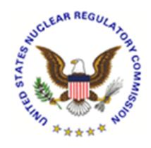

# **U.S. NUCLEAR REGULATORY COMMISSION STANDARD REVIEW PLAN**

## **7.1 INSTRUMENTATION AND CONTROLS - INTRODUCTION**

## **REVIEW RESPONSIBILITIES**

**Primary** - Organization responsible for the review of instrumentation and controls

**Secondary** - None

**Review Note:** The revision numbers of Regulatory Guides (RG) and the years of endorsed industry standards referenced in this Standard Review Plan (SRP) section are centrally maintained in SRP Section 7.1-T, "Regulatory Requirements, Acceptance Criteria, and Guidelines for Instrumentation and Control Systems Important to Safety," (Table 7-1). Therefore, the individual revision numbers of RGs (except RG 1.97) and years of endorsed industry standards are not shown in this section. References to industry standards incorporated by reference into regulation (IEEE Std 279-1971 and IEEE Std 603-1991) and industry standards that are not endorsed by the agency do include the associated year in this section. See Table 7-1 to ensure that the appropriate RGs and endorsed industry standards are used for the review.

Revision 6 – August 2016

#### **USNRC STANDARD REVIEW PLAN**

This Standard Review Plan (SRP), NUREG-0800, has been prepared to establish criteria that the U.S. Nuclear Regulatory Commission (NRC) staff responsible for the review of applications to construct and operate nuclear power plants intends to use in evaluating whether an applicant/licensee meets the NRC's regulations. The Standard Review Plan is not a substitute for the NRC's regulations, and compliance with it is not required. However, an applicant is required to identify differences between the design features, analytical techniques, and procedural measures proposed for its facility and the SRP acceptance criteria and evaluate how the proposed alternatives to the SRP acceptance criteria provide an acceptable method of complying with the NRC regulations.

The SRP sections are numbered in accordance with corresponding sections in Regulatory Guide (RG) 1.70, "Standard Format and Content of Safety Analysis Reports for Nuclear Power Plants (LWR Edition)." Not all sections of RG 1.70 have a corresponding review plan section. The SRP sections applicable to a combined license application for a new light-water reactor (LWR) are based on RG 1.206, "Combined License Applications for Nuclear Power Plants (LWR Edition)."

These documents are made available to the public as part of the NRC's policy to inform the nuclear industry and the general public of regulatory procedures and policies. Individual sections of NUREG-0800 will be revised periodically, as appropriate, to accommodate comments and to reflect new information and experience. Comments may be submitted electronically by e-mail to NRO\_SRP@nrc.gov.

Requests for single copies of SRP sections (which may be reproduced) should be made to the U.S. Nuclear Regulatory Commission, Washington, DC 20555, Attention: Reproduction and Distribution Services Section by fax to 301-415-2289; or by e-mail to DISTRIBUTION@nrc.gov. Electronic copies of this section are available through the NRC's public Web site at http://www.nrc.gov/reading-rm/doc-collections/nuregs/staff/sr0800/, or in the NRC's Agencywide Documents Access and Management System (ADAMS), at http://www.nrc.gov/reading-rm/adams.html, under ADAMS Accession No. ML16020A050.

## I. AREAS OF REVIEW

The objectives of the review of safety analysis report (SAR) Section 7.1 are to confirm: (1) that the instrumentation and control (I&C) system design includes the functions necessary to operate the nuclear power plant safely under normal conditions and to maintain it in a safe condition under accident conditions, (2) that these functions, the implementing systems and equipment have been properly classified to identify their importance to safety, and (3) that commitments have been made to use appropriate quality standards for I&C systems for the design, fabrication, construction, and testing of I&C systems and equipment commensurate with the importance of the safety functions performed.

1. The necessary functions are those needed to monitor variables and systems over their anticipated operating ranges, to maintain these variables and systems within their prescribed operating ranges, to automatically initiate the operation of systems and components to assure that fuel design limits are not exceeded as a result of anticipated operational occurrences, and to sense accident conditions and initiate the operation of systems and components important to safety.

The I&C systems that perform these functions are within the scope of SRP, Chapter 7. In typical reactor designs, these systems fall into the nine categories listed below. Protection and safety systems are I&C systems that initiate safety actions to mitigate the consequences of design-basis events. Protection systems include reactor trip systems (RTSs) and engineered safety features actuation systems (ESFASs).

- A. The RTS initiates rapid control rod insertion to mitigate the consequences of anticipated operating occurrences or design-basis events. RTS is discussed in Section 7.2 of the SAR.
- B. The ESFAS initiates and controls safety equipment that remove heat or otherwise assist with maintaining the integrity of the physical barriers to radioactive release - cladding, reactor coolant pressure boundary, and containment. ESFAS is discussed in Section 7.3 of the SAR.
- C. Safe shutdown systems function to achieve and maintain a safe shutdown condition of the plant. The safe shutdown systems include I&C systems used to maintain the reactor core in a subcritical condition and provide adequate core cooling to achieve and maintain both hot and cold shutdown conditions. Safe shutdown systems are discussed in Section 7.4 of the SAR.
- D. Information systems important to safety provide information for the safe operation of the plant during normal operation, anticipated operational occurrences, and accidents, and include systems that provide information for manual initiation and control of safety systems. These systems indicate that plant safety functions are being accomplished and provide information from which appropriate actions can be taken to mitigate the consequences of anticipated operational occurrences and accidents. Information systems important to safety also provide information on the normal status and the bypassed and inoperable status of safety systems. Information systems important to safety are discussed in Section 7.5 of the SAR.

- E. Interlock systems important to safety operate to reduce the probability of occurrence of specific events or maintain safety systems in a state to assure their availability in an accident. These systems differ from protection systems in that interlock system safety action is taken prior to accidents, or to prevent accidents. Interlock systems important to safety are discussed in Section 7.6 of the SAR.
- F. Control systems are used in normal operations and in control plant processes that have a significant impact on plant safety but are not relied on to perform safety functions following anticipated operational occurrences or accidents. Control systems are reviewed to assure that they conform to acceptance criteria and guidelines, that the controlled variables can be maintained within prescribed operating ranges, and that the effects of operation or failure of these systems are bounded by the accident analyses in Chapter 15 of the SAR. Control systems are discussed in Section 7.7 of the SAR.
- G. Diverse I&C systems are provided expressly for diverse backup of the RTS and ESFAS. Diverse I&C systems account for the possibility of common-cause failures in protection systems. The diverse I&C systems category includes the anticipated transient without scram (ATWS) mitigation system, as required by Title 10 of the *Code of Federal Regulations* (10 CFR) 50.62, "Requirements for reduction of risk from anticipated transients without scram (ATWS) events for light-water-cooled nuclear power plants." For plants with digital computer-based instrumentation and controls, diverse I&C systems may also include hard-wired manual controls, diverse displays, and diverse actuation systems specifically installed to meet the guidance of the Staff Requirements Memorandum (SRM) on SECY-93-087, "Policy, Technical, and Licensing Issues Pertaining to Evolutionary and Advanced Light-Water Reactor (ALWR) Designs." This SRM describes the U.S. Nuclear Regulatory Commission (NRC) position on diversity and defense-in-depth. Diverse I&C systems are discussed in Section 7.8 of the SAR.
- H. Data communication systems transmit signals between systems and between components of systems and include analog and digital multiplexers as well as nonmultiplexed transmission. When such systems are included in a design, they support one or more of the categories of systems described above. They may also support I&C functions addressed in other sections of the SAR. Data communications systems are discussed in Section 7.9 of the SAR.
- I. Auxiliary supporting features and other auxiliary features are systems or components of systems that provide services required for the safety systems to accomplish their safety functions. Heating, ventilation, and air conditioning systems and electrical power systems are examples of auxiliary supporting features. Auxiliary supporting features are discussed primarily in Chapters 8 and 9 of the SAR. Examples of other auxiliary features include built-in test equipment and isolation devices. The I&C aspects of auxiliary supporting features and other auxiliary features are addressed in the review of those SAR sections that discuss the systems that provide these features. To the extent that the operation of auxiliary supporting features or other auxiliary features are

initiated by the protection system, this aspect is included in the review of Sections 7.2 or 7.3 of the SAR.

All other I&C for systems important to safety, such as fire protection, fuel handling control, security systems, radiation monitoring, and control of auxiliary supporting features and other auxiliary features are normally addressed in the review of other SAR sections that discuss these systems. The organization responsible for the review of instrumentation and controls supports the review of these systems as a secondary reviewer. The acceptance criteria and review procedures of SRP Chapter 7, particularly Section 7.7, are also applicable to these other I&C systems.

The organization responsible for the review of I&C is a primary reviewer for SRP Section 9.5.2., "Communications Systems." Additional information relevant to the acceptance criteria and the review process of this section of the SRP can be found in the references cited in this section.

- 1. Inspections, Tests, Analyses, and Acceptance Criteria (ITAAC). For design certification (DC) and combined license (COL) reviews, the staff reviews the applicant's proposed ITAAC associated with the structures, systems, and components (SSCs) related to this SRP section in accordance with SRP Section 14.3, "Inspections, Tests, Analyses, and Acceptance Criteria." The staff recognizes that the review of ITAAC cannot be completed until after the rest of this portion of the application has been reviewed against acceptance criteria contained in this SRP section. Furthermore, the staff reviews the ITAAC to ensure that all SSCs in this area of review are identified and addressed as appropriate in accordance with SRP Section 14.3.
- 2. COL Action Items and Certification Requirements and Restrictions. For a DC application, the review will also address COL action items and requirements and restrictions (e.g., interface requirements and site parameters).

For a COL application referencing a DC, a COL applicant must address COL action items (referred to as COL license information in certain DCs) included in the referenced DC. Additionally, a COL applicant must address requirements and restrictions (e.g., interface requirements and site parameters) included in the referenced DC.

### Review Interfaces

Other SRP sections interface with this section as follows:

1. SRP Section 7.0, "Instrumentation and Controls - Overview of Review Process," describes the coordination of reviews, including the information to be reviewed and the scope required for each of the different types of applications that the staff may review. Refer to that section for information regarding how the areas of review are affected by the type of application under consideration and for a description of coordination between the organization responsible for the review of I&C systems and other organizations.

The specific acceptance criteria and review procedures are contained in the referenced SRP sections.

#### II. ACCEPTANCE CRITERIA

## Requirements

Acceptance criteria are based on meeting the relevant requirements of the following Commission regulations:

- 1. SRP Table 7-1, Section 1 (10 CFR Part 50, "Domestic Licensing of Production and Utilization Facilities," and 10 CFR Part 52, "Licenses, Certifications, and Approvals for Nuclear power Plants.") and Section 2 (10 CFR Part 50, Appendix A, General Design Criteria,) list the requirements applicable to I&C systems important to safety.
- 2. 10 CFR 50.55a(h), "Protection and Safety Systems," requires compliance with the Institute of Electrical and Electronics Engineers (IEEE) Standard (Std) 603-1991, "IEEE Standard Criteria for Safety Systems for Nuclear Power Generating Stations," and the correction sheet dated January 30, 1995. For nuclear power plants with construction permits issued before January 1, 1971, the applicant or licensee may elect to comply instead with their plant-specific licensing basis. For nuclear power plants with construction permits issued between January 1, 1971, and May 13, 1999, the applicant or licensee may elect to comply instead with the requirements stated in IEEE Std 279-1971, "Criteria for Protection Systems for Nuclear Power Generating Stations."
- 3. I&C safety systems are the systems that are relied on to remain functional during and following design-basis events to assure: (1) the integrity of the reactor coolant pressure boundary, (2) the capability to shut down the reactor and maintain it in a safe shutdown condition, or (3) the capability to prevent or mitigate the consequences of accidents that could result in potential offsite exposures comparable to 10 CFR Part 100, "Reactor Site Criteria," or 10 CFR 50.67, "Accident Source Term," guidelines. Protection systems are a subset of I&C safety systems, and I&C safety systems are a subset of I&C systems important to safety.
- 4. 10 CFR 52.47(b)(1), which requires that a DC application contain the proposed ITAAC that are necessary and sufficient to provide reasonable assurance that, if the inspections, tests, and analyses are performed and the acceptance criteria met, a plant that incorporates the design certification is built and will operate in accordance with the design certification, the provisions of the Atomic Energy Act of 1954 (AEA), and the NRC's regulations.
- 5. 10 CFR 52.80(a), which requires that a COL application contain the proposed inspections, tests, and analyses, including those applicable to emergency planning, that the licensee shall perform, and the acceptance criteria that are necessary and sufficient to provide reasonable assurance that, if the inspections, tests, and analyses are performed and the acceptance criteria met, the facility has been constructed and will operate in conformity with the combined license, the provisions of the AEA, and the NRC's regulations.

#### SRP Acceptance Criteria

Specific SRP acceptance criteria acceptable to meet the relevant requirements of the NRC's regulations identified above are as follows for the review described in this SRP section. The SRP is not a substitute for the NRC regulations, and compliance with it is not required. However, an applicant is required to identify differences between the design features, analytical techniques, and procedural measures proposed for its facility and the SRP acceptance criteria and evaluate how the proposed alternatives to the SRP acceptance criteria provide acceptable methods of compliance with the NRC regulations.

- 1. SRP Table 7-1, Section 3 (Staff Requirements Memoranda), Section 4 (RGs), and Section 5 (Branch Technical Positions), list the SRP acceptance criteria applicable to I&C systems important to safety. Sources of the acceptance criteria are as follows:
  - Commission Papers (SECY) are issue papers submitted by the staff to the NRC commissioners to inform them about policy matters. Staff Requirements Memoranda (SRM) provide the NRC's decisions and directions on the issues discussed in the SECY.
  - RGs describe acceptable methods for meeting regulatory requirements and provide guidance to applicant or licensees. Industry codes and standards set forth industry consensus requirements and recommended practices applicable to I&C systems for nuclear power plants. These standards are endorsed by RGs, with or without modification, and provide acceptable methods for meeting the requirements of the NRC's regulations.
  - Branch technical positions (BTP) document the resolution of significant technical issues or questions of interpretation that have arisen in past reviews. BTPs outline acceptable approaches to a particular issue. The approaches taken in BTPs, like the recommendations of RGs, are not mandatory.

SECY and associated SRM, RGs and their endorsed industry codes and standards, and BTPs are the guidelines used as SRP acceptance criteria for the evaluation of conformance to the requirements of the NRC's regulations.

2. Use of IEEE Std 603-1991 and IEEE Std 279-1971 for Nonsafety Systems.

IEEE Std 603-1991 is an NRC requirement for safety systems and IEEE Std 279-1971 is an NRC requirement only for protection systems. However, these standards require that protection and safety systems be appropriately isolated from nonsafety systems. Consequently, the requirements of IEEE Std 603-1991 and IEEE Std 279-1971 apply to the interface between safety and nonsafety systems.

The quality and reliability of systems important to safety that are not classified as safety systems should still be sufficient to minimize challenges to safety systems and to fulfill their overall role in plant nonsafety strategy. Although IEEE Std 603-1991 and IEEE Std 279-1971 are not requirements for nonsafety I&C systems, these standards describe concepts that are useful in any situation in which functional reliability is a goal.

Consequently, although these standards are not SRP acceptance criteria for nonsafety I&C systems, they are a source of design concepts that may be useful for the reviewer to consider.

The scope of IEEE Std 603-1991 is broader than that of IEEE Std 279-1971, and the guidance of IEEE Std 603-1991 is consequently readily adaptable for use in the review of nonsafety I&C systems.

#### 3. Location of Detailed Acceptance Criteria and Review Methods

• SRP Appendix 7.1-A, "Acceptance Criteria and Guidelines for Instrumentation and Controls Systems Important to Safety," provides guidance on the applicability and review methods to be used in evaluating conformance to the regulatory requirements and SRP acceptance criteria for I&C systems important to safety.

In three cases, the discussion of review methods is extensive and is located in separate appendices that are referenced by SRP Appendix 7.1-A. These appendices are:

- SRP Appendix 7.1-B, "Guidance for Evaluation of Conformance to IEEE Std 279," provides guidance for evaluating conformance to the requirements of IEEE Std 279-1971.
- SRP Appendix 7.1-C, "Guidance for Evaluation of Conformance to IEEE Std 603," provides guidance for evaluating conformance to IEEE Std 603-1991.
- SRP Appendix 7.1-D, "Guidance for Evaluation of the Application of IEEE Std 7-4.3.2," provides guidance for evaluating conformance to the acceptance criteria contained in RG 1.152, "Criteria for Use of Computers in Safety Systems of Nuclear Power Plants," which endorses IEEE Std 7-4.3.2, "IEEE Standard Criteria for Digital Computers in Safety Systems of Nuclear Power Generating Stations."

#### III. REVIEW PROCEDURES

The reviewer will select material from the procedures described below, as may be appropriate for a particular case. Typical reasons for a non-uniform emphasis are the introduction of new design features or the utilization in the design of features previously reviewed and found acceptable.

These review procedures are based on the identified SRP acceptance criteria. For deviations from these acceptance criteria, the staff should review the applicant's evaluation of how the proposed alternatives provide an acceptable method of complying with the relevant NRC requirements identified in Subsection II.

Section 7.0 provides an overview of the review process for I&C systems. Within this process, the review of Section 7.1 of the SAR should confirm that the I&C systems important to safety are addressed in Chapter 7 of the SAR and that the applicant or licensee commits to

appropriate acceptance criteria and guidelines applicable to each of these systems. Thus, the review of SAR Section 7.1 focuses on confirming that commitments made for I&C systems fulfill the requirements of 10 CFR 50.54(jj) and 10 CFR 50.55(i), and 10 CFR Part 50, Appendix A, General Design Criterion 1, "Quality Standards and Records." These sections require that SSCs important to safety be designed, fabricated, erected and tested to quality standards commensurate with the importance of the safety function to be performed. Therefore, the review of SAR Section 7.1 should confirm that the SAR includes: (1) a discussion regarding the applicability of each criterion and guideline for each system important to safety, and (2) a statement that the criteria and guidelines are implemented or will be implemented in the design of I&C systems important to safety. If exceptions to the guidelines are taken, the review confirms that an acceptable basis has been provided for those exceptions.

The reviewer is expected to develop an understanding of the fundamental I&C system architecture as well as the functional allocation to the various I&C systems and to develop a tabulation of the I&C systems important to safety and the acceptance criteria and guidelines applicable to these systems. The reviewer should also identify the elements of I&C systems important to safety that are identical to those previously reviewed by the staff and the portions of the staff's review that may be based on prior NRC approval. The bases for prior approval include the staff's evaluation of applications for construction permits and operating licenses, preliminary and final design approvals for standardized plants, and topical reports.

The review of Section 7.1 of the SAR is performed as follows:

- 1. Section 7.1 is reviewed to confirm that all I&C systems important to safety are included in Chapter 7. Normally, Chapter 7 of the SAR should address each of the I&C systems included in the areas of review for SRP Section 7.1. This review should confirm that all I&C systems, including embedded computers and software necessary to support the operation of safety systems, are identified in SAR Section 7.1 and discussed in subsequent sections of SAR Chapter 7. The safety systems supported by the I&C system are described in other sections of the SAR (particularly in Chapters 5, 6, 8, 9, 10, 15, and 18). The review of the systems identified is coordinated (as described in SRP Section 7.0) with the organizations that have primary review responsibility for the supported systems.
- 2. The regulatory requirements applicable to each of the I&C systems important to safety are reviewed to confirm that the applicant has appropriately identified requirements applicable to each I&C system. Subsections 1 and 2 of SRP Appendix 7.1-A identify the requirements applicable to the I&C systems important to safety and describe the method and scope of the review to verify conformance.
- 3. The guidelines applicable to each of the I&C systems important to safety are reviewed to confirm that the appropriate guidelines have been identified for each system. Subsections 3, 4, and 5 of SRP Appendix 7.1-A identify the guidelines applicable to the I&C systems important to safety and describe the method and scope of the review to verify conformance.
- 4. When the applicant or licensee takes exceptions to the guidelines applicable to I&C systems important to safety, the bases for such exceptions are reviewed to confirm that they are acceptable. The bases for the exceptions to the guidelines should demonstrate

that a significant reduction in the margin of safety does not result and that the exceptions do not result in nonconformance to the requirements of the acceptance criteria.

- 5. When the applicant or licensee proposes I&C systems that incorporate digital computers, the review includes the supplemental guidance for digital computer-based systems described in SRP Appendix 7.1-D. SRP Appendix 7.0-A, "Review Process for Digital Instrumentation and Control Systems," describes the review process.
- 6. The review includes the I&C systems important to safety that are identified as identical to systems that have been reviewed and approved by the staff. The evaluation of these systems in subsequent sections of Chapter 7 is based on prior staff approval. When differences exist between prior approvals, the differences should be identified and the review should confirm that an adequate basis has been provided. The review should include an evaluation of the differences to confirm that they are acceptable.
- 7. If the proposed I&C systems employ technologies that have not previously been accepted by the staff, the reviewer should identify these technologies and establish a basis for acceptance prior to proceeding with the review.
- 8. For review of a DC application, the reviewer should follow the above procedures to verify that the design, including requirements and restrictions (e.g., interface requirements and site parameters), set forth in the final safety analysis report (FSAR) meets the acceptance criteria. DCs have referred to the FSAR as the design control document (DCD). The reviewer should also consider the appropriateness of identified COL action items. The reviewer may identify additional COL action items; however, to ensure these COL action items are addressed during a COL application, they should be added to the DC FSAR.

For review of a COL application, the scope of the review is dependent on whether the COL applicant references a DC, an early site permit, or other NRC approvals (e.g., manufacturing license, site suitability report, or topical report).

9. For review of both DC and COL applications, SRP Section 14.3 should be followed for the review of ITAAC. The review of ITAAC cannot be completed until after the completion of this section.

#### IV. EVALUATION FINDINGS

The reviewer verifies that the applicant has provided sufficient information and that the review and calculations (if applicable) support conclusions of the following type to be included in the staff's safety evaluation report (SER). The reviewer also states the bases for those conclusions.

- 1. The applicant or licensee has identified the I&C systems that are important to safety in accordance with RG 1.206, "Combined License Applications for Nuclear Power Plants (LWR Edition)" (for DC and COL applications,) or RG 1.70, "Standard Format and Content of Safety Analysis Reports for Nuclear Power Plants" (for other applications).
- 2. The applicant or licensee has identified the NRC regulations that are applicable to these systems. The applicant or licensee has also identified appropriate guidelines consisting

of the RGs and the industry codes and standards that are applicable to the systems. If an exception to the guidelines has been taken by the applicant or licensee, an evaluation of the exception or a reference to the section of the SER that addresses the exception should be provided. The staff concludes that the implementation of the identified acceptance criteria and guidelines satisfies the applicable requirements of 10 CFR 50.54(jj) and 10 CFR 50.55(i), and General Design Criterion 1 with respect to the design, fabrication, erection, and testing to quality standards commensurate with the importance of the safety functions to be performed.

- 3. For DC and COL reviews, the findings will also summarize the staff's evaluation of requirements and restrictions (e.g., interface requirements and site parameters) and COL action items relevant to this SRP section.
- 4. Note: The following conclusion is applicable to all applications.

The conclusions noted above for the I&C systems important to safety are applicable to all portions of the systems except for the following, for which acceptance is based on prior NRC review and approval as noted (list applicable system or topics and identify references).

5. In addition, to the extent that the review is not discussed in other SER sections, the findings will summarize the staff's evaluation of the ITAAC, including design acceptance criteria, as applicable.

#### V. IMPLEMENTATION

The staff will use this SRP section in performing safety evaluations of DC applications and license applications submitted by applicants pursuant to 10 CFR Part 50 or 10 CFR Part 52. Except when the applicant proposes an acceptable alternative method for complying with specified portions of the Commission's regulations, the staff will use the method described herein to evaluate conformance with Commission regulations.

The provisions of this SRP section apply to reviews of applications submitted 6 months or more after the date of issuance of this SRP section, unless superseded by a later revision.

## VI. REFERENCES

- 1. Institute of Electrical and Electronics Engineers, IEEE Std 279-1971, "Criteria for Protection Systems for Nuclear Power Generating Stations," Piscataway, NJ.
- 2. Institute of Electrical and Electronics Engineers, IEEE Std 603-1991, "IEEE Standard Criteria for Safety Systems for Nuclear Power Generating Stations," Piscataway, NJ.
- 3. Institute of Electrical and Electronics Engineers, IEEE Std 7-4.3.2, "IEEE Standard Criteria for Digital Computers in Safety Systems of Nuclear Power Generating Stations," Piscataway, NJ.
- 4. U.S. Nuclear Regulatory Commission, "Standard Format and Content of Safety Analysis Reports for Nuclear Power Plants," Regulatory Guide 1.70.

- 5. U.S. Nuclear Regulatory Commission, "Criteria for Use of Computers in Safety Systems of Nuclear Power Plants," Regulatory Guide 1.152.
- 6. U.S. Nuclear Regulatory Commission, "Combined License Applications for Nuclear Power Plants (LWR Edition)," Regulatory Guide 1.206.
- 7. U.S. Nuclear Regulatory Commission, "Policy, Technical, and Licensing Issues Pertaining to Evolutionary and Advanced Light Water Reactor (ALWR) Designs," SECY-93-087, April 2, 1993.
- 8. U.S. Nuclear Regulatory Commission, "Policy, Technical, and Licensing Issues Pertaining to Evolutionary and Advanced Light Water Reactor (ALWR) Designs," Staff Requirements Memorandum on SECY-93-087, July 15, 1993.

| PAPERWORK REDUCTION ACT STATEMENT                                                                                                                                                                                                                              |
|----------------------------------------------------------------------------------------------------------------------------------------------------------------------------------------------------------------------------------------------------------------|
| The information collections contained in the Standard Review Plan are covered by the requirements of 10 CFR 50, 10 CFR 52 and 10 CFR 100, and were approved by the Office of Management and Budget, approval number 3150-0011, 3150-0151, and 3150-0093. |
| PUBLIC PROTECTION NOTIFICATION                                                                                                                                                                                                                                 |
| The NRC may not conduct or sponsor, and a person is not required to respond to, a request for information or an information collection requirement unless the requesting document displays a currently valid OMB control number.                            |
|                                                                                                                                                                                                                                                                |
|                                                                                                                                                                                                                                                                |
|                                                                                                                                                                                                                                                                |
|                                                                                                                                                                                                                                                                |

## **SRP Section 7.1 Description of Changes**

#### **SRP Section 7.1, "Instrumentation and Controls – Introduction"**

This SRP Section affirms the technical accuracy and adequacy of the guidance previously provided in SRP Section 7.1, Revision 5, dated March 2007. See ADAMS Accession No. ML070550076.

The main purpose of this update is to incorporate the revised software Regulatory Guides and the associated endorsed standards. For organizational purposes, the revision number of each Regulatory Guide and year of each endorsed standard is now listed in one place, Table 7-1. As a result, revisions of Regulatory Guides and years of endorsed standards were removed from this section, if applicable. For standards that are incorporated by reference into regulation (IEEE Std 279-1971 and IEEE Std 603-1991) and standards that have not been endorsed by the agency, the associated revision number or year is still listed in the discussion. Additional changes were editorial.

Part of 10 CFR was reorganized due to a rulemaking in the fall of 2014. Quality requirement discussions in the former 10 CFR 50.55a(a)(1) were moved to 10 CFR 50.54(jj) and 10 CFR 50.55(i). The incorporation by reference language in the former 10 CFR 50.55a(h)(1) was moved to 10 CFR 50.55a(a)(2). There were no changes either to 10 CFR 50.55a(h)(2) or 10 CFR 50.55a(h)(3).