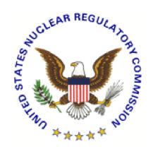

# **U.S. NUCLEAR REGULATORY COMMISSION STANDARD REVIEW PLAN**

## **7.5 INFORMATION SYSTEMS IMPORTANT TO SAFETY**

#### **REVIEW RESPONSIBILITIES**

**Primary** - Organization responsible for the review of instrumentation and controls

**Secondary** - None

**Review Note:** The revision numbers of Regulatory Guides (RG) and the years of endorsed industry standards referenced in this Standard Review Plan (SRP) section are centrally maintained in SRP Section 7.1-T, "Regulatory Requirements, Acceptance Criteria, and Guidelines for Instrumentation and Control Systems Important to Safety," (Table 7-1). Therefore, the individual revision numbers of RGs (except RG 1.97) and years of endorsed industry standards are not shown in this section. References to industry standards incorporated by reference into regulation (IEEE Std 279-1971 and IEEE Std 603-1991) and industry standards that are not endorsed by the agency do include the associated year in this section. See Table 7-1 to ensure that the appropriate RGs and endorsed industry standards are used for the review.

Revision 6 - August 2016

#### **USNRC STANDARD REVIEW PLAN**

This Standard Review Plan (SRP), NUREG-0800, has been prepared to establish criteria that the U.S. Nuclear Regulatory Commission (NRC) staff responsible for the review of applications to construct and operate nuclear power plants intends to use in evaluating whether an applicant or licensee meets the NRC's regulations. The SRP is not a substitute for the NRC's regulations, and compliance with it is not required. However, an applicant is required to identify differences between the design features, analytical techniques, and procedural measures proposed for its facility and the SRP acceptance criteria and evaluate how the proposed alternatives to the SRP acceptance criteria provide an acceptable method of complying with the NRC regulations.

The SRP sections are numbered in accordance with corresponding sections in Regulatory Guide (RG) 1.70, "Standard Format and Content of Safety Analysis Reports for Nuclear Power Plants (LWR Edition)." Not all sections of RG 1.70 have a corresponding review plan section. The SRP sections applicable to a combined license application for a new light-water reactor (LWR) are based on RG 1.206, "Combined License Applications for Nuclear Power Plants (LWR Edition)."

These documents are made available to the public as part of the NRC's policy to inform the nuclear industry and the general public of regulatory procedures and policies. Individual sections of NUREG-0800 will be revised periodically, as appropriate, to accommodate comments and to reflect new information and experience. Comments may be submitted electronically by email to NRO\_SRP@nrc.gov

Requests for single copies of SRP sections (which may be reproduced) should be made to the U.S. Nuclear Regulatory Commission, Washington, DC 20555, Attention: Reproduction and Distribution Services Section by fax to (301) 415-2289; or by email to DISTRIBUTION@nrc.gov. Electronic copies of this section are available through the NRC's public Web site at http://www.nrc.gov/reading-rm/doc-collections/nuregs/staff/sr0800/, or in the NRC's Agencywide Documents Access and Management System (ADAMS), at http://www.nrc.gov/reading-rm/adams.html, under ADAMS Accession No. ML16020A088.

## I. AREAS OF REVIEW

The objectives of the review are to confirm that the information systems important to safety satisfy the requirements of the acceptance criteria and guidelines applicable to these systems, and that they will provide the information to ensure plant safety during all plant conditions for which they are required.

The specific areas of review are as follows:

This SRP section describes the review process and acceptance criteria for those instrumentation and control (I&C) systems that provide information to the plant operators for: (1) assessing plant conditions, safety system performance and making decisions related to plant responses to abnormal events, and (2) preplanned manual operator action related to accident mitigation. The information systems reviewed using this section also provide the necessary information from which appropriate actions can be taken to mitigate the consequences of anticipated operational occurrences. The systems reviewed using Section 7.5 of the SRP include the following:

- Accident monitoring instrumentation.
- Bypassed or inoperable status indication (BISI) for safety systems.
- Plant annunciator (alarm)1 systems.
- Safety parameter display system (SPDS).
- Information systems associated with the emergency response facilities (ERF) and Emergency Response Data System (ERDS).

For SPDS, ERF, and ERDS, the organization responsible for the review of I&C limits its review to the system interface with the plant control and safety systems. Functional performance of those systems, as well as functional aspects of other I&C systems - such as radiation monitoring, fire detection, and the information systems for environs conditions during and following an accident - are addressed in the review of other sections of the safety analysis report (SAR).

2. Inspections, Tests, Analyses, and Acceptance Criteria (ITAAC). For design certification (DC) and combined license (COL) reviews, the staff reviews the applicant's proposed ITAAC associated with the structures, systems, and components (SSCs) related to this SRP section in accordance with SRP Section 14.3, "Inspections, Tests, Analyses, and Acceptance Criteria." The staff recognizes that the review of ITAAC cannot be completed until after the rest of this portion of the application has been reviewed against acceptance criteria contained in this SRP section. Furthermore, the staff reviews the

1 For the purposes of this section, the annunciator system is considered to consist of sets of alarms (which may be displayed on tiles, video display units, or other devices) and sound equipment; logic and processing support; and functions to enable operators to silence, acknowledge, reset, and test alarms.

ITAAC to ensure that all SSCs in this area of review are identified and addressed as appropriate in accordance with SRP Section 14.3.

3. COL Action Items and Certification Requirements and Restrictions. For a DC application, the review will also address COL action items and requirements and restrictions (e.g., interface requirements and site parameters).

For a COL application referencing a DC, a COL applicant must address COL action items (referred to as COL license information in certain DCs) included in the referenced DC. Additionally, a COL applicant must address requirements and restrictions (e.g., interface requirements and site parameters) included in the referenced DC.

### Review Interfaces

Other SRP sections interface with this section as follows:

1. SRP Section 7.0, "Instrumentation and Controls – Overview of Review Process," describes the coordination of reviews, including the information to be reviewed and the scope necessary for each of the different types of applications that the staff may review. Refer to that section for information regarding how the areas of review are affected by the type of application under consideration and for a description of coordination between the organization responsible for the review of I&C and other organizations.

The specific acceptance criteria and review procedures are contained in the referenced SRP sections.

#### II. ACCEPTANCE CRITERIA

### Requirements

Acceptance criteria are based on meeting the relevant requirements of the following Commission regulations:

Requirements applicable to accident monitoring instrumentation

- 1. Title 10 of the *Code of the Federal Regulations* (10 CFR) 50.54(jj) and 10 CFR 50.55(i).
- 2. 10 CFR 50.55a(h), "Protection Systems and Safety Systems," requires compliance with the Institute of Electrical and Electronics Engineers (IEEE) Standard (Std) 603-1991, "IEEE Standard Criteria for Safety Systems for Nuclear Power Generating Stations," and the correction sheet dated January 30, 1995. For nuclear power plants with construction permits issued before January 1, 1971, the applicant or licensee may elect to comply instead with their plant-specific licensing basis. For nuclear power plants with construction permits issued between January 1, 1971, and May 13, 1999, the applicant or licensee may elect to comply instead with the requirements stated in IEEE Std 279-1971, "Criteria for Protection Systems for Nuclear Power Generating Stations." For accident monitoring instrumentation isolated from the protection system, the applicable requirements of 10 CFR 50.55a(h) for IEEE Std 279-1971 is Clause 4.7, "Control and Protection System Interaction," and for IEEE Std 603-1991 are

- Clause 5.6.3, "Independence Between Safety Systems and Other Systems," and Clause 6.3, "Interaction Between the Sense and Command Features and Other Systems."
- 3. 10 CFR 50.34(f), "Additional TMI-Related Requirements," or equivalent TMI Action Plan requirements imposed by orders. The following portions of 10 CFR 50.34(f) apply to accident monitoring instrumentation.
  - 10 CFR 50.34(f)(2)(v), regarding bypass and inoperable status indication.
  - 10 CFR 50.34(f)(2)(xi), regarding direct indication of relief and safety valve position.
  - 10 CFR 50.34(f)(2)(xii), regarding auxiliary feedwater system flow indication (applicable to pressurized water reactors [PWR] only).
  - 10 CFR 50.34(f)(2)(xvii), regarding accident monitoring instrumentation.
  - 10 CFR 50.34(f)(2)(xviii), regarding inadequate core cooling instrumentation.
  - 10 CFR 50.34(f)(2)(xix), regarding instruments for monitoring plant conditions following core damage.
  - 10 CFR 50.34(f)(2)(xx), regarding power for pressurizer level indication (applicable to PWR only).
  - 10 CFR 50.34(f)(2)(xxiv), regarding central reactor vessel water level recording (applicable to boiling water reactors only).
- 4. 10 CFR Part 50, "Domestic Licensing of Production and Utilization Facilities," Appendix A, "General Design Criteria for Nuclear Power Plants," General Design Criterion (GDC) 1, "Quality Standards and Records."
- 5. GDC 2, "Design Basis for Protection against Natural Phenomena" (applicable to channels classified as Category 1 or 2 in RG 1.97, Revisions 2 and 3, "Instrumentation for Light-Water-Cooled Nuclear Power Plants to Assess Plant and Environs Conditions During and Following an Accident," or to channels classified as Types A, B, C, or D in RG 1.97, Revision 4, "Criteria for Accident Monitoring Instrumentation for Nuclear Power Plants.")
- 6. GDC 4, "Environmental and Dynamic Effects Design Basis" (applicable to channels classified as Category 1 or 2 in RG 1.97, Revisions 2 or 3, or as Type A, B, C, or D in RG 1.97, Revision 4).
- 7. GDC 13, "Instrumentation and Control."
- 8. GDC 19, "Control Room."
- 9. GDC 24, "Separation of Protection and Control Systems."

Requirements applicable to bypassed and inoperable status indication:

- 10. 10 CFR 50.54(jj) and 10 CFR 50.55(i).
- 11. 10 CFR 50.55a(h), requires compliance with IEEE Std 603-1991 and the correction sheet dated January 30, 1995. For nuclear power plants with construction permits issued before January 1, 1971, the applicant or licensee may elect to comply instead with their plant licensing basis. For nuclear power plants with construction permits issued between January 1, 1971, and May 13, 1999, the applicant or licensee may elect to comply instead with the requirements stated in IEEE Std 279-1971. For BISI, the applicable requirement for IEEE Std 279-1974 is Clause 4.13, "Indication of Bypasses," and for IEEE Std 603-1991 is Clause 5.8.3, "Indication of Bypasses." For BISI that are isolated from safety systems the requirements for IEEE Std 279-1971 is Clause 4.7, "Control and Protection System Interaction," and for IEEE Std 603-1991 are Clause 5.6.3, "Independence Between Safety Systems and Other Systems," and Clause 6.3, "Interaction Between the Sense and Command Features and Other Systems."
- 12. 10 CFR 50.34(f)(2)(v), "Additional TMI-Related Requirements" bypass and inoperable status indication, or equivalent TMI Action Plan requirements imposed by Orders.
- 13. GDC 1, "Quality Standards and Records."
- 14. GDC 24, "Separation of Protection and Control Systems."

Requirements applicable to annunciator systems

- 15. 10 CFR 50.54(jj) and 10 CFR 50.55(i).
- 16. 10 CFR 50.55a(h), requires compliance with IEEE Std 603-1991 and the correction sheet dated January 30, 1995. For nuclear power plants with construction permits issued before January 1, 1971, the applicant or licensee may elect to comply instead with their plant specific-licensing basis. For nuclear power plants with construction permits issued between January 1, 1971, and May 13, 1999, the applicant or licensee may elect to comply instead with the requirements in IEEE Std 279-1971. For annunciators that are isolated from the protection system, the applicable requirement(s) of 10 CFR 50.55a(h) for IEEE Std 279-1971 is Clause 4.7, "Control and Protection System Interaction," and for IEEE Std 603-1991 are Clause 5.6.3, "Independence Between Safety Systems and Other Systems," and Clause 6.3, "Interaction Between the Sense and Command Features and Other Systems."
- 17. GDC 1, "Quality Standards and Records."
- 18. GDC 13, "Instrumentation and Control."
- 19. GDC 19, "Control Room."
- 20. GDC 24, "Separation of Protection and Control Systems."

Requirements applicable to the review of SPDS, ERF information systems, and ERDS information systems

- 21. 10 CFR 50.54(jj) and 10 CFR 50.55(i)"
- 22. 10 CFR 50.55a(h), requires compliance with IEEE Std 603-1991 and the correction sheet dated January 30, 1995. Nuclear power plants with construction permits issued before January 1, 1971, the applicant or licensee may elect to comply instead with their plant-specific licensing basis. For nuclear power plants with construction permits issued between January 1, 1971, and May 13, 1999, the applicant or licensee may elect to comply instead with the requirements stated in IEEE Std 279-1971. For SPDS, ERF information systems, and ERDS information systems isolated from the protection system, the applicable requirements of 10 CFR 50.55a(h) for IEEE Std 279-1971 is Clause 4.7, "Control and Protection System Interaction," and for IEEE Std 603-1991 are Clause 5.6.3, "Independence Between Safety Systems and Other Systems," and Clause 6.3, "Interaction Between the Sense and Command Features and Other Systems."
- 23. GDC 1, "Quality Standards and Records."
- 24. GDC 24, "Separation of Protection and Control Systems."

Additional requirements applicable to any information system important to safety proposed for standard DC or COLs under 10 CFR Part 52, "Licenses, Certifications, and Approvals for Nuclear Power Plants."

- 25. 10 CFR 52.47(b)(1), which requires that a DC application contain the proposed ITAAC that are necessary and sufficient to provide reasonable assurance that, if the inspections, tests, and analyses are performed and the acceptance criteria met, a plant that incorporates the design certification is built and will operate in accordance with the design certification, the provisions of the Atomic Energy Act, and the U.S. Nuclear Regulatory Commission (NRC's) regulations;
- 26. 10 CFR 52.80(a), which requires that a COL application contain the proposed inspections, tests, and analyses, including those applicable to emergency planning, that the licensee shall perform, and the acceptance criteria that are necessary and sufficient to provide reasonable assurance that, if the inspections, tests, and analyses are performed and the acceptance criteria met, the facility has been constructed and will operate in conformity with the combined license, the provisions of the Atomic Energy Act, and the NRC's regulations.

#### SRP Acceptance Criteria

Specific SRP acceptance criteria acceptable to meet the relevant requirements of the NRC's regulations identified above are contained in SRP Section 7.1 "Instrumentation and Controls – Introduction," SRP Table 7-1, and SRP Appendix 7.1-A, "Acceptance Criteria and Guidelines for Instrumentation and Controls Systems Important to Safety," which lists standards, RGs and branch technical positions (BTP). The SRP is not a substitute for the NRC's regulations, and compliance with it is not required. However, an applicant is required to identify differences

between the design features, analytical techniques, and procedural measures proposed for its facility and the SRP acceptance criteria and evaluate how the proposed alternatives to the SRP acceptance criteria provide acceptable methods of compliance with the NRC regulations.

- 1. SRP Appendix 7.1-B, "Guidance for Evaluation of Conformance to IEEE Std 279," provides guidance for evaluating conformance to the requirements of IEEE Std 279-1971.
- 2. SRP Appendix 7.1-C, "Guidance for Evaluation of Conformance to IEEE Std 603," provides guidance for evaluating conformance to IEEE Std 603-1991.
- 3. SRP Appendix 7.1-D, "Guidance for Evaluation of the Application of IEEE Std 7-4.3.2," provides guidance for evaluating conformance to the acceptance criteria contained in RG 1.152, "Criteria for Digital Computers in Safety Systems of Nuclear Power Plants," which endorses IEEE Std 7-4.3.2, "IEEE Standard Criteria for Digital Computers in Safety Systems of Nuclear Power Generating Stations."
- 4. Item II.Q, "Defense against Common-Mode Failures in Digital Instrument and Control Systems," of the Staff Requirements Memorandum (SRM) on SECY-93-087, "Policy, Technical, and Licensing Issues Pertaining to Evolutionary and Advanced Light Water Reactor (ALWR) Designs," provides guidance on Diversity and Defense-in-Depth. SRP BTP 7-19, "Guidance for Evaluation of Diversity and Defense-in—Depth in Digital Computer-Based Instrumentation and Control Systems," provides additional guidance.
- 5. RG 1.97, Revisions 2, 3, and 4, and describe methods acceptable to the NRC staff for providing instrumentation to monitor variables for accident conditions. For plants with operating licenses issued before June 2006, RG 1.97, Revision 2 and 3, are still effective. Licensees of these plants may, however, convert to the criteria of Revision 4 or use the criteria of Revision 4 when performing modifications that do not involve a conversion. The guidance contained in Regulatory Position 1 of RG 1.97, Revision 4, should be followed in these cases. Plants that obtained an operating license after June 2006 should reference the guidance of RG 1.97, Revision 4. SRP BTP 7-10, "Guidance on Application of RG 1.97," provides guidance on the application of RG 1.97.

#### III. REVIEW PROCEDURES

The reviewer will select material from the procedures described below, as may be appropriate for a particular case. Typical reasons for a non-uniform emphasis are the introduction of new design features or the utilization in the design of features previously reviewed and found acceptable.

These review procedures are based on the identified SRP acceptance criteria. For deviations from these specific acceptance criteria, the staff should review the applicant's evaluation of how the proposed alternatives to the SRP criteria provide an acceptable method of complying with the relevant NRC requirements identified in Subsection II.

SRP Section 7.1 describes the general procedures to be followed in reviewing any I&C system. SRP Section 7.5 highlights specific topics that should be emphasized in the review of information systems important to safety. The systems addressed below may be implemented

either as stand-alone systems or integrated as part of other systems. If the information systems are not isolated from the protection systems, they should also be evaluated according to the criteria in SRP Section 7.2, "Reactor Trip System," or 7.3, "Engineered Safety Features

Systems," as appropriate. Other information systems (e.g., plant computer and severe accident monitoring) may be included in the review. The acceptance criteria for such systems depend on the function of the system and the applicable design criteria.

Any exceptions or deviations to accident monitoring instrumentation designed to satisfy RG 1.97 should be identified in the SAR. This includes acceptable deviations and clarifications identified in BTP 7-10.

1. The review should include an evaluation of the information systems design against the guidance of IEEE Std 603-1991 or IEEE Std 279-1971, depending on the applicant or licensee's commitment regarding these design criteria. For computer-based information systems important to safety, guidance is provided by IEEE Std 7-4.3.2 as endorsed by RG 1.152. These procedures are detailed in SRP Appendix 7.1-B for IEEE Std 279-1971, SRP Appendix 7.1-C for IEEE Std 603-1991, and SRP Appendix 7.1-D for IEEE Std 7-4.3.2.

The reviewer should consider the overall information system functions at the system level. The design should be compatible with the SAR Chapter 15 design bases accident analyses, and operating procedures as well as applicable guidance of IEEE Std 279-1971 or IEEE Std 603-1991.

The review should also consider the guidance provided in NUREG-0737, Supplement 1, "Clarification of TMI Action Plan Requirements: Requirements for Emergency Response Capability," with respect to accident monitoring instrumentation, ERF, and SPDS. The information systems review should address the topics identified as applicable in SRP Table 7-1. SRP Appendix 7.1-A describes review methods for each topic. Certain guidance documents identified in Parts 3 and 4 of SRP Table 7-1 apply only to BISI or accident monitoring instrumentation, but not both. The guidance documents that are applicable to specific systems are identified below.

Major design considerations that should be emphasized in the review of the information systems important to safety are identified below.

Recommended review emphasis for accident monitoring instrumentation

- A. Conformance with RG 1.97 and SRP BTP 7-10.
- B. Use of digital systems Review of computer-based digital systems should consider the unique aspects of digital I&C - see SRP Appendix 7.0-A, "Review Process for Digital Instrumentation and Control Systems," and SRP Appendix 7.1-D; design to protect against the potential for common-cause software failure; and the suitability of display characteristics. Additional guidance on the last two items may be found in Clause 6.2, "Common Cause Failure," and Clause 8, "Display Criteria," of IEEE Std 497, "IEEE Standard Criteria for Accident Monitoring Instrumentation for Nuclear Power Generating Stations," as endorsed by RG 1.97, Revision 4.
- C. Emergency operating procedures (EOP) action points A basis should be provided for EOP action points that accounts for measurement uncertainties.

- RG 1.105, "Setpoints for Safety-Related Instrumentation," provides acceptable guidance for establishing these uncertainties.
- D. Monitoring for severe accidents The accident monitoring instrumentation should be demonstrated to perform their intended function for severe accident protection. They need not be subject to additional 10 CFR 50.49, "Environmental Qualification of Electric Equipment Important to Safety for Nuclear Power Plants," environmental qualification requirements. However, they should be designed so there is reasonable assurance that they will operate in the severe accident environment for which they are intended and over the time span for which they are needed.
- E. Performance assessment For systems developed in accordance with the guidance of RG 1.97, Revision 4, the review should confirm that the performance assessment fulfils the goals outlined in Clause 5.6, "Performance Assessment Documentation," of IEEE Std 497.

## Recommended review emphasis for BISI

- F. Scope of BISI indications As a minimum, BISI should be provided for the following systems:
  - Reactor trip system (RTS) and engineered safety features actuation system (ESFAS) - See SRP Appendix 7.1-B, Subsection 4.13, "Indication of Bypasses," and SRP Appendix 7.1-C, Subsection 5.8.3, "Indication of Bypasses."
  - Interlocks for isolation of low-pressure systems from the reactor coolant system - See SRP BTP 7-1, "Guidance on Isolation of Low-Pressure Systems from the High-Pressure Reactor Coolant System."
  - ECCS accumulator isolation valves See SRP BTP 7-2. "Guidance on Requirements of Motor-Operated Valves in the Emergency Core Cooling System Accumulator Lines."
  - Controls for changeover of residual heat removal from injection to recirculation mode - See SRP BTP 7-6, "Guidance on Design of Instrumentation and Controls Provided to Accomplish Changeover from Injection to Recirculation Mode."
- G. Conformance with RG 1.47, "Bypassed and Inoperable Status Indication for Nuclear Power Plant Safety Systems."
- H. Independence See SRP Appendix 7.1-B, Subsection 4.7, "Control and Protection System Interaction," and SRP Appendix 7.1-C, Subsection 5.6, "Independence," and Subsections 6.3, "Interaction Between the Sense and Command Features and Other Systems." The indication system should be designed and installed in a manner that precludes the possibility of adverse effects on plant safety systems. Failure or bypass of a protective function should

not be a credible consequence of failures occurring in the indication equipment, and the bypass indication should not reduce the required independence between redundant safety systems.

I. Use of digital systems - See SRP Appendix 7.0-A and Appendix 7.1-D.

Recommended review emphasis for annunciator systems

- J. Reliability The applicant or licensee should justify that the degree of redundancy, diversity, testability, and quality provided in annunciator systems is adequate to support normal and emergency operations. SRP Appendix 7.1-C, Subsection 5.15, "Reliability," provides guidance on the evaluation of safety system reliability that may be used in evaluating the reliability of annunciator systems.
- K. Use of digital systems See SRP Appendix 7.0-A and Appendix 7.1-D.
- L. Independence (isolation between safety systems and other systems) See SRP Appendix 7.1-B, Subsection 4.7, "Control and Protection System Interaction," and SRP Appendix 7.1-C, Subsections 5.6, "Independence," and Subsection 6.3, "Interaction Between the Sense and Command Features and Other Systems."

Additional items for emphasis for ALWR annunciator systems

- M. Redundancy Redundant alarm systems should be provided. These redundant systems need not comply with the single failure criterion, but independence between the redundant systems should be equivalent to that provided between redundant channels of the safety systems. See SRP Appendix 7.1-C, Subsection 5.6, "Independence."
- N. Self-test provisions See SRP BTP 7-17, "Guidance on Self-Test and Surveillance Test Provisions." The surveillance test portions of this BTP are not applicable.
- O. Compliance with IEEE Std 603-1991 Alarms that are provided for manually controlled actions for which no automatic control is provided and that are required for the safety systems to accomplish their safety functions should be reviewed against the requirements of IEEE Std 603-1991. See SRP Appendix 7.1-C.
  - This review is directed by the SRM on SECY-93-087, Item II.T, "Control Room Annunciator (Alarm) Reliability."

Recommended review emphasis for SPDS, ERF information systems, and ERDS information systems

P. Independence (isolation between safety systems and other systems) - See SRP Appendix 7.1-B, Subsection 4.7, "Control and Protection System Interaction," and SRP Appendix 7.1-C, Subsection 5.6, "Independence," and Subsection 6.3, "Interaction Between the Sense and Command Features and Other Systems."

2. For review of a DC application, the reviewer should follow the above procedures to verify that the design, including requirements and restrictions (e.g., interface requirements and site parameters), set forth in the final safety analysis report (FSAR) meets the acceptance criteria. DCs have referred to the FSAR as the design control document. The reviewer should also consider the appropriateness of identified COL action items. The reviewer may identify additional COL action items; however, to ensure these COL action items are addressed during a COL application, they should be added to the DC FSAR.

For review of a COL application, the scope of the review is dependent on whether the COL applicant references a DC, an early site permit or other NRC approvals (e.g., manufacturing license, site suitability report or topical report).

3. For review of both DC and COL applications, SRP Section 14.3 should be followed for the review of ITAAC. The review of ITAAC cannot be completed until after the completion of this section.

### IV. EVALUATION FINDINGS

The reviewer verifies that the applicant has provided sufficient information and that the review and calculations (if applicable) support conclusions of the following type to be included in the staff's safety evaluation report (SER). The reviewer also states the bases for those conclusions.

1. The NRC staff concludes that the designs of the information systems important to safety are acceptable and meet the relevant requirements of GDC 1, 2, 4, 13, 19, and 24, and 10 CFR 50.34(f), 10 CFR 50.54(jj) and 10 CFR 50.55(i), and 10 CFR 50.55a(h).

The staff conducted a review of the information systems important to safety for conformance to the guidelines in the RGs and industry codes and standards applicable to these systems. The staff concludes that the applicant or licensee adequately classified and identified the guidelines applicable to these systems. Based on the review of the system design for conformance to the guidelines, the staff finds that the systems conform to the guidelines applicable to these systems. Therefore, the staff finds that the applicable requirements of GDC 1 and 10 CFR 50.54(jj) and 10 CFR 50.55(i) have been met.

The review included the identification of those systems and components for information systems important to safety designed to survive the effects of earthquakes, other natural phenomena, abnormal environments, and missiles. Based on the review, the staff concludes that the applicant or licensee has identified those systems and components consistent with the design bases for those systems. Sections 3.10 and 3.11 of the SER address the qualification programs to demonstrate the capability of these systems and components to survive these events. Therefore, the staff finds that the identification of these systems and components satisfies the applicable requirements of GDC 2 and 4.

The nonsafety portions of information systems important to safety are appropriately isolated from safety systems, including the safety portions of the information systems. Therefore, the staff concludes that the isolation of these systems from safety systems satisfies the applicable requirements of 10 CFR 50.55a(h) and the requirements of GDC 24.

The instrumentation provided for monitoring severe accident conditions has been designed to operate in the severe accident environment for which it is intended and over the time span for which it is needed. Therefore, the staff finds that the severe accident monitoring instrumentation satisfies the applicable requirements of GDC 2 and 4.

The accident monitoring instrumentation conforms to the guidelines for the instrumentation to access plant conditions during and following an accident provided in RG 1.97. The redundant information systems conform to the guidelines for the physical independence of electrical systems provided in RG 1.75, "Criteria for Independence of Electrical Safety Systems." The instrument spans and EOP action points were established in accordance with the guidelines of RG 1.105. The environmental monitoring system provided to protect the safety instrument sensing lines from freezing conforms to the guidelines of RG 1.151, "Instrument Sensing Lines," Regulatory Position 5. The accident monitoring instrumentation includes appropriate variables. The range and accuracy of the instrument channels for these variables are consistent with the plant safety analysis. The accident monitoring instrumentation includes appropriate variables for monitoring severe accident conditions. The variables monitored and the range and accuracy of instrumentation provided to monitor these variables is consistent with the severe accident analysis. Therefore, the staff finds that the accident monitoring instrumentation meets the applicable requirements of GDC 13 and 19.

The accident monitoring instrumentation includes the following functions required by 10 CFR 50.34(f): feedwater system flow indication, accident monitoring instrumentation, inadequate core cooling instrumentation, instruments for monitoring plant conditions following core damage, central reactor vessel water level recording. Additionally, the power supply for the accident monitoring instrumentation pressurizer level indication complies with the requirements of 10 CFR 50.34(f)(2)(xx). Therefore, the staff concludes that the instrumentation systems important to safety satisfy the applicable requirements of 10 CFR 50.34(f), Subparts 10 CFR 50.34(f)xii, 10 CFR 50.34(f)xvii, 10 CFR 50.34(f)xviii, 10 CFR 50.34(f)xix, 10 CFR 50.34(f)xx, and 10 CFR 50.34(f)xxiv.

The staff reviewed the systems for which a bypassed or inoperable status is indicated in the control room. The staff finds that the bypass indications will give the operators timely information and status reports so the operators can mitigate the effects of unexpected system unavailability. The bypass indications satisfy the guidelines of RG 1.47. Therefore, the staff concludes that the BISI functions satisfy the applicable requirements of 10 CFR 50.55a(h) and 10 CFR 50.34(f)(2)(v).

The staff reviewed the control room annunciator systems and finds that these systems are sufficiently reliable to support normal and emergency plant operations. Redundant annunciator systems are provided and the independence of these redundant systems complies with the independence requirements of IEEE Std 603-1991, Clause 5.6. Alarms provided for manually controlled actions for which no automatic control is

provided and that are required for the safety systems to accomplish their safety functions comply with the guidance of IEEE Std 603-1991. Therefore, the staff concludes that the annunciator systems satisfy the guidance of the SRM on SECY-93-087, Item II.T, GDC 13 and 19.

Based on the above items, the staff finds that the information systems satisfy the requirements of GDC 13 for monitoring variables and systems over their anticipated ranges for normal operation, for anticipated operational occurrences, and for accident conditions. Further, the staff finds that conformance to GDC 13 and the applicable guidelines satisfies the applicable requirements of GDC 19 with respect to information systems provided in the control room from which actions can be taken to operate the unit safety under normal conditions and to maintain it in a safe condition under accident conditions.

The safety parameter display system, the information systems associated with the emergency response facilities, and the emergency response data system, nonsafety portions of accident monitoring instrumentation, nonsafety portions of BISI, and nonsafety portions of the annunciator systems are appropriately isolated from safety systems. Electrical isolation devices were qualified in accordance with the guidance of SRP BTP 7-11. Therefore, the staff concludes that the isolation of these systems from safety systems satisfies the applicable requirements of 10 CFR 50.55a(h) and GDC 24.

The applicant or licensee has also incorporated in the system design the recommendations of Three Mile Island (TMI) task action plan items [identify item number and how implemented] that the staff has reviewed and found acceptable.

In the review of the information systems important to safety, the staff examined the dependence of these systems on the availability of auxiliary supporting features and other auxiliary features. Based on this review and coordination with those having primary review responsibility of auxiliary supporting features and other auxiliary features, the staff concludes that the design of the information systems important to safety is compatible with the functional requirements of auxiliary supporting features and other auxiliary features.

2. Note: the following finding applies only to systems involving digital computer-based components.

Based on the review of software development plans and the inspections of the computer development process and design outputs, the staff concludes that the computer systems meet the guidance of RG 1.152. Therefore, the special characteristics of computer systems have been adequately addressed, and the staff finds that the information systems important to safety satisfy these requirements of GDC 1.

- 3. For DC and COL reviews, the findings will also summarize the staff's evaluation of requirements and restrictions (e.g., interface requirements and site parameters) and COL action items relevant to this SRP section.
- 4. Note: the following conclusion is applicable to all applications.

The conclusions noted above for the information systems important to safety are applicable to all portions of the systems except for the following, for which acceptance is based on prior NRC review and approval as noted. (List applicable system or topics and identify references.)

5. In addition, to the extent that the review is not discussed in other SER sections, the findings will summarize the staff's evaluation of the ITAAC, including design acceptance criteria, as applicable.

#### V. IMPLEMENTATION

The staff will use this SRP section in performing safety evaluations of DC applications and license applications submitted by applicants pursuant to 10 CFR Part 50 or 10 CFR Part 52. Except when the applicant proposes an acceptable alternative method for complying with specified portions of the Commission's regulations, the staff will use the method described herein to evaluate conformance with Commission regulations.

The provisions of this SRP section apply to reviews of applications submitted 6 months or more after the date of issuance of this SRP section, unless superseded by a later revision.

#### VI. REFERENCES

- 1. Institute of Electrical and Electronic Engineers, IEEE Std 279-1971, "Criteria for Protection Systems for Nuclear Power Generating Stations," Piscataway, NJ.
- 2. Institute of Electrical and Electronic Engineers, IEEE Std 497, "IEEE Standard Criteria for Accident Monitoring Instrumentation for Nuclear Power Generating Stations," Piscataway, NJ.
- 3. Institute of Electrical and Electronic Engineers, IEEE Std 603-1991, "IEEE Standard Criteria for Safety Systems for Nuclear Power Generating Stations," Piscataway, NJ.
- 4. Institute of Electrical and Electronic Engineers, IEEE Std 7-4.3.2, "IEEE Standard Criteria for Digital Computers in Safety Systems of Nuclear Power Generating Stations," Piscataway, NJ.
- 5. U.S. Nuclear Regulatory Commission, "Clarification of TMI Action Plan Requirements Requirements for Emergency Response Capability," NUREG-0737 Supplement 1, January 1983.
- 6. U.S. Nuclear Regulatory Commission, "Bypassed and Inoperable Status Indication for Nuclear Power Plant Safety Systems," Regulatory Guide 1.47.
- 7. U.S. Nuclear Regulatory Commission, "Criteria for Independence of Electrical Safety Systems," Regulatory Guide 1.75.
- 8. U.S. Nuclear Regulatory Commission, "Instrumentation for Light-Water-Cooled Nuclear Power Plants to Assess Plant and Environs Conditions During and Following an Accident," Regulatory Guide 1.97, Revision 2.

- 9. U.S. Nuclear Regulatory Commission, "Instrumentation for Light-Water-Cooled Nuclear Power Plants to Assess Plant and Environs Conditions During and Following an Accident," Regulatory Guide 1.97, Revision 3.
- 10. U.S. Nuclear Regulatory Commission, "Criteria for Accident Monitoring Instrumentation for Nuclear Power Plants," Regulatory Guide 1.97, Revision 4.
- 11. U.S. Nuclear Regulatory Commission, "Setpoints for Safety-Related Instrumentation," Regulatory Guide 1.105.
- 12. U.S. Nuclear Regulatory Commission, "Instrument Sensing Lines," Regulatory Guide 1.151.
- 13. U.S. Nuclear Regulatory Commission, "Criteria for Use of Computers in Safety Systems of Nuclear Power Plants," Regulatory Guide 1.152.
- 14. U.S. Nuclear Regulatory Commission ,"Policy, Technical, and Licensing Issues Pertaining to Evolutionary and Advanced Light Water Reactor (ALWR) Designs," SECY-93-087, April 2, 1993.
- 15. U.S. Nuclear Regulatory Commission, "Policy, Technical, and Licensing Issues Pertaining to Evolutionary and Advanced Light-Water Reactor (ALWR) Designs," Staff Requirements Memorandum on SECY-93-087, July 15, 1993.

| PAPERWORK REDUCTION ACT STATEMENT                                                                                                                                                                                                             |
|-----------------------------------------------------------------------------------------------------------------------------------------------------------------------------------------------------------------------------------------------|
| The information collections contained in the Standard Review Plan are covered by the requirements of 10 CFR Part 50 and 10 CFR Part 52, and were approved by the Office of Management and Budget, approval number 3150-0011 and 3150-0151. |
| PUBLIC PROTECTION NOTIFICATION                                                                                                                                                                                                                |
| The NRC may not conduct or sponsor, and a person is not required to respond to, a request for information or an information collection requirement unless the requesting document displays a currently valid OMB control number.           |
|                                                                                                                                                                                                                                               |
|                                                                                                                                                                                                                                               |
|                                                                                                                                                                                                                                               |
|                                                                                                                                                                                                                                               |

## **SRP Section 7.5 Description of Changes**

#### **SRP Section 7.5, "Information Systems Important to Safety"**

This SRP Section affirms the technical accuracy and adequacy of the guidance previously provided in SRP Section 7.5, Revision 5, dated March 2007. See ADAMS Accession No. ML070550086.

The main purpose of this update is to incorporate the revised software Regulatory Guides and the associated endorsed standards. For organizational purposes, the revision number of each Regulatory Guide and year of each endorsed standard is now listed in one place, Table 7-1. As a result, revisions of Regulatory Guides and years of endorsed standards were removed from other SRP Chapter 7 sections, as applicable. For standards that are incorporated by reference into regulation (IEEE Std 279-1971 and IEEE Std 603-1991) and standards that have not been endorsed by the agency, the associated revision number or year is still included in other SRP Chapter 7 sections, as applicable.

Text in Section II, "Acceptance Criteria," "Requirements" paragraphs 3 and 12, referring to Part 50 licensing requirements for plants not listed in 10 CFR 50.34(f), "Additional TMI-Related Requirements," was deleted.

Part of 10 CFR was reorganized due to a rulemaking in the fall of 2014. Quality requirement discussions in the former 10 CFR 50.55a(a)(1) were moved to 10 CFR 50.54(jj) and 10 CFR 50.55(i). The incorporation by reference language in the former 10 CFR 50.55a(h)(1) was moved to 10 CFR 50.55a(a)(2). There were no changes either to 10 CFR 50.55a(h)(2) or 10 CFR 50.55a(h)(3).

Additional changes were editorial.