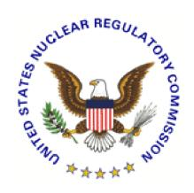

# **U.S. NUCLEAR REGULATORY COMMISSION STANDARD REVIEW PLAN**

# **7.7 CONTROL SYSTEMS**

# **REVIEW RESPONSIBILITIES**

**Primary** - Organization responsible for the review of instrumentation and controls

**Secondary** - None

**Review Note:** The revision numbers of Regulatory Guides (RG) and the years of endorsed industry standards referenced in this Standard Review Plan (SRP) section are centrally maintained in SRP Section 7.1-T, "Regulatory Requirements, Acceptance Criteria, and Guidelines for Instrumentation and Control Systems Important to Safety," (Table 7-1). Therefore, the individual revision numbers of RGs (except RG 1.97) and years of endorsed industry standards are not shown in this section. References to industry standards incorporated by reference into regulation (IEEE Std 279-1971 and IEEE Std 603-1991) and industry standards that are not endorsed by the agency do include the associated year in this section. See Table 7-1 to ensure that the appropriate RGs and endorsed industry standards are used for the review.

Revision 6 - August 2016

#### **USNRC STANDARD REVIEW PLAN**

This Standard Review Plan (SRP), NUREG-0800, has been prepared to establish criteria that the U.S. Nuclear Regulatory Commission (NRC) staff responsible for the review of applications to construct and operate nuclear power plants intends to use in evaluating whether an applicant or licensee meets the NRC's regulations. The Standard Review Plan is not a substitute for the NRC's regulations, and compliance with it is not required. However, an applicant is required to identify differences between the design features, analytical techniques, and procedural measures proposed for its facility and the SRP acceptance criteria and evaluate how the proposed alternatives to the SRP acceptance criteria provide an acceptable method of complying with the NRC regulations.

The SRP sections are numbered in accordance with corresponding sections in Regulatory Guide (RG) 1.70, "Standard Format and Content of Safety Analysis Reports for Nuclear Power Plants (LWR Edition)." Not all sections of RG 1.70 have a corresponding review plan section. The SRP sections applicable to a combined license application for a new light water reactor (LWR) are based on RG 1.206, "Combined License Applications for Nuclear Power Plants (LWR Edition)."

These documents are made available to the public as part of the NRC's policy to inform the nuclear industry and the general public of regulatory procedures and policies. Individual sections of NUREG-0800 will be revised periodically, as appropriate, to accommodate comments and to reflect new information and experience. Comments may be submitted electronically by email to NRO\_SRP@nrc.gov.

Requests for single copies of SRP sections (which may be reproduced) should be made to the U.S. Nuclear Regulatory Commission, Washington, DC 20555, Attention: Reproduction and Distribution Services Section by fax to (301) 415 2289; or by email to DISTRIBUTION@nrc.gov. Electronic copies of this section are available through the NRC's public Web site at http://www.nrc.gov/reading rm/doc collections/nuregs/staff/sr0800/, or in the NRC's Agencywide Documents Access and Management System (ADAMS), at http://www.nrc.gov/reading rm/adams.html, under ADAMS Accession No ML16020A095.

# I. AREAS OF REVIEW

The objectives of the review are to confirm that the control systems conform to the acceptance criteria and guidelines so that the controlled variables can be maintained within prescribed operating ranges, and that effects of operation or failure of these systems are bounded by the accident analyses in Chapter 15 of the safety analysis report (SAR).

The specific areas of review are as follows:

1. This SRP section describes the review process and acceptance criteria for those control systems used for normal operation that are not relied upon to perform safety functions following anticipated operational occurrences or accidents. The control systems covered by this SRP section include those control systems that control plant processes having a significant impact on plant safety. These control systems are those systems that can, through normal operation, system failure or inadvertent operation, affect the performance of critical safety functions. Table 7.7 1 of this SRP section lists examples of control system functions that may be included in the scope of SRP Section 7.7 for boiling-water and pressurized-water reactors. The actual list of system functions and systems included in the scope of SRP Section 7.7 will be plant-specific. A specific plant may not necessarily incorporate all of the functions listed in Table 7.7-1, may require functions beyond those listed in Table 7.7-1, or may group functions into systems differently than indicated in Table 7.7-1.

The organization responsible for the review of instrumentation and controls (I&C) also has secondary review responsibility for I&C portions of support systems and plant process systems. The acceptance criteria and review procedures of SRP Section 7.7 are also applicable to these other I&C systems. Table 7.7-2 of this SRP section lists examples of such control systems. Table 7.7-2 is not grouped according to plant type. The actual list of system functions and systems within the scope of the secondary review responsibility of the organization responsible for the review of I&C will be plant-specific. A specific plant may not necessarily incorporate all of the functions listed in Table 7.7-2, may require functions beyond those listed in Table 7.7-2, or may group functions into systems differently than indicated in Table 7.7-2.

- 2. Inspections, Tests, Analyses, and Acceptance Criteria (ITAAC). For design certification (DC) and combined license (COL) reviews, the staff reviews the applicant's proposed ITAAC associated with the structures, systems, and components (SSCs) related to this SRP section in accordance with SRP Section 14.3, "Inspections, Tests, Analyses, and Acceptance Criteria." The staff recognizes that the review of ITAAC cannot be completed until after the rest of this portion of the application has been reviewed against acceptance criteria contained in this SRP section. Furthermore, the staff reviews the ITAAC to ensure that all SSCs in this area of review are identified and addressed as appropriate in accordance with SRP Section 14.3.
- 3. COL Action Items and Certification Requirements and Restrictions. For a DC application, the review will also address COL action items and requirements and restrictions (e.g., interface requirements and site parameters).

For a COL application referencing a DC, a COL applicant must address COL action items (referred to as COL license information in certain DCs) included in the referenced DC. Additionally, a COL applicant must address requirements and restrictions (e.g., interface requirements and site parameters) included in the referenced DC. Other SRP sections interface with this section as follows:

- 1. SRP Section 7.0, "Instrumentation and ControlsOverview of Review Process," describes the coordination of reviews, including the information to be reviewed and the scope necessary for each of the different types of applications that the staff may review. Refer to that section for information regarding how the areas of review are affected by the type of application under consideration and for a description of coordination between the organization responsible for the review of I&C and other organizations.
- 2. In addition to the coordinated reviews discussed in SRP Section 7.0, the review of SRP Section 7.7 should be coordinated with the organizations responsible for the review of reactor systems and plant systems to confirm the adequacy of control systems with respect to maintaining variables within operational limits during plant operation and to confirm that the impact of control system failures is appropriately included in the design basis accident analyses.
- 3. For those areas being reviewed as part of the primary review responsibility of other organizations, the acceptance criteria necessary for the review, and their methods of application, are contained in the SRP sections identified in SRP Appendix 7.1-A, "Acceptance Criteria and Guidelines for Instrumentation and Control Systems Important to Safety," Subsection 2(e).

The specific acceptance criteria and review procedures are contained in the reference SRP sections.

### II. ACCEPTANCE CRITERIA

# Requirements

Acceptance criteria are based on meeting the relevant requirements of the following Commission regulations:

- 1. Title 10 of the *Code of Federal Regulations* (10 CFR) 50.54(jj) and 50.55(i)
- 2. 10 CFR 50.55a(h), "Protection and Safety Systems," requires compliance with the Institute of Electrical and Electronics Engineers (IEEE) Standard (Std) 603-1991, "IEEE Standard Criteria for Safety Systems for Nuclear Power Generating Stations," and the correction sheet dated January 30, 1995. For nuclear power plants with construction permits issued before January 1, 1971, the applicant or licensee may elect to comply instead with its plant-specific licensing basis. For nuclear power plants with construction permits issued between January 1, 1971, and May 13, 1999, the applicant or licensee may elect to comply instead with the requirements stated in IEEE Std 279-1971, "Criteria for Protection Systems for Nuclear Power Generating Station."

For control systems isolated from safety systems, the applicable requirements of 10 CFR 50.55a(h) are defined in IEEE Std 279-1971, Clause 4.7, "Control and Protection System Interaction," IEEE Std 603-1991, Clause 5.6.3, "Independence Between Safety Systems and Other Systems," and IEEE Std 603-1991, Clause 6.3, "Interaction Between the Sense and Command Features and Other Systems."

- 3. 10 CFR 50.34(f)(2)(xxii), "Additional TMI-related requirements," (applies only to B&W plants) or equivalent Three Mile Island Action Plan requirements imposed by Commission order.
- 4. 10 CFR Part 50, "Domestic Licensing of Production and Utilization Facilities," Appendix A, "General Design Criteria for Nuclear Power Plants," Design Criterion (GDC) 1, "Quality Standards and Records."
- 5. GDC 10, "Reactor Design."
- 6. GDC 13, "Instrumentation and Control."
- 7. GDC 15, "Reactor Coolant System Design."
- 8. GDC 19, "Control Room."
- 9. GDC 24, "Separation of Protection and Control Systems."
- 10. GDC 28, "Reactivity Limits."
- 11. GDC 29, "Protection against Anticipated Operational Occurrences."
- 12. GDC 44, "Cooling Water."
- 13. 10 CFR 52.47(b)(1), which requires that a DC application contain the proposed ITAAC that are necessary and sufficient to provide reasonable assurance that, if the inspections, tests, and analyses are performed and the acceptance criteria met, a plant that incorporates the design certification is built and will operate in accordance with the design certification, the provisions of the Atomic Energy Act, and the U.S. Nuclear Regulatory Commission's (NRC's) regulations.
- 14. 10 CFR 52.80(a), which requires that a COL application contain the proposed inspections, tests, and analyses, including those applicable to emergency planning, that the licensee shall perform, and the acceptance criteria that are necessary and sufficient to provide reasonable assurance that, if the inspections, tests, and analyses are performed and the acceptance criteria met, the facility has been constructed and will operate in conformity with the combined license, the provisions of the Atomic Energy Act, and the NRC's regulations.

### SRP Acceptance Criteria

Specific SRP acceptance criteria acceptable to meet the relevant requirements of the NRC's regulations identified above are contained in SRP Section 7.1, "Instrumentation and Controls – Introduction," SRP Table 7-1, and SRP Appendix 7.1-A, which list standards, RGs, and branch technical positions (BTPs). The SRP is not a substitute for the NRC's regulations, and compliance with it is not required. However, an applicant is required to identify differences between the design features, analytical techniques, and procedural measures proposed for its facility and the SRP acceptance criteria and evaluate how the proposed alternatives to the SRP acceptance criteria provide acceptable methods of compliance with the NRC's regulations.

- 1. SRP Appendix 7.1-B, "Guidance for Evaluation of Conformance to IEEE Std 279," provides guidance for evaluating conformance to the requirements of IEEE Std 279-1971.
- 2. SRP Appendix 7.1-C, "Guidance for Evaluation of Conformance to IEEE Std 603," provides guidance for evaluating conformance to IEEE Std 603-1991. Although compliance with IEEE Std 603-1991 is required by 10 CFR 50.55a(h) only for safety systems, the criteria of IEEE Std 603-1991 may be used as review guidance for any I&C system. Therefore, for control systems, the reviewer may use the concepts in IEEE Std 603-1991 as a starting point.
- 3. SRP Appendix 7.1-D, "Guidance for Evaluation of The Application of IEEE Std 7-4.3.2," provides guidance for evaluating conformance to the acceptance criteria contained in RG 1.152, "Criteria for Use of Computers in Safety Systems of Nuclear Power Plants," which endorses IEEE Std 7-4.3.2, "IEEE Standard Criteria for Digital Computers in Safety Systems of Nuclear Power Generating Stations."
- 4. Item II.Q, "Defense against Common-Mode Failures in Digital Instrument and Control Systems," of the Staff Requirements Memorandum on SECY-93-087, "Policy, Technical, and Licensing Issues Pertaining to Evolutionary and Advanced Light Water Reactor (ALWR) Designs," provides guidance on Defense-in-Depth and Diversity. SRP BTP 7-19, provides additional guidance.

## III. REVIEW PROCEDURES

The reviewer will select material from the procedures described below, as may be appropriate for a particular case. Typical reasons for a non-uniform emphasis are the introduction of new design features or the utilization in the design of features previously reviewed and found acceptable.

These review procedures are based on the identified SRP acceptance criteria. For deviations from these acceptance criteria, the staff should review the applicant's evaluation of how the proposed alternatives provide an acceptable method of complying with the relevant NRC requirements identified in Subsection II.

SRP Section 7.1 describes the general procedures to be followed in reviewing any I&C system. This part of SRP Section 7.7 highlights specific topics that should be emphasized in the review of control systems.

- 1. The control systems review should address the applicable topics identified in SRP Table 7-1. SRP Appendix 7.1-A describes review methods for each topic. Major design considerations that should be emphasized in the review of the control systems are identified below.
  - Design bases The review should confirm that the control systems include the necessary features for manual and automatic control of process variables within prescribed normal operating limits.
  - Safety classification The review should confirm that the plant accident analysis in Chapter 15 of the SAR does not rely on the operability of any control system function to assure safety.
  - Effects of control system operation upon accidents The review should confirm that the safety analysis includes consideration of the effects of both control system action and inaction in assessing the transient response of the plant for accidents and anticipated operational occurrences.
  - Effects of control system failures The review should confirm that the failure of any control system component or any auxiliary supporting system for control systems does not cause plant conditions more severe than those described in the analysis of anticipated operational occurrences in Chapter 15 of the SAR. This evaluation should ensure that failure modes that can be associated with digital systems such as software design errors and random hardware failures, as well as the methods used to account for these failure modes, are addressed and documented. (The evaluation of multiple independent failures is not intended.)
  - Effects of control system failures caused by accidents The review should confirm that the consequential effects of anticipated operational occurrences and accidents do not lead to control system failures that would result in consequences more severe than those described in the analysis in Chapter 15 of the SAR.
  - Environmental control system The review should confirm that I&C systems include environmental control as necessary to protect equipment from environmental extremes. This would include, for example, heat tracing of safety instruments and instrument sensing lines as discussed in RG 1.151, "Instrument Sensing Lines," and cabinet cooling fans.
  - Use of digital systems To minimize the potential for control system failures that could challenge safety systems, control system software should be developed using a structured process similar to that applied to safety system software. Elements of the review process may be tailored to account for the lower safety significance of control system software. Refer to SRP Appendix 7.0-A, "Review Process for Digital Instrumentation and Control Systems," and SRP Appendix 7.1-D for guidance on digital system review.

- Independence The independence of safety system functions from the control system should be verified. See SRP Appendix 7.1-B, Subsection 4.6, and SRP Appendix 7.1-C, Subsections 5.6 and 6.3.
- Diversity and Defense-in-Depth Control system elements credited in the diversity and defense-in-depth analysis (see BTP 7-19) should be reviewed using the criteria for diverse I&C systems described in SRP Section 7.8.
- Potential for inadvertent actuation The control systems design should limit the potential for inadvertent actuation and challenges to safety systems.
- Control of access Physical and electronic access to digital computer-based control system software and data should be controlled to prevent changes by unauthorized personnel. Control should address access via network connections and via maintenance equipment.
- 2. For review of a DC application, the reviewer should follow the above procedures to verify that the design, including requirements and restrictions (e.g., interface requirements and site parameters), set forth in the final safety analysis report (FSAR) meets the acceptance criteria. DCs have referred to the FSAR as the design control document. The reviewer should also consider the appropriateness of identified COL action items. The reviewer may identify additional COL action items; however, to ensure these COL action items are addressed during a COL application, they should be added to the DC FSAR.

 For review of a COL application, the scope of the review is dependent on whether the COL applicant references a DC, an early site permit or other NRC approvals (e.g., manufacturing license, site suitability report or topical report).

3. For review of both DC and COL applications, SRP Section 14.3 should be followed for the review of ITAAC. The review of ITAAC cannot be completed until after the completion of this section.

### IV. EVALUATION FINDINGS

The reviewer verifies that the applicant has provided sufficient information and that the review and calculations (if applicable) support conclusions of the following type to be included in the staff's safety evaluation report. The reviewer also states the bases for those conclusions.

1. The NRC staff concludes that the design of the control systems is acceptable and meets the relevant requirements of General Design Criteria 1, 10, 13, 15, 19, 24, 28, 29, and 44, and of 10 CFR 50.34(f), 10 CFR 50.54(jj) and 50.55(i), and 10 CFR 50.55a(h).

The staff conducted a review of these systems for conformance to the guidelines in the RGs and industry codes and standards applicable to these systems. The staff concluded that the applicant or licensee adequately classified and identified the guidelines applicable to these systems. The staff finds that the control systems are appropriately designed and are of sufficient quality to minimize the potential for

challenges to safety systems. Based upon the review of the system design, the staff finds that there is reasonable assurance that the systems fully conform to the applicable guidelines. Therefore, the staff finds that the requirements of GDC 1 and 10 CFR 50.54(jj) and 50.55(i) have been met.

The staff conducted a review of the plant transient response to normal load changes and anticipated operational occurrences such as reactor trip, turbine trip, upsets in the feedwater, and steam bypass systems. The staff concludes that the control systems are capable of maintaining system variables within prescribed operating ranges. The applicant has also provided an environmental control system to protect safety instruments and instrument sensing lines from freezing in accordance with the guidelines of RG 1.151, Regulatory Position 5. Therefore, the staff finds that the control systems satisfy this aspect of the requirements of GDC 13.

The staff review of control systems considered the features of these systems for both manual and automatic control of the process systems. The staff finds that the features for manual and automatic control facilitate the capability to maintain plant variables within prescribed operating limits. The staff finds that the control systems permit actions to be taken to operate the plant safely during normal operation, including anticipated operational occurrences, and, therefore, the control systems satisfy the requirements of GDC 19 with regard to normal plant operations.

The staff review determines that the control systems are appropriately isolated from safety systems and would preserve the reliability, redundancy, and independence requirements of the protection system. Therefore, the staff concludes that the isolation of these systems from safety systems satisfies the applicable requirements of 10 CFR 50.55a(h) and the requirements of GDC 24.

Based on the review of the applicant's or licensee's diversity and defense-in-depth analysis and the quality of control system functions credited in this analysis, the staff concludes that the control system complies with the criteria for defense against common-cause failure in digital instrumentation and control systems. Therefore, the staff finds that the control system functions credited as diverse means for performing safety functions satisfy the criteria of Item II.Q of the Staff Requirements Memorandum on SECY-93-087.

The staff confirmed that the consequential effects of anticipated operational occurrences and accidents do not result in control system failures that would cause plant conditions more severe than those bounded by the analysis of the events.

Based on the review of system functions, the staff concludes that the control systems conform to the requirements of 10 CFR 50.34(f)(2)(xxii). The applicant or licensee has incorporated in the system design the requirements of 10 CFR 50.34(f)(2)(xxii), [identify how implemented] which the staff has reviewed and found acceptable.

The conclusions of the analysis of anticipated operational occurrences and accidents as presented in Chapter 15 of the SAR have been used to confirm that plant safety is not dependent upon the response of the control systems. The staff also confirmed that failure of the control systems themselves or as a consequence of supporting system

failures, such as loss of power sources, does not result in plant conditions more severe than those described in the analysis of design basis accidents and anticipated operational occurrences.

- 2. For DC and COL reviews, the findings will also summarize the staff's evaluation of requirements and restrictions (e.g., interface requirements and site parameters) and COL action items relevant to this SRP section.
- 3. Note: The following conclusion is applicable to all applications.
- 4. The conclusions noted above for the control systems are applicable to all portions of the systems except for the following, for which acceptance is based upon prior NRC review and approval as noted (list applicable system or topics and identify references).
- 5. In addition, to the extent that the review is not discussed in other safety evaluation report sections, the findings will summarize the staff's evaluation of the ITAAC, including design acceptance criteria, as applicable

# V. IMPLEMENTATION

The staff will use this SRP section in performing safety evaluations of DC applications and license applications submitted by applicants pursuant to 10 CFR Part 50 or 10 CFR Part 52, "Licenses, Certifications, and Approvals for Nuclear Power Plants." Except when the applicant proposes an acceptable alternative method for complying with specified portions of the Commission's regulations, the staff will use the method described herein to evaluate conformance with Commission regulations.

The provisions of this SRP section apply to reviews of applications submitted 6 months or more after the date of issuance of this SRP section, unless superseded by a later revision.

## VI. REFERENCES

- 1. Institute of Electrical and Electronics Engineers, IEEE Std 279-1971, "Criteria for Protection Systems for Nuclear Power Generating Stations," Piscataway, NJ.
- 2. Institute of Electrical and Electronics Engineers, IEEE Std 603-1991, "IEEE Standard Criteria for Safety Systems for Nuclear Power Generating Stations," Piscataway, NJ.
- 3. Institute of Electrical and Electronics Engineers, IEEE Std 7-4.3.2, "IEEE Standard Criteria for Digital Computers in Safety Systems of Nuclear Power Generating Stations," Piscataway, NJ.
- 4. U.S. Nuclear Regulatory Commission, "Instrument Sensing Lines," Regulatory Guide 1.151.
- 5. U.S. Nuclear Regulatory Commission, "Criteria for Use of Computers in Safety Systems of Nuclear Power Plants," Regulatory Guide 1.152.

- 6. U.S. Nuclear Regulatory Commission, SECY-93-087, "Policy, Technical, and Licensing Issues Pertaining to Evolutionary and Advanced Light Water Reactor (LWR) Designs," April 2, 1993.
- 7. U.S. Nuclear Regulatory Commission, Staff Requirements Memorandum on SECY-93-087, "Policy, Technical, and Licensing Issues Pertaining to Evolutionary and Advanced Light-Water Reactor (ALWR) Designs," July 15, 1993.

Table 7.7-1. Examples of Control Systems Typically Included in SRP Section 7.7

| Boiling Water Reactor                                                                                                                                                                                                                                                                                                                                                                                                                                  | Pressurized Water Reactor                                                                                                                                                                                                                                                                                                                                                                                                                                                                                                                                                                                                    |
|--------------------------------------------------------------------------------------------------------------------------------------------------------------------------------------------------------------------------------------------------------------------------------------------------------------------------------------------------------------------------------------------------------------------------------------------------------|------------------------------------------------------------------------------------------------------------------------------------------------------------------------------------------------------------------------------------------------------------------------------------------------------------------------------------------------------------------------------------------------------------------------------------------------------------------------------------------------------------------------------------------------------------------------------------------------------------------------------|
| Nuclear boiler control and instrumentation Rod control Rod position instrumentation Neutron monitoring system Recirculation flow control system Pressure regulator and turbine generator control system Feedwater control system Internals vibration monitoring system Acoustic leak monitoring system Loose parts monitoring system Process computer system Safety system and sense line environmental control | Reactivity control system Boron control system Reactor power cutback system Rod position instrumentation In-core neutron monitoring system Ex-core neutron monitoring system Pressurizer pressure and level control system Feedwater control system In-core temperature monitoring system Steam generator water level control system Steam dump control system Steam bypass control system Internals vibration monitoring system Acoustic leak monitoring system Loose parts monitoring system Process computer system Safety system and sense line environmental control |

Table 7.7-2. Examples of Control Systems Typically Included In the Review of Other SAR Sections

| Boiling Water Reactor                                                                                                                                                                                                                                                                                                   | Pressurized Water Reactor                                                                                                                                                                                                                                             |
|-------------------------------------------------------------------------------------------------------------------------------------------------------------------------------------------------------------------------------------------------------------------------------------------------------------------------|-----------------------------------------------------------------------------------------------------------------------------------------------------------------------------------------------------------------------------------------------------------------------|
| Containment/drywell cooling system controls Heating, ventilating, and air conditioning controls Atmospheric control system controls Reactor water cleanup system controls Service water system controls Chilled water system controls Make-up water system controls Instrument air system controls | Fire protection systems Fire suppression system controls Security systems Spent fuel storage instrumentation and control Gaseous radioactive waste system controls Liquid radioactive waste system controls Solid radioactive waste system controls |

#### **PAPERWORK REDUCTION ACT STATEMENT**

The information collections contained in the Standard Review Plan are covered by the requirements of 10 CFR Part 50 and 10 CFR Part 52, and were approved by the Office of Management and Budget, approval number 3150-0011 and 3150-0151.

#### **PUBLIC PROTECTION NOTIFICATION**

The NRC may not conduct or sponsor, and a person is not required to respond to, a request for information or an information collection requirement unless the requesting document displays a currently valid OMB control number.

# **SRP Section 7.7 Description of Changes**

# **SRP Section 7.7, "Control Systems"**

This SRP Section affirms the technical accuracy and adequacy of the guidance previously provided in SRP Section 7.7, Revision 5, dated March 2007. See ADAMS Accession No. ML070670042.

The main purpose of this update is to incorporate the revised software Regulatory Guides and the associated endorsed standards. For organizational purposes, the revision number of each Regulatory Guide and year of each endorsed standard is now listed in one place, Table 7-1. As a result, revisions of Regulatory Guides and years of endorsed standards were removed from this section, if applicable. For standards that are incorporated by reference into regulation (IEEE Std 279-1971 and IEEE Std 603-1991) and standards that have not been endorsed by the agency, the associated revision number or year is still listed in the discussion.

Portions of this section related to the effects of control systems failures were revised to add additional review guidance.

Part of 10 CFR was reorganized due to a rulemaking in the fall of 2014. Quality requirement discussions in the former 10 CFR 50.55a(a)(1) were moved to 10 CFR 50.54(jj) and 10 CFR 50.55(i). The incorporation by reference language in the former 10 CFR 50.55a(h)(1) was moved to 10 CFR 50.55a(a)(2). There were no changes either to 10 CFR 50.55a(h)(2) or 10 CFR 50.55a(h)(3).

Additional changes were editorial.