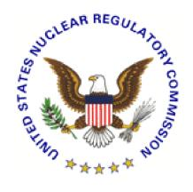

# **U.S. NUCLEAR REGULATORY COMMISSION STANDARD REVIEW PLAN**

#### **BRANCH TECHNICAL POSITION 7-1**

# **GUIDANCE ON ISOLATION OF LOW-PRESSURE SYSTEMS FROM THE HIGH-PRESSURE REACTOR COOLANT SYSTEM**

#### **REVIEW RESPONSIBILITIES**

**Primary** - Organization responsible for the review of instrumentation and controls

**Secondary** - None

**Review Note:** The revision numbers of Regulatory Guides (RG) and the years of endorsed industry standards referenced in this branch technical position (BTP) are centrally maintained in Standard Review Plan (SRP) Section 7.1-T, "Regulatory Requirements, Acceptance Criteria, and Guidelines for Instrumentation and Control Systems Important to Safety," (Table 7-1). Therefore, the individual revision numbers of RGs (except RG 1.97) and years of endorsed industry standards are not shown in this BTP. References to industry standards incorporated by reference into regulation (IEEE Std 279-1971 and IEEE Std 603-1991) and industry standards that are not endorsed by the agency do include the associated year in this BTP. See Table 7-1 to ensure that the appropriate RGs and endorsed industry standards are used for the review.

Revision 6 – August 2016

#### **USNRC STANDARD REVIEW PLAN**

This Standard Review Plan (SRP), NUREG-0800, has been prepared to establish criteria that the U.S. Nuclear Regulatory Commission (NRC) staff responsible for the review of applications to construct and operate nuclear power plants intends to use in evaluating whether an applicant/licensee meets the NRC's regulations. The SRP is not a substitute for the NRC's regulations, and compliance with it is not required. However, an applicant is required to identify differences between the design features, analytical techniques, and procedural measures proposed for its facility and the SRP acceptance criteria and evaluate how the proposed alternatives to the SRP acceptance criteria provide an acceptable method of complying with the NRC regulations.

The standard review plan sections are numbered in accordance with corresponding sections in Regulatory Guide (RG) 1.70, "Standard Format and Content of Safety Analysis Reports for Nuclear Power Plants (LWR Edition)." Not all sections of RG 1.70 have a corresponding review plan section. The SRP sections applicable to a combined license application for a new light-water reactor (LWR) are based on RG 1.206, "Combined License Applications for Nuclear Power Plants (LWR Edition)."

These documents are made available to the public as part of the NRC's policy to inform the nuclear industry and the general public of regulatory procedures and policies. Individual sections of NUREG-0800 will be revised periodically, as appropriate, to accommodate comments and to reflect new information and experience. Comments may be submitted electronically by email to NRO\_SRP@nrc.gov.

Requests for single copies of SRP sections (which may be reproduced) should be made to the U.S. Nuclear Regulatory Commission, Washington, DC 20555, Attention: Reproduction and Distribution Services Section by fax to (301) 415-2289; or by email to DISTRIBUTION@nrc.gov. Electronic copies of this section are available through the NRC's public Web site at http://www.nrc.gov/reading-rm/doc-collections/nuregs/staff/sr0800/, or in the NRC's Agencywide Documents Access and Management System (ADAMS), at http://www.nrc.gov/reading-rm/adams.html, under ADAMS Accession No. ML16019A127.

### **A. BACKGROUND**

During normal and emergency conditions, it is necessary to keep low-pressure systems that are connected to the high-pressure reactor coolant system properly isolated in order to avoid either damage by overpressurization or the loss of integrity of the low-pressure system and possible radioactive releases. The residual heat removal system used for cold shutdown conditions when in service becomes an extension of the reactor coolant pressure boundary. General Design Criterion (GDC) 15, "Reactor Coolant System Design," requires that reactor coolant system and associated auxiliary, control, and protection systems shall be designed with sufficient margin to ensure that the design conditions of the reactor coolant pressure boundary are not exceeded during any condition of normal operation, including anticipated operational occurrences. There have been losses of decay heat removal during nonpower operation incidents and they have been a concern for years. The U.S. Nuclear Regulatory Commission (NRC) issued Generic Letter (GL) 87-12, "Loss of Residual Heat Removal (RHR) while the Reactor Coolant System (RCS) is Partially Filled," and GL 88-17, "Loss of Decay Heat Removal" for licensees to perform a systems analysis to avoid these problems. There have been a number of recommendations for accomplishing this aim. Until a more definitive guide is published, the criteria in Part B, below, provide an adequate and acceptable design solution for this concern.

### **B. BRANCH TECHNICAL POSITION**

The following measures should be incorporated in designs of the interfaces between lowpressure systems and the high-pressure reactor coolant system:

- 1. At least two valves in series should be provided to isolate any subsystem whenever the primary system pressure is above the pressure rating of the subsystem.
- 2. For system interfaces where both valves are motor-operated, the valves should have independent and diverse interlocks to prevent both from opening unless the primary system pressure is below the subsystem design pressure. Also, the valve operators should receive a signal to close automatically whenever the primary system pressure exceeds the subsystem design pressure.
- 3. For those system interfaces where one check valve and one motor-operated valve are provided, the motor-operated valve should be interlocked to prevent the valve from opening whenever the primary pressure is above the subsystem design pressure, and to close automatically whenever the primary system pressure exceeds the subsystem design pressure.
- 4. Suitable valve position indication should be provided in the control room for the interface valves.
- 5. For those interfaces where the subsystem is required for emergency core cooling system operation, the above recommendations need not be implemented. System interfaces of this type should be evaluated on an individual basis, as discussed in GL 87-12 and GL 88-17.

6. The system should satisfy the requirements of Title 10 of the *Code of Federal Regulations* (10 CFR) 50.55a(h), "Protection and Safety Systems," of 10 CFR Part 50, "Domestic Licensing of Production and Utilization Facilities," Appendix A, "General Design Criteria for Nuclear Plants." 10 CFR 50.55a(h) requires compliance with the Institute of Electrical and Electronics Engineers (IEEE) Standard (Std) 603-1991, "IEEE Standard Criteria for Safety Systems for Nuclear Power Generating Station," and the correction sheet dated January 30, 1995. For nuclear power plants with construction permits issued before January 1, 1971, the applicant or licensee may elect to comply instead with their plant-specific licensing basis. For nuclear power plants with construction permits issued between January 1, 1971 and May 13, 1999, the applicant or licensee may elect to comply instead with the requirements stated in IEEE Std 279-1971, "Criteria for Protection Systems for Nuclear Power Generating Stations." SRP, Appendix 7.1-B, "Guidance for Evaluation of Conformance to IEEE Std 279," provides procedures for reviewing systems against IEEE Std 279-1971. SRP Appendix 7.1-C, "Guidance for Evaluation of Conformance to IEEE Std 603," provides procedures for reviewing systems against IEEE Std 603-1991.

#### **C. REFERENCES**

- 1. Institute of Electrical and Electronics Engineers IEEE Std 279-1971, "Criteria for Protection Systems for Nuclear Power Generating Stations," Piscataway, NJ
- 2. Institute of Electrical and Electronics Engineers IEEE Std 603-1991, "IEEE Standard Criteria for Safety Systems for Nuclear Power Generating Stations," Piscataway, NJ.
- 3. U.S. Nuclear Regulatory Commission, "Loss of Residual Heat Removal (RHR) While the Reactor Coolant System (RCS) is Partially Filled," Generic Letter 87-12, July 9, 1987.
- 4. U.S. Nuclear Regulatory Commission, "Loss of Decay Heat Removal," Generic Letter 88-17, October 17, 1988.

| PAPERWORK REDUCTION ACT STATEMENT                                                                                                                                                                                                   |
|-------------------------------------------------------------------------------------------------------------------------------------------------------------------------------------------------------------------------------------|
| The information collections contained in the Standard Review Plan are covered by the requirements of 10 CFR Part 50, and were approved by the Office of Management and Budget, approval number 3150-0011.                        |
| PUBLIC PROTECTION NOTIFICATION                                                                                                                                                                                                      |
| The NRC may not conduct or sponsor, and a person is not required to respond to, a request for information or an information collection requirement unless the requesting document displays a currently valid OMB control number. |
|                                                                                                                                                                                                                                     |
|                                                                                                                                                                                                                                     |
|                                                                                                                                                                                                                                     |
|                                                                                                                                                                                                                                     |
|                                                                                                                                                                                                                                     |
|                                                                                                                                                                                                                                     |
|                                                                                                                                                                                                                                     |
|                                                                                                                                                                                                                                     |
|                                                                                                                                                                                                                                     |

# **BTP 7-1 Description of Changes**

# **BTP 7-1, "Guidance on Isolation of Low-Pressure Systems from the High-Pressure Reactor Coolant System**

This BTP Section affirms the technical accuracy and adequacy of the guidance previously provided in BTP Section 7-1, Revision 5, dated March 2007. See ADAMS Accession No. ML070460345.

The main purpose of this update is to incorporate the revised software Regulatory Guides and the associated endorsed standards. For organizational purposes, the revision number of each Regulatory Guide and year of each endorsed standard is now listed in one place, Table 7-1. As a result, revisions of Regulatory Guides and years of endorsed standards were removed from this section, if applicable. For standards that are incorporated by reference into regulation (IEEE Std 279-1971 and IEEE Std 603-1991) and standards that have not been endorsed by the agency, the associated revision number or year is still listed in the discussion. Additional changes were editorial.

Part of 10 CFR was reorganized due to a rulemaking in the fall of 2014. Quality requirement discussions in the former 10 CFR 50.55a(a)(1) were moved to 10 CFR 50.54(jj) and 10 CFR 50.55(i). The incorporation by reference language in the former 10 CFR 50.55a(h)(1) was moved to 10 CFR 50.55a(a)(2). There were no changes either to 10 CFR 50.55a(h)(2) or 10 CFR 50.55a(h)(3).