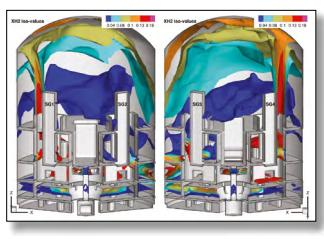
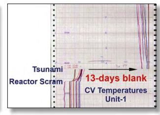
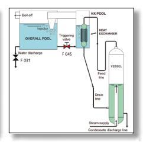

# CSNI Status Report and Perspectives

**Advances in the Analysis and Management of Accidents and Future Challenges**

Nuclear Safety

# CSNI Status Report and Perspectives

Advances in the Analysis and Management of Accidents and Future Challenges

> © OECD 2023 NEA No. 7658

NUCLEAR ENERGY AGENCY ORGANISATION FOR ECONOMIC CO-OPERATION AND DEVELOPMENT

#### ORGANISATION FOR ECONOMIC CO-OPERATION AND DEVELOPMENT

The OECD is a unique forum where the governments of 38 democracies work together to address the economic, social and environmental challenges of globalisation. The OECD is also at the forefront of efforts to understand and to help governments respond to new developments and concerns, such as corporate governance, the information economy and the challenges of an ageing population. The Organisation provides a setting where governments can compare policy experiences, seek answers to common problems, identify good practice and work to co-ordinate domestic and international policies.

The OECD member countries are: Australia, Austria, Belgium, Canada, Chile, Colombia, Costa Rica, the Czech Republic, Denmark, Estonia, Finland, France, Germany, Greece, Hungary, Iceland, Ireland, Israel, Italy, Japan, Latvia, Lithuania, Luxembourg, Mexico, the Netherlands, New Zealand, Norway, Poland, Portugal, Korea, the Slovak Republic, Slovenia, Spain, Sweden, Switzerland, Türkiye, the United Kingdom and the United States. The European Commission takes part in the work of the OECD.

OECD Publishing disseminates widely the results of the Organisation's statistics gathering and research on economic, social and environmental issues, as well as the conventions, guidelines and standards agreed by its members.

#### NUCLEAR ENERGY AGENCY

The OECD Nuclear Energy Agency (NEA) was established on 1 February 1958. Current NEA membership consists of 34 countries: Argentina, Australia, Austria, Belgium, Bulgaria, Canada, the Czech Republic, Denmark, Finland, France, Germany, Greece, Hungary, Iceland, Ireland, Italy, Japan, Luxembourg, Mexico, the Netherlands, Norway, Poland, Portugal, Korea, Romania, Russia (suspended), the Slovak Republic, Slovenia, Spain, Sweden, Switzerland, Türkiye, the United Kingdom and the United States. The European Commission and the International Atomic Energy Agency also take part in the work of the Agency.

The mission of the NEA is:

- to assist its member countries in maintaining and further developing, through international co-operation, the scientific, technological and legal bases required for a safe, environmentally sound and economical use of nuclear energy for peaceful purposes;
- to provide authoritative assessments and to forge common understandings on key issues as input to government decisions on nuclear energy policy and to broader OECD analyses in areas such as energy and the sustainable development of low-carbon economies.

Specific areas of competence of the NEA include the safety and regulation of nuclear activities, radioactive waste management and decommissioning, radiological protection, nuclear science, economic and technical analyses of the nuclear fuel cycle, nuclear law and liability, and public information. The NEA Data Bank provides nuclear data and computer program services for participating countries.

This document, as well as any [statistical] data and map included herein, are without prejudice to the status of or sovereignty over any territory, to the delimitation of international frontiers and boundaries and to the name of any territory, city or area. Corrigenda to OECD publications may be found online at: *www.oecd.org/about/publishing/corrigenda.htm*.

#### © OECD 2023

You can copy, download or print OECD content for your own use, and you can include excerpts from OECD publications, databases and multimedia products in your own documents, presentations, blogs, websites and teaching materials, provided that suitable acknowledgement of the OECD as source and copyright owner is given. All requests for public or commercial use and translation rights should be submitted to *neapub@oecd-nea.org*. Requests for permission to photocopy portions of this material for public or commercial use shall be addressed directly to the Copyright Clearance Center (CCC) at *info@copyright.com*  or the Centre français d'exploitation du droit de copie (CFC) *contact@cfcopies.com*.

*Cover photos: Results of CFD calculations of hydrogen in containment (courtesy of IRSN); Fukushima Daiichi NPS Unit 1 – containment temperature measurement (courtesy of Tokyo Electric Power Company Holdings, Inc.); PERSEO facility layout and PERSEO facility nodalisation scheme (courtesy of ENEA).*

# Foreword

The Nuclear Energy Agency (NEA) Working Group on the Analysis and Management of Accidents (WGAMA) aims to contribute to the assessment of the prevention, mitigation and management of accidents, ultimately furthering reactor safety by improving the state of knowledge and knowledge management. This activity is pursued under the NEA Committee for the Safety of Nuclear Installations (CSNI) as a follow-on to the work of the former principal working group (PWG)-2 on coolant system behaviour and that of PWG-4 on the confinement of accidental radioactive releases.

The WGAMA activities relate to potential accident situations in nuclear power plants and mainly focus on existing reactors, with some applying to advanced reactor designs as well. It has over 100 participants from 28 countries to pursue such a wide scope, with more than 400 scientists and engineers involved. Such experts are both contributors to the activities and beneficiaries of the outcomes.

This report aims to facilitate communication between reactor safety stakeholders by summarising the main aspects of the WGAMA's activities: the context and key safety topics related to the analysis and management of accidents; the approach and methodologies to cope with reactor safety issues; recent reactor safety issues that have been dealt with; and a discussion of potential future activities.

This report was approved by the CSNI in December 2022 and prepared for publication by the NEA Secretariat.

# Acknowledgements

The Nuclear Energy Agency (NEA) Committee on the Safety of Nuclear Installations (CSNI) and the Working Group on the Analysis and Management of Accidents (WGAMA) acknowledge the significant contributions of those individuals who had a key role in the conduct and success of the activities described in this report, in particular bureau members including past chairs, task leaders, contributors and members, as well as secretaries, for their selfless contributions.

#### Authors

Hideo NAKAMURA JAEA, Japan (WGAMA Chair)

Ahmed BENTAIB IRSN, France (WGAMA Vice-Chair) Martina ADORNI NEA, France (WGAMA Secretariat)

# **Table of contents**

| List of abbreviations and acronyms                                              | 7  |
|---------------------------------------------------------------------------------|----|
| Chapter 1. Introduction                                                         | 9  |
| Chapter 2. Objective, safety issues and priorities                              | 11 |
| Chapter 3. Approach and methodology                                             | 13 |
| 3.1. Fundamentals and approach                                                  | 13 |
| 3.2. Typical outcomes of the activities                                         | 15 |
| 3.3. Ensuring high quality                                                      | 15 |
| 3.4. Link with other NEA working groups and organisations                       |    |
| Chapter 4. Outline and main technical achievements                              | 17 |
| 4.1. Nuclear thermal-hydraulics                                                 | 17 |
| 4.2. Severe accident                                                            | 19 |
| 4.3. Computational fluid dynamics                                               | 20 |
| Chapter 5. Future activities and applications                                   | 21 |
| 5.1. Priority setting                                                           | 21 |
| 5.2. Addressing reactor safety issues in operating LWRs and advanced reactors   | 22 |
| 5.3. Knowledge transfer efforts for continuous safety improvements              |    |
| 5.4. Final remark                                                               |    |
| References                                                                      | 25 |
| Annex A. Recent achievements and current subjects of activity in reactor safety | 31 |
| A.1. Recent achievements                                                        | 31 |
| A.2. Current subjects                                                           | 33 |
| Annex B. Glossary                                                               | 35 |

# List of abbreviations and acronyms

AI Artificial intelligence AM Accident management

ATLAS Advanced Thermal-hydraulic Test Loop for Accident Simulation Project

ATRIUM Application Tests for Realisation of Inverse Uncertainty quantification and

validation Methodologies in thermal-hydraulics

BE Best-estimate

BEPU Best-estimate plus uncertainty CCVM CSNI Code Validation Matrix CFD Computational fluid dynamics

CFD4NRS Workshop on experimental validation and application of CFD and CMFD codes to

Nuclear Reactor Safety Issues

CNRA Committee on Nuclear Regulatory Activities (NEA) CSNI Committee on the Safety of Nuclear Installations (NEA)

DBA Design-basis accident

DEC Design extension conditions

EGTHM Expert Group on Core Thermal Hydraulics and Mechanics (NEA)

ETSON European Technical Safety Organisations Network

FACE Fukushima Daiichi Nuclear Power Station Accident Information Collection and

Evaluation Project

IAEA International Atomic Energy Agency

IET Integral-effect tests

ISP International Standard Problem

JP Joint projects

LOCA Loss-of-coolant accident LWR Light water reactors NRS Nuclear reactor safety

NSC Nuclear Science Committee (NEA)

PCT Peak cladding temperature

PIRT Phenomena Identification and Raking Table PKL Primärkreislauf-Versuchsanlage facility Project

PreADES Preparatory Study on Analysis of Fuel Debris Project

PWR Pressurised water reactor

SA Severe accident

SAM Severe accident management

SAMG Severe accident management guidelines

SERENA Steam Explosion Resolution for Nuclear Applications Project

SET Separated effects test SFP Sandia Fuel Project SMR Small modular reactor

SNETP Sustainable Nuclear Energy Technology Platform

SOAR State-of-the-art reports

TG Task group

T/H Thermal-hydraulics

THICKET Seminar on Transfer of Competence, Knowledge and Experience Gained through

CSNI Activities in the Field of Thermal-hydraulics

TOP Technical opinion paper UQ Uncertainty quantification V&V Verification and validation VVER Water-water Energetic Reactor

WGAMA Working Group on the Analysis and Management of Accidents (NEA)

WGFS Working Group on Fuel Safety (NEA)

WGHOF Working Group on Human and Organisational Factors (NEA)

WGIAGE Working Group on Integrity and Ageing of Components and Structures (NEA)

WGOE Working Group on Operating Experience (NEA) WGRISK Working Group on Risk Assessment (NEA)

# Chapter 1. Introduction

The nuclear sector is expected to contribute significantly to the safe and stable energy generation needed to achieve an emissions-free future. The EU Taxonomy [e.g. 77], for example, notes that the nuclear sector can contribute in two ways: by safely extending some of the licenses for currently operating nuclear power plants (through long-term operation [LTO] and lifetime extensions) and by developing new nuclear reactors with safer concepts (not limited to light water reactors [LWRs] and including small modular reactors [SMRs]). Advanced nuclear reactors have not yet been fully tested under prototypical operational and/or accident conditions. Therefore, efforts to maintain safety should first focus on the currently operating nuclear power technologies, including the EPR, AP1000 and APR1400 designs.

The design process of nuclear power plants is based on a deterministic approach that takes into account the principle of defence in depth complemented by a probabilistic approach. It requires determining the events likely to affect barrier and/or safety functions, and then defining the provisions that need to be implemented on the nuclear installation to prevent these events and, if the events are plausible, limit their consequences. To enhance protection against accidents beyond those considered in the design basis envelope of existing plants and to limit radioactive releases into the environment, regulation and guidelines introduce requirements for structures, systems and components (SSCs) that are more severe than those included in the design basis envelope. Such accidents are called "Design Extension Conditions" (DEC). They include conditions called "DEC-A", where core melting has to be prevented, and conditions called "DEC-B" [91], or severe accident (SA), where core melting is postulated despite the measures taken to prevent it. The DEC-A conditions are covered by Emergency Operating Procedures (with other specific procedures or guidelines when applicable). The DEC-B conditions are covered by severe accident management guidelines (SAMG), along with other specific procedures or guidelines when applicable.

In practice, safety analyses for the design-basis accident (DBA) and DEC-A are generally performed by using the same best-estimate (BE) thermal-hydraulic (T/H) safety analysis codes while considering specific assumptions for initial and boundary conditions (with penalisation of certain parameters identified as dominant for the transient, for example via an analysis with Phenomena Identification and Raking Table [PIRT]). On the other hand, DEC-B or SA analyses are generally based on rather simplified BE codes and assumptions to properly take into account the variety of accident sequences with complicated SA phenomena.

Increasing confidence in the validity and accuracy of such T/H and SA codes for the reactor safety assessment is one of the primary goals of the NEA Committee on the Safety of Nuclear Installations (CSNI), and thus the Working Group on the Analysis and Management of Accidents (WGAMA) activities. To this end, the WGAMA organises international standard problem (ISP) exercises and benchmark studies based on relevant experimental data, contributing to strengthening the technical basis required for the prevention, mitigation and management of reactor accidents.

More generally, the activities aim to promote international convergence on safety issues and accident management analyses and strategies and to make essential contributions to regulatory decision making on accident prevention, mitigation and management for both operating and advanced reactor designs, including SMRs.

Moreover, the activities contribute to the analysis of past accidents such as the Three Mile Island Unit-2 and the Fukushima Daiichi accidents. That helps to identify possible knowledge gaps and to launch research activities that contribute to post-accident decision-making processes (in the case of the Fukushima Daiichi accident, for instance).

Additionally, the activities help identify sets of experiments of use in validating computer codes (commonly known as CCVM [CSNI Code Validation Matrix]) and in data preservation within NEA CSNI joint projects. The activities contribute to knowledge dissemination through dedicated lectures for young specialists.

In its meeting on 1-3 December 1999, the CSNI [1] decided a new structure and work process to replace the former PWG-2 and -4 with the WGAMA. The first WGAMA meeting was held on 25-27 September 2000 after the preparation of the first mandate on 31 December 1999. The last meetings of the former PWG-2 and -4 were held respectively on 20-22 September 2000 and 28-29 February 2000.

# Chapter 2. Objective, safety issues and priorities

The objective of the Working Group on the Analysis and Management of Accidents (WGAMA) activities is to assess, and where necessary strengthen, the technical basis needed for the prevention, mitigation and management of potential accidents at nuclear power plants. It aims to facilitate international convergence on safety issues and accident management (AM) analyses and strategies to help maintain and advance the scientific and technical knowledge base needed for the safety of nuclear installations.

The challenges in meeting this objective are to address the scientific and technical issues and concerns about how to advance the understanding of accident phenomena and to address the safety-significant issues.

The safety-relevant topics that require improvements in the methods for accident analysis and management and need to be addressed first are related to both thermal-hydraulics (T/H) and severe accident (SA) domains: local and system-wide nuclear T/H in nuclear power plants; design-basis accidents (DBA); design extension conditions (DECs) for which prevention of severe fuel damage in the core or in the spent fuel storage can be achieved (DEC-A); accident progression; coolability of over-heated cores and in-vessel phenomena with design extension conditions with postulated severe fuel damage (DEC-B), meaning SAs, which includes ex-vessel corium interactions with coolant and structures; in-containment combustible gas generation, distribution and potential combustion; the physical-chemical behaviour of radioactive species, meaning fission product release, transport, deposition and retention in the primary circuit and the containment; and source term.

Computational fluid dynamics (CFD) is a cross-cutting analysis tool potentially applicable to detailed analyses of local multi-dimensional flows (e.g. coolant, melt, gas and their mixture) that appear in the accident progression of DBAs, DECs, and even SAs.

The priority of the topics is based on the established criteria of the Committee on the Safety of Nuclear Installations (CSNI) and, in particular, on their safety significance and risk and uncertainty considerations. This is done by means of activities likely to bring conclusive results and significant added value to nuclear safety within a reasonable time frame. The CSNI addresses the safety aspects of operating nuclear power plants and emerging safety challenges in order to enable the safety design and operation of advanced and innovative nuclear technologies, including those used for small modular reactors (SMRs). Work related to SMRs has been newly introduced by the CSNI and subsequently by the WGAMA. The global objective is also consistent with the capacity to maintain and preserve strategic safety competences.

# Chapter 3. Approach and methodology

The Working Group on the Analysis and Management of Accidents (WGAMA) contributes to the three major fields of nuclear safety, thermal-hydraulics (T/H), severe accidents (SAs) and computational fluid dynamics (CFD). Its work involves exchanging technical experience and information relevant to the resolution of current or emerging safety issues, promoting the development of phenomena-based models and computer codes used for safety analysis, assessing the state of knowledge in areas relevant to accident analysis, and promoting – where needed – research activities to improve such understanding, all while maintaining expertise and infrastructure in nuclear reactor safety (NRS) R&D. This section describes the methods of the WGAMA.

#### 3.1. Fundamentals and approach

The WGAMA has made considerable contributions to the following three safety-related areas, for which the expected input, outcome and outcome users are listed:

#### *(a) Safety assessments*

Safety assessments concerning the prevention and management of accidents and related highpriority safety issues are undertaken through the elaboration of existing information or data available in participating countries.

Input: This is expected to come from the Committee on the Nuclear Safety of Nuclear

Installations (CSNI), Committee on Nuclear Regulatory Activities (CNRA) (through CSNI) or directly from participating countries (via representatives of the WGAMA]).

Outcome: Recommendations are expected on the best use of existing knowledge for accident management (AM) purposes or on the means to acquire more information where needed. Missing information should be identified – where appropriate – and

recommendations should be provided on how to obtain that information. The

duration of each activity should typically not exceed two to four years.

Users: The main users would be nuclear regulators and the nuclear industry.

#### *(b) Analyses of relevant reactor operational events*

Relevant operational events are analysed to provide an understanding of the specific events and to identify possible preventive measures. Analyses evaluating the extent to which similar events in different circumstances might challenge plant safety can extend across a broader range of conditions. Investigations may address industry initiatives (e.g. those aiming to increase plant output using a plant life extension and power uprate), for which co-operation with other CSNI WGs would be needed.

Input: This is expected to come from the Working Group on Operating Experience (WGOE),

from the CSNI or directly from participating countries. However, it is possible that a lack of knowledge on the processes involved and/or limitations in models or

computer code prediction capabilities will emerge in this category.

Outcome: The product would be assessment results obtained by relevant and interested

parties using several kinds of analytical tools. Activities in this category can then

be structured in distinct self-contained phases.

Users: The main users would be regulators, safety research organisations and industries.

#### *(c) Base activities*

An assessment is carried out of the state-of-the-art knowledge and progress in the understanding of phenomena and processes governing the occurrence, progression and mitigation of potential accidents, including improved methods (such as best-estimate [BE] safety analysis, uncertainty and/or sensitivity evaluation, or CFD) and their use for safety assessments. There is an increased focus on advanced reactors [1](#page-15-0) , for which a substantial improvement in knowledge is required. This area is broad and work within it is not defined precisely. Rigorous criteria should therefore be applied to set priorities that focus on the areas that are most relevant to safety and/or that have a more pronounced risk profile. The criteria should also ensure that the outcome is likely to be obtained in a reasonable time frame.

Some of the base activities, such as the uncertainty quantification (UQ) of safety analysis tools, may take a long time to complete. It is therefore important to ensure that the activity is well prioritised and structured. Useful intermediate results should be systematically brought forward. Interaction with the CSNI WGs, such as the Working Group on Risk Assessment (WGRISK) and the Working Group on Fuel Safety (WGFS), would be important for the priority setting phase.

Input: This is expected to come from activities of the CSNI and other international

organisations such as the International Atomic Energy Agency (IAEA) and/or directly from participating countries (via representatives in the WGAMA).

Outcome: The product would be state-of-the-art and technical reports and technical opinion

papers to be used by safety analysts.

Users: The main users would be nuclear regulators, safety research organisations,

academia and the nuclear industry.

An overview of the three safety-related areas may suggest that the programme has been oriented towards generic aspects, sometimes entering into the specifics of well-defined issues or of particular reactor designs or AM features. Most of the programme consists of (i) safety assessment tools and methods, (ii) benchmarking exercises, (iii) knowledge assessment through e.g. state-of-the-art-reports (SOARs), and (iv) data preservation and knowledge transfer. One challenge will be ensuring that there is a balance in the activities between the generic disciplineoriented approach, which includes (c) Base activities, and some issue-focused activities, which include (b) Analyses of relevant reactor operational events.

Sound *priority setting* and *input gathering* from stakeholders will then be key to establishing a balance in the activities.

The *priority setting* provided in the *CSNI Operating Plan (2017-2022)* [1] identifies the following four criteria. The WGAMA will refer to these criteria to derive its own concrete/specific criteria where practical:

Criterion 1: Relevant to CSNI challenges and technical goals,

Criterion 2: Better accomplished through international co-operation under the NEA,

Criterion 3: Likely to bring about conclusive results and significant added value to nuclear safety in a reasonable time frame, and

Criterion 4: Able to maintain and preserve strategic safety competence.

*Evolutionary design*: an advanced design that achieves improvements over existing designs through small to moderate modifications, with a strong emphasis on maintaining proven design elements to minimise technological risks.

*Innovative design*: an advanced design that incorporates conceptual changes in design approaches or system configurations in comparison with existing practice.

1. Advanced reactors [93]:

*Input gathering* would be achieved via the following:

- regulator requests via the CNRA, the CSNI or from participating countries;
- input from other CSNI or CNRA working groups (WGs), notably the WGRISK for riskrelevant issues and WGFS for fuel behaviour during postulated accidents and Working Group on Integrity and Ageing of Components and Structures (WGIAGE) for integrity and ageing of components and structures;
- requests from participating countries regarding safety aspects for advanced reactors;
- experimental results or analyses deriving from NEA safety research joint projects (JPs).

#### 3.2. Typical outcomes of the activities

The WGAMA aims to provide answers requested by the CNRA, the CSNI, and participating countries and to co-ordinate its work with other WGs, reporting to the CSNI and assisting the CSNI with its work. The programme is carried out by small task groups (TGs), each set up to perform a specific programme activity under the WGAMA supervision. The output consists of SOARs, other technical reports, workshops and related proceedings, benchmarking exercises and joint research proposals.

The activity outcomes are mostly published as technical reports that are available either in the NEA/CSNI and WGAMA webpages [2]. The technical reports include PIRT/CCVM, technical opinion papers (TOP) such as *TOP on the Use of CFD for Nuclear Safety* [3] and a SOAR such as *Scaling in System Thermal-hydraulics Applications to Nuclear Reactor Safety and Design: A State-of-the-Art Report* [4]. The other reports include CFD guidelines [5, 6], summary reports and/or proceedings of workshops such as the "Specialist Workshop on Advanced Measurement Method and Instrumentation for Enhancing Severe Accident Management in a Nuclear Power Plant (SAMMI-2020)" and "Reactor Core and Containment Cooling Systems, Long-Term Management and Reliability (RCCS-2021)" [7, 8]. There are also reports of International Standard Problems (ISP) and Benchmark activities, such as ISP-50 [9].

#### 3.3. Ensuring high quality

All activities have a co-ordinator or leader who is the main person responsible for the work. One or more (internal) reports are usually issued for each of the activities. A final report, normally issued as a CSNI report, is mandatory (depending on the Committee Activity Planning Sheet [CAPS] definition) upon completion of each activity. Reports intended for CSNI approval must be reviewed and agreed upon by the experts who performed the work. In addition, and when deemed appropriate, an external QA review is carried out by an expert who was not involved in the activity. This practice of having an independent peer review was introduced to provide a satisfactory outcome for the WGAMA, and thus for the CSNI and the relevant stakeholders worldwide. An endorsement by the WGAMA plenum is sought by the CSNI programme review group (PRG) and, after making improvements as requested by the WGAMA activity leaders, the report is sent to the CSNI for approval.

#### 3.4. Link with other NEA working groups and organisations

#### *Co-ordination with other CSNI WGs and NEA committees*

The WGAMA co-ordinates its work with other NEA bodies, notably the WGRISK for priority setting and potential accident sequences; the WGIAGE for ageing and structure integrity evaluation; the WGFS for issues related to fuel safety, which include those related to accidenttolerant fuels (ATFs); and the Working Group on Human and Organisational Factors (WGHOF) for human and organisational aspects of AM. Co-operation with other CSNI WGs should aim at activities based on defined/agreed priorities in both groups. The co-ordination is carried out through the NEA Secretariat and through the exchange of information during meetings. Collaborative work with the WGFS, for example, is underway on the good practices for analyses of DEC-A without significant fuel degradation for operating nuclear power plants, and work with WGIAGE is underway on reactor pressure vessel integrity assessments for in-vessel retention.

The WGAMA also works in co-ordination with the Expert Group on Core Thermal Hydraulics and Mechanics (EGTHM) of the Nuclear Science Committee (NSC) on scientific items such as advanced neutronic and thermal-hydraulic methods, which include some detailed CFD analyses (e.g. single-phase 3D liquid metal flow around fast breeder reactor (FBR) fuel assembly). Practical collaborative work is underway in the benchmarks for CFD and the System Thermal Hydraulics Experimental Meta Data Preservation, Collection and Qualification (THEMPo) activity. Co-operative benchmarks on NRS-relevant exercises, mainly for CFD simulations, are foreseen on several flow applications concerning LWRs (water) and non-LWRs (sodium, lead and helium).

Interactions with the NEA JPs to create new opportunities will be strengthened, as recommended in the CSNI Operating Plan and Guidelines. The WGAMA has closely worked with post-Fukushima Daiichi accident-relevant JPs such as the BSAF 1 and 2 benchmarks and PreADES and ARC-F, which were performed following the recommendations by the CSNI SAREF (2013 to 2016) [50]. The latest FACE Project, as an extension of the former two JPs, started to provide information in 2022 on the Fukushima Daiichi accident phenomena that are important to the WGAMA's SA activity.

#### *Co-ordination of activities with the EU and IAEA*

EU and IAEA representatives regularly attend the WGAMA plenary meeting and present their work progress. They actively participate in the definition of work to ensure co-ordination and complementarity with ongoing European projects and IAEA Coordinated Research Projects (CRPs) and activities. Similarly, a link with the European platforms called the Sustainable Nuclear Energy Technology Platform (SNETP) and the European Technical Safety Organisations Network (ETSON) has been established to share safety concerns and project outcomes.

#### *Industry participation*

The WGAMA provides a forum that enables a co-ordination between collaborative R&Ds at an international level and industrial applications for reactor safety (re)assessment, which (re)assessments possibly identify subjects for safety improvements to existing plants aiming at avoiding early or large radioactive release due to SAs by taking the following into account: ageing issues, operational experience, and the most recent research results and developments in international standards. Industry representatives from several countries participate in WGAMA meetings and activities.

# Chapter 4. Outline and main technical achievements

This section describes the main technical achievements in the three major fields covered by the NEA Working Group on the Analysis and Management of Accidents (WGAMA): nuclear thermalhydraulics (T/H), severe accidents (SA) and computational fluid dynamics (CFD). Further detail on recent achievements and current issues in reactor safety are provided in Annex A.

#### 4.1. Nuclear thermal-hydraulics

T/H phenomena appear everywhere. The tsunami that hit the Fukushima Daiichi nuclear power plant can be described with T/H, as can the movement of water spilt on a kitchen table. T/H phenomena are three dimensional (3D) in nature, are unsteady and become unstable in some cases. These phenomena can be seen in nuclear power plants and are common to the three technical fields covered by the WGAMA's activities. Complicated steam-liquid two-phase flows may occur in a 3D transient way, as observed in many experimental facilities. Moreover, nuclear reactors are large and operated under high-pressure and high-temperature conditions, which makes it difficult for a single experimental facility to represent all the possible accident phenomena.

Utilities usually carry out component testing, mostly under prototypical operating conditions in combination with developmental computer code analyses, before and even after the commissioning of nuclear power plants in order to attain a safe yet economical reactor design and operation that can cope with complicated T/H responses. The observed componentspecific T/H response has formed an important basis for safety assessments. Utilities demonstrate the reactor's response through safety assessments carried out using computer code analyses that prove whether the reactor's design is safe enough under conditions of postulated design-basis accidents (DBAs), e.g. by assuring the fuel integrity is maintained. A regulatory body confirms whether the safety assessment results pass the regulatory criteria; a figure of merit such as the peak cladding temperature (PCT) of the fuel rods with conservatism is duly taken into account with an uncertainty evaluation.

T/H code analyses therefore play a central role in safety assessments. Such codes are required to provide accurate and thus reliable analysis for all the phenomena expected to happen for any kind of nuclear power plant accidents. However, T/H codes generally employ a one-dimensional (1D) representation of flows in reactor components by simplifying 3D phenomena into 1D models and correlations, while reactor components include various rather complicated geometries, such as fuel bundles, large diameter pipes (straight and bent, tanks, parallel tubes and pumps, that are specific to each reactor design. Significant experimental R&D has thus been performed worldwide to obtain measured data, which are then used to develop and validate closure relations in order to describe local T/H phenomena in mostly a 1D manner under steady flow conditions.

T/H codes can describe a nuclear power plant's response during an accident rather realistically, even when each of the models and correlations composing the code may not fully cover the prototype accident conditions. Many types of simulation experiments, separatedeffect tests (SETs) and integral-effect tests (IETs) are therefore necessary to validate and even update/improve the code analysis capability of reactor accidents and phenomena. The CSNI Code Validation Matrix (CCVM) was thus formulated for the preparation and utilisation of wellvalidated T/H codes by summarising the existing knowledge on the characteristics (and availability) of an experimental facility in terms of the accident phenomena, which thus required code capabilities, with priority placed in a form of Phenomena Identification and Ranking Table (PIRT). The WGAMA has developed many CCVMs since 1987, from the era of principal working group 2 (PWG-2), not only for the accident phenomena that may appear in a reactor system during an accident, but also for in-vessel core degradation [10-17]. Related experimental data are given through the NEA Data Bank for the separate effect test data [18] and integral test data [19].

The WGAMA has created opportunities for safety research joint projects (JPs) performed as a CSNI activity aiming to continuously update knowledge on reactor accidents and T/H code validation against a series of SETs or IETs defined by the operating agent and management board of each JP. The IET facilities that simulate PWRs or VVERs used for recent JPs include LOBI, PKL, ROSA/LSTF, PACTEL, PMK and ATLAS. The obtained IET data are stored in the NEA Data Bank generally three years after each JP completes their programme [20] to reinforce the database for T/H code validation. Relevant information can be found in NEA News [21, 22].

Experimental facilities are mostly scaled-down models of reference reactors. Scaling has thus been recognised to be important for T/H codes in the quantitative evaluation of uncertainty in calculated accident results. Models and correlations that compose T/H codes are obtained from the scaled-down experimental facilities, too. The T/H response during simulation experiments is strongly influenced by the prototypical conditions in geometrical size and fluid physical properties such as density, viscosity and surface tension in terms of system pressure and fluid temperature. Concerning scaling, in-depth discussions were undertaken among WGAMA task group (TG) specialists to prepare the scaling state-of-the-art report (SOAR) [4].

Results obtained in a safety assessment that uses deterministic safety analysis code, such as the PCT of fuel rods as figure of merit, must always be conservative in order to have an adequate margin to meet regulatory acceptance criteria. After the Three Mile Island Unit-2 SA in 1979, it was recognised that best-estimate (BE) codes with realistic input data are far more suitable for evaluating the safety margin than evaluation model (EM) codes composed of several single-purpose small and conservative codes with conservative inputs. BE codes provide a realistic representation of accident phenomena. However, EM codes are believed to always provide conservative results. The BE codes do not always ensure conservativeness in the calculated results and therefore rigorous uncertainty quantification (UQ) is required along with the utilisation of a best-estimate plus uncertainty (BEPU) method, which provides an uncertainty range around the obtained PCT. The UQ includes many aspects in the calculation methods. Therefore, detailed research has been carried out as a WGAMA activity which includes UMS [23], BEMUSE [24], PREMIUM [25], SAPIUM [26] and ATRIUM. The source of uncertainty may include factors such as: uncertainties in experimental/data measurement used to develop and validate models and correlations, thus the correctness of the phenomena representing each model's capabilities and correlation; the combination of models and correlations with judging criteria used to define T/H conditions to apply an appropriate model and correlation; and uncertainty in the input model and its transfer to the calculated result through the code calculation. The employed BEPU method should cover all such uncertainty factors within the range of uncertainty in the obtained result.

The WGAMA, following-on from the previous PWG-2, has made a significant effort to contribute to, and even promote, reliable reactor safety assessments by providing code validation methods (e.g. CCVMs) and experimental data for the validation, and by enhancing the understanding of fundamental T/H phenomena that may appear during reactor accidents. Its work has included ISP exercises [27] to confirm code analysis capabilities for various kinds of fundamental T/H phenomena, such as critical flow at a loss-of-coolant accident (LOCA), simulated reactor accident transients in reactor designs such as PWR, BWR and VVER, and incontainment T/H phenomena, including gas mixing and combustion during severe accidents. The WGAMA work in this field has included: seminars and workshops on Advanced Thermal-Hydraulic and Neutronic Codes, Barcelona, Spain, 2000 [28] and BE Methods and Uncertainty Evaluations, Barcelona, Spain, 2011 [29], as well as other reports on Uncertainty Methods Study: UMS [23], BEMUSE [24], PREMIUM (post-BEMUSE) [25], SAMPIUM [26] and ATRIUM (underway), Status Reports on CCVM VVER-TH [16], Core Exit Temperature [30], and Spent Fuel Pool [33], ISP number 41 (RTF on Iodine [32]) through 50 (ATLAS [9]), SOARs: Scaling in System Thermal-Hydraulic Applications to NRS and Design [4] and Simulation Capability of 3D-System-Scale Thermal-Hydraulic Analysis Codes [33] and Status Report: Thermal-Hydraulic passive systems design and safety assessment [34].

WGAMA experts have struggled with limitations in the BE code's predictive capability because complicated 3D flows appear in most reactor accidents. The role and need of equal-size experiments to represent the accident phenomena that control the complicated 3D flow of emergency core cooling system (ECCS) coolant, and thus core cooling mechanisms [e.g. 35] is shown for example by the downcomer bypass during the refill phase of PWR LBLOCA with a significant heterogeneous aspect. However, it is difficult to perform equal-size experiments for all the reactor accident cases that can occur with new T/H phenomena, for which the details are not well-known. An example is the non-coaxial pipe thinning due to flow accelerated corrosion (FAC) caused by a slanted distribution of turbulence in the downstream of the orifice flow meter, which happened in the Mihama Unit-3 pipe rupture accident in Japan (2004) [36]. Several CFD codes were used to clarify the flow conditions that resulted in the FAC wall thinning, as explained in the country report from Japan presented at the WGAMA in 2005. This example suggests the importance of CFD, particularly in a coupled use with BE T/H codes, for mechanistically clarifying the influence of complicated local 3D flows that can appear to be a critical safety problem, although this is limited to single-phase flows. CFD will be discussed in Section 4.3.

#### 4.2. Severe accident

A severe accident (SA) is an accident that is more severe than a DBA (those against which plant safety systems are designed) and involves significant core degradation. This damage or melting is caused by extended loss of core cooling and, in turn, a significant increase in the temperature of the fuel rods. It can happen in a short period of time or gradually. The accident might result in radioactive releases to the environment. In the Fukushima Daiichi accident, phenomena occurred both over a short period of time (in Unit 1) and gradually (in Unit 3 and Unit 2), with the latter due to a total blackout. The nuclear spent fuel continues to generate heat. Under deteriorated cooling conditions in the reactor core or in the spent fuel pool, self-degradation might happen, leading to the release and dispersion of radioactive material into the environment, which constitutes a hazard to public health and the environment.

To prevent and limit the consequences of such accidents, mitigation measures are defined in severe accident management guidelines (SAMGs), the elaboration of which requires in-depth knowledge of SA phenomena and management measures (effectiveness, modes of implementation, secondary effects, etc.). Consequently, research on SAs has been performed extensively over decades to address in-vessel and ex-vessel conditions. This research on SAs has, for example, led to modifications to existing reactors throughout the world since the Fukushima Daiichi accident, allowing for significant safety improvements and advances to nuclear power plants.

In this area, the WGAMA's activities aim to:

- (1) fill any gaps in knowledge and reduce uncertainties related to phenomena involved in SAs, such as core degradation, core melt, hydrogen deflagration or source term release;
- (2) improve the predictability of analytical tools by expanding their applicability and validity domains; and
- (3) improve severe accident management (SAM), including in the long term.

To this end, the WGAMA has created opportunities for safety research JPs, carried out under an the auspices of the NEA CSNI, that aim to update knowledge on SA phenomena. Several JPs, such as SERENA on steam explosions [37], MASCA on corium behaviour [38], THAI on hydrogen (H2) and fission product behaviour in containment [39], or Behaviour of Iodine Project (BIP) on iodine behaviour in containment [40], have been initiated since about 2000 and have significantly expanded the NEA SA database and recommended code validation matrices [41].

Similarly, a good number of ISPs have been initiated on various SA issues: iodine behaviour [42, 43]; hydrogen production during core reflooding [44]; aerosol depletion in wet containment atmospheres [45]; containment thermal-hydraulics [46]; and H2 deflagration/combustion [47]. The most interesting computational exercise performed, due to the representativeness of the data and the completeness of the scenario, was ISP-46 on the PHEBUS-FPT1 experiment [48].

To assess the capabilities of the analytical codes, code benchmarking was carried out around an alternative scenario of the Three Mile Island accident [49]. This also provided insight into the Fukushima Daiichi accident in the framework of the CSNI post-Fukushima accident projects (SAREF) [50], which address analyses of the accident (BSAF) [51, 52] and the preparations for retrieval of the damaged fuel and the decommissioning operations (ARC-F, PreADES and FACE).

Regarding SAMGs, a technical report was published in 2017 [53] addressing various current practices related to SAMG verification and validation (V&V), including expert judgement, simulators, field training tabletop exercises and emergency drills. The report specifically addresses the use of analytical simulations, including the impact of operator actions on accident progression, to inform SAMG developers, users and regulators. The guidance and background information provided in the report should be useful to utility personnel involved in the SAMG V&V, as well as to regulatory personnel performing generic or plant-specific SAMG assessments.

In addition, the WGAMA has prepared status reports and SOARs to provide an overview of the knowledge gained and to identify any remaining issues that need further investigation. For example, the status report on SFPs under LOCA conditions [33] and the corresponding PIRT [56] recommended research actions needed to improve analytical simulation tools and mitigation approaches for loss-of-coolant and LOCAs in a SFP. Experimental investigations were suggested to better address (1) cladding oxidation in mixed air-steam atmospheres, (2) the cooling potential of partially uncovered fuel assemblies, (3) pool-scale natural recirculation models, and (4) spray cooling potential.

#### 4.3. Computational fluid dynamics

CFD is a numerical method of significant interest in nuclear safety studies. Related applications with CFD have already reached a high maturity level for single-phase flows. CFD should increasingly become part of the safety demonstration and is moreover suitable for some innovative reactor concepts, including small modular reactors (SMRs).

CFD involves using scientific calculation tools to solve the fully explicit Navier-Stokes equations over spatial domains with an explicit meshing of boundaries within solid boundaries. This 3D method allows for the study of the impact of the actual design of components on T/H. For nuclear applications and particularly in safety-related studies, CFD provides a detailed view of local T/H phenomena that are difficult to obtain from system-scale T/H codes. The WGAMA accordingly identified CFD in 2000 as a valuable potential tool for enhancing the description of the corresponding safety-related cases [56, 57]. Notably, CFD makes it possible to "revisit" issues theoretically with a suitable/detailed local description. Progress has been achieved during the history of the WGAMA in both numerical aspects and physical models (notably turbulence modelling). Great efforts have been devoted to CFD code validation for nuclear applications as computing power has increased drastically. All of these factors have contributed to an increased use of CFD in the field of nuclear reactor studies, including safety assessment aspects.

CFD does not fully replace experiments and must be supported by such validation. Regarding single-phase flow applications, turbulence cannot be sufficiently described. The required time and space discretisation can result in an unaffordable computational cost. The equations solved/used by CFD therefore contain models. Although the given report is mostly based on dedicated experimental methods and measured results, the report also provides a clear synthesis of CFD maturity with respect to the corresponding application [e.g. 58]. CFD clarifies some details of interest regarding local flow and therefore the experimental data for the validation of CFD must align with high accuracy standards. A report [59] summarises the requirements for such CFD-grade experiments.

The WGAMA CFD-TG [57] was established in 2000 and has produced several documents and revisions. In the Best Practice Guidelines (BPGs) [5, 6], all of the issues related to building a nuclear safety study based on CFD were considered. The study has to be performed using appropriate tools and a defining figure of merits to produce a quality assurance of the results with quantifying uncertainties. The CFD-TG has organised workshops on experimental validation and application of CFD and CMFD codes to Nuclear Reactor Safety Issues (CFD4NRS) that take place nearly every two years [60]. A ninth workshop (CFD4NRS-9) was held in February 2023. The CFD-TG has also organised six benchmark exercises since 2011 [e.g. 58]. A new one is being launched on thermal mixing and pipe wall fatigue in a T-junction with a dead leg.

# Chapter 5. Future activities and applications

The NEA Working Group on the Analysis and Management of Accidents (WGAMA) has made substantial progress in the three main technical fields of nuclear safety to meet the general objectives and considering an evolving context, as explained in Chapter 3. However, it is necessary to continuously improve understanding of accident phenomena in nuclear thermalhydraulics (T/H) and severe accident (SA), especially for advanced reactors, including small modular reactors (SMRs). Updating existing knowledge on these topics is essential to develop and update safety assessment tools, including computational fluid dynamics (CFD), by considering the influence of reactor designs, including various types of reactor safety features. Examining generic aspects, such as passive systems [34], is the first step and should cover a wide range of relevant technologies. The improvements in knowledge and consensus obtained, would then also allow in-depth consideration of the accident responses of specific safety features or of accident management (AM) countermeasures for particular reactor designs.

One of the key issues is that the CFD and T/H codes should be extended to handle not only DEC-A scenarios but also scenarios close to DEC-B (SA). For future activities, the three fields could be applied together in a larger number of cases.

The following sections discuss possible directions for WGAMA activities in the current context.

#### 5.1. Priority setting

The WGAMA tries to establish its priorities by referring to the four criteria of the Committee on the Safety of Nuclear Installations (CSNI) listed in Section 3.1, and by considering input from organisations outside the WG, as explained in Section 3.4: international organisations such as the International Atomic Energy Agency (IAEA) and European Union (EU) activities, and other working groups under the CSNI and the Nuclear Science Committee Expert Groups (NSC EGs). For this purpose, a country report activity was started and requested systematically to all the members in 2019 to gather information on participants' safety concerns and activities related to nuclear programmes, R&D and other relevant fields. All such inputs may be considered as the WGAMA decides how to pursue its safety-relevant activities.

Industrial actors have been including the use of advanced methods in their applications for safety (re)assessments according to a roadmap that was established long ago. Inputs from the different activities are integrated to shape the programme of work, along with their feasibility studies. Industrial actors then provide feedback and suggestions to the WGAMA programme of work, which is important to the main activities related to regulatory practice. The WGAMA activities relevant to reactor safety should aim to align with the long-term perspectives of industry because the outcomes of safety research should apply to the reality of nuclear power plants.

The priorities are established through discussions among the WG participants. It is key to remain in touch with the practical realities of reactor engineering as well as with nuclear T/H under prototypical conditions, both at currently operating nuclear power plants and for emerging technologies. Another key challenge is to provide new insight even in well-established subjects, which is necessary to continuously improve and update safety. Close communication and co-operation between the WG participants and the organisations outside the WG should be maintained to help pursue the mandate.

#### 5.2. Addressing reactor safety issues in operating LWRs and advanced reactors

#### *5.2.1. Nuclear T/H towards reliably filling the knowledge gaps and insufficiencies in safety assessments*

The safety assessment is the gateway to deployment for all types of reactor design. The WGAMA therefore continues to support the development and improvement of safety assessment tools by reviewing the above-described process. Unknown factors such as local flow resistance and coefficients of the counter-current flow limiting (CCFL) equation still exist, even for operating nuclear power plants, and may become a source of great uncertainty in the code calculation results. Code verification and validation (V&V) efforts are required in the code development process. Detailed analyses of the accident transient in reference to past CSNI Code Validation Matrix (CCVM) tables are essential to find any such remaining influential factors and to minimise uncertainties in the safety assessment.

Here, the review and update of the past established CCVMs would be necessary in response to the recent updating of models and correlations employed in the system T/H codes. The safety assessment of advanced reactors requires precise representation of all new features in the accident phenomena. The CCVMs may need further harmonisation and updating in response to such requirements to confirm the applicability of the system T/H code to the safety assessment of the advanced reactor design of interest.

The WGAMA notes the importance of key and unique experimental facilities and projects, and highlights the importance of the recommendations by, the Senior Group of Experts for Nuclear Safety Research: Facilities and Programmes (SESAR/FAP) [61], such as the PKL facility.

For both operating nuclear power plants and advanced reactors including SMRs, a realistic analysis of multi-dimensional phenomena, possibly with high-spatial and temporal resolutions, is necessary for safety assurance and improvements. It still takes great effort to update such analysis when the current T/H safety analysis codes are used. Phenomena that involve thermal stratification, for example, frequently appear during natural circulation/convection. It is difficult for 1D T/H safety analysis codes to realistically represent such phenomena, as nuclear T/H phenomena are 3D in nature. A coupled use of system T/H codes and CFD, possibly in some dynamical manner, is needed to properly address the safety assessment with the required precision as a subject common to CFD.

#### *5.2.2. SA towards new advanced reactor/SMR applications and long-term management*

The WGAMA has created opportunities for safety research joint projects and carried out activities to update knowledge on SA phenomena and improve the severe accident management (SAM) considering reactor designs under operation. This effort will be pursued further, in close collaboration with the other CSNI WGs, the European platforms (SNETP, ETSON) and the IAEA:

- 1) to enhance the SAM for those operating nuclear power plants considering new equipment and the survivability of measurement instruments in both the short and long term;
- 2) to address safety issues related to the development of new fuels such as accident-tolerant fuels (ATFs) under SA conditions and to assess their effectiveness on source term;
- 3) to address SA safety issues for new advanced reactors and SMRs based on the existing knowledge and to identify knowledge gaps;
- 4) to assess innovative approaches, including through artificial intelligence (AI) and machine learning, to SA simulation;
- 5) to promote the development of measurement technologies and their use for AM.

#### *5.2.3. CFD towards enlarged use for safety applications*

CFD is now used in several safety studies, mostly focusing on relatively small systems or parts of components. However, this use remains limited. The WGAMA CFD-TG analysed in their CFD-TOP [3] the main challenges to benefitting more from the use of CFD in nuclear safety. These challenges included the development of the coupling of CFD with system T/H codes or with other physics (e.g. thermo-mechanics, neutronics), as well as the adaptation of uncertainty quantification (UQ) methods for the computed results.

As far as innovative nuclear technologies are concerned, current efforts regarding the development of new water-cooled SMRs are of particular interest and considered for potential CFD applications. For those reactors, the length scale as well as the power level are smaller compared with currently operating LWRs. This may significantly reduce the computational power required for the associated CFD studies. Many of the related reactor concepts use passive systems based on free convection. For the heat transfer regimes, the applicability of systemscale or component-scale numerical tools has yet to be proved. In safety assessments, a fundamental difficulty relates to the 3D intrinsic nature of fluid circulation/convection in large volumes. Even for CFD approaches, the use of turbulence models at high Rayleigh number values is challenging. Most of the turbulence models have been conceptualised and fitted onto forced convection in pipes and are a priori inapplicable to such flow conditions.

Based on the maturity of some CFD single-phase flow analysis techniques, the possibility using AI has been recently discussed. One of the suggested merits is the optimisation of input meshing for some complicated flow geometries by using machine learning methods. Many CFD analysis results (and even direct numerical simulation [DNS] results) are used as data in the machine learning process. Beyond CFD, using AI for SAM measures is also being discussed, as the technology could provide benefits such as up-scaling when improving 3D modelling and validation. A detailed investigation of local phenomena is necessary to consider more precise SAM measures, thus improving SAM and the R&D of, for example, new instrumentation for advanced reactors. A key point here is the confidence in the validation of the obtained results. The UQ is a key subject when the CFD results are applied to nuclear safety assessments, similarly to the system T/H codes. A step-wise practical application of innovative techniques should be feasible when properly coupled with the UQ to assure the reliability of CFD in the nuclear safety assessment.

#### 5.3. Knowledge transfer efforts for continuous safety improvements

The WGAMA started the activity THICKET in 2004 following a proposal by the CSNI to disseminate the nuclear T/H competence, knowledge and experience acquired through the WGAMA activities to new technical specialists working in the area of nuclear installation safety. Each THICKET is composed of a series of lectures and discussions and lasts around one week. A series of four THICKET events have been held, all in person: in Paris in 2004, in Pisa in 2008, in Paris in 2012 and in Budapest in 2016.

This activity is important to prompt the nuclear T/H community to continuously pursue safety improvements as many challenges remain in nuclear T/H. Accident phenomena are seamlessly connected to the evolution of SA phenomena. Efforts to develop and use CFD for nuclear safety problems are also highly important. The WGAMA will therefore continue THICKET by updating the contents with the latest activity outcomes, the perspectives/ expectations for future deployment of advanced reactors, including SMRs, and the remaining issues for safety-significant subjects.

In addition, the WGAMA will encourage the preservation and dissemination of experimental data to facilitate the deployment of innovative reactors.

#### 5.4. Final remark

International co-operation is key to keep enhancing global nuclear safety. In this regard, the WGAMA continues to advance the scientific and technological knowledge base needed for the prevention, mitigation and management of potential accidents in nuclear power plants, and to facilitate international convergence on safety issues and strategies for the analysis and management of accidents.

# References

- [1] NEA (2021), *Operating Plan and Guidelines for the Nuclear Energy Agency Committee on the Safety of Nuclear Installations: 2017-2022*, NEA/CSNI/R(2017)17/REV1, OECD Publishing, Paris, [www.oecd-nea.org/jcms/pl\\_60387.](http://www.oecd-nea.org/jcms/pl_60387/operating-plan-and-guidelines-for-the-nuclear-energy-agency-committee-on-the-safety-of-nuclear-installations-2017-2022)
- [2] NEA (n.d.), Working Group on Analysis and Management of Accidents (WGAMA) web page, [www.oecd-nea.org/jcms/pl\\_23462.](https://www.oecd-nea.org/jcms/pl_23462)
- [3] NEA (forthcoming), *Technical Opinion Paper on the Use of CFD for Nuclear Safety*, NEA No. 7615, OECD Publishing, Paris.
- [4] NEA (2017), *Scaling in System Thermal-hydraulics Applications to Nuclear Reactor Safety and Design: A State-of-the-Art Report*, NEA/CSNI/R(2016)14, OECD Publishing, Paris, [www.oecd](http://www.oecd-nea.org/jcms/pl_19744)[nea.org/jcms/pl\\_19744.](http://www.oecd-nea.org/jcms/pl_19744)
  - [5] NEA (forthcoming), *Best Practice Guidelines for the Use of CFD in Nuclear Reactor Safety Applications – Revision*, NEA/CSNI/R(2022)10, OECD Publishing, Paris.
  - [6] NEA (2015), *Best Practice Guidelines for the use of CFD in Nuclear Reactor Safety Applications – revision*, NEA/CSNI/R(2014)11, OECD Publishing, Paris, [www.oecd-nea.org/jcms/pl\\_19548.](http://www.oecd-nea.org/jcms/pl_19548)
- [7] NEA (forthcoming), *Specialist Workshop SAMMI-2020 on Advanced Measurement Method and Instrumentation for Enhancing Severe Accident Management in a Nuclear Power Plant, Addressing Emergency, Stabilisation and Long-term Recovery Phases*, NEA/CSNI/R(2022)3, OECD Publishing, Paris.
- [8] NEA (forthcoming), *NEA Specialist Workshop on Reactor Core and Containment Cooling Systems, Long-term Management and Reliability (RCCS-2021)*, NEA/CSNI/R(2022)11, OECD Publishing, Paris.
- [9] NEA (2012), *International Standard Problem No. 50 on ATLAS, Volume 1 to 3*, NEA/CSNI/R(2012)6, OECD Publishing, Paris, [www.oecd-nea.org/jcms/pl\\_19144,](http://www.oecd-nea.org/jcms/pl_19144) [www.oecd-nea.org/jcms/](http://www.oecd-nea.org/jcms/%0bpl_19146) [pl\\_19146,](http://www.oecd-nea.org/jcms/%0bpl_19146) [www.oecd-nea.org/jcms/pl\\_19148.](http://www.oecd-nea.org/jcms/pl_19148)
- [10] NEA (1987), *CSNI Code Validation Matrix of Thermo-hydraulic Codes for LWR LOCA and Transients*, NEA/CSNI(1987)132, OECD Publishing, Paris, [www.oecd-nea.org/jcms/pl\\_15784.](http://www.oecd-nea.org/jcms/pl_15784/csni-code-validation-matrix-of-thermo-hydraulic-codes-for-lwr-loca-and-transients)
- [11] NEA (1994), *Separate Effects Test Matrix for Thermal-hydraulic Code Validation*, Vol. 1 and 2, NEA/CSNI/R(1993)14, OECD Publishing, Paris, (also referenced as: OCDE/GD(94)82, 83), [www.oecd-nea.org/jcms/pl\\_15968.](http://www.oecd-nea.org/jcms/pl_15968)
- [12] NEA (1996), *In-vessel Core Degradation Code Validation Matrix*, NEA/CSNI/R(1995)21, OECD Publishing, Paris, (also referenced as: OCDE/GD(96)14)[, www.oecd-nea.org/jcms/pl\\_16086.](http://www.oecd-nea.org/jcms/pl_16086)
- [13] NEA (1997), *Evaluation of the Separate Effects Tests (Set) Validation Matrix*, NEA/CSNI/R(1996)16, OECD Publishing, Paris, [www.oecd-nea.org/jcms/pl\\_16132.](http://www.oecd-nea.org/jcms/pl_16132)
- [14] NEA (1996), *CSNI Integral Test Facility Validation Matrix for the Assessment of Thermal-hydraulic Codes for LWR LOCA and Transients*, NEA/CSNI/R(1996)17, OECD Publishing, Paris, (also referenced as: OCDE/GD(97)12)[, www.oecd-nea.org/jcms/pl\\_16134.](http://www.oecd-nea.org/jcms/pl_16134)
- [15] NEA (2000), *In-Vessel Core Degradation Code Validation Matrix*, NEA/CSNI/R(2000)21, OECD Publishing, Paris, [www.oecd-nea.org/jcms/pl\\_17476.](http://www.oecd-nea.org/jcms/pl_17476)
- [16] NEA (2001), *Validation Matrix for the Assessment of Thermal-Hydraulic Codes for VVER LOCA and Transients, A Report by the OECD Support Group on the VVER Thermal-Hydraulic Code Validation Matrix*, NEA/CSNI/R(2001)4, OECD Publishing, Paris, [www.oecd-nea.org/jcms/pl\\_17492.](http://www.oecd-nea.org/jcms/pl_17492)

- [17] NEA (2014), *Contaminent Code Validation Matrix*, NEA/CSNI/R(2014)3, OECD Publishing, Paris, [www.oecd-nea.org/jcms/pl\\_19413.](http://www.oecd-nea.org/jcms/pl_19413)
- [18] NEA Data Bank (n.d.), CSNI Code Validation Matrix: Separate Effects Test Data, [www.oecd](http://www.oecd-nea.org/jcms/pl_25369)[nea.org/jcms/pl\\_25369.](http://www.oecd-nea.org/jcms/pl_25369)
- [19] NEA Data Bank (n.d.), CSNI Code Validation Matrix: Integral Test Data, [www.oecd](http://www.oecd-nea.org/jcms/pl_25369)[nea.org/jcms/pl\\_25369.](http://www.oecd-nea.org/jcms/pl_25369)
- [20] NEA (n.d.), Safety Joint Research Project Databases maintained by the NEA Data Bank, [www.oecd-nea.org/dbcps/safety.](http://www.oecd-nea.org/dbcps/safety)
- [21] NEA (2021), *NEA News No. 38.2*, OECD Publishing, Paris, [www.oecd-nea.org/jcms/pl\\_60083/](http://www.oecd-nea.org/jcms/pl_60083/%0bnea-news-38-2) [nea-news-38-2.](http://www.oecd-nea.org/jcms/pl_60083/%0bnea-news-38-2)
- [22] NEA (2023), "NEA Nuclear Safety Research Joint Projects Week: A Success Story and Opportunities for Future Developments", [www.oecd-nea.org/jcms/pl\\_72839.](http://www.oecd-nea.org/jcms/pl_72839)
- [23] NEA (1998), *Report on the Uncertainty Methods Study Vol. 1*, NEA/CSNI/R(1997)35, [www.oecd](http://www.oecd-nea.org/jcms/pl_16220)[nea.org/jcms/pl\\_16220,](http://www.oecd-nea.org/jcms/pl_16220) and *Vol. 2*, NEA/CSNI/R(1997)35/VOL2, [www.oecd-nea.org/jcms/](http://www.oecd-nea.org/jcms/%0bpl_16450) [pl\\_16450,](http://www.oecd-nea.org/jcms/%0bpl_16450) OECD Publishing, Paris.
- [24] NEA (2011), *BEMUSE Phase VI Report: Status Report on the Area, Classification of the Methods, Conclusions and Recommendations*, NEA/CSNI/R(2011)4, OECD Publishing, Paris, [www.oecd](http://www.oecd-nea.org/jcms/pl_19020)[nea.org/jcms/pl\\_19020.](http://www.oecd-nea.org/jcms/pl_19020)
- [25] NEA (2016), *Post-BEMUSE Reflood Model Input Uncertainty Methods (PREMIUM) Benchmark: Final Report*, NEA/CSNI/R(2016)18, OECD Publishing, Paris, [www.oecd-nea.org/jcms/pl\\_19752.](http://www.oecd-nea.org/jcms/pl_19752)
- [26] NEA (2023), *SAPIUM: Development of a Systematic Approach for Input Uncertainty Quantification of the Physical Models in Thermal-Hydraulic Codes: Good Practices Guidance*, NEA/CSNI/R(2020)16, OECD Publishing, Paris, [www.oecd-nea.org/jcms/pl\\_82225.](http://www.oecd-nea.org/jcms/pl_82225)
- [27] NEA (2000), *CSNI International Standard Problems (ISP): Brief Descriptions (1975-1999)*, NEA/CSNI/R(2000)5, OECD Publishing, Paris, [www.oecd-nea.org/jcms/pl\\_17420.](http://www.oecd-nea.org/jcms/pl_17420)
- [28] NEA (1997), *Proceedings of the OECD/CSNI Workshop on Transient Thermal-Hydraulic and Neutronic Codes Requirements (1996: Annapolis, Maryland)*, NEA/CSNI/R(1997)4, OECD Publishing, Paris, before WGAMA, [www.oecd-nea.org/jcms/pl\\_16162.](http://www.oecd-nea.org/jcms/pl_16162)
- [29] NEA (2000), *OECD/CSNI Seminar on Best Estimate Methods in Thermal Hydraulic Safety Analysis, Summary and Conclusions, 29 June-1 July 1998, Ankara, Turkey*, NEA/CSNI/R(1999)22, OECD Publishing, Paris, *ibid.*, [www.oecd-nea.org/jcms/pl\\_17372.](http://www.oecd-nea.org/jcms/pl_17372)
- [30] NEA (2001), *OECD/CSNI Workshop on Advanced Thermal-Hydraulic & Neutronic Codes: Current & Future Applications – Summary and Conclusions, 10-13 April 2000, Barcelona, Spain*, NEA/CSNI/R(2001)9, OECD Publishing, Paris, [www.oecd-nea.org/jcms/pl\\_17514.](http://www.oecd-nea.org/jcms/pl_17514)
- [31] NEA (2013), *OECD/CSNI Workshop on Best Estimate Methods and Uncertainty Evaluations: Workshop Proceedings, Barcelona, Spain, 16-18 November 2011*, NEA/CSNI/R(2013)8/part1 through part 4, OECD Publishing, Paris, [www.oecd-nea.org/jcms/pl\\_19334;](http://www.oecd-nea.org/jcms/pl_19334) [www.oecd-nea.org/jcms/pl\\_19](http://www.oecd-nea.org/jcms/pl_19%0b377) [377;](http://www.oecd-nea.org/jcms/pl_19%0b377) [www.oecd-nea.org/jcms/pl\\_19379;](http://www.oecd-nea.org/jcms/pl_19379) [www.oecd-nea.org/jcms/pl\\_19381.](http://www.oecd-nea.org/jcms/pl_19381)
- [32] NEA (2010), *Core Exit Temperature (CET) Effectiveness in Accident Management of Nuclear Power Reactor*, NEA/CSNI/R(2010)9, OECD Publishing, Paris, [www.oecd-nea.org/jcms/pl\\_18950.](http://www.oecd-nea.org/jcms/pl_18950)
- [33] NEA (2015), *Status Report on Spent Fuel Pools under Loss-of-Coolant Accident Conditions: Final Report*, NEA/CSNI/R(2015)2, OECD Publishing, Paris, [www.oecd-nea.org/jcms/pl\\_19596.](http://www.oecd-nea.org/jcms/pl_19596)
- [34] NEA (2000), *ISP 41 - Containment Iodine Computer Code Exercise Based on a Radioiodine Test Facility (RTF) Experiment (Main Report)*, NEA/CSNI/R(2000)6/VOL1, OECD Publishing, Paris, [www.oecd-nea.org/jcms/pl\\_17422.](http://www.oecd-nea.org/jcms/pl_17422)
- [35] NEA (forthcoming), *Status on Simulation Capability of 3D System-Scale Thermal-Hydraulic (T/H) Analysis Codes*, NEA/CSNI/R(2020)6, OECD Publishing, Paris.

- [36] NEA (forthcoming), *Status Report on Reliability of Thermal-Hydraulic Passive Systems (Addendum: PERSEO Benchmark Report)*, NEA/CSNI/R(2021)2, OECD Publishing, Paris.
- [37] Glaeser, H. and H. Karwat (1993), "The contribution of UPTF experiments to resolve some scale-up uncertainties in countercurrent two phase flow", *Nuclear Engineering and Design*, Vol. 145, Issues 1-2 (1993), pp. 63-84.
- [38] Ito, H. and T. Sera (2005), "Secondary pipe rupture at Mihama unit 3", *Proc. The 13th international conference on nuclear engineering (ICONE-13), Beijing 2005,* page 16.
- [39] NEA (2014), *OECD/SERENA Project Report - Summary and Conclusions*, NEA/CSNI/R(2014)15, OECD Publishing, Paris, [www.oecd-nea.org/jcms/pl\\_19586.](http://www.oecd-nea.org/jcms/pl_19586)
- [40] NEA (2007), *Main Results of the MASCA-1 and MASCA-2 Projects: Integrated Report*, NEA/CSNI/R(2007)15, OECD Publishing, Paris, [www.oecd-nea.org/jcms/pl\\_18510.](http://www.oecd-nea.org/jcms/pl_18510)
- [41] NEA (2010), *OECD/NEA THAI Project: Hydrogen and Fission Product Issues Relevant for Containment Safety Assessment under Severe Accident Conditions – Final Report*, NEA/CSNI/R(2010)3, OECD Publishing, Paris, [www.oecd-nea.org/jcms/pl\\_18928.](http://www.oecd-nea.org/jcms/pl_18928)
- [42] NEA (2023), *Behaviour of Iodine Project 3: Final Summary Report*, NEA/CSNI/R(2020)14, OECD Publishing, Paris, [www.oecd-nea.org/jcms/pl\\_78190.](http://www.oecd-nea.org/jcms/pl_78190)
- [43] NEA (n.d.), Nuclear Safety Research Joint Projects, [www.oecd-nea.org/jcms/pl\\_72332.](http://www.oecd-nea.org/jcms/pl_72332)
- [44] NEA (2001), *AECL International Standard Problem ISP-41 FU/1 Follow-up exercise (Phase I): Containment Iodine Computer Code Exercise Parametric Studies*, NEA/CSNI/R(2001)17, OECD Publishing, Paris, [www.oecd-nea.org/jcms/pl\\_17656.](http://www.oecd-nea.org/jcms/pl_17656)
- [45] NEA (2004), *AECL International Standard Problem ISP-41 FU/2 Follow-up Exercise (Phase II): Iodine Code Comparison Exercise against CAIMAN and RTF Experiments*, NEA/CSNI/R(2004)16, OECD Publishing, Paris, [www.oecd-nea.org/jcms/pl\\_18116.](http://www.oecd-nea.org/jcms/pl_18116)
- [46] NEA (2002), *ISP-45 (QUENCH 06 Test) – Final Comparison and Interpretation Report*, NEA/CSNI/R(2002)23, OECD Publishing, Paris, [www.oecd-nea.org/jcms/pl\\_17814.](http://www.oecd-nea.org/jcms/pl_17814)
- [47] NEA (2003), *ISP-44 (KAEVER tests): ISP-44 – Comparison and Interpretation Report - Final*, NEA/CSNI/R(2003)5, OECD Publishing, Paris, [https://oecd-nea.org/jcms/pl\\_17836.](https://oecd-nea.org/jcms/pl_17836)
- [48] NEA (2007), *International Standard Problem: ISP-47 on Containment Thermal Hydraulics – Final Report*, NEA/CSNI/R(2007)10, OECD Publishing, Paris, [www.oecd-nea.org/jcms/pl\\_18490.](http://www.oecd-nea.org/jcms/pl_18490)
- [49] NEA (2011), *ISP-49 on Hydrogen Combustion*, NEA/CSNI/R(2011)9, OECD Publishing, Paris, [www.oecd-nea.org/jcms/pl\\_19094.](http://www.oecd-nea.org/jcms/pl_19094)
- [50] NEA (2004), *ISP-46 – PHEBUS FPT-1 Integral Experiment on Reactor Severe Accidents*, NEA/CSNI/R(2004)18, OECD Publishing, Paris.
- [51] NEA (2003), *Ability of Current Advanced Codes to Predict Core Degradation, Melt Progression and Reflooding – Benchmark Exercise on an Alternative TMI-2 Accident Scenario*, NEA/CSNI/R(2009)3, OECD Publishing, Paris, [www.oecd-nea.org/jcms/pl\\_18720.](http://www.oecd-nea.org/jcms/pl_18720)
- [52] NEA (2017), *Safety Research Opportunities Post-Fukushima: Initial Report of the Senior Expert Group*, NEA/CSNI(2016)19, OECD Publishing, Paris, [www.oecd-nea.org/jcms/pl\\_19758.](http://www.oecd-nea.org/jcms/pl_19758)
- [53] NEA (2016), *Benchmark Study of the Accident at the Fukushima Daiichi Nuclear Power Plant (BSAF Project): Phase I Summary Report*, *March 2015*, NEA/CSNI/R(2015)18, OECD Publishing, Paris, [www.oecd-nea.org/jcms/pl\\_19680.](http://www.oecd-nea.org/jcms/pl_19680)
- [54] Pellegrini, M. et al. (2020), "Main Findings, Remaining Uncertainties and Lessons Learned from the OECD/NEA BSAF Project", *Nuclear Technology*, Vol. 206, Issue 9, Pages 1449-1463, Taylor & Francis, Selected papers from the 18th International Topical Meeting on Nuclear Reactor Thermal Hydraulics (NURETH-18).
- [55] NEA (2018), *Informing Severe Accident Management Guidance and Actions for Nuclear Power Plants through Analytical Simulation*, NEA/CSNI/R(2017)16, OECD Publishing, Paris, [www.oecd](http://www.oecd-nea.org/jcms/pl_19820)[nea.org/jcms/pl\\_19820.](http://www.oecd-nea.org/jcms/pl_19820)

- [56] NEA (2018), *Phenomena Identification and Ranking Table (PIRT): R&D Priorities for Loss-of-Cooling and Loss-of-Coolant Accidents in Spent Nuclear Fuel Pools*, NEA No. 7443, OECD Publishing, Paris, [www.oecd-nea.org/upload/docs/application/pdf/2019-12/7443-pheno\\_id\\_rank\\_table.pdf.](http://www.oecd-nea.org/upload/docs/application/pdf/2019-12/7443-pheno_id_rank_table.pdf)
- [57] NEA (2015), *Assessment of CFD Codes for Nuclear Reactor Safety Problems – Revision 2*, NEA/CSNI/R(2014)12, OECD Publishing, Paris, [www.oecd-nea.org/jcms/pl\\_19550.](http://www.oecd-nea.org/jcms/pl_19550/assessment-of-cfd-codes-for-nuclear-reactor-safety-problems-revision-2)
- [58] NEA (2002), *Proceedings of an exploratory meeting of experts to define an action plan on the application of computational fluid dynamics (CFD) to nuclear reactor safety problems – Aix en Provence – 15-16 May 2002*, NEA/CSNI/R(2002)16, OECD Publishing, Paris[, www.oecd-nea.org/jcms/pl\\_17740.](http://www.oecd-nea.org/jcms/pl_17740)
- [59] NEA (2019), *NEA Benchmark Exercise: Computational Fluid Dynamic Prediction and Uncertainty Quantification of a GEMIX Mixing Layer Test*, NEA/CSNI/R(2017)19, OECD Publishing, Paris, [www.oecd-nea.org/jcms/pl\\_19838.](http://www.oecd-nea.org/jcms/pl_19838)
- [60] NEA (2022), *Requirements for CFD-Grade Experiments for Nuclear Reactor Thermal Hydraulics*, NEA/CSNI/R(2020)3, OECD Publishing, Paris, [www.oecd-nea.org/jcms/pl\\_65844.](http://www.oecd-nea.org/jcms/pl_65844)
- [61] NEA (2022), *Workshop on Experimental Validation and Application of CFD and CMFD Codes to Nuclear Reactor Safety Issues, CFD4NRS-7*, NEA/CSNI/R(2020)5, OECD Publishing, Paris, [www.oecd-nea.org/jcms/pl\\_63200.](http://www.oecd-nea.org/jcms/pl_63200)
- [62] NEA (2007), *Nuclear Safety Research in OECD Countries: Support Facilities for Existing and Advanced Reactors (SFEAR),* NEA/CSNI/R(2007)6, OECD Publishing, Paris, [www.oecd-nea.org/jcms/](http://www.oecd-nea.org/jcms/%0bpl_18446) [pl\\_18446.](http://www.oecd-nea.org/jcms/%0bpl_18446)
- [63] Herranz, L.E. et al. (2020), "The working group on the analysis and management of accidents (WGAMA): A historical review of major contributions", *Progress in Nuclear Energy,* Vol. 127, 103432.
- [64] Nakamura, H. et al. (forthcoming), "The OECD/NEA Working Group on the Analysis and Management of Accident (WGAMA): Advances in Codes and Analyses to Support Safety Demonstration of Nuclear Technology Innovations", *Proc. Intl. Conf. o Topical Issues in Nuclear Installation Safety: Strengthening Safety of Evolutionary and Innovative Reactor* Designs (TIC-2022), 18–21 Oct. 2022, International Atomic Energy Agency, Vienna, Austria.
- [65] NEA (forthcoming), *Status on Simulation Capability of 3D System-Scale Thermal-Hydraulic (T/H) Analysis Codes*, NEA/CSNI/R(2020)6, OECD Publishing, Paris.
- [66] NEA (2023), *SAPIUM: Development of a Systematic Approach for Input Uncertainty Quantification of the Physical Models in Thermal-Hydraulic Codes: Good Practice Guidance*, NEA/CSNI/R(2020)16, OECD Publishing, Paris, [www.oecd-nea.org/jcms/pl\\_82225.](http://www.oecd-nea.org/jcms/pl_82225)
- [67] NEA (2022), *Specialists Workshop on Advanced Instrumentation and Measurement Techniques for Experiments Related to Nuclear Reactor Thermal Hydraulics and Severe Accidents (SWINTH-2019)*, NEA/CSNI/R(2021)1, OECD Publishing, Paris, [www.oecd-nea.org/jcms/pl\\_73786.](http://www.oecd-nea.org/jcms/pl_73786)
- [68] NEA (2022), *Proceedings of the Workshop on Source Term: A Report by the Committee on the Safety of Nuclear Installations Working Group on the Analysis and Management of Accidents*, NEA/CSNI/R(2020)4, OECD Publishing, Paris, [www.oecd-nea.org/jcms/pl\\_67904.](http://www.oecd-nea.org/jcms/pl_67904)
- [69] NEA (forthcoming), *2018 International Severe Accident Management Conference (ISAMC-2018), Synthesis Report*, NEA/CSNI/R(2021)9, OECD Publishing, Paris.
- [70] NEA (2014), *Extension of CFD Codes Application to Two-Phase Flow Safety Problems – Phase 3*, NEA/CSNI/R(2014)13 rev.2, OECD Publishing, Paris, [www.oecd-nea.org/jcms/pl\\_19560.](http://www.oecd-nea.org/jcms/pl_19560)
- [71] NEA (2022), *Cold Leg Mixing Computational Fluid Dynamics – Uncertainty Quantification (CLM-UQ) Benchmark Results*, NEA/CSNI/R(2020)7, OECD Publishing, Paris[, www.oecdnea.org/jcms/](http://www.oecdnea.org/jcms/%0bpl_74383) [pl\\_74383.](http://www.oecdnea.org/jcms/%0bpl_74383)
- [72] NEA (forthcoming), *The Eighth OECD/NEA CSNI Computational Fluid Dynamics for Nuclear Reactor Safety (CFD4NRS-8) Workshop*, NEA/CSNI/R(2021)11, OECD Publishing, Paris.
- [73] NEA (2001), *In-Vessel and Ex-Vessel Hydrogen Sources – Report by NEA Groups of Experts*, NEA/CSNI/R(2001)15, OECD Publishing, Paris, [www.oecd-nea.org/jcms/pl\\_17654.](https://www.oecd-nea.org/jcms/pl_17654)

- [74] NEA (1999), *State-of-the-Art Report (SOAR) on Containment Thermalhydraulics and Hydrogen Distribution*, NEA/CSNI/R(1999)16, OECD Publishing, Paris[, www.oecd-nea.org/jcms/pl\\_17328.](http://www.oecd-nea.org/jcms/pl_17328)
- [75] NEA (2000), *Flame Acceleration and Deflagration-to-Detonation Transition in Nuclear Safety*, NEA/CSNI/R(2000)7, OECD Publishing, Paris, [www.oecd-nea.org/jcms/pl\\_17424.](http://www.oecd-nea.org/jcms/pl_17424)
- [76] NEA (1996), *Implementation of hydrogen mitigation techniques during severe accidents in nuclear power plants*, NEA/CSNI/R(1996)27, (also referenced as: OCDE/GD(96)195), OECD Publishing, Paris[, www.oecd-nea.org/jcms/pl\\_16154.](http://www.oecd-nea.org/jcms/pl_16154)
- [77] European Commission (2022), "Questions and Answers on the EU Taxonomy Complementary Climate Delegated Act covering certain nuclear and gas activities", web page, [https://ec.](https://ec.europa.eu/commission/presscorner/detail/en/QANDA_22_712) [europa.eu/commission/presscorner/detail/en/QANDA\\_22\\_712](https://ec.europa.eu/commission/presscorner/detail/en/QANDA_22_712) (accessed February 2022).
- [78] NEA (2013), *Updated Knowledge Base for Long Term Core Cooling Reliability*, NEA/CSNI/R(2013)12 and NEA/CSNI/R(2013)12/add1, OECD Publishing, Paris[, www.oecd-nea.org/jcms/pl\\_19492.](http://www.oecd-nea.org/jcms/pl_19492)
- [79] NEA (2021), *Long Term Management and Actions for a Severe Accident in a Nuclear Power Plant*, NEA N°7506, OECD Publishing, Paris, [www.oecd-nea.org/jcms/pl\\_58676.](http://www.oecd-nea.org/jcms/pl_58676)
- [80] Jacquemain, D. et al. (2016), "Conclusion of the international OECD/NEA-NUGENIA iodine workshop", The 11th International Topical Meeting on Nuclear Reactor Thermal Hydraulics, Operation and Safety, (NUTHOS-11), Gyeongju, Korea, 9-13 October 2016.
- [81] NEA (2014), *Status Report on Filtered Containment Venting*, NEA/CSNI/R(2014)7, OECD Publishing, Paris, [www.oecd-nea.org/jcms/pl\\_19514.](http://www.oecd-nea.org/jcms/pl_19514)
- [82] NEA (2014), *Status Report on Hydrogen Management and Related Computational Codes*, NEA/CSNI/R(2014)8, OECD Publishing, Paris, [www.oecd-nea.org/jcms/pl\\_19516.](http://www.oecd-nea.org/jcms/pl_19516)
- [83] NEA (2016), *International Iodine Workshop: Full Proceedings* (Marseille, France, 31 March-1 April 2015), NEA/CSNI/R(2016)5, OECD Publishing, Paris, [www.oecd-nea.org/jcms/pl\\_19702.](http://www.oecd-nea.org/jcms/pl_19702)
- [84] NEA (2017), *State-of-the-Art Report on Molten-Corium-Concrete Interaction and Ex-Vessel Molten-Core Coolability*, NEA/CSNI/R(2016)15, OECD Publishing, Paris, [www.oecd](http://www.oecd-nea.org/jcms/pl_19746)[nea.org/jcms/pl\\_19746.](http://www.oecd-nea.org/jcms/pl_19746)
- [85] NEA (2018), *Status Report on Ex-Vessel Steam Explosion,* NEA/CSNI/R(2017)15, OECD Publishing, Paris[, www.oecd-nea.org/jcms/pl\\_19814.](http://www.oecd-nea.org/jcms/pl_19814)
- [86] NEA (2007), *State of the Art Report on Iodine Chemistry*, NEA/CSNI/R(2007)1, OECD Publishing, Paris[, www.oecd-nea.org/jcms/pl\\_18434.](http://www.oecd-nea.org/jcms/pl_18434)
- [87] NEA (2007), *International Standard Problem: ISP-47 on Containment Thermal Hydraulics - Final Report*, NEA/CSNI/R(2007)10, OECD Publishing, Paris, [www.oecd-nea.org/jcms/pl\\_18490.](http://www.oecd-nea.org/jcms/pl_18490)
- [88] NEA (2009), *State-of-the-Art Report (SOAR) on Nuclear Aerosols*, NEA/CSNI/R(2009)5, OECD Publishing, Paris, [www.oecd-nea.org/jcms/pl\\_18750.](http://www.oecd-nea.org/jcms/pl_18750)
- [89] NEA (2012), *ISP-49 on Hydrogen Combustion*, NEA/CSNI/R(2011)9, OECD Publishing, Paris, [www.oecd-nea.org/jcms/pl\\_19094.](http://www.oecd-nea.org/jcms/pl_19094)
- [90] NEA (2016), *Benchmark of Fast-Running Software Tools Used to Model Releases during Nuclear Accidents*, NEA/CSNI/R(2015)19, OECD Publishing, Paris[, www.oecd-nea.org/jcms/pl\\_19684.](http://www.oecd-nea.org/jcms/pl_19684)
- [91] IAEA (2021), *Current Approaches to the Analysis of Design Extension Conditions with Core Melting for New Nuclear Power Plants*, IAEA TECDOC series, ISSN 1011–4289, no. 1982, IAEA-TECDOC-1982, IAEA, Vienna, [www-pub.iaea.org/MTCD/Publications/PDF/TE-1982web.pdf](https://www-pub.iaea.org/MTCD/Publications/PDF/TE-1982web.pdf).
- [92] IAEA (2021), Announcement and Call for Papers "International Conference on Topical Issues in Nuclear Installation Safety: Strengthening Safety of Evolutionary and Innovative Reactor Designs", CN-308; EVT2005411, Vienna, [www.iaea.org/sites/default/files/21/08/cn-](http://www.iaea.org/sites/default/files/21/08/cn-308_announcement.pdf)[308\\_announcement.pdf](http://www.iaea.org/sites/default/files/21/08/cn-308_announcement.pdf) (accessed 25 June 2023).

# Annex A. Recent achievements and current subjects of activity in reactor safety

#### A.1. Recent achievements

A review of past activities was carried out [63] on the main technical contributions up to the year 2019. Prominent subjects, including those related to the Fukushima Daiichi accident of 2011, are well explained and discussed to produce important outcomes. Activities in the period between 2020 and 2022 that have been completed and will be published as a CSNI report have been briefly summarised, too [64]. The latter period was characterised by the significant influence of the COVID-19 pandemic. Many workshops and meetings were held online. Despite this difficult situation, 15 reports were prepared and approved by the CSNI; 4 for T/Hs, 4 for SA and 7 for computational fluid dynamics (CFD). A review of the reports shows there is a balance in focus on the three technical fields, and that the recent trend of using CFD in reactor safety research is receiving strong interest, which could be promising in the application to advanced reactor subjects. Some of the significant aspects of the 15 reports are described below.

#### *(a) Nuclear T/H*

- *Status on Simulation Capability of 3D System-Scale Thermal-Hydraulic (T/H) Analysis Codes* [65]: This report aimed to establish the status of current 3D capabilities in T/H system codes, covering all of their aspects and limitations, from the equations to their simplifications, time and space averaging, closure models and available or needed experimental support. 3D phenomena are inherently involved in most reactor responses and passive system (PS) performances in both a local and system-wide manner.
- *SAPIUM: Development of a Systematic Approach for Input Uncertainty Quantification of the Physical Models in T/H codes – Good Practices Guidance Report* [66]: The assessment of uncertainties associated with models and parameters in system T/H codes is a key issue in nuclear safety analyses using the best-estimate plus uncertainty (BEPU) method. A new systematic approach has been developed for a transparent and rigorous model input uncertainty quantification (IUQ).
- *SWINTH-2019 Specialists Workshop on Advanced Instrumentation and Measurement Techniques for Experiments Related to Nuclear Reactor T/Hs and Severe Accidents – Summary Report* [67]: The workshop attracted experimentalists in T/Hs related to design-basis accident (DBA) and SAs. Lessons learnt have helped update the state-of-the-art and formulate recommendations. In particular, efforts have continued in the area of the measurement uncertainty quantification (UQ), and even for the measurement of CFD-grade data, by assessing the state of the art and promoting the systematic use of existing guidelines (such as the ISO guide) for the expression of uncertainty in measurement (GUM).
- *Status Report on Reliability of Thermal-Hydraulic Passive Systems (Addendum of PERSEO Benchmark Report)* [36]: This benchmark was performed to evaluate the accuracy of system T/H codes against key phenomena during the operation of passive system, such as natural circulation (NC) and heat transfer on heat exchanger (HX) in a water pool (both tube-inside and pool-side). The PERSEO experiments provide full-scale data for a generic assessment of system T/H codes on the in-pool HX performances, while the facility has no direct scaling relationship with commercial passive residual heat removal (PRHR) system or isolation condenser (IC).

#### *(b) SA*

- CSNI/WGAMA source term (ST) workshop of 2019 [68]: Although the scope of the workshop was limited to water-cooled reactors and established types of fuels, the major outcomes have already supported new activities as NEA joint projects (i.e. THEMIS, ESTER). Such activities are important contributions and address remaining safetysignificant gaps in ST. Beyond these specific areas, the WG highlights the relevance of building a representative database that may bring the maximum benefit to users.
- *2018 International Severe Accident Management Conference (ISAMC-2018), Synthesis Report* [69]: The conference brought together, for the first time, experts in human performance, nuclear emergency training and accident resilience, along with experts in SA analysis and the development of severe accident management guideline (SAMG). It pointed out that the Fukushima Daiichi accident analysis led to upgrades in the existing plants and adjustments in regulatory regimes to include DEC, and thus BDBA scenarios, and standards that focus on mitigating systems and SAMGs. A recommendation specific to WGAMA was made to organise a task group on SAMG training.
- *Specialist Workshop SAMMI-2020 on Advanced Measurement Method and Instrumentation for enhancing SAM in a NPP, addressing Emergency, Stabilisation and Long-term Recovery Phases* [7] was held online in 2020. The impact of measurement for SAM on the understanding of accident progression was emphasised first by referring the Fukushima Daiichi accident experiences. Monitoring of emergency safety systems should be secured, especially at the onset of an accident when reliable data can be gathered. Among the many presented R&D activities, the main subjects were measuring the concentration of combustible gas (H2, CO) to reduce the risk of explosion and detecting temperature and water levels in the core.
- The NEA specialist workshop on reactor core and containment cooling systems, long-term management and reliability (RCCS-2021) [8] was held online in October 2021. The workshop emphasised the need to make further progress in the development of technical bases for demonstrating the reliability of equipment under relevant long-term SA conditions, taking into account existing and new designs, including SMRs. It was recommended to perform a prioritisation exercise of the phenomena to be investigated, to establish research plans with the definition of experimental investigations, and to evaluate the applicability of system T/H codes to SAs without significant core damage, or need to be complemented. The workshop aimed at addressing open issues identified in [78] and [79].

#### *(c) CFD*

- *Extension of CFD Codes Application to Two-Phase Flow Safety Problems Phase 3* [70]: The original report focused on a limited number of nuclear reactor safety (NRS) issues. The availability of new experimental data on the departure from nucleate boiling (DNB) made it possible to update the description in a form of validation matrix associated with test facilities providing the DNB data.
- Requirements for CFD-grade experiments for nuclear reactor thermal-hydraulics [59] were established following the decision made by the WGAMA to properly perform the validation of single-phase CFD using well-designed and instrumented CFD-grade experiments relevant to safety issues such as thermal fatigue, turbulence in rod bundle, hydrogen behaviour in a containment, mixing with buoyancy effects, and mixing in a PWR cold leg and downcomer in relation to pressurised thermal shock (PTS).
- "Workshop on Experimental Validation and Application of CFD and CMFD Codes to NRS Issues, CFD4NRS-7" [61]: Session topics of the workshop, held in 2018, included issues such as advanced reactor modelling, flow mixing issues, boiling and condensation modelling, multi-phase and multi-physics problems, plant application, hydrogen transport in containments, advanced measuring techniques, and single and multi-phase flow in reactor cores and sub-channels. The use of UQ methods is encouraged first in the four specific recommendations drawn from the workshop.
- Cold leg mixing CFD benchmark with UQ [71]: The report explains CFD-grade data measurement well with an uncertainty analysis suitable for the CFD benchmark. While all

different combinations were used in CFD codes, code versions, turbulent tensor resolution models and mesh representation of the test section, an effort was made to perform UQ by a mutual comparison of the results from 11 participants. A significant scattering appeared among participants' results concerning the velocity magnitude in the simulated horizontal leg, while a stratification of concentrations (and thus density) was well predicted.

- The "Eighth CSNI Computational Fluid Dynamics for Nuclear Reactor Safety (CFD4NRS-8) Workshop" [72] was held online in 2020. New experimental data with innovative techniques provided new insights into the physics of the departure from nucleate boiling or application of an MRV (magnetic resonance velocimetry) method, which is used to obtain detailed local information on turbulent single-phase flows. It was possible to clearly identify UQ as being key to the CFD application in the NRS problems.
- *Technical Opinion Paper (TOP) on the Use of CFD for Nuclear Safety* [3]: CFD resolves a higher level of phenomenological detail compared to the established system-scale tools (system T/H codes). While this appears promising, it also raises new questions about the evaluation and integration of CFD-based safety studies, which are still limited to a relatively small number of applications. This TOP aims to provide a clear picture of the current use and capabilities of the CFD and the perspectives on the main challenges hindering a larger use of CFD in NRS studies.
- *Best Practice Guidelines (BPGs) for the Use of CFD in Nuclear Reactor Safety Applications – Revision*  [5]: This is the second revision after the first revision of 2014 [6]. This report gives an overview of the current status of the applicability of CFD and addresses future issues (e.g. parallelism and coupling with system codes). Some parts of the report should be useful for certain discussions on SMRs, such as those concerning containment wall condensation, natural convection, water hammer and liquid metal systems other than verification and validation (V&V) and phenomena identification and ranking table (PIRT) processes.

Following the Fukushima Daiichi nuclear power plant accident, the NEA Committee on the Safety of Nuclear Installations (CSNI) launched several activities to contribute to the post-Fukushima accident decision-making process. Within this framework, it was decided to write a series of reports that can be found here from [80] to [85], [33], [56].

For the sake of completeness, references to older noteworthy activities carried out by the WGAMA are reported here [86] to [90]. The full list can be found here [2].

#### A.2. Current subjects

The activities are currently focused on the following nuclear safety-relevant subjects in the three technical fields, all of which contribute to improvements in the safety assessment method, including with new knowledge on accident phenomena as well as notions on how to tackle the reactor's responses during postulated accidents, mainly at the nuclear power plants that are under operation.

#### *(a) Nuclear T/H*

- SM-TH (Madrid 2020): This specialist meeting was performed online in March 2022 to summarise the status in nuclear T/H (NTH) and to identify the key R&D needs for future NTH activities. The performed activities confirm the multi-topics feature, multi-scale and multi-physics analysis and modelling for NTH. The key conclusions were that: a) deep reflection is needed in relation to expertise and the database acquired in the past to prevent loss; b) progress in different areas, pursued by tens of thousands of scientists, must continue; c) proposals were made to improve fundamental knowledge, noticeably in the areas of turbulence modelling and averaging processes.
- ISP-51: This is an open ISP at the Advanced Core-cooling Mechanism Experiment (ACME) integral test facility that has the objective of sharing knowledge and identifying gaps or potential weaknesses in existing thermal-hydraulics codes for nuclear power plant applications. ACME is an integral test facility (ITF) simulating CAP-1400, an advanced light water reactor (LWR) that employs several passive safety features.

- ATRIUM: This task conducts exercises on inverse uncertainty quantification and demonstrates the applicability of the previously developed SAPIUM guideline for the quantification and validation of uncertainties in nuclear T/H.
- THEMPo Harmonisation of methodologies for experimental data collection and qualification: This is a task in collaboration with the Expert Group on Core Thermal Hydraulics and Mechanics (EGTHM) of the Nuclear Science Committee (NSC) that aims to develop, improve and harmonise existing methodologies for the collection, preservation, qualification, organisation and then use of an exhaustive set of experimental information (SEI). The methodology will provide the guide for the creation of a relational database of experimental meta data.

#### *(b) SA*

- State-of-the-art report on combustible gas behaviour: This SOAR provides an update on knowledge of hydrogen and carbon monoxide generation, distribution, combustion and recombination, during the whole spectrum of SAs, including accidents associated with SFPs, with respect to the previous CSNI reports on hydrogen generation [73], hydrogen distribution [74], hydrogen combustion (DDT) [75] and hydrogen recombination [76]. The report aims to identify knowledge gaps to address remaining safety issues.
- Status report on the RPV integrity assessment for in-vessel retention: This SOAR provides relevant mechanical data and recommendations of best practice for the assessment of the mechanical integrity of the ablated vessel in situations of in-vessel retention (IVR) of melted fuel.
- BCAPFIS: This task builds a numerical database of major boundary conditions that may affect retention and remobilisation of fission product from water pools through pool scrubbing during SAs.
- ERMSAR (European Review Meeting of Severe Accident Research): This was an international conference held in May 2022 in collaboration with the WGAMA concerning the Technical Area 2 of SNETP/NUGENIA which deals with SA research.
- DEC-A: This task reviews and summarises the good practices for analyses of Design Extension Condition without Significant Fuel Degradation or Core Melt (DEC-A) for operating nuclear power plants in NEA member countries.
- IVMR: The objective of this task is to provide relevant mechanical data and recommendations of best practice for the assessment of the mechanical integrity of the ablated vessel in situations of in-vessel retention (IVR).

#### *(c) CFD*

- CFD4NRS-9: This was the 9th workshop of the CFD-TG and brought together the international CFD community (academic scientists, researchers, engineers, research scholars and students) to exchange and share experiences and research results on the development, assessment and applications of single-phase and multi-phase simulation tools acting for nuclear reactor safety (NRS) issues.
- T-junction/dead leg benchmark: This benchmark activity addresses piping failure indications in branch pipes with a dead-end, which found in many operating nuclear power plants. A CFD benchmark will be performed, being coupled with well-instrumented simulation experiments for CFD-grade data. It is more detailed in comparison with past efforts, with a detailed database building.
- Fluid-structure interaction (FSI) benchmark: This benchmark is to promote, test and evaluate the use of CFD simulations for NRS related to fluid dynamics and structural vibrations as a FSI process. A synthesis report compares numerical predictions, including the uncertainty band and measured data including experimental error band, and provides some perspectives and recommendations.

#### Annex B. Glossary

Code Validation Matrix: sets of experiments for use in validating computer codes. The results of the extensive list of experiments are collected and stored in the NEA Data Bank so that they can be made available to member countries wishing to validate relevant codes.

Computational Benchmark Studies (Benchmarks): specified to compare numerical solution methods for a given set of mathematical equations describing physical processes (e.g. in the field of neutronics or thermal-hydraulics) with each other and – if available – with the analytical solution of the given equations. More recently, the numerical procedures for the exchange of data between numerically coupled sets of equations (e.g. between neutron kinetics and thermal-hydraulic equations) have also been the subject of benchmark exercises. *(It is to be noted that, outside the framework of CSNI activities, code comparison exercises similar to International Standard Problem (ISP) exercises are sometimes also called Benchmarks.)*

International Standard Problems (ISP): comparative exercises in which predictions of different computer codes for a given physical problem are compared with each other or with the results of a carefully controlled experimental study. ISP exercises are performed as "open" or "blind" problems. The main goal of ISP exercises is to increase confidence in the validity and accuracy of tools which are used in assessing the safety of nuclear installations.

Joint safety research projects (*not addressed in the report*): governed by an agreement set up between a number of participating organisations. Such projects are not part of the Programme of Work of the NEA. The NEA is not a signatory but provides administrative support. The project is formally established by each organisation signing the agreement, and a management board consisting of representatives from the signatories is responsible for the management of the project. Before the project can be launched, it needs to be endorsed by the CSNI. The role of the CSNI is to ensure that the proposal is scientifically and technically well-conceived, and that the scope is in line with the CSNI scope and mission. After endorsement by the CSNI, an expert meeting is normally held where the details of the work programme and the cost distribution are decided on. Thereafter the agreement is finalised and sent out for signature.

Specialist meetings and workshops: organised to address specific topics.

State-of-the-art reports: reports that bring together the latest developments in a given area or give a "snapshot picture" of the international situation regarding a particular issue, stimulate the formation of common understanding, and provide a source of up-to-date information for those countries that may not have an activity in the area.

Task groups: carry out focused activity that typically lasts for only a few years.

Technical opinion papers: summary consensus of experts for a particular topic.

Technical reports: collect the progress and results of research for a particular area, typically with recommendations and conclusions of the research.

Working groups: carry out the programme of work, which includes various activities and usually extends over a number of years. The participants are senior experts on the specific issue of relevance to the group, and are nominated by their respective committee (CSNI or CNRA) members. Each working group should serve as a forum to exchange information on the area of expertise, identify emerging issues, discuss their implications and propose (as necessary) ways to address these issues. Each working group should receive guidance from the committees in formulating and implementing their programmes of work.

#### NEA PUBLICATIONS AND INFORMATION

The full catalogue of publications is available online at www.oecd-nea.org/pub.

In addition to basic information on the Agency and its work programme, the NEA website offers free downloads of hundreds of technical and policy-oriented reports. The professional journal of the Agency, NEA News – featuring articles on the latest nuclear energy issues – is available online at www.oecd-nea.org/nea-news.

An NEA monthly electronic bulletin is also distributed free of charge to subscribers, providing updates of new results, events and publications. Sign up at www.oecd-nea.org/bulletin.

Visit us on LinkedIn at www.linkedin.com/company/oecd-nuclear-energy-agency or follow us on Twitter @OECD\_NEA.

# CSNI Status Report and Perspectives: Advances in the Analysis and Management of Accidents and Future Challenges

International co-operation is key to keep enhancing global nuclear safety. In this regard, the NEA Working Group on the Analysis and Management of Accidents (WGAMA) seeks to advance the scientific and technological knowledge base needed for the prevention, mitigation and management of potential accidents in nuclear power plants, and to encourage international convergence on safety issues in this area.

This report aims to facilitate communication between reactor safety stakeholders by summarising the main aspects of the WGAMA activities. It discusses the key safety topics related to the analysis and management of accidents and their context; the approach and methodologies to cope with reactor safety issues; recent reactor safety issues that have been dealt with; and potential future activities.